# 001_Towards Automatic Learning of Procedures from Web Instructional Videos

[Original PDF](../001_Towards%20Automatic%20Learning%20of%20Procedures%20from%20Web%20Instructional%20Videos.pdf)

Pages: 9

> Automatically converted from PDF. Check the original for exact equations, symbols, table alignment, and figure details.

<!-- Page 1 -->

The Thirty-Second AAAI Conference on Artificial Intelligence (AAAI-18) 

# **Towards Automatic Learning of Procedures from Web Instructional Videos** 

**Luowei Zhou Chenliang Xu Jason J. Corso** Robotics Institute Department of CS Department of EECS University of Michigan University of Rochester University of Michigan luozhou@umich.edu Chenliang.Xu@rochester.edu jjcorso@eecs.umich.edu 

#### **Abstract** 

The potential for agents, whether embodied or software, to learn by observing other agents performing procedures involving objects and actions is rich. Current research on automatic procedure learning heavily relies on action labels or video subtitles, even during the evaluation phase, which makes them infeasible in real-world scenarios. This leads to our question: can the human-consensus structure of a procedure be learned from a large set of long, unconstrained videos (e.g., instructional videos from YouTube) with only visual evidence? To answer this question, we introduce the problem of _procedure segmentation_ —to segment a video procedure into category-independent _procedure segments_ . Given that no large-scale dataset is available for this problem, we collect a large-scale procedure segmentation dataset with procedure segments temporally localized and described; we use cooking videos and name the dataset YouCook2. We propose a segment-level recurrent network for generating procedure segments by modeling the dependencies across segments. The generated segments can be used as pre-processing for other tasks, such as dense video captioning and event parsing. We show in our experiments that the proposed model outperforms competitive baselines in procedure segmentation. 

## **Introduction** 

Action understanding remains an intensely studied problemspace, e.g., action recognition (Donahue et al. 2015; Wang et al. 2016), action detection (Singh et al. 2016; Yeung et al. 2016; Shou, Wang, and Chang 2016) and action labeling (Kuehne, Richard, and Gall 2017; Huang, Fei-Fei, and Niebles 2016; Bojanowski et al. 2014). These works all emphasize instantaneous or short term actions, which clearly play a role in understanding short or structured videos (Chen et al. 2014). However, for long, unconstrained videos, such as user-uploaded instructional videos of complex tasks— _preparing coffee_ (Kuehne, Arslan, and Serre 2014), _changing tires_ (Alayrac et al. 2016)—learning the steps of accomplishing these tasks and their dependencies is essential, especially for agents’ automatic acquisition of language or manipulation skills from video (Yu and Siskind 2013; Al-Omari et al. 2017; Yu and Siskind 2015). 

We define _procedure_ as the sequence of necessary steps comprising such a complex task, and define each individual 

Copyright _⃝_ c 2018, Association for the Advancement of Artificial Intelligence (www.aaai.org). All rights reserved. 

step as a _procedure segment_ , or simply _segment_ for convenience, inspired by (Sener et al. 2015; Alayrac et al. 2016). For example, there are 8 segments in the _making a BLT sandwich_ video shown in Fig. 1. We represent these segments by their start and end temporal boundaries in a given video. Note that one procedure segment could contain multiple actions, but it should be conceptually compact, i.e., described with a single sentence. The number of procedure segments and their locations reflect human consensus on how the procedure is structured. Can this human-consensus procedure structure be learned by an agent? 

To that end, we define the _Procedure Segmentation_ problem as: automatically segment a video containing a procedure into category-independent procedure segments. Although this is a new problem, there are two related, existing problems: event proposal and procedure learning. The event proposal problem (Krishna et al. 2017) is to localize category-independent temporal events from unconstrained videos. Both event proposals and procedure segments can contain multiple actions. However, the event proposal problem emphasizes the recall quality given a large amount of proposals, rather than the identification of a procedure (sequence of segments) from limited but necessary proposals. Events might overlap and are loosely-coupled but procedure segments barely overlap, are closely-coupled and usually have long-term dependencies. 

The existing work in procedure learning is less-supervised than that of event proposals (no labels are given for the segments). It emphasizes video-subtitle alignment (Malmaud et al. 2015; Bojanowski et al. 2015) and discovery of common procedure steps of a specific process (Alayrac et al. 2016; Sener et al. 2015). However, the methods proposed in these works make restrictive assumptions: they typically assume either language is concurrently available, e.g., from subtitles, or the number of procedure steps for a certain procedure is fixed, or both. Such assumptions are limited: extra textual input is unavailable in some scenarios; the subtitles or action sequences automatically generated by machines, e.g., YouTube’s ASR system, are inaccurate and require manual intervention; and many procedures of a certain type, such a specific recipe, will vary the number of steps in different instances (process variation). 

Unfortunately, work in neither of these two problems sheds sufficient light on understanding procedure segmen- 

7590

<!-- Page 2 -->

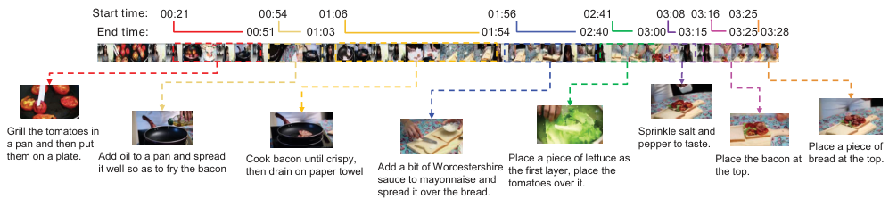

<!-- Start of picture text -->
Start time: 00:21                      00:54          01:06                                            01:56                02:41              03:08  03:16   03:25 End time: 00:51          01:03                                              01:54                      02:40     03:00    03:15       03:25 03:28 Grill the tomatoes in  Sprinkle salt and a pan and then put  pepper to taste. Place a piece of them on a plate. Add oil to a pan and spread it well so as to fry the bacon Cook bacon until crispy, then drain on paper towel Add a bit of Worcestershire  Place a piece of lettuce as the first layer, place the  Place the bacon at the top. bread at the top. sauce to mayonnaise and  tomatoes over it. spread it over the bread. <!-- End of picture text -->

Figure 1: An example from the YouCook2 dataset on making a BLT sandwich. Each procedure step has time boundaries annotated and is described by an English sentence. Video from YouTube with ID: 4eWzsx1vAi8. 

tation, as posed above. In this paper, we directly focus on procedure segmentation. We propose a new dataset of sufficient size and complexity to facilitate investigating procedure segmentation, and we present an automatic procedure segmentation method, called _ProcNets_ . 

Our new dataset, called YouCook21 , contains 2000 videos from 89 recipes with a total length of 176 hours. The procedure steps for each video are annotated with temporal boundaries and described post-hoc by a viewer/annotator with imperative English sentences (see Fig. 1). To reflect the human consensus on how a procedure should be segmented, we annotate each video with two annotators, one for the major effort and the other one for the verification. To the best of our knowledge, this dataset is more than twice as large as the nearest in size and is the only one available to have both temporal boundary annotation and imperative English sentence annotation for the procedure segments. 

We then propose an end-to-end model, named _Procedure Segmentation Networks_ or _ProcNets_ , for procedure segmentation. _ProcNets_ make neither of the assumptions made by existing procedure learning methods: we do not rely on available subtitles and we do not rely on knowledge of the number of segments in the procedure. _ProcNets_ segments a long, unconstrained video into a sequence of category-independent procedure segments. ProcNets have three pieces: 1) context-aware frame-wise feature encoding; 2) procedure segment proposal for localizing segment candidates as start and end timestamps; 3) sequential prediction for learning the temporal structure among the candidates and generating the final proposals through a Recurrent Neural Network (RNN). The intuition is: when humans are segmenting a procedure, they first browse the video to have a general idea where are the salient segments, which is done by our proposal module. Then they finalize the segment boundaries based on the dependencies among the candidates, i.e., which happens after which, achieved by our sequential prediction module. 

For evaluation, we compare variants of our model with competitive baselines on standard metrics and the proposed methods demonstrate top performance against baselines. Furthermore, our detailed study suggests that ProcNets learn the structure of procedures as expected. 

1Dataset website: http://youcook2.eecs.umich.edu 

Our contributions are three-fold. First, we introduce and are the first to tackle the category-independent procedure segmentation problem in untrimmed and unconstrained videos. Second, we collect and distribute a largescale dataset for procedure segmentation in instructional videos. Third, we propose a segment-level recurrent model for proposing semantically meaningful video segments, in contrast to state-of-the-art methods that model temporal dependencies at the frame-level (Zhang et al. 2016). The output procedure segments of ProcNets can be applied for other tasks, including full agent-based procedure learning (Yu and Siskind 2013) or smaller-scale video description generation (Yu et al. 2016; Krishna et al. 2017). 

## **Related Work** 

The approaches in action detection, especially the recent ones based on action proposal (Escorcia et al. 2016), inspire our idea of segmenting video by proposing segment candidates. Early works on action detection mainly use sliding windows for proposing segments (Gaidon, Harchaoui, and Schmid 2013; Oneata, Verbeek, and Schmid 2013). More recently, Shou et al. (Shou, Wang, and Chang 2016) propose a multi-stage convolutional network called Segment CNN (SCNN) and achieves state-of-the-art performance (Jiang et al. 2014). The most similar work to ours is Deep Action Proposals, also DAPs (Escorcia et al. 2016; Krishna et al. 2017), where the model predicts the likelihood of an action proposal to be an action while in our case segment proposal. DAPs determines fixed proposal locations by clustering over the ground-truth segments, while our model learns to localize procedures with anchor offsets, which is a generalization of the location pattern from training to testing instead of directly transferring. 

Another topic similar to ours is action segmentation or labeling (Kuehne, Gall, and Serre 2016; Kuehne, Richard, and Gall 2017; Huang, Fei-Fei, and Niebles 2016; Bojanowski et al. 2014). It addresses the problem of segmenting a long video into contiguous segments that correspond to a sequence of actions. Most recently, Huang et al. (Huang, Fei-Fei, and Niebles 2016) propose to enforce action alignment through frame-wise visual similarities. Kuehne et al. (Kuehne, Richard, and Gall 2017) apply Hidden Markov Models (HMM) to learn the likelihood of image features given hidden action states. Both meth- 

7591

<!-- Page 3 -->

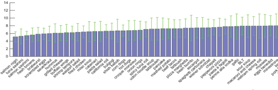

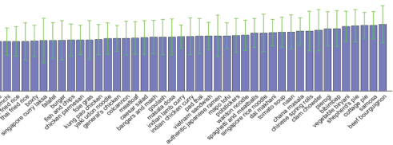

Figure 2: Mean and standard deviation of number of procedure segments for each recipe. 

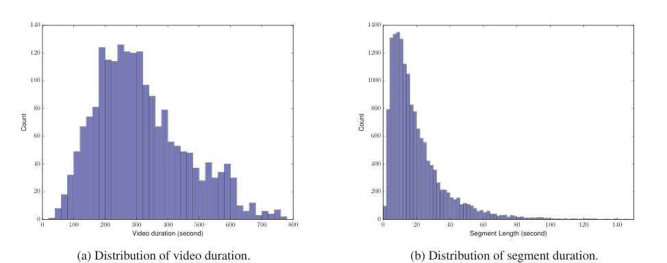

<!-- Start of picture text -->
140 1400 120 1200 100 1000 80 800 60 600 40 400 20 200 0 0 0 100 200 300 400 500 600 700 800 0 20 40 60 80 100 120 140 Video duration (second) Segment Length (second) (a) Distribution of video duration. (b) Distribution of segment duration. Count Count <!-- End of picture text -->

Figure 3: YouCook2 dataset duration statistics. 

ods focus on the transitions between adjacent action states, leaving long-range dependencies not captured. Also, these methods generally assume contiguous action segments with limited or no background activities between segments. Yet, background activities are detrimental to the action localization accuracy (Huang, Fei-Fei, and Niebles 2016). We avoid these problems with a segment proposal module followed by a segment-level dependency learning module. 

## **YouCook2 dataset** 

Existing datasets for analyzing instructional videos suffer from either limited videos (Alayrac et al. 2016; Sener et al. 2015) or weak diversity in background (Regneri et al. 2013) and activities (Kuehne, Arslan, and Serre 2014)). They provide limited or no annotations on procedure segment boundaries or descriptions (Sigurdsson et al. 2016). To this end, we collect a novel cooking video dataset, named YouCook2. 

YouCook2 contains 2000 videos that are nearly equaldistributed over 89 recipes. The recipes are from four major cuisine locales, e.g., Africa, Americas, Asia and Europe, and have a large variety of cooking styles, methods, ingredients and cookwares. The videos are collected from YouTube, where various challenges, e.g., fast camera motion, camera zooms, video defocus, and scene-type changes are present. Table 1 shows the comparison between YouCook2 and other commonly-used instructional video datasets, e.g., YouCook 

(Das et al. 2013), MPII (Rohrbach et al. 2012), 50Salads (Stein and McKenna 2013), Coffee (Alayrac et al. 2016), Breakfast (Kuehne, Arslan, and Serre 2014) and Charades (Sigurdsson et al. 2016). 

Most of the datasets mentioned above have temporally localized action annotations. Compared to action segments, our procedure segments can contain richer semantic information and better capture the human-involved processes in instructional videos. Due to the variety of instructional processes and how each process can be performed, a fixed set of actions fails to describe the details in the video process (e.g., attributes and fine-grained objects). For example, the attribute “crispy” in the recipe step “cook bacon until crispy then drain on paper towel” (see Fig. 1) cannot be described by any action nor activity labels. 

### **Annotations** 

Each video contains 3–16 procedure segments. The segments are temporally localized (timestamps) and described by English sentences in imperative form (e.g., _grill the tomatoes in a pan_ ). An example is shown in Fig. 1. The annotators have access to audio and subtitles but are required to organize and summarize the descriptions in their own way. As indicated in prior work (Baldassano et al. 2017), people generally agree with boundaries of salient events in video and hence we collect one annotation per video. To reflect the 

7592

<!-- Page 4 -->

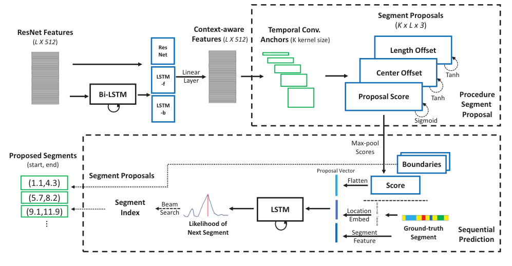

<!-- Start of picture text -->
Segment Proposals ResNet Features Context-aware  Temporal Conv.  ( K x L x 3 ) ( L X 512 ) Features  ( L X 512 ) Anchors  (K kernel size) NetRes Length Offset LSTM Linear Center Offset Tanh -f Layer Bi-LSTM Proposal Score Tanh Procedure LSTM Segment -b Proposal Sigmoid Max-pool Scores Proposed Segments (start, end) Boundaries Proposal Vector (1.1,4.3) Segment Proposals Flatten Score (9.1,11.9)(5.7,8.2) Segment Index SearchBeam Likelihood of  LSTM LocationEmbed 0010…000 Next Segment Segment Ground-truth  Sequential Feature Segment Prediction … <!-- End of picture text -->

Figure 4: Schematic illustration of the ProcNets. The input are the frame-wise ResNet features (by row) for a video. The output are the proposed procedure segments. First, the bi-directional LSTM embeds the ResNet features into context-aware features. Then, the procedure segment proposal module generates segment candidates. Finally, the sequential prediction module selects the final proposals for output. During training, the ground-truth segments are embedded to composite the sequential prediction input, which are replaced with beam-searched segment in testing (as shown in the dashed arrows). 

Table 1: Comparisons of instructional video datasets. UnCons. stands for Unconstrained Scene and Proc. Ann. is short for Procedure Annotation. 

|**Name**|**Duration**|**UnCons.**|**Proc. Ann.**|
|---|---|---|---|
|YouCook|140 m|Yes|No|
|MPII|490 m|No|No|
|50Salads|320 m|No|No|
|Coffee|120 m|Yes|No|
|Breakfast|67 h|Yes|No|
|Charades|82h|Yes|No|
|**YouCook2**|**176h**|**Yes**|**Yes**|

segments per recipe are shown in Fig. 2. The distribution of video duration is shown in Fig. 3(a). The total video length is 175.6 hours with an average duration of 5.27 min per video. All the videos remain untrimmed and can be up to 10 min. The distribution of segment durations is shown in Fig. 3(b) with mean and standard deviation of 19.6s and 18.2s, respectively. The longest segment lasts 264s and the shortest one lasts 1s. For the recipe descriptions, the total vocabulary is around 2600 words. 

We randomly split the dataset to 67%:23%:10% for training, validation and testing according to each recipe. Note that we also include unseen recipes from other datasets for analyzing the generalization ability of the models discussed. 

human consensus on how a procedure should be segmented, we annotate each video with two annotators, one for the major effort and the other one for verification. We also set up a series of restrictions on the annotation to enforce this consensus among different annotators. We have found that consensus is comparatively easy to achieve given the grounded nature of the instructional video domain. 

Note that in this paper, we only use the temporal boundary annotations. We make the recipe descriptions available for future research. 

### **Statistics and Splits** 

The average number of segments per video is 7.7 and the mean and standard deviation of the number of procedure 

## **Procedure Segmentation Networks** 

We propose Procedure Segmentation Networks (ProcNets) for segmenting an untrimmed and unconstrained video into a sequence of procedure segments. We accomplish this by three core modules: 1) context-aware video encoding; 2) segment proposal module that localizes a handful of proposal candidates; 3) sequential prediction that predicts final segments based on segment-level dependencies among candidates. At training, ProcNets are given ground-truth procedure segment boundaries for each video; no recipe categories or segment descriptions are given. At testing, for any given unseen video, ProcNets propose and localize procedure segments in the video based on their visual appearance and temporal relations. The overall network structure 

7593

<!-- Page 5 -->

is shown in Fig. 4 and next, we explain each component. 

### **Context-Aware Video Encoding** 

Define a video as **x** = _{x_ 1 _, x_ 2 _, . . . , xL}_ , where _L_ denotes the number of sampled frames and _xi_ is the frame-wise CNN feature vector with fixed encoding size. In this paper _L_ = 500 and encoding size is 512. We use ResNet (He et al. 2016) as the appearance feature extractor for its stateof-the-art performance in image classification. We then forward the ResNet features through a bi-directional long shortterm memory (Bi-LSTM) (Graves and Schmidhuber 2005) as context encoding. The outputs (forward and backward) are concatenated with the ResNet feature at each frame and the feature dimension is reduced to the same as ResNet feature for a fair comparison. We call these frame-wise _contextaware features_ , denoted as _bi_ = Bi-LSTM( **x** ). Empirically, Bi-LSTM encoder outperforms context-free ResNet feature and LSTM-encoded feature by a relative 9% on our evaluation metric. 

### **Procedure Segment Proposal** 

Inspired by the anchor-offset mechanism for spatial object proposal, such as in Faster R-CNN (Ren et al. 2015), we design a set of _K_ explicit anchors for segment proposal. Each anchor has the length: _lk_ ( _k_ = 1 _,_ 2 _, .., K_ ) and their centers cover all the frames. 

Each anchor-based proposal is represented by a proposal score and two offsets (center and length), from the output of a temporal convolution applied on the context-aware feature. The score indicates the likelihood for an anchor to be a procedure segment and the offsets are used to adjust the proposed segment boundaries. By zero-padding the video encoding at the boundaries (depending on anchor sizes), we obtain score and offset matrices of size _K × L_ (see upper right of Fig. 4) respectively, and hence the output of proposal module is _K × L ×_ 3. Sigmoid function and Tanh functions are applied for proposal score and offsets, respectively. 

We formulate the proposal generation as a classification problem and proposal offset as a regression problem. The segment proposals are classified as procedure segment or non-procedure segment with binary cross-entropy loss applied. During training, the segment proposals having at least 0 _._ 8 IoU (Intersection over Union) with any ground-truth segments are regarded as positive samples and these having IoU less than 0 _._ 2 with all the ground-truth are treated as negative samples. We randomly pick _U_ samples from positive and negative separately for training. Then for the positive samples, we regress the proposed length and center offsets to the ground-truth ones from a relative scale. Given a groundtruth segment with center _cg_ and length _lg_ , the target offsets ( _θc_ , _θl_ ) w.r.t. anchor (center _ca_ and length _la_ ) are given by: 

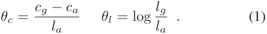

Smooth _l_ 1-loss (Ren et al. 2015) is applied in a standard way. For inference, the proposed offsets adjust the anchor location towards the final prediction location. 

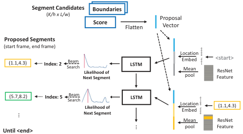

<!-- Start of picture text -->
Segment Candidates Boundaries ( K/h x L/w ) Proposal Score Flatten Vector Proposed Segments (start frame, end frame) (1.1,4.3) Index: 2 SearchBeam Next SegmentLikelihood of  LSTM LocationEmbedMeanpool 0000…001 <start> FeatureResNet (5.7,8.2) Index: 5 SearchBeam Next SegmentLikelihood of  LSTM LocationEmbed 0100…000 (1.1,4.3) Mean ResNet pool Feature Until <end> … … <!-- End of picture text -->

Figure 5: An example on sequential prediction during inference with unrolled LSTM. The _<_ start _>_ token is feed into model at time 0. The previously generated segment is feed into model at time 1. Best view in color. 

### **Sequential Prediction** 

Contrary to spatial objects, video procedure segments, by their nature, have strong temporal dependencies and yet ambiguous temporal boundaries. Therefore, we treat them differently. Recently, modeling frame-level temporal dependency in video has been explored (Zhang et al. 2016). However, memorizing dependencies over enormous frames is still challenging for recurrent models to date (Singh et al. 2016). In contrast, we propose to learn segment-level dependency because the number of proposal segments could be fewer so learning dependencies over segments are more tractable. By leveraging the segment-level dependency, we predict the sequence of procedure segments while dynamically determine the number of segments to propose. 

We use long short-term memory (LSTM) for sequential prediction due to its state-of-the-art performance in sequence modeling (Xu et al. 2016; Zhang et al. 2016). The input of LSTM is constructed from three parts: 1) Proposal Vector **S** : max-pooled proposal scores from the proposal module, fixed over time; 2) Location Embedding _Bt_ : a set of vectors that discretely encode the locations of groundtruth or previously generated segments; 3) Segment Content _Ct_ : the visual features of the ground-truth or previously generated segments. The tuple ( **S** _, Bt, Ct_ ) _, t_ = 1 _,_ 2 _, ..., N_ , is concatenated as the input to LSTM at each time step _t_ . Intuitively, when we learn to choose a few winners from a pool of candidates, we need to know who and how good they are (Proposal Vector), what they look like (Segment Content) and the target candidates (location embedding). We will detail each component after introducing the overall model first. 

The softmax output of LSTM is the likelihood of each proposal being the next segment prediction. Therefore, the likelihood for the entire procedure segment sequence _ϵ_ 1 _, ..., ϵS_ of a video can be formulated as: 

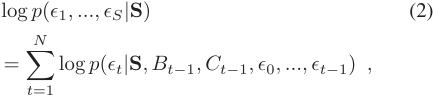

where _ϵ_ 0 is the special _<_ start _>_ segment token, _B_ 0 is the em- 

7594

<!-- Page 6 -->

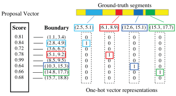

Figure 6: An example on converting ground-truth segments into one-hot vector representations from Proposal Vector. 

bedding for the _<_ start _>_ token, _C_ 0 is the meal-pooled video feature over all frames, _Bt−_ 1 and _Ct−_ 1 are determined by _ϵt−_ 1. The objective is to maximize the segment sequence likelihood for all training videos. We apply cross-entropy loss to the likelihood output _Pt_ at time step _t_ given the ground-truth segment index. During inference, we sample a sequence of segment indexes with beam search (Vinyals et al. 2015; Donahue et al. 2015). In our experiments, simply set the beam size to 1 yields the best result, i.e., greedily picking the index with the maximal likelihood as the next proposed segment. The algorithm terminates when the special _<_ end _>_ token is picked. An example is shown in Fig. 5. Next, we describe the three input vectors in details. 

**Proposal Vector.** As shown at the middle right of Fig. 4, we apply max-pooling to proposal score to filter out proposals with low proposal scores. The max-pooling kernel size is _h × w_ and so as its stride, i.e., no overlapping. Empirically, _h_ = 8 and _w_ at 4 or 5 yields the best results. Given the filtered proposals (score and offsets), we flatten the proposal scores into a vector **S** by columns as Proposal Vector, which encodes the location and confidence information of all likely segment candidates in a video. 

**Location Embedding.** During training, each ground-truth segment is represented by a one-hot vector where the index of one matches to the nearest proposal candidate as illustrated in Fig. 6. This discrete representation of location is easier to learn than continuous location values. Through a trainable embedding matrix (similar to word embedding in language modeling), this one-hot vector maps to a vector, which we call Location Embedding vector and depicts the location information of a segment. This Location Embedding vector has the same size as the Proposal Vector. During testing, we greedily sample the softmax output of LSTM at previous time step to form location embedding for the current time step. Location Embedding represents the previous selected candidate, i.e., who we have and who we need next. **Segment Content.** We then encode the visual content for the candidate represented in the one-hot vector. We meanpool the video ResNet feature bounded by the start and end timestamps of the candidate. Its dimension is reduced to the same as Proposal Vector by a fully-connected layer. Segment Content indicates what the candidate looks like. 

**Relations to Other Models.** To the best of our knowledge, we are the first to apply segment-level sequential modeling 

on category-independent procedure segments. The proposed model builds the video temporal structure without the need of knowing the hidden states such as in HMM. Note that there are other design choices. 

**Non-Maximal Suppression (NMS).** In terms of proposal selection, a commonly adopted method in object detection (Ren et al. 2015) or action detection (Shou, Wang, and Chang 2016) is NMS. This approach fails to capture the temporal structure or segment dependencies of instructional videos. We consider it as a baseline in our experiment along with our sequential prediction model. 

**Other Time Sequence Models.** Other methods for proposing segments have rigid model configurations, such as an HMM or pre-defined “grammar” for the whole video, which is infeasible for general video structure inference. 

### **Loss Function** 

The loss function for procedure segmentation network consists of three parts, the binary cross-entropy loss for procedureness classification, the smooth _l_ 1-loss (Ren et al. 2015) for offset regression and the cross-entropy loss for sequential prediction. The formulations are as follows: 

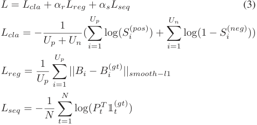

where _Up_ and _Un_ are the number of positive and negative samples, respectively, _Si_(_pos_) and _Si_(_neg_) represents their scores, _Bi_(_gt_) is the ground-truth boundary corresponding to positive sample _i_ , _Pt_ is the softmax output of LSTM at time _t_ and 1( _t__gt_) is one-hot vector of ground-truth segment index. Discount factors _αr_ and _αs_ are applied to balance the contributions of the regression loss and sequential prediction loss, respectively. Empirically, equally weighting each part, i.e. _αr_ = _αs_ = 1, yields good results. 

## **Experiments and Results** 

In this section, we benchmark our new dataset on procedure segmentation with competitive baselines and our proposed methods under standard metrics. We also show ablation studies, qualitative results and analysis on the procedure structure learned by our approach. **Baselines.** We compare our methods against state-of-theart methods in video summarization and action proposal due to lack of direct baselines in our new problem. These methods include: 1) Video Summarization LSTM (vsLSTM) (Zhang et al. 2016), 2) Segment CNN for proposals (SCNNprop) (Shou, Wang, and Chang 2016). The major difference between ProcNets and vsLSTM is, our model learns the segment-level temporal dependency while vsLSTM learns 

7595

<!-- Page 7 -->

the frame-level temporal dependency. SCNN-prop is the proposal module of action detector SCNN, which achieves state-of-the-art performance in action proposal.2 In addition, we also evaluate a uniform segment baseline (denoted as Uniform). Two variants of ProcNets are evaluated, one with all the modules (ProcNets-LSTM) and one that replaces sequential prediction with NMS (ProcNets-NMS). Finally, note that we compare with no action segmentation methods since these approaches require an action pool and directly model the finite action states (e.g., with HMM) which requires the “grammar” of the video procedure; both of these needs violate the core assumptions in this paper. 

**Metrics.** For procedure segmentation, we adopt two standard metrics for evaluating segment proposals: Jaccard (Bojanowski et al. 2014) and mean Intersection over Union (mIoU). In Jaccard measure, the maximal intersection over prediction between all the final proposals and each groundtruth segment is computed and averaged. The individual Jaccard for each video is then averaged as the overall Jaccard. mIoU replaces the intersection over prediction in Jaccard with intersection over union (IoU). Hence, mIoU penalizes all the misalignment of segments while Jaccard only penalizes the partition of proposal beyond the ground truth. All the methods except for ProcNets-LSTM output 7 segments per video, determined by the average number of segments in the training set. Note that the average number of proposals from ProcNets-LSTM is also around 7, makes that a fair comparison. Inspired by the average recall metric in action proposal (Escorcia et al. 2016), we also report the proposal averaged recall, precision and F1 score but with limited segments (10 per video), as motivated in Introduction section. 

**Data Preprocessing.** To preserve the overall information in the videos, we uniformly down-sample 500 frames for each video in YouCook2. The average sample rate is 1.58 fps. To further enlarge the training samples, we temporally augment the data, i.e., sample each video 10 times with temporal shifts. Then, we extract the frame-wise ResNet-34 feature (He et al. 2016),3 pretrained on both ImageNet (Deng et al. 2009) and MSCOCO caption (Lin et al. 2014; Zhou et al. 2016). Hence, each video is represented as a sequence of image spatial features. Local motion features are not used in our study; they may further improve performance. 

**Implementation and Training Details.** The sizes of the temporal conv. kernels (also anchor length) are from 3 to 123 with an interval of 8, which covers 95% of the segment durations in training set. The 16 explicit anchors centered at each frame, i.e., stride for temporal conv. is 1. We randomly select _U_ = 100 samples from all the positive and negative samples respectively and feed in negative samples if positive ones are less than _U_ . Our implementation is in Torch. All the LSTMs have one layer and 512 hidden units. For hyperparameters, the learning rate is 4 _×_ 10_−_5 . We use the Adam optimizer (Kingma and Ba 2014) for updating weights with _α_ = 0 _._ 8 and _β_ = 0 _._ 999. Note that we disable the CNN 

2New results comparing DAPs and SCNN-prop: https://github. com/escorciav/daps/wiki 

3Torch implementation of ResNet by Facebook: https://github. com/facebook/fb.resnet.torch 

Table 2: Results on temporal segmentation. Top two scores are highlighted. See text for details. 

|**Method (%)**|**valida** **Jaccard**|**tion** **mIoU**|**tes** **Jaccard**|**t** **mIoU**|
|---|---|---|---|---|
|Uniform|41.5|**36.0**|40.1|**35.1**|
|vsLSTM|47.2|33.9|45.2|32.2|
|SCNN-prop|46.3|28.0|45.6|26.7|
|ProcNets-NMS (ours)|**49.8**|35.2|**47.6**|33.9|
|ProcNets-LSTM (ours)|**51.5**|**37.5**|**50.6**|**37.0**|

Table 3: Ablation study on LSTM input. We remove either Proposal Vector (as _-Proposal Vec_ ), Location Embedding (as _-Location Emb_ ) or Segment Content (as _-Segment Feat_ ). 

||**Jaccard**|**mIoU**|
|---|---|---|
|Full model|50.6|37.0|
|_-Proposal Vec_|47.6|36.1|
|_-Location Emb_|46.2|35.1|
|_-Segment Feat_|49.0|36.4|

fine-tuning which heavily slows down the training process. 

### **Procedure Segmentation Results** 

We report the procedure segmentation results on both validation and testing sets in Tab. 2. The proposed ProcNetsLSTM model outperforms all other methods by a huge margin in both Jaccard and mIoU. SCNN-prop (Shou, Wang, and Chang 2016) suffers in our sequential segmentation task result from the lack of sequential modeling. vsLSTM (Zhang et al. 2016) models frame-level temporal dependency and shows superior results than SCNN-prop. However, our model learns segment-level temporal dependency and yields better segmentation results, which shows its effectiveness. Uniform baseline shows competitive results and the possible reason is, in instruction videos, generally procedures span the whole video which favors segments that can cover the majority of video. For the rest experiments, all the results are on testing set. 

**Ablation study on sequential prediction.** The input of the sequence modeling LSTM is the concatenation of three parts: Proposal Vector, Location Embedding and Segment Content. We remove either one of them as the ablation study. Results are shown in Tab. 3. Unsurprisingly, the proposal scores (Proposal Vector) play a significant role in determining the final proposals. When this information is unavailable, the overall performance drops by 6% on Jaccard relatively. The Location Embedding encodes the location information for ground-truth segments and is the most important component for procedure structure learning. Jaccard and mIoU scores drop by 8.7% and 5.1% relatively when location embedding is not available. The segment visual feature has less impact on the sequence prediction, which implies the visual information represented in the video appearance feature is noisy and less informative. 

**Proposal localization accuracy.** We study the proposal localization problem when each model proposes 10 seg- 

7596

<!-- Page 8 -->

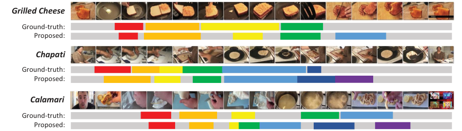

<!-- Start of picture text -->
Grilled Cheese Ground-truth: Proposed: Chapati Ground-truth: Proposed: Calamari Ground-truth: Proposed: <!-- End of picture text -->

Figure 7: Qualitative results from test set. YouTube IDs: BlTCkNkfmRY, jD4o ~~L~~ my6bU and jrwHN188H2I. 

Table 4: Results on segment localization accuracy. Top two scores are highlighted. 

|**Method (%)**|**Recall**|**Precision**|**F1**|
|---|---|---|---|
|vsLSTM|22.1|**24.1**|23.0|
|SCNN-prop|**28.2**|23.2|**25.4**|
|ProcNets-NMS|**37.1**|**30.4**|**33.4**|

**_Pancake_** ~~Va Vb~~ Ground-truth: Original: Permuted: 

Figure 8: An example output of ProcNets on the original and the permutated video. YouTube ID: ejq2ZsHgwFk. 

ments per video. Note that the metrics used here are not suitable for ProcNets-LSTM as they impose a fixed number of segments, where ProcNets-LSTM learns that automatically; nonetheless, we evaluate ProcNets-NMS for the quality of procedure segment proposal. The average recall, precision and F1 are shown in Tab. 4. The IoU threshold for true positive is 0.5. SCNN-prop shows competitive localization results as expected. vsLSTM yields inferior localization accuracy even though it performs better than SCNN-prop on segmentation. Our proposed model has more than 9% and 7% higher recall and precision than the baselines. **Qualitative results.** We demonstrate qualitative results with videos from YouCook2 test set (see Fig. 7). The model can accurately localize some of the segments and predict their lengths. Moreover, the number of segments proposed is adapted to individual videos and the model learns to propose fewer segments at the beginning and the end of the video, where usually no cooking processes happen. In the example of _making Grilled Cheese_ , ProcNets propose the fifth segment to cover the process of cutting bread slices into two pieces. This trivial segment is not annotated but is still semantically meaningful. 

**Analysis on temporal structure learning.** We conduct additional experiments to evaluate the temporal structure learning capability of ProcNets. For a given testing video, denote the first half as _Va_ and the second half as _Vb_ . We 

inverse the order of _VaVb_ to _VbVa_ to construct the permutated video. We evaluate our model on both original test set and the permutated test set. The performance of pre-trained ProcNets decreases by over a half in the permutated set and 10%-20% of the videos only have segments predicted at the beginning of _Vb_ (see Fig. 8). We believe reasons are two. First, the model captures the ending content in _Vb_ and terminates the segment generation within _Vb_ . Second, the temporal structure of _Va_ has no dependencies on _Vb_ and hence is ignored by the model. 

## **Conclusion** 

We introduce a new problem called procedure segmentation to study human consensus on how a procedure is structured from unconstrained videos. Our proposed ProcNets take frame-wise video features as the input and predict procedure segments exist in the video. We evaluate the model against competitive baselines on the newly collected largescale cooking video dataset with standard metrics and show significant improvements. Besides, ProcNets are capable of inferring the video structure by video content and modeling the temporal dependencies among procedure segments. For future work, there are two extensions of the current work. The first one is dense video captioning. The other one is weakly supervised segmentation, which is to first align the weak audio/subtitle signal with the video and then train our model with the aligned annotation. 

**Acknowledgement.** This work has been supported in part by Google, ARO W911NF-15-1-0354, NSF CNS 1463102, NSF CNS 1628987, NSF NRI 1522904 and NSF BIGDATA 1741472. This article solely reflects the opinions and conclusions of its authors and neither Google, ARO nor NSF. We sincerely thank our colleagues Vikas Dhiman, Madan Ravi Ganesh and Ryan Szeto for their helpful discussions. We also thank Mingyang Zhou, Yichen Yao, Haonan Chen, Carolyn Busch and Dali Zhang for their efforts in constructing the dataset. 

## **References** 

Al-Omari, M.; Duckworth, P.; Hogg, D. C.; and Cohn, A. G. 2017. Natural language acquisition and grounding for embodied robotic systems. In _AAAI_ , 4349–4356. 

7597

<!-- Page 9 -->

Alayrac, J.-B.; Bojanowski, P.; Agrawal, N.; Sivic, J.; Laptev, I.; and Lacoste-Julien, S. 2016. Unsupervised learning from narrated instruction videos. In _CVPR_ , 4575–4583. 

Baldassano, C.; Chen, J.; Zadbood, A.; Pillow, J. W.; Hasson, U.; and Norman, K. A. 2017. Discovering event structure in continuous narrative perception and memory. _Neuron_ 95(3):709–721. 

Bojanowski, P.; Lajugie, R.; Bach, F.; Laptev, I.; Ponce, J.; Schmid, C.; and Sivic, J. 2014. Weakly supervised action labeling in videos under ordering constraints. In _ECCV_ , 628–643. Springer. 

Bojanowski, P.; Lajugie, R.; Grave, E.; Bach, F.; Laptev, I.; Ponce, J.; and Schmid, C. 2015. Weakly-supervised alignment of video with text. In _CVPR_ , 4462–4470. 

Chen, W.; Xiong, C.; Xu, R.; and Corso, J. J. 2014. Actionness ranking with lattice conditional ordinal random fields. In _CVPR_ , 748–755. 

Das, P.; Xu, C.; Doell, R. F.; and Corso, J. J. 2013. A thousand frames in just a few words: Lingual description of videos through latent topics and sparse object stitching. In _CVPR_ , 2634–2641. 

Deng, J.; Dong, W.; Socher, R.; Li, L.-J.; Li, K.; and Fei-Fei, L. 2009. Imagenet: A large-scale hierarchical image database. In _CVPR_ , 248–255. 

Donahue, J.; Anne Hendricks, L.; Guadarrama, S.; Rohrbach, M.; Venugopalan, S.; Saenko, K.; and Darrell, T. 2015. Long-term recurrent convolutional networks for visual recognition and description. In _CVPR_ , 2625–2634. 

Escorcia, V.; Heilbron, F. C.; Niebles, J. C.; and Ghanem, B. 2016. Daps: Deep action proposals for action understanding. In _ECCV_ , 768–784. Springer. 

Gaidon, A.; Harchaoui, Z.; and Schmid, C. 2013. Temporal localization of actions with actoms. _TPAMI_ 35(11):2782–2795. Graves, A., and Schmidhuber, J. 2005. Framewise phoneme classification with bidirectional lstm and other neural network architectures. _Neural Networks_ 18(5):602–610. 

He, K.; Zhang, X.; Ren, S.; and Sun, J. 2016. Deep residual learning for image recognition. In _CVPR_ , 770–778. 

Huang, D.-A.; Fei-Fei, L.; and Niebles, J. C. 2016. Connectionist temporal modeling for weakly supervised action labeling. In _ECCV_ , 137–153. Springer. 

Jiang, Y.-G.; Liu, J.; Roshan Zamir, A.; Toderici, G.; Laptev, I.; Shah, M.; and Sukthankar, R. 2014. THUMOS challenge: Action recognition with a large number of classes. http://crcv.ucf. edu/THUMOS14/. 

Kingma, D., and Ba, J. 2014. Adam: A method for stochastic optimization. _arXiv preprint arXiv:1412.6980_ . 

Krishna, R.; Hata, K.; Ren, F.; Fei-Fei, L.; and Niebles, J. C. 2017. Dense-captioning events in videos. _ICCV_ . 

Kuehne, H.; Arslan, A.; and Serre, T. 2014. The language of actions: Recovering the syntax and semantics of goal-directed human activities. In _CVPR_ , 780–787. 

Kuehne, H.; Gall, J.; and Serre, T. 2016. An end-to-end generative framework for video segmentation and recognition. In _WACV_ , 1–8. Kuehne, H.; Richard, A.; and Gall, J. 2017. Weakly supervised learning of actions from transcripts. _CVIU_ . 

Oneata, D.; Verbeek, J.; and Schmid, C. 2013. Action and event recognition with fisher vectors on a compact feature set. In _ICCV_ , 1817–1824. 

Regneri, M.; Rohrbach, M.; Wetzel, D.; Thater, S.; Schiele, B.; and Pinkal, M. 2013. Grounding action descriptions in videos. _Transactions of the Association for Computational Linguistics_ 1:25–36. 

Ren, S.; He, K.; Girshick, R.; and Sun, J. 2015. Faster r-cnn: Towards real-time object detection with region proposal networks. In _NIPS_ , 91–99. 

Rohrbach, M.; Amin, S.; Andriluka, M.; and Schiele, B. 2012. A database for fine grained activity detection of cooking activities. In _CVPR_ , 1194–1201. 

Sener, O.; Zamir, A. R.; Savarese, S.; and Saxena, A. 2015. Unsupervised semantic parsing of video collections. In _ICCV_ , 4480– 4488. 

Shou, Z.; Wang, D.; and Chang, S.-F. 2016. Temporal action localization in untrimmed videos via multi-stage cnns. In _CVPR_ , 1049–1058. 

Sigurdsson, G. A.; Varol, G.; Wang, X.; Farhadi, A.; Laptev, I.; and Gupta, A. 2016. Hollywood in homes: Crowdsourcing data collection for activity understanding. In _ECCV_ . 

Singh, B.; Marks, T. K.; Jones, M.; Tuzel, O.; and Shao, M. 2016. A multi-stream bi-directional recurrent neural network for finegrained action detection. In _CVPR_ , 1961–1970. 

Stein, S., and McKenna, S. J. 2013. Combining embedded accelerometers with computer vision for recognizing food preparation activities. In _Proceedings of the 2013 ACM international joint conference on Pervasive and ubiquitous computing_ , 729–738. ACM. 

Vinyals, O.; Toshev, A.; Bengio, S.; and Erhan, D. 2015. Show and tell: A neural image caption generator. In _CVPR_ , 3156–3164. Wang, L.; Xiong, Y.; Wang, Z.; Qiao, Y.; Lin, D.; Tang, X.; and Van Gool, L. 2016. Temporal segment networks: towards good practices for deep action recognition. In _ECCV_ , 20–36. Springer. Xu, J.; Mei, T.; Yao, T.; and Rui, Y. 2016. Msr-vtt: A large video description dataset for bridging video and language. In _CVPR_ , 5288–5296. 

Yeung, S.; Russakovsky, O.; Mori, G.; and Fei-Fei, L. 2016. Endto-end learning of action detection from frame glimpses in videos. In _CVPR_ , 2678–2687. 

Yu, H., and Siskind, J. M. 2013. Grounded language learning from video described with sentences. In _ACL_ , 53–63. 

Yu, H., and Siskind, J. M. 2015. Learning to describe video with weak supervision by exploiting negative sentential information. In _AAAI_ , 3855–3863. 

Yu, H.; Wang, J.; Huang, Z.; Yang, Y.; and Xu, W. 2016. Video paragraph captioning using hierarchical recurrent neural networks. In _CVPR_ , 4584–4593. 

Zhang, K.; Chao, W.-L.; Sha, F.; and Grauman, K. 2016. Video summarization with long short-term memory. In _ECCV_ , 766–782. Springer. 

Zhou, L.; Xu, C.; Koch, P.; and Corso, J. J. 2016. Watch what you just said: Image captioning with text-conditional attention. _arXiv preprint arXiv:1606.04621_ . 

Lin, T.-Y.; Maire, M.; Belongie, S.; Hays, J.; Perona, P.; Ramanan, D.; Doll´ar, P.; and Zitnick, C. L. 2014. Microsoft coco: Common objects in context. In _ECCV_ , 740–755. Springer. 

Malmaud, J.; Huang, J.; Rathod, V.; Johnston, N.; Rabinovich, A.; and Murphy, K. 2015. What’s cookin’? interpreting cooking videos using text, speech and vision. _arXiv preprint arXiv:1503.01558_ . 

7598
