# 002_Cross-task weakly supervised learning from instructional videos

[Original PDF](../002_Cross-task%20weakly%20supervised%20learning%20from%20instructional%20videos.pdf)

Pages: 18

> Automatically converted from PDF. Check the original for exact equations, symbols, table alignment, and figure details.

<!-- Page 1 -->

**Cross-task weakly supervised learning from instructional videos** 

Dimitri Zhukov1,2 

Jean-Baptiste Alayrac1,3 Ivan Laptev1,2 

# **Abstract** 

_In this paper we investigate learning visual models for the steps of ordinary tasks using weak supervision via instructional narrations and an ordered list of steps instead of strong supervision via temporal annotations. At the heart of our approach is the observation that weakly supervised learning may be easier if a model shares components while learning different steps: “pour egg” should be trained jointly with other tasks involving “pour” and “egg”. We formalize this in a component model for recognizing steps and a weakly supervised learning framework that can learn this model under temporal constraints from narration and the list of steps. Past data does not permit systematic studying of sharing and so we also gather a new dataset, CrossTask, aimed at assessing cross-task sharing. Our experiments demonstrate that sharing across tasks improves performance, especially when done at the component level and that our component model can parse previously unseen tasks by virtue of its compositionality._ 

# **1. Introduction** 

Suppose you buy a fancy new coffee machine and you would like to make a latte. How might you do this? After skimming the instructions, you may start watching instructional videos on YouTube to figure out what each step entails: how to press the coffee, steam the milk, and so on. In the process, you would obtain a good visual model of what each step, and thus the entire task, looks like. Moreover, you could use parts of this visual model of making lattes to help understand videos of a new task, e.g., making filter coffee, since various nouns and verbs are shared. The goal of this paper is to build automated systems that can 

> 1Inria, France 

> 2D´epartement d’informatique de l’Ecole Normale Sup´erieure, PSL Research University, Paris, France 

> 3Now at DeepMind 

> 4Middle East Technical University, Ankara, Turkey 

> 5University of Michigan, Ann Arbor, MI 

> 6CIIRC – Czech Institute of Informatics, Robotics and Cybernetics at the Czech Technical University in Prague 

Ramazan Gokberk Cinbis4 David Fouhey5 Josef Sivic1,2,6 

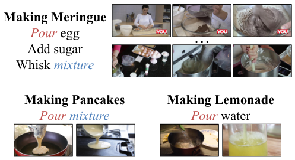

<!-- Start of picture text -->
Making Meringue Add sugar Pour  egg … Whisk  mixture Making Pancakes Making Lemonade Pour mixture Pour  water <!-- End of picture text -->

Figure 1. Our method begins with a collection of tasks, each consisting of an ordered list of steps and a set of instructional videos from YouTube. It automatically discovers both where the steps occur and what they look like. To do this, it uses the order, narration and commonalities in appearance across tasks (e.g., the appearance of _pour_ in both _making pancakes_ and _making meringue_ ). 

similarly learn visual models from instructional videos and in particular, make use of shared information across tasks (e.g., making lattes and making filter coffee). 

The conventional approach for building visual models of how to do things [8, 30, 31] is to first annotate each step of each task in time and then train a supervised classifier for each. Obtaining strong supervision in the form of temporal step annotations is time-consuming, unscalable and, as demonstrated by humans’ ability to learn from demonstrations, unnecessary. Ideally, the method should be weakly supervised (i.e., like [1, 18, 22, 29]) and jointly learn _when_ steps occur and _what_ they look like. Unfortunately, any weakly supervised approach faces two large challenges. Temporally localizing steps in the input videos for each task is hard as there is a combinatorial set of options for the step locations; and, even if the steps were localized, each visual model learns from limited data and may work poorly. 

We show how to overcome these challenges by sharing across tasks and using weaker and naturally occurring forms of supervision. The related tasks let us learn better visual models by exploiting commonality across steps as illustrated in Figure 1. For example, while learning about _pour water_ in _making latte_ , the model for _pour_ also depends on _pour milk_ in _making pancakes_ and the model for _water_ also 

1

<!-- Page 2 -->

depends on _put vegetables in water_ in _making bread and butter pickles_ . We assume an ordered list of steps is given per task and that the videos are instructional (i.e., have a natural language narration describing what is being done). As it is often the case in weakly supervised video learning [2, 18, 29], these assumptions constrain the search for when steps occur, helping tackle a combinatorial search space. 

We formalize these intuitions in a framework, described in Section B, that enables compositional sharing across tasks together with temporal constraints for weakly supervised learning. Rather than learning each step as a monolithic weakly-supervised classifier, our formulation learns a component model that represents the model for each step as the combination of models of its components, or the words in each step (e.g., _pour_ in _pour water_ ). This empirically improves learning performance and these component models can be recombined in new ways to parse videos for tasks for which it was not trained, simply by virtue of their representation. This component model, however, prevents the direct application of techniques previously used for weakly supervised learning in similar settings (e.g., DIFFRAC [3] in [2]); we therefore introduce a new and more general formulation that can handle more arbitrary objectives. 

Existing instructional video datasets do not permit the systematic study of this sharing. We gather a new dataset, CrossTask, which we introduce in Section C. This dataset consists of 4.7K instructional videos for 83 different tasks, covering 376 hours of footage. We use this dataset to compare our proposed approach with a number of alternatives in experiments described in Section D. Our experiments aim to assess the following three questions: how well does the system learn in a standard weakly supervised setup; can it exploit related tasks to improve performance; and how well can it parse previously unseen tasks. 

The paper’s contributions include: **(1)** A component model that shares information between steps for weakly supervised learning from instructional videos; **(2)** A weakly supervised learning framework that can handle such a model together with constraints incorporating different forms of weak supervision; and **(3)** A new dataset that is larger and more diverse than past efforts, which we use to empirically validate the first two contributions. We make our dataset and our code publically available1 . 

# **2. Related Work** 

Learning the visual appearance of steps of a task from instructional videos is a form of action recognition. Most work in this area, e.g., [8, 30, 31], uses strong supervision in the form of direct labels, including a lot of work that focuses on similar objectives [9, 11, 14]. We build our feature representations on top of advances in this area [8], but our 

proposed method does not depend on having lots of annotated data for our problem. 

We are not the first to try to learn with weak supervision in videos and our work bears resemblances to past efforts. For instance, we make use of ordering constraints to obtain supervision, as was done in [5, 18, 22, 26, 6]. The aim of our work is perhaps closest to [1, 24, 29] as they also use narrations in the context of instructional videos. Among a number of distinctions with each individual work, one significant novelty of our work is the compositional model used, where instead of learning a monolithic model independently per-step as done in [1, 29], the framework shares components (e.g., nouns and verbs) across steps. This sharing improves performance, as we empirically confirm, and enables the parsing of unseen tasks. 

In order to properly evaluate the importance of sharing, we gather a dataset of instructional videos. These have attracted a great deal of attention recently [1, 2, 19, 20, 24, 29, 35] since the co-occurrence of demonstrative visual actions and natural language enables many interesting tasks ranging from coreference resolution [19] to learning person-object interaction [2, 10]. Existing data, however, is either not large (e.g., only 5 tasks [2]), not diverse (e.g., YouCookII [35] is only cooking), or not densely temporally annotated (e.g., What’s Cooking? [24]). We thus collect a dataset that is: **(i)** relatively large (83 tasks, 4.7K videos); **(ii)** simultaneously diverse (Covering car maintenance, cooking, crafting) yet also permitting the evaluation of sharing as it has related tasks; and **(iii)** annotated for temporal localization, permitting evaluation. The scale, and relatedness, as we demonstrate empirically contribute to increased performance of visual models. 

Our technical approach to the problem builds particularly heavily on the use of discriminative clustering [3, 32], or the simultaneous constrained grouping of data samples and learning of classifiers for groups. Past work in this area has either had operated with complex constraints and a restricted classifier (e.g., minimizing the L2 loss with linear model [3, 2]) or an unrestricted classifier, such as a deep network, but no constraints [4, 7]. Our weakly supervised setting requires the ability to add constraints in order to converge to a good solution while our compositional model and desired loss function requires the ability to use an unrestricted classifier. We therefore propose an optimization approach that handles both, letting us train with a compositional model while also using temporal constraints. 

Finally, our sharing between tasks is enabled via the composition of the components of each step (e.g., nouns, verbs). This is similar to attributes [12, 13], which have been used in action recognition in the past [23, 33]. Our components are meaningful (representing, e.g., “lemon”) but also automatically built; they are thus different than pre-defined semantic attributes (not automatic) and the non- 

1https://github.com/DmZhukov/CrossTask

<!-- Page 3 -->

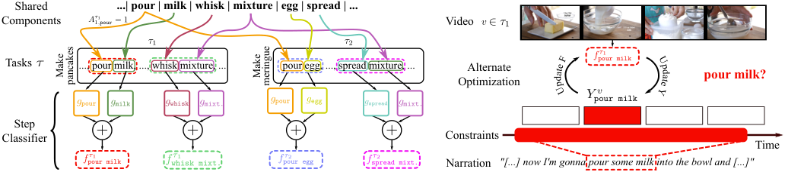

<!-- Start of picture text -->
Shared   ...| pour | milk | whisk | mixture | egg | spread | ... Components Video Tasks ..., pour milk, ..., whisk mixture, ... pour egg, ..., spread mixture, ... Alternate pour milk? Optimization Step Classifier Constraints Time Narration "[...] now I'm gonna  pour some milk  into the bowl and [...]" F U te p a d Make  Make  d pancakes meringue a p et U Y <!-- End of picture text -->

Figure 2. Our approach expresses classifiers for each step of each task in terms of a component model (e.g., writing the _pour milk_ as a _pour_ and _milk_ classifier). We thus cast the problem of learning the steps as learning an underlying set of component models. We learn these models by alternating between updating labels for these classifiers and the classifiers themselves while using constraints from narrations. 

semantic attributes (not intrinsically meaningful) as defined in [12]. It is also related to methods that compose new classifiers from others, including [25, 34, 15] among many others. Our framework is orthogonal, and shows how to learn these in a weakly-supervised setting. 

# **3. Overview** 

Our goal is to build visual models for a set of **tasks** from instructional videos. Each task is a multi-step process such as _making latte_ consisting of multiple **steps** , such as _pour milk_ . We aim to learn a visual model for each of these steps. Our approach uses **component models** that represent each step in terms of its constituent **components** as opposed to a monolithic entity, as illustrated in Figure 2. For instance, rather than building a classifier solely for _whisk mixture_ in the context of _make pancakes_ , we learn a set of classifiers per-component, one for _whisk_ , _spread_ , _mixture_ and so on, and represent _whisk mixture_ as the combination of _whisk_ and _mixture_ and share _mixture_ with _spread mixture_ . This shares data between steps and enables the parsing of previously unseen tasks, which we both verify empirically. 

We make a number of assumptions. Throughout, we assume that we are given an ordered list of steps for each task. This list is our only source of manual supervision and is done once per-task and is far less time consuming than annotating a temporal segmentation of each step in the input videos. At training time, we also assume that our training videos contain audio that explains what actions are being performed. At test time, however, we do not use the audio track: just like a person who watches a video online, once our system is shown how to make a latte with narration, it is expected to follow along without step-by-step narrations. 

# **4. Modeling Instructional Videos** 

We now describe our technical approach for using a list of steps to jointly learn the labels and visual models on a set of narrated instructional videos. This is weakly supervised since we provide only the list of steps, but not their temporal locations in training videos. 

**Problem formulation.** We denote the set of narrated instructional videos _V_ . Each video _v ∈V_ contains a sequence of _Nv_ segments of visual features _X__v_ = ( _x_ 1 _, . . . , xNv_ ) as well as narrations we use later. For every task _τ_ we assume to be given a set of videos _Vτ_ together with a set of ordered natural language steps _Kτ_ . Our goal is then to discover a set of classifiers _F_ that can identify the steps of the tasks. In other words, if _τ_ is a task and _k_ is its step, the classifier _fk__τ_determineswhether a visual feature depicts step _k_ of _τ_ or not. To do this, we also learn a labeling _Y_ of the training set for the classifiers, or for every video _v_ depicting task _τ_ , a binary label matrix _Y__v_ _∈{_ 0 _,_ 1 _}__Nv×Kτ_ where _Ytk__v_=1iftime_t_depictsstep _k_ and 0 otherwise. While jointly learning labels and classifiers leads to trivial solutions, we can eliminate these and make meaningful progress by constraining _Y_ and by sharing information across the classifiers of _F_ . 

## **4.1. Component Classifiers** 

One of the main focuses of this paper is in the form of the step classifier _f_ . Specifically, we propose a component model that represents each step (e.g., “pour milk”) as a combination of components (e.g., “pour” and “milk”). Before explaining how we formulate this, we place it in context by introducing a variety of alternatives that vary in terms of how they are learned and formulated. 

The simplest approach, a **task-specific step model** , is to learn a classifier for each step in the training set (i.e., a model for _pour egg_ for the particular task of _making pancakes_ ). Here, the model simply learns� _τ__Kτ_classifiers, one for each of the _Kτ_ steps in each task, which is simple but which permits no sharing. 

One way of adding sharing would be to have a **shared step model** , where a single classifier is learned for each unique step in the dataset. For instance, the _pour egg_ classifier learns from both _making meringues_ and _making pancakes_ . This sharing, however, would be limited to exact duplicates of steps, and so while _whisk milk_ and _pour milk_ both share an object, they would be learned separately. 

Our proposed **component model** fixes this issue. We au-

> Original page for checking 1 unresolved font glyphs.

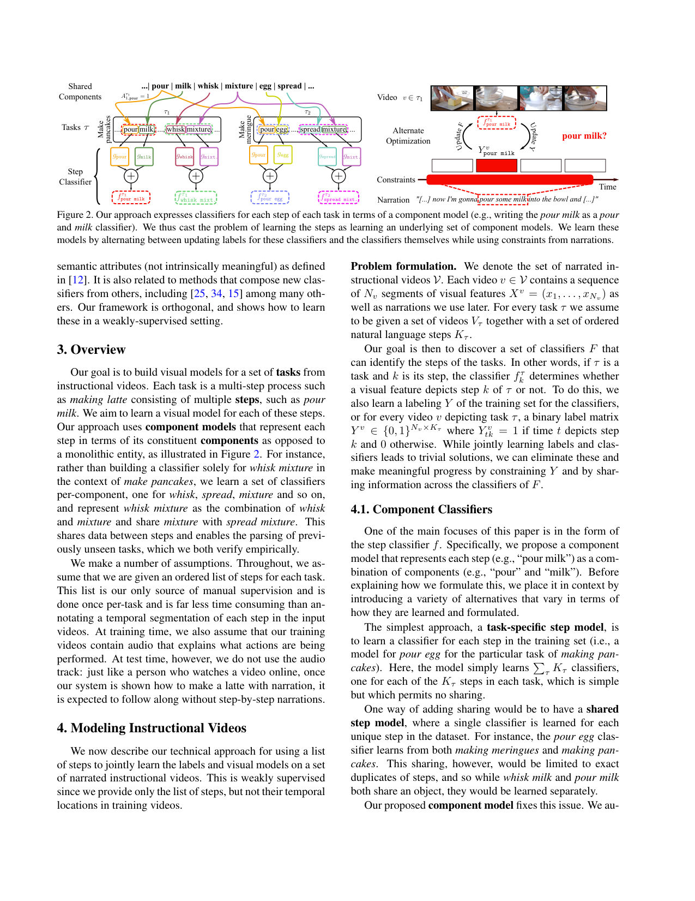

<!-- Page 4 -->

tomatically generate a vocabulary of **components** by taking the set of stemmed words in all the steps. These components are typically objects, verbs and prepositions and we combine classifiers for each component to yield our steps. In particular, for a vocabulary of _M_ components, we define a per-task matrix _A__τ_ _∈{_ 0 _,_ 1 _}__Kτ ×M_ where _A__τ_ _k,m_= 1 if the step _k_ involves components _m_ and 0 otherwise. We then learn _M_ classifiers _g_ 1 _, . . . , gM_ such that the prediction of a step _fk__τ_is the average of predictions provided by component classifiers 

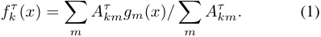

For instance, the score for _pour milk_ is the average of outputs of _gpour_ and _gmilk_ . In other words, when optimizing over the set of functions _F_ , we optimize over the parameters of _{gi}_ so that when combined together in step models via (1), they produce the desired results. 

## **4.2. Objective and Constraints** 

Having described the setup and classifiers, we now describe the objective function we minimize. Our goal is to simultaneously optimize over step location labels _Y_ and classifiers _F_ over all videos and tasks 

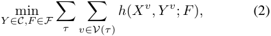

where _C_ is the set of temporal constraints on _Y_ defined below, and _F_ is a family of considered classifiers. Our objective function per-video is a standard cross-entropy loss 

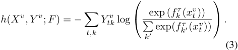

Optimizing (2) may lead to trivial solutions (e.g., _Y__v_ = 0 and _F_ outputting all zeros). We thus constrain our labeling of _Y_ to avoid this and ensure a sensible solution. In particular, we impose three constraints: 

**At least once.** We assume that every video _v_ of a task depicts each step _k_ at least once, or� _t__Y_ _tk__v≥_1. **Temporal ordering.** We assume that steps occur in the given order. While not always strictly correct, this dramatically reduces the search space and leads to better classifiers. **Temporal text localization.** We assume that the steps and corresponding narrations happen close in time, e.g., the narrator of a _grill steak_ video may say “just put the marinated steak on the grill”. We automatically compare the text description of each step to automatic YouTube subtitles. For a task with _Kτ_ steps and a video with _Nv_ frames, we construct a [0 _,_ 1]_Nv×Kτ_ matrix of cosine similarities between steps and a sliding-window word vector representations of narrations (more details in supplementary materials). Since 

narrated videos contain spurious mentions of tasks (e.g., ”before putting the steak on the grill, we clean the grill”) we do not directly use this matrix, but instead find an assignment of steps to locations that maximizes the total similarity while respecting the ordering constraints. The visual model must then more precisely identify when the action appears. We then impose a simple hard constraint of disallowing labelings _Y__v_ where any step is outside of the textbased interval (average length 9s) 

## **4.3. Optimization and Inference** 

We solve problem (2) by alternating between updating assignments _Y_ and the parameters of the classifiers _F_ . **Updating** _Y_ **.** When _F_ is fixed, we can minimize (2) w.r.t. _Y_ independently for each video. In particular, fixing _F_ fixes the classifier scores, meaning that minimizing (2) with respect to _Y__v_ is a constrained minimization of a linear cost in _Y_ subject to constraints. Our supplemental shows that this can be done by dynamic programming. 

**Updating** _F_ **.** When _Y_ is fixed, our cost function reduces to a standard supervised classification problem. We can thus apply standard techniques for solving these, such as stochastic gradient descent. More details are provided below and in the supplemental material. 

**Initialization.** Our objective is non-convex and has local minima, thus a proper initialization is important. We obtain such an initialization by treating all assignments that satisfy the temporal text localization constraints as groundtruth and optimizing for _F_ for 30 epochs, each time drawing a random sample that satisfies the constraints. 

**Inference.** Once the model has been fit to the data, inference on a new video _v_ of a task _τ_ is simple. After extracting features, we run each classifier _f_ on every temporal segment, resulting in a _Nv × Kτ_ score matrix. To obtain a hard labeling, we use dynamic programming to find the best-scoring labeling that respects the given order of steps. 

## **4.4. Implementation Details** 

_Networks:_ Due to the limited data size and noisy supervision, we use a linear classifier with dropout for regularization. Preliminary experiments with deeper models did not yield improvements. We use ADAM [21] with the learning rate of 10_−_5 for optimization. _Features:_ We represent each video segment _xi_ using RGB I3D features [8] (1024D), Resnet-152 features [16] (2048D) extracted at each frame and averaged over one-second temporal windows, and audio features from [17] (128D). _Components:_ We obtain the dictionary of components by finding the set of unique stemmed words over all step descriptions. The total number of components is 383. _Hyperparameters:_ Dropout and the learning rate are chosen on a validation data set.

> Original page for checking 1 unresolved font glyphs.

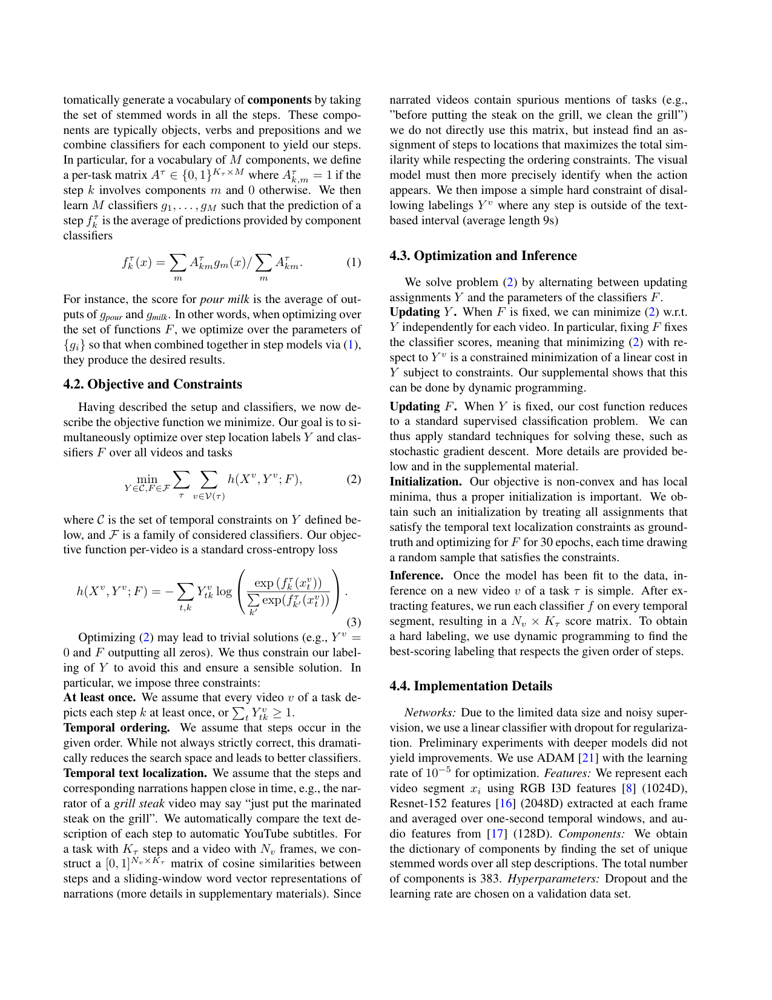

<!-- Page 5 -->

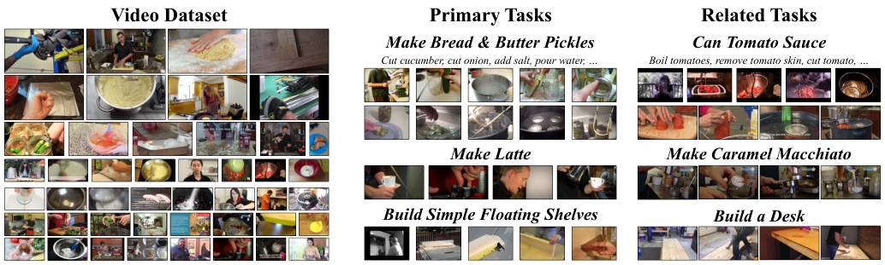

<!-- Start of picture text -->
Video Dataset Primary Tasks Related Tasks Make Bread & Butter Pickles Can Tomato Sauce Cut cucumber, cut onion, add salt, pour water, … Boil tomatoes, remove tomato skin, cut tomato, … Make Latte Make Caramel Macchiato Build Simple Floating Shelves Build a Desk <!-- End of picture text -->

Figure 3. Our new dataset, used to study sharing in a weakly supervised learning setting. It contains primary tasks, such as _make bread and butter pickles_ , as well as related tasks, such as _can tomato sauce_ . This lets us study whether learning multiple tasks improves performance. 

Table 1. A comparison of CrossTask with existing instructional datasets. Our dataset is both large and more diverse while also having temporal annotations. 

||Num.|Total|Num.|Not only|Avail.|
|---|---|---|---|---|---|
||Vids|Length|Tasks|Cooking|Annots|
|[2]|150|7h|5||Windows|
|[29]|1.2K+85|100h|17||Windows|
|[35]|2K|176h|89||Windows|
|[24]|180K|3,000h|||Recipes|
|CrossTask|4.7K|376h|83||Windows|

# **5. CrossTask dataset** 

One goal of this paper is to investigate whether sharing improves the performance of weakly supervised learning from instructional videos. To do this, we need a dataset covering a diverse set of interrelated tasks and annotated with temporal segments. Existing data fails to satisfy at least one of these criteria and we therefore collect a new dataset (83 tasks, 4.7K videos) related to cooking, car maintenance, crafting, and home repairs. These tasks and their steps are derived from wikiHow, a website that describes how to solve many tasks, and the videos come from YouTube. 

CrossTask dataset is divided into two sets of tasks to investigate sharing. The first is **primary tasks** , which are the main focus of our investigation and the backbone of the dataset. These are fully annotated and form the basis for our evaluations. The second is **related tasks** with videos gathered in a more automatic way to share some, but not all, components with the primary tasks. One goal of our experiments is to assess whether these related tasks improve the learning of primary tasks, and whether one can learn a good model only on related tasks. 

## **5.1. Video Collection Procedure** 

We begin the collection process by defining our tasks. These must satisfy three criteria: they must entail a sequence of physical interactions with objects (unlike e.g., 

_how to get into a relationship_ ); their step order must be deterministic (unlike e.g., _how to play chess_ ); and they must appear frequently on YouTube. We asked annotators to review the tasks in five sections of wikihow to get tasks satisfying the first two criteria, yielding _∼_ 7K candidate tasks, and manually filter for the third criteria. 

We select 18 primary tasks and 65 related tasks from these 7K candidate tasks. The primary tasks cover a variety of themes (e.g., auto repair to cooking to DIY) and include _building floating shelves_ and _making latte_ . We find 65 related tasks by finding related tasks for each primary task. We generate potential related tasks for a primary task by comparing the wikiHow articles using a TF-IDF on a bag-of-words representation, which finds tasks with similar descriptions. We then filter out near duplicates (e.g., _how to jack up a car_ and _how to use a car jack_ ) by comparing top YouTube search results and removing candidates with overlaps, and manually remove a handful of irrelevant tasks. 

We define steps and their order for each task by examining the wikiHow articles, beginning with the summaries of each step. Using the wikiHow summary itself is insufficient, since many articles contain non-visual steps and some steps combine multiple physical actions. We thus manually correct the list yielding a set of tasks with 7.4 steps on average for primary tasks and 8.8 for related tasks. 

We then obtain videos for each task by searching YouTube. Since the related tasks are only to aid the primary tasks, we take the top 30 results from YouTube. For primary tasks, we ask annotators to filter a larger pool of top results while examining the video, steps, and wikiHow illustrations, yielding at least 80 videos per task. 

## **5.2. Annotations and Statistics** 

**Task localization annotations.** Since our focus is the primary tasks, annotators mark the temporal extent of each primary task step independently. We do this for our 18 primary tasks and make annotations publically available1 . **Dataset.** This results in a dataset containing 2750 videos

<!-- Page 6 -->

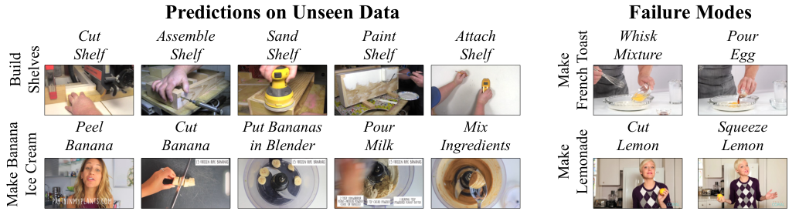

<!-- Start of picture text -->
Predictions on Unseen Data Failure Modes Cut  Assemble  Sand  Paint Attach  Whisk Pour Shelf Shelf Shelf Shelf Shelf Mixture Egg Peel  Cut  Put Bananas Pour Mix  Cut Squeeze Banana Banana in Blender Milk Ingredients Lemon Lemon Build Shelves Make French Toast Make Ice Cream Lemonade Make Banana <!-- End of picture text -->

Figure 4. Predictions on unseen data as well as typical failure modes. Our method does well on steps with distinctive motions and appearances. Failure modes include (top) features that cannot make fine-grained distinctions between e.g., egg and vanilla extract; and (bottom) models that overreact to particular nouns, preferring a more visible lemon over a less visible lemon actually being squeezed. 

of 18 primary tasks comprising 212 hours of video; and 1950 videos of 65 related tasks comprising 161 hours of video. We contrast this dataset with past instructional video datasets in Table 1. Our dataset is simultaneously large while also having precise temporal segment annotations. 

To illustrate the dataset, we report a few summary statistics about the primary task videos. The videos are quite long, with an average length of 4min 57sec, and depict fairly complex tasks, with 7.4 steps on average. Less complex tasks include _jack up a car_ (3 steps); more complex ones include _pickle cucumbers_ or _change tire_ (11 steps each). **Challenges.** In addition to being long and complex, these videos are challenging since they do not precisely show the ordered steps we have defined. For instance, in _add oil to car_ , 85% of frames instead depict background information such as shots of people talking or other things. This is not an outlier: on average 72% of the dataset is background. On the other hand, on average 31% of steps are not depicted due to variances in procedures and omissions ( _pickle cucumber_ has 48% of steps missing). Moreover, the steps do not necessarily appear in the correct order: to estimate the order consistency, we compute an upper bound on performance using our given order and found that the best orderrespecting parse of the data still missed 14% of steps. 

# **6. Experiments** 

Our experiments aim to address the following three questions about cross-task sharing in the weakly-supervised setting: **(1)** Can the proposed method use related data to improve performance? **(2)** How does the proposed component model compare to sharing alternatives? **(3)** Can the component model transfer to previously unseen tasks? Throughout, we evaluate on the large dataset introduced in Section C that consists of primary tasks and related tasks. We address (1) in Section 6.1 by comparing our proposed approach with methods that do not share and show that our proposed approach can use related tasks to improve performance on primary asks. Section 6.2 addresses (2) by analyzing the 

performance of the model and showing that it outperforms step-based alternatives. We answer (3) empirically in Section 6.3 by training only on related tasks, and show that we are able to perform well on primary tasks. 

## **6.1. Cross-task Learning** 

We begin by evaluating whether our proposed component model approach can use sharing to improve performance on a fixed set of tasks. We fix our evaluation to be the 18 primary tasks and evaluate whether the model can use the 65 related tasks to improve performance. 

**Metrics and setup.** We evaluate results on 18 primary tasks over the videos that make up the test set. We quantify performance via _recall_ , which we define as the ratio between the number of correct step assignments (defined as falling into the correct ground-truth time interval) and the total number of steps over all videos. In other words, to get a perfect score, a method must correctly identify one instance of each step of the task in each test video. All methods make a single prediction per step, which prevents the trivial solution of assigning all frames to all actions. 

We run experiments 20 times, each time making a train set of 30 videos per task and leaving the remaining 1850 videos for test. We report the average. Hyperparameters are set for all methods using a fixed validation set of 20 videos per primary task that are never used for training or testing. **Baselines.** Our goal is to examine whether our sharing approach can leverage related tasks to improve performance on our primary task. We compare our method to its version without sharing as well as to a number of baselines. _(1) Uniform:_ simply predict steps at fixed time intervals. Since this predicts steps in the correct order and steps often break tasks into roughly equal chunks, this is fairly well-informed prior. _(2) Alayrac’16:_ the weakly supervised learning method for videos, proposed in [1]. This is similar in spirit to our approach except it does not share and optimizes a L2-criterion via the DIFFRAC [3] method. _(3) Richard’18:_ the weakly supervised learning method [27] that does not rely on the

<!-- Page 7 -->

Table 2. Weakly supervised recall scores on test set (in %). Our approach, which shares information across tasks, substantially and consistently outperforms non-sharing baselines. The standard deviation for reported scores does not exceed 1%. 

||Make Kimchi Rice|Pickle Cucumber|Make Banana Ice Cream|Grill Steak|Jack Up Car|Make Jello Shots|Change Tire|Make Lemonade|Add Oil to Car|Make Latte|Build Shelves|Make Taco Salad|Make French Toast|Make Irish Coffee|Make Strawberry Cake|Make Pancakes|Make Meringue|Make Fish Curry|Average|
|---|---|---|---|---|---|---|---|---|---|---|---|---|---|---|---|---|---|---|---|
|Supervised|19.1|25.3|38.0|37.5|25.7|28.2|54.3|25.8|18.3|31.2|47.7|12.0|39.5|23.4|30.9|41.1|53.4|17.3|31.6|
|Uniform|4.2|7.1|6.4|7.3|**17.4**|7.1|14.2|9.8|3.1|10.7|22.1|5.5|9.5|7.5|9.2|9.2|19.5|5.1|9.7|
|Alayrac’16 [1]|**15.6**|10.6|7.5|14.2|9.3|11.8|17.3|13.1|**6.4**|12.9|27.2|9.2|15.7|8.6|16.3|13.0|23.2|7.4|13.3|
|Richard’18 [27]|7.6|4.3|3.6|4.6|8.9|5.4|7.5|7.3|3.6|6.2|12.3|3.8|7.4|7.2|6.7|9.6|12.3|3.1|6.7|
|Task-Specific Step-Based|13.2|17.6|19.3|19.3|9.7|12.6|30.4|16.0|4.5|19.0|29.0|9.1|29.1|**14.5**|22.9|29.0|32.9|7.3|18.6|
|Proposed|13.3|**18.0 **|**23.4 **|**23.1**|16.9|**16.5 **|**30.7 **|**21.6**|4.6|**19.5 **|**35.3 **|**10.0 **|**32.3**|13.8|**29.5 **|**37.6 **|**43.0 **|**13.3**|**22.4**|
|Gain from Sharing|0.2|0.4|4.1|3.8|7.2|3.9|0.3|5.6|0.1|0.6|6.3|0.9|3.2|-0.7|6.6|8.7|10.1|6.0|3.7|

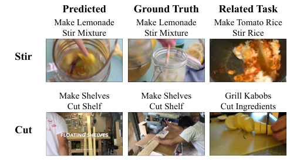

<!-- Start of picture text -->
Predicted Ground Truth Related Task Make Lemonade Make Lemonade Make Tomato Rice Stir Mixture Stir Mixture Stir Rice Stir Make Shelves Make Shelves Grill Kabobs Cut Shelf Cut Shelf Cut Ingredients Cut <!-- End of picture text -->

Figure 5. Components that share well and poorly: while stir shares well between steps of tasks, cut shares poorly when transferring from a food context to a home improvement context. 

known order of steps. _(4) Task-Specific Steps:_ Our approach trained independently for each step of each task. In other words, there are separate models for _pour egg_ in the contexts of _making pancakes_ and _making meringue_ . This differs from Alayrac in that it optimizes a cross-entropy loss using our proposed optimization method. It differs from our full proposed approach since it performs no sharing. Note, that the full method in [1] includes automatic discovery of steps from narrations. Here, we only use the visual model of [1], while providing the same constraints as in our method. This allows for a fair comparison between [1] and our method, since both use the same amount of supervision. At test time, the method presented in [27] has no prior about which steps are present or the order in which they occur. To make a fair comparison, we use the trained classifier of the method in [27], and apply the same inference procedure as in our method. 

**Qualitative results.** We illustrate qualitative results of our full method in Figure 4. We show a parses of unseen videos of _Build Shelves_ and _Make Banana Ice Cream_ and failure modes. Our method can handle well a large variety of tasks and steps but may struggle to identify some details (e.g., vanilla vs. egg) or actions. 

**Quantitative results.** Table 2 shows results summarized across steps. The uniform baseline provides a strong lower bound, achieving an average recall of 9.7% and outperforming [27]. Note, however, that [27] is designed to adress a different problem and cannot be fairly compared with other methods in our setup. While [1] improves on this (13.3%), it does substantially worse than our task-specific step method (18.6%). We found that predictions from [1] often had several steps with similar scores, leading to poor parse results, which we attribute to the convex relaxation used by DIFFRAC. This was resolved in the past by the use of narration at test time; our approach does not depend on this. 

Our full approach, which shares across tasks, produces substantially better performance (22.4%) than the taskspecific step method. More importantly, this improvement is systematic: the full method improves on the task-specific step baseline in 17 tasks out of 18. 

We illustrate some qualitative examples of steps benefiting and least benefiting from sharing in Figure 5. Typically, sharing can help if the component has distinctive appearance and is involved in a number of steps: steps involve stirring, for instance, have an average gain of 15% recall over independent training because it is frequent (in 30 steps) and distinctive. Of course, not all steps benefit: _cut shelf_ is harmed (47% independent _→_ 28% shared) because _cut_ mostly occurs in cooking tasks with dissimilar contexts. **Verifying optimizer on small-scale data.** We now evaluate our approach on the smaller 5-task dataset of [1]. Since here there are no common steps across tasks, we are able to test only the basic task-specific step-based version. To make a fair comparison, we use the same features, ordering constraints, as well as constraints from narration for every K as provided by the authors of [1], and we evaluate using the F1 metric as in [1]. As a result, the two formulations are on par, where [1] versus our approach result in 22.8% versus 21.8% for K=10 and 21.0% versus 21.1% for K=15, respectively. While these scores are slightly lower compared

<!-- Page 8 -->

Table 3. Average recall scores on the test set for our method when changing the sharing settings and the model. 

||Unshared Primary|Shared Shared Primary Primary + Related|
|---|---|---|
|Step-based|18.6|18.9 19.8|
|Component-|based **18.7**|**20.2** **22.4**|
|**Source** **From Rela**|**Steps** **ted Tasks**|**Unseen Task: Make** **French Strawberry Cake**|
|Cut Steak|Cut Tomato|Cut Strawberry|
|Add|Add Cherries|Add Strawberry|
|Tomato|to Cake|To Cake|

Figure 6. Examples of identified steps for an unseen task. While the model has not seen these steps and objects e.g., strawberries, its knowledge of other components leads to reasonable predictions. 

to those obtained by the single-task probabilistic model in Sener [28] (25.4% at K=10 and 23.6% at K=15), we are unable to compare using our full cross-task model on this dataset. Overall, these results verify the effectiveness of our optimization technique. 

## **6.2. Experimental Evaluation of Cross-task Sharing** 

Having verified the framework and the role of sharing, we now more precisely evaluate how sharing is performed to examine the contribution of our proposed compositional model. We vary two dimensions. The first is the granularity, or at what level sharing occurs. We propose sharing at a component level, but one could share at a step level as well. The second is what data is used, including (i) independently learning primary tasks; (ii) learning primary tasks together; (iii) learning primary plus related tasks together. 

Table 3 reveals that increased sharing consistently helps and component-based sharing extracts more from sharing than step-based (performance increases across rows). This gain over step-based sharing is because step-based sharing requires exact matches. Most commonality between tasks occurs with slight variants (e.g., _cut_ is applied to steak, tomato, pickle, etc.) and therefore a componentbased model is needed to maximally enable sharing. 

## **6.3. Novel Task Transfer** 

One advantage of shared representations is that they can let one parse new concepts. For example, without any modifications, we can repeat our experiments from Section 6.1 in a setting where we never train on the 18 tasks that we test on but instead on the 65 related tasks. The only information given about the test tasks is an ordered list of steps. 

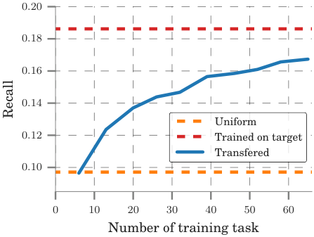

<!-- Start of picture text -->
0 . 20 0 . 18 0 . 16 0 . 14 Uniform 0 . 12 Trained on target Transfered 0 . 10 0 10 20 30 40 50 60 Number of training task Recall <!-- End of picture text -->

Figure 7. Recall while transferring a learned model to unseen tasks as a function of the number of tasks used for training. Our component model approaches training directly on these tasks. 

**Setup.** As in Section 6.1, we quantify performance with recall on the 18 primary tasks. However, we train on a subset of the 65 related tasks and never on any primary task. **Qualitative results.** We show a parse of steps of _Make Strawberry Cake_ in Figure 6 using all related tasks. The model has not seen _cut strawberry_ before but has seen other forms of cutting. Similarly, it has seen _add cherries to cake_ , and can use this step to parse _add strawberries to cake_ . **Quantitative results.** Figure 7 shows performance as a function of the number of related tasks used for training. Increasing the number of training tasks improves performance on the primary tasks, and does not plateau even when 65 tasks are used. 

# **7. Conclusion** 

We have introduced an approach for weakly supervised learning from instructional videos and a new CrossTask dataset for evaluating the role of sharing in this setting. Our component model has been shown ability to exploit common parts of tasks to improve performance and was able to parse previously unseen tasks. Future work would benefit from improved features as well as from improved versions of sharing. 

**Acknowledgements.** This work was supported in part by the MSR-Inria joint lab, the Louis Vuitton ENS Chair on Artificial Intelligence, ERC grants LEAP No. 336845 and ACTIVIA No. 307574, the DGA project DRAAF, CIFAR Learning in Machines & Brains program, the European Regional Development Fund under the project IMPACT (reg. no. CZ.02.1.01/0.0/0.0/15003/0000468), the TUBITAK Grant 116E445 and a research fellowship by the Embassy of France. We thank Francis Bach for helpful discussions about the optimization procedure.

<!-- Page 9 -->

# **References** 

- [1] J.-B. Alayrac, P. Bojanowski, N. Agrawal, I. Laptev, J. Sivic, and S. Lacoste Julien. Unsupervised learning from narrated instruction videos. In _CVPR_ , 2016. 1, 2, 6, 7 

- [2] J.-B. Alayrac, J. Sivic, I. Laptev, and S. Lacoste-Julien. Joint discovery of object states and manipulation actions. In _ICCV_ , 2017. 2, 5 

- [3] F. Bach and Z. Harchaoui. DIFFRAC: A discriminative and flexible framework for clustering. In _NIPS_ , 2007. 2, 6 

- [4] P. Bojanowski and A. Joulin. Unsupervised learning by predicting noise. In _ICML_ , 2017. 2 

- [5] P. Bojanowski, R. Lajugie, F. Bach, I. Laptev, J. Ponce, C. Schmid, and J. Sivic. Weakly supervised action labeling in videos under ordering constraints. In _ECCV_ , 2014. 2 

- [6] P. Bojanowski, R. Lajugie, E. Grave, F. Bach, I. Laptev, J. Ponce, and C. Schmid. Weakly-supervised alignment of video with text. In _ICCV_ , 2015. 2 

- [7] M. Caron, P. Bojanowski, A. Joulin, and M. Douze. Deep Clustering for Unsupervised Learning of Visual Features. In _ICCV_ , 2018. 2 

- [8] J. Carreira and A. Zisserman. Quo vadis, action recognition? a new model and the kinetics dataset. In _CVPR_ , 2017. 1, 2, 4 

- [9] D. Damen, H. Doughty, G. Maria Farinella, S. Fidler, A. Furnari, E. Kazakos, D. Moltisanti, J. Munro, T. Perrett, W. Price, and M. Wray. Scaling egocentric vision: The EPIC-KITCHENS dataset. In _ECCV_ , 2018. 2 

- [10] D. Damen, T. Leelasawassuk, O. Haines, A. Calway, and W. Mayol-Cuevas. You-do, i-learn: Discovering task relevant objects and their modes of interaction from multi-user egocentric video. In _BMVA_ , 2014. 2 

- [11] K. Fang, T.-L. Wu, D. Yang, S. Savarese, and J. J. Lim. Demo2vec: Reasoning object affordances from online videos. In _CVPR_ , 2018. 2 

- [12] A. Farhadi, I. Endres, D. Hoiem, and D. Forsyth. Describing objects by their attributes. In _CVPR_ , 2009. 2, 3 

- [13] V. Ferrari and A. Zisserman. Learning visual attributes. In _NIPS_ , 2007. 2 

- [14] D. F. Fouhey, W. Kuo, A. A. Efros, and J. Malik. From lifestyle vlogs to everyday interactions. In _CVPR_ , 2018. 2 

- [15] S. Guadarrama, N. Krishnamoorthy, G. Malkarnenkar, S. Venugopalan, R. Mooney, T. Darrell, and K. Saenko. Youtube2text: Recognizing and describing arbitrary activities using semantic hierarchies and zero-shot recognition. In _ICCV_ , 2013. 3 

   - [19] D.-A. Huang, J. J. Lim, L. Fei-Fei, and J. C. Niebles. Unsupervised visual-linguistic reference resolution in instructional videos. In _CVPR_ , 2017. 2 

   - [20] D.-A. Huang, V. Ramanathan, D. Mahajan, L. Torresani, M. Paluri, L. Fei-Fei, and J. C. Niebles. Finding ”it”: Weakly-supervised reference-aware visual grounding in instructional video. In _CVPR_ , 2018. 2 

   - [21] D. Kingma and J. Ba. Adam: A method for stochastic optimization. _arXiv preprint arXiv:1412.6980_ , 2014. 4 

   - [22] H. Kuehne, A. Richard, and J. Gall. Weakly supervised learning of actions from transcripts. In _CVIU_ , 2017. 1, 2 

   - [23] J. Liu, B. Kuipers, and S. Savarese. Recognizing human actions by attributes. In _CVPR_ , 2011. 2 

   - [24] J. Malmaud, J. Huang, V. Rathod, N. Johnston, A. Rabinovich, and K. Murphy. What’s cookin’? Interpreting cooking videos using text, speech and vision. In _NAACL_ , 2015. 2, 5 

   - [25] I. Misra, A. Gupta, and M. Hebert. From Red Wine to Red Tomato: Composition with Context. In _CVPR_ , 2017. 3 

   - [26] A. Richard, H. Kuehne, and J. Gall. Weakly supervised action learning with rnn based fine-to-coarse modeling. In _CVPR_ , 2017. 2 

   - [27] A. Richard, H. Kuehne, and J. Gall. Action sets: Weakly supervised action segmentation without ordering constraints. In _CVPR_ , 2018. 6, 7 

   - [28] F. Sener and A. Yao. Unsupervised learning and segmentation of complex activities from video. In _CVPR_ , 2018. 8 

   - [29] O. Sener, A. Zamir, S. Savarese, and A. Saxena. Unsupervised semantic parsing of video collections. In _ICCV_ , 2015. 1, 2, 5 

   - [30] K. Simonyan and A. Zisserman. Two-stream convolutional networks for action recognition in videos. In _NIPS_ , 2014. 1, 2 

   - [31] H. Wang and C. Schmid. Action recognition with improved trajectories. In _ICCV_ , 2013. 1, 2 

   - [32] L. Xu, J. Neufeld, B. Larson, and D. Schuurmans. Maximum margin clustering. In _NIPS_ , 2004. 2 

   - [33] B. Yao, X. Jiang, A. Khosla, A. L. Lin, L. Guibas, and L. FeiFei1. Human action recognition by learning bases of action attributes and parts. In _ICCV_ , 2011. 2 

   - [34] M. Yatskar, V. Ordonez, L. Zettlemoyer, and A. Farhadi. Commonly uncommon: Semantic sparsity in situation recognition. In _Proceedings of the CVPR_ , 2017. 3 

   - [35] L. Zhou, X. Chenliang, and J. J. Corso. Towards automatic learning of procedures from web instructional videos. In _AAAI_ , 2018. 2, 5 

- [16] K. He, X. Zhang, S. Ren, and J. Sun. Deep residual learning for image recognition. In _CVPR_ , 2016. 4 

- [17] S. Hershey, S. Chaudhuri, D. P. W. Ellis, J. F. Gemmeke, A. Jansen, C. Moore, M. Plakal, D. Platt, R. A. Saurous, B. Seybold, M. Slaney, R. Weiss, , and K. Wilson. Cnn architectures for large-scale audio classification. In _ICASSP_ , 2017. 4 

- [18] D.-A. Huang, L. Fei-Fei, and J. C. Niebles. Connectionist temporal modeling for weakly supervised action labeling. In _ECCV_ , 2016. 1, 2

<!-- Page 10 -->

# **A. Outline of supplementary material** 

This supplementary material provides more details on our method and our dataset, together with some additional results of our method. 

In Section B we describe details of our narration-based temporal constraints and the optimization procedure. Section C provides more information about our dataset and video collection procedure, including a complete list of primary and related tasks and task-wise statistics. In Section D we illustrate additional quantitative and qualitative results of our method, including classifier scores and localized steps. We also provide more examples and analysis of failure cases. 

# **B. Modeling instructional videos** 

## **B.1. Temporal text localization** 

In this section we explain in detail how we obtain temporal constraints from subtitles of the video. We assume that each step in the video occurs roughly at the same time as it is mentioned in the narration. Step localization in narrations is challenging for several reasons. First, the same step may be described in different ways ( _e.g_ . _cut steak_ and _slice meat_ ). It may contain a reference ( _e.g_ . _cut it_ ). Second, a mention of a step doesn’t guarantee, that the step occurs at the same time ( _e.g_ . Let the steak rest before _cutting it_ ). Since most of the videos in our dataset are unprofessional, the narrator doesn’t usually follow a strict scenario and often talks about unrelated topics. Finally, most of the subtitles are produced by YouTube automatic speech recognition, and, therefore, contain errors and lack punctuation. 

As described in Section 5.1 of the main paper, we provide a short textual description of each step. These descriptions are matched to the text within a sliding window over the subtitles, in order to find where each step is mentioned. More formally, let _f_ be a function, mapping a sequence of words of variable length into R_D_ . Applying this function to the text within a sliding window of size _w_ yields a matrix _U ∈_ R_L×D_ , where _L_ is the number of words in the subtitles. Applying the same function to the description of each step gives us a matrix _V ∈_ R_K×D_ , where _K_ is a total num- _D_ ber of steps. Assuming that � _Uld_2= 1 for any_l_= 1_. . . L_, _d_ =1 

_D_ and that � _Vkd_2=1 for any_k_=1_. . . K_(i.e., the features _d_ =1 

are unit-norm), _S_ = _UV__T_ _∈_ R_L×K_ is a matrix of cosine similarities between vector representations of subtitles and descriptions of steps. 

We find the best matching _A ∈{_ 0 _,_ 1 _}__L×K_ between the steps and the subtitles, that satisfies the ordering of the 

steps, by solving a linear problem 

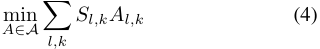

where _A_ is a set of assignments that satisfy at-least-one and ordering constraints. This problem can be efficiently solved via dynamic programming, as described in Section B.2. Imposing the ordering constraints during step localization helps to avoid spurious mentions of steps, that don’t follow the scenario of a task. 

We try different choices of mapping _f_ . The first is TFIDF representation of the text within sliding window. The second is a Word2Vec-like word embedding [37], followed by a max-pooling over sliding window. We obtain our word embedding by training the Fasttext model [38] with dimension 100. The model is trained on a corpus of subtitles of 2 million YouTube videos for 6729 tasks from wikiHow. 

Finally, we propose a way to learn a better aggregation function than max-pooling for the word vectors. Assume that we are given a set of sentences _I_ of various lengths. Each sentence _i_ is represented by _X__i_ _∈_ R_Mi×d_0 , where _Mi_ is the number of words in a sentence and _Xm__i∈_R_d_0is the feature vector corresponding to _m_ -th word in the sentence. Assume that for each sentence _i_ we are also given a set of sentences _Si ⊂I_ with similar meaning and a set of sentences _Di ⊂I_ with different meaning. _f_ is learnt by minimizing loss 

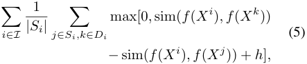

where sim( _a, b_ ) = _∥aa∥∥_T _<u>bb∥</u>_isthecosinesimilarityfunc- tion, and, _h_ is the margin constant. This can be understood as pushing representations of sentences with similar meaning closer together, as opposed to sentences with different meaning. We take _f_ in the form of 1D convolution with kernel length 1 and a number of filters _d_ , followed by the global max-pooling, and by a linear mapping R_d_ _→_ R_d_ . We take _d_ = 300 and _h_ = 0 _._ 1. 

We train our model on the set of sentences from wikiHow. Descriptions of the tasks on wikiHow are organized into step paragraphs, as shown on figure 1. We assume that sentences within the same paragraph describe similar concepts, while sentences from different steps of the same task have different meanings. For each sentence _i_ , _Si_ is defined as a set of sentences from the same paragraph, and _Di_ is defined as a set of sentences from other paragraphs within the same wikiHow page. 

We evaluate alternative text representations by comparing obtained constraints with the ground truth on the set of primary tasks. The results are shown in Table 1. Our aggregation function, trained on wikiHow outperforms TF-IDF

> Original page for checking 2 unresolved font glyphs.

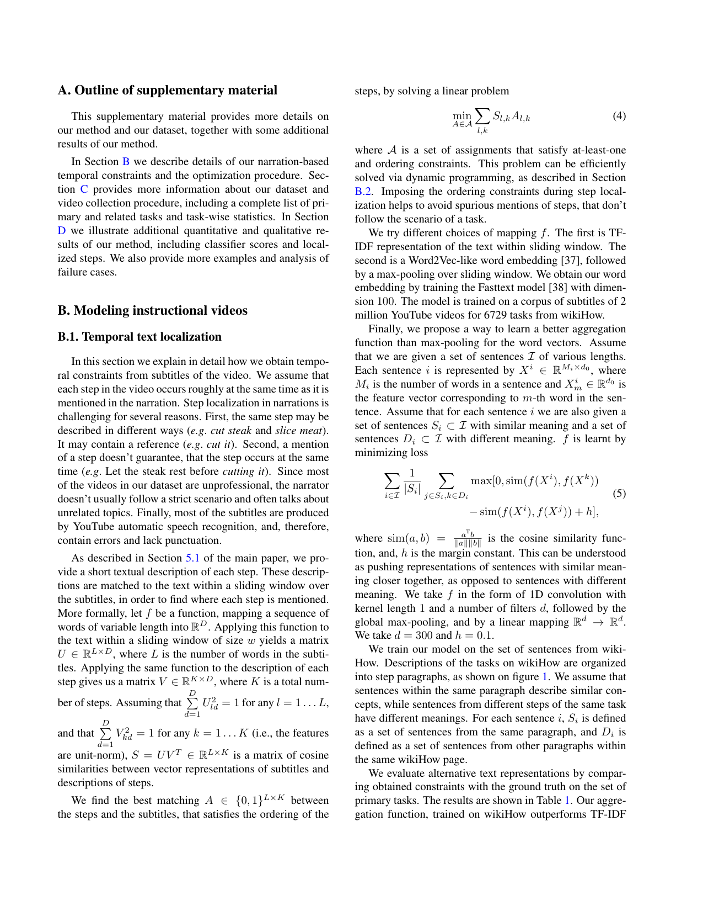

<!-- Page 11 -->

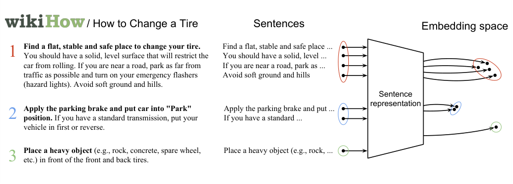

<!-- Start of picture text -->
/ How to Change a Tire Sentences Embedding space 1 Find a flat, stable and safe place to change your tire.  You should have a solid, level surface that will restrict the  Find a flat, stable and safe place ...You should have a solid, level ... car from rolling. If you are near a road, park as far from  If you are near a road, park as ... traffic as possible and turn on your emergency flashers  Avoid soft ground and hills (hazard lights). Avoid soft ground and hills. Sentence representation 2 Apply the parking brake and put car into "Park"  Apply the parking brake and put ... position.  If you have a standard transmission, put your  If you have a standard ... vehicle in first or reverse. 3 Place a heavy object  etc.) in front of the front and back tires.(e.g., rock, concrete, spare wheel,  Place a heavy object (e.g., rock, ... <!-- End of picture text -->

Figure 1. Example of three wikiHow steps for the _Change a Tire_ task. Our method learns a similarity function that pulls representations of the sentences from the same paragraphs closer together, and pushes the sentences from different paragraphs away from each other 

Table 1. Precision and recall of the constraints obtained with our method, averaged over 18 primary tasks. 

||Precision (%)|Recall (%)|
|---|---|---|
|Max-pooled word vectors|11.6|10.4|
|TF-IDF|13.3|11.4|
|Proposed|**15.9**|**13.9**|

and max-pooled word vectors both in terms of precision and recall. 

## **B.2. Constrained linear optimization** 

Our optimization procedure, inference and temporal text localization require solving a linear problem of the form 

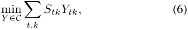

where _S ∈_ R_T ×K_ and _C_ is the set of all assignments from _{_ 0 _,_ 1 _}__T ×K_ that satisfy the _ordering_ and _at-least-once_ constraints. At-least-once constraints mean that every step _k_ should be picked at least once:� _Yt,k ≥_ 1 for any _t_ 

_k_ = 1 _. . . K_ . Ordering constraints mean that the step _k −_ 1 should precede step _k_ for any _k ≥_ 2. This problem can be solved efficiently via dynamic programming. First, we rewrite the problem in the form: 

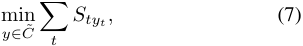

where _yt ∈{_ 0 _,_ 1 _, . . . , K}_ is the step label at time _t_ (0 stands for background, i.e. when no step is selected). The ordering constraints impose that _yt_ +1 _∈{_ 0 _, zt}_ , where _zt_ = max( _y_ 1 _, . . . , yt_ ) is the last non-background step. We define state _xt_ at time _t_ as a pair ( _yt, zt_ ). Note, that for a given state _xt_ , the only possible _xt−_ 1 that satisfies the constraints are ( _zt, zt_ ), ( _zt −_ 1 _, zt −_ 1) and (0 _, zt −_ 1) if _yt̸_ = 0, 

and ( _zt −_ 1 _, zt −_ 1) and (0 _, zt −_ 1) otherwise. We denote this set of possible previous states as _P_ ( _xt_ ). The minimum cumulative cost for state _xt_ = _x_ at time _t_ is 

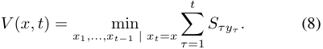

Define _C_ ( _xt, xt−_ 1) = _Styt_ if _xt−_ 1 _∈ P_ ( _xt_ ) and _C_ ( _xt, xt−_ 1) = + _∞_ otherwise (for simplicity we denote _x_ 0 = (0 _,_ 0)). This allows to rewrite (8) in the recursive form: 

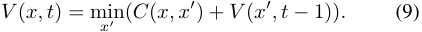

We compute _V_ ( _x, t_ ) recursively for _t_ = 1 _, . . . , T_ , using (9). In practice, computing _V_ ( _x, t_ ) given _V_ ( _x__′_ _, t −_ 1) for all _x__′_ requires minimization only over _x__′_ _∈P_ ( _x_ ) and can be done in O(1). Since there are 2 _K_ possible states, the complexity of computing _V_ ( _x, t_ ) for all _x_ and _t_ is O( _KT_ ). To satisfy _at-least-once_ constraints, the final state _xT_ must be either ( _K, K_ ), or (0 _, K_ ). To get the optimal assignment, we take _x__∗_ _T_= arg min _V_ ( _x, T_ ) _x∈{_ ( _K,K_ ) _,_ (0 _,K_ ) _}_ and find _x__∗_ _t_=arg min _V_ ( _x, t −_ 1) recursively for every _x∈P_ ( _x__∗_ _t_ +1) _t_ = _T −_ 1 _, . . . ,_ 1. 

## **B.3. Optimization for discriminative clustering** 

The discriminative clustering problem 

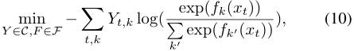

introduced in Section 4.2 of the main paper can’t be solved efficiently with standard techniques, such as projected gradient descent, because the projection over our constraint set _C_ is computationally expensive.

> Original page for checking 1 unresolved font glyphs.

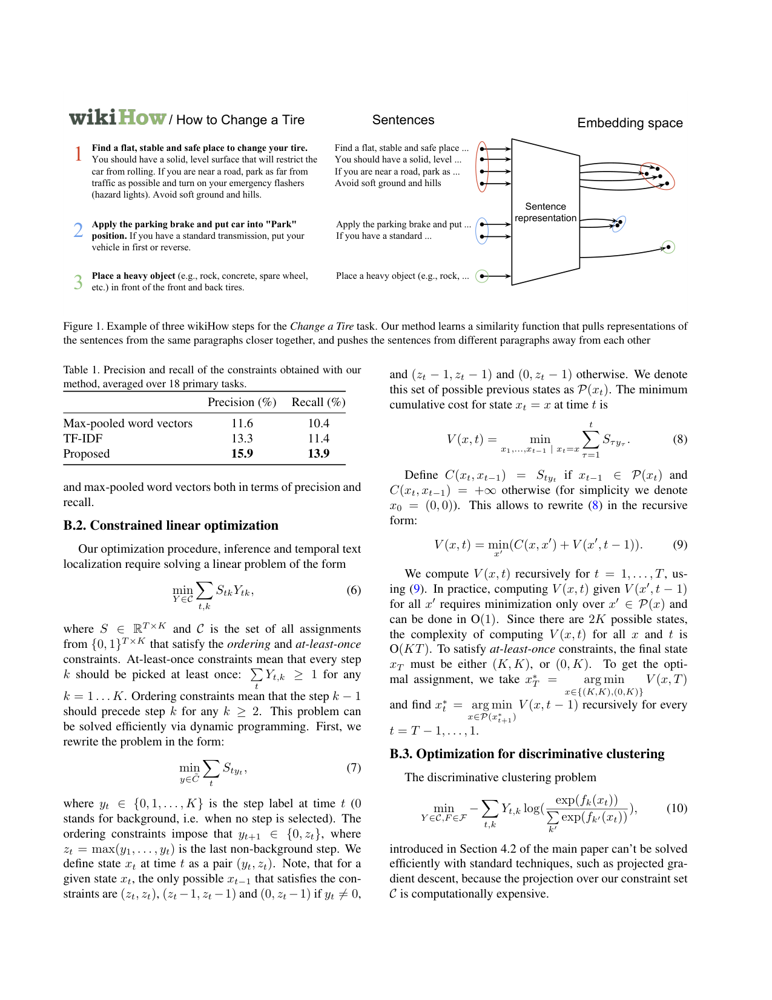

<!-- Page 12 -->

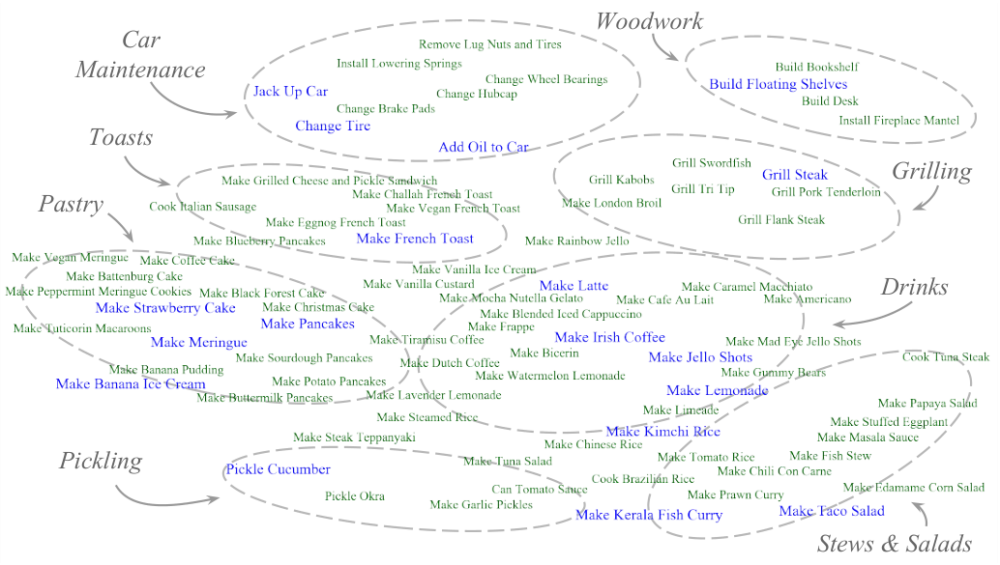

<!-- Start of picture text -->
Woodwork Car Maintenance Toasts Grilling Pastry Drinks Pickling Stews & Salads <!-- End of picture text -->

Figure 2. A t-SNE visualization of primary (in blue) and related (in green) tasks. The distance between two tasks is based on the number of components they share. Two well separable clusters on top correspond to _Car Maintenance_ and _Home Repairs_ categories, while most of the tasks belong to the _Cooking_ category. 

Our optimization method can be applied to a broader class of problems of the form 

Given solution ( _Y__l_ _, θ__l_ ) at _l_ -th iteration, we define a quadratic upper bound for _F_ ( _θ_ ) in the neighbourhood of _θ__l_ : _Ftk_ ( _θ_ ) _≤ F_˜ _tk_ ( _θ_ ; _θ__l_ ), where 

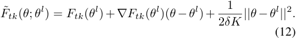

Note, that� _YtkFtk_ ( _θ_ ) _≤_� _YtkF_˜ _tk_ ( _θ_ ; _θ__l_ ) for any ( _Y, θ_ ) _t,k t,k_ and that� _Ytk__lFtk_(_θl_)=� _Ytk__lF_˜_tk_(_θl_). This means, _t,k t,k_ that for any ( _Y__l_+1 _, θ__l_+1 ), s.t. � _Ytk__l_+1 _F_ ˜ _tk_ ( _θ__l_+1 ) _≤ t,k_ � _Ytk__lF_˜_tk_(_θl_), the same inequality holds for_F_: _t,k_ 

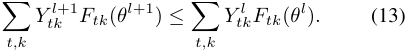

For the problem 

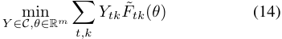

it is possible to find a global minimum. The minimization with respect to _θ_ yields 

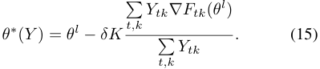

Since� _Ytk_ = _K_ , this expression can be simplified as _t,k_ 

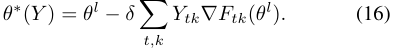

Substituting _θ_ with _θ__∗_ ( _Y_ ) in (14) leads to the problem 

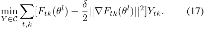

This is a linear problem that can be solved as described in Section B.2. Denote _Y__∗_ a solution of (17). We obtain _θ∗_ by substituting _Y_ s with _Y__∗_ in (16). The pair ( _Y__∗_ _, θ__∗_ ) is a global minimum for (14). We take this pair as a new solution ( _Y__l_+1 _, θ__l_+1 ). 

The described optimization procedure can be seen as alternating between solving a linear problem (17) for _Y_ and a gradient descent step with the learning rate _δ_ 

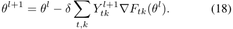

> Original page for checking 7 unresolved font glyphs.

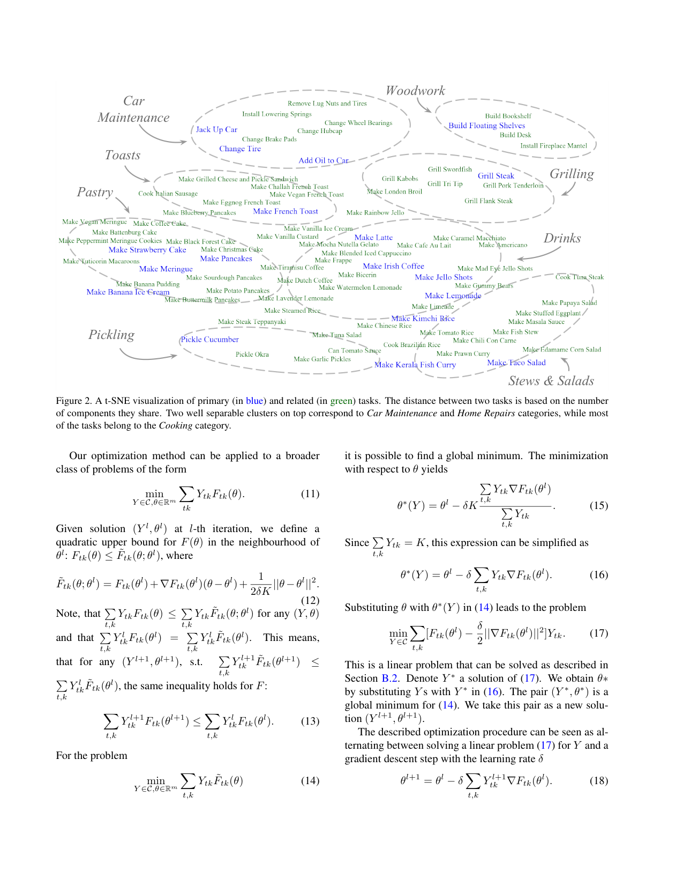

<!-- Page 13 -->

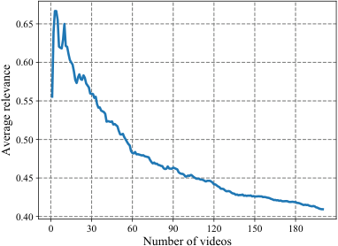

<!-- Start of picture text -->
0.65 0.60 0.55 0.50 0.45 0.40 0 30 60 90 120 150 180 Number of videos Average relevance <!-- End of picture text -->

Figure 3. Average relevance of videos as a function of the number of videos collected from YouTube. Taking top 30 videos per task results in 56% relevant videos. Attempting to collect more videos results in a noisy dataset with many irrelevant videos. 

# **C. Dataset** 

## **C.1. Video collection** 

As described in Section 5.1 of the main paper, given a task, we collect top _N_ videos from YouTube, by querying a title of the task. The choice of _N_ relies on the following trade-off. Training the model on a large number of videos for a given task may lead to better performance. On the other hand, large _N_ results in many videos being unrelated to the queried task, which may hurt the performance of the model. To investigate the influence of _N_ on the purity of the data, we have annotated videos from YouTube search output as relevant or irrelevant to a task for all primary tasks. We define the average relevance as the ratio between the number of relevant videos and the total number of videos. Figure 3 shows the average relevance for different values of _N_ . The relevance rapidly decreases with _N_ , making the data unusable without manual cleaning. For each related task we take top 30 videos from YouTube, which seems a reasonable compromise between the amount of data and the level of noise. 

30 videos are clearly not enough to learn a task from scratch, as they feature only a few positive examples for each step in the task. Sharing knowledge across tasks as proposed in our paper is an essential mechanism to overcome this problem. 

Since the videos are collected automatically for each task, they may be shared between tasks. The primary tasks have little in common and do not share any videos. The related tasks, however, may be similar to each other and to the primary tasks ( _e.g_ . _Make Sourdough Pancakes_ and _Make Pancakes_ ). We found that the primary and related tasks share about 2.6% of videos. However, we stress the fact that such duplicate videos are provided with different supervision (different ordered list of steps) for each task. Our videos come from 3007 different YouTube channels, 

with 1 _._ 6 videos per channel on average. 70% of videos from primary tasks do not share channels with videos from related tasks. We, thus, conclude, that the difference between videos collected for primary and related tasks is sufficiently large, hence transferring related task models to primary tasks is not trivial. 

## **C.2. Tasks and statistics** 

Figure 2 shows all 83 primary and related tasks from our dataset. In order to illustrate the sharing between tasks, we define the distance between two tasks based on the number of common step components and make a 2D projection via t-SNE [39]. The tasks mostly share within the same domain, forming different groups, such as _Car Maintenance_ , _Drinks_ and _Woodworks_ . _Car Maintenance_ and _Home Woodwork_ tasks mostly share components within the same category, with some spurious sharing with cooking tasks ( _e.g_ . _Pour_ and _Oil_ components from _Add Oil to Car_ task). This categories form two distinct clusters on the diagram. The rest of the tasks form a continuous _Cooking_ cluster. 

Table 2 provides some statistics for the primary tasks. The order consistency, defined as in [36], shows how well the order is respected in the videos. For example, if the order of steps in a video is 2 _→_ 1 _→_ 3, the order consistency for this video would be equal to<u>2</u> 3.Theamountofback- ground is defined as an average number of frames, which are not assigned to any step, divided by a total number of frames. The high amount of background (72% in average) motivates the use of methods, that aren’t limited to a dense segmentation of a video and allow frames to remain unlabeled. The average order consistency is high (86%), thus justifying the use of hard ordering constraints. However, it varies across the tasks and has a relatively low value for some of the tasks ( _e.g_ . _Make Kimchi Rice_ and _Make Taco Salad_ ). Similarly, the amount of missing steps is close to 50% for _Grill Steak_ and _Pickle Cucumber_ , making these tasks especially challenging for our method. 

# **D. Experiments** 

## **D.1. Comparison of evaluation metrics** 

At test time we predict one temporal unit per step and assume a correct detection if it falls within a ground truth interval for the corresponding step. This is motivated by the fact that in weakly supervised context, when no information about exact temporal extents of steps is given during the training, prediction of step time intervals is an ill-posed problem. Indeed, even people do not always agree on the action boundaries. Predicting punctual steps, defined as the most consistent and distinguishable frames in the videos, allows to avoid this problem. Although our model is trained for this punctual prediction, it may still be used to predict temporally extended steps, for example, by threshold-

<!-- Page 14 -->

Table 2. Statistics for primary tasks. 

|Task|Number of videos|Number of steps|Average length|Missing steps|Background|Order consistency|
|---|---|---|---|---|---|---|
|Make Kimchi Rice|120|6|4:47|21%|70%|0,69|
|Pickle Cucumber|106|11|5:35|48%|75%|0,85|
|Make Banana Ice Cream|170|5|4:04|38%|80%|0,98|
|Grill Steak|228|11|5:26|46%|75%|0,95|
|Jack Up Car|89|3|4:13|39%|81%|1,00|
|Make Jello Shots|182|6|4:15|21%|72%|0,87|
|Change Tire|99|11|4:52|27%|62%|0,97|
|Make Lemonade|131|8|3:44|28%|69%|0,80|
|Add Oil to Car|137|8|5:39|33%|85%|0,92|
|Make Latte|157|6|3:52|43%|71%|0,89|
|Build Floating Shelves|153|5|5:23|34%|58%|0,96|
|Make Taco Salad|170|8|4:44|41%|79%|0,66|
|Make French Toast|252|10|4:10|23%|68%|0,80|
|Make Irish Coffee|185|5|3:13|13%|74%|0,77|
|Make Strawberry Cake|86|9|5:36|25%|63%|0,82|
|Make Pancakes|182|8|4:34|19%|70%|0,89|
|Make Meringue|154|6|4:42|23%|67%|0,98|
|Make Fish Curry|149|7|5:31|25%|69%|0,74|
|**Average**|**153**|**7**|**4:57**|**31%**|**72%**|**0,86**|

Table 3. Results of cross-task learning, evaluated with mAP and recall metrics and averaged over primary tasks. Standard deviation <u>does not exceed 0.3% for mAP and 1% for recall.</u> 

|Metric|Random|Richard’18|Alayrac’16|Ours (no sharing)|Ours (with sharing)|
|---|---|---|---|---|---|
|Recall|8.27|6.7|13.3|18.6|22.4|
|mAP|4.3|5.5|6.9|8.9|11.0|

ing model’s confidence of each step for each frame. Does this yield reasonable predictions? To answer this question we evaluate our model, using mAP metric. Table 3 contains results, averaged over the primary tasks and compared to baselines. Here recall stands for the same evaluation procedure, as described in the main paper (global non-maximal suppression + recall). Note that both proposed ways of evaluation yield highly correlated results with recall roughly equal to mAP _×_ 2. The only exception is Richard’18 that under-performs in the case of recall. This may be caused by the fact that, unlike other methods in Table 3, it is trained to predict step intervals, and not punctual steps. 

## **D.2. Importance of temporal text constraints** 

Temporal constraints, obtained from narration, provide a very noisy supervision. In case of our primary tasks, the intersection over union between the ground truth of the steps and the corresponding temporal text constraints is only 7 _._ 9%. Moreover, 61% of ground truth steps lie entirely outside of the constraint intervals. This means that our method is unable to assign a step to a correct frame even with a perfect classifier, if it is forced to satisfy these constraints. This is likely to be a disadvantage during training which tries to fit the step model to incorrect temporal inter- 

vals. Could it be better to learn our model without temporal constraints? We answer this question by training and evaluating our solution in the same setup as before, but without text constraints at the training time. The resulting recall is 17%, compared to 22 _._ 4%, when training with text constraints. This gain of 5 _._ 4% shows the importance of text guidance during training even at the presence of the high level of noise. 

## **D.3. Additional qualitative results** 

In this section we show some additional qualitative examples to provide a better intuition into our data and the method. Figures 4-9 shows the outputs of our model for videos for several tasks. We show the outputs of classifiers for each step at each frame of the video, as well as the inferred solution and compare it with the ground truth. Figure 4 illustrates two kinds of error, caused by our assumptions. First,the step _Whisk Mixture_ is localized in the area of low confidence for this step. This is caused by the next step, _Pouring Egg_ , that precedes _Whisking Mixture_ in this particular video. Second, false detection for _Topping Toast_ is due to the absence of this step in the video, while we assume that every step is present. Note that although step _Top Toast_ doesn’t appear in the video, the classifier puts high and well localized scores in the end of the video. This is because _Making French Toast_ define positive as falling inside a ground truth interval for that step videos usually end with a demonstration of a final product on a plate. The model captures this visual consistency between the videos and takes it for the final step.

<!-- Page 15 -->

# **<u>MAKE FRENCH TOAST</u>** 

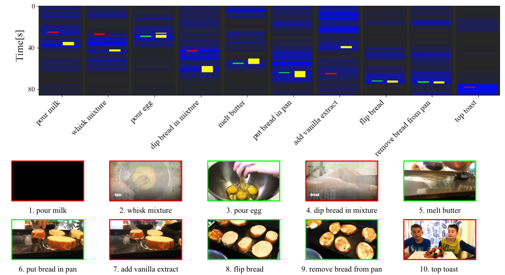

<!-- Start of picture text -->
1. pour milk 2. whisk mixture 3. pour egg 4. dip bread in mixture 5. melt butter 6. put bread in pan 7. add vanilla extract 8. flip bread 9. remove bread from pan 10. top toast [s] <!-- End of picture text -->

Figure 4. Example of obtained solution for _Make French Toast_ task. Outputs of the classifier are shown in blue. Correctly localized steps are shown in green. False detections are shown in red. Ground truth intervals for the steps are shown in yellow. Failure cases include false localization due to the ordering constraints ( _Pour milk_ , _Whisk mixture_ and _Dip bread_ ) and due to a missing step ( _Top toast_ ). 

# **<u>BUILD FLOATING SHELVES</u>** 

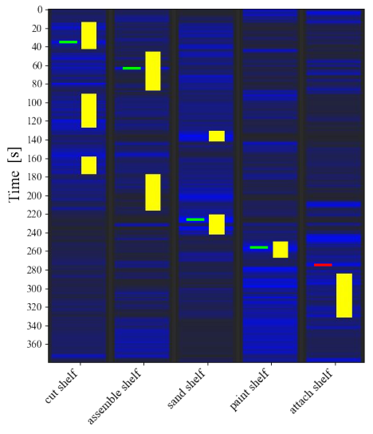

<!-- Start of picture text -->
[s] <!-- End of picture text -->

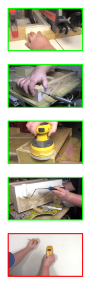

<!-- Start of picture text -->
1. cut shelf 2. assemble shelf 3. sand shelf 4. paint shelf 5. attach shelf <!-- End of picture text -->

Figure 5. Example of obtained solution for _Build Floating Shelves_ task. Outputs of the classifier are shown in blue. Correctly localized steps are shown in green. False detections are shown in red. Ground truth intervals for the steps are shown in yellow.

<!-- Page 16 -->

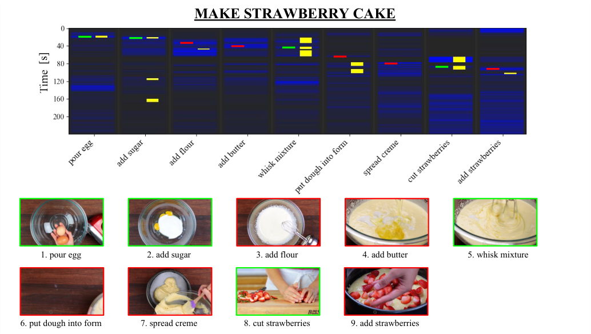

<!-- Start of picture text -->
MAKE STRAWBERRY CAKE 1. pour egg 2. add sugar 3. add flour 4. add butter 5. whisk mixture 6. put dough into form 7. spread creme 8. cut strawberries 9. add strawberries [s] <!-- End of picture text -->

Figure 6. Example of obtained solution for _Make Strawberry Cake_ task. Outputs of the classifier are shown in blue. Correctly localized steps are shown in green. False detections are shown in red. Ground truth intervals for the steps are shown in yellow. 

# **<u>MAKE IRISH COFFEE</u>** 

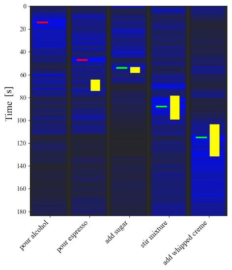

<!-- Start of picture text -->
[s] <!-- End of picture text -->

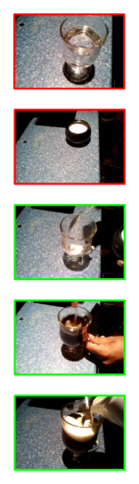

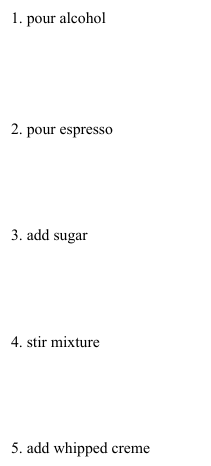

<!-- Start of picture text -->
1. pour alcohol 2. pour espresso 3. add sugar 4. stir mixture 5. add whipped creme <!-- End of picture text -->

Figure 7. Example of obtained solution for _Make Irish Coffee_ task. Outputs of the classifier are shown in blue. Correctly localized steps are shown in green. False detections are shown in red. Ground truth intervals for the steps are shown in yellow.

<!-- Page 17 -->

# **<u>CHANGE A TIRE</u>** 

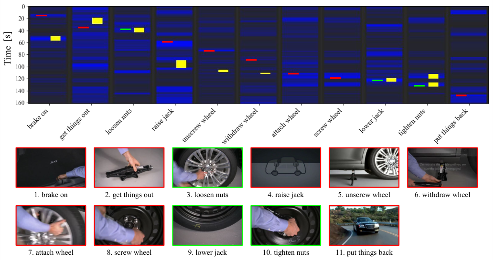

<!-- Start of picture text -->
1. brake on 2. get things out 3. loosen nuts 4. raise jack 5. unscrew wheel 6. withdraw wheel 7. attach wheel 8. screw wheel 9. lower jack 10. tighten nuts 11. put things back [s] <!-- End of picture text -->

Figure 8. Example of obtained solution for _Change a Tire_ task. Outputs of the classifier are shown in blue. Correctly localized steps are shown in green. False detections are shown in red. Ground truth intervals for the steps are shown in yellow. 

# **<u>MAKE FISH CURRY</u>** 

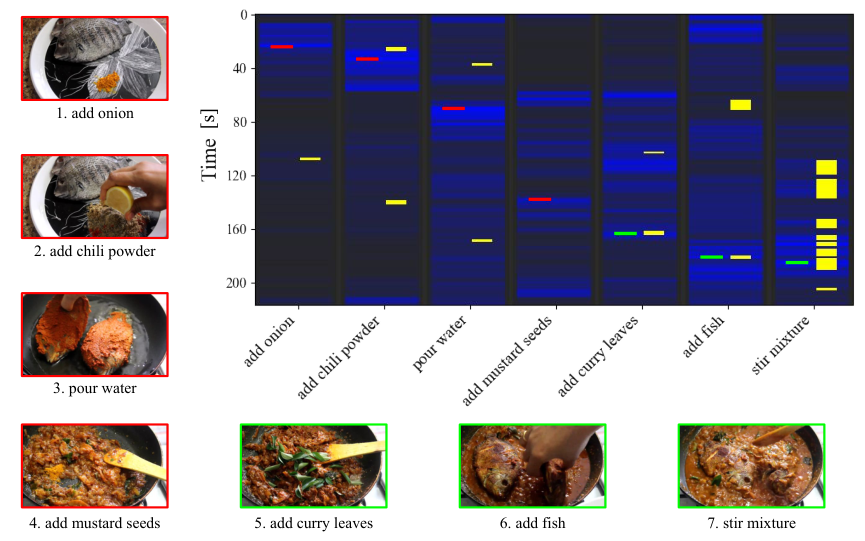

<!-- Start of picture text -->
1. add onion 2. add chili powder 3. pour water 4. add mustard seeds 5. add curry leaves 6. add fish 7. stir mixture [s] <!-- End of picture text -->

Figure 9. Example of obtained solution for _Make Fish Curry_ task. Outputs of the classifier are shown in blue. Correctly localized steps are shown in green. False detections are shown in red. Ground truth intervals for the steps are shown in yellow.

<!-- Page 18 -->

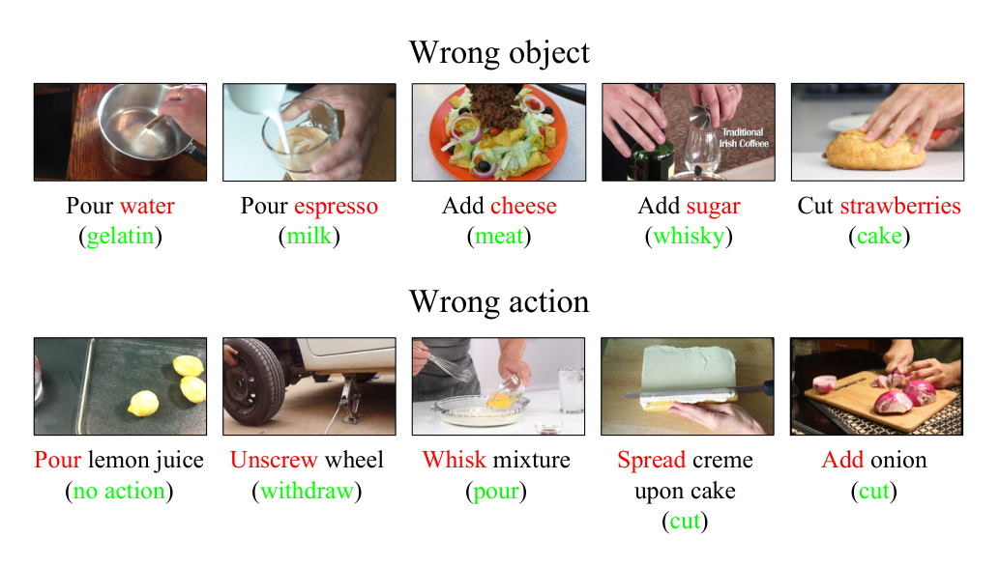

<!-- Start of picture text -->
Wrong object Pour water Pour espresso Add cheese Add sugar Cut strawberries (gelatin) (milk) (meat) (whisky) (cake) Wrong action Pour lemon juice Unscrew wheel Whisk mixture Spread creme Add onion (no action) (withdraw) (pour) upon cake (cut) (cut) <!-- End of picture text -->

Figure 10. Erroneous predictions, involving wrong objects and actions. Correct object/action is in green. Our method is not capable of distinguishing particular kinds of objects, especially liquids and powders, due to the nature of the features. Examples for the wrong action components show that in many cases the method captures a static context in which object occurs, rather than performed action. 

# **Supplementary References** 

- [36] J.-B. Alayrac, P. Bojanowski, N. Agrawal, J. Sivic, I. Laptev, and S. Lacoste-Julien. Learning from narrated instruction videos. _IEEE Transactions on Pattern Analysis and Machine Intelligence_ , XX, Sept. 2017. 

- [37] T. Mikolov, I. Sutskever, K. Chen, G. S. Corrado, and J. Dean. Distributed representations of words and phrases and their compositionality. In C. J. C. Burges, L. Bottou, M. Welling, Z. Ghahramani, and K. Q. Weinberger, editors, _Advances in Neural Information Processing Systems 26_ , pages 3111–3119. Curran Associates, Inc., 2013. 

- [38] A. J. Piotr Bojanowski, Edouard Grave and T. Mikolov. Enriching word vectors with subword information. _arXiv_ , 2017. 

- [39] L. van der Maaten and G. Hinton. Visualizing data using t-sne. _Journal of machine learning research_ , 2008.
