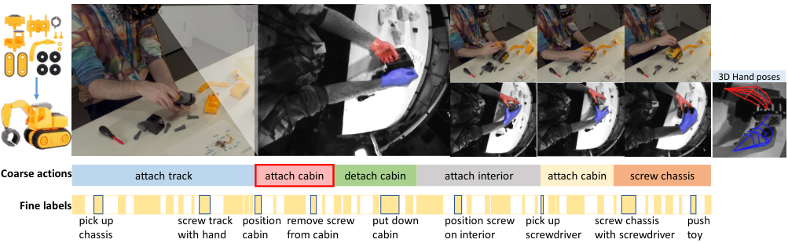
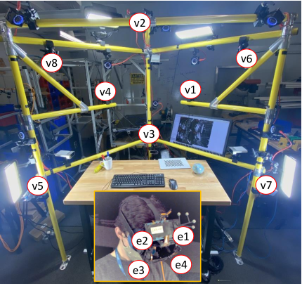
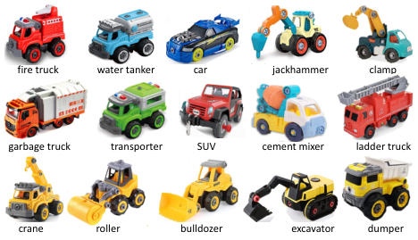
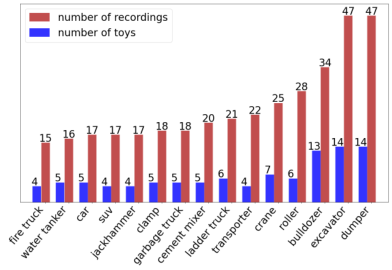
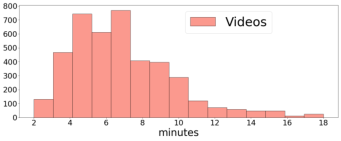
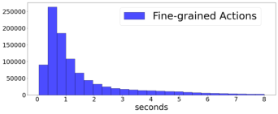
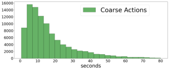
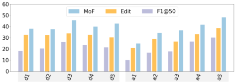

# 003_Sener_Assembly101_A_Large-Scale_Multi-View_Video_Dataset_for_Understanding_Procedural_Activities_CVPR_2022_paper

[Original PDF](../003_Sener_Assembly101_A_Large-Scale_Multi-View_Video_Dataset_for_Understanding_Procedural_Activities_CVPR_2022_paper.pdf)

Pages: 11

> Automatically converted from PDF. Check the original for exact equations, symbols, table alignment, and figure details.

<!-- Page 1 -->

# **Assembly101: A Large-Scale Multi-View Video Dataset for Understanding Procedural Activities** 

Fadime Sener_†_ Dibyadip Chatterjee_‡_ Daniel Shelepov_†_ Kun He_†_ Dipika Singhania_‡_ Robert Wang_†_ Angela Yao_‡_ 

_†_ Meta Reality Labs Research _‡_ National University of Singapore 

_{_ famesener,dsh,kunhe,rywang _}_ @fb.com _{_ dibyadip,dipika16,ayao _}_ @comp.nus.edu.sg 

https://assembly101.github.io/ 

## **Abstract** 

_Assembly101 is a new procedural activity dataset featuring 4321 videos of people assembling and disassembling 101 “take-apart” toy vehicles. Participants work without fixed instructions, and the sequences feature rich and natural variations in action ordering, mistakes, and corrections. Assembly101 is the first multi-view action dataset, with simultaneous static (8) and egocentric (4) recordings. Sequences are annotated with more than 100K coarse and 1M fine-grained action segments, and 18M 3D hand poses._ 

_We benchmark on three action understanding tasks: recognition, anticipation and temporal segmentation. Additionally, we propose a novel task of detecting mistakes. The unique recording format and rich set of annotations allow us to investigate generalization to new toys, cross-view transfer, long-tailed distributions, and pose vs. appearance. We envision that Assembly101 will serve as a new challenge to investigate various activity understanding problems._ 

## **1. Introduction** 

Assembly and disassembly tasks, like putting together a piece of furniture, or taking apart a home appliance for repair, are common to everyday living. We often rely on paper manuals or online instructional videos to guide us through these tasks. The next generation of smart assistants, together with augmented reality (AR) hardware, can help us in a more embodied setting. Intelligent systems that jointly consider instructions or goals _and_ real-world observations can greatly advance AR applications. Mock-ups and proof-of-concepts already exist for cooking [15], monitoring worker safety [4], visiting museums [11], and learning surgical procedures [3]. To that end, the interest in action understanding tasks such as recognition, anticipation, and temporal segmentation has grown, especially for egocentric views [5, 17, 34]. 

In looking at the benchmarks used in action understand- 

ing, there are datasets of short clips [16, 21, 45], datasets with longer sequences from movies [18, 51] and scripted actions [42, 43, 47], with particular focus on the cooking domain [5, 12, 22, 35, 37, 40, 47, 50]. Most related to our work are instructional video datasets [49, 50, 52]. But these instructional videos are curated from online sources; they are produced, have multiple shots, and primarily target multi-modal (vision + NLP) learning [40, 50, 52]. Few datasets focus on goal-oriented, multi-step activities outside the kitchen domain and are otherwise small-scale [2, 20, 34] or limited in task or sequence diversity [1, 49]. 

We introduce Assembly101: 362 unique sequences of people assembling and disassembling 101 “take-apart” toy vehicles (see Figs. 1, 3). The dataset features recordings from 8 static and 4 egocentric viewpoints, with 4321 sequences totalling 513 hours of footage. Assembly101 is annotated with more than 1M action segments, spanning 1380 fine-grained and 202 coarse action classes. We benchmark on four tasks: _action recognition_ and _anticipation_ centered around hand-object interactions, _temporal action segmentation_ and our newly proposed _mistake detection_ task dedicated to investigating sequence understanding in assembly activities. Assembly101 features three novel aspects currently under-represented in existing video benchmarks: 

- **Goal-oriented free-style procedures:** Existing datasets feature multi-step activities following a strictly ordered recipe [28, 40, 50, 52] or script [8, 12, 34, 43, 47]. Assembly101 depicts non-scripted, goal-oriented activities. 

- **Rich sequence variation:** Participants vary in skill level, and recordings feature realistic variations in action ordering, mistakes, and corrections. Unlike existing skill assessment datasets [7, 13, 31, 33], which have only skill scores, we annotate specific mistakes and participant skill levels. 

- **Synchronized static and egocentric viewpoints:** This unique multi-view setting gives privileged 

21096

<!-- Page 2 -->

<!-- Start of picture text -->
3D Hand poses Coarse actions  attach track attach cabin detach cabin attach interior attach cabin screw chassis Fine labels pick up screw track position remove screw put down position screw pick up screw chassis  push chassis with hand cabin from cabin cabin on interior screwdriver with screwdriver toy <!-- End of picture text -->

Figure 1. Assembly101 includes synchronized static multi-view and egocentric recordings of participants assembling and disassembling take-apart toys. Sequences are annotated with fine-grained and coarse actions, 3D hand poses, participants’ skill levels, and mistakes on coarse segments ( _e.g_ . “attach cabin” highlighted in red). 

static information currently missing from egocentric datasets. It also allows for investigating hand-object interactions with full 3D understanding and domaintransfer between different viewpoints. 

## **2. A Comparison of Action Datasets** 

Assembly101 can be characterized by its (1) multi-step content, (2) multi-view recordings and (3) action understanding tasks. We make a coarse comparison to related datasets based on this taxonomy. 

### **2.1. Content: Multi-step activities** 

Multi-step activities are best exemplified in cooking and instructional videos, so the majority of datasets in this area are curated from online video platforms, _e.g_ . YouTube Instructional [1], What’s Cooking [27], YoucookII [50], CrossTask [52], COIN [49] and HowTo100M [29]. Using YouTube videos is appealing due to the sheer amount and variety. However, these videos often do not suit an AR setting due to their “produced” nature, _e.g_ . mixed viewpoints, fast-forwarding, unrelated narrations, etc. Additionally, the majority of these datasets are from the kitchen domain and are primarily composed for studying multi-modal learning in vision and natural language [27, 50, 52]. 

Recorded datasets, _e.g_ . Breakfast [22], GTEA [12], 50Salads [47] are major contributors to the study of multistep activities [9,10,39]. However, they are either small [12, 47] or have little ordering variations [22]. Assembly tasks are a new domain explored in some datasets [2,34], but their limited scale is less ideal for deep learning. 

### **2.2. Viewpoint: Egocentric & multi-view** 

**Egocentric** data offers a unique viewpoint for human activities and is particularly important for wearables, _e.g_ . AR glasses. Small-scale datasets include [12,20,32,34]. Largescale efforts include EPIC-KITCHENS [5, 6] and the re- 

cent Ego4D [17], which expands beyond the kitchen to a wide variety of daily activities. In contrast to these datasets, Assembly101 features both egocentric and thirdperson views, offering simultaneous privileged information from the outside-in as well as multi-view egocentric data for 3D action recognition. 

**Multi-view** fixed-camera datasets include IKEA [2] and Breakfast [22]. We feature a synchronized egocentric stream that allows studying the domain gap between fixed and egocentric views. Moreover, the egocentric head pose is tracked relative to the fixed views, enabling geometric reasoning between the viewpoints. Although CharadesEGO [42] also has both an egocentric and a third-person view of people performing scripted activities, the views are taken asynchronously, _i.e_ . independent recording instances. 

### **2.3. Task** 

**Action recognition:** We focus on fine-grained actions lasting a few seconds within the context of longer activity sequences. This is in contrast to classifying short isolated clips, such as in Kinetics [21] and SomethingSomething [16]. Our task is more similar to EPICKITCHENS [5] and Charades [42, 43], which feature finegrained segments taken from longer daily activity videos with challenging long-tail distributions. 

**Anticipating actions** before they occur is a recently introduced task popularized by EPIC-KITCHENS [5] and Breakfast [22]. A notable difference between these two is the label granularity and hence the anticipation horizon. Anticipation methods for EPIC predict fine-grained actions with a short, few-second long horizon, while Breakfast aims to predict multiple coarse actions with minutes-long horizons. As Assembly101 features multi-granular labels, it can be used for both short- and long-horizon anticipation. 

**Temporal action segmentation** datasets like GTEA [12] and 50Salads [47] are small-scale datasets (28 and 50 videos 

21097

<!-- Page 3 -->

<!-- Start of picture text -->
v2 v8 v4 v1 v3 v5 v7 e1 e2 e4 e3 <!-- End of picture text -->

Figure 2. Our custom build headset (inset) and multi-camera desk rig, with cameras marked by red circles. 

respectively). Breakfast [22] is limited in temporal variation, making it less ideal for studying sequencing and ordering as a problem. The assembly actions in our dataset feature repetitions, large deviations in ordering and also require modelling longer-range information. 

**Hand-object interactions** from egocentric views are studied in two new datasets, FPHA [14] and H2O [23]. Unlike EPIC, FPHA and H2O provide 3D pose of one or both hands and 6D pose of the manipulated objects. Recognition from pose is particularly important when the amount of visual data given to the system is limited, _e.g_ . due to privacy concerns. Assembly101 currently offers 3D hand poses for each frame. It offers a much larger set of fine-grained handobject interactions compared to FPHA and H2O. 

**Detecting mistakes** and missed actions by wearable devices could greatly improve wearer’s safety. Anomaly detection in surveillance videos [48] and skill assessment [7, 13, 30, 53] are active research areas, but to the best of our knowledge, detecting mistakes in procedural activities has not been previously studied. The coarse action segments of our assembly sequences are annotated with mistake labels. Closest to our work is [46] on forgotten actions. 

## **3. Recording and Annotation** 

### **3.1. Recording rig** 

We built a desk rig equipped with eight RGB cameras at 1920 _×_ 1080 resolution and four monochrome cameras at 640 _×_ 480 resolution. The RGB cameras are mounted on a scaffold around the desk with 5 overhead and 3 on the side. The monochrome cameras are placed on the four corners of a custom-built headset worn by the participants and provide multiple egocentric views similar to the Oculus Quest VR 

headset. Fig. 2 shows the recording rig and headset, with cameras circled in red. All cameras are synchronized with SMPTE timecode and geometrically calibrated with a fiducial to sub-pixel accuracies. Participants are recorded standing, though taller participants are asked to sit to ensure their hands and the assembled toy is visible in all camera views. 

### **3.2. Participants, toys, & recording protocol** 

**Participants:** We recruited 53 adults (28 males, 25 females) to disassemble and assemble “take-apart” toy vehicles. Each participant was asked to work with six toys in an hour-long recording session, though the final number varies depending on the participant’s speed. 

**Toys:** The sequences feature 101 unique toys from 15 categories of construction, emergency response, and other vehicles. Each category has variations in colour, size, and style of vehicle; across categories, the vehicles have some shared components _e.g_ . construction vehicles feature the same base but different arm attachments. Fig. 3 shows a sample from each vehicle category and the distribution of toys and recordings per category. 

**Protocol:** We are interested in capturing the _natural_ order in which the participants assemble and disassemble the toys, so we placed only an image of the fully assembled toy on the table for reference. We did not provide instructions nor specify a part ordering1 . This design choice makes the assembly task more challenging but also more realistic, resulting in great variation in action ordering. Preliminary recordings showed that some participants struggled with the assembly task. For time-efficiency, we adjusted the protocol to have participants first disassemble a completed toy before proceeding to “re”-assemble. 

### **3.3. Annotations** 

**Action labels:** We label two granularities of actions and their start and end times. **_Fine-grained actions_** are handobject interactions based on a single verb or movement and an interacting object or toy part. A fine-grained action spans two or three stages: (1) pre-contact when the hand (and tool) starts approaching the object, (2) the interaction, and (3) post-contact when the object is released. Additionally, we merge several co-occuring or sequential finegrained actions into **_coarse actions_** related to the attaching or detaching of a vehicle part. For example, the coarse action _“detach bumper”_ consists of four fine-grained actions _{“unscrew bumper with screwdriver”, “remove screw from bumper”, “pick up bumper”, “put down bumper”}_ . The fine-grained actions may overlap with each other as participants often multi-task, _e.g_ ., _“put down cabin”_ and _“pick up screwdriver”_ , while the coarse actions are contiguous. Please see Supplementary for details on annotator training and our custom interface for labelling the actions. 

> 1 _e.g_ . Meccano [34] provides participants with an ordered list of steps. 

21098

<!-- Page 4 -->

<!-- Start of picture text -->
fire truck water tanker car jackhammer clamp garbage truck transporter SUV cement mixer ladder truck crane roller bulldozer excavator dumper <!-- End of picture text -->

Figure 3. **Left:** 15 toy vehicle categories. **Right:** Distribution of toys and recordings per category. (Best viewed in colour) 

**3D hand poses:** We perform hand tracking from the four monochrome egocentric cameras using a modified version of MegATrack [19] to estimate 3D hand poses of both hands. First, we fuse features from all views into a shared latent space [36]. Then, we regress the joint angles and global transformation for each hand before obtaining landmarks on the fingertips, joints and palm center via forward kinematics. The tracker is trained end-to-end on the dataset from [19]. After egocentric tracking, we extract the 3D keypoint locations (21 per hand) in world coordinates as our pose representation (see Fig. 1). 

## **4. Dataset Statistics** 

### **4.1. Recording statistics** 

Our key motivation was to gather a large and diverse procedural activity dataset with varying label granularities. Assembly101 features 362 disassembly-assembly sequences; each sequence is recorded from 12 viewpoints, totalling 4321 videos and 513 hours of footage. The average sequence or video duration is 7.1 _±_ 3.4 minutes (Fig. 4 left). Tables 1 and 2 show comparisons with similar recorded datasets. Assembly101 is considerably larger with more than 1M fine-grained and 100K coarse segments, making it the largest procedural activity dataset to date. 

### **4.2. Fine-grained actions** 

From our 15 toy categories, we define 90 objects, _e.g_ ., wheel, including 5 tools together with the _“hand”_ . Additionally, we specify 24 interaction verbs. The objects and interaction verbs form a total of 1380 fine-grained action labels. Fig. 4 shows the duration distribution. The average fine-grained action lasts 1.7 _±_ 2 seconds. In a single disassembly-assembly sequence, there are an average 236.7 _±_ 98.4 fine-grained actions. The entire dataset totals more than 1M fine-grained action instances. The distribution of objects and verbs is provided in the Supplementary. There is a natural long tail, where 30% of the data accounts for 1238 (89%) of the fine-grained actions. **Comparison with other datasets:** Table 1 gives a de- 

tailed numerical comparison with other fine-grained action datasets. Assembly101 has 23-44 _×_ more action classes and 56-111 _×_ more action segments than assembly-style datasets IKEA and Meccano. Assembly101’s scale is comparable to other large-scale egocentric datasets such as EPIC-KITCHENS and Ego4D. Compared to EPIC, Assembly101’s has 1.7 _×_ more egocentric footage and 11 _×_ more action segments. In the labelled footage of Ego4D, the closest subtask of “forecasting” features 120 hours of annotated temporal action labels. In comparison, our dataset has 12 _×_ more action segments than Ego4D. 

### **4.3. Coarse actions** 

Each coarse action is defined by the assembly or disassembly of a vehicle part. There are 202 coarse actions composed of 11 verbs and 61 objects. Each video sequence features an average of 24 coarse actions. The average coarse action comprises 10 fine-grained actions and lasts 16.5 _±_ 15.7 seconds (see distribution in Fig. 4). We also define the tail classes for the coarse labels where the 30% of the data accounts for 171 (84%) of the coarse actions. 

**Comparison with other datasets:** While coarse actions can also be used for classification, we consider them sequentially and use them for action segmentation. Table 2 compares Assembly101 with Breakfast & 50Salads, two contemporary segmentation benchmarks. We have 2.5 _×_ more videos, 6.7 _×_ more hours of footage, 9.3 _×_ more action segments and 4.2 _×_ more action classes than Breakfast. **Temporal dynamics:** We define and report two scores in Table 3 to quantify the temporal dynamics. The **repetition score** is defined as 1 _− ui/gi_ where _ui_ is the number of unique actions in video _i_ , and _gi_ is the total number of actions and results in a score in the range [0 _,_ 1). 0 indicates no repetition, and the closer the score is to 1, the more repetition that occurs in the sequence. Averaged over all video sequences, we have a repetition score of 0.18, with higher repetition (0.23) in assembly than disassembly (0.11). Compared with Breakfast and 50Salad, our dataset includes 1.6 _×_ and 2.3 _×_ more repeated steps, respectively. We compute the **order variation** as the average edit dis- 

21099

<!-- Page 5 -->

Table 1. Fine-grained action dataset comparisons. 

|**Dataset**|**total** **hours**|**#** **videos**|**avg.** **(min)**|**#** **segments**|**avg. #seg.** **per video**|**avg.** **(sec)**|**verbs** **o**|**#** **bjects **|**actions**|**labelled** **frames**|**overlapping** **segments**|**#partici-** **pants**|
|---|---|---|---|---|---|---|---|---|---|---|---|---|
|Meccano [34]|6.9|20|20.7|8,858|442.9|2.8|12|21|61|84.9%|15.8%|20|
|IKEAASM [2]|35.0|371|5.6|17,577|47.3|6.0|12|10|33|83.8%|-|48|
|EPIC-KITCHENS-100 [6]|100.0|700|8.5|89,977|128.5|3.1|97|300|4,053|71.6%|28.1%|37|
|Ego4D [17]|120.0|-|-|77,002|-|-|74|87|-|-|-|406|
|Assembly101 (ego)|167.0|1,425|7.1|331,310|236.7|1.7|24|90|1,380|81.4%|7.0%|53|
|Assembly101|513.0|4,321|7.1|1,013,523|236.7|1.7|24|90|1,380|81.4%|7.0%|53|

Table 2. Coarse action label dataset comparisons. 

|**Dataset**|**total** **hours**|**#** **videos**|**avg. video** **length (min)**|**#** **segments**|**avg. #segments** **per video**|**avg. segments** **length**|**verbs**|**#** **objects**|**actions**|**#partici-** **pants**|
|---|---|---|---|---|---|---|---|---|---|---|
|50Salads [47]|4.5|50|6.4|899|18|36.8|6|15|17|25|
|Breakfast [22]|77.0|1,712|2.3|11,300|6.6|15.1|14|28|48|52|
|Assembly101|513.0|4,321|7.1|104,759|24|16.5|11|61|202|53|

Table 3. Temporal dynamics of coarse action segments 

|**Dataset**|**repetitions**|**order variations**|
|---|---|---|
|Breakfast [22]|0.11|0.15|
|50Salads [47]|0.08|0.02|
|Assembly101|0.18|0.05|
|Assembly101 - Assembly|0.23|0.04|
|Assembly101 - Disassembly|0.11|0.05|

tance, _e_ ( _R, G_ ), between every pair of sequences, ( _R, G_ ), and normalize it with respect to the maximum sequence length of the two, 1 _− e_ ( _R, G_ ) _/_ max( _|R|, |G|_ ). This score has a range [0 _,_ 1]; a score of 1 corresponds to no deviations in ordering between pairs. The relatively high scores of Breakfast, 0.15, indicate that actions following a strict ordering, making it less attractive to study temporal sequence dynamics than 50Salads (0.02) and Assembly101 (0.05). Overall, our dataset includes a high frequency of repeated steps and variations in temporal ordering both in assembly and disassembly sequences, which are characteristic of daily procedural activities, and therefore contributes a challenging benchmark for modelling the temporal relations between actions. 

Table 4. Comparisons with other datasets with 3D hand pose. 

|**Dataset** **total**|**hours**|**#frames**|**#segments**|**#actions**|
|---|---|---|---|---|
|FPHA [14]|1.0|0.1M|1K|45|
|H2O [23]|5.5|0.5M|1K|36|
|Assembly101|513.0|111M|82K|1456|

recognizing mistakes. Of the 60k coarse actions in assembly, 15.9% and 6.7% segments are mistake and corrective segments, respectively. Skill is closely related, but datasets focusing on skill assessment assign a score to short clips of _e.g_ . drawing [7] or suturing [53] instead of determining what and when the mistake occurs. We also annotated the skill level of the participant in our videos from 1 (worst) to 5 (best). Overall, the distribution of skill labels in our sequences is 9%, 6%, 13%, 25% and 47% from worst to best. 

### **4.5. 3D hand poses** 

As Assembly101 features hand-object interactions, 3D hand pose is an important modality, especially since AR/VR systems often provide this information [19]. Compared with FPHA [14] & H2O [23], our dataset includes 82 _×_ more segments and 200 _×_ more frames, reported in Table 4. 

### **4.4. Mistake actions** 

Even though our participants are adults assembling children’s toys, they still make mistakes and then need to make corrections before proceeding. For example, putting on the cabin before attaching the interior (see Fig. 1), making it impossible to place the interior after, so one must remove the cabin as a corrective action before placing the interior. We annotate the coarse assembly segments with a parallel set of labels _{“correct”, “mistake”, “correction”}_ . 

Mistakes are natural occurrences in many tasks and an opportunity for an AR assistant to provide help. To the best of our knowledge, there are no existing action datasets for 

### **4.6. Training, validation & test splits** 

We use the 60%, 15% and 25% of the videos for creating our training, validation and test splits, respectively, with detailed statistics given in Supplementary. For more robust evaluation, we will withhold the test split ground truths to be used in online submission leaderboards. The validation and test sets are structured to help assess generalization to new toys and actions and the participants’ skills. 25 of the 101 toys are shared across training, validation and test splits. There are also toy instances that are not a part of the training set to facilitate zero-shot learning. 

21100

<!-- Page 6 -->

Figure 4. Distribution of durations: average durations are 7.1 mins, 1.7s and 16.5s for videos, fine-grained and coarse actions, respectively. 

Table 5. **Action recognition** on fine-grained actions evaluated by Top-1 accuracy. **Action anticipation** on fine-grained actions evaluated by Top-5 Recall. 

||||**Overal**|**l**||**Head**|||**Tail**||**S**|**een To**|**ys**|**U**|**nseen To**|**ys**|
|---|---|---|---|---|---|---|---|---|---|---|---|---|---|---|---|---|
|Task|Tested on|verb|object|action|verb|object|action|verb|object|action|verb|object|action|verb|object|action|
||Fixed|64.0|50.4|39.2|69.7|63.3|51.1|49.7|18.3|9.3|63.0|55.3|42.0|64.3|48.8|38.3|
|Recognition|Egocentric|47.0|34.3|23.0|51.3|44.6|31.0|36.2|8.6|3.1|47.3|36.0|23.5|46.9|33.8|22.9|
||Fixed & Ego.|58.5|45.2|34.0|63.7|57.2|44.6|45.3|15.1|7.3|57.8|48.9|35.9|58.7|44.0|33.3|
||Fixed|56.6|33.3|10.4|60.3|58.1|30.7|52.8|32.8|6.7|55.6|51.1|16.9|56.9|24.4|8.2|
|Anticipation|Egocentric|51.9|21.4|5.5|54.8|49.6|22.4|49.2|21.6|2.4|51.6|28.3|7.9|51.9|19.4|5.3|
||Fixed & Ego.|55.1|29.4|8.8|58.5|55.3|28.0|51.6|29.1|5.3|54.3|43.5|13.9|55.3|22.8|7.3|

Table 6. Top-1 fine-grained action recognition accuracy for individual views, using TSM networks. 

|**Trained on**|**v1**|**v2**|**v3**|**v4**|**v5**|**v6**|**v7**|**v8**|**all v***|**e1**|**e2**|**e3**|**e4**|**all e***|
|---|---|---|---|---|---|---|---|---|---|---|---|---|---|---|
|Fixed|43.1|40.6|40.3|43.6|27.8|40.4|33.3|37.5|38.3|1.7|1.8|2.2|3.1|2.2|
|Egocentric|8.1|7.5|4.8|6.0|2.9|10.8|2.6|8.5|6.4|13.2|13.2|29.2|29.3|21.2|
|Fixed & Ego.|44.1|42.6|41.1|44.8|28.0|41.5|33.4|38.2|39.2|13.9|13.1|32.7|32.7|23.0|

## **5. Benchmark Experiments** 

We benchmark and present baselines for four action tasks: recognition, anticipation, temporal segmentation and our newly defined mistake recognition. However, as the data is very rich, it is our hope that the extended community will find other uses and tasks for the dataset after its release. Due to limited space, we highlight some key results in this section and defer the architecture, implementation and detailed comparison of results to the Supplementary. 

### **5.1. Recognition, anticipation & segmentation** 

**For action recognition** (Table 5), we define a classification task on the fine-grained action classes, using pre-trimmed clips based on the annotated start and end times. We train a state-of-the-art video recognition model, TSM [25], and two top-performing graph convolutional networks on poses, 2s-AGCN [41] and MS-G3D [26]. Performance is evaluated by Top-1 accuracies for verb, object and action classes. **Action anticipation** (Table 5), predicts upcoming finegrained actions _τ_ = 1 second into the future. We train a state-of-the-art model TempAgg [38]. Performance is evaluated by class-mean Top-5 recall as per [6]. 

**Temporal action segmentation** (Table 7) assigns framewise action labels to a video sequence. We apply two competing state-of-the-art temporal convolutional networks: MS-TCN++ [24] and C2F-TCN [44], using frame-wise fea- 

tures extracted from TSM [25] trained for action recognition on Assembly as input. Performance is evaluated by mean frame-wise accuracy (MoF), segment-wise edit distance (Edit) and F1 scores at overlapping thresholds of 10%, 25%, and 50%, denoted by F1@10, 25, 50. 

These three challenges form the basis for understanding actions at various granularities. Compared to the existing datasets, Assembly101 shows great potential for extending video understanding to new challenging natural procedural activities by uniting multi-view recognition, generalization to new tasks, long-tail distributions, different skill levels and sequences with mistakes in one dataset. 

### **5.2. Camera viewpoints** 

We train the models on the instances from both fixed and egocentric views but report the performance on each view separately in Tables 5 and 7. Unsurprisingly, fixed viewpoints perform better than egocentric viewpoints, with a difference of 16.2% in _“Overall”_ recognition, 4.9% recall in _“Overall”_ anticipation and 6.5% MoF in segmentation. These differences highlight the challenging nature of recognizing actions from the egocentric point of view. 

Table 6 compares Top-1 action recognition accuracy on the individual camera views. Overhead cameras v4 and v1 have the highest accuracy while side cameras v5 and v7 have the lowest, with a drop of 16% and 11% from v4. 

21101

<!-- Page 7 -->

Table 7. Baselines of **temporal action segmentation** ; unless specified, results are from C2F-TCN. 

|**Compar**|**ison**|**F1@**|**_{_10,25**|**,50****_}_**|**Edit**|**MoF**|
|---|---|---|---|---|---|---|
|**SOTA**|||||||
|MS-TCN++ [24]|all|31.6|27.8|20.6|30.7|37.1|
|C2F-TCN [44]|all|**33.3**|**29.0**|**21.3**|**32.4**|**39.2**|
|**Fixed vs. Egocen**|**tric**||||||
|Fixed||35.5|31.2|23.2|33.9|41.3|
|Egocentric||28.7|24.4|17.5|29.2|34.8|
|**Seen vs. Unseen**|**Toys**||||||
|Seen|Disassembly|35.8|31.1|22.2|31.7|39.8|
|Unseen|Disassembly|31.9|26.6|17.0|27.9|38.9|
|Seen|Assembly|33.0|28.6|22.7|30.0|42.5|
|Unseen|Assembly|29.9|26.2|19.8|32.0|34.8|

In egocentric views, the lower headset cameras, e3 and e4 achieve higher accuracies than e1 and e2, which do not fully capture the table. The accuracies of e3 and e4, however, are still more than 10% lower than that of v4. 

Table 6 shows that there is a large domain gap if we train the models on only egocentric or fixed view sequences and cross-test rather than training on both sources of data. TSM trained only on fixed views performs significantly worse on egocentric views and vice versa. This indicates a significant mismatch and presents a new challenge for studying the domain gap on paired egocentric and third-person actions. 

### **5.3. Head vs. tail classes** 

A separate tally in Table 5 reveals a significant gap of 37% between head and tail action accuracy for **recognition** . The drop in tail verbs is much less than objects (18% vs. 42% drop). Similarly, the action **anticipation** performance on head classes is quite high, with a 28% recall in Table 5. It is significantly larger than _“Overall”_ action recall by 19.2%. This large difference could be due to the evaluation metric where the class-mean balances the longtail distribution as 89% of action classes are tail classes. Similarly, we evaluate the tail and head class MoF for temporal action segmentation. According to this the MoF of the tail classes is 51.5% which is much higher than the tail MoF of 7.2%. The low tail performance scores encourage developing few-shot action recognition methods. 

### **5.4. Seen vs. unseen, assembly vs. disassembly** 

Assembly101 can be used to study generalization to new assembly tasks through the _“Unseen”_ toys. Both Tables 5 and 7 show that _“Seen”_ toys score higher than _“Unseen”_ ones for action recognition, anticipation and segmentation. For recognition and anticipation, there is little difference in verb scores, but a large gap for objects, as all verbs are shared whereas objects are not (13% unseen objects). 

We separate the evaluation for assembly vs. disassembly 

Table 8. **Action recognition** on 3D hand poses. 

|**Method**|**verb**|**object**|**action**|
|---|---|---|---|
|2s-AGCN [41]|58.1|30.9|22.2|
|2s-AGCN [41] w/ context|64.4|33.9|26.7|
|MS-G3D [26] w/ context|**65.7**|**36.3**|**28.7**|
|TSM egocentric (fuse 4 views)|59.0|46.5|33.8|
|Object GT|28.1|98.8|27.2|
|MS-G3D [26] w/ context + Object GT|**63.4**|**98.8**|**62.0**|

Table 9. Frame-wise features are extracted from TSMs pre-trained on various datasets. **Action recognition** is performed by TempAgg [38] trained on these features. 

|**Pre-trained on**|**verb**|**object**|**action**|
|---|---|---|---|
|Kinetics-400 [21]|28.0|19.9|9.8|
|SSv2 [16]|28.7|18.8|10.2|
|EPIC-KITCHENS-100 [6]|44.0|25.2|17.3|
|Assembly101|65.9|50.5|40.5|
|3D pose - MS-G3D [26] w/ context|65.7|36.3|28.7|

portion of the sequences in Table 7 for action segmentation. The MoF and segment scores of the assembly portion is consistently lower than disassembly sequences, likely due to its higher complexity, as the disassembly portions have fewer ordering variations and no mistakes. Overall, the F1 and Edit scores do not show a significant over-segmentation effect compared to disassembly sequences even though the assembly tasks are more complex. 

### **5.5. 3D pose-based action recognition** 

Another objective for collecting Assembly101 was to investigate action recognition using 3D hand poses. Hand poses are commonly available in AR/VR systems and are significantly more compact representations than video features. Table 8 compares 3D pose-based to video-based recognition. _“2s-AGCN [41]”_ classifies trimmed segments bounded by action start and end [ _ts, te_ ]. _“2s-AGCN [41] w/ context”_ extends each boundary by 0.5 seconds; the extension improves action accuracy significantly. State-of-the-art “MS-G3D [26] w/ context” achieves the highest action performance of 28.7%, though this is still 5.1% lower than the video-based _“TSM egocentric (fuse 4 views)”_ , where predictions from the four egocentric views are fused by average voting. Interestingly, the verb accuracy for pose-based recognition is 6.7% higher than video-based, while its object score is 10.2% lower than video-based. This is unsurprising as hand poses can easily encode movements but cannot provide much object information. We also add an oracle experiment incorporating ground truth object labels as onehot encoded frame-level features and train a TempAgg [38] model on top. As shown in Table 8, _“Object GT”_ alone achieves a high object but poor verb accuracy. Fusing it with 

21102

<!-- Page 8 -->

Figure 5. Influence of skill on segmentation. “d” stands for disassembly and “a” for assembly. Participants with less skills, “a1 & a2”, have lower scores in assembly sequences. 

“MS-G3D [26] w/ context” results in a significant jump in action accuracy. We leave as future work the joint modeling of 3D objects and hand poses for action recognition. 

3D poses have the additional advantage of less sensitivity to domain gaps between different environments. For video-based models, training features from scratch requires considerable amounts of time and data, but using features extracted from pre-trained networks may not always generalize. Table 9 compares TempAgg [38] trained on the features extracted from TSM networks pre-trained on Kinetics400 [21], Something-Something [16], EPIC-KITCHENS100 [6] and Assembly101 for view _“v1”_ . TSM features pretrained on EPIC-KITCHENS perform significantly better than the other datasets; though there is still a gap of 23.2% compared to pre-training on the native Assembly101. This indicates a considerable domain gap between our dataset and the existing action recognition benchmarks. On the other hand, poses are low-dimensional common representations independent of the domain and therefore outperform the scores from the other datasets by a significant margin. 

### **5.6. Skill level** 

Fig. 5 compares the segmentation scores for different skill levels from 1 (least skilled) to 5 (most skilled) in both disassembly and assembly sequences, indicated by the prefixes _“d”_ and ‘ _“a”_ , respectively. Results show that the skill level has little impact on the disassembly sequences. For the least skilled groups _“a1 & a2”_ , however, segmentation scores for assembly sequences are significantly lower than disassembly, likely due to the high ordering variations and mistake segments. 

### **5.7. Mistake detection** 

Identifying mistakes requires modelling procedural knowledge and retaining long-range sequence information. As input, we provide video sequences represented by framewise features from the start of the assembly sequence to the (end of the) current coarse action segment. The task is predicting if the current segment belongs to one of the three classes of _{“correct”, “mistake”, “correction”}_ . We apply the long-range video model TempAgg [38] using TSM features and evaluate per-class Top-1 precision and Top-1 

Table 10. Mistake detection results. 

|||**Mista**|**ke**|**Correc**|**tion**|
|---|---|---|---|---|---|
|**Task**|**Features**|precision|recall|precision|recall|
|Recognition|GT coarse|48.6|62.7|65.6|84.9|
||TSM|30.8|46.6|30.8|29.6|
|Early prediction|TSM|29.3|35.0|26.5|26.4|

recall under two settings: _“Recognition”_ , which gets the entire coarse segment and _“Early prediction”_ , which gets half of the segment. Due to the imbalanced class distribution, we penalize the models more for misclassifying “mistake” and “correction” classes. As an oracle baseline, we use the ground truth coarse action labels, _“GT coarse”_ as input. **Baseline results:** Table 10 shows the challenge in detecting mistakes - even using the ground truth coarse action labels as input, the recall for mistakes and corrections is only around 62.7% and 84.9% respectively. With TSM input features, the recall is currently only around 46.6% and 29.6% once the segment of interest ends. Early prediction results in a further 11.6% and 3.2% drop. 

## **6. Conclusion** 

In this paper, we presented Assembly101, the largest procedural activity dataset to date. Our dataset includes synchronized egocentric and static viewpoints for crossview domain analysis, multi-granular action segments and mistake labels to study goal-oriented sequence learning and 3D hand poses to advance 3D hand-object interaction recognition. We defined four challenges, action recognition, action anticipation, temporal action segmentation and mistake detection, to evaluate a wide range of aspects of assembly tasks, including generalization to new toys, cross-view transfer, long-tailed distributions, skill level and pose vs. appearance. Existing methods show promising results but are still far from tackling these challenges with high precision, as observed in the oracle experiments, leaving room for future explorations. 

Assembly101 can be used for many different applications. In this paper, we proposed several directions such as training the next generation of smart assistants to recognize what a user is doing, predict subsequent steps as they watch an assembly task, check for non-compliant steps and give alerts or offer help. We hope that the community will find other applications and tasks for our dataset after its release. 

**Acknowledgements:** This research/project is supported by the National Research Foundation, Singapore under its AI Singapore Programme (AISG Award No: AISG2-RP-2020-016). Any opinions, findings and conclusions or recommendations expressed in this material are those of the author(s) and do not reflect the views of National Research Foundation, Singapore. 

21103

<!-- Page 9 -->

## **References** 

- [1] Jean-Baptiste Alayrac, Piotr Bojanowski, Nishant Agrawal, Josef Sivic, Ivan Laptev, and Simon Lacoste-Julien. Unsupervised learning from narrated instruction videos. In _Proceedings of the IEEE Conference on Computer Vision and Pattern Recognition_ , pages 4575–4583, 2016. 1, 2 

- [2] Yizhak Ben-Shabat, Xin Yu, Fatemeh Saleh, Dylan Campbell, Cristian Rodriguez-Opazo, Hongdong Li, and Stephen Gould. The ikea asm dataset: Understanding people assembling furniture through actions, objects and pose. In _Proceedings of the IEEE/CVF Winter Conference on Applications of Computer Vision_ , pages 847–859, 2021. 1, 2, 5 

- [3] Laura Beyer-Berjot, St´ephane Berdah, Daniel A Hashimoto, Ara Darzi, and Rajesh Aggarwal. A virtual reality training curriculum for laparoscopic colorectal surgery. _Journal of surgical education_ , 73(6):932–941, 2016. 1 

- [4] Sara Colombo, Yihyun Lim, and Federico Casalegno. Deep vision shield: Assessing the use of hmd and wearable sensors in a smart safety device. In _Proceedings of the 12th ACM International Conference on PErvasive Technologies Related to Assistive Environments_ , pages 402–410, 2019. 1 

- [5] Dima Damen, Hazel Doughty, Giovanni Maria Farinella, Sanja Fidler, Antonino Furnari, Evangelos Kazakos, Davide Moltisanti, Jonathan Munro, Toby Perrett, Will Price, and Michael Wray. Scaling egocentric vision: The epic-kitchens dataset. In _Proceedings of the European Conference on Computer Vision (ECCV)_ , 2018. 1, 2 

- [6] Dima Damen, Hazel Doughty, Giovanni Maria Farinella, Antonino Furnari, Jian Ma, Evangelos Kazakos, Davide Moltisanti, Jonathan Munro, Toby Perrett, Will Price, and Michael Wray. Rescaling egocentric vision. _CoRR_ , abs/2006.13256, 2020. 2, 5, 6, 7, 8 

- [7] Hazel Doughty, Walterio Mayol-Cuevas, and Dima Damen. The pros and cons: Rank-aware temporal attention for skill determination in long videos. In _Proceedings of the IEEE/CVF Conference on Computer Vision and Pattern Recognition_ , pages 7862–7871, 2019. 1, 3, 5 

- [8] EGTEA. Extended GTEA Gaze+ - Georgia Tech. http:// webshare.ipat.gatech.edu/coc-rim-walllab/web/yli440/egtea_gp, 2018. 1 

- [9] Yazan Abu Farha and Jurgen Gall. Ms-tcn: Multi-stage temporal convolutional network for action segmentation. In _Proceedings of the IEEE/CVF Conference on Computer Vision and Pattern Recognition (CVPR)_ , pages 3575–3584, 2019. 2 

- [10] Yazan Abu Farha, Qiuhong Ke, Bernt Schiele, and Juergen Gall. Long-term anticipation of activities with cycle consistency. In _German Conference on Pattern Recognition_ , 2020. 2 

- [11] Giovanni Maria Farinella, Giovanni Signorello, Sebastiano Battiato, Antonino Furnari, Francesco Ragusa, R Leonardi, Emanuele Ragusa, Emanuele Scuderi, Antonino Lopes, Luciano Santo, et al. Vedi: Vision exploitation for data interpretation. In _International Conference on Image Analysis and Processing_ , pages 753–763. Springer, 2019. 1 

- [12] Alireza Fathi, Xiaofeng Ren, and James M Rehg. Learning to recognize objects in egocentric activities. In _Proceedings of_ 

_the IEEE/CVF Conference on Computer Vision and Pattern Recognition (CVPR)_ , 2011. 1, 2 

- [13] Yixin Gao, S Swaroop Vedula, Carol E Reiley, Narges Ahmidi, Balakrishnan Varadarajan, Henry C Lin, Lingling Tao, Luca Zappella, Benjamın B´ejar, David D Yuh, et al. Jhu-isi gesture and skill assessment working set (jigsaws): A surgical activity dataset for human motion modeling. In _MICCAI workshop: M2cai_ , volume 3, page 3, 2014. 1, 3 

- [14] Guillermo Garcia-Hernando, Shanxin Yuan, Seungryul Baek, and Tae-Kyun Kim. First-person hand action benchmark with rgb-d videos and 3d hand pose annotations. In _Proceedings of the IEEE/CVF Conference on Computer Vision and Pattern Recognition (CVPR)_ , pages 409–419, 2018. 3, 5 

- [15] Google. Google glass cook along app for gressingham duck. https://www.youtube.com/watch?v=WQfu6Qle2g, 2014. 1 

- [16] Raghav Goyal, Samira Ebrahimi Kahou, Vincent Michalski, Joanna Materzynska, Susanne Westphal, Heuna Kim, Valentin Haenel, Ingo Fruend, Peter Yianilos, Moritz Mueller-Freitag, et al. The” something something” video database for learning and evaluating visual common sense. In _Proceedings of the IEEE/CVF International Conference on Computer Vision (ICCV)_ , pages 5842–5850, 2017. 1, 2, 7, 8 

- [17] Kristen Grauman, Andrew Westbury, Eugene Byrne, Zachary Chavis, Antonino Furnari, Rohit Girdhar, Jackson Hamburger, Hao Jiang, Miao Liu, Xingyu Liu, Miguel Martin, Tushar Nagarajan, Ilija Radosavovic, Santhosh Kumar Ramakrishnan, Fiona Ryan, ayant Sharma, Michael Wray, Mengmeng Xu, Eric Zhongcong Xu, Chen Zhao, Siddhant Bansal, Dhruv Batra, Vincent Cartillier, Sean Crane, Tien Do, Morrie Doulaty, Akshay Erapalli, Christoph Feichtenhofer, Adriano Fragomeni, Qichen Fu, Christian Fuegen, Abrham Gebreselasie, Cristina Gonz alez, James Hillis, Xuhua Huang, Yifei Huang, Wenqi Jia, Weslie Khoo, Jachym Kolar, Satwik Kottur, Anurag Kumar, Federico Landini, Chao Li, Zhenqiang Li, Karttikeya Mangalam, Raghava Modhugu, Jonathan Munro, Tullie Murrell, Takumi Nishiyasu, Will Price, Paola Ruiz Puentes, Merey Ramazanova, Leda Sari, Kiran Somasundaram, Audrey Southerland, Yusuke Sugano, Ruijie Tao, Minh Vo, Yuchen Wang, Xindi Wu, Takuma Yagi, Yunyi Zhu, ablo Arbel aez, David Crandall6, Dima Damen, Giovanni Maria Farinella, Bernard Ghanem, Vamsi Krishna Ithapu, C. V. Jawahar, Hanbyul Joo, Kris Kitani, Haizhou Li, Richard Newcombe, Aude Oliva, Hyun Soo Park, James M. Rehg, Yoichi Sato, Jianbo Shi, Mike Zheng Shou, Antonio Torralba, Lorenzo Torresani, Mingfei Yan, and Jitendra Malik. Around the World in 3,000 Hours of Egocentric Video. _CoRR_ , abs/2110.07058, 2021. 1, 2, 5 

- [18] Chunhui Gu, Chen Sun, David A Ross, Carl Vondrick, Caroline Pantofaru, Yeqing Li, Sudheendra Vijayanarasimhan, George Toderici, Susanna Ricco, Rahul Sukthankar, et al. Ava: A video dataset of spatio-temporally localized atomic visual actions. In _Proceedings of the IEEE Conference on Computer Vision and Pattern Recognition_ , pages 6047– 6056, 2018. 1 

21104

<!-- Page 10 -->

- [19] Shangchen Han, Beibei Liu, Randi Cabezas, Christopher D Twigg, Peizhao Zhang, Jeff Petkau, Tsz-Ho Yu, Chun-Jung Tai, Muzaffer Akbay, Zheng Wang, Asaf Nitzan, Gang Dong, Yuting Ye, Lingling Tao, Chengde Wan, and Robert Wang. MEgATrack: monochrome egocentric articulated hand-tracking for virtual reality. _ACM Transactions on Graphics (TOG)_ , 39(4):87–1, 2020. 4, 5 

- [20] Y. Jang, B. Sullivan, C. Ludwig, I. Gilchrist, D. Damen, and W. Mayol-Cuevas. Epic-tent: An egocentric video dataset for camping tent assembly. In _ICCVW_ , 2019. 1, 2 

- [21] Will Kay, Joao Carreira, Karen Simonyan, Brian Zhang, Chloe Hillier, Sudheendra Vijayanarasimhan, Fabio Viola, Tim Green, Trevor Back, Paul Natsev, et al. The kinetics human action video dataset. _arXiv preprint arXiv:1705.06950_ , 2017. 1, 2, 7, 8 

- [22] Hilde Kuehne, Ali Arslan, and Thomas Serre. The language of actions: Recovering the syntax and semantics of goaldirected human activities. In _Proceedings of the IEEE/CVF Conference on Computer Vision and Pattern Recognition (CVPR)_ , 2014. 1, 2, 3, 5 

- [23] Taein Kwon, Bugra Tekin, Jan Stuhmer, Federica Bogo, and Marc Pollefeys. H2o: Two hands manipulating objects for first person interaction recognition. _arXiv preprint arXiv:2104.11181_ , 2021. 3, 5 

- [24] Shi-Jie Li, Yazan AbuFarha, Yun Liu, Ming-Ming Cheng, and Juergen Gall. Ms-tcn++: Multi-stage temporal convolutional network for action segmentation. _IEEE Transactions on Pattern Analysis and Machine Intelligence_ , pages 1–1, 2020. 6, 7 

- [25] Ji Lin, Chuang Gan, and Song Han. Tsm: Temporal shift module for efficient video understanding. In _Proceedings of the IEEE/CVF International Conference on Computer Vision (ICCV)_ , pages 7083–7093, 2019. 6 

- [26] Ziyu Liu, Hongwen Zhang, Zhenghao Chen, Zhiyong Wang, and Wanli Ouyang. Disentangling and unifying graph convolutions for skeleton-based action recognition. In _Proceedings of the IEEE/CVF Conference on Computer Vision and Pattern Recognition (CVPR)_ , pages 143–152, 2020. 6, 7, 8 

- [27] Jonathan Malmaud, Jonathan Huang, Vivek Rathod, Nicholas Johnston, Andrew Rabinovich, and Kevin Murphy. What’s cookin’? interpreting cooking videos using text, speech and vision. In _North American Chapter of the Association for Computational Linguistics (NAACL)_ , pages 143– 152, 2015. 2 

- [28] Antoine Miech, Dimitri Zhukov, Jean-Baptiste Alayrac, Makarand Tapaswi, Ivan Laptev, and Josef Sivic. HowTo100M: Learning a Text-Video Embedding by Watching Hundred Million Narrated Video Clips. In _Proceedings of the IEEE/CVF International Conference on Computer Vision (ICCV)_ , 2019. 1 

- [29] Antoine Miech, Dimitri Zhukov, Jean-Baptiste Alayrac, Makarand Tapaswi, Ivan Laptev, and Josef Sivic. Howto100m: Learning a text-video embedding by watching hundred million narrated video clips. In _Proceedings of the IEEE/CVF International Conference on Computer Vision_ , pages 2630–2640, 2019. 2 

- [30] Jia-Hui Pan, Jibin Gao, and Wei-Shi Zheng. Action assessment by joint relation graphs. In _Proceedings of the_ 

_IEEE/CVF International Conference on Computer Vision_ , pages 6331–6340, 2019. 3 

- [31] Paritosh Parmar and Brendan Morris. Action quality assessment across multiple actions. In _2019 IEEE winter conference on applications of computer vision (WACV)_ , pages 1468–1476. IEEE, 2019. 1 

- [32] Hamed Pirsiavash and Deva Ramanan. Detecting activities of daily living in first-person camera views. In _Computer Vision and Pattern Recognition (CVPR), 2012 IEEE Conference on_ , pages 2847–2854. IEEE, 2012. 2 

- [33] Hamed Pirsiavash, Carl Vondrick, and Antonio Torralba. Assessing the quality of actions. In _European Conference on Computer Vision_ , pages 556–571. Springer, 2014. 1 

- [34] Francesco Ragusa, Antonino Furnari, Salvatore Livatino, and Giovanni Maria Farinella. The meccano dataset: Understanding human-object interactions from egocentric videos in an industrial-like domain. In _Proceedings of the IEEE/CVF Winter Conference on Applications of Computer Vision_ , pages 1569–1578, 2021. 1, 2, 3, 5 

- [35] Michaela Regneri, Marcus Rohrbach, Dominikus Wetzel, Stefan Thater, Bernt Schiele, and Manfred Pinkal. Grounding action descriptions in videos. _Transactions of the Association for Computational Linguistics_ , 2013. 1 

- [36] Edoardo Remelli, Shangchen Han, Sina Honari, Pascal Fua, and Robert Wang. Lightweight multi-view 3d pose estimation through camera-disentangled representation. In _Proceedings of the IEEE/CVF Conference on Computer Vision and Pattern Recognition (CVPR)_ , pages 6040–6049, 2020. 4 

- [37] Marcus Rohrbach, Sikandar Amin, Mykhaylo Andriluka, and Bernt Schiele. A database for fine grained activity detection of cooking activities. In _Proceedings of the IEEE conference on computer vision and pattern recognition (CVPR)_ , 2012. 1 

- [38] Fadime Sener, Dipika Singhania, and Angela Yao. Temporal aggregate representations for long-range video understanding. In _Proceedings of the European Conference on Computer Vision (ECCV)_ , pages 154–171. Springer, 2020. 6, 7, 8 

- [39] Fadime Sener and Angela Yao. Unsupervised learning and segmentation of complex activities from video. In _Proceedings of the IEEE/CVF Conference on Computer Vision and Pattern Recognition (CVPR)_ , 2018. 2 

- [40] Fadime Sener and Angela Yao. Zero-shot anticipation for instructional activities. In _Proceedings of the IEEE/CVF International Conference on Computer Vision_ , 2019. 1 

- [41] Lei Shi, Yifan Zhang, Jian Cheng, and Hanqing Lu. Twostream adaptive graph convolutional networks for skeletonbased action recognition. In _Proceedings of the IEEE/CVF conference on computer vision and pattern recognition_ , pages 12026–12035, 2019. 6, 7 

- [42] Gunnar A Sigurdsson, Abhinav Gupta, Cordelia Schmid, Ali Farhadi, and Karteek Alahari. Actor and observer: Joint modeling of first and third-person videos. In _Proceedings of the IEEE/CVF Conference on Computer Vision and Pattern Recognition (CVPR)_ , pages 7396–7404, 2018. 1, 2 

- [43] Gunnar A. Sigurdsson, G¨ul Varol, Xiaolong Wang, Ali Farhadi, Ivan Laptev, and Abhinav Gupta. Hollywood in 

21105

<!-- Page 11 -->

homes: Crowdsourcing data collection for activity understanding. In _Proceedings of the European Conference on Computer Vision (ECCV)_ , 2016. 1, 2 

- [44] Dipika Singhania, Rahul Rahaman, and Angela Yao. Coarse to fine multi-resolution temporal convolutional network. _arXiv preprint arXiv:2105.10859_ , 2021. 6, 7 

- [45] Khurram Soomro, Amir Roshan Zamir, and Mubarak Shah. Ucf101: A dataset of 101 human actions classes from videos in the wild. _arXiv preprint arXiv:1212.0402_ , 2012. 1 

- [46] Bilge Soran, Ali Farhadi, and Linda Shapiro. Generating notifications for missing actions: Don’t forget to turn the lights off! In _Proceedings of the IEEE/CVF International Conference on Computer Vision (ICCV)_ , pages 4669–4677, 2015. 3 

- [47] Stein and McKenna. Combining embedded accelerometers with computer vision for recognizing food preparation activities. In _UbiComp_ , 2013. 1, 2, 5 

- [48] Waqas Sultani, Chen Chen, and Mubarak Shah. Real-world anomaly detection in surveillance videos. In _Proceedings of the IEEE conference on computer vision and pattern recognition_ , pages 6479–6488, 2018. 3 

- [49] Yansong Tang, Dajun Ding, Yongming Rao, Yu Zheng, Danyang Zhang, Lili Zhao, Jiwen Lu, and Jie Zhou. Coin: A large-scale dataset for comprehensive instructional video analysis. In _Proceedings of the IEEE/CVF Conference on Computer Vision and Pattern Recognition (CVPR)_ , 2019. 1, 2 

- [50] Luowei Zhou, Chenliang Xu, and Jason J Corso. Towards automatic learning of procedures from web instructional videos. In _AAAI_ , 2018. 1, 2 

- [51] Yukun Zhu, Ryan Kiros, Rich Zemel, Ruslan Salakhutdinov, Raquel Urtasun, Antonio Torralba, and Sanja Fidler. Aligning books and movies: Towards story-like visual explanations by watching movies and reading books. In _Proceedings of the IEEE international conference on computer vision_ , pages 19–27, 2015. 1 

- [52] Dimitri Zhukov, Jean-Baptiste Alayrac, Ramazan Gokberk Cinbis, David Fouhey, Ivan Laptev, and Josef Sivic. Crosstask weakly supervised learning from instructional videos. In _Proceedings of the IEEE/CVF Conference on Computer Vision and Pattern Recognition (CVPR)_ , 2019. 1, 2 

- [53] Aneeq Zia, Yachna Sharma, Vinay Bettadapura, Eric L Sarin, Thomas Ploetz, Mark A Clements, and Irfan Essa. Automated video-based assessment of surgical skills for training and evaluation in medical schools. _International journal of computer assisted radiology and surgery_ , 11(9):1623–1636, 2016. 3, 5 

21106
