# 004_Spatial and temporal beliefs for mistake detection in assembly tasks

[Original PDF](../004_Spatial%20and%20temporal%20beliefs%20for%20mistake%20detection%20in%20assembly%20tasks.pdf)

Pages: 9

> Automatically converted from PDF. Check the original for exact equations, symbols, table alignment, and figure details.

<!-- Page 1 -->

Computer Vision and Image Understanding 254 (2025) 104338 

Contents lists available at ScienceDirect 

# Computer Vision and Image Understanding 

journal homepage: www.elsevier.com/locate/cviu 

## Spatial and temporal beliefs for mistake detection in assembly tasks$ 

Guodong Dinga,∗ , Fadime Senerb , Shugao Mab , Angela Yaoa 

a _School of Computing, National University of Singapore, Singapore_ b _Meta Reality Labs, United States of America_ 

### A R T I C L E I N F O 

### A B S T R A C T 

_Keywords:_ Mistake detection Assembly tasks Knowledge-grounded beliefs 

Assembly tasks, as an integral part of daily routines and activities, involve a series of sequential steps that are prone to error. This paper proposes a novel method for identifying ordering mistakes in assembly tasks based on knowledge-grounded beliefs. The beliefs comprise spatial and temporal aspects, each serving a unique role. Spatial beliefs capture the structural relationships among assembly components and indicate their topological feasibility. Temporal beliefs model the action preconditions and enforce sequencing constraints. Furthermore, we introduce a learning algorithm that dynamically updates and augments the belief sets online. To evaluate, we first test our approach in deducing predefined rules on synthetic data based on industry assembly. We also verify our approach on the real-world Assembly101 dataset, enhanced with annotations of component information. Our framework achieves superior performance in detecting ordering mistakes under both synthetic and real-world settings, highlighting the effectiveness of our approach. 

#### **1. Introduction** 

In assembly procedures, components or parts are brought together in a precise and sequential manner to produce a final product or structure. In everyday life, we assemble furniture, appliances, toys (BenShabat et al., 2021; Ragusa et al., 2021; Sener et al., 2022), etc. Despite having manuals, assembly tasks are challenging due to their complexity or unclear instructions.1 Beyond the household, assembly extends into industries and workplaces. Manufacturers rely heavily on assembly lines and processes to produce a wide array of goods (Kumar et al., 2022; Cicirelli et al., 2022). These processes are meticulously designed to ensure precision, efficiency, and quality. 

In real-world settings, making mistakes is a natural part of assembly tasks. Assembly is interesting to study due to its inherent complexity; mistakes in ordering, orientation, and fastening are common in assembly (Mattsson and Hogler, 2018; Sener et al., 2022). This work focuses on detecting ordering mistakes. Ordering mistakes can either be stand-alone, or they can have a cascade effect, impacting subsequent steps and leading to the need for disassembly and reassembly. In the video dataset Assembly101 (Sener et al., 2022), adult participants were asked to assemble and disassemble a toy vehicle designed for 4- to 6- year-olds. However, nearly 60% of the sequences showcased at least 

one mistake, and 78.6% of these were ordering mistakes. An ordering mistake example is shown in Fig. 4(a)l; if the ‘roof’ is placed on the ‘cabin’ before the ‘speaker’ and the ‘light’, it will be impossible to position them afterwards. Just like for humans, mistakes are valuable learning opportunities for intelligent systems by revealing possibilities for preventative adjustments. 

Sener et al. (2022) first introduced the ordering mistake detection task for assembly with the release of the video dataset Assembly101. Their benchmark formulated the problem as a video classification task and used a neural network to predict mistake labels directly. However, this direct mapping from video features to mistake labels conflates the action semantics and their temporal relations, making it challenging to interpret the temporal dependencies. We, therefore, introduce a new set of annotations for Assembly101 that include part information to mitigate the ambiguities. While numerous video datasets exist for procedural activity recognition (Kuehne et al., 2014; Zhukov et al., 2019; Tang et al., 2019), these datasets predominantly showcase successful outcomes and do not endorse any mistakes. 

Task graphs (Huang et al., 2019; Logeswaran et al., 2023) capture dependencies between key steps in a task, where Inductive Logic Programming (ILP) algorithms are implemented for the purpose. For 

$ This research/project is supported by theNational Research Foundation, Singapore and DSO National Laboratories under its AI Singapore Programme (AISG Award No: AISG2-RP-2020-016). Any opinions, findings and conclusions or recommendations expressed in this material are those of the author(s) and do not reflect the views of National Research Foundation, Singapore. 

∗ Corresponding author. 

_E-mail addresses:_ dinggd@comp.nua.edu.sg (G. Ding), famesener@meta.com (F. Sener), shugao@meta.com (S. Ma), ayao@comp.nus.edu.sg (A. Yao). 

> 1 A quick online search leads to dozens of articles with titles like ‘‘31PiecesofFurnitureYouWon’tHaveaHardTimeAssembling’’ and ‘‘The Secret to Assembling IKEA Furniture Without Losing Your Sanity’’ 

https://doi.org/10.1016/j.cviu.2025.104338 

Received 30 May 2024; Received in revised form 2 March 2025; Accepted 3 March 2025 Available online 7 March 2025 

1077-3142/© 2025 The Author(s). Published by Elsevier Inc. This is an open access article under the CC BY license (http://creativecommons.org/licenses/by/4.0/).

<!-- Page 2 -->

_G. Ding, F. Sener, S. Ma et al._ 

_Computer Vision and Image Understanding 254 (2025) 104338_ 

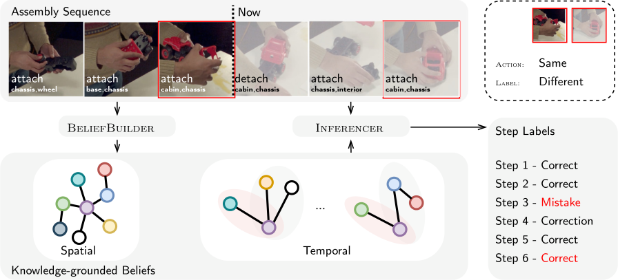

**Fig. 1.** Overview of our online mistake learning and detection system. Given a flow of action sequence, BeliefBuilder updates the knowledge-grounded spatial and temporal beliefs at each step. Inferencer make predictions on the action with beliefs. Ordering mistakes rely less on semantics yet more on the timing of the action. Step 3 & 6 are the same action but have different mistake labels. 

example, Sohn et al. (2020) integrates _classification and regression tree_ (CART) as the logic induction module to build their task graph with step sequences in a reinforcement setting. It is noteworthy that ILP systems are good at maximizing the objective function with the complete set of data but struggle to adjust and perform well in dynamic or real-time setups. This makes them less efficient for our mistake detection because of the online detection requirement. 

We are motivated to build an adaptive intelligent system that has the ability to learn from mistakes in an online fashion and then identify errors as novel sequences are observed. Specifically, assembly tasks entail a predefined sequence of steps dictated by the components’ structure.2 Furthermore, assembly is a sequential process; each step builds upon previous steps, demanding a specific order of actions. Lastly, assembly actions are reversible and can be undone by disassembly. This is in contrast to procedures like cooking, where actions are irreversible. 

Inspired by these characteristics, we propose a mistake detection framework presented in Fig. 1. The framework consists of two knowledge-grounded beliefs: spatial beliefs, capturing structural relationships between components, and temporal beliefs, encompassing the ordering constraints among action steps. Each of these beliefs attends to a distinct aspect of assembly tasks, as previously outlined. We differentiate between two classes of temporal beliefs due to their different unique error accumulation mechanisms. Additionally, we introduce algorithms designed for the construction of belief sets (BeliefBuilder) and inference (Inferencer) in an online setup. 

To summarize, our main contributions are threefold: 

- We present two belief sets for the assembly tasks. Spatial beliefs describe relationships between components, while temporal beliefs capture sequencing constraints. These learned beliefs are presented explicitly, enabling inspection, comprehension, and validation. Furthermore, our graph representations provide a more intuitive explanation. 

- We propose a novel mistake detection framework comprising a BeliefBuilder and an Inferencer designed for assembly tasks. The BeliefBuilder dynamically constructs the belief sets, while the Inferencer utilizes these learned beliefs to make predictions and detect mistakes. 

> 2 We exclude LEGO construction from this work, as it is more free-form than the assembly tasks considered. 

- We compose a synthetic dataset and enrich the Assembly101 dataset with information about the mistake type and the explicit component connections to facilitate the mistake detection task. Our method can better detect mistakes on both datasets and can also be integrated with perception modules. 

#### **2. Related work** 

**Task Structure Construction.** Our approach is the first to study ordering mistakes in procedural activities. Soran et al. (2015) tried to detect missing actions for making lattes. In their dataset, 18 of the 41 videos have a purposefully omitted action, _e.g._ , _‘steaming milk’_ . Soran et al. (2015) model the dependencies of latte-making actions with a directed graph and learn the graph from the complete sequences. Missing actions, however, are not identified until the entire sequence is completed. This method cannot be generalized to detect assembly ordering mistakes in Assembly 101 since it can only identify missing steps from a fixed sequence. Sohn et al. (2020) establish task preconditions using a off-the-shelf inductive logic programming (ILP) module. The same ILP technique has also been employed (Logeswaran et al., 2023) for constructing task graphs solely from textual inputs. 

**Mistake vs Anomaly.** Detecting anomalies and unintentional actions (Epstein et al., 2020; Sultani et al., 2018; Chakravarthy et al., 2022; Zatsarynna et al., 2022), especially in temporal sequences, share a similar thread with our research objects. These tasks identify actions that deviate from their intended course. However, anomalies and unintended actions differ from procedural mistakes as they exhibit distinct semantics from normal actions. For instance, a person walking suddenly falls to the ground; the semantics of falling is atypical from walking. Yet in assembly, the ordering mistakes are not always discernible by the action semantics stand-alone and may also depend on the temporal context. For example, placing parts in the wrong order is contingent upon the precise assembly steps; each part placement standalone is not discernible as a mistake. This unique distinction highlights the significance of exploring mistake detection in assembly tasks. 

#### **3. New annotation** 

Assembly101 (Sener et al., 2022) is the only real-world assembly dataset containing natural ordering mistakes and its annotations only provide one verb and a single object, which appears to be the most salient in view upon our examination. However, an assembly action 

2

<!-- Page 3 -->

_G. Ding, F. Sener, S. Ma et al._ 

_Computer Vision and Image Understanding 254 (2025) 104338_ 

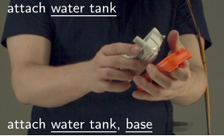

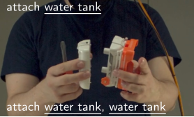

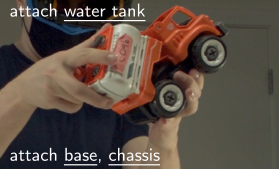

**Fig. 2.** The annotation for one video instance from (Sener et al., 2022) contains ambiguity and inconsistency. All three instances are labeled as ‘attach water tank’ (the top line). While (a) connects the ‘water tank’ to the ‘base’, b) connects the ‘water tank’ to itself and c) connects ‘base’ to ‘chassis’. Our part-to-part annotation (the bottom line) provides more precise information. 

#### **4. The approach** 

**Table 1** 

Six types of mistakes in Assembly101. Misorientation shown in gray as it is beyond the scope of our work. 

|Verb|Coarse|# of samples|Remark|Fine|# of samples|
|---|---|---|---|---|---|
||Correct|2927|Correct step|A|2927|
|Attach|||Generic order|B1|128|
||Mistake|332|Accumulated|B2|51|
||||misorientation|B4|153|
|Dth|Mistake|382|Unnecessary|B3|382|
|eac|Correction|330|Correction|C|330|

typically would involve one verb and two parts, _e.g._ , attach wheels and chassis. In that regard, the original action labels provided by Assembly101 (Sener et al., 2022) are likely to result in ambiguity and inconsistency for the mistake detection task. An illustrative example is shown in Fig. 2 where all three cases are labeled as the same action ‘attach water tank’. However, they are fundamentally distinct toy assembly operations and interpretations of their semantics can greatly affect the mistake detection performance. 

In addition, there are also self-looped and repetitive actions in the annotation. For example, certain toy parts from Assembly101 can be further split into two halves, _e.g._ , ‘water tank part’ and ‘water tank part’ as shown by Fig. 2(b). Given the geometrical symmetry of the toys, it is common for assembly sequences to involve repetitive steps. For example, four wheels can be attached at different sequential locations. 

In light of this, we present a new set of annotations for Assembly101. Through a meticulous review of all video sequences, we annotate each segment detailing interacting object information to mitigate ambiguities. As shown in Fig. 2, our annotation serves to complement the missing object information. For simplicity, we keep a consistent level of annotation and do not consider the subpart level and annotate them as ‘attach chassis, chassis’ (Fig. 2(b)). The repetitive actions are annotated whenever they occur, regardless of their number of occurrences. The overall statistics of our annotation is provided in Table 1. Coarsely speaking, there are three classes for the mistake detection task: _‘correct’_ (A), _‘mistake’_ (B), and _‘correction’_ (C), where the _‘correction’_ is a step made to rectify the _‘mistake’_ . The mistakes can be further classified based on four causes. The most straightforward type is the generic ordering mistake (B1). Accumulated mistakes (B2) are cascaded on generic order mistakes. Another type of mistake is the unnecessary detachment (B3) of correctly assembled parts. Misorientation mistakes (B4) happen when a part is placed in the wrong orientation, such as a reversed cabin. This involves 3D perception and modeling of toy parts, which is beyond the scope of this work. We hope that the release of our new annotations can attract and foster increased interest in the mistake detection task. 

#### _4.1. Problem setup_ 

Consider the assembly of item **𝐗** with a component set **𝐏** . Now consider a collection of _𝑁_ sequences, **𝐒** = { _𝑠𝑛_ }_𝑁_ _𝑛_ =1,ofpeopleas- sembling **𝐗** , and the corresponding labels **𝐘** = { _𝑦𝑛_ }_𝑁_ _𝑛_ =1.Eachse- quence _𝑠_ = { _𝑣_ ( _𝑖, 𝑗_ )_𝑡_ }_𝑇_ _𝑡_ =1has_𝑇_steps,where_𝑣_ ∈ { _𝑎𝑡𝑡𝑎𝑐ℎ, 𝑑𝑒𝑡𝑎𝑐ℎ_ } denotes the ‘verb’, and _𝑖, 𝑗_ are commutable interacting components, _i.e._ , _𝑖, 𝑗_ ∈ **𝐏** _,_ ( _𝑖, 𝑗_ ) ≡ ( _𝑗, 𝑖_ ). The step-wise mistake label is denoted as _𝑦__𝑡_ ∈{ _𝐴__𝑡_ _𝑖𝑗__,_¬_𝐴𝑡_ _𝑖𝑗__, 𝐷_ _𝑖𝑗__𝑡,_¬_𝐷_ _𝑖𝑗__𝑡_},where_𝐴𝑡_ _𝑖𝑗_denotesthatthestep_𝑎𝑡𝑡𝑎𝑐ℎ_(_𝑖, 𝑗_)is correct in sequence and ¬ _𝐴__𝑡_ _𝑖𝑗_isamistake.Similarly,_𝐷_ _𝑖𝑗__𝑡_indicatesthat the step _𝑑𝑒𝑡𝑎𝑐ℎ_ ( _𝑖, 𝑗_ ) is expected as a correction of the preceding mistake in time (¬ _𝐴__𝑡_ _𝑖𝑗_′_, 𝑡_′_<𝑡_)and¬_𝐷_ _𝑖𝑗__𝑡_whenitisamistakeofunnecessary operation, _e.g._ , taking apart correctly assembled parts. 

We further define an episodic context for each sequence _𝑀𝑛__𝑡_= { _𝑦𝑡_ ′ }_𝑡_ _𝑡_′ =1tostorethecollectivestepsexecuteduptotime_𝑡_.Duetoour online setup of the mistake detection task where the prediction is for the current action, we simplify the notations by omitting _𝑡_ . The mistake detection task is then to infer the mistake label _̂𝑦_ for each step _𝑣_ ( _𝑖, 𝑗_ ) in a sequence. 

#### _4.2. Spatial beliefs_  

In assembly, the component structures dictate the permissible action space. The structural information governs the feasibility of an assembly step and the number of actions required for successful completion. For instance, when assembling toys, a ‘roof’ component is attached to the ‘cabin’, and the ‘wheels’ are affixed to the ‘chassis’. As such, we define the spatial beliefs  to consolidate the components’ structure. More specifically, given components ( _𝑖, 𝑗_ ), the Spatial( _𝑖, 𝑗, 𝑦𝑠_ ) finds the assignment of _̂𝑦𝑠_ ∈{ _𝐴𝑖𝑗 ,_ ¬ _𝐴𝑖𝑗_ } such that the following formula evaluates to True: 

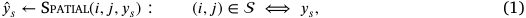

where _𝑦𝑡_ is an assignment of {TRUE, FALSE} depending on if the action of ‘‘attach i and j’’ is correct or not, while ⟺ indicates that expressions on either side of the equation are equivalent, _e.g._ , if one expression is true, the other must also be true, and vice versa. 

The formula in Eq. (1) indicates that only ( _𝑖, 𝑗_ ) pairs that conform to the structural constraints belonging to  are feasible; this is given by definition as _𝐴𝑖𝑗_ . The attempt to attach a pair ( _𝑖, 𝑗_ ) that does not fit together, i.e., excluded from , is a mistake; this is given by definition as ¬ _𝐴𝑖𝑗_ . Additionally,  verifies the completion of the assembly task with the following rule: 

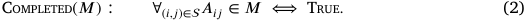

The rule in Eq. (2) yields a True outcome only when all interconnected components ( _𝑖, 𝑗_ ) ∈  have been successfully assembled by existing steps ( _𝐴𝑖𝑗_ ∈ _𝑀_ ). 

**Graph Interpretation.** The spatial beliefs can be visualized as a graph (Fig. 3), where nodes represent components and edges represent feasible attachments. Completion occurs when the episodic context _𝑀_ fully traverses the graph. 

3

<!-- Page 4 -->

_G. Ding, F. Sener, S. Ma et al._ 

_Computer Vision and Image Understanding 254 (2025) 104338_ 

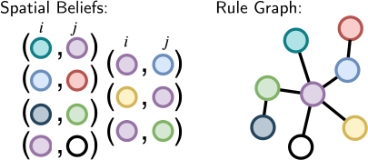

**Fig. 3.** Spatial beliefs as part pairs (left) and a graph (right). 

#### _4.3. Temporal beliefs_  

The spatial beliefs verify attachment feasibility without enforcing temporal ordering; they cannot indicate ordering mistakes. As such, we also establish a set of temporal beliefs  based on observed mistakes during training. 

We denote for a _focal_ component pair ( _𝑖, 𝑗_ ) its precondition set  _𝑖𝑗_ , a collection of pairs that focal action _𝑎𝑡𝑡𝑎𝑐ℎ_ ( _𝑖, 𝑗_ ) relies upon. Our temporal belief is defined as the union of the focal pair and its precondition set, _i.e._ ,  _𝑖𝑗_ ∶= ( _𝑖, 𝑗_ ) ∪  _𝑖𝑗_ . For example, in Fig. 4(a), the focal pair is (roof,cabin), while  _𝑖𝑗_ consists of (light,cabin) and (speaker,cabin). For a focal action, _e.g._ , _𝑎𝑡𝑡𝑎𝑐ℎ_ ( _𝑖, 𝑗_ ), we write as Temporal( _𝑖, 𝑗, 𝑀, 𝑦𝑡_ ) the function that finds the assignment of _̂𝑦𝑡_ ∈{ _𝐴𝑖𝑗 ,_ ¬ _𝐴𝑖𝑗_ } which conforms to the provided formula: 

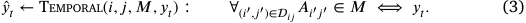

The formula in Eq. (3) checks if all precondition pairs from  _𝑖𝑗_ are assembled before the current action _𝑎𝑡𝑡𝑎𝑐ℎ_ ( _𝑖, 𝑗_ ). The focal action is deemed correct only when all its precondition actions are correct. 

**Error Accumulation.** Incorrect focal actions in context (¬ _𝐴𝑖𝑗_ ∈ _𝑀_ ) may propagate errors to its associated actions within  _𝑖𝑗_ . These errors are referred to as accumulated mistakes. There are two distinct types of error accumulations, based on the transitivity within  _𝑖𝑗_ : _transitive_ (represented as  _𝑖𝑗_ ) and _intransitive_ (denoted as ¬ _𝑖𝑗_ ). A transitive belief signifies that any precondition action after the focal action is a mistake. For example, in Fig. 4(a), once (roof, cabin) is attached, attaching (light, cabin) and/or (speaker, cabin) will fail and are mistakes. Suppose the pair ( _𝑖, 𝑗_ ) is precondition pair for the focal pair ( _𝑖_′ _, 𝑗_′ ), meaning ( _𝑖, 𝑗_ ) ∈  _𝑖_ ′ _𝑗_ ′ . We write the function  _𝑖_ ′ _𝑗_ ′ ( _𝑖, 𝑗, 𝑀_ ) with the following rule to infer the label _̂𝑦𝑡_ : 

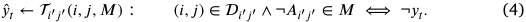

On the other hand, an intransitive belief suggests that if the focal is incorrect, the execution of any of its preconditions is deemed correct, except for the final one. To illustrate, in Fig. 4(b), attach (base, chassis) as a first step would be a mistake according to Eq. (3) because its preconditions are not performed. While the next step attach (cabin, interior) would be considered correct, further attachment of (interior, chassis) would be deemed a mistake. Conversely, should (interior, chassis) occur prior to (cabin, interior), their mistake labels will be swapped. We enforce the following rule in ¬ _𝑖_ ′ _𝑗_ ′ ( _𝑖, 𝑗, 𝑀_ ) to obtain the label assignment _̂𝑦𝑡_ : 

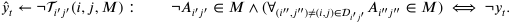

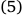

Our intransitive beliefs are specifically designed to handle multi-step dependencies, allowing our method to capture relationships that extend beyond immediate, one-step interactions. This enables more accurate mistake detection, accounting for cascading effects across multiple steps. 

Combining both transitive and intransitive belief, we have the following to make inference for the actions that appear in any precondition sets: 

Precondition( _𝑖, 𝑗, 𝑀_ ) ↦ ( _𝑖_ ′ _𝑗_ ′ ∧  _𝑖_ ′ _𝑗_ ′ ( _𝑖, 𝑗, 𝑀_ )) ∨(¬ _𝑖_ ′ _𝑗_ ′ ∧¬ _𝑖_ ′ _𝑗_ ′ ( _𝑖, 𝑗, 𝑀_ )) _._ (6) 

|**Alg**|**orithm** **1** Belief building Step||
|---|---|---|
|1:|**procedure** BeliefBuilder(_𝑀, 𝑖, 𝑗, 𝑦,_)||
|2:|**switch** _𝑦_ **do**||
|3:|**case** _𝐴𝑖𝑗_||
|4:|←∪(_𝑖, 𝑗_)||
|5:|_𝑖𝑗_←[_𝑖𝑗_] ∩Precedes(_𝑀, 𝑖, 𝑗_)|_⊳_ Eq. (8)|
|6:|**if** _𝐷𝑖𝑗_∈_𝑀_ **then**||
|7:|_𝑖𝑗_←[_𝑖𝑗_] ∩[Context(_𝑀, 𝑖, 𝑗_)] ∩[_𝑖𝑗_]|_⊳_ Eq. (9)|
|8:|_𝑖𝑗_←Connect(_𝑖𝑗, 𝑀,_)|_⊳_ Eq. (10)|
|9:|pop(_𝑀,_¬_𝐴𝑖𝑗_), pop(_𝑀, 𝐷𝑖𝑗_)||
|10:|push(_𝑀, 𝑦_)||
|11:|**case** ¬_𝐴𝑖𝑗_||
|12:|**if** Accumulated(¬_𝐴𝑖𝑗_) **then**||
|13:|**for** ¬_𝐴𝑖_′_𝑗_′ ∈_𝑀,_ **do**||
|14:|_𝑖_′_𝑗_′ ←_𝑖_′_𝑗_′ ∪(_𝑖, 𝑗_)|_⊳_ Eq. (11)|
|15:|push(_𝑀, 𝑦_)||
|16:|**case** ¬_𝐷𝑖𝑗_||
|17:|pop(_𝑀, 𝐴𝑖𝑗_)||
|18:|**case** _𝐷𝑖𝑗_||
|19:|push(_𝑀, 𝑦_)||
|**Alg**|**orithm** **2** Inference Step||
|1:|**procedure** Inferencer(_𝑀, 𝑣, 𝑖, 𝑗_)||
|2:|**switch** _𝑣_ **do**||
|3:|**case** ‘attach’||
|4:| _𝑦_← attach(_𝑀, 𝑖, 𝑗_)|_⊳_ Eq. (12)|
|5:|push(_𝑀, 𝑦_)||
|6:|**case** ‘detach’||
|7:| _𝑦_← detach(_𝑀, 𝑖, 𝑗_)|_⊳_ Eq. (13)|
|8:|**if** _̂𝑦_==_𝐷𝑖𝑗_ **then**||
|9:|pop(_𝑀,_¬_𝐴𝑖𝑗_)||
|10:|**else**||
|11:|pop(_𝑀, 𝐴𝑖𝑗_)||
|12:|**return** _̂𝑦_||

**Graph Interpretation.** Our temporal rules can also be represented as graphs. In their graph representation, the rule’s transitivity is determined by its radius. In conventional terms, the radius of a graph is defined as _𝑟_ = min _𝑢_ ∈ _𝑉_ max _𝑣_ ∈ _𝑉 𝑑_ ( _𝑢, 𝑣_ ), where _𝑑_ ( _𝑢, 𝑣_ ) represents the geodesic distance or shortest-path distance between two nodes _𝑢_ and _𝑣_ in graph _𝑉_ . Graphs for _Transitive_ rules have a fixed radius _𝑟_ = 1, while _intransitive_ rule graphs have a larger radius of _𝑟>_ 1. An illustration is shown in Fig. 4. The correctness of the focal action (indicated by the red edge) relies on traversing the dark edges. It is also possible to consider a hybrid version of these two cases; additional details on this hybrid case are provided in the Appendix. 

#### _4.4. BeliefBuilder and inferencer_ 

Our attention now shifts to the creation and inference processes of spatial and temporal beliefs. To facilitate, we introduce two components: BeliefBuilder and Inferencer. BeliefBuilder continuously enhances and revises the belief sets as it parses more streaming sequential action inputs. During inference, the Inferencer leverages the belief sets to anticipate the output label _̂𝑦_ associated with the observed action, _i.e._ , as correct ( _𝐴𝑖𝑗_ ), mistake(¬ _𝐴𝑖𝑗_ or ¬ _𝐷𝑖𝑗_ ), and correction ( _𝐷𝑖𝑗_ ). 

**BeliefBuilder.** The spatial and temporal beliefs are initialized as being agnostic to the task, _i.e._ , set to an empty set  = ∅ _,_  = ∅. BeliefBuilder proceeds to construct and continuously revise both belief sets as 

4

<!-- Page 5 -->

_G. Ding, F. Sener, S. Ma et al._ 

_Computer Vision and Image Understanding 254 (2025) 104338_ 

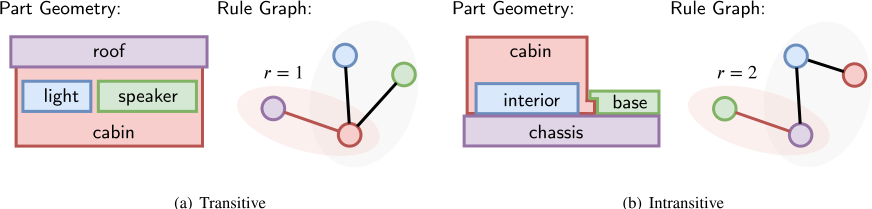

**Fig. 4.** Transitivity of temporal beliefs. Focal action (the red edge) is reliant on the completion of the rest (black edges in gray). Transitive and intransitive rules differ by their graph radius _𝑟_ . (For interpretation of the references to color in this figure legend, the reader is referred to the web version of this article.) 

more assembly sequences are observed. Each sequencing error unveils a temporal belief, hence, _every mistake counts in assembly sequences_ . For any mistake instance ¬ _𝐴𝑖𝑗_ , its mistake context Context( _𝑖, 𝑗, 𝑀_ ) invariably contains its preconditions. The mistake context, denoted as the set of correct actions occurring between the mistake fix ( _𝐷𝑖𝑗_ ) and its correct execution ( _𝐴𝑖𝑗_ ), _i.e._ , Context( _𝑖, 𝑗, 𝑀_ ) = {( _𝑖_′ _, 𝑗_′ )| _𝑡𝐷𝑖𝑗 < 𝑡𝐴𝑖_ ′ _𝑗_ ′ _< 𝑡𝐴𝑖𝑗 , 𝐴𝑖_ ′ _𝑗_ ′ ∈ _𝑀_ }. The precondition set  _𝑖𝑗_ for  _𝑖𝑗_ is updated with the following: 

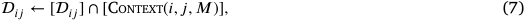

the inclusion of [ _𝛺_ ] is excluded when _𝛺_ is an empty set. While observing ordering mistakes in the sequences is a clear trigger for the builder to update the temporal beliefs, there exists an implicit temporal logic corresponding to fully correct assembly sequences as well. For instance, an action _𝐴𝑖𝑗_ does not have temporal dependencies on its subsequent actions. Conversely, its proceeding actions that are correct, Precedes( _𝑖, 𝑗, 𝑀_ ) = {( _𝑖_′ _, 𝑗_′ )| _𝐴𝑖_ ′ _𝑗_ ′ ∈ _𝑀_ }, constitute a candidate set  _𝑖𝑗_ wherein  _𝑖𝑗_ should be included, _i.e._ ,  _𝑖𝑗 ⊂_  _𝑖𝑗_ .  _𝑖𝑗_ is shared across sequences of actions and continuously refined by: 

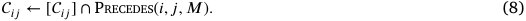

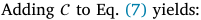

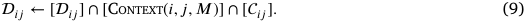

As illustrated in Fig. 7, the algorithm may overlook precondition pairs for intransitive temporal beliefs. The reason is that the precondition actions can be interpreted differently due to the error accumulation as given by the logic formula of Eq. (5) from Section 4.3. The result is a disjoint intransitive belief graph, _i.e._ , missing black edges in Fig. 4(b). To address this scenario, we utilize the spatial belief  to find the actions present in the episodic context _𝑀_ to establish connections between sub-graphs. Specifically, we apply: 

**Table 2** 

Performance of learned rules on HA4M. 

||Data|Acc|precision|recall|
|---|---|---|---|---|
|Sohn et al. (2020)|50%|64.7|77.3|72.9|
|Ours||76.1|83.9|81.2|
|Sohn et al. (2020)|100%|67.6|79.8|77.0|
|Ours||83.2|89.4|85.7|

inherently limits the potential for unbounded growth in computational requirements. This characteristic ensures that our system remains scalable and efficient, even as task complexity increases. 

**Inferencer.** The Inferencer, as presented in Algorithm 2 is recurrent and generates predictions based on the belief sets and prior decisions. At each step, the Inferencer estimates for the tuple ( _𝑣, 𝑖, 𝑗_ ) the mistake label, with the context of _𝑀_ , which contains the history of action labels up to the current step in that sequence. When the action is to attach, _i.e._ , _𝑣_ =‘attach’, multiple inferences by spatial and temporal beliefs, Spatial (Eq. (1)), Temporal (Eq. (3)) and Precondition (Eq. (6)) are made simultaneously, to determine its label _̂𝑦_ ∈{ _𝐴𝑖𝑗 ,_ ¬ _𝐴𝑖𝑗_ }: 

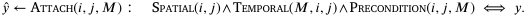

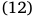

In the case of the action being detach, i.e., _𝑣_ =‘detach’, the label is contingent upon the context _𝑀_ . If the attachment of the same component pairs is an existing mistake, ¬ _𝐴𝑖𝑗_ ∈ _𝑀_ , the detachment is considered as a ‘correction’ ( _𝐷𝑖𝑗_ ); otherwise, it is a ‘mistake’ involving unnecessary detachment (¬ _𝐷𝑖𝑗_ ). Formally, with _𝑦_ ∈{ _𝐷𝑖𝑗 ,_ ¬ _𝐷𝑖𝑗_ }, we have: 

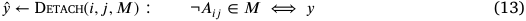

The Inferencer can be utilized to plan and recommend course of assembly actions, which we show in the Appendix. 

Connect( _𝑖𝑗 , 𝑀,_ ) ←  _𝑖𝑗_ ∪{( _𝑖_′ _𝑗_′ )|( _𝑖_′ _, 𝑗_′ ) ∈ Path( _,_  _𝑖𝑗_ ) ∧ _𝐴𝑖_ ′ _𝑗_ ′ ∈ _𝑀_ } _,_ (10) 

where Path( _,_  ) finds the shortest path in  that completes the rule graph of  . The accumulated mistake ¬ _𝐴𝑖𝑗_ is accommodated by being added into the precondition set of any ongoing order mistakes in context, _i.e._ , 

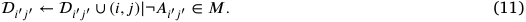

The BeliefBuilder represented in Algorithm 1 is iteratively applied at each step until the sequence ends. 

**Discussion.** Our belief-building process is designed to be computationally efficient by relying solely on action labels rather than complex visual or multimodal processing. The primary computational cost arises when errors occur within a sequence, triggering mistake-driven updates that refine the belief sets. Additional update may happen for correctly executed sequences to remove spurious correlations and can lead to a convergence towards a minimal, stable set of rules. In nature, assembly tasks are governed by a finite set of valid action dependencies, 

#### **5. Experiments** 

#### _5.1. Synthetic data_ 

We leveraged the assembly process of an Epicyclic Gear Train (EGT) from the HA4M dataset (Cicirelli et al., 2022) to create synthetic sequences with mistakes. HA4M records the assembly of the train with the provided instructions. We transform their original 12 actions (verb, noun) to 8 actions (verb, this, that) to account for component interactions. In line with these provided sequences, we converted their original actions (comprising a verb and noun) into actions involving component interactions (verb, this, that) We identified 8 actions for successfully assembling an EGT: _1: attach planet gear to planet gear bearing_ , _2: attach planet gear bearing to carrier_ , _3: attach carrier shaft to carrier_ , _4: attach ring bear to sun shaft_ , _5: attach sun gear bearing to ring bear_ , _6: attach sun gear bearing to sun gear_ , _7: attach carrier shaft to sun shaft_ , _8: attach cover to ring bear_ as show in Fig. 5. We manually identify 

5

<!-- Page 6 -->

_G. Ding, F. Sener, S. Ma et al._ 

_Computer Vision and Image Understanding 254 (2025) 104338_ 

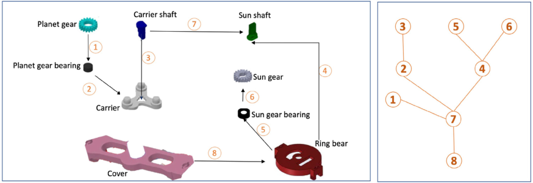

**Fig. 5.** Part connection graph (left) and task graph (right) for EGT. 

**Table 3** 

Performance comparison with coarse mistake labels. 

||AR Acc|mist|ake|corre|ction|corr|ect|Acc|F1|
|---|---|---|---|---|---|---|---|---|---|
|||recall|prec.|recall|prec.|recall|prec.|||
|TempAgg|100 (GT)|37.1|52.8|46.5|42.7|94.4|76.2|76.9|57.4|
|LSTM|100 (GT)|34.6|56.3|42.9|48.6|98.5|89.2|81.7|63.6|
|ILP (Sohn et al., 2020)|100 (GT)|65.8|59.3|23.3|57.1|94.5|91.9|83.3|62.9|
|Ours|100 (GT)|78.2|68.3|51.7|86.7|95.0|94.8|88.5|77.5|
|Gains||+12.4|+9.0|+28.4|+29.6|+0.5|+2.9|+5.2|+14.6|
|Ours|86.4|42.3|53.2|40.2|55.6|73.1|84.6|74.3|56.5|

action dependencies, two transitive and one intransitive, by inspecting the geometric part constraints. Subsequently, we generate a synthetic dataset with 20 sequences, 10 of which contain mistakes and 10 are correct. 

**Baseline.** We adopt the logic induction approach used by Sohn et al. (2020) as the baseline. We parse the full set of sequences to generate training data for (Sohn et al., 2020) as the ideal input while our approach is applied in a streaming fashion. 

**Metric.** Similar to Sohn et al. (2020), we evaluate the performance by measuring the agreement between predicted and the ground-truth preconditions for all possible assignments of input. Our metrics include average accuracy (Acc), average precision and average recall. 

**Performance.** We conduct a performance analysis by varying the amount of synthetic data accessed by the model and present the results in Table 2. As expected, both approaches gain in performance with more data for learning. For both sets of data, we consistently outperform (Sohn et al., 2020) by a large margin of _>_ 10% in Acc. Moreover, with only 50% of data, our approach has a recall of 81.2%, surpassing (Sohn et al., 2020) with 100% access of data (77.0%). It is because the logic module in Sohn et al. (2020) faces challenges to generalize and handle the mistakes caused by the intransitive belief, which our approach is capable of handling. 

**Error Analysis.** Upon conducting a deeper analysis on failure cases, we identified two main types of errors from our approach: 1) unseen mistake and 2) spurious action dependencies. An unseen mistake occurs when a specific type of error is not represent in the training data, causing the model to fail in detecting it during inference. Spurious dependencies, on the other hand, arise from irrelevant actions within the CONTEXT set. This type of error can be mitigated by our design in Eq. (8), which considers the PRECEDES set, allowing the model to prune the spurious dependencies in the belief set as more sequence are observed. 

#### _5.2. Real-world data_ 

**Splits.** In Assembly101, there are a total of 328 distinct action sequences constructing 101 different toys. To create our data splits, we 

randomly sample one action sequence for testing and use the remaining sequences as the training data for each toy. This process is repeated four times to obtain four splits; we report results averaged over the four splits. 

**Evaluation Metric.** We evaluate the task following standard classification and report the per class recall and precision, Acc and mean F1 scores over three mistake classes. 

**Baselines.** Following the synthetic experiment, we also use the logic module from Sohn et al. (2020) as our baseline for comparison. We further compare to two data-driven approaches, _i.e._ , LSTM and TempAgg (Sener et al., 2020), by treating the mistake detection as a sequence-to-sequence task. In particular, given a sequence of actions, we treat each subsequent _𝑠_ 1∶ _𝑡_ as the input. The target is then defined as the label of the last mistake label _𝑦𝑡_ from _𝑠_ 1∶ _𝑡_ , where _𝑡_ ∈[1 ∶ _𝑇_ ]. We design the LSTM (Hochreiter and Schmidhuber, 1997) with four hidden layers; each hidden layer size is set to 256. We train the LSTM with a learning rate of 1 _𝑒_−3 for 100 epochs. For TempAgg, we follow Sener et al. (2022) and train the model for 15 epochs. As inputs, each step in the sequence is represented as its one-hot action feature vector and the action sequences are truncated or padded to a fixed length of 60 for both experiments. 

**Coarse mistake detection.** We report the results on Assembly101 dataset with the coarse mistake labels for different approaches in Table 3. LSTM slightly outperforms TempAgg at the Acc (+4 _._ 8%) and F1 (+6 _._ 2%) scores. Such a performance gap mainly results from LSTM’s boost in the ‘correct’ class. Our method achieves a high recall of 78.2% on the ‘mistake’ class, which doubles that (37.1%) of the TempAgg. In the meantime, we are 12.4% and 9.0% higher than Sohn et al. (2020) in mistake recall and precision, respectively. For other classes, our approach also demonstrates higher performance but with a small gap compared to Sohn et al. (2020) on the ‘correct’ class. When evaluated across the classes, ours is the best in both Acc (88.5%) and F1 (77.5%), showing its strong ability to capture the ordering dynamics in assembly sequences. 

**Visual Integration.** To relieve the reliance on the ground truth action labels, we next show how our framework can be integrated with the off-the-shelf action recognition model for mistake detection. 

6

<!-- Page 7 -->

_G. Ding, F. Sener, S. Ma et al._ 

_Computer Vision and Image Understanding 254 (2025) 104338_ 

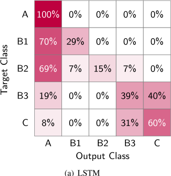

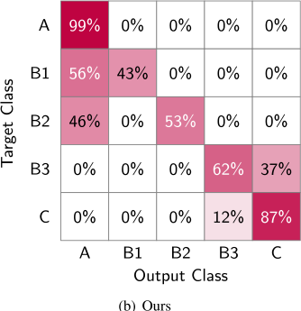

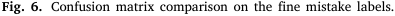

<!-- Start of picture text -->
Fig. 6. Confusion matrix comparison on the fine mistake labels. <!-- End of picture text -->

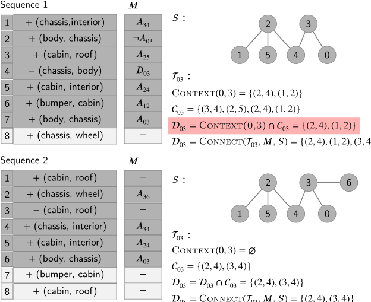

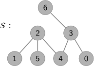

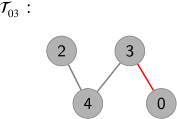

**Fig. 7.** A running example of our BeliefBuilder. Upper part shows the algorithm state at the 7-th step in Sequence 1. Within the precondition set 03, which is highlighted in pink, one precondition pair (3 _,_ 4) is absent due to its positioning outside the mistake context. Additionally, it includes an extra pair (1 _,_ 2) introduced by Step 6. The missing pair is subsequently retrieved through the Connect operation, while the extra pair is eliminated when the RuleBuilder encounters the 6-th step in Sequence 2 in the lower part. The right side exhibits the final spatial and intransitive temporal beliefs discovered by our framework. 

Assembly101 (Sener et al., 2022) is a challenging dataset for action recognition. A fine-tuned TSM model (Lin et al., 2019) achieves only around 30% accuracy. To show the potential to work with visual perception, we introduce an intermediate scenario in which verbs (attach, detach) are predicted by the fine-tuned TSM module (86.4% in accuracy) with ground truth object parts provided. The result in Table 3 (last row) indicates a decrease in performance, 35.9% in recall and 16.1% in precision for mistake. Nevertheless, this variant still shows superior or comparable performance in detecting ordering mistakes compared to our LSTM and TempAgg baselines that requires the ground truth action labels as inputs. This further underscores the potential for integrating our module with action recognition models. 

**Fine mistake detection.** Fig. 6 compares confusion matrices for the LSTM and our approach on fine-grained mistakes. As it is shown in Fig. 6(a), the LSTM model confuses most of the ordering mistakes (on B1, B2, and B3) with the correct (A) class. This is likely due to the significant imbalance ratio between each fine mistake class 

and the correct class. However, it also shows that LSTM picks up some knowledge that a detach action can either be a ‘mistake’ or a ‘correction’ (see bottom right corner of confusion matrix). Overall, our approach (Fig. 6(b)) is better at detecting the ordering mistakes with higher scores along the diagonal. 

**Spatial and temporal beliefs.** We show an example of belief building in Fig. 7. The BeliefBuilder processes the action steps from two sequences progressively and builds beliefs accordingly. After parsing two sequences, an intransitive type of temporal belief is discovered. We additionally run our approach on the full set of sequences on the Assembly101 dataset and find 54 temporal beliefs. Among these, 28 are transitive, and 26 are intransitive. Our empirical observation indicates a strong alignment between the temporal rules obtained and the realworld geometric constraints of certain parts. For example, the inferred temporal rule indicates that the body and chassis has to be attached after the assembly of interior, chassis and cabin, which relates to the geometry constraint as shown by Fig. 4(b). 

7

<!-- Page 8 -->

_G. Ding, F. Sener, S. Ma et al._ 

_Computer Vision and Image Understanding 254 (2025) 104338_ 

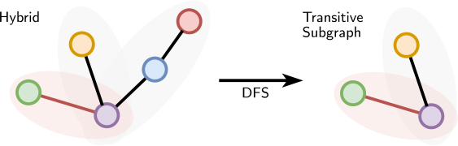

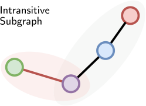

**Fig. 8.** Hybrid temporal belief. The red edge is dependent on the remaining black edges. The hybrid belief can be decomposed into _transitive_ and _intransitive_ subgraphs by performing a DFS on the graph with an anchor object as root. (For interpretation of the references to color in this figure legend, the reader is referred to the web version of this article.) 

#### _5.3. Limitations_ 

A limitation of our approach is the potential for error accumulation when incorrect belief sets are used during prediction. However, these incorrect beliefs are generally a superset of the actual beliefs, and as more sequences are observed over time, the belief set gradually converges to the correct one by pruning spurious action dependencies. Another limitation of our approach is that we only target the ordering mistakes. However, within Assembly101, errors extend beyond ordering mistakes to include issues related to part orientation and screw fastening. Addressing errors in orientation and fastening demands specialized 3D modeling of components and the estimation of their 6D poses. We leave this for further exploration. 

#### **6. Conclusion** 

This work addresses the challenge of identifying ordering mistakes in assembly tasks. We propose two types of knowledge-grounded belief sets, leveraging the unique characteristics of assembly tasks. The first set captures the spatial arrangement of components, while the other represents the ordering constraints during assembly. These belief sets are generated in a sequence stream with our proposed BeliefBuilder and are employed by the Inferencer to detect mistakes from assembly sequences. Our approach delivers promising results in detecting ordering mistake, consistently surpasses other methods on both synthetic and real-world datasets. 

#### **CRediT authorship contribution statement** 

**Guodong Ding:** Writing – original draft, Methodology, Investigation, Data curation, Conceptualization. **Fadime Sener:** Writing – original draft, Formal analysis, Data curation, Conceptualization. **Shugao Ma:** Writing – review & editing, Writing – original draft, Methodology, Funding acquisition, Conceptualization. **Angela Yao:** Writing – review & editing, Validation, Supervision, Conceptualization. 

#### **Declaration of competing interest** 

The authors declare that they have no known competing financial interests or personal relationships that could have appeared to influence the work reported in this paper. 

#### **Appendix. My appendix** 

#### _A.1. Hybrid temporal belief._ 

The hybrid temporal beliefs are depicted in Fig. 8. Similar to both _transitive_ and _intransitive_ temporal rules, the anchor action (red edge) will only be a correct action once the remaining actions (the black edges in the graph) have been completed. While the actions in the precondition set  _𝑖𝑗_ will apply different rules according to the transitivity of the subgraph they belong. The hybrid belief can be decomposed 

using depth-first search (DFS) with the anchor object as the root node. Denoting them as  _𝑖𝑗__𝑡𝑟_and _𝑖𝑗__𝑖𝑛_,wewritethefollowing: 

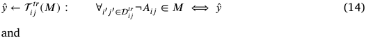

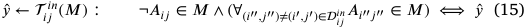

#### _A.2. Action planning_ 

In addition to detecting the ordering mistakes in assembly sequences, it is also possible for us to plan and recommend courses of action. Given an action sequence up to _𝑡_′ -th step **𝐬** = {( _𝑣, 𝑖, 𝑗_ ) _𝑡_ }_𝑡_ _𝑡_′ =1,we wish to generate **𝐩** = {( _𝑣, 𝑖, 𝑗_ ) _𝑡_ }_𝑇_ _𝑡_ = _𝑡_′thatnotonlycorrectsmistakesinthe past but also leads to a successful toy assembly. This is accomplished through the interaction between the proposed Inferencer and an action Sampler. The Sampler utilizes a sampling pool that is comprised of unperformed actions and corrections to previous mistakes. The episodic memory _𝑀_ is first obtained by parsing the observations **𝐬** through the Inferencer By interpreting _𝑀_ , we can create the following action pool Pool( _𝑀_ ): 

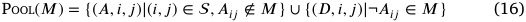

The planner will first randomly select an action ( _𝑣, 𝑖, 𝑗_ ) from the action pool and use the Inferencer to estimate its mistake label _̂𝑦_ . The action will be discarded if the estimated label is a mistake, _i.e._ , ¬ _𝐴𝑖𝑗_ ; otherwise, the sampled action will be added to the planning list **𝐩** . The sampling operation will repeat until the toy is fully assembled, _i.e._ , Completed( _𝑀_ ) is True. Alg. 3 provides a synopsis of the action planning procedure. Note that although this planner only addresses the existing mistakes in context _𝑀_ and does not permit any mistakes to be included in the planned sequence **𝐩** , it is possible to extend the planning process to sample potential mistake actions and then automatically address them. 

|**Algo**|**rithm** **3** Toy Completion Planner||
|---|---|---|
|1: **p**|**rocedure** Planner(**s**)||
|2:|_𝑀_←∅_,_**𝐩**= ∅||
|3:|**for** _𝑡_∈[1 ∶_𝑡_′] **do**||
|4:|(_𝑣, 𝑖, 𝑗_)←_𝑠_[_𝑡_]||
|5:|_𝑦_←Inferencer(_𝑀, 𝑣, 𝑖, 𝑗_)||
|6:|**while** !Completed(_𝑀_) **do**||
|7:|Pool(_𝑀_)|_⊳_(16)|
|8:|Randomly Sample (_𝑣, 𝑖, 𝑗_) from Pool(_𝑀_)||
|9:|_𝑦_←Inferencer(_𝑀, 𝑣, 𝑖, 𝑗_)||
|10:|**if** _̂𝑦_= ¬_𝐴𝑖𝑗_ **then**||
|11:|pop(_𝑀,̂ 𝑦_)||
|12:|continue||
|13:|**else**||
|14:|push(**𝐩**_,_(_𝑣, 𝑖, 𝑗_))||
|15:|**return** **𝐩**||

8

<!-- Page 9 -->

_G. Ding, F. Sener, S. Ma et al._ 

_Computer Vision and Image Understanding 254 (2025) 104338_ 

**Data availability** 

- Lin, J., Gan, C., Han, S., 2019. Tsm: Temporal shift module for efficient video understanding. In: ICCV. 

Data will be made available on request. 

#### **References** 

- Ben-Shabat, Y., Yu, X., Saleh, F., Campbell, D., Rodriguez-Opazo, C., Li, H., Gould, S., 2021. The ikea asm dataset: Understanding people assembling furniture through actions, objects and pose. In: WACV. 

- Chakravarthy, A., Fang, Z., Yang, Y., 2022. Tragedy plus time: Capturing unintended human activities from weakly-labeled videos. In: Proceedings of the IEEE/CVF Conference on Computer Vision and Pattern Recognition. pp. 3405–3415. 

- Cicirelli, G., Marani, R., Romeo, L., Domínguez, M.G., Heras, J., Perri, A.G., D’Orazio, T., 2022. The ha4 m dataset: Multi-modal monitoring of an assembly task for human action recognition in manufacturing. Sci. Data 9, 745. 

- Epstein, D., Chen, B., Vondrick, C., 2020. Oops! predicting unintentional action in video. In: Proceedings of the IEEE/CVF Conference on Computer Vision and Pattern Recognition. 

- Hochreiter, S., Schmidhuber, J., 1997. Long short-term memory. Neural Comput. 9, 1735–1780. 

- Huang, D.A., Nair, S., Xu, D., Zhu, Y., Garg, A., Fei-Fei, L., Savarese, S., Niebles, J.C., 2019. Neural task graphs: Generalizing to unseen tasks from a single video demonstration. In: Proceedings of the IEEE/CVF Conference on Computer Vision and Pattern Recognition. pp. 8565–8574. 

- Kuehne, H., Arslan, A., Serre, T., 2014. The language of actions: Recovering the syntax and semantics of goal-directed human activities. In: Proceedings of the IEEE/CVF Conference on Computer Vision and Pattern Recognition. 

- Kumar, S., Haresh, S., Ahmed, A., Konin, A., Zia, M.Z., Tran, Q.H., 2022. Unsupervised action segmentation by joint representation learning and online clustering. In: Proceedings of the IEEE/CVF Conference on Computer Vision and Pattern Recognition. pp. 20174–20185. 

- Logeswaran, L., Sohn, S., Jang, Y., Lee, M., Lee, H., 2023. Unsupervised task graph generation from instructional video transcripts. In: ACL. 

- Mattsson, G., Hogler, M., 2018. An explorative study in the user experience of augmented reality enhanced manuals. 

- Ragusa, F., Furnari, A., Livatino, S., Farinella, G.M., 2021. The meccano dataset: Understanding human-object interactions from egocentric videos in an industrial-like domain. In: WACV. 

- Sener, F., Chatterjee, D., Shelepov, D., He, K., Singhania, D., Wang, R., Yao, A., 2022. Assembly101: A large-scale multi-view video dataset for understanding procedural activities. In: Proceedings of the IEEE/CVF Conference on Computer Vision and Pattern Recognition. 

- Sener, F., Singhania, D., Yao, A., 2020. Temporal aggregate representations for long-range video understanding. In: ECCV. 

- Sohn, S., Woo, H., Choi, J., Lee, H., 2020. Meta reinforcement learning with autonomous inference of subtask dependencies. arXiv preprint arXiv:2001.00248. 

- Soran, B., Farhadi, A., Shapiro, L.G., 2015. Generating notifications for missing actions: Don’t forget to turn the lights off! ICCV. 

- Sultani, W., Chen, C., Shah, M., 2018. Real-world anomaly detection in surveillance videos. In: Proceedings of the IEEE/CVF Conference on Computer Vision and Pattern Recognition. 

- Tang, Y., Ding, D., Rao, Y., Zheng, Y., Zhang, D., Zhao, L., Lu, J., Zhou, J., 2019. Coin: A large-scale dataset for comprehensive instructional video analysis. In: Proceedings of the IEEE/CVF Conference on Computer Vision and Pattern Recognition. 

- Zatsarynna, O., Farha, Y.A., Gall, J., 2022. Self-supervised learning for unintentional action prediction. In: DAGM German Conference on Pattern Recognition. Springer, pp. 429–444. 

- Zhukov, D., Alayrac, J.B., Cinbis, R.G., Fouhey, D., Laptev, I., Sivic, J., 2019. Crosstask weakly supervised learning from instructional videos. In: Proceedings of the IEEE/CVF Conference on Computer Vision and Pattern Recognition. 

9
