# 005_Lee_Error_Detection_in_Egocentric_Procedural_Task_Videos_CVPR_2024_paper

[Original PDF](../005_Lee_Error_Detection_in_Egocentric_Procedural_Task_Videos_CVPR_2024_paper.pdf)

Pages: 12

> Automatically converted from PDF. Check the original for exact equations, symbols, table alignment, and figure details.

<!-- Page 1 -->

This CVPR paper is the Open Access version, provided by the Computer Vision Foundation. Except for this watermark, it is identical to the accepted version; the final published version of the proceedings is available on IEEE Xplore. 

# **Error Detection in Egocentric Procedural Task Videos** 

Shih-Po Lee1 

Zijia Lu1 Zekun Zhang 1Northeastern University 

Zekun Zhang2 

Minh Hoai2 Ehsan Elhamifar1 

2Stony Brook University 

> 1 _{_ lee.shih, lu.zij, e.elhamifar _}_ @northeastern.edu 

> 2 _{_ zekzhang, minhhoai _}_ @cs.stonybrook.edu 

## **Abstract** 

_We present a new egocentric procedural error dataset containing videos with various types of errors as well as normal videos and propose a new framework for procedural error detection using error-free training videos only. Our framework consists of an action segmentation model and a contrastive step prototype learning module to segment actions and learn useful features for error detection. Based on the observation that interactions between hands and objects often inform action and error understanding, we propose to combine holistic frame features with relations features, which we learn by building a graph using active object detection followed by a Graph Convolutional Network. To handle errors, unseen during training, we use our contrastive step prototype learning to learn multiple prototypes for each step, capturing variations of error-free step executions. At inference time, we use feature-prototype similarities for error detection. By experiments on three datasets, we show that our proposed framework outperforms state-ofthe-art video anomaly detection methods for error detection and provides smooth action and error predictions._1 

## **1. Introduction** 

We perform a wide range of procedural tasks in our personal life (e.g., cooking recipes, setting up devices, physical therapy routines) and professional life (e.g., medical emergencies, mechanical repairs, assembling and operating instruments). The large number of daily tasks, the necessity of preparing the workforce for new tasks and environments and the growing population age calls for **Wearable Intelligent Task Assistants (WITAs)** that monitor and guide users through familiar and unfamiliar tasks to improve the accuracy and speed of task learning/execution. This has motivated exciting recent research on learning from instructional and procedural task videos, mostly focusing on learning step segmentation [2, 5, 17, 27, 29, 35, 36, 42, 46, 55, 59, 61–64, 74, 75, 80], recognition 

> 1Code and data is available at https : / / github . com / robert80203/EgoPER_official. 

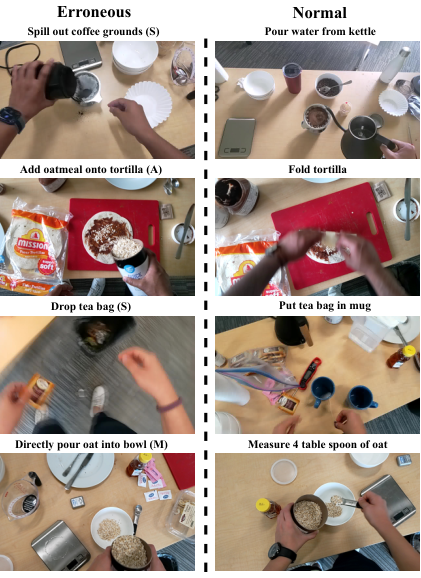

<!-- Start of picture text -->
Erroneous Normal Spill out coffee grounds (S) Pour water from kettle Add oatmeal onto tortilla (A) Fold tortilla Drop tea bag (S) Put tea bag in mug Directly pour oat into bowl (M) Measure 4 table spoon of oat <!-- End of picture text -->

Figure 1. The normal and erroneous examples from the tasks of making _coffee, quesadilla, tea_ and _oatmeal_ (top to bottom) in our dataset, showing step _Modification_ (M), _Addition_ (A), and _Slip_ (S). 

[7, 9, 20, 21, 38, 40, 47, 72], planning [8, 10, 56, 66, 70, 82] and progress prediction [14] models from training videos that correspond to _correct executions of tasks_ . 

On the other hand, the following may sound familiar: in the morning you were in rush to make coffee and sandwiches and forgot to put some ingredients in your sandwich, or when you were assembling an IKEA furniture and forgot to put the washer into the bolt and after a few steps realized it. Indeed, the chance of making _errors during task execution_ increases, when i) the complexity (e.g., duration, number, difficulty) of steps or tasks increases, ii) we deal with new tasks, iii) we are cognitively overloaded. Therefore, **detecting errors during or after task executions and providing corrections** for them is a much needed capability in WITAs. 

18655

<!-- Page 2 -->

**Prior Works.** Despite its importance, error understanding in procedural tasks has not received much attention in the literature, with almost all existing works addressing segmentation, recognition and planning using correct/errorfree task videos [9, 21, 35, 42, 47, 70, 75, 82]. One limiting factor has been the lack of a good egocentric procedural error dataset with visually recognizable and diverse types of errors. Therefore, few recent works have gathered error datasets for assembling toys [13, 24] or chemical processes [49], with [24] containing static view and [13, 49] containing egocentric view. However, only action ordering errors are present in these dataset, where each action by itself is still performed correctly. The recent work in [71] has released an egocentric two-person interactive task completion dataset for assembling objects. The dataset contains errors when performing a step, however, lacks other errors related to omission, addition or modification of steps. Also, errors are often quickly corrected by a human instructor at the beginning of a step, which does not reflect the real-world error scenarios where no human instructors are available. 

Procedural errors are different from anomalies studied in the anomaly detection literature [1, 4, 12, 30, 41, 48, 54, 68, 73, 76–78, 81, 84]. Conventional anomalies correspond to deviations from some regular pattern, are not goal-oriented and are identifiable by their inherent semantics (e.g., a person falling on the ground). On the other hand, procedural errors correspond to deviations from a procedure (e.g., missing, adding, modifying, incorrectly executing a step) and depend on the goal, therefore require long-range temporal reasoning. Additionally, most existing anomaly detection methods work with static views, whereas egocentric views pose challenges such as constantly changing scenes and varying object sizes. As we show in the paper, existing anomaly detection methods cannot properly address error detection in egocentric procedural videos. 

**Paper Contributions.** We present a new procedural error dataset from egocentric cameras and with various types of errors and also propose a new framework for procedural error detection. Our dataset consists of 28 hours of egocentric videos from different procedural cooking tasks and contains RGB, depth, audio, gaze and hand tracking modalities. We temporally annotated videos with step labels, provide ground-truth bounding boxes for objects and active objects and annotate frames as being error or normal. We define a new taxonomy of procedural errors (step omission, addition, modification, slip and correction) based on which we gather normal and erroneous videos. 

For procedural error detection by using only normal/error-free videos during training, we propose a framework that consist of an action segmentation and a contrastive step prototype learning module. We learn both holistic features and relational features (using active object detection) and combine them for more effective 

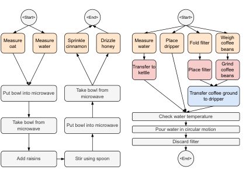

<!-- Start of picture text -->
<Start> <End> <Start> Measureoat Measurewater cinnamonSprinkle Drizzlehoney Measurewater dripperPlace Fold filter Weighbeanscoffee Transfer tokettle Place filter beanscoffeeGrind Put bowl into microwave Take bowl frommicrowave Transfer coffee groundto dripper Check water temperature Take bowl frommicrowave Put bowl into microwave Pour water in circular motion Discard filter Add raisins Stir using spoon <End> <!-- End of picture text -->

Figure 2. The task graph of oatmeal (left) and coffee (right). 

action segmentation and error detection. To handle errors that are unseen during training, we use a contrastive learning approach to learn multiple prototypes for each step, capturing variations of correctly performing a step. By extensive experiments on three datasets, we show that our framework improves over existing methods. We plan to publicly release our code and the EgoPER dataset. 

## **2. Related Works** 

**Procedural Task Understanding.** Learning from procedural task videos has been studied under various setting, such as action/step recognition, action/step segmentation and procedure planning. Action recognition methods aim to classify the action labels of short, trimmed video clips by studying various end-to-end video backbone models [7, 9, 20, 21, 38, 40, 47, 72]. Action segmentation methods take a step further to classify the action label of each frame in long, untrimmed procedural videos, thus they focus on better modeling of long temporal relationships [2, 5, 17, 27, 29, 35, 36, 42, 46, 55, 59, 61–64, 74, 75, 80]. Many works also explore the segmentation task in un-, weaklyor semi-supervised settings [3, 15, 16, 19, 22, 28, 32– 34, 39, 44, 44, 45, 51–53, 58, 60, 64, 85] to reduce the amount of annotations. Procedure planning methods aim to anticipate the actions between the given start and end state observations [8, 10, 56, 66, 70, 82], thus they have focused on modeling the dependencies between actions and flexible procedures to achieve certain goal states. To support the tasks above, many procedural video datasets have been released. While some datasets are egocentric, e.g., GTEA [18], EGTEA [37], MECCANO [50], Assembly101 [57], HoloAssist [71], most datasets are third-person view, e.g., Breakfast [26], Coin [67], CrossTask [85], ATA [24], etc. There are other video datasets, such as Ego4D [25] and EpicKitchen [11], yet their videos consist of many different actions and are non-procedural. In this work, we propose a new egocentric and procedural dataset in the cooking domain for procedure understanding and error detection. 

18656

<!-- Page 3 -->

||No|rmal|Videos|Er|roneou|s Videos|
|---|---|---|---|---|---|---|
|Task|# Vid.|Min.|# Actions|# Vid.|Min.|Avg # errors|
|_Coffee_|32|8.4|24|35|9.3|2.2|
|_Pinwheels_|42|5.6|14|42|4.2|10.8|
|_Tea_|47|2.6|11|32|2.5|4.9|
|_Quesadilla_|48|1.6|9|32|1.8|4.9|
|_Oatmeal_|44|4.2|12|32|4.3|4.6|

Table 1. Information about the EgoPER dataset. The number of actions indicates the number of action classes including the background class. Min. denotes the average length of videos in minutes. The average number of errors per video reflects repetitive actions, e.g., not inserting toothpicks 5 times will be counted as 5. 

**Error Detection for Procedural Tasks.** Error understanding in procedural tasks has been an understudied problem on two fronts: i) lack of an (egocentric) procedural error dataset with visually recognizable and diverse types of errors, ii) lack of a specialized framework to address detection of various procedural errors. Recently, a few works released error datasets for assembling toys [13, 24, 57] or chemical processes [49]. However, they contain only action ordering errors, where each action itself is still performed correctly. [57] also assume having access to error videos during training, which is restrictive. On the other hand, [71] has released an egocentric two-person task completion dataset for assembling objects with a performer wearing egocentric cameras and an instructor watching videos and correcting the performer in real-time. However, [71] does not contain step omission, addition and modification errors, which we will consider in addition to step slip errors. Also, the errors in [71] are often quickly corrected by a human instructor at the beginning of a step, which does not reflect the realworld scenarios where the performer often proceeds with their action before realizing the presence of error. 

**Anomaly Detection.** There has been a large body of literature on anomaly detection in videos, most focusing on surveillance videos [1, 4, 12, 30, 31, 41, 48, 54, 68, 73, 76– 78, 81, 83, 84]. Unlike procedural errors, which correspond to deviations from a procedure (e.g., missing, adding, modifying, incorrectly executing a step) and depend on the goal, conventional anomalies are not goal-oriented and are identifiable by their inherent semantics (e.g., a person falling on the ground). Moreover, most existing anomaly detection methods work with static views, whereas egocentric views pose challenges such as changing scenes, head motions and varying object sizes. As we show by our experiments, anomaly detection methods cannot effectively address error detection in egocentric procedural videos. 

## **3. EgoPER Dataset** 

We describe the data collection and annotation for our Egocentric Procedural ERror (EgoPER) dataset, see Figure 1. 

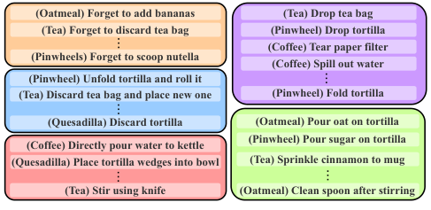

<!-- Start of picture text -->
(Oatmeal) Forget to add bananas (Tea) Drop tea bag (Tea) Forget to discard tea bag (Pinwheel) Drop tortilla (Coffee) Tear paper filter (Pinwheels) Forget to scoop nutella (Coffee) Spill out water (Pinwheel) Unfold tortilla and roll it (Tea) Discard tea bag and place new one (Pinwheel) Fold tortilla (Quesadilla) Discard tortilla (Oatmeal) Pour oat on tortilla (Pinwheel) Pour sugar on tortilla (Coffee) Directly pour water to kettle (Quesadilla) Place tortilla wedges into bowl (Tea) Sprinkle cinnamon to mug (Tea) Stir using knife (Oatmeal) Clean spoon after stirring <!-- End of picture text -->

Figure 3. Examples of the errors in EgoPER dataset. Orange: _Omission_ . Blue: _Correction_ . Red: _Modification_ . Purple: _Slip_ . Green: _Addition_ . 

### **3.1. Data Collection** 

We have collected a multimodal egocentric procedural error dataset for cooking tasks from 11 participants at two different environments using Microsoft HoloLens2. We gathered normal and erroneous egocentric videos while capturing RGB, depth, gaze, audio and hand tracking data for task executions. Prior to collecting data, we manually built the task graph for each recipe, which encodes all possible ways that the recipe could be made (see Figure 2). 

Using the task graphs, we generated different transcripts for correct and incorrect executions of each task. For correct (normal) videos, the sequence of steps is consistent with the task graph (although each video can have a different sequence from others) and the execution of each step follows the specific description of the step. For incorrect (abnormal) videos, there will be some deviation with respect to the task graph, e.g., some steps are omitted, some unnecessary steps are added, some steps are modified (e.g., using a different tool or different ingredients from the ones specified by the recipe) or some steps are performed with errors (e.g., dropping the tortilla or pouring water into the wrong mug). 

After recording each video, settings such as the set of objects on the desk, initial object locations and the room lighting are randomly changed to better capture the real-world variability in task executions and prevent the undesired bias towards certain configurations of objects for recognition (e.g., placing tortilla and jam on the table while making tea). More details are provided in the supplementary materials. 

### **3.2. Data and Annotations** 

EgoPER contains multimodal (RGB, depth, audio, gaze, hand) data from 5 tasks/recipes: making _pinwheels, quesadilla, oatmeal, coffee_ , and _tea_ . It consists of 386 untrimmed videos with 213 normal and 173 erroneous videos for a total of 28 hours of footage. Table 1 shows the detailed information for each task. The video resolution is 1280 ˆ 720 pixels with a frame rate of 15 fps. Table 2 compares EgoPER with other procedural task video datasets. Notice that our dataset is egocentric and has both object and active object bounding boxes, errors and multi- 

18657

<!-- Page 4 -->

|Dataset name|Has Errors|Egocentric|Obj bbx|Active obj bbx|Multimodal|Domain|Hours|# Vid.|Year|
|---|---|---|---|---|---|---|---|---|---|
|GTEA [18]|ˆ|✓|ˆ|ˆ|ˆ|cooking|0.6|28|2012|
|50 Salads [65]|ˆ|ˆ|ˆ|ˆ|ˆ|cooking|4.5|50|2013|
|Breakfast [26]|ˆ|ˆ|ˆ|ˆ|ˆ|cooking|77|1,712|2014|
|EGTEA [37]|ˆ|✓|ˆ|ˆ|✓|cooking|28|10,321|2018|
|CrossTask [85]|ˆ|ˆ|ˆ|ˆ|ˆ|multiple|375|4,700|2019|
|COIN [67]|ˆ|ˆ|ˆ|ˆ|ˆ|multiple|476|11,827|2019|
|IKEA [6]|ˆ|ˆ|✓|ˆ|✓|assembly|35.3|1,113|2021|
|MECCANO [50]|ˆ|✓|ˆ|✓|✓|assembly|7|20|2021|
|Assembly101 [57]|✓|✓|ˆ|ˆ|ˆ|assembly|167|1,425|2022|
|ATA [24]|✓|ˆ|✓|ˆ|ˆ|assembly|24.8|1,152|2023|
|HoloAssist [71]|✓|✓|ˆ|ˆ|✓|assembly|166|2,221|2023|
|EgoPER (Ours)|✓|✓|✓|✓|✓|cooking|28|386|2024|

Table 2. Comparison between EgoPER with the existing procedural task datasets. 

modal data. From our results, utilizing active object information can achieve a better error and action understanding in egocentric videos. 

**Error Taxonomy.** EgoPER aims at error understanding from cooking egocentric procedural videos. We define _error as any deviation from the task graph_ . An erroneous video contains one or several of the following types of steps. – Step Omission: corresponds to skipping one or multiple steps, e.g., not checking water temperature in the kettle, or not putting bananas on the tortilla. 

– Step Addition: corresponds to having unnecessary extra steps that are not in the task graph, e.g., adding raisins to the tortilla when making pinwheels. 

– Step Modification: corresponds to performing a step in a different way than the one specified by the recipe, e.g., using a different tool such as stirring using knife instead of spoon or using different ingredients such as using sugar to sweeten the tea instead of honey. This does not necessarily change the outcome of the step. 

– Step Slip: corresponds to executing a step in a way that leads to not achieving the goal of the step, e.g., adding water to a different bowl from the one containing oats, or dropping tortilla on the floor. Therefore, a slip is an error that needs corrective action(s) subsequently. 

– Step Correction: corresponds to performing an action to mitigate the effect of an slip error, e.g., transferring water from the second bowl to the one containing oats or discarding the tortilla on the floor and picking a new one. 

**Annotations.** We annotated the start and end time of each step, including the normal steps and different error-related steps defined above. Thus, our dataset has dense framewise annotations with action labels and whether each frame has error or not. For videos that contained one or multiple errors, we also annotated the type of error (defined above) in the associated frames. In addition to framewise step and error annotations, we annotated object and hand boundingboxes for at least three frames (beginning, middle, end) of 

every step segment and also specified which objects are active (i.e., objects related to the step) or inactive, see Figure 5. We additionally gathered the contact state of the active objects with hands (touching or not touching). 

## **4. Procedural Error Detection** 

In this section, we present our Egocentric Procedural Error Detection (EgoPED) framework. 

### **4.1. Problem Setting** 

Assume we have a _training set of normal (error-free) egocentric videos_ from a given task, which has _S_ steps. Each video _n_ in the training set consists of pre-extracted framewise features and ground-truth step labels as 

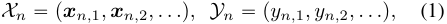

where **_x_** _n,t_ denotes the pre-extracted feature vector of frame _t_ in video _n_ and _yn,t_ P t1 _, . . . , S_ ` 1u denotes its groundtruth label. We use I3D [9] to extract framewise features and use the additional label _S_ ` 1 for the background class, i.e., task-irrelevant actions and additional steps not seen in the training videos. Notice that we assume i) having only normal (error-free) videos during training, ii) having full supervision (framewise step labels) for training videos. We do not assume access to task graphs during training and testing. 

During inference, a test video could be normal or erroneous. Our goal is to segment the video into different steps and background and find all frames, if any, in the test video that correspond to errors, defined in Section 3.2. In the paper, we consider the offline action segmentation and error detection setting, where we have an entire video at inference time. This is particularly useful for task evaluation and providing feedback after task execution to improve learning. 

### **4.2. EgoPED Framework** 

We propose EgoPED, which is a contrastive learning-based framework for simultaneous action segmentation and error detection in egocentric procedural videos, see Figure 4. Our 

18658

<!-- Page 5 -->

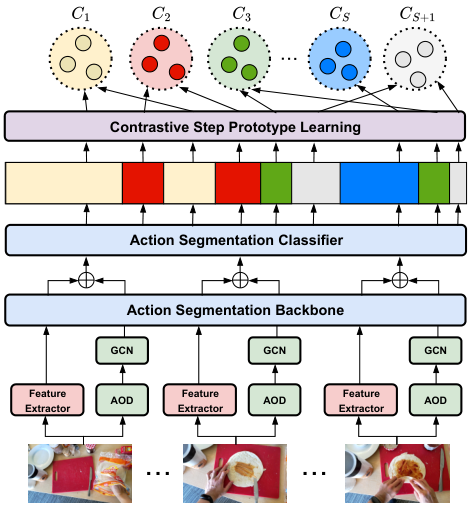

<!-- Start of picture text -->
Contrastive Step Prototype Learning Action Segmentation Classifier Action Segmentation Backbone GCN GCN GCN Feature Feature Feature AOD AOD AOD Extractor Extractor Extractor <!-- End of picture text -->

Figure 4. EgoPED uses an action segmentation backbone for holistic feature learning and an active object detection (AOD) and GCN for relational feature understanding. We use both types of features for final action predictions as well as in a contrastive step prototype learning module, which learns multiple prototypes per step capturing different variations of the step across error-free videos. We use these prototypes for detecting deviations from steps, hence, errors. 

method leverages composite features by aggregating holistic features with learned relational graph features, has an action segmentation model that learns to segment videos into steps or background and a contrastive step prototype learning (CSPL) module that learns multiple prototypes for each action to allow error detection at inference time. 

#### **4.2.1 Action Segmentation with Hybrid Features** 

To assign a step label to every frame in a long and untrimmed video, we use a temporal action segmentation (TAS) model. TAS consists of an action segmentation backbone, which receives pre-extracted features _X_ “ p **_x_** _n,_ 1 _,_ **_x_** _n,_ 2 _, . . . ,_ q and learns refined holistic framewise features _Z__h_ “ p **_z_**_h_ _n,_ 1_,_**_z_**_h_ _n,_ 2_, . . . ,_q by capturing long-range tem- poral dependencies among frames. TAS has also an action classifier head, which assigns a label to each frame using its refined feature vector. As we show in the experiments, our error detection method works with any existing TAS model. 

We use TAS not only for action segmentation, but also for error detection. Given the fine-grained nature of most errors, which correspond to small deviations from the correct way of performing a step (e.g., using knife instead of spoon for stirring or spilling coffee beans), it is important to capture fine-grained frame details that are mostly ignored 

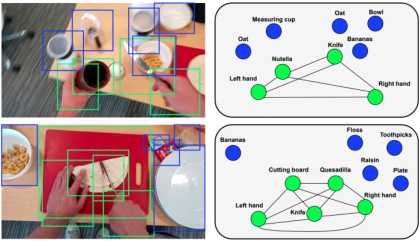

Figure 5. Our frameworks detects active from non-active objects (left) and use them to build a relational graph (right) for better feature learning and subsequently action segmentation and error detection. 

by _holistic_ pre-extracted and refined framewise features. To do so, we leverage an active object detection (AOD) model, which extracts bounding-boxes from objects and hands and provides contact states between objects with hands (objects that are manipulated by hand are active), see Figure 5 (left). 

Next, we build a graph for each frame whose nodes correspond to object classes and its edges connect active objects together, see Figure 5 (right). For example, when a user is pouring water from a kettle with right-hand into a mug held with the left-hand, the active objects are the two hands, kettle and mug and they will be connected by edges. Notice that this graph allows us to encode fine-grained and relevant scene information about how the user interacts with the step-relevant objects and subsequently to better detect errors, as we also show in our experiments. We use a Graph Convolutional Network (GCN) to extract relational features from our interaction graph _Z__g_ “ p **_z_**_g_ _n,_ 1_,_**_z_**_g_ _n,_ 2_, . . . ,_q(see Section 5 for details). We use the concatenation of the two types of features **_z_** _n,t_ “ r **_z_**_h_ _n,t__,_**_z_** _n,t__g_sasinputtotheaction classification head of TAS and our step prototype learning module, which we describe next. 

#### **4.2.2 Contrastive Step Prototype Learning (CSPL)** 

During training, we have seen only normal videos corresponding to correct task executions. Therefore, it is not possible to train an error detection head on hybrid features to classify a frame into normal or error. To address this challenge, we propose to learn multiple prototypes for each step to capture normal ways of performing it. Therefore, erroneous frames can be detected by measuring similarities to these normal step prototypes. 

More specifically, for each step _i_ P t1 _,_ 2 _, . . . , S_ ` 1u, we use the hybrid features _Z_ “ p **_z_** _n,_ 1 _,_ **_z_** _n,_ 2 _, . . . ,_ q to learn _k_ prototype vectors _Ci_ “ t **_c_** _i,_ 1 _, . . . ,_ **_c_** _i,k_ u using Kmeans. They represent different variations of the step across different videos. To make the features of frames/prototypes associated with the same action distinct from the features of other actions, we use contrastive learning using InfoNCE [69]. For a video _n_ , let _An_ denote the set of its ground- 

18659

<!-- Page 6 -->

|Method|Ques |adilla |Oat |meal |Pinw |heel |Co |ffee |T |ea |A |ll |
|---|---|---|---|---|---|---|---|---|---|---|---|---|
||EDA|AUC|EDA|AUC|EDA|AUC|EDA|AUC|EDA|AUC|EDA|AUC|
|Random |19.9|50.0|11.8|50.0|15.7|50.0|8.20|50.0|17.0|50.0|14.5|50.0|
|HF2-VAD [43] |34.5|62.6|25.4|62.3|29.1|52.7|10.0|59.6|36.6|62.1|27.1|59.9|
|HF2-VAD + SSPCAB [54]|30.4|60.9|25.3|61.9|33.9|51.7|10.0|**60.1**|35.4|63.2|27.0|59.6|
|S3R [73]|52.6|51.8|47.8|61.6|50.5|52.4|16.3|51.0|47.8|57.9|43.0|54.9|
|EgoPED (with AF)|**62.7**|**65.6**|**51.4**|**65.1**|**59.6**|**55.0**|**55.3**|58.3|**56.0**|**66.0**|**57.0**|**62.0**|

Table 3. Error detection results of different methods on the EgoPER dataset for each task and the average over all tasks. 

truth actions. For each action _i_ P _An_ in video _n_ , let _Pn,i_ be the set of ‘positive’ frames that belong to action _i_ and let _Nn,t_ be the set of ‘negative’ frames from other actions. We use the cosine similarity function cosp¨ _,_ ¨q to compute the similarity between a frame **_z_** _n,t_ belonging to action _i_ (i.e., _yn,t_ “ _i_ ) and the closest prototype from _Ci_ , denoted by **_c_** _i,lt_ , as well as the similarity between **_c_** _i,lt_ and several negative examples in _Nn,t_ and form 

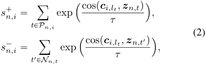

where _τ_ is a learnable temperature value. We then form the contrastive step prototype learning loss as 

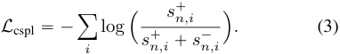

The final loss _L_ to train our method consists of _L_ cspl for contrastive step prototype learning and the temporal action segmentation loss _L_ tas from the backbone we use. 

#### **4.2.3 Inference** 

At the inference time, we use the learned action segmentation model and the learned step prototype sets t _Ci_ u_S_ _i_ “` 11. We apply the action segmentation model on the test video, which gives labels to all frames. We then compute the similarities between a frame and prototypes associated with its predicted action label and take the maximum similarity. We use a threshold _θi_ for each step _i_ to decide if a frame labeled as _i_ is normal or erroneous: if the similarity between the frame and the closest prototype of step _i_ is lower than the threshold, it is classified as error, otherwise normal. After classifying frames as normal or erroneous, we use majority voting on the predictions of the frames in a step segment to determine the final prediction of the segment as being normal or erroneous. To set _θi_ , we compute the mean _µi_ and standard deviation _σi_ from the similarities of all the frames belonging to step _i_ in the validation set and _θi_ “ _µi_ ` _γ_ ¨ _σi_ , where _γ_ P t´2 _._ 0 _,_ ´1 _._ 9 _, ...,_ 1 _._ 9 _,_ 2 _._ 0u is a hyper-parameter. 

Notice that the above approach, using which frame is labeled as erroneous or normal, applies to all error types except omission error. For omission error detection, we first 

find the closest sequence of steps among training videos to the predicted steps in the test video, using Edit distance. Let _D_ denote the set of predicted steps from the output of the action segmentation and _G_ be the set of steps corresponding to the best matched training sequence. We estimate the set of omitted steps as _Do_ “ _G_ z _D_ . 

## **5. Experiments** 

### **5.1. Experimental Setup** 

**Dataset.** We perform evaluation on EgoPER and HoloAssist [70] when using framewise annotations and on ATA [24] using weak supervision. We train our model and the baselines on each task in EgoPER separately using RGB data (we do not use audio, depth, gaze for any method and leave it for future studies). HoloAssist consists of 20 tasks with 2,221 egocentric videos, and its errors correspond to slip errors, e.g., unable to insert a battery into GoPro. We use verbs and nouns as the labels of actions. ATA has 1,152 videos from 4 viewpoints and errors correspond to omission or reordering. For EgoPER, we use 80% of normal videos for training, 10% for validation, and the remaining 10% plus all erroneous videos for testing. For HoloAssist and ATA, we follow the same splits mentioned in their work. 

**Evaluation Metrics.** We report the performance of error detection and action segmentation. For error detection, we use different metrics. First, we compute segment-wise Error Detection Accuracy (EDA) as _De_ { _GTe_ , where _De_ and _GTe_ are the total number of correct predictions and segments of all test videos. The ground-truth action segment is erroneous if some of its frames have an error, otherwise correct. Second, we follow [23] and report micro Area Under the Curve (AUC) based on framwise error predictions. For omission error, we use Omission Accuracy (O-Acc), which measures if each ground-truth omitted error is detected, and Omission Intersection over Union (O-IoU), which equals to | _GTo_ X _Do_ |{| _GTo_ Y _Do_ |, where _GTo_ is the set of groundtruth omission errors. Finally, for action segmentation, we report the conventional TAS metrics (Acc, IoU, edit score and F1@0.5) as in [24]. 

**Baselines.** Given the lack of a prior general method for procedural error detection, we compare our EgoPED framework with video anomaly detection baselines. HF2 -VAD 

18660

<!-- Page 7 -->

|Method|Ver |b |No |un |
|---|---|---|---|---|
||EDA|AUC|EDA|AUC|
|Random|11.2|50.0|13.0|50.0|
|HF2-VAD [43] |24.0|38.0|23.2|38.2|
|HF2-VAD + SSPCAB [54]|23.7|38.0|22.9|39.1|
|S3R [73]|51.2|48.6|51.6|49.5|
|EgoPED (MSTCN++)|45.6|**55.1**|67.8|**54.3**|
|EgoPED (DiffACT)|**68.2**|46.4|**71.4**|47.6|
|EgoPED(AF)|68.0|47.3|71.0|50.8|

Table 4. The results of error detection on HoloAssist. 

|Method|EDA|AUC|IoU Edit|F1@0.5|Acc|
|---|---|---|---|---|---|
|EgoPED (MSTCN++)|48.4|58.5|**47.9 71.2**|**52.8**|**74.6**|
|EgoPED (DiffACT)|49.2|61.9|39.4 63.8|47.6|69.5|
|EgoPED (AF)|**57.0**|**62.0**|44.6 61.3|47.5|68.5|

Table 5. Error detection and segmentation results for different TAS models on the EgoPER dataset. 

[43] adopts optical flow reconstruction and frame prediction to determine if the next frame is an error. HF2 -VAD with SSPCAB module [54] uses a mask convolution structure to enhance the capacity of the feature extractor. S3R [73] generates normal and anomalous features for classification by using pseudo anomaly samples from dictionary learning. We also report the performance of a Random method, which randomly predicts error or normal label for each frame with the same probability. Given that HoloAssist and ATA do not provide active object labels, we run our method on them without the active object detection branch. 

**Implementation details.** We use and compare three temporal action segmentation models as our action segmentation backbone and classifier: ActionFormer (AF) [79], MSTCN++ [36] and Diffusion Action Segmentation (DiffACT) [42]. AF generates frame-wise step and boundary predictions. We follow the same inference step as in AF by combining boundary predictions and the corresponding steps with non-maximum suppression. For MSTCN++ and DiffACT, we simply use the frame-wise step predictions to find the segment of each step. To obtain the graph feature vector for each frame, we use a 3-layer Graph Convolutional Networks (GCN). We trained a fasterRNN model to output object and hand bounding-boxes and the object classes and states (active or inactive). 

We first pretrain our model with the temporal action segmentation loss _L_ tas and then end-to-end train it with all losses. We randomly use 50 percent of training videos to form prototypes and use the rest to train the model in every epoch of training. During inference, we use all training videos to generate prototypes. We compute the mean _µi_ and standard deviations _σi_ for the step threshold _θi_ using the validation set that also consists of only normal videos. By default, we use 2 prototypes to represent each step and use 2 negative segments for each positive segment. We show the effect of these hyperparameters in the experiments. 

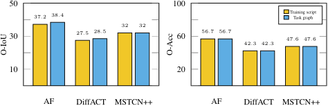

<!-- Start of picture text -->
50 100 37 . 2 38 . 4 Training scriptTask graph 32 32 30 27 . 5 28 . 5 60 56 . 7 56 . 7 47 . 6 47 . 6 42 . 3 42 . 3 10 20 AF DiffACT MSTCN++ AF DiffACT MSTCN++ O-IoU O-Acc <!-- End of picture text -->

Figure 6. Omission detection results of our method for three TAS models. 

|~~AOD~~|~~# Prototypes~~|~~# Negatives~~|~~EDA~~|~~AUC~~|
|---|---|---|---|---|
|~~✓~~|~~1~~|~~2~~|~~55.5~~|~~58.2~~|
|✓|3|2|55.4|58.8|
|✓|4|2|55.7|57.8|
|✓|2|1|**57.4**|60.4|
|✓|2|3|55.8|60.0|
|✓|2|4|56.7|59.8|
|ˆ|2|2|52.5|58.7|
|~~✓~~|~~2~~|~~2~~|~~57.0~~|**~~62.0~~**|

Table 6. Ablation results for the effect of active object detection (AOD), number of step prototypes and negative frames for contrastive learning. 

### **5.2. Experimental Results** 

**Error Detection Results.** Table 3 shows the error detection performance of different methods on EgoPER. Our method outperforms all the baselines, especially on the EDA score, achieving 57 _._ 0% over the dataset compared to 43% by S3R and 27 _._ 0% by HF2 -VAD. On AUC, our method achieves at least 2 _._ 1% higher score than other methods. The predictions of HF2 -VAD are framewise and often fluctuate (see Figure 7), which leads to much lower EDA score. 

Table 4 shows the error detection results on the HoloAssist dataset when we use the ground-truth verb or noun as the label of each ground-truth segment. Our method significantly improves the EDA score by 17% over baselines for both cases. This is due to having a better understanding of action segments provided by our method and the contrastive learning, which allows having refined representations of frames and step prototypes. Notice that for HoloAssist, we did not use the AOD branch in our framework, since i) the dataset does not have object bounding-boxes, ii) applying our trained AOD model for cooking on HoloAssist and ATA, which are for assembly, did not work well. 

**Omission Error Detection.** Figure 6 shows the performance of detecting omission error when using the transcripts of training videos vs using the ground-truth task graph (the latter would be an upper bound). Notice that the scores for using training transcripts are close to using the ground-truth task graph. This is because our dataset has diversity of action sequences among normal videos. For all methods, the O-IoU scores are lower than O-Acc, since some normal steps are not detected in the action segmentation and therefore are predicted as omission. It is worth mentioning that in our dataset, omission errors and other types of errors often happen together, making the (omission) error detection challenging. 

18661

<!-- Page 8 -->

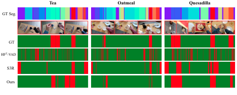

<!-- Start of picture text -->
Tea Oatmeal Quesadilla GT Seg. GT S3R Ours <!-- End of picture text -->

Figure 7. Qualitative error detection results for _tea_ , _oatmeal_ , and _quesadilla_ tasks in EgoPER. Top row shows the ground-truth action segmentation, where each color represents a step. Second row visualizes some error frames. Third, fourth, fifth, and sixth rows show, respectively, groundtruth, HF2 -VAD, S3R and our predictions of errors (in red). 

**Effect of Action Segmentation Models.** Table 5 shows the effect of the action segmentation model in the EgoPED framework. The error detection accuracies of our method do not change much while using different TAS models. This is an advantage that shows our active object detection branch and the contrastive prototype learning can work well with off-the-shelf action segmentation models. However, as the results show, using that AF leads to better error detection performance. This is because AF has a boundary detection module, allowing better handling of additional, background and error-related actions by finding their boundaries. 

It is worth noting that better action segmentation accuracy itself does not necessarily translate to better error detection. For example, MSTCN++ obtains higher F1@0.5 score (52.8%) than AF (47.5%) but lower AUC (58.7) than AF (62.0). This is because a model (e.g., MSTCN++) can learn features that are discriminative across actions yet features of errors of an action are less distinct from normal execution of the same action. Thus, the model can easily classify those frames into normal steps rather than errors. 

**Ablation Studies.** Table 6 shows the ablation of using active objects detection with GCN, effect of different number of step prototypes as well as negative examples in our contrastive framework for the AF action segmentation model (results for other segmentation models were similar). Notice that using active object detection with GCN leads to 4.5% and 3.3% improvement of the EDA and AUC, respectively. This demonstrates the effectiveness of leveraging active (step-relevant) objects for better error understanding. Having more than one prototype per step helps, improving the EDA and AUC by 1.5% and 3.8%, respectively. However, further increasing the number of prototypes does not help, due to over-representation of each action/step. We believe automatically selecting the right number of prototypes for each action to better capture variations can improve the results, however, it is a non-trivial problem, which we leave for future studies. Finally, notice that our results are not sensitive to the number of negative samples or prototypes. 

**Qualitative Analysis.** Figure 7 visualizes the ground-truth 

|Method|Acc|IoU|Edit|F1@0.5|F1error|
|---|---|---|---|---|---|
|MuCon [64]|52.6|42.7|37.3|24.0|43.5|
|TASL [44]|40.5|27.7|57.3|27.1|0.0|
|CDFL [34]|59.2|45.5|60.0|51.9|0.0|
|ATA [24]|66.1|57.7|68.8|62.0|59.2|
|EgoPED (MSTCN++) w/o AOD|63.6|54.6|66.0|57.2|57.5|
|EgoPED (DiffAct) w/o AOD|67.9|57.5|**74.0**|**63.7**|**61.7**|
|EgoPED (AF) w/o AOD|**71.3**|**61.1**|69.2|64.0|53.9|

Table 7. Results of weakly-supervised TAS and error detection on ATA. 

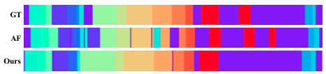

<!-- Start of picture text -->
GT AF Ours <!-- End of picture text -->

Figure 8. Action segmentation results on _Coffee_ in EgoPER. 

and predictions of our framework, HF2 -VAD and S3R. Our method can capture step segments and errors simultaneously. However, HF2 -VAD generates fluctuating error predictions, which shows a disadvantage of video anomaly detection models for error detection in procedural videos. Figure 8 shows that our method can more accurately segment videos than the baseline TAS model (AF), especially for recognizing background segments (in purple), thanks to leveraging relational features and contrastive learning. 

**Weakly-Supervised Action Segmentation and Error Detection.** Table 7 shows the results on the ATA dataset [24]. For fair comparison, we follow its setting to learn our model with weak supervision and without AOD. We generate pseudo framewise labels using [34] for training and use the framewise predictions without the post-processing from [24] at inference. We observed that results from the AF backbone contain many short incorrect action segments, leading to a lower Edit score, F1@50 and eventually low F1error. Overall, our method with DiffAct backbone outperforms all previous methods. 

## **6. Conclusions** 

We studied error detection in egocentric procedural task videos. Our EgoPED framework has an action segmentation model (can be any off-the-shelf model) and a contrastive step prototype learning module to learn useful features (using holistic and relational featurss) for action and error understanding. We introduced the EgoPER dataset with both normal and erroneous procedural videos. Our experiments on three datasets showed that our framework can leverage any action segmentation model easily and obtain promising results on detecting various types of errors. 

## **Acknowledgements** 

This work is sponsored by DARPA PTG (HR00112220001), NSF (IIS-2115110), ARO (W911NF2110276). Content does not necessarily reflect the position/policy of the Government. 

18662

<!-- Page 9 -->

## **References** 

- [1] Andra Acsintoae, Andrei Florescu, Mariana-Iuliana Georgescu, Tudor Mare, Paul Sumedrea, Radu Tudor Ionescu, Fahad Shahbaz Khan, , and Mubarak Shah. Ubnormal: New benchmark for supervised open-set video anomaly detection. _IEEE Conference on Computer Vision and Pattern Recognition_ , 2022. 2, 3 

- [2] Hyemin Ahn and Dongheui Lee. Refining action segmentation with hierarchical video representations. In _Proceedings of the IEEE/CVF International Conference on Computer Vision (ICCV)_ , pages 16302–16310, 2021. 1, 2 

- [3] J. B. Alayrac, P. Bojanowski, N. Agrawal, J. Sivic, I. Laptev, and S. Lacoste-Julien. Unsupervised learning from narrated instruction videos. _IEEE Conference on Computer Vision and Pattern Recognition_ , 2016. 2 

- [4] Marcella Astrid, Muhammad Zaigham Zaheer, Jae-Yeong Lee, and Seung-Ik Lee. Learning not to reconstruct anomalies. _arXiv: 2110.09742_ , 2021. 2, 3 

- [5] Nadine Behrmann, S. Alireza Golestaneh, Zico Kolter, Juergen Gall, and Mehdi Noroozi. Unified fully and timestamp supervised temporal action segmentation via sequence to sequence translation. In _ECCV_ , 2022. 1, 2 

- [6] Yizhak Ben-Shabat, Xin Yu, Fatemehsadat Saleh, Dylan Campbell, Cristian Rodriguez-Opazo, Hongdong Li, and Stephen Gould. The ikea asm dataset: Understanding people assembling furniture through actions, objects and pose. _Winter Conference on Applications of Computer Vision_ , 2021. 4 

- [7] Gedas Bertasius, Heng Wang, and Lorenzo Torresani. Is space-time attention all you need for video understanding? In _Proceedings of the International Conference on Machine Learning (ICML)_ , 2021. 1, 2 

- [8] Jing Bi, Jiebo Luo, and Chenliang Xu. Procedure planning in instructional videos via contextual modeling and modelbased policy learning. _IEEE International Conference on Computer Vision_ , 2021. 1, 2 

- [9] J. Carreira and A. Zisserman. Quo vadis, action recognition? a new model and the kinetics dataset. In _IEEE Conference on Computer Vision and Pattern Recognition_ , 2017. 1, 2, 4 

- [10] Chien-Yi Chang, De-An Huang, Danfei Xu, Ehsan Adeli, Li Fei-Fei, and Juan Carlos Niebles. Procedure planning in instructional videos. In _Computer Vision – ECCV 2020: 16th European Conference, Glasgow, UK, August 23–28, 2020, Proceedings, Part XI_ , 2020. 1, 2 

- [11] Dima Damen, Hazel Doughty, Giovanni Maria Farinella, Antonino Furnari, Jian Ma, Evangelos Kazakos, Davide Moltisanti, Jonathan Munro, Toby Perrett, Will Price, and Michael Wray. Rescaling egocentric vision: Collection, pipeline and challenges for epic-kitchens-100. _International Journal of Computer Vision (IJCV)_ , 130:33–55, 2022. 2 

- [12] Hanqiu Deng, Zhaoxiang Zhang, Shihao Zou, , and Xingyu Li. Bi-directional frame interpolation for unsupervised video anomaly detection. _IEEE Winter Conference on Applications of Computer Vision_ , 2023. 2, 3 

- [13] Guodong Ding, Fadime Sener, Shugao Ma, and Angela Yao. Every mistake counts in assembly. _arXiv: 2307.16453_ , 2023. 2, 3 

- [14] G. Donahue and E. Elhamifar. Learning to predict activity progress by self-supervised video alignment. _IEEE Conference on Computer Vision and Pattern Recognition_ , 2024. 1 

- [15] E. Elhamifar and D. Huynh. Self-supervised multi-task procedure learning from instructional videos. _European Conference on Computer Vision_ , 2020. 2 

- [16] E. Elhamifar and Z. Naing. Unsupervised procedure learning via joint dynamic summarization. _International Conference on Computer Vision_ , 2019. 2 

- [17] Yazan Abu Farha and Jurgen Gall. Ms-tcn: Multi-stage temporal convolutional network for action segmentation. In _Proceedings of the IEEE/CVF conference on computer vision and pattern recognition_ , pages 3575–3584, 2019. 1, 2 

- [18] Alireza Fathi, Xiaofeng Ren, and James M Rehg. Learning to recognize objects in egocentric activities. _In IEEE Conference on Computer Vision and Pattern Recognition (CVPR)_ , 2011. 2, 4 

- [19] Mohsen Fayyaz and Jurgen Gall. Sct: Set constrained temporal transformer for set supervised action segmentation. _IEEE Conference on Computer Vision and Pattern Recognition_ , 2020. 2 

- [20] C. Feichtenhofer. X3d: Expanding architectures for efficient video recognition. In _2020 IEEE/CVF Conference on Computer Vision and Pattern Recognition (CVPR)_ , 2020. 1, 2 

- [21] C. Feichtenhofer, H. Fan, J. Malik, and K. He. Slowfast networks for video recognition. In _2019 IEEE/CVF International Conference on Computer Vision (ICCV)_ , 2019. 1, 2 

- [22] Daniel Fried, Jean-Baptiste Alayrac, Phil Blunsom, Chris Dyer, Stephen Clark, and Aida Nematzadeh. Learning to segment actions from observation and narration. _Annual Meeting of the Association for Computational Linguistics_ , 2020. 2 

- [23] Mariana Iuliana Georgescu, Radu Tudor Ionescu, Fahad Shahbaz Khan, Marius Popescu, and Mubarak Shah. A background-agnostic framework with adversarial training for abnormal event detection in video. _IEEE Transactions on Pattern Analysis and Machine Intelligence_ , 2022. 6 

- [24] Reza Ghoddoosian, Isht Dwivedi, Nakul Agarwal, and Behzad Dariush. Weakly-supervised action segmentation and unseen error detection in anomalous instructional videos. In _Proceedings of the IEEE/CVF International Conference on Computer Vision_ , pages 10128–10138, 2023. 2, 3, 4, 6, 8 

- [25] Kristen Grauman, Andrew Westbury, Eugene Byrne, Zachary Chavis, Antonino Furnari, Rohit Girdhar, Jackson Hamburger, Hao Jiang, Miao Liu, Xingyu Liu, Miguel Martin, Tushar Nagarajan, Ilija Radosavovic, Santhosh K. Ramakrishnan, Fiona Ryan, Jayant Sharma, Michael Wray, Mengmeng Xu, Eric Z. Xu, Chen Zhao, Siddhant Bansal, Dhruv Batra, Vincent Cartillier, Sean Crane, Tien Do, Morrie Doulaty, Akshay Erapalli, Christoph Feichtenhofer, Adriano Fragomeni, Qichen Fu, Christian Fuegen, Abrham Gebreselasie, Cristina Gonz´alez, James M. Hillis, Xuhua Huang, Yifei Huang, Wenqi Jia, Weslie Khoo, J´achym Kol´ar, Satwik Kottur, Anurag Kumar, Federico Landini, Chao Li, Yanghao Li, Zhenqiang Li, Karttikeya Mangalam, Raghava Modhugu, Jonathan Munro, Tullie Murrell, Takumi Nishiyasu, Will Price, Paola Ruiz Puentes, Merey Ramazanova, Leda 

18663

<!-- Page 10 -->

Sari, Kiran K. Somasundaram, Audrey Southerland, Yusuke Sugano, Ruijie Tao, Minh Vo, Yuchen Wang, Xindi Wu, Takuma Yagi, Yunyi Zhu, Pablo Arbel´aez, David J. Crandall, Dima Damen, Giovanni Maria Farinella, Bernard Ghanem, Vamsi Krishna Ithapu, C. V. Jawahar, Hanbyul Joo, Kris Kitani, Haizhou Li, Richard A. Newcombe, Aude Oliva, Hyun Soo Park, James M. Rehg, Yoichi Sato, Jianbo Shi, Mike Zheng Shou, Antonio Torralba, Lorenzo Torresani, Mingfei Yan, and Jitendra Malik. Ego4d: Around the world in 3,000 hours of egocentric video. _2022 IEEE/CVF Conference on Computer Vision and Pattern Recognition (CVPR)_ , pages 18973–18990, 2021. 2 

- [26] Hilde Kuehne, Ali Arslan, and Thomas Serre. The language of actions: Recovering the syntax and semantics of goaldirected human activities. _IEEE Conference on Computer Vision and Pattern Recognition_ , 2014. 2, 4 

- [27] H. Kuehne, J. Gall, and T. Serre. An end-to-end generative framework for video segmentation and recognition. _IEEE Winter Conference on Applications of Computer Vision_ , 2016. 1, 2 

- [28] Anna Kukleva, Hilde Kuehne, Fadime Sener, and Jurgen Gall. Unsupervised learning of action classes with continuous temporal embedding. _IEEE Conference on Computer Vision and Pattern Recognition_ , 2019. 2 

- [29] C. Lea, M. D. Flynn, R. Vidal, A. Reiter, and G. D. Hager. Temporal convolutional networks for action segmentation and detection. _IEEE Conference on Computer Vision and Pattern Recognition_ , 2017. 1, 2 

- [30] Jungbeom Lee, Jihun Yi, Chaehun Shin, and Sungroh Yoon. Bbam: Bounding box attribution map for weakly supervised semantic and instance segmentation. _IEEE Conference on Computer Vision and Pattern Recognition_ , 2021. 2, 3 

- [31] Sangmin Lee, Hak Gu Kim, and Yong Man Ro. Bman: Bidirectional multi-scale aggregation networks for abnormal event detection. _IEEE Transactions on Image Processing_ , 2019. 3 

- [32] Jun Li and Sinisa Todorovic. Set-constrained viterbi for setsupervised action segmentation. _IEEE Conference on Computer Vision and Pattern Recognition_ , 2020. 2 

- [33] J. Li and S. Todorovic. Anchor-constrained viterbi for setsupervised action segmentation. _IEEE/CVF Conference on Computer Vision and Pattern Recognition_ , 2021. 

- [34] J. Li, P. Lei, and S. Todorovic. Weakly supervised energybased learning for action segmentation. _International Conference on Computer Vision_ , 2019. 2, 8 

- [35] M. Li, L. Chen, Y. Duarr, Z. Hu, J. Feng, J. Zhou, and J. Lu. Bridge-prompt: Towards ordinal action understanding in instructional videos. In _2022 IEEE/CVF Conference on Computer Vision and Pattern Recognition (CVPR)_ , 2022. 1, 2 

- [36] Shi-Jie Li, Yazan AbuFarha, Yun Liu, Ming-Ming Cheng, and Juergen Gall. Ms-tcn++: Multi-stage temporal convolutional network for action segmentation. _IEEE Transactions on Pattern Analysis and Machine Intelligence_ , pages 1–1, 2020. 1, 2, 7 

- [37] Yin Li, Miao Liu, and James M. Rehg. In the eye of beholder: Joint learning of gaze and actions in first person video. _European Conference on Computer Vision_ , 2018. 2, 4 

- [38] Yanghao Li, Chao-Yuan Wu, Haoqi Fan, Karttikeya Mangalam, Bo Xiong, Jitendra Malik, and Christoph Feichtenhofer. Mvitv2: Improved multiscale vision transformers for classification and detection. In _2022 IEEE/CVF Conference on Computer Vision and Pattern Recognition (CVPR)_ , 2022. 1, 2 

- [39] Zhe Li, Yazan Abu Farha, and Jurgen Gall. Temporal action segmentation from timestamp supervision. _IEEE/CVF Conference on Computer Vision and Pattern Recognition_ , 2021. 2 

- [40] Ji Lin, Chuang Gan, and Song Han. Tsm: Temporal shift module for efficient video understanding. In _Proceedings of the IEEE International Conference on Computer Vision_ , 2019. 1, 2 

- [41] Yunze Liu, Yun Liu, Che Jiang, Kangbo Lyu, Weikang Wan, Hao Shen, Boqiang Liang, Zhoujie Fu, He Wang, and Li Yi. Hoi4d: A 4d egocentric dataset for category-level humanobject interaction. _IEEE Conference on Computer Vision and Pattern Recognition_ , 2022. 2, 3 

- [42] Yang Liu, Jiayu Huo, Jingjing Peng, Rachel Sparks, Prokar Dasgupta, Alejandro Granados, and Sebastien Ourselin. Skit: a fast key information video transformer for online surgical phase recognition. In _Proceedings of the IEEE/CVF International Conference on Computer Vision_ , pages 21074– 21084, 2023. 1, 2, 7 

- [43] Zhian Liu, Yongwei Nie, Chengjiang Long, Qing Zhang, and Guiqing Li. A hybrid video anomaly detection framework via memory-augmented flow reconstruction and flow-guided frame prediction. _IEEE Conference on Computer Vision and Pattern Recognition_ , 2021. 6, 7 

- [44] Z. Lu and E. Elhamifar. Weakly-supervised action segmentation and alignment via transcript-aware union-of-subspaces learning. _International Conference on Computer Vision_ , 2021. 2, 8 

- [45] Z. Lu and E. Elhamifar. Set-supervised action learning in procedural task videos via pairwise order consistency. _IEEE Conference on Computer Vision and Pattern Recognition_ , 2022. 2 

- [46] Z. Lu and E. Elhamifar. Fact: Frame-action cross-attention temporal modeling for efficient action segmentation. _IEEE Conference on Computer Vision and Pattern Recognition_ , 2024. 1, 2 

- [47] K. Mangalam, H. Fan, Y. Li, C. Wu, B. Xiong, C. Feichtenhofer, and J. Malik. Reversible vision transformers. In _2022 IEEE/CVF Conference on Computer Vision and Pattern Recognition (CVPR)_ , 2022. 1, 2 

- [48] Didik Purwanto, Yie-Tarng Chen, and Wen-Hsien Fang. Dance with self-attention: A new look of conditional random fields on anomaly detection in videos. _IEEE International Conference on Computer Vision_ , 2021. 2, 3 

- [49] Yicheng Qian, Weixin Luo, Dongze Lian, Xu Tang, Peilin Zhao, and Shenghua Gao. Svip: Sequence verification for procedures in videos. _IEEE Conference on Computer Vision and Pattern Recognition_ , 2022. 2, 3 

- [50] Francesco Ragusa, Antonino Furnari, Salvatore Livatino, and Giovanni Maria Farinella. The meccano dataset: Understanding human-object interactions from egocentric videos 

18664

<!-- Page 11 -->

in an industrial-like domain. _Winter Conference on Applications of Computer Vision_ , 2021. 2, 4 

- [51] Rahul Rahaman, Dipika Singhania, Alexandre Thiery, and Angela Yao. A generalized and robust framework for timestamp supervision in temporal action segmentation. In _Computer Vision–ECCV 2022: 17th European Conference_ , 2022. 2 

- [52] A. Richard, H. Kuehne, and J. Gall. Action sets: Weakly supervised action segmentation without ordering constraints. _IEEE Conference on Computer Vision and Pattern Recognition_ , 2018. 

- [53] A. Richard, H. Kuehne, A. Iqbal, and J. Gall. Neuralnetwork-viterbi: A framework for weakly supervised video learning. _IEEE Conference on Computer Vision and Pattern Recognition_ , 2018. 2 

- [54] Nicolae-C˘at˘alin Ristea, Neelu Madan, Radu Tudor Ionescu, Kamal Nasrollahi, Fahad Shahbaz Khan, Thomas B. Moeslund, and Mubarak Shah. Self-supervised predictive convolutional attentive block for anomaly detection. _IEEE Conference on Computer Vision and Pattern Recognition_ , 2022. 2, 3, 6, 7 

- [55] M. Rohrbach, S. Amin, M. Andriluka, and B. Schiele. A database for fine grained activity detection of cooking activities. _IEEE Conference on Computer Vision and Pattern Recognition_ , 2012. 1, 2 

- [56] Fadime Sener and Angela Yao. Zero-shot anticipation for instructional activities. _International Conference on Computer Vision_ , 2019. 1, 2 

- [57] Fadime Sener, Dibyadip Chatterjee, Daniel Shelepov, Kun He, Dipika Singhania, Robert Wang, and Angela Yao. Assembly101: A large-scale multi-view video dataset for understanding procedural activities. _IEEE Conference on Computer Vision and Pattern Recognition_ , 2022. 2, 3, 4 

- [58] Y. Shen and E. Elhamifar. Semi-weakly-supervised learning of complex actions from instructional task videos. _IEEE Conference on Computer Vision and Pattern Recognition_ , 2022. 2 

- [59] Y. Shen and E. Elhamifar. Progress-aware online action segmentation for egocentric procedural task videos. _IEEE Conference on Computer Vision and Pattern Recognition_ , 2024. 1, 2 

- [60] Y. Shen, L. Wang, and E. Elhamifar. Learning to segment actions from visual and language instructions via differentiable weak sequence alignment. _IEEE Conference on Computer Vision and Pattern Recognition_ , 2021. 2 

- [61] G. A. Sigurdsson, S. Divvala, A. Farhadi, and A. Gupta. Asynchronous temporal fields for action recognition. _IEEE Conference on Computer Vision and Pattern Recognition_ , 2017. 1, 2 

- [62] B. Singh, T. K. Marks, M. Jones, O. Tuzel, and M. Shao. A multi-stream bi-directional recurrent neural network for finegrained action detection. _IEEE Conference on Computer Vision and Pattern Recognition_ , 2016. 

- [63] Dipika Singhania, Rahul Rahaman, and Angela Yao. Coarse to fine multi-resolution temporal convolutional network. _CoRR_ , abs/2105.10859, 2021. 

- [64] Yaser Souri, Mohsen Fayyaz, Luca Minciullo, Gianpiero Francesca, and Juergen Gall. Fast Weakly Supervised Action Segmentation Using Mutual Consistency. _PAMI_ , 2021. 1, 2, 8 

- [65] Sebastian Stein and Stephen J. McKenna. Combining embedded accelerometers with computer vision for recognizing food preparation activities. In _Proceedings of the 2013 ACM International Joint Conference on Pervasive and Ubiquitous Computing_ , 2013. 4 

- [66] T. Tai, G. Fiameni, C. Lee, S. See, and O. Lanz. Unified recurrence modeling for video action anticipation. In _2022 26th International Conference on Pattern Recognition (ICPR)_ , 2022. 1, 2 

- [67] Yansong Tang, Dajun Ding, Yongming Rao, Yu Zheng, Danyang Zhang, Lili Zhao, Jiwen Lu, and Jie Zhou. Coin: A large-scale dataset for comprehensive instructional video analysis. _IEEE Conference on Computer Vision and Pattern Recognition_ , 2019. 2, 4 

- [68] Kamalakar Vijay Thakare, Yash Raghuwanshi, Debi Prosad Dogra, Heeseung Choi, and Ig-Jae Kim. Dyannet: A scene dynamicity guided self-trained video anomaly detection network. _IEEE Winter Conference on Applications of Computer Vision_ , 2023. 2, 3 

- [69] Aaron van den Oord, Yazhe Li, and Oriol Vinyals. Representation learning with contrastive predictive coding. _arXiv: 1807.03748_ , 2018. 5 

- [70] Hanlin Wang, Yilu Wu, Sheng Guo, and Limin Wang. Pdpp:projected diffusion for procedure planning in instructional videos. In _CVPR_ , 2023. 1, 2, 6 

- [71] Jiahao Wang, Guo Chen, Yifei Huang, Limin Wang, and Tong Lu. Memory-and-anticipation transformer for online action understanding. In _Proceedings of the IEEE/CVF International Conference on Computer Vision_ , pages 13824– 13835. 2, 3, 4 

- [72] Mengmeng Wang, Jiazheng Xing, and Yong Liu. Actionclip: A new paradigm for video action recognition. _CoRR_ , 2021. 1, 2 

- [73] Jhih-Ciang Wu, He-Yen Hsieh, Ding-Jie Chen, Chiou-Shann Fuh, and Tyng-Luh Liu. Self-supervised sparse representation for video anomaly detection. _European Conference on Computer Vision_ , 2022. 2, 3, 6, 7 

- [74] S. Yeung, O. Russakovsky, N. Jin, M. Andriluka, G. Mori, and L. Fei-Fei. Every moment counts: Dense detailed labeling of actions in complex videos. _International Journal of Computer Vision_ , 2018. 1, 2 

- [75] Fangqiu Yi, Hongyu Wen, and Tingting Jiang. Asformer: Transformer for action segmentation. In _The British Machine Vision Conference (BMVC)_ , 2021. 1, 2 

- [76] Guang Yu, Siqi Wang, Zhiping Cai, Xinwang Liu, Chuanfu Xu, and Chengkun Wu. Deep anomaly discovery from unlabeled videos via normality advantage and self-paced refinement. _IEEE Conference on Computer Vision and Pattern Recognition_ , 2022. 2, 3 

- [77] Muhammad Zaigham Zaheer, Arif Mahmood, Marcella Astrid, and Seung-Ik Lee. Claws: Clustering assisted weakly supervised learning with normalcy suppression for anomalous event detection. _European Conference on Computer Vision_ , 2020. 

18665

<!-- Page 12 -->

- [78] M Zaigham Zaheer, Arif Mahmood, M Haris Khan, Mattia Segu, Fisher Yu, and Seung-Ik Lee. Generative cooperative learning for unsupervised video anomaly detection. _IEEE Conference on Computer Vision and Pattern Recognition_ , 2022. 2, 3 

- [79] Chen-Lin Zhang, Jianxin Wu, and Yin Li. Actionformer: Localizing moments of actions with transformers. _European Conference on Computer Vision_ , 2022. 7 

- [80] Junbin Zhang, Pei-Hsuan Tsai, and Meng-Hsun Tsai. Semantic2graph: Graph-based multi-modal feature fusion for action segmentation in videos, 2022. 1, 2 

- [81] Bin Zhao, Li Fei-Fei, , and Eric P. Xing. Online detection of unusual events in videos via dynamic sparse coding. _IEEE Conference on Computer Vision and Pattern Recognition_ , 2011. 2, 3 

- [82] He Zhao, Isma Hadji, Nikita Dvornik, Konstantinos G. Derpanis, Richard P. Wildes, and Allan D. Jepson. P3iv: Probabilistic procedure planning from instructional videos with weak supervision. In _2022 IEEE/CVF Conference on Computer Vision and Pattern Recognition (CVPR)_ , 2022. 1, 2 

- [83] Joey Tianyi Zhou, Jiawei Du, Hongyuan Zhu, Xi Peng, Yong Liu, , and Rick Siow Mong Goh. Anomalynet: An anomaly detection network for video surveillance. _IEEE Transactions on Information Forensics and Security_ , 2019. 3 

- [84] Yuansheng Zhu, Wentao Bao, , and Qi Yu. Towards open set video anomaly detection. _European Conference on Computer Vision_ , 2022. 2, 3 

- [85] D. Zhukov, J. B. Alayrac, R. G. Cinbis, D. Fouhey, I. Laptev, and J. Sivic. Cross-task weakly supervised learning from instructional videos. _IEEE Conference on Computer Vision and Pattern Recognition_ , 2019. 2, 4 

18666
