# 008_NeurIPS-2024-differentiable-task-graph-learning-procedural-activity-representation-and-online-mistake-detection-from-egocentric-videos-Paper-Conference

[Original PDF](../008_NeurIPS-2024-differentiable-task-graph-learning-procedural-activity-representation-and-online-mistake-detection-from-egocentric-videos-Paper-Conference.pdf)

Pages: 35

> Automatically converted from PDF. Check the original for exact equations, symbols, table alignment, and figure details.

<!-- Page 1 -->

# **Differentiable Task Graph Learning: Procedural Activity Representation and Online Mistake Detection from Egocentric Videos** 

**Luigi Seminara Giovanni Maria Farinella Antonino Furnari** 

Department of Mathematics and Computer Science, University of Catania, Italy `luigi.seminara@phd.unict.it,{giovanni.farinella,antonino.furnari}@unict.it` 

## **Abstract** 

Procedural activities are sequences of key-steps aimed at achieving specific goals. They are crucial to build intelligent agents able to assist users effectively. In this context, task graphs have emerged as a human-understandable representation of procedural activities, encoding a partial ordering over the key-steps. While previous works generally relied on hand-crafted procedures to extract task graphs from videos, in this paper, we propose an approach based on direct maximum likelihood optimization of edges’ weights, which allows gradient-based learning of task graphs and can be naturally plugged into neural network architectures. Experiments on the CaptainCook4D dataset demonstrate the ability of our approach to predict accurate task graphs from the observation of action sequences, with an improvement of +16.7% over previous approaches. Owing to the differentiability of the proposed framework, we also introduce a feature-based approach, aiming to predict task graphs from key-step textual or video embeddings, for which we observe emerging video understanding abilities. Task graphs learned with our approach are also shown to significantly enhance online mistake detection in procedural egocentric videos, achieving notable gains of +19.8% and +7.5% on the Assembly101-O and EPIC-Tent-O datasets. Code for replicating the experiments is available at `https: //github.com/fpv-iplab/Differentiable-Task-Graph-Learning` . 

## **1 Introduction** 

Procedural activities are fundamental for humans to organize tasks, improve efficiency, and ensuring consistency in the desired outcomes, but require time and effort to be learned and achieved effectively. This makes the design of artificial intelligent agents able to assist users to correctly perform a task appealing [21, 31]. Achieving these abilities requires building a flexible representation of a procedure, encapsulating knowledge on the partial ordering of key-steps arising from the specific context at hand. For example, a virtual assistant needs to understand that it is necessary to break eggs before mixing them or that the bike’s brakes need to be released before removing the wheel. Importantly, for a system to be scalable, this representation should be automatically learned from observations (e.g., humans making a recipe many times) rather than explicitly programmed by an expert. 

Previous approaches focused on directly tackling tasks requiring procedural knowledge such as action anticipation [16, 14, 34] and mistake detection [37, 13, 7, 41, 15] without developing explicit representations of the procedure. Other works proposed neural models able to develop implicit representations of the procedure by learning how to recover missing actions [43, 28], discover keysteps [11, 4, 5], or grounding them to video [10, 25]. A different approach [3, 10, 18] consists in representing the structure of a procedure in the form of a _task graph_ , i.e., a Directed Acyclic Graph (DAG) in which nodes represent key-steps, and directed edges impose a partial ordering over key-steps, 

38th Conference on Neural Information Processing Systems (NeurIPS 2024).

<!-- Page 2 -->

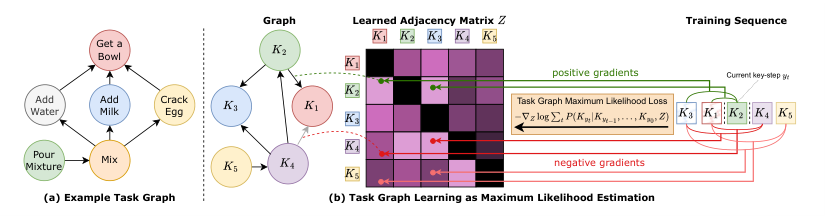


<!-- Start of picture text -->
Graph Learned Adjacency Matrix  Training Sequence<br>Get a<br>Bowl<br>positive gradients Current key-step<br>Add Add Crack Task Graph Maximum Likelihood Loss<br>Water Milk Egg<br>MixturePour Mix negative gradients<br>(a) Example Task Graph (b) Task Graph Learning as Maximum Likelihood Estimation<br><!-- End of picture text -->

Figure 1: (a) An example task graph encoding dependencies in a “mix eggs” procedure. (b) We learn a task graph which encodes a partial ordering between actions (left), represented as an adjacency matrix _Z_ (center), from input action sequences (right). The proposed Task Graph Maximum Likelihood (TGML) loss directly supervises the entries of the adjacency matrix _Z_ generating gradients to maximize the probability of edges from past nodes ( _K_ 3 _, K_ 1) to the current node ( _K_ 2), while minimizing the probability of edges from past nodes to future nodes ( _K_ 4 _, K_ 5) in a contrastive manner. 

encoding dependencies between them (see Figure 1(a)).<sup>1</sup> Graphs provide an explicit representation which is readily interpretable by humans and easy to incorporate in downstream tasks such as detecting mistakes or validating the execution of a procedure. While graphs have been historically used to represent constraints in complex tasks and design optimal sub-tasks scheduling [38], graph-based representations mined from videos [3], key-step sequences [39, 20] or external knowledge bases [44] have only recently emerged as a powerful representation of procedural activities able to support downstream tasks such as key-step recognition or forecasting [3, 44]. Despite these efforts, current methods rely on meticulously crafted graph mining procedures rather than setting graph generation in a learning framework, limiting the inclusion of task graph representations in end-to-end systems. 

In this work, we propose a novel approach to learn task graphs from demonstrations in the form of sequences of key-steps performed by real users in a video while executing a procedure. Given a directed graph represented as an adjacency matrix and a set of key-step sequences, we provide an estimate of the likelihood of observing the set of sequences given the constraints encoded in the graph. We hence formulate task graph learning under the well-understood framework of Maximum Likelihood (ML) estimation, and propose a novel differentiable Task Graph Maximum Likelihood (TGML) loss function which can be naturally plugged into any neural-based architecture for direct optimization of task graph from data. Intuitively, our TGML loss generates positive gradients to strengthen the weights of directed edges _B → A_ when observing the _< . . . , A, . . . , B, . . . >_ structure, while pushing down the weights of all other edges in a contrastive manner (see Figure 1(b)). To evaluate the effectiveness of the proposed framework, we propose two approaches to task graph learning. The first approach, called “Direct Optimization (DO)”, uses the proposed TGML loss to directly optimize the weights of the adjacency matrix, which constitute the only parameters of the model. The output of the optimization procedure is the learned graph. The second approach, termed Task Graph Transformer (TGT) is a feature-based model which uses a transformer encoder and a relation head to predict the adjacency matrix from either text or video key-step embeddings. 

We validate the ability of our framework to learn meaningful task graphs on the CaptainCook4D dataset [30]. Comparisons with state-of-the-art approaches show superior performance of both proposed approaches on task graph generation, with boosts of up to +16 _._ 7% over prior methods. On the same dataset, we show that our feature-based approach implicitly gains video understanding abilities on two fundamental tasks [46]: pairwise ordering and future prediction. We finally assess the usefulness of the learned graph-based representation on the downstream task of online mistake detection in procedural egocentric videos. To tackle this task, we observe that procedural errors mainly arise from the execution of a given key-step without the correct execution of its pre-conditions. We hence design an approach which uses the learned graph to check whether pre-conditions for the current action are satisfied, signaling a mistake when they are not, obtaining significant gains of +19.8% and +7.5% in the online mistake detection benchmark recently introduced in [13] on Assembly101 [37] and EPIC-Tent [19], showcasing the relevance and quality of the learned graph-based representations. 

1See the supplementary material for more details. 

2

<!-- Page 3 -->

The contributions of this work are the following: 1) We introduce a novel framework for learning _task graphs_ from action sequences, which relies on maximum likelihood estimation to provide a differentiable loss function which can be included in end-to-end models and optimized with gradient descent; 2) We propose two approaches to task graph learning based on direct optimization of the adjacency matrix and processing key-step text or video embeddings, which offer significant improvements over previous methods in task graph generation and shows emerging video understanding abilities; 3) We showcase the usefulness of task graphs in general, and the learned graph-based representations in particular, on the downstream task of online mistake detection from video, where we improve over competitors. The code to replicate the experiments is available at `https://github.com/fpv-iplab/Differentiable-Task-Graph-Learning` . 

## **2 Related Work** 

**Procedure Understanding** Previous investigations considered different tasks related to procedure understanding, such as inferring key-steps from video in an unsupervised way [45, 47, 12, 4, 5, 11], grounding key-steps in procedural video [25, 9, 10, 27], recognizing the performed procedure [24], inferring key-step orderings [4, 5, 25, 10, 43], and procedure structure verification [28]. Recently, task graphs, mined from video or external knowledge such as WikiHow articles, have been investigated as a powerful representation of procedures and proved advantageous for learning representations useful for downstream tasks such as key-step recognition and forecasting [44, 3]. 

Differently from previous works [28, 43], we aim to develop an explicit and human readable representation of the procedure which can be directly plugged in to enable downstream tasks [3], rather than an implicit representation obtained with pre-training objective [44, 28]. As a departure from previous paradigms which carefully designed task graph construction procedures [3, 44, 39, 20], we frame task prediction in a general learning framework, enabling models to learn task graphs directly from input sequences, and propose a differentiable loss function based on maximum likelihood. 

**Task Graph Construction** A line of works investigated the construction of task graphs from natural language descriptions of procedures (e.g., recipes) using rule-based graph parsing [36, 10], defining probabilistic models [23], fine-tuning language models [35], or proposing learning-based approaches [10] involving parsers and taggers trained on text corpora of recipes [8, 42]. While these approaches do not require any action sequence as input, they depend on the availability of text corpora including procedural knowledge, such as recipes, which often fail to encapsulate the variety of ways in which the procedure may be executed [3]. Other works proposed hand-crafted approaches to infer task graphs observing sequences of actions depicting task executions [20, 39]. Recent work designed procedures to mine task graphs from videos and textual descriptions of key-steps [3] or cross-referencing visual and textual representations from corpora of procedural text and videos [44]. 

Differently from previous efforts, we rely on action sequences, grounded in video, rather than natural language descriptions of procedures or recipes [35, 10] and frame task graph generation as a learning problem, providing a differentiable objective rather than resorting to hand-designed algorithms and task extraction procedures [20, 39, 3, 44]. 

**Online Mistake Detection in Procedural Videos** Despite the interest in procedural learning, mistake detection has been systematically investigated only recently. Some methods considered fully supervised scenarios in which mistakes are explicitly labeled in video and mistake detection is performed offline [37, 41, 30]. Other approaches considered weak supervision, with mistakes being labeled only at the video level [15]. Finer-grade spatial and temporal annotations are exploited in [7] to build knowledge graphs, which are then leveraged to perform mistake detection. Recently, the authors of [13] proposed an online mistake detection benchmark incorporating videos from the Assembly101 [37] and EPIC-Tent [19] datasets, as well as PREGO, an approach to online mistake detection in procedural egocentric videos. 

Rather than addressing online mistake detection with implicit representations [13] or carefully designed knowledge bases [37], we design a simple approach which relies on learned explicit task graph representations. As we show in the experiments, this leads to obtain significant performance gains over previous methods, even when the predicted graphs are suboptimal, while best results are obtained with task graphs learned within the proposed framework. 

3

<!-- Page 4 -->

## **3 Technical Approach** 

### **3.1 Task Graph Maximum Likelihood Learning Framework** 

**Preliminaries** Let _K_ = _{K_ 0 = _S, K_ 1 _, . . . , Kn, Kn_ +1 = _E}_ be the set of key-steps involved in the procedure, where _S_ and _E_ are placeholder “start” and “end” key-steps denoting the _start_ and _end_ of the procedure. We define the task graph as a directed acyclic graph, i.e., a tuple _G_ = ( _K, A, ω_ ), where _K_ is the set of nodes (the key-steps), _A_ = _K×K_ is the set of possible directed edges indicating ordering constraints between pairs of key-steps, and _ω_ : _A →_ [0 _,_ 1] is a function assigning a score to each of the edges in _A_ . An edge ( _Ki, Kj_ ) _∈A_ (also denoted as _Ki → Kj_ ) indicates that _Kj_ is a _pre-condition_ of _Ki_ (for instance mix _→_ crack egg) with score _ω_ ( _Ki, Kj_ ). We assume normalized weights for outgoing edges, i.e.,<sup>�</sup> _j_<sup>_w_(</sup><sup>_Ki, Kj_) = 1</sup><sup>_∀i_.We also represent the graph</sup><sup>_G_</sup> 

as the adjacency matrix _Z ∈_ [0 _,_ 1]<sup>(</sup><sup>_n_+2)</sup><sup>_×_(</sup><sup>_n_+2)</sup> , where _Zij_ = _ω_ ( _Ki, Kj_ ). For ease of notation, we will denote the graph _G_ = ( _K, A, ω_ ) simply with its adjacency matrix _Z_ in the rest of the paper. We assume that a set of _N_ sequences _Y_ = _{y_<sup>(</sup><sup>_k_)</sup> _}_<sup>_N_</sup> _k_ =1<sup>showing possible orderings of the key-steps</sup> _K_ is available, where the generic sequence _y ∈Y_ is defined as a set of indexes to key-steps _K_ , i.e., _y_ = _< y_ 0 _, . . . , yt, . . . , ym_ +1 _>_ , with _yt ∈{_ 0 _, . . . , n_ + 1 _}_ . We further assume that each sequence starts with key-step _S_ and ends with key-step _E_ , i.e., _y_ 0 = 0 and _ym_ +1 = _n_ + 1<sup>2</sup> and note that different sequences _y_<sup>(</sup><sup>_i_)</sup> and _y_<sup>(</sup><sup>_j_)</sup> have in general different lengths. Since we are interested in modeling key-step orderings, we assume that sequences do not contain repetitions.<sup>3</sup> We frame task graph learning as determining an adjacency matrix _Z_<sup>ˆ</sup> such that sequences in _Y_ can be seen as topological sorts of _Z_<sup>ˆ</sup> . A principled way to approach this problem is to provide an estimate of the likelihood _P_ ( _Y|Z_ ) and choose the maximum likelihood estimate _Z_<sup>ˆ</sup> = arg max _P_ ( _Y|Z_ ). _Z_ 

**Modeling Sequence Likelihood for an Unweighted Graph** Let us consider the special case of an unweighted graph, i.e., _Z_<sup>¯</sup> _∈{_ 0 _,_ 1 _}_<sup>(</sup><sup>_n_+2)</sup><sup>_×_(</sup><sup>_n_+2)</sup> . We wish to estimate _P_ ( _y|Z_ ), the likelihood of the generic sequence _y ∈Y_ given graph _Z_ . Formally, let _Yt_ be the random variable related to the event “key-step _Kyt_ appears at position _t_ in sequence _y_ ”. We can factorize the conditional probability _P_ ( _y|Z_ ) as: 

_P_ ( _y|Z_ ) = _P_ ( _Y_ 0 _, . . . , Y|y||Z_ ) = _P_ ( _Y_ 0 _|Z_ ) _· P_ ( _Y_ 1 _|Y_ 0 _, Z_ ) _· . . . · P_ ( _Y|y||Y_ 0 _, . . . , Y|y|−_ 1 _, Z_ ) _._ (1) We assume that the probability of observing a given key-step _Kyt_ at position _t_ in _y_ depends on the previously observed key-steps ( _Kyt−_ 1 _, . . . , Ky_ 0), but not on their ordering, i.e., the probability of observing a given key-step depends on whether its pre-conditions are satisfied, regardless of the order in which they have been satisfied. Under this assumption, we write _P_ ( _Yt|Yt−_ 1 _, . . . , Y_ 0 _, Z_ ) simply as _P_ ( _Kyt|Kyt−_ 1 _, . . . , Ky_ 0 _, Z_ ). Without loss of generality, in the following, we denote the current key-step as _Ki_ = _Kyt_ , the indexes of key-steps _observed_ at time _t_ as _J_ = _O_ ( _y, t_ ) = _{yt−_ 1 _, . . . , y_ 0 _}_ , and _J_ ¯ =the _O_ (corresponding _y, t_ ) = _{_ 0 _, . . . , n_ set + 1of observed _} \ O_ ( _y, t_ key-steps) and _KJ_ ¯as<sup>as</sup> _K_<sup>the</sup> _J_<sup>sets</sup> = _{K_<sup>of</sup> _i_<sup>indexes</sup> _|i ∈J }_<sup>and</sup> . Similarly,<sup>corresponding</sup> we define<sup>key-</sup> steps _unobserved_ at position _t_ , i.e., those which do not appear before _yt_ in the sequence. Given the factorization above, we are hence interested in estimating the general term _P_ ( _Kyt|Kyt−_ 1 _, . . . , Ky_ 0) = _P_ ( _Ki|KJ_ ). We can estimate the probability of observing key-step _Ki_ given the set of observed keysteps _KJ_ and the constraints imposed by _Z_<sup>¯</sup> , following Laplace’s classic definition of probability [26] as “the ratio of the number of favorable cases to the number of possible cases”. Specifically, if we were to randomly sample a key-step from _K_ following the constraints of _Z_<sup>¯</sup> , and having observed key-steps _KJ_ , sampling _Ki_ would be a favorable case if all pre-conditions of _Ki_ were satisfied, i.e., if<sup>�</sup> _j∈J_<sup>¯</sup><sup>_Zij_=0 (there are no pre-conditions in unobserved key-steps</sup><sup>_K_</sup> _J_<sup>¯).Similarly, sampling</sup> a key-steps _Kh_ is a “possible case” if<sup>�</sup> _j∈J_<sup>¯</sup><sup>_Zhj_=0.Wecanhencedefinetheprobabilityof</sup> observing key-step _Ki_ after observing all key-steps _KJ_ in a sequence as follows: 


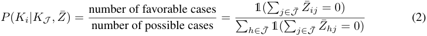


where 1( _·_ ) denotes the indicator function, and in the denominator, we are counting the number of key-steps that have not appeared yet are “possible cases” under the given graph _Z_ . Likelihood _P_ ( _y|Z_ ) can be obtained by plugging Eq. (2) into Eq. (1). 

> 2In practice, we prepend/append _S_ and _E_ to each sequence. 

> 3Since sequences may in practice contain repetitions, we map each sequence containing repetitions to multiple sequences with no repetitions (e.g., _ABCAD →_ ( _ABCD, BCAD_ )). 

4

> Original page for checking 3 unresolved font glyphs.

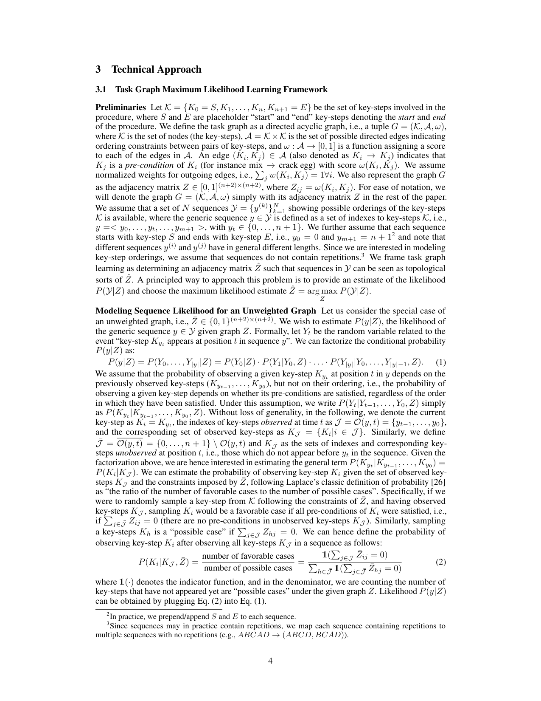

<!-- Page 5 -->

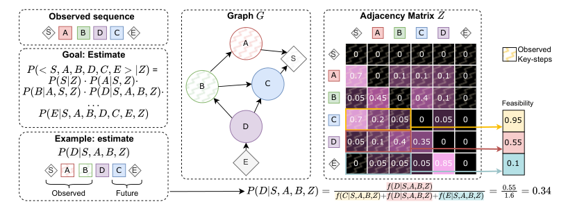


<!-- Start of picture text -->
Observed sequence Graph  Adjacency Matrix<br>S A B D C E S A B C D E<br>A<br>Observed<br>Goal: Estimate S S 0 0 0 0 0 0 Key-steps<br> =  A 0.7 0 0.1 0.1 0.1 0<br>B C<br>B 0.05 0.45 0 0.4 0.1 0<br>Feasibility<br>C 0.7 0.2 0.05 0 0.05 0 0.95<br>D<br>Example: estimate D 0.05 0.1 0.4 0.35 0 0 0.55<br>E E 0 0.05 0.05 0.05 0.85 0 0.1<br>S A B D C E<br>Observed Future<br><!-- End of picture text -->

Figure 2: Given a sequence _< S, A, B, D, C, E >_ , and a graph _G_ with adjacency matrix _Z_ , our goal is to estimate the likelihood _P_ ( _< S, A, B, D, C, E > |Z_ ), which can be done by factorizing the expression into simpler terms. The figure shows an example of computation of probability _P_ ( _D|S, A, B, Z_ ) as the ratio of the “feasibility of sampling key-step D, having observed key-steps S, A, and B” to the sum of all feasibility scores for unobserved symbols. Feasibility values are computed by summing weights of edges _D → X_ for all observed key-steps _X_ . 

**Modeling Sequence Likelihood for a Weighted Graph** To enable gradient-based learning, we consider the general case of a continuous adjacency matrix _Z ∈_ [0 _,_ 1]<sup>(</sup><sup>_n_+2)</sup><sup>_×_(</sup><sup>_n_+2)</sup> . We generalize the concept of “possible cases” discussed in the previous section with the concept of “feasibility of sampling a given key-step _Ki_ , having observed a set of key-steps _KJ_ , given graph _Z_ ”, which we define as the sum of all weights of edges between observed key-steps _KJ_ and _Ki_ : _f_ ( _Ki|KJ , Z_ ) = � _j∈J_<sup>_Zij_.Intuitively, if key-step</sup><sup>_ki_has many satisfied pre-conditions, we are more likely to sample</sup> it as the next key-step. We hence define _P_ ( _Ki|KJ , Z_ ) as “the ratio of the feasibility of sampling _Ki_ to the sum of the feasibilities of sampling any unobserved key-step”: 


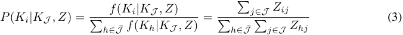


Figure 2 illustrates the computation of the likelihood in Eq. (3). Plugging Eq. (3) into Eq. (1), we can estimate the likelihood of a sequence _y_ given graph _Z_ as: 


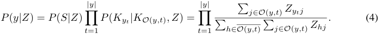


Where we set _P_ ( _Ky_ 0 _|Z_ ) = _P_ ( _S|Z_ ) = 1 as sequences always start with the start node _S_ . 

**Task Graph Maximum Likelihood Loss Function** Assuming that sequences _y_<sup>(</sup><sup>_i_)</sup> _∈Y_ are independent and identically distributed, we define the likelihood of _Y_ given graph _Z_ as follows: 


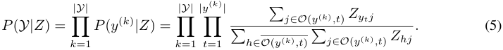


We can find the optimal graph _Z_ by maximizing the likelihood in Eq. (5), which is equivalent to minimizing the negative log-likelihood _−_ log _P_ ( _Y, Z_ ), leading to formulating the following loss: 


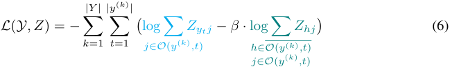


where _β_ is a hyper-parameter. We refer to Eq. (6) as the _Task Graph Maximum Likelihood (TGML)_ loss function. Since Eq. (6) is differentiable with respect to all _Zij_ values, we can learn the adjacency matrix _Z_ by minimizing the loss with gradient descent to find the estimated graph _Z_ ˆ = arg _Z_ max _L_ ( _Y, Z_ ). Eq. (6) works as a contrastive loss in which the first logarithmic term aims 

5

> Original page for checking 1 unresolved font glyphs.

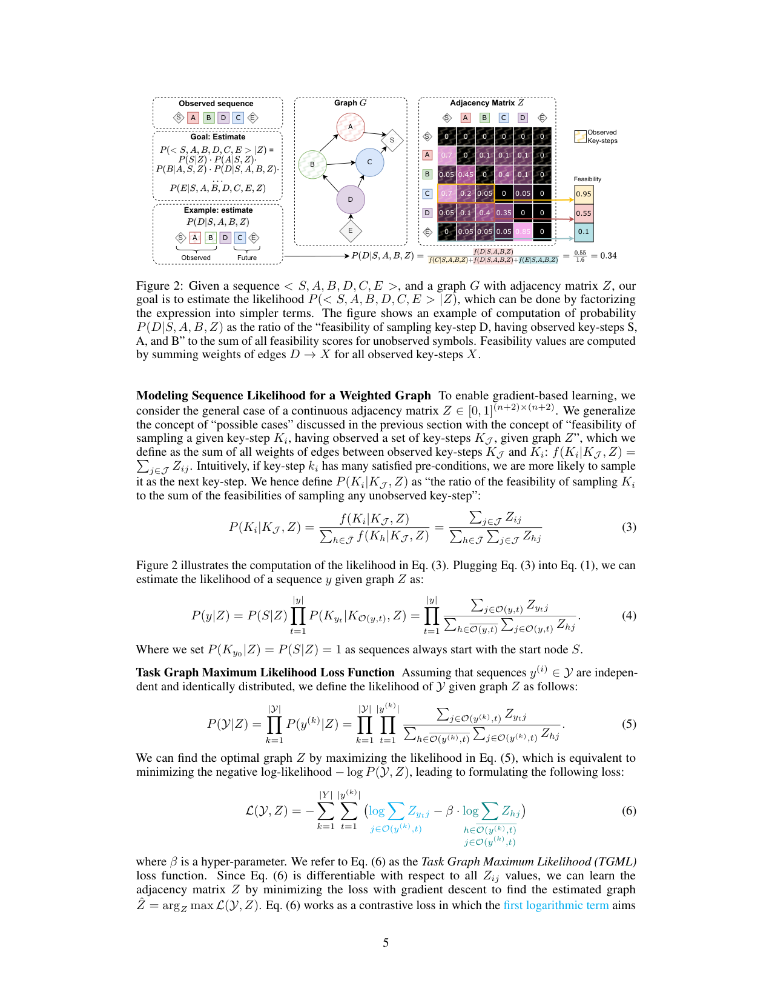

<!-- Page 6 -->

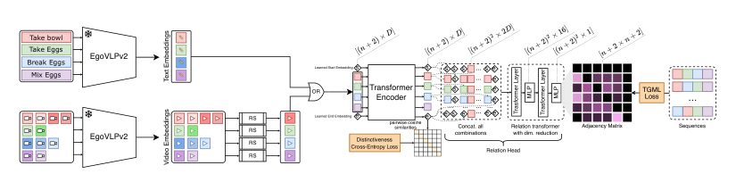


<!-- Start of picture text -->
Take bowl ✏<br>Take Eggs ✏<br>Break EggsMix Eggs EgoVLPv2 ✏✏ Learned Start Embedding s s s ss s ...... s ee<br>OR TransformerEncoder ss ...... ee TGMLLoss ...<br>EgoVLPv2 RSRSRSRS Learned End EmbeddingCross-Entropy LosseDistinctivenesspairwise cosinesimilarities e e...scombinationsConcat. alle... ...... eRelation Head...e Relation transformerwith dim. reduction Adjacency Matrix Sequences<br>Text Embeddings<br>MLP MLP<br>Trasformer Layer Trasformer Layer<br>Video Embeddings<br><!-- End of picture text -->

Figure 3: Our Task Graph Transformer (TGT) takes as input either _D_ -dimensional text embeddings extracted from key-step names or video embeddings extracted from key-step segments. In both cases, we extract features with a pre-trained EgoVLPv2 model. For video embeddings, multiple embeddings can refer to the same action, so we randomly select one for each key-step (RS blocks). Learnable start (S) and end (E) embeddings are also included. Key-step embeddings are processed using a transformer encoder and regularized with a distinctiveness cross-entropy to prevent representation collapse. The output embeddings are processed by our relation head, which concatenates vectors across all ( _n_ + 2)<sup>2</sup> possible node pairs, producing ( _n_ + 2) _×_ ( _n_ + 2) _×_ 2 _D_ relation vectors. These vectors are then processed by a relation transformer, which progressively maps them to an ( _n_ +2) _×_ ( _n_ +2) adjacency matrix. The model is supervised with input sequences using our proposed Task Graph Maximum Likelihood (TGML) loss. 

to _maximize_ , at every step _t_ of each input sequence, the weights _Zytj_ of edges _Kyt → Kj_ going from the current key-step _Kyt_ to all previously observed key-steps _Kj_ , while the second logarithmic term (contrastive term) aims to _minimize_ the weights of edges _Kh → Kj_ between key-steps yet to appear _Kh_ and already observed key-steps _Kj_ . The hyper-parameter _β_ regulates the influence of the summation in the contrastive term which, including many more addends, can dominate gradient updates. As in other contrastive learning frameworks [29, 33], our approach only includes positives and negatives and it does not explicitly consider anchor examples. 

### **3.2 Models** 

**Direct Optimization (DO)** The first model aims to directly optimize the parameters of the adjacency matrix by performing gradient descent on the TGML loss (Eq. (6)). We define the parameters of this model as an edge scoring matrix _A ∈_ R<sup>(</sup><sup>_n_+2)</sup><sup>_×_(</sup><sup>_n_+2)</sup> , where _n_ is the number of key-steps, plus the placeholder start ( _S_ ) and end ( _E_ ) nodes, and _Aij_ is a score assigned to edge _Ki → Kj_ . To prevent the model from learning edge weights eluding the assumptions of directed acyclic graphs, we mask black cells in Figure 2 with _−∞_ . To constrain the elements of _Z_ in the [0 _,_ 1] range and obtain normalized weights, we softmax-normalize the rows of the scoring matrix to obtain the adjacency matrix _Z_ = _softmax_ ( _A_ ). Note that elements masked with _−∞_ will be automatically mapped to 0 by the softmax function similarly to [40]. We train this model by performing batch gradient descent directly on the score matrix _A_ with the proposed TGML loss. We train a separate model per procedure, as each procedure is associated to a different task graph. As many applications require an unweighted graph, we binarize the adjacency matrix with the threshold _n_<sup><u>1</u>, where</sup><sup>_n_is the number of</sup> nodes. We also employ a post-processing stage in which we remove redundant edges, loops, and add obvious missing connections to _S_ and _E_ nodes.<sup>4</sup> 

**Task Graph Transformer (TGT)** Figure 3 illustrates the proposed model, which is termed Task Graph Transformer (TGT). The proposed model can take as input either _D_ -dimensional embeddings of textual descriptions of key-steps or _D_ -dimensional video embeddings of key-step segments extracted from video. In the first case, the model takes as input the same set of embeddings at each forward pass, while in the second case, at each forward pass, we randomly sample a video embedding per key-step from the training videos (hence each key-step embedding can be sampled from a different video). We also include two _D_ -dimensional learnable embeddings for the _S_ and _E_ nodes. All key-step embeddings are processed by a transformer encoder, which outputs _D_ -dimensional vectors enriched with information from other embeddings. To prevent representation collapse, we apply a regularization loss encouraging distinctiveness between pairs of different nodes. Let _X_ be the matrix of embeddings produced by the transformer model. We L2-normalize features, then compute 

> 4See the supplementary material for more details. 

6

<!-- Page 7 -->

Table 1: Task graph generation results on CaptainCook4D. Best results are in **bold** , second best results are <u>underlined,</u> best results among competitors are <mark>highlighted</mark> . Confidence interval bounds computed at 90% conf. for 5 runs. 

Table 2: We compare the abilities of our TGT model trained on visual features to generalize to two fundamental video understanding tasks, i.e., pairwise ordering and future prediction. Despite not being explicitly trained for these tasks, our model exhibits video understanding abilities, surpassing the baseline. 

|Method<br>MSGI [39]|Precision<br>11.9|Recall<br>14.0|F1<br>12.8|being explicitly<br>our model exhib<br>bilii|trained for<br>its video un<br>i h b|these tasks,<br>derstanding<br>li|
|---|---|---|---|---|---|---|
|LLM|52.9|57.4|55.0|ates, surpass|ng te ase|ne.|
|Count-Based [3]|66.7|55.6|60.6|Mthd|Odi|FtPd|
|MSG<sup>2 </sup>[20]|70.9|71.6|71.1|eo|rerng|u. re.|
|TGT-text (Ours)|79.9<br>_±_8_._8|81.9<br>_±_6_._9|80.8<br>_±_8_._0|Random|50.0|50.0|
|DO (Ours)|**86.4** _±_1_._5|**89.7** _±_1_._5|**87.8** _±_1_._5|TGT-video|**77.3**|**74.3**|
|Improvement|+15.5|+18.1|+16.7|Improvement|+27.3|+24.3|


pairwise cosine similarities _Y_ = _X · X_<sup>_T_</sup> _·_ exp( _T_ ) as in [33]. To prevent the transformer encoder from mapping distinct key-step embeddings to similar representations, we enforce the values outside the diagonal of _Y_ to be smaller than the values in the diagonal. This is done by encouraging each row of the matrix _Y_ to be close to a one-hot vector with a cross-entropy loss. Regularized embeddings are finally passed through a relation transformer head which considers all possible pairs of embeddings and concatenates them in a ( _n_ + 2) _×_ ( _n_ + 2) _×_ 2 _D_ matrix _R_ of relation vectors. For instance, _R_ [ _i, j_ ] is the concatenation of vectors _X_ [ _i_ ] and _X_ [ _j_ ]. Relation vectors are passed to a transformer layer which aims to mine relationships among relation vectors, followed by a multilayer perceptron to reduce dimensionality to 16 units and another pair of transformer layer and multilayer perceptron to map relation vectors to scalar values, which are reshaped to size ( _n_ + 2) _×_ ( _n_ + 2) to form the score matrix _A_ . We hence apply the same optimization procedure as in the DO method to supervise the whole architecture. 

## **4 Experiments and Results** 

### **4.1 Graph Generation** 

**Problem Setup** We evaluate the ability of our approach to learn task graph representations on CaptainCook4D [30], a dataset of egocentric videos of 24 cooking procedures performed by 8 volunteers. Each procedure is accompanied by a task graph describing key-steps constraints. We tackle task graph generation as a weakly supervised learning problem in which models have to generate valid graphs by only observing labeled action sequences (weak supervision) rather than relying on task graph annotations (strong supervision), which are not available at training time. All models are trained on videos that are free from ordering errors or missing steps to provide a likely representation of procedures. We use the two proposed methods in the previous section to learn 24 task graph models, one per procedure, and report average performance across procedures. 

**Compared Approaches** We compare our methods with previous approaches to task graph generation, and in particular with MSGI [39] and MSG<sup>2</sup> [20], which are approaches for task graph generation based on Inductive Logic Programming (ILP). We also consider the recent approach proposed in [3] which generates a graph by counting co-occurrences of matched video segments. Since we assume labeled actions to be available at training time, we do not perform video matching and use ground truth segment matching provided by the annotations. This approach is referred to as “Count-Based”. Given the popularity of large language models as reasoning modules, we also consider a baseline which uses a large language model<sup>5</sup> to generate a task graph from key-step descriptions, without any access to key-step sequences.<sup>6</sup> We refer to this model as “LLM”. 

**Graph Generation Results** Results in Table 1 highlight the complexity of the task, with classic approaches based on inductive logic, such as MSGI, achieving poor performance (12 _._ 8 _F_ 1), language models and count-based statistics reconstructing only basic elements of the graph (55 _._ 0 and 60 _._ 6 _F_ 1 for LLM and Count-Based respectively), and even more recent methods based on inductive logic and heuristics only partially predicting the graph (71 _._ 1 _F_ 1 of _MSG_<sup>2</sup> ). The proposed Direct Optimization 

> 5We base our experiments on ChatGPT [1]. 

7

<!-- Page 8 -->

(DO) approach outperforms all other methods, achieving the highest scores across all measures, with improvements in the [+15 _._ 5 _,_ +18 _._ 1] range with respect to the best competitor _MSG_<sup>2</sup> . This result highlights the effectiveness of the proposed framework to learn task graph representations from key-step sequences, especially considering the simplicity of the DO method, which performs gradient descent directly on the adjacency matrix. We obtain a slightly higher recall as compared to the precision (89 _._ 7 vs 86 _._ 4), showing that our approach tends to retrieve most ground truth edges, while hallucinating some pre-conditions, probably due to the dataset being unbalanced towards the most common ways of completing a procedure. Second best results are consistently obtained by our feature-based TGT approach, showing the generality of our learning framework and the potential of integrating it into complex neural architectures. Tight confidence intervals for DO highlight the stability of the proposed loss. The lower performance of TGT, as compared to DO, may be due to the relatively small size of the dataset, which makes it hard for complex architecture to generalize. 

**Video Understanding Results** Table 2 reports the performance of TGT trained on videos on two fundamental video understanding tasks [46] of pairwise clip ordering and future prediction.<sup>6</sup> For pairwise ordering, we feed our TGT model with video embeddings of two clips and sort them according to the predicted adjacency matrix, placing first the clip identified as a pre-condition. For future predictions, given an anchor clip, we have to choose which among two other clips is the correct future. Despite TGT not being explicitly trained for pairwise ordering and future predictions, it exhibits emerging video understanding abilities, surpassing the random baseline. 

### **4.2 Online Mistake Detection** 

**Problem Setup** We follow the PREGO benchmark and used the datasets (Assembly101-O and EPICTent-O) recently proposed in [13], in which models are tasked to perform online action detection from procedural egocentric videos. To evaluate the usefulness of task graphs on this downstream task, we design a system which flags the current action as a mistake if its pre-conditions in the predicted graph do not appear in previously observed actions.<sup>6</sup> 

**Competitors** We compare our approach with respect to the PREGO model proposed in [13], which detects mistakes based on the comparison between the currently observed action and an action predicted by a forecasting module. We note that PREGO is based on an implicit representation of the procedure (the forecasting module), while our approach is based on the explicit task graph representation, learned with the proposed framework. We also compare our approach with respect to baselines based on all graph prediction approaches compared in Table 1 to assess how the ability to predict accurate graphs affects downstream performance. For all methods, we report results based on ground truth action segments and on action sequences predicted by a MiniRoad [2] instance, a state-of-the-art online action detection module trained on each target dataset. 

**Results** Results in Table 3 highlight the usefulness of the learned task graphs for downstream applications. The proposed DO method achieves significant gains over prior art with improvements of +19 _._ 8 and +7 _._ 5 in average _F_ 1 score on Assembly101-O and EPIC-Tent-O respectively when ground truth action sequences are considered to make predictions. While TGT is the second-best performer on Assembly101-O, it obtains best results on EPIC-Tent-O (64 _._ 1 vs 58 _._ 3 in average _F_ 1 score). This is due to the nature of action annotations in the two datasets. Indeed, while key-step names are informative in EPIC-Tent (e.g., “Place Vent Cover”, “Open Stake Bag”, or “Spread Tent”), they are less distinctive in Assembly101 (e.g., “attach cabin”, “attach interior”, or “screw chassis”). This highlights the flexibility of the proposed learning framework which can work in purely abstract, symbolic settings, with the DO approach, but can also leverage semantics with TGT when beneficial. Interestingly, the second best performers are graph-based approaches, with _MSG_<sup>2</sup> achieving an average _F_ 1 of 56 _._ 1 on Assembly101-O and the simple Count-Based approach obtaining an average _F_ 1 score of 56 _._ 6 on EPIC-Tent-O. In contrast, PREGO obtains average _F_ 1 scores of 39 _._ 4 and 32 _._ 1 on Assembly101-O and EPIC-Tent-O respectively, suggesting the potential of explicit graph-based representations for mistake detection, versus the implicit one of PREGO. Breaking down performance into correct and mistake _F_ 1 scores reveal some degree of unbalance of our approaches and the main competitor _MSG_<sup>2</sup> towards identifying correct actions rather than mistakes. This suggests that the related graph-based representations tend to detect some spurious pre-conditions, probably due to the limited demonstrations included in the videos, while the implicit PREGO model exhibits a skew with respect to mistakes. Further breaking down _F_ 1 scores into related precision and recall values 

> 6See the supplementary material for more details. 

8

<!-- Page 9 -->

Table 3: Online mistake detection results. Results obtained with ground truth action sequences are denoted with<sup>_∗_</sup> <u>, while results obtained on predicted action sequences are denoted with</u><sup>+</sup> . 

|||A|ssem|bly10|1-O|||||EPIC|-Tent|-O|||
|---|---|---|---|---|---|---|---|---|---|---|---|---|---|---|
||Avg|Co|rrect||M|istake||Avg|C|orrec|t|M|istake||
|Method|F1|F1|Prec|Rec|F1|Prec|Rec|F1|F1|Prec|Rec|F1|Prec|Rec|
|Count-Based<sup>_∗_</sup>[3]|26.0|9.2|4.8|85.7|42.8|97.8|27.4|56.6|92.5|92.8|92.2|20.7|20.0|21.4|
|LLM<sup>_∗_</sup>|29.3|15.1|8.3|87.2|43.4|96.7|27.9|47.7|86.3|82.4|90.6|9.1|13.3|6.9|
|MSGI<sup>_∗_</sup>[39]|33.1|22.7|13.1|84.4|43.5|93.4|28.3|44.5|66.9|51.6|95.2|22.0|73.3|12.9|
|PREGO<sup>_∗_</sup>[13]<br>|39.4|32.6|89.7|19.9|46.3|30.7|94.0|32.1|45.0|95.7|29.4|19.1|10.7|86.7|
|MSG<sup>2</sup><sup>_∗_</sup>[20]<br>|56.1<br>|63.9<br>|51.5|84.2|48.2<br>|73.6|35.8|54.1<br>|92.9<br>|94.1|91.7|15.4<br>|13.3|18.2|
|TGT-text (Ours)<sup>_∗_</sup>|62.8|69.8|56.8|90.6|55.7|84.1|41.7|**64.1**|**93.8**|94.1|93.5|**34.5**|33.3|35.7|
|DO (Ours)<sup>_∗_</sup>|**75.9**|**90.2**|98.2|83.4|**61.6**|46.7|90.4|58.3|93.5|94.8|92.4|23.1|20.0|27.3|
|Improvement<sup>_∗_</sup>|+19.8|+26.3|||+13.4|||+7.5|+0.9|||+12.5|||
|Count-Based<sup>+ </sup>[3]<br>|23.2|2.6|1.3|66.7|**43.9**|98.4|28.2|40.4|59.2|42.9|95.5|21.6|80.0|12.5|
|LLM<sup>+</sup><br>|28.1|15.1|7.8|65.5|42.3|89.5|27.7|35.9|61.6|46.7|90.4|10.2|40.0|5.8|
|MSGI<sup>+ </sup>[39]<br>|28.4|14.0|7.8|67.9|42.7|90.7|28.0|40.4|59.2|42.9|95.5|21.6|80.0|12.5|
|PREGO<sup>+ </sup>[13]<br>|32.5|23.1|68.8|13.9|41.8|27.8|84.1|29.4|41.6|97.9|26.4|17.2|9.5|93.3|
|MSG<sup>2+ </sup>[20]|46.2|59.1|51.2|70.0|33.2|44.5|26.5|45.2|67.5|52.4|95.1|22.9|73.3|13.6|
|TGT-text (Ours)<sup>+</sup><br>|53.0|67.8|62.3|74.5|38.2|46.2|32.6|43.8|**69.5**|55.8|92.1|18.2|53.3|11.0|
|DO (Ours)<sup>+</sup><br>|**53.5**|**78.9**|85.0|73.5|28.1|22.5|37.3|**46.5**|69.3|54.4|95.2|**23.7**|73.3|14.1|
|Improvement<sup>+</sup>|+7.3|+19.8|||-5.7|||+1.3|+1.2|||+1.2|||


highlights that the main failure modes are due to large imbalances between precision and recall. For instance, the Count-Based method achieves a precision of only 4 _._ 8 with a recall of 85 _._ 7 in predicting correct segments on Assembly101-O. In contrast, the proposed approach obtains balanced precision and recall values in detecting correct segments in Assembly101-O (98 _._ 2/83 _._ 4) and EPIC-Tent-O (94 _._ 1/93 _._ 5), and detecting mistakes in EPIC-Tent-O (33 _._ 3/35 _._ 7), while the prediction of mistakes on Assembly101-O is more skewed (46 _._ 7/90 _._ 4). Results based on action sequences predicted from video (bottom part of Table 3) highlight the challenging nature of the task when considering noisy action sequences (see Figure 4). While the explicit task graph representation may not accurately reflect the predicted noisy action sequences, we still observe improvements over previous approaches of +7 _._ 3 and +1 _._ 3 in average _F_ 1 score in Assembly101-O and EPIC-Tent-O. Remarkably, best competitors are still graph-based methods, such as _MSG_<sup>2</sup> and the Count-Based approach, with significant improvements over the implicit representation of the PREGO model (32 _._ 5 average _F_ 1 versus 53 _._ 5 of the proposed DO model). Also, in this case, we observe that graph-based methods tend to be skewed towards detecting correct action sequences. In this regard, our TGT model only achieves 38 _._ 2 in mistake _F_ 1 score, a drop in 5 _._ 7 points over the best performer, the Count-Based method, which, on the other hand, only achieves an _F_ 1 score of 2 _._ 6 when predicting correct segments. 

## **5 Limitations** 

The proposed approach requires the availability of key-step sequences, a common assumption of works addressing other video understanding tasks [6, 22, 19, 17, 18]. While our method is applicable to any fully supervised video understanding dataset, future works should focus on overcoming such limitation and taking advantage of the vast amount of unlabeled video and textual data sets. While the proposed TGT method has shown promising results when trained directly on video features, the investigation of task graph learning in the absence of labeled key-step sequences is beyond the scope of this paper. We noted a reduced ability of our approach to work with noisy action sequences and a tendency to hallucinate pre-conditions, likely due to the limited expressivity of key-step sequences arising from videos showing the most common ways to perform a procedure. The performance of our designed system to detect mistakes is influenced by the quality of action recognition (see Figure 4). If the action recognition module fails to detect an action, the method may incorrectly signal a missing pre-condition. Conversely, if an action is falsely detected as performed, the method may fail to signal an actual mistake. Future improvements in online action recognition will enhance the robustness of our method. Furthermore, our approach does not explicitly model “optional” 

9

<!-- Page 10 -->

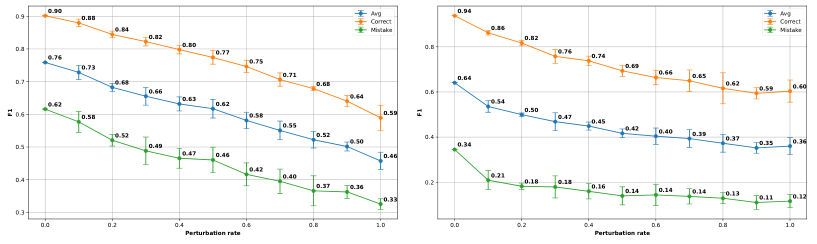


<!-- Start of picture text -->
0.9 0.90 0.88 AvgCorrect 0.94 AvgCorrect<br>0 .84 Mistake 0.86 Mistake<br>0 .82 0.82<br>0.80.70.60.5 0.760.62 0.730.58 0.680 .52 0.66 0.49 00 .80.63 0 0.62.77 0.75 0.58 0 0.55.71 0 0.52 .68 00 .64.50 0.59 0.80.60.4 0.640.34 0 .54 0.50 0.760.47 0.740.45 0.690.42 0.660.40 0.650.39 0.62 0.37 0.590.35 0.600.36<br>0.47 0.46 0.46<br>0.4 0.42 0.40 0.37 0 .36 0 .33 0.2 0.21 0.18 0.18 0.16 0.14 0.14 0.14 0.13 0.11 0.12<br>0.3<br>0.0 0.2 0.4 0.6 0.8 1.0 0.0 0.2 0.4 0.6 0.8 1.0<br>Perturbation rate Perturbation rate<br>F1 F1<br><!-- End of picture text -->

Figure 4: To further investigate the effect of noise, we conducted an analysis based on the controlled perturbation of ground truth action sequences, with the aim to simulate noise in the action detection process. At inference, we perturbed each key-step with a probability _α_ (the “perturbation rate”), with three kinds of perturbations: insert (inserting a new key-step with a random action class), delete (deleting a key-step), or replace (randomly changing the class of a key-step). The plots show the trend of the F1 score (Average, Correct, and Mistake) as the perturbation rate increases in the case of Assembly101-O (left) and EPIC-Tent-O (right). Results suggest that the proposed approach can still bring benefits even in the presence of imperfect action detections, with the average F1 score dropping down 10 _−_ 15 points with a moderate noise level of 20%. 

key-steps, which can lead to incorrect error signaling if optional steps are treated as mandatory. This issue could potentially be addressed through the integration of specialized modules capable of detecting optional nodes. Another limitation of task graph representations, both in this work and in prior approaches [3, 44, 39, 20], is their inability to explicitly model repeatable key-steps. Recent advancements such as [18] have introduced a “repeatable” node attribute to task graphs, but this extension is based on manual annotations, and the automatic learning of such attributes from data remains an open problem. Despite this limitation, the proposed error detection model demonstrates an ability to handle cases where key-steps may recur (e.g., spreading peanut butter). At test time, pre-conditions of key-steps are verified via the predicted task graph, even if a key-step has appeared earlier in the sequence. Nevertheless, more effective modeling of repeatable key-steps, especially in contexts where specific repetitions are required (e.g., “cut three slices of bread”), remains an important area for future research. Future work should explore methods for incorporating these requirements into task graph learning frameworks. Our method follows the setup of PREGO [13], which defines the Assembly101-O and EPIC-Tent-O datasets as curated versions of their originals to account for open-set procedural errors such as “order”, “omission”, “correction”, and “repetition” mistakes. These are procedural mistakes, as distinguished from “proficiency errors” described in prior works [18]. The proposed method focuses on procedural mistakes at the abstract level of executed actions, and thus, would not be directly applicable to proficiency error detection. In real-world systems, this limitation could be mitigated by integrating subsystems that specialize in detecting different types of errors. Developing an integrated approach that addresses both procedural and proficiency errors is a promising direction for future research. 

## **6 Conclusion** 

We considered the problem of learning task graph representations of procedures from video demonstrations. Framing task graph learning as a maximum likelihood estimation problem, we proposed a differentiable loss which allows direct optimization of the adjacency matrix through gradient descent and can be plugged into more complex neural network architectures. Experiments on three datasets show that the proposed approach can learn accurate task graphs, develop video understanding abilities, and improve the downstream task of online mistake detection surpassing state of the art methods. We release our code at the following URL: `https: //github.com/fpv-iplab/Differentiable-Task-Graph-Learning` . 

10

<!-- Page 11 -->

## **7 Acknowledgments** 

This research is supported in part by the PNRR PhD scholarship “Digital Innovation: Models, Systems and Applications” DM 118/2023, by the project Future Artificial Intelligence Research (FAIR) – PNRR MUR Cod. PE0000013 - CUP: E63C22001940006, and by the Research Program PIAno di inCEntivi per la Ricerca di Ateneo 2020/2022 — Linea di Intervento 3 “Starting Grant” EVIPORES Project - University of Catania. 

We thank the authors of [13] and in particular Alessandro Flaborea and Guido D’Amely for sharing the code to replicate experiments in the PREGO benchmark. 

## **References** 

- [1] Josh Achiam, Steven Adler, Sandhini Agarwal, Lama Ahmad, Ilge Akkaya, Florencia Leoni Aleman, Diogo Almeida, Janko Altenschmidt, Sam Altman, Shyamal Anadkat, et al. Gpt-4 technical report. _arXiv preprint arXiv:2303.08774_ , 2023. 

- [2] Joungbin An, Hyolim Kang, Su Ho Han, Ming-Hsuan Yang, and Seon Joo Kim. Miniroad: Minimal rnn framework for online action detection. In _Proceedings of the IEEE/CVF International Conference on Computer Vision_ , pages 10341–10350, 2023. 

- [3] Kumar Ashutosh, Santhosh Kumar Ramakrishnan, Triantafyllos Afouras, and Kristen Grauman. Videomined task graphs for keystep recognition in instructional videos. _Advances in Neural Information Processing Systems_ , 36, 2024. 

- [4] Siddhant Bansal, Chetan Arora, and CV Jawahar. My view is the best view: Procedure learning from egocentric videos. In _European Conference on Computer Vision_ , pages 657–675. Springer, 2022. 

- [5] Siddhant Bansal, Chetan Arora, and CV Jawahar. United we stand, divided we fall: Unitygraph for unsupervised procedure learning from videos. In _Proceedings of the IEEE/CVF Winter Conference on Applications of Computer Vision_ , pages 6509–6519, 2024. 

- [6] Fabian Caba Heilbron, Victor Escorcia, Bernard Ghanem, and Juan Carlos Niebles. Activitynet: A large-scale video benchmark for human activity understanding. In _Proceedings of the ieee conference on computer vision and pattern recognition_ , pages 961–970, 2015. 

- [7] Guodong Ding, Fadime Sener, Shugao Ma, and Angela Yao. Every mistake counts in assembly. _arXiv preprint arXiv:2307.16453_ , 2023. 

- [8] Lucia Donatelli, Theresa Schmidt, Debanjali Biswas, Arne Köhn, Fangzhou Zhai, and Alexander Koller. Aligning actions across recipe graphs. In _Proceedings of the 2021 conference on empirical methods in natural language processing_ , pages 6930–6942, 2021. 

- [9] Mikita Dvornik, Isma Hadji, Konstantinos G Derpanis, Animesh Garg, and Allan Jepson. Drop-dtw: Aligning common signal between sequences while dropping outliers. _Advances in Neural Information Processing Systems_ , 34:13782–13793, 2021. 

- [10] Nikita Dvornik, Isma Hadji, Hai Pham, Dhaivat Bhatt, Brais Martinez, Afsaneh Fazly, and Allan D Jepson. Graph2vid: Flow graph to video grounding for weakly-supervised multi-step localization. In _Proceedings of the European Conference on Computer Vision (ECCV)_ , 2022. 

- [11] Nikita Dvornik, Isma Hadji, Ran Zhang, Konstantinos G Derpanis, Richard P Wildes, and Allan D Jepson. Stepformer: Self-supervised step discovery and localization in instructional videos. In _Proceedings of the IEEE/CVF Conference on Computer Vision and Pattern Recognition_ , pages 18952–18961, 2023. 

- [12] Ehsan Elhamifar and Dat Huynh. Self-supervised multi-task procedure learning from instructional videos. In _Computer Vision–ECCV 2020: 16th European Conference, Glasgow, UK, August 23–28, 2020, Proceedings, Part XVII 16_ , pages 557–573. Springer, 2020. 

- [13] Alessandro Flaborea, Guido Maria D’Amely di Melendugno, Leonardo Plini, Luca Scofano, Edoardo De Matteis, Antonino Furnari, Giovanni Maria Farinella, and Fabio Galasso. Prego: online mistake detection in procedural egocentric videos. In _International Conference on Computer Vision and Patter Recognition (CVPR)_ , 2024. 

- [14] Antonino Furnari and Giovanni Maria Farinella. Rolling-unrolling lstms for action anticipation from first-person video. _IEEE transactions on pattern analysis and machine intelligence_ , 43(11):4021–4036, 2020. 

11

<!-- Page 12 -->

- [15] Reza Ghoddoosian, Isht Dwivedi, Nakul Agarwal, and Behzad Dariush. Weakly-supervised action segmentation and unseen error detection in anomalous instructional videos. In _Proceedings of the IEEE/CVF International Conference on Computer Vision_ , pages 10128–10138, 2023. 

- [16] Rohit Girdhar and Kristen Grauman. Anticipative video transformer. In _Proceedings of the IEEE/CVF international conference on computer vision_ , pages 13505–13515, 2021. 

- [17] Kristen Grauman, Andrew Westbury, Eugene Byrne, Zachary Chavis, Antonino Furnari, Rohit Girdhar, Jackson Hamburger, Hao Jiang, Miao Liu, Xingyu Liu, et al. Ego4d: Around the world in 3,000 hours of egocentric video. In _Proceedings of the IEEE/CVF Conference on Computer Vision and Pattern Recognition_ , pages 18995–19012, 2022. 

- [18] Kristen Grauman, Andrew Westbury, Lorenzo Torresani, Kris Kitani, Jitendra Malik, Triantafyllos Afouras, Kumar Ashutosh, Vijay Baiyya, Siddhant Bansal, Bikram Boote, et al. Ego-exo4d: Understanding skilled human activity from first-and third-person perspectives. _arXiv preprint arXiv:2311.18259_ , 2023. 

- [19] Youngkyoon Jang, Brian Sullivan, Casimir Ludwig, Iain Gilchrist, Dima Damen, and Walterio MayolCuevas. Epic-tent: An egocentric video dataset for camping tent assembly. In _Proceedings of the IEEE/CVF International Conference on Computer Vision Workshops_ , pages 0–0, 2019. 

- [20] Yunseok Jang, Sungryull Sohn, Lajanugen Logeswaran, Tiange Luo, Moontae Lee, and Honglak Lee. Multimodal subtask graph generation from instructional videos. _arXiv preprint arXiv:2302.08672_ , 2023. 

- [21] Takeo Kanade and Martial Hebert. First-person vision. _Proceedings of the IEEE_ , 100(8):2442–2453, 2012. 

- [22] Will Kay, Joao Carreira, Karen Simonyan, Brian Zhang, Chloe Hillier, Sudheendra Vijayanarasimhan, Fabio Viola, Tim Green, Trevor Back, Paul Natsev, et al. The kinetics human action video dataset. _arXiv preprint arXiv:1705.06950_ , 2017. 

- [23] Chloé Kiddon, Ganesa Thandavam Ponnuraj, Luke Zettlemoyer, and Yejin Choi. Mise en place: Unsupervised interpretation of instructional recipes. In _Proceedings of the 2015 Conference on Empirical Methods in Natural Language Processing_ , pages 982–992, 2015. 

- [24] Xudong Lin, Fabio Petroni, Gedas Bertasius, Marcus Rohrbach, Shih-Fu Chang, and Lorenzo Torresani. Learning to recognize procedural activities with distant supervision. In _Proceedings of the IEEE/CVF Conference on Computer Vision and Pattern Recognition_ , pages 13853–13863, 2022. 

- [25] Zijia Lu and Ehsan Elhamifar. Set-supervised action learning in procedural task videos via pairwise order consistency. In _Proceedings of the IEEE/CVF Conference on Computer Vision and Pattern Recognition_ , pages 19903–19913, 2022. 

- [26] Pierre Simon Marquis de Laplace. _Théorie analytique des probabilités_ , volume 7. Courcier, 1820. 

- [27] Antoine Miech, Jean-Baptiste Alayrac, Lucas Smaira, Ivan Laptev, Josef Sivic, and Andrew Zisserman. End-to-end learning of visual representations from uncurated instructional videos. In _Proceedings of the IEEE/CVF conference on computer vision and pattern recognition_ , pages 9879–9889, 2020. 

- [28] Medhini Narasimhan, Licheng Yu, Sean Bell, Ning Zhang, and Trevor Darrell. Learning and verification of task structure in instructional videos. _arXiv preprint arXiv:2303.13519_ , 2023. 

- [29] Aaron van den Oord, Yazhe Li, and Oriol Vinyals. Representation learning with contrastive predictive coding. _arXiv preprint arXiv:1807.03748_ , 2018. 

- [30] Rohith Peddi, Shivvrat Arya, Bharath Challa, Likhitha Pallapothula, Akshay Vyas, Jikai Wang, Qifan Zhang, Vasundhara Komaragiri, Eric Ragan, Nicholas Ruozzi, et al. Captaincook4d: A dataset for understanding errors in procedural activities. _arXiv preprint arXiv:2312.14556_ , 2023. 

- [31] Chiara Plizzari, Gabriele Goletto, Antonino Furnari, Siddhant Bansal, Francesco Ragusa, Giovanni Maria Farinella, Dima Damen, and Tatiana Tommasi. An outlook into the future of egocentric vision. _International Journal fn Computer Vision_ , 2023. 

- [32] Shraman Pramanick, Yale Song, Sayan Nag, Kevin Qinghong Lin, Hardik Shah, Mike Zheng Shou, Rama Chellappa, and Pengchuan Zhang. Egovlpv2: Egocentric video-language pre-training with fusion in the backbone. In _Proceedings of the IEEE/CVF International Conference on Computer Vision_ , pages 5285–5297, 2023. 

- [33] Alec Radford, Jong Wook Kim, Chris Hallacy, Aditya Ramesh, Gabriel Goh, Sandhini Agarwal, Girish Sastry, Amanda Askell, Pamela Mishkin, Jack Clark, et al. Learning transferable visual models from natural language supervision. In _International conference on machine learning_ , pages 8748–8763. PMLR, 2021. 

12

<!-- Page 13 -->

- [34] Debaditya Roy, Ramanathan Rajendiran, and Basura Fernando. Interaction region visual transformer for egocentric action anticipation. In _Proceedings of the IEEE/CVF Winter Conference on Applications of Computer Vision_ , pages 6740–6750, 2024. 

- [35] Keisuke Sakaguchi, Chandra Bhagavatula, Ronan Le Bras, Niket Tandon, Peter Clark, and Yejin Choi. proScript: Partially ordered scripts generation. In Marie-Francine Moens, Xuanjing Huang, Lucia Specia, and Scott Wen-tau Yih, editors, _Findings of the Association for Computational Linguistics: EMNLP 2021_ , pages 2138–2149, Punta Cana, Dominican Republic, November 2021. Association for Computational Linguistics. 

- [36] Pol Schumacher, Mirjam Minor, Kirstin Walter, and Ralph Bergmann. Extraction of procedural knowledge from the web: A comparison of two workflow extraction approaches. In _Proceedings of the 21st International Conference on World Wide Web_ , pages 739–747, 2012. 

- [37] Fadime Sener, Dibyadip Chatterjee, Daniel Shelepov, Kun He, Dipika Singhania, Robert Wang, and Angela Yao. Assembly101: A large-scale multi-view video dataset for understanding procedural activities. In _Proceedings of the IEEE/CVF Conference on Computer Vision and Pattern Recognition_ , pages 21096– 21106, 2022. 

- [38] Steven S Skiena. _The algorithm design manual_ , volume 2. Springer, 1998. 

- [39] Sungryull Sohn, Hyunjae Woo, Jongwook Choi, and Honglak Lee. Meta reinforcement learning with autonomous inference of subtask dependencies. _arXiv preprint arXiv:2001.00248_ , 2020. 

- [40] Ashish Vaswani, Noam Shazeer, Niki Parmar, Jakob Uszkoreit, Llion Jones, Aidan N Gomez, Łukasz Kaiser, and Illia Polosukhin. Attention is all you need. _Advances in neural information processing systems_ , 30, 2017. 

- [41] Xin Wang, Taein Kwon, Mahdi Rad, Bowen Pan, Ishani Chakraborty, Sean Andrist, Dan Bohus, Ashley Feniello, Bugra Tekin, Felipe Vieira Frujeri, et al. Holoassist: an egocentric human interaction dataset for interactive ai assistants in the real world. In _Proceedings of the IEEE/CVF International Conference on Computer Vision_ , pages 20270–20281, 2023. 

- [42] Yoko Yamakata, Shinsuke Mori, and John A Carroll. English recipe flow graph corpus. In _Proceedings of the Twelfth Language Resources and Evaluation Conference_ , pages 5187–5194, 2020. 

- [43] Yiwu Zhong, Licheng Yu, Yang Bai, Shangwen Li, Xueting Yan, and Yin Li. Learning procedure-aware video representation from instructional videos and their narrations. In _Proceedings of the IEEE/CVF Conference on Computer Vision and Pattern Recognition_ , pages 14825–14835, 2023. 

- [44] Honglu Zhou, Roberto Martín-Martín, Mubbasir Kapadia, Silvio Savarese, and Juan Carlos Niebles. Procedure-aware pretraining for instructional video understanding. In _Proceedings of the IEEE/CVF Conference on Computer Vision and Pattern Recognition_ , pages 10727–10738, 2023. 

- [45] Luowei Zhou, Chenliang Xu, and Jason Corso. Towards automatic learning of procedures from web instructional videos. In _Proceedings of the AAAI Conference on Artificial Intelligence_ , volume 32, 2018. 

- [46] Yipin Zhou and Tamara L Berg. Temporal perception and prediction in ego-centric video. In _Proceedings of the IEEE International Conference on Computer Vision_ , pages 4498–4506, 2015. 

- [47] Dimitri Zhukov, Jean-Baptiste Alayrac, Ramazan Gokberk Cinbis, David Fouhey, Ivan Laptev, and Josef Sivic. Cross-task weakly supervised learning from instructional videos. In _Proceedings of the IEEE/CVF Conference on Computer Vision and Pattern Recognition_ , pages 3537–3545, 2019. 

13

<!-- Page 14 -->

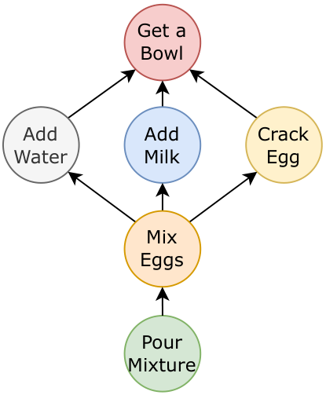


<!-- Start of picture text -->
Get a<br>Bowl<br>Add Add Crack<br>Water Milk Egg<br>Mix<br>Eggs<br>Pour<br>Mixture<br><!-- End of picture text -->

Figure 5: Example of a task graph where each node represents a key-step in the procedure, with directed edges indicating the necessary preconditions for each step. 

## **A Task Graph** 

An example of a task graph is illustrated in Figure 5. A task graph is a Directed Acyclic Graph (DAG) where nodes represent key-steps and directed edges impose a partial order on these steps, indicating the necessary preconditions for each node. For example, the key-step “Mix” has preconditions such as “Add Water”, “Add Milk”, and “Crack Egg”. This formulation of task graphs is not a novel contribution of this paper but was originally introduced in [18]. 

## **B Evaluation Measures** 

This appendix details the evaluation measures used to assess performance experimentally for the two considered tasks of task graph generation and online mistake detection. 

**Task Graph Generation** Task graph generation is evaluated by comparing a generated graph _G_ ˆ = ( ˆ _K, A_ ˆ) with a ground truth graph _G_ = ( _K, A_ ). Since task graphs aim to encode ordering constraints between pairs of nodes, we evaluate task graph generation as the problem of identifying valid pre-conditions (hence valid graph edges) among all possible ones. We hence adopt classic detection evaluation measures such as precision, recall, and _F_ 1 score. In this context, we define True Positives (TP) as all edges included in both the predicted and ground truth graph (Eq. (7)), False Positives (FP) as all edges included in the predicted graph, but not in the ground truth graph (Eq. (8)), and False Negatives (FN) as all edges included in the ground truth graph, but not in the predicted one (Eq. (9)). Note that true negatives are not required to compute precision, recall and _F_ 1 score. 

_TP_ = _A ∩A_<sup>ˆ</sup> (7) _FP_ = _A \ A_<sup>ˆ</sup> (8) _FN_ = _A \ A_<sup>ˆ</sup> (9) 

**Online Mistake Detection** We follow previous works on mistake detection from procedural egocentric videos [37, 41, 13] and evaluate online mistake detection with standard precision, recall, and _F_ 1 scores. We break down metrics by the “correct” and “mistake” classes, as well as report average values. 

14

<!-- Page 15 -->

## **C Implementation Details** 

This appendix provides implementation details to replicate the experiments discussed in Section 4. 

### **C.1 Data Augmentation** 

In procedural tasks, it is common for certain actions to be repeated multiple times throughout the execution of a task. For example, in the EPIC-Tent dataset [19], an operation such as "reading the instructions" may be performed repeatedly at any point during the task. To model key-step orderings within the framework of topological sorts, our approach assumes that sequences should not contain such repetitions. Since repetitions denote that a specific action can appear at different stages of a procedure, we expand each sequence with repetitions to all distinct sequences obtained by dropping repeated actions. This data augmentation strategy enhances the robustness of our model on Assembly101 [37] and EPIC-Tent [19], while it was not necessary for the CaptainCook4D dataset [30], as sequences do not contain any repetitions. 

### **C.2 Early Stopping** 

The learning process was conducted without the use of a validation set. To avoid overfitting and saving computation we defined a “Sequence Accuracy (SA)” score used to determine when the model reaches a learning plateau. We early stop models when an SA value of at least 0 _._ 95 is reached, and if the model shows no SA improvement for 25 consecutive epochs. The SA score is as follows: 


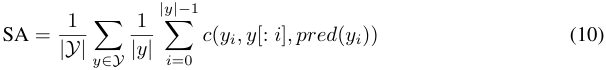


where _Y_ defined sequences in the training set, _y_ is a sequence from _Y_ , _yi_ is the _i_ -th element of sequence _y_ , _y_ [: _i_ ] are the predecessors of the _i_ -th element in the sequence _y_ , and _pred_ ( _yi, Z_ ) are the predicted predecessors for _yi_ from the current binarized adjacency matrix _Z_ . The function _c_ is defined as: 


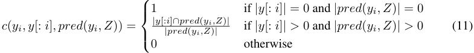


The SA score measures the compatibility of each sequence with the current task graph based on the ratio of correctly predicted predecessors of the current symbol _yi_ of the sequence to the total number of predicted predecessors for _yi_ in the current task graph. 

### **C.3 Hyperparameters** 

Table 4 details the hyperparameters employed in the experiments for task graph generation on the CaptainCook4D dataset [30]. During the training of TGT, we utilized a pre-trained EgoVLPv2 [32] on Ego-Exo4D [18] to extract text and video embeddings. The temperature value _T_ used in the cross-entropy distinctiveness loss was set to 0 _._ 9 as in [33]. The _β_ parameter was linearly annealed from an initial value of 1.0 to a final value of 0.05, with updates occurring every 100 epochs. This gradual decrease in _β_ mimics the warm-up strategy of [40], enabling smoother optimization early in training and leading to improved convergence as training progresses. 

Table 5 details the hyperparameters employed in the experiments for task graph generation on the Assembly101-O and EPIC-Tent-O datasets. For the downstream task of online mistake detection within the DO model framework, we extended the maximum training epochs to 1200, particularly for Assembly101-O. This change was necessary because, even after 1000 epochs, the model continued to exhibit many cycles among its 86 nodes. Extending the number of epochs allows the model additional time to learn and minimize these cycles, which is crucial given the complexity of the graph. In the TGT configuration, we reduced the dropout rate, while the _β_ parameter was gradually annealed from an initial value of 1.0 to 0.55 to prevent overfitting. 

The reader is referred to the code for additional implementation details. 

15

<!-- Page 16 -->

Table 4: List of hyper-parameters used in the modTable 5: List of hyper-parameters used in the models training process for task graph generation usels training process for task graph generation using CaptainCook4D [30]. ing Assembly101-O and EPIC-Tent-O. 

|||Value|||Value|
|---|---|---|---|---|---|
|Hyper-parameter|DO|TGT|Hyper-parameter|DO|TGT|
|Learning Rate|0.1|0.000001|Learning Rate|0.1|0.000001|
|Max Epochs|1000|3000|Max Epochs|1200|1200|
|Optimizer|Adam|Adam|Optimizer|Adam|Adam|
|_β_|0.005|1.0_∼_0.05|_β_|0.005|1.0_∼_0.55|
|Dropout Rate|-|0.25|Dropout Rate|-|0.1|


### **C.4 LLM Prompt** 

Below is the prompt that was employed to instruct the model on its task, which involves identifying pre-conditions for given procedural steps. 

```
Iwouldlikeyoutolearntoanswerquestionsbytellingmethesteps
thatneedtobeperformedbeforeagivenone.
```

```
Thequestionsrefertoproceduralactivitiesandtheseareofthefollowingtype:
```

```
Q-Whichofthefollowingkeystepsisapre-conditionforthecurrentkeystep
"addbrowniemix"?
```

- `add oil` 

- `add water` 

- `break eggs` 

- `mix all the contents` 

- `mix eggs` 

- `pour the mixture in the tray` 

- `spray oil on the tray` 

- `None of the above` 

```
Yourtaskistouseyourimmenseknowledgeandyourimmenseabilitytotellme
whichpreconditionsareamongthoselistedthatmustnecessarilybecarriedout
beforethekeystepindicatedinquotesinthequestion.
```

```
Youhavetogivemetheanswersandaverybriefexplanationofwhyyouchosethem.
```

```
ProvidethecorrectpreconditionsanswerinsideaJSONformatlikethis:
```

- `{` 

```
"addbrowniemix":["addoil","addwater","breakeggs"]
```

- `}` 

### **C.5 Data Split** 

The CaptainCook4D dataset [30] comprises various error types, including order errors, timing errors, temperature errors, preparation errors, missing steps errors, measurement errors, and technique errors. Of these, missing steps and order errors directly impact the sequence integrity. Consequently, for our task graph generation, we utilized only those sequences of actions free from these specific types of errors. Table 6 shows statistics on the CaptainCook4D subsets used for task graph generation. 

For Online Mistake Detection, we considered the datasets defined by the authors of PREGO [13]. 

In the context of pairwise ordering and forecasting, we employed the subset of the CaptainCook4D dataset designated for task graph generation (refer to Table 6) and divided it into training and 

16

<!-- Page 17 -->

Table 6: A detailed breakdown of the data used from the CaptainCook4D dataset [30] for the task graph generation. This table categorizes each scenario by the number of videos, segments, and total duration in hours. The “Total” row aggregates the dataset characteristics. 

|Scenario|Videos|Segments|Duration|
|---|---|---|---|
|Microwave Egg Sandwich|5|60|0.9h|
|Dressed Up Meatballs|8|128|2.7h|
|Microwave Mug Pizza|6|84|1.2h|
|Ramen|11|165|2.7h|
|Coffee|9|144|2.2h|
|Breakfast Burritos|8|88|1.5h|
|Spiced Hot Chocolate|7|49|0.9h|
|Microwave French Toast|11|121|2.2h|
|Pinwheels|5|95|0.8h|
|Tomato Mozzarella Salad|13|117|1.3h|
|Butter Corn Cup|5|60|1.4h|
|Tomato Chutney|5|95|2.6h|
|Scrambled Eggs|6|138|2.6h|
|Cucumber Raita|12|132|2.7h|
|Zoodles|6|78|1.1h|
|Sauted Mushrooms|7|126|2.9h|
|Blender Banana Pancakes|10|140|2.4h|
|Herb Omelet with Fried Tomatoes|8|120|2.4h|
|Broccoli Stir Fry|10|250|5.2h|
|Pan Fried Tofu|9|171|3.6h|
|Mug Cake|9|180|3.0h|
|<br>Cheese Pimiento|7|77|1.6h|
|Spicy Tuna Avocado Wraps|9|153|2.6h|
|Caprese Bruschetta|8|88|2.4h|
|Total|194|2859|53.0h|


testing sets. This division was carefully managed to ensure that 50% of the scenarios were equally represented in both the training and testing sets. 

### **C.6 Pairwise ordering and future prediction** 

We setup the pairwise ordering and future prediction video understanding tasks following [46]. 

**Pairwise Ordering** Models take as input two randomly shuffled video clips and are tasked with recognizing the correct ordering between key-steps. We sample all consecutive triplets of labeled segments from test videos, discard the middle one, and consider the first and third ones as input pair. We evaluate models using accuracy. 

**Future Prediction** Models take as input an anchor video clip and two randomly shuffled video clips and are tasked to select which of the two clips is the correct future of the anchor clip. We sample all consecutive triplets of labeled segments from test videos and consider the middle clip as the anchor and the remaining two clips as the two options. We evaluate models using accuracy. 

**Model** We trained our TGT model using video embeddings extracted with a pre-trained EgoVLPv2 [32] on Ego-Exo4D [18]. During the training process, if multiple video embeddings are associated with the same key-step across the training sequences, one embedding per key-step is randomly selected. The model is trained for task graph generation on the training video and tested for pairwise ordering and future prediction on the test set. 

For pairwise ordering, we feed our model with two clips and obtain a 4 _×_ 4 adjacency matrix, where the nodes represent _START_ , _A_ , _B_ , _END_ . We establish the order between _A_ and _B_ based on the fulfillment of at least one of the following conditions: (a) if the weight of the edge _A → B_ is greater than the weight of the edge _B → A_ , we conclude that _A_ precedes _B_ ; (b) by analyzing the sequences 

17

<!-- Page 18 -->

Table 7: Performance comparison between the single TGT-text model trained across all CaptainCook4D procedures and the unified model. The confidence intervals in the single models indicate that the unified method performs comparably to training individual models for each procedure. 

|Method|Precision|Recall|F1|
|---|---|---|---|
|TGT-text (single)|79.9 _±_8_._8|81.9 _±_6_._9|80.8 _±_8_._0|
|TGT-text (unified)|61.5 _±_12_._0|68.2 _±_10_._3|64.5 _±_11_._9|


_<_ START _, A, B,_ END _>_ and _<_ START _, B, A,_ END _>_ , we calculate their probabilities using Eq. (4). If _P_ ( _<_ START _, A, B,_ END _>| Z_ ) is greater than _P_ ( _<_ START _, B, A,_ END _>| Z_ ), we infer that _A_ precedes _B_ ; (c) if the weight of the edge _END → B_ is greater than that of _END → A_ , it implies that _B_ is a necessary precondition for concluding the procedure, indicating that _B_ follows _A_ , and consequently, _A_ precedes _B_ . If none of these conditions hold, we determine that _B_ precedes _A_ . 

For future prediction, we feed three clips and obtain a 5 _×_ 5 adjacency matrix, where the nodes represent _START_ , _A_ , _anchor_ , _B_ , and _END_ . We hence inspect the weights of edges _anchor → A_ and _anchor → B_ and choose as the future clip, the one related to the smallest weight (a small weight indicates that the selected clip is not a precondition). Another method to determine the future clip is by calculating the probabilities of the sequences _<_ START _, A, anchor, B,_ END _>_ and _<_ START _, B, anchor, A,_ END _>_ using Eq. (4). If _P_ ( _<_ START _, A, anchor, B,_ END _>| Z_ ) is greater than _P_ ( _<_ START _, B, anchor, A,_ END _>| Z_ ), we infer that the sequence involving _A_ before _B_ is more probable, indicating that _B_ is the future clip for _anchor_ . Conversely, if the probability of the second sequence is greater, then _A_ is deemed the future clip for _anchor_ . 

### **C.7 Scalability of Task Graph Transformer (TGT)** 

The Direct Optimization (DO) approach requires a separate training session for each procedure. Task Graph Transformer (TGT) offers more flexibility by allowing different sets of key-step embeddings at each forward pass, ideally enhancing scalability. Leveraging this capability, we trained a single TGT text model for all CaptainCook4D procedures. This was achievable due to TGT’s ability to handle varying embeddings per forward pass, enabling simultaneous optimization across multiple procedures during training. As shown in Table 7, the confidence intervals of both the single and unified models highlight some performance variance. The unified model exhibits lower average precision, recall, and F1 scores compared to the individually trained models, with a larger confidence interval. However, the results suggest that TGT-text models can still generalize across diverse procedures, reducing training complexity while maintaining reasonable performance. 

### **C.8 Graph Post-processing** 

We binarize the adjacency matrix with the threshold _n_<sup><u>1</u>, where</sup><sup>_n_is the number of nodes.After this</sup> thresholding phase, it is possible to encounter situations like the one illustrated in Figure 6, where node A depends on nodes B and C, and node B depends on node C. Due to the transitivity of the pre-conditions, we can remove the edge connecting node A to node C, as node B must precede node A. Sometimes, it may occur that a node does not serve as a pre-condition for any other node; in such cases, the END node should be directly connected to this node. Conversely, if a node has no pre-conditions, an edge is added from the current node to the START node. 

At the end of the training process, obtaining a graph containing cycles is also possible. In such cases, all cycles within the graph are considered, and the edge with the lowest score within each cycle is removed. This method ensures that the graph remains a Directed Acyclic Graph (DAG). 

### **C.9 Details on Online Mistake Detection** 

Given the noisy sequences in Assembly101 [37] and EPIC-Tent [19], a distinct approach was adopted during the post-processing phase of task graph generation. Specifically, if a key-step in the task graph has only two pre-conditions and one is the START node, the other pre-condition will be removed regardless of its score, otherwise we apply the transitivity dependences reduction aforementioned. This approach allows for a graph with fewer pre-conditions in the initial steps. 

18

<!-- Page 19 -->

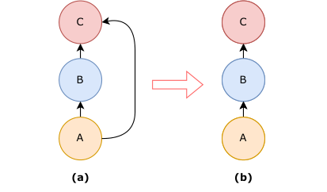


<!-- Start of picture text -->
C C<br>B B<br>A A<br>(a)  (b)<br><!-- End of picture text -->

Figure 6: An example of transitive dependency between nodes. In (a) node A depends on B and C, but B depends on C, in this case, we can remove the edge between A and C for transitivity and we obtain the graph in (b). 


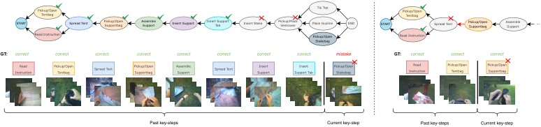


<!-- Start of picture text -->
Pickup/OpenTentbag Tie Top Pickup/OpenTentbag<br>START Spread Tent Pickup/OpenSupportbag AssembleSupport Insert Support Insert SupportTab Insert Stake Pickup/PlaceVentcover Place Guyline END START Spread Tent Pickup/OpenSupportbag AssembleSupport ...<br>Read Instruction Pickup/OpenStakebag Read Instruction<br>GT: correct correct correct correct correct correct correct correct mistake GT: correct correct correct<br>InstructionRead Pickup/OpenTentbag Spread Tent Pickup/OpenSupportbag AssembleSupport Spread Tent SupportInsert Support TabInsert Pickup/OpenStakebag InstructionRead Pickup/OpenTentbag Pickup/OpenSupportbag<br>Past key-steps Current key-step Past key-steps Current key-step<br><!-- End of picture text -->

Figure 7: A success (left) and failure (right) case on EPIC-Tent-O. Past key-steps’ colors match nodes’ colors. On the left, the current key-step “Pickup/Open Stakebag” is correctly evaluated as a mistake because the step “Pickup/Place Ventcover” is a precondition of the current key-step, but it is not included among the previous key-steps. On the right, “Pickup/Open Supportbag” is incorrectly evaluated as mistake because the step “Spread Tent” is precondition of the current key-step, but it is not included among the previous key-steps. This is due to the fact that our method wrongly predicted “Spread Tent” as a pre-condition of “Pickup/Open Supportbag”, probably due to the two actions often occurring in this order. 

In the case of Assembly101, which includes multiple procedural tasks, we opted to consider a single task graph that summarizes all the procedures, rather than generating individual graphs for each. 

### **C.10 Qualitative Examples** 

Figures 8 - 31 report qualitative examples of prediction using our Direct Optimization (DO) method on the procedures of CaptainCook4D. The task graphs must be read in a bottom-up manner, where the START node (bottom) is at the lowest position and represents the first node with no preconditions, while the END node (up) is the final step of the procedure. 

Figure 7 reports a qualitative analysis of the generated task graph for detecting the mistakes on EPIC-Tent-O. 

### **C.11 Experiments Compute Resources** 

The experiments involving the training of the DO model on symbolic data from the CaptainCook4D dataset proved to be highly efficient. We were able to generate all the task graphs in approximately half an hour using a Tesla V100S-PCI GPU. This GPU allowed us to run up to 8 training processes simultaneously. In contrast, training the TGT models for all scenarios in the CaptainCook4D dataset required about 24 hours, with the same GPU supporting the concurrent training of up to 2 models. Additionally, once the task graphs were obtained, executing the PREGO benchmarks for mistake detection was significantly faster, requiring online action prediction, which could be performed in real-time on a Tesla V100S-PCI GPU. 

19

<!-- Page 20 -->

## **D Societal Impact** 

Reconstructing task graphs from procedural videos may enable the construction of agents able to assist users during the execution of the task. Learning task graphs from videos may be affected by geographical or cultural biases appearing in the data (e.g., specific ways of performing given tasks), which may limit the quality of the feedback returned to the user, potentially leading to harm. We expect that training data of sufficient quality should limit such risks. 


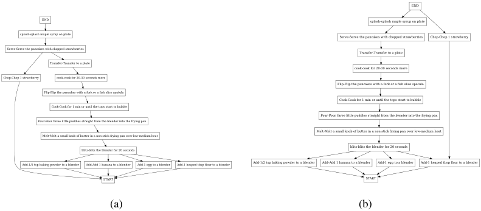


<!-- Start of picture text -->
END<br>END splash-splash maple syrup on plate<br>splash-splash maple syrup on plate Serve-Serve the pancakes with chopped strawberries Chop-Chop 1 strawberry<br>Serve-Serve the pancakes with chopped strawberries<br>Transfer-Transfer to a plate<br>Transfer-Transfer to a plate<br>cook-cook for 20-30 seconds more<br>Chop-Chop 1 strawberry cook-cook for 20-30 seconds more<br>Flip-Flip the pancakes with a fork or a fish slice spatula<br>Flip-Flip the pancakes with a fork or a fish slice spatula<br>Cook-Cook for 1 min or until the tops start to bubble<br>Cook-Cook for 1 min or until the tops start to bubble<br>Pour-Pour three little puddles straight from the blender into the frying pan<br>Pour-Pour three little puddles straight from the blender into the frying pan<br>Melt-Melt a small knob of butter in a non-stick frying pan over low-medium heat<br>Melt-Melt a small knob of butter in a non-stick frying pan over low-medium heat<br>blitz-blitz the blender for 20 seconds blitz-blitz the blender for 20 seconds<br>Add-1/2 tsp baking powder to a blender Add-Add 1 banana to a blender Add-1 egg to a blender Add-1 heaped tbsp flour to a blender Add-1/2 tsp baking powder to a blender Add-Add 1 banana to a blender Add-1 egg to a blender Add-1 heaped tbsp flour to a blender<br>START START<br>(a) (b)<br><!-- End of picture text -->

Figure 8: (a) Ground truth task graph and (b) predicted task graph of the scenario Breakfast Burritos. 


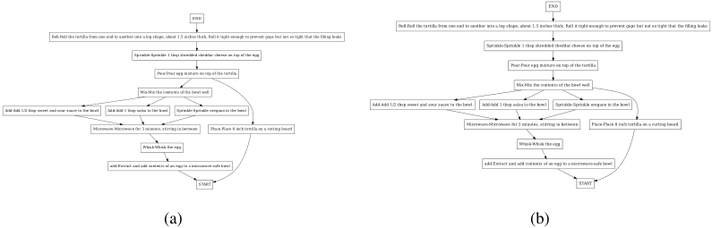


<!-- Start of picture text -->
END<br>END<br>Roll-Roll the tortilla from one end to another into a log shape, about 1.5 inches thick. Roll it tight enough to prevent gaps but not so tight that the filling leaks<br>Roll-Roll the tortilla from one end to another into a log shape, about 1.5 inches thick. Roll it tight enough to prevent gaps but not so tight that the filling leaks<br>Sprinkle-Sprinkle 1 tbsp shredded cheddar cheese on top of the egg<br>Sprinkle-Sprinkle 1 tbsp shredded cheddar cheese on top of the egg<br>Pour-Pour egg mixture on top of the tortilla<br>Pour-Pour egg mixture on top of the tortilla<br>Mix-Mix the contents of the bowl well<br>Mix-Mix the contents of the bowl well<br>Add-Add 1/2 tbsp sweet and sour sauce to the bowl Add-Add 1 tbsp salsa to the bowl Sprinkle-Sprinkle oregano in the bowl<br>Add-Add 1/2 tbsp sweet and sour sauce to the bowl Add-Add 1 tbsp salsa to the bowl Sprinkle-Sprinkle oregano in the bowl<br>Microwave-Microwave for 3 minutes, stirring in between Place-Place 8 inch tortilla on a cutting board Microwave-Microwave for 3 minutes, stirring in between Place-Place 8 inch tortilla on a cutting board<br>Whisk-Whisk the egg Whisk-Whisk the egg<br>add-Extract and add contents of an egg to a microwave-safe bowl add-Extract and add contents of an egg to a microwave-safe bowl<br>START START<br>(a) (b)<br><!-- End of picture text -->

Figure 9: (a) Ground truth task graph and (b) predicted task graph of the scenario Breakfast Burritos. 


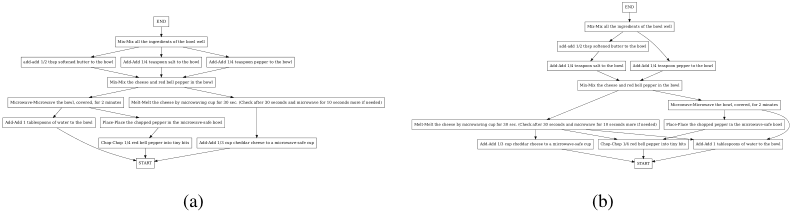


<!-- Start of picture text -->
END<br>END Mix-Mix all the ingredients of the bowl well<br>Mix-Mix all the ingredients of the bowl well add-add 1/2 tbsp softened butter to the bowl<br>add-add 1/2 tbsp softened butter to the bowl Add-Add 1/4 teaspoon salt to the bowl Add-Add 1/4 teaspoon pepper to the bowl Add-Add 1/4 teaspoon salt to the bowl Add-Add 1/4 teaspoon pepper to the bowl<br>Mix-Mix the cheese and red bell pepper in the bowl Mix-Mix the cheese and red bell pepper in the bowl<br>Microwave-Microwave the bowl, covered, for 2 minutes Melt-Melt the cheese by microwaving cup for 30 sec. (Check after 30 seconds and microwave for 10 seconds more if needed) Microwave-Microwave the bowl, covered, for 2 minutes<br>Add-Add 1 tablespoons of water to the bowl Place-Place the chopped pepper in the microwave-safe bowl Melt-Melt the cheese by microwaving cup for 30 sec. (Check after 30 seconds and microwave for 10 seconds more if needed) Place-Place the chopped pepper in the microwave-safe bowl<br>Chop-Chop 1/4 red bell pepper into tiny bits Add-Add 1/3 cup cheddar cheese to a microwave-safe cup Add-Add 1/3 cup cheddar cheese to a microwave-safe cup Chop-Chop 1/4 red bell pepper into tiny bits Add-Add 1 tablespoons of water to the bowl<br>START START<br>(a) (b)<br><!-- End of picture text -->

Figure 10: (a) Ground truth task graph and (b) predicted task graph of the scenario Cheese Pimiento. 

20

<!-- Page 21 -->

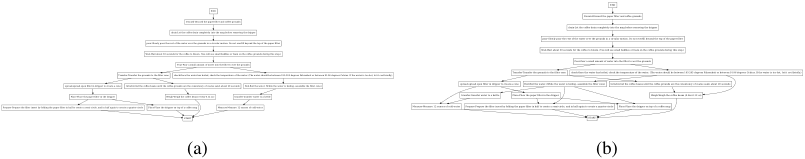


<!-- Start of picture text -->
pour-Slowly pour the rest of the water over the grounds in a circular motion. Do not overfill beyond the top of the paper filterdrain-Let the coffee drain completely into the mug before removing the dripperDiscard-Discard the paper filter and coffee groundsEND pour-Slowly pour the rest of the water over the grounds in a circular motion. Do not overfill beyond the top of the paper filterdrain-Let the coffee drain completely into the mug before removing the dripperDiscard-Discard the paper filter and coffee groundsEND<br>Wait-Wait about 30 seconds for the coffee to bloom. (You will see small bubbles or foam on the coffee grounds during this step.) Wait-Wait about 30 seconds for the coffee to bloom. (You will see small bubbles or foam on the coffee grounds during this step.)<br>Pour-Pour a small amount of water into the filter to wet the grounds Pour-Pour a small amount of water into the filter to wet the grounds<br>Transfer-Transfer the grounds to the filter cone check-Once the water has boiled, check the temperature of the water. (The water should be between 195-205 degrees Fahrenheit or between 91-96 degrees Celsius. If the water is too hot, let it cool briefly.) Transfer-Transfer the grounds to the filter cone check-Once the water has boiled, check the temperature of the water. (The water should be between 195-205 degrees Fahrenheit or between 91-96 degrees Celsius. If the water is too hot, let it cool briefly.)<br>spread-spread open filter in dripper to create a cone Grind-Grind the coffee beans until the coffee grounds are the consistency of coarse sand, about 20 seconds Boil-Boil the water. (While the water is boiling, assemble the filter cone) spread-spread open filter in dripper to create a cone Boil-Boil the water. (While the water is boiling, assemble the filter cone) Grind-Grind the coffee beans until the coffee grounds are the consistency of coarse sand, about 20 seconds<br>Place-Place the paper filter in the dripper Weigh-Weigh the coffee beans (0.8oz-0.12 oz) transfer-transfer water to a kettle transfer-transfer water to a kettle Place-Place the paper filter in the dripper Weigh-Weigh the coffee beans (0.8oz-0.12 oz)<br>Prepare-Prepare the filter insert by folding the paper filter in half to create a semi-circle, and in half again to create a quarter-circle Place-Place the dripper on top of a coffee mug Measure-Measure 12 ounces of cold water Measure-Measure 12 ounces of cold water Prepare-Prepare the filter insert by folding the paper filter in half to create a semi-circle, and in half again to create a quarter-circle Place-Place the dripper on top of a coffee mug<br>START START<br>(a) (b)<br><!-- End of picture text -->

Figure 11: (a) Ground truth task graph and (b) predicted task graph of the scenario Coffee. 


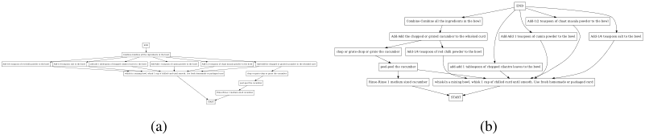


<!-- Start of picture text -->
END<br>Combine-Combine all the ingredients in the bowl Add-1/2 teaspoon of chaat masala powder to the bowl<br>Add-Add the chopped or grated cucumber to the whisked curd Add-Add 1 teaspoon of cumin powder to the bowl Add-1/4 teaspoon salt to the bowl<br>END<br>Combine-Combine all the ingredients in the bowl chop or grate-chop or grate the cucumber Add-1/4 teaspoon of red chilli powder to the bowl<br>Add-1/4 teaspoon of red chilli powder to the bowl Add-1/4 teaspoon salt to the bowl add-add 1 tablespoon of chopped cilantro leaves to the bowl Add-Add 1 teaspoon of cumin powder to the bowl Add-1/2 teaspoon of chaat masala powder to the bowl Add-Add the chopped or grated cucumber to the whisked curd peel-peel the cucumber add-add 1 tablespoon of chopped cilantro leaves to the bowl<br>whisk-In a mixing bowl, whisk 1 cup of chilled curd until smooth. Use fresh homemade or packaged curd chop or grate-chop or grate the cucumber<br>peel-peel the cucumber Rinse-Rinse 1 medium sized cucumber whisk-In a mixing bowl, whisk 1 cup of chilled curd until smooth. Use fresh homemade or packaged curd<br>START Rinse-Rinse 1 medium sized cucumber START<br>(a) (b)<br><!-- End of picture text -->

Figure 12: (a) Ground truth task graph and (b) predicted task graph of the scenario Cucumber Raita. 


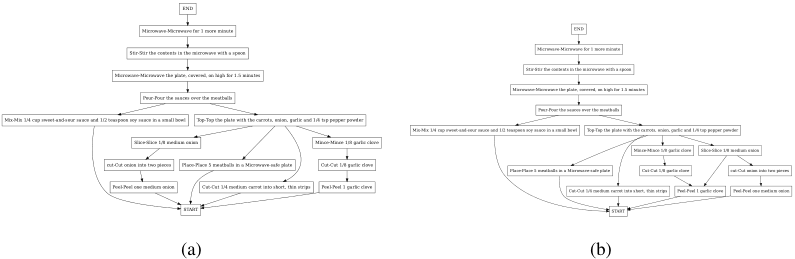


<!-- Start of picture text -->
END<br>Microwave-Microwave for 1 more minute END<br>Stir-Stir the contents in the microwave with a spoon Microwave-Microwave for 1 more minute<br>Microwave-Microwave the plate, covered, on high for 1.5 minutes Stir-Stir the contents in the microwave with a spoon<br>Microwave-Microwave the plate, covered, on high for 1.5 minutes<br>Pour-Pour the sauces over the meatballs<br>Pour-Pour the sauces over the meatballs<br>Mix-Mix 1/4 cup sweet-and-sour sauce and 1/2 teaspoon soy sauce in a small bowl Top-Top the plate with the carrots, onion, garlic and 1/4 tsp pepper powder<br>Mix-Mix 1/4 cup sweet-and-sour sauce and 1/2 teaspoon soy sauce in a small bowl Top-Top the plate with the carrots, onion, garlic and 1/4 tsp pepper powder<br>Slice-Slice 1/8 medium onion Mince-Mince 1/8 garlic clove<br>Mince-Mince 1/8 garlic clove Slice-Slice 1/8 medium onion<br>cut-Cut onion into two pieces Place-Place 5 meatballs in a Microwave-safe plate Cut-Cut 1/8 garlic clove Place-Place 5 meatballs in a Microwave-safe plate Cut-Cut 1/8 garlic clove cut-Cut onion into two pieces<br>Peel-Peel one medium onion Cut-Cut 1/4 medium carrot into short, thin strips Peel-Peel 1 garlic clove Cut-Cut 1/4 medium carrot into short, thin strips Peel-Peel 1 garlic clove Peel-Peel one medium onion<br>START START<br>(a) (b)<br><!-- End of picture text -->

Figure 13: (a) Ground truth task graph and (b) predicted task graph of the scenario Dressed Up Meatballs. 


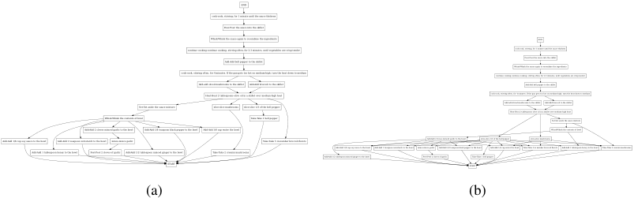


<!-- Start of picture text -->
END<br>cook-cook, stirring, for 1 minute until the sauce thickens<br>Pour-Pour the sauce into the skillet<br>Whisk-Whisk the sauce again to recombine the ingredients END<br>continue cooking-continue cooking, stirring often, for 2-3 minutes, until vegetables are crisp-tender cook-cook, stirring, for 1 minute until the sauce thickens<br>Add-Add bell pepper to the skillet Whisk-Whisk the sauce again to recombine the ingredientsPour-Pour the sauce into the skillet<br>cook-cook, stirring often, for 4 minutes. If the pan gets too hot on medium-high, turn the heat down to medium continue cooking-continue cooking, stirring often, for 2-3 minutes, until vegetables are crisp-tender<br>Add-add sliced mushrooms to the skillet Add-Add broccoli to the skillet Add-Add bell pepper to the skillet<br>Heat-Heat 2 tablespoons olive oil in a skillet over medium-high heat cook-cook, stirring often, for 4 minutes. If the pan gets too hot on medium-high, turn the heat down to medium<br>Set-Set aside the sauce mixture slice-slice mushrooms slice-slice 1/3 of the bell pepper Add-add sliced mushrooms to the skilletHeat-Heat 2 tablespoons olive oil in a skillet over medium-high heatAdd-Add broccoli to the skillet<br>Whisk-Whisk the contents of bowl Take-Take 1 bell pepper Set-Set aside the sauce mixture<br>Add-Add 2 cloves minced garlic to the bowl Add-Add 1/8 teaspoon black pepper to the bowl Add-Add 1/6 cup water the bowl Whisk-Whisk the contents of bowl<br>Add-Add 1/8 cup soy sauce to the bowl Add-Add 1 teaspoon cornstarch to the bowl mince-mince garlic Take-Take 5 in number broccoli florets Add-Add 2 cloves minced garlic to the bowl slice-slice 1/3 of the bell pepper slice-slice mushrooms<br>Add-Add 1 tablespoon honey to the bowl Peel-Peel 2 cloves of garlic Add-Add 1/2 tablespoon minced ginger to the bowl Take-Take 2 cremini mushrooms Add-Add 1/2 tablespoon minced ginger to the bowlAdd-Add 1/8 cup soy sauce to the bowl Add-Add 1 teaspoon cornstarch to the bowl mince-mince garlicPeel-Peel 2 cloves of garlicAdd-Add 1/8 teaspoon black pepper to the bowlTake-Take 1 bell pepperAdd-Add 1/6 cup water the bowl Take-Take 5 in number broccoli florets Add-Add 1 tablespoon honey to the bowl Take-Take 2 cremini mushrooms<br>START START<br>(a) (b)<br><!-- End of picture text -->

Figure 14: (a) Ground truth task graph and (b) predicted task graph of the scenario Broccoli Stir Fry. 

21

<!-- Page 22 -->

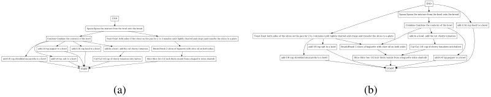


<!-- Start of picture text -->
END<br>END Spoon-Spoon the mixture from the bowl onto the bread<br>Spoon-Spoon the mixture from the bowl onto the bread Combine-Combine the contents of the bowl add-1/16 cup basil to a bowl<br>Combine-Combine the contents of the bowl Toast-Toast both sides of the slices on the pan for 2 to 3 minutes until lightly charred and crispy and transfer the slices to a plate Toast-Toast both sides of the slices on the pan for 2 to 3 minutes until lightly charred and crispy and transfer the slices to a plate add-In a bowl, add the cut cherry tomatoes<br>add-1/4 tsp pepper to a bowl add-1/16 cup basil to a bowl add-In a bowl, add the cut cherry tomatoes Brush-Brush 2 slices of baguette with olive oil on both sides add-1/4 tsp salt to a bowl Brush-Brush 2 slices of baguette with olive oil on both sides Cut-Cut 1/4 cup of cherry tomatoes into halves<br>add-1/8 cup shredded mozzarella to a bowl add-1/4 tsp salt to a bowl Cut-Cut 1/4 cup of cherry tomatoes into halves Slice-Slice two 1/2 inch thick rounds from a baguette (slice slanted) add-1/8 cup shredded mozzarella to a bowl Slice-Slice two 1/2 inch thick rounds from a baguette (slice slanted) add-1/4 tsp pepper to a bowl<br>START START<br>(a) (b)<br><!-- End of picture text -->

Figure 15: (a) Ground truth task graph and (b) predicted task graph of the scenario Caprese Bruschetta. 


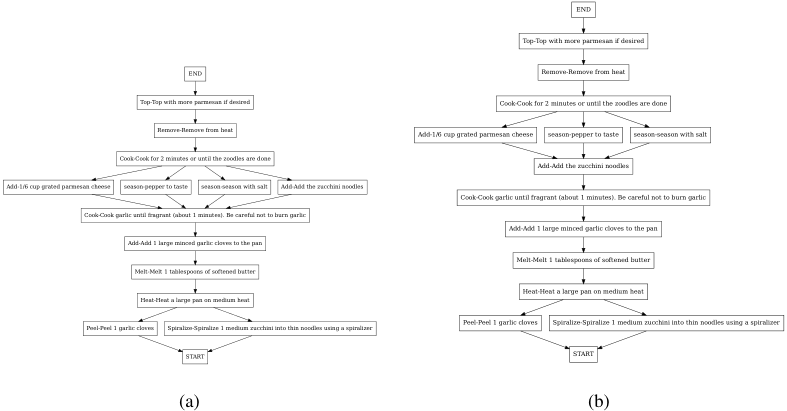


<!-- Start of picture text -->
END<br>Top-Top with more parmesan if desired<br>END Remove-Remove from heat<br>Top-Top with more parmesan if desired Cook-Cook for 2 minutes or until the zoodles are done<br>Remove-Remove from heat Add-1/6 cup grated parmesan cheese season-pepper to taste season-season with salt<br>Cook-Cook for 2 minutes or until the zoodles are done<br>Add-Add the zucchini noodles<br>Add-1/6 cup grated parmesan cheese season-pepper to taste season-season with salt Add-Add the zucchini noodles<br>Cook-Cook garlic until fragrant (about 1 minutes). Be careful not to burn garlic<br>Cook-Cook garlic until fragrant (about 1 minutes). Be careful not to burn garlic<br>Add-Add 1 large minced garlic cloves to the pan<br>Add-Add 1 large minced garlic cloves to the pan<br>Melt-Melt 1 tablespoons of softened butter<br>Melt-Melt 1 tablespoons of softened butter<br>Heat-Heat a large pan on medium heat<br>Heat-Heat a large pan on medium heat<br>Peel-Peel 1 garlic cloves Spiralize-Spiralize 1 medium zucchini into thin noodles using a spiralizer Peel-Peel 1 garlic cloves Spiralize-Spiralize 1 medium zucchini into thin noodles using a spiralizer<br>START START<br>(a) (b)<br><!-- End of picture text -->

Figure 16: (a) Ground truth task graph and (b) predicted task graph of the scenario Zoodles. 


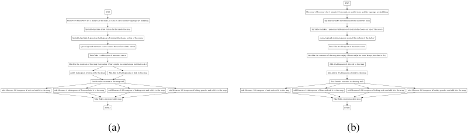


<!-- Start of picture text -->
END<br>END Microwave-Microwave for 1 minute 20 seconds, or until it rises and the toppings are bubbling<br>Microwave-Microwave for 1 minute 20 seconds, or until it rises and the toppings are bubbling Sprinkle-Sprinkle dried Italian herbs inside the mug<br>Sprinkle-Sprinkle dried Italian herbs inside the mug Sprinkle-Sprinkle 1 generous tablespoon of mozzarella cheese on top of the sauce<br>Sprinkle-Sprinkle 1 generous tablespoon of mozzarella cheese on top of the sauce spread-spread marinara sauce around the surface of the batter<br>spread-spread marinara sauce around the surface of the batter Take-Take 1 tablespoon of marinara sauce<br>Take-Take 1 tablespoon of marinara sauce Mix-Mix the contents of the mug thoroughly. (There might be some lumps, but that is ok.)<br>Mix-Mix the contents of the mug thoroughly. (There might be some lumps, but that is ok.) Add-1 tablespoon of olive oil to the mug<br>Add-1 tablespoon of olive oil to the mug Add-Add in 3 tablespoons of milk to the mug Add-Add in 3 tablespoons of milk to the mug<br>Stir-Stir the contents in the mug well Stir-Stir the contents in the mug well<br>add-Measure 1/8 teaspoon of salt and add it to the mug add-Measure 4 tablespoons of flour and add it to the mug add-Measure 1/16 teaspoon of baking soda and add it to the mug add-Measure 1/8 teaspoon of baking powder and add it to the mug add-Measure 1/8 teaspoon of salt and add it to the mug add-Measure 4 tablespoons of flour and add it to the mug add-Measure 1/16 teaspoon of baking soda and add it to the mug add-Measure 1/8 teaspoon of baking powder and add it to the mug<br>Take-Take a microwavable mug Take-Take a microwavable mug<br>START START<br>(a) (b)<br><!-- End of picture text -->

Figure 17: (a) Ground truth task graph and (b) predicted task graph of the scenario Microwave Mug Pizza. 

22

<!-- Page 23 -->

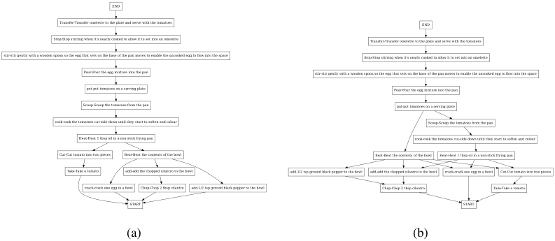


<!-- Start of picture text -->
END<br>Transfer-Transfer omelette to the plate and serve with the tomatoes END<br>Stop-Stop stirring when it's nearly cooked to allow it to set into an omelette Transfer-Transfer omelette to the plate and serve with the tomatoes<br>stir-stir gently with a wooden spoon so the egg that sets on the base of the pan moves to enable the uncooked egg to flow into the space Stop-Stop stirring when it's nearly cooked to allow it to set into an omelette<br>Pour-Pour the egg mixture into the pan stir-stir gently with a wooden spoon so the egg that sets on the base of the pan moves to enable the uncooked egg to flow into the space<br>put-put tomatoes on a serving plate Pour-Pour the egg mixture into the pan<br>Scoop-Scoop the tomatoes from the pan put-put tomatoes on a serving plate<br>cook-cook the tomatoes cut-side down until they start to soften and colour Scoop-Scoop the tomatoes from the pan<br>Heat-Heat 1 tbsp oil in a non-stick frying pan cook-cook the tomatoes cut-side down until they start to soften and colour<br>Cut-Cut tomato into two pieces Beat-Beat the contents of the bowl Beat-Beat the contents of the bowl Heat-Heat 1 tbsp oil in a non-stick frying pan<br>Take-Take a tomato add-add the chopped cilantro to the bowl add-1/2 tsp ground black pepper to the bowl add-add the chopped cilantro to the bowl crack-crack one egg in a bowl Cut-Cut tomato into two pieces<br>crack-crack one egg in a bowl Chop-Chop 2 tbsp cilantro add-1/2 tsp ground black pepper to the bowl Chop-Chop 2 tbsp cilantro Take-Take a tomato<br>START START<br>(a) (b)<br><!-- End of picture text -->

Figure 18: (a) Ground truth task graph and (b) predicted task graph of the scenario Herb Omelet with Fried Tomatoes. 


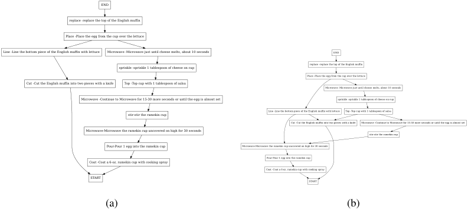


<!-- Start of picture text -->
END<br>replace -replace the top of the English muffin<br>Place -Place the egg from the cup over the lettuce<br>Line -Line the bottom piece of the English muffin with lettuce Microwave -Microwave just until cheese melts, about 10 seconds END<br>sprinkle -sprinkle 1 tablespoon of cheese on cup replace -replace the top of the English muffin<br>Place -Place the egg from the cup over the lettuce<br>Cut -Cut the English muffin into two pieces with a knife Top -Top cup with 1 tablespoon of salsa<br>Microwave -Microwave just until cheese melts, about 10 seconds<br>Microwave -Continue to Microwave for 15-30 more seconds or until the egg is almost set sprinkle -sprinkle 1 tablespoon of cheese on cup<br>Line -Line the bottom piece of the English muffin with lettuce Top -Top cup with 1 tablespoon of salsa<br>stir-stir the ramekin cup<br>Cut -Cut the English muffin into two pieces with a knife Microwave -Continue to Microwave for 15-30 more seconds or until the egg is almost set<br>Microwave-Microwave the ramekin cup uncovered on high for 30 seconds stir-stir the ramekin cup<br>Pour-Pour 1 egg into the ramekin cup Microwave-Microwave the ramekin cup uncovered on high for 30 seconds<br>Pour-Pour 1 egg into the ramekin cup<br>Coat -Coat a 6-oz. ramekin cup with cooking spray<br>Coat -Coat a 6-oz. ramekin cup with cooking spray<br>START START<br>(a) (b)<br><!-- End of picture text -->

Figure 19: (a) Ground truth task graph and (b) predicted task graph of the scenario Microwave Egg Sandwich. 


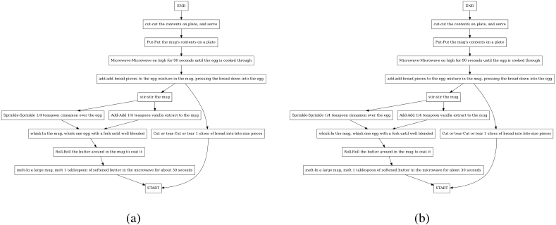


<!-- Start of picture text -->
END END<br>cut-cut the contents on plate, and serve cut-cut the contents on plate, and serve<br>Put-Put the mug's contents on a plate Put-Put the mug's contents on a plate<br>Microwave-Microwave on high for 90 seconds until the egg is cooked through Microwave-Microwave on high for 90 seconds until the egg is cooked through<br>add-add bread pieces to the egg mixture in the mug, pressing the bread down into the egg add-add bread pieces to the egg mixture in the mug, pressing the bread down into the egg<br>stir-stir the mug stir-stir the mug<br>Sprinkle-Sprinkle 1/4 teaspoon cinnamon over the egg Add-Add 1/4 teaspoon vanilla extract to the mug Sprinkle-Sprinkle 1/4 teaspoon cinnamon over the egg Add-Add 1/4 teaspoon vanilla extract to the mug<br>whisk-In the mug, whisk one egg with a fork until well blended Cut or tear-Cut or tear 1 slices of bread into bite-size pieces whisk-In the mug, whisk one egg with a fork until well blended Cut or tear-Cut or tear 1 slices of bread into bite-size pieces<br>Roll-Roll the butter around in the mug to coat it Roll-Roll the butter around in the mug to coat it<br>melt-In a large mug, melt 1 tablespoon of softened butter in the microwave for about 30 seconds melt-In a large mug, melt 1 tablespoon of softened butter in the microwave for about 30 seconds<br>START START<br>(a) (b)<br><!-- End of picture text -->

Figure 20: (a) Ground truth task graph and (b) predicted task graph of the scenario Microwave French Toast. 

23

<!-- Page 24 -->

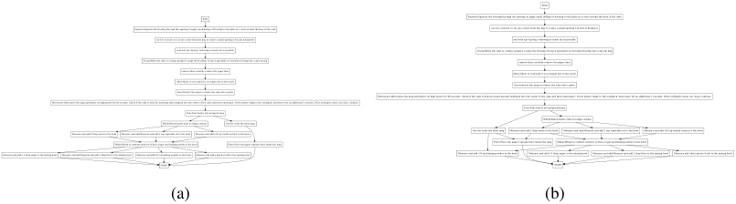


<!-- Start of picture text -->
END<br>END Squeeze-Squeeze the frosting through the opening to apply small dollops of frosting to the plate in a circle around the base of the cake<br>Squeeze-Squeeze the frosting through the opening to apply small dollops of frosting to the plate in a circle around the base of the cake cut-Use scissors to cut one corner from the bag to create a small opening 1/4 inch in diameter<br>cut-Use scissors to cut one corner from the bag to create a small opening 1/4 inch in diameter seal-seal zip top bag, removing as much air as possible<br>seal-seal zip top bag, removing as much air as possible Scoop-While the cake is cooling, prepare to pipe the frosting. Scoop 4 spoonfuls of chocolate frosting into a zip-top bag<br>Scoop-While the cake is cooling, prepare to pipe the frosting. Scoop 4 spoonfuls of chocolate frosting into a zip-top bag remove-then carefully remove the paper liner<br>remove-then carefully remove the paper liner Allow-Allow to cool until it is no longer hot to the touch<br>Allow-Allow to cool until it is no longer hot to the touch Invert-Invert the mug to release the cake onto a plate<br>Invert-Invert the mug to release the cake onto a plate Microwave-Microwave the mug and batter on high power for 60 seconds. Check if the cake is done by inserting and toothpick into the center of the cake and then removing it. If wet batter clings to the toothpick, microwave for an additional 5 seconds. If the toothpick comes out clean, continue<br>Microwave-Microwave the mug and batter on high power for 60 seconds. Check if the cake is done by inserting and toothpick into the center of the cake and then removing it. If wet batter clings to the toothpick, microwave for an additional 5 seconds. If the toothpick comes out clean, continuePour-Pour batter into prepared mug Pour-Pour batter into prepared mug<br>Whisk-Whisk batter until no lumps remain Set-Set aside the lined mug Whisk-Whisk batter until no lumps remain<br>Measure and add-2 tbsp water to the bowl Measure and add-Measure and add 2 tsp vegetable oil to the bowl Measure and add-1/4 tsp vanilla extract to the bowl Set-Set aside the lined mug Measure and add-2 tbsp water to the bowl Measure and add-Measure and add 2 tsp vegetable oil to the bowl Measure and add-1/4 tsp vanilla extract to the bowl<br>Whisk-Whisk to combine mixture of flour, sugar and baking powder in the bowl Place-Place the paper cupcake liner inside the mug Place-Place the paper cupcake liner inside the mug Whisk-Whisk to combine mixture of flour, sugar and baking powder in the bowl<br>Measure and add-1.5 tbsp sugar to the mixing bowl Measure and add-Measure and add 2 tbsp flour to the mixing bowl Measure and add-1/4 tsp baking powder to the bowl Measure and add-a pinch of salt to the mixing bowl Measure and add-1/4 tsp baking powder to the bowl Measure and add-1.5 tbsp sugar to the mixing bowl Measure and add-Measure and add 2 tbsp flour to the mixing bowl Measure and add-a pinch of salt to the mixing bowl<br>START START<br>(a) (b)<br><!-- End of picture text -->

Figure 21: (a) Ground truth task graph and (b) predicted task graph of the scenario Mug Cake. 


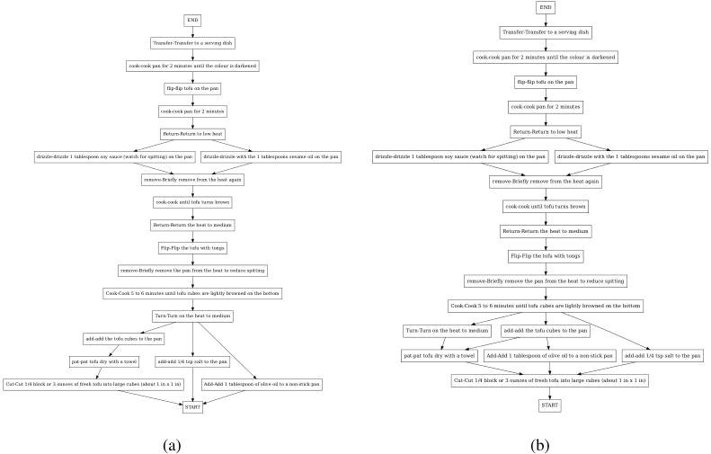


<!-- Start of picture text -->
END<br>END<br>Transfer-Transfer to a serving dish<br>Transfer-Transfer to a serving dish<br>cook-cook pan for 2 minutes until the colour is darkened<br>cook-cook pan for 2 minutes until the colour is darkened<br>flip-flip tofu on the pan<br>flip-flip tofu on the pan<br>cook-cook pan for 2 minutes cook-cook pan for 2 minutes<br>Return-Return to low heat Return-Return to low heat<br>drizzle-drizzle 1 tablespoon soy sauce (watch for spitting) on the pan drizzle-drizzle with the 1 tablespoons sesame oil on the pan drizzle-drizzle 1 tablespoon soy sauce (watch for spitting) on the pan drizzle-drizzle with the 1 tablespoons sesame oil on the pan<br>remove-Briefly remove from the heat again remove-Briefly remove from the heat again<br>cook-cook until tofu turns brown cook-cook until tofu turns brown<br>Return-Return the heat to medium<br>Return-Return the heat to medium<br>Flip-Flip the tofu with tongs<br>Flip-Flip the tofu with tongs<br>remove-Briefly remove the pan from the heat to reduce spitting<br>remove-Briefly remove the pan from the heat to reduce spitting<br>Cook-Cook 5 to 6 minutes until tofu cubes are lightly browned on the bottom<br>Cook-Cook 5 to 6 minutes until tofu cubes are lightly browned on the bottom<br>Turn-Turn on the heat to medium<br>Turn-Turn on the heat to medium add-add the tofu cubes to the pan<br>add-add the tofu cubes to the pan<br>pat-pat tofu dry with a towel Add-Add 1 tablespoon of olive oil to a non-stick pan add-add 1/4 tsp salt to the pan<br>pat-pat tofu dry with a towel add-add 1/4 tsp salt to the pan<br>Cut-Cut 1/4 block or 3 ounces of fresh tofu into large cubes (about 1 in x 1 in) Add-Add 1 tablespoon of olive oil to a non-stick pan Cut-Cut 1/4 block or 3 ounces of fresh tofu into large cubes (about 1 in x 1 in)<br>START START<br>(a) (b)<br><!-- End of picture text -->

Figure 22: (a) Ground truth task graph and (b) predicted task graph of the scenario Pan Fried Tofu. 

24

<!-- Page 25 -->

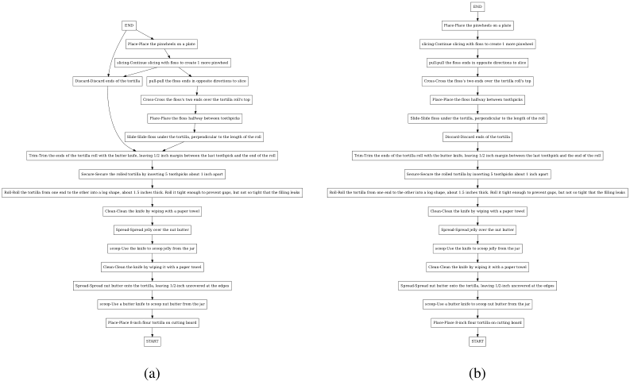


<!-- Start of picture text -->
END<br>END Place-Place the pinwheels on a plate<br>Place-Place the pinwheels on a plate slicing-Continue slicing with floss to create 1 more pinwheel<br>slicing-Continue slicing with floss to create 1 more pinwheel pull-pull the floss ends in opposite directions to slice<br>Discard-Discard ends of the tortilla pull-pull the floss ends in opposite directions to slice Cross-Cross the floss's two ends over the tortilla roll's top<br>Cross-Cross the floss's two ends over the tortilla roll's top Place-Place the floss halfway between toothpicks<br>Place-Place the floss halfway between toothpicks Slide-Slide floss under the tortilla, perpendicular to the length of the roll<br>Slide-Slide floss under the tortilla, perpendicular to the length of the roll Discard-Discard ends of the tortilla<br>Trim-Trim the ends of the tortilla roll with the butter knife, leaving 1/2 inch margin between the last toothpick and the end of the roll Trim-Trim the ends of the tortilla roll with the butter knife, leaving 1/2 inch margin between the last toothpick and the end of the roll<br>Secure-Secure the rolled tortilla by inserting 5 toothpicks about 1 inch apart Secure-Secure the rolled tortilla by inserting 5 toothpicks about 1 inch apart<br>Roll-Roll the tortilla from one end to the other into a log shape, about 1.5 inches thick. Roll it tight enough to prevent gaps, but not so tight that the filling leaks Roll-Roll the tortilla from one end to the other into a log shape, about 1.5 inches thick. Roll it tight enough to prevent gaps, but not so tight that the filling leaks<br>Clean-Clean the knife by wiping with a paper towel Clean-Clean the knife by wiping with a paper towel<br>Spread-Spread jelly over the nut butter Spread-Spread jelly over the nut butter<br>scoop-Use the knife to scoop jelly from the jar scoop-Use the knife to scoop jelly from the jar<br>Clean-Clean the knife by wiping it with a paper towel Clean-Clean the knife by wiping it with a paper towel<br>Spread-Spread nut butter onto the tortilla, leaving 1/2-inch uncovered at the edges Spread-Spread nut butter onto the tortilla, leaving 1/2-inch uncovered at the edges<br>scoop-Use a butter knife to scoop nut butter from the jar scoop-Use a butter knife to scoop nut butter from the jar<br>Place-Place 8-inch flour tortilla on cutting board Place-Place 8-inch flour tortilla on cutting board<br>START START<br>(a) (b)<br><!-- End of picture text -->

Figure 23: (a) Ground truth task graph and (b) predicted task graph of the scenario Pinwheels. 


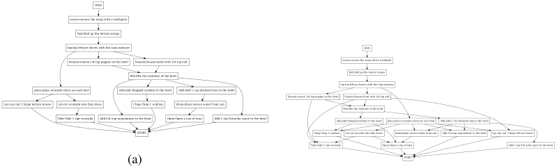


<!-- Start of picture text -->
END<br>secure-secure the wrap with a toothpick<br>Roll-Roll up the lettuce wraps<br>top-top lettuce leaves with the tuna mixture END<br>Season-season 1/4 tsp pepper on the bowl Season-Season bowl with 1/4 tsp salt secure-secure the wrap with a toothpick<br>Mix-Mix the contents of the bowl Roll-Roll up the lettuce wraps<br>top-top lettuce leaves with the tuna mixture<br>place-place avocado slices on each leaf Add-add chopped scallion to the bowl Add-Add 1 can drained tuna to the bowl<br>Season-season 1/4 tsp pepper on the bowl Season-Season bowl with 1/4 tsp salt<br>Lay-Lay out 2 large lettuce leaves cut-cut avocado into thin slices Chop-Chop 1 scallion drain-drain excess water from can Mix-Mix the contents of the bowl<br>Take-Take 1 ripe avocado Add-1/4 cup mayonnaise to the bowl Open-Open a can of tuna Add-1 tsp Sriracha sauce to the bowl Add-add chopped scallion to the bowl place-place avocado slices on each leaf Add-Add 1 can drained tuna to the bowl<br>START Chop-Chop 1 scallion cut-cut avocado into thin slices drain-drain excess water from can Add-1/4 cup mayonnaise to the bowl Lay-Lay out 2 large lettuce leaves<br>Take-Take 1 ripe avocado Open-Open a can of tuna Add-1 tsp Sriracha sauce to the bowl<br>(a) START<br><!-- End of picture text -->

Figure 24: (a) Ground truth task graph and (b) predicted task graph of the scenario Spicy Tuna Avocado Wraps. 


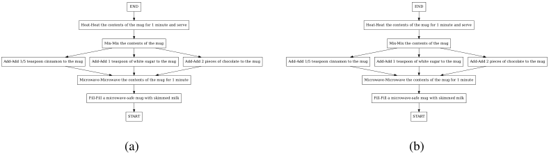


<!-- Start of picture text -->
END END<br>Heat-Heat the contents of the mug for 1 minute and serve Heat-Heat the contents of the mug for 1 minute and serve<br>Mix-Mix the contents of the mug Mix-Mix the contents of the mug<br>Add-Add 1/5 teaspoon cinnamon to the mug Add-Add 1 teaspoon of white sugar to the mug Add-Add 2 pieces of chocolate to the mug Add-Add 1/5 teaspoon cinnamon to the mug Add-Add 1 teaspoon of white sugar to the mug Add-Add 2 pieces of chocolate to the mug<br>Microwave-Microwave the contents of the mug for 1 minute Microwave-Microwave the contents of the mug for 1 minute<br>Fill-Fill a microwave-safe mug with skimmed milk Fill-Fill a microwave-safe mug with skimmed milk<br>START START<br>(a) (b)<br><!-- End of picture text -->

Figure 25: (a) Ground truth task graph and (b) predicted task graph of the scenario Spiced Hot Chocolate. 

25

<!-- Page 26 -->

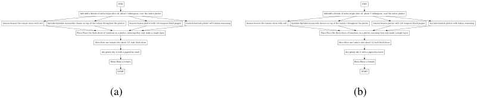


<!-- Start of picture text -->
END END<br>Add-Add a drizzle of extra-virgin olive oil, about 1 tablespoon, over the entire platter Add-Add a drizzle of extra-virgin olive oil, about 1 tablespoon, over the entire platter<br>Season-Season the tomato slices with salt Sprinkle-Sprinkle mozzarella cheese on top of the tomato throughout the platter Season-Season platter with 1/4 teaspoon black pepper Garnish-Garnish platter with italian seasoning Season-Season the tomato slices with salt Sprinkle-Sprinkle mozzarella cheese on top of the tomato throughout the platter Season-Season platter with 1/4 teaspoon black pepper Garnish-Garnish platter with italian seasoning<br>Place-Place the thick slices of tomatoes on a platter, ensuring they only make a single layer Place-Place the thick slices of tomatoes on a platter, ensuring they only make a single layer<br>Slice-Slice one tomato into about 1/2 inch thick slices Slice-Slice one tomato into about 1/2 inch thick slices<br>dry-gently dry it with a paper/tea towel dry-gently dry it with a paper/tea towel<br>Rinse-Rinse a tomato Rinse-Rinse a tomato<br>START START<br>(a) (b)<br><!-- End of picture text -->

Figure 26: (a) Ground truth task graph and (b) predicted task graph of the scenario Tomato Mozzarella Salad. 


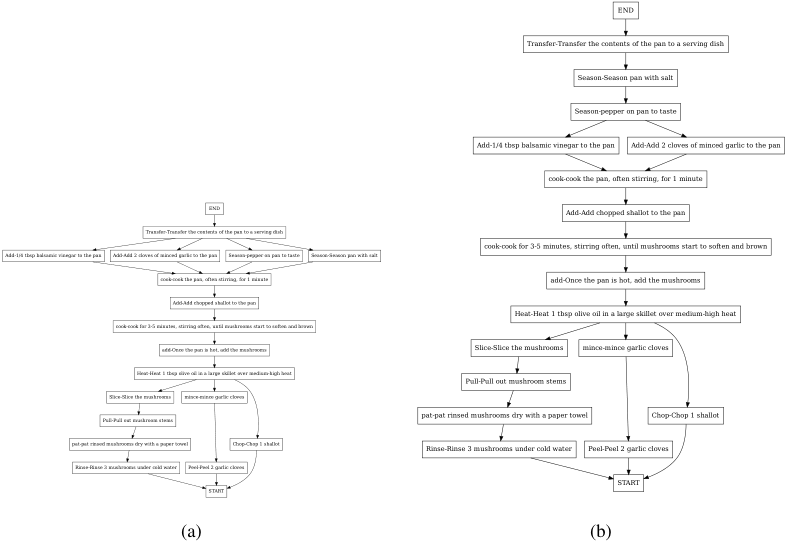


<!-- Start of picture text -->
END<br>Transfer-Transfer the contents of the pan to a serving dish<br>Season-Season pan with salt<br>Season-pepper on pan to taste<br>Add-1/4 tbsp balsamic vinegar to the pan Add-Add 2 cloves of minced garlic to the pan<br>cook-cook the pan, often stirring, for 1 minute<br>END Add-Add chopped shallot to the pan<br>Transfer-Transfer the contents of the pan to a serving dish<br>cook-cook for 3-5 minutes, stirring often, until mushrooms start to soften and brown<br>Add-1/4 tbsp balsamic vinegar to the pan Add-Add 2 cloves of minced garlic to the pan Season-pepper on pan to taste Season-Season pan with salt<br>cook-cook the pan, often stirring, for 1 minute add-Once the pan is hot, add the mushrooms<br>Add-Add chopped shallot to the pan<br>Heat-Heat 1 tbsp olive oil in a large skillet over medium-high heat<br>cook-cook for 3-5 minutes, stirring often, until mushrooms start to soften and brown<br>add-Once the pan is hot, add the mushrooms Slice-Slice the mushrooms mince-mince garlic cloves<br>Heat-Heat 1 tbsp olive oil in a large skillet over medium-high heat<br>Pull-Pull out mushroom stems<br>Slice-Slice the mushrooms mince-mince garlic cloves<br>Pull-Pull out mushroom stems pat-pat rinsed mushrooms dry with a paper towel Chop-Chop 1 shallot<br>pat-pat rinsed mushrooms dry with a paper towel Chop-Chop 1 shallot Rinse-Rinse 3 mushrooms under cold water Peel-Peel 2 garlic cloves<br>Rinse-Rinse 3 mushrooms under cold water Peel-Peel 2 garlic cloves<br>START<br>START<br>(a) (b)<br><!-- End of picture text -->

Figure 27: (a) Ground truth task graph and (b) predicted task graph of the scenario Salted Mushrooms. 


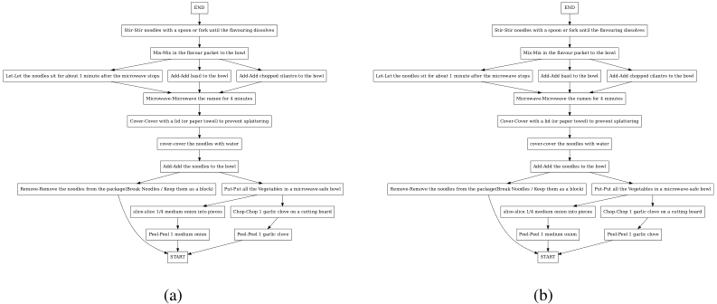


<!-- Start of picture text -->
END END<br>Stir-Stir noodles with a spoon or fork until the flavouring dissolves Stir-Stir noodles with a spoon or fork until the flavouring dissolves<br>Mix-Mix in the flavour packet to the bowl Mix-Mix in the flavour packet to the bowl<br>Let-Let the noodles sit for about 1 minute after the microwave stops Add-Add basil to the bowl Add-Add chopped cilantro to the bowl Let-Let the noodles sit for about 1 minute after the microwave stops Add-Add basil to the bowl Add-Add chopped cilantro to the bowl<br>Microwave-Microwave the ramen for 4 minutes Microwave-Microwave the ramen for 4 minutes<br>Cover-Cover with a lid (or paper towel) to prevent splattering Cover-Cover with a lid (or paper towel) to prevent splattering<br>cover-cover the noodles with water cover-cover the noodles with water<br>Add-Add the noodles to the bowl Add-Add the noodles to the bowl<br>Remove-Remove the noodles from the package(Break Noodles / Keep them as a block) Put-Put all the Vegetables in a microwave-safe bowl Remove-Remove the noodles from the package(Break Noodles / Keep them as a block) Put-Put all the Vegetables in a microwave-safe bowl<br>slice-slice 1/4 medium onion into pieces Chop-Chop 1 garlic clove on a cutting board slice-slice 1/4 medium onion into pieces Chop-Chop 1 garlic clove on a cutting board<br>Peel-Peel 1 medium onion Peel-Peel 1 garlic clove Peel-Peel 1 medium onion Peel-Peel 1 garlic clove<br>START START<br>(a) (b)<br><!-- End of picture text -->

Figure 28: (a) Ground truth task graph and (b) predicted task graph of the scenario Ramen. 

26

<!-- Page 27 -->

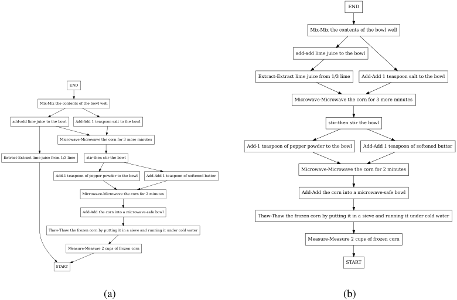


<!-- Start of picture text -->
END<br>Mix-Mix the contents of the bowl well<br>add-add lime juice to the bowl<br>Extract-Extract lime juice from 1/3 lime Add-Add 1 teaspoon salt to the bowl<br>END<br>Mix-Mix the contents of the bowl well Microwave-Microwave the corn for 3 more minutes<br>add-add lime juice to the bowl Add-Add 1 teaspoon salt to the bowl stir-then stir the bowl<br>Microwave-Microwave the corn for 3 more minutes<br>Add-1 teaspoon of pepper powder to the bowl Add-Add 1 teaspoon of softened butter<br>Extract-Extract lime juice from 1/3 lime stir-then stir the bowl<br>Microwave-Microwave the corn for 2 minutes<br>Add-1 teaspoon of pepper powder to the bowl Add-Add 1 teaspoon of softened butter<br>Microwave-Microwave the corn for 2 minutes Add-Add the corn into a microwave-safe bowl<br>Add-Add the corn into a microwave-safe bowl Thaw-Thaw the frozen corn by putting it in a sieve and running it under cold water<br>Thaw-Thaw the frozen corn by putting it in a sieve and running it under cold water<br>Measure-Measure 2 cups of frozen corn<br>Measure-Measure 2 cups of frozen corn<br>START<br>START<br>(a) (b)<br><!-- End of picture text -->

Figure 29: (a) Ground truth task graph and (b) predicted task graph of the scenario Butter Corn Cup. 


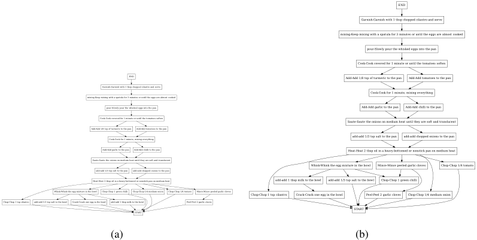


<!-- Start of picture text -->
END<br>Garnish-Garnish with 1 tbsp chopped cilantro and serve<br>mixing-Keep mixing with a spatula for 3 minutes or until the eggs are almost cooked<br>pour-Slowly pour the whisked eggs into the pan<br>Cook-Cook covered for 1 minute or until the tomatoes soften<br>END Add-Add 1/8 tsp of turmeric to the pan Add-Add tomatoes to the pan<br>Garnish-Garnish with 1 tbsp chopped cilantro and serve<br>Cook-Cook for 1 minute, mixing everything<br>mixing-Keep mixing with a spatula for 3 minutes or until the eggs are almost cooked<br>pour-Slowly pour the whisked eggs into the pan Add-Add garlic to the pan Add-Add chilli to the pan<br>Cook-Cook covered for 1 minute or until the tomatoes soften Saute-Saute the onions on medium heat until they are soft and translucent<br>Add-Add 1/8 tsp of turmeric to the pan Add-Add tomatoes to the pan<br>Cook-Cook for 1 minute, mixing everything add-add 1/3 tsp salt to the pan add-add chopped onions to the pan<br>Add-Add garlic to the pan Add-Add chilli to the pan Heat-Heat 2 tbsp oil in a heavy-bottomed or nonstick pan on medium heat<br>Saute-Saute the onions on medium heat until they are soft and translucent<br>Whisk-Whisk the egg mixture in the bowl Mince-Mince peeled garlic cloves Chop-Chop 1/4 tomato<br>add-add 1/3 tsp salt to the pan add-add chopped onions to the pan<br>Heat-Heat 2 tbsp oil in a heavy-bottomed or nonstick pan on medium heat add-add 1 tbsp milk to the bowl add-add 1/3 tsp salt to the bowl Chop-Chop 1 green chilli<br>Whisk-Whisk the egg mixture in the bowl Chop-Chop 1 green chilli Chop-Chop 1/4 medium onion Chop-Chop 1/4 tomato Mince-Mince peeled garlic cloves Chop-Chop 1 tsp cilantro Crack-Crack one egg in the bowl Peel-Peel 2 garlic cloves Chop-Chop 1/4 medium onion<br>Chop-Chop 1 tsp cilantro add-add 1/3 tsp salt to the bowl Crack-Crack one egg in the bowl add-add 1 tbsp milk to the bowl Peel-Peel 2 garlic cloves<br>START START<br>(a) (b)<br><!-- End of picture text -->

Figure 30: (a) Ground truth task graph and (b) predicted task graph of the scenario Scrambled Eggs. 

27

<!-- Page 28 -->

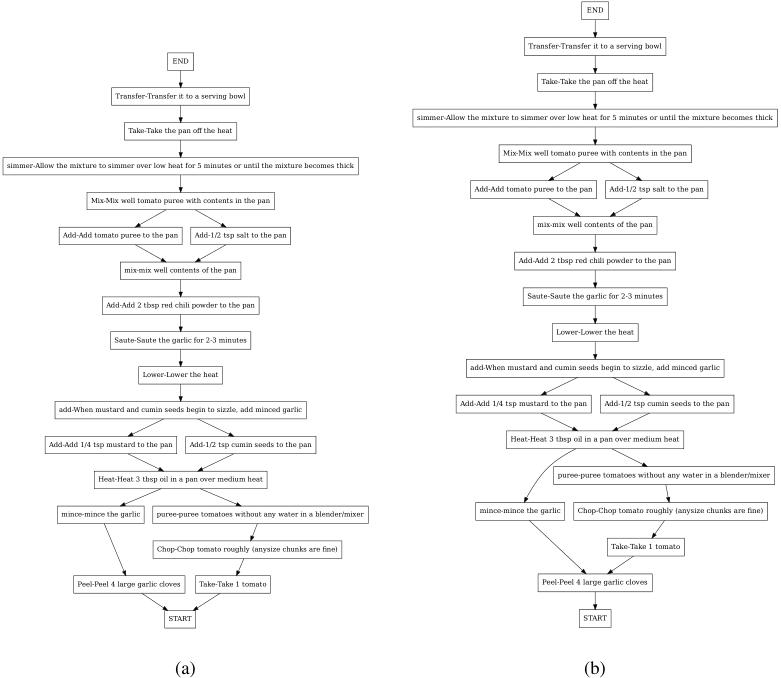


<!-- Start of picture text -->
END<br>Transfer-Transfer it to a serving bowl<br>END<br>Take-Take the pan off the heat<br>Transfer-Transfer it to a serving bowl<br>simmer-Allow the mixture to simmer over low heat for 5 minutes or until the mixture becomes thick<br>Take-Take the pan off the heat<br>Mix-Mix well tomato puree with contents in the pan<br>simmer-Allow the mixture to simmer over low heat for 5 minutes or until the mixture becomes thick<br>Add-Add tomato puree to the pan Add-1/2 tsp salt to the pan<br>Mix-Mix well tomato puree with contents in the pan<br>mix-mix well contents of the pan<br>Add-Add tomato puree to the pan Add-1/2 tsp salt to the pan<br>Add-Add 2 tbsp red chili powder to the pan<br>mix-mix well contents of the pan<br>Saute-Saute the garlic for 2-3 minutes<br>Add-Add 2 tbsp red chili powder to the pan<br>Lower-Lower the heat<br>Saute-Saute the garlic for 2-3 minutes<br>Lower-Lower the heat add-When mustard and cumin seeds begin to sizzle, add minced garlic<br>add-When mustard and cumin seeds begin to sizzle, add minced garlic Add-Add 1/4 tsp mustard to the pan Add-1/2 tsp cumin seeds to the pan<br>Add-Add 1/4 tsp mustard to the pan Add-1/2 tsp cumin seeds to the pan Heat-Heat 3 tbsp oil in a pan over medium heat<br>Heat-Heat 3 tbsp oil in a pan over medium heat puree-puree tomatoes without any water in a blender/mixer<br>mince-mince the garlic puree-puree tomatoes without any water in a blender/mixer mince-mince the garlic Chop-Chop tomato roughly (anysize chunks are fine)<br>Chop-Chop tomato roughly (anysize chunks are fine) Take-Take 1 tomato<br>Peel-Peel 4 large garlic cloves Take-Take 1 tomato Peel-Peel 4 large garlic cloves<br>START START<br>(a) (b)<br><!-- End of picture text -->

Figure 31: (a) Ground truth task graph and (b) predicted task graph of the scenario Tomato Chutney. 

28

<!-- Page 29 -->

## **NeurIPS Paper Checklist** 

1. **Claims** 

Question: Do the main claims made in the abstract and introduction accurately reflect the paper’s contributions and scope? 

Answer: [Yes] 

Justification: we introduce a novel approach to build task graphs using a differentiable loss function. The usefulness of the learned representation is assessed on three datasets on the tasks of task graph generation, and online mistake detection. Technical descriptions are reported in Section 3 and experiments are reported in Section 4. 

Guidelines: 

   - The answer NA means that the abstract and introduction do not include the claims made in the paper. 

   - The abstract and/or introduction should clearly state the claims made, including the contributions made in the paper and important assumptions and limitations. A No or NA answer to this question will not be perceived well by the reviewers. 

   - The claims made should match theoretical and experimental results, and reflect how much the results can be expected to generalize to other settings. 

   - It is fine to include aspirational goals as motivation as long as it is clear that these goals are not attained by the paper. 

2. **Limitations** 

Question: Does the paper discuss the limitations of the work performed by the authors? 

Answer: [Yes] 

Justification: the limitations are discussed in Section 5. 

Guidelines: 

   - The answer NA means that the paper has no limitation while the answer No means that the paper has limitations, but those are not discussed in the paper. 

   - The authors are encouraged to create a separate "Limitations" section in their paper. 

   - The paper should point out any strong assumptions and how robust the results are to violations of these assumptions (e.g., independence assumptions, noiseless settings, model well-specification, asymptotic approximations only holding locally). The authors should reflect on how these assumptions might be violated in practice and what the implications would be. 

   - The authors should reflect on the scope of the claims made, e.g., if the approach was only tested on a few datasets or with a few runs. In general, empirical results often depend on implicit assumptions, which should be articulated. 

   - The authors should reflect on the factors that influence the performance of the approach. For example, a facial recognition algorithm may perform poorly when image resolution is low or images are taken in low lighting. Or a speech-to-text system might not be used reliably to provide closed captions for online lectures because it fails to handle technical jargon. 

   - The authors should discuss the computational efficiency of the proposed algorithms and how they scale with dataset size. 

   - If applicable, the authors should discuss possible limitations of their approach to address problems of privacy and fairness. 

   - While the authors might fear that complete honesty about limitations might be used by reviewers as grounds for rejection, a worse outcome might be that reviewers discover limitations that aren’t acknowledged in the paper. The authors should use their best judgment and recognize that individual actions in favor of transparency play an important role in developing norms that preserve the integrity of the community. Reviewers will be specifically instructed to not penalize honesty concerning limitations. 

3. **Theory Assumptions and Proofs** 

Question: For each theoretical result, does the paper provide the full set of assumptions and a complete (and correct) proof? 

29

<!-- Page 30 -->

Answer: [NA] 

Justification: the paper does not include theoretical results. 

Guidelines: 

- The answer NA means that the paper does not include theoretical results. 

- All the theorems, formulas, and proofs in the paper should be numbered and crossreferenced. 

- All assumptions should be clearly stated or referenced in the statement of any theorems. 

- The proofs can either appear in the main paper or the supplemental material, but if they appear in the supplemental material, the authors are encouraged to provide a short proof sketch to provide intuition. 

- Inversely, any informal proof provided in the core of the paper should be complemented by formal proofs provided in appendix or supplemental material. 

- Theorems and Lemmas that the proof relies upon should be properly referenced. 

### 4. **Experimental Result Reproducibility** 

Question: Does the paper fully disclose all the information needed to reproduce the main experimental results of the paper to the extent that it affects the main claims and/or conclusions of the paper (regardless of whether the code and data are provided or not)? 

Answer: [Yes] 

Justification: Section 3 presents the description of our differentiable loss function and describes the proposed models. Experiments in Section 4 and the supplementary material contain descriptions for reproducibility. We release a preliminary version of our code in the supplementary and we will publicly release the final code to replicate the experiments. Guidelines: 

- The answer NA means that the paper does not include experiments. 

- If the paper includes experiments, a No answer to this question will not be perceived well by the reviewers: Making the paper reproducible is important, regardless of whether the code and data are provided or not. 

- If the contribution is a dataset and/or model, the authors should describe the steps taken to make their results reproducible or verifiable. 

- Depending on the contribution, reproducibility can be accomplished in various ways. For example, if the contribution is a novel architecture, describing the architecture fully might suffice, or if the contribution is a specific model and empirical evaluation, it may be necessary to either make it possible for others to replicate the model with the same dataset, or provide access to the model. In general. releasing code and data is often one good way to accomplish this, but reproducibility can also be provided via detailed instructions for how to replicate the results, access to a hosted model (e.g., in the case of a large language model), releasing of a model checkpoint, or other means that are appropriate to the research performed. 

- While NeurIPS does not require releasing code, the conference does require all submissions to provide some reasonable avenue for reproducibility, which may depend on the nature of the contribution. For example 

- (a) If the contribution is primarily a new algorithm, the paper should make it clear how to reproduce that algorithm. 

- (b) If the contribution is primarily a new model architecture, the paper should describe the architecture clearly and fully. 

- (c) If the contribution is a new model (e.g., a large language model), then there should either be a way to access this model for reproducing the results or a way to reproduce the model (e.g., with an open-source dataset or instructions for how to construct the dataset). 

- (d) We recognize that reproducibility may be tricky in some cases, in which case authors are welcome to describe the particular way they provide for reproducibility. In the case of closed-source models, it may be that access to the model is limited in some way (e.g., to registered users), but it should be possible for other researchers to have some path to reproducing or verifying the results. 

30

<!-- Page 31 -->

### 5. **Open access to data and code** 

Question: Does the paper provide open access to the data and code, with sufficient instructions to faithfully reproduce the main experimental results, as described in supplemental material? 

Answer: [No] 

Justification: We use publicly available datasets and provide details on data splits in C.5. We share a preliminary version of our code in the supplementary material and plan to release the final code to replicate all experiments. 

Guidelines: 

   - The answer NA means that paper does not include experiments requiring code. 

   - Please see the NeurIPS code and data submission guidelines ( `https://nips.cc/ public/guides/CodeSubmissionPolicy` ) for more details. 

   - While we encourage the release of code and data, we understand that this might not be possible, so “No” is an acceptable answer. Papers cannot be rejected simply for not including code, unless this is central to the contribution (e.g., for a new open-source benchmark). 

   - The instructions should contain the exact command and environment needed to run to reproduce the results. See the NeurIPS code and data submission guidelines ( `https: //nips.cc/public/guides/CodeSubmissionPolicy` ) for more details. 

   - The authors should provide instructions on data access and preparation, including how to access the raw data, preprocessed data, intermediate data, and generated data, etc. 

   - The authors should provide scripts to reproduce all experimental results for the new proposed method and baselines. If only a subset of experiments are reproducible, they should state which ones are omitted from the script and why. 

   - At submission time, to preserve anonymity, the authors should release anonymized versions (if applicable). 

   - Providing as much information as possible in supplemental material (appended to the paper) is recommended, but including URLs to data and code is permitted. 

6. **Experimental Setting/Details** 

Question: Does the paper specify all the training and test details (e.g., data splits, hyperparameters, how they were chosen, type of optimizer, etc.) necessary to understand the results? 

Answer: [Yes] 

Justification: We report implementation details and hyper-parameters in Section C of the supplementary material. 

Guidelines: 

   - The answer NA means that the paper does not include experiments. 

   - The experimental setting should be presented in the core of the paper to a level of detail that is necessary to appreciate the results and make sense of them. 

   - The full details can be provided either with the code, in appendix, or as supplemental material. 

7. **Experiment Statistical Significance** 

Question: Does the paper report error bars suitably and correctly defined or other appropriate information about the statistical significance of the experiments? 

Answer: [Yes] 

Justification: Results in Table 1 report the bounds of confidence intervals computed at a 90% confidence level. These intervals are derived using bootstrapping, where we resample the results from 5 runs with different random initializations to estimate the distribution of the performance metrics. We report the average performance _x_ ¯ across the 5 runs with the corresponding standard deviation _σ_ . The confidence bounds are obtained by repeatedly resampling the data and calculating the desired percentiles from the empirical distribution. Guidelines: 

31

<!-- Page 32 -->

- The answer NA means that the paper does not include experiments. 

   - The authors should answer "Yes" if the results are accompanied by error bars, confidence intervals, or statistical significance tests, at least for the experiments that support the main claims of the paper. 

   - The factors of variability that the error bars are capturing should be clearly stated (for example, train/test split, initialization, random drawing of some parameter, or overall run with given experimental conditions). 

   - The method for calculating the error bars should be explained (closed form formula, call to a library function, bootstrap, etc.) 

   - The assumptions made should be given (e.g., Normally distributed errors). 

   - It should be clear whether the error bar is the standard deviation or the standard error of the mean. 

   - It is OK to report 1-sigma error bars, but one should state it. The authors should preferably report a 2-sigma error bar than state that they have a 96% CI, if the hypothesis of Normality of errors is not verified. 

   - For asymmetric distributions, the authors should be careful not to show in tables or figures symmetric error bars that would yield results that are out of range (e.g. negative error rates). 

   - If error bars are reported in tables or plots, The authors should explain in the text how they were calculated and reference the corresponding figures or tables in the text. 

8. **Experiments Compute Resources** 

Question: For each experiment, does the paper provide sufficient information on the computer resources (type of compute workers, memory, time of execution) needed to reproduce the experiments? 

Answer: [Yes] 

Justification: We report details on computational requirements to run the experiments in Section C.11 of the supplementary material. 

Guidelines: 

   - The answer NA means that the paper does not include experiments. 

   - The paper should indicate the type of compute workers CPU or GPU, internal cluster, or cloud provider, including relevant memory and storage. 

   - The paper should provide the amount of compute required for each of the individual experimental runs as well as estimate the total compute. 

   - The paper should disclose whether the full research project required more compute than the experiments reported in the paper (e.g., preliminary or failed experiments that didn’t make it into the paper). 

9. **Code Of Ethics** 

Question: Does the research conducted in the paper conform, in every respect, with the NeurIPS Code of Ethics `https://neurips.cc/public/EthicsGuidelines` ? 

Answer: [Yes] 

Justification: We used public datasets which have been collected by the related authors following the recommendations provided by their institutions. The datasets have not been deprecated. We do not re-distribute any of the used data. 

Guidelines: 

   - The answer NA means that the authors have not reviewed the NeurIPS Code of Ethics. 

   - If the authors answer No, they should explain the special circumstances that require a deviation from the Code of Ethics. 

   - The authors should make sure to preserve anonymity (e.g., if there is a special consideration due to laws or regulations in their jurisdiction). 

10. **Broader Impacts** 

Question: Does the paper discuss both potential positive societal impacts and negative societal impacts of the work performed? 

32

<!-- Page 33 -->

Answer: [Yes] 

Justification: We discuss societal impact in Section D of the supplementary material. Guidelines: 

- The answer NA means that there is no societal impact of the work performed. 

- If the authors answer NA or No, they should explain why their work has no societal impact or why the paper does not address societal impact. 

- Examples of negative societal impacts include potential malicious or unintended uses (e.g., disinformation, generating fake profiles, surveillance), fairness considerations (e.g., deployment of technologies that could make decisions that unfairly impact specific groups), privacy considerations, and security considerations. 

- The conference expects that many papers will be foundational research and not tied to particular applications, let alone deployments. However, if there is a direct path to any negative applications, the authors should point it out. For example, it is legitimate to point out that an improvement in the quality of generative models could be used to generate deepfakes for disinformation. On the other hand, it is not needed to point out that a generic algorithm for optimizing neural networks could enable people to train models that generate Deepfakes faster. 

- The authors should consider possible harms that could arise when the technology is being used as intended and functioning correctly, harms that could arise when the technology is being used as intended but gives incorrect results, and harms following from (intentional or unintentional) misuse of the technology. 

- If there are negative societal impacts, the authors could also discuss possible mitigation strategies (e.g., gated release of models, providing defenses in addition to attacks, mechanisms for monitoring misuse, mechanisms to monitor how a system learns from feedback over time, improving the efficiency and accessibility of ML). 

### 11. **Safeguards** 

Question: Does the paper describe safeguards that have been put in place for responsible release of data or models that have a high risk for misuse (e.g., pretrained language models, image generators, or scraped datasets)? 

Answer: [NA] 

Justification: The paper poses no such risks. 

Guidelines: 

   - The answer NA means that the paper poses no such risks. 

   - Released models that have a high risk for misuse or dual-use should be released with necessary safeguards to allow for controlled use of the model, for example by requiring that users adhere to usage guidelines or restrictions to access the model or implementing safety filters. 

   - Datasets that have been scraped from the Internet could pose safety risks. The authors should describe how they avoided releasing unsafe images. 

   - We recognize that providing effective safeguards is challenging, and many papers do not require this, but we encourage authors to take this into account and make a best faith effort. 

12. **Licenses for existing assets** 

Question: Are the creators or original owners of assets (e.g., code, data, models), used in the paper, properly credited and are the license and terms of use explicitly mentioned and properly respected? 

Answer: [Yes] 

Justification: We have referenced the data used for the experiments and followed the related licenses. Licenses are available at the respective authors’ pages. 

Guidelines: 

- The answer NA means that the paper does not use existing assets. 

- The authors should cite the original paper that produced the code package or dataset. 

33

<!-- Page 34 -->

- The authors should state which version of the asset is used and, if possible, include a URL. 

- The name of the license (e.g., CC-BY 4.0) should be included for each asset. 

- For scraped data from a particular source (e.g., website), the copyright and terms of service of that source should be provided. 

- If assets are released, the license, copyright information, and terms of use in the package should be provided. For popular datasets, `paperswithcode.com/datasets` has curated licenses for some datasets. Their licensing guide can help determine the license of a dataset. 

- For existing datasets that are re-packaged, both the original license and the license of the derived asset (if it has changed) should be provided. 

- If this information is not available online, the authors are encouraged to reach out to the asset’s creators. 

### 13. **New Assets** 

Question: Are new assets introduced in the paper well documented and is the documentation provided alongside the assets? 

Answer: [Yes] 

Justification: We introduce a new loss function for task graph generation and two new models (see Section 3). 

Guidelines: 

   - The answer NA means that the paper does not release new assets. 

   - Researchers should communicate the details of the dataset/code/model as part of their submissions via structured templates. This includes details about training, license, limitations, etc. 

   - The paper should discuss whether and how consent was obtained from people whose asset is used. 

   - At submission time, remember to anonymize your assets (if applicable). You can either create an anonymized URL or include an anonymized zip file. 

14. **Crowdsourcing and Research with Human Subjects** 

Question: For crowdsourcing experiments and research with human subjects, does the paper include the full text of instructions given to participants and screenshots, if applicable, as well as details about compensation (if any)? 

Answer: [NA] 

Justification: The paper does not involve crowdsourcing nor research with human subjects. Guidelines: 

   - The answer NA means that the paper does not involve crowdsourcing nor research with human subjects. 

   - Including this information in the supplemental material is fine, but if the main contribution of the paper involves human subjects, then as much detail as possible should be included in the main paper. 

   - According to the NeurIPS Code of Ethics, workers involved in data collection, curation, or other labor should be paid at least the minimum wage in the country of the data collector. 

15. **Institutional Review Board (IRB) Approvals or Equivalent for Research with Human Subjects** 

Question: Does the paper describe potential risks incurred by study participants, whether such risks were disclosed to the subjects, and whether Institutional Review Board (IRB) approvals (or an equivalent approval/review based on the requirements of your country or institution) were obtained? 

Answer: [NA] 

Justification: The paper does not involve crowdsourcing nor research with human subjects. Guidelines: 

34

<!-- Page 35 -->

- The answer NA means that the paper does not involve crowdsourcing nor research with human subjects. 

- Depending on the country in which research is conducted, IRB approval (or equivalent) may be required for any human subjects research. If you obtained IRB approval, you should clearly state this in the paper. 

- We recognize that the procedures for this may vary significantly between institutions and locations, and we expect authors to adhere to the NeurIPS Code of Ethics and the guidelines for their institution. 

- For initial submissions, do not include any information that would break anonymity (if applicable), such as the institution conducting the review. 

35
