# 009_Schoonbeek_IndustReal_A_Dataset_for_Procedure_Step_Recognition_Handling_Execution_Errors_WACV_2024_paper

[Original PDF](../009_Schoonbeek_IndustReal_A_Dataset_for_Procedure_Step_Recognition_Handling_Execution_Errors_WACV_2024_paper.pdf)

Pages: 10

> Automatically converted from PDF. Check the original for exact equations, symbols, table alignment, and figure details.

<!-- Page 1 -->

This WACV paper is the Open Access version, provided by the Computer Vision Foundation. Except for this watermark, it is identical to the accepted version; the final published version of the proceedings is available on IEEE Xplore. 

# **IndustReal: A Dataset for Procedure Step Recognition Handling Execution Errors in Egocentric Videos in an Industrial-Like Setting** 

Tim J. Schoonbeek1 , Tim Houben1 , Hans Onvlee2 , Peter H.N. de With1 , Fons van der Sommen1 1Eindhoven University of Technology, Netherlands 2ASML Research, Netherlands 

t.j.schoonbeek@tue.nl 

## **Abstract** 

_Although action recognition for procedural tasks has received notable attention, it has a fundamental flaw in that no measure of success for actions is provided. This limits the applicability of such systems especially within the industrial domain, since the outcome of procedural actions is often significantly more important than the mere execution. To address this limitation, we define the novel task of_ procedure step recognition _(PSR), focusing on recognizing the correct completion and order of procedural steps. Alongside the new task, we also present the multi-modal_ IndustReal _dataset. Unlike currently available datasets, IndustReal contains procedural errors (such as omissions) as well as execution errors. A significant part of these errors are exclusively present in the validation and test sets, making IndustReal suitable to evaluate robustness of algorithms to new, unseen mistakes. Additionally, to encourage reproducibility and allow for scalable approaches trained on synthetic data, the 3D models of all parts are publicly available. Annotations and benchmark performance are provided for action recognition and assembly state detection, as well as the new PSR task. IndustReal, along with the code and model weights, is available at:_ 

https://github.com/TimSchoonbeek/IndustReal _._ 

## **1. Introduction** 

Imagine an engineer who has just finished a service action on an internal combustion engine, only to discover that a step was missed early in the procedure. The service engineer has to undo most of the work completed after the mistake to rectify the forgotten step. The correct servicing of an engine is an example of a procedure, i.e., a given set of instructions, describing the procedural actions required to complete a task. An algorithm would become of significant value if it can understand procedural actions by automatically recognizing and tracking steps during the execution of a procedure. A system containing such an algorithm can warn users about potential mistakes or forgotten steps [2], 

and summarize the execution of a procedure, thereby eliminating the need for manual logbook keeping [29]. Understanding procedures is not only highly relevant for industrial tasks, but to a broad range of procedural tasks, such as tracking the stages of surgeries to enhance post-surgical assessment and optimizing procedure workflow [12, 39]. 

Automated understanding of procedures is a difficult task in computer vision for various reasons. Firstly, there is often a limited visual difference between subsequent steps. For instance, determining whether a screw is correctly mounted into a specific component requires a finegrained visual understanding. Additionally, there can be a high degree of symmetry and a low degree of textural variation for objects within procedures, especially for industrial actions [14]. Secondly, it is not feasible to collect a vast amount of data for many procedures, as they are often infrequently performed and rather specialized. Finally, procedures can typically be completed correctly via several possible execution orders. Therefore, it is frequently not sufficient to merely look whether a single, pre-defined step is completed correctly. 

Existing approaches to procedural understanding can generally be divided into two groups, one performing action recognition (AR) [27, 30] and the other assembly state detection (ASD) [11, 24, 33]. AR approaches aim to recognize only which actions are being performed, rather than which actions are actually completed. This is a crucial difference, and it is more valuable to know whether a step has been actually completed correctly, than to know only if an operator spend time on that step. ASD relies on object detection algorithms, detecting the actual phase during an object’s assembly within a procedure. However, the number of possible states in ASD explodes with the number of parts in a procedure, limiting the complexity in existing literature to five or six parts only [11, 24, 33]. Furthermore, both AR and ASD implementations do not explicitly leverage procedural knowledge, _e.g_ . which actions are to be expected after the observation of a preceding action. 

To address the aforementioned limitations, this work formally defines the novel task of _procedure step recog-_ 

4365

<!-- Page 2 -->

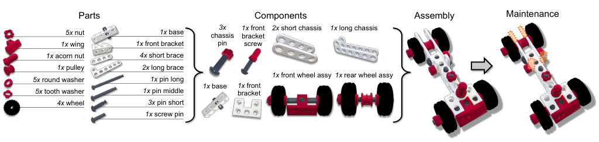

<!-- Start of picture text -->
Parts Components Assembly Maintenance 5x  nut 1x  base chassis  3x 1x bracket  front 2x  short chassis 1x  long chassis 1x  wing 1x  front bracket pin screw 1x  acorn nut 4x  short brace 1x pulley 2x  long brace 5x  round washer 1x pin long 1x  front wheel assy 1x  rear wheel assy 1x  base 1x  front 5x  tooth washer 1x pin middle bracket 4x  wheel 3x pin short 1x  screw pin <!-- End of picture text -->

Figure 1. Overview of the construction-toy car’s (3D printed) parts, components, and models used in IndustReal. The maintenance task represents a component upgrade and consists of replacing the long braces with short braces on the rear chassis. 

_nition_ (PSR) and introduces IndustReal, a publicly available dataset towards solving this task. It is an ego-centric, multi-modal dataset where 27 participants are challenged to perform assembly and maintenance procedures on a construction-toy car, based on STEMFIE [19], demonstrated in Fig. 1. The videos are annotated for action recognition (AR), assembly state detection (ASD), and procedure step recognition. The placement of IndustReal within literature is outlined in Tab. 1. The IndustReal dataset features four novel aspects: 

- _Variety of execution errors._ IndustReal features 38 errors, of which 14 are exclusive to the validation and test sets. Whilst some datasets already include procedural errors ( _e.g_ . omissions) [25, 30], IndustReal is the first to also include execution errors ( _e.g_ . wrong type of nut used). 

- _Subgoal oriented execution._ Other datasets are either “free-style” assemblies [30] or contain a strict, step-by-step execution order [27]. IndustReal combines these execution types with a subgoal-oriented assembly style, where participants are given flexibility to determine the execution order between subgoals. This approach more closely resembles industrial procedures, since it maintains a hierarchy in procedure execution whilst allowing for flexibility where possible. IndustReal contains 48 different execution orders. 

- _Open-source geometries._ Scalability is an important factor for many industrial tasks, where simultaneously the technical drawings are often available. Therefore, 3D models for all parts are published, to stimulate use of synthetic data in procedural action understanding, _e.g_ . by sim2real domain adaptation or generalization. 

- _3D printed parts._ To ensure reproducibility, future availability of the model, and growth via community effort, all parts are 3D printed and open source [19]. 

In summary, the contribution of this work is two-fold: we present the IndustReal dataset, define the task of procedure step recognition and provide a benchmark towards this task. 

## **2. Related Work** 

### **2.1. Work on procedural action understanding** 

In (procedural) action recognition tasks, the objective is to classify a video clip into a set of activities expected within a certain procedure [11,24,33,35]. Examples of such procedures are cooking [3,8,38], instruction videos [23,31], and assembly tasks [13, 15]. Recently, focus has been directed towards recognizing procedural actions in industriallike settings [1, 5, 25, 27, 30]. 

Whilst recognizing actions in procedural videos is certainly of some interest in an industrial setting, we argue that it is more valuable to know what was actually completed, rather than only performed (and therefore potentially not finished). Therefore, the PSR task is proposed to recognize the correct completion of steps and to track the order in which those steps were completed. 

Additionally, the comparable datasets outlined in Tab. 1 generally have restricted sizes, since it is challenging to record sufficient video data of people executing (nearly) the same procedural task. This is especially relevant to industrial applications, where a significant portion of the tasks is performed rather infrequently. However, procedural knowledge, in the form of work instructions or technical drawings, is generally available for those tasks. Whilst such procedural knowledge is not explicitly leveraged by the aforementioned approaches, we advocate to explicitly use this knowledge in PSR to constrain the number of possible actions expected at any given moment. 

### **2.2. Literature on assembly state detection** 

Assembly state detection is a sub-task of object detection, where the objective is to recognize and locate the specific state of an object during an assembly procedure [11, 24, 32, 33, 36, 37]. ASD is significantly more challenging than object detection, since the visual variability between two states is often small. For instance, detecting the object “Car” is significantly less complicated than detecting the state “Car without window”. Su _et al._ [33] simultaneously detect the state and the pose of a coffee machine 

4366

<!-- Page 3 -->

|Dataset|Year|Ego|AR|Tasks ASD|PSR|Proc Flex.|edural PEs|comple EEs|xity Parts|3DM|Seqs.|Dataset Dur.|size Participants|
|---|---|---|---|---|---|---|---|---|---|---|---|---|---|
|IKEA ASM [5]|2021|✗|✓|✗|✗|✓|✗|✗|7|✗|381|35.3h|48|
|MECCANO [26,27]|2021|✓|✓|✗|✗|✗|✓_∗_|✗|49|✗|20|6.9h|20|
|Assembly101 [30]|2022|✓|✓|✗|✗|✓|✓|✓_∗_|15|✗|1.01K|167.0h|53|
|BRIO-TA [25]|2022|✗|✓|✗|✗|✓|✓|✗|10|✗|75|2.9h|15|
|HA4M [7]|2022|✗|✓|✗|✗|✓|✗|✗|17|✓|217|5.9h|41|
|ATTACH [1]|2023|✗|✓|✗|✗|✓|✗|✗|26|✗|378|17.2h|42|
|IndustReal (ours)|2024|✓|✓|✓|✓|✓|✓|✓|36|✓|84|5.8h|27|

Table 1. Comparison of industrial-like procedural understanding datasets. AR: action recognition, ASD: assembly state detection, PSR: procedure step recognition, flex.: more than one single execution order for the task, PEs: procedural errors (omission, execution order), EEs: execution errors (component installed incorrectly), 3DM: 3D models made publicly available,_∗_ rare and not explicitly annotated. 

during its assembly. The authors demonstrate a good performance on the task, but the different assembly states consist of visually distinctive objects. Lui _et al._ [24] demonstrate an attention mechanism for their convolutional neural network (CNN), detecting object states even if they are visually similar to each other. Both works demonstrate promising advances on this task. The approaches are trained predominantly on synthetic data, which can be readily generated if 3D models of each assembly state are already designed. 

Nevertheless, the aforementioned approaches have two important limitations. Firstly, the algorithms must be trained on a dataset of images from each object state. This forces the models to learn a low-dimensional representation for each state. Since the procedures that the authors selected consist of only 5 parts and, at most, 6 distinctive object states, training a model in such a manner is feasible. However, it remains unclear whether this approach scales to procedures with higher complexity and more object states. Secondly, no procedural information is leveraged by either approach. Therefore, the models expect for example, the initial state in an assembly equally as much as the very last state. For tasks with sufficient visual distinction between states, this is not a critical limitation. However, for objects that appear identical from certain viewpoints for several different states, procedural information could be used to determine the most likely state. Finally, none of the abovementioned approaches release their (test) data. 

### **2.3. Published comparable datasets** 

The placement of IndustReal within publicly available datasets, recorded in industrial-like settings is shown in Tab. 1. The MECCANO dataset [26, 27] is most relevant to IndustReal in terms of procedure, task complexity, and dataset size. Notable differences between these two datasets are that in MECCANO users follow strict, step-by-step instructions, limiting the variety in execution order. Secondly, although MECCANO contains some procedure errors, they are nearly always corrected in the subsequent step. Therefore, later states do not have prior errors in them, whilst 

such cases are certainly of interest and are frequently encountered in the industrial domain. Finally, we argue that the availability of 3D models of all parts represented in the dataset is crucial for industrial applications, given the wide availability and usage of technical drawings in that domain. Unfortunately, the MECCANO dataset uses a IPprotected construction set, prohibiting the publication of such CAD models. BRIO-TA [25] and the large-scale Assembly101 [30] datasets both contain procedural mistakes, such as omissions and incorrect execution order, but do not contain (labeled) execution errors. Furthermore, none of the mentioned datasets provide labels for ASD. Lastly, to ensure future availability of the models, all parts in IndustReal are 3D printed. An added benefit of 3D printing is that it allows researchers to print in different scale, colors, or materials, to test the limits of their algorithms. 

## **3. Procedure Step Recognition** 

The previous section has identified a gap in the related work between AR and ASD. By formalizing the task of procedure step recognition (PSR), along with an evaluation scheme, we encourage researchers to develop methods to automatically recognize the completion of steps, rather than the (partial) execution of activities. Additionally, PSR systems should explicitly leverage procedural knowledge and allow a flexible execution order for procedural tasks, when the procedure allows it. 

### **3.1. Task definition** 

The objective of PSR is to extract an estimate of all procedure steps correctly performed by a person up to time _t_ , based on sensory inputs _Xt_ = ( _xt, xt−_ 1 _, . . . , xt−h_ ) and a descriptive set of the procedural actions to be performed _P_ = _{a_ 0 _, a_ 1 _, . . . , an}_ . Here, _h_ is the observation horizon and _n_ + 1 the total number of actions _ai ∈P_ covered in the procedure. The predicted completed procedure steps _y_ ˆ _t_ at time _t_ , given some model _F_ , are defined such that 

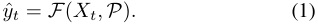

4367

<!-- Page 4 -->

Here, a “predicted” (recognized) procedure step does not refer to the prediction of a future step, but rather the prediction by a model for a correctly completed step, based on the given inputs. Crucially, this definition allows for real-time operation, since contrary to existing tasks, PSR does not require a full recording of the procedure as input [20, 23]. 

Each unique action _ai ∈P_ contains information regarding this specific action, and can be different for varying approaches to PSR. For instance, _ai_ can contain a description, an image of what the completed step is supposed to look like, or relative positions between components. Sensory inputs _Xt_ may comprise of camera images, depth maps, or even user interaction with the system, during the execution of a procedure. Note that with the given definition, a PSR system can be an ensemble of various computer vision algorithms, _e.g_ . object detection to determine the assembly state and action recognition to determine the activities. 

The predicted procedure steps form an ordered list of elements, describing the completed steps and is defined as 

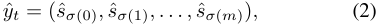

where step _s_ ˆ _σ_ ( _i_ ) is the predicted completion of the action _ai ∈P_ , at prediction time _t_ˆ _σ_ ( _i_ ), having a prediction confidence _cσ_ ( _i_ ), with _m_ + 1 the total number of recognized procedure steps. The function _σ_ maps a completed step ˆ _sj ∈ y_ ˆ _t_ to the corresponding action _ai ∈P_ . Therefore, the first predicted step _s_ ˆ _σ_ (0) is not necessarily the completion of the action _a_ 0 _∈P_ , but rather the first recognized step that a person completed. 

The ground-truth execution order _yt_ at time _t_ describes the order in which the steps are actually completed, which can differ from the prescribed order in _P_ , and is defined as 

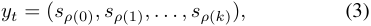

where _sρ_ ( _i_ ) is the completion of the action _ai ∈P_ at time _tρ_ ( _i_ ). The value _k_ + 1 is the total number of actions completed and _ρ_ a function that maps the completed steps from _yt_ to the steps described in _P_ . If the order of the steps predicted in _y_ ˆ _t_ equals that of _yt_ , it follows that _σ_ = _ρ_ , signifying a perfect execution order prediction. 

a common problem in spelling error detection [4, 28], since words consist of a sequence of characters, where order and type of character matters. In temporal action segmentation, the Levenshtein (Lev) distance, normalized over the length of the ground-truth sequence, is commonly used [20]. We propose two changes to this metric, by (1) eliminating substitution from the edit distance, preventing the metric from favouring models with many false positives, and (2) using the Damerau-Levenshtein (DamLev) [9], rather than the Lev distance because it penalizes transpositions less, since it is intuitive to penalize “ACB” less compared to “CAB”. 

In contrast to Lea _et al_ . [20], we propose to normalize the edit distance with respect to the length of the ground truth, rather than the length of either the ground truth or the prediction, depending on which is longer. This prevents models with many false positives from being normalized favourably. Finally, the normalized edit distance is subtracted from the unity value, resulting in a similarity metric, rather than a distance metric. Thus, the procedure order similarity (POS) between _y_ and _y_ ˆ is defined as 

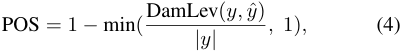

where DamLev( _·_ ) is a weighted DamLev edit distance function. Further clarification on POS may be found in the supplementary material. 

**Metric 2: F1 score.** A false positive is defined as a procedure step _s_ ˆ _σ_ ( _j_ ) that is predicted prior to the actual completion of action _ai_ , or if _ai_ is not at all completed, hence 

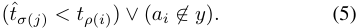

A false negative is defined as a step _sρ_ ( _j_ ) for a corresponding action _ai_ , that has indeed been completed, but is not represented in _y_ ˆ, so that 

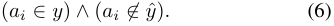

Finally, a true positive is defined as the prediction of a procedure step ˆ _sσ_ ( _j_ ), that is observed at or after the actual completion of _ai_ , such that 

### **3.2. Evaluation metrics** 

To quantify the performance of a PSR system, three evaluation metrics are proposed. These metrics focus on predicting the procedure steps in the correct order, the number of false predictions, and the timeliness of the predictions. 

**Metric 1: procedure order similarity.** We propose to measure the quality of a predicted sequence order for an entire recording, _y_ ˆ (e.g., ‘ACB’), by comparing it with a similarity measure with respect to the ground-truth _y_ (e.g., ‘ABC’). This is approached as a string similarity problem, 

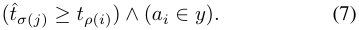

PSR systems can explicitly assume that actions have been completed based on procedural information, without relying exclusively on sensory recognition. Therefore, a distinction can be made between _F_ 1 score at the recognition and system level. Since this definition does not contain any time restriction on true positives, procedure steps that are recognized long after the step completion are not penalized. Therefore, comparing only the procedure order similarity and _F_ 1 score lacks a temporal component. 

4368

<!-- Page 5 -->

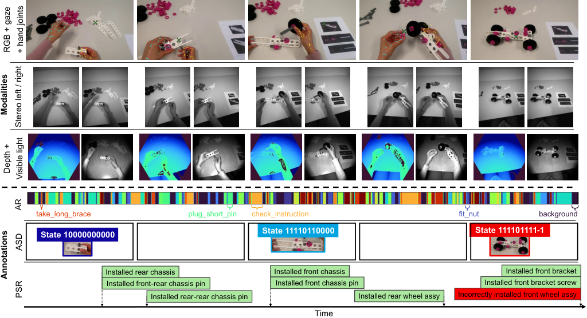

<!-- Start of picture text -->
take_long_brace plug_short_pin check_instruction fit_nut background State 11110110000 State 111101111-1 State 10000000000 Installed rear chassis Installed front chassis Installed front bracket Installed front-rear chassis pin Installed front chassis pin Installed front bracket screw Installed rear-rear chassis pin Installed rear wheel assy Incorrectly installed front wheel assy Time RGB + gaze + hand joints Modalities Stereo left / right Depth + Visible light AR Annotations ASD PSR <!-- End of picture text -->

Figure 2. Samples from a clip in the IndustReal dataset, demonstrating the modalities and annotations for all three tasks. Gaze is indicated by the cross, detected hand joints by the dots. AR: action recognition, ASD: assembly state detection, PSR: procedure step recognition. 

**Metric 3: average delay.** To complement the aforementioned metrics with a temporal component, the average delay _τ_ is introduced, quantifying the time between the ground-truth completion and corresponding recognition of a step. False negatives, defined by Equation 6, have an undefined delay, and similarly, false positives (defined in Equation 5) have either an undefined delay, or a negative delay. Therefore, FPs and FNs are excluded from _τ_ , defines as 

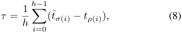

where _h_ is the number of total TPs in _y_ . Because FPs and FNs are discarded in the delay, only the combination of the three proposed metrics provides a valuable insight into the performance of a system towards solving PSR. 

## **4. IndustReal Dataset** 

### **4.1. Construction-set car procedures** 

Figure 1 demonstrates the 36 part models used in the IndustReal dataset, based on the STEMFIE constructiontoy car [19]. The model has significant complexity, consisting of multiple types of washers, pins, and braces. Some components require screwing, others need tightening, and participants frequently have to use both hands. Two procedures are defined, an assembly task, where the car has to be 

build from scratch, and a maintenance task, where the participants have to replace part of the rear chassis of the toy car. Printed instructions are provided in a subgoal-oriented manner, meaning that the participant builds towards subgoals rather than executing strict, step-by-step instructions, or “free-style” building towards a final assembly. Unlike related datasets, participants are allowed to create subassemblies, as commonly encountered in industrial settings. 

All of the parts are 3D printed on an Ultimaker S5 at 200% scale, layer height of 0.3 mm, 15% infill, a print speed of 50 mm/s, and PLA filament and the colors white, silver metallic, magenta and black. All parts, as well as the final models, are published together with the dataset, since part geometries are commonly available in industrial settings, _e.g_ . CAD models. 

### **4.2. Recording and setting** 

The HoloLens 2 (HL2) [34] mixed reality headset is used as recording rig for the dataset. The front-facing RGB camera records at a resolution of 1280 _×_ 720 pixels and the stereo cameras provide images at 480 _×_ 620 pixels. The long-throw depth and IR sensors record at a resolution of 320 _×_ 288 pixels and contain normalized values. Next to the images, we also record gaze, hand, and head-pose tracking, provided by the HL2 algorithms. All sensors, visualized in Fig. 2, are sampled at 10 fps, except from the depth and IR sensors, as these are limited to 5 fps in hardware. The data 

4369

<!-- Page 6 -->

are sent from the HL2 to a server in real time, using the HL2SS library [16]. 

The dataset is recorded in a setting with consistent background and lighting conditions. More specifically, participants are asked to perform the procedures on a white desk placed against a white background. Such lack of variety in background and lighting conditions is assumed to be consistent with industrial settings. Redundant washers, nuts, screws, and pins are placed amongst the required parts to reduce bias towards detecting unused parts. Prior to each recording, all parts are sorted into heaps according to color, and then placed randomly on the desk. 

### **4.3. Participants and protocol** 

In total, 27 participants were recruited. Each participant signed a consent form and the experiment was approved by the institution’s Ethical Review Board. Each participant was asked to perform the assembly procedure once, without recording, to familiarize themselves with the constructionset car. During this practice assembly, feedback was provided to the participants when required. Subsequently, the HL2 was fitted to the participant and the gaze tracking was calibrated. Then, each participant was assigned a correct assembly instruction, a correct maintenance instruction, and one or two instructions with errors, to ensure that a variety of mistakes were introduced. As anticipated, the participants exhibited errors even when they were provided with the correct instructions, and these mistakes were annotated as well. The recorded errors in the dataset vary from minor, difficult-to-observe mistakes ( _e.g_ . installing the wheels without washers), to large mistakes, such as forgetting a wheel. To minimize “learners bias” of the participants in the dataset, each participant was given the instructions in a random order. Participants were asked to remove their hands from the assembly after completing a step, to ensure a minimally occluded view on the assembly state. 

### **4.4. Annotation** 

Since IndustReal is intended to be closely representative of industrial use cases, significant importance is given to evaluation and robustness to unseen, out-of-distribution errors. Additionally, a large real-world test set is desired when training exclusively on synthetic data. Therefore, a dataset split of 12/5/10 (No. of train/val/test participants) is chosen, which is heavily focused on the test set. Furthermore, numerous errors are exclusively present in the validation or test sets. Note that the split is made on participants, rather than videos, to ensure sufficient variation in viewpoint, execution, and head movements between the three sets. 

Although IndustReal is specifically presented to address PSR, annotations are also provided for AR and ASD, enabling researchers to use IndustReal for various tasks, or to combine tasks for better PSR performance in future work. 

#### **4.4.1 Action recognition** 

AR labels consist of the frame at which the action starts, ends, and the combination of a verb and noun. Given the resemblance between MECCANO [27] and the constructiontoy car used in IndustReal, we adopt the same verbs as utilized in MECCANO: _take_ , _put_ , _align_ , _plug_ , _pull_ , _screw_ , _unscrew_ , _tighten_ , _loosen_ , _fit_ , _check_ , and _browse_ . Using these verbs, the component names described in Fig. 1, and the additional nouns _objects_ , _partial model_ , and _instruction_ , we have annotated 75 fine-grained action classes and a total of 9,273 instances. The average action lasts 1.9 _±_ 1.4 seconds. A long-tail distribution is observed, with 80% of the data containing 29.3% of the actions, and provided together with more statistical details in the supplementary materials. Recordings have an average of 110 _±_ 38 actions per video, with 134 _±_ 32 actions per assembly and 79 _±_ 13 actions maintenance video. Participants frequently perform actions simultaneously, resulting in 24.2% of all instances having an overlap with at least one other action. 

#### **4.4.2 Assembly state detection** 

To the best of our knowledge, IndustReal is the first publicly available dataset with ASD annotations. Because the participants have flexibility in execution order, all labeled states must be explicitly defined. We label the assembly states with integers, where a “1” indicates that a component at that index has been correctly installed and a “0” indicates that it has not (yet) been correctly installed. Additionally, we assign “-1” to components that have been incorrectly installed. Rather than labeling each assembly part individually with such a code, we divide the toy car into 11 components (in order): _base_ , _front chassis_ , _front chassis pin_ , _rear chassis_ , _short-rear chassis_ , _front-rear chassis pin_ , _rear-rear chassis pin_ , _front bracket_ , _front bracket screw_ , _front wheel assy_ , and _rear wheel assy_ (see Fig. 1). For example, the assembly state _11100000000_ consists of a correctly installed base, front chassis and front chassis pin. 

Bounding boxes and labels are provided for all 22 labeled (defined) states in IndustReal, as well as 27 different error states. Intermediate states, which occur during the assembly of components, are not labeled, as outlined in Fig. 2. Whilst those states could be annotated as _partial model_ , such labels empirically appear to hold little value. Intermediate states differ from erroneous states in that participants in intermediate states are actively progressing towards completing a state, whereas participants in erroneous states are not trying to further complete that step. In total, 26.9K video frames (13% of total) are annotated for ASD, of which 3,569 frames show error states. 

4370

<!-- Page 7 -->

|Model|Modalities|Top-1 acc. [%]|Top-5 acc. [%]|
|---|---|---|---|
|SlowFast [10]_∗_|RGB|57.83|82.87|
|SlowFast [10]_†_|RGB|60.39|85.21|
|MViTv2 [21]_∗_|RGB|62.43|85.62|
|MViTv2 [21]_†_|RGB|65.25|87.93|
|SlowFast [10]_†_|RGB, VL, stereo|62.34|85.97|
|MViTv2 [21]_†_|RGB, VL, stereo|**66.45**|**88.43**|

Table 2. AR benchmark on IndustReal. _<u>∗</u>_ MECCANO [27] pretrained,_†_ Kinetics [18] pre-trained, VL: visible light. 

#### **4.4.3 Procedure step recognition** 

The PSR labels consist of the frame at which a step completion occurs and the new assembly state, as defined in the previous section. The difference between two assembly states can directly be used to determine which procedure steps are completed. A procedure step is defined as _completed_ when the component relating to that step is correctly installed, which includes actions such as the tightening of a nut. Although the explicit detection of incorrect step execution is not included in the PSR task definition (Sec. 3.1), annotations of incorrect assembly states are included for qualitative analysis and future work. Therefore, two sets of PSR labels are provided, one with only correctly executed procedure steps ( _e.g_ . “Installed front chassis”), and one that also includes incorrectly completed steps, such as “Incorrectly installed front wing”. An example of a PSR-annotated sequence is outlined in Fig. 2. In total, IndustReal consists of 724 correct procedure step completions (8.6 _±_ 1.2 correct completions per recording) and 38 incorrect step completions. In total, 35 videos (42%) contain a missing or incorrectly completed procedure step. IndustReal contains 22 different correctly completed procedure execution orders, plus an additional 26 different execution orders containing error states. 

## **5. Benchmark Experiments** 

This section outlines the benchmark performance of state-of-the-art approaches to AR and ASD on IndustReal. Furthermore, a PSR benchmark implementation is outlined and evaluated, providing a baseline performance for more sophisticated approaches towards this task. 

### **5.1. Action recognition benchmark** 

**Definition.** Given a video segment _Xi_ = [ _xtsi, xtei_ ] and a set of action classes _Ca_ = _{c_ 0 _, c_ 1 _, ..., cn}_ , the objective of action recognition is to classify segment _Xi_ to the correct class _ci ∈ Ca_ [27]. Here, _xtsi_ and _xtei_ indicate the start and end frame for action _ci ∈ Ca_ , respectively. **Benchmark.** For this task, the SlowFast [10] CNN and MViTv2-S [21] transformer are chosen to benchmark the 

|Pre-trained|Fine-tuned|mAP (b-boxed)|mAP (entire videos)|
|---|---|---|---|
|COCO|Synthetic|0.573|0.341|
|COCO|IndustReal|0.753|0.553|
|Synthetic|IndustReal|0.779|0.575|
|COCO|IndustReal + synthetic|**0.838**|**0.641**|

Table 3. ASD performance benchmark on IndustReal using YOLOv8-m [17] for various training schemes. 

performance. Each model is trained on IndustReal after Kinetics [18] pre-training. Additionally, since the MECCANO dataset for action recognition is closely related to the IndustReal dataset, we also report baselines pre-trained on MECCANO. Finally, both networks are trained on depth, visible light (VL), and stereo images, and combined to create an ensemble of models trained on various modalities. 

Top-1 and top-5 accuracy are reported in Tab. 2 for the aforementioned experiments. Pre-training on the MECCANO dataset does not provide a performance benefit. The MViTv2 transformer outperforms the SlowFast architecture. The best performance is observed for the MViTv2 ensemble of the modalities RGB, VL, and stereo images. As motivated in supplementary material, depth is excluded from this ensemble. Notably, for both architectures, each individual modality is outperformed by the ensemble, indicating that each modality contains some complementary form of relevant information. 

### **5.2. Assembly state detection benchmark** 

**Definition.** Given a video frame _Xi_ and a set of assembly states _Za_ = _{z_ 0 _, z_ 1 _, ..., zn}_ , the objective of ASD is to detect the bounding box and assembly state _zi ∈ Za_ for the sample _Xi_ . The states _Za_ are defined in Sec. 4.4.2. **Benchmark.** For this benchmark, the state-of-the-art object detection network YOLOv8-m [17] is employed. Since geometries of all parts are published with IndustReal to stimulate synthetic learning, we provide four training schemes. First, we train the model, pre-trained on COCO [22], exclusively on a synthetically generated dataset. To generate the synthetic data, Unity Perception [6] is used to generate 100K training samples, each containing one assembly state in _Za_ . Secondly, we train the model (pre-trained on COCO) directly on IndustReal. Then, we pre-train on the synthetic dataset, after which we fine-tune on the IndustReal dataset. Finally, the synthetic and realworld datasets are combined for the last baseline. 

The results are quantified using the mAP metric and reported on frames of the IndustReal test set containing ground-truth bounding-box annotations, as well as the entire test set. As outlined in Tab. 3, combining the synthetic and real-world images results in the highest performance. A significant performance drop of 27% is observed when eval- 

4371

<!-- Page 8 -->

||All POS|recordin _F_1|gs _τ_ [s]|Record POS|ings with _F_1|errors _τ_ [s]|
|---|---|---|---|---|---|---|
|B1|0.570|0.779|**14.9**|0.480|0.698|**14.4**|
|B1-S|0.014|0.206|36.9|0.000|0.174|48.4|
|B2|0.731|0.860|22.3|0.636|0.784|20.2|
|B2-S|0.240|0.573|44.4|0.107|0.516|60.5|
|B3|**0.797**|**0.883**|22.4|**0.731**|**0.816**|20.4|
|B3-S|0.597|0.734|49.5|0.571|0.731|71.4|

Table 4. PSR performance benchmark on IndustReal with ASD backbone, expressed by procedure order similarity (POS), _F_ 1 score, and average delay _τ_ . B1-3 denote the three baseline models and S indicates exclusive training on synthetic data. 

uating entire videos, rather than only frames with a groundtruth annotation. The decreased performance is caused by false positive predictions on states with fine-grained visual differences, predominantly error states and directly prior to the completion of a procedural step. Notably, the best performing model has a false positive rate of 65% and average precision (AP) of 0.23 for assembly states containing an error. Two such error states, and their corresponding ASD predictions, are visualized in Fig. 3, and further analysis is provided in the supplementary materials. 

### **5.3. Procedure step recognition benchmark** 

**Definition.** The task definition is given in Sec. 3.1. **Benchmark.** For the PSR benchmark, we provide three baseline implementations relying on the ASD model output outlined in the previous section. The first baseline B1 determines for each change in detected assembly state which corresponding steps must have been completed since the last detected state, and assumes these actions to be executed correctly. The second baseline B2 accumulates the confidence for each predicted step completion (obtained from B1) over time, until a threshold _T_ is reached, upon which an action is deemed correctly completed. Baseline 3 uses the same confidence aggregation as B2, but limits the number of possible step completions to those expected in the correct execution of the given procedure. For each baseline, the best performing ASD model from Tab. 3 is used. Additionally, each baseline is evaluated with the ASD approach trained exclusively on synthetic data. The detection pipeline (ASD + PSR) yields real-time operation at 178 fps on a v100 GPU. 

The POS, _F_ 1, and _τ_ metrics for all baselines are outlined in Tab. 4. The best performing approach achieves relatively high POS and _F_ 1 scores (0.797 and 0.883 on all recordings, respectively), due to under-representation of execution errors compared to correctly executed steps. On recordings with errors, all baselines show a distinctive decrease in performance, as shown in Fig. 3, thereby highlighting the need for approaches that better handle (out-of-distribution) errors. Although the performance of B3-S trained entirely on synthetic data is significantly lower than its real-world 

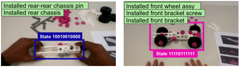

<!-- Start of picture text -->
Installed rear-rear chassis pin Installed front wheel assy Installed rear chassis Installed front bracket screw Installed front bracket State 10010010000 State 11110111111 <!-- End of picture text -->

(a) ASD predict: base, rear-rear pin (b) ASD predict: entire assembly and rear chassis correctly installed. procedure correctly installed. 

Figure 3. Visualization of ASD and PSR results for two cases. Bounding boxes and captions indicate the ASD predictions, text boxes indicate PSR predictions (B3). Both ASD predictions are false positives. (a) Front-rear pin orientation is incorrect, whilst the ASD predicts the absence of this pin. (b) Nut instead of screw is incorrectly used for the front brace, which is not recognized. 

trained counterpart, it notably outperforms B2-S. This indicates that using procedural information to restrict the set of possible step completions can considerably improve the model performance. 

## **6. Conclusion** 

This paper proposes the novel task of _procedure step recognition_ (PSR). This task bridges the gap that currently existing _action recognition_ and _assembly state detection_ tasks leave in procedural activity understanding, by explicitly leveraging procedural information and recognizing correctly completed steps. This paves the way for the development of upcoming, increasingly powerful procedureassistive systems. 

Along with the PSR task, the IndustReal dataset is presented. IndustReal differs from existing datasets in the wide variety of procedural and execution errors, subgoal-oriented procedure execution, and 3D printed parts to ensure future reproducibility. Additionally, the geometries of object parts are published to stimulate sim2real domain adaptation and generalization, as this is crucial to scalability in industrial settings. Furthermore, performance benchmarks are provided for AR, ASD, and PSR based on the proposed IndustReal dataset with various pre-training techniques. 

The PSR baseline shows promising results on procedural videos where participants do not make mistakes, but fails to generalize to (out-of-distribution) execution errors. Future work will focus on improving upon this baseline performance and increase scalability, such that PSR becomes viable and indeed attractive towards more industrial use cases. 

## **Acknowledgment** 

The authors sincerely express their gratitude to Dr. Jacek Kustra, Goutham Balachandran, and all participants for their contributions. This work is partially executed at ASML Research and has received funding from ASML and the TKI research grant (project number TKI2112P07). 

4372

<!-- Page 9 -->

## **References** 

- [1] Dustin Aganian, Benedict Stephan, Markus Eisenbach, Corinna Stretz, and Horst-Michael Gross. Attach dataset: Annotated two-handed assembly actions for human action understanding. _arXiv preprint arXiv:2304.08210_ , 2023. 2, 3 

- [2] Siddhant Bansal, Chetan Arora, and CV Jawahar. My view is the best view: Procedure learning from egocentric videos. In _Computer Vision–ECCV 2022: 17th European Conference, Tel Aviv, Israel, October 23–27, 2022, Proceedings, Part XIII_ , pages 657–675. Springer, 2022. 1 

- [3] Siddhant Bansal, Chetan Arora, and CV Jawahar. My view is the best view: Procedure learning from egocentric videos. _arXiv preprint arXiv:2207.10883_ , 2022. 2 

- [4] Gregory V Bard. Spelling-error tolerant, order-independent pass-phrases via the damerau-levenshtein string-edit distance metric. _Cryptology ePrint Archive_ , 2006. 4 

- [5] Yizhak Ben-Shabat, Xin Yu, Fatemeh Saleh, Dylan Campbell, Cristian Rodriguez-Opazo, Hongdong Li, and Stephen Gould. The ikea asm dataset: Understanding people assembling furniture through actions, objects and pose. In _Proceedings of the IEEE/CVF Winter Conference on Applications of Computer Vision_ , pages 847–859, 2021. 2, 3 

- [6] Steve Borkman, Adam Crespi, Saurav Dhakad, Sujoy Ganguly, Jonathan Hogins, You-Cyuan Jhang, Mohsen Kamalzadeh, Bowen Li, Steven Leal, Pete Parisi, et al. Unity perception: Generate synthetic data for computer vision. _arXiv preprint arXiv:2107.04259_ , 2021. 7 

- [7] Grazia Cicirelli, Roberto Marani, Laura Romeo, Manuel Garc´ıa Dom´ınguez, J´onathan Heras, Anna G Perri, and Tiziana D’Orazio. The ha4m dataset: Multimodal monitoring of an assembly task for human action recognition in manufacturing. _Scientific Data_ , 9(1):745, 2022. 3 

- [8] Dima Damen, Hazel Doughty, Giovanni Maria Farinella, Sanja Fidler, Antonino Furnari, Evangelos Kazakos, Davide Moltisanti, Jonathan Munro, Toby Perrett, Will Price, and Michael Wray. Scaling egocentric vision: The EPICKITCHENS dataset. In _Proc. ECCV_ , Los Alamitos, 2018. IEEE. 2 

- [9] Fred J Damerau. A technique for computer detection and correction of spelling errors. _Communications of the ACM_ , 7(3):171–176, Mar. 1964. 4 

- [10] Christoph Feichtenhofer, Haoqi Fan, Jitendra Malik, and Kaiming He. SlowFast networks for video recognition. In _Proc. ICCV_ , pages 6202–6211, Los Alamitos, 2019. IEEE. 7 

- [11] Mingyu Fu, Wei Fang, Shan Gao, Jianhao Hong, and Yizhou Chen. Edge computing-driven scene-aware intelligent augmented reality assembly. _The International Journal of Advanced Manufacturing Technology_ , 119:7369—-7381, Apr. 2022. 1, 2 

- [12] Carly R Garrow, Karl-Friedrich Kowalewski, Linhong Li, Martin Wagner, Mona W Schmidt, Sandy Engelhardt, Daniel A Hashimoto, Hannes G Kenngott, Sebastian Bodenstedt, Stefanie Speidel, et al. Machine learning for surgical phase recognition: a systematic review. _Annals of surgery_ , 273(4):684–693, Apr. 2021. 1 

- [13] Tengda Han, Jue Wang, Anoop Cherian, and Stephen Gould. Human action forecasting by learning task grammars. _arXiv preprint arXiv:1709.06391_ , 2017. 2 

- [14] Tom´aˇs Hodan, Pavel Haluza, Step´anˇ Obdrˇz´alek, Jiri Matas, Manolis Lourakis, and Xenophon Zabulis. T-LESS: An RGB-D dataset for 6D pose estimation of texture-less objects. In _Proc. WACV_ , pages 880–888, Los Alamitos, 2017. IEEE. 1 

- [15] Youngkyoon Jang, Brian Sullivan, Casimir Ludwig, Iain Gilchrist, Dima Damen, and Walterio Mayol-Cuevas. EPICTent: An egocentric video dataset for camping tent assembly. In _Proc. ICCVW_ , pages 4461–4469, Los Alamitos, 2019. IEEE. 2 

- [16] Dibene J.C. HoloLens 2 Sensor Stream. _GitHub repository: https://github.com/jdibenes/hl2ss_ , 2022. 6 

- [17] Glenn Jocher, Ayush Chaurasia, and Jing Qiu. YOLO by Ultralytics, Jan. 2023. 7 

- [18] Will Kay, Joao Carreira, Karen Simonyan, Brian Zhang, Chloe Hillier, Sudheendra Vijayanarasimhan, Fabio Viola, Tim Green, Trevor Back, Paul Natsev, et al. The kinetics human action video dataset. _arXiv preprint arXiv:1705.06950_ , 2017. 7 

- [19] P. Kiefe. STEMFIE construction-set toy. _https:// stemfie.org/sps-000001_ , 2022. 2, 5 

- [20] Colin Lea, Austin Reiter, Ren´e Vidal, and Gregory D Hager. Segmental spatiotemporal cnns for fine-grained action segmentation. In _European conference on computer vision_ , pages 36–52. Springer, 2016. 4 

- [21] Yanghao Li, Chao-Yuan Wu, Haoqi Fan, Karttikeya Mangalam, Bo Xiong, Jitendra Malik, and Christoph Feichtenhofer. MViTv2: Improved multiscale vision transformers for classification and detection. In _Proceedings of the IEEE/CVF Conference on Computer Vision and Pattern Recognition_ , pages 4804–4814, 2022. 7 

- [22] Tsung-Yi Lin, Michael Maire, Serge Belongie, James Hays, Pietro Perona, Deva Ramanan, Piotr Doll´ar, and C Lawrence Zitnick. Microsoft coco: Common objects in context. In _Computer Vision–ECCV 2014: 13th European Conference, Zurich, Switzerland, September 6-12, 2014, Proceedings, Part V 13_ , pages 740–755. Springer, 2014. 7 

- [23] Xudong Lin, Fabio Petroni, Gedas Bertasius, Marcus Rohrbach, Shih-Fu Chang, and Lorenzo Torresani. Learning to recognize procedural activities with distant supervision. In _Proceedings of the IEEE/CVF Conference on Computer Vision and Pattern Recognition_ , pages 13853–13863, 2022. 2, 4 

- [24] Hangfan Liu, Yongzhi Su, Jason Rambach, Alain Pagani, and Didier Stricker. TGA: Two-level group attention for assembly state detection. In _Proc. ISMAR-Adjunct_ , pages 258– 263, Los Alamitos, 2020. IEEE. 1, 2, 3 

- [25] Kosuke Moriwaki, Gaku Nakano, and Tetsuo Inoshita. The brio-ta dataset: Understanding anomalous assembly process in manufacturing. In _2022 IEEE International Conference on Image Processing (ICIP)_ , pages 1991–1995. IEEE, 2022. 2, 3 

- [26] Francesco Ragusa, Antonino Furnari, and Giovanni Maria Farinella. Meccano: A multimodal egocentric dataset for humans behavior understanding in the industrial-like domain. 

4373

<!-- Page 10 -->

- _Computer Vision and Image Understanding_ , page 103764, 2023. 3 

- [27] Francesco Ragusa, Antonino Furnari, Salvatore Livatino, and Giovanni Maria Farinella. The MECCANO dataset: Understanding human-object interactions from egocentric videos in an industrial-like domain. In _Proc. WACV_ , pages 1569–1578, Los Alamitos, 2021. IEEE. 1, 2, 3, 6, 7 

   - [39] Odysseas Zisimopoulos, Evangello Flouty, Imanol Luengo, Petros Giataganas, Jean Nehme, Andre Chow, and Danail Stoyanov. DeepPhase: surgical phase recognition in cataracts videos. In _Proc. MICCAI_ , pages 265–272. Springer, 2018. 1 

- [28] Komang Rinartha, Wayan Suryasa, and Luh Gede Surya Kartika. Comparative analysis of string similarity on dynamic query suggestions. In _Proc. EECCIS_ , pages 399–404, Los Alamitos, 2018. IEEE. 4 

- [29] Tim J. Schoonbeek, Hans Onvlee, Pierluigi Frisco, Peter H.N. De With, and Fons Van der Sommen. Beyond action recognition: Extracting meaningful information from procedure recordings. In _2023 IEEE Conference on Virtual Reality and 3D User Interfaces Abstracts and Workshops (VRW)_ , pages 881–882, 2023. 1 

- [30] Fadime Sener, Dibyadip Chatterjee, Daniel Shelepov, Kun He, Dipika Singhania, Robert Wang, and Angela Yao. Assembly101: A large-scale multi-view video dataset for understanding procedural activities. In _Proc. CVPR_ , pages 21096–21106, Los Alamitos, 2022. IEEE. 1, 2, 3 

- [31] Yuhan Shen, Lu Wang, and Ehsan Elhamifar. Learning to segment actions from visual and language instructions via differentiable weak sequence alignment. In _Proc. CVPR_ , pages 10156–10165, Los Alamitos, 2021. IEEE. 2 

- [32] Yongzhi Su, Mingxin Liu, Jason Rambach, Antonia Pehrson, Anton Berg, and Didier Stricker. IKEA object state dataset: A 6DoF object pose estimation dataset and benchmark for multi-state assembly objects. _arXiv preprint arXiv:2111.08614_ , 2021. 2 

- [33] Yongzhi Su, Jason Rambach, Nareg Minaskan, Paul Lesur, Alain Pagani, and Didier Stricker. Deep multi-state object pose estimation for augmented reality assembly. In _Proc. ISMAR-Adjunct_ , pages 222–227, Los Alamitos, 2019. IEEE. 1, 2 

- [34] Dorin Ungureanu, Federica Bogo, Silvano Galliani, Pooja Sama, Xin Duan, Casey Meekhof, Jan St¨uhmer, Thomas J Cashman, Bugra Tekin, Johannes L Sch¨onberger, et al. Hololens 2 research mode as a tool for computer vision research. _arXiv preprint arXiv:2008.11239_ , 2020. 5 

- [35] Zihui Xue, Yale Song, Kristen Grauman, and Lorenzo Torresani. Egocentric video task translation. In _Proceedings of the IEEE/CVF Conference on Computer Vision and Pattern Recognition_ , pages 2310–2320, 2023. 2 

- [36] Xuyue Yin, Xiumin Fan, Wenmin Zhu, and Rui Liu. Synchronous AR assembly assistance and monitoring system based on ego-centric vision. _Assembly Automation_ , 39(1):1– 16, Apr. 2018. 2 

- [37] Bing Zhou and Sinem G¨uven. Fine-grained visual recognition in mobile augmented reality for technical support. _IEEE Transactions on Visualization and Computer Graphics_ , 26(12):3514–3523, Dec. 2020. 2 

- [38] Dimitri Zhukov, Jean-Baptiste Alayrac, Ramazan Gokberk Cinbis, David Fouhey, Ivan Laptev, and Josef Sivic. Crosstask weakly supervised learning from instructional videos. In _Proc. CVPR_ , pages 3537–3545, Los Alamitos, 2019. IEEE. 2 

4374
