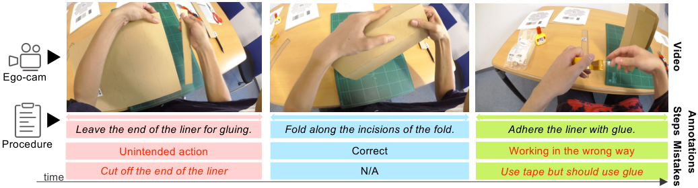
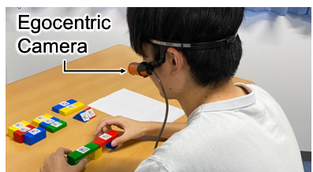
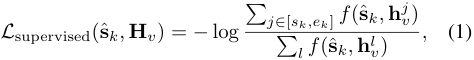
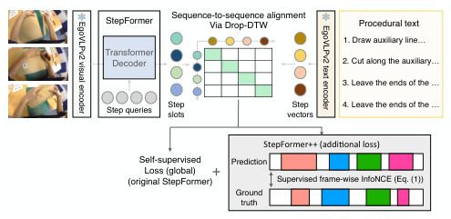
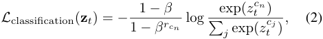
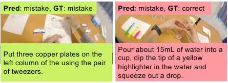
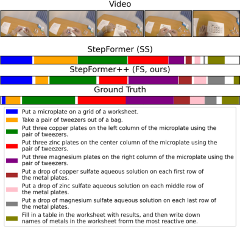

# 011_Haneji_EgoOops_A_Dataset_for_Mistake_Action_Detection_from_Egocentric_Videos_ICCVW_2025_paper

[Original PDF](../011_Haneji_EgoOops_A_Dataset_for_Mistake_Action_Detection_from_Egocentric_Videos_ICCVW_2025_paper.pdf)

Pages: 11

> Automatically converted from PDF. Check the original for exact equations, symbols, table alignment, and figure details.

<!-- Page 1 -->

This ICCV Workshop paper is the Open Access version, provided by the Computer Vision Foundation. Except for this watermark, it is identical to the accepted version; the final published version of the proceedings is available on IEEE Xplore. 

# **EgoOops: A Dataset for Mistake Action Detection from Egocentric Videos referring to Procedural Texts** 

Yuto Haneji1 , Taichi Nishimura2 , Hirotaka Kameko1 , Keisuke Shirai1 , Tomoya Yoshida1 , Keiya Kajimura1 , Koki Yamamoto1 , Taiyu Cui1 , Tomohiro Nishimoto1 , Shinsuke Mori1 1Kyoto University, 2Sony Interactive Entertainment 

haneji.yuto.s66@kyoto-u.jp, Taichi.A.Nishimura@sony.com, shirai.keisuke.5y@kyoto-u.ac.jp, _{_ kameko,forest _}_ @i.kyoto-u.ac.jp 

<!-- Start of picture text -->
Ego-cam Leave the end of the liner for gluing. Fold along the incisions of the fold. Adhere the liner with glue. Procedure Unintended action Correct Working in the wrong way time Cut off the end of the liner N/A Use tape but should use glue Video StepsMistakes Annotations <!-- End of picture text -->

Figure 1. An example task (cardboard) from our EgoOops dataset. EgoOops includes 50 egocentric videos across five procedural domains and corresponding procedural texts. It contains three types of annotations: video-text alignment, mistake labels, and descriptions explaining the errors in each segment. 

## **Abstract** 

_page/._ 

_Mistake action detection is crucial for developing intelligent archives that detect workers’ errors and provide feedback. Existing studies have focused on visually apparent mistakes in free-style activities, resulting in video-only approaches to mistake detection. However, in text-following activities, models cannot determine the correctness of some actions without referring to the texts. Additionally, current mistake datasets rarely use procedural texts for video recording except for cooking. To fill these gaps, this paper proposes the EgoOops dataset, where egocentric videos record erroneous activities when following procedural texts across diverse domains. It features three types of annotations: video-text alignment, mistake labels, and descriptions for mistakes. We also propose a mistake detection approach, combining video-text alignment and mistake label classification to leverage the texts. Our experimental results show that incorporating procedural texts is essential for mistake detection. Data is available through https: //y- haneji.github.io/EgoOops- project-_ 

## **1. Introduction** 

Procedural activities are common in daily life and expert fields, such as assembly, experimentation, and cooking. People often carry them out by following procedural texts in the real world. During this process, mistakes negatively impact quality, speed, cost, and safety. Common mistakes include skipped necessary steps or wrong execution ways, which can sometimes result in life-or-death situations. One promising solution to this problem is to develop an intelligent video archive that records workers’ activities, detects their mistakes, and shows them the mistake clips to prevent recurrences. 

The intelligent video archives are developed using video datasets recording workers’ steps in detail. Many egocentric video datasets [1, 5, 10, 16, 22, 24, 26, 27, 31, 38] have been proposed by equipping a worker with an egocentric camera to capture activity details. Previously, most datasets were interested in correct execution of activities [1, 5, 10, 22, 26]. 

2711

<!-- Page 2 -->

Table 1. Comparison of mistake datasets. Range: mistake labels to a video or each step segment with start and end times; Cat.: finergrained categorization than _correct_ , _mistake_ , and _correction_ ; Desc.: descriptions explaining why each segment is incorrect; OM, EM: order mistakes, execution mistakes (see Sec. 3.1); Proc.: workers follow step-by-step procedural texts._→_ Domain specific ( _e.g_ ., extra screws). _†_ Orders unseen in the training set, not always faulty. 

|Dataset|M Range|istake Cat.|annotati Desc.|ons OM|EM|Domain|Proc.|Ego|#videos|Duration (hour)|
|---|---|---|---|---|---|---|---|---|---|---|
|Assembly101 [31]|Segment|_→_|_→_|↭|_→_|Assembly|_→_|↭|1,425|167|
|ATA [9]|Video|↭_→_|_→_|↭_†_|↭|Assembly|_→_|_→_|1,152|24.8|
|HoloAssist [38]|Segment|_→_|↭|_→_|↭|Assembly|_→_|↭|2,221|166|
|IndustReal [27]|Segment|_→_|↭|↭|↭|Assembly|_→_|↭|84|5.8|
|EgoPER [16]|Segment|↭|↭|↭|↭|Cooking|↭|↭|386|28|
|CaptainCook4D [24]|Segment|↭_→_|↭|↭|↭|Cooking|↭|↭|384|94.5|
|**EgoOops (Ours)**|Segment|↭|↭|↭|↭|Diverse|↭|↭|50|6.8|

Some recent studies have also included and annotated mistake actions in their assembly [9, 27, 31, 38] and cooking [16, 24] video datasets. Using these mistake video datasets, researchers have proposed mistake detection approaches [8, 9, 16, 24, 29, 31]. 

However, these studies have the following three limitations (see Tab. 1). **L1: video-focused approaches.** Existing studies [8, 9, 13, 16, 24, 29, 31] have focused on video-only approaches to mistake detection and not utilized procedural texts. Their approaches are suitable for visually apparent mistakes like incorrectly attached parts and falling plates. Nevertheless, in text-following activities, some mistakes are deviations from procedural texts, thus not obvious only from visual cues ( _e.g_ ., in Fig. 1, the use of tape is a mistake because the text designates glue). Therefore, besides videos, texts are essential for models to detect mistakes accurately. **L2: specific domains.** Procedural texts are included in only a few mistake datasets recording cooking [16, 24]. Since many real-world activities follow procedural texts, it is essential to collect data from more domains. **L3: rough mistake labels.** Most datasets define coarse-grained ( _correct_ / _mistake_ / _correction_ ) [27, 31, 38] or domain-specific ( _e.g_ ., _extra screws_ ) [9, 24] categories. General and fine-grained categorization enables analysis of mistake patterns across diverse domains ( _e.g_ ., a commonly frequent category of mistakes). 

To address these issues, we propose a novel dataset called **EgoOops** (see Fig. 1), where egocentric videos record erroneous activities when following procedural texts (L1) across diverse domains (L2). Given the collected videos and texts, we perform the following three steps for annotations. First, we align steps in the procedural text with video segments ( _i.e_ ., start and end timestamps). Second, if a segment contains a mistake action, we categorize it into six mistake classes (L3). Finally, the segments assigned mistake labels are provided with descriptions of why the actions are considered mistakes. As for the size and tasks, EgoOops 

contains 50 egocentric videos totaling 6.8 hours across five tasks of new domains: electrical circuits, color mixture experiments, ionic reaction experiments, toy building blocks, and cardboard crafts. 

We also propose an approach to the problem of mistake action detection, especially focusing on the utilization of procedural texts (L1). To leverage the texts, our approach combines video-text alignment and mistake label classification; the former localizes the start and end times of each procedural step, and the latter assigns the step segments one label of mistake classes. In experiments using EgoOops, our multi-modal approach outperforms a video-only baseline, and the ablation of textual inputs decreases our performance. These results demonstrate that incorporating procedural texts is essential for mistake detection. Additionally, we test existing mistake classifiers and multi-modal large language models for the classification problem. As for the alignment problem, we compare our fully-supervised approach with zero-shot and self-supervised ones. The results confirm that EgoOops targets novel domains of procedural activities and contains useful alignment annotations. 

## **2. Related work** 

In this section, we compare EgoOops with other datasets in terms of two perspectives: procedural activity dataset and mistake action dataset. 

### **2.1. Procedural activity datasets** 

Procedural activity understanding is an important capability for enhancing smart systems, such as AR/VR assistants [38] and intelligent archives. In particular, aligning a sequence of step instructions with a video ( _i.e_ ., video-text alignment) is fundamental. To support research in this direction, a variety of procedural activity datasets have been developed. While early datasets collected third-person perspective videos accompanied by textual descriptions of each timestep from YouTube [20, 34, 41], recent datasets focus 

2712

<!-- Page 3 -->

on first-person (egocentric) videos that capture fine-grained details of workers’ activities [1, 5, 10, 17, 22, 26, 33]. For example, EPIC-KITCHENS [5] dataset consists of 432 egocentric videos with step instructions in the cooking domain, including start and end times for each segment. Our dataset provides similar video-text alignment annotations as existing datasets, but distinguishes itself by focusing on erroneous actions, thereby enabling the study of error detection within procedural activities. 

### **2.2. Mistake action datasets** 

Mistakes are critical in procedural activities, as they can propagate through subsequent steps and significantly affect task success. This has led to the development of various datasets (see Tab. 1). These datasets are categorized into free-style and text-following settings. 

In free-style activity datasets [9, 27, 31, 38], workers aim to complete goals not relying on procedural texts. For example, Assembly101 [31] records toy assembly and annotates segment-level labels of _correct_ , _mistake_ , and _correction_ . Building on such datasets, previous studies have proposed various approaches to find mistakes in videos [8, 9, 29, 31, 38]. These approaches rely only on videos because mistakes in free-style activities are mainly visually apparent such as incorrectly attached parts and dropped screws. 

Another line of studies records workers following procedural texts in their datasets [16, 24]. EgoPER [16] annotates recipe-execution videos with order and execution mistakes, and CaptainCook4D [24] proposes categorization specific to cooking ( _e.g_ ., _temperature error_ ). One problem is that they still do not utilize procedural texts to find mistakes in videos. In text-following activities, some mistakes are deviations from procedural texts, thus the texts are essential for models. In addition, to the best of our knowledge, no datasets besides cooking involve procedural texts, whereas many real-world activities follow them. Our EgoOops dataset annotates video-text alignment and mistake labels across diverse domains, promoting the utilization of texts in mistake detection. 

## **3. EgoOops dataset** 

EgoOops dataset provides procedural activity videos including erroneous work and annotations for these mistakes. The activities are performed by following instructional steps of procedural texts in order. In this section, we first define mistakes and then describe task selection, video recording, and annotations. Finally, dataset statistics are provided. 

### **3.1. Mistake definition** 

We define mistakes as “deviations from instructional steps.” Out of mistake types that meet this definition, we consider 

executions mistakes in this study.1 

Execution mistakes occur when a worker misinterprets and executes steps. We classify the execution mistakes into the six types of errors: 

1. **Incorrect-object-use (** **_Object_ )** executes a step with a different object specified in the text. This includes cases when the incorrect number of objects is used. 

2. **Incorrect-object-picking (** **_Mispick_ )** picks up an incorrect object, but the worker recognizes the mistake and releases the object. This mistake does not execute a step, unlike incorrect-object-use. 

3. **Self-correction (** **_Correction_ )** recognizes and corrects mistakes in a step that has been executed in a wrong way. 

4. **Accidental-mistakes (** **_Accident_ )** causes accidental happenings mainly due to carelessness. 

5. **Wrong-way (** **_Way_ )** picks a correct object but executes a step in a way that misaligns with the instruction in the text. 

6. **Other-mistakes (** **_Others_ )** induces other types of mistakes. This also includes cases where multiple types of the above mistakes occur simultaneously. 

### **3.2. Task selection** 

To capture a broad range of mistake types described in Sec. 3.1, we construct the EgoOops dataset with activity videos from diverse domains. Accordingly, we select the following five tasks: 

- **Electrical circuits** ( **_EC_** ): Connecting electrical elements to complete an electrical circuit that turns a propeller. 

- **Color mixture experiments** ( **_CM_** ): Examining the color of various solutions of detergent and fluorescent paint when illuminating them with a blacklight. 

- **Ionic reaction experiments** ( **_IR_** ): Examining ionic reaction by dropping chemical solutions to metal plates. 

- **Toy building blocks** ( **_BB_** ): Piling up building blocks to construct the specified structure. 

- **Cardboard crafts** ( **_CB_** ): Crafting Omikuji boxes, Japanese random fortunes, from cardboard. We prepare procedural texts for each task as follows: CM 

- and CB use procedures collected from the web; IR and EC use instruction manuals included with out-of-box kits; BB uses a procedure that we manually write from scratch. 

### **3.3. Video recording** 

We asked four graduate students to perform the tasks based on the procedural texts. To record their activities, a headmounted camera (Panasonic HX-A500) was used (Fig. 2). The egocentric videos were recorded at 30 fps with 4K RGB resolution. We chose the egocentric perspective to cap- 

> 1Other types of mistakes such as order mistakes (e.g., skipping and reordering steps) may also occur during activities, but we focus on the execution mistakes which are our main concern. We leave the study of the other types of mistakes to future work. 

2713

<!-- Page 4 -->

<!-- Start of picture text -->
Egocentric Camera <!-- End of picture text -->

Figure 2. Egocentric head-mounted camera on participants. 

ture the participants’ visual attention and fine-grained handobject interactions, which are critical for modeling procedural understanding. During the recordings of EC and BB, images of the final products were given to the participants.2 To avoid the influence of background changes, we fixed the initial locations of the objects, tools, and printed procedural texts. Further, the participants were instructed to work in the chair to capture manipulated objects in detail. 

Each participant was asked to perform each task two or four times, totaling 10 recordings per task. For each task, five of 10 recordings contain mistakes that the participants performed intentionally. For the other five recordings, the participants were asked to follow the procedural texts avoiding mistakes. Note that the latter five recordings still contain mistakes due to their careless errors. 

### **3.4. Annotations** 

EgoOops provides annotations of video-text alignment, mistake labels, and textual descriptions of the mistakes. 

Video-text alignment refers to the segments in the recorded videos, and each segment is represented as a start and end timestamp. Each segment corresponds to a human action, which is a step in the procedural text or a mistake ( _e.g_ ., grasping the wrong object). 

Mistake labels are assigned to segments that correspond to execution mistakes. A mistake label is one of the six mistake types in Sec. 3.1. In addition to the mistake labels, we also provide textual descriptions of why the performed actions are considered mistakes. 

We asked two persons for annotation, who are called annotator-A and annotator-B to avoid confusion. Annotator-A was asked to annotate the whole dataset using a web annotation tool that we developed. After the annotation, annotator-B was asked to annotate several videos from the dataset again to calculate inter-annotator agreements. For video-text alignment, annotator-B extracted segments from videos and mapped them to the corresponding step labels. The temporal Intersection over the union (tIoU) to the original segments was then calculated. For mistake labels and descriptions, annotator-B was asked to pro- 

> 2Our preliminary experiments showed these tasks were difficult to complete only with the texts. 

Table 2. Statistics of recorded videos and procedural texts. 

|Task|Vid #vid.|eos Avg. (min)|#seg.|Segments #seg. / #vid.|Avg. (sec)|Te #steps per text|xts #words / #steps|
|---|---|---|---|---|---|---|---|
|EC|10|3.2|98|9.8|15.4|8|7.6|
|CM|10|4.4|91|9.1|25.8|8|17.0|
|IR|10|5.4|95|9.5|29.7|9|12.7|
|BB|10|1.9|87|8.7|9.0|7|18.6|
|CB|10|26.1|167|16.7|86.7|14|9.6|
|All|50|8.2|538|10.8|40.7|9.2|13.5|

vide mistake labels and descriptions based on the segments annotator-A annotated. The labels and descriptions between the annotators were compared using Cohen’s kappa [3] and BERTScore [40]. The tIOU was 88 _._ 8, and Cohen’s kappa and BERTScore were 86 _._ 8 and 96 _._ 3, respectively, ensuring that the annotations of the dataset are consistent. 

### **3.5. Statistics** 

In this section, we first report video- and text-side statistics on EgoOops, then discuss mistake label statistics. The statistics of mistake descriptions are written in the supplementary materials. 

Table 2 shows different trends between the tasks in terms of video duration, segment duration, and the number of segments. For video duration, the longest is the cardboard task at 26.1 minutes, while the shortest is the building block task at 1.9 minutes. As for the texts, Tab. 2 compares the number of steps in a procedural text and the number of words per step. The task with the most steps is the cardboard task, while the task with the longest instructions is the building block task. These statistics indicate that EgoOops covers a variety of procedural tasks ranging from short to long. 

Table 3 shows the counts of the labels for execution mistakes. In total, EgoOops contains 95 execution mistakes. Counting the number of each type of mistake, the two most frequent labels are _incorrect-object-picking_ (label 2) and _wrong-way_ (label 5). In addition, we also find unique mistake patterns of each task. For example, _accidentalmistakes_ (label 4) frequently happen in ionic reaction experiments but rarely in the other tasks. We expect the reason is that the ionic reaction experiments involve moving a small metal piece with tweezers and dropping solution into a narrow space. Overall, many execution mistakes occur in the videos of EgoOops, and the tasks have their own frequent mistake types. 

## **4. Application: mistake action detection** 

We propose a text-oriented approach to mistake action detection. This section formalizes the problem as consisting of video-text alignment and mistake label classification and explains our approach to them. 

2714

<!-- Page 5 -->

Table 3. The number of mistake labels. 

|Task|1. Object|2. Mispick|Mistake  3. Correction|label  4. Accident|5. Way|6. Others|
|---|---|---|---|---|---|---|
|EC|9|5|1|2|3|2|
|CM|4|8|0|2|5|3|
|IR|0|3|1|5|6|4|
|BB|2|5|5|1|5|1|
|CB|5|3|0|1|2|2|
|Total|20|24|7|11|21|12|

### **4.1. Problem formalization** 

Mistake action detection consists of two problems in our formalization: video-text alignment and mistake label classification. It leads to localizing temporal segments and classes of mistakes in a video. 

Given an untrimmed video **V** = ( **f** 1 _, . . . ,_ **f** _L_ ) and the corresponding procedural text **T** = ( **t** 1 _, . . . ,_ **t** _K_ ), our first problem is video-text alignment. Here, **V** consists of _L_ frames, and **T** includes _K_ steps of instructions. For _k_ -th step **t** _k_ , our goal is to localize the start and end frame numbers ( _sk, ek_ ). 

The alignment outputs are passed to the next problem of mistake label classification, which predicts a mistake label for each step segment. The _k_ -th step segment is represented by extracted video frames based on the start and end frame numbers as **V** _k__↑_=(**f**_s_ _k__, . . . ,_**f**_s_ _e_).Our objective is to assign the segment **V** _k__↑_one label of mistake classes (_c_1_, . . . , cN_), where _cn_ and _N_ represent the name of the _n_ -th class and the number of the classes, respectively. In our experiments, we group the mistakes except for 3. _correction_ (see Sec. 3.1) into the common _mistake_ class and solve the classification of three classes: _correct_ , _mistake_ , and _correction_ .3 

### **4.2. Video-text alignment** 

For video-text alignment, we enhance an existing model of StepFormer [7] by introducing an additional fully supervised loss function, termed StepFormer++. We first provide an overview of the original StepFormer and then explain how we extend it. 

**Preliminary: StepFormer.** StepFormer was originally proposed for learning video-text alignment from untrimmed videos accompanied by narrations in a self-supervised manner [7]. StepFormer is a Transformer decoder [36] equipped with _U_ learnable queries. Given video features extracted using UniVL [19], the queries attends to the video features, producing _U_ contextualized vectors called _step slots_ , which capture key steps in the video. The step slots temporally align with narration vectors extracted using UniVL, where they use a sequence-to-sequence alignment algorithm DropDTW [6]. Considering this alignment as positive pairs, the loss to supervise the step slots is calculated as contrastive 

> 3Our preliminary experiments showed that distinguishing the seven classes (six classes in Sec. 3.1 plus the _correct_ class) is difficult currently. 

one InfoNCE [35] at both local (same video-narration pairs) and global (different video-narration pairs) levels. During inference, StepFormer can temporally localize the video segment of each step instruction ( _i.e_ ., video-text alignment). Specifically, the extracted step slots align with the step instructions in procedural texts, allowing unmatched slots to be dropped. Next, the remaining slots are aligned with the video to identify the start and end times of each step. In these alignment processes, Drop-DTW is used again. **Pre-training.** We select StepFormer because its selfsupervised learning can be used for pre-training to mitigate the negative impact of the small size of EgoOops. In the original paper [7], StepFormer is trained on untrimmed web videos and narrations in HowTo100M [20] using UniVL [19] features. Instead, we train it on Ego4D [10] using EgoVLPv2 [25] features to fill the domain gap between web and egocentric videos. Ego4D is a massive-scale egocentric video dataset accompanied by transcriptions [10], hence we can pre-train StepFormer following the same procedure as the original one. 

**StepFormer++.** The pre-trained model is fine-tuned on EgoOops with an additional loss to train StepFormer in a fully supervised setting by leveraging the video-text alignment annotations. Figure 3 shows an overview of the resulting model StepFormer++. The overall process is the same as the original StepFormer. Given ( **V** _,_ **T** ), the model first extracts video **H** _v_ = ( **h**1 _v__, . . . ,_**h**_l_ _v__, . . . ,_**h**_L_ _v_) and text**H**_t_= ( **h**1 _t__, . . . ,_**h**_k_ _t__, . . . ,_**h**_K_ _t_) features using EgoVLPv2 instead of UniVL. Then, the Transformer decoder makes slot queries attend **H** _v_ , producing step slots **S** = ( **s** 1 _, . . . ,_ **s** _u, . . . ,_ **s** _U_ ). Finally, the model acquires the step-text alignment via Drop-DTW by computing a similarity matrix of **S** and **H** _t_ . The step-text alignment is used to compute the original loss at only the global (different video-narration pairs) level. Instead of the local (same video-narration pairs) loss, we add a new loss to the StepFormer for learning from video-text alignment annotations. After Drop-DTW between the slots and step instructions4 , we supervise the remaining step slots **S** ˆ = (ˆ **s** 1 _, . . . ,_ ˆ **s** _k, . . . ,_ ˆ **s** _K_ ) to match with the start and end frame numbers ( _sk, ek_ ). Specifically, this is calculated using the InfoNCE framework: 

where _f_ (ˆ **s** _k,_ **h**_→_ _v_) = exp(cos(ˆ**s**_k,_**h**_→_ _v_))_/ω_,and_ω_isascaling temperature. We add this loss to the original ones, and the pre-trained model is fine-tuned on EgoOops. 

### **4.3. Mistake label classification** 

**Multi-modal classifier.** Given a pair of predicted video segment **V**_↑_ and _k_ -th step instruction **t** _k_ , the model pre- 

> 4We leave the same number of slots as the steps in the procedural text. 

2715

<!-- Page 6 -->

<!-- Start of picture text -->
Sequence-to-sequence alignment StepFormer Via Drop-DTW Procedural text 1. Draw auxiliary line… Transformer Decoder 2. Cut along the auxiliary… 3. Leave the ends of the … Step queries Step slots vectorsStep  4. Leave the ends of the … StepFormer++ (addi/onal loss) Self-supervised Prediction Loss (global) + (original StepFormer) Supervised frame-wise InfoNCE (Eq. (1)) Ground truth EgoVLPv2 visual encoder EgoVLPv2 text encoder <!-- End of picture text -->

Figure 3. An overview of StepFormer++. 

dicts the mistake label. Specifically, the model first convert **V**_↑_ and **t** _k_ into video **H**_↑_ _v_=(**h**_s_ _v__t, . . . ,_**h**_e_ _v__t_)andtext **h**_k_ _t_features using EgoVLPv2.Then, it computes the mean of **H**_↑_ _v_,concatenatestheaveragedvectorwith**h**_k_ _t_,andfor- wards it into a two-layer perceptron _g_ with ReLU function as following: **z** _k_ = _g_ (concat(mean( **H**_↑_ _v_)_,_**h**_k_ _t_)), where **z** _k_ = ( _zk_1_, . . . , z_ _k__n, . . . , z_ _k__N_) represents the logits for classes, and _N_ is the number of the classes. The model applies the argmax operation on **z** _k_ and outputs the prediction label. **Training.** To train the model, we use the class-balanced focal loss [4] because the frequency of the _mistake_ and _correction_ labels is lower than the _correct_ label. Specifically, using **z** _t_ , the loss is calculated as following: 

where _rcn_ is the number of training samples belonging to the class _cn_ , and _ε ↓_ [0 _,_ 1) is a hyperparameter. We adopt teacher forcing [11, 36] as the training strategy. Specifically, we input the ground-truth segment of the _t_ -th step to the model to stabilize training whereas the predicted ones are used for testing. 

### **4.4. Implementation details.** 

We follow the official implementation of StepFormer and use the same hyperparameters as stated in [7] unless we mention modifications. We set the number of step queries to be _U_ = 32 and the batch size to be 6 for fine-tuning StepFormer++ on EgoOops. The video and text feature dimension of EgoVLPv2 is _d_ = 4 _,_ 096. We use Drop-DTW with an 80 percentile drop cost [6] to align the step slots and video features. We set _ω_ = 0 _._ 03 in the InfoNCE loss and _ε_ = 0 _._ 9999 in the class-balanced loss. For the mistake label classification, we train the classifier in 1,200 epochs. 

## **5. Experiments** 

We first report an end-to-end performance on mistake action detection in Section 5.1. We then conduct in-depth experiments on video-text alignment and mistake label classification individually in Section 5.2 and 5.3. 

### **5.1. Mistake action detection** 

**Baseline.** We do not adopt existing mistake detection methods as baselines because they do not fit our settings. For instance, Assembly101 [31] and CaptainCook4D [24] assume trimmed video clips as inputs, while our task assumes untrimmed videos. The method in [29] focuses on ordering mistakes in the videos and does not address execution mistakes. EgoPED [16] and AMNAR [13] are the closest to our setting as they predict both segments and mistake labels. However, their methods are based on anomaly detection, predicting binary labels of “correct” and “mistakes,”; thus they cannot predict the three classes of “correct,” “mistakes,” and “correction.” 

Therefore, instead of existing mistake action detection models, we compare our method with the recent temporal action localization (TAL) model, ActionFormer [39]. This is because TAL operates under similar conditions, where the models detect both temporal segments and their action labels. In our experiments, we train ActionFormer to predict mistake labels for the detected segments, instead of action labels as in the original settings. For a fair comparison, we apply NMS to retain as many segments as the ground truths. In addition, since our metrics require step labels, we assign them to the segments in order from the start to the end of the videos. Note that the inputs for TAL are videos only. **Evaluation metrics.** We follow TAL [39] and report mean average precision (mAP) at tIoU thresholds of 0.1, 0.2, and 0.3. It computes the mean of average precision across only _mistake_ and _correction_ classes because we focus on mistake detection performance. Since our problem formalization involves video-text alignment (see Sec. 4.1, our metrics require correctly predicting both step and mistake labels. Note that ActionFormer processes only videos and does not conduct video-text alignment [39]; yet we assign step labels to the segments sequentially from the video’s start to end for fair comparison. 

**Splits.** Our EgoOops dataset is relatively small compared to other action mistake datasets. To ensure reliable results, we perform 5-fold cross-validation. We divide the 50 videos into a 30/10/10 split for training, validation, and testing, respectively. All 30 training videos from the five tasks are used to train one unique model for scalability and generalization across diverse tasks. We report the average test-set scores using the model weights that achieve the highest performance on the validation set. To construct folds, we pay attention to the two points. First, each validation and testing fold contains one correct and one mistake video for every task, totaling 10 videos. Second, each fold consist of the same workers’ videos as following the group k-fold [28]. This allows us to test the models on unseen worker’s activities, minimizing the bypass possibility to learn the workerspecific features to detect mistakes. 

**Results.** Table 4 shows the performance on mistake ac- 

2716

<!-- Page 7 -->

Table 4. Results of mistake action detection. Oracle denotes upper-bound performance using ground-truth step segments. 

|Methods|0.1|mAP 0.2|@tIoU 0.3|Avg.|
|---|---|---|---|---|
|ActionFormer [39]|1.8|0.1|0.1|0.7|
|StepFormer++ w/ MLP (ours)|2.6|2.5|2.5|**2.5**|
|GT steps (oracle)||3|4.7||

<!-- Start of picture text -->
Pred : mistake,  GT : mistake Pred : mistake,  GT : correct Pour about 15mL of water into a Put three copper plates on the cup, dip the tip of a yellow left column of the using the pair highlighter in the water and of tweezers. squeeze out a drop. <!-- End of picture text -->

Figure 4. Success (left) and failure (right) cases of mistake detection. Text boxes at the bottom show the predicted steps. 

Table 5. Ablation study of textual inputs to the mistake label classifier of our approach. 

|Inputs to classifier Avg.  Video Text|mAP|Avg. mAP (oracle)|
|---|---|---|
|↭|0.3|4.7|
|↭ ↭|**2.5**|**34.7**|

tion detection. Our proposed method achieves an average mAP of 2.5, surpassing ActionFormer’s 0.7. In contrast, our score is still far from the oracle’s 34.7, which uses groundtruth step segments and only performs mistake label classification. This suggests that accurate video-text alignment largely improves mistake action detection. In addition, we explore the success and failure examples as shown in Fig. 4. In the success case, the correct alignment leads to the finding of a mistake; in the failure case, the localized step is incorrect, hurting the performance of mistake classification. Moreover, we conduct an ablation study on input modalities, as shown in Tab. 5. When comparing models with and without text input, we observe that the average mAP drops significantly from 2.5 to 0.3. This highlights the importance of textual information for accurate mistake classification. 

### **5.2. Video-text alignment** 

We conduct detailed experiments on the video-text alignment component. In this experiment, we evaluate the performance of our proposed StepFormer++ against two versions of the original StepFormer [7]. One is trained on Ego4D and evaluated in a zero-shot manner (ZS), while the other is further fine-tuned on EgoOops using a selfsupervised approach (SS). 

As shown in Tab. 6, we report frame-wise F1, Precision, Recall, and Mean over Frames (MoF), following prior 

Table 6. Results of video-text alignment. ZS: zero-shot, SS: selfsupervised, FS: fully supervised. 

|Methods|F1|Prec.|Rec.|MoF|
|---|---|---|---|---|
|StepFormer (ZS) [7]|24.1|24.6|23.7|24.9|
|StepFormer (SS) [7]|26.1|26.6|25.7|27.0|
|StepFormer++ (ours, FS)|**28.1**|**28.4**|**27.9**|**28.1**|

Figure 5. Qualitative results of video-text alignment. 

work [7, 32]. Our StepFormer++ achieves an F1 score of 28.1, surpassing both the ZS (24.1) and SS (26.1) variants. These results demonstrate that our fully supervised loss effectively trains StepFormer++ when alignment annotations are available. 

Figure 5 shows example results of the self-supervised StepFormer and StepFormer++. While the self-supervised one fails to localize the steps of putting copper, zinc, and magnesium plates, our StepFormer++ correctly finds their alignments. This implies that it is difficult to distinguish steps involving similar-looking objects in a self-supervised learning, but our fully-supervised loss helps to learn them. Also, this demonstrates that our fully supervised loss improves StepFormer’s video-text alignment capability, thus StepFormer++ achieves more precise step prediction. 

### **5.3. Mistake label classification** 

We address the task of mistake label classification, which predicts one of three labels (correct, mistake, and correction) based on ground-truth segments. As baselines, we evaluate mistake classifiers trained on existing mistake action datasets and report their performance on the EgoOops dataset. Furthermore, we explore the capabilities of recent multi-modal large language models (MLLMs) to assess how accurately they can predict mistake labels. **Classifiers trained on existing datasets.** The EgoOops dataset introduces tasks from a diverse range of previously unexplored domains (see Sec. 3.2), beyond those covered 

2717

<!-- Page 8 -->

in existing assembly [9, 27, 31, 38] and cooking [16, 24] datasets. To evaluate whether models trained on existing datasets can generalize to unseen domains, we apply these models to predict mistake labels on the EgoOops dataset in a zero-shot manner. 

Specifically, we compare the performance of our classifier trained on EgoOops with models trained on Assembly101 [31] and CaptainCook4D [24], which are representative benchmarks for assembly and cooking errors, respectively. For Assembly101, we adopt the TempAgg model [30], a long-range video recognition architecture leveraging TSM features [18]. For CaptainCook4D, we utilize their best-performing model: a multi-layer perceptron (MLP) head on top of a frozen 3D-ResNet backbone [12]. In contrast, we train a MLP-based model (see Sec. 4.3) on EgoOops to evaluate the effect of tuning to its domains. 

**MLLMs.** Finding mistake actions is a visual reasoning task, where models must understand both the video and the associated procedural text to determine whether a worker correctly follows the instructions. MLLMs perform well in visual reasoning benchmarks [2, 37], thus we instruct them to solve mistake label classification given a trimmed video clip, the task’s procedure, and the performed step. 

Specifically, we evaluate two leading open-source MLLMs on EgoOops in a zero-shot manner: InternVL2.58B [2] and Qwen2-VL-7B-Instruct [37]. For each instance, we construct the input prompt using a fixed template (Fig. 6) designed to (1) provide the full procedure as context, (2) encourage active identification of mistakes and corrections, (3) and follow a multiple-choice question format, which MLLMs are well-trained to handle. The completed prompt and the video frames are passed to the model, which outputs its answer in free-form text. Video frame sampling follows each model’s official pre-processing: InternVL2.5 takes 24 frames as input, while Qwen2-VL takes 48 frames. 

**Results.** Table 7 presents the results of mistake label classification. Among the classifiers, the model trained on CaptainCook4D performs better than the uniform sampling baseline, demonstrating a certain level of domaingeneralization ability. In contrast, the model trained on Assembly101 does not surpass the baseline, indicating its limited transferability to unseen domains. The model trained on EgoOops significantly outperforms uniform sampling, highlighting the benefits of domain-specific adaptation. 

In terms of MLLMs, Qwen2-VL-7B-Instruct exceeds the fully-supervised MLP classifier when comparing their performance to recognize the “mistake” class, suggesting its strong capabilities to find mistakes. However, its performance on recognizing corrections of mistakes is considerably lower compared to the fully-supervised model. This gap suggests that current MLLMs have limited ability to reason about whether an action constitutes a correction. 

Procedure: {PROCEDURE} This step: {STEP_INSTRUCTION} It is an egocentric video clip where the worker performs an activity referring to the procedure. Note that if the step is ”UNDEFINED”, it is an extra step not written in the procedure. Carefully look at the clip. Try to find worker’s failures of precisely carrying out the step instruction (i.e. mistake) or correction of mistakes. We penalize more for overlooking mistake and correction classes. Select the best option to the following multiple-choice question based on the video clip. Question: Which label best matches the activity performed by the camera wearer? 0. correct 1. correction 2. mistake The best option: 

Figure 6. The prompt template for MLLMs. We replace the placeholders with the task’s procedure and the performed step for each trimmed video clip. 

Table 7. Results of mistake action classification. ZS: zero-shot, FS: fully-supervised. Note that [24] addresses binary classification of _correct_ or _mistake_ , thus the scores for _correction_ are not available. 

||Methods|Prec.|Mistake Rec.|F1|C Prec.|orrectio Rec.|n F1|
|---|---|---|---|---|---|---|---|
|ier|Uniform sampling|16.4|33.3|21.9|1.3|33.3|2.5|
|sifi|Assembly101 [31] (ZS)|14.8|14.8|14.8|2.4|42.9|4.5|
|lasi|CaptainCook4D [24] (ZS)|16.5|76.1|27.1||N/A||
|Ci|MLP (ours, FS)|35.0|48.9|**40.8**|57.1|57.1|**57.1**|
|LM|InternVL2.5-8B [2]|47.6|34.1|39.7|0.0|0.0|0.0|
|ML|Qwen2-VL-7B-Instruct [37]|75.0|30.7|**43.5**|2.6|14.3|**4.4**|

## **6. Conclusion** 

This paper introduced EgoOops dataset that consists of egocentric videos, procedural texts, and three types of annotations: video-text alignment, mistake labels, and mistake descriptions. Based on this, we proposed a text-oriented approach to the task of mistake action detection. Our experiments demonstrated that textual information plays a crucial role in accurately identifying mistakes. Furthermore, we conducted an in-depth analysis of video-text alignment and mistake label classification. The results revealed that while MLLMs exhibit promising performance in mistake recognition but still struggle to reason about mistake corrections in videos, highlighting a key area for future improvement. **Acknowledgments.** This work was supported in part by JSPS KAKENHI Grant Numbers 25K21274. 

2718

<!-- Page 9 -->

## **References** 

- [1] Siddhant Bansal, Chetan Arora, and C. V. Jawahar. My View is the Best View: Procedure Learning from Egocentric Videos. In _Proceedings of the European Conference on Computer Vision_ , pages 657–675, 2022. 1, 3 

- [2] Zhe Chen, Weiyun Wang, Yue Cao, Yangzhou Liu, Zhangwei Gao, Erfei Cui, Jinguo Zhu, Shenglong Ye, Hao Tian, Zhaoyang Liu, Lixin Gu, Xuehui Wang, Qingyun Li, Yimin Ren, Zixuan Chen, Jiapeng Luo, Jiahao Wang, Tan Jiang, Bo Wang, Conghui He, Botian Shi, Xingcheng Zhang, Han Lv, Yi Wang, Wenqi Shao, Pei Chu, Zhongying Tu, Tong He, Zhiyong Wu, Huipeng Deng, Jiaye Ge, Kai Chen, Min Dou, Lewei Lu, Xizhou Zhu, Tong Lu, Dahua Lin, Yu Qiao, Jifeng Dai, and Wenhai Wang. Expanding Performance Boundaries of Open-Source Multimodal Models with Model, Data, and Test-Time Scaling. _arXiv preprint arXiv:2412.05271_ , 2024. 8, 6 

- [3] Jacob Cohen. A Coefficient of Agreement for Nominal Scales. _Educational and Psychological Measurement_ , 20(1): 37–46, 1960. 4, 3 

- [4] Yin Cui, Menglin Jia, Tsung-Yi Lin, Yang Song, and Serge Belongie. Class-Balanced Loss Based on Effective Number of Samples. In _Proceedings of the IEEE/CVF Conference on Computer Vision and Pattern Recognition_ , pages 9268– 9277, 2019. 6 

- [5] Dima Damen, Hazel Doughty, Giovanni Maria Farinella, Sanja Fidler, Antonino Furnari, Evangelos Kazakos, Davide Moltisanti, Jonathan Munro, Toby Perrett, Will Price, and Michael Wray. The EPIC-KITCHENS Dataset: Collection, Challenges and Baselines. _IEEE Transactions on Pattern Analysis and Machine Intelligence_ , 43(11):4125–4141, 2021. 1, 3 

- [6] Mikita Dvornik, Isma Hadji, Konstantinos G. Derpanis, Animesh Garg, and Allan Jepson. Drop-DTW: Aligning Common Signal Between Sequences While Dropping Outliers. In _Proceedings of the Annual Conference on Neural Information Processing Systems_ , pages 13782–13793, 2021. 5, 

   - 6 

- [7] Nikita Dvornik, Isma Hadji, Ran Zhang, Konstantinos G. Derpanis, Richard P. Wildes, and Allan D. Jepson. StepFormer: Self-Supervised Step Discovery and Localization in Instructional Videos. In _Proceedings of the IEEE/CVF Conference on Computer Vision and Pattern Recognition_ , pages 18952–18961, 2023. 5, 6, 7 

- [8] Alessandro Flaborea, Guido Maria D’Amely di Melendugno, Leonardo Plini, Luca Scofano, Edoardo De Matteis, Antonino Furnari, Giovanni Maria Farinella, and Fabio Galasso. PREGO: Online mistake detection in PRocedural EGOcentric videos. In _Proceedings of the IEEE/CVF Conference on Computer Vision and Pattern Recognition_ , pages 18483–18492, 2024. 2, 3, 6 

- [9] Reza Ghoddoosian, Isht Dwivedi, Nakul Agarwal, and Behzad Dariush. Weakly-supervised action segmentation and unseen error detection in anomalous instructional videos. In _Proceedings of the IEEE/CVF International Conference on Computer Vision_ , pages 10128–10138, 2023. 2, 3, 8 

- [10] Kristen Grauman, Andrew Westbury, Eugene Byrne, 

   - Zachary Chavis, Antonino Furnari, Rohit Girdhar, Jackson Hamburger, Hao Jiang, Miao Liu, Xingyu Liu, Miguel Martin, Tushar Nagarajan, Ilija Radosavovic, Santhosh Kumar Ramakrishnan, Fiona Ryan, Jayant Sharma, Michael Wray, Mengmeng Xu, Eric Zhongcong Xu, Chen Zhao, Siddhant Bansal, Dhruv Batra, Vincent Cartillier, Sean Crane, Tien Do, Morrie Doulaty, Akshay Erapalli, Christoph Feichtenhofer, Adriano Fragomeni, Qichen Fu, Abrham Gebreselasie, Cristina Gonzalez, James Hillis, Xuhua Huang, Yifei Huang, Wenqi Jia, Weslie Khoo, Jachym Kolar, Satwik Kottur, Anurag Kumar, Federico Landini, Chao Li, Yanghao Li, Zhenqiang Li, Karttikeya Mangalam, Raghava Modhugu, Jonathan Munro, Tullie Murrell, Takumi Nishiyasu, Will Price, Paola Ruiz Puentes, Merey Ramazanova, Leda Sari, Kiran Somasundaram, Audrey Southerland, Yusuke Sugano, Ruijie Tao, Minh Vo, Yuchen Wang, Xindi Wu, Takuma Yagi, Ziwei Zhao, Yunyi Zhu, Pablo Arbelaez, David Crandall, Dima Damen, Giovanni Maria Farinella, Christian Fuegen, Bernard Ghanem, Vamsi Krishna Ithapu, C. V. Jawahar, Hanbyul Joo, Kris Kitani, Haizhou Li, Richard Newcombe, Aude Oliva, Hyun Soo Park, James M. Rehg, Yoichi Sato, Jianbo Shi, Mike Zheng Shou, Antonio Torralba, Lorenzo Torresani, Mingfei Yan, and Jitendra Malik. Ego4D: Around the World in 3,000 Hours of Egocentric Video. In _Proceedings of IEEE/CVF Conference on Computer Vision and Pattern Recognition_ , pages 18973–18990, 2022. 1, 3, 5 

- [11] Alex Graves. Generating Sequences With Recurrent Neural Networks. _arXiv preprint arXiv:1308.0850_ , 2014. 6 

- [12] Kensho Hara, Hirokatsu Kataoka, and Yutaka Satoh. Learning Spatio-Temporal Features with 3D Residual Networks for Action Recognition. In _Proceedings of the IEEE International Conference on Computer Vision_ , pages 3154–3160, 2017. 8, 6 

- [13] Wei-Jin Huang, Yuan-Ming Li, Zhi-Wei Xia, Yu-Ming Tang, Kun-Yu Lin, Jian-Fang Hu, and Wei-Shi Zheng. Modeling Multiple Normal Action Representations for Error Detection in Procedural Tasks. In _Proceedings of the IEEE/CVF Conference on Computer Vision and Pattern Recognition_ , pages 27794–27804, 2025. 2, 6 

- [14] ISO/IEC 18004:2024. Information technology – Automatic identification and data capture techniques – QR code bar code symbology specification. Standard, International Organization for Standardization, 2024. 2 

- [15] Kyoto University Research Information Management Committee. Policy on Research Data Management and Sharing. https://www.kyoto-u.ac.jp/en/research/researchpolicy/rdm/, 2020. 4 

- [16] Shih-Po Lee, Zijia Lu, Zekun Zhang, Minh Hoai, and Ehsan Elhamifar. Error Detection in Egocentric Procedural Task Videos. In _Proceedings of the IEEE/CVF Conference on Computer Vision and Pattern Recognition_ , pages 18655– 18666, 2024. 1, 2, 3, 6, 8 

- [17] Yin Li, Miao Liu, and James M. Rehg. In the Eye of Beholder: Joint Learning of Gaze and Actions in First Person Video. In _Proceedings of the European Conference on Computer Vision_ , pages 619–635, 2018. 3 

- [18] Ji Lin, Chuang Gan, and Song Han. TSM: Temporal Shift Module for Efficient Video Understanding. In _Proceedings_ 

2719

<!-- Page 10 -->

_of the IEEE/CVF International Conference on Computer Vision_ , pages 7082–7092, 2019. 8, 5 

- [19] Huaishao Luo, Lei Ji, Botian Shi, Haoyang Huang, Nan Duan, Tianrui Li, Jason Li, Taroon Bharti, and Ming Zhou. UniVL: A Unified Video and Language Pre-Training Model for Multimodal Understanding and Generation. _arXiv preprint arXiv:2002.06353_ , 2020. 5 

- [20] Antoine Miech, Dimitri Zhukov, Jean-Baptiste Alayrac, Makarand Tapaswi, Ivan Laptev, and Josef Sivic. HowTo100M: Learning a Text-Video Embedding by Watching Hundred Million Narrated Video Clips. In _Proceedings of the IEEE/CVF International Conference on Computer Vision_ , pages 2630–2640, 2019. 2, 5 

- [21] Iftekhar Naim, Young C. Song, Qiguang Liu, Liang Huang, Henry Kautz, Jiebo Luo, and Daniel Gildea. Discriminative Unsupervised Alignment of Natural Language Instructions with Corresponding Video Segments. In _Proceedings of the Conference of the North American Chapter of the Association for Computational Linguistics: Human Language Technologies_ , pages 164–174, 2015. 2 

- [22] Taichi Nishimura, Kojiro Sakoda, Atsushi Hashimoto, Yoshitaka Ushiku, Natsuko Tanaka, Fumihito Ono, Hirotaka Kameko, and Shinsuke Mori. Egocentric Biochemical Video-and-Language Dataset. In _Proceedings of the IEEE/CVF International Conference on Computer Vision_ , pages 3129–3133, 2021. 1, 3 

- [23] Taichi Nishimura, Kojiro Sakoda, Atsushi Ushiku, Atsushi Hashimoto, Natsuko Okuda, Fumihito Ono, Hirotaka Kameko, and Shinsuke Mori. BioVL2: An Egocentric Biochemical Video-and-Language Dataset. _Journal of Natural Language Processing_ , 29(4):1106–1137, 2022. 2 

- [24] Rohith Peddi, Shivvrat Arya, Bharath Challa, Likhitha Pallapothula, Akshay Vyas, Bhavya Gouripeddi, Qifan Zhang, Jikai Wang, Vasundhara Komaragiri, Eric Ragan, Nicholas Ruozzi, Yu Xiang, and Vibhav Gogate. CaptainCook4D: A Dataset for Understanding Errors in Procedural Activities. In _Proceedings of the Annual Conference on Neural Information Processing Systems_ , 2024. 1, 2, 3, 6, 8, 5 

- [25] Shraman Pramanick, Yale Song, Sayan Nag, Kevin Qinghong Lin, Hardik Shah, Mike Zheng Shou, Rama Chellappa, and Pengchuan Zhang. EgoVLPv2: Egocentric Video-Language Pre-training with Fusion in the Backbone. In _Proceedings of the IEEE/CVF International Conference on Computer Vision_ , 2023. 5 

- [26] Francesco Ragusa, Antonino Furnari, and Giovanni Maria Farinella. MECCANO: A multimodal egocentric dataset for humans behavior understanding in the industrial-like domain. _Computer Vision and Image Understanding_ , 235: 103764, 2023. 1, 3 

- [27] Tim J. Schoonbeek, Tim Houben, Hans Onvlee, Peter H. N. de With, and Fons van der Sommen. IndustReal: A Dataset for Procedure Step Recognition Handling Execution Errors in Egocentric Videos in an Industrial-Like Setting. In _Proceedings of the IEEE/CVF Winter Conference on Applications of Computer Vision_ , pages 4365–4374, 2024. 1, 2, 3, 8 

- [28] Scikit learn. 3.1. Cross-validation: Evalu- 

ating estimator performance. https://scikitlearn/stable/modules/cross ~~v~~ alidation.html. 6 

- [29] Luigi Seminara, Giovanni Maria Farinella, and Antonino Furnari. Differentiable task graph learning: Procedural activity representation and online mistake detection from egocentric videos. In _Proceedings of the Annual Conference on Neural Information Processing Systems_ , 2024. 2, 3, 6 

- [30] Fadime Sener, Dipika Singhania, and Angela Yao. Temporal Aggregate Representations for Long-Range Video Understanding. In _Proceedings of the European Conference on Computer Vision_ , pages 154–171, 2020. 8, 5 

- [31] Fadime Sener, Dibyadip Chatterjee, Daniel Shelepov, Kun He, Dipika Singhania, Robert Wang, and Angela Yao. Assembly101: A Large-Scale Multi-View Video Dataset for Understanding Procedural Activities. In _Proceedings of the IEEE/CVF Conference on Computer Vision and Pattern Recognition_ , pages 21064–21074, 2022. 1, 2, 3, 6, 8, 5 

- [32] Yuhan Shen, Lu Wang, and Ehsan Elhamifar. Learning to Segment Actions from Visual and Language Instructions via Differentiable Weak Sequence Alignment. In _Proceedings of the IEEE/CVF Conference on Computer Vision and Pattern Recognition_ , pages 10151–10160, 2021. 7 

- [33] Gunnar A. Sigurdsson, Abhinav Gupta, Cordelia Schmid, Ali Farhadi, and Karteek Alahari. Actor and Observer: Joint Modeling of First and Third-Person Videos. In _Proceedings of the IEEE Conference on Computer Vision and Pattern Recognition_ , pages 7396–7404, 2018. 3 

- [34] Yansong Tang, Dajun Ding, Yongming Rao, Yu Zheng, Danyang Zhang, Lili Zhao, Jiwen Lu, and Jie Zhou. COIN: A Large-Scale Dataset for Comprehensive Instructional Video Analysis. In _Proceedings of the IEEE/CVF Conference on Computer Vision and Pattern Recognition_ , pages 1207–1216, 2019. 2 

- [35] Aaron van den Oord, Yazhe Li, and Oriol Vinyals. Representation Learning with Contrastive Predictive Coding. _arXiv preprint arXiv:1807.03748_ , 2018. 5 

- [36] Ashish Vaswani, Noam Shazeer, Niki Parmar, Jakob Uszkoreit, Llion Jones, Aidan N Gomez, !ukasz Kaiser, and Illia Polosukhin. Attention is All you Need. In _Proceedings of the Annual Conference on Neural Information Processing Systems_ , 2017. 5, 6 

- [37] Peng Wang, Shuai Bai, Sinan Tan, Shijie Wang, Zhihao Fan, Jinze Bai, Keqin Chen, Xuejing Liu, Jialin Wang, Wenbin Ge, Yang Fan, Kai Dang, Mengfei Du, Xuancheng Ren, Rui Men, Dayiheng Liu, Chang Zhou, Jingren Zhou, and Junyang Lin. Qwen2-VL: Enhancing Vision-Language Model’s Perception of the World at Any Resolution. _arXiv preprint arXiv:2409.12191_ , 2024. 8, 6 

- [38] Xin Wang, Taein Kwon, Mahdi Rad, Bowen Pan, Ishani Chakraborty, Sean Andrist, Dan Bohus, Ashley Feniello, Bugra Tekin, Felipe Vieira Frujeri, Joshi Neel, and Marc Pollefeys. HoloAssist: An egocentric human interaction dataset for interactive AI assistants in the real world. In _Proceedings of the IEEE/CVF International Conference on Computer Vision_ , pages 20270–20281, 2023. 1, 2, 3, 8, 6 

- [39] Chen-Lin Zhang, Jianxin Wu, and Yin Li. ActionFormer: Localizing Moments of Actions with Transformers. In _Pro-_ 

2720

<!-- Page 11 -->

_ceedings of the European Conference on Computer Vision_ , pages 492–510, 2022. 6, 7 

- [40] Tianyi Zhang, Varsha Kishore, Felix Wu, Kilian Q. Weinberger, and Yoav Artzi. BERTScore: Evaluating Text Generation with BERT. In _Proceedings of the International Conference on Learning Representations_ , 2020. 4, 3 

- [41] Dimitri Zhukov, Jean-Baptiste Alayrac, Ramazan Gokberk Cinbis, David Fouhey, Ivan Laptev, and Josef Sivic. Cross-Task Weakly Supervised Learning From Instructional Videos. In _Proceedings of the IEEE/CVF Conference on Computer Vision and Pattern Recognition_ , pages 3532– 3540, 2019. 2 

2721
