# 012_TI-PREGO Chain of Thought and In-Context Learning for online mistake detection in PRocedural EGOcentric videos

[Original PDF](../012_TI-PREGO%20Chain%20of%20Thought%20and%20In-Context%20Learning%20for%20online%20mistake%20detection%20in%20PRocedural%20EGOcentric%20videos.pdf)

Pages: 15

> Automatically converted from PDF. Check the original for exact equations, symbols, table alignment, and figure details.

<!-- Page 1 -->

Computer Vision and Image Understanding 264 (2026) 104613 

Contents lists available at ScienceDirect 

# Computer Vision and Image Understanding 

journal homepage: www.elsevier.com/locate/cviu 

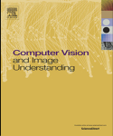

## **TI-PREGO** : Chain of **T** hought and **I** n-Context Learning for online mistake detection in **PR** ocedural **EGO** centric videos 

Leonardo Plinia,d,1 , Luca Scofanoa,∗,1 , Edoardo De Matteisa,1 , Guido Maria D’Amely di Melendugnoa , Alessandro Flaboreaa,b , Andrea Sanchiettia , Giovanni Maria Farinellac,2 , Fabio Galassoa,2 , Antonino Furnaric,2 

a _Sapienza University of Rome, Italy_ b _ItalAI_ 3 _, Italy_ c _University of Catania, Italy_ d _National Institute of Nuclear Physics - LNF, Italy_ 

A R T I C L E I N F O 

### A B S T R A C T 

Communicated by Shiliang Zhang 

Dataset link: https://sites.google.com/view/epi c-tent, https://assembly-101.github.io/ _Keywords:_ Egocentric vision Procedural mistake detection Video understanding Large language models Chain of Thought In-context learning 

Identifying procedural errors online from egocentric videos is a critical yet challenging task across various domains, including manufacturing, healthcare and skill-based training. The nature of such mistakes is inherently open-set, as unforeseen or novel errors may occur, necessitating robust detection systems that do not rely on prior examples of failure. Currently, no existing technique can reliably detect open-set procedural mistakes in an online setting. We propose a dual-branch architecture to address this problem in an online fashion: the recognition branch takes input frames from egocentric video, predicts the current action and aggregates frame-level results into action tokens while the anticipation branch leverages the solid patternmatching capabilities of Large Language Models (LLMs) to predict action tokens based on previously predicted ones. Mistakes are detected as mismatches between the currently recognized action and the action predicted by the anticipation module. 

Extensive experiments on two novel procedural datasets demonstrate the challenges and opportunities of leveraging a dual-branch architecture for mistake detection, showcasing the effectiveness of our proposed approach. 

#### **1. Introduction** 

Detecting procedural errors in videos has recently gained significant attention as it holds the potential to enhance safety and efficiency in several fields. Humans engage in procedural activities everyday in different contexts, such us daily activities (e.g., cooking a meal), hobbies (e.g., fixing a bike), and professional settings (e.g., operating complex machineries). Monitoring procedural activities is crucial to guarantee the desired results and operate safely, especially in high stakes contexts such as industrial workflows. Wearable devices, looking at the scene from the user’s point of view, and endowed with the capability of providing feedback through augmented reality, can be used to assess procedural mistakes (e.g., forgetting to add water to the kettle before 

turning it on) and provide real-time feedback. This immediate feedback allows for timely corrections, fostering faster skill development, skill acquisition and safer learning environments in high-stakes areas like surgery and industrial workflow. 

Advanced mistake detection models will become essential to ensure precision, safety, and efficiency in procedural applications. This demand has recently resulted in an increasing number of datasets (Jang et al., 2019; Sener et al., 2022; Wang et al., 2023; Ghoddoosian et al., 2023; Ding et al., 2023; Tang et al., 2019; Ben-Shabat et al., 2021; Schoonbeek et al., 2024; Zhukov et al., 2019; Elhamifar and Naing, 2019; Miech et al., 2019; Ragusa et al., 2024) and methodologies designed to advance procedure learning (Lu and Elhamifar, 2022; Ghoddoosian et al., 2023; Wang et al., 2021a; Zhong et al., 2023; Jang 

- ∗ Corresponding author. 

> _E-mail addresses:_ leonardo.plini@uniroma1.it (L. Plini), scofano@diag.uniroma1.it (L. Scofano), dematteis@di.uniroma1.it (E. De Matteis), damely@di.uniroma1.it (G.M.D. di Melendugno), flaborea@di.uniroma1.it (A. Flaborea), sanchietti.1883210@studenti.uniroma1.it (A. Sanchietti), giovanni.farinella@unict.it (G.M. Farinella), galasso@di.uniroma1.it (F. Galasso), antonino.furnari@unict.it (A. Furnari). 

> 1 These authors contributed equally to this work. 

> 2 Co-senior role. 

> 3 italailabs.com. 

https://doi.org/10.1016/j.cviu.2025.104613 Received 4 July 2025; Received in revised form 31 October 2025; Accepted 12 December 2025 Available online 29 December 2025 1077-3142/© 2025 Published by Elsevier Inc.

<!-- Page 2 -->

_L. Plini, L. Scofano, E. De Matteis et al._ 

_Computer Vision and Image Understanding 264 (2026) 104613_ 

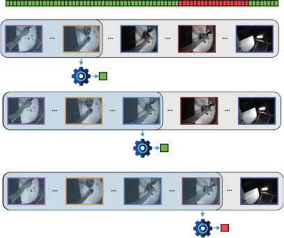

**Fig. 1.** Procedural Mistake Detection involves identifying errors within a procedural video. Each procedure is composed of different steps that should be executed with a certain order. The aim is to develop a method capable of analyzing a video and determining whether each frame contains a mistake, e.g., a step that is not executed in the correct order. Addressing this task is particularly useful when applied to wearable devices, as they allow for direct feedback to the person performing the task. In the Figure, TI-PREGO, depicted by a gear icon, takes as input the video sequence from time 0 to _𝑡_ −1, classifying the current frame _𝑡_ as either correct (green) or a mistake (red). This process continues frame by frame until a mistake is detected. (For interpretation of the references to color in this figure legend, the reader is referred to the web version of this article.) 

et al., 2019; Tang et al., 2019; Seminara et al., 2024) and error detection models (Wang et al., 2023; Ding et al., 2023; Schoonbeek et al., 2024). However, existing mistake detection approaches vary widely. Some methods emphasize action detection, identifying specific errors like missing steps, out-of-sequence actions (Narasimhan et al., 2023) or incorrect ordering (Seminara et al., 2024), while other models bypass action detection altogether and monitor changes to the assembled object to ensure procedural accuracy (Chen et al., 2020; Candido de Oliveira et al., 2023). This variability in proposed approaches and their intended objectives highlights the need for more comprehensive evaluation frameworks and standardized benchmarks to assess and compare the effectiveness of different mistake detection strategies and for more olistic models, able to detect any deviation from the correct workflow. 

An ideal Procedural Mistake Detection (PMD) model should demonstrate two critical capabilities: robustness to diverse mistake types and the ability to provide online, timely feedback. Regarding robustness, a reliable PMD system should be capable of identifying any mistake that may occur within a structured procedure, regardless of its type. To uphold this principle, in this paper we propose framing mistake detection as a One-Class Classification (OCC) problem, where the model is trained to learn the correct sequences of steps within a procedure and is then able to recognize any deviation from the correct workflow. Within the OCC framework, during training, the PMD model is only exposed to ‘‘normal’’ procedures (Flaborea et al., 2023; Zaheer et al., 2022) to learn the correct workflows, i.e. the sequences of performed steps that allow to correctly complete the task. Conversely, during inference, the learned model should detect any deviation from the learnt workflow, deeming that step as an error. Further, it is worth noting that the OCC framework requires only binary labels ( _Correct_ vs. _Mistake_ ), which are easier to collect with respect to fine-grained labels, such as the error type, when labeling videos of procedural datasets. Second, the model should provide online4 feedback quickly enough to allow users to correct mistakes promptly, minimizing the reinforcement of incorrect actions and reducing the risk of hazardous situations. It is worth noting that the requirement for immediate feedback defines the online setting and imposes a strict causal constraint on the PMD models 

> 4 We distinguish an online setup, which allows slight processing delays while enabling effective feedback, from a real-time setup, which requires immediate responses. 

as they are allowed to leverage only past and present information for producing their decisions. In contrast, previous methods (Ghoddoosian et al., 2023; Ding et al., 2023; Wang et al., 2023; Lee et al., 2024) adopt an offline framework, where the analysis is performed using complete pre-recorded procedures. This allows to employ bidirectional models that leverage both past and future context, achieving high accuracy in retrospective error identification for post-hoc analysis like performance grading, but making them unsuitable for live intervention. Thus, we argue that the processing approach must shift toward proactive error anticipation, where the model predicts the next correct step of the sequence to timely flag deviations. Besides these two pivotal abilities, the PMD system should leverage an egocentric perspective in procedural videos, enhancing the model’s applicability by mirroring natural human perception, and allowing for seamless real-world deployment on wearable devices. 

To conform to these requirements, we propose a dual-branch approach for detecting mistakes in procedural videos sequentially combining step recognition and anticipation and identifying mistakes as mismatches in predicted and observed actions. The first branch, the step recognition module, processes the input video online and classifies the current action being performed. The second branch, the step anticipation module, predicts the next step to perform based on the steps recognized by the step recognition module. We implement the anticipator branch as a Large Language Model (LLM), leveraging several prompting schemes to interrogate it and retrieve the next action to be performed. The model will then flag a step as mistaken when there is a divergence between recognized and anticipated actions, highlighting inconsistencies between the action executed by the operator and the expected steps. 

Our contributions include (1) a novel benchmark for online mistake detection, encompassing two dataset (Assembly101-O and Epic TentO), (2) exploring and benchmarking multiple LLMs for the task of step anticipation aiming to select the most robust candidate for our anticipator module, (3) experimenting with various prompting techniques, including Automatic Chain of Thought (Auto-CoT), which enhances overall performance, reporting state-of-the-art results on Assemblty101-O and Epic Tent-O, (4) investigating different prediction aggregation techniques to improve mistake detection robustness and continuity. Extensive experimentation demonstrates the challenges and opportunities in dual-branch architectures and LLM-based step anticipation for open-set mistake detection. 

2

<!-- Page 3 -->

_L. Plini, L. Scofano, E. De Matteis et al._ 

_Computer Vision and Image Understanding 264 (2026) 104613_ 

This paper extends our previous conference work, PREGO (Flaborea et al., 2024), by refining key components and methods to improve procedural mistake detection (see Fig. 1). Unlike our original study, which primarily reported classical Precision and Recall metrics, in this work, we adopt Balanced Precision (Wang et al., 2021b) to mitigate the extreme class imbalance inherent in egocentric mistake detection. Balanced Precision scales the False Positives by the ratio of positive-tonegative samples, ensuring that the penalty for mislabeling a correct step is placed on the same scale as the reward for correctly identifying a mistake. Specifically, we lead a comprehensive evaluation of several LLMs as step anticipators, increasing the state-of-the-art results on Assembly101-O and Epic Tent-O (Flaborea et al., 2024). We compare a broad range of LLMs such as Llama-2 (Touvron et al., 2023), Llama-3 (Dubey et al., 2024), Gemma (Mesnard et al., 2024), and Mistral (Jiang et al., 2023), fine-tune them using Low-Rank Adaptation (LoRA), and experiment with prompting methods including Zero-Shot, Few-Shot, and Auto-CoT (Zhang et al., 2022). 

Further, we revisit the recognizer branch’s frame-by-frame prediction mechanism, aiming to mitigate inconsistencies and reduce noise in its predictions. To deal with this, we extend beyond fixed-length window aggregation to explore alternative strategies that reduce noise and improve prediction accuracy. 

#### **2. Related works** 

This section reviews the foundations of current approaches related to online detection of procedural mistakes,. We first survey existing models and compare them across key design dimensions (Section 2.1). We then analyze the most relevant procedural video datasets (Section 2.2), examine step recognition (Section 2.3) and anticipation (Section 2.4) methods. Finally, we discuss how recent advances in large language models enable symbolic reasoning (Section 2.5). Together, these components define the landscape for building effective online, open-set mistake detectors. 

#### _2.1. Procedural mistake detection_ 

Procedural learning has seen notable progress due to the development of diverse datasets (Tang et al., 2019; Elhamifar and Naing, 2019; Zhukov et al., 2019; Miech et al., 2019; Ragusa et al., 2024), which offer valuable insights into both structured (Ben-Shabat et al., 2021; Wang et al., 2023; Ragusa et al., 2021) and unstructured tasks (Jang et al., 2019; Damen et al., 2018). These datasets span a wide range of applications—from industrial assembly (Ragusa et al., 2021; Sener et al., 2022; Schoonbeek et al., 2024; Ragusa et al., 2024) to everyday cooking activities (Damen et al., 2018; Kuehne et al., 2014; Stein and McKenna, 2013)—yet the lack of a standardized benchmark for mistake detection has led to limited evaluation and a fragmented literature. 

In Table 1, we compare relevant models for procedural mistake detection across multiple dimensions: whether they operate in an open-set or one-class condition, whether they support online or offline detection, the data modalities they leverage (e.g., RGB frames, hand poses, eye gaze, keystep logic), the task they address, and the datasets used. Notably, models marked with an asterisk (*) follow our protocol introduced in Flaborea et al. (2024), standardizing an online, open-set detection scenario for consistent evaluation. 

Existing methods illustrate a variety of approaches. For instance, Ding et al. (2023) employ knowledge graphs with textual transcripts, neglecting visual cues. Ghoddoosian et al. (2023) focus on action recognition, treating error detection as a semantic evaluation of segmentation results. Other works, such as Assembly101 (Sener et al., 2022) and HoloAssist (Wang et al., 2023), apply error detection baselines offline, relying on pre-segmented videos and annotated labels. By contrast, Schoonbeek et al. (2024) emphasizes Procedure Step Recognition, focusing on correct step completion rather than partial activities, while EgoPER (Lee et al., 2024) integrates action segmentation with 

contrastive learning to detect previously unseen errors. Our prior work, PREGO (Flaborea et al., 2024), uses RGB frames alongside symbolic reasoning to assess procedural correctness online, operating under an OCC framework and trained solely on error-free sequences (Flaborea et al., 2023; Zaheer et al., 2022). Finally, Seminara et al. (2024) adopt a distinct approach, learning task graphs via Maximum Likelihood estimation of key-step sequences. 

In contrast to prior approaches that rely on offline processing, presegmented videos, or textual-only cues, our method uniquely fuses real-time visual analysis with symbolic reasoning within an OCC framework. By learning solely from error-free sequences, our approach can detect known and unforeseen mistakes without being constrained to predefined error types. As indicated in Table 1, we are the first to propose a fully online OCC protocol, allowing detection to be performed frame-by-frame without requiring prior action segmentation. This design enables a more robust, context-aware, and prompt detection of errors, addressing the key limitations observed in existing literature. 

#### _2.2. Datasets of procedural egocentric videos_ 

Previous investigations proposed datasets and benchmarks to support research in procedural mistake detection. IndustReal (Schoonbeek et al., 2024) focuses on a single toy, resulting in the learning of only one procedure without annotations for procedural mistakes. Assembly101 (Sener et al., 2022) is a large-scale video dataset that provides frame-level mistake annotations. It features videos of actors assembling toys, with synchronized Ego-Exo views and annotated hand positions. IndustReal (Schoonbeek et al., 2024) focuses on a single toy, resulting in the learning of only one procedure without annotations for procedural mistakes. Epic-tent (Jang et al., 2019) is a dataset that covers a different domain of unscripted actions that capture actors assembling a tent outdoors. The participants exhibit varying levels of expertise and naturally make mistakes, which have been annotated. ATA (Ghoddoosian et al., 2023) is a procedural dataset created for offline mistake detection in assembling activities. However, it provides only video-level mistake annotations, limiting its usefulness for framebased applications. HoloAssist (Wang et al., 2023) provides egocentric videos of individuals performing multiple manipulation tasks following expert instructions. CaptainCook4D (Peddi et al., 2023) is tailored for evaluating procedural activities, specifically focusing on the culinary domain. Notably, (Lee et al., 2024) introduced a novel egocentric procedural error dataset consisting of videos depicting various errors within the cooking domain. 

In this study, we propose a new benchmark building upon the datasets from (Sener et al., 2022; Jang et al., 2019) as they provide insights into procedural errors in two distinct settings: a controlled industrial environment and outdoor environments. 

#### _2.3. Step recognition_ 

Step recognition is the process of identifying discrete actions within a structured procedural sequence. 

Lu and Elhamifar (2022) introduce an action segmentation model that employs an attention-based architecture coupled with a Pairwise Ordering Consistency (POC) loss function. Moreover, they develop a weakly-supervised method that requires only the set of actions in a procedure as input, eliminating the need for labor-intensive framelevel annotations. In Shah et al. (2023), a novel loss for self-supervised learning is combined with a clustering algorithm to detect key steps in procedural videos without using any labels. Zhong et al. (2023) tackles the task by utilizing online instructional videos to learn actions and sequences without manual annotations, combining step recognition with a deep probabilistic model to account for step order and timing variability. 

An et al. (2023) introduced MiniROAD, the state-of-the-art online step recognizer, which leverages an RNN architecture and adjusts loss 

3

<!-- Page 4 -->

_L. Plini, L. Scofano, E. De Matteis et al._ 

_Computer Vision and Image Understanding 264 (2026) 104613_ 

**Table 1** 

Comparison of relevant models in procedural mistake detection. In the modalities column, _RGB_ refers to RGB images, _H_ stands for hand poses, _E_ represents eye gaze and _K_ indicates keystep labels. Our approach is the first to adopt an egocentric, one-class and online method for detecting procedural mistakes. (*) denotes that these models are based on our <u>protocol</u> defined in Flaborea et al. (2024). 

|Model|Egocentric (Ego)|One-Class (OCC)|Online|Modalities|Task|Datasets|
|---|---|---|---|---|---|---|
|Ding et al. (2023) -||||_K_|Mistake Detection|Assembly101 (Sener|
|_ArXiv_ _’23_||||||et al., 2022)|
|Wang et al. (2023) -|✓|||_RGB_+_H_+_E_|Mistake Detection|HoloAssist (Wang|
|_ICCV_ _’23_||||||et al., 2023)|
|Ghoddoosian et al. (2023) - _ICCV_ _’23_||||_RGB_|Unknown Sequence Detection|ATA (Ghoddoosian et al., 2023), CSV (Qian et al., 2022)|
|Schoonbeek et al. (2024) - _WACV_ _’24_|✓||✓|Multi|Procedure Step Recognition|IndustReal (Schoonbeek et al., 2024)|
|Lee et al. (2024) - _CVPR_ _’24_|✓|✓||RGB|Mistake Detection|EgoPER (Lee et al., 2024), HoloAssist (Wang et al., 2023), ATA (Ghoddoosian et al., 2023)|
|Seminara et al. (2024) - _NeurIPS’24_ *|✓|✓|✓|_RGB_|Mistake Detection|_Assembly101-O_, _Epic-tent-O_|
|PREGO - _CVPR_ _’24_ * (Flaborea et al., 2024)|✓|✓|✓|_RGB_|Mistake Detection|_Assembly101-O_, _Epic-tent-O_|
|TI-PREGO *|✓|✓|✓|_RGB_|Mistake Detection|_Assembly101-O_, _Epic-tent-O_|

importance during training to perform online action recognition. The approach proposed in Shen and Elhamifar (2024) also highlights the importance of holistically understanding actions rather than treating each frame in isolation. In contrast to previous methods that rely on frame-by-frame detection—such as MiniROAD (An et al., 2023), which focuses on step recognition—our approach addresses the limitations of isolated frame-level analysis. While prior work has established a strong foundation in procedural step recognition, it often falls short in capturing the broader temporal context that is critical in real-world scenarios. To overcome this, we propose and evaluate several aggregation techniques that enhance the coherence of action recognition across sequences, thereby enabling more robust and context-aware mistake detection. 

#### _2.4. Step anticipation_ 

Step anticipation is the process of predicting the next action in a procedural sequence before it occurs. 

Abdelsalam et al. (2023) generates multiple possible natural language outcomes, leveraging pretraining on a text corpus to deal with the variability in future actions. Mascaró et al. (2023) employs a two-level hierarchical approach, integrating both high-level human intentions and low-level action sequences, improving action anticipation in the long term. The pipeline consists of two models: the first one extracts intentions and classifies actions while the second one generates future actions, conditioning human intentions to narrow down the uncertainty set of future actions. The framework presented in Qi et al. (2023) addresses future activity anticipation in egocentric videos by employing a contrastive loss to emphasize novel information and a dynamic reweighting mechanism that prioritizes informative past content. This approach improves video representation, leading to more accurate predictions of future activities. 

Similar to AntGPT (Zhao et al., 2023), we leverage video frames to anticipate future actions using an LLM enhanced with Automatic Chain of Thought. However, while previous approaches, such as AntGPT, require predefined segmentation of a long video into ordered, annotated short segments with corresponding action labels, our online setting processes each frame independently without prior segmentation. 

#### _2.5. Reasoning tasks with large language models_ 

Large Language Models (LLMs), trained on vast datasets and equipped with numerous parameters, exhibit advanced capabilities beyond those of earlier language models (Wei et al., 2022a). They have demonstrated exceptional performance in both natural language processing tasks (Touvron et al., 2023) and non-language tasks (Brooks et al., 2023; Wei et al., 2022a; Gupta and Kembhavi, 2023). The next-token prediction mechanism of LLMs closely parallels our action anticipation framework, as both aim to predict future outcomes based on accumulated data. 

Previous research has shown that LLMs can generate semantically meaningful patterns (Mirchandani et al., 2023; Zhao et al., 2023), while other work (Wei et al., 2023) has explored their in-context learning abilities with semantically unrelated labels, where there is no direct relationship between a token and its meaning. More recent work (Pallagani et al., 2022; Gupta and Kembhavi, 2023; Liang et al., 2022; Feng et al., 2023; Mirchandani et al., 2023; Kim et al., 2024; Ahn et al., 2022) has further investigated the ability of LLMs to function as _In-Context Learners_ (ICLs), meaning they can solve novel and unseen tasks relying only on a structured and informative prompt, without requiring additional fine-tuning. When provided with a query prompt that includes a context of input–output examples, LLMs can understand the problem and generate appropriate solutions within this framework. LLMs as ICLs have been applied to a wide range of tasks, including planning (Pallagani et al., 2022; Ahn et al., 2022), programming (Gupta and Kembhavi, 2023; Liang et al., 2022), logical problem-solving (Feng et al., 2023) and symbolic reasoning (Mirchandani et al., 2023). In addition to ICL, other paradigms, such as Chain-of-Thought (CoT) (Wei et al., 2022b) and Automatic Chain-of-Thought (ACoT) (Zhang et al., 2022), have been employed to enable LLMs to reason through their responses step-by-step, improving their ability to plan and articulate their thought process explicitly. 

Palm (Kim et al., 2024) is the most similar to our anticipation module, as it employs a Socratic method (Zeng et al., 2022) that uses video features to predict subsequent actions with an LLM. Socratic Models are a framework that utilizes structured dialogue between pre-existing foundation models, each leveraging its unique capabilities based on its training data distribution. However, while PALM (Chowdhery et al., 2023) integrates an Action Recognition Model and a Vision-Language 

4

<!-- Page 5 -->

_L. Plini, L. Scofano, E. De Matteis et al._ 

_Computer Vision and Image Understanding 264 (2026) 104613_ 

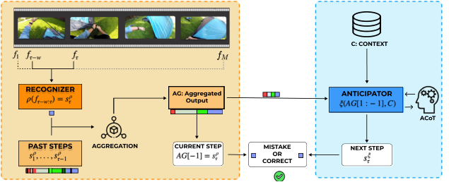

**Fig. 2.** Our proposed model is based on two main components. The recognition module (orange) processes the input video in an online fashion and predicts actions observed at each timestep represented as a square. This prediction is combined with previous ones to minimize the noise generated by per-frame predictions. The last element of the aggregated output corresponds to the current step predicted by the recognition module, while the sequence without duplicates is provided to the anticipation module. The anticipation module (blue) reasons symbolically via a Large Language Model, utilizing automatic Chain of Thought (ACoT) reasoning to predict the future action based on past action history and a brief context such as instances of other step sequences. Mistakes are identified when the current action detected by the step recognition method differs from the one forecasted by the step anticipation module. (For interpretation of the references to color in this figure legend, the reader is referred to the web version of this article.) 

Model to generate text prompts for long-term action anticipation, we diverge by using a dual-branch architecture: one branch tasked to recognize the current action and the other leveraging an LLM for action anticipation focusing on next step prediction. This schema offer a natural pipeline for error detection by comparing the predictions generated by the two branches 

In our mistake detection pipeline, we integrate In-Context Learning and Automatic Chain of Thought, utilizing an LLM as part of our action anticipation branch. ACoT enables the model to automatically generate intermediate reasoning steps, breaking the problem-solving process into smaller, logical steps. The approach helps the LLM to externalize its reasoning, enhancing its effectiveness in managing complex, sequential tasks. 

#### **3. Methodology** 

The proposed system leverages a dual-branch framework that integrates the recognition of procedural steps with anticipation modeling, as shown in Fig. 2. In the following sections, we elaborate on the problem formalization (Section 3.1), present the branches for Step Recognition (Section 3.2) and Step Anticipation (Section 3.3) and finally illustrate the Mistake Detection procedure (Section 3.4). 

#### _3.1. Preliminaries_ 

Let us consider a finite collection of _𝑁_ procedures { _𝑝𝑖_ }_𝑁_ _𝑖_ =1,where each procedure encodes a sequence of steps as _𝑝𝑖_ = { _𝑠𝑘_ }_𝐾_ _𝑘_ =1_𝑖_that represents the _transcript_ of _𝑝𝑖_ . Here, _𝐾𝑖_ varies depending on the specific procedure, and each step _𝑠𝑘_ belongs to the set of all possible steps  in the dataset. Furthermore, each procedure is represented by a set of videos { _𝑣𝑖_ }_𝑁_ _𝑖_ =1,whichconsistofframes_𝑣𝑖_= {_𝑓𝜏_} _𝜏__𝑀_ =1_𝑖_,with_𝑀𝑖_indicating the total number of frames in video _𝑖_ . Given a specific frame _𝑓𝜏_ from video _𝑣𝑖_ , we: (1) classify the step _𝑠𝜏_ corresponding to the frame _𝑓𝜏_ (i.e., step recognition) and (2) predict the step _𝑠𝜏_ that occurring at time _𝜏_ , relying solely on the previously recognized steps up to time _𝜏_ −1 (i.e., step anticipation). 

Step recognition is handled by a module _𝜌_ , which takes the encoded frames of _𝑣𝑖_ up to the _𝜏_ -th frame as input and outputs the recognized step _𝑠__𝜌_ _𝜏_(Section3.2).Subsequently,allrecognizedsteps_𝑠𝜌_ 1_,_…_, 𝑠𝜌_ _𝜏_ −1, once aggregated, are fed into the module _𝜉_ , which handles the anticipation task by predicting the next step in the procedure, referred to as _𝑠__𝜉_ _𝜏_(Section3.3). 

Finally, we compare _𝑠__𝜌_ _𝜏_with_𝑠𝜉_ _𝜏_anddeemthestepasmistakenif there is a misalignment between the outputs from the two branches (Section 3.4). For clarity, the rest of this section will focus on a single procedure _𝑝_ associated with a video _𝑣_ . 

#### _3.2. Step recognition_ 

The step recognition module, denoted _𝜌_ , takes a window _𝑊_ = { _𝑓𝜏_ − _𝑤,_ … _, 𝑓𝜏_ } with a fixed length _𝑤_ of frames from _𝑣_ to the current frame _𝜏_ as input and is tasked with recognizing the last step performed _𝑠__𝜌_ _𝜏_.WeleverageMiniROAD(Anetal.,2023)as_𝜌_,whichcurrently represents the state-of-the-art and is also computationally efficient in terms of GFlops and parameter count. 

In this setup, the model predicts step _𝑠𝜏_ by analyzing the frames _𝑓𝜏_ − _𝑤,_ … _, 𝑓𝜏_ . 

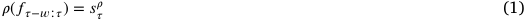

During training, the loss for _𝜌_ is calculated using a cross-entropy loss, comparing the actual step _𝑠𝜏_ with the predicted one _𝑠𝜏__𝜌_asdetailed in An et al. (2023). 

_Step aggregation_ Despite being a state-of-the-art model, MiniROAD (An et al., 2023) performs suboptimally on procedural datasets, primarily due to two key factors: the shift in action distribution between the training and testing phases, and the inherent class imbalance within the dataset. The distribution shift occurs because the actions seen during training often differ from those encountered during testing, leading to poorer generalization. Additionally, Assembly101 contains a significant imbalance in class frequencies (see Fig. 3 for Assembly101-O’s split), where common actions dominate the dataset while less frequent yet crucial procedural actions are underrepresented. 

While MiniROAD (An et al., 2023) produces per-frame predictions, the anticipator expects a sequence of distinct actions as input. A standard approach for transforming per-frame predictions into action sequences involves aggregating identical neighboring predictions into a single action segment. However, MiniROAD’s performance issues introduce significant noise into the input sequence for the anticipator module, mainly due to inconsistencies in per-frame predictions, such as oscillating between similar actions, which leads to unstable action predictions and degrades results in subsequent stages. 

To address this, we propose three frame aggregation strategies that efficiently converts per-frame predictions into coherent action sequences, aiming to reduce noise and stabilize predictions. This results in a cleaner input for the anticipator module, dubbed _𝐴𝐺_ in Fig. 2. 

_Non-overlapping mode aggregation (NOMA)_ The first aggregation strategy we propose (Fig. 4) consists of a two-step process. In the first step, we calculate the mode for each non-overlapping sliding window of frames of a given length _𝐿_ . Since the windows are non-overlapping, this approach introduces a slight delay in processing, which is a tradeoff for improved prediction stability. The mode, representing the most 

5

<!-- Page 6 -->

_L. Plini, L. Scofano, E. De Matteis et al._ 

_Computer Vision and Image Understanding 264 (2026) 104613_ 

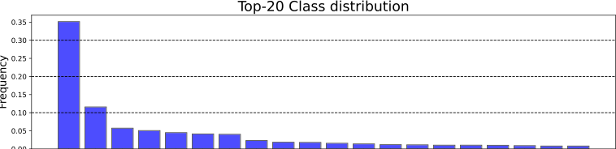

**Fig. 3.** Distribution of the 20 most frequent classes in Assembly101-O. 

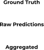

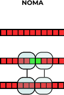

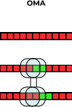

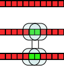

**Fig. 4.** The three aggregation strategies operate differently: NOMA employs a non-overlapping window and replaces the entire window content with its mode. In contrast, both OMA and OCMA use overlapping windows with a sliding step of 1. However, OMA replaces the last frame of the window with its mode, whereas OCMA replaces the central frame. 

frequent action label within that window, replaces all predictions in that window, ensuring consistency across the frames and removing the noise of smaller portions wrongly predicted. In the second step, we apply the elimination of successive duplicates to remove consecutive repeated action labels, which prevents redundant predictions. This cleaned output serves as the input to the anticipation module, ultimately aiming to produce a more stable and accurate sequence of action predictions. 

_Overlapping mode aggregation (OMA)_ The second aggregation strategy we propose (Fig. 4) employs a sliding window approach with a stride of 1 frame, allowing for overlapping portions of frames. In this method, we evaluate the mode within the overlapping window that includes the last frame and the previous _𝐿_ −1 frames. The prediction of the last frame is then substituted with this mode, which captures the most frequent action label in that localized area. This method is designed with the intent to reduce delay, as it processes frames more dynamically compared to non-overlapping windows. 

_Overlapping centered mode aggregation (OCMA)_ The third aggregation strategy (Fig. 4) uses a stride of 1 frame, similar to the previous approach. To address the potential issue of the mode being incorrectly positioned within the window, we opt for substituting the prediction of the central frame rather than the final frame, with some corrections for the initial and final frames in the video. This adjustment ensures that the most frequent action label is applied to a frame that is more representative of the overall context, thus enhancing the accuracy of the prediction. 

NOMA uses nonoverlapping windows, while the other two employ overlapping windows. These two overlapping methods differ based on which frame is selected for imputing the aggregation result: the last frame (Overlapping Mode Aggregation, OMA) or the central frame (Overlapping Central Mode Aggregation, OCMA) (See Fig. 4). All approaches are designed to reduce noise and eliminate redundant consecutive predictions, ensuring that the resulting sequence aligns closely with the actual procedure measured by the Levenshtein Similarity. 

#### _3.3. Step anticipation_ 

We employ an LLM as our _𝜉_ module for next-step prediction, using as input transcripts from procedural video. Our step anticipation operates without domain specific training or fine-tuning, leveraging only the reasoning from _Automatic Chain of Thought (ACoT)_ (Zhang et al., 2022) (see Fig. 2) and few-shot prompting method. These prompts consist of three components: the system prompt, the ACoT prompt, which enables reasoning, and the contextual transcripts _𝐶_ together with the current aggregated _sequence 𝐴𝐺_ . _𝐶_ is derived from similar transcripts (i.e., different videos for the object we are considering) to provide the LLM with information about typical step sequences and their order (see following examples). _Sequence 𝑆𝜏__𝜌_,includesthecurrentsequence of actions up to the current frame _𝑓𝜏_ −1, as they have been detected by our module _𝜌_ , i.e., _𝑆𝜏__𝜌_= [_𝑠𝜌_ 1_,_…_, 𝑠𝜌_ _𝜏_ −1],where_𝑠_ _𝑖__𝜌_representstheaction detected by the module _𝜌_ at frame _𝑖_ . _𝑆𝜏__𝜌_thenundergoesouraggregation strategy, which results in _𝐴𝐺_ . 

The prompting occurs in two stages. First, we employ an ACoT mechanism of _𝜉_ as a first step. This ACoT process uses context _𝐶_ , aggregation sequence _𝐴𝐺_ , and an additional prompt to explicitly stimulate reasoning (See _AcoT Prompt_ in the following scheme). Then, we use the output of the intermediate step along with _𝐶_ and _𝐴𝐺_ to predict the next most probable action. By breaking down the task into smaller logical steps, the LLM can leverage the contextual transcript _𝐶_ and the current action sequence _𝐴𝐺_ to generate intermediate reasoning steps, bridging the gap between observed and future actions _𝑠__𝜉_ _𝜏_. _System Prompt:_ Below is an instruction that describes the task, paired with an input. Write a response that appropriately completes the request. 

_ACoT Prompt:_ 

In Section 5.2, we assess, compare and discuss in details the impact of each aggregation strategy and find NOMA to be the most effective, which we therefore select for our proposal. 

6

<!-- Page 7 -->

_L. Plini, L. Scofano, E. De Matteis et al._ 

_Computer Vision and Image Understanding 264 (2026) 104613_ 

Let us analyze each action in detail: 

1. For the action ‘‘attach the cabin’’, consider the immediate effect and long-term consequences. 

2. Repeat this analysis for each action in the sequence. 

3. Identify patterns and causal relationships between the actions. 

Now, let us proceed with the analysis step-by-step: 

_Contextual Prompt:_ **Toy:** ‘‘bulldozer’’ **Input Sequence:** attach-cabin, attach-body, attach-track, attach-blade **Next Symbol:** attach-figurine 

_Current sequence:_ attach-door 

#### _3.4. Mistake detection_ 

Finally, we analyze the output of the two modules to identify procedural errors. Specifically, we classify steps as correct when the outputs of both modules match, while we label cases as errors when the outputs differ. That is: 

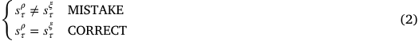

#### **4. Experiments** 

This section describes the benchmark datasets, adopted evaluation metrics and the main experimental results. We introduce _Assembly101O_ and _Epic-tent-O_ as adaptations of the original datasets (Sener et al., 2022; Jang et al., 2019), detailing the selected labeling criteria for online benchmarking, a novel configuration of training and test splits to accommodate open-set procedural mistakes. We define our proposed online metrics in Section 4.2. Finally, we introduce the main experimental results in Section 4.3, whereas further insights that motivate our design choices are provided through the ablation studies in Section 5. 

#### _4.1. Datasets_ 

To align with real-world applications, this work focuses on Egocentric videos. 

_Assembly101 for online and open-set mistake detection (proposed)_ We introduce a novel split of the dataset (Sener et al., 2022) tailored explicitly for online, open-set mistake detection. Assembly101-O introduces two main modifications to Sener et al. (2022) as we show in Fig. 5: a new train/test split and revised procedure lengths. 

The new split assigns all correct procedures to the training set while reserving videos with mistakes for testing. This adjustment enables models to learn sequences characteristic of correct procedures in a one-class classification (OCC) framework, avoiding bias from specific mistake types during training. 

The second adjustment limits each procedure’s evaluation to the point where a mistake caused by an incorrect step that distrupts the workflow: evaluating beyond the point of procedural compromise creates discrepancies between the training and test set procedures, hindering effective step recognition and anticipation. 

#### _4.1.2. Epic-tent-O_ 

Epic-tent is a dataset of egocentric videos capturing the outdoor assembly of a camping tent. It was collected by 24 participants who wore two head-mounted cameras (a GoPro and a SMI eye tracker) while performing the task, resulting in 5.4 h of recorded video. The dataset includes annotations for action labels, task errors, participant self-rated uncertainty and gaze positions, capturing the variability and complexity of the task as participants interacted with non-rigid objects such as the tent, guylines, instructions and tent bag, and displayed varying proficiency and confidence levels. 

_Epic-tent for online and open-set mistake detection (proposed)_ We propose a novel split for the Epic-tent dataset (Jang et al., 2019) tailored for open-set mistake detection. The dataset includes annotations for nine distinct mistake types, though only four of these categories —‘‘ _order_ ’’, ‘‘ _omit_ ’’, ‘‘ _correction_ ’’ and ‘‘ _repeat_ ’’ — are considered procedural mistakes, as they represent deviations that compromise the task’s procedural integrity. Other categories such as ‘‘ _slow_ ’’, ‘‘ _search_ ’’, ‘‘ _misuse_ ’’, ‘‘ _motor_ ’’ and ‘‘ _failure_ ’’ are not procedural errors, as they do not disrupt the task’s progression. 

Unlike Assembly101 (Sener et al., 2022), Epic-tent is designed explicitly for supervised error detection with each recorded procedure containing at least one mistake, making it incompatible with the split procedure proposed for Assembly101-O. However, Epic-tent provides confidence scores from each participant, reflecting their self-assessed uncertainty during task execution. Therefore, we define a custom split strategy where videos from higher-confidence participants form the training set. In contrast, participants showing more significant uncertainty, and thus potentially prone to more errors, make up the test set. In practice, the videos that form the test set have a median confidence score under 0.6, while the others form the train set. Only 22 videos have the confidence score annotations, while the remaining 7 do not and are assigned to the test set. This partition results in 14 training videos and 15 test videos. 

This strategy is particularly promising for real-world applications where accurately labeling erroneous frames may be challenging or training a mistake detector can start soon after recording without requiring full annotation completion. 

Videos in the test set are trimmed to the frame containing the first procedural mistake as in Assembly101-O, while videos representing correct procedures remain unaltered. 

#### _4.1.1. Assembly101-O_ 

Assembly101 (Sener et al., 2022) is a large-scale video dataset containing 362 videos of assembly and disassembly tasks involving 101 types of toy vehicles, recorded from eight multiple static and four egocentric cameras. It includes extensive annotations at various levels of granularity, with over 100K coarse action segments and 1M finegrained action segments and 18M 3D hand poses. The dataset supports diverse challenges, including action anticipation and segmentation, mistake detection and 3D pose-based action recognition. 

#### _4.2. Evaluation definition_ 

To assess the performance of our procedural mistake detection model, we consider True Positives (TP) as the count of errors correctly identified, and True Negatives (TN) as the count of correctly performed steps that are not flagged as errors. Since, in ego-centric mistake detection, the positive class (actual mistakes) is typically much smaller than the negative class (correct steps), a straightforward application 

7

<!-- Page 8 -->

_L. Plini, L. Scofano, E. De Matteis et al._ 

_Computer Vision and Image Understanding 264 (2026) 104613_ 

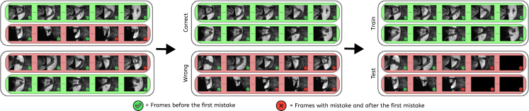

**Fig. 5.** The modification occurs in two steps: starting from Assembly101 (a), first, a new train/test split assigns all correct procedures to the training set, reserving videos with mistakes for testing (b). Second, the lengths of procedures containing mistakes are adjusted by trimming them to the first mistake, preventing the creation of corrupted sequences (c). This setup enables models to learn correct sequences within a one-class classification (OCC) framework, treating any deviation as a mistake and ensuring a balanced test set for effective mistake detection. 

of classical Precision will tend to underestimate the impact of False Positives (FP). In particular, even a small FP rate can yield a large absolute number of FP simply because there are so many more negative (non-error) samples than positive (error) samples. 

To mitigate this imbalance, we utilize _Balanced Precision_ (Wang et al., 2021b), denoted Prec _𝑏_ , by scaling the contribution of each False Positive by the ratio of positive-to-negative samples. Concretely, if _𝑁_ + is the total number of positive (error) samples and _𝑁_ − is the total number of negative (correct) samples, we define: 

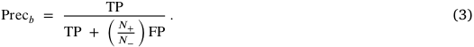

Thus, FP is down-weighted by the factor_𝑁_ _𝑁_<u>+</u> −,ensuringthatthepenalty for mistakenly labeling a correct step as an error is placed on the same scale as the reward for correctly identifying a mistake. When _𝑁_ + _≪𝑁_ −, this adjustment prevents a handful of FPs from dominating the denominator and driving classical Precision toward zero. 

We retain _Recall_ (also known as Sensitivity for the positive class) in its standard form, since Recall inherently measures the proportion of actual mistakes that the model retrieves: 

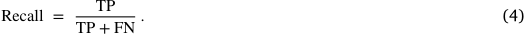

Because Recall does not depend on the cardinality of the negative class, it is not directly skewed by the negative-class majority and therefore needs no further adjustment. 

Finally, we define a _Balanced F1 Score_ , denoted F1 score _𝑏_ , which is the harmonic mean of Prec _𝑏_ and Recall: 

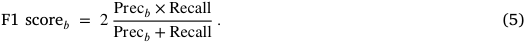

These balanced metrics specifically assess the model’s ability to distinguish correct from incorrect steps, without being influenced by heavily skewed settings. By adjusting the impact of false positives based on the imbalance between positive and negative classes, Prec _𝑏_ and F1 score _𝑏_ provide a fairer assessment of mistake detection when the negative class vastly outnumbers the positive class. 

#### _4.3. Experiments_ 

#### _4.3.1. Compared methods_ 

To estimate the effectiveness of our model, we evaluate its performance by comparing it against several baseline models based on the metrics presented in Section 4.2: 

_One-step memory_ The One-step memory baseline stems from a _transition matrix_ that considers only the correct procedures. Specifically, given the set of actions  in the training set with || = _𝐶_ , we define a transition matrix _𝑀_ ∈ R_𝐶_×_𝐶_ , which records, in position ( _𝑙, 𝑚_ ), the number of occurrences where action _𝑚_ follows action _𝑙_ . During evaluation, an action in the test split that does not correspond to a transition recorded in this training set matrix is labeled as a _mistake_ . This baseline provides a simple method for recognizing deviations from standard procedural transitions. 

_Oadtr for mistake detection_ The work in Wang et al. (2021a) presents a framework for online action detection called OadTR, which uses a Vision Transformer to capture video clips’ temporal structure and context. The framework consists of an encoder–decoder architecture: the encoder processes historical observations to output a task token that represents the current action, while the decoder refines this task token by incorporating information from anticipated future clips. In the context of procedural error detection, we consider a mistake to have occurred if the output from the encoder does not match the output from the decoder, indicating a divergence between observed and expected actions. 

_BERT-based mistake detection_ We also leverage the capabilities of BERT (Devlin et al., 2019), using its specific [CLS] token to predict whether an action sequence is correct or erroneous. More specifically, we finetune BERT with a next-token-prediction task, training the model to determine whether step B logically follows step A within a given procedure. In our setting, each step is represented as a set of two words, such as _attach wheel_ , which describes coarse-level actions. During evaluation, BERT is presented with pairs of actions and predicts whether the sequence of those actions is correct. The rationale of BERT lies in its pre-training on a vast corpus of text, which helps it understand contextual relationships between procedural steps. 

_Learned task graph representations_ We also evaluate an approach based on explicit task graph representations (Seminara et al., 2024). Procedural activities consist of sequences of key steps that work toward specific goals, making task graphs a valuable, human-understandable representation for capturing the partial ordering of these steps. Unlike traditional methods that rely on hand-crafted procedures to extract task graphs from videos, this approach uses maximum likelihood optimization of edge weights to directly learn task graphs, allowing gradient-based learning that can integrate seamlessly with neural networks. While effective, this baseline is not directly comparable to our method, as it requires access to the entire dataset during training to extract the task graph, whereas our approach relies only on few-shot inference for anticipating actions. We refer to the ‘‘Direct Optimization’’ method trained with the ‘‘Task-Graph Maximul Likelihood’’ loss proposed in Seminara et al. (2024) as TGML-DO. 

#### _4.3.2. Results_ 

Table 2 presents the main results in terms of Precision _𝑏_ , Recall, and F1 score _𝑏_ . 

In the upper section of the table, we report results obtained using an oracle step-recognizer, which serves as an upper bound. Here, the recognition module perfectly aligns with the ground truth, ensuring that errors stem solely from the anticipation module. The One-step memory method performs poorly as it relies only on the preceding action. Even if BERT adopts a more abstract reasoning strategy, it suffers from a conservative bias that leads to very low recall, ultimately resulting in a significantly lower F1 score _𝑏_ . PREGO, on the other hand, incorporates symbolic reasoning to capture richer contextual information, with TI-PREGO _𝐿𝑙𝑎𝑚𝑎_ achieving the highest performance 

8

<!-- Page 9 -->

_L. Plini, L. Scofano, E. De Matteis et al._ 

_Computer Vision and Image Understanding 264 (2026) 104613_ 

**Table 2** 

A comparative assessment between ours and the chosen baseline methods is conducted to detect procedural mistakes using the Assembly101-O and Epic-tent-O datasets. 

||Step Recog.|Step Antic.|Assembly1 Precisionb|01-O Recall|F1 scoreb|Epic-tent-O Precisionb|Recall|F1 scoreb|
|---|---|---|---|---|---|---|---|---|
|One-step memory|_Oracle_||43.87|30.7|36.2|42.1|26.6|32.6|
|BERT (Devlin et al., 2019)|_Oracle_||93.2|20.0|32.9|71.6|5.6|10.4|
|PREGO (Flaborea et al., 2024)|_Oracle_|_GPT-3.5_|51.4|87.5|64.7|25.6|90.6|39.9|
|PREGO (Flaborea et al., 2024)|_Oracle_|_DeepSeek-R1_|51.7|98.3|67.8|23.8|**100**|38.4|
|PREGO (Flaborea et al., 2024)|_Oracle_|_Llama_ _3.1_|56.8|89.6|69.5|28.0|92.0|42.9|
|_TI-PREGO_|_Oracle_|_Llama_ _3.1_|**60.4**|**97.8**|**74.7**|**40.7**|**100**|**57.8**|
|_TGML-DO_ _(Seminara_ _et_ _al.,_ _2024)_|_Oracle_||77.82|90.4|83.64|91.24|27.3|42.03|
|_TGML-DO_ _(Seminara_ _et_ _al.,_ _2024)_|_MiniRoad_ _(An_ _et_ _al.,_ _2023)_||53.77|37.3|44.05|96.55|14.1|24.60|
|OadTR for MD (Wang et al., 2021a)|_OadTR_ _(Wang_ _et_ _al.,_ _2021a)_|_OadTR_ _(Wang_ _et_ _al.,_ _2021a)_|50.9|18.1|26.7|40.4|21.7|28.3|
|PREGO (Flaborea et al., 2024)|_MiniRoad_ _(An_ _et_ _al.,_ _2023)_|_GPT-3.5_|50.2|75.8|61.4|19.5|73.3|29.4|
|PREGO (Flaborea et al., 2024)|_MiniRoad_ _(An_ _et_ _al.,_ _2023)_|_DeepSeek-R1_|51.2|96.5|65.7|20.3|**93.3**|33.6|
|PREGO (Flaborea et al., 2024)|_MiniRoad_ _(An_ _et_ _al.,_ _2023)_|_Llama_ _3.1_|51.3|96.8|67.1|20.6|93.3|33.7|
|_TI-PREGO_|_MiniRoad_ _(An_ _et_ _al.,_ _2023)_|_Llama_ _3.1_|**51.5**|**97.2**|**67.4**|**21.2**|**93.3**|**34.6**|

across most metrics. To ensure a fair comparison, we also evaluated the baseline PREGO model with Llama 3.1. As shown in Table 2, TI-PREGO (74.7% F1 score _𝑏_ ) outperforms the PREGO baseline (67.5% F1 score _𝑏_ ) on Assembly101-O, confirming that our methodological improvements are the primary driver of the performance gain. 

The TGML-DO method (Seminara et al., 2024), which learns task graph representations through gradient-based optimization, also demonstrates strong performance. However, unlike our anticipator, which operates in a few-shot inference setting, TGML-DO checks whether the observed action is correct by referencing domain-specific procedural knowledge mined from the entire dataset during training. This distinction likely contributes to the superior generalization of our model, particularly when using predicted steps instead of oracle labels in the Assembly101-O dataset. Our method proves to be more robust to procedural variations and better suited for handling previously unseen cases. 

In the lower section of the table, we evaluate models using stateof-the-art step recognizers instead of an oracle. The OadTR model, designed for offline mistake detection, shows limited performance due to its reliance on fixed video segmentation, resulting in a low F1 score _𝑏_ of 26.7% on Assembly101-O and 28.3% on Epic-tent-O. By contrast, combining MiniRoad with large language models for step anticipation leads to consistent gains. When paired with GPT-3.5, PREGO achieves a 34,7% absolute improvement in F1 score _𝑏_ over OadTR on Assembly101-O. The use of DeepSeek-R1 yields similar gains. The best performance is obtained by TI-PREGO combined with Llama 3.1, which achieves an F1 score _𝑏_ of 74.7% on Assembly101-O and 57.8% on Epictent-O, outperforming all other configurations. This direct comparison, using the same Llama 3.1 model, confirms our method’s advantage: TI-PREGO (67.4% F1 score _𝑏_ ) outperforms the PREGO baseline (67.1% F1 score _𝑏_ ) on Assembly101-O, with a similar trend on Epic-tent-O (34.6% vs. 33.7%). This highlights the robustness of Llama 3.1 in modeling procedural structure and anticipating upcoming steps, particularly in open-set, real-world mistake detection scenarios. 

A more detailed discussion on the effectiveness of LLMs for step anticipation is provided in Section 5.1. 

#### **5. Ablation** 

In the following subsections, we investigate the application of largelanguage models as step anticipators 5.1. This subsection covers our model selection process, a detailed analysis of different prompting methods like Zero-Shot, Few-Shot, and Automatic-Chain-of-Thought (ACoT), and the effects of fine-tuning and speed analysis. Together, these experiments illustrate the strengths and challenges of using LLMs for action anticipation and highlight the trade-offs between accuracy, reasoning complexity and computational efficiency. 

We also present a comprehensive evaluation of the performance of our system and the various strategies used to improve action prediction 

in assembly tasks. We introduce our Aggregation Strategy 5.2, detailing three methods to convert noisy per-frame predictions into coherent action sequences. We discuss the design of each strategy and their trade-offs, such as delay versus stability, and assess their effectiveness using the Levenshtein similarity metric. 

#### _5.1. Large language models as step anticipators_ 

This section comprehensively analyzes how an action anticipation based on large language models (LLMs) operates using various techniques and methodologies. We begin by evaluating the performance of several LLMs using in-context learning with few-shot examples (Section 5.1.1), which allows us to determine which model performs best in this setting. Once the most effective LLM is identified, we investigate different prompting strategies, starting from a system prompt’s impact, including zero-shot, few-shot, and Automatic-Chain-of-Though prompting (Section 5.1.2). Furthermore, we explore the potential improvements by fine-tuning each prompting method to enhance the model’s performance (Section 5.1.3). Lastly, we perform a speed analysis, comparing different prompting methods (Section 5.1.4). 

All experiments use ground truth labels of the Assembly101-O dataset as the output of the predictor’s branches. This approach ensures that our performance analysis remains objective and untainted by errors from the step recognition branch, allowing for a more accurate evaluation of the step anticipator’s capabilities. 

#### _5.1.1. Model selection_ 

In this analysis, we evaluate the performance of various large language models (LLMs), as shown in Table 3, using a few-shot context. The results reveal a clear performance hierarchy among the tested models. In particular, **LLAMA 3.1 8B** , an open-source model less computationally expensive during inference, demonstrates robust performance (see Table 2). LLAMA 3.1 8B achieved the highest Precision _𝑏_ at 56.70% and the best F1 score _𝑏_ of 69.4%, significantly outperforming its counterparts. 

The superior performance of LLAMA 3.1 8B could be attributed to several factors, including potential advancements in its training methodology, the quality and diversity of its training data, and possible optimizations for general task comprehension. A pattern observed across all models is the substantial disparity between Precision _𝑏_ and Recall scores. The consistently high Recall scores indicate that these models identify relevant assembly steps effectively, but the corresponding drop in Precision _𝑏_ suggests they also introduce a non-negligible number of spurious steps, underscoring the need for strategies, such as refined prompt engineering. 

9

<!-- Page 10 -->

_L. Plini, L. Scofano, E. De Matteis et al._ 

_Computer Vision and Image Understanding 264 (2026) 104613_ 

**Table 3** 

Results of different LLMs on Assembly101-O. 

|Model|Precisionb|Recall|F1b|
|---|---|---|---|
|Mistral 7B|53.4|88.9|68.1|
|Gemma 9B|51.5|85.6|65.5|
|Phi 3 medium 4k instruct|54.0|88.7|68.4|
|LLAMA 2 7B|54.0|94.0|68.6|
|LLAMA 3 7B|53.8|87.3|67.3|
|DeepSeek-R1|51.5|**97.8**|67.5|
|LLAMA 3.1 8B|**56.7**|91.3|**69.4**|

#### _5.1.2. Prompt analysis_ 

_System prompt._ The results in Table 4 highlight the positive impact of combining Automatic-Chain-of-Though (ACoT) reasoning with FewShot (FS) examples on the performance of LLAMA 3.1 8B across different modalities in the Assembly101-O dataset. In all prompting scenarios, the system prompt is written as: 

_System:_ I am going to provide an input sequence that represents a sequence of actions. Your task is to predict the next action of the last sequence based on the patterns observed in the provided input. Limit yourself to only answer with the predicted sequence, and follow the same format given as input. 

This prompt consistently offers essential context about the task, improving the model’s performance, particularly in precision. 

In Zero-Shot (ZS) settings, the instruction prompt is presented as: 

_System:_ Below is an instruction that describes the task, paired with an input. Write a response that appropriately completes the request. 

Few-Shot prompting enhances this by adding examples of input 

sequences and corresponding responses to guide the model. 

We explore two different input representations: a textual and a numerical one. In the first, we represent an action by its name and natural language, e.g., attach-wheel; in the second one, we use the index associated with the action triplet. 

**Textual Representation: Toy:** ‘‘bulldozer’’ **Input Sequence:** attach-cabin, attach-body, attach-track, attach-blade **Next Symbol:** attach-figurine 

**Numerical Representation: Toy:** ‘‘bulldozer’’ **Input Sequence:** 5678, 91011, 1213, 1415 **Next Symbol:** 1617 

In the **textual modality** , where actions are represented by their names (e.g., attach-wheel), adding the system prompt increases Precision _𝑏_ from 54.9% to 56.7% (+1.8%), and Recall also rises from 86.5% to 89.6% (+3.1%), yielding an F1 score _𝑏_ gain from 67.1% to 69.4% (+2.3%). 

In the **numerical modality** , where actions are encoded by their index, including the system prompt boosts Precision _𝑏_ from 52.4% to 54.5% (+2.1%) and Recall shifts from 94.6% down to 90.3% (–4.3%), with a modest F1 score _𝑏_ decrease from 65.7% to 67.9% (+2.2%). The improvements obtained while using the textual representation can be attributed to the system prompt and few-shot examples, which provide explicit context and structural guidance, enabling the model to better understand the task and produce more accurate, relevant predictions. 

_Prompting methods._ When comparing ZS, FS, and ACoT prompting methods, ACoT outperforms the rest of the prompting techniques (Table 5), particularly when using the pre-trained model ( _Base_ ), across both textual and numerical tasks. In the ACoT approach, automatic ACoT reasoning is employed, where the LLM is queried twice: first, to generate an internal reasoning step for the answer, and then to use this reasoning, combined with a few examples, as in FS, to derive the final answer. The first query is: 

Let us analyze each action in detail: 

1. For the action ‘‘attach the cabin’’ consider the immediate effect and long-term consequences. 

2. Repeat this analysis for each action in the sequence. 

3. Identify patterns and causal relationships between the actions. 

Now, let us proceed with the analysis step-by-step: 

This two-step process allows the model to provide an explanation for its decision and leverage the reasoning and examples to produce a more accurate and robust output. In terms of the F1 score, the ACoT base (74.7%) outperforms the ZS base (61.30%) by 19.7% and the FS base (69.50%) by 7.2%. 

These differences can be attributed to how these methods prompt the model. ZS and FS methods direct the model to generate answers straight from the input without guiding it through intermediate reasoning. Although this may suffice for more straightforward tasks, it often falls short when dealing with more complex tasks that require deeper understanding. 

ACoT, in contrast, excels in these scenarios because it prompts the model to break down the task into a series of logical intermediate steps before concluding (Fig. 6). This approach mirrors the ‘‘selfexplanation’’ cognitive strategy, where breaking down and explaining each step improves problem-solving skills. This explains why ACoT significantly outperforms ZS and FS, especially in tasks that demand nuanced understanding and intermediate reasoning. 

#### _5.1.3. Finetuning analysis_ 

We analyze the performance of LLAMA 3.1 8B when fine-tuned on Assembly101-O (Table 5). Contrary to the common expectation that fine-tuning enhances performance by adapting the model to the task’s specific characteristics and distribution, this is not consistently observed. In both the ZS and FS methods, fine-tuning offers no significant improvement across metrics, with some cases showing similar or even lower Precision _𝑏_ and Recall values. Notably, in the ACoT method, finetuning consistently results in a decrease in performance, particularly in terms of Precision _𝑏_ , suggesting that fine-tuning may not always provide the anticipated benefits. 

This phenomenon can be explained by considering the dataset’s nature and ACoT prompting’s capabilities. Fine-tuning typically helps when there is sufficient data to prevent overfitting, allowing the model to generalize better. However, when the dataset is small, as in this scenario, fine-tuning may cause the model to overfit the specific examples 

10

<!-- Page 11 -->

_L. Plini, L. Scofano, E. De Matteis et al._ 

_Computer Vision and Image Understanding 264 (2026) 104613_ 

**Table 4** 

Results of LLAMA 3.1 8B on Assembly101-O adding a system <u>prompt</u> (with corrected <u>precision</u> and recall values). 

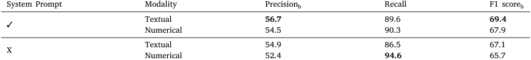

<!-- Start of picture text -->
System Prompt Modality Precisionb Recall F1 scoreb Textual 56.7 89.6 69.4 ✓ Numerical 54.5 90.3 67.9 Textual 54.9 86.5 67.1 X Numerical 52.4 94.6 65.7 <!-- End of picture text -->

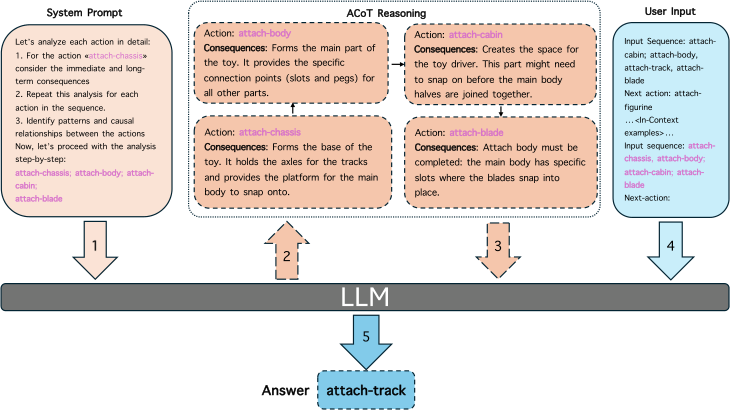

**Fig. 6.** Visualization of aCoT. First, the aCoT prompt is provided (1) to the LLM to enable (2) the generation of the CoT. The obtained reasoning is then fed to the model again together with the In-Context prompt (3, 4) to retrieve (5) the educated answer from the model. 

**Table 5** 

Results of LLAMA 3.1 8B on Assembly-101-O with different <u>prompt</u> methods, modalities, and inference modes. 

|Prompt|Modality|Mode|Precisionb|Recall|F1 scoreb|
|---|---|---|---|---|---|
||Textual|Base|47.1|87.9|61.3|
|ZS|Textual|Finetuned|48.4|93.4|63.8|
||Numerical|Base|49.1|93.4|64.4|
||Numerical|Finetuned|48.4|91.2|63.2|
||Textual|Base|56.8|89.6|69.5|
|FS|Textual|Finetuned|53.1|94.5|68.0|
||Numerical|Base|54.5|90.1|67.9|
||Numerical|Finetuned|55.4|86.9|67.6|
||Textual|Base|**60.4**|**97.8**|**74.7**|
|A|Textual|Finetuned|56.3|87.9|68.6|
|CoT|Numerical|Base|50.5|83.0|62.8|
||Numerical|Finetuned|51.0|72.5|59.9|

seen during fine-tuning, capturing noise rather than functional general patterns. 

For ACoT, the base model’s ability to handle complex reasoning through its intermediate steps seems sufficiently robust, and it does not benefit from the additional adjustments that fine-tuning provides. Finetuning might disturb these established reasoning pathways, leading to a decline in performance. This suggests that ACoT is inherently wellsuited to tasks requiring deep reasoning, making it less dependent on the benefits of fine-tuning, especially in scenarios with limited data. 

#### _5.1.4. Speed analysis_ 

Table 6 presents a speed test comparison of different prompting methods — ZS, FS, ACoT — using LLAMA 3.1 on the Assembly101O dataset. The results indicate that ZS is the fastest method, with an average processing speed of 0.208 s per sample. FS is slightly slower at 0.216 s per sample, representing a marginal 3.8% rise in processing time compared to ZS. ACoT, while offering superior accuracy and reasoning ability, is the slowest, taking 0.315 s per sample, which is a 51.4% increase in speed compared to ZS. 

##### **Table 6** 

Speed test with LLama 3.1 on Assembly-101-O. 

|Model|Speed (sample/s)|
|---|---|
|ZS|**0.208**|
|FS|0.216|
|ACoT|0.315|

These differences in speed can be attributed to the inherent complexity of each method. ZS and FS prompt the model to generate answers directly, with FS introducing a minimal overhead due to the additional context provided by the few examples. On the other hand, ACoT requires the model to engage in more complex, step-by-step reasoning, which naturally demands more computational resources and time. While ACoT’s performance benefits are clear, these come at the cost of slower processing, which could be a consideration in timesensitive applications. Thus, the choice of prompting method should balance the trade-off between speed and output quality based on the task’s specific requirements. 

11

<!-- Page 12 -->

_L. Plini, L. Scofano, E. De Matteis et al._ 

_Computer Vision and Image Understanding 264 (2026) 104613_ 

|**Table** **7**|||
|---|---|---|
|Speed test on baseline LLM methods.|||
|Model|Anticipator speed (samples/s)|Total speed (steps/s)|
|PREGO (Flaborea et al., 2024) – GPT-3.5|1.436|8.096|
|PREGO (Flaborea et al., 2024) – DeepSeek-R1|0.612|7.272|
|PREGO (Flaborea et al., 2024) – LLaMA 3.1|0.216|6.876|
|_TI-PREGO_ – LLaMA 3.1|0.315|6.975|

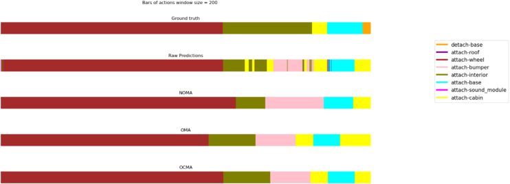

**Fig. 7.** Predictions bars: (a) Ground truth predictions, (b) Predictions using the recognizer,(c) NOMA: Non-Overlapping Mode Aggregation, (d) OMA: Overlapping Mode Aggregation, (e) OCMA: Overlapping Centered Mode Aggregation. 

For completeness, we also report the speed analysis of the language models used in Table 2. The aggregation window is set to _𝑊_ = 200 frames at 30 fps, corresponding to an effective delay of approximately 200∕30 ≈6 _._ 67 s. For all LLMs (See Table 7), inference latency is negligible by comparison. Thus, when decisions are made after temporal aggregation, the dominant latency stems from the windowing process required to stabilize per-frame recognition, rather than from the LLM inference itself. 

#### _5.2. Aggregation strategy_ 

In this section, we quantitatively evaluate the impact of each proposed aggregation strategy (cf. Section 3.2). As can be seen in Fig. 7, all the three aggregation schemes result in a cleaner input for the anticipator module. 

We assess the impact of the proposed aggregation strategies using the Levenshtein Similarity between the predicted and ground truth action sequence, which derives from the Levenshtein distance. With this choice, the similarity between two action sequences (i.e. procedures) A and B is defined as: 

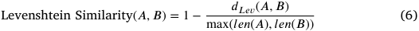

where: _𝑑𝐿𝑒𝑣_ ( _𝐴, 𝐵_ ) is the Levenshtein distance between A and B, which is the minimum number of single-action insertions, deletions or substitutions required to transform procedure A into procedure B, and _𝑙𝑒𝑛_ ( _𝐴_ ) and _𝑙𝑒𝑛_ ( _𝐵_ ) represent the length of procedure A and B, respectively. Note that the term _𝑚𝑎𝑥_ ( _𝑙𝑒𝑛_ ( _𝐴_ ) _, 𝑙𝑒𝑛_ ( _𝐵_ )) normalizes the score by the length of the longer procedure, ensuring that the ratio is between 0 and 1. 

Fig. 8 compares the aggregated sequences with the respective ground truth using the Levenstain similarity. This highlights how the NOMA approach is the most effective in maximizing similarity among the proposed ones. Considering that datasets like Assembly101 are recorded at 30 fps and the average action lasts about 570 frames (Fig. 9), we selected 200 frames as a sensible trade-off between achieving high similarity and minimizing the computational burden. 

#### **6. Conclusion** 

This paper explored the challenging task of detecting procedural errors in egocentric videos online, focusing on a dual-branch architecture that combined action recognition and anticipation. By leveraging Large Language Models (LLMs) within the action anticipation 

branch, we used in-context learning and Automatic-Chain-of-Thought to demonstrate their ability to predict future steps based on prior actions. Our experiments comprehensively analyzed various prompting schemes and frame aggregation strategies to optimize performance in online action recognition, highlighting the importance of effective prompt formulation for LLM-based anticipators. 

Our results emphasized the challenges of per-frame evaluation in real-time action recognition systems and showed how symbolic reasoning, combined with predictive models, enhanced procedural mistake detection. 

Through extensive experimentation, we demonstrated the effectiveness of our dual-branch architecture, achieving new state-of-the-art performance for online mistake detection. This underscored the potential of integrating action recognition and anticipation in a unified framework for detecting procedural errors as they unfolded online. Future work could explore further refinements in symbolic representation and expand the range of procedural tasks and environments in which our framework can be applied. 

_Limitations_ Our dual-branch architecture for online procedural mistake detection demonstrates promising results. In this section, we acknowledge some of its limitations. 

Real-time processing constraints can present challenges, particularly when incorporating Large Language Models (LLMs), which may introduce latency during inference. To clarify the timing budget, our aggregation window of _𝑊_ = 200 frames at 30 fps induces an effective delay of approximately 6.7s, while the LLM anticipator adds on average ∼0 _._ 3,s per query. Hence, the dominant latency arises from the aggregation needed to stabilize per-frame recognition rather than from the LLM inference itself. Our focus is maintaining accuracy in an online setting, rather than optimizing for real-time performance. Nonetheless, as recognition quality improves, smaller windows may suffice, reducing aggregation-induced delay and making real-time optimization a promising direction for future work. 

While symbolic reasoning simplifies certain aspects of action prediction, it may not fully capture the complex semantic relationships between actions. In fact, LLMs, when used as in-context learners, can better capture such dependencies through contextual understanding and broad world knowledge. However, their reasoning process is not explicitly based on logic rules and relies on patterns learned from data, which may limit their ability to model fine-grained or domain-specific 

12

<!-- Page 13 -->

_L. Plini, L. Scofano, E. De Matteis et al._ 

_Computer Vision and Image Understanding 264 (2026) 104613_ 

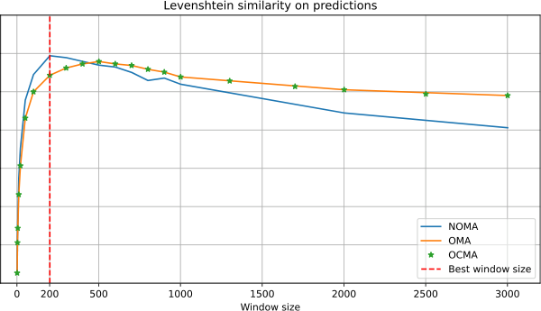

**Fig. 8.** Levenshtein similarity for the proposed aggregation strategies. The maximum similarity is achieved by the first strategy when using a window size of 200 frames. 

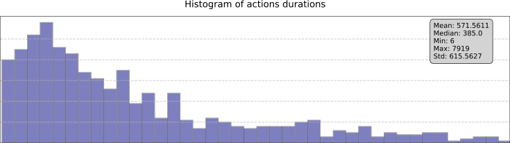

**Fig. 9.** Histogram and statistics of the durations of the action in Assembly101-O. 

action dependencies. Future research could explore hybrid approaches that integrate symbolic reasoning with richer representations. 

Our robustness treatment is pragmatic: aggregation reduces shorthorizon fluctuations so that downstream anticipation operates on a steadier signal. Ambiguous cases, like brief transitions or rapidly alternating labels, are mitigated but not eliminated by this design. We use ACoT’s intermediate explanations as qualitative aids to inspect typical successes and failures. These examples improve transparency but do not constitute a formal faithfulness guarantee. A systematic taxonomy of ambiguity and formal uncertainty quantification are valuable directions for future work and lie beyond the scope of this manuscript. 

#### **CRediT authorship contribution statement** 

**Leonardo Plini:** Writing – review & editing, Writing – original draft, Visualization, Software, Methodology, Investigation, Formal analysis, Data curation, Conceptualization. **Luca Scofano:** Writing – review & editing, Writing – original draft, Software, Methodology, Investigation, Data curation, Conceptualization. **Edoardo De Matteis:** Writing – original draft, Validation, Software, Methodology, Data curation, Conceptualization. **Guido Maria D’Amely di Melendugno:** Writing – review & editing, Writing – original draft, Software, Data curation, Conceptualization. **Alessandro Flaborea:** Data curation, Conceptualization. **Andrea Sanchietti:** Software. **Giovanni Maria Farinella:** Writing – review & editing, Writing – original draft, Supervision. **Fabio Galasso:** Writing – review & editing, Writing – original draft, Supervision, Conceptualization. **Antonino Furnari:** Writing – review & editing, Writing – original draft, Supervision, Investigation. 

the authors carefully reviewed and edited the content as necessary and take full responsibility for the final version of the published article. 

#### **Declaration of competing interest** 

The authors declare that they have no known competing financial interests or personal relationships that could have appeared to influence the work reported in this paper. 

#### **Acknowledgments** 

This work was carried out while Leonardo Plini was enrolled in the Italian National Doctorate on Artificial Intelligence run by Sapienza University of Rome. We thank DsTech S.r.l. and the PNRR MUR project PE0000013 Future Artificial Intelligence Research (FAIR) (CUP: B53C22003980006 and CUP: E63C22001940006) for partially funding the Sapienza University of Rome and University of Catania. 

#### **Data availability** 

The datasets generated or analyzed during the current study are available in (1) https://sites.google.com/view/epic-tent and (2) https: //assembly-101.github.io/. 

#### **References** 

**Declaration of Generative AI and AI-assisted technologies in the writing process** 

During the preparation of this work, the authors used Large Language Models to assist in formulating the text. After using these tools, 

> Abdelsalam, M.A., Rangrej, S.B., Hadji, I., Dvornik, N., Derpanis, K.G., Fazly, A., 2023. GePSAn: Generative procedure step anticipation in cooking videos. In: Proceedings of the IEEE/CVF International Conference on Computer Vision. ICCV, pp. 2988–2997. 

13

<!-- Page 14 -->

_L. Plini, L. Scofano, E. De Matteis et al._ 

_Computer Vision and Image Understanding 264 (2026) 104613_ 

- Ahn, M., Brohan, A., Brown, N., Chebotar, Y., Cortes, O., David, B., Finn, C., Gopalakrishnan, K., Hausman, K., Herzog, A., Ho, D., Hsu, J., Ibarz, J., Ichter, B., Irpan, A., Jang, E., Ruano, R.M.J., Jeffrey, K., Jesmonth, S., Joshi, N.J., Julian, R.C., Kalashnikov, D., Kuang, Y., Lee, K.-H., Levine, S., Lu, Y., Luu, L., Parada, C., Pastor, P., Quiambao, J., Rao, K., Rettinghouse, J., Reyes, D.M., Sermanet, P., Sievers, N., Tan, C., Toshev, A., Vanhoucke, V., Xia, F., Xiao, T., Xu, P., Xu, S., Yan, M., 2022. Do as I can, not as I say: Grounding language in robotic affordances. In: Conference on Robot Learning. 

- An, J., Kang, H., Han, S.H., Yang, M.-H., Kim, S.J., 2023. MiniROAD: Minimal RNN framework for online action detection. In: 2023 IEEE/CVF International Conference on Computer Vision. ICCV, pp. 10307–10316. 

- Ben-Shabat, Y., Yu, X., Saleh, F., Campbell, D., Rodriguez-Opazo, C., Li, H., Gould, S., 2021. The ikea asm dataset: Understanding people assembling furniture through actions, objects and pose. In: Proceedings of the IEEE/CVF Winter Conference on Applications of Computer Vision. pp. 847–859. 

- Brooks, T., Holynski, A., Efros, A.A., 2023. Instructpix2pix: Learning to follow image editing instructions. In: Proceedings of the IEEE/CVF Conference on Computer Vision and Pattern Recognition. pp. 18392–18402. 

- Candido de Oliveira, D., Nassu, B.T., Wehrmeister, M.A., 2023. Image-based detection of modifications in assembled pcbs with deep convolutional autoencoders. Sensors 23 (3), 1353. 

- Chen, C., Zhang, C., Wang, T., Li, D., Guo, Y., Zhao, Z., Hong, J., 2020. Monitoring of assembly process using deep learning technology. Sensors 20 (15), 4208. 

- Chowdhery, A., Narang, S., Devlin, J., Bosma, M., Mishra, G., Roberts, A., Barham, P., Chung, H.W., Sutton, C., Gehrmann, S., et al., 2023. Palm: Scaling language modeling with pathways. J. Mach. Learn. Res. 24 (240), 1–113. 

- Damen, D., Doughty, H., Farinella, G.M., Fidler, S., Furnari, A., Kazakos, E., Moltisanti, D., Munro, J., Perrett, T., Price, W., Wray, M., 2018. Scaling egocentric vision: The EPIC-KITCHENS dataset. In: European Conference on Computer Vision. ECCV. 

- Devlin, J., Chang, M.-W., Lee, K., Toutanova, K., 2019. BERT: Pre-training of deep bidirectional transformers for language understanding. In: North American Chapter of the Association for Computational Linguistics. 

- Ding, G., Sener, F., Ma, S., Yao, A., 2023. Every mistake counts in assembly. arXiv preprint arXiv:2307.16453. 

- Dubey, A., Jauhri, A., Pandey, A., Kadian, A., Al-Dahle, A., Letman, A., Mathur, A., Schelten, A., Yang, A., Fan, A., et al., 2024. The llama 3 herd of models. arXiv preprint arXiv:2407.21783. 

- Elhamifar, E., Naing, Z., 2019. Unsupervised procedure learning via joint dynamic summarization. In: International Conference on Computer Vision. ICCV. 

- Feng, J., Xu, R., Hao, J., Sharma, H., Shen, Y., Zhao, D., Chen, W., 2023. Language models can be logical solvers. ArXiv abs/2311.06158. 

- Flaborea, A., Collorone, L., di Melendugno, G.M.D., D’Arrigo, S., Prenkaj, B., Galasso, F., 2023. Multimodal motion conditioned diffusion model for skeleton-based video anomaly detection. In: Proceedings of the IEEE/CVF International Conference on Computer Vision. ICCV, pp. 10318–10329. 

- Flaborea, A., di Melendugno, G.M.D., Plini, L., Scofano, L., De Matteis, E., Furnari, A., Farinella, G.M., Galasso, F., 2024. PREGO: Online mistake detection in procedural egocentric videos. In: Proceedings of the IEEE/CVF Conference on Computer Vision and Pattern Recognition. CVPR, pp. 18483–18492. 

- Ghoddoosian, R., Dwivedi, I., Agarwal, N., Dariush, B., 2023. Weakly-supervised action segmentation and unseen error detection in anomalous instructional videos. In: Proceedings of the IEEE/CVF International Conference on Computer Vision. ICCV, pp. 10128–10138. 

- Gupta, T., Kembhavi, A., 2023. Visual programming: Compositional visual reasoning without training. In: Proceedings of the IEEE/CVF Conference on Computer Vision and Pattern Recognition. pp. 14953–14962. 

- Jang, Y., Sullivan, B., Ludwig, C., Gilchrist, I., Damen, D., Mayol-Cuevas, W., 2019. EPIC-tent: An egocentric video dataset for camping tent assembly. In: Int. Conf. Comput. Vis. 

- Jiang, A.Q., Sablayrolles, A., Mensch, A., Bamford, C., Chaplot, D.S., Casas, D.d.l., Bressand, F., Lengyel, G., Lample, G., Saulnier, L., et al., 2023. Mistral 7B. arXiv preprint arXiv:2310.06825. 

- Kim, S., Huang, D., Xian, Y., Hilliges, O., Gool, L.V., Wang, X., 2024. PALM: Predicting actions through language models. In: European Conference on Computer Vision. ECCV. 

- Kuehne, H., Arslan, A.B., Serre, T., 2014. The language of actions: Recovering the syntax and semantics of goal-directed human activities. In: Proceedings of Computer Vision and Pattern Recognition Conference. CVPR. 

- Lee, S.-P., Lu, Z., Zhang, Z., Hoai, M., Elhamifar, E., 2024. Error detection in egocentric procedural task videos. In: Proceedings of the IEEE/CVF Conference on Computer Vision and Pattern Recognition. pp. 18655–18666. 

- Liang, J., Huang, W., Xia, F., Xu, P., Hausman, K., Ichter, B., Florence, P.R., Zeng, A., 2022. Code as policies: Language model programs for embodied control. In: 2023 IEEE International Conference on Robotics and Automation. ICRA, pp. 9493–9500. 

- Lu, Z., Elhamifar, E., 2022. Set-supervised action learning in procedural task videos via pairwise order consistency. In: IEEE Conf. Comput. Vis. Pattern Recog. pp. 19903–19913. 

- Mascaró, E.V., Ahn, H., Lee, D., 2023. Intention-conditioned long-term human egocentric action anticipation. In: Proceedings of the IEEE/CVF Winter Conference on Applications of Computer Vision. pp. 6048–6057. 

- Mesnard, G.T.T., Hardin, C., Dadashi, R., Bhupatiraju, S., Pathak, S., Sifre, L., Rivière, M., Kale, M., Love, J.C., Tafti, P.D., Hussenot, L., Chowdhery, A., Roberts, A., Barua, A., Botev, A., Castro-Ros, A., Slone, A., H’eliou, A., Tacchetti, A., Bulanova, A., Paterson, A., Tsai, B., Shahriari, B., Lan, C.L., Choquette-Choo, C.A., ment Crepy, C., Cer, D., Ippolito, D., Reid, D., Buchatskaya, E., Ni, E., Noland, E., Yan, G., Tucker, G., Muraru, G.-C., Rozhdestvenskiy, G., Michalewski, H., Tenney, I., Grishchenko, I., Austin, J., Keeling, J., Labanowski, J., Lespiau, J.-B., Stanway, J., Brennan, J., Chen, J., Ferret, J., Chiu, J., Mao-Jones, J., ine Lee, K., Yu, K., Millican, K., Sjoesund, L.L., Lee, L., Dixon, L., Reid, M., Mikuła, M., Wirth, M., Sharman, M., Chinaev, N., Thain, N., Bachem, O., Chang, O., Wahltinez, O., Bailey, P., Michel, P., Yotov, P., Sessa, P.G., Chaabouni, R., Comanescu, R., Jana, R., Anil, R., McIlroy, R., Liu, R., Mullins, R., Smith, S.L., Borgeaud, S., Girgin, S., Douglas, S., Pandya, S., Shakeri, S., De, S., Klimenko, T., Hennigan, T., Feinberg, V., Stokowiec, W., hui Chen, Y., Ahmed, Z., Gong, Z., Warkentin, T., Peran, L., Giang, M., Farabet, C., Vinyals, O., Dean, J., Kavukcuoglu, K., Hassabis, D., Ghahramani, Z., Eck, D., Barral, J., Pereira, F., Collins, E., Joulin, A., Fiedel, N., Senter, E., Andreev, A., Kenealy, K., 2024. Gemma: Open models based on gemini research and technology. ArXiv abs/2403.08295. 

- Miech, A., Zhukov, D., Alayrac, J.-B., Tapaswi, M., Laptev, I., Sivic, J., 2019. HowTo100M: Learning a text-video embedding by watching hundred million narrated video clips. In: ICCV. 

- Mirchandani, S., Xia, F., Florence, P., Ichter, B., Driess, D., Arenas, M.G., Rao, K., Sadigh, D., Zeng, A., 2023. Large language models as general pattern machines. In: Proceedings of the 7th Conference on Robot Learning. CoRL. 

- Narasimhan, M., Yu, L., Bell, S., Zhang, N., Darrell, T., 2023. Learning and verification of task structure in instructional videos. arXiv preprint arXiv:2303.13519. 

- Pallagani, V., Muppasani, B., Murugesan, K., Rossi, F., Horesh, L., Srivastava, B., Fabiano, F., Loreggia, A., 2022. Plansformer: Generating symbolic plans using transformers. ArXiv abs/2212.08681. 

- Peddi, R., Arya, S., Challa, B., Pallapothula, L., Vyas, A., Wang, J., Zhang, Q., Komaragiri, V., Ragan, E., Ruozzi, N., Xiang, Y., Gogate, V., 2023. CaptainCook4D: A dataset for understanding errors in procedural activities. arXiv:2312.14556. 

- Qi, Z., Wang, S., Su, C., Su, L., Huang, Q., Tian, Q., 2023. Self-regulated learning for egocentric video activity anticipation. IEEE Trans. Pattern Anal. Mach. Intell. 45 (6), 6715–6730. http://dx.doi.org/10.1109/TPAMI.2021.3059923. 

- Qian, Y., Luo, W., Lian, D., Tang, X., Zhao, P., Gao, S., 2022. SVIP: Sequence VerIfication for procedures in videos. In: IEEE Conf. Comput. Vis. Pattern Recog. pp. 19890–19902. 

- Ragusa, F., Furnari, A., Livatino, S., Farinella, G.M., 2021. The MECCANO dataset: Understanding human-object interactions from egocentric videos in an industriallike domain. In: Proceedings of the IEEE/CVF Winter Conference on Applications of Computer Vision. WACV, pp. 1569–1578. 

- Ragusa, F., Leonardi, R., Mazzamuto, M., Bonanno, C., Scavo, R., Furnari, A., Farinella, G.M., 2024. ENIGMA-51: Towards a fine-grained understanding of human-object interactions in industrial scenarios. In: Proceedings of the IEEE/CVF Winter Conference on Applications of Computer Vision. WACV. 

- Schoonbeek, T.J., Houben, T., Onvlee, H., van der Sommen, F., et al., 2024. IndustReal: A dataset for procedure step recognition handling execution errors in egocentric videos in an industrial-like setting. In: Proceedings of the IEEE/CVF Winter Conference on Applications of Computer Vision. pp. 4365–4374. 

- Seminara, L., Farinella, G.M., Furnari, A., 2024. Differentiable task graph learning: Procedural activity representation and online mistake detection from egocentric videos. In: The Thirty-Eighth Annual Conference on Neural Information Processing Systems. 

- Sener, F., Chatterjee, D., Shelepov, D., He, K., Singhania, D., Wang, R., Yao, A., 2022. Assembly101: A large-scale multi-view video dataset for understanding procedural activities. In: IEEE Conf. Comput. Vis. Pattern Recog. 

- Shah, A., Lundell, B., Sawhney, H., Chellappa, R., 2023. STEPs: Self-supervised key step extraction and localization from unlabeled procedural videos. In: Proceedings of the IEEE/CVF International Conference on Computer Vision. ICCV, pp. 10375–10387. 

- Shen, Y., Elhamifar, E., 2024. Progress-aware online action segmentation for egocentric procedural task videos. In: Proceedings of the IEEE/CVF Conference on Computer Vision and Pattern Recognition. pp. 18186–18197. 

- Stein, S., McKenna, S.J., 2013. Combining embedded accelerometers with computer vision for recognizing food preparation activities. In: Proceedings of the 2013 ACM International Joint Conference on Pervasive and Ubiquitous Computing. UbiComp ’13, Association for Computing Machinery. 

- Tang, Y., Ding, D., Rao, Y., Zheng, Y., Zhang, D., Zhao, L., Lu, J., Zhou, J., 2019. COIN: A large-scale dataset for comprehensive instructional video analysis. In: 2019 IEEE/CVF Conference on Computer Vision and Pattern Recognition. CVPR, pp. 1207–1216. 

- Touvron, H., Martin, L., Stone, K., Albert, P., Almahairi, A., Babaei, Y., Bashlykov, N., Batra, S., Bhargava, P., Bhosale, S., et al., 2023. Llama 2: Open foundation and fine-tuned chat models. arXiv preprint arXiv:2307.09288. 

- Wang, X., Kwon, T., Rad, M., Pan, B., Chakraborty, I., Andrist, S., Bohus, D., Feniello, A., Tekin, B., Frujeri, F.V., Joshi, N., Pollefeys, M., 2023. HoloAssist: an egocentric human interaction dataset for interactive AI assistants in the real world. In: Int. Conf. Comput. Vis. pp. 20270–20281. 

- Wang, X., Zhang, S., Qing, Z., Shao, Y., Zuo, Z., Gao, C., Sang, N., 2021a. Oadtr: Online action detection with transformers. In: Int. Conf. Comput. Vis. pp. 7565–7575. 

14

<!-- Page 15 -->

_L. Plini, L. Scofano, E. De Matteis et al._ 

_Computer Vision and Image Understanding 264 (2026) 104613_ 

- Wang, X., Zhang, S., Qing, Z., Shao, Y., Zuo, Z., Gao, C., Sang, N., 2021b. OadTR: Online action detection with transformers. In: 2021 IEEE/CVF International Conference on Computer Vision. ICCV, pp. 7545–7555. 

- Wei, J., Tay, Y., Bommasani, R., Raffel, C., Zoph, B., Borgeaud, S., Yogatama, D., Bosma, M., Zhou, D., Metzler, D., hsin Chi, E.H., Hashimoto, T., Vinyals, O., Liang, P., Dean, J., Fedus, W., 2022a. Emergent abilities of large language models. Trans. Mach. Learn. Res. 2022. 

- Wei, J., Wang, X., Schuurmans, D., Bosma, M., hsin Chi, E.H., Xia, F., Le, Q., Zhou, D., 2022b. Chain of thought prompting elicits reasoning in large language models. ArXiv abs/2201.11903. 

- Wei, J.W., Wei, J., Tay, Y., Tran, D., Webson, A., Lu, Y., Chen, X., Liu, H., Huang, D., Zhou, D., Ma, T., 2023. Larger language models do in-context learning differently. ArXiv abs/2303.03846. 

- Zaheer, M.Z., Mahmood, A., Khan, M.H., Segu, M., Yu, F., Lee, S.-I., 2022. Generative cooperative learning for unsupervised video anomaly detection. In: Proceedings of the IEEE/CVF Conference on Computer Vision and Pattern Recognition. pp. 14744–14754. 

- Zeng, A., Wong, A.S., Welker, S., Choromanski, K., Tombari, F., Purohit, A., Ryoo, M.S., Sindhwani, V., Lee, J., Vanhoucke, V., Florence, P.R., 2022. Socratic models: Composing zero-shot multimodal reasoning with language. ArXiv abs/2204.00598. 

- Zhang, Z., Zhang, A., Li, M., Smola, A.J., 2022. Automatic chain of thought prompting in large language models. ArXiv abs/2210.03493. 

- Zhao, Q., Zhang, C., Wang, S., Fu, C., Agarwal, N., Lee, K., Sun, C., 2023. AntGPT: Can large language models help long-term action anticipation from videos? ArXiv abs/2307.16368. 

- Zhong, Y., Yu, L., Bai, Y., Li, S., Yan, X., Li, Y., 2023. Learning procedure-aware video representation from instructional videos and their narrations. In: 2023 IEEE/CVF Conference on Computer Vision and Pattern Recognition. CVPR, IEEE Computer Society. 

- Zhukov, D., Alayrac, J.-B., Cinbis, R.G., Fouhey, D., Laptev, I., Sivic, J., 2019. Cross-task weakly supervised learning from instructional videos. In: CVPR. 

15
