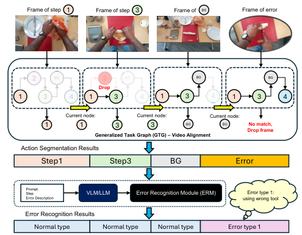
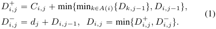
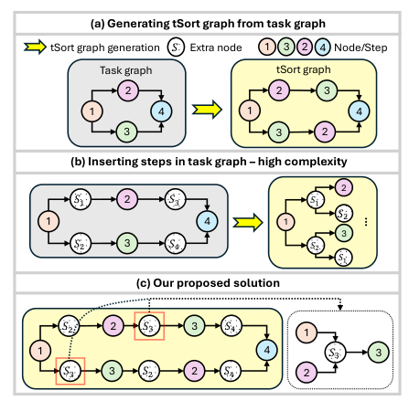
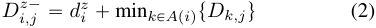
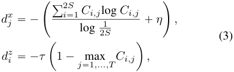
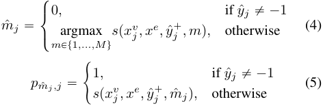
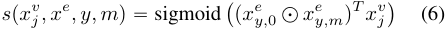
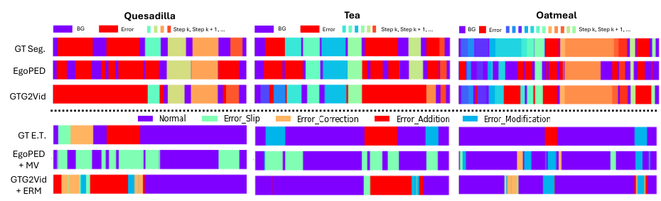
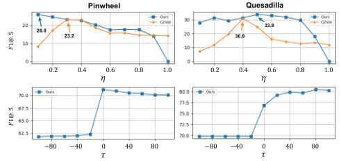
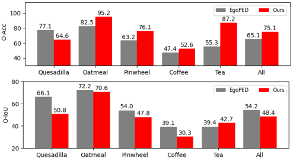

# 013_Lee_Error_Recognition_in_Procedural_Videos_using_Generalized_Task_Graph_ICCV_2025_paper

[Original PDF](../013_Lee_Error_Recognition_in_Procedural_Videos_using_Generalized_Task_Graph_ICCV_2025_paper.pdf)

Pages: 13

> Automatically converted from PDF. Check the original for exact equations, symbols, table alignment, and figure details.

<!-- Page 1 -->

This ICCV paper is the Open Access version, provided by the Computer Vision Foundation. Except for this watermark, it is identical to the accepted version; the final published version of the proceedings is available on IEEE Xplore. 

# **Error Recognition in Procedural Videos using Generalized Task Graph** 

## Shih-Po Lee Northeastern University 

lee.shih@northeastern.edu 

## Ehsan Elhamifar Northeastern University 

e.elhamifar@northeastern.edu 

## **Abstract** 

_Understanding user actions and their possible mistakes is essential for successful operation of task assistants. In this paper, we develop a unified framework for joint temporal action segmentation and error recognition (recognizing when and which type of error happens) in procedural task videos. We propose a Generalized Task Graph (GTG) whose nodes encode correct steps and background (taskirrelevant actions). We then develop a GTG-Video Alignment algorithm (GTG2Vid) to jointly segment videos into actions and detect frames containing errors. Given that it is infeasible to gather many videos and their annotations for different types of errors, we study a framework that only requires normal (error-free) videos during training. More specifically, we leverage large language models (LLMs) to obtain error descriptions and subsequently use videolanguage models (VLMs) to generate visually-aligned textual features, which we use for error recognition. We then propose an Error Recognition Module (ERM) to recognize the error frames predicted by GTG2Vid using the generated error features. By extensive experiments on two egocentric datasets of EgoPER and CaptainCook4D, we show that our framework outperforms other baselines on action segmentation, error detection and recognition._ 

## **1. Introduction** 

The integration of computer vision with augmented and virtual reality (AR & VR) is expected to significantly improve the way we learn and develop skills in our daily lives [83]. Imagine wearing a pair of AR glasses and trying to assemble a new piece of furniture. A visual task assistant should recognize your actions and provide guidance on what to do and how to perform them throughout the process. It should also recognize your possible errors and provide feedback to correct them, when needed. This has motivated exciting new research on action recognition [8, 10, 25, 26, 47, 50, 61, 89] and segmentation [23, 38, 45, 46, 54, 57, 58, 73, 77, 78, 84, 95, 96, 103], video grounding [5, 18, 20, 49, 59, 63, 86, 109], learning 

<!-- Start of picture text -->
Frame of step 1 Frame of step 3 Frame of  BG Frame of error 2 BG 2 BG BG BG Drop 1 3 4 1 3 4 1 3 4 1 3 4 Current node:  Current node:  Current node: 1 1 3 3 BG BG No match, Drop frame Generalized Task Graph (GTG) – Video Alignment Action Segmentation Results Step1 Step3 BG Error Prompt:StepError Description VLM/LLM Error Recognition Module (ERM) using wrong toolError type 1: Error Recognition Results Normal type Normal type Normal type Error type 1 <!-- End of picture text -->

Figure 1. The illustration of our framework for joint temporal action segmentation and error recognition. It consists of 1) Generalized Task Graph (GTG)-Video Alignment for action segmentation and 2) an Error Recognition Module using features from LLM/VLM for error recognition. 

from instructional videos [12, 33, 62, 64, 65, 85, 102] and very recently on error understanding [14, 27, 29, 41, 60, 90], as well as progress [17] and state [100] prediction. 

Successful operation of a visual task assistant, in particular, requires temporal action segmentation (assigning step labels to frames) and error recognition (recognizing the type of error, if any, in each frame) to seamlessly work together. Additionally, a task graph, which encodes plausible ways to perform a task, has been shown to be critical for temporal action segmentation to effectively mitigate oversegmentation [5, 19, 77, 106]. However, existing methods have three major limitations when it comes to understanding actions and errors. 

**SOTA Limitations.** First, existing works on error understanding can only detect the presence of an error in a video frame without recognizing the type of the error. As recently studied in [41], different types of errors, such as omission, addition, modification, and slip errors, can occur during task execution. However, [41] cannot distinguish between the error types. A task assistant requires understanding the error type to provide appropriate feedback. For example, an actor knocking over a dripper while making coffee requires 

10009

<!-- Page 2 -->

immediate feedback for correction or spreading jelly onto tortilla using spoon instead of knife needs a feedback after task completion for the actor to better execute the step. 

Second, given the large number of possible errors, it is infeasible to gather real training videos and annotations for all possible errors. Also, recent datasets [41, 66] that contain videos with errors have imbalance annotations on different error types, making error recognition a challenging task, especially under the setting when we do not have error videos during training. 

Third, recent action segmentation methods [19, 77] that use task graphs assume that there are no errors in videos and assign step labels to the frames according to the task graph. In addition, two recent works that handle both action segmentation and error detection [29, 41] cannot use the task graph for action segmentation. This is because a task graph only contains the correct actions/steps and does not consider possible errors that may occur during the task execution. Thus, following the task graph leads to assigning every frame (including frames that have errors and ones that do not belong to any step) to correct actions/steps, which is undesired. 

**Paper Contributions.** We develop a unified error recognition and temporal action segmentation framework (see Figure 1) to address the aforementioned limitations. 

**–** We propose a Generalized Task Graph (GTG) whose nodes encode normal actions/steps and background (taskirrelevant actions). 

**–** We develop a dynamic programming-based method, GTG-Video Alignment (GTG2Vid), with a dynamic frame and node dropping term to assign frames to GTG nodes for action segmentation and drop frames for error detection. 

**–** Given the lack of error training videos, we leverage the rich knowledge of large language models (LLMs) in conjunction with the rich representation power of video language models (VLMs) to obtain error descriptions for different types of errors and their corresponding features for error recognition. 

**–** We propose an Error Recognition Module (ERM) to recognize the error types, if any, in the frames predicted by GTG2Vid using joint similarities of video frame, normal type, and error type features. 

**–** By extensive experiments on two egocentric datasets, EgoPER and CaptainCook4D, we show that _without using error videos during training_ , our method 1) improves the performance of temporal action segmentation on error videos, 2) improves error detection, and 3) recognizes different errors. 

supervised [4, 21, 22, 28, 36, 37, 74, 79, 88, 91, 94, 109], weakly-supervised [11, 16, 24, 42–44, 48, 55, 55, 56, 69– 71, 76, 84], and fully-supervised [3, 7, 9, 15, 23, 31, 32, 35, 38, 45, 46, 51, 57, 73, 80–82, 84, 95, 96, 103, 104] setting. Since procedural step videos follow certain task graphs to complete the task, some prior works [5, 19, 77, 106] additionally adopt task graph information to guide segmentation process. Specifically, G2Vid [19] aims to assign steps/nodes in a task graph to video frames and drop the frames not corresponding to any node. However, G2Vid cannot drop unnecessary nodes in a task graph nor map background frames to nodes to distinguish between background and error frames. In contrast, our framework adds _extra nodes_ to a task graph and allows droppable nodes to properly assign nodes to frames. 

**Error Detection and Recognition for Procedural Tasks.** Detecting errors for procedural tasks has recently drawn attention from the video understanding community. Recent works [14, 29, 68, 90] have released relevant datasets to facilitate error understanding. Meanwhile, several works [27, 41, 60, 75] have developed frameworks to detect if errors are present in videos and localize their temporal locations. Recent work [27] focuses on online error detection using action recognition and anticipation models based on videos and action sequences. Another work [41] uses only error-free (normal) videos during training to generate multiple prototypes for action segmentation and error detection. However, none of them has the ability to recognize error types. Our work is able to segment videos and recognize different errors simultaneously without error training videos. 

**VLMs/LLMs for Anomaly Detection.** Anomaly detection in videos [2, 6, 13, 39, 40, 53, 67, 72, 87, 92, 97– 99, 105, 107, 108] has been widely explored, and recent studies [34, 101] leverage VLMs and LLMs for further improvement due to their outstanding reasoning capabilities. Recent work in [101] proposes a training-free video anomaly detection framework using VLMs to generate captions over frames followed by LLMs to predict anomaly scores for those captions. Another work in [34] adopts LLMs to generate normal and abnormal descriptions under various scenes and classify frames into normal or abnormal according to the similarities between features of frames and descriptions. In our paper, we leverage LLMs to generate error descriptions for each error type of every step with crafted prompts, followed by VLMs to generate textual features aligned with visual features for error recognition. 

## **3. Graph to Video Alignment Review** 

## **2. Related Works** 

**Temporal Action Segmentation.** Learning to segment videos into several actions/steps has been studied under un- 

Our proposed GTG-Video Alignment method builds upon and generalizes the Graph-to-Video Alignment (G2Vid) [19], which we review here. A task graph (also called flow 

10010

<!-- Page 3 -->

graph) is a directed acyclic graph _G_ “ p _V, E_ q, where each node _v_ P _V_ represents a procedure step and each edge p _vk, vi_ q P _E_ from _vk_ to _vi_ implies that _vk_ must be completed before proceeding to _vi_ , see Figure 2(a). Thus, all predecessors of a node must be completed before starting that step. Thus, the task graph encodes all possible ways to perform a task (this can be obtained by topological sorting). 

To efficiently align a video with the task graph and therefore segment the video into task steps, G2Vid [19] first builds a tSort graph (see Figure 2(a)) that provides a compact representation of all topological sorts of the task graph (each path from the source to the sink node in the tSort graph represents a topological sort of _G_ ). G2Vid alignment recovers a traversal of the tSort graph that best aligns with the video. It uses a modified version of Drop-DTW [18] to align nodes and frames, allowing for i) one-to-many matching (one node/step can be assigned to many frames) and ii) unmatched sequence elements (to be able to drop frames that do not correspond to any node/step). 

Let _Ci,j_ denote the matching cost of node _i_ to frame _j_ , _dj_ denote the dropping cost of frame _j_ , and _A_ p _i_ q denote the set of predecessors of _i_ . The dynamic programming solution computes the cumulative matching _Di,j_`, dropping_D_ _i,j_´and optimal _Di,j_ costs up to the _i_ -th node and _j_ -th frame as 

By iterating over all nodes and frames, the dynamic programming outputs the optimal cost and alignment by backtracking the path with minimum cost, starting from the top left and ending at the bottom right of the cumulative matrix. 

## **4. Proposed Method** 

We develop a unified framework for _Temporal Action Segmentation_ ( _TAS_ ) and _Error Recognition_ ( _ER_ ) in procedural task videos. We assume having access to only normal (error-free) videos with their frame-wise step labels during training and the task graph during testing. Our proposed framework _addresses three fundamental questions_ : (1) How can we build an efficient Generalized Task Graph (GTG) that enables _TAS_ and _Error Detection_ ( _ED_ ) for videos? (2) How can we obtain features for different errors without collecting real error videos? (3) How can we leverage the error features to perform _ER_ ? In the following, we first formalize the problem, discuss the overarching goal of our framework, and discuss the details of the method to address these questions. 

**Problem Setting.** For _TAS_ and _ER_ , given a sequence of video frame features _X__v_ “ p _x_ 1_v, xv_ 2_, . . . , xv_ _T_q,ourgoalis to predict its frame-wise steps _Y_ˆ “ p _y_ ˆ1 _,_ ˆ _y_ 2 _, . . . ,_ ˆ _yT_ q and error types _E_ˆ “ p _e_ ˆ1 _,_ ˆ _e_ 2 _, . . . ,_ ˆ _eT_ q, where _T_ is the number of frames, _x__v_ _t_PR_D_isapre-extractedfeaturevector,_y_ˆ_t_P 

<!-- Start of picture text -->
(a) Generating tSort graph from task graph tSort graph generation 𝑆 Extra node 1 3 2 4 Node/Step Task graph tSort graph 2 2 3 1 4 1 4 3 3 2 (b) Inserting steps in task graph – high complexity 2 𝑆1 2 𝑆3 𝑆1 1 4 1 𝑆2 3 𝑆2 3 𝑆4 𝑆2 𝑆1 (c) Our proposed solution 𝑆2 2 𝑆3 3 𝑆4 1 1 4 𝑆3 3 𝑆3 3 𝑆2 2 𝑆4 2 … <!-- End of picture text -->

Figure 2. The illustration of (a) an original task graph and its corresponding tSort graph, (b) a naive approach to capture background, (c) our proposed solution, which specifically illustrates the predecessors and successor of _extra node S_ 3. 

t´1 _,_ 0 _, . . . , S_ u, where _S_ is the number of steps and class ´1 and 0 indicate error and background (a task-irrelevant action, e.g., answering phone when making coffee), _e_ ˆ _t_ P t0 _, . . . , M_ u, where _M_ is the number of error types and class 0 denotes no error happening. During training, we use only normal (error-free) videos and their ground-truth step labels _Y_ . For testing, we assume that the task graph is given. 

**Framework Overview.** We introduce Generalized Task Graph for handling both _TAS_ and _ED_ . Our key idea is to 1) insert _extra nodes_ in the tSort graph to capture the background class that may occur before each step in the task graph, 2) perform _TAS_ and _ED_ by our GTG2Vid with a dynamic frame and node dropping term for different types of errors, 3) obtain error descriptions and features for all types of errors, respectively, by leveraging LLMs and VLMs and 4) use an Error Recognition Module (ERM) that computes joint similarities of video, normal type and error type features obtained by VLMs to classify the error types for the frames flagged by GTG2Vid. 

### **4.1. Generalized Task Graph (GTG)** 

We build GTG to handle execution and omission errors and develop GTG2Vid for _TAS_ and _ED_ . 

**Handling Execution Errors.** We aim to use the task graph to segment videos into steps and to detect execution errors (e.g., slip, correction, modification, and addition errors defined in [41]). Some of the errors are step-relevant (e.g., spreading jelly using spoon instead of knife) and some are not in the task graph (e.g., adding honey to a recipe that does not include honey). However, G2Vid drops both frames with errors as well as background frames (e.g., answering 

10011

<!-- Page 4 -->

#### **Algorithm 1** GTG-Video Alignment (GTG2Vid) 

1: **Inputs:** _C_ P R2_S_ˆ_T_ _, A_ p¨q _, di__z, dx_ _j_(matching cost matrix, predecessor mapping dictionary, node dropping costs, frame dropping costs.) Ź Initialize DP tables 2: _D_ 0` _,_ 0“ 0;_D_ _i,_` 0“ 8;_D_ 0` _,j_“ 8; @_i_P t1_,_¨ ¨ ¨_,_2_S_u_,_@_j_P t1_,_¨ ¨ ¨_, T_u Ź Matching table of _Xn__v_(frames) and_Z_(nodes) 3: _D_ 0_z_ _,_´ 0“ 0;_D_ _i,__z_´ 0“ ř _k__i_ “1_d_ _k__z_;_D_ 0_z_ _,j_´“ 8; @_i_P t1_,_¨ ¨ ¨_,_2_S_u_,_@_j_P t1_,_¨ ¨ ¨_, T_u Ź Dropping table of _Z_ (nodes) 4: _D_ 0´ _,__x_ 0“ 0;_D_ _i,_´ 0_x_“ 8;_D_ 0´ _,j__x_“ ř _k__j_ “1_d_ _k__x_; @_i_P t1_,_¨ ¨ ¨_,_2_S_u_,_@_j_P t1_,_¨ ¨ ¨_, T_u Ź Dropping table of _Xn__v_(frames) 5: _D_ 0 _,_ 0 “ 0; _Di,_ 0 “ _Di,_´ 0_x_;_D_0_,j_“_D_ 0_z_ _,j_´; @_i_P t1_,_¨ ¨ ¨_,_2_S_u_,_@_j_P t1_,_¨ ¨ ¨_, T_u Ź Optimal solution table 6: **for** _i_ “ 1 _,_ ¨ ¨ ¨ _,_ 2 _S_ **do** Ź Iterate nodes in _Z_ 7: **for** _j_ “ 1 _,_ ¨ ¨ ¨ _, T_ **do** Ź Iterate frames in _Xn__v_ 8: _Di,j_`“ ´_Ci,j_` mint _k_min P _A_ p _i_ qt_Dk,j_´1u_, Di,j_´1u Ź Consider matching node _Zi_ to frame _x__v_ _n,j_ 9: _Di,j_´_x_“_d_ _j__x_`_Di,j_´1 Ź Consider dropping frame _x__v_ _n,j_ 10: _Di,j__z_´“_d_ _i__z_` _k_min P _A_ p _i_ qt_Dk,j_u Ź Consider dropping node _Zi_ 11: _Di,j_ “ mint _Di,j_`_, D_ _i,j_´_x, D_ _i,j__z_´u Ź Select the optimal path 12: **end for** 13: **end for** 14: _Y_ˆ˚ “ tracebackp _D_ q Ź Compute the optimal alignment by tracing back the path with minimum cost 15: _Y_ˆ “ frame-assignp _Y_ˆ˚ q Ź Flag dropping frames as error frames and frames belonging to _extra nodes_ as background 16: **Outputs:** _D_ 2 _S,T , Y_ˆ 

the phone while making a recipe) and thus cannot distinguish between them and understand when an error occurs. 

To handle this, we build GTG by inserting _extra nodes_ into the task graph to capture background frames. Therefore, by aligning a video with GTG, we can understand which frames correspond to which steps and which frames correspond to background. Additionally, by allowing dropping frames, we can detect execution errors, and by allowing dropping nodes, we can detect omission errors which we will discuss next. 

A naive approach is to insert an _extra node_ with a unique label between every two nodes (see Figure 2 (b)). Therefore, the task graph can potentially map frames to _extra nodes_ . However, the complexity of the tSort graph grows exponentially. To solve this problem, our proposed approach inserts an _extra node Si_ with a unique ID between every node _i_ and its predecessor in the tSort graph. For example, in Figure 2 (c), between node 2 and 3 as well as node 1 and 3, we insert the same _extra node S_ 3 to capture the background frames with respect to step 3. Our design 1) prevents exponential growth of the tSort graph, only increasing the number of nodes from _S_ to 2 _S_ , and 2) inherits the correct execution orders in the original tSort graph. 

**Handling Omission Errors.** During execution, an actor may skip one or more steps in the task graph, resulting in omission error. In this case, forcing models to follow the task graph as done in prior works [5, 19, 77, 106] can lead to wrong _TAS_ results where some frames are assigned to the skipped steps. To handle omission errors, we introduce a node dropping term to our GTG2Vid to make nodes of our GTG droppable, 

where _Di,j__z_´is the accumulative cost until node_i_and frame _j_ in the dynamic programming (DP) table of dropping node and _d__z_ _i_is the node dropping cost of node_i_.A low dropping cost indicates that the corresponding GTG node is not in the video and should be omitted. This also allows dropping _extra nodes_ , whenever there is no corresponding frame in the video. 

**GTG-Video Alignment (GTG2Vid).** Algorithm 1 shows the steps of GTG2Vid. _Ci,j_ is the matching cost of the _i_ - th node to the _j_ -th frame. We let _Ci,j_ to be the predicted probability of step _i_ for _j_ -th frame using an action segmentation model. We train the action segmentation model with smoothing and cross-entropy loss in [23] using framewise labels. In addition, to ensure that our proposed method can drop frames and nodes based on the confidence of predictions, we propose a dynamic dropping cost _d__x_ for frames and _d__z_ for nodes of GTG as 

where _η_ and _τ_ are hyper-parameters (larger _η_ and _τ_ lead to dropping more frames and nodes). Our frame dropping cost _d__x_ leads to drop frames with unconfident predictions, indicating that the frames do not correspond to any GTG node and may contain errors. Meanwhile, our node dropping cost _d__z_ allows dropping the nodes whose highest step probabilities over all frames are low. After obtaining the minimum cost path, we generate step predictions _Y_ˆ from _Y_ˆ˚ by flagging the dropped frames as error frames and frames belonging to _extra nodes_ as background. The complexity of our al- 

10012

<!-- Page 5 -->

|||||**Ego**|**PER**||||||
|---|---|---|---|---|---|---|---|---|---|---|
|Method|Quesad|illa|Oatm|eal|Pinwh|eel|Coff|ee|Tea||
||w-F1@0|EAcc|w-F1@0|EAcc|w-F1@0|EAcc|w-F1@0|EAcc|w-F1@0|EAcc|
|Naive Predictor|11.2|25.0|13.0|25.0|10.4|25.0|**18.1**|33.3|11.4|25.0|
|EgoPED (MV)|7.5|75.0|5.5|75.0|7.4|75.0|10.9|100.0|4.4|75.0|
|GTG2Vid (MV)|5.1|50.0|2.7|50.0|4.4|50.0|0.6|33.3|4.0|50.0|
|GTG2Vid (w/o n.f.)|16.3|75.0|16.4|75.0|**29.9**|100.0|1.7|33.3|15.2|75.0|
|GTG2Vid|**31.7**|**100.0**|**31.3**|**100.0**|17.8|**100.0**|4.5|**100.0**|**22.1**|**100.0**|
||Hot Choc|olate|Sandw|**Captain** ich|**Cook4D** Burrit|os|Ram|en|Rait|a|
||w-F1@0|EAcc|w-F1@0|EAcc|w-F1@0|EAcc|w-F1@0|EAcc|w-F1@0|EAcc|
|Naive Predictor|7.1|20.0|5.1|20.0|7.4|25.0|**7.4**|25.0|7.3|33.3|
|EgoPED (MV)|7.3|80.0|3.4|80.0|7.1|75.0|3.3|75.0|4.3|66.6|
|GTG2Vid (MV)|4.4|60.0|4.7|40.0|6.7|50.0|2.7|25.0|11.4|66.6|
|GTG2Vid (w/o n.f.)|2.8|40.0|6.2|60.0|6.1|25.0|4.6|50.0|11.2|66.6|
|GTG2Vid|**10.5**|**100.0**|**8.5**|**100.0**|**9.4**|**75.0**|4.4|**75.0**|**23.0**|**100.0**|

Table 1. _ER_ results on EgoPER and CaptainCook4D. 

gorithm is _O_ p _SQT_ q, same as G2Vid [19], where _S, Q,_ and _T_ denote the number of GTG nodes, separate and linearlyordered threads of GTG, and frames, respectively. 

### **4.2. Obtaining Error Features via LLM/VLM** 

Our next step is to obtain error features for _ER_ . Since we are only given normal videos during training, we i) leverage LLMs to obtain error descriptions for each error type for every step, and ii) use VLMs to generate the textual features that are aligned with visual features. To begin, given a step _i_ and error type _m_ , we generate its error type description using LLMs. The prompt for LLMs combines a description for step _i_ , error definition for error type _m_ , and the number of different error type descriptions to produce. Notice that we directly set normal type description ( _m_ “ 0) as the description of step _i_ . Next, we generate the feature vector _x__e_ _i,m_for the error description using the text encoder in VLMs, where _x__e_ P R_S_ˆ_M_ˆ_D_ is a tensor containing features of _M_ error type descriptions for _S_ steps. When LLMs are prompted to produce multiple error descriptions for an error type, we average all features to get a single vector. Meanwhile, we use the video encoder in VLMs to generate frame features for videos. In this way, we can ensure that the features of videos and error descriptions are aligned in the VLM feature space. See the supplementary materials for detailed prompts and generated error descriptions. 

### **4.3. Error Recognition Module (ERM)** 

Our ERM classifies error types for error frames according to their joint similarities of frame, normal type, and error type features from Section 4.2 and obtain _ER_ predictions _E_ˆ . 

**Predicting Steps for Error Frames.** First, we obtain _TAS_ predictions _Y_ˆ by inferring GTG2Vid on a video. Next, we obtain another _TAS_ predictions _Y_ˆ` “ p _y_ ˆ1`_,_ˆ_y_ 2`_, . . . ,_ˆ_y_ _T_`q, where _y_ ˆ _t_` P t0 _,_ 1 _, . . . , S_ u, by inferring GTG2Vid without using the frame and node dropping term, forcing GTG2Vid 

to map all frames to nodes. It aims to obtain the step predictions for the error frames in _Y_ˆ to find the error type features of the corresponding steps. 

#### **Computing Joint Similarities for Error Recognition.** 

Next, we compute framewise joint similarities _p_ for _ER_ , where _pm,j_ P r0 _,_ 1s and _p_ P R_M_ˆ_T_ . For each frame _j_ , given step prediction ˆ _yj_ , _y_ ˆ _j_`, and feature_x_ _j__v_,_xe_, we find the error type _m_ ˆ _j_ and compute its joint similarity _p_ ˆ _mj ,j_ as 

where _s_ p¨ _,_ ¨ _,_ ¨ _,_ ¨q is our score function that outputs the joint similarity of the frame. Our score function is formulated as 

where d is element-wise multiplication and _x__e_ _y,_ 0is the fea- ture of step description (normal type) for step _y_ . The intuition of using normal type feature is that error frames often contain multiple sub-steps, including both normal and error ones (e.g., an actor opens a tortilla bag, grabs a tortilla from it, and accidentally drops it). A single error type feature may be unable to effectively match the corresponding error frames, especially when the number of frames is large and contain multiple sub-steps which the error description does not describe. Therefore, our score function computes the correlation between _x__e_ _y,_ 0_, x_ _y,m__e_, and_xv_ _j_. Thus, it jointly con- siders the similarities of error frames with respect to both normal and error type features. We validate its effectiveness for _ER_ in Section 5. Finally, we apply a maximum filter on each error type of _p_ to smoothen the predictions, followed by argmax to obtain the error type predictions _E_ˆ . 

10013

<!-- Page 6 -->

|Method|Qu|esadill|a|O|atmeal||Pi|nwheel|**EgoP**|**ER** C|offee|||Tea|||All||
|---|---|---|---|---|---|---|---|---|---|---|---|---|---|---|---|---|---|---|
||F1@.5|Acc|Edit|F1@.5|Acc|Edit|F1@.5|Acc|Edit|F1@.5|Acc|Edit|F1@.5|Acc|Edit|F1@.5|Acc|Edit|
|G2Vid|57.0|53.7|60.0|68.8|74.5|76.8|49.1|52.7|53.7|59.1|57.1|**75.0**|61.1|56.1|69.4|59.0|58.8|70.0|
|EgoPED|56.9|61.4|47.3|62.1|54.8|70.3|49.8|54.7|41.0|53.9|59.6|55.4|69.4|**64.5**|58.3|56.4|59.0|54.5|
|GTG2Vid|**68.1**|**64.5**|**69.4**|**83.3**|**78.5**|**88.6**|**61.3**|**58.4**|**60.9**|**63.9**|**62.5**|73.7|**71.2**|62.6|**76.9**|**69.6**|**65.3**|**73.9**|
|||||||||**Ca**|**ptain**|**Cook4D**|||||||||
|Method|Hot C F1@.5|hocol Acc|ate Edit|Sa F1@.5|ndwich Acc|Edit|B F1@.5|urritos Acc|Edit|R F1@.5|amen Acc|Edit|F1@.5|Raita Acc|Edit|F1@.5|All Acc|Edit|
|G2Vid|17.1|19.2|23.8|21.3|21.7|**39.8**|33.4|27.5|**42.9**|28.0|33.9|**50.5**|18.5|23.1|26.1|23.7|25.1|**36.6**|
|EgoPED|5.0|21.7|13.3|13.1|22.5|18.2|21.1|31.8|21.8|15.7|**37.3**|25.4|**22.6**|**31.3**|23.0|15.5|28.9|20.3|
|GTG2Vid|**20.8**|**43.5**|**27.8**|**27.2**|**38.5**|38.8|**36.6**|**34.0**|41.3|**31.3**|33.6|42.9|22.1|30.8|**26.1**|**27.6**|**36.1**|35.4|

Table 2. _TAS_ results on EgoPER and CaptainCook4D. 

## **5. Experiments** 

### **5.1. Experimental Setup** 

**Dataset.** We evaluate our proposed method on EgoPER [41] and CaptainCook4D [66]. EgoPER consists of 5 tasks with 386 egocentric videos and contains 5 types of errors, including omission, addition, modification, slip, and correction. Captaincook4D has 24 tasks with 94.5 hours and contains 8 types of errors, including preparation, measurement, technique, timing, temperature, missing steps, ordering, and other. For EgoPER, we evaluate our method on all 5 tasks and error types with the same training and testing split in [41]. For CaptainCook4D, to have enough videos for training and testing, we select 5 of the tasks which have at least 5 normal and error videos: _Spiced Hot Chocolate_ ( _Hot Chocolate_ ), _Microwave Egg Sandwich_ ( _Sandwich_ ), _Breakfast Burritos_ ( _Burritos_ ), _Ramen_ , and _Cucumber Raita_ ( _Raita_ ). We assign all normal videos to the training set and error videos to test set. To fit our setting for recognizing execution errors, we report the following error types in CaptainCook4D: preparation (Prep.), measurement (Mea.), technique (Tec.), timing (Time), and temperature (Temp). See the supplementary materials for breakdown analysis of EgoPER and CaptainCook4D and their detailed training and testing splits. 

**Evaluation Metrics.** We report results on _ER_ , _TAS_ , and _ED_ . In our experiments, we report the F1 score (F1@ _β_ ) with an overlapping threshold _β_ . We compute the F1 score by averaging (if not specified) over the F1 scores that are independently computed on the segments for each step or error type. For _ER_ , we report Error Accuracy (EAcc) and weighted F1@0 score (w-F1@0). As _ER_ is challenging under the setting of no error video during training, we set _β_ to 0, meaning that a segment is true positive whenever any frame in the segment is correctly classified. EAcc is the percentage of error types that a model can recognize; that is, the error types with F1@0 score larger than 0. For w-F1@0, we first compute F1@0 on the error type segments, excluding normal ones ( _m_ “ 0), to alleviate the effect of data imbalance (e.g., 

nearly 90% of the segments in EgoPER are normal). We then compute w-F1@0, where w-F1@0“ _M_ ´EAccF1@0ˆ _M_ `1. w-F1@0 penalizes the model that fails to recognize all error types. For _TAS_ , we report frame-wise Accuracy (Acc), segment-wise Edit score (Edit) on normal steps, and F1@.5 score. For _ED_ , we report F1@.5 score on all segments. We also report F1@.5 score on normal (N.) and error segments (E.) separately for alleviating data imbalance. For omission error detection, we use Omission Accuracy (O-Acc), predicting the accuracy for omission steps, and Omission Intersection over Union (O-IoU), as in [41]. 

**Baselines.** Given the lack of baselines for joint _TAS_ , _ER_ , and _ED_ , we report the performance of EgoPED (MV), a modified version of EgoPED [41] that can additionally perform _ER_ . EgoPED (MV) computes the cosine similarities between frames and error types using the error type features generated in Section 4.2. Then it assigns frames to the type with the highest similarity and uses the majority voting (MV) strategy in [41] over frames within a segment to decide the final error type for each segment. EgoPED (MV) detects error segments with step thresholds equal to mean similarities over videos in the validation set. For _ER_ and _ED_ , since both datasets have data imbalance, we report the performance of Naive Predictor as another baseline. Naive Predictor classifies frames into the same error type for _ER_ and into normal frames for _ED_ . Specifically, it classifies the frames into modification errors for EgoPER and preparation errors for CaptainCook4D. For _TAS_ , we compare with G2Vid [19] to show how G2Vid performs with standard task graphs. To run G2Vid with our cost matrix, we remove all the background entries. 

**Implementation Details.** We employ GPT-4o mini [1] as our LLM for generating error descriptions and VideoCLIP [93] pre-trained on Ego4D [30] as our VLM for extracting both visual and textual features for videos and error type descriptions. For each task in both EgoPER and CaptainCook4D, we generate at least 2 descriptions for each error type of each action. We set the step description as the description of normal type. We use the backbone in [52] as 

10014

<!-- Page 7 -->

|Method||Quesa|dilla||Oatm|eal||Pinw|**Ego** heel|**PER**|Coff|ee||Te|a||Al|l|
|---|---|---|---|---|---|---|---|---|---|---|---|---|---|---|---|---|---|---|
||N.|E.|F1@.5|N.|E.|F1@.5|N.|E.|F1@.5|N.|E.|F1@.5|N.|E.|F1@.5|N.|E.|F1@.5|
|Naive Predictor|14.4|0.0|7.2|26.1|0.0|13.1|23.4|0.0|11.7|**44.1**|0.0|**22.1**|4.8|0.0|2.4|22.6|0.0|11.3|
|EgoPED|30.1|**25.2**|27.7|29.3|12.9|21.1|14.6|**24.5**|19.6|9.5|**8.9**|9.2|36.3|34.0|35.1|24.0|21.1|22.5|
|GTG2Vid|**40.4**|22.6|**31.5**|**58.5**|**36.4**|**47.4**|**30.6**|16.0|**23.3**|33.1|4.0|18.6|**51.5**|**37.0**|**44.2**|**42.8**|**23.2**|**33.0**|
||H|ot Cho|colate||Sandw|ich||Burri|**Captain** tos|**Cook**|**4D** Ram|en||Rai|ta||Al|l|
||N.|E.|F1@.5|N.|E.|F1@.5|N.|E.|F1@.5|N.|E.|F1@.5|N.|E.|F1@.5|N.|E.|F1@.5|
|Naive Predictor|8.2|0.0|4.1|6.5|0.0|3.2|3.8|0.0|1.9|4.1|0.0|2.0|3.1|0.0|1.6|5.1|0.0|2.6|
|EgoPED|8.1|2.4|5.2|16.3|6.8|11.5|16.3|8.2|12.2|12.4|**10.7**|11.6|14.1|9.5|11.8|13.4|7.5|10.5|
|GTG2Vid|**15.8**|**20.9**|**18.3**|**16.7**|**12.8**|**14.8**|**16.9**|**19.7**|**18.3**|**22.6**|8.2|**15.4**|**18.2**|**9.9**|**14.0**|**18.0**|**14.3**|**16.2**|

Table 3. _ED_ results of different methods on EgoPER and CaptainCook4D. N. and E. denote the F1@.5 score for normal and error segments. 

our action segmentation model. We train the model using Adam optimizer with learning rate 0.0001 for 3000 iterations. For _ER_ , if _y_ ˆ _j_ “ ´1 and _y_ ˆ _j_`is a background class, we directly assign an addition error and preparation error to _m_ ˆ _j_ for EgoPER and CaptainCook4D, respectively, and assign the corresponding similarity to 1. For _ED_ , we produce _ED_ predictions based on _E_ˆ by classifying different error types into a single error type. In practice, we set _τ_ “ _S_ where _S_ is the number of nodes in GTG and _η_ “ 0. 

### **5.2. Experimental Results** 

**Error Recognition (** **_ER_ ).** Table 1 compares _ER_ performance between different methods on EgoPER and CaptainCook4D. Our proposed framework, GTG2Vid, demonstrates the best recognition ability than Naive Predictor and EgoPED (MV). Specifically, our proposed method achieves 31.7%, 31.3%, 17.8%, and 22.1% on w-F1@0 compared to 7.5%, 5.5%, 7.4%, and 4.4% by EgoPED (MV) for _quesadilla_ , _oatmeal_ , _pinwheel_ , and _tea_ . On the other hand, our proposed method outperforms EgoPED (MV) on w-F1@0 for all tasks of CaptainCook4D. In addition, our proposed method achieves overall higher EAcc than EgoPED (MV), indicating that our method can recognize more error types on both datasets. Notice that our performance on w-F1@0 for _coffee_ is worse than EgoPED (MV) because EgoPED predicts most of the segments as errors, shown in Table 3. Please see supplementary materials for the F1@0 score of each type of error. 

Next, we investigate the effectiveness of our ERM and our proposed score function (Eq. 6). By replacing ERM with MV, the performance drops significantly (more than 10% on w-F1@0 across all tasks of EgoPER). On the other hand, our method, GTG2Vid (w/o n.f.), without using normal type features suffers a drop on EAcc for most of the tasks, indicating that our proposed function for computing joint similarity has a better ability to recognize different error types. Furthermore, Table 4 shows the Top-1 and Top-2 accuracy of different scoring methods given the features of ground-truth error segments (average over frame features) and generated error type features. Our method gains a per- 

|Method|Ques Top-1|adilla Top-2|Pinw Top-1|heel Top-2|T Top-1|ea Top-2|
|---|---|---|---|---|---|---|
|Uniform|25.0|50.0|25.0|50.0|25.0|50.0|
|Cos. Sim.|42.6|65.8|27.7|48.4|27.8|45.3|
|ERM|**54.6**|**81.5**|**38.4**|**60.3**|**34.3**|**53.7**|

Table 4. Performance of feature matching methods on EgoPER. Top-1 and Top-2 denote the top-1 and top-2 accuracy over all error segments. 

formance boost on Top-1 and Top-2 accuracy. Specifically, we obtain 10.7% improvement on Top-1 accuracy compared to cosine similarity (Cos. Sim.) for _pinwheel_ , which verifies our claim in Section 4.3. 

**Temporal Action Segmentation (** **_TAS_ ).** For _TAS_ performance shown in Table 2, our method obtains a 13.2%, 6.3%, and 19.4% higher F1@.5 , Acc and Edit score than EgoPED on All of EgoPER. For CaptainCook4D, our method obtains a 12.1%, 7.2%, and 15.1% higher F1, Acc, and Edit score than EgoPED on All. Furthermore, our method have more robust _TAS_ performance compared to EgoPED, which suffers a significant performance drop in _Hot Chocolate_ and _Sandwich_ . Notice that our Edit score on All is comparable to G2Vid since there are not many omission errors in test videos. Still, our method achieves a higher F1@.5 score than G2Vid, which cannot distinguish between background frames and errors. 

**Error Detection (** **_ED_ ).** Table 3 shows the _ED_ performance of different methods on EgoPER. Our method achieves 33.0% higher on F1@.5 score, compared to 22.5% by EgoPED for All in EgoPER. Although EgoPED can obtain a higher F1 score on error segments for _quesadilla_ , _pinwheel_ , and _coffee_ , its detection ability for normal segments decreases significantly, specifically a 23.6% drop on F1@.5 score for _coffee_ compared to our method. Therefore, compared to EgoPED, our method achieves a better balance between normal and error segments. For All in CaptainCook4D, GTG2Vid outperforms EgoPED, achieving 16.2% on F1@.5 compared to 10.5% by EgoPED. 

**Ablation of Node and Frame Dropping Term.** We show ablation studies and investigate the effectiveness of our pro- 

10015

<!-- Page 8 -->

<!-- Start of picture text -->
Quesadilla Tea Oatmeal BG Error Step k, Step k + 1, … BG Error Step k, Step k + 1, … BG Error Step k, Step k + 1, … GT Seg. EgoPED GTG2Vid GT E.T. EgoPED + MV GTG2Vid + ERM <!-- End of picture text -->

Figure 3. Qualitative results for _quesadilla_ , _tea_ , and _oatmeal_ in EgoPER. The top part shows the results of _TAS_ for ground-truths, EgoPED, and our method. The bottom part shows _ER_ results for ground-truths, EgoPED, and our method. Seg. and E.T. denote action segmentation and error type, respectively. 

<!-- Start of picture text -->
Pinwheel Quesadilla 33.8 26.0 23.2 30.9 0.2 0.4 0.6 0.8 1.0 0.2 0.4 0.6 0.8 1.0 𝜂 𝜂 −80 −40 0 40 80 −80 −40 0 40 80 𝜏 𝜏 𝐹1@. 5 𝐹1@. 5 <!-- End of picture text -->

Figure 4. Ablation of our proposed node and frame dropping term. 

posed node and frame dropping term in GTG2Vid. The two upper plots in Figure 4 show F1@.5 scores of our proposed frame dropping term (Ours) with different _η_ and a naive dropping cost (G2Vid) [19] with different _k_ top percentile of the values in the cost matrix, for _pinwheel_ and _quesadilla_ . Our method achieves 26.0% and 33.8% on F1@.5 score compared to 23.2% and 30.9% by G2Vid. On the other hand, the two bottom plots in Figure 4 show the F1 scores for _TAS_ with different _τ_ for our node dropping term. Smaller _τ_ indicates GTG2Vid drops a fewer number of nodes. When _τ_ is larger or equal to 0, GTG2Vid starts dropping nodes, improving _TAS_ performance on videos with omission steps. 

In addition, Figure 5 shows the performance of omission detection for different methods on EgoPER. First, since G2Vid is unable to drop nodes of a graph, it cannot predict any omitted steps, resulting in 0% on O-Acc and O-IoU. Second, although our method suffers a performance drop on O-IoU (5.7% lower than EgoPED on All), we gain a performance boost on O-Acc (10% higher than EgoPED on All), indicating that our method successfully drops nodes of a task graph according to the input videos and has a stronger capability for detecting omitted steps. To conclude, our proposed method uses 1) dynamic frame dropping term to precisely drop error segments and 2) dynamic node dropping term to drop unnecessary nodes of task graphs for better _TAS_ and omission detection performance. 

**Qualitative Analysis.** We visualize _ER_ results in Fig. 3. 

Figure 5. Omission detection results of different methods on EgoPER. 

Our method can recognize different types of errors, e.g., addition errors (red) on _tea_ , addition and correction (orange) errors on _quesadilla_ , and modification errors (blue) on _oatmeal_ . Our method obtains more accurate _TAS_ , _ED_ , and _ER_ results for error videos on _quesadilla_ , _tea_ and _oatmeal_ compared to EgoPED, thanks to dynamic frame and node dropping term in GTG2Vid and our proposed ERM. See supplementary materials for more qualitative visualization. 

## **6. Conclusions** 

We studied joint _ER_ and _TAS_ in procedural task videos. Our proposed framework consists of 1) generalized task graphs to capture correct steps and background, 2) a GTG-Video Alignment algorithm to find the optimal alignment between nodes in GTG and video frames with dynamic dropping terms, 3) a procedure for generating error descriptions for each error type of every step using LLMs and the corresponding features using VLMs, and 4) an Error Recognition Module to effectively perform _ER_ using joint similarities. Our experiments on two datasets showed that our proposed method can obtain promising results on _ER_ , _ED_ , and _TAS_ . 

## **Acknowledgement** 

This work was funded, in part, by ARPA-H (1AY2AX000062), DARPA PTG (HR00112220001), NSF (IIS-2115110), ONR (N000142512287) and ARO 

10016

<!-- Page 9 -->

(W911NF2110276). The views and conclusions contained in this document are those of the authors and should not be interpreted as representing the official policies, either expressed or implied, of the US Government. 

## **References** 

- [1] Josh Achiam, Steven Adler, Sandhini Agarwal, Lama Ahmad, Ilge Akkaya, Florencia Leoni Aleman, Diogo Almeida, Janko Altenschmidt, Sam Altman, Shyamal Anadkat, et al. Gpt-4 technical report. _arXiv preprint arXiv:2303.08774_ , 2023. 6 

- [2] Andra Acsintoae, Andrei Florescu, Mariana-Iuliana Georgescu, Tudor Mare, Paul Sumedrea, Radu Tudor Ionescu, Fahad Shahbaz Khan, , and Mubarak Shah. Ubnormal: New benchmark for supervised open-set video anomaly detection. _IEEE Conference on Computer Vision and Pattern Recognition_ , 2022. 2 

- [3] Hyemin Ahn and Dongheui Lee. Refining action segmentation with hierarchical video representations. In _Proceedings of the IEEE/CVF International Conference on Computer Vision (ICCV)_ , pages 16302–16310, 2021. 2 

- [4] J. B. Alayrac, P. Bojanowski, N. Agrawal, J. Sivic, I. Laptev, and S. Lacoste-Julien. Unsupervised learning from narrated instruction videos. _IEEE Conference on Computer Vision and Pattern Recognition_ , 2016. 2 

- [5] Kumar Ashutosh, Santhosh Kumar Ramakrishnan, Triantafyllos Afouras, and Kristen Grauman. Video-mined task graphs for keystep recognition in instructional videos. _Neural Information Processing Systems_ , 2023. 1, 2, 4 

- [6] Marcella Astrid, Muhammad Zaigham Zaheer, Jae-Yeong Lee, and Seung-Ik Lee. Learning not to reconstruct anomalies. _arXiv: 2110.09742_ , 2021. 2 

- [7] Nadine Behrmann, S. Alireza Golestaneh, Zico Kolter, Juergen Gall, and Mehdi Noroozi. Unified fully and timestamp supervised temporal action segmentation via sequence to sequence translation. In _ECCV_ , 2022. 2 

- [8] Gedas Bertasius, Heng Wang, and Lorenzo Torresani. Is space-time attention all you need for video understanding? In _Proceedings of the International Conference on Machine Learning (ICML)_ , 2021. 1 

- [9] Daniele Di Mauro Mario Valerio Giuffrida Giovanni Maria Farinella Camillo Quattrocchi, Antonino Furnari. Synchronization is all you need: Exocentric-to-egocentric transfer for temporal action segmentation with unlabeled synchronized video pairs. _European Conference on Computer Vision_ , 2024. 2 

- [10] J. Carreira and A. Zisserman. Quo vadis, action recognition? a new model and the kinetics dataset. In _IEEE Conference on Computer Vision and Pattern Recognition_ , 2017. 1 

- [11] Chien-Yi Chang, De-An Huang, Yanan Sui, Li Fei-Fei, and Juan Carlos Niebles. D3tw: Discriminative differentiable dynamic time warping for weakly supervised action alignment and segmentation. _IEEE Conference on Computer Vision and Pattern Recognition_ , 2019. 2 

- [12] Chien-Yi Chang, De-An Huang, Danfei Xu, Ehsan Adeli, Li Fei-Fei, and Juan Carlos Niebles. Procedure planning 

in instructional videos. In _Computer Vision – ECCV 2020: 16th European Conference, Glasgow, UK, August 23–28, 2020, Proceedings, Part XI_ , 2020. 1 

- [13] Hanqiu Deng, Zhaoxiang Zhang, Shihao Zou, , and Xingyu Li. Bi-directional frame interpolation for unsupervised video anomaly detection. _IEEE Winter Conference on Applications of Computer Vision_ , 2023. 2 

- [14] Guodong Ding, Fadime Sener, Shugao Ma, and Angela Yao. Every mistake counts in assembly. _arXiv: 2307.16453_ , 2023. 1, 2 

- [15] Guodong Ding, Hans Golong, and Angela Yao. Coherent temporal synthesis for incremental action segmentation. _IEEE Conference on Computer Vision and Pattern Recognition_ , 2024. 2 

- [16] Li Ding and Chenliang Xu. Weakly-supervised action segmentation with iterative soft boundary assignment. _IEEE Conference on Computer Vision and Pattern Recognition_ , 2018. 2 

- [17] G. Donahue and E. Elhamifar. Learning to predict activity progress by self-supervised video alignment. _IEEE Conference on Computer Vision and Pattern Recognition_ , 2024. 1 

- [18] Nikita Dvornik, Isma Hadji, Konstantinos G Derpanis, Animesh Garg, and Allan D Jepson. Drop-dtw: Aligning common signal between sequences while dropping outliers. In _NeurIPS_ , 2021. 1, 3 

- [19] Nikita Dvornik, Isma Hadji, Hai Pham, Dhaivat Bhatt, Brais Martinez, Afsaneh Fazly, and Allan D Jepson. Flow graph to video grounding for weakly-supervised multi-step localization. In _European Conference on Computer Vision_ , pages 319–335. Springer, 2022. 1, 2, 3, 4, 5, 6, 8 

- [20] Nikita Dvornik, Isma Hadji, Ran Zhang, Konstantinos Derpanis, Animesh Garg, Richard Wildes, and Allan Jepson. Stepformer: Self-supervised step discovery and localization in instructional videos. _IEEE Conference on Computer Vision and Pattern Recognition_ , 2023. 1 

- [21] E. Elhamifar and D. Huynh. Self-supervised multi-task procedure learning from instructional videos. _European Conference on Computer Vision_ , 2020. 2 

- [22] E. Elhamifar and Z. Naing. Unsupervised procedure learning via joint dynamic summarization. _International Conference on Computer Vision_ , 2019. 2 

- [23] Yazan Abu Farha and Jurgen Gall. Ms-tcn: Multi-stage temporal convolutional network for action segmentation. In _Proceedings of the IEEE/CVF conference on computer vision and pattern recognition_ , pages 3575–3584, 2019. 1, 2, 4 

- [24] Mohsen Fayyaz and Jurgen Gall. Sct: Set constrained temporal transformer for set supervised action segmentation. _IEEE Conference on Computer Vision and Pattern Recognition_ , 2020. 2 

- [25] C. Feichtenhofer. X3d: Expanding architectures for efficient video recognition. In _2020 IEEE/CVF Conference on Computer Vision and Pattern Recognition (CVPR)_ , 2020. 1 

- [26] C. Feichtenhofer, H. Fan, J. Malik, and K. He. Slowfast networks for video recognition. In _2019 IEEE/CVF International Conference on Computer Vision (ICCV)_ , 2019. 1 

10017

<!-- Page 10 -->

- [27] Alessandro Flaborea, Guido Melendugno, Leonardo Pliniq, Luca Scofanoq, Edoardo Matteisq, Antonino Furnari, Giovanni Farinella, and Fabio Galasso. Prego: online mistake detection in procedural egocentric videos. _IEEE Conference on Computer Vision and Pattern Recognition_ , 2024. 1, 2 

- [28] Daniel Fried, Jean-Baptiste Alayrac, Phil Blunsom, Chris Dyer, Stephen Clark, and Aida Nematzadeh. Learning to segment actions from observation and narration. _Annual Meeting of the Association for Computational Linguistics_ , 2020. 2 

- [29] Reza Ghoddoosian, Isht Dwivedi, Nakul Agarwal, and Behzad Dariush. Weakly-supervised action segmentation and unseen error detection in anomalous instructional videos. In _Proceedings of the IEEE/CVF International Conference on Computer Vision_ , pages 10128–10138, 2023. 1, 2 

- [30] Kristen Grauman, Andrew Westbury, Eugene Byrne, Zachary Chavis, Antonino Furnari, Rohit Girdhar, Jackson Hamburger, Hao Jiang, Miao Liu, Xingyu Liu, Miguel Martin, Tushar Nagarajan, Ilija Radosavovic, Santhosh K. Ramakrishnan, Fiona Ryan, Jayant Sharma, Michael Wray, Mengmeng Xu, Eric Z. Xu, Chen Zhao, Siddhant Bansal, Dhruv Batra, Vincent Cartillier, Sean Crane, Tien Do, Morrie Doulaty, Akshay Erapalli, Christoph Feichtenhofer, Adriano Fragomeni, Qichen Fu, Christian Fuegen, Abrham Gebreselasie, Cristina Gonz´alez, James M. Hillis, Xuhua Huang, Yifei Huang, Wenqi Jia, Weslie Khoo, J´achym Kol´ar, Satwik Kottur, Anurag Kumar, Federico Landini, Chao Li, Yanghao Li, Zhenqiang Li, Karttikeya Mangalam, Raghava Modhugu, Jonathan Munro, Tullie Murrell, Takumi Nishiyasu, Will Price, Paola Ruiz Puentes, Merey Ramazanova, Leda Sari, Kiran K. Somasundaram, Audrey Southerland, Yusuke Sugano, Ruijie Tao, Minh Vo, Yuchen Wang, Xindi Wu, Takuma Yagi, Yunyi Zhu, Pablo Arbel´aez, David J. Crandall, Dima Damen, Giovanni Maria Farinella, Bernard Ghanem, Vamsi Krishna Ithapu, C. V. Jawahar, Hanbyul Joo, Kris Kitani, Haizhou Li, Richard A. Newcombe, Aude Oliva, Hyun Soo Park, James M. Rehg, Yoichi Sato, Jianbo Shi, Mike Zheng Shou, Antonio Torralba, Lorenzo Torresani, Mingfei Yan, and Jitendra Malik. Ego4d: Around the world in 3,000 hours of egocentric video. _2022 IEEE/CVF Conference on Computer Vision and Pattern Recognition (CVPR)_ , pages 18973–18990, 2021. 6 

- [31] Yifei Huang, Yusuke Sugano, and Yoichi Sato. Improving action segmentation via graph-based temporal reasoning. In _2020 IEEE/CVF Conference on Computer Vision and Pattern Recognition (CVPR)_ , 2020. 2 

- [32] Yuchi Ishikawa, Seito Kasai, Yoshimitsu Aoki, and Hirokatsu Kataoka. Alleviating over-segmentation errors by detecting action boundaries. In _Proceedings of the IEEE/CVF Winter Conference on Applications of Computer Vision (WACV)_ , pages 2322–2331, 2021. 2 

- [33] Mohaiminul Islam, Tushar Nagarajan, Huiyu Wang, FuJen Chu, Kris Kitani, Gedas Bertasius, and Xitong Yang. Propose, assess, search: Harnessing llms for goal-oriented planning in instructional videos. _European Conference on Computer Vision_ , 2024. 1 

- [34] Jaehyun Kim, Seongwook Yoon, Taehyeon Choi, and Sanghoon Sull. Unsupervised video anomaly detection based on similarity with predefined text descriptions. _Sensors_ , 2023. 2 

- [35] H. Kuehne, J. Gall, and T. Serre. An end-to-end generative framework for video segmentation and recognition. _IEEE Winter Conference on Applications of Computer Vision_ , 2016. 2 

- [36] Anna Kukleva, Hilde Kuehne, Fadime Sener, and Jurgen Gall. Unsupervised learning of action classes with continuous temporal embedding. _IEEE Conference on Computer Vision and Pattern Recognition_ , 2019. 2 

- [37] Sateesh Kumar, Sanjay Haresh, Awais Ahmed, Andrey Konin, M. Zeeshan Zia, and Quoc-Huy Tran. Unsupervised action segmentation by joint representation learning and online clustering. In _Proceedings of the IEEE/CVF Conference on Computer Vision and Pattern Recognition (CVPR)_ , pages 20174–20185, 2022. 2 

- [38] C. Lea, M. D. Flynn, R. Vidal, A. Reiter, and G. D. Hager. Temporal convolutional networks for action segmentation and detection. _IEEE Conference on Computer Vision and Pattern Recognition_ , 2017. 1, 2 

- [39] Jungbeom Lee, Jihun Yi, Chaehun Shin, and Sungroh Yoon. Bbam: Bounding box attribution map for weakly supervised semantic and instance segmentation. _IEEE Conference on Computer Vision and Pattern Recognition_ , 2021. 2 

- [40] Sangmin Lee, Hak Gu Kim, and Yong Man Ro. Bman: Bidirectional multi-scale aggregation networks for abnormal event detection. _IEEE Transactions on Image Processing_ , 2019. 2 

- [41] S. Lee, Z. Lu, Z. Zhang, M. Hoai, and E. Elhamifar. Error detection in egocentric procedural task videos. _IEEE Conference on Computer Vision and Pattern Recognition_ , 2024. 1, 2, 3, 6 

- [42] Jun Li and Sinisa Todorovic. Set-constrained viterbi for set-supervised action segmentation. _IEEE Conference on Computer Vision and Pattern Recognition_ , 2020. 2 

- [43] J. Li and S. Todorovic. Anchor-constrained viterbi for setsupervised action segmentation. _IEEE/CVF Conference on Computer Vision and Pattern Recognition_ , 2021. 

- [44] J. Li, P. Lei, and S. Todorovic. Weakly supervised energybased learning for action segmentation. _International Conference on Computer Vision_ , 2019. 2 

- [45] M. Li, L. Chen, Y. Duarr, Z. Hu, J. Feng, J. Zhou, and J. Lu. Bridge-prompt: Towards ordinal action understanding in instructional videos. In _2022 IEEE/CVF Conference on Computer Vision and Pattern Recognition (CVPR)_ , 2022. 1, 2 

- [46] Shi-Jie Li, Yazan AbuFarha, Yun Liu, Ming-Ming Cheng, and Juergen Gall. Ms-tcn++: Multi-stage temporal convolutional network for action segmentation. _IEEE Transactions on Pattern Analysis and Machine Intelligence_ , pages 1–1, 2020. 1, 2 

- [47] Yanghao Li, Chao-Yuan Wu, Haoqi Fan, Karttikeya Mangalam, Bo Xiong, Jitendra Malik, and Christoph Feichtenhofer. Mvitv2: Improved multiscale vision transformers 

10018

<!-- Page 11 -->

for classification and detection. In _2022 IEEE/CVF Conference on Computer Vision and Pattern Recognition (CVPR)_ , 2022. 1 

- [48] Zhe Li, Yazan Abu Farha, and Jurgen Gall. Temporal action segmentation from timestamp supervision. _IEEE/CVF Conference on Computer Vision and Pattern Recognition_ , 2021. 2 

- [49] Zeqian Li, Qirui Chen, Tengda Han, Ya Zhan, Yanfeng Wang, and Weidi Xie. Multi-sentence grounding for longterm instructional video. _European Conference on Computer Vision_ , 2024. 1 

- [50] Ji Lin, Chuang Gan, and Song Han. Tsm: Temporal shift module for efficient video understanding. In _Proceedings of the IEEE International Conference on Computer Vision_ , 2019. 1 

- [51] Daochang Liu, Qiyue Li, AnhDung Dinh, Tingting Jiang, Mubarak Shah, and Chang Xu. Diffusion action segmentation. _arXiv preprint arXiv:2303.17959_ , 2023. 2 

- [52] Daochang Liu, Qiyue Li, Anh-Dung Dinh, Tingting Jiang, Mubarak Shah, and Chang Xu. Diffusion action segmentation. 2023. 6 

- [53] Yunze Liu, Yun Liu, Che Jiang, Kangbo Lyu, Weikang Wan, Hao Shen, Boqiang Liang, Zhoujie Fu, He Wang, and Li Yi. Hoi4d: A 4d egocentric dataset for category-level human-object interaction. _IEEE Conference on Computer Vision and Pattern Recognition_ , 2022. 2 

- [54] Yang Liu, Jiayu Huo, Jingjing Peng, Rachel Sparks, Prokar Dasgupta, Alejandro Granados, and Sebastien Ourselin. Skit: a fast key information video transformer for online surgical phase recognition. In _Proceedings of the IEEE/CVF International Conference on Computer Vision_ , pages 21074–21084, 2023. 1 

- [55] Z. Lu and E. Elhamifar. Weakly-supervised action segmentation and alignment via transcript-aware union-ofsubspaces learning. _International Conference on Computer Vision_ , 2021. 2 

- [56] Z. Lu and E. Elhamifar. Set-supervised action learning in procedural task videos via pairwise order consistency. _IEEE Conference on Computer Vision and Pattern Recognition_ , 2022. 2 

- [57] Z. Lu and E. Elhamifar. Fact: Frame-action cross-attention temporal modeling for efficient action segmentation. _IEEE Conference on Computer Vision and Pattern Recognition_ , 2024. 1, 2 

- [58] Z. Lu and E. Elhamifar. Multi-modal few-shot temporal action segmentation. _International Conference on Computer Vision_ , 2025. 1 

- [59] Z. Lu, A. Iftekhar, G. Mittal, T. Meng, X. Wang, C. Zhao, R. Kukkala, E. Elhamifar, and M. Chen. Decafnet: Delegate and conquer for efficient temporal grounding in long videos. _IEEE Conference on Computer Vision and Pattern Recognition_ , 2025. 1 

- [60] Antonino Furnari Luigi Seminara, Giovanni Maria Farinella. Differentiable task graph learning: Procedural activity representation and online mistake detection from egocentric videos. _Neural Information Processing Systems_ , 2024. 1, 2 

- [61] K. Mangalam, H. Fan, Y. Li, C. Wu, B. Xiong, C. Feichtenhofer, and J. Malik. Reversible vision transformers. In _2022 IEEE/CVF Conference on Computer Vision and Pattern Recognition (CVPR)_ , 2022. 1 

- [62] A. Miech, J-B. Alayrac, L. Smaira, I. Laptev, J. Sivic, and A. Zisserman. End-to-end learning of visual representations from uncurated instructional videos. _IEEE Conference on Computer Vision and Pattern Recognition_ , 2020. 1 

- [63] Fangzhou Mu, Sicheng Mo, and Yin Li. Snag: Scalable and accurate video grounding. _IEEE Conference on Computer Vision and Pattern Recognition_ , 2024. 1 

- [64] Tushar Nagarajan and Lorenzo Torresani. Step differences in instructional video. _IEEE Conference on Computer Vision and Pattern Recognition_ , 2024. 1 

- [65] Kumaranage Ravindu Yasas Nagasinghe, Honglu Zhou, Malitha Gunawardhana, Martin Renqiang Min, Daniel Harari, and Muhammad Haris Khan. Why not use your textbook? knowledge-enhanced procedure planning of instructional videos. _IEEE Conference on Computer Vision and Pattern Recognition_ , 2024. 1 

- [66] Rohith Peddi, Shivvrat Arya, Bharath Challa, Likhitha Pallapothula, Akshay Vyas, Bhavya Gouripeddi, Jikai Wang, Qifan Zhang, Vasundhara Komaragiri, Eric Ragan, Nicholas Ruozzi, Yu Xiang, and Vibhav Gogate. CaptainCook4D: A Dataset for Understanding Errors in Procedural Activities, 2024. 2, 6 

- [67] Didik Purwanto, Yie-Tarng Chen, and Wen-Hsien Fang. Dance with self-attention: A new look of conditional random fields on anomaly detection in videos. _IEEE International Conference on Computer Vision_ , 2021. 2 

- [68] Yicheng Qian, Weixin Luo, Dongze Lian, Xu Tang, Peilin Zhao, and Shenghua Gao. Svip: Sequence verification for procedures in videos. _IEEE Conference on Computer Vision and Pattern Recognition_ , 2022. 2 

- [69] Rahul Rahaman, Dipika Singhania, Alexandre Thiery, and Angela Yao. A generalized and robust framework for timestamp supervision in temporal action segmentation. In _Computer Vision–ECCV 2022: 17th European Conference_ , 2022. 2 

- [70] A. Richard, H. Kuehne, and J. Gall. Action sets: Weakly supervised action segmentation without ordering constraints. _IEEE Conference on Computer Vision and Pattern Recognition_ , 2018. 

- [71] A. Richard, H. Kuehne, A. Iqbal, and J. Gall. Neuralnetwork-viterbi: A framework for weakly supervised video learning. _IEEE Conference on Computer Vision and Pattern Recognition_ , 2018. 2 

- [72] Nicolae-C˘at˘alin Ristea, Neelu Madan, Radu Tudor Ionescu, Kamal Nasrollahi, Fahad Shahbaz Khan, Thomas B. Moeslund, and Mubarak Shah. Self-supervised predictive convolutional attentive block for anomaly detection. _IEEE Conference on Computer Vision and Pattern Recognition_ , 2022. 2 

- [73] M. Rohrbach, S. Amin, M. Andriluka, and B. Schiele. A database for fine grained activity detection of cooking activities. _IEEE Conference on Computer Vision and Pattern Recognition_ , 2012. 1, 2 

10019

<!-- Page 12 -->

- [74] Saquib Sarfraz, Naila Murray, Vivek Sharma, Ali Diba, Luc Van Gool, and Rainer Stiefelhagen. Temporally-weighted hierarchical clustering for unsupervised action segmentation. _IEEE/CVF Conference on Computer Vision and Pattern Recognition_ , 2021. 2 

- [75] Fadime Sener, Dibyadip Chatterjee, Daniel Shelepov, Kun He, Dipika Singhania, Robert Wang, and Angela Yao. Assembly101: A large-scale multi-view video dataset for understanding procedural activities. _IEEE Conference on Computer Vision and Pattern Recognition_ , 2022. 2 

- [76] Y. Shen and E. Elhamifar. Semi-weakly-supervised learning of complex actions from instructional task videos. _IEEE Conference on Computer Vision and Pattern Recognition_ , 2022. 2 

- [77] Y. Shen and E. Elhamifar. Progress-aware online action segmentation for egocentric procedural task videos. _IEEE Conference on Computer Vision and Pattern Recognition_ , 2024. 1, 2, 4 

- [78] Y. Shen and E. Elhamifar. Understanding multi-task activities from single-task videos. _IEEE Conference on Computer Vision and Pattern Recognition_ , 2025. 1 

- [79] Y. Shen, L. Wang, and E. Elhamifar. Learning to segment actions from visual and language instructions via differentiable weak sequence alignment. _IEEE Conference on Computer Vision and Pattern Recognition_ , 2021. 2 

- [80] G. A. Sigurdsson, S. Divvala, A. Farhadi, and A. Gupta. Asynchronous temporal fields for action recognition. _IEEE Conference on Computer Vision and Pattern Recognition_ , 2017. 2 

- [81] B. Singh, T. K. Marks, M. Jones, O. Tuzel, and M. Shao. A multi-stream bi-directional recurrent neural network for finegrained action detection. _IEEE Conference on Computer Vision and Pattern Recognition_ , 2016. 

- [82] Dipika Singhania, Rahul Rahaman, and Angela Yao. Coarse to fine multi-resolution temporal convolutional network. _CoRR_ , abs/2105.10859, 2021. 2 

- [83] Dean Slawson. The case for vr-immersive and ai-adaptive soft skills training. _Training Industry Magazine_ , 2018. 1 

- [84] Yaser Souri, Mohsen Fayyaz, Luca Minciullo, Gianpiero Francesca, and Juergen Gall. Fast Weakly Supervised Action Segmentation Using Mutual Consistency. _PAMI_ , 2021. 1, 2 

- [85] Tom´aˇs Souˇcek, Dima Damen, Michael Wray, Ivan Laptev, and Josef Sivic. Genhowto: Learning to generate actions and state transformations from instructional videos. _IEEE Conference on Computer Vision and Pattern Recognition_ , 2024. 1 

- [86] Yansong Tang, Dajun Ding, Yongming Rao, Yu Zheng, Danyang Zhang, Lili Zhao, Jiwen Lu, and Jie Zhou. Coin: A large-scale dataset for comprehensive instructional video analysis. _IEEE Conference on Computer Vision and Pattern Recognition_ , 2019. 1 

- [87] Kamalakar Vijay Thakare, Yash Raghuwanshi, Debi Prosad Dogra, Heeseung Choi, and Ig-Jae Kim. Dyannet: A scene dynamicity guided self-trained video anomaly detection network. _IEEE Winter Conference on Applications of Computer Vision_ , 2023. 2 

- [88] Quoc-Huy Tran, Ahmed Mehmood, Muhammad Ahmed, Muhammad Naufil, Anas Zafar, Andrey Konin, and Zeeshan Zia. Permutation-aware activity segmentation via unsupervised frame-to-segment alignment. In _Proceedings of the IEEE/CVF Winter Conference on Applications of Computer Vision_ , pages 6426–6436, 2024. 2 

- [89] Mengmeng Wang, Jiazheng Xing, and Yong Liu. Actionclip: A new paradigm for video action recognition. _CoRR_ , 2021. 1 

- [90] Xin Wang, Taein Kwon, Mahdi Rad1 Bowen Pan, Ishani Chakraborty, and Sean Andrist. Holoassist: an egocentric human interaction dataset for interactive ai assistants in the real world. _IEEE International Conference on Computer Vision_ , 2023. 1, 2 

- [91] Zhe Wang, Hao Chen, Xinyu Li, Chunhui Liu, Yuanjun Xiong, Joseph Tighe, and Charless Fowlkes. Sscap: Self-supervised co-occurrence action parsing for unsupervised temporal action segmentation. In _Proceedings of the IEEE/CVF Winter Conference on Applications of Computer Vision_ , pages 1819–1828, 2022. 2 

- [92] Jhih-Ciang Wu, He-Yen Hsieh, Ding-Jie Chen, ChiouShann Fuh, and Tyng-Luh Liu. Self-supervised sparse representation for video anomaly detection. _European Conference on Computer Vision_ , 2022. 2 

- [93] Hu Xu, Gargi Ghosh, Po-Yao Huang, Dmytro Okhonko, Armen Aghajanyan, Florian Metze, Luke Zettlemoyer, and Christoph Feichtenhofer. VideoCLIP: Contrastive pretraining for zero-shot video-text understanding. 2021. 6 

- [94] Ming Xu and Stephen Gould. Temporally consistent unbalanced optimal transport for unsupervised action segmentation. _IEEE Conference on Computer Vision and Pattern Recognition_ , 2024. 2 

- [95] S. Yeung, O. Russakovsky, N. Jin, M. Andriluka, G. Mori, and L. Fei-Fei. Every moment counts: Dense detailed labeling of actions in complex videos. _International Journal of Computer Vision_ , 2018. 1, 2 

- [96] Fangqiu Yi, Hongyu Wen, and Tingting Jiang. Asformer: Transformer for action segmentation. In _The British Machine Vision Conference (BMVC)_ , 2021. 1, 2 

- [97] Guang Yu, Siqi Wang, Zhiping Cai, Xinwang Liu, Chuanfu Xu, and Chengkun Wu. Deep anomaly discovery from unlabeled videos via normality advantage and self-paced refinement. _IEEE Conference on Computer Vision and Pattern Recognition_ , 2022. 2 

- [98] Muhammad Zaigham Zaheer, Arif Mahmood, Marcella Astrid, and Seung-Ik Lee. Claws: Clustering assisted weakly supervised learning with normalcy suppression for anomalous event detection. _European Conference on Computer Vision_ , 2020. 

- [99] M Zaigham Zaheer, Arif Mahmood, M Haris Khan, Mattia Segu, Fisher Yu, and Seung-Ik Lee. Generative cooperative learning for unsupervised video anomaly detection. _IEEE Conference on Computer Vision and Pattern Recognition_ , 2022. 2 

- [100] P. Zameni, Y. Shen, and E. Elhamifar. Moscato: Predicting multiple object state change through actions. _International Conference on Computer Vision_ , 2025. 1 

10020

<!-- Page 13 -->

- [101] Luca Zanella, Willi Menapace, Massimiliano Mancini, Yiming Wang, and Elisa Ricci. Harnessing large language models for training-free video anomaly detection. _IEEE Conference on Computer Vision and Pattern Recognition_ , 2024. 2 

- [102] Ali Zare, Yulei Niu, Hammad Ayyubi, and Shih-Fu Chang. Rap: Retrieval-augmented planner for adaptive procedure planning in instructional videos. _European Conference on Computer Vision_ , 2024. 1 

- [103] Junbin Zhang, Pei-Hsuan Tsai, and Meng-Hsun Tsai. Semantic2graph: Graph-based multi-modal feature fusion for action segmentation in videos, 2022. 1, 2 

- [104] Shrinivas Ramasubramanian Angela Yao Zhanzhong Pang, Fadime Sener. Long-tail temporal action segmentation with group-wise temporal logit adjustment. _European Conference on Computer Vision_ , 2024. 2 

- [105] Bin Zhao, Li Fei-Fei, , and Eric P. Xing. Online detection of unusual events in videos via dynamic sparse coding. _IEEE Conference on Computer Vision and Pattern Recognition_ , 2011. 2 

- [106] Honglu Zhou, Roberto Mart´ın-Mart´ın, Mubbasir Kapadia, Silvio Savarese, and Juan Carlos Niebles. Procedure-aware pretraining for instructional video understanding. In _Proceedings of the IEEE/CVF Conference on Computer Vision and Pattern Recognition_ , pages 10727–10738, 2023. 1, 2, 4 

- [107] Joey Tianyi Zhou, Jiawei Du, Hongyuan Zhu, Xi Peng, Yong Liu, , and Rick Siow Mong Goh. Anomalynet: An anomaly detection network for video surveillance. _IEEE Transactions on Information Forensics and Security_ , 2019. 2 

- [108] Yuansheng Zhu, Wentao Bao, , and Qi Yu. Towards open set video anomaly detection. _European Conference on Computer Vision_ , 2022. 2 

- [109] D. Zhukov, J. B. Alayrac, R. G. Cinbis, D. Fouhey, I. Laptev, and J. Sivic. Cross-task weakly supervised learning from instructional videos. _IEEE Conference on Computer Vision and Pattern Recognition_ , 2019. 1, 2 

10021
