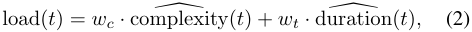
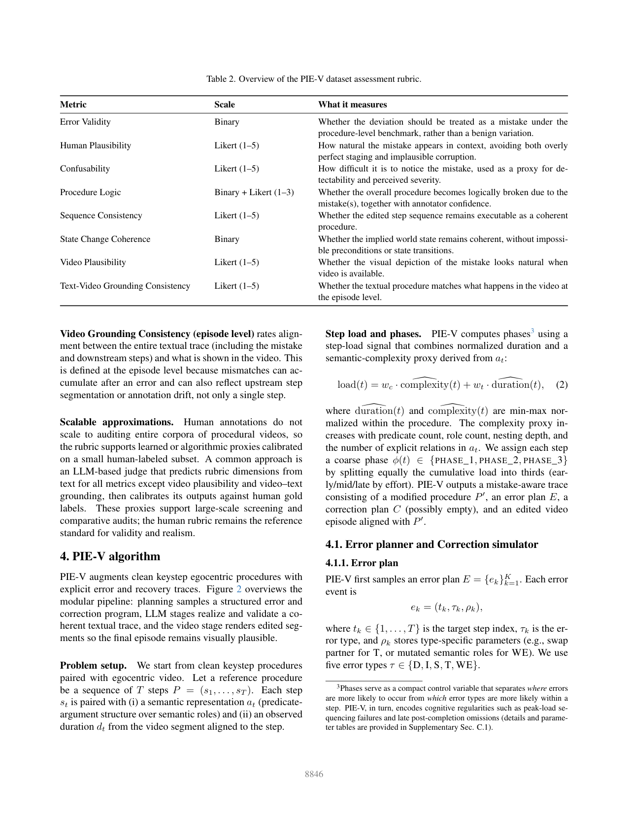
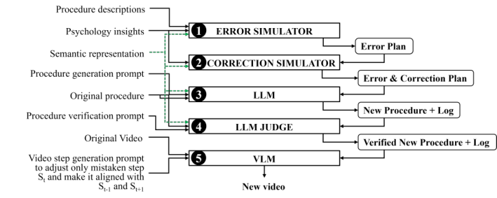
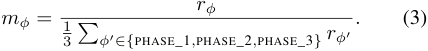
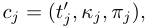
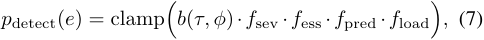
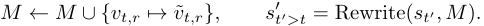

# 016_Loginova_How_to_Correctly_Make_Mistakes_A_Framework_for_Constructing_and_CVPRW_2026_paper

[Original PDF](../016_Loginova_How_to_Correctly_Make_Mistakes_A_Framework_for_Constructing_and_CVPRW_2026_paper.pdf)

Pages: 11

> Automatically converted from PDF. Check the original for exact equations, symbols, table alignment, and figure details.

<!-- Page 1 -->

This CVPR Workshop paper is the Open Access version, provided by the Computer Vision Foundation. Except for this watermark, it is identical to the accepted version; the final published version of the proceedings is available on IEEE Xplore. 

# **How to Correctly Make Mistakes: A Framework for Constructing and Benchmarking Mistake Aware Egocentric Procedural Videos** 

Olga Loginova University of Trento Italy 

olga.loginova@unitn.it 

Frank Keller 

University of Edinburgh United Kingdom 

keller@inf.ed.ac.uk 

## **Abstract** 

_Reliable procedural monitoring in video requires exposure to naturally occurring human errors and the recoveries that follow. In egocentric recordings, mistakes are often partially occluded by hands and revealed through subtle object state changes, while existing procedural datasets provide limited and inconsistent mistake and correction traces. We present PIE-V (Psychologically Inspired Error injection for Videos), a framework for constructing and benchmarking mistake-aware egocentric procedural videos by augmenting clean keystep procedures with controlled, human-plausible deviations. PIE-V combines a psychology-informed error planner conditioned on procedure phase and semantic step load, a correction planner that models recovery behavior, an LLM writer that performs cascade-consistent rewrites, and an LLM judge that validates procedural coherence and repairs failures. For video segment edits, PIE-V synthesizes replacement clips with text-guided video generation and stitches them into the episode to preserve visual plausibility. Applied to 17 tasks and 50 Ego-Exo4D scenarios, PIE-V injects 102 mistakes and generates 27 recovery corrections. For benchmarking, we introduce a unified taxonomy and a human rubric with nine metrics that cover step-level and procedure-level quality, including plausibility, procedure logic with annotator confidence, state change coherence, and grounding between text and video. Using this protocol, we audit several existing resources and compare PIE-V against a freeform LLM generation baseline under the same criteria. Together, the framework and rubric support post-completion verification for egocentric procedural mistake detection and correction._ 

## **1. Introduction** 

To err is human; to err **humanly plausible** is hard. Procedural assistants that watch, guide, or evaluate stepwise activities can fail if trained only on ideal executions. In 

real kitchens, workshops, and labs, people omit steps, swap substeps, use the wrong tool, or execute a step slightly off. Learning and evaluating such behavior therefore requires datasets with realistic deviations, yet these are hard to collect and standardize at scale, leaving current resources sparse and heterogeneous [2]. Such datasets are needed to train mistake detectors and to evaluate state tracking, consequential error localization, and recovery after an error, not only segment-level anomaly flags [10, 13, 30]. They also support benchmarking of multimodal procedural assistants for egocentric guidance, post hoc procedure verification, and error-aware tutoring, where subtle mistakes and corrections matter beyond the final action label [14, 24]. 

The community is moving toward more structured mistake reasoning. Current approaches model errors through action effects and state changes [10, 13] and emphasize coherence [30]. Staged mistakes scale better [24, 36], but naive perturbations often violate preconditions, create impossible object states, or break the task’s causal structure [18, 20]. This makes mistake resources difficult to compare across domains and often too underspecified to support robust recovery modeling. 

How can we correctly make mistakes in procedural videos to provide mistake detection models with quality data? A useful mistake-enriched dataset should satisfy two requirements: (1) the procedure remains executable and logically coherent as a sequence; (2) injected mistakes resemble human error patterns rather than arbitrary corruption. We operationalize this with **PIE-V**1 ( **P** sychologically **I** nspired **E** rror injection for **V** ideos), a scalable pipeline for augmenting procedural video datasets with mistake-aware variants. PIE-V instantiates five universal error types (Deletion, Insertion, Transposition, Substitution, Wrong Execution) and controls when errors occur by procedure phase. For Substitution and Wrong Execution, we use semantic roles within each step to localize the error and control its severity through role importance and step load. PIE-V also 

> 1Code and demos: https://github.com/ologin/PIE-V. 

8843

<!-- Page 2 -->

Figure 1. PIE-V example on an Ego-Exo4D step from “Making Coffee Latte”: (A) reference step; (B) wrong execution with an observable spill; (C) correction that restores procedural consistency by cleaning and redoing the pour. 

generates realistic Corrections, since natural errors often trigger recovery such as redoing a step, inserting a missing action, or undoing an incorrect state [31]. 

Figure 1 illustrates a typical PIE-V error and correction trace on a real procedural step. PIE-V modifies both the instruction sequence and the corresponding video segment to maintain episode-level coherence. 

A second challenge is evaluation. Existing procedural mistake datasets are valuable resources, but they were typically designed for objectives such as detecting visual deviations from a reference step or procedure [9, 11, 14]. For post-completion mistake detection and correction, where the goal is to validate the full procedure trace after a task appears complete, this yields only partial coverage. Annotations may capture visually salient deviations that are informative for their original tasks, but they do not necessarily correspond to consequential execution errors at the level of the full procedure. PIE-V avoids such visual “artifacts” by using video generation to create more subtle, behaviorally credible deviations. We propose a rubric-style evaluation for mistake-aware procedural video datasets and use it to audit existing resources and compare generation strategies. The rubric scores whether an event is a consequential execution error, whether its effects remain procedurally consistent, and whether the sample provides enough structure to study recovery. 

Our contributions are four-fold: (1) a unified taxonomy of procedural errors and semantic roles; (2) a multi-criteria human rubric for mistake assessment; (3) an extensive audit comparing PIE-V against SoTA LLM baselines and existing datasets; and (4) PIE-V, a psychology-informed pipeline for semantics-aware mistake injection. 

## **2. Universal taxonomy of mistakes** 

Our taxonomy draws on three sources: (i) existing mistake datasets and their annotation practices, (ii) sequence 

edit operations as a transferable structural view of procedural deviations, and (iii) cognitive error theory [25], which distinguishes plan-level changes from execution-level deviations and links plausibility to where an error occurs and how it disrupts task state. 

We define five mistake types and treat CORRECTION (C) as a separate component. Correction is reactive: it is triggered by the error to return the executor to the reference trace. 

The five mistake types are: DELETION (D), a required step is missing; INSERTION (I), an extra step is added; SUBSTITUTION (S), an intended step is replaced by a different step; TRANSPOSITION (T), steps are executed in the wrong order; and WRONG EXECUTION (WE), the intended step occurs but with incorrect local parameters. The first four types are structural edits on the step sequence and align with classical edit operations. Deletion, Insertion, and Substitution correspond to Levenshtein style edits [17]. Transposition covers sequencing errors, including adjacent swaps characteristic of Damerau style edits [7]. Wrong Execution is related to Substitution but captures execution level deviations that preserve the step identity while changing how it is carried out. This type is closer to slips and lapses in cognitive accounts of human error. 

Wrong Execution and many instances of Substitution require localization within a step. We therefore represent steps through _semantic roles_ [12, 23] and apply edits to targeted role arguments such as Object, Coobject, Instrument, Location, Destination, Origin, Purpose, and Manner. Role importance provides an explicit notion of severity by distinguishing high impact arguments (Object, Coobject2 ) from medium impact roles (Location, Destination, Origin, Instrument) and low impact modifiers (Manner, Temporal, 

> 2Coobject labels a secondary argument beyond the primary Object, often the target/recipient (e.g., in APPLY/FIT) or the second item being combined (e.g., in MIX/ADD). 

8844

<!-- Page 3 -->

Table 1. Qualitative cognitive motivations behind each error type in our taxonomy and their phase tendencies. 

|**Error type**|**Key psychological interpretation and phase tendency**|
|---|---|
|Substitution|Confusion between similar steps, associative interference, or schema competition; tends to be rarer in later phases once the execution pattern stabilizes.|
|Wrong execution|Execution slips and capture errors (local parameter mistakes), often due to unfamiliarity and motor learning early on; can occur throughout and may reappear toward the end under fatigue.|
|Deletion|Lapses due to memory overload and post-completion vulnerability; tends to increase over the procedure, often peaking toward the end as attention drops.|
|Insertion|Overgeneralization or associative activation (including unintended repetition); generally rarer, but can increase in the middle when multiple routines overlap and the performer is in the flow.|
|Transposition|Sequencing and planning slips under high cognitive load; can occur under time pressure or fatigue, often when step ordering constraints are weak or when attention is divided.|

Degree, Quantity). This role-based view is consistent with work that localizes mistakes inside steps and analyzes their attribution, and with evidence that procedural understanding depends on recovering and using step arguments, including implicit ones [4, 18]. 

Table 1 summarizes the taxonomy and qualitative cognitive motivations. In later sections we use this unified language to map heterogeneous datasets onto comparable categories. When a dataset uses task-specific labels that do not align cleanly with these types, we treat the mapping as approximate. 

## **3. Rubric for mistake-aware dataset assessment** 

To assess mistake-aware procedural traces, we separate two questions. First, does the marked deviation constitute a consequential procedural mistake, as opposed to a permissible execution variant. Second, if it is a mistake, is it plausible at the step level and coherent at the procedure level. Table 2 summarizes the rubric dimensions and scales, following multi-criteria human evaluation practice rather than relying on a single subjective score [1, 33]. 

**Step-level criteria. Error Validity** is a binary gate: without recovery, the deviation would plausibly change the intended outcome, invalidate a prerequisite for later steps, or induce an incorrect intermediate state. This separates consequential mistakes from benign execution variants or incidental noise. **Human Plausibility** measures whether a real person could naturally make this specific mistake in context. **Confusability** measures how easy it is to miss the mistake during real-time execution; it is distinct from Human Plausibility. **Taxonomy Fit (Error Type)** assigns each mistake to one of the five universal categories from Section 2 for domain-agnostic analysis across datasets and generators. **Video Plausibility** evaluates whether the mistaken behavior looks visually natural in egocentric footage, 

rather than theatrical or staged. If a **Correction** is present, it is treated as an additional step in the edited trace with an explicit semantic dependency on the triggering mistake. It is scored with the same applicable metrics, and its plausibility is interpreted relative to the mistake it addresses. 

**Procedure-level criteria.** Procedure-level metrics assess global coherence of the full sequence of procedural steps with mistakes. **Procedure Logic** is a binary judgment of whether the entire procedure becomes logically inconsistent due to this mistake. Because this decision can be intrinsically ambiguous, it is paired with a 3-level confidence score. Let _e_ denote an annotated procedure instance and _Ae_ the set of raters who scored it. Each rater _k ∈ Ae_ provides a binary decision _yk_ ( _e_ ) _∈{_ 0 _,_ 1 _}_ indicating whether the procedure logic is broken, and a confidence weight _qk_ ( _e_ ) _∈{_ 1 _,_ 2 _,_ 3 _}_ . The final per example score is computed as a confidence weighted fraction of “logic broken” decisions: 

For example, if two raters answer “Yes” with confidence 3 and one answers “No” with confidence 2, then PL( _e_ ) = 6 _/_ (6 + 2) = 0 _._ 75. **Sequence Consistency Score** is a rating of whether the resulting step order remains consistent with the procedure constraints and dependencies. This captures step sequence quality beyond the binary logic decision, making a distinction between locally and completely broken reorderings. **State Change Coherence** is a binary check that the implied world state remains consistent across the textual trace, avoiding contradictions such as objects appearing or changing identity without an action, or outcomes that become impossible under the described steps. For example, if the trace omits pouring water, but the video later shows a full coffee cup, the implied state transition is inconsistent, violating State Change Coherence. **Text-** 

8845

<!-- Page 4 -->

Table 2. Overview of the PIE-V dataset assessment rubric. 

|**Metric**|**Scale**|**What it measures**|
|---|---|---|
|Error Validity|Binary|Whether the deviation should be treated as a mistake under the procedure-level benchmark, rather than a benign variation.|
|Human Plausibility|Likert (1–5)|How natural the mistake appears in context, avoiding both overly perfect staging and implausible corruption.|
|Confusability|Likert (1–5)|How difficult it is to notice the mistake, used as a proxy for de- tectability and perceived severity.|
|Procedure Logic|Binary + Likert (1–3)|Whether the overall procedure becomes logically broken due to the mistake(s), together with annotator confidence.|
|Sequence Consistency|Likert (1–5)|Whether the edited step sequence remains executable as a coherent procedure.|
|State Change Coherence|Binary|Whether the implied world state remains coherent, without impossi- ble preconditions or state transitions.|
|Video Plausibility|Likert (1–5)|Whether the visual depiction of the mistake looks natural when video is available.|
|Text-Video Grounding Consistency|Likert (1–5)|Whether the textual procedure matches what happens in the video at the episode level.|

**Video Grounding Consistency (episode level)** rates alignment between the entire textual trace (including the mistake and downstream steps) and what is shown in the video. This is defined at the episode level because mismatches can accumulate after an error and can also reflect upstream step segmentation or annotation drift, not only a single step. 

**Scalable approximations.** Human annotations do not scale to auditing entire corpora of procedural videos, so the rubric supports learned or algorithmic proxies calibrated on a small human-labeled subset. A common approach is an LLM-based judge that predicts rubric dimensions from text for all metrics except video plausibility and video–text grounding, then calibrates its outputs against human gold labels. These proxies support large-scale screening and comparative audits; the human rubric remains the reference standard for validity and realism. 

**Step load and phases.** PIE-V computes phases3 using a step-load signal that combines normalized duration and a semantic-complexity proxy derived from _at_ : 

� � where duration( _t_ ) and complexity( _t_ ) are min-max normalized within the procedure. The complexity proxy increases with predicate count, role count, nesting depth, and the number of explicit relations in _at_ . We assign each step a coarse phase _ϕ_ ( _t_ ) _∈{_ PHASE_1 _,_ PHASE_2 _,_ PHASE_3 _}_ by splitting equally the cumulative load into thirds (early/mid/late by effort). PIE-V outputs a mistake-aware trace consisting of a modified procedure _P__′_ , an error plan _E_ , a correction plan _C_ (possibly empty), and an edited video episode aligned with _P__′_ . 

### **4.1. Error planner and Correction simulator** 

## **4. PIE-V algorithm** 

PIE-V augments clean keystep egocentric procedures with explicit error and recovery traces. Figure 2 overviews the modular pipeline: planning samples a structured error and correction program, LLM stages realize and validate a coherent textual trace, and the video stage renders edited segments so the final episode remains visually plausible. 

**Problem setup.** We start from clean keystep procedures paired with egocentric video. Let a reference procedure be a sequence of _T_ steps _P_ = ( _s_ 1 _, . . . , sT_ ). Each step _st_ is paired with (i) a semantic representation _at_ (predicateargument structure over semantic roles) and (ii) an observed duration _dt_ from the video segment aligned to the step. 

#### **4.1.1. Error plan** 

PIE-V first samples an error plan _E_ = _{ek}__K_ _k_ =1.Each error event is 

where _tk ∈{_ 1 _, . . . , T }_ is the target step index, _τk_ is the error type, and _ρk_ stores type-specific parameters (e.g., swap partner for T, or mutated semantic roles for WE). We use five error types _τ ∈{_ D _,_ I _,_ S _,_ T _,_ WE _}_ . 

> 3Phases serve as a compact control variable that separates _where_ errors are more likely to occur from _which_ error types are more likely within a step. PIE-V, in turn, encodes cognitive regularities such as peak-load sequencing failures and late post-completion omissions (details and parameter tables are provided in Supplementary Sec. C.1). 

8846

> Original page for checking 2 unresolved font glyphs.

<!-- Page 5 -->

Figure 2. PIE-V pipeline overview. Clean keystep procedures are enriched by (1) an error planner (psychology-informed, constrained by step semantics and procedure phase), (2) a correction planner (recovery behavior), (3) an LLM writer (procedure rewriting with cascade consistency edits), (4) an LLM judge (coherence validation and repair; optionally multimodal), and (5) a video synthesis stage that generates new clips and smooth transitions for video plausibility. Green dashed arrows denote precomputed semantic representations for each step that condition all PIE-V modules except video generation. 

The planner is psychology-informed. It biases error placement and type by phase _ϕ_ ( _t_ ) and step load load( _t_ ), reflecting that slips, lapses, and post-completion vulnerability vary over a procedure [5, 6, 21, 25]. 

**Phase error-rate model (where errors occur).** We define a phase error-rate model _rϕ_ and normalize it into multipliers with mean 1: 

Candidate error locations are sampled with load-based weights: 

**Structural edits.** For D, PIE-V removes _st_ from the trace. For I, it inserts a new step near _t_ (the plan specifies insertion location and intent; the writer realizes the text). For T, it swaps the order of two nearby steps within a fixed window (default window size 6). For S, it replaces the intended step with an alternative step consistent with local context and taxonomy constraints. 

**Localized edits.** WE and many cases of S require localization inside a step. PIE-V therefore mutates role arguments inside _at_ rather than rewriting the entire step arbitrarily. We use a role-impact map _ω_ ( _r_ ) _∈ {_ HIGH _,_ MEDIUM _,_ LOW _}_4 . For Wrong Execution, we select one (occasionally two) roles present in the step with probability proportional to an impact weight and a predicateconditioned role prior: 

under hard constraints that prevent degenerate traces (e.g., _K ≤_ 5 and no more than three consecutive error steps). 

**Phase-conditioned type priors (what errors occur).** Error types are sampled from phase-conditioned priors. Let _πϕ_ be a phase-specific prior over the taxonomy _{_ WE _,_ D _,_ S _,_ I _,_ T _}_ . We sample 

where _m_ ( _·_ ) applies feasibility modifiers such as disallowing deletion if _T ≤_ 4, limiting transposition to a local window, and biasing insertions toward non-essential steps. We also constrain transpositions and prefer substitutions using taxonomy blocks from the underlying keystep hierarchy so that edits remain locally coherent without requiring a full world model. 

We define error severity as the maximum impact among mutated roles. 

#### **4.1.2. Correction simulator** 

PIE-V produces a correction plan _C_ = _{cj}__J_ _j_ =1conditioned on _E_ and procedure context (with _J_ possibly zero). A correction event is represented as 

where _t__′_ _j_is the insertion point in the edited trace,_κj_is the correction type, and _πj_ encodes the repair target (the triggering error id and the object/role to repair). 

> 4Role annotations are precomputed offline for the dataset step vocabulary, while the role-impact map and predicate-conditioned role priors are constructed once from the semantic representation corpus; implementation details are given in Supplementary Sec. C.3. 

8847

<!-- Page 6 -->

Figure 3. Example PIE-V simulation log for the Ego-Exo4D “Install a Wheel” task (cmu_bike14_4). The simulators insert a WE event at Step 01 (incorrect wheel positioning in the fork) and then schedule a phase-matched correction (STOP_AND_FIX _→_ redo Step 01) before continuing the remaining steps. 

**Detection and action priors.** Corrections depend on whether the executor notices the error and decides to act. We model detection with a factorized prior based on error type and phase, modulated by severity, essentiality, predicate salience, and cognitive load: 

where _b_ ( _τ, ϕ_ ) is a hand-specified base detectability prior over error types and phase buckets, motivated by cognitive error recovery regularities, and _f_ load = max(0 _._ 70 _,_ 1 _−_ 0 _._ 25 _·_ load( _t_ )) decreases detection under high load. The full detectability tables, action priors, and latency settings are provided in Supplementary Sec. C.2. 

Conditioned on detection, we sample a latency in steps and a correction type consistent with the triggering error, such as STOP_AND_FIX, REDO, ROLLBACK_AND_REDO, or UNDO_EXTRA_STEP, following cognitive accounts of recovery behavior [31]. 

Figure 3 shows a concrete sampled trace in which WE at Step 01 triggers an immediate STOP_AND_FIX correction C and step redo, so that the next Step_2 remains plausible, as well as all the following steps. 

### **4.2. LLM writer: coherent procedure rewriting with cascades** 

### **4.3. LLM judge: plan compliance, coherence validation, and repair** 

The judge validates and repairs the writer output. It checks three classes of constraints. **Plan compliance** : Planned error and correction events must appear at the intended locations and match the intended types, including targeted roles for localized edits. **Procedure coherence** : The rewritten trace must remain executable and logically consistent, including ordering constraints and state consistency. We treat state coherence as a predicate over implied transitions _xt_ +1 = _g_ ( _xt, s__′_ _t_)andrejecttracesthatassumeunavail- able objects or contradict prior effects. **Recovery validity** : Corrections must address the triggering mistake and restore procedural consistency rather than introduce new contradictions. 

The judge runs a bounded repair loop: it proposes minimal rewrites that preserve the plan and revalidates them. If repeated text-only repairs fail, the judge can optionally become multimodal by attaching a small number of cached frames from the implicated steps (typically WE or S) and retrying repair with visual evidence. 

### **4.4. Video synthesis and stitching** 

PIE-V edits the egocentric episode to match _P__′_ by regenerating only windows affected by planned errors or corrections and keeping other clips unchanged. For each edited window, we cache boundary anchors (end frame of the preceding step and start frame of the following step), generate a replacement clip conditioned on these anchors when supported, and splice it back, updating step timestamps. Editing is type-dependent and constrained by model duration: WE and S typically replace a full step, I and C add a short clip, T regenerates a local window, and D removes a step and inserts a brief bridge (often _<_ 3 s) to connect surrounding context. 

## **5. Experiments** 

### **5.1. Annotations** 

Given ( _P, {at}, E, C_ ), the writer produces a rewritten procedure _P__′_ = ( _s_ 1_′, . . . , s′_ _T__′_)thatinstantiatesplanneddevi- ations and recoveries. A key requirement is global coherence: if an entity or attribute is edited at step _t_ , later mentions must be updated consistently. We represent this with a cascading rewrite map _M_ over entities and attributes. For each planned local edit, we update _M_ and apply it to future steps: 

The writer therefore emits both the planned error/correction steps and any necessary downstream adjustments, avoiding a common failure mode of unstructured generation where local edits silently break global procedure logic. 

**Annotation protocol and agreement.** We use 5 annotators (2 male, 3 female; age 20–47; mixed educational backgrounds). 

Annotators evaluate samples in a paired setting: a reference execution and a mistake-aware variant with mistakes and corrections explicitly marked. The task is to rate the quality of the indicated deviations and recoveries, not to discover them. We monitor inter-annotator agreement using Krippendorff’s _α_ . The details on annotators and guidelines are given in Supplementary Sec. B. 

### **5.2. PIE-V for Ego-Exo4D** 

We construct a mistake-enriched benchmark from **EgoExo4D** by selecting 17 tasks and 50 scenarios and gen- 

8848

<!-- Page 7 -->

Table 3. Aggregated rubric statistics for existing datasets and Ego-Exo4D generations. We do not report Taxonomy Fit here because it is not a scalar score/rate. Lower is better for “Proc.Logic (Yes, %)” and “State-Chg (Yes, %)”; higher is better for the remaining reported metrics. “–” indicates unavailable values. The best value is highlighted only for metrics with a clear optimization direction. 

|Dataset|Err.Valid (Yes, %)|Human Pl.|Confus.|Proc.Logic (Yes,|%) Seq.Cons.|State-Chg (Yes,|%) Vid.Pl.|T–V Gr.|
|---|---|---|---|---|---|---|---|---|
|EgoPER|51|2.67|1.88|26|4.41|14|3.22|3.42|
|EgoOops|72|**3.73**|1.63|28|4.50|10|**4.31**|3.74|
|Assembly101|65|3.69|2.09|12|**4.82**|4|4.05|3.22|
|CaptainCook4D|74|3.71|2.32|12|4.73|**2**|3.42|3.63|
|Ego-Exo4D-Qwen (freeform)|57|3.34|2.04|36|4.20|27|–|–|
|Ego-Exo4D-GPT-5.2 (freeform)|55|3.08|1.76|25|4.18|7|–|–|
|Ego-Exo4D-Qwen-PJ (PIE-V+Qwen2.5, Qwen3-VL-judged)|71|3.09|1.86|30|4.39|10|–|–|
|Ego-Exo4D-GPT-5.2-PJ (PIE-V+GPT, judged)|**89**|3.41|1.76|**6**|4.48|3|3.54|**3.87**|

Table 4. Scale statistics for Ego-Exo4D generations under different settings. 

## **6. Results** 

### **6.1. Audit of existing datasets** 

|Setting |Total steps|Mistake steps|Mistake rate (%)|Avg. mistakes/video|
|---|---|---|---|---|
|Ego-Exo4D-Qwen (freeform)|1156|112|9.69|2.24|
|Ego-Exo4D-GPT-5.2 (freeform)|1270|77|6.06|1.54|
|Ego-Exo4D-Qwen-PJ|1320|143|10.83|2.86|
|Ego-Exo4D-GPT-5.2-PJ|1323|141|10.66|2.82|

erating one mistake-aware variant per scenario. The error planner injects up to five mistakes per procedure with a cap on consecutive mistakes, disallows deletions for very short procedures, and restricts transpositions to a local window. Across the 50 scenarios, PIE-V injects 102 mistakes and 27 recovery corrections; the mistakes cover all five taxonomy types. Corrections are not generated for every mistake because recovery is sampled conditionally from detectability, action, and latency priors, as detailed in Supplementary Sec. C.2. 

For text generation and validation in the writer/judge stages we use **GPT-5.2** [29], **Qwen2.5-32B** [3], and the multimodal **Qwen3-VL-32B** [35]. For video editing we synthesize replacement clips with **Kling-O** [32], **Sora 2** [19], **Seedance 1.5 Pro** [27], **Veo 3.1** [8], and **Runway Gen4** [26]. 

### **5.3. LLMs for Ego-Exo4D** 

To assess whether unstructured generation can match structured planning, we compare PIE-V against a **freeform** baseline that rewrites a clean procedure into a mistakeaware variant directly from text instructions, without explicit phase priors or role-constrained edits. We also evaluate a stronger baseline that adds the same validation and repair stage as PIE-V (LLM judge plus deterministic checks), isolating the effect of structured planning. Both baselines use the same model pool as PIE-V for writer/judge: **GPT5.2** , **Qwen2.5-32B** , and the multimodal **Qwen3-VL-32B** . All generated traces are evaluated under the same rubric and audit protocol as the existing datasets. 

We apply our rubric to four egocentric datasets with annotated mistakes: **EgoPER** [16], **EgoOops** [14], **CaptainCook4D** [24], and **Assembly101** [28]. For each dataset, we randomly sample 25 videos that contain at least one annotated mistake. Supplementary Sec. A summarizes step and mistake density for the four audited datasets for general context. 

Table 3 summarizes rubric aggregates and reveals dataset-specific signatures relevant for procedure-level mistake reasoning: (i) how often annotated deviations are judged as consequential mistakes (Err.Valid), (ii) whether they look like errors a real person could make (Human Pl.) and whether they are easy to overlook (Confus.), and (iii) whether the resulting trace remains logically and causally coherent (Proc.Logic / Seq.Cons. / State-Chg) with aligned text and video (T–V Gr.). 

Across datasets, step-level realism cues (Human Pl., Vid.Pl.) do not imply procedure-level coherence: several resources score well on plausibility while still exhibiting frequent logic or state inconsistencies under a holistic rubric. Conversely, the higher step–mistake density summarized in Supplementary Sec. A often correlates with lower confusability and more staged-looking deviations, which is desirable for anomaly recognition but less representative of naturally occurring mistake-and-recovery traces. 

Our audit reveals specific signatures: **EgoOops** scores strongly on Human Plausibility and Video Plausibility, suggesting mistakes tend to look behaviorally credible and visually natural. Its scenarios are specific and mistakes are mostly staged, which reduces coverage for broad everyday procedures and limits the diversity of long-horizon causal failures. **Assembly101** shows lower Text–Video Grounding Consistency. It indicates that textual step descriptions do not fully correspond to what is executed on video, which complicates episode-level tracking for multimodal models. Its completion-driven assembly protocol also reshapes the error space: genuine omissions are naturally rare, and re- 

8849

<!-- Page 8 -->

Table 5. Krippendorff’s _α_ agreement summary. 

|Dataset|Err.Valid|Human Pl.|Confus.|Proc.Logic|Seq.Cons.|State-Chg|Taxonomy Fit|Vid.Pl.|T–V Gr.|
|---|---|---|---|---|---|---|---|---|---|
|EgoPER|0.912|0.541|0.368|0.728|0.628|0.579|0.759|0.574|0.662|
|EgoOops|0.916|0.592|0.375|0.836|0.667|0.600|0.882|0.579|0.560|
|Assembly101|0.859|0.584|0.697|0.739|0.649|1.000|0.931|0.670|0.861|
|CaptainCook4D|0.694|0.758|0.847|0.621|0.542|0.584|0.791|0.550|0.488|
|Ego-Exo4D-GPT-5.2-PJ (PIE-V+GPT, judged)|0.913|0.489|0.387|0.672|0.619|0.696|0.803|0.630|0.930|

peated attach/detach attempts can appear insertion-like at the sequence level. **EgoPER** has comparatively low Error Validity: a substantial fraction of labeled deviations are judged as permissible variants rather than consequential mistakes. This highlights that “mistake” boundaries are often ambiguous in practice, and that such ambiguity can weaken supervision signals when the goal is to learn recovery-triggering errors rather than stylistic execution differences. **CaptainCook4D** combines high mistake density with lower Confusability, i.e., many deviations are easy to notice. This profile fits segment-level anomaly recognition, but it can be less representative of naturally occurring traces where mistakes are often subtle and followed by explicit recoveries rather than frequent isolated anomalies. 

Overall, these datasets were primarily designed for segment-level deviation and anomaly recognition. Our rubric makes explicit which procedure-level properties are not directly targeted by this focus, such as coherent state transitions and episode-level text–video alignment. This reflects different design objectives rather than a flaw of the resources. 

### **6.2. PIE-V vs. LLMs** 

If we compare PIE-V and freeform mistake generation, two trends stand out. First, freeform generation under-produces mistakes (Table 4) and produces substantially higher rates of procedure-level failures (Proc.Logic and State-Chg) despite producing locally fluent text (see Table 3). Second, adding a judge stage without structured planning is insufficient: phase/load priors and role-constrained edits are what keep multi-error traces executable over long horizons. 

A common freeform failure mode is violating implicit preconditions or dropping necessary tail steps: for instance, the model describes a deviation but leaves the step text effectively unchanged, or truncates the remaining procedure; or the resulting trace lacks a recovery step and becomes inconsistent with later state-dependent actions. 

To quantify reliability of the rubric dimensions, we compute Krippendorff’s _α_ across annotators for each metric and dataset (Table 5). We expect higher agreement for crisp categorical judgments (e.g., Error Validity, Taxonomy Fit) and lower agreement for inherently subjective ratings (Human Plausibility, Confusability), where multiple interpretations of “how a human might err” are reasonable. 

## **7. Related work** 

**Human errors, corrections, and structured procedural edits.** PIE-V builds on cognitive accounts that distinguish _slips_ (execution failures) from _mistakes_ (planning failures) [21, 25]. We model phase-dependent vulnerability (e.g., post-completion errors) [6] and elevated error rates under high cognitive load [15, 22], and we explicitly synthesize reactive _corrections_ to capture human recovery behavior and memory competition effects [31, 34]. To generate realistic deviations without physically implausible corruption, we leverage semantic role labeling to localize editable arguments [23] and constrain edits by feasibility and role impact, rather than unconstrained role swaps used in misalignment generation [18]. 

**Procedural video benchmarks.** Egocentric procedural datasets and mistake-focused benchmarks are rapidly expanding but remain heterogeneous in domains and taxonomies. A detailed survey and comparison are available in Supplementary Sec. A. PIE-V complements these resources by providing a scalable pipeline to inject plausible, non-staged errors and recoveries across diverse scenarios, bridging domain-specific anomalies and universal procedural logic. 

## **8. Conclusion** 

Making mistakes is easy; making them _correctly_ is what enables reliable benchmarking. PIE-V turns mistake-aware dataset construction into a controlled, auditable pipeline for egocentric procedures. It plans phase- and load-conditioned deviations and recoveries, realizes them with constrained rewriting and validation, and synthesizes edited clips so the final episodes remain visually plausible. 

PIE-V is the first method to prioritize world state when generating errors: deviations are kept only if their causal effects remain executable, consistent, and recoverable, yielding full error–correction traces rather than isolated anomalies. Human evaluation with our nine-metric rubric confirms that this structure matters: compared with freeform generation and existing resources, PIE-V more often produces consequential, procedure-coherent mistake traces with stronger plausibility cues. 

8850

<!-- Page 9 -->

## **Acknowledgements** 

Olga Loginova thanks Amazon Alexa for supporting her research through a generous donation to Raffaella Bernardi. 

## **References** 

- [1] Jacopo Amidei, Paul Piwek, and Alistair Willis. The use of rating and Likert scales in natural language generation human evaluation tasks: A review and some recommendations. In _Proceedings of the 12th International Conference on Natural Language Generation_ , pages 397–402, Tokyo, Japan, 2019. Association for Computational Linguistics. 3 

- [2] Konstantinos Bacharidis and Antonis A. Argyros. Visionbased mistake analysis in procedural activities: A review of advances and challenges, 2025. 1 

- [3] Jinze Bai, Shuai Bai, Yunfei Chu, Zeyu Cui, Kai Dang, Xiaodong Deng, Yang Fan, Wenbin Ge, Yu Han, Fei Huang, Binyuan Hui, Luo Ji, Mei Li, Junyang Lin, Runji Lin, Dayiheng Liu, Gao Liu, Chengqiang Lu, Keming Lu, Jianxin Ma, Rui Men, Xingzhang Ren, Xuancheng Ren, Chuanqi Tan, Sinan Tan, Jianhong Tu, Peng Wang, Shijie Wang, Wei Wang, Shengguang Wu, Benfeng Xu, Jin Xu, An Yang, Hao Yang, Jian Yang, Shusheng Yang, Yang Yao, Bowen Yu, Hongyi Yuan, Zheng Yuan, Jianwei Zhang, Xingxuan Zhang, Yichang Zhang, Zhenru Zhang, Chang Zhou, Jingren Zhou, Xiaohuan Zhou, and Tianhang Zhu. Qwen technical report. _arXiv preprint arXiv:2309.16609_ , 2023. 7 

- [4] Anil Batra, Laura Sevilla-Lara, Marcus Rohrbach, and Frank Keller. Predicting implicit arguments in procedural video instructions. In _Proceedings of the 63rd Annual Meeting of the Association for Computational Linguistics (Volume 1: Long Papers)_ , pages 30399–30419, Vienna, Austria, 2025. Association for Computational Linguistics. 3 

- [5] Michael D. Byrne and Susan Bovair. A working memory model of a common procedural error. _Cogn. Sci._ , 21:31–61, 1997. 5 

- [6] Michael D. Byrne and Elizabeth M. Davis. Task structure and postcompletion error in the execution of a routine procedure. _Human Factors_ , 48(4):627–638, 2006. 5, 8 

- [7] Fred J. Damerau. A technique for computer detection and correction of spelling errors. _Communications of the ACM_ , 7:171 – 176, 1964. 2 

- [8] Google DeepMind. Veo 3.1 technical report. Technical report, Google, 2026. Accessed: 2026-02-24. 7 

- [9] Guodong Ding, Fadime Sener, Shugao Ma, and Angela Yao. Every mistake counts in assembly. _ArXiv_ , abs/2307.16453, 2023. 2 

- [10] Alessandro Flaborea, Guido Maria D’Amely di Melendugno, Leonardo Plini, Luca Scofano, Edoardo De Matteis, Antonino Furnari, G. Farinella, and Fabio Galasso. Prego: Online mistake detection in procedural egocentric videos. _2024 IEEE/CVF Conference on Computer Vision and Pattern Recognition (CVPR)_ , pages 18483–18492, 2024. 1 

- [11] Reza Ghoddoosian, Isht Dwivedi, Nakul Agarwal, and Behzad Dariush. Weakly-supervised action segmentation and unseen error detection in anomalous instructional videos. 

_2023 IEEE/CVF International Conference on Computer Vision (ICCV)_ , pages 10094–10104, 2023. 2 

- [12] Daniel Gildea and Daniel Jurafsky. Automatic labeling of semantic roles. _Computational Linguistics_ , 28(3):245–288, 2002. 2 

- [13] Wenliang Guo, Yujiang Pu, and Yu Kong. Procedural mistake detection via action effect modeling, 2025. 1 

- [14] Yuto Haneji, Taichi Nishimura, Hirotaka Kameko, Keisuke Shirai, Tomoya Yoshida, Keiya Kajimura, Koki Yamamoto, Taiyu Cui, Tomohiro Nishimoto, and Shinsuke Mori. Egooops: A dataset for mistake action detection from egocentric videos referring to procedural texts, 2025. 1, 2, 7 

- [15] Marcel Adam Just and Patricia A. Carpenter. A capacity theory of comprehension: individual differences in working memory. _Psychological review_ , 99 1:122–49, 1992. 8 

- [16] Shih-Po Lee, Zijia Lu, Zekun Zhang, Minh Hoai, and Ehsan Elhamifar. Error detection in egocentric procedural task videos. In _Proceedings of the IEEE/CVF Conference on Computer Vision and Pattern Recognition (CVPR)_ , pages 18655–18666, 2024. 7 

- [17] Vladimir I. Levenshtein. Binary codes capable of correcting deletions, insertions, and reversals. _Soviet physics. Doklady_ , 10:707–710, 1965. 2 

- [18] Yayuan Li, Aadit Jain, Filippos Bellos, and Jason J. Corso. Mistake attribution: Fine-grained mistake understanding in egocentric videos, 2025. 1, 3, 8 

- [19] Yixin Liu, Kai Zhang, Yuan Li, Zhiling Yan, Chujie Gao, Ruoxi Chen, Zhengqing Yuan, Yue Huang, Hanchi Sun, Jianfeng Gao, Lifang He, and Lichao Sun. Sora: A review on background, technology, limitations, and opportunities of large vision models, 2024. 7 

- [20] Medhini Narasimhan, Licheng Yu, Sean Bell, Ning Zhang, and Trevor Darrell. Learning and verification of task structure in instructional videos, 2023. 1 

- [21] Donald A. Norman. _The Psychology of Everyday Things_ . Basic Books, New York, 1988. 5, 8 

- [22] Fred Paas, Alexander Renkl, and John Sweller. Cognitive load theory and instructional design: Recent developments. _Educational Psychologist_ , 38:1 – 4, 2003. 8 

- [23] Martha Palmer, Daniel Gildea, and Paul Kingsbury. The Proposition Bank: An annotated corpus of semantic roles. _Computational Linguistics_ , 31(1):71–106, 2005. 2, 8 

- [24] Rohith Peddi, Shivvrat Arya, Bharath Challa, Likhitha Pallapothula, Akshay Vyas, Bhavya Gouripeddi, Jikai Wang, Qifan Zhang, Vasundhara Komaragiri, Eric Ragan, Nicholas Ruozzi, Yu Xiang, and Vibhav Gogate. Captaincook4d: A dataset for understanding errors in procedural activities, 2024. 1, 7 

- [25] James Reason. _Human Error_ . Cambridge University Press, 1990. 2, 5, 8 

- [26] Runway Research. Introducing Runway Gen-4. https: / / runwayml . com / research / introducing - runway-gen-4, 2025. Accessed: 2025-03-01. 7 

- [27] Team Seedance, Heyi Chen, Siyan Chen, Xin Chen, Yanfei Chen, Ying Chen, Zhuo Chen, Feng Cheng, Tianheng Cheng, Xinqi Cheng, Xuyan Chi, Jian Cong, Jing Cui, Qinpeng Cui, Qide Dong, Junliang Fan, Jing Fang, Zetao Fang, 

8851

<!-- Page 10 -->

Chengjian Feng, Han Feng, Mingyuan Gao, Yu Gao, Dong Guo, Qiushan Guo, Boyang Hao, Qingkai Hao, Bibo He, Qian He, Tuyen Hoang, Ruoqing Hu, Xi Hu, Weilin Huang, Zhaoyang Huang, Zhongyi Huang, Donglei Ji, Siqi Jiang, Wei Jiang, Yunpu Jiang, Zhuo Jiang, Ashley Kim, Jianan Kong, Zhichao Lai, Shanshan Lao, Yichong Leng, Ai Li, Feiya Li, Gen Li, Huixia Li, JiaShi Li, Liang Li, Ming Li, Shanshan Li, Tao Li, Xian Li, Xiaojie Li, Xiaoyang Li, Xingxing Li, Yameng Li, Yifu Li, Yiying Li, Chao Liang, Han Liang, Jianzhong Liang, Ying Liang, Zhiqiang Liang, Wang Liao, Yalin Liao, Heng Lin, Kengyu Lin, Shanchuan Lin, Xi Lin, Zhijie Lin, Feng Ling, Fangfang Liu, Gaohong Liu, Jiawei Liu, Jie Liu, Jihao Liu, Shouda Liu, Shu Liu, Sichao Liu, Songwei Liu, Xin Liu, Xue Liu, Yibo Liu, Zikun Liu, Zuxi Liu, Junlin Lyu, Lecheng Lyu, Qian Lyu, Han Mu, Xiaonan Nie, Jingzhe Ning, Xitong Pan, Yanghua Peng, Lianke Qin, Xueqiong Qu, Yuxi Ren, Kai Shen, Guang Shi, Lei Shi, Yan Song, Yinglong Song, Fan Sun, Li Sun, Renfei Sun, Yan Sun, Zeyu Sun, Wenjing Tang, Yaxue Tang, Zirui Tao, Feng Wang, Furui Wang, Jinran Wang, Junkai Wang, Ke Wang, Kexin Wang, Qingyi Wang, Rui Wang, Sen Wang, Shuai Wang, Tingru Wang, Weichen Wang, Xin Wang, Yanhui Wang, Yue Wang, Yuping Wang, Yuxuan Wang, Ziyu Wang, Guoqiang Wei, Wanru Wei, Di Wu, Guohong Wu, Hanjie Wu, Jian Wu, Jie Wu, Ruolan Wu, Xinglong Wu, Yonghui Wu, Ruiqi Xia, Liang Xiang, Fei Xiao, XueFeng Xiao, Pan Xie, Shuangyi Xie, Shuang Xu, Jinlan Xue, Shen Yan, Bangbang Yang, Ceyuan Yang, Jiaqi Yang, Runkai Yang, Tao Yang, Yang Yang, Yihang Yang, ZhiXian Yang, Ziyan Yang, Songting Yao, Yifan Yao, Zilyu Ye, Bowen Yu, Jian Yu, Chujie Yuan, Linxiao Yuan, Sichun Zeng, Weihong Zeng, Xuejiao Zeng, Yan Zeng, Chuntao Zhang, Heng Zhang, Jingjie Zhang, Kuo Zhang, Liang Zhang, Liying Zhang, Manlin Zhang, Ting Zhang, Weida Zhang, Xiaohe Zhang, Xinyan Zhang, Yan Zhang, Yuan Zhang, Zixiang Zhang, Fengxuan Zhao, Huating Zhao, Yang Zhao, Hao Zheng, Jianbin Zheng, Xiaozheng Zheng, Yangyang Zheng, Yijie Zheng, Jiexin Zhou, Jiahui Zhu, Kuan Zhu, Shenhan Zhu, Wenjia Zhu, Benhui Zou, and Feilong Zuo. Seedance 1.5 pro: A native audio-visual joint generation foundation model, 2025. 7 

- [28] Fadime Sener, Dibyadip Chatterjee, Daniel Shelepov, Kun He, Dipika Singhania, Robert Wang, and Angela Yao. Assembly101: A large-scale multi-view video dataset for understanding procedural activities. _2022 IEEE/CVF Conference on Computer Vision and Pattern Recognition (CVPR)_ , pages 21064–21074, 2022. 7 

- [29] Aaditya Singh, Adam Fry, Adam Perelman, Adam Tart, Adi Ganesh, Ahmed El-Kishky, Aidan McLaughlin, Aiden Low, AJ Ostrow, Akhila Ananthram, Akshay Nathan, Alan Luo, Alec Helyar, Aleksander Madry, Aleksandr Efremov, Aleksandra Spyra, Alex Baker-Whitcomb, Alex Beutel, Alex Karpenko, Alex Makelov, Alex Neitz, Alex Wei, Alexandra Barr, Alexandre Kirchmeyer, Alexey Ivanov, Alexi Christakis, Alistair Gillespie, Allison Tam, Ally Bennett, Alvin Wan, Alyssa Huang, Amy McDonald Sandjideh, Amy Yang, Ananya Kumar, Andre Saraiva, Andrea Vallone, Andrei Gheorghe, Andres Garcia Garcia, Andrew Braun- 

stein, Andrew Liu, Andrew Schmidt, Andrey Mereskin, Andrey Mishchenko, Andy Applebaum, Andy Rogerson, Ann Rajan, Annie Wei, Anoop Kotha, Anubha Srivastava, Anushree Agrawal, Arun Vijayvergiya, Ashley Tyra, Ashvin Nair, Avi Nayak, Ben Eggers, Bessie Ji, Beth Hoover, Bill Chen, Blair Chen, Boaz Barak, Borys Minaiev, Botao Hao, Bowen Baker, Brad Lightcap, Brandon McKinzie, Brandon Wang, Brendan Quinn, Brian Fioca, Brian Hsu, Brian Yang, Brian Yu, Brian Zhang, Brittany Brenner, Callie Riggins Zetino, Cameron Raymond, Camillo Lugaresi, Carolina Paz, Cary Hudson, Cedric Whitney, Chak Li, Charles Chen, Charlotte Cole, Chelsea Voss, Chen Ding, Chen Shen, Chengdu Huang, Chris Colby, Chris Hallacy, Chris Koch, Chris Lu, Christina Kaplan, Christina Kim, CJ Minott-Henriques, Cliff Frey, Cody Yu, Coley Czarnecki, Colin Reid, Colin Wei, Cory Decareaux, Cristina Scheau, Cyril Zhang, Cyrus Forbes, Da Tang, Dakota Goldberg, Dan Roberts, Dana Palmie, Daniel Kappler, Daniel Levine, Daniel Wright, Dave Leo, David Lin, David Robinson, Declan Grabb, Derek Chen, Derek Lim, Derek Salama, Dibya Bhattacharjee, Dimitris Tsipras, Dinghua Li, Dingli Yu, DJ Strouse, Drew Williams, Dylan Hunn, Ed Bayes, Edwin Arbus, Ekin Akyurek, Elaine Ya Le, Elana Widmann, Eli Yani, Elizabeth Proehl, Enis Sert, Enoch Cheung, Eri Schwartz, Eric Han, Eric Jiang, Eric Mitchell, Eric Sigler, Eric Wallace, Erik Ritter, Erin Kavanaugh, Evan Mays, Evgenii Nikishin, Fangyuan Li, Felipe Petroski Such, Filipe de Avila Belbute Peres, Filippo Raso, Florent Bekerman, Foivos Tsimpourlas, Fotis Chantzis, Francis Song, Francis Zhang, Gaby Raila, Garrett McGrath, Gary Briggs, Gary Yang, Giambattista Parascandolo, Gildas Chabot, Grace Kim, Grace Zhao, Gregory Valiant, Guillaume Leclerc, Hadi Salman, Hanson Wang, Hao Sheng, Haoming Jiang, Haoyu Wang, Haozhun Jin, Harshit Sikchi, Heather Schmidt, Henry Aspegren, Honglin Chen, Huida Qiu, Hunter Lightman, Ian Covert, Ian Kivlichan, Ian Silber, Ian Sohl, Ibrahim Hammoud, Ignasi Clavera, Ikai Lan, Ilge Akkaya, Ilya Kostrikov, Irina Kofman, Isak Etinger, Ishaan Singal, Jackie Hehir, Jacob Huh, Jacqueline Pan, Jake Wilczynski, Jakub Pachocki, James Lee, James Quinn, Jamie Kiros, Janvi Kalra, Jasmyn Samaroo, Jason Wang, Jason Wolfe, Jay Chen, Jay Wang, Jean Harb, Jeffrey Han, Jeffrey Wang, Jennifer Zhao, Jeremy Chen, Jerene Yang, Jerry Tworek, Jesse Chand, Jessica Landon, Jessica Liang, Ji Lin, Jiancheng Liu, Jianfeng Wang, Jie Tang, Jihan Yin, Joanne Jang, Joel Morris, Joey Flynn, Johannes Ferstad, Johannes Heidecke, John Fishbein, John Hallman, Jonah Grant, Jonathan Chien, Jonathan Gordon, Jongsoo Park, Jordan Liss, Jos Kraaijeveld, Joseph Guay, Joseph Mo, Josh Lawson, Josh McGrath, Joshua Vendrow, Joy Jiao, Julian Lee, Julie Steele, Julie Wang, Junhua Mao, Kai Chen, Kai Hayashi, Kai Xiao, Kamyar Salahi, Kan Wu, Karan Sekhri, Karan Sharma, Karan Singhal, Karen Li, Kenny Nguyen, Keren Gu-Lemberg, Kevin King, Kevin Liu, Kevin Stone, Kevin Yu, Kristen Ying, Kristian Georgiev, Kristie Lim, Kushal Tirumala, Kyle Miller, Lama Ahmad, Larry Lv, Laura Clare, Laurance Fauconnet, Lauren Itow, Lauren Yang, Laurentia Romaniuk, Leah Anise, Lee Byron, Leher Pathak, Leon Maksin, Leyan Lo, Leyton Ho, 

8852

<!-- Page 11 -->

Li Jing, Liang Wu, Liang Xiong, Lien Mamitsuka, Lin Yang, Lindsay McCallum, Lindsey Held, Liz Bourgeois, Logan Engstrom, Lorenz Kuhn, Louis Feuvrier, Lu Zhang, Lucas Switzer, Lukas Kondraciuk, Lukasz Kaiser, Manas Joglekar, Mandeep Singh, Mandip Shah, Manuka Stratta, Marcus Williams, Mark Chen, Mark Sun, Marselus Cayton, Martin Li, Marvin Zhang, Marwan Aljubeh, Matt Nichols, Matthew Haines, Max Schwarzer, Mayank Gupta, Meghan Shah, Melody Huang, Meng Dong, Mengqing Wang, Mia Glaese, Micah Carroll, Michael Lampe, Michael Malek, Michael Sharman, Michael Zhang, Michele Wang, Michelle Pokrass, Mihai Florian, Mikhail Pavlov, Miles Wang, Ming Chen, Mingxuan Wang, Minnia Feng, Mo Bavarian, Molly Lin, Moose Abdool, Mostafa Rohaninejad, Nacho Soto, Natalie Staudacher, Natan LaFontaine, Nathan Marwell, Nelson Liu, Nick Preston, Nick Turley, Nicklas Ansman, Nicole Blades, Nikil Pancha, Nikita Mikhaylin, Niko Felix, Nikunj Handa, Nishant Rai, Nitish Keskar, Noam Brown, Ofir Nachum, Oleg Boiko, Oleg Murk, Olivia Watkins, Oona Gleeson, Pamela Mishkin, Patryk Lesiewicz, Paul Baltescu, Pavel Belov, Peter Zhokhov, Philip Pronin, Phillip Guo, Phoebe Thacker, Qi Liu, Qiming Yuan, Qinghua Liu, Rachel Dias, Rachel Puckett, Rahul Arora, Ravi Teja Mullapudi, Raz Gaon, Reah Miyara, Rennie Song, Rishabh Aggarwal, RJ Marsan, Robel Yemiru, Robert Xiong, Rohan Kshirsagar, Rohan Nuttall, Roman Tsiupa, Ronen Eldan, Rose Wang, Roshan James, Roy Ziv, Rui Shu, Ruslan Nigmatullin, Saachi Jain, Saam Talaie, Sam Altman, Sam Arnesen, Sam Toizer, Sam Toyer, Samuel Miserendino, Sandhini Agarwal, Sarah Yoo, Savannah Heon, Scott Ethersmith, Sean Grove, Sean Taylor, Sebastien Bubeck, Sever Banesiu, Shaokyi Amdo, Shengjia Zhao, Sherwin Wu, Shibani Santurkar, Shiyu Zhao, Shraman Ray Chaudhuri, Shreyas Krishnaswamy, Shuaiqi, Xia, Shuyang Cheng, Shyamal Anadkat, Simón Posada Fishman, Simon Tobin, Siyuan Fu, Somay Jain, Song Mei, Sonya Egoian, Spencer Kim, Spug Golden, SQ Mah, Steph Lin, Stephen Imm, Steve Sharpe, Steve Yadlowsky, Sulman Choudhry, Sungwon Eum, Suvansh Sanjeev, Tabarak Khan, Tal Stramer, Tao Wang, Tao Xin, Tarun Gogineni, Taya Christianson, Ted Sanders, Tejal Patwardhan, Thomas Degry, Thomas Shadwell, Tianfu Fu, Tianshi Gao, Timur Garipov, Tina Sriskandarajah, Toki Sherbakov, Tomer Kaftan, Tomo Hiratsuka, Tongzhou Wang, Tony Song, Tony Zhao, Troy Peterson, Val Kharitonov, Victoria Chernova, Vineet Kosaraju, Vishal Kuo, Vitchyr Pong, Vivek Verma, Vlad Petrov, Wanning Jiang, Weixing Zhang, Wenda Zhou, Wenlei Xie, Wenting Zhan, Wes McCabe, Will DePue, Will Ellsworth, Wulfie Bain, Wyatt Thompson, Xiangning Chen, Xiangyu Qi, Xin Xiang, Xinwei Shi, Yann Dubois, Yaodong Yu, Yara Khakbaz, Yifan Wu, Yilei Qian, Yin Tat Lee, Yinbo Chen, Yizhen Zhang, Yizhong Xiong, Yonglong Tian, Young Cha, Yu Bai, Yu Yang, Yuan Yuan, Yuanzhi Li, Yufeng Zhang, Yuguang Yang, Yujia Jin, Yun Jiang, Yunyun Wang, Yushi Wang, Yutian Liu, Zach Stubenvoll, Zehao Dou, Zheng Wu, and Zhigang Wang. Openai gpt-5 system card, 2025. 7 

herent procedural mistake detection, 2025. 1 

   - [31] Franklin P. Tamborello and J. Gregory Trafton. A long-term memory competitive process model of a common procedural error. _Cognitive Science_ , 35, 2013. 2, 6, 8 

   - [32] Kling Team, Jialu Chen, Yuanzheng Ci, Xiangyu Du, Zipeng Feng, Kun Gai, Sainan Guo, Feng Han, Jingbin He, Kang He, Xiao Hu, Xiaohua Hu, Boyuan Jiang, Fangyuan Kong, Hang Li, Jie Li, Qingyu Li, Shen Li, Xiaohan Li, Yan Li, Jiajun Liang, Borui Liao, Yiqiao Liao, Weihong Lin, Quande Liu, Xiaokun Liu, Yilun Liu, Yuliang Liu, Shun Lu, Hangyu Mao, Yunyao Mao, Haodong Ouyang, Wenyu Qin, Wanqi Shi, Xiaoyu Shi, Lianghao Su, Haozhi Sun, Peiqin Sun, Pengfei Wan, Chao Wang, Chenyu Wang, Meng Wang, Qiulin Wang, Runqi Wang, Xintao Wang, Xuebo Wang, Zekun Wang, Min Wei, Tiancheng Wen, Guohao Wu, Xiaoshi Wu, Zhenhua Wu, Da Xie, Yingtong Xiong, Yulong Xu, Sile Yang, Zikang Yang, Weicai Ye, Ziyang Yuan, Shenglong Zhang, Shuaiyu Zhang, Yuanxing Zhang, Yufan Zhang, Wenzheng Zhao, Ruiliang Zhou, Yan Zhou, Guosheng Zhu, and Yongjie Zhu. Kling-omni technical report, 2025. 7 

   - [33] Chris van der Lee, Albert Gatt, Emiel van Miltenburg, Sander Wubben, and Emiel Krahmer. Best practices for the human evaluation of automatically generated text. In _Proceedings of the 12th International Conference on Natural Language Generation_ , pages 355–368, Tokyo, Japan, 2019. Association for Computational Linguistics. 3 

   - [34] TW {Van der Schaaf} and Lisette Kanse. Error recovery in socio-technical systems. In _7th European Conference on Cognitive Science Approaches to Process Control (CSAPC ’99), Villeneuve d’Asq, France_ , pages 151–156. Presses Universitaires de Valenciennes, 1999. 8 

   - [35] Peng Wang, Shuai Bai, Sinan Tan, Shijie Wang, Zhihao Fan, Jinze Bai, Keqin Chen, Xuejing Liu, Jialin Wang, Wenbin Ge, Yang Fan, Kai Dang, Mengfei Du, Xuancheng Ren, Rui Men, Dayiheng Liu, Chang Zhou, Jingren Zhou, and Junyang Lin. Qwen2-vl: Enhancing vision-language model’s perception of the world at any resolution. _arXiv preprint arXiv:2409.12191_ , 2024. 7 

   - [36] Yiwu Zhong, Licheng Yu, Yang Bai, Shangwen Li, Xueting Yan, and Yin Li. Learning procedure-aware video representation from instructional videos and their narrations, 2023. 1 

- [30] Shane Storks, Itamar Bar-Yossef, Yayuan Li, Zheyuan Zhang, Jason J. Corso, and Joyce Chai. Transparent and co- 

8853
