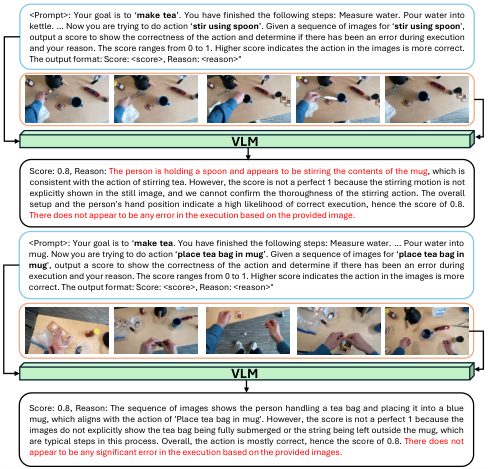
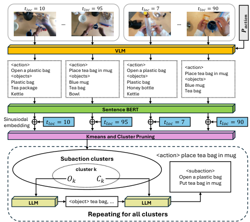
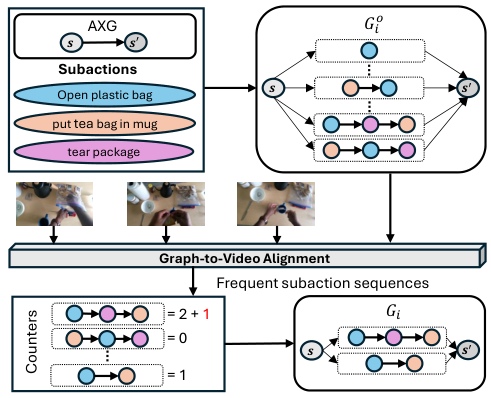
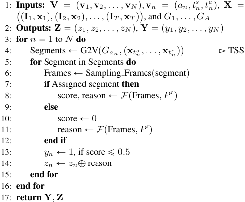
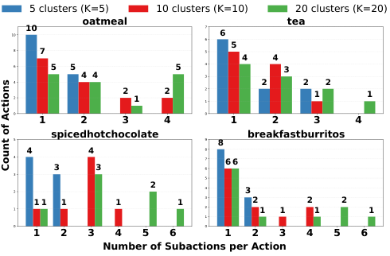
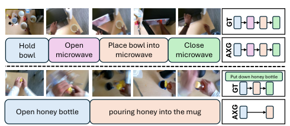
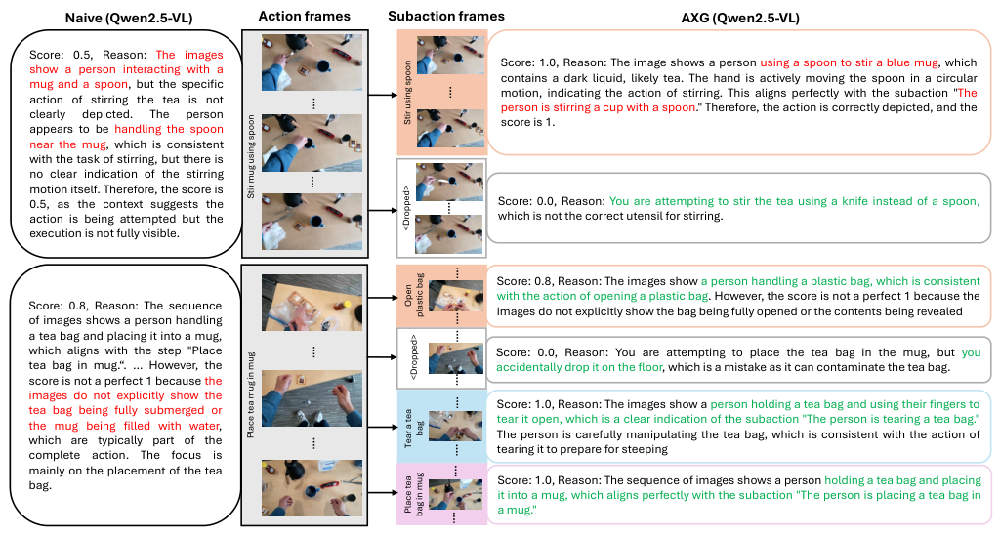

# 017_Lee_AXG-Reasoner_Error_Detection_and_Explanation_in_Long_Task_Videos_with_CVPR_2026_paper

[Original PDF](../017_Lee_AXG-Reasoner_Error_Detection_and_Explanation_in_Long_Task_Videos_with_CVPR_2026_paper.pdf)

Pages: 11

> Automatically converted from PDF. Check the original for exact equations, symbols, table alignment, and figure details.

<!-- Page 1 -->

This CVPR paper is the Open Access version, provided by the Computer Vision Foundation. Except for this watermark, it is identical to the accepted version; the final published version of the proceedings is available on IEEE Xplore. 

# **AXG-Reasoner: Error Detection and Explanation in Long Task Videos with Vision–Language Models** 

## Shih-Po Lee 

## Northeastern University 

lee.shih@northeastern.edu 

## Ehsan Elhamifar Northeastern University 

e.elhamifar@northeastern.edu 

## **Abstract** 

_Virtual task assistants must recognize and explain users’ mistakes to provide effective and corrective guidance. In this paper, we address the problem of error reasoning in long task videos, which is to detect and explain errors. Although recent Vision–Language Models (VLMs) demonstrate strong capabilities in visual question answering, they struggle to attend to the sparse spatiotemporal cues associated with errors in long task videos. We introduce an error reasoning framework, AXG-Reasoner, that leverages a frozen VLM in conjunction with a proposed Action eXecution Graph (AXG) and a temporal action segmentation (TAS) model, obtained and learned from normal (error-free) videos. To enable VLMs to attend to the sparse spatiotemporal cues associated with errors, we decompose each action segment of the video, obtained by TAS, into a sequence of fine-grained subactions by aligning it with the AXG. For each subaction segment, we query the VLM using a small number of keyframes and enhanced prompts to detect and explain errors, enabling data efficiency. To avoid costly manual subaction annotations, we develop a method to automatically construct AXG from training videos using foundation models. Extensive experiments on EgoPER and CaptainCook4D show that our method consistently improves over VLM baselines in error explanation by effectively identifying spatiotemporal cues and achieves stateof-the-art performance in error detection._1 

## **1. Introduction** 

People continually acquire new skills to enrich their daily lives and enhance their professional activities. To support this learning process, AI task assistants have emerged to analyze users’ behaviors over time and provide adaptive, context-aware guidance. This has motivated research on action recognition [3, 4, 15, 16, 28, 30, 38, 56], temporal action segmentation [14, 19, 23, 26, 27, 32, 34, 35, 47, 49, 50, 

> 1code: https://github.com/robert80203/AXG-Reasoner 

<!-- Start of picture text -->
<Prompt>: Your goal is to ‘ make tea ’. You have finished the following steps: Measure water. Pour water into kettle. … Now you are trying to do action ‘ stir using spoon ’. Given a sequence of images for ‘ stir using spoon ', output a score to show the correctness of the action and determine if there has been an error during execution and your reason. The score ranges from 0 to 1. Higher score indicates the action in the images is more correct. The output format: Score: <score>, Reason: <reason>" VLM Score: 0.8, Reason: The person is holding a spoon and appears to be stirring the contents of the mug, which is consistent with the action of stirring tea. However, the score is not a perfect 1 because the stirring motion is not explicitly shown in the still image, and we cannot confirm the thoroughness of the stirring action. The overall setup and the person's hand position indicate a high likelihood of correct execution, hence the score of 0.8. There does not appear to be any error in the execution based on the provided image. <Prompt>: Your goal is to ‘ make tea . You have finished the following steps: Measure water. … Pour water into mug. Now you are trying to do action ‘ place tea bag in mug ’. Given a sequence of images for ‘ place tea bag in mug ', output a score to show the correctness of the action and determine if there has been an error during execution and your reason. The score ranges from 0 to 1. Higher score indicates the action in the images is more correct. The output format: Score: <score>, Reason: <reason>" VLM Score: 0.8, Reason: The sequence of images shows the person handling a tea bag and placing it into a blue mug, which aligns with the action of 'Place tea bag in mug'. However, the score is not a perfect 1 because the images do not explicitly show the tea bag being fully submerged or the string being left outside the mug, which are typical steps in this process. Overall, the action is mostly correct, hence the score of 0.8. There does not appear to be any significant error in the execution based on the provided images. <!-- End of picture text -->

Figure 1. VLMs can fail to recognize and explain errors in long task videos. In the top row, the VLM (Qwen2.5-VL-32B) fails to recognize _spatially_ subtle error (using knife instead of spoon). In the bottom row, the VLM fails to recognize a temporally subtle, short error (dropping tea bag). 

52, 54, 61, 62, 69], video grounding [2, 9, 11, 29, 36, 40, 55, 66, 70], progress prediction [8, 63], and learning from instructional videos [5, 12, 13, 22, 39, 41, 42, 48, 51, 53, 65]. A key required capability of AI task assistants is the ability to detect and explain user errors, enabling users to understand and correct their mistakes effectively. This has motivated recent research on error understanding, which has primarily focused on error detection [7, 17, 18, 21, 25, 37, 43, 58] and error recognition [24]. However, the problem of providing error explainability remains largely unsolved. 

In this paper, we address the problem of **error reasoning** — the task of **detecting errors** in long task videos and **explaining why** they have been detected as errors. This capability offers two key advantages. First, it facilitates task learning by helping users clearly understand the mistakes they make during the process. Second, it reveals 

3421

<!-- Page 2 -->

the model’s rationale when identifying potential errors, enabling more accurate improvements and promoting interpretable and trustworthy behavior. Despite recent advances in Vision–Language Models (VLMs) for addressing Visual Question Answering (VQA) in videos [1, 6, 33, 45, 57, 68], significant challenges remain, particularly for error reasoning in long task videos. 

First, errors in task videos are often **spatially and temporally subtle** compared to their corresponding correct actions, making them challenging for VLMs to detect and interpret. For example, using an incorrect tool or object in part of a long video may involve only a _minor spatial difference_ between two small objects (e.g., spoon versus knife), posing a challenge for error detection and explanation via VLMs (the top row in Fig. 1). Similarly, when most of an action execution is correct but _a short temporal segment_ contains an error (e.g., picking up a tea bag but dropping it in the middle of the clip, picking up another one, and transferring it to the mug), understanding the error becomes difficult for VLMs (the bottom row in Fig. 1). Consequently, VLMs exhibit performance degradation in error detection and explanation for long videos, as they fail to focus on the _sparse spatial and temporal cues associated with errors_ , in contrast to the abundant cues available for correct actions. Therefore, our first objective is to **enhance the ability of pretrained VLMs to focus on sparse spatiotemporal cues indicative of errors** . 

Second, due to limited computational resources and the need to maintain efficiency, VLMs can process only a **small subset of frames at inference time** from the large number of frames present in long task videos. Selecting _keyframes_ that effectively capture the essential content of each action can therefore help alleviate computational bottlenecks and mitigate the aforementioned loss of focus on temporal cues. Prior work on long-video reasoning has explored various keyframe selection strategies [31, 59], such as hierarchical tree structures for identifying keyframes corresponding to both coarse- and fine-grained activities [59]. However, these approaches fail to specify the precise actions that must be correctly performed in the selected keyframes, which is crucial for guiding VLMs in detecting and explaining errors. Thus, our second objective is to **improve data efficiency by selecting most informative keyframes and invoking VLMs only on them** . 

Third, general action descriptions in VLM prompts **lack the precise contextual details necessary for error reasoning** . For example, the general action “place tea bag in mug” may involve several subactions, such as “grab a tea bag,” “open the package,” “remove the tea bag from the package,” and “place the tea bag in the mug,” each of which can lead to different types of errors. Prompting VLMs with high-level actions often yields unpredictable and imprecise outputs, as the models must first decompose the action into 

fine-grained subactions and then infer possible errors based on their prior knowledge. Therefore, our third objective is to **design precise prompts based on fine-grained action decomposition** to more effectively leverage VLMs’ reasoning capabilities for detecting and explaining errors. 

**Paper Contributions.** We propose a framework to address the aforementioned challenges of _error reasoning_ in long task videos using frozen VLMs. We first segment long task videos into action segments using a TAS model learned from only normal (error-free) training videos. To mitigate VLMs’ limitations in attending to subtle spatial and temporal cues associated with errors in long video clips, we automatically decompose each action segment into a sequence of subactions and leverage the strengths of VLMs in understanding short clips to reason about subaction correctness. We make the inference data-efficient by calling VLMs to reason about keyframes of the small number of subactions. We incorporate the subactions themselves into VLM prompts to enhance error reasoning. 

To avoid costly manual subaction annotations, we introduce an **Action eXecution Graph (AXG)** built automatically from training videos using foundation models. The AXG captures subactions and encodes feasible execution paths. It is also **training-free** (requiring no parameter optimization) and can be seamlessly integrated with any offthe-shelf TAS model and VLM. 

During inference, we perform graph-to-video alignment to segment each action clip produced by TAS into subactions, apply VLM-based reasoning on their keyframes, and aggregate the results for error detection and explanation. Extensive experiments on the EgoPER and CaptainCook4D datasets show that our method surpasses state-of-the-art approaches in error detection and explanation, while maintaining high data efficiency. 

## **2. Related Work** 

**Error Understanding for Procedural Tasks.** Recent studies have explored various directions in understanding errors within procedural tasks, including online/offline error detection [17, 21, 25, 37], error recognition [24], and error explanation [43]. Specifically, EgoPED [25] and AMNAR [21] focus on offline error detection, primarily targeting execution errors by utilizing action feature prototypes. In contrast, PREGO [17] and DTGL [37] perform online detection for procedural errors by leveraging action recognition models with LLMs and the pre-conditions based on the learned task graph, respectively. Beyond detection, GTG2Vid [24] jointly detects errors and classifies their types to provide precise feedback to users. Moreover, MistSense [43] trains a framework that integrates an error detection model with a large language model (LLM) to both identify errors and explain their causes, enhancing user understanding and experience. In contrast, we address error reasoning in long task 

3422

<!-- Page 3 -->

videos by leveraging VLMs with our training-free AXG, enabling generalizable and interpretable reasoning. 

**Long Video Understanding via VLMs/LLMs.** Recent developments of large language models (LLMs) and visionlanguage models (VLMs) has advanced research in long video understanding [31, 33, 59, 60, 64]. Due to limited computational resources and the need for flexibility, several recent works have explored training-free frameworks that leverage VLMs for different vision tasks over long videos. For instance, LAVAD [64] tackles video anomaly detection by employing VLMs for frame-level captioning and LLMs for temporal aggregation and anomaly score estimation. Other training-free approaches focus on identifying frames that provide precise visual cues for effective video understanding. For example, VIDEOTREE [59] constructs a hierarchical tree to model video activities at multiple granularities, using Adaptive Breadth Expansion to extract key information and Relevance-guided Depth Expansion to capture finer visual details. BOLT [31] investigates different frame selection strategies and demonstrates that inverse transform sampling improves performance by increasing the sampling probability of frames with higher relevance to the given query. Our method jointly considers keyframe selection and prompt generation to effectively address error reasoning in long task videos. 

## **3. Proposed Method** 

### **3.1. Problem Setting and Overview** 

**Problem Setting.** Assume we have a video that consists of multiple actions from a given task, and that some of its frames may contain user errors during task execution. Let **X** “ `p **I** 1 _,_ **x** 1q _,_ p **I** 2 _,_ **x** 2q _, . . . ,_ p **I** _T ,_ **x** _T_ q˘ denote the sequence of video frames and their corresponding preextracted features. We represent the segmentation of the video into distinct actions as **V** “ p **v** 1 _,_ **v** 2 _, . . . ,_ **v** _N_ q, where _N_ is the number of action segments and each segment **v** _n_ “ p _an, t__s_ _n__, te_ _n_qconsistsoftheactionclass_an_andits start and end frame indices _t__s_ _n_and_te_ _n_,respectively.Here, _an_ P t0 _, . . . , A_ u, where _A_ is the number of actions and class 0 indicates background (task-irrelevant actions). For **error reasoning** , our goal is _twofold_ : (1) **Error detection** : predict segment-wise errors **Y** “ p _y_ 1 _, y_ 2 _, . . . , yN_ q, where _yn_ P t0 _,_ 1u and _yn_ “ 1 indicates the presence of an error in segment _n_ ; and (2) **Error explanation** : generate textual justifications **Z** “ p _z_ 1 _, z_ 2 _, . . . , zN_ q, where each _zn_ is a free-form description explaining why (or why not) the corresponding segment is erroneous. 

For training, we assume we have only normal (error-free) videos of the task with ground-truth framewise action labels. As discussed in the introduction, each coarse-level action can be decomposed into fine-grained subactions, e.g., “put tea bag in mug” may consist of “grab a tea bag,” “open 

<!-- Start of picture text -->
𝑡 𝑙𝑜𝑐 = 10 𝑡 𝑙𝑜𝑐 = 95 𝑡 𝑙𝑜𝑐 = 7 𝑡 𝑙𝑜𝑐 = 90 VLM <action>Open a plastic bag<objects>Plastic bagTea packageKettle <action>Place tea bag in mug<objects>Blue mugTea bagBowl <action>Open a plastic bag<objects>Plastic bagHoney bottleKettle <action>Place tea bag in mug<objects>Blue mugTea bag Sentence BERT Sinusiodalembedding 𝑡 𝑙𝑜𝑐 = 10 𝑡 𝑙𝑜𝑐 = 95 𝑡 𝑙𝑜𝑐 = 7 𝑡 𝑙𝑜𝑐 = 90 Kmeans and Cluster Pruning Subaction clusters <action> place tea bag in mug cluster k <subaction> 𝑂 𝑘 𝐶 𝑘 Open a plastic bagPut tea bag in mug LLM <object> tea bag, … LLM Repeating for all clusters 𝑷 𝒂𝒄𝒕𝒊𝒐𝒏 <!-- End of picture text -->

Figure 2. Our subaction generation pipeline consists of 1) action and object description generation via a VLM, 2) clustering with temporal-aware text embeddings and cluster pruning, 3) subaction generation via a LLM. 

the package,” “remove the tea bag from the package,” and “place the tea bag in the mug”. We do not assume training videos come with ground-truth subactions, which is very costly to gather. 

**Framework Overview.** We first train a temporal action segmentation (TAS) model **_ϕ_** on the available training videos using any existing architecture [24, 25, 34]. A key observation is that frames containing errors are typically classified as one of the action classes (rather than background) in the TAS output (see Figure 5). This is because errors are often spatially and temporally subtle relative to their corresponding correct actions. Our goal is to leverage frozen VLMs to efficiently analyze each action segment for error reasoning: (1) detecting if a segment contains an error and (2) generating a corresponding textual explanation. 

To help VLMs focus on the sparse spatial and temporal cues associated with errors, while also improving data efficiency by reducing the number of VLM queries, we divide each action segment into a sequence of subaction segments and select keyframes from each subaction as input to the VLM. This enables the VLM to reason over short, informative clips rather than long, redundant action sequences, providing both stronger reasoning and faster inference. 

To automatically obtain subaction segments, we construct an **A** ction e **X** ecution **G** raph ( **AXG** ) from the training videos using foundation models. In brief, this involves captioning the frames of each action using a VLM, performing temporally aware clustering of the resulting text embeddings, and extracting subactions using an LLM. The nodes of the AXG represent subactions, while the edges encode predecessor–successor relationships, defining feasible sub- 

3423

<!-- Page 4 -->

<!-- Start of picture text -->
AXG 𝐺𝑖𝑜 𝒔 𝒔 ′ Subactions 𝒔 𝒔 ′ Open plastic bag put tea bag in mug tear package Graph-to-Video Alignment Frequent subaction sequences = 2 + 1 𝐺𝑖 = 0 𝒔 𝒔 ′ Counters = 1 <!-- End of picture text -->

Figure 3. The illustration of our AXG construction process. We constrcut AXG by enumerating all possible subaction sequences and retain the paths that commonly observed in training videos. 

action sequences. By aligning this graph with a given action clip (graph-to-video alignment), we segment the clip into subactions. Finally, we enrich VLM prompts with the identified subactions to improve the quality of error reasoning. 

### **3.2. Learning Subactions from Training Videos** 

Our goal is to automatically extract the subactions involved in performing each action. To do so, we take _ground-truth segments of an action_ across training videos, sample one every _β_ frame and use a **VLM** with the prompt Paction (e.g., “describe the action the person is doing and the name for every object the person is interacting with”) to produce **action descriptions and object names** for those. We use Sentence BERT [46] to embed descriptions of actions and objects for the selected frames, see Figure 2. 

We apply Kmeans **clustering on temporally-aware textual embeddings** to produce _K_ temporally contiguous and coherent subaction clusters. More specifically, we embed the time-stamp _tloc_ “ roundp _t__<u>te</u>_´ ´_<u>t</u>_ _t__ss_ˆ100qofeachtext embedding using a sinusoidal embedding and combine it with textual embedding by summation, where _t, t__s_ _, t__e_ denote the timestamps of the frame associate to the text, and the start and end of the associated action segment, respectively. This allows distinguishing similar actions that have different context (e.g., holding a kettle before moving it close to mug vs holding it after pouring water from it to the mug), thereby facilitating more accurate subaction localization across varying temporal contexts. Some subaction clusters, however, may be _invalid_ (e.g., irrelevant to the action) due to noisy or inconsistent action descriptions generated by VLMs. A key characteristic of such clusters is having a small size. Therefore, to obtain **valid clusters** , we discard clusters whose size is less than _Tk_ { _K_ , where _Tk_ 

**Algorithm 1** Inference Procedure for Error Reasoning 

<!-- Start of picture text -->
1: Inputs: V “ p v 1 ,  v 2 , . . . ,  v N q ,  v n “ p an, tn s , te n q, X “ `p I 1 ,  x 1q ,  p I 2 ,  x 2q , . . . ,  p I T ,  x T  q˘, and  G 1 , . . . , GA 2: Outputs: Z  “ p z 1 , z 2 , . . . , zN q,  Y “ p y 1 , y 2 , . . . , yN q 3: for  n  “ 1 to  N do 4: Segments Ð G2Vp Gan ,  p x t s n , . . . ,  x t e n qq Ź TSS 5: for  Segment in Segments  do 6: Frames Ð Sampling F ramespsegmentq 7: if  Assigned segment  then 8: score, reason Ð  F pFrames , P c q 9: else 10: score Ð 0 11: reason Ð  F pFrames , P r q 12: end if 13: yn Ð 1, if score ď 0 . 5 14: zn Ð  zn ‘ reason 15: end for 16: end for 17: return Y ,  Z <!-- End of picture text -->

denotes the total number of action descriptions in cluster _k_ .2 

Next, for objects in each valid cluster (associated with a subaction), we use an LLM to obtain the **most common objects** in that subaction (we use the prompt “output at most five object names that commonly occur in _Ok_ ”, where _Ok_ consists of all object names identified by VLM in cluster _k_ ). We then use these common objects to better **summarize the action descriptions** in the same cluster using an LLM. More specifically, we use an LLM with the prompt “output an action that most commonly occurs in the descriptions: _Ck_ by focusing on the object names in _Ok_ ”, where _Ck_ denotes all VLM-based action descriptions in cluster _k_ . Repeating this process across all valid clusters and removing repetitions of the same subaction summary, we produce final textual list of subactions and their features by performing average over pre-extracted features corresponding to the frames in each cluster associated with an action. 

### **3.3. Action eXecution Graph (AXG)** 

We build the AXG of each action, which encodes **feasible sequences of subactions** to perform it, see Figure 3. It is a directed acyclic graph _G_ “ p _U, E_ q, where each node _u_ P _U_ denotes a subaction in an action and each edge p _uj, ui_ q P _E_ indicates that the subaction _ui_ can start only after subaction _uj_ is done. In the AXG, each path from the source node _s_ to the sink node _s_1 represents a valid subaction sequence to execute the action. To construct the AXG for action _i_ , denoted by _Gi_ , we first construct an **initial graph** _G__o_ _i_by using the set of subactions obtained from our clustering approach (discussed in the previous subsection) and _enumerating all possible subaction sequences as paths_ in this graph. We 

> 2In our experiments, this choice worked well. Smaller thresholds increased the number of both good and noisy (bad) clusters. 

3424

<!-- Page 5 -->

|Method |VLM||**Eg** |**oPER** ||||
|---|---|---|---|---|---|---|---|
|||Quesadilla|Oatmeal|Pinwheel|Coffee|Tea|All|
|Naive|-VL|4.0|4.0|4.0|0.0|6.0|3.6|
|VTREE [59]|en2.5|5.0|6.0|4.0|1.0|9.0|5.0|
|AXG|Qw|**22.0**|**17.0**|**18.0**|**17.0**|**13.0**|**17.4**|
|Naive|nVL|22.0|19.0|18.0|**22.0**|18.0|19.8|
|AXG|Inter|**31.0**|**22.0**|**27.0**|20.0|**23.0**|**24.6**|
||||**Co** |**ok4D** ||||
|||Hot Chocolate|Sandwich|Burritos|Ramen|Raita|All|
|Naive|-VL|8.0|4.0|4.0|2.0|3.0|4.0|
|VTREE [59]|en2.5|3.0|3.0|6.0|2.0|1.0|3.0|
|AXG|Qw|**18.0**|**21.0**|**20.0**|**18.0**|**19.0**|**19.2**|
|Naive|rnVL|19.0|16.0|**24.0**|**19.0**|12.0|18.0|
|AXG|Inte|**23.0**|**21.0**|19.0|18.0|**25.0**|**21.2**|

Table 1. Error explanation performance (%) on GT action segments. 

then obtain the AXG _Gi_ using graph-to-video alignment by pruning _G__o_ _i_viaretainingthesubactionsequencesthatare commonly observed in the training videos of action _i_ . 

More specifically, we perform **graph-to-video alignment (G2V)** to associate frames within each ground-truth segment of action _i_ in the training videos with their corresponding subactions in _G__o_ _i_.In practice,we use [10] as the G2V method, which allows dropping frames when no subactions are matched. G2V also provides the optimal path that best aligns with the sequence of frames. We record the occurrence count of each subaction sequence, and construct _Gi_ by retaining only sequences whose occurrence counts are greater than or equal to Y _MNii_ ], where _Ni_ denotes the total number of training action _i_ segments and _Mi_ is the number of paths of _G__o_ _i_thatoccuratleastonceinthetraining videos. This ensures that only _consistently observed subaction sequences_ are preserved, yielding a robust and representative AXG structure that captures the common procedural flow while discarding outlier or noisy variations. 

An alternative yet naive approach to build AXG is to aggregate subaction sequences from training videos by assigning subactions to frames according to their corresponding subaction clusters. However, the obtained subaction segmentations often contain noise, as they may include repeated or interleaved subactions that deviate from the ordering typically observed in the action. 

### **3.4. Error Reasoning Inference** 

At test time, we _leverage VLMs with our actionwise-AXGs (we have one AXG per action) to perform error detection and explanation_ in long task videos. Inference consists of two stages: (1) Temporal Subaction Segmentation (TSS) and (2) Reasoning with VLMs, see Algorithm 1. 

**Temporal Subaction Segmentation (TSS).** We use a temporal action segmentation model **_ϕ_** to segment the test “ video into actions and obtain action segments **V** 

|Method|TAS|VLM||**EgoP**|**ER**||**Cook**|**4D**|
|---|---|---|---|---|---|---|---|---|
||||N.|E.|F1@.5|N.|E.|F1@.5|
|EgoPED [25]|ACTF|A|24.0|21.1|22.5|13.4|7.5|10.5|
|GTG2Vid[24]|GTG2Vid|N/|42.8|23.2|33.0|18.0|14.3|16.2|
|Naive|ACTF|L|10.6|24.0|17.3|**20.4**|21.0|20.7|
|AXG|ACTF|.5-V|**27.4**|**24.4**|**25.9**|18.1|**28.0**|**21.1**|
|Naive|GTG2Vid|wen2|30.6|10.2|20.4|13.3|17.4|15.3|
|AXG|GTG2Vid|Q|**36.4**|**30.4**|**33.4**|**19.0**|**38.2**|**28.5**|
|Naive|ACTF||**31.0**|10.2|20.6|18.0|15.7|16.9|
|AXG|ACTF|L3.5|30.5|**20.7**|**25.6**|**18.7**|**28.8**|**23.8**|
|Naive|GTG2Vid|nternV|30.1|9.1|19.6|15.9|21.4|18.7|
|AXG|GTG2Vid|I|**38.3**|**25.2**|**31.8**|**19.0**|**39.1**|**29.0**|

Table 2. Average Error Detection results of different methods over all tasks in each dataset for EgoPER and CaptainCook4D. 

<!-- Start of picture text -->
5 clusters (K=5) 10 clusters (K=10) 20 clusters (K=20) 108 10 7 oatmeal 765 6 5 tea 4 4 6 5 5 5 4 3 4 4 3 4 2 2 2 2 2 1 2 21 1 1 0 1 2 3 4 0 1 2 3 4 5 spicedhotchocolate 9 8 breakfastburritos 4 4 8 4 7 6 6 32 3 3 2 654 3 1 1 1 1 1 1 32 2 1 1 2 1 2 1 1 0 1 2 3 4 5 6 0 1 2 3 4 5 6 Number of Subactions per Action Count of Actions <!-- End of picture text -->

Figure 4. Distribution of the number of subactions per action. Each bar shows how many actions contain a given number of subactions. 

p **v** 1 _,_ **v** 2 _, . . . ,_ **v** _N_ q, with **v** _n_ “ p _an, t__s_ _n__, te_ _n_q. For a nonbackground action segment **v** _n_ with action _an_ “ _i_ , we perform TSS using graph-to-video (G2V) alignment [10] using the AXG _Gi_ . We ignore background segments, since they are task-irrelevant actions by definition and most error frames are classified as action segments (see the analysis in the experimental section). We perform TSS for all action segments and obtain their corresponding subaction segmentations. In the output of G2V, each subaction segment is either _assigned_ to a subaction or _dropped_ (not matched with any subaction, hence considered as error). 

**Reasoning with VLMs.** We use a VLM _F_ to perform error reasoning on subaction segments. We uniformly sample _α_ frames from each subaction segment as keyframes for _F_ . We design **two types of prompts for** _F_ **to handle assigned and dropped segments** , respectively. A segment assigned to a subaction may contain subtle errors related spatial or temporal deviations (e.g., using spoon versus knife) as they are visually similar to the associated subaction. To handle them, we use _F_ to obtain the correctness score and textual justification. We use the _subaction and action to create an enhanced prompt P_c : “You are performing subaction 

3425

<!-- Page 6 -->

|Method|VLM|**E** N.|**goPE** E.|**R** F1|N.|**Cook4** E.|**D** F1|
|---|---|---|---|---|---|---|---|
|Naive|-VL|**87.1**|26.3|56.7|**53.0**|29.9|41.5|
|VTREE|en2.5|85.6|22.2|53.9|52.8|34.7|43.7|
|AXG|Qw|80.1|**47.0**|**63.6**|24.7|**65.5**|**45.1**|
|Naive|nVL|**88.2**|13.7|50.9|**67.5**|22.2|44.9|
|AXG|Inter|79.2|**44.1**|**61.6**|33.8|**58.0**|**45.9**|

Table 3. Error detection performance of methods on GT action segments for EgoPER and CaptainCook4D. 

|||||||EgoPER Cook4D|
|---|---|---|---|---|---|---|
|Method|VLM|**EgoPER**|**Cook4D**|FACT||83.2 88.6|
|Naive VTREE|en2.5-VL|3.4 4.8|5.4 2.8|ACTF||83.8 82.0|
|AXG|Qw|**16.8**|**26.6**||||
|Naive|nVL|18.4|19.4|2Vid||89.0|
|AXG|Inter|**25.0**|**21.4**|GTG||84.0|
|||||0|20|40 60 80 100 Percentage (%)|

Table 4. Error explanation (%) for actions with one subaction on GT segments. 

Figure 5. The percentages (%) of error frames classified as actions by different TAS models. 

ă _subaction_ ą of action ă _action_ ą. Given a sequence of images, output a score that measures the correctness of the subaction being performed and provide your reason, where the score ranges from 0 to 1”. 

On the other hand, we consider segments dropped by G2V as errors, since they do not correspond to any valid subaction. We use _F_ to _produce the textual description describing the error_ and with the correctness score set to 0. We use the prompt _P_r : “You are performing action ă _action_ ą and you have made a mistake. Given a sequence of images, describe the mistake being made.”. See our supplementary materials for the details of the prompts. 

Finally, we **predict action segment** _vn_ **as erroneous** if the correctness score of any subaction within _vn_ is less than or equal to 0 _._ 5 and generate the justification _zn_ by combining all descriptions of subaction segments within _vn_ . 

## **4. Experiments** 

### **4.1. Experimental Setup** 

**Dataset.** We evaluate our proposed method on EgoPER [25] and CaptainCook4D [44] for error reasoning, including error detection and explanation. EgoPER consists of 5 procedural tasks with 386 egocentric videos, 5 types of errors, and the corresponding error descriptions, which we use as ground-truth error explanation text. CaptainCook4D contains egocentric procedural tasks videos among 24 tasks with various types of errors and their descriptions as well. For EgoPER, we use all 5 tasks for evaluation with the same training and testing split in [25]. For CaptainCook4D (Cook4D), we follow [24] to select task _Spiced Hot Chocolate_ ( _Hot Chocolate_ ), _Microwave Egg Sandwich_ ( _Sandwich_ ), _Breakfast Burritos_ ( _Burritos_ ), _Ramen_ , and _Cucumber Raita_ ( _Raita_ ) for evaluation as they have sufficient normal and erroneous videos for both training and evaluation. For each dataset, we report the average score over all its asks, referred to as All. 

**Evaluation Metrics.** For error explanation evaluation, we use an LLM to evaluate free-form descriptions **Z** based on ground-truth (GT) action segments. We use the prompt “output a similarity score based on the semantics between GT and predicted descriptions, where the score is from 0 

to 1”. For error detection evaluation, we follow GTG2Vid [24] to compute the segment-wise F1 score using an overlap threshold _γ_ to determine whether a predicted segment is a correct match. To address data imbalance, we report two F1 scores, N. and E., which treat normal and error segments as the positive class, respectively. Their average is reported as F1@ _γ_ . Also, we report F1 score with GT action segments to show the upper-bound performance of error detection. 

**Baselines.** For error explanation, we compare our methods with a keyframe selection method, VIDEOTREE [59] (VTREE), and a naive baseline (Naive) that uniformly sample _α_ frames from action segment as keyframe for _F_ with prompt “You are performing action ă _action_ ą. Given a sequence of images, output a score that measures the correctness of the action being performed and provide your reason, where the score ranges from 0 to 1”. We use two VLMs as _F_ for error reasoning: Qwen2.5-VL-32BInstruct [45] (Qwen2.5-VL) and InternVL3 ~~5~~ -14B [57] (InternVL3.5). For error detection, we report the performance of Qwen2.5VL, InternVL3.5, and other two non-VLM error detection baselines GTG2Vid [24] and EgoPED [25]. Since GTG2Vid also performs TAS, we use ActionFormer (ACTF) [67] and GTG2Vid [24] as TAS model _ϕ_ . 

**Implementation Details.** We use Timesformer [3] pretrained on Ego4D [20] to extract frame features from videos as in [24]. We set the number of sampling frames _α_ to 8 and 3 for Qwen2.5-VL and InternVL3.5, respectively across all datasets. We set the number of clusters _K_ “ 5 to obtain a decent performance across different datasets for both error detection and explanation. To avoid noisy reasoning on oversegmented subaction segments, in practice, we ignore the subaction segments whose duration is less than 2 seconds. We set the sampling frame rate _β_ “ 6. We use Qwen2.5VL as the VLM for generating action descriptions and object names from frames. We use Qwen2.5-32BInstruct (Qwen2.5) as the LLM for object/subaction generation and error explanation evaluation. We train different TAS models on EgoPER and CaptainCook4D, respectively. We do the training and evaluation on a NVIDIA H100 GPU. 

3426

<!-- Page 7 -->

|_K_|Oat|meal|Te|a|Hot Ch|ocolate|Burr|itos|
|---|---|---|---|---|---|---|---|---|
||S|F1|S|F1|S|F1|S|F1|
|5|20.0|**65.1**|17.0|**77.1**|22.0|39.0|27.0|39.7|
|10|18.0|63.2|18.0|74.4|19.0|**42.2**|29.0|**41.4**|
|20|**22.0**|61.3|**19.0**|74.8|**26.0**|40.2|**30.0**|39.9|

Table 5. Error detection (F1) and explanation (similarity score, S) performance of AXG across different values of _K_ . 

### **4.2. Experimental Results** 

**Error explanation.** Table 1 shows the error explanation performance of different methods on GT action segments for EgoPER and CaptainCook4D. For All in EgoPER, our method outperforms VTREE and Naive (Qwen2.5-VL) by achieving 17.4% and 24.6%, compared to their gains of 5.0% and 3.6%. For All in CaptainCook4D, our method achieves improvements of 19.2% and 21.1%, exceeding the 4.0% and 18.0% obtained by Naive (Qwen2.5-VL and InternVL3.5). 

Our experiments yield three main findings. First, AXG consistently improves the error explanation performance of both Qwen2.5-VL and InternVL3.5, demonstrating its effectiveness in keyframe selection and enriched prompt construction. Second, VTREE struggles to identify keyframes in task videos, as it primarily relies on LLM-based clustering without explicitly modeling procedural action structure. Third, InternVL3.5 reliably outperforms Qwen2.5-VL in error explanation across all settings. 

**Error Detection.** Table 2 compares error detection performance across different methods on EgoPER and CaptainCook4D using various TAS models. Overall, AXG consistently outperforms the na¨ıve baseline, improving F1@0.5 by roughly 13% on both datasets when paired with GTG2Vid as TAS model and Qwen2.5-VL. Moreover, AXG achieves state-of-the-art performance, yielding gains of 33.4% and 29.0% with Qwen2.5-VL and InternVL3.5, respectively, higher than the 33.0% and 16.2% reported by GTG2Vid on EgoPER and CaptainCook4D. These results indicate that our method enhances VLMs’ ability to detect errors without over-flagging normal segments. 

Next, Table 3 reports error detection performance on GT action segments, reflecting the upper-bound capability of the models. Under this setting, AXG achieves 63.6% and 45.1% F1@.5, outperforming VTREE (53.9% and 43.7%) and Naive (56.7% and 41.5%) on EgoPER and CaptainCook4D with Qwen2.5-VL. AXG also improves over InternVL3.5, reaching 61.6% and 45.9%, compared with the naive baseline scores of 50.9% and 44.9%. Although AXG shows a drop in N., indicating that it over-flags normal segments as errors, it achieves superior overall error detection performance compared to the naive baseline and VTREE. 

**Temporal Action Segmentation on Errors.** We investigate the prediction behaviors of different TAS models when 

<!-- Start of picture text -->
Hold  Open  Place bowl into  Close bowl microwave microwave microwave Put down honey bottle Open honey bottle pouring honey into the mug GT AXG GT AXG <!-- End of picture text -->

Figure 6. Visualization of AXG (left) and GT subactions (right) for the actions “put bowl in microwave” (top) and “add honey to mug” (bottom). 

they encounter errors mentioned in Section 3.4. Figure 5 presents the percentage of error frames classified as any action class rather than background class by TAS models. Across both datasets, the most error frames are categorized as actions, accounting for over 80% in all cases. This observation indicates that errors predominantly occur within action segments rather than background ones, consistent with the intuition that procedural mistakes are more similar to normal actions, justifying our claim in Section 3.4. Among the models, GTG2Vid and a recent TAS model, FACT [34], achieve slightly higher action-error ratios than EgoPED, implying that their segmentation boundaries align more closely with actual error regions. 

**Detailed Analysis for Subactions in AXG.** In this section, we 1) analyze how the number of subactions generated by AXG varies with the number of clusters _K_ and how this relates to error detection and explanation performance and 2) visualize the subactions. 

Figure 2 shows the distribution of subaction counts per action under different clustering settings ( _K_ “ 5 _,_ 10 _,_ 20). Across the four tasks, most actions contain only a single subaction with _k_ “ 5 or 10. This trend suggests that the majority of actions are either (1) simple, (2) temporally short, or (3) dominated by one long subaction, with only a small portion requiring multiple subactions to capture finer procedural structure. Table 4 reports the error explanation performance specifically for actions whose AXGs contain only one subaction. Specifically, AXG achieves 25.0% and 21.4% higher F1 scores than the naive baseline with InternVL3.5. This demonstrates that performing TSS with a single-subaction AXG can effectively localize a refined subaction segment and erroneous frames within an action, improving error explanation. 

As the number of clusters increases, we observe a rise in actions containing more subactions, reflecting the finer procedural granularity captured by larger values of _K_ . Table 5 reports error explanation and detection performance on GT action segments across different cluster sizes for Oatmeal and Tea in EgoPER, and Hot Chocolate and Burritos in CaptainCook4D. The results show that larger _K_ generally improves AXG’s error explanation performance, sug- 

3427

<!-- Page 8 -->

<!-- Start of picture text -->
Naive (Qwen2.5-VL) Action frames Subaction frames AXG (Qwen2.5-VL) Score: 0.5, Reason: The images Score: 1.0, Reason: The image shows a person using a spoon to stir a blue mug, which show a person interacting with a contains a dark liquid, likely tea. The hand is actively moving the spoon in a circular mug and a spoon, but the specific motion, indicating the action of stirring. This aligns perfectly with the subaction "The action of stirring the tea is not clearly  depicted.  The  person  person is stirring a cup with a spoon." Therefore, the action is correctly depicted, and the score is 1. appears to be  handling the spoon near the mug, which is consistent with the task of stirring, but there is no clear indication of the stirring motion itself. Therefore, the score is 0.5, as the context suggests the  Score: 0.0, Reason: You are attempting to stir the tea using a knife instead of a spoon, action is being attempted but the  which is not the correct utensil for stirring. execution is not fully visible. Score: 0.8, Reason: The images show a person handling a plastic bag, which is consistent with the action of opening a plastic bag. However, the score is not a perfect 1 because the Score: 0.8, Reason: The sequence  images do not explicitly show the bag being fully opened or the contents being revealed of images shows a person handling a tea bag and placing it into a mug, which aligns with the step "Place  Score: 0.0, Reason: You are attempting to place the tea bag in the mug, but  you tea bag in mug.“. … However, the  accidentally drop it on the floor, which is a mistake as it can contaminate the tea bag. score is not a perfect 1 because the images do not explicitly show the tea bag being fully submerged or  Score: 1.0, Reason: The images show a person holding a tea bag and using their fingers to the mug being filled with water,  tear it open, which is a clear indication of the subaction "The person is tearing a tea bag." which are typically part of the  The person is carefully manipulating the tea bag, which is consistent with the action of complete action. The focus is  tearing it to prepare for steeping mainly on the placement of the tea bag. Score: 1.0, Reason: The sequence of images shows a person holding a tea bag and placing it into a mug, which aligns perfectly with the subaction "The person is placing a tea bag in a mug." Stir using spoon Stir mug using spoon <Dropped> Open plastic bag <Dropped> Place tea mug in mug bag Tear a tea Place tea  bag in mug <!-- End of picture text -->

Figure 7. Qualitative results on error reasoning for action “stir mug using spoon” (top) and “place tea bag in mug” (bottom) of task Tea in EgoPER. 

gesting that finer subactions offer more temporal cues for identifying errors. However, increasing the number of clusters degrades error detection performance, indicating that excessive granularity introduces noisy subactions that may cause AXG to over-flag normal segments as errors. 

Finally, we manually construct the ground-truth (GT) AXGs for two actions in EgoPER and provide qualitative comparisons in Figure 6, which demonstrate that our AXGs are semantically meaningful. However, GT AXGs may have annotator bias, as their structure can vary based on subjective interpretations of subactions. Overall, our AXGs closely align with those constructed by human annotators. 

**Qualitative Results.** Figure 7 (left) shows the explanation generated by Qwen2.5-VL, while the right panel displays the subaction segments and corresponding explanations produced by AXG. The frames in the gray box at the top of the figure illustrate the error “stir mug using knife” for the correct action “stir mug using spoon”, demonstrating the minor spatial difference between the two objects. The naive baseline fails to distinguish this subtle difference. Although AXG also struggles to correctly classify the action due to the underlying VLM’s limited capability, it successfully drops the erroneous frames (hence we declare the segment as error) and generates an accurate explanation: “You are attempting to stir the tea using a knife instead of a spoon” (shown in green). A key observation is that prompting the model with phrases such as “You have made a mistake” significantly improves the VLM’s ability to attend to 

the correct object and localize the source of the error. 

On the other hand, the frames at the bottom of the figure shows the error “drop tea bag on floor” for the correct action “place tea bag in mug”, demonstrating the error occurring shortly in the action. Naive baseline recognizes the action as correct because the action is performed eventually but provides bad explanation “the images do not explicitly show the tea bag being fully submerged or the mug being filled with water” (in red). Our method segments the action into three subactions (first, third, and fourth one) with explanations that correctly describe the associated subactions and one dropped segment (second one) with correct explanation “you accidentally drop it on the floor” for describing errors. AXG effectively localizes the short segment containing errors with good explanation. 

## **5. Conclusions** 

We investigated **error reasoning** in long task videos, by proposing and incorporating into VLMs the Action eXecution Graph (AXG), a training-free method that decomposes each action into subactions and encodes their possible execution sequences. By performing temporal subaction segmentation, AXG identifies keyframes and enriches prompts with subactions to facilitate error reasoning. Experiments on two datasets demonstrate that our framework effectively detects errors when combined with various temporal action segmentation models and consistently enhances error explanation performance across different VLMs. 

3428

<!-- Page 9 -->

## **6. Acknowledgments** 

This work was funded, in part, by ARPA-H (1AY2AX000062), NSF (IIS-2115110), ONR (N000142512287) and DARPA (HR00112220001). The views and conclusions contained in this document are those of the authors and should not be interpreted as representing the official policies, either expressed or implied, of the US Government. 

## **References** 

- [1] Jean-Baptiste Alayrac, Jeff Donahue, Pauline Luc, Antoine Miech, Iain Barr, Yana Hasson, Karel Lenc, Arthur Mensch, Katherine Millican, Malcolm Reynolds, et al. Flamingo: a visual language model for few-shot learning. _Advances in Neural Information Processing Systems_ , 35:23716–23736, 2022. 2 

- [2] Kumar Ashutosh, Santhosh Kumar Ramakrishnan, Triantafyllos Afouras, and Kristen Grauman. Video-mined task graphs for keystep recognition in instructional videos. _Neural Information Processing Systems_ , 2023. 1 

- [3] Gedas Bertasius, Heng Wang, and Lorenzo Torresani. Is space-time attention all you need for video understanding? In _Proceedings of the International Conference on Machine Learning (ICML)_ , 2021. 1, 6 

- [4] J. Carreira and A. Zisserman. Quo vadis, action recognition? a new model and the kinetics dataset. In _IEEE Conference on Computer Vision and Pattern Recognition_ , 2017. 1 

- [5] Chien-Yi Chang, De-An Huang, Danfei Xu, Ehsan Adeli, Li Fei-Fei, and Juan Carlos Niebles. Procedure planning in instructional videos. In _Computer Vision – ECCV 2020: 16th European Conference, Glasgow, UK, August 23–28, 2020, Proceedings, Part XI_ , 2020. 1 

- [6] Wenliang Dai, Junnan Li, Dongxu Li, Anthony Tiong, Junqi Zhao, Weisheng Wang, Boyang Li, Pascale Fung, and Steven Hoi. InstructBLIP: Towards general-purpose vision-language models with instruction tuning. In _Thirtyseventh Conference on Neural Information Processing Systems_ , 2023. 2 

- [7] Guodong Ding, Fadime Sener, Shugao Ma, and Angela Yao. Every mistake counts in assembly. _arXiv: 2307.16453_ , 2023. 1 

- [8] G. Donahue and E. Elhamifar. Learning to predict activity progress by self-supervised video alignment. _IEEE Conference on Computer Vision and Pattern Recognition_ , 2024. 1 

- [9] Nikita Dvornik, Isma Hadji, Konstantinos G Derpanis, Animesh Garg, and Allan D Jepson. Drop-dtw: Aligning common signal between sequences while dropping outliers. In _NeurIPS_ , 2021. 1 

- [10] Nikita Dvornik, Isma Hadji, Hai Pham, Dhaivat Bhatt, Brais Martinez, Afsaneh Fazly, and Allan D Jepson. Flow graph to video grounding for weakly-supervised multi-step localization. In _European Conference on Computer Vision_ , pages 319–335. Springer, 2022. 5 

- [11] Nikita Dvornik, Isma Hadji, Ran Zhang, Konstantinos Derpanis, Animesh Garg, Richard Wildes, and Allan Jepson. 

Stepformer: Self-supervised step discovery and localization in instructional videos. _IEEE Conference on Computer Vision and Pattern Recognition_ , 2023. 1 

- [12] E. Elhamifar and D. Huynh. Self-supervised multi-task procedure learning from instructional videos. _European Conference on Computer Vision_ , 2020. 1 

- [13] E. Elhamifar and Z. Naing. Unsupervised procedure learning via joint dynamic summarization. _International Conference on Computer Vision_ , 2019. 1 

- [14] Yazan Abu Farha and Jurgen Gall. Ms-tcn: Multi-stage temporal convolutional network for action segmentation. In _Proceedings of the IEEE/CVF conference on computer vision and pattern recognition_ , pages 3575–3584, 2019. 1 

- [15] C. Feichtenhofer. X3d: Expanding architectures for efficient video recognition. In _2020 IEEE/CVF Conference on Computer Vision and Pattern Recognition (CVPR)_ , 2020. 1 

- [16] C. Feichtenhofer, H. Fan, J. Malik, and K. He. Slowfast networks for video recognition. In _2019 IEEE/CVF International Conference on Computer Vision (ICCV)_ , 2019. 1 

- [17] Alessandro Flaborea, Guido Melendugno, Leonardo Pliniq, Luca Scofanoq, Edoardo Matteisq, Antonino Furnari, Giovanni Farinella, and Fabio Galasso. Prego: online mistake detection in procedural egocentric videos. _IEEE Conference on Computer Vision and Pattern Recognition_ , 2024. 1, 2 

- [18] Reza Ghoddoosian, Isht Dwivedi, Nakul Agarwal, and Behzad Dariush. Weakly-supervised action segmentation and unseen error detection in anomalous instructional videos. In _Proceedings of the IEEE/CVF International Conference on Computer Vision_ , pages 10128–10138, 2023. 1 

- [19] Uzay G¨okay, Federico Spurio, Dominik R. Bach, and Juergen Gall. Skeleton motion words for unsupervised skeletonbased temporal action segmentation. In _Proceedings of the IEEE/CVF International Conference on Computer Vision (ICCV)_ , 2025. 1 

- [20] Kristen Grauman, Andrew Westbury, Eugene Byrne, Zachary Chavis, Antonino Furnari, Rohit Girdhar, Jackson Hamburger, Hao Jiang, Miao Liu, Xingyu Liu, Miguel Martin, Tushar Nagarajan, Ilija Radosavovic, Santhosh K. Ramakrishnan, Fiona Ryan, Jayant Sharma, Michael Wray, Mengmeng Xu, Eric Z. Xu, Chen Zhao, Siddhant Bansal, Dhruv Batra, Vincent Cartillier, Sean Crane, Tien Do, Morrie Doulaty, Akshay Erapalli, Christoph Feichtenhofer, Adriano Fragomeni, Qichen Fu, Christian Fuegen, Abrham Gebreselasie, Cristina Gonz´alez, James M. Hillis, Xuhua Huang, Yifei Huang, Wenqi Jia, Weslie Khoo, J´achym Kol´ar, Satwik Kottur, Anurag Kumar, Federico Landini, Chao Li, Yanghao Li, Zhenqiang Li, Karttikeya Mangalam, Raghava Modhugu, Jonathan Munro, Tullie Murrell, Takumi Nishiyasu, Will Price, Paola Ruiz Puentes, Merey Ramazanova, Leda Sari, Kiran K. Somasundaram, Audrey Southerland, Yusuke Sugano, Ruijie Tao, Minh Vo, Yuchen Wang, Xindi Wu, Takuma Yagi, Yunyi Zhu, Pablo Arbel´aez, David J. Crandall, Dima Damen, Giovanni Maria Farinella, Bernard Ghanem, Vamsi Krishna Ithapu, C. V. Jawahar, Hanbyul Joo, Kris Kitani, Haizhou Li, Richard A. Newcombe, Aude Oliva, Hyun Soo Park, James M. Rehg, Yoichi Sato, Jianbo Shi, Mike Zheng Shou, Antonio Torralba, Lorenzo Torresani, Mingfei Yan, and Jitendra Malik. Ego4d: Around the world 

3429

<!-- Page 10 -->

in 3,000 hours of egocentric video. _2022 IEEE/CVF Conference on Computer Vision and Pattern Recognition (CVPR)_ , pages 18973–18990, 2021. 6 

- [21] Wei-Jin Huang, Yuan-Ming Li, Zhi-Wei Xia, Yu-Ming Tang, Kun-Yu Lin, Jian-Fang Hu, and Wei-Shi Zheng. Modeling multiple normal action representations for error detection in procedural tasks. In _IEEE Conference on Computer Vision and Pattern Recognition_ , 2025. 1, 2 

- [22] Mohaiminul Islam, Tushar Nagarajan, Huiyu Wang, Fu-Jen Chu, Kris Kitani, Gedas Bertasius, and Xitong Yang. Propose, assess, search: Harnessing llms for goal-oriented planning in instructional videos. _European Conference on Computer Vision_ , 2024. 1 

- [23] C. Lea, M. D. Flynn, R. Vidal, A. Reiter, and G. D. Hager. Temporal convolutional networks for action segmentation and detection. _IEEE Conference on Computer Vision and Pattern Recognition_ , 2017. 1 

- [24] S. Lee and E. Elhamifar. Error recognition in procedural videos using generalized task graph. _International Conference on Computer Vision_ , 2025. 1, 2, 3, 5, 6 

- [25] S. Lee, Z. Lu, Z. Zhang, M. Hoai, and E. Elhamifar. Error detection in egocentric procedural task videos. _IEEE Conference on Computer Vision and Pattern Recognition_ , 2024. 1, 2, 3, 5, 6 

- [26] M. Li, L. Chen, Y. Duarr, Z. Hu, J. Feng, J. Zhou, and J. Lu. Bridge-prompt: Towards ordinal action understanding in instructional videos. In _2022 IEEE/CVF Conference on Computer Vision and Pattern Recognition (CVPR)_ , 2022. 1 

- [27] Shi-Jie Li, Yazan AbuFarha, Yun Liu, Ming-Ming Cheng, and Juergen Gall. Ms-tcn++: Multi-stage temporal convolutional network for action segmentation. _IEEE Transactions on Pattern Analysis and Machine Intelligence_ , pages 1–1, 2020. 1 

- [28] Yanghao Li, Chao-Yuan Wu, Haoqi Fan, Karttikeya Mangalam, Bo Xiong, Jitendra Malik, and Christoph Feichtenhofer. Mvitv2: Improved multiscale vision transformers for classification and detection. In _2022 IEEE/CVF Conference on Computer Vision and Pattern Recognition (CVPR)_ , 2022. 1 

- [29] Zeqian Li, Qirui Chen, Tengda Han, Ya Zhan, Yanfeng Wang, and Weidi Xie. Multi-sentence grounding for longterm instructional video. _European Conference on Computer Vision_ , 2024. 1 

- [30] Ji Lin, Chuang Gan, and Song Han. Tsm: Temporal shift module for efficient video understanding. In _Proceedings of the IEEE International Conference on Computer Vision_ , 2019. 1 

- [31] Shuming Liu, Chen Zhao, Tianqi Xu, and Bernard Ghanem. Bolt: Boost large vision-language model without training for long-form video understanding. In _Proceedings of the Computer Vision and Pattern Recognition Conference (CVPR)_ , pages 3318–3327, 2025. 2, 3 

- [32] Yang Liu, Jiayu Huo, Jingjing Peng, Rachel Sparks, Prokar Dasgupta, Alejandro Granados, and Sebastien Ourselin. Skit: a fast key information video transformer for online surgical phase recognition. In _Proceedings of the IEEE/CVF International Conference on Computer Vision_ , pages 21074– 21084, 2023. 1 

- [33] Yujie Lu, Yale Song, William Wang, Lorenzo Torresani, and Tushar Nagarajan. Vited: Video temporal evidence distillation. In _Proceedings of the Computer Vision and Pattern Recognition Conference (CVPR)_ , pages 8501–8511, 2025. 2, 3 

- [34] Z. Lu and E. Elhamifar. Fact: Frame-action cross-attention temporal modeling for efficient action segmentation. _IEEE Conference on Computer Vision and Pattern Recognition_ , 2024. 1, 3, 7 

- [35] Z. Lu and E. Elhamifar. Multi-modal few-shot temporal action segmentation. _International Conference on Computer Vision_ , 2025. 1 

- [36] Z. Lu, A. Iftekhar, G. Mittal, T. Meng, X. Wang, C. Zhao, R. Kukkala, E. Elhamifar, and M. Chen. Decafnet: Delegate and conquer for efficient temporal grounding in long videos. _IEEE Conference on Computer Vision and Pattern Recognition_ , 2025. 1 

- [37] Antonino Furnari Luigi Seminara, Giovanni Maria Farinella. Differentiable task graph learning: Procedural activity representation and online mistake detection from egocentric videos. _Neural Information Processing Systems_ , 2024. 1, 2 

- [38] K. Mangalam, H. Fan, Y. Li, C. Wu, B. Xiong, C. Feichtenhofer, and J. Malik. Reversible vision transformers. In _2022 IEEE/CVF Conference on Computer Vision and Pattern Recognition (CVPR)_ , 2022. 1 

- [39] A. Miech, J-B. Alayrac, L. Smaira, I. Laptev, J. Sivic, and A. Zisserman. End-to-end learning of visual representations from uncurated instructional videos. _IEEE Conference on Computer Vision and Pattern Recognition_ , 2020. 1 

- [40] Fangzhou Mu, Sicheng Mo, and Yin Li. Snag: Scalable and accurate video grounding. _IEEE Conference on Computer Vision and Pattern Recognition_ , 2024. 1 

- [41] Tushar Nagarajan and Lorenzo Torresani. Step differences in instructional video. _IEEE Conference on Computer Vision and Pattern Recognition_ , 2024. 1 

- [42] Kumaranage Ravindu Yasas Nagasinghe, Honglu Zhou, Malitha Gunawardhana, Martin Renqiang Min, Daniel Harari, and Muhammad Haris Khan. Why not use your textbook? knowledge-enhanced procedure planning of instructional videos. _IEEE Conference on Computer Vision and Pattern Recognition_ , 2024. 1 

- [43] Constantin Patsch, Yuankai Wu, Marsil Zakour, Driton Salihu, and Eckehard Steinbach. Mistsense: Versatile online detection of procedural and execution mistakes. In _Proceedings of the IEEE/CVF International Conference on Computer Vision (ICCV)_ , 2025. 1, 2 

- [44] Rohith Peddi, Shivvrat Arya, Bharath Challa, Likhitha Pallapothula, Akshay Vyas, Bhavya Gouripeddi, Jikai Wang, Qifan Zhang, Vasundhara Komaragiri, Eric Ragan, Nicholas Ruozzi, Yu Xiang, and Vibhav Gogate. CaptainCook4D: A Dataset for Understanding Errors in Procedural Activities, 2024. 6 

- [45] Qwen-Team. Qwen2. 5-vl technical report. _arXiv preprint arXiv:2502.13923_ , 2025. 2, 6 

- [46] Nils Reimers and Iryna Gurevych. Sentence-BERT: Sentence embeddings using Siamese BERT-networks. In _Proceedings of the 2019 Conference on Empirical Methods_ 

3430

<!-- Page 11 -->

_in Natural Language Processing and the 9th International Joint Conference on Natural Language Processing (EMNLPIJCNLP)_ , 2019. 4 

- [47] M. Rohrbach, S. Amin, M. Andriluka, and B. Schiele. A database for fine grained activity detection of cooking activities. _IEEE Conference on Computer Vision and Pattern Recognition_ , 2012. 1 

- [48] Y. Shen and E. Elhamifar. Semi-weakly-supervised learning of complex actions from instructional task videos. _IEEE Conference on Computer Vision and Pattern Recognition_ , 2022. 1 

- [49] Y. Shen and E. Elhamifar. Progress-aware online action segmentation for egocentric procedural task videos. _IEEE Conference on Computer Vision and Pattern Recognition_ , 2024. 1 

- [50] Y. Shen and E. Elhamifar. Understanding multi-task activities from single-task videos. _IEEE Conference on Computer Vision and Pattern Recognition_ , 2025. 1 

- [51] Y. Shen, L. Wang, and E. Elhamifar. Learning to segment actions from visual and language instructions via differentiable weak sequence alignment. _IEEE Conference on Computer Vision and Pattern Recognition_ , 2021. 1 

- [52] Yaser Souri, Mohsen Fayyaz, Luca Minciullo, Gianpiero Francesca, and Juergen Gall. Fast Weakly Supervised Action Segmentation Using Mutual Consistency. _PAMI_ , 2021. 1 

- [53] Tomavs Souvcek, Dima Damen, Michael Wray, Ivan Laptev, and Josef Sivic. Genhowto: Learning to generate actions and state transformations from instructional videos. _IEEE Conference on Computer Vision and Pattern Recognition_ , 2024. 1 

- [54] Yuhao Su and Ehsan Elhamifar. Two-stage active learning for efficient temporal action segmentation. pages 161–183, 2024. 1 

- [55] Yansong Tang, Dajun Ding, Yongming Rao, Yu Zheng, Danyang Zhang, Lili Zhao, Jiwen Lu, and Jie Zhou. Coin: A large-scale dataset for comprehensive instructional video analysis. _IEEE Conference on Computer Vision and Pattern Recognition_ , 2019. 1 

- [56] Mengmeng Wang, Jiazheng Xing, and Yong Liu. Actionclip: A new paradigm for video action recognition. _CoRR_ , 2021. 1 

- [57] Weiyun Wang, Zhangwei Gao, Lixin Gu, Hengjun Pu, Long Cui, Xingguang Wei, Zhaoyang Liu, Linglin Jing, Shenglong Ye, Jie Shao, Zhaokai Wang, Zhe Chen, Hongjie Zhang, Ganlin Yang, Haomin Wang, Qi Wei, Jinhui Yin, Wenhao Li, Erfei Cui, Guanzhou Chen, Zichen Ding, Changyao Tian, Zhenyu Wu, Jingjing Xie, Zehao Li, Bowen Yang, Yuchen Duan, Xuehui Wang, Zhi Hou, Haoran Hao, Tianyi Zhang, Songze Li, Xiangyu Zhao, Haodong Duan, Nianchen Deng, Bin Fu, Yinan He, Yi Wang, Conghui He, Botian Shi, Junjun He, Yingtong Xiong, Han Lv, Lijun Wu, Wenqi Shao, Kaipeng Zhang, Huipeng Deng, Biqing Qi, Jiaye Ge, Qipeng Guo, Wenwei Zhang, Songyang Zhang, Maosong Cao, Junyao Lin, Kexian Tang, Jianfei Gao, Haian Huang, Yuzhe Gu, Chengqi Lyu, Huanze Tang, Rui Wang, Haijun Lv, Wanli Ouyang, Limin Wang, Min Dou, Xizhou Zhu, Tong Lu, 

   - Dahua Lin, Jifeng Dai, Weijie Su, Bowen Zhou, Kai Chen, Yu Qiao, Wenhai Wang, and Gen Luo. Internvl3.5: Advancing open-source multimodal models in versatility, reasoning, and efficiency. _arXiv preprint arXiv:2508.18265_ , 2025. 2, 6 

- [58] Xin Wang, Taein Kwon, Mahdi Rad1 Bowen Pan, Ishani Chakraborty, and Sean Andrist. Holoassist: an egocentric human interaction dataset for interactive ai assistants in the real world. _IEEE International Conference on Computer Vision_ , 2023. 1 

- [59] Ziyang Wang, Shoubin Yu, Elias Stengel-Eskin, Jaehong Yoon, Feng Cheng, Gedas Bertasius, and Mohit Bansal. Videotree: Adaptive tree-based video representation for llm reasoning on long videos. In _Proceedings of the Computer Vision and Pattern Recognition Conference (CVPR)_ , pages 3272–3283, 2025. 2, 3, 5, 6 

- [60] Muchao Ye, Weiyang Liu, and Pan He. Vera: Explainable video anomaly detection via verbalized learning of visionlanguage models. In _Proceedings of the Computer Vision and Pattern Recognition Conference (CVPR)_ , 2025. 3 

- [61] S. Yeung, O. Russakovsky, N. Jin, M. Andriluka, G. Mori, and L. Fei-Fei. Every moment counts: Dense detailed labeling of actions in complex videos. _International Journal of Computer Vision_ , 2018. 1 

- [62] Fangqiu Yi, Hongyu Wen, and Tingting Jiang. Asformer: Transformer for action segmentation. In _The British Machine Vision Conference (BMVC)_ , 2021. 1 

- [63] P. Zameni, Y. Shen, and E. Elhamifar. Moscato: Predicting multiple object state change through actions. _International Conference on Computer Vision_ , 2025. 1 

- [64] Luca Zanella, Willi Menapace, Massimiliano Mancini, Yiming Wang, and Elisa Ricci. Harnessing large language models for training-free video anomaly detection. _IEEE Conference on Computer Vision and Pattern Recognition_ , 2024. 3 

- [65] Ali Zare, Yulei Niu, Hammad Ayyubi, and Shih-Fu Chang. Rap: Retrieval-augmented planner for adaptive procedure planning in instructional videos. _European Conference on Computer Vision_ , 2024. 1 

- [66] Runhao Zeng, Jiaqi Mao, Minghao Lai, Minh Hieu Phan, Yanjie Dong, Wei Wang, Qi Chen, and Xiping Hu. Ovghq: Online video grounding with hybrid-modal queries. In _Proceedings of the IEEE/CVF International Conference on Computer Vision (ICCV)_ , 2025. 1 

- [67] Chen-Lin Zhang, Jianxin Wu, and Yin Li. Actionformer: Localizing moments of actions with transformers. _European Conference on Computer Vision_ , 2022. 6 

- [68] Hang Zhang, Xin Li, and Lidong Bing. Video-llama: An instruction-tuned audio-visual language model for video understanding. _arXiv preprint arXiv:2306.02858_ , 2023. 2 

- [69] Junbin Zhang, Pei-Hsuan Tsai, and Meng-Hsun Tsai. Semantic2graph: Graph-based multi-modal feature fusion for action segmentation in videos, 2022. 1 

- [70] D. Zhukov, J. B. Alayrac, R. G. Cinbis, D. Fouhey, I. Laptev, and J. Sivic. Cross-task weakly supervised learning from instructional videos. _IEEE Conference on Computer Vision and Pattern Recognition_ , 2019. 1 

3431
