# 021_Zameni_MOSCATO_Predicting_Multiple_Object_State_Change_Through_Actions_ICCV_2025_paper

[Original PDF](../021_Zameni_MOSCATO_Predicting_Multiple_Object_State_Change_Through_Actions_ICCV_2025_paper.pdf)

Pages: 12

> Automatically converted from PDF. Check the original for exact equations, symbols, table alignment, and figure details.

<!-- Page 1 -->

This ICCV paper is the Open Access version, provided by the Computer Vision Foundation. Except for this watermark, it is identical to the accepted version; the final published version of the proceedings is available on IEEE Xplore. 

# **MOSCATO: Predicting Multiple Object State Change through Actions** 

## Parnian Zameni, Yuhan shen, Ehsan Elhamifar Northeastern University 

_{_ zameni.p, shen.yuh, e.elhamifar _}_ @ northeastern.edu 

## **Abstract** 

_We introduce MOSCATO: a new benchmark for predicting the evolving states of multiple objects through long procedural videos with multiple actions. While prior work in object state prediction has typically focused on a single object undergoing one or a few state changes, realworld tasks require tracking many objects whose states evolve over multiple actions. Given the high cost of gathering framewise object-state labels for many videos, we develop a weakly-supervised multiple object state prediction framework, which only uses action labels during training. Specifically, we propose a novel Pseudo-Label Acquisition (PLA) pipeline that integrates large language models, vision–language models, and action segment annotations to generate fine-grained, per-frame object-state pseudo-labels for training a Multiple Object State Prediction (MOSP) network. We further devise a State–Action Interaction (SAI) module that explicitly models the correlations between actions and object states, thereby improving MOSP. To facilitate comprehensive evaluation, we create the MOSCATO benchmark by augmenting three egocentric video datasets with framewise object-state annotations. Experiments show that our multi-stage pseudo-labeling approach and SAI module significantly boost performance over zero-shot VLM baselines and naive extensions of existing methods, underscoring the importance of holistic action–state modeling for fine-grained procedural video understanding._1 

## **1. Introduction** 

Long-form video understanding, particularly for procedural tasks, has recently achieved significant attention due to its application in assistive technologies and robotics [14, 27, 28, 36, 52, 61]. The majority of existing research has focused on coarse-level video understanding, such as action recognition [18, 23, 39, 63, 67, 75], temporal action segmentation (TAS) [5, 13, 16, 31–33, 51, 53, 58, 68], and action anticipation [19, 20, 38, 50, 71], as well as detecting, 

> 1Code and data is publicly available at https://github.com/ eelhami/iccv25_moscato. 

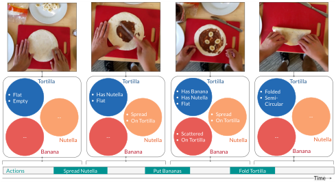

<!-- Start of picture text -->
Tortilla Tortilla Tortilla Tortilla FlatEmpty Has NutellaFlat Has Banana Has Nutella Flat FoldedSemi-Circular -- SpreadOn Tortilla SpreadOn Tortilla -- -- Nutella -- Nutella ScatteredOn Tortilla Nutella -- Nutella Banana Banana Banana Banana Actions Spread Nutella Put Bananas Fold Tortilla Time <!-- End of picture text -->

Figure 1. We study the new problem of _multiple object state change prediction_ in long videos, in which relevant objects to the actions being performed may undergo several state changes. 

segmenting and tracking relevant objects [54, 72, 76]. Yet, fine-grained procedural video understanding has remained a challenging and an under-explored problem [15, 26, 27]. 

Specifically, in long procedural task videos, the states of multiple objects change as we progress in a task, see Fig. 1. Each action/step often changes the state of several objects (e.g., _spreading Nutella_ changes the states of both tortilla and Nutella) and the state of an object often changes over several actions (e.g., the state of tortilla moves from _empty_ to _has Nutella_ to _has banana_ to _folded_ ). Being able to understand _which objects_ undergo state changes as well as _when and how_ their states change helps in better and more fine-grained _temporal and spatial_ reasoning about videos. It allows better understanding of the actions, progress and error (e.g., if the tortilla never reaches the state _has banana_ before _folded_ , there is a missing _put bananas_ step) and provides explainability about these predictions. In particular, it enables task assistants to obtain spatial and temporal awareness of step-relevant parts of the scene and video for knowing when and how to intervene. 

**SOTA Limitations.** To the best of our knowledge, the problem of predicting (multiple) state changes of multiple objects in a video has not been studied and there is no dataset for evaluation of this task. Prior works in object state prediction have mainly focused on single-object scenarios, such as detecting and localizing a single state change for 

11600

<!-- Page 2 -->

only one object in a video [4, 55, 56]. While more recent methods have considered multiple state changes [59] or one state change with an open-world object vocabulary [66], they still handle a _single_ object per video. However, realworld procedures typically involve _multiple_ objects that undergo state changes when performing _multiple_ actions in a video (see Fig. 1). Yet, it is very costly and challenging to densely annotate multiple possible states of many objects across many videos (currently there is no annotated dataset). 

On the other hand, there is a tight relationship between actions and states: knowing the action provides information about the state changes, and knowing state changes can indicate the action. This suggests that for effective video understanding, we should learn to predict both actions and state changes while capturing and leveraging their interactions. In fact, while some studies have leveraged object cues to improve action recognition, action anticipation or temporal action segmentation [69, 70, 74], the opposite direction (i.e., exploiting temporal action segmentation to improve object state prediction), remains an open problem. 

**Paper Contributions.** We study the new problem of _multiple object state prediction_ (MOSP) in long procedural videos and develop an efficient framework to address it without using annotated state changes in videos. As shown in Fig. 1, our goal is to detect and track the state of _every_ task-relevant object (undergoing state changes) in a video. Motivated by task assistant and robotic applications, we focus on egocentric videos [12, 22], where the first-person view naturally follows the user’s interactions with objects and involves dynamic and frequent object state changes. 

We address several major challenges. First, to learn without using annotated object states in videos, we develop a _Pseudo-Label Acquisition_ (PLA) pipeline that leverages action labels, large language models (LLMs) and visionlanguage models (VLMs) to automatically generate objectstate pseudo-labels for training videos. While PLA provides state descriptions of relevant objects before and after each action, we do not have their temporal localizations to train a MOSP model. Therefore, we propose a point of change (POC) estimation by leveraging VLMs that enables localizing the before-action and after-action states of objects. We then study a joint multiple object state prediction and temporal action segmentation (TAS) architecture in which the two interact, and particularly, TAS informs and improves MOSP. To do so, we propose a _State–Action Interaction_ (SAI) module that takes advantage of the intrinsic correlation between action labels and object state labels. 

To validate our method, given the lack of a dataset with annotated state changes for multiple objects, we create the **MOSCATO** ( **_M_** _ultiple_ **_O_** _bject_ **_S_** _tate_ **_C_** _h_ **_A_** _nge_ **_T_** _hrough acti_ **_O_** _ns_ ) benchmark (see Table 1), where we extend three existing egocentric TAS datasets with extensive per-frame object state annotations. 

## **2. Related Works** 

**Object State Prediction.** Early research studied object states primarily in images, focusing on transformations and compositional relations [24]. Subsequent works extended to videos, learning to discover and track object states [2, 4, 17, 44, 48, 62]. Other approaches investigated compositional generalization in zero-shot settings, but mainly in images or with a limited scope of attributes [29, 34, 37, 40, 41, 45, 46, 49]. More recent video-based methods began classifying or localizing object state changes alongside actions [35, 55–57], often focusing on a single object undergoing one or a few state transitions [59, 66]. In contrast, we propose a more fine-grained multiple object state prediction task, tracking _all_ relevant objects and their evolving states across the entire sequence of actions. **Datasets on Object States.** Several prior datasets include some form of object state annotations, but they often have significant limitations. Image-based datasets [21, 49] cover only a limited number of object or state categories. Video datasets focus on a single object undergoing one or a few transitions [55, 56, 66], or place constraints on how often the state can change within a single video [59]. Meanwhile, [35] and other recent efforts [43, 57] target specialized tasks ( _e.g_ ., state-focused captioning or anticipation). Consequently, none of these datasets are well suited for modeling _multi-object_ state changes throughout longer procedural videos. Our work addresses this gap by enriching existing egocentric video datasets with fine-grained state annotations for _all_ relevant objects and creating a benchmark to evaluate multiple object state prediction. **LLM/VLM Knowledge Utilization.** Large Language Models and Vision Language Models have demonstrated robust reasoning and comprehension skills across tasks such as recognition, localization, object detection, and visual question answering [3, 9, 10, 60, 64, 72, 73]. Despite their strong performance, they can struggle with certain nuances such as intricate object relations or subtle attribute changes [7, 42]. In our framework, we harness the general world knowledge of these models for pseudo-label generation and correlation discovery, then complement them with post-processing and refinement steps to address their failure modes and produce accurate multi-object state annotations. 

## **3. Multiple Object State Prediction (MOSP)** 

**Problem Statement.** Assume we have a sequence of _T_ video frames _V_ = � _v_(1) _, v_(2) _, . . . , v_(_T_)� , where _v_(_t_) _∈_ R_H×W ×_3 denotes the RGB frame at time _t_ with the size _H × W_ . The goal of MOSP is to predict the sequence of object states _Y_ = � **y**(1) _,_ **y**(2) _, . . . ,_ **y**(_T_)� , where **y**(_t_) _∈ {_ 0 _,_ 1 _}__O×S_ is the predicted object-state label matrix with _yos_(_t_)denoting whether object_o_has state_s_at frame_t_.Here, _O_ is the total number of objects in the dataset, and _S_ is the 

11601

> Original page for checking 4 unresolved font glyphs.

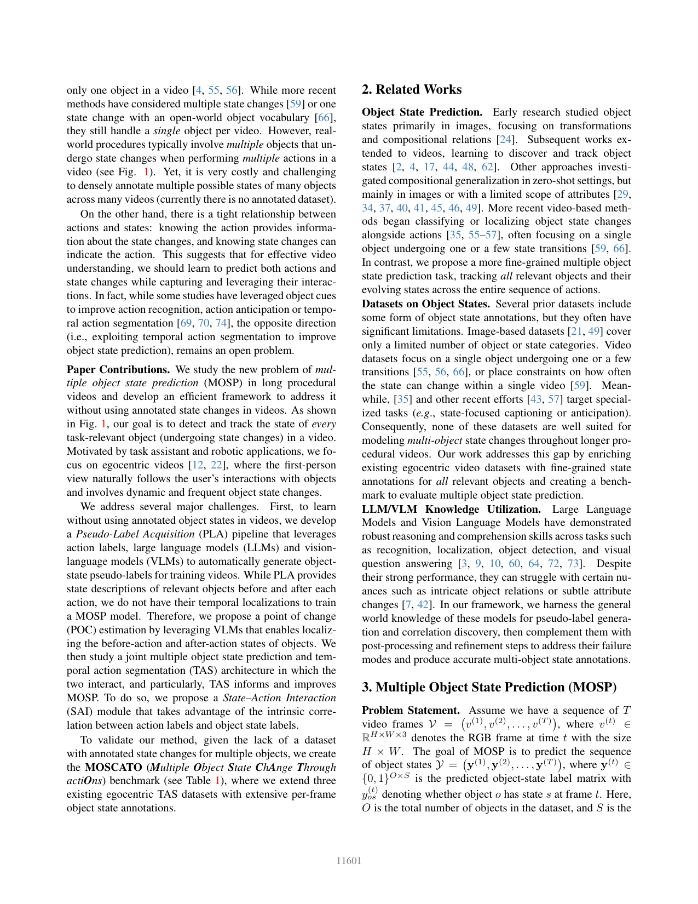

<!-- Page 3 -->

|Datasets||Egocentric|# Obj|# St|# Vid|# StC/Obj|# Obj/Vid|Avg. Video Duration(s)|GT/Pseudo|
|---|---|---|---|---|---|---|---|---|---|
|ChangeIt (Training) [55]||_×_|42|27|34428|1|1|276.0|Pseudo|
|ChangeIt(Evaluation) [55]||_×_|42|27|667|1|1|276.0|GT|
|HowToChange (Training) [66]||_×_|122|20|36075|1|1|41.51|Pseudo|
|HowToChange(Evaluation) [66]||_×_|134|20|5424|1|1|41.51|GT|
|MOST (Training)[59]||_×_|6|60|10749|_>_1|1|336.9|Pseudo|
|MOST (Evaluation) [59]||_×_|6|60|61|_>_1|1|156.9|GT|
|MOSCATO (Training)|CMU|✓|39|77|129|_>_1|_>_1|353.3|Pseudo|
||EGTEA|✓|74|79|61|_>_1|_>_1|1083.5|Pseudo|
||EgoPER|✓|77|210|163|_>_1|_>_1|150.3|Pseudo|
|MOSCATO (Evaluation)|CMU|✓|39|77|36|_>_1|_>_1|358.3|GT|
||EGTEA|✓|74|79|25|_>_1|_>_1|1781.5|GT|
||EgoPER|✓|77|210|50|_>_1|_>_1|148.1|GT|

Table 1. Comparison of MOSCATO to previous object state change video datasets. # Obj and # St denote the number of objects and states, respectively, in the object vocabulary. # Vid represents the number of videos. # OSC/Vid is the average number of object state changes per video. # StC/Obj is the number of state changes for an object in a video. # Obj/Vid denotes the number of objects that undergo state change in a video. GT/Pseudo determines if that subset is manually (GT) or automatically (Pseudo) labeled. 

total number of possible states for these objects. Therefore, we study a closed-vocabulary setting in the paper. Given the high cost of gathering ground-truth object-state labels for videos, we assume we do not have ground-truth objectstate labels for training videos. Instead for every training video _V_ , we have its action labels, � _z_(1) _, z_(2) _, . . . , z_(_T_)� , where _z_(_t_) _∈{_ 1 _, . . . , C}_ denotes the action class of frame _t_ and _C_ is number of action classes. 

**Overview.** Our setting can be considered as a _weaklysupervised_ multiple object state prediction problem, since we do not have object-state labels during training and instead use action labels. To tackle the problem, we develop a framework that consists of several components, as illustrated in Fig. 2. First, we use a MOSP network for multiple object state prediction. Given the lack of groundtruth object-state labels, we design a Pseudo-Label Acquisition (PLA) module, which leverages LLMs to obtain object and state vocabulary and VLMs to assign the states to specific frames using a point of change estimation method, which we propose. Therefore, using the output of PLA, we can supervise training of the MOSP network. To leverage the correlations between actions and states, we use conventional TAS models to predict action labels and design a novel State-Action Interaction (SAI) module to leverage these correlations for improving object state predictions. 

### **3.1. Pseudo-Label Acquisition (PLA)** 

TAS datasets [6, 11, 25, 27] generally provide action segment annotations (these can also be derived from narrations without access to explicit annotations). We leverage these to build framewise object-state pseudo labels for training. We propose a multi-stage pipeline (Fig. 3) that utilizes LLMs to progressively generate and refine the object state labels. We further use vision-based reasoning to localize segments associated with these states. **Stage 1: Object State Description via LLM.** Given the ac- 

tion label of each segment, we prompt an LLM, here GPT4o [3], to 1) identify the objects likely involved in the action and 2) describe how the appearance or state of each object changes after the completion of the action. Since the order of actions of a task can vary across videos (e.g., pouring water before adding a teabag or vice versa), the sequence of states an object undergoes may differ across videos of the same task. Thus, we additionally feed the previous actions and object states to the LLM to provide a history context. 

**Stage 2: State Description Summarization.** The previous stage produces free-form sentences describing the states of objects. To summarize these descriptions, we prompt the LLM to extract adjectives or short phrases that capture the essential states. We include short phrases because some states, such as “ _in a mug_ ” and “ _vegetable covered_ ”, cannot be described using only adjectives. Meanwhile, we already obtained a list of objects from stage one. Because the same object or state can appear under various names ( _e.g_ ., “ _mug_ ” and “ _cup_ ” or “ _chopped_ ” and “ _cut_ ”), we then apply _k_ - means clustering on the text embeddings2 for both objects and states to merge any redundant or synonymous labels into a vocabulary of distinct object and state categories. We use the Elbow method and Sum of Squared Errors to guide the choice of _k_ . 

**Stage 3: Object State Refinement.** Even with historical states provided, the LLM may occasionally omit valid states or fail to preserve ongoing attributes. For instance, if vegetables are chopped and then put on a bun, the LLM might only mention _“on buns”_ for the vegetables and miss the _“chopped”_ state. Given that we have collected a list of all possible states for each object from the LLM’s responses over all videos, we refine the states by asking the LLM to check if any other state applies to the object. Next, we ask the LLM to improve the tracking of states by asking if any of the object states before the action would still be applica- 

> 2We use the text-embedding-3-large model in GPT API. 

11602

> Original page for checking 2 unresolved font glyphs.

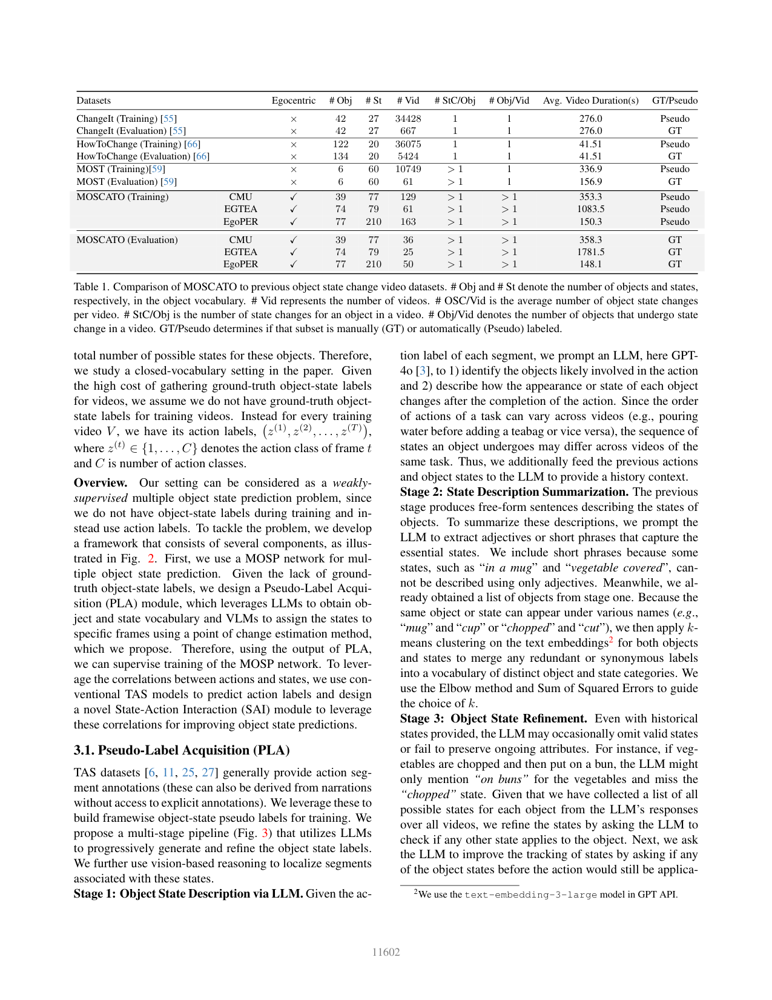

<!-- Page 4 -->

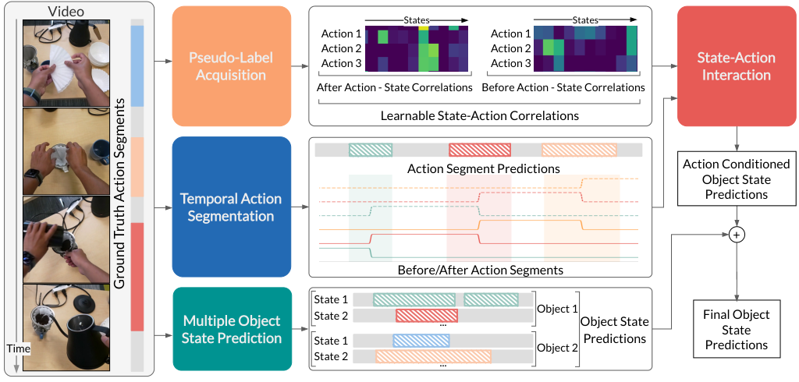

<!-- Start of picture text -->
Video States States Action 1 Action 1 Action 2 Action 2 Pseudo - Label Action 3 Action 3 State - Action Acquisition Interaction After Action - State Correlations Before Action - State Correlations Learnable State-Action Correlations Action Segment Predictions Action Conditioned Object State Temporal Action Predictions Segmentation + Before/After Action Segments State 1 Object 1 State 2 Final Object Multiple Object ... Object State State Time State Prediction State 1 Object 2 Predictions Predictions State 2 ... Ground Truth Action Segments <!-- End of picture text -->

Figure 2. Overview of our proposed framework for the task of multiple object state prediction. 

ble after the action. 

**Stage 4: Point-of-Change (POC) Estimation.** So far, we obtained state descriptions for objects in each action segment, however, without temporal localization, which is necessary to train a MOSP model. Thus, at this stage, we assign framewise object state labels to the training videos. To do so, we localize the _Point-of-Change_ (POC), hence, divide each action segment into segments for _before-action_ state and _after-action_ state. In each action segment, POC is where the state transition most likely occurs. In the paper, we assume that _all_ involved objects in an action switch states at the same moment (an approximation that simplifies the process). Our experiments also show that it yields better results than attempting to track separate POCs per object. 

Let the set of involved objects in an action be _O_ = _{o_ 1 _, o_ 2 _, . . . , oK}_ . Each object _oi_ has a _before-action_ state _So__B_ _i_(the state of objects from the previous POC to the cur- rent one) and an _after-action_ state _So__A_ _i_. We remove the states common to both _So__B_ _i_and_S_ _o__A_ _i_since they do not help distin- guish the _before_ vs. _after_ transition, 

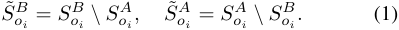

Using a pre-trained CLIP [47] model, we compute the cosine similarity between the visual embeddings of video frames and the text embeddings of object states. For object _oi_ , we then define the average similarity of frame _t_ to _before-action_ (B) and _after-action_ (A) states as 

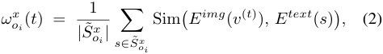

where _x ∈{B, A}_ , _v_(_t_) is the RGB image at frame _t_ , _E__img_ and _E__text_ are the image and text encoders of CLIP. We then 

compute the POC score _γ_ ( _t_ ) using all _K_ objects involved in the action as, 

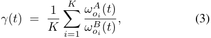

which measures how much closer frame _t_ is to the _afteraction_ states than to the _before-action_ states for _all_ objects in the action. For each action segment, we take the frame where this ratio exhibits the sharpest increase as the estimated POC, and assign _before-action_ and _after-action_ labels to frames accordingly. 

**Stage 5: Object Visibility Detection.** Finally, we employ a pre-trained object detection model (GLIP [72]), prompting it with the object vocabulary for each task. This allows us to determine in which frames each object actually appears. We then assign final pseudo-labels only to frames where the object is visibly present. 

All complete prompts are included in the supplementary material. Through PLA, we obtain per-frame pseudo object-state labels for the training videos, which we use to train a MOSP model, which we discuss next. 

### **3.2. Multiple Object State Prediction (MOSP) Model** 

Using framewise object-state pseudo-labels, obtained from PLA, we train a MOSP model (Fig. 2). Following previous works [59], we adopt a TAS architecture (MSTCN++ [30]) as our MOSP model to capture long-range temporal dependencies. Unlike state prediction methods for a single object [55, 56, 66], our multi-object scenario requires classifying a large number of possible object and state categories for each frame in the video. Modeling the temporal evo- 

11603

<!-- Page 5 -->

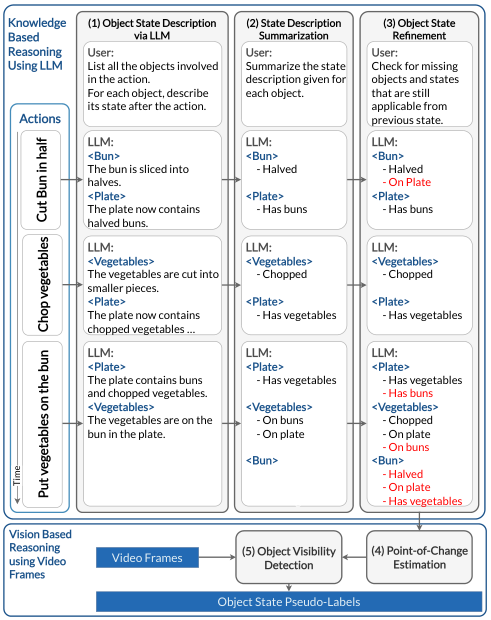

<!-- Start of picture text -->
Knowledge (1) Object State Description (2) State Description (3) Object State Based via LLM Summarization Re�nement Reasoning User: User: User: Using LLM  List all the objects involved Summarize the state Check for missing in the action. description given for objects and states For each object, describe each object. that are still its state after the action. applicable from Actions previous state. LLM: LLM: LLM: <Bun> <Bun> <Bun> The bun is sliced into      - Halved      - Halved halves.      - On plate - On Plate <Plate> <Plate>  <Plate> The plate now contains      - Has buns      - Has buns halved buns. LLM: LLM: LLM: <Vegetables>  <Vegetables>  <Vegetables> The vegetables are cut into      - Chopped      - Chopped smaller pieces. <Plate> <Plate> <Plate> The plate now contains      - Has vegetables      - Has vegetables chopped vegetables … LLM: LLM: LLM: <Plate> <Plate> <Plate> The plate contains buns      - Has vegetables      - Has vegetables and chopped vegetables.      - Has buns   - Has buns <Vegetables> <Vegetables>  <Vegetables> The vegetables are on the      - On buns      - Chopped bun in the plate.      - On plate      - On plate     - Chopped  - On buns <Bun> <Bun>      - Halved - Halved      - On plate      - On plate      - Has vegetables      - Has vegetables Vision Based Reasoningusing Video Video Frames (5) Object VisibilityDetection (4) PointEstimation - of - Change Frames Object State Pseudo-Labels Cut Bun in half Chop vegetables Time Put vegetables on the bun <!-- End of picture text -->

Figure 3. Overview of our proposed object-state pseudo-labeling process: We first use LLM-based reasoning with ground-truth action annotations to extract object vocabulary and object states. Then, we use vision-based reasoning on frames, aggregating the information into final object-state pseudo-labels. In the _Object State Refinement_ stage, red highlights object states that the LLM may miss in the _State Description Summarization_ stage. 

lution of these object states can be viewed as a multi-label classification problem, where each video frame may contain multiple objects, each in potentially different states. To handle the class imbalance in these multi-label outputs, we use a weighted binary cross-entropy loss, 

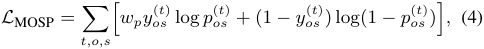

where _p_( _os__t_)and_y_ _os_(_t_)are the prediction and pseudo-label for object _o_ and state _s_ at frame _t_ , and _wp_ is a weight factor reflecting class imbalance. 

### **3.3. State-Action Interaction (SAI) Model** 

Actions and object states are closely intertwined: i) only specific actions can cause certain state changes ( _e.g_ ., “ _hold cup_ ” cannot change the state of a cup from _empty_ to _full_ ); ii) actions affect only specific objects ( _e.g_ ., “ _pour water into mug_ ” does not change the state of the cutting board); iii) some actions require objects to be in a specific state ( _e.g_ ., a hot dog must be _cut_ before being spread on pizza). 

To leverage dependencies between actions and object states, we use a TAS model to predict framewise action 

labels and propose a _State–Action Interaction (SAI)_ module to refine the outputs of the MOSP branch using action predictions from the TAS branch. Following previous works [16, 30, 32], we use a cross-entropy loss and a smoothing loss to train the TAS model using the groundtruth action labels, _i.e_ ., _LT AS_ = _Lcls_ + _Lsmooth_ . Next, we discuss the details of using action-state correlations in SAI for improving the MOSP. 

**SAI Formulation.** Our goal is to leverage action predictions from TAS to obtain object-state predictions, which we then use as _complementary pseudo-labels for training_ the MOSP and as _complementary object-state predictions during inference_ . 

Notice that a video can be segmented based on actions or object states. Let _A_ = ( _a_ 1 _, a_ 2 _, . . . , aN_ ) denote a sequence of _N action segments_ in a video, where the temporal boundary of the action segment _ai_ is denoted by [ _t_start _i , t_end _i_].Us- ing _A_ , we can build a sequence of _object state segments_ as _U_ = ( _u_ 0 _, u_ 1 _, . . . , uN_ ). Here, each _ui_ spans from the midpoint of action segment _ai_ to the midpoint of action segment _ai_ +1, which we denote by the interval [ _mi, mi_ +1]. We assume that object states remain constant in each _ui_ . 

Our goal is to obtain _P_ ( _ui_ ), the likelihood of each state segment _ui_ using the TAS output, in order to further supervise the MOSP and improve its predictions (see below). Therefore, we consider _ui_ ’s adjacent actions _ai_ and _ai_ +1. We use _PA_ ( _ui|ai_ ) and _PB_ ( _ui|ai_ +1) to denote the probabilities of _ui_ being immediately _after ai_ and _before ai_ +1, respectively. Meanwhile, we compute _PA_ ( _ai_ ) and _PB_ ( _ai_ +1) using TAS predictions, capturing the confidence of predictions for _ai_ and _ai_ +1. We then approximate 

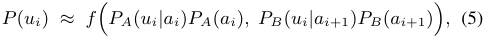

where the learnable function _f_ ( _·_ ) is realized by a 1D convolution and fuses these conditional probabilities into an estimate of _ui_ . We use Algorithm 1 to precompute empirical values for _PA_ ( _u|a_ ) and _PB_ ( _u|a_ ) using training videos. 

Once _P_ ( _ui_ ) is determined, each frame _t ∈_ [ _mi, mi_ +1] within _ui_ adopts this probability for its corresponding object–state pairs. Let � _o, s_ � be one such object–state combination; we define 

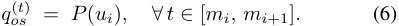

We then form the loss _LSAI_ using the weighted binary cross entropy similar to Eq. (4) applied to _qos_(_t_). 

### **3.4. Training and Inference** 

During training, we learn the MOSP and TAS parameters as well as SAI ( _f_ in Eq. (5)) by using the training loss 

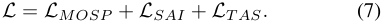

11604

> Original page for checking 3 unresolved font glyphs.

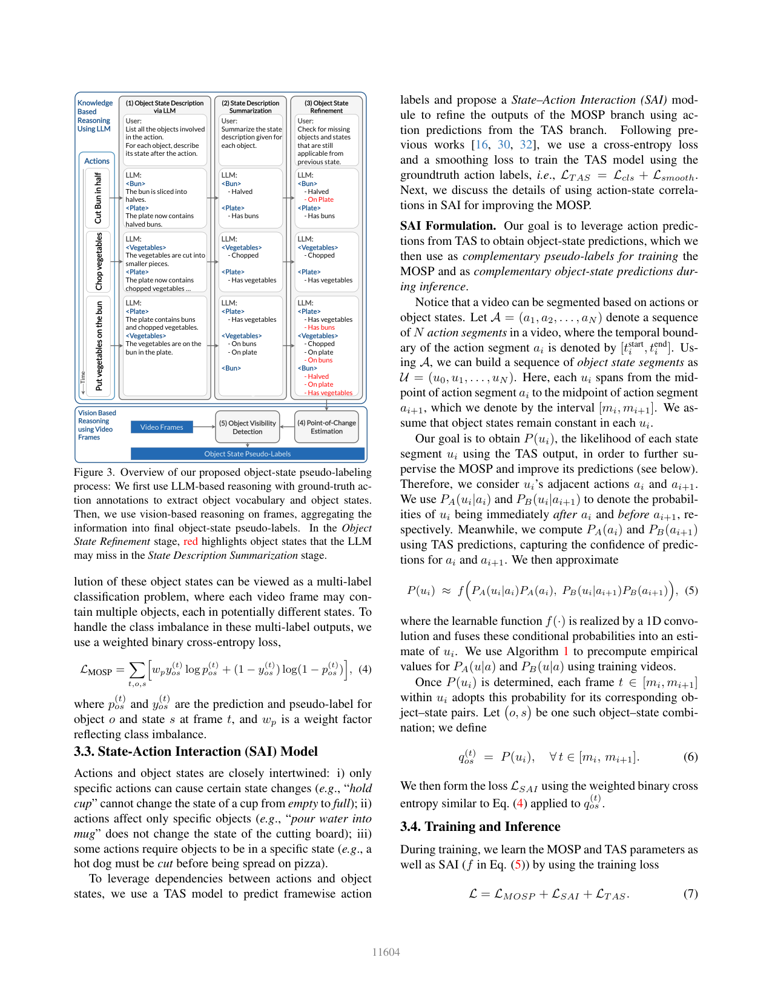

<!-- Page 6 -->

**Algorithm 1** Obtaining State-Action Correlations from PseudoLabels. The pseudocode is shown for a single video. In practice, the same process is repeated for all videos in the training set. 

1: **Input:** object-state pseudo labels _Y_ ; action sequence _A_ with associated start, end, and middle times _{ti_start _, t_end _i__, mi}_ _t__N_ =1. 2: Initialize counts _nB_ ( _o, s, a_ ) _←_ 0 _, nA_ ( _o, s, a_ ) _←_ 0 3: **for** action _ai_ in _A_ **do** 4: **for** object _o_ in _{_ 1 _,_ 2 _, · · · , O}_ **do** 5: **for** state _s_ in _{_ 1 _,_ 2 _, · · · , S}_ **do** 6: _nB_ ( _o, s, ai_ )+ =� _t∈_ [ _t_start _i ,mi_ ]_y_ _os_(_t_) 7: _nA_ ( _o, s, ai_ )+ =� _t∈_ [ _mi,t_end _i_ ]_y_ _os_(_t_) 8: **end for** 9: **end for** 10: **end for** 11: _PA_ ( _u|a_ ) = <u>�</u> _o,snA__n_ <u>(</u> _o__A_ _<u>,s</u>_(_o,s,a_ _<u>,a</u>_ <u>)</u>)_,_ _∀o, s, a_ and _u_ = ( _o, s_ ) 12: _PB_ ( _u|a_ ) = <u>�</u> _o,snB__n_ <u>(</u> _o__B_ _<u>,s</u>_(_o,s,a_ _<u>,a</u>_ <u>)</u>)_,_ _∀o, s, a_ and _u_ = ( _o, s_ ) 13: **Output:** _PB_ ( _u|a_ ) and _PA_ ( _u|a_ ). 

For inference, we obtain _pos_(_t_)from the MOSP branch and _qos_(_t_)fromtheSAIbranch.ThefinalMOSPpredictionfor object states is a weighted sum of the raw MOSP output and the refined SAI output, 

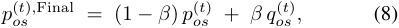

where the hyperparameter _β_ controls the influence of SAI and _pos_(_t_)_,F inal_ is the final object state probabilities predicted by our method. Ablation study on the hyperparamter _β_ is included in the supplementary materials. Empirically, modeling action–state relationships yields significant gains in MOSP performance. 

## **4. MOSCATO Dataset** 

We introduce **MOSCATO** ( **M** ultiple **O** bject **S** tate **C** h **A** nge **T** hrough acti **O** ns): a new dataset that captures _multiple_ object state changes throughout a sequence of actions. As illustrated in Fig. 1, MOSCATO goes beyond merely tracking one primary object of interest during actions; it also documents other objects that may experience significant changes. We argue that the states of these additional objects are often just as important as those of the primary object, providing a richer context. 

**Data Collection.** We build MOSCATO by leveraging three egocentric procedural task datasets: CMU [6], EGTEA [6], and EgoPER [27], each featuring various cooking tasks and object state changes. On these datasets, the videos differ in how tasks are ordered, forcing models to learn from the history of actions and object states rather than relying on a fixed sequence of actions or object states. Such variability ensures a more robust evaluation of the MOSP models. CMU, EGTEA, and EgoPER contain 165, 86, and 386 videos, respectively. We select 36 (CMU), 25 (EGTEA), 

and 50 (EgoPER3 ) videos as test sets, and manually annotate them with ground-truth object state labels. The remaining videos form the training sets, for which we generate pseudo-labels using our approach in Sec. 3.1. 

**Data Annotation.** For each dataset, we first collect a vocabulary of objects and a list of corresponding states by our proposed PLA pipeline (see Sec. 3.1). For the test splits, we collect manual annotations using LabelBox [1]. Each annotator first goes through the object list and annotates the frames in which each object is visible. Annotators then select the appropriate state for each visible object from a predefined list of possible states for each object. 

**Dataset Statistics.** Table 1 compares MOSCATO to prior datasets. While ChangeIt [55] and HowToChange [66] focus on a single state change per video, Ego4D-OSCA [35] or MOST [59] track multiple state changes, but only for a single object. MOSCATO captures state changes across _all_ within an entire video offering a broader and more complete perspective. While ChangeIt [55] and HowToChange [66] contain more manually annotated videos, the annotations are high-level and are categorized into three categories: “initial state”, “action”, and “final state”. Similarly, although Ego4D-OSCA [35] provides a large number of annotated videos, the taxonomy of state changes consists of only a few general categories (e.g., “Remove,” “Activate,” “Deform”). In contrast, MOSCATO offers a richer, more comprehensive view of how multiple objects undergo state changes over the course of complex, real-world tasks. 

## **5. Experiments** 

### **5.1. Experimental Settings** 

**Evaluation.** Following MOST [59], we measure framelevel performance using _F1-max_ and _mean Average Precision (mAP)_ . _F1-max_ is defined as the maximum F1 score across different thresholds (over [0.1, 0.2, ..., 0.9]), making it comparable to uncalibrated zero-shot models. Unlike MOST, which applies separate thresholds for each state category, we adopt a single threshold for all object states due to the large number of object–state pairs in our benchmark. We further report three segment-level metrics, _F1@0.1_ , _F1@0.25_ , and _F1@0.50_ , mirroring standard temporal action segmentation benchmarks. We choose these metrics to evaluate the temporal precision predictions of our model. For all F1 scores, we compute true positives, false positives, and false negatives across the entire test set before calculating the final F1. For EgoPER, we train and evaluate the models of each task separately and report the average performance. For CMU and EGTEA, we train one model per dataset. We do not use existing object state change datasets ( _e.g_ ., ChangeIt [55], HowToChange [66], MOST [59]) because they lack multi-object annotations. 

> 3For EgoPER, we only use the 213 normal videos, which do not have mistakes, to form the training and test sets. 

11605

> Original page for checking 4 unresolved font glyphs.

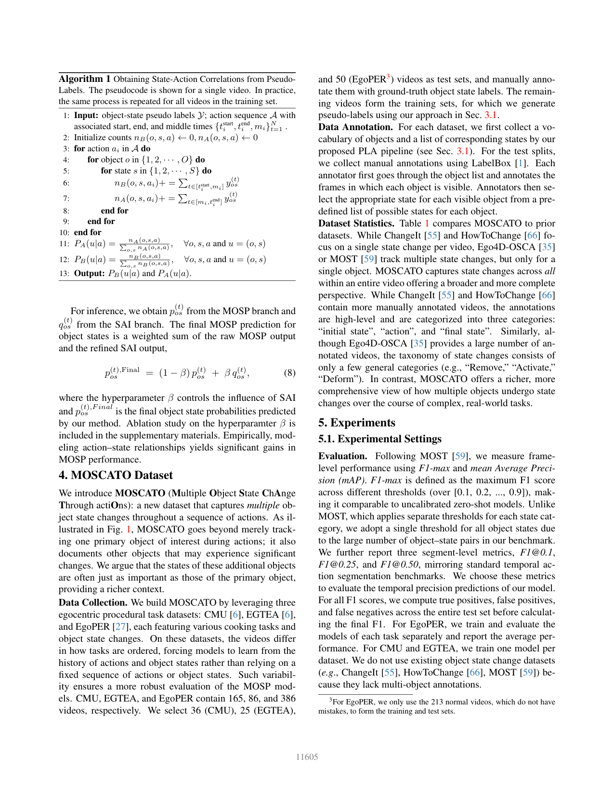

<!-- Page 7 -->

|||||MOSP|||||TAS|||
|---|---|---|---|---|---|---|---|---|---|---|---|
|||Frame-|wise||Segment-wis|e||||||
|||F1-Max|mAP|F1@0.1|F1@0.25|F1@0.5|Edit|Acc|F1@0.1|F1@0.25|F1@0.5|
||CLIP [47]|27.11|0.18|0.98|0.68|0.28|4.92|16.49|3.29|1.40|0.72|
||InternVideo2 [65]|27.05|0.20|8.77|6.78|3.76|15.57|11.84|8.05|6.04|2.40|
|EgoPER|Pseudo-Labels|38.39|-|39.77|35.55|28.73|-|-|-|-|-|
||Ours (w/o SAI)|49.99|**35.58**|54.95|46.31|41.07|90.78|**81.82**|**92.43**|**90.54**|**82.58**|
||Ours(w/ SAI)|**52.83**|35.06|**58.45**|**48.84**|**43.42**|**91.24**|81.48|91.95|89.30|81.66|
||CLIP [47]|12.15|0.05|0.68|0.31|0.11|3.03|17.4|1.47|1.04|0.43|
||InternVideo2 [65]|9.36|0.07|3.19|2.39|1.19|13.88|34.84|10.12|6.4|2.69|
|CMU|Pseudo-Labels|17.96|-|24.65|21.91|16.43|-|-|-|-|-|
||Ours (w/o SAI)|30.55|11.23|43.67|**38.16**|26.75|47.77|**83.85**|49.99|47.47|38.23|
||Ours (w/ SAI)|**35.61**|**11.50**|**43.90**|37.60|**29.99**|**49.75**|83.69|**51.46**|**49.12**|**39.76**|

Table 2. Multiple Object State Prediction and Temporal Action Segmentation results on MOSCATO-EgoPER and MOSCATO-CMU. **SAI** stands for State-Action Interaction module. We highlight the **best** and second best results. 

|Setup||State P|rediction||
|---|---|---|---|---|
|Refinement|F1-Max|F1@0.1|F1@0.25|F1@0.5|
|✗|7.49|13.04|4.34|2.17|
|✓|**17.96**|**24.65**|**21.91**|**16.43**|
|CLIP|12.15|0.68|0.31|0.11|

Table 3. Ablation studies on pseudo-labeling stages for CMU. 

**Baselines.** We evaluate two categories of models: _zeroshot_ and _trained_ . For the _zero-shot_ setting, we use an image-based VLM, CLIP (ViT-L/14) [47], and a videobased VLM, InternVideo2 [65]. Specifically, we convert each object–state pair into a text prompt of the form _“a/an {adjective} {object} in the image”_ or _“a/an {object} {state phrase} in the image”_ , then compute cosine similarity between the frame/video embeddings and text embeddings. If the similarity exceeds a threshold, we predict that object–state combination for the frame. After experimenting with multiple prompt templates, we report results from the best-performing variant. Additionally, we include a _Pseudo-Labels_ method, which applies the PLA pipeline to the test set to generate pseudo object state labels. We note that this _Pseudo-Labels_ method uses the ground-truth action labels of the testing videos while the others do not. For the _trained_ setting, we use MSTCN++ [30] as backbone for MOSP and TAS. Ablation studies performed on the architecture of the backbone is included in the supplemantary materials. We compare the performance of using only MOSP and MOSP+SAI to evaluate the effectiveness of our proposed SAI module. 

**Implementation Details.** We extract 2048-dimensional features from an I3D model [8] pre-trained on Kinetics [8]. For MSTCN++, we follow the default configurations provided in the original code, but replace the softmax layer with a sigmoid function to accommodate multi-label classification. The network is composed of four stages, each containing ten dilated convolution layers. For training, we use the Adam optimizer with a learning rate of 1 _×_ 10_−_5 , and set the class weight _wp_ to 5.0 to mitigate class imbalance. 

### **5.2. Experiment Results** 

**Main Results.** Table 2 shows our evaluations on two subsets of the MOSCATO benchmark (EgoPER and CMU). For CLIP and InternVideo2, we filter out object–state pairs that never appear in the dataset to avoid impossible predictions. However, both methods still perform poorly on MOSP, highlighting the difficulty of recognizing object states without dedicated pseudo-labeling and training. In contrast, our automatically generated pseudo-labels substantially outperform these VLM-based baselines, underscoring the effectiveness of our PLA pipeline (which includes multi-stage refinement, point-of-change estimation, and object visibility detection). Building on these pseudolabels, our final approach (w/ SAI) achieves consistent gains on EgoPER and CMU, improving F1-max by 14.44% on EgoPER and 17.65% on CMU. It also significantly improves the segment-wise metrics ( _e.g_ ., F1@0.5) by 14.69% and 13.56%, respectively. Our method without SAI reveals that SAI contributes significantly to both frame-level and segment-level performance, affirming that explicit action–state modeling is critical for MSOP. In particular, SAI increases F1-max by 2.84% on EgoPER and 5.06% on CMU. We also see notable improvements in segment-wise metrics, where we achieve 2.35% and 3.24% boosts in F1@0.5 on EgoPER and CMU respectively. 

Although TAS is not our primary focus, from Table 2 we see that TAS metrics remain competitive or even improve slightly under our unified framework. In particular, while on EgoPER, Edit and F1@0.25 for TAS decrease by less than 0.5% when using SAI, on CMU, they increase by at least 1.6% when using SAI. 

Table 4 shows our evaluations on the EGTEA subset of the MOSCATO benchmark. EGTEA is particularly challenging due to its diverse tasks, actions, and environments. This dataset differs notably from EgoPER and CMU: it contains longer videos ( 30 minutes in EGTEA vs. 10 minutes CMU) and includes many background actions such 

11606

<!-- Page 8 -->

||Frame-|wise|S|egment-wis|e|
|---|---|---|---|---|---|
||F1-Max|mAP|F1@0.1|F1@0.25|F1@0.5|
|CLIP [47]|5.97|0.01|0.09|0.03|0.00|
|InternVideo2 [65]|5.66|0.01|0.83|0.66|0.29|
| Pseudo-Labels|11.38|-|**24.24**|**15.15**|**9.09**|
|Ours (w/o SAI)|**12.85**|2.57|1.24|0.0|0.0|
| Ours (w/ SAI)|8.04|**2.78**|10.52|6.89|6.45|

Table 4. Multiple Object State Prediction and Temporal Action Segmentation results on MOSCATO-EGTEA for the **MOSP** task. Please refer to supplementary materials for TAS results. 

as putting away dishes in a make a sandwich task. These factors make both TAS and object-state prediction more challenging and cause all methods to struggle. CLIP and InternVideo2 yield low scores, suggesting that merely relying on VLMs is insufficient. By contrast, our PseudoLabels perform significantly better, especially on segmentwise metrics. Interestingly, Ours (w/o SAI) achieves the highest frame-wise F1-Max but underperforms segmentwise, whereas Ours (w/ SAI) improves mAP and outperforms in segment-wise F1, underscoring the value of explicit action–state modeling. Notably, the Pseudo-Labels still lead in segment-wise metrics, likely because they have access to ground-truth action labels, whereas our methods use predicted ones. 

**Qualitative Results.** Fig. 4 compares our proposed method to the InternVideo2 baseline and manual annotations for a video from the test set. Due to space limitations, we have included only object state predictions from one object. For almost all objects depicted, InternVideo2 predictions do not capture any changes in the objects’ states and predict many false positive predictions both frame-wise and segment-wise. This indicates the lack of ability to reason temporally over video. Also, video features from InternVideo2 are incapable of distinguishing objects in various states. However, our method is sensitive to the states of the objects. We observe that as actions unfold, our model can keep track of the states of objects. 

In Fig. 5, we show the _State-Action Correlations_ ( _PB_ ( _u|a_ ) and _PA_ ( _u|a_ )) calculated in our SAI branch. We observe these correlations are consistent with our expectations of object-state and action interactions. For example, we see the correlation between action _“Put banana slices on tortilla”_ and _“Tortilla/Topped with bananas”_ increases in After-Action State-Action Correlations. 

**Ablation Studies on PLA.** Table 3 examines the contribution of components in our PLA pipeline. Specifically, we omit the Stage 3 _(object state refinement)_ to measure its individual impact. We observe that adding the refinement stage improves segment-wise F1@0.5 by 14.26% and F1Max by 10.47%, confirming that refinement substantially improves the quality of pseudo labels, highlighting the importance of refinement to correct omissions. Additionally, in previous work [66], CLIP was used for assigning pseudolabels to frames. We also compare with CLIP as a pseudo- 

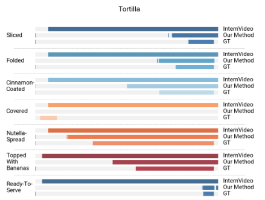

Figure 4. Qualitative comparison of InternVideo, MOSP, and ground-truth annotations for a video from the test set of EgoPER for the object “Tortilla” from the task “Making Quesadilla”. MOSP segments better align with ground truth. 

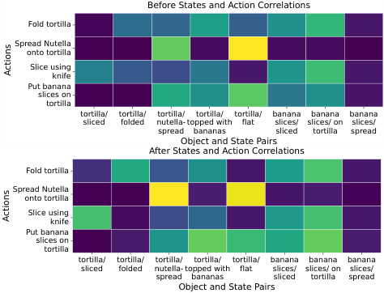

<!-- Start of picture text -->
Before States and Action Correlations Fold tortilla Spread Nutella onto tortilla Slice using knife Put banana slices on tortilla tortilla/ tortilla/ tortilla/ tortilla/ tortilla/ banana banana banana sliced folded nutella- topped with flat slices/ slices/ on slices/ spread bananas sliced tortilla spread Object and State Pairs After States and Action Correlations Fold tortilla Spread Nutella onto tortilla Slice using knife Put banana slices on tortilla tortilla/ tortilla/ tortilla/ tortilla/ tortilla/ banana banana banana sliced folded nutella- topped with flat slices/ slices/ on slices/ spread bananas sliced tortilla spread Object and State Pairs Actions Actions <!-- End of picture text -->

Figure 5. An example for _State-Action Correlations_ computed in Alg. 1. The figure illustrates the changes in correlations as an object transition from _before-action_ to _after-action_ . For clarity in presentation, we only show a few samples of the object-state pairs. 

labeling approach. We observe that while CLIP might be effective for short video segments and one object, it cannot effectively track multiple object states. 

## **6. Conclusions** 

We investigated multiple object state prediction in a weaklysupervised setting. Unlike prior works that focus on a single object, our approach captures multi-object state transitions. We developed a framework that trains a state prediction model using object-state pseudo-labels obtained by a novel approach that leverages LLMs and VLMs. Our framework also leverages correlations between actions and states using a novel state-action interaction module for improved learning and inference. We introduced the new evaluation benchmark of MOSCATO and, by experiments, show that our proposed framework improves over SOTA baselines. 

11607

<!-- Page 9 -->

## **Acknowledgement** 

This work was funded, in part, by ARPA-H (1AY2AX000062), DARPA PTG (HR00112220001), NSF (IIS-2115110), ONR (N000142512287) and ARO (W911NF2110276). The views and conclusions contained in this document are those of the authors and should not be interpreted as representing the official policies, either expressed or implied, of the US Government. 

## **References** 

- [1] Labelbox, Online, 2025. [Online]. https://labelbox. com. 6 

- [2] Nachwa Aboubakr, James L Crowley, and R´emi Ronfard. Recognizing manipulation actions from statetransformations. _arXiv preprint arXiv:1906.05147_ , 2019. 2 

- [3] Josh Achiam, Steven Adler, Sandhini Agarwal, Lama Ahmad, Ilge Akkaya, Florencia Leoni Aleman, Diogo Almeida, Janko Altenschmidt, Sam Altman, Shyamal Anadkat, et al. Gpt-4 technical report. _arXiv preprint arXiv:2303.08774_ , 2023. 2, 3 

- [4] Jean-Baptiste Alayrac, Josef Sivic, Ivan Laptev, and Simon Lacoste-Julien. Joint discovery of object states and manipulation actions. In _International Conference on Computer Vision (ICCV)_ , 2017. 2 

- [5] Emad Bahrami, Gianpiero Francesca, and Juergen Gall. How much temporal long-term context is needed for action segmentation? In _International Conference on Computer Vision (ICCV)_ , 2023. 1 

- [6] Siddhant Bansal, Chetan Arora, and C.V. Jawahar. My view is the best view: Procedure learning from egocentric videos. In _European Conference on Computer Vision (ECCV)_ , 2022. 3, 6 

- [7] Declan Campbell, Sunayana Rane, Tyler Giallanza, Nicol`o De Sabbata, Kia Ghods, Amogh Joshi, Alexander Ku, Steven M. Frankland, Thomas L. Griffiths, Jonathan D. Cohen, and Taylor W. Webb. Understanding the limits of vision language models through the lens of the binding problem, 2024. 2 

- [8] J. Carreira and A. Zisserman. Quo vadis, action recognition? a new model and the kinetics dataset. In _IEEE Conference on Computer Vision and Pattern Recognition_ , 2017. 7 

- [9] Hanning Chen, Wenjun Huang, Yang Ni, Sanggeon Yun, Yezi Liu, Fei Wen, Alvaro Velasquez, Hugo Latapie, and Mohsen Imani. Taskclip: Extend large vision-language model for task oriented object detection, 2024. 2 

- [10] Jun Chen, Han Guo, Kai Yi, Boyang Li, and Mohamed Elhoseiny. Visualgpt: Data-efficient adaptation of pretrained language models for image captioning. In _Proceedings of the IEEE/CVF Conference on Computer Vision and Pattern Recognition_ , pages 18030–18040, 2022. 2 

- [11] Dima Damen, Hazel Doughty, Giovanni Maria Farinella, Sanja Fidler, Antonino Furnari, Evangelos Kazakos, Davide Moltisanti, Jonathan Munro, Toby Perrett, Will Price, and Michael Wray. The epic-kitchens dataset: Collection, challenges and baselines. _IEEE Transactions on Pattern Analysis and Machine Intelligence_ , 2020. 3 

- [12] Dima Damen, Hazel Doughty, Giovanni Maria Farinella, Antonino Furnari, Jian Ma, Evangelos Kazakos, Davide Moltisanti, Jonathan Munro, Toby Perrett, Will Price, and Michael Wray. Rescaling egocentric vision: Collection, pipeline and challenges for epic-kitchens-100. _International Journal of Computer Vision (IJCV)_ , 130:33–55, 2022. 2 

- [13] Guodong Ding, Hans Golong, and Angela Yao. Coherent temporal synthesis for incremental action segmentation. _IEEE Conference on Computer Vision and Pattern Recognition_ , 2024. 1 

- [14] Fatih Dogangun, Serdar Bahar, Yigit Yildirim, Bora Toprak Temir, Emre Ugur, and Mustafa Doga Dogan. Rampa: Robotic augmented reality for machine programming by demonstration. _IEEE Robotics and Automation Letters_ , page 1–8, 2025. 1 

- [15] G. Donahue and E. Elhamifar. Learning to predict activity progress by self-supervised video alignment. _IEEE Conference on Computer Vision and Pattern Recognition_ , 2024. 1 

- [16] Yazan Abu Farha and Jurgen Gall. Ms-tcn: Multi-stage temporal convolutional network for action segmentation. In _Proceedings of the IEEE/CVF conference on computer vision and pattern recognition_ , pages 3575–3584, 2019. 1, 5 

- [17] Alireza Fathi and James M Rehg. Modeling actions through state changes. In _Proceedings of the IEEE Conference on Computer Vision and Pattern Recognition_ , pages 2579– 2586, 2013. 2 

- [18] Lin Geng Foo, Tianjiao Li, Hossein Rahmani, and Jun Liu. Action detection via an image diffusion process. In _Proceedings of the IEEE/CVF Conference on Computer Vision and Pattern Recognition_ , pages 18351–18361, 2024. 1 

- [19] H. Gammulle, S. Denman, S. Sridharan, and C. Fookes. Predicting the future: A jointly learnt model for action anticipation. _IEEE International Conference on Computer Vision_ , 2019. 1 

- [20] Dayoung Gong, Suha Kwak, and Minsu Cho. Actfusion: a unified diffusion model for action segmentation and anticipation. _Advances in Neural Information Processing Systems_ , 37:89913–89942, 2024. 1 

- [21] Filippos Gouidis, Theodore Patkos, Antonis Argyros, and Dimitris Plexousakis. Detecting object states vs detecting objects: A new dataset and a quantitative experimental study, 2022. 2 

- [22] Kristen Grauman, Andrew Westbury, Eugene Byrne, Zachary Chavis, Antonino Furnari, Rohit Girdhar, Jackson Hamburger, Hao Jiang, Miao Liu, Xingyu Liu, Miguel Martin, Tushar Nagarajan, Ilija Radosavovic, Santhosh K. Ramakrishnan, Fiona Ryan, Jayant Sharma, Michael Wray, Mengmeng Xu, Eric Z. Xu, Chen Zhao, Siddhant Bansal, Dhruv Batra, Vincent Cartillier, Sean Crane, Tien Do, Morrie Doulaty, Akshay Erapalli, Christoph Feichtenhofer, Adriano Fragomeni, Qichen Fu, Christian Fuegen, Abrham Gebreselasie, Cristina Gonz´alez, James M. Hillis, Xuhua Huang, Yifei Huang, Wenqi Jia, Weslie Khoo, J´achym Kol´ar, Satwik Kottur, Anurag Kumar, Federico Landini, Chao Li, Yanghao Li, Zhenqiang Li, Karttikeya Mangalam, Raghava Modhugu, Jonathan Munro, Tullie Murrell, Takumi Nishiyasu, Will Price, Paola Ruiz Puentes, Merey Ramazanova, Leda 

11608

<!-- Page 10 -->

Sari, Kiran K. Somasundaram, Audrey Southerland, Yusuke Sugano, Ruijie Tao, Minh Vo, Yuchen Wang, Xindi Wu, Takuma Yagi, Yunyi Zhu, Pablo Arbel´aez, David J. Crandall, Dima Damen, Giovanni Maria Farinella, Bernard Ghanem, Vamsi Krishna Ithapu, C. V. Jawahar, Hanbyul Joo, Kris Kitani, Haizhou Li, Richard A. Newcombe, Aude Oliva, Hyun Soo Park, James M. Rehg, Yoichi Sato, Jianbo Shi, Mike Zheng Shou, Antonio Torralba, Lorenzo Torresani, Mingfei Yan, and Jitendra Malik. Ego4d: Around the world in 3,000 hours of egocentric video. _2022 IEEE/CVF Conference on Computer Vision and Pattern Recognition (CVPR)_ , pages 18973–18990, 2021. 2 

- [23] Dan Guo, Kun Li, Bin Hu, Yan Zhang, and Meng Wang. Benchmarking micro-action recognition: Dataset, methods, and applications. _IEEE Transactions on Circuits and Systems for Video Technology_ , 34(7):6238–6252, 2024. 1 

- [24] Phillip Isola, Joseph J. Lim, and Edward H. Adelson. Discovering states and transformations in image collections. In _CVPR_ , 2015. 2 

- [25] Hilde Kuehne, Ali Arslan, and Thomas Serre. The language of actions: Recovering the syntax and semantics of goaldirected human activities. _IEEE Conference on Computer Vision and Pattern Recognition_ , 2014. 3 

- [26] S. Lee and E. Elhamifar. Error recognition in procedural videos using generalized task graph. _International Conference on Computer Vision_ , 2025. 1 

- [27] S. Lee, Z. Lu, Z. Zhang, M. Hoai, and E. Elhamifar. Error detection in egocentric procedural task videos. _IEEE Conference on Computer Vision and Pattern Recognition_ , 2024. 1, 3, 6 

- [28] Chenyi Li, Guande Wu, Gromit Yeuk-Yin Chan, Dishita G Turakhia, Sonia Castelo Quispe, Dong Li, Leslie Welch, Claudio Silva, and Jing Qian. Satori: Towards proactive ar assistant with belief-desire-intention user modeling, 2025. 1 

- [29] M. Li, L. Chen, Y. Duarr, Z. Hu, J. Feng, J. Zhou, and J. Lu. Bridge-prompt: Towards ordinal action understanding in instructional videos. In _2022 IEEE/CVF Conference on Computer Vision and Pattern Recognition (CVPR)_ , 2022. 2 

- [30] Shi-Jie Li, Yazan AbuFarha, Yun Liu, Ming-Ming Cheng, and Juergen Gall. Ms-tcn++: Multi-stage temporal convolutional network for action segmentation. _IEEE Transactions on Pattern Analysis and Machine Intelligence_ , pages 1–1, 2020. 4, 5, 7 

- [31] Z. Lu and E. Elhamifar. Set-supervised action learning in procedural task videos via pairwise order consistency. _IEEE Conference on Computer Vision and Pattern Recognition_ , 2022. 1 

- [32] Z. Lu and E. Elhamifar. Fact: Frame-action cross-attention temporal modeling for efficient action segmentation. _IEEE Conference on Computer Vision and Pattern Recognition_ , 2024. 5 

- [33] Z. Lu and E. Elhamifar. Multi-modal few-shot temporal action segmentation. _International Conference on Computer Vision_ , 2025. 1 

- [34] Massimiliano Mancini, Muhammad Ferjad Naeem, Yongqin Xian, and Zeynep Akata. Open world compositional zeroshot learning. In _Proceedings of the IEEE/CVF conference_ 

_on computer vision and pattern recognition_ , pages 5222– 5230, 2021. 2 

- [35] Victoria Manousaki, Konstantinos Bacharidis, Filippos Gouidis, Konstantinos Papoutsakis, Dimitris Plexousakis, and Antonis Argyros. Anticipating object state changes, 2024. 2, 6 

- [36] Robert McCarthy, Daniel CH Tan, Dominik Schmidt, Fernando Acero, Nathan Herr, Yilun Du, Thomas G Thuruthel, and Zhibin Li. Towards generalist robot learning from internet video: A survey. _arXiv preprint arXiv:2404.19664_ , 2024. 1 

- [37] I. Misra, A. Gupta, and M. Hebert. From red wine to red tomato: Composition with context. _IEEE Conference on Computer Vision and Pattern Recognition_ , 2017. 2 

- [38] Himangi Mittal, Nakul Agarwal, Shao-Yuan Lo, and Kwonjoon Lee. Can’t make an omelette without breaking some eggs: Plausible action anticipation using large videolanguage models. In _Proceedings of the IEEE/CVF Conference on Computer Vision and Pattern Recognition_ , pages 18580–18590, 2024. 1 

- [39] J. Munro and D. Damen. Multi-modal domain adaptation for fine-grained action recognition. _IEEE Conference on Computer Vision and Pattern Recognition_ , 2020. 1 

- [40] Muhammad Ferjad Naeem, Yongqin Xian, Federico Tombari, and Zeynep Akata. Learning graph embeddings for compositional zero-shot learning. In _Proceedings of the IEEE/CVF Conference on Computer Vision and Pattern Recognition_ , pages 953–962, 2021. 2 

- [41] Tushar Nagarajan and Kristen Grauman. Attributes as operators. _ECCV_ , 2018. 2 

- [42] Kaleb Newman, Shijie Wang, Yuan Zang, David Heffren, and Chen Sun. Do pre-trained vision-language models encode object states?, 2024. 2 

- [43] Nguyen Nguyen, Jing Bi, Ali Vosoughi, Yapeng Tian, Pooyan Fazli, and Chenliang Xu. Oscar: Object state captioning and state change representation. In _North American Chapter of the Association for Computational Linguistics (NAACL)_ , 2024. 2 

- [44] Yulei Niu, Wenliang Guo, Long Chen, Xudong Lin, and Shih-Fu Chang. Schema: State changes matter for procedure planning in instructional videos. _arXiv preprint arXiv:2403.01599_ , 2024. 2 

- [45] Khoi Pham, Kushal Kafle, Zhe Lin, Zhihong Ding, Scott Cohen, Quan Tran, and Abhinav Shrivastava. Learning to predict visual attributes in the wild. In _2021 IEEE/CVF Conference on Computer Vision and Pattern Recognition (CVPR)_ , pages 13013–13023, 2021. 2 

- [46] Senthil Purushwalkam, Maximilian Nickel, Abhinav Gupta, and Marc’Aurelio Ranzato. Task-driven modular networks for zero-shot compositional learning. In _Proceedings of the IEEE/CVF International Conference on Computer Vision_ , pages 3593–3602, 2019. 2 

- [47] Alec Radford, Jong Wook Kim, Chris Hallacy, Aditya Ramesh, Gabriel Goh, Sandhini Agarwal, Girish Sastry, Amanda Askell, Pamela Mishkin, Jack Clark, Gretchen Krueger, and Ilya Sutskever. Learning transferable visual models from natural language supervision. _International Conference on Machine learning_ , 2021. 4, 7, 8 

11609

<!-- Page 11 -->

- [48] Nirat Saini, Bo He, Gaurav Shrivastava, Sai Saketh Rambhatla, and Abhinav Shrivastava. Recognizing actions using object states. In _ICLR2022 Workshop on the Elements of Reasoning: Objects, Structure and Causality_ , 2022. 2 

- [49] Nirat Saini, Hanyu Wang, Archana Swaminathan, Vinoj Jayasundara, Bo He, Kamal Gupta, and Abhinav Shrivastava. Chop & learn: Recognizing and generating object-state compositions. In _Proceedings of the IEEE/CVF International Conference on Computer Vision_ , pages 20247–20258, 2023. 2 

- [50] Fadime Sener and Angela Yao. Zero-shot anticipation for instructional activities. _International Conference on Computer Vision_ , 2019. 1 

- [51] Y. Shen and E. Elhamifar. Semi-weakly-supervised learning of complex actions from instructional task videos. _IEEE Conference on Computer Vision and Pattern Recognition_ , 2022. 1 

- [52] Y. Shen and E. Elhamifar. Progress-aware online action segmentation for egocentric procedural task videos. _IEEE Conference on Computer Vision and Pattern Recognition_ , 2024. 1 

- [53] Y. Shen and E. Elhamifar. Understanding multi-task activities from single-task videos. _IEEE Conference on Computer Vision and Pattern Recognition_ , 2025. 1 

- [54] Y. Shen, H. Wang, X. Yang, M. Feiszli, E. Elhamifar, L. Torresani, and E. Mavroudi. Learning to segment referred objects from narrated egocentric videos. _IEEE Conference on Computer Vision and Pattern Recognition_ , 2024. 1 

- [55] Tom´aˇs Souˇcek, Jean-Baptiste Alayrac, Antoine Miech, Ivan Laptev, and Josef Sivic. Look for the change: Learning object states and state-modifying actions from untrimmed web videos. In _Proceedings of the IEEE Conference on Computer Vision and Pattern Recognition (CVPR)_ , 2022. 2, 3, 4, 6 

- [56] Tom´aˇs Souˇcek, Jean-Baptiste Alayrac, Antoine Miech, Ivan Laptev, and Josef Sivic. Multi-task learning of object states and state-modifying actions from web videos. _IEEE Transactions on Pattern Analysis and Machine Intelligence_ , 2024. 2, 4 

- [57] Tom´aˇs Souˇcek, Dima Damen, Michael Wray, Ivan Laptev, and Josef Sivic. Genhowto: Learning to generate actions and state transformations from instructional videos. _IEEE Conference on Computer Vision and Pattern Recognition_ , 2024. 2 

- [58] Yuhao Su and Ehsan Elhamifar. Two-stage active learning for efficient temporal action segmentation. pages 161–183, 2024. 1 

- [59] Masatoshi Tateno, Takuma Yagi, Ryosuke Furuta, and Yoichi Sato. Learning multiple object states from actions via large language models. In _IEEE/CVF Winter Conference on Applications of Computer Vision (WACV)_ , 2025. 2, 3, 4, 6 

- [60] Hugo Touvron, Louis Martin, Kevin Stone, Peter Albert, Amjad Almahairi, Yasmine Babaei, Nikolay Bashlykov, Soumya Batra, Prajjwal Bhargava, Shruti Bhosale, et al. Llama 2: Open foundation and fine-tuned chat models. _arXiv preprint arXiv:2307.09288_ , 2023. 2 

- [61] Naoki Wake, Atsushi Kanehira, Kazuhiro Sasabuchi, Jun Takamatsu, and Katsushi Ikeuchi. Gpt-4v (ision) for 

robotics: Multimodal task planning from human demonstration. _IEEE Robotics and Automation Letters_ , 2024. 1 

- [62] J. Wang, Y. Yang, J. Mao, Z. Huang, C. Huang, and W. Xu. Cnn-rnn: A unified framework for multi-label image classification. _2016 IEEE Conference on Computer Vision and Pattern Recognition (CVPR)_ , 2016. 2 

- [63] Jiahao Wang, Guo Chen, Yifei Huang, Limin Wang, and Tong Lu. Memory-and-anticipation transformer for online action understanding. In _Proceedings of the IEEE/CVF International Conference on Computer Vision_ , pages 13824– 13835, 2023. 1 

- [64] Yi Wang, Kunchang Li, Xinhao Li, Jiashuo Yu, Yinan He, Chenting Wang, Guo Chen, Baoqi Pei, Rongkun Zheng, Jilan Xu, Zun Wang, et al. Internvideo2: Scaling video foundation models for multimodal video understanding. _arXiv preprint arXiv:2403.15377_ , 2024. 2 

- [65] Yi Wang, Kunchang Li, Xinhao Li, Jiashuo Yu, Yinan He, Guo Chen, Baoqi Pei, Rongkun Zheng, Zun Wang, Yansong Shi, Tianxiang Jiang, Songze Li, Jilan Xu, Hongjie Zhang, Yifei Huang, Yu Qiao, Yali Wang, and Limin Wang. Internvideo2: Scaling foundation models for multimodal video understanding. In _Computer Vision – ECCV 2024_ , pages 396– 416, Cham, 2025. Springer Nature Switzerland. 7, 8 

- [66] Zihui Xue, Kumar Ashutosh, and Kristen Grauman. Learning object state changes in videos: An open-world perspective. In _Proceedings of the IEEE/CVF Conference on Computer Vision and Pattern Recognition_ , pages 18493–18503, 2024. 2, 3, 4, 6, 8 

- [67] W. Yang, T. Zhang, X. Yu, T. Qi, Y. Zhang, and F. Wu. Uncertainty guided collaborative training for weakly supervised temporal action detection. _IEEE Conference on Computer Vision and Pattern Recognition_ , 2021. 1 

- [68] Fangqiu Yi, Hongyu Wen, and Tingting Jiang. Asformer: Transformer for action segmentation. In _The British Machine Vision Conference (BMVC)_ , 2021. 1 

- [69] Chuhan Zhang, Ankush Gupta, and Andrew Zisserman. Helping hands: An object-aware ego-centric video recognition model. In _Proceedings of the IEEE/CVF International Conference on Computer Vision_ , pages 13901–13912, 2023. 2 

- [70] Ce Zhang, Changcheng Fu, Shijie Wang, Nakul Agarwal, Kwonjoon Lee, Chiho Choi, and Chen Sun. Object-centric video representation for long-term action anticipation. In _Proceedings of the IEEE/CVF Winter Conference on Applications of Computer Vision_ , pages 6751–6761, 2024. 2 

- [71] Ce Zhang, Changcheng Fu, Shijie Wang, Nakul Agarwal, Kwonjoon Lee, Chiho Choi, and Chen Sun. Object-centric video representation for long-term action anticipation. In _Proceedings of the IEEE/CVF Winter Conference on Applications of Computer Vision_ , pages 6751–6761, 2024. 1 

- [72] Junbin Zhang, Pei-Hsuan Tsai, and Meng-Hsun Tsai. Semantic2graph: Graph-based multi-modal feature fusion for action segmentation in videos, 2022. 1, 2, 4 

- [73] Yue Zhao, Ishan Misra, Philipp Kr¨ahenb¨uhl, and Rohit Girdhar. Learning video representations from large language models. In _Proceedings of the IEEE/CVF Conference on Computer Vision and Pattern Recognition_ , pages 6586– 6597, 2023. 2 

11610

<!-- Page 12 -->

- [74] Xingyi Zhou, Anurag Arnab, Chen Sun, and Cordelia Schmid. How can objects help action recognition? In _Proceedings of the IEEE/CVF Conference on Computer Vision and Pattern Recognition_ , pages 2353–2362, 2023. 2 

- [75] Yuxuan Zhou, Xudong Yan, Zhi-Qi Cheng, Yan Yan, Qi Dai, and Xian-Sheng Hua. Blockgcn: Redefine topology awareness for skeleton-based action recognition. In _Proceedings of the IEEE/CVF Conference on Computer Vision and Pattern Recognition_ , pages 2049–2058, 2024. 1 

- [76] Xizhou Zhu, Weijie Su, Lewei Lu, Bin Li, Xiaogang Wang, and Jifeng Dai. Deformable detr: Deformable transformers for end-to-end object detection. _arXiv preprint arXiv:2010.04159_ , 2020. 1 

11611
