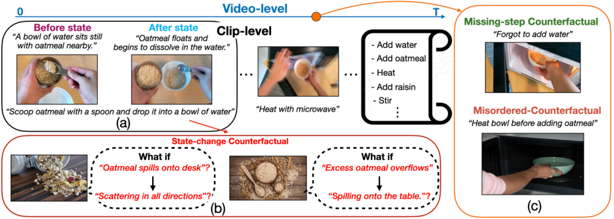
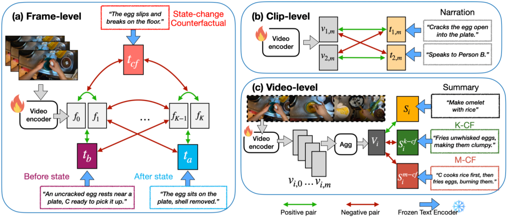
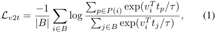
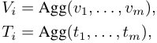
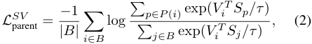
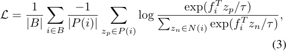
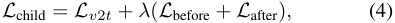
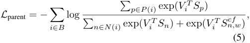

# 022_Kung_What_Changed_and_What_Could_Have_Changed_State-Change_Counterfactuals_for_ICCV_2025_paper

[Original PDF](../022_Kung_What_Changed_and_What_Could_Have_Changed_State-Change_Counterfactuals_for_ICCV_2025_paper.pdf)

Pages: 13

> Automatically converted from PDF. Check the original for exact equations, symbols, table alignment, and figure details.

<!-- Page 1 -->

This ICCV paper is the Open Access version, provided by the Computer Vision Foundation. Except for this watermark, it is identical to the accepted version; the final published version of the proceedings is available on IEEE Xplore. 

# **What Changed and What Could Have Changed? State-Change Counterfactuals for Procedure-Aware Video Representation Learning** 

<!-- Start of picture text -->
Chi-Hsi Kung ∗ Frangil Ramirez ∗ Juhyung Ha Indiana University Indiana University Indiana University kung@iu.edu fraramir@iu.edu yuhha@iu.edu Yi-Ting Chen † David Crandall † Yi-Hsuan Tsai † National Yang-Ming Chiao-Tung University Indiana University Atmanity Inc. ychen@cs.nycu.edu.tw djcran@iu.edu wasidennis@gmail.com <!-- End of picture text -->

Figure 1. Illustration of “what change” (actual action-induced transformations) and “what could have changed” (hypothetical deviations) for both clip- and video-level procedures. (a) The clip narration _“Scoop oatmeal with a spoon and drop it into a bowl of water”_ changes the scene’s Before and After states at the short-term clip-level. (b) Illustrates the hypothesized deviation, i.e., State-change Counterfactual, that could have happened and changed the scene differently at the clip level. (c) Illustrates the counterfactuals for video-level procedures, which depicts what could happen due to possible previous mistakes, for example, Missing-step Counterfactual and Misordered Counterfactual. 

## **Abstract** 

_Understanding a procedural activity requires modeling both how action steps transform the scene, and how evolving scene transformations can influence the sequence of action steps, even those that are accidental or erroneous. Existing work has studied procedure-aware video representations by modeling the temporal order of actions, but has not explicitly learned the state changes (scene transformations). In this work, we study procedure-aware video representation learning by incorporating state-change descriptions generated by Large Language Models (LLMs) as supervision signals for video encoders. Moreover, we gener-_ 

_ate state-change counterfactuals that simulate hypothesized failure outcomes, allowing models to learn by imagining unseen “What if” scenarios. This counterfactual reasoning facilitates the model’s ability to understand the cause and effect of each step in an activity. We conduct extensive experiments on procedure-aware tasks, including temporal action segmentation, error detection, action phase classification, frame retrieval, multi-instance retrieval, and action recognition. Our results demonstrate the effectiveness of the proposed state-change descriptions and their counterfactuals, and achieve significant improvements on multiple tasks. Code is available at https://github.com/HCISLab/counterfactual-video-pretrain._ 

> *Equal contribution. _†_ Equal advising. 

12294

<!-- Page 2 -->

## **1. Introduction** 

Procedural activities, such as following a cooking recipe [20, 24, 32, 37] or assembling a piece of furniture [49, 64], consist of sequences of interconnected steps that often happen in a specific and logical order to achieve a desired outcome. Understanding these activities from video data is essential for a variety of applications, including video retrieval [15, 22, 49, 84], intelligent collaborative agents [4, 27, 33, 79, 93], and robot learning from human demonstration [26, 30, 57, 65, 87, 89, 96, 105]. In contrast to general video action recognition that focuses on a single step in a short clip [7, 18, 21, 34, 77, 80], procedure-aware video understanding requires capturing both the “what changed” (actual action-induced state transformations) [41, 72], as shown in Figure 1 (a), and “what could have changed” (hypothetical deviations) [25, 58, 62, 101], as shown in Figures 1 (b) and (c). These two capabilities are important for understanding long-form procedures because the outcome of each action step can affect subsequent steps. 

Procedure-aware video representation learning can enable various downstream long-form video tasks, such as temporal action segmentation [20, 32, 37, 64] and error detection [37, 64]. There have been many approaches proposed to learn procedure-aware representations, including learning spatiotemporal features [7, 18, 21, 77], using action labels as supervision [43, 50, 86, 102], incorporating temporal order of steps [28, 102], and consulting external activity procedure knowledge databases [104] such as WikiHow [31]. However, these approaches often struggle to explicitly model procedural knowledge that relies on how scene states evolve over time and how they could have evolved if the precondition and/or result of an action step had differed. For instance, the procedure _“Make Oatmeal”_ in Figure 1 (c) cannot be finished correctly if the state of the bowl remains _“Full of oatmeal and without water”_ or _“Full of water without oatmeal”_ because neither state meets the precondition of the later action step, _“Heat with microwave.”_ Capturing these subtle transitions requires _statechange reasoning_ to understand how an action transforms the environment and objects, and _counterfactual analysis_ to foresee alternative outcomes for the same action. 

In this paper, we propose a hierarchical procedureaware video representation learning framework that leverages state-changes and counterfactuals generated by a Large Language Model (LLM) [17]. We use the actual statechange descriptions to temporally contrast features, and the counterfactuals as the negative exemplars in contrastive learning [10, 29, 54] to enhance the modeling of clip-level and video-level procedure transformations. Specifically, at the clip level, we first model _before_ and _after states_ to describe the change in the environment and/or objects resulting from an action. We also incorporate _state-change counterfactuals_ that estimate a hypothesized state if the action 

step were to fail for any reason. For example, if the action were “make coffee,” a possible result state counterfactual could be “cup shards scattered on the floor.” We then use temporal contrastive learning to encourage the model to learn a representation space in which visual features of later frames in short clips and _after states_ are close together, and in which the early frames, _before state_ , and _state counterfactual_ are far away, and vice versa. At the video level, we also generate missing-step and misordered counterfactuals that simulate the hypothesized scenarios by disturbing action steps within a long video. Then, we treat these videolevel counterfactuals as hard negatives in video-language alignment, enabling a more comprehensive understanding of the entire procedure in a long-form video. 

To validate our approach, we incorporate state changes and their counterfactuals into the learning process and pretrain our model on Ego4D [23, 42], a large-scale daily activity dataset filtered to include clean and aligned short clips along with their corresponding clip-level narration text and video-level summary text. We evaluate the learned procedure-aware video representations in six key procedural and short-term video understanding tasks—error detection, temporal action segmentation, multi-instance retrieval, action recognition, action phase classification, and frame retrieval—and show that they significantly enhance performance compared to strong baselines. In addition, we conduct a comprehensive ablation study to highlight the impact of learning state changes and their counterfactuals, demonstrating their importance in enhancing procedural video understanding. To summarize, our contributions are: 

1. a novel approach to video representation learning that explicitly incorporates state changes and their counterfactuals to enhance procedure awareness; 

2. a hierarchical learning framework that integrates statechange and counterfactual descriptions into frame-, clip-, and video-level feature alignment; and 

3. experiments showing state-of-the-art performance on several procedure-aware video downstream tasks and comprehensive analysis and discussion. 

## **2. Related Work** 

### **2.1. Video Procedure-Aware Representations** 

Procedure understanding, which involves recognizing and localizing individual action steps and reasoning about their causal relationships, is a fundamental challenge in computer vision, and is important for applications such as step recognition [5, 13, 76], temporal action segmentation [11, 20, 32, 64], and error detection [37]. Early work proposed learning procedure-aware video representations via exploiting the temporal consistency within videos [5, 55, 82, 86, 98] and temporal order [28] as pre-text tasks. Some work incorporates task graphs as guidance to learn procedure-aware rep- 

12295

<!-- Page 3 -->

resentations, either by constructing graphs based on knowledge bases [104] or through learning [3, 6, 48, 52, 63]. Recently, several papers have attempted to align video features in datasets such as HowTo100M [49] or Ego4D [23] with text descriptions extracted through automatic speech recognition [48, 50], refined subtitles [43] with the external database WikiHow [31, 48], or manually labeled annotations [2, 42, 102]. These text descriptions offer rich context of action steps and temporal relations, opening the door for procedure-awareness learning. For example, Brprompt [39] generates text prompts from ground truth action labels to learn ordinal temporal features. PVRL [102] formulates future action steps as next-token prediction [14], enhancing temporal order between actions. HierVL [2] proposes hierarchical video-text alignment for both short clips and long videos. 

However, these papers fall short of explicitly learning state changes—the causal relationships between action and state—which is essential to procedure understanding [53, 72]. Moreover, they can overfit to the seen correctly executed actions, which can hinder both understanding activity procedures and recognizing deviations such as erroneous action steps. In this work, we use state-change descriptions and counterfactuals to force our model to learn about action transformations and hypothetical failure outcomes, under the hypothesis that this type of learning will facilitate better procedure awareness. 

### **2.2. State-Change Understanding** 

The idea of visual state changes has been explored extensively in the computer vision community, sometimes using different terms such as transformations between states [41, 83] or state-modifying actions [53, 70, 71, 73]. For example, papers have studied object state change localization [1, 45, 60, 70, 91] and generation [73], and action recognition with state changes [19, 60, 83]. Procedure planning, which aims to generate effective plans for task completion based on start and goal visual states, also incorporates the concept of understanding state changes [9, 40, 47, 51, 53, 78]. We were also inspired by SCHEMA [53] to use LLMs to generate before- and after-state descriptions of actions. 

However, three key factors sets our work apart from this existing work. First, unlike existing work that mainly focuses on a specific task such as procedure planning [53], we aim to design a more general video representation learning framework for various downstream tasks. Second, prior work does not incorporate hypothetical outcomes, i.e., counterfactuals, which we believe are essential for procedure causal reasoning. Last but not least, prior work often only models state changes involving objects that are directly interacted with. In contrast, our generated descriptions can cover state changes of objects, humans, and the surrounding environment. We provide extensive examples in our supple- 

mentary materials. 

### **2.3. Video Representations with Counterfactuals** 

Counterfactual example reasoning has been shown to help models better understand cause-and-effect and predict outcomes [61, 92, 97], yielding strong generalization and robustness on tasks such as video question-answering [38, 95, 100] and compositional reasoning [35, 75]. Extensive research has studied creating counterfactual examples with image data augmentation [103], rule-based text transformations [67], random word substitutions [59], language models [16, 81, 88, 99], and synthetic image-text pairs generated by a simulator [8] or generative model [35, 36, 66]. However, existing work mainly focuses on creating counterfactuals for images or short videos and does not consider the procedural nature of activities. In this work, we propose state-change counterfactuals at both the clip and video levels, highlighting both action transformations and procedure evolution. 

## **3. Proposed Method** 

We first present the text generation process for state changes and state-change counterfactuals. Then, we provide an overview of the clip-video hierarchical representation learning framework. Finally, we present our pretraining optimization that incorporates the generated texts to learn procedure-aware representations. 

### **3.1. State Change & Counterfactual Generation** 

We use the Llama 3 [17] LLM to generate clip-level state descriptions ( _before state_ , _after state_ and _statechange counterfactuals_ ) and to generate video-level summary counterfactuals ( _missing step_ and _misordered step_ ). 

**Clip-Level State Changes and their Counterfactuals.** We feed the narration annotated for each short clip in Ego4D [23, 42] into Llama and ask it to generate a statechange description based on that narration. Specifically, 

Generate [Before] describing the scene before the action is performed and [After] describing the scene changed by the action. 

For example, given the narration “ _C picks a bag of clothes from the floor_ ,” where _C_ is the camera-wearer, Llama might generate [Before]: “ _The floor is cluttered with clothes_ ” and [After]: “ _The bag of clothes is now in C’s hand, with the surrounding area slightly rearranged._ ” Then, we generate multiple state-change counterfactuals (SC-CF) using another prompt with the same action context, 

Now, based on the state changes you generated, create 3 state-change 

12296

<!-- Page 4 -->

Figure 2. Illustration of our learning framework. (a) We train **frame** features by temporally contrasting neighboring and distant frames by incorporating Before, After, and State-change Counterfactuals (SC-CF). (b) We align **clip** features with narration features. (c) Clip features are aggregated with the aggregator (Agg) as **video** features. Then the video features are contrasted positively with summaries and negatively with Missing-step Counterfactuals (K-CF) and Misordered Counterfactuals (M-CF). Note that all text features are extracted with the frozen text encoder. 

counterfactuals [SC-CF] depicting scenes with incomplete or incorrectly completed actions. 

The generated results [SC-CF] might be “ _Clothes remain scattered on the floor_ ” or “ _A small pile of clothes sits amidst remaining clutter._ ” 

**Video-Level Counterfactual Generation.** We feed all clip narrations in a long video and their video-level summaries annotated in Ego4D [23, 42] to Llama. We ask the LLM to generate summary counterfactuals for _missing key steps_ [K-CF] in which some crucial action steps (clip narrations) are missing, 

Generate 10 distinct counterfactuals [K-CF] by taking out some key actions. 

and _misordered_ [M-CF] counterfactuals in which the order of key action steps is permuted, 

Generate 10 distinct counterfactuals [M-CF] by 

perturbing the order of actions. 

In this way, we generate diverse counterfactuals that can facilitate models to learn from hypothetical and unseen scenarios. As an example, consider the video summary _“Make omelet with rice”_ in Figure 2. The procedure consists of a sequence of actions, [ _“Crack eggs,” “Whisk eggs,” “Fry eggs,” “Fry rice”,_ ...]. The video-level statechange counterfactuals could be missing action step _“Whisk_ 

_eggs”_ , which might lead to state _“Clumpy eggs”_ , while if one misordered the action step _“Fry rice”_ by performing it too early, it could lead to state _“Burnt rice.”_ We provide more examples of the generated descriptions in the supplementary materials. 

### **3.2. Preliminary: Hierarchical Video Feature Learning** 

We adopt HierVL [2], a framework that learns hierarchical video-language representations at two temporal scales, cliplevel and video-level. The clip-level narrations and videolevel summaries are annotated by Ego4D/EgoClip [23, 42]. Note that since HierVL trains both a visual and text encoder, it requires vision-to-text and text-to-vision alignment. Below we describe the former, and the latter is defined symmetrically. Formally, let a video be divided into _M_ short clips _{v_ 1 _, . . . , vM }_ with corresponding narration texts _{t_ 1 _, . . . , tM }_ , and let _S_ be the video-level summary for the entire video. HierVL’s vision-to-text training objective consists of two parts: clip-level alignment and videolevel alignment losses. 

**Clip-Level Alignment (Child Loss)** is a contrastive loss that encourages matched ( _vi, ti_ ) pairs to have high similarity relative to mismatched pairs. Specifically, we use a softmax-based contrastive objective, 

12297

<!-- Page 5 -->

where _B_ is the mini-batch, _vi_ and _tj_ are visual and textual embeddings, respectively, and _P_ ( _i_ ) denotes the positive samples of the _i_th video clip. HierVL [2] leverages a variant of the action-aware loss, EgoNCE [42], in order to mine hard positives and negatives; please see [2, 42] for details. The overall loss at the child level is thus _L_ child = _Lv_ 2 _t_ + _Lt_ 2 _v_ , where the latter is defined symmetrically. 

**Video-Level Alignment (Parent Loss)** captures long-range context. Clip features _v_ 1 _, ..., vm_ and text features _t_ 1 _, ..., tm_ are aggregated into single video-level representations _Vi_ and _Ti_ , respectively, 

where Agg( _·_ ) is an aggregator function implemented with a self-attention transformer. This parent loss seeks to align the video-level features to the text summary provided by Ego4D, 

where the superscript _SV_ emphasizes that this is the visionto-text alignment loss, and _L__ST_ parentis defined analogously for text-to-text alignment. The overall loss at the parent level is thus _L_ parent = _L__SV_ parent+_LST_ parent. 

### **3.3. Pretraining Objective: State Change & Counterfactual** 

We use a hierarchical contrastive pre-training framework with three timescales: frame-, clip-, and video-level. 

**Frame-Level Alignment.** At the frame level, the model is supervised by our proposed _before-state_ loss _L_ before and _after-state_ loss _L_ after, each defined as [29], 

where _B_ is the batch size, _fi_ is the visual embedding of the _i_th frame, _zj_ is either a visual or text embedding, _τ_ is a temperature hyperparameter, and _P_ ( _i_ ) and _N_ ( _i_ ) denote the positive and negative samples of the _i_th frame, respectively. Given a set of _K_ = 4 frames sub-sampled from a video clip, _L_ before aims to align earlier-in-time frames along with the _before-state_ text embeddings, while pushing them apart from later-in-time frames, the _after-state_ , and counterfactual text embeddings. That is, _P_ (0) = _{f_ 1 _, tb}_ and _N_ (0) = _{f_ 3 _, ta, tcf }_ , where _tb_ , _ta,_ and _tcf_ denote the text embeddings corresponding to the before state, after state, and the counterfactuals, respectively. On the other hand, _L_ after aims to align later-in-time frames to the after 

state while separating them from earlier-in-time frames, the before-state, and counterfactual text embeddings. In other words, _P_ (3) = _{f_ 2 _, ta}_ and _N_ (3) = _{f_ 0 _, tb, tcf }_ . Additionally, other samples from the same mini-batch are included as negatives in the denominator of Eq. (3) in both losses; we omit them in the notation above for simplicity. 

**Clip-Level Alignment.** At the clip-level, we use the _Lv_ 2 _t_ loss described in Section 3.2, which seeks to align the _videoclip_ embeddings to their corresponding text narrations from EgoClip [42]. Note that since we do not train a text encoder, the symmetric _Lt_ 2 _v_ loss is neglected here. For more details on this loss, see Section 3.2 and [2, 42]. 

The resulting loss for the first two scales is thus, 

where _λ_ is a hyperparameter controlling the strength of the state-change aware supervision. 

**Video-Level Alignment.** The goal of this loss is to align video-level visual embeddings to summary text embeddings and to enhance procedural awareness using videolevel counterfactuals. We first obtain video-level visual embeddings from clip-level embeddings using a self-attention block, as described in Section 3.2. Then, using contrastive learning, each visual embedding is aligned to its corresponding summary text embedding and contrasted against text embeddings of the generated counterfactual K-CF and M-CF. The formulation is defined as, 

where _Vi_ is the aggregated video-level visual embedding, _Sj_ is a summary text embedding and _Sj,w__cf_areMisordered and Missing-step counterfactual text embeddings where _w ∈{_ 1 _, . . . , W }_ is the total number of counterfactuals used, and _P_ ( _i_ ) and _N_ ( _i_ ) denote the positive and negative samples of the _i_th video, respectively. We also use a temperature hyperparameter _τ_ as in Eq. (3), but we omit it in the equation above for simplicity of notation. Note that consistent with [2], in this case, the summation over positive samples is located inside the logarithm since the sampling strategy of [42] is used. However, prior work [29] finds the summation outside the logarithm to be more effective and thus this is the de-facto choice of the frame-level loss in Eq. (3). 

## **4. Experiments** 

### **4.1. Implementation Details** 

**Pretraining.** We pretrain our model on EgoClip [42], a dataset derived from Ego4D [23], with clean clip-level narrations and the video-level summaries. We follow [2, 42] 

12298

<!-- Page 6 -->

Table 1. Temporal action segmentation results on the GTEA and EgoPER datasets. Bold denotes best and underline is second best. **Text encoder** denotes the VLM model with a trainable text encoder. Following [44] we also present the average across all metrics ( _Avg_ ). 

|||||**GTEA**|||||**EgoPE**|**R**||
|---|---|---|---|---|---|---|---|---|---|---|---|
|**Method**|Pretraining Data|F1@10|F1@25|F1@50|Edit|Acc|Avg|F1@50|Edit|Acc|Avg|
|Br-prompt [39]|GTEA|94.1|92.0|83.0|91.6|81.2|88.4|-|-|-|-|
|I3D [7]|Kinetics|90.1|88.8|79.2|84.6|79.7|84.5|48.8|71.9|73.9|64.9|
|CLIP [56]|WIT [74]+**Text encoder**|88.5|86.2|77.6|**87.1**|75.6|83.0|44.2|71.2|70.8|62.1|
|MIL-NCE [50]|HowTo100M|67.9|61.3|44.6|67.9|58.3|60.0|47.3|69.1|73.6|63.3|
|PVRL [102]|HowTo100M|85.2|82.6|72.2|81.1|71.2|78.5|45.6|73.2|73.4|64.1|
|HierVL [2]|Ego4D+**Text encoder**|**90.4**|88.5|81.2|86.7|78.5|85.1|52.6|73.0|77.3|67.6|
|Ours|Ego4D|89.8|**89.1**|**81.6**|86.8|**80.0**|**85.5**|**54.4**|**74.1**|**79.0**|**69.2**|

to use the same training split that has 3.8M clip narrations and 120K long-term video summaries for pretraining. We pretrain our model on 8 NVIDIA L40S GPUs, with batch size 18 on each GPU for 7 epochs. We follow HierVL [2] and train models on clip- and video-level alignment alternatively. Specifically, we perform video-level alignment as in Eq. (5) after every 5 mini-batches of clip-level alignment as in Eq. (4). The frame-level loss is computed during the cliplevel training iteration. We set the learning rate and weight decay to 1e-5 and 1e-4, respectively. Note that each short clip is sub-sampled to 4 frames during training [2, 42]. 

**Text Generation.** To generate all state-change descriptions and state-change counterfactuals, we use Llama 3.1 8B [17] for efficiency. We incorporate off-the-shelf text-encoder FLAVA [69] to pre-extract features of the annotated narrations and summaries and our generated text descriptions. 

**Temporal Action Segmentation.** We evaluate representations on temporal action segmentation, in which the goal is to output frame-wise action labels for untrimmed videos. This requires modeling procedures and recognizing the start and end of state transformations. We evaluate various representations by adopting the popular temporal action segmentation model ASFormer [94] that takes video features as input. We follow prior work [39] for the same training strategy and evaluation protocol and metrics including F1 scores, Edit distance, and frame-wise Accuracy, on the cooking procedure datasets, Georgia Tech Egocentric Activities (GTEA) [20] and EgoPER [37] Dataset. GTEA consists of 28 egocentric instructional videos capturing daily kitchen activities at 15 frames per second. EgoPER contains 368 videos spanning 28 hours of cooking scenarios. 

**Error Detection.** We evaluate representations on unsupervised error detection on the EgoPER dataset [37] where models are trained with error-free videos and output labels for each frame on whether it is an error. The error categories include _step omission_ , _step addition_ , _step modification_ , _step slip_ , and _step correction_ . We follow [37], and use the EgoPED model [37] and equip it with differ- 

ent video representations. Specifically, the training process of EgoPED consists of two stages: action segmentation and prototype learning. In stage 1, the temporal action segmentation model, ASFormer, is trained to predict frame-wise action labels on the error-free set by taking pre-extracted video features as input. In stage 2, the model learns prototype features for each class of action step, e.g., _“Take bowl from microwave,”_ with contrastive step prototype learning [37, 54]. For each class of activity, multiple prototypes are extracted for error detection at inference. Note that each activity is trained independently, such as _Make Coffee_ . During the inference, EgoPED calculates the similarity score of observed frame features and any learned prototypes. A threshold is further used to determine whether the observed test frame is erroneous. 

**Action Retrieval & Recognition.** To demonstrate the applicability of the learned representations in core video understanding tasks, we evaluate zero-shot multi-instance retrieval on Epic-Kitchens (EK) [12] and zero-shot action recognition on Charades-Ego (CE) [68]. Following prior work [2, 42], both tasks are implemented via text-to-vision alignment by selecting the textual label with the highest similarity score to the given visual sample. Note that [42] reports overfitting when applying the model trained on Ego4D to Charades-Ego, and thus uses a task-specific checkpoint. We follow [2] and report the results of our pre-training checkpoint (denoted as PT ckpt in their work) rather than using task-specific checkpoints. 

**Action Phase Classification & Frame Retrieval.** To assess _fine-grained_ and _short-term procedure awareness_ , we test representations on action phase classification and zero-shot frame retrieval on the Align-Ego-Exo (AE2) dataset [90]. The AE2 dataset contains egocentric and exocentric videos of actions _Break Eggs_ , _Pour Milk_ , _Pour Liquid_ , and _Tennis Forehand_ . Each action is divided into two to four phases [90]. We follow [90] and train an SVM to predict the per-frame action phase labels for the classification task and use nearest neighbors for the zero-shot retrieval 

12299

<!-- Page 7 -->

Table 2. Error detection results on the EgoPER dataset. Bold indicates best and underline is second best. HTM denotes the HowTo100M dataset [49]. **Text** denotes the VLM model with a trainable text encoder. 

|||Ques|adilla|Oat|meal|Pinw|heel|Cof|fee|T|ea|A|ll|
|---|---|---|---|---|---|---|---|---|---|---|---|---|---|
|Method|Pretraining Data|EDA|AUC|EDA|AUC|EDA|AUC|EDA|AUC|EDA|AUC|EDA|AUC|
|Random|-|19.9|50.0|11.8|50.0|15.7|50.0|8.20|50.0|17.0|50.0|14.5|50.0|
|HF2-VAD [46]|-|34.5|62.6|25.4|62.3|29.1|52.7|10.0|59.6|36.6|62.1|27.1|59.9|
|S3R [85]|Kinetics+I3D|52.6|51.8|47.8|61.6|50.5|52.4|16.3|51.0|47.8|57.9|43.0|54.9|
|I3D [7]|Kinetics|62.7|65.6|51.4|65.1|59.6|55.0|55.3|58.3|56.0|66.0|57.0|62.0|
|CLIP [56]|WIT [74]+**Text**|77.6|67.2|69.6|**67.5**|66.9|59.5|**68.5**|69.0|75.6|57.7|71.6|64.2|
|MIL-NCE [50]|HTM|77.3|59.8|69.8|61.5|65.7|53.0|68.0|67.9|69.8|61.5|70.1|60.7|
|PVRL [102]|HTM|75.7|70.0|71.2|53.5|65.5|**65.5**|67.5|65.4|76.4|65.2|71.3|63.9|
|HierVL [2]|Ego4D+**Text**|77.9|**70.2**|70.8|66.4|65.2|58.1|67.4|**69.8**|75.1|66.4|71.3|**66.2**|
|Ours|Ego4D|**78.9**|63.7|**71.6**|46.1|**68.3**|53.8|68.3|68.0|**76.6**|**70.9**|**72.7**|60.5|

task. Note that we merge the validation and test sets for more robust results. 

**Baselines.** We evaluate the popular I3D and CLIP feature [7, 56] commonly used in long-form video tasks and procedure-aware representations with publicly available pretrained model weights, including MIL-NCE [50], Bridge-prompt [39], and PVRL [102]. In addition, we evaluate the VLM HierVL [2] with only its video encoder. 

### **4.2. Temporal Action Segmentation Results** 

Table 1 presents results on temporal action segmentation. The first line of the table shows Br-prompt [39] which is pre-trained on the target dataset (GTEA) and thus serves as an upper bound on performance. In our results, we found that MIL-NCE performs significantly worse than others, especially on GTEA. We assume this is because MIL-NCE is trained with low-quality automatic-speechrecognition (ASR) text and imprecise alignment between video and ASR sentences, unlike PVRL [2] which leverages pseudo-labels generated by CLIP [56]. We further compare our model with the VLM HierVL. Even though HierVL is trained with both video and text encoders, which require considerably more computational resources, our model outperforms HierVL in most metrics on both datasets. Furthermore, the performance gap against all non-VLM models is larger. This highlights the effectiveness of our proposed state-change descriptions and their counterfactuals on longterm procedure understanding. 

### **4.3. Error Detection Results** 

Table 2 presents results of the error detection benchmark on EgoPER [37]. We first include results reported in EgoPER as a reference in the top group (rows 1-3) instead of a direct comparison. In the remaining groups (rows 4-9), we report the performance of representation learning approaches, tested using the same downstream architecture [94]. We ob- 

Table 3. Multi-Instance Retrieval (MIR) on the Epic-Kitchens (EK) dataset [12] and Zero-shot Action Recognition on the Charades-Ego (CE) dataset [68]. 

||MIR|(EK)|Action Rec. (CE)|
|---|---|---|---|
|Method|mAP|nDCG|mAP|
|CLIP [56]|8.4|15.3|20.5|
|MIL-NCE [50]|5.8|10.3|6.9|
|PVRL [102]|6.1|11.4|7.9|
|Ours|**15.7**|**22.6**|**24.8**|

serve that all procedure-aware representations outperform general visual representations, such as I3D and CLIP, highlighting the importance of procedure awareness in the context of error detection. Furthermore, our proposed method surpasses the state-of-the-art in EDA [37], even outperforming the VLM HierVL. 

Moreover, we achieve competitive performance on the AUC metric. Note that although we follow prior work [37] to include frame-wise metric AUC, this metric may not be effective in measuring the performance and the procedure awareness of representations; as discussed in EgoPER [37], a heuristic random method can achieve competitive results in AUC but fails to localize erroneous segments according to EDA. This is also true when comparing I3D and earlier methods, such as HF2 -VAD [46] and S3R [85]. We hope our extensive experimental results can inspire future work to study more effective evaluation metrics for error detection. In summary, our representation learning method achieves state-of-the-art performance in EDA and competitive performance in AUC, highlighting the strong effectiveness of _counterfactual reasoning_ in procedure awareness. 

### **4.4. Action Retrieval & Recognition Results** 

Table 3 presents benchmark results on action retrieval and recognition. We found existing procedure-aware represen- 

12300

<!-- Page 8 -->

Table 4. Action Phase Classification and zero-shot Frame Retrieval results on the Align-Ego-Exo dataset [90]. 

||Classificati|ion (F1)|Retrieval|(mAP)|
|---|---|---|---|---|
|Method|ego+exo|ego|ego+exo|ego|
|CLIP [56]|59.5|61.6|64.4|68.0|
|MIL-NCE [50]|53.0|54.2|59.5|63.0|
|PVRL [102]|59.4|62.7|61.6|66.6|
|Ours|**61.3**|**64.8**|**64.9**|**70.3**|

Table 5. Ablation study involving: Before & After states, Statechange Counterfactuals (SC-CF), Missing-step (K-CF) and Misordered (M-CF) on GTEA for temporal action segmentation and EgoPED for error detection. Note that we calculate EDA by averaging all categories of activity. Metrics: Acc. and EDA; mean _±_ sd of 5 and 10 runs, respectively. 

|**ID**|Before&Aft|er SC-CF|K-CF|M-CF|GTEA (AS)|EgoPER (ED)|
|---|---|---|---|---|---|---|
|1 (Weak HierVL)|||||77.3_±_.6|71.2_±_.5|
|2|✓||||78.4_±_.4|72.1_±_.6|
|3|✓|✓|||79.1 _±_.2|71.5_±_.8|
|4|✓|✓|✓||78.7_±_.7|72.2 _±_.4|
|5|✓|✓||✓|78.8_±_.8|72.2 _±_.5|
|**Ours**|✓|✓|✓|✓|**79.6**_±_.4|**72.3**_±_.5|

on GTEA is that using only clip-level state changes and their counterfactuals (ID 3) achieves competitive performance, outperforming most other ablated models. Also, using only one type of video-level counterfactual (ID 4 and 5) may mislead the model to overfit to a certain type of counterfactual, resulting in lower performance. By considering all the proposed states and counterfactuals together, we show that they complement each other, thus achieving the best performance. 

**Error Detection.** The results on EgoPER show that our proposed state changes and their counterfactuals can improve performance by combining them all together, verifying the effectiveness of recognizing erroneous labels. In addition, we observe interesting results showing that with only clip-level counterfactuals (ID 3), the model performs slightly worse than its baseline (ID 2). We conjecture this is because the model overfits to short-term procedures and overlooks long-term activity procedures and their counterfactual reasoning. 

## **5. Conclusions** 

tations perform significantly worse on _short-term_ action recognition tasks, while our representations trained with both short- and long-term state-changes and counterfactuals work well on popular video recognition tasks and datasets. 

### **4.5. Action Phase Classification & Retrieval Results** 

Table 4 shows that our model outperforms others on average across actions on both the _ego+exo_ and _ego_ settings, demonstrating its effectiveness in _short-term procedures_ and strong view-point generalization. Interestingly, CLIP [56] demonstrates strong performance. We conjecture this is due to the focus on short-term action in its imageto-text alignment. Full results with individual actions are available in the supplementary material. 

In this work, we present a novel procedure-aware video representation learning framework that first incorporates state-change descriptions and state-change counterfactuals in clip-level alignment, enhancing causal reasoning of action transformations. Then, it uses video-level counterfactuals that perturb the local actions and create hypothesized scenarios to facilitate the understanding of activity procedures. Our learned representations demonstrate strong effectiveness in terms of procedure awareness and achieve state-of-the-art results on several benchmarks. For future work, a promising direction may be to generate multimodal counterfactual examples for procedure-aware activities, such as synthetic long-form videos showcasing mistakes and the corresponding corrections. 

### **4.6. Ablation Study** 

In Table 5, we study the effectiveness of state changes (Before and After), state-change counterfactuals (SC-CF), and video-level state-change counterfactuals (Missing-step CF and Misordered-step CF) by ablating each of them and evaluating on temporal action segmentation with GTEA and error detection with EgoPER. Note that the first row (ID 1) can be seen as _Weak HierVL_ as it is trained with only the video encoder. In addition, since _Weak HierVL_ only uses narrations from other videos in a batch as negatives, it can be seen as a _random description_ approach. All ablations (including _Ours_ ) are pre-trained with a batch size of 12 on each GPU. 

## **6. Acknowledgment** 

Authors CK, FR, JH, and DC were supported in part by the National Science Foundation under award DRL-2112635 to the AI Institute for Engaged Learning and by the IU Luddy Artificial Intelligence Center. YC was supported in part by the National Science and Technology Council under grants 113-2628-E-A49 -022 - and 114-2628-E-A49 -007 -, by the Higher Education Sprout Project of National Yang Ming Chiao Tung University, and by the Ministry of Education through the Yushan Fellow Program Administrative Support Grant. Computation resources were supported in part by the Lilly Endowment, Inc. through its support to the IU Pervasive Technology Institute. 

**Temporal Action Segmentation.** One interesting insight 

12301

<!-- Page 9 -->

## **References** 

- [1] Jean-Baptiste Alayrac, Ivan Laptev, Josef Sivic, and Simon Lacoste-Julien. Joint discovery of object states and manipulation actions. In _Proceedings of the IEEE International Conference on Computer Vision_ , pages 2127–2136, 2017. 

   - 3 

- [2] Kumar Ashutosh, Rohit Girdhar, Lorenzo Torresani, and Kristen Grauman. Hiervl: Learning hierarchical videolanguage embeddings. In _Proceedings of the IEEE/CVF Conference on Computer Vision and Pattern Recognition_ , pages 23066–23078, 2023. 3, 4, 5, 6, 7 

- [3] Kumar Ashutosh, Santhosh Kumar Ramakrishnan, Triantafyllos Afouras, and Kristen Grauman. Video-mined task graphs for keystep recognition in instructional videos. _Advances in Neural Information Processing Systems_ , 36, 2024. 3 

- [4] Rohan Banerjee, Rajat Kumar Jenamani, Sidharth Vasudev, Amal Nanavati, Katherine Dimitropoulou, Sarah Dean, and Tapomayukh Bhattacharjee. To ask or not to ask: Humanin-the-loop contextual bandits with applications in robotassisted feeding. _arXiv preprint arXiv:2405.06908_ , 2024. 

   - 2 

- [5] Siddhant Bansal, Chetan Arora, and CV Jawahar. My view is the best view: Procedure learning from egocentric videos. In _European Conference on Computer Vision_ , pages 657– 675. Springer, 2022. 2 

- [6] Siddhant Bansal, Chetan Arora, and CV Jawahar. United we stand, divided we fall: Unitygraph for unsupervised procedure learning from videos. In _Proceedings of the IEEE/CVF Winter Conference on Applications of Computer Vision_ , pages 6509–6519, 2024. 3 

- [7] Joao Carreira and Andrew Zisserman. Quo vadis, action recognition? a new model and the kinetics dataset. In _proceedings of the IEEE Conference on Computer Vision and Pattern Recognition_ , pages 6299–6308, 2017. 2, 6, 7 

- [8] Paola Cascante-Bonilla, Khaled Shehada, James Seale Smith, Sivan Doveh, Donghyun Kim, Rameswar Panda, Gul Varol, Aude Oliva, Vicente Ordonez, Rogerio Feris, et al. Going beyond nouns with vision & language models using synthetic data. In _Proceedings of the IEEE/CVF International Conference on Computer Vision_ , pages 20155– 20165, 2023. 3 

- [9] Chien-Yi Chang, De-An Huang, Danfei Xu, Ehsan Adeli, Li Fei-Fei, and Juan Carlos Niebles. Procedure planning in instructional videos. In _European Conference on Computer Vision_ , pages 334–350. Springer, 2020. 3 

- [10] Ting Chen, Simon Kornblith, Mohammad Norouzi, and Geoffrey Hinton. A simple framework for contrastive learning of visual representations. In _International conference on machine learning_ , pages 1597–1607. PmLR, 2020. 2 

- [11] Zihao Chen, Hsuanyu Wu, Chi-Hsi Kung, Yi-Ting Chen, and Yan-Tsung Peng. Atars: An aerial traffic atomic activity recognition and temporal segmentation dataset. _arXiv preprint arXiv:2503.18553_ , 2025. 2 

- [12] Dima Damen, Hazel Doughty, Giovanni Maria Farinella, Sanja Fidler, Antonino Furnari, Evangelos Kazakos, Davide Moltisanti, Jonathan Munro, Toby Perrett, Will Price, 

and Michael Wray. Scaling egocentric vision: The epickitchens dataset. In _European Conference on Computer Vision (ECCV)_ , 2018. 6, 7 

- [13] Dima Damen, Hazel Doughty, Giovanni Maria Farinella, Sanja Fidler, Antonino Furnari, Evangelos Kazakos, Davide Moltisanti, Jonathan Munro, Toby Perrett, Will Price, et al. The epic-kitchens dataset: Collection, challenges and baselines. _IEEE Transactions on Pattern Analysis and Machine Intelligence_ , 43(11):4125–4141, 2020. 2 

- [14] Jacob Devlin, Ming-Wei Chang, Kenton Lee, and Kristina Toutanova. Bert: Pre-training of deep bidirectional transformers for language understanding. In _Proceedings of the 2019 conference of the North American chapter of the association for computational linguistics: human language technologies, volume 1 (long and short papers)_ , pages 4171–4186, 2019. 3 

- [15] Jianfeng Dong, Xirong Li, Chaoxi Xu, Shouling Ji, Yuan He, Gang Yang, and Xun Wang. Dual encoding for zeroexample video retrieval. In _Proceedings of the IEEE/CVF conference on computer vision and pattern recognition_ , pages 9346–9355, 2019. 2 

- [16] Sivan Doveh, Assaf Arbelle, Sivan Harary, Eli Schwartz, Roei Herzig, Raja Giryes, Rogerio Feris, Rameswar Panda, Shimon Ullman, and Leonid Karlinsky. Teaching structured vision & language concepts to vision & language models. In _Proceedings of the IEEE/CVF Conference on Computer Vision and Pattern Recognition_ , pages 2657–2668, 2023. 3 

- [17] Abhimanyu Dubey, Abhinav Jauhri, Abhinav Pandey, Abhishek Kadian, Ahmad Al-Dahle, Aiesha Letman, Akhil Mathur, Alan Schelten, Amy Yang, Angela Fan, et al. The llama 3 herd of models. _arXiv preprint arXiv:2407.21783_ , 2024. 2, 3, 6 

- [18] Haoqi Fan, Bo Xiong, Karttikeya Mangalam, Yanghao Li, Zhicheng Yan, Jitendra Malik, and Christoph Feichtenhofer. Multiscale vision transformers. In _Proceedings of the IEEE/CVF international conference on computer vision_ , pages 6824–6835, 2021. 2 

- [19] Alireza Fathi and James M Rehg. Modeling actions through state changes. In _Proceedings of the IEEE Conference on Computer Vision and Pattern Recognition_ , pages 2579– 2586, 2013. 3 

- [20] Alireza Fathi, Xiaofeng Ren, and James M. Rehg. Learning to recognize objects in egocentric activities. In _CVPR 2011_ , pages 3281–3288, 2011. 2, 6 

- [21] Christoph Feichtenhofer, Haoqi Fan, Jitendra Malik, and Kaiming He. Slowfast networks for video recognition. In _Proceedings of the IEEE/CVF international conference on computer vision_ , pages 6202–6211, 2019. 2 

- [22] Valentin Gabeur, Chen Sun, Karteek Alahari, and Cordelia Schmid. Multi-modal transformer for video retrieval. In _European Conference on Computer Vision_ , pages 214–229. Springer, 2020. 2 

- [23] Kristen Grauman, Andrew Westbury, Eugene Byrne, Zachary Chavis, Antonino Furnari, Rohit Girdhar, Jackson Hamburger, Hao Jiang, Miao Liu, Xingyu Liu, et al. Ego4d: Around the world in 3,000 hours of egocentric video. In _Proceedings of the IEEE/CVF Conference on Computer Vi-_ 

12302

<!-- Page 10 -->

_sion and Pattern Recognition_ , pages 18995–19012, 2022. 

   - 2, 3, 4, 5 

- [24] Kristen Grauman, Andrew Westbury, Lorenzo Torresani, Kris Kitani, Jitendra Malik, Triantafyllos Afouras, Kumar Ashutosh, Vijay Baiyya, Siddhant Bansal, Bikram Boote, et al. Ego-exo4d: Understanding skilled human activity from first-and third-person perspectives. In _Proceedings of the IEEE/CVF Conference on Computer Vision and Pattern Recognition_ , pages 19383–19400, 2024. 2 

- [25] Paul L. Harris, Tim German, and Patrick Mills. Children’s use of counterfactual thinking in causal reasoning. _Cognition_ , 61(3):233–259, 1996. 2 

- [26] Vidhi Jain, Maria Attarian, Nikhil J Joshi, Ayzaan Wahid, Danny Driess, Quan Vuong, Pannag R Sanketi, Pierre Sermanet, Stefan Welker, Christine Chan, et al. Vid2robot: End-to-end video-conditioned policy learning with crossattention transformers. _arXiv preprint arXiv:2403.12943_ , 2024. 2 

- [27] Rajat Kumar Jenamani, Daniel Stabile, Ziang Liu, Abrar Anwar, Katherine Dimitropoulou, and Tapomayukh Bhattacharjee. Feel the bite: Robot-assisted inside-mouth bite transfer using robust mouth perception and physical interaction-aware control. In _Proceedings of the 2024 ACM/IEEE International Conference on Human-Robot Interaction_ , pages 313–322, 2024. 2 

- [28] Simon Jenni, Givi Meishvili, and Paolo Favaro. Video representation learning by recognizing temporal transformations. In _European Conference on Computer Vision_ , pages 425–442. Springer, 2020. 2 

- [29] Prannay Khosla, Piotr Teterwak, Chen Wang, Aaron Sarna, Yonglong Tian, Phillip Isola, Aaron Maschinot, Ce Liu, and Dilip Krishnan. Supervised contrastive learning. In _Proceedings of the 34th International Conference on Neural Information Processing Systems_ , Red Hook, NY, USA, 2020. Curran Associates Inc. 2, 5 

- [30] Hema S. Koppula and Ashutosh Saxena. Anticipating human activities using object affordances for reactive robotic response. _IEEE Transactions on Pattern Analysis and Machine Intelligence_ , 38(1):14–29, 2016. 2 

- [31] Mahnaz Koupaee and William Yang Wang. Wikihow: A large scale text summarization dataset. _arXiv preprint arXiv:1810.09305_ , 2018. 2, 3 

- [32] Hilde Kuehne, Ali Arslan, and Thomas Serre. The language of actions: Recovering the syntax and semantics of goaldirected human activities. In _2014 IEEE Conference on Computer Vision and Pattern Recognition_ , pages 780–787, 2014. 2 

- [33] Chi-Hsi Kung, Chieh-Chi Yang, Pang-Yuan Pao, Shu-Wei Lu, Pin-Lun Chen, Hsin-Cheng Lu, and Yi-Ting Chen. Riskbench: A scenario-based benchmark for risk identification. _arXiv preprint arXiv:2312.01659_ , 2023. 2 

- [34] Chi-Hsi Kung, Shu-Wei Lu, Yi-Hsuan Tsai, and Yi-Ting Chen. Action-slot: Visual action-centric representations for multi-label atomic activity recognition in traffic scenes. In _Proceedings of the IEEE/CVF Conference on Computer Vision and Pattern Recognition (CVPR)_ , pages 18451–18461, 2024. 2 

- [35] Chengen Lai, Shengli Song, Sitong Yan, and Guangneng Hu. Improving vision and language concepts understanding with multimodal counterfactual samples. In _European Conference on Computer Vision_ , pages 174–191. Springer, 2024. 3 

- [36] Tiep Le, Vasudev Lal, and Phillip Howard. Cococounterfactuals: Automatically constructed counterfactual examples for image-text pairs. _Advances in Neural Information Processing Systems_ , 36:71195–71221, 2023. 3 

- [37] Shih-Po Lee, Zijia Lu, Zekun Zhang, Minh Hoai, and Ehsan Elhamifar. Error detection in egocentric procedural task videos. In _Proceedings of the IEEE/CVF Conference on Computer Vision and Pattern Recognition (CVPR)_ , pages 18655–18666, 2024. 2, 6, 7 

- [38] Jiangtong Li, Li Niu, and Liqing Zhang. From representation to reasoning: Towards both evidence and commonsense reasoning for video question-answering. In _Proceedings of the IEEE/CVF conference on computer vision and pattern recognition_ , pages 21273–21282, 2022. 3 

- [39] Muheng Li, Lei Chen, Yueqi Duan, Zhilan Hu, Jianjiang Feng, Jie Zhou, and Jiwen Lu. Bridge-prompt: Towards ordinal action understanding in instructional videos. In _Proceedings of the IEEE/CVF conference on computer vision and pattern recognition_ , pages 19880–19889, 2022. 3, 6, 7 

- [40] Zhiheng Li, Wenjia Geng, Muheng Li, Lei Chen, Yansong Tang, Jiwen Lu, and Jie Zhou. Skip-plan: Procedure planning in instructional videos via condensed action space learning. In _Proceedings of the IEEE/CVF International Conference on Computer Vision_ , pages 10297– 10306, 2023. 3 

- [41] Chen Liang, Wenguan Wang, Tianfei Zhou, and Yi Yang. Visual abductive reasoning. In _IEEE/CVF International Conference on Computer Vision and Pattern Recognition (CVPR)_ , 2022. 2, 3 

- [42] Kevin Qinghong Lin, Alex Jinpeng Wang, Mattia Soldan, Michael Wray, Rui Yan, Eric Zhongcong Xu, Difei Gao, Rongcheng Tu, Wenzhe Zhao, Weijie Kong, et al. Egocentric video-language pretraining. _arXiv preprint arXiv:2206.01670_ , 2022. 2, 3, 4, 5, 6 

- [43] Xudong Lin, Fabio Petroni, Gedas Bertasius, Marcus Rohrbach, Shih-Fu Chang, and Lorenzo Torresani. Learning to recognize procedural activities with distant supervision. In _Proceedings of the IEEE/CVF Conference on Computer Vision and Pattern Recognition_ , pages 13853–13863, 2022. 2, 3 

- [44] Daochang Liu, Qiyue Li, Anh-Dung Dinh, Tingting Jiang, Mubarak Shah, and Chang Xu. Diffusion action segmentation. In _2023 IEEE/CVF International Conference on Computer Vision (ICCV)_ , pages 10105–10115, 2023. 6 

- [45] Yang Liu, Ping Wei, and Song-Chun Zhu. Jointly recognizing object fluents and tasks in egocentric videos. In _Proceedings of the IEEE International Conference on Computer Vision_ , pages 2924–2932, 2017. 3 

- [46] Zhian Liu, Yongwei Nie, Chengjiang Long, Qing Zhang, and Guiqing Li. A hybrid video anomaly detection framework via memory-augmented flow reconstruction and flowguided frame prediction. In _Proceedings of the IEEE/CVF_ 

12303

<!-- Page 11 -->

_international conference on computer vision_ , pages 13588– 13597, 2021. 7 

- [47] Yujie Lu, Weixi Feng, Wanrong Zhu, Wenda Xu, Xin Eric Wang, Miguel Eckstein, and William Yang Wang. Neurosymbolic procedural planning with commonsense prompting. _arXiv preprint arXiv:2206.02928_ , 2022. 3 

- [48] Effrosyni Mavroudi, Triantafyllos Afouras, and Lorenzo Torresani. Learning to ground instructional articles in videos through narrations. In _Proceedings of the IEEE/CVF International Conference on Computer Vision_ , pages 15201–15213, 2023. 3 

- [49] Antoine Miech, Dimitri Zhukov, Jean-Baptiste Alayrac, Makarand Tapaswi, Ivan Laptev, and Josef Sivic. Howto100m: Learning a text-video embedding by watching hundred million narrated video clips. In _Proceedings of the IEEE/CVF international conference on computer vision_ , pages 2630–2640, 2019. 2, 3, 7 

- [50] Antoine Miech, Jean-Baptiste Alayrac, Lucas Smaira, Ivan Laptev, Josef Sivic, and Andrew Zisserman. End-to-end learning of visual representations from uncurated instructional videos. In _Proceedings of the IEEE/CVF conference on computer vision and pattern recognition_ , pages 9879– 9889, 2020. 2, 3, 6, 7, 8 

- [51] Kumaranage Ravindu Yasas Nagasinghe, Honglu Zhou, Malitha Gunawardhana, Martin Renqiang Min, Daniel Harari, and Muhammad Haris Khan. Why not use your textbook? knowledge-enhanced procedure planning of instructional videos. In _Proceedings of the IEEE/CVF Conference on Computer Vision and Pattern Recognition_ , pages 18816–18826, 2024. 3 

- [52] Medhini Narasimhan, Licheng Yu, Sean Bell, Ning Zhang, and Trevor Darrell. Learning and verification of task structure in instructional videos. _arXiv preprint arXiv:2303.13519_ , 2023. 3 

- [53] Yulei Niu, Wenliang Guo, Long Chen, Xudong Lin, and Shih-Fu Chang. Schema: State changes matter for procedure planning in instructional videos. _arXiv preprint arXiv:2403.01599_ , 2024. 3 

- [54] Aaron van den Oord, Yazhe Li, and Oriol Vinyals. Representation learning with contrastive predictive coding. _arXiv preprint arXiv:1807.03748_ , 2018. 2, 6 

- [55] Zhiwu Qing, Shiwei Zhang, Ziyuan Huang, Yi Xu, Xiang Wang, Mingqian Tang, Changxin Gao, Rong Jin, and Nong Sang. Learning from untrimmed videos: Self-supervised video representation learning with hierarchical consistency. In _Proceedings of the IEEE/CVF Conference on Computer Vision and Pattern Recognition_ , pages 13821–13831, 2022. 2 

- [56] Alec Radford, Jong Wook Kim, Chris Hallacy, Aditya Ramesh, Gabriel Goh, Sandhini Agarwal, Girish Sastry, Amanda Askell, Pamela Mishkin, Jack Clark, et al. Learning transferable visual models from natural language supervision. In _International conference on machine learning_ , pages 8748–8763. PmLR, 2021. 6, 7, 8 

- [57] Juntao Ren, Priya Sundaresan, Dorsa Sadigh, Sanjiban Choudhury, and Jeannette Bohg. Motion tracks: A unified representation for human-robot transfer in few-shot imitation learning. _arXiv preprint arXiv:2501.06994_ , 2025. 2 

- [58] Neal J Roese. Counterfactual thinking. _Psychological bulletin_ , 121(1):133, 1997. 2 

- [59] Karsten Roth, Jae Myung Kim, A Koepke, Oriol Vinyals, Cordelia Schmid, and Zeynep Akata. Waffling around for performance: Visual classification with random words and broad concepts. In _Proceedings of the IEEE/CVF International Conference on Computer Vision_ , pages 15746– 15757, 2023. 3 

- [60] Nirat Saini, Hanyu Wang, Archana Swaminathan, Vinoj Jayasundara, Bo He, Kamal Gupta, and Abhinav Shrivastava. Chop & learn: Recognizing and generating objectstate compositions. In _Proceedings of the IEEE/CVF International Conference on Computer Vision_ , pages 20247– 20258, 2023. 3 

- [61] Bernhard Sch¨olkopf, Francesco Locatello, Stefan Bauer, Nan Rosemary Ke, Nal Kalchbrenner, Anirudh Goyal, and Yoshua Bengio. Toward causal representation learning. _Proceedings of the IEEE_ , 109(5):612–634, 2021. 3 

- [62] Peter Schulam and Suchi Saria. Reliable decision support using counterfactual models. _Advances in neural information processing systems_ , 30, 2017. 2 

- [63] Luigi Seminara, Giovanni Maria Farinella, and Antonino Furnari. Differentiable task graph learning: Procedural activity representation and online mistake detection from egocentric videos. _arXiv preprint arXiv:2406.01486_ , 2024. 3 

- [64] Fadime Sener, Dibyadip Chatterjee, Daniel Shelepov, Kun He, Dipika Singhania, Robert Wang, and Angela Yao. Assembly101: A large-scale multi-view video dataset for understanding procedural activities. In _Proceedings of the IEEE/CVF Conference on Computer Vision and Pattern Recognition_ , pages 21096–21106, 2022. 2 

- [65] Lin Shao, Toki Migimatsu, Qiang Zhang, Karen Yang, and Jeannette Bohg. Concept2robot: Learning manipulation concepts from instructions and human demonstrations. _The International Journal of Robotics Research_ , 40(12-14): 1419–1434, 2021. 2 

- [66] Cheng Shi and Sibei Yang. Logoprompt: Synthetic text images can be good visual prompts for vision-language models. In _Proceedings of the IEEE/CVF International Conference on Computer Vision_ , pages 2932–2941, 2023. 3 

- [67] Haoyue Shi, Jiayuan Mao, Tete Xiao, Yuning Jiang, and Jian Sun. Learning visually-grounded semantics from contrastive adversarial samples. _arXiv preprint arXiv:1806.10348_ , 2018. 3 

- [68] Gunnar A. Sigurdsson, Abhinav Gupta, Cordelia Schmid, Ali Farhadi, and Karteek Alahari. Charades-ego: A largescale dataset of paired third and first person videos, 2018. 6, 7 

- [69] Amanpreet Singh, Ronghang Hu, Vedanuj Goswami, Guillaume Couairon, Wojciech Galuba, Marcus Rohrbach, and Douwe Kiela. Flava: A foundational language and vision alignment model. In _Proceedings of the IEEE/CVF conference on computer vision and pattern recognition_ , pages 15638–15650, 2022. 6 

- [70] Tom´aˇs Souˇcek, Jean-Baptiste Alayrac, Antoine Miech, Ivan Laptev, and Josef Sivic. Look for the change: Learning object states and state-modifying actions from untrimmed 

12304

<!-- Page 12 -->

web videos. In _Proceedings of the IEEE/CVF Conference on Computer Vision and Pattern Recognition_ , pages 13956– 13966, 2022. 3 

- [71] Tom´aˇs Souˇcek, Jean-Baptiste Alayrac, Antoine Miech, Ivan Laptev, and Josef Sivic. Multi-task learning of object state changes from uncurated videos. _arXiv preprint arXiv:2211.13500_ , 2022. 3 

- [72] Tom´aˇs Souˇcek, Dima Damen, Michael Wray, Ivan Laptev, and Josef Sivic. Genhowto: Learning to generate actions and state transformations from instructional videos. _Proceedings of the IEEE/CVF Conference781 on Computer Vision and Pattern Recognition_ , 2024. 2, 3 

- [73] Tom´aˇs Souˇcek, Jean-Baptiste Alayrac, Antoine Miech, Ivan Laptev, and Josef Sivic. Multi-task learning of object states and state-modifying actions from web videos. _IEEE Transactions on Pattern Analysis and Machine Intelligence_ , 2024. 3 

- [74] Krishna Srinivasan, Karthik Raman, Jiecao Chen, Michael Bendersky, and Marc Najork. Wit: Wikipedia-based image text dataset for multimodal multilingual machine learning. In _Proceedings of the 44th international ACM SIGIR conference on research and development in information retrieval_ , pages 2443–2449, 2021. 6, 7 

- [75] Pengzhan Sun, Bo Wu, Xunsong Li, Wen Li, Lixin Duan, and Chuang Gan. Counterfactual debiasing inference for compositional action recognition. In _Proceedings of the 29th ACM International Conference on Multimedia_ , pages 3220–3228, 2021. 3 

- [76] Yansong Tang, Dajun Ding, Yongming Rao, Yu Zheng, Danyang Zhang, Lili Zhao, Jiwen Lu, and Jie Zhou. Coin: A large-scale dataset for comprehensive instructional video analysis. In _Proceedings of the IEEE/CVF Conference on Computer Vision and Pattern Recognition_ , pages 1207– 1216, 2019. 2 

- [77] Zhan Tong, Yibing Song, Jue Wang, and Limin Wang. Videomae: Masked autoencoders are data-efficient learners for self-supervised video pre-training. _Advances in neural information processing systems_ , 35:10078–10093, 2022. 2 

- [78] An-Lan Wang, Kun-Yu Lin, Jia-Run Du, Jingke Meng, and Wei-Shi Zheng. Event-guided procedure planning from instructional videos with text supervision. In _Proceedings of the IEEE/CVF International Conference on Computer Vision_ , pages 13565–13575, 2023. 3 

- [79] Huaxiaoyue Wang, Kushal Kedia, Juntao Ren, Rahma Abdullah, Atiksh Bhardwaj, Angela Chao, Kelly Y Chen, Nathaniel Chin, Prithwish Dan, Xinyi Fan, et al. Mosaic: A modular system for assistive and interactive cooking. _arXiv preprint arXiv:2402.18796_ , 2024. 2 

- [80] Mengmeng Wang, Jiazheng Xing, and Yong Liu. Actionclip: A new paradigm for video action recognition. _arXiv preprint arXiv:2109.08472_ , 2021. 2 

- [81] Weihan Wang, Zhen Yang, Bin Xu, Juanzi Li, and Yankui Sun. Vilta: Enhancing vision-language pre-training through textual augmentation. In _Proceedings of the IEEE/CVF International Conference on Computer Vision_ , pages 3158– 3169, 2023. 3 

- [82] Xiaolong Wang and Abhinav Gupta. Unsupervised learning of visual representations using videos. In _Proceedings_ 

_of the IEEE international conference on computer vision_ , pages 2794–2802, 2015. 2 

- [83] Xiaolong Wang, Ali Farhadi, and Abhinav Gupta. Actions˜ transformations. In _Proceedings of the IEEE conference on Computer Vision and Pattern Recognition_ , pages 2658– 2667, 2016. 3 

- [84] Michael Wray, Hazel Doughty, and Dima Damen. On semantic similarity in video retrieval. In _Proceedings of the IEEE/CVF Conference on Computer Vision and Pattern Recognition (CVPR)_ , pages 3650–3660, 2021. 2 

- [85] Jhih-Ciang Wu, He-Yen Hsieh, Ding-Jie Chen, ChiouShann Fuh, and Tyng-Luh Liu. Self-supervised sparse representation for video anomaly detection. In _European Conference on Computer Vision_ , pages 729–745. Springer, 2022. 7 

- [86] Fanyi Xiao, Kaustav Kundu, Joseph Tighe, and Davide Modolo. Hierarchical self-supervised representation learning for movie understanding. In _Proceedings of the IEEE/CVF Conference on Computer Vision and Pattern Recognition_ , pages 9727–9736, 2022. 2 

- [87] Tete Xiao, Ilija Radosavovic, Trevor Darrell, and Jitendra Malik. Masked visual pre-training for motor control. _arXiv preprint arXiv:2203.06173_ , 2022. 2 

- [88] Chen-Wei Xie, Siyang Sun, Xiong Xiong, Yun Zheng, Deli Zhao, and Jingren Zhou. Ra-clip: Retrieval augmented contrastive language-image pre-training. In _Proceedings of the IEEE/CVF Conference on Computer Vision and Pattern Recognition_ , pages 19265–19274, 2023. 3 

- [89] Mengda Xu, Zhenjia Xu, Cheng Chi, Manuela Veloso, and Shuran Song. Xskill: Cross embodiment skill discovery. In _Conference on robot learning_ , pages 3536–3555. PMLR, 2023. 2 

- [90] Zihui Xue and Kristen Grauman. Learning finegrained view-invariant representations from unpaired egoexo videos via temporal alignment. In _Thirty-seventh Conference on Neural Information Processing Systems_ , 2023. 6, 8 

- [91] Zihui Xue, Kumar Ashutosh, and Kristen Grauman. Learning object state changes in videos: An open-world perspective. In _Proceedings of the IEEE/CVF Conference on Computer Vision and Pattern Recognition_ , pages 18493–18503, 2024. 3 

- [92] Mengyue Yang, Furui Liu, Zhitang Chen, Xinwei Shen, Jianye Hao, and Jun Wang. Causalvae: Disentangled representation learning via neural structural causal models. In _Proceedings of the IEEE/CVF conference on computer vision and pattern recognition_ , pages 9593–9602, 2021. 3 

- [93] Ruolin Ye, Yifei Hu, Yuhan Anjelica Bian, Luke Kulm, and Tapomayukh Bhattacharjee. Morpheus: a multimodal one-armed robot-assisted peeling system with human users in-the-loop. In _2024 IEEE International Conference on Robotics and Automation (ICRA)_ , pages 9540–9547. IEEE, 2024. 2 

- [94] Fangqiu Yi, Hongyu Wen, and Tingting Jiang. Asformer: Transformer for action segmentation. In _The British Machine Vision Conference (BMVC)_ , 2021. 6, 7 

- [95] Kexin Yi*, Chuang Gan*, Yunzhu Li, Pushmeet Kohli, Jiajun Wu, Antonio Torralba, and Joshua B. Tenenbaum. 

12305

<!-- Page 13 -->

Clevrer: Collision events for video representation and reasoning. In _International Conference on Learning Representations_ , 2020. 3 

- [96] Kevin Zakka, Andy Zeng, Pete Florence, Jonathan Tompson, Jeannette Bohg, and Debidatta Dwibedi. Xirl: Crossembodiment inverse reinforcement learning. In _Conference on Robot Learning_ , pages 537–546. PMLR, 2022. 2 

- [97] Chuanqi Zang, Hanqing Wang, Mingtao Pei, and Wei Liang. Discovering the real association: Multimodal causal reasoning in video question answering. In _Proceedings of the IEEE/CVF Conference on Computer Vision and Pattern Recognition_ , pages 19027–19036, 2023. 3 

- [98] Can Zhang, Tianyu Yang, Junwu Weng, Meng Cao, Jue Wang, and Yuexian Zou. Unsupervised pre-training for temporal action localization tasks. In _Proceedings of the IEEE/CVF conference on computer vision and pattern recognition_ , pages 14031–14041, 2022. 2 

- [99] Jianrui Zhang, Mu Cai, Tengyang Xie, and Yong Jae Lee. Countercurate: Enhancing physical and semantic visiolinguistic compositional reasoning via counterfactual examples. _arXiv preprint arXiv:2402.13254_ , 2024. 3 

- [100] Letian Zhang, Xiaotong Zhai, Zhongkai Zhao, Yongshuo Zong, Xin Wen, and Bingchen Zhao. What if the tv was off? examining counterfactual reasoning abilities of multimodal language models. In _Proceedings of the IEEE/CVF Conference on Computer Vision and Pattern Recognition_ , pages 21853–21862, 2024. 3 

- [101] Tianyu Zhang, Weiqing Min, Jiahao Yang, Tao Liu, Shuqiang Jiang, and Yong Rui. What if we could not see? counterfactual analysis for egocentric action anticipation. In _IJCAI_ , pages 1316–1322, 2021. 2 

- [102] Yiwu Zhong, Licheng Yu, Yang Bai, Shangwen Li, Xueting Yan, and Yin Li. Learning procedure-aware video representation from instructional videos and their narrations. In _Proceedings of the IEEE/CVF Conference on Computer Vision and Pattern Recognition_ , pages 14825–14835, 2023. 2, 3, 6, 7, 8 

- [103] Zhun Zhong, Liang Zheng, Guoliang Kang, Shaozi Li, and Yi Yang. Random erasing data augmentation. In _Proceedings of the AAAI conference on artificial intelligence_ , pages 13001–13008, 2020. 3 

- [104] Honglu Zhou, Roberto Mart´ın-Mart´ın, Mubbasir Kapadia, Silvio Savarese, and Juan Carlos Niebles. Procedure-aware pretraining for instructional video understanding. In _Proceedings of the IEEE/CVF Conference on Computer Vision and Pattern Recognition_ , pages 10727–10738, 2023. 2, 3 

- [105] Yifeng Zhu, Arisrei Lim, Peter Stone, and Yuke Zhu. Vision-based manipulation from single human video with open-world object graphs. _arXiv preprint arXiv:2405.20321_ , 2024. 2 

12306
