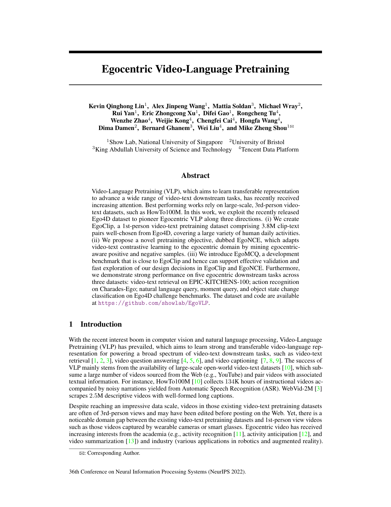
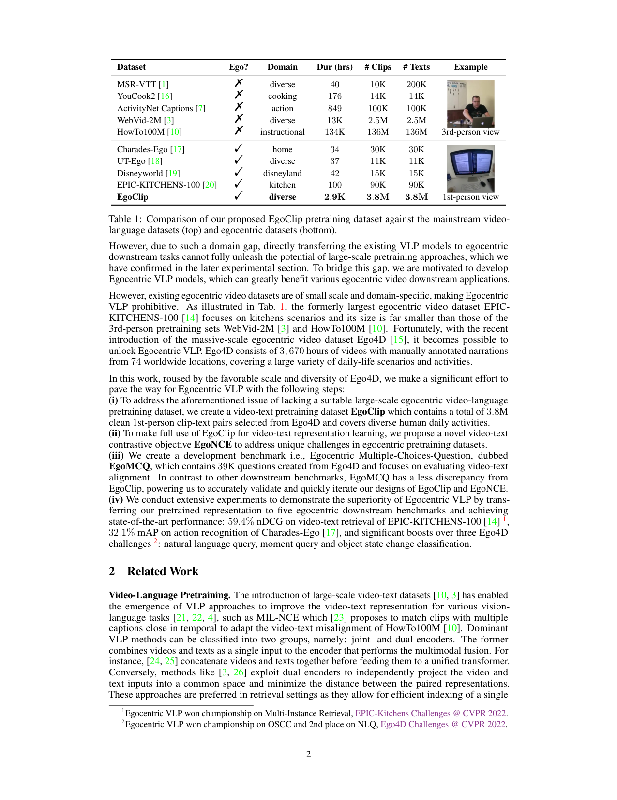
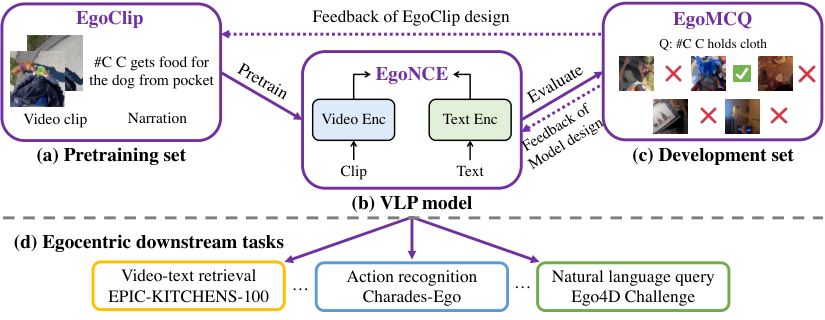
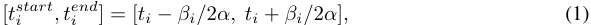
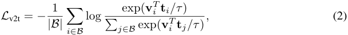
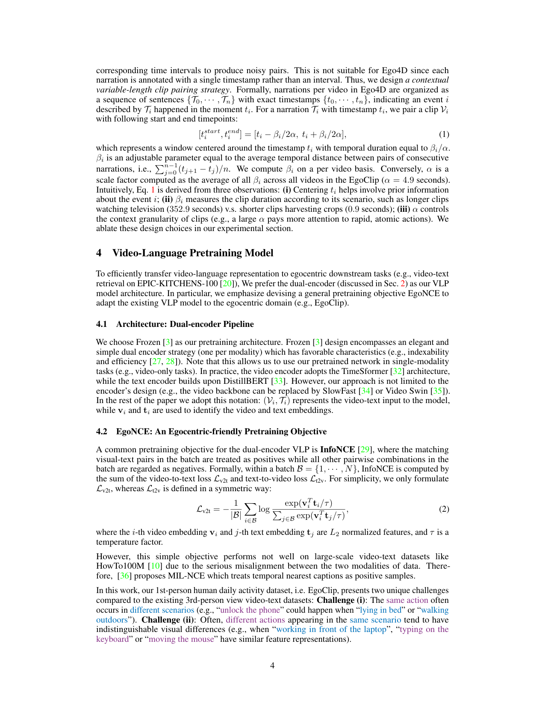
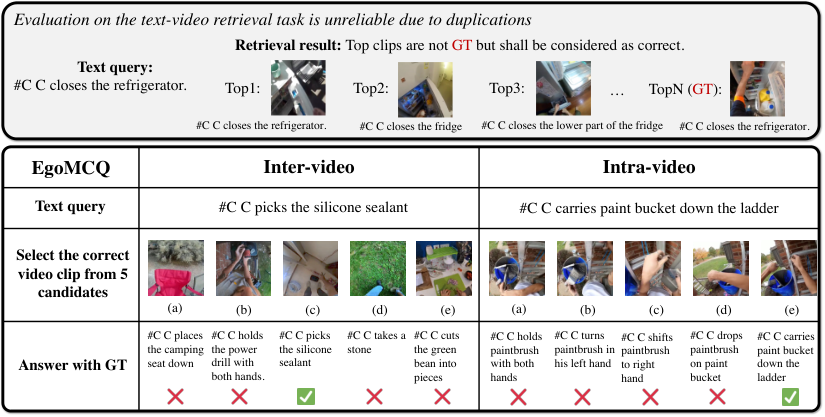
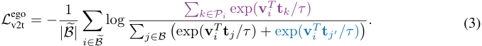
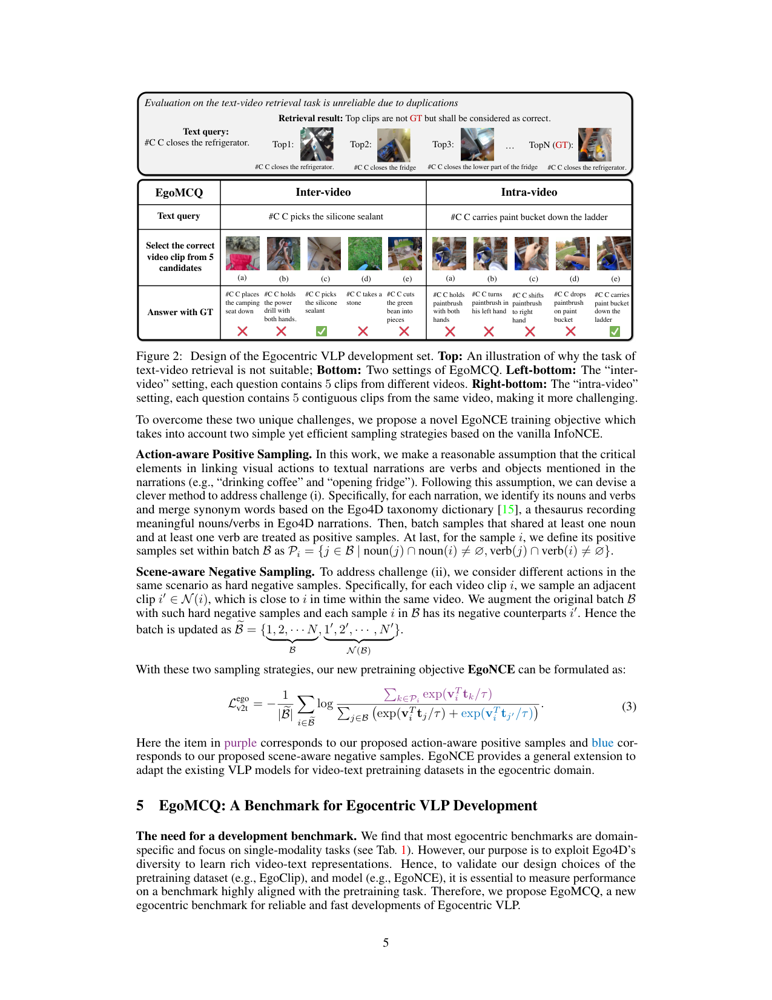

# 022_NeurIPS-2022-egocentric-video-language-pretraining-Paper-Conference

[Original PDF](../022_NeurIPS-2022-egocentric-video-language-pretraining-Paper-Conference.pdf)

Pages: 12

> Automatically converted from PDF. Check the original for exact equations, symbols, table alignment, and figure details.

<!-- Page 1 -->

# **Egocentric Video-Language Pretraining** 

**Kevin Qinghong Lin**1 **, Alex Jinpeng Wang**1 **, Mattia Soldan**3 **, Michael Wray**2 **, Rui Yan**1 **, Eric Zhongcong Xu**1 **, Difei Gao**1 **, Rongcheng Tu**4 **, Wenzhe Zhao**4 **, Weijie Kong**4 **, Chengfei Cai**4 **, Hongfa Wang**4 **, Dima Damen**2 **, Bernard Ghanem**3 **, Wei Liu**4 **, and Mike Zheng Shou**1� 

1Show Lab, National University of Singapore 2University of Bristol 3King Abdullah University of Science and Technology 4Tencent Data Platform 

## **Abstract** 

Video-Language Pretraining (VLP), which aims to learn transferable representation to advance a wide range of video-text downstream tasks, has recently received increasing attention. Best performing works rely on large-scale, 3rd-person videotext datasets, such as HowTo100M. In this work, we exploit the recently released Ego4D dataset to pioneer Egocentric VLP along three directions. (i) We create EgoClip, a 1st-person video-text pretraining dataset comprising 3.8M clip-text pairs well-chosen from Ego4D, covering a large variety of human daily activities. (ii) We propose a novel pretraining objective, dubbed EgoNCE, which adapts video-text contrastive learning to the egocentric domain by mining egocentricaware positive and negative samples. (iii) We introduce EgoMCQ, a development benchmark that is close to EgoClip and hence can support effective validation and fast exploration of our design decisions in EgoClip and EgoNCE. Furthermore, we demonstrate strong performance on five egocentric downstream tasks across three datasets: video-text retrieval on EPIC-KITCHENS-100; action recognition on Charades-Ego; natural language query, moment query, and object state change classification on Ego4D challenge benchmarks. The dataset and code are available at `https://github.com/showlab/EgoVLP` . 

## **1 Introduction** 

With the recent interest boom in computer vision and natural language processing, Video-Language Pretraining (VLP) has prevailed, which aims to learn strong and transferable video-language representation for powering a broad spectrum of video-text downstream tasks, such as video-text retrieval [1, 2, 3], video question answering [4, 5, 6], and video captioning [7, 8, 9]. The success of VLP mainly stems from the availability of large-scale open-world video-text datasets [10], which subsume a large number of videos sourced from the Web (e.g., YouTube) and pair videos with associated textual information. For instance, HowTo100M [10] collects 134K hours of instructional videos accompanied by noisy narrations yielded from Automatic Speech Recognition (ASR). WebVid-2M [3] scrapes 2 _._ 5M descriptive videos with well-formed long captions. 

Despite reaching an impressive data scale, videos in those existing video-text pretraining datasets are often of 3rd-person views and may have been edited before posting on the Web. Yet, there is a noticeable domain gap between the existing video-text pretraining datasets and 1st-person view videos such as those videos captured by wearable cameras or smart glasses. Egocentric video has received increasing interests from the academia (e.g., activity recognition [11], activity anticipation [12], and video summarization [13]) and industry (various applications in robotics and augmented reality). 

�: Corresponding Author. 

36th Conference on Neural Information Processing Systems (NeurIPS 2022).

> Original page for checking 2 unresolved font glyphs.

<!-- Page 2 -->

|**Dataset**|**Ego?**|**Domain**|**Dur (hrs)**|**# Clips**|**# Texts**|**Example**|
|---|---|---|---|---|---|---|
|MSR-VTT [1]|�|diverse|40|10K|200K||
|YouCook2 [16]|� |cooking|176|14K|14K||
|ActivityNet Captions [7]|�|action|849|100K|100K||
|WebVid-2M [3]|� |diverse|13K|2_._5M|2_._5M||
|HowTo100M [10]|�|instructional|134K|136M|136M|3rd-person view|
|Charades-Ego [17]|�|home|34|30K|30K||
|UT-Ego [18]|�|diverse|37|11K|11K||
|Disneyworld [19]|�|disneyland|42|15K|15K||
|EPIC-KITCHENS-100 [20]|� |kitchen|100|90K|90K||
|**EgoClip**|�|**diverse**|**2**_._**9K**|**3**_._**8M**|**3**_._**8M**|1st-person view|

Table 1: Comparison of our proposed EgoClip pretraining dataset against the mainstream videolanguage datasets (top) and egocentric datasets (bottom). 

However, due to such a domain gap, directly transferring the existing VLP models to egocentric downstream tasks cannot fully unleash the potential of large-scale pretraining approaches, which we have confirmed in the later experimental section. To bridge this gap, we are motivated to develop Egocentric VLP models, which can greatly benefit various egocentric video downstream applications. 

However, existing egocentric video datasets are of small scale and domain-specific, making Egocentric VLP prohibitive. As illustrated in Tab. 1, the formerly largest egocentric video dataset EPICKITCHENS-100 [14] focuses on kitchens scenarios and its size is far smaller than those of the 3rd-person pretraining sets WebVid-2M [3] and HowTo100M [10]. Fortunately, with the recent introduction of the massive-scale egocentric video dataset Ego4D [15], it becomes possible to unlock Egocentric VLP. Ego4D consists of 3 _,_ 670 hours of videos with manually annotated narrations from 74 worldwide locations, covering a large variety of daily-life scenarios and activities. 

In this work, roused by the favorable scale and diversity of Ego4D, we make a significant effort to pave the way for Egocentric VLP with the following steps: **(i)** To address the aforementioned issue of lacking a suitable large-scale egocentric video-language pretraining dataset, we create a video-text pretraining dataset **EgoClip** which contains a total of 3 _._ 8M clean 1st-person clip-text pairs selected from Ego4D and covers diverse human daily activities. **(ii)** To make full use of EgoClip for video-text representation learning, we propose a novel video-text contrastive objective **EgoNCE** to address unique challenges in egocentric pretraining datasets. **(iii)** We create a development benchmark i.e., Egocentric Multiple-Choices-Question, dubbed **EgoMCQ** , which contains 39K questions created from Ego4D and focuses on evaluating video-text alignment. In contrast to other downstream benchmarks, EgoMCQ has a less discrepancy from EgoClip, powering us to accurately validate and quickly iterate our designs of EgoClip and EgoNCE. **(iv)** We conduct extensive experiments to demonstrate the superiority of Egocentric VLP by transferring our pretrained representation to five egocentric downstream benchmarks and achieving state-of-the-art performance: 59 _._ 4% nDCG on video-text retrieval of EPIC-KITCHENS-100 [14]1 , 32 _._ 1% mAP on action recognition of Charades-Ego [17], and significant boosts over three Ego4D challenges2 : natural language query, moment query and object state change classification. 

## **2 Related Work** 

**Video-Language Pretraining.** The introduction of large-scale video-text datasets [10, 3] has enabled the emergence of VLP approaches to improve the video-text representation for various visionlanguage tasks [21, 22, 4], such as MIL-NCE which [23] proposes to match clips with multiple captions close in temporal to adapt the video-text misalignment of HowTo100M [10]. Dominant VLP methods can be classified into two groups, namely: joint- and dual-encoders. The former combines videos and texts as a single input to the encoder that performs the multimodal fusion. For instance, [24, 25] concatenate videos and texts together before feeding them to a unified transformer. Conversely, methods like [3, 26] exploit dual encoders to independently project the video and text inputs into a common space and minimize the distance between the paired representations. These approaches are preferred in retrieval settings as they allow for efficient indexing of a single 

> 1Egocentric VLP won championship on Multi-Instance Retrieval, EPIC-Kitchens Challenges @ CVPR 2022. 

> 2Egocentric VLP won championship on OSCC and 2nd place on NLQ, Ego4D Challenges @ CVPR 2022. 

2

> Original page for checking 10 unresolved font glyphs.

<!-- Page 3 -->

<!-- Start of picture text -->
EgoClip Feedback of EgoClip design EgoMCQ Q: #C C holds cloth #C C gets food for the dog from pocket EgoNCE Video clip Narration Video Enc Text Enc (a) Pretraining set (c) Development set Clip Text (b) VLP model (d) Egocentric downstream tasks EPIC-KITCHENS-100Video-text retrieval … Action recognitionCharades-Ego … Natural language queryEgo4D Challenge Pretrain Evaluate Feedback of Model design <!-- End of picture text -->

Figure 1: Our Egocentric VLP includes: (a) the pretraining set EgoClip, (b) the VLP model, and (c) the development set EgoMCQ. We use EgoClip to pretrain a VLP model with the EgoNCE loss and then evaluate on EgoMCQ. According to the feedback, we iteratively refine our designs of (a) and (b). We then transfer the pretrained model to downstream tasks relevant to the egocentric domain. 

modality [27, 28]. For example, Frozen [3] employs two separate transformers to encode video and text features and aligns them by video-text InfoNCE [29]. In our work, we adopt the Frozen [3] but extend its InfoNCE to EgoNCE via positive and negative sampling for egocentric-friendly pretraining. 

**Egocentric Video Datasets.** Egocentric videos, collected by participants using wearable cameras, offer a natural perspective of people’s daily activities and raise a range of challenging research topics [11, 12, 30]. Several egocentric video datasets have been developed in decades, e.g., [20, 17, 31]. However, since the collection of egocentric videos is expensive, previous egocentric datasets tend to be small-scale and domain-specific. These limitations hinder 1st-person view research and fail to match the progress of 3rd-person counterparts, such as VLP [23, 24, 3]. Recently, a massive egocentric video dataset Ego4D [15] has been released, which consists of 3 _,_ 670 hours of videos collected by 931 people from 74 worldwide locations in 9 different countries, where most videos are accompanied by narrations, audio, 3D meshes, and more. Furthermore, Ego4D introduces a suite of new challenging benchmarks (e.g., Natural language query and moment query) to fully explore the 1st-person visual experience. With this step-changing dataset and benchmarks, Ego4D would lead to a new research surge on egocentric visual perception. 

## **3 EgoClip: An Egocentric Video-Language Pretraining Dataset** 

**Data curation.** For our EgoClip dataset, we source data from Ego4D [15], which contains 9 _,_ 645 untrimmed videos of varying lengths from 5 sec to 7 hrs. From these videos, most are associated with _dense timestamp-level narrations_ assigned by two different annotators, describing the camera wearer’s activities and interactions with objects. For example, the narration “ `#C C puts the scrapper down.` ” corresponds to video content that occurred at 3 _._ 70 _s_ , where “ `#C` ” refers to the camera-wearer. Notably, narrations in Ego4D are well-aligned with the videos, both temporally and visually. Prior pretraining datasets are characterized by a much greater level of temporal misalignment between the video and text (e.g., HowTo100M [10] narrations are scraped from ASR, yielding sentences misaligned or even unrelated to video content). We first filter Ego4D videos with missing narrations (7 _._ 4% of the total video duration) and exclude videos that belong to the validation and test sets of the Ego4D benchmark challenge [15] (a further 23 _._ 9% of the total video duration). Next, we retain textual annotation from both narrators in EgoClip, allowing us to consider narration diversity when pairing video and text for pretraining purposes. Finally, we adopt several criteria to filter the video and textual narrations, further reducing noise (detailed steps are provided in Supplementary B.1). Overall, this procedure yields 2 _._ 9K hours of videos with 3 _._ 85 million narrations which cover 2927 hours of video from 129 different scenarios. EgoClip has 21 _._ 9 clips per minute with an average clip length of 1 _._ 0 seconds and a standard deviation of 0 _._ 9 seconds (the longest clip is up to 60s). Additional analyses are included in the Supplementary B.3. 

**Creation of clip-text pairs.** Clip-text pairs are the common data format for VLP, but are usually not present in untrimmed video datasets with only a weak matching between narrations captions and videos. This was first discussed in HowTo100M [10], which pairs subtitles to video clips with 

3

<!-- Page 4 -->

corresponding time intervals to produce noisy pairs. This is not suitable for Ego4D since each narration is annotated with a single timestamp rather than an interval. Thus, we design _a contextual variable-length clip pairing strategy_ . Formally, narrations per video in Ego4D are organized as a sequence of sentences _{T_ 0 _, · · · , Tn}_ with exact timestamps _{t_ 0 _, · · · , tn}_ , indicating an event _i_ described by _Ti_ happened in the moment _ti_ . For a narration _Ti_ with timestamp _ti_ , we pair a clip _Vi_ with following start and end timepoints: 

which represents a window centered around the timestamp _ti_ with temporal duration equal to _βi/α_ . _βi_ is an adjustable parameter equal to the average temporal distance between pairs of consecutive narrations, i.e.,�_n_ _j_ =0_−_1(_tj_+1_−tj_)_/n_.Wecompute_βi_onapervideobasis.Conversely,_α_isa scale factor computed as the average of all _βi_ across all videos in the EgoClip ( _α_ = 4 _._ 9 seconds). Intuitively, Eq. 1 is derived from three observations: **(i)** Centering _ti_ helps involve prior information about the event _i_ ; **(ii)** _βi_ measures the clip duration according to its scenario, such as longer clips watching television (352 _._ 9 seconds) v.s. shorter clips harvesting crops (0 _._ 9 seconds); **(iii)** _α_ controls the context granularity of clips (e.g., a large _α_ pays more attention to rapid, atomic actions). We ablate these design choices in our experimental section. 

## **4 Video-Language Pretraining Model** 

To efficiently transfer video-language representation to egocentric downstream tasks (e.g., video-text retrieval on EPIC-KITCHENS-100 [20]), We prefer the dual-encoder (discussed in Sec. 2) as our VLP model architecture. In particular, we emphasize devising a general pretraining objective EgoNCE to adapt the existing VLP model to the egocentric domain (e.g., EgoClip). 

### **4.1 Architecture: Dual-encoder Pipeline** 

We choose Frozen [3] as our pretraining architecture. Frozen [3] design encompasses an elegant and simple dual encoder strategy (one per modality) which has favorable characteristics (e.g., indexability and efficiency [27, 28]). Note that this allows us to use our pretrained network in single-modality tasks (e.g., video-only tasks). In practice, the video encoder adopts the TimeSformer [32] architecture, while the text encoder builds upon DistillBERT [33]. However, our approach is not limited to the encoder’s design (e.g., the video backbone can be replaced by SlowFast [34] or Video Swin [35]). In the rest of the paper we adopt this notation: ( _Vi, Ti_ ) represents the video-text input to the model, while **v** _i_ and **t** _i_ are used to identify the video and text embeddings. 

### **4.2 EgoNCE: An Egocentric-friendly Pretraining Objective** 

A common pretraining objective for the dual-encoder VLP is **InfoNCE** [29], where the matching visual-text pairs in the batch are treated as positives while all other pairwise combinations in the batch are regarded as negatives. Formally, within a batch _B_ = _{_ 1 _, · · · , N }_ , InfoNCE is computed by the sum of the video-to-text loss _L_ v2t and text-to-video loss _L_ t2v. For simplicity, we only formulate _L_ v2t, whereas _L_ t2v is defined in a symmetric way: 

where the _i_ -th video embedding **v** _i_ and _j_ -th text embedding **t** _j_ are _L_ 2 normalized features, and _τ_ is a temperature factor. 

However, this simple objective performs not well on large-scale video-text datasets like HowTo100M [10] due to the serious misalignment between the two modalities of data. Therefore, [36] proposes MIL-NCE which treats temporal nearest captions as positive samples. 

In this work, our 1st-person human daily activity dataset, i.e. EgoClip, presents two unique challenges compared to the existing 3rd-person view video-text datasets: **Challenge (i)** : The same action often occurs in different scenarios (e.g., “unlock the phone” could happen when “lying in bed” or “walking outdoors”). **Challenge (ii)** : Often, different actions appearing in the same scenario tend to have indistinguishable visual differences (e.g., when “working in front of the laptop”, “typing on the keyboard” or “moving the mouse” have similar feature representations). 

4

> Original page for checking 1 unresolved font glyphs.

<!-- Page 5 -->

<!-- Start of picture text -->
Evaluation on the text-video retrieval task is unreliable due to duplications Retrieval result:  Top clips are not GT but shall be considered as correct. Text query: #C C closes the refrigerator. Top1:  Top2:  Top3:  … TopN (GT): #C C closes the refrigerator. #C C closes the fridge #C C closes the lower part of the fridge #C C closes the refrigerator. EgoMCQ Inter-video Intra-video Text query #C C picks the silicone sealant #C C carries paint bucket down the ladder Select the correct video clip from 5 candidates (a) (b) (c) (d) (e) (a) (b) (c) (d) (e) #C C places  #C C holds  #C C picks  #C C takes a  #C C cuts  #C C holds  #C C turns  #C C shifts  #C C drops  #C C carries the camping  the power  the silicone  stone the green  paintbrush  paintbrush in  paintbrush  paintbrush  paint bucket Answer with GT seat down drill with  sealant bean into  with both  his left hand to right  on paint  down the both hands. pieces hands hand bucket ladder <!-- End of picture text -->

Figure 2: Design of the Egocentric VLP development set. **Top:** An illustration of why the task of text-video retrieval is not suitable; **Bottom:** Two settings of EgoMCQ. **Left-bottom:** The “intervideo” setting, each question contains 5 clips from different videos. **Right-bottom:** The “intra-video” setting, each question contains 5 contiguous clips from the same video, making it more challenging. 

To overcome these two unique challenges, we propose a novel EgoNCE training objective which takes into account two simple yet efficient sampling strategies based on the vanilla InfoNCE. 

**Action-aware Positive Sampling.** In this work, we make a reasonable assumption that the critical elements in linking visual actions to textual narrations are verbs and objects mentioned in the narrations (e.g., “drinking coffee” and “opening fridge”). Following this assumption, we can devise a clever method to address challenge (i). Specifically, for each narration, we identify its nouns and verbs and merge synonym words based on the Ego4D taxonomy dictionary [15], a thesaurus recording meaningful nouns/verbs in Ego4D narrations. Then, batch samples that shared at least one noun and at least one verb are treated as positive samples. At last, for the sample _i_ , we define its positive samples set within batch _B_ as _Pi_ = _{j ∈B |_ noun( _j_ ) _∩_ noun( _i_ ) _̸_ = ∅ _,_ verb( _j_ ) _∩_ verb( _i_ ) _̸_ = ∅ _}_ . 

**Scene-aware Negative Sampling.** To address challenge (ii), we consider different actions in the same scenario as hard negative samples. Specifically, for each video clip _i_ , we sample an adjacent clip _i__′_ _∈N_ ( _i_ ), which is close to _i_ in time within the same video. We augment the original batch _B_ with such hard negative samples and each sample _i_ in _B_ has its negative counterparts _i__′_ . Hence the batch is updated as _B_� = _{_ 1 _,_ 2 _, · · · N ,_ 1_′_ _,_ 2_′_ _, · · · , N__′_ _}_ . <u>� �� � � �� �</u> _B N_ ( _B_ ) 

With these two sampling strategies, our new pretraining objective **EgoNCE** can be formulated as: 

Here the item in purple corresponds to our proposed action-aware positive samples and blue corresponds to our proposed scene-aware negative samples. EgoNCE provides a general extension to adapt the existing VLP models for video-text pretraining datasets in the egocentric domain. 

## **5 EgoMCQ: A Benchmark for Egocentric VLP Development** 

**The need for a development benchmark.** We find that most egocentric benchmarks are domainspecific and focus on single-modality tasks (see Tab. 1). However, our purpose is to exploit Ego4D’s diversity to learn rich video-text representations. Hence, to validate our design choices of the pretraining dataset (e.g., EgoClip), and model (e.g., EgoNCE), it is essential to measure performance on a benchmark highly aligned with the pretraining task. Therefore, we propose EgoMCQ, a new egocentric benchmark for reliable and fast developments of Egocentric VLP. 

5

> Original page for checking 9 unresolved font glyphs.

<!-- Page 6 -->

**Data source.** We start from the Ego4D data excluded from constructing the EgoClip, which mainly covers the validation set of the Ego4D challenge benchmarks. Additionally, to assure that the scene is not visible during pretraining, we manually remove videos that share multiple views with the videos in EgoClip. To ensure diversity, we randomly select one annotator’s narration for each video. We follow the same clip pairing strategy as Eq. 1 to be consistent with the data format of EgoClip. 

**Benchmarking task design.** To determine the task for development, we first consider video-text retrieval since it highly aligns with the VLP pretraining objective. However, as depicted in the top half of Fig. 2, for an action (e.g., close the refrigerator), there are substantial duplicates or semantically similar captions in Ego4D. This can cause issues in retrieval evaluation [37] making model training unreliable. A straightforward approach to prevent this is deduplication (dedup), but it is challenging to devise a dedup criterion and perform well in the retrieval settings of a “one-to-whole validation set”. Therefore, we select the _Multiple-Choice Questions (MCQ)_ task for development since repetitions are highly unlikely given a small number of answers. 

**Grouping strategies.** To set up the MCQ task, a naive construction randomly groups five video clips to form options for a question. But we find randomly grouping is not challenging since options are highly likely to come from different videos and vary widely in content. We redefine this basic setting as “ **inter-video** ” and ensure that the five clips originate from different videos, aiming to distinguish instances from different scenarios (the left-bottom of Fig. 2). Furthermore, we propose a more challenging setting “ **intra-video** ” by grouping five continuous clips together.This setting is regarded as a specific form of video-text localization focused on fine-grained context clues, such as hand interaction (the right-bottom of Fig. 2). Dedup is performed within five options for each question for reliable assessment (see Supp. C.1) and we adopt accuracy as the EgoMCQ metric. 

**Statistics.** We finalize 39K questions covering 198K narrations with 468 hours of video, where the “inter-video” has 24K questions covering 290 _._ 3 hours of videos. And the “intra-video” has 15K questions and covers 178 _._ 3 hours of videos. The average duration among the five options is 34 _._ 2 seconds (More statistics of EgoMCQ are shown in Supplementary C.3). 

## **6 Experiments** 

We assess our Egocentric VLP along two directions: **(i)** We conduct an extensive analysis to explore key components of Egocentric VLP (e.g., EgoClip, EgoNCE, and EgoMCQ); **(ii)** we transfer our pretrained model to various downstream tasks to validate the quality of our video-text representation. 

### **6.1 Benchmarks and Settings** 

We evaluate our VLP model on five egocentric benchmarks, spanning video-text tasks and pure video tasks, across three different datasets. We briefly describe each task below. 

**Multi-Instance Retrieval of EPIC-KITCHENS-100.** This task is modelled as a video-text retrieval which considers the semantic overlap between different videos narrations, where multiple videos may correspond to the same narration. The training set contains 67 _._ 2K clips and validation set contains 9 _._ 7K clips. The evaluation metrics are mean Average Precision (mAP) and the normalized Discounted Cumulative Gain (nDCG). 

**Natural Language Query of Ego4D Challenges.** The Natural Language Query task is modelled as a natural language grounding problem [38, 39, 40]. Given a language query and a video, the task aims at localizing the temporal interval within the video, in which the answer is deducible. The training set contains 11 _._ 3K queries annotated from 1K clips for this task, while the validation contains 3 _._ 9K queries collected from 0 _._ 3K clips. The evaluation metric is Recall@ _K_ for IoU= _θ_ (R@ _K_ -IoU= _θ_ ) [38] where _θ_ is a threshold. We evaluate for _K∈{_ 1 _,_ 5 _}_ and _θ∈{_ 0 _._ 3 _,_ 0 _._ 5 _}_ . 

**Action Recognition of Charades-Ego.** This dataset has 64K instances, spanning 1st-person and 3rd-person views and covering 157 activity categories for training. We train and evaluate only on the 1st-person videos. The validation set contains 847 videos for classification and each video belongs to multiple classes. The evaluation metric is mAP. 

**Moment Query of Ego4D Challenges.** The Moment Query task is a video-only task modelled as Temporal Action Localization [11]. Given a particular high-level activity category, the task solution consists of retrieving all the possible temporal windows where the activity occurs. The training set 

6

<!-- Page 7 -->

|**Clip**|**creation strategy**|**Clip’s length (s)** Avg_±_Std|**EgoMCQ** Inter-video|**Acc (%)**  Intra-video|**Zero-shot T** mAP (avg)|_↔_**V Retrieval [20]** nDCG (avg)|
|---|---|---|---|---|---|---|
|(a)|[_ti, ti_+_α_]|5_._0_±_0_._0|87_._66|39_._72|19_._6|12_._3|
|(b)  |[_ti−α/_2_, ti_+_α/_2] |5_._0_±_0_._0|89_._23|41_._68|20_._6|13_._7|
|(c)|[_ti−_1_, ti_+1]|10_._0_±_38_._2|88_._13|40_._62|20_._6|13_._7|
|(d)  |[_ti−βi/_2_, ti_+_βi/_2] |4_._9_±_4_._7|89_._74|44_._82|21_._1|14_._5|
|(e)  |[_ti−βi/_4_, ti_+_βi/_4] |2_._4_±_2_._4 |**90**_._**23** |49_._67|21_._9|15_._3|
|(f)|[_ti−βi/_2_α, ti_+_βi/_2_α_]|1_._0_±_0_._9|89_._36|**51**_._**51**|**22**_._**1**|**15**_._**5**|

Table 2: Results on our development set EgoMCQ and video-text retrieval on EPIC-KITCHENS100 when using different strategies in the creation of EgoClip, where _ti_ , _α_ , _βi_ are defined in Eq. 1. In all experiments, we bold the **best results** and underlined the second best results. 

contains 13 _._ 6K instances from 1 _._ 5K clips, while the validation set contains 4 _._ 3K instances from 0 _._ 5K clips. The evaluation metrics are mAP and R@ _K_ -IoU= _θ_ for _K∈{_ 1 _,_ 5 _}_ and _θ∈{_ 0 _._ 3 _,_ 0 _._ 5 _,_ 0 _._ 7 _}_ . 

**Object State Change Classification (OSCC) of Ego4D Challenges.** This OSCC task is modelled as an (N+1)-way classification aiming to identify an object’s state change in a given video. The training and val. sets contain 41K and 28K clips, respectively. The evaluation metric is accuracy. 

**Implementation Details.** Our codebase is based on the official Frozen3 one and retains the same settings unless specified. During pretraining, we sample 4 frames for each clip, and use the Adam optimizer [41] with a learning rate of 3 _×_ 10_−_5 . To select the best method we pretrain our architecture for 10 epochs and use the best performing model on the EgoMCQ benchmark. Pretraining takes two days on 32 A100 GPUs (1 _,_ 536 GPU hrs). 

### **6.2 Ablation Studies** 

**Ablation of the strategy used when creating EgoClip.** We validate our proposed strategies, i.e., Eq.1 in Tab. 2, by comparing the following variants: (a) fixed length _α_ , start at timestamp; (b) fixed length _α_ , center at timestamp; (c) variable clip, start and end by adjacent timestamps; (d) our proposed strategy, scaled by 2; (e) our proposed strategy, scaled by 4; (f) our proposed strategy. 

We consider that a good pretraining dataset creation strategy should satisfy: **(1)** the VLP model trained on EgoClip should be able to well distinguish instances in EgoMCQ with the same data format; **(2)** the VLP model pretrained on EgoClip with the specific clip creation strategy should perform well on public downstream tasks (e.g., video-text retrieval on [20] and zero-shot for efficiency). 

We draw several conclusions from Tab. 2: **(i)** The performance of EgoMCQ is well aligned with the zero-shot result on EPIC-KITCHENS-100, especially minor gain on downstream but noticeable on EgoMCQ, which means EgoMCQ provides valid feedback and is suitable as a development set. **(ii)** Under the same clip length _α_ , (b) surpassing (a) proves that centering at timestamp includes prior information is helpful. **(iii)** Variable-length clips make a big difference, as shown in (c) and (d). 

Notably, with our designed _βi_ , (d) outperforms (b) with a similar average clip length, which validates our key idea of “contextual varied clip length”. **(iv)** Based on (d), (e), and (f), we found a proper scale factor greater than 1 is preferred, which helps focus on a large of instantaneous actions densely labeled by Ego4D [15]. These ablation studies demonstrate the effectiveness of our proposed EgoClip creation strategy and EgoMCQ for development. 

|**Variants**|**Accura** Intra-video|**cy (%)** Inter-video|
|---|---|---|
|InfoNCE|89_._4|51_._5|
|(a) w/ Pos, noun|82_._9(6_._5_↓_)|42_._3(9_._2_↓_)|
|(b) w/ Pos, verb|86_._9(2_._5_↓_)|50_._5(1_._0_↓_)|
|(c) w/ Pos, noun & verb|89_._7 (0_._4_↑_)|53_._6(2_._1_↑_)|
|(d) w/ Neg, random|88_._3(1_._1_↓_)|49_._9(1_._6_↓_)|
|(e) w/ Neg, within video|89_._7 (0_._3_↑_)|53_._0(1_._5_↑_)|
|(f) w/ Neg, within 1 min|89_._5(0_._2_↑_)|54_._5 (3_._0_↑_)|
|(g) w/ Pos & Neg,**EgoNCE**|**90**_._**6**(1_._3_↑_)|**57**_._**2**(5_._7_↑_)|

**Effect of EgoNCE.** In this section, we evaluate the Table 3: EgoNCE sampling strategy ablation. effect of the proposed sampling strategies for the We evaluate accuracy performance on our deEgoNCE objective (Eq. 3) on EgoMCQ and compare velopment benchmark EgoMCQ. against a vanilla InfoNCE loss (Eq. 2). We ablate several configurations for positive and negative sampling strategies. The sampling strategy for positive pairs exploits language cues, while negative pairs rely on temporal, visual cues. Given a text-video pair, we regard other text-video pairs as positive if the textual narrations: (a) share at 

Table 3: EgoNCE sampling strategy ablation. We evaluate accuracy performance on our development benchmark EgoMCQ. 

> 3https://github.com/m-bain/frozen-in-time 

7

<!-- Page 8 -->

|**Methods**|**Vis Enc Inut**|**# Frames**|**Vis-text PT**|**m**|**AP (%)**||**n**|**DCG (%**|**)**|
|---|---|---|---|---|---|---|---|---|---|
||**p**|||V_→_T|T_→_V|Avg|V_→_T|T_→_V|Avg|
|Random|-|-|-|5_._7|5_._6|5_._7|10_._8|10_._9|10_._9.|
|MI-MM|S3D [42]|32|HowTo100M|34_._8|23_._6|29_._2|47_._1|42_._4|44_._7|
|MME [43]|TBN_†_[14]|25|-|43_._0|34_._0|38_._5|50_._1|46_._9|48_._5|
|JPoSE [43]|TBN_†_[14]|25|-|49_._9|38_._1|44_._0|55_._5|51_._6|53_._5|
|Frozen|Raw Videos|4|-|38_._8|29_._7|34_._2|50_._5|48_._3|49_._4|
|Frozen|Raw Videos|4|HowTo100M|39_._2|30_._1|34_._7|50_._7|48_._7|49_._7|
|Frozen|Raw Videos|4|CC3M+WebVid-2M|41_._2|31_._6|36_._4|52_._7|50_._2|51_._4|
|Frozen|Raw Videos|4|EgoClip|44_._5|34_._7|39_._6|55_._7|52_._9|54_._3|
|Frozen+EgoNCE|Raw Videos|4|EgoClip|**45**_._**1**|**35**_._**3**|**40**_._**2**|**56**_._**2**|**53**_._**5**|**54**_._**8**|
|Frozen|Raw Videos|16|CC3M+WebVid-2M|45_._8|36_._0|40_._9|57_._2|54_._3|55_._8|
|Frozen+EgoNCE|Raw Videos|16|EgoClip|**49**_._**9**|**40**_._**1**|**45**_._**0**|**60**_._**9**|**57**_._**9**|**59**_._**4**|
|Frozen|Raw Videos|4|HowTo100M|6_._8|6_._3|6_._5|11_._6|12_._8|12_._2|
|Frozen|Raw Videos|4|CC3M+WebVid-2M|8_._6|7_._4|8_._0|14_._5|14_._6|14_._5|
|Frozen|Raw Videos|4|EgoClip|17_._9|13_._1|15_._5|23_._0|21_._2|22_._1|
|Frozen+EgoNCE|Raw Videos|4|EgoClip|**19**_._**4**|**13**_._**9**|**16**_._**6**|**24**_._**1**|**22**_._**0**|**23**_._**1**|

Table 4: Performance of the EPIC-KITCHENS-100 Multi-Instance Retrieval. Note that TBN _†_ feature [14] is a combination of three modalities: RGB, Flow and Audio. Conversely, our approach only relies on RGB input. The <mark>grey highlighted rows</mark> correspond to **zero-shot evaluation** . 

least one noun, (b) share at least one verb, and (c) share at least a verb-noun pair. Conversely, we define the following heuristics for negative sampling: (d) a random text-video pair from EgoClip, (e) a text-video pair from the same video, and (f) a text-video pair within 1 minute from the given video-text pair annotation timestamp. Tab. 3 shows that using solely verbs (a) or nouns (b) for positive selection degrades the accuracy performance with respect to naive InfoNCE. However, we successfully push the performance beyond the baseline results when considering both verbs and nouns jointly (c). Moreover, we notice that merely selecting negatives within the same video leads to better performance. In particular, we obtain the best performance for temporally “hard negatives” (f). Finally, we pick the optimal settings from positive and negative sides and combine them together for (g) EgoNCE and reach the best results. 

### **6.3 Comparisons with State-of-the-arts** 

**Multi-Instance Retrieval.** In Tab. 4, we report both zero-shot and fine-tuning evaluation results. In the zero-shot setting, pretraining with EgoClip (3 _._ 8M), despite being smaller in scale, still outperforms CC3M+WebVid-2M (5 _._ 5M) and HowTo100M (136M), validating the unique benefit of pretraining on egocentric data. When fine-tuned with 4 frames (rows 5-9), EgoClip pretraining maintains a margin over the best baseline CC3M+WebVid-2M, further verifying the viewpoint domain gap within fine-tuning. Lastly, we increase the sample frames of our finalized model as well as the best competitor CC3M+WebVid-2M pretraining to 16 (rows 10-11). As expected, performance gains accompany the frame increase. We deem that notable benefits come from better temporal modeling for frequent action in the 1st-person view. Overall, our pretraining model outperforms the best baseline (JPoSE) by 1 _._ 0 mAP and 5 _._ 9% nDCG while requiring fewer frames and input modalities. 

**Natural Language Query.** We report validation results on Tab. 5. We adopt the same baselines as introduced in [15], namely: 2DTAN [44] and VSLNet [45], and substitute the SlowFast-BERT features with our video and language representations. We observe a large boost in performance offered by our pretrained model on all metrics. Notably, we improve R@1 for IoU=0 _._ 3 from 5 _._ 45 to 10 _._ 84, despite our video branch not being pre-trained on Kinetics400. Besides, we significantly surpass VLP pretrained on CC3M+WebVid-2M and HowTo100M. We believe that this increase is due 

|**Methods**|**Video-text Pre**|**-extrated Features**|**IoU**|**=**0_._3|**IoU**|**=**0_._5|
|---|---|---|---|---|---|---|
||Vis-text Enc|Vis-text PT|R@1|R@5|R@1|R@5|
|2D-TAN [44]|SlowFast+BERT|-|5_._04|12_._89|2_._02|5_._88|
|VSLNet [45]|SlowFast+BERT|-|5_._45|10_._74|3_._12|6_._63|
|VSLNet [45]|Frozen|HowTo100M|3_._95|8_._72|2_._01|4_._62|
|VSLNet [45]|Frozen|CC3M+WebVid-2M|5_._06|10_._30|2_._71|6_._69|
|VSLNet [45]|Frozen|EgoClip|10_._53|17_._94|5_._96|11_._85|
|VSLNet [45]|Frozen+EgoNCE|EgoClip|**10**_._**84 **|**18**_._**84 **|**6**_._**81 **|**13**_._**45**|

Table 5: Recall for several IoUs on the NLQ task’s val. set. 

8

<!-- Page 9 -->

|**Methods**|**Vis Enc**|**# Frames**|**Vis-Text PT**|**Train / FT Data**|**mAP (%)**|
|---|---|---|---|---|---|
|Actor [46]|ResNet-152|25|-|Charades-Ego (1st + 3rd)|20_._0|
|SSDA [47]|I3D|32|-|Charades-Ego (1st + 3rd)|23_._1|
|I3D [47]|I3D|32|-|Charades-Ego (1st).|25_._8|
|Ego-Exo [48]|SlowFast (ResNet-101)|32|-|Charades-Ego (1st)|30_._1|
|Frozen|TimeSformer|16|-|Charades-Ego (1st)|28_._8|
|Frozen|TimeSformer|16|HowTo100M|Charades-Ego (1st)|28_._3|
|Frozen|TimeSformer|16|CC3M+WebVid-2M|Charades-Ego (1st)|30_._9|
|Frozen|TimeSformer|16|EgoClip|Charades-Ego (1st)|31_._2|
|Frozen+EgoNCE|TimeSformer|16|EgoClip|Charades-Ego (1st)|**32**_._**1**|
|Frozen|TimeSformer|16|HowTo100M|-|9_._2|
|Frozen|TimeSformer|16|CC3M+WebVid-2M|-|20_._9|
|Frozen|TimeSformer|16|EgoClip|-|23_._6|
|Frozen+EgoNCE|TimeSformer|16|EgoClip|-|**25**_._**0**|

Table 6: Performance of the action recognition on the Charades-Ego dataset (a first-person test set). The <mark>grey highlighted rows</mark> correspond to **zero-shot evaluation** . 

to the egocentric data availability and the video-text interaction learned from large-scale pretraining. Please see Supplementary E.5 for the test set results. 

**Action Recognition.** We conduct action recognition on Charades-Ego, where categories are short phrases like “Holding some clothes”. Thus this task can be solved as a video-text retrieval by leveraging the text representation. We present the result in Tab. 6 under zero-shot and fine-tuning settings. In zero-shot settings, our model outperforms two supervised baselines, which validates the stronger generalization of jointly learning video-text features. After fine-tuning (rows 5-9), our model surpasses all VLP counterparts and improves over the state-of-the-art classifier Ego-Exo by 2 _._ 0% with fewer sampled frames, which shows the superior advantage of joint video-text representations. 

|**Methods**|**Video Pre-ex**|**tracted Features**|**IoU**|**=**0_._3|**IoU**|**=**0_._5|**IoU**|**=**0_._7|**m**|**AP (%**|**) @ Io**|**U**|
|---|---|---|---|---|---|---|---|---|---|---|---|---|
||Vis Enc|Vis-text PT|R@1|R@5|R@1|R@5|R@1|R@5|0_._1|0_._3|0_._5|Avg|
|VSGN [49]|SlowFast|-|33_._45|58_._43|25_._16|46_._18|15_._36|25_._81|9_._10|5_._76|3_._41|6_._03|
|VSGN [49]|Frozen|HowTo100M|31_._40|52_._61|22_._28|41_._29|13_._41|23_._21|9_._83|6_._72|3_._84|6_._72|
|VSGN [49]|Frozen|CC3M+WebVid-2M|32_._08|56_._40|23_._46|43_._81|13_._73|23_._77|9_._83|6_._40|3_._86|6_._58|
|VSGN [49]|Frozen|EgoClip|40_._06|63_._71|29_._59|48_._32|17_._41|26_._33|15_._90|10_._54|6_._19|10_._69|
|VSGN [49]|Frozen+EgoNCE|EgoClip|**40**_._**43 **|**65**_._**67 **|**30**_._**14 **|**51**_._**98 **|**19**_._**06 **|**29**_._**77**|**16**_._**63 **|**11**_._**45 **|**6**_._**57 **|**11**_._**39**|

Table 7: Recall and mAP metrics for several IoUs on the Moment Query task’s val. set. 

**Moment Query.** This task investigates the quality of video-only features. We extract video features and provide them as input to the VSGN model [49]. We report the validation results in Tab. 7, We find that our features achieves the best performance over SlowFast features with an increase of 4 _._ 66% in Avg mAP. Moreover, we maintain better performance with respect to 3rd-person large-scale pretraining datasets. This demonstrates that the 1st-person VLP model also learns competitive video representations. Please see the Supplementary E.6 for the test set results. 

**Object State Change Classification.** We report the validation results on Tab. 8. Once again, our model achieves the best performance of all baselines, 2 _._ 4% than CC3M+WebVid-2M counterparts, which indicates our visual representations are able to focus on the fine-grained clues related to state changes. 

**Summary of EgoNCE.** From the above experimental results, Frozen pretrained on EgoClip with the EgoNCE objective brings a consistent improvement over the InfoNCE on all downstream tasks, which comprehensively demonstrates the effect of EgoNCE, as well as the decision from EgoMCQ. 

|**Methods** **Vis-Text PT**|**Acc. (%)**|
|---|---|
|Always Positive -|48_._1|
|Bi-d LSTM [50] ImageNet|65_._3|
|I3D (ResNet-50) [51] -|68_._7|
|Frozen -|70_._3|
|Frozen HowTo100M|71_._7|
|Frozen CC3M+WebVid-2M|71_._5|
|Frozen EgoClip|73_._4|
|Frozen+EgoNCE EgoClip|**73**_._**9**|

Table 8: Accuracy metric on the Object State Change Classification task’s val. set. 

9

<!-- Page 10 -->

## **7 Conclusion, Limitations, and Societal Impacts.** 

To the best of our knowledge, this work is the pioneering work to unlock Egocentric VLP. **(i)** We devise a principled data curation and create EgoClip, an egocentric large-scale text-video pretraining dataset with 3 _._ 8M clip-text pairs well-chosen from Ego4D. **(ii)** We exploit the particular characteristics of egocentric videos and devise EgoNCE with meaningful sampling strategies for effective egocentric pretraining. **(iii)** We create EgoMCQ, an egocentric video-language benchmark close to the pretraining set to support efficient exploration and development of EgoClip and EgoNCE. Finally, we further demonstrate the strong representation of our egocentric pretraining on five tasks across three datasets. We believe that our EgoClip, EgoMCQ and EgoNCE would greatly benefit the egocentric video community, laying a good foundation for the new research trend of egocentric VLP. **Limitations.** Our pretraining approach does not take into account the long-term temporal dependencies in long Ego4D videos. We leave this for future work. 

**Societal impact.** Egocentric VLP learns real-world perception knowledge that may contribute to practical applications such as augmented reality and robotics. However, Ego4D videos collected by participants may contain users’ privacy and unintended biases, so should be used cautiously. We refer the readers to the Ego4D paper about further privacy and societal impacts. 

## **8 Acknowledgements** 

This project is supported by the National Research Foundation, Singapore under its NRFF Award NRF-NRFF13-2021-0008, and Mike Zheng Shou’s Start-Up Grant from NUS. The computational work for this article was partially performed on resources of the National Supercomputing Centre, Singapore. Michael Wray and Dima Damen are supported by EPSRC UMPIRE (EP/T004991/1). Mattia Soldan and Bernard Ghanem are supported by the King Abdullah University of Science and Technology (KAUST) Office of Sponsored Research through the Visual Computing Center (VCC) funding, as well as, the SDAIA-KAUST Center of Excellence in Data Science and Artificial Intelligence (SDAIA-KAUST AI). Thanks to Tencent Data Platform for the support of computing resources. Our work is built upon the Ego4D dataset, and we greatly appreciate the contributions and efforts of the Ego4D community. 

## **References** 

- [1] Jun Xu, Tao Mei, Ting Yao, and Yong Rui. Msr-vtt: A large video description dataset for bridging video and language. In _CVPR_ , pages 5288–5296, 2016. 

- [2] Mandela Patrick, Po-Yao Huang, Yuki Asano, Florian Metze, Alexander Hauptmann, Joao Henriques, and Andrea Vedaldi. Support-set bottlenecks for video-text representation learning. In _ICLR_ , 2020. 

- [3] Max Bain, Arsha Nagrani, Gül Varol, and Andrew Zisserman. Frozen in time: A joint video and image encoder for end-to-end retrieval. In _ICCV_ , pages 1728–1738, 2021. 

- [4] Dejing Xu, Zhou Zhao, Jun Xiao, Fei Wu, Hanwang Zhang, Xiangnan He, and Yueting Zhuang. Video question answering via gradually refined attention over appearance and motion. In _MM_ , pages 1645–1653, 2017. 

- [5] Youngjae Yu, Jongseok Kim, and Gunhee Kim. A joint sequence fusion model for video question answering and retrieval. In _ECCV_ , pages 471–487, 2018. 

- [6] Linchao Zhu and Yi Yang. Actbert: Learning global-local video-text representations. In _CVPR_ , pages 8746–8755, 2020. 

- [7] Ranjay Krishna, Kenji Hata, Frederic Ren, Li Fei-Fei, and Juan Carlos Niebles. Densecaptioning events in videos. In _ICCV_ , pages 706–715, 2017. 

- [8] Bairui Wang, Lin Ma, Wei Zhang, and Wei Liu. Reconstruction network for video captioning. In _CVPR_ , pages 7622–7631, 2018. 

- [9] Luowei Zhou, Yingbo Zhou, Jason J Corso, Richard Socher, and Caiming Xiong. End-to-end dense video captioning with masked transformer. In _CVPR_ , pages 8739–8748, 2018. 

- [10] Antoine Miech, Dimitri Zhukov, Jean-Baptiste Alayrac, Makarand Tapaswi, Ivan Laptev, and Josef Sivic. Howto100m: Learning a text-video embedding by watching hundred million narrated video clips. In _ICCV_ , pages 2630–2640, 2019. 

10

<!-- Page 11 -->

- [11] Fabian Caba Heilbron, Victor Escorcia, Bernard Ghanem, and Juan Carlos Niebles. Activitynet: A large-scale video benchmark for human activity understanding. In _CVPR_ , pages 961–970, 2015. 

- [12] Yazan Abu Farha, Alexander Richard, and Juergen Gall. When will you do what?-anticipating temporal occurrences of activities. In _CVPR_ , pages 5343–5352, 2018. 

- [13] Yu-Fei Ma, Lie Lu, Hong-Jiang Zhang, and Mingjing Li. A user attention model for video summarization. In _MM_ , pages 533–542, 2002. 

- [14] Evangelos Kazakos, Arsha Nagrani, Andrew Zisserman, and Dima Damen. Epic-fusion: Audiovisual temporal binding for egocentric action recognition. In _ICCV_ , pages 5492–5501, 2019. 

- [15] Kristen Grauman, Andrew Westbury, Eugene Byrne, Zachary Chavis, Antonino Furnari, Rohit Girdhar, Jackson Hamburger, Hao Jiang, Miao Liu, Xingyu Liu, et al. Ego4d: Around the world in 3,000 hours of egocentric video. In _CVPR_ , pages 18995–19012, 2022. 

- [16] Luowei Zhou, Chenliang Xu, and Jason J Corso. Towards automatic learning of procedures from web instructional videos. In _AAAI_ , 2018. 

- [17] Gunnar A Sigurdsson, Abhinav Gupta, Cordelia Schmid, Ali Farhadi, and Karteek Alahari. Charades-ego: A large-scale dataset of paired third and first person videos. _arXiv preprint arXiv:1804.09626_ , 2018. 

- [18] Yong Jae Lee, Joydeep Ghosh, and Kristen Grauman. Discovering important people and objects for egocentric video summarization. In _CVPR_ , pages 1346–1353. IEEE, 2012. 

- [19] Alircza Fathi, Jessica K Hodgins, and James M Rehg. Social interactions: A first-person perspective. In _CVPR_ , pages 1226–1233. IEEE, 2012. 

- [20] Dima Damen, Hazel Doughty, Giovanni Maria Farinella, Antonino Furnari, Evangelos Kazakos, Jian Ma, Davide Moltisanti, Jonathan Munro, Toby Perrett, Will Price, et al. Rescaling egocentric vision: Collection, pipeline and challenges for epic-kitchens-100. _IJCV_ , 130(1):33–55, 2022. 

- [21] Lisa Anne Hendricks, Oliver Wang, Eli Shechtman, Josef Sivic, Trevor Darrell, and Bryan Russell. Localizing moments in video with natural language. In _ICCV_ , pages 5803–5812, 2017. 

- [22] Long Chen, Hanwang Zhang, Jun Xiao, Liqiang Nie, Jian Shao, Wei Liu, and Tat-Seng Chua. Sca-cnn: Spatial and channel-wise attention in convolutional networks for image captioning. In _CVPR_ , pages 5659–5667, 2017. 

- [23] Antoine Miech, Jean-Baptiste Alayrac, Lucas Smaira, Ivan Laptev, Josef Sivic, and Andrew Zisserman. End-to-end learning of visual representations from uncurated instructional videos. In _CVPR_ , pages 9879–9889, 2020. 

- [24] Jie Lei, Linjie Li, Luowei Zhou, Zhe Gan, Tamara L Berg, Mohit Bansal, and Jingjing Liu. Less is more: Clipbert for video-and-language learning via sparse sampling. In _CVPR_ , pages 7331–7341, 2021. 

- [25] Chen Sun, Austin Myers, Carl Vondrick, Kevin Murphy, and Cordelia Schmid. Videobert: A joint model for video and language representation learning. In _ICCV_ , October 2019. 

- [26] Jinpeng Wang, Yixiao Ge, Guanyu Cai, Rui Yan, Xudong Lin, Ying Shan, Xiaohu Qie, and Mike Zheng Shou. Object-aware video-language pre-training for retrieval. In _CVPR_ , pages 3313–3322, 2022. 

- [27] Victor Escorcia, Mattia Soldan, Josef Sivic, Bernard Ghanem, and Bryan Russell. Temporal localization of moments in video collections with natural language. _arXiv preprint arXiv:1907.12763_ , 2019. 

- [28] Antoine Miech, Jean-Baptiste Alayrac, Ivan Laptev, Josef Sivic, and Andrew Zisserman. Thinking fast and slow: Efficient text-to-visual retrieval with transformers. In _CVPR_ , pages 9826–9836, 2021. 

- [29] Aaron Van den Oord, Yazhe Li, and Oriol Vinyals. Representation learning with contrastive predictive coding. _arXiv e-prints_ , pages arXiv–1807, 2018. 

- [30] Benita Wong, Joya Chen, You Wu, Stan Weixian Lei, Dongxing Mao, Difei Gao, and Mike Zheng Shou. Assistq: Affordance-centric question-driven task completion for egocentric assistant. In _ECCV_ , 2022. 

- [31] Yin Li, Zhefan Ye, and James M Rehg. Delving into egocentric actions. In _CVPR_ , pages 287–295, 2015. 

11

<!-- Page 12 -->

- [32] Gedas Bertasius, Heng Wang, and Lorenzo Torresani. Is space-time attention all you need for video understanding? In _ICML_ , volume 2, page 4, 2021. 

- [33] Victor Sanh, Lysandre Debut, Julien Chaumond, and Thomas Wolf. Distilbert, a distilled version of bert: smaller, faster, cheaper and lighter. _arXiv preprint arXiv:1910.01108_ , 2019. 

- [34] Christoph Feichtenhofer, Haoqi Fan, Jitendra Malik, and Kaiming He. Slowfast networks for video recognition. In _ICCV_ , pages 6202–6211, 2019. 

- [35] Ze Liu, Jia Ning, Yue Cao, Yixuan Wei, Zheng Zhang, Stephen Lin, and Han Hu. Video swin transformer. In _CVPR_ , pages 3202–3211, 2022. 

- [36] Antoine Miech, Jean-Baptiste Alayrac, Lucas Smaira, Ivan Laptev, Josef Sivic, and Andrew Zisserman. End-to-end learning of visual representations from uncurated instructional videos. In _CVPR_ , pages 9879–9889, 2020. 

- [37] Michael Wray, Hazel Doughty, and Dima Damen. On semantic similarity in video retrieval. In _CVPR_ , 2021. 

- [38] Lisa Anne Hendricks, Oliver Wang, Eli Shechtman, Josef Sivic, Trevor Darrell, and Bryan Russell. Localizing moments in video with temporal language. In _EMNLP_ , 2018. 

- [39] Gao Jiyang, Sun Chen, Yang Zhenheng, Nevatia, Ram. TALL: Temporal Activity Localization via Language Query. In _ICCV_ , 2017. 

- [40] Mattia Soldan, Mengmeng Xu, Sisi Qu, Jesper Tegner, and Bernard Ghanem. Vlg-net: Videolanguage graph matching network for video grounding. In _ICCV_ , pages 3224–3234, 2021. 

- [41] Diederik P Kingma and Jimmy Ba. Adam: A method for stochastic optimization. _arXiv preprint arXiv:1412.6980_ , 2014. 

- [42] Saining Xie, Chen Sun, Jonathan Huang, Zhuowen Tu, and Kevin Murphy. Rethinking spatiotemporal feature learning: Speed-accuracy trade-offs in video classification. In _ECCV_ , pages 305–321, 2018. 

- [43] Michael Wray, Diane Larlus, Gabriela Csurka, and Dima Damen. Fine-grained action retrieval through multiple parts-of-speech embeddings. In _ICCV_ , pages 450–459, 2019. 

- [44] Songyang Zhang, Houwen Peng, Jianlong Fu, and Jiebo Luo. Learning 2d temporal adjacent networks for moment localization with natural language. In _AAAI_ , volume 34, pages 12870– 12877, 2020. 

- [45] Hao Zhang, Aixin Sun, Wei Jing, and Joey Tianyi Zhou. Span-based localizing network for natural language video localization. In _ACL_ , pages 6543–6554, 2020. 

- [46] Gunnar A Sigurdsson, Abhinav Gupta, Cordelia Schmid, Ali Farhadi, and Karteek Alahari. Actor and observer: Joint modeling of first and third-person videos. In _CVPR_ , pages 7396–7404, 2018. 

- [47] Jinwoo Choi, Gaurav Sharma, Manmohan Chandraker, and Jia-Bin Huang. Unsupervised and semi-supervised domain adaptation for action recognition from drones. In _WACV_ , pages 1717–1726, 2020. 

- [48] Yanghao Li, Tushar Nagarajan, Bo Xiong, and Kristen Grauman. Ego-exo: Transferring visual representations from third-person to first-person videos. In _CVPR_ , pages 6943–6953, 2021. 

- [49] Chen Zhao, Ali K Thabet, and Bernard Ghanem. Video self-stitching graph network for temporal action localization. In _ICCV_ , pages 13658–13667, 2021. 

- [50] Alex Graves, Santiago Fernández, and Jürgen Schmidhuber. Bidirectional lstm networks for improved phoneme classification and recognition. In _ICANN_ , pages 799–804. Springer, 2005. 

- [51] Joao Carreira and Andrew Zisserman. Quo vadis, action recognition? a new model and the kinetics dataset. In _CVPR_ , pages 6299–6308, 2017. 

- [52] Jie Lei, Tamara L Berg, and Mohit Bansal. Detecting moments and highlights in videos via natural language queries. _NeurIPS_ , 34:11846–11858, 2021. 

- [53] Alexey Dosovitskiy, Lucas Beyer, Alexander Kolesnikov, Dirk Weissenborn, Xiaohua Zhai, Thomas Unterthiner, Mostafa Dehghani, Matthias Minderer, Georg Heigold, Sylvain Gelly, et al. An image is worth 16x16 words: Transformers for image recognition at scale. In _ICLR_ , 2020. 

12
