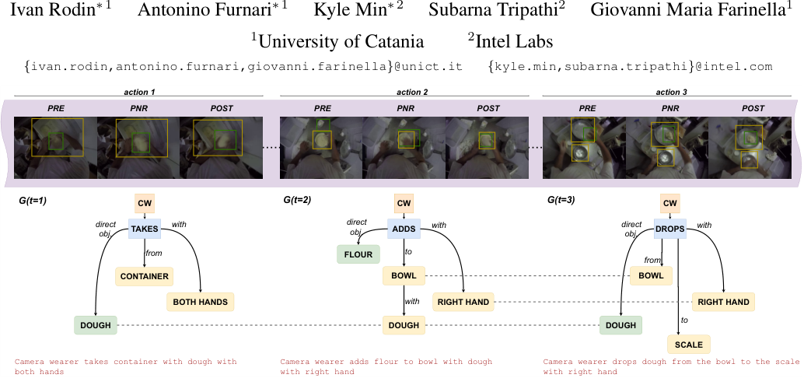
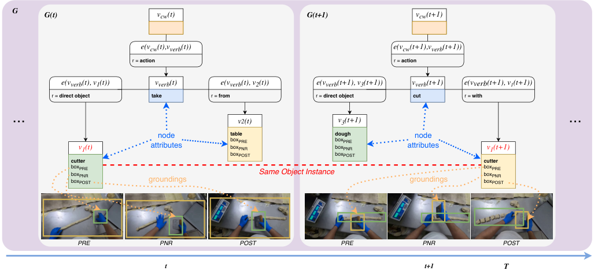
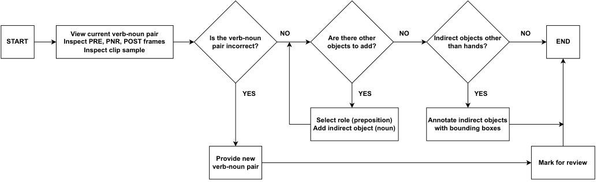
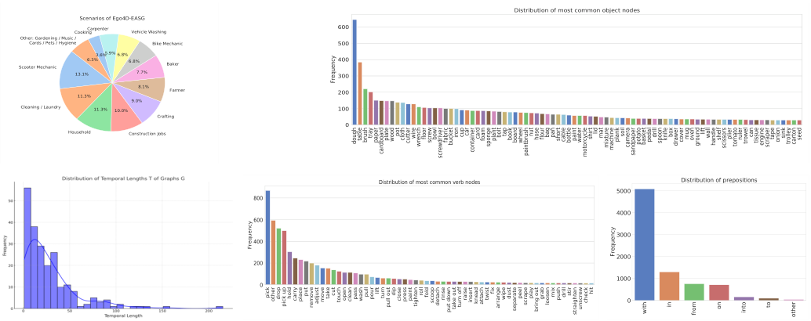
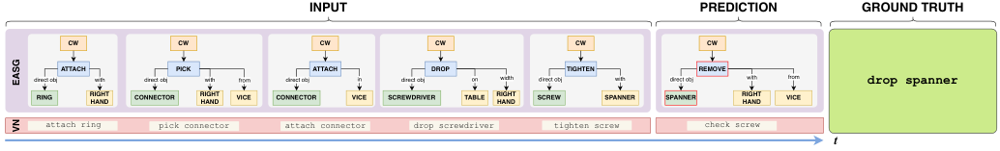

# 022_Rodin_Action_Scene_Graphs_for_Long-Form_Understanding_of_Egocentric_Videos_CVPR_2024_paper

[Original PDF](../022_Rodin_Action_Scene_Graphs_for_Long-Form_Understanding_of_Egocentric_Videos_CVPR_2024_paper.pdf)

Pages: 11

> Automatically converted from PDF. Check the original for exact equations, symbols, table alignment, and figure details.

<!-- Page 1 -->

This CVPR paper is the Open Access version, provided by the Computer Vision Foundation. Except for this watermark, it is identical to the accepted version; the final published version of the proceedings is available on IEEE Xplore. 

# **Action Scene Graphs for Long-Form Understanding of Egocentric Videos** 

<!-- Start of picture text -->
Ivan Rodin ∗ 1 Antonino Furnari ∗ 1 Kyle Min ∗ 2 Subarna Tripathi 2 Giovanni Maria Farinella 1 1University of Catania 2Intel Labs { ivan.rodin,antonino.furnari,giovanni.farinella } @unict.it { kyle.min,subarna.tripathi } @intel.com action 1 action 2 action 3 PRE PNR POST PRE PNR POST PRE PNR POST G(t=1) CW G(t=2) CW G(t=3) CW directobj. TAKES with directobj. ADDS with directobj. DROPS with from FLOUR to from CONTAINER BOWL BOWL BOTH HANDS with RIGHT HAND RIGHT HAND to DOUGH DOUGH DOUGH SCALE Camera wearer takes container with dough with Camera wearer adds flour to bowl with dough Camera wearer drops dough from the bowl to the scale both hands with right hand with right hand <!-- End of picture text -->

Figure 1. Egocentric Action Scene Graphs are temporal dynamic graphs ( _G_ ( _t_ )) capturing the action verbs (nodes in blue), direct or active objects (nodes in green), and other objects (nodes in yellow) involved in the activity performed by a camera wearer (the orange CW node). Edges between nodes represent relationship between the verb and the objects or between object pairs. The graph evolves through time providing a long-from representation of the egocentric video (dashed lines). Objects of interaction are grounded with bounding boxes. 

## **Abstract** 

## **1. Introduction** 

_We present Egocentric Action Scene Graphs (EASGs), a new representation for long-form understanding of egocentric videos. EASGs extend standard manually-annotated representations of egocentric videos, such as verb-noun action labels, by providing a temporally evolving graphbased description of the actions performed by the camera wearer, including interacted objects, their relationships, and how actions unfold in time. Through a novel annotation procedure, we extend the Ego4D dataset adding manually labeled Egocentric Action Scene Graphs which offer a rich set of annotations for long-from egocentric video understanding. We hence define the EASG generation task and provide a baseline approach, establishing preliminary benchmarks. Experiments on two downstream tasks, action anticipation and activity summarization, highlight the effectiveness of EASGs for long-form egocentric video understanding. We will release the dataset and code to replicate experiments and annotations_1 _._ 

> _∗_ These authors contributed equally to this work. 

> 1The code is available at https://github.com/fpv-iplab/EASG 

Wearable devices allow to capture video of human activities from an egocentric perspective. A proper analysis of such video can enable a detailed understanding of how humans interact with the environment, how they manipulate objects, and, ultimately, what are their goals and intentions. Easily covering sequences of activities performed by the camera wearer in different physical locations, egocentric video is by its own nature _long-form_ [48]. Hence, typical applications of egocentric vision systems require algorithms able to represent and process video over temporal spans that last in the order of minutes or hours. Examples of such applications are action anticipation [5, 12, 40], video summarization [8], and episodic memory retrieval [12]. Despite the relevance of such applications in the panorama of egocentric vision [37], progress in this area has been hindered by the lack of a comprehensive and long-form representation of videos that algorithms can rely on, with popular highlevel human-gathered representations being in the form of textual narrations [5], verb-noun action labels [9], temporal bounds for action segments [5, 9, 22], object bounding boxes [36], object state changes [12], and hand-object inter- 

18622

<!-- Page 2 -->

action states [7, 41], all short-range representations describing temporal spans lasting few seconds. 

In this paper, we introduce a novel graph-based representation of actions performed by the camera wearer in an egocentric video, which we term _Egocentric Action Scene Graph (EASG)_ . The proposed representation builds on the literature of scene graphs [15, 16, 38] to extend the classic _verb-noun_ action representation available in egocentric vision datasets [5, 6, 9, 12, 22] to a structured format in which a sequence of actions performed by the camera wearer is represented with a _temporal dynamic graph_ encoding and grounding to the video the objects involved in the action, the action verb, and the main relationships between the considered objects (see Figure 1). EASGs naturally model the temporal evolution of egocentric actions, thus providing a rich representation to be exploited in a variety of tasks requiring long-form video understanding. 

We build on the Ego4D dataset [12], which provides egocentric videos of individuals engaged in a range of activities representative of human perception, and augment it with manually gathered egocentric action scene graph labels collected through a novel annotation procedure involving different labeling steps and a validation stage. As customary in the scene graph literature [15, 50], we benchmark the egocentric action scene graph generation task both to provide baseline results and as a means of investigating the feasibility of automatically recovering such rich human-annotated representations, a fundamental ability for downstream applications. We hence show initial results highlighting the effectiveness of the proposed EASG representation in tackling long-form video understanding tasks such as action anticipation and activity summarization. 

The contributions of this paper are as follows: 1) We introduce Egocentric Action Scene Graphs, a novel representation for long-form understanding of egocentric videos; 2) We extend Ego4D with manually annotated EASG labels, which are gathered through a novel annotation procedure; 3) We propose a EASG generation baseline and provide initial baseline results; 4) We present experiments that highlight the effectiveness of the EASG representation for long-form egocentric video understanding. We will release the dataset and the code to replicate data annotation and the experiments. 

## **2. Related works** 

Our work is related to previous research lines which are revised in the following sections. 

**Graph-based representations for video understanding** The exploration of graph-based representations in image and video analysis has burgeoned over recent years, offering a structured approach to encapsulate complex relationships and interactions among element of the scene inherent in visual data. Seminal works [14, 17, 47, 49, 54]i in this 

domain have focused on various methodologies to facilitate the transition from raw visual data to structured graph representations. For instance, graph structured data is leveraged for image synthesis in [14, 17], learning video representations in [47], detecting video objects in [54] and person re-identification in [49]. In [45], the Visual Context Tree (VCTree) graph structure is built for the purpose of visual question answering. The work of [25] utilizes a transformer architecture to produce a scene graph of an image, while [4, 11, 21, 31] explores approaches to build dynamic scene graphs to describe the scene based on the video inputs. 

Scene graph generation extends beyond being an end goal, as a powerful precursor for downstream applications in computer vision, enabling enhanced performance in complex tasks. For instance, the works of [13] demonstrated how scene graph generation could be leveraged to improve object detection and visual relationship detection, thus offering a more contextual understanding of visual scenes. Similarly, the works of [33, 52, 53] explored the utilization of scene graphs for image captioning, where the generated graphs provided a structured semantic understanding that enriched the descriptive quality of generated captions. 

The works of [1, 15, 27, 38, 55] delved into employing scene graphs for video understanding, showcasing that the structured representations facilitated a more nuanced understanding of temporal actions and interactions within videos. These collective efforts accentuate the instrumental role of scene graph generation not just as a standalone objective but as a potent enabler for a spectrum of downstream tasks, amplifying the scope and efficacy of visual understanding. 

Building on previous investigations, in this work, we propose a novel graph-based representation for actions in egocentric videos. Our representation is shown to improve long-from video understanding in the considered domain. **Graph-based representations in Egocentric Vision** Although there has been substantial work in video scene graph processing, only a limited number of studies have focused on egocentric videos. The unique perspective offered by egocentric videos allows for a different approach to understand human interactions and activities. Scene graphs from the perspective of autonomous vehicles have been more extensively researched by the community [19, 26] than the human-centric view videos. However, there are a few previous works studying the applicability of scene graph representation in egovision. In [28, 29], the authors show how the graph-based representation can be useful for the audiovideo diarization of egocentric videos. In [24], the authors solve the problem of scene graph generation by composing exo- and ego-centric view processing to construct scene graphs. In [44], egocentric scene graph representations are used to perform downstream tasks of embodied navigation. Ego-Topo [32] presents graphs derived from egocentric videos, encoding the scene topology, thereby enhancing 

18623

<!-- Page 3 -->

<!-- Start of picture text -->
G G(t) vcw(t) G(t+1) vcw(t+1) e(vcw(t),vverb(t)) e(vcw(t+1),vverb(t+1)) r =  action r =  action e(vverb(t), v1(t)) vverb(t) e(vverb(t), v2(t)) e(vverb(t+1), v3(t+1)) vverb(t+1) e(vverb(t+1), v1(t+1)) r =  direct object take r =  from r =  direct object cut r =  with ... v2(t) v3(t+1) ... node table dough node boxPRE boxPRE v1(t) attributes boxPNR boxPNR attributes v1(t+1) boxPOST boxPOST cutter cutter boxboxPREPNR Same Object Instance boxboxPREPNR boxPOST groundings groundings boxPOST PRE PNR POST PRE PNR POST t t+1 T <!-- End of picture text -->

Figure 2. An Egocentric Action Scene Graph (EASG) is a time-varying directed graph _G_ ( _t_ ) = ( _V_ ( _t_ ) _, E_ ( _t_ )), where nodes _V_ ( _t_ ) represent either the camera wearer ( _vcw_ ( _t_ )), the action verb ( _vverb_ ( _t_ )), or the involved objects. Edges _E_ ( _t_ ) represent relationships _e_ ( _vi_ ( _t_ ) _, vj_ ( _t_ )) between node pairs. Each node, except for the CW node, can have one or more attributes _att_ ( _vj_ ( _t_ )) (indicated in blue). Each object has three grounding bounding boxes in the _PRE_ , _PNR_ and _POST_ frames (highlighted in orange). Nodes _vj_ representing the same object instance maintain the same index across different timesteps (e.g., _v_ 1( _t_ ) and _v_ 1( _t_ + 1) highlighted in red). 

long-term video understanding and egocentric action anticipation. While these previous studies have shown the potential of extending scene graph generation techniques to egocentric videos, in this paper, we propose a general graphbased representation designed to be descriptive of humanobject interactions happening in egocentric videos to improve long-form video understanding. 

**Graph-based Image and Video Datasets** Prominent datasets such as Action Genome [15] and Home Action Genome [38], in particular, have contributed by providing rich graph structures that encode actions and interactions within videos. The Panoptic Scene Graph (PSG) dataset [50] introduced enhanced annotations by replacing bounding boxes with fine-grained object segmentation masks. The Visual Genome dataset [20] has significantly contributed to the elucidation of relationships between objects and attributes through graph representations extracted from images. We extend Ego4D [12] with the proposed graph-based egocentric action annotations, to enhance longform video understanding and enable further investigations on graph-based representations in egocentric vision. 

## **3. Egocentric Action Scene Graphs** 

Egocentric Action Scene Graphs (EASGs) provide annotations for a video clip in the form of a dynamic graph. We formalize an EASG as a time-varying directed graph 

_G_ ( _t_ ) = ( _V_ ( _t_ ) _, E_ ( _t_ )), where _V_ ( _t_ ) is the set of nodes at time _t_ and _E_ ( _t_ ) is the set of edges between such nodes (Figure 2). Each temporal realization of the graph _G_ ( _t_ ) corresponds to an egocentric action spanning over a set of three frames defined as in [12]: the _precondition_ (PRE), the _point of no return_ (PNR) and the _postcondition_ (POST) frames. The graph _G_ ( _t_ ) is hence effectively associated to three frames: _F_ ( _t_ ) = _{PREt, PNRt, POSTt}_ . _G_ ( _t_ ) has two fixed nodes: the camera wearer node _vcw_ ( _t_ ) representing the camera wearer, and the verb node _vverb_ ( _t_ ), describing the action performed by the camera wearer at time _t_ . Each graph _G_ ( _t_ ) also contains a set of object nodes _Vobj_ ( _t_ ) encoding the objects involved in the actions. In this formulation, the camera wearer’s hands will appear as object nodes. In sum, we have: _V_ ( _t_ ) = _{vcw_ ( _t_ ) _, vverb_ ( _t_ ) _} ∪ Vobj_ ( _t_ ). Apart for the camera wear node, each other node is associated to one or more attributes through a function _att_ . Hence, for the camera wearer node, we define _att_ ( _vcw_ ( _t_ )) = ∅. The verb node is associated to a _verb class attribute_ : _att_ ( _vverb_ ( _t_ )) = _verb_ . Noun nodes _vi_ ( _t_ ) are associated to a _noun class attribute noun_ and to three bounding box attributes grounding the noun to the _PRE_ ( _t_ ), _PNR_ ( _t_ ) and _POST_ ( _t_ ) frames associated to the action taking place at time _t_ : _att_ ( _vi_ ( _t_ )) = ( _noun, boxP RE, boxP NR, boxP OST_ ). Note that two nodes indexed by the same subscript _i_ are related to the same physical object instance regardless of time _t_ . For instance _vi_ ( _t_ ) and _vi_ ( _t__′_ ) represent the same 

18624

<!-- Page 4 -->

physical objects even when _t̸_ = _t__′_ , but their associated bounding box attributes may not correspond as they are related to different frames. 

The edges in the graph describe the relationships between nodes. Let _vi_ ( _t_ ) and _vj_ ( _t_ ) be two nodes in the graph. Then, we can define an edge ( _vi_ ( _t_ ) _, vj_ ( _t_ )) _∈ E_ ( _t_ ) if there is a relationship between the nodes _vi_ ( _t_ ) and _vj_ ( _t_ ) at time _t_ . We represent the existence of an edge between nodes _vi_ ( _t_ ) and _vj_ ( _t_ ) using the function _et_ , such that _et_ ( _vi_ ( _t_ ) _, vj_ ( _t_ )) = _r_ , if there is a relationship _r_ between nodes _vi_ ( _t_ ) and _vj_ ( _t_ ); and _et_ ( _vi_ ( _t_ ) _, vj_ ( _t_ )) = ∅ otherwise. We require _r ∈ R_ , where _R_ is the set of possible relationships between nodes. Relations between verb and object nodes can be of a _direct object_ kind (e.g., puts – _dobj_ – package), or a preposition (i.e., puts – _in_ – fridge), while relationships between object nodes are characterized by the prepositions only (i.e., package – _with_ – carrot). Objects _vi_ ( _t_ ) which are in a _direct object_ relation with the verb node _vverb_ ( _t_ ) are also referred to as “direct objects”, while all other objects are referred to as “indirect objects”. There is always an _action_ relationship between _vcw_ ( _t_ ) and _vverb_ ( _t_ ), i.e., ( _vcw, vverb_ ) _∈ E_ ( _t_ ) _∧ r_ ( _vcw, vverb_ ) = _action_ . 

Since our representation is centered on the action currently executed by the camera wearer, we add only the objects that are either direct objects (e.g., objects manipulated by _vcw_ ( _t_ )), or objects that have a direct relationship with either the verb node or any direct object nodes. For example, if the _camera wearer_ takes an _apple_ from the _table_ on which many other objects are located (e.g., a pear), only the apple and table will appear as nodes of the EASG, whereas _pear_ will not. 

## **4. Ego4D-EASG Dataset** 

We build our EASG dataset, _Ego4D-EASG_ , by annotating a subset of 221 Ego4D [12] clips sampled over 181 distinct videos containing labels for the State Change Object Detection benchmark (SCOD). These labels, together with the narrations available in Ego4D are used to seed the collection of EASG annotations. Let _C_ = _{C_ 1 _, . . . , CN }_ be the set of selected clips. Each clip _Ci_ consists in a sequence of object state change annotations from the SCOD benchmark _Ci_ = _{a__i_ _t_ 1_, ai_ _t_ 2_, . . . , ai_ _tmi__}_,wherethegenericannotation _a__i_ _t_=(_a_ _t__i,P RE_ _, a__i,P NR_ _t , a__i,P OST_ _t_ ) contains annotations for three salient frames related to an object-state change at time _t_ of the clip _Ci_ : the precondition (PRE), the point of no return (PNR), and the postcondition (POST). Each annotation is defined as _a__i,x_ _t_ = ( _f, n, bo, blh, brh, r_ ), where _x_ is either PRE, PNR or POST, _f_ is the frame number, _n_ and _bo_ are the noun class and bounding box of the object of change (the manipulated object), _blh_ is the bounding box of the left hand, _brh_ is the bounding box of the right hand, and _r_ is a corresponding free-form narration which is matched to the 

current annotation. If the right or left hands are not visible in the scene, then either _blh_ = ∅ or _brh_ = ∅. We labeled an independent EASG _Gi_ ( _t_ ) for each clip _Ci_ . Each temporal realization of the graph, _Gi_ ( _t_ ) is seeded from the annotation tuple _a__i_ _t_=(_a_ _t__i,P RE_ _, a__i,P NR_ _t , a__i,P OST_ _t_ ). The data annotation is performed in two stages: 1) the graph annotation stage, and 2) the graph validation stage. These two stages are detailed in the following sections. We used Amazon Mechanical Turk for both stages. After data graphs annotation and validation, a temporal recollection stage allows to turn individual graphs into temporal dynamic graphs. The annotation process is discussed in the following sections. We will release the code to collect annotations following the proposed procedure. 

### **4.1. Egocentric Action Scene Graph Annotation** 

This stage aims to obtain initial EASG _Gi_ ( _t_ ) from annotations _a__i_ _t__∈Ci_.This is done through an initialization and a refinement procedures. 

**Graph Initialization** We add by default the camera wearer node _vcw_ ( _t_ ), the verb node _vverb_ ( _t_ ), and set the default _action_ edge _et_ ( _vcw_ ( _t_ ) _, vverb_ ( _t_ )) = _action_ . The _verb_ attribute of _vverb_ ( _t_ ) is set by extracting the verb belonging to the narration _r_ associated to the current annotation _a__i_ _t_.We then initialize a new object node _nk_ ( _t_ ) to represent the manipulated object. We set the _noun_ and _box_ attributes of _nk_ ( _t_ ) as the noun _n_ and bounding box _bo_ annotations included in _a__i_ _t_ ( _n, bo ∈ a__i_ _t_).We add a_direct object_edge between_vverb_(_t_) and _nk_ ( _t_ ): _et_ ( _vverb_ ( _t_ ) _, nk_ ( _t_ )) = _direct object_ . 

**Graph Refinement** We ask three independent AMT annotators to provide manual annotations in order to refine the initial graph _Gi_ ( _t_ ). The annotation pipeline for this stage is shown in the Figure 3. We first ask annotators to inspect the provided verb-noun pair, the associated _PRE_ , _PNR_ and _POST_ frames and a video clip of 5 seconds sampled around the _PNR_ frame. Initial verb-noun pairs are obtained extracting the verb from the narration and the noun from the SCOD annotation. Since the verbs are inherited from narrations, it may occur that similar verbs have different meanings (e.g. “pick tomato” (selecting) versus “pick up hammer” (lifting)), this allows the graph to keep the expressivity of natural language. At the same time, Ego4D taxonomies can be used to map verbs to “structured” categories, to reduce the number of classes and aggregate the verbs with similar meanings (e.g., “take” may include “pick” and “pick up”). Annotators then check if the verbnoun pair corresponds to the observed clip; if it does not, then the annotators provide a correct ( _verb, noun_ ) pair and the current annotation is ended and marked for later review. We observe that narrations do not match in _<_ 5% of the cases. These examples have been later manually checked and re-labeled following the same procedure. We then ask the annotators to specify and ground any additional objects 

18625

<!-- Page 5 -->

<!-- Start of picture text -->
START Inspect PRE, PNR, POST framesView current verb-noun pair Is the verb-nounpair incorrect? NO objects to add?Are there other NO Indirect objects otherthan hands? NO END Inspect clip sample YES YES YES Select role (preposition) Annotate indirect objects Add indirect object (noun) with bounding boxes Provide new Mark for review verb-noun pair <!-- End of picture text -->

Figure 3. The Ego4D-EASG annotation pipeline. The annotators first review the provided verb-noun pair, the _PRE_ , _PNR_ , _POST_ frames and a clip sampled around _PNR_ . They then check the existing narration and add indirect objects and related groundings, if necessary. 

|**Validationprocedure**|**ExampleQuestions(answers in red)**|**Example Frame**|
|---|---|---|
|1. Filteringverb-nounpair|Does CW_take bowl_or _press dough_? take bowl||
|2. Selecting proper preposition in case of multiple edges between two nodes|Select the preposition which is more appropriate: _•_CW takes bowl**with**left hand✓ _•_CW takes bowl**on**left hand||
|3. Selecting hand(s) if there are different hands with the samepreposition|Does CW take bowl with right hand, with left hand or with both hands? left hand ||
||Is the following statement correct:||
|4. Identifying spatial relations|_•_The bowl is with flour [Y/N]Y _•_The bowl is from scale [Y/N]N||

Table 1. Examples of questions (with correct answers in red) asked to the annotators in the validation stage to resolve ambiguities between the labels provided in the annotation stage. 

which may be linked to the verb node _vverb_ or any existing object nodes. Note that only indirect objects can be added in this stage. For each newly added object node _vk_ , annotators are also asked to specify the preposition linking this object to the current graph (e.g., “the camera wearer takes bowl **with** right hand”, where “right hand” is the new object and “with” is the specified preposition). We prompt the annotators with some likely objects which may appear in the frame and related prepositions, extracted from the narration _r_ through part of speech tagging, but the annotators were free to add any new objects from the taxonomy of 1610 objects mentioned in Ego4D narrations they may find relevant in the observed video clip. For each of the added _indirect_ objects, annotators are also asked to ground them to the _PRE_ , _PNR_ , and _POST_ frames through bounding boxes. If the added objects correspond to the hands, the groundings are set to _blh_ and _brh_ as specified in the annotation _aj_ . At the end of this process, we obtain three graphs _G_1 _i_(_t_),_G_2 _i_(_t_), _G_3 _i_(_t_) as labeled by the three independent annotators. 

### **4.2. Egocentric Action Scene Graph Validation** 

The validation stage aggregates the data received from the three annotators and ensures the quality of the final annotations. In this stage, for each ( _G_1 _i_(_t_),_G_2 _i_(_t_),_G_3 _i_(_t_)) graph 

tuple, we show the annotators the _PRE_ , _PNR_ , and _POST_ frames, the video clip sampled around the _PNR_ and ask a set of questions aiming to sort out inconsistencies across the three graphs. We formulate up to four questions: 1) a question aimed to select the correct verb-noun pair if there is disagreement in the three graphs; 2) a question aimed to disambiguate relations between pairs of nodes, if the three graphs have disagreeing edges between the same node pairs; 3) a question aimed to identify the correct hand used to manipulate objects; 4) a question aimed to disambiguate spatial relationships. The answers provided by the annotators to each of these questions allow to resolve ambiguities and obtain a single graph _Gi_ ( _t_ ) for each clip _Ci_ and each timestamp _t_ . In our procedure, during the first stage, three annotators agreed 84% of time, while the remaining _G_ ( _t_ ) were sent to validation stage and were validated by one annotator. Table 1 reports example questions and correct answers for an example annotation. 

### **4.3. Temporal Recollection** 

The graphs _Gi_ ( _t_ ) obtained through the annotation and validation stages are _static graphs_ , meaning that node indices at different timestamps do not necessarily indicate the same object. For instance, the object “plate” may be identified by 

18626

<!-- Page 6 -->

<!-- Start of picture text -->
Distribution of most common object nodes Scenarios of Ego4D-EASG CookingCarpenter Vehicle Washing 600 Other: Gardening / Music / Cards / Pets / Hygiene Bike Mechanic 500 Scooter Mechanic 6.3%3.6%5.9% 6.8% 6.8% Baker 400 13.1% 7.7% 300 11.3% 8.1% Farmer 200 9.0% Cleaning / Laundry 11.3% 10.0% 100 Crafting 0 Household Construction Jobs Distribution of most common verb nodes Distribution of prepositions 5000 800 4000 600 3000 400 2000 200 1000 0 0 Frequency doughtable brush tray papercardboard platewood potcloth cutter wire wrench floor screw bowl screwdriver fabric bucket iron cup car container card foam spongeplantbolt tapbook board wheel paintbrushnut hose flour bag panshort cable bottle paintwater motorcycleshirt lid mat mixture machine planksoil camera sandpaperpotatobasket pedaldrill spoonknife box drawer cover mug oven groundlift wall handle shelf scissors pliertomato ruler trowel can tissue engine scrapertapeonion sink trolleycarton seed Frequency Frequency pick other drop pick up hold carry place put remove adjust move take cut touch open clean pass wash pull pour lift turn pull out dip close press paint tighten roll fold scoop detach rinse put down take out turn off raise insert knead attach twist fix arrange wipe dust separate peel scrape play bring out grab loosen mix push drill stir straighten unscrew check hit with in from on into to other <!-- End of picture text -->

Figure 4. Left-to-right, top-to-bottom: Distributions of clips across scenarios, object nodes, temporal lengths _T_ of graphs _G_ , verb nodes, and relation categories (excluding _action_ and _direct object_ relations). Data is distributed across different scenarios related to egocentric perception, long-tailed object, verb distributions, and prepositions. The distribution of temporal length of graphs shows the long-form nature of our annotations, with most graphs having a length of up to 50 timesteps. 

_ni_ ( _t_ ) and _nj_ ( _t__′_ ) with _t̸_ = _t__′_ . In this stage, we reason globally on the dynamic graph _Gi_ ( _t_ ) _, t_ = 1 _. . . , T_ and re-assign node indices to make sure that object nodes representing the same object instance are assigned the same index. At the end of this process, a “plate” object will be indexed with the same subscript across timestamps: _ni_ ( _t_ ) and _ni_ ( _t__′_ ) with _t̸_ = _t__′_ . This makes sure that _Gi_ ( _t_ ) can be interpreted as a dynamic graph across all timestamps. 

### **4.4. Dataset Statistics and Comparison with Other Scene Graph Datasets** 

Table 2 reports statistics on the proposed Ego4D-EASG dataset and compares it with existing video scene graph datasets. The proposed dataset is the only one designed for long-form egocentric video understanding and it features 221 egocentric video sequences, 11.4 hours of video, comprising an average labeled sequence length of 3.1 minutes, _T_ = 28 _._ 3 graphs per video in average, 407 object classes, 219 verb classes, and 16 relation classes. As compared to previous datasets, ours is the only including verb nodes explicitly encoding actions. As a result, the number of relations, which in previous datasets also encoded actions (e.g., “looking at”) is lower than in other datasets. 

Out of the all clips, 129 belong to the SCOD-train split and 92 to SCOD-val split. The dataset contains 30,478 and 19,342 bounding boxes as object groundings in train and validation splits respectively. For an exhaustive enumeration of the sets of all verbs _Vverb_ , objects _Vobj_ , and relations 

> We measure the length of each sequence from the timestamp of the _G_ (1) : _PRE_ frame to the timestamp of the _G_ ( _T_ ) : _POST_ frame. 

_R_ , please refer to the supplementary material. Figure 4 reports statistics on the distribution of scenarios, nouns, verbs, relations, and temporal graph lengths. 

## **5. Egocentric Action Scene Graphs Generation** 

**Task Definition** Unlike standard scene graph generation, EASG generation aims to predict the action verbs as well as objects and their relationships. We define three EASG generation tasks as follows: (1) Edge classification ( _Edge Cls_ ) is to predict verb-object and object-object relationships given visual features, the ground-truth action verb and object classes, (2) Scene Graph Classification ( _SG Cls_ ) is to predict both the object classes and the edge relationships given visual features and the ground-truth action verb, and (3) Egocentric Action Scene Graph Classification ( _EASG Cls_ ) is to predict all these three components, which encompass action verbs, objects, and edge relationships. We follow [15] and report results for predicate ( _Edge Cls_ ) and scene graph ( _SG Cls_ ) classification, and extend it with _EASG Cls_ to evaluate time-evolving graphs. 

**Experimental Setting** We design a baseline model for the novel EASG generation task consisting of task-specific fully-connected layers working on top of pre-extracted visual features. For _Edge Cls_ , we use a single-layer model to predict the edge relation from the clip-level features and ROIAlign features of each object bounding box. For the clip-level features, we take the average of SlowFast [10] features (pre-extracted and provided within the Ego4D dataset [12]) for the whole clip spanning from _PRE_ to _POST_ frames. We extract the ROIAlign features using the Faster- 

18627

<!-- Page 7 -->

|**Dataset**|**Dynamic**|**Egocentric**|**Sequences**|**Hours**|**Avg. Len. (seconds)**|**Avg. Graphsper Vid.**|**Obj Cls**|**Verb Cls**|**Rel Cls**|
|---|---|---|---|---|---|---|---|---|---|
|VidVRD [42]|✗|✗|1,000|3|11|3.9*|35|25**|132|
|VidOR [43]|✗|✗|10,000|99|35|8.8* action + 29.2* spatial|80|42|50|
|Action Genome [49]|✓|✗|10,000|82|30|5|35|-|25|
|PVSG [51]|✗|Partly (28%)|400|9|77|382|126|44|57|
|HOMAGE[38]|✗|paired ego-exo|1,752|25|3|3.8|86|453|29|
|Ego4D-EASG(Ours)|✓|✓|221|11.4|186|28.3|407|219|16|

Table 2. Comparison with existing video scene graph datasets. Our Ego4D-EASG dataset is the only one explicitly designed for long-form egocentric video understanding, featuring egocentric videos, dynamic graphs, an average sequence length of 3.1 minutes and an average number of 28.3 graphs per sequence. *measured in object-relation-object triplets. **intransitive + transitive verb predicates. 

|||||Wit|h Constr|aint|||||||No|Constra|int||||
|---|---|---|---|---|---|---|---|---|---|---|---|---|---|---|---|---|---|---|
|Method||_Edge Cls_|||_SG Cls_||_E_|_ASG Cl_|_s_||_Edge Cls_|||_SG Cls_|||_EASG C_|_ls_|
||R@10|R@20|R@50|R@10|R@20|R@50|R@10|R@20|R@50|R@10|R@20|R@50|R@10|R@20|R@50|R@10|R@20|R@50|
|Random Guess|8.0|8.0|8.0|0.2|0.4|1.0|0.0|0.0|0.0|36.5|72.6|99.9|0.3|0.5|1.0|0.0|0.0|0.0|
|Baseline (Ours)|60.4|60.4|60.4|41.4|44.3|50.6|14.3|16.4|17.9|94.4|99.8|100|51.6|58.2|62.4|14.7|18.3|20.9|

Table 3. Baseline results for three EASG generation tasks (i.e. _Edge Cls_ , _SG Cls_ , and _EASG Cls_ ) in terms of Recall@K. 

RCNN [39] pre-trained for the short-term action anticipation benchmark [12]. For _SG Cls_ , we add an additional fully-connected layer to predict the object classes from the ROIAlign features. For _EASG Cls_ , we add another additional layer to predict the action verb from the clip-level features. Following the convention in the literature of scene graph generation, we evaluate this baseline under two different setups: _With Constraint_ and _No Constraint_ . The former restricts each graph to have at most a single verb-object relationship, whereas the latter has no such restriction. The baseline model is trained for 10 epochs using the Adam optimizer [18] with a learning rate of 10_−_3 . 

**Results** We report the baseline results for all different tasks and setups in Table 3 using the standard metrics of Recall@K (R@K, K=[10, 20, 50]). Baseline results are compared with random guess. We can observe that the scores of _EASG Cls_ are significantly lower than other results, indicating that action verbs introduce another layer of difficulty to EASG understanding. 

## **6. Downstream long-from video understanding tasks with Egocentric Action Scene Graphs** 

In this section, we report experiments aimed to show the potential of the EASG representation in the downstream tasks of action anticipation and activity summarization. Both tasks require to perform long-form reasoning of egocentric video, processing long video sequences spanning over different timesteps. Following recent results showing the flexibility of Large Language Models (LLMs) as symbolic reasoning machines [30], we perform these experiments with LLMs accessed via the OpenAI API [34]. The experiments aim to examine the expressive power of the EASG representation and its usefulness for downstream applications. We show that EASG offers an expressive way of modeling 

long-form activities, in comparison with the gold-standard verb-noun action encoding, extensively adopted in previous work [6, 12]. The exact prompts used in the experiments and additional results are provided in the supplement. 

### **6.1. Action anticipation with EASGs** 

**Experimental Setting** For the action anticipation task, we use the GPT3 [3] _text-davinci-003_ model. We prompt the model to predict the future action from a sequence of length _T ∈{_ 5 _,_ 20 _}_ . We compare two types of representations - EASG and sequences of verb-noun pairs. The input sequence of graphs can be represented as _sEASG_ = [ _G_ ( _t_ 0) _, G_ ( _t_ 0 + 1) _, ..., G_ ( _t_ 0 + _T −_ 1)], with _t_ 0 + _T −_ 1 _≥_ 20. Each graph _G_ ( _t_ ) is represented as a string of triplets, where each triplet encapsulates the relationship between nodes (e.g., _CW - verb - wash; wash - direct object - car; wash - with - sponge_ ). As an output, we request to provide the future unobserved scene graph _G_ ( _t_ + _T_ ) in the same triplet format. From the predicted graph, we extract the action as the pair of verb and direct object node class for evaluation. In the verb-noun baseline, the input sequence is represented as _svn_ = [ _svn_ ( _t_ 0) _, svn_ ( _t_ 0 + 1) _, ..., svn_ ( _t_ 0 + _T −_ 1)], with _t_ 0 + _T −_ 1 _≥_ 20. The generic term of the sequence is a ( _verb, noun_ ) pair extracted from the EASG annotation, where _noun_ is the noun class of the direct object. The ground truth future action is _svn_ ( _t_ 0 + _T_ ). Given the uncertainty in forecasting future events, we prompt the LLM to output up to _N_ = 5 predictions, a standard practice in anticipation [5, 12]. We evaluate results using top-k accuracy, with _k ∈{_ 1 _,_ 5 _}_ , reported for verb, noun, and actions. The sample size for this experiment is 3030. 

**Results** Table 4 reports the results of these experiments. Best results are always achieved by EASG-based represen- 

18628

<!-- Page 8 -->

<!-- Start of picture text -->
INPUT PREDICTION GROUND TRUTH CW CW CW CW CW CW ATTACH PICK ATTACH DROP TIGHTEN REMOVE direct obj with direct obj with from direct obj in direct obj on width direct obj with direct obj with from drop spanner RING RIGHTHAND CONNECTOR RIGHTHAND VICE CONNECTOR VICE SCREWDRIVER TABLE RIGHTHAND SCREW SPANNER SPANNER RIGHTHAND VICE attach ring pick connector attach connector drop screwdriver tighten screw check screw t EASG VN <!-- End of picture text -->

Figure 5. Qualitative example of input sequences and outputs produced using the EASG (top) and verb-noun (bottom) representations for action anticipation, along with the ground truth future action (right). The EASG prediction “remove spanner” is much more semantically aligned to the ground truth “drop spanner” action than “check screw”, the prediction based on the verb-noun representation. 

|Verb Noun|Ac|tion|
|---|---|---|
|Seq. length_T_ Avg. duration Top-1 Top-5 Top-1 Top-5|Top-1|Top-5|
|V-N 5 19s 2.54 5.01 47.68 62.24|1.28|2.60|
|EASG 5 19s 3.33 9.53 **48.84** 66.03|1.88|5.24|
|V-N 20 82s 3.43 8.41 46.69 64.85|2.01|4.98|
|EASG 20 82s **5.94** **15.97** 47.36 **67.26**|**3.40**|**9.24**|
|Improvement +2.51 +7.56 +0.67 +2.41|+1.39|+4.26|
|Table 4. Performance Comparison for the Action antici tations. As can be noted, even short EASG seque|patio nces|n task. (_T_ =|
|5) tend to outperform long V-N sequences (_T_ =|20),|high-|
|lighting the higher representation power of EA|SG,|when|
|compared to standard verb-noun representation representations achieve the best results for long|s. E  sequ|ASG ences|
|(_T_ = 20). For instance, Top-5 verb is equal to|15_._9|7 for|
|_T_ = 20, as compared to 9_._53 for _T_ = 5. Th|ese r|esults|
|further confirm the suitability of EASG for long|-for|m un-|
|derstanding of egocentric video. EASGs bring o nificant improvements of up to +7_._56 with resp|veral ect t|l sig- o the|
|best verb-noun based prediction across the diff rics. Figure5reports a qualitative example.|erent|met-|

### **6.2. Long-form activity summarization with EASGs** 

**Experimental Setting** We select a subset of 147 Ego4D-EASG clips containing human-annotated summaries describing the activities performed in the clip in 1-2 sentences from Ego4D [12]. We construct three types of input sequences: sequences of graphs _sEASG_ = [ _G_ (1) _, G_ (2) _, ..., G_ ( _Tmax_ )], sequences of verbnoun pairs _svn_ = [ _svn_ (1) _, svn_ (2) _, ..., svn_ ( _Tmax_ )], and sequences of original Ego4D narrations, matched with the EASG sequence. This last input is reported for reference, as we expect summarization from narrations to bring the best performance, given the natural bias of language models towards this representation. Each _G_ ( _t_ ) is represented as a sentence (e.g., CW wash car with sponge) to decrease the number of tokens in the input and to align with the natural language form of the predicted output. We select clips for which _Tmax ≥_ 5. We use the _GPT-3.5 Turbo_ LLM model for these experiments. We evaluate the produced summaries using the CIDEr [46] metric, adopted in the image captioning literature, and standard metrics for 

||CIDEr|ROUGE-1|ROUGE-2|ROUGE-L|BLEU-1|BLEU-2|BLEU-3|BLEU-4|METEOR|
|---|---|---|---|---|---|---|---|---|---|
|V-N|9.42|31.5|10.3|29.7|35.7|18.6|7.6|3.9|26.09|
|EASG|13.79|33.3|10.7|31.4|37.3|19.0|7.8|4.2|26.30|
|Narrations|19.99|37.7|14.0|34.4|42.0|24.0|11.7|6.7|29.43|

Table 5. Results of activity summarization with EASGs and verbnoun representations. 

#### NLG (ROUGE [23], BLEU [35], METEOR [2]). 

**Results** Results reported in Table 5 indicate strong improvement in CIDEr score over _svn_ inputs, showing that models which process EASG inputs capturing detailed objectaction relationships, will generate more specific, informative sentences that align well with reference descriptions. As expected, inputs based on narrations achieve the best performance. It should be noted that, while EASG are not as expressive as narrations, they provide a much more structured representation which may be beneficial for the development of computer vision systems. All the NLG metrics show improvements of _sEASG_ over _svn_ representation, which indicates that indeed, Egocentric Action Scene Graphs provide meaningful information that can improve the quality of long-form video summarization. 

## **7. Conclusion** 

Our paper reports four key contributions: Egocentric Action Scene Graphs (EASG) as a novel representation for understanding long-form egocentric videos; A procedure for the collection of such graphs and extended the Ego4D dataset with manually annotated EASG labels: Initial baseline results for EASG generation; The validation of the effectiveness of the EASG representation in two downstream tasks, aimed at long-form egocentric video understanding. We believe that these contributions mark a step forward in longform egocentric video understanding. 

**Acknowledgements.** This research is supported by Intel Corporation. Research at the University of Catania is supported in part by the project Future Artificial Intelligence Research (FAIR) – PNRR MUR Cod. PE0000013 - CUP: E63C22001940006. 

18629

<!-- Page 9 -->

## **References** 

- [1] Anurag Arnab, Chen Sun, and Cordelia Schmid. Unified graph structured models for video understanding. In _Proceedings of the IEEE/CVF International Conference on Computer Vision_ , pages 8117–8126, 2021. 2 

- [2] Satanjeev Banerjee and Alon Lavie. Meteor: An automatic metric for mt evaluation with improved correlation with human judgments. In _Proceedings of the acl workshop on intrinsic and extrinsic evaluation measures for machine translation and/or summarization_ , pages 65–72, 2005. 8 

- [3] Tom Brown, Benjamin Mann, Nick Ryder, Melanie Subbiah, Jared D Kaplan, Prafulla Dhariwal, Arvind Neelakantan, Pranav Shyam, Girish Sastry, Amanda Askell, et al. Language models are few-shot learners. _Advances in neural information processing systems_ , 33:1877–1901, 2020. 7 

- [4] Yuren Cong, Wentong Liao, Hanno Ackermann, Bodo Rosenhahn, and Michael Ying Yang. Spatial-temporal transformer for dynamic scene graph generation. In _Proceedings of the IEEE/CVF international conference on computer vision_ , pages 16372–16382, 2021. 2 

- [5] Dima Damen, Hazel Doughty, Giovanni Maria Farinella, Sanja Fidler, Antonino Furnari, Evangelos Kazakos, Davide Moltisanti, Jonathan Munro, Toby Perrett, Will Price, et al. Scaling egocentric vision: The epic-kitchens dataset. In _Proceedings of the European Conference on Computer Vision (ECCV)_ , pages 720–736, 2018. 1, 2, 7 

- [6] Dima Damen, Hazel Doughty, Giovanni Maria Farinella, Antonino Furnari, Evangelos Kazakos, Jian Ma, Davide Moltisanti, Jonathan Munro, Toby Perrett, Will Price, et al. Rescaling egocentric vision. _arXiv preprint arXiv:2006.13256_ , 2020. 2, 7 

- [7] Ahmad Darkhalil, Dandan Shan, Bin Zhu, Jian Ma, Amlan Kar, Richard Higgins, Sanja Fidler, David Fouhey, and Dima Damen. Epic-kitchens visor benchmark: Video segmentations and object relations. _Advances in Neural Information Processing Systems_ , 35:13745–13758, 2022. 2 

- [8] Ana Garcia Del Molino, Cheston Tan, Joo-Hwee Lim, and Ah-Hwee Tan. Summarization of egocentric videos: A comprehensive survey. _IEEE Transactions on Human-Machine Systems_ , 47(1):65–76, 2016. 1 

- [9] Alireza Fathi, Xiaofeng Ren, and James M Rehg. Learning to recognize objects in egocentric activities. In _CVPR 2011_ , pages 3281–3288. IEEE, 2011. 1, 2 

- [10] Christoph Feichtenhofer, Haoqi Fan, Jitendra Malik, and Kaiming He. Slowfast networks for video recognition. In _Proceedings of the IEEE/CVF international conference on computer vision_ , pages 6202–6211, 2019. 6 

- [11] Shengyu Feng, Hesham Mostafa, Marcel Nassar, Somdeb Majumdar, and Subarna Tripathi. Exploiting long-term dependencies for generating dynamic scene graphs. In _Proceedings of the IEEE/CVF Winter Conference on Applications of Computer Vision_ , pages 5130–5139, 2023. 2 

- [12] Kristen Grauman, Andrew Westbury, Eugene Byrne, Zachary Chavis, Antonino Furnari, Rohit Girdhar, Jackson Hamburger, Hao Jiang, Miao Liu, Xingyu Liu, et al. Ego4d: Around the world in 3,000 hours of egocentric video. In _Proceedings of the IEEE/CVF Conference on Computer Vision_ 

_and Pattern Recognition_ , pages 18995–19012, 2022. 1, 2, 3, 4, 6, 7, 8 

- [13] Tao He, Lianli Gao, Jingkuan Song, and Yuan-Fang Li. Exploiting scene graphs for human-object interaction detection. In _Proceedings of the IEEE/CVF International Conference on Computer Vision_ , pages 15984–15993, 2021. 2 

- [14] Roei Herzig, Amir Bar, Huijuan Xu, Gal Chechik, Trevor Darrell, and Amir Globerson. Learning canonical representations for scene graph to image generation. In _Proc. of the European Conf. on Computer Vision (ECCV)_ , 2020. 2 

- [15] Jingwei Ji, Ranjay Krishna, Li Fei-Fei, and Juan Carlos Niebles. Action genome: Actions as compositions of spatiotemporal scene graphs. In _Proceedings of the IEEE/CVF Conference on Computer Vision and Pattern Recognition_ , pages 10236–10247, 2020. 2, 3, 6 

- [16] Justin Johnson, Ranjay Krishna, Michael Stark, Li-Jia Li, David Shamma, Michael Bernstein, and Li Fei-Fei. Image retrieval using scene graphs. In _Proceedings of the IEEE conference on computer vision and pattern recognition_ , pages 3668–3678, 2015. 2 

- [17] Justin Johnson, Agrim Gupta, and Li Fei-Fei. Image generation from scene graphs. In _CVPR_ , 2018. 2 

- [18] Diederik P Kingma and Jimmy Ba. Adam: A method for stochastic optimization. _arXiv preprint arXiv:1412.6980_ , 2014. 7 

- [19] Pawit Kochakarn, Daniele De Martini, Daniel Omeiza, and Lars Kunze. Explainable action prediction through self-supervision on scene graphs. _arXiv preprint arXiv:2302.03477_ , 2023. 2 

- [20] Ranjay Krishna, Yuke Zhu, Oliver Groth, Justin Johnson, Kenji Hata, Joshua Kravitz, Stephanie Chen, Yannis Kalantidis, Li-Jia Li, David A Shamma, et al. Visual genome: Connecting language and vision using crowdsourced dense image annotations. _International journal of computer vision_ , 123:32–73, 2017. 3 

- [21] Rongjie Li, Songyang Zhang, and Xuming He. Sgtr: End-toend scene graph generation with transformer. In _proceedings of the IEEE/CVF conference on computer vision and pattern recognition_ , pages 19486–19496, 2022. 2 

- [22] Yin Li, Miao Liu, and James M Rehg. In the eye of beholder: Joint learning of gaze and actions in first person video. In _Proceedings of the European Conference on Computer Vision (ECCV)_ , pages 619–635, 2018. 1, 2 

- [23] Chin-Yew Lin. Rouge: A package for automatic evaluation of summaries. In _Text summarization branches out_ , pages 74–81, 2004. 8 

- [24] Yichao Lu, Cheng Chang, Himanshu Rai, Guangwei Yu, and Maksims Volkovs. Multi-view scene graph generation in videos. In _International Challenge on Activity Recognition (ActivityNet) CVPR 2021 Workshop_ , page 2, 2021. 2 

- [25] Yichao Lu, Himanshu Rai, Jason Chang, Boris Knyazev, Guangwei Yu, Shashank Shekhar, Graham W Taylor, and Maksims Volkovs. Context-aware scene graph generation with seq2seq transformers. In _Proceedings of the IEEE/CVF international conference on computer vision_ , pages 15931– 15941, 2021. 2 

- [26] Arnav Vaibhav Malawade, Shih-Yuan Yu, Brandon Hsu, Harsimrat Kaeley, Anurag Karra, and Mohammad Abdullah 

18630

<!-- Page 10 -->

Al Faruque. Roadscene2vec: A tool for extracting and embedding road scene-graphs. _Knowledge-Based Systems_ , 242: 108245, 2022. 2 

- [27] Jianguo Mao, Wenbin Jiang, Xiangdong Wang, Zhifan Feng, Yajuan Lyu, Hong Liu, and Yong Zhu. Dynamic multistep reasoning based on video scene graph for video question answering. In _Proceedings of the 2022 Conference of the North American Chapter of the Association for Computational Linguistics: Human Language Technologies_ , pages 3894–3904, 2022. 2 

- [28] Kyle Min. Intel labs at ego4d challenge 2022: A better baseline for audio-visual diarization. _arXiv preprint arXiv:2210.07764_ , 2022. 2 

- [29] Kyle Min. Sthg: Spatial-temporal heterogeneous graph learning for advanced audio-visual diarization. _arXiv preprint arXiv:2306.10608_ , 2023. 2 

- [30] Suvir Mirchandani, Fei Xia, Pete Florence, Brian Ichter, Danny Driess, Montserrat Gonzalez Arenas, Kanishka Rao, Dorsa Sadigh, and Andy Zeng. Large language models as general pattern machines. _arXiv preprint arXiv:2307.04721_ , 2023. 7 

- [31] Sayak Nag, Kyle Min, Subarna Tripathi, and Amit K RoyChowdhury. Unbiased scene graph generation in videos. In _Proceedings of the IEEE/CVF Conference on Computer Vision and Pattern Recognition_ , pages 22803–22813, 2023. 2 

- [32] Tushar Nagarajan, Yanghao Li, Christoph Feichtenhofer, and Kristen Grauman. Ego-topo: Environment affordances from egocentric video. _arXiv preprint arXiv:2001.04583_ , 2020. 2 

- [33] Kien Nguyen, Subarna Tripathi, Bang Du, Tanaya Guha, and Truong Q Nguyen. In defense of scene graphs for image captioning. In _Proceedings of the IEEE/CVF International Conference on Computer Vision_ , pages 1407–1416, 2021. 2 

- [34] R OpenAI. Gpt-4 technical report. arxiv 2303.08774. _View in Article_ , 2023. 7 

- [35] Kishore Papineni, Salim Roukos, Todd Ward, and Wei-Jing Zhu. Bleu: a method for automatic evaluation of machine translation. In _Proceedings of the 40th annual meeting of the Association for Computational Linguistics_ , pages 311–318, 2002. 8 

- [36] Hamed Pirsiavash and Deva Ramanan. Detecting activities of daily living in first-person camera views. In _2012 IEEE conference on computer vision and pattern recognition_ , pages 2847–2854. IEEE, 2012. 1 

- [37] Chiara Plizzari, Gabriele Goletto, Antonino Furnari, Siddhant Bansal, Francesco Ragusa, Giovanni Maria Farinella, Dima Damen, and Tatiana Tommasi. An outlook into the future of egocentric vision. _arXiv preprint arXiv:2308.07123_ , 2023. 1 

- [38] Nishant Rai, Haofeng Chen, Jingwei Ji, Rishi Desai, Kazuki Kozuka, Shun Ishizaka, Ehsan Adeli, and Juan Carlos Niebles. Home action genome: Cooperative compositional action understanding. In _Proceedings of the IEEE/CVF Conference on Computer Vision and Pattern Recognition_ , pages 11184–11193, 2021. 2, 3, 7 

- [39] Shaoqing Ren, Kaiming He, Ross Girshick, and Jian Sun. Faster r-cnn: Towards real-time object detection with region proposal networks. In _Advances in neural information processing systems_ , pages 91–99, 2015. 7 

- [40] Ivan Rodin, Antonino Furnari, Dimitrios Mavroeidis, and Giovanni Maria Farinella. Predicting the future from first person (egocentric) vision: A survey. _Computer Vision and Image Understanding_ , 2021. 1 

- [41] Dandan Shan, Jiaqi Geng, Michelle Shu, and David F Fouhey. Understanding human hands in contact at internet scale. In _Proceedings of the IEEE/CVF Conference on Computer Vision and Pattern Recognition_ , pages 9869– 9878, 2020. 2 

- [42] Xindi Shang, Tongwei Ren, Jingfan Guo, Hanwang Zhang, and Tat-Seng Chua. Video visual relation detection. In _Proceedings of the 25th ACM International Conference on Multimedia_ , page 1300–1308, New York, NY, USA, 2017. Association for Computing Machinery. 7 

- [43] Xindi Shang, Donglin Di, Junbin Xiao, Yu Cao, Xun Yang, and Tat-Seng Chua. Annotating objects and relations in usergenerated videos. In _Proceedings of the 2019 on International Conference on Multimedia Retrieval_ , pages 279–287. ACM, 2019. 7 

- [44] Kunal Pratap Singh, Jordi Salvador, Luca Weihs, and Aniruddha Kembhavi. Scene graph contrastive learning for embodied navigation. In _Proceedings of the IEEE/CVF International Conference on Computer Vision_ , pages 10884– 10894, 2023. 2 

- [45] Kaihua Tang, Hanwang Zhang, Baoyuan Wu, Wenhan Luo, and Wei Liu. Learning to compose dynamic tree structures for visual contexts. In _Proceedings of the IEEE/CVF conference on computer vision and pattern recognition_ , pages 6619–6628, 2019. 2 

- [46] Ramakrishna Vedantam, C Lawrence Zitnick, and Devi Parikh. Cider: Consensus-based image description evaluation. In _Proceedings of the IEEE conference on computer vision and pattern recognition_ , pages 4566–4575, 2015. 8 

- [47] Xiaolong Wang and Abhinav Gupta. Videos as space-time region graphs. In _Proceedings of the European Conference on Computer Vision (ECCV)_ , 2018. 2 

- [48] Chao-Yuan Wu and Philipp Krahenbuhl. Towards long-form video understanding. In _Proceedings of the IEEE/CVF Conference on Computer Vision and Pattern Recognition_ , pages 1884–1894, 2021. 1 

- [49] Yiming Wu, Omar El Farouk Bourahla, Xi* Li, Fei Wu, Qi Tian, and Xue Zhou. Adaptive graph representation learning for video person re-identification. _IEEE Transactions on Image Processing_ , 2020. 2, 7 

- [50] Jingkang Yang, Yi Zhe Ang, Zujin Guo, Kaiyang Zhou, Wayne Zhang, and Ziwei Liu. Panoptic scene graph generation. In _European Conference on Computer Vision_ , pages 178–196. Springer, 2022. 2, 3 

- [51] Jingkang Yang, Wenxuan Peng, Xiangtai Li, Zujin Guo, Liangyu Chen, Bo Li, Zheng Ma, Kaiyang Zhou, Wayne Zhang, Chen Change Loy, and Ziwei Liu. Panoptic video scene graph generation. In _CVPR_ , pages 18675–18685, 2023. 7 

- [52] Xu Yang, Kaihua Tang, Hanwang Zhang, and Jianfei Cai. Auto-encoding scene graphs for image captioning. In _Proceedings of the IEEE/CVF conference on computer vision and pattern recognition_ , pages 10685–10694, 2019. 2 

18631

<!-- Page 11 -->

- [53] Xuewen Yang, Yingru Liu, and Xin Wang. Reformer: The relational transformer for image captioning. In _Proceedings of the 30th ACM International Conference on Multimedia_ , pages 5398–5406, 2022. 2 

- [54] Yuan Yuan, Xiaodan Liang, X. Wang, D. Y. Yeung, and Abhinav Kumar Gupta. Temporal dynamic graph lstm for action-driven video object detection. _2017 IEEE International Conference on Computer Vision (ICCV)_ , pages 1819– 1828, 2017. 2 

- [55] Yu Zhao, Hao Fei, Yixin Cao, Bobo Li, Meishan Zhang, Jianguo Wei, Min Zhang, and Tat-Seng Chua. Constructing holistic spatio-temporal scene graph for video semantic role labeling. In _ACM Multimedia_ , 2023. 2 

18632
