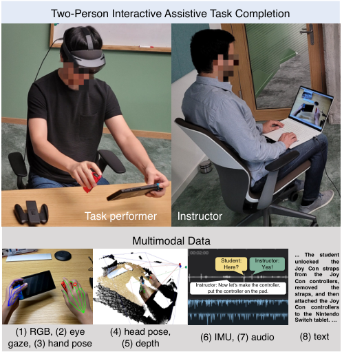
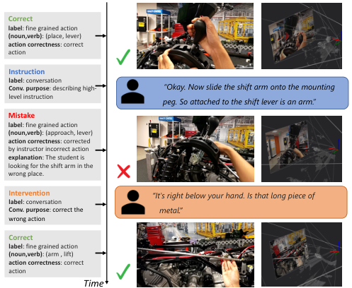
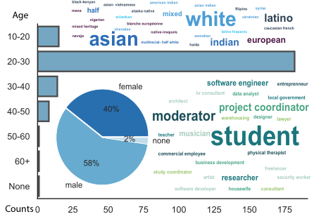
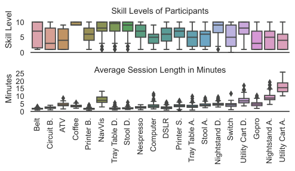
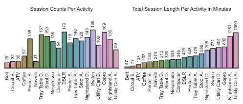
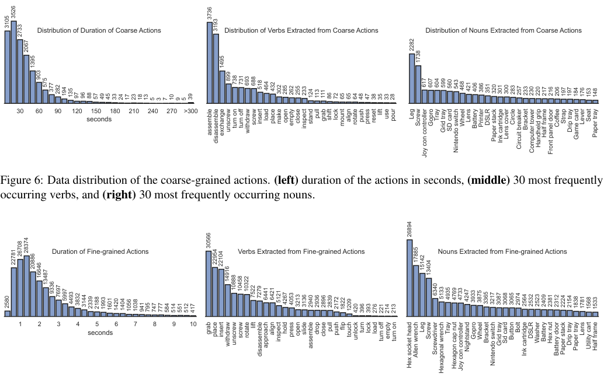
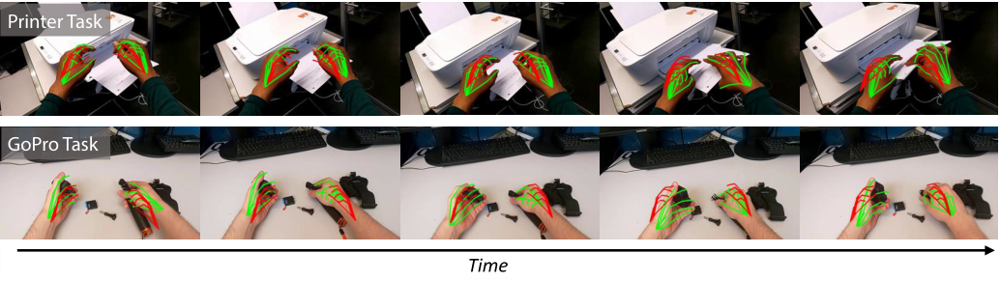

# 022_Wang_HoloAssist_an_Egocentric_Human_Interaction_Dataset_for_Interactive_AI_Assistants_ICCV_2023_paper

[Original PDF](../022_Wang_HoloAssist_an_Egocentric_Human_Interaction_Dataset_for_Interactive_AI_Assistants_ICCV_2023_paper.pdf)

Pages: 12

> Automatically converted from PDF. Check the original for exact equations, symbols, table alignment, and figure details.

<!-- Page 1 -->

This ICCV paper is the Open Access version, provided by the Computer Vision Foundation. Except for this watermark, it is identical to the accepted version; the final published version of the proceedings is available on IEEE Xplore. 

# **HoloAssist: an Egocentric Human Interaction Dataset for Interactive AI Assistants in the Real World** 

Xin Wang1_∗_ Taein Kwon1_,_2_∗_ Mahdi Rad1 Bowen Pan1_†_ Ishani Chakraborty1 Sean Andrist1 Dan Bohus1 Ashley Feniello1 Bugra Tekin1_†_ Felipe Vieira Frujeri1 Neel Joshi1 Marc Pollefeys1_,_2 1Microsoft 2 ETH Zurich 

## **Abstract** 

_Building an interactive AI assistant that can perceive, reason, and collaborate with humans in the real world has been a long-standing pursuit in the AI community. This work is part of a broader research effort to develop intelligent agents that can interactively guide humans through performing tasks in the physical world. As a first step in this direction, we introduce HoloAssist, a large-scale egocentric human interaction dataset, where two people collaboratively complete physical manipulation tasks. The task performer executes the task while wearing a mixed-reality headset that captures seven synchronized data streams. The task instructor watches the performer’s egocentric video in real time and guides them verbally. By augmenting the data with action and conversational annotations and observing the rich behaviors of various participants, we present key insights into how human assistants correct mistakes, intervene in the task completion procedure, and ground their instructions to the environment. HoloAssist spans 166 hours of data captured by 350 unique instructor-performer pairs. Furthermore, we construct and present benchmarks on mistake detection, intervention type prediction, and hand forecasting, along with detailed analysis. We expect HoloAssist will provide an important resource for building AI assistants that can fluidly collaborate with humans in the real world. Data can be downloaded at https://holoassist.github.io/._ 

<!-- Start of picture text -->
Two-Person Interactive Assistive Task Completion Task performer Instructor Multimodal Data ... The student Student:  Instructor:  unlocked the Here? Yes! Joy Con straps from the Joy Instructor: Now let's make the controller, put the controller on the pad. Conremovedstraps,controllers,and thenthe attached the Joy Con controllers to the Nintendo Switch tablet. … (1) RGB, (2) eye  (4) head pose, (6) IMU, (7) audio (8) text gaze, (3) hand pose (5) depth <!-- End of picture text -->

Figure 1: HoloAssist features a two-person interactive assistive task completion setting. The task performer wears an AR device and completes the tasks while the captured data is streamed over the network to a remote instructor watching it on the laptop. The instructor provides verbal guidance to the student. HoloAssist includes seven modalities captured live and human annotated text descriptions as the 8th modality. 

## **1. Introduction** 

Recent years have witnessed incredible progress in general-purpose AI agents that assist humans with various open-world tasks, especially in the digital world. AI systems powered by large language models (LLMs) like ChatGPT [27] can answer users’ questions and assist them with various text-based tasks. However, these AI assistants do not have sufficient first-hand experience in the physical world and thus cannot perceive world states and actively intervene 

*Co-first authors; _†_ Work done at Microsoft 

#### in the task completion procedure. 

Building an AI assistant that can perceive, reason and interact in the physical world has attracted attention from researchers across different fields in computer vision [7, 23, 37, 38], human-computer interaction [6, 8, 15, 29], robotics [5, 32], and industrial practitioners. For example, AR Guides [1], which aims to guide users to complete complex tasks, has become popular with the development of augmented reality (AR) devices. However, existing systems often rely on pre-defined instructions or formulate the virtual assistant as a question answering [37, 38] or video under- 

20270 <mark>1</mark>

<!-- Page 2 -->

standing problem [7, 23] without real-world interaction. 

In another line of work, researchers have developed simulation environments like Habitat [21, 36], VirtualHome [26], and AI2-Thor [17] to build AI agents that can interact with the physical world and collaboratively achieve new tasks [42]. Still, a large gap remains in transferring these agents to the real world, and the interaction between agents is largely simplified compared to real-world human interaction. 

In this work, we focus on the challenges of developing intelligent agents that share perspectives with humans and interactively guide human users through performing tasks in the physical world. As a first step, we introduce HoloAssist, a large-scale egocentric human interaction dataset to explore and identify the open problems in this direction. As shown in Figure 1, the task _performer_ wears an AR headset* to capture data while completing the tasks. An _instructor_ watches the real-time egocentric video feed remotely and verbally guides the performer. We have developed and open-sourced a data capture tool [3] using a distributed server-client setup to enable data streaming and multimodal data capture. 

HoloAssist contains 166 hours of data captured by 222 diverse participants forming 350 unique instructor-performer pairs and carrying out 20 object-centric manipulation tasks. The objects range from common electronic devices to rare objects in factories and specialized labs. The tasks are generally challenging for first-time participants, requiring instructor assistance for successful completion. Seven raw sensor modalities are captured, including RGB, depth, head pose, 3D hand pose, eye gaze, audio, and IMU, to aid in the understanding of human intentions, estimating world states, predicting future actions, and so on. Finally, the dataset is augmented with third-person manual annotations consisting of a text summary, intervention types, mistake annotation, and action segments of the videos as illustrated in Figure 2. 

We have observed several characteristics demonstrated by human instructors from HoloAssist. First, instructors are often proactive with precisely timed interventions. Instead of waiting until mistakes happen, instructors provide followup instructions when the task performer appears confused. Second, the verbal guidance from the instructors tends to be concise and grounded in the task performer’s environment. The instructions are often framed as spatial deictics to aid the task performer in spatial directions and distances in the 3D world. Moreover, instructors often have a good world model estimation and can detect whether mistakes disrupt task completion and then adjust the guidance. 

We take a step further and introduce new tasks and benchmarks on mistake detection, intervention type prediction, and 3D hand pose forecasting, which we conjecture are essential modules for an intelligent assistant. Additionally, we benchmark the dataset on action classification and anticipation tasks and provide empirical results to understand the role of 

*We use HoloLens 2 [2] for data capture in this work. 

<!-- Start of picture text -->
Correct label : fine grained action (noun,verb) : (place, lever) action correctness : correct action Instruction label : conversation Conv. purpose : describing high- “Okay. Now slide the shift arm onto the mounting level instruction peg. So attached to the shift lever is an arm.” Mistake label : fine grained action (noun,verb) : (approach, lever) action correctness : corrected by instructor incorrect action explanation : The student is looking for the shift arm in the wrong place. Interventionlabel : conversation “It's right below your hand. Is that long piece of Conv. purpose : correct the  metal.” wrong action Correct label : fine grained action (noun,verb) : (arm , lift) action correctness : correct action Time <!-- End of picture text -->

Figure 2: HoloAssist includes action and conversational annotations, in addition to text summaries of the videos, to indicate the mistakes and interventions in task completion. _mistake_ or _correct_ attributes are associated with each finegrained action. A purpose label is associated with every utterance to indicate the type of verbal intervention. 

different modalities in various tasks. We hope our dataset, findings, and tooling can inspire and provide rich resources for future work on designing interactive AI assistants and situated AI assistance applications in the real world. 

## **2. Related Work** 

Our work closely connects with several lines of work in computer vision, especially egocentric vision, embodied AI, and human-computer interaction. 

**Interactive AI assistants.** Building interactive agents that can assist humans to carry out tasks in the world—real or virtual—has been a long-standing problem in different areas of AI and HCI [6, 11, 15, 22, 25, 29, 30]. As far back as 1997, Johnson and Rickel introduced “Steve” [15], an early pedagogical agent that aims to help students learn procedural tasks in VR. Recent efforts have focused on new modeling approaches and data collection techniques for training conversational task guidance assistants, such as model-inthe-loop wizard-of-oz [22] and human-human interaction to mimic robot actions in simulated environments [25]. In this work, we revisit this problem and provide a systematic study of real-world human interaction, and we also provide rich sensor information to push the frontiers of the research. 

**Egocentric video datasets.** Egocentric perspectives often convey rich information about the users’ intentions. A shared perspective between the users and the human or AI assistants is useful for the assistants to provide more timely and grounded guidance. In computer vision, several egocentric video datasets [12, 14, 18, 20, 28, 31, 39] have emerged in 

20271

<!-- Page 3 -->

<!-- Start of picture text -->
Age menablack-kenyanmixed heritagenavajo halfnigerianasian- vietnamesecherokeesrilankanblanche européennealaska nativeamerican indiannative-iroquoismixed whitesomalianasian indian latino hispanicfilipinoukrainiansyriaccaucasian frenchlatino asian multiracial- half white haida indian european software engineer entreprenneur architect hr consultantproject coordinatordata analyst local government moderator warehousing designer lawyer teacher musician student commercial employee physical therapist business development study coordinator artist researcher freelancersecurity worker software developer housewife consultant Counts <!-- End of picture text -->

Figure 3: HoloAssist was collected by participants diverse in ages, occupations, genders, and geography. This helps us to study a diverse set of users with different backgrounds. 

the community. EPIC-KICHENS [12] is a widely adopted egocentric video dataset capturing kitchen activities. The recent Ego4D dataset [14] is the largest egocentric video dataset in the wild that provides a comprehensive database for egocentric perception in the 3D world. In contrast to earlier egocentric video datasets, HoloAssist features a multiperson interactive task completion setting, where human interaction during the procedure provides a rich source for designing AI assistants to be more proactive and grounded in the environment. Yet our work can benefit from the rich knowledge and representation learned from existing datasets like Ego4D and is complementary in nature. 

**Mistake detection.** One of the key observations in human interaction is that human assistants tend to correct mistakes and proactively intervene in the task completion procedure. While there has been a large body of work for video-based anomaly detection [24, 40, 43, 44], mistake detection in procedural settings has been under-explored. The Assembly101 dataset [31] proposes a mistake detection task to predict if a coarse-grained action segment is a mistake or correction. By contrast, HoloAssist emphasizes fine-grained actions since instructors may intervene when they spot a student’s mistake in an active intervention setting rather than wait until the whole step ( _i.e_ ., coarse-grained action) is completed. In addition, we propose a new intervention prediction task and, in combination, enable a more comprehensive understanding of interactions in an assistive task completion setting. 

**Multimodality and interaction.** Human interaction with the world is multimodal as we see, speak, and touch objects in the environment. In HoloAssist, we collect seven raw sensor modalities that might help understand humans’ intentions, estimate the world states, predict future actions, etc. Previous datasets [12, 14, 18, 39] often provide a limited subset of modalities. Although not every sensor may currently be relevant for the downstream tasks, the seven synchronized sensor modalities provided in HoloAssist will 

##### OBJECT SCALES OBJECT CATEGORIES 

|Small|GoPro, Nintendo Switch, DSLR|
|---|---|
|Medium|Portable printer, Computer, Nespresso machine|
|Big|Standalone printer, big coffee machine, IKEA fur- niture (stool, utility cart, tray Table, nightstand)|
|Rare|NavVis laser scanner, ATV motor cycle, wheel belt, circuit breaker|

Table 1: HoloAssist includes 16 objects with diverse scales. Apart from common objects used in daily life, HoloAssist includes rare equipment from mechanical labs. 20 tasks are object-centric manipulation tasks for each object and the 4 IKEA furniture has both assembly and disassembly tasks. 

give practitioners more potential for designing multimodal agents and models even beyond the scope of this work. **Embodied simulation platforms.** There is an emerging interest in embodied agents that can perceive, reason, and act in the 3D world. Researchers [17, 21, 26, 34, 36, 42] build various simulation environments to learn such embodied agents. IGLU [42] aims to build interactive agents that learn to solve a task while being provided with grounded natural language instructions in a collaborative environment based on Minecraft, a popular video game. HoloAssist complements this line of work by providing more realistic human interaction and real-world sensor perception. 

## **3. HoloAssist: Human Assistance Dataset** 

In this work, we introduce HoloAssist which features a two-person collaboration scenario and can be used to situate AI assistance in the physical world. We will start by describing the data collection and statistics in Section 3.1 and annotations in Section 3.2, before diving into the observations and benchmarks in the following sections. 

### **3.1. Data Collection and Statistics** 

**Tasks and objects.** We consider multi-step goal-oriented tasks involving 16 objects ranging from familiar objects often used in daily life to rare objects sometimes used in labs and factories as summarized in Table 1. We consider small electronics like a GoPro, DSLR camera, and Nintendo, office appliances like a Nespresso machine and printer, IKEA furniture, and objects in labs such as a laser scanner, motor cycle, and circuit breaker. We have designed 20 tasks involving physical manipulation of these objects, _e.g_ ., changing batteries, changing belts, furniture assembly, machine setup, etc. There is one task per object except for the IKEA furniture, which has assembly and disassembly tasks. Detailed task instructions are in supplementary materials. 

**Participants and collection procedure.** We recruited 222 participants to form 350 unique pairs of instructors and performers for data collection. Figure 3 shows the demograph- 

20272

<!-- Page 4 -->

<!-- Start of picture text -->
Skill Levels of Participants 10 5 0 25 Average Session Length in Minutes 20 15 10 5 0 Skill Level Minutes Belt Circuit B. ATV Coffee Printer B. NavVis Tray Table D. Stool D. Nespresso Computer DSLR Printer S. Tray Table A. Stool A. Nightstand D. Switch Utility Cart D. Gopro Nightstand A. Utility Cart A. <!-- End of picture text -->

Figure 4: The skill level of participants (0-10) for the tasks is self-reported by the participants. The skill levels roughly reflect the length of the sessions though they might be noisy. 

ics of the participants. Before data collection, the participants review the IRB forms to acknowledge the privacy and ethics standards (more details in supplementary materials). The instructors are informed about the task in detail. The participants playing the role of performers are only given a rough description of the tasks and scenarios beforehand and interacted with the objects based on their understanding. The instructors provide verbal guidance as the performers set out to complete the tasks. 

In Figure 4 (top), we show the distribution of the performers’ familiarity with the tasks measured by a self-reported score (0-10) by the participants. We show the average length and the outliers of the recorded sessions in Figure 4 (bottom) to give a rough idea of how the participant’s skill levels may lead to increased session variance. The participants’ diverse skill levels and backgrounds provide rich information about the user behaviors and diverse interaction between the instructors and performers. 

**Data capture tool.** We leveraged the Platform for Situated Intelligence framework [10] to develop and open-source a distributed application for data capture using HoloLens 2 [3]. A client process running on the device captured the sensor data while displaying a rectangular hologram frame around the user’s visual field of view to guide their attention downward and keep the task actions in view of the sensors. Sensor data was streamed live over the network to a server application that ran on a PC and persisted the data to disk. This distributed setup allows for collecting longer uninterrupted sessions without reaching the device storage capacity limits. 

**Comparison with other datasets.** While there is no direct comparison of datasets with the same setup with HoloAssist, we list out different aspects of our dataset and compare it with related datasets in Table 2. HoloAssist is among the largest egocentric video datasets and features a multi-person collaboration setting, which is a unique addition to the field. In addition, HoloAssist relates to work on multi-agent collab- 

<!-- Start of picture text -->
Session Counts Per Activity Total Session Length Per Activity in Minutes 138 157 150 126 94 170 119 140 128 145 180 108 169 136 86 706 771 804 832 1251 1390 25 32 30 57 31 47 77 137 207 244 274 313 320 333 346 428 448 479 556 Belt Circuit B. ATV Coffee Printer B. NavVis Tray Table D. Stool D. Nespresso Computer DSLR Printer S. Tray Table A. Stool A. Nightstand D. Switch Utility Cart D. Gopro Nightstand A. Utility Cart A. Belt Circuit B. ATV Coffee Printer B. NavVis Tray Table D. Stool D. Nespresso Computer DSLR Printer S. Tray Table A. Stool A. Nightstand D. Switch Utility Cart D. Gopro Nightstand A. Utility Cart A. <!-- End of picture text -->

Figure 5: Data distribution of 166 hours captured by HoloAssist. **(left)** number of sessions per activity, and **(right)** total length of sessions in minutes. 

|Dataset|Settings|Collaborative &Interactive|Instructional &Procedural|# real video hours|
|---|---|---|---|---|
|Epic-Kitchen-100 [12]|Cooking|✗|✗|100|
|Assembly101 [31]|Toy assembly|✗|✓|167|
|Ego4D [14]|Daily-life task|+|+|3,670|
|VirtualHome [26]|Household task|✗|✓|§|
|ALFRED [33]|Household task|✗|✓|§|
|Habitat [36]|Home assistance|✗|✓|§|
|BEHAVIOR [34]|Daily-life task|✓|✓|§|
|IGLU [16]|Collaborative building*|✓|✓|§|
|TEACh [25]|Household task|✓|✓|§|
|HoloAssist (ours)|Assistive task|✓|✓|166|

Table 2: **Comparison to related datasets and simulation platforms.** HoloAssist features a multi-person collaborative setting which is a unique addition to existing egocentric datasets in the real world. HoloAssist provides a set of instructional and procedure videos with multi-turn dialogues. Procedure tasks are defined as following a set of defined steps or procedures to achieve a specific goal, deviation from the procedure can be construed to be a mistake. HoloAssist spans 166 hours and 2,221 sessions. §: simulation, *: Minecraft-like, +: partially included. 

orative simulation environments with a distinct characteristic of real-world sensor data and real-world human interaction. 

### **3.2. Annotations** 

To better understand the actions and interactions in the dataset, we provide several sets of third-person manual annotations for text summaries, action segments, mistake attributes, and intervention attributes. 

**Language annotations.** We asked the annotators to watch the video and write a paragraph to describe the activities in the videos. The description focuses on describing the hand actions in the procedure. The third-person post hoc summary provides insights into the key moments during the interactive task completion. These could be used to build a comprehensive set of instructions for task completion. We 

20273

<!-- Page 5 -->

<!-- Start of picture text -->
Distribution of Duration of Coarse Actions Distribution of Verbs Extracted from Coarse Actions Distribution of Nouns Extracted from Coarse Actions 30 60 90 120 150 180 210 240 270 >300 seconds Figure 6: Data distribution of the coarse-grained actions. (left)  duration of the actions in seconds,  (middle)  30 most frequently occurring verbs, and  (right)  30 most frequently occurring nouns. Duration of Fine-grained Actions Verbs Extracted from Fine-grained Actions Nouns Extracted from Fine-grained Actions 1 2 3 4 5 6 7 8 9 10 seconds 3526 3736 3105 3193 2733 2067 2282 1738 1395 1495 903 575 377 282 194 135 97 96 88 57 49 45 33 24 17 23 18 13 5 3 7 10 9 5 39 899 738 731 693 688 518 464 432 302 285 262 255 233 124 113 111 86 72 65 65 64 48 47 38 35 33 28 617 607 604 599 560 543 468 421 406 386 351 320 301 300 283 257 233 230 220 217 216 206 197 197 184 176 153 148 assemble disassemble exchange unscrew turn on turn off withdraw screw insert load place make open empty close inspect stand pullgrabshift lock mount align rotate push press reset lift use pour LegScrew Joy con controllerGoproTrayGrid traySD card Nintendo switch Wheel Lens BatteryPrinter DSLR Paper stackInk cartridgeLens cover Circle Circuit breaker Bracket Computer towerHandheld gripHalf frame Front panel doorCoffee StrapDrip trayGame card Lever Seat Paper tray 26894 30566 26708 28374 22781 20886 22954 22104 17885 15142 16646 13404 13487 14916 2580 9336 7697 5997 4493 3832 3144 2339 2188 1993 1601 1420 1404 1056 1038 941 795 747 777 584 514 551 512 417 10888 10458 10322 7522 7279 6441 6421 5121 4267 4053 3213 3136 2940 2936 2896 2839 2172 1822 1209 420 396 393 276 221 214 213 6340 5133 4935 4769 4733 4247 3933 3875 3365 3217 3087 3068 3065 2974 2564 2532 2523 2409 2381 2312 2224 2154 1838 1781 1568 1533 grab place insert withdraw unscrew screw rotate lift disassemble approach align inspect hold press open slide assemble drop close pull push flip touch unlock turn lock load turn off empty turn on Hex socket head Allen wrench LegScrew Screwdriver Hexagonal wrench Tray Hexagon cap nut Joy con controller Nightstand Gopro Wheel Bracket Nintendo switch Grid traySd card Button Bolt Ink cartridgeDSLR Washer Battery Hex nut Battery door Paper stack Drip tray Paper tray Lens Utility cartHalf frame <!-- End of picture text -->

Figure 7: Data distribution of the fine-grained actions. **(left)** duration of the actions in seconds, **(middle)** 30 most frequently occurring verbs, and **(right)** 30 most frequently occurring nouns. We can see that most fine-grained actions last less than 2 seconds, and there is a long tail distribution in actions, verbs, and nouns. 

also provide the transcriptions of the conversations in the video. With this set of annotations, we can understand the difference between third-person post hoc summaries and real-time conversations during the activities. More examples are in supplementary materials. 

**Coarse-grained action annotations.** The coarse actions usually describe a high-level step in the task ( _e.g_ ., _change battery of a GoPro_ in the GoPro set up task) and can be divided into multiple fine-grained actions. To deal with the open-world setting, we ask the annotators to write a sequence ( _e.g_ ., _man changes the battery of GoPro_ ) to describe the coarse actions and also identify the active verb-noun pair and optionally an adjective for the noun for benchmarking purposes ( _e.g_ ., _change battery_ ). The dataset includes 414 coarse-grained actions with 90 nouns and 39 verbs. The distribution of the actions follows a long-tail distribution shown in Figure 6, where 185 actions are considered head classes while the rest are considered tail classes according to the action frequency for evaluation purposes. 

**Fine-grained action annotations.** Fine-grained actions are the low-level atomic actions ( _e.g_ ., _press button_ , _grab screw_ , etc.) for completing a step in the task, usually lasting for 1-2 

seconds. The fine-grained actions are presented in a verb(adj.)-noun pair format. There are 1887 fine-grained actions with 165 nouns and 49 verbs. For a more comprehensive evaluation, we create a split of head actions with 1082 top actions and 805 tail actions. Distributions of fine-grained actions are shown in Figure 7. 

As mentioned earlier, noun and verb vocabularies are not pre-defined but gradually built through annotation. We ask the annotators to enter a new verb and noun if they cannot find it in the vocabulary. After the data is annotated, we ask the annotators to revisit and check the tail classes and see if they are repetitive to head classes. Due to the open-world nature, some verb and noun combinations might be interchangeable with others in the list. We show some examples in the supplementary materials. 

**Mistake annotation.** Each fine-grained action is labeled as either _correct_ or _mistake_ , as indicated in Figure 2. Mistakes include the ones that are “self-corrected by the task performers”, are “verbally corrected by the instructors”, and “are not corrected labeled”. Our human annotators annotate all three mistake types separately, but for benchmark evaluation, we will consolidate them into one mistake class. 

20274

<!-- Page 6 -->

IMMEDIATE INTERVENTION LAZY INTERVENTION 

|insert screw|drop allen wrench|
|---|---|
|approach button|drop hex socket head|
|insert joy con controller|drop screw|
|place tray|screw hex socket head|
|pull battery door|screw screw|

Table 3: Top mistakes that are corrected immediately **(left)** or later and sometimes through self-correction **(right)** . 

We defer the detailed study of differentiating whether and how the mistakes are corrected to future work. To ensure the annotation quality, we additionally ask the third-person annotators to explain why the action is a mistake and also assign a mapping to every mistake that is corrected by an instructor verbally to the conversation sentence whose type is “instructor correcting mistakes”. 

**Intervention annotation.** Since instructors assist the task performers verbally, we annotate the conversation between the instructors and performers to reflect the interventions in task completion. We annotate each conversation sentence with two attributes to indicate the conversation types and the conversation initiator. The conversation initiators can either be the “task performer” or the “instructor”. And the sentence purpose types can be the instructor “correcting mistakes”, “answering questions”, “following up with more instructions”, “confirming previous actions”. “describing the high-level task”, “opening/closing remarks”, or the task performer starting the conversation to ask questions. We asked human annotators to watch the videos and use their best judgment to annotate the roles of different conversations in the videos. 

In our benchmarks, we consider 3 intervention types: _correcting mistakes_ , _following up with more instructions_ , and _confirming the previous action_ as they are more related to physical actions in the task procedure. Figure 2 shows examples of conversational interventions. More examples can be found in the supplementary materials. 

**Audit process.** Annotations are done by professional annotators based on the following process. The annotators first take a pass on the video to add the fine-grained actions, coarsegrained actions, conversation, and text summary, along with the associated annotation elements for each event. After self-review, the annotated data is passed to an independent reviewer for auditing, and the mistakes are fixed directly or sent back to the original annotator for updates. The annotations finally go through a targeted review to check the open-ended text fields like narration, action sentences, and conversation transcriptions to ensure consistency. Before the annotations were delivered, we applied a list of constraints to systematically check the annotations to further dig out the wrong annotations. 

**Spatial deixis from the intervention transcripts** “You should press the button that’s on the body of the camera just at the right of the lens.” “You should leave the bolt, like it was before.” “The button is on the other side of the Switch.” “The SD card comes from the right slot, on the right hand side and it opens by using a knob next to the screen on the right bottom side of the screen.” “Currently the tray is facing <u>you, please rotate so the back is</u> facing you.” 

“You should put it the other way around. It’s upside down.” “Please start by removing the screw of the top shelf first.” “And now, ehm, it is, it should be the other one that should be on top of the other.” 

“To the right of that, there is a tiny little square.” 

Table 4: Examples of deictic phrases that help in grounded guidance by specifying contextual spatial locations. 

## **4. Observations and Tasks from HoloAssist** 

Here we present observations from HoloAssist in Section 4.1 and identify a few open problems that are necessary components for an interactive AI assistant. In Section 4.2, we define new tasks and benchmarks with HoloAssist. 

### **4.1. Observations from HoloAssist** 

**Correlation between mistakes and intervention.** We find that the response time for the human assistant to intervene in the procedure and correct mistakes depends on the severity level of the mistakes. If mistakes are critical, the instructors proactively interrupt the student immediately (within less than 5 seconds duration) while other mistakes are either selfcorrected by the task performer or corrected later by the instructor. 

In Table 3, we present the top actions that need immediate intervention and the top actions that are self-corrected by the task performers or corrected later by the instructors. We notice that actions related to linear tasks, where the task progression is stalled if steps are not followed in order, are often intervened immediately by the instructors. For example, “insert joy con controller”, and “place tray” etc. In contrast, the lazily edited corrections are related to furniture assembly such as the actions “drop allen wrench”, “drop hex socket head”, etc. These are tasks where mistakes are unclear in every stage, and the user often intuitively adjusts their steps. **Grounded guidance.** We also notice that the instructions from human instructors are often grounded in the 3D environment. An important aspect of grounded guidance is the 

20275

<!-- Page 7 -->

ability to communicate about the physical world by pointing to things in context. Spatial deixis refers to phrases that are used to locate things in space and to express direction and distance. The deictic analysis of the transcripts in HoloAssist reveals a wide set of words that indicate specific and relative locations and directions, especially during interventions to correct mistakes. A list of some prominent examples is shown in Table 4. 

### **4.2. Benchmark Tasks** 

Inspired by the observations above, we think it is important for an interactive AI assistant to have a good world state estimation model that can detect mistakes and predict whether to intervene in the task procedure. Besides, augmenting instructions with spatial guidance can be useful for AI agents. To this end, we introduce new mistake detection, intervention prediction and 3D hand pose forecasting tasks for interactive and grounded guidance. Additionally, we benchmark models on action recognition tasks following the convention in [12]. 

**Mistake detection** is defined following the convention [31] but applied to fine-grained actions in our benchmark. We take the features from the fine-grained action clips from the beginning of the coarse-grained action until the end of the current action clip, and the model predicts a label from _{correct, mistake}_ . The task is challenging given that the class distribution is highly skewed, with around 6% mistakes among the fine-grained actions. 

**Intervention type prediction** is to predict the intervention types given an input of a window of 1, 3, or 5 seconds before the intervention. This newly proposed benchmark is to test if the model can correctly figure out the correct intervention types during task completion. Currently, HoloAssist includes 3 intervention types, and we report the precision and recall of each intervention type. 

**3D hand pose forecasting** is another new benchmark introduced by HoloAssist. Existing action forecasting work [12] mostly focuses on providing semantic labels of future actions and does not provide explicit 3D guidance on hand poses. Predicting 3D hand poses can be useful for various applications [4], and it can augment instructions and spatially guide users in different tasks. In this benchmark, we take 3 seconds inputs similar to other 3D body location forecasting literature [41] and forecast the continuous 3D hand poses for the next 0.5, 1.0, and 1.5 seconds. The evaluation metric is the average of mean per joint position error over time in centimeters compared to ground truth. To have a proper evaluation metric that can help 3D action guidance, we remove the mistakes from the action sequences and only forecast 3D hand pose for the correct labels. 

## **5. Experiments** 

In this section, we provide the evaluation results of the proposed benchmarks. We will start with the standard action recognition benchmarks, and then we will present the results of the newly proposed benchmarks. We also provide ablations of different sensor modalities to understand the roles of different sensors in various tasks. We hope the baseline results can guide future research in this space. 

**Implementation details.** We adopt TimeSformer [9], a state-of-the-art vision transformer (ViT) [13] based video model, as the backbone and change the head with a different number of classes for different benchmarks. We modify the original TimeSformers to perform multimodal learning by introducing additional tokens for different modalities and embedding layers to encode the additional sensor modalities. Specifically, we use 26 _×_ 2 tokens for both left and right hands (one token for one hand joint), one token for eye gaze, one token for head poses, and 196 tokens for depth. We can enable and/or disable different modalities during training and evaluation. Detailed configurations are available in supplementary materials. Note that we consider the resulting model a vanilla multimodal model and serve as a baseline for future studies. 

We randomly split the 2221 sessions into train, validation, and test sets following a ratio of 70%, 10%, and 20% on a per-task basis, which includes 1545 sessions for training, 213 sessions for validation, and 463 sessions for testing. We also synchronize all the modalities according to the video stream and keep the frame rate at 30 fps by sub-sampling other modalities in our experiments. 

During training, the model is trained for 15 epochs with an initial learning rate of 0.01 and a batch size of 64 using stochastic gradient descent. We divide the learning rate by 10 at the epoch 11 and 14. For each input segment, we randomly sample 8 frames/data points within the segment. We train our models with 4xA6000 GPU machines, and the fine-grained action recognition runs usually take about one day. We also train the model with random initialization and an ImageNet pre-trained ViT backbone. 

For our hand pose forecasting benchmark, which is a regression task, we adopt Seq2Seq model [35] following [19]. **Action recognition.** We show the fine-grained action recognition results in Table 5 and the coarse-grained action recognition results in Table 6. We can see that initialized with a pre-trained ViT model on ImageNet; all models can achieve around 35% top-1 accuracy on fine-grained action recognition and 50% top-1 accuracy on coarse-grained action recognition. This is comparable to baselines of other fine-grained action benchmarks [31] (23% top-1 accuracy), 

We notice that the pre-trained model on ImageNet may reduce the influence of other modalities that are not pretrained. If trained from scratch, we can see from Table 5 

20276

<!-- Page 8 -->

||Mods.|A Top1 / 5 Act|ll Classes Accu Top1 / 5 Verb|racy  Top1 / 5 Noun|He   Top1 / 5 Act|ad Classes Acc  Top1 / 5 Verb|uracy Top1 / 5 Noun|Ta Top1 / 5 Act|il Classes Accu  Top1 / 5 Verb|racy Top1 / 5 Noun|
|---|---|---|---|---|---|---|---|---|---|---|
||RGB|34.83/68.60|42.14/78.96|66.81/90.04|35.26/69.34|42.56/79.53|67.19/90.36|0.03/0.17|10.86/36.33|38.01/66.48|
|ned|Hands|20.86/43.92|35.38/65.76|37.10/63.42|21.13/44.50|35.72/66.30|37.50/64.06|0.00/0.01|10.11/25.47|7.30/15.54|
|trai|R+H|35.06/68.95|42.45/79.42|67.05/90.01|35.49/69.71|42.87/80.03|67.43/90.32|0.03/0.16|11.05/33.71|38.39/66.85|
|Pre|R+H+E|35.27/68.69|42.92/79.11|67.03/89.96|35.72/69.42|43.33/79.67|67.45/90.29|0.03/0.18|11.99/37.64|35.96/65.17|
||R+H+E+I|34.80/68.26|42.24/78.88|66.65/89.76|35.23/69.00|42.63/79.46|67.03/90.08|0.03/0.17|12.92/35.96|38.20/65.17|
|ch|RGB|18.78/48.09|28.45/65.43|43.72/73.69|19.03/48.72|28.74/66.00|44.09/74.21|0.00/0.01|6.55/22.66|15.73/34.27|
|crat|Hands|23.94/47.58|39.79/68.76|39.34/65.76|24.26/48.21|40.18/69.30|39.79/66.43|0.00/0.00|10.67/28.65|5.62/16.29|
|S R Tabl mod start How       l we c Sim|GB + Eye e 5: **Fin** els on H ing from ever, wi      l an see th ply conc|s 20.86/50.27 **e-grained ac** oloAssist. H  a pre-train th a pre-train    l at adding ha atenating mo|30.92/67.59 **tion recogn** ereR,H,I  ed ViT mod ed image mo  l nds can impr re sensors a|45.28/75.29 **ition bench** denote RGB el on Image del, the influ ove the predi s inputs may|21.13/50.93 **mark results** , hands, and Net, all the  lence of othe ction ofver not necessar|31.22/68.20 **.** We report head pose ( models hav l  r modalities bsand lead ily lead to i|45.65/75.80 baseline resu whose senso e higher perf l    is reduced. I to better resu mproved perf|0.00/0.01 lts of (mult r source is ormance th f the model lts than the ormance.|8.05/21.72 imodal) Tim similar as I an training  s are trained baselineRG|17.60/37.08 eSformer [9] MUs). When from scratch from scratch, Bonly model|
|||All|Classes Accur|acy|Hea|d Classes Accu|racy|Ta|il Classes Accu|racy|
||Mods.|Top1 / 5 Act |Top1 / 5 Verb|Top1 / 5 Noun|Top1 / 5 Act|Top1 / 5 Verb|Top1 / 5 Noun|Top1 / 5 Act|Top1 / 5 Verb|Top1 / 5 Noun|
||RGB|50.91/86.89|60.51/93.45|73.35/95.90|53.40/89.53|62.78/95.39|75.00/96.70|0.37/2.24|20.00/58.89|43.89/81.67|
|ned|Hands|22.20/54.16|35.12/72.34|37.43/68.33|23.44/57.08|36.75/75.25|38.84/70.45|0.00/0.12|6.11/20.56|12.22/30.56|
|trai|R+H|50.80/86.54|59.71/93.36|73.20/95.78|53.27/89.12|61.94/95.20|75.09/96.57|0.37/2.28|20.00/60.56|39.44/81.67|
|Pre|R+H+E|50.35/85.51|58.85/93.21|73.67/95.63|52.65/88.03|60.85/94.89|75.28/96.32|0.53/2.28|23.33/63.33|45.00/83.33|
||R+H+E+I|50.18/86.07|59.00/93.21|73.64/96.25|52.49/88.78|61.22/95.07|75.41/96.91|0.50/2.12|19.44/60.00|42.22/84.44|

Table 5: **Fine-grained action recognition benchmark results.** We report baseline results of (multimodal) TimeSformer [9] models on HoloAssist. Here R, H, I denote RGB, hands, and head pose (whose sensor source is similar as IMUs). When starting from a pre-trained ViT model on ImageNet, all the models have higher performance than training from scratch. However, with a pre-trained image model, the influence of other modalities is reduced. If the models are trained from scratch, we can see that adding hands can improve the prediction of verbs and lead to better results than the baseline RGB only model. Simply concatenating more sensors as inputs may not necessarily lead to improved performance. 

Table 6: **Coarse-grained action recognition results.** The overall trend is similar to fine-grained action recognition. 

|Mods.|F-score|Corr Precision|ect Recall|Mista Precision|ke Recall|
|---|---|---|---|---|---|
|Random|27.71|60.87|10.22|15.00|46.15|
|RGB|35.11|82.56|51.82|12.96|26.92|
|Hands|40.19|92.68|52.41|12.5|31.25|
|R+H|36.18|85.51|43.07|9.68|11.54|
|R+H+E|32.08|88.57|42.76|11.43|50.00|

Table 7: **Mistake detection results.** Similar to action recognition, adding hand poses to RGB (R+H) improves an RGBonly model from 35.11 to 36.18 points. What’s different is that we find the hands only model outperforms other modalities in mistake detection, achieving 40.19 points. 

(bottom) that adding hands can improve the prediction of verbs and lead to better results than the RGB-only model. **Mistake detection.** In Table 7† , we present the results of mistake detection where the features are extracted from the pre-trained action recognition models shown in Table 5. Here we find the hand poses information benefits the task and outperforms the other modalities. 

**Intervention type prediction.** For intervention prediction, 

†Evaluated on 10% of the entire data 

|Mods.|Ov Prec.|erall  Recall|Confir Prec.|im Action Recall|Correct Prec.|Mistake Recall|Follo Prec.|w-up  Recall|
|---|---|---|---|---|---|---|---|---|
|RGB|13.93|33.33|0.00|0.00|0.00|0.00|41.79|100|
|R+H|24.89|33.64|32.14|4.50|0.00|0.00|42.52|96.43|
|R+E|25.55|33.73|33.90|10.36|0.00|0.00|42.76|90.83|
|R+H+E|48.31|37.59|39.11|40.93|61.11|9.91|44.7|61.93|
|RGB(Pt)|37.54|37.74|42.31|27.50|27.33|36.61|42.97|49.11|

Table 8: **Intervention type prediction results.** The classes in benchmark are highly skewed. Here E refers to eye gaze. We can see the predictions of the baseline models ( _i.e_ ., RGB,R+H, R+E) favor predicting follow-up instructions while ignoring correcting mistakes (recall is 0). Training more modalities (R+H+E) alleviates this issue and even outperforms the RGB model (RGB(Pt)) in overall precision. 

we show the results in Table 8† . We can see adding hands and eye gaze (R+H+E) can significantly boost the overall precision and recall to 48.31% and 37.59%, improving about 35 and 4 percentage points over RGB. This may be because eye gaze is a forecasting signal, as people often look at the regions before the action starts, which can assist the models to attend to important regions for better anticipation. 

20277

<!-- Page 9 -->

<!-- Start of picture text -->
Printer Task GoPro Task <!-- End of picture text -->

Figure 8: **Qualitative visualization for 3D hand pose forecasting** . We visualize the ground-truth hand joint positions ( _i.e_ ., hand pose, visualized in Green) and the prediction of the hand pose for the next 1.5 seconds (visualized in Red). The input to the model is a 3-second long clip ahead of the prediction. The task is challenging as hands often move quickly. As we can see from the figure, the predicted hand pose is more off from the grounded truth in the longer future. 

|Mods.|Mean Er 0.5 sec|ror Distance ( 1.0 sec|cm,_↓_) 1.5 sec|
|---|---|---|---|
|Static-H|9.34|13.91|16.70|
|Hands|9.80|10.68|11.25|
|H+E|9.80|10.70|11.25|
|H+E+I|9.80|10.69|11.25|
|R+H+E|9.73|10.65|11.22|
|R+H+E+I|9.72|10.62|11.19|

Table 9: **3D hand pose forecasting benchmark results.** We report the mean per joint position error for 0.5 1.0, 1.5 seconds (lower the better). The static hand baseline (Static-H) refers to using the last frame of the input. The Seq2Seq [35] model trained using hands only H, and using only hand H achieves better results than Static-H. 

**3D hand pose forecasting.** Table 9 shows that given only the 3D poses of hands as input, the model can perform with the accuracy of 9.80, 10.68, and 11.25 centimeters, the average of mean per joint position error, for 0.5, 1, and 1.5 seconds, respectively. We should note that this task is challenging as hands can move quickly within a window of 0.5 seconds. Compared to static-H, which uses the last 3D hand pose, our baseline (H) already outperforms it. In Figure 8, we show the visualization of the hand pose forecasting. 

**Importance of hand poses and eye gaze.** As we can already see from the Tables 5, 7, 8, 9, the 3D hand poses and eye gaze can help the model prediction to recognize actions, detect mistakes, and understand users’ intentions. These modalities can augment the commonly used RGB images for better performance. Simply concatenating more modalities (e.g., depth, head poses) as inputs may not necessarily lead to a more capable model, as those modalities may need specialized encoders or model architectures to process them simultaneously. We believe HoloAssist will enable and foster further research in multi-modal learning in this direction. 

## **6. Conclusion and Future Work** 

In this work, we identified and explored several important problems with building an interactive AI assistant in the physical world. We introduced a large-scale multimodal egocentric video dataset, HoloAssist, containing rich information about human interaction in an assistive task completion setting. The task performer wears a HoloLens 2 headset while completing various object-centric manipulation tasks. The real-time video feed from the headset is sent to a remote instructor who provides verbal guidance to the task performer. HoloAssist captures seven raw sensor modalities during the interaction, and among them, we found hand pose and eye gaze are useful information sources for an interactive AI agent. By augmenting the data with additional third-person manual annotations on action segments, mistakes, and intervention types, we constructed new benchmarks on mistake detection, intervention type prediction, and 3D hand pose forecasting, which we believe is a necessary component for an interactive and grounded AI assistant. As a first step in this direction, this work also leaves room for future work to improve upon ( _e.g_ ., annotating object poses in the data, investigating object-centric models of affordance and manipulations in AI assistance, etc.). We believe HoloAssist, coupled with the associated benchmarks and tooling will benefit future research into building competent AI assistants for everyday tasks in the real world. 

### **Acknowledgement** 

We thank all the 222 data collectors who participated in the study and acknowledge the hard work of the annotation team led by Megan Yuan and Dan Luo from DataTang Technology Inc. We thank Nick Saw for the help in the data collection software and Yale Song and Vibhav Vineet from the Computer Vision Group at Microsoft Research for the early discussion. We also thank the feedback from colleagues at MSR. 

20278

<!-- Page 10 -->

## **References** 

- [1] Microsoft dynamics 365 guides. https://dynamics. microsoft.com/en-us/mixed-reality/ guides/. 1 

- [2] Microsoft hololens. https://www.microsoft.com/ en-us/hololens. 2 

- [3] Platform for situated intelligence hololens capture tools. https://github.com/microsoft/ psi/tree/master/Sources/MixedReality/ HoloLensCapture. 2, 4 

- [4] Michael Ahn, Anthony Brohan, Noah Brown, Yevgen Chebotar, Omar Cortes, Byron David, Chelsea Finn, Chuyuan Fu, Keerthana Gopalakrishnan, Karol Hausman, Alex Herzog, Daniel Ho, Jasmine Hsu, Julian Ibarz, Brian Ichter, Alex Irpan, Eric Jang, Rosario Jauregui Ruano, Kyle Jeffrey, Sally Jesmonth, Nikhil Joshi, Ryan Julian, Dmitry Kalashnikov, Yuheng Kuang, Kuang-Huei Lee, Sergey Levine, Yao Lu, Linda Luu, Carolina Parada, Peter Pastor, Jornell Quiambao, Kanishka Rao, Jarek Rettinghouse, Diego Reyes, Pierre Sermanet, Nicolas Sievers, Clayton Tan, Alexander Toshev, Vincent Vanhoucke, Fei Xia, Ted Xiao, Peng Xu, Sichun Xu, Mengyuan Yan, and Andy Zeng. Do as i can and not as i say: Grounding language in robotic affordances. In _arXiv preprint arXiv:2204.01691_ , 2022. 7 

- [5] Michael Ahn, Anthony Brohan, Noah Brown, Yevgen Chebotar, Omar Cortes, Byron David, Chelsea Finn, Keerthana Gopalakrishnan, Karol Hausman, Alex Herzog, et al. Do as i can, not as i say: Grounding language in robotic affordances. _arXiv preprint arXiv:2204.01691_ , 2022. 1 

- [6] Gregory Aist, John Dowding, Beth Ann Hockey, Manny Rayner, James Hieronymus, D Bohus, B Boven, Nate Blaylock, Ellen Campana, S Early, et al. Talking through procedures: An intelligent space station procedure assistant. In _Proceedings of the tenth conference on European chapter of the Association for Computational Linguistics-Volume 2_ , pages 187–190, 2003. 1, 2 

- [7] Jean-Baptiste Alayrac, Piotr Bojanowski, Nishant Agrawal, Ivan Laptev, Josef Sivic, and Simon Lacoste-Julien. Unsupervised learning from narrated instruction videos. In _Computer Vision and Pattern Recognition (CVPR)_ , 2016. 1, 2 

- [8] Sean Andrist, Michael Gleicher, and Bilge Mutlu. Looking coordinated: Bidirectional gaze mechanisms for collaborative interaction with virtual characters. In _Proceedings of the 2017 CHI conference on human factors in computing systems_ , pages 2571–2582, 2017. 1 

- [9] Gedas Bertasius, Heng Wang, and Lorenzo Torresani. Is space-time attention all you need for video understanding? In _ICML_ , volume 2, page 4, 2021. 7, 8 

- [10] Dan Bohus, Sean Andrist, Ashley Feniello, Nick Saw, Mihai Jalobeanu, Patrick Sweeney, Anne Loomis Thompson, and Eric Horvitz. Platform for situated intelligence, 2021. 4 

- [11] Dan Bohus and Alexander I Rudnicky. Larri: A languagebased maintenance and repair assistant. _Spoken multimodal human-computer dialogue in mobile environments_ , pages 203– 218, 2005. 2 

- [12] Dima Damen, Hazel Doughty, Giovanni Maria Farinella, Antonino Furnari, Jian Ma, Evangelos Kazakos, Davide Molti- 

   - santi, Jonathan Munro, Toby Perrett, Will Price, and Michael Wray. Rescaling egocentric vision: Collection, pipeline and challenges for epic-kitchens-100. _International Journal of Computer Vision (IJCV)_ , 130:33–55, 2022. 2, 3, 4, 7 

- [13] Alexey Dosovitskiy, Lucas Beyer, Alexander Kolesnikov, Dirk Weissenborn, Xiaohua Zhai, Thomas Unterthiner, Mostafa Dehghani, Matthias Minderer, Georg Heigold, Sylvain Gelly, et al. An image is worth 16x16 words: Transformers for image recognition at scale. _arXiv preprint arXiv:2010.11929_ , 2020. 7 

- [14] Kristen Grauman, Andrew Westbury, Eugene Byrne, Zachary Chavis, Antonino Furnari, Rohit Girdhar, Jackson Hamburger, Hao Jiang, Miao Liu, Xingyu Liu, Miguel Martin, Tushar Nagarajan, Ilija Radosavovic, Santhosh Kumar Ramakrishnan, Fiona Ryan, Jayant Sharma, Michael Wray, Mengmeng Xu, Eric Zhongcong Xu, Chen Zhao, Siddhant Bansal, Dhruv Batra, Vincent Cartillier, Sean Crane, Tien Do, Morrie Doulaty, Akshay Erapalli, Christoph Feichtenhofer, Adriano Fragomeni, Qichen Fu, Christian Fuegen, Abrham Gebreselasie, Cristina Gonzalez, James Hillis, Xuhua Huang, Yifei Huang, Wenqi Jia, Weslie Khoo, Jachym Kolar, Satwik Kottur, Anurag Kumar, Federico Landini, Chao Li, Yanghao Li, Zhenqiang Li, Karttikeya Mangalam, Raghava Modhugu, Jonathan Munro, Tullie Murrell, Takumi Nishiyasu, Will Price, Paola Ruiz Puentes, Merey Ramazanova, Leda Sari, Kiran Somasundaram, Audrey Southerland, Yusuke Sugano, Ruijie Tao, Minh Vo, Yuchen Wang, Xindi Wu, Takuma Yagi, Yunyi Zhu, Pablo Arbelaez, David Crandall, Dima Damen, Giovanni Maria Farinella, Bernard Ghanem, Vamsi Krishna Ithapu, C. V. Jawahar, Hanbyul Joo, Kris Kitani, Haizhou Li, Richard Newcombe, Aude Oliva, Hyun Soo Park, James M. Rehg, Yoichi Sato, Jianbo Shi, Mike Zheng Shou, Antonio Torralba, Lorenzo Torresani, Mingfei Yan, and Jitendra Malik. Ego4d: Around the World in 3,000 Hours of Egocentric Video. In _IEEE/CVF Computer Vision and Pattern Recognition (CVPR)_ , 2022. 2, 3, 4 

- [15] W Lewis Johnson and Jeff Rickel. Steve: An animated pedagogical agent for procedural training in virtual environments. _ACM SIGART Bulletin_ , 8(1-4):16–21, 1997. 1, 2 

- [16] Julia Kiseleva, Ziming Li, Mohammad Aliannejadi, Shrestha Mohanty, Maartje ter Hoeve, Mikhail Burtsev, Alexey Skrynnik, Artem Zholus, Aleksandr Panov, Kavya Srinet, et al. Interactive grounded language understanding in a collaborative environment: Iglu 2021. In _NeurIPS 2021 Competitions and Demonstrations Track_ , pages 146–161. PMLR, 2022. 4 

- [17] Eric Kolve, Roozbeh Mottaghi, Winson Han, Eli VanderBilt, Luca Weihs, Alvaro Herrasti, Daniel Gordon, Yuke Zhu, Abhinav Gupta, and Ali Farhadi. Ai2-thor: An interactive 3d environment for visual ai. _arXiv preprint arXiv:1712.05474_ , 2017. 2, 3 

- [18] Taein Kwon, Bugra Tekin, Jan Stuhmer, Federica Bogo, and¨ Marc Pollefeys. H2o: Two hands manipulating objects for first person interaction recognition. In _Proceedings of the IEEE/CVF International Conference on Computer Vision_ , pages 10138–10148, 2021. 2, 3 

- [19] Shaowei Liu, Subarna Tripathi, Somdeb Majumdar, and Xiaolong Wang. Joint hand motion and interaction hotspots prediction from egocentric videos. In _Proceedings of the IEEE/CVF_ 

20279

<!-- Page 11 -->

_Conference on Computer Vision and Pattern Recognition_ , pages 3282–3292, 2022. 7 

- [20] Yunze Liu, Yun Liu, Che Jiang, Kangbo Lyu, Weikang Wan, Hao Shen, Boqiang Liang, Zhoujie Fu, He Wang, and Li Yi. Hoi4d: A 4d egocentric dataset for category-level humanobject interaction. In _Proceedings of the IEEE/CVF Conference on Computer Vision and Pattern Recognition_ , pages 21013–21022, 2022. 2 

- [21] Manolis Savva*, Abhishek Kadian*, Oleksandr Maksymets*, Yili Zhao, Erik Wijmans, Bhavana Jain, Julian Straub, Jia Liu, Vladlen Koltun, Jitendra Malik, Devi Parikh, and Dhruv Batra. Habitat: A Platform for Embodied AI Research. In _Proceedings of the IEEE/CVF International Conference on Computer Vision (ICCV)_ , 2019. 2, 3 

- [22] Ramesh Manuvinakurike, Sovan Biswas, Giuseppe Raffa, Richard Beckwith, Anthony Rhodes, Meng Shi, Gesem Gudino Mejia, Saurav Sahay, and Lama Nachman. Human in the loop approaches in multi-modal conversational task guidance system development. _arXiv preprint arXiv:2211.01824_ , 2022. 2 

- [23] Medhini Narasimhan, Arsha Nagrani, Chen Sun, Michael Rubinstein, Trevor Darrell, Anna Rohrbach, and Cordelia Schmid. Tl;dw? summarizing instructional videos with task relevance and cross-modal saliency. In Shai Avidan, Gabriel Brostow, Moustapha Cisse,´ Giovanni Maria Farinella, and Tal Hassner, editors, _Computer Vision – ECCV 2022_ , pages 540–557, 2022. 1, 2 

- [24] Rashmiranjan Nayak, Umesh Chandra Pati, and Santos Kumar Das. A comprehensive review on deep learning-based methods for video anomaly detection. _Image and Vision Computing_ , 106:104078, 2021. 3 

- [25] Aishwarya Padmakumar, Jesse Thomason, Ayush Shrivastava, Patrick Lange, Anjali Narayan-Chen, Spandana Gella, Robinson Piramuthu, Gokhan Tur, and Dilek Hakkani-Tur. Teach: Task-driven embodied agents that chat. In _Proceedings of the AAAI Conference on Artificial Intelligence_ , volume 36, pages 2017–2025, 2022. 2, 4 

- [26] Xavier Puig, Kevin Ra, Marko Boben, Jiaman Li, Tingwu Wang, Sanja Fidler, and Antonio Torralba. Virtualhome: Simulating household activities via programs. In _Proceedings of the IEEE Conference on Computer Vision and Pattern Recognition_ , pages 8494–8502, 2018. 2, 3, 4 

- [27] Alec Radford, Jeff Wu, Rewon Child, David Luan, Dario Amodei, and Ilya Sutskever. Language models are unsupervised multitask learners. _OpenAI Blog_ , June 2019. 1 

- [28] Francesco Ragusa, Antonino Furnari, Salvatore Livatino, and Giovanni Maria Farinella. The meccano dataset: Understanding human-object interactions from egocentric videos in an industrial-like domain. In _Proceedings of the IEEE/CVF Winter Conference on Applications of Computer Vision_ , pages 1569–1578, 2021. 2 

- [29] Charles Rich and Candace L Sidner. Diamondhelp: A generic collaborative task guidance system. _AI Magazine_ , 28(2):33– 33, 2007. 1, 2 

- [30] Charles Rich, Candace L Sidner, and Neal Lesh. Collagen: Applying collaborative discourse theory to human-computer interaction. _AI magazine_ , 22(4):15–15, 2001. 2 

- [31] F. Sener, D. Chatterjee, D. Shelepov, K. He, D. Singhania, R. Wang, and A. Yao. Assembly101: A large-scale multi-view video dataset for understanding procedural activities. _CVPR 2022_ . 2, 3, 4, 7 

- [32] Mohit Shridhar, Lucas Manuelli, and Dieter Fox. Perceiveractor: A multi-task transformer for robotic manipulation. _arXiv preprint arXiv:2209.05451_ , 2022. 1 

- [33] Mohit Shridhar, Jesse Thomason, Daniel Gordon, Yonatan Bisk, Winson Han, Roozbeh Mottaghi, Luke Zettlemoyer, and Dieter Fox. ALFRED: A Benchmark for Interpreting Grounded Instructions for Everyday Tasks. In _The IEEE Conference on Computer Vision and Pattern Recognition (CVPR)_ , 2020. 4 

- [34] Sanjana Srivastava, Chengshu Li, Michael Lingelbach, Roberto Mart´ın-Mart´ın, Fei Xia, Kent Elliott Vainio, Zheng Lian, Cem Gokmen, Shyamal Buch, Karen Liu, et al. Behavior: Benchmark for everyday household activities in virtual, interactive, and ecological environments. In _Conference on Robot Learning_ , pages 477–490. PMLR, 2022. 3, 4 

- [35] Ilya Sutskever, Oriol Vinyals, and Quoc V Le. Sequence to sequence learning with neural networks. _Advances in neural information processing systems_ , 27, 2014. 7, 9 

- [36] Andrew Szot, Alexander Clegg, Eric Undersander, Erik Wijmans, Yili Zhao, John Turner, Noah Maestre, Mustafa Mukadam, Devendra Singh Chaplot, Oleksandr Maksymets, et al. Habitat 2.0: Training home assistants to rearrange their habitat. _Advances in Neural Information Processing Systems_ , 34:251–266, 2021. 2, 3, 4 

- [37] Jesse Thomason, Michael Murray, Maya Cakmak, and Luke Zettlemoyer. Vision-and-dialog navigation. In _Conference on Robot Learning (CoRL)_ , 2019. 1 

- [38] Benita Wong, Joya Chen, You Wu, Stan Weixian Lei, Dongxing Mao, Difei Gao, and Mike Zheng Shou. Assistq: Affordance-centric question-driven task completion for egocentric assistant. In _European Conference on Computer Vision_ , pages 485–501. Springer, 2022. 1 

- [39] Siwei Zhang, Qianli Ma, Yan Zhang, Zhiyin Qian, Taein Kwon, Marc Pollefeys, Federica Bogo, and Siyu Tang. Egobody: Human body shape and motion of interacting people from head-mounted devices. In _European conference on computer vision (ECCV)_ , Oct. 2022. 2, 3 

- [40] Bin Zhao, Li Fei-Fei, and Eric P. Xing. Online detection of unusual events in videos via dynamic sparse coding. In _CVPR 2011_ , pages 3313–3320, 2011. 3 

- [41] Yang Zheng, Yanchao Yang, Kaichun Mo, Jiaman Li, Tao Yu, Yebin Liu, Karen Liu, and Leonidas J Guibas. Gimo: Gaze-informed human motion prediction in context. _arXiv preprint arXiv:2204.09443_ , 2022. 7 

- [42] Artem Zholus, Alexey Skrynnik, Shrestha Mohanty, Zoya Volovikova, Julia Kiseleva, Artur Szlam, Marc-Alexandre Cote,´ and Aleksandr I Panov. Iglu gridworld: Simple and fast environment for embodied dialog agents. _arXiv preprint arXiv:2206.00142_ , 2022. 2, 3 

- [43] Joey Tianyi Zhou, Jiawei Du, Hongyuan Zhu, Xi Peng, Yong Liu, and Rick Siow Mong Goh. Anomalynet: An anomaly detection network for video surveillance. _IEEE Transactions on Information Forensics and Security_ , 14(10):2537–2550, 2019. 3 

20280

<!-- Page 12 -->

- [44] Yuansheng Zhu, Wentao Bao, and Qi Yu. Towards open set video anomaly detection. In Shai Avidan, Gabriel Brostow, Moustapha Cisse, Giovanni Maria Farinella, and Tal Hassner,´ 

- editors, _Computer Vision – ECCV 2022_ , pages 395–412, 2022. 3 

20281
