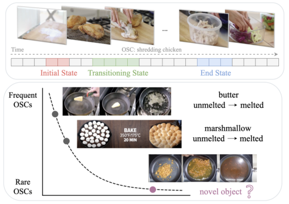
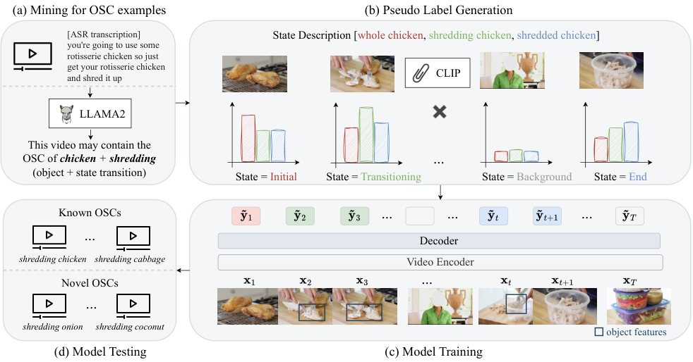
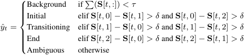
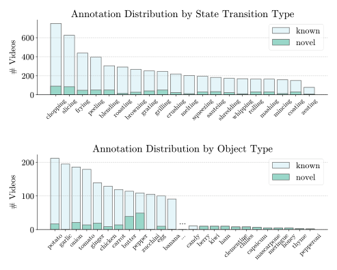
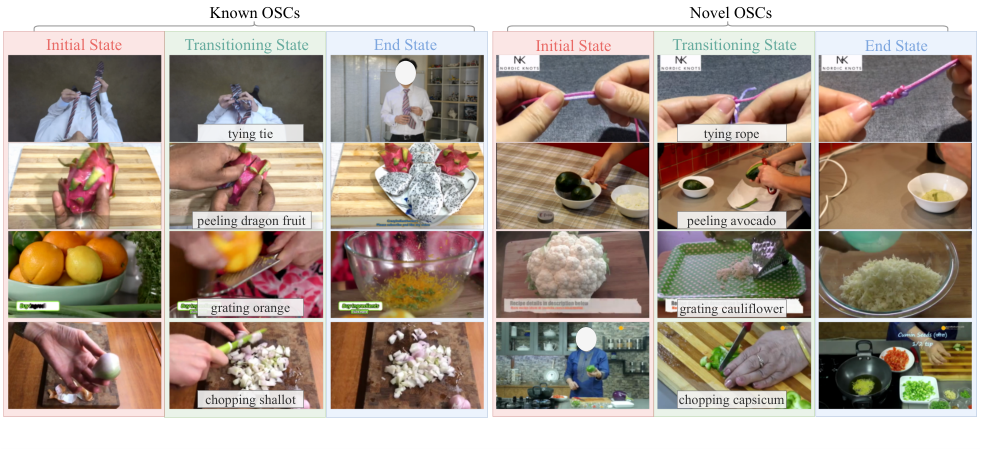
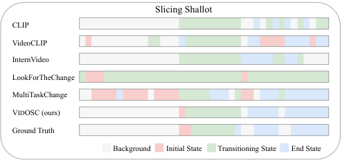
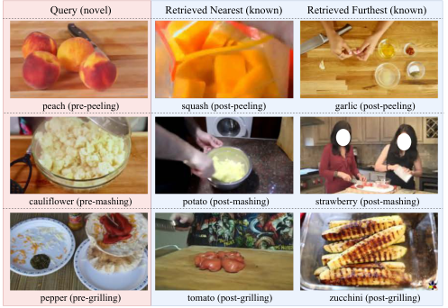

# 022_Xue_Learning_Object_State_Changes_in_Videos_An_Open-World_Perspective_CVPR_2024_paper

[Original PDF](../022_Xue_Learning_Object_State_Changes_in_Videos_An_Open-World_Perspective_CVPR_2024_paper.pdf)

Pages: 11

> Automatically converted from PDF. Check the original for exact equations, symbols, table alignment, and figure details.

<!-- Page 1 -->

This CVPR paper is the Open Access version, provided by the Computer Vision Foundation. Except for this watermark, it is identical to the accepted version; the final published version of the proceedings is available on IEEE Xplore. 

# **Learning Object State Changes in Videos: An Open-World Perspective** 

Zihui Xue1,2 Kumar Ashutosh1,2 Kristen Grauman1,2 1The University of Texas at Austin 2FAIR, Meta 

## **Abstract** 

_Object State Changes (OSCs) are pivotal for video understanding. While humans can effortlessly generalize OSC understanding from familiar to unknown objects, current approaches are confined to a closed vocabulary. Addressing this gap, we introduce a novel open-world formulation for the video OSC problem. The goal is to temporally localize the three stages of an OSC—the object’s initial state, its transitioning state, and its end state—whether or not the object has been observed during training. Towards this end, we develop VIDOSC, a holistic learning approach that: (1) leverages text and vision-language models for supervisory signals to obviate manually labeling OSC training data, and (2) abstracts fine-grained shared state representations from objects to enhance generalization. Furthermore, we present HowToChange, the first open-world benchmark for video OSC localization, which offers an order of magnitude increase in the label space and annotation volume compared to the best existing benchmark. Experimental results demonstrate the efficacy of our approach, in both traditional closed-world and open-world scenarios._1 

## **1. Introduction** 

In video understanding, the study of objects primarily revolves around tasks like recognition [16], detection [24], and tracking [8, 62], with the assumption that objects maintain a consistent visual appearance throughout the video. Yet, objects in video are often dynamic. They can undergo transformations that change their appearance, shape, and even topology. For example, a pineapple goes from whole to peeled to sliced, or wood is carved into a new shape. 

Object State Changes (OSCs) [2, 15, 17, 22, 47, 50– 52, 60, 64] add a critical dimension to video understanding. On the one hand, they provide insights into human actions—observing a piece of metal being shaped into a hook, for instance, implies the action of bending; observing an egg shell go from whole to broken implies the action of cracking. On the other hand, OSCs are essential 

> 1Project webpage: https : / / vision . cs . utexas . edu / projects/VidOSC/. 

Figure 1. Top: The video OSC objective is to temporally localize an object’s three states (i.e., initial, transitioning, end). Bottom: OSCs naturally exhibit a long tail. Certain OSCs, such as melting butter or marshmallow, are frequently showcased in instructional videos while others like melting jaggery might be rarely seen. We introduce an innovative open-world formulation that requires extrapolating to novel objects never encountered during training. 

for assessing goal completion, in a way that is invariant to the specific procedure used. For instance, the readiness of cake batter signifies the completion of a mixing task, regardless of whether it was stirred by hand or a mechanical mixer. These core functionalities are instrumental for various real-world applications [5, 6, 12, 13, 20, 21, 66], ranging from AR/VR assistants [42] that guide users through complex tasks by monitoring object states, to robotic manipulation [9, 55] where understanding the state of objects is critical for task planning and failure recovery. 

However, the development of video OSC is still at a primitive stage. Existing approaches [1, 2, 15, 46, 50, 51, 58] assume a **closed vocabulary** , where each state transformation is associated with a limited set of objects—often just 1 or 2. For example, the concept of “melting” might be limited to familiar items like butter and marshmallow. Consequently, the learned models are only capable of identifying state changes for objects observed during training and stumble when presented with novel objects. In contrast, in realworld situations a single state transition like “melting” can be linked with a plethora of objects—some ubiquitous and 

18493

<!-- Page 2 -->

others rare. Importantly, there is an intrinsic connection that threads these OSC processes together. As humans, even if we have never encountered an unusual substance (e.g., jaggery) before, we can still understand that it is experiencing a “melting” process based on its visual transformation cues (see Fig. 1, bottom). 

In light of these limitations, we propose a a novel openworld formulation of the video OSC problem. We formally characterize OSCs in videos in terms of three states that must be temporally localized: initial, transitioning, and end (see Fig. 1, top). In our **open-world setting** , there are _known_ objects and _novel_ objects. The model is only presented with known objects during training (e.g., frying chicken, frying onions). Then, it is evaluated on both known and novel objects (e.g., frying cauliflower). In addition to this fundamental open-world generalization, we also tackle a more comprehensive notion of the transitioning state. Specifically, our transitioning states encapsulate not only action-induced modifications to the object (e.g., peeling), but also passive transformations the object undergoes without human interference (e.g., melting) and edited-out transformations (e.g., the cake goes from raw to baked even if baked off camera). Though largely overlooked in existing approaches [1, 15, 46, 58], these cases are both common and technically interesting, since they force a model to reason about the _effects_ of the core state change rather than search for evidence of a human actor carrying out the action. 

Armed with this new problem formulation, we propose a holistic video OSC learning approach, anchored by two innovative ideas. First, we explore text and vision-language models (VLMs) for supervisory signals during training. We pioneer the use of textual state descriptions to generate a long tail of object state pseudo-labels, by leveraging the remarkable capabilities of VLMs [23, 44, 63] and large language models (LLMs) [40, 53, 54]. This strategy eliminates the need for exhaustive label collection for training data, facilitating large-scale model training.2 Second, to confront the open-world challenge, we propose object-agnostic state prediction, consisting of three key techniques: a shared state vocabulary to unify the label space across objects sharing the same state transition (e.g., melting butter and melting marshmallow), temporal modeling to grasp the progression of state changes over time, and object-centric features that better represent the objects during an OSC. These designs equip our model with the ability to generalize state understanding from known objects to novel ones. We term our approach VIDOSC. 

Complementing this, we present a large-scale real-world dataset HowToChange. Sourced from the HowTo100M collection [36], it sets a new benchmark in the field of unprecedented scale and an authentic long-tail distribution, setting 

2Note that at test time, our model requires only the video, with no need for additional text, ensuring utmost flexibility and applicability. 

it apart from the constrained scope and closed-world setting of earlier benchmarks (see Table 1). Finally, experimental results demonstrate the efficacy of VIDOSC, surpassing the state-of-the-art in both traditional closed-world and novel open-world scenarios by a great margin. 

## **2. Related Work** 

**Object State Changes** Image-based methods explore the compositional nature of objects and their attributes, including zero-shot recognition of unseen combinations [22, 29, 33, 37–39, 41, 43], but do not consider the temporal progression of OSCs in video, which brings new challenges. Video-based methods develop human-centric models that leverage state change cues to facilitate action recognition [1, 15, 46, 58], or explore joint discovery of object states and actions [2, 50, 51]. Notably, all the existing methods assume a closed world, recognizing only the OSC categories (“known” objects) seen during training. Our approach distinguishes itself in three crucial ways: (1) we introduce a novel open-world3 formulation, where the objects encountered during evaluation can be entirely unseen during training; (2) we adopt an object-centric perspective, allowing for scenarios where OSCs occur with no observable human actions in the video; and (3) we propose to utilize the text modality and VLMs as supervisory signals, greatly scaling up model training and boosting performance. 

Early datasets for video OSC capture a limited array of OSCs in fewer than 1,000 videos [2, 31]. The more recent ChangeIt dataset [50] marks an advance in dataset scale (34K videos), yet is still restricted to a small OSC vocabulary of 44 total object-state transitions. It lacks the scope to adequately test unseen objects, since most state changes coincide with only 1 or 2 objects across all the videos (see Table 1). Other datasets explore different aspects of video OSCs, including object state recognition [47], point-of-noreturn (PNR) frame localization [17], and object segmentation [52, 64], but they lack any temporal annotations of fine-grained OSC states needed for our task’s evaluation. Our HowToChange dataset increases the OSC vocabulary space by an order of magnitude and allows for the first time rigorous study of the open-world temporal OSC challenge. **Vision and Language** LLMs [40, 53, 54] have revolutionized various research fields with their exceptional performance across diverse applications. Building on this momentum, the use of web-scale image-text data has emerged as a powerful paradigm in computer vision, with powerful VLMs now advancing an array of image tasks, including zero-shot classification [44], detection [18], segmentation [32] and visual question answering [27, 28]. Similarly, joint video-text representation learning [3, 30, 36, 67] has been advanced by multimodal datasets like 

3also called “unseen compositions” in object-attribute learning [34, 37]. 

18494

<!-- Page 3 -->

HowTo100M [36] and Ego4D [17], which offer large-scale collections of videos paired with their corresponding narrations. These datasets have also facilitated tasks like step discovery [11], localization in procedural activities [35] and long egocentric videos [45]. The vision-language multimodal cycle consistency loss proposed in [14] helps discover long-term temporal dynamics in video. In line with these developments, we propose to leverage the text accompanying instructional videos as well as existing highperforming VLMs to provide supervisory signals that guide the training of our video OSC model and allow learning for the open world. 

**Learning in an Open World** The open world setting has received increasing attention, predominantly within the image domain for object recognition [4, 48], detection [10, 18, 25, 65] and object-attribute compositionality [29, 33, 37–39, 41, 43]. In the video domain, compositionality is advanced by the Something-Else dataset [34], where the training combinations of verbs and nouns do not overlap with the test set, sparking work on the dynamics of subject-object interactions [7, 34, 47]. More recent efforts leverage VLMs for zero-shot action recognition [7, 26, 57]. Concurrent work explores video object segmentation with state-changing objects [64] and recognition of novel objectstate compositions for food chopped in different styles [47]. Despite these advances, temporal video OSC understanding in the open world remains unexplored. Our open-world formulation requires generalizing the temporal localization of fine-grained object states from known to novel objects. 

## **3. Approach** 

We present the VIDOSC framework for learning video OSCs, detailing the open-world formulation (Sec. 3.1), model design for object-agnostic state prediction (Sec. 3.2), and text-guided training scheme (Sec. 3.3). 

### **3.1. Video OSC in the Open World** 

We begin by formally defining an object state change (OSC) in videos as a visually detectable transformation, where an object experiences a change that is not easily reversible, in line with [17]. We characterize an _OSC category_ as an object combined with a specific state transition, such as “chicken + shredding”, and delineate an OSC process through three distinct states: initial (precondition state), transitioning, and end (postcondition state).4 It is essential to highlight that we take an object-centric perspective: the “transitioning state” accounts for instances where the video depicts an active action applied to the object, as well as scenarios where the object undergoes a passive transformation absent of human intervention (e.g., melting, drying). 

> 4Due to real-world data variation, some videos may lack one of the OSC states, and there may be multiple segments in a video corresponding to the same state. Our formulation accounts for all these scenarios. 

Given a video in which an object may be changing state, the objective is to temporally localize each of the three OSC states. Consistent with prior work [50, 51], we formulate the task as a frame-wise classification problem. Formally, a video sequence is represented by a temporal sequence of _T_ feature vectors **X** = _{_ **x** 1 _,_ **x** 2 _, · · · ,_ **x** _T }_ , where _T_ denotes the video duration. The goal is to predict the OSC state label for each timepoint, denoted by **Y** = _{_ **y** 1 _,_ **y** 2 _, · · · ,_ **y** _T }_ , **y** _t 2 {_ 1 _, · · · , K_ + 1 _}_ , where _K_ is the total number of OSC states, and there is one additional category representing the background class not associated with any OSC state.5 

Next, we propose an open-world problem formulation, capturing the intrinsic long-tail distribution observed in real-world scenarios. Consider _N_ state transitions, each paired with a set of associated objects, denoted by **O**_n_ = _{o_ 1_n, on_ 2_, · · ·, on_ _m_ ( _n_ )_}_,for_n_=_{_1_,_2_, · · ·, N}_,where_m_(_n_) denotes the number of objects linked with the _n_ -th state transition. Within a specific state transition (like frying), certain objects in the set (such as chicken or onions) are frequently observed, while the combination of the same state transition with other objects (such as cauliflower) appear less often. Motivated by this inherent long-tail, we propose to split **O**_n_ into two distinct subsets: **O**_n_ knowncoveringthe common combinations observed during training, and **O**_n_ novel comprising the infrequent combinations, which are unseen during training due to their rarity. During inference, the model is evaluated on the entire object set **O**_n_ for a comprehensive reflection of the open-world setting. 

### **3.2. Object-Agnostic State Prediction** 

To address the open-world challenges and ensure robust generalization to novel objects, VIDOSC integrates three key techniques: (1) a shared state vocabulary that consolidates the state label space; (2) temporal modeling within the video OSC model design; and (3) object-centric features. 

**Shared State Vocabulary** The inherent link among different OSC categories is overlooked in prior work. Common practice involves developing separate models for each OSC category [2, 50] (e.g., one model exclusively for melting butter and another for melting chocolate), or using one single model that still treats every OSC as a distinct entity in the label space [51] (e.g., considering melted butter and melted chocolate as two separate end states). Such a formulation results in an extensive label set with _K_ = 3 _⇥_P_N_ _n_ =1_m_(_n_), where 3 denotes the number of OSC states (i.e., initial, transitioning and end) andP_N_ _n_ =1_m_(_n_)isthe total number of OSC categories. This compartmentalized view can inadvertently hinder the model’s generalization ability. Yet, on closer inspection, states across varied objects are intrinsically related. For instance, the “melting” principle remains consistent, even when applied to visually 

> 5Not all training videos may feature an OSC due to data collection noise, yet all evaluation videos are manually verified to include one. 

18495

<!-- Page 4 -->

<!-- Start of picture text -->
(a) Mining for OSC examples (b) Pseudo Label Generation [ASR transcription] State Description [whole chicken, shredding chicken, shredded chicken] you're going to use some rotisserie chicken so just get your rotisserie chicken CLIP and shred it up LLAMA2 This video may contain the OSC of  chicken  + shredding ... (object + state transition) State = Initial State = Transitioning State = Background State = End Known OSCs ... ... ... ... Decoder shredding chicken shredding cabbage Video Encoder Novel OSCs ... ... shredding onion shredding coconut object features (d) Model Testing (c) Model Training <!-- End of picture text -->

Figure 2. Our proposed VIDOSC framework: (a) Mining for OSC examples (Sec. 3.3): We leverage ASR transcriptions paired with videos and the capabilities of LLM to automatically mine OSC examples. (b) Pseudo Label Generation (Sec. 3.3): We utilize textual state descriptions and a VLM for supervisory signals during training; (c) Model Training (Sec. 3.2): We develop a video model for objectagnostic state prediction. (d) Model Testing (Sec. 3.1): We propose an open-world formulation, evaluating on both known and novel OSCs. Notably, while we employ the text modality to guide model training, our model is purely video-based and requires no text input at the test phase, ensuring maximum flexibility and applicability. Ground truth for the test set is manually annotated. 

distinct objects like butter and chocolate. This motivates us to group OSC labels that share the same state transition as one, and train a single model per state transition.6 By adopting object-agnostic OSC labels, we encourage the model to learn state representations shared by visually different objects, and thus facilitate the transfer from known to novel objects. 

**Temporal Modeling** Recognizing that state changes unfold over time, it is important to capture the temporal dynamics in videos. An object’s state at any frame, be it initial, transitioning, or end, is often best understood in the context of preceding and succeeding frames. Contrary to prior works [2, 50, 51] that rely on isolated framewise modeling without considering the temporal progression of video OSCs, we address this gap by proposing a temporally-aware model design. As illustrated in Fig. 2(c), we adopt an encoder-decoder architecture. For the encoding phase, input video features **X** = _{_ **x** 1 _,_ **x** 2 _, · · · ,_ **x** _T }_ are first projected using an MLP _f_ project, and augmented with sinusoidal positional embeddings, **Z** pos. Subsequently, a transformer encoder [56] _f_ transformer is adopted to capture the temporal dynamics among these features, yield- 

> 6See Supp. for the multi-task model variant, where we develop one unified model for all state transitions. 

ing **Z** = _f_ transformer( _f_ project( **X** ) + **Z** pos). For the decoding phase, a MLP decoder _g_ , maps these temporally-aware hidden representations to OSC state predictions: **Y**˜ = _g_ ( **Z** ). See Sec. 5 for architecture and training details. This design ensures that when predicting the state for a frame, the model has assimilated temporal context from the entire sequence. Essentially, our model exploits the fact that the _dynamics_ of the state change has greater invariance to the object category than how the object looks, emphasizing temporal object transformations over objects’ static appearances, and thereby enhancing generalization to novel OSCs. 

**Object-Centric Features** Finally, we discuss how to better represent “object” features in the problem. In many scenarios, due to camera placement and framing, the object going through a state transition might only occupy a small portion of the frame, surrounded by other visual elements such as background, people, or bystander objects. Recognizing this challenge, we introduce an enhancement to our model’s input features **X** to emphasize the object of interest. To be specific, we leverage an off-the-shelf detector [49] to identify the active object (i.e., the object being manipulated) region at each timepoint _t_ , yielding feature **x**_obj_ _t_ that centers on the object (see bounding boxes in Fig. 2 (c)). The input feature is then constructed as a concatenation of the original global feature and the localized object-centric feature, 

18496

<!-- Page 5 -->

i.e., **X** = _{_ [ **x** _t,_ **x**_obj_ _t_ ] _}__T_ _t_ =1. By emphasizing the object in this manner, our model is better positioned to discern the intricate state changes and provide more informed predictions. 

### **3.3. Text and VLMs as Supervision** 

To scale up training and ensure broad generalization, we propose a novel training pipeline that leverages LLMs and VLMs for OSC mining and pseudo-labeling. 

**Mining for OSC examples** Utilizing a vast collection of “how-to” instructional videos as the training source, we develop an automated mining process to capture the rich, real-world variability of OSCs. The motivation is that instructional videos usually have accompanying Automatic Speech Recognition (ASR) transcriptions that offer valuable OSC cues. For example, a speaker mentioning, “so just get your rotisserie chicken and shred it up” suggests that the chicken may undergo a state transition of shredding in the video. Leveraging this fact, we employ LLAMA2 [54] to analyze ASR transcriptions for identifying candidate videos and their associated OSC categories. This text mining stage allows us to corral a long tail of OSCs, discovering likely state change terms—even if rare—from the free-form natural language narrations given by how-to instructors in the training videos. See Fig. 2 (a). 

**Pseudo Label Generation** Next, to negate the need of manually labeling large-scale training data, we propose a novel pseudo-labeling pipeline facilitated by VLMs. From the identified OSC category (e.g., shredding chicken), we form three _textual state descriptions_ for its initial, transitioning, and end states (e.g., whole chicken, shredding chicken, and shredded chicken). We then adopt both the vision and language encoder from a well-trained VLM (we experiment with CLIP [44] and VideoClip [61]) to compute the cross-modal similarity between every frame in training video and the three state descriptions, producing a score matrix **S** _2_ R_T ⇥_3 . The pseudo label _y_ ˆ _t_ at timepoint _t_ is then assigned based on this score matrix: 

where _δ_ is the threshold that separates states and _⌧_ is the threshold that differentiates between states and background. Essentially if the VLM scores some state more strongly than the other two—and the cumulative confidence score of all states is high—then it is adopted as the pseudo label. Otherwise it is omitted as ambiguous. See Fig. 2(b). 

To further refine these labels, we enforce a causal ordering constraint. Given the inherent progression of OSCs, the anticipated order is initial states followed by transitioning states, and finally, the end states. Any frame whose pseudo 

Figure 3. Ground truth annotation distribution across 20 state transitions (top) and 134 objects (bottom) in HowToChange (Evaluation). In line with our open-world formulation, annotations cover a diverse range of object-state transition combinations, categorized into known and novel OSCs. 

label does not respect this natural progression is re-assigned to the ambiguous category. Our training employs a crossentropy loss between pseudo label ˆ _yt_ and the corresponding model prediction _y_ ˜ _t_ , with ambiguous frames excluded to maintain clarity and distinction among the state labels. See Section 4.2 in Supp. for detailed pseudo label analysis. 

## **4. The HowToChange Dataset** 

Existing OSC datasets fall short in capturing the openworld’s diversity and long-tail distribution of OSCs. To address this gap, we introduce HowToChange. It encompasses varied state transitions coupled with a diverse range of objects, providing an authentic reflection of their real-world frequency—from the commonplace to the rare. 

**Data Collection** The HowTo100M collection [36] contains a wealth of instructional videos that often feature OSCs and is particularly suitable for this task. We specifically focus on the HowTo100M Food & Entertaining category because (1) it constitutes a third of the entire HowTo100M videos, (2) cooking tasks offer a wealth of objects, tools, and state changes, providing an excellent test bed for open-world OSC, and (3) in cooking activities a single state transition can often be associated with a varied range of objects, opening the door to learning compositionality. (Note, we also experiment with non-cooking domains below.) We process a total of 498,475 videos and 11,390,287 ASR transcriptions with LLAMA2. From the responses, we identify the most frequently seen state transitions and objects associated with them to establish an OSC vocabulary, resulting in 134 objects, 20 state transitions, and 409 unique OSCs. The number of objects associated with each state transition ( _m_ ( _n_ )) 

18497

<!-- Page 6 -->

|Datasets|# Obj|# ST|# OSC|ObjPer|# Videos|GT Label?|
|---|---|---|---|---|---|---|
|Alayrac et al. [2]|5|6|7|1.2|630|3|
|Task-Fluent [31]|25|14|32|2.3|809|3|
|ChangeIt (Training) [50]|42|27|44|1.6|34,428|7|
|ChangeIt (Evaluation) [50]|42|27|44|1.6|667|3|
|HowToChange (Training)|122|20|318|15.9|36,075|7|
|HowToChange (Evaluation)|134|20|409|20.5|5,424|3|

Table 1. Comparison with existing video datasets focusing on object states. ‘Obj’ and ‘ST’ represent objects and state transitions, respectively. ‘ObjPer’ denotes the average number of objects associated with each state transition; higher values indicate more need to generalization across objects. We present the first open-world benchmark for temporal video OSC, with an order of magnitude increase in OSC vocabulary and annotation volume. 

spans from 6 for “zesting” to 55 for “chopping”. The state transitions applied to each object vary from 1 to 15, with onions being the most versatile. In total, we identify 36,075 videos for the training set of HowToChange, with an average duration of 41.2 seconds. 

**Data Splits** In line with our open-world formulation, we divide the 409 identified OSCs into two disjoint subsets based on their frequency of occurrence. Within each state transition, we categorize the top 75% frequent objects as known and the bottom 25% as novel. This yields a total of 318 known OSCs that are seen during training and testing, spanning 20 state transitions associated with 122 objects, and 91 novel OSCs that are only seen during testing, encompassing the same transitions across 58 objects. 

**Ground Truth Label Collection (Evaluation Set)** To facilitate thorough evaluation, we obtain manual annotations for a subset of 5,424 videos from the collected dataset.7 The annotation workflow is as follows: each annotator is presented with a video segment along with an OSC category that was previously identified by LLAMA2. The annotator has the option to reject the video segment if it does not contain the specified OSC. Otherwise, they label the time ranges corresponding to the initial, transitioning, and end states of the OSC. Adhering to our object-centric emphasis, annotators are instructed to label based on the visual changes of the object, rather than human-centric actions, and exclude time ranges where the object of interest is not visible, ensuring clean and focused temporal labels. Fig. 3 provides the distribution of annotated videos. On average, we collect 271 annotations per state transition, with a video duration of 41.5 seconds, and 12.9% of videos belong to the novel category. The entire annotation process required around 1,507 hours by 30 professional annotators. 

**Dataset Comparison** Table 1 compares HowToChange with existing video datasets on temporal OSC understand- 

> 7Our training is purely guided by a VLM and requires no ground truth labels. The annotations are reserved exclusively for evaluation. 

ing. HowToChange offers an unprecedented scale—with 9.3x more OSC categories and 8.1x more annotated video instances compared to the previous largest collection [50]. Furthermore, notably, in prior datasets, each state transition is typically coupled with 1 or 2 objects, preventing subsequent models from generalizing to new objects, as we will see in results. In contrast, HowToChange pioneers the open-world formulation, presenting a much broader range of objects associated with each state transition—from 6 to 55 objects per state transition, and averaging 20. This facilitates the development of models with generalized OSC understanding. Please see Supp. for full data collection and annotation details. 

## **5. Experiments** 

**Datasets** In addition to our new HowToChange dataset, we also evaluate on ChangeIt [50] due to its expansive data scale (34K videos spanning many activities) and high relevance to our task. Beyond the conventional split of ChangeIt, we propose a new split tailored to our open-world formulation. Specifically, from the 44 available OSC categories in ChangeIt, we concentrate on the 25 categories where each state transition is paired with more than one object. With those, we form the “ChangeIt (open-world)” subset that comprises 8 state transitions and 25 objects. Within each state transition, objects are randomly divided into known and novel categories, yielding 13 known OSC categories for training and 12 novel OSC categories exclusively reserved for evaluation. A detailed breakdown of this split can be found in Supp. To sum up, our evaluation encompasses: ChangeIt; ChangeIt (open-world); and HowToChange, offering a comprehensive setup in both closedworld and open-world scenarios. 

**Evaluation** For ChangeIt and ChangeIt (open-world), we adhere to the original dataset’s evaluation protocol [50], reporting action and state precision@1 as the evaluation metrics. For our dataset, besides precision@1, which evaluates a single frame for each state within a video, we advocate for the use of F1 score and precision over all frames to ensure a more holistic evaluation. 

**Baselines** We compare our approach with four baselines across two categories: (a) self-supervised approaches on identifying object states enforced by the causal ordering constraint: LookForTheChange [50] trains a dedicated model for each OSC category, while MultiTaskChange [51] evolves this into a multi-task approach8 , catering to several OSCs concurrently; (b) zero-shot VLMs: imagebased CLIP [44], video-based VideoCLIP [61] and InternVideo [59]. All baselines in (a) use the same training data as our model, whereas the zero-shot models (b) are directly 

> 8To ensure a thorough evaluation, we train both single-task and multitask variants of our approach. See Supp. for a detailed discussion. 

18498

<!-- Page 7 -->

|Method|Cha State Prec.@1|ngeIt Action Prec.@1|Ch State Pr known|angeIt ( ec.@1 novel|open-wor Action P known|ld) rec.@1 novel|F1 ( known|%) novel|HowTo Prec known|Change (%) novel|Prec.@ known|1 (%) novel|
|---|---|---|---|---|---|---|---|---|---|---|---|---|
|CLIP [44]|0.30|0.63|0.29|0.29|0.71|0.70|26.9|25.4|27.3|26.6|47.5|47.5|
|VideoCLIP [61]|0.33|0.59|0.25|0.24|0.62|0.55|36.6|34.3|39.7|38.5|48.3|44.8|
|InternVideo [59]|0.27|0.57|0.29|0.25|0.60|0.61|29.9|29.5|31.4|30.8|46.9|46.3|
|LookForTheChange [50]|0.35|0.68|0.36|0.25|0.77|0.68|30.3|28.7|32.5|30.0|37.2|36.1|
|MultiTaskChange [51]|0.49|0.80|0.41|0.22|0.72|0.62|33.9|29.9|38.5|34.1|43.1|38.8|
|VIDOSC (ours)|**0.57**|**0.84**|**0.56**|**0.48**|**0.89**|**0.82**|**46.4**|**43.1**|**46.6**|**43.7**|**60.7**|**58.2**|

Table 2. Results on ChangeIt, ChangeIt (open-world), and HowToChange. VIDOSC outperforms all approaches in both closed-world and open-world scenarios, across known and novel OSCs. 

<!-- Start of picture text -->
Known OSCs Novel OSCs Initial State Transitioning State End State Initial State Transitioning State End State tying tie tying rope peeling dragon fruit peeling avocado grating orange grating cauliflower chopping shallot chopping capsicum <!-- End of picture text -->

Figure 4. Top-1 frame predictions given by VIDOSC for the initial, transitioning, and end states, on ChangeIt (open-world) (first 2 rows) and HowToChange (last 2 rows). VIDOSC not only accurately localizes the three fine-grained states for known OSCs, but also generalizes this understanding to novel objects, such as cauliflower and capsicum, which are not observed during training. 

evaluated on the test set with no training. 

**Implementation** Videos are sampled at one frame per second. Each one-second video segment gets assigned to an OSC state label, and is encoded by InternVideo [59], a general video foundation model (which is kept frozen for training efficiency). Our video model consists of a 3-layer transformer with a hidden dimension of 512 and 4 attention heads as the encoder and a 1-layer MLP as the decoder. Consistent with prior work [50, 51], our model predicts the OSC state label (i.e., initial, transitioning, end state, or background) for a video, assuming the video OSC category is known (say from a recognition model’s output or a user’s specific query). While the standard output does not include the state transition name, our multi-task version detailed in Supp. is capable of this. 

**Main Results** Table 2 presents results on all three datasets. VIDOSC outperforms all approaches in both traditional closed-world and our newly introduced open-world settings. The large performance gains—as much as 9.6% 

jumps in precision vs. the next best method—underscore the effectiveness of two pivotal components in VIDOSC. First, its use of text and VLMs for supervisory signals during training: particularly on novel OSCs , VIDOSC extracts meaningful cues from the video modality to refine pseudo labels from VLMs, and ultimately surpasses the VLM baselines. Second, our model for object-agnostic state prediction, designed for the open-world context, effectively narrows the gap between known and novel OSCs. For instance, on ChangeIt (open-world), MultiTaskChange [51] experiences a 19% decline in state precision@1 while VIDOSC has only a 8% drop. Note that we observe a more pronounced performance drop of all approaches on ChangeIt (open-world) than on HowToChange due to its limited number of objects available per state transition. These results also point to the potential for future development in bridging the known and novel OSC performance gap. 

**Qualitative Results** Fig. 4 presents VIDOSC’s top-1 frame predictions on ChangeIt (open-world) and HowToChange, 

18499

<!-- Page 8 -->

<!-- Start of picture text -->
Slicing Shallot CLIP VideoCLIP InternVideo LookForTheChange MultiTaskChange VIDOSC (ours) Ground Truth Background Initial State Transitioning State End State <!-- End of picture text -->

Figure 5. Comparison of model predictions across a test video depicting the OSC of “slicing shallot” on HowToChange. The x-axis represents temporal progression through the video. VIDOSC gives temporally smooth and coherent predictions that best align with the ground truth, significantly outperforming baselines in capturing the video’s global temporal context. 

|Shared|Temporal|Object|Pre|c.@1 (%)||
|---|---|---|---|---|---|
|State|Modeling|Centric|known|novel|∆|
|7|3|3|58.5|53.3|5.2|
|3|7|3|52.9|48.2|4.7|
|3|3|7|59.8|56.7|3.1|
|3|3|3|**60.7**|**58.2**|**2.5**|

Table 3. Ablation Study. ∆ denotes the performance gap between known OSCs and novel OSCs. 

across both known and novel OSCs. Notably, despite never seeing objects such as cauliflower and capsicum during training, VIDOSC effectively leverages visual state change cues and correctly localizes the three states of these objects going through OSCs, demonstrating its strong generalization capability. For a more holistic view, Fig. 5 compares VIDOSC’s frame-by-frame predictions with all baselines for a given test video. VIDOSC provides temporally coherent predictions, smoothly progressing through the OSC states in the natural order (i.e., from initial to transitioning then end). In contrast, baseline approaches often yield fragmented and inconsistent predictions, indicating a lack of understanding of the video’s global temporal context, primarily due to their reliance on frame-wise modeling. See Supp. and Supp. video for more qualitative examples and VIDOSC’s interpretability on object relations. 

**Ablation** To further dissect the performance gains brought by our three model design techniques (i.e., shared state vocabulary, temporal modeling, and object-centric features), we conduct an ablation study, removing one component at a time. Table 3 confirms the essential role of each element. A shared state vocabulary is particularly crucial in the open-world context, as its absence increases the gap between known and novel OSCs from 2.5% to 5.2%. Furthermore, temporal modeling provides a substantial performance boost, and object-centric features offer further gains. See Supp. for an additional analysis of VIDOSC’s performance with different pseudo labels. 

<!-- Start of picture text -->
Query (novel) Retrieved Nearest (known) Retrieved Furthest (known) peach (pre-peeling) squash (post-peeling) garlic (post-peeling) cauliflower (pre-mashing) potato (post-mashing) strawberry (post-mashing) pepper (pre-grilling) tomato (post-grilling) zucchini (post-grilling) <!-- End of picture text -->

Figure 6. Frame retrieval on the HowToChange test set. Given a query frame showcasing a _novel_ OSC at its _initial_ state, VIDOSC retrieves the nearest and furthest frame among all _known_ OSCs at their _end_ states. The closest post-OSC frame follows the transition trajectory of the query while the furthest post-OSC frame depicts a substantially different object, demonstrating VIDOSC’s capability to generalize the OSC progression for novel objects. 

**Frame Retrieval** VIDOSC learns features that accurately characterize the evolution of an OSC process. To illustrate, we consider a novel frame retrieval setting. Within the HowToChange test set, when presented with a query video featuring a novel OSC at its initial state, VIDOSC seeks the most similar and most contrasting video from a pool of candidates at their end states. The frame triplets with the smallest and largest feature distance are shown in Fig. 6. Remarkably, the retrieved nearest post-OSC frames correspond to the query’s anticipated state transition trajectory, despite the object and state gap. Conversely, the furthest frames exhibit end states of markedly different objects. These results further lend support to VIDOSC’s capability to understand the evolution of an OSC process, even for novel objects it has never encountered during training. 

## **6. Conclusion** 

This work aims at a comprehensive exploration of video OSCs, with a novel open-world formulation. To address the challenges, we leverage text and VLMs to assist the training of a video OSC model at scale and design three modeling techniques to achieve object-agnostic state prediction for better generalization to novel OSCs. Furthermore, we present the most expansive video OSC dataset collection HowToChange, which echoes the natural long-tail of state transitions coupled with varied objects, fostering a realistic representation of real-world scenarios. As for future work, we will consider extending VIDOSC to video sequences featuring concurrent OSC processes, and integrating spatial understanding of OSC within our open-world framework. **Acknowledgements:** UT Austin is supported in part by the IFML NSF AI Institute. KG is paid as a research scientist by Meta. 

18500

<!-- Page 9 -->

## **References** 

- [1] Nachwa Aboubakr, James L Crowley, and R´emi Ronfard. Recognizing manipulation actions from statetransformations. _arXiv preprint arXiv:1906.05147_ , 2019. 1, 2 

- [2] Jean-Baptiste Alayrac, Ivan Laptev, Josef Sivic, and Simon Lacoste-Julien. Joint discovery of object states and manipulation actions. In _Proceedings of the IEEE International Conference on Computer Vision_ , pages 2127–2136, 2017. 1, 2, 3, 4, 6 

- [3] Kumar Ashutosh, Rohit Girdhar, Lorenzo Torresani, and Kristen Grauman. Hiervl: Learning hierarchical videolanguage embeddings. In _Proceedings of the IEEE/CVF Conference on Computer Vision and Pattern Recognition_ , pages 23066–23078, 2023. 2 

- [4] Abhijit Bendale and Terrance Boult. Towards open world recognition. In _Proceedings of the IEEE conference on computer vision and pattern recognition_ , pages 1893–1902, 2015. 3 

- [5] Jing Bi, Jiebo Luo, and Chenliang Xu. Procedure planning in instructional videos via contextual modeling and modelbased policy learning. In _Proceedings of the IEEE/CVF International Conference on Computer Vision_ , pages 15611– 15620, 2021. 1 

- [6] Chien-Yi Chang, De-An Huang, Danfei Xu, Ehsan Adeli, Li Fei-Fei, and Juan Carlos Niebles. Procedure planning in instructional videos. In _European Conference on Computer Vision_ , pages 334–350. Springer, 2020. 1 

- [7] Dibyadip Chatterjee, Fadime Sener, Shugao Ma, and Angela Yao. Opening the vocabulary of egocentric actions. _arXiv preprint arXiv:2308.11488_ , 2023. 3 

- [8] Gioele Ciaparrone, Francisco Luque S´anchez, Siham Tabik, Luigi Troiano, Roberto Tagliaferri, and Francisco Herrera. Deep learning in video multi-object tracking: A survey. _Neurocomputing_ , 381:61–88, 2020. 1 

- [9] Xinke Deng, Yu Xiang, Arsalan Mousavian, Clemens Eppner, Timothy Bretl, and Dieter Fox. Self-supervised 6d object pose estimation for robot manipulation. In _2020 IEEE International Conference on Robotics and Automation (ICRA)_ , pages 3665–3671. IEEE, 2020. 1 

- [10] Akshay Dhamija, Manuel Gunther, Jonathan Ventura, and Terrance Boult. The overlooked elephant of object detection: Open set. In _Proceedings of the IEEE/CVF Winter Conference on Applications of Computer Vision_ , pages 1021–1030, 2020. 3 

- [11] Nikita Dvornik, Isma Hadji, Ran Zhang, Konstantinos G Derpanis, Richard P Wildes, and Allan D Jepson. Stepformer: Self-supervised step discovery and localization in instructional videos. In _Proceedings of the IEEE/CVF Conference on Computer Vision and Pattern Recognition_ , pages 18952–18961, 2023. 3 

- [12] Dave Epstein and Carl Vondrick. Learning goals from failure. In _Proceedings of the IEEE/CVF Conference on Computer Vision and Pattern Recognition_ , pages 11194–11204, 2021. 1 

- [13] Dave Epstein, Boyuan Chen, and Carl Vondrick. Oops! predicting unintentional action in video. In _Proceedings of_ 

_the IEEE/CVF conference on computer vision and pattern recognition_ , pages 919–929, 2020. 1 

- [14] Dave Epstein, Jiajun Wu, Cordelia Schmid, and Chen Sun. Learning temporal dynamics from cycles in narrated video. In _Proceedings of the IEEE/CVF International Conference on Computer Vision_ , pages 1480–1489, 2021. 3 

- [15] Alireza Fathi and James M Rehg. Modeling actions through state changes. In _Proceedings of the IEEE Conference on Computer Vision and Pattern Recognition_ , pages 2579– 2586, 2013. 1, 2 

- [16] Tao Gong, Kai Chen, Xinjiang Wang, Qi Chu, Feng Zhu, Dahua Lin, Nenghai Yu, and Huamin Feng. Temporal roi align for video object recognition. In _Proceedings of the AAAI Conference on Artificial Intelligence_ , pages 1442– 1450, 2021. 1 

- [17] Kristen Grauman, Andrew Westbury, Eugene Byrne, Zachary Chavis, Antonino Furnari, Rohit Girdhar, Jackson Hamburger, Hao Jiang, Miao Liu, Xingyu Liu, et al. Ego4d: Around the world in 3,000 hours of egocentric video. In _Proceedings of the IEEE/CVF Conference on Computer Vision and Pattern Recognition_ , pages 18995–19012, 2022. 1, 2, 3 

- [18] Xiuye Gu, Tsung-Yi Lin, Weicheng Kuo, and Yin Cui. Open-vocabulary object detection via vision and language knowledge distillation. _arXiv preprint arXiv:2104.13921_ , 2021. 2, 3 

- [19] Tengda Han, Weidi Xie, and Andrew Zisserman. Temporal alignment networks for long-term video. In _Proceedings of the IEEE/CVF Conference on Computer Vision and Pattern Recognition_ , pages 2906–2916, 2022. 1 

- [20] Farnoosh Heidarivincheh, Majid Mirmehdi, and Dima Damen. Detecting the moment of completion: Temporal models for localising action completion. _arXiv preprint arXiv:1710.02310_ , 2017. 1 

- [21] Farnoosh Heidarivincheh, Majid Mirmehdi, and Dima Damen. Action completion: A temporal model for moment detection. _arXiv preprint arXiv:1805.06749_ , 2018. 1 

- [22] Phillip Isola, Joseph J. Lim, and Edward H. Adelson. Discovering states and transformations in image collections. In _CVPR_ , 2015. 1, 2 

- [23] Chao Jia, Yinfei Yang, Ye Xia, Yi-Ting Chen, Zarana Parekh, Hieu Pham, Quoc Le, Yun-Hsuan Sung, Zhen Li, and Tom Duerig. Scaling up visual and vision-language representation learning with noisy text supervision. In _International conference on machine learning_ , pages 4904–4916. PMLR, 2021. 2 

- [24] Licheng Jiao, Ruohan Zhang, Fang Liu, Shuyuan Yang, Biao Hou, Lingling Li, and Xu Tang. New generation deep learning for video object detection: A survey. _IEEE Transactions on Neural Networks and Learning Systems_ , 33(8): 3195–3215, 2021. 1 

- [25] KJ Joseph, Salman Khan, Fahad Shahbaz Khan, and Vineeth N Balasubramanian. Towards open world object detection. In _Proceedings of the IEEE/CVF conference on computer vision and pattern recognition_ , pages 5830–5840, 2021. 3 

- [26] Chen Ju, Tengda Han, Kunhao Zheng, Ya Zhang, and Weidi Xie. Prompting visual-language models for efficient video 

18501

<!-- Page 10 -->

understanding. In _European Conference on Computer Vision_ , pages 105–124. Springer, 2022. 3 

- [27] Junnan Li, Dongxu Li, Caiming Xiong, and Steven Hoi. Blip: Bootstrapping language-image pre-training for unified vision-language understanding and generation. In _International Conference on Machine Learning_ , pages 12888– 12900. PMLR, 2022. 2 

- [28] Junnan Li, Dongxu Li, Silvio Savarese, and Steven Hoi. Blip-2: Bootstrapping language-image pre-training with frozen image encoders and large language models. _arXiv preprint arXiv:2301.12597_ , 2023. 2 

- [29] Xiangyu Li, Xu Yang, Kun Wei, Cheng Deng, and Muli Yang. Siamese contrastive embedding network for compositional zero-shot learning. In _Proceedings of the IEEE/CVF conference on computer vision and pattern recognition_ , pages 9326–9335, 2022. 2, 3 

- [30] Kevin Qinghong Lin, Jinpeng Wang, Mattia Soldan, Michael Wray, Rui Yan, Eric Z XU, Difei Gao, Rong-Cheng Tu, Wenzhe Zhao, Weijie Kong, et al. Egocentric video-language pretraining. _Advances in Neural Information Processing Systems_ , 35:7575–7586, 2022. 2 

- [31] Yang Liu, Ping Wei, and Song-Chun Zhu. Jointly recognizing object fluents and tasks in egocentric videos. In _Proceedings of the IEEE International Conference on Computer Vision_ , pages 2924–2932, 2017. 2, 6, 1 

- [32] Timo L¨uddecke and Alexander Ecker. Image segmentation using text and image prompts. In _Proceedings of the IEEE/CVF Conference on Computer Vision and Pattern Recognition_ , pages 7086–7096, 2022. 2 

- [33] Massimiliano Mancini, Muhammad Ferjad Naeem, Yongqin Xian, and Zeynep Akata. Open world compositional zeroshot learning. In _Proceedings of the IEEE/CVF conference on computer vision and pattern recognition_ , pages 5222– 5230, 2021. 2, 3 

- [34] Joanna Materzynska, Tete Xiao, Roei Herzig, Huijuan Xu, Xiaolong Wang, and Trevor Darrell. Something-else: Compositional action recognition with spatial-temporal interaction networks. In _Proceedings of the IEEE/CVF Conference on Computer Vision and Pattern Recognition_ , pages 1049– 1059, 2020. 2, 3 

- [35] Effrosyni Mavroudi, Triantafyllos Afouras, and Lorenzo Torresani. Learning to ground instructional articles in videos through narrations. _arXiv preprint arXiv:2306.03802_ , 2023. 3 

- [36] Antoine Miech, Dimitri Zhukov, Jean-Baptiste Alayrac, Makarand Tapaswi, Ivan Laptev, and Josef Sivic. Howto100m: Learning a text-video embedding by watching hundred million narrated video clips. In _Proceedings of the IEEE/CVF international conference on computer vision_ , pages 2630–2640, 2019. 2, 3, 5, 1, 6 

- [37] Ishan Misra, Abhinav Gupta, and Martial Hebert. From red wine to red tomato: Composition with context. In _Proceedings of the IEEE Conference on Computer Vision and Pattern Recognition_ , pages 1792–1801, 2017. 2, 3 

- [38] Muhammad Ferjad Naeem, Yongqin Xian, Federico Tombari, and Zeynep Akata. Learning graph embeddings for compositional zero-shot learning. In _Proceedings of_ 

_the IEEE/CVF Conference on Computer Vision and Pattern Recognition_ , pages 953–962, 2021. 

- [39] Tushar Nagarajan and Kristen Grauman. Attributes as operators: factorizing unseen attribute-object compositions. In _Proceedings of the European Conference on Computer Vision (ECCV)_ , pages 169–185, 2018. 2, 3 

- [40] OpenAI. Gpt-4 technical report. Technical report, OpenAI, 2023. Submitted on 15 Mar 2023, last revised 27 Mar 2023. 2, 6, 9 

- [41] Khoi Pham, Kushal Kafle, Zhe Lin, Zhihong Ding, Scott Cohen, Quan Tran, and Abhinav Shrivastava. Learning to predict visual attributes in the wild. In _Proceedings of the IEEE/CVF conference on computer vision and pattern recognition_ , pages 13018–13028, 2021. 2, 3 

- [42] Chiara Plizzari, Gabriele Goletto, Antonino Furnari, Siddhant Bansal, Francesco Ragusa, Giovanni Maria Farinella, Dima Damen, and Tatiana Tommasi. An outlook into the future of egocentric vision. _arXiv preprint arXiv:2308.07123_ , 2023. 1 

- [43] Senthil Purushwalkam, Maximilian Nickel, Abhinav Gupta, and Marc’Aurelio Ranzato. Task-driven modular networks for zero-shot compositional learning. In _Proceedings of the IEEE/CVF International Conference on Computer Vision_ , pages 3593–3602, 2019. 2, 3 

- [44] Alec Radford, Jong Wook Kim, Chris Hallacy, Aditya Ramesh, Gabriel Goh, Sandhini Agarwal, Girish Sastry, Amanda Askell, Pamela Mishkin, Jack Clark, et al. Learning transferable visual models from natural language supervision. In _International conference on machine learning_ , pages 8748–8763. PMLR, 2021. 2, 5, 6, 7, 9 

- [45] Santhosh Kumar Ramakrishnan, Ziad Al-Halah, and Kristen Grauman. Naq: Leveraging narrations as queries to supervise episodic memory. In _Proceedings of the IEEE/CVF Conference on Computer Vision and Pattern Recognition_ , pages 6694–6703, 2023. 3 

- [46] Nirat Saini, Bo He, Gaurav Shrivastava, Sai Saketh Rambhatla, and Abhinav Shrivastava. Recognizing actions using object states. In _ICLR2022 Workshop on the Elements of Reasoning: Objects, Structure and Causality_ , 2022. 1, 2 

- [47] Nirat Saini, Hanyu Wang, Archana Swaminathan, Vinoj Jayasundara, Bo He, Kamal Gupta, and Abhinav Shrivastava. Chop & learn: Recognizing and generating object-state compositions. _ICCV_ , 2023. 1, 2, 3 

- [48] Walter J Scheirer, Anderson de Rezende Rocha, Archana Sapkota, and Terrance E Boult. Toward open set recognition. _IEEE transactions on pattern analysis and machine intelligence_ , 35(7):1757–1772, 2012. 3 

- [49] Dandan Shan, Jiaqi Geng, Michelle Shu, and David F Fouhey. Understanding human hands in contact at internet scale. In _Proceedings of the IEEE/CVF conference on computer vision and pattern recognition_ , pages 9869–9878, 2020. 4 

- [50] Tom´aˇs Souˇcek, Jean-Baptiste Alayrac, Antoine Miech, Ivan Laptev, and Josef Sivic. Look for the change: Learning object states and state-modifying actions from untrimmed web videos. In _Proceedings of the IEEE/CVF Conference on Computer Vision and Pattern Recognition_ , pages 13956– 13966, 2022. 1, 2, 3, 4, 6, 7, 5 

18502

<!-- Page 11 -->

- [51] Tom´aˇs Souˇcek, Jean-Baptiste Alayrac, Antoine Miech, Ivan Laptev, and Josef Sivic. Multi-task learning of object state changes from uncurated videos. _arXiv preprint arXiv:2211.13500_ , 2022. 1, 2, 3, 4, 6, 7, 5, 8 

- [52] Pavel Tokmakov, Jie Li, and Adrien Gaidon. Breaking the” object” in video object segmentation. In _Proceedings of the IEEE/CVF Conference on Computer Vision and Pattern Recognition_ , pages 22836–22845, 2023. 1, 2 

- [53] Hugo Touvron, Thibaut Lavril, Gautier Izacard, Xavier Martinet, Marie-Anne Lachaux, Timoth´ee Lacroix, Baptiste Rozi`ere, Naman Goyal, Eric Hambro, Faisal Azhar, et al. Llama: Open and efficient foundation language models. _arXiv preprint arXiv:2302.13971_ , 2023. 2 

- [54] Hugo Touvron, Louis Martin, Kevin Stone, Peter Albert, Amjad Almahairi, Yasmine Babaei, Nikolay Bashlykov, Soumya Batra, Prajjwal Bhargava, Shruti Bhosale, et al. Llama 2: Open foundation and fine-tuned chat models. _arXiv preprint arXiv:2307.09288_ , 2023. 2, 5, 1 

   - [65] Alireza Zareian, Kevin Dela Rosa, Derek Hao Hu, and ShihFu Chang. Open-vocabulary object detection using captions. In _Proceedings of the IEEE/CVF Conference on Computer Vision and Pattern Recognition_ , pages 14393–14402, 2021. 3 

   - [66] He Zhao, Isma Hadji, Nikita Dvornik, Konstantinos G Derpanis, Richard P Wildes, and Allan D Jepson. P3iv: Probabilistic procedure planning from instructional videos with weak supervision. In _Proceedings of the IEEE/CVF Conference on Computer Vision and Pattern Recognition_ , pages 2938–2948, 2022. 1 

   - [67] Yue Zhao, Ishan Misra, Philipp Kr¨ahenb¨uhl, and Rohit Girdhar. Learning video representations from large language models. In _Proceedings of the IEEE/CVF Conference on Computer Vision and Pattern Recognition_ , pages 6586– 6597, 2023. 2 

- [55] Jonathan Tremblay, Thang To, Balakumar Sundaralingam, Yu Xiang, Dieter Fox, and Stan Birchfield. Deep object pose estimation for semantic robotic grasping of household objects. _arXiv preprint arXiv:1809.10790_ , 2018. 1 

- [56] Ashish Vaswani, Noam Shazeer, Niki Parmar, Jakob Uszkoreit, Llion Jones, Aidan N Gomez, Łukasz Kaiser, and Illia Polosukhin. Attention is all you need. _Advances in neural information processing systems_ , 30, 2017. 4 

- [57] Mengmeng Wang, Jiazheng Xing, and Yong Liu. Actionclip: A new paradigm for video action recognition. _arXiv preprint arXiv:2109.08472_ , 2021. 3 

- [58] Xiaolong Wang, Ali Farhadi, and Abhinav Gupta. Actions˜ transformations. In _Proceedings of the IEEE conference on Computer Vision and Pattern Recognition_ , pages 2658– 2667, 2016. 1, 2 

- [59] Yi Wang, Kunchang Li, Yizhuo Li, Yinan He, Bingkun Huang, Zhiyu Zhao, Hongjie Zhang, Jilan Xu, Yi Liu, Zun Wang, et al. Internvideo: General video foundation models via generative and discriminative learning. _arXiv preprint arXiv:2212.03191_ , 2022. 6, 7, 9 

- [60] Te-Lin Wu, Yu Zhou, and Nanyun Peng. Localizing active objects from egocentric vision with symbolic world knowledge. _arXiv preprint arXiv:2310.15066_ , 2023. 1 

- [61] Hu Xu, Gargi Ghosh, Po-Yao Huang, Dmytro Okhonko, Armen Aghajanyan, Florian Metze, Luke Zettlemoyer, and Christoph Feichtenhofer. Videoclip: Contrastive pre-training for zero-shot video-text understanding. _arXiv preprint arXiv:2109.14084_ , 2021. 5, 6, 7, 9 

- [62] Rui Yao, Guosheng Lin, Shixiong Xia, Jiaqi Zhao, and Yong Zhou. Video object segmentation and tracking: A survey. _ACM Transactions on Intelligent Systems and Technology (TIST)_ , 11(4):1–47, 2020. 1 

- [63] Jiahui Yu, Zirui Wang, Vijay Vasudevan, Legg Yeung, Mojtaba Seyedhosseini, and Yonghui Wu. Coca: Contrastive captioners are image-text foundation models. _arXiv preprint arXiv:2205.01917_ , 2022. 2 

- [64] Jiangwei Yu, Xiang Li, Xinran Zhao, Hongming Zhang, and Yu-Xiong Wang. Video state-changing object segmentation. In _Proceedings of the IEEE/CVF International Conference on Computer Vision_ , pages 20439–20448, 2023. 1, 2, 3 

18503
