# 022_Yu_Learning_Procedure-Aware_Video_Representation_From_Instructional_Videos_and_Their_Narrations_CVPR_2023_paper

[Original PDF](../022_Yu_Learning_Procedure-Aware_Video_Representation_From_Instructional_Videos_and_Their_Narrations_CVPR_2023_paper.pdf)

Pages: 11

> Automatically converted from PDF. Check the original for exact equations, symbols, table alignment, and figure details.

<!-- Page 1 -->

This CVPR paper is the Open Access version, provided by the Computer Vision Foundation. Except for this watermark, it is identical to the accepted version; the final published version of the proceedings is available on IEEE Xplore. 

# **Learning Procedure-aware Video Representation from Instructional Videos and Their Narrations** 

Yiwu Zhong1* , Licheng Yu2 , Yang Bai2 , Shangwen Li2 , Xueting Yan2† , Yin Li1† 

1University of Wisconsin-Madison, 2Meta AI 

yzhong52@wisc.edu, _{_ lichengyu, yangbai, dylanwen, xyan18 _}_ @meta.com, yin.li@wisc.edu 

## **Abstract** 

_The abundance of instructional videos and their narrations over the Internet offers an exciting avenue for understanding procedural activities. In this work, we propose to learn video representation that encodes both action steps and their temporal ordering, based on a largescale dataset of web instructional videos and their narrations, without using human annotations. Our method jointly learns a video representation to encode individual step concepts, and a deep probabilistic model to capture both temporal dependencies and immense individual variations in the step ordering. We empirically demonstrate that learning temporal ordering not only enables new capabilities for procedure reasoning, but also reinforces the recognition of individual steps. Our model significantly advances the state-of-the-art results on step classification (+2.8%/+3.3% on COIN / EPIC-Kitchens) and step forecasting (+7.4% on COIN). Moreover, our model attains promising results in zero-shot inference for step classification and forecasting, as well as in predicting diverse and plausible steps for incomplete procedures. Our code is available at https://github.com/facebookresearch/ProcedureVRL._ 

## **1. Introduction** 

Many of our daily activities ( _e.g_ . cooking or crafting) are highly structured, comprising a set of action steps conducted in a certain ordering. Yet how these activities are performed varies among individuals. Consider the example of making scrambled eggs as shown in Fig. 1. While most people tend to whisk eggs in a bowl, melt butter in a pan, and cook eggs under medium heat, expert chefs have recommended to crack eggs into the pan, add butter, and stir them under high heat. Imagine a vision model that can account for the individual variations and reason about the temporal ordering of action steps in a video, so as to infer prior missing steps, recognize the current step, and forecast 

> *Work done while Yiwu Zhong was an intern at Meta. 

> †Co-corresponding authors. 

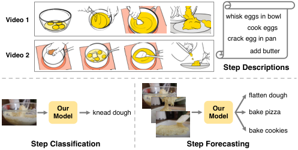

<!-- Start of picture text -->
Video 1 whisk eggs in bowl cook eggs crack egg in pan add butter Video 2 Step Descriptions flatten dough Our  Our Model knead dough Model bake pizza bake cookies Step Classification Step Forecasting <!-- End of picture text -->

Figure 1. **Top** : During training, our model learns from procedural videos and step descriptions to understand individual steps and capture temporal ordering and variations among steps. **Bottom** : Once trained, our model supports zero-shot step classification and forecasting, yielding multiple credible predictions. 

a future step. Such a model will be immensely useful for a wide range of applications including augmented reality, virtual personal assistant, and human-robot interaction. 

Understanding complex procedural activities has been a long-standing challenge in the vision community [7, 18, 22, 39, 41, 46]. While many prior approaches learn from annotated videos following a fully supervised setting [13,27,69], this paradigm is difficult to scale to a plethora of activities and their variants among individuals. A promising solution is offered by the exciting advances in vision-andlanguage pre-training, where models learn from visual data (images or videos) and their paired text data (captions or narrations) [30, 43, 54, 70] in order to recognize a variety of concepts. This idea has recently been explored to analyze instructional videos [33, 37], yet existing methods are limited to recognize single action steps in procedural activities. 

In this paper, we present a first step towards modeling temporal ordering of action steps in procedural activities by learning from instructional videos and their narrations. Our key innovation lies in the joint learning of a video representation aiming to encode individual step concepts, and a deep probabilistic model designed to capture temporal dependencies and variations among steps. The video representation, instantiated as a Transformer network, is learned by 

14825

<!-- Page 2 -->

matching a video clip to its corresponding narration. The probabilistic model, built on a diffusion process, is tasked to predict the distribution of the video representation for a missing step, given steps in its vicinity. With the help of a pre-trained vision-and-language model [43], our model is trained using only videos and their narrations from automatic speech recognition (ASR), and thus does not require any manual annotations. 

Once learned, our model celebrates two unique benefits thanks to our model design and training framework. First, our model supports _zero-shot inference_ given an input video, including the recognition of single steps and forecasting of future steps, and can be further fine-tuned on downstream tasks. Second, our model allows _sampling multiple video representations_ when predicting a missing action step, with each presenting a possibly different hypothesis of the step ordering. Instead of predicting a single representation with the highest probability, sampling from a probabilistic model provides access to additional high-probability solutions that might be beneficial to prediction tasks with high ambiguity or requiring user interactions. 

We train our models on a large-scale instructional video dataset collected from YouTube (HowTo100M [38]), and evaluate them on two public benchmarks (COIN [55] and EPIC-Kitchens-100 [10]) covering a wide range of procedural videos and across the tasks of step classification and step forecasting. Through extensive experiments, we demonstrate that (1) our temporal model is highly effective in forecasting future steps, outperforming state-of-theart methods by a large margin of **+7.4%** in top-1 accuracy on COIN; (2) modeling temporal ordering reinforces video representation learning, leading to improved classification results ( **+2.8%** / **+3.3%** for step classification on COIN/EPIC-Kitchens) when probing the learned representations; (3) our training framework offers strong results for zero-shot step classification and forecasting; and (4) sampling from our probabilistic model yields diverse and plausible predictions of future steps. 

**Contributions** . Our work presents the first model that leverages video-and-language pre-training to capture the temporal ordering of action steps in procedural activities. Our key technical innovation lies in the design of a deep probabilistic model using a diffusion process, in tandem with video-and-language representation learning. The result is a model and a training framework that establish new state-of-the-art results on both step classification and forecasting tasks across the major benchmarks. Besides, our model is capable of generating diverse step predictions and supports zero-shot inference. 

## **2. Related Work** 

**Understanding Procedural Activities** . Reasoning about procedural activities, including their action steps and the 

temporal ordering of these steps, has been a central problem in activity recognition. While early works model temporal ordering with stochastic grammars [7, 18, 22, 39, 41, 46], more recent works consider supervised learning to localize steps and predict their ordering by learning from videos with human annotated action steps [8, 10, 13, 27, 55, 69, 71]. To alleviate the burden of costly video annotations, several works propose various forms of weakly supervised settings, with assumptions that the ordered list of steps is given without their temporal boundaries [5, 6, 67, 71], or that the key steps and their ordering remain fixed across all videos [1, 12, 13, 17, 28, 49]. 

Most of prior methods focus on the tasks of step classification and localization [1,5,6,12,13,28,49,71]. Others have considered the tasks of step forecasting [48], step verification [42] and procedure planning [67]. Our work also seeks to understand procedural activities. Different from these approaches, our method focuses on learning video representation from videos and their narrations without using human annotations. The resulting video representation can be leveraged for step classification and step forecasting. 

**Learning from Procedural Videos and Narrations** . The success of vision-and-language pre-training has fueled a new line of research that seeks to learn concepts of individual steps from instructional videos and their narrations [19, 36, 50, 62]. For example, Miech _et al_ . [37] propose MIL-NCE to learn representations from instructional videos [38] and their narrations extracted using ASR. 

The most relevant work is DistantSup [33], where they propose using distant supervision from a textual knowledge base (wikiHow) [26] to denoise text narrations from ASR. Specifically, DistantSup leverages a pre-trained language model [52] to link step descriptions from wikiHow to text narrations from video ASR results, and thus to create training labels for individual steps in videos. Different from [33], our method models the temporal ordering of steps in procedural activities, thus moves beyond representations of single steps to support temporal reasoning in videos. Further, our method learns from videos and narrations only, with the help of a pre-trained image-language model [43] yet without using a textual knowledge base. 

**Video-and-Language Pre-Training** . A relevant topic is video-and-language pre-training, aiming at learning video representation from videos and their paired natural language descriptions [3, 15, 16, 29, 31, 35, 54, 59, 63, 64, 66, 70], often generated from ASR outputs. Despite the latest development in ASR, automatically-transcribed speech from videos can be rather noisy and lacks precise temporal alignment with the visual content. Several recent works seek to address this challenge. VideoCLIP [63] starts from the pretrained MIL-NCE model and further improves the model by retrieval augmented training with overlapped video-text pairs. Bain _et al_ . [3] collect a less noisy dataset of video alt- 

14826

<!-- Page 3 -->

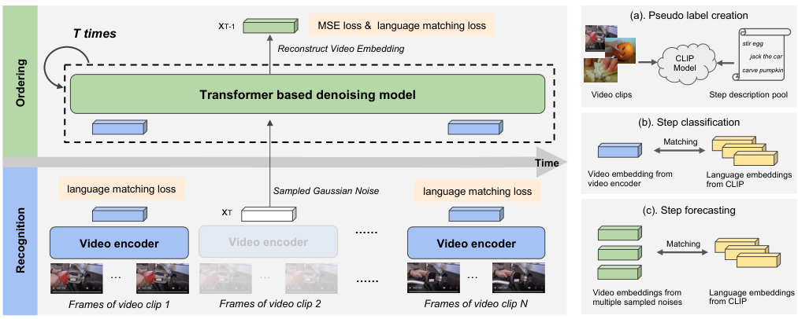

<!-- Start of picture text -->
(a). Pseudo label creation xT-1 MSE loss &  language matching loss T times Reconstruct Video Embedding  stir egg CLIP jack the car Model carve pumpkin Transformer based denoising model Video clips Step description pool (b). Step classification Matching Time Video embedding from  Language embeddings language matching loss  Sampled Gaussian Noise language matching loss  video encoder from CLIP xT (c). Step forecasting …… Video encoder Video encoder Video encoder Matching … … …… … Video embeddings from  Language embeddings Frames of video clip 1 Frames of video clip 2 Frames of video clip N multiple sampled noises  from CLIP Ordering Recognition <!-- End of picture text -->

Figure 2. Overview of our approach. **Left panel** : Our model consists of (1) a video encoder that takes a video clip and encodes it into a video embedding; (2) a transformer-based denoising model that samples noises from Gaussian distribution and generates video embedddings conditioned on the embeddings of adjacent video clips. **Right panel** : We leverage trained image-language model CLIP to create pseudo labels for individual video clips (a). After training, our model supports step classification given an input video clip (b), and step forecasting given a video that records previous steps (c). Note that diverse embeddings can be generated by sampling various noises. 

text pairs and geared the model to match these pairs. Our work shares the key idea of learning from video and text data as prior work, and seeks to leverage external knowledge from a pre-trained image-language model [43]. 

Another relevant work is MERLOT [66]. While both MERLOT and our work seek to learn video representation, our method differs from MERLOT in two folds. Our method models the sequence order of video clips for understanding procedural activities. MERLOT learns binary relative order between two given video frames for multi-modal reasoning and does not directly support action forecasting. Both methods consider a masked prediction task, yet MERLOT predicts the most likely text embeddings, while our method estimates the distribution of video representations using a deep probabilistic model. 

**Diffusion Models** . Diffusion models [51, 53] provide a powerful approach to characterize the probability density of high dimensional signals, and have recently demonstrated impressive results on generating high fidelity visual data, such as images [40,44,45,47], videos [21], and human body motion [57]. Our work adapts diffusion process to model the temporal ordering of steps in procedural videos. In doing so, our method not only facilities the learning of expressive video representations for individual steps, but also enables the anticipation of future action steps. 

## **3. Method** 

We consider the problem of learning video representation for understanding procedural activities from instructional videos and their narrations. An input video is represented as a sequence of _N_ clips _{v_ 1 _, v_ 2 _, ..., vN }_ . Each 

_vi_ captures a potential action step in the input video, and the time step _i_ records the temporal ordering of these clips. The video clips _{vi}_ can be either segmented by using the timestamps of ASR outputs (as we consider during training), or densely sampled from a video following their temporal ordering (as we use during inference). During learning, we further assume that an ordered set of sentences _{s_ 1 _, s_ 2 _, ..., sN }_ is associated with the video clips _{v_ 1 _, v_ 2 _, ..., vN }_ , with each _si_ describing the action step in video clip _vi_ . These sentences _{si}_ can be the output text from ASR, or given by matching the video clips to a text corpus using an external vision language model [43]. 

**Procedural-aware Video Representation** . Our goal is to learn video representation that encodes both action step concepts and their temporal dependencies across a range of procedural activities. Our representation consists of (a) a video encoder _f_ that extracts a representation _xi_ from an input clip _vi_ ( _i.e_ ., _xi_ = _f_ ( _vi_ )); and (b) a probabilistic model that characterizes the conditional probability _p_ ( _xj_ = _f_ ( _vj_ ) _|{xi_ = _f_ ( _vi_ ) _}i̸_ = _j_ ) _∀j_ . This design is highly flexible and supports a number of procedural reasoning tasks. _f_ offers video representation suitable to classify individual steps in a clip. _p_ ( _xj|{xi}i̸_ = _j_ ) models the temporal dependencies among steps, and can be used to predict the video representation of missing steps and further infer their labels. 

**Method Overview** . To learn our representation, we leverage a pre-trained text encoder _g_ that remains fixed during learning, and extend the idea of masked token modeling, populated in natural language processing [24]. For each input video and its narrations at training time, we randomly sample a clip _vj_ from _{v_ 1 _, v_ 2 _, ..., vN }_ and mask it 

14827

<!-- Page 4 -->

out. We then train our model to predict the distribution of _xj_ = _f_ ( _vj_ ) from _{xi_ = _f_ ( _vi_ ) _}i̸_ = _j_ ( _i.e_ ., _p_ ( _xj|{xi}i̸_ = _j_ )), align the expectation of the predicted distribution E( _xj_ ) with the corresponding text embedding _yj_ = _g_ ( _sj_ ), and match all other video representations _{xi_ = _f_ ( _vi_ ) _}i̸_ = _j_ to their text embeddings _{yi_ = _g_ ( _si_ ) _}i̸_ = _j_ . 

Despite the conceptual similarity, our learning is fundamentally different from masked token prediction. Our method seeks to characterize the distribution of _xj_ instead of predicting the most likely _xj_ , resulting in a more principled approach to capture the temporal dependencies among steps, as well as the new capability of sampling multiple high-probability solutions for _xj_ . Our method is illustrated in Fig. 2. In what follows, we lay out the formulation of our model, and describe its training and inference schemes. 

### **3.1. Modeling Action Steps and Their Ordering** 

Formally, given an input video with its clips _{v_ 1 _, v_ 2 _, ..., vN }_ and their narrations _{s_ 1 _, s_ 2 _, ..., sN }_ , our method assumes a factorization of _p_ ( _Y_ = _{yi}|X_ = _{xi}_ ) with video representation _xi_ = _f_ ( _vi_ ) (learnable) and text embedding _yi_ = _f_ ( _si_ ) (pre-trained and fixed). 

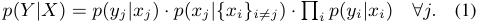

_p_ ( _yi|xi_ ) measures the alignment between a video representation _xi_ and a text embedding _yi_ . _p_ ( _xj|{xi}i̸_ = _j_ ) characterizes the distribution of a video representation for a missing step given the representations of all other steps, thereby modeling the temporal ordering of steps. Note that our model is not limited to single step prediction and can be readily extended to predict multiple missing steps. 

**Matching Image and Text Representations** . Our model matches the video representation _xi_ and text embedding _yi_ in a learned vector space, such that the alignment between them can be measured by cosine similarity. We will later instantiate this definition into a more tractable form for learning. Yet it suffices to notice that _p_ ( _yj|xj_ ) does not involve additional learnable parameters given _xi_ and _yi_ . 

**Modeling Step Ordering with Diffusion Process** . The key challenge lies in the modeling of _p_ ( _xj|{xi}i̸_ = _j_ ), as the video representation _xi_ is at least of a few hundred dimensions. To this end, we propose to model _p_ ( _xj|{xi}i̸_ = _j_ ) using a diffusion process [51, 53] conditioned on observed video representations _{xi}i̸_ = _j_ . Here we briefly describe diffusion process in the context of our model, and refer the readers to recent surveys for more technical details [9, 65]. 

Specifically, we assume a diffusion process that gradually adds noise to the input _xj_ over _t ∈_ [0 _,_ 1 _, ..., T_ ] steps. 

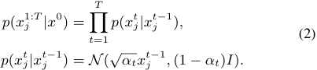

where _αt_ are constant hyper-parameters. The reverse diffusion (denoising) process is parameterized with 

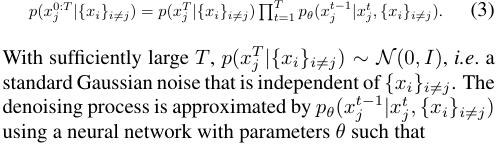

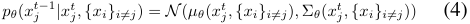

In practice, we follow Ho _et al_ . [20] and Tevet _et al_ . [57] to directly predict _x_0 _j_byusingadenoisingmodel_h_.With slight abuse of the symbols, we denote 

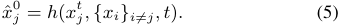

_h_ is realized using a Transformer network with the embedding of step _t_ as part of its inputs. Once learned, one can sample from _N_ (0 _, I_ ) and apply _h_ through the denoising process to predict _xj_ based on _{xi}i̸_ = _j_ . 

### **3.2. Learning from Videos and Their Narrations** 

Our training approximately maximizes the likelihood of Eq. 1 given a set of training videos and their narrations. 

**Pseudo Labels from CLIP** . It is straightforward to directly align video representations to the embeddings of their corresponding ASR text. Doing so, however, faces the challenges of low-quality ASR text and imprecise alignment between video and ASR sentences. To address these challenges, we propose to create pseudo labels by leveraging a pre-trained image-language model ( _e.g_ ., CLIP [43]). 

Specifically, we first create a pool of step descriptions in the form of verb phrases ( _e.g_ ., “add water”, “wear gloves”) parsed from ASR sentences [50], with their embeddings as _{y_1:_K_ _}_ . Then a trained CLIP model is applied to link each video clip with verb phrases, by matching the averaged visual features across frames with the language embeddings of verb phrases. The resulting matching scores are used as our training target. 

Our pseudo labeling instantiates the matching _p_ ( _yi|xi_ ) between video representation and text embedding using 

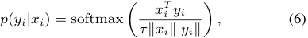

where _yi_ is selected from pool of verb phrases, _i.e_ . _yi ∈ {y_1:_K_ _}_ , and _τ_ is the pre-defined temperature. The matching problem thus is converted into a “classification” problem, making the training feasible. 

**Learning Objective and Training Loss** . Our training minimizes an evidence upper bound of the negative log likelihood _−_ log _p_ ( _Y |X_ ) in Eq. 1. The detailed derivation of 

14828

<!-- Page 5 -->

evidence upper bound is described in the Supplement. Our objective function constitutes three loss terms: 

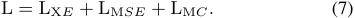

The _first_ term LX _E_ seeks to match observed video representation _{xi}_ to their text embeddings _{yi}_ , given by 

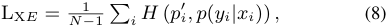

where _H_ ( _·, ·_ ) is the cross entropy, and _p__′_ _i_aresofttargets given by CLIP matching scores. _p_ ( _yi|xi_ ) defined in Eq. 6 measures the similarity between _xi_ and _yi_ . 

The _second_ term LM _SE_ comes from the Kullback–Leibler (KL) divergence within our diffusion model, and is computed as 

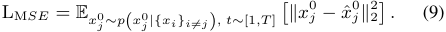

Note that unlike a standard diffusion model, our model directly predicts _x_ ˆ0 _j_.This term is applied at each step_t_. 

The _third_ term LM _C_ is derived from matching the predicted video representation _x_ ˆ0 _j_to its text embedding_yj_. 

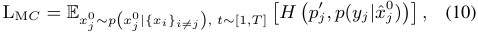

where _p__′_ _j_areagainsofttargetsgivenbyCLIPmodel,and _x_ ˆ0 _j_isdenoisedfromasamplednoise.Duringtraining,we adopt Monte Carlo estimation for E _p_ � _−_ log _p_ ( _yj|x_ ˆ0 _j_) �, by minimizing _−_ log _p_ ( _yj|x_ ˆ0 _j_) for each sampled_x_ˆ0 _j_.We attach this term at each step _t_ . 

A critical design choice lies in _p_ ( _yj|x_ ˆ0 _j_). _p_ ( _yj|x_ ˆ0 _j_)is simplified into a score function between a video representation and a finite set of text embeddings (defined using verb phrases). This allows us to reach our loss terms without worrying about global normalization constant as commonly encountered in energy-based models. Indeed, _H_ ( _p__′_ _j__, p_(_yj|x_ˆ0 _j_))canbeinterpretedasprovidingguidance by matching video to text embeddings. This term thus resembles the key idea of classifier guidance, which has shown to be helpful for learning diffusion models [11]. 

### **3.3. Model Inference** 

Once trained, our model offers a procedure-aware representation with two key components. First, the video encoder _f_ ( _·_ ) serves as a feature extractor for any input video clips. Second, the diffusion model, represented as its denoising model _h_ ( _·_ ), captures the temporal dependencies among steps. Our representation naturally supports a number of tasks. Here we demonstrate how our model can be used for step classification and step forecasting. 

**Step Classification** . An input video clip _v_ can be encoded using _f_ ( _·_ ). The video representation _x_ = _f_ ( _v_ ) can be directly compared to the text embeddings [43], so as to support zero-shot step classification. Alternative, an additional 

classifier can be attached on top of _f_ and further fine-tuned to recognize the action step in input clip. 

**Step Forecasting** . A future video clip feature _xj_ can be sampled from the diffusion model by drawing from a Gaussian distribution and denoising using _h_ ( _·_ ). The predicted _xj_ can be further classified into action steps. This prediction can be done using again Monte Carlo estimation given by 

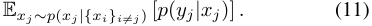

Specifically, a noise _xT_ is first sampled from Gaussian distribution and our denoising model gradually denoises it. At each step _t_ , the denoising model _h_ takes a noisy _x__t_ _j_, predicts clip feature ˆ _x_0 _j_, and diffuses it to_xt_ _j__−_1 based on the sampled noise _x__T_ _j_, as demonstrated in Eq. 2.After_T_iterations, the predicted clip feature at _t_ = 0 is used to match text embeddings. By sampling noises for multiple times, we can estimate the most likely _yj_ . 

However, sampling can be costly. In practice, to obtain top-1 prediction for missing steps, we adopt approximate inference, where the sampled noise is replaced with a fixed zero vector, corresponding to peak in the Gaussian distribution. Our empirical results validate that approximate inference achieves a very close performance as the expectation over multiple sampled noises. 

## **4. Experiments and Results** 

In this section, we first introduce datasets, evaluation protocols and implementation details. Then we demonstrate our results on step forecasting and step classification benchmarks. Finally, we show our qualitative results and conduct ablations to study our model components. **Datasets.** For _pre-training_ , we consider HowTo100M dataset [38] with 130K hours of YouTube tutorial videos. The videos cover various daily tasks, such as foods, housework, vehicles, _etc_ . We use a language parser [50] to extract the verb phrases from ASR sentences of these videos and keep 9,871 most frequent verb phrases. For _fine-tuning_ , we train our model on COIN dataset [55, 56] and EPICKitchens-100 dataset [10], respectively. COIN has 476 hours of YouTube videos covering 180 tasks, such as dishes, vehicles, housework, _etc_ . Human annotators summarize 778 unique steps in total ( _e.g_ ., “stir the egg”), and annotate the temporal boundary and the category of each step in all videos. EPIC-Kitchens-100 dataset [10] has 100 hours of egocentric videos, capturing daily activities in kitchen. Each action in the videos is annotated with an action label and a noun label. There are 97/300 unique actions/nouns in total. We use the human annotations in COIN and EPICKitchens-100 to evaluate the model performance. 

**Evaluation Protocols** . Our evaluation considers zero-shot and fine-tuning settings for step classification and step fore- 

14829

> Original page for checking 2 unresolved font glyphs.

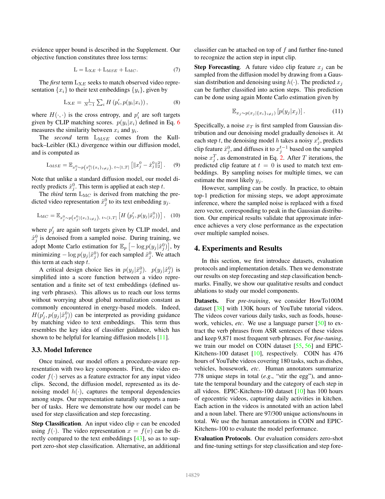

<!-- Page 6 -->

||Model|Pretraining Supervision|Dataset|Top-1 Zero-shot|Acc. (%) Fine-tuning|
|---|---|---|---|---|---|
|1|SlowFast [14]|Supervised: action labels|Kinetics|–|25.6|
|2|TimeSformer [4]|Supervised: action labels|Kinetics|–|34.7|
|3|S3D [61]|Unsupervised: ASR w. MIL-NCE [37]|HT100M|–|28.1|
|4|TimeSformer [4]|Unsupervised: ASR w. MIL-NCE [37]|HT100M|–|34.0|
|5|DistantSup [33]|Unsupervised: ASR + wikiHow|HT100M|–|39.4|
|6|Random Guess|–|–|0.1|–|
|7|CLIP [43]|Unsupervised: captions|CLIP400M|9.4|–|
|8|Ours|Unsupervised: ASR|HT100M|**11.3**|**46.8**|
|9|Ours (oracle-5)|Unsupervised: ASR|HT100M|14.7|51.8|

Table 1. Step forecasting on COIN dataset. We compare to a set of strong baselines and a oracle protocol built on our method. 

casting on COIN and EPIC-Kitchens-100 datasets. Zeroshot setting indicates that no human annotation is used during pre-training. The pre-trained model is directly tested on the evaluation dataset. Fine-tuning setting further fine-tunes the pre-trained model using human annotations of action steps. For a fair comparison, we follow the same fine-tuning schemes as previous work in respective benchmarks. 

**Implementation Details** . We adopted TimeSformer [4] as our video encoder, and used the Transformer [58] from CLIP’s text encoder as denoising model. We set the maximum step _T_ to 4, maximum length of video sequence as 9, and the number of Transformer layers as 4. We used a trained CLIP model (ViT-B/16) to create pseudo labels and encode step descriptions. Following DistantSup [33], for pre-training we used SGD for 5 epochs and then AdamW [34] for 25 epochs with 128 videos in a batch. For fine-tuning, we used AdamW for 15 epochs with batch size of 64. Temperature _τ_ was set to 0.02. Additional implementation details can be found in Supplement. 

### **4.1. Step Forecasting** 

**Setup** . We follow the benchmark in DistantSup [33] to evaluate step forecasting on COIN, where top-1 accuracy is reported. Given a video with previous steps, the model anticipates the category of next single step ( _e.g_ ., “stir the egg”). This task thus requires explicit modeling of the temporal ordering among steps. We only fine-tune the diffusion model while keeping the video encoder frozen. 

**Results** . Table 1 compares results of our method with a series of baselines. The closest competitor is DistantSup [33] in L5, which learns from ASR text and an external textual knowledge base [26] using the same video backbone (TimeSformer [4]). We also include other baselines reported in DistantSup, _e.g_ ., SlowFast [14], TimeSformer [4], and S3D [61] from L1 to L4, where models are supervised using human-annotated action labels or video ASR text. Our model significantly outperforms all baselines by at least **7.4%** for the fine-tuning setting ( _e.g_ ., 46.8% in L8 vs. 39.4% in L5). Further, we consider a strong baseline for the zero-shot setting by re-purposing CLIP model [43] 

to match the input video with the descriptions of all step candidates. Comparing L7 and L8, our model outperforms this variant of CLIP by a clear margin (11.3% vs. 9.4%). 

A unique property of our model is its ability to output multiple, potentially different predictions. We further evaluate the upper bound of our results by assuming an oracle ranking function that always selects the correction prediction from 5 outputs sampled from our model (Ours (oracle5)). This oracle further improves the top-1 accuracy from 11.3% to 14.7% in L9, suggesting that our model is able to produce diverse predictions for step forecasting. 

### **4.2. Step Classification** 

**Setup** . Besides step ordering, we also evaluate step classification on COIN and EPIC-Kitchens-100 datasets, where a model is tasked to classify a trimmed video clip into one of the step categories. For COIN, we follow DistantSup [33] to only fine-tune the additional linear layer on top of the pretrained video encoder. For EPIC-Kitchens-100, we fully fine-tune the video encoder, following [2, 25, 33]. We report the accuracy of step classification on COIN, and that of verb, noun, and action on EPIC-Kitchens-100. 

**Results** . Table. 2 summarizes the results on COIN. We consider baselines as in DistantSup from L1 to L8 ( _e.g_ ., SlowFast [14], VideoCLIP [63]), where models are trained using either action labels or video ASR text. To support zero-shot inference, we re-implement a model variant (DistantSup _†_ ) described in [33]. This model is pre-trained to match video embeddings with language embeddings and thus supports recognizing arbitrary step descriptions in L9. We also report the results of CLIP [43], which creates the pseudo labels for our pre-training in L10. As shown, our model consistently outperforms all the other methods by a clear margin under different settings. For example, ours outperforms CLIP by **1.8%** in zero-shot setting (16.6% in L11 vs. 14.8% in L10), and outperforms DistantSup by **2.8%** (56.9% in L11 vs. 54.1% in L8) in fine-tuning setting. 

Table. 3 presents our results on EPIC-Kitchens-100. While TimeSformer [4] in L8 and DistantSup [33] in L9 use the same video encoder architecture as ours, our model 

14830

<!-- Page 7 -->

||Model|Pretraining Supervision|Dataset|Top-1 Zero-shot|Acc. (%) Fine-tuning|
|---|---|---|---|---|---|
|1|TSN (RGB+Flow) [55]|Supervised: action labels|Kinetics|–|36.5*|
|2|S3D [61]|Unsupervised: ASR w. MIL-NCE [37]|HT100M|–|37.5*|
|3|SlowFast [14]|Supervised: action labels|Kinetics|–|32.9|
|4|TimeSformer [4]|Supervised: action labels|Kinetics|–|48.3|
|5|ClipBERT [29]|Supervised: captions|COCO+VG|–|30.8|
|6|VideoCLIP [63]|Unsupervised: ASR|HT100M|–|39.4|
|7|TimeSformer [4]|Unsupervised: ASR w. MIL-NCE [37]|HT100M|–|46.5|
|8|DistantSup [33]|Unsupervised: ASR + wikiHow|HT100M|–|54.1|
|9|DistantSup_†_[33]|Unsupervised: ASR + wikiHow|HT100M|10.2|46.6|
|10|CLIP [43]|Unsupervised: captions|CLIP400M|14.8|45.9|
|11|Ours|Unsupervised: ASR|HT100M|**16.6**|**56.9**|

Table 2. Step classification on COIN dataset. DistantSup _†_ is re-implemented based on their official code base. It is a variant reported in their paper that pre-trains the model to match language embeddings. * indicates the model is fully fine-tuned on COIN dataset. 

||Model|Pretraining Supervision|Pretraining Dataset|Action (%)|Verb (%)|Noun (%)|
|---|---|---|---|---|---|---|
|1|TSN [60]|–|–|33.2|60.2|46.0|
|2|TRN [68]|–|–|35.3|65.9|45.4|
|3|TBN [23]|–|–|36.7|66.0|47.2|
|4|MoViNet [25]|–|–|**47.7**|**72.2**|57.3|
|5|TSM [32]|Supervised: action labels|Kinetics|38.3|67.9|49.0|
|6|SlowFast [14]|Supervised: action labels|Kinetics|38.5|65.6|50.0|
|7|ViViT-L [2]|Supervised: action labels|Kinetics|44.0|66.4|56.8|
|8|TimeSformer [4]|Supervised: action labels|Kinetics|42.3|66.6|54.4|
|9|DistantSup [33]|Unsupervised: ASR + wikiHow|HT100M|44.4|67.1|58.1|
|10|Ours|Unsupervised: ASR|HT100M|**47.7**|69.5|**60.3**|

Table 3. Step classification on EPIC-Kitchens-100 dataset with fine-tuning setting. Our method outperforms the close competitors (TimeSformer, DistantSup), with results on par with even stronger backbone models (MoViNet). 

in L10 achieves a clear gain over them, _e.g_ ., **+3.3%/2.2%** for action/noun. The only exception is the lower accuracy (-2.7%) on verb when compared with MoViNet (MoViNetA6) in L4, a heavily optimized video backbone. 

### **4.3. Predicting Diverse Future Steps** 

One of the defining characteristics of our model is that it allows us to sample multiple predictions of video representation corresponding to a future step. This leads to an interesting question about the diversity of the predictions, as partially evaluated in our prior experiments. Here we present further demonstration of this capability by visualizing the step forecasting results, and more interestingly, using these results to generate future video frames. 

Fig. 3 presents the visualization for zero-shot step forecasting and key frame generation. In this setting, our model is pre-trained without any human annotation and is directly tested for step forecasting. We show multiple predictions sampled from our diffusion model. Further, we demonstrate that the text description of predicted step can be used to generate the key frames by leveraging the stable diffusion model [45]. To keep the generated images visually consistent with the input video, we let stable diffusion model take one input video frame and the description of predicted step as input and generate an image. 

As shown in Fig. 3, our model is capable of forecasting multiple, reasonable next steps ( _e.g_ ., “flatten the dough”, “bake pizza”), based on which credible future frames can be generated. These results suggest that our model not only predicts meaningful video representations of individual steps, but also captures the variations in step ordering 

### **4.4. Ablation Studies** 

We conduct ablation study on COIN, including step classification/forecasting with zero-shot/fine-tuning setting. Additional ablation results can be found in Supplement. 

**Does modeling of temporal order help?** In Table 4, we conduct a comparison on two different pre-training tasks: (1) pre-training by only matching video representations to text embeddings of the verb phrases; and (2) pre-training by our method that combines matching and temporal order modeling. In comparison to pre-training using matching only, our method significantly improves the performance for both zero-shot and fine-tuning settings and across step classification and step forecasting tasks. For example, zeroshot step classification is improved from **13.7%** to **16.6%** . Our results after fine-tuning attains a major gain of +3.6% and +1.8% for step classification and step forecasting, respectively. Importantly, our method also enables zero-shot step forecasting by predicting future video representations. 

14831

<!-- Page 8 -->

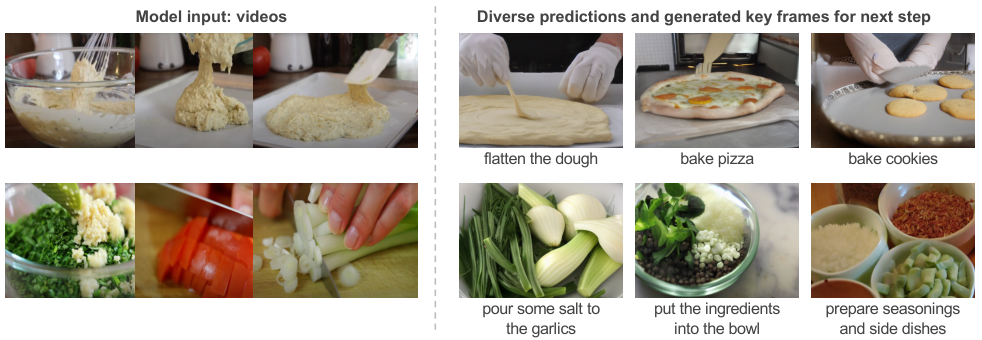

<!-- Start of picture text -->
Model input: videos Diverse predictions and generated key frames for next step flatten the dough bake pizza bake cookies pour some salt to  put the ingredients  prepare seasonings the garlics into the bowl and side dishes <!-- End of picture text -->

Figure 3. Visualization of **zero-shot** step forecasting and **key frame generation** . Without using any human annotation during training, our trained model is directly evaluated on COIN dataset [56]. Given a video recording previous steps (left), our model is capable of forecasting multiple reasonable predictions and each predicted step is further used for key frame generation (right). We adopt stable diffusion [45] for key frame generation, taking inputs as a text description of step and a sampled frame from input video. 

|Model|Pre-training task|Order modeling|Zero-shot (top-1 acc. %) Step classification Step forecasting|Fine-tuning (t Step classification|op-1 acc. %) Step forecasting|
|---|---|---|---|---|---|
|Ours|Matching|–|13.7 No zero-shot ability|52.8|41.6|
|Ours|Matching + Ordering|Mask|16.9 10.6|56.4|43.2|
|Ours|Matching + Ordering|Diffusion|16.6 11.3|56.9|46.8|

Table 4. Ablation study of pre-training tasks and order modeling. Our proposed order pre-training not only enables zero-shot forecasting, but also significantly improves zero-shot step classification and the fine-tuning results across evaluation tasks. Our diffusion models further improves mask modeling, especially on fine-tuning step forecasting. 

These results suggest that our procedure-aware pre-training can effectively facilitate the learning for both video representation and step ordering in procedure activities. 

**Masked Prediction vs. Diffusion Model** . We explore a model variant using the mask prediction, sharing similar spirit as the well-known Masked Language Modeling in BERT [24]. Specifically, this variant is trained to recover the video embeddings of masked video clips so that it can match to the assigned verb phrases. Our diffusion model largely outperforms the results of this variant, especially on the step forecasting (+0.7% and +3.6% for zero-shot and fine-tuning, respectively, as in Table 4). This result indicates that our diffusion model is a more suitable way to capture the variation inside the step ordering. 

**Approximate Inference** . In Table 5, we validate that our approximate inference with a single zero-vector can achieve close empirical results as the Monte Carlo estimation ( _e.g_ ., within 0.1% difference). Monte Carlo estimation computes the weighted average of multiple sampled predictions ( _e.g_ ., from 5 sampled noises). We run the experiment for 5 times and the variation is small ( _e.g_ ., _±_ 0.03%). Further, if we assume an oracle ranking function to pick the correct one from sampled predictions, our results can be further boosted by 3.4% on average, suggesting diverse predictions from our model and ample room to improve. 

|Model|Inference Type|Top-1 Acc. (%)|
|---|---|---|
|Ours|Approximation|11.33|
|Ours|Expectation|11.34_±_0.03|
|Ours|Oracle|14.73_±_0.13|

Table 5. Ablation study of inference schemes. “Approximation” uses a zero-vector as noise, “Expectation” adopts Monte Carlo estimation, and “Oracle” further assumes an oracle ranking function to pick the correct prediction derived from multiple noises. 

## **5. Conclusion** 

In this work, we presented a model and a training frame work for learning procedure-aware video representation from a large-scale dataset of instructional videos and their narrations, without the need for human annotations. The key strength of our model lies in the joint learning of a video encoder capturing concepts of action steps, as well as a diffusion model reasoning about the temporal dependencies among steps. We demonstrated that our model achieves strong results on step classification and forecasting in both zero-shot and fine-tuning settings and across COIN and EPIC-Kitchens-100 datasets. We believe our work provides a solid step towards understanding procedural activities. We hope that our work will shed light on the broader problem of video-language pre-training. 

14832

<!-- Page 9 -->

## **References** 

- [1] Jean-Baptiste Alayrac, Piotr Bojanowski, Nishant Agrawal, Josef Sivic, Ivan Laptev, and Simon Lacoste-Julien. Unsupervised learning from narrated instruction videos. In _Proceedings of the IEEE Conference on Computer Vision and Pattern Recognition_ , pages 4575–4583, 2016. 2 

- [2] Anurag Arnab, Mostafa Dehghani, Georg Heigold, Chen Sun, Mario Luˇci´c, and Cordelia Schmid. Vivit: A video vision transformer. In _Proceedings of the IEEE/CVF International Conference on Computer Vision_ , pages 6836–6846, 2021. 6, 7 

- [3] Max Bain, Arsha Nagrani, G¨ul Varol, and Andrew Zisserman. Frozen in time: A joint video and image encoder for end-to-end retrieval. In _Proceedings of the IEEE/CVF International Conference on Computer Vision_ , pages 1728–1738, 2021. 2 

- [4] Gedas Bertasius, Heng Wang, and Lorenzo Torresani. Is space-time attention all you need for video understanding? In _Proceedings of the International Conference on Machine Learning (ICML)_ , July 2021. 6, 7 

- [5] Piotr Bojanowski, R´emi Lajugie, Francis Bach, Ivan Laptev, Jean Ponce, Cordelia Schmid, and Josef Sivic. Weakly supervised action labeling in videos under ordering constraints. In _European Conference on Computer Vision_ , pages 628–643. Springer, 2014. 2 

- [6] Piotr Bojanowski, R´emi Lajugie, Edouard Grave, Francis Bach, Ivan Laptev, Jean Ponce, and Cordelia Schmid. Weakly-supervised alignment of video with text. In _Proceedings of the IEEE international conference on computer vision_ , pages 4462–4470, 2015. 2 

- [7] M. Brand, N. Oliver, and A. Pentland. Coupled hidden markov models for complex action recognition. In _Proceedings of IEEE Computer Society Conference on Computer Vision and Pattern Recognition_ , pages 994–999, 1997. 1, 2 

- [8] Chien-Yi Chang, De-An Huang, Danfei Xu, Ehsan Adeli, Li Fei-Fei, and Juan Carlos Niebles. Procedure planning in instructional videos. In _European Conference on Computer Vision_ , pages 334–350. Springer, 2020. 2 

- [9] Florinel-Alin Croitoru, Vlad Hondru, Radu Tudor Ionescu, and Mubarak Shah. Diffusion models in vision: A survey. _arXiv preprint arXiv:2209.04747_ , 2022. 4 

- [10] Dima Damen, Hazel Doughty, Giovanni Maria Farinella, Sanja Fidler, Antonino Furnari, Evangelos Kazakos, Davide Moltisanti, Jonathan Munro, Toby Perrett, Will Price, and Michael Wray. The EPIC-KITCHENS dataset: Collection, challenges and baselines. _IEEE Transactions on Pattern Analysis and Machine Intelligence (TPAMI)_ , 43(11):4125– 4141, 2021. 2, 5 

- [11] Prafulla Dhariwal and Alexander Nichol. Diffusion models beat GANs on image synthesis. _Advances in Neural Information Processing Systems_ , 34:8780–8794, 2021. 5 

- [12] E. Elhamifar and D. Huynh. Self-supervised multi-task procedure learning from instructional videos. _European Conference on Computer Vision_ , 2020. 2 

- [13] Ehsan Elhamifar and Zwe Naing. Unsupervised procedure learning via joint dynamic summarization. In _Proceedings of_ 

_the IEEE/CVF International Conference on Computer Vision (ICCV)_ , October 2019. 1, 2 

- [14] Christoph Feichtenhofer, Haoqi Fan, Jitendra Malik, and Kaiming He. SlowFast networks for video recognition. In _Proceedings of the IEEE/CVF International Conference on Computer Vision (ICCV)_ , October 2019. 6, 7 

- [15] Tsu-Jui Fu, Linjie Li, Zhe Gan, Kevin Lin, William Yang Wang, Lijuan Wang, and Zicheng Liu. VIOLET: End-toend video-language transformers with masked visual-token modeling. _arXiv preprint arXiv:2111.12681_ , 2021. 2 

- [16] Deepti Ghadiyaram, Du Tran, and Dhruv Mahajan. Largescale weakly-supervised pre-training for video action recognition. In _Proceedings of the IEEE/CVF conference on computer vision and pattern recognition_ , pages 12046–12055, 2019. 2 

- [17] Karan Goel and Emma Brunskill. Learning procedural abstractions and evaluating discrete latent temporal structure. In _International Conference on Learning Representations_ , 2019. 2 

- [18] Abhinav Gupta, Praveen Srinivasan, Jianbo Shi, and Larry S. Davis. Understanding videos, constructing plots learning a visually grounded storyline model from annotated videos. In _2009 IEEE Conference on Computer Vision and Pattern Recognition_ , pages 2012–2019, 2009. 1, 2 

- [19] Tengda Han, Weidi Xie, and Andrew Zisserman. Temporal alignment networks for long-term video. In _Proceedings of the IEEE/CVF Conference on Computer Vision and Pattern Recognition_ , pages 2906–2916, 2022. 2 

- [20] Jonathan Ho, Ajay Jain, and Pieter Abbeel. Denoising diffusion probabilistic models. _Advances in Neural Information Processing Systems_ , 33:6840–6851, 2020. 4 

- [21] Jonathan Ho, Tim Salimans, Alexey A Gritsenko, William Chan, Mohammad Norouzi, and David J Fleet. Video diffusion models. In _Advances in Neural Information Processing Systems_ , 2022. 3 

- [22] Y.A. Ivanov and A.F. Bobick. Recognition of visual activities and interactions by stochastic parsing. _IEEE Transactions on Pattern Analysis and Machine Intelligence_ , 22(8):852–872, 2000. 1, 2 

- [23] Evangelos Kazakos, Arsha Nagrani, Andrew Zisserman, and Dima Damen. EPIC-fusion: Audio-visual temporal binding for egocentric action recognition. In _Proceedings of the IEEE/CVF International Conference on Computer Vision_ , pages 5492–5501, 2019. 7 

- [24] Jacob Devlin Ming-Wei Chang Kenton and Lee Kristina Toutanova. BERT: Pre-training of deep bidirectional transformers for language understanding. In _Proceedings of NAACL-HLT_ , pages 4171–4186, 2019. 3, 8 

- [25] Dan Kondratyuk, Liangzhe Yuan, Yandong Li, Li Zhang, Mingxing Tan, Matthew Brown, and Boqing Gong. MoViNets: Mobile video networks for efficient video recognition. In _Proceedings of the IEEE/CVF Conference on Computer Vision and Pattern Recognition_ , pages 16020–16030, 2021. 6, 7 

- [26] Mahnaz Koupaee and William Yang Wang. WikiHow: A large scale text summarization dataset. _arXiv preprint arXiv:1810.09305_ , 2018. 2, 6 

14833

<!-- Page 10 -->

- [27] Hilde Kuehne, Ali Arslan, and Thomas Serre. The language of actions: Recovering the syntax and semantics of goal-directed human activities. In _Proceedings of the IEEE Conference on Computer Vision and Pattern Recognition (CVPR)_ , June 2014. 1, 2 

- [28] Anna Kukleva, Hilde Kuehne, Fadime Sener, and Jurgen Gall. Unsupervised learning of action classes with continuous temporal embedding. In _Proceedings of the IEEE/CVF Conference on Computer Vision and Pattern Recognition_ , pages 12066–12074, 2019. 2 

- [29] Jie Lei, Linjie Li, Luowei Zhou, Zhe Gan, Tamara L. Berg, Mohit Bansal, and Jingjing Liu. Less is more: Clipbert for video-and-language learning via sparse sampling. In _Proceedings of the IEEE/CVF Conference on Computer Vision and Pattern Recognition (CVPR)_ , pages 7331–7341, June 2021. 2, 7 

- [30] Junnan Li, Ramprasaath R Selvaraju, Akhilesh Deepak Gotmare, Shafiq Joty, Caiming Xiong, and Steven Hoi. Align before fuse: Vision and language representation learning with momentum distillation. _arXiv preprint arXiv:2107.07651_ , 2021. 1 

- [31] Linjie Li, Yen-Chun Chen, Yu Cheng, Zhe Gan, Licheng Yu, and Jingjing Liu. HERO: Hierarchical encoder for Video+Language omni-representation pre-training. In _Proceedings of the 2020 Conference on Empirical Methods in Natural Language Processing (EMNLP)_ , pages 2046–2065, Online, Nov. 2020. Association for Computational Linguistics. 2 

- [32] Ji Lin, Chuang Gan, and Song Han. TSM: Temporal shift module for efficient video understanding. In _Proceedings of the IEEE/CVF International Conference on Computer Vision_ , pages 7083–7093, 2019. 7 

- [33] Xudong Lin, Fabio Petroni, Gedas Bertasius, Marcus Rohrbach, Shih-Fu Chang, and Lorenzo Torresani. Learning to recognize procedural activities with distant supervision. In _Proceedings of the IEEE/CVF Conference on Computer Vision and Pattern Recognition_ , pages 13853–13863, 2022. 1, 2, 6, 7 

- [34] Ilya Loshchilov and Frank Hutter. Decoupled weight decay regularization. In _International Conference on Learning Representations_ , 2018. 6 

- [35] Huaishao Luo, Lei Ji, Botian Shi, Haoyang Huang, Nan Duan, Tianrui Li, Jason Li, Taroon Bharti, and Ming Zhou. Univl: A unified video and language pre-training model for multimodal understanding and generation. _arXiv preprint arXiv:2002.06353_ , 2020. 2 

- [36] Jonathan Malmaud, Jonathan Huang, Vivek Rathod, Nick Johnston, Andrew Rabinovich, and Kevin Murphy. What’s cookin’? interpreting cooking videos using text, speech and vision. _arXiv preprint arXiv:1503.01558_ , 2015. 2 

- [37] Antoine Miech, Jean-Baptiste Alayrac, Lucas Smaira, Ivan Laptev, Josef Sivic, and Andrew Zisserman. End-to-end learning of visual representations from uncurated instructional videos. In _Proceedings of the IEEE/CVF Conference on Computer Vision and Pattern Recognition_ , pages 9879– 9889, 2020. 1, 2, 6, 7 

- [38] Antoine Miech, Dimitri Zhukov, Jean-Baptiste Alayrac, Makarand Tapaswi, Ivan Laptev, and Josef Sivic. 

   - HowTo100M: Learning a text-video embedding by watching hundred million narrated video clips. In _Proceedings of the IEEE/CVF International Conference on Computer Vision_ , pages 2630–2640, 2019. 2, 5 

- [39] Ram Nevatia, Tao Zhao, and Somboon Hongeng. Hierarchical language-based representation of events in video streams. In _2003 Conference on Computer Vision and Pattern Recognition Workshop_ , volume 4, pages 39–39, 2003. 1, 2 

- [40] Alexander Quinn Nichol, Prafulla Dhariwal, Aditya Ramesh, Pranav Shyam, Pamela Mishkin, Bob Mcgrew, Ilya Sutskever, and Mark Chen. GLIDE: Towards photorealistic image generation and editing with text-guided diffusion models. In _International Conference on Machine Learning_ , pages 16784–16804. PMLR, 2022. 3 

- [41] Mingtao Pei, Yunde Jia, and Song-Chun Zhu. Parsing video events with goal inference and intent prediction. In _2011 International Conference on Computer Vision_ , pages 487– 494, 2011. 1, 2 

- [42] Yicheng Qian, Weixin Luo, Dongze Lian, Xu Tang, Peilin Zhao, and Shenghua Gao. SVIP: Sequence verification for procedures in videos. In _Proceedings of the IEEE/CVF Conference on Computer Vision and Pattern Recognition_ , pages 19890–19902, 2022. 2 

- [43] Alec Radford, Jong Wook Kim, Chris Hallacy, Aditya Ramesh, Gabriel Goh, Sandhini Agarwal, Girish Sastry, Amanda Askell, Pamela Mishkin, Jack Clark, et al. Learning transferable visual models from natural language supervision. In _International Conference on Machine Learning (ICML)_ , 2021. 1, 2, 3, 4, 5, 6, 7 

- [44] Aditya Ramesh, Prafulla Dhariwal, Alex Nichol, Casey Chu, and Mark Chen. Hierarchical text-conditional image generation with CLIP latents. _arXiv preprint arXiv:2204.06125_ , 2022. 3 

- [45] Robin Rombach, Andreas Blattmann, Dominik Lorenz, Patrick Esser, and Bj¨orn Ommer. High-resolution image synthesis with latent diffusion models. In _Proceedings of the IEEE/CVF Conference on Computer Vision and Pattern Recognition_ , pages 10684–10695, 2022. 3, 7, 8 

- [46] M.S. Ryoo and J.K. Aggarwal. Recognition of composite human activities through context-free grammar based representation. In _2006 IEEE Computer Society Conference on Computer Vision and Pattern Recognition (CVPR’06)_ , volume 2, pages 1709–1718, 2006. 1, 2 

- [47] Chitwan Saharia, William Chan, Saurabh Saxena, Lala Li, Jay Whang, Emily Denton, Seyed Kamyar Seyed Ghasemipour, Burcu Karagol Ayan, S Sara Mahdavi, Rapha Gontijo Lopes, et al. Photorealistic text-to-image diffusion models with deep language understanding. _arXiv preprint arXiv:2205.11487_ , 2022. 3 

- [48] Fadime Sener and Angela Yao. Zero-shot anticipation for instructional activities. In _Proceedings of the IEEE/CVF International Conference on Computer Vision_ , pages 862–871, 2019. 2 

- [49] Ozan Sener, Amir R Zamir, Silvio Savarese, and Ashutosh Saxena. Unsupervised semantic parsing of video collections. In _Proceedings of the IEEE International conference on Computer Vision_ , pages 4480–4488, 2015. 2 

14834

<!-- Page 11 -->

- [50] Yuhan Shen, Lu Wang, and Ehsan Elhamifar. Learning to segment actions from visual and language instructions via differentiable weak sequence alignment. In _Proceedings of the IEEE/CVF Conference on Computer Vision and Pattern Recognition (CVPR)_ , pages 10156–10165, June 2021. 2, 4, 5 

- [51] Jascha Sohl-Dickstein, Eric Weiss, Niru Maheswaranathan, and Surya Ganguli. Deep unsupervised learning using nonequilibrium thermodynamics. In _International Conference on Machine Learning_ , pages 2256–2265. PMLR, 2015. 3, 4 

- [52] Kaitao Song, Xu Tan, Tao Qin, Jianfeng Lu, and Tie-Yan Liu. MPNet: Masked and permuted pre-training for language understanding. _Advances in Neural Information Processing Systems_ , 33:16857–16867, 2020. 2 

- [53] Yang Song and Stefano Ermon. Improved techniques for training score-based generative models. _Advances in neural information processing systems_ , 33:12438–12448, 2020. 3, 4 

- [54] Chen Sun, Austin Myers, Carl Vondrick, Kevin Murphy, and Cordelia Schmid. VideoBERT: A joint model for video and language representation learning. In _Proceedings of the IEEE/CVF International Conference on Computer Vision_ , pages 7464–7473, 2019. 1, 2 

- [55] Yansong Tang, Dajun Ding, Yongming Rao, Yu Zheng, Danyang Zhang, Lili Zhao, Jiwen Lu, and Jie Zhou. COIN: A large-scale dataset for comprehensive instructional video analysis. In _Proceedings of the IEEE/CVF Conference on Computer Vision and Pattern Recognition_ , pages 1207– 1216, 2019. 2, 5, 7 

- [56] Yansong Tang, Jiwen Lu, and Jie Zhou. Comprehensive instructional video analysis: The COIN dataset and performance evaluation. _TPAMI_ , 2020. 5, 8 

- [57] Guy Tevet, Sigal Raab, Brian Gordon, Yonatan Shafir, Daniel Cohen-Or, and Amit H Bermano. Human motion diffusion model. In _International Conference on Learning Representations_ , 2023. 3, 4 

- [58] Ashish Vaswani, Noam Shazeer, Niki Parmar, Jakob Uszkoreit, Llion Jones, Aidan N Gomez, Łukasz Kaiser, and Illia Polosukhin. Attention is all you need. _Advances in neural information processing systems_ , 30, 2017. 6 

- [59] Alex Jinpeng Wang, Yixiao Ge, Rui Yan, Yuying Ge, Xudong Lin, Guanyu Cai, Jianping Wu, Ying Shan, Xiaohu Qie, and Mike Zheng Shou. All in one: Exploring unified video-language pre-training. _arXiv preprint arXiv:2203.07303_ , 2022. 2 

- [60] Limin Wang, Yuanjun Xiong, Zhe Wang, Yu Qiao, Dahua Lin, Xiaoou Tang, and Luc Van Gool. Temporal segment networks: Towards good practices for deep action recognition. In _European conference on computer vision_ , pages 20–36. Springer, 2016. 7 

procedural knowledge extraction from cooking videos. In _Proceedings of the First International Workshop on Natural Language Processing Beyond Text_ , pages 30–40, Online, Nov. 2020. Association for Computational Linguistics. 2 

   - [63] Hu Xu, Gargi Ghosh, Po-Yao Huang, Dmytro Okhonko, Armen Aghajanyan, Florian Metze, Luke Zettlemoyer, and Christoph Feichtenhofer. VideoCLIP: Contrastive pretraining for zero-shot video-text understanding. _arXiv preprint arXiv:2109.14084_ , 2021. 2, 6, 7 

   - [64] Jianwei Yang, Yonatan Bisk, and Jianfeng Gao. TACo: Token-aware cascade contrastive learning for video-text alignment. In _Proceedings of the IEEE/CVF International Conference on Computer Vision_ , pages 11562–11572, 2021. 2 

   - [65] Ling Yang, Zhilong Zhang, Yang Song, Shenda Hong, Runsheng Xu, Yue Zhao, Yingxia Shao, Wentao Zhang, Bin Cui, and Ming-Hsuan Yang. Diffusion models: A comprehensive survey of methods and applications. _arXiv preprint arXiv:2209.00796_ , 2022. 4 

   - [66] Rowan Zellers, Ximing Lu, Jack Hessel, Youngjae Yu, Jae Sung Park, Jize Cao, Ali Farhadi, and Yejin Choi. MERLOT: Multimodal neural script knowledge models. _Advances in Neural Information Processing Systems_ , 34:23634–23651, 2021. 2, 3 

   - [67] Henghui Zhao, Isma Hadji, Nikita Dvornik, Konstantinos G. Derpanis, Richard P. Wildes, and Allan D. Jepson. P3IV: Probabilistic procedure planning from instructional videos with weak supervision. _2022 IEEE/CVF Conference on Computer Vision and Pattern Recognition (CVPR)_ , pages 2928–2938, 2022. 2 

   - [68] Bolei Zhou, Alex Andonian, Aude Oliva, and Antonio Torralba. Temporal relational reasoning in videos. In _Proceedings of the European conference on computer vision (ECCV)_ , pages 803–818, 2018. 7 

   - [69] Luowei Zhou, Chenliang Xu, and Jason J Corso. Towards automatic learning of procedures from web instructional videos. In _Thirty-Second AAAI Conference on Artificial Intelligence_ , 2018. 1, 2 

   - [70] Linchao Zhu and Yi Yang. ActBERT: Learning global-local video-text representations. In _Proceedings of the IEEE/CVF conference on computer vision and pattern recognition_ , pages 8746–8755, 2020. 1, 2 

   - [71] Dimitri Zhukov, Jean-Baptiste Alayrac, Ramazan Gokberk Cinbis, David Fouhey, Ivan Laptev, and Josef Sivic. Crosstask weakly supervised learning from instructional videos. In _Proceedings of the IEEE/CVF Conference on Computer Vision and Pattern Recognition_ , pages 3537–3545, 2019. 2 

- [61] Saining Xie, Chen Sun, Jonathan Huang, Zhuowen Tu, and Kevin Murphy. Rethinking spatiotemporal feature learning: Speed-accuracy trade-offs in video classification. In _Proceedings of the European conference on computer vision (ECCV)_ , pages 305–321, 2018. 6, 7 

- [62] Frank F. Xu, Lei Ji, Botian Shi, Junyi Du, Graham Neubig, Yonatan Bisk, and Nan Duan. A benchmark for structured 

14835
