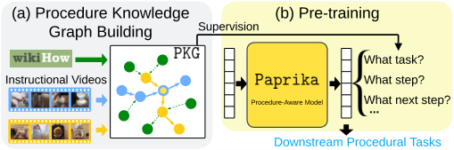
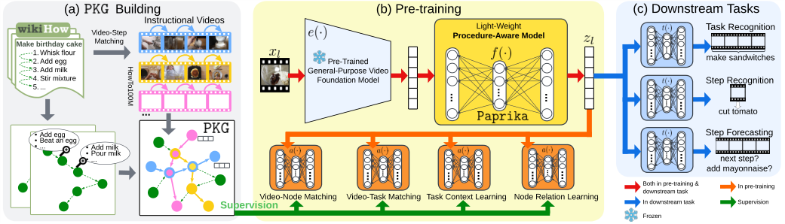
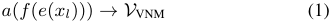
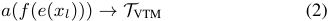
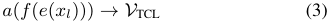
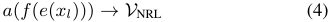
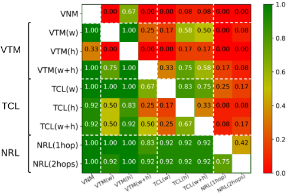
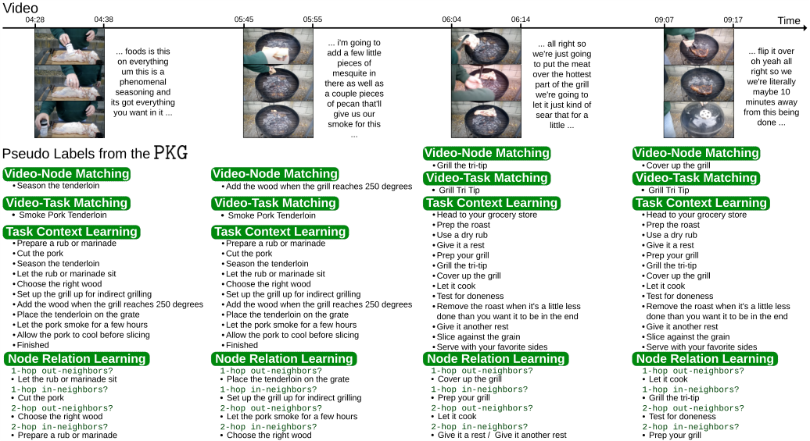
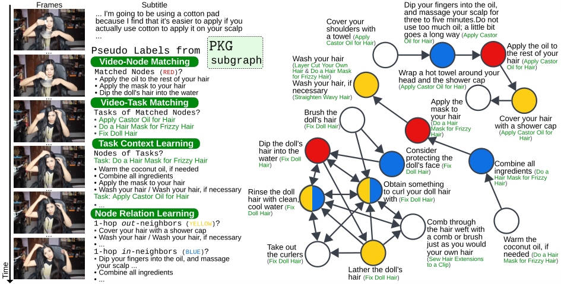

# 022_Zhou_Procedure-Aware_Pretraining_for_Instructional_Video_Understanding_CVPR_2023_paper

[Original PDF](../022_Zhou_Procedure-Aware_Pretraining_for_Instructional_Video_Understanding_CVPR_2023_paper.pdf)

Pages: 12

> Automatically converted from PDF. Check the original for exact equations, symbols, table alignment, and figure details.

<!-- Page 1 -->

This CVPR paper is the Open Access version, provided by the Computer Vision Foundation. Except for this watermark, it is identical to the accepted version; the final published version of the proceedings is available on IEEE Xplore. 

# **Procedure-Aware Pretraining for Instructional Video Understanding** 

Honglu Zhou1_,_2 , Roberto Mart´ın-Mart´ın1_,_3 , Mubbasir Kapadia2 , Silvio Savarese1 and Juan Carlos Niebles1 1Salesforce Research, 2Rutgers University, 3UT Austin 

_{_ hz289,mk1353 _}_ @cs.rutgers.edu, robertomm@cs.utexas.edu, _{_ ssavarese,jniebles _}_ @salesforce.com 

## **Abstract** 

_Our goal is to learn a video representation that is useful for downstream procedure understanding tasks in instructional videos. Due to the small amount of available annotations, a key challenge in procedure understanding is to be able to extract from unlabeled videos the procedural knowledge such as the identity of the task (e.g., ‘make latte’), its steps (e.g., ‘pour milk’), or the potential next steps given partial progress in its execution. Our main insight is that instructional videos depict sequences of steps that repeat between instances of the same or different tasks, and that this structure can be well represented by a Procedural Knowledge Graph (PKG), where nodes are discrete steps and edges connect steps that occur sequentially in the instructional activities. This graph can then be used to generate pseudo labels to train a video representation that encodes the procedural knowledge in a more accessible form to generalize to multiple procedure understanding tasks. We build a PKG by combining information from a text-based procedural knowledge database and an unlabeled instructional video corpus and then use it to generate training pseudo labels with four novel pre-training objectives. We call this PKG-based pre-training procedure and the resulting model Paprika,_ **_P_** _rocedure-_ **_A_** _ware_ **_PR_** _etraining for_ **_I_** _nstructional_ **_K_** _nowledge_ **_A_** _cquisition. We evaluate Paprika on COIN and CrossTask for procedure understanding tasks such as task recognition, step recognition, and step forecasting. Paprika yields a video representation that improves over the state of the art: up to_ **11** _._ **23** % _gains in accuracy in_ 12 _evaluation settings. Implementation is available at https://github.com/ salesforce/paprika._ 

## **1. Introduction** 

Instructional videos depict humans demonstrating how to perform multi-step tasks such as cooking, making up and embroidering, repairing, or creating new objects. For a holistic instructional video understanding, an agent has to acquire _procedural knowledge_ : structural information about 

<!-- Start of picture text -->
(a) Procedure Knowledge  (b) Pre - training Graph Building Supervision What task? Instructional Videos What step? Procedure - Aware Model What next step? ... Downstream Procedural Tasks <!-- End of picture text -->

Figure 1. **Training a video representation for procedure understanding with supervision from a procedural knowledge graph** : the structure observed in instructions for procedures (from text, from videos) corresponds to sequences of steps that repeat between instances of the same or different tasks; this structure is well represented by a Procedural Knowledge Graph (PKG). (a) We build a PKG combining text instructions with unlabeled video data, and (b) obtain a video representation by encoding the human procedural knowledge from the PKG into a more general procedureaware model (Paprika) generating pseudo labels with the PKG for several procedure understanding objectives. Paprika can then be easily applied to multiple downstream procedural tasks. 

tasks such as the identification of the task, its steps, or forecasting the next steps. An agent that has acquired procedural knowledge is said to have gained _procedure understanding_ of instructional videos, which can be then exploited in multiple real-world applications such as instructional video labeling, video chapterization, process mining and, when connected to a robot, robot task planning. 

Our goal is to learn a novel video representation that can be applicable to a variety of procedure understanding tasks in instructional videos. Unfortunately, prior methods for video representation learning are inadequate for this goal, as they lack the ability to capture procedural knowledge. This is because most of them are trained to learn the (weak) correspondence between visual and text modalities, where the text comes either from automatic-speech recognition (ASR) on the audio [43, 77], which is noisy and error-prone, or from a caption-like descriptive sentence (e.g., “a video of a dog”) [33], which does not contain sufficient information for fine-grained procedure understanding tasks such as step recognition or anticipation. Others are pre-trained on masked frame modeling [34], frame order modeling [34] or video-audio matching [1], which gives them basic video 

10727

<!-- Page 2 -->

spatial, temporal or multimodal understanding but is too generic for procedure understanding tasks. 

Closer to our goal, Lin et al. [38] propose a video foundation model for procedure understanding of instructional videos by matching the videos’ ASR transcription (i.e., subtitle/narration) to procedural steps from a text procedural knowledge database (wikiHow [30]) and training the videorepresentation-learning model to match each part of an instructional video to the corresponding step. Their method only acquires isolated step knowledge in pre-training and is not as suitable to gain sophisticated procedural knowledge. We propose Paprika, from **P** rocedure- **A** ware **PR** e- training for **I** nstructional **K** nowledge **A** cquisition, a method to learn a novel video representation that encodes procedural knowledge (Fig. 1). Our main insight is that the structure observed in instructional videos corresponds to sequences of steps that repeat between instances of the same or different tasks. This structure can be captured by a Procedural Knowledge Graph (PKG) where nodes are discretized steps annotated with features, and edges connect steps that occur sequentially in the instructional activities. We build such a graph by combining the text and step information from wikiHow and the visual and step information from unlabeled instructional video datasets such as HowTo100M [45] automatically. The resulting graph encodes procedural knowledge about tasks and steps, and about the temporal order and relation information of steps. 

We then train our Paprika model on multiple pretraining objectives using the PKG to obtain the training labels. The proposed four pre-training objectives (Sec. 3.3) respectively focuses on procedural knowledge about the step of a video, tasks that a step may belong to, steps that a task would require, and the general order of steps. These pre-training objectives are designed to allow a model to answer questions about the subgraph of the PKG that a video segment may belong to. The PKG produces pseudo labels for these questions as supervisory signals to _adapt_ video representations produced by a video foundation model [9] for robust and generalizable procedure understanding. 

Our contributions are summarized as follows: **(i)** We propose a Procedural Knowledge Graph (PKG) that encodes human procedural knowledge from collectively leveraging a text procedural knowledge database (wikiHow) and an unlabeled instructional video corpus (HowTo100M). **(ii)** We propose to elicit the knowledge in the PKG into Paprika, a procedure-aware model, using four pretraining objectives. To that end, we produce pseudo lables with the PKG that serve as supervisory signals to train Paprika to learn to answer multiple questions about the subgraph of the PKG that a video segment may belong to. **(iii)** We evaluate our method on the challenging COIN and CrossTask datasets on downstream procedure understanding tasks: task recognition, step recognition, and step fore- 

casting. Regardless of the capacity of the downstream model (from simple MLP to the powerful Transformer), our method yields a representation that outperforms the state of the art – up to **11** _._ **23** % gains in accuracy out of 12 evaluation settings. 

## **2. Related Work** 

We focus on learning a novel video representation that can be easily adapted to downstream instructional video procedure understanding tasks [35, 38] such as procedural task recognition [20], step recognition [27, 47, 88], anticipation [21, 36, 44, 53, 80], localization [13, 15, 65, 85] or segmentation [19, 25, 40, 41, 55, 56, 68, 86], procedure planing [8, 10, 62], and so on [2, 12, 14, 23, 26, 58, 72, 73, 75, 78]. Our goal is related to self-supervised learning of video representations [51, 52]. _Self-supervised_ pre-training objectives include predicting the video pace [6, 70], future frame [39, 59, 67], future ASR [54] or the context [50], motion and appearance statistics [69], solving space or/and time jigsaw puzzles [28, 31, 34, 74, 82], and identifying the odd video segment [16] – all exploiting the temporal signals. Masking has also gained popularity where signals of one or multiple modalities (frame/text/audio) are masked and required to be predicted [24, 32–34, 42, 61, 76, 81, 82]. Other pre-training objectives are based on spatiotemporal data augmentation [48, 81], cross-modality clustering [11] matching [1,4,5,33,37,42,43,46,77,81,82], as well as finegrained noun/object-level or verb-level objectives [17, 33]. DS [38], MIL-NCE [43], VATT [1], VideoCLIP [77], VLM [76], MCN [11], MMV [4], Hero [34] and CBT [60] have utilized HowTo100M – a large-scale instructional video dataset [45] for pre-training. Except DS, they have utilized strictly or weakly temporally overlapped ASR with video frames as the source for contrastive learning or masked based modeling. DS [38] argued that ASR is a suboptimal source to describe procedural videos. They utilized a pre-trained language foundation model to match step headlines in wikiHow [30, 79, 83, 84, 87] to ASR sentences of video segments. The matched step headlines were then used to replace ASR sentences to learn a video representation learning model. On procedure understanding downstream tasks, DS outperforms models including S3D pretrained with MIL-NCE [43] (MIL-NCE for short in the rest of the paper), ClipBERT [32] and VideoCLIP [77]. 

ActionCLIP [71] and Bridge-Prompt [35] are promptbased models inspired by CLIP [49]; ActionCLIP focuses on atomic action recognition [18] (i.e., recognizing an atomic action such as “falling” from a short clip ), whereas Bridge-Prompt is for ordinal action understanding related downstream applications. They are related to our work but both require action annotations for training. Instead, we focus on more effective pre-training methods for a procedure understanding model that encodes the procedural knowl- 

10728

<!-- Page 3 -->

<!-- Start of picture text -->
(a)          Building (b) Pre - training (c) Downstream Tasks Instructional Videos Video - Step  Procedure Light - - Aware Model     Weight Task Recognition Make birthday cake Matching 1. Wh2. Add egg isk flour Pre - Trained make sandwitches 3. Add milk General - Purpose Video 4. St5. ... ir mixture Foundation Model Step Recognition ... cut tomato - Add egg Step Forecasting -- Beat an egg... - Add milk - Pour milk - ... next step? add mayonnaise? Supervis V i i on deo - Node Matching Video - Task Matching Task Context Learning Node Relation Learning Both downstream task In downstream task in pre - training &  SupervIn pre - traisiionning Frozen <!-- End of picture text -->

Figure 2. **Overview.** We encode procedural knowledge in a Procedural Knowledge Graph (PKG): nodes are (clustered) steps from wikiHow that are annotated with features, and edges connect steps that occur sequentially in the instructional activities from wikiHow or an unlabeled instructional video corpus. Four pre-training objectives elicit the knowledge in the PKG to Paprika, a procedure-aware model. We achieve this by querying the PKG to produce pseudo labels for pre-training as supervisory signals. Paprika learns a video representation that encodes procedural knowledge and thus lead to improved performance on multiple downstream procedure understanding tasks. 

edge and avoids laborious annotations on step class and time boundary of instructional videos. This enables training on rich but unlabeled web data. 

DS [38] leveraged wikiHow for instructional video understanding. This is similar to our goal of building the PKG from wikiHow and instructional videos. However, DS does not focus on encoding procedural knowledge during pretraining beyond video segment and text matching. For example, DS does not encode relationships between steps in the pre-trained video representation. This is in part due to multiple challenges that need to be addressed: **_<u>(1)</u>_** the order of steps to execute a task follows certain temporal or causal constraints, **_<u>(2)</u>_** the execution order of steps of the task in another video instance can be different from the order that is demonstrated in the current video instance, and **_<u>(3)</u>_** some steps may belong to tasks that are not demonstrated in the current video instance (i.e., the cross-task characteristics of steps). We propose the PKG to address these challenges. A model trained using our method can acquire the higherlevel prior human procedural knowledge instead of just the _isolated_ step knowledge that DS provides. 

## **3. Methodology** 

### **3.1. Problem Formulation** 

Technically, video representation learning methods learn to represent a long video as a sequence of segment embeddings [1, 38, 43]. A video is viewed as a sequence of _L_ segments [ _x_ 1 _, . . . , xl, .., xL_ ], where _xl 2_ R_H⇥W ⇥_3_⇥F_ , _H_ and _W_ denote the spatial resolution height and width, and _F_ is #RGB frames of the video segment (“#” denotes “the number of”). A model is pre-trained to learn the mapping _xl ! zl 2_ R_d_ . Downstream models are applied on the (whole or partial) sequence of segment embeddings [ _z_ 1 _, . . . , zl, .., zL_ ] to perform various tasks. 

Our goal is to learn _zl_ that encodes procedural knowl- 

edge for downstream procedure understanding tasks for instructional videos. However, pre-training a new (or finetuning a pre-trained) video model becomes impractical for real-world settings as the model size grows rapidly [9, 51]. We propose instead a practical framework that trains a light-weight procedure-aware model _f_ ( _·_ ) that refines the video segment feature extracted from a _frozen_ generalpurpose video foundation model _e_ ( _·_ ), i.e., _zl_ := _f_ ( _e_ ( _xl_ )) (Fig. 2 (b)). Our framework exploits the success of existing large foundation models [9] and enables parameter-efficient transfer learning (similar practices used in [3, 33]). _f_ ( _·_ ) serves as a feature adapter [22,63] to allow the refined video feature to encode the previously missing procedural knowledge for a stronger downstream procedure understanding capability. We coin our trained _f_ ( _·_ ) as Paprika. 

Our key insight is that a text procedural knowledge database combined with unlabeled instructional videos can be utilized to build a Procedural Knowledge Graph (PKG) (Fig. 2 (a)) to encode procedural knowledge. The PKG can provide supervisory signals for training a _procedure-aware_ model. We now describe how to build the PKG from wikiHow and unlabeled procedural videos (Sec. 3.2), and then introduce four pre-training objectives (Sec. 3.3) that allow Paprika to learn _zl_ infused with procedural knowledge by mining the PKG. 

### **3.2. Procedural Knowledge Graph** 

The PKG is a homogeneous graph _G_ = ( _V, E_ ) with vertex set _V_ and edge set _E_ . Nodes represent steps (e.g., ‘add milk’) from a wide variety of tasks (e.g., ‘how to make latte’), and edges represent directed step transitions. That is, edge ( _i, j_ ) indicates that a transition between steps in nodes _i_ and _j_ that was observed in real-life procedural data. **Step 1: Obtain nodes of the PKG.** _V_ contains steps of tasks that may appear in instructional videos. Pre-training uses _unlabeled_ videos, thus, there are no step annotations 

10729

<!-- Page 4 -->

provided by the pre-training video corpus that can be directly used to form the discrete node entities. Inspired by DS [38], we resort to the step headlines in wikiHow [30]. 

wikiHow is a text-based procedural knowledge database B that contains articles describing the sequence of steps needed for the completion of a wide range of tasks. B = n[ _s_(1) 1 _, . . . , s_(1) _b_ 1]_, . . . ,_[_s_ 1(_t_)_, . . . , s_( _bt__t_)]_, . . . ,_[_s_( 1_T_) _, . . . , s_( _bT__T_)] o where _T_ is #tasks, the subscript _bt_ is #steps of task _t_ , and _s_( _i__t_) represents the natural language based summary (i.e., step headline) of _i_ -th step for task _t_ . Examples of wikiHow task articles are available in Fig. 4 and 5. 

Since two step headlines in B can represent the same step but are described slightly differently, e.g., “jack up the car” and “jack the car up”, we perform step deduplication by clustering similar step headlines. The resulting clusters are _step nodes_ that constitute _V_ . We list the largest step nodes in Supplementary Material. We find cross-task characteristics of steps, i.e., one step may belong to multiple tasks. **Step 2: Add edges to the PKG.** _E_ is the set of direct transitions observed in data between any two step nodes. However, most tasks in _B_ have only one article, which provides only one way to complete the task through a sequence of steps. How to encode the different ways to complete a task _t_ that involve different execution order of steps or new steps that are absent in the article of task _t_ , becomes a challenge. 

Our solution is to additionally leverage an unlabeled instructional video corpus to provide more step transition observations. In practice, we use MIL-NCE [43], a pre-trained video-language model, to compute the matching score between a segment _xl_ and a step headline _s_( _i__t_).MIL-NCE was trained to learn video and text embeddings with high matching scores on co-occurring frames and ASR subtitles. 

We then use a thresholding criterion and the correspondence between step _headlines_ and step _nodes_ obtained from **Step 1** to match step nodes to video segments and obtain step node transitions given the temporal order of segments in videos. The step node transitions from wikiHow or the video corpus constitute _E_ . Please refer to Supplementary Material for implementation details on graph construction. 

_E_ encodes the structure observed in instructional videos as it encompasses multiple sequences of steps that repeat between video instances of the same or different tasks. In addition, _E_ captures the relations of steps; the type of relation is not strictly defined – the steps could be temporal or causal related – because the step transitions that form _E_ are _observed_ from human-provided real-life demonstrations. **Step 3: Populate graph attributes.** It is possible to collect various forms of attributes for the PKG depending on the desired use cases of the PKG. For example, node attributes can be the step headline texts, task names associated with the step headlines of the node, video segments matched to the node, the distribution of timestamps of the matched segments, the aggregated multimodal features of 

the matched segments, and so on. Edge attributes can be the source of the step node transition (from wikiHow or the video corpus), task occurrence, distribution of timestamps of the transition, etc. We describe the graph attributes we used and how we used them in Sec. 3.3. 

### **3.3. Training** Paprika 

The PKG is a rich source of supervision for training models for procedure understanding. We propose four pretraining objectives as exemplars to show the possible ways in which the PKG can provide supervisory signals to train _f_ ( _·_ ) to learn good video representations using unlabeled instructional videos. 

**Video-Node Matching (VNM)** aims at answering: what are the step nodes of the PKG that are likely to be matched to the input video segment _xl_ ? This pre-training objective leverages the _node identity_ information of the PKG, and it resembles the downstream application of independently recognizing steps of video segments. Formally, 

where _a_ ( _·_ ) denotes the answer head model that performs the pre-training objective given the refined video segment feature _zl_ produced by _f_ ( _·_ ) as input, and _V_ VNM _✓V_ . **Video-Task Matching (VTM)** aims at answering: what are the tasks of the matched step nodes of the input video segment _xl_ ? This pre-training objective leverages the node’s task attribute in the PKG. VTM focuses on inferring the cross-task knowledge of the step nodes without the video context. Formally, 

where _T_ VTM _✓T_ , and _T_ is the set of tasks ( _kT k_ := _T_ ). Since HowTo100M provides task names of the long videos, we experiment with using the task names from wikiHow and/or from HowTo100M (Sec. 4.4). When task names from both sources are used, VNM leads to 2 answer heads. **Task Context Learning (TCL)** aims at answering: for tasks the input video segment may belong to (produced by VTM), what are the step nodes that the tasks would typically need? TCL also leverages the node’s task attribute in the PKG, but it focuses on inferring step nodes that may co-occur with the matched step node of the video segment in demonstrations. TCL learns the task’s step context that is commonly observed in data, without the context of the current video segment. Formally, 

where _V_ TCL _✓V_ . When task names from both wikiHow and HowTo100M are used, TCL leads to 2 answer heads. **Node Relation Learning (NRL)** aims at answering: what are the _k_ -hop in-neighbors and out-neighbors of the matched step nodes of the input video segment _xl_ ? _k_ ranges from 1 to a pre-defined integer _K_ , and thus NRL leads to 2 _K_ sub-questions (2 _K_ answer heads). NRL leverages the 

10730

<!-- Page 5 -->

edge information of the PKG, and it focuses on learning the local multi-scale graph structure of the matched nodes of _xl_ . Predicting the in-neighbors resembles predicting the historical steps, whereas predicting the out-neighbors resembles forecasting the next steps of _xl_ . Note that the answer to NRL can be steps that come from other tasks different from the task of the current video. Formally, 

where _V_ NRL _✓V_ . 

## **4. Experiments** 

### **4.1. Pre-training Dataset** 

HowTo100M [45] is a large-scale video dataset that contains over 1M long instructional videos (videos can be over 30 minutes) and is commonly used for video model pretraining. Videos were collected from YouTube using wikiHow article titles as search keywords [45]. To reduce the computational cost, most of our experiments, including the construction of the PKG, only use the HowTo100M subset of size 85K videos from [7]. 

### **4.2. Evaluation Settings** 

We study the transfer learning ability of our Paprika model trained using the PKG on **12** evaluation settings: 3 downstream tasks _⇥_ 2 downstream datasets _⇥_ 2 downstream models. The output of the trained procedure-aware model _f_ ( _·_ ) is the input to the downstream model _t_ ( _·_ ). Note that the PKG is only used for pre-training and it is discarded at the downstream evaluation time (test time for _f_ ( _·_ )). 

#### **4.2.1 Downstream Procedure Understanding Tasks** 

**Long-Term Activity/Task Recognition (TR)** aims to classify the activity/task given all segments from a video. **Step Recognition (SR)** recognizes the step class given as input the segments of a step in a video. 

**Future Step Forecasting (SF)** predicts the class of the next step given the past video segments. Such input contains the historical steps _before_ the step to predict happens. As in [38], we set the history to contain at least one step. 

#### **4.2.2 Downstream Datasets** 

We use COIN [64, 65] and CrossTask [88] as the downstream datasets because the two cover a wide range of procedural tasks in human daily activities. 

**COIN** contains 11K instructional videos covering 778 individual steps from 180 tasks in various domains. The average number of steps per video is 3 _._ 9. 

**CrossTask** has 4 _._ 7K instructional videos annotated with task name for each video spanning 83 tasks with 105 unique steps. 2 _._ 7K videos have steps’ class and temporal boundary annotations; these videos are used for the SR and SF tasks. 8 steps per video on average. 

#### **4.2.3 Downstream Task Models** 

Segment features from the trained _frozen f_ ( _·_ ) are the input to downstream task model _t_ ( _·_ ). _t_ ( _·_ ) is trained and evaluated on the smaller-scale downstream dataset to perform downstream tasks. We experiment with two options for _t_ ( _·_ ). **MLP** . MLP with only 1 hidden layer is the classifier of the downstream tasks, given the input of mean aggregated sequence features. Since a shallow MLP has a limited capacity, performance of a MLP downstream task model heavily relies on the quality of the input segment features. **Transformer** . Since context and temporal reasoning is crucial for the downstream TR and SF tasks, we follow [38] to use a one-layer Transformer [66] to allow the downstream task model the capability to automatically learn to reason about segment and step relations. Transformer is a relatively stronger downstream task model compared to MLP. 

### **4.3. Implementation Details** 

We used the version of B that has 10 _,_ 588 step headlines from _T_ =1 _,_ 053 task articles. We used Agglomerative Clustering given the features of step headlines, which resulted in 10 _,_ 038 step nodes. Length of segments was set to be 9 _._ 6 seconds. The pre-trained MIL-NCE [43] was used as _e_ ( _·_ ). _f_ ( _·_ ) was a MLP with a bottleneck layer that has a dimension of 128 as the only hidden layer. The refined segment feature shares the same dimension as the input segment feature (i.e., 512). Our pre-training objectives were cast to a multi-label classification problem with Binary Cross Entropy as the loss function. We used the Adam optimizer [29], a batch size of 256, and 8 NVIDIA A100 GPUs. Interested readers may refer to Supplementary Material for more details. 

### **4.4. Quantitative Results** 

#### **4.4.1 Ablation Studies** 

We train Paprika utilizing each of our pre-training objectives from Sec. 3.3; the results are in Table 1. We also compute a performance matrix with color-based visualization (Fig. 3) to compare the overall performance of the different pre-training objectives more easily. 

The performance ranking of the pre-training objectives is NRL _>_ TCL _>_ VTM _>_ VNM. VNM is the least powerful because it only focus on learning the simpler knowledge of matching single video segments to step nodes. 

VTM (w+h) _>_ VTM (w) _>_ VTM (h) where ‘w’ denotes wikiHow and ‘h’ for HowTo100M. This ranking suggests that if the pre-training video corpus has the annotation of video’s task name, our method can well utilize such annotation to further improve performance. Utilizing the wikiHow task names is better than HowTo100M because the mapping between step headlines and HowTo100M tasks would _not_ be as clean as the mapping between step headlines and wikiHow tasks, because the former depends on the quality of the matching between a video segment to a step headline. 

10731

<!-- Page 6 -->

||||**Dow**|**nstream**|**Transf**|**ormer**|||**D**|**ownstre**|**am ML**|**P**||
|---|---|---|---|---|---|---|---|---|---|---|---|---|---|
|**Pre-training Meth**|**od**||**COIN**||**C**|**rossTa**|**sk**||**COIN**|||**CrossTa**|**sk**|
|||**SF**|**SR**|**TR**|**SF**|**SR**|**TR**|**SF**|**SR**|**TR**|**SF**|**SR**|**TR**|
|MIL-NCE_⇤_[43] (_e_|(_·_))|36_._55|41_._98|76_._62|57_._96|59_._90|61_._71|3_._16|1_._17|21_._06|27_._71|24_._98|5_._27|
|DS [38]||38_._13|42_._54|79_._94|56_._29|57_._11|59_._49|32_._54|34_._07|72_._65|49_._95|50_._23|57_._28|
|DS_⇤_[38]||39_._54|45_._97|82_._66|**61**_._**23**|**61**_._**91**|64_._24|30_._88|32_._74|77_._66|52_._97|53_._69|61_._08|
|VSM||39_._29|44_._37|82_._23|57_._94|58_._92|62_._24|31_._45|32_._66|76_._51|49_._59|50_._01|58_._76|
||**VNM**|41_._98|49_._80|82_._88|59_._45|61_._00|64_._77|37_._56|42_._32|82_._23|57_._08|58_._23|64_._14|
||**VTM**(_wikiHow_)|42_._05|49_._89|84_._45|60_._27|61_._26|66_._25|38_._13|42_._56|82_._41|58_._48|59_._02|65_._82|
||**VTM**(_HT100M_)|41_._97|48_._59|83_._44|60_._19|60_._64|65_._08|36_._87|40_._07|81_._52|56_._45|57_._42|65_._61|
||**VTM** (_wikiHow + HT100M_)|42_._10|50_._02|**84**_._**73**|60_._63|61_._14|66_._14|38_._12|42_._68|82_._77|58_._87|59_._30|66_._14|
||**TCL**(_wikiHow_)|42_._42|50_._12|84_._48|60_._27|61_._40|**66**_._**67**|39_._04|44_._16|82_._84|58_._48|59_._59|65_._93|
|Paprika(ours)|**TCL**(_HT100M_)|42_._05|48_._68|83_._20|60_._49|61_._86|66_._03|38_._86|43_._56|82_._55|58_._38|58_._63|64_._66|
||**TCL** (_wikiHow + HT100M_)|42_._53|49_._79|83_._95|60_._19|61_._67|66_._14|38_._61|43_._27|82_._95|58_._40|59_._26|65_._08|
||**NRL**(_1 hop_)|**42**_._**60**|**50**_._**23**|84_._66|60_._68|61_._36|**66**_._**67**|**39**_._**58**|**45**_._**38**|**83**_._**45**|59_._12|59_._59|65_._95|
||**NRL** (_2 hops_)|42_._53|50_._13|84_._31|60_._68|61_._60|**66**_._**67**|**40**_._**55**|**45**_._**82**|**83**_._**84**|**60**_._**13**|**60**_._**23**|**66**_._**98**|
||**VNM**+**VTM**+**TCL**+**NRL**|**42**_._**65**|**50**_._**48**|**85**_._**31**|**61**_._**42**|**62**_._**38**|**67**_._**09**|**39**_._**82**|**44**_._**78**|**83**_._**88**|**59**_._**53**|**60**_._**16**|**67**_._**41**|
||Gains to DS[38]|+4_._52|+7_._94|+5_._37|+5_._13|+5_._27|+7_._60|+7_._28|+10_._71|+11_._23|+9_._58|+9_._93|+10_._13|
|Parika(ours)_⇤_|**VNM**+**VTM**+**TCL**+**NRL**|**43**_._**22**|**50**_._**99**|**85**_._**84**|**62**_._**63**|**63**_._**53**|**68**_._**35**|38_._38|42_._95|83_._41|**60**_._**38**|**61**_._**21**|**68**_._**35**|
|p|Gains to DS_⇤_[38]|+3_._68|+5_._02|+3_._18|+1_._40|+1_._62|+4_._11|+7_._50|+10_._21|+5_._75|+7_._41|+7_._52|+7_._27|

**SF** : Step Forecasting; **SR** : Step Recognition; **TR** : Task Recognition. The top 3 performance scores of each downstream evaluation setting are highlighted with green cells (the darker green, the better). _⇤_ denotes the model was pre-trained on the _full_ HowTo100M (HT100M) dataset; otherwise, a subset of HowTo100M containing 85K videos was used. “ **VNM** + **VTM** + **TCL** + **NRL** ” represents “ **VNM** + **VTM** ( _wikiHow + HT100M_ ) + **TCL** ( _wikiHow_ ) + **NRL** ( _1 hop_ )”. Please see Supplementary Material for results when _K_ =2. DS_⇤_ [38] reported results on COIN are SF: 38 _._ 2 (39 _._ 4 from ‘Transformer w/ KB Transfer’), SR: 54 _._ 1 , and TR: 88 _._ 9 (90 _._ 0 from ‘Transformer w/ KB Transfer’). Our downstream experimental configurations are different from that in [38] (e.g., w.r.t. temporal length of segments, downstream Transformer model – ours has less parameters, etc.). 

Table 1. **Accuracies (** % _"_ **) of the downstream procedure understanding tasks under the 12 evaluation settings** . Paprika that exploits the PKG outperforms the SOTA methods. Among our pre-training objectives, NRL is the most effective one, because it exploits the structural information of the PKG and elicits the procedural knowledge on the _order_ and _relation_ of _cross-task_ steps to Paprika. 

<!-- Start of picture text -->
VTM TCL <!-- End of picture text -->

Figure 3. **Overall Performance Comparison.** This matrix compares the _overall_ performance of our proposed pre-training objectives. The value in **entry (i, j)** is the **ratio of evaluation settings** in which **the accuracy of method i** _≥_ **the accuracy of method j** . Here, 1 indicates method i outperforms method j in all 12 evaluation settings. The more **green** entries in the row of a method, the better its overall performance. NRL is the most effective method. 

Comparing the three variants of TCL, TCL (w) _>_ TCL (w+h) _>_ TCL (h). Overall, TCL (w+h) is worse than TCL (w) because TCL depends on the quality of the pseudo labels of VTM. As utilizing the HowTo100M task names already leads to probably problematic matched tasks, asking _f_ ( _·_ ) to further identify the step nodes that these matched tasks need would introduce additional noise, which eventually undermines the overall downstream performance. 

NRL (2 hops) _>_ NRL (1 hop) overall. NRL (2 hops) has a worse or close performance than NRL (1 hop) only when the downstream task model _t_ ( _·_ ) is Transformer (Table 1). When _t_ ( _·_ ) is MLP, NRL (2 hops) is always clearly better. This is because when the capacity of _t_ ( _·_ ) is limited, it desires the input video representations to encode more comprehensive information. NRL with more hops indicates a larger exploration on the local graph structure of the PKG that a video segment belongs to; it can provide more related neighboring node/step information, and allow the learned video representations to excel at the downstream tasks. 

We train Paprika using all pre-training objectives without tuning coefficient of each loss term. Paprika trained using all pre-training objectives yields the best result on 8 out of 12 evaluation settings, which suggests the four pre-training objectives can collaborate to lead to better results. Compared with NRL (1 hop), the performance gains brought by VNM, VTM and TCL are relatively small. This variant also fails to outperform NRL (2 hops) on the SF and SR tasks when _t_ ( _·_ ) is MLP. These results highlight the superiority of NRL. 

We also experiment with the full HowTo100M data. Increasing the size of the pre-training dataset, for both DS and Paprika, accuracies are dropped on the COIN dataset when _t_ ( _·_ ) is MLP (due to MLP’s limited capacity to exploit the features pre-trained on the large dataset and scale well), but we observe performance improvement of Paprika on the rest 9 out of 12 evaluation settings. 

10732

<!-- Page 7 -->

<!-- Start of picture text -->
Video 04:28 04:38 05:45 05:55 06:04 06:14 09:07 09:17 Time ... i'm going to  ... all right so ... foods is this  add a few little  we're just going  ... flip it over on everything  pieces of  to put the meat  oh yeah all um this is a  mesquite in  over the hottest  right so we phenomenal  there as well as  part of the grill  we're literally seasoning and  a couple pieces  we're going to  maybe 10 its got everything  of pecan that'll  let it just kind of  minutes away you want in it ... give us our  sear that for a  from this being smoke for this  little ... done ... ... Pseudo Labels from the Video-Node Matching Video-Node Matching - Grill the tri - tip - Cover up the grill Video-Node Matchin - Season the tenderloin g Video-Node Matchin - Add the wood when the grill reaches 250 degrees g Video-Task Matchin-  Grill Tri Tip g Video-Task Matchin-  Grill Tri Tip g Video-Task Matching Video-Task Matching Task Context Learning Task Context Learning -  Smoke Pork Tenderloin -  Smoke Pork Tenderloin - Head to your grocery store - Head to your grocery store - Prep the roast - Prep the roast Task Context Learning Task Context Learning - Use a dry rub - Use a dry rub - Prepare a rub or marinade - Prepare a rub or marinade - Give it a rest - Give it a rest - Cut the pork - Cut the pork - Prep your grill - Prep your grill - Season the tenderloin - Season the tenderloin - Grill the tri - tip - Grill the tri - tip - Let the rub or marinade sit - Let the rub or marinade sit - Cover up the grill - Cover up the grill - Choose the right wood - Choose the right wood - Let it cook - Let it cook - Set up the grill up for indirect grilling - Set up the grill up for indirect grilling - Test for doneness - Test for doneness - Add the wood when the grill reaches 250 degrees - Add the wood when the grill reaches 250 degrees - Remove the roast when it's a little less  - Remove the roast when it's a little less - Place the tenderloin on the grate - Place the tenderloin on the grate done than you want it to be in the end done than you want it to be in the end - Let the pork smoke for a few hours - Let the pork smoke for a few hours - Give it another rest - Give it another rest - Allow the pork to cool before slicing - Allow the pork to cool before slicing - Slice against the grain - Slice against the grain - Finished - Finished - Serve with your favorite sides - Serve with your favorite sides Node Relation Learning Node Relation Learning Node Relation Learning Node Relation Learning 1 -  hop out -  nei ghbor s? 1 -  hop out -  nei ghbor s? 1 -  hop out -  nei ghbor s? 1 -  hop out -  nei ghbor s? - Let the rub or marinade sit - Place the tenderloin on the grate  - Cover up the grill - Let it cook 1 -  hop i n -  nei ghbor s?  1 -  hop i n -  nei ghbor s? 1 -  hop i n -  nei ghbor s? 1 -  hop i n -  nei ghbor s? -  Cut the pork -  Set up the grill up for indirect grilling -  Prep your grill -  Grill the tri - tip 2 -  hop out -  nei ghbor s?  2 -  hop out -  nei ghbor s? 2 -  hop out -  nei ghbor s?  2 -  hop out -  nei ghbor s? -  Choose the right wood - Let the pork smoke for a few hours - Let it cook - Test for doneness 2 -  hop i n -  nei ghbor s?  2 -  hop i n -  nei ghbor s? 2 -  hop i n -  nei ghbor s?  2 -  hop i n -  nei ghbor s? - Prepare a rub or marinade -  Choose the right wood -  Give it a rest /  Give it another rest -  Prep your grill <!-- End of picture text -->

Figure 4. **Pseudo labels generated by the PKG of one video** (title is “Grilling A Tri-Tip ...”). Frames and temporally overlapped subtitles of four segments sampled from this video were shown. For a succinct visualization, for each pre-training objective, we only show the result of the most confident pseudo label. TCL and NRL provide more procedure-level context information than VNM and VTM. Our pseudo labels entail a much higher relevance to each segment than the subtitle and allow Paprika to leverage cross-task information sharing. 

#### **4.4.2 Comparison to the State of the Art (SOTA)** 

We have kept the model architectures and experimental setups the same between Paprika and the SOTA baselines. **MIL-NCE** [43] is a pre-training objective based on videosubtitle matching, and the subtitle can be weakly aligned to the video segment. This pre-training objective is widely used by video foundation models. We use the frozen S3D model released by the authors as _e_ ( _·_ ) in our framework (and to build the PKG). Our reported MIL-NCE results can be interpreted as the results of removing _f_ ( _·_ ) in our framework. **DS** [38] proposes to match a video segment’s subtitle to a step _headline_ in wikiHow by leveraging a pre-trained language model, i.e., MPNet [57]; and the matching results are used as the pre-training supervisory signals. We use their proposed objective to train _f_ ( _·_ )–the same MLP-based architecture used by Paprika–in our experiments. 

Our Paprika outperforms the SOTA (Table 1). The large performance improvement of ours compared to MILNCE highlights the ability of our Paprika model in adapting the inferior video features to be instead competent at the procedure understanding tasks. Paprika also outperforms DS. Among our proposed pre-training objectives, VNM has the closest results to DS because both focus on learning step knowledge; the better results of VNM attribute to multimodal matching – matching the video _frames_ to the step _nodes_ that summarize and unite different step headlines 

in the same action. We perform ablation to match video frames to the wikiHow step headlines (VSM). VSM has a slightly better overall performance than DS, but worse than VNM. VTM, TCL and NRL learn more advanced procedural knowledge from the PKG, and therefore their gains over DS are even more obvious. 

Paprika pre-trained with all four pre-training objectives obtains the highest gain over DS, which is **11** _._ **23** % improvement in accuracy on the COIN task recognition task when _t_ ( _·_ ) is MLP and the HowTo100M subset is the pretraining dataset. Overall, the gains are larger when _t_ ( _·_ ) is MLP than Transformer. A shallow MLP downstream model, learned with features from Paprika pre-trained using our full pre-training objectives, even outperforms the Transformer downstream model learned with input features from the SOTA pre-trained models. This is because our proposed method allows the video feature to early encode relation information to address the limitation of a MLP model in lacking the relational reasoning capability. 

### **4.5. Qualitative Results** 

We present the pseudo labels generated by the PKG of one long video in Fig. 4. Compared to the subtitles, the source of information that prior pre-training methods often use for supervision, pseudo labels generated by the PKG entail a higher relevance to each segment. Subtitles are noisy 

10733

<!-- Page 8 -->

<!-- Start of picture text -->
Frames Subtitle Dip your fingers into the oil, ... I'm going to be using a cotton pad  and massage your scalp for because I find that it's easier to apply if you  Cover your  three to five minutes.Do not actually use cotton to apply it on your scalp  shoulders with  use too much oil; a little bit ...  a towel (Apply  goes a long way (Apply Castor ... Pseudo Label s f r om Castor Oil for Hair) Oil for Hair) Apply the othe rest of your il to Mat- Apply the o- A Video-Node Matching pply the mask to your hached Nodes il to the rest of ( RED) ? yirour hair subgr aph Wash your ha(LaHafor FrWash your haiyr & Do a Haer Cut Your Own izzy Hair) ir Mask iirr, if  Wrap a hot towel around your head and th(Apply Castor Oeil for Ha shower capir) hOaiil for Har (Appir)ly Castor ... - Dip the doll's hair into the water nec(Straeighten Wavy Hassary ir) Video-Task Matching Apply the Tasks of Mat ched Nodes?  Brush the  mask to - Apply Castor O- Do a Ha- Fix Doll Hair Mask for Frir il for Haizzy Hair  ir d(Foix Doll Hall's hairir) your h(Do a HaMask for FrHair) aiir rizzy  w(Apply Castor OCover your haith a shower il for cap ir Hair) ... Task Context Learning Dip the doll's Nodes of Tasks?  hair into the  Consider Task: Do a Ha- Warm the coconut oir Mask for Fril, if neededizzy Hair  wHaair)ter (Fix Doll  protectdoll's faceDoll Hair)ing the  (Fix  Combingrediine all ents (Do a - Combine all ingredients Hair Mask for Frizzy ... - Apply the mask to your ha- Wash your hair / Wash your hair ir, if necessary Rinse the doll  Obtato curl your doll hain something ir  Hair) Task: Apply Castor Oil for Hair hair with clean,  with (Fix Doll Hair) - ... cool water (Fix Node Relation Learning Doll Hair) 1 -  hop  out -  nei ghbor s  ( YELLOW) ?  Comb through ... - Cover your ha- Wash your haiir / Wash your har with a shower cair, pif necessary the haa comb or brush ir weft with  Warm the - ... Take out  just as you would  coconut oil, if 1 -  hop  i n -  nei ghbor s  ( BLUE) ?  the curlers your own hair needed (Do a Hair - D- Combyour scalp ... ip your fine all ingers ingredinto the oients il, and massage  (Fix Doll Hair) Lather the doll?s  (Sew Hato a Clip)ir Extensions  Mask for Frizzy Hair) - ... hair (Fix Doll Hair) <!-- End of picture text -->

Figure 5. **Pseudo labels of one segment and the subgraph of the PKG that this segment belongs to.** The PKG encodes the procedural knowledge of the general order and relation of steps from multiple tasks. This is because a node’s _k_ -hop neighbors can come from multiple tasks, and the edge direction encodes the general execution order of steps (the order that was observed in data – not in one specific video). 

because the narrator may not directly describe the step. E.g., in the 1st segment, the narrator only mentions “this is a phenomenal seasoning” without explicitly describing the step “seasoning the tri-tip”. When the camera records how a narrator is performing a step, the narrator may omit verbally or formally describing the step. Out of this observation, we leverage a multimodal matching function. 

Assigning wikiHow steps to a video, allows one video to leverage cross-task information sharing. As shown in the pseudo labels of VNM, the matched step headlines can come from another task. E.g., “Season the tenderloin” and “Add the wood ...” are step headlines of the task “Smoke Pork Tenderloin”, but the task of the video is “Grill TriTip”. In the wikiHow article of the task “Grill Tri-Tip” (shown in the TCL blocks of the 3rd and 4th segments), the step headline corresponds to the action “seasoning” is “Prep the roast”, which is vague, and no step headlines describe the action “adding wood”. Instead, “seasoning” and “adding wood” have a clearer step headlines to describe them in the wikiHow article of “Smoke Pork Tenderloin”. 

TCL and NRL provide more procedure-level context information as shown in Fig. 4. The procedural knowledge conveyed by TCL and NRL is the _general_ prior knowledge about the step and task of the current segment, and the knowledge is not constrained to the current step, task, or video. In other words, steps shown in the TCL or the NRL blocks can be absent in this video demonstration. 

In Fig. 5, we show pseudo labels of one video segment and the subgraph of the PKG that the segment belongs to. The top 3 matched nodes’s step headlines come from dif- 

ferent tasks, and especially the top 2 well describe the step of the video segment. NRL allows Paprika to learn the knowledge on order and relation of cross-task steps because pseudo labels of NRL are led by the structure of the PKG. 

## **5. Conclusion** 

We show how to learn a video representation for procedure understanding in instructional videos that encodes procedural knowledge. The key is to leverage a Procedural Knowledge Graph (PKG) to inject procedural knowledge into the video representation, which improves the state-ofthe-art performance on several tasks. 

**Limitations & Future Directions:** Our model is built on top of frozen video and language encoders. Future work should explore jointly updating these deep visual and text representations while also learning the procedural knowledge model. Future work should also extend our methodology beyond the existing downstream tasks to more complex procedure understanding benchmarks. 

**Social Impact:** The final models may also be limited to perform video understanding on tasks not represented in training. These datasets primarily reflect the culture of only a portion of the world’s population, and may contain that culture’s socioeconomic biases on gender, race, ethnicity, or other features. These biases may be present in the generated pseudo labels, subgraphs, and/or overall video understanding capabilities of the resulting system. 

**Acknowledgments:** Prof. Mubbasir Kapadia was supported in part by NSF awards: IIS-1703883, IIS-1955404, IIS-1955365, RETTL-2119265, and EAGER-2122119. 

10734

<!-- Page 9 -->

## **References** 

- [1] Hassan Akbari, Liangzhe Yuan, Rui Qian, Wei-Hong Chuang, Shih-Fu Chang, Yin Cui, and Boqing Gong. Vatt: Transformers for multimodal self-supervised learning from raw video, audio and text. _Advances in Neural Information Processing Systems_ , 34:24206–24221, 2021. 1, 2, 3 

- [2] Jean-Baptiste Alayrac, Piotr Bojanowski, Nishant Agrawal, Josef Sivic, Ivan Laptev, and Simon Lacoste-Julien. Unsupervised learning from narrated instruction videos. In _Proceedings of the IEEE Conference on Computer Vision and Pattern Recognition_ , pages 4575–4583, 2016. 2 

- [3] Jean-Baptiste Alayrac, Jeff Donahue, Pauline Luc, Antoine Miech, Iain Barr, Yana Hasson, Karel Lenc, Arthur Mensch, Katie Millican, Malcolm Reynolds, et al. Flamingo: a visual language model for few-shot learning. _arXiv preprint arXiv:2204.14198_ , 2022. 3 

- [4] Jean-Baptiste Alayrac, Adria Recasens, Rosalia Schneider, Relja Arandjelovi´c, Jason Ramapuram, Jeffrey De Fauw, Lucas Smaira, Sander Dieleman, and Andrew Zisserman. Selfsupervised multimodal versatile networks. _Advances in Neural Information Processing Systems_ , 33:25–37, 2020. 2 

- [5] Humam Alwassel, Dhruv Mahajan, Bruno Korbar, Lorenzo Torresani, Bernard Ghanem, and Du Tran. Self-supervised learning by cross-modal audio-video clustering. _Advances in Neural Information Processing Systems_ , 33:9758–9770, 2020. 2 

- [6] Sagie Benaim, Ariel Ephrat, Oran Lang, Inbar Mosseri, William T Freeman, Michael Rubinstein, Michal Irani, and Tali Dekel. Speednet: Learning the speediness in videos. In _Proceedings of the IEEE/CVF Conference on Computer Vision and Pattern Recognition_ , pages 9922–9931, 2020. 2 

- [7] Gedas Bertasius, Heng Wang, and Lorenzo Torresani. Is space-time attention all you need for video understanding? In _ICML_ , volume 2, page 4, 2021. 5 

- [8] Jing Bi, Jiebo Luo, and Chenliang Xu. Procedure planning in instructional videos via contextual modeling and modelbased policy learning. In _Proceedings of the IEEE/CVF International Conference on Computer Vision_ , pages 15611– 15620, 2021. 2 

- [9] Rishi Bommasani, Drew A Hudson, Ehsan Adeli, Russ Altman, Simran Arora, Sydney von Arx, Michael S Bernstein, Jeannette Bohg, Antoine Bosselut, Emma Brunskill, et al. On the opportunities and risks of foundation models. _arXiv preprint arXiv:2108.07258_ , 2021. 2, 3 

- [10] Chien-Yi Chang, De-An Huang, Danfei Xu, Ehsan Adeli, Li Fei-Fei, and Juan Carlos Niebles. Procedure planning in instructional videos. In _European Conference on Computer Vision_ , pages 334–350. Springer, 2020. 2 

- [11] Brian Chen, Andrew Rouditchenko, Kevin Duarte, Hilde Kuehne, Samuel Thomas, Angie Boggust, Rameswar Panda, Brian Kingsbury, Rogerio Feris, David Harwath, et al. Multimodal clustering networks for self-supervised learning from unlabeled videos. In _Proceedings of the IEEE/CVF International Conference on Computer Vision_ , pages 8012–8021, 2021. 2 

- [12] Hazel Doughty, Ivan Laptev, Walterio Mayol-Cuevas, and Dima Damen. Action modifiers: Learning from adverbs in 

instructional videos. In _Proceedings of the IEEE/CVF Conference on Computer Vision and Pattern Recognition_ , pages 868–878, 2020. 2 

- [13] Nikita Dvornik, Isma Hadji, Hai Pham, Dhaivat Bhatt, Brais Martinez, Afsaneh Fazly, and Allan D Jepson. Graph2vid: Flow graph to video grounding for weakly-supervised multistep localization. _arXiv preprint arXiv:2210.04996_ , 2022. 2 

- [14] Ehsan Elhamifar and Dat Huynh. Self-supervised multi-task procedure learning from instructional videos. In _European Conference on Computer Vision_ , pages 557–573. Springer, 2020. 2 

- [15] Ehsan Elhamifar and Zwe Naing. Unsupervised procedure learning via joint dynamic summarization. In _Proceedings of the IEEE/CVF International Conference on Computer Vision_ , pages 6341–6350, 2019. 2 

- [16] Basura Fernando, Hakan Bilen, Efstratios Gavves, and Stephen Gould. Self-supervised video representation learning with odd-one-out networks. In _Proceedings of the IEEE conference on computer vision and pattern recognition_ , pages 3636–3645, 2017. 2 

- [17] Yuying Ge, Yixiao Ge, Xihui Liu, Dian Li, Ying Shan, Xiaohu Qie, and Ping Luo. Bridging video-text retrieval with multiple choice questions. In _Proceedings of the IEEE/CVF Conference on Computer Vision and Pattern Recognition_ , pages 16167–16176, 2022. 2 

- [18] Deepti Ghadiyaram, Du Tran, and Dhruv Mahajan. Largescale weakly-supervised pre-training for video action recognition. In _Proceedings of the IEEE/CVF conference on computer vision and pattern recognition_ , pages 12046–12055, 2019. 2 

- [19] Reza Ghoddoosian, Isht Dwivedi, Nakul Agarwal, Chiho Choi, and Behzad Dariush. Weakly-supervised online action segmentation in multi-view instructional videos. In _Proceedings of the IEEE/CVF Conference on Computer Vision and Pattern Recognition_ , pages 13780–13790, 2022. 2 

- [20] Reza Ghoddoosian, Saif Sayed, and Vassilis Athitsos. Hierarchical modeling for task recognition and action segmentation in weakly-labeled instructional videos. In _Proceedings of the IEEE/CVF Winter Conference on Applications of Computer Vision_ , pages 1922–1932, 2022. 2 

- [21] Rohit Girdhar and Kristen Grauman. Anticipative video transformer. In _Proceedings of the IEEE/CVF International Conference on Computer Vision_ , pages 13505–13515, 2021. 2 

- [22] Neil Houlsby, Andrei Giurgiu, Stanislaw Jastrzebski, Bruna Morrone, Quentin De Laroussilhe, Andrea Gesmundo, Mona Attariyan, and Sylvain Gelly. Parameter-efficient transfer learning for nlp. In _International Conference on Machine Learning_ , pages 2790–2799. PMLR, 2019. 3 

- [23] De-An Huang, Shyamal Buch, Lucio Dery, Animesh Garg, Li Fei-Fei, and Juan Carlos Niebles. Finding” it”: Weaklysupervised reference-aware visual grounding in instructional videos. In _Proceedings of the IEEE Conference on Computer Vision and Pattern Recognition_ , pages 5948–5957, 2018. 2 

- [24] Andrew Jaegle, Sebastian Borgeaud, Jean-Baptiste Alayrac, Carl Doersch, Catalin Ionescu, David Ding, Skanda Koppula, Daniel Zoran, Andrew Brock, Evan Shelhamer, et al. 

10735

<!-- Page 10 -->

Perceiver io: A general architecture for structured inputs & outputs. _arXiv preprint arXiv:2107.14795_ , 2021. 2 

- [25] Lei Ji, Chenfei Wu, Daisy Zhou, Kun Yan, Edward Cui, Xilin Chen, and Nan Duan. Learning temporal video procedure segmentation from an automatically collected large dataset. In _Proceedings of the IEEE/CVF Winter Conference on Applications of Computer Vision_ , pages 1506–1515, 2022. 2 

- [26] Baoxiong Jia, Ting Lei, Song-Chun Zhu, and Siyuan Huang. Egotaskqa: Understanding human tasks in egocentric videos. _arXiv preprint arXiv:2210.03929_ , 2022. 2 

- [27] Evangelos Kazakos, Jaesung Huh, Arsha Nagrani, Andrew Zisserman, and Dima Damen. With a little help from my temporal context: Multimodal egocentric action recognition. _arXiv preprint arXiv:2111.01024_ , 2021. 2 

- [28] Dahun Kim, Donghyeon Cho, and In So Kweon. Selfsupervised video representation learning with space-time cubic puzzles. In _Proceedings of the AAAI conference on artificial intelligence_ , volume 33, pages 8545–8552, 2019. 2 

- [29] Diederik P Kingma and Jimmy Ba. Adam: A method for stochastic optimization. _arXiv preprint arXiv:1412.6980_ , 2014. 5 

- [30] Mahnaz Koupaee and William Yang Wang. Wikihow: A large scale text summarization dataset. _arXiv preprint arXiv:1810.09305_ , 2018. 2, 4 

- [31] Hsin-Ying Lee, Jia-Bin Huang, Maneesh Singh, and MingHsuan Yang. Unsupervised representation learning by sorting sequences. In _Proceedings of the IEEE international conference on computer vision_ , pages 667–676, 2017. 2 

- [32] Jie Lei, Linjie Li, Luowei Zhou, Zhe Gan, Tamara L Berg, Mohit Bansal, and Jingjing Liu. Less is more: Clipbert for video-and-language learning via sparse sampling. In _Proceedings of the IEEE/CVF Conference on Computer Vision and Pattern Recognition_ , pages 7331–7341, 2021. 2 

- [33] Dongxu Li, Junnan Li, Hongdong Li, Juan Carlos Niebles, and Steven CH Hoi. Align and prompt: Video-and-language pre-training with entity prompts. In _Proceedings of the IEEE/CVF Conference on Computer Vision and Pattern Recognition_ , pages 4953–4963, 2022. 1, 2, 3 

- [34] Linjie Li, Yen-Chun Chen, Yu Cheng, Zhe Gan, Licheng Yu, and Jingjing Liu. Hero: Hierarchical encoder for video+ language omni-representation pre-training. In _Proceedings of the 2020 Conference on Empirical Methods in Natural Language Processing (EMNLP)_ , pages 2046–2065, 2020. 1, 2 

- [35] Muheng Li, Lei Chen, Yueqi Duan, Zhilan Hu, Jianjiang Feng, Jie Zhou, and Jiwen Lu. Bridge-prompt: Towards ordinal action understanding in instructional videos. In _Proceedings of the IEEE/CVF Conference on Computer Vision and Pattern Recognition_ , pages 19880–19889, 2022. 2 

- [36] Muheng Li, Lei Chen, Jiwen Lu, Jianjiang Feng, and Jie Zhou. Order-constrained representation learning for instructional video prediction. _IEEE Transactions on Circuits and Systems for Video Technology_ , 2022. 2 

- [37] Kevin Qinghong Lin, Alex Jinpeng Wang, Mattia Soldan, Michael Wray, Rui Yan, Eric Zhongcong Xu, Difei Gao, Rongcheng Tu, Wenzhe Zhao, Weijie Kong, Chengfei Cai, Hongfa Wang, Dima Damen, Bernard Ghanem, Wei Liu, and Mike Zheng Shou. Egocentric video-language pretraining. _arXiv preprint arXiv:2206.01670_ , 2022. 2 

- [38] Xudong Lin, Fabio Petroni, Gedas Bertasius, Marcus Rohrbach, Shih-Fu Chang, and Lorenzo Torresani. Learning to recognize procedural activities with distant supervision. In _Proceedings of the IEEE/CVF Conference on Computer Vision and Pattern Recognition_ , pages 13853–13863, 2022. 2, 3, 4, 5, 6, 7 

- [39] William Lotter, Gabriel Kreiman, and David Cox. Deep predictive coding networks for video prediction and unsupervised learning. _arXiv preprint arXiv:1605.08104_ , 2016. 2 

- [40] Zijia Lu and Ehsan Elhamifar. Weakly-supervised action segmentation and alignment via transcript-aware union-ofsubspaces learning. In _Proceedings of the IEEE/CVF International Conference on Computer Vision_ , pages 8085–8095, 2021. 2 

- [41] Zijia Lu and Ehsan Elhamifar. Set-supervised action learning in procedural task videos via pairwise order consistency. In _Proceedings of the IEEE/CVF Conference on Computer Vision and Pattern Recognition_ , pages 19903–19913, 2022. 2 

- [42] Huaishao Luo, Lei Ji, Botian Shi, Haoyang Huang, Nan Duan, Tianrui Li, Jason Li, Taroon Bharti, and Ming Zhou. Univl: A unified video and language pre-training model for multimodal understanding and generation. _arXiv preprint arXiv:2002.06353_ , 2020. 2 

- [43] Antoine Miech, Jean-Baptiste Alayrac, Lucas Smaira, Ivan Laptev, Josef Sivic, and Andrew Zisserman. End-to-end learning of visual representations from uncurated instructional videos. In _Proceedings of the IEEE/CVF Conference on Computer Vision and Pattern Recognition_ , pages 9879– 9889, 2020. 1, 2, 3, 4, 5, 6, 7 

- [44] Antoine Miech, Ivan Laptev, Josef Sivic, Heng Wang, Lorenzo Torresani, and Du Tran. Leveraging the present to anticipate the future in videos. In _Proceedings of the IEEE/CVF Conference on Computer Vision and Pattern Recognition Workshops_ , pages 0–0, 2019. 2 

- [45] Antoine Miech, Dimitri Zhukov, Jean-Baptiste Alayrac, Makarand Tapaswi, Ivan Laptev, and Josef Sivic. HowTo100M: Learning a Text-Video Embedding by Watching Hundred Million Narrated Video Clips. In _ICCV_ , 2019. 2, 5 

- [46] Pedro Morgado, Nuno Vasconcelos, and Ishan Misra. Audiovisual instance discrimination with cross-modal agreement. In _Proceedings of the IEEE/CVF Conference on Computer Vision and Pattern Recognition_ , pages 12475–12486, 2021. 2 

- [47] AJ Piergiovanni, Anelia Angelova, Michael S Ryoo, and Irfan Essa. Unsupervised discovery of actions in instructional videos. _arXiv preprint arXiv:2106.14733_ , 2021. 2 

- [48] Rui Qian, Tianjian Meng, Boqing Gong, Ming-Hsuan Yang, Huisheng Wang, Serge Belongie, and Yin Cui. Spatiotemporal contrastive video representation learning. In _Proceedings of the IEEE/CVF Conference on Computer Vision and Pattern Recognition_ , pages 6964–6974, 2021. 2 

- [49] Alec Radford, Jong Wook Kim, Chris Hallacy, Aditya Ramesh, Gabriel Goh, Sandhini Agarwal, Girish Sastry, Amanda Askell, Pamela Mishkin, Jack Clark, et al. Learning transferable visual models from natural language super- 

10736

<!-- Page 11 -->

vision. In _International Conference on Machine Learning_ , pages 8748–8763. PMLR, 2021. 2 

- [50] Adria Recasens, Pauline Luc, Jean-Baptiste Alayrac, Luyu Wang, Florian Strub, Corentin Tallec, Mateusz Malinowski, Viorica P˘atr˘aucean, Florent Altch´e, Michal Valko, et al. Broaden your views for self-supervised video learning. In _Proceedings of the IEEE/CVF International Conference on Computer Vision_ , pages 1255–1265, 2021. 2 

- [51] Ludan Ruan and Qin Jin. Survey: Transformer based videolanguage pre-training. _AI Open_ , 2022. 2, 3 

- [52] Madeline C Schiappa, Yogesh S Rawat, and Mubarak Shah. Self-supervised learning for videos: A survey. _arXiv preprint arXiv:2207.00419_ , 2022. 2 

- [53] Fadime Sener, Rishabh Saraf, and Angela Yao. Learning video models from text: Zero-shot anticipation for procedural actions. _arXiv preprint arXiv:2106.03158_ , 2021. 2 

- [54] Paul Hongsuck Seo, Arsha Nagrani, Anurag Arnab, and Cordelia Schmid. End-to-end generative pretraining for multimodal video captioning. In _Proceedings of the IEEE/CVF Conference on Computer Vision and Pattern Recognition_ , pages 17959–17968, 2022. 2 

- [55] Yuhan Shen and Ehsan Elhamifar. Semi-weakly-supervised learning of complex actions from instructional task videos. In _Proceedings of the IEEE/CVF Conference on Computer Vision and Pattern Recognition_ , pages 3344–3354, 2022. 2 

- [56] Yuhan Shen, Lu Wang, and Ehsan Elhamifar. Learning to segment actions from visual and language instructions via differentiable weak sequence alignment. In _Proceedings of the IEEE/CVF Conference on Computer Vision and Pattern Recognition_ , pages 10156–10165, 2021. 2 

- [57] Kaitao Song, Xu Tan, Tao Qin, Jianfeng Lu, and Tie-Yan Liu. Mpnet: Masked and permuted pre-training for language understanding. _Advances in Neural Information Processing Systems_ , 33:16857–16867, 2020. 7 

- [58] Tom´aˇs Souˇcek, Jean-Baptiste Alayrac, Antoine Miech, Ivan Laptev, and Josef Sivic. Look for the change: Learning object states and state-modifying actions from untrimmed web videos. In _Proceedings of the IEEE/CVF Conference on Computer Vision and Pattern Recognition_ , pages 13956– 13966, 2022. 2 

- [59] Nitish Srivastava, Elman Mansimov, and Ruslan Salakhudinov. Unsupervised learning of video representations using lstms. In _International conference on machine learning_ , pages 843–852. PMLR, 2015. 2 

- [60] Chen Sun, Fabien Baradel, Kevin Murphy, and Cordelia Schmid. Learning video representations using contrastive bidirectional transformer. _arXiv preprint arXiv:1906.05743_ , 2019. 2 

- [61] Chen Sun, Austin Myers, Carl Vondrick, Kevin Murphy, and Cordelia Schmid. Videobert: A joint model for video and language representation learning. In _Proceedings of the IEEE/CVF International Conference on Computer Vision_ , pages 7464–7473, 2019. 2 

- [62] Jiankai Sun, De-An Huang, Bo Lu, Yun-Hui Liu, Bolei Zhou, and Animesh Garg. Plate: Visually-grounded planning with transformers in procedural tasks. _IEEE Robotics and Automation Letters_ , 7(2):4924–4930, 2022. 2 

- [63] Yi-Lin Sung, Jaemin Cho, and Mohit Bansal. Vl-adapter: Parameter-efficient transfer learning for vision-and-language tasks. In _Proceedings of the IEEE/CVF Conference on Computer Vision and Pattern Recognition_ , pages 5227–5237, 2022. 3 

- [64] Yansong Tang, Dajun Ding, Yongming Rao, Yu Zheng, Danyang Zhang, Lili Zhao, Jiwen Lu, and Jie Zhou. Coin: A large-scale dataset for comprehensive instructional video analysis. In _Proceedings of the IEEE/CVF Conference on Computer Vision and Pattern Recognition_ , pages 1207– 1216, 2019. 5 

- [65] Yansong Tang, Jiwen Lu, and Jie Zhou. Comprehensive instructional video analysis: The coin dataset and performance evaluation. _IEEE transactions on pattern analysis and machine intelligence_ , 43(9):3138–3153, 2020. 2, 5 

- [66] Ashish Vaswani, Noam Shazeer, Niki Parmar, Jakob Uszkoreit, Llion Jones, Aidan N Gomez, Łukasz Kaiser, and Illia Polosukhin. Attention is all you need. _Advances in neural information processing systems_ , 30, 2017. 5 

- [67] Carl Vondrick, Hamed Pirsiavash, and Antonio Torralba. Anticipating visual representations from unlabeled video. In _Proceedings of the IEEE conference on computer vision and pattern recognition_ , pages 98–106, 2016. 2 

- [68] Dong Wang, Di Hu, Xingjian Li, and Dejing Dou. Temporal relational modeling with self-supervision for action segmentation. In _Proceedings of the AAAI Conference on Artificial Intelligence_ , volume 35, pages 2729–2737, 2021. 2 

- [69] Jiangliu Wang, Jianbo Jiao, Linchao Bao, Shengfeng He, Yunhui Liu, and Wei Liu. Self-supervised spatio-temporal representation learning for videos by predicting motion and appearance statistics. In _Proceedings of the IEEE/CVF Conference on Computer Vision and Pattern Recognition_ , pages 4006–4015, 2019. 2 

- [70] Jiangliu Wang, Jianbo Jiao, and Yun-Hui Liu. Selfsupervised video representation learning by pace prediction. In _European conference on computer vision_ , pages 504–521. Springer, 2020. 2 

- [71] Mengmeng Wang, Jiazheng Xing, and Yong Liu. Actionclip: A new paradigm for video action recognition. _arXiv preprint arXiv:2109.08472_ , 2021. 2 

- [72] Qingyun Wang, Manling Li, Hou Pong Chan, Lifu Huang, Julia Hockenmaier, Girish Chowdhary, and Heng Ji. Multimedia generative script learning for task planning. _arXiv preprint arXiv:2208.12306_ , 2022. 2 

- [73] Shaojie Wang, Wentian Zhao, Ziyi Kou, Jing Shi, and Chenliang Xu. How to make a blt sandwich? learning vqa towards understanding web instructional videos. In _Proceedings of the IEEE/CVF Winter Conference on Applications of Computer Vision_ , pages 1130–1139, 2021. 2 

- [74] Dejing Xu, Jun Xiao, Zhou Zhao, Jian Shao, Di Xie, and Yueting Zhuang. Self-supervised spatiotemporal learning via video clip order prediction. In _Proceedings of the IEEE/CVF Conference on Computer Vision and Pattern Recognition_ , pages 10334–10343, 2019. 2 

- [75] Frank F Xu, Lei Ji, Botian Shi, Junyi Du, Graham Neubig, Yonatan Bisk, and Nan Duan. A benchmark for structured procedural knowledge extraction from cooking videos. _arXiv preprint arXiv:2005.00706_ , 2020. 2 

10737

<!-- Page 12 -->

- [76] Hu Xu, Gargi Ghosh, Po-Yao Huang, Prahal Arora, Masoumeh Aminzadeh, Christoph Feichtenhofer, Florian Metze, and Luke Zettlemoyer. Vlm: Task-agnostic videolanguage model pre-training for video understanding. _arXiv preprint arXiv:2105.09996_ , 2021. 2 

In _Proceedings of the IEEE/CVF Conference on Computer Vision and Pattern Recognition_ , pages 3537–3545, 2019. 2, 5 

- [77] Hu Xu, Gargi Ghosh, Po-Yao Huang, Dmytro Okhonko, Armen Aghajanyan, Florian Metze, Luke Zettlemoyer, and Christoph Feichtenhofer. Videoclip: Contrastive pre-training for zero-shot video-text understanding. In _Proceedings of the 2021 Conference on Empirical Methods in Natural Language Processing_ , pages 6787–6800, 2021. 1, 2 

- [78] Yue Yang, Joongwon Kim, Artemis Panagopoulou, Mark Yatskar, and Chris Callison-Burch. Induce, edit, retrieve: Language grounded multimodal schema for instructional video retrieval. _arXiv preprint arXiv:2111.09276_ , 2021. 2 

- [79] Yue Yang, Artemis Panagopoulou, Qing Lyu, Li Zhang, Mark Yatskar, and Chris Callison-Burch. Visual goal-step inference using wikihow. _arXiv preprint arXiv:2104.05845_ , 2021. 2 

- [80] Zhengyuan Yang, Jingen Liu, Jing Huang, Xiaodong He, Tao Mei, Chenliang Xu, and Jiebo Luo. Cross-modal contrastive distillation for instructional activity anticipation. _arXiv preprint arXiv:2201.06734_ , 2022. 2 

- [81] Rowan Zellers, Jiasen Lu, Ximing Lu, Youngjae Yu, Yanpeng Zhao, Mohammadreza Salehi, Aditya Kusupati, Jack Hessel, Ali Farhadi, and Yejin Choi. Merlot reserve: Neural script knowledge through vision and language and sound. In _Proceedings of the IEEE/CVF Conference on Computer Vision and Pattern Recognition_ , pages 16375–16387, 2022. 2 

- [82] Rowan Zellers, Ximing Lu, Jack Hessel, Youngjae Yu, Jae Sung Park, Jize Cao, Ali Farhadi, and Yejin Choi. Merlot: Multimodal neural script knowledge models. _Advances in Neural Information Processing Systems_ , 34:23634–23651, 2021. 2 

- [83] Li Zhang, Qing Lyu, and Chris Callison-Burch. Intent detection with wikihow. _arXiv preprint arXiv:2009.05781_ , 2020. 2 

- [84] Li Zhang, Qing Lyu, and Chris Callison-Burch. Reasoning about goals, steps, and temporal ordering with wikihow. _arXiv preprint arXiv:2009.07690_ , 2020. 2 

- [85] Luowei Zhou, Chenliang Xu, and Jason J Corso. Procnets: Learning to segment procedures in untrimmed and unconstrained videos. _arXiv preprint arXiv:1703.09788_ , 2(6):7, 2017. 2 

- [86] Luowei Zhou, Chenliang Xu, and Jason J Corso. Towards automatic learning of procedures from web instructional videos. In _Thirty-Second AAAI Conference on Artificial Intelligence_ , 2018. 2 

- [87] Shuyan Zhou, Li Zhang, Yue Yang, Qing Lyu, Pengcheng Yin, Chris Callison-Burch, and Graham Neubig. Show me more details: Discovering hierarchies of procedures from semi-structured web data. _arXiv preprint arXiv:2203.07264_ , 2022. 2 

- [88] Dimitri Zhukov, Jean-Baptiste Alayrac, Ramazan Gokberk Cinbis, David Fouhey, Ivan Laptev, and Josef Sivic. Crosstask weakly supervised learning from instructional videos. 

10738
