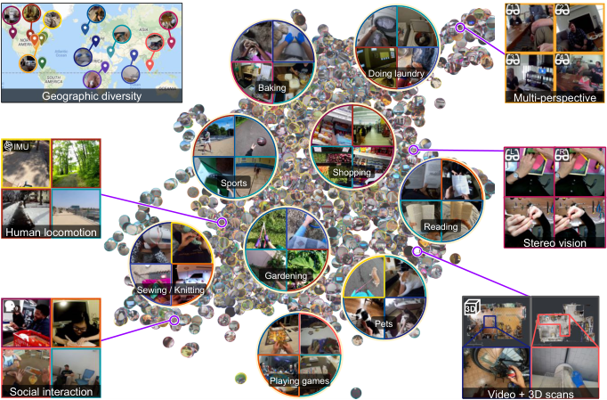
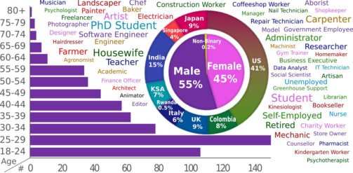
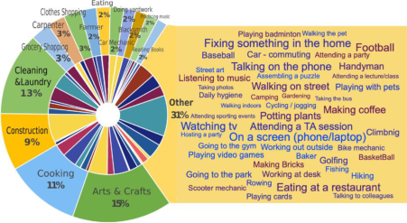
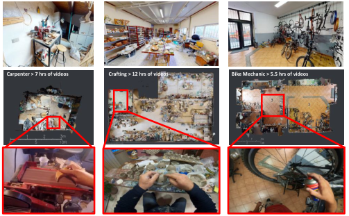
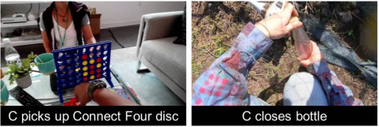
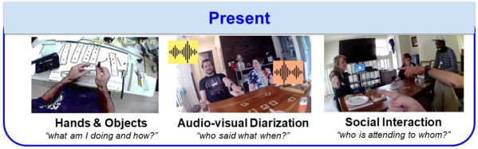
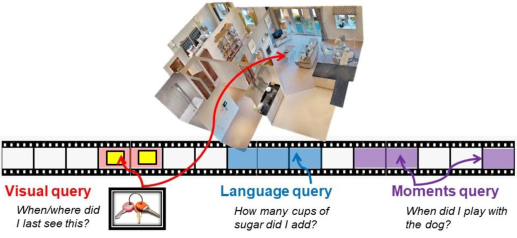
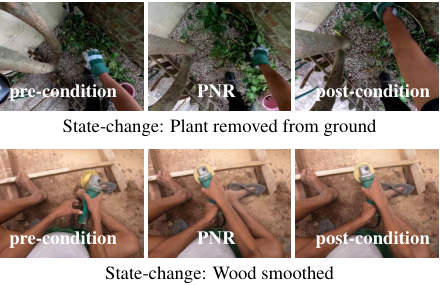
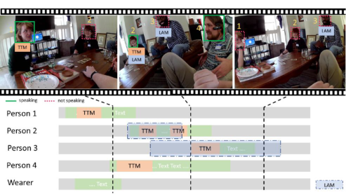
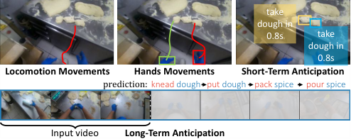

# 025_Grauman_Ego4D_Around_the_World_in_3000_Hours_of_Egocentric_Video_CVPR_2022_paper

[Original PDF](../025_Grauman_Ego4D_Around_the_World_in_3000_Hours_of_Egocentric_Video_CVPR_2022_paper.pdf)

Pages: 18

> Automatically converted from PDF. Check the original for exact equations, symbols, table alignment, and figure details.

<!-- Page 1 -->

# **Ego4D: Around the World in 3,000 Hours of Egocentric Video** 

Kristen Grauman1_,_2 , Andrew Westbury1 , Eugene Byrne_∗_1 , Zachary Chavis_∗_3 , Antonino Furnari_∗_4 , Rohit Girdhar_∗_1 , Jackson Hamburger_∗_1 , Hao Jiang_∗_5 , Miao Liu_∗_6 , Xingyu Liu_∗_7 , Miguel Martin_∗_1 , Tushar Nagarajan_∗_1_,_2 , Ilija Radosavovic_∗_8 , Santhosh Kumar Ramakrishnan_∗_1_,_2 , Fiona Ryan_∗_6 , Jayant Sharma_∗_3 , Michael Wray_∗_9 , Mengmeng Xu_∗_10 , Eric Zhongcong Xu_∗_11 , Chen Zhao_∗_10 , Siddhant Bansal17 , Dhruv Batra1 , Vincent Cartillier1_,_6 , Sean Crane7 , Tien Do3 , Morrie Doulaty1 , Akshay Erapalli13 , Christoph Feichtenhofer1 , Adriano Fragomeni9 , Qichen Fu7 , Abrham Gebreselasie12 , Cristina Gonz´alez14 , James Hillis5 , Xuhua Huang7 , Yifei Huang15 , Wenqi Jia6 , Weslie Khoo16 , J´achym Kol´aˇr13 , Satwik Kottur1 , Anurag Kumar5 , Federico Landini1 , Chao Li5 , Yanghao Li1 , Zhenqiang Li15 , Karttikeya Mangalam1_,_8 , Raghava Modhugu17 , Jonathan Munro9 , Tullie Murrell1 , Takumi Nishiyasu15 , Will Price9 , Paola Ruiz Puentes14 , Merey Ramazanova10 , Leda Sari5 , Kiran Somasundaram5 , Audrey Southerland6 , Yusuke Sugano15 , Ruijie Tao11 , Minh Vo5 , Yuchen Wang16 , Xindi Wu7 , Takuma Yagi15 , Ziwei Zhao16 , Yunyi Zhu11 , Pablo Arbel´aez_†_14 , David Crandall_†_16 , Dima Damen_†_9 , Giovanni Maria Farinella_†_4 , Christian Fuegen_†_1 , Bernard Ghanem_†_10 , Vamsi Krishna Ithapu_†_5 , C. V. Jawahar_†_17 , Hanbyul Joo_†_1 , Kris Kitani_†_7 , Haizhou Li_†_11 , Richard Newcombe_†_5 , Aude Oliva_†_18 , Hyun Soo Park_†_3 , James M. Rehg_†_6 , Yoichi Sato_†_15 , Jianbo Shi_†_19 , Mike Zheng Shou_†_11 , Antonio Torralba_†_18 , Lorenzo Torresani_†_1_,_20 , Mingfei Yan_†_5 , Jitendra Malik1_,_8 

1Meta AI, 2University of Texas at Austin, 3University of Minnesota, 4University of Catania, 

5Meta Reality Labs, 6Georgia Tech, 7Carnegie Mellon University, 8UC Berkeley, 9University of Bristol, 10King Abdullah University of Science and Technology, 11National University of Singapore, 

12Carnegie Mellon University Africa, 13Meta, 14Universidad de los Andes, 15University of Tokyo, 16Indiana University, 17International Institute of Information Technology, Hyderabad, 18MIT, 19University of Pennsylvania, 20Dartmouth 

## **Abstract** 

_We introduce Ego4D, a massive-scale egocentric video dataset and benchmark suite. It offers 3,670 hours of dailylife activity video spanning hundreds of scenarios (household, outdoor, workplace, leisure, etc.) captured by 931 unique camera wearers from 74 worldwide locations and 9 different countries. The approach to collection is designed to uphold rigorous privacy and ethics standards, with consenting participants and robust de-identification procedures where relevant. Ego4D dramatically expands the volume of diverse egocentric video footage publicly available to the research community. Portions of the video are accompanied by audio, 3D meshes of the environment, eye gaze, stereo, and/or synchronized videos from multiple egocentric cameras at the same event. Furthermore, we present a host of new benchmark challenges centered around understanding the first-person visual experience in the past (querying an_ 

_episodic memory), present (analyzing hand-object manipulation, audio-visual conversation, and social interactions), and future (forecasting activities). By publicly sharing this massive annotated dataset and benchmark suite, we aim to push the frontier of first-person perception. Project page: https://ego4d-data.org/_ 

## **1. Introduction** 

Today’s computer vision systems excel at naming objects and activities in Internet photos or video clips. Their tremendous progress over the last decade has been fueled by major dataset and benchmark efforts, which provide the annotations needed to train and evaluate algorithms on well-defined tasks [49, 60, 61, 92, 108, 143]. 

While this progress is exciting, current datasets and models represent only a limited definition of visual perception. First, today’s influential Internet datasets capture brief, isolated moments in time from a third-person “spectactor” view. 

18995

<!-- Page 2 -->

<!-- Start of picture text -->
1 2 3 4 Doing laundry Baking Geographic diversity Multi-perspective IMU L R Shopping Sports Human locomotion Reading Stereo vision Gardening Sewing / Knitting 3D Pets Playing games Social interaction Video + 3D scans <!-- End of picture text -->

Figure 1. Ego4D is a massive-scale egocentric video dataset of daily life activity spanning 74 locations worldwide. Here we see a snapshot of the dataset (5% of the clips, randomly sampled) highlighting its diversity in geographic location, activities, and modalities. The data includes social videos where participants consented to remain unblurred. See https://ego4d-data.org/fig1.html for interactive figure. 

However, in both robotics and augmented reality, the input is a long, fluid video stream from the _first-person_ or _“egocentric”_ point of view—where we see the world through the eyes of an agent actively engaged with its environment. Second, whereas Internet photos are intentionally captured by a human photographer, images from an always-on wearable egocentric camera lack this active curation. Finally, first-person perception requires a persistent 3D understanding of the camera wearer’s physical surroundings, and must interpret objects and actions in a human context—attentive to human-object interactions and high-level social behaviors. 

Motivated by these critical contrasts, we present the Ego4D dataset and benchmark suite. Ego4D aims to catalyze the next era of research in first-person visual perception. _Ego_ is for egocentric, and _4D_ is for 3D spatial plus temporal information. 

Our first contribution is the dataset: a massive ego-video collection of unprecedented scale and diversity that captures daily life activity around the world. See Figure 1. It consists of 3,670 hours of video collected by 931 unique participants from 74 worldwide locations in 9 different countries. The vast majority of the footage is unscripted and “in the wild”, representing the natural interactions of the camera wearers as they go about daily activities in the home, workplace, leisure, social settings, and commuting. Based on self-identified characteristics, the camera wearers are of varying backgrounds, occupations, gender, and ages—not solely graduate students! The video’s rich geographic diversity supports the inclusion of objects, activities, and people frequently absent from existing datasets. Since each participant wore a camera for 1 to 10 hours at at time, the dataset offers long-form 

video content that displays the full arc of a person’s complex interactions with the environment, objects, and other people. In addition to RGB video, portions of the data also provide audio, 3D meshes, gaze, stereo, and/or synchronized multicamera views that allow seeing one event from multiple perspectives. Our dataset draws inspiration from prior egocentric video data efforts [43,44,129,138,179,201,205,210], but makes significant advances in terms of scale, diversity, and realism. 

Equally important to having the right data is to have the right research problems. Our second contribution is a suite of five benchmark tasks spanning the essential components of egocentric perception—indexing past experiences, analyzing present interactions, and anticipating future activity. To enable research on these fronts, we provide millions of rich annotations that resulted from over 250,000 hours of annotator effort and range from temporal, spatial, and semantic labels, to dense textual narrations of activities, natural language queries, and speech transcriptions. 

Ego4D is the culmination of an intensive two-year effort by 14 institutions around the world who came together for the common goal of spurring new research in egocentric perception. We are kickstarting that work with a formal benchmark challenge to be held at CVPR 2022. In the coming years, we believe our contribution can catalyze new research not only in vision, but also robotics, augmented reality, 3D sensing, multimodal learning, speech, and language. These directions will stem not only from the benchmark tasks we propose, but also alternative ones that the community will develop leveraging our massive, publicly available dataset. 

18996

<!-- Page 3 -->

## **2. Related Work** 

**Large-scale third-person datasets** In the last decade, annotated datasets have both presented new problems in computer vision and ensured their solid evaluation. Existing collections like Kinetics [108], AVA [92], UCF [207], ActivityNet [61], HowTo100M [157], ImageNet [49], and COCO [143] focus on third-person Web data, which have the benefit and bias of a human photographer. In contrast, Ego4D is first-person. Passively captured wearable camera video entails unusual viewpoints, motion blur, and lacks temporal curation. Notably, pre-training egocentric video models with third-person data [70,221,224,239] suffers from the sizeable domain mismatch [139, 201]. 

**Egocentric video understanding** Egocentric video offers a host of interesting challenges, such as human-object interactions [26, 46, 163], activity recognition [110, 139, 243], anticipation [4, 75, 86, 144, 205], video summarization [48, 129, 131, 147, 148, 232], detecting hands [16, 134], parsing social interactions [66, 168, 231], and inferring the camera wearer’s body pose [107]. Our dataset can facilitate new work in all these areas and more, and our proposed benchmarks (and annotations thereof) widen the tasks researchers can consider moving forward. We defer discussion of how prior work relates to our benchmark tasks to Sec. 5. 

**Egocentric video datasets** Multiple egocentric datasets have been developed over the last decade. Most relevant to our work are those containing unscripted daily life activity, which includes EPIC-Kitchens [43, 44], UT Ego [129, 210], Activities of Daily Living (ADL) [179], and the Disney dataset [66]. The practice of giving cameras to participants to take out of the lab, first explored in [66, 129, 179], inspires our approach. Others are (semi-)scripted, where camera wearers are instructed to perform a certain activity, as in Charades-Ego [201] and EGTEA [138]. Whereas today’s largest ego datasets focus solely on kitchens [44,44,124,138], Ego4D spans hundreds of environments both indoors and outdoors. Furthermore, while existing datasets rely largely on graduate students as camera wearers [43,44,66,129,129,138, 168, 179, 194, 210], Ego4D camera wearers are of a much wider demographic, as detailed below. Aside from daily life activity, prior ego datasets focus on conversation [170], inter-person interactions [66, 168, 194, 231], place localization [183, 208], multimodal sensor data [124, 166, 204], human hands [16, 134] human-object interaction [106, 184], and object tracking [56]. 

Ego4D is an order of magnitude larger than today’s largest egocentric datasets both in terms of hours of video (3,670 hours vs. 100 in [43]) and unique camera wearers (931 people vs. 71 in [201]); it spans hundreds of environments (rather than one or dozens, as in existing collections); and its video comes from 74 worldwide locations and 9 countries (vs. just one or a few cities). The Ego4D annotations 

Figure 2. Ego4D camera wearer demographics—age, gender, countries of residence, and occupations (self-reported). Font size reflects relative frequency of the occupation. 

are also of unprecedented scale and depth, with millions of annotations supporting multiple complex tasks. As such, Ego4D represents a step change in dataset scale and diversity. We believe both factors are paramount to pursue the next generation of perception for embodied AI. 

## **3. Ego4D Dataset** 

Next we overview the dataset, which is publicly available under an Ego4D license. 

### **3.1. Collection strategy and camera wearers** 

Not only do we wish to amass an ego-video collection that is substantial in scale, but we also want to ensure its diversity of people, places, objects, and activities. Furthermore, for realism, we are interested in unscripted footage captured by people wearing a camera for long periods of time. 

To this end, we devised a distributed approach to data collection. The Ego4D project consists of 14 teams from universities and labs in 9 countries and 5 continents (see map in Figure 1). Each team recruited participants to wear a camera for 1 to 10 hours at a time, for a total of 931 unique camera wearers and 3,670 hours of video in this first dataset release (Ego4D-3K). Participants in 74 total cities were recruited by word of mouth, ads, and postings on community bulletin boards. Some teams recruited participants with occupations that have interesting visual contexts, such as bakers, carpenters, landscapers, or mechanics. 

Both the geographic spread of our team as well as our approach to recruiting participants were critical to arrive at a diverse demographic composition, as shown in Figure 2.1 Participants cover a wide variety of occupations, span many age brackets, with 96 of them over 50 years old, and 45% are female. Two participants identified as non-binary, and two preferred not to say a gender. 

> 1for 64% of all participants; missing demographics are due to protocols or participants opting out of answering specific questions. 

18997

<!-- Page 4 -->

Figure 3. Scenarios in Ego4D. Outer circle shows the 14 most common scenarios (70% of the data). Wordle shows scenarios in the remaining 30%. Inner circle is color coded by the contributing partner (see map color legend in Fig 1). 

### **3.2. Scenarios composing the dataset** 

What activities belong in an egocentric video dataset? Our research is motivated by problems in robotics and augmented reality, where vision systems will encounter _daily life scenarios_ . Hence, we consulted a survey from the U.S. Bureau of Labor Statistics2 that captures how people spend the bulk of their time in the home (e.g., cleaning, cooking, yardwork), leisure (e.g., crafting, games, attending a party), transportation (e.g., biking, car), errands (e.g., shopping, walking dog, getting car fixed), and in the workplace (e.g, talking with colleagues, making coffee). 

To maximize coverage of such scenarios, our approach is a compromise between directing camera wearers and giving no guidance at all: (1) we recruited participants whose collective daily life activity would naturally encompass a spread of the scenarios (as selected freely by the participant), and (2) we asked participants to wear the camera at length (at least as long as the battery life of the device) so that the activity would unfold naturally in a longer context. A typical raw video clip in our dataset lasts 8 minutes—significantly longer than the 10 second clips often studied in third-person video understanding [108]. In this way, we capture unscripted activity while being mindful of the scenarios’ coverage. 

The exception is for certain multi-person scenarios, where we asked participants at five sites who had consented to share their conversation audio and unblurred faces to take part in social activities, such as playing games. We leverage this portion of Ego4D for the Audio-Visual and Social Interaction benchmarks (Sec. 5.3 and 5.4). 

Figure 3 shows the wide distribution of scenarios captured in our dataset. Note that within each given scenario there are typically dozens of actions taking place, e.g., the carpentry scenario includes hammering, drilling, moving wood, etc. Overall, the 931 camera wearers bestow our dataset with a glimpse of daily life activity around the world. 

<!-- Start of picture text -->
Carpenter > 7 hrs of videos Crafting > 12 hrs of videos Bike Mechanic > 5.5 hrs of videos <!-- End of picture text -->

Figure 4. Some videos (bottom) have coupled 3D meshes (top) from Matterport3D scanners, allowing one to relate the dynamic video to the static 3D environment (middle). 

### **3.3. Cameras and modalities** 

To avoid models overfitting to a single capture device, seven different head-mounted cameras were deployed across the dataset: GoPro, Vuzix Blade, Pupil Labs, ZShades, ORDRO EP6, iVue Rincon 1080, and Weeview. They offer tradeoffs in the modalities available (RGB, stereo, gaze), field of view, and battery life. The field of view and camera mounting are particularly influential: while a GoPro mounted on the head pointing down offers a high resolution view of the hands manipulating objects (Fig. 5, right), a heads-up camera like the Vuzix shares the vantage of a person’s eyes, but will miss interactions close to the body (Fig. 5, left). 

In addition to video, portions of Ego4D offer several other data modalities: 3D scans, audio, gaze3 , stereo, multiple synchronized wearable cameras, and textual narrations. See Table 1. Each can support new research challenges. For example, having Matterport3D scans of the environment coupled with ego-video clips (Figure 4) offers a unique opportunity for understanding dynamic activities in a persistent 3D context, as we exploit in the Episodic Memory benchmark (see Sec. 5.1). Multiple synchronized egocentric video streams allow accounting for the first and second-person view in social interactions. Audio allows analysis of conversation and acoustic scenes and events. 

### **3.4. Privacy and ethics** 

From the onset, privacy and ethics standards were critical to this data collection effort. Each partner was responsible for developing a policy. While specifics vary per site, this generally entails: 

- Comply with own institutional research policy, e.g., independent ethics committee review where relevant 

> 3Eye trackers were deployed by Indiana U. and Georgia Tech only. 

2https://www.bls.gov/news.release/atus.nr0.htm 

18998

<!-- Page 5 -->

|Modality:|RGB video|Text narrations|Features|Audio|Faces|3D scans|Stereo|Gaze|IMU|Multi-cam|
|---|---|---|---|---|---|---|---|---|---|---|
|# hours:|3,670|3,670|3,670|2,535|612|491|80|45|836|224|

Table 1. Modalities of data in Ego4D and their amounts. “Narrations” are dense, timestamped descriptions of camera wearer activity (cf. Sec. 4). “3D scans” are meshes from Matterport3D scanners for the full environment in which the video was captured. “Faces” refers to video where participants consented to remain unblurred. “Multi-cam” refers to synchronized video captured at the same event by multiple camera wearers. “Features” refers to precomputed SlowFast [70] video features. 

- Obtain informed consent of camera wearers, who can ask questions and withdraw at any time, and are free to review and redact their own video 

- Respect rights of others in private spaces, and avoid capture of sensitive areas or activities 

- Follow de-identification requirements for personally identifiable information (PII) 

In short, these standards typically require that the video be captured in a controlled environment with informed consent by all participants, or else in public spaces where faces and other PII are blurred. Appendix K in the supplementary materials discusses potential negative societal impact. 

### **3.5. Possible sources of bias** 

While Ego4D pushes the envelope on massive everyday video from geographically and demographically diverse sources, we are aware of a few biases in our dataset. 74 locations is still a long way from complete coverage of the globe. In addition, the camera wearers are generally located in urban or college town areas. The COVID-19 pandemic led to ample footage in stay-at-home scenarios such as cooking, cleaning, crafts, etc. and more limited opportunities to collect video at major social public events. In addition, since battery life prohibits daylong filming, the videos—though unscripted—tend to contain more active portions of a participant’s day. Finally, Ego4D annotations are done by crowdsourced workers in two sites in Africa. This means that there will be at least subtle ways in which the language-based narrations are biased towards their local word choices. 

## **4. Narrations of Camera Wearer Activity** 

Before any other annotation occurs, we pass all video through a _narration_ procedure. Inspired by the pause-andtalk narrator [44], annotators are asked to watch a 5 minute clip of video, summarize it with a few sentences, and then re-watch, pausing repeatedly to write a sentence about each thing the camera wearer does. We record the timestamps and the associated free-form sentences. See Figure 5. Each video receives two independent narrations from different annotators. The narrations are temporally dense: on average we received 13.2 sentences per minute of video, for a total of 3.85M sentences. In total the narrations describe the Ego4D video using 1,772 unique verbs (activities) and 4,336 unique nouns (objects). See Appendix D for details. 

Figure 5. Example narrations. “C” refers to camera wearer. 

The narrations allow us to (1) perform text mining for data-driven taxonomy construction for actions and objects, (2) sort the videos by their content to map them to relevant benchmarks, and (3) identify temporal windows where certain annotations should be seeded. Beyond these uses, the narrations are themselves a contribution of the dataset, potentially valuable for research on video with weakly aligned natural language. To our knowledge, ours is the largest repository of aligned language and video (e.g., HowTo100M [157], an existing Internet repository with narrations, contains noisy spoken narrations that only sometimes comment on the activities taking place). 

## **5. Ego4D Benchmark Suite** 

First-person vision has the potential to transform many applications in augmented reality and robotics. However, compared to mainstream video understanding, egocentric perception requires new fundamental research to account for long-form video, attention cues, person-object interactions, multi-sensory data, and the lack of manual temporal curation inherent to a passively worn camera. 

Inspired by all these factors, we propose a suite of challenging benchmark tasks. The five benchmarks tackle the _past_ , _present_ , and _future_ of first-person video. See Figure 6. The following sections introduce each task and its annotations. The first dataset release has annotations for 48-1,000 hours of data per benchmark, on top of the 3,670 hours of data that is narrated. The Appendices describe how we sampled videos per benchmark to maximize relevance to the task while maintaining geographic diversity. 

We developed baseline models drawing on state-of-theart components from the literature in order to test drive all Ego4D benchmarks. **The Appendices present the baseline models and quantitative results.** We are running a formal Ego4D competition at CVPR 2022 inviting the research community to improve on these baselines. 

18999

<!-- Page 6 -->

Figure 6. The Ego4D benchmark suite centers around the first-person visual experience—from remembering the past, to analyzing the present, to anticipating the future. The supplementary video available here https://ego4d-data.org/ overviews each task. 

### **5.1. Episodic Memory** 

**Motivation** Egocentric video from a wearable camera records the who/what/when/where of an individual’s daily life experience. This makes it ideal for what Tulving called _episodic_ memory [213]: specific first-person experiences (“what did I eat and who did I sit by on my first flight to France?”), to be distinguished from _semantic_ memory (“what’s the capital of France?”). An augmented reality assistant that processes the egocentric video stream could give us super-human memory if it could appropriately index our visual experience and answer queries. 

**Task definition** Given an egocentric video and a query, the Ego4D Episodic Memory task requires localizing where the answer can be seen within the user’s past video. We consider three query types. (1) _Natural language queries_ (NLQ), in which the query is expressed in text (e.g., “What did I put in the drawer?”), and the output response is the temporal window where the answer is visible or deducible. (2) _Visual queries_ (VQ), in which the query is a static image of an object, and the output response localizes the object the last time it was seen in the video, both temporally and spatially. The spatial response is a 2D bounding box on the object, and optionally a 3D displacement vector from the current camera position to the object’s 3D bounding box. VQ captures how a user might teach the system an object with an image example, then later ask for its location (“Where is this [picture of my keys]?”). (3) _Moments queries_ (MQ), in which the query is the name of a high-level activity or “moment”, and the response consists of all temporal windows where the activity occurs (e.g., “When did I read to my children?”). See Figure 7. 

**Annotations** For language queries, we devised a set of 13 template questions meant to span things a user might ask to augment their memory, such as _“what is the state of object X?”_ , e.g., “did I leave the window open?”. Annotators express the queries in free-form natural language, and also provide the slot filling (e.g., X = window). For moments, we established a taxonomy of 110 activities in a data-driven, semi-automatic manner by mining the narration summaries. Moments capture high-level activities in the camera wearer’s 

Figure 7. Episodic Memory’s three query types 

day, e.g., _setting the table_ is a moment, whereas _pick up_ is an action in our Forecasting benchmark (Sec. 5.5). 

For NLQ and VQ, we ask annotators to generate language/visual queries and couple them with the “response track” in the video. For MQ, we provide the taxonomy of labels and ask annotators to label clips with each and every temporal segment containing a moment instance. In total, we have _∼_ 74K total queries spanning 1 _,_ 000 hours of video. 

**Evaluation metrics and baselines** For NLQ, we use top-k recall at a certain temporal intersection over union (tIoU) threshold. MQ adopts a popular metric used in temporal action detection: mAP at multiple tIoU thresholds, as well as top-kx recall. VQ adopts temporal and spatio-temporal localization metrics as well as timeliness metrics that encourage speedy searches. Appendix F presents the baseline models we developed and reports results. 

**Relation to existing tasks** Episodic Memory has some foundations in existing vision problems, but also adds new challenges. All three queries call for spatial reasoning in a static environment coupled with dynamic video of a person who moves and changes things; current work largely treats these two elements separately. The timeliness metrics encourage work on intelligent contextual search. While current literature on language+vision focuses on captioning and question answering for isolated instances of Internet data [12, 35, 119, 228], NLQ is motivated by queries about the camera wearer’s own visual experience and operates over long-term observations. VQ upgrades object instance recog- 

19000

<!-- Page 7 -->

<!-- Start of picture text -->
pre-condition PNR post-condition State-change: Plant removed from ground pre-condition PNR post-condition State-change: Wood smoothed <!-- End of picture text -->

Figure 8. Hands and Objects: Example object state changes defined by pre-condition, PNR, and post-condition frames. 

nition [23, 85, 126, 155] to deal with video (frequent FoV changes, objects entering/exiting the view) and to reason about objects in the context of a 3D environment. Finally, MQ can be seen as activity detection [141, 229, 237] but for the activities of the camera wearer. 

### **5.2. Hands and Objects** 

**Motivation** While Episodic Memory aims to make _past_ video queryable, our next benchmark aims to understand the camera wearer’s _present_ activity—in terms of interactions with objects and other people. Specifically, the Hands and Objects benchmark captures how the camera wearer changes the state of an object by using or manipulating it—which we call an _object state change_ . Though cutting a piece of lumber in half can be achieved through many methods ( _e.g._ , various tools, force, speed, grasps, endeffectors), all should be recognized as the same state change. This generalization ability will enable us to understand human actions better, as well as to train robots to learn from human demonstrations in video. 

**Task definitions** We interpret an object state change to include various physical changes, including changes in size, shape, composition, and texture. Object state changes can be viewed along temporal, spatial and semantic axes, leading to these three tasks: (1) _Point-of-no-return temporal localization_ : given a short video clip of a state change, the goal is to estimate the keyframe that contains the point-of-no-return (PNR) (the time at which a state change begins); (2) _State change object detection_ : given three temporal frames (pre, post, PNR), the goal is to regress the bounding box of the object undergoing a state change; (3) _Object state change classification_ : given a short video clip, the goal is to classify whether an object state change has taken place or not. 

**Annotations** We select the data to annotate based on activities that are likely to involve hand-object interactions ( _e.g._ , knitting, carpentry, baking, _etc._ ). We start by labeling each narrated hand-object interaction. For each, we label three 

moments in time (pre, PNR, post) and the bounding boxes for the hands, tools, and objects in each of the three frames. We also annotate the state change types (remove, burn, _etc._ , see Fig. 8), action verbs, and nouns for the objects. 

**Evaluation metrics and baselines** Object state change temporal localization is evaluated using absolute temporal error measured in seconds. Object state change classification is evaluated by classification accuracy. State change object detection is evaluated by average precision (AP). Appendix G details the annotations and presents baseline model results for the three Hands and Objects tasks. 

**Relation to existing tasks** Limited prior work considers object state change in photos [102, 164] or video [8, 68, 242]; Ego4D is the first video benchmark dedicated to the task of understanding object state changes. The task is similar to action recognition (e.g., [100, 110, 139, 221, 243]) because in some cases a specific action can correspond to a specific state change. However, a single state change ( _e.g.,_ cutting) can also be observed in many forms (various object-tool-action combinations). It is our hope that the proposed benchmarks will lead to the development of more explicit models of object state change, while avoiding approaches that simply overfit to action or object observations. 

### **5.3. Audio-Visual Diarization** 

**Motivation** Our next two tasks aim to understand the camera wearer’s present interactions with _people_ . People communicate using spoken language, making the capture of conversational content in business meetings and social settings a problem of great scientific and practical interest. While diarization has been a standard problem in the speech recognition community, Ego4D brings in two new aspects (1) simultaneous capture of video and audio (2) the egocentric perspective of a participant in the conversation. 

**Task definition and annotations** The Audio-Visual Diarization (AVD) benchmark is composed of four tasks (see Figure 9): 

- _Localization and tracking_ of the participants (i.e., candidate speakers) in the visual field of view (FoV). A bounding box is annotated around each participant‘s face. 

- _Active speaker detection_ where each tracked speaker is assigned an anonymous label, including the camera wearer who never appears in the visual FoV. 

- _Diarization_ of each speaker’s speech activity, where we provide the time segments corresponding to each speaker’s voice activity in the clip. 

- _Transcription_ of each speaker’s speech content (only English speakers are considered for this version). 

**Evaluation metrics and baselines** We use standardized object tracking (MOT) metrics [18, 19] to evaluate speaker localization and tracking in the visual FoV. Speaker detection with anonymous labels is evaluated using the speaker 

19001

<!-- Page 8 -->

Figure 9. Audio-Visual and Social benchmark annotations 

error rate, which measures the proportion of wrongly assigned labels. We adopt the well studied diarization error rate (DER) [11] and word error rate (WER) [114] for diarization and transcription, respectively. We present AVD baseline models and results in Appendix H. 

**Relation to existing tasks** The past few years have seen audio studied in computer vision tasks [245] for action classification [110, 226], object categorization [125, 234], source localization and tracking [14, 197, 212] and embodied navigation [33]. Meanwhile, visual information is increasingly used in historically audio-only tasks like speech transcription, voice recognition, audio spatialization [5, 80, 104, 161], speaker diarization [10,83], and source separation [57,78,82]. Datasets like VoxCeleb [39], AVA Speech [31], AVA active speaker [192], AVDIAR [83], and EasyCom [53] support this research. However, these datasets are mainly non-egocentric. Unlike Ego4D, they do not capture natural conversational characteristics involving a variety of noisy backgrounds, overlapping, interrupting and un-intelligible speech, environment variation, moving camera wearers, and speakers facing away from the camera wearer. 

### **5.4. Social Interactions** 

**Motivation** An egocentric video provides a unique lens for studying social interactions because it captures utterances and nonverbal cues [115] from each participant’s unique view and enables embodied approaches to social understanding. Progress in egocentric social understanding could lead to more capable virtual assistants and social robots. Computational models of social interactions can also provide new tools for diagnosing and treating disorders of socialization and communication such as autism [188], and could support novel prosthetic technologies for the hearing-impaired. 

**Task definition** While the Ego4D dataset can support such a long-term research agenda, our initial Social benchmark focuses on multimodal understanding of conversational interactions via attention and speech. Specifically, we focus on identifying communicative acts that are directed towards the 

camera-wearer, as distinguished from those directed to other social partners: (1) _Looking at me (LAM):_ given a video in which the faces of social partners have been localized and identified, classify whether each visible face is looking at the camera wearer; and (2) _Talking to me (TTM):_ given a video and audio segment with the same tracked faces, classify whether each visible face is talking to the camera wearer. 

**Annotations** Social annotations build on those from AV diarization (Sec. 5.3). Given (1) face bounding boxes labeled with participant IDs and tracked across frames, and (2) associated active speaker annotations that identify in each frame whether the social partners whose faces are visible are speaking, annotators provide the ground truth labels for LAM and TTM as a binary label for each face in each frame. For LAM, annotators label the time segment (start and end time) of a visible person when the individual is looking at the camera wearer. For TTM, we use the vocal activity annotation from AVD, then identify the time segment when the speech is directed at the camera wearer. See Figure 9. 

**Evaluation metrics and baselines** We use mean average precision (mAP) and Top-1 accuracy to quantify the classification performance for both tasks. Unlike AVD, we measure precision at every frame. Appendix I provides details and presents Social baseline models and results. 

**Relation to existing tasks** Compared to [67], Ego4D contains substantially more participants, hours of recording, and variety of sensors and social contexts. The LAM task is most closely related to prior work on eye contact detection in egovideo [36, 159], but addresses more diverse and challenging scenarios. Mutual gaze estimation [54, 150–152, 172, 176] and gaze following [37, 65, 111, 186] are also relevant. The TTM task is related to audio-visual speaker detection [7,193] and meeting understanding [21, 132, 154]. 

### **5.5. Forecasting** 

**Motivation** Having addressed the past and present of the camera wearer’s visual experience, our last benchmark moves on to anticipating the future. Forecasting movements and interactions requires comprehending the camera wearer’s _intention_ . It has immediate applications in AR and human-robot interaction, such as anticipatively turning on appliances or moving objects for the human’s convenience. The scientific motivation can be seen by analogy with language models such as GPT-3 [24], which implicitly capture knowledge needed by many other tasks. Rather than predict the next word, visual forecasting models the dynamics of an agent acting in the physical world. 

**Task definition** The Forecasting benchmark includes four tasks (Fig. 10): (1) _Locomotion prediction_ : predict a set of possible future ground plane trajectories of the camera wearer. (2) _Hand movement prediction_ : predict the hand 

19002

<!-- Page 9 -->

<!-- Start of picture text -->
take dough in 0.8s take dough in 0.8s Locomotion Movements Hands Movements Short-Term Anticipation prediction: knead dough put dough pack spice pour spice Input video Long-Term Anticipation <!-- End of picture text -->

Figure 10. The Forecasting benchmark aims to predict future locomotion, movement of hands, next object interactions, and sequences of future actions. 

positions of the camera wearer in future frames. (3) _Shortterm object interaction anticipation_ : detect a set of possible future interacted objects in the most recent frame of the clip. To each object, assign a verb indicating the possible future interaction and a “time to contact” estimate of when the interaction is going to begin. (4) _Long-term action anticipation_ : predict the camera wearer’s future sequence of actions. 

**Annotations** Using the narrations, we identify the occurrence of each object interaction, assigning a verb and a target object class. The verb and noun taxonomies are seeded from the narrations and then hand-refined. For each action, we identify a contact frame and a pre-condition frame in which we annotate bounding boxes around active objects. The same objects as well as hands are annotated in three frames preceding the pre-condition frame by 0 _._ 5 _s_ , 1 _s_ and 1 _._ 5 _s_ . We obtain ground truth ego-trajectories of the camera wearer using structure from motion. 

**Evaluation metrics and baselines** We evaluate future locomotion movement and hand movement prediction using L2 distance. Short-term object interaction anticipation is evaluated using a Top-5 mean Average Precision metric which discounts the Top-4 false negative predictions. Long-term action anticipation is evaluated using edit distance. Appendix J details the tasks, annotations, baseline models, and results. 

**Relation to existing tasks** Predicting future events has increasing interest [191]. Previous work considers future localization [113, 120, 174, 230], action anticipation [76, 77, 86, 118, 127, 219], next active object prediction [20, 74], future event prediction [149, 167], and future frame prediction [145, 146, 153, 215, 218, 227]. Whereas past work relies on different benchmarks and task definitions, we propose a unified benchmark to assess progress in the field. 

## **6. Conclusion** 

Ego4D is a first-of-its-kind dataset and benchmark suite aimed at advancing multimodal perception of egocentric video. Compared to existing work, our dataset is orders of magnitude larger in scale and diversity. The data will allow 

AI to learn from daily life experiences around the world— seeing what we see and hearing what we hear—while our benchmark suite provides solid footing for innovations in video understanding that are critical for augmented reality, robotics, and many other domains. We look forward to the research that will build on Ego4D in the years ahead. 

## **Contribution statement** 

Project led and initiated by Kristen Grauman. Program management and operations led by Andrew Westbury. Scientific advising by Jitendra Malik. Authors with stars (_∗_ ) were key drivers of implementation, collection, and/or annotation development throughout the project. Authors with daggers (_†_ ) are faculty PIs and working group leads in the project. The benchmarks brought together many researchers from all institutions including cross-institution baseline evaluations. The Appendices detail the contributions of individual authors for the various benchmarks. 

Appendix A provides details about the data collection done per site and acknowledges the primary contributors. The video collected by Meta Reality Labs used Vuzix Blade® Smart Glasses and was done in a closed environment in Meta’s buildings by paid participants who signed consents to share their data. All other video collection and participant recruitment was managed by the university partners. The annotation effort was led by Meta AI. 

**Acknowledgements** We gratefully acknowledge the following colleagues for valuable discussions and support of our project: Aaron Adcock, Andrew Allen, Behrouz Behmardi, Serge Belongie, Antoine Bordes, Mark Broyles, Xiao Chu, Samuel Clapp, Irene D’Ambra, Peter Dodds, Jacob Donley, Ruohan Gao, Tal Hassner, Ethan Henderson, Jiabo Hu, Guillaume Jeanneret, Sanjana Krishnan, Devansh Kukreja, Tsung-Yi Lin, Bobby Otillar, Manohar Paluri, Maja Pantic, Lucas Pinto, Vivek Roy, Jerome Pesenti, Joelle Pineau, Luca Sbordone, Rajan Subramanian, Helen Sun, Mary Williamson, and Bill Wu. We also acknowledge Jacob Chalk for setting up the Ego4D AWS backend and Prasanna Sridhar for developing the Ego4D website. Thank you to the Common Visual Data Foundation (CVDF) for hosting the Ego4D dataset. The universities acknowledge the usage of commercial software for deidentification of video. brighter.ai was used for redacting videos by some universities. Personal data from the U. Bristol was protected by Primloc’s Secure Redact software. 

UNICT is supported by MIUR AIM - Attrazione e MobilitaInternazionale Linea 1 - AIM1893589 - CUP E64118002540007. Bristol is supported by UKRIEngineering and Physical Sciences Research Council (EPSRC) Doctoral Training Program (DTP), EPSRC Fellowship UMPIRE (EP/T004991/1). KAUST is supported by the KAUST Office of Sponsored Research through the Visual Computing Center (VCC) funding. National University of Singapore is supported by Mike Shou’s Start-Up Grant. Georgia Tech is supported in part by NSF 2033413 and NIH R01MH114999. 

19003

<!-- Page 10 -->

## **References** 

- [1] Github repository of the ESPNet model zoo. https: //github.com/espnet/espnet_model_zoo. We used the ShinjiWatanabe/gigaspeech_asr_ train_asr_raw_en_bpe5000_valid.acc.ave model. 53 

- [2] Kaldi English GLM file. https://github.com/ kaldi-asr/kaldi/blob/master/egs/ami/s5/ local/english.glm. 54 

- [3] NIST SRE 2000 Evaluation Plan. https://www.nist. gov/sites/default/files/documents/2017/ 09/26/spk-2000-plan-v1.0.htm_.pdf. 48 

- [4] Yazan Abu Farha, Alexander Richard, and Juergen Gall. When will you do what?-anticipating temporal occurrences of activities. In _Computer Vision and Pattern Recognition_ , pages 5343–5352, 2018. 3 

- [5] Triantafyllos Afouras, Joon Son Chung, Andrew Senior, Oriol Vinyals, and Andrew Zisserman. Deep audio-visual speech recognition. _IEEE transactions on pattern analysis and machine intelligence_ , 2018. 8, 45 

- [6] Triantafyllos Afouras, Joon Son Chung, and Andrew Zisserman. The conversation: Deep audio-visual speech enhancement. In _Interspeech_ , 2018. 45 

- [7] Triantafyllos Afouras, Andrew Owens, Joon Son Chung, and Andrew Zisserman. Self-supervised Learning of AudioVisual Objects from Video. In _Proceedings of the European Conference on Computer Vision (ECCV 20)_ , volume 12363 LNCS, pages 208–224, 2020. 8 

- [8] Jean-Baptiste Alayrac, Josef Sivic, Ivan Laptev, and Simon Lacoste-Julien. Joint discovery of object states and manipulation actions. _ICCV_ , 2017. 7, 39, 40 

- [9] Humam Alwassel, Fabian Caba Heilbron, Victor Escorcia, and Bernard Ghanem. Diagnosing error in temporal action detectors. In _Proceedings of the European Conference on Computer Vision (ECCV)_ , 2018. 36, 37 

- [10] Xavier Anguera, Simon Bozonnet, Nicholas Evans, Corinne Fredouille, Gerald Friedland, and Oriol Vinyals. Speaker diarization: A review of recent research. _IEEE Transactions on audio, speech, and language processing_ , 20(2):356–370, 2012. 8, 47, 48 

- [11] Xavier Anguera Miro.´ _Robust speaker diarization for meetings_ . Universitat Polit`ecnica de Catalunya, 2006. 8, 47 

- [12] Stanislaw Antol, Aishwarya Agrawal, Jiasen Lu, Margaret Mitchell, Dhruv Batra, C. Lawrence Zitnick, and Devi Parikh. VQA: Visual Question Answering. In _International Conference on Computer Vision (ICCV)_ , 2015. 6 

- [13] Mehmet Ali Arabacı, Fatih Ozkan, Elif Surer, Peter Jan¨ coviˇ c,ˇ and Alptekin Temizel. Multi-modal egocentric activity recognition using audio-visual features. _arXiv preprint arXiv:1807.00612_ , 2018. 45 

- [14] Relja Arandjelovic´ and Andrew Zisserman. Objects that sound. In _ECCV_ , 2018. 8, 45 

- [15] Alexei Baevski, Henry Zhou, Abdelrahman Mohamed, and Michael Auli. wav2vec 2.0: A framework for selfsupervised learning of speech representations. _arXiv preprint arXiv:2006.11477_ , 2020. 53 

- [16] Sven Bambach, Stefan Lee, David J. Crandall, and Chen Yu. Lending a hand: Detecting hands and recognizing activities in complex egocentric interactions. In _The IEEE International Conference on Computer Vision (ICCV)_ , December 2015. 3 

- [17] Mark A Bee and Christophe Micheyl. The cocktail party problem: what is it? how can it be solved? and why should animal behaviorists study it? _Journal of comparative psychology_ , 122(3):235, 2008. 45 

- [18] Keni Bernardin, Alexander Elbs, and Rainer Stiefelhagen. Multiple object tracking performance metrics and evaluation in a smart room environment. In _Sixth IEEE International Workshop on Visual Surveillance, in conjunction with ECCV_ , volume 90. Citeseer, 2006. 7, 46 

- [19] Keni Bernardin and Rainer Stiefelhagen. Evaluating multiple object tracking performance: the clear mot metrics. _EURASIP Journal on Image and Video Processing_ , 2008:1– 10, 2008. 7, 46 

- [20] Gedas Bertasius, Hyun Soo Park, Stella X. Yu, and Jianbo Shi. First-person action-object detection with egonet. In _Proceedings of Robotics: Science and Systems_ , July 2017. 9 

- [21] Cigdem Beyan, Francesca Capozzi, Cristina Becchio, and Vittorio Murino. Prediction of the leadership style of an emergent leader using audio and visual nonverbal features. _IEEE Transactions on Multimedia_ , 20(2):441–456, 2018. 8 

- [22] Goutam Bhat, Martin Danelljan, Luc Van Gool, and Radu Timofte. Know Your Surroundings: Exploiting Scene Information for Object Tracking. _arXiv:2003.11014 [cs]_ , May 2020. 30, 31 

- [23] Eric Brachmann, Alexander Krull, Frank Michel, Stefan Gumhold, Jamie Shotton, and Carsten Rother. Learning 6d object pose estimation using 3d object coordinates. In _European conference on computer vision_ , pages 536–551. Springer, 2014. 7 

- [24] Tom B. Brown, Benjamin Mann, Nick Ryder, Melanie Subbiah, Jared Kaplan, Prafulla Dhariwal, Arvind Neelakantan, Pranav Shyam, Girish Sastry, Amanda Askell, Sandhini Agarwal, Ariel Herbert-Voss, Gretchen Krueger, Tom Henighan, Rewon Child, Aditya Ramesh, Daniel M. Ziegler, Jeffrey Wu, Clemens Winter, Christopher Hesse, Mark Chen, Eric Sigler, Mateusz Litwin, Scott Gray, Benjamin Chess, Jack Clark, Christopher Berner, Sam McCandlish, Alec Radford, Ilya Sutskever, and Dario Amodei. Language models are few-shot learners, 2020. 8 

- [25] Ian M Bullock, Thomas Feix, and Aaron M Dollar. The yale human grasping dataset: Grasp, object, and task data in household and machine shop environments. _IJRR_ , 2015. 40 

- [26] Minjie Cai, Kris M Kitani, and Yoichi Sato. Understanding hand-object manipulation with grasp types and object attributes. In _RSS_ , 2016. 3 

- [27] Nicolas Carion, Francisco Massa, Gabriel Synnaeve, Nicolas Usunier, Alexander Kirillov, and Sergey Zagoruyko. Endto-end object detection with transformers. In _European Conference on Computer Vision_ , pages 213–229. Springer, 2020. 43, 44 

- [28] Jean Carletta, Simone Ashby, Sebastien Bourban, Mike Flynn, Mael Guillemot, Thomas Hain, Jaroslav Kadlec, 

19004

<!-- Page 11 -->

Vasilis Karaiskos, Wessel Kraaij, Melissa Kronenthal, et al. The AMI meeting corpus: A pre-announcement. In _International workshop on machine learning for multimodal interaction_ , pages 28–39. Springer, 2006. 48 

- [29] Joao Carreira and Andrew Zisserman. Quo vadis, action recognition? a new model and the kinetics dataset. In _proceedings of the IEEE Conference on Computer Vision and Pattern Recognition_ , pages 6299–6308, 2017. 41, 43 

- [30] Chien-Yi Chang, De-An Huang, Danfei Xu, Ehsan Adeli, Li Fei-Fei, and Juan Carlos Niebles. Procedure planning in instructional videos. _arXiv preprint arXiv:1907.01172_ , 2019. 40 

- [31] Sourish Chaudhuri, Joseph Roth, Daniel PW Ellis, Andrew Gallagher, Liat Kaver, Radhika Marvin, Caroline Pantofaru, Nathan Reale, Loretta Guarino Reid, Kevin Wilson, et al. Ava-speech: A densely labeled dataset of speech activity in movies. _arXiv preprint arXiv:1808.00606_ , 2018. 8, 46 

- [32] C. Chen, U. Jain, C. Schissler, S. V. Amengual Gari, Z. Al-Halah, V. Ithapu, P. Robinson, and K. Grauman. Soundspaces: Audio-visual navigation in 3d environments. In _ECCV_ , 2020. 54 

- [33] Changan Chen, Unnat Jain, Carl Schissler, Sebastia Vicenc Amengual Gari, Ziad Al-Halah, Vamsi Krishna Ithapu, Philip Robinson, and Kristen Grauman. Audio-visual embodied navigation. _environment_ , 97:103, 2019. 8 

- [34] Guoguo Chen, Shuzhou Chai, Guanbo Wang, Jiayu Du, WeiQiang Zhang, Chao Weng, Dan Su, Daniel Povey, Jan Trmal, Junbo Zhang, et al. Gigaspeech: An evolving, multi-domain asr corpus with 10,000 hours of transcribed audio. _arXiv preprint arXiv:2106.06909_ , 2021. 53 

- [35] Xinlei Chen, Hao Fang, Tsung-Yi Lin, Ramakrishna Vedantam, Saurabh Gupta, Piotr Dollar, and C Lawrence Zitnick.´ Microsoft coco captions: Data collection and evaluation server. _arXiv preprint arXiv:1504.00325_ , 2015. 6 

- [36] Eunji Chong, Elysha Clark-Whitney, Audrey Southerland, Elizabeth Stubbs, Chanel Miller, Eliana L Ajodan, Melanie R Silverman, Catherine Lord, Agata Rozga, Rebecca M Jones, and James M Rehg. Detection of eye contact with deep neural networks is as accurate as human experts. _Nature Communications_ , 11(1):6386, dec 2020. 8 

- [37] Eunji Chong, Yongxin Wang, Nataniel Ruiz, and James M. Rehg. Detecting Attended Visual Targets in Video. In _Proceedings of the IEEE Conference on Computer Vision and Pattern Recognition (CVPR 20)_ , pages 5395–5405, Seattle, WA, 2020. 8, 57 

- [38] Joon Son Chung, Jaesung Huh, Seongkyu Mun, Minjae Lee, Hee Soo Heo, Soyeon Choe, Chiheon Ham, Sunghwan Jung, Bong-Jin Lee, and Icksang Han. In defence of metric learning for speaker recognition. In _Interspeech_ , 2020. 56 

- [39] Joon Son Chung, Jaesung Huh, Arsha Nagrani, Triantafyllos Afouras, and Andrew Zisserman. Spot the conversation: speaker diarisation in the wild. _arXiv preprint arXiv:2007.01216_ , 2020. 8, 46 

- [40] J. S. Chung, A. Nagrani, and A. Zisserman. VoxCeleb2: Deep Speaker Recognition. In _INTERSPEECH_ , 2018. 46, 49 

- [41] Kenneth Church and Patrick Hanks. Word association norms, mutual information, and lexicography. _Computational linguistics_ , 16(1):22–29, 1990. 63 

- [42] Dima Damen, Hazel Doughty, Giovanni Farinella, Sanja Fidler, Antonino Furnari, Evangelos Kazakos, Davide Moltisanti, Jonathan Munro, Toby Perrett, Will Price, et al. The epic-kitchens dataset: Collection, challenges and baselines. _IEEE Transactions on Pattern Analysis & Machine Intelligence_ , (01):1–1, 2020. 45 

- [43] Dima Damen, Hazel Doughty, Giovanni Maria Farinella, , Antonino Furnari, Jian Ma, Evangelos Kazakos, Davide Moltisanti, Jonathan Munro, Toby Perrett, Will Price, and Michael Wray. Rescaling egocentric vision. _IJCV_ , 2021. 2, 3, 40 

- [44] Dima Damen, Hazel Doughty, Giovanni Maria Farinella, Sanja Fidler, Antonino Furnari, Evangelos Kazakos, Davide Moltisanti, Jonathan Munro, Toby Perrett, Will Price, and Michael Wray. Scaling egocentric vision: The epickitchens dataset. In _European Conference on Computer Vision (ECCV)_ , 2018. 2, 3, 5, 17, 45 

- [45] Dima Damen, Teesid Leelasawassuk, Osian Haines, Andrew Calway, and Walterio Mayol-Cuevas. You-Do, I-Learn: Discovering task relevant objects and their modes of interaction from multi-user egocentric video. In _BMVC_ , 2014. 39, 40 

- [46] Dima Damen, Teesid Leelasawassuk, and Walterio MayolCuevas. You-do, i-learn: Egocentric unsupervised discovery of objects and their modes of interaction towards videobased guidance. _CVIU_ , 2016. 3 

- [47] Fred J Damerau. A technique for computer detection and correction of spelling errors. _Communications of the ACM_ , 1964. 65 

- [48] Ana Garcia Del Molino, Cheston Tan, Joo-Hwee Lim, and Ah-Hwee Tan. Summarization of egocentric videos: A comprehensive survey. _IEEE Transactions on Human-Machine Systems_ , 47(1), 2016. 3 

- [49] Jia Deng, Wei Dong, Richard Socher, Li-Jia Li, Kai Li, and Li Fei-Fei. ImageNet: A large-scale hierarchical image database. In _CVPR_ , 2009. 1, 3 

- [50] Daniel DeTone, Tomasz Malisiewicz, and Andrew Rabinovich. Superpoint: Self-supervised interest point detection and description. In _CVPR Workshop_ , 2018. 32 

- [51] Jacob Devlin, Ming-Wei Chang, Kenton Lee, and Kristina Toutanova. Bert: Pre-training of deep bidirectional transformers for language understanding. _arXiv:1810.04805_ , 2018. 25 

- [52] Jacob Devlin, Ming-Wei Chang, Kenton Lee, and Kristina Toutanova. BERT: Pre-training of deep bidirectional transformers for language understanding. In _Proceedings of the 2019 Conference of the North American Chapter of the Association for Computational Linguistics: Human Language Technologies, Volume 1 (Long and Short Papers)_ , pages 4171–4186, Minneapolis, Minnesota, June 2019. Association for Computational Linguistics. 35, 36 

- [53] Jacob Donley, Vladimir Tourbabin, Jung-Suk Lee, Mark Broyles, Hao Jiang, Jie Shen, Maja Pantic, Vamsi Krishna Ithapu, and Ravish Mehra. Easycom: An augmented reality dataset to support algorithms for easy communication in 

19005

<!-- Page 12 -->

noisy environments. _arXiv preprint arXiv:2107.04174_ , 2021. 8, 46 

- [54] Bardia Doosti, Ching-Hui Chen, Raviteja Vemulapalli, Xuhui Jia, Yukun Zhu, and Bradley Green. Boosting imagebased mutual gaze detection using pseudo 3d gaze. In _ThirtyFifth AAAI Conference on Artificial Intelligence_ , pages 1273– 1281, 2021. 8 

- [55] Hazel Doughty, Ivan Laptev, Walterio Mayol-Cuevas, and Dima Damen. Action modifiers: Learning from adverbs in instructional videos. _arXiv preprint arXiv:1912.06617_ , 2019. 40 

- [56] Matteo Dunnhofer, Antonino Furnari, Giovanni Maria Farinella, and Christian Micheloni. Is first person vision challenging for object tracking? In _IEEE/CVF International Conference on Computer Vision Workshops (ICCVW)_ 

   - _Visual Object Tracking Challenge_ , 2021. 3 

- [57] Ariel Ephrat, Inbar Mosseri, Oran Lang, Tali Dekel, Kevin Wilson, Avinatan Hassidim, William T Freeman, and Michael Rubinstein. Looking to listen at the cocktail party: A speaker-independent audio-visual model for speech separation. In _SIGGRAPH_ , 2018. 8, 45 

- [58] Dave Epstein, Boyuan Chen, and Carl Vondrick. Oops! predicting unintentional action in video. In _Arxiv_ , 2019. 39 

- [59] N. Ryant et. al. The Second DIHARD Diarization Challenge: Dataset, task, and baselines. In _Proceedings of Interspeech_ , 2019. 48 

- [60] Mark Everingham, Luc Van Gool, Christopher KI Williams, John Winn, and Andrew Zisserman. The pascal visual object classes (voc) challenge. _International journal of computer vision_ , 88(2):303–338, 2010. 1, 64 

- [61] Bernard Ghanem Fabian Caba Heilbron, Victor Escorcia and Juan Carlos Niebles. Activitynet: A large-scale video benchmark for human activity understanding. In _Proceedings of the IEEE Conference on Computer Vision and Pattern Recognition_ , pages 961–970, 2015. 1, 3, 27, 29 

- [62] Heng Fan, Haibin Ling, Liting Lin, Fan Yang, Peng Chu, Ge Deng, Sijia Yu, Hexin Bai, Yong Xu, and Chunyuan Liao. LaSOT: A High-Quality Benchmark for Large-Scale Single Object Tracking. In _2019 IEEE/CVF Conference on Computer Vision and Pattern Recognition (CVPR)_ , pages 5369–5378, Long Beach, CA, USA, June 2019. IEEE. 31 

- [63] Haoqi Fan, Bo Xiong, Karttikeya Mangalam, Yanghao Li, Zhicheng Yan, Jitendra Malik, and Christoph Feichtenhofer. Multiscale vision transformers. _arXiv preprint arXiv:2104.11227_ , 2021. 66 

- [64] Yue Fan, JW Kang, LT Li, KC Li, HL Chen, ST Cheng, PY Zhang, ZY Zhou, YQ Cai, and Dong Wang. CN-CELEB: a challenging Chinese speaker recognition dataset. In _ICASSP 2020-2020 IEEE International Conference on Acoustics, Speech and Signal Processing (ICASSP)_ , pages 7604–7608. IEEE, 2020. 49 

- [65] Yi Fang, Jiapeng Tang, Wang Shen, Wei Shen, Xiao Gu, Li Song, and Guangtao Zhai. Dual Attention Guided Gaze Target Detection in the Wild. In _Proceedings of the IEEE Conference on Computer Vision and Pattern Recognition (CVPR 21)_ , 2021. 8 

- [66] Alireza Fathi, Jessica K. Hodgins, and James M. Rehg. Social interactions: A first-person perspective. In _CVPR_ , 2012. 3 

- [67] A. Fathi, J. K. Hodgins, and J. M. Rehg. Social interactions: A first-person perspective. In _Proceedings of the IEEE Conference on Computer Vision and Pattern Recognition (CVPR 12)_ , pages 1226–1233. IEEE, jun 2012. 8 

- [68] A. Fathi and J. Rehg. Modeling actions through state changes. In _CVPR_ , 2013. 7 

- [69] Alireza Fathi and James M Rehg. Modeling actions through state changes. In _CVPR_ , 2013. 39, 40 

- [70] Christoph Feichtenhofer, Haoqi Fan, Jitendra Malik, and Kaiming He. Slowfast networks for video recognition. In _ICCV_ , 2019. 3, 5, 36, 42, 43 

- [71] Christoph Feichtenhofer, Haoqi Fan, Jitendra Malik, and Kaiming He. Slowfast networks for video recognition. In _Proceedings of the IEEE/CVF international conference on computer vision_ , pages 6202–6211, 2019. 35, 66 

- [72] Jonathan Fiscus. NIST sclite sscoring toolkit. https: //github.com/usnistgov/SCTK. 54 

- [73] Jianglin Fu, Ivan V Bajic, and Rodney G Vaughan.´ Datasets for face and object detection in fisheye images. _Data in brief_ , 27:104752, 2019. 51 

- [74] Antonino Furnari, Sebastiano Battiato, Kristen Grauman, and Giovanni Maria Farinella. Next-active-object prediction from egocentric videos. _Journal of Visual Communication and Image Representation_ , 49:401–411, 2017. 9 

- [75] Antonino Furnari and Giovanni Farinella. Rolling-unrolling lstms for action anticipation from first-person video. _IEEE Transactions on Pattern Analysis and Machine Intelligence_ , 2020. 3 

- [76] Antonino Furnari and Giovanni Maria Farinella. What would you expect? anticipating egocentric actions with rollingunrolling lstms and modality attention. In _International Conference on Computer Vision_ , 2019. 9 

- [77] Jiyang Gao, Zhenheng Yang, and Ram Nevatia. Red: Reinforced encoder-decoder networks for action anticipation. _BMVC_ , 2017. 9 

- [78] R. Gao, R. Feris, and K. Grauman. Learning to separate object sounds by watching unlabeled video. In _ECCV_ , 2018. 8 

- [79] Ruohan Gao, Rogerio Feris, and Kristen Grauman. Learning to separate object sounds by watching unlabeled video. In _ECCV_ , 2018. 45 

- [80] Ruohan Gao and Kristen Grauman. 2.5d visual sound. In _CVPR_ , 2019. 8, 45 

- [81] Ruohan Gao and Kristen Grauman. Co-separating sounds of visual objects. In _ICCV_ , 2019. 45 

- [82] R. Gao and K. Grauman. VisualVoice: Audio-visual speech separation with cross-modal consistency. In _CVPR_ , 2021. 8, 45 

- [83] I. Gebru, S. Ba, X. Li, and R. Horaud. Audio-visual speaker diarization based on spatiotemporal bayesian fusion. _PAMI_ , 2018. 8, 45 

- [84] Israel D. Gebru, Sileye Ba, Xiaofei Li, and Radu Horaud.` Audio-visual speaker diarization based on spatiotemporal bayesian fusion. _IEEE Transactions on Pattern Analysis and Machine Intelligence_ , 39, 2017. 46 

19006

<!-- Page 13 -->

- [85] Georgios Georgakis, Md Alimoor Reza, Arsalan Mousavian, Phi-Hung Le, and Jana Koseckˇ a.´ Multiview rgb-d dataset for object instance detection. In _2016 Fourth International Conference on 3D Vision (3DV)_ , pages 426–434. IEEE, 2016. 7 

- [86] Rohit Girdhar and Kristen Grauman. Anticipative video transformer. In _ICCV_ , 2021. 3, 9 

- [87] Ross Girshick. Fast r-cnn. In _Proceedings of the IEEE international conference on computer vision_ , pages 1440– 1448, 2015. 66 

- [88] Georgia Gkioxari and Jitendra Malik. Finding action tubes. In _2015 IEEE Conference on Computer Vision and Pattern Recognition (CVPR)_ , pages 759–768, Boston, MA, USA, June 2015. IEEE. 27 

- [89] P. Gollwitzer. _Action phases and mind-sets, Handbook of motivation and cognition: Foundations of social behavior_ . 1990. 40 

- [90] Raghav Goyal, Samira Ebrahimi Kahou, Vincent Michalski, Joanna Materzynska, Susanne Westphal, Heuna Kim, Valentin Haenel, Ingo Fruend, Peter Yianilos, Moritz Mueller-Freitag, et al. The” something something” video database for learning and evaluating visual common sense. In _ICCV_ , 2017. 40 

- [91] Alex Graves, Santiago Fernandez, and J´ urgen Schmidhuber.¨ Bidirectional lstm networks for improved phoneme classification and recognition. In _International conference on artificial neural networks_ , pages 799–804. Springer, 2005. 42, 43 

- [92] Chunhui Gu, Chen Sun, David A Ross, Carl Vondrick, Caroline Pantofaru, Yeqing Li, Sudheendra Vijayanarasimhan, George Toderici, Susanna Ricco, Rahul Sukthankar, et al. Ava: A video dataset of spatio-temporally localized atomic visual actions. In _Proceedings of the IEEE Conference on Computer Vision and Pattern Recognition_ , pages 6047–6056, 2018. 1, 3, 63 

- [93] Anmol Gulati, James Qin, Chung-Cheng Chiu, Niki Parmar, Yu Zhang, Jiahui Yu, Wei Han, Shibo Wang, Zhengdong Zhang, Yonghui Wu, et al. Conformer: Convolutionaugmented transformer for speech recognition. _arXiv preprint arXiv:2005.08100_ , 2020. 53 

- [94] Kaiming He, Georgia Gkioxari, Piotr Dollar, and Ross Gir-´ shick. Mask R-CNN. _arXiv:1703.06870 [cs]_ , Jan. 2018. 29 

- [95] Kaiming He, Xiangyu Zhang, Shaoqing Ren, and Jian Sun. Deep residual learning for image recognition. In _CVPR_ , 2016. 41, 42, 44 

- [96] Kaiming He, Xiangyu Zhang, Shaoqing Ren, and Jian Sun. Deep residual learning for image recognition. In _CVPR_ , 2016. 48 

- [97] Farnoosh Heidarivincheh, Majid Mirmehdi, and Dima Damen. Detecting the moment of completion: Temporal models for localising action completion. In _BMVC_ , 2018. 39 

- [98] Matthew Honnibal, Ines Montani, Sofie Van Landeghem, and Adriane Boyd. spaCy: Industrial-strength Natural Language Processing in Python, 2020. 17 

- [99] Lianghua Huang, Xin Zhao, and Kaiqi Huang. GOT-10k: A Large High-Diversity Benchmark for Generic Object Tracking in the Wild. _IEEE Transactions on Pattern Analysis and Machine Intelligence_ , 43(5):1562–1577, May 2021. 31 

- [100] Noureldien Hussein, Efstratios Gavves, and Arnold WM Smeulders. Timeception for complex action recognition. In _CVPR_ , 2019. 7 

- [101] Go Irie, Mirela Ostrek, Haochen Wang, Hirokazu Kameoka, Akisato Kimura, Takahito Kawanishi, and Kunio Kashino. Seeing through sounds: Predicting visual semantic segmentation results from multichannel audio signals. In _ICASSP 2019-2019 IEEE International Conference on Acoustics, Speech and Signal Processing (ICASSP)_ , pages 3961–3964. IEEE, 2019. 45 

- [102] Phillip Isola, Joseph J. Lim, and Edward H. Adelson. Discovering states and transformations in image collections. In _CVPR_ , 2015. 7 

- [103] Phillip Isola, Joseph J Lim, and Edward H Adelson. Discovering states and transformations in image collections. In _CVPR_ , 2015. 40 

- [104] Koji Iwano, Tomoaki Yoshinaga, Satoshi Tamura, and Sadaoki Furui. Audio-visual speech recognition using lip information extracted from side-face images. _EURASIP Journal on Audio, Speech, and Music Processing_ , 2007:1–9, 2007. 8, 45 

- [105] Andrew Jaegle, Felix Gimeno, Andrew Brock, Andrew Zisserman, Oriol Vinyals, and Joao Carreira. Perceiver: General perception with iterative attention. _arXiv preprint arXiv:2103.03206_ , 2021. 42, 43 

- [106] Baoxiong Jia, Yixin Chen, Siyuan Huang, Yixin Zhu, and Song-Chun Zhu. A multi-view dataset for learning multiagent multi-task activities. In _ECCV_ , 2020. 3 

- [107] Hao Jiang and Kristen Grauman. Seeing invisible poses: Estimating 3d body pose from egocentric video. In _CVPR_ , 2017. 3 

- [108] Will Kay, Joao Carreira, Karen Simonyan, Brian Zhang, Chloe Hillier, Sudheendra Vijayanarasimhan, Fabio Viola, Tim Green, Trevor Back, Paul Natsev, et al. The kinetics human action video dataset. _arXiv preprint arXiv:1705.06950_ , 2017. 1, 3, 4, 36 

- [109] Will Kay, Joao Carreira, Karen Simonyan, Brian Zhang, Chloe Hillier, Sudheendra Vijayanarasimhan, Fabio Viola, Tim Green, Trevor Back, Paul Natsev, et al. The kinetics human action video dataset. _arXiv preprint arXiv:1705.06950_ , 2017. 67 

- [110] Evangelos Kazakos, Arsha Nagrani, Andrew Zisserman, and Dima Damen. Epic-fusion: Audio-visual temporal binding for egocentric action recognition. In _Proceedings of the IEEE International Conference on Computer Vision_ , pages 5492–5501, 2019. 3, 7, 8, 45 

- [111] Petr Kellnhofer, Simon Stent, Wojciech Matusik, and Antonio Torralba. Gaze360: Physically Unconstrained Gaze Estimation in the Wild. In _Proceedings of the IEEE International Conference on Computer Vision (ICCV 19)_ , 2019. 8, 55, 57 

- [112] Suyoun Kim, Takaaki Hori, and Shinji Watanabe. Joint ctcattention based end-to-end speech recognition using multitask learning. In _2017 IEEE international conference on_ 

19007

<!-- Page 14 -->

_acoustics, speech and signal processing (ICASSP)_ , pages 4835–4839. IEEE, 2017. 53 

- [113] Kris M. Kitani, Brian Ziebart, James D. Bagnell, and Martial Hebert. Activity forecasting. In _ECCV_ , 2012. 9 

- [114] Dietrich Klakow and Jochen Peters. Testing the correlation of word error rate and perplexity. _Speech Communication_ , 38(1-2):19–28, 2002. 8, 47 

- [115] Mark L. Knapp, Judith A. Hall, and Terrence G. Horgan. _Nonverbal Communication in Human Interaction_ . Wadsworth Cengage Learning, 8th edition, 2014. 8 

- [116] Ross A Knepper, Todd Layton, John Romanishin, and Daniela Rus. Ikeabot: An autonomous multi-robot coordinated furniture assembly system. In _2013 IEEE International conference on robotics and automation_ , pages 855– 862. IEEE, 2013. 39 

- [117] Andrew J Kolarik, Brian CJ Moore, Pavel Zahorik, Silvia Cirstea, and Shahina Pardhan. Auditory distance perception in humans: a review of cues, development, neuronal bases, and effects of sensory loss. _Attention, Perception, & Psychophysics_ , 78(2):373–395, 2016. 45 

- [118] Hema S. Koppula and Ashutosh Saxena. Anticipating human activities using object affordances for reactive robotic response. _Pattern Analysis and Machine Intelligence_ , 38(1):14– 29, 2016. 9 

- [119] Ranjay Krishna, Kenji Hata, Frederic Ren, Li Fei-Fei, and Juan Carlos Niebles. Dense-captioning events in videos. In _International Conference on Computer Vision (ICCV)_ , 2017. 6 

- [120] Alexei A. Efros Krishna Kumar Singh, Kayvon Fatahalian. Krishnacam: Using a longitudinal, single-person, egocentric dataset for scene understanding tasks. In _IEEE Winter Conference on Applications of Computer Vision (WACV)_ , 2016. 9 

- [121] Matej Kristan, Ales Leonardis, Jiri Matas, Michael Felsberg, Roman Pflugfelder, Joni-Kristian Kamarainen, Luka Cehovin Zajc,ˇ Martin Danelljan, Alan Lukezic, Ondrej Drbohlav, Linbo He, Yushan Zhang, Song Yan, Jinyu Yang, Gustavo Fernandez, and et al. The eighth visual object tracking VOT2020 challenge results, 2020. 27 

- [122] Taku Kudo and John Richardson. Sentencepiece: A simple and language independent subword tokenizer and detokenizer for neural text processing. _arXiv preprint arXiv:1808.06226_ , 2018. 53 

- [123] Alina Kuznetsova, Hassan Rom, Neil Alldrin, Jasper Uijlings, Ivan Krasin, Jordi Pont-Tuset, Shahab Kamali, Stefan Popov, Matteo Malloci, Alexander Kolesnikov, et al. The open images dataset v4. _International Journal of Computer Vision_ , 128(7):1956–1981, 2020. 51 

- [124] F. De la Torre, J. Hodgins, J. Montano, S. Valcarcel, R. Forcada, and J. Macey. Guide to the carnegie mellon university multimodal activity (cmu-mmac) database. In _Tech. report CMU-RI-TR-08-22, Robotics Institute, Carnegie Mellon University_ , 2009. 3 

- [125] Loic Lacheze, Yan Guo, Ryad Benosman, Bruno Gas, and Charlie Couverture. Audio/video fusion for objects recognition. In _2009 IEEE/RSJ International Conference on Intelligent Robots and Systems_ , pages 652–657. IEEE, 2009. 8 

- [126] Kevin Lai, Liefeng Bo, and Dieter Fox. Unsupervised feature learning for 3d scene labeling. In _2014 IEEE International Conference on Robotics and Automation (ICRA)_ , pages 3050–3057. IEEE, 2014. 7 

- [127] Tian Lan, Tsung-Chuan Chen, and Silvio Savarese. A hierarchical representation for future action prediction. In _ECCV_ , 2014. 9 

- [128] Federico Landini, Jan Profant, Mireia Diez, and Luk´ a´s Bur-ˇ get. Bayesian hmm clustering of x-vector sequences (vbx) in speaker diarization: theory, implementation and analysis on standard tasks. _Computer Speech & Language_ , 71:101254, 2022. 48 

- [129] Y. J. Lee, J. Ghosh, and K. Grauman. Discovering important people and objects for egocentric video summarization. In _CVPR_ , 2012. 2, 3 

- [130] Y. J. Lee, J. Ghosh, and K. Grauman. Discovering important people and objects for egocentric video summarization. In _Proceedings of the IEEE Conference on Computer Vision and Pattern Recognition (CVPR)_ , 2012. 40 

- [131] Yong Jae Lee and Kristen Grauman. Predicting important objects for egocentric video summarization. _IJCV_ , 2015. 3 

- [132] Bruno Lepri, Ramanathan Subramanian, Kyriaki Kalimeri, Jacopo Staiano, Fabio Pianesi, and Nicu Sebe. Connecting meeting behavior with extraversion-a systematic study. _IEEE Transactions on Affective Computing_ , 3(4):443–455, 2012. 8 

- [133] Vladimir I Levenshtein et al. Binary codes capable of correcting deletions, insertions, and reversals. In _Soviet physics doklady_ , 1966. 65 

- [134] Cheng Li and Kris Kitani. Model recommendation with virtual probes for ego-centric hand detection. In _ICCV_ , 2013. 3 

- [135] Yin Li, Alireza Fathi, and James M. Rehg. Learning to predict gaze in egocentric video. In _Proceedings of the IEEE International Conference on Computer Vision_ , pages 3216–3223, 2013. 57 

- [136] Y. Li, M. Liu, and J. Rehg. In the eye of beholder: Joint learning of gaze and actions in first person video. In _ECCV_ , 2018. 40 

- [137] Yin Li, Miao Liu, and Jame Rehg. In the Eye of the Beholder: Gaze and Actions in First Person Video. _IEEE Transactions on Pattern Analysis and Machine Intelligence_ , 2021. 57 

- [138] Yin Li, Miao Liu, and James M Rehg. In the eye of beholder: Joint learning of gaze and actions in first person video. In _Proceedings of the European Conference on Computer Vision (ECCV)_ , pages 619–635, 2018. 2, 3 

- [139] Yanghao Li, Tushar Nagarajan, Bo Xiong, and Kristen Grauman. Ego-exo: Transferring visual representations from third-person to first-person videos. In _CVPR_ , 2021. 3, 7 

- [140] Tianwei Lin, Xiao Liu, Xin Li, Errui Ding, and Shilei Wen. Bmn: Boundary-matching network for temporal action proposal generation. In _Proceedings of the IEEE/CVF International Conference on Computer Vision_ , pages 3889–3898, 2019. 41, 43 

- [141] Tianwei Lin, Xu Zhao, Haisheng Su, Chongjing Wang, and Ming Yang. Bsn: Boundary sensitive network for temporal action proposal generation. In _Proceedings of the European_ 

19008

<!-- Page 15 -->

_Conference on Computer Vision (ECCV)_ , pages 3–19, 2018. 7, 22, 29, 36 

- [142] Tsung-Yi Lin, Piotr Dollar,´ Ross Girshick, Kaiming He, Bharath Hariharan, and Serge Belongie. Feature Pyramid Networks for Object Detection. _arXiv:1612.03144 [cs]_ , Apr. 2017. 29 

- [143] Tsung-Yi Lin, Michael Maire, Serge Belongie, James Hays, Pietro Perona, Deva Ramanan, Piotr Dollar, and C Lawrence´ Zitnick. Microsoft COCO: Common objects in context. In _ECCV_ , 2014. 1, 3, 41 

- [144] Miao Liu, Siyu Tang, Yin Li, and James M Rehg. Forecasting human-object interaction: joint prediction of motor attention and actions in first person video. In _ECCV_ , 2020. 3 

- [145] Wen Liu, Weixin Luo, Dongze Lian, and Shenghua Gao. Future frame prediction for anomaly detection–a new baseline. In _Proceedings of the IEEE Conference on Computer Vision and Pattern Recognition_ , pages 6536–6545, 2018. 9 

- [146] William Lotter, Gabriel Kreiman, and David Cox. Deep predictive coding networks for video prediction and unsupervised learning. _arXiv preprint arXiv:1605.08104_ , 2016. 9 

- [147] Cewu Lu, Renjie Liao, and Jiaya Jia. Personal object discovery in first-person videos. _TIP_ , 2015. 3 

- [148] Zheng Lu and Kristen Grauman. Story-driven summarization for egocentric video. In _CVPR_ , 2013. 3 

- [149] Tahmida Mahmud, Mahmudul Hasan, and Amit K RoyChowdhury. Joint prediction of activity labels and starting times in untrimmed videos. In _Proceedings of the IEEE International Conference on Computer Vision_ , pages 5773– 5782, 2017. 9 

- [150] Manuel J Marin-Jimenez, Vicky Kalogeiton, Pablo MedinaSuarez, and Andrew Zisserman. Laeo-net: revisiting people looking at each other in videos. In _Proceedings of the IEEE Conference on Computer Vision and Pattern Recognition_ , pages 3477–3485, 2019. 8 

- [151] Manuel Jesus Mar´ ´ın-Jimenez, Andrew Zisserman, Marcin´ Eichner, and Vittorio Ferrari. Detecting people looking at each other in videos. _International Journal of Computer Vision_ , 106(3):282–296, 2014. 8 

- [152] Manuel J Mar´ın-Jimenez, Andrew Zisserman, and Vittorio´ Ferrari. Here’s looking at you, kid. _Detecting people looking at each other in videos. In BMVC_ , 5, 2011. 8 

- [153] Michael Mathieu, Camille Couprie, and Yann LeCun. Deep multi-scale video prediction beyond mean square error. _arXiv preprint arXiv:1511.05440_ , 2015. 9 

- [154] Iain McCowan, Jean Carletta, Wessel Kraaij, Simone Ashby, Sebastien Bourban, Mike Flynn, Mael Guillemot, Thomas Hain, Jaroslav Kadlec, Vasilis Karaiskos, Melissa Kronenthal, Guillaume Lathoud, Mike Lincoln, Agnes Lisowska, Wilfried Post, Dennis Reidsma, and Pierre Wellner. The AMI meeting corpus. In _Proceedings of Measuring Behavior 2005, the 5th International Conference on Methods and Techniques in Behavioral Research_ , pages 137–140, 2005. 8 

- [155] Jean-Philippe Mercier, Mathieu Garon, Philippe Giguere, and Jean-Francois Lalonde. Deep template-based object instance detection. In _Proceedings of the IEEE/CVF Winter_ 

   - _Conference on Applications of Computer Vision (WACV)_ , pages 1507–1516, January 2021. 7 

- [156] Christophe Micheyl, Christian Kaernbach, and Laurent Demany. An evaluation of psychophysical models of auditory change perception. _Psychological review_ , 115(4):1069, 2008. 45 

- [157] Antoine Miech, Dimitri Zhukov, Jean-Baptiste Alayrac, Makarand Tapaswi, Ivan Laptev, and Josef Sivic. HowTo100M: Learning a Text-Video Embedding by Watching Hundred Million Narrated Video Clips. In _ICCV_ , 2019. 3, 5 

- [158] Ishan Misra, Abhinav Gupta, and Martial Hebert. From red wine to red tomato: Composition with context. In _CVPR_ , 2017. 40 

- [159] Yu Mitsuzumi, Atsushi Nakazawa, and Toyoaki Nishida. Deep eye contact detector: Robust eye contact bid detection using convolutional neural network. In _BMVC_ , 2017. 8 

- [160] Davide Moltisanti, Michael Wray, Walterio Mayol-Cuevas, and Dima Damen. Trespassing the boundaries: Labelling temporal bounds for object interactions in egocentric video. In _ICCV_ , 2017. 39, 40 

- [161] Pedro Morgado, Nono Vasconcelos, Timothy Langlois, and Oliver Wang. Self-supervised generation of spatial audio for 360_◦_ video. In _NeurIPS_ , 2018. 8, 45 

- [162] Matthias Muller, Adel Bibi, Silvio Giancola, Salman Alsub-¨ aihi, and Bernard Ghanem. TrackingNet: A Large-Scale Dataset and Benchmark for Object Tracking in the Wild. In Vittorio Ferrari, Martial Hebert, Cristian Sminchisescu, and Yair Weiss, editors, _Computer Vision – ECCV 2018_ , volume 11205, pages 310–327. Springer International Publishing, Cham, 2018. 31 

- [163] Tushar Nagarajan, Christoph Feichtenhofer, and Kristen Grauman. Grounded human-object interaction hotspots from video. _ICCV_ , 2019. 3 

- [164] Tushar Nagarajan and Kristen Grauman. Attributes as operators: factorizing unseen attribute-object compositions. In _Proceedings of the European Conference on Computer Vision (ECCV)_ , pages 169–185, 2018. 7, 40 

- [165] A. Nagrani, J. S. Chung, and A. Zisserman. VoxCeleb: a large-scale speaker identification dataset. In _INTERSPEECH_ , 2017. 46, 49 

- [166] Katsuyuki Nakamura, Serena Yeung, Alexandre Alahi, and Li Fei-Fei. Jointly learning energy expenditures and activities using egocentric multimodal signals. In _CVPR_ , 2017. 3 

- [167] Lukas Neumann, Andrew Zisserman, and Andrea Vedaldi. Future event prediction: If and when. In _Proceedings of the IEEE Conference on Computer Vision and Pattern Recognition Workshops_ , pages 0–0, 2019. 9 

- [168] Evonne Ng, Donglai Xiang, Hanbyul Joo, and Kristen Grauman. You2me: Inferring body pose in egocentric video via first and second person interactions. In _CVPR_ , 2020. 3 

- [169] Joonas Nikunen and Tuomas Virtanen. Direction of arrival based spatial covariance model for blind sound source separation. _IEEE/ACM Transactions on Audio, Speech, and Language Processing_ , 22(3):727–739, 2014. 45 

19009

<!-- Page 16 -->

- [170] C. Northcutt, S. Zha, S. Lovegrove, and R. Newcombe. Egocom: A multi-person multi-modal egocentric communications dataset. _PAMI_ , 2020. 3 

- [171] Andrew Owens and Alexei A Efros. Audio-visual scene analysis with self-supervised multisensory features. In _ECCV_ , 2018. 45 

- [172] Cristina Palmero, Elsbeth A van Dam, Sergio Escalera, Mike Kelia, Guido F Lichtert, Lucas PJJ Noldus, Andrew J Spink, and Astrid van Wieringen. Automatic mutual gaze detection in face-to-face dyadic interaction videos. _Measuring Behavior 2018_ , 2018. 8 

- [173] Daniel S Park, William Chan, Yu Zhang, Chung-Cheng Chiu, Barret Zoph, Ekin D Cubuk, and Quoc V Le. Specaugment: A simple data augmentation method for automatic speech recognition. _arXiv preprint arXiv:1904.08779_ , 2019. 53 

- [174] H. S. Park, J.-J. Hwang, Y. Niu, and J. Shi. Egocentric future localization. In _CVPR_ , 2016. 9 

- [175] H. S. Park, J.-J. Hwang, Y. Niu, and J. Shi. Egocentric future localization. In _Conference on Computer Vision and Pattern Recognition (CVPR)_ , 2016. 65 

- [176] Hyun Soo Park, Eakta Jain, and Yaser Sheikh. 3D social saliency from head-mounted cameras. In _Advances in Neural Information Processing Systems_ , volume 1, pages 422–430, 2012. 8 

- [177] Tae Jin Park, Naoyuki Kanda, Dimitrios Dimitriadis, Kyu J Han, Shinji Watanabe, and Shrikanth Narayanan. A review of speaker diarization: Recent advances with deep learning. _arXiv preprint arXiv:2101.09624_ , 2021. 47, 48 

- [178] David R Perrott and Kourosh Saberi. Minimum audible angle thresholds for sources varying in both elevation and azimuth. _The Journal of the Acoustical Society of America_ , 87(4):1728–1731, 1990. 45 

- [179] Hamed Pirsiavash and Deva Ramanan. Detecting activities of daily living in first-person camera views. In _2012 IEEE conference on computer vision and pattern recognition_ , pages 2847–2854. IEEE, 2012. 2, 3 

- [180] H. Pirsiavash and D. Ramanan. Detecting activities of daily living in first-person camera views. In _Computer Vision and Pattern Recognition (CVPR)_ , 2012. 40 

- [181] Daniel Povey, Arnab Ghoshal, Gilles Boulianne, Lukas Burget, Ondrej Glembek, Nagendra Goel, Mirko Hannemann, Petr Motlicek, Yanmin Qian, Petr Schwarz, Jan Silovsky, Georg Stemmer, and Karel Vesely. The Kaldi speech recognition toolkit. In _IEEE 2011 Workshop on Automatic Speech Recognition and Understanding_ , 2011. 48 

- [182] Senthil Purushwalkam, Maximilian Nickel, Abhinav Gupta, and Marc’Aurelio Ranzato. Task-driven modular networks for zero-shot compositional learning. In _Proceedings of the IEEE International Conference on Computer Vision_ , pages 3593–3602, 2019. 40 

- [183] F. Ragusa, A. Furnari, S. Battiato, G. Signorello, and G. M. Farinella. Egocentric visitors localization in cultural sites. _Journal on Computing and Cultural Heritage (JOCCH)_ , 2019. 3 

- [184] Francesco Ragusa, Antonino Furnari, Salvatore Livatino, and Giovanni Maria Farinella. The meccano dataset: Understanding human-object interactions from egocentric videos 

   - in an industrial-like domain. In _IEEE Winter Conference on Application of Computer Vision (WACV)_ , 2021. 3 

- [185] Rene Ranftl, Alexey Bochkovskiy, and Vladlen Koltun.´ Vision transformers for dense prediction. In _Proceedings of the IEEE/CVF International Conference on Computer Vision_ , pages 12179–12188, 2021. 32, 34 

- [186] Adria Recasens, Aditya Khosla, Carl Vondrick, and Antonio Torralba. Where are they looking? In _Advances in Neural Information Processing Systems_ , pages 199–207, 2015. 8 

- [187] Joseph Redmon and Ali Farhadi. Yolov3: An incremental improvement. _arXiv preprint arXiv:1804.02767_ , 2018. 51 

- [188] James M. Rehg, Agata Rozga, Gregory D. Abowd, and Matthew S. Goodwin. Behavioral Imaging and Autism. _IEEE Pervasive Computing_ , 13(2):84–87, 2014. 8 

- [189] Shaoqing Ren, Kaiming He, Ross Girshick, and Jian Sun. Faster r-cnn: Towards real-time object detection with region proposal networks. In _NeurIPS_ , 2015. 29 

- [190] Shaoqing Ren, Kaiming He, Ross Girshick, and Jian Sun. Faster r-cnn: Towards real-time object detection with region proposal networks. _Advances in neural information processing systems_ , 28:91–99, 2015. 43, 44 

- [191] Ivan Rodin, Antonino Furnari, Dimitrios Mavroedis, and Giovanni Maria Farinella. Predicting the future from first person (egocentric) vision: A survey. _Computer Vision and Image Understanding_ , 2021. 9 

- [192] Joseph Roth, Sourish Chaudhuri, Ondrej Klejch, Radhika Marvin, Andrew Gallagher, Liat Kaver, Sharadh Ramaswamy, Arkadiusz Stopczynski, Cordelia Schmid, Zhonghua Xi, et al. Ava-activespeaker: An audio-visual dataset for active speaker detection. _arXiv preprint arXiv:1901.01342_ , 2019. 8, 46, 47 

- [193] Joseph Roth, Sourish Chaudhuri, Ondrej Klejch, Radhika Marvin, Andrew Gallagher, Liat Kaver, Sharadh Ramaswamy, Arkadiusz Stopczynski, Cordelia Schmid, Zhonghua Xi, and Caroline Pantofaru. Ava Active Speaker: An Audio-Visual Dataset for Active Speaker Detection. In _ICASSP, IEEE International Conference on Acoustics, Speech and Signal Processing - Proceedings_ , volume 2020May, pages 4492–4496, 2020. 8 

- [194] M. S. Ryoo and L. Matthies. First-person activity recognition: What are they doing to me? In _IEEE Conference on Computer Vision and Pattern Recognition (CVPR)_ , 2013. 3 

- [195] Paul-Edouard Sarlin, Daniel DeTone, Tomasz Malisiewicz, and Andrew Rabinovich. Superglue: Learning feature matching with graph neural networks. In _Proceedings of the IEEE/CVF conference on computer vision and pattern recognition_ , pages 4938–4947, 2020. 32 

- [196] Johannes L Schonberger and Jan-Michael Frahm. Structurefrom-motion revisited. In _Proceedings of the IEEE conference on computer vision and pattern recognition_ , pages 4104–4113, 2016. 32 

- [197] A. Senocak, T.-H. Oh, J. Kim, M. Yang, and I. S. Kweon. Learning to localize sound sources in visual scenes: Analysis and applications. _TPAMI_ , 2019. 8, 45 

- [198] Dandan Shan, Jiaqi Geng, Michelle Shu, and David Fouhey. Understanding human hands in contact at internet scale. In _CVPR_ , 2020. 40, 41 

19010

<!-- Page 17 -->

- [199] Dandan Shan, Jiaqi Geng, Michelle Shu, and David Fouhey. Understanding human hands in contact at internet scale. In _CVPR_ , 2020. 43, 44 

- [200] Mohit Sharma, Kevin Zhang, and Oliver Kroemer. Learning semantic embedding spaces for slicing vegetables. _arXiv preprint arXiv:1904.00303_ , 2019. 39 

- [201] Gunnar A Sigurdsson, Abhinav Gupta, Cordelia Schmid, Ali Farhadi, and Karteek Alahari. Charades-ego: A large-scale dataset of paired third and first person videos. _arXiv preprint arXiv:1804.09626_ , 2018. 2, 3, 40 

- [202] Nathan Silberman, Derek Hoiem, Pushmeet Kohli, and Rob Fergus. Indoor segmentation and support inference from rgbd images. In _European conference on computer vision_ , pages 746–760. Springer, 2012. 32 

- [203] Silero Team. Silero vad: Pre-trained enterprise-grade voice activity detector (VAD), number detector and language classifier. https://github.com/snakers4/ silero-vad, 2021. 52 

- [204] Michel Silva, Washington Ramos, Joao Ferreira, Felipe Cha-˜ mone, Mario Campos, and Erickson R. Nascimento. A weighted sparse sampling and smoothing frame transition approach for semantic fast-forward first-person videos. In _2018 IEEE/CVF Conference on Computer Vision and Pattern Recognition (CVPR)_ , 2018. 3 

- [205] Krishna Kumar Singh, Kayvon Fatahalian, and Alexei A Efros. Krishnacam: Using a longitudinal, single-person, egocentric dataset for scene understanding tasks. In _WACV_ , 2016. 2, 3 

- [206] David Snyder, Daniel Garcia-Romero, Gregory Sell, Daniel Povey, and Sanjeev Khudanpur. X-vectors: Robust DNN embeddings for speaker recognition. In _2018 IEEE International Conference on Acoustics, Speech and Signal Processing (ICASSP)_ , 2018. 48 

- [207] Khurram Soomro, Amir Roshan Zamir, and Mubarak Shah. Ucf101: A dataset of 101 human action classes from videos in the wild. In _CRCV-TR-12-01_ , 2012. 3 

- [208] Emiliano Spera, Antonino Furnari, Sebastiano Battiato, and Giovanni Maria Farinella. Egocentric shopping cart localization. In _International Conference on Pattern Recognition (ICPR)_ , 2018. 3 

- [209] Julian Straub, Thomas Whelan, Lingni Ma, Yufan Chen, Erik Wijmans, Simon Green, Jakob J Engel, Raul Mur-Artal, Carl Ren, Shobhit Verma, et al. The replica dataset: A digital replica of indoor spaces. _arXiv preprint arXiv:1906.05797_ , 2019. 12 

- [210] Yu-Chuan Su and Kristen Grauman. Detecting engagement in egocentric video. In _ECCV_ , 2016. 2, 3, 40 

- [211] Ruijie Tao, Zexu Pan, Rohan Kumar Das, Xinyuan Qian, Mike Zheng Shou, and Haizhou Li. Is someone speaking? exploring long-term temporal features for audio-visual active speaker detection. _arXiv preprint arXiv:2107.06592_ , 2021. 47, 51, 53 

- [212] Y. Tian, J. Shi, B. Li, Z. Duan, and C. Xu. Audio-visual event localization in unconstrained videos. In _ECCV_ , 2018. 8, 45 

- [213] E. Tulving. Episodic and semantic memory. In E. Tulving and W. Donaldson, editors, _Organization of memory_ . Academic Press, 1972. 6 

- [214] TwentyBN. The 20BN-jester Dataset V1. https:// 20bn.com/datasets/jester. 40 

- [215] Joost Van Amersfoort, Anitha Kannan, Marc’Aurelio Ranzato, Arthur Szlam, Du Tran, and Soumith Chintala. Transformation-based models of video sequences. _arXiv preprint arXiv:1701.08435_ , 2017. 9, 35 

- [216] Ashish Vaswani, Noam Shazeer, Niki Parmar, Jakob Uszkoreit, Llion Jones, Aidan N Gomez, Łukasz Kaiser, and Illia Polosukhin. Attention is all you need. In _Advances in neural in processing systems_ , pages 5998–6008, 2017. 43 

- [217] Ashish Vaswani, Noam Shazeer, Niki Parmar, Jakob Uszkoreit, Llion Jones, Aidan N Gomez, Łukasz Kaiser, and Illia Polosukhin. Attention is all you need. In _Advances in neural information processing systems_ , pages 5998–6008, 2017. 53 

- [218] Ruben Villegas, Jimei Yang, Seunghoon Hong, Xunyu Lin, and Honglak Lee. Decomposing motion and content for natural video sequence prediction. _arXiv preprint arXiv:1706.08033_ , 2017. 9 

- [219] Carl Vondrick, Hamed Pirsiavash, and Antonio Torralba. Anticipating visual representations from unlabeled video. In _CVPR_ , 2016. 9 

- [220] He Wang, Soren Pirk, Ersin Yumer, Vladimir G Kim, Ozan¨ Sener, Srinath Sridhar, and Leonidas J Guibas. Learning a generative model for multi-step human-object interactions from videos. In _Eurographics_ , 2019. 40 

- [221] Limin Wang, Yuanjun Xiong, Zhe Wang, Yu Qiao, Dahua Lin, Xiaoou Tang, and Luc Van Gool. Temporal segment networks: Towards good practices for deep action recognition. In _ECCV_ , 2016. 3, 7 

- [222] Qiang Wang, Li Zhang, Luca Bertinetto, Weiming Hu, and Philip H. S. Torr. Fast online object tracking and segmentation: A unifying approach, 2019. 14 

- [223] Xiaolong Wang, Ali Farhadi, and Abhinav Gupta. Actions˜ transformations. In _CVPR_ , 2016. 40 

- [224] Xiaolong Wang, Ross Girshick, Abhinav Gupta, and Kaiming He. Non-local neural networks. In _CVPR_ , 2018. 3 

- [225] Yuxin Wu, Alexander Kirillov, Francisco Massa, Wan-Yen Lo, and Ross Girshick. Detectron2. 31 

- [226] Fanyi Xiao, Yong Jae Lee, Kristen Grauman, Jitendra Malik, and Christoph Feichtenhofer. Audiovisual slowfast networks for video recognition. _arXiv preprint arXiv:2001.08740_ , 2020. 8, 45 

- [227] SHI Xingjian, Zhourong Chen, Hao Wang, Dit-Yan Yeung, Wai-Kin Wong, and Wang-chun Woo. Convolutional lstm network: A machine learning approach for precipitation nowcasting. In _Advances in neural information processing systems_ , pages 802–810, 2015. 9 

- [228] Jun Xu, Tao Mei, Ting Yao, and Yong Rui. Msr-vtt: A large video description dataset for bridging video and language. IEEE International Conference on Computer Vision and Pattern Recognition (CVPR), June 2016. 6 

- [229] Mengmeng Xu, Chen Zhao, David S Rojas, Ali Thabet, and Bernard Ghanem. G-tad: Sub-graph localization for temporal action detection. In _Proceedings of the IEEE/CVF Conference on Computer Vision and Pattern Recognition_ , pages 10156–10165, 2020. 7, 22, 29, 36 

19011

<!-- Page 18 -->

- [230] Takuma Yagi, Karttikeya Mangalam, Ryo Yonetani, and Yoichi Sato. Future person localization in first-person videos. In _The IEEE Conference on Computer Vision and Pattern Recognition (CVPR)_ , June 2018. 9 

- [231] Ryo Yonetani, Kris M. Kitani, and Yoichi Sato. Recognizing micro-actions and reactions from paired egocentric videos. In _CVPR_ , 2016. 3 

- [232] Ryo Yonetani, Kris M Kitani, and Yoichi Sato. Visual motif discovery via first-person vision. In _ECCV_ , 2016. 3 

- [233] Fisher Yu, Dequan Wang, Evan Shelhamer, and Trevor Darrell. Deep layer aggregation. In _Proceedings of the IEEE conference on computer vision and pattern recognition_ , pages 2403–2412, 2018. 44 

- [234] Hua Zhang, Xiaochun Cao, and Rui Wang. Audio visual attribute discovery for fine-grained object recognition. In _Proceedings of the AAAI Conference on Artificial Intelligence_ , volume 32, 2018. 8 

- [235] Hao Zhang, Aixin Sun, Wei Jing, and Joey Tianyi Zhou. Span-based localizing network for natural language video localization. In _Proceedings of the 58th Annual Meeting of the Association for Computational Linguistics_ , pages 6543– 6554, Online, July 2020. Association for Computational Linguistics. 35, 36 

- [236] Songyang Zhang, Houwen Peng, Jianlong Fu, and Jiebo Luo. Learning 2d temporal adjacent networks formoment localization with natural language. In _AAAI_ , 2020. 22, 28, 29, 34, 35 

- [237] Chen Zhao, Ali K Thabet, and Bernard Ghanem. Video self-stitching graph network for temporal action localization. In _Proceedings of the IEEE/CVF International Conference on Computer Vision_ , pages 13658–13667, 2021. 7, 22, 29, 35, 36 

- [238] Hang Zhao, Chuang Gan, Andrew Rouditchenko, Carl Vondrick, Josh McDermott, and Antonio Torralba. The sound of pixels. In _ECCV_ , 2018. 45 

- [239] Bolei Zhou, Alex Andonian, Aude Oliva, and Antonio Torralba. Temporal relational reasoning in videos. In _ECCV_ , 2018. 3 

- [240] Hao Zhou, Chongyang Zhang, Yan Luo, Yanjun Chen, and Chuanping Hu. Embracing uncertainty: Decoupling and de-bias for robust temporal grounding. In _Proceedings of the IEEE/CVF Conference on Computer Vision and Pattern Recognition_ , pages 8445–8454, 2021. 29 

- [241] Xingyi Zhou, Dequan Wang, and Philipp Krahenb¨ uhl.¨ Objects as points. _arXiv preprint arXiv:1904.07850_ , 2019. 43, 44 

- [242] Y. Zhou and T. Berg. Learning temporal transformations from time-lapse videos. In _ECCV_ , 2016. 7 

- [243] Yipin Zhou and Tamara L Berg. Temporal perception and prediction in ego-centric video. In _ICCV_ , 2015. 3, 7 

- [244] Yipin Zhou and Tamara L Berg. Learning temporal transformations from time-lapse videos. In _ECCV_ , 2016. 40 

- [245] Hao Zhu, Man-Di Luo, Rui Wang, Ai-Hua Zheng, and Ran He. Deep audio-visual learning: A survey. _International Journal of Automation and Computing_ , pages 1–26, 2021. 8 

19012
