# A.I.R. ADAPTIVE, ITERATIVE, AND REASONING BASED FRAME SELECTION FOR VIDEO QUESTION ANSWERING

[Original PDF](../A.I.R.%20ADAPTIVE%2C%20ITERATIVE%2C%20AND%20REASONING%20BASED%20FRAME%20SELECTION%20FOR%20VIDEO%20QUESTION%20ANSWERING.pdf)

Pages: 28

> Automatically converted from PDF. Check the original for exact equations, symbols, table alignment, and figure details.

<!-- Page 1 -->

Published as a conference paper at ICLR 2026 

# A.I.R.: ADAPTIVE, ITERATIVE, AND REASONINGBASED FRAME SELECTION FOR VIDEO QUESTION ANSWERING 

**Yuanhao Zou**1 **, Shengji Jin**_∗_2 **, Andong Deng**_∗_1 **, Youpeng Zhao**1 **, Jun Wang**1 **, Chen Chen**1_†_ 1University of Central Florida, 2Weill Cornell Medicine 

## ABSTRACT 

Effectively applying Vision-Language Models (VLMs) to Video Question Answering (VideoQA) hinges on selecting a concise yet comprehensive set of frames, as processing entire videos is computationally infeasible. However, current frame selection methods face a critical trade-off: approaches relying on lightweight similarity models, such as CLIP, often fail to capture the nuances of complex queries, resulting in inaccurate similarity scores that cannot reflect the authentic query-frame relevance, which further undermines frame selection. Meanwhile, methods that leverage a VLM for deeper analysis achieve higher accuracy but incur prohibitive computational costs. To address these limitations, we propose **_A.I.R._** , a **training-free** approach for **A** daptive, **I** terative, and **R** easoning-based frame selection. We leverage a powerful VLM to perform deep, semantic analysis on complex queries, and this analysis is deployed within a cost-effective iterative loop that processes only a small batch of the most high-potential frames at a time. Extensive experiments on various VideoQA benchmarks demonstrate that our approach outperforms existing frame selection methods, significantly boosts the performance of the foundation VLM, and achieves substantial gains in computational efficiency over other VLM-based techniques. Project Page: https://ucf-air.github.io/ 

## 1 INTRODUCTION 

Recent advancements in large Vision-Language Models (VLMs) have revolutionized tasks at the intersection of vision and text (Li et al., 2023; Hurst et al., 2024; Alayrac et al., 2022). Building on their success with static images, the focus has shifted to the more challenging domain of video understanding, which demands a model’s ability to reason over complex temporal dynamics and visual narratives. Powerful foundation VLMs are now being adapted to tackle video understanding tasks like Video Question Answering (VideoQA) (Bai et al., 2025; Zhu et al., 2025; Li et al., 2024a). 

One critical challenge of video understanding is the perception bottleneck. The extensive number of frames in long videos makes processing the entire video computationally infeasible and exceeds the limited context windows of VLMs. To this end, foundation VLMs typically resort to the frame sampling strategy. The most common one is uniform sampling, which selects frames at a fixed interval. Although uniform sampling maximizes the temporal coverage of the video, its contentagnostic nature usually selects redundant frames while omitting crucial, query-relevant moments. 

To alleviate the issue above, a prominent line of research focuses on query-related frame selection. Many of these approaches (Zhang et al., 2025; Sun et al., 2025; Liu et al., 2025; Tang et al., 2025) leverage lightweight multi-modal models like CLIP (Radford et al., 2021) to compute a query-frame similarity, which then guides their proposed algorithm for effective selection. However, to answer a complex query like ‘ _After introducing Tofu making, what kind of traditional technique or scenic spot did the youtuber introduce according to what is shown in the video?_ ’ (Fig. 1 (a)), which requires temporal reasoning (e.g., _‘After’_ ) and holistic semantic understanding, a lightweight model lacks 

> _∗_ Equal contribution 

> _†_ corresponding author, chen.chen@crcv.ucf.edu 

1

<!-- Page 2 -->

Published as a conference paper at ICLR 2026 

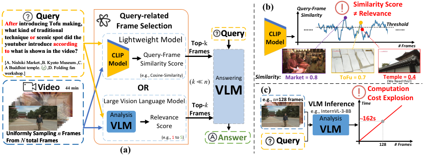

<!-- Start of picture text -->
(b) Query-Frame  Similarity Score Query Query-related Similarity ≠ Relevance Afterwhat kind of traditional  introducing Tofu making,  Frame Selection …… Threshold …… technique youtuber introduce or scenic spot did the according  Lightweight Model Top- k Query ModelCLIP # Frames to what is shown in the video? Frames CLIP   Query-Frame [A. Nishiki Market.,B. Kyoto Museum.,C.  Model   Similarity Score A Buddhist temple.      ,D. Folding fan workshop.] (e.g., Cosine-Similarity) ( k n ) Answering Similarity: Market = 0.8 ToFu = 0.7 Temple = (We Need this!  0.4 ) Video 44 min OR VLM (c) Computation Large Vision Language Model Top- k e.g.,  n =128 frames VLM Inference Time Cost Explosion Analysis Relevance Frames e.g., InternVL-3-8B Analysis ~ 162s VLM Score VLM Uniformly Sampling  n Frames From  N  total Frames (a) (e.g., 1 to 5) Answer Query 128 # Frames <!-- End of picture text -->

Figure 1: An illustration of the general pipeline of query-related frame selection and the key challenges in query-related frame selection. (a) The pipeline features two branches for query-related frame selection: using a lightweight model (e.g., CLIP) to produce a similarity score between the query and each frame, or using a large Analysis VLM to generate a relevance score. (b) Lightweight models suffer from ambiguous similarity, failing on complex queries. (c) Large VLMs lead to a computation cost explosion scaled with frame number. 

these capabilities and instead treats the query as a bag of keywords Yuksekgonul et al. (2022); Xie et al. (2025). Consequently, as shown in Fig. 1 (b), it incorrectly assigns high similarity scores (score: 0.7) to frame related to the query’s context ‘ _Tofu_ ’ or a visually similar frame with ‘ _Market_ ’ (score: 0.8). Crucially, the frame containing the correct option ‘ _A Buddhist Temple_ ’, is ranked lower (score: 0.4) because it has a weaker surface-level association with the query’s keywords. Therefore, the lightweight model produces an inaccurate similarity score that fails to reflect the true queryframe relevance, leading to the failure of the selection algorithm. 

Taking human perception as an analogy, using a lightweight model (e.g., CLIP) resembles quickly glancing over the video, which may lack sufficient attention and comprehension for complex situations. Other query-related frame selection methods (Hu et al., 2025; Yu et al., 2025; Wang et al., 2025; Ranasinghe et al., 2025; Yu et al., 2023), which employ VLMs as insightful analyzers for each query-frame pair, are more akin to carefully examining each frame. As shown in Fig. 1(a), given a query-frame pair, an analysis VLM generates a relevance score using its strong comprehension of complex queries. An answering VLM is then applied to produce the final answer based on the selected frames. However, this deep analysis comes at a staggering computational cost. As illustrated in Fig. 1 (c), using InternVL-3-8B (Zhu et al., 2025) as an Analysis VLM can take more than one second to process a single frame. For methods that require analyzing an initial set of 128 frames (Hu et al., 2025; Wang et al., 2025), this leads to a prohibitively computational cost explosion (i.e., _∼_ 162 seconds). Therefore, while VLM-based analysis methods are highly effective, their computational cost renders them impractical for many real-world applications. 

To address these limitations (poor performance of lightweight models on complex queries and high computational cost of VLM-based analysis), we introduce **_A.I.R._** , a **training-free** framework for **A** daptive, **I** terative, and **R** easoning-based frame selection that operates in two stages. In the first stage, it adaptively identifies query-relevant events (i.e., temporal regions) based on the unique distribution of query-frame similarity scores of each video. From these events, it samples an adaptive number of frames per event duration, yielding a high-relevance initial frame set. In the second stage, **_A.I.R._** executes an efficient iterative loop that adaptively allocates VLM computation: in each iteration, it ranks all candidates and forwards only a small batch of the high-potential frames for deep, reasoning-based analysis. Frames validated by the VLM then trigger a localized search for additional frames in their temporal neighborhood, uncovering key frames initially assigned with low similarity scores. This synergistic feedback loop, coupled with an Early Stop mechanism, enables **_A.I.R._** to converge on the most relevant video segments while requiring only a fraction of the computational cost of conventional VLM-based approaches. Our contributions are threefold: 

- We introduce Adaptive Initial Sampling that moves beyond the uniform sampling. It dynamically identifies and samples candidate frames around potential events based on query-frame similarity and controls the output frames via an adaptive budget, robustly handling videos of varied length. 

2

<!-- Page 3 -->

Published as a conference paper at ICLR 2026 

- We propose a novel Iterative Frame Selection algorithm that makes deep VLM analysis computationally tractable, distinguishing itself from prior methods that rely on a computationally expensive, single-pass analysis over large, fixed frame sets. 

- Experiments prove that our method can be plug-and-play with diverse foundation VLMs while achieving substantially higher efficiency and accuracy than existing VLM analysis-based methods. 

## 2 RELATED WORKS 

**Vision Language Models for Video Question Answering.** The paradigm for Video Question Answering (VideoQA) has shifted from early CNN-RNN architectures (Donahue et al., 2015; Venugopalan et al., 2015) to modern Vision-Language Models (VLMs) (Alayrac et al., 2022; Li et al., 2021; Liu et al., 2023b;a). Leveraging the extensive knowledge and reasoning skills acquired during pre-training, these models have spurred two main research directions. The first focuses on models specifically adapted for the video modality, such as Video-LLaVA (Lin et al., 2023) and InternVideo (Wang et al., 2022). A second, more recent trend emphasizes general-purpose VLMs that can process both images and videos, demonstrating strong zero-shot and adaptive capabilities across various tasks. Aligning with this latter direction, our work utilizes a single, powerful VLM—selected from VILA (Lin et al., 2024), QwenVL (Bai et al., 2025; Wang et al., 2024a), LLaVA-OneVision (Li et al., 2024a), and InternVL-3 (Zhu et al., 2025)—to perform both fine-grained analysis of individual frames and high-level video question answering. 

**Query-Related Frame Selection via Lightweight Models.** A prominent line of research leverages lightweight models like CLIP (Radford et al., 2021) to efficiently compute query-frame similarity scores. Building on this foundation, various methods have been proposed: BOLT (Liu et al., 2025) applies inverse transform sampling for diversity, MDP3 (Sun et al., 2025) models the task as a Markov Decision Process, Q-Frame (Zhang et al., 2025) processes frames with dynamic resolutions, and AKS (Tang et al., 2025) introduces an adaptive “Split & Judge” strategy. T* (Ye et al., 2025) applies an iterative temporal search strategy for frame sampling, which first analyzes the objects in the query and then employs an object detector to find frames with relevant grounded objects in each iteration. However, all these methods depend solely on the superficial output scores of lightweight models for their selection logic. In contrast, **_A.I.R._** adopts a more sophisticated, two-stage approach. We strategically utilize CLIP only for an initial, coarse-grained sampling, while reserving a powerful VLM for a fine-grained, reasoning-based analysis of complex queries. 

**Query-Related Frame Selection via VLMs.** A second branch of methods utilizes powerful VLMs for a deep, semantic analysis of the query-frame relationship. Within this branch, training-free methods like VideoTree (Wang et al., 2025) use online proprietary models (e.g., GPT-4) to generate rich captions for guidance, while others like MVU (Ranasinghe et al., 2025), LLoVi (Zhang et al., 2023), and VideoAgent (Wang et al., 2024b) employ various agents for a comprehensive and reflective analysis. Alternatively, training-based methods such as Frame-Voyager (Yu et al., 2025) fine-tune a VLM to select frames, while SeViLA (Yu et al., 2023) jointly trains a dedicated localizer and an answerer. While effective, these VLM-based methods often perform a computationally expensive, single-pass analysis over a large set of frames. **_A.I.R._** overcomes this limitation through a novel iterative loop that makes deep VLM analysis tractable, adaptively allocating computation by analyzing only small, high-potential batches of frames in each step. 

## 3 METHOD 

### 3.1 OVERVIEW 

As illustrated in Fig. 2, our proposed approach, **_A.I.R._** , performs frame selection in three stages: Adaptive Initial Sampling, Iterative Frame Selection, and QA Stage. The process begins by sampling _n_ frames from the video (containing _N_ total frames) at a fixed frame rate. As a pre-processing step, these _n_ frames are passed to a CLIP model (Radford et al., 2021) to compute query-frame similarity scores, which is stored as a sparse vector _S ∈_ R_N_1 . This similarity signal _S_ is the input to the Adaptive Initial Sampling stage (Sec. 3.2), which identifies an initial set of _K_ high-potential frame 

> 1The vector _S ∈_ R _N_ is sparse as only the _n_ sampled entries have computed values; all other entries with no values are marked with NaN and ignored in subsequent operations. Values of _S_ will be updated (Alg. 1). 

3

<!-- Page 4 -->

Published as a conference paper at ICLR 2026 

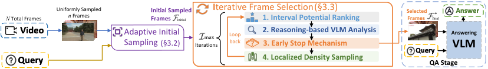

<!-- Start of picture text -->
N  Total Frames Uniformly Sampled n  Frames Initial Sampled Frames initial I terative Frame Selection 1. Interval Potential Ranking (§3.3)  SelectedFrames final * Answer Video Adaptive Initial Sampling (§3.2) Iterations max Loop back  ? 2. Reasoning-based VLM Analysis3. Early Stop Mechanism AnsweringVLM Query Query 4. Localized Density Sampling QA Stage <!-- End of picture text -->

Figure 2: General pipeline of **_A.I.R._** with three stages: (1) **Adaptive Initial Sampling** that identifies potential ‘events’ based on query similarity and dynamically samples frames around them using an adaptive budget; (2) **Iterative Frame Selection** that progressively refines the frame selection via four steps; and (3) **QA Stage** that feeds the final selected frames into Answering VLM. 

indices, _F_ initial. Subsequently, the Iterative Frame Selection stage (Sec. 3.3, Alg. 1) progressively refines this initial set through a four-step loop. This process yields a final, optimized set of frames, _F_ final_∗_.The last one, QA Stage, utilizes an Answering VLM and these selected frames for a one-time inference. Notably, the final number of selected frames, _|F_ final_∗|_=_B_, is not fixed but is determined by an adaptive budget that scales with the video’s length (see A.2.1). Finally, we provide a theoretical analysis of our method’s efficiency in Sec. 3.4. 

### 3.2 ADAPTIVE INITIAL SAMPLING 

As shown in Fig. 3 (a), with the initial _n_ frames and the query, unlike other frame selection methods (Liu et al., 2025; Sun et al., 2025; Tang et al., 2025) that directly work on uniformly sampled frames with their proposed approaches, we perform an Adaptive Initial Sampling. This process selects _K_ query-related frames in advance ( _K < n_ ), which not only provides prior guidance, but also reduces the computation cost for our subsequent Iterative Frame Selection in Sec. 3.3. To achieve this goal, we must first adaptively separate high-relevance frames from low-relevance ones. Hence, we propose an adaptive threshold _T_ , inspired by Gaussian Mixture Models (GMMs) (Huang & Chau, 2008; Zhao et al., 2019). Specifically, we hypothesize that the similarity scores _S_ are drawn from a mixture of two underlying distributions: a high-relevance cluster and a low-relevance one. We fit a GMM with two components to model these two clusters. Let the means and standard deviations of them be ( _µ_ 1 _, σ_ 1) and ( _µ_ 2 _, σ_ 2). The threshold _T_ is calculated as: 

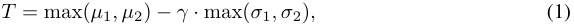

where _γ_ is a hyperparameter that controls the stringency of the threshold. This formulation ensures the threshold _T_ is adaptive as it is dynamically computed for each video based on that video’s unique distribution of similarity scores. Using the adaptive threshold _T_ , we identify an initial set of candidate events _E__′_ . An event is defined as any maximal, contiguous temporal region in the video where all similarity scores are at or above the threshold _T_ . The events set _E__′_ is formalized as: 

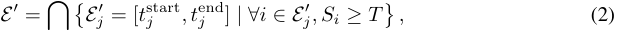

where _Ej__′_representsthe_j_-theventviaitsstartandendframeindex.Thisinitialsegmentationcan be noisy, sometimes splitting a single action into multiple events or creating very short segments. Therefore, we refine _E__′_ with two heuristic-based steps to produce a final set of validated events _E_ : (1) **Merging** : Any two consecutive events separated by a duration less than a minimum distance (i.e., _t_start _j_ +1_−t_end _j ≤ d_ min) are merged into a single, more coherent event; and (2) **Pruning** : Any event with a total duration less than a minimum length (i.e., _t_end _j − t_start _j ≤ l_ min) is then removed. 

Finally, with a clean set of refined events _E_ , we perform **Event-Wise Sampling** to select the _K_ initial candidate frames. Our sampling strategy is guided by two key principles, as shown in Fig. 3 (a): (1) Comprehensive coverage: every identified event is represented by at least one frame; and (2) Proportional allocation: longer, more sustained events are allocated a larger portion of the sampling budget. To satisfy these principles, we first calculate the number of frames ( _kj_ ) to sample from each event based on its relative duration, ensuring that _kj ≥_ 1. We then select _kj_ peak frames with the highest pre-computed similarity scores from within that event’s boundaries. This proportional strategy ensures that the most significant events are more thoroughly represented. The detailed formulation for computing _kj_ can be found in A.2.2. This process yields an initial sampling set _F_ initial = _{f_ 1 _, . . . , fK}_ , where _∀fi ∈F_ initial represents frame index and _K < n_ . This initial frame set is the input for the subsequent Iterative Frame Selection. 

4

<!-- Page 5 -->

Published as a conference paper at ICLR 2026 

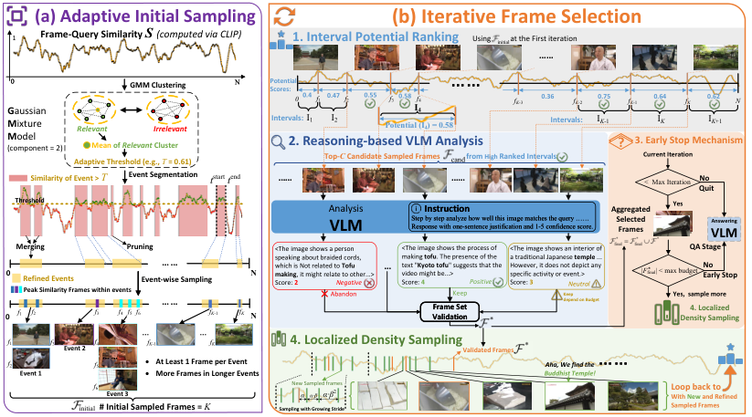

<!-- Start of picture text -->
(a) Adaptive Initial Sampling (b) Iterative Frame Selection 1 Frame-Query Similarity S  (computed via CLIP) 1. Interval Potential Ranking Using       initial at the First iteration …… 0 GMM Clustering N PotentialScores: …… 0 0.4 f 1 0.47 f 2 0.55 f 3 0.58 f 4 fK -3 0.36 fK- 2 0.75 fK -1 0.64 fK 0.62 N G aussian I4 M ixture Relevant Irrelevant Intervals: I1 I2 Potential (I4) = 0.58 Intervals: I K- 1 I K I K +1 (component = 2) M odel Adaptive Threshold (e.g., Mean of  Relevant  Cluster T  = 0.61) 2. Reasoning-based VLM AnalysisTop- C  Candidate Sampled Frames            cand    from High Ranked Intervals ? 3. Early Stop MechanismCurrent Iteration Similarity of Event >  T Event Segmentation t start t end …… …… <  Max Iteration No Quit Threshold Analysis Instruction Aggregated  Yes VLM Step by step analyze how well this image matches the query ……Response with one-sentence justification and 1-5 confidence score. SelectedFrames VLMAnswering Merging  Pruning <The image shows a person  <The image shows the process of  <The image shows an interior of  QA Stage speaking about braided cords,  making  tofu . The presence of the  a traditional Japanese  temple  ... 0 Refined Events  Event-wise Sampling … … N which is Not related to  making Score:  2 , it might relate to other...> Negative Tofu  … text "video might be...>Score:  Kyoto tofu4 " suggests that the  Positive However, it does not depict any specific activity or event.>Score:  3 Neutral | F final * | < max budget Early StopNo 0 f 1 Peak Similarity Frames within events f 2 f 3 f 4 f 5 f 6 … … fK -1 fK N Abandon ValidationFrame Set Keep * Keep depend on Budget Yes,  sample moreDensity Sampling4. Localized f 1 f 3 Event 2 f 4 … fK -1 … fK 4. Localized Density SamplingValidated Frames f 2 f 5 … … •  At Least 1 Frame per Event Aha, We find the  …… Event 1 •  More Frames in Longer Events  Buddhist Temple! f 6 Event 3 New Sampled frames α α·β α·β 2 Loop back toWith New and Refined initial # Initial Sampled Frames =  K Sampling with Growing Stride Sampled Frames <!-- End of picture text -->

Figure 3: Two main stages in our **_A.I.R._** . **(a) Adaptive Initial Sampling** : A GMM-based adaptive threshold is applied to the query-frame similarity _S_ to identify potential events, and then event-wise sampling is conducted on the refined events to obtain _K_ frames ( _F_ initial). **(b) Iterative Frame Selection** : In each iteration, 1) High-potential candidates are selected via Interval Potential Ranking; 2) A VLM performs reasoning-based analysis to validate the best frames; 3) An Early Stop mechanism checks if the frame budget is met; And 4) if not met, the Localized Density Sampling (LDS) discovers more frames around the validated frames and feed them into the next iteration. Notably, LDS is performed on the original video ( _N_ frames) instead of the uniformly sampled _n_ frames. 

### 3.3 ITERATIVE FRAME SELECTION 

While Adaptive Initial Sampling provides a strong set of _K_ candidate frames, analyzing all of them with a powerful VLM remains computationally expensive, as _K_ often scales with the initial sample size _n_ . Therefore, we introduce the core of our framework: Iterative Frame Selection. The goal of this stage is to progressively refine the candidate set using an Analysis VLM in a cost-effective manner. This is achieved through a synergistic four-step loop (see Fig. 3 (b) and Alg. 1). In each iteration, **(1) Interval Potential Ranking** first identifies the high-potential candidate frames. **(2)** The candidate frames are then evaluated by the **Reasoning-Based VLM Analysis** , which generates a relevance score and a textual justification for each, allowing us to retain a validated set of truly relevant frames. **(3)** The **Early Stop Mechanism** checks if the adaptive sampling budget (A.2.1) has been met; if so, the process terminates efficiently. **(4)** If the budget is not yet met, **Localized Density Sampling** discovers new, fine-grained frames in the vicinity of the validated frames from (2), which are then fed back into the candidate pool for the next iteration. This cycle of prioritizing, analyzing, and exploring continues until reaching a maximum number of iterations or an early stop is triggered. 

**Step 1: Interval Potential Ranking.** Given a set of sampled frames _F_ (initially, _F_ = _F_ initial _, K_ = _|F|_ ) from Adaptive Initial Sampling, the primary role of Interval Potential Ranking is to select a small batch of _C_ high-potential candidates for the Analysis VLM in each iteration. Instead of ranking individual frames by their raw similarity scores, we propose ranking the temporal intervals between these frames. This interval-based approach is more robust as it considers the collective evidence within a temporal region, providing a more comprehensive signal of a potential event than a single frame’s score. As illustrated in the first step of Fig. 3 (b), the process begins by partitioning the entire original video into a set of disjoint temporal intervals. These intervals are defined by the indices of the current sampled frames in _F_ . A given interval I _i_2 is formally defined as: 

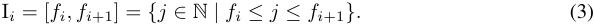

> 2To ensure the entire video is covered, this partitioning also includes the segments from the start of the video to the first selected frame (i.e., [1 _, f_ 1]), and from the last selected frame to the video’s end (i.e., [ _fK , N_ ]). 

5

<!-- Page 6 -->

Published as a conference paper at ICLR 2026 

For each interval, we calculate its _potential_ —a score indicating its importance to the query—based on its corresponding slice of the pre-computed similarity signal, _Sfi_ : _fi_ +1. Inspired by signal processing principles (Boreczky & Rowe, 1996; Wolf, 1996; Liu et al., 2003), this potential is computed as a product of three factors: _Relevance_ , _Complexity_ , and _Length_ (see A.2.4 for details). For a discrete similarity signal _S_ , the potential of the interval I _i_ is calculated as: 

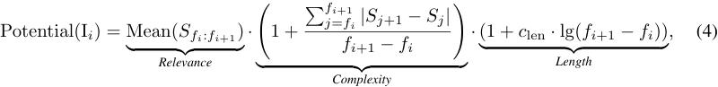

where _c_ len is a hyperparameter that balances the influence of the _Length_ . After ranking all intervals by their potential scores, we select the _C_ candidate frames from the highest-ranked intervals (e.g., selected _fi, fi_ +1 from interval I _i_ ) as a candidate set _F_ cand for the subsequent VLM analysis. 

**Step 2: Reasoning-Based VLM Analysis.** Following the Potential Interval Ranking, the _C_ selected frames _F_ cand are analyzed by a Analysis VLM for a focused, reasoning-based evaluation. We leverage the zero-shot, instruction-following capabilities of foundation VLMs to assess the relevance of each frame quantitatively. Guided by a detailed prompt (see Fig. 3 (b) and A.2.5), the VLM is instructed to reason step-by-step, providing both a textual justification and a relevance score (e.g., an integer from 1 to 5) for each candidate frame. Based on the relationship to a predefined threshold _θ_ , these scores are classified as ‘ _Positive_ ’ ( _> θ_ ), ‘ _Neutral_ ’ (= _θ_ ), or ‘ _Negative_ ’ ( _< θ_ ) and collected into a vector _R ∈_ N_C_ . We retain the ‘Positive’ frames to form a validated frame set _F__∗_ as: 

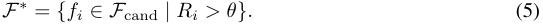

A fallback mechanism is implemented to handle the case where not enough frames are positively validated (i.e., _|F__∗_ _| < ⌊B/I_ max _⌋_ , _I_ max is the maximum iterations). In this scenario, we instead select _⌊B/I_ max _⌋−|F__∗_ _|_ more frames from the candidate frame set _F_ cand. The selection is based on a two-tiered priority system: candidates are first grouped by their VLM rating, with frames rated as ‘Neutral’ given the highest priority, followed by the ‘Negative’ frames. Within each group, the pre-computed similarity score of each frame is then used to determine the final selection order. We then aggregate the validated frames to a cumulative final selection set, _F_ final_∗_. 

**Step 3: Early Stop Mechanism.** After each round of VLM analysis, we update the cumulative final selection set _F_ final_∗_.Tomaximizeefficiencyandpreventunnecessarycomputation,anEarlyStop Mechanism is then immediately triggered. We check if the total number of selected frames has met or exceeded the adaptive sampling budget ( _|F_ final_∗| ≥B_).As illustrated in Fig. 3 (b), if the budget is fulfilled, the iterative loop halts, saving all subsequent VLM analysis costs. If the budget is not yet met, the process continues to the Localized Density Sampling to sample additional frames. 

**Step 4: Localized Density Sampling (LDS).** As illustrated in Fig. 3 (b), if the iterative process has not yet met its sampling budget after the Early Stop Mechanism, it proceeds to this final step to discover more candidate frames. Our strategy is motivated by the principle of temporal coherence: the most valuable, undiscovered information is concentrated in the temporal vicinity of the frames VLM has just validated (i.e., _F__∗_ ). We therefore propose LDS, a search strategy that samples new frames from the original high-frame rate video (from the total _N_ frames instead of _n_ ), allowing it to capture more fine-grained moments missed by the Adaptive Initial Sampling. LDS employs an exponentially growing sampling stride. This design balances two objectives: it performs a dense, high-resolution search immediately around a validated frame to find precise details, while efficiently exploring the broader context with increasingly sparse samples. For each validated frame _fi__∗∈F∗_, new sampled frames generated by LDS are formalized as: 

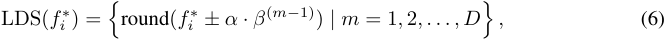

where _α_ is the initial stride, _β >_ 1 controls the stride’s exponential growth, and _D_ determines the number of frames sampled, which is proportional to the remaining budget, _B −|F_ final_∗|_.Crucially, these newly discovered frames are not added directly to the final selection. Instead, they are fed back into the start of the loop. Their query-frame similarity scores are computed to update the signal _S_ , and they are added to the candidate pool _F_ (now _K_ is set to _|F|_ ) for the next iteration’s Interval Potential Ranking. For instance, as exemplified by the process in Fig. 3 (b), a frame (with ‘ _Tofu_ ’) rated as ‘ _Positive_ ’ in one iteration can trigger a localized search that uncovers the definitive, answer-providing frame (i.e., the frame with ‘ _Buddhist Temple_ ’) via LDS. 

6

<!-- Page 7 -->

Published as a conference paper at ICLR 2026 

### 3.4 EFFICIENCY ANALYSIS 

We analyze the core computational efficiency of **_A.I.R._** by focusing on the primary bottleneck: the number of frames processed by Analysis VLMs (not Answering VLMs). Conventional VLM-based analysis methods (Hu et al., 2025; Yu et al., 2025; Wang et al., 2025) uniformly sample a large, fixed set of _n_ base frames (e.g., 128 frames) and perform VLM inference on all of them. The total VLM workload for such a method is therefore _n_ base frames. In contrast, **_A.I.R._** uses a targeted, iterative strategy. In each iteration, the VLM analyzes only a small batch of _C_ candidate frames. Due to our Early Stop Mechanism, the total number of frames that undergo VLM analysis, _n_ A _._ I _._ R _._ , is bounded. In the best-case scenario, the process stops after one iteration, analyzing only _C_ frames, while in the worst-case, it runs for the maximum of _I_ max iterations. Thus, the VLM workload _n_ A _._ I _._ R _._ is strictly constrained by the best workload _w_ best and the worst workload _w_ worst as: 

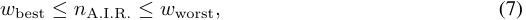

where _w_ best = _C_ and _w_ worst = _C · I_ max. Our hyperparameter setting (e.g., _C_ = 12 _, I_ max = 6) ensures our **worst-case** VLM workload is significantly smaller than conventional methods that analyze a large, fixed number of frames (i.e., _w_ worst _< n_ base = 128). Furthermore, **_A.I.R._** offers a more intelligent trade-off3 than methods that achieve efficiency with a small, fixed budget (e.g., _n_ base is 16 or 32, Yu et al. (2023); Ranasinghe et al. (2025); Wang et al. (2024b)). The key advantage of our framework is its adaptivity: the VLM workload only increases as demanded by the video’s length (see Tab. 13) and is bounded by _w_ best and _w_ worst. This adaptivity allows our method to be more computationally efficient4 than these fixed-budget approaches (Tab. 7 and Tab. 6). 

## 4 EXPERIMENTS 

### 4.1 IMPLEMENTATIONS 

We use 4 widely-used foundation VLMs as our backbones: VILA-1.5-8B (Lin et al., 2024), QwenVL-2.5-7B (Bai et al., 2025), InternVL-3-8B (Zhu et al., 2025), and LLaVA-OneVision-7B (Li et al., 2024a). We use the same VLM for analysis and answering. Additionally, we employ EVA-CLIP-L (Sun et al., 2023) to compute the query-frame similarity score _S_ . We evaluate **_A.I.R._** on various long video benchmarks, i.e. Video-MME (Fu et al., 2025), MLVU (Zhou et al., 2025), and LongVideoBench (LVB, Wu et al. (2024)). Besides, we also employ short video benchmarks EgoSchema (Mangalam et al., 2023) and NextQA (Xiao et al., 2021). More details are in A.3. To ensure a fair comparison with other competing frame selection methods, in Tab. 1 and 2, we reevaluated methods with available code ( _†_ ) in our controlled environment ( _lmms-eval_ , Zhang et al. (2024a)), while for others, we compare against their reported metrics ( _∗_ ) in similar settings. 

### 4.2 COMPARISON WITH THE STATE-OF-THE-ART 

We conduct a comprehensive evaluation to validate the effectiveness of **_A.I.R._** across diverse scenarios, with results presented for long-video benchmarks in Tab. 1 and short-video benchmarks in Tab. 2. To demonstrate the superiority of our approach, we benchmark it against two key categories of methods: foundation VLM baselines, where powerful VLMs use the uniform sampling strategy, and competing state-of-the-art (SoTA) frame selection methods. Our extensive experiments lead to the following key findings: **(1) Powerful Plug-and-Play Enhancement** : As a model-agnostic, training-free module, **_A.I.R._** ’s benefits generalize across diverse VLMs. For example, on NextQA, applying our method to QwenVL-2.5 results in a massive +7.0 accuracy boost. Similarly, it also provides substantial gains for VILA-1.5, LLaVA-OneVision, and InternVL3, confirming its versatility. **(2) SoTA Accuracy with Superior Efficiency.** : **_A.I.R._** elevates foundation VLMs to new SoTA levels while being more frame-efficient. For instance, when paired with InternVL-3 on LVB benchmark, our method achieves a +4.5% absolute gain over the baseline, while analyzing fewer frames on average than the fixed budgets of competitors (i.e., _≤_ 32 vs. 32). **(3) Robust Performance Across Diverse Benchmarks** : While the impact of intelligent frame selection is most critical for 

> 3We validate this via hyperparameter ablations (i.e., candidate frames _C_ and max iterations _I_ max) in A.4.5. 

> 4As shown in Tab. 7, the time cost of other operations, such as initial sampling and frame selection of our method, is minor compared to VLM inference time, so we ignore their theoretical efficiency analysis. 

7

<!-- Page 8 -->

Published as a conference paper at ICLR 2026 

Table 1: Comparison of VLMs and various frame selection methods on Video-MME, MLVU, and LongVideo Bench. _∗_ denotes reported results, while _†_ means reproduced ones (see Sec. 4.1). 

|**Model**|**LLM** |**#Frames**|**Video-**|**MME**|**MLVU**_dev_|**LVB**_val_|
|---|---|---|---|---|---|---|
||**Size**||w/o sub.|w/ sub.|||
|_Training-Based Foundation VLMs_ |||||||
|LLaVA-OneVision_∗_(Li et al., 2024a)|7B|32_∗_|58.2|61.5|64.7|56.4|
|QwenVL-2.5_∗_(Bai et al., 2025) |7B|max: 768|65.1|71.6|70.2|45.3|
|InternVL-3_∗_(Zhu et al., 2025)|8B|max: 64|66.3|68.9|71.4|58.8|
| VILA-1.5_∗_(Lin et al., 2024)|7B|8|47.5|-|46.3|47.1|
|_Fair Comparison with Frame Selection Methods_ |||||||
|VILA-1.5_†_|8B|8|48.9|54.2|44.7|47.9|
|+Frame-Voyager_∗_(Yu et al., 2025) |8B|8|50.5|53.6|49.8|-|
|+MDP3_†_ (Sun et al., 2025)|8B|8|53.3|57.8|52.3|52.3|
|+Q-Frame_∗_(Zhang et al., 2025)|8B|8|50.7|55.0|**54.4**|51.6|
|**+Ours**|8B|8|**53.7**|**58.6**|54.2|**52.9**|
|QwenVL-2.5_†_|7B|32|60.8|62.7|59.3|58.1|
|+MDP3_†_|7B|32|63.8|65.7|66.2|60.0|
|**+Ours**|7B|_≤_32|**65.0**|**66.3**|**67.5**|**61.4**|
|InternVL-3_†_ |8B|32|65.6|67.3|68.4|58.3|
|+MDP3_†_|8B|32|66.8|69.0|74.0|60.9|
|**+Ours**|8B|_≤_32|**68.2**|**69.2**|**74.5**|**62.8**|
|LLaVA-OneVision_†_|7B|32|58.5|61.7|62.4|56.6|
|+AKS_∗_(Tang et al., 2025)|7B|32|58.4|-|-|59.3|
| +MDP3_†_|7B|32|60.5|64.0|68.3|59.0|
|+BOLT_∗_(Liu et al., 2025)|7B|32|59.9|-|66.8|59.6|
|**+Ours**|7B|_≤_32|**61.4**|**65.1**|**69.3**|**60.7**|

Table 2: Comparison of VLMs and frame selection methods on Egoschema and NextQA. 

|**Model**|**VLM**|**#Frames**|**Egos**|**chema**|**NextQA**|
|---|---|---|---|---|---|
||**Size**||Full|Subset||
|_VLM analysis-based Frame Selection Methods_||||||
| LLoVi_∗_(Zhang et al., 2023)|GPT3.5|0.5FPS|52.2|-|66.3|
| VideoAgent_∗_(Wang et al., 2024b)|GPT4|1FPS|54.1|60.2|71.3|
| Hu et al. (2025)_∗_|8.5B|32|-|65.9|78.4|
|SeViLA_∗_(Yu et al., 2023)|4.1B|4|-|-|73.8|
| VideoTree_∗_(Wang et al., 2025)|GPT4|-|61.1|66.2|75.6|
| MVU_∗_(Ranasinghe et al., 2025)|13B|16|37.6|60.3|55.2|
| DrVideo (Ma et al., 2025)|GPT4|-|61.0|66.4|-|
| T_∗_(Ye et al., 2025)|7B|8|-|66.6|80.4|
|_Fair Comparison with Frame Selection Methods_||||||
| VILA-1.5_†_|8B|8|49.5|52.8|65.9|
|+Frame-Voyager_∗_ |8B|8|-|53.6|67.3|
|+MDP3_†_|8B|8|48.5|51.0|66.1|
|**+Ours** |8B|8|**50.7**|**53.6**|**70.3**|
|QwenVL-2.5_†_ |7B|32|57.6|59.4|74.3|
|+MDP3_†_|7B|32|56.8|61.6|74.4|
|**+Ours** |7B|_≤_32|**58.8**|**62.4**|**81.3**|
|InternVL-3_†_ |8B|32|62.5|71.6|82.3|
|+MDP3_†_|8B|32|61.6|70.0|82.3|
|**+Ours**|8B|_≤_32|**63.3**|**72.2**|**82.6**|
|LLaVA-OneVision_†_|7B|32|60.2|61.8|79.3|
|+MDP3_†_|7B|32|60.3|60.8|78.9|
|+BOLT_∗_|7B|32|60.7|**64.0**|79.5|
|**+Ours**|7B|_≤_32|**61.4**|63.2|**81.6**|

long videos (Tab. 1), **_A.I.R._** also proves effective on shorter video datasets., while it also outperforms competing methods on short-video benchmarks (Tab. 2). More analysis is provided in A.4.1. 

### 4.3 ABLATION STUDY 

**Influence of Sampled Frame Number.** We investigate how the performance of our approach scales with an increased maximum sampling budget (the upper bound of _B_ , see A.2.1). To this end, we adjust the adaptive sampling budget by modifying the maximum frame limit. As illustrated in Fig. 5, our approach consistently outperforms the uniform sampling method on VLMs such as QwenVL2.5 and LLaVA-OneVision. Furthermore, when compared to CLIP-based query-aware sampling methods like BOLT (Liu et al., 2025), our approach shows an average performance advantage of approximately 1.5%. More detailed ablation study is in Tab. 11 and A.4.3. 

**Influence of Different VLM Scales.** As shown in Tab. 3, the results of various scales of VLMs reveal two key findings: (1) **_A.I.R._** provides a consistent performance uplift across all tested scales of the QwenVL-2.5 models (7B, 32B, and 72B), confirming the robustness of our method; and (2) We observe that the accuracy gain is most pronounced on the smaller 7B model (+4.2%), while the 

8

<!-- Page 9 -->

Published as a conference paper at ICLR 2026 

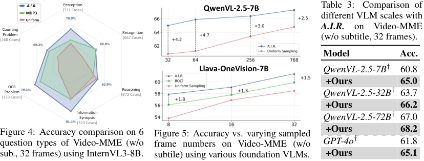

<!-- Start of picture text -->
UniformMDP3 A.I.R. (331 Cases)Perception QwenVL-2.5-7B Tabledifferent VLM scales with3: Comparison of (268 Cases)Counting Problem Recognition(667 Cases) A.I.R. (w/o subtitle, 32 frames).on Video-MME Model Acc. Llava-OneVision-7B QwenVL-2.5-7B † 60.8 +Ours 65.0 (139 Cases)ProblemOCR  (972 Cases)Reasoning QwenVL-2.5-32B † 63.7 +Ours 66.2 Information Synopsis QwenVL-2.5-72B † 67.0 (323 Cases) +Ours 68.2 Figure 4: Accuracy comparison on 6 Figure 5: Accuracy vs. varying sampled GPT-4o † 61.8 question types of Video-MME (w/o frame numbers on Video-MME (w/o sub., 32 frames) using InternVL3-8B. subtile) using various foundation VLMs. +Ours 65.1 <!-- End of picture text -->

Table 4: Ablations of **_A.I.R._** ’s components on VideoMME using InternVL3-8B. We compare on average frames for answering VLMs and accuracy (Acc.). 

|ble 4: Ablations of **_A.I.R._**s com ME using InternVL3-8B. We co |ponents on  mpare on  |Video- average |Table 5: Comparison of various CLIP models with**_A.I.R._**(using InternVL-3-8B|
|---|---|---|---|
|mes for answering VLMs and acc|uracy (Acc|.).|on Video-MME (w/o subtitle) with max|
|**#** **Method**|**Avg. Frames**|**Acc.**|sampling budget of 32 frames).|
|1 Uniform Sampling|32_._0|65_._6||
| 2 **_A.I.R._**(Our fullmethod) |24_._8 |68_._2 |# **Acc.**|
|3 _�→_w/ Fixed 32 frames (no Ada. Budget) |32_._0 |68_._3 |1 Uniform Sampling (32 frames) 65.6|
|4 _�→_w/o Adaptive Similarity Thresholding |25_._5 |67_._3 | 2 **_A.I.R._**+ CLIP-ViT-B 66.8|
|5 _�→_w/o Adaptive Initial Sampling |25_._1 |66_._9 |  3 **_A.I.R._**+ EVA-CLIP-L (Ours) **68.2**|
|6 _�→_w/o Iterative Frame Selection (32 Frames) |32_._0|65_._2|  4 **_AIR_**+ LongCLIP-L 674|
|7 _�→_w/o Interval Potential Ranking |26_._2|66_._7|**_..._**  . 5 **_AIR_**+ CLIP-ViT-L 678|
|8 _�→_w/o Reasoning-based VLM Analysis |32_._0 |66_._0 |**_..._**  . 6 **_A.I.R._**+ SigLIP-large 671|
|9 _�→_w/o Localized DensitySampling|24_._5|67_._2| .|

margin narrows as the base VLM becomes more powerful. This suggests that our frame selection is most critical for smaller models with a weaker intrinsic ability to discern relevance. We further validate the scalability of our plug-and-play framework on state-of-the-art models like GPT-4o, demonstrating consistent performance gains even when scaling to extremely large VLMs. 

**Ablation of Components in** **_A.I.R._ (More Analysis in A.4.4).** We showcase the effectiveness of the individual components of **_A.I.R._** in Tab. 4 and Tab. 5. The key findings are: **(1)** Our method significantly outperforms the uniform sampling baseline, while achieving a trade-off between efficiency and accuracy compared to our fixed 32 frames version (Tab. 4). **(2)** Ablating core components, especially the Reasoning-based VLM Analysis, consistently degrades performance, confirming their synergistic contribution (Tab. 4). **(3)** Our framework is robust to the choice of vision encoder, outperforming the baseline across all five CLIP variants that other methods used, and we selected EVA-CLIP-L (Sun et al., 2023) as our default due to its superior performance (Tab. 5). 

### **Experimental Efficiency Analysis (More Analysis in A.4.5).** 

The results in Tab. 6 highlight **_A.I.R._** ’s superior efficiency-performance trade-off against competing methods on NextQA. When we set the worst workload _w_ worst to 72, which controls the max frames analyzed by VLM, our method not only achieves a SoTA accuracy of 82.6% but does so by adaptively analyzing only 32.2 frames on average. Even with a low worst workload ( _w_ worst=16), **_A.I.R._** still attains an impressive 81.7% accuracy with just 12.4 frames, again outperforming other methods. Tab. 7 further demonstrates **_A.I.R._** ’s computational efficiency on Video-MME. Tab. 7 illustrates the controlled time comparison of **_A.I.R._** against our own baseline, **Direct VLM Analysis** , which mimics a conventional fixed-budget manner that other methods apply using the same VLM (InternVL3-8B). For the intermediate frame analysis ( _VLM Analysis Time_ ), the baseline requires 162.03s to process 128 frames, while **_A.I.R._** takes just 42.31s by adaptively processing only 36.5 frames via Iterative Frame Selection. Beyond this _VLM Analysis Time_ comparison, the computational overhead of our frame Adaptive Initial Sampling and Iterative Frame Selection stage is minimal, adding up to 0.21s compared to the uniform sampling baseline. 

**Generalization to Grounding Task Analysis.** To demonstrate that **_A.I.R._** ’s adaptive frame selection generalizes beyond VideoQA, we evaluate its performance on Charades-STA (Gao et al., 2017), a challenging temporal grounding benchmark where models must localize specific moments in videos based on natural language queries. As shown in Tab. 8, our training-free method achieves strong performance across all metrics: 59.5% R1@0.3, 39.5% R1@0.5, 18.0% R1@0.7, and 38.8% 

9

> Original page for checking 7 unresolved font glyphs.

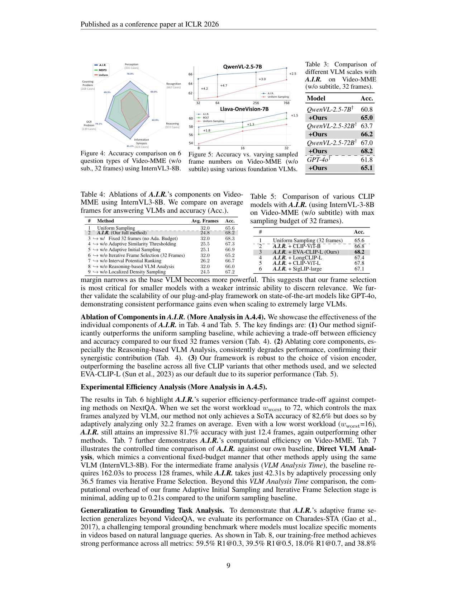

<!-- Page 10 -->

Published as a conference paper at ICLR 2026 

Table 6: Comparison of VLM analysisbased frame selection methods on NextQA. **#Analyzed** means the number of frames through VLM Analysis. ‘ **TF** ’ denotes whether training-free or not. We use InternVL3-8B. The same applies to Tab. 7. 

Table 7: Efficiency comparison on Video-MME. Entries with stage names like ‘(QA Stage)’ denote the time cost for these stages, regardless of any additional VLM analysis time. _VLM Analysis Time_ is the time used for analyzing all frames intermediately. 

|nern-. e same|appes||. .|**Method**|**#Analyzed**|**Time(s)**|
|---|---|---|---|---|---|---|
|**Method**|**#Analyzed**|**TF**|**Acc.**|Baseline (Uniform Sampling 32 frames) **_A.I.R._**(QA Stage)|- -|0.87 **0.81**|
|Frame-Voyager (Yu et al., 2025)|128||67.3| **_A.I.R._**(Adaptive Initial Sampling) |-|**0.03** |
|Hu et al. (2025)|128||78.4|**_A.I.R._** (Iterative Frame Selection)|-|**0.18**|
|VideoTree (Wang et al., 2025)|128|✓|75.6|_VLM Analysis Time_|||
|VideoAgent (Wang et al., 2024b)|48|✓|71.3| Direct VLM Analysis |128 |162.03 |
|**_A.I.R._** (_w_worst = 72)|**32.2**|✓|**82.6**|**_A.I.R._**(_w_worst = 72) |**36.5** |**42.31** |
|SeViLA (Yu et al., 2023)|32|✓|73.8|Direct VLM Analysis **_AIR_**(_w_= 32)|32 **203**|42.47 **2192**|
|MVU (Ranasinghe et al., 2025) |16 |✓ |55.2 |**_..._** worst   Direct VLM Analysis |**.** 16 |**.** 20.39 |
|**_A.I.R._**(_w_worst = 16)|**12.4**|✓|**81.7**|**_A.I.R._** (_w_worst = 16)|**14.1**|**14.61**|

Table 8: Generalization results on temporal grounding benchmark Charades-STA (Gao et al., 2017). 

|**Model**|**R1@0.3**|**R1@0.5**|**R1@0.7**|**mIoU**|
|---|---|---|---|---|
|_Trained Temporal Grounding VideoLLMs_ |||||
|VTimeLLM (Huang et al., 2024) |51.0 |27.5 |11.4 |31.2 |
|HawkEye (Wang et al., 2024c) |50.6|31.4 |14.5 |33.7 |
|TimeChat (Ren et al., 2024) |- |32.2 |13.4 |30.6|
|TimeSuite (Zeng et al., 2024) |**69.9**|**48.7** |**24.0** |-|
|TRACE(Guo et al., 2024)|-|40.3|19.4|-|
|_General VideoLLMs_ |||||
|GPT-4o (Hurst et al., 2024) |55.0 |32.0 |11.5 |35.4 |
|Qwen2.5-VL-7B (Bai et al., 2025) |44.5 |30.3 |15.2 |30.1 |
|LongVA-7B-DPO (Zhang et al., 2024b) |22.6 |10.1 |2.2 |14.6 |
|Aria(Li et al., 2024b)|39.0|18.6|6.6|26.7|
|_Trained Frame Selection Methods_ |||||
|GenS(Yao et al., 2025)|62.9|38.7|15.2|38.0|
|_Training-Free Frame Selection Methods_ |||||
|**A.I.R. (Qwen2.5-VL-7B)**|59.5|39.5|18.0|**38.8**|

mIoU. Notably, **_A.I.R._** substantially outperforms general-purpose VideoLLMs like Qwen2.5-VL-7B (44.5% _→_ 59.5% R1@0.3) and even surpasses GPT-4o (32.0% vs. 39.5% R1@0.5). More impressively, our method achieves comparable or superior results to GenS (Yao et al., 2025), a trained frame selection method specifically designed for grounding tasks, while remaining completely trainingfree. While specialized temporal grounding models like TimeSuite (Zeng et al., 2024) achieve higher performance through task-specific training, our results demonstrate that **_A.I.R._** ’s adaptive sampling and iterative refinement effectively identify temporally relevant segments without requiring any grounding-specific supervision. This validates the broad applicability of our approach across diverse video understanding tasks. 

## 5 CONCLUSIONS 

In this paper, we introduced **_A.I.R._** , a training-free frame selection approach, which addresses the challenge of efficient and accurate frame selection for Video Question Answering. By employing an Adaptive Initial Sampling stage followed by an iterative, reasoning-driven VLM analysis, **_A.I.R._** intelligently focuses computational resources on the most salient temporal regions. Our extensive experiments demonstrate that this approach not only significantly enhances the performance of offthe-shelf VLMs on complex benchmarks but also achieves this with substantially less computational cost than conventional VLM-based analysis methods. By balancing high accuracy with practical efficiency, **_A.I.R._** offers a promising path for deploying powerful VLMs in real-world, long-video understanding applications. 

## 6 REPRODUCIBILITY STATEMENT 

We provide the full details for reproducing our method in the main paper. All datasets used for experiments are publicly available. The partial code of our method, including the code for two core stages (i.e., Adaptive Initial Sampling and Iterative Frame Selection), will be provided in the supplementary materials. 

10

<!-- Page 11 -->

Published as a conference paper at ICLR 2026 

### ACKNOWLEDGMENTS 

This work used Delta at UIUC NCSA through allocation CIS250367 and 250473 from the Advanced Cyberinfrastructure Coordination Ecosystem: Services & Support (ACCESS) program, which is supported by U.S. NSF grants 2138259, 2138286, 2138307, 2137603, and 2138296. 

## REFERENCES 

- Jean-Baptiste Alayrac, Jeff Donahue, Pauline Luc, Antoine Miech, Iain Barr, Yana Hasson, Karel Lenc, Arthur Mensch, Katherine Millican, Malcolm Reynolds, et al. Flamingo: a visual language model for few-shot learning. _Advances in neural information processing systems_ , 35:23716– 23736, 2022. 

- Shuai Bai, Keqin Chen, Xuejing Liu, Jialin Wang, Wenbin Ge, Sibo Song, Kai Dang, Peng Wang, Shijie Wang, Jun Tang, et al. Qwen2. 5-vl technical report. _arXiv preprint arXiv:2502.13923_ , 2025. 

- John S Boreczky and Lawrence A Rowe. Comparison of video shot boundary detection techniques. _Journal of Electronic Imaging_ , 5(2):122–128, 1996. 

- Jeffrey Donahue, Lisa Anne Hendricks, Sergio Guadarrama, Marcus Rohrbach, Subhashini Venugopalan, Kate Saenko, and Trevor Darrell. Long-term recurrent convolutional networks for visual recognition and description. In _Proceedings of the IEEE conference on computer vision and pattern recognition_ , pp. 2625–2634, 2015. 

- Sunqi Fan, Meng-Hao Guo, and Shuojin Yang. Agentic keyframe search for video question answering. _arXiv preprint arXiv:2503.16032_ , 2025. 

- Chaoyou Fu, Yuhan Dai, Yongdong Luo, Lei Li, Shuhuai Ren, Renrui Zhang, Zihan Wang, Chenyu Zhou, Yunhang Shen, Mengdan Zhang, et al. Video-mme: The first-ever comprehensive evaluation benchmark of multi-modal llms in video analysis. In _Proceedings of the Computer Vision and Pattern Recognition Conference_ , pp. 24108–24118, 2025. 

- Jiyang Gao, Chen Sun, Zhenheng Yang, and Ram Nevatia. Tall: Temporal activity localization via language query. In _Proceedings of the IEEE international conference on computer vision_ , pp. 5267–5275, 2017. 

- Yongxin Guo, Jingyu Liu, Mingda Li, Qingbin Liu, Xi Chen, and Xiaoying Tang. Trace: Temporal grounding video llm via causal event modeling. _arXiv preprint arXiv:2410.05643_ , 2024. 

- Kai Hu, Feng Gao, Xiaohan Nie, Peng Zhou, Son Tran, Tal Neiman, Lingyun Wang, Mubarak Shah, Raffay Hamid, Bing Yin, et al. M-llm based video frame selection for efficient video understanding. In _Proceedings of the Computer Vision and Pattern Recognition Conference_ , pp. 13702–13712, 2025. 

- Bin Huang, Xin Wang, Hong Chen, Zihan Song, and Wenwu Zhu. Vtimellm: Empower llm to grasp video moments. In _Proceedings of the IEEE/CVF Conference on Computer Vision and Pattern Recognition_ , pp. 14271–14280, 2024. 

- Zhi-Kai Huang and Kwok-Wing Chau. A new image thresholding method based on gaussian mixture model. _Applied mathematics and computation_ , 205(2):899–907, 2008. 

- Aaron Hurst, Adam Lerer, Adam P Goucher, Adam Perelman, Aditya Ramesh, Aidan Clark, AJ Ostrow, Akila Welihinda, Alan Hayes, Alec Radford, et al. Gpt-4o system card. _arXiv preprint arXiv:2410.21276_ , 2024. 

- Bo Li, Yuanhan Zhang, Dong Guo, Renrui Zhang, Feng Li, Hao Zhang, Kaichen Zhang, Peiyuan Zhang, Yanwei Li, Ziwei Liu, et al. Llava-onevision: Easy visual task transfer. _arXiv preprint arXiv:2408.03326_ , 2024a. 

- Dongxu Li, Yudong Liu, Haoning Wu, Yue Wang, Zhiqi Shen, Bowen Qu, Xinyao Niu, Fan Zhou, Chengen Huang, Yanpeng Li, et al. Aria: An open multimodal native mixture-of-experts model. _arXiv preprint arXiv:2410.05993_ , 2024b. 

11

<!-- Page 12 -->

Published as a conference paper at ICLR 2026 

- Junnan Li, Ramprasaath Selvaraju, Akhilesh Gotmare, Shafiq Joty, Caiming Xiong, and Steven Chu Hong Hoi. Align before fuse: Vision and language representation learning with momentum distillation. _Advances in neural information processing systems_ , 34:9694–9705, 2021. 

- Junnan Li, Dongxu Li, Silvio Savarese, and Steven Hoi. Blip-2: Bootstrapping language-image pre-training with frozen image encoders and large language models. In _International conference on machine learning_ , pp. 19730–19742. PMLR, 2023. 

- Bin Lin, Yang Ye, Bin Zhu, Jiaxi Cui, Munan Ning, Peng Jin, and Li Yuan. Video-llava: Learning united visual representation by alignment before projection. _arXiv preprint arXiv:2311.10122_ , 2023. 

- Ji Lin, Hongxu Yin, Wei Ping, Pavlo Molchanov, Mohammad Shoeybi, and Song Han. Vila: On pre-training for visual language models. In _Proceedings of the IEEE/CVF conference on computer vision and pattern recognition_ , pp. 26689–26699, 2024. 

- Haotian Liu, Chunyuan Li, Yuheng Li, and Yong Jae Lee. Improved baselines with visual instruction tuning, 2024. _URL https://arxiv. org/abs/2310.03744_ , 3(4):5, 2023a. 

- Haotian Liu, Chunyuan Li, Qingyang Wu, and Yong Jae Lee. Visual instruction tuning. _Advances in neural information processing systems_ , 36:34892–34916, 2023b. 

- Shuming Liu, Chen Zhao, Tianqi Xu, and Bernard Ghanem. Bolt: Boost large vision-language model without training for long-form video understanding. In _Proceedings of the Computer Vision and Pattern Recognition Conference_ , pp. 3318–3327, 2025. 

- Tianming Liu, Hong-Jiang Zhang, and Feihu Qi. A novel video key-frame-extraction algorithm based on perceived motion energy model. _IEEE transactions on circuits and systems for video technology_ , 13(10):1006–1013, 2003. 

- Yongdong Luo, Xiawu Zheng, Xiao Yang, Guilin Li, Haojia Lin, Jinfa Huang, Jiayi Ji, Fei Chao, Jiebo Luo, and Rongrong Ji. Video-rag: Visually-aligned retrieval-augmented long video comprehension. _arXiv preprint arXiv:2411.13093_ , 2024. 

- Ziyu Ma, Chenhui Gou, Hengcan Shi, Bin Sun, Shutao Li, Hamid Rezatofighi, and Jianfei Cai. Drvideo: Document retrieval based long video understanding. In _Proceedings of the Computer Vision and Pattern Recognition Conference_ , pp. 18936–18946, 2025. 

- Karttikeya Mangalam, Raiymbek Akshulakov, and Jitendra Malik. Egoschema: A diagnostic benchmark for very long-form video language understanding. _Advances in Neural Information Processing Systems_ , 36:46212–46244, 2023. 

- Alan V Oppenheim. _Discrete-time signal processing_ . Pearson Education India, 1999. 

- Peter Pirolli and Stuart Card. Information foraging. _Psychological review_ , 106(4):643, 1999. 

- Alec Radford, Jong Wook Kim, Chris Hallacy, Aditya Ramesh, Gabriel Goh, Sandhini Agarwal, Girish Sastry, Amanda Askell, Pamela Mishkin, Jack Clark, et al. Learning transferable visual models from natural language supervision. In _International conference on machine learning_ , pp. 8748–8763. PMLR, 2021. 

- Kanchana Ranasinghe, Xiang Li, Kumara Kahatapitiya, and Michael Ryoo. Understanding long videos in one multimodal language model pass. In _International Conference on Learning Representations_ , 2025. 

- Shuhuai Ren, Linli Yao, Shicheng Li, Xu Sun, and Lu Hou. Timechat: A time-sensitive multimodal large language model for long video understanding. In _Proceedings of the IEEE/CVF Conference on Computer Vision and Pattern Recognition_ , pp. 14313–14323, 2024. 

- Leonid I Rudin, Stanley Osher, and Emad Fatemi. Nonlinear total variation based noise removal algorithms. _Physica D: nonlinear phenomena_ , 60(1-4):259–268, 1992. 

- Hui Sun, Shiyin Lu, Huanyu Wang, Qing-Guo Chen, Zhao Xu, Weihua Luo, Kaifu Zhang, and Ming Li. Mdp3: A training-free approach for list-wise frame selection in video-llms. _arXiv preprint arXiv:2501.02885_ , 2025. 

12

<!-- Page 13 -->

Published as a conference paper at ICLR 2026 

- Quan Sun, Yuxin Fang, Ledell Wu, Xinlong Wang, and Yue Cao. Eva-clip: Improved training techniques for clip at scale. _arXiv preprint arXiv:2303.15389_ , 2023. 

- Xi Tang, Jihao Qiu, Lingxi Xie, Yunjie Tian, Jianbin Jiao, and Qixiang Ye. Adaptive keyframe sampling for long video understanding. In _Proceedings of the Computer Vision and Pattern Recognition Conference_ , pp. 29118–29128, 2025. 

- Subhashini Venugopalan, Marcus Rohrbach, Jeffrey Donahue, Raymond Mooney, Trevor Darrell, and Kate Saenko. Sequence to sequence-video to text. In _Proceedings of the IEEE international conference on computer vision_ , pp. 4534–4542, 2015. 

- Peng Wang, Shuai Bai, Sinan Tan, Shijie Wang, Zhihao Fan, Jinze Bai, Keqin Chen, Xuejing Liu, Jialin Wang, Wenbin Ge, et al. Qwen2-vl: Enhancing vision-language model’s perception of the world at any resolution. _arXiv preprint arXiv:2409.12191_ , 2024a. 

- Xiaohan Wang, Yuhui Zhang, Orr Zohar, and Serena Yeung-Levy. Videoagent: Long-form video understanding with large language model as agent. In _European Conference on Computer Vision_ , pp. 58–76. Springer, 2024b. 

- Yi Wang, Kunchang Li, Yizhuo Li, Yinan He, Bingkun Huang, Zhiyu Zhao, Hongjie Zhang, Jilan Xu, Yi Liu, Zun Wang, et al. Internvideo: General video foundation models via generative and discriminative learning. _arXiv preprint arXiv:2212.03191_ , 2022. 

- Yueqian Wang, Xiaojun Meng, Jianxin Liang, Yuxuan Wang, Qun Liu, and Dongyan Zhao. Hawkeye: Training video-text llms for grounding text in videos. _arXiv preprint arXiv:2403.10228_ , 2024c. 

- Ziyang Wang, Shoubin Yu, Elias Stengel-Eskin, Jaehong Yoon, Feng Cheng, Gedas Bertasius, and Mohit Bansal. Videotree: Adaptive tree-based video representation for llm reasoning on long videos. In _Proceedings of the Computer Vision and Pattern Recognition Conference_ , pp. 3272– 3283, 2025. 

- Wayne Wolf. Key frame selection by motion analysis. In _1996 IEEE international conference on acoustics, speech, and signal processing conference proceedings_ , volume 2, pp. 1228–1231. IEEE, 1996. 

- Haoning Wu, Dongxu Li, Bei Chen, and Junnan Li. Longvideobench: A benchmark for long-context interleaved video-language understanding. _Advances in Neural Information Processing Systems_ , 37:28828–28857, 2024. 

- Junbin Xiao, Xindi Shang, Angela Yao, and Tat-Seng Chua. Next-qa: Next phase of questionanswering to explaining temporal actions. In _Proceedings of the IEEE/CVF conference on computer vision and pattern recognition_ , pp. 9777–9786, 2021. 

- Chunyu Xie, Bin Wang, Fanjing Kong, Jincheng Li, Dawei Liang, Gengshen Zhang, Dawei Leng, and Yuhui Yin. Fg-clip: Fine-grained visual and textual alignment. _arXiv preprint arXiv:2505.05071_ , 2025. 

- Linli Yao, Haoning Wu, Kun Ouyang, Yuanxing Zhang, Caiming Xiong, Bei Chen, Xu Sun, and Junnan Li. Generative frame sampler for long video understanding. _arXiv preprint arXiv:2503.09146_ , 2025. 

- Jinhui Ye, Zihan Wang, Haosen Sun, Keshigeyan Chandrasegaran, Zane Durante, Cristobal Eyzaguirre, Yonatan Bisk, Juan Carlos Niebles, Ehsan Adeli, Li Fei-Fei, et al. Re-thinking temporal search for long-form video understanding. In _Proceedings of the Computer Vision and Pattern Recognition Conference_ , pp. 8579–8591, 2025. 

- Shoubin Yu, Jaemin Cho, Prateek Yadav, and Mohit Bansal. Self-chained image-language model for video localization and question answering. _Advances in Neural Information Processing Systems_ , 36:76749–76771, 2023. 

13

<!-- Page 14 -->

Published as a conference paper at ICLR 2026 

- Sicheng Yu, Chengkai JIN, Huanyu WANG, Zhenghao CHEN, Sheng JIN, Zhongrong ZUO, Xiaolei XU, Zhenbang SUN, Bingni ZHANG, Jiawei WU, et al. Frame-voyager: Learning to query frames for video large language models.(2025). In _Proceedings of the Thirteenth International Conference on Learning Representations, ICLR_ , pp. 24–28, 2025. 

- Huaying Yuan, Zheng Liu, Minghao Qin, Hongjin Qian, Yan Shu, Zhicheng Dou, Ji-Rong Wen, and Nicu Sebe. Memory-enhanced retrieval augmentation for long video understanding. _arXiv preprint arXiv:2503.09149_ , 2025. 

- Mert Yuksekgonul, Federico Bianchi, Pratyusha Kalluri, Dan Jurafsky, and James Zou. When and why vision-language models behave like bags-of-words, and what to do about it? _arXiv preprint arXiv:2210.01936_ , 2022. 

- Xiangyu Zeng, Kunchang Li, Chenting Wang, Xinhao Li, Tianxiang Jiang, Ziang Yan, Songze Li, Yansong Shi, Zhengrong Yue, Yi Wang, et al. Timesuite: Improving mllms for long video understanding via grounded tuning. _arXiv preprint arXiv:2410.19702_ , 2024. 

- Ce Zhang, Taixi Lu, Md Mohaiminul Islam, Ziyang Wang, Shoubin Yu, Mohit Bansal, and Gedas Bertasius. A simple llm framework for long-range video question-answering. _arXiv preprint arXiv:2312.17235_ , 2023. 

- Kaichen Zhang, Bo Li, Peiyuan Zhang, Fanyi Pu, Joshua Adrian Cahyono, Kairui Hu, Shuai Liu, Yuanhan Zhang, Jingkang Yang, Chunyuan Li, and Ziwei Liu. Lmms-eval: Reality check on the evaluation of large multimodal models, 2024a. URL https://arxiv.org/abs/2407. 12772. 

- Peiyuan Zhang, Kaichen Zhang, Bo Li, Guangtao Zeng, Jingkang Yang, Yuanhan Zhang, Ziyue Wang, Haoran Tan, Chunyuan Li, and Ziwei Liu. Long context transfer from language to vision. _arXiv preprint arXiv:2406.16852_ , 2024b. 

- Shaojie Zhang, Jiahui Yang, Jianqin Yin, Zhenbo Luo, and Jian Luan. Q-frame: Query-aware frame selection and multi-resolution adaptation for video-llms. _arXiv preprint arXiv:2506.22139_ , 2025. 

- Like Zhao, Shunyi Zheng, Wenjing Yang, Haitao Wei, and Xia Huang. An image thresholding approach based on gaussian mixture model. _Pattern Analysis and Applications_ , 22(1):75–88, 2019. 

- Zhuo Zhi, Qiangqiang Wu, Wenbo Li, Yinchuan Li, Kun Shao, Kaiwen Zhou, et al. Videoagent2: Enhancing the llm-based agent system for long-form video understanding by uncertainty-aware cot. _arXiv preprint arXiv:2504.04471_ , 2025. 

- Junjie Zhou, Yan Shu, Bo Zhao, Boya Wu, Zhengyang Liang, Shitao Xiao, Minghao Qin, Xi Yang, Yongping Xiong, Bo Zhang, et al. Mlvu: Benchmarking multi-task long video understanding. In _Proceedings of the Computer Vision and Pattern Recognition Conference_ , pp. 13691–13701, 2025. 

- Jinguo Zhu, Weiyun Wang, Zhe Chen, Zhaoyang Liu, Shenglong Ye, Lixin Gu, Hao Tian, Yuchen Duan, Weijie Su, Jie Shao, et al. Internvl3: Exploring advanced training and test-time recipes for open-source multimodal models. _arXiv preprint arXiv:2504.10479_ , 2025. 

- Jialong Zuo, Yongtai Deng, Lingdong Kong, Jingkang Yang, Rui Jin, Yiwei Zhang, Nong Sang, Liang Pan, Ziwei Liu, and Changxin Gao. Videolucy: Deep memory backtracking for long video understanding. In _The Thirty-ninth Annual Conference on Neural Information Processing Systems_ . 

14

<!-- Page 15 -->

Published as a conference paper at ICLR 2026 

## A APPENDIX 

Further details are provided in the appendix. We include our LLM usage statement in A.1, elaborate on our proposed **_A.I.R._** framework in A.2, and provide full implementation details in A.3. We present additional quantitative results analysis in A.4, qualitative results analysis in A.5, and limitations in A.6 

### A.1 USE OF LLMS 

The LLM is an auxiliary tool for our research. Specifically, we use Gemini 2.5 Pro to proofread and polish the paper. No other usages of LLM are precluded from this statement. 

### A.2 MORE DETAILS ON OUR METHOD 

### A.2.1 ADAPTIVE SAMPLING BUDGET 

To ensure our frame selection is efficient for videos of varying lengths, we introduce an adaptive sampling budget _B_ (i.e., the number of frames we need to sample). The budget scales proportionally with the video’s duration, allocating fewer frames to short videos (We define the short video as one less than 5 minutes) while respecting the limit of the VLM. Given a video with a total of _N_ frames and a sampling frame rate of FPS, we define the budget _B_ as: 

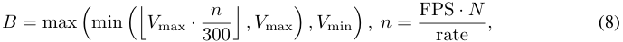

where _n_ is the number of sampled frames, _V_ max is the maximum allowed number of sampling budget (i.e., max sampling budget), which is constrained by VLM’s context length, and _V_ min is a predefined minimum number of frames required for a robust analysis. rate is the frame storage rate per second, and for most video files, it is set to 24. This formulation ensures that the budget scales linearly, while being strictly clamped between the _V_ min and _V_ max. 

### A.2.2 EVENT-WISE SAMPLING 

To ensure that longer, more sustained events receive greater attention while guaranteeing all events are represented, we allocate our total sampling budget _K_ proportionally based on the duration of each refined event. Let _Lj_ = _t_end _j − t_start _j_ be the duration of an event _Ej ∈E_ . The number of frames to sample from this event, _kj_ , is calculated using a floor-and-add-one scheme: 

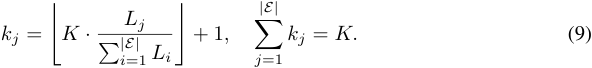

This formulation ensures both of our key criteria are met, as illustrated in Fig. 3 (a): the proportional term allocates a larger budget to longer events, while the ‘+ 1’ guarantees that even the shortest events are sampled at least once. The set of per-event budgets _kj_ is then normalized to ensure that the total number of sampled frames is exactly _K_ . After determining the budget _kj_ for each event, we perform the final selection by identifying and choosing the _kj_ frames that have the highest pre-computed similarity scores from within that event’s boundaries. We denote this as the function Select( _Ej,_ Sort( _SEj_ ) _, kj_ ), which means select _kj_ frames from _Ej_ based on the sorted _SEj_ . Finally, we form the initially sampled frame set _F_ initial as: 

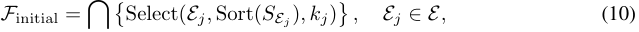

where� _{·}_ ensures all selected frames within events are gathered together as an initial frame set _F_ initial. This frame set will then be used for the Iterative Frame Selection stage. 

### A.2.3 ITERATIVE FRAME SELECTION ALGORITHM 

We propose an iterative loop with four synergistic steps, as detailed in Alg. 1. In each iteration, the process begins with (1) Interval Potential Ranking. This step identifies temporal intervals between the currently sampled frames, calculates a Potential score _P_ for each interval using Eq. 4, and 

15

> Original page for checking 1 unresolved font glyphs.

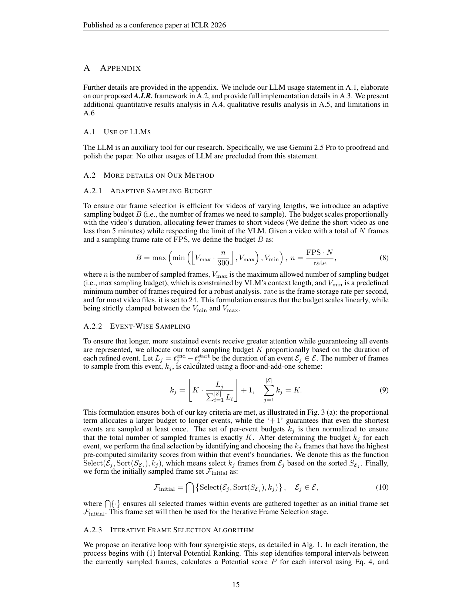

<!-- Page 16 -->

Published as a conference paper at ICLR 2026 

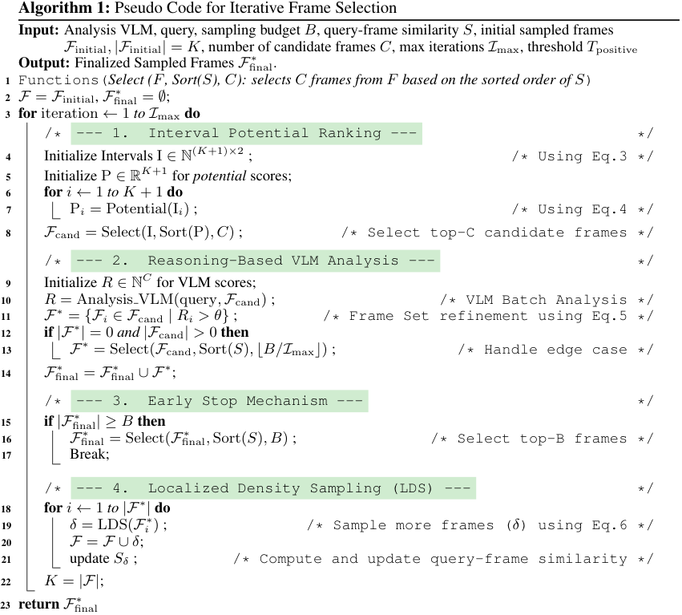

<!-- Start of picture text -->
Algorithm 1:  Pseudo Code for Iterative Frame Selection Input: Analysis VLM, query, sampling budget  B , query-frame similarity  S , initial sampled frames F initial , |F initial |  =  K , number of candidate frames  C , max iterations  I max, threshold  T positive Output: Finalized Sampled Frames  F final ∗ . 1 Functions( Select (F , Sort(S), C): selects C frames from F based on the sorted order of S ) 2 F =  F initial,  F final ∗ =  ∅ ; 3 for  iteration  ← 1  to I max do /* --- 1. Interval Potential Ranking --- * / 4 Initialize Intervals I  ∈ N ( K +1) × 2 ; /* Using Eq.3 */ 5 Initialize P  ∈ R K +1 for  potential  scores; 6 for  i ← 1  to K + 1  do 7 P i = Potential(I i ) ; /* Using Eq.4 */ 8 F cand = Select(I ,  Sort(P) , C ) ; /* Select top-C candidate frames */ /* --- 2. Reasoning-Based VLM Analysis --- * / 9 Initialize  R ∈ N C for VLM scores; 10 R  = Analysis V LM(query , F cand) ; /* VLM Batch Analysis */ 11 F ∗ =  {Fi ∈F cand | Ri > θ}  ; /* Frame Set refinement using Eq.5 */ 12 if  |F ∗ |  = 0  and |F cand | >  0  then 13 F ∗ = Select( F cand ,  Sort( S ) , ⌊B/I max ⌋ ) ; /* Handle edge case */ 14 F final ∗ =  F ∗ final ∪F ∗ ; /* --- 3. Early Stop Mechanism --- * / 15 if  |F final ∗ | ≥ B then 16 F final ∗ = Select( F final ∗ ,  Sort( S ) , B ) ; /* Select top-B frames */ 17 Break; /* --- 4. Localized Density Sampling (LDS) --- * / 18 for  i ← 1  to |F ∗ |  do 19 δ = LDS( Fi ∗ ) ; /* Sample more frames ( δ ) using Eq.6 */ 20 F =  F ∪ δ ; 21 update  Sδ ; /* Compute and update query-frame similarity */ 22 K =  |F| ; 23 return  F final ∗ <!-- End of picture text -->

selects a small pool of _C_ candidate frames ( _F_ cand) from the highest-potential regions for analysis. These candidates are then evaluated by (2) Reasoning-Based VLM Analysis. The VLM provides a relevance score R for each frame, and only those exceeding a predefined threshold _θ_ are retained as a set of validated frames, _F__∗_ . To ensure robustness, if no frames are validated by the VLM, a fallback mechanism selects a small number based on their initial similarity scores. The validated frames are then added to our final selection pool, _F_ final_∗_.The loop is governed by (3) an Early Stop Mechanism, which terminates the process once the total number of selected frames meets the required budget _B_ . If the loop continues, the newly validated frames in _F__∗_ serve as anchors for (4) Localized Density Sampling (LDS). For each validated frame, this step generates a new set of fine-grained frames from its immediate temporal vicinity, denoted as _δ_ in Alg. 1 and elaborated in Eq. 6. These newly discovered frames _δ_ are then added to the main pool of candidates, enriching the search space for the subsequent iteration. This cycle of prioritizing, validating, and exploring allows our method to efficiently converge on the most critical evidence. 

### A.2.4 INTERVAL POTENTIAL RANKING 

Inspired by the research in the Signal Processing domain, we define the three factors to rank an interval as: (1) Relevance: The average signal magnitude, analogous to the DC component (Oppenheim, 1999). Higher values suggest greater pertinence; (2) Complexity: The signal’s Total Variation, which quantifies volatility and often highlights significant events like scene changes (Rudin et al., 1992); (3) Length: The logarithmic duration of the interval, which prioritizes larger unexplored segments while modeling diminishing returns (Pirolli & Card, 1999). Thus, the _potential_ of interval I _i_ 

16

<!-- Page 17 -->

Published as a conference paper at ICLR 2026 

is calculated as: 

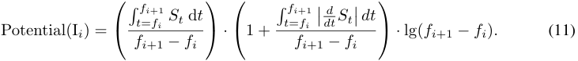

Because our similarity signal is discrete, we apply the discrete version (Eq. 4) to compute the potential scores, which serve as a crucial indicator to select high-potential candidates for next-step VLM analysis. 

### A.2.5 PROMPTS OF OUR METHOD FOR VLMS 

Our method employs a structured, two-stage prompting strategy to guide the Vision Language Models (VLMs) in their respective roles, as illustrated in _Prompt for Analysis VLM_ and _Prompt for Answering VLM_ below. The first prompt is designed for the Analysis VLM, which functions as a relevance-scoring module. It instructs the VLM to act as an “expert visual reasoner” and evaluate how well each sampled frame matches the user’s query. To ensure consistent and quantifiable output, we provide a detailed 5-point scoring rubric, from “1 - Not relevant at all” to “5 - Perfectly matches” (the positive threshold _θ_ is set to 3). The prompt enforces a strict output format requiring a brief justification sentence and the numerical score, which allows for systematic filtering of visual information. The second prompt is for the Answering VLM, which is responsible for the final decision-making. This prompt is framed as a standard multiple-choice question. It directs the model to synthesize the information from the most relevant frames (identified by the Analysis VLM) and select the correct option. To facilitate straightforward and automated evaluation, the output is constrained to only the letter (A, B, C, or D) of the chosen answer (for dataset with five options, we add one more ‘E’ here). This dual-prompt design creates a robust pipeline where visual evidence is first critically assessed and filtered before a final answer is determined. 

### **Prompt for Analysis VLM** 

You are an expert visual reasoner. Step by step analyze how well this image matches the following query (with options): 

### _{_ QUERY _}_ 

Rate the relevance from 1 to 5, using these exact definitions: 

- 1 – Not relevant at all: no relation between image content and the query. 

- 2 – Slightly relevant: only minor contextual hints, but not central to answering. 

- 3 – Moderately relevant: contains preparatory or follow-up context (e.g., setup actions) related to the query. 

- 4 – Highly relevant: shows clear evidence to support the query, but still has ambiguity or missing details. 

- 5 – Perfectly matches: fully sufficient and unambiguous evidence to answer the query. 

Avoid overthinking. Trust your immediate judgment. 

### **Examples:** 

- Image of an empty room (no people or objects) _→_ Reasoning: There is nothing related to the query. Score: 1 

- Image showing exactly the queried action (clear, direct match) _→_ Reasoning: It perfectly depicts the required event. Score: 5 

### **Respond only in this format:** 

Score: <1-5> 

Reasoning: <A brief one-sentence justification> 

17

<!-- Page 18 -->

Published as a conference paper at ICLR 2026 

### **Prompt for Answering VLM** 

Select the best answer to the following multiple-choice question based on the video and the subtitles. **Respond with only the letter (A, B, C, or D) of the correct option.** 

_{_ QUERY _}_ 

### A.3 ADDITIONAL IMPLEMENTATION DETAILS 

### A.3.1 HYPERPARAMETER SETTING 

For query-related similarity _S ∈_ R_N_ , we set it as a sparse array with NaN at no-updated entries, so we only focus on the entries with values and skip the computation of the NaN ones. For Adaptive Initial Sampling, we sample frames at 1 FPS (i.e., FPS = 1) and set the minimum frame budget _V_ min to 8 in Eq. 8, which corresponds to the maximum number of frames accepted by VILA-1.5. For the GMM threshold in Eq. 1, we set _γ_ to 0.7. For Event-Wise Sampling, we merge events occurring less than 2 seconds apart (i.e., _d_ min = 2 _∗_ 24) and filter out events lasting less than 3 seconds (i.e., _l_ min = 3 _∗_ 24), since all video files are stored in 24 fps. We set _K_ = 2 _∗_ max( _B, C_ ). In our Iterative Frame Selection (Alg. 1), we set the candidate pool size _C_ = 12 (the maximum number accepted to do one batch inference for our machine) and the maximum number of iterations _I_ max = 6. The VLM rating scores are from 1 to 5 ( _θ_ = 3). Finally, for Localized Density Sampling (Eq. 6), we set _α_ = max(0 _._ 05 _· |_ I _i|,_ 15), representing 5% of the current interval’s length with a minimum value of 10, and set _β_ to 1 _._ 5. 

### A.3.2 EXPERIMENTAL ENVIRONMENT 

All of our experiments are conducted using NVIDIA GH200 GPUs, with Arch64 as the CPU architecture. Our inference is using Pytorch 2.5 with CUDA-11.6 and GCC-11.4.0. One-time experiment of our method is run using 4 aforementioned machines via lmms-eval (Zhang et al., 2024a) inference framework. When using InterVL3 as our foundation VLM, the inference time (Zhu et al., 2025) is around 10 hours. For Video-MME w/o subtitle (Fu et al., 2025). The cost time ranges from 9 hours to 17 hours per different VLMs. Due to the limit of lmms-eval framework, all of our inference is under 1 batch size, while we set the sub-batch size to 12 (e.g., for VLM analysis on frames). For CLIP cache, because each benchmark has queries using the same video repeatedly, we store the image features for quick cosine-similarity computation. All of our videos are loaded from high-res files (all data are provided by _lmms-eval_ , https://github.com/EvolvingLMMs-Lab/lmms-eval), so preprocessing operations like _Resizing_ may increase the time for computation of CLIP features. 

Table 9: Comparison with different methods on Qwen2-VL-7B. 

|**Model**|**#Frames**|**Video-**|**MME**|**LVB**_val_|**Egos**|**chema**|**NextQA**|
|---|---|---|---|---|---|---|---|
|||w/o sub|w/ sub||Full|Subset||
|_Qwen2-VL-7B_(Wang et al., 2024a)|32|57.6|60.9|55.5|61.9|64.0|77.6|
|+Q-Frame (Zhang et al., 2025)|32|58.3|61.8|58.4|-|-|-|
|+AKS (Tang et al., 2025)|32|59.9|-|**60.5**|-|-|-|
|+Hu et al. (2025)|32|58.7|-|57.0|-|65.9|78.4|
|**+Ours**|_≤_32|**60.0**|**63.1**|58.9|**62.5**|**66.2**|**80.1**|

A.4 ADDITIONAL RESULTS ANALYSIS 

### A.4.1 ADDITIONAL COMPARISON WITH SOTAS 

**Comparison with other SOTA Methods on Qwen2-VL-7B.** Besides the main comparison with SoTAs using QwenVL-2.5, we conducted an additional set of experiments with Qwen2-VL-7B (Wang et al., 2024a) (Tab. 9) to further demonstrate the generalizability and robustness of our **_A.I.R._** framework. We compare our performance against a 32-frame uniform sampling baseline as well as several other state-of-the-art (SoTA) frame selection methods. The results are presented in Tab. 9. The data 

18

<!-- Page 19 -->

Published as a conference paper at ICLR 2026 

Table 10: Comparison of Agent-based VLM Frame Selection Methods on Video Question Answering Benchmarks. 

|**Method**|**Venue**|**Base** |**#Frames**|**Video-**|**MME**|**MLVU **|**LVB **|**EgoS**|**chema **|**NextQA**|
|---|---|---|---|---|---|---|---|---|---|---|
|||**Model**||w/o sub|w/ sub|||Full|Subset||
|_Agent-based Frame Selection M_|_ethods_||||||||||
| VideoLucy (Zuo et al.)| NeurIPS’25|DeepSeek-R1|-|72.5|-|76.1|-|-|-|-|
| VideoRAG (Luo et al., 2024)|NeurIPS’25|LLaVA-Video-7B|64|-|-|72.4|58.7|-|-|-|
|T_∗_Ye et al. (2025)|CVPR’25|LLaVA-OV-7B|8|-|-|-|-|-|66.6|80.4|
|DrVideo (Ma et al., 2025)|CVPR’25|GPT-4|-|-|-|-|-|61.0|66.4|-|
| MemVid (Yuan et al., 2025)|arXiv’25|Qwen2VL-7B|128|63.7|65.7|-|-|-|-|-|
| VideoAgent2 (Zhi et al., 2025)|arXiv’25|GPT-4o|-|-|-|-|-|75.4|-|80.5|
| AKEYS (Fan et al., 2025)|arXiv’25|GPT-4o|_≤_32|-|-|-|-|63.6|68.6|78.1|
|_Our Frame Selection Method fo_|_r Comparison_||||||||||
|**A.I.R.**|-|GPT-4o|_≤_32|65.1|-|-|-|-|72.0|82.5|
|**A.I.R.**|-|Qwen2VL-7B|_≤_32|60.0|63.1|-|58.9|62.5|66.2|80.1|
|**A.I.R.**|-|InternVL3-8B|_≤_32|68.2|69.2|74.5|62.8|63.3|72.2|82.6|
|**A.I.R.**|-|LLaVA-OV-7B|_≤_32|61.4|65.1|69.3|60.7|61.4|63.2|81.6|

shows that **_A.I.R._** consistently outperforms both the baseline and competing methods on this new VLM backbone. Notably, on the Video-MME (w/o sub) benchmark, our approach achieves the highest accuracy of 60.0%, surpassing strong methods like AKS (59.9%) and Q-Frame (58.3%), and providing a significant +2.4% uplift over the baseline. Our method also achieves the top performance on Egoschema and NextQA. While AKS shows a strong result on LVB, our method remains highly competitive with a score of 58.9%, a substantial improvement over the baseline’s 55.5%. This experiment validates that the benefits of our adaptive, iterative, and reasoning-based approach are not tied to a specific VLM architecture and can be effectively generalized. 

**Comparison with Agent-based Frame Selection Methods.** To further validate A.I.R.’s effectiveness against cutting-edge approaches, we compare against seven recent agent-based methods from NeurIPS’25, CVPR’25, and arXiv’25 in Tab. 10. These methods leverage multi-step reasoning and planning capabilities of large language models, often using frontier models like GPT-4o or DeepSeek-R1. Our results reveal three key findings: **(1) Superior performance with matched backbones and exceptional frame efficiency.** When using identical base models, A.I.R. consistently outperforms agent-based methods while maintaining high frame efficiency. For instance, with GPT-4o and comparable frame budgets ( _≤_ 32 frames), A.I.R. surpasses AKEYS on EgoSchema Subset by +3.4% and NextQA by +4.4%. Similarly, with LLaVA-OneVision-7B, A.I.R. exceeds T_∗_ on NextQA (+1.2%). Moreover, compared to VideoRAG which uses 64 frames with LLaVA-Video-7B to achieve 58.7% on LVB, A.I.R. with LLaVA-OneVision-7B reaches 60.7% with only _≤_ 32 frames, achieving 2 _×_ frame efficiency with +2.0% accuracy improvement. **(2) Competitive performance with smaller models.** Remarkably, A.I.R. with the 8B-scale InternVL3 achieves performance competitive with or superior to agent-based methods using much larger frontier models. On NextQA, InternVL3-8B with A.I.R. reaches 82.6%, surpassing VideoAgent2’s GPT-4o result (80.5%) and AKEYS’s GPT-4o result (78.1%). On EgoSchema, InternVL3-8B achieves 72.2% (Subset) and 63.3% (Full), exceeding DrVideo’s GPT-4 performance (66.4% Subset, 61.0% Full). This demonstrates that A.I.R.’s intelligent frame selection can unlock the full potential of smaller, open-source models to match or exceed the performance of expensive proprietary models. **(3) Comprehensive and transparent evaluation.** Unlike many agent-based methods that report results selectively across 2-3 benchmarks, A.I.R. provides consistent results across all five major benchmarks (VideoMME, MLVU, LVB, EgoSchema, NextQA) for multiple VLM backbones, demonstrating robustness and eliminating concerns about cherry-picked results. While agent-based methods offer powerful multi-step reasoning capabilities, they face practical challenges including high computational costs from multiple LLM calls and dependency on proprietary models. In contrast, A.I.R. achieves competitive performance through a streamlined, training-free framework that seamlessly integrates with any VLM backbone. 

### A.4.2 DETAILED ANALYSIS OF QUESTION TYPE 

As illustrated in Fig. 4, we evaluate the performance of our proposed method, A.I.R., against two baseline approaches: MDP3 (Sun et al., 2025) and Uniform Sampling, across six distinct problem domains. The results clearly demonstrate that **_A.I.R._** consistently and substantially outperforms both baselines across all evaluated categories. Notably, **_A.I.R._** exhibits exceptional proficiency in tasks requiring textual and holistic understanding, achieving its highest scores in Information Synopsis (81.1%), OCR Problems (79.1%), and Perception (78.9%). It also maintains a strong lead in Recog- 

19

<!-- Page 20 -->

Published as a conference paper at ICLR 2026 

Table 11: Ablation study on different frame numbers for training-free methods. 

|**Model**|**#Frames**|**Video-**|**MME**|**MLVU**_dev_|**LVB**_val_|**Egos**|**chema**|**NextQA**|
|---|---|---|---|---|---|---|---|---|
|||w/o sub|w/ sub|||Full|Subset||
|_QwenVL-2.5_|32|60.8|62.7|59.3|58.1|57.6|59.4|74.3|
|**+Ours**|_≤_32|**65.0**|**66.3**|**67.5**|**61.4**|**58.8**|**62.4**|**81.3**|
|_QwenVL-2.5_|64|61.2|65.0|63.8|59.0|58.8|62.0|75.9|
|**+Ours**|_≤_64|**65.9**|**67.2**|**69.7**|**62.5**|**59.8**|**63.2**|**82.5**|
|_QwenVL-2.5_|256|63.4|67.3|67.8|60.2|58.8|62.6|74.3|
|**+Ours**|_≤_256|**66.4**|**67.9**|**71.7**|**62.8**|**59.9**|**63.6**|**83.3**|
|_LLaVA-OneVision_|8|53.8|58.9|58.9|54.2|59.2|62.0|77.4|
|+BOLT_∗_|8|56.1|-|63.4|55.6|59.2|62.2|77.4|
|**+Ours**|8|**57.9**|**60.5**|**63.8**|**57.3**|**59.4**|**63.4**|**78.9**|
|_LLaVA-OneVision_|16|56.9|60.0|61.2|55.7|59.5|61.4|78.1|
|+BOLT_∗_|16|57.8|-|**65.8**|57.0|59.9|61.8|78.3|
|**+Ours**|_≤_16|**59.1**|**60.8**|65.6|**58.9**|**60.4**|**62.2**|**79.4**|
|_LLaVA-OneVision_|32|58.5|61.7|62.4|56.6|60.2|61.8|79.3|
|+BOLT_∗_|32|59.9|-|66.8|59.6|60.7|64.0|79.5|
|**+Ours**|_≤_32|**61.4**|**65.1**|**69.3**|**60.7**|**61.4**|**64.2**|**81.6**|

nition (69.9%) and Reasoning (62.9%), showcasing its robust capabilities on a high volume of test cases. Interestingly, the most challenging domain for all methods, including **_A.I.R._** , is the Counting Problem, where **_A.I.R._** scores 49.3%. While this is its lowest score, it still represents a significant margin of improvement over both MDP3 and Uniform Sampling. In comparison, the MDP3 method offers a moderate improvement over the basic Uniform Sampling baseline but is clearly surpassed by the advanced capabilities of **_A.I.R._** in every task. Overall, the analysis highlights the comprehensive strengths and superior performance of the **_A.I.R._** model across a diverse set of complex problems. 

### A.4.3 ADDITIONAL ABLATIONS OF SAMPLED FRAME NUMBER 

In this section, we provide a detailed ablation study on the effect of the maximum sampling budget on the performance of our **_A.I.R._** framework. We compare our method against a uniform sampling baseline and other state-of-the-art methods across various benchmarks, using two distinct VLM backbones: QwenVL-2.5 and LLaVA-OneVision. The comprehensive results are presented in Tab. 11. 

The analysis on the QwenVL-2.5 backbone demonstrates that **_A.I.R._** provides a substantial and consistent performance improvement over the uniform sampling baseline at every tested budget (32, 64, and 256 frames). For instance, with a maximum of 32 frames, our method boosts performance on Video-MME (w/o sub) from 60.8% to 65.0% and on MLVU from 59.3% to 67.5%. As the maximum budget increases, the performance of our method continues to scale effectively, consistently maintaining a significant advantage over the baseline, which sees only modest gains from having more frames. 

The three-way comparison on the LLaVA-OneVision backbone further validates our approach. Across nearly all settings, **_A.I.R._** outperforms both the uniform sampling baseline and the strong competitor, BOLT. For example, with a 32-frame budget, **_A.I.R._** achieves 61.4% on Video-MME, surpassing both the baseline (58.5%) and BOLT (59.9%), and scores 81.6% on NextQA, again outperforming both the baseline (79.3%) and BOLT (79.5%). The effectiveness of our intelligent selection is highlighted by the fact that **_A.I.R._** with a maximum of 16 frames (59.1% on VideoMME) often outperforms the uniform sampling baseline that uses a fixed 32 frames (58.5%). This comprehensive analysis of two different VLMs confirms that our adaptive and iterative framework is a robust and highly effective strategy for improving video understanding across a wide range of frame budgets. 

### A.4.4 ADDITIONAL ANALYSIS OF METHOD ABLATIONS 

**Influence of Method Components.** To validate the contribution of each component within the **_A.I.R._** framework, we conduct a systematic ablation study, with results presented in Tab. 4. Our full method (#2) achieves 68.2% accuracy, a significant improvement of +2.6% over the Uniform 

20

<!-- Page 21 -->

Published as a conference paper at ICLR 2026 

Table 12: Ablation study on the hyperparameters _C_ (candidate pool size) and _I_ max (max iterations). The trade-off between efficiency (Time) and performance (Accuracy) is evaluated on NextQA using InternVL3-8B. The chosen default configuration is highlighted. Times (in seconds) represent the VLM inference time, while (16.0f) represents the overall frames analyzed by VLM. 

|# **Max Sampling** **Budget (**_V_max**)**|**Candidate Pool** **Size (**_C_**)**|**Max** **Iterations (**_I_max**)**|**Time (s)**|**Accuracy** **(%)**|
|---|---|---|---|---|
|1 16|8|2|14.87 (13.6f)|81.61|
|2 16|4|4|12.62 (12.4f)|81.68|
|3 16|8|4|18.92 (20.3f)|81.92|
|4 32|8|4|29.17 (27.2f)|82.20|
|5 32|12|6|34.24 (32.2f)|82.63|
|6 32|16|8|36.52 (35.6f)|**82.91**|

Sampling baseline (#1), while also using fewer frames on average. Disabling individual components generally degrades performance, confirming their synergistic importance. The most critical component is the entire Iterative Frame Selection stage (#6); its removal causes the largest accuracy drop to 65.2%, demonstrating that the iterative refinement process is essential for identifying relevant frames. The Reasoning-based VLM Analysis (#8) is also highly impactful, with its removal reducing accuracy to 66.0% and increasing the frame count to 32. The Interval Potential Ranking (#7) and Adaptive Initial Sampling (#5) are similarly important, with their removal reducing accuracy to 66.7% and 66.9%, respectively. Notably, replacing our adaptive budget with a fixed 32-frame budget (#3) yields a marginal 0.1% increase in accuracy to 68.3%. However, we selected our adaptive approach as the default because it strikes a superior efficiency-performance trade-off: it achieves nearly identical top-tier performance while using 22.5% fewer frames on average (24.8 vs. 32.0), making it a more practical and scalable solution. 

**Ablation on CLIP Models.** We analyze the impact of different CLIP variants on the **_A.I.R._** framework in Tab. 5. The results show that all configurations utilizing our method demonstrate a marked improvement over the Uniform Sampling baseline, highlighting the fundamental effectiveness of our framework irrespective of the specific vision backbone employed. Among the tested variants, the combination of **_A.I.R._** with EVA-CLIP-L achieves the highest performance, reaching an accuracy of 68.2%. We also observe that larger models generally provide better results, with CLIP-ViT-L outperforming its base-sized counterpart by 1.0%. Based on this analysis, we selected EVA-CLIP-L as the default vision encoder for our main experiments due to its superior empirical performance. 

### A.4.5 ADDITIONAL EFFICIENCY AND HYPERPARAMETER ANALYSIS 

We analyze the impact of our key hyperparameters—Max Sampling Budget ( _V_ max), Candidate Pool Size ( _C_ ), and Max Iterations ( _I_ max)—on the trade-off between performance and efficiency, with results on NextQA presented in Tab. 12. The results demonstrate that various **_A.I.R._** configurations can achieve state-of-the-art accuracy while remaining highly frame-efficient. For instance, our settings with a 16-frame budget (rows #1-#3) surpass 81.6% accuracy using fewer than 14 frames on average, significantly outperforming fixed-budget baselines that score much lower with a similar frame count. Focusing on the configurations with _V_ max = 32 (rows #4-#6) allows for a deeper analysis of this trade-off. The setting in row #4 ( _C_ = 8 _, I_ max = 4) establishes a strong baseline at 82.20% accuracy with 27.2 analyzed frames. Our chosen default setting (row #5, _C_ = 12 _, I_ max = 6) improves accuracy to 82.63% for a modest increase in VLM workload to 32.2 frames. Further increasing the hyperparameters (row #6) yields the highest accuracy (82.91%), but this marginal +0.28% gain requires a larger workload (35.6 frames), indicating a clear point of diminishing returns. We therefore select the configuration from row #5 as our default, as it strikes an optimal balance between high performance and computational cost. Overall, these results show that **_A.I.R._** is robust to hyperparameter changes and our chosen default provides the best efficiency-performance trade-off. 

In Tab. 13, we provide a granular efficiency analysis by breaking down the performance of **_A.I.R._** across short, medium, and long videos. This detailed view reveals several key advantages of our adaptive framework: 

- Adaptive Cost vs. Fixed Waste. The results show that A.I.R.’s computational cost intelligently scales with video length, in stark contrast to conventional fixed-budget methods. For instance, a 128-frame baseline incurs a constant, high cost of 162.03s regardless of video duration. A.I.R., 

21

<!-- Page 22 -->

Published as a conference paper at ICLR 2026 

Table 13: Detailed Efficiency Comparison on Video-MME using InternVL3-8B. 

|**Model**|**Short Video** _≤_5_min_|**Medium Video** 5_−_15_min_|**Long Video** _≥_15_min_|**Overall** _Avg._ 17 min|
|---|---|---|---|---|
|CLIP Inference (1FPS)|21.30|40.32|78.55|46.72|
|Uniform Sampling (Answering)|0.56|0.98|1.06|0.87|
|**_A.I.R._**(Sampling, Selection & Answering)|**0.63**|**1.10**|**1.32**|**1.02**|
|Conventional VLM inference|162.03 (128f)|162.03 (128f)|162.03 (128f)|162.03 (128f)|
|**_A.I.R._**(VLM inference,_V_max = 32_, C_ = 12_, I_max = 6)|**26.34**(25.3f)|**46.17**(37.4f)|**54.42**(46.7f)|**42.31**(36.5f)|
|Conventional VLM inference|42.47 (32.0f)|42.47 (32.0f)|42.47 (32.0f)|42.47 (32.0f)|
|**_A.I.R._**(VLM inference,_V_max = 16_, C_ = 8_, I_max = 4)|**14.45**(12.5f)|**18.90**(17.4f)|**32.41**(30.9f)|**21.92**(20.3f)|
|Conventional VLM inference|20.39 (16.0f)|20.39 (16.0f)|20.39 (16.0f)|20.39 (16.0f)|
|**_A.I.R._**(VLM inference,_V_max = 16_, C_ = 4_, I_max = 4)|**9.05**(9.7f)|**13.47**(12.8f)|**21.31**(19.8f)|**14.61**(14.1f)|

however, is far more efficient on short videos (e.g., 26.34s in our default setting) and, while its cost increases for longer videos (54.42s), it remains nearly three times faster than the fixed-budget approach, effectively eliminating wasteful computation. 

- Intelligent, Sub-Linear Scaling. Crucially, the VLM workload for **_A.I.R._** does not scale linearly with the video’s duration. In our default setting ( _V_ max = 32), the number of analyzed frames grows from 25.3 for short videos to 46.7 for long videos. This sub-linear growth suggests that **_A.I.R._** is effective at pinpointing information-dense regions, tying its computational cost more closely to the query’s informational complexity rather than the video’s raw length. 

- Minimal Framework Overhead. The top section of the table highlights the efficiency of the core algorithm itself. The total pipeline time for **_A.I.R._** (1.02s on average) is remarkably close to the fastest Uniform Sampling baseline (0.87s). This demonstrates that the complex logic of adaptive sampling, ranking, and iteration adds minimal computational overhead, making the entire framework lightweight and practical. 

Taken together, this granular analysis confirms that **_A.I.R._** is a scalable solution that intelligently manages its VLM workload based on the specific characteristics of the video, making it highly practical for real-world scenarios with varying video lengths. 

### A.4.6 COMPREHENSIVE HYPERPARAMETER ABLATIONS 

To validate the robustness of **_A.I.R._** across different hyperparameter configurations, we conduct a systematic ablation study on LongVideoBench (LVB) and NextQA using InternVL3-8B. As shown in Tab. 14, we independently vary each of the five key hyperparameters while keeping others fixed at their default values: _γ_ = 0 _._ 7 (GMM coefficient), _α_ = 15 (minimum frame distance), _β_ = 1 _._ 5 (LDS growth factor), _l_ min = 20 (minimum event length for pruning), and _d_ min = 2 _._ 0s (minimum gap for merging events). 

**Individual Parameter Analysis.** Our results demonstrate strong robustness across all hyperparameters. For the GMM coefficient _γ_ (rows 1-3), we observe that moderate values (0.5-0.7) yield the best performance, with _γ_ = 0 _._ 5 and _γ_ = 0 _._ 7 both achieving 82.6% on NextQA. Extreme values ( _γ_ = 0 _._ 3 or _γ_ = 0 _._ 9) lead to slightly degraded performance (-0.3% to -0.4%), as they either select too many low-relevance frames or miss important events. For minimum frame distance _α_ (rows 4-6), larger values (20-25) prevent redundant sampling but may miss fine-grained details, while smaller values (10) enable denser coverage. The LDS growth factor _β_ (rows 7-9) shows consistent performance across the tested range (1.2-2.0), with moderate values (1.5-1.7) performing slightly better. The pruning threshold _l_ min (rows 10-12) and merging gap _d_ min (rows 13-14) both demonstrate stability, with performance varying by less than 1.0% across different settings. 

**Strategy-Based Combinations.** We further test four strategy combinations (rows 15-18) designed for different video characteristics: (15) Short-Video strategy with dense sampling ( _γ_ = 0 _._ 5, _α_ = 10, _l_ min = 15, _d_ min = 1); (16) Long-Video strategy with sparse sampling ( _α_ = 25, _l_ min = 30, _d_ min = 3); (17) Conservative strategy with strict thresholds ( _γ_ = 0 _._ 3, _α_ = 20); and (18) Aggressive strategy with loose thresholds ( _γ_ = 0 _._ 9, _α_ = 20). All combinations maintain competitive performance (61.7-62.9% on LVB, 81.8-82.7% on NextQA), demonstrating that **_A.I.R._** can be flexibly adapted to different video types while preserving effectiveness. 

22

<!-- Page 23 -->

Published as a conference paper at ICLR 2026 

Table 14: Systematic ablation study of **_A.I.R._** hyperparameters using InternVL3-8B. Default configuration (gray) uses parameters from Appendix A.3.1: _γ_ = 0 _._ 7, _α_ = 15, _β_ = 1 _._ 5, _l_ min=20, _d_ min=2.0s. We vary each parameter independently to isolate effects. All configurations maintain performance within ±1.1% of baseline, demonstrating strong robustness. Rows 15-18 test strategy combinations: Short-Video (dense sampling), Long-Video (sparse sampling), Conservative (strict), Aggressive (loose). All use _V_ max = 32, _C_ = 12, _I_ max = 6. 

|#|_γ_|_α_|_β_|_l_min|_d_min|LVB|NextQA|
|---|---|---|---|---|---|---|---|
|**-**|**0.7**|**15**|**1.5**|**20**|**2**|**62.8**|**82.6**|
|_γ ablat  i_|_ion (GMM ci_|_oefficient)_||||||
|1|0.3|15|1.5|20|2|62.2|82.3|
|2|0.5|15|1.5|20|2|62.6|82.6|
|3|0.9|15|1.5|20|2|62.0|82.2|
|_α ablat_|_ion (min_ _~~f~~ra_|_me_ _~~d~~istance)_||||||
|4|0.7|10|1.5|20|2|62.4|82.8|
|5|0.7|20|1.5|20|2|62.8|82.1|
|6|0.7|25|1.5|20|2|62.9|82.0|
|_β ablat_|_ion (LDS gro_|_wth factor)_||||||
|7|0.7|15|1.2|20|2|62.4|82.4|
|8|0.7|15|1.7|20|2|62.6|82.5|
|9|07|15|20|20|2|621|821|
|_l_min _ab_|. _lation_(Pruni|ng)|.|||.|.|
|10|0.7|15|1.5|15|2|62.0|82.4|
|11|0.7|15|1.5|25|2|62.8|82.1|
|12|0.7|15|1.5|30|2|62.7|81.8|
|_d_min _a_|_blation (Merg_|_ing)_||||||
|13|0.7|15|1.5|20|1|62.3|82.8|
|14|0.7|15|1.5|20|3|62.6|82.3|
|_Strateg_|_y-based com_|_binations_||||||
|15|0.5|10|1.5|15|1|61.7|82.7|
|16|0.7|25|1.5|30|3|62.9|81.8|
|17|0.3|20|1.7|20|2|61.8|82.0|
|18|0.9|20|1.2|20|2|62.1|81.9|

**Robustness Analysis.** Critically, all 18 configurations maintain performance within _±_ 1.1% of the default setting on both benchmarks, confirming that **_A.I.R._** is highly robust to hyperparameter choices. 

### A.5 QUALITATIVE RESTULTS ANALYSIS 

As shown in Fig. 6 and Fig. 7, **_A.I.R._** ’s strength lies in its iterative refinement process. The system initially casts a wide net and then uses a Vision-Language Model (VLM) to progressively score and filter video frames. For instance, when searching for a character’s post-meeting actions, the VLM intelligently discards irrelevant scenes like pre-meeting preparations. A localized sampling mechanism then focuses on temporal regions around these high-scoring frames, creating a feedback loop that efficiently uncovers more relevant content. This dynamic process allows **_A.I.R._** to converge on the precise moments that answer a query—whether it’s a character having lunch or an artist applying glaze—yielding a final selection of frames that is both comprehensive and highly relevant. 

**_A.I.R._** ’s superiority is further demonstrated in direct comparisons against baseline methods in Fig. 8 and Fig. 9. Baselines like Uniform Sampling are indiscriminate, capturing disconnected or irrelevant moments (e.g., logos, underwater scenes) due to their fixed-interval nature. While an improvement, CLIP Top-K often falls into ”relevance traps,” leading to high redundancy by over-sampling visually similar frames (like a car scene) or wasting its budget on tangentially related content (people near a volcano instead of the lava flow). In stark contrast, **_A.I.R._** constructs a coherent narrative. It precisely captures the key chronological events—from establishing shots to the core lava formation, or a Vlogger’s complete daily routine—while ensuring temporal diversity. These results confirm 

23

<!-- Page 24 -->

Published as a conference paper at ICLR 2026 

that our adaptive approach overcomes the critical limitations of simpler methods, achieving superior semantic relevance and temporal coherence. 

### A.6 LIMITATIONS 

We acknowledge several limitations of our current framework. First, the performance of **_A.I.R._** is fundamentally bound by the capabilities of its underlying analysis VLM. For instance, as shown across our benchmarks (Tab. 1 and 2), using a more advanced model like InternVL-3-8B yields significantly better results than less capable models such as VILA-1.5, even at a comparable parameter size. Additionally, a known shortcoming of most frame selection methods, including ours, is their performance on fine-grained tasks like object counting, as highlighted in Fig. 4. Moreover, our approach currently processes only the visual track, omitting crucial information that may be present in the audio. Finally, while significantly more efficient than brute-force analysis, the iterative nature of our framework introduces a computational latency that may not be suitable for real-time applications. 

24

<!-- Page 25 -->

Published as a conference paper at ICLR 2026 

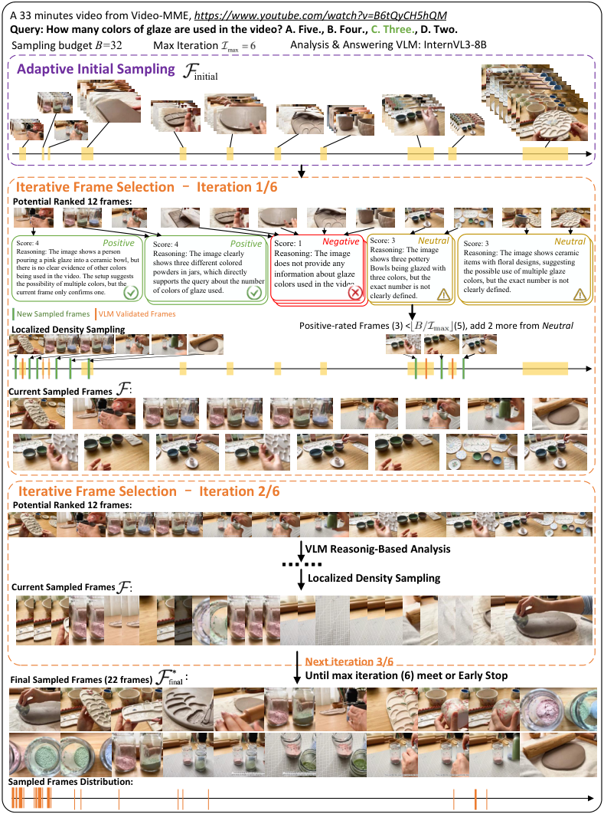

<!-- Start of picture text -->
A 33 minutes video from Video-MME, https://www.youtube.com/watch?v=B6tQyCH5hQM Query: How many colors of glaze are used in the video? A. Five., B. Four., C. Three., D. Two. Sampling budget  B= 32 Max Iteration Analysis & Answering VLM: InternVL3-8B Adaptive Initial Sampling initial Iterative Frame Selection  –  Iteration 1/6 Potential Ranked 12 frames: Score: 4 Positive Score: 4 Positive Score: 1 Negative Score: 3 Neutral Score: 3 Neutral Reasoning: The image shows a person  Reasoning: The image clearly  Reasoning: The image  Reasoning: The image  Reasoning: The image shows ceramic pouring a pink glaze into a ceramic bowl, but there is no clear evidence of other colors being used in the video. The setup suggests the possibility of multiple colors, but the current frame only confirms one. shows three different colored powders in jars, which directly supports the query about the number of colors of glaze used. does not provide any information about glaze colors used in the video. shows three pottery Bowls being glazed with three colors, but the exact number is not clearly defined. items with floral designs, suggesting the possible use of multiple glaze colors, but the exact number is not clearly defined. New Sampled frames VLM Validated Frames Localized Density Sampling Positive-rated Frames (3) <                   (5), add 2 more from  Neutral Current Sampled Frames : Iterative Frame Selection  –  Iteration 2/6 Potential Ranked 12 frames: VLM Reasonig-Based Analysis …… Localized Density Sampling Current Sampled Frames : Next iteration 3/6 Final Sampled Frames (22 frames) final * : Until max iteration (6) meet or Early Stop Sampled Frames Distribution: <!-- End of picture text -->

Figure 6: Detailed workflow of **_A.I.R._** on a 33-minute Video-MME example showing the iterative frame selection process for the query “ _How many colors of glaze are used in the video?_ ” with VLM reasoning scores and localized density sampling. 

25

<!-- Page 26 -->

Published as a conference paper at ICLR 2026 

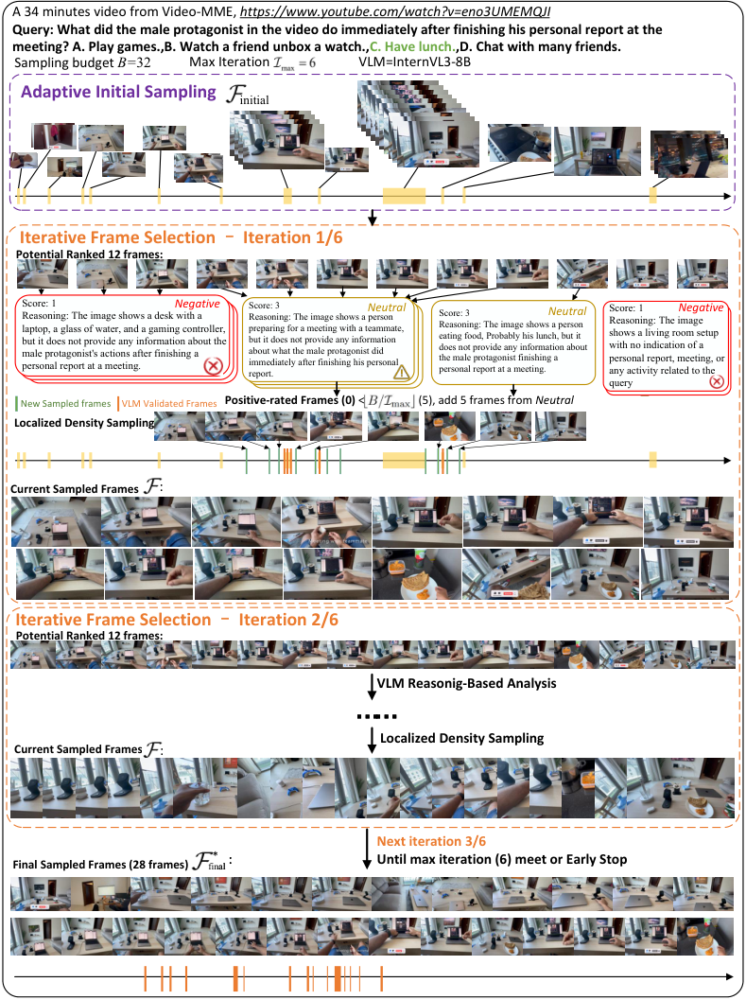

<!-- Start of picture text -->
A 34 minutes video from Video-MME, https://www.youtube.com/watch?v=eno3UMEMQJI Query: What did the male protagonist in the video do immediately after finishing his personal report at the meeting? A. Play games.,B. Watch a friend unbox a watch.,C. Have lunch.,D. Chat with many friends. Sampling budget  B= 32 Max Iteration VLM=InternVL3-8B Adaptive Initial Sampling initial Iterative Frame Selection  –  Iteration 1/6 Potential Ranked 12 frames: Score: 1Reasoning: The image shows a desk with a laptop, a glass of water, and a gaming controller, but it does not provide any information about the male protagonist's actions after finishing a personal report at a meeting. Negative Score: 3Reasoning: The image shows a person preparing for a meeting with a teammate, but it does not provide any information about what the male protagonist did immediately after finishing his personal report. Neutral Score: 3Reasoning: The image shows a person eating food, Probably his lunch, but it does not provide any information about the male protagonist finishing a personal report at a meeting. Neutral Score: 1Reasoning: The image shows a living room setup with no indication of a personal report, meeting, or any activity related to the  Neutral Negative query New Sampled frames VLM Validated Frames Positive-rated Frames (0)  <                   (5), add 5 frames from  Neutral Localized Density Sampling Current Sampled Frames : Iterative Frame Selection  –  Iteration 2/6 Potential Ranked 12 frames: VLM Reasonig-Based Analysis …… Localized Density Sampling Current Sampled Frames : Next iteration 3/6 Final Sampled Frames (28 frames) final * : Until max iteration (6) meet or Early Stop <!-- End of picture text -->

Figure 7: Detailed workflow of **_A.I.R._** on a 34-minute Video-MME example showing the iterative frame selection process for the query “ _What did the male protagonist in the video do immediately after finishing his personal report at the meeting?_ ” with VLM reasoning scores and localized density sampling. 

26

<!-- Page 27 -->

Published as a conference paper at ICLR 2026 

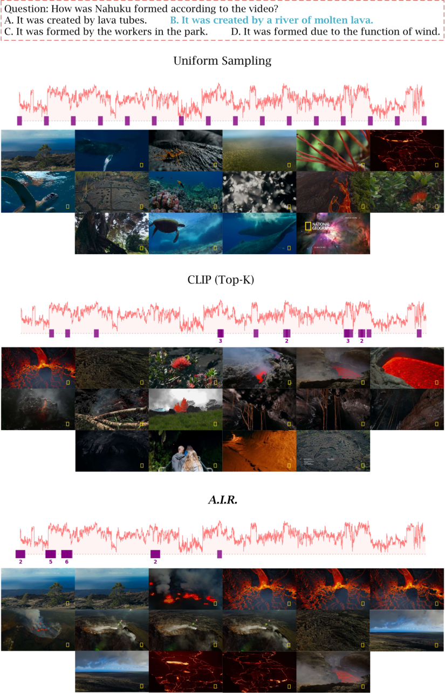

Figure 8: Frame selection comparison on a volcanic formation video. Uniform Sampling, CLIP (Top-K, K=16), and **_A.I.R._** for the query about Nahuku’s formation, with similarity score graphs showing **_A.I.R._** ’s focused sampling around relevant lava segments. 

27

<!-- Page 28 -->

Published as a conference paper at ICLR 2026 

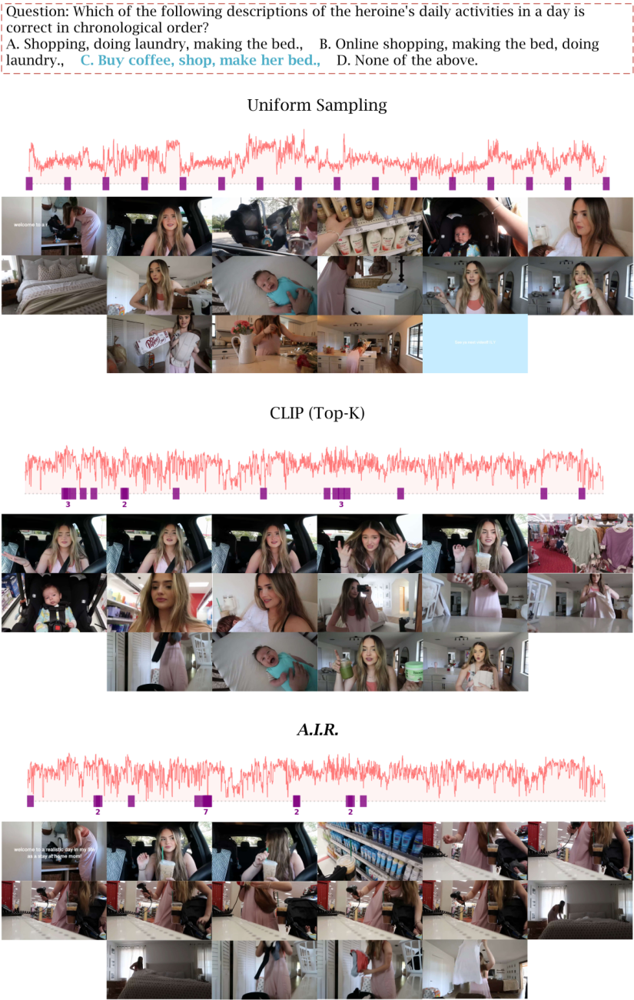

Figure 9: Additional frame selection on a daily routine video comparing Uniform Sampling, CLIP (Top-K, K=16), and **_A.I.R._** for chronological activity ordering. **_A.I.R._** effectively excludes numerous irrelevant frames while accurately capturing the complete sequence of key activities (buy coffee, shop, make her bed, do laundry). 

28
