# ARify Leveraging Narrated Instructional Videos to Create Augmented Reality Tutorials for Procedural Tasks

[Original PDF](../ARify%20Leveraging%20Narrated%20Instructional%20Videos%20to%20Create%20Augmented%20Reality%20Tutorials%20for%20Procedural%20Tasks.pdf)

Pages: 23

> Automatically converted from PDF. Check the original for exact equations, symbols, table alignment, and figure details.

<!-- Page 1 -->

# **ARify: Leveraging Narrated Instructional Videos to Create Augmented Reality Tutorials for Procedural Tasks** 

|Xiyun Hu<sup>∗</sup>|Chenfei Zhu<sup>∗</sup>|Shao-Kang Hsia<sup>∗</sup>|
|---|---|---|
|School of Mechanical Engineering|School of Mechanical Engineering|School of Mechanical Engineering|
|Purdue University|Purdue University|Purdue University|
|West Lafayette, Indiana, USA<br>hu690@purdue.edu|West Lafayette, Indiana, USA<br>zhu1237@purdue.edu|West Lafayette, Indiana, USA<br>shsia@purdue.edu|
|Dizhi Ma|Rahul Jain|Karthik Ramani|
|Elmore Family School of Electrical<br>and Computer Engineering<br>Purdue University|Elmore Family School of Electrical<br>and Computer Engineering<br>Purdue University|School of Mechanical Engineering<br>and Elmore Family School of<br>Electrical and Computer Engineering|
|West Lafayette, Indiana, USA<br>ma742@purdue.edu|West Lafayette, Indiana, USA<br>jain348@purdue.edu|Purdue University<br>West Lafayette, Indiana, USA<br>ramani@purdue.edu|


## **Abstract** 

Augmented Reality (AR) tutorials enhance procedural task learning by providing situated, step-by-step guidance. Yet, creating such tutorials requires AR authoring expertise, posing a significant entry barrier. To lower this barrier, we introduce ARify, an authoring system that semi-automatically transforms narrated instructional videos into AR tutorials. To guide system design, we conducted a content analysis of video tutorials and derived a design space of instructional intents, tactics, and AR representations. Building on this, ARify generates AR tutorials by integrating a vision–language model to plan tutorial structures and an AR builder to configure AR representations, and offers interfaces that allow users to refine and customize the results. A numerical study on three machine tasks and a user study with 18 participants showed that ARify achieves promising performance across task types, and allows novices to author effective AR tutorials, validating its effectiveness and usability. 

## **CCS Concepts** 

• **Human-centered computing** → **Mixed / augmented reality** ; **Virtual reality** ; **Graphical user interfaces** ; **Natural language interfaces** . 

## **Keywords** 

Augmented Reality, Large Language Model, Procedural Task, Tutorial 

**ACM Reference Format:** 

Xiyun Hu, Chenfei Zhu, Shao-Kang Hsia, Dizhi Ma, Rahul Jain, and Karthik Ramani. 2026. ARify: Leveraging Narrated Instructional Videos to Create Augmented Reality Tutorials for Procedural Tasks. In _Proceedings of the 2026 CHI Conference on Human Factors in Computing Systems (CHI ’26),_ 

> ∗Three authors contributed equally to this research. 

This work is licensed under a Creative Commons Attribution 4.0 International License. _CHI ’26, Barcelona, Spain_ 

© 2026 Copyright held by the owner/author(s). ACM ISBN 979-8-4007-2278-3/26/04 

https://doi.org/10.1145/3772318.3790715 

_April 13–17, 2026, Barcelona, Spain._ ACM, New York, NY, USA, 23 pages. https://doi.org/10.1145/3772318.3790715 

## **1 Introduction** 

Procedural tasks, including machine tasks [71], cooking [62], and sports training [27], are multi-step activities that involve executing a sequence of actions performed under specific conditions to achieve particular goals, which often require structured instructions (e.g., manuals or video tutorials) and sustained practice to master. In recent years, Augmented Reality (AR) tutorials [81, 85] have been increasingly adopted to teach procedural tasks. Unlike traditional media such as printed manuals or videos, which force learners to split attention between instructions and their workspace [48], AR tutorials deliver step-by-step guidance directly in learners’ environments, where instructions are spatially anchored to physical objects and delivered hands-free [2]. This situated delivery reduces split attention, thereby lowering cognitive load and improving learning outcomes [1, 58, 66]. 

Despite these advantages, authoring AR tutorials for procedural tasks is challenging. Conventional approaches rely on game engines such as Unity [84] or Unreal [21], where creators manually construct multi-step logic and spatial content through extensive programming and asset preparation, which substantially limits accessibility. To ease this burden, AR and Virtual Reality (VR) authoring systems have been proposed to simplify AR tutorial creation. Demonstration-based methods [4, 16, 36, 67, 89] allow creators to build AR tutorials by first performing a physical demonstration to record task actions and context (e.g., conditions, environment), and then customizing the AR interface and logic directly in the immersive environment (e.g., selecting user interface (UI) components, aligning them with physical objects, and defining tutorial structure). AdapTutAR [36], for example, allows users to author machine-task tutorials that automatically adapt to different environments through embodied demonstrations. 

While physical demonstration can effectively illustrate concrete actions, it often struggles to convey other important aspects of

<!-- Page 2 -->

CHI ’26, April 13–17, 2026, Barcelona, Spain 

Hu, Zhu, and Hsia, et al. 


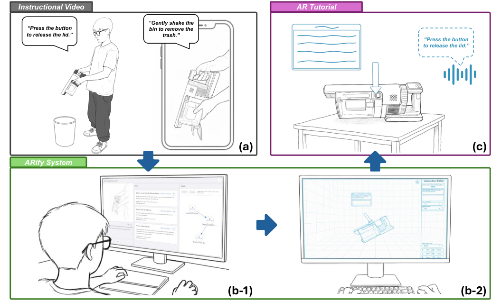


<!-- Start of picture text -->
Instructional Video  AR Tutorial<br>“Gently shake the<br>“Press the button bin to remove the<br>to release the lid.” trash.”<br>“Press the button<br>to release the lid.”<br>(a) (c)<br>ARify System<br>(b-1) (b-2)<br><!-- End of picture text -->

**Figure 1: Overview of ARify. (a) A user records a narrated instructional video demonstrating how to empty a vacuum bin. (b-1) ARify extracts an initial AR tutorial structure for review and step refinement in the** **_Tutorial Structure Editor_ . (b-2) In the** **_AR Editor_ , the user positions and configures AR representations for each step. (c) One step of the resulting AR tutorial rendered on the physical vacuum. This step contains a text box, a direction indicator, and a text-to-speech voice prompt. (The images were transferred to sketch style via Gemini Nano Banana [24])** 

procedural tasks, such as quantitative details and higher-level reasoning. These elements are more naturally communicated through narration: in tutorial videos, for example, instructors frequently supplement demonstrations with synchronized explanations of goals, conditions, or quality criteria to improve clarity and interpretability. Motivated by this, prior work has explored incorporating narrative demonstration in AR tutorial authoring. For instance, TutorialLens [42] captures both actions and verbal explanations to generate visual AR guidance, and InstruMentAR [50] synchronizes physical demonstrations with narration to create more expressive AR tutorials. Results demonstrated that authoring with narrative demonstrations enables more comprehensive and interpretable guidance. However, despite reducing programming effort, these methods impose additional requirements for AR authoring expertise. As a result, creating AR tutorials remains largely limited to experienced AR developers, leaving domain experts with procedural knowledge— such as assembly technicians, repair professionals, or chefs—facing significant barriers to entry. 

To broaden access for non-AR creators, recent research [5, 38, 43, 57, 78, 79, 93] has explored automatic approaches for generating 

AR tutorials. These systems typically transform structured, taskspecific resources (e.g., technical documents or manuals) into AR representations through predefined rules or pipelines. For instance, Mohr et al. [57] generate 3D animations directly from product documentation based on annotated explosion diagrams. However, such rule-based systems are usually tailored to specific use scenarios and input formats, making them difficult to generalize across tasks and contexts, and thereby limiting their broader applicability. 

The emergence of large language models (LLMs) has shown promising capabilities for creating AR tutorials. Leveraging their reasoning and planning abilities, recent system [101] move beyond rigid rule-based pipelines and generate AR guidance in real-time based on user queries. LLMs have also been used to derive multi-step learning experiences directly from videos [47]. Video large language models demonstrate procedural understanding and reasoning from visual input [75, 82, 87, 98]. Motivated by these capabilities, we propose generating AR tutorials from narrated instructional videos, the widely used format to present both physical demonstration and narrated instructional intent. 

We introduce ARify, an authoring system that semi-automatically transforms narrated instructional videos into AR tutorials. To guide

<!-- Page 3 -->

CHI ’26, April 13–17, 2026, Barcelona, Spain 

ARify 

system design, we conducted a content analysis of instructional videos to examine how AR tutorials can be generated from instructional videos and derived a corresponding design space. With ARify, the user records a narrated instructional video (Figure 1a). Based on our design space, a **Tutorial Planner** automatically infers a tutorial structure using a vision-language model (VLM), Gemini 2.5 Flash [25], which the user verifies and edits in the **Tutorial Structure Editor** (Figure 1b-1). The validated structure is passed to the **AR Builder** to configure AR representations. The user can further refine spatial placement and parameter values of the generated AR tutorial in the **AR Editor** (Figure 1b-2). Finally, the completed AR tutorial is deployed to an AR headset for learning (Figure 1c). To evaluate the effectiveness of ARify, we first conducted a numerical study on three machine tasks. The results validate the design of ARify and demonstrate its promising and consistent performance in AR tutorial creation across task types. To further assess usability, we conducted a user study with 18 participants. Findings indicated that ARify lowers the entry barrier for AR tutorial creation and enables novice users to author effective tutorials. Together, these results demonstrate the effectiveness, generalizability, and usability of ARify in assisting users to create AR tutorials. We report both quantitative and qualitative findings and discuss their implications for the design of AR tutorials. 

In summary, we highlight three contributions: 

- A design space of instructional tactics in procedural task video tutorials and their corresponding modes of representation in AR tutorials. 

- ARify, a VLM-based authoring system that semi-automatically processes video input to produce step-by-step AR tutorials. 

- A numerical study and a user study evaluating the effectiveness and usability of ARify in creating AR tutorials. 

## **2 Related Works** 

## **2.1 AR Tutorials** 

Augmented Reality is used in both non-procedural and procedural tasks to enhance training and learning. In non-procedural tasks, AR supports exploratory visualization by revealing internal or hidden structures [31], advances conceptual explanation by aligning exemplars to the body in creative and cosmetic domains [12, 83], and enables situated visualization that facilitates spatial reasoning in educational activities [37, 51, 52]. Modality choices vary with activity type in interactive experiences, where text, diagrams, and spatial overlays show task-dependent effectiveness [41]. Non-procedural training systems also integrate adaptive feedback, for example, combining AR guidance with physiological signals to adjust practice difficulty during music learning [53]. 

In procedural tasks such as cooking and machine operation, AR tutorials exhibit two design requirements. First, instructions are situated at the locus of action, as seen in appliance manuals and mobile overlays [59], field construction workflows [11], vehicle automation onboarding [15], and cooking assistants embedded in the workspace [23]. Even with conventional media, placing pictures or videos at task-relevant locations strengthens the binding between instruction and action [26, 97]. Second, procedural work demands step-wise sequencing in which operators follow a prescribed order to complete the task; such sequencing appears in mobile manuals 

[59], construction practice [11], self-guided fabrication curricula [45], laboratory instrumentation [22], and physical skill training [40, 70]. Our goal is to develop an authoring system that enables users to create AR tutorials for procedural tasks. 

## **2.2 Authoring Systems for AR Tutorials** 

Conventional AR tutorial authoring typically occurs in desktop game engines, where creators must hand-build multi-step behaviors such as tutorial logic, spatial content placement, and mappings between triggers and actions. This workflow raises the barrier for non-programmers and remains time-consuming even for experienced developers. Prior work has sought to lower this barrier through two main approaches: **demonstration-based authoring** and **rule-based generation** . 

**Demonstration-based authoring:** Demonstration is a common strategy for making spatial content without heavy programming. Systems capture an expert’s performance and let authors place or refine AR content around that performance. In-situ and mobile approaches project or replay demonstrations aligned to the learner’s viewpoint [4, 29, 36], while proxy workflows let users create in a virtual replica and export placements to the real scene [16, 65]. Concurrent authoring captures steps as the task is performed, composing videos, text, images, and animations into portable instructions [89]. Recording narration alongside action improves interpretability and preserves explanations [33, 42, 50]. Other systems also broaden input modalities by augmenting paper-based materials with spatial media [67] and by supporting maintenance authoring through spatial annotations and remote collaboration [63]. These systems yield precise, scene-grounded placement and clear exemplars of hand–object relations. However, they still assume AR authoring expertise and require in-situ or proxy sessions where creators manually configure step logic and UI placement. 

**Rule-based generation:** Rule-based generation methods alleviate authoring effort by automatically translating structured resources into AR tutorials, leveraging predefined pipelines or schemas to extract and present procedural instructions. PaperToPlace lifts steps from documents and optimizes their placement in the environment [5]. Documentation- and CAD-driven tools convert diagrams and models into interactive instructions [57] and integrate recognition to reduce assembly errors [43]. Captureheavy approaches record multimodal traces and segment them into steps [78], while model-free methods use volumetric change to extract tabletop procedures directly from demonstrations [79]. Videobased approaches generate avatar or animation surrogates from 2D footage [38, 93], including medical training where hand motion is reconstructed from RGB [20]. These approaches broaden access and can standardize layouts, but they often depend on formalized inputs or constrained mappings and tend to under-specify kinematics or the object-centric parameters needed for robust placement. Even when videos and narrations are used, the goal is typically to _record and replay_ a performance rather than to _induce a tutorial structure_ suitable for AR tutorials. 

We target _automatic generation of AR tutorials directly from narrated instructional video_ , mitigating reliance on structured inputs and minimizing manual placement. In contrast to rule-based pipelines, including video-conditioned variants that reconstruct

<!-- Page 4 -->

CHI ’26, April 13–17, 2026, Barcelona, Spain 

Hu, Zhu, and Hsia, et al. 

motions or avatars, we treat video as an input for inducing a _tutorial structure_ and for configuring _AR representations_ . This preserves the concreteness and scene grounding of demonstration-based approaches without prolonged capture and editing, while avoiding the formal-asset dependencies and template mappings typical of rule-based systems. 

## **2.3 LLMs for Tutorial and Guidance** 

Benefiting from their strong reasoning and planning capabilities, LLMs have been widely applied across a variety of domains and tasks [3, 17–19, 32, 91], including interactive tutorials and guidancerelated scenarios. In the following, we first review works that leverage LLMs for tutorial generation, then discuss systems that provide in-situ AR guidance, and finally examine approaches that apply LLMs to video-based QA and procedural reasoning. 

**Tutorial generation.** Several systems show that VLMs can reorganize raw tutorial footage into structured learning artifacts for web or desktop consumption. VideoMix aggregates multiple sources into concise summaries and representative clips using a VLM pipeline [95]. For software learning, AQuA links visual anchors in videos with documentation and GPT-based analysis to answer task questions over long screencasts [96]. Mixed-media creators assemble videos, images, text, and diagrams into coherent lessons using AI-based component extraction and layout heuristics [8]; related tools transform programming videos into mentored, step-wise experiences [47] or into interactive notes that preserve hierarchy and salient moments [103]. Collectively, these works demonstrate that VLMs can recover step structure, align narration with visual evidence, and produce concise textual guidance— capabilities that are essential for authoring. 

**In-situ AR guidance.** A complementary thread uses LLMs/VLMs to guide users during tasks without producing reusable, step-wise tutorials. Examples dynamically synthesize on-the-spot instructions and visual highlights from user prompts [101]. Systems that couple environmental context with generative models produce avatar-based instructions for in-situ learning [73]. While these approaches reduce programming effort and show that LLMs can mediate situated guidance, they typically optimize for immediate assistance rather than creating portable, step-wise artifacts with explicit progression and object-relative anchoring. 

**Video understanding.** Underlying the systems above are VLM capabilities for multi-step reasoning, temporal grounding, and concise summarization. For question answering and procedural reasoning, models combine clip-level captioning, hierarchical structures, chain-of-thought prompting, and spatiotemporal queries to improve long- and short-form inference [75, 82, 87, 98]. For grounding and alignment, methods improve temporal localization, step segmentation, and narration alignment through boundary-aware training, adaptive sampling, and modular reasoning [6, 7, 35, 102]. For captioning and summarization, approaches produce dense captions and fine-grained multimodal summaries that support retrieval and learning [9, 13, 34, 86]. Beyond visual frames, audio-visual LLMs fuse auditory and visual tokens for richer multimodal reasoning [76]. 

Motivated by evidence that VLMs can infer steps and align narration, and that LLM/VLM-guided AR can deliver timely situated 

cues, we further aim to enable users to create step-wise AR tutorials for procedural tasks. Rather than offering ad hoc assistance or producing non-AR study materials, we induce a _tutorial structure_ from the video and map inferred _instructional tactics_ to _AR representation_ . 

## **3 ARify Design Space** 

To understand how AR tutorials can be generated from instructional videos, we conducted a content analysis of video tutorials for procedural tasks to identify _instructional intents_ and _instructional tactics_ (i.e., atomic actions that convey instructional information), then mapped them to _AR representations_ . Our goal is to develop a design space that links (i) **what** instructors intend to communicate, (ii) **how** these intents are expressed in instructional videos (physically or narratively), and (iii) **how** they can be instantiated in AR to provide spatially and temporally aware guidance, to support generating AR tutorials from instructional videos. 

In the following subsections, we define the concept of a tutorial and introduce key terms to ensure conceptual consistency, describe our content analysis methods and the resulting design space, and conclude by outlining the design goals for ARify. 

## **3.1 Definition and Terminologies** 

Following prior work [61, 64, 88, 94], we define a tutorial as a hierarchical representation of _task_ → _step_ → _action_ , where a _step_ denotes a semantically coherent subgoal of the task, and an _action_ refers to an atomic operation performed to achieve a subgoal. Based on this definition, we present the key terminologies in Table 1, with particular emphasis on the action level, as it determines how detailed instructional intents can be conveyed in AR. We further formalize the relationships between terms to ensure clear conceptual understanding and consistency throughout the paper. 

- **R1. Structure orders steps.** A tutorial has one structure; the structure is an ordered list of steps with dependency links. 

- **R2. Steps culminate in subgoals.** Every step yields exactly one subgoal that is observable and serves as the completion criterion. 

- **R3. Steps contain actions.** Every step contains one or more actions; actions are either physical or verbal. 

- **R4. Tactics express actions.** Every action instance is communicated via exactly one tactic instance in context. 

- **R5. Intents motivate tactics.** Every tactic instance carries exactly one intent in our analysis. Across the corpus, tactic _types_ and intent _types_ exhibit many-to-many associations, but instance-wise associations are one-to-one. 

## **3.2 Methods** 

Following [94], we began our content analysis with iterative qualitative coding. The goal was to identify common _instructional tactics_ and the _instructional intents_ they serve. Building on these results, we curated AR representations for each instructional intent, informed by a literature review of prior AR tutorial research. This process enabled us to build a mapping from actions in instructional videos to AR representations, providing a foundation for the automatic generation of AR tutorials.

<!-- Page 5 -->

CHI ’26, April 13–17, 2026, Barcelona, Spain 

ARify 

**Table 1: Formal definitions of terms used throughout the paper.** 

|**Term**|**Definition**|
|---|---|
|**Tutorial**|Step-wise guidance for completing a procedural task; comprises an ordered sequence with progression and<br>dependencies.|
|**Tutorial** **structure**|The scaffold that organizes a tutorial: ordered steps, timing, referenced objects and tools, and prerequisite links.<br>Does not prescribe presentation style.|
|**Step**|A semantic container that groups several atomic actions toward an intermediate outcome. Steps are the unit<br>authors and learners reason about.|
|**Subgoal**|The intermediate state achieved at the end of a step, stated in observable terms that enable completion checks.|
|**Action**|The smallest task-relevant unit within a step. Either a _physical_ _manipulation_ with a clear start and end, or a _verbal_<br>_operation_ that confirms, checks, or plans a task condition.|
|**Instructional** **tactic**|How an action is communicated in context in the video or narration, such as demonstration, emphasis, warning,<br>or summary.|
|**Instructional** **intent**|The information a tactic aims to convey in context (e.g., target identity, path, quantity, rationale), independent of<br>how it is expressed.|
|**Narrated** **instructional** **video**|A recorded demonstration of a procedural task in which the presenter’s spoken narration, either live or post-<br>produced, explicitly guides the viewer through the steps, goals, and rationale of the procedure, with the narration<br>temporally aligned to the on-screen actions and objects.|


Given the large volume of video tutorials and the diversity of tasks they address, our analysis did not attempt to exhaustively cover all procedural domains. Instead, we focused on a representative domain— _Machine Tasks_ . _Machine tasks_ , such as _repair_ and _assembly_ , exemplify key characteristics of procedural activities, including multi-step structures and precise spatial operations. While they do not encompass all aspects of procedural tasks, we believe insights from this domain capture substantial characteristics and can inform the creation of diverse AR procedural tutorials. 

_3.2.1 Tutorial Collection._ We selected three representative _Machine Tasks_ — _Assembly_ , _Repair_ , and _Training_ —and collected video tutorials for analysis. These categories were chosen because they are among the most common machine tasks, generally follow clear step-by-step procedures, require substantial training to master, and consequently yield abundant tutorial content. 

To collect videos, we conducted keyword searches on YouTube using queries of the form _task name + "step-by-step tutorial"_ . We first filtered out videos shorter than 3 minutes or longer than 20 minutes, and those published before 2017 to ensure sufficient instructional content and contemporary task elements. We then applied three criteria: (1) the video presents a clear procedural goal with a stepwise structure, (2) information is primarily conveyed by narration (in English) and physical demonstration, rather than post-processed visual effects, and (3) the workspace and relevant objects are visible without severe occlusion. 

To balance coverage and consistency, we sampled 15 videos per task, resulting in 45 instructional videos for analysis. For each selected video, we used the Gemini APIs<sup>1</sup> to retrieve the transcript of the video via URL. The collected videos vary in both duration and object complexity, assessed by the number of object parts involved in the task, to ensure broad coverage. The detailed information 

of the collected videos can be found in Appendix A.3. As it is impractical to cover all possible videos, we believe deriving common characteristics from these representative samples provides a reasonable basis for a generalizable design space. 

_3.2.2 Investigating Instructional Cues and Intents._ To identify how instructors convey instructional intents in video tutorials, we conducted iterative qualitative open coding of the collected videos. 

To ensure the reliability of the findings, two of the authors performed the coding. Following common practices [10, 94], we first coded a shared seed set of videos (15 videos; 5 per category). We modeled each video tutorial as a hierarchical structure described in Sec. 3.1, and annotated each identified action with (i) the observable instructional tactic employed by the instructor and (ii) the instructional intent inferred from its context to surface the full range of instructional expressions in the corpus. At this stage, we also recorded short textual evidence (transcript snippets or frame notes) and allowed multi-label or “other” when necessary. 

Two coders then met for several rounds of discussion to compare their annotations, merge semantically similar codes, clarify category boundaries, and resolve ambiguous cases. Through this iterative process, we organized recurring tactic patterns into preliminary tactic categories and grouped related intents into broader intent categories. This stage produced the initial codebook, including category definitions, decision rules, and representative examples. 

Using the initial codebook, both coders independently annotated an additional subset of videos (6 videos; 2 per category) to assess the clarity and usability of the emerging scheme. We computed intercoder reliability using Krippendorff’s _𝛼_ over the tactic type assignments. Disagreements revealed ambiguous boundaries and underspecified definitions, which were resolved through discussion and revisiting the underlying videos and transcript segments until consensus was reached. These resolutions informed further refinement of code definitions, coding rules, and examples. We repeated this process (annotating a new subset and refining the 

1https://ai.google.dev/gemini-api/docs/video-understanding

<!-- Page 6 -->

CHI ’26, April 13–17, 2026, Barcelona, Spain 

Hu, Zhu, and Hsia, et al. 

codebook) until satisfactory reliability between coders (Krippendorff’s _𝛼 >_ 0 _._ 9) was reached on the annotated subset. The target reliability was achieved after three iterations, and the codebook was then finalized. 

AR representations can vary, ARify should support postgeneration editing. Users should be able to adjust tutorial structures, tactics, and AR representation forms. 

## **4 System** 

_3.2.3 Constructing AR Representations._ We next examined how the identified instructional intents could be instantiated in AR tutorials. To this end, we reviewed prior research on AR tutorials, analyzed their design strategies, and synthesized commonly used AR representations for conveying each intent. For instance, region highlights are frequently employed to disambiguate target parts, while arrows and trajectories are used to illustrate navigation paths. By systematically surveying existing systems, we compiled a set of candidate AR representations for each intent and organized them into a representational palette. 

By aligning instructional intents—identified in videos through tactics—with corresponding AR representations, we constructed a design space: a mapping of what instructors aim to communicate, how these intents are expressed in instructional videos, and how they can be effectively rendered in AR tutorials. 

## **3.3 Design Space** 

Through content analysis, we identified nine types of instructional tactics from video tutorials. Each tactic corresponds to a group of related instructional intents and is associated with several candidate AR representations. Based on the modality, we further categorized these tactics into two groups: movement-centric and narrationcentric. They result in four motion-centric tactics and five narrationcentric tactics. A visual overview of these tactics is presented in Figure 2, with their mappings to instructional intents and AR representations summarized in Table 2. 

By mapping instructional tactics to AR representations via their underlying instructional intents, this design space provides both a conceptual framework for analyzing video-based instruction and a practical foundation for the semi-automatic generation of AR tutorials. 

## **3.4 Design Goals** 

ARify aims to lower the barrier to AR tutorial creation by enabling its automatic generation from instructional videos. Grounded in this vision, and informed by the design space that links video elements to AR counterparts, we propose the following design goals for ARify: 

- **DG1: Video Analysis Capability.** ARify should be able to parse narrated instructional videos into hierarchical _task_ → _step_ → _action_ structures, while precisely capturing both movement- and narration-centric tactics expressed within each step. 

- **DG2: Automatic Creation of AR Content.** ARify should be able to map tactics identified in videos to their corresponding AR representations, configure them in a situated and step-wise structure, and generate AR tutorials that are ready for use. 

- **DG3: Controllability and Editability.** Since automatic generation may introduce errors and user preferences for 

We introduce ARify, an authoring system that transforms narrated instructional videos into AR tutorials. As summarized in Figure 3, ARify takes a user-recorded video as input and uses a **_Tutorial Planner_** to induce a tutorial structure with steps. For each step, the VLM assigns instructional tactics and, based on the design space in Section 3.3, recommends candidate AR representations consistent with the inferred tactic and intent. The user can edit and refine the generated tutorial structure at this stage using the **_Tutorial Structure Editor_** . After the structure is confirmed by the user, the **_AR Builder_** then invokes perception modules to set the parameters required by each AR representation in each step. The draft AR tutorial is then presented in **_AR Editor_** for preview and refinement of the placement and anchor of the AR representations. Finally, the AR tutorial can be exported to a target AR runtime system for deployment. 

We illustrate the workflow with a drill battery replacement task (Figure 3). First, a creator records an instructional video on replacing a battery, narrating live to explain each step as they perform it. Then, using _Tutorial Planner_ , ARify automatically segments the video into steps and atomic actions, identifies the instructional intent per action, and proposes AR representations. For example, in the first step, the instructor explains that "we need to press the trigger of the drill because it can check if the battery is out of charge". The _Tutorial Planner_ labels the step as _rationale_ and recommends an AR text box that explains the reason. Once the structure is accepted or edited in the _Tutorial Structure Editor_ , ARify’s _AR Builder_ runs perception modules to estimate the necessary parameters that define the behavior of the AR representation. The creator previews the resulting AR tutorial in _AR Editor_ , makes final adjustments, and deploys the tutorial to a head-mounted display for on-device verification. 

## **4.1 Tutorial Planner** 

To achieve DG1, we orchestrate a VLM agent (Gemini 2.5 Flash [25]) to interpret a narrated instructional video and synthesize a _tutorial structure_ that decomposes the task into manageable subgoals and provides a basis for subsequent AR representation configuration. The planner combines _specification-based planning_ with _in-context learning_ to improve consistency and reduce variability across tasks. 

_4.1.1 Specification–based planning._ A structure specification provides a standardized template for the agent to plan tutorials, enabling systematic construction through slot-filling. Following Section 3.3, we define the template as shown in Table 3. 

_4.1.2 In-context Learning._ To improve planning reliability, the VLM is prompted with few-shot demonstrations that show _how_ to transform a narrated instructional video into a well-formed tutorial structure. Following prior work on demonstration-based parsing [72], each demonstration is an input–output pair: the input consists of a short video description with a transcript; the output is a structured plan that fills the specification from the above section. We

<!-- Page 7 -->

CHI ’26, April 13–17, 2026, Barcelona, Spain 

ARify 


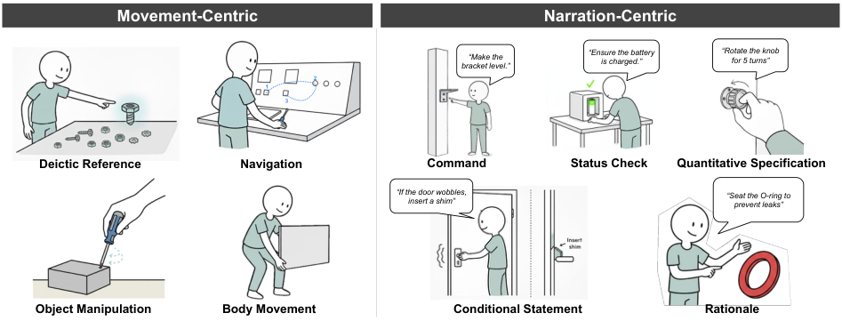


<!-- Start of picture text -->
Movement-Centric  Narration-Centric<br>bracket level.”“Make the  “Ensure the battery is charged.” “Rotate the knob for 5 turns”<br>2<br>1<br>3<br>Deictic Reference  Navigation  Command  Status Check  Quantitative Specification<br>“If the doorinsert a shim”wobbles,  “Seat the O-ring to prevent leaks”<br>Object Manipulation  Body Movement  Conditional Statement  Rationale<br><!-- End of picture text -->

**Figure 2: Instructional Tactics identified Through Content Analysis Process. (Images created with Gemini Nano Banana [24])** 

**Table 2: Design space of ARify: categories, tactics, intents, and candidate AR representations** 

|**Category**|**Tactic**|**Intent**|**AR** **Representations**|
|---|---|---|---|
|**Movement-centric**<br>**Instructional** **Tactic**|Deictic Reference|Disambiguate the target part or region and establish a shared<br>referent.<br>_E.g.,_ _point_ _at_ _the_ _M3_ _screw;_ _hover_ _and_ _tap_ _a_ _certain_ _slot;_ _trace_ _a_ _small_<br>_circle_ _around_ _the_ _alignment_ _tab._|_Region_ _Indicator_; _Text_ _Box_ (label); _Virtual_<br>_Object_ (pin/highlight)|
||Navigation|Convey path, order, and pace of motion relative to objects.<br>_E.g.,_ _trace_ _along_ _the_ _gasket_ _channel_ _A_→_B;_ _“left_ _hinge,_ _then_ _right_<br>_hinge”;_ _route_ _a_ _cable_ _through_ _clips._|_Direction_ _Indicator_ (arrow/path); _Virtual_<br>_Object_ (animated object); _Text-to-Speech_<br>(pace cues)|
||Object Manipulation|Model correct hand-object-tool relationships for control and safety.<br>_E.g.,_ _off-hand_ _clamps_ _the_ _housing_ _while_ _the_ _dominant_ _hand_ _turns_ _the_<br>_screwdriver;_ _show_ _a_ _pinch_ _grip;_ _support_ _the_ _workpiece_ _while_ _pulling_ _a_<br>_drill_ _trigger._|_Hand_ _Visualization_ (grasp/pose); _Virtual_<br>_Object_ (tool overlay); _Region_ _Indicator_<br>(contact zones)|
||Body Movement|Demonstrate ergonomic stance, posture, and approach directions.<br>_E.g.,_ _Square_ _stance_ _facing_ _the_ _vise;_ _elbows_ _in_ _when_ _lifting_ _a_ _panel;_<br>_approach_ _a_ _hot_ _surface_ _from_ _the_ _side._|_Direction_ _Indicator_ (approach direction);<br>_Video_ _Display_ (motion demo);<br>_Region_ _Indicator_ (keep-out region)|
|**Narration-centric**<br>**Instructional** **Tactic**|Command|Issue concise action commands tied to named objects or parts.<br>_E.g.,_ _“Align_ _the_ _bracket_ _with_ _the_ _stud”;_ _“Route_ _the_ _wire_ _under_ _the_ _clip”;_<br>_“Press_ _the_ _reset_ _button_ _once.”_|_Text_ _Box_;<br>_Text-to-Speech_|
||Status Check|Verify preconditions or hazard states before proceeding.<br>_E.g.,_ _“Ensure_ _the_ _valve_ _is_ _closed”;_ _“Confirm_ _the_ _battery_ _is_ _seated”;_<br>_“Power_ _off_ _the_ _machine.”_|_Region_ _Indicator_ (target state);<br>_Text_ _Box_ (checklist);<br>_Text-to-Speech_|
||Quantitative Specification|Provide numeric targets for extent, force, or duration.<br>_E.g.,_ _“Turn_ _the_ _knob_ _90_<sup>◦</sup>_”;_ _“Tighten_ _to_ _5_ _Nm”;_ _“The_ _monitor_ _should_<br>_show_ _5_ _s”_; “Fill to 200 mL.”|_Text_ _Box_ (numeric target);<br>_Virtual_ _Object_ (status of object);<br>_Image_ _Display_ (status of object);<br>_Text-to-Speech_|
||Conditional Statement|Encode next step based on sensed outcomes.<br>_E.g.,_ _“If_ _the_ _door_ _wobbles,_ _insert_ _a_ _shim”;_ _“If_ _the_ _seal_ _gaps,_ _re-seat_ _and_<br>_retighten”;_ _“If_ _the_ _LED_ _blinks_ _blue,_ _replace_ _the_ _battery.”_|_Text_ _Box_ (if–then prompt);<br>_Text-to-Speech_|
||Rationale|State goals and quality criteria to guide judgment.<br>_E.g.,_ _“Seat_ _the_ _O-ring_ _to_ _prevent_ _leaks”;_ _“Finish_ _flush_ _to_ _avoid_ _rocking”;_<br>_“Use_ _5_ _Nm_ _to_ _avoid_ _stripping_ _threads.”_|_Text_ _Box_ (explanation);<br>_Text-to-Speech_;<br>_Image/Video_ _Display_ (before-after<br>exemple)|


adopt six demonstrations drawn from the video dataset collected in Section 3.2, selected to cover all three types of machine tasks. An example can be found in Appendix A.2. 

To keep segmentation consistent across tasks, the prompt also encodes simple boundary cues that mirror how instructors structure demonstrations: (i) _subgoal_ completion, where a meaningful intermediate state is reached; (ii) _object or tool switch_ , which typically marks a new unit of work; and (iii) _discourse markers_ in narration, such as “next,” “then,” or “now”. The model is guided 

toward moderate granularity, with a heuristic target of roughly 1–5 atomic actions per step. The combination of few-shot structure templates and boundary cues leads the agent to propose tutorial structures that are both readable and directly usable by subsequent AR representation configuration. The metaprompt can be found in Appendix A.1.

<!-- Page 8 -->

CHI ’26, April 13–17, 2026, Barcelona, Spain 

Hu, Zhu, and Hsia, et al. 


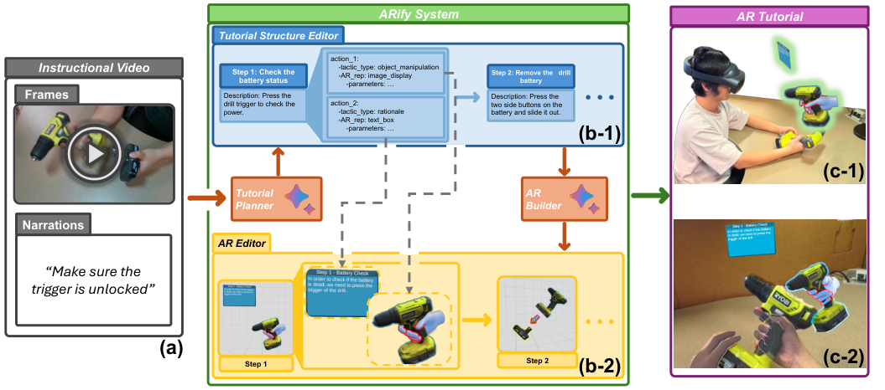


<!-- Start of picture text -->
ARify System  AR Tutorial<br>Tutorial Structure Editor<br>action_1:<br>Instructional Video  Step 1: Check the battery status  -tactic_type: object_manipulation -AR_rep: image_display -parameters: … Step 2: Remove the   drill battery<br>Frames  Description: Press the drill trigger to check the  action_2:  Description: Press the two side buttons on the  • • •<br>power.  -tactic_type: rationale  battery and slide it out.<br>-AR_rep: text_box<br>-parameters: … (b-1)<br>(c-1)<br>Tutorial  AR<br>Planner  Builder<br>Narrations<br>AR Editor<br>“Make sure the<br>trigger is unlocked”<br>• • •<br>(a)<br>Step 1  Step 2  (b-2)  (c-2)<br><!-- End of picture text -->

**Figure 3: ARify workflow. (a) A narrated instructional video is provided as input, including video frames and narration. (b-1) The** **_Tutorial Planner_ proposes an initial tutorial structure that the user inspects and refines in the** **_Tutorial Structure Editor_ . (b-2) After acceptance or revision, the** **_AR Builder_ configures AR representation based on the output of the tutorial structure editor, and the user can position and adjust them in the** **_AR Editor_ . (c) Deployed AR tutorial in the learner’s environment: (c-1) third-person view and (c-2) first-person view.** 

**Table 3: Unified format for** **_Step_ ,** **_Instructional Tactic_ , and** **_AR Representation_ .** 

|**Step**|**Tactic** **&** **AR** **Representation**|
|---|---|
|-**Start** **/** **End** **time**: timestamps in source video|**Tactic**|
|-**Subgoal**: intermediate outcome of step|-**Type**: tactic category|
|-**Title**: concise description of the step|-**Start** **/** **End** **time**: within-step timestamps|
|-**Objects**: key entities in the step|-**Intent**: instructional intent|
|-**Dependencies**: prerequisite step indices|-**Description**: how tactic is expressed|
|-**Instructional** **tactics**: tactics within this step||
|-**AR** **recommendations**: candidate AR items|**AR** **Representation**<br>-**Type**: AR representation type<br>-**Linked** **tactics**: tactic(s) it conveys<br>-**Behavior** **summary**: expected behavior + parameter<br>slots|


## **4.2 AR Builder** 

To achieve DG2, we curate a library of AR representations aligned with the instructional tactic taxonomy in Section 3.3. Given the accepted tutorial structure, the builder selects candidate representations per step, leveraging the tactic-intent-AR representation mapping, then configures their behavior by calling perception modules (e.g. object detection, hand pose estimation, details are provided in Section 5) to fill parameters. The result is a draft AR tutorial presented in the _AR Editor_ for refinement of placement, anchor, and content, after which the finalized package can be exported to the target runtime. 

Figure 4 shows the AR representation primitives implemented in our prototype. Below, we outline how each one conveys instructional tactics (Section 3.3) and when an author might choose it, together with its parameters. 

_Text Box._ Presents short directives, object-status checks, quantitative targets, or brief rationales. Parameters include the anchor entity, a title, and body text; the builder derives these from the step and tactic descriptions. 

_Image Display._ Shows a still reference frame highlighting a small feature or a before-and-after state. Parameters include the anchor entity, title, and image content. The builder selects the anchor and

<!-- Page 9 -->

CHI ’26, April 13–17, 2026, Barcelona, Spain 

ARify 


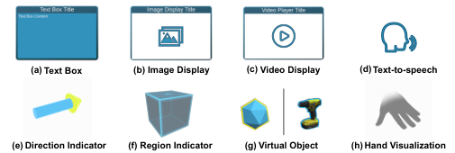


<!-- Start of picture text -->
(a) Text Box  (b) Image Display (c) Video Display (d) Text-to-speech<br>(e) Direction Indicator (f) Region Indicator (g) Virtual Object (h) Hand Visualization<br><!-- End of picture text -->

**Figure 4: AR Representations supported by ARify.** 

title; the content is a keyframe (start or end) chosen according to the tactic’s instructional intent. 

_Video Display._ Renders a short exemplar clip as picture-in-picture. Parameters include the anchor entity, title, and video segment. The builder selects the anchor and title; the segment is the portion of the video where the instructor performs the action. 

_Text-to-Speech._ Delivers brief narration that complements visuals for directives, quantitative specifications, or confirmations. Parameters include start delay (relative to step onset) and script content; the builder provides the script and proposes a delay. 

_Direction Indicator._ Displays an arrow to indicate a direction or location. Parameters include the tail anchor and the head anchor, both selected by the builder. 

_Region Indicator._ Highlights a salient area or target location relative to an anchor. Parameters include the anchor, pose (position and orientation), and size. The builder proposes the anchor and an initial pose and size, which the author later refines in the AR editor. 

_Virtual Object._ Provides a target pose to illustrate the goal configuration, acts as an authoring proxy for configuring AR elements anchored to it, or plays an animation of the object’s movement. Parameters include anchor (cannot be itself), pose (single or sequence), and mesh. The builder selects the anchor; the mesh is produced by segmenting the object in a keyframe and generating geometry via a diffusion model; the pose is estimated with an object-pose estimator. If the generated mesh is subpar, the system falls back to the default mesh shown on the left side of Figure 4g. 

_Hand Visualization._ Shows articulated hand pose or motion to model grasp and fine manipulations. Parameters include anchor and pose (single or sequence); the VLM defines the anchor, and a hand-pose estimator provides the pose. 

## **4.3 Authoring Interface** 

To meet DG3, _ARify_ provides two interfaces: (1) _Tutorial Structure Editor_ , which lets authors inspect and revise the tutorial structure and steer the _Tutorial Planner_ ; and (2) _AR Editor_ , which supports spatial placement, parameter adjustment, and preview of AR tutorial. 

_4.3.1 Tutorial Structure Editor._ The Tutorial Structure Editor presents the source video, transcript, step list, and a graph visualization of the tutorial structure in synchronized views (Figure 5). Authors may optionally supply a brief planning prompt to steer the planner (Figure 5a), then review proposed steps with timestamps, tactic 


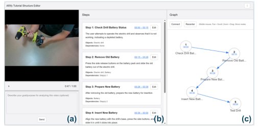


<!-- Start of picture text -->
(a) (b) (c)<br><!-- End of picture text -->

**Figure 5: Tutorial Structure Editor. (a) Video panel: drag and drop a clip, scrub and preview, optionally enter prompts, then submit to the VLM. (b) Step list: view, edit, add, or delete steps; adjust titles, descriptions, and time spans. (c) Step graph: visualize ordering and dependencies; reorder steps, create or remove dependency edges, and pan/zoom or recenter the layout.** 

labels, and referenced objects and tools (Figure 5b). In the list view (Figure 5b), authors can adjust start and end times on a timeline, revise step text, and rename objects or tools. In the graph view (Figure 5c), they can add or remove edges to specify dependencies. All edits update the tutorial structure immediately, and the editor presents the evidence supporting each step (keyframes and aligned narration spans). 


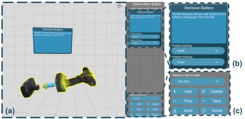


<!-- Start of picture text -->
(b)<br>(a) (c)<br><!-- End of picture text -->

**Figure 6: AR tutorial editor. (a) Main 3D view: navigate with keyboard/mouse, drag to reposition AR elements, and click an element to inspect and edit its parameters in context. (b) AR Representation editor: modify content and anchor. (c) Control panel: add or delete elements, move to previous/next step, save and export, or reset the tutorial to its pre-edit state.** 

_4.3.2 AR Editor._ The AR Editor loads the current draft tutorial into a 3D scene for spatial editing (Figure 6). For each step, authors can add or remove AR representations (Figure 6c), adjust placement using translation and rotation gizmos (Figure 6a), change anchors between head, object, and hand, and edit behavior parameters (Figure 6b). Authors can override any parameter and see the effect through step-wise playback, simple retargeting checks by moving objects within the scene, and optional preview on a head-mounted display (HMD).

<!-- Page 10 -->

CHI ’26, April 13–17, 2026, Barcelona, Spain 

Hu, Zhu, and Hsia, et al. 

## **4.4 Exported Tutorial Format** 

As shown in Figure 6, _ARify_ exports each tutorial as a Unity project artifact that can be previewed in the editor and built for runtime deployment. The artifact includes: 

- (1) a JSON _tutorial structure_ listing steps, concise descriptions, referenced objects and tools, tactic labels, and dependencies; 

- (2) instantiated _AR representations_ selected from our library (Figure 4), with parameter slots ready for runtime binding; 

- (3) media assets (keyframes and short clips) used by image and video displays. 

At runtime, the tutorial loads as a spatially grounded scene with explicit, user-advanced progression. Elements are anchored to objects, the head, or the hand as specified. When detection confidence is sufficient, object-locked elements attach to the corresponding parts or regions; otherwise, they will anchor to the head. Voice prompts mirror concise directives and numeric targets using a textto-speech service. Learners can step forward and backward and replay segments as needed. 

## **5 Implementation** 


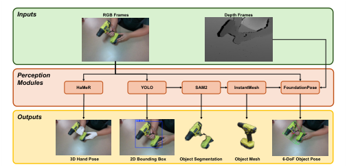


<!-- Start of picture text -->
Inputs RGB Frames  Depth Frames<br>Perception<br>Modules HaMeR  YOLO  SAM2  InstantMesh  FoundationPose<br>Outputs<br>3D Hand Pose  2D Bounding Box Object Segmentation  Object Mesh 6-DoF Object Pose<br><!-- End of picture text -->

**Figure 7: The** **_AR Builder_ perception module processes RGB and depth frames for a single step, using HaMeR [100] for 3D hand pose estimation, YOLO-World [90], SAM2 [69], and InstantMesh [92] for object detection, segmentation, and proxy mesh reconstruction, and FoundationPose [30] for estimating the 6-DoF object pose.** 

We deploy the AR tutorials on a Meta Quest Pro [54] HMD for rendering and interaction. A RealSense D435i [39] camera is mounted above the headset and is extrinsically calibrated to the Quest tracking space, providing RGB–D aligned to the headset frames. Heavy perception models and the web service run on a backend server with an NVIDIA A100 GPU. 

The runtime and spatial preview are built in Unity 2022.3.20f1 [84] with the Meta XR SDK [55] for passthrough and hand input. Voice prompts are produced via a text-to-speech service [56]. Tutorial Planner uses the Gemini 2.5 Flash [25] model (temperature=0 _._ 5, thinkingBudget=−1) to jointly analyze the video and its narration. For each action, the backend perception module takes the RGB and depth frames and processes them through the workflow shown in Figure 7, implemented as a FastAPI service [68]. For 3D hand pose estimation, we use HaMeR [100] on RGB input. For 3D object mesh and pose estimation, we adopt a pipeline inspired by Any6D [46]. 

YOLO-World [90] is first applied to the RGB frames for object detection, SAM2 [69] then segments the foreground object within each detected bounding box, and InstantMesh [92] reconstructs a proxy 3D mesh from the segmented object image. Finally, we feed the RGB frames, depth frames, and object mesh into FoundationPose [30] to estimate the 6-DoF object pose over the duration of the step. The resulting 3D hand pose, 3D object mesh, and 6-DoF object pose are passed to the AR Builder and used in the final deployment. On an A100 40 GB GPU server, the average inference times for a single 1280 × 720 image are 99.8 ms for YOLO, 412.7 ms for SAM2, 24.6 s for InstantMesh, 585 ms for FoundationPose, and 4.47 s for HaMeR. Over a 1,000 Mbps network connection, the average latency for Gemini to analyze the video is 31.9 s. 

## **6 Numerical Study** 

To quantitatively evaluate the performance of ARify, we conducted a numerical study to assess its ability to generate AR tutorials from instructional videos. In particular, we focused on planning performance, as it governs both the overall tutorial structure and the type and timing of tactic–AR representations. To enable a systematic and comprehensive assessment, we constructed an evaluation dataset by collecting and annotating additional instructional videos and quantitatively evaluated the system under different conditions. The following sections describe the dataset formation, evaluation procedures, and metrics, and present experimental results along with a discussion of the findings. 

## **6.1 Dataset Formation** 

Using the methods described in Sec. 3.2, we collected 36 additional instructional videos (12 Assembly, 12 Repair, and 12 Training) from YouTube. Three experienced AR researchers annotated the evaluation videos using the structured slot-filling template provided through an annotation interface. Annotators were instructed to annotate each video using the same hierarchy of _task_ → _step_ → _action_ , and labeled each action with the 9 tactics in our design space. Inter-rater reliability was assessed using Krippendorff’s _𝛼_ , and disagreements were resolved through discussion. The finalized annotations served as ground-truth (GT) structures against which system outputs were evaluated. In total, the dataset contained 2371 tactic annotations, with distribution statistics presented in Table 4. 

## **6.2 Procedure and Evaluation Metrics** 

_6.2.1 Evaluation Procedure._ To evaluate the proposed system, we conducted an ablation study together with a quantitative analysis of our implementation. As ARify uses few-shot demonstrations to enhance the LLM planner, we first examined the effect of demonstrations, following prior work [72, 104]. Specifically, we investigate two factors: (1) whether demonstrations are provided, and (2) the task type represented in them (assembly, repair, or training). To this end, we tested four conditions: _Zero-Shot_ , _Assembly-Only_ , _RepairOnly_ , and _Training-Only_ , each implemented with the same Tutorial Planner structure as ARify. In the _Zero-Shot_ condition, no demonstrations were supplied, whereas in the other three conditions, the LLM received six demonstrations (matching the number used in ARify) drawn from a single task category.

<!-- Page 11 -->

CHI ’26, April 13–17, 2026, Barcelona, Spain 

ARify 

**Table 4: Distribution of instructional tactics in the collected dataset.** 

We applied the following metrics to the matched tactics: 

- **Precision.** Precision measures how many predicted tactics are actually correct with respect to GT: 

|**Tactic**|**Total** **Count**|
|---|---|
|Deictic Reference|249|
|Navigation|155|
|Object Manipulation|706|
|Body Movement|117|
|Command|400|
|Status Check|178|
|Quantitative Specification|218|
|Conditional Statement|112|
|Rationale|236|
|**Total**|2371|


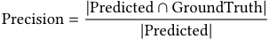


- **Recall.** Recall measures how many GT tactics are successfully predicted by the system: 


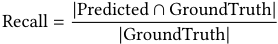


- **F1 Score.** The harmonic mean of precision and recall, reflecting their balance: 


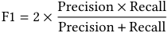


## **6.3 Results and Discussion** 

In addition, to comprehensively evaluate both performance and generalizability of ARify, we quantitatively examined it along two dimensions: 

- _Task Types (T)_ : Performance was evaluated separately for assembly, repair, and training tasks to measure generalizability across procedural contexts. 

- _Instructional Tactics (A)_ : Results were analyzed for the nine demonstration tactics defined in our design space to assess consistency across different instructional intents. 

_6.2.2 Metrics._ To assess whether the system can generate AR tutorials in a robust and accurate manner, we evaluate performance at both the task and tactic levels. This includes examining the correctness of overall tutorial structures as well as the fidelity of instructional tactics. To evaluate overall structures, we use: 

- **Sequence Accuracy.** To evaluate whether the overall tutorial structure of a task is correctly recognized, we compute sequence-level accuracy based on the longest common subsequence (LCS) between the predicted and ground-truth tactic orders. It is defined as: 


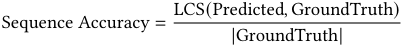


This metric captures overall planning quality, penalizing missing, extra, or misclassified tactics while respecting temporal order. 

To evaluate performance at the tactic level, we first align predicted tactics from the system with GT using a one-to-one matching scheme. Specifically, we denote each tactic as a tuple ( _𝑡_ start _, 𝑡_ end _,_ tactic). Then, we construct a bipartite graph where an edge connects a predicted tactic _𝑝_ and a GT tactic _𝑔_ if their temporal IoU: 


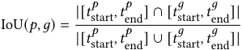


exceeds a threshold _𝜏_ (we use _𝜏_ =0 _._ 3 by default), and their tactics match exactly. We then compute the maximum-cardinality matching via the Hungarian algorithm [60]. 

_6.3.1 Effect of Few-Shot Demonstrations._ We first examined whether supplying demonstrations improves performance by comparing both ARify and the task-only configurations against the _Zero-Shot_ condition across all task instances (Table 5). Paired tests showed that all few-shot configurations, regardless of the task type represented in the demonstrations, significantly outperformed _Zero-Shot_ on every metric (all p < 0.001). Importantly, task-only demonstrations also yielded substantial gains even when their task type differed from the target task, indicating that the procedural patterns encoded in the demonstrations transfer across task boundaries. These findings confirm that providing few-shot guidance is broadly beneficial and that the procedural structures in our design support cross-task generalization rather than being restricted to a single domain. 

We next investigated how the task type represented in the demonstrations affects this improvement. For each target instance, we compared ARify (6 demonstrations, 2 per task) with task-only conditions (6 demonstrations, task-exclusive). Task-matched demonstrations produced slightly higher within-task scores on average, but these differences were small and not statistically significant (all p > 0.05), suggesting that simply adding more same-task examples does not meaningfully improve in-domain performance. In contrast, on non-matched tasks, the task-only conditions resulted in significantly lower performance than ARify (all p < 0.01). This shows that integrating demonstrations from multiple task types enhances the generality and robustness of the acquired procedural patterns without sacrificing in-domain accuracy, making ARify’s multi-task demonstration strategy preferable in practice. 

_6.3.2 Performance Across Task Types._ We next examined whether these improvements varied across task types (Assembly, Repair, and Training). Because task types are independent groups, we employed the Kruskal–Wallis test to compare performance distributions. The results revealed no statistically significant differences across tasks for any evaluation metric (all _𝑝 >_ 0 _._ 4), and pairwise Mann–Whitney U tests confirmed this trend ( _𝑝_ adj ≥ 0 _._ 74). This suggests that ARify generalizes well across different procedural tasks without being biased toward a particular task scenario.

<!-- Page 12 -->

CHI ’26, April 13–17, 2026, Barcelona, Spain 

Hu, Zhu, and Hsia, et al. 

**Table 5: Performance across task types under different few-shot conditions (mean** ± **std). All few-shot configurations, including both task-only variants and ARify, significantly outperform the Zero-shot on every metric (all** _𝑝 <_ 0 _._ 001 **). Compared to task-only conditions, ARify attains similar within-task performance (no significant differences; all** _𝑝 >_ 0 _._ 05 **) but substantially higher performance on non-matched tasks (all** _𝑝 <_ 0 _._ 01 **).** 

|**Condition**|**Task**|**Sequence** **Acc.** ↑|**Precision** ↑|**Recall** ↑|**F1** ↑|
|---|---|---|---|---|---|
||Assembly|79.6 ± 12.3|80.0 ± 7.5|83.0 ± 7.9|80.7 ± 5.3|
|Zero-shot|Repair|77.3 ± 12.0|77.0 ± 8.7|75.0 ± 6.4|75.7 ± 6.8|
||Training|72.1 ± 8.1|82.0 ± 6.8|80.4 ± 6.9|81.4 ± 6.3|
||Average|76.3 ± 11.4|80.5 ± 6.9|78.9 ± 6.3|79.6 ± 5.9|
||Assembly|90.2 ± 7.9|91.9 ± 3.9|88.7 ± 7.3|89.9 ± 4.5|
|Assembly-only|Repair|83.5 ± 10.3|84.2 ± 5.5|81.6 ± 4.6|82.4 ± 5.1|
||Training|79.6 ± 7.6|88.7 ± 3.9|84.1 ± 6.0|85.4 ± 4.7|
||Average|84.4 ± 9.7|88.0 ± 4.9|85.7 ± 5.8|86.7 ± 5.1|
||Assembly|84.4 ± 10.5|87.9 ± 4.5|86.0 ± 8.4|86.3 ± 5.0|
|Repair-only|Repair|90.5 ± 8.6|89.3 ± 4.9|87.9 ± 5.2|88.3 ± 4.7|
||Training|80.4 ± 7.4|89.1 ± 4.3|83.3 ± 6.6|85.3 ± 5.3|
||Average|85.1 ± 9.9|88.2 ± 4.9|86.0 ± 6.0|87.1 ± 5.0|
||Assembly|84.9 ± 9.2|87.0 ± 4.2|86.0 ± 7.6|85.8 ± 4.6|
|Training-only|Repair|84.1 ± 10.8|83.9 ± 5.6|81.5 ± 6.6|82.2 ± 5.6|
||Training|88.0 ± 6.8|92.6 ± 3.3|87.7 ± 6.0|89.1 ± 4.6|
||Average|85.7 ± 9.3|87.7 ± 5.2|85.7 ± 6.1|86.6 ± 5.3|
||Assembly|89.2 ± 8.1|91.6 ± 4.0|88.6 ± 7.5|89.7 ± 4.7|
|ARify|Repair|90.2 ± 9.2|88.7 ± 5.1|87.5 ± 5.1|87.7 ± 4.5|
||Training|86.9 ± 6.9|92.4 ± 3.5|87.4 ± 6.0|88.9 ± 4.8|
||Average|88.8 ± 8.2|90.9 ± 4.5|89.5 ± 4.7|90.1 ± 4.1|


_6.3.3 Performance Across Tactics._ At the tactic level (Table 6), although our system achieved strong performance across all tactics (all Precision, Recall, and F1 scores above 80), Friedman tests revealed statistically significant differences across instructional tactics in Recall ( _𝑝_ = 2 _._ 4 × 10<sup>−4</sup> ) and F1 ( _𝑝_ = 6 _._ 2 × 10<sup>−4</sup> ), but not in Precision ( _𝑝_ = 0 _._ 37). Post-hoc Wilcoxon signed-rank tests further indicated that _Object Manipulation_ significantly outperformed most other tactics ( _𝑝 <_ 0 _._ 01). 

_6.3.4 Discussion._ Taken together, these findings provide a holistic evaluation of ARify. The significant improvements over other conditions confirm that the system designs of ARify are effective in tutorial planning. The consistent performance across different task types demonstrates robustness and generalizability, while tacticlevel differences highlight the limitations of the system. Overall, 

these results indicate that ARify can serve as a broadly applicable framework for AR tutorial generation, balancing global structural coherence with local instructional detail. 

## **7 Usability Study** 

We conducted an IRB-approved usability study to evaluate the usability and authoring experience of ARify. We recruited 18 participants (10 male, 8 female), aged 20–40 years (M=27.56, SD=5.17), to evaluate our system. Fifteen participants reported prior experience with machine-related tasks, whereas three had no such background. Of the fifteen participants with prior experience, eleven primarily performed very simple tasks (e.g., assembling furniture, changing a light bulb); three reported regularly performing tasks of moderate complexity (e.g., bike repair, computer hardware assembly); and

<!-- Page 13 -->

CHI ’26, April 13–17, 2026, Barcelona, Spain 

ARify 

**Table 6: Performance of ARify across tactics (mean** ± **std). Significant overall differences were found in Recall and F1 (Friedman test,** _𝑝 <_ 0 _._ 001 **).** 

|**Tactic** **Category**|**Instructional** **Tactic**|**Precision** ↑|**Recall*** ↑|**F1-Score*** ↑|
|---|---|---|---|---|
||Deictic Reference|88.4 ± 12.4|82.2 ± 15.8|84.3 ± 12.5|
|**Movement-centric**|Navigation|87.9 ± 9.9|83.2 ± 12.1|84.6 ± 6.6|
||Object Manipulation|92.3 ± 9.5|96.0 ± 5.8|93.9 ± 7.0|
||Body Movement|87.4 ± 20.0|81.4 ± 13.4|85.2 ± 9.0|
||Command|93.6 ± 9.7|88.8 ± 21.1|91.4 ± 11.9|
||Status Check|94.1 ± 11.0|94.4 ± 13.1|93.6 ± 10.9|
|**Narration-centric**|Quantitative Specification|85.5 ± 11.1|84.9 ± 11.5|84.5 ± 8.5|
||Conditional Statement|92.1 ± 10.8|84.6 ± 17.1|86.5 ± 11.4|
||Rationale|95.3 ± 8.6|90.0 ± 13.2|91.8 ± 9.3|


one was a professional technician experienced in troubleshooting and resolving highly complex machine tasks. Fourteen participants were familiar with AR applications on smartphones, tablets, or headmounted displays, while the remaining four had no prior exposure to AR/VR technologies. None of the participants had previously developed AR/VR applications. Two of the participants had prior training on developing software applications on desktop/mobile platforms, while the others had no such experience or training. 

## **7.1 Procedure** 


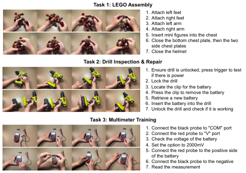


<!-- Start of picture text -->
Task 1: LEGO Assembly<br>1. Attach left feet<br>2. Attach right feet<br>3. Attach left arm<br>4. Attach right arm<br>5. Insert mini figures into the chest<br>6. Close the bottom chest plate, then the two<br>side chest plates<br>7. Close the helmet<br>Task 2: Drill Inspection & Repair<br>1. Ensure drill is unlocked, press trigger to test<br>if there is power<br>2. Lock the drill<br>3. Locate the clip for the battery<br>4. Press the clip to remove the battery<br>5. Retrieve a new battery<br>6. Insert the battery into the drill<br>7. Unlock the drill and check if it is working<br>Task 3: Multimeter Training<br>1. Connect the black probe to "COM" port<br>2. Connect the red probe to "V" port<br>3. Check the voltage of the battery<br>4. Set the option to 2000mV<br>5. Connect the red probe to the positive side<br>of the battery<br>6. Connect the black probe to the negative<br>7. Read the measurement<br><!-- End of picture text -->

**Figure 8: Step-by-step procedures of the three machine tasks in the user study.** 

Before starting, participants were informed of the study objectives and asked to sign a consent form. Each participant was then assigned two machine tasks, selected from three candidates: _LEGO Assembly_ , _Drill Inspection & Repair_ , and _Multimeter Training_ , and instructed to create AR tutorials for the assigned tasks using our system. This selection ensured that all three machine tasks were 

represented while providing opportunities to demonstrate the full range of instructional tactics and AR representations defined in our design space. Task assignments were randomized at the participant level and balanced across the study to ensure that each task was performed an equal number of times overall. For each task, participants first watched a pre-recorded tutorial video to ensure familiarity with the procedure. They then demonstrated the task on an office table, with the process recorded using a tabletop setup consisting of an Intel RealSense D435i camera for video capture and a fixed tabletop microphone for synchronized live narration audio. 

Following each task, participants completed a brief post-task questionnaire about their experience creating the AR tutorials. After the first task, they were given a five-minute break before proceeding to the next. At the end of the study, each participant was interviewed and completed the standard System Usability Scale (SUS) questionnaire. The entire study lasted approximately one hour, with each participant receiving a $20 e-gift card as compensation. 

**Task 1: LEGO Assembly.** This task involves assembling a LEGO model by following a set of step-by-step instructions. The primary goal is to test the participant’s ability to follow a procedural guide to construct an object from individual parts. 

**Task 2: Drill Inspection & Repair.** This task simulates a common maintenance procedure. The participant need to inspect a handheld power drill for specific issues, diagnose the problem, and then perform a repair. The objective is to evaluate the user’s ability to identify component faults and execute a sequence of diagnostic and repair steps. 

**Task 3: Multimeter Training.** This task focuses on training a user to operate a digital multimeter (DMM). Participants learn to use the device to measure electrical properties (e.g., voltage, current, and resistance). The goal is to assess how effectively the training method teaches the user to select the correct settings on the multimeter and properly position the probes to take accurate readings.

<!-- Page 14 -->

CHI ’26, April 13–17, 2026, Barcelona, Spain 

Hu, Zhu, and Hsia, et al. 

Step-by-step procedures of the three machine tasks are shown in Figure 8. 

## **7.2 Results** 

The Likert-scale results of the user study are summarized in Figure 9. Overall, users appreciated the system’s support for interpretability in transferring instructional videos into AR tutorials. They reported that the tutorial flow generated by the system was easy to follow and understand (Q1: AVG=4.50, SD=0.56): _“The generated tutorial steps were clear, and I could see exactly how they matched the video.” (P4)_ and valued the clarity of AR representations provided by the system (Q2: AVG=4.42, SD=0.75): _“The AR visualization made it obvious what each step meant—it’s much clearer than just text instructions.” (P2)_ . Users also admired that the AR previews provided on the authoring interface align well with the final output tutorials (Q3: AVG=4.36, SD=0.78), which gave them confidence during the creation process: _“When I previewed it, it looked almost the same as the final AR tutorial, so I knew exactly what to expect.” (P6)_ . Supported by the intuitive interface and a clear representation of tutorials, users found it easy to revise both the tutorial structure (Q4: AVG=4.25, SD=0.94) and detailed AR representations (Q5: AVG=4.33, SD=0.60) to fit their own preferences or correct mistakes: _“I could quickly adjust the steps when something was off, and the system updated everything smoothly.” (P7)_ 

For system performance, users acknowledged that the system is able to not only analyze instructional videos into meaningful tutorial structures (Q7: AVG=4.31, SD=0.70): _“It captured the main steps from the video very accurately, without me having to guide it much.” (P2)_ but also generate useful AR tutorials for the tasks accordingly (Q8: AVG=4.22, SD=0.79): _“The tutorial wasn’t just correct—it was actually practical and something I could use directly.” (P5)_ . As a result, most users reported satisfaction with the AR tutorials generated by the system (Q6: AVG=4.08, SD=0.99): _“The final tutorial looked polished and ready to use—it’s not something I’d expect from an automatic tool.” (P9)_ , demonstrating the system’s ability to generate high-quality, useful AR tutorials. 

In general, users emphasized that our system provided an intuitive method to create AR tutorials (Q9: AVG=4.61, SD=0.61), and lowered the learning curve and entry barrier for novice AR users (Q10: AVG=4.61, SD=0.61): _“You don’t need to be an expert in AR tools—just provide a video, and it creates the tutorial for you.” (P4)_ . For overall usability, the users reported an SUS score of AVG = 80.00 and SD = 14.85. This score indicates the high usability of the system. 

## **8 Limitations and Discussion** 

For the VLM, we observed failure cases where the model missegments long demonstrations into steps, conflates concurrent actions, or assigns incorrect tactics despite correctly transcribing the narration. For instance, when narrators combine rationale with commands (e.g., “now hold the bottom clip of the battery so the lock is released”), the VLM sometimes labels the entire segment as a single _command_ and omits the _rationale_ tactic. These errors propagate to later stages and result in tutorial structures with missing or redundant steps, or AR representations that are temporally misaligned with the underlying actions. Additionally, when a user makes a mistake and later corrects it during recording, the VLM tends to create additional steps for both the mistake and the correction under our current prompting configuration. This behavior reveals a limitation of our collected YouTube video dataset, where we implicitly assume that recorded demonstrations are error-free. In future work, more comprehensive in-the-wild evaluation with user-recorded videos will be valuable for refining how the VLM is configured to handle errors, corrections, and other natural variations in demonstrations. 

For the perception module, in tasks that involve small objects or densely packed components, object detection and pose estimation often struggle to provide sufficiently accurate anchor locations and orientations for AR representations. For example, in the multimeter training task from our user study, we observed that the probe wire is highly deformable and the probe body is thin, which causes the object mesh generation module to fail to reconstruct a reliable mesh for the probe, thus preventing downstream pose estimation. In such cases, the system only allows alternative AR representations that do not rely on object orientation and are anchored to other entities. Similarly, in scenes with multiple identical instances of an object (e.g., a grid of screws), even when the narrator verbally disambiguates the target (e.g., “the upper left screw”), the current perception module does not process the detailed descriptions and therefore cannot leverage these linguistic cues to select the correct instance. In such cases, the system may fail to reliably determine which part the AR representation should attach to, even when the VLM has inferred an appropriate tactic. 

These failure modes imply that the current implementation is most effective for tasks with large, well-separated objects, stable viewpoints, and relatively simple hand motions, and is less reliable for scenarios with dense clutter, heavy occlusion, tiny or visually similar parts, or subtle motor skills, where both the VLM and the perception modules are more likely to break down. We envision that as VLMs and other video understanding algorithms continue to advance—for instance, in accurately parsing tutorial hierarchies, object and body movements, and temporal coordination—these limitations will be reduced and the applicability of our system broadened. 

## **8.1 Instructional Video Understanding** 

Our system relies on a VLM to analyze instructional videos and generate tutorial structures, complemented by perception modules that extract necessary information to configure AR representations. Together, these components enable the system to integrate narration-centric tactics and movement-centric tactics into expressive tutorials. However, system performance is constrained by the limitations of current algorithms. 

## **8.2 Limitations in AR Representation** 

Based on the design space we derived from instructional videos, we reviewed prior AR tutorial work to identify representative AR representations commonly used to convey instructional intents. These representations are useful and can be combined to support diverse activities across tasks. Yet, the current selection of AR interface elements still represents only a limited subset of possible

<!-- Page 15 -->

CHI ’26, April 13–17, 2026, Barcelona, Spain 

ARify 


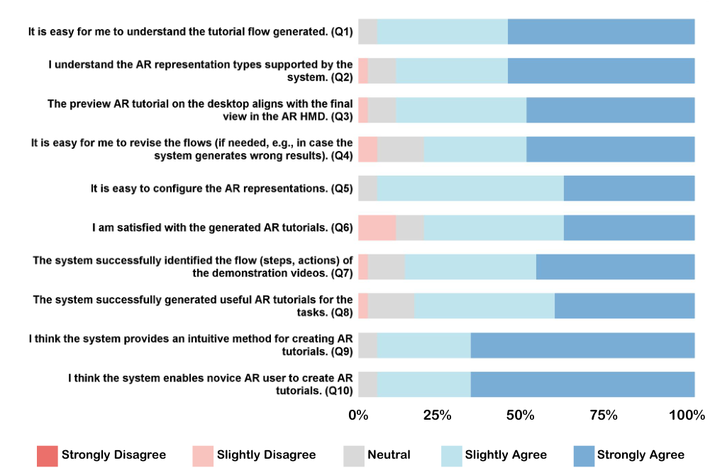


<!-- Start of picture text -->
0%   25%       50%           75%      100%<br>Strongly Disagree Slightly Disagree Neutral Slightly Agree Strongly Agree<br><!-- End of picture text -->

**Figure 9: User Study Likert-type questionnaire results.** 

informative primitives, and cannot fully capture specialized cases (e.g., rendering a whole-body ghost or simulating the rotation of a gear connection). While our study demonstrates the potential of transferring instructional videos into AR tutorials, a broader and more task-specific AR representation library would further enhance expressiveness and effectiveness, and better support professional applications [80]. 

## **8.3 Automation, Controllability, and Interpretability** 

Our system enables the automatic creation of AR tutorials from narrated instructional videos. Compared with prior approaches, this automation leverages richer input and produces more diverse and expressive tutorials, significantly reducing the effort required for authoring. However, automation also introduces challenges. LLM-based systems can make errors or hallucinate, leading to unexpected or unreasonable results [49, 99]. To mitigate this, our system provides a desktop interface that allows users to edit each element of the generated tutorials and a preview interface to help them interpret the output. Nevertheless, the tutorials may be complex in format and differ from real usage scenarios, making them difficult for novice users to refine [14] (e.g., adjusting spatial placement and timing can be cumbersome, and AR preview alone may not ensure proper alignment with real objects). 

Future work should investigate more intuitive workflows that support natural communication with the system, improving interpretability and controllability of outputs (e.g., through multi-modal communications) while preserving the benefits of automation, thus further lowering the barrier to entry. 

## **8.4 Extending Modalities Beyond Video** 

Instructional videos integrate physical demonstrations with narration, conveying nuanced motion, timing, and rationales of actions. While effective for procedural tasks, relying on videos alone can be limiting. Incorporating additional modalities may further enrich the workflow and enable higher-quality AR tutorials. On the input side, manuals provide detailed technical information such as warnings, troubleshooting steps, and operational constraints, offering a richer source than narration alone. For machine training tasks, including manuals in a form that can be visualized and animated alongside demonstrations, may enhance the professionalism and clarity of AR tutorials. On the output side, multimodal feedback such as haptic cues (e.g., vibration) can complement visual overlays, increasing immersion and reinforcing key actions [77]. By integrating such modalities, future systems could improve both the creation process for authors and the learning experience for end users.

<!-- Page 16 -->

CHI ’26, April 13–17, 2026, Barcelona, Spain 

Hu, Zhu, and Hsia, et al. 

## **8.5 Cross-Platform Adaptability** 

ARify currently generates AR tutorials primarily for AR-HMD deployment, which enables multi-modal interactions that increase immersion and enhance expressiveness. However, AR-HMD devices remain expensive and require cumbersome hardware setups, limiting accessibility and widespread adoption. Recent advances in mobile AR and lightweight AR frameworks have created new opportunities for tutorial delivery [1, 4]. Increasingly, AR tutorials are being deployed on smartphones and tablets, supporting flexible use across diverse environments such as factories, classrooms, and museums. This shift reflects a broader trend toward making AR technologies more portable, affordable, and easy to access. Although the current implementation of ARify produces AR-HMD-compatible tutorials, the underlying workflow and intermediate tutorial representation are platform-independent. With further development, ARify can be extended to support multiple AR platforms, broadening usage scenarios and enabling more flexible authoring and learning experiences. 

## **8.6 Generalizability Across Procedural Task Domains** 

In this paper, we chose machine tasks as a representative class of procedural tasks to explore how narrated instructional videos can be leveraged to create AR tutorials and to guide the design of ARify. Although machine tasks exhibit key characteristics of procedural activities such as multi-step structure and precise spatial manipulation, other procedural domains may introduce requirements that exceed the current system’s capabilities. For example, cooking tasks may require recognizing deformable materials, tracking subtle state transitions, and handling non-rigid tool–ingredient interactions, while sports training may require fine-grained body tracking and the analysis of temporally coordinated motions. These domain-specific characteristics lead to additional requirements on perception and AR representation (e.g., deformable-object understanding, motion-oriented overlays) that differ from machine tasks, and may call for evaluation protocols that combine structural correctness with human judgments of instructional clarity or learning outcomes. Thus, while ARify demonstrates promising performance on machine tasks, its generalizability to other procedural domains remains uncertain. Future work will examine these domains and explore how the framework can be adapted and expanded to support AR tutorial authoring more broadly beyond the machine-task setting. 

## **8.7 Ethical Considerations** 

We analyze publicly available instructional videos on YouTube only for formative research (coding and numerical analysis), referencing sources by YouTube IDs and operating on derived representations (e.g., transcripts, step plans, tactic labels). We do not download, store, or redistribute source video files. For demonstrations, fewshot prompting, and evaluation, we use original narrated instructional videos that we capture or provided by users. Our goal is to extract and abstract the underlying structure and components of how people teach procedural tasks, not to transform others’ works into new media artifacts or reproduce their content. 

We recognize that the use of generative AI for AR authoring could automate or compete with tutorial creators [28, 44, 74, 105]. Our intent is to augment creators by lowering production barriers and enabling new AR formats. Exploring the broader ethical implications of generative AI in AR tutorial creation is an important and promising direction for future work. 

## **9 Conclusion** 

We presented ARify, an authoring system that transforms narrated instructional videos into deployable AR tutorials by combining an automatic Tutorial Planner, interactive Tutorial Structure Editor, AR Builder, and AR Editor. Grounded in a content analysis of instructional videos, our design space guided the inference of tutorial structure and the mapping of instructional tactics to AR representations. Across three machine tasks, ARify outperformed a baseline on overall structure quality and tactic-level metrics, with consistent performance across tasks. A user study with 18 participants further showed that ARify lowers the entry barrier for AR tutorial creation and enables novices to author effective tutorials. We conclude by articulating four contributions: an automatic approach for AR tutorial creation from video, a design space connecting instructional tactics to AR representations, a VLM-based authoring workflow that produces stepwise AR content, and empirical evidence from numerical and user studies supporting effectiveness and usability. Together, we envision that these findings will provide a foundation for future AR tutorial systems that couple vision-language understanding with authoring tools to support scalable creation of procedural guidance. 

## **Acknowledgments** 

We wish to thank all the reviewers for their invaluable feedback. This work is partially supported by the NSF under the Future of Work at the Human-Technology Frontier (FW-HTF) 1839971 and NSF Partnerships for Innovation Technology Transfer (PFI-TT) 2329804. We also acknowledge the Feddersen Distinguished Professorship Funds. Any opinions, findings, and conclusions expressed in this material are those of the authors and do not necessarily reflect the views of the funding agency. 

## **References** 

- [1] João Alves, Bernardo Marques, Miguel Oliveira, Tiago Araújo, Paulo Dias, and Beatriz Sousa Santos. 2019. Comparing spatial and mobile augmented reality for guiding assembling procedures with task validation. In _2019 IEEE international conference on autonomous robot systems and competitions (ICARSC)_ . IEEE, 1–6. 

- [2] Jonas Blattgerste, Benjamin Strenge, Patrick Renner, Thies Pfeiffer, and Kai Essig. 2017. Comparing conventional and augmented reality instructions for manual assembly tasks. In _Proceedings of the 10th international conference on pervasive technologies related to assistive environments_ . 75–82. 

- [3] Andres M Bran, Sam Cox, Oliver Schilter, Carlo Baldassari, Andrew D White, and Philippe Schwaller. 2023. Chemcrow: Augmenting large-language models with chemistry tools. _arXiv preprint arXiv:2304.05376_ (2023). 

- [4] Yuanzhi Cao, Anna Fuste, and Valentin Heun. 2022. Mobiletutar: A lightweight augmented reality tutorial system using spatially situated human segmentation videos. In _CHI Conference on Human Factors in Computing Systems Extended Abstracts_ . 1–8. 

- [5] Chen Chen, Cuong Nguyen, Jane Hoffswell, Jennifer Healey, Trung Bui, and Nadir Weibel. 2023. PaperToPlace: Transforming Instruction Documents into Spatialized and Context-Aware Mixed Reality Experiences. In _Proceedings of the 36th Annual ACM Symposium on User Interface Software and Technology_ . 1–21. 

- [6] Shimin Chen, Xiaohan Lan, Yitian Yuan, Zequn Jie, and Lin Ma. 2024. Timemarker: A versatile video-llm for long and short video understanding

<!-- Page 17 -->

CHI ’26, April 13–17, 2026, Barcelona, Spain 

ARify 

with superior temporal localization ability. _arXiv preprint arXiv:2411.18211_ (2024). 

- [7] Yuxiao Chen, Kai Li, Wentao Bao, Deep Patel, Yu Kong, Martin Renqiang Min, and Dimitris N Metaxas. 2024. Learning to Localize Actions in Instructional Videos with LLM-Based Multi-Pathway Text-Video Alignment. In _European Conference on Computer Vision_ . Springer, 193–210. 

- [8] Yuexi Chen, Vlad I Morariu, Anh Truong, and Zhicheng Liu. 2024. TutoAI: a cross-domain framework for AI-assisted mixed-media tutorial creation on physical tasks. In _Proceedings of the 2024 CHI Conference on Human Factors in Computing Systems_ . 1–17. 

- [9] Yu-Tong Cheng, Jiaxin Wu, Zhixin Ma, Jiangshan He, Xiao-Yong Wei, and ChongWah Ngo. 2025. Interactive video search with multi-modal LLM video captioning. In _International Conference on Multimedia Modeling_ . Springer, 302–309. 

- [10] Bonnie Chinh, Himanshu Zade, Abbas Ganji, and Cecilia Aragon. 2019. Ways of qualitative coding: a case study of four strategies for resolving disagreements. In _Extended abstracts of the 2019 CHI conference on human factors in computing systems_ . 1–6. 

- [11] Ana Regina Mizrahy Cuperschmid, Marina Graf Grachet, and Márcio Minto Fabricio. [n. d.]. Augmented Reality as a Tutorial Tool for Construction Tasks. ([n. d.]). 

- [12] Dicksson Rammon Oliveira De Almeida, Paulo Abadie Guedes, Manoela Milena Oliveira da Silva, Andre Luiz Buarque Vieira e Silva, Joao Paulo Silva do Monte Lima, and Veronica Teichrieb. 2015. Interactive makeup tutorial using face tracking and augmented reality on mobile devices. In _2015 XVII Symposium on Virtual and Augmented Reality_ . IEEE, 220–226. 

- [13] Andong Deng, Zhongpai Gao, Anwesa Choudhuri, Benjamin Planche, Meng Zheng, Bin Wang, Terrence Chen, Chen Chen, and Ziyan Wu. 2025. Seq2time: Sequential knowledge transfer for video llm temporal grounding. In _Proceedings of the Computer Vision and Pattern Recognition Conference_ . 13766–13775. 

- [14] Andreas Dengel, Muhammad Zahid Iqbal, Silke Grafe, and Eleni Mangina. 2022. A review on augmented reality authoring toolkits for education. _Frontiers in Virtual Reality_ 3 (2022), 798032. 

- [15] Henrik Detjen, Robert Niklas Degenhart, Stefan Schneegass, and Stefan Geisler. 2021. Supporting user onboarding in automated vehicles through multimodal augmented reality tutorials. _Multimodal Technologies and Interaction_ 5, 5 (2021), 22. 

- [16] Paulo Dias, Bernardo Marques, Ivo Felix, and Beatriz Sousa Santos. 2025. Creating asynchronous Augmented Reality Instructions through a Virtual Reality Framework. In _2025 IEEE Conference on Virtual Reality and 3D User Interfaces Abstracts and Workshops (VRW)_ . IEEE, 1065–1071. 

- [17] Runlin Duan, Yuzhao Chen, Rahul Jain, Yichen Hu, Jingyu Shi, and Karthik Ramani. 2025. Canvas3D: Empowering Precise Spatial Control for Image Generation with Constraints from a 3D Virtual Canvas. _arXiv preprint arXiv:2508.07135_ (2025). 

- [18] Runlin Duan, Chenfei Zhu, Yuzhao Chen, Yichen Hu, Jingyu Shi, and Karthik Ramani. 2025. DesignFromX: Empowering Consumer-Driven Design Space Exploration through Feature Composition of Referenced Products. In _Proceedings of the 2025 ACM Designing Interactive Systems Conference_ . 1040–1060. 

- [19] Runlin Duan, Chenfei Zhu, Yuzhao Chen, Dizhi Ma, Jingyu Shi, Ziyi Liu, and Karthik Ramani. 2025. SketchConcept: Sketching-based Concept Recomposition for Product Design using Generative AI. _arXiv preprint arXiv:2508.07141_ (2025). 

- [20] Daniel Eckhoff, Christian Sandor, Christian Lins, Ulrich Eck, Denis Kalkofen, and Andreas Hein. 2018. TutAR: augmented reality tutorials for hands-only procedures. In _Proceedings of the 16th ACM SIGGRAPH International Conference on Virtual-Reality Continuum and its Applications in Industry_ . 1–3. 

- [21] Epic Games. 2025. Unreal Engine. https://www.unrealengine.com/en-US. [22] John Estrada, Sidike Paheding, Xiaoli Yang, and Quamar Niyaz. 2022. Deeplearning-incorporated augmented reality application for engineering lab training. _Applied Sciences_ 12, 10 (2022), 5159. 

- [23] Yalda Ghasemi, Allison Bayro, Justin MacDonald, Heejin Jeong, Joel Reynolds, and Chang S Nam. 2023. Embedding spatial augmented reality in culinary training: A comparative evaluation of sAR kitchen and video tutorials. _IEEE Transactions on Learning Technologies_ 17 (2023), 765–775. 

- [24] Google. 2025. Gemini Nano Banana. https://gemini.google/overview/imagegeneration/ 

- [25] Google DeepMind. 2024. Gemini 2.5 Flash Model. https://deepmind.google/ technologies/gemini/. 

- [26] Michihiko Goto, Yuko Uematsu, Hideo Saito, Shuji Senda, and Akihiko Iketani. 2010. AR-Based Supporting System by Overlay Display of Instruction Video. _Journal of the Institute of Image Electronics Engineers of Japan_ 39, 5 (2010), 631–643. 

- [27] Kristen Grauman, Andrew Westbury, Lorenzo Torresani, Kris Kitani, Jitendra Malik, Triantafyllos Afouras, Kumar Ashutosh, Vijay Baiyya, Siddhant Bansal, Bikram Boote, et al. 2024. Ego-exo4d: Understanding skilled human activity from first-and third-person perspectives. In _Proceedings of the IEEE/CVF Conference on Computer Vision and Pattern Recognition_ . 19383–19400. 

   - [29] Fengming He, Xiyun Hu, Jingyu Shi, Xun Qian, Tianyi Wang, and Karthik Ramani. 2023. Ubi Edge: Authoring Edge-Based Opportunistic Tangible User Interfaces in Augmented Reality. In _Proceedings of the 2023 CHI Conference on Human Factors in Computing Systems_ . 1–14. 

   - [30] Yisheng He et al. 2024. FoundationPose: Unified 6D Pose Estimation. arXiv:2403.12345 [cs.CV] 

   - [31] Mario Heinz, Sebastian Büttner, and Carsten Röcker. 2019. Exploring training modes for industrial augmented reality learning. In _Proceedings of the 12th ACM international conference on PErvasive technologies related to assistive environments_ . 398–401. 

   - [32] Sirui Hong, Mingchen Zhuge, Jonathan Chen, Xiawu Zheng, Yuheng Cheng, Jinlin Wang, Ceyao Zhang, Zili Wang, Steven Ka Shing Yau, Zijuan Lin, et al. 2023. MetaGPT: Meta programming for a multi-agent collaborative framework. In _The twelfth international conference on learning representations_ . 

   - [33] Xiyun Hu, Dizhi Ma, Fengming He, Zhengzhe Zhu, Shao-Kang Hsia, Chenfei Zhu, Ziyi Liu, and Karthik Ramani. 2025. GesPrompt: Leveraging Co-Speech Gestures to Augment LLM-Based Interaction in Virtual Reality. In _Proceedings of the 2025 ACM Designing Interactive Systems Conference_ . 59–80. 

   - [34] Hang Hua, Yunlong Tang, Chenliang Xu, and Jiebo Luo. 2025. V2xum-llm: Cross-modal video summarization with temporal prompt instruction tuning. In _Proceedings of the AAAI Conference on Artificial Intelligence_ , Vol. 39. 3599–3607. 

   - [35] Bin Huang, Xin Wang, Hong Chen, Zihan Song, and Wenwu Zhu. 2024. Vtimellm: Empower llm to grasp video moments. In _Proceedings of the IEEE/CVF Conference on Computer Vision and Pattern Recognition_ . 14271–14280. 

   - [36] Gaoping Huang, Xun Qian, Tianyi Wang, Fagun Patel, Maitreya Sreeram, Yuanzhi Cao, Karthik Ramani, and Alexander J Quinn. 2021. Adaptutar: An adaptive tutoring system for machine tasks in augmented reality. In _Proceedings of the 2021 CHI Conference on Human Factors in Computing Systems_ . 1–15. 

   - [37] Emin İbili, Mevlüt Çat, Dmitry Resnyansky, Sami Şahin, and Mark Billinghurst. 2020. An assessment of geometry teaching supported with augmented reality teaching materials to enhance students’ 3D geometry thinking skills. _International Journal of Mathematical Education in Science and Technology_ 51, 2 (2020), 224–246. 

   - [38] Keiichi Ihara, Kyzyl Monteiro, Mehrad Faridan, Rubaiat Habib Kazi, and Ryo Suzuki. 2025. Video2MR: Automatically generating mixed reality 3D instructions by augmenting extracted motion from 2D videos. In _Proceedings of the 30th International Conference on Intelligent User Interfaces_ . 1548–1563. 

   - [39] Intel. 2025. Intel® RealSense™ Depth Camera D435i - Product Specifications. https://www.intel.com/content/www/us/en/products/sku/190004/intelrealsense-depth-camera-d435i/specifications.html 

   - [40] Hye-Young Jo, Laurenz Seidel, Michel Pahud, Mike Sinclair, and Andrea Bianchi. 2023. Flowar: How different augmented reality visualizations of online fitness videos support flow for at-home yoga exercises. In _Proceedings of the 2023 CHI Conference on Human Factors in Computing Systems_ . 1–17. 

   - [41] Dominic Kao, Alejandra J Magana, and Christos Mousas. 2021. Evaluating tutorial-based instructions for controllers in virtual reality games. _Proceedings of the ACM on human-computer interaction_ 5, CHI PLAY (2021), 1–28. 

   - [42] Junhan Kong, Dena Sabha, Jeffrey P Bigham, Amy Pavel, and Anhong Guo. 2021. TutorialLens: authoring Interactive augmented reality tutorials through narration and demonstration. In _Proceedings of the 2021 ACM Symposium on Spatial User Interaction_ . 1–11. 

   - [43] Ze-Hao Lai, Wenjin Tao, Ming C Leu, and Zhaozheng Yin. 2020. Smart augmented reality instructional system for mechanical assembly towards workercentered intelligent manufacturing. _Journal of Manufacturing Systems_ 55 (2020), 69–81. 

   - [44] Joakim Laine, Matti Minkkinen, and Matti Mäntymäki. 2025. Understanding the ethics of generative AI: Established and new ethical principles. _Communications of the Association for Information Systems_ 56, 1 (2025), 7. 

   - [45] Vianney Lara-Prieto, Efraín Bravo-Quirino, Miguel Ángel Rivera-Campa, and José Enrique Gutiérrez-Arredondo. 2015. An innovative self-learning approach to 3D printing using multimedia and augmented reality on mobile devices. _Procedia computer science_ 75 (2015), 59–65. 

   - [46] Taeyeop Lee, Bowen Wen, Minjun Kang, Gyuree Kang, In So Kweon, and KukJin Yoon. 2025. Any6D: Model-free 6D Pose Estimation of Novel Objects. In _Proceedings of the Computer Vision and Pattern Recognition Conference_ . 11633– 11643. 

   - [47] Wengxi Li, Roy Pea, Nick Haber, and Hari Subramonyam. 2024. Tutorly: Turning programming videos into apprenticeship learning environments with llms. _arXiv preprint arXiv:2405.12946_ (2024). 

   - [48] Georgianna Lin, Jin Yi Li, Afsaneh Fazly, Vladimir Pavlovic, and Khai Truong. 2023. Identifying Multimodal Context Awareness Requirements for Supporting User Interaction with Procedural Videos. In _Proceedings of the 2023 CHI Conference on Human Factors in Computing Systems_ . 1–17. 

   - [49] Hanchao Liu, Wenyuan Xue, Yifei Chen, Dapeng Chen, Xiutian Zhao, Ke Wang, Liping Hou, Rongjun Li, and Wei Peng. 2024. A survey on hallucination in large vision-language models. _arXiv preprint arXiv:2402.00253_ (2024). 

- [28] Thilo Hagendorff. 2024. Mapping the ethics of generative AI: A comprehensive scoping review. _Minds and Machines_ 34, 4 (2024), 39.

<!-- Page 18 -->

CHI ’26, April 13–17, 2026, Barcelona, Spain 

Hu, Zhu, and Hsia, et al. 

- [50] Ziyi Liu, Zhengzhe Zhu, Enze Jiang, Feichi Huang, Ana M Villanueva, Xun Qian, Tianyi Wang, and Karthik Ramani. 2023. Instrumentar: Auto-generation of augmented reality tutorials for operating digital instruments through recording embodied demonstration. In _Proceedings of the 2023 CHI Conference on Human Factors in Computing Systems_ . 1–17. 

- [51] Dizhi Ma, Xiyun Hu, Jingyu Shi, Mayank Patel, Rahul Jain, Ziyi Liu, Zhengzhe Zhu, and Karthik Ramani. 2024. avattar: Table tennis stroke training with embodied and detached visualization in augmented reality. In _Proceedings of the 37th Annual ACM Symposium on User Interface Software and Technology_ . 1–16. 

- [52] Faraz Mahmood, Eitezaz Mahmood, Robert Gregory Dorfman, John Mitchell, Feroze-Udin Mahmood, Stephanie B Jones, and Robina Matyal. 2018. Augmented reality and ultrasound education: initial experience. _Journal of cardiothoracic and vascular anesthesia_ 32, 3 (2018), 1363–1367. 

- [53] Florian Maitz, Lucchas Ribeiro Skreinig, Denis Kalkofen, and Selina C Wriessnegger. 2023. Towards neuroadaptive augmented reality piano tutorials. In _2023 IEEE International Conference on Metrology for eXtended Reality, Artificial Intelligence and Neural Engineering (MetroXRAINE)_ . IEEE, 450–455. 

- [54] Meta. 2025. Meta Quest Pro Headset For Business. https://forwork.meta.com/ quest/quest-pro/ 

- [55] Meta Platforms. 2023. Meta XR SDK for Unity. https://developer.oculus.com/ downloads/package/meta-xr-sdk/. 

- [56] Meta Platforms. 2024. Wit.ai Speech-to-Text API. https://wit.ai/. 

- [57] Peter Mohr, Bernhard Kerbl, Michael Donoser, Dieter Schmalstieg, and Denis Kalkofen. 2015. Retargeting technical documentation to augmented reality. In _Proceedings of the 33rd Annual ACM Conference on Human Factors in Computing Systems_ . 3337–3346. 

- [58] Pedro Morillo, Inmaculada Garcia-Garcia, Juan M Orduna, Marcos Fernandez, and M Carmen Juan. 2020. Comparative study of AR versus video tutorials for minor maintenance operations. _Multimedia Tools and Applications_ 79, 11 (2020), 7073–7100. 

- [59] Lars Müller, Ilhan Aslan, and Lucas Krüßen. 2013. GuideMe: A mobile augmented reality system to display user manuals for home appliances. In _International Conference on Advances in Computer Entertainment Technology_ . Springer, 152– 167. 

- [60] James Munkres. 1957. Algorithms for the assignment and transportation problems. _J. Soc. Indust. Appl. Math._ 5, 1 (1957), 32–38. 

- [61] Megha Nawhal, Jacqueline B Lang, Greg Mori, and Parmit K Chilana. 2019. VideoWhiz: Non-Linear Interactive Overviews for Recipe Videos.. In _Graphics Interface_ . 15–1. 

- [62] Rohith Peddi, Shivvrat Arya, Bharath Challa, Likhitha Pallapothula, Akshay Vyas, Bhavya Gouripeddi, Qifan Zhang, Jikai Wang, Vasundhara Komaragiri, Eric Ragan, et al. 2024. CaptainCook4D: A dataset for understanding errors in procedural activities. _Advances in Neural Information Processing Systems_ 37 (2024), 135626–135679. 

- [63] Alexander Plopski, Varunyu Fuvattanasilp, Jarkko Poldi, Takafumi Taketomi, Christian Sandor, and Hirokazu Kato. 2018. Efficient in-situ creation of augmented reality tutorials. In _2018 Workshop on metrology for industry 4.0 and IoT_ . IEEE, 7–11. 

- [64] Suporn Pongnumkul, Mira Dontcheva, Wilmot Li, Jue Wang, Lubomir Bourdev, Shai Avidan, and Michael F Cohen. 2011. Pause-and-play: automatically linking screencast video tutorials with applications. In _Proceedings of the 24th annual ACM symposium on User interface software and technology_ . 135–144. 

- [65] Xun Qian, Fengming He, Xiyun Hu, Tianyi Wang, Ananya Ipsita, and Karthik Ramani. 2022. Scalar: Authoring semantically adaptive augmented reality experiences in virtual reality. In _Proceedings of the 2022 CHI Conference on Human Factors in Computing Systems_ . 1–18. 

- [66] Moritz Quandt and Michael Freitag. 2021. A systematic review of user acceptance in industrial augmented reality. In _Frontiers in education_ , Vol. 6. Frontiers Media SA, 700760. 

- [67] Shwetha Rajaram and Michael Nebeling. 2022. Paper trail: An immersive authoring system for augmented reality instructional experiences. In _Proceedings of the 2022 CHI conference on human factors in computing systems_ . 1–16. 

- [68] Sebastián Ramirez. 2018. FastAPI: Modern, Fast (High-performance), Web Framework for Building APIs with Python. https://fastapi.tiangolo.com/. 

- [69] Nikhila Ravi, Valentin Gabeur, Yuan-Ting Hu, Ronghang Hu, Chaitanya Ryali, Tengyu Ma, Haitham Khedr, Roman Rädle, Chloe Rolland, Laura Gustafson, et al. 2024. Sam 2: Segment anything in images and videos. _arXiv preprint arXiv:2408.00714_ (2024). 

- [70] Alessandra Semeraro and Laia Turmo Vidal. 2022. Visualizing instructions for physical training: Exploring visual cues to support movement learning from instructional videos. In _Proceedings of the 2022 CHI Conference on Human Factors in Computing Systems_ . 1–16. 

- [71] Fadime Sener, Dibyadip Chatterjee, Daniel Shelepov, Kun He, Dipika Singhania, Robert Wang, and Angela Yao. 2022. Assembly101: A large-scale multi-view video dataset for understanding procedural activities. In _Proceedings of the IEEE/CVF Conference on Computer Vision and Pattern Recognition_ . 21096–21106. 

- [72] Yongliang Shen, Kaitao Song, Xu Tan, Dongsheng Li, Weiming Lu, and Yueting Zhuang. 2023. Hugginggpt: Solving ai tasks with chatgpt and its friends in 

   - hugging face. _Advances in Neural Information Processing Systems_ 36 (2023), 38154–38180. 

- [73] Jingyu Shi, Rahul Jain, Seunggeun Chi, Hyungjun Doh, Hyung-gun Chi, Alexander J Quinn, and Karthik Ramani. 2025. CARING-AI: Towards Authoring Context-aware Augmented Reality INstruction through Generative Artificial Intelligence. In _Proceedings of the 2025 CHI Conference on Human Factors in Computing Systems_ . 1–23. 

- [74] Jingyu Shi, Rahul Jain, Hyungjun Doh, Ryo Suzuki, and Karthik Ramani. 2023. An HCI-centric survey and taxonomy of human-generative-AI interactions. _arXiv preprint arXiv:2310.07127_ (2023). 

- [75] Yudi Shi, Shangzhe Di, Qirui Chen, and Weidi Xie. 2025. Enhancing Video-LLM Reasoning via Agent-of-Thoughts Distillation. In _Proceedings of the Computer Vision and Pattern Recognition Conference_ . 8523–8533. 

- [76] Fangxun Shu, Lei Zhang, Hao Jiang, and Cihang Xie. 2023. Audio-visual llm for video understanding. _arXiv preprint arXiv:2312.06720_ (2023). 

- [77] Roland Sigrist, Georg Rauter, Robert Riener, and Peter Wolf. 2013. Augmented visual, auditory, haptic, and multimodal feedback in motor learning: a review. _Psychonomic bulletin & review_ 20, 1 (2013), 21–53. 

- [78] Lucchas Ribeiro Skreinig, Peter Mohr, Blanca Berger, Markus Tatzgern, Dieter Schmalstieg, and Denis Kalkofen. 2024. Immersive Authoring by Demonstration of Industrial Procedures. In _2024 IEEE International Symposium on Mixed and Augmented Reality (ISMAR)_ . IEEE, 1293–1302. 

- [79] Ana Stanescu, Peter Mohr, Dieter Schmalstieg, and Denis Kalkofen. 2022. Modelfree authoring by demonstration of assembly instructions in augmented reality. _IEEE Transactions on Visualization and Computer Graphics_ 28, 11 (2022), 3821– 3831. 

- [80] Ryo Suzuki, Rubaiat Habib Kazi, Li-Yi Wei, Stephen DiVerdi, Wilmot Li, and Daniel Leithinger. 2020. Realitysketch: Embedding responsive graphics and visualizations in AR through dynamic sketching. In _Proceedings of the 33rd Annual ACM Symposium on User Interface Software and Technology_ . 166–181. 

- [81] Keishi Tainaka, Yuichiro Fujimoto, Masayuki Kanbara, Hirokazu Kato, Atsunori Moteki, Kensuke Kuraki, Kazuki Osamura, Toshiyuki Yoshitake, and Toshiyuki Fukuoka. 2020. Guideline and tool for designing an assembly task support system using augmented reality. In _2020 IEEE international symposium on mixed and augmented reality (ISMAR)_ . IEEE, 486–497. 

- [82] Reuben Tan, Ximeng Sun, Ping Hu, Jui-hsien Wang, Hanieh Deilamsalehy, Bryan A Plummer, Bryan Russell, and Kate Saenko. 2024. Koala: Key frameconditioned long video-llm. In _Proceedings of the IEEE/CVF Conference on Computer Vision and Pattern Recognition_ . 13581–13591. 

- [83] Balasaravanan Thoravi Kumaravel, Cuong Nguyen, Stephen DiVerdi, and Björn Hartmann. 2019. TutoriVR: A video-based tutorial system for design applications in virtual reality. In _Proceedings of the 2019 CHI conference on human factors in computing systems_ . 1–12. 

- [84] Unity Technologies. 2024. Unity 2022.3.20f1 LTS. https://unity.com/releases/ editor/whats-new/2022.3.20. 

- [85] Jingying Wang, Jingjing Zhang, Juana Nicoll Capizzano, Matthew Sigakis, Xu Wang, and Vitaliy Popov. 2025. eXplainMR: Generating Real-time Textual and Visual eXplanations to Facilitate UltraSonography Learning in MR. In _Proceedings of the 2025 CHI Conference on Human Factors in Computing Systems (CHI ’25)_ . Association for Computing Machinery, New York, NY, USA, Article 422, 18 pages. doi:10.1145/3706598.3714015 

- [86] Yizhou Wang, Ruiyi Zhang, Haoliang Wang, Uttaran Bhattacharya, Yun Fu, and Gang Wu. 2023. Vaquita: Enhancing alignment in llm-assisted video understanding. _arXiv preprint arXiv:2312.02310_ (2023). 

- [87] Ziyang Wang, Shoubin Yu, Elias Stengel-Eskin, Jaehong Yoon, Feng Cheng, Gedas Bertasius, and Mohit Bansal. 2025. Videotree: Adaptive tree-based video representation for llm reasoning on long videos. In _Proceedings of the Computer Vision and Pattern Recognition Conference_ . 3272–3283. 

- [88] Sarah Weir, Juho Kim, Krzysztof Z Gajos, and Robert C Miller. 2015. Learnersourcing subgoal labels for how-to videos. In _Proceedings of the 18th ACM conference on computer supported cooperative work & social computing_ . 405–416. 

- [89] Matt Whitlock, George Fitzmaurice, Tovi Grossman, and Justin Matejka. 2020. AuthAR: concurrent authoring of tutorials for AR assembly guidance. In _Graphics Interface 2020_ . 

- [90] Zehao Wu, Xiang Li, Hao Zhang, and Dahua Lin. 2023. YOLO-World: Real-Time Open-Vocabulary Object Detection. arXiv:2304.00501 [cs.CV] https://arxiv.org/ abs/2304.00501 

- [91] Yuchen Xia, Manthan Shenoy, Nasser Jazdi, and Michael Weyrich. 2023. Towards autonomous system: flexible modular production system enhanced with large language model agents. In _2023 IEEE 28th International Conference on Emerging Technologies and Factory Automation (ETFA)_ . IEEE, 1–8. 

- [92] Zhiqin Xu et al. 2023. InstantMesh: Efficient 3D Mesh Generation from a Single Image. arXiv:2306.00969 [cs.CV] https://arxiv.org/abs/2306.00969 

- [93] Masahiro Yamaguchi, Shohei Mori, Peter Mohr, Markus Tatzgern, Ana Stanescu, Hideo Saito, and Denis Kalkofen. 2020. Video-annotated augmented reality assembly tutorials. In _Proceedings of the 33rd annual ACM symposium on user interface software and technology_ . 1010–1022.

<!-- Page 19 -->

CHI ’26, April 13–17, 2026, Barcelona, Spain 

ARify 

- [94] Saelyne Yang, Sangkyung Kwak, Juhoon Lee, and Juho Kim. 2023. Beyond Instructions: a taxonomy of information types in how-to videos. In _Proceedings of the 2023 CHI Conference on Human Factors in Computing Systems_ . 1–21. 

- [95] Saelyne Yang, Anh Truong, Juho Kim, and Dingzeyu Li. 2025. VideoMix: Aggregating How-To Videos for Task-Oriented Learning. In _Proceedings of the 30th International Conference on Intelligent User Interfaces_ . 1564–1580. 

- [96] Saelyne Yang, Jo Vermeulen, George Fitzmaurice, and Justin Matejka. 2024. AQuA: Automated question-answering in software tutorial videos with visual anchors. In _Proceedings of the 2024 CHI Conference on Human Factors in Computing Systems_ . 1–19. 

- [97] Joanne Yip, Sze-Ham Wong, Kit-Lun Yick, Kannass Chan, and Ka-Hing Wong. 2019. Improving quality of teaching and learning in classes by using augmented reality video. _Computers & Education_ 128 (2019), 88–101. 

- [98] Ce Zhang, Taixi Lu, Md Mohaiminul Islam, Ziyang Wang, Shoubin Yu, Mohit Bansal, and Gedas Bertasius. 2023. A simple llm framework for long-range video question-answering. _arXiv preprint arXiv:2312.17235_ (2023). 

- [99] Muru Zhang, Ofir Press, William Merrill, Alisa Liu, and Noah A Smith. 2023. How language model hallucinations can snowball. _arXiv preprint arXiv:2305.13534_ (2023). 

- [100] Shaofei Zhang et al. 2023. HaMeR: Hand Mesh Recovery from Monocular Images. arXiv:2306.00970 [cs.CV] 

- [101] Ada Yi Zhao, Aditya Gunturu, Ellen Yi-Luen Do, and Ryo Suzuki. 2025. Guided Reality: Generating Visually-Enriched AR Task Guidance with LLMs and Vision Models. _arXiv preprint arXiv:2508.03547_ (2025). 

- [102] Henghao Zhao, Ge-Peng Ji, Rui Yan, Huan Xiong, and Zechao Li. 2025. VideoExpert: Augmented LLM for Temporal-Sensitive Video Understanding. _arXiv preprint arXiv:2504.07519_ (2025). 

- [103] Running Zhao, Zhihan Jiang, Xinchen Zhang, Chirui Chang, Handi Chen, Weipeng Deng, Luyao Jin, Xiaojuan Qi, Xun Qian, and Edith CH Ngai. 2025. NoteIt: A System Converting Instructional Videos to Interactable Notes Through Multimodal Video Understanding. _arXiv preprint arXiv:2508.14395_ (2025). 

- [104] Chenfei Zhu, Shao-Kang Hsia, Xiyun Hu, Ziyi Liu, Jingyu Shi, and Karthik Ramani. 2025. agentAR: Creating Augmented Reality Applications with ToolAugmented LLM-based Autonomous Agents. In _Proceedings of the 38th Annual ACM Symposium on User Interface Software and Technology_ . 1–23. 

- [105] Hazem Zohny, John McMillan, and Mike King. 2023. Ethics of generative AI. 79–80 pages.

<!-- Page 20 -->

CHI ’26, April 13–17, 2026, Barcelona, Spain 

Hu, Zhu, and Hsia, et al. 

## **A Appendix** 

## **A.1 Tutorial Planner Meta Prompt** 

- # Step extraction prompt 

- **Task .** Parse a narrated instructional video into a tutorial structure suitable for AR authoring. Segment the video into steps (each step achieves a subgoal and typically contains 1-5 atomic actions). For every step , identify instructional tactics ( movement - or narration -centric) and recommend minimal AR representations to communicate the step. 

   - Body Movement -> Direction Indicator (approach direction); Video Display (motion demo); Region Indicator (keep -out region) 

   - * Command -> Text Box; Text -to -Speech 

   - Object Status Check -> Region Indicator (target state); Text Box (checklist); Text -to -Speech 

   - * Quantitative Specification -> Text Box (numeric target) ; Virtual Object (status of object); Image Display ( status of object); Text -to -Speech 

   - * Conditional Statement -> Text Box (if -then prompt); Text -to -Speech 

   - * Rationale -> Text Box (explanation); Text -to -Speech; Image/Video Display (before -after exemple) 

- ** Segmentation cues .** Prefer boundaries at: 

- (i) ** subgoal completion **; 

- (ii) ** object/tool switch **; 

## **A.2 Tutorial Planner Example** 

- (iii) ** discourse markers ** ("next", "then", "now"); 

- (iv) ** duration chunking ** if a span is long. The tutorial structure must be an ordered sequence with dependencies. 

- You are provided with a set of input -output examples: {{ Examples }} 

- ## Output Specifications 

For each **step**, include: 

- ** start_time **: ``` HH:MM:SS ``` 

- ** end_time **: ``` HH:MM:SS ``` 

- ** subgoal **: observable intermediate outcome 

- ** title **: concise step title 

- ** objects **: list of referenced tools/objects 

- ** description **: brief step description for authors 

- ** dependencies **: list of prerequisite step indices 

- ** instructional_tactics **: array of tactic instances: 

- ``` type ``` : one of 

- ``` [Deictic Reference , Navigation , Object Manipulation , Body Movement , Command , Status Check , 

- Quantitative Specification , Conditional Statement , Rationale] ``` 

- ``` start ``` : seconds from 0 

- ``` end ``` : seconds from 0 

- ``` description ``` : how the tactic manifests here 

- ** ar_representation **: recommended ar representation for the instructional tactics (choose minimally sufficient set), each: 

- ``` type ``` : one of ``` [TextBox , ImageDisplay , VideoPlayer , TextToSpeech , Direction Indicator , Region Indicator , VirtualObject , Hand Visualization] ``` 

- ``` linked_tactics ``` : integer index into ``` demonstration_tactics ``` 

- ``` behavior_summary ``` : expected behavior + parameter slots 

- ## Granularity and overlap 

- Steps: aim for **1-5 atomic actions ** per step ( readable , self -contained subgoal). 

- Tactics: detect **all relevant tactics **; movement - centric and narration -centric tactics may ** overlap in time **. 

- ## Mapping hints (tactic -> typical AR item) 

- Use these defaults unless context clearly favors another choice: 

- Deictic Reference -> Region Indicator; Text Box (label) ; Virtual Object (pin/highlight) 

- Navigation -> Direction Indicator (arrow/path); Virtual Object (animated object); Text -to-Speech (pace cues 

- ) 

- Object Manipulation -> Hand Visualization (grasp/pose); Virtual Object (tool overlay); Region Indicator ( 

- contact zones) 

Input: 

- { [00:00:05] The video shows an unassembled IKEA Lack side table. The speaker introduces the table and its name. 

- [00:00:10] The speaker discusses the pronunciation of the table 's name , "Lack", in Swedish and 

- English. 

   - [00:00:15] The speaker continues to discuss the pronunciation of the table 's name , mentioning his Norwegian language skills. 

   - [00:00:20] The speaker makes a pun about the table 's name and apologizes. 

   - [00:00:25] The speaker states this is IKEA 's simplest piece to assemble and shows a screw. 

   - [00:00:30] The speaker holds up a screw and explains there are four of them. 

   - [00:00:35] The speaker mentions being three -quarters of the way done with assembly. 

   - [00:00:40] The speaker picks up one of the black table legs and shows it. 

   - [00:00:45] The speaker holds a leg and a screw , explaining that each leg gets one screw. 

   - [00:00:50] The speaker explains that assembly is easy but requires some effort to twist the legs into place. 

   - [00:00:55] The speaker states he will demonstrate the assembly on the last leg. 

   - [00:01:00] The speaker places a screw into a pre - drilled hole on the tabletop. 

   - [00:01:05] The screw is partially inserted into the tabletop. 

   - [00:01:10] The speaker twists the screw a half -turn to get it started. 

   - [00:01:15] The screw is now standing upright in the tabletop. 

   - [00:01:20] The speaker picks up a black table leg , which has a hole in one end. 

   - [00:01:25] The speaker aligns the hole in the leg with the screw. 

   - [00:01:30] The speaker begins to twist the leg clockwise onto the screw. 

   - [00:01:35] The speaker continues to twist the leg , securing it to the tabletop. 

   - [00:01:40] The speaker continues twisting the leg , demonstrating a two -handed motion. 

   - [00:01:45] The speaker continues to twist the leg , noting the unusual motion. 

   - [00:01:50] The speaker continues twisting the leg , mentioning that it can be tiring. 

   - [00:01:55] The speaker continues to twist the leg , explaining he had a break and is okay. 

   - [00:02:00] The speaker continues to twist the leg into place. 

   - [00:02:05] The speaker continues to twist the leg. 

   - [00:02:10] The speaker continues to twist the leg , mentioning the strain on the tendons in the hand .

<!-- Page 21 -->

CHI ’26, April 13–17, 2026, Barcelona, Spain 

ARify 

[00:02:15] The speaker continues twisting , stating that both hands will be needed to rotate the leg as it gets close to the finish. 

[00:02:20] The speaker continues twisting the leg , clarifying that it should be rotated clockwise. [00:02:25] The speaker continues to twist the leg clockwise. 

[00:02:30] The speaker continues to twist the leg , instructing to listen for when the leg contacts the tabletop surface. 

[00:02:35] The speaker continues to twist the leg , emphasizing listening for the contact. 

[00:02:40] The speaker twists the leg further , and a sound indicates it has made contact. 

[00:02:45] The speaker instructs to twist another half -turn and line it up. [00:02:50] The speaker twists the leg to align it properly. 

[00:02:55] The speaker continues to line up the leg. 

[00:03:00] The speaker finishes attaching the leg and states , "And that 's it." 

[00:03:05] The completed black IKEA Lack side table is shown standing on a wooden floor. 

[00:03:10] The speaker walks over and gently pushes the assembled table , demonstrating its stability 

. [00:03:14] The completed table is shown in its final position. 

} 

Output: [ { "title": "Insert Screw into Tabletop", "start_time ": "00:01:00" , "end_time ": "00:01:14" , "subgoal ": "Place screw in tabletop hole", "objects ": ["Screw", "Tabletop"], "dependencies ": [], "instructional_tactics ": [ { "type": "Object Manipulation", "start_time ": "00:00:06" , "end_time ": "00:00:14" , 

"intent ": "Demonstrate how to manipulate an object to initiate fastening", "description ": "The user inserts the screw into the hole and twists it to start." }, { "type": "Directives", "start_time ": "00:00:06" , "end_time ": "00:00:08" , 

"intent ": "Tell the learner what action to perform", "description ": "The presenter instructs to take the screw and insert it into the hole." 

} 

], 

"ar_recommendations ": [ { "type": "TextBox", "linked_tactics ": [0, 1], "behavior_summary ": "Display a short directive callout anchored to the viewer (camera). Parameters: anchor= head , text=' Insert the screw into the pre -drilled hole '" 

}, 

{ "type": "VirtualObject", "linked_tactics ": [1], 

"behavior_summary ": "Render a highlighted 3D screw model at the tabletop anchor to indicate placement. Parameters: anchor=Tabletop , outlined=true , name='Screw '." 

} ] }, { "title ": "Attach Leg to Tabletop", "start_time ": "00:01:15" , "end_time ": "00:02:08" , "subgoal ": "Leg attached to tabletop", "objects ": [" Table leg", "Screw", "Tabletop"], "dependencies ": [0], "instructional_tactics ": [ 

{ "type": "Object Manipulation", "start_time ": "00:00:03" , 

"end_time ": "00:00:53" , 

"intent ": "Show how to align and twist parts to attach", 

"description ": "The user aligns the leg with the screw and twists it to attach ." 

}, 

{ 

"type": "Directives", "start_time ": "00:00:02" , "end_time ": "00:00:05" , "intent ": "Provide precise action 

guidance", 

"description ": "The presenter instructs to align the leg with the screw ." 

}, 

- { 

"type": "Body Movement", "start_time ": "00:00:25" , "end_time ": "00:00:35" , "intent ": "Demonstrate posture or grip for effective manipulation", 

"description ": "The presenter demonstrates using two hands for twisting the leg." 

} 

], 

"ar_recommendations ": [ 

{ 

"type": "VirtualObject", 

"linked_tactics ": [0], 

"behavior_summary ": "Place a highlighted 

3D leg model over the target position to indicate alignment. Parameters: anchor=Tabletop , outlined=true , name=' Table leg '." 

}, 

{ 

"type": "TextBox", 

"linked_tactics ": [1], 

"behavior_summary ": "Show a concise instruction callout anchored to the viewer. Parameters: anchor=head , text=' Align the leg with the screw and twist clockwise .'" 

}, 

{ 

"type": "VideoPlayer", 

"linked_tactics ": [2], 

"behavior_summary ": "Play a short clip highlighting proper two -hand twisting posture. Parameters: anchor =head , clip_within_step_start ='00:00:25' , clip_within_step_end ='00:00:35' , label='Two -hand twisting motion '." 

} ] },

<!-- Page 22 -->

CHI ’26, April 13–17, 2026, Barcelona, Spain 

Hu, Zhu, and Hsia, et al. 

{ "title": "Tighten and Align Leg", "start_time ": "00:02:09" , "end_time ": "00:03:01" , "subgoal ": "Leg fully tightened and flush/aligned ", "objects ": ["Table leg", "Tabletop"], "dependencies ": [1], "instructional_tactics ": [ { "type": "Object Manipulation", "start_time ": "00:00:00" , "end_time ": "00:00:52" , "intent ": "Demonstrate continued twisting to secure the part", "description ": "The user continues to twist the leg until it is fully tightened ." }, { "type": "Status Check", "start_time ": "00:00:25" , "end_time ": "00:00:32" , "intent ": "Verify contact/fit state to determine next action", "description ": "The presenter instructs to listen for the leg to contact the tabletop ." }, { "type": "Conditional Statement", "start_time ": "00:00:38" , "end_time ": "00:00:42" , "intent ": "Provide next steps based on detected state", "description ": "Instructions depend on hearing the leg contact the tabletop ." } ], "ar_recommendations ": [ { "type": "TextBox", "linked_tactics ": [0], "behavior_summary ": "Show a progress directive to continue twisting until flush. Parameters: anchor=head , text=' Continue twisting until the leg is flush with the tabletop.'" }, { "type": "TextToSpeech", "linked_tactics ": [1, 2], "behavior_summary ": "Play an audio cue describing the contact check and follow -up half -turn. Parameters: anchor=head , script=' Listen for the leg to make contact with the tabletop , then twist another half turn for alignment.'" }, 

"dependencies ": [2], "instructional_tactics ": [ { "type": "Status Check", "start_time ": "00:00:01" , "end_time ": "00:00:03" , "intent ": "Confirm final assembled state ", "description ": "The presenter shows the completed table ." }, { "type": "Body Movement", "start_time ": "00:00:03" , "end_time ": "00:00:06" , "intent ": "Demonstrate stability/handling ", 

"description ": "The presenter moves the table to show its stability ." } ], "ar_recommendations ": [ { "type": "ImageDisplay", "linked_tactics ": [0,1], "behavior_summary ": "Show a reference still of the completed assembly. Parameters: anchor=head , image_timestamp = '00:03:05.000 ' , label=' Completed IKEA Lack Table '." 

}, { "type": "TextBox", 

"linked_tactics ": [0], "behavior_summary ": "Display a completion message to the learner. Parameters: anchor=head , text=' Your IKEA Lack table is now assembled !'" 

} ] } ] 

{ "type": "VirtualObject", "linked_tactics ": [0], "behavior_summary ": "Show/outline the leg model at the target placement as a visual reference. Parameters: anchor =Tabletop , outlined=true , name=' Table leg '." } 

] 

}, { "title": "Display Assembled Table", "start_time ": "00:03:04" , "end_time ": "00:03:15" , "subgoal ": "Assembled table presented", "objects ": [" Assembled table"],

<!-- Page 23 -->

CHI ’26, April 13–17, 2026, Barcelona, Spain 

ARify 

## **A.3 Coding videos** 

|Video ID|Year|Length|Topics|Parts|
|---|---|---|---|---|
|9Y_R9unnadI|2018|06:04|Bypass thermostat to troubleshoot AC cooling/heating issues.|9|
|nfYwKPtDiw4|2019|08:43|Troubleshoot a computer that doesn’t turn on.|18|
|sRVG6lzYoMI|2019|09:35|Repairing a dripping or leaking two-handle Delta faucet.|15|
|5pUfdpjpS5M|2020|13:37|Troubleshoot common sewing machine problems.|11|
|jfXuuDFNP5U|2020|06:45|Fix squeaky floors from above the floor surface.|8|
|DLJecJfFUGI|2020|12:24|Repairing a damaged fiberglass car decklid.|24|
|xe1mhUmnZwE|2020|06:52|Disassemble phone, identify parts for repair|15|
|iCK5nJMi5Yc|2021|12:31|Replace broken door jamb, including strike and deadbolt plates|11|
|z1Q0AuNEu-E|2022|04:43|reparing a sprinkler valve|8|
|Ou8eqmResNA|2022|07:08|Repair scratches on glass using a DIY kit.|9|
|7LqpVXHd78g|2022|08:57|Replacing a house front door.|19|
|izdBZ9IQfqI|2023|16:35|Fix X1 Carbon printer ringing and banding issues.|19|
|e7wgLQbROAs|2023|06:17|Repair serger timing issue for proper stitching|16|
|xvfv0ZyTf3w|2024|19:22|Install yard drainage system to prevent flooding.|20|
|4bKLGKMWMpc|2025|13:52|Effectively repair broken plastic using a plastic welder|10|
|9OcwJGJmcRY|2019|08:33|Install a drain for a Delta bathtub.|10|
|JFIMAAoki5s|2019|05:24|Build a basic LEGO house.|9|
|SdiSo0bUGoM|2020|09:46|Assemble a ring light|6|
|CJFXIzSGnAw|2020|04:04|Assemble a skateboard|9|
|RzuhQb6-bHs|2021|11:19|Build a professional-looking custom closet|10|
|idYq4Hal1IA|2021|08:58|Assemble an EZ-Wok cart.|8|
|seTG22TJdlM|2022|18:56|Assemble an IKEA HAOGA nightstand|19|
|1VmqhmYtUSE|2022|05:15|Assemble a quick and easy plywood drawer box.|7|
|bFhKFTzoq5E|2022|10:03|Assemble an IKEA Alex drawer unit|22|
|JwLWR6z4IbE|2022|10:34|Assemble a 3.5 cubic foot cement mixer|34|
|K1qZHCNP950|2023|18:31|Assemble the IKEA Malm bed frame|22|
|wg0YmffD4DY|2025|06:28|Assemble a base 18 frameless European style cabinet.|18|
|n-9te2k20B0|2025|06:52|Assemble an IKEA EKET cabinet and mount it.|10|
|VY14SmZi93I|2025|04:12|Assemble a hoist channel and trolley system|13|
|5-j6ljL0_7E|2025|04:01|Installing a washing machine outlet box|8|
|7GaB72fbQ8I|2017|08:51|Operate an espresso machine and make drinks.|15|
|JO37r628KDw|2018|11:37|Fill capsules using the Capsa-Fill machine|14|
|_ztM_Y_PlAo|2019|06:32|Learn how to use a jigsaw: features, blades, and cuts.|5|
|F0qzvg_xf9c|2020|10:51|Create custom T-shirts using Cricut machine.|12|
|UFIqiwtaAYA|2020|10:28|Figure, layout, and cut stair stringers for basic stairs.|15|
|YhN9d3yVgD8|2021|05:38|Unbox and use a thermal laminator for the first time.|9|
|XV0YXB5wZNU|2021|13:47|Thread and change needle on mini sewing machine|24|
|04DarPVWkpI|2021|09:39|How to thread and use a mini stapler sewing machine.|15|
|IxZpIxryUUg|2021|18:39|Grinding high-speed steel lathe tools.|17|
|q7scadYptTI|2021|20:36|Learn how to cut threads on a metalworking lathe.|16|
|-egiw1730m8|2022|12:49|Teach beginners to use a chop saw safely and effectively.|12|
|v-h1qMNhKis|2023|04:20|f<br>Create custom T-shirts using a heat press and transfers|5|
|h5L5iGSJSWk|2024|09:16|How to make your first 3D print|15|
|4OsXoddqZj4|2025|13:41|Set up, operate, troubleshoot, and maintain a sewing machine.|33|
|scKzL_XAqDU|2025|08:03|Learn pro vacuuming tips for a cleaner home.|10|
