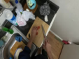
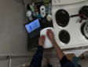
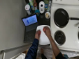
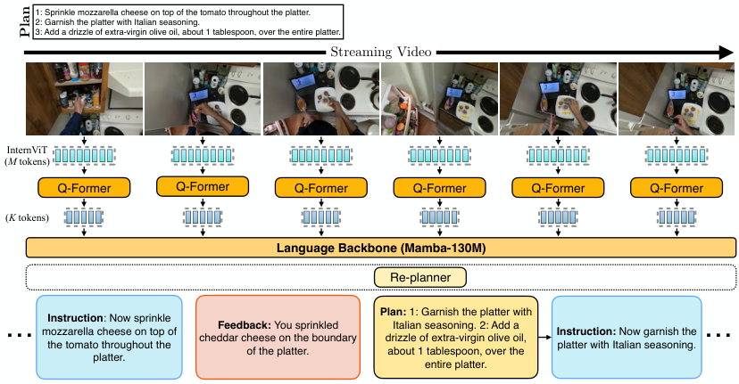
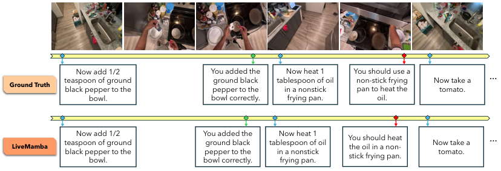
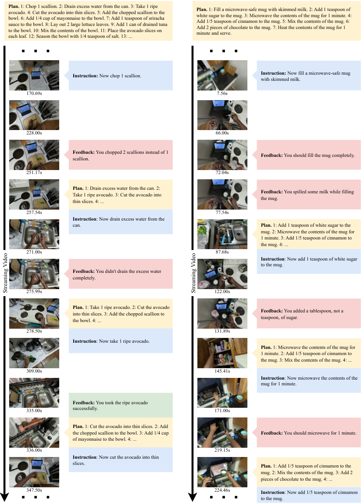
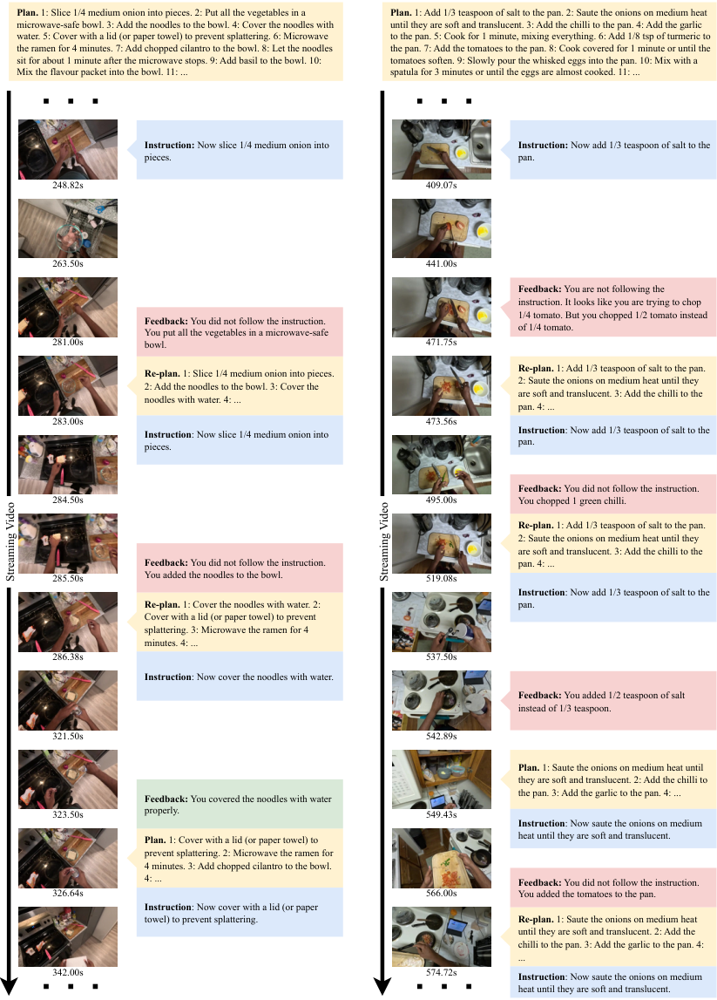
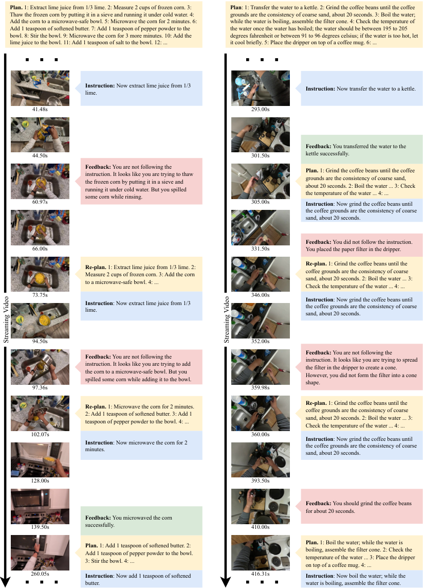
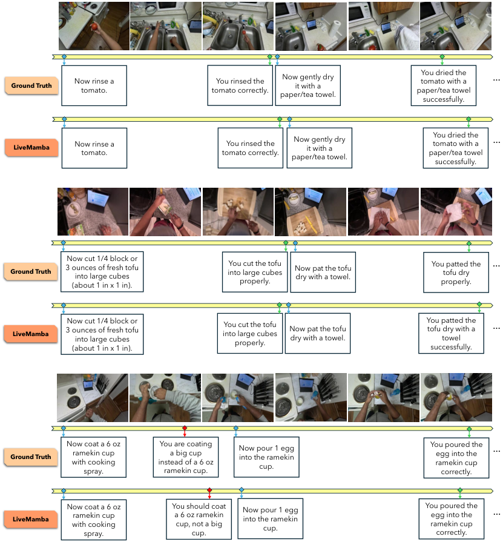

# Can Multi-Modal LLMs Provide Live Step-by-Step Task Guidance

[Original PDF](../Can%20Multi-Modal%20LLMs%20Provide%20Live%20Step-by-Step%20Task%20Guidance.pdf)

Pages: 34

> Automatically converted from PDF. Check the original for exact equations, symbols, table alignment, and figure details.

<!-- Page 1 -->

# **Can Multi-Modal LLMs Provide Live Step-by-Step Task Guidance?** 

**Apratim Bhattacharyya****1**_∗_ **Bicheng Xu****2**_∗†_ **Sanjay Haresh****1** **Reza Pourreza****1** **Litian Liu****1** **Sunny Panchal****1** **Pulkit Madan****1** **Leonid Sigal****2** **Roland Memisevic****1** 1 Qualcomm AI Research _‡_ 2 University of British Columbia 

### **Abstract** 

Multi-modal Large Language Models (LLM) have advanced conversational abilities but struggle with providing live, interactive step-by-step guidance, a key capability for future AI assistants. Effective guidance requires not only delivering instructions but also detecting their successful execution, as well as identifying and alerting users to mistakes, all of which has to happen in real-time. This requires models that are not turn-based, but that can react asynchronously to a video stream, as well as video data showing users performing tasks including mistakes and their corrections. To this end, we introduce Qualcomm Interactive Cooking, a new benchmark and dataset built upon CaptainCook4D, which contains user mistakes during task execution. Our dataset and benchmark features densely annotated, timed instructions and feedback messages, specifically including mistake alerts precisely timestamped to their visual occurrence in the video. We evaluate state-ofthe-art multi-modal LLMs on the Qualcomm Interactive Cooking benchmark and introduce LIVEMAMBA, a streaming multi-modal LLM designed for interactive instructional guidance. This work provides the first dedicated benchmark and a strong baseline for developing and evaluating on live, situated coaching. 

### **1 Introduction** 

Multi-modal Large Language Models (LLMs) have recently advanced, enabling AI systems to interact with users more naturally, fluently, and in real-time by processing audio, speech, and visual inputs for conversations about images or videos. 

However, to be useful as an AI assistant, multi-modal LLMs should be able to guide a user through a task – “live” – by providing interactive step-by-step instructions. This encompasses three key abilities, i) to provide the next instruction, ii) detect if the instruction has been successfully accomplished by the user, iii) if not, then detect any mistakes made by the user and alert the user as soon as possible. Consider an example where a multi-modal LLM guides a user while making, _e.g._ , Bruschetta in Fig. 1. At the stage where the tomatoes are being sliced, an instruction with the desired thickness the tomatoes needs to be provided. Then the model needs to detect whether the user has sliced the tomatoes to the desired thickness, and in the case of a mistake, the model needs to alert the user as soon as it observes the mistake. This calls for the multi-modal LLM to be able to react interactively to events in the video streams. However, current state-of-the-art multi-modal LLMs are still largely limited to turn based interactions [26, 40, 55, 56, 64] – they only produce responses when prompted by the user – or to narration tasks [8, 35]. 

To address the challenge of live, step-by-step coaching, we introduce the Qualcomm Interactive Cooking dataset and benchmark, as currently available large-scale vision-language datasets and 

> _∗_ Equal contribution. 

> _†_ Work done while employed at Qualcomm AI Research. 

> _‡_ Qualcomm AI Research is an initiative of Qualcomm Technologies, Inc. 

39th Conference on Neural Information Processing Systems (NeurIPS 2025).

<!-- Page 2 -->

|1: Slice one tomato into about 1/2 inch thick slices. 2: Place the thick slices of tomatoes on a platter, ensuring they only make a single layer. 3: Season the tomato slices with salt. 4:|
|---|

|Season the platter with 1/4 teaspoon of black pepper. 5: Sprinkle mozzarella cheese on top of the tomato throughout the platter. 6: Garnish the platter with Italian seasoning. 7: Add|
|---|

|a drizzle of extra-virgin olive oil, about 1 tablespoon, over the entire platter.|
|---|

|~~Streaming Video~~|
|---|

|**Instruction**: Now place the|
|---|

|**Feedback**: You should slice the|
|---|

|**Feedback**: You should|
|---|

|**Instruction**: Now slice one|
|---|

| tomato into about 1/2 inch thick slices.|tomato into about 1/2 inch thick slices, but instead, you sliced it int larger slices, about 1 inch thick.|o thick slices of tomatoes on a platter, ensuring they only make a single layer. make a sin thick slices not a do|gle layer of the of tomatoes, uble layer.|
|---|---|---|---|
|**Instruction**: Now garnish the platter with Italian seasoning.|**bPw**V**Gu**N**sW082+chSUMkJfe4Ca3yztLpZd7rR1EiIDgmTHBo9**6**xO**Y**qKXjAQ**5**vl** **x**9**K**A**JLhql/uBMk8CnO2iaz3PVZvUTtF0oyGE1I**4w**6cDNRY5eSpHgQ**X**fr**Ws+<>~~S~~ **Feedback**: You garnished the platter with Italian seasoning properly. |~~treaming Video~~ **Instruction**: Now add a drizzle of extra-virgin olive oil, about 1 tablespoon, over the entire platter. **Feedback**: You should add extra- virgin olive oil, not vegetable oil.|**Feedback**: You added 2 teaspoons instead of 1 tablespoon.|

|Figure 1: An overview of the step-by-step task guidance scenario in our Qualcomm Interactive|
|---|

|Cooking benchmark and dataset, where the multi-modal LLM provides instructions and feedback|
|---|
|that are sufficient to guide the user towards the goal,_e.g._, making a tomato mozzarella salad (above).|

|benchmarks [12,22,52] inadequately capture such interactive scenarios. These existing datasets and|
|---|
|benchmarks largely consist of participants recording their daily activities or expert demonstrations,|
|which are insufficient for effectively assessing multi-modal LLMs’ ability to provide step-by-step|
|instructions, as they lack the critical scenarios where users make mistakes or diverges from the plan.|
|Therefore, we construct our Qualcomm Interactive Cooking benchmark and dataset leveraging the|
|videos from the CaptainCook4D dataset [46], specifically because they contain these vital instances|
|of user errors. Each video within Qualcomm Interactive Cooking is accompanied by a detailed|
|step-by-step plan along with instructions and feedback, timed appropriately according to the recipe and any mistakes made by the user.|

|Our contributions in detail are, 1. We introduce the Qualcomm Interactive Cooking dataset and |
|---|
|benchmark§ by extending the CaptainCook4D dataset [46], with timed instruction and feedback messages. The instruction messages describe the next recipe step to follow and the feedback messages|
|are provided to acknowledge successful instruction completions or mistakes made by the user. They are designed to be sufficient to independently guide the user to complete the given recipe. 2. We|
|introduce the LIVEMAMBAmodel, an light-weight multi-modal LLM designed to provide interactive|
|instructions and feedback in cooking scenarios. 3. We evaluate state of the art multi-modal LLMs on our Qualcomm Interactive Cooking benchmark, highlighting the strong performance of our|
|LIVEMAMBAmodel in such interactive scenarios.|

|**2**|
|---|

|**Related Work**|
|---|

|**Datasets for Procedural Activities.** We provide an overview of related datasets and benchmarks in|
|---|
|Tab. 1. The Epic-Kitchens [12] dataset consists of ego-centric videos that document unscripted, daily|
|activities within a kitchen environment. The Ego-Exo4D [23] dataset incorporates a considerably|
|diverse array of human activities, as performed by subjects exhibiting with a variety of skill levels.|
|However, the videos in these datasets are not driven by a specific (multi-step) goal (Tab. 1, col 3).|
|Assembly-101 [49] features videos of people with diverse skill levels assembling and disassembling|
|101 “take-apart” toy vehicles. HowTo100M [44] and COIN [52] provides narrated instructional|
|videos, featuring a variety of activities. The YouCook2 [66] dataset contains cooking videos of|
|diverse recipes. However, the subjects in these datasets are usually experts and the videos do not|

|§Project Page|
|---|

|2|
|---|

<!-- Page 3 -->

Table 1: Comparison to our Qualcomm Interactive Cooking dataset and benchmark (Ours): where, _Mult-step Goal Driven_ refers to whether the videos are driven by a specific goal ( _e.g._ , cooking a recipe); _Step-by-Step Instructions_ : whether the videos contain subjects following a set of step-by-step instructions; and _Timed feedback_ : whether the subjects receive timed feedback per step that are sufficient to guide the subjects to the goal. 

|Dataset|Domain|Multi-step Goal Driven|Step-by-Step Instructions|Timed Feedback|Length (hrs)|
|---|---|---|---|---|---|
|Epic-Kitchens [12]|Cooking|_×_|_×_|_×_|100|
|Ego-4D [22]|Daily-life|_×_|_×_|_×_|3670|
|Ego-Exo4D [23]|Daily-life|_×_|_×_|_×_|1422|
|Assembly-101 [49]|Toy Assembly|✓|_×_|_×_|513|
|HoloAssist [57]|Obj. manip.|✓|_×_|_×_|166|
|HowTo100M [44]|Diverse|✓|✓|_×_|134k|
|COIN [51]|Diverse|✓|✓|_×_|512|
|YouCookv2 [66]|Cooking|✓|✓|_×_|176|
|WTAG [5]|Cooking|✓|✓|_×_|10|
|QEVD [45]|Fitness|_×_|✓|✓|474|
|Ours|Cooking|✓|✓|✓|94|

contain mistakes, unlike our Qualcomm Interactive Cooking benchmark and dataset (Tab. 1, col 5). Finally, HoloAssist [57] and WTAG [5] include videos where subjects are provided live feedback by tele-operator, that cover certain mistakes or user queries. But unlike Qualcomm Interactive Cooking benchmark and dataset, these feedback are not sufficient to independently guide the subject towards completion of the high-level goal. 

**Multi-modal Large Language Models.** Vision language models have seen amazing progress in recent years following the language modeling breakthroughs. Earlier efforts on contrastive learning of vision and language representations led to CLIP [48] like architectures [27, 30, 31]. However, more recent works have reformulated vision tasks as text generation tasks giving rise to a diverse array of large multi-modal language models [1, 4, 21, 54–56] building on the success of large language models (LLMs). Early works in this space like Flamingo [2] leveraged pre-trained language models and vision adapters to align the language and visual representational spaces. Follow up works like Llava [39], InstructBLIP [11] instruction tuned these models to enable excellent multi-modal dialogue capabilities. These works were primarily applied to image data which have since been generalized to videos [3, 28, 33, 36, 43, 63]. While these models can take videos as input, they only enable turn based interaction, _i.e._ , the models usually answer a question or narrate the whole video lacking the ability to interactively respond to events in the video unlike our LIVEMAMBA model. 

**Streaming Video Large Language Models.** Many recent works have started to explore online video understanding with large multi-modal language models. VideoLLM-online [8] proposes a framework to enable online dialogue over videos with LLMs and use it to train models to narrate long streaming videos. ReKV [13] proposes a training free approach to enable existing video language models to solve streaming visual question answering (StreamVQA). Similarly, TimeChat-Online [61], StreamChat [41], LiveCC [9], Flash Vstream [65], StreamMind [14], LION-FS [35] introduce various innovations to make multi-modal language models to work on streaming video tasks. This has also prompted development of many streaming video benchmarks [6, 37, 45, 47, 58, 60]. However, all of the previous benchmarks deal with different forms of VQA where the model is asked questions paired with streaming video in natural settings whereas we deal with multi-step interactive videos where the model needs responds to the visual input without being prompted in a goal-directed setting. 

### **3 Qualcomm Interactive Cooking Benchmark and Dataset** 

Here we introduce the Qualcomm Interactive Cooking benchmark and dataset to evaluate the ability of multi-modal LLMs to provide step-by-step instructions, focusing on the cooking domain. The Qualcomm Interactive Cooking benchmark and dataset uses the videos from the CaptainCook4D [46] dataset as it contains actions with mistakes. This allows us to create a setup akin to a “non-reactive simulation”, where we task the multi-modal LLM to produce the right instruction and feedback at the 

3

<!-- Page 4 -->

Table 2: Dataset statistics: where, the _Followed Feedback_ and _Divergent Feedback_ indicate whether the action associated with the feedback follows the given instruction or not. 

|Split|Total Length (hours)|Number of Videos|Number of Instructions|Followed Success Feedback|Followed Mistake Feedback|Divergent Success Feedback|Divergent Mistake Feedback|
|---|---|---|---|---|---|---|---|
||||_Main Set_|||||
|Training|52.4|213|2913|2394|686|||
|Validation|15.7|62|861|659|257|||
|Testing|26.4|109|1489|1135|445|||
|||_A_|_dvanced Planni_|_ng Set_||||
|Training|51.5|209|2888|2119|423|244|229|
|Validation|14.3|57|781|524|133|78|84|
|Testing|7.8|36|481|123|144|115|119|

appropriate time, but the subject is non-compliant. Such a setup still provides us with useful insight into ability of multi-modal LLMs to provide step-by-step task guidance, as fully reactive setups are not possible with offline datasets. We provide statistics of the Qualcomm Interactive Cooking benchmark and dataset in Tab. 2, including the total length in hours, number of videos, and numbers of instructions and feedback messages. 

**Instruction and Feedback Protocol.** The instructions and feedback are annotated using the following protocol, starting from a step-by-step plan. The first instruction of the plan occurs at the beginning of the video. If the user makes a mistake while completing the instruction, our benchmark and dataset contains a corresponding feedback just after it occurs. If an instruction is completed successfully, it is acknowledged. As long as the subject tries to complete the given instruction, irrespective of mistakes, we provide the instruction for the next step. If the user performs actions which are not aligned with the instruction, _e.g._ , performing recipe steps out of order, we update the step-by-step plan, _e.g._ , by repeating the instruction (see advanced planning set). Once all the steps are completed, we acknowledge the completion for the whole plan. 

**Annotation Process.** To generate instructions and feedback we leverage the annotations for temporal action segments with action descriptions in the CaptainCook4D dataset. We also leverage the mistake descriptions for the actions containing mistakes. First, we begin by removing noisy mistake annotations and then we annotate the timestamps where those mistakes occur. This allows us to annotate timely feedback for each mistake. We do this for all types of mistakes except `order error` and `missing steps` . Those mistakes reflect the cases where the subject ignores the provided instruction, _i.e._ , they perform a recipe step out of order or ignore the recipe step completely. Such cases require more complex reasoning from the multi-modal LLM, as the model needs to reason using the information of the instructions completed in the past and the remaining future steps. Thus, we propose two sets of our Qualcomm Interactive Cooking benchmark and dataset: Main Set and Advanced Planning Set. The training, validation, and testing splits within each set follow the original video recoding split from CaptainCook4D, and the test splits correspond to the Qualcomm Interactive Cooking benchmark. 

_Main Set._ This set reflect the case where the user largely follows the given instruction. To build the step-by-step plan for this set we leverage the order of the actions in the video. First we sort the actions by their start time. Normally one action forms one step in the plan. In cases where actions are performed in parallel (compound actions), we group those actions into the same step. In this set, instructions are to be given according to their order in the plan, thus eliminating the need for complex reasoning to provide the next instruction. 

_Advanced Planning Set._ This set targets scenarios where the user diverges from the prescribed sequence, such as performing steps out of order. To construct it, we use the graph-structured recipe for each CaptainCook4D video to determine the correct step order. When the user does not follow the given instruction, we notify them and identify the action being performed based on the initial plan. The future instruction sequence is then updated to reflect this action (examples in the supplementary material). The test split includes only videos where the user diverges from the initial plan at least once. To reduce complexity, we further restrict the test set to videos without compound actions. 

4

<!-- Page 5 -->

<!-- Start of picture text -->
1: Sprinkle mozzarella cheese on top of the tomato throughout the platter. 2: Garnish the platter with Italian seasoning. 3: Add a drizzle of extra-virgin olive oil, about 1 tablespoon, over the entire platter. Streaming V Gwu N sbW082+chSUPMkJfe4Ca3yztLpZd7rR1EiIDgmTHBo9 6 xO Y qKXjAQ 5 vl /uBMk8CnqO2Liaz3PVZKvUTtF0oxyGEJ1I 4 h w 6cDNRY5eSlpHgQ X fr Ws+<> Video InternViT ( M  tokens) Q-Former Q-Former Q-Former Q-Former Q-Former Q-Former ( K  tokens) Language Backbone (Mamba-130M) Re-planner Plan:  1: Garnish the platter with Instruction : Now sprinkle Feedback:  You sprinkled  Italian seasoning. 2: Add a … mozzarella cheese on top of  Instruction:  Now garnish the  … cheddar cheese on the boundary  drizzle of extra-virgin olive oil, the tomato throughout the  platter with Italian seasoning. of the platter. about 1 tablespoon, over the platter. entire platter. Plan <!-- End of picture text -->

Figure 2: Our LIVEMAMBA model architecture. The input video stream is processed by an InternViT vision head which produces _M_ tokens, and is then reduced to _K_ tokens by a Q-Former. The language backbone produces feedback and invokes the Re-planner if necessary before the next instruction. 

### **4 LIVEMAMBA for Step-by-Step Instructions** 

To deal with the challenge of guiding a user through step-by-step instructions we propose our LIVEMAMBA model. It is a vision-language model with a vision encoder and language model backbone to produce step-by-step instructions and feedback at the appropriate time-step. Given a plan with a set of step-by-step instructions, the LIVEMAMBA model, shown in Fig. 2, provides the next instruction to the user, waits for the user to complete the instruction or make a mistake and provide a feedback message. To enable this interactive mode of operation, our LIVEMAMBA has the following key novel features: 1. It knows “when to speak”, _i.e._ , it is trained to respond at the appropriate time step when the user has successfully completed the provided instruction or has made a mistake. 2. To recognize the diverse set of possible mistakes that could be made by the user, the LIVEMAMBA model is trained using a novel data augmentation scheme during the fine-tuning phase. 3. To provide the next relevant instruction, the LIVEMAMBA model re-plans using an external re-planning module, in case the user diverges from the provided instruction and performs a step out of order. Furthermore, the LIVEMAMBA incorporates a recurrent Mamba-130M [24] language model backbone to enable efficient training and inference over long video streams. Next, we discuss the LIVEMAMBA architecture and training details. 

#### **4.1 LIVEMAMBA Architecture** 

The LIVEMAMBA architecture consists of a vision encoder and a light-weight but powerful language backbone. A key consideration of the architecture of our LIVEMAMBA model is efficiency. For real-world application of our LIVEMAMBA model, inference using our model should ideally be possible using compute constrained edge devices such as mobile phones or smart glasses. Reliance on external servers with larger compute capabilities is both costly and comes with additional latency issues. A second key consideration is that the cooking activities in the Qualcomm Interactive Cooking benchmark requires recognition of fine-grained actions and small objects, _e.g._ , adding the correct amount of salt, coating a cup vs a bowl with oil. Next, we describe these components in more detail. 

**Vision Encoder.** The vision encoder consists of a InternViT-300M-448px-V2_5 [10] head along with a Q-Former [32] based adapter. As shown in Fig. 2 the InternViT head produces _M_ tokens per input video frame. As we use a light-weight language backbone, we do not want to offload raw visual processing to the language backbone and thus employ a powerful Q-Former with multiple transformer layers. For every input video frame, the Q-Former reduces the _M_ tokens to _K_ tokens which are then input to the language backbone. To generate these _K_ tokens, the Q-Former uses four 

5

<!-- Page 6 -->

cross attention layers to gradually blend in the important visual information from the input video frame. These tokens are then used as input to the language backbone, interleaved with the text tokens corresponding to the step-by-step plan, instructions and feedback. 

**“When-to-Say”.** To respond at the appropriate timestep, following [8, 45] our LIVEMAMBA model uses two special tokens <vision> and <response>. The <vision> token allows the LIVEMAMBA model to interactively ask for the next video frame as input, while <response> allows the LIVEMAMBA to respond with an instruction or a feedback at the appropriate time. 

**Iterative Re-planning.** To determine the next instruction, we employ the following strategy. If the user executes the current instruction—whether correctly or with errors—the subsequent step from the original plan is issued. On the other hand, if the user diverges from the prescribed sequence and performs an out-of-order step, our LIVEMAMBA invokes an external re-planner (see Fig. 2). The re-planner receives as input the initial step-by-step plan, the set of completed steps, and feedback generated by LIVEMAMBA, and then selects the next optimal step to ensure successful task completion. In yet another scenario, if the intended step is skipped, the re-planner evaluates whether repeating the current instruction is appropriate given the user’s progress. Similarly, if a step is completed prematurely, the re-planner determines whether to remove it from the remaining plan. This iterative and selective re-planning mechanism provides two principal advantages. First, it enables selective use of large-scale models with enhanced reasoning capabilities only when necessary; in our implementation, Qwen3-32B [16] serves as the re-planner. Second, it eliminates the need for LIVEMAMBA to internally store and recall the entire plan, allowing it to focus exclusively on delivering accurate and timely feedback (more details in the appendix). 

#### **4.2 LIVEMAMBA Training** 

We now provide details of our training scheme, which is composed of two stages. 

**Pre-training.** This stage aligns the Q-Former’s vision embeddings with the language backbone’s text embeddings by training only the Q-Former adapter. We use a diverse set of image and video datasets to instill two key visual skills: First, for object grounding, LIVEMAMBA is trained on image datasets like LVIS [25] (for diverse household objects) and on video data using VISOR annotations from EPIC-KITCHENS [12]. Tasks include image/video captioning, object recognition, and bounding box prediction. Second, for fine-grained action understanding, LIVEMAMBA learns action recognition from SSv2 [20] and video narration from EPIC-KITCHENS and Ego4D. Narration helps ground the model to actions in these large-scale egocentric datasets, particularly cooking activities. 

**Fine-tuning.** During the fine-tuning phase the LIVEMAMBA model is trained to provide the appropriate instructions and feedback at the appropriate time, using the <vision> and <feedback> special tokens as described above. At this stage, both the Q-Former’s based adapter and the language backbone is trained. The LIVEMAMBA needs to recognize the successful completion of instructions and mistakes. To this end, in addition to training on the step-by-step instructions and feedbacks from our Qualcomm Interactive Cooking dataset, we apply several augmentations as described below. 

#### **4.3 LIVEMAMBA Augmentation** 

We now provide details of our data augmentation scheme during the fine-tuning phase. 

**Temporal Augmentation.** To maintain temporal accuracy of feedbacks while dealing with long videos in the Qualcomm Interactive Cooking benchmark, we introduce temporal jittering during training. Specifically, we jitter the starting timestamp of each instruction by a constant _±_ K seconds. This temporal jittering deals that fact that predictions by autoregressive models, _e.g._ , our LIVEMAMBA, can accumulate errors. Jittering the starting timestamp of an instruction ensures that the LIVEMAMBA can successfully predict feedbacks irrespective of the previous accumulated error. In practice, we find _K_ = 30 to work well. 

**Instruction Completion Augmentation.** To help the LIVEMAMBA recognize the successful completion of instructions, we augment our training set by converting videos from the EPIC-KITCHENS and Ego4D datasets to the step-by-step instruction and feedback format of our Qualcomm Interactive Cooking dataset. In detail, we consider the action descriptions in the EPIC-KITCHENS dataset and 

6

<!-- Page 7 -->

Table 3: Zero-shot evaluation on the main set of the Qualcomm Interactive Cooking benchmark. 

||Instruction|||Mistak|e||
|---|---|---|---|---|---|---|
|Method|IC-Acc_↑_|Prec._↑_|Rec._↑_|F1_↑_|BERT_↑_|ROUGE-L_↑_|
|LLaVA-NeXT [40]|1.4|0.00|0.00|0.00|0.000|0.000|
|Video-ChatGPT [43]|1.6|0.00|0.00|0.00|0.000|0.000|
|VideoChat2 [34]|1.6|0.00|0.00|0.00|0.000|0.000|
|Video-LLaVA [67, 38]|2.0|0.00|0.00|0.00|0.000|0.000|
|VideoLLaMA3-7B [62]|1.8|0.00|0.00|0.00|0.000|0.000|
|Videollm-online [8]|0.03|0.02|**0.98**|0.04|0.332|0.248|
|Qwen2-VL-7B [56]|6.3|0.02|0.69|**0.05**|0.377|0.256|
|Qwen2.5-VL-7B [19]|18.9|**0.18**|0.01|0.02|0.299|0.219|
|Gemini-2.5-Flash [53]|**23.1**|0.01|0.22|0.02|_0.410_|_0.342_|

the Ego4D Goal-Step datasets and use a Qwen2.5-8B model [15] to convert these action descriptions to instructions. We provide the instruction at the action start time and feedback message at the action end timestamp. As these datasets do not contain any mistakes, the feedback messages acknowledge the successful completion of the instruction. 

**Counterfactual Mistake Augmentation.** Recognizing mistakes and providing timely feedback is a key challenge of our Qualcomm Interactive Cooking benchmark. To this end, we formulate a novel data augmentation scheme to generate (counterfactual) mistakes in the EPIC-KITCHENS and Ego4D datasets. First, we convert the action description to plausible grounded counterfactual action descriptions. These grounded counterfactual action descriptions are used to generate instructions and thus construct scenarios where the user tries to follow the given instruction but makes a mistake (more details in the appendix). To help recognize divergent mistakes, where the user does not follow the provided instruction, we augment the fine-tuning dataset by swapping instructions between recipe steps. The feeback is constructed to explicitly state that the user did not follow the provided instruction and instead performed a different action. This format of feedback triggers the re-planning module during the inference stage (more details in the appendix). 

### **5 Experiments** 

We begin with an introduction to the metrics used to evaluate models for interactive step-by-step task guidance followed by the experimental results. 

#### **5.1 Evaluation Metrics.** 

We use the following metrics to measure both the ability of the models to detect successfully completed instructions and to provide feedback when mistakes occur. 

**Instruction Completion Accuracy (IC-Acc).** IC-Acc measures the proportion of instructions that the model correctly detects as successfully completed by the user. Specifically, this requires that the model provides the correct instruction, the user completes it, and the model identifies this completion. To mitigate temporal annotation noise, we consider a prediction correct if it falls within a small window centered on the ground-truth completion time. In practice, a 30-second window is sufficient: it typically spans the last _∼_ 25% of the current step and the first _∼_ 25% of the next step in the Qualcomm Interactive Cooking benchmark, balancing robustness to noise with accuracy. 

**Mistake Detection Precision (Prec.), Recall (Rec.) and F1.** To calculate mistake detection Precision, Recall, and F1 scores in our interactive streaming setup, we define: • _Mistake True Positive_ : A mistake detected by the model within a small temporal window centered on the timestamp of a ground truth mistake. • _Mistake False Negative_ : A ground truth mistake that the model fails to detect within this temporal window. • _Mistake False Positive_ : A mistake detected by the model when no corresponding ground truth mistake occurs within the temporal window. • _Mistake True Negative_ : An instruction correctly followed by the user (no ground truth mistake) where the model correctly detects no mistake. We use the same temporal window size as in the IC-Acc metric. 

7

<!-- Page 8 -->

Table 4: Evaluation of fine-tuned models on the Qualcomm Interactive Cooking benchmark <u>(</u>_†_ indicates models fine-tuned by us). 

||Instruction|||Mistak|e||
|---|---|---|---|---|---|---|
|Method|IC-Acc_↑_|Prec._↑_|Rec._↑_|F1_↑_|BERT_↑_|ROUGE-L_↑_|
|||_Main Set_|||||
|Videollm-online_†_ [8]|7.6|0.04|0.01|0.01|0.434|0.412|
|LIVEMAMBA(w/o-ICAug)|7.8|0.05|0.01|0.01|0.605|0.542|
|LIVEMAMBA(w/o-CFAug)|14.3|0.12|0.03|0.05|0.558|0.511|
|LIVEMAMBA(Ours)|**31.5**|**0.17**|**0.10**|**0.13**|_0.651_|_0.561_|
||_Adv_|_anced Plannin_|_g Set_||||
|LIVEMAMBA(w/o-reP)|10.9|**0.38**|0.10|0.16|0.912|0.901|
|LIVEMAMBA(Ours)|**12.6**|**0.38**|**0.13**|**0.19**|_0.941_|_0.927_|

Table 5: Turn-based evaluation of on the main set of the Qualcomm Interactive Cooking benchmark. 

||Instruction|||Mistak|e||
|---|---|---|---|---|---|---|
|Method|IC-Acc_↑_|Prec._↑_|Rec._↑_|F1_↑_|BERT_↑_|ROUGE-L_↑_|
|VideoLLaMA3-7B [62]|17.8|0.08|**0.61**|**0.15**|0.406|0.346|
|Qwen2-VL-7B [56]|19.4|0.06|0.46|0.11|_0.398_|_0.293_|
|Qwen2.5-VL-7B [19]|**38.9**|**0.11**|0.04|0.06|0.348|0.230|
|LIVEMAMBA_†_ (Ours)|**51.0**|**0.22**|0.17|**0.19**|_0.631_|_0.535_|

**Mistake Feedback Fluency (BERT and ROUGE-L).** To measure the fluency of the models in providing appropriate feedback, we use the ROUGE-L and BERT scores. We only consider the fluency of feedback provided in case true positive mistake detections. That is, when the feedback is provided within the temporal window of a ground truth feedback as described above. Importantly, these scores are only meaningful when comparing models with similar true positive detection rates, since differences in detection accuracy can confound fluency comparisons. This is because models with lower detection rates produce fewer feedback instances, which can skew the distribution of ROUGE and BERT scores and make fluency appear artificially higher or lower. 

#### **5.2 Zero-Shot Evaluation** 

State of the art multi-modal LLMs are usually limited to turn-based interactions. Applying such models to the streaming setup of the Qualcomm Interactive Cooking benchmark is thus highly challenging. Therefore, we need to employ a special online prompting strategy. This strategy involves prompting the model at regular intervals to detect both successful completions of instructions and mistakes. However prompting after every input frame is not computationally feasible. To balance accuracy and compute requirements, we prompt the models at an interval of 5 seconds. We provide details of the prompts in the appendix. 

On the other hand, streaming multi-modal LLMs such as Videollm-online [8] are targeted at providing online narrations of input video streams. Such models are therefore not directly applicable to our Qualcomm Interactive Cooking benchmark. Thus, to evaluate such models, we first ask the model to generate online narrations for the whole video. We then feed these narrations in an online manner to a “helper” LLM that given the narrations and the action instruction, predicts if the action is completed or not. If “yes”, we move on to the next instruction. If “not”, we ask the “helper” LLM to predict if the narrations suggest a mistake has been made and provide feedback for correction. We use Phi-3-mini-4k-Instruct [18] as the “helper” LLM. 

We report the zero-shot evaluation results in Tab. 3 for the main set of the Qualcomm Interactive Cooking benchmark. Overall, Gemini-2.5-Flash [55] performs best. It can recognize 18.9% of instructions being successfully completed by the user. Models such as VideoLLaMA3-7B [62], Video-LLaVA [38, 67], VideoChat2 [34], Video-ChatGPT [43], LLaVA-NeXT [40] have trouble following instructions. Even when prompted to detect if the person has completed a given instruction 

8

<!-- Page 9 -->

these models tend to answer “yes” too early. This highlights a gap in understanding scenes as they unfold in a streaming setup. This is likely an artifact of the question-answer style training scheme of these models where the entire video is always available to the model. Furthermore, Videollmonline [8] predicts narrations which are not fully informative of the action and therefore a mistake is detected very often leading to a very high mistake recall and a very low instruction completion detection accuracy. 

Overall, when it comes to mistake detection, none of the zero-shot approaches performs well. Qwen2VL-7B-Instruct [56] overestimates the occurrence of mistakes, leading to higher recall but low precision. Qwen2.5-VL-7B-Instruct [19] on the other hand is more precise in detecting mistakes, but with low overall F1 score. This weak performance can be attributed to the fact that detecting mistakes in the Qualcomm Interactive Cooking benchmark is very challenging due to a variety of reasons. First is the fine-grained nature of many mistakes, _i.e._ , taking 1 teaspoon vs 1 tablespoon or 2 teaspoons of sugar, spilling flour on the kitchen counter etc, requires both fine-grained object recognition and action-recognition abilities. This is made additionally challenging by the fact that the model needs to look out of a diverse set of possible mistakes. Secondly, mistakes need to be detected as soon as they occur (similar to the instruction completions). This again exposes the limitations of current models in understanding scenes as they unfold in a streaming setup. 

#### **5.3 Evaluation of Fine-tuned Models** 

Here we evaluate our LIVEMAMBA model fine-tuned on the Qualcomm Interactive Cooking dataset. Unlike the zero-shot baselines such as Qwen2.5-VL-7B-Instruct [19] in Tab. 3, our LIVEMAMBA model is fully interactive, _i.e._ , it can decide “when to say” to point out successful completion of instructions and mistakes after every input frame. Thus, it does not require expensive prompting strategies. We also consider two ablations of our LIVEMAMBA model on the main benchmark set: 1. without instruction completion augmentation (w/o-ICAug), 2. without counterfactual augmentation (w/o-CFAug), In case of the advanced planning set, we consider an ablation without an external re-planning module (w/o-rP). 

Firstly, in Tab. 4 we see that our LIVEMAMBA model significantly improves performance over the zero-shot models in Tab. 3. We show example predictions of our model in Fig. 3. The weaker performance of the fine-tuned Videollm-online model shows that pre-training only on narration data is not sufficient. Furthermore, the use of our efficient Mamba-130M backbone [24] allows us to use a higher number of embedding tokens per frame (32 vs 10) at similar memory costs compared to transformer based models such as Videollm-online. In addition to the pre-training data, the key reasons for the improved performance of the LIVEMAMBA model is our data augmentation scheme during the fine-tuning phase. The addition of instruction completion augmentation (ICAug) leads to a significant improvement in IC-Acc from 7.8% to 14.3% in the main set along with an improvement in mistake F1 scores. The improvement in mistake F1 score is particularly interesting, as correctly recognizing successful completion of instructions helps the LIVEMAMBA more precisely point out mistakes. Furthermore, the addition of counterfactual mistake augmentation (CFAug) significantly boosts the mistake F1 score from 0.05 to 0.10 in the main set, along with a significant jump in feedback fluency. The significant jump in mistake detection accuracy shows that the curation of high quality mistake data is a promising direction for future research. Furthermore, we see that the use of the external re-planning module leads to better performance on the advanced planning set. The external re-planning module helps the LIVEMAMBA select the next instruction in case of divergent mistakes over the complex graph structured recipes in the Qualcomm Interactive Cooking benchmark from CaptainCook4D. Also note that, our counterfactual (divergent) mistake augmentation scheme significantly boosts the mistake detection scores in this set. Overall, providing the correct instruction in the advanced planning set remains highly challenging, as shown by the lower IC-Acc scores. Note that, the majority of the mistakes in the advanced planning set are divergent: they point out the intended action given the instruction and the divergent action. Furthermore, the mistake detection scores are calculated only when the provided instruction matches with the groundtruth instruction. Thus, the mistake detection scores are not comparable across the main and advanced planning sets. 

In terms of throughput, on a consumer Nvidia H100 GPU, our LiveMamba model has a real-time factor of 4 on average: it can process input data four times as fast at 8.1 frames per second as it becomes available at 2 frames per second. In terms of latency, that is time to generate the first token, is 1.1 seconds on average. Re-planning using the Qwen3-32B[16] model takes 6.1 seconds on average. 

9

<!-- Page 10 -->

<!-- Start of picture text -->
Now add 1/2  You added the  Now heat 1  You should use a Ground Truth teaspoon of ground  ground black  tablespoon of oil  non-stick frying  Now take a  … black pepper to the  pepper to the  in a nonstick  pan to heat the  tomato. bowl. bowl correctly. frying pan. oil. Now add 1/2  You added the  Now heat 1 LiveMamba teaspoon of ground  ground black  tablespoon of oil  You should heat the oil in a non- Now take a  … black pepper to the  pepper to the  in a nonstick  tomato. bowl. bowl correctly. frying pan. stick frying pan. <!-- End of picture text -->

Figure 3: Our LIVEMAMBA is able to successfully recognize the person has added the black pepper as instructed and points out when the person should heat the oil in a non-stick frying pan, in the Qualcomm Interactive Cooking benchmark. 

#### **5.4 Turn-based Evaluation** 

The streaming evaluation in Tabs. 3 and 4 tested models on multi-step user guidance, a setup inherently challenging due to error propagation; for instance, failing to detect instruction completion renders subsequent predictions incorrect. While this reflects real-world scenarios where accurate completion detection is vital for task guidance, such difficulty can make it more challenging to measure progress on the Qualcomm Interactive Cooking benchmark. Therefore, we also propose a turn-based evaluation, where models are assessed on each recipe step independently. 

We report the results in Tab. 5 on the main set of the Qualcomm Interactive Cooking benchmark. Overall we observe much higher IC-Acc scores compared to the streaming setup of Tabs. 3 and 4. Most significantly, we observe higher mistake precision, recall, F1 scores of our fine-tuned LIVEMAMBA model compared to the zero-shot models. This again shows that fine-tuning on our Qualcomm Interactive Cooking dataset along with our data augmentation scheme during fine-tuning allows our LIVEMAMBA model to better recognize mistakes compared to zero-shot baselines. Thus, the turn-based evaluation in Tab. 5 along with the streaming setup in Tabs. 3 and 4 together provide a more detailed picture of progress on the Qualcomm Interactive Cooking benchmark. 

### **6 Conclusion** 

We address the challenge of enabling multi-modal LLMs to provide live, interactive step-by-step guidance. To this end, we introduce Qualcomm Interactive Cooking dataset and benchmark, featuring densely annotated, timed instructions and feedback, including for mistakes, timestamped to visual occurrences. We also propose LIVEMAMBA, a novel streaming multi-modal LLM designed for this task. LIVEMAMBA utilizes a lightweight Mamba backbone, a "when-to-say" mechanism, novel data augmentation for mistake recognition, and iterative re-planning for adaptive delivery. Evaluations show existing multi-modal LLMs struggle with live task guidance, whereas LIVEMAMBA, establishes a strong baseline, significantly outperforming others in diverse metrics. 

**Limitations.** Our work is focused on the cooking domain through Qualcomm Interactive Cooking. While LIVEMAMBA establishes a strong baseline, detecting subtle mistakes and robustly handling complex scenarios, particularly those involving order errors or missed steps in the advanced planning set, remains challenging, for all state of the art open-source models. 

**Broader Impacts.** Language models can produce harmful and biased content, make incorrect claims and produce wrongful advice. This needs to be taken into account when interacting with, deploying or building on these models, particularly in domains where incorrect advice may lead to physical harm. It also has to be taken into account that any computer vision model processing visual information about human subjects could in principle extract information beyond what is required for the use-case, such as biometric information. 

10

<!-- Page 11 -->

### **References** 

- [1] Josh Achiam, Steven Adler, Sandhini Agarwal, Lama Ahmad, Ilge Akkaya, Florencia Leoni Aleman, Diogo Almeida, Janko Altenschmidt, Sam Altman, Shyamal Anadkat, et al. Gpt-4 technical report. _arXiv preprint arXiv:2303.08774_ , 2023. 

- [2] Jean-Baptiste Alayrac, Jeff Donahue, Pauline Luc, Antoine Miech, Iain Barr, Yana Hasson, Karel Lenc, Arthur Mensch, Katherine Millican, Malcolm Reynolds, Roman Ring, Eliza Rutherford, Serkan Cabi, Tengda Han, Zhitao Gong, Sina Samangooei, Marianne Monteiro, Jacob Menick, Sebastian Borgeaud, Andrew Brock, Aida Nematzadeh, Sahand Sharifzadeh, Mikolaj Binkowski, Ricardo Barreira, Oriol Vinyals, Andrew Zisserman, and Karen Simonyan. Flamingo: a visual language model for few-shot learning. In _NeurIPS_ , 2022. 

- [3] Kirolos Ataallah, Xiaoqian Shen, Eslam Abdelrahman, Essam Sleiman, Deyao Zhu, Jian Ding, and Mohamed Elhoseiny. Minigpt4-video: Advancing multimodal llms for video understanding with interleaved visual-textual tokens. _arXiv preprint arXiv:2404.03413_ , 2024. 

- [4] Jinze Bai, Shuai Bai, Shusheng Yang, Shijie Wang, Sinan Tan, Peng Wang, Junyang Lin, Chang Zhou, and Jingren Zhou. Qwen-vl: A versatile vision-language model for understanding, localization. _Text Reading, and Beyond_ , 2, 2023. 

- [5] Yuwei Bao, Keunwoo Peter Yu, Yichi Zhang, Shane Storks, Itamar Bar-Yossef, Alexander De La Iglesia, Megan Su, Xiao-Lin Zheng, and Joyce Chai. Can foundation models watch, talk and guide you step by step to make a cake? In _EMNLP Findings_ , 2023. 

- [6] Apratim Bhattacharyya, Sunny Panchal, Mingu Lee, Reza Pourreza, Pulkit Madan, and Roland Memisevic. Look, remember and reason: Visual reasoning with grounded rationales. In _ICLR_ , 2024. 

- [7] Nicolas Carion, Francisco Massa, Gabriel Synnaeve, Nicolas Usunier, Alexander Kirillov, and Sergey Zagoruyko. End-to-end object detection with transformers. In _ECCV_ , 2020. 

- [8] Joya Chen, Zhaoyang Lv, Shiwei Wu, Kevin Qinghong Lin, Chenan Song, Difei Gao, Jia-Wei Liu, Ziteng Gao, Dongxing Mao, and Mike Zheng Shou. Videollm-online: Online video large language model for streaming video. In _CVPR_ , 2024. 

- [9] Joya Chen, Ziyun Zeng, Yiqi Lin, Wei Li, Zejun Ma, and Mike Zheng Shou. Livecc: Learning video llm with streaming speech transcription at scale. _arXiv preprint arXiv:2504.16030_ , 2025. 

- [10] Zhe Chen, Jiannan Wu, Wenhai Wang, Weijie Su, Guo Chen, Sen Xing, Muyan Zhong, Qinglong Zhang, Xizhou Zhu, Lewei Lu, et al. Internvl: Scaling up vision foundation models and aligning for generic visual-linguistic tasks. In _CVPR_ , 2024. 

- [11] Wenliang Dai, Junnan Li, Dongxu Li, Anthony Tiong, Junqi Zhao, Weisheng Wang, Boyang Li, Pascale Fung, and Steven Hoi. InstructBLIP: Towards general-purpose vision-language models with instruction tuning. In _NeurIPS_ , 2023. 

- [12] Dima Damen, Hazel Doughty, Giovanni Maria Farinella, Antonino Furnari, Jian Ma, Evangelos Kazakos, Davide Moltisanti, Jonathan Munro, Toby Perrett, Will Price, and Michael Wray. Rescaling egocentric vision: Collection, pipeline and challenges for epic-kitchens-100. In _IJCV_ , 2022. 

- [13] Shangzhe Di, Zhelun Yu, Guanghao Zhang, Haoyuan Li, Tao Zhong, Hao Cheng, Bolin Li, Wanggui He, Fangxun Shu, and Hao Jiang. Streaming video question-answering with in-context video kv-cache retrieval. _arXiv preprint arXiv:2503.00540_ , 2025. 

- [14] Xin Ding, Hao Wu, Yifan Yang, Shiqi Jiang, Donglin Bai, Zhibo Chen, and Ting Cao. Streammind: Unlocking full frame rate streaming video dialogue through event-gated cognition. _arXiv preprint arXiv:2503.06220_ , 2025. 

- [15] An Yang et. al. Qwen2.5 technical report. _CoRR_ , abs/2412.15115, 2024. 

- [16] An Yang et al. Qwen3 technical report. _CoRR_ , abs/2505.09388, 2025. 

11

<!-- Page 12 -->

- [17] Grauman et. al. Ego4d: Around the world in 3,000 hours of egocentric video. In _CVPR_ , 2022. 

- [18] Marah I Abdin et. al. Phi-3 technical report: A highly capable language model locally on your phone. _CoRR_ , abs/2404.14219, 2024. 

- [19] Shuai Bai et. al. Qwen2.5-vl technical report. _CoRR_ , abs/2502.13923, 2025. 

- [20] Raghav Goyal, Samira Ebrahimi Kahou, Vincent Michalski, Joanna Materzynska, Susanne Westphal, Heuna Kim, Valentin Haenel, Ingo Fruend, Peter Yianilos, Moritz Mueller-Freitag, Florian Hoppe, Christian Thurau, Ingo Bax, and Roland Memisevic. The "something something" video database for learning and evaluating visual common sense. In _ICCV_ , 2017. 

- [21] Aaron Grattafiori, Abhimanyu Dubey, Abhinav Jauhri, Abhinav Pandey, Abhishek Kadian, Ahmad Al-Dahle, Aiesha Letman, Akhil Mathur, Alan Schelten, Alex Vaughan, et al. The llama 3 herd of models. _arXiv preprint arXiv:2407.21783_ , 2024. 

- [22] Kristen Grauman, Andrew Westbury, Eugene Byrne, Zachary Chavis, Antonino Furnari, Rohit Girdhar, Jackson Hamburger, Hao Jiang, Miao Liu, Xingyu Liu, Miguel Martin, Tushar Nagarajan, Ilija Radosavovic, Santhosh Kumar Ramakrishnan, Fiona Ryan, Jayant Sharma, Michael Wray, Mengmeng Xu, Eric Zhongcong Xu, Chen Zhao, Siddhant Bansal, et al. Ego4d: Around the world in 3, 000 hours of egocentric video. In _CVPR_ , 2022. 

- [23] Kristen Grauman, Andrew Westbury, Lorenzo Torresani, Kris Kitani, Jitendra Malik, Triantafyllos Afouras, Kumar Ashutosh, Vijay Baiyya, Siddhant Bansal, Bikram Boote, et al. Ego-exo4d: Understanding skilled human activity from first- and third-person perspectives. _CoRR_ , abs/2311.18259, 2023. 

- [24] Albert Gu and Tri Dao. Mamba: Linear-time sequence modeling with selective state spaces. _CoRR_ , abs/2312.00752, 2023. doi: 10.48550/ARXIV.2312.00752. URL `https://doi.org/ 10.48550/arXiv.2312.00752` . 

- [25] Agrim Gupta, Piotr Dollár, and Ross B. Girshick. LVIS: A dataset for large vocabulary instance segmentation. In _CVPR_ , 2019. 

- [26] Aaron Hurst, Adam Lerer, Adam P Goucher, Adam Perelman, Aditya Ramesh, Aidan Clark, AJ Ostrow, Akila Welihinda, Alan Hayes, Alec Radford, et al. Gpt-4o system card. _arXiv preprint arXiv:2410.21276_ , 2024. 

- [27] Chao Jia, Yinfei Yang, Ye Xia, Yi-Ting Chen, Zarana Parekh, Hieu Pham, Quoc Le, Yun-Hsuan Sung, Zhen Li, and Tom Duerig. Scaling up visual and vision-language representation learning with noisy text supervision. In _International conference on machine learning_ , pages 4904–4916. PMLR, 2021. 

- [28] Yang Jin, Zhicheng Sun, Kun Xu, Liwei Chen, Hao Jiang, Quzhe Huang, Chengru Song, Yuliang Liu, Di Zhang, Yang Song, et al. Video-lavit: Unified video-language pre-training with decoupled visual-motional tokenization. _arXiv preprint arXiv:2402.03161_ , 2024. 

- [29] Arthur B Kahn. Topological sorting of large networks. _Communications of the ACM_ , 5(11): 558–562, 1962. 

- [30] Junnan Li, Ramprasaath Selvaraju, Akhilesh Gotmare, Shafiq Joty, Caiming Xiong, and Steven Chu Hong Hoi. Align before fuse: Vision and language representation learning with momentum distillation. _Advances in neural information processing systems_ , 34:9694–9705, 2021. 

- [31] Junnan Li, Dongxu Li, Caiming Xiong, and Steven Hoi. Blip: Bootstrapping languageimage pre-training for unified vision-language understanding and generation. In _International conference on machine learning_ , pages 12888–12900. PMLR, 2022. 

- [32] Junnan Li, Dongxu Li, Silvio Savarese, and Steven C. H. Hoi. BLIP-2: bootstrapping languageimage pre-training with frozen image encoders and large language models. In _ICML_ , 2023. 

- [33] KunChang Li, Yinan He, Yi Wang, Yizhuo Li, Wenhai Wang, Ping Luo, Yali Wang, Limin Wang, and Yu Qiao. Videochat: Chat-centric video understanding. _arXiv preprint arXiv:2305.06355_ , 2023. 

12

<!-- Page 13 -->

- [34] Kunchang Li, Yali Wang, Yinan He, Yizhuo Li, Yi Wang, Yi Liu, Zun Wang, Jilan Xu, Guo Chen, Ping Luo, et al. Mvbench: A comprehensive multi-modal video understanding benchmark. In _CVPR_ , 2024. 

- [35] Wei Li, Bing Hu, Rui Shao, Leyang Shen, and Liqiang Nie. LION-FS: fast & slow videolanguage thinker as online video assistant. In _CVPR_ , 2025. 

- [36] Yanwei Li, Chengyao Wang, and Jiaya Jia. Llama-vid: An image is worth 2 tokens in large language models. In _European Conference on Computer Vision_ , pages 323–340. Springer, 2024. 

- [37] Yifei Li, Junbo Niu, Ziyang Miao, Chunjiang Ge, Yuanhang Zhou, Qihao He, Xiaoyi Dong, Haodong Duan, Shuangrui Ding, Rui Qian, et al. Ovo-bench: How far is your video-llms from real-world online video understanding? _arXiv preprint arXiv:2501.05510_ , 2025. 

- [38] Bin Lin, Bin Zhu, Yang Ye, Munan Ning, Peng Jin, and Li Yuan. Video-llava: Learning united visual representation by alignment before projection. _arXiv preprint arXiv:2311.10122_ , 2023. 

- [39] Haotian Liu, Chunyuan Li, Qingyang Wu, and Yong Jae Lee. Visual instruction tuning. In _NeurIPS_ , 2023. 

- [40] Haotian Liu, Chunyuan Li, Yuheng Li, Bo Li, Yuanhan Zhang, Sheng Shen, and Yong Jae Lee. Llava-next: Improved reasoning, ocr, and world knowledge, January 2024. URL `https: //llava-vl.github.io/blog/2024-01-30-llava-next/` . 

- [41] Jihao Liu, Zhiding Yu, Shiyi Lan, Shihao Wang, Rongyao Fang, Jan Kautz, Hongsheng Li, and Jose M Alvare. Streamchat: Chatting with streaming video. _arXiv preprint arXiv:2412.08646_ , 2024. 

- [42] Ilya Loshchilov and Frank Hutter. Decoupled weight decay regularization. In _7th International Conference on Learning Representations, ICLR 2019, New Orleans, LA, USA, May 6-9, 2019_ . OpenReview.net, 2019. URL `https://openreview.net/forum?id=Bkg6RiCqY7` . 

- [43] Muhammad Maaz, Hanoona Rasheed, Salman Khan, and Fahad Khan. Video-ChatGPT: Towards detailed video understanding via large vision and language models. In Lun-Wei Ku, Andre Martins, and Vivek Srikumar, editors, _ACL_ , August 2024. 

- [44] Antoine Miech, Dimitri Zhukov, Jean-Baptiste Alayrac, Makarand Tapaswi, Ivan Laptev, and Josef Sivic. Howto100m: Learning a text-video embedding by watching hundred million narrated video clips. In _ICCV_ , 2019. 

- [45] Sunny Panchal, Apratim Bhattacharyya, Guillaume Berger, Antoine Mercier, Cornelius Böhm, Florian Dietrichkeit, Reza Pourreza, Xuanlin Li, Pulkit Madan, Mingu Lee, Mark Todorovich, Ingo Bax, and Roland Memisevic. What to say and when to say it: Live fitness coaching as a testbed for situated interaction. In _NeurIPS_ , 2024. 

- [46] Rohith Peddi, Shivvrat Arya, Bharath Challa, Likhitha Pallapothula, Akshay Vyas, Bhavya Gouripeddi, Qifan Zhang, Jikai Wang, Vasundhara Komaragiri, Eric D. Ragan, Nicholas Ruozzi, Yu Xiang, and Vibhav Gogate. Captaincook4d: A dataset for understanding errors in procedural activities. In _NeurIPS_ , 2024. 

- [47] Reza Pourreza, Rishit Dagli, Apratim Bhattacharyya, Sunny Panchal, Guillaume Berger, and Roland Memisevic. Can vision-language models answer face to face questions in the real-world? _arXiv preprint arXiv:2503.19356_ , 2025. 

- [48] Alec Radford, Jong Wook Kim, Chris Hallacy, Aditya Ramesh, Gabriel Goh, Sandhini Agarwal, Girish Sastry, Amanda Askell, Pamela Mishkin, Jack Clark, et al. Learning transferable visual models from natural language supervision. In _International conference on machine learning_ , pages 8748–8763. PmLR, 2021. 

- [49] Fadime Sener, Dibyadip Chatterjee, Daniel Shelepov, Kun He, Dipika Singhania, Robert Wang, and Angela Yao. Assembly101: A large-scale multi-view video dataset for understanding procedural activities. In _CVPR_ , 2022. 

13

<!-- Page 14 -->

- [50] Yale Song, Eugene Byrne, Tushar Nagarajan, Huiyu Wang, Miguel Martin, and Lorenzo Torresani. Ego4d goal-step: Toward hierarchical understanding of procedural activities. In _NeurIPS_ , 2023. 

- [51] Yansong Tang, Dajun Ding, Yongming Rao, Yu Zheng, Danyang Zhang, Lili Zhao, Jiwen Lu, and Jie Zhou. COIN: A large-scale dataset for comprehensive instructional video analysis. In _CVPR_ , 2019. 

- [52] Yansong Tang, Dajun Ding, Yongming Rao, Yu Zheng, Danyang Zhang, Lili Zhao, Jiwen Lu, and Jie Zhou. Coin: A large-scale dataset for comprehensive instructional video analysis. In _CVPR_ , 2019. 

- [53] Gemini Team. Gemini 2.5: Pushing the frontier with advanced reasoning, multimodality, long context, and next generation agentic capabilities. _CoRR_ , abs/2507.06261, 2025. 

- [54] Gemini Team, Rohan Anil, Sebastian Borgeaud, Yonghui Wu, Jean-Baptiste Alayrac, Jiahui Yu, Radu Soricut, Johan Schalkwyk, Andrew M Dai, Anja Hauth, et al. Gemini: A family of highly capable multimodal models. _CoRR_ , abs/2312.11805, 2023. 

- [55] Gemini Team, Petko Georgiev, Ving Ian Lei, Ryan Burnell, Libin Bai, Anmol Gulati, Garrett Tanzer, Damien Vincent, Zhufeng Pan, Shibo Wang, et al. Gemini 1.5: Unlocking multimodal understanding across millions of tokens of context. _arXiv preprint arXiv:2403.05530_ , 2024. 

- [56] Peng Wang, Shuai Bai, Sinan Tan, Shijie Wang, Zhihao Fan, Jinze Bai, Keqin Chen, Xuejing Liu, Jialin Wang, Wenbin Ge, Yang Fan, Kai Dang, Mengfei Du, Xuancheng Ren, Rui Men, Dayiheng Liu, Chang Zhou, Jingren Zhou, and Junyang Lin. Qwen2-vl: Enhancing visionlanguage model’s perception of the world at any resolution. _arXiv preprint arXiv:2409.12191_ , 2024. 

- [57] Xin Wang, Taein Kwon, Mahdi Rad, Bowen Pan, Ishani Chakraborty, Sean Andrist, Dan Bohus, Ashley Feniello, Bugra Tekin, Felipe Vieira Frujeri, Neel Joshi, and Marc Pollefeys. Holoassist: an egocentric human interaction dataset for interactive AI assistants in the real world. In _ICCV_ , 2023. 

- [58] Yuxuan Wang, Yueqian Wang, Bo Chen, Tong Wu, Dongyan Zhao, and Zilong Zheng. Omnimmi: A comprehensive multi-modal interaction benchmark in streaming video contexts. _arXiv preprint arXiv:2503.22952_ , 2025. 

- [59] Senqiao Yang, Yukang Chen, Zhuotao Tian, Chengyao Wang, Jingyao Li, Bei Yu, and Jiaya Jia. Visionzip: Longer is better but not necessary in vision language models. In _CVPR_ , 2025. 

- [60] Zhenyu Yang, Yuhang Hu, Zemin Du, Dizhan Xue, Shengsheng Qian, Jiahong Wu, Fan Yang, Weiming Dong, and Changsheng Xu. Svbench: A benchmark with temporal multi-turn dialogues for streaming video understanding. _arXiv preprint arXiv:2502.10810_ , 2025. 

- [61] Linli Yao, Yicheng Li, Yuancheng Wei, Lei Li, Shuhuai Ren, Yuanxin Liu, Kun Ouyang, Lean Wang, Shicheng Li, Sida Li, et al. Timechat-online: 80% visual tokens are naturally redundant in streaming videos. _arXiv preprint arXiv:2504.17343_ , 2025. 

- [62] Boqiang Zhang, Kehan Li, Zesen Cheng, Zhiqiang Hu, Yuqian Yuan, Guanzheng Chen, Sicong Leng, Yuming Jiang, Hang Zhang, Xin Li, Peng Jin, Wenqi Zhang, Fan Wang, Lidong Bing, and Deli Zhao. Videollama 3: Frontier multimodal foundation models for image and video understanding, 2025. 

- [63] Hang Zhang, Xin Li, and Lidong Bing. Video-llama: An instruction-tuned audio-visual language model for video understanding. In _EMNLP - System Demonstrations_ , 2023. 

- [64] Hang Zhang, Xin Li, and Lidong Bing. Video-llama: An instruction-tuned audio-visual language model for video understanding. _arXiv preprint arXiv:2306.02858_ , 2023. URL `https://arxiv.org/abs/2306.02858` . 

- [65] Haoji Zhang, Yiqin Wang, Yansong Tang, Yong Liu, Jiashi Feng, Jifeng Dai, and Xiaojie Jin. Flash-vstream: Memory-based real-time understanding for long video streams. _arXiv preprint arXiv:2406.08085_ , 2024. 

14

<!-- Page 15 -->

- [66] Luowei Zhou, Chenliang Xu, and Jason Corso. Towards automatic learning of procedures from web instructional videos. In _AAAI_ , 2018. 

- [67] Bin Zhu, Bin Lin, Munan Ning, Yang Yan, Jiaxi Cui, HongFa Wang, Yatian Pang, Wenhao Jiang, Junwu Zhang, Zongwei Li, et al. Languagebind: Extending video-language pretraining to n-modality by language-based semantic alignment. _arXiv preprint arXiv:2310.01852_ , 2023. 

15

<!-- Page 16 -->

## **Appendix** 

### **A Overview** 

In the following we provide details of the annotation process of our Qualcomm Interactive Cooking dataset and benchmark, details of the re-planner used in the LIVEMAMBA model, training details of our LIVEMAMBA model, additional qualitative results from our LIVEMAMBA model, and details of the prompts used for zero-shot evaluation. 

### **B Qualcomm Interactive Cooking Annotation Details** 

Our Qualcomm Interactive Cooking dataset and benchmark is built upon the CaptainCook4D dataset [46]. The CaptainCook4D dataset contains 384 videos in total. Each video records a person preparing a dish given a recipe, such as breakfast burritos and tomato mozzarella salad, from an egocentric view. Each video is associated with a graph-structured recipe5 , and annotated with temporal action segments: action descriptions with the corresponding starting time and ending time. If an action contains a mistake, then there is a description of the mistake. However, there is no timestamp annotation for the mistake. The average duration of action segments in CaptainCook4D is about 52 _._ 78 seconds , which is about 106 frames if using frame rate as 2. This also motivates us to use a light-weight Mamba based model to encode more frames given the hardware constraint. 

The CaptainCook4D dataset includes 7 categories of mistakes: `preparation error` , `technique error` , `measurement error` , `temperature error` , `timing error` , `order error` , and `missing steps` . We annotate the timestamps of the mistakes when they just happened. We remove some noisy mistake annotations in CaptainCook4D, and annotate for all mistake categories except for `order error` and `missing steps` . Tab. 6 shows the numbers of mistake instances per mistake category. Note, we show the mistake statistics here for a complete description of the Qualcomm Interactive Cooking dataset and benchmark. This mistake category information is not used in our experiments presented in the paper. 

Our Qualcomm Interactive Cooking features with a step-by-step plan, and timestamped instructions and feedback for each video recording. In what follows, we describe how we obtain those for the main set and advanced planning set respectively. 

#### **B.1 Main Set** 

In the main set (Fig. 4), we assume that the user always tries to follow the given instruction. That is, there is no action order error. Given a video, we first sort the actions by their starting time in ascending order (primary key) and ending time in descending order (secondary key). Based on this order, we build the step-by-step plan. Usually one action description forms one step in the plan. In cases where one action is temporally contained in another action (actions performed in parallel), we group those action descriptions into one step. Accordingly, we create action groups, where one step in the plan corresponds to one action group. The first step in the plan provides the contents for the next instruction to be given. 

Given a video, we treat the first action’s starting time as the video starting time and the first instruction is given at that time. Once an action finishes, its description is removed from the step-by-step plan. Once all the actions in the current action group finish, the current step in the plan will be empty. We remove the empty step in the plan and give the instruction for the next step. The instruction is a sentence containing all the information in the action descriptions in the step. Once an action finishes successfully, we acknowledge the success via summarizing the description of the just finished action, and using the words like successfully, correctly, properly, and etc. This type of feedback is given at the action’s ending time. If an action contains a mistake, we give the feedback regarding the mistake at our annotated timestamp. The feedback is a sentence pointing out the mistake based on the mistake description given in CaptainCook4D. Once all the steps in the initial plan are completed, we output the feedback “ `You have finished all the steps.` ” to acknowledge the completion. Fig. 4 shows data samples from the main set. Whenever an action finishes, it is removed from the 

> 5Examples can be found at `https://captaincook4d.github.io/captain-cook/recipe.html` . 

16

<!-- Page 17 -->

Table 6: Mistake category statistics. 

|Split|Preparation Err.|Technique Err.|Measurement Err.|Temperature Err.|Timing Err.|
|---|---|---|---|---|---|
|||_Main_|_Set_|||
|Training|198|224|159|27|78|
|Validation|63|79|68|10|37|
|Testing|110|156|113|17|49|
|||_Advanced Pl_|_anning Set_|||
|Training|182|216|152|27|75|
|Validation|54|66|55|10|32|
|Testing|68|85|74|10|26|

Table 7: Re-plan statistics on the advanced planning set (averaged over videos requiring re-planning in each split). 

|Split|Number of Videos Requiring Re-planning|Average Video Length (minutes)|Average Number of Instructions|Average Number of Re-plan Steps|
|---|---|---|---|---|
|Training|94|12_._8|13_._2|4_._3|
|Validation|29|13_._2|13_._6|4_._8|
|Testing|36|12_._9|13_._4|6_._1|

step-by-step plan. The examples show that recognizing mistakes requires fine-grained understanding of user actions and objects in the scene across long time-horizons. 

#### **B.2 Advanced Planning Set** 

In the advanced planning set (Figs. 5 and 6), we include cases where the user performs an action diverging from the instruction. Given a video with its associated graph-structured recipe, we append the actions that are not performed in the video (missing steps) to the ordered actions from the main set. We then topologically sort the actions using the Kahn’s algorithm [29]. We discard some videos which can not be topologically sorted, because there exist actions in the video but absent from the recipe graph. This (newly) sorted action order is used to build the step-by-step plan. Normally one action description forms one step in the plan. We group consecutive action descriptions into the same step only if there exists a step in the main set’s plan containing the exact same action descriptions. Note that the action groups remain consistent with the main set. An important difference to the main set is that, it is possible to have divergence between a step in the plan and the corresponding action group, in case the user does not follow the given instruction. 

As in the main set, once the user finishes an action, we remove its description from the plan and remove any empty step; and once all the actions in the current action group are finished, we provide the instruction for the next step. If the action group matches the corresponding step, that is, the user performs actions following the given instruction, we follow the same convention as in the main set. If the user performs an action diverging from the given instruction, we notify the user in the feedback. Specifically, if the action is performed without mistakes but does not follow the instruction, the feedback is given at the action’s end time, starting with the sentence “ `You did not follow the instruction.` ” and describing the action that is performed. If the action performed contains mistakes, the feedback is given when the mistake occurs, starting with the sentence “ `You are not following the instruction.` ”, describing the action that the user is trying to perform based on the initial plan, and pointing out the mistake. 

In cases where the current step is not empty after all actions in the current action group finish, that is, the instruction is not followed at all or partially completed, we manually decide whether to keep or remove the current step in the plan based on the actions that the user has performed. This corresponds to the cases that require re-planning as the set of future steps need to be updated. Tab. 7 shows the “re-plan” statistics in our advanced planning set. As can be seen from the table, re-planning is required for about every 2.7 instructions or every 2.6 minutes on average. Figs. 5 and 6 show data samples from the advanced planning set. Note, in Figs. 5 and 6, “Plan” means that the action follows 

17

<!-- Page 18 -->

the instruction, and thus once the current step is finished, it is removed from the step-by-step plan. “Re-plan” means that the action diverges from the instruction, and when giving the next instruction, we need to decide whether to (re)instruct the user about the current step or not. 

### **C LIVEMAMBA Re-planner** 

The re-planner is invoked (during inference) whenever the user does not follow the given instruction. This only occurs in the advanced planning set of the Qualcomm Interactive Cooking benchmark. To identify such cases, we train the LIVEMAMBA to add a “ `You are not following the instruction.` ” or “ `You did not follow the instruction.` ” prefix to feedback messages in case the user does the follow the given instruction. Note that, during training, the LIVEMAMBA model is trained using the ground truth sequence of instructions (as the LIVEMAMBA model is trained on a single recipe step at a time) and the re-planner is not used. During inference as we do have have the ground truth sequence of instructions, we use the re-planner to update the step-by-step instruction plan and provide the correct instructions (and feedbacks). We do this in two steps. 

First, the re-planner uses the Qwen3-32B [16] model to extract the recipe step performed instead of the instructed recipe step using the following prompt: 

#### **<mark>Retrieve the performed action</mark>** 

You are an expert cooking instructor. You are observing a user cooking a given recipe step by step. 

#### **##INSTRUCTIONS:** 

Here are the recipe steps: [recipe_steps]. 

The last instruction that you provided to the person is: [last_instruction]. The person did not follow your instruction and performed a different recipe step by mistake which did not correspond to the provided instruction. So you provided this feedback to the person: [last_feedback]. Which recipe step did the person likely perform instead of the step in the last instruction. RETURN THE RECIPE STEP AS A PYTHON STRING. ENSURE THAT YOU OUTPUT A RECIPE STEP AND DO NOT OUTPUT ANYTHING OTHER THAN A RECIPE STEP. 

Secondly, the re-planner determines if the current instruction needs to be repeated, based on the recipe steps and the past steps completed by the person. We use the following prompt for the Qwen3-32B [16] model: 

#### **<mark>Decide whether repeating the last instruction</mark>** 

You are an expert cooking assistant. You are helping a user to make [recipe_name], according to the following recipe steps: [recipe_steps]. 

#### **##INSTRUCTIONS:** 

The user has already completed [past_completed_step_counts] steps: [past_completed_steps]. Decide whether it is appropriate now to ask the user to [last_instructed_action], considering the effect of all the steps that the user performed. Your answer must begin with ’Yes’ or ’No’, followed by an explanation. 

If the answer is “ `No` ”, that is, the last instruction is not to be repeated, we find all parent actions of the last action that the user performed from the corresponding recipe graph, and remove those actions from the step-by-step plan if they exist. Otherwise, we do not further update the step-by-step plan. 

### **D LIVEMAMBA: Training Details** 

#### **D.1 Pre-training Data** 

As discussed in the main paper, for object grounding, LIVEMAMBA is trained on image datasets, _i.e._ , LVIS [25] (for diverse household objects) and on video data using VISOR annotations from 

18

<!-- Page 19 -->

EPIC-KITCHENS [12]. The data follows a question answer format, where the questions are of the following format (following [39]): 

#### **<mark>LVIS / EPIC-KITCHENS: Grounding Questions</mark>** 

- Please provide the bounding box coordinates for the ., A: 

- Where is the located in the image?,A: It is located at . 

- What are the coordinates of the bounding box encompassing the ~~?~~ , A: ~~.~~ 

- Can you pinpoint the in the image by giving me its bounding box coordinates?, A: Yes, it is at ~~.~~ 

- Where is the in the image? Give me the bounding box coordinates., A: 

- I need the top-left and bottom-right corners of the <1>’s bounding box. What are they?, A: ~~.~~ 

- Could you identify the in the image and tell me its location using bounding box coordinates?, A: Yes, it is at ~~.~~ 

- Describe the image concisely., A: 

- Provide a brief description of the given image., A: 

- Offer a succinct explanation of the picture presented., A: 

- Summarize the visual content of the image., A: 

- Give a short and clear explanation of the subsequent image., A: ~~.~~ 

- Share a concise interpretation of the image provided., A; 

- Present a compact description of the photo’s key features., A: ~~.~~ 

- Relay a brief, clear account of the picture shown., A; 

- Render a clear and concise summary of the photo., A: 

- Write a terse but informative summary of the picture., A: 

- Create a compact narrative representing the image presented., A: . 

For action recognition tasks on SSv2 [20], we use the following format: 

#### **<mark>SSv2: Action Recognition Questions</mark>** 

- Describe the action I performed in this video in detail and name the objects that the I interacts with?, A: . 

- Can you provide a step-by-step description of the action in the video which includes the specific objects that I touched or manipulated?, A: ~~.~~ 

- Tell me a description of the action performed by me in the video that includes the names of any items that I interact with., A: ~~.~~ 

- What action happens in the video and what objects are involved in the action?, A: ~~.~~ 

- Describe my actions and the objects that I come across., A: 

For narration tasks on EPIC-KITCHENS we convert the action descriptions to second person format, _e.g._ , “pick up plate” to “You picked up a plate.” For Ego4D, we employ the narrations used by [8]. 

#### **D.2 Fine-tuning Data** 

As mentioned in the main paper, EPIC-KITCHENS and Ego4D datasets included in the fine-tuning phase do not include instances of mistakes. Therefore, we formulate a novel data augmentation 

19

<!-- Page 20 -->

scheme to generate (counterfactual) mistakes. First, we describe the process used on Ego4D to generate counterfactual action descriptions in detail. 

**Counterfactual Mistake Augmentation.** To this end, we utilize the Ego4D goalstep annotations [50] and the FHO annotations [17]. The FHO annotations largely include fine-grained short duration actions while the goalstep annotations include longer-ranged actions more closely aligned with the recipe steps in our Qualcomm Interactive Cooking benchmark. To create temporally localized counterfactual mistakes, we first find the FHO actions that are included within each goalstep action. Then we ask Qwen-2.5-32B-Instruct [15] identify the “critical” FHO action for each goalstep action, _e.g._ , for the goalstep action `wash green beans in water` , the critical FHO identified by Qwen-2.5-32B-Instruct is `washes green bean` (from the following FHO actions within the goalstep action: `collects green bean` , `puts green beans on the chopping board` , `puts green beans in cooking pan` , _. . ._ , `picks green beans` , `opens tap` , `washes green bean` , _. . ._ ). We then ask the Qwen-2.5-32B-Instruct to construct two counterfactual actions. Firstly, by changing the noun to an alternative noun in the scene, _i.e._ , `washes green bean` to `washes carrots` . The list of nouns in the scene is generated by identifying objects in the scene using DETR [7]. Secondly, by proposing an alternative verb, _i.e._ , `washes green bean` to `mash green bean` . Then we use this counterfactual action to create an instruction and feedback pair. We use the point-of-no-return timestamp [17] for the mistake feedback. 

In case of the EPIC-KITCHENS dataset, most actions are of short duration (<10 seconds long). We directly use Qwen-2.5-32B-Instruct to construct two counterfactual actions by using an alternative noun in the scene and by an alternative verb as described above. As the actions are short we use the end of action timestamp to generate the (mistake) feedback. 

#### **D.3 Training and Inference Hyperparameters.** 

We use input video resolution of 448 _×_ 448 at 2 fps. The InternViT-300M-448px-V2_5 vision head produces _N_ = 1025 tokens (including the CLS token) per input frame. We use the mechanism outlined in VisionZip [59] to reduce the number of tokens to 256. Then, our Q-Former reduces this further to _K_ = 32 tokens. 

In addition to the vision features, the Mamba-130M language backbone of the LIVEMAMBA model is prompted with the following prompt: 

#### **<mark>L</mark> IVE** **<mark>M</mark> AMBA** **<mark>: Interactive Inference (Language Backbone)</mark>** 

You are an expert cooking assistant that is helping a person cook the following step by step recipe: [recipe_steps]. You just provided the following instruction to the person: [last_instruction]. Now watch the video and provide the appropriate success or failure messages. 

The LIVEMAMBA model is trained using 8 Nvidia H100 GPUs. We use the AdamW [42] optimizer. During the pre-training phase, we train only the Q-Former and the LIVEMAMBA model is trained using a learning rate of 1 _×_ 10_−_5 for 200k iterations. We again use a learning rate of 1 _×_ 10_−_5 , for 120k iterations. During the fine-tuning phase, we train on single recipe steps and clip the maximum length to 3 minutes. During inference, we re-initialize the LIVEMAMBA model after every recipe step. 

### **E LIVEMAMBA Results** 

In Fig. 7, we show additional qualitative examples of predictions by our LIVEMAMBA model from the main set of the Qualcomm Interactive Cooking benchmark. In the top two rows we see that our LIVEMAMBA model is able to successfully recognize that the user has completed complex steps from the step-by-step plans, _e.g._ , rinsing a tomato and cutting tofu into large cubes. In the third row we show an example where the user incorrectly coats a big cup instead of a 6-oz. cup with cooking spray. Our LIVEMAMBA model is able to provide timely feedback in this case. 

20

<!-- Page 21 -->

### **F Zero-shot Evaluation** 

Here we provide the prompts used for zero-shot evaluation. We begin with a more detailed description of the prompting strategy in Section 5.2 of the main paper. 

**Promoting Strategy.** This strategy involves prompting the model at regular intervals to detect both successful completions of instructions and mistakes. However prompting after every input frame is not computationally feasible. To balance accuracy and compute requirements, we prompt the models at an interval of 5 seconds. First, the model is asked if the user has completed the current instruction (obtained from the recipes in the Qualcomm Interactive Cooking benchmark). We use the following prompt for the Gemini-2.5-Flash [55], Qwen2.5-VL-7B-Instruct [19], Qwen2-VL-7B-Instruct [56], VideoLLaMA3-7B [62] models: 

#### **Gemini-2.5-Flash/ Qwen2x-VL-7B-Instruct / VideoLLaMA3-7B: Check if instruction complete** 

You are an expert cooking assistant helping a person cook. The person is provided with an instruction and your task is to check if the instruction has been completed. 

**##INSTRUCTIONS:** 

The person has been instructed to: [instruction]. 

If the person has completed the instruction answer “yes” else answer “no”. DO NOT OUTPUT ANY OTHER TEXT. 

In case of VideoChat2 [34] model, we use the following prompt: 

#### **<mark>VideoChat2: Check if instruction complete</mark>** 

You are an expert cooking assistant helping a person cook. The person is provided with an instruction and your task is to check if the instruction has been completed. You must check the video content very closely and confirm if the instruction has been completely followed and finished. 

**##INSTRUCTIONS:** The person has been instructed to: [instruction]. If the person has completed the instruction answer “yes” else answer “no”. Answer “yes” ONLY IF the instructed action is completed in the video, otherwise answer “no”. 

In case of the Video-LLaVA [67, 38], Video-ChatGPT [43], LLaVA-NeXT [40] as they do not accept system messages we use the following simplified prompt: 

#### **<mark>Video-LLaVA / Video-ChatGPT / LLaVA-NeXT : Check if instruction complete</mark>** 

The person has been instructed to: [instruction]. If the person has completed the instruction answer “yes” else answer “no”. 

If the model answers “yes”, then we move on to the next instruction in the recipe. If not, then we ask the model to check for mistakes. 

For VideoLLM-Online – since the model is trained to narrate videos, it can not detect completion and mistakes out of the box. Therefore, we use a helper LLM (Phi-3-mini-4k-Instruct) to help detect completion and mistakes given narrations. We use the following prompts, 

21

<!-- Page 22 -->

#### **<mark>VideoLLM-Online: Check if instruction is complete</mark>** 

**VideoLLM-Online:** Please narrate the video in real-time. **Helper-LLM (Phi-3-mini-4k-Instruct):** You are an intelligent chatbot that is judging another system which narrates human cooking videos. Given a high level action instruction and a list of narrations generated from the system, your job is to decide if the narration is correct and shows completion of the instruction. Answer ’yes’ if the instruction is completed otherwise output ’no’. Instruction: [instruction] Narrations: [videollm-online narrations] 

In the offline (turn-based) evaluation scheme used in CaptainCook4D [46], multi-modal LLMs are prompted with sequence of questions per error category to detect mistakes. However, such a scheme is infeasible in case of streaming setups due to high computational costs. Therefore, to enable mistake detection in a single inference step, we design a prompt that concisely explains the possible mistakes that are possible while following a given instruction. The model can then use this information to recognize possible mistakes. In detail, for a given instruction we find similar instructions in the training set and use Qwen-2.5-32B-Instruct [15] to summarize the possible mistakes. The following are some examples: 

#### **<mark>Instruction: Now place 8-inch f</mark> l** **<mark>our tortilla on cutting board.</mark>** 

When guiding the user through this step, the cooking instructor should watch out for these potential mistakes: 

1. Users might toast or heat the tortilla before placing it on the cutting board. 

2. Users may place the tortilla on a plate instead of a cutting board. 

3. Users could use an unclean surface instead of a clean cutting board. 

#### **<mark>Instruction: Now add 1/4 tsp salt to a bowl.</mark>** 

When guiding the user through this step, the cooking instructor should watch out for these potential mistakes: 

1. Spilling salt while measuring or adding it. 

2. Adding too much salt, specifically 1/2 tsp instead of the required 1/4 tsp. 

3. Confusing 1/3 tablespoon with 1/3 teaspoon. 

4. Accidentally adding the salt to the pan rather than the bowl. 

We then use these “mistake summaries” to prompt the multi-modal LLM. For Gemini-2.5Flash [55], Qwen2.5-VL-7B-Instruct [19], Qwen2-VL-7B-Instruct [56], VideoLLaMA3-7B [62], VideoChat2 [34] we use the following prompts: 

#### **Gemini-2.5-Flash / Qwen2x-VL-7B-Instruct / VideoLLaMA3-7B/ VideoChat2: Check if instruction complete** 

You are an expert cooking assistant who is observing a person who is provided with step by step instructions for cooking. You should look out for mistakes made by the person. 

#### **##INSTRUCTIONS:** 

The person is trying to complete the following instruction: [instruction]. This is how you can check for mistakes: [mistake summary]. Your task is to check if the person has already made a mistake. 

Note that the person may not have completed the provided instruction, that is, the person may have only partially completed the provided instruction. 

The answer should be “yes” or “no”. In case of yes, please provide a concise feedback to the person describing the mistake (i.e. Yes. <feedback>.). Directly address the person. 

22

<!-- Page 23 -->

In case of Video-LLaVA [67, 38], Video-ChatGPT [43], LLaVA-NeXT [40] models, they do not support complex prompts as they were mainly designed for question answering tasks. They we employ an alternative strategy where we ask the model to narrate the video in 30 second chunks. Then we use the (concatenated) past narrations since the last instruction completion to prompt the model to look for mistakes. 

#### **<mark>Video-LLaVA / Video-ChatGPT / LLaVA-NeXT : Check if instruction complete</mark>** 

The person has been instructed to: [instruction]. 

ill now the person has done the following: [past_narrations]. 

Your task is to check if the person has made a mistake. 

The answer should be “yes” or “no”. In case of “yes”, please provide a feedback to the user describing the mistake. Directly address the person. 

For VideoLLM-Online, we use a similar strategy as done in completion detection. We feed VideoLLMOnline’s narration to a helper LLM to get mistake detection. We use the following prompts, 

#### **<mark>VideoLLM-Online: Check if instruction is complete</mark>** 

**VideoLLM-Online:** Please narrate the video in real-time. 

**Helper-LLM (Phi-3-mini-4k-Instruct):** You are an intelligent chatbot that is judging another system which narrates human cooking videos. Given a high level action instruction and a list of narrations generated from the system, your job is to decide if a mistake has been made. 

The user has be instructed to do the following: [instruction] 

Till now the person has done the following: [videollm-online narrations] 

Your task is to check if the person has made a mistake. 

The answer should be yes or no. In case of yes, please provide a feedback to the user describing the mistake. Directly address the person. 

23

<!-- Page 24 -->

<!-- Start of picture text -->
Plan.  1: Chop 1 scallion. 2: Drain excess water from the can. 3: Take 1 ripe Plan.  1: Fill a microwave-safe mug with skimmed milk. 2: Add 1 teaspoon of avocado. 4: Cut the avocado into thin slices. 5: Add the chopped scallion to the white sugar to the mug. 3: Microwave the contents of the mug for 1 minute. 4: bowl. 6: Add 1/4 cup of mayonnaise to the bowl. 7: Add 1 teaspoon of sriracha Add 1/5 teaspoon of cinnamon to the mug. 5: Mix the contents of the mug. 6: sauce to the bowl. 8: Lay out 2 large lettuce leaves. 9: Add 1 can of drained tuna to the bowl. 10: Mix the contents of the bowl. 11: Place the avocado slices on Add 2 pieces of chocolate to the mug. 7: Heat the contents of the mug for 1 minute and serve. each leaf. 12: Season the bowl with 1/4 teaspoon of salt. 13: ... Instruction:  Now fill a microwave-safe mug Instruction:  Now chop 1 scallion. with skimmed milk. 170.69s 7.56s 228.00s 66.00s Feedback:  You chopped 2 scallions instead of 1 scallion. Feedback:  You should fill the mug completely. 251.17s 72.04s Plan.  1: Drain excess water from the can. 2: Feedback:  You spilled some milk while filling Take 1 ripe avocado. 3: Cut the avocado into thin slices. 4: ... the mug. 257.54s 77.54s Instruction : Now drain excess water from the can. Plan.  1: Add 1 teaspoon of white sugar to the mug. 2: Microwave the contents of the mug for 1 minute. 3: Add 1/5 teaspoon of cinnamon to the mug. 4: ... 271.00s 87.68s Instruction : Now add 1 teaspoon of white sugar to the mug. Feedback:  You didn't drain the excess water completely. 275.99s 122.00s Plan.  1: Take 1 ripe avocado. 2: Cut the avocado Feedback:  You added a tablespoon, not a into thin slices. 3: Add the chopped scallion to the bowl. 4: ... teaspoon, of sugar. 278.50s 131.89s Instruction : Now take 1 ripe avocado. Plan.  1: Microwave the contents of the mug for 1 minute. 2: Add 1/5 teaspoon of cinnamon to the mug. 3: Mix the contents of the mug. 4: ... 309.00s 145.41s Instruction : Now microwave the contents of the mug for 1 minute. Feedback:  You took the ripe avocado 335.00s successfully. 171.00s Plan.  1: Cut the avocado into thin slices. 2: Add the chopped scallion to the bowl. 3: Add 1/4 cup Feedback:  You should microwave for 1 minute. of mayonnaise to the bowl. 4: ... 336.00s 219.15s Instruction : Now cut the avocado into thin slices. Plan.  1: Add 1/5 teaspoon of cinnamon to the mug. 2: Mix the contents of the mug. 3: Add 2 pieces of chocolate to the mug. 4: ... 347.50s 224.46s Instruction : Now add 1/5 teaspoon of cinnamon to the mug.   Streaming Video     Streaming Video <!-- End of picture text -->

Figure 4: Data samples from the main set. Left: the user prepares spicy tuna avocado wraps. Right: the user prepares spiced hot chocolate. 

24

<!-- Page 25 -->

<!-- Start of picture text -->
Plan.  1: Slice 1/4 medium onion into pieces. 2: Put all the vegetables in a Plan.  1: Add 1/3 teaspoon of salt to the pan. 2: Saute the onions on medium heat microwave-safe bowl. 3: Add the noodles to the bowl. 4: Cover the noodles with until they are soft and translucent. 3: Add the chilli to the pan. 4: Add the garlic water. 5: Cover with a lid (or paper towel) to prevent splattering. 6: Microwave to the pan. 5: Cook for 1 minute, mixing everything. 6: Add 1/8 tsp of turmeric to the ramen for 4 minutes. 7: Add chopped cilantro to the bowl. 8: Let the noodles the pan. 7: Add the tomatoes to the pan. 8: Cook covered for 1 minute or until the sit for about 1 minute after the microwave stops. 9: Add basil to the bowl. 10: tomatoes soften. 9: Slowly pour the whisked eggs into the pan. 10: Mix with a Mix the flavour packet into the bowl. 11: ... spatula for 3 minutes or until the eggs are almost cooked. 11: ... Instruction:  Now slice 1/4 medium onion into Instruction:  Now add 1/3 teaspoon of salt to the pieces. pan. 248.82s 409.07s 263.50s 441.00s Feedback:  You are not following the instruction. It looks like you are trying to chop Feedback:  You did not follow the instruction. 1/4 tomato. But you chopped 1/2 tomato instead You put all the vegetables in a microwave-safe of 1/4 tomato. 281.00s bowl. 471.75s Re-plan.  1: Add 1/3 teaspoon of salt to the pan. Re-plan.  1: Slice 1/4 medium onion into pieces. 2: Add the noodles to the bowl. 3: Cover the 2: Saute the onions on medium heat until they are soft and translucent. 3: Add the chilli to the noodles with water. 4: ... pan. 4: ... 283.00s 473.56s Instruction : Now slice 1/4 medium onion into Instruction : Now add 1/3 teaspoon of salt to the pieces. pan. Feedback:  You did not follow the instruction. 284.50s 495.00s You chopped 1 green chilli. Re-plan.  1: Add 1/3 teaspoon of salt to the pan. 2: Saute the onions on medium heat until they are soft and translucent. 3: Add the chilli to the Feedback:  You did not follow the instruction. pan. 4: ... 285.50s You added the noodles to the bowl. 519.08s Instruction : Now add 1/3 teaspoon of salt to the Re-plan.  1: Cover the noodles with water. 2: pan. Cover with a lid (or paper towel) to prevent splattering. 3: Microwave the ramen for 4 minutes. 4: ... 286.38s 537.50s Instruction : Now cover the noodles with water. Feedback:  You added 1/2 teaspoon of salt instead of 1/3 teaspoon. 321.50s 542.89s Plan.  1: Saute the onions on medium heat until they are soft and translucent. 2: Add the chilli to Feedback:  You covered the noodles with water the pan. 3: Add the garlic to the pan. 4: ... 323.50s properly. 549.43s Instruction : Now saute the onions on medium Plan.  1: Cover with a lid (or paper towel) to heat until they are soft and translucent. prevent splattering. 2: Microwave the ramen for 4 minutes. 3: Add chopped cilantro to the bowl. 4: ... Feedback:  You did not follow the instruction. 326.64s 566.00s You added the tomatoes to the pan. Instruction : Now cover with a lid (or paper towel) to prevent splattering. Re-plan.  1: Saute the onions on medium heat until they are soft and translucent. 2: Add the chilli to the pan. 3: Add the garlic to the pan. 4: ... 342.00s 574.72s Instruction : Now saute the onions on medium heat until they are soft and translucent.   Streaming Video     Streaming Video <!-- End of picture text -->

Figure 5: Data samples from the advanced planning set. Left: the user is making ramen. Right: the user is preparing scrambled eggs. 

25

<!-- Page 26 -->

<!-- Start of picture text -->
Plan.  1: Extract lime juice from 1/3 lime. 2: Measure 2 cups of frozen corn. 3: Plan : 1: Transfer the water to a kettle. 2: Grind the coffee beans until the coffee Thaw the frozen corn by putting it in a sieve and running it under cold water. 4: grounds are the consistency of coarse sand, about 20 seconds. 3: Boil the water; Add the corn to a microwave-safe bowl. 5: Microwave the corn for 2 minutes. 6: while the water is boiling, assemble the filter cone. 4: Check the temperature of Add 1 teaspoon of softened butter. 7: Add 1 teaspoon of pepper powder to the the water once the water has boiled; the water should be between 195 to 205 bowl. 8: Stir the bowl. 9: Microwave the corn for 3 more minutes. 10: Add the degrees fahrenheit or between 91 to 96 degrees celsius; if the water is too hot, let lime juice to the bowl. 11: Add 1 teaspoon of salt to the bowl. 12: ... it cool briefly. 5: Place the dripper on top of a coffee mug. 6: ... Instruction:  Now extract lime juice from 1/3 Instruction:  Now transfer the water to a kettle. lime. 41.48s 293.00s Feedback:  You transferred the water to the 44.50s 301.50s kettle successfully. Feedback:  You are not following the Plan.  1: Grind the coffee beans until the coffee instruction. It looks like you are trying to thaw grounds are the consistency of coarse sand, the frozen corn by putting it in a sieve and about 20 seconds. 2: Boil the water ... 3: Check running it under cold water. But you spilled the temperature of the water ... 4: ... some corn while rinsing. 60.97s 305.00s Instruction : Now grind the coffee beans until the coffee grounds are the consistency of coarse sand, about 20 seconds. Feedback:  You did not follow the instruction. 66.00s 331.50s You placed the paper filter in the dripper. Re-plan.  1: Grind the coffee beans until the Re-plan.  1: Extract lime juice from 1/3 lime. 2: coffee grounds are the consistency of coarse Measure 2 cups of frozen corn. 3: Add the corn to a microwave-safe bowl. 4: ... sand, about 20 seconds. 2: Boil the water ... 3: Check the temperature of the water ... 4: ... 73.75s 346.00s Instruction : Now grind the coffee beans until Instruction : Now extract lime juice from 1/3 lime. the coffee grounds are the consistency of coarse sand, about 20 seconds. 94.50s 352.00s Feedback:  You are not following the Feedback:  You are not following the instruction. It looks like you are trying to spread instruction. It looks like you are trying to add the filter in the dripper to create a cone. the corn to a microwave-safe bowl. But you However, you did not form the filter into a cone spilled some corn while adding it to the bowl. shape. 97.36s 359.98s Re-plan.  1: Grind the coffee beans until the Re-plan.  1: Microwave the corn for 2 minutes. coffee grounds are the consistency of coarse 2: Add 1 teaspoon of softened butter. 3: Add 1 sand, about 20 seconds. 2: Boil the water ... 3: teaspoon of pepper powder to the bowl. 4: ... Check the temperature of the water ... 4: ... 102.07s 360.00s Instruction : Now microwave the corn for 2 Instruction : Now grind the coffee beans until minutes. the coffee grounds are the consistency of coarse sand, about 20 seconds. 128.00s 393.50s Feedback:  You should grind the coffee beans for about 20 seconds. Feedback:  You microwaved the corn 139.50s successfully. 410.00s Plan.  1: Boil the water; while the water is Plan.  1: Add 1 teaspoon of softened butter. 2: boiling, assemble the filter cone. 2: Check the Add 1 teaspoon of pepper powder to the bowl. 3: Stir the bowl. 4: ... temperature of the water ... 3: Place the dripper on top of a coffee mug. 4: ... 260.05s Instruction : Now add 1 teaspoon of softened 416.31s Instruction : Now boil the water; while the butter. water is boiling, assemble the filter cone.   Streaming Video     Streaming Video <!-- End of picture text -->

Figure 6: Data samples from the advanced planning set. Left: the user is preparing butter corn cup. Right: the user is making coffee. 

26

<!-- Page 27 -->

<!-- Start of picture text -->
You dried the Now rinse a  You rinsed the  Now gently dry  tomato with a  … Ground Truth it with a tomato. tomato correctly. paper/tea towel paper/tea towel. successfully. You dried the LiveMamba Now rinse a  You rinsed the  Now gently dry it with a  tomato with a  … tomato. tomato correctly. paper/tea towel paper/tea towel. successfully. Now cut 1/4 block or Ground Truth 3 ounces of fresh tofu into large cubes  into large cubes You cut the tofu  Now pat the tofu dry with a towel. You patted the tofu dry  … (about 1 in x 1 in). properly. properly. LiveMamba 3 ounces of fresh tofu Now cut 1/4 block or into large cubes  into large cubes You cut the tofu properly. Now pat the tofu dry with a towel. You patted the tofu dry with a towel  … (about 1 in x 1 in). successfully. Now coat a 6 oz  You are coating  Now pour 1 egg  You poured the  … Ground Truth ramekin cup  a big cup  into the ramekin  egg into the with cooking spray. instead of a 6 oz ramekin cup. cup. ramekin cup correctly. Now coat a 6 oz  You should coat  You poured the LiveMamba with cooking ramekin cup spray. a 6 oz ramekin cup, not a big cup. Now pour 1 egg into the ramekin cup. ramekin cup egg into the correctly. … <!-- End of picture text -->

Figure 7: Predictions from our LIVEMAMBA from the main set of the Qualcomm Interactive Cooking benchmark. 

27

<!-- Page 28 -->

### **NeurIPS Paper Checklist** 

1. **Claims** 

Question: Do the main claims made in the abstract and introduction accurately reflect the paper’s contributions and scope? 

Answer: [Yes] 

Justification: The abstract and introduction clearly states that the main contributions of the paper are a novel method: LIVEMAMBA and a dataset: Qualcomm Interactive Cooking. Guidelines: 

   - The answer NA means that the abstract and introduction do not include the claims made in the paper. 

   - The abstract and/or introduction should clearly state the claims made, including the contributions made in the paper and important assumptions and limitations. A No or NA answer to this question will not be perceived well by the reviewers. 

   - The claims made should match theoretical and experimental results, and reflect how much the results can be expected to generalize to other settings. 

   - It is fine to include aspirational goals as motivation as long as it is clear that these goals are not attained by the paper. 

2. **Limitations** 

Question: Does the paper discuss the limitations of the work performed by the authors? Answer: [Yes] 

Justification: We discuss the limitations in the “Limitations” section. 

Guidelines: 

   - The answer NA means that the paper has no limitation while the answer No means that the paper has limitations, but those are not discussed in the paper. 

   - The authors are encouraged to create a separate "Limitations" section in their paper. 

   - The paper should point out any strong assumptions and how robust the results are to violations of these assumptions (e.g., independence assumptions, noiseless settings, model well-specification, asymptotic approximations only holding locally). The authors should reflect on how these assumptions might be violated in practice and what the implications would be. 

   - The authors should reflect on the scope of the claims made, e.g., if the approach was only tested on a few datasets or with a few runs. In general, empirical results often depend on implicit assumptions, which should be articulated. 

   - The authors should reflect on the factors that influence the performance of the approach. For example, a facial recognition algorithm may perform poorly when image resolution is low or images are taken in low lighting. Or a speech-to-text system might not be used reliably to provide closed captions for online lectures because it fails to handle technical jargon. 

   - The authors should discuss the computational efficiency of the proposed algorithms and how they scale with dataset size. 

   - If applicable, the authors should discuss possible limitations of their approach to address problems of privacy and fairness. 

   - While the authors might fear that complete honesty about limitations might be used by reviewers as grounds for rejection, a worse outcome might be that reviewers discover limitations that aren’t acknowledged in the paper. The authors should use their best judgment and recognize that individual actions in favor of transparency play an important role in developing norms that preserve the integrity of the community. Reviewers will be specifically instructed to not penalize honesty concerning limitations. 

3. **Theory assumptions and proofs** 

Question: For each theoretical result, does the paper provide the full set of assumptions and a complete (and correct) proof? 

Answer: [NA] 

28

<!-- Page 29 -->

Justification: There are no theoretical results. 

Guidelines: 

- The answer NA means that the paper does not include theoretical results. 

- All the theorems, formulas, and proofs in the paper should be numbered and crossreferenced. 

- All assumptions should be clearly stated or referenced in the statement of any theorems. 

- The proofs can either appear in the main paper or the supplemental material, but if they appear in the supplemental material, the authors are encouraged to provide a short proof sketch to provide intuition. 

- Inversely, any informal proof provided in the core of the paper should be complemented by formal proofs provided in appendix or supplemental material. 

- Theorems and Lemmas that the proof relies upon should be properly referenced. 

#### 4. **Experimental result reproducibility** 

Question: Does the paper fully disclose all the information needed to reproduce the main experimental results of the paper to the extent that it affects the main claims and/or conclusions of the paper (regardless of whether the code and data are provided or not)? 

Answer: [Yes] 

Justification: Yes, experimental details are included in the main paper and appendix. Guidelines: 

   - The answer NA means that the paper does not include experiments. 

   - If the paper includes experiments, a No answer to this question will not be perceived well by the reviewers: Making the paper reproducible is important, regardless of whether the code and data are provided or not. 

   - If the contribution is a dataset and/or model, the authors should describe the steps taken to make their results reproducible or verifiable. 

   - Depending on the contribution, reproducibility can be accomplished in various ways. For example, if the contribution is a novel architecture, describing the architecture fully might suffice, or if the contribution is a specific model and empirical evaluation, it may be necessary to either make it possible for others to replicate the model with the same dataset, or provide access to the model. In general. releasing code and data is often one good way to accomplish this, but reproducibility can also be provided via detailed instructions for how to replicate the results, access to a hosted model (e.g., in the case of a large language model), releasing of a model checkpoint, or other means that are appropriate to the research performed. 

   - While NeurIPS does not require releasing code, the conference does require all submissions to provide some reasonable avenue for reproducibility, which may depend on the nature of the contribution. For example 

   - (a) If the contribution is primarily a new algorithm, the paper should make it clear how to reproduce that algorithm. 

   - (b) If the contribution is primarily a new model architecture, the paper should describe the architecture clearly and fully. 

   - (c) If the contribution is a new model (e.g., a large language model), then there should either be a way to access this model for reproducing the results or a way to reproduce the model (e.g., with an open-source dataset or instructions for how to construct the dataset). 

   - (d) We recognize that reproducibility may be tricky in some cases, in which case authors are welcome to describe the particular way they provide for reproducibility. In the case of closed-source models, it may be that access to the model is limited in some way (e.g., to registered users), but it should be possible for other researchers to have some path to reproducing or verifying the results. 

5. **Open access to data and code** 

Question: Does the paper provide open access to the data and code, with sufficient instructions to faithfully reproduce the main experimental results, as described in supplemental material? 

29

<!-- Page 30 -->

Answer: [No] 

Justification: The Qualcomm Interactive Cooking dataset released at `https:// huggingface.co/qualcomm/qualcomm-interactive-cooking-dataset` . Guidelines: 

   - The answer NA means that paper does not include experiments requiring code. 

   - Please see the NeurIPS code and data submission guidelines ( `https://nips.cc/ public/guides/CodeSubmissionPolicy` ) for more details. 

   - While we encourage the release of code and data, we understand that this might not be possible, so “No” is an acceptable answer. Papers cannot be rejected simply for not including code, unless this is central to the contribution (e.g., for a new open-source benchmark). 

   - The instructions should contain the exact command and environment needed to run to reproduce the results. See the NeurIPS code and data submission guidelines ( `https: //nips.cc/public/guides/CodeSubmissionPolicy` ) for more details. 

   - The authors should provide instructions on data access and preparation, including how to access the raw data, preprocessed data, intermediate data, and generated data, etc. 

   - The authors should provide scripts to reproduce all experimental results for the new proposed method and baselines. If only a subset of experiments are reproducible, they should state which ones are omitted from the script and why. 

   - At submission time, to preserve anonymity, the authors should release anonymized versions (if applicable). 

   - Providing as much information as possible in supplemental material (appended to the paper) is recommended, but including URLs to data and code is permitted. 

6. **Experimental setting/details** 

Question: Does the paper specify all the training and test details (e.g., data splits, hyperparameters, how they were chosen, type of optimizer, etc.) necessary to understand the results? 

Answer: [Yes] 

Justification: The details are provided in the main paper and the appendix. 

Guidelines: 

   - The answer NA means that the paper does not include experiments. 

   - The experimental setting should be presented in the core of the paper to a level of detail that is necessary to appreciate the results and make sense of them. 

   - The full details can be provided either with the code, in appendix, or as supplemental material. 

7. **Experiment statistical significance** 

Question: Does the paper report error bars suitably and correctly defined or other appropriate information about the statistical significance of the experiments? 

Answer: [NA] 

Justification: While a full statistical analysis of the performance of multi-modal LLMs are computationally prohibitive, our initial analysis suggest limited variance of results on the Qualcomm Interactive Cooking benchmark. 

Guidelines: 

- The answer NA means that the paper does not include experiments. 

- The authors should answer "Yes" if the results are accompanied by error bars, confidence intervals, or statistical significance tests, at least for the experiments that support the main claims of the paper. 

- The factors of variability that the error bars are capturing should be clearly stated (for example, train/test split, initialization, random drawing of some parameter, or overall run with given experimental conditions). 

- The method for calculating the error bars should be explained (closed form formula, call to a library function, bootstrap, etc.) 

30

<!-- Page 31 -->

- The assumptions made should be given (e.g., Normally distributed errors). 

- It should be clear whether the error bar is the standard deviation or the standard error of the mean. 

- It is OK to report 1-sigma error bars, but one should state it. The authors should preferably report a 2-sigma error bar than state that they have a 96% CI, if the hypothesis of Normality of errors is not verified. 

- For asymmetric distributions, the authors should be careful not to show in tables or figures symmetric error bars that would yield results that are out of range (e.g. negative error rates). 

- If error bars are reported in tables or plots, The authors should explain in the text how they were calculated and reference the corresponding figures or tables in the text. 

#### 8. **Experiments compute resources** 

Question: For each experiment, does the paper provide sufficient information on the computer resources (type of compute workers, memory, time of execution) needed to reproduce the experiments? 

Answer: [Yes] 

Justification: Yes, the details are provided in the appendix. 

Guidelines: 

- The answer NA means that the paper does not include experiments. 

- The paper should indicate the type of compute workers CPU or GPU, internal cluster, or cloud provider, including relevant memory and storage. 

- The paper should provide the amount of compute required for each of the individual experimental runs as well as estimate the total compute. 

- The paper should disclose whether the full research project required more compute than the experiments reported in the paper (e.g., preliminary or failed experiments that didn’t make it into the paper). 

#### 9. **Code of ethics** 

Question: Does the research conducted in the paper conform, in every respect, with the NeurIPS Code of Ethics `https://neurips.cc/public/EthicsGuidelines` ? 

Answer: [Yes] 

Justification: Yes. 

Guidelines: 

- The answer NA means that the authors have not reviewed the NeurIPS Code of Ethics. 

- If the authors answer No, they should explain the special circumstances that require a deviation from the Code of Ethics. 

- The authors should make sure to preserve anonymity (e.g., if there is a special consideration due to laws or regulations in their jurisdiction). 

#### 10. **Broader impacts** 

Question: Does the paper discuss both potential positive societal impacts and negative societal impacts of the work performed? 

Answer: [Yes] 

Justification: We include a "Broader Impacts" section. 

Guidelines: 

- The answer NA means that there is no societal impact of the work performed. 

- If the authors answer NA or No, they should explain why their work has no societal impact or why the paper does not address societal impact. 

- Examples of negative societal impacts include potential malicious or unintended uses (e.g., disinformation, generating fake profiles, surveillance), fairness considerations (e.g., deployment of technologies that could make decisions that unfairly impact specific groups), privacy considerations, and security considerations. 

31

<!-- Page 32 -->

- The conference expects that many papers will be foundational research and not tied to particular applications, let alone deployments. However, if there is a direct path to any negative applications, the authors should point it out. For example, it is legitimate to point out that an improvement in the quality of generative models could be used to generate deepfakes for disinformation. On the other hand, it is not needed to point out that a generic algorithm for optimizing neural networks could enable people to train models that generate Deepfakes faster. 

   - The authors should consider possible harms that could arise when the technology is being used as intended and functioning correctly, harms that could arise when the technology is being used as intended but gives incorrect results, and harms following from (intentional or unintentional) misuse of the technology. 

   - If there are negative societal impacts, the authors could also discuss possible mitigation strategies (e.g., gated release of models, providing defenses in addition to attacks, mechanisms for monitoring misuse, mechanisms to monitor how a system learns from feedback over time, improving the efficiency and accessibility of ML). 

11. **Safeguards** 

Question: Does the paper describe safeguards that have been put in place for responsible release of data or models that have a high risk for misuse (e.g., pretrained language models, image generators, or scraped datasets)? 

Answer: [NA] 

Justification: Our model and data is strictly applicable only to cooking scenarios from an ego-centric viewpoint. 

Guidelines: 

   - The answer NA means that the paper poses no such risks. 

   - Released models that have a high risk for misuse or dual-use should be released with necessary safeguards to allow for controlled use of the model, for example by requiring that users adhere to usage guidelines or restrictions to access the model or implementing safety filters. 

   - Datasets that have been scraped from the Internet could pose safety risks. The authors should describe how they avoided releasing unsafe images. 

   - We recognize that providing effective safeguards is challenging, and many papers do not require this, but we encourage authors to take this into account and make a best faith effort. 

12. **Licenses for existing assets** 

Question: Are the creators or original owners of assets (e.g., code, data, models), used in the paper, properly credited and are the license and terms of use explicitly mentioned and properly respected? 

Answer: [Yes] 

Justification: All licenses are respected. 

Guidelines: 

- The answer NA means that the paper does not use existing assets. 

- The authors should cite the original paper that produced the code package or dataset. 

- The authors should state which version of the asset is used and, if possible, include a URL. 

- The name of the license (e.g., CC-BY 4.0) should be included for each asset. 

- For scraped data from a particular source (e.g., website), the copyright and terms of service of that source should be provided. 

- If assets are released, the license, copyright information, and terms of use in the package should be provided. For popular datasets, `paperswithcode.com/datasets` has curated licenses for some datasets. Their licensing guide can help determine the license of a dataset. 

- For existing datasets that are re-packaged, both the original license and the license of the derived asset (if it has changed) should be provided. 

32

<!-- Page 33 -->

- If this information is not available online, the authors are encouraged to reach out to the asset’s creators. 

13. **New assets** 

Question: Are new assets introduced in the paper well documented and is the documentation provided alongside the assets? 

Answer: [Yes] 

Justification: The Qualcomm Interactive Cooking dataset released at `https:// huggingface.co/qualcomm/qualcomm-interactive-cooking-dataset` . Guidelines: 

   - The answer NA means that the paper does not release new assets. 

   - Researchers should communicate the details of the dataset/code/model as part of their submissions via structured templates. This includes details about training, license, limitations, etc. 

   - The paper should discuss whether and how consent was obtained from people whose asset is used. 

   - At submission time, remember to anonymize your assets (if applicable). You can either create an anonymized URL or include an anonymized zip file. 

14. **Crowdsourcing and research with human subjects** 

Question: For crowdsourcing experiments and research with human subjects, does the paper include the full text of instructions given to participants and screenshots, if applicable, as well as details about compensation (if any)? 

Answer: [NA] 

Justification: The Qualcomm Interactive Cooking dataset and benchmark was not collected by crowd sourcing. The annotations were generated by the authors themselves. Guidelines: 

   - The answer NA means that the paper does not involve crowdsourcing nor research with human subjects. 

   - Including this information in the supplemental material is fine, but if the main contribution of the paper involves human subjects, then as much detail as possible should be included in the main paper. 

   - According to the NeurIPS Code of Ethics, workers involved in data collection, curation, or other labor should be paid at least the minimum wage in the country of the data collector. 

15. **Institutional review board (IRB) approvals or equivalent for research with human subjects** 

Question: Does the paper describe potential risks incurred by study participants, whether such risks were disclosed to the subjects, and whether Institutional Review Board (IRB) approvals (or an equivalent approval/review based on the requirements of your country or institution) were obtained? 

Answer: [NA] 

Justification: The paper does not involve crowdsourcing nor research with human subjects. Guidelines: 

- The answer NA means that the paper does not involve crowdsourcing nor research with human subjects. 

- Depending on the country in which research is conducted, IRB approval (or equivalent) may be required for any human subjects research. If you obtained IRB approval, you should clearly state this in the paper. 

- We recognize that the procedures for this may vary significantly between institutions and locations, and we expect authors to adhere to the NeurIPS Code of Ethics and the guidelines for their institution. 

- For initial submissions, do not include any information that would break anonymity (if applicable), such as the institution conducting the review. 

33

<!-- Page 34 -->

#### 16. **Declaration of LLM usage** 

Question: Does the paper describe the usage of LLMs if it is an important, original, or non-standard component of the core methods in this research? Note that if the LLM is used only for writing, editing, or formatting purposes and does not impact the core methodology, scientific rigorousness, or originality of the research, declaration is not required. 

Answer: [Yes] 

Justification: Yes, all uses of LLMs are clearly described. 

Guidelines: 

- The answer NA means that the core method development in this research does not involve LLMs as any important, original, or non-standard components. 

- Please refer to our LLM policy ( `https://neurips.cc/Conferences/2025/LLM` ) for what should or should not be described. 

34
