# Can We Detect Failures Without Failure DataUncertainty-Aware Runtime Failure Detection for Imitation Learning Policies

[Original PDF](../Can%20We%20Detect%20Failures%20Without%20Failure%20DataUncertainty-Aware%20Runtime%20Failure%20Detection%20for%20Imitation%20Learning%20Policies.pdf)

Pages: 20

> Automatically converted from PDF. Check the original for exact equations, symbols, table alignment, and figure details.

<!-- Page 1 -->

# Can We Detect Failures Without Failure Data? Uncertainty-Aware Runtime Failure Detection for Imitation Learning Policies 

Chen Xu1 , Tony Khuong Nguyen1 , Emma Dixon1 , Christopher Rodriguez1 , Patrick Miller1 , Robert Lee2 , Paarth Shah1 , Rares Ambrus1 , Haruki Nishimura1 , and Masha Itkina1 

> 1Toyota Research Institute (TRI), 2Woven by Toyota (WbyT) chen.xu@tri.global 

**_Abstract_ —Recent years have witnessed impressive robotic manipulation systems driven by advances in imitation learning and generative modeling, such as diffusion- and flow-based approaches. As robot policy performance increases, so does the complexity and time horizon of achievable tasks, inducing unexpected and diverse failure modes that are difficult to predict a priori. To enable trustworthy policy deployment in safety-critical human environments, reliable runtime failure detection becomes important during policy inference. However, most existing failure detection approaches rely on prior knowledge of failure modes and require failure data during training, which imposes a significant challenge in practicality and scalability. In response to these limitations, we present FAIL-Detect, a modular two-stage approach for failure detection in imitation learning-based robotic manipulation. To accurately identify failures from successful training data alone, we frame the problem as sequential out-of-distribution (OOD) detection. We first distill policy inputs and outputs into scalar signals that correlate with policy failures and capture epistemic uncertainty. FAIL-Detect then employs conformal prediction (CP) as a versatile framework for uncertainty quantification with statistical guarantees. Empirically, we thoroughly investigate both learned and post-hoc scalar signal candidates on diverse robotic manipulation tasks. Our experiments show learned signals to be mostly consistently effective, particularly when using our novel flow-based density estimator. Furthermore, our method detects failures more accurately and faster than state-of-the-art (SOTA) failure detection baselines. These results highlight the potential of FAIL-Detect to enhance the safety and reliability of imitation learning-based robotic systems as they progress toward realworld deployment. Videos of FAIL-Detect can be found on our website: https://cxu-tri.github.io/FAIL-Detect-Website/.** 

## I. INTRODUCTION 

Robotic manipulation has applications in many important fields, such as manufacturing, logistics, and healthcare [19]. Recently, imitation learning algorithms have shown tremendous success in learning complex manipulation skills from human demonstrations using stochastic generative modeling, such as diffusion- [12, 65] and flow-based methods [9, 45]. However, despite their outstanding results, policy networks can fail due to poor stochastic sampling from the action distribution. The models may also encounter out-ofdistribution (OOD) conditions where the input observations deviate from the training data distribution. In such cases, the generated actions may be unreliable or even dangerous. 

Therefore, it is imperative to detect these failures quickly to ensure the safety and reliability of the robotic system. 

Detecting failures in robotic manipulation tasks poses several challenges. First, the input data for failure detection, such as environment observations, is often high-dimensional with complicated distributions. This makes it difficult to identify discriminative features that distinguish between successful and failed executions, particularly in the imitation learning setting where a reward function is not defined. Second, there are countless opportunities for failure due to the complex nature of manipulation tasks and the wide range of possible environmental conditions (see Fig. 2). Consequently, failure detectors must be general and robust to diverse failure scenarios. 

In imitation learning, training data naturally consists of successful trajectories, making failed trajectories OOD. Prior work often tackles failure detection through binary classification of ID and OOD conditions [33]. Thus, many of these methods [24, 17, 18, 33] require OOD data for training the failure classifier. This poses significant challenges since collecting and annotating a comprehensive set of failure examples is often time-consuming, expensive, and even infeasible in many real-world scenarios. Moreover, classifiers trained on specific sets of OOD data may not generalize well to unseen failure modes. To address these limitations, we develop a failure detection approach that operates without access to OOD data, overcoming the reliance on failure examples while maintaining robust performance. 

We propose **FAIL-Detect** : **F** ailure **A** nalysis in **I** mitation **L** earning – **Detect** ing failures without failure data. FAILDetect is a two-stage approach (see Fig. 1) to failure detection in generative imitation-learning policies. **In the first stage** , we extract scalar signals from policy inputs and/or outputs (e.g., robot states, visual features, generated future actions) that are discriminative between successes and failures during policy inference. We investigate both learned and post-hoc signal candidates, finding learned signals to be the most accurate for failure detection. A key novelty of our method is the ability to learn failure detection signals without access to failure data. Aside from being performant, our method enables faster inference than prior work [1], which requires sampling multiple robot actions during inference. **In the second stage** ,

<!-- Page 2 -->

**Runtime Failure Detection** 

**Stage 1: Score Learning** 

**Stage 2: Threshold Calibration** 

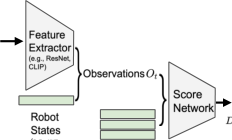

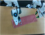

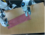

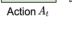

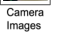

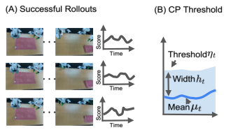

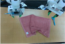

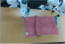

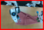

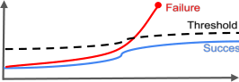

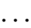

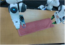

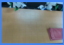

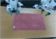

Fig. 1: **FAIL-Detect** : **F** ailure **A** nalysis in **I** mitation **L** earning – **Detect** ing failures without failure data. We propose a two-stage approach to failure detection. **(Left - Stage I)** Multi-view camera images and robot states are distilled into failure detection scalar scores. Images are first passed through a feature extractor and then, along with robot states, constitute observations _Ot_ . Both _Ot_ and generated future robot actions _At_ can serve as inputs to a score network _DM_ . This network outputs scalar scores _DM_ ( _At, Ot_ ) that capture characteristics of successful demonstration data. **(Middle - Stage II)** Scores from a calibration set of successful rollouts are then used to compute a mean _µt_ and band width _ht_ to build the time-varying conformal prediction threshold. **(Right - Runtime Failure Detection)** A successful trajectory (bottom) has scores that consistently remain below the threshold. When a failure occurs (top), such as failure to fold the towel, the score spikes above the threshold, triggering failure detection (red box). 

we use conformal prediction (CP) [52, 47] to construct a time-varying threshold to sequentially determine when a score indicates failure with statistical guarantees on false positive rates. By integrating adaptive functional CP [14] into our pipeline, we obtain thresholds that adjust to the changing dynamics of manipulation tasks unlike static thresholds used in prior work [1]. 

Our contributions are as follows. We present FAIL-Detect, a modular two stage uncertainty-aware runtime failure detection framework for generative imitation learning-based robotic manipulation. First, we construct scalar scores representative of task successes. Second, we use CP to build a time-varying threshold with stochastic guarantees. FAIL-Detect is flexible to incorporate new score and threshold designs. We thoroughly test learned and post-hoc score candidates that rely solely on successful demonstrations. FAIL-Detect with our novel learned score (logpZO) derived from a flow-based density estimator surpasses other methods. We show that FAIL-Detect identifies failures accurately and quickly on diverse robotic manipulation tasks, both in simulation and on robot hardware, outperforming SOTA failure detection baselines. 

## II. RELATED WORK 

**Imitation Learning for Robotic Manipulation.** Imitation learning has emerged as a powerful paradigm for teaching robots complex skills by learning from expert demonstrations. Diffusion policy (DP) [12] using diffusion models [22] has emerged as highly performant in this space. DP learns to denoise trajectories sampled from a Gaussian distribution, effectively capturing the multi-modal action distributions often present in human demonstrations [63, 12]. Diffusion models have been used to learn observation-conditioned policies [12, 49], integrate semantic information via language conditioning [63, 10, 44], and improve robustness and generalization [29, 54, 56]. Concurrently, vision-language-action models like Octo [40] and OpenVLA [28] have shown promise in generalist robot manipulation by leveraging large-scale pretraining on diverse datasets. More recently, flow matching 

(FM) generative models have been proposed as an alternative to diffusion in imitation learning [4, 23, 6, 64], offering faster inference and greater flexibility (i.e., extending beyond Gaussian priors [9]), while achieving competitive or superior success rates. We test FAIL-Detect on DP and FM imitation learning architectures. 

**OOD Detection.** The task of detecting robot failures can be viewed as anomaly detection, which falls under the broader framework of OOD detection [61]. Ensemble methods [31], which combine predictions from multiple models to improve robustness and estimate uncertainty, have long been regarded as the de facto approach for addressing this problem. However, they are computationally expensive as they require training and running inference on multiple models. Another popular approach frames OOD detection as a classification problem [34]. This formulation learns the decision boundary between ID and OOD data by training a binary classifier [53, 15], but requires OOD data during training. In contrast, density-based approaches [35, 16, 60], one-class discriminators based on random networks [13, 21], and control-theoretic methods [7] aim to model information from ID data without relying on OOD data during training. Density-based methods attempt to capture the distribution of ID data, yet they can be challenging to optimize. One-class discriminators have shown superior performance over deep ensembles in practice but can be sensitive to the design of the discriminator model. Control-theoretic approaches use contrastive energy-based models; however, they often require a representation of the system’s dynamics. Furthermore, evidential deep learning methods [8, 5, 25] learn parameters for second-order distributions (e.g., Dirichlet) to approximate epistemic uncertainty (due to limited model knowledge or OOD inputs) from aleatoric uncertainty (due to inherent randomness in the data). Lastly, distance-based approaches [3, 51, 27] identify OOD samples by computing their distance to ID samples in the input or latent space, avoiding the need for training but exhibiting limited performance compared to other approaches. We consider many of the listed model variants as score candidates in FAIL-Detect.

<!-- Page 3 -->

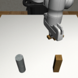

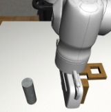

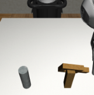

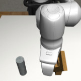

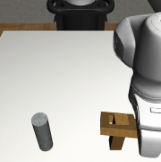

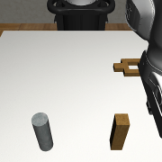

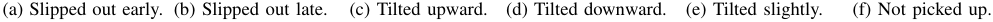

<!-- Start of picture text -->
(a) Slipped out early. (b) Slipped out late. (c) Tilted upward. (d) Tilted downward. (e) Tilted slightly. (f) Not picked up. <!-- End of picture text -->

Fig. 2: Diverse failure types observed for a single trained policy _g_ on a simple pick-and-place task (put square on peg). These failures occurred at different time steps across multiple rollouts and include the square slipping out of the gripper or being misplaced (e.g., with tilted position) on the peg. FAIL-Detect is able to handle the wide range of failures observed at test time. 

**Failure Detection in Robotics.** Detecting failures in robotic systems is important for ensuring safety and reliability, as failures can lead to undesirable behaviors in human environments [39, 42, 34]. Various approaches have been proposed, such as building fast anomaly classifiers based on LLM embeddings [48] and using the reconstruction error from variational autoencoders (VAE) to detect anomalies in behavior cloning (BC) policies for mobile manipulation [57]. Separately, Ren et al. [43] construct uncertainty sets from conformal prediction for actions generated by an LLM-based planner, prompting human intervention when the set is ambiguous. These works do not consider failure detection in the setting of generative imitation learning policies. On the other hand, Gokmen et al. [18] learn a state value function that is trained jointly with a BC policy and can be used to predict failures. Liu et al. [33] propose an LSTM-based failure classifier for a BC-RNN policy using latent embeddings from a conditional VAE. Given a Transformer-based policy and a world model to predict future latent embeddings, Liu et al. [34] train a failure detection classifier on the embeddings. To handle previously unseen states, they also propose a SOTA OOD detection method, which we adapt as a baseline to our approach (see PCA-kmeans in Section V). However, unlike FAIL-Detect, these methods require collecting failed trajectories a priori to detect failures. Meanwhile, Wang et al. [55] uses self-reset to collect additional failure data and train a classifier to identify failure modes. In their on-robot experiments, approximately 2000 trajectories (roughly 2 hours) had to be collected using self-reset, making scalability challenging. For diffusion-based policies, Sun et al. [50] reduce model uncertainty by producing prediction intervals for rewards of predicted trajectories. He et al. [21] propose using random network distillation (RND) to detect OOD trajectories and select reliable ones. These works do not directly consider runtime failure detection. Our two-stage solution for this problem combines the advantages of both approaches. The closest SOTA method to FAILDetect by Agia et al. [1] introduces a statistical temporal action consistency (STAC) measure in conjunction with visionlanguage models (VLMs) to detect failures within rollouts at runtime. STAC does not require failure data, consists of a score computed post-hoc from a batch of predicted actions and a constant-time CP threshold to flag failures, and is evaluated in the context of DP. We demonstrate improved empirical per- 

formance over STAC by integrating _learned_ failure detection scores with a _time-varying_ CP band. 

## III. PROBLEM FORMULATION 

Our focus in this work is to detect when a generative imitation learning policy fails to complete its task during execution. We define the following notation. Let _g_ ( _At | Ot_ ) denote the generator, where _Ot_ represents the environment observation (e.g., image features and robot states) at time _t_ , and _g_ is a stochastic predictor of a sequence of actions _At_ = ( _At|t, At_ +1 _|t, . . . , At_ + _H−_ 1 _|t_ ) for the next _H_ time steps. The first _H__′_ _< H_ actions _At_ : _t_ + _H ′|t_ are executed, after which the robot re-plans by generating a new sequence of _H_ actions at time _t_ + _H__′_ . Recent works have trained effective generators _g_ via DP [12] and FM [9]. Given an initial condition _O_ 0 and the generator _g_ to output the next actions, we obtain a trajectory _τt_ = ( _O_ 0 _, A_ 0 _, OH ′, AH ′, . . . , Ot, At_ ) up to _t_ = _kH__′_ ( _k ≥_ 1) execution time steps. Failure detection can thus be framed as designing a decision function _D_ ( _·_ ; _θ_ ) : _τt →{_ 0 _,_ 1 _}_ with parameters _θ_ , which takes in the current trajectory and makes a decision. If the decision _D_ ( _τt_ ; _θ_ ) = 1, the rollout is flagged as a failure at time step _t_ . For instance, in a pick-and-place task, a failure may be detected after the robot fails to pick up the object or misses the target position. 

## IV. FAILURE DETECTION FRAMEWORK 

Given action-observation data ( _At, Ot_ ), we propose a twostage framework to design the decision function _D_ ( _·_ ; _θ_ ): 

- 1) Train a scalar score model _DM_ ( _·_ ; _θ_ ) : ( _At, Ot_ ) _→_ R (for score “method” _M_ ) on action and/or observation pairs from successful trajectories only. 

2) Calibrate time-varying thresholds _ηt_ based on a CP band. The final decision _D_ ( _τt_ ; _θ_ ) = 1 ( _DM_ ( _At, Ot_ ; _θ_ ) _> ηt_ ) raises a failure flag if the scalar score _DM_ ( _At, Ot_ ; _θ_ ) exceeds the threshold _ηt_ at time step _t_ . This two-stage framework is flexible to incorporate new scores in Stage 1 or new thresholds in Stage 2. See Fig. 1 for an overview of the framework. 

## _A. Design of Scalar Scores_ 

To construct scores indicative of failures, we propose a novel score candidate and several adaptations of existing approaches originally developed for other applications. See Table I for an overview of the scoring methods we consider.

<!-- Page 4 -->

TABLE I: Overview of score methods evaluated in this work. The input was selected either based on the structure and requirements of each method or, when multiple input combinations were possible, based on empirical performance. All methods except STAC (which proposes a different calibration method; see Section V) use time-varying CP bands described in Section IV-B. 

|Method|Type|Input|Category|Novelty|Original application|
|---|---|---|---|---|---|
|logpZO|Learned|_Ot_|Density estimation|Novel|N/A|
|lopO|Learned|_Ot_|Density estimation|Adapted [60]|Likelihood estimation on tabular data|
|NatPN|Learned|_Ot_|Second-order|Adapted [8]|OOD detection for classification and regression|
|DER|Learned|(_Ot, At_)|Second-order|Adapted [5]|OOD detection for human pose estimation|
|RND|Learned|(_Ot, At_)|One-class discriminator|Adapted [21]|Reinforcement learning [21]; OOD detetcion [13]|
|CFM|Learned|_Ot_|One-class discriminator|Adapted [62]|Efficient sampling of flow models|
|SPARC|Post-hoc|_At_|Smoothness measure|Adapted [2]|Smoothness analysis for time series data|
|STAC|Post-hoc|_At_|Statistical divergence|Baseline [1]|Failure detection for generative imitation learning policies|
|PCA-kmeans|Post-hoc|_Ot_|Clustering|Baseline [34]|OOD detection during robot execution|

When designing a scalar score that is indicative of policy failure, we consider the following desiderata: **(1) One-class** : The method should not require failure data during training as it may be too diverse to enumerate (see Fig. 2). **(2) Lightweight** : The method should allow for fast inference to enable real-time robot manipulation. **(3) Discriminative** : The method should yield gaps in scores for successful and failed rollouts. To avoid overfitting on historical data, the score network _DM_ only takes the latest _TO_ steps ( _TO_ = 2 following [12]) of past observations _Ot_ alongside future action _At_ as inputs, rather than the growing trajectory history. To meet our desiderata, we select and build on the following approach categories. 

**(a) Learned data density:** we fit a normalizing flow-based density estimator to the observations, where data far from the distribution of successful trajectory observations may indicate failure. The approach we term lopO [60] fits a continuous normalizing flow (CNF) _fθ_ to the set of observations _{Ot}t≥_ 0. A low log _p_ ( _Ot__′_ ) for a new observation _Ot__′_ implies it is unlikely, indicating possible failure. Note the computation of log _p_ ( _Ot′_ ) requires integration of the divergence of _fθ_ over the ODE trajectory, which is difficult to estimate in high dimensions. Additionally, we introduce our novel logpZO approach, which leverages the same CNF _fθ_ to evaluate the likelihood of a noise estimate _ZOt_ (conditioned on an observation _Ot_ ). Using the forward ODE process, we compute _ZOt_ by integrating _fθ_ over the unit interval [0,1], starting from _Ot_ as the ODE initial condition. When _Ot_ is ID, _ZOt_ is approximately Gaussian, leading to _p_ ( _ZOt_ ) = _C_ exp( _−_ 0 _._ 5 _|ZOt|_2 ). Thus, a high value of _|ZOt|_2 2correspondstoalowlikelihood_p_(_ZO_ _t_)inthenoise space. Further details on logpZO are described in Appendix A. The key distinction between lopO and logpZO lies in their domains: the former assesses likelihood in the original observation space, while the latter does so in the latent noise space. We expect the latter to be better because its computation does not require the divergence of _fθ_ integrated over [0 _,_ 1], a hardto-estimate quantity in high dimensions. 

**(b) Second-order:** these methods learn parameters for second-order distributions that can separate aleatoric and epistemic uncertainty [46]. NatPN [8] imposes a Dirichlet prior on class probabilities and optimizes model parameters by 

minimizing a Bayesian loss. To use NatPN, we discretize the observations _Ot_ using _K_ -means and apply NatPN to the discretized version. We also consider multivariate deep evidential regression DER [5], which assumes _At|Ot_ follows a multivariate Gaussian distribution with a Wishart prior and learns its parameters. 

**(c) One-class discriminator:** we consider methods that learn a continuous metric, but do not directly model the distribution of input data. The one-class discriminator RND [21] initializes random target _fT_ ( _·_ ) and random predictor _f_ ( _·_ ; _θ_ ) networks. The target is frozen, while the predictor is trained to minimize E( _At,Ot_ ) _∼_ ID trajectory[ _DM_ ( _At, Ot_ ; _θ_ )] for _DM_ ( _At, Ot_ ; _θ_ ) = _||fT_ ( _At, Ot_ ) _− f_ ( _At, Ot_ ; _θ_ ) _||_ 22on successful demonstration data. Intuitively, RND learns a mapping from the data ( _At, Ot_ ) to a preset random function. If the learned mapping starts to deviate from the expected random output, the input data is likely OOD. In this category, we also consider consistency flow matching (CFM) [62], which measures trajectory curvature with empirical variance of the observationto-noise forward flow. The intuition is that on ID data, the forward flow is trained to be straight and consistent. Thus, high trajectory curvature indicates the input data is OOD. 

**(d) Post-hoc metrics:** we investigate methods that compute a scalar score analytically without learning. We use SPARC [2] to measure the smoothness of predicted actions. We expect SPARC to be useful for robot jitter failures, which are empirically frequent in OOD scenarios. The recent SOTA in success-based failure detection, STAC [1], falls in the posthoc method category. However, since it comes with its own statistical evaluation procedure, we describe it as one of our main baselines in Section V. Additionally, we term the OOD detection method by Liu et al. [34] as PCA-kmeans, which also falls in this category. We retrofit it within our two-stage framework as another baseline in Section V. 

_B. Sequential Threshold Design with Conformal Prediction_ 

We design a time-varying threshold _ηt_ such that a failure is flagged when _DM_ ( _At, Ot_ ; _θ_ ) exceeds _ηt_ . To do so, we leverage functional CP [14], a framework that wraps around a time series of any scalar score _DM_ ( _At, Ot_ ; _θ_ ) (higher indicates

<!-- Page 5 -->

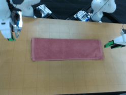

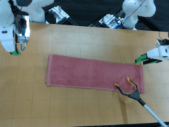

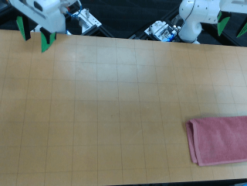

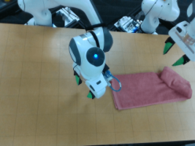

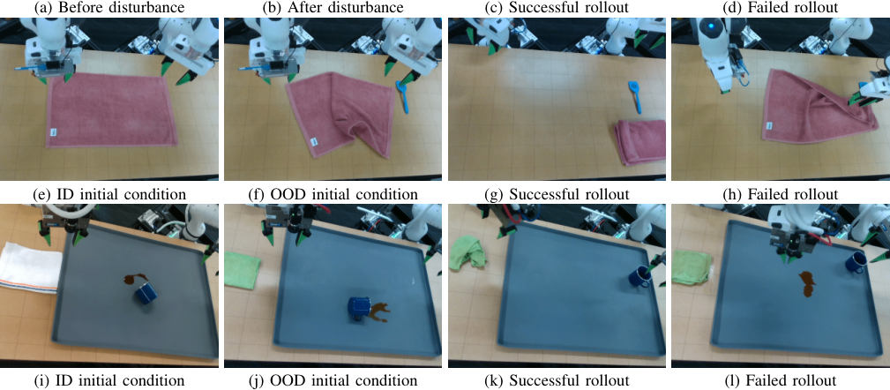

<!-- Start of picture text -->
(a) Before disturbance (b) After disturbance (c) Successful rollout (d) Failed rollout (e) ID initial condition (f) OOD initial condition (g) Successful rollout (h) Failed rollout (i) ID initial condition (j) OOD initial condition (k) Successful rollout (l) Failed rollout <!-- End of picture text -->

Fig. 3: Robot hardware experiment scenarios. **(Top row) FoldRedTowel** with Disturbance: In (b), the human pulls the towel from the position in (a) towards the bottom during a policy rollout. We note that such recovery behavior is sometimes present in the training data, so the task may succeed as in (c). A failure case is shown in (d). **(Middle row) FoldRedTowel** OOD: Compared to ID (e), we start with a crumpled towel with a blue spatula distractor to the right of the towel as in (f). Neither condition is present in the training data, thus although the task could succeed as in (g), the success rate is low and the robot typically fails like in (h). **(Bottom row) CleanUpSpill** OOD: Compared to ID (i), we start with a green towel as in (j). The training data only contains white and gray towels and, therefore, although the task could succeed as in (k), the robot typically fails like in (l) with a low success rate. 

failure) and yields a distribution-free prediction band _Cα_ with user-specified significance level _α ∈_ (0 _,_ 1). Under mild conditions [52, 58, 59], _Cα_ contains any ID score _DM_ ( _At, Ot_ ; _θ_ ) with probability of at least 1 _− α_ for the entire duration of the rollout. If _DM_ ( _At, Ot_ ; _θ_ ) _∈/ Cα_ , we can confidently reject that ( _At, Ot_ ) is ID. 

For sequential failure detection, we build _Cα_ as a onesided time-varying CP band. The band is one-sided as we are only concerned with high values of the scalar score _DM_ ( _At, Ot_ ; _θ_ ), which indicate the trajectory is OOD (i.e., a failure). Given _N_ successful rollouts as the calibration data, we obtain scalar scores _Dcal_ = _{DM_ ( _A__i_ _t__, O_ _t__i_;_θ_): _i_ = 1 _, . . . , N_ and _t_ = 1 _, H__′_ _, . . . , T }_ . The CP band is a set of intervals _Cα_ = _{_ [lower _t,_ upper _t_ ] : _t_ = 1 _, H__′_ _, . . . , T }_ , where lower _t ≡_ min( _Dcal_ ) since the band is one-sided. To obtain the upper bound, we follow [14], computing the time-varying mean _µt_ and band width _ht_ , so that upper _t_ = _µt_ + _ht_ . Further details of upper bound construction are in Appendix B. Theoretically, for a new successful rollout _τT_ = ( _O_ 0 _, A_ 0 _, . . . , OT , AT_ ), with probability at least 1 _−α_ , the score _DM_ ( _At, Ot_ ; _θ_ ) _∈_ [lower _t,_ upper _t_ ] for all _t_ = 1 _, H__′_ _, . . . , T_ . By defining the threshold _ηt_ = upper _t_ and setting failures to one, the decision rule 1 ( _DM_ ( _At, Ot_ ; _θ_ ) _> ηt_ ) controls the false 

positive rate (successes marked as failures) at level _α_ . 

## V. EXPERIMENTS 

We test our two-stage failure detection framework in both simulation and on robot hardware. Our experiments span multiple environments, each presenting unique challenges in terms of types of tasks and distribution shifts. We empirically investigate an extensive set of both learned and post-hoc scalar scores (see Table I) within our FAIL-Detect framework (see results in Section VI). We refer to Appendix C for more details on policy training, the CP band calibration procedure, and the learned scalar score architectures. 

_a) Tasks:_ In simulation, we consider the **Square** , **Transport** , **Can** , and **Toolhang** tasks from the open-source Robomimic benchmark1 [38]. In the robot hardware experiments, we consider two tasks on a bimanual Franka Emika Panda robot station that are significantly more challenging: **FoldRedTowel** and **CleanUpSpill** (see Fig. 8). We construct OOD settings for each task. In simulation, we adjust the thirdperson camera 10 cm upwards at the first time step after _t_ = 50 to simulate a camera bump mid-rollout2 . For the on-robot 

> 1We omit the **Lift** task as both FM and DP policies achieve 100% success. 

> 2We use _t_ = 15 for **Can** , which has the shortest task completion time.

<!-- Page 6 -->

(a) Transport ID 

(c) Square ID 

(e) Can ID 

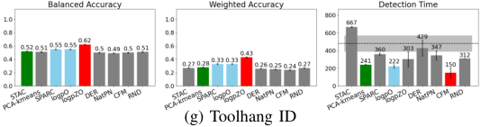

<!-- Start of picture text -->
(g) Toolhang ID <!-- End of picture text -->

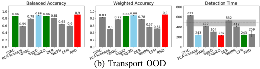

<!-- Start of picture text -->
(b) Transport OOD <!-- End of picture text -->

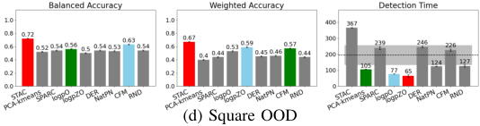

<!-- Start of picture text -->
(d) Square OOD <!-- End of picture text -->

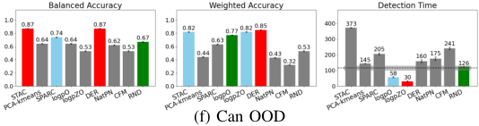

<!-- Start of picture text -->
(f) Can OOD <!-- End of picture text -->

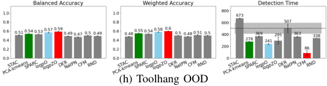

<!-- Start of picture text -->
(h) Toolhang OOD <!-- End of picture text -->

Fig. 4: Quantitative failure detection results for simulation tasks on FM policy (best, second, third); results with TPR and TNR are in Fig. 11 and results on DP are in Fig. 12. For balanced accuracy and weighted accuracy, higher is better and for detection time, lower is better. The CP band for each task is calibrated with successful rollouts under ID initial conditions only (i.e., the same band is used for ID and OOD test cases). We group together post-hoc (STAC, PCA-kmeans, SPARC), density-based (logpO, logpZO), second-order (DER, NatPN), and one-class (CFM, RND) methods and show barplots with standard errors. The dashed line in the Detection Time plots represents the average successful trajectory time in that setting with standard error. Overall, learned methods outperform post-hoc ones in failure detection. In terms of **combined accuracy** (balanced accuracy and weighted accuracy), logpZO and RND are the best two methods, reaching top-1 performance in 10/16 and 5/16 cases, respectively. Moreover, logpZO reaches top-3 performance in 14/16 cases, while RND does so in 9/16 cases. In comparison, the baselines STAC and PCA-kmeans reach top-1 performance in 3/16 and 0/16 cases, respectively. Note that STAC reaches top-3 performance in 8/16 cases, while PCA-kmeans does so in 3/16 cases. The learned methods also achieve the fastest **detection time** , with one of the learned methods always getting the best overall detection time in all but one case. In terms of best top-1 performance, logpZO is the fastest method in 3/8 cases, RND in 0/8 cases, and the PCA-kmeans baseline does so in 1/8 cases. In contrast, STAC is the slowest in nearly all cases, detecting failures only after the average success trajectory time, rendering the detection not practical. 

**FoldRedTowel** task, we disturb the task after the first fold (challenging ID scenario) and create an OOD initial condition by crumpling the towel (seen in less than _∼_ 15% of the data) and adding a never before seen distractor (blue spatula). For the **CleanUpSpill** task, we create an OOD initial condition by changing the towel to a novel green towel (see Fig. 3). 

_b) Baselines:_ We baseline FAIL-Detect against STAC [1] and PCA-kmeans [34] as SOTA approaches in success-based failure detection for generative imitation learning policies. STAC operates by generating batches (e.g., 256) of predicted actions at each time step. It then computes the statistical distance (e.g., maximum mean distance (MMD)) between temporally overlapping regions of two consecutive predictions, where the MMD is approximated by batch elements. Intuitively, the MMD measures the “surprise” in the predictions over the rollout and subsequently, STAC makes a detection using CP. Note that instead of computing a CP band for a temporal sequence, STAC computes a single threshold based on empirical quantiles of the cumulative divergence 

in a calibration set. We reproduce the method and adopt hyperparameters used in their push-T example, where we generate a batch of 256 action predictions per time step. We did not employ the VLM component of the STAC failure detector to remain as real-time feasible as possible. Due to the long STAC inference time (even after parallelization) and resulting high system latency, we omit its comparison on the two robot hardware tasks. In our second baseline, Liu et al. [34] tackle failure detection by training a failure classifier, which requires the collection of failure training data. However, this approach is not applicable to our setup as we assume access to only successful human demonstrations for training and successful rollouts for calibration. Instead, we incorporate their proposed OOD detection method as a post-hoc scalar score in the first stage of FAIL-Detect to construct a fair baseline. We use the performant time-varying CP band to obtain thresholds in the second stage. The method measures the distance of a new observation _Ot__′_ at test time index _t__′_ from the set of training data _{Ot}t≥_ 0, which consist of

<!-- Page 7 -->

(a) **FoldRedTowel** with FM: (Setting-dependent band) ID + Disturb 

(b) **FoldRedTowel** with FM: (ID-only band) ID + Disturb 

(c) **FoldRedTowel** with FM: (Setting-dependent band) OOD 

(d) **FoldRedTowel** with FM: (ID-only band) OOD 

(e) **CleanUpSpill** with DP: (Setting-dependent band) OOD 

(f) **CleanUpSpill** with DP: (ID-only band) OOD 

Fig. 5: Quantitative results for the robot hardware experiments across two tasks with policies trained using FM and DP. We consider two different ways to compute the CP band: “setting-dependent” using successful trajectories from each OOD/ID environment and “ID-only” using only the trajectories from the ID environment. For balanced accuracy and weighted accuracy, higher is better and for detection time, lower is better. Additional metrics are reported in Fig. 13 and Fig. 14. The figure layout is the same as Fig. 4 (best, second, third), and ‘NaN’ detection time indicates that no test rollout was detected as failed. Once again the learned approaches outperform the post-hoc methods. Note we do not present STAC here as it was slow to run on hardware in real-time. In the small sample size regime, logpZO remains robust in **combined accuracy** , achieving top-1 performance in the highest number of cases (8/12) and top-3 performance in 11/12 cases. RND underperforms by never reaching top-1 performance, yet it always achieves top-3 performance. In contrast, the PCA-kmeans baseline reaches top-1 performance in 4/12 cases and top-3 performance in 10/12 cases. In **detection time** , the post-hoc SPARC method is the fastest in 4/6 cases, yet it never achieves top-1 performance. PCA-kmeans is robust in speed as it attains top-3 performance in 4/6 cases. logpZO still remains practical with detection times well below the average success trajectory completion time. 

visual encoded features jointly trained with the policy on the demonstration data. PCA-kmeans first uses PCA to embed the training features and then applies _K_ -means clustering to the embedded data to obtain _K_ = 64 centroids. After embedding _Ot__′_ using the same principal components, the method computes the smallest Euclidean distance between the embedding and the _K_ centroids. This distance serves as the OOD metric (higher values indicate greater OOD). We omit comparison against ensembles [31], a popular OOD detection technique, due to RND having shown improved performance over ensembles in prior work [13] and their prohibitively high computational cost. 

_c) Evaluation Protocol:_ To quantify failure detection performance, we denote failed rollouts as one and successful rollouts as zero. We then adopt the following standard metrics: **(1)** true positive rate (TPR), **(2)** true negative rate (TNR), **(3)** balanced accuracy = (TPR + TNR) / 2, **(4)** weighted accuracy = _β·_ TPR + (1 _− β_ ) _·_ TNR for _β_ = <u>#Successful#Rolloutsrollouts</u> , and **(5)** detection time = E( _At,Ot_ ) _∼_ test rollouts[arg min _t_ =1 _,H ′,...,T_ 1 ( _DM_ ( _At, Ot_ ; _θ_ ) _> ηt_ )], which computes the average failure detection time from the start of the rollout. The balanced accuracy metric equally represents classes in an imbalanced dataset (e.g., few successful rollouts in an OOD setting). Weighted accuracy represents how well a method matches the true success / failure distribution. Due to the high human time cost of performing realrobot rollouts, we evaluate FAIL-Detect and the baselines on 

significantly fewer rollouts in the robot hardware tasks (i.e., 50 rollouts) compared to the simulation tasks (i.e., 2000 rollouts). 

VI. RESULTS 

We present our experimental findings addressing the following research questions: 

- A. How performant is failure detection without failure data? 

- B. What is the impact of learned vs. post-hoc scores on failure detection? 

- C. Do failure detections align with human intuition? 

- _A. How performant is failure detection without failure data?_ 

A key question we consider is whether failure detection is possible and performant without enumerating all possible failure scenarios, which is practically infeasible. We conduct extensive experiments across simulation and robot hardware tasks to answer this question. We evaluate balanced accuracy, weighted accuracy, and detection time to assess whether failures can be identified reliably and quickly. 

**FAIL-Detect achieves high accuracy with fast detection.** Our two-stage framework demonstrates strong performance across both accuracy metrics and detection speed. For example, the average _best_ balanced accuracy across FAIL-Detect’s score candidates is _∼_ 78% in simulation (Fig. 4) and _∼_ 72% on the robot hardware tasks (Fig. 5). This performance shows the capacity of failure-free failure detection methods to robustly identify failures across many scenarios. Notably, FAILDetect maintains viable detection time across various score

<!-- Page 8 -->

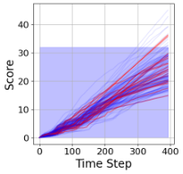

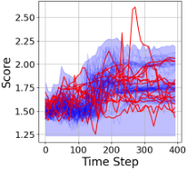

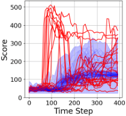

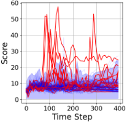

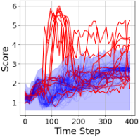

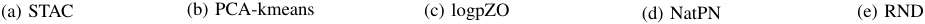

<!-- Start of picture text -->
(a) STAC (b) PCA-kmeans (c) logpZO (d) NatPN (e) RND <!-- End of picture text -->

Fig. 6: Qualitative results of failure detection scores overlaid with CP bands. The curves are colored by the ground truth success/failure status of the rollout (failure = red and success = blue). We show 150 test rollouts on **Square ID** across post-hoc baselines (STAC, PCA-kmeans) and learned FAIL-Detect methods (logpZO, NatPN, RND). We use the constant CP threshold for STAC as per [1]. Note that post-hoc baseline methods mark most trajectories as successes due to the poor failure/success separation. In comparison, learned metrics have tight CP bands and higher failure/success separation. 

designs, with average _best_ detection time faster than successful trajectory completion. 

_B. What is the impact of learned vs. post-hoc scores on failure detection?_ 

**Learned scores outperform post-hoc scores.** Looking at performance across simulation and robot hardware tasks, we find that learned scalar scores hold an advantage over post-hoc scores in failure detection. In simulation (Fig. 4), logpZO and RND are the best two methods, achieving top-1 performance in 10/16 and 5/16 cases, respectively. STAC is the best in the post-hoc category for top-1 accuracy in 3/16 cases, yet PCAkmeans is never the best. Overall, there is a large performance gap between the learned and post-hoc methods, especially in terms of the best overall accuracy. We did notice that post-hoc methods perform better in the OOD cases than in ID scenarios. We hypothesize this may be due to a clearer distinction between successful ID trajectories and failed OOD trajectories, for example, for SPARC if the OOD trajectory exhibits significant jitter. 

In terms of detection time, logpZO is the most efficient, achieving the fastest time in 3/8 cases, while PCA-kmeans does so in only 1/8 cases. Notably, STAC’s detection time consistently exceeds practical limits, surpassing the average success trajectory time. 

For the robot hardware experiments (Fig. 5), with a much lower rollout data regime for calibration than in simulation (see Table III) and a wider diversity of behaviors and observations, logpZO remains robust as the best method, reaching top-1 highest balanced accuracy and weighted accuracy in 8/12 scenarios. The PCA-kmeans baseline is second best with 4/12 top-1 ranking. RND underperforms by never achieving top-1 performance, yet it always ranks among the top-3 best methods. Additionally, most methods, including logpZO and RND, maintain practical detection times well below the average successful trajectory time. SPARC is on average the fastest as it attains top-1 performance in 4/6 cases, but it exhibits poor accuracy. 

Overall, across all experiments, we find our novel learned logpZO score within the FAIL-Detect framework to be most consistent in performance. The post-hoc methods are often 

at the extremes of performance (either doing well or poorly) depending on the particular setting. 

**Qualitative score trends.** Visualization of the detection scores (Figs. 6 and 9) confirms that learned methods are more discriminative with better score separation between successful and failed trajectories compared to post-hoc approaches. STAC also suffers from a single calibration threshold that is time invariant. In Appendix D, we present comprehensive ablation studies examining performance sensitivity to CP significance level _α_ (Fig. 10). 

**Computational advantage.** Some post-hoc methods require sampling from the stochastic policy repeatedly to achieve a performant failure score. For example, STAC requires generating 256 action predictions per time step. Although the computational efficiency could be improved by generating fewer predictions, this compromises its statistical reliability. On the other hand, our learned scores offer significantly faster inference speeds compared to STAC. For instance, testing on an A6000 GPU with 50 rollouts, logpZO score computation takes 0 _._ 04 s ( **Square** ) and 0 _._ 033 s ( **Transport** ) per time step, while STAC requires 1 _._ 45 s for both tasks, amounting to a 36-44 times slowdown. 

## _C. Do failure detections align with human intuition?_ 

FAIL-Detect’s alerts demonstrate strong correlation with observable failure indications in the environment (Fig. 7). When scores exceed the decision threshold, these moments often align with meaningful changes in the physical state of the task. In simulation environments, the detection scores capture distinct failure patterns with high precision. For instance, for the **Square** task, abrupt increases in scores coincide with the moment the gripper loses its hold on the square. Similarly, in the **Transport** task, score spikes identify the instant when the hammer slips during inter-arm transfer. Realworld applications demonstrate similarly compelling results: the system effectively detects both human-induced disruptions leading to an incomplete second towel fold ( **FoldRedTowel ID + Disturb** ) and OOD initial conditions resulting in an improper first towel fold ( **FoldRedTowel OOD** ). 

This correspondence between score spikes and physical events is encouraging for FAIL-Detect’s capacity to capture

<!-- Page 9 -->

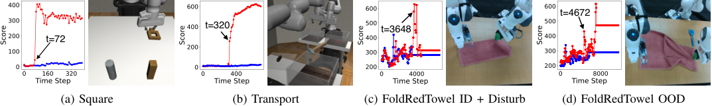

<!-- Start of picture text -->
t=4672 t=320 t=3648 t=72 (a) Square (b) Transport (c) FoldRedTowel ID + Disturb (d) FoldRedTowel OOD <!-- End of picture text -->

Fig. 7: Physical interpretation of logpZO, the most successful and robust learned score method. Failed trajectory scores are in red and successful ones are in blue. Each figure shows the failure detection time and the corresponding camera view. **(Simulation)** In Fig. 7a, failure is flagged when the square slips from the gripper. In Fig. 7b, failure is detected when both arms drop the hammer. **(On-robot)** In Fig. 7c, failure is alerted as the second fold attempt fails. In Fig. 7d, failure is detected as the left robot arm fails to complete the first fold. 

task-relevant subtlety. The framework successfully translates complex environmental changes into quantifiable metrics, with score variations serving as reasonable indicators of failure events. Moreover, this correlation offers valuable diagnostic capabilities for potential policy improvement. Instead of requiring an exhaustive a priori enumeration of potential failure modes, which is an inherently challenging endeavor, our approach enables potential targeted analysis of observed failures. By examining executions within temporal windows surrounding a failure detection, one can efficiently identify failure types for subsequent analysis. 

**Environment-dependent thresholds aid performance on robot hardware tasks.** For simulation tasks (Fig. 4), IDonly bands computed on successful ID rollouts work well for failure identification in both the ID and the OOD camera bump scenarios. This setting is practically preferable as it does not require collecting successful rollouts in each new environment to calibrate the failure detection threshold. However, on-robot tasks with OOD initial conditions (Figs. 5, 13 and 14), most methods show degraded performance with ID-only bands, at times yielding low or close to zero TNR due to most rollouts being marked as failure. This over-conservative behavior likely occurs because OOD successful trajectories are less performant. We find on-robot policies to be more sensitive to the environmental changes we employed than the simulation-based policies in response to the camera bump. Even when tasks are completed successfully in these challenging conditions, trajectories often exhibit poor quality (e.g., slow execution, jitter) and higher (worse) scores compared to ID successful rollouts, suggesting they should potentially be classified as failures. 

environmental and behavioral shifts. However, more advanced techniques such as adaptively adjusting the CP significance level during inference could be helpful. Additionally, our score candidates do not consider long sequences of temporal data. Although the CP band is temporally-aware, having the learned scores distill temporal patterns from historical time series data may lead to better failures predictions. Lastly, the timely detection of failures may be further improved by considering multimodal sensory information such as sound or tactile. 

## VIII. CONCLUSION 

We present a modular two-stage uncertainty-aware runtime failure detection approach for generative imitation learning in manipulation tasks. Our method combines a learned scalar score and time-varying conformal prediction to accurately and efficiently identify failures while providing statistical guarantees. Through extensive experiments on diverse tasks, we show that the novel logpZO score consistently achieves the highest performance among the considered candidates. Crucially, we demonstrate that unseen failures can be effectively detected without access to failure data, which may be difficult to collect to cover all possible failure scenarios. Our results highlight the potential of our method to enhance the safety and reliability of robotic systems in real-world applications. 

## ACKNOWLEDGEMENT 

This work was primarily done during an internship at Toyota Research Institute (TRI). We thank Vitor Guizilini, Benjamin Burchfiel, and David Snyder for the helpful discussions and feedback. We thank the robot teacher team at the TRI headquarters for the data collection, specifically Derick Seale and Donovon Jackson. 

## VII. LIMITATIONS 

With FAIL-Detect, we demonstrate the promising potential of a failure detection method without access to failure data. The proposed two-staged method does have several limitations, which offer possible avenues for future work. We observed that, at times, the learned scores focus on simpler robot state information (e.g., gripper closed or open) over the higherdimensional visual features. Finding score architectures that maximally make use of the visual information could improve failure detection performance. Meanwhile, we acknowledge the existence of false positives, especially in OOD settings where the trajectories degrade in performance. Our proposed setting-dependent CP band is meant to account for these 

## REFERENCES 

- [1] Christopher Agia, Rohan Sinha, Jingyun Yang, Ziang Cao, Rika Antonova, Marco Pavone, and Jeannette Bohg. Unpacking Failure Modes of Generative Policies: Runtime Monitoring of Consistency and Progress. In _Conference on Robot Learning (CoRL)_ , 2024. 

- [2] Sivakumar Balasubramanian, Alejandro MelendezCalderon, Agnes Roby-Brami, and Etienne Burdet. On the Analysis of Movement Smoothness. _Journal of Neuroengineering and Rehabilitation_ , 12:1–11, 2015. 

- [3] Steven Basart, Mazeika Mantas, Mostajabi Mohammadreza, Steinhardt Jacob, and Song Dawn. Scaling

<!-- Page 10 -->

Out-of-Distribution Detection for Real-world Settings. In _International Conference on Machine Learning (ICML)_ , 2022. 

- [4] Kevin Black, Noah Brown, Danny Driess, Adnan Esmail, Michael Equi, Chelsea Finn, Niccolo Fusai, Lachy Groom, Karol Hausman, Brian Ichter, et al. _π_ 0: A Vision-Language-Action Flow Model for General Robot Control. _arXiv preprint arXiv:2410.24164_ , 2024. 

- [5] Lennart Bramlage, Michelle Karg, and Crist´obal Curio. Plausible Uncertainties for Human Pose Regression. In _International Conference on Computer Vision (ICCV)_ , pages 15087–15096. IEEE, 2023. 

- [6] Max Braun, No´emie Jaquier, Leonel Rozo, and Tamim Asfour. Riemannian Flow Matching Policy for Robot Motion Learning. _arXiv preprint arXiv:2403.10672_ , 2024. 

- [7] Fernando Casta˜neda, Haruki Nishimura, Rowan McAllister, Koushil Sreenath, and Adrien Gaidon. In-Distribution Barrier Functions: Self-Supervised Policy Filters that Avoid Out-of-Distribution States. In _Learning for Dynamics & Control Conference (L4DC)_ , volume 211, pages 286–299. PMLR, 2023. 

- [8] Bertrand Charpentier, Oliver Borchert, Daniel Z¨ugner, Simon Geisler, and Stephan G¨unnemann. Natural Posterior Network: Deep Bayesian Predictive Uncertainty for Exponential Family Distributions. In _International Conference on Learning Representations (ICLR)_ , 2022. 

- [9] Kaiqi Chen, Eugene Lim, Kelvin Lin, Yiyang Chen, and Harold Soh. Don’t Start from Scratch: Behavioral Refinement via Interpolant-based Policy Diffusion. In _Robotics: Science and Systems (RSS)_ , 2024. 

- [10] Lili Chen, Shikhar Bahl, and Deepak Pathak. PlayFusion: Skill Acquisition via Diffusion from LanguageAnnotated Play. In _Conference on Robot Learning (CoRL)_ , 2023. 

- [11] Ricky TQ Chen, Yulia Rubanova, Jesse Bettencourt, and David K Duvenaud. Neural Ordinary Differential Equations. _Advances in Neural Information Processing Systems (NeurIPS)_ , 31, 2018. 

- [12] Cheng Chi, Siyuan Feng, Yilun Du, Zhenjia Xu, Eric Cousineau, Benjamin Burchfiel, and Shuran Song. Diffusion Policy: Visuomotor Policy Learning via Action Diffusion. In _Robotics: Science and Systems (RSS)_ , 2023. 

- [13] Kamil Ciosek, Vincent Fortuin, Ryota Tomioka, Katja Hofmann, and Richard Turner. Conservative Uncertainty Estimation By Fitting Prior Networks. In _International Conference on Learning Representations (ICLR)_ , 2020. 

- [14] Jacopo Diquigiovanni, Matteo Fontana, Simone Vantini, et al. The Importance of Being a Band: Finite-Sample Exact Distribution-Free Prediction Sets for Functional Data. _Statistica Sinica_ , 1:1–41, 2024. 

- [15] Andrija Djurisic, Nebojsa Bozanic, Arjun Ashok, and Rosanne Liu. Extremely Simple Activation Shaping for Out-of-Distribution Detection. In _International Conference on Learning Representations (ICLR)_ , 2023. 

- [16] Xuefeng Du, Zhaoning Wang, Mu Cai, and Sharon Li. 

   - Towards Unknown-aware Learning with Virtual Outlier Synthesis. In _International Conference on Learning Representations (ICLR)_ , 2022. 

- [17] Matt Foutter, Rohan Sinha, Somrita Banerjee, and Marco Pavone. Self-Supervised Model Generalization using Out-of-Distribution Detection. In _First Workshop on Outof-Distribution Generalization in Robotics at CoRL 2023_ , 2023. 

- [18] Cem Gokmen, Daniel Ho, and Mohi Khansari. Asking for Help: Failure Prediction in Behavioral Cloning Through Value Approximation. In _International Conference on Robotics and Automation (ICRA)_ , pages 5821– 5828. IEEE, 2023. 

- [19] Martin H¨agele, Klas Nilsson, J Norberto Pires, and Rainer Bischoff. Industrial Robotics. _Springer Handbook of Robotics_ , pages 1385–1422, 2016. 

- [20] Kaiming He, Xiangyu Zhang, Shaoqing Ren, and Jian Sun. Deep Residual Learning for Image Recognition. In _Computer Society Conference on Computer Vision and Pattern Recognition (CVPR)_ , pages 770–778. IEEE, 2016. 

- [21] Nantian He, Shaohui Li, Zhi Li, Yu Liu, and You He. ReDiffuser: Reliable Decision-Making Using a Diffuser with Confidence Estimation. In _International Conference on Machine Learning (ICML)_ , volume 235, pages 17921–17933. PMLR, 21–27 Jul 2024. 

- [22] Jonathan Ho, Ajay Jain, and Pieter Abbeel. Denoising Diffusion Probabilistic Models. _Advances in Neural Information Processing Systems (NeurIPS)_ , 33:6840–6851, 2020. 

- [23] Xixi Hu, qiang liu, Xingchao Liu, and Bo Liu. AdaFlow: Imitation Learning with Variance-Adaptive Flow-Based Policies. In _Advances in Neural Information Processing Systems (NeurIPS)_ , 2024. 

- [24] Arda Inceoglu, Eren Erdal Aksoy, and Sanem Sariel. Multimodal Detection and Classification of Robot Manipulation Failures. _Robotics and Automation Letters_ , 2023. 

- [25] Masha Itkina and Mykel Kochenderfer. Interpretable Self-aware Neural Networks for Robust Trajectory Prediction. In _Conference on Robot Learning (CoRL)_ , pages 606–617. PMLR, 2023. 

- [26] Michael Janner, Yilun Du, Joshua Tenenbaum, and Sergey Levine. Planning with Diffusion for Flexible Behavior Synthesis. In _International Conference on Machine Learning (ICML)_ , pages 9902–9915. PMLR, 2022. 

- [27] Ramneet Kaur, Kaustubh Sridhar, Sangdon Park, Yahan Yang, Susmit Jha, Anirban Roy, Oleg Sokolsky, and Insup Lee. CODiT: Conformal Out-of-Distribution Detection in Time-Series Data for Cyber-Physical Systems. In _Proceedings of the ACM/IEEE 14th International Conference on Cyber-Physical Systems (with CPS-IoT Week 2023)_ , ICCPS ’23, page 120–131, New York, NY, USA, 2023. Association for Computing Machinery. ISBN 9798400700361. doi: 10.1145/3576841.3585931.

<!-- Page 11 -->

- [28] Moo Jin Kim, Karl Pertsch, Siddharth Karamcheti, Ted Xiao, Ashwin Balakrishna, Suraj Nair, Rafael Rafailov, Ethan Foster, Grace Lam, Pannag Sanketi, Quan Vuong, Thomas Kollar, Benjamin Burchfiel, Russ Tedrake, Dorsa Sadigh, Sergey Levine, Percy Liang, and Chelsea Finn. OpenVLA: An Open-Source Vision-Language-Action Model. _arXiv preprint arXiv:2406.09246_ , 2024. 

- [29] Woo Kyung Kim, Minjong Yoo, and Honguk Woo. Robust Policy Learning via Offline Skill Diffusion. In _AAAI Conference on Artificial Intelligence (AAAI)_ , volume 38, pages 13177–13184, 2024. 

- [30] Diederik P. Kingma and Jimmy Ba. Adam: A Method for Stochastic Optimization. In Yoshua Bengio and Yann LeCun, editors, _International Conference on Learning Representations (ICLR)_ , 2015. 

- [31] Balaji Lakshminarayanan, Alexander Pritzel, and Charles Blundell. Simple and Scalable Predictive Uncertainty Estimation using Deep Ensembles. _Advances in Neural Information Processing Systems (NeurIPS)_ , 30, 2017. 

- [32] Yaron Lipman, Ricky T. Q. Chen, Heli Ben-Hamu, Maximilian Nickel, and Matthew Le. Flow Matching for Generative Modeling. In _International Conference on Learning Representations (ICLR)_ , 2023. 

- [33] Huihan Liu, Shivin Dass, Roberto Mart´ın-Mart´ın, and Yuke Zhu. Model-based Runtime Monitoring with Interactive Imitation Learning. In _International Conference on Robotics and Automation (ICRA)_ , pages 4154–4161. IEEE, 2024. 

- [34] Huihan Liu, Yu Zhang, Vaarij Betala, Evan Zhang, James Liu, Crystal Ding, and Yuke Zhu. Multi-Task Interactive Robot Fleet Learning with Visual World Models. In _Conference on Robot Learning (CoRL)_ , 2024. 

- [35] Weitang Liu, Xiaoyun Wang, John Owens, and Yixuan Li. Energy-based Out-of-Distribution Detection. _Advances in Neural Information Processing Systems (NeurIPS)_ , 33:21464–21475, 2020. 

- [36] Ilya Loshchilov and Frank Hutter. SGDR: Stochastic Gradient Descent with Warm Restarts. In _International Conference on Learning Representations (ICLR)_ , 2017. 

- [37] Ilya Loshchilov and Frank Hutter. Decoupled Weight Decay Regularization. In _International Conference on Learning Representations (ICLR)_ , 2019. 

- [38] Ajay Mandlekar, Danfei Xu, Josiah Wong, Soroush Nasiriany, Chen Wang, Rohun Kulkarni, Li Fei-Fei, Silvio Savarese, Yuke Zhu, and Roberto Mart´ın-Mart´ın. What Matters in Learning from Offline Human Demonstrations for Robot Manipulation. In _Conference on Robot Learning (CoRL)_ , 2021. 

- [39] Rajesh Natarajan, Santosh Reddy P, Subash Chandra Bose, H.L. Gururaj, Francesco Flammini, and Shanmugapriya Velmurugan. Fault Detection and State Estimation in Robotic Automatic Control using Machine Learning. _Array_ , 19:100298, 2023. ISSN 2590-0056. doi: https://doi.org/10.1016/j.array.2023.100298. 

- [40] Octo Model Team, Dibya Ghosh, Homer Walke, Karl Pertsch, Kevin Black, Oier Mees, Sudeep Dasari, Joey 

Hejna, Charles Xu, Jianlan Luo, Tobias Kreiman, You Liang Tan, Pannag Sanketi, Quan Vuong, Ted Xiao, Dorsa Sadigh, Chelsea Finn, and Sergey Levine. Octo: An Open-Source Generalist Robot Policy. In _Robotics: Science and Systems (RSS)_ , Delft, Netherlands, 2024. 

- [41] Alec Radford, Jong Wook Kim, Chris Hallacy, Aditya Ramesh, Gabriel Goh, Sandhini Agarwal, Girish Sastry, Amanda Askell, Pamela Mishkin, Jack Clark, et al. Learning Transferable Visual Models from Natural Language Supervision. In _International Conference on Machine Learning (ICML)_ , pages 8748–8763. PMLR, 2021. 

- [42] Quazi Marufur Rahman, Peter Corke, and Feras Dayoub. Run-Time Monitoring of Machine Learning for Robotic Perception: A Survey of Emerging Trends. _IEEE Access_ , 9:20067–20075, 2021. 

- [43] Allen Z. Ren, Anushri Dixit, Alexandra Bodrova, Sumeet Singh, Stephen Tu, Noah Brown, Peng Xu, Leila Takayama, Fei Xia, Jake Varley, Zhenjia Xu, Dorsa Sadigh, Andy Zeng, and Anirudha Majumdar. Robots That Ask For Help: Uncertainty Alignment for Large Language Model Planners. In _Conference on Robot Learning (CoRL)_ , 2023. 

- [44] Moritz Reuss and Rudolf Lioutikov. Multimodal Diffusion Transformer for Learning from Play. In _2nd Workshop on Language and Robot Learning: Language as Grounding_ , 2023. 

- [45] Quentin Rouxel, Andrea Ferrari, Serena Ivaldi, and JeanBaptiste Mouret. Flow matching Imitation Learning for Multi-Support Manipulation. In _International Conference on Humanoid Robots (Humanoids)_ , pages 528–535. IEEE, 2024. 

- [46] Murat Sensoy, Lance Kaplan, and Melih Kandemir. Evidential Deep Learning to Quantify Classification Uncertainty. In _Advances in Neural Information Processing Systems (NeurIPS)_ , 2018. 

- [47] Glenn Shafer and Vladimir Vovk. A Tutorial on Conformal Prediction. _Journal of Machine Learning Research_ , 9(3), 2008. 

- [48] Rohan Sinha, Amine Elhafsi, Christopher Agia, Matt Foutter, Edward Schmerling, and Marco Pavone. RealTime Anomaly Detection and Reactive Planning with Large Language Models. In _Robotics: Science and Systems (RSS)_ , 2024. 

- [49] Ajay Sridhar, Dhruv Shah, Catherine Glossop, and Sergey Levine. Nomad: Goal Masked Diffusion Policies for Navigation and Exploration. In _International Conference on Robotics and Automation (ICRA)_ , pages 63–70. IEEE, 2024. 

- [50] Jiankai Sun, Yiqi Jiang, Jianing Qiu, Parth Talpur Nobel, Mykel Kochenderfer, and Mac Schwager. Conformal Prediction for Uncertainty-Aware Planning with Diffusion Dynamics Model. In _Advances in Neural Information Processing Systems (NeurIPS)_ , 2023. 

- [51] Leitian Tao, Xuefeng Du, Jerry Zhu, and Yixuan Li. Nonparametric Outlier Synthesis. In _International Confer-_

<!-- Page 12 -->

_ence on Learning Representations (ICLR)_ , 2023. 

- [52] Vladimir Vovk, Alexander Gammerman, and Glenn Shafer. _Algorithmic Learning in a Random World_ , volume 29. Springer, 2005. 

- [53] Apoorv Vyas, Nataraj Jammalamadaka, Xia Zhu, Dipankar Das, Bharat Kaul, and Theodore L Willke. Outof-Distribution Detection Using an Ensemble of Self Supervised Leave-out Classifiers. In _European Conference on Computer Vision (ECCV)_ , pages 550–564, 2018. 

Fast and Robust 3D Flow-based Policy via Consistency Flow Matching for Robot Manipulation. _arXiv preprint arXiv:2412.04987_ , 2024. 

   - [65] Tony Z. Zhao, Jonathan Tompson, Danny Driess, Pete Florence, Seyed Kamyar Seyed Ghasemipour, Chelsea Finn, and Ayzaan Wahid. ALOHA Unleashed: A Simple Recipe for Robot Dexterity. In _Conference on Robot Learning (CoRL)_ , 2024. 

- [54] Dian Wang, Stephen Hart, David Surovik, Tarik Kelestemur, Haojie Huang, Haibo Zhao, Mark Yeatman, Jiuguang Wang, Robin Walters, and Robert Platt. Equivariant Diffusion Policy. In _Conference on Robot Learning (CoRL)_ , 2024. 

- [55] Yanwei Wang, Tsun-Hsuan Wang, Jiayuan Mao, Michael Hagenow, and Julie Shah. Grounding Language Plans in Demonstrations Through Counterfactual Perturbations. In _International Conference on Learning Representations (ICLR)_ , 2024. 

- [56] Yixuan Wang, Guang Yin, Binghao Huang, Tarik Kelestemur, Jiuguang Wang, and Yunzhu Li. GenDP: 3D Semantic Fields for Category-Level Generalizable Diffusion Policy. In _Conference on Robot Learning (CoRL)_ , 2024. 

- [57] Josiah Wong, Albert Tung, Andrey Kurenkov, Ajay Mandlekar, Li Fei-Fei, Silvio Savarese, and Roberto Mart´ınMart´ın. Error-Aware Imitation Learning from Teleoperation Data for Mobile Manipulation. In _Conference on Robot Learning (CoRL)_ , pages 1367–1378. PMLR, 2022. 

- [58] Chen Xu and Yao Xie. Conformal Prediction for Time Series. _Transactions on Pattern Analysis and Machine Intelligence_ , 45(10):11575–11587, 2023. 

- [59] Chen Xu and Yao Xie. Sequential Predictive Conformal Inference for Time Series. In _International Conference on Machine Learning (ICML)_ , pages 38707–38727. PMLR, 2023. 

- [60] Chen Xu, Xiuyuan Cheng, and Yao Xie. Normalizing Flow Neural Networks by JKO Scheme. In _Advances in Neural Information Processing Systems (NeurIPS)_ , 2023. 

- [61] Jingkang Yang, Kaiyang Zhou, Yixuan Li, and Ziwei Liu. Generalized Out-of-Distribution Detection: A Survey. _International Journal of Computer Vision_ , pages 1–28, 2024. 

- [62] Ling Yang, Zixiang Zhang, Zhilong Zhang, Xingchao Liu, Minkai Xu, Wentao Zhang, Chenlin Meng, Stefano Ermon, and Bin Cui. Consistency Flow Matching: Defining Straight Flows with Velocity Consistency. _arXiv preprint arXiv:2407.02398_ , 2024. 

- [63] Tianhe Yu, Ted Xiao, Jonathan Tompson, Austin Stone, Su Wang, Anthony Brohan, Jaspiar Singh, Clayton Tan, Dee M, Jodilyn Peralta, Karol Hausman, Brian Ichter, and Fei Xia. Scaling Robot Learning with Semantically Imagined Experience. In _Robotics: Science and Systems (RSS)_ , 2023. 

- [64] Qinglun Zhang, Zhen Liu, Haoqiang Fan, Guanghui Liu, Bing Zeng, and Shuaicheng Liu. FlowPolicy: Enabling

<!-- Page 13 -->

APPENDIX 

- _A. Proposed logpZO score network_ 

We explain how the proposed novel logpZO works step by step: 

- **Step 1:** Fit a flow matching model _fθ_ between observations _{Ot}_ (i.e., image embeddings and proprioception) and latent noise _{Z} ∼N_ (0 _, I_ ), so that for _s ∈_ [0 _,_ 1]: 

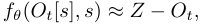

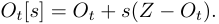

- **Step 2:** Given a new observation _Ot′_ at time step _t__′_ , perform one-step prediction to obtain latent noise estimate: 

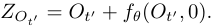

When _Ot′_ is in-distribution, by the flow matching formulation, _ZOt′_ is close to samples drawn from _N_ (0 _, I_ ). 

- **Step 3:** Compute density of latent noise (up to a constant) using squared norm: 

log _p_ ( _ZOt′_ ) _∝−∥ZOt′ ∥_ 22 

High norm values of _∥ZOt′ ∥_ 22indicatelowerlikelihood,whichiscausedbyanomalousobservations_Ot′_.Wethususe _∥ZOt′ ∥_ 22asthelogpZOscore. 

## _B. CP band construction_ 

Following [14], we split the set of calibration scores _Dcal_ into two disjoint parts _DcalA_ and _DcalB_ with sizes _N_ 1 and _N_ 2. We first compute the mean successful trajectory _µt_ = _N_ 1_−_1 � _Ni_ =11_DM_(_A_ _t__i, O_ _t__i_;_θ_)for_t_=1_, . . . , T_on_Dcal_ _A_.Then,for _j_ = 1 _, . . . , N_ 2, we compute _Dj_ = max( _{_ ( _µt − DM_ ( _At__j, O_ _t__j_;_θ_))_/scal_ _A_(_t_)_}T_ _t_ =1),whichisthemaxdeviationoverrolloutlength from the mean prediction to the scalar score. The function _scalA_ ( _t_ ) is called a “modulation” function that depends on the dataset _DcalA_ . In our experiment, we consider either 

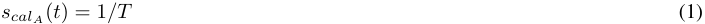

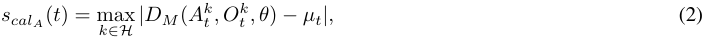

where _H_ = [ _N_ 1] if ( _N_ 1 + 1)(1 _− α_ ) _> N_ 1, otherwise _H_ = _{k ∈_ [ _N_ 1] : max _t∈_ [ _T_ ] _|DM_ ( _At__k, O_ _t__k, θ_)_−µt|≤γ}_for_γ_= (1 _− α_ )-quantile of _{_ max _t∈_ [ _T_ ] _|DM_ ( _At__m, O_ _t__m, θ_)_−µt|}N_ _m_1 =1_._Intuitively,Eq.(2)adaptsthewidthofpredictionbandsbasedon the non-extreme behaviors of the functional data. It does so by minimizing the influence of outliers whose maximum absolute residuals lie within the upper _α_ quantile of all maximum values. Additionally, note that the max is taken because the CP band is intended to reflect the entire trajectory. We define _S_ = _{Dj, j_ = 1 _, . . . , N_ 2 _}_ as the collection of such max deviations. The band width _h_ is finally computed as the (1 _− α_ )-quantile of _S_ and the upper bound is upper _t_ = _µt_ + _hscalA_ ( _t_ ). We pick _α_ = 0 _._ 05 (or 95% confidence interval) throughout experiments (see Table Table III on hyperparameter choices). 

## _C. Experimental Details_ 

- _1) Task descriptions:_ 

- **(Simulation)** The tasks from the Robomimic benchmark [38] are as follows. The **Square** task asks the robot to pick up a square nut and place it on a rod, which requires precision. The **Transport** task asks two robot arms to transfer a hammer 

TABLE II: Success rate of the flow policy on test data in each task-environment combination. These test data is used to test failure detection methods as well. In the hardware experiments, we mark some cells with_∗_ when the number of failures out of test rollouts is no greater than 5. In such cases, we shuffle the rollout indices and include all the failure ones in the test set, so that the failure detection metrics have higher statistical significance. Across the entire 50 rollouts, the true success rate of FM policy on FoldRedTowel ID is 0.96, and that of DP on CleanUpSpill ID is 0.82. 

### (a) Simulation tasks 

|FM Policy|Square ID 0.90 (1000 rollouts)|Square O 0.63 (2000|OD Transport ID rollouts) 0.85 (1000 rollouts)|Transport OOD 0.63 (2000 rollouts)|Can ID 0.98 (1000 rollouts)|Can OOD 0.84 (2000 rollouts)|Toolhang ID 0.77 (1000 rollouts)|Toolhang OOD 0.53 (2000 rollouts)|
|---|---|---|---|---|---|---|---|---|
|DP|0.93 (125 rollouts)|0.63 (250 r|ollouts) 0.84 (125 rollouts)|0.76 (250 rollouts)|0.98 (125 rollouts)|0.95 (250 rollouts)|0.82 (125 rollouts)|0.54 (250 rollouts)|
||||(b|) Robot hardwar|e tasks||||
||FoldR via|edTowel ID FM policy|FoldRedTowel ID + Disturb via FM policy|FoldRedTowel OOD via FM policy|CleanUpSpill ID via DP|CleanUpSpill OOD via DP|CleanUpSpill ID via FM policy|CleanUpSpill OOD via FM policy|
|Setting-dep|endent band 0.9_∗_(|20 rollouts)|0.75_∗_(20 rollouts)|0.60 (20 rollouts)|0.70 (20 rollouts)|0.45 (20 rollouts)|0.90* (20 rollouts)|0.90* (20 rollouts)|
|ID-on|ly band 0.9_∗_(|20 rollouts)|0.90 (50 rollouts)|0.58 (50 rollouts)|0.70 (20 rollouts)|0.52 (50 rollouts)|0.90* (20 rollouts)|0.76 (50 rollouts)|

> Original page for checking 1 unresolved font glyphs.

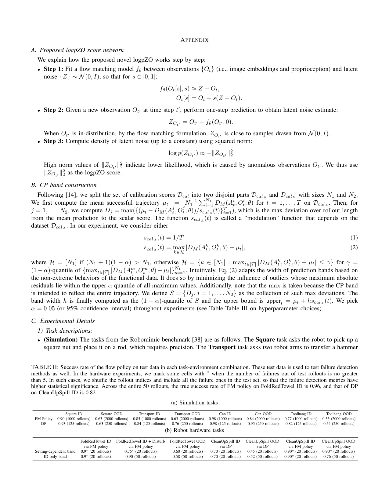

<!-- Page 14 -->

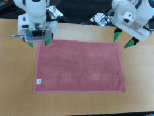

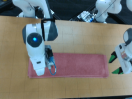

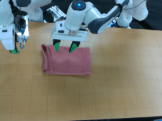

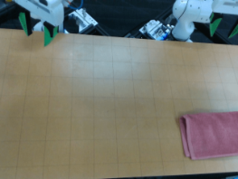

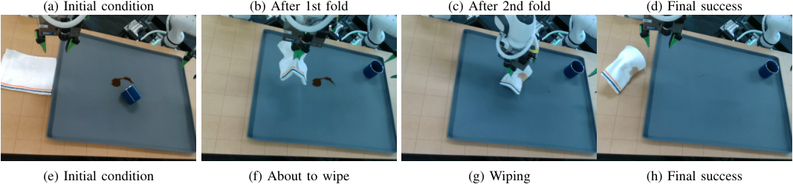

<!-- Start of picture text -->
(a) Initial condition (b) After 1st fold (c) After 2nd fold (d) Final success (e) Initial condition (f) About to wipe (g) Wiping (h) Final success <!-- End of picture text -->

Fig. 8: The on-robot experimental settings. **(Top row) FoldRedTowel** : starting with a flat towel, the two arms need to first fold the towel along the short side, and then the right arm needs to perform the second fold along the long side. Finally, the towel needs to be pushed to the bottom right corner to be considered a success. **(Bottom row) CleanUpSpill** : starting with spills caused by a fallen cup on the platform, the right arm must first lift the cup to an upright position, while the left arm must pick up a towel and wipe the spills. To achieve success, the spills must be completely cleaned, and the towel must be returned to its original position. 

from a closed container on a shelf to a target bin on another shelf, involving coordination between the robots. The **Can** task asks the robot to place a coke can from a large bin into a smaller target bin, requiring greater precision than the **Square** task. The **Toolhang** task asks the robot to assemble a frame with several components, requiring the most dexterity and precision among the four tasks. 

- **(Robot hardware)** In the **FoldRedTowel** task, the two robot arms must fold a red towel twice and push it to the table corner. In the **CleanUpSpill** task, one robot arm must lift a cup upright that has fallen and caused a spill, while the other robot arm must pick up a white towel and wipe the spills on the platform. Both tasks are long-horizon and require precision and coordination to manipulate deformable objects. 

- _2) Policy backbone and the calibration of CP bands:_ Table II shows success rate across the tasks. Meanwhile, See Table III 

- for hyperparameters regarding 

- Dimension of actions _At_ and observations _Ot_ per task. 

- Architecture details of the policy backbone _g_ and the choice of image encoder. 

- Training specifics of _g_ (i.e., optimizer, learning rate and scheduler, and number of epochs). 

- Number of successful rollouts used to calibrate the CP bands and the number of test rollouts. Note that on simulation tasks, we roll out DP fewer times because it requires significantly longer time (higher number of denoising steps) than FM policies to generate actions. 

We further explain the design and training of the policy network _g_ . The underlying policy network _g_ is trained with flow matching [32] and/or diffusion models [22]. We follow the setup in [12] and use the same hyperparameters to train the policies. When using flow matching [32] to train the policies, the only difference is that instead of optimizing with the diffusion loss, we change the objective to be a flow matching loss between _At|Ot_ and _Z_ , the standard Gaussian. Image features are extracted using either a ResNet or a CLIP backbone trained jointly with _g_ . These image features concatenated with robot state constitute observations _Ot_ . 

_3) Scalar failure detection scores:_ After learning the policy network _g_ with the ResNet encoder for camera images, we first obtain _{_ ( _At, Ot_ ) _}_ for each task using the same training demonstration data for policy network. For the post-hoc approach SPARC, it utilizes the arc length of the Fourier magnitude spectrum obtained from the trajectory. To learn and test the scalar scores, we adopt the following setup: 

- 1) CFM: We use a 4x smaller network with identical architecture as the policy network. It is unconditional and takes in observations _Ot_ as inputs. We train for 200 epochs with a batch size of 128, using the Adam optimizer [30] with a constant 1e-4 learning rate. 

- 2) lopO and logpZO: We let the flow network (taking _Ot_ as inputs) has the same architecture as the policy network. On

<!-- Page 15 -->

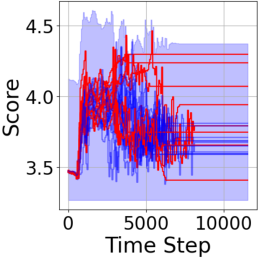

<!-- Start of picture text -->
(a) PCA-kmeans (b) SPARC (c) logpZO (d) RND <!-- End of picture text -->

Fig. 9: Qualitative results of detection scores overlaid with CP bands on the real **FoldRedTowel OOD** task. The layout is the same as Fig. 6. We notice that spikes of scores computed on failed trajectories are more evident for the learnt logpZO and RND than for the post-hoc PCA-kmeans and SPARC. 

<!-- Start of picture text -->
(a) Simulation <!-- End of picture text -->

<!-- Start of picture text -->
(b) Robot hardware ( FoldRedTowel ) <!-- End of picture text -->

Fig. 10: TPR and TNR vs. CP significance level in simulation and hardware experiments. 

simulation, we let the flow network to be 4x smaller than the policy network with identical architecture and on real data, we keep identical model sizes between the two. On simulation (resp. real data), we train for 500 (resp. 2000) epochs with a batch size of 128 (resp. 512), using the Adam optimizer with a constant 1e-4 learning rate. For a new observation _Ot__′_ , its density log _p_ ( _Ot__′_ ) is obtained via the instantaneous change-of-variable formula [11]. 

- 3) DER: The network to parametrize the Normal-Inverse Wishart parameters has the same architecture as the policy network but is 4x smaller with identical architecture. It takes in _Ot_ as inputs. We train for 200 epochs with a batch size of 128, using the Adam optimizer with a constant 1e-4 learning rate. 

- 4) NatPN: We first use _K_ -means clustering with 64 clusters to obtain class labels _Y_ for the observations _X_ = _Ot_ . We then consider the case where _Y_ follows a categorical distribution with a Dirichlet prior on the distribution parameters. To lean the parameters, we then follow [8] to use the tabular encoder with 16 flow layers. We set the learning rate to be 1e-3 and train for a maximum of 1000 epochs. 

- 5) RND: On simulation, we use a 4x smaller network with identical architecture as the policy network, which takes in both _At_ and _Ot_ as inputs ( _Ot_ as the conditioning variable). We train for 200 epochs with a batch size of 128, using the Adam optimizer with a constant 1e-4 learning rate. On real data, we use network with the same size as the policy network to improve performance. We train for 2000 epochs with a batch size of 512, using the Adam optimizer with a constant 1e-4 learning rate. During inference, a high _DM_ ( _At, Ot_ ; _θ_ˆ ) indicates a large mismatch between the predictor and target outputs, which we hypothesize results from the pair ( _At, Ot_ ) not being from a successful trajectory. 

## _D. Ablation_ 

We conduct ablation studies on the behavior of our method under varying CP significance levels _α_ . 

In Fig. 10, we show TPR and TNR for 10 equally spaced values of _α ∈_ [0 _._ 01 _,_ 0 _._ 1] using logpZO. As expected, higher _α_ increases TPR and decreases TNR, since more rollouts are flagged as failures. This trend is clearer in simulation; in hardware experiments, the effect is muted due to the limited number of rollouts and therefore constant calibration quantiles for small _α_ . Overall, _α_ = 0 _._ 05 offers a robust trade-off, which is what we used in all experiments.

<!-- Page 16 -->

TABLE III: Hyperparams in evaluation protocol. We include the details for the policy networks in Table IIIa and the hyperparameters for CP band calibration in simulation in Table IIIb and in robot hardware experiments in Tables IIIc and IIId. For simulation tasks, training is done on one NVIDIA RTX A6000 GPU with 48GB memory. For the experiments on hardware, training is done on eight NVIDIA A100-SXM4-80GB GPUs with 80GB memory. 

|||(a) Policy network||
|---|---|---|---|
||Dimension of (_At, Ot_)|Architecture of (policy _g_, visual encoder for _Ot_)|Policy training specification (optimizer, lr, lr scheduler, batch size, number of epochs)|
|(Simulation) Square|(160, 274)|(UNet [26], ResNet [20])|(AdamW [37], 1e-4, cosine [36], 64, 800)|
|(Simulation) Can|(160, 274)|(UNet [26], ResNet [20])|(AdamW [37], 1e-4, cosine [36], 64, 800)|
|(Simulation) Toolhang|(160, 274)|(UNet [26], ResNet [20])|(AdamW [37], 1e-4, cosine [36], 64, 300)|
|(Simulation) Transport|(320, 548)|(UNet [26], ResNet [20])|(AdamW [37], 1e-4, cosine [36], 64, 300)|
|(Real) FoldRedTowel|(320, 4176)|(UNet [26], ResNet [20])|(AdamW [37], 1e-4, cosine [36], 96, 1000)|
|(Real) CleanUpSpill|(320, 6732)|(UNet [26], CLIP [41])|(AdamW [37], 1e-4, cosine [36], 36, 500)|

### (b) (Simulation) CP band calibration and testing 

||Square ID|Square OOD|Can ID|Can OOD|Toolhang ID|Toolhang OOD|Transport ID|Transport OOD|
|---|---|---|---|---|---|---|---|---|
|CP band modulation|Eq. (2)|Eq. (2)|Eq. (2)|Eq. (2)|Eq. (2)|Eq. (2)|Eq. (2)|Eq. (2)|
|CP significance level|0.05|0.05|0.05|0.05|0.05|0.05|0.05|0.05|
|(FM policy) Num successes for CP band mean|269|269|296|296|224|224|253|253|
|(FM policy) Num successes for CP band width|629|629|693|693|523|523|591|591|
|(FM policy) Num test rollouts for evaluation|1000|2000|1000|2000|1000|2000|1000|2000|
|(DP) Num successes for CP band mean|31|31|34|34|27|27|27|27|
|(DP) Num successes for CP band width|82|82|90|90|70|70|71|71|
|(DP) Num test rollouts for evaluation|125|250|125|250|125|250|125|250|

### (c) (Hardware: FoldRedTowel) CP band calibration and testing 

||ID Disturb (Setting-dependent)|ID Disturb (ID-only)|OOD (Setting-dependent)|OOD (ID-only)|
|---|---|---|---|---|
|CP band modulation|Eq. (1)|Eq. (1)|Eq. (1)|Eq. (1)|
|CP significance level|0.05|0.05|0.05|0.05|
|Num successes for CP band mean|7|7|4|7|
|Num successes for CP band width|23|23|13|23|
|Num test rollouts for evaluation|20|50|20|50|

### (d) (Hardware: CleanUpSpill) CP band calibration and testing 

||OOD (DP) (Setting-dependent)|OOD (DP) (ID-only)|OOD (FM policy) (Setting-dependent)|OOD (FM policy) (ID-only)|
|---|---|---|---|---|
|CP band modulation|Eq. (2)|Eq. (2)|Eq. (1)|Eq. (1)|
|CP significance level|0.05|0.05|0.05|0.05|
|Num successes for CP band mean|6|5|6|9|
|Num successes for CP band width|14|12|14|18|
|Num test rollouts for evaluation|20|50|20|50|

<!-- Page 17 -->

(a) Transport ID 

(b) Transport OOD 

(c) Square ID 

(d) Square OOD 

(e) Can ID 

(f) Can OOD 

(g) Toolhang ID 

(h) Toolhang OOD 

Fig. 11: Quantitative results in simulation tasks by FM policy (best, second, third), which augments Fig. 4 by including all quantitative metrics. The takeaways are similar as before, where logpZO and RND are the top-2 best-performing method overall.

<!-- Page 18 -->

<!-- Start of picture text -->
(a) Transport ID (b) Transport OOD (c) Square ID (d) Square OOD (e) Can ID (f) Can OOD (g) Toolhang ID (h) Toolhang OOD <!-- End of picture text -->

Fig. 12: Quantitative results in simulation tasks by DP (best, second, third). The layout is identical to Fig. 4. We similarly observe that learned methods seem to have more capacity to detect failures than post-hoc ones, with logpZO and RND being the best-performing methods.

<!-- Page 19 -->

<!-- Start of picture text -->
(a) FM policy: (Setting-dependent band) ID + Disturb (b) FM policy: (ID-only band) ID + Disturb <!-- End of picture text -->

<!-- Start of picture text -->
(c) FM policy: (Setting-dependent band) OOD initial condition (d) FM policy: (ID-only band) OOD initial condition <!-- End of picture text -->

Fig. 13: Quantitative results on the **FoldRedTowel** robot hardware task using two ways to compute the CP band (best, second, third). logpZO remains to be the most robost method overall.

<!-- Page 20 -->

(a) DP: (Setting-dependent band) OOD initial condition 

(b) DP: (ID-only band) OOD initial condition 

(c) FM policy: (Setting-dependent band) OOD initial condition 

(d) FM policy: (ID-only band) OOD initial condition 

Fig. 14: Quantitative results on the **CleanUpSpill** robot hardware task using two ways to compute the CP band (best, second, third). logpZO remains to be the most robost method overall.
