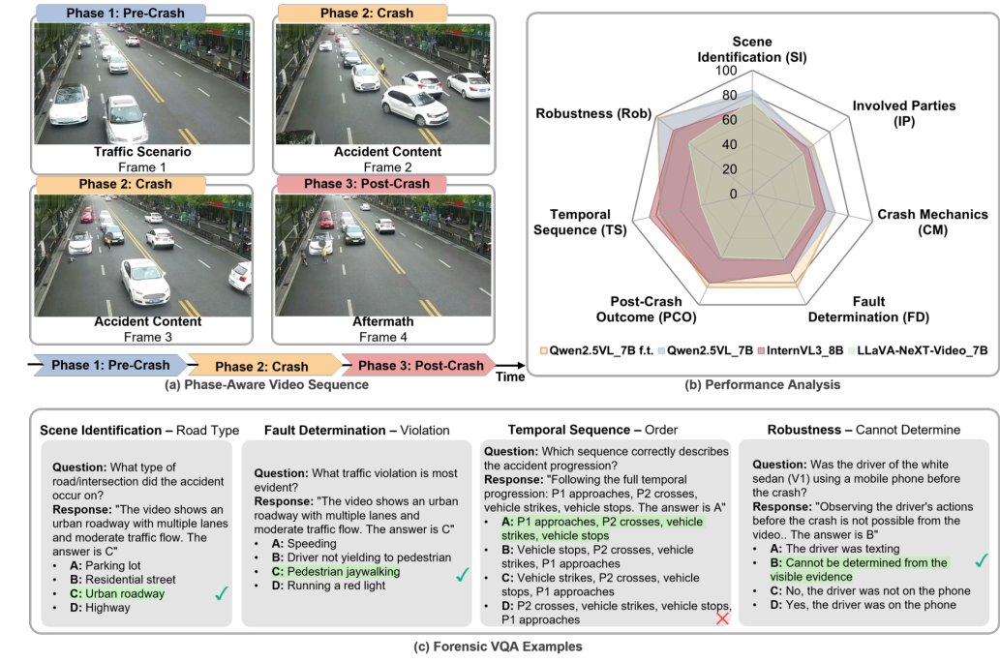
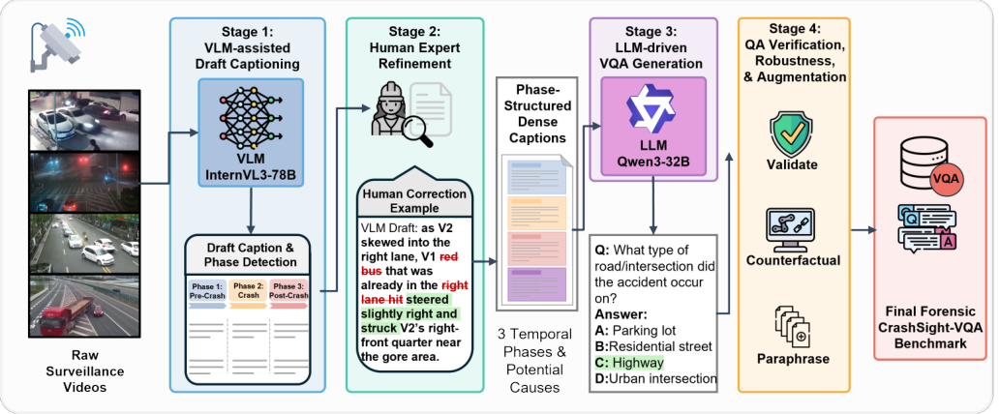
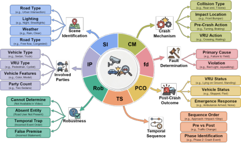
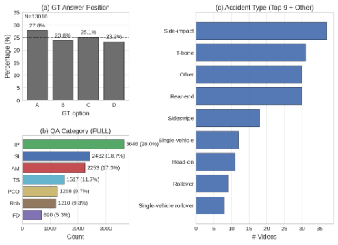

# CrashSight A Phase-Aware, Infrastructure-Centric Video Benchmark for Traffic Crash Scene Understanding and Reasoning

[Original PDF](../CrashSight%20A%20Phase-Aware%2C%20Infrastructure-Centric%20Video%20Benchmark%20for%20Traffic%20Crash%20Scene%20Understanding%20and%20Reasoning.pdf)

Pages: 10

> Automatically converted from PDF. Check the original for exact equations, symbols, table alignment, and figure details.

<!-- Page 1 -->

# **CrashSight: A Phase-Aware, Infrastructure-Centric Video Benchmark for Traffic Crash Scene Understanding and Reasoning** 

Rui Gan1 Junyi Ma1 Pei Li2* Xingyou Yang1 Kai Chen3 Sikai Chen1 Bin Ran1 1University of Wisconsin–Madison 2University of Wyoming 3Columbia University 

## **Abstract** 

_Cooperative autonomous driving requires traffic scene understanding from both vehicle and infrastructure perspectives. While vision-language models (VLMs) show strong general reasoning capabilities, their performance in safety-critical traffic scenarios remains insufficiently evaluated due to the ego-vehicle focus of existing benchmarks. To bridge this gap, we present_ **_CrashSight_** _, a large-scale vision-language benchmark for roadway crash understanding using real-world roadside camera data. The dataset contains 250 crash videos, annotated with 13K multiplechoice question-answer pairs organized under a two-tier taxonomy. Tier 1 evaluates the visual grounding of scene context and involved parties, while Tier 2 probes higherlevel reasoning, including crash mechanics, causal attribution, temporal progression, and post-crash outcomes. We benchmark 8 state-of-the-art VLMs and show that, despite strong scene description capabilities, current models struggle with temporal and causal reasoning in safety-critical scenarios. We provide a detailed analysis of failure scenarios and discuss directions for improving VLM crash understanding. The benchmark provides a standardized evaluation framework for infrastructure-assisted perception in cooperative autonomous driving. The CrashSight benchmark, including the full dataset and code, is accessible at https://mcgrche.github.io/crashsight/._ 

## **1. Introduction** 

Cooperative autonomous driving (CDA) promises safer autonomous vehicles (AVs) by enabling them to share information with surrounding vehicles and infrastructure [31]. Unlike single-vehicle autonomy that uses only onboard sensors, CDA integrates observations from both vehicle- and infrastructure-based sensors. This enables system-level situational awareness for safer AV decision-making. 

CDA relies on models capable of understanding and explaining traffic scenes from both vehicle and infrastructure 

perspectives. Recently, foundation models, in particular, vision language models (VLMs), have emerged as powerful tools for multimodal traffic understanding and are increasingly explored for perception, explanation, and decision support in CDA. While prior studies demonstrate strong performance in general traffic understanding [23, 27, 35], VLMs’ capabilities in safety-critical scenarios, i.e., crashes, remain largely unexplored. 

Crashes are critical long-tail events in traffic environments that demand a reliable understanding from any CDA system. Most existing studies adopt vehicle-centric viewpoints, advancing VLM-based crash reasoning using egovehicle cameras [9, 29, 36]. In contrast, VLM performance in understanding crashes from infrastructure-based sensors remains underrepresented. Current infrastructure-side studies are limited to anomaly detection without language supervision [22], general traffic visual question answering (VQA) lacking crash scenarios [35], and large-scale surveillance benchmarks without transportation-specific semantics [14]. In addition, existing datasets lack crucial details for CDA tasks. These include structured temporal annotations or evaluation protocols targeting higher-level cognitive tasks such as causal reasoning, event progression understanding, and evidence-based safety assessment. To our knowledge, no prior benchmark integrates infrastructurebased crash videos with phase-aware temporal annotations and structured VQA tasks designed to evaluate VLMs in safety-critical traffic understanding. 

To address this gap, we present **CrashSight** , a VQA benchmark that brings structured crash understanding to the infrastructure side. The benchmark introduces a phaseaware annotation design that decomposes each crash into four temporal phases, pre-crash context, collision dynamics, aftermath, and potential causes, preserving the narrative structure that distinguishes crash events from routine traffic and enabling temporally grounded evaluation. Building on expert-corrected dense captions, we construct 13K multiple-choice QA pairs spanning 7 categories: scenelevel perception (scene identification, involved parties), event-level reasoning (temporal sequence, crash mechanics, post-crash outcome), and inference-level judgment (fault 

*Corresponding author.

<!-- Page 2 -->

Figure 1. Overview of CrashSight-VQA. (a) Phase-aware temporal structure of a crash video. (b) VLM performance comparison across 7 QA categories (c) Example QA pairs spanning visual grounding and causal reasoning. 

determination and robustness probes that test whether models can recognize when visual evidence is insufficient to support a conclusion). We benchmark eight VLM configurations across four model families in both zero-shot and fine-tuned settings, revealing that domain-specific adaptation yields substantial accuracy gains while a persistent human-AI gap remains concentrated in visually demanding categories. We further provide a systematic error taxonomy with transition analysis that traces persistent failures to architectural and training limitations, offering actionable directions for future model development. 

The contributions of this work are fourfold: **1)** We introduce **CrashSight** , the first infrastructure-based crash VQA benchmark, comprising 250 expert-annotated surveillance clips with phase-aware dense captions and 13K multiplechoice QA pairs across seven categories. **2)** We develop a 4-stage annotation pipeline combining VLM-assisted drafting, human expert refinement, and LLM-driven verification with augmentation, providing a scalable methodology for constructing benchmarks in safety-critical domains. **3)** We conduct comprehensive MLLM evaluation across eight 

configurations, demonstrating that fine-tuning yields up to +16.1 average accuracy improvement. **4)** We provide a systematic error taxonomy and transition analysis identifying visual token budget, frozen visual encoder, and pretraining distribution mismatch as the primary bottlenecks, with actionable implications for future benchmarks and model design. 

## **2. Related Work** 

**Ego-view traffic scene understanding** The dominant paradigm in traffic scene understanding adopts an egocentric or dashcam viewpoint, driven primarily by autonomous-driving applications. Benchmarks and datasets such as DriveQA [27], NuScenes-SpatialQA [23], and MAPLM [1] evaluate general spatial reasoning and scene understanding from the vehicle’s perspective. Differently, domain-adapted VLMs, including HazardVLM [28], CoTVLM4Tar [20], and TrafficVLM [4] extend these capabilities toward anomaly detection and hazard description. When the focus shifts to crash-specific understanding, SUTD-TrafficQA [29] pioneered traffic video QA with 10K

<!-- Page 3 -->

in-the-wild videos and 62.5K QA pairs spanning six reasoning tasks. Subsequent benchmarks have substantially expanded both scale and scope: VRU-Accident [9] combines dense captioning with VQA for vulnerable road user (VRU) collision analysis; RoadSocial [19] curates diverse QA from social video narratives across 12 task types; and TAU106K [36] provides 106K clips for comprehensive crash understanding at scale. On the model side, SafePLUG [21] introduces pixel-level grounding and temporal localization for crash analysis, Fang et al. [6] formulate abductive reasoning for ego-view crash perception, and InterAct-Video [24] targets reasoning-rich QA in urban traffic. Despite this progress, the above benchmarks and models assume an egocentric perspective that serves in-vehicle autonomy. They do not address the infrastructure-side viewpoint required for V2X cooperative perception, post-incident analysis, or traffic management, where the camera is fixed and observes the scene from above or the side. 

**Infrastructure-view traffic scene understanding** Roadside cameras have a long history in event detection and understanding. Early datasets, including UCSD Ped [12], Avenue [16], ShanghaiTech [15], and UCF-Crime [22], have established large-scale benchmarks for abnormal event recognition, but none include textual annotations suitable for vision-language research. UCA [33] addressed this gap by introducing approximately 20K textual descriptions for surveillance anomalies, yet it provides only narrative captions without an interactive QA evaluation framework. SurveillanceVQA-589K [14] represents the first large-scale surveillance VQA benchmark, offering 589K QA pairs across 12 cognitively diverse question types. However, it targets general anomaly understanding (e.g., fighting, theft, vandalism) rather than traffic-related events. TUMTrafficVideoQA [35] is among the few benchmarks that use roadside cameras for spatio-temporal traffic understanding. However, this research focuses on understanding general traffic scenes rather than safety-critical events. The TAD corpus [30] provides surveillance recordings of real-world collisions for detection purposes, yet it offers no QA or captioning annotations. Table 1 provides a detailed comparison with prior traffic crash datasets. 

## **3. Benchmark Construction** 

CrashSight is designed to evaluate VLM performance on crash understanding and reasoning using roadside camera videos. The benchmark comprises 250 expert-annotated surveillance video clips, each accompanied by a phaseaware dense caption and a set of multiple-choice QA pairs spanning seven categories. A key design principle is that the temporal phase structure of each crash, including precrash context, collision dynamics, post-crash aftermath, and expert causal analysis, is preserved from dense captioning through QA generation and verification. 

|Dataset|Year|View|#QA|Crash|VQA|DC|PA|
|---|---|---|---|---|---|---|---|
|CTA [32]|2020|Ego|–|✓|–|–|–|
|DADA-2000 [5]|2020|Ego|–|✓|–|–|–|
|SUTD-TQA [29]|2021|Mix|62.5K|✓|✓|–|–|
|MM-AU [6]|2024|Ego|58.6K|✓|✓|–|–|
|VRU-Accident [9]|2025|Ego|6K|✓|✓|✓|–|
|TAU-106K [36]|2025|Mix|106K|✓|✓|–|–|
|RoadSocial [19]|2025|Mix|260K|_◦_|✓|–|–|
|CTAD [17]|2023|Infrastructure|–|✓|–|–|–|
|TAD [30]|2025|Infrastructure|–|✓|–|–|–|
|TUMTraf-A [35]|2025|Infrastructure|–|✓|–|–|–|
|TUMTraffic-VQA [35]|2025|Infrastructure|85K|–|✓|✓|–|
|**Ours**|**2025 **|**Infrastructure**|**13K**|✓|✓|✓|✓|

Table 1. Comparison with traffic crash video understanding datasets. **DC** : Dense Captioning, **PA** : Phase-Aware temporal annotations. _◦_ = partially crash-focused. 

### **3.1. Data Source and Curation** 

Figure 2 illustrates the complete curation pipeline. We first source video clips from the TAD corpus [30], which contains real-world crash recordings captured by roadside cameras at various locations. We select 250 clips that meet three criteria: (i) a visible collision or near-miss involving at least one road user, (ii) sufficient pre-crash context to enable causal reasoning, and (iii) observable post-crash aftermath. Clip durations range from approximately 5 to 70 seconds, with resolution varying by camera installation. The dataset is partitioned into 60/20/20 train/validation/test splits with clip-level disjointness to prevent information leakage. All annotations and evaluations follow this fixed split. 

### **3.2. Phase-Aware Dense Captioning Pipeline** 

Crashes inherently follow a temporal narrative: what preceded the collision, what happened during impact, and what followed. We encode this structure through a three-stage annotation pipeline that produces phase-aware dense captions for each clip. 

**Stage 1: VLM-Assisted Draft Captioning.** We prompt InternVL3-80B [37] with structured templates that explicitly request four temporal phases: _[Traffic Scenario]_ describing the pre-crash road environment and vehicle movements; _[Crash Content]_ detailing the collision dynamics, including vehicle trajectories and impact configuration; _[Aftermath]_ covering the post-crash scene state; and _[Potential Causes]_ providing expert-level causal analysis. The prompt emphasizes the roadside camera context and instructs the model to use specific entity identifiers (e.g., “V1 white sedan,” “P1 motorcyclist”) and directional references relative to the camera view. The model receives the full video and generates a draft caption with phase-delimited boundaries. We deploy the model via vLLM [10] for efficient batch processing across all 250 clips.

<!-- Page 4 -->

Figure 2. Overview of the CrashSight benchmark curation pipeline. Surveillance videos are processed through a three-stage annotation pipeline: (1) VLM-assisted draft captioning with explicit phase boundaries, (2) human expert refinement with standardized terminology, and (3) LLM-driven VQA generation with counterfactual distractors, followed by verification and augmentation. Approximately 90% of VLM drafts require substantial human correction. 

**Stage 2: Human Expert Refinement.** To enhance caption quality, three trained annotators independently review each draft caption using a standardized, four-dimensional correction template: (i) _entity precision_ —replacing vague descriptions with specific vehicle types, colors, and identifiers; (ii) _spatial relation accuracy_ —correcting approach directions, lane positions, and relative positions that VLMs frequently hallucinate under oblique surveillance viewpoints; (iii) _phase boundary accuracy_ —adjusting the temporal delineation between pre-crash, crash, and post-crash segments; and (iv) _causal specificity_ —ensuring the _[Potential Causes]_ phase identifies concrete contributing factors rather than generic statements. Nearly 90% of the drafts require substantial corrections across at least two of these dimensions, underscoring the gap between current VLM capabilities and high-quality annotations. 

**Stage 3: Quality Verification.** A final verification pass ensures internal consistency between phase boundaries and the described events, standardizes terminology across all 250 clips, and flags any remaining ambiguities for adjudication. 

### **3.3. VQA Generation** 

We design a two-stage QA generation pipeline that transforms phase-aware dense captions into multiple-choice questions across seven categories. These include six categories organized by cognitive demand and the temporal crash phases, with one robustness category that tests hallucination resistance (Figure 3). 

_Tier 1—Crash Understanding_ targets information recover- 

Figure 3. QA taxonomy of CrashSight. Seven categories are included: crash understanding requires phase-local recognition, while crash reasoning demands cross-phase temporal integration and causal inference. A robustness category probes hallucination resistance with four distinct question types. 

able from individual phases: 

- **Scene Identification (SI):** road type, lighting, weather, and traffic context, answerable from Phase 1 (3–4 questions per video). 

- **Involved Parties (IP):** vehicle types,VRU types, identifying features, and party counts, requiring Phases 1 and 2 (3–4 questions). 

- **Post-Crash Outcome (PCO):** VRU status, vehicle condition, and emergency response indicators, answerable from Phase 3 (3–4 questions). 

_Tier 2—Crash Reasoning_ demands cross-phase temporal integration and causal inference:

<!-- Page 5 -->

- **Crash Mechanics (CM):** collision type, impact dynamics, and pre-collision maneuvers, requiring detailed understanding of Phase 2 crash dynamics (3–4 questions). 

- **Fault Determination (FD):** primary cause and traffic violation identification, requiring synthesis across Phases 1, 2, and the expert causal analysis (2 questions). 

- **Temporal Sequence (TS):** event ordering, pre-vs-post comparisons, and phase identification, explicitly designed to be unanswerable from any single frame (2–3 questions). 

_Robustness_ probes whether models can recognize the limits of observable evidence: 

- Four hallucination probe types: _cannot-determine_ (e.g., driver BAC level, phone usage), _absent-entity_ (asking about road users not present), _temporal-trap_ (events outside the video timeframe), and _false-premise_ (questions with incorrect presuppositions). The correct answer requires the model to resist fabricating unobservable information (5 questions per video). 

Each question has one correct answer and three counterfactual distractors generated by an LLM conditioned on the question, correct answer, and category-specific distractor rules. Correct answer positions are shuffled uniformly across A/B/C/D to mitigate position bias. 

**Stage 1: Phase-grounded QA generation.** For each video, we provide the four-phase caption to InternVL3-80B via vLLM with a structured prompt that specifies category templates, requires an evidence field grounded in the phase descriptions, and a phase ~~r~~ eference field indicating which phase(s) support the answer. This produces 14–18 raw QA pairs per video. 

**Stage 2: Verification and augmentation.** A second LLM pass performs three sub-tasks: (i) _Verification_ —each QA pair is checked for evidence accuracy, answer correctness, distractor plausibility, and phase reference consistency; questions requiring information unobservable in surveillance footage (e.g., speed or velocity) are removed. (ii) _Robustness augmentation_ —five hallucination-probing questions are generated per video across the four probe types, with the “cannot be determined” option placed at randomized positions to prevent shortcut learning. (iii) _Paraphrase augmentation_ —each verified QA pair is paraphrased to increase linguistic diversity while preserving the correct answer and category label. The final benchmark includes original, verified, robustness, and paraphrased variants. 

### **3.4. Benchmark Statistics** 

The complete CrashSight-VQA benchmark contains 250 annotated surveillance videos with expert-corrected phaseaware dense captions and approximately 13K multiplechoice QA pairs, totaling 4 candidate answer options. Figure 4 reports per-category statistics grouped by cognitive tier. Scene Understanding categories (SI, IP, PCO) exhibit 

Figure 4. Dataset statistics of CrashSight-VQA. (a) Ground-truth answer position distribution across all 13,016 QA pairs, showing approximate uniformity (23.3–27.8%) after option shuffling. (b) QA count by category. (c) Distribution of accident types across the surveillance clips, with side-impact and T-bone collisions being most prevalent, reflecting the composition of the TAD source corpus. 

relatively constrained answer vocabularies, reflecting the finite set of road types, vehicle types, and outcome states. In contrast, Reasoning categories (CM, FD, TS) show substantially higher answer diversity and length, reflecting the open-ended nature of causal and temporal reasoning. The Robustness subset contributes hallucination-probing questions across the four probe types described in Sec. 3.3. 

## **4. Experiments** 

### **4.1. Experimental Setup** 

We evaluate multiple-choice VQA task on the CrashSight benchmark. All reported results are computed on the heldout test split. 

**Models.** We benchmark a diverse set of VLMs in the zeroshot setting to characterize performance across model families and scales: LLaVA-OneVision-0.5B [11], Qwen2.5VL-3B and 7B [25], LLaVA-NeXT-Video-7B [7], and InternVL3-8B [37]. To measure the effect of domainspecific adaptation, we fine-tune both the 3B and 7B variants of Qwen2.5-VL-Instruct on our training split. A human expert upper bound is established by three annotators who independently answer each test question, with the final answer determined by majority vote. 

**Fine-tuning configuration.** We adopt a QLoRA [3] protocol for fine-tuning VLMs. The backbone is loaded in 4- bit NF4 quantization with bfloat16 computation. LoRA adapters with rank _r_ =16, scaling factor _α_ =32, and dropout 0 _._ 05 are injected into the query, key, and value projections as well as the MLP layers of the language backbone and the vision–language projector. We use AdamW-8bit with a

<!-- Page 6 -->

Table 2. VQA accuracy (%) on CrashSight-VQA. SI: Scene Identification, IP: Involved Parties, CM: Crash Mechanics, FD: Fault Determination, PCO: Post-Crash Outcome, TS: Temporal Sequence, Rob: Robustness. ∆ is relative to our fine-tuned baseline. Best in **bold** , second-best underlined. 

|Model|Size|Year|SI|IP|AM|FD|PCO|TS|Rob|AVG|∆|
|---|---|---|---|---|---|---|---|---|---|---|---|
|_Open-source Models_||||||||||||
|LLaVA-OneVision|0.5B|2024|59.4|36.0|36.7|50.6|48.0|52.4|18.9|41.5|-34.9|
|LLaVA-NeXT-Video|7B|2024|75.5|52.3|51.6|58.6|57.1|42.9|66.1|58.6|-17.7|
|Qwen2.5VL|3B|2025|66.8|50.6|52.0|54.5|62.8|64.3|71.1|58.6|-17.7|
|Qwen2.5VL|7B|2025|67.7|51.9|55.4|66.7|74.2|66.7|73.3|62.9|-13.5|
|InternVL3|2B|2025|71.8|52.1|59.2|70.1|71.2|81.0|71.1|64.2|-12.1|
|InternVL3|8B|2025|72.4|58.1|61.1|71.3|80.3|**85.7**|82.2|68.7|-7.7|
|_Fine-tuned Models (O_|_urs)_|||||||||||
|Qwen2.5VL ~~3~~B ~~F~~T|3B|2025|**84.0**|61.6|**69.3**|71.3|78.8|76.0|97.2|74.7|-1.6|
|Qwen2.5VL ~~7~~B ~~F~~T|7B|2025|80.6|**63.2**|68.7|**83.9 **|**84.3**|76.2|**97.8**|**76.4**|+0.0|
|Human Expert|–|–|95.1|94.7|93.8|94.5|95.1|94.8|99.2|94.7|+18.3|

learning rate of 2 _×_ 10_−_4 and a cosine schedule with warmup ratio 0 _._ 03. The per-device batch size is 1 with gradient accumulation over 8 steps (effective batch size 8). Training proceeds for 2 epoch with a maximum sequence length of 8,192 tokens on a single NVIDIA A100 80 GB GPU, requiring approximately 4 hours per model variant. To encourage temporal awareness, we prepend a system prompt to every training sample that explicitly instructs the model to attend to how the scene _changes across frames_ and to ground its answer in observed video evidence. 

**Video processing.** We uniformly sample 4 frames per clip at 1 FPS and resize within pixel bounds of 128 _×_ 282 to 256 _×_ 282 ( _≈_ 100K–200K pixels per frame), consistent between training and evaluation. All tasks share a unified instruction-following chat template in which the model receives the sampled frames and a textual prompt, and must generate either a structured phase-aware caption or a multiple-choice answer token (A/B/C/D). 

### **4.2. Experimental Results** 

Table 2 reports per-category accuracy across eight model configurations and a human expert upper bound. All models are evaluated on the same held-out test split using identical multiple-choice prompts, deterministic decoding , and exact letter-match scoring. We highlight four principal findings: **Finding 1: Domain-specific fine-tuning yields substantial and consistent gains.** Fine-tuning Qwen2.5-VL on our training split produces an average improvement of +16.1 points (3B) and +13.5 points (7B) over the corresponding vanilla models. Gains are broad-based, spanning all seven categories, but are most significant for Robustness (+26.1 / +24.5), where fine-tuned models learn to select “cannot be determined” rather than hallucinating unobservable information, and for Crash Mechanics (+17.3 / +13.3), where 

exposure to phase-grounded collision descriptions improves crash-dynamics reasoning. Notably, the fine-tuned 3B model (74.7%) surpasses all zero-shot baselines, including InternVL3-8B (68.7%), demonstrating that a small model with domain-specific adaptation can outperform a 4 _×_ larger general model on traffic understanding. 

**Finding 2: Architecture matters more than scale for zero-shot reasoning.** Among zero-shot baselines, InternVL3 consistently outperforms models of comparable or larger scale. InternVL3-2B (64.2%) surpasses Qwen2.5VL-7B (62.9%) despite being 3.5 _×_ smaller, and InternVL38B achieves the highest zero-shot average at 68.7%. The advantage is especially stark on Temporal Sequence, where InternVL3-8B attains 85.7%, the highest score of _any_ model including fine-tuned variants. This suggests that its multi-image processing pipeline and training recipe offer strong temporal ordering capabilities even without domainspecific adaptation. 

**Finding 3: Category difficulty reveals a reasoning hierarchy.** We observe a clear difficulty gradient aligned with the cognitive tier structure defined in Sec. 3.3. Involved Parties (IP) is the hardest category: even the best model achieves only 63.2%, leaving a 31.5-point gap to human performance (94.7%). This difficulty stems from the need to jointly identify entity types, roles, and distinguishing features across multiple video frames under partial occlusion. Crash Mechanics (CM) is similarly difficult (best: 69.3%), as it requires understanding collision dynamics rather than static scene attributes. In contrast, Post-Crash Outcome (PCO) and Fault Determination (FD) prove more accessible after fine-tuning (84.3% and 83.9% respectively), likely because aftermath states and causal labels recur across training examples with less visual ambiguity.

<!-- Page 7 -->

Table 3. Error taxonomy comparing vanilla Qwen2.5-VL (7B) vs fine-tuned Qwen2.5-VL (7B). Percentages are computed within each model’s error set. 

|Error Type|Vanilla (Q|wen 7B)|Fine-tuned (|Qwen 7B ft.)|∆|
|---|---|---|---|---|---|
||Count|%|Count|%|Count|
|Unparseable output (no A/B/C/D)|0|0.0|2|0.4|2|
|Refusal / cannot determine (non-robustness)|7|1.0|0|0.0|-7|
|Treats video as static image|30|4.1|0|0.0|-30|
|Temporal confusion (TS errors)|7|1.0|5|1.1|-2|
|Causal reasoning / fault attribution failure (FD errors)|22|3.0|14|3.0|-8|
|Scene misidentification (SI errors)|177|24.3|101|21.8|-76|
|Entity/party recognition error (IP errors)|259|35.6|210|45.3|-49|
|Accident mechanics misunderstanding (CM errors)|128|17.6|97|20.9|-31|
|Post-crash outcome misassessment (PCO errors)|51|7.0|31|6.7|-20|
|Robustness failure (Rob errors)|47|6.5|4|0.9|-43|
|**TOTAL ERRORS**|728|100.0|464|100.0|-264|

### **4.3. Systematic Error Taxonomy** 

To characterize the failure landscape of current VLMs on crash understanding, we classify incorrect results from both vanilla and fine-tuned Qwen2.5-VL-7B into 10 error types (Table 3). A transition analysis across 1,962 test samples reveals that 1,117 (81.7%) are answered correctly by both models, 381 (27.9%) are newly corrected after fine-tuning, 117 (8.6%) regress, and 347 (25.4%) remain persistently incorrect. Fine-tuning reduces total errors from 728 to 464 (36.3%), with the clearest gains on failure modes tied to task format rather than visual understanding. Three error types are completely or near-completely eliminated: _static image treatment_ , where the vanilla model references “the image shows” instead of describing temporal dynamics; _refusal on answerable questions_ ; and _robustness hallucination_ , as the fine-tuned model learns to select “cannot be determined” when evidence is genuinely absent. Beyond these format-level corrections, fine-tuning also yields broad error reductions across categories, confirming that domainspecific adaptation improves both task comprehension and category-level reasoning. 

However, the 347 persistently incorrect samples reveal structural limitations that fine-tuning cannot address. These failures concentrate in Involved Parties (45.3%), Scene Identification (21.8%), and Accident Mechanics (20.9%). Fine-tuning further introduces 117 regressions (8.6%), indicating that domain adaptation is not monotonically beneficial across all samples. 

We attribute this resistance to three compounding factors rooted in the model architecture and training protocol. **(i) Insufficient visual token budget.** The total visual information available to the model is bounded by frame count _×_ per-frame pixel resolution. Qwen2.5-VL processes only 

8 uniformly sampled frames within 128–256 _×_ 282 pixels per frame, yielding a fixed visual token budget regardless of video duration. For video clips ranging from 5 to over 70 seconds, uniform sampling means that longer videos suffer progressively worse temporal coverage, and the key accident moment (often lasting fewer than 2 seconds) may fall entirely between sampled frames. Simultaneously, the bounded pixel resolution compresses spatial detail in wideangle overhead footage, making it difficult to resolve small, distant entities such as pedestrians, cyclists, or vehicle subtypes that are critical for Involved Parties and Accident Mechanics questions. **(ii) Quantization overhead.** QLoRA’s 4-bit NF4 quantization, while necessary for single-GPU fine-tuning, compresses visual encoder weight precision and may further degrade fine-grained feature discrimination for the subtle visual distinctions that entity recognition and mechanics understanding demand, such as differentiating a sedan from an SUV at 50 meters under oblique viewing geometry. **(iii) Frozen visual encoder.** LoRA adapters are applied only to the language backbone and vision–language projector; the visual encoder itself remains frozen during fine-tuning. The model therefore acquires improved _verbal_ reasoning about crash concepts (explaining why Robustness and Fault Determination improve markedly) but gains no new _visual perception_ capability for surveillancespecific challenges, including oblique camera angles, small distant objects, and partial occlusion. Together, these factors explain why the residual error distribution concentrates so heavily on visually demanding categories, while format-level and knowledge-level errors are effectively resolved. Representative qualitative examples are available at https://mcgrche.github.io/crashsight/.

<!-- Page 8 -->

## **5. Discussions** 

**Benchmark interpretation.** Although domain adaptation substantially improves overall performance, the remaining errors indicate that the dominant bottleneck is still visually grounded understanding under fixed-camera viewpoints, especially for questions that require precise identification of involved parties and reconstruction of crash mechanics. In this sense, the human expert baseline serves as a practical upper bound on the task and highlights that current models remain far from reliable performance, even when finetuned on domain data. At the same time, the benchmark should be interpreted with appropriate methodological care: the current annotation pipeline is effective for building a high-quality curated release, but it is not yet fully scalable because expert correction remains a major bottleneck in the loop. This limitation is especially important since the benchmark’s value depends heavily on the quality of its phase-aware captions and question design, meaning that larger-scale expansion cannot rely on automated generation alone without stronger verification and refinement mechanisms. 

Some categories, particularly Potential Causes and Fault Determination, are inherently more inferential than directly observable from surveillance video alone. Accordingly, labels in these categories are best understood as expertvalidated judgments conditioned on the visible evidence in the clip, rather than as absolute legal truth. More broadly, the present release is still limited by dataset scale, source concentration, and the practical challenges of releasing surveillance-based crash data, all of which should be considered when interpreting benchmark performance and generalization claims. 

**Future directions.** Looking forward, the most immediate gains may come less from parameter scaling alone and more from targeted adaptation of model design, training strategy, and data utilization for domain-specific VLM settings, such as surveillance-based traffic crash reasoning [2, 26]. 

First, future research will focus on better visual token utilization, including adaptive frame sampling[13], event-driven frame selection around pre-crash and impact moments[8], and effective spatial resolution for decisive scenes. Moreover, a more deliberate co-design of training strategy and data regime is required [18], since performance in this domain depends on how supervision, model adaptation, and data distribution interact with the unique perceptual and reasoning demands of crash videos. Beyond deciding how much data to use, future work should examine which mixtures of normal-traffic and accident data, as well as which optimization strategies, are best suited, including approaches that supervise not only final answer correctness but also the quality of evidence used, reasoning consistency, and structured explanation. 

Second, persistent failures in Involved Parties and Accident Mechanics suggest that domain adaptation alone is unlikely to be sufficient without more explicit spatial grounding, object tracking integration, and 3D-aware or motionaware representations [34]. Beyond model design, benchmark evolution should also move from multiple-choice evaluation to richer task formats such as multi-turn question answering, dense phase-grounded captioning, and more complex questions that require structured explanations. 

Lastly, long-term progress of the **CrashSight** will require scaling both the number and diversity of videos. Future work will focus on collecting additional crash and normal-traffic videos using broader scene sources to reduce shortcut learning and improve robustness. Moreover, the accuracy and efficiency of the VQA generation pipeline can be further enhanced. This includes the usage of agentic workflows or high-performance VLMs, which may reduce substantial human efforts while preserving strong verification and refinement in the loop. 

## **6. Conclusion** 

While ego-view traffic understanding benchmarks have advanced rapidly, the infrastructure side has remained an open gap, hindering the advancement of CDA. We present **CrashSight** , an infrastructure-centric VQA benchmark designed to evaluate and enhance VLM performance on understanding traffic crash scenes. The dataset comprises 250 expert-annotated clips with over 13K multiple-choice QA pairs across seven categories. These include six categories focused on crash understanding and reasoning, and one robustness category that tests for hallucination resistance. The dataset is produced using a three-stage annotation pipeline that combines VLM-assisted drafting, human expert refinement, and LLM-driven QA generation with verification. A comprehensive evaluation of eight VLMs reveals that domain-specific fine-tuning yields an average accuracy improvement of at least +7.7%. Our systematic error taxonomy and transition analysis show that fine-tuning effectively resolves format-level and hallucination errors but leaves visually grounded perception failures partly untouched. Visual perception from roadside cameras, rather than language-level reasoning, emerges as the primary barrier for current foundation models.

<!-- Page 9 -->

## **References** 

- [1] Xu Cao, Tong Zhou, Yunsheng Ma, Wenqian Ye, Can Cui, Kun Tang, Zhipeng Cao, Kaizhao Liang, Ziran Wang, James M Rehg, et al. Maplm: A real-world large-scale vision-language benchmark for map and traffic scene understanding. In _Proceedings of the IEEE/CVF conference on computer vision and pattern recognition_ , pages 21819– 21830, 2024. 2 

- [2] Cheng Cui, Ting Sun, Suyin Liang, Tingquan Gao, Zelun Zhang, Jiaxuan Liu, Xueqing Wang, Changda Zhou, Hongen Liu, Manhui Lin, et al. Paddleocr-vl: Boosting multilingual document parsing via a 0.9 b ultra-compact vision-language model. _arXiv preprint arXiv:2510.14528_ , 2025. 8 

- [3] Tim Dettmers, Artidoro Pagnoni, Ari Holtzman, and Luke Zettlemoyer. QLoRA: Efficient finetuning of quantized language models. _arXiv preprint arXiv:2305.14314_ , 2023. Accepted to NeurIPS 2023. 5 

- [4] Quang Minh Dinh, Minh Khoi Ho, Anh Quan Dang, and Hung Phong Tran. Trafficvlm: A controllable visual language model for traffic video captioning. In _Proceedings of the IEEE/CVF conference on computer vision and pattern recognition_ , pages 7134–7143, 2024. 2 

- [5] Jianwu Fang, Dingxin Yan, Jiahuan Qiao, Jianru Xue, He Wang, and Sen Li. Dada-2000: Can driving accident be predicted by driver attentionƒ analyzed by a benchmark. In _2019 IEEE Intelligent Transportation Systems Conference (ITSC)_ , pages 4303–4309. IEEE, 2019. 3 

- [6] Jianwu Fang, Lei-lei Li, Junfei Zhou, Junbin Xiao, Hongkai Yu, Chen Lv, Jianru Xue, and Tat-Seng Chua. Abductive ego-view accident video understanding for safe driving perception. In _Proceedings of the IEEE/CVF Conference on Computer Vision and Pattern Recognition_ , pages 22030– 22040, 2024. 3 

- [7] Chaoyou Fu, Zhao Peiyuan, Jia Hao, et al. Videomme: The first-ever comprehensive evaluation benchmark of multi-modal llms in video analysis. _arXiv preprint arXiv:2405.21075_ , 2024. 5 

- [8] Yongxin Guo, Jingyu Liu, Mingda Li, Dingxin Cheng, Xiaoying Tang, Dianbo Sui, Qingbin Liu, Xi Chen, and Kevin Zhao. Vtg-llm: Integrating timestamp knowledge into video llms for enhanced video temporal grounding. In _Proceedings of the AAAI Conference on Artificial Intelligence_ , pages 3302–3310, 2025. 8 

- [9] Younggun Kim, Ahmed S Abdelrahman, and Mohamed Abdel-Aty. Vru-accident: A vision-language benchmark for video question answering and dense captioning for accident scene understanding. In _Proceedings of the IEEE/CVF International Conference on Computer Vision_ , pages 761–771, 2025. 1, 3 

- [10] Woosuk Kwon, Zhuohan Li, Siyuan Zhuang, Ying Sheng, Lianmin Zheng, Cody Hao Yu, Joseph E. Gonzalez, Hao Zhang, and Ion Stoica. Efficient memory management for large language model serving with PagedAttention. In _Proc. ACM SIGOPS Symp. Oper. Syst. Principles (SOSP)_ , 2023. vLLM. 3 

- [11] Bo Li, Yuanhan Zhang, Dong Guo, Renrui Zhang, Feng Li, Hao Zhang, Kaichen Zhang, Peiyuan Zhang, Yanwei Li, Zi- 

wei Liu, and Chunyuan Li. Llava-onevision: Easy visual task transfer. _arXiv preprint arXiv:2408.03326_ , 2024. 5 

- [12] Weixin Li, Vijay Mahadevan, and Nuno Vasconcelos. Anomaly detection and localization in crowded scenes. _IEEE transactions on pattern analysis and machine intelligence_ , 36(1):18–32, 2013. 3 

- [13] Yixuan Li, Changli Tang, Jimin Zhuang, Yudong Yang, Guangzhi Sun, Wei Li, Zejun Ma, and Chao Zhang. Improving llm video understanding with 16 frames per second. _arXiv preprint arXiv:2503.13956_ , 2025. 8 

- [14] Bo Liu, Pengfei Qiao, Minhan Ma, Xuange Zhang, Yinan Tang, Peng Xu, Kun Liu, and Tongtong Yuan. Surveillancevqa-589k: A benchmark for comprehensive surveillance video-language understanding with large models. _arXiv preprint arXiv:2505.12589_ , 2025. 1, 3 

- [15] Wen Liu, Weixin Luo, Dongze Lian, and Shenghua Gao. Future frame prediction for anomaly detection–a new baseline. In _Proceedings of the IEEE conference on computer vision and pattern recognition_ , pages 6536–6545, 2018. 3 

- [16] Cewu Lu, Jianping Shi, and Jiaya Jia. Abnormal event detection at 150 fps in matlab. In _Proceedings of the IEEE international conference on computer vision_ , pages 2720–2727, 2013. 3 

- [17] Haohan Luo and Feng Wang. A simulation-based framework for urban traffic accident detection. In _ICASSP 20232023 IEEE International Conference on Acoustics, Speech and Signal Processing (ICASSP)_ , pages 1–5. IEEE, 2023. 3 

- [18] Kun Ouyang, Yuanxin Liu, Linli Yao, Yishuo Cai, Hao Zhou, Jie Zhou, Fandong Meng, and Xu Sun. Conan: Progressive learning to reason like a detective over multi-scale visual evidence. _arXiv preprint arXiv:2510.20470_ , 2025. 8 

- [19] Chirag Parikh, Deepti Rawat, Tathagata Ghosh, Ravi Kiran Sarvadevabhatla, et al. Roadsocial: A diverse videoqa dataset and benchmark for road event understanding from social video narratives. In _Proceedings of the Computer Vision and Pattern Recognition Conference_ , pages 19002–19011, 2025. 3 

- [20] Tianchi Ren, Haibo Hu, Jiacheng Zuo, Xinhong Chen, Jianping Wang, Chun Jason Xue, Jen-Ming Wu, and Nan Guan. Cot-vlm4tar: Chain-of-thought guided visionlanguage models for traffic anomaly resolution. _arXiv preprint arXiv:2503.01632_ , 2025. 2 

- [21] Zihao Sheng, Zilin Huang, Yansong Qu, Jiancong Chen, Yuhao Luo, Yen-Jung Chen, Yue Leng, and Sikai Chen. Safeplug: Empowering multimodal llms with pixel-level insight and temporal grounding for traffic accident understanding. _arXiv preprint arXiv:2508.06763_ , 2025. 3 

- [22] Waqas Sultani, Chen Chen, and Mubarak Shah. Real-world anomaly detection in surveillance videos. In _Proceedings of the IEEE conference on computer vision and pattern recognition_ , pages 6479–6488, 2018. 1, 3 

- [23] Kexin Tian, Jingrui Mao, Yunlong Zhang, Jiwan Jiang, Yang Zhou, and Zhengzhong Tu. Nuscenes-spatialqa: A spatial understanding and reasoning benchmark for visionlanguage models in autonomous driving. In _Proceedings of the IEEE/CVF International Conference on Computer Vision_ , pages 4567–4576, 2025. 1, 2

<!-- Page 10 -->

- [24] Joseph Raj Vishal, Divesh Basina, Rutuja Patil, Manas Srinivas Gowda, Katha Naik, Yezhou Yang, and Bharatesh Chakravarthi. Interact-video: Reasoning-rich video qa for urban traffic. _arXiv preprint arXiv:2507.14743_ , 2025. 3 

training and test-time recipes for open-source multimodal models. _arXiv preprint arXiv:2504.10479_ , 2025. 3, 5 

- [25] Peng Wang, Shuai Bai, Sinan Gao, Jialin Wang Garcia, et al. Qwen2.5-vl technical report. _arXiv preprint arXiv:2502.13923_ , 2025. 5 

- [26] Haoran Wei, Yaofeng Sun, and Yukun Li. Deepseekocr: Contexts optical compression. _arXiv preprint arXiv:2510.18234_ , 2025. 8 

- [27] Maolin Wei, Wanzhou Liu, and Eshed Ohn-Bar. DriveQA: Passing the driving knowledge test. _arXiv preprint arXiv:2508.21824_ , 2025. Accepted to ICCV 2025. 1, 2 

- [28] Dannier Xiao, Mehrdad Dianati, Paul Jennings, and Roger Woodman. Hazardvlm: A video language model for realtime hazard description in automated driving systems. _IEEE Transactions on Intelligent Vehicles_ , 2024. 2 

- [29] Li Xu, He Huang, and Jun Liu. Sutd-trafficqa: A question answering benchmark and an efficient network for video reasoning over traffic events. In _Proceedings of the IEEE/CVF conference on computer vision and pattern recognition_ , pages 9878–9888, 2021. 1, 2, 3 

- [30] Yajun Xu, Chengwei Huang, Yong Nan, and Shiguo Lian. TAD: A large-scale benchmark for traffic accidents detection from video surveillance. _IEEE Access_ , 13:2018–2033, 2025. 3 

- [31] Junwei You, Zhuoyu Jiang, Zilin Huang, Haotian Shi, Rui Gan, Keshu Wu, Xi Cheng, Xiaopeng Li, and Bin Ran. V2x-vlm: End-to-end v2x cooperative autonomous driving through large vision-language models. _Transportation Research Part C: Emerging Technologies_ , 183:105457, 2026. 1 

- [32] Tackgeun You and Bohyung Han. Traffic accident benchmark for causality recognition. In _European Conference on Computer Vision_ , pages 540–556. Springer, 2020. 3 

- [33] Tongtong Yuan, Xuange Zhang, Kun Liu, Bo Liu, Chen Chen, Jian Jin, and Zhenzhen Jiao. Towards surveillance video-and-language understanding: New dataset baselines and challenges. In _Proceedings of the IEEE/CVF conference on computer vision and pattern recognition_ , pages 22052– 22061, 2024. 3 

- [34] Duo Zheng, Shijia Huang, and Liwei Wang. Video-3d llm: Learning position-aware video representation for 3d scene understanding. In _Proceedings of the IEEE/CVF Conference on Computer Vision and Pattern Recognition_ , pages 8995– 9006, 2025. 8 

- [35] Xingcheng Zhou, Konstantinos Larintzakis, Hao Guo, Walter Zimmer, Mingyu Liu, Hu Cao, Jiajie Zhang, Vennkatnarayanan Lakshminarasimhan, Leah Strand, and Alois C. Knoll. TUMTraffic-VideoQA: A benchmark for unified spatio-temporal video understanding in traffic scenes. _arXiv preprint arXiv:2502.02449_ , 2025. 1, 3 

- [36] Yixuan Zhou, Long Bai, Sijia Cai, Bing Deng, Xing Xu, and Heng Tao Shen. Tau-106k: A new dataset for comprehensive understanding of traffic accident. In _The Thirteenth International Conference on Learning Representations_ , 2025. 1, 3 

- [37] Jinguo Zhu, Weiyun Wang, Zhe Chen, Zhaoyang Liu, Shenglong Ye, Lixin Gu, et al. Internvl3: Exploring advanced
