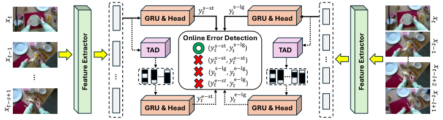
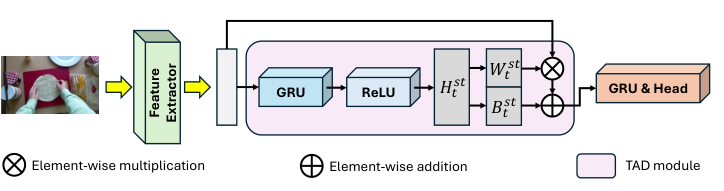
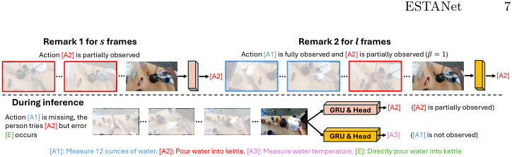
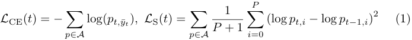
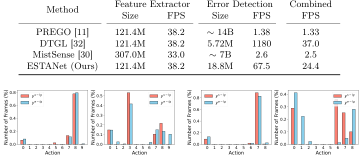
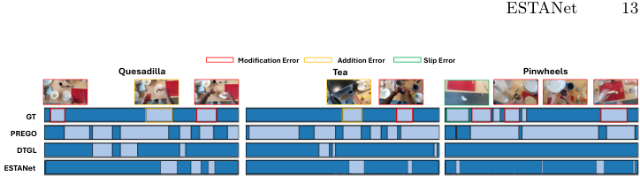
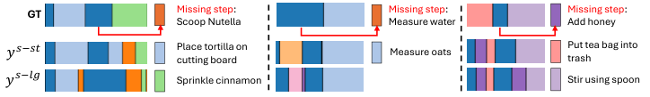
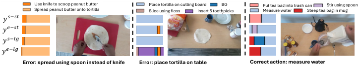

# ESTANet Efficient Online Error Detection in Procedural Videos via Prediction Inconsistency

[Original PDF](../ESTANet%20Efficient%20Online%20Error%20Detection%20in%20Procedural%20Videos%20via%20Prediction%20Inconsistency.pdf)

Pages: 18

> Automatically converted from PDF. Check the original for exact equations, symbols, table alignment, and figure details.

<!-- Page 1 -->

# **ESTANet: Efficient Online Error Detection in Procedural Videos via Prediction Inconsistency** 

Shih-Po Lee1_,_2_⋆_ , Reza Ghoddoosian1 , Faizan Siddiqui1 , Enna Sachdeva1 , and Behzad Dariush1 

> 1 Honda Research Institute, USA 2 Northeastern University 

**Abstract.** An efficient and accurate system for detecting errors in procedural tasks is crucial for supporting human needs in daily life, as it can provide instant notifications and guide people to correct mistakes. In this work, we study real-time online error detection in procedural videos from a simple but overlooked perspective: the prediction behavior of action detectors themselves. Instead of designing complex architectures or specialized supervision, we observe that action detectors naturally exhibit different prediction characteristics depending on their sensitivity to input dynamics and temporal context. We therefore propose ESTANet (Error-Sensitive and Temporally-vArying Network), a lightweight framework that detects errors by exploiting inconsistencies among action predictions produced by a small set of action detectors. We construct standard and error-sensitive action detectors that behave similarly on correct executions but respond differently when errors occur. Meanwhile, detectors operating with different temporal contexts further amplify prediction inconsistencies when the procedure deviates from the intended sequence. During inference, we detect errors by aggregating mismatches between standard and error-sensitive predictions through majority voting to flag frames that contain errors. Extensive experiments on EgoPER, Assembly-101-O, and EPIC-Tent-O demonstrate that ESTANet achieves state-of-the-art performance in online error detection while maintaining real-time efficiency with a lightweight architecture. Our results highlight that leveraging the intrinsic properties of action detectors can yield a powerful and practical solution for online error detection without increasing architectural design complexity. Our code is available at: `https://github.com/robert80203/ESTANet` 

## **1 Introduction** 

People have benefited greatly from advances in procedural video understanding across a wide range of problem domains and applications, including action detection [2,9,14,29,37,38,40,41,44], segmentation [10,20,21,23–25,34,36,43], video grounding [3,7,8,22,26,28], and error understanding [6,11,12,15,19,27,30,39]. Imagine preparing lunch with an AI-assisted system that guides you through 

> _⋆_ Work done as intern at Honda Research Institute, USA.

<!-- Page 2 -->

2 S.-P. Lee et al. 

each step. If you make a mistake, the assistant provides instant feedback, enabling you to correct the error and continue seamlessly. For such assistance to be useful, error detection must be both real-time and online, operating only on past frames as people perform tasks sequentially. Meanwhile, these AI assistants are often deployed on wearable devices such as Microsoft HoloLens or Apple Vision Pro. They provide a natural first-person view and enable hands-free operation, but they also impose strict efficiency and latency constraints. Thus, _development of a real-time and online error detection system for egocentric procedural videos_ is crucial for enhancing both the user experience and task proficiency. 

Recent studies have categorized errors in procedural videos into two types: execution errors and procedural errors [11, 15, 19, 27]. Execution errors occur when actions interrupt the procedure, are not executed correctly, or are extra and not defined in the task. Examples include accidentally dropping a knife while preparing food, adding sugar instead of honey, or putting oats onto a tortilla which is not necessary for quesadilla preparation. In contrast, procedural errors involve repeating, omitting, or misordering existing steps. For instance, tightening all table legs before inserting a cross support violates the correct assembly sequence. Execution errors are well captured in datasets like EgoPER [19] and CaptainCook4D [31], while procedural errors are the focus of PREGO [11], derived from Assembly-101 [33] and EPIC-Tent [17]. 

Existing methods tackle these errors either offline or online with only normal (error-free) videos during training. Offline methods [15, 19] require full videos and jointly perform temporal action segmentation and error detection. Online methods, in contrast, process current and past frames causally. Although recent online methods show strong benchmark performance, they suffer from key shortcomings: (1) They only detect the first error in a video, limiting real-world applicability where multiple mistakes are common such as in EgoPER [19] and CaptainCook4D [31]. (2) They mainly address procedural errors while overlooking nuanced execution errors. For example, PREGO [11] relies on discrepancies between Large Language Model (LLM)-based anticipation and recognition labels, which hinders real-time performance and assumes correctness of prior predictions. DTGL [32] flags deviations from learned task graphs but fails to capture execution errors, where actions appear in sequence but are incorrectly performed. MistSense [30] requires hand poses as additional inputs and both error and error-free videos with annotations during training. 

We propose Error-Sensitive and Temporally-vArying Network (ESTANet) for real-time online error detection, which captures both procedural and execution errors by leveraging a simple yet effective principle: prediction inconsistencies naturally emerge when action detectors with different sensitivities and temporal contexts observe erroneous procedures. Our framework is an ensemble of two standard and two error-sensitive action detectors (four detectors in total) with the following components: (1) Each standard detector contains only an onelayer Gated Recurrent Unit (GRU), followed by a linear classification head to predict action classes. (2) Each error-sensitive action detector contains a GRU, classification head, and Temporal-Aware Dynamic (TAD) module to produce

<!-- Page 3 -->

ESTANet 3 

inconsistent predictions, especially when execution errors occur. TAD generates dynamic weights and biases for the affine transformation applied to each frame feature as the input for the GRU (Fig. 2). The weights and biases are temporalaware, input-dependent, and therefore, more sensitive to errors. (3) To enhance sensitivity to procedural errors, we introduce a temporally-varying design into our action detectors. Specifically, temporally-varying refers to training detectors with different temporal window sizes, such that each detector observes a distinct amount of temporal context and learns dependencies at different temporal scales. Therefore, when procedural errors occur, the detectors produce distinct predictions as they function based on different temporal context they have learned. However, since the space of possible temporal window sizes is combinatorially large, empirically training the models with all combinations to find the optimal one is time-consuming. To resolve it, we propose a robust strategy to efficiently determine the effective window sizes of each dataset. (4) During inference, we use the final action predictions to construct four predefined comparison pairs. For each frame, we examine whether the two predictions within each pair agree (i.e., predict the same action class). We then perform majority voting over the four pairwise agreement results to determine whether the frame contains an error. Note that we follow the same setting in PREGO [11] and DTGL [32] to only train our model on error-free videos as it aligns with real-world scenario where normal videos are relatively easy to gather. 

## **2 Related Work** 

**Online Action Detection.** Prior works [1, 2, 14, 29, 37, 38, 40, 44] have widely studied Online Action Detection (OAD), one of the popular directions in procedural video understanding. Given a video containing multiple actions, an OAD model identifies the actions taking place using only past and current frames. Specifically, miniROAD [2] is built based on RNNs and adopts selected weights to only train the last frame of a given sequence of frames to alleviate the discrepancy between training and inference. The design is simple yet effective for addressing OAD. A recent work, CMeRT [29], further alleviates training-inference discrepancy in previous OAD methods due to imbalanced context exposure in longand short-term memory. It adopts a context-enhanced encoder using near-past context to learn consistent short-term representations, and a memory-refined decoder uses near-future context with learned short-term representations to detect actions. We construct our proposed method based on miniROAD. 

**Error Detection in Procedural Videos.** The research community has recently shown growing interest in error detection, which aims to detect the occurrence of or localize an action that changes the action sequence of a procedure or should not occur in a procedure. Specifically, among the offline methods, EgoPED [19] determines the execution errors by thresholding the similarities between the predicted action features and input frames features. AMNAR [16] generates action features conditioned on executed actions and follows the same

<!-- Page 4 -->

4 S.-P. Lee et al. 

<!-- Start of picture text -->
𝑦𝑡s−st 𝑦𝑡s−lg GRU & Head GRU & Head Online Error Detection TAD (𝑦𝑡s−st, 𝑦𝑡s−lg) TAD (𝑦𝑡s−st, 𝑦𝑡e−st) (𝑦𝑡s−lg, 𝑦𝑡e−lg) (𝑦𝑡e−𝑠𝑡, 𝑦𝑡e−lg) 𝑦𝑡e−st 𝑦𝑡e−lg GRU & Head GRU & Head Feature Extractor Feature Extractor 𝑥𝑡 𝑡𝑥 𝑡−1 𝑥 𝑥 𝑡−1 𝑡−𝑙+2 𝑥 𝑥 𝑡−𝑠+1 𝑡−𝑙+1 𝑥 <!-- End of picture text -->

**Fig. 1:** The pipeline of our ESTANet. At time _t_ , it produces action predictions _yt_s-st and _yt_s-lg by standard detectors and _yt_e-st and _yt_e-lg by error-sensitive detectors trained on small and large window sizes ( _s_ and _l_ frames). The final error prediction is obtained by majority voting over the four agreement pairs based on action predictions. 

strategy as in EgoPED for error detection. On the other hand, among the online methods, PREGO [11] detects procedural errors by the difference in prediction generated by an action detector and LLM, with its strong reasoning capability to anticipate the next action given past actions. DTGL [32] learns the task graph from the training videos and detects an action as a procedural error if its preconditions in the learned task graph are not in the observed actions. MistSense [30] trains a mistake detection module with hand poses and videos in an end-to-end and fully-supervised manner and a LLM to explain the detected errors. 

## **3 Proposed Method** 

### **3.1 Problem Setting and Framework Overview** 

Given a frame _xt_ at time _t_ in a video with length _T_ and past frame ( _x_ 0 _, . . . , xt−_ 1), we aim to predict _zt ∈{_ 0 _,_ 1 _}_ , where _zt_ = 1 indicates an error occurs in frame _xt_ , otherwise _zt_ = 0. This procedure starts from the first frame and continues until the end of the video. Note that all training videos are error-free and only the ground-truth frames-wise action classes (¯ _y_ 0 _,_ ¯ _y_ 1 _, . . . ,_ ¯ _yT_ ) are available, where _y_ ¯ _t ∈{_ 0 _,_ 1 _, . . . , P }_ , _P_ is the number of actions, and _y_ ¯ _t_ = 0 denotes background. 

Our proposed ESTANet is illustrated in Fig. 1. Given an input frame at time _t_ , ESTA produces four action predictions. The two standard detectors (upper region of Fig. 1) output _yt_s-st and _yt_s-lg , while the two error-sensitive detectors with the Temporal Aware Dynamic (TAD) module (lower region of Fig. 1) output _yt_e-st and _yt_e-lg . Here, s and e denote standard and error-sensitive detectors, while st and lg denote models trained with small and large temporal window sizes _s_ and _l_ . During inference, we combine four predictions into four comparison pairs based on the rationale of capturing procedural and execution errors (Section 3.5), and an error is detected if at least three of the pairs mismatch (middle of Fig. 1). In the following sections, we will describe 1) the design of standard and error-sensitive action detectors, 2) the robust selection strategy to find window sizes for temporally-varying attribute in action detectors, 3) the training losses for our ESTANet, and 4) online error detection during inference.

<!-- Page 5 -->

ESTANet 5 

<!-- Start of picture text -->
𝑊 𝑡𝑠𝑡 GRU ReLU 𝐻 𝑡𝑠𝑡 GRU & Head 𝐵 𝑡𝑠𝑡 Element-wise multiplication Element-wise addition TAD module Feature  Extractor <!-- End of picture text -->

**Fig. 2:** Pipeline of the TAD module with window size _s_ . The TAD module with window size _l_ uses the same pipeline. 

### **3.2 Standard and Error-Sensitive Action Detector** 

We construct standard action detectors to produce stable action predictions and the sensitive ones to predict inconsistent actions where their inconsistencies capture especially execution errors. We begin with the forward pass of standard action detectors trained with window size _s_ (the upper-left region in Fig. 1). The standard action detector processes a sequence of _s_ frames ( _xt−s_ +1 _, · · · , xt−_ 1 _, xt_ ) ending at time _t_ through a GRU and a MLP as the classification head to predict the action probability _a_s-st _t ∈_ R_P_+1 at time _t_ , followed by argmax to obtain predicted action class _yt_s-st . We use this forward pass with _l_ frames ( _xt−l_ +1 _, · · · , xt−_ 1 _, xt_ ) to obtain action probability _a_s-lg _t ∈_ R_P_+1 and class _yt_s-lg . Next, we construct error-sensitive action detectors that are sensitive to execution errors which are spatiotemporally different from their correct actions (the bottom-left region in Fig. 1). We propose a TAD module to convert frame features into the representations that are more sensitive to erroneous frames (see Fig. 2). Take window size _s_ as an example. TAD uses a GRU and ReLU to generate temporal-aware and input-dependent vector _Ht_st_∈_R2_D_attime_t_,and subsequently divides _Ht_stinto_W_ _t_stas the weight vector and_B_ _t_stas the bias vector, where _Wt_st_, B_ _t_st _∈_ R_D_ . Since the weight and bias vectors are input-dependent, the GRU and classification head trained on such frame features after the affine transformation are more input-sensitive, especially when out-of-distribution data (e.g., execution errors) occur, resulting in inconsistent action predictions. Overall, the error-sensitive action detectors produce action probabilities _a_e-st _t_ and _a_e-lg _t_ with window size _s_ and _l_ , where _a_e-st _t , a_e-lg _t ∈_ R_P_+1 at time _t_ , followed by argmax to obtain predicted action class _yt_e-st and _yt_e-lg , respectively. 

### **3.3 Temporally-Varying Attribute** 

We introduce a robust strategy to efficiently instantiate a temporally-varying attribute within our ESTANet for procedural error detection. This attribute is realized by training action detectors with different temporal window sizes, inducing distinct temporal receptive fields. As a result, each detector captures dependencies at different temporal scales. When procedural errors occur, the

<!-- Page 6 -->

6 S.-P. Lee et al. 

inconsistency between short- and long-context predictions is amplified, providing a discriminative signal for error detection. 

We construct our action detectors based on GRUs (Section 3.2), which possess several properties: (1) They encode inductive biases toward temporal invariance and locality through their recurrent (Markovian) state transition structure [4]. (2) They exhibit distinct prediction behaviors at inference time when trained with different temporal window sizes (i.e., clip durations), as demonstrated in MiniROAD [2]. Therefore, we leverage action detectors trained with varying temporal window sizes to capture inconsistencies in their predictions, which naturally arise from this design when past or current actions deviate from the correct execution sequence (e.g., procedural errors). 

However, a key question arises: **what temporal window sizes are required to effectively enable temporally-varying behavior in action detectors, particularly when procedural errors occur?** One straightforward solution is to heuristically train action detectors using different pairs of temporal window sizes and select the optimal configuration by jointly varying _s_ and _l_ . Nonetheless, this process is time-consuming and lacks a guiding strategy, requiring the same exhaustive search to be repeated for each dataset. As a result, we propose a robust strategy to automatically select the temporal window sizes _s_ and _l_ for each dataset. Our strategy (1) enables distinct prediction behaviors under procedural errors, and (2) substantially reduces the heuristic search required to determine effective window sizes. 

We begin by determining _s_ (the upper-left region of Fig. 3). Given a dataset, we compute the average duration of each action and select the one with the shortest mean duration as _s_ . This choice ensures that the action detector primarily observes partial past context within the current action when making predictions. Next, for _l_ (the upper-right region of Fig. 3), we automatically determine a window size such that at the start time of approximately _θ_ % of the actions in the dataset, the _l_ -frame window covers _β_ complete preceding actions. This strategy enables the action detector to predict the current action using complete information from preceding actions. Consequently, when procedural errors occur, the detector trained with window size _l_ exhibits prediction behaviors distinct from the one trained with window size _s_ , as it operates with complete preceding actions (see Fig. 7 in the Experiments section). On the other hand, we set _θ_ = 50, which provides a dataset-agnostic and robust criterion that balances covering too many versus too few preceding actions, as real-world videos often interleave short and long actions. It avoids extreme cases, for example, when a small number of long actions would force a _θ_ = 100 threshold to span an entire action, thereby causing excessive overlap with relatively short actions and leading to imbalanced context of preceding actions. We highlight two key insights below. 

**Remark 1.** The choice of _s_ encourages that the action detector has learned to predict the action class by only seeing partial ongoing action, making it utilize short-range dependency and current frame.

<!-- Page 7 -->

<!-- Start of picture text -->
ESTANet 7 Remark 1 for  𝒔  frames  Remark 2 for  𝒍  frames Action [A2] is partially observed Action [A1] is fully observed and [A2] is partially observed (𝛽= 1) [A2] [A2] During inference GRU & Head [A2]       ([A2] is partially observed) Action [A1] is missing, the person tries [A2] but error [E] occurs GRU & Head [A3]       ([A1] is not observed) [A1]: Measure 12 ounces of water. [A2]: Pour water into kettle. [A3]: Measure water temperature. [E]: Directly pour water into kettle <!-- End of picture text -->

**Fig. 3:** Illustration of temporally-varying attribute. The bottom region demonstrates an example where errors occur (missing Action [A1] and doing Error [E]). 

**Remark 2.** The design of _l_ enables the action detector depending on learned long-range dependency, specifically, the context spanning complete preceding and partial ongoing actions, when predicting the current action. 

The strategy ensures our action detectors are temporally-varying regarding the dataset in an automatic fashion, and produce the inconsistencies in predictions when procedural errors occur. For example, the bottom region of Fig. 3 shows that the detector trained with window size _s_ predicts action A2, whereas the detector trained with window size _l_ predicts action A3, since the context of preceding A1 is absent, thereby altering its prediction behavior. 

### **3.4 Training Losses** 

ESTANet is trained on batches of frame sequences, each independently and randomly sampled from the training videos. Concretely, each batch consists of training pairs ( _v, t_ ) from a random time _t_ and video _v_ . Next, we describe the training losses applied to the standard and error-sensitive action detectors. 

We adopt the same cross-entropy loss as in MiniROAD [2]. The action loss is computed for the action probability of the frame only at time _t_ while observing _s_ or _l_ prior frames. Additionally, we utilize a smoothing loss that minimizes the difference between two consecutive predictions in time. The two losses for each sample in the batch are formulated below. 

where _p_ denotes action probability, _A_ = _{a_s-st _, a_s-lg _, a_e-st _, a_e-lg _}_ , and _y_ ¯ _t_ is the ground-truth action label. For each sample in the batch, the classification loss _L_ cls( _t_ ) = _L_ CE( _t_ ) + _L_ S( _t_ ) is defined as the sum of the two losses for all detectors. 

### **3.5 Online Error Detection during Inference** 

At inference time, we process the video frame by frame from _t_ = 1 to _t_ = _T_ to obtain predictions from the action detectors. At each time _t_ , we 1) apply a causal mode filter, which only covers past frames to replace the current action

<!-- Page 8 -->

8 S.-P. Lee et al. 

with the most frequent action within a window size to smooth the predictions, and 2) perform error detection via action prediction inconsistency. Note that, due to the use of causal mode filter, the error flag may be delayed by a second. 

**Detecting Execution Errors.** We form two pairs: ( _yt_s-st , _yt_e-st ) and ( _yt_s-lg , _yt_e-lg ), where _yt_s-st and _yt_s-lg provide stable action predictions on errors and _yt_e-st and _yt_e-lg provide inconsistent action predictions as they are error-sensitive. Inconsistencies in the two pairs are valuable for capturing execution errors, since subtle variations often differentiate correct actions from errors. 

**Detecting Procedural Errors.** We form another two pairs: ( _yt_s-st , _yt_s-lg ) and ( _yt_e-st , _yt_e-lg ), generated by the action detectors trained with small and large window sizes ( _s_ and _l_ frames). Inconsistencies observed in the two pairs imply that the predicted action does not follow any correct action sequence and thus, facilitate the detection of procedural errors. 

Finally, in a real-world scenario, multiple types of errors can occur in one video and interactively influence each other. To finally determine whether a frame contains an error or not, we use majority voting on the mismatches for those four pairs. We flag a frame as an error ( _zt_ = 1) if at least three mismatches are detected, otherwise as a correct action ( _zt_ = 0). 

## **4 Experiments** 

### **4.1 Experimental Setup** 

**Dataset.** We evaluate our proposed method on EgoPER [19], Assembly-101-O [11], and EPIC-Tent-O [11]. EgoPER consists of 5 tasks ( _tea_ , _quesadilla_ , _oatmeal_ , _pinwheel_ , and _coffee_ ) with 386 egocentric videos and contains both execution and procedural errors. Each video may contain both types of errors. We use the given training/test split for evaluation. For Assembly-101-O and EPIC-Tent-O, which consist of egocentric videos with procedural errors in assembly domain, we follow the same training/test split as in PREGO [11] and DTGL [32]. Note that the procedure in each test video for Assembly-101-O and EPIC-Tent-O stops once an error occurs, meaning that only the last action is flagged as an error. 

**Evaluation Metrics.** For EgoPER, we report the metric used in [10], the segment-wise F1 score under three overlap thresholds (10%, 25%, and 50%) based on normal and erroneous segments, denoted as F1@10, F1@25, and F1@50. They consider both localization and classification performance of error detection, especially for execution errors. For Assembly-101-O and EPIC-Tent-O, we report the same action-wise F1 scores as in DTGL for two complementary classification cases: erroneous _→_ correct (E-F1) and correct _→_ erroneous (C-F1). Their average yields Avg-F1. All F1 scores are computed based on predicted actions. 

**Baselines.** We mainly compare our proposed method with three state-of-theart online error detection methods, MistSense [30], PREGO [11] and DTGL [32] with direct optimization which performs the best in general. For EgoPER, we train PREGO with Qwen 2.5-14B-Instruct [42] as its LLM and DTGL from

<!-- Page 9 -->

ESTANet 9 

**Table 1:** Online error detection performance on EgoPER, Assembly-101-O, and EPICTent-O. _†_ indicates the model is trained with both normal and erroneous videos. 

|Method||EgoPER||Assem|bly-10|1-O|EPI|C-Tent|-O|
|---|---|---|---|---|---|---|---|---|---|
||F1@10|F1@25|F1@50|Avg-F1|E-F1|C-F1|Avg-F1|E-F1|C-F1|
|MSGI [35]|-|-|-|33.1|43.5|22.7|44.5|22.0|66.9|
|MSG2 [18]|-|-|-|46.2|33.2|59.1|45.2|22.9|67.5|
|PREGO [11]|41.2|28.1|12.2|32.5|41.8|23.1|29.4|17.2|41.6|
|DTGL [32]|39.6|33.8|20.9|53.5|28.1|**78.9**|46.5|23.7|**69.3**|
|MistSense_†_ [30]|-|-|-|-|-|-|59.8|89.7|29.8|
|ESTANet (Ours)|**47.2**|**37.8**|**21.6**|**59.6**|**49.6**|69.5|**70.2**|**92.4**|48.0|

scratch with their public codes and evaluate their performance. We only report the performance of MistSense on EPIC-Tent-O as there is no public code available. For Assembly-101-O and EPIC-Tent-O, we additionally include other two baselines, MSGI [35] and MSG2 [18] reported in DTGL. 

**Implementation Details.** For EgoPER, we use TimeSFormer [5], pre-trained on Ego4D [13], to extract frame-level features using 4 past frames as input at 10 frames per second (FPS). For Assembly-101-O and EPIC-Tent-O, we use the frame features generated by PREGO at 30 and 60 FPS, respectively. Every GRU has one layer and every classification head has one fully-connected layer. We set _β_ = 2 and _θ_ = 50% across all the datasets. We train the model using AdamW optimizer with learning rate 0.0001 and weight decay 0.05 for 20 epochs. Note that for Assembly-101-O and EPIC-Tent-O, we generate a sequence of action segments based on _y_s-st and flag the action as an error if any frame within the segment is detected as an error. In addition, to simplify the setting where all datasets use FPS = 10, we uniformly sample one frame for every 3 frames in Assembly-101-O and every 6 frames in EPIC-Tent-O during training and inference, respectively. We set the window size of mode filter to 30. See our supplementary material for more details. We train and evaluate all models using Intel Xeon(R) Silver 4210 CPU@2.20GHz and NVIDIA RTX A6000. 

### **4.2 Experimental Results** 

**Online Error Detection.** Table 1 compares ESTANet with existing methods on EgoPER, Assembly-101-O, and EPIC-Tent-O. ESTANet consistently outperforms all baselines. On EgoPER, ESTANet achieves 47.2%, 37.8%, and 21.6% at F1@10, F1@25, and F1@50, respectively, compared with DTGL, which obtains 39.6%, 33.8%, and 20.9%. On Assembly-101-O and EPIC-Tent-O, ESTANet further surpasses DTGL and MistSense by 6.1% and 10.4% on Avg-F1, respectively. We observe that DTGL exhibits a conservative bias, frequently predicting actions as correct and thus under-detecting errors. In contrast, MistSense tends to over-predict errors, resulting in excessive false positives. Benefiting from our TAD module and temporally-varying attribute, ESTANet achieves a more balanced prediction behavior, obtaining the highest E-F1 scores (49.6% and 92.4%)

<!-- Page 10 -->

S.-P. Lee et al. 

10 

**Table 2:** Complexity and inference speed analysis in terms of frame per second (FPS) and number of parameters (Size). 

<!-- Start of picture text -->
Feature Extractor Error Detection Combined Method Size FPS Size FPS FPS PREGO [11] 121.4M 38.2 ∼ 14B 1.38 1.33 DTGL [32] 121.4M 38.2 5.72M 1180 37.0 MistSense [30] 307.0M 33.0 ∼ 7B 2.6 2.5 ESTANet (Ours) 121.4M 38.2 18.8M 67.5 24.4 0.8 y s lg 0.5 y s lg 0.8 y s lg 0.4 y s lg 0.6 y e lg 0.4 y e lg 0.6 y e lg 0.3 y e lg 0.3 0.4 0.4 0.2 0.2 0.2 0.1 0.2 0.1 0.0 0.0 0.0 0.0 0 1 2 3 4 5 6 7 8 9 0 1 2 3 4 5 6 7 8 9 0 1 2 3 4 5 6 7 8 0 1 2 3 4 5 6 7 8 Action Action Action Action Number of Frames (%) Number of Frames (%) Number of Frames (%) Number of Frames (%) <!-- End of picture text -->

**(a)** Correct action 8 (left): Add honey into tea. Erroneous action (right): Add sugar into tea instead. 

**(b)** Correct action 7 (left): Slice tortilla using knife. Erroneous action (right): Slice tortilla with hands. 

**Fig. 4:** Histograms of frame-wise predicted actions _y_s-lg (red) and _y_e-lg (blue) for correct actions (left) and their corresponding execution errors (right) in tea (a) and quesadilla (b) from EgoPER. The x-axis denotes action categories, and the y-axis represents the percentage of frames predicted as each action. 

while maintaining competitive C-F1 scores (69.5% and 48.0%) on Assembly101-O and EPIC-Tent-O, respectively. A detailed breakdown is provided in the supplementary material. 

**Prediction Inconsistency Analysis.** Fig. 4 presents the histograms of framewise predictions from the standard and error-sensitive detectors ( _y_s-lg and _y_e-lg ) for two correct actions and their corresponding execution errors in EgoPER. In Fig. 4(a) and (b) (left), both detectors exhibit similar prediction distributions for correct actions. Their predictions are highly concentrated on the corresponding ground-truth actions (action 8 for _tea_ and action 7 for _quesadilla_ ), indicating consistent and stable behavior on normal actions. In contrast, the right panels show that the error-sensitive detector produces more diverse prediction patterns for erroneous actions. For example, in Fig. 4(a) (right), _y_e-lg spreads across eight different action categories, whereas _y_s-lg distributes over only four categories for the error “Add sugar into tea instead.” Similarly, in Fig. 4(b) (right), the two detectors exhibit noticeably different prediction distributions for the error “Slice tortilla with hands.” These results demonstrate that ESTANet amplifies prediction inconsistency on errors while maintaining consistency for correct actions. 

**Complexity Analysis.** Table 2 shows the comparison between different methods in terms of throughput and model size. Note that the combined setting better reflects real-world scenarios as it considers both frame processing and error

<!-- Page 11 -->

ESTANet 

11 

**Table 3:** The ablation for our TAD module 

|Method|F1@10|EgoPER  F1@25|F1@50|Assembly-10  Avg-F1 E-F1|1-O  C-F1|EPIC  Avg-F1|-Tent  E-F1|-O  C-F1|
|---|---|---|---|---|---|---|---|---|
|w/o TAD|35.3|22.5|7.5|55.1 45.3|64.9|69.3|93.1|45.5|
|w/ TAD|47.2|37.8|21.6|59.6 49.6|69.5|70.2|92.4|48.0|
|ഥ𝒚||ഥ𝒚||ഥ𝒚||ഥ𝒚|||
|𝒚𝐬−𝐥𝐠||𝒚𝐬−𝐥𝐠||𝒚𝐬−𝐥𝐠||𝒚𝐬−𝐥𝐠|||
|𝒚𝐞−𝐥𝐠||𝒚𝐞−𝐥𝐠||𝒚𝐞−𝐥𝐠||𝒚𝐞−𝐥𝐠|||
|ഥ𝒚||ഥ𝒚||ഥ𝒚||ഥ𝒚|||
|𝒚𝐬−𝐥𝐠 𝒚𝐞−𝐥𝐠||𝒚𝐬−𝐥𝐠 𝒚𝐞−𝐥𝐠||𝒚𝐬−𝐥𝐠 𝒚𝐞−𝐥𝐠||𝒚𝐬−𝐥𝐠 𝒚𝐞−𝐥𝐠|||

**(a)** Correct action (left): Slice tortilla using knife. Erroneous action (right): Slice tortilla with hands instead of knife. 

**(b)** All four figures denote the same unseen error: Put mug into microwave for 5 seconds. 

**Fig. 5:** Each row in a sub-figure, from top to bottom shows frame-wise ground-truth action classes _y_ ¯, _y_s-lg and _y_e-lg on _quesadilla_ (a) and _tea_ (b) of EgoPER. Each color represents an action class. 

detection. ESTANet achieves real-time processing (24.4 FPS) in the combined setting, and outperforms PREGO and MistSense, which attain 1.33 FPS with a LLM and 2.5 FPS with a heavier feature extractor and LLM, respectively. On the other hand, DTGL pre-computes the task graph, enabling no-delay error detection through pre-condition matching and only requiring a lightweight action detector (5.72M). Although DTGL obtains a higher FPS with fewer parameters than ESTANet, the latter surpasses the former in F1 scores across three datasets while maintaining real-time processing speed (24.4 FPS). 

**Ablation for TAD Module.** We quantitatively and qualitatively analyze our TAD module. Table 3 shows that without our TAD module, the F1@50 scores drastically drops from 21.6% to 7.5%. The result indicate that TAD module effectively increases the error sensitivity in action detectors to capture execution errors. In addition, TAD module also improves the performance on both Assembly-101-O and EPIC-Tent-O with relatively small extent (1% to 4%) since they only contain procedural errors. On the other hand, we visualize the qualitative results on correct and erroneous actions. The figures in the left column of Fig. 5(a) correspond to the correct actions from two videos and _y_s-lg and _y_e-lg are similar. In contrast, the right column refers to the erroneous action. Note that _y_s-lg shows relatively consistent predictions within the segment while _y_e-lg shows more diverse predictions, interleaved with different actions. On the other hand, the four figures in Fig. 5 (b) represent the same error (unseen action) from different videos. Both _y_s-lg and _y_e-lg show inconsistent action predictions but with different patterns, showing that our TAD module introduces a distinct prediction pattern that is helpful for capturing execution errors.

<!-- Page 12 -->

12 S.-P. Lee et al. 

**Table 4:** The ablation for choosing window size _l_ regarding different strategies. 

|Strategy|EgoPER F1@50|Ass Avg-F1|embly  E-F1|-101-O  C-F1|_l_|E Avg-F1|PIC-Te  E-F1|nt-O  C-F1|_l_|
|---|---|---|---|---|---|---|---|---|---|
|2th shortest Act.|15.9|47.0|11.9|**82.2**|54|52.1|15.7|**88.6**|123|
|longest Act.|15.2|45.3|16.3|74.3|633|47.0|12.5|81.5|551|
|_β_ = 1 (Ours)|21.0|**60.0**|**55.6**|64.4|168|66.6|**93.2**|40.0|132|
|_β_ = 2 (Ours)|**21.6**|59.6|49.6|69.5|400|**70.2**|92.4|48.0|440|
|_β_ = 3 (Ours)|19.8|59.8|52.5|67.0|656|65.6|91.2|40.0|868|

**Table 5:** The ablation for different thresholds of our robust strategy for temporallyvarying attribute ( _β_ = 2). 

|_θ_(%)|EgoPER|Ass|embly-|101-O||E|PIC-Te|nt-O||
|---|---|---|---|---|---|---|---|---|---|
|| F1@50|Avg-F1|E-F1|C-F1|_l_|Avg-F1|E-F1|C-F1|_l_|
|20|15.6|42.8|11.4|74.2|204|48.7|12.6|**84.9**|208|
|50|**21.6**|**59.6**|**49.6**|69.5|400|**70.2**|**92.4**|48.0|440|
|80|17.4|44.3|14.2|**74.4**|756|45.2|10.3|80.1|996|

**Ablation for Temporally-varying Attribute.** We study the effectiveness of our robust strategy for enabling temporally-varying attribute. We use the same _s_ for all methods as it provides limited temporal information for action detection and compare our proposed method with two other strategies for choosing _l_ : (1) the duration of 2th shortest action and (2) the duration of longest action. The former contains more partial context of an ongoing action, similar to what window size _s_ covers, whereas the latter one contains context of one or more complete preceding actions. 

Table 4 shows that our proposed method with different _β_ consistently outperforms other strategies, specifically achieving approximately 5%, 15%, and 14% higher on F1@50 for EgoPER, Avg-F1 for Assembly-101-O and EPIC-Tent-O with _β_ = 2, respectively. Note that small and large values for _l_ by our method can all effectively enable temporally-varying attribute in action detectors. Finding such values is non-trivial and our proposed method efficiently finds them. For example, for EPIC-Tent-O, 2th shortest action ( _l_ = 123) achieves 52.1% on Avg-F1 while our method ( _β_ = 2, _l_ = 132) achieves 66.6% only with 9-frame difference. On the other hand, for Assembly-101-O, longest action ( _l_ = 633) obtains 45.3% on Avg-F1 whereas our method ( _β_ = 3, _l_ = 656) obtains 59.8%. The consistent improvement with different _l_ values by various _β_ demonstrates that our method can efficiently enable the temporally-varying attribute in our framework to capture procedural errors. 

Finally, we ablate our threshold design ( _θ_ = 50) for choosing the window size _l_ , as shown in Table 5. Using _θ_ = 20 results in insufficient coverage of complete preceding actions. In contrast, _θ_ = 80 enforces extensive coverage, overly including complete preceding actions. Both extremes lead to imbalanced temporal context modeling, where detectors are trained with disproportionate

<!-- Page 13 -->

<!-- Start of picture text -->
ESTANet 13 Modification Error Addition Error Slip Error Quesadilla Tea Pinwheels GT PREGO DTGL ESTANet <!-- End of picture text -->

**Fig. 6:** Qualitative visualization of online error detection on EgoPER. Each row from top to bottom shows specific erroneous frames, GT error detection, and error detection predicted by PREGO, DTGL, and ESTANet. 

<!-- Start of picture text -->
GT Missing step:  Missing step:  Missing step: Scoop Nutella Measure water Add honey 𝑦 𝑠−𝑠𝑡 Place tortilla on cutting board Measure oats Put tea bag into trash 𝑦 𝑠−𝑙𝑔 Sprinkle cinnamon Stir using spoon <!-- End of picture text -->

**Fig. 7:** Qualitative visualization of frame-wise predictions when procedural errors (missing steps) occur on EgoPER. 

numbers of preceding actions, and weaken error sensitivity. In comparison, _θ_ = 50 provides a balanced context of preceding actions, yielding the best performance of 21.6% F1@50 on EgoPER, 59.6% Avg-F1 on Assembly-101-O, and 70.2% Avg-F1 on EPIC-Tent-O. 

**Qualitative Analysis.** We visualize the online error detection results generated by different models in Fig. 6. Specifically, PREGO produces many false positive segments and DTGL barely detects the locations of the errors. Our ESTANet can detect the locations of execution errors, including various types defined by EgoPER. For instance, ESTANet can detect (1) a modification error, “put tortilla on the table instead of the cutting board” (marked in red) in task quesadilla, (2) an addition error, “put mug into microwave” (marked in yellow) in task tea, and (3) an slip error, “drop tortilla on floor” (marked in green) in task pinwheels. 

On the other hand, Fig. 7 presents qualitative results of our action predictions ( _y_s-st and _y_s-lg ) under procedural errors caused by missing steps. When the execution deviates from the correct action sequence, the detectors in our ESTANet produce distinct prediction patterns. Particularly, in the middle region of Fig. 7, _y_s-st and _y_s-lg generate different predictions for the missing step (marked in orange and pink). In the rightmost region, _y_s-lg hallucinates the omitted step (marked in dark purple), as it expects the complete procedural structure, whereas _y_s-st focuses primarily on the currently observed actions (marked in light purple). The results demonstrate that introducing varying temporal receptive fields can amplify prediction inconsistencies when procedural errors occur, substantiating the effectiveness of our temporally-varying attribute and robust strategy. See our supplementary material for more qualitative results.

<!-- Page 14 -->

14 S.-P. Lee et al. 

<!-- Start of picture text -->
Use knife to scoop peanut butter Place tortilla on cutting board BG Put tea bag into trash can Stir using spoon Spread peanut butter onto tortilla Slice using floss Insert 5 toothpicks Measure water Steep tea bag in mug 𝑦 𝑠−𝑠𝑡 𝑦 𝑒−𝑠𝑡 𝑦 𝑠−𝑙𝑔 𝑦 𝑒−𝑙𝑔 Error: spread using spoon instead of knife Error: place tortilla on table Correct action: measure water <!-- End of picture text -->

**Fig. 8:** Qualitative visualization of faliure cases on EgoPER. 

## **5 Limitations** 

In this section, we analyze the failure cases of ESTANet. First, when the discrepancy between the correct action and the error is subtle (leftmost region in Fig. 8), all detectors produce similar predictions. This suggests that the current feature representation lacks sufficient spatial information. Second, the detectors exhibit strong temporal inductive bias, particularly at the beginning of a video where preceding context is absent (middle region in Fig. 8). In such cases, the models tend to predict the original correct action even when an obvious execution error occurs, indicating over-reliance on learned temporal priors. Finally, limited model capacity may lead to false positive predictions. For instance, in the rightmost region of Fig. 8, the person performs “measuring water” after “place tea bag in mug.” Due to the long background interval between actions, the short-context detectors produce inconsistent predictions ( _y_s-st and _y_e-st ), while the long-context detectors predict the same wrong action “steep tea bag in mug” ( _y_s-lg and _y_e-lg ). These observations highlight the trade-off between learning strong temporal inductive biases, achieving accurate action recognition, and maintaining error sensitivity. 

## **6 Conclusions** 

In this paper, we propose Error-Sensitive and Temporally-vArying Network (ESTANet) for real-time online error detection in procedural videos. ESTANet detects errors by utilizing prediction inconsistencies naturally exhibited by action detectors under different sensitivities and temporal contexts. Specifically, we construct standard and error-sensitive action detectors to capture execution errors through differences in prediction stability, and enable temporally-varying attributes by training detectors with different temporal window sizes to reveal procedural deviations. We further introduce a robust strategy for efficiently determining effective small and large temporal windows for each dataset. Extensive experiments on three datasets demonstrate that our lightweight framework effectively detects complex errors in real-world videos while maintaining real-time performance.

<!-- Page 15 -->

ESTANet 15 

## **References** 

1. Absil, P.A., Mahony, R., Sepulchre, R.: Optimization Algorithms on Matrix Manifolds. Princeton University Press, Princeton, NJ (2008) 

2. An, J., Kang, H., Han, S.H., Yang, M.H., Kim, S.J.: Miniroad: Minimal rnn framework for online action detection. In: IEEE International Conference on Computer Vision (2023) 

3. Ashutosh, K., Ramakrishnan, S.K., Afouras, T., Grauman, K.: Video-mined task graphs for keystep recognition in instructional videos. Neural Information Processing Systems (2023) 

4. Battaglia, P.W., Hamrick, J.B., Bapst, V., Sanchez-Gonzalez, A., Zambaldi, V., Malinowski, M., Tacchetti, A., Raposo, D., Santoro, A., Faulkner, R., Gulcehre, C., Song, F., Ballard, A., Gilmer, J., Dahl, G., Vaswani, A., Allen, K., Nash, C., Langston, V., Dyer, C., Heess, N., Wierstra, D., Kohli, P., Botvinick, M., Vinyals, O., Li, Y., Pascanu, R.: Relational inductive biases, deep learning, and graph networks. Arxiv (2018) 

5. Bertasius, G., Wang, H., Torresani, L.: Is space-time attention all you need for video understanding? In: Proceedings of the International Conference on Machine Learning (ICML) (July 2021) 

6. Ding, G., Sener, F., Ma, S., Yao, A.: Every mistake counts in assembly. arXiv: 2307.16453 (2023) 

7. Dvornik, N., Hadji, I., Derpanis, K.G., Garg, A., Jepson, A.D.: Drop-dtw: Aligning common signal between sequences while dropping outliers. In: NeurIPS (2021) 

8. Dvornik, N., Hadji, I., Zhang, R., Derpanis, K., Garg, A., Wildes, R., Jepson, A.: Stepformer: Self-supervised step discovery and localization in instructional videos. IEEE Conference on Computer Vision and Pattern Recognition (2023) 

9. Eun, H., Moon, J., Park, J., Jung, C., Kim, C.: Learning to discriminate information for online action detection. In: Proceedings of the IEEE/CVF Conference on Computer Vision and Pattern Recognition. pp. 809–818 (2020) 

10. Farha, Y.A., Gall, J.: Ms-tcn: Multi-stage temporal convolutional network for action segmentation. In: Proceedings of the IEEE/CVF conference on computer vision and pattern recognition. pp. 3575–3584 (2019) 

11. Flaborea, A., Melendugno, G., Pliniq, L., Scofanoq, L., Matteisq, E., Furnari, A., Farinella, G., Galasso, F.: Prego: online mistake detection in procedural egocentric videos. IEEE Conference on Computer Vision and Pattern Recognition (2024) 

12. Ghoddoosian, R., Dwivedi, I., Agarwal, N., Dariush, B.: Weakly-supervised action segmentation and unseen error detection in anomalous instructional videos. In: Proceedings of the IEEE/CVF International Conference on Computer Vision. pp. 10128–10138 (2023) 

13. Grauman, K., Westbury, A., Byrne, E., Chavis, Z., Furnari, A., Girdhar, R., Hamburger, J., Jiang, H., Liu, M., Liu, X., Martin, M., Nagarajan, T., Radosavovic, I., Ramakrishnan, S.K., Ryan, F., Sharma, J., Wray, M., Xu, M., Xu, E.Z., Zhao, C., Bansal, S., Batra, D., Cartillier, V., Crane, S., Do, T., Doulaty, M., Erapalli, A., Feichtenhofer, C., Fragomeni, A., Fu, Q., Fuegen, C., Gebreselasie, A., González, C., Hillis, J.M., Huang, X., Huang, Y., Jia, W., Khoo, W., Kolár, J., Kottur, S., Kumar, A., Landini, F., Li, C., Li, Y., Li, Z., Mangalam, K., Modhugu, R., Munro, J., Murrell, T., Nishiyasu, T., Price, W., Puentes, P.R., Ramazanova, M., Sari, L., Somasundaram, K.K., Southerland, A., Sugano, Y., Tao, R., Vo, M., Wang, Y., Wu, X., Yagi, T., Zhu, Y., Arbeláez, P., Crandall, D.J., Damen, D., Farinella, G.M., Ghanem, B., Ithapu, V.K., Jawahar, C.V., Joo, H.,

<!-- Page 16 -->

16 S.-P. Lee et al. 

- Kitani, K., Li, H., Newcombe, R.A., Oliva, A., Park, H.S., Rehg, J.M., Sato, Y., Shi, J., Shou, M.Z., Torralba, A., Torresani, L., Yan, M., Malik, J.: Ego4d: Around the world in 3,000 hours of egocentric video. 2022 IEEE/CVF Conference on Computer Vision and Pattern Recognition (CVPR) pp. 18973–18990 (2021), `https://api.semanticscholar.org/CorpusID:238856888` 

- 14. Guo, H., Ren, Z., Wu, Y., Hua, G., Ji, Q.: Uncertainty-based spatial-temporal attention for online action detection. In: European Conference on Computer Vision (2022) 

- 15. Huang, W.J., Li, Y.M., Xia, Z.W., Tang, Y.M., Lin, K.Y., Hu, J.F., Zheng, W.S.: Modeling multiple normal action representations for error detection in procedural tasks. In: IEEE Conference on Computer Vision and Pattern Recognition (2025) 

- 16. Huang, Y., Chen, G., Xu, J., Zhang, M., Yang, L., Pei, B., Zhang, H., Dong, L., Wang, Y., Wang, L., Qiao, Y.: Egoexolearn: A dataset for bridging asynchronous ego- and exo-centric view of procedural activities in real world. In: Proceedings of the IEEE/CVF Conference on Computer Vision and Pattern Recognition (CVPR). pp. 22072–22086 (June 2024) 

- 17. Jang, Y., Sullivan, B., Ludwig, C., Gilchrist, I., Damen, D., Mayol-Cuevas, W.: Epictent: An egocentric video dataset for camping tent assembly. International Conference on Computer Vision Workshop (2019) 

- 18. Jang, Y., Sohn, S., Logeswaran, L., Luo, T., Lee, M., Lee, H.: Multimodal subtask graph generation from instructional videos. ICLR 2023 Workshop on Multimodal Representation Learning: Perks and Pitfalls (2023) 

19. Lee, S., Lu, Z., Zhang, Z., Hoai, M., Elhamifar, E.: Error detection in egocentric procedural task videos. IEEE Conference on Computer Vision and Pattern Recognition (2024) 

20. Li, M., Chen, L., Duarr, Y., Hu, Z., Feng, J., Zhou, J., Lu, J.: Bridge-prompt: Towards ordinal action understanding in instructional videos. In: 2022 IEEE/CVF Conference on Computer Vision and Pattern Recognition (CVPR) (jun 2022) 

21. Li, S.J., AbuFarha, Y., Liu, Y., Cheng, M.M., Gall, J.: Ms-tcn++: Multi-stage temporal convolutional network for action segmentation. IEEE Transactions on Pattern Analysis and Machine Intelligence pp. 1–1 (2020). `https://doi.org/10. 1109/TPAMI.2020.3021756` 

22. Li, Z., Chen, Q., Han, T., Zhan, Y., Wang, Y., Xie, W.: Multi-sentence grounding for long-term instructional video. European Conference on Computer Vision (2024) 

23. Liu, Y., Huo, J., Peng, J., Sparks, R., Dasgupta, P., Granados, A., Ourselin, S.: Skit: a fast key information video transformer for online surgical phase recognition. In: Proceedings of the IEEE/CVF International Conference on Computer Vision. pp. 21074–21084 (2023) 

24. Lu, Z., Elhamifar, E.: Fact: Frame-action cross-attention temporal modeling for efficient action segmentation. IEEE Conference on Computer Vision and Pattern Recognition (2024) 

25. Lu, Z., Elhamifar, E.: Multi-modal few-shot temporal action segmentation. International Conference on Computer Vision (2025) 

26. Lu, Z., Iftekhar, A., Mittal, G., Meng, T., Wang, X., Zhao, C., Kukkala, R., Elhamifar, E., Chen, M.: Decafnet: Delegate and conquer for efficient temporal grounding in long videos. IEEE Conference on Computer Vision and Pattern Recognition (2025) 

27. Luigi Seminara, Giovanni Maria Farinella, A.F.: Differentiable task graph learning: Procedural activity representation and online mistake detection from egocentric videos. Neural Information Processing Systems (2024)

<!-- Page 17 -->

ESTANet 17 

28. Mu, F., Mo, S., Li, Y.: Snag: Scalable and accurate video grounding. IEEE Conference on Computer Vision and Pattern Recognition (2024) 

29. Pang, Z., Sener, F., Yao, A.: Context-enhanced memory-refined transformer for online action detection. In: IEEE Conference on Computer Vision and Pattern Recognition (2025) 

30. Patsch, C., Wu, Y., Zakour, M., Salihu, D., Steinbach, E.: Mistsense: Versatile online detection of procedural and execution mistakes. In: Proceedings of the IEEE/CVF International Conference on Computer Vision (ICCV) (2025) 

31. Peddi, R., Arya, S., Challa, B., Pallapothula, L., Vyas, A., Gouripeddi, B., Wang, J., Zhang, Q., Komaragiri, V., Ragan, E., Ruozzi, N., Xiang, Y., Gogate, V.: CaptainCook4D: A Dataset for Understanding Errors in Procedural Activities (2024), `https://arxiv.org/abs/2312.14556` 

32. Seminara, L., Farinella, G.M., Furnari, A.: Differentiable task graph learning: Procedural activity representation and online mistake detection from egocentric videos. In: Neural Information Processing Systems (2024) 

33. Sener, F., Chatterjee, D., Shelepov, D., He, K., Singhania, D., Wang, R., Yao, A.: Assembly101: A large-scale multi-view video dataset for understanding procedural activities. In: Proceedings of the IEEE/CVF Conference on Computer Vision and Pattern Recognition. pp. 21096–21106 (2022) 

34. Shen, Y., Elhamifar, E.: Progress-aware online action segmentation for egocentric procedural task videos. IEEE Conference on Computer Vision and Pattern Recognition (2024) 

35. Sohn, S., Woo, H., Choi, J., Lee, H.: Meta reinforcement learning with autonomous inference of subtask dependencies. International Conference on Learning Representations (2020) 

36. Souri, Y., Fayyaz, M., Minciullo, L., Francesca, G., Gall, J.: Fast Weakly Supervised Action Segmentation Using Mutual Consistency. PAMI (2021) 

37. Wang, J., Chen, G., Huang, Y., Wang, L., Lu, T.: Memory-and-anticipation transformer for online action understanding. In: Proceedings of the IEEE/CVF International Conference on Computer Vision. pp. 13824–13835 (2023) 

38. Wang, X., Zhang, S., Qing, Z., Shao, Y., Zuo, Z., Gao, C., Sang, N.: Oadtr: Online action detection with transformers. In: Proceedings of the IEEE/CVF International Conference on Computer Vision. pp. 7565–7575 (2021) 

39. Wang, X., Kwon, T., Pan, M.R.B., Chakraborty, I., Andrist, S.: Holoassist: an egocentric human interaction dataset for interactive ai assistants in the real world. IEEE International Conference on Computer Vision (2023) 

40. Xu, M., Gao, M., Chen, Y.T., Davis, L.S., Crandall, D.J.: Temporal recurrent networks for online action detection. In: Proceedings of the IEEE/CVF international conference on computer vision. pp. 5532–5541 (2019) 

41. Xu, M., Xiong, Y., Chen, H., Li, X., Xia, W., Tu, Z., Soatto, S.: Long shortterm transformer for online action detection. In: Advances in Neural Information Processing Systems (2021) 

42. Yang, A., Yang, B., Zhang, B., Hui, B., Zheng, B., Yu, B., Li, C., Liu, D., Huang, F., Wei, H., Lin, H., Yang, J., Tu, J., Zhang, J., Yang, J., Yang, J., Zhou, J., Lin, J., Dang, K., Lu, K., Bao, K., Yang, K., Yu, L., Li, M., Xue, M., Zhang, P., Zhu, Q., Men, R., Lin, R., Li, T., Tang, T., Xia, T., Ren, X., Ren, X., Fan, Y., Su, Y., Zhang, Y., Wan, Y., Liu, Y., Cui, Z., Zhang, Z., Qiu, Z.: Qwen2.5 technical report. arXiv (2024) 

43. Yi, F., Wen, H., Jiang, T.: Asformer: Transformer for action segmentation. In: The British Machine Vision Conference (BMVC) (2021)

<!-- Page 18 -->

- 18 S.-P. Lee et al. 

44. Zhao, Y., Krähenbühl, P.: Real-time online video detection with temporal smoothing transformers. In: European Conference on Computer Vision. pp. 485–502. Springer (2022)
