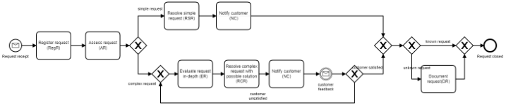
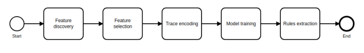
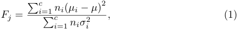
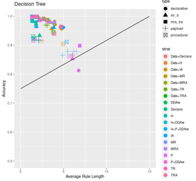
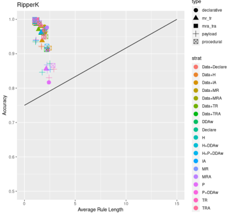

# Exploring Business Process Deviance with Sequential and Declarative Patterns

[Original PDF](../Exploring%20Business%20Process%20Deviance%20with%20Sequential%20and%20Declarative%20Patterns.pdf)

Pages: 33

> Automatically converted from PDF. Check the original for exact equations, symbols, table alignment, and figure details.

<!-- Page 1 -->

# Exploring Business Process Deviance with Sequential and Declarative Patterns 

Giacomo Bergamia , Chiara Di Francescomarinob , Chiara Ghidinib , Fabrizio Maria Maggic , Joonas Puurad 

> _aNewcastle University, Newcastle Upon Tyne, United Kingdom_ 

> _bFondazione Bruno Kessler, Trento, Italy_ 

> _cFree University of Bozen-Bolzano, Italy_ 

> _dUniversity of Tartu, Estonia_ 

## **Abstract** 

Business process deviance refers to the phenomenon whereby a subset of the executions of a business process deviate, in a negative or positive way, with respect to their expected or desirable outcomes. Deviant executions of a business process include those that violate compliance rules, or executions that undershoot or exceed performance targets. Deviance mining is concerned with uncovering the reasons for deviant executions by analyzing event logs stored by the systems supporting the execution of a business process. In this paper, the problem of explaining deviations in business processes is first investigated by using features based on sequential and declarative patterns, and a combination of them. Then, the explanations are further improved by leveraging the data attributes of events and traces in event logs through features based on pure data attribute values and data-aware declarative rules. The explanations characterizing the deviances are then extracted by direct and indirect methods for rule induction. Using real-life logs from multiple domains, a range of feature types and different forms of decision rules are evaluated in terms of their ability to accurately discriminate between non-deviant and deviant executions of a process as well as in terms of understandability of the final outcome returned to the users. 

_Keywords:_ Process Mining, Deviance Mining, Sequential Patterns, Declarative Patterns 

_Preprint submitted to Decision Support Systems_ 

_November 25, 2021_

<!-- Page 2 -->

## **1. Introduction** 

The increasing adoption of ERP (Enterprise Resource Planning) and management applications able to track information about process executions in the so called execution _traces_ , has opened up the possibility of extracting knowledge from traces, collected in _event logs_ . Different techniques have been developed in the context of _process mining_ to _discover_ models from event logs, to _check_ conformance between an event log and a process model, or to _enhance_ existing process models starting from event logs [1, 2, 3]. Among the different types of knowledge that can be extracted from event logs, a crucial role is played by the explanation of _deviant_ traces, i.e., business process executions that deviate in a positive or negative way from the expected outcome [4]. Indeed, discovering why some executions take more (less) time than others, or what characterizes the traces that end up with a faulty (or particularly good) outcome could be very useful for business analysts in order to understand what can be improved to reduce negative deviances and spread the positive ones. 

_Business process deviance mining_ is a branch of process mining which aims at analyzing event logs in order to discover and characterize business process deviances. The input of deviance mining approaches is an event log, in which each trace is labeled as _deviant_ or _non-deviant_ . The purpose is to discover a descriptive and informative _model_ distinguishing the “good” traces from the deviant ones. A good characterization of deviant executions gives analysts hints concerning the causes generating deviance within trace executions, thus allowing effective process improvement solutions. 

As the former formulation easily boils down to a binary classification problem, we show how business process deviance mining can be solved following this intuition. Relevant patterns and/or data attributes describing execution traces are used as features for encoding labeled traces. The labeled encoded traces are then used for training a classifier that is in charge of discriminating between deviant and non-deviant executions based on those patterns. The most obvious choice to describe execution traces [5], which are sequences of activities, is 

2

<!-- Page 3 -->

resorting to _sequential_ patterns representing sequences of adjacent activities. However, other types of features can be used to describe a process trace, as for instance _declarative_ patterns [6], i.e., patterns related to the validity of predefined temporal properties of activities in the trace, or combinations of sequential and declarative patterns ( _hybrid encoding_ ). In addition to features extracted from the control-flow perspective (expressing properties of the sequence of activities in a trace), it is also possible to extract additional features by making use of data attributes attached to traces and events in an event log, which can help in characterizing differences between deviant and non-deviant executions. 

This paper frames the problem of investigating the impact that different types of control-flow features (sequential and declarative patterns, and their combinations) have on business process deviance mining results. Then, it provides two different ways of using data features in addition to control-flow features to characterize business process deviance. These features are evaluated in terms of their ability to accurately discriminate between non-deviant and deviant executions of a process using real-life event logs from multiple domains. Finally, the paper analyzes the possible outcomes returned to the users. Two different methods returning decision rules are compared both in terms of their classification performance and in terms of amount and length of the decision rules returned (to investigate user readability and explanation conciseness). More concretely, the two methods leverage, respectively, decision trees (and a procedure for the extraction of decision rules from them), and the Ripper- _k_ algorithm, which inherently provides decision rules as outcome. The comparison is conducted to investigate the trade-off between the accuracy of the deviance mining approach and the complexity of the decision rules returned. 

The paper is structured as follows. Section 2 gives an overview of previous research related to this paper. Section 3 introduces the necessary background knowledge to understand the concepts and techniques used. In Section 4, a problem statement for business process deviance mining and a motivating example are given. Section 5 introduces the pipeline used for business process deviance mining and how sequential and declarative control-flow patterns as 

3

<!-- Page 4 -->

well as data attributes can be used as features to support deviance mining. This section also shows how to provide explanations for business process deviance in the form of decision rules. Section 6 gives an overview on how the evaluation was carried out and reports the results. Finally, Section 7 concludes the paper by giving an overview of the work done and spells out directions for future work. 

## **2. Related Work** 

The main works related to business process deviance mining can be classified into two main families: the ones using delta-analysis that are mainly based on the identification of differences between the models discovered from deviant and non-deviant traces (e.g., [7, 8]), and those based on classification techniques [9, 10, 11, 5, 12, 13]. This work falls in the latter group. The works in this second group leverage classification techniques to discriminate between normal and deviant traces. These approaches usually discover patterns that are then used to build a classifier. They can be further classified based on the type of features used for training the classifier. 

In [9, 10], the authors use the frequency of individual activities in order to train classifiers in a financial and a clinical scenario, respectively. Bose and van der Aalst in [11, 5] employ sequential pattern mining to discover sequential patterns as tandem repeats, maximal repeats and alphabet repeats to be used as features for training a classifier. Similarly, in [14], association rules are used to discover co-occurrence patterns in the context of deviant classes in a healthcare scenario. In [12, 13], discriminative mining is used to discover discriminative patterns, i.e., patterns that, although not necessarily very frequent, clearly discriminate between deviant and non-deviant traces. A benchmark collecting all these works and evaluating and comparing them in terms of different feature types and classifiers is presented in [15, 16]. 

Different types of patterns have also been combined together in [17, 18, 19, 20]. In particular, in [17], in order to avoid the redundant representation deriving from mixing different families of patterns, the authors propose an 

4

<!-- Page 5 -->

ensemble learning approach in which multiple learners are trained encoding the log according to different types of patterns. In [18], data attributes have also been taken into account in the discovery phase as well as for training the classifier. Finally, in [19, 20], the authors enhance their previous work [17] by proposing an alternative multi-learning approach probabilistically combining various classification methods. 

The extraction of data-aware Declare constraints from event logs has been previously discussed in [21, 22]. In that work, the focus is on the unsupervised discovery of data-aware Declare models. Our work is also related to papers that present approaches for the supervised discovery of declarative models from positive and negative traces like [23, 24, 25]. Recently, declarative patterns have been used to characterize different process variants like in the approaches presented in [26, 27]. 

Differently from the related work described above, this paper: 

- takes into account a completely different and unexplored hybrid encoding to support deviance mining; 

- combines the family of declarative patterns with sequential patterns by facing the feature redundancy problem with feature selection approaches; 

- evaluates the use of data features in combination with control-flow features and provides two different methods for data feature extraction from event logs; 

- compares and evaluates two methods for extracting explanations for business process deviance in the form of decision rules. 

## **3. Background** 

This section gives the background information needed to understand the content of the paper. 

## _3.1. Business Processes and Logs_ 

As the work in this paper concentrates on business process event logs, we give here an overview of what a business process is and how its data representation 

5

<!-- Page 6 -->

looks like. 

## _3.1.1. Business Process_ 

A business process is a set of activities, which are performed in order to 

achieve a particular goal in a business operation. 

Some common types of business processes include: 

- Application-to-approval, where a sequence of activities are executed after the arrival of an application with the end goal of approving or rejecting it. Examples of this type of processes are the application process of students in universities or the hiring process of employees in companies. Typical activities here are “call the referees” or “score the application”; 

- Order-to-cash, which begins with a customer asking for purchasing a product (or using a service) and ends with the product being delivered and the payment for the product being received by the seller. Typical activities here include “check the inventory for stock” or “estimate the price quote for the customer”. 

While business processes are executed, it is possible to track and store the process execution information for analysis by turning activities and events into execution traces, which are then collected in the form of event logs. 

## _3.1.2. Event log_ 

The standard for storage and manipulation of event logs is _XES (eXtensible Event Stream)_ [28], which is an XML-based format specialized for the storage of event log data. The basic hierarchy of a XES document contains a single log object. The log object can contain any number of trace objects. Each trace can contain any number of event objects. 

All event information related to a specific process is contained within a _log_ . Some examples of processes could be: 

- A medical assessment process; 

- A hiring process of employees. 

6

<!-- Page 7 -->

A _trace_ describes a time-ordered execution of a specific process. Given the above processes, the corresponding traces could be: 

- The specific assessment of a patient; 

- The specific hiring of an employee in a company. 

An _event_ represents an observed activity at atomic-level. Possible events in the traces given above could be respectively: 

- The addition of blood test results to the patient’s health record; 

- The decision of hiring by a human resource specialist. 

_Attributes.._ Log, trace and event objects define the structure of a XES document. The relevant information is stored in attributes describing either the whole log, or a single trace, or a specific event within a trace. According to the standard, there are 6 elementary attribute types: _String_ , _Date_ , _Int_ , _Float_ , _Boolean_ , _ID_ . Additionally, the standard describes two collection type attributes: _List_ and _Container_ . In particular, a trace has always at least an attribute of type _String_ with key _concept:name_ , which describes the trace ID. Each event has always at least an attribute _concept:name_ representing the name of the activity executed, an attribute _time:timestamp_ indicating the time when the event occurred, and an attribute _lifecycle:transition_ , which represents the transactional state of the activity (e.g., _start_ indicating that the activity has started, or _complete_ representing the completion of the activity). Traces might also have a specific attribute attribute ( _label_ ) specifying whether the trace is considered to be deviant or not. Other attributes can be attached to events such as _org:group_ describing which group/resource executed the activity. These additional attributes are generically referred to as _event payload_ . 

## _3.2. Log patterns_ 

We give now an overview of the relevant pattern types, which can be used to describe log traces. 

7

<!-- Page 8 -->

## _3.2.1. Sequential Patterns_ 

_Sequential patterns_ [5] represent one of the pattern types that can be used to describe traces. Sequential patterns are sequences of events that occur frequently in a trace, thus capturing particular control-flow relations in it. Among the main types of sequential patterns, we can find: 

- _Tandem Repeats (TR)_ : this type of pattern denotes sequences of events that are repeated consecutively within a trace; these sequences correspond to process loops. 

- _Maximal Repeats (MR)_ : this type of pattern denotes maximal sequences of events that are repeated in an event log; these sequences correspond to sub-processes. 

- _Tandem Repeats Alphabet (TRA)_ : this type of pattern denotes tandem repeats that share the same activities (i.e., the alphabet of unique activities); these sequences correspond to variations of TR taking into account process parallelism. 

- _Maximal Repeats Alphabet (MRA)_ : this type of pattern denotes maximal repeats that share the same activities (i.e., the alphabet of unique activities); these sequences correspond to variations of MR taking into account process parallelism. 

For instance, given a trace _T_ = _⟨_ a _,_ b _,_ c _,_ a _,_ b _,_ c _,_ d _,_ a _,_ b _⟩_ , the set of TR is _{abc}_ , as _abc_ is the only pattern repeated twice consecutively. For TRA, the ordering of activities within the pattern does not matter, but the patterns have to appear consecutively. In this case, given a trace _T_ = _⟨_ a _,_ b _,_ c _,_ c _,_ b _,_ a _,_ a _,_ b _,_ c _⟩_ , the set of TRA is _{abc, cb, ab, c, a}_ , with _abc_ being repeated 3 times, _ab_ and _cb_ twice and _a_ and _c_ also twice (without a specific order of events within the pattern). A pattern is considered to be a maximal repeat, if it cannot be extended to left or to right for a longer repeat covering all the occurrences of the pattern. For example, considering trace _T_ = _⟨_ a _,_ b _,_ c _,_ a _,_ b _,_ c _,_ d _,_ a _,_ b _⟩_ , the set of MR is _{ab, abc}_ ( _c_ and _bc_ are not maximal, because both occurrences can be extended to the left to be _abc_ , which includes all _c_ and _bc_ in the trace). Pattern _ab_ is a maximal repeat, because extending it would not cover the last occurrence of _ab_ . For MRA, the ordering of activities within the pattern does not matter. For trace _T_ = _⟨_ b _,_ a _,_ c _,_ a _,_ b _,_ c _,_ d _,_ b _,_ a _⟩_ , the set of MRA is _{ab, abc}_ . Pattern _abc_ occurs twice and is therefore a repeat. Pattern _ab_ is repeated three times and is maximal, 

8

<!-- Page 9 -->

because it cannot be extended in a way that it covers all the occurrences of _ab_ . Patterns _c_ , _b_ are not maximal, because all _c_ also occur in _abc_ , and all _b_ occur in _ab_ , which are both maximal patterns. 

## _3.2.2. Declare_ 

Declare is a declarative process modeling language first introduced in [6]. The declarative approach for business process modeling was introduced to be able to model loosely-structured processes [29] working in contexts with high variability. As shown in [30], this type of processes are indeed difficult to be defined with the rigid specifications of imperative approaches, which tell users what to do step by step. They can instead easily be designed using declarative process models that shift the decision making from the workflow system supporting the process execution to the user. The basic building block of a Declare model is a _constraint_ , which is a _template_ (i.e., an abstract parameterized property) instantiated on a set of real activities. 

Linear Temporal Logic (ltl) over finite traces is used for specifying the formal semantics of Declare templates [31]. In addition, Declare templates have a graphical notation, which makes them easy to use and interpret for process analysts. Table 1 gives an overview of the most commonly used Declare templates, their graphical representations, and a textual description for each of them. The parameters of a template are specified in capital letters, whereas real activities of constraints are specified in lower-case letters (e.g., Response(a,b) is an instantiation of template Response with activities a and b). 

Declare templates can be grouped into three main categories: _existence_ templates (first 4 rows of Table 1), which involve only one event; _(mutual) relation_ templates (rows from 5 to 15), which describe a dependency between two events; and _negative relation_ templates (last 3 rows), which describe a negative dependency between two events. To give some examples of Declare constraints, consider the following four traces: 

1. _⟨_ a _,_ a _,_ b _,_ c _⟩_ ; 

2. _⟨_ b _,_ b _,_ c _,_ d _⟩_ ; 

9

<!-- Page 10 -->

|**Template** Existence templates|**Explanation**|**Notation**|
|---|---|---|
|Existence(_n,_A)|A occurs at least _n_ times|A _n..∗_|
|Absence(_m_+ 1_,_A)|A occurs at most _m_ times|A 0_..m_|
|Init(A)|A is the _first_ to occur|A _Init_|
|End(A)|A is the _last_ to occur|A _End_|
|Relation templates|||
|RespondedExistence(A_,_B)|If A occurs, then B occurs|A B|
|Response(A_,_B)|If A occurs, then B occurs after A|A B|
|AlternateResponse(A_,_B)|Each time A occurs, then B occurs after- wards, before A recurs|A B|
|ChainResponse(A_,_B)|Each time A occurs, then B occurs imme- diately after|A B|
|Precedence(A_,_B)|B occurs only if preceded by A|A B|
|AlternatePrecedence(A_,_B)|Each time B occurs, it is preceded by A and no other B can recur in between|A B|
|ChainPrecedence(A_,_B)|Each time B occurs, then A occurs imme- diately before|A B|
|Mutual relation templates|||
|CoExistence(A_,_B)|If B occurs, then A occurs, and vice versa|A B|
|Succession(A_,_B)|A occurs if and only if B occurs after A|A B|
|AlternateSuccession(A_,_B)|A and B occur if and only if the latter fol- lows the former, and they alternate each other|A B|
|ChainSuccession(A_,_B)|A and B occur if and only if the latter immediately follows the former|A B|
|Negative relation templates|||
|NotCoExistence(A_,_B)|A and B never occur together|A B|
|NotSuccession(A_,_B)|A never occurs before B|A B|
|NotChainSuccession(A_,_B)|Aand Boccur if and only if the latter does not immediately follow the former|A B|

Table 1. Declare templates 

10

<!-- Page 11 -->

## 3. _⟨_ a _,_ b _,_ c _,_ b _⟩_ ; 

## 4. _⟨_ a _,_ b _,_ a _,_ c _⟩_ . 

Constraint Init(a) (meaning that a trace has to start with the execution of a) is satisfied in traces 1, 3 and 4, but not satisfied in trace 2, since this trace does not start with a. On the other hand, Response(a, b) (meaning that if a occurs, then b must eventually follow) is satisfied in traces 1, 2 and 3, but not satisfied in trace 4, since, here, the second occurrence of a is not eventually followed by b. 

An _activation_ of a constraint in a trace is an event whose occurrence imposes obligations on another event (the _target_ ) in the context of same trace [32, 33]. For example, for constraint Response(a,b) a is an activation, because the execution of a imposes an obligation on b, forcing it to be eventually executed. Event b is a target. Referring back to the sample traces above, in traces 1, 3 and 4, a occurs and constraint Response(a,b) is activated. Trace 2 does not include a and, therefore, the constraint is not activated in that trace. In such a case, the constraint is _vacuously satisfied_ [34] in the trace. 

An activation of a constraint in a trace is either a _fulfillment_ or a _violation_ for the constraint in the trace. If every activation of a constraint in a trace leads to a fulfillment, then the constraint is _satisfied_ in the trace. Constraint Response(a,b) is activated in traces 1, 3 and 4. In trace 1, it is activated twice and both occurrences of a are eventually followed by b, therefore both activations are fulfillments. In trace 3, the constraint is activated and fulfilled once. In trace 4, the constraint is activated twice, but the second activation a is not eventually followed by b and leads to a violation. A constraint is _violated_ in a trace if at least one activation of the constraint leads to a violation in the trace. 

## _3.2.3. Data-Aware Declare Constraints_ 

While Declare in its original form is mainly used to set constraints on control-flow aspects of a process, data-aware Declare constraints extend Declare constraints so as to include conditions on data payloads of events [35]. A data payload of an event is a list of pairs attribute-value including the event attributes 

11

<!-- Page 12 -->

(which can have different values for different events in the same trace) and the trace attributes (having the same value for all events in the same trace) In particular, a data-aware Declare constraint is activated if its (control-flow based) activation occurs and an additional condition on its data payload holds. Consider, for example, the following traces: 

1. _⟨_ a _{g_ = 1 _},_ a _{g_ = 2 _},_ b _,_ c _⟩_ ; 

2. _⟨_ b _,_ b _,_ c _,_ d _⟩_ ; 

3. _⟨_ a _{g_ = 2 _},_ b _,_ c _,_ b _⟩_ ; 

4. _⟨_ a _{g_ = 2 _},_ b _,_ a _{g_ = 1 _},_ c _⟩_ . 

In these traces, a _{g_ = 1 _}_ means that a has an attribute _g_ having value _1_ in its payload. Consider the data-aware constraint Response(a,b, _{_ g=1 _}_ ). This constraint requires the occurrence of a with attribute _g_ = 1 to be activated. In trace 1, the first a is an activation, but the second one is not, since the data condition does not hold on its payload. The only activation in this trace leads to a fulfillment (since it is eventually followed by b) and the constraint is satisfied in that trace. Trace 2 does not have any activations and is, therefore, vacuously satisfied. In trace 3, there are no activations either since a occurs only once, but the data condition does not hold on its payload. In trace 4, the constraint is activated once (second occurrence of a) and this leads to a violation since the occurrence of the activation is not followed by the occurrence of a target b. 

## **4. Problem** 

This section provides an example motivating the importance of approaches for business process deviance mining. Later, we will show the advantages of exploring different types of patterns to explain deviances based on this example (see Section 5.6). The example pertains to the customer support process carried out by a company providing a service, shown in the form of a BPMN model in Figure 1. The support process aims at helping customers whenever a problem occurs or when new features are required. The process starts when the customer 

12

<!-- Page 13 -->

support office receives a request from a client. The customer support office registers the request and performs a first evaluation. If the request can be easily solved, it is solved and the customer is notified. In case the request is difficult to solve, a more in-depth evaluation is carried out, a solution is found and the customer is notified. Then the customer is asked to give feedback on the proposed solution. If the customer is not happy with the solution, the issue is evaluated again, an alternative solution is found and the customer is notified again until a suitable solution is found. In both cases (simple and complex requests), if the problem was never encountered before, a report has to be prepared documenting the request and the solution provided before the request can be closed. 

Figure 1. Customer support example 

Figure 2. High-level pipeline 

The company’s business process analysts have noticed that some of the executions of the customer support process take longer than others, i.e., these executions _deviate_ with respect to the expected process execution time. Analysts are, therefore, interested in understanding what these deviant traces are, how to characterize them and the reasons why they take more time. This information, is indeed crucial for them to be able to improve the process and avoid the occurrence of these delayed executions in the future. 

13

<!-- Page 14 -->

## **5. Business Process Deviance Mining Pipeline** 

Given a labeled log, as first step of the pipeline, we carry out _feature discovery_ (Section 5.1) by exploiting sequential pattern discovery, Declare discovery methods, and by using a combination of the two; in addition to control-flow feature, in some cases, also features extracted from event payloads is used. Due to the large number of features that can be discovered, the next step is to perform _feature selection_ (Section 5.2) by extracting a subset of features that are used to encode the traces. Then, _trace encoding_ (§5.3) provides a feature vector embedding for each trace; to each vector we associate a label indicating whether the corresponding trace is deviant or not with respect to a certain criterion. Then, in the _model training_ phase, we exploit classification models for establishing a correlation between the dimensions of the feature vector and the labels. In addition to that, such models will act as explainer substantiating the difference between deviant traces and non-deviant traces. 

## _5.1. Feature Discovery_ 

Feature discovery is the process of extracting the relevant characteristics to all the traces within the log: those could be described as sequential patterns, declarative rules, or specific payload values. These features will be later on represented as one dimension of a vector that will provide the trace representation. Such a vector, alongside with the label of the associated trace, will be the only input for the model training task. 

_Data Features._ Concerning pure data features extracted from the event payloads, we adopt the attribute-value data representation. Such a representation is widely adopted in data mining, machine learning, neural networks, and statistics due to its simplicity. For each attribute _X_ in the payload, we extract a set of values _v ∈_ **V** _X_ associated to _X_ , so to generate a new data feature using these values. Data features can be of type _String_ , _Int_ , _Float_ and _Boolean_ . 

As attributes _X_ within a single trace might be associated with different values in different events, we first decided to prioritize either the first occurrence 

14

<!-- Page 15 -->

of _X_ ( _Choose first_ , denoted as `first(` _X_ `)` = _v_ ) or its last occurrence ( _Choose last_ , denoted as `last(` _X_ `)` = _v_ ). E.g., consider trace _⟨_ a _{g_ = 1 _},_ a _{g_ = 2 _},_ b _{g_ = 3 _},_ c _⟩_ . For attribute _g_ , _Choose first_ and _Choose last_ produce features `first(` _g_ `)` _= 1_ and `last(` _g_ `)` _= 3_ . 

As an alternative strategy, we also decided to compute aggregation functions _f_ over a multiset1 of values ( **V** _X , µ_ ) for each given _X_ ; we restricted the class of aggregation functions to the following, thus producing a feature denoted as `f` ( _X_ ) = _u_ , where _u_ is the result of the aggregation function. 

- **Value** _v_ **Count** ( `count` ( _X, v_ ) = _µ_ ( _v_ )) - For each value _v ∈_ **V** _X_ associated to an attribute _X_ , we count how many times ( _µ_ ( _v_ )) the attribute assumes that value in the trace (used for attributes of type _String_ ); 

- **Choose max** ( `max` ( _X_ ) = max **V** _X_ ) - The value of the feature is the maximum value of the attribute in the trace (used for attributes of type _Int_ and _Float_ ); 

- **Choose min** ( `min` ( _X_ ) = min **V** _X_ ) - The value of the feature is the minimum value of the attribute in the trace (used for attributes of type _Int_ and _Float_ ); 

- **Compute avg** ( `avg` ( _X_ ) = avg **V** _X_ ) - The value of the feature is the average of the values the attribute assumes in the trace (used for attributes of type _Int_ and _Float_ ). 

E.g., given a trace _⟨_ a _{g_ = 1 _},_ a _{g_ = 2 _},_ b _{g_ = 3 _},_ c _⟩_ , _Choose max_ , _Choose min_ and _Compute avg_ produce features `max` _(g) = 3_ , `min` _(g) = 1_ and `avg` ( _g_ ) = 2, respectively. Also, given a trace _⟨_ a _{color_ = _white},_ a _{color_ = _black},_ b _{color_ = _white},_ c _⟩_ , attribute _color_ assumes two different values: _white_ and _black_ . Therefore, _Count_ produces two features. The first feature is `count` _(color, white) = 2_ and the second one is `count` _(color, black) = 1_ . Finally, we also extract metainformation of a trace, such as the _trace length_ (the number of events within the 

> 1A multiset is a pair ( _A, µ_ ), where _A_ is a set of values and _µ_ : _A →_ N denotes the number 

> of occurrences _µ_ ( _a_ ) of each _a ∈ A_ . 

15

<!-- Page 16 -->

trace) and the _trace time length_ (time difference in milliseconds between the last and the first event of the trace). All these feature extraction techniques were exploited for our experiments. 

_Sequential Features._ We discover sequential patterns as in [5] to extract discriminative TR, TRA, MR and MRA patterns. This algorithm discovers patterns that are frequent either in deviant traces or in non-deviant traces but not in both, so to identify features that uniquely describe each class of traces. Frequent patterns are selected by filtering out the ones having a support inferior to a given minimum support threshold _ϑ_ . In our experiments, the support information associated to each sequential feature is also preserved and passed as an additional information for the trace encoding phase. Finally, for each feature _X_ and trace _σ_ within the log _L_ , the discovery algorithm returns a matrix _M_ where _MX,σ_ denotes the relative support of _X_ within trace _σ_ : we preserve also this information in the trace encoding step. 

_Declarative Features._ We discover the instantiation of declarative templates via the well-known Apriori algorithm [36]. Generally speaking, let _Ak_ denote the set of all frequent activity sets of size _k ∈_ N and let _Ck_ denote the set of all _candidate activity sets_ of size _k_ that may potentially be frequent. The algorithm starts by considering activity sets of size _k_ = 1 and progresses iteratively by considering activity sets of increasing sizes in each iteration. The set of candidate activity sets of size _k_ + 1, _Ck_ +1, is generated by joining relevant frequent activity sets from _Ak_ . This set can be pruned efficiently using the property that a relevant candidate activity set of size _k_ + 1 cannot contain an infrequent subset. The activity sets in _Ck_ +1 that have a support above a given threshold _ϑ_ constitute the frequent activity sets of size _k_ + 1 ( _Ak_ +1) used in the next iteration. We discover activity sets that have a support above _ϑ_ in either the sub-log of deviant traces or in the sub-log of non-deviant traces. 

We instantiate the former algorithm over the Declare patterns as follows: given the frequent activity set _{a, b}_ where _a_ and _b_ are event labels, we instantiate, e.g., the Response template as Response(a,b) and Response(b,a). 

16

<!-- Page 17 -->

Limiting the instantiation of the candidate constraints to frequent activity sets drastically reduces the number of candidate constraints to be checked. Finally, each candidate constraint is checked separately over deviant and non-deviant traces (depending on whether it is derived from an activity set discovered from the sub-log of deviant traces or from the sub-log of non-deviant traces) to verify if it is satisfied in a percentage of traces that is above the minimum support threshold _ϑ_ . The instantiated templates resulting from the process will constitute the set of the declarative features. 

_Data-Aware Declarative Features._ This last approach identifies data-aware declarative features, starting from the data-agnostic ones obtained as described in the previous paragraph. Starting from each data-agnostic Declare feature, we use the approach presented in [21, 22] to enrich it with a data condition as follows: 

1. Collect the fulfilled activations of the constraint in each trace; 

2. Extract the data payload of every fulfilled activation; 

3. Encode the payloads into feature vectors in which each attribute is a feature; 

4. Learn a decision tree by using the feature vectors labeled as deviant or nondeviant based on whether the corresponding payloads belong to activations occurring in deviant or non-deviant traces, respectively; 

5. Create a data-aware Declare constraint by considering the original Declare constraint enriched with a data condition discriminating deviant and nondeviant traces according to the model resulting from the trained decision tree. E.g., if the initial constraint is Response(a,b) and C is the data condition extracted from the decision tree, the new data-aware Declare constraint is Response(a,b,C). 

## _5.2. Feature Selection_ 

The number of features generated from the previous step is, generally, too large. Therefore, it becomes important to remove the features that do not give much value for training the explanatory model. Having too many features 

17

<!-- Page 18 -->

contributes indeed to long training times, overfitting and too complex classifiers. The features discovered in the previous step are pruned via the coverage method, described in [37]. In this method, a number of features is selected by first ranking them according to the Fisher score. The Fisher score for the _j-th_ feature is computed as: 

where _ni_ denotes the number of data points in class _i_ , _µi_ and _σi_2denotemean and variance of class _i_ corresponding to the _j-th_ feature, and _µ_ and _σ_ are mean and variance of all data point corresponding to the j-th feature. Then, following the ranking, features are selected until every trace is covered by at least a fixed number of features (coverage threshold). A feature is only chosen if it covers at least one of the traces not totally covered yet. Sequential and declarative features can be ranked and selected separately, or, in the case of the hybrid encoding, they are selected from a common ranking of sequential and declarative features. 

## _5.3. Trace Encoding_ 

In this step, each trace _σ_ in the input log _L_ is transformed into a vector _vσ_ with an associated classification label _yσ ∈{_ 0 _,_ 1 _}_ , i.e., deviant (1) or non-deviant (0) trace, for training a classifier. In particular, each feature _X_ passing the feature selection phase will correspond to one distinct dimension _dX_ within the final vector representation _vσ_ . 

_Sequential Encoding.._ For each trace _σ_ and given a sequential feature _X_ , we set the dimension _dX_ of the vector _vσ_ to _Mσ,X_ , i.e., _vσ_ [ _dX_ ] := _MX,σ_ . 

_(Data-Aware) Declarative Encoding.._ For each trace _σ_ and given a declarative feature _X_ , we set the dimension _dX_ of the vector _vσ_ (i.e., _vσ_ [ _dX_ ]) to: 

- -1, if the corresponding Declare constraint is violated in the trace; 

- 0, if the corresponding Declare constraint is vacuously satisfied in the trace; 

18

<!-- Page 19 -->

- _n_ , if the corresponding Declare constraint is satisfied and activated _n_ times in the trace. 

E.g., given a trace _⟨_ a _,_ b _,_ c _,_ a _,_ b _,_ c _,_ d _,_ a _,_ b _⟩_ : 

- constraint Response(a,c) is violated, since the third activation leads to a violation and is encoded as -1; 

- constraint Response(a,b) is satisfied and activated 3 times and is encoded as 3; 

- constraint Response(e,b) is vacuously satisfied and is encoded as 0. 

We also adopt the same approach for representing data-aware declarative features. E.g., given a trace _⟨_ a _{color = white},_ c _,_ b _{color = black},_ c _,_ d _,_ a _{color = white},_ c _⟩_ , we have: 

- constraint Response(a,c,color = white) is satisfied and activated twice, and is hence encoded as 2; 

- constraint Response(a,d,color = white) is violated, since the second occurrence of a is not eventually followed by d, and is encoded as -1; 

- constraint Response(b,c,color = white) is vacuously satisfied and encoded as 0 (b is not an activation, because the data condition _color = white_ does not hold on its payload). 

_Hybrid Encoding._ Each trace is encoded into a numerical feature vector as explained in the previous two paragraphs depending on whether the feature is sequential or declarative. 

In our experiments, all the encodings explained so far have been considered with and without the data features introduced defined and selected in the previous steps of the pipeline. 

## _5.4. Model Training_ 

For each type of encoding described, a classifier is trained to both classify new unseen traces (thus being able to evaluate the performance of the classification) and explain the classification with explicit rules. For this reason, the chosen classifiers are _white-box_ classifiers. 

19

<!-- Page 20 -->

## _5.5. Rule Extraction_ 

As output of a business process deviance mining approach, it is important to provide a set of rules describing the differences between deviant and nondeviant traces. To identify these rules, we use the white-box classifiers Ripper _k_ (Repeated Incremental Pruning to Produce Error Reduction) [38] and decision trees [39]. Such models directly provide the classification rules: while Ripper directly provides the rules in output, they are reconstructed from a decision tree by considering the conjunction of the atomic conditions encountered on each path from the root of the tree to the leaves labeled as deviant (each path is a separate rule). Conditions on the same feature are simplified by merging them (when possible) and by removing subsumed conditions. 

## _5.6. The Presented Pipeline in the Context of the Motivating Example_ 

Consider the motivating example presented in Section 4. By applying the business process deviance mining pipeline with sequential features, analysts would get as outcome that deviant traces are those for which the pattern _⟨_ ER _,_ RCR _,_ NC _⟩_ is repeated more than twice (i.e., it is a tandem repeat with frequency greater than 2). However, although many of the deviant traces seem to be captured by this explanation, it could not be sufficient for characterizing all of them. 

The analysts can then try to apply the approach with declarative features. The outcome, in this case, is that deviant traces are those for which activity Resolve Simple Requests is eventually followed by Document Request (i.e., for which Response(RSR, DR) is satisfied). Still, this explanation is not sufficient for capturing all the deviant traces. 

By applying the approach with hybrid features, the analysts are finally able to get an explanation using both sequential and declarative patterns, and covering almost all traces, i.e., there are two situations in which the process executions take longer: 

- when, in the case of complex requests, more than two iterations are carried out with the customer, until the customer is satisfied. 

20

<!-- Page 21 -->

- when customer support operators procrastinate writing reports related to simple request resolutions. Indeed, differently from complex requests, for which operators tend to complete the documentation immediately after the resolution, reports for simple requests tend to be delayed and the requests cannot be closed quickly. 

Since the control-flow patterns are not able to completely discriminate deviant from non-deviant traces, analysts could decide to add data features. Using these additional features, they find that a first cause of deviance is the same as the one they found without considering the data perspective, i.e., there is a deviance when pattern _⟨_ ER _,_ RCR _,_ NC _⟩_ is repeated more than twice. However, with the addition of _pure data_ features, it would be possible to see that requests received in July and August took more time to be processed. Also, by adding features based on data-aware Declare constraints, analysts could find explanations telling that constraint Response(RSR,DR, _resource = D_ ) characterizes a deviant trace better than the initial Declare constraint without the data condition. This means that, if RSR was performed by a specific resource (D), the execution time was longer. 

The addition of features based on data attributes help analysts to enrich and refine the deviance causes previously identified. In this case, analysts were able to identify three situations where process executions take considerably longer: 

- when the request is received during the summer; 

- when a customer support operator (resource D) procrastinate writing reports related to simple request resolutions; 

- when, in the case of complex requests, more than two iterations are carried out with the customer. 

## **6. Evaluation** 

In this section, we describe the experimentation we have carried out to evaluate our pipeline for exploring business process deviance. The source code is available on GitHub at `https://github.com/jackbergus/CompleteDevianceMining` . 

21

<!-- Page 22 -->

For the construction of the decision trees used in the experiments, we used the Python library _scikit-learn_ [40]. For Ripper _k_ , we used _JRip_ available in Weka [41]. 

## _6.1. Research Questions_ 

In order to investigate the impact of different types of encodings (sequential, declarative and hybrid with and without data) and of the chosen classifier (Ripper _k_ and decision trees) on their ability to accurately discriminate between non-deviant and deviant executions of a process, the following research questions were considered: 

- **RQ1.** How does the choice of the trace encoding affect the accuracy of the classification of traces into deviant and non-deviant, in the proposed pipeline? 

- **RQ2.** How does the choice of the classifier affect the accuracy of the classification of traces into deviant and non-deviant, in the proposed pipeline? 

- **RQ3.** How does the choice of the trace encoding affect the conciseness of the rules describing the differences between deviant and non-deviant traces? 

- **RQ4.** How does the choice of the classifier affect the conciseness of the rules describing the differences between deviant and non-deviant traces? 

**RQ1** and **RQ2** evaluate how different types of features and different classifiers affect the accuracy of the deviance mining task. **RQ3** and **RQ4** , instead, focus on how different types of features and different classifiers affect the conciseness of the rules used to explain deviances. This is very relevant from the user point of view, since more concise rules are more understandable and might generalize better over noisy data [42]. 

## _6.2. Datasets and Dataset Labelings_ 

The evaluation has been carried out using 9 real-life logs. In particular, we considered several BPI Challenge Datasets (one log from 2011, one log from 

22

<!-- Page 23 -->

2012, five logs from 2015), the Sepsis Case event log [43], and the Traffic Fine Management Process log [44]. 

The Sepsis Cases event log ( `sepsis` ) collects cases of patients with symptoms of sepsis from a Dutch hospital. Log traces were labeled as: 

- `decl` : Response( `IV Antibiotics` , `Leucocytes` ), Response( `LacticAcid` , `IV Antibiotics` ) and Response( `ER Triage` , `CRP` ) are satisfied non-vacuously. 

- `mr tr` : sequence “ `Admission NC` , `CRP` , `Leucocytes` ” occurs at least once within the trace. 

- `mra` ~~`t`~~ `ra` : “ `IV Liquid` , `LacticAcid` , `Leucocytes` ” occur in any order twice within the trace, with interleaving. 

- `payload` : Trace attribute `DisfuncOrg` = _True_ . 

The Traffic Fine Management Process log ( `traffic` ) describes some events related to the Italian fine system for road traffic. Log traces were labeled as: 

- `decl` : Response( `Insert Date Appeal to Prefecture` , `Add penalty` ) is satisfied non-vacuously. 

- `mr tr` : sequence “ `Add penalty Payment` ” occurs at least once within the trace. 

- `mra` ~~`t`~~ `ra` : “ `Create Fine` , `Payment` ” occur in any order twice within the trace, with interleaving. 

- `p` ~~`A`~~ `rt157` : Trace attribute `article` = _157_ . 

- `p` ~~`P`~~ `ay36` : Event attribute `paymentAmount` = _36_ at least once. 

The BPI Challenge 2011 log ( `bpi11` ) contains data about a Dutch academic hospital. Each trace represents the clinical history of a patient. Log traces were labeled as: 

- `decl` : Init( `Outpatient follow-up consultation` ) is satisfied. 

- `mr tr` : sequence “ `SGOT` , `SGPT` , `Milk acid dehydrogenase LDH` , `Leukocytes electronic count` ” occurs at least once within the trace. 

23

<!-- Page 24 -->

- `mra` ~~`t`~~ `ra` : “ `Assumption Laboratory` , `Milk acid dehydrogenase LDH` ” occur in any order twice within the trace, with interleaving. 

- `p` ~~`M`~~ `13` [15]: Trace attribute Diagnosis code= _M13_ . 

- `p` ~~`T`~~ `101` [15]: Trace attribute Treatment code= _101_ . 

The BPI Challenge 2012 log ( `bpi12` ) contains data about a Dutch Financial Institute. The process represented in the event log is an application process for a personal loan or overdraft within a global financing organization. Log traces were labeled as: 

- `decl` : Precedence( `O` ~~`A`~~ `CCEPTED` , `A` ~~`A`~~ `PPROVED` ) is satisfied non-vacuously. 

- `mr tr` : sequence “ `O` ~~`S`~~ `ENT` , `Request Completed` , `Recall incomplete dossiers` ” occurs at least once within the trace. 

- `mra` ~~`t`~~ `ra` : “ `Handling leads` , `Request Completed` ” occur in any order three times within the trace, with interleaving. 

- `p` ~~`4`~~ `5000` : Trace attribute `AMOUNT` ~~`R`~~ `EQ` = _45000_ . 

- `p` ~~`6`~~ `500` : Trace attribute `AMOUNT` ~~`R`~~ `EQ` = _6500_ . 

The BPI Challenge 2015 logs ( `bpi15A` - `bpi15E` ) come from five distinct Dutch municipalities. The logs pertain to the assessment of building permit applications in each municipality. Each log was labeled as: 

- `decl` : Existence( `01 HOOFD` ~~`0`~~ `11` ) is satisfied. 

- `mr tr` : sequence “ `08 AWB45` ~~`0`~~ `05` , `01` ~~`H`~~ `OOFD` ~~`2`~~ `00` ” occurs at least once within the trace. 

- `mra` ~~`t`~~ `ra` : “ `01` ~~`H`~~ `OOFD` ~~`0`~~ `30` ~~`1`~~ , `01 HOOFD` ~~`5`~~ `10` ~~`1`~~ ” occur in any order twice within the trace, with interleaving. 

- `payload` : Trace attribute `monitoringResource` = _x_ , where _x_ depends on the resource monitored within the dataset ( `A:` _560925_ , `B:` _4634935_ , `C:` _3442724_ , `D:` _560812_ , `E:` _560608_ ). 

24

<!-- Page 25 -->

## _6.3. Results_ 

To answer our research questions, we run the proposed pipeline using different configurations. In particular, we use as classifiers Ripper _k_ and decision trees, and 3-fold cross-validation to train and test them. In addition, we use grid search for hyper-parameter tuning. We used all the feature encodings introduced in Section 5. In the feature discovery step, we set _ϑ_ = 0 _._ 3 as minimum support threshold to generate a sufficiently high number of features. 

To answer research questions **RQ1** and **RQ2** , we use standard measures, i.e., _precision_ , _recall_ , _F1_ , and _AUC_ , to estimate the accuracy of the different encodings and classifiers. In particular, we evaluate these metrics, for each classifier, each encoding (Individual Activities (IA), TR, TRA, MR, MRA, Declare, Hybrid (H), (Pure) Data, Data + Individual Activities (IA), Data+TR, Data+TRA, Data+MR, Data+MRA, Data+Declare, Data+Hybrid (H), Data+ Data-aware Declare (DeclD), H+DeclD, H+Data+DeclD), each dataset and each labeling, and we average them over the different datasets. 

Tables 2 and 3 provide the results obtained using as classifiers Ripper _k_ and decision trees, respectively. The results show that logs labeled using declarative rules provide, in general, the best performances with the declarative encodings. In some cases, MRA patterns also are able to predict well the declarative labelings. This is reasonable since MRA patterns sit in the middle between procedural and declarative patterns and are capable to characterize “unstructured” behavior. On the other hand, in most of the cases, MR and TR patterns guarantee a good performance for procedural labelings. The `mra` ~~`t`~~ `ra` labelings tested can be, instead, accurately predicted using very little information (individual activities are sufficient) and the accuracy measures are equal to 1 for almost all the encodings. Notice that for both declarative and procedural labelings, using the hybrid encoding, it is possible to predict the correct label in all cases when using Ripper _k_ and with a very high accuracy also when using decision trees. 

As expected, the data features are less accurate in predicting control-flow labels and work better than control-flow features when predicting labels based on data attributes. However, even in the latter case, the addition of some control- 

25

<!-- Page 26 -->

Table 2. Average accuracy metrics using Ripper _k_ 

|||||IA|||M|R||||T|R|||M|RA|||T||RA||
|---|---|---|---|---|---|---|---|---|---|---|---|---|---|---|---|---|---|---|---|---|---|---|---|
|Labelling|Prec|R|ec|F1|AUC|Prec|Rec|F1||AUC|Prec|Rec|F1|AUC|Prec|Rec|F1|AUC|Prec|Rec||F1|AUC|
|`decl`|0.96|0.|99|0.99|0.97|0.98|0.98|0.9|8|0.98|0.95|0.99|0.99|0.97|0.99|0.98|0.99|0.98|0.95|0.98||0.98|0.96|
|`mr` ~~`t`~~`r`|0.88|0.|89|0.89|0.89|**1.00 **|**1.00 **|**1.0**|**0 **|**1.00**|**1.00 **|**1.00 **|**1.00 **|**1.00**|0.99|0.97|0.98|0.98|0.98|0.98||0.99|0.98|
|`mra` ~~`t`~~`ra`|**1.00 **|**1**|**.00**|**1.00 **|**1.00**|**1.00 **|**1.00 **|**1.0**|**0 **|**1.00**|**1.00 **|**1.00 **|**1.00 **|**1.00**|**1.00 **|**1.00**|**1.00 **|**1.00**|**1.00 **|**1.0**|**0 **|**1.00**|**1.00**|
|`payload`|0.34|0.|21|0.48|0.26|0.40|0.29|0.5|9|0.32|0.32|0.23|0.52|0.25|0.47|0.30|0.63|0.33|0.31|0.21||0.48|0.23|
|Labellin||||Decl|are|||||H|||||Dat|a||||Decl|D|||
|g|Pr|ec||Rec|F1|AUC|Pre|c|R|ec|F1|AUC|Pre|c R|ec F|1|AUC|Prec|Rec||F|1|AUC|
|`decl`|**1.0**|**0**||**1.00**|**1.00**|**1.00**|**1.0**|**0**|**1.**|**00**|**1.00**|**1.00**|0.8|1 0.|82 0|.80|0.81|**1.00**|**1.0**|**0** |**1**|**.00**|**1.00**|
|`mr` ~~`t`~~`r`|0.9|9||**1.00**|0.99|0.99|**1.0**|**0**|**1.**|**00**|**1.00**|**1.00**|0.7|6 0.|74 0|.77|0.77|0.98|**1.0**|**0** |**1**|**.00**|0.99|
|`mra` `tra`|**1.0**|**0**||**1.00**|**1.00**|**1.00**|**1.0**|**0**|**1.**|**00**|**1.00**|**1.00**|0.8|4 0.|83 0|.86|0.82|**1.00**|**1.0**|**0** |**1**|**.00**|**1.00**|
|`payload`|0.4|5|0|.33|0.57|0.36|0.3|5|0.|49|0.67|0.37|0.8|3 0.|78 0|.88|0.81|0.74|0.8|6 |0|.90|0.77|
||||Dat|a+IA|||Data|+M|R|||Data|+TR|||Data|+MRA|||Dat|a|+TRA||
|Labelling|Prec|R|ec|F1|AUC|Prec|Rec|F1||AUC|Prec|Rec|F1|AUC|Prec|Rec|F1|AUC|Prec|Rec||F1|AUC|
|`decl`|0.95|0.|98|0.98|0.96|0.99|0.98|0.9|9|0.98|0.95|0.98|0.98|0.96|0.99|0.97|0.98|0.98|0.95|0.99||0.98|0.96|
|`mr` ~~`t`~~`r`|0.94|0.|87|0.93|0.88|0.99|**1.00 **|**1.0**|**0**|0.99|**1.00**|0.95|0.98|0.96|0.99|0.97|0.99|0.98|0.98|0.94||0.98|0.94|
|`mra` ~~`t`~~`ra`|**1.00 **|**1**|**.00**|**1.00 **|**1.00**|**1.00 **|**1.00 **|**1.0**|**0 **|**1.00**|**1.00 **|**1.00 **|**1.00 **|**1.00**|**1.00 **|**1.00**|**1.00 **|**1.00**|**1.00 **|**1.0**|**0 **|**1.00**|**1.00**|
|`payload`|**0.88**|0.|83|**0.91 **|**0.84**|0.84|0.80|0.9|0|0.83|0.84|0.77|0.88|0.81|0.83|0.75|0.87|0.77|0.87|0.79||0.89|**0.84**|
|||Da|ta+|Decla|re||Data+|De|clD|||Dat|a+H|||H+|DeclD||H+|Da|ta|+De|clD|
|Labelling|Prec|R|ec|F1|AUC|Prec|Rec|F1||AUC|Prec|Rec|F1|AUC|Prec|Rec|F1|AUC|Prec|Rec||F1|AUC|
|`decl`|**1.00 **|**1**|**.00**|**1.00 **|**1.00**|**1.00 **|**1.00 **|**1.0**|**0 **|**1.00**|**1.00 **|**1.00 **|**1.00 **|**1.00**|**1.00 **|**1.00**|**1.00 **|**1.00**|**1.00 **|**1.0**|**0 **|**1.00**|**1.00**|
|`mr` ~~`t`~~`r`|0.98|0.|99|0.99|0.99|0.98|**1.00 **|**1.0**|**0**|0.99|**1.00 **|**1.00 **|**1.00 **|**1.00**|**1.00 **|**1.00**|**1.00 **|**1.00**|**1.00 **|**1.0**|**0 **|**1.00**|**1.00**|
|`mra` ~~`t`~~`ra`|**1.00 **|**1**|**.00**|**1.00 **|**1.00**|**1.00 **|**1.00 **|**1.0**|**0 **|**1.00**|**1.00 **|**1.00 **|**1.00 **|**1.00**|**1.00 **|**1.00**|**1.00 **|**1.00**|**1.00 **|**1.0**|**0 **|**1.00**|**1.00**|
|`payload`|0.73|0.|85|0.90|0.76|0.80|0.81|0.8|9|0.77|0.72|**0.88 **|**0.91**|0.77|0.75|0.82|0.89|0.76|0.76|0.82||0.89|0.76|

flow information improves the accuracy of the results. The tested classifiers have comparable performance in terms of accuracy. However, Ripper _k_ seems to better exploit the availability of hybrid features with respect to decision trees. 

To answer research questions **RQ3** and **RQ4** , we compare the average length of the rules returned by Ripper _k_ and decision trees using all the feature encodings presented. In particular, in Figure 3, we plot the distribution of the precision of the mined rules and the average rule length. The diagonal black line represents the intuition that, by increasing the rule length, we would expect to have an increase in precision. As already remarked when answering the first two research questions, Ripper _k_ and decision trees have comparable accuracy, while the encodings combining data and control-flow have a better accuracy with respect to the ones based on data or control-flow only. However, Ripper _k_ provides the best trade-off of conciseness-accuracy since the distribution of its points is 

26

<!-- Page 27 -->

Table 3. Average accuracy metrics using decision tree 

|||||I|A|||M|R||||T|R||||M|RA|||T||RA||
|---|---|---|---|---|---|---|---|---|---|---|---|---|---|---|---|---|---|---|---|---|---|---|---|---|---|
|Labelling|Prec|R|ec||F1|AUC|Prec|Rec|F1||AUC|Prec|Rec|F1|AUC|Prec||Rec|F1|AUC|Prec|Rec||F1|AUC|
|`decl`|0.95|0.|97||0.98|0.96|0.98|0.98|**0.9**|**9**|0.98|0.95|0.96|0.98|0.95|**0.99**||0.98|**0.99**|0.98|0.95|0.97||**0.99**|0.96|
|`mr` ~~`t`~~`r`|0.94|0.|93||0.97|0.94|**1.00 **|**1.00 **|**1.0**|**0 **|**1.00**|**1.00 **|**1.00 **|**1.00 **|**1.00**|0.99||0.97|**1.00**|0.98|0.99|0.98||0.99|0.99|
|`mra` ~~`t`~~`ra`|**1.00 **|**1**|**.00**||**1.00**|**1.00**|**1.00 **|**1.00 **|**1.0**|**0 **|**1.00**|**1.00 **|**1.00 **|**1.00 **|**1.00**|**1.00 **||**1.00**|**1.00 **|**1.00**|**1.00 **|**1.0**|**0 **|**1.00**|**1.00**|
|`payload`|0.34|0.|28||0.67|0.29|0.41|0.33|0.7|0|0.34|0.33|0.26|0.67|0.28|0.44||0.35|0.70|0.37|0.33|0.28||0.66|0.28|
|Labellin|||||Decl|are|||||H|||||Dat|a|||||Decl|D|||
|g|Pr|ec||R|ec|F1|AUC|Pre|c|R|ec|F1|AUC|Pre|c R|ec F|1||AUC|Prec|Rec||F|1|AUC|
|`decl`|0.9|8||**0.**|**99**|**0.99**|0.98|0.9|8|**0.**|**99**|**0.99**|0.98|0.8|2 0.|79 0|.|82|0.79|0.97|0.9|6 |0|.98|0.97|
|`mr` ~~`t`~~`r`|0.9|3||**1.**|**00**|0.95|0.96|**1.0**|**0**|**1.**|**00**|**1.00**|**1.00**|0.8|0 0.|79 0|.|87|0.79|0.99|0.9|9 |0|.99|0.99|
|`mra` `tra`|**1.0**|**0**||**1.**|**00**|**1.00**|**1.00**|0.9|9|**1.**|**00**|0.98|0.99|0.8|2 0.|77 0|.|86|0.79|**1.00**|**1.0**|**0** |**1**|**.00**|**1.00**|
|`payload`|0.4|2||0.|51|0.79|0.40|0.4|2|0.|52|0.78|0.41|0.8|4 0.|79 0|.|90|0.81|0.68|0.8|4 |0|.90|0.72|
||||Dat|a|+IA|||Data|+M|R|||Data|+TR|||D|ata|+MRA|||Dat|a|+TR|A|
|Labelling|Prec|R|ec||F1|AUC|Prec|Rec|F1||AUC|Prec|Rec|F1|AUC|Prec||Rec|F1|AUC|Prec|Rec||F1|AUC|
|`decl`|0.95|0.|98||0.98|0.96|0.98|0.97|**0.9**|**9**|0.98|0.95|0.97|0.98|0.96|0.98||0.98|**0.99 **|**0.99**|0.96|0.97||**0.99**|0.96|
|`mr` ~~`t`~~`r`|0.94|0.|94||0.96|0.94|**1.00 **|**1.00 **|**1.0**|**0 **|**1.00**|**1.00 **|**1.00 **|**1.00 **|**1.00**|0.99||0.97|0.99|0.98|0.99|0.98||**1.00**|0.99|
|`mra` ~~`t`~~`ra`|**1.00 **|**1**|**.00**||**1.00**|**1.00**|**1.00 **|**1.00 **|**1.0**|**0 **|**1.00**|**1.00 **|**1.00 **|**1.00 **|**1.00**|**1.00 **||**1.00**|**1.00 **|**1.00**|**1.00 **|**1.0**|**0 **|**1.00**|**1.00**|
|`payload`|**0.86**|0.|84||**0.91**|**0.84**|0.84|0.83|**0.9**|**1**|0.83|0.84|0.83|**0.91**|0.83|0.83||0.81|0.90|0.82|0.84|0.83||**0.91**|0.83|
|||Da|ta+||Decla|re||Data+|Dec|lD|||Dat|a+H||||H+|DeclD||H+|Da|ta|+De|clD|
|Labelling|Prec|R|ec||F1|AUC|Prec|Rec|F1||AUC|Prec|Rec|F1|AUC|Prec||Rec|F1|AUC|Prec|Rec||F1|AUC|
|`decl`|0.98|**0**|**.99**||**0.99**|0.98|0.97|0.96|0.9|8|0.97|0.98|**0.99 **|**0.99**|0.98|0.97||0.96|0.98|0.97|0.97|0.96||0.98|0.96|
|`mr` ~~`t`~~`r`|0.98|**1**|**.00**||**1.00**|0.99|0.98|0.98|0.9|9|0.99|**1.00 **|**1.00 **|**1.00 **|**1.00**|**1.00 **||**1.00 **|**1.00 **|**1.00**|0.97|**1.0**|**0**|0.98|0.98|
|`mra` ~~`t`~~`ra`|0.99|**1**|**.00**||0.98|**1.00**|**1.00 **|**1.00 **|**1.0**|**0 **|**1.00**|**1.00 **|**1.00 **|**1.00 **|**1.00**|**1.00 **||**1.00 **|**1.00 **|**1.00**|**1.00 **|**1.0**|**0 **|**1.00**|**1.00**|
|`payload`|0.70|**0**|**.89**||**0.91**|0.75|0.70|0.84|0.9|0|0.73|0.69|**0.89 **|**0.91**|0.75|0.68||0.84|0.89|0.73|0.68|0.84||0.89|0.72|

Figure 3. Comparing Ripper _k_ and decision trees for both Average Rule Length and Accuracy. 

squeezed towards the y-axis with respect to the one obtained with decision trees. This effect is more evident when using encodings based on data or control-flow 

27

<!-- Page 28 -->

only. 

## **7. Conclusion** 

This paper has focused on approaches for uncovering and explaining (positive and negative) deviances in business process execution traces. In particular, three different aspects have been investigated. 

First, different types of control-flow features were investigated (sequential, declarative and hybrid) for explaining deviances. The feature types were applied to different real-life logs, by showing advantages and limits of each of them. Overall, the conclusion was that hybrid encoding is preferable independently of the nature of the log and the labeling, provided that there is a real correlation between labels and control-flow. Note that this result is crucial in real settings in which the nature of the logs and the type of correlation features-labeling is not known a priori. 

Second, the paper investigated the impact of data (together with declarative and sequential features) on the capability of existing techniques to explain process execution deviances. Data features were included using straightforward attribute extraction and aggregation methods and the discovery of data-aware Declare constraints. The results showed that the combination of data and control-flow features increases the performance of deviance mining. However, the extent of this improvement depends on the characteristics of the log and on the correlation between labels and features. 

Third, this paper investigated the final outcomes of business process deviance mining returned to the user. More concretely, two different classifiers were evaluated (Ripper _k_ and decision trees) and compared them using accuracy metrics and in terms of conciseness of the returned decision rules. The results show that the accuracy of Ripper _k_ and decision trees are comparable, while Ripper _k_ returns shorter rules. In addition, Ripper _k_ is able to better exploit the availability of hybrid features with respect to decision trees in order to improve the accuracy of the classification. This result suggests that using Ripper _k_ as a 

28

<!-- Page 29 -->

classifier for business process deviance mining is a good alternative to decision trees, especially for providing more compact explanations to the user. 

For future work, there are several possible directions to go and ways to improve the present work. One of the possible improvements would be to try out more feature selection methods to find better alternatives to the currently used _coverage_ method. To further improve the effectiveness of data features, more feature extraction methods could be considered, especially for extracting features based on meta-information. In order to assess the understandability of the returned rules, an empirical study could be carried out with human subjects for assessing whether more compact rules are actually better than longer ones. Another possible avenue for future work would be to experiment model-agnostic explainers for describing the important features in the classification process, which could allow the use of more complex and powerful classifiers with respect to the white-box classifiers used in this paper. 

## **References** 

- [1] W. M. P. van der Aalst, Process Mining - Data Science in Action, Second Edition, Springer, 2016. 

- [2] A. Augusto, R. Conforti, M. Dumas, M. La Rosa, F. M. Maggi, A. Marrella, M. Mecella, A. Soo, Automated discovery of process models from event logs: Review and benchmark, IEEE Trans. Knowl. Data Eng. 31 (4) (2019) 686–705. 

- [3] A. Ostovar, S. J. J. Leemans, M. La Rosa, Robust drift characterization from event streams of business processes, ACM Trans. Knowl. Discov. Data 14 (3) (2020) 30:1–30:57. 

- [4] I. Teinemaa, M. Dumas, M. La Rosa, F. M. Maggi, Outcome-oriented predictive process monitoring: Review and benchmark, ACM Trans. Knowl. Discov. Data 13 (2) (2019) 17:1–17:57. 

- [5] R. P. J. C. Bose, W. M. P. van der Aalst, Discovering signature patterns 

29

<!-- Page 30 -->

from event logs, in: 2013 IEEE Symposium on Computational Intelligence and Data Mining (CIDM), 2013, pp. 111–118. 

- [6] M. Pesic, Constraint-Based Workflow Management Systems: Shifting Control to Users, Ph.D. thesis, TU/e (2008). 

- [7] S. Suriadi, R. S. Mans, M. T. Wynn, A. Partington, J. Karnon, Measuring patient flow variations: A cross-organisational process mining approach, in: C. Ouyang, J.-Y. Jung (Eds.), Asia Pacific Business Process Management, Springer International Publishing, Cham, 2014, pp. 43–58. 

- [8] A. Armas-Cervantes, P. Baldan, M. Dumas, L. Garc´ıa-Ba˜nuelos, Behavioral comparison of process models based on canonically reduced event structures, in: Business Process Management - 12th International Conference, BPM 2014, Haifa, Israel, September 7-11, 2014. Proceedings, 2014, pp. 267–282. 

- [9] S. Suriadi, M. T. Wynn, C. Ouyang, A. H. M. ter Hofstede, N. J. van Dijk, Understanding process behaviours in a large insurance company in australia: A case study, in: CAiSE 2013, Valencia, Spain, June 17-21, 2013. Proceedings, 2013, pp. 449–464. 

- [10] A. Partington, M. T. Wynn, S. Suriadi, C. Ouyang, J. Karnon, Process mining for clinical processes: A comparative analysis of four australian hospitals., ACM Trans. Management Inf. Syst. 5 (4) (2015) 19:1–19:18. 

- [11] R. P. J. C. Bose, W. M. P. van der Aalst, Abstractions in process mining: A taxonomy of patterns, in: BPM, Vol. 5701 of Lecture Notes in Computer Science, Springer, 2009, pp. 159–175. 

- [12] D. Lo, S.-C. Khoo, C. Liu, Efficient mining of iterative patterns for software specification discovery, in: 13th ACM SIGKDD International Conference on Knowledge Discovery and Data Mining, KDD ’07, 2007, pp. 460–469. 

- [13] N. Chen, S. C. H. Hoi, X. Xiao, Software process evaluation: A machine learning approach, in: Proceedings of the 2011 26th IEEE/ACM International Conference on Automated Software Engineering, ASE ’11, 2011, pp. 333–342. 

- [14] G. T. Lakshmanan, S. Rozsnyai, F. Wang, Investigating clinical care pathways correlated with outcomes, in: F. Daniel, J. Wang, B. Weber (Eds.), 

30

<!-- Page 31 -->

Business Process Management, 2013, pp. 323–338. 

- [15] H. Nguyen, M. Dumas, M. La Rosa, F. M. Maggi, S. Suriadi, Mining business process deviance: A quest for accuracy, in: On the Move to Meaningful Internet Systems: OTM 2014 Conferences, Springer Berlin Heidelberg, 2014, pp. 436–445. 

- [16] H. Nguyen, M. Dumas, M. La Rosa, F. M. Maggi, S. Suriadi, Business process deviance mining: Review and evaluation, CoRR abs/1608.08252. 

- [17] A. Cuzzocrea, F. Folino, M. Guarascio, L. Pontieri, A multi-view learning approach to the discovery of deviant process instances, in: OTM 2015 Conferences, Springer International Publishing, 2015, pp. 146–165. 

- [18] A. Cuzzocrea, F. Folino, M. Guarascio, L. Pontieri, A multi-view multidimensional ensemble learning approach to mining business process deviances, in: IJCNN 2016, 2016, pp. 3809–3816. 

- [19] A. Cuzzocrea, F. Folino, M. Guarascio, L. Pontieri, Extensions, analysis and experimental assessment of a probabilistic ensemble-learning framework for detecting deviances in business process instances, in: ICEIS 2017, 2017, pp. 162–173. 

- [20] A. Cuzzocrea, F. Folino, M. Guarascio, L. Pontieri, A robust and versatile multi-view learning framework for the detection of deviant business process instances, Int. J. Cooperative Inf. Syst. 25 (4) (2016) 1740003:1–1740003:56. 

- [21] V. Leno, M. Dumas, F. M. Maggi, Correlating activation and target conditions in data-aware declarative process discovery, in: Business Process Management - 16th International Conference, BPM 2018, Sydney, NSW, Australia, September 9-14, 2018, Proceedings, 2018, pp. 176–193. 

- [22] V. Leno, M. Dumas, F. M. Maggi, M. La Rosa, A. Polyvyanyy, Automated discovery of declarative process models with correlated data conditions, Inf. Syst. 89 (2020) 101482. 

- [23] E. Lamma, P. Mello, M. Montali, F. Riguzzi, S. Storari, Inducing declarative logic-based models from labeled traces, in: BPM 2007, 2007, pp. 344–359. 

- [24] F. Chesani, C. Di Francescomarino, C. Ghidini, D. Loreti, F. M. Maggi, P. Mello, M. Montali, S. Tessaris, Process discovery on deviant traces and 

31

<!-- Page 32 -->

other stranger things, CoRR abs/2109.14883. 

- [25] T. Slaats, S. Debois, C. O. Back, Weighing the pros and cons: Process discovery with negative examples, in: A. Polyvyanyy, M. T. Wynn, A. V. Looy, M. Reichert (Eds.), Business Process Management - 19th International Conference, BPM 2021, Rome, Italy, September 06-10, 2021, Proceedings, Vol. 12875 of Lecture Notes in Computer Science, Springer, 2021, pp. 47–64. 

- [26] A. Cecconi, A. Augusto, C. Di Ciccio, Detection of statistically significant differences between process variants through declarative rules, in: Business Process Management Forum - BPM Forum 2021, Rome, Italy, September 06-10, 2021, Proceedings, 2021, pp. 73–91. 

- [27] P. H. P. Richetti, L. S. Jazbik, F. A. Bai˜ao, M. L. M. Campos, Deviance mining with treatment learning and declare-based encoding of event logs, Expert Syst. Appl. 187 (2022) 115962. 

- [28] C. W G¨unther, E. Verbeek, Xes standard definition. 

- [29] M. Pesic, H. Schonenberg, W. M. P. van der Aalst, Declare: Full support for loosely-structured processes, in: 11th IEEE International Enterprise Distributed Object Computing Conference (EDOC 2007), 2007, pp. 287–287. 

- [30] P. Pichler, B. Weber, S. Zugal, J. Pinggera, J. Mendling, H. A. Reijers, Imperative versus declarative process modeling languages: An empirical investigation, in: BPM Workshops, 2011, pp. 383–394. 

- [31] M. Montali, M. Pesic, W. M. P. van der Aalst, F. Chesani, P. Mello, S. Storari, Declarative Specification and Verification of Service Choreographies, ACM Transactions on the Web 4 (1). 

- [32] F. M. Maggi, M. Montali, C. Di Ciccio, J. Mendling, Semantical vacuity detection in declarative process mining, in: Business Process Management - 14th International Conference, BPM 2016, Rio de Janeiro, Brazil, September 18-22, 2016. Proceedings, 2016, pp. 158–175. 

- [33] C. Di Ciccio, F. M. Maggi, M. Montali, J. Mendling, On the relevance of a business constraint to an event log, Inf. Syst. 78 (2018) 144–161. 

- [34] O. Kupferman, M. Y. Vardi, Vacuity detection in temporal model checking., in: CHARME 1999, Vol. 1703, 1999, pp. 82–96. 

32

<!-- Page 33 -->

- [35] M. Montali, F. Chesani, P. Mello, F. M. Maggi, Towards data-aware constraints in Declare, in: Proceedings of the 28th Annual ACM Symposium on Applied Computing, SAC ’13, 2013, pp. 1391–1396. 

- [36] R. Agrawal, R. Srikant, Fast Algorithms for Mining Association Rules, in: VLDB 1994, pp. 487–499. 

- [37] R. O. Duda, P. E. Hart, D. G. Stork, Pattern classification, 2nd Edition, Wiley, 2001. 

- [38] W. W. Cohen, Fast effective rule induction, in: In Proceedings of the Twelfth International Conference on Machine Learning, Morgan Kaufmann, 1995, pp. 115–123. 

- [39] J. R. Quinlan, C4.5: Programs for Machine Learning, Morgan Kaufmann Publishers Inc., San Francisco, CA, USA, 1993. 

- [40] F. Pedregosa, G. Varoquaux, A. Gramfort, V. Michel, B. Thirion, O. Grisel, M. Blondel, P. Prettenhofer, R. Weiss, V. Dubourg, J. Vanderplas, A. Passos, D. Cournapeau, M. Brucher, M. Perrot, E. Duchesnay, Scikit-learn: Machine learning in Python, Journal of Machine Learning Research 12 (2011) 2825– 2830. 

- [41] M. Hall, E. Frank, G. Holmes, B. Pfahringer, P. Reutemann, I. H. Witten, The WEKA data mining software: an update, SIGKDD Explorations 11 (1) (2009) 10–18. 

- [42] T. Miller, Explanation in artificial intelligence: Insights from the social sciences, Artif. Intell. 267 (2019) 1–38. 

- [43] Mannhardt, F. (Felix), Sepsis cases - event log (2016). `doi:10.4121/UUID: 915D2BFB-7E84-49AD-A286-DC35F063A460` . URL `https://data.4tu.nl/repository/uuid: 915d2bfb-7e84-49ad-a286-dc35f063a460` 

- [44] M. M. de Leoni, F. Mannhardt, Road traffic fine management process (Feb 2015). `doi:10.4121/uuid:270fd440-1057-4fb9-89a9-b699b47990f5` . URL `https://data.4tu.nl/articles/dataset/Road_Traffic_Fine_ Management_Process/12683249/1` 

33
