# Eyes Wide Unshut Unsupervised Mistake Detection

[Original PDF](../Eyes%20Wide%20Unshut%20Unsupervised%20Mistake%20Detection.pdf)

Pages: 8

> Automatically converted from PDF. Check the original for exact equations, symbols, table alignment, and figure details.

<!-- Page 1 -->

# Eyes Wide Unshut: Unsupervised Mistake Detection in Egocentric Video by Detecting Unpredictable Gaze 

Michele Mazzamuto, Antonino Furnari, and Giovanni Maria Farinella 

University of Catania 

Catania, Italy 

michele.mazzamuto@phd.unict.it, antonino.furnari@unict.it, giovanni.farinella@unict.it 

**_Abstract_ —In this paper, we address the challenge of unsupervised mistake detection in egocentric video through the analysis of gaze signals, a critical component for advancing user assistance in smart glasses. Traditional supervised methods, reliant on manually labeled mistakes, suffer from domain-dependence and scalability issues. This research introduces an unsupervised method for detecting mistakes in videos of human activities, overcoming the challenges of domain-specific requirements and the necessity for annotated data. By analyzing unusual gaze patterns that signal user disorientation during tasks, we propose a gaze completion model that forecasts eye gaze trajectories from incomplete inputs. The difference between the anticipated and observed gaze paths acts as an indicator for identifying errors. Our method is validated on the EPIC-Tent dataset, showing its superiority compared to current one-class supervised and unsupervised techniques.** 

**_Index Terms_ —Gaze, Mistake, Unsupervised, Behaviour Understanding** 

## I. INTRODUCTION 

Smart glasses have recently gained significant popularity, with various existing products available on the market capable of providing assistance to the user through Augmented Reality. In order to provide timely assistance, wearable devices should be able to identify moments in which the user makes mistakes or is confused and requires help [1]. If such instances are properly detected, the AI system can proactively support users by offering contextual information or suggestions on how to best carry out the task at hand [2]. Previous works tackled the problem of detecting mistakes from a fully supervised perspective, where mistake instances were labeled in egocentric video and a machine learning algorithm was trained to discriminate between video segments of correct action executions and incorrect ones [2], [3]. Such a fully supervised approach has two main downsides: 1) It is domain-dependent, hence requiring an accurate characterization of what a mistake is, depending on the context. For instance, a mistake in a kitchen scenario is different from a mistake in the assembly line; 2) It requires a sufficient number of manually labeled mistake instances, which is time consuming, requires expert knowledge and sometimes it is difficult to observe and record. Ideally, a wearable assistant should be able to infer when the behavioral patterns of the user deviate from the norm in order 

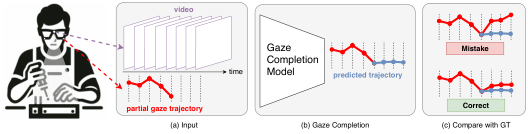

<!-- Start of picture text -->
video Gaze Mistake Completion time Model predicted trajectory partial gaze trajectory Correct (a) Input (b) Gaze Completion (c) Compare with GT <!-- End of picture text -->

Fig. 1. The proposed unsupervised mistake detection method. (a) We assume as input a video with a partial gaze trajectory on the initial part of the video. (b) A gaze completion model predicts a gaze trajectory for the remaining part of the video, conditioned on the input video and the partial trajectory. (c) A mistake is detected if the predicted trajectory is significantly different from the observed one, which suggests an anomalous attention pattern. 

to determine if they need assistance in a scenario-independent setting, i.e., without making specific assumptions on how a mistake is defined and without requiring costly labels. 

To overcome the limitations of previous approaches, we propose to detect mistakes in egocentric videos of human activity in an unsupervised way, by learning from unlabeled video. We postulate that mistakes are characterized by abnormal behavior exhibited by the camera wearer, who may feel disoriented during the execution of the task at hand. As widely acknowledged in the literature, gaze patterns play an important role in the control of human activities [4], hence, we study how to analyze them as a means to perform mistake detection. We propose to train a model of human gaze behavior, in the form of a gaze predictor, and use it to predict likely eye gaze trajectories from video at inference time. Assuming that ground truth gaze trajectories are available as input, we frame gaze prediction as a novel “gaze completion” task in which a model takes as input a video and a partial gaze trajectory (Figure 1(a)) and is tasked to predict a likely continuation of the trajectory (Figure 1(b)). We expect video of correct action execution to represent normal user behavior, and hence to be characterized by predictable gaze patterns, while human behavior will be anomalous, and hence gaze will be unpredictable, when a mistake is made by the user. By comparing the predicted gaze with ground truth eye gaze trajectories estimated through a gaze tracker, we can determine whether a video segment is anomalous (Figure 1(c)). 

Experiments on EPIC-Tent [5] show the effectiveness of

<!-- Page 2 -->

the proposed method when compared with one-class anomaly detection methods [6], [7], and unsupervised mistake detection baselines. 

In sum, the contributions of this work are as follows: 

- We investigate for the first time the problem of unsupervised mistake detection from egocentric video of human activity; 

- We propose a method to perform unsupervised mistake detection which leverages a gaze completion model to identify instances in which gaze patterns are unpredictable as a signal for human uncertainty; 

- We benchmark different approaches and baselines on the EPIC-Tent dataset, showing the effectiveness of the proposed method. 

## II. RELATED WORK 

Our research is related to previous investigations on egocentric gaze estimation, use of gaze as an input signal in egocentric vision, mistake detection, and video anomaly detection. 

## _A. Egocentric gaze estimation_ 

Previous works considered the problem of estimating where a person’s gaze falls in the scene from the observation of egocentric video. Since gaze characterizes human behavior [4], models able to estimate human gaze from visual observations prove useful in augmented reality and assistive technologies downstream applications even when a gaze tracker is not available [8], [9]. The seminal work of [10] investigated the simultaneous recognition of daily activities and prediction of gaze location patterns with a probabilistic generative model, showing the advantages of modeling gaze for the understanding of human behavior. The same work also introduced GTEA Gaze and GTEA Gaze+, two of the first datasets of daily activities including egocentric video and human gaze trajectories. Following up on this seminal work, other investigations proposed approaches for gaze prediction from egocentric video incorporating egocentric cues [11], modeling task-dependent attention transition [12], leveraging vanishing point, manipulation point, hand regions [13], and proposing specific architectural changes [14]. Other datasets to study egocentric gaze estimation and its applications in a variety of scenarios have been proposed through the years, leading to further development in gaze estimation approaches. These include EGTEA Gaze+ [15], a subset of Ego4D [16], EPIC-Tent [17], HoloAssist [2], and IndustReal [18]. Lai et al. recently proposed GLC [19], a transformer-based model integrating diverse gaze cues which achieves state-of-the-art performance on the EGTEA Gaze+ and Ego4D benchmarks. 

In this work, we leverage the state-of-the-art GLC model [19] as an off-the-shelf approach to learn a model of egocentric human attention. We show that such a model, if trained with proper data sampling and optimization objectives, is instrumental for unsupervised mistake detection in egocentric activity. Additionally, we introduce the novel problem of gaze completion, where partial gaze trajectories are observed 

by the predicted model, and show that such an approach achieves superior performance. 

## _B. Use of gaze in egocentric vision_ 

While many previous works focused on gaze estimation from video, few works investigated the use of gaze, estimated through a dedicated gaze tracker, as an input to support downstream egocentric vision applications. The seminal work of [8] exploited gaze for identifying task-relevant objects and their interaction modes from egocentric videos, achieving a 95% discovery rate across tasks. In [20], eye gaze movements are used to detect privacy-sensitive situations and preserve bystanders’ privacy. In [21], gaze is used to detect objects attended by the camera wearer. GazeGPT [22] utilizes eye tracking to assist large language models (LLMs) in classification tasks by discerning the user’s focal point within the world-facing camera view. GazeSAM [23] combines eye tracking with the Segment Anything Model for real-time object segmentation to allow radiologists to collect segmentation masks by looking at regions of interest during image diagnosis. GIMO [24] shows the advantages of incorporating eye gaze information for ego-centric human motion prediction. The work introduces a comprehensive dataset comprising body poses, scene scans, and ego-centric views with eye gaze, which are essential for accurately inferring human intent. TSM [25] is a hybrid text saliency model that merges cognitive reading models with human gaze supervision for Natural Language Processing (NLP). It showcases a robust correlation with human gaze across four datasets and suggests a joint modelling approach to incorporate TSM predictions into NLP tasks. 

In this paper, we illustrate the critical role of gaze in mistake detection. Our method involves comparing gaze trajectories predicted from visual data with ground truth gaze estimate through a gaze tracker of the wearable device to identify mistakes when the model’s prediction deviates from the ground truth. 

## _C. Mistake Detection in Egocentric Videos_ 

Mistakes naturally occur in human activities. The ability to automatically detect them from egocentric video can be beneficial for an AR assistant to offer support. A formal definition of this task was initially introduced in [3]. Identifying such mistakes usually entails modeling procedural knowledge [26], skill assessment [27], action segmentation [28] or detecting forgotten actions [29]. Notably, previous works tackled the task in a supervised fashion, training models to classify an action segment as “correct” or “mistake” on manually annotated instances [2], [3]. While this approach is feasible in closedworld scenario, it requires 1) a formal definition of what a mistake is, depending on the selected domain (e.g., kitchens vs the assembly line), 2) significant amounts of manually labeled data, which is expensive and requires expert knowledge. In this work, we tackle an unsupervised mistake detection task, in which models observe unlabeled video at training time and are tasked to output an anomaly score for given video segments at test time.

<!-- Page 3 -->

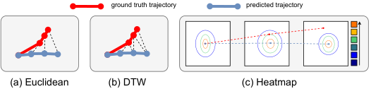

<!-- Start of picture text -->
ground truth trajectory predicted trajectory (a) Euclidean (b) DTW (c) Heatmap probability <!-- End of picture text -->

Fig. 2. We consider three approaches to compare the ground truth with respect to the predicted trajectories in order to determine a mistake. (a) Euclidean distance between the two trajectories. (b) Dynamic Time Warping (DTW). (c) Average value of the ground truth trajectory at the predicted heatmaps. . 

## _D. Video Anomaly Detection_ 

Our research also relates to the problem of Video Anomaly Detection (VAD), which involves recognizing abnormal or anomalous events within videos [6], [30]. A line of video anomaly methods are based on one-class classification, in which models are trained only on normal videos. These approaches usually aim to learn a dictionary of normal features, which can either be obtained based on hand-crafted features [31] or deep autoencoder models [32]. Weaklysupervised learning methods, like Multiple Instance Learning (MIL), leverage both normal and anomalous videos during training, utilizing video-level labels to predict anomalies at the segment level [33]–[35]. Notably, anomaly detection in egocentric vision remains underexplored [36]. Similar to video anomaly detection, we aim to detect mistakes by determining video segments which deviate from statistics observed at training time. Differently from previous works in video anomaly detection, we ground our predictions in an egocentric gaze estimation model, which acts as a proxy for modeling human behavior, hence effectively mistake prediction detection when anomalous behavior is observed. 

## III. PROPOSED APPROACH 

## _A. Mistake Detection Problem Setup_ 

The mistake detection task consists in highlighting those parts of the video in which the user is making a mistake during the execution of a given activity. In our setup, at each timestep _t_ , a model Φ takes as input a video _V_ observed up to timestep _t_ , _V_ 1: _t_ and a 2D gaze trajectory _T_ 1: _t_ , where the _i − th_ element of the trajectory _Ti_ = ( _xi, yi_ ) is a 2D gaze fixation, and have to return a score _st_ = Φ( _V_ 1: _t, T_ 1: _t_ ) indicating whether a mistake is happening at the current time _t_ . In this context, high _st_ scores indicate the occurrence of a mistake, while low _st_ scores indicate a correct action. We can hence see the mistake detection problem as a classification task, in which timesteps _t_ are classified as mistakes if _st > ϕ_ , where _ϕ_ is a chosen threshold. We follow previous literature on anomaly detection [6], [7] and evaluate methods in a thresholdindependent fashion by reporting the Receiver Operating Characteristics Area Under the Curve (ROC-AUC), where we consider “mistake” as the positive class1 . For completeness, we 

> 1In this context, a true positive is a mistake correctly classified as a mistake, a true negative is a correct execution correctly classified as a correct execution, a false positive is a correct execution wrongly classified as a mistake, and a false negative is a mistake wrongly classified as a correct execution. 

also report the best _F_ 1 score achieved considering the different threshold, as well as its related precision and recall values. 

## _B. Proposed Method_ 

At each timestep _t_ , we trim the input video _V_ 1: _t_ and gaze trajectory _T_ 1: _t_ obtained by the gaze tracker of the wearable device to the last observed _F_ frames, hence considering _Vt−F_ : _t_ and _Tt−F_ : _t_ as our inputs (Figure 1(a)). Our method relies on two main components: a gaze completion model (Figure 1(b)), and a scoring function (Figure 1(c)). 

_1) Gaze Completion Module:_ The gaze completion model takes as input the video _Vt−F_ : _t_ and the first half of the input gaze trajectory _Tt−F_ : _t−F/_ 2 and predicts a gaze trajectory _T_ˆ aligned to the remaining part of the trajectory _Tt−F/_ 2: _t_ . The goal of this module is to predict where the user is looking in the video, conditioned on an initial trajectory. The conditioning allows to reduce the uncertainty on gaze predictions and give a prior into the behavior of the user. We follow [19] and base our gaze completion module on the GLC model proposed in [19], adding a novel trajectory-conditioned module responsible for injecting the partial input trajectory _Tt−F_ : _t−F/_ 2 into the model computation and including an additional trajectory consistency term during training. Specifically, we experiment two principled approaches to condition gaze prediction on a partial trajectory: early and mid fusion. We further note that sampling the input video densely works better in our scenario, as compared to sampling every other frame as proposed in [19]. Figure 3 illustrates our gaze completion model. The input gaze trajectory _Tt−F_ : _t_ is encoded into a stack of heatmaps _Q_ obtained by centering a Gaussian distribution of standard deviation _σ_ = 3 _._ 22 around the gaze points. The first half of the stack _Q_ 1: _F/_ 2, corresponding to the input half trajectory _Tt−F_ : _t−F/_ 2 is forwarded to the early and mid fusion modules, which inject information on the input trajectory at the level of the input and mid representation. The model is trained to predict a likely completion of the gaze in the form of heatmaps _P_ ˆ, which are supervised with one training objectives. The final trajectory _T_ˆ is obtained by finding the peaks of the predicted gaze heatmaps. 

_a) Early and mid trajectory conditioning modules:_ Since GLC follows an encoder-decoder scheme, we experiment with two modules for injecting the input gaze trajectories into the model for the prediction of the output gaze trajectory. 

The early fusion module adds the heatmaps in _Q_ 1: _F/_ 2 to the first _F/_ 2 frames of the input video, _Vt−F_ : _t−F/_ 2 as an additional channel. The values of this channel are set to zero for the remaining frames. This acts as a form of _soft conditioning_ aiming to include information about the input gaze trajectory in the computation. Note that, in order to incorporate information into the input gaze, the model needs to learn how to compute suitable gaze representations from the additional input channel. 

The mid fusion module processes the heatmaps _Q_ 1: _F/_ 2 with a convolutional neural network encoder to produce a feature 

> 2This is the default value used in [19].

<!-- Page 4 -->

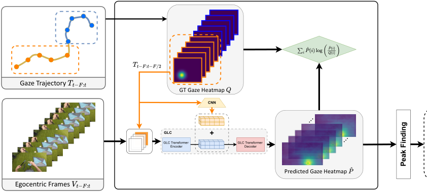

<!-- Start of picture text -->
Gaze Trajectory GT Gaze Heatmap CNN GLC GLC Transformer  GLC Transformer Encoder Decoder Predicted Gaze Heatmap Egocentric Frames ... ... Peak Finding <!-- End of picture text -->

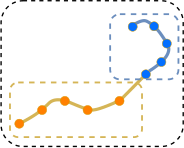

Fig. 3. The model inputs consist of _t_ observed RGB frames denoted as _Vt−F_ : _t_ and the 2D gaze trajectory represented by _Tt−F_ : _t_ . The first half of the trajectory, _Tt−F_ : _t−F/_ 2, highlighted in orange, is utilized in one of the two gaze fusion strategies. Following a peak finding operation, the latter part of the trajectory, _Tt−F/_ 2: _t_ , is predicted. 

map, which is summed to the input of the decoder module of GLC. This module aims to encode gaze information in more direct way, with an additional convolutional neural network encoder components tasked to extract from the input gaze representations useful for GLC’s decoder. 

_b) Training Loss:_ Following [19], we consider gaze prediction as defining a probability distribution over the 2D image plane of each input frame. As in [19], we train the model by minimizing the sum of the Kullback–Leibler divergence between the predicted gaze maps _P_ˆ ( _i_ ) and the ground truth ones _Q_ ( _i_ ) at each frame _i_ : 

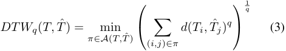

where _π_ is an alignment path, _A_ ( _T, T_ˆ ) is the set of all admissible paths and _d_ is a distance measure. 

_c) Heatmap:_ We consider a probabilistic approach which evaluates the likelihood of a ground truth eye fixation _Ti_ obtained by the device under the predicted heatmap _P_ˆ , which can be computed as: 

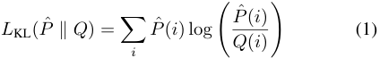

_2) Scoring Function:_ Our method predicts the mistake confidence score _st_ by comparing the predicted trajectory _T_ˆ with the ground truth one _Tt−F_ : _t−F/_ 2 which is obtained by the gaze tracker of the wearable device. We consider three different ways to compare the two trajectories: Euclidean distance, Dynamic Time Warping and heatmap. 

_a) Euclidean Distance:_ This method consists in using the Euclidean distance computed between corresponding points in each trajectory as the score _st_ (Fig. 2(a)): 

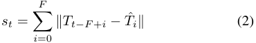

where _T_ˆ _i_ = [ˆ _xt,_ ˆ _yt_ ]_T_ is predicted 2D gaze trajectory point at time step _t_ . 

_b) Dynamic Time Warping:_ We then considered a more refined approach, utilizing Dynamic Time Warping (DTW) for comparison (Fig. 2(b)). 

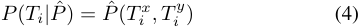

where _Ti__x_and_T y_ _i_arethecoordinatesofthetrajectorypoint _Ti_ = [ _Ti__x, T_ _i__y_]. The score associated to the predicted trajectory _T_ ˆ is computed as the sum of the likelihoods of each trajectory point, considering the predicted heatmap _P_ˆ : 

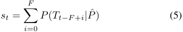

_d) Entropy:_ This method consists of calculating the mean entropy of all predicted heatmaps for a given trajectory _T_ˆ _i_ . The entropy _H_ of a single heatmap _P_ˆ is given by: 

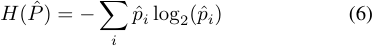

where _pi_ denotes the normalized probability of the _i_ -th bin in the heatmap. 

In this section we discuss the datasets used for the experiments, the implementation details, and the experimental results.

<!-- Page 5 -->

## _A. Datasets_ 

_1) EPIC-Tent:_ We base our main experiments on EPICTent [17], a dataset comprising 7 hours of egocentric video of 29 subjects wearing two head-mounded cameras (GoPro and SMI eye tracker) while assembling a camping tent. The dataset includes egocentric video, gaze and labels indicating video segments in which users make mistakes. EPIC-Tent contains 151 _,_ 821 mistake frames and 384 _,_ 558 frames of correct execution, hence with a 28:72 ratio between correct and mistake frames. The unbalanced nature of the dataset arises from the natural rarity of mistakes and makes the problem particularly challenging to address. We randomly split videos in training, validation and test sets roughly following a 60:15:25 ratio. 

## _B. Implementation Details_ 

We follow [19] to set the hyperparameters of the GLC module. Differently from [19], we use a stride of 1, rather than 2 to train the model, which we found leads to marginal improvements in gaze and mistake prediction. To prevent overfitting, we set the weight decay to 0.07. We set the batch size to 4 clips of 8 frames. 

## _C. Supervision Levels and Compared Approaches_ 

We compared the proposed approach to methods belonging to two different classes involving different supervision levels: one-class classification methods, and unsupervised methods. Beyond compared methods, we also consider a random baseline in which a random score is assigned to each input clip. 

_1) One-Class Classification Methods:_ are trained only on _videos of correct executions_ , following the standard anomaly detection setup [6], [7]. Note that, while these methods do not access any label, they still require the training set to include _only_ correct executions, hence leading to a one-class setup rather than an unsupervised one. For this class, we compare our method with respect to TrajREC [6] and MoCoDAD [7], two popular approaches for video anomaly detection based on the processing of skeletal data. In the experiment, we replace skeletal data with gaze trajectories. We then consider an instantiation of the proposed approach in which the gaze completion model is trained only on correct executions, hence effectively replicating a one-class paradigm. Our intuition is that the gaze completion module will learn to better model normal behavior, hence leading to more variability in the predictions when a mistake is encountered. Finally, we compare with respect to a baseline which replaces the proposed gaze completion module with a simple gaze prediction component based on GLC [19]. Following the one-class setup, we train the GLC gaze predictor on correct executions and use the investigated scoring functions to predict scores by comparing the ground truth gaze trajectory obtained by the gaze tracker of the wearable device with respect to the predicted gaze. 

_2) Unsupervised Methods:_ assume as input an unlabeled set of clips including both mistakes and correct executions. We compare several variants of the proposed approach to 

unsupervised mistake detection based on gaze completion, exploring different scoring functions and trajectory conditioning modules, and compare with a gaze prediction baseline which replaces the gaze completion module with GLC and does not condition on partial trajectories. 

## _D. Mistake detection on EPIC-Tent_ 

Table I reports the results of the compared mistake detection approaches on the EPIC-Tent dataset, according to the different levels of supervision. For each method, we report the supervision level, whether the approach uses gaze at test time, the scoring function (where applicable) and the evaluation measures. One-class methods originally designed for anomaly detection from skeletal data (lines 2-3) do not improve over the random baseline with respect to the AUC score (0 _._ 50 _−_ 0 _._ 51 vs 0 _._ 51), and only marginally improve when considering the F1 score (0 _._ 44 _−_ 0 _._ 45 vs 0 _._ 35). These results suggests that only analyzing gaze trajectories, without relating them to the input video is insufficient for mistake detection. Using a gaze prediction model, paired with the entropy scoring function allows to achieve an AUC of 0 _._ 55 and an F1 of 0 _._ 41. It is worth noting that this approach does not require the availability of gaze at test time. Using different scoring functions which consider gaze as a test-time input allows to improve results in AUC to 0 _._ 6, and 0 _._ 61 when the Euclidean distance and DTW scoring functions are used. The improvement (from 0 _._ 55 of line 4 to 0 _._ 61 of line 6) highlights the usefulness of using gaze as an input signal at test time. Pairing gaze prediction with the heatmap scoring function further boosts the AUC to 0 _._ 66, the F1 score to 0 _._ 46, precision and recall to 0 _._ 37 and 0 _._ 62. These results show the feasibility of comparing predicted and ground truth gaze obtained by the gaze tracker at test time to detect mistakes. Adopting the proposed gaze completion approach allows to further boost results. In particular, this is observed when results of early fusion and mid fusion combined (line 10)3 , allowing to achieve an AUC of 0 _._ 67 and and F1 score of 0 _._ 47, the largest score in this supervision level group. While the advantages of gaze completion over gaze prediction are limited in the one-class settings, gaze completion is much more effective than gaze prediction in the unsupervised setting. Indeed, in this case, using gaze completion with early fusion improves results over gaze prediction (0 _._ 63 of line 15 vs 0 _._ 61 of line 14), and similarly with mid fusion (0 _._ 62 of line 16 vs 0 _._ 61 of line 14). Our best model (line 17), combining early and mid fusion, achieves an AUC of 0 _._ 64, an F1 score of 0 _._ 49, a precision of 0 _._ 34 and a recall of 0 _._ 88 without seeing any mistake label. It has also a significant improvements over the random baseline (line 1: 0 _._ 51 AUC, 0 _._ 35 F1, 0 _._ 29 precision, 0 _._ 42 recall). 

## _E. Gaze Estimation results_ 

We have compared the performance of gaze prediction to those of gaze completion across the considered dataset. Table II reports results on the EPIC-Tent dataset. The Gaze 

> 3We fuse the two techniques averaging the gaze prediction maps produced by the two models

<!-- Page 6 -->

TABLE I 

PERFORMANCE OF VARIOUS METHODS ON EPIC-TENT WITH RESPECT TO THE DIFFERENT SUPERVISION LEVELS. PER-GROUP BEST RESULTS ARE REPORTED IN BOLD. 

||**Method**|**Sup. Level**|**Gaze at Test-Time**|**Scoring Fun.**|**AUC**|**F1**|**Precision**|**Recall**|
|---|---|---|---|---|---|---|---|---|
|1|Random|//|||0.51|0.35|0.29|0.42|
|2|TrajREC [6]|One-Class||//|0.51|0.45|0.29|0.96|
|3|MoCoDAD [7]|One-Class||//|0.50|0.44|0.29|**0.97**|
|4|Gaze Prediction|One-Class||Entropy|0.55|0.41|0.28|0.78|
|5|Gaze Prediction|One-Class|✓|Euclidean|0.60|0.41|0.29|0.69|
|6|Gaze Prediction|One-Class|✓|DTW|0.61|0.43|0.30|0.74|
|7|Gaze Prediction|One-Class|✓|Heatmap|0.66|0.46|0.37|0.62|
|8|Gaze Completion*|One-Class|✓|Heatmap|0.66|0.34|0.42|0.29|
|9|Gaze Completion_⋄_|One-Class|✓|Heatmap|0.64|0.39|**0.45**|0.35|
|10|Gaze Completion⋆|One-Class|✓|Heatmap|**0.67**|**0.47**|0.37|0.63|
|11|Gaze Prediction|Unsupervised||Entropy|0.53|0.42|0.30|0.66|
|12|Gaze Prediction|Unsupervised|✓|Euclidean|0.59|0.42|0.32|0.62|
|13|Gaze Prediction|Unsupervised|✓|DTW|0.60|0.44|0.33|0.69|
|14|Gaze Prediction|Unsupervised|✓|Heatmap|0.61|0.44|0.33|0.70|
|15|Gaze Completion*|Unsupervised|✓|Heatmap|0.63|0.45|0.32|0.74|
|16|Gaze Completion_⋄_ |Unsupervised |✓|Heatmap|0.62|0.48|**0.35**|0.77|
|17|Gaze Completion⋆|Unsupervised|✓|Heatmap|**0.64**|**0.49**|0.34|**0.88**|

> _∗_ Early Fusion. _⋄_ Mid Fusion. ⋆ Early and Mid score fusion. 

TABLE II 

COMPARISON OF GLC AND GLC WITH GAZE COMPLETION FOR GAZE ESTIMATION ON EPIC-TENT. 

|**Method**||**F1**|**Recall**|**Precision**|
|---|---|---|---|---|
|GLC||0.37|0.65|0.26|
|Gaze Completion|*|**0.40**|**0.67**|**0.29**|
|Gaze Completion|_⋄_|0.33|0.63|0.23|

* Early Fusion._⋄_ Mid Fusion 

Completion with Early Fusion (EF) method, exhibited superior performance, achieving the highest F1 score of 0.40, Recall of 0.67, and Precision of 0.29. This suggests that conditioning on partial trajectories makes the problem of making predictions more structured and hence easier to tackle. 

Interestingly, while gaze completion with mid-fusion generally allows to improve over gaze prediction in the mistake detection problem, it does not improve gaze prediction results, suggesting that better mistake prediction is not necessarily achieved by methods able to make better gaze prediction. 

## _F. Qualitative Results_ 

Figure 4 reports qualitative results of the proposed gaze completion approach in the unsupervised setting. For correct executions (Figure 4-top), our model predicts a gaze trajectory (in green) similar to the ground truth one (in blue), taking as input the video and a partial trajectory (in orange). When a mistake is made by the camera wearer (Figure 4-bottom), our algorithm predicts gaze trajectories (in red) significantly different from the ground truth ones (in blue) as gaze becomes unpredictable. 

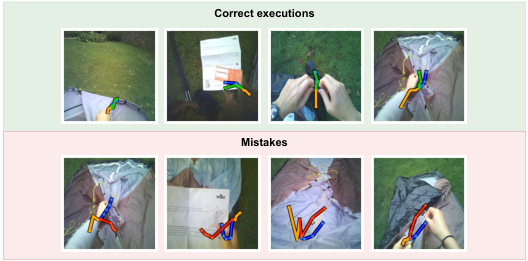

<!-- Start of picture text -->
Correct executions Mistakes <!-- End of picture text -->

Fig. 4. Qualitative results of gaze completion approaches. Input gaze trajectories are highlighted in orange, predicted trajectories are in green for correct executions and in red for mistakes, ground truth trajectories to be predicted are in blue. Top: examples of correct executions. Our model predicts gaze trajectories (green) coherent with the ground truth (blue). Bottom: gaze is unpredictable when a mistake is made, leading to a large discrepancy between predicted (red) and ground truth (blue) trajectories. 

## V. CONCLUSION 

In this work, we have introduced an approach to detect mistakes in egocentric videos through unsupervised learning, exploiting the gaze signal as input. Grounded in the concept of ”gaze completion”, our approach predicts gaze trajectories based on observed video and partial gaze data. Detection of mistakes is enabled by comparing the predicted trajectory to the ground truth to identify moments in which gaze becomes unpredictable. Experimental validation, conducted on the EPIC-Tent dataset, demonstrates the efficacy of our proposed method, which outperforms existing one-class anomaly detection methods. The results of this study highlight the potential of utilizing gaze information, a readily available data source in many commercial devices, to enhance user

<!-- Page 7 -->

experience. By proactively identifying and rectifying errors in task execution, this capability paves the way for more intuitive and interactive wearable technologies that adapt to the user’s needs in real-time. 

## ACKNOWLEDGEMENTS 

Research at the University of Catania is supported by the project Future Artificial Intelligence Research (FAIR) – PNRR MUR Cod. PE0000013 - CUP: E63C22001940006. 

## REFERENCES 

- [1] S. Feng, M. Wray, B. Sullivan, Y. Jang, C. Ludwig, I. Gilchrist, and W. Mayol-Cuevas, “Are you struggling? dataset and baselines for struggle determination in assembly videos,” 2024. 

- [2] X. Wang, T. Kwon, M. Rad, B. Pan, I. Chakraborty, S. Andrist, D. Bohus, A. Feniello, B. Tekin, F. V. Frujeri, N. Joshi, and M. Pollefeys, “Holoassist: an egocentric human interaction dataset for interactive ai assistants in the real world,” in _Proceedings of the IEEE/CVF International Conference on Computer Vision (ICCV)_ , October 2023, pp. 20 270–20 281. 

- [3] F. Sener, D. Chatterjee, D. Shelepov, K. He, D. Singhania, R. Wang, and A. Yao, “Assembly101: A large-scale multi-view video dataset for understanding procedural activities,” in _Proceedings of the IEEE/CVF Conference on Computer Vision and Pattern Recognition_ , 2022, pp. 21 096–21 106. 

- [4] M. Land, N. Mennie, and J. Rusted, “The roles of vision and eye movements in the control of activities of daily living,” _Perception_ , vol. 28, pp. 1311–28, 02 1999. 

- [5] Y. Jang, B. Sullivan, C. Ludwig, I. D. Gilchrist, D. Damen, and W. Mayol-Cuevas, “Epic-tent: An egocentric video dataset for camping tent assembly,” in _2019 IEEE/CVF International Conference on Computer Vision Workshop (ICCVW)_ , 2019, pp. 4461–4469. 

- [6] A. Stergiou, B. De Weerdt, and N. Deligiannis, “Holistic representation learning for multitask trajectory anomaly detection,” in _IEEE/CVF Winter Conference on Applications of Computer Vision (WACV)_ , 2024. 

- [7] A. Flaborea, L. Collorone, G. M. D. di Melendugno, S. D’Arrigo, B. Prenkaj, and F. Galasso, “Multimodal motion conditioned diffusion model for skeleton-based video anomaly detection,” in _Proceedings of the IEEE/CVF International Conference on Computer Vision (ICCV)_ , October 2023, pp. 10 318–10 329. 

- [8] D. Damen, T. Leelasawassuk, O. Haines, A. Calway, and W. MayolCuevas, “You-do, i-learn: Discovering task relevant objects and their modes of interaction from multi-user egocentric video,” in _British Machine Vision Conference_ , 2014. [Online]. Available: https://api.semanticscholar.org/CorpusID:13584231 

- [9] T. Leelasawassuk, D. Damen, and W. W. Mayol-Cuevas, “Estimating visual attention from a head mounted imu,” in _Proceedings of the 2015 ACM International Symposium on Wearable Computers_ , 2015, pp. 147– 150. 

- [10] A. Fathi, Y. Li, and J. M. Rehg, “Learning to recognize daily actions using gaze,” in _Computer Vision–ECCV 2012: 12th European Conference on Computer Vision, Florence, Italy, October 7-13, 2012, Proceedings, Part I 12_ . Springer, 2012, pp. 314–327. 

- [11] Y. Li, A. Fathi, and J. M. Rehg, “Learning to predict gaze in egocentric video,” in _Proceedings of the IEEE international conference on computer vision_ , 2013, pp. 3216–3223. 

- [12] Y. Huang, M. Cai, Z. Li, and Y. Sato, “Predicting gaze in egocentric video by learning task-dependent attention transition,” _ArXiv_ , vol. abs/1803.09125, 2018. [Online]. Available: https://api.semanticscholar. org/CorpusID:4416254 

- [13] H. R. Tavakoli, E. Rahtu, J. Kannala, and A. Borji, “Digging deeper into egocentric gaze prediction,” in _2019 IEEE Winter Conference on Applications of Computer Vision (WACV)_ , 2019, pp. 273–282. 

- [14] M. Al-Naser, S. A. Siddiqui, H. Ohashi, S. Ahmed, N. Katsuyki, S. Takuto, and A. Dengel, “Ogaze: Gaze prediction in egocentric videos for attentional object selection,” in _2019 Digital Image Computing: Techniques and Applications (DICTA)_ . IEEE, 2019, pp. 1–8. 

- [15] Y. Li, M. Liu, and J. M. Rehg, “In the eye of beholder: Joint learning of gaze and actions in first person video,” in _Proceedings of the European Conference on Computer Vision (ECCV)_ , September 2018. 

- [16] K. Grauman, A. Westbury, E. Byrne, Z. Chavis, A. Furnari, R. Girdhar, J. Hamburger, H. Jiang, M. Liu, X. Liu, M. Martin, T. Nagarajan, I. Radosavovic, S. K. Ramakrishnan, F. Ryan, J. Sharma, M. Wray, M. Xu, E. Z. Xu, C. Zhao, S. Bansal, D. Batra, V. Cartillier, S. Crane, T. Do, M. Doulaty, A. Erapalli, C. Feichtenhofer, A. Fragomeni, Q. Fu, C. Fuegen, A. Gebreselasie, C. Gonzalez, J. Hillis, X. Huang, Y. Huang, W. Jia, W. Khoo, J. Kolar, S. Kottur, A. Kumar, F. Landini, C. Li, Y. Li, Z. Li, K. Mangalam, R. Modhugu, J. Munro, T. Murrell, T. Nishiyasu, W. Price, P. R. Puentes, M. Ramazanova, L. Sari, K. Somasundaram, A. Southerland, Y. Sugano, R. Tao, M. Vo, Y. Wang, X. Wu, T. Yagi, Y. Zhu, P. Arbelaez, D. Crandall, D. Damen, G. M. Farinella, B. Ghanem, V. K. Ithapu, C. V. Jawahar, H. Joo, K. Kitani, H. Li, R. Newcombe, A. Oliva, H. S. Park, J. M. Rehg, Y. Sato, J. Shi, M. Z. Shou, A. Torralba, L. Torresani, M. Yan, and J. Malik, “Ego4d: Around the World in 3,000 Hours of Egocentric Video,” in _IEEE/CVF Computer Vision and Pattern Recognition (CVPR)_ , 2022. 

- [17] Y. Jang, B. Sullivan, C. Ludwig, I. D. Gilchrist, D. Damen, and W. Mayol-Cuevas, “Epic-tent: An egocentric video dataset for camping tent assembly,” in _2019 IEEE/CVF International Conference on Computer Vision Workshop (ICCVW)_ , 2019, pp. 4461–4469. 

- [18] T. J. Schoonbeek, T. Houben, H. Onvlee, F. van der Sommen _et al._ , “Industreal: A dataset for procedure step recognition handling execution errors in egocentric videos in an industrial-like setting,” in _Proceedings of the IEEE/CVF Winter Conference on Applications of Computer Vision_ , 2024, pp. 4365–4374. 

- [19] B. Lai, M. Liu, F. Ryan, and J. Rehg, “In the eye of transformer: Globallocal correlation for egocentric gaze estimation,” _British Machine Vision Conference_ , 2022. 

- [20] J. Steil, M. Koelle, W. Heuten, S. Boll, and A. Bulling, “Privaceye: privacy-preserving head-mounted eye tracking using egocentric scene image and eye movement features,” in _Proceedings of the 11th ACM symposium on eye tracking research & applications_ , 2019, pp. 1–10. 

- [21] M. Mazzamuto, F. Ragusa, A. Furnari, and G. M. Farinella, “Learning to detect attended objects in cultural sites with gaze signals and weak object supervision,” _J. Comput. Cult. Herit._ , 2024. 

- [22] R. Konrad, N. Padmanaban, J. G. Buckmaster, K. C. Boyle, and G. Wetzstein, “Gazegpt: Augmenting human capabilities using gazecontingent contextual ai for smart eyewear,” 2024. 

- [23] B. Wang, A. Aboah, Z. Zhang, and U. Bagci, “Gazesam: What you see is what you segment,” _arXiv preprint arXiv:2304.13844_ , 2023. 

- [24] Y. Zheng, Y. Yang, K. Mo, J. Li, T. Yu, Y. Liu, K. Liu, and L. J. Guibas, “Gimo: Gaze-informed human motion prediction in context,” in _European Conference on Computer Vision_ , 2022. [Online]. Available: https://api.semanticscholar.org/CorpusID:248266616 

- [25] E. Sood, S. Tannert, P. Mueller, and A. Bulling, “Improving natural language processing tasks with human gaze-guided neural attention,” in _Advances in Neural Information Processing Systems_ , 2020. 

- [26] G. Ding, F. Sener, S. Ma, and A. Yao, “Every mistake counts in assembly,” 2023. 

- [27] Y. Gao, S. S. Vedula, C. E. Reiley, N. Ahmidi, B. Varadarajan, H. C. Lin, L. Tao, L. Zappella, B. B´ejar, D. D. Yuh _et al._ , “Jhu-isi gesture and skill assessment working set (jigsaws): A surgical activity dataset for human motion modeling,” in _MICCAI workshop: M2cai_ , vol. 3, 2014. 

- [28] R. Ghoddoosian, I. Dwivedi, N. Agarwal, and B. Dariush, “Weaklysupervised action segmentation and unseen error detection in anomalous instructional videos,” in _Proceedings of the IEEE/CVF International Conference on Computer Vision (ICCV)_ , October 2023, pp. 10 128– 10 138. 

- [29] B. Soran, A. Farhadi, and L. Shapiro, “Generating notifications for missing actions: Don’t forget to turn the lights off!” in _2015 IEEE International Conference on Computer Vision (ICCV)_ , 2015, pp. 4669– 4677. 

- [30] Z. Liu, Y. Nie, C. Long, Q. Zhang, and G. Li, “A hybrid video anomaly detection framework via memory-augmented flow reconstruction and flow-guided frame prediction,” in _Proceedings of the IEEE International Conference on Computer Vision_ , 2021. 

- [31] C. Lu, J. Shi, and J. Jia, “Abnormal event detection at 150 fps in matlab,” in _2013 IEEE International Conference on Computer Vision_ , 2013, pp. 2720–2727. 

- [32] D. Xu, E. Ricci, Y. Yan, J. Song, and N. Sebe, “Learning deep representations of appearance and motion for anomalous event detection,” in _British Machine Vision Conference_ , 2015. [Online]. Available: https://api.semanticscholar.org/CorpusID:795827

<!-- Page 8 -->

- [33] W. Sultani, C. Chen, and M. Shah, “Real-world anomaly detection in surveillance videos,” in _The IEEE Conference on Computer Vision and Pattern Recognition (CVPR)_ , June 2018. 

- [34] H. Lv, Z. Yue, Q. Sun, B. Luo, Z. Cui, and H. Zhang, “Unbiased multiple instance learning for weakly supervised video anomaly detection,” _2023 IEEE/CVF Conference on Computer Vision and Pattern Recognition (CVPR)_ , pp. 8022–8031, 2023. [Online]. Available: https://api.semanticscholar.org/CorpusID:257663310 

- [35] J. Feng, F.-T. Hong, and W. Zheng, “Mist: Multiple instance selftraining framework for video anomaly detection,” _2021 IEEE/CVF Conference on Computer Vision and Pattern Recognition (CVPR)_ , pp. 14 004–14 013, 2021. [Online]. Available: https://api.semanticscholar. org/CorpusID:233025083 

- [36] M. Masuda, R. Hachiuma, R. Fujii, and H. Saito, _Unsupervised Anomaly Detection of the First Person in Gait from an Egocentric Camera_ . Berlin, Heidelberg: Springer-Verlag, 2020, p. 604–617.
