# Failure Identification in Imitation Learning via Statistical and Semantic Filtering

[Original PDF](../Failure%20Identification%20in%20Imitation%20Learning%20via%20Statistical%20and%20Semantic%20Filtering.pdf)

Pages: 8

> Automatically converted from PDF. Check the original for exact equations, symbols, table alignment, and figure details.

<!-- Page 1 -->

# **Failure Identification in Imitation Learning via Statistical and Semantic Filtering** 

Quentin Rolland1_,_2 , Fabrice Mayran de Chamisso1 , Jean-Baptiste Mouret2_,_3 

**_Abstract_ — Imitation learning (IL) policies in robotics deliver strong performance in controlled settings but remain brittle in real-world deployments: rare events such as hardware faults, defective parts, unexpected human actions, or any state that lies outside the training distribution can lead to failed executions. Vision-based Anomaly Detection (AD) methods emerged as an appropriate solution to detect these anomalous failure states but do not distinguish failures from benign deviations. We introduce FIDeL (Failure Identification in Demonstration Learning), a policy-independent failure detection module. Leveraging recent AD methods, FIDeL builds a compact representation of nominal demonstrations and aligns incoming observations via optimal transport matching to produce anomaly scores and heatmaps. Spatio-temporal thresholds are derived with an extension of conformal prediction, and a Vision–Language Model (VLM) performs semantic filtering to discriminate benign anomalies from genuine failures. We also introduce BotFails, a multimodal dataset of real-world tasks for failure detection in robotics. FIDeL consistently outperforms state-of-the-art baselines, yielding +5.30% AUROC in anomaly detection and +17.38% failuredetection accuracy on BotFails compared to existing methods. Videos of FIDeL can be found on our website : https://cea-list.github.io/FIDeL/** 

## I. INTRODUCTION 

Recent progresses in imitation learning (IL) [1]–[3] have the potential to significantly enhance the flexibility and adaptability of robotic systems. Unfortunately, current learned policies cannot be deployed in real world environments because their behavior is not defined when they are in a situation that is not part of the training set. Such events are unavoidable in factories or human-centered environments, arising from defective objects, operator mistakes, or environmental shifts, and they cannot be exhaustively anticipated in training data. 

A prevalent strategy is to assume that the training dataset is sufficiently diverse to encompass all possible scenarios. Implicitly, this amounts to presuming that no situation is off distribution. While this assumption simplifies the problem, it is unrealistic in practice, many rare events will never appear in training data. The second approach is to design models that can quantify the uncertainty of their decision, for instance with Bayesian models [4], [5]. However, uncertainty 

> 1Universit´e Paris-Saclay, CEA, List, F-91120, Palaiseau, France 

> 2Inria, CNRS, Universit´e de Lorraine, LORIA, F-54000 Nancy, France 3Bleu Robotics, Paris, France correspondance to: quentin.rolland2@cea.fr. This publication was made possible by the use of the CEA List FactoryAI supercomputer, financially supported by the Ile-de-France Regional Council. This work was partly funded by : the European Union’s Horizon Europe Research and Innovation program under grant agreement no 101135708 (JARVIS project), no 101070227 (CONVINCE project) and no 101070596 (euROBIN project) - and by the France 2030 program through the PEPR O2R projects AS3 (ANR-22-EXOD-007). 

quantification remains an open challenge in IL and RL [6], [7], and is not integrated into the highest-performing learning algorithms [1]–[3]. A more practical direction is to rely on an independent monitoring module that evaluates execution at runtime [8]–[12]. 

In this paper, we build on recent work [8]–[12] and propose an independent failure monitor, designed to detect situations in which a policy should be interrupted. We frame the problem in terms of Anomaly Detection (AD). Anomalies correspond to deviations from the expected distribution, which may—but do not always—indicate failure states. Our approach leverages the One-Class (OC) paradigm, a wellestablished method in computer vision [13]–[17]. In OC learning, a model is trained solely on data from a “normal” class, and any significant deviation from this baseline is flagged as anomalous. This formulation is particularly well-suited to IL, where the space of possible deviations is unbounded, yet expert demonstrations naturally provide a reliable definition of normality. Thus, we treat expert demonstrations as our baseline and regard any deviation as an anomaly—yielding an implicit and comprehensive definition of undesirable behavior. 

That said, the notion of anomaly encompasses a broader range of situations than failure. Not all anomalies correspond to failure-related events: some may be entirely benign—for instance, a fly landing on a table or an object slightly shifting in the background—and should not trigger unnecessary or costly interventions. This mismatch reveals a key limitation of existing AD methods: while they can reliably highlight deviations from nominal behavior, they lack the ability to discriminate between harmless anomalies and those that truly compromise task execution. In robotics, this distinction is essential. What is required is a mechanism that can semantically interpret anomalies and explicitly determine whether they represent benign variations or genuine failures. 

To bridge the gap between traditional Vision Anomaly Detection and the unique demands of robotic applications, we introduce **FIDeL** ( **F** ailure **I** dentification in **De** monstration **L** earning), a failure detection module designed to complement IL policies in robotics. **FIDeL** performs post-hoc **anomaly detection** by comparing new observations with stored representations of normal demonstrations using Optimal Transport (OT). To decide whether or not an AD score indicates an anomaly, we leverage a **Conformal Prediction** (CP)–based thresholding [18], [19] mechanism, which accounts for both temporal variations in anomaly scores and spatial variations across visual patches. When the anomaly score exceeds the CP threshold, **FIDeL** triggers a **semantic**

<!-- Page 2 -->

**filter** based on a vision-language model (VLM), which determines whether the detected anomaly is failure-related or benign. This three-stage process allows for efficient failure detection while reducing false positives, thus preserving productivity. 

Our contributions are summarized as follows: 

- Following the One-Class paradigm, we design a **novel Vision Anomaly Detection, representation-based algorithm** tailored for autonomous robotics. 

- We extend Conformal Prediction to handle both **temporal and spatial variations** , with memory-based temporal alignment that ensures robustness to variable execution speeds. 

- We propose a **semantic filtering mechanism** using a VLM and anomaly heatmaps, which discriminates between benign anomalies and task-critical failures. 

- We enhance interpretability through **localized heatmaps and VLM-based explanations** , providing human-readable justifications for failure detection. 

- We present **BotFails** a **dedicated training and evaluation dataset** collected on LeRobot [20] for benchmarking anomaly and failure detection in robotics, addressing the scarcity of failure-oriented datasets. 

- We demonstrate significant performance gains over baselines in both anomaly detection (+5 _._ 30% AUROC) and failure detection tasks (+17 _,_ 38% accuracy). 

## II. RELATED WORK 

## _A. Vision Anomaly Detection_ 

Vision AD is a well-established problem in computer vision, particularly within the unsupervised learning paradigm. Existing methods can be broadly categorized into four families [13]: **(1) Augmentation-based methods** add artificial anomalies to normal samples and train a classifier to recognize them [21]–[23]. However, we found no straightforward way to adapt these approaches to robotics, primarily due to the challenge of generating realistic anomalies in robot and object motions. **(2) Reconstruction-based methods** learn to reconstruct normal inputs, using the reconstruction error as an anomaly score. Common architectures include Autoencoders (AE), Variational Autoencoders (VAE) or Generative Adversarial Networks (GANs) [24]–[26], and StudentTeacher frameworks [27]–[29]. However, such models often generalize well enough to reconstruct anomalous inputs, thus failing to highlight anomalous regions effectively [30], [31]. **(3) Normalizing Flows** (NF) [32] based methods [33]–[35] learn an invertible transformation from the data distribution to a well-defined prior, typically a Gaussian. Anomalies are detected when the likelihood of a test sample under the learned distribution deviates significantly from the normal class. Despite their theoretical appeal, NF exhibit “likelihood paradoxes,” often assigning higher likelihood to anomalous images than normal ones [36]. **(4) Representation-based methods** [8], [37]–[39] use pretrained, frozen networks to extract semantic embeddings and compute anomaly scores based on their distance to normal class features. Early methods like PaDiM [37] model per-patch Gaussian distributions, 

while PatchCore [8] retrieves outliers from a memory bank of normal features. These approaches are particularly appealing for robotics as they are sample-efficient and interpretable, providing localized heatmaps that highlight anomalous regions [8], [37]. Their efficiency and explainability make them especially suited for failure detection. We evaluate three AD families (see Section IV). 

## _B. Failure detection in autonomous robotics_ 

Ensuring that autonomous robotic agents can detect and respond to abnormal behaviors or failure during deployment is critical for both performance and human trust. 

Traditional approaches to failure detection have focused on detection through supervised learning frameworks that rely on labeled examples of failures [40]–[43]. For instance, Liu et al. [40] trained an LSTM-based classifier using latent embeddings from a conditional VAE for RNN-based BC policies, while Gokmen et al. [41] employed a jointly trained state-value function to anticipate failure states in behavior cloning setups. However, these methods require failure data trajectories for training, limiting their applicability in novel or unstructured environments. 

Several alternative approaches have been explored. Wang et al. [44] collect failure data via self-reset to train a classifier, requiring around 2,000 trajectories (2 hours of data), which limits scalability. He et al. [45] use random network distillation to filter out out-of-distribution trajectories, while Sun et al. [46] reduce uncertainty by predicting reward intervals. However, these methods do not address failure detection during execution. In contrast, other approaches such as Hafez et al. [10] verify LLM-generated trajectories using reachability analysis, and Agia et al. [11] introduce a statistical temporal action consistency (STAC) metric with VLMs to detect execution-time anomalies. Still, both focus solely on trajectory-level data. 

The closest work to ours, FAIL-Detect [12], performs runtime failure detection in imitation learning with Continuous Normalizing Flows (CNF) [47], but does not distinguish benign anomalies from task-critical failures and assumes that the task is performed with the same temporal consistency during inference as in demonstrations. Instead, our method relies on a representation based formulation that captures both temporal progression and spatial structure, enabling alignment across variable execution speeds, localized heatmaps, and more interpretable scores. Combined with a semantic filtering stage using a VLM, this design narrows detection to genuine failures and yields significant gains, achieving +17.38% accuracy on BotFails. 

## III. METHOD 

## _A. Problem formulation_ 

We consider a generative robotic policy _fθ_ trained using Imitation Learning. At inference, the policy maps an observation _Ot_ to an action _At_ = _fθ_ ( _Ot_ ). Our goal is to design a monitoring module capable of identifying execution anomalies and, among them, failures that compromise task completion. We decompose the problem into two levels:

<!-- Page 3 -->

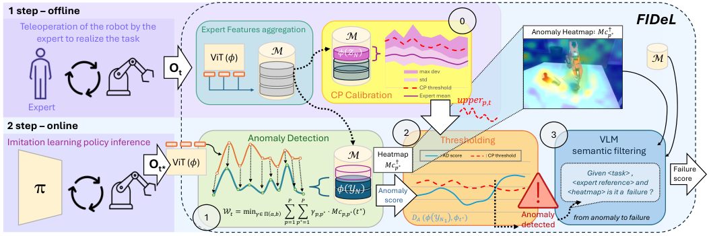

<!-- Start of picture text -->
1 step – offline 0 FIDeL Teleoperation of the robot by the expert to realize the task Expert Features aggregation M Anomaly Heatmap∶"#!"∗ M ! "! ViT (!) M Ot max dev std CP threshold CP Calibration Expert mean #$$%&",$ Expert 2 step – online 2 3 Imitation learning policy inference Anomaly Detection Thresholding VLM M Heatmap  : AD score : CP threshold semantic filtering Ot* ViT (!) "#!"∗ <expert reference> andGiven <task> , Failure score π ! "! Anomaly <heatmap> is it a failure ? , , score 1 $# = min$∈ ' (,*  * !-. ! *∗ -. + !,! ∗ ⋅"# !,! ∗ - ∗ ./ (0 10. , 0# ∗ ) An detectedomaly from anomaly to failure <!-- End of picture text -->

**Fig. 1:** We introduce **FIDeL** , a framework for detecting failures in imitation learning (IL) policies. **- Offline -** Expert demonstrations are first encoded and stored in a memory buffer _M_ . 0. Conformal Prediction Calibration — A decision threshold is computed from _M_ using Conformal Prediction to determine when a score should be considered anomalous. **- Online -** 1. Anomaly Detection — During policy execution, anomaly scores and heatmaps are computed from incoming observations. 2. Thresholding — If the score exceeds the calibrated threshold, an anomaly is flagged. 3. Semantic Filtering — Since not all anomalies are failure-related, a VLM filter discards benign deviations and flags only failures that threaten task success. 

**Anomaly detection** : an anomaly detector _DA_ assigns a score to each observation _Ot_ , reflecting the likelihood of deviation from nominal behavior. **Failure detection** : a failure detector _DF_ refines this decision by filtering out benign anomalies (e.g., harmless scene changes) while flagging failure-related anomalies. We adopt a one-class formulation, requiring only nominal demonstrations. Let _XN_ denote the dataset of expert trajectories, consisting of at most a few dozen episodes. It is randomly partitioned into two subsets of equal sizes: _YN_ for constructing the anomaly detector _DA_ and _ZN_ for calibrating thresholds. 

## _B. Method overview_ 

Our framework comprises two stages: an **Offline phase** during which observations from _XN_ are encoded using a vision encoder _ϕ_ , yielding patch-level features _ϕt_ = _ϕ_ ( _Ot_ ). These features are aggregated into a statistical memory _M_ (Sec. III-C), which models the nominal distribution. The calibration subset _ZN_ is then used to derive adaptive thresholds via conformal prediction, producing time and patch dependent bounds. During the **online phase.** , at each timestep _t__∗_ , the policy outputs an action _At∗_ = _fθ_ ( _Ot∗_ ). In parallel, as illustrated in Fig. 1, the anomaly detector _DA_ computes a score _DA_ ( _ϕ_ ( _YN_ ) _, ϕt∗_ ) by aligning query features _ϕt∗_ with keys from _YN_ using optimal transport. This score is compared against conformal thresholds to decide if _Ot∗_ is anomalous. If flagged, the failure detector _DF_ invokes a VLM to distinguish harmless anomalies from genuine failures. 

## _C. Memory representation_ 

The memory module _M_ is built offline from nominal demonstrations. After encoding trajectories using a vision encoder (resnet18 [48] or dinoV2 [49]), we obtain a feature tensor _ϕ_ ( _YN_ ) _∈_ R_N×T ×P ×F_ , where _N_ is the number of episodes, _T_ the horizon length, _P_ the number of spatial 

patches per frame, and _F_ the feature dimension. To reduce memory cost and ensure efficient inference, features are aggregated across episodes by computing Gaussian statistics. The resulting memory encodes the expected distribution of nominal features: 

_M_ = _{µt,p,f , σt,p,f | t ∈_ �1 _, T_ � _, p ∈_ �1 _, P_ � _, f ∈_ �1 _, F_ � _} ,_ where _µt,p,f_ and _σt,p,f_ are the empirical mean and standard deviation of feature dimension _f_ , estimated across episodes for patch _p_ at timestep _t_ . 

## _D. Anomaly score computation_ 

At runtime, in parallel with the operation of the policy _fθ_ , we retrieve the observation _Ot∗_ . Features are then extracted = from _Ot∗_ using the vision encoder, resulting in _ϕ__query_ _t__∗_ _ϕ_ ( _Ot∗_ ) _∈_ R_P ×F_ . Subsequently, we compare this query data– whose indices hold a ” _∗_ ”– with the memory, i.e., the stored data, which we refer to as the keys. Anomaly scoring relies on an optimal transport (OT) alignment between the query and memorized features [50], [51]. Rather than comparing patches one by one, OT seeks the best global alignment between the two sets of patches: how much ”feature mass” from query patches needs to be moved to match the key (memory) patches, and at what cost. Formally, we look for a transport plan _γ ∈_ R_P_ +_∗P_ that redistributes the query mass into the key mass with minimum total cost. We define a ground cost function _c_ : R_F_ _×_ R_F_ _→_ R+ between two feature vectors, implemented here as normalized Euclidean distance (i.e., a diagonal Mahalanobis distance), where each feature dimension is scaled by the corresponding standard deviation stored in _M_ . This gives rise to a cost matrix _Mc_ ( _t_ ) _∈_ R_P ×P_ for each memory timestep _t_ : 

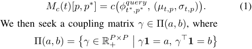

> Original page for checking 6 unresolved font glyphs.

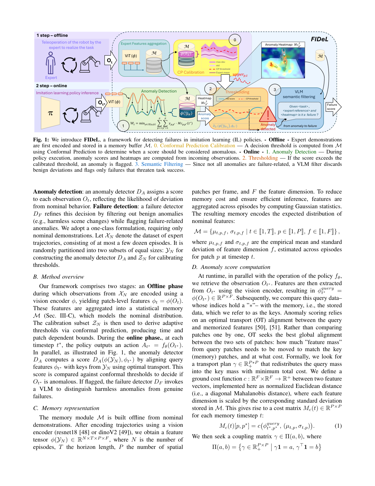

<!-- Page 4 -->

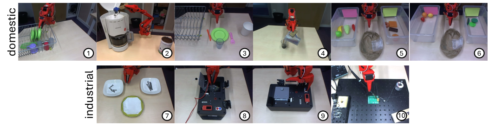

<!-- Start of picture text -->
1 2 3 4 5 6 7 8 9 10 domestic industrial <!-- End of picture text -->

**Fig. 2: BotFails dataset illustration** - all images are illustrations of BotFails tasks executed by the expert - **Domestic** - 1. clear away the dishes, 2. make coffee, 3. set the table, 4. pour coffee, 5. sort groceries, 6. sort fruits and vegetables - **Industrial** - 7. sort screws, 8. measure voltage, 9. press buttons, 10. solder. 

is the set of admissible transport plans between two uniform distributions _a, b ∈_ ∆_P_ . The OT cost between query and memory features at time _t_ is thus: 

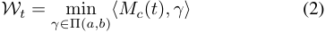

where _⟨·, ·⟩_ denotes the Frobenius inner product. 

The final anomaly score is obtained as the minimum transport cost across nominal timesteps: 

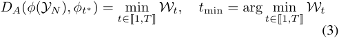

In practice, solving the OT problem exactly is costly; we rely on entropic regularization (Sinkhorn iterations) to compute an efficient approximation [50]. 

_E. Thresholding via Spatially-Aware Conformal Prediction_ 

We extend the Conformal Prediction (CP) framework [18], [19] to define a dynamic threshold for our anomaly detector _DA_ , accounting for both temporal structure and patch-level variations. 

## **- Offline calibration -** 

We divide the expert calibration set _ZN_ in two subsets _EA_ and _EB_ . Then, we compute the anomaly calibration score _DA_ ( _ϕ_ ( _YN_ ) _, ϕ_ ( _EA_ )) which is used to compute the mean anomaly score _µ__t_ _p_overnominalexamples,while _DA_ ( _ϕ_ ( _YN_ ) _, ϕ_ ( _EB_ )) is used to compute deviations. The split aims to maintain the exchangeability assumption [18]. A threshold bandwidth _h_ is then set as the (1 _− α_ )-quantile of the maximum deviations observed on _EB_ . This bandwidth yields a spatio-temporal upper bound upper _p,t_ = _µ__t_ _p_+_ρt_ _p__.h_, which controls the false positive rate at level _α_ under exchangeability. With _ρ__t_ _p_,apatch-wisemodulationfactor, capturing variability across time and space [18]. Figure 3 depicts the upper bound (Threshold) as a dotted red line. 

## **- Online thresholding -** 

At runtime, the current observation is aligned to its closest nominal timestep _t_ min using OT (Eq. (3)), and patchlevel scores are compared to their corresponding bounds upper _p∗,t_ min. An input is flagged as anomalous when the fraction of patches exceeding their respective bounds surpasses a user-defined percentage. This parameter allows 

tuning the detector’s sensitivity to the task context: stricter values improve responsiveness in fine-grained or sensitive scenarios, while more permissive ones reduce false positives in less sensitive settings. Additionally, non-critical spatial regions can be masked, further focusing detection on areas of interest. 

_F. Semantic filtering_ 

We leverage Qwen 2.5-7b [52] as a Vision-Language Model (VLM) to distinguish between benign anomalies and task-relevant failures. Formally, we define the failure detector _DF_ as a binary classifier operating on both contextual task information and visual evidence: 

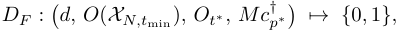

where _d_ is a task-specific textual description provided by the user, _O_ ( _XN,t_ min) _∈ O_ ( _XN_ ) is a reference (expert) demonstration frame at timestep _t_ min (see Eq. (3)), _Ot∗_ is the current observation, and _Mc__†_ _p__∗_istheanomalyheatmap highlighting the most suspicious region(s) in the image. _Mc__†_ _p__∗∈_R_P_isderivedfromthecostmatrix(eq.(1))at the most similar time step _t_ min (eq.(3)) by extracting the minimum transport cost per query patch: 

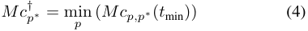

The VLM is prompted with ( _d, O_ ( _XN,t_ min ) _, Ot∗ , Mc__†_ _p__∗_)and asked to: 

- 1) Identify the semantic nature of the anomaly by comparing the two images and interpreting the heatmap. 

- 2) Classify the anomaly as either: **False positive** ( _DF_ = 0): the anomaly is benign, the robot may continue. **Failure** ( _DF_ = 1): the anomaly is a failure. 

The combination of nominal reference ( _O_ ( _XN,t_ min )) with structured context ( _d_ ) and localized anomaly cues ( _Mc__†_ _p__∗_), allows to constrain the reasoning space of the VLM. 

## IV. EVALUATION 

To rigorously evaluate the effectiveness of our failure detection approach, we introduce a dedicated dataset specifically designed for robotic failure monitoring. Our method is benchmarked on this dataset alongside several state-of-theart baseline methods adapted to our experimental setting.

<!-- Page 5 -->

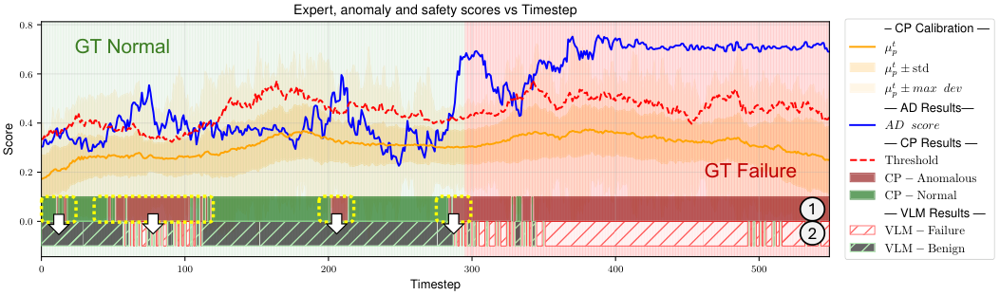

<!-- Start of picture text -->
Expert, anomaly and safety scores vs Timestep 0 . 8 – CP Calibration — GT Normal µ t p 0 . 6 µ t p ±  std µ t p ± max dev — AD Results— 0 . 4 AD score — CP Results — Threshold 0 . 2 GT Failure CP  °  Anomalous CP  °  Normal 1 — VLM Results — 0 . 0 2 VLM  °  Failure VLM  °  Benign 0 100 200 300 400 500 Timestep Score <!-- End of picture text -->

**Fig. 3: Score illustration** - Real- _π_ soldering - episode 15 over 20 episodes of the evaluation set, score obtained with Representation and CP time. The Anomaly Detection score corresponds to the output of the AD module _DA_ ( _ϕ_ ( _YN_ ) _, ϕt__∗_ ). _µ__t_ _p_isobtainedwhencomputing _DA_ ( _ϕ_ ( _YN_ ) _, ϕ_ ( _EA_ )) and allows to compute the Threshold values, see section III-E. When the Anomaly Detection score is below the Threshold, no anomaly is detected (CP-Normal) and when it is above, an anomaly is flagged (CP-Anomalous). We observe that transitioning from anomaly detection _⃝_ 1 to failure detection _⃝_ 2 through the use of the VLM reduces the number of false positives (highlighted in the yellow boxes). However, this additional filtering step also introduces a small number of false negatives. 

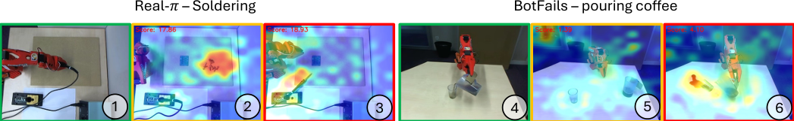

<!-- Start of picture text -->
Real-𝜋 – Soldering BotFails – pouring coffee 1 2 3 4 5 6 <!-- End of picture text -->

**Fig. 4: Heatmaps illustration** - obtained using Representation AD and temporal/spatial CP - **Real-** _π_ : _⃝_ 1 expert, _⃝_ 2 benign anomaly: screws present in the work plan, _⃝_ 3 failure: dropping the iron - **BotFails** : _⃝_ 4 expert, _⃝_ 5 benign anomaly: someone walking in the background (top left corner), _⃝_ 6 failure: spilling the cup. 

||**Represent** AUROC _↑_|**ation (ours)** F1@Opt _↑_|_logpZ_ AUROC _↑_|_0_ [12] F1@Opt _↑_|_lo_ AUROC _↑_|_pO_ F1@Opt _↑_|_A_ AUROC _↑_|_E_ F1@Opt _↑_|_STAC_ AUROC _↑_|[11] F1@Opt _↑_|
|---|---|---|---|---|---|---|---|---|---|---|
|**BtFil**|**70****_._50**|**62****_._90**|65_._20|59_._87|58_._30|53_._48|49_._90|52_._12|N/A|N/A|
|**oas**|**_±_0**|**_±_0**|_±_0_._15|_±_0_._06|_±_0_._70|_±_0_._02|_±_1_._08|_±_0_._08|N/A|N/A|
|**i**|**86****_._72**|**78****_._29**|82_._62|78_._03|76_._16|70_._99|81_._07|76_._33|53_._55|63_._93|
|**Real-**_π_ **solderng**|**_±_0**|**_±_0**|_±_0_._08|_±_0_._02|_±_0_._42|_±_0_._03|_±_0_._88|_±_0_._06|_±_0|_±_0|

**TABLE I: Anomaly Detection evaluation before thresholding** – mean AUROC and mean F1-score at optimal threshold ( **in %** ) for anomaly detection only evaluated on the **BotFails** dataset and **Real-** _π_ **soldering task** , across various AD methods. Best results are highlighted in green and bold. Each task score reflects performance over multiple rollouts (several dozens per task). 

## _A. Dataset_ 

_1) We introduce_ **_BotFails_** _:_ given the scarcity of available datasets in the robotics failure detection field, we created a new dataset specifically designed for general failure situations in robotics, incorporating vision, proprioception, and natural language instructions. Data collection was performed using master arm teleoperation with LeRobot [20], a realworld robotic platform. BotFails has been curated to maximize semantic diversity across task types. The dataset covers 10 distinct tasks, with 6 tasks reflecting domestic environments, and 4 tasks representative of industrial contexts. The tasks are illustrated in Figure 2. Each task features several anomaly types. Some are not failure-related (e.g. an unknown object is present in the scene) and some are real failures (e.g. manipulation mistake, semantic mistake...). 

_2)_ **_Real-π_** _dataset:_ We additionally evaluated FIDeL on more realistic data by performing inference on trajectories generated with ACT [3], an IL policy. While these data contain fewer types of anomalies/failures—due to the lack of control over the policy’s behavior—they better reflect realworld execution scenarios. We conducted experiments on a soldering task. Two types of labels are available with these datasets: anomaly detection labels and failure labels which only include anomalies related to failure scenarios. 

## _B. Baselines_ 

We evaluate FIDeL against three families of baselines: (i) AD methods relying exclusively on nominal data, (ii) thresholding strategies for anomaly scoring, and (iii) end-toend failure detection modules that combine detection with additional filtering or semantic reasoning.

<!-- Page 6 -->

_1) Anomaly Detection (AD) baselines:_ We first compare against representative approaches from recent advances in robotic AD and Vision Anomaly Detection (VAD). Like FIDeL, these methods are trained exclusively on nominal demonstrations, without requiring annotated anomalies. 

**FAIL-Detect** [12] introduces two anomaly scoring mechanisms based on Conditional Normalizing Flows (CNFs): **lopO** and **logpZ0** [53]. - **lopO** estimates the likelihood of an observation _Ot_ under a CNF fitted on expert demonstrations; anomalies correspond to low-likelihood samples. - **logpZ0** , instead, integrates the CNF backward from _Ot_ to compute its corresponding latent variable _ZOt_ . Under nominal conditions, _ZOt_ is approximately Gaussian, so large values of _∥ZOt∥_2 are indicative of anomalies. Compared to lopO, this method avoids explicitly computing the flow’s divergence, improving stability in high-dimensional settings. 

In addition, we include a **reconstruction-based AD baseline** , inspired by SOTA methods for video anomaly detection [26], [54], [55]. We train an AutoEncoder (AE) on expert data to learn a compact latent representation. At inference, high reconstruction error signals a deviation from expert-like behavior and is used as an anomaly score. 

Finally, we consider STAC (Statistical Temporal Action Consistency) [11] which monitors the temporal consistency of a generative policy. At each step, the policy predicts a sequence of future actions; overlapping parts of successive predictions are compared using statistical distances (e.g., MMD, KL). When the policy is in-distribution, these overlapping action distributions remain consistent, yielding low distances. Conversely, large divergences signal out-of-distribution states and potential failure. We can only evaluate STAC on the Real- _π_ dataset given that it requires the sequence of actions predicted by the policy. 

_2) Thresholding baselines:_ Raw anomaly scores need to be mapped to binary anomaly decisions. To assess the contribution of our conformal thresholding mechanism, we compare against several thresholding strategies: - **CP-time** , a standard conformal prediction approach using only temporal deviations from reference demonstrations. - **CP-time+space** , our spatial extension that accounts for both temporal and spatial (patch-level) variations. - **Gaussian assumption** , a simpler baseline with thresholds derived from a Gaussian fit of calibration scores (mean and variance) at each timestep. 

_3) End-to-end failure detection baselines:_ Beyond isolated AD modules, we also benchmark FIDeL against SOTA full failure detection pipelines: - **FAIL-Detect** [12], in its end-to-end configuration. - **Sentinel** [11], which combines STAC and VLM monitoring in parallel. - **VLM only** : we use Qwen 2.5 [52], as a failure classifier. It receives the 5 last images and the user prompt and decides whether a failure occurred or not. 

## _C. Evaluation Protocol_ 

**Anomaly Detection (AD) module.** We first evaluate anomaly scoring independently of thresholds by extracting raw anomaly scores. Labels are defined at the frame level (0 = nominal, 1 = anomaly). Metrics: AUROC (balanced 

evaluation of TPR/FPR across thresholds) and F1 at the optimal threshold (best precision–recall balance). 

**Thresholding module.** We then assess thresholding methods at the frame level (0 = normal sample, 1 = anomaly), using: **TPR** , **TNR** , **Balanced Accuracy** = (TPR + TNR) _/_ 2, **Weighted Accuracy** = _β ·_ TNR + (1 _− β_ ) _·_ TPR with _β_ = number of normal samples _/_ total number of samples. 

**End-to-end evaluation.** Finally, we evaluate the full failure detection pipeline (including semantic filtering), where metrics only consider failure-related anomalies as positive samples. Metrics (TPR, TNR, Balanced/Weighted and Accuracy) are reported at observation level to assess the ability to detect true failures while ignoring benign anomalies. 

## _D. Results and discussion_ 

Table I reports the performance of anomaly detection (AD) methods evaluated directly on raw anomaly scores. Our representation-based approach consistently achieves the best AUROC and F1@Opt across both datasets, surpassing all baselines by a clear margin. On BotFails, it yields a +5 _._ 3% AUROC gain over the second-best method (logpZ0), confirming robustness to the high semantic variability of anomalies. On the Real- _π_ soldering task, it further widens the gap, reaching 86 _._ 7% AUROC versus 82 _._ 6% for logpZ0 and 53 _._ 6% for STAC. These results show that compact nominal representations outperform reconstruction- and likelihoodbased methods in capturing deviations from expert behavior. 

Figure 5 compares thresholding strategies applied to anomaly scores. The best results are obtained with our representation-based method combined with CP-time&space, which yields robust performance across datasets. Conformal prediction (CP) generally outperforms Gaussian thresholding, as it makes no distributional assumption and adapts to diverse score behaviors. In contrast, Gaussian fitting assumes Gaussian-distributed scores, an approximation that often fails under extreme conditions, leading to higher variance and degraded weighted accuracy—especially for logpZ0, where over-flagging anomalies reduces TNR. Still, Gaussian thresholding is not entirely ineffective: in some tasks where the score distribution is closer to normal, it can match or even surpass CP-time. Comparing CP variants, CP-time&space consistently improves over CP-time. On Real- _π_ , the gain is marked since anomalies in soldering are spatially localized. On BotFails, where anomalies are more diverse, the improvement is smaller: CP-time&space still yields higher accuracy, though its weighted accuracy is marginally lower (–0.17%), reflecting a TPR–TNR trade-off. 

End-to-end results (Figure 6) highlight the importance of semantic filtering when converting anomaly labels to failure labels. AD modules suffer a sharp performance drop when benign anomalies are relabeled as nominal, especially in TNR; for example, our Representation method with CPtime&space loses 23% TNR on Real- _π_ . Adding semantic filtering significantly mitigates the TNR degradation, enabling more balanced detection (85 _._ 8% TPR / 74 _._ 8% TNR). FailDetect tends to overpredict anomalies, as it cannot distinguish true failures from benign deviations, while Sentinel

<!-- Page 7 -->

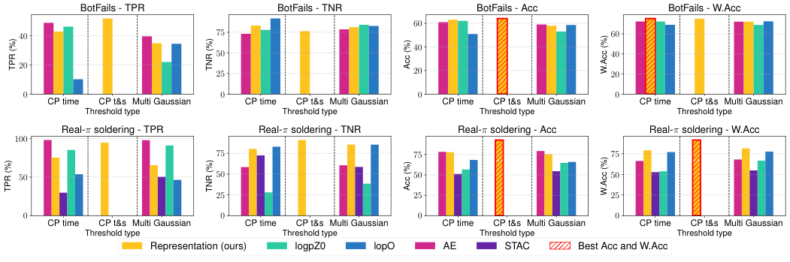

<!-- Start of picture text -->
BotFails - TPR BotFails - TNR BotFails - Acc BotFails - W.Acc 60 40 75 60 40 50 40 20 25 20 20 0 0 0 0 CP time CP t&s Multi Gaussian CP time CP t&s Multi Gaussian CP time CP t&s Multi Gaussian CP time CP t&s Multi Gaussian Threshold type Threshold type Threshold type Threshold type Real- π soldering - TPR Real- π soldering - TNR Real- π soldering - Acc Real- π soldering - W.Acc 100 75 75 75 50 50 50 50 25 25 25 0 0 0 0 CP time CP t&s Multi Gaussian CP time CP t&s Multi Gaussian CP time CP t&s Multi Gaussian CP time CP t&s Multi Gaussian Threshold type Threshold type Threshold type Threshold type Representation (ours) logpZ0 lopO AE STAC Best Acc and W.Acc TPR (%) TNR (%) Acc (%) W.Acc (%) TPR (%) TNR (%) Acc (%) W.Acc (%) <!-- End of picture text -->

**Fig. 5: Anomaly Detection evaluation with thresholding** - mean True Positive Rate (TPR), True Negative Rate (TNR), balanced accuracy (Acc), weighted accuracy (W.Acc), ( **in %** ), for various Anomaly Detection types and various thresholding types–temporal Conformal Prediction (CP time), temporal and spatial Conformal Prediction (CP t&s), Multiple Gaussian–evaluated on real world task from the BotFails dataset and soldering task operated autonomously with ACT [3]. Best Acc and W.Acc in hatched red. 

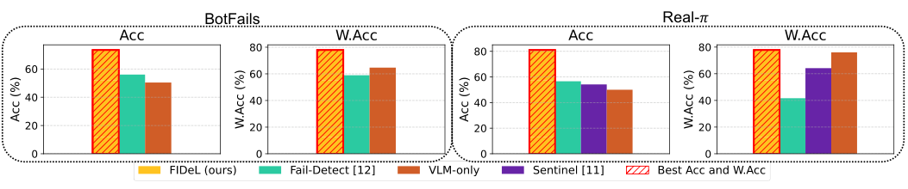

<!-- Start of picture text -->
BotFails Real-𝜋 <!-- End of picture text -->

**Fig. 6: End-to-end system evaluation (including semantic filtering)** - accuracy (Acc) and weighted accuracy (W.Acc) for various robotics failure detection systems. The labeling is different for this evaluation. While AD and Threshold module are evaluated using **anomaly labels** , the end-to-end system is evaluated using **failures labels** . Which means that all failure-related anomaly labels remain 1, while non-failure anomalies are relabeled from 1 to 0. FiDeL = Representation + CP t&s + Semantic filtering 

favors nominal predictions, likely missing failures that are purely visual and not reflected in proprioceptive signals. These results show that semantic filtering is crucial for reliable failure monitoring—avoiding unnecessary interventions while still capturing genuine failures. 

## V. CONCLUSIONS 

We introduced FIDeL, a representation-based anomaly detection module tailored for IL robotic policies. By combining optimal transport alignment, spatially-aware conformal thresholds, and semantic filtering, our approach enables reliable failure detection with interpretable localization. Experiments across diverse tasks show that FIDeL balances robustness to natural task variability with sensitivity to failure related deviations, highlighting the benefit of spatiallyextended conformal prediction. Beyond detecting anomalies, FIDeL provides a practical interface for monitoring robot behavior in deployment, where reliable monitoring hinges not only on policy quality but also on the ability to recognize and interpret failures. 

## VI. LIMITATIONS 

FIDeL shows strong failure detection in real-world robotic tasks, but several limitations remain. First, its performance 

depends heavily on the diversity of demonstrations, which may cause benign variations to be flagged as anomalies. While the VLM filter helps reduce false positives, its use is computationally costly, and excessive false alarms would slow inference. Second, the method’s spatial and temporal invariance, though useful for robustness, can reduce sensitivity to fine-grained or order-dependent deviations. This is particularly problematic for non-Markovian anomalies, where the correctness of an action depends not only on the current state but also on the history of states or actions that preceded it. (e.g., press buttons to perform a specific sequence). Detecting such cases requires explicit temporal modeling. Finally, balancing invariance and sensitivity remains taskdependent: some applications benefit from tolerance to small perturbations, while others demand detection of subtle deviations such as misalignments or object misplacements. 

## REFERENCES 

- [1] P. Intelligence, K. Black, <u>et al.,</u> “ _π_ 0 _._ 5: a vision-language-action model with open-world generalization,” 2025. [Online]. Available: https://arxiv.org/abs/2504.16054 

> [2] C. Chi, Z. Xu, S. Feng, E. Cousineau, Y. Du, B. Burchfiel, R. Tedrake, and S. Song, “Diffusion policy: Visuomotor policy learning via action diffusion,” <u>The International Journal of Robotics Research,</u> 2024.

<!-- Page 8 -->

- [3] T. Z. Zhao, V. Kumar, S. Levine, and C. Finn, “Learning Fine-Grained Bimanual Manipulation with Low-Cost Hardware,” in <u>Proceedings of Robotics: Science and Systems, Daegu, Republic of Korea, July 2023.</u> 

- [4] Y. Gal <u>et al.,</u> “Dropout as a bayesian approximation: Representing model uncertainty in deep learning,” in <u>Proc. of ICML,</u> 2016. 

- [5] A. Kendall and Y. Gal, “What uncertainties do we need in bayesian deep learning for computer vision?” in <u>Proc. of NeurIPS,</u> 2017. 

- [6] O. Lockwood and M. Si, “A review of uncertainty for deep reinforcement learning,” in <u>Proc. of AAAI,</u> 2022. 

- [7] Y. Zhu, J. Dong, and H. Lam, “Uncertainty quantification and exploration for reinforcement learning,” <u>Operations Research,</u> 2024. 

- [8] K. Roth <u>et al.,</u> “Towards total recall in industrial anomaly detection,” in <u>Proc. of CVPR,</u> 2022. 

- [9] Y. Fan <u>et al.,</u> “Video anomaly detection and localization via gaussian mixture fully convolutional variational autoencoder,” <u>Computer Vision and Image Understanding,</u> 2020. 

- [10] A. Hafez, A. N. Akhormeh, A. Hegazy, and A. Alanwar, “Safe LLM-Controlled Robots with Formal Guarantees via Reachability Analysis,” 2025. [Online]. Available: https://arxiv.org/abs/2503.03911 

- [11] C. Agia <u>et al.,</u> “Unpacking failure modes of generative policies: Runtime monitoring of consistency and progress,” in <u>Proc. of CoRL,</u> 2025. 

- [12] C. Xu <u>et al., “Can we detect failures without failure data? uncertainty-</u> aware runtime failure detection for imitation learning policies,” <u>arXiv preprint arXiv:2503.08558,</u> 2025. 

- [13] Y. Cui, Z. Liu, and S. Lian, “A survey on unsupervised anomaly detection algorithms for industrial images,” <u>IEEE Access,</u> 2023. 

- [14] M. Abdalla, S. Javed, M. Al Radi, A. Ulhaq, and N. Werghi, “Video anomaly detection in 10 years: a survey and outlook,” <u>Neural Computing and Applications,</u> vol. 37, no. 32, pp. 26 321– 26 364, Nov. 2025. [Online]. Available: https://doi.org/10.1007/ s00521-025-11659-8 

- [15] P. Wu, C. Pan, Y. Yan, G. Pang, P. Wang, and Y. Zhang, “Deep learning for video anomaly detection: A review,” 2024. [Online]. Available: https://arxiv.org/abs/2409.05383 

- [16] R. Chalapathy and S. Chawla, “Deep learning for anomaly detection: A survey,” 2019. [Online]. Available: https://arxiv.org/abs/1901.03407 

- [17] J. Tax, David M. and W. Duin, Robert P. “Support vector domain description,” <u>Pattern Recognition Letters,</u> 1999. 

- [18] J. Lei, M. G’Sell, A. Rinaldo, R. J. Tibshirani, and L. Wasserman, “Distribution-free predictive inference for regression,” 2017. [Online]. Available: https://arxiv.org/abs/1604.04173 

- [19] J. Diquigiovanni, M. Fontana, and S. Vantini, “The importance of being a band: Finite-sample exact distribution-free prediction sets for functional data,” 2021. [Online]. Available: https://arxiv.org/abs/2102. 06746 

- [20] R. Cadene, S. Alibert, A. Soare, Q. Gallouedec, A. Zouitine, and T. Wolf, “Lerobot: State-of-the-art machine learning for real-world robotics in pytorch,” https://github.com/huggingface/lerobot, 2024. 

- [21] C.-L. Li, K. Sohn, J. Yoon, and T. Pfister, “Cutpaste: Self-supervised learning for anomaly detection and localization,” in <u>Proc. of CVPR,</u> 2021. 

- [22] V. Zavrtanik, M. Kristan, and D. Skoˇcaj, “Draem – a discriminatively trained reconstruction embedding for surface anomaly detection,” in <u>Proc. of ICCV,</u> 2021. 

- [23] H. M. Schl¨uter, J. Tan, B. Hou, and B. Kainz, “Natural synthetic anomalies for self-supervised anomaly detection and localization,” in <u>Proc. of ICCV,</u> 2022. 

- [24] S. Venkataramanan, K.-C. Peng, R. V. Singh, and A. Mahalanobis, “Attention guided anomaly localization in images,” in <u>Proc. of ECCV,</u> 2020. 

- [25] Y. Liu, C. Zhuang, and F. Lu, “Unsupervised two-stage anomaly detection,” 2021. [Online]. Available: https://arxiv.org/abs/2103.11671 

- [26] Y. Shi, J. Yang, and Z. Qi, “Unsupervised anomaly segmentation via deep feature reconstruction,” <u>Neurocomputing,</u> 2021. 

- [27] G. Wang, S. Han, E. Ding, and D. Huang, “Student-teacher feature pyramid matching for anomaly detection,” in <u>Proc. of BMVC,</u> 2021. 

- [28] S. Yamada, S. Kamiya, and K. Hotta, “Reconstructed student-teacher and discriminative networks for anomaly detection,” in <u>Proc. of IROS,</u> 2022. 

- [29] M. Rudolph, T. Wehrbein, B. Rosenhahn, and B. Wandt, “Asymmetric student-teacher networks for industrial anomaly detection,” in <u>Proc. of the IEEE/CVF winter conference on applications of computer vision,</u> 2023. 

- [30] L.-L. Chiu and S.-H. Lai, “Self-supervised normalizing flows for image anomaly detection and localization,” in <u>2023 IEEE/CVF Conference on Computer Vision and Pattern Recognition Workshops (CVPRW),</u> 2023, pp. 2927–2936. 

- [31] R. Bouman and T. Heskes, “Autoencoders for anomaly detection are unreliable,” 2025. [Online]. Available: https://arxiv.org/abs/2501. 13864 

- [32] D. J. Rezende and S. Mohamed, “Variational inference with normalizing flows,” in <u>Proc. of ICML,</u> 2015. 

- [33] D. Gudovskiy, S. Ishizaka, and K. Kozuka, “Cflow-ad: Real-time unsupervised anomaly detection with localization via conditional normalizing flows,” in <u>Proc. of the IEEE/CVF winter conference on applications of computer vision,</u> 2021. 

- [34] M. Rudolph, T. Wehrbein, B. Rosenhahn, and B. Wandt, “Fully convolutional cross-scale-flows for image-based defect detection,” in <u>Proc. of the IEEE/CVF winter conference on applications of computer vision,</u> 2021. 

- [35] J. Yu <u>et al.,</u> “Fastflow: Unsupervised anomaly detection and localization via 2d normalizing flows,” 2021. [Online]. Available: https://arxiv.org/abs/2111.07677 

- [36] P. Kirichenko, P. Izmailov, and A. G. Wilson, “Why normalizing flows fail to detect out-of-distribution data,” in <u>Advances in Neural Information Processing Systems,</u> vol. 33. Curran Associates, Inc., 2020, pp. 20 578–20 589. [Online]. Available: https://proceedings.neurips.cc/paper ~~f~~ iles/paper/2020/file/ ecb9fe2fbb99c31f567e9823e884dbec-Paper.pdf 

- [37] T. Defard, A. Setkov, A. Loesch, and R. Audigier, “Padim: a patch distribution modeling framework for anomaly detection and localization,” in <u>Proc. of ICPR,</u> 2020. 

- [38] S. Wang, L. Wu, L. Cui, and Y. Shen, “Glancing at the patch: Anomaly localization with global and local feature comparison,” in <u>Proc. of CVPR,</u> 2021. 

- [39] Y. Zheng <u>et al.,</u> “Focus your distribution: Coarse-to-fine noncontrastive learning for anomaly detection and localization,” in <u>Proc. of ICME,</u> 2022. 

- [40] H. Liu, S. Dass, R. Mart´ın-Mart´ın, and Y. Zhu, “Model-based runtime monitoring with interactive imitation learning,” in <u>Proc. of ICRA,</u> 2024. 

- [41] C. Gokmen, D. Ho, and M. Khansari, “Asking for help: Failure prediction in behavioral cloning through value approximation,” 2023. [Online]. Available: https://arxiv.org/abs/2302.04334 

- [42] H. Liu <u>et al., “Multi-Task Interactive Robot Fleet Learning with Visual</u> World Models,” in <u>Proc. of CoRL,</u> 2024. 

- [43] A. Gupta, K. Chakraborty, and S. Bansal, “Detecting and Mitigating System-Level Anomalies of Vision-Based Controllers,” in <u>Proc. of ICRA,</u> 2024. 

- [44] Y. Wang, T.-H. Wang, J. Mao, M. Hagenow, and J. Shah, “Grounding language plans in demonstrations through counterfactual perturbations,” in <u>Proc. of ICLR,</u> 2024. 

- [45] N. He <u>et al.,</u> “Rediffuser: Reliable decision-making using a diffuser with confidence estimation,” in <u>Proc. of ICML,</u> 2024. 

- [46] J. Sun <u>et al.,</u> “Conformal prediction for uncertainty-aware planning with diffusion dynamics model,” in <u>Proc. of NeurIPS,</u> 2023. 

- [47] R. T. Q. Chen, Y. Rubanova, J. Bettencourt, and D. Duvenaud, “Neural ordinary differential equations,” in <u>Proc. of NeurIPS,</u> 2018. 

- [48] K. He, X. Zhang, S. Ren, and J. Sun, “Deep residual learning for image recognition,” in <u>Proc. of CVPR,</u> 2016. 

- [49] M. Oquab <u>et al.,</u> “Dinov2: Learning robust visual features without supervision,” <u>TMLR,</u> 2024. 

- [50] G. Papagiannis and Y. Li, “Imitation learning with sinkhorn distances,” in <u>ECML/PKDD,</u> 2022. [Online]. Available: https: //arxiv.org/abs/2008.09167 

- [51] R. Dadashi, L. Hussenot, M. Geist, and O. Pietquin, “Primal wasserstein imitation learning,” 2021. [Online]. Available: https: //arxiv.org/abs/2006.04678 

- [52] Qwen, :, A. Yang, and B. Y. et al, “Qwen2.5 technical report,” 2025. [Online]. Available: https://arxiv.org/abs/2412.15115 

- [53] C. Xu, X. Cheng, and Y. Xie, “Normalizing flow neural networks by jko scheme,” in <u>Proc. of NeurIPS,</u> 2023. 

- [54] M. Hasan <u>et al.,</u> “Learning temporal regularity in video sequences,” in <u>Proc. of CVPR,</u> 2016. 

- [55] T. Wang <u>et al.,</u> “Generative neural networks for anomaly detection in crowded scenes,” <u>IEEE TIFS,</u> 2018.
