# Hazra_EgoTV_Egocentric_Task_Verification_from_Natural_Language_Task_Descriptions_ICCV_2023_paper

[Original PDF](../Hazra_EgoTV_Egocentric_Task_Verification_from_Natural_Language_Task_Descriptions_ICCV_2023_paper.pdf)

Pages: 13

> Automatically converted from PDF. Check the original for exact equations, symbols, table alignment, and figure details.

<!-- Page 1 -->

This ICCV paper is the Open Access version, provided by the Computer Vision Foundation. Except for this watermark, it is identical to the accepted version; the final published version of the proceedings is available on IEEE Xplore. 

# **EgoTV : Egocentric Task Verification from Natural Language Task Descriptions** 

Rishi Hazra1* , Brian Chen2 , Akshara Rai2 , Nitin Kamra2 , Ruta Desai2 1 ¨Orebro University 2Meta 

rishi.hazra@oru.se, _{_ bc2754,nitinkamra,akshararai,rutadesai _}_ @meta.com https://rishihazra.github.io/EgoTV 

## **Abstract** 

_To enable progress towards egocentric agents capable of understanding everyday tasks specified in natural language, we propose a benchmark and a synthetic dataset called Egocentric Task Verification (EgoTV). The goal in EgoTV is to verify the execution of tasks from egocentric videos based on the natural language description of these tasks. EgoTV contains pairs of videos and their task descriptions for multi-step tasks – these tasks contain multiple sub-task decompositions, state changes, object interactions, and subtask ordering constraints. In addition, EgoTV also provides abstracted task descriptions that contain only partial details about ways to accomplish a task. Consequently, EgoTV requires causal, temporal, and compositional reasoning of video and language modalities, which is missing in existing datasets. We also find that existing vision-language models struggle at such all round reasoning needed for task verification in EgoTV. Inspired by the needs of EgoTV, we propose a novel Neuro-Symbolic Grounding (NSG) approach that leverages symbolic representations to capture the compositional and temporal structure of tasks. We demonstrate NSG’s capability towards task tracking and verification on our EgoTV dataset and a real-world dataset derived from CrossTask [82] (CTV). We open-source the EgoTV and CTV datasets and the NSG model for future research on egocentric assistive agents._ 

## **1. Introduction** 

Inspired by recent progress in visual systems [40, 65], we consider an assistive egocentric agent capable of reasoning about daily activities. When invoked via natural language commands, for e.g., while baking a cake, the agent understands the steps involved in baking, tracks progress through the various stages of the task, detects and proactively prevents mistakes by making suggestions. Such a vir- 

*Work done while interning at Meta. 

tual agent [11] would empower users to learn new skills and accomplish tasks efficiently. 

Developing this egocentric agent capable of tracking and verifying everyday tasks based on their natural language specification is challenging for multiple reasons. First, such an agent must reason about various ways of doing a _multistep_ task specified in natural language. This entails decomposing the task into relevant actions, state changes, object interactions as well as any necessary causal and temporal relationships between these entities. Secondly, the agent must ground these entities in egocentric observations to track progress and detect mistakes. Lastly, to truly be useful, such an agent must support tracking and verification for a combination of tasks and, ideally, even unseen tasks. These three challenges – causal and temporal reasoning about task structure from natural language, visual grounding of sub-tasks, and compositional generalization – form the core goals of our work. 

As our first contribution, we propose a benchmark – **_Ego_** _centric_ **_T_** _ask_ **_V_** _erification_ (EgoTV ) – and a corresponding dataset in the AI2-THOR [29] simulator. Given a natural language (NL) task description and a corresponding egocentric video of an agent, the goal of EgoTV is to verify whether the task was successfully completed in the video or not. EgoTV contains multi-step tasks with _ordering_ constraints on the steps and _abstracted_ NL task descriptions with omitted low-level task details inspired by the needs of real-world assistants. We also provide splits of the dataset focused on different generalization aspects, e.g., unseen visual contexts, compositions of steps, and tasks (see Figure 1). Consequently, EgoTV dataset provides the finegrained control necessary for rigorous testing and refinement of task reasoning models, which is often missing in real-world datasets [17, 10]. Yet, EgoTV mirrors the real world by leveraging visual photo-realism and task diversity. 

Our second contribution is a novel approach for orderaware visual grounding – **_N_** _euro-_ **_S_** _ymbolic_ **_G_** _rounding_ (NSG), capable of compositional reasoning and generalizing to unseen tasks owing to its ability to leverage ab- 

15417

<!-- Page 2 -->

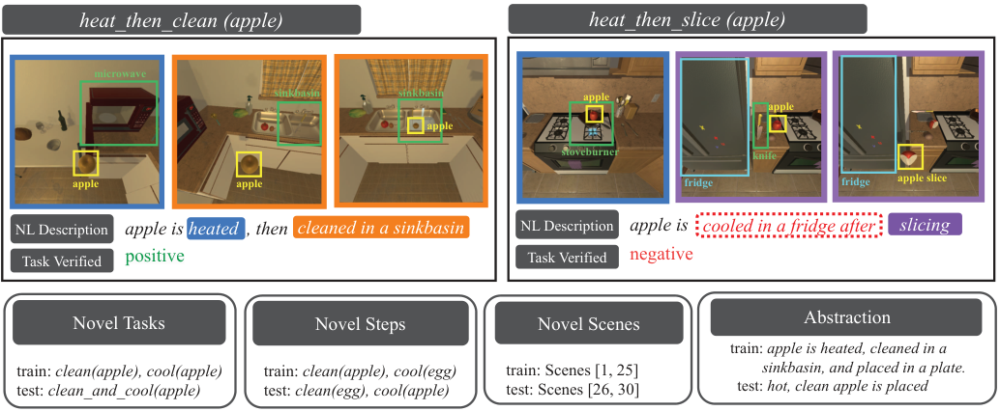

<!-- Start of picture text -->
heat_then_clean (apple) heat_then_slice (apple) microwave sinkbasin sinkbasin apple apple apple stoveburner knife apple apple fridge fridge apple slice NL Description apple is heated  , then cleaned in a sinkbasin NL Description apple is cooled in a fridge after slicing Task Verified positive Task Verified negative Novel Tasks Novel Steps Novel Scenes Abstraction     train:  apple is heated, cleaned in a train:  clean(apple), cool(apple) train:  clean(apple), cool(egg)      train: Scenes [1, 25]                 sinkbasin, and placed in a plate. test:  clean_and_cool(apple) test:  clean(egg), cool(apple)      test: Scenes [26, 30] test:  hot, clean apple is placed <!-- End of picture text -->

Figure 1. **EgoTV benchmark.** A positive example [Left] and a negative example [Right] from the train set along with illustrative examples from the test splits [Bottom] of EgoTV are shown. The test splits are focused on generalization to novel compositions of tasks, unseen sub-tasks or steps and scenes, and abstraction in NL task descriptions. The bounding boxes are solely for demonstration purposes and are not used during training/inference. 

stract NL descriptions along with compositional and temporal structure of tasks (task decomposition, ordering). In contrast, state-of-the-art vision-language models [76, 50, 36, 3] struggle to ground NL descriptions in egocentric videos, and do not generalize to unseen tasks. NSG outperforms these models by **33** _._ **8** % on compositional generalization and **32** _._ **8** % on abstractly described task verification. Finally, to evaluate NSG on real-world data, we instantiate EgoTV on the CrossTask [82] instructional video dataset. We find that it also outperforms state-of-the-art models at task verification on CrossTask. We hope that the EgoTV benchmark and dataset will enable future research on egocentric agents capable of aiding in everyday tasks. 

## **2. Related Work** 

**Video-based Task Understanding.** Understanding tasks from videos has been a long-standing theme in vision research with focus on recognizing activities [58, 10], humanobject interactions [25, 17], and object state changes [60, 14] using egocentric or exocentric videos. But apart from recognizing actions, objects, and state changes, task verification also requires understanding temporal orderings between them. Our work is, therefore, closer to research on understanding instructional tasks [82, 62], which require reasoning about multiple, ordered steps. Prior works focus on either learning the order of steps [4, 37, 24, 42] or use step-ordering as a supervisory signal for learning steprepresentations or step-segmentation [82, 56]. Instead, we are focused on video-based order verification of steps described in NL, akin to [49]. 

**Temporal Video Grounding.** Our EgoTV benchmark is also closely related to the problem of Temporal Video Grounding (TVG) [43, 20, 52, 60]. However, prior work on TVG predominantly focuses on localizing a single action in the video [59, 27]. In contrast, EgoTV requires localizing multiple actions, wherein actions could have partial ordering, i.e., actions could have more than one valid ordering amongst them. 

**Vision-Language Benchmarks.** Various benchmark tasks have been proposed for enabling models that can reason across video and language modalities (see Table 1). Examples include video question answering [74, 69, 18, 21, 68, 31, 63, 16], video-based entailment [38], and embodied task completion [57, 47, 61]. However, these benchmarks focus on individual specific aspects of multimodal reasoning, e.g., compositional reasoning (AGQA [18], ActivityNetQA [21], TVQA [31], and CATER [16]) or causal reasoning (NExT-QA [69], CoPhy [5], Causal-VidQA [33], EgoTaskQA[26], and VIOLIN [38]). In comparison, EgoTV focuses on both causal and compositional reasoning and further requires visual grounding of both objects and actions from text, similar to STAR [68] and CLEVRER [74], albeit in egocentric settings. Unlike embodied task completion benchmarks whose objective is to develop robotic agents that can _perform everyday tasks_ through task-planning (ALFRED [57], TEACh [47]) and control (Behavior [61]), EgoTV benchmark’s objective is to develop virtual agents that can _track and verify everyday tasks_ performed by humans. Akin to NLP _Entailment_ problem [9, 70], it can also be viewed as a video-based entailment problem – where a given “premise” (video) is val- 

15418

<!-- Page 3 -->

||**————– Rea** compositional|**soning —** causal|**———–** temporal|**—— Datas** egocentric|**et Chara** real- world|**cteristics ——** diagnostic tools|
|---|---|---|---|---|---|---|
|CLEVRER [74]|||||||
|Next-QA [69]|||||||
|ActivityNet-QA [21]|||||||
|STAR [68]|||||||
|Causal-VidQA [33]|||||||
|EPIC-KITCHENS [10]|||||||
|Ego-4D [17]|||||||
|VIOLIN [38]|||||||
|Cross-Task[82]|||||||
|**EgoTV**|||||||

Table 1. **EgoTV vs. existing video-language datasets.** EgoTV benchmark enables systematic investigation (diagnostics) on compositional, causal (e.g., effect of actions), and temporal (e.g., action ordering) reasoning in egocentric settings. Table 5 in Appendix provides a more comprehensive comparison. 

idated by a “hypothesis” (task description). **Vision-Language Models.** Vision-Language Models (VLMs) [50, 36, 39, 32, 76] pre-trained on large-scale image-text or video-language narration pairs have demonstrated enhanced performance on certain compositional [34] and causal [60] tasks. However, they generally struggle to handle compositionality and order sensitivity [77, 64]. Instead, NSG explicitly targets order awareness and compositionality for generalization in task verification using neurosymbolic reasoning. 

**Neuro-symbolic Models.** Neuro-symbolic models combine feature extraction through deep learning with symbolic reasoning [54, 68] to capture compositional substructures. These models either reason on static images to recognize object attributes and relations (NS-CL [41], NS-VQA [75], CLOSURE [6], and _∇−_ FOL [2]), or on videos to recognize spatio-temporal and causal relations (NS-DR [74] and DCL [8]). We extend this to tracking multi-step actions. 

## **3. EgoTV Benchmark and Dataset** 

We present the **_Ego_** _centric_ **_T_** _ask_ **_V_** _erification_ (EgoTV) benchmark and dataset. To enable task tracking and verification for egocentric agents, EgoTV contains: 1) _multi-step_ tasks with _ordering constraints_ to capture the causal and temporal nature of everyday tasks, 2) _multimodality_ – language in addition to the egocentric video to allow languagebased human-agent interaction. 

EgoTV also aims to enable the systematic study of generalization in task verification (see Table 1). To this end, we create the EgoTV dataset using a photo-realistic simulator AI2-THOR [29] – as a rich testbed for future research on generalizable agents for task tracking and verification. Our synthetic dataset serves as a valuable proxy of real-world performance of various task verification models while providing control over various factors affecting task reasoning. 

Lastly, we also create a real-world task verification dataset (§ 4) using the CrossTask dataset [82]. While this dataset is not egocentric and is limited in its ability to systematically evaluate the generalization of task reasoning models, it enables the testing of task verification models in real world. 

### **3.1. Definitions** 

**Benchmark.** The objective is to determine if a task described in natural language has been correctly executed by the agent in a given egocentric video. 

**Tasks.** Each task in EgoTV consists of multiple _partiallyordered sub-tasks_ or steps. A sub-task corresponds to a single object interaction via one of the six actions: _heat, clean, slice, cool, place, pick_ , and is parameterized by a _target_ object of interaction1 . By using the “actionable” properties of objects in AI2-THOR [29], we ensure that the sub-tasks are parameterized with appropriate target objects in EgoTV, e.g., _heat(book)_ will never occur. 

Real-world tasks consist of sub-tasks with ordering constraints, either due to physical restrictions (e.g., picking up a knife before slicing) or task semantics (e.g., slicing vegetables before frying). We allow EgoTV tasks to be partially ordered, with some steps following strict ordering, e.g. _pick_ sub-task happens before _place_ sub-task, while others are order-independent. 

The ordering constraints between sub-tasks are captured in the task description using specifiers such as _and_ , _then_ , and _before/after_ . For simplicity, we will refer to a task using _⟨sub-task⟩ ⟨ordering-specifier⟩_ notation, irrespective of the actual task description. Such tasks can then be instantiated by specifying an ( _object_ ) of interaction. An example task instance from EgoTV: _heat_ _~~t~~ hen_ _~~c~~ lean(apple)_ is shown in Fig. 1 with its NL description: “apple is heated, 

> 1Except the _place_ sub-task, which is additionally parameterized by a _receptacle_ object, we currently limit our EgoTV dataset to sub-tasks involving only a single target object. 

15419

<!-- Page 4 -->

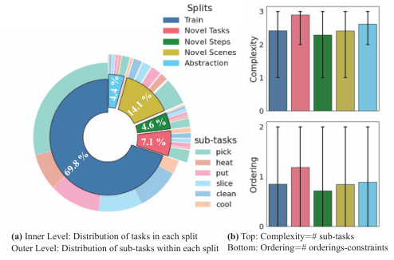

<!-- Start of picture text -->
7.1 % (a)  Inner Level: Distribution of tasks in each split  (b)  Top: Complexity # sub-tasks Outer Level: Distribution of sub-tasks within each split Bottom: Ordering # orderings-constraints 4.6 % 14.1 % 69.8 % 4.4 % <!-- End of picture text -->

Figure 2. **EgoTV dataset.** Sub-tasks and tasks, including their difficulty measures (§ 3.2.2) are shown per split. Novel Scenes have more tasks since all the train tasks are repeated in unseen scenes. Likewise, complexity and ordering are higher in Novel Tasks due to the addition of unseen sub-tasks. 

then cleaned in a sinkbasin”. The task consists of two ordered sub-tasks: heat _→_ clean on _target_ object: apple. We adopt this terminology from ALFRED [57]. 

### **3.2. Dataset** 

As shown in Fig. 1, EgoTV dataset consists of (task description, video) pairs with positive or negative task verification labels. By combining the six sub-tasks _heat, clean, slice, cool, put, pick_ with different ordering constraints, we create 82 tasks for EgoTV (see Appendix 8.3 for an exhaustive list). Tasks are instantiated with 130 target objects (excluding visual variations in shape, texture, and color) and 24 receptacle objects, totaling 1038 task-object combinations. These are performed in 30 different kitchen scenes. We also provide comprehensive annotations for each video, including frame-by-frame breakdowns for sub-tasks, object bounding boxes, and object state information (e.g., _hot, cold, etc._ ) to facilitate future research. 

#### **3.2.1 Generation** 

**Task-video Generation.** We generate the videos in our dataset by leveraging the ALFRED setup [57]. ALFRED allows us to specify the EgoTV tasks using Planning Domain Definition Language (PDDL) and then to generate plans for achieving these tasks using the Metric-FF planner [23]. We execute these plans using the AI2-THOR simulator and obtain their corresponding videos. Further details on encoding tasks using PDDL and planning are in Appendix 8.1. 

**Task-description Generation.** We convert the plans generated for each task into positive and negative task descriptions using templates. Appendix 8.2 provides details on the process and example templates. 

#### **3.2.2 Evaluation** 

**Metrics.** We use accuracy and F1 to measure the efficacy of models on EgoTV task verification benchmark. To capture the difficulty of tracking and verifying tasks, we introduce two measures: (1) _Complexity_ : measuring the number of sub-tasks in a task, which impacts the video length and requires higher action and object grounding, and (2) _Ordering_ : measuring the number of ordering constraints in a task and measures the difficulty of temporal reasoning required to track and verify tasks. We evaluate model scalability by testing on tasks with varying complexity and ordering. **Generalization.** EgoTV dataset enables systematic exploration of generalization in task tracking and verification via four test splits that focus on generalization to novel steps, tasks, visual contexts/scenes, and abstract task descriptions. 

- **Novel Tasks** : Unseen compositions of seen sub-tasks. For e.g., if train set is _{clean(apple)_ , _cool(apple)}_ , then this test split would contain tasks like: _{clean_ _~~a~~ nd_ _~~c~~ ool(apple)_ , _clean_ _~~t~~ hen_ _~~c~~ ool(apple)_ , _cool_ _~~t~~ hen_ _~~c~~ lean(apple)}_ . 

- **Novel Steps** : Unseen compositions of sub-task actions and target objects. For e.g., if the train set is _{clean(apple)_ , _cool(egg)_ , _clean_ _~~a~~ nd_ _~~c~~ ool(tomato)}_ , then this test split would contain tasks like: _{clean(egg)_ , _cool(apple)_ , _clean_ _~~a~~ nd_ _~~c~~ ool(apple)}_ . 

- **Novel Scenes** : This test split contains the same tasks as in the train set. However, the tasks are executed in unseen kitchen scenes. 

- **Abstraction** : Abstract task descriptions, which lack the low-level details of the task. For instance, for a _heat_ _~~a~~ nd_ _~~c~~ lean(apple)_ task, the full task description in the train set could be “apple is heated in a microwave and cleaned in sink basin”, while the abstract task description in this split could be “apple is heated and cleaned”. 

Note that all the test splits and the train set are disjoint from each other. Novel Steps split tests an EgoTV model’s ability to understand generalizable object affordances and tool usage. For instance, once a model learns the _slice_ action on an apple, this split tests if the model can apply it to an orange. On the other hand, the Novel Tasks split tests the generalization of a model’s temporal and causal reasoning capabilities on unseen compositions and orderings of known sub-tasks. Existing real-world datasets like Ego4D [17] and EPIC-KITCHENS [10] fail to provide such systematic control and precise diagnostics across various relevant yet independent factors affecting task reasoning. 

#### **3.2.3 Statistics** 

EgoTV dataset consists of 7,673 samples (train set: 5,363 and test set: 2,310). The split-wise division is Novel Tasks: 

15420

<!-- Page 5 -->

540, Novel Steps: 350, Novel Scenes: 1082, Abstraction: 338. The total duration of the egocentric videos in the EgoTV dataset is 168 hours, with an average video length of 84 seconds. To ensure diversity, each task in EgoTV is associated with _≈_ 10 different task description templates (inclusive of positive and negative scenarios). We also keep an additional template set for the abstraction split. The task descriptions consist of 9 words on average, with a total vocabulary size of 72. On average, there are 4.6 sub-tasks per task in the EgoTV dataset, and each sub-task spans approximately 14 frames. Additionally, there are 2.4 ways to verify a task. This requires the virtual agent to understand all possible temporal orderings between sub-tasks from the task description for successful task verification. Real-world datasets mainly focus on recognizing actions, objects, and state changes [17, 10] without this ambiguity. Figure 2 shows a comparison of train and test splits (more analysis in Appendix 8.3). 

## **4. CrossTask Verification (CTV) Dataset** 

Drawing from the EgoTV dataset, we introduce CrossTask Verification (CTV) dataset, using videos from the CrossTask dataset [82], to evaluate task verification models on real-world videos. In CTV, we prioritize assessing real-world performance of task verification models over systematic study of their generalization capabilities, unlike EgoTV. Thus, CTV complements EgoTV dataset – CTV and EgoTV together provide a solid test-bed for future research on task verification. 

### **4.1. Dataset Generation** 

Like EgoTV, CTV consists of paired task descriptions and videos for task verification. CrossTask has 18 task classes, each with roughly 150 videos, from which we create _≈_ 2.7K samples. We generate task descriptions by concatenating action step annotations in CrossTask. The model’s objective is to determine whether the action steps (sub-tasks) and their sequence in the video align with the description. See Appendix 9 for dataset construction details. 

### **4.2. Evaluation** 

**Metrics.** Following EgoTV, we use accuracy and F1 to measure the efficacy of the models on the CTV dataset. **Generalization.** We construct a test set using videos with seen action steps but in previously unseen compositions. To ensure novel compositions, we train on videos with up to 3 action steps and test on those with 4, as illustrated in Figure 3. While this mirrors the Novel Task split in EgoTV, the CTV test set also contains unseen visual contexts (videos) – a result of limited control during dataset creation. 

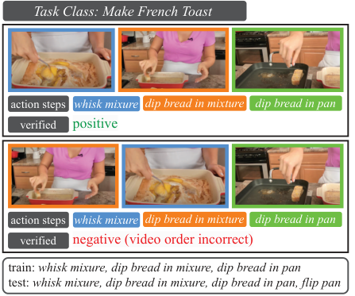

<!-- Start of picture text -->
Task Class: Make French Toast microwave sinkbasin sinkbasin apple action steps whisk mixure dip bread in mixture dip bread in pan verified positive microwave sinkbasin sinkbasin apple action steps whisk mixure dip bread in mixture dip bread in pan verified negative (video order incorrect) train:  whisk mixure, dip bread in mixure, dip bread in pan test:  whisk mixure, dip bread in mixure, dip bread in pan, flip pan <!-- End of picture text -->

Figure 3. **CrossTask Verification (CTV) dataset.** 

## **5. Neuro-Symbolic Grounding (NSG)** 

EgoTV requires visual grounding of task-relevant entities such as actions, state changes, etc. extracted from NL task descriptions for verifying tasks in videos. To enable grounding that generalizes to novel compositions of tasks and actions, we propose the Neuro-symbolic Grounding (NSG) approach. NSG consists of three modules: a) semantic parser, which converts task-relevant states from NL task descriptions into symbolic graphs, b) query encoders, which generate the probability of a node in the symbolic graph being grounded in a video segment, and c) video aligner, which uses the query encoders to align these symbolic graphs with videos. NSG thus uses intermediate symbolic representations between NL task descriptions and corresponding videos to achieve compositional generalization. 

### **5.1. Queries for Symbolic Operations** 

To encode tasks, NSG captures task-relevant visual and relational information in a structured manner via symbolic operators called _queries_ . For instance, the task description _heat an apple_ can be symbolically captured by the query: StateQuery(apple, hot). Similarly, the task description _place steak on grill_ can be captured by RelationQuery(steak, grill, on), which represents the relation (on) between objects steak and grill. Queries are characterized by _types_ and _arguments_ and are stored in a text format. Table 2 shows the various query types and their arguments. Different query types capture different aspects, e.g., attributes, relations, etc., thereby enabling a rich symbolic representation of everyday tasks. 

### **5.2. Semantic Parser for Task Descriptions** 

The symbolic operators, i.e., queries, allow the semantic parser to represent a task’s partial-ordered steps using a symbolic graph. Specifically, the parser translates a NL task 

15421

<!-- Page 6 -->

|Query Type|Signature|Semantics|
|---|---|---|
|StateQuery|(Object, State), Video_�→_P|Queries the state (hot,cold,clean,ripe) of object in a video and returns the probability of the object state being detected. Example instructions: _heat an apple, clean a spoon_.|
|RelationQuery|(Object, Object/Receptacle, Relation), Video_�→_P|Queries the relation between two objects or an object and a receptacle in a video and returns the probability of the relation being detected. Example instructions: _put apple in basket_, _place spoon to the left of plate_.|
|ActionQuery|(Subtask, _∗_Objects, _∗_Relation), Video_�→_P|Queries for a sub-task with one or more arguments (_∗_) in a video and returns the probability of the sub-task being executed. Example instructions: _whisk mixture,pour lemonade intoglass_.|

Table 2. **NSG’s query types for task verification in EgoTV and CTV.** The query types StateQuery and RelationQuery are used in EgoTV, whereas ActionQuery is used in CrossTask. Each query type _τ_ is modeled using a neural network _f__θτ_ accepts unique arguments ( _a_ ) and video frames ( _v_ ) as input and generates an output probability P = _f__θτ_ ( _a, v_ ) of the _query_ being true in the video _v_ . 

description into a graph _G_ ( _V, E_ ), where a vertex _ni ∈ V_ represents a query and an edge _eij_ : _ni → nj ∈ E_ is an ordering constraint indicating that _ni_ must precede _nj_ (Figure 4a). We experiment with two different methods to parse language descriptions of tasks to graphs – (i) finetuning language models and (ii) few-shot prompting of language models. For details, refer to Appendix 10.2. We perform a topological sort with the graph _G_ and generate all the possible sequences of queries consistent with the sort. For example, the topological sorting of the graph in Figure 4(a) yields two ordered sequences: ( _n_ 0 _, n_ 1 _, n_ 2 _, n_ 3), ( _n_ 0 _, n_ 2 _, n_ 1 _, n_ 3). Note that this does not include all physically possible ways to complete a task, but a super-set of all possible sequences of task-relevant queries, including some infeasible sequences2 . However, this super-set is useful because a task can be verified as accomplished if any sequence in this set can be ascertained to occur in the video. 

Notably, all EgoTV tasks map to acyclic graphs through temporal disambiguation. While this can support tasks with repeated actions, such as: (Task) _pick two apples_ ; (Graph) pick(apple) _→_ pick(apple); tasks that require (recursively) repeating action sequences until a desired state is reached, might result in cyclic graphs. Examples include unstacking an arbitrary number of dishes or searching for an ingredient. While currently absent in EgoTV, extending to such tasks would be a valuable future direction. 

### **5.3. Query Encoders for Grounding** 

Query Encoders are neural network modules that evaluate whether a query is satisfied in an input video. Specifically, a query encoder _f__θτ_ for a query _n_ of type _τ_ (e.g., StateQuery, RelationQuery etc.), accepts NL arguments ( _a_ ) corresponding to objects and relations in _n_ and a video ( _v_ ) to generate the probability P = _f__θτ_ ( _a, v_ ) of the desired query being true in the video. Learnable parameters 

> 2For instance, in Figure 4a, _n_ 1 and _n_ 2 are at the same topological level, but the sub-task in query _n_ 1 could invalidate pre-conditions for _n_ 2. Hence, a physically plausible task requires _n_ 2 followed by _n_ 1 and not vice versa. Note that EgoTV does not have physically implausible tasks. 

corresponding to different query type encoders in an NSG model are jointly represented as _θ_ =� _τ__θτ_. 

Both the text arguments _a_ of the query and the frames of the input video _v_ are encoded using a pre-trained CLIP encoder [50]. The token-level and frame-level representations from CLIP are separately aggregated using two LSTMs [22] to obtain aggregated features for _a_ and _v_ , respectively. These features are then fused and passed through the neural network _f__θτ_ to obtain the probability P of the query being true in the video (see Figure 4a). 

### **5.4. Video Aligner for Task Verification** 

This module of NSG must align the graph representation _G_ of the task (generated by the semantic parser) with the video. To that end, it first segments the video, then jointly learns a) the query encoders, which detect the queries in the video segments and b) the alignment between video segments and the query sequences obtained from the topological sort on _G_ . Such joint learning is required since the temporal locations of the queries in the video are unknown a priori requiring simultaneous detection and alignment. If the video is a positive match for the task encoded in _G_ , at least one of the query sequences from _G_ must temporally align perfectly with the video segments for successful task verification. Conversely, for negative matches, no query sequence from _G_ would _completely_ align with the video segments. Going forward, we use _⟨⟩_ and () to denote ordered pairs and sequences, respectively. 

**Video Segmentation:** The video is segmented into nonoverlapping segments3 with a moving window of arbitrary, but fixed size _k_4 

**Joint Optimization:** The objective of the optimization is to jointly learn the _alignment_ Z between queries and video segments along with the _query encoders f__θ_ . Given: a) the 

> 3Since pretrained, off-the-shelf video segmentation models are limited to predefined action classes [13] or reliant on background frame change detection [73] and require downstream finetuning [15], we leave their integration in NSG as future work. 

> 4If required, the last segment is zero-padded to _k_ frames. 

15422

> Original page for checking 4 unresolved font glyphs.

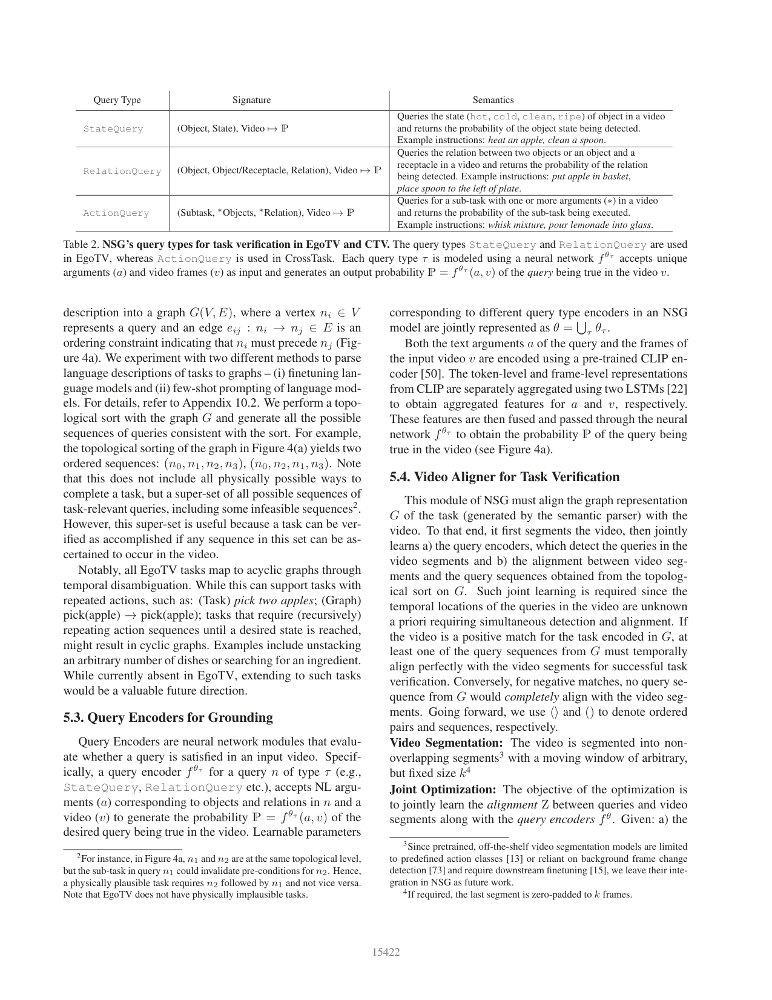

<!-- Page 7 -->

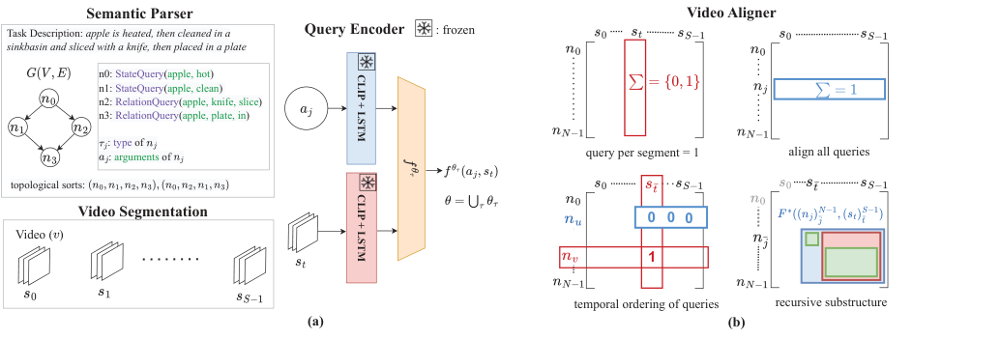

<!-- Start of picture text -->
Semantic Parser Video Aligner Task Description:  apple is heated, then cleaned in a Query Encoder : frozen sinkbasin and sliced with a knife, then placed in a plate n0: StateQuery(apple, hot) n1:  StateQuery(apple, clean) n 2: RelationQuery(apple, knife, slice) n3:  RelationQuery(apple, plate, in) : type of : arguments of  query per segment = 1 align all queries topological sorts: Video Segmentation 0 0 0 Video ( ) 1 temporal ordering of queries recursive substructure (a) (b) CLIP + LSTM CLIP + LSTM <!-- End of picture text -->

Figure 4. **NSG model** (a) semantic parser converts NL descriptions into a graph _G_ of symbolic queries; query encoders _f__θτ_ detect queries in individual video segments _st_ ; and a video aligner aligns _G_ with video segments by computing alignment matrix Z via a constrained optimization problem (Eq. 3). (b) The constraints (Eqs. 3a 3b 3c) and the recursive structure (Eq. 4) enabling use of DP to solve for Z. Here, the blue box denotes _F__∗_ (( _nj_ )¯ _j__N−_1 _,_ ( _st_ ) _t__S_ ¯_−_1 ), the green boxes denote log _f__θ_ ( _a_ ¯ _j, st_ ¯) + _F__∗_ (( _nj_ )¯ _j__N_ +1_−_1_,_(_st_) _t__S_ ¯+1_−_1),andtheredboxdenotes _F__∗_ (( _nj_ )¯ _j__N−_1 _,_ ( _st_ )_S_ _t_ ¯+1_−_1). 

temporal sequence of _S_ segments ( _st_ )_S_ _t_ =0_−_1witheach_st_ spanning _k_ image frames; and b) a sequence of _N_ queries ( _nj_ )_N_ _j_ =0_−_1from the topological sort on_G_, the alignment Z is defined as a matrix Z _∈{_ 0 _,_ 1 _}__N×S_ , where _Zjt_ = 1 implies that the _j__th_ query _nj_ is aligned the video segment _st_ . An example alignment with _N_ = 2 and _S_ = 3 is given by the ma- 

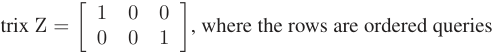

( _n_ 0 _, n_ 1), the columns are temporal segments ( _s_ 0 _, s_ 1 _, s_ 2), and _⟨n_ 0 _, s_ 0 _⟩_ , _⟨n_ 1 _, s_ 2 _⟩_ are the aligned pairs. Assuming segmentation guarantees sufficient segments for query alignment: _S ≥ N_ . Using Z and _f__θ_ , the task verification probability _p__θ_ can be defined as: 

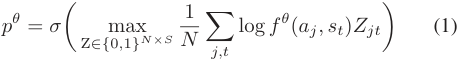

Here _σ_ is the sigmoid function, _f__θ_ ( _aj, st_ ) denotes the probability of querying segment _st_ using query _nj_ with arguments _aj_ (§ 5.3), and max operator is over the best alignment Z between _N_ queries and _S_ segments. We use the ground-truth task verification label _y_ to compute Z and _f__θ_ by minimizing the following loss: 

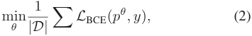

here _|D|_ is the EgoTV dataset size and _L_ BCE( _·_ ) is the binary cross entropy loss computed over _|D|_ input, output pairs. Given the minimax nature of Eq. 2, we use a 2-step iterative optimization process: (i) find the best alignment Z between queries and segments with fixed query encoder parameters _θ_ (optimize Eq. 1 with fixed _f__θ_ ); (ii) optimize _θ_ using Eq. 2, given Z. 

**Dynamic Programming (DP)-based Alignment:** Finding the best Z in Eq. 1 given _θ_ requires iterating over combinations of _N_ queries and _S_ segments while respecting certain constraints. The constraints, visualized in Fig. 4b, ensure that a) no two queries are aligned to the same segment5 (Eq. 3a), b) all queries are accounted for in _S_ (Eq. 3b), and c) the temporal orderings between queries in the query sequences are respected (Eq. 3c). Specifically, if query _nu_ precedes _nv_ ( _nu → nv_ ), and query _nv_ is paired with segment _st_ ¯ (i.e. _Zvt_ ¯ = 1), then query _nu_ cannot be paired with any segment that lies after _st_ ¯ (i.e. _Zut̸_ = 1 _∀ t ≥ t_¯ ). The resulting optimization problem for Z, given _θ_ is: 

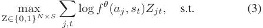

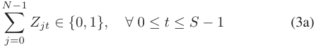

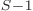

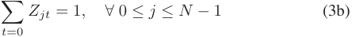

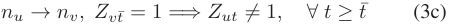

Intuitively, the solution to Eq. 3 gives us the best alignment score (note, the overlap with Eq. 1). The iterations over _N_ queries and _S_ segments for solving Eq. 3 are underpinned by an overlapping and optimal substructure. For instance, to optimally align queries ( _nj_ )_N_ _j_ =0_−_1and segments ( _st_ )_S_ _t_ =0_−_1, one could: a) pair_⟨n_0_, s_0_⟩_and optimally align the remaining queries and segments ( _nj_ ) _j__N_ =1_−_1_,_(_st_) _t__S_ =1_−_1;or(2) 

> 5This ensures that the order of queries can be verified, which cannot be done when queries belong to the same segment. 

15423

<!-- Page 8 -->

skip _s_ 0 and still optimally align _all_ queries, now with the remaining segments ( _nj_ )_N_ _j_ =0_−_1_,_(_st_)_S_ _t_ =1_−_1(see Fig. 4b(iv)).This recursive substructure leads to a DP solution for Eq. 3. Let, _F__∗_ (( _nj_ )¯_N_ _j__−_1 _,_ ( _st_ )_S_ _t_ ¯_−_1 ) denote the best alignment score for queries ( _nj_ )¯_N_ _j__−_1 and segments ( _st_ ) _t__S_ ¯_−_1 from Eq. 3. Based on the aforementioned reasoning, _F__∗_ (( _nj_ )¯ _j__N−_1 _,_ ( _st_ )_S_ _t_ ¯_−_1 ) can be recursively written as: 

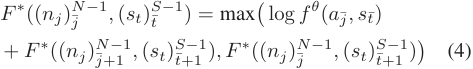

The base cases for the DP are: (i) Z = I if _N_ = _S_ ; (ii) _Zjt_ = 1 _∀ t_ if _j_ = _N −_ 1. It is worth noting that the DP subproblems, together with the base cases, satisfy the constraints in Eq. 3a 3b 3c. Since the video may match any of the sequence in the super-set of query sequences (from the topological sort on _G_ ), we repeat this process of computing _F__∗_ for each sequence and select the maximum value. **Optimizing Query Encoder Parameters** _θ_ **:** After obtaining the best alignment Z using DP, we substitute the corresponding value of _F__∗_ (( _nj_ )_N_ _j_ =0_−_1_,_(_st_) _t__S_ =0_−_1) in Eq. 1 and sub- sequently Eq. 2. In Eq. 2, we use single mini-batch of training examples and take one gradient-update step of the Adam optimizer for the query encoder parameters _θ_ . 

## **6. Experiments** 

We compare various state-of-the-art (SOTA) VLMs with NSG on the EgoTV benchmark (see Appendix 10.1 for NSG’s experimental training details). 

### **6.1. SOTA VLM Baselines** 

We investigate 6 VLMs developed for video-language tasks requiring similar reasoning as EgoTV. Summarized in Table 3, **CLIP4Clip** [39], **CLIP Hitchhiker** [3], **CoCa** [76] use image backbones followed by temporal aggregation, while **VideoCLIP** [36], **MIL-NCE** [44], and **VIOLIN** [38] use video backbones. With the exception of CoCa, which is trained with contrastive and captioning loss, all other models are trained using contrastive loss [44]. Lastly, VideoCLIP and VIOLIN use an explicit fusion of text-vision features. For each model, we freeze all pretrained feature extractors and finetune a fullyconnected probe layer, along with the temporal aggregation layers where appropriate (CLIP4Clip-LSTM, VIOLIN), using EgoTV’s train split. 

Finally, to establish upper bounds on EgoTV, we instantiate: (1) a **Text2text model** , which constructs video captions using ground-truth labels for objects and actions, encodes the captions and task descriptions using (pretrained) RoBERTa model [81] and measures alignment using the cosine similarity score (see Appendix 11.2), and (2) an **Oracle model** , which is trained with full supervision on sub-tasks labels and locations in addition to task verification labels. 

### **6.2. Results** 

In Table 3, we show the performance of NSG vs. SOTA VLMs per split of EgoTV. (1) **Novel Tasks** : NSG significantly outperforms other baselines due to its ability to decompose and detect sub-tasks while using DP alignment to handle temporal constraints among them. In contrast, other baselines rely on detecting the entire task under temporal constraints, which is more challenging. Further, imagebased baselines outperform video-based baselines due to their ability to capture a greater degree of compositional detail through frame-level representations. (2) **Novel Steps** : NSG’s poor performance in this split could be attributed to its low precision in the _slice_ sub-task (which is dominant in this split), as shown in Figure 5 [Right]. We hypothesize that since NSG only uses the aligned segments while discarding the rest, learning to utilize context from neighboring segments to capture _slice_ (like picking up a knife) could be a promising future direction. (3) **Novel Scenes** : Here, NSG is comparable to the best baseline VIOLIN-ResNet. Since the tasks are identical to the train split, the success of a model is contingent on the vision encoder’s ability to accurately detect the same sub-tasks in unseen scenes. Consequently, models with an additional temporal aggregation layer (VIOLIN) finetuned on EgoTV, tend to outperform image-based models that do not have temporal aggregation (CLIP Hitchhiker) and models with frozen video features (MIL-NCE, VideoCLIP). (4) **Abstraction** : NSG significantly outperforms the baselines, primarily due to its semantic parser, which captures the underlying structure of the description and encodes the relevant concepts, such as objects and subtasks, to generate an (abstract) symbolic output. 

### **6.3. Analysis of NSG** 

**NSG learns to localize task-relevant entities without explicit supervision.** Figure 5 shows the confusion matrix of StateQuery & RelationQuery outputs, which capture sub-tasks, with their ground truths. The high recall demonstrates NSG’s ability to localize task-relevant entities, despite being trained using only task verification labels. **Effect of query types on NSG.** While query types with multiple entity arguments might appear capable of modeling complex dependencies amongst entities and having more expressive power, encoding multiple entities jointly using a single encoder makes the grounding problem more challenging. Hence, in practice, we found that using a combination of StateQuery & RelationQuery types as opposed to ActionQuery (which encodes multiple entities using a single encoder) enabled better grounding and led to better performance in terms of F1-score (Table 4). **NSG shows consistent performance with increasing task difficulty.** In Figure 5, NSG’s performance is minimally affected by increase in task difficulty characterized by number of sub-tasks (complexity) and ordering constraints (§ 3.2.2) 

15424

<!-- Page 9 -->

|**Model**|**Visual** **feature**|**Text** **feature**|**MM** **Fusion**|**Novel** **Tasks**|**Novel** **Steps**|**Novel** **Scenes**|**Abstraction**|**Average**|
|---|---|---|---|---|---|---|---|---|
|Text2text[81]||RoBERTa||64.9|65.8|66.5|64.7|65.5|
|CLIP Hitchhiker [3]|CLIP(I)|CLIP||43.9|66.5|72.2|13.6|49.1|
|CLIP4Clip mean [39]|CLIP(I)|CLIP||49.3|70.9|74.9|16.1|52.8|
|CLIP4Clip seqLSTM [39]|CLIP(I)|CLIP||56.2|73.2|74.6|17.5|55.4|
|CoCa [76]|Tx(I)|Tx|Y|51.5|71.6|71.9|43.5|59.6|
|VIOLIN-ResNet[38]|ResNet(I)|BERT|Y|47.4|**80.4**|**85.6**|42.5|64.0|
|MIL-NCE [44]|S3D(V)|Word2vec||30.5|69.6|73.5|24.3|49.5|
|VideoCLIP [36]|Tx(V)|Tx|Y|29.3|67.6|77.9|25.6|50.1|
|VIOLIN-I3D[38]|I3D(V)|BERT|Y|45.6|79.7|83.9|47.6|64.2|
|**NSG (ours)**|CLIP(I)|CLIP|Y|**90.0**|64.7|84.9|**80.4**|**80.0**|
|Oracle Model|CLIP(I)|CLIP|Y|95.0|96.7|97.6|97.2|96.6|

Table 3. **Comparison of baselines with NSG on different data splits using F1-score.** MM fusion indicates multimodal fusion of vision and text features. Tx indicates the Transformer as feature extractor with image (I) and video (V) backbones. Video backbone models are highlighted in gray. <u>Underline</u> indicates second-best performance. 

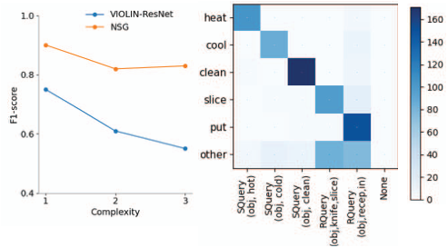

Figure 5. [Left] F1-score of NSG vs. best-performing baseline for EgoTV tasks with varying complexity averaged over all splits (Appendix 10.4 shows performance with varying ordering). [Right] Confusion Matrix for NSG Queries on validation split (SQuery: StateQuery, RQuery: RelationQuery). See Appendix 10.4 for results on all splits. 

|NSG|Novel Tasks|Novel Steps|Novel Scenes|Abstract.|
|---|---|---|---|---|
|Action|78.2|45.6|70.6|75.5|
|State+Relation|90.0|64.7|84.9|80.4|

video segments may be unsuitable for sub-tasks with a highly variable duration. We defer exploration of these limitations to future work, (3) Since NSG aligns the video with the entire task graph, it requires the full task execution video. Without this, alignment is partial, rendering NSG ineffective for online task verification. 

## **7. Conclusion** 

To address various challenges towards the development of egocentric assistants that can track and verify the accomplishment of everyday tasks, including reasoning about causal and temporal constraints in tasks, visual grounding, and compositional generalization, we introduce Egocentric Task Verification (EgoTV), a benchmark and dataset containing partially-ordered, multi-step tasks with natural language task specifications. We also present NSG, a novel neuro-symbolic approach that enables order-aware visual grounding, and demonstrate its effectiveness on both the EgoTV dataset and a real-world dataset CTV. We hope our contributions will help in advancing research on egocentric assistants that can aid users in everyday tasks. 

Table 4. (State + Relation)Query vs. ActionQuery 

## **Acknowledgement** 

unlike the best-performing baseline (VIOLIN-ResNet). **NSG is robust to segmentation window size** The effect of _k_ on NSG is minimal (Appendix 10.4). 

**NSG also enables task verification on real-world data.** NSG outperforms all competitive baselines on CTV significantly with F1-score (NSG: **76** _._ **3** , CoCa: 70.9, VideoCLIP: 49.7, VIOLIN 34.7), demonstrating its causal and compositional reasoning capabilities in real-world applications (see Appendix 10.4 for details). 

**Limitations of NSG.** (1) It does not consider multiple simultaneous actions like “picking an apple while closing the refrigerator door”, (2) The assumption of equal-length 

This work was partially supported by the Wallenberg AI, Autonomous Systems and Software Program (WASP) funded by the Knut and Alice Wallenberg Foundation. 

## **References** 

- [1] Zeina Abu-Aisheh, Romain Raveaux, Jean-Yves Ramel, and Patrick Martineau. An exact graph edit distance algorithm for solving pattern recognition problems. In _Proceedings of the International Conference on Pattern Recognition Applications and Methods - Volume 1_ , ICPRAM 2015, page 271–278, Setubal, PRT, 2015. SCITEPRESS - Science and Technology Publications, Lda. 

15425

<!-- Page 10 -->

- [2] Saeed Amizadeh, Hamid Palangi, Alex Polozov, Yichen Huang, and Kazuhito Koishida. Neuro-symbolic visual reasoning: Disentangling. In _International Conference on Machine Learning_ , pages 279–290. PMLR, 2020. 

- [3] Max Bain, Arsha Nagrani, G¨ul Varol, and Andrew Zisserman. A clip-hitchhiker’s guide to long video retrieval. _arXiv preprint arXiv:2205.08508_ , 2022. 

- [4] Siddhant Bansal, Chetan Arora, and CV Jawahar. My view is the best view: Procedure learning from egocentric videos. In _Computer Vision–ECCV 2022: 17th European Conference, Tel Aviv, Israel, October 23–27, 2022, Proceedings, Part XIII_ , pages 657–675. Springer, 2022. 

- [5] Fabien Baradel, Natalia Neverova, Julien Mille, Greg Mori, and Christian Wolf. Cophy: Counterfactual learning of physical dynamics. In _International Conference on Learning Representations_ , 2020. 

- [6] Ben Bogin, Sanjay Subramanian, Matt Gardner, and Jonathan Berant. Latent Compositional Representations Improve Systematic Generalization in Grounded Question Answering. _Transactions of the Association for Computational Linguistics_ , 9:195–210, 03 2021. 

- [7] Jo˜ao Carreira and Andrew Zisserman. Quo vadis, action recognition? a new model and the kinetics dataset. In _2017 IEEE Conference on Computer Vision and Pattern Recognition (CVPR)_ , pages 4724–4733, 2017. 

- [8] Zhenfang Chen, Jiayuan Mao, Jiajun Wu, Kwan-Yee Kenneth Wong, Joshua B. Tenenbaum, and Chuang Gan. Grounding physical concepts of objects and events through dynamic visual reasoning. In _International Conference on Learning Representations_ , 2021. 

- [9] Ido Dagan, Oren Glickman, and Bernardo Magnini. The pascal recognising textual entailment challenge. In _Machine Learning Challenges. Evaluating Predictive Uncertainty, Visual Object Classification, and Recognising Tectual Entailment: First PASCAL Machine Learning Challenges Workshop, MLCW 2005, Southampton, UK, April 11-13, 2005, Revised Selected Papers_ , pages 177–190. Springer, 2006. 

- [10] Dima Damen, Hazel Doughty, Giovanni Maria Farinella, Sanja Fidler, Antonino Furnari, Evangelos Kazakos, Davide Moltisanti, Jonathan Munro, Toby Perrett, Will Price, and Michael Wray. The epic-kitchens dataset: Collection, challenges and baselines. _IEEE Transactions on Pattern Analysis and Machine Intelligence (TPAMI)_ , 43(11):4125–4141, 2021. 

- [11] Samyak Datta, et al. Episodic memory question answering. In _CVPR_ , pages 19119–19128, 2022. 

- [12] Jacob Devlin, Ming-Wei Chang, Kenton Lee, and Kristina Toutanova. BERT: Pre-training of deep bidirectional transformers for language understanding. In _Proceedings of the 2019 Conference of the North American Chapter of the Association for Computational Linguistics: Human Language Technologies, Volume 1 (Long and Short Papers)_ , pages 4171–4186, Minneapolis, Minnesota, June 2019. Association for Computational Linguistics. 

- [13] Victor Escorcia, Fabian Caba Heilbron, Juan Carlos Niebles, and Bernard Ghanem. Daps: Deep action proposals for action understanding. In _European conference on computer vision_ , pages 768–784. Springer, 2016. 

- [14] Alireza Fathi and James M Rehg. Modeling actions through state changes. In _Proceedings of the IEEE Conference on Computer Vision and Pattern Recognition_ , pages 2579– 2586, 2013. 

- [15] Jialin Gao, Zhixiang Shi, Guanshuo Wang, Jiani Li, Yufeng Yuan, Shiming Ge, and Xi Zhou. Accurate temporal action proposal generation with relation-aware pyramid network. In _Proceedings of the AAAI conference on artificial intelligence_ , volume 34, pages 10810–10817, 2020. 

- [16] Rohit Girdhar and Deva Ramanan. CATER: A diagnostic dataset for Compositional Actions and TEmporal Reasoning. In _ICLR_ , 2020. 

- [17] Kristen Grauman, Andrew Westbury, Eugene Byrne, Zachary Chavis, Antonino Furnari, Rohit Girdhar, Jackson Hamburger, Hao Jiang, Miao Liu, Xingyu Liu, Miguel Martin, Tushar Nagarajan, Ilija Radosavovic, Santhosh Kumar Ramakrishnan, Fiona Ryan, Jayant Sharma, Michael Wray, Mengmeng Xu, Eric Zhongcong Xu, Chen Zhao, Siddhant Bansal, Dhruv Batra, Vincent Cartillier, Sean Crane, Tien Do, Morrie Doulaty, Akshay Erapalli, Christoph Feichtenhofer, Adriano Fragomeni, Qichen Fu, Abrham Gebreselasie, Cristina Gonz´alez, James Hillis, Xuhua Huang, Yifei Huang, Wenqi Jia, Weslie Khoo, J´achym Kol´a˘ı, Satwik Kottur, Anurag Kumar, Federico Landini, Chao Li, Yanghao Li, Zhenqiang Li, Karttikeya Mangalam, Raghava Modhugu, Jonathan Munro, Tullie Murrell, Takumi Nishiyasu, Will Price, Paola Ruiz Puentes, Merey Ramazanova, Leda Sari, Kiran Somasundaram, Audrey Southerland, Yusuke Sugano, Ruijie Tao, Minh Vo, Yuchen Wang, Xindi Wu, Takuma Yagi, Ziwei Zhao, Yunyi Zhu, Pablo Arbel´aez, David Crandall, Dima Damen, Giovanni Maria Farinella, Christian Fuegen, Bernard Ghanem, Vamsi Krishna Ithapu, C. V. Jawahar, Hanbyul Joo, Kris Kitani, Haizhou Li, Richard Newcombe, Aude Oliva, Hyun Soo Park, James M. Rehg, Yoichi Sato, Jianbo Shi, Mike Zheng Shou, Antonio Torralba, Lorenzo Torresani, Mingfei Yan, and Jitendra Malik. Ego4d: Around the world in 3,000 hours of egocentric video. In _2022 IEEE/CVF Conference on Computer Vision and Pattern Recognition (CVPR)_ , pages 18973–18990, 2022. 

- [18] Madeleine Grunde-McLaughlin, Ranjay Krishna, and Maneesh Agrawala. Agqa: A benchmark for compositional spatio-temporal reasoning. In _2021 IEEE/CVF Conference on Computer Vision and Pattern Recognition (CVPR)_ , pages 11282–11292, 2021. 

- [19] Kaiming He, Xiangyu Zhang, Shaoqing Ren, and Jian Sun. Deep residual learning for image recognition. In _2016 IEEE Conference on Computer Vision and Pattern Recognition (CVPR)_ , pages 770–778, 2016. 

- [20] FC Heilbron, V Escorcia, B Ghanem, and J Niebles. A largescale video benchmark for human activity understanding. In _Proceedings of the IEEE Conference on Computer Vision and Pattern Recognition, Boston, 2015. 961_ , volume 970, 2019. 

- [21] Fabian Caba Heilbron, Victor Escorcia, Bernard Ghanem, and Juan Carlos Niebles. Activitynet: A large-scale video benchmark for human activity understanding. In _2015 IEEE Conference on Computer Vision and Pattern Recognition (CVPR)_ , pages 961–970, 2015. 

15426

<!-- Page 11 -->

- [22] Sepp Hochreiter and J¨urgen Schmidhuber. Long short-term memory. _Neural computation_ , 9(8):1735–1780, 1997. 

- [23] J¨org Hoffmann. The Metric-FF planning system: Translating “ignoring delete lists” to numeric state variables. _Journal of Artificial Intelligence Research_ , 20:291–341, 2003. 

- [24] De-An Huang, Suraj Nair, Danfei Xu, Yuke Zhu, Animesh Garg, Li Fei-Fei, Silvio Savarese, and Juan Carlos Niebles. Neural task graphs: Generalizing to unseen tasks from a single video demonstration. In _Proceedings of the IEEE/CVF conference on computer vision and pattern recognition_ , pages 8565–8574, 2019. 

- [25] Jingwei Ji, Ranjay Krishna, Li Fei-Fei, and Juan Carlos Niebles. Action genome: Actions as compositions of spatiotemporal scene graphs. In _Proceedings of the IEEE/CVF Conference on Computer Vision and Pattern Recognition_ , pages 10236–10247, 2020. 

- [26] Baoxiong Jia, Ting Lei, Song-Chun Zhu, and Siyuan Huang. Egotaskqa: Understanding human tasks in egocentric videos. In _The 36th Conference on Neural Information Processing Systems (NeurIPS 2022) Track on Datasets and Benchmarks_ , 2022. 

- [27] Yu-Gang Jiang, Jingen Liu, A Roshan Zamir, George Toderici, Ivan Laptev, Mubarak Shah, and Rahul Sukthankar. Thumos challenge: Action recognition with a large number of classes. http://crcv.ucf.edu/THUMOS14/, 2014. 

- [28] Diederik P Kingma and Jimmy Ba. Adam: A method for stochastic optimization. _arXiv preprint arXiv:1412.6980_ , 2014. 

- [29] Eric Kolve, Roozbeh Mottaghi, Winson Han, Eli VanderBilt, Luca Weihs, Alvaro Herrasti, Daniel Gordon, Yuke Zhu, Abhinav Gupta, and Ali Farhadi. AI2-THOR: An Interactive 3D Environment for Visual AI. _arXiv_ , 2017. 

- [30] Juho Lee, Yoonho Lee, Jungtaek Kim, Adam Kosiorek, Seungjin Choi, and Yee Whye Teh. Set transformer: A framework for attention-based permutation-invariant neural net- 

   - works. In _International conference on machine learning_ , pages 3744–3753. PMLR, 2019. 

- [31] Jie Lei, Licheng Yu, Mohit Bansal, and Tamara Berg. TVQA: Localized, compositional video question answering. In _Proceedings of the 2018 Conference on Empirical Methods in Natural Language Processing_ , pages 1369–1379, Brussels, Belgium, Oct.-Nov. 2018. Association for Computational Linguistics. 

- [32] Junnan Li, Dongxu Li, Caiming Xiong, and Steven Hoi. Blip: Bootstrapping language-image pre-training for unified vision-language understanding and generation. In _International Conference on Machine Learning_ , pages 12888– 12900. PMLR, 2022. 

- [33] Jiangtong Li, Li Niu, and Liqing Zhang. From representation to reasoning: Towards both evidence and commonsense reasoning for video question-answering. In _Proceedings of the IEEE/CVF Conference on Computer Vision and Pattern Recognition (CVPR)_ , June 2022. 

- [34] Linjie Li, Yen-Chun Chen, Yu Cheng, Zhe Gan, Licheng Yu, and Jingjing Liu. Hero: Hierarchical encoder for video+ language omni-representation pre-training. _arXiv preprint arXiv:2005.00200_ , 2020. 

- [35] Liunian Harold Li, Pengchuan Zhang, Haotian Zhang, Jianwei Yang, Chunyuan Li, Yiwu Zhong, Lijuan Wang, Lu Yuan, Lei Zhang, Jenq-Neng Hwang, et al. Grounded language-image pre-training. In _Proceedings of the IEEE/CVF Conference on Computer Vision and Pattern Recognition_ , pages 10965–10975, 2022. 

- [36] Yikang Li, Jenhao Hsiao, and Chiuman Ho. Videoclip: A cross-attention model for fast video-text retrieval task with image clip. In _Proceedings of the 2022 International Conference on Multimedia Retrieval_ , pages 29–33, 2022. 

- [37] Xudong Lin, Fabio Petroni, Gedas Bertasius, Marcus Rohrbach, Shih-Fu Chang, and Lorenzo Torresani. Learning to recognize procedural activities with distant supervision. In _Proceedings of the IEEE/CVF Conference on Computer Vision and Pattern Recognition_ , pages 13853–13863, 2022. 

- [38] J. Liu, Wenhu Chen, Yu Cheng, Zhe Gan, Licheng Yu, Yiming Yang, and Jingjing Liu. Violin: A large-scale dataset for video-and-language inference. _2020 IEEE/CVF Conference on Computer Vision and Pattern Recognition (CVPR)_ , pages 10897–10907, 2020. 

- [39] Huaishao Luo, Lei Ji, Ming Zhong, Yang Chen, Wen Lei, Nan Duan, and Tianrui Li. Clip4clip: An empirical study of clip for end to end video clip retrieval and captioning. _Neurocomputing_ , 508:293–304, 2022. 

- [40] Four optics breakthroughs to power enterprise ar - magic leap. https://www.magicleap.com/en-us/. 

- [41] Jiayuan Mao, Chuang Gan, Pushmeet Kohli, Joshua B. Tenenbaum, and Jiajun Wu. The Neuro-Symbolic Concept Learner: Interpreting Scenes, Words, and Sentences From Natural Supervision. In _International Conference on Learning Representations_ , 2019. 

- [42] Weichao Mao, Ruta Desai, Michael Louis Iuzzolino, and Nitin Kamra. Action dynamics task graphs for learning plannable representations of procedural tasks. _arXiv preprint arXiv:2302.05330_ , 2023. 

- [43] Mexaction2: action detection and localization dataset. http://mexculture.cnam.fr/xwiki/bin/ view/Datasets/Mex+action+dataset. 

- [44] Antoine Miech, Jean-Baptiste Alayrac, Lucas Smaira, Ivan Laptev, Josef Sivic, and Andrew Zisserman. End-to-end learning of visual representations from uncurated instructional videos. In _Proceedings of the IEEE/CVF Conference on Computer Vision and Pattern Recognition_ , pages 9879– 9889, 2020. 

- [45] Tomas Mikolov, Kai Chen, Greg Corrado, and Jeffrey Dean. Efficient estimation of word representations in vector space. In _arXiv preprint arXiv:1301.3781_ , 2013. 

- [46] OpenAI. 

- [47] Aishwarya Padmakumar, Jesse Thomason, Ayush Shrivastava, Patrick Lange, Anjali Narayan-Chen, Spandana Gella, Robinson Piramuthu, Gokhan Tur, and Dilek Hakkani-Tur. Teach: Task-driven embodied agents that chat. In _Proceedings of the AAAI Conference on Artificial Intelligence_ , volume 36, pages 2017–2025, 2022. 

- [48] Jeffrey Pennington, Richard Socher, and Christopher Manning. GloVe: Global vectors for word representation. In _Proceedings of the 2014 Conference on Empirical Methods in_ 

15427

<!-- Page 12 -->

_Natural Language Processing (EMNLP)_ , pages 1532–1543, Doha, Qatar, Oct. 2014. Association for Computational Linguistics. 

- [49] Yicheng Qian, Weixin Luo, Dongze Lian, Xu Tang, Peilin Zhao, and Shenghua Gao. Svip: Sequence verification for procedures in videos. In _Proceedings of the IEEE/CVF Conference on Computer Vision and Pattern Recognition_ , pages 19890–19902, 2022. 

- [50] Alec Radford, Jong Wook Kim, Chris Hallacy, Aditya Ramesh, Gabriel Goh, Sandhini Agarwal, Girish Sastry, Amanda Askell, Pamela Mishkin, Jack Clark, Gretchen Krueger, and Ilya Sutskever. Learning transferable visual models from natural language supervision. In Marina Meila and Tong Zhang, editors, _Proceedings of the 38th International Conference on Machine Learning_ , volume 139 of _Proceedings of Machine Learning Research_ , pages 8748–8763. PMLR, 18–24 Jul 2021. 

- [51] Colin Raffel, Noam Shazeer, Adam Roberts, Katherine Lee, Sharan Narang, Michael Matena, Yanqi Zhou, Wei Li, and Peter J. Liu. Exploring the limits of transfer learning with a unified text-to-text transformer. _Journal of Machine Learning Research_ , 21(140):1–67, 2020. 

- [52] Michaela Regneri, Marcus Rohrbach, Dominikus Wetzel, Stefan Thater, Bernt Schiele, and Manfred Pinkal. Grounding action descriptions in videos. _Transactions of the Association for Computational Linguistics_ , 1:25–36, 2013. 

- [53] Keisuke Sakaguchi, Chandra Bhagavatula, Ronan Le Bras, Niket Tandon, Peter Clark, and Yejin Choi. proScript: Partially ordered scripts generation. In _Findings of the Association for Computational Linguistics: EMNLP 2021_ , pages 2138–2149, Punta Cana, Dominican Republic, Nov. 2021. Association for Computational Linguistics. 

- [54] Md. Kamruzzaman Sarker, Lu Zhou, Aaron Eberhart, and Pascal Hitzler. Neuro-symbolic artificial intelligence: Current trends. _CoRR_ , abs/2105.05330, 2021. 

- [55] Min Joon Seo, Aniruddha Kembhavi, Ali Farhadi, and Hannaneh Hajishirzi. Bidirectional attention flow for machine comprehension. In _5th International Conference on Learning Representations, ICLR 2017, Toulon, France, April 2426, 2017, Conference Track Proceedings_ . OpenReview.net, 2017. 

- [56] Yuhan Shen, Lu Wang, and Ehsan Elhamifar. Learning to segment actions from visual and language instructions via differentiable weak sequence alignment. In _Proceedings of the IEEE/CVF Conference on Computer Vision and Pattern Recognition_ , pages 10156–10165, 2021. 

- [57] Mohit Shridhar, Jesse Thomason, Daniel Gordon, Yonatan Bisk, Winson Han, Roozbeh Mottaghi, Luke Zettlemoyer, and Dieter Fox. ALFRED: A Benchmark for Interpreting Grounded Instructions for Everyday Tasks. In _The IEEE Conference on Computer Vision and Pattern Recognition (CVPR)_ , 2020. 

- [58] Gunnar A. Sigurdsson, G¨ul Varol, Xiaolong Wang, Ali Farhadi, Ivan Laptev, and Abhinav Gupta. Hollywood in homes: Crowdsourcing data collection for activity understanding. In Bastian Leibe, Jiri Matas, Nicu Sebe, and Max Welling, editors, _Computer Vision – ECCV 2016_ , pages 510– 526, Cham, 2016. Springer International Publishing. 

- [59] Mattia Soldan, Alejandro Pardo, Juan Le´on Alc´azar, Fabian Caba Heilbron, Chen Zhao, Silvio Giancola, and Bernard Ghanem. Mad: A scalable dataset for language grounding in videos from movie audio descriptions. _arXiv preprint arXiv:2112.00431_ , 2021. 

- [60] Tom´aˇs Souˇcek, Jean-Baptiste Alayrac, Antoine Miech, Ivan Laptev, and Josef Sivic. Look for the change: Learning object states and state-modifying actions from untrimmed web videos. In _Proceedings of the IEEE Conference on Computer Vision and Pattern Recognition (CVPR)_ , June 2022. 

- [61] Sanjana Srivastava, Chengshu Li, Michael Lingelbach, Roberto Mart´ın-Mart´ın, Fei Xia, Kent Elliott Vainio, Zheng Lian, Cem Gokmen, Shyamal Buch, Karen Liu, Silvio Savarese, Hyowon Gweon, Jiajun Wu, and Li Fei-Fei. Behavior: Benchmark for everyday household activities in virtual, interactive, and ecological environments. In Aleksandra Faust, David Hsu, and Gerhard Neumann, editors, _Proceedings of the 5th Conference on Robot Learning_ , volume 164 of _Proceedings of Machine Learning Research_ , pages 477–490. PMLR, 08–11 Nov 2022. 

- [62] Yansong Tang, Dajun Ding, Yongming Rao, Yu Zheng, Danyang Zhang, Lili Zhao, Jiwen Lu, and Jie Zhou. Coin: A large-scale dataset for comprehensive instructional video analysis. In _Proceedings of the IEEE/CVF Conference on Computer Vision and Pattern Recognition_ , pages 1207– 1216, 2019. 

- [63] Makarand Tapaswi, Yukun Zhu, Rainer Stiefelhagen, Antonio Torralba, Raquel Urtasun, and Sanja Fidler. Movieqa: Understanding stories in movies through questionanswering. In _2016 IEEE Conference on Computer Vision and Pattern Recognition (CVPR)_ , pages 4631–4640, 2016. 

- [64] Tristan Thrush, Ryan Jiang, Max Bartolo, Amanpreet Singh, Adina Williams, Douwe Kiela, and Candace Ross. Winoground: Probing vision and language models for visiolinguistic compositionality. In _Proceedings of the IEEE/CVF Conference on Computer Vision and Pattern Recognition_ , pages 5238–5248, 2022. 

- [65] Dorin Ungureanu, Federica Bogo, Silvano Galliani, Pooja Sama, Xin Duan, Casey Meekhof, Jan St¨uhmer, Thomas J Cashman, Bugra Tekin, Johannes L Sch¨onberger, et al. Hololens 2 research mode as a tool for computer vision research. _arXiv preprint arXiv:2008.11239_ , 2020. 

- [66] Jason Wei, Xuezhi Wang, Dale Schuurmans, Maarten Bosma, brian ichter, Fei Xia, Ed H. Chi, Quoc V Le, and Denny Zhou. Chain of thought prompting elicits reasoning in large language models. In Alice H. Oh, Alekh Agarwal, Danielle Belgrave, and Kyunghyun Cho, editors, _Advances in Neural Information Processing Systems_ , 2022. 

- [67] Laurence A Wolsey. _Integer programming_ . John Wiley & Sons, 2020. 

- [68] Bo Wu, Shoubin Yu, Zhenfang Chen, Joshua B Tenenbaum, and Chuang Gan. Star: A benchmark for situated reasoning in real-world videos. In _Thirty-fifth Conference on Neural Information Processing Systems (NeurIPS)_ , 2021. 

- [69] Junbin Xiao, Xindi Shang, Angela Yao, and Tat-Seng Chua. Next-qa: Next phase of question-answering to explaining temporal actions. In _Proceedings of the IEEE/CVF Confer-_ 

15428

<!-- Page 13 -->

_ence on Computer Vision and Pattern Recognition (CVPR)_ , pages 9777–9786, June 2021. 

- [70] Ning Xie, Farley Lai, Derek Doran, and Asim Kadav. Visual entailment: A novel task for fine-grained image understanding. _arXiv preprint arXiv:1901.06706_ , 2019. 

- [71] Saining Xie, Chen Sun, Jonathan Huang, Zhuowen Tu, and Kevin Murphy. Rethinking spatiotemporal feature learning: Speed-accuracy trade-offs in video classification. In Vittorio Ferrari, Martial Hebert, Cristian Sminchisescu, and Yair Weiss, editors, _Computer Vision – ECCV 2018_ , pages 318– 335, Cham, 2018. Springer International Publishing. 

- [72] Yaqi Xie, Chen Yu, Tongyao Zhu, Jinbin Bai, Ze Gong, and Harold Soh. Translating natural language to planning goals with large-language models. _arXiv preprint arXiv:2302.05128_ , 2023. 

_IEEE/CVF Conference on Computer Vision and Pattern Recognition_ , pages 16793–16803, 2022. 

   - [81] Liu Zhuang, Lin Wayne, Shi Ya, and Zhao Jun. A robustly optimized BERT pre-training approach with post-training. In _Proceedings of the 20th Chinese National Conference on Computational Linguistics_ , pages 1218–1227, Huhhot, China, Aug. 2021. Chinese Information Processing Society of China. 

   - [82] Dimitri Zhukov, Jean-Baptiste Alayrac, Ramazan Gokberk Cinbis, David Fouhey, Ivan Laptev, and Josef Sivic. Crosstask weakly supervised learning from instructional videos. In _2019 IEEE/CVF Conference on Computer Vision and Pattern Recognition (CVPR)_ , pages 3532–3540, 2019. 

- [73] Haosen Yang, Wenhao Wu, Lining Wang, Sheng Jin, Boyang Xia, Hongxun Yao, and Hujie Huang. Temporal action proposal generation with background constraint. In _Proceedings of the AAAI conference on artificial intelligence_ , volume 36, pages 3054–3062, 2022. 

- [74] Kexin Yi, Chuang Gan, Yunzhu Li, Pushmeet Kohli, Jiajun Wu, Antonio Torralba, and Joshua B. Tenenbaum. CLEVRER: collision events for video representation and reasoning. In _8th International Conference on Learning Representations, ICLR 2020, Addis Ababa, Ethiopia, April 2630, 2020_ . OpenReview.net, 2020. 

- [75] Kexin Yi, Jiajun Wu, Chuang Gan, Antonio Torralba, Pushmeet Kohli, and Joshua B. Tenenbaum. Neural-symbolic vqa: Disentangling reasoning from vision and language understanding. In _Proceedings of the 32nd International Conference on Neural Information Processing Systems_ , NIPS’18, page 1039–1050, Red Hook, NY, USA, 2018. Curran Associates Inc. 

- [76] Jiahui Yu, Zirui Wang, Vijay Vasudevan, Legg Yeung, Mojtaba Seyedhosseini, and Yonghui Wu. Coca: Contrastive captioners are image-text foundation models. _Transactions on Machine Learning Research_ , 2022. 

- [77] Mert Yuksekgonul, Federico Bianchi, Pratyusha Kalluri, Dan Jurafsky, and James Zou. When and why visionlanguage models behave like bags-of-words, and what to do about it? In _International Conference on Learning Representations_ , 2023. 

- [78] Amir Zadeh, Michael Chan, Paul Pu Liang, Edmund Tong, and Louis-Philippe Morency. Social-iq: A question answering benchmark for artificial social intelligence. In _2019 IEEE/CVF Conference on Computer Vision and Pattern Recognition (CVPR)_ , pages 8799–8809, 2019. 

- [79] Andy Zeng, Maria Attarian, brian ichter, Krzysztof Marcin Choromanski, Adrian Wong, Stefan Welker, Federico Tombari, Aveek Purohit, Michael S Ryoo, Vikas Sindhwani, Johnny Lee, Vincent Vanhoucke, and Pete Florence. Socratic models: Composing zero-shot multimodal reasoning with language. In _International Conference on Learning Representations_ , 2023. 

- [80] Yiwu Zhong, Jianwei Yang, Pengchuan Zhang, Chunyuan Li, Noel Codella, Liunian Harold Li, Luowei Zhou, Xiyang Dai, Lu Yuan, Yin Li, et al. Regionclip: Regionbased language-image pretraining. In _Proceedings of the_ 

15429
