# Jiang_PHGC_Procedural_Heterogeneous_Graph_Completion_for_Natural_Language_Task_Verification_CVPR_2025_paper

[Original PDF](../Jiang_PHGC_Procedural_Heterogeneous_Graph_Completion_for_Natural_Language_Task_Verification_CVPR_2025_paper.pdf)

Pages: 10

> Automatically converted from PDF. Check the original for exact equations, symbols, table alignment, and figure details.

<!-- Page 1 -->

This CVPR paper is the Open Access version, provided by the Computer Vision Foundation. Except for this watermark, it is identical to the accepted version; the final published version of the proceedings is available on IEEE Xplore. 

# **PHGC: Procedural Heterogeneous Graph Completion for Natural Language Task Verification in Egocentric Videos** 

Xun Jiang1 , Zhiyi Huang1 , Xing Xu1_,_2* , Jingkuan Song1_,_2 , Fumin Shen1 , Heng Tao Shen1_,_2 1Center for Future Media & School of Computer Science and Engineering, University of Electronic Science and Technology of China, China 

- 2School of Computer Science and Technology, Tongji University, China 

## **Abstract** 

_Natural Language-based Egocentric Task Verification (NLETV) aims to equip agents to determine if operation flows of procedural tasks in egocentric videos align with natural language instructions. Describing rules with natural language provides generalizable applications, but also raises cross-modal heterogeneity and hierarchical misalignment challenges. In this paper, we proposed a novel approach termed_ **_P_** _rocedural_ **_H_** _eterogeneous_ **_G_** _raph_ **_C_** _ompletion (_ **_PHGC_** _), which addresses these challenges with heterogeneous graphs representing the logic in rules and operation flows. Specifically, our PHGC method mainly consists of three key components: (1) Heterogeneous Graph Construction module that defines objective states and operation flows as vertices, with temporal and sequential relations as edges. (2) Cross-Modal Path Finding module that aligns semantic relations between hierarchical video and text elements. (3) Discriminative Entity Representation module excavates hidden entities that integrate general logical relations and discriminative cues to reveal final verification results. Additionally, we further constructed a new dataset called CSV-NL comprised of realistic videos. Extensive experiments on the two benchmark datasets covering both digital and physical scenarios, i.e., EgoTV and CSVNL, demonstrate that our proposed PHGC establishes stateof-the-art performance across different settings. Our code and dataset are available at https://github.com/ XunCHN/PHGC._ 

## **1. Introduction** 

By capturing perspectives of users directly, egocentric video analysis [1–4] allows for real-time task assistance and skill acquisition. In these contexts, the _Natural Language-based Egocentric Task Verification_ (NLETV) challenge [5] has recently been proposed to enable agents to comprehend and 

> *Corresponding author. 

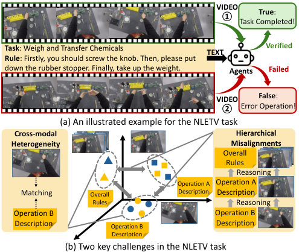

<!-- Start of picture text -->
VIDEO ① True : Task Completed! Task : Weigh and Transfer Chemicals TEXT Verified Rule : Firstly, you should screw the knob. Then, please put down the rubber stopper. Finally, take up the weight.  Agents Failed VIDEO False : ② Error Operation! (a) An illustrated example for the NLETV task Cross-modal  Hierarchical Heterogeneity Misalignments Overall Rules Reasoning Operation A Operation A Matching Overall Description Description Rules Reasoning Operation B Operation B Description Operation B Description Description (b) Two key challenges in the NLETV task <!-- End of picture text -->

Figure 1. (a) An illustration of the NLETV task. (b) Two challenges: cross-modal heterogeneity and hierarchical misalignment. 

verify procedural tasks from egocentric videos based on natural language rules. As illustrated in Fig. 1(a), given language descriptions of a procedural task, the NLETV task aims at determining whether the egocentric videos have accurately completed multi-step tasks, adhering to the temporal order and specified operational criteria. 

Compared with previous video-based procedural task verification works [1, 6, 7], the NLETV is more practical and generalizable: describing standard procedures by natural language well fits interactive intuition of humans, while providing better flexibility. However, as depicted in Fig. 1(b) the NLETV task is also highly challenging due to two difficulties: (1) _Cross-modal heterogeneity between text and video data._ Unlike the previous works in video-based task verification [1, 7], the standard procedures in NLETV task are described in natural language instead of the same visual signals as target videos. It requires models to refine rules from the text modality while perceiving key operational cues from egocentric videos. (2) _Hierarchical mis-_ 

8615

<!-- Page 2 -->

_alignment between procedural logic in text-based rules and the actual operation flows in egocentric videos_ . The textual descriptions stress the topological relation among different operations, while the videos show how the tasks are conducted comprehensively following linear relations and contain massive irrelevant practical details, making it hard to learn logical relations across different hierarchies. 

To address the two issues mentioned above, we proposed a novel NLETV method termed **_P_** _rocedural_ **_H_** _eterogeneous_ **_G_** _raph_ **_C_** _ompletion_ **_(PHGC)_** . It constructs a heterogeneous graph structure to jointly represent textual descriptions and egocentric videos, while progressively conducting graph completion to capture both the logic of rules and the operational flows. As shown in Fig. 2, our proposed PHGC method contains following three key components: (1) Heterogeneous Graph Construction module (HGC), which initializes heterogeneous graphs to depict the textual rules and operation flows in observed egocentric videos. Particularly, the vertices represent hierarchical cues for the verification process, such as object states, partial operation flows or overall task. The edges in the graphs also have diverse attributions including temporal, sequential, or matching relations. (2) Cross-Modal Path Finding module (CMPF), which establishes semantic matching between hierarchical video and text vertices within the heterogeneous graph, enhancing the alignment between visual and linguistic information. (3) Discriminative Entity Representation module (DER), which identifies and highlights the hidden critical entities in heterogeneous graphs to aggregate all discriminative features to deliver an accurate verification result. 

Additionally, as the previous works [5] provide the synthetic dataset only, we contribute a realistic NLETV dataset named CSV-NL, which depicts egocentric procedural tasks to supply the evaluation in the physical world. Extensive experiments on both the public EgoTV [5] and our CSVNL datasets show that our proposed PHGC approach consistently outperforms current state-of-the-art methods. 

Overall, our contributions are summarized as follows: **(1)** We propose a novel NLETV approach, termed PHGC, which effectively addresses cross-modal heterogeneity and hierarchical misalignment and achieves state-of-the-art performance. We also introduce a realistic dataset named CSVNL to evaluate NLETV models on real-world scenarios. **(2)** We devise an HGC module that thoroughly represents the NLETV verification process through heterogeneous graphs with hierarchical vertices and diverse relations. **(3)** We develop the CMPF and DER modules to conduct graph completion, progressively building semantic relations among vertices and extracting discriminative entities. 

## **2. Related Work** 

**Egocentric Video Understanding.** The egocentric video understanding focused on analyzing and interpreting video 

data captured from a first-person perspective. Early works in egocentric vision have centered on domain adaptation [8–10], multimodal learning [11–14], and video-language pre-training [15, 16] to enhance representations for downstream tasks. With the release of extensive egocentric vision datasets [6, 17–19], more research has shifted toward specific downstream tasks, such as action recognition [20], action anticipation [21, 22], and action segmentation [23]. Rencently, researchers have also increasingly focused on developing more sophisticated models capable of handling the egocentric videos as human assistants [5, 24, 25]. Particularly, Rishi _et al_ . [5] introduced the language-based procedural task verification into egocentric videos. They aimed to propose egocentric agents capable of tracking and verifying everyday tasks based on natural language specification, inspiring us to develop this work. 

**Procedural Task Verification.** Procedural Task Verification aims to assess whether a sequence of actions or steps in a video has been accurately completed according to a predefined procedure. The early works [1–4, 6] mainly focused on video-based task verification, where the standard procedures are described with reference videos. Based on the sequential video datasets [2, 3, 6], a group of works [1, 4, 7, 26, 27] focuses on analyzing the query video concerning the tested videos and estimating their similarities. Although these works above achieve promising results, their verification process is consistently built on video-based demonstrations, which heavily limited their applications. Recently, Rishi _et al_ . [5] proposed the Natural Language-based Egocentric Task Verification (NLETV) task, introducing the procedural task verification into egocentric vision and generalizing the video reference to language-based descriptions. Compared with conventional works, the NLETV task is more flexible and fits interactive intuition of humans better, showing more practical meaning especially when it is facilitated with agents. 

**Heterogeneous Graph Modeling.** By representing diverse elements and complicated relations as a graph structure, the heterogeneous graph modeling [28–30] serve as an effective framework for representing and analyzing intricate structures across various domains. It is especially beneficial in multimodal learning tasks [31–34] and video understanding tasks [35–39]. It is a powerful tool for revealing and leveraging these intricate relationships and interactions across diverse modalities [29, 30, 40], as well as handling uncertain data within multimodal learning contexts [13, 41, 42]. Heterogeneous graph modeling has also been adopted in video understanding tasks such as temporal action detection [37], video question answering [36, 43], and video moment retrieval [39, 44, 45]. Inspired by these applications of heterogeneous graph modeling in multimodal learning and video understanding, we also tackle the NLETV task from a graph view and represent the task verification as a proce- 

8616

<!-- Page 3 -->

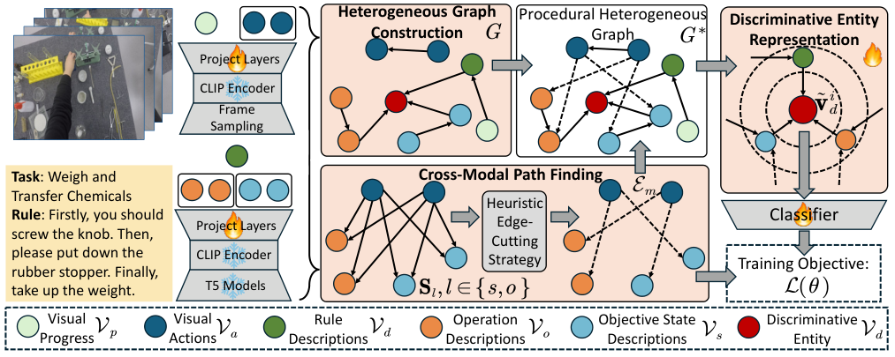

<!-- Start of picture text -->
Heterogeneous Graph  Procedural Heterogeneous  Discriminative Entity Construction Graph Representation Project Layers CLIP Encoder Frame Sampling Task : Weigh and  Cross-Modal Path Finding Transfer Chemicals Heuristic Rule : Firstly, you should  Classifier Project Layers Edge- screw the knob. Then, Cutting please put down the  CLIP Encoder Strategy Training Objective: rubber stopper. Finally, take up the weight.  T5 Models Visual  Visual  Rule  Operation  Objective State  Discriminative Progress Actions Descriptions Descriptions Descriptions Entity <!-- End of picture text -->

Figure 2. An overview of our proposed PHGC method, which consists of three key components: (1) Heterogeneous Graph Construction that initializes the graph structure; (2) Cross-Modal Path Finding connecting fine-grained visual and textual vertices. (3) Discriminating Entity Representation that aggregates informative cues for final task verification. 

dural heterogeneous graph completion process. 

## **3. Our Proposed PHGC Method** 

### **3.1. Preliminaries** 

The NLETV models are given an egocentric video _V_ represented as a sequence of frames or short clips _V_ = _{vi|i_ = 1 _,_ 2 _, . . . , n}_ and a natural language description _D_ comprised of a sequence of action descriptions _D_ = _{Dj|j_ = 1 _,_ 2 _, . . . , m}_ . Here _vi_ and _dj_ represent the _i_ -th short video clip and the textual description of the _j_ -th operations in standard task pipeline. The task of NLETV can be formulated to develop a binary classification model _fθ_ ( _V, D_ ) with parameter _θ_ , returning 1 if _V_ aligns with _D_ otherwise 0. Let _y_ represent the labels for ( _V, D_ ) pairs, it can be formulated as the following optimization problem: 

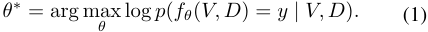

Particularly, the training data in the NLETV task is only labeled to highlight if a ( _V, D_ ) pair is matched, without fine-grained temporal annotations for the relevance between operations and action descriptions. This requires models to understand both cross-modal semantical consistency and coherent topological structures for procedural tasks. 

### **3.2. Heterogeneous Graph Construction** 

We represent the language-based verification process as a heterogeneous graph, where the vertices containing hierarchical semantics from different modalities and edges indicate temporal, topological, and semantically matching relations. In these contexts, the HGC module is devised to initialize a preliminary heterogeneous graph and empower knowledge into the graph-based representation. 

**Vertices Initialization.** As illustrated in Fig. 2, the preliminary heterogeneous graph consists of five types of explicit vertices at different observing levels: (1) Objective state descriptions _Vs_ = _{_ **_v_**_i_ _s__|i_=1_,_2_, · · ·, ms}_thatde- pict how the agent interacts with surroundings; (2) Operational descriptions _Vo_ = _{_ **_v_**_i_ _o__|i_=1_,_2_, · · ·, mo}_specify- ing each operation in the procedural task; (3)The rule description _Vr_ = _{_ **_v_** _r}_ for the overall task; (4) Visual actions _Va_ = _{_ **_v_**_i_ _a__|i_=1_,_2_, · · ·, na}_withintheegocentricvideo; (5) The visual progress _Vp_ = _{_ **_v_** _p}_ presented with the overall video. The former three vertices are extracted from the textual descriptions _D_ hierarchically, while the latter two types are originated from videos _V_ regarding the temporal lengths. Additionally, there is also an implicit vertice, _Vd_ = _{vd}_ , which is the ending vertex performing as a discriminative token for the task verification process. 

**Edges Initialization.** We firstly introduce four types of relations that reveal prior knowledge in the verification process, _i.e._ , temporal relations in visual cues _Et_ = _{e__i_ _s__|i_= 1 _,_ 2 _, · · · , nt}_ , state topological relations _Es_ = _{e__i_ _s__|i_= 1 _,_ 2 _, · · · , m__′_ _s__}_andoperationaltopologicalrelations_Eo_= _{e__i_ _o__|i_=1_,_2_, · · ·, m′_ _o__}_providedinlanguagerules,and rule-task matching relation _Er_ = _{er}_ between the visual progress vertex _Vp_ and the rule description _Vr_ . 

Specifically, for the relation originated from text modality, we follow the initial method [5] and adopt the pre-trained language model [46] to generate the objective state and operational descriptions and extract their hidden topological relations. For example, given the rules “ _Apple is heated, then cleaned in a sinkbasin and sliced with a knife, then placed in a plate_ ”, the state descriptions consist of **_v_**1 _s_:(apple,hot),**_v_**2 _s_: (apple, clean), **_v_**3 _s_:(apple,knife,slice), 

8617

<!-- Page 4 -->

and **_v_**4 _s_:(apple,plate,in),andthestatetopo- logical relations can be represented as _Es_ = _{e_1 _s_ : **_v_**1 _s →_ **_v_**2 _s__, e_2 _s_ : **_v_**1 _s →_ **_v_**3 _s__, e_3 _s_ : **_v_**2 _s →_ **_v_**4 _s__, e_4 _s_ : **_v_**3 _s__→_**_v_**4 _s__}_. Moreover, the operational descriptions are **_v_**1 _o_:(heatingtheapple),**_v_**2 _o_:(cleaningthe apple in a sinkbasin), **_v_**3 _o_:(slicingapple with a knife), and **_v_**4 _o_:(placingthesliced apple in a plate), while the operational topological relations _Eo_ are similar to _Es_ . 

For the visual modalities, we divide the egocentric to short clips as the visual actions _Va_ , and connect these clips according to their temporal relations, which are also denoted as _Et_ . Finally, at the top task-level, we represent the overall language description as _Vr_ and the complete video as _Vp_ . The visual progress vertex _Vp_ is connected to the rule description _Vr_ directly as the matching relations are defined by labels, forming rule-task matching relation the _Er_ . **Heterogeneous Graph Initialization.** Generally, we initialize the heterogeneous graph _G_ = _{V, E}_ , where _V_ = _{Vs ∪Vo ∪Vr ∪Va ∪Vp}_ and _V_ = _{Et ∪Es ∪Eo ∪Er}_ respectively. Following [5], we employ the frozen CLIP model [47] to represent vertices and further leverage project layers to encode different vertices into R_d_ . Particularly, for the vertices from video modality, we process each frames with the CLIP image encoder and additionally employ transformer layers to learn contextualized representations. 

### **3.3. Cross-Modal Path Finding** 

**Implicit Semantic Matching Relations.** Compared to previous video-based task verification works [1, 6, 7], the NLETV task is more challenging due to the cross-modal heterogeneity: the semantics are implicitly represented in two different modalities at a fine-grained level. This indicates that constructing the potential connections between visual and textual vertices performs an essential role. 

To this end, we consider there is the fifth type of edges, _i.e._ , semantic matching relations _Em_ , connecting fine-grained vertices _Vs_ , _Vo_ to the visual actions _Va_ . We proposed the CMPF module to discover the implicit semantic matching relations _Em_ by estimating the similarities between two vertices from visual and textual modalities. Let the **_v_**_i_ _l__, l ∈{s, o}_and**_v_** _t__j_represent the_i_-th fine-grained tex- tual vertex and the _j_ -th visual vertex respectively, we first estimate the similarity _s__ij_ _l_between them: 

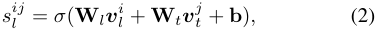

where **W** _l,_ **W** _t ∈_ R_d×_1 are learnable weight matrices and **b** is bias matrix. _σ_ ( _·_ ) is the sigmoid function. In this way, we calculate a similarity matrix **S** _l_ = [ _s__ij_ _l_]_m′_ _l__×nt_thatde- picts a sub-graph for **_v_**_i_ _l__, l ∈{s, o}_and**_v_** _t__j_. **Heuristic Edge-Cutting Strategy.** With the fully connected similarity matrix **S** _l_ , we can preliminarily observe how these vertices are semantically related to each other. 

However, a fully connected sub-graph is not suitable for task verification thus we have to conduct appropriate edgecut to discover the most reliable semantic matching relations _Em_ . Inspired by the initial work [5], we assume that each state or operational description vertices is connected to one key visual action vertex at most. Based on this assumption, we introduce a heuristic edge-cutting strategy through Dynamic Programming, to select the most appropriate edges making the total similarity the highest. Specifically, let **S** _l_ denote the similarity matrix predicted by models and **Φ** = [ _φij_ ] _m__′_ _l__×nt_representthehighesttotalsim- ilarity matrix. _φij_ denote the the highest total similarity when the _Vl_ and _Vt_ containing _i_ and _j_ vertices respectively, _i < m__′_ _l__, j<nt_.Theedge-cuttingprocesscanbeformu- lated as the following algorithm 1. In our CMPF module, the edge-cutting strategy above will regard the learned similarity matrix as reliable and further build connections between selected vertices heuristically. 

**Algorithm 1** Heuristic Edge-Cutting Strategy in CMPF. 

Calculate Similarity Matrix: **S** _l_ = [ _s__ij_ _l_]_m′_ _l__×nt_ Define Total Similarity Matrix: **Φ** = [ _φij_ ] _m__′_ _l__×nt_ Initial edge Set: _Em_ = ∅ % _Boundary Conditions_ **For** ( _i_ = _m__′_ _l__−_1_, j_=_nt −_1;_i >_0_, j>_0;_i−−, j −−_) **Φ** [ _i, nt_ ] _⇐_ **S** _l_ [ _i, nt_ ] _,_ **Φ** [ _m__′_ _l__, j_]_⇐−Inf_ % _Dynamic Programming_ **For** ( _i_ = _m__′_ _l__−_1_, j_=_nt −_1;_i >_0_, j>_0;_i−−, j −−_) **Φ** [ _i, j_ ] _⇐_ max( **S** _l_ [ _i, j_ ] + **Φ** [ _i_ + 1 _, j_ + 1] _,_ **Φ** [ _i, j_ + 1]) % _Cutting Edges_ **For** ( _i_ = 1 _, j_ = 1; _i ≤ m__′_ _l_;_i_+ +) **If Φ** [ _i, j_ ] _>_ **Φ** [ _i, j_ + 1] **Then** _Em ⇐Em ∪{e__ij_ _m_:_v_ _t__j→v_ _l__i}_,_j_+ + **Output** _Em_ 

### **3.4. Discriminative Entity Representation** 

**Procedural Heterogeneous Graph.** Due to the fact that hierarchical matching cues and detailed topological and temporal information are not integrated, we consider leveraging task-rule vertices as discriminative entities to bind the multimodal instances and aggregate hierarchical information. Discriminative entities are the ending vertex of the overall graph, which have zero out-degrees. Concretely, the discriminative entities are connected to the tail of the state and operational topological vertices to perceive the general procedural information in our digraph, as well as the rule description and visual progress vertices to integrating the overall cross-modal matching cues. We denote these edges of discriminative entity as _Ed_ . Based on the newly found edges, _i.e._ , _Em_ and _Ed_ , we update the preliminary heterogeneous graph into procedural heterogeneous graph by integrating these cross-modal semantic match- 

8618

<!-- Page 5 -->

ing edges and initialized topological and temporal edges: _G__∗_ = _{V, E ∪Em ∪Ed}_ . **Discriminative Knowledge Aggregation.** With the procedural heterogeneous graph, we can represent the overall language-based task verification process thoroughly. In the next, we conduct message passing within it to learn the representative features for classification. Specifically, we employ the graph attention mechanism [48] to aggregate the most discriminative knowledge in the procedural heterogeneous graph. Let **_v_**_i_ _∗_and_E_ _∗__i_be the_i_-th vertex in the proce- dural heterogeneous graph _G__∗_ and all edges directed to it, we denote the message passing process as follows: 

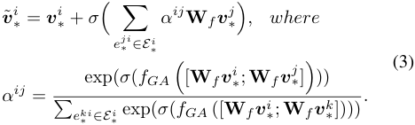

Here _e__ji_ _∗_represent the edge**_v_** _∗__j→_**_v_**_j_ _∗__i_in the procedural het- erogeneous graph. **W** _f_ , _σ_ ( _·_ ), and _fGA_ are learnable weight matrix, activate function, and linear layers for graph attention respectively. **_v_** ˜_i_ _∗_is the updated vertex.In this way, we update all vertices in the procedural heterogeneous graph _G_ by leading the message passing across adjacents through the directed edges. Finally, we extract the ending vertex, _i.e._ , discriminative entities which can perceive global information, to represent the aligning strengths of the given pairs. **Training Objectives.** In Eq. 1, NLETV task aims to maximize the post probability of binary classification. In our PHGC method, the optimization is conducted at both fineand coarse-grained level due to the hierarchical semantics presented in our procedural heterogeneous graph. Hence, we update the optimization goal of our PHGC method as: 

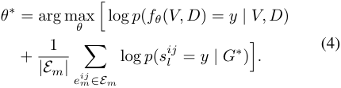

where _fθ_ denote our PHGC model, while _θ_ and _y_ denote the learnable parameters and labels for ( _V, D_ ) respectively. _e__ij_ _m_represents thedirectedsemantic matchingedge(_v_ _a__j→_ _vl__i_)_, l ∈{s, o}_generated by the CMPF module.The second term in this optimization aims to maximize the similarity of selected matching relations based on the max likelihood estimation. Overall, we adopt the negative log-likelihood in our method to train our PHGC approach, which could be formulated as follows: 

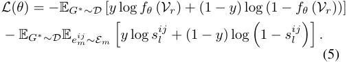

## **4. Experiment** 

### **4.1. Evaluation on Synthetic and Realistic Scenarios** 

**Previous EgoTV Dataset.** Existing procedural task verification works focus on video-based verification [1, 4, 7] and most of them are conducted on the datasets of the thirdperson perspectives. Rishi _et al_ . proposed the initial benchmark dataset EgoTV [5] for the NLETV challenge, this data is all collected from the digital space. It is the only dataset currently for the NLETV challenge, which is collected from digital space. The synthetic data in this benchmark dataset covers 82 task categories, and is split into 10726, 1080, 700, 2164, and 676 for training, novel task, novel step, novel scene, and abstraction respectively. 

**Our CSV-NL Dataset.** The evaluation of NLETV models on realistic videos from physical space has not been explored yet. To this end, we further construct a novel benchmark, termed CSV-NL, based on the existing public dataset CSV [6]. The proposed CSV-NL dataset contains more than 15496 pairwise instances, covering 14 task categories, and each task is completed with 5 operational sequences. Additionally, every operational sequence is conducted by 20 operators at least. Each egocentric video in the CSV-NL dataset lasts 21 seconds, consisting of 9 visual actions while accompanying language rules with 46 words on average. 

Following EgoTV [5], we define three different evaluation scenarios: (1) _Novel Task_ : The models will be trained on seen task categories but tested on unseen task categories. (2) _Novel Step_ : The tested tasks are completed with different operational flows, such as shuffled or omitted operations. (3) _Novel Operators_ : The tested tasks are completed with the same operational flows, but are conducted by different operators. The three scenarios are designed to evaluate respectively the generalization of models on semantic understanding, cross-modal alignment, and robustness towards irrelevant perturbations such as habits of operators. We split it into 10280, 3360, 896, and 960 for training, novel task, novel step, and novel operators. _More details are available in our open-source repository._ 

### **4.2. Implementation Details** 

We employ pre-trained backbones to extract visual and textual features and use these features in an offline manner. For fairness, we follow [5] to adopt the pre-trained CLIP model [47] as our backbones. For the video modality, we split each video into a group of clips with 20 frames and used their average embeddings as the visual action vertices. As for the text modality, we first employ the pre-trained T5 models used in [5] to extract the objective state and operational topological vertices, then encode them as well as the overall descriptions with CLIP models. All features are projected into a common space with 512 dimensions. Following [5], we also adopt the F1 Score as our metrics. 

8619

<!-- Page 6 -->

|Method|Visual Backbone|Text Backbone|Multimodal LLM|Novel Tasks|Novel Steps|Novel Scenes|Abstraction|Average|
|---|---|---|---|---|---|---|---|---|
|Oracle Model|CLIP|CLIP|-|95.0|96.7|97.6|97.2|96.6|
|PandaGPT [49]|ImageBind|Vicuna||17.3|5.0|20.9|35.5|19.7|
|GoldFish [50]|CLIP|LLaMA||33.6|46.6|23.7|37.6|35.4|
|Otter[51]|CLIP|LLaMA||53.4|65.4|59.7|61.5|60.0|
|VIOLIN [52]|ResNet|BERT|-|47.4|80.4|85.6|42.5|64.0|
|MIL-NCE [53]|S3D|Word2vec|-|30.5|69.6|73.5|24.3|49.5|
|CLIP [47]|Tx|Tx|-|43.9|66.5|72.2|13.6|49.1|
|CoCa [54]|Tx|Tx|-|51.5|71.6|71.9|43.5|59.6|
|VideoCLIP [55]|Tx|Tx|-|29.3|67.6|77.9|25.6|50.1|
|CLIP4Clip [56]|CLIP|CLIP|-|56.2|73.2|74.6|17.5|55.4|
|NSG[5]|CLIP|CLIP|-|90.0|64.7|84.9|80.4|80.0|
|**PHGC(Ours)**|CLIP|CLIP|-|**91.7**|**82.4**|**87.1**|**88.0**|**87.4**|

Table 1. Comparisons of model performance on the EgoTV benchmark dataset regarding F1-score. Note that _Tx_ indicates the pre-training multimodal foundation models based on Transformer architecture. The Multimodal LLMs are highlighted in gray. _Oracle Model_ is the fully-supervised models trained with manual temporal annotations for each visual actions 

### **4.3. Overall Comparisons** 

Following [5], we compare our PHGC method with the existing state-of-the-art NLETV approach NSG [5] and other baseline methods including VIOLIN [52], MIL-NCE [53], CLIP4Clip [56], and also three baselines which perform as the foundation models, _i.e._ , CLIP [47], CoCa [54], and VideoCLIP [55]. Furthermore, we also evaluate three Multimodal LLMs (MLLMs) designed for video understanding, _i.e._ , PandaGPT [49], Otter [51], and GoldFish [50]. The experimental results on the EgoTV and CSV-NL datasets are illustrated in Table 1 and Table 2 respectively. 

|Model|Novel Tasks|Novel Steps|Novel Operators|Average|
|---|---|---|---|---|
|PandaGPT [49]|57.64|53.36|61.23|57.41|
|GoldFish [50]|56.84|58.42|61.50|58.92|
|Otter[51]|56.96|42.86|47.14|48.99|
|MIL-NCE [53]|21.48|37.79|33.34|30.87|
|CLIP4Clip [56]|36.98|51.29|46.48|44.92|
|VIOLIN [52]|65.25|48.99|52.06|55.43|
|NSG[5]|66.85|60.35|55.91|61.04|
|**PHGC(Ours)**|**68.64**|**67.59**|**69.25**|**68.49**|

Table 2. Comparisons of model performance on the CSV-NL benchmark dataset regarding F1-score. Note that the Multimodal LLMs are highlighted in gray. Other compared baseline methods adopt CLIP [47] for visual and textual backbones. 

By comparing our the performance of our approach with other models, we list following observations: (1) Our proposed PHGC method consistently outperforms all other models across both datasets. These results demonstrate the effectiveness of our proposed PHGC method in tackling the NLETV task, and also prove that leveraging heterogeneous graph to represent the verification process is reasonable. (2) By comparing our method with these LLM-based methods 

[49–51], our method achieves remarkable improvements across diverse metrics. It indicates that multimodal reasoning in egocentric scenarios is still challenging for MLLMs, which has also been proved in [25]. Additionally, compared with the Oracle Model [5] that are built on manual temporal annotations for each actions, our method achieves the closest performance, which furtherly demonstrate the superiority of our proposed PHGC method. 

However, we also note that our model performs less significantly on the realistic benchmark datasets, while the LLM-based counterparts maintains their performance. We speculate this is because the realistic videos in CSV-NL introduce more variability and complexity compared to synthetic data in terms of scene transitions, visual noise, and linguistic ambiguities. The MLLMs, which are pre-trained on large, diverse multimodal corpora containing massive real-world data, may exhibit stronger robustness to the diverse and dynamic nature of real-world data. Nevertheless, it worths noting that our proposed PHGC approach still outperforms these methods and achieves state-of-theart, demonstrating the effectiveness of introducing heterogeneous graph completion process into the NLETV task. 

### **4.4. Further Study** 

**Ablation Study.** Here we use abbreviation for clarity: Novel Tasks (NT), Novel Steps (NS), Novel SCenes (NSC), ABStraction (ABS), Novel Operators (NO), and Average (AVG). The experimental results are reported in Table 3. 

According to the experimental results, we can observe that: (1) Our proposed HGC module is essential for the overall model. By removing the HGC module results in a significant performance drop across all metrics. This highlights the importance of HGC in capturing the underlying logic of task and operation flows. It also demonstrates that considering the verification process as a directed acyclic 

8620

<!-- Page 7 -->

|||E|goTV||||
|---|---|---|---|---|---|---|
|HGC|CMPF|DER|NT|NS|NSC|ABS|
|-|-|-|64.1|50.7|68.4|61.1|
||-|-|89.5|58.2|72.7|84.7|
|||-|88.9|62.6|78.8|84.6|
||-||89.7|63.4|77.6|87.5|
||||**917**|**824**|**871**|**880**|
| | | C |**.** SV-NL |**.** |**.** |**.** |
|HGC|CMPF|DER|NT|NS|NO|AVG|
|-|-|-|56.1|52.6|55.6|54.8|
||-|-|60.8|60.3|58.9|60.0|
|||-|63.9|57.0|58.6|59.8|
||-||63.6|60.3|64.6|62.8|
||||**67.3**|**67.6**|**69.3**|**68.1**|

Table 3. Ablation studies regarding key components in our proposed PHGC method on EgoTV and CSV-NL datasets. 

graph is reasonable and effective for NLETV task. (2) Enabling CMPF module significantly improves performance on Novel Steps and Novel Scenes, underscoring its importance in aligning hierarchical video and text elements. This is due to these scenarios requires better generalization and robustness to fine-grained semantic cues, which is exactly addressed by CMPF module. (3) The presence of the DER module leads to significant improvements in Novel Tasks and Abstraction, showcasing its ability to uncover hidden entities and refine task verification from a general view. The reason is the DER module effectively conducts message passing across the procedural heterogeneous graph, and aggregate discriminative cues into the ending entities. 

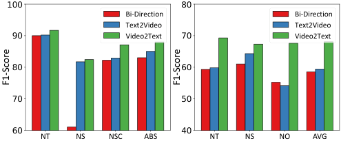

<!-- Start of picture text -->
100 80 Bi-Direction Bi-Direction Text2Video Text2Video 90 Video2Text 70 Video2Text 80 60 70 50 60 40 NT NS NSC ABS NT NS NO AVG F1-Score F1-Score <!-- End of picture text -->

Figure 3. Analysis on the directions of the semantic matching relations _Em_ on the EgoTV (Left) and CSV-NL (Right) dataset. 

**Analysis on Cross-Modal Path Finding.** We devise two alternative semantic matching relations: (1) Bi-Direction, the semantic matching egdes _Em_ selected by heuristic edge cutting algorithm are replaced with bi-directional edges. (2) Text2Video, the edges in _Em_ will be reversed. In the original PHGC method, each edge in _Em_ follows _V → D_ , which can be denoted as Video2Text. We conduct experiments on the EgoTV dataset, and the results are illustrated in Fig. 3. 

By observing the results of each ablated model across diverse scenarios, we can see that: (1) The Bi-Direction configuration, which applies symmetric edges for semantic 

matching, yields the lowest performance across all evaluation metrics. This is particularly evident in the NS and NSC metrics. We speculate this is because the lack of directional specificity in matching leads to ambiguity, causing difficulties in correctly interpreting the temporal and sequential dynamics in the multimodal data. (2) The Video2Text edges which are implemented in the original PHGC model, consistently outperform the other two setups. The superior performance indicates that aligning video features to text instructions allows for a more effective and precise task verification process, as the model can leverage the hierarchical cues from the video to better match the semantics of rules. 

||EgoTV||||
|---|---|---|---|---|
|Edge Settings|NT|NS|NSC|ABS|
|_Ed −{E_ :_Vd →Vs}_|57.5|69.6|85.4|82.1|
|_Ed −{E_ :_Vd →Vr}_ _Ed_|90.2 **91.7**|58.5 **82.4**|81.6 **87.1**|85.2 **88.0**|
|C|SV-NL||||
|Edge Settings|NT|NS|NO|AVG|
|_Ed −{E_ :_Vd →Vs}_|60.8|65.3|63.5|63.2|
|_Ed −{E_ :_Vd →Vr}_|64.5|61.6|60.6|62.2|
|_Ed_|**67.3**|**67.6**|**69.3**|**68.0**|

Table 4. Analysis on the edges _Ed_ directed to the discriminative entity _Vd_ in the DER module. 

**Analysis on Discriminative Entity Representation.** We also devise more ablated models regarding the DER module to explore its affects on model performance. Considering the edge _Ed_ , which connects the implicit discriminative entities _Vd_ to other vertices, we devise two ablated models: (1) _Ed −{E_ : _Vd →Vs}_ and (2) _Ed −{E_ : _Vd →Vr}_ . These denote the edges connecting _Vd_ to rule vertices _Vr_ and to objective state vertices _Vs_ respectively. 

According to the results in Table 4, we reach these insights: (1) When the edges connecting the discriminative entity _Vd_ to the objective state vertices _Vs_ are removed, we observe a significant drop in performance across all metrics on both datasets. This demonstrates that the direct relationship between discriminative entities and the objective states is critical for accurate task verification and performance. (2) Compared to the ablated model where the edges connecting the discriminative entity _Vd_ to the rule vertices _Vr_ are removed, the full DER module with _Ed_ consistently outperforms others across all metrics. These are because the discriminative entities are ending vertices in our procedural heterogeneous graph. It is responsible for perceiving hierarchical cues and aggregating them for final discrimination. **Analysis on Model Convergence.** We also conduct more analysis on the model convergence of different ablated models, including _PHGC w/o CMRF_ and _PHGC w/o DER_ , to observe influence of these key components on the training process. In terms of the results illustrated in Fig. 4, we 

8621

<!-- Page 8 -->

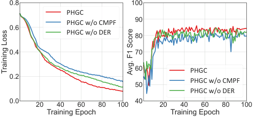

<!-- Start of picture text -->
0.8 100 PHGC PHGC w/o CMPF 90 0.6 PHGC w/o DER 80 0.4 70 60 PHGC 0.2 50 PHGC w/o CMPF PHGC w/o DER 0.0 40 20 40 60 80 100 20 40 60 80 100 Training Epoch Training Epoch Training Loss Avg. F1 Score <!-- End of picture text -->

Figure 4. Analysis on model convergence regarding training loss and average performance on the EgoTV dataset. 

list following observations: (1) The original PHGC model demonstrates faster and more stable convergence compared to its ablated versions. Additionally, the complete PHGC model also achieves a higher and more stable average F1 score over epochs. One probable reason is the absence of CMPF and DER modules hinders the model’s ability to align cross-modal semantic relations, resulting in slower adaptation during training. (2) The training loss decreases all the time but the performance of models tends to get decreased until several early epochs. We speculate this is due to the task verification goal can be regarded as a binary classification problem, where the random models may perform false positive results but conduct invalid verification. 

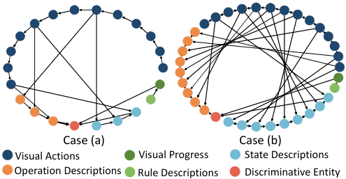

<!-- Start of picture text -->
Case (a) Case (b) Visual Actions Visual Progress State Descriptions Operation Descriptions Rule Descriptions Discriminative Entity <!-- End of picture text -->

Figure 5. Procedural heterogeneous graph visualizations. Case (a) and (b) are from the EgoTV and CSV-NL datasets respectively. 

**Visualizations of Procedural Heterogeneous Graph.** To show how our graph is constructed explicitly, we visualize the procedural heterogeneous graph of two test cases in Fig. 5. Particularly, the thickness of directed egdes represent the attentive weights _α_ in the DER module. By observing these visualization results, we can verifying that our procedural heterogeneous graph is a typical directed acyclic graph, which containing vertices with hierarchical semantics and diverse edges. It represents the language-based task verification process from hierarchical views and thoroughly depicts the fine-grained cross-modal alignment. Additionally, benefit from our proposed DER module, the discriminative entity is able to aggregate the information from the whole heterogeneous graph, thus effectively integrating the most informative cues for task verification. 

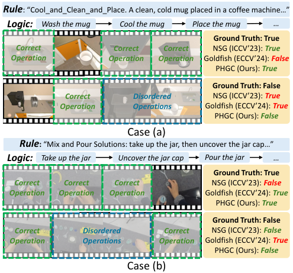

<!-- Start of picture text -->
Rule : “Cool_and_Clean_and_Place. A clean, cold mug placed in a coffee machine…” Logic: Wash the mug Cool the mug Place the mug … Ground Truth: True Correct  Correct  Correct  NSG (ICCV’23):  True Operation Operation Operation Goldfish (ECCV’24):  False PHGC (Ours):  True Ground Truth: False Correct  Disordered  NSG (ICCV’23):  True Operation Operations Goldfish (ECCV’24):  True PHGC (Ours):  False Case (a) Rule :  “Mix and Pour Solutions: take up the jar, then uncover the jar cap…” Logic: Take up the jar Uncover the jar cap Pour the jar … Ground Truth: True Correct  Correct  Correct  NSG (ICCV’23):  False Operation Operation Operation Goldfish (ECCV’24):  True PHGC (Ours):  True Ground Truth: False Correct  Disordered  Correct  NSG (ICCV’23):  False Operation Operations Operation Goldfish (ECCV’24):  True PHGC (Ours):  False Case (b) <!-- End of picture text -->

Figure 6. Qualitative analysis of the task verification on the EgoTV (Case a) and CSV-NL (Case b) datasets respectively. 

**Qualitative Analysis.** We additionally visualize the synthetic and realistic cases from EgoTV and CSV-NL datasets to conduct a qualitative analysis of our proposed PHGC method. As illustrated in Fig. 6, we can observe that our proposed PHGC method succeeds in discriminating whether the given video fits the given language rules, while the two counterpart methods, _i.e._ , the NLETV method NSG [5] and MLLM method GoldFish [50] give incorrect results. Particularly, in Case (b), when the rules are maintained but videos are changed to different action flows, our PHGC method can alarm the operators who disobey the pre-defined rules, while the other counterpart methods fail to handle it. These results prove again that our proposed PHGC method is superior to other methods in capturing the coherent topological order and cross-modal alignment. 

## **5. Conclusion** 

In this paper, we proposed a novel NLETV approach, termed Procedural Heterogeneous Graph Completion (PHGC). Additionally, we introduced the CSV-NL benchmark dataset, which enhanced real-world NLETV evaluation. Extensive experiments on both synthetic and realistic datasets consistently demonstrate the effectiveness of our proposed PGHC method. For future works, we will explore more effective NLETV method on larger realistic dataset. 

## **6. Acknowledgment** 

This work was supported in part by the National Natural Science Foundation of China under Grants, China (No.62476201 and 62222203) and the New Cornerstone Science Foundation through the XPLORER PRIZE. 

8622

<!-- Page 9 -->

## **References** 

- [1] Tianyao He, Huabin Liu, Yuxi Li, Xiao Ma, Cheng Zhong, Yang Zhang, and Weiyao Lin. Collaborative weakly supervised video correlation learning for procedure-aware instructional video analysis. In Michael J. Wooldridge, Jennifer G. Dy, and Sriraam Natarajan, editors, _AAAI_ , pages 2112–2120, 2024. 1, 2, 4, 5 

- [2] Yansong Tang, Dajun Ding, Yongming Rao, Yu Zheng, Danyang Zhang, Lili Zhao, Jiwen Lu, and Jie Zhou. COIN: A large-scale dataset for comprehensive instructional video analysis. In _CVPR_ , pages 1207–1216, 2019. 2 

- [3] Fadime Sener, Dibyadip Chatterjee, Daniel Shelepov, Kun He, Dipika Singhania, Robert Wang, and Angela Yao. Assembly101: A large-scale multi-view video dataset for understanding procedural activities. In _CVPR_ , pages 21064– 21074, 2022. 2 

- [4] Chien-Yi Chang, De-An Huang, Yanan Sui, Li Fei-Fei, and Juan Carlos Niebles. D3tw: Discriminative differentiable dynamic time warping for weakly supervised action alignment and segmentation. In _CVPR_ , pages 3541–3550, 2019. 1, 2, 5 

- [5] Rishi Hazra, Brian Chen, Akshara Rai, Nitin Kamra, and Ruta Desai. Egotv: Egocentric task verification from natural language task descriptions. In _ICCV_ , pages 15417–15429, 2023. 1, 2, 3, 4, 5, 6, 8 

- [6] Yicheng Qian, Weixin Luo, Dongze Lian, Xu Tang, Peilin Zhao, and Shenghua Gao. Svip: Sequence verification for procedures in videos. In _CVPR_ , pages 19890–19902, 2022. 1, 2, 4, 5 

- [7] Sixun Dong, Huazhang Hu, Dongze Lian, Weixin Luo, Yicheng Qian, and Shenghua Gao. Weakly supervised video representation learning with unaligned text for sequential videos. In _CVPR_ , pages 2437–2447, 2023. 1, 2, 4, 5 

- [8] Min-Hung Chen, Zsolt Kira, Ghassan Alregib, Jaekwon Yoo, Ruxin Chen, and Jian Zheng. Temporal attentive alignment for large-scale video domain adaptation. In _ICCV_ , pages 6320–6329, 2019. 2 

- [9] Jonathan Munro and Dima Damen. Multi-modal domain adaptation for fine-grained action recognition. In _CVPR_ , pages 119–129, 2020. 

- [10] Lijin Yang, Yifei Huang, Yusuke Sugano, and Yoichi Sato. Interact before align: Leveraging cross-modal knowledge for domain adaptive action recognition. In _CVPR_ , pages 14702– 14712, 2022. 2 

- [11] Ruohan Gao, Tae-Hyun Oh, Kristen Grauman, and Lorenzo Torresani. Listen to look: Action recognition by previewing audio. In _CVPR_ , pages 10454–10464, 2020. 2 

- [12] Zehua Sun, Qiuhong Ke, Hossein Rahmani, Mohammed Bennamoun, Gang Wang, and Jun Liu. Human action recognition from various data modalities: A review. _IEEE TPAMI_ , 45(3):3200–3225, 2023. 

- [13] Zixian Gao, Xun Jiang, Xing Xu, Fumin Shen, Yujie Li, and Heng Tao Shen. Embracing unimodal aleatoric uncertainty for robust multimodal fusion. In _CVPR_ , pages 26876–26885, 2024. 2 

- [14] Shenshen Li, Xing Xu, Xun Jiang, Fumin Shen, Xin Liu, and Heng Tao Shen. Multi-grained attention network with mutual exclusion for composed query-based image retrieval. _IEEE TCSVT_ , 34(4):2959–2972, 2023. 2 

- [15] Kevin Qinghong Lin, Alex Jinpeng Wang, Mattia Soldan, Michael Wray, Rui Yan, Eric Zhongcong Xu, Difei Gao, Rongcheng Tu, Wenzhe Zhao, Weijie Kong, et al. Egocentric video-language pretraining. _arXiv preprint arXiv:2206.01670_ , 2022. 2 

- [16] Shraman Pramanick, Yale Song, Sayan Nag, Kevin Qinghong Lin, Hardik Shah, Mike Zheng Shou, Rama Chellappa, and Pengchuan Zhang. Egovlpv2: Egocentric video-language pre-training with fusion in the backbone. In _ICCV_ , pages 5262–5274, 2023. 2 

- [17] Dima Damen, Hazel Doughty, Giovanni Maria Farinella, Sanja Fidler, Antonino Furnari, Evangelos Kazakos, Davide Moltisanti, Jonathan Munro, Toby Perrett, Will Price, and Michael Wray. The EPIC-KITCHENS dataset: Collection, challenges and baselines. _IEEE TPAMI_ , 43(11):4125–4141, 2021. 2 

- [18] Dima Damen, Hazel Doughty, Giovanni Maria Farinella, Antonino Furnari, Evangelos Kazakos, Jian Ma, Davide Moltisanti, Jonathan Munro, Toby Perrett, Will Price, and Michael Wray. Rescaling egocentric vision: Collection, pipeline and challenges for EPIC-KITCHENS-100. _IJCV_ , 130(1):33–55, 2022. 

- [19] Kristen Grauman, Andrew Westbury, Eugene Byrne, Zachary Chavis, Antonino Furnari, Rohit Girdhar, Jackson Hamburger, Hao Jiang, Miao Liu, Xingyu Liu, and et al. Ego4d: Around the world in 3, 000 hours of egocentric video. In _CVPR_ , pages 18973–18990, 2022. 2 

- [20] Huiyu Wang, Mitesh Kumar Singh, and Lorenzo Torresani. Ego-only: Egocentric action detection without exocentric transferring. In _ICCV_ , pages 5227–5238, 2023. 2 

- [21] Esteve Valls Mascaro, Hyemin Ahn, and Dongheui Lee. Intention-conditioned long-term human egocentric action anticipation. In _IEEE/CVF Winter Conference on Applications of Computer Vision_ , pages 6037–6046, 2023. 2 

- [22] Qi Zhao, Shijie Wang, Ce Zhang, Changcheng Fu, Minh Quan Do, Nakul Agarwal, Kwonjoon Lee, and Chen Sun. Antgpt: Can large language models help long-term action anticipation from videos? In _ICLR_ , 2024. 2 

- [23] Yuhan Shen and Ehsan Elhamifar. Progress-aware online action segmentation for egocentric procedural task videos. In _CVPR_ , pages 18186–18197, 2024. 2 

- [24] Baoxiong Jia, Ting Lei, Song-Chun Zhu, and Siyuan Huang. Egotaskqa: Understanding human tasks in egocentric videos. _NeurIPS_ , 35:3343–3360, 2022. 2 

- [25] Sijie Cheng, Zhicheng Guo, Jingwen Wu, Kechen Fang, Peng Li, Huaping Liu, and Yang Liu. Egothink: Evaluating first-person perspective thinking capability of visionlanguage models. In _CVPR_ , pages 14291–14302, 2024. 2, 6 

- [26] Yujie Li, Xun Jiang, Xing Xu, Huimin Lu, and Heng Tao Shen. Fuzzy multimodal graph reasoning for human-centric instructional video grounding. _IEEE TFS_ , 32(9):5046–5059, 2024. 2 

- [27] Xun Jiang, Xing Xu, Jingran Zhang, Fumin Shen, Zuo Cao, and Heng Tao Shen. Semi-supervised video paragraph grounding with contrastive encoder. In _CVPR_ , pages 2466– 2475, 2022. 2 

8623

<!-- Page 10 -->

- [28] Xing Xu, Tan Wang, Yang Yang, Alan Hanjalic, and Heng Tao Shen. Radial graph convolutional network for visual question generation. _IEEE TNNLS_ , 32(4):1654–1667, 2020. 2 

- [29] Xin Wang, Benyuan Meng, Hong Chen, Yuan Meng, Ke Lv, and Wenwu Zhu. Tiva-kg: A multimodal knowledge graph with text, image, video and audio. In _ACM MM_ , pages 2391– 2399, 2023. 2 

- [30] Yimo Ren, Jinfa Wang, Jie Liu, Peipei Liu, Hong Li, Hongsong Zhu, and Limin Sun. A relation-aware heterogeneous graph transformer on dynamic fusion for multimodal classification tasks. In _ICASSP_ , pages 7855–7859, 2024. 2 

- [31] Zheng Lian, Lan Chen, Licai Sun, Bin Liu, and Jianhua Tao. Gcnet: Graph completion network for incomplete multimodal learning in conversation. _IEEE TPAMI_ , 45(7):8419– 8432, 2023. 2 

- [32] Atiya Usmani, M Jaleed Khan, John G. Breslin, and Edward Curry. Towards multimodal knowledge graphs for data spaces. In _Companion WWW_ , pages 1494–1499, 2023. 

- [33] Tianxiang Zhao, Xiang Zhang, and Suhang Wang. Disambiguated node classification with graph neural networks. In _WWW_ , pages 914–923, 2024. 

- [34] Qian Li, Shu Guo, Yangyifei Luo, Cheng Ji, Lihong Wang, Jiawei Sheng, and Jianxin Li. Attribute-consistent knowledge graph representation learning for multi-modal entity alignment. In _WWW_ , pages 2499–2508, 2023. 2 

- [35] Xun Jiang, Xing Xu, Zhiguo Chen, Jingran Zhang, Jingkuan Song, Fumin Shen, Huimin Lu, and Heng Tao Shen. Dhhn: Dual hierarchical hybrid network for weakly-supervised audio-visual video parsing. In _ACM MM_ , pages 719–727, 2022. 2 

- [36] Pin Jiang and Yahong Han. Reasoning with heterogeneous graph alignment for video question answering. In _AAAI_ , volume 34, pages 11109–11116, 2020. 2 

- [37] Yisheng Zhao, Huaiyu Zhu, Ruohong Huan, Yaoqi Bao, and Yun Pan. Heterogeneous graph network for action detection. _IEEE TCSVT_ , 2024. 2 

- [38] Xun Jiang, Xing Xu, Zailei Zhou, Yang Yang, Fumin Shen, and Heng Tao Shen. Zero-shot video moment retrieval with angular reconstructive text embeddings. _IEEE TMM_ , 26:9657–9670, 2024. 

- [39] Ruomei Wang, Jiawei Feng, Fuwei Zhang, Xiaonan Luo, and Yuanmao Luo. Modality-aware heterogeneous graph for joint video moment retrieval and highlight detection. _IEEE TCSVT_ , 2024. 2 

- [40] Jingwen Hu, Yuchen Liu, Jinming Zhao, and Qin Jin. Mmgcn: Multimodal fusion via deep graph convolution network for emotion recognition in conversation. _arXiv preprint arXiv:2107.06779_ , 2021. 2 

- [41] Jiayi Chen and Aidong Zhang. Hgmf: heterogeneous graphbased fusion for multimodal data with incompleteness. In _SIGKDD_ , pages 1295–1305, 2020. 2 

- [42] Shenshen Li, Chen He, Xing Xu, Fumin Shen, Yang Yang, and Heng Tao Shen. Adaptive uncertainty-based learning for text-based person retrieval. In _AAAI_ , pages 3172–3180, 2024. 2 

- [43] Jianyu Wang, Bing-Kun Bao, and Changsheng Xu. Dualvgr: A dual-visual graph reasoning unit for video question answering. _IEEE TMM_ , 24:3369–3380, 2021. 2 

- [44] Xun Jiang, Xing Xu, Jingran Zhang, Fumin Shen, Zuo Cao, and Heng Tao Shen. Sdn: Semantic decoupling network for temporal language grounding. _IEEE TNNLS_ , 35(5):6598– 6612, 2024. 2 

- [45] Xun Jiang, Zhuoyuan Wei, Shenshen Li, Xing Xu, Jingkuan Song, and Heng Tao Shen. Counterfactually augmented event matching for de-biased temporal sentence grounding. In _ACM MM_ , pages 6472–6481, 2024. 2 

- [46] Colin Raffel, Noam Shazeer, Adam Roberts, Katherine Lee, Sharan Narang, Michael Matena, Yanqi Zhou, Wei Li, and Peter J. Liu. Exploring the limits of transfer learning with a unified text-to-text transformer. _JMLR_ , 21:140:1–140:67, 2020. 3 

- [47] Alec Radford, Jong Wook Kim, Chris Hallacy, Aditya Ramesh, Gabriel Goh, Sandhini Agarwal, Girish Sastry, Amanda Askell, Pamela Mishkin, Jack Clark, Gretchen Krueger, and Ilya Sutskever. Learning transferable visual models from natural language supervision. In _ICML_ , volume 139, pages 8748–8763, 2021. 4, 5, 6 

- [48] Petar Veliˇckovi´c, Guillem Cucurull, Arantxa Casanova, Adriana Romero, Pietro Li`o, and Yoshua Bengio. Graph attention networks. In _International Conference on Learning Representations_ , 2018. 5 

- [49] Yixuan Su, Tian Lan, Huayang Li, Jialu Xu, Yan Wang, and Deng Cai. Pandagpt: One model to instruction-follow them all. _arXiv preprint arXiv:2305.16355_ , 2023. 6 

- [50] Kirolos Ataallah, Xiaoqian Shen, Eslam Abdelrahman, Essam Sleiman, Mingchen Zhuge, Jian Ding, Deyao Zhu, J¨urgen Schmidhuber, and Mohamed Elhoseiny. Goldfish: Vision-language understanding of arbitrarily long videos. _arXiv preprint arXiv:2407.12679_ , 2024. 6, 8 

- [51] Bo Li, Yuanhan Zhang, Liangyu Chen, Jinghao Wang, Fanyi Pu, Jingkang Yang, Chunyuan Li, and Ziwei Liu. Mimicit: Multi-modal in-context instruction tuning. _arXiv preprint arXiv:2306.05425_ , 2023. 6 

- [52] J. Liu, Wenhu Chen, Yu Cheng, Zhe Gan, Licheng Yu, Yiming Yang, and Jingjing Liu. Violin: A large-scale dataset for video-and-language inference. _CVPR_ , pages 10897–10907, 2020. 6 

- [53] Antoine Miech, Jean-Baptiste Alayrac, Lucas Smaira, Ivan Laptev, Josef Sivic, and Andrew Zisserman. End-to-end learning of visual representations from uncurated instructional videos. In _CVPR_ , pages 9879–9889, 2020. 6 

- [54] Jiahui Yu, Zirui Wang, Vijay Vasudevan, Legg Yeung, Mojtaba Seyedhosseini, and Yonghui Wu. Coca: Contrastive captioners are image-text foundation models. _TMLR_ , 2022. 6 

- [55] Yikang Li, Jenhao Hsiao, and Chiuman Ho. Videoclip: A cross-attention model for fast video-text retrieval task with image clip. In _ICMR_ , pages 29–33, 2022. 6 

- [56] Huaishao Luo, Lei Ji, Ming Zhong, Yang Chen, Wen Lei, Nan Duan, and Tianrui Li. Clip4clip: An empirical study of clip for end to end video clip retrieval and captioning. _Neurocomputing_ , 508:293–304, 2022. 6 

8624
