# Li_Exploring_the_Effect_of_Primitives_for_Compositional_Generalization_in_Vision-and-Language_CVPR_2023_paper

[Original PDF](../Li_Exploring_the_Effect_of_Primitives_for_Compositional_Generalization_in_Vision-and-Language_CVPR_2023_paper.pdf)

Pages: 10

> Automatically converted from PDF. Check the original for exact equations, symbols, table alignment, and figure details.

<!-- Page 1 -->

This CVPR paper is the Open Access version, provided by the Computer Vision Foundation. Except for this watermark, it is identical to the accepted version; the final published version of the proceedings is available on IEEE Xplore. 

# **Exploring the Effect of Primitives for Compositional Generalization in Vision-and-Language** 

Chuanhao Li1 , Zhen Li1 , Chenchen Jing3* , Yunde Jia2,1 , Yuwei Wu2,1_∗_ 

1Beijing Key Laboratory of Intelligent Information Technology, 

School of Computer Science & Technology, Beijing Institute of Technology, China 2Guangdong Laboratory of Machine Perception and Intelligent Computing, Shenzhen MSU-BIT University, China 

3School of Computer Science, Zhejiang University, Hangzhou, China 

_{_ lichuanhao,li.zhen,jiayunde,wuyuwei _}_ @bit.edu.cn jingchenchen@zju.edu.cn 

## **Abstract** 

_Compositionality is one of the fundamental properties of human cognition (Fodor & Pylyshyn, 1988). Compositional generalization is critical to simulate the compositional capability of humans, and has received much attention in the vision-and-language (V&L) community. It is essential to understand the effect of the primitives, including words, image regions, and video frames, to improve the compositional generalization capability. In this paper, we explore the effect of primitives for compositional generalization in V&L. Specifically, we present a self-supervised learning based framework that equips existing V&L methods with two characteristics:_ **_semantic equivariance_** _and_ **_semantic invariance_** _. With the two characteristics, the methods understand primitives by perceiving the effect of primitive changes on sample semantics and ground-truth. Experimental results on two tasks: temporal video grounding and visual question answering, demonstrate the effectiveness of our framework._ 

## **1. Introduction** 

Compositionality is one of the fundamental properties of human cognition argued by Fodor and Pylyshyn [11]. Compositional generalization in vision-and-language (V&L) has received increasing attention and significant progress in recent years, but has not been fully explored. Compositional generalization requires V&L methods to generalize well to sentences with novel combinations of seen words, which is critical to simulate the compositional properties of human cognition. 

> *Corresponding author: Chenchen Jing and Yuwei Wu 

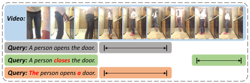

<!-- Start of picture text -->
Video: Query:  A person opens the door.  | | Query:  A person  closes  the door. | | Query: The  person opens  a  door.  | | <!-- End of picture text -->

Figure 1. An example in the context of temporal video grounding, showing that primitives are the determinants of sample semantics and ground-truth. 

An indispensable premise for improving compositional generalization is to understand the effect of the primitives, including words, image regions, and video frames. Primitives are compositional building blocks mainly involved in V&L tasks and the determinants of sample semantics. For example, for a sample with the query “A person opens the door” in the context of temporal video grounding (TVG), its semantics are changed completely when the primitive “opens” is changed to “closed”, but are unchanged when the primitives “A” and “the” are modified to “The” and “a”, respectively, as shown in Fig. 1. We investigate if existing V&L methods are sensitive to the sample semantic changes brought by primitive changes. Our observations show that the methods erroneously keep almost 90% of the predictions unchanged when the sample semantics are corrupted by replacing 50% critical words ( _e.g._ , nouns, verbs) in sentences. This suggests that existing methods cannot correctly establish the relationship between the primitives and the sample semantics and thus the ground-truth, so they cannot achieve compositional generalization. 

In this paper, we explore the effect of primitives for compositional generalization from two aspects: _semantic equiv-_ 

19092

<!-- Page 2 -->

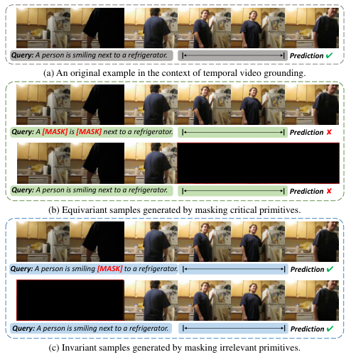

<!-- Start of picture text -->
Query:  A person is smiling next to a refrigerator. | | Prediction  r (a) An original example in the context of temporal video grounding. Query:  A  [MASK]  is  [MASK]  next to a refrigerator. | | Prediction  v Query:  A person is smiling next to a refrigerator. | | Prediction  v (b) Equivariant samples generated by masking critical primitives. Query:  A person is smiling  [MASK]  to a refrigerator. | | Prediction  r Query:  A person is smiling next to a refrigerator. | | Prediction  r (c) Invariant samples generated by masking irrelevant primitives. <!-- End of picture text -->

Figure 2. The samples generated in our framework by masking different primitives. 

_ariance_ and _semantic invariance_ . Semantic equivariance means that the predictions of the methods should be equivariant with the sample semantics, which are determined by the primitives. Once the semantics of the sample are changed, the predictions of the methods should faithfully change. To ensure semantic equivariance, methods are encouraged to learn which primitives have a high effect on the sample semantics and thus the ground-truth. Semantic invariance means that the methods should maintain the same predictions when irrelevant primitives ( _e.g._ , function words and background in visual content) are changed. This helps the methods to learn the primitives with low richness semantics and a low effect on ground-truth, and is complemented with the semantic equivariance. With the two characteristics, the methods understand the effect of primitive changes on sample semantics and ground-truth. 

We propose a self-supervised learning based framework to equip existing methods with _semantic equivariance_ and _semantic invariance_ . By masking critical and irrelevant primitives, we generate numerous labeled training samples, including equivariant samples and invariant samples, respectively, as shown in Fig. 2. To assign labels to the generated samples, we estimate the effect of masked primitives on ground-truth. The larger the effect of the masked primitives, we assign the generated sample with a label more different from the ground-truth of the original sample. By training with the generated samples, the methods learn to make equivariant and invariant predictions when the sample semantics change and do not, respectively. Extensive 

experiments on two V&L tasks: temporal video grounding [2] and visual question answering [3], demonstrate that our framework improves the compositional generalization capability of existing methods. 

In summary, our contributions are as follows: 

- We explore the effect of primitives on improving the compositional generalization capability of existing V&L methods by perceiving the effect of primitive changes on sample semantics and ground-truth. 

- We propose a self-supervised learning based framework for compositional generalization, in which numerous labeled samples are generated to equip existing V&L methods with semantic equivariance and semantic invariance. 

## **2. Related Work** 

### **2.1. Compositional Generalization in V&L** 

Several benchmarks [4, 14, 19, 22] have been proposed for testing the compositional generalization capability of V&L methods. Based on these benchmarks, there have been several recent attempts [6, 17, 32, 33, 45, 46] to boost compositional generalization in V&L. For instance, Saqur _et al._ [32] explicitly parsed both modalities to probabilistic factor graphs, and used graph neural networks to encourage a tighter coupling between concepts in the two modalities. Li _et al._ [22] proposed to achieve compositional generalization by learning structured semantics and performing crossgraph reasoning. Hudson _et al._ [17] presented the memory attention composition network to facilitate explicit and expressive reasoning by decomposing questions into sequential reasoning steps. Akula _et al._ [1] proposed a languageguided adaptive convolution layer to capture the association between the visual input and its neighbor context to break the limitations of vanilla neural module networks (NMNs) in compositional generalization. Bogin _et al._ [6] explicitly grounded the meaning of sub-spans through hierarchical computation to achieve better compositional generalization capability. Yamada _et al._ [38] constructed a transformer module network by combining the performance advantages of transformers and the generalization advantages of NMNs for compositional generalization. 

The methods above focus on modeling the structural information of compositions and correlations between different input modalities by decomposing the input into specialized structures, such as relational reasoning chains and graphs. By contrast, our framework explores the effect of primitives for compositional generalization by perceiving the effect of primitive changes on sample semantics and ground-truth, with an emphasis on understanding the building blocks of compositions. Our framework is modelagnostic and can be seamlessly incorporated into existing 

19093

<!-- Page 3 -->

methods to further improve their compositional generalization capability. 

### **2.2. Self-supervised Learning in V&L** 

Self-supervised learning (SSL) is effective for learning robust representations by exploiting the input itself without external annotations, and has been widely used in V&L tasks as auxiliary tasks for solving different problems. For example, Zhu _et al._ [47] utilized SSL to assist visual question answering models to overcome language priors by generating question-image pairs in a random strategy. Tan _et al._ [34] proposed a self-supervised method to spatially localize activity descriptions in videos. Chen _et al._ [8] developed a self-supervised multimodal clustering network for learning a common embedding space by combining the benefits of contrastive loss and clustering loss. Jiang _et al._ [18] combined SSL to optimize the cross-modal fusion for video paragraph grounding. Different from them, we propose a SSL based framework for compositional generalization, in which numerous equivariant samples and invariant samples are generated to equip existing V&L methods with semantic equivariance and semantic invariance. 

## **3. Self-supervised Framework** 

### **3.1. Overview** 

We focus on two V&L tasks, temporal video grounding (TVG) and visual question answering (VQA). The TVG task aims to localize a moment boundary in an untrimmed video _V_ that matches a given language query _Q_ . The VQA task aims to provide an answer for a natural language question _Q_ about an image _V_ . For simplicity, here we use the same notations _Q_ and _V_ to represent the input sentence ( _i.e._ , the query/question) and the visual content ( _i.e._ , the video/image), respectively. Specifically, the input sentence can be denoted as a set of words _Q_ = _{qi}__M_ _i_ =1, where_qi_is the _i_ -th word and _M_ is the total number of words. The visual content can be represented by a set of visual primitives _V_ = _{vi}__N_ _i_ =1, where_vi_is the_i_-th visual primitive (_i.e._, the video frames or image regions) and _N_ is the total number of the visual primitives. 

The overview of the proposed framework in the context of temporal video grounding is shown in Fig. 3. Concretely, for a TVG model, given a training sample ( _V, Q_ ) with the ground-truth _Y_ = ( _start, end_ ), we first estimate the effect of primitives in _V_ and _Q_ on _Y_ . Based on the estimated effect, we generate invariant samples ( _V, Q_+ ) and ( _V_+ _, Q_ ), and equivariant samples ( _V, Q__−_ ) and ( _V__−_ _, Q_ ). Afterwards, we randomly choose an invariant sample and an equivariant sample, which are re-denoted as ( _V__i_ _, Q__i_ ) and ( _V__e_ _, Q__e_ ), respectively, for unified representation. Finally, we train the model with three types of samples by simultaneously minimizing three losses including the TVG method-specific loss 

_Lms_ for ( _V, Q_ ) and ( _V__i_ _, Q__i_ ), and the self-supervised learning loss _Lssl_ for ( _V__e_ _, Q__e_ ), and the contrastive loss _Lcl_ . 

### **3.2. Effect Estimation of Primitives** 

We estimate the effect of primitives on ground-truth, and quantify them as numbers in the interval [0 _,_ 1]. 

**Effect Estimation of Words.** We estimate the effect of words on ground-truth based on their part-of-speech tags, since the words with different part-of-speech tags carry different richness of semantic information. We use the natural language toolkit (NLTK) [5] to classify words into five categories: nouns, verbs, adjectives, adverbs, and other words. Generally, nouns and verbs play a more important role than adjectives and adverbs, since nouns and verbs demonstrate the entity information and action information of the referents, respectively, while adjectives and adverbs are the additional descriptions of the referents. Other words mainly include articles, conjunctions, and prepositions, which have no actual meaning and cannot independently assume sentence components, so they have little effect on ground-truth. As a result, we assign nouns and verbs with a quantitative effect _α_ , adjectives and adverbs with _β_ , and other words with _γ_ , and ensure that _α ≥ β ≥ γ_ . We set _α_ = 1, _β_ = 0 _._ 6 and _γ_ = 0 for all experiments, and the parameter analysis of them is provided in the **supplementary material** . 

**Effect Estimation of Image Regions.** For the VQA task, we compute the similarities between image regions and the key words in questions to estimate the effect of image regions. Given an image-question pair, we first extract nouns, adjectives, and consecutive adjectives+nouns in the question as key words by the NLTK toolkit. For example, the extracted key words for the question “Is the material of the green cylinder the same as the thing in front of the ball” are “material”, “cylinder”, “thing”, “ball”, “green” and “green cylinder”. For each image region of the image, we then select the largest similarity among its similarities with different key words as the estimation of the effect for each image region, the similarities are computed by the pre-trained CLIP model [31]. The estimated effect is finally normalized to the interval [0 _,_ 1] using min-max normalization (MMN) to represent the final quantitative effect. 

**Effect Estimation of Video Frames.** For the TVG task, we estimate the effect of video frames on ground-truth following two criteria. Firstly, the frames within the groundtruth boundary are assigned with a quantitative effect 1, since they obviously have a high effect on ground-truth due to the particularity of the TVG task. In addition, for the frames outside the ground-truth boundary, we directly compute their similarities to the input sentence based on the visual entailment capability of the pre-trained TCL model [39], and process the similarities into the interval [0 _,_ 1] using MMN to represent the quantitative effect. 

19094

<!-- Page 4 -->

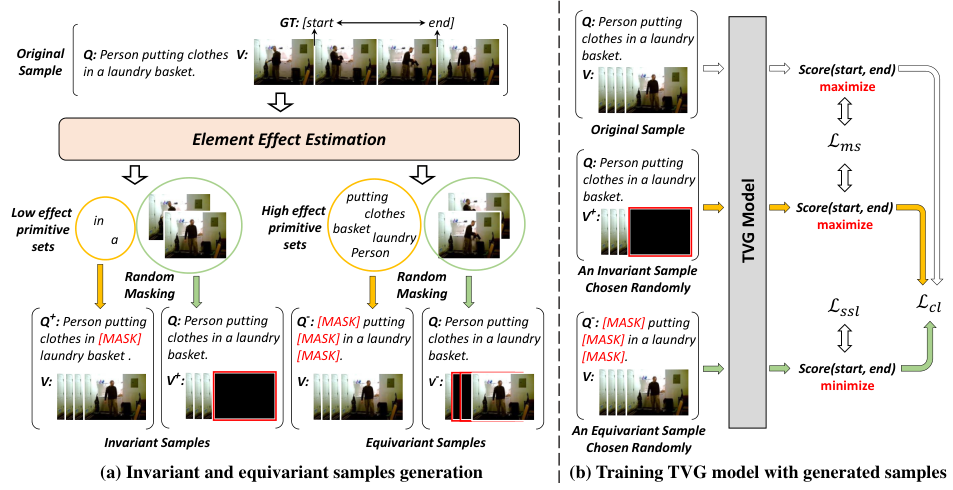

<!-- Start of picture text -->
GT:  [start     end] Q:  Person putting clothes in a laundry Original Q:  Person putting clothes V: basket. Sample in a laundry basket. V: Score(start, end) maximize Original Sample Element Effect Estimation æàæ Q:  Person putting clothes in a laundry putting basket. Low effect primitive in High effect primitive basketclothes V + : Score(start, end) maximize sets a sets Personlaundry Random Random An Invariant Sample Masking Masking Chosen Randomly æææß æÖß Q + :  Person putting  Q:  Person putting  Q - :  [MASK] putting  Q:  Person putting  Q - :  [MASK] putting clothes in [MASK] clothes in a laundry  [MASK] in a laundry  clothes in a laundry  [MASK] in a laundry laundry basket . basket. [MASK]. basket. [MASK]. V: V + : V: V - : V: Score(start, end) minimize An Equivariant Sample Invariant Samples Equivariant Samples Chosen Randomly (a) Invariant and equivariant samples generation (b) Training TVG model with generated samples TVG Model <!-- End of picture text -->

Figure 3. Overview of the self-supervised learning framework in the context of temporal video grounding. 

### **3.3. Sample Generation** 

For each sample ( _V, Q_ ), we obtain two sets of primitives’ effect: _Sv_ = _{evi}__N_ _i_ =1and_Sq_=_{eq_ _i__}_ _i__M_ =1,where _evi_ and _eqi_ denote the effect of _i_ -th visual primitive and _i_ -th word, respectively. Based on _Sv_ and _Sq_ , we generate numerous equivariant and invariant samples by masking different primitives in input. 

**Equivariant Sample Generation.** Equivariant samples are a series of samples that have different semantics from the original samples. We corrupt the semantics of original samples to generate equivariant samples by masking the primitives with high effect in input. For an original sample ( _V, Q_ ) with effect set _Sv_ and _Sq_ , we select the top 50% and 70% primitives with the highest effect in _V_ and _Q_ , respectively, to form two specific high effect primitive sets 

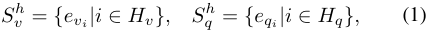

where _Hv_ and _Hq_ represent the index sets of the primitives with the top 50% and 70% effect in _V_ and _Q_ , respectively. An equivariant sample is generated by random masking a certain proportion _ρv_ / _ρq_ of the primitives in _Sv__h_/_S_ _q__h_,and is dubbed as ( _V__−_ _, Q_ )/( _V, Q__−_ ). Whereas, for TVG, the frames within the ground-truth boundary are preferentially masked when generating ( _V__−_ _, Q_ ). For an original sample ( _V, Q_ ), we generate either ( _V__−_ _, Q_ ) or ( _V, Q__−_ ) with equal probability in each training epoch. For the convenience of description, here we use the notation ( _V__e_ _, Q__e_ ) to represent 

the equivariant sample 

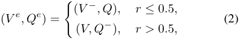

where _r_ denotes a random number in the interval [0 _,_ 1]. **Invariant Sample Generation.** Invariant samples have the same semantics as the original samples, and are generated by masking irrelevant primitives in input. Similar to the steps in Equivariant Sample Generation, we firstly select the bottom 50% and 30% primitives with the lowest effect in _V_ and _Q_ , respectively, to form two low effect primitive sets _Sv__l_and_S_ _q__l_foragivensample(_V, Q_).Thenwegenerate two types of invariant samples ( _V_+ _, Q_ ) and ( _V, Q_+ ), the former is generated by random masking a certain proportion _θv_ of the primitives in _Sv__l_, and another is generated by random masking a certain proportion _θq_ of the primitives in _Sq__l_.We use the notation (_Vi, Qi_) to denote the invariant sample uniformly, which can be either ( _V_+ _, Q_ ) or ( _V, Q_+ ) with equal probability in each training epoch. 

### **3.4. Optimization** 

We use three different losses to supervise the training process, including a method-specific loss _Lms_ , a selfsupervised learning loss _Lssl_ and a contrastive loss _Lcl_ . **Method-specific Loss.** The _Lms_ is determined by the selected method, since different methods use different training losses. For an original training sample ( _V, Q_ ) with groundtruth _Y_ , the _Lms_ is computed by 

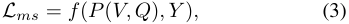

19095

<!-- Page 5 -->

where _P_ ( _V, Q_ ) represents the output of the training model ( _e.g._ , distribution vector with size of the number of categories), and _f_ ( _·, ·_ ) denotes the loss function used in the selected method, such as the cross-entropy loss used in 2DTAN [44] and GLT [6]. 

Since the invariant sample ( _V__i_ _, Q__i_ ) maintains the same semantics as ( _V, Q_ ), we use the same loss _Lms_ and groundtruth _Y_ to train ( _V__i_ _, Q__i_ ). Thus, in our framework, the loss _Lms_ is reformulated as 

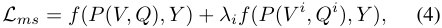

where _λi_ is a hyper-parameter to balance the original and invariant samples. 

**Self-supervised Learning Loss.** For an equivariant sample ( _V__e_ _, Q__e_ ), we use a self-supervised learning loss to perform training optimization, instead of assigning it with groundtruth. The main idea is: the more the semantics of the samples are corrupted, the less the model can get the original ground-truth. The self-supervised learning loss is defined as 

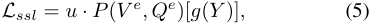

where _g_ ( _·_ ) denotes a function that converts the ground-truth _Y_ to its index in all categories, _u_ is a weight obtained automatically by measuring the degree to which semantics are corrupted. This weight is given by 

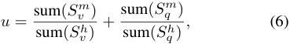

where sum( _·_ ) represents the sum of primitives in the input set, _Sv__m_and_S_ _q__m_denote the effect sets of masked primitives in _V__e_ and _Q__e_ , respectively, _Sv__h_and_S_ _q__h_denote the high ef- fect primitive sets of _V_ and _Q_ , respectively. 

**Contrastive Learning Loss.** We further use a contrastive loss _Lcl_ to regulate the training process with two aims: (1) Pull up the predictions of original samples and their corresponding invariant samples. (2) Push away the predictions of original samples and their corresponding equivariant samples. As a result, we formulate _Lcl_ as 

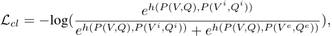

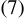

where _h_ ( _·, ·_ ) is a function that measures the distance of input vectors and is computed by 

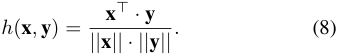

To sum up, the total loss can be viewed as 

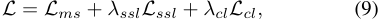

where _λssl_ and _λcl_ are two hyper-parameters that balance the loss terms. 

## **4. Experiments** 

We apply the proposed framework to two tasks, TVG and VQA, to evaluate its effectiveness. We first evaluate our framework on TVG using the Charades-CG [22] and Charades-STA [12] datasets. The recently released Charades-CG dataset contains compositional referring expressions about real-world videos, while the Charades-STA dataset is widely used in TVG for testing the independent and identically distributed (IID) generalization capability of methods. The reason for choosing Charades-STA is to evaluate the compatibility of compositional generalization and IID generalization. We provide the experimental results on ActivityNet Captions [21] and ActivityNet-CG [22] in the **supplementary material** . In addition, we evaluate our framework on VQA, which is a fundamental task needing compositional capability in V&L. We first use the CLEVR [19] dataset to evaluate the IID capability of our framework. Then we use the CLOSURE dataset [4], which is a synthetic diagnostic dataset, and provides more complex questions that require compositional capability. 

### **4.1. Temporal Video Grounding** 

**Datasets.** The Charades-CG [22] dataset is recently released to test the compositional capability of TVG models. The dataset has a train split for training, a NovelComposition test split for testing compositional capability, a Test-Trivial test split for testing the generalization capability of seen words, and a Novel-Word test split for testing the generalization capability of unseen words. The CharadesSTA [12] dataset is a widely used dataset in TVG, which contains a train split for training and a test split for testing IID generalization capability. 

**Implementation Details.** We apply the I3D feature [7] to encode the videos from the two datasets, and incorporate our framework into 2D-TAN and MS-2D-TAN. We reimplemented 2D-TAN and MS-2D-TAN using the publicly released code1 . Whereas, for MS-2D-TAN, we encode queries using a two-layer bidirectional LSTM [15] instead of the original three-layer bidirectional LSTM for more stable convergence. 

For a given query-video pair, we extract its word embeddings with the dimension of 300 using GloVe [29], and randomly sample a fixed number of 64 consecutive clips for each video, then obtain the I3D features with the dimension of 1024 for each sampled clip. The mask rate _ρv_ and _ρq_ for equivariant samples are set as 0 _._ 8 and 0 _._ 5, respectively. The mask rate _θv_ and _θq_ for invariant samples are set as 0 _._ 5 and 0 _._ 5, respectively. The loss weights _λi_ , _λssl_ and _λcl_ are set as 0 _._ 2, 20 and 0 _._ 1, respectively. To train the two methods from scratch, we use Adam [20] with a learning rate of 0 _._ 0001 for optimization. The training epoch and batch size 

> 1https://github.com/microsoft/VideoX 

19096

<!-- Page 6 -->

Table 1. Performance (%) of the state-of-the-art methods on the Charades-CG dataset. The best scores are bold and the second-best scores are underlined. 

|Type|Method|_Te_|_st-Trivial_||_Novel_|_-Composit_|_ion_|_N_|_ovel-Word_||
|---|---|---|---|---|---|---|---|---|---|---|
|||R1@0.5|R1@0.7|mIoU|R1@0.5|R1@0.7|mIoU|R1@0.5|R1@0.7|mIoU|
|Weakly-supervised|WSSL [10]|15.33|5.46|18.31|3.61|1.21|8.26|2.79|0.73|7.92|
|RL-based|TSP-PRL [36]|39.86|21.07|38.41|16.30|2.04|13.52|14.83|2.61|14.03|
||VSLNet [42]|45.91|19.80|41.63|24.25|11.54|31.43|25.60|10.07|30.21|
|Proposal-free|LGI [27]|49.45|23.80|45.01|29.42|12.73|30.09|26.48|12.47|27.62|
||VISA [22]|53.20|26.52|47.11|45.41|22.71|**42.03**_⋆_|42.35|20.88|40.18|
||TMN [23]|18.75|8.16|19.82|8.68|4.07|10.14|9.43|4.96|11.23|
||2D-TAN [44]|48.58|26.49|44.27|30.91|12.23|29.75|29.36|13.21|28.47|
||2D-TAN_∗_[44]|48.06|27.10|43.72|32.74|15.25|31.50|37.12|18.99|35.04|
|Proposal-based|**2D-TAN + Ours**|53.91|31.82|46.84|35.42|17.95|33.07|43.60|25.32|39.32|
||MS-2D-TAN_∗_[43]|57.85|37.63|50.51|43.17|23.27|38.06|45.76|27.19|40.80|
||**MS-2D-TAN + Ours**|**58.14**|**37.98**|**50.58**|**46.54**|**25.10**|40.00|**50.36**|**28.78**|**43.15**|

> _∗_ indicates the results from our reimplementation using official released codes. 

> _⋆_ indicates that the method can be incorporated into our framework for further improvements. 

Table 2. Performance (%) of the state-of-the-art methods on the Charades-STA dataset. 

|Method|Feature|R1@0.5|R1@0.7|mIoU|
|---|---|---|---|---|
|MMN [35]|VGG|47.31|27.28|-|
|IVG [28]|C3D|50.24|32.88|48.02|
|BSP [37]|I3D|53.63|29.27|50.55|
|FVMR [13]|I3D|55.01|33.74|-|
|DCM [40]|I3D|59.70|37.80|**51.50**|
|SSCS [9]|I3D|60.75|36.19|-|
|CBLN [24]|I3D|**61.13**|38.22|-|
|2D-TAN_∗_[44]|I3D|49.52|27.82|43.72|
|**2D-TAN + Ours**|I3D|52.04|29.52|45.67|
|MS-2D-TAN [43]|I3D|60.08|37.39|-|
|MS-2D-TAN_∗_[43]|I3D|57.58|37.34|49.36|
|**MS-2D-TAN + Ours**|I3D|60.64|**38.49**|51.15|

> _∗_ indicates the results from our reimplementation using official released codes. 

are set as 100 and 32, respectively. 

**Comparisons with State-of-the-arts Methods.** The results compared to state-of-the-art methods on the CharadesCG dataset [22] are listed in Tab. 1. We can observe that: (1) Our framework helps the MS-2D-TAN to outperform the best-performing method VISA [22] on all three test splits, and achieves a remarkable improvement especially on the Test-Trivial test split ( _e.g._ , 26.52% vs. 37.98% in R1@0.7). (2) Compared to different baseline methods, our framework can consistently improve their performance. The improvement is more significant on the Novel-Composition test 

split ( _e.g._ , 2.68% and 3.37% absolute performance gains in R1@0.5 for 2D-TAN and MS-2D-TAN, respectively). These observations show that our framework can not only improve the performance of existing methods, but also generalize well to different test environments. Although the mIoU of MS-2D-TAN+Ours is lower than that of VISA on the novel composition split, our framework is compatible with VISA and can further improve it. In addition, the experimental results on Charades-STA [12] are listed in Tab. 2, our framework improves 2D-TAN and MS-2D-TAN with different margins in different metrics. 

**Ablation Studies.** To validate the effectiveness of different components of our framework, we evaluate different variants of our framework by ablating certain components. We use MS-2D-TAN [43] as the baseline method, and the results on the Novel-Composition test split of Charades-CG are shown in Tab. 3. Firstly, we investigate the influence of the equivariant samples by training MS-2D-TAN with only equivariant samples. We observe better performance than the baseline method, albeit worse than the method trained with our full framework. Then, we study the influence of the invariant samples in a similar manner. We also obtain better performance than the baseline method, but worse than the method trained with our full framework. Next, we train MS-2D-TAN with equivariant and invariant samples simultaneously, and obtain better performance than using only either type of sample as expected. Finally, we obtain the best performance when adding contrastive losses to the training process. These observations suggest that all components of our framework are effective to improve baseline methods. 

**Primitive Sensitivity.** We analyse the primitive sensitivity 

19097

<!-- Page 7 -->

Table 3. Ablation studies of the proposed framework on the NovelComposition test split of Charades-CG. We use MS-2D-TAN [43] as baseline method, whose performance is shown in the first line. 

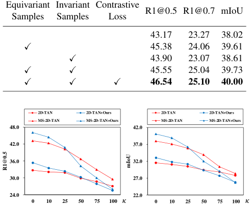

<!-- Start of picture text -->
Equivariant Invariant Contrastive R1@0.5 R1@0.7 mIoU Samples Samples Loss 43.17 23.27 38.02 ✓ 45.38 24.06 39.61 ✓ 43.90 23.07 38.61 ✓ ✓ 45.55 25.04 39.73 ✓ ✓ ✓ 46.54 25.10 40.00 2D-TAN 2D-TAN+Ours 2D-TAN 2D-TAN+Ours MS-2D-TAN MS-2D-TAN+Ours MS-2D-TAN MS-2D-TAN+Ours 48.0 42.0 42.0 37.0 36.0 32.0 30.0 27.0 24.0 22.0 0 10 25 50 75 100 â 0 10 25 50 75 100 â R1@0.5 mIoU <!-- End of picture text -->

Figure 4. The primitive sensitivity of state-of-the-art methods on the Novel-Composition test split of Charades-CG. _κ_ represents the replacement rate of critical words when testing. 

of existing methods and the improvement of our framework on primitive sensitivity. Specifically, we count the frequencies of four classes of words with different part-of-speech tags in the training and Novel-Composition test sets, including nouns, verbs, adjectives, and adverbs, which are dubbed as critical words here. For each test sample, we perform the following operation to execute for corrupting the sample semantic: ramdomly replacing _κ_ percent critical words with others that have the same part-of-speech tags in a sampling manner based on the counted frequencies. The degradation in performance as _κ_ increases is shown in Fig. 4, we can observe that: (1) The performance of methods trained with our framework consistently outperform vanilla methods when a small number of the critical primitives are replaced ( _e.g._ , _κ ≤_ 25%), showing a semantic complement capability of the framework. (2) The proposed framework helps the baseline methods decay more when most of the critical primitives are replaced ( _e.g._ , _κ ≥_ 50%), which demonstrates the effectiveness for improving the primitive sensitivity. **Qualitative Analysis.** Fig. 5 depicts several qualitative examples in the context of TVG. The examples come from different test splits of Charades-CG [22]. In the first example, though the query “Person closes the door” contains no unseen compositions, the baseline method localizes a wrong segment that demonstrates “Person opens the door”. The second example contains the query “Another person walks behind them holding a bottle of medicine” with novel compositions “walks behind”, and is therefore harder than the 

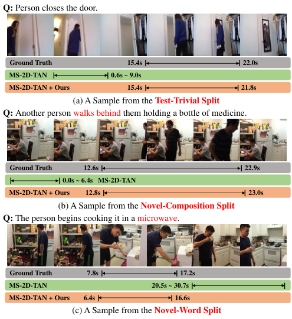

<!-- Start of picture text -->
Q:  Person closes the door. Ground Truth                15.4s | | 22.0s MS-2D-TAN  | | 0.6s ~ 9.0s MS-2D-TAN + Ours       15.4s | | 21.8s (a) A Sample from the  Test-Trivial Split Q:  Another person walks behind them holding a bottle of medicine. Ground Truth      12.6s | | 22.9s | | 0.0s ~ 6.4s MS-2D-TAN MS-2D-TAN + Ours      12.8s | | 23.0s (b) A Sample from the  Novel-Composition Split Q:  The person begins cooking it in a microwave. Ground Truth                    7.8s | | 17.2s MS-2D-TAN 20.5s ~ 30.7s | | MS-2D-TAN + Ours        6.4s | | 16.6s (c) A Sample from the  Novel-Word Split <!-- End of picture text -->

Figure 5. Qualitative comparisons between MS-2D-TAN+Ours and MS-2D-TAN [43] on samples from different test splits of Charades-CG [22]. The words in red font in (b) and (c) denote novel compositions and novel words, respectively. 

first example. The proposed framework helps the baseline method to understand the effect of primitives on groundtruth and thus predict the correct segment. The third example shows that our framework helps MS-2D-TAN to generalize to queries with novel words ( _e.g._ , microwave), which is benefited from the _[MASK]_ token that can represent multiple unseen words. We provide more qualitative examples in the **supplementary material** . 

### **4.2. Visual Question Answering** 

**Datasets.** CLEVR [19] is a synthetic diagnostic dataset that consists of synthetic scenes with multiple objects and automatically generated questions. There are a train split, a validation split and a test split in the CLEVR dataset. CLOSURE [4] is developed from CLEVR [19] for evaluating the compositional capability of VQA models trained on CLEVR. It comprises seven distinct test splits, each of which includes synthetic images and compositional questions generated using seven unique question templates. which are created by combining the various types of referring expressions from CLEVR in novel ways. We combine all provided test splits into a single split for testing. **Implementation Details.** We reimplemented GLT using the publicly released code2 . The max length of questions 

> 2https://github.com/benbogin/glt-grounded-latent-trees-qa 

19098

<!-- Page 8 -->

Table 4. Accuracies (%) of the state-of-the-art methods on the CLEVR and CLOSURE datasets. The HM represents the harmonic mean accuracies. 

|Method|CLEVR|CLOSURE|HM|
|---|---|---|---|
|MGN-e2e_¶_ [32] |-|80.9|-|
|Vector NMN_†_[4] |98.0|71.3|82.5|
|Vector NMN_†‡_ [4]|98.0|94.4|96.2|
|LG-NMN_†_[1]|98.9|88.0|93.1|
|TMN_†‡_ [38] |97.9|95.4|96.6|
|NS-VQA_†§_ [41]|**100**|77.2|87.1|
|FiLM [30]|97.0|60.1|74.2|
|MAC [16]|98.5|72.4|83.5|
|ViLBERT [26]|95.3|51.2|66.6|
|GLT [6]|99.1|96.1|97.6|
|GLT_∗_[6]|99.1|95.0|97.0|
|**GLT + Ours**|99.1|**98.4**|**98.7**|

- for methods trained with external correspondence labels. 

- _§_ for methods using domain-knowledge for deterministically execution. 

- for methods trained with external layout annotations. 

- for methods using external layout annotations when testing. 

- _∗_ for the results from our reimplementation using official released codes. 

is set to 30, and the questions are encoded by a single bidirectional LSTM [15]. For images, we use the object features and positional embeddings provided by GLT with dimensions of 2048 and 6, respectively. To train GLT from scratch, we use the AdamW [25] as the optimizer with the batch size of 32, and use the early-stopping by validating on the validation set of CLEVR [19] for a maximum of 40 epochs. The learning rate and the weight decay are set as 0 _._ 0005 and 0 _._ 075, respectively. We use the dropout layer to randomly inactivate neurons with a dropout rate of 0 _._ 25. For the hyper-parameters _ρv_ , _ρq_ , _θv_ and _θq_ , we use the same setting as in the TVG task. The loss weights _λi_ , _λssl_ and _λcl_ are set as 0 _._ 3, 30 and 3, respectively. 

**Comparisons with State-of-the-arts Methods.** We incorporate our framework into method GLT [6], which is dubbed as **GLT+Ours** . Experimental results of GLT+Ours and state-of-the-art methods on the CLEVR and CLOSURE datasets are listed in Tab. 4. We observe from the table that our framework improves the baseline method GLT with 3.4% absolute gains in the mean accuracy on CLOSURE without performance degradation on CLEVR. The GLT+Ours achieves a new state-of-the-art performance (98.4% in the mean accuracy) on CLOSURE and the best performance (98.7%) in the harmonic mean accuracies on both datasets, which not only demonstrates the effectiveness of our framework in improving compositional capability of VQA methods, but also proves that our framework 

**Q:** What is the material of the object **Q:** What is the color of the tiny thing that is to the right of the red cube and that is behind the gray thing and is the is the same size as the gray cube? same material as the blue cylinder? 

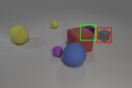

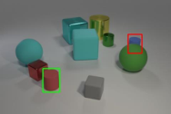

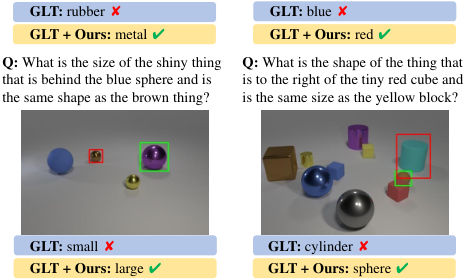

<!-- Start of picture text -->
GLT:  rubber v GLT:  blue v GLT + Ours:  metal r GLT + Ours:  red r Q:  What is the size of the shiny thing  Q:  What is the shape of the thing that that is behind the blue sphere and is  is to the right of the tiny red cube and the same shape as the brown thing? is the same size as the yellow block? GLT:  small v GLT:  cylinder v GLT + Ours:  large r GLT + Ours:  sphere r <!-- End of picture text -->

Figure 6. Qualitative comparisons between GLT+Ours and GLT [6] on questions with novel compositions from CLOSURE [4]. The green and red boxes indicate the image regions with the highest attention weights of GLT+Ours and GLT for object referring, respectively. 

generalizes well to different test environments. **Qualitative Analysis.** Fig. 6 depicts several qualitative examples in the context of VQA. The qualitative examples consist of four different types of questions, including “material”, “color”, “size”, and “shape”. These qualitative examples show that our framework can help GLT identify the most relevant image regions and make correct predictions, which proves that the framework is effective for learning the effect of primitives on ground-truth. More qualitative examples are given in the **supplementary material** . 

## **5. Conclusion** 

In this paper, we have explored the effect of primitives on ground-truth, which can implicitly improve the compositional generalization capability of existing V&L methods. We have presented a self-supervised learning framework to generate numerous labeled equivariant samples and invariant samples by masking different primitives. Our framework can be seamlessly incorporated into existing methods to equip them with semantic equivariance and semantic invariance. Experimental results demonstrate that our framework is capable of improving not only the compositional capability of existing methods, but also the IID generalization capability of them. 

**Acknowledgments** This work was supported by the Natural Science Foundation of China (NSFC) under Grants No. 62176021 and No. 62172041. 

19099

<!-- Page 9 -->

## **References** 

- [1] Arjun Akula, Varun Jampani, Soravit Changpinyo, and Song-Chun Zhu. Robust visual reasoning via language guided neural module networks. In _Advances in Neural Information Processing Systems (NeurIPS)_ , pages 11041– 11053, 2021. 2, 8 

- [2] Lisa Anne Hendricks, Oliver Wang, Eli Shechtman, Josef Sivic, Trevor Darrell, and Bryan Russell. Localizing moments in video with natural language. In _Proceedings of the IEEE/CVF International Conference on Computer Vision (ICCV)_ , pages 5803–5812, 2017. 2 

- [3] Stanislaw Antol, Aishwarya Agrawal, Jiasen Lu, Margaret Mitchell, Dhruv Batra, C Lawrence Zitnick, and Devi Parikh. Vqa: Visual question answering. In _Proceedings of the IEEE/CVF International Conference on Computer Vision (ICCV)_ , pages 2425–2433, 2015. 2 

- [4] Dzmitry Bahdanau, Harm de Vries, Timothy J O’Donnell, Shikhar Murty, Philippe Beaudoin, Yoshua Bengio, and Aaron Courville. Closure: Assessing systematic generalization of clevr models. _arXiv preprint arXiv:1912.05783_ , 2019. 2, 5, 7, 8 

- [5] Steven Bird, Ewan Klein, and Edward Loper. _Natural language processing with Python: analyzing text with the natural language toolkit_ . ” O’Reilly Media, Inc.”, 2009. 3 

- [6] Ben Bogin, Sanjay Subramanian, Matt Gardner, and Jonathan Berant. Latent compositional representations improve systematic generalization in grounded question answering. _Transactions of the Association for Computational Linguistics_ , 9:195–210, 2021. 2, 5, 8 

- [7] Joao Carreira and Andrew Zisserman. Quo vadis, action recognition? a new model and the kinetics dataset. In _Proceedings of IEEE/CVF Conference on Computer Vision and Pattern Recognition (CVPR)_ , pages 6299–6308, 2017. 5 

- [8] Brian Chen, Andrew Rouditchenko, Kevin Duarte, Hilde Kuehne, Samuel Thomas, Angie Boggust, Rameswar Panda, Brian Kingsbury, Rogerio Feris, David Harwath, et al. Multimodal clustering networks for self-supervised learning from unlabeled videos. In _Proceedings of the IEEE/CVF International Conference on Computer Vision (ICCV)_ , pages 8012– 8021, 2021. 3 

- [9] Xinpeng Ding, Nannan Wang, Shiwei Zhang, De Cheng, Xiaomeng Li, Ziyuan Huang, Mingqian Tang, and Xinbo Gao. Support-set based cross-supervision for video grounding. In _Proceedings of the IEEE/CVF International Conference on Computer Vision (ICCV)_ , pages 11573–11582, 2021. 6 

- [10] Xuguang Duan, Wenbing Huang, Chuang Gan, Jingdong Wang, Wenwu Zhu, and Junzhou Huang. Weakly supervised dense event captioning in videos. In _Advances in Neural Information Processing Systems (NeurIPS)_ , pages 3062–3072, 2018. 6 

- [11] Jerry A Fodor and Zenon W Pylyshyn. Connectionism and cognitive architecture: A critical analysis. _Cognition_ , 28(12):3–71, 1988. 1 

- [12] Jiyang Gao, Chen Sun, Zhenheng Yang, and Ram Nevatia. Tall: Temporal activity localization via language query. In _Proceedings of the IEEE/CVF International Conference on Computer Vision (ICCV)_ , pages 5267–5275, 2017. 5, 6 

- [13] Junyu Gao and Changsheng Xu. Fast video moment re- 

trieval. In _Proceedings of the IEEE/CVF International Conference on Computer Vision (ICCV)_ , pages 1523–1532, 2021. 6 

- [14] Madeleine Grunde-McLaughlin, Ranjay Krishna, and Maneesh Agrawala. Agqa: A benchmark for compositional spatio-temporal reasoning. In _Proceedings of IEEE/CVF Conference on Computer Vision and Pattern Recognition (CVPR)_ , pages 11287–11297, 2021. 2 

- [15] Sepp Hochreiter and J¨urgen Schmidhuber. Long short-term memory. _Neural computation_ , 9(8):1735–1780, 1997. 5, 8 

- [16] Drew Hudson and Christopher D Manning. Learning by abstraction: The neural state machine. In _Advances in Neural Information Processing Systems (NeurIPS)_ , 2019. 8 

- [17] Drew A Hudson and Christopher D Manning. Compositional attention networks for machine reasoning. In _Proceedings of the International Conference on Learning Representations (ICLR)_ , 2018. 2 

- [18] Xun Jiang, Xing Xu, Jingran Zhang, Fumin Shen, Zuo Cao, and Heng Tao Shen. Semi-supervised video paragraph grounding with contrastive encoder. In _Proceedings of IEEE/CVF Conference on Computer Vision and Pattern Recognition (CVPR)_ , pages 2466–2475, 2022. 3 

- [19] Justin Johnson, Bharath Hariharan, Laurens Van Der Maaten, Li Fei-Fei, C Lawrence Zitnick, and Ross Girshick. Clevr: A diagnostic dataset for compositional language and elementary visual reasoning. In _Proceedings of IEEE/CVF Conference on Computer Vision and Pattern Recognition (CVPR)_ , pages 2901–2910, 2017. 2, 5, 7, 8 

- [20] Diederik P Kingma and Jimmy Ba. Adam: A method for stochastic optimization. In _Proceedings of the International Conference on Learning Representations (ICLR)_ , 2015. 5 

- [21] Ranjay Krishna, Kenji Hata, Frederic Ren, Li Fei-Fei, and Juan Carlos Niebles. Dense-captioning events in videos. In _Proceedings of the IEEE/CVF International Conference on Computer Vision (ICCV)_ , pages 706–715, 2017. 5 

- [22] Juncheng Li, Junlin Xie, Long Qian, Linchao Zhu, Siliang Tang, Fei Wu, Yi Yang, Yueting Zhuang, and Xin Eric Wang. Compositional temporal grounding with structured variational cross-graph correspondence learning. In _Proceedings of IEEE/CVF Conference on Computer Vision and Pattern Recognition (CVPR)_ , pages 3032–3041, 2022. 2, 5, 6, 7 

- [23] Bingbin Liu, Serena Yeung, Edward Chou, De-An Huang, Li Fei-Fei, and Juan Carlos Niebles. Temporal modular networks for retrieving complex compositional activities in videos. In _Proceedings of the European Conference on Computer Vision (ECCV)_ , pages 552–568, 2018. 6 

- [24] Daizong Liu, Xiaoye Qu, Jianfeng Dong, Pan Zhou, Yu Cheng, Wei Wei, Zichuan Xu, and Yulai Xie. Context-aware biaffine localizing network for temporal sentence grounding. In _Proceedings of IEEE/CVF Conference on Computer Vision and Pattern Recognition (CVPR)_ , pages 11235–11244, 2021. 6 

- [25] Ilya Loshchilov and Frank Hutter. Decoupled weight decay regularization. _arXiv preprint arXiv:1711.05101_ , 2017. 8 

- [26] Jiasen Lu, Dhruv Batra, Devi Parikh, and Stefan Lee. Vilbert: Pretraining task-agnostic visiolinguistic representations for vision-and-language tasks. In _Advances in Neural Information Processing Systems (NeurIPS)_ , 2019. 8 

- [27] Jonghwan Mun, Minsu Cho, and Bohyung Han. Local- 

19100

<!-- Page 10 -->

global video-text interactions for temporal grounding. In _Proceedings of IEEE/CVF Conference on Computer Vision and Pattern Recognition (CVPR)_ , pages 10810–10819, 2020. 6 

- [28] Guoshun Nan, Rui Qiao, Yao Xiao, Jun Liu, Sicong Leng, Hao Zhang, and Wei Lu. Interventional video grounding with dual contrastive learning. In _Proceedings of IEEE/CVF Conference on Computer Vision and Pattern Recognition (CVPR)_ , pages 2765–2775, 2021. 6 

- [29] Jeffrey Pennington, Richard Socher, and Christopher D Manning. Glove: Global vectors for word representation. In _Proceedings of the Conference on Empirical Methods in Natural Language Processing (EMNLP)_ , pages 1532–1543, 2014. 5 

- [30] Ethan Perez, Florian Strub, Harm De Vries, Vincent Dumoulin, and Aaron Courville. Film: Visual reasoning with a general conditioning layer. In _Proceedings of the AAAI Conference on Artificial Intelligence (AAAI)_ , volume 32, 2018. 

   - 8 

- [31] Alec Radford, Jong Wook Kim, Chris Hallacy, Aditya Ramesh, Gabriel Goh, Sandhini Agarwal, Girish Sastry, Amanda Askell, Pamela Mishkin, Jack Clark, et al. Learning transferable visual models from natural language supervision. In _Proceedings of the International Conference on Machine Learning (ICML)_ , pages 8748–8763, 2021. 3 

- [32] Raeid Saqur and Karthik Narasimhan. Multimodal graph networks for compositional generalization in visual question answering. In _Advances in Neural Information Processing Systems (NeurIPS)_ , pages 3070–3081, 2020. 2, 8 

- [33] Jiaxin Shi, Hanwang Zhang, and Juanzi Li. Explainable and explicit visual reasoning over scene graphs. In _Proceedings of IEEE/CVF Conference on Computer Vision and Pattern Recognition (CVPR)_ , pages 8376–8384, 2019. 2 

- [34] Reuben Tan, Bryan Plummer, Kate Saenko, Hailin Jin, and Bryan Russell. Look at what i’m doing: Self-supervised spatial grounding of narrations in instructional videos. In _Advances in Neural Information Processing Systems (NeurIPS)_ , pages 14476–14487, 2021. 3 

- [35] Zhenzhi Wang, Limin Wang, Tao Wu, Tianhao Li, and Gangshan Wu. Negative sample matters: A renaissance of metric learning for temporal grounding. In _Proceedings of the AAAI Conference on Artificial Intelligence (AAAI)_ , pages 2613– 2623, 2022. 6 

- [36] Jie Wu, Guanbin Li, Si Liu, and Liang Lin. Tree-structured policy based progressive reinforcement learning for temporally language grounding in video. In _Proceedings of the AAAI Conference on Artificial Intelligence (AAAI)_ , pages 12386–12393, 2020. 6 

Huang. Vision-language pre-training with triple contrastive learning. In _Proceedings of IEEE/CVF Conference on Computer Vision and Pattern Recognition (CVPR)_ , pages 15671– 15680, 2022. 3 

   - [40] Xun Yang, Fuli Feng, Wei Ji, Meng Wang, and Tat-Seng Chua. Deconfounded video moment retrieval with causal intervention. In _Proceedings of the International Conference on Research on Development in Information Retrieval (SIGIR)_ , pages 1–10, 2021. 6 

   - [41] Kexin Yi, Jiajun Wu, Chuang Gan, Antonio Torralba, Pushmeet Kohli, and Joshua B. Tenenbaum. Neural-symbolic vqa: Disentangling reasoning from vision and language understanding. In _Advances in Neural Information Processing Systems (NeurIPS)_ , pages 1039–1050, 2018. 8 

   - [42] Hao Zhang, Aixin Sun, Wei Jing, and Joey Tianyi Zhou. Span-based localizing network for natural language video localization. In _Proceedings of the Annual Meeting of the Association for Computational Linguistics (ACL)_ , pages 6543– 6554, 2020. 6 

   - [43] Songyang Zhang, Houwen Peng, Jianlong Fu, Yijuan Lu, and Jiebo Luo. Multi-scale 2d temporal adjacency networks for moment localization with natural language. _IEEE Transactions on Pattern Analysis and Machine Intelligence_ , 44(12):9073–9087, 2021. 6, 7 

   - [44] Songyang Zhang, Houwen Peng, Jianlong Fu, and Jiebo Luo. Learning 2d temporal adjacent networks for moment localization with natural language. In _Proceedings of the AAAI Conference on Artificial Intelligence (AAAI)_ , pages 12870– 12877, 2020. 5, 6 

   - [45] Wenqiao Zhang, Haochen Shi, Jiannan Guo, Shengyu Zhang, Qingpeng Cai, Juncheng Li, Sihui Luo, and Yueting Zhuang. Magic: Multimodal relational graph adversarial inference for diverse and unpaired text-based image captioning. In _Proceedings of the AAAI Conference on Artificial Intelligence (AAAI)_ , pages 3335–3343, 2022. 2 

   - [46] Wenqiao Zhang, Haochen Shi, Siliang Tang, Jun Xiao, Qiang Yu, and Yueting Zhuang. Consensus graph representation learning for better grounded image captioning. In _Proceedings of the AAAI Conference on Artificial Intelligence (AAAI)_ , pages 3394–3402, 2021. 2 

   - [47] Xi Zhu, Zhendong Mao, Chunxiao Liu, Peng Zhang, Bin Wang, and Yongdong Zhang. Overcoming language priors with self-supervised learning for visual question answering. In _Proceedings of the International Joint Conference on Artificial Intelligence (IJCAI)_ , pages 1083–1089, 2020. 3 

- [37] Mengmeng Xu, Juan-Manuel P´erez-R´ua, Victor Escorcia, Brais Martinez, Xiatian Zhu, Li Zhang, Bernard Ghanem, and Tao Xiang. Boundary-sensitive pre-training for temporal localization in videos. In _Proceedings of the IEEE/CVF International Conference on Computer Vision (ICCV)_ , pages 7220–7230, 2021. 6 

- [38] Moyuru Yamada, Vanessa D’Amario, Kentaro Takemoto, Xavier Boix, and Tomotake Sasaki. Transformer module networks for systematic generalization in visual question answering. _arXiv preprint arXiv:2201.11316_ , 2022. 2, 8 

- [39] Jinyu Yang, Jiali Duan, Son Tran, Yi Xu, Sampath Chanda, Liqun Chen, Belinda Zeng, Trishul Chilimbi, and Junzhou 

19101
