# Li_Mistake_Attribution_Fine-Grained_Mistake_Understanding_in_Egocentric_Videos_CVPR_2026_paper

[Original PDF](../Li_Mistake_Attribution_Fine-Grained_Mistake_Understanding_in_Egocentric_Videos_CVPR_2026_paper.pdf)

Pages: 11

> Automatically converted from PDF. Check the original for exact equations, symbols, table alignment, and figure details.

<!-- Page 1 -->

This CVPR paper is the Open Access version, provided by the Computer Vision Foundation. Except for this watermark, it is identical to the accepted version; the final published version of the proceedings is available on IEEE Xplore. 

# Mistake Attribution: Fine-Grained Mistake Understanding in Egocentric Videos 

Yayuan Li<sup>1</sup> Aadit Jain<sup>1</sup> Filippos Bellos<sup>1</sup> Jason J. Corso<sup>1,2</sup> 1University of Michigan 2Voxel51 

```
https://yayuanli.github.io/MATT
```

## Abstract 

We introduce Mistake Attribution (MATT), a new task for fine-grained understanding of human mistakes in egocentric videos. While prior work detects whether a mistake occurs, MATT attributes the mistake to what part of the instruction is violated (semantic role), when in the video the deviation becomes irreversible (the Point-of-No-Return, PNR), and where the mistake appears in the PNR frame. We develop MisEngine, a data engine that automatically constructs mistake samples from existing datasets with attribution-rich annotations. Applied to large egocentric corpora, MisEngine yields EPIC-KITCHENS-M and Ego4D-M—two datasets up to two orders of magnitude larger than prior mistake datasets. We then present MisFormer, a unified attentionbased model for mistake attribution across semantic, temporal, and spatial dimensions, trained with MisEngine supervision. A human study demonstrates the ecological validity of our MisEngine-constructed mistake samples, confirming that EPIC-KITCHENS-M and Ego4D-M can serve as reliable benchmarks for mistake understanding. Experiments on both our datasets and prior benchmarks show that MisFormer, as a single unified model, outperforms task-specific SOTA methods by at least 6.66%, 21.81%, 18.7%, and 3.00% in video-language understanding, temporal localization, handobject interaction, and mistake detection, respectively. 

## 1. Introduction 

Physically-grounded instructional AI assistants that provide guidance and feedback given egocentric video has drawn significant attention in the vision community [2, 5, 47, 53]. Leveraging clear hand and object interaction [23, 46] along with rich task models [35], these assistants show significant promise in the way humans acquire skills [9, 47] across various physical activities, spanning everyday activities like cooking, cleaning, and maintenance [5, 15, 37, 45, 53, 60] to professional tasks [6, 14, 16, 40, 62]. 

A critical aspect of good physically-grounded AI assistance is the ability to steer fallible (all) humans away from mistakes, like using salt instead of sugar or applying the 


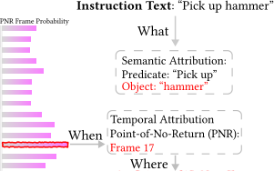


Figure 1. Mistake Attribution (MATT) task aims to understand the deviation between a human attempt (video) and the instruction (text) along three axes. Semantic attribution identifies what semantic role in the instruction is violated (e.g., a wrong Object “bolt” is mistakenly picked up instead of “hammer”); temporal attribution identifies when the attempt reaches the point of no return (PNR) (e.g., Frame 17); and spatial attribution identifies where, in the PNR frame, the mistake is manifested (e.g., the red bounding box). 

wrong type of bandage onto a wound. Human mistakes result from distractions, misunderstanding, or ambiguities in task formulation [45], even when given detailed instructions. Given their importance, handling mistakes in egocentric video has seen increasing attention in recent years. Most works focus on detecting step-level mistakes like missing or erroneous actions [12, 48, 53] often modeled via anomalies [26, 36] or classifying observed mistakes, e.g., step modification and slip errors [25]. More recently, MistScene [41] generates natural language explanations for an action video that is detected as a mistake. 

Modeling mistakes more finely is integral to realizing the potential of AI assistants. For example, the coarse categorization in [12, 42, 48, 53] does not infer what specific component of the activity is a mistake. Similarly, the natural language explanation of MistScene [41], while impressive, focus only on inherent activity mistakes with no alignment to the actual task instructions. Specifically, current works cannot answer key questions such as what part of the instruc- 

23966

<!-- Page 2 -->

tion is not followed, when during the user’s action is the mistake’s impact irreversible (i.e., the Point-of-No-Return), and where in the PNR frame does the mistake manifest. For example, in Fig. 1, the instruction is “pick up hammer,” but the executed action in the video is “pick up bolt.” Mistake Detection can reveal that a mistake has occurred, but does not show that the expected object “hammer” is not followed (what), when the mistake happens during execution, or the region in the red box where the mistake manifested. 

To fill this gap, we introduce Mistake Attribution (MATT), which focuses on fine-grained understanding of deviations between the instruction and the observed egocentric user’s action. Specifically, mistake attribution consists of three components: (1) semantic attribution, which seeks to assess what—i.e., which semantic role<sup>1</sup> from the instruction— is mistaken in the attempt video; (2) temporal attribution, which identifies when the mistake is consolidated by pinpointing the point-of-no-return (PNR) frame in the attempt video [15]; and (3) spatial attribution, which determines where the mistake occurs within a precise region of the PNR frame. MATT provides a triplet of semantic-temporalspatial information about the mistake, which provides rich information for AI Assistants along with other performance applications like self-learning. 

We introduce two vectors of contributions for this new mistake attribution problem. First, we propose a novel data engine, MisEngine, that automatically constructs large-scale mistake samples from existing action-recognition sources. Existing mistake datasets lack triplet-attribution annotations (for training and evaluation) and are limited in quantity and diversity—making them insufficient to benchmark MATT at real-world scale. Importantly, collecting such a dataset is non-trivial: as collectors gain experience, mistakes become rarer and manual collection grows inefficient, while, at the same time, injecting staged mistakes into datasets introduces visual bias that pushes the dataset away from what one expects in the real world. Consequently, existing datasets [7, 21, 26, 42, 45, 53] are often orders of magnitude smaller and less diverse than general action-understanding corpora (Tab. 1). 

To overcome these bottlenecks, MisEngine systematically cross-matches an instruction text with descriptions of other action videos to create misaligned pairs of instruction text and action video. It leverages Semantic Role Labeling (SRL) to control cross-matching by semantic groups (e.g., Predicate, Object)—inherently yielding semantic-attribution labels—while videos naturally inherit temporal and spatial annotations that we process into the corresponding attribution targets. 

> 1Semantic roles refer to the underlying relationships that components in a sentence have with the main activity, such as predicate (the main verb of the activity), object (the noun the predicate is acting on), or instrument (the tool the predicate is using), as discussed in Fillmore (1968) [11]. 

Second, we introduce a transformer-based model, MisFormer, that is able to address MATT’s breadth in a single, unified model. MisFormer comprises a dual-branch feature extractor (video and text) with cross-attention and three modules that consume role-encoded instruction tokens to produce semantic, temporal, and spatial attributions. For semantic attribution, a decoder treats the instruction representation as queries and video features as keys/values—yielding {Correct, Mistake} for each semantic role. For temporal attribution, the model downsamples video features and uses another encoder, cross-attending to the instruction, to localize the PNR frame. For spatial attribution, it derives a bounding box from attention between the PNR frame and the instruction representation; at inference, the temporal and spatial modules are gated—invoked only when any role is predicted as Mistake. 

We evaluate our work on two popular egocentric action datasets—Ego4D [15] and EPIC-KITCHENS [5]— covering diverse real-world activities. Applying MisEngine yields Ego4D-M and EPIC-KITCHENS-M, the first datasets for training and benchmarking MATT and mistake understanding at real-world scale. We evaluate MisFormer against strong baselines, including Video–Language Models [34, 39, 56], Temporal Localization Models [27, 55], Hand–Object Interaction detectors [28, 33], and mistake detection methods [19, 26], on both our and prior benchmarks. Although each baseline focuses on a single attribution task, they underperform on EPIC-KITCHENS-M and Ego4D-M, highlighting the difficulty of MATT. MisFormer, as a unified model, achieves superior performance or efficiency across tasks. 

## 2. Related Work 

Modeling Mistakes in Egocentric Videos. Recent efforts toward Instructional AI have demonstrated early progress [1, 2, 4, 30, 31, 49, 52]. In terms of Misatake Understanding, although there is existing work in video anomaly detection [17, 38, 57, 59, 61], most of this work does not emphasize anomalies as mistakes in the context of a procedure. Most past mistake-specific work focuses on detection or small-set categorization. Soran et al. [48] identify omitted actions using a hidden Markov models. HoloAssist [53] uses the TimeSFormer ViT model [3, 8] to detect mistakes. Assembly101 [7, 45] uses a graph-based method to detect two categories of mistakes specifically in the assembly task: the ordering and placement of installing a component. Certain recent works also adopt the anomaly detection mindset for mistakes, such as EgoPED [26], which compares an observed action feature to its prototypical one, PREGO [12], which compares the inferred action class to the expected one in a streaming manner, AMNAR [19], which combines these two ideas, and Missteps [36], which compares observed gaze behavior against an expected one. None of these works mod- 

23967

<!-- Page 3 -->

els mistakes at a level of richness beyond binary detection. 

The most relevant recent works are twofold. Lee et al. [25] categorize detected mistakes into a set of predefined categories (e.g., modification, slip errors, etc.). MistSense [41, 49] generates natural language explanations for an action video that is detected as mistaken. Neither of these works captures a sufficiently rich task-based analysis of the mistake. The categories in Lee et al. [25] do not describe the specific attributes of the mistake. MistSense’s [41] explanation capture generic action failures (e.g., knocking over the bottle) rather than how the action deviates from the task instructions. 

Datasets for Egocentric Mistake Understanding. Existing mistake understanding datasets (EgoPER [26], Assembly101 [7, 45], HoloAssist [53], CaptainCook4D [42], EpicTent [21]) are small and exhibit limited semantic and visual variance, hindering real-world benchmarking (Tab. 1 quantifies these). Most provide mistake detection and recognition labels but insufficient supervision for MATT attribution. Where mistake explanations exist, they are free-form rather than structurally aligned to instruction semantic roles, impeding automation. Precise error timing and grounded regions are typically missing; point-of-no-return timestamps and mistake-grounding boxes are absent or only indirectly inferable. Conversely, large egocentric video datasets such as EPIC-KITCHENS [5] and Ego4D [15] offer scale and diversity for action understanding. Yet, they lack native mistake instances and structured attribution, and are hence not directly suitable for mistake benchmarking. In this paper, our MisEngine combines the benefits of the two types of datasets, constructing benchmarks with annotations of semantic, temporal and spatial attribution at scale at least two orders of magnitude larger than existing mistake datasets. 

## 3. Mistake Attribution 

Consider a sequence of activities comprising a goal oriented task, such as cooking a dish or assembling a toy. At any moment when carrying out the task, it is necessary to perform a particular action in a particular way. We assume these actions are adequately described in the instruction text. Work in mistake understanding generally seeks to capture when, for one of these task-based actions, the way in which the user performs the action deviates from the instruction text. These deviations can include performing the wrong action entirely, using the wrong tool, or working with the wrong object. 

Mistake Attribution (MATT) seeks to model these various fine-grained types of deviations. Concretely, given an instruction text T (e.g., “cut the apple”) and an egocentric video V of the user attempting to perform T , which we call an attempt video, MATT is composed of the following: Semantic Attribution identifies the specific components 

(i.e., semantic roles [10]) in the instruction text T that are not correctly followed in the attempt video V . Formally, we define the semantic attribution output as {yr ∈{0, 1} | r ∈R}, denoting whether the semantic role r was correctly followed (yr = 0) or no (yr = 1) in the attempt video. R denotes the set of semantic roles in the instruction text. 

Temporal Attribution specifies the Point-of-NoReturn (PNR) [15] in the attempt video V after which where the impact of the mistake is irreversible. We denote this PNR timestamp as tPNR ∈T where T is the total number of frames in the attempt video. 

Spatial Attribution highlights the spatial region in the PNR frame to indicate the visual details of the mistake. Specifically, it produces the mistake grounding box BtPNR = (xmin, ymin, δx, δy), localizing the region that suggests the mistake within the PNR timestamp tPNR. To address MATT, a function F needs to map the input pair of instruction text and attempt video to the triplet of semantic-temporal-spatial mistake attribution: 


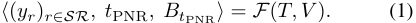


In the two sections that follow, we describe the data engine for creating a large scale mistake dataset for MATT and a unified model capable of addressing MATT. 

### 3.1. MisEngine: Automated large-scale mistake dataset construction 

Mistake Samples Construction. A source action recognition dataset Λ contains pairs of action descriptions and action videos. MisEngine follows three steps to construct the mistake dataset Ω from Λ. 

Step 1: We apply Semantic Role Labeling (SRL) [10, 13] to parse each action description (instruction) text in Λ. For the ith action description, SRL produces a set Gi = {gi<sup>r| r∈R} containing all semantic groups for this action</sup> description where R is the set of all semantic roles defined by the SRL method. As illustrated in Fig. 2 with R = {predicate, object} as an example, the action description = text “Pick up the sieve” is parsed into Gi = {gi<sup>P redicate</sup> “Pick up”, gi<sup>Object</sup> = “the sieve”}. Step 2: For each Gi, we compare with all other parsed actions descriptions Gj (j̸ = i) by checking with a function J if the semantic group gi<sup>randg</sup> j<sup>rarethesame(i.e.,</sup> J (gi<sup>r, g</sup> j<sup>r)=1)foreachsemanticroler.Jcanbesim-</sup> ple character-level matching or semantic-level matching, depending on granularity of the mistake one wants to capture. This results in C = |R|<sup>2</sup> misalignment categories for each and all parsed action descriptions Gi. Taking R = {predicate, object} as an example, the total number of misalignment categories is C = 4: Predicate Mistake, Object Mistake, Both Mistakes, and No Mistake. 

23968

<!-- Page 4 -->

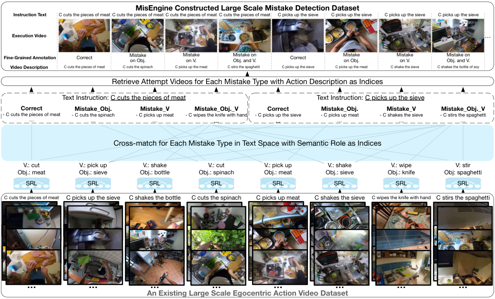


<!-- Start of picture text -->
MisEngine Constructed Large Scale Mistake Detection Dataset<br>Instruction Text C cuts the pieces of meat C cuts the pieces of meat C cuts the pieces of meat C cuts the pieces of meat C picks up the sieve C picks up the sieve C picks up the sieve C picks up the sieve<br>Execution Video …<br>Fine-Grained Annotation  Correct Mistakeon Obj. Mistakeon V. Mistake onObj. and V. Correct Mistakeon Obj. Mistakeon V. Mistake onObj. and V.<br>Video Description C cuts the pieces of meat C cuts the spinach C picks up the meat C stirs the spaghetti C picks up the sieve C picks up the meat C shake the sieve C shakes the bottle of soy<br>Retrieve Attempt Videos for Each Mistake Type with Action Description as Indices<br>Text Instruction: C cuts the pieces of meat Text Instruction: C picks up the sieve<br>Correct Mistake_Obj. Mistake_V Mistake_Obj._V Correct Mistake_Obj. Mistake_V Mistake_Obj._V<br>- C cuts the pieces of meat - C cuts the spinach - C picks up meat - C wipes the knife with hand - C picks up the sieve - C picks up meat - C shakes the sieve - C stirs the spaghetti<br>… … … … … … … …<br>Cross-match for Each Mistake Type in Text Space with Semantic Role as Indices<br>V.: cut V.: pick up V.: shake V.: cut V.: pick up V.: shake V.: wipe V: stir<br>Obj.: meat Obj.: sieve Obj.: bottle Obj.: spinach Obj.: meat Obj.: sieve Obj.: knife Obj: spaghetti<br>SRL SRL SRL SRL SRL SRL SRL SRL<br>C cuts the pieces of meat  C picks up the sieve C shakes the bottle C cuts the spinach C picks up meat  C shakes the sieve C wipes the knife with hand C stirs the spaghetti<br>… … … … … … … …<br>An Existing Large Scale Egocentric Action Video Dataset<br><!-- End of picture text -->

Figure 2. A significant challenge in mistake video analysis is the paucity of available data in the face is massive diversity of possible mistakes. This figure explains our new data engine, MisEngine, that overcomes this challenge by automatically creating new mistake understanding datasets from source corpora by a careful series of sampling and cross-matching methods. MisEngine uses semantic role labeling on the text instruction and then matches across the available roles; here, we show an example with two roles (object as “Obj” and predicate as “V”). Our resulting datasets are orders of magnitude larger than existing ones and fully annotated (for free) across mistake detection and attribution. 

Step 3: We sample NT<sup>Cactiondescriptionsfromeach</sup> of C misalignment categories. For each of these action description, NV<sup>cof the videos are sampled as attempt videos</sup> for Gi. For example, if Gi = {gi<sup>P redicate</sup> = “Pick up”, gi<sup>Object</sup> = “the sieve”} and Gj = {gj<sup>P redicate</sup> = “Pick up”, gj<sup>Object</sup> = “the pan”}, then videos originally associated with the action description “Pick up the pan” in Λ are randomly sampled (without replacement) as a subset of attempt videos for Gi. This process results in the number of attempt videos for each Gi as Γ = C × NT<sup>C× N c</sup> V<sup>.Denote the number of</sup> instruction texts in the constructed dataset Ω as NT . The number of samples (pairs of instruction text and attempt video) in the target dataset is: 


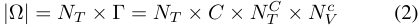


Mistake Attribution Annotation. The MisEngine workflow induces the semantic attribution annotation (yr)r∈R and inherits the temporal attribution annotation tPNR and spatial attribution annotation BtPNR from the original action recognition dataset Λ. For semantic attribution, at step 2, the misalignment categories tell if each semantic role is cor- 

rectly followed or not. For temporal attribution, the PNR timestamp in the attempt video V is cloned from the PNR annotation in the original action recognition dataset Λ. For spatial attribution, the mistake grounding box BtPNR is the unified bounding box from the hand bounding boxes in the PNR frame, annotated in Λ. Hence, MisEngine fully labels the dataset automatically. 

There are various action recognition datasets, e.g., Recasens et al. [43], that contains rich information associated with the action videos like eye gaze, head pose, audio, etc. MisEngine enables the possibility of inheriting this information to further study large scale mistake understanding. 

MATT Datasets: Ego4D-M and EPIC-KITCHENS-M. 

We demonstrate MisEngine on two popular action recognition datasets: Ego4D [15] and EPIC-KITCHENS [5], resulting in the Ego4D-M and EPIC-KITCHENS-M datasets. These are the first MATT datasets that inherit their quantity and diversity from existing large scale action recognition datasets while labeling the specific attributes necessary for fine-grained mistake modeling and benchmarking. 

For step 1, we use AllenNLP’s SRL method [13], which 

23969

<!-- Page 5 -->

is based on a deep BiLSTM encoder [18] with attention and a Conditional Random Field [24] output layer to produce the semantic groups for each semantic role in each action description. Since most of the action descriptions in the source datasets contain only the predicate and object, we filter out the shorter descriptions and cut the longer descriptions to keep only the predicate and object, i.e., R = {predicate, object}. In step 2, we implement the comparing function J by looking up the original taxonomy annotation in Ego4D or do character-level matching in EPICKITCHENS. In step 3, we set NT<sup>Cto 4 and 3 and N c</sup> V<sup>to 2</sup> and 3 for Ego4D and EPIC-KITCHENS, respectively. We filter out the action descriptions (Gi) that have less than NT<sup>Cmisaligned action descriptions for each Cor less than</sup> NV<sup>ccandidate videos.This results in N Ego</sup> T = 16099 and NT<sup>EK</sup> = 12283 instruction texts in the Ego4D-M and EPICKITCHENS-M datasets, respectively. Following Eq. (2), the total number of samples are |Ω<sup>Ego</sup> | = 16099 × 2 × 4 × 2 = 257, 584 and |Ω<sup>EK</sup> | = 12283 × 2 × 3 × 3 = 221, 094 where each has semantic, temporal, and spatial attribution annotations. 

Ego4D-M has annotations for semantic, spatial, and temporal attribution where the PNR frame numbers and the mistake grounding box are inherited from the original Ego4D dataset. For samples with only predicate mistakes, we use the union of the hand regions as the spatial attribution annotation. For samples with only object mistakes, we use the original annotated object bounding boxes as the spatial attribution annotation. For samples with both predicate and object mistakes, we take the union of the hand and object regions as the spatial attribution annotation. EPIC-KITCHENS-M only has semantic annotation due to the lack of PNR frame number annotation in the original dataset. 

Tab. 1 contains a comparison of existing mistake datasets, both used egocentric action datasets, and the new MisEngineproduced variants, Ego4D-M and EPIC-KITCHENS-M. The produced MATT datasets are at least two orders of magnitude larger than any of the existing mistake datasets in the literature. 

### 3.2. MisFormer: A unified model for fine-grained mistake understanding 

We propose a unified model structure, MisFormer (F), to jointly address all three mistake attribution tasks: semantic, temporal, and spatial localization. As illustrated in Figure 3, given an instruction text T and an attempt video V ∈ R<sup>L×H×W ×3</sup> , MisFormer first extracts multimodal features through a shared feature extraction module, then processes them through three specialized attribution heads to produce the outputs for each subtask: semantic attribution labels (yr)r∈R, Point-of-No-Return frame tPNR, and mistake bounding box BtPNR . 

Feature Extraction. We begin by processing the instruc- 

||# Sa|mples|Semanti|c Var.|Visua|l Var.||Ann|otation||
|---|---|---|---|---|---|---|---|---|---|---|
|Dataset|Total|By activity|Activ.|Dm.|Env.|Part.|Det.|Sem.|Temp.|Spa.|
|EgoPER [26]|599|9.7|62|1|2|11||▲||▲|
|Assembly101 [7,45]|707|2.0|358|1|1|53||▲|||
|HoloAssist [53]|7,562|0.91|8,285|2|-|222||▲|▲||
|CaptionCook4D [42]|1,964|5.6|352|1|10|8||▲|||
|Epic-Tent [21]|626|52.2|12|1|-|24||▲||▲|
|EPIC-KITCHENS|89,975|5.0|18,003|1|45|37||||▲|
|Ego4D|155,367|2.1|75,423|14+|100+|931|||▲|▲|
|EPIC-KITCHENS-M|221,094|18.0|12,283|1|45|37||||▲|
|Ego4D-M|257,584|16.0|16,099|14+|100+|248|||||


Table 1. Statistics of egocentric video normal and mistake datasets. Our # Samples are the small video segments that contain the mistake instead of the video of the whole procedure. # Activ. are the number of unique short actions in the dataset. Dm. is the number of domains in the dataset (e.g., cooking, cleaning, etc.). Env. is the number of unique environments when collecting in the whole dataset. # Part. are the number of unique individuals that perform the activities in the dataset. Annotation presence columns: (Det)ection, (Sem)antic, (Temp)oral PNR, (Spa)tial bounding box. The ▲ denotes the annotation is partially available (e.g., natural language as semantic explanation for mistakes). 

tion text T using AllenNLP’s Semantic Role Labeling [13] to decompose it into semantic role substrings Sr for each role r ∈R. For each Sr, we extract text features Fr<sup>T</sup> using the text encoder from InternVideo2 [54], yielding FR<sup>T={F</sup> r<sup>T}r∈R∈R|R|×dwhereeachsemanticroleis</sup> represented as a d-dimensional embedding. In parallel, we extract video features F<sup>V</sup> ∈ R<sup>L×K×d</sup> from the attempt video using InternVideo2’s video encoder, where K is the number of spatial patches per frame. 

Due to InternVideo2’s video-language pre-training, Fr<sup>T</sup> and F<sup>V</sup> naturally reside in a shared embedding space where text features are semantically aligned with corresponding visual patches. To further adapt these features for mistake understanding, we employ a projection block P consisting of 2 Transformer decoder layers without causal masking for self-attention. Within P, self-attention operates over the text features FR<sup>T(treatingeachF T</sup> r<sup>asasingletoken),</sup> enabling information exchange across semantic roles. Crossattention then attends from FR<sup>T(as queries) to F V(as keys</sup> and values), connecting visual context to each semantic role. The output is projected text features FR<sup>T ′∈R|R|×d, which</sup> encodes both inter-role relationships and video-grounded semantics. 

Semantic Attribution. The semantic attribution head determines which semantic roles in the instruction are executed incorrectly in the attempt. For each role r ∈R, we apply a feed-forward network (FFN) [51] followed by a sigmoid activation to the projected text features Fr<sup>T ′,pro-</sup> ducing a binary prediction yˆr ∈{0, 1} indicating whether the role is misaligned. We train this module with a binary cross-entropy loss LS aggregated across all semantic roles: LS = −<sup>�</sup> r∈R<sup>[yr log(ˆyr) + (1 −yr) log(1 −yˆr)] , where</sup> yr is the ground-truth label for role r. 

Temporal Attribution. The temporal attribution head local- 

23970

> Original page for checking 1 unresolved font glyphs.

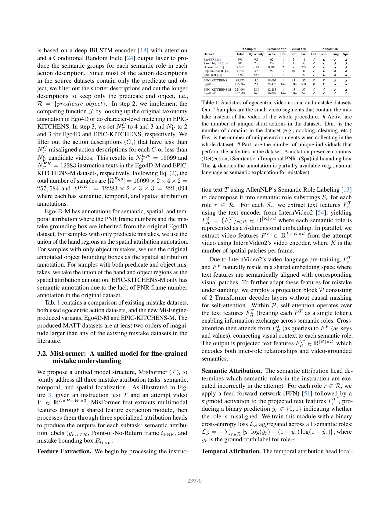

<!-- Page 6 -->

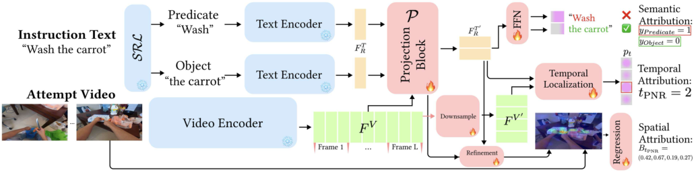


Figure 3. MisFormer’s unified architecture for mistake attribution. MisFormer jointly processes the instruction text and an attempt video, extracting shared multimodal features. Three specialized transformer heads perform semantic attribution (detecting misaligned roles), temporal localization (pinpointing the Point-of-No-Return frame), and spatial localization (predicting mistake regions via attention-driven bounding boxes), enabling comprehensive and interpretable mistake analysis across semantic, temporal, and spatial dimensions. 

izes the Point-of-No-Return (PNR) frame where the mistake becomes irreversible. We first apply a downsampling block consisting of 2 self-attention layers to aggregate spatial tokens within each frame of F<sup>V</sup> , producing frame-level features F<sup>V′</sup> ∈ R<sup>L×d</sup> . These frame features are then processed by a temporal localization block with 2 Transformer decoder layers (without causal masking), where cross-attention operates with F<sup>V′</sup> as queries and FR<sup>T ′as keys and values.An</sup> FFN with output dimension 1 followed by a softmax over the temporal dimension produces a probability distribution pt ∈ [0, 1] for each frame t ∈ [L]. The PNR frame is identified as tPNR = arg maxt pt. 

We supervise this module with a cross-entropy loss: LT = −<sup>�L</sup> t=1<sup>yt log(pt), where yt∈{0, 1} is the ground-</sup> truth label indicating the PNR frame. During training, LT is computed only for samples annotated as mistakes. During inference, temporal localization is performed only for samples where semantic attribution identifies at least one misaligned role. 

Spatial Attribution. The spatial attribution head identifies the mistake region within the PNR frame by predicting a bounding box BtPNR . To localize the relevant spatial regions, we extract the cross-attention weights Ar,tPNR ∈ R<sup>K×d</sup> from the final cross-attention layer of the projection block P, where K is the number of spatial patches. We apply refinement block to, first concatenate Fr<sup>T ′</sup> to Ar,tPNR in feature dimension of all tokens, then apply two self-attention blocks to produce spatial attention scores, which are reshaped to a 2D spatial map and upsampled via bilinear interpolation to match the frame resolution, forming a visual saliency heatmap. 

This heatmap is then concatenated with the RGB PNR frame as a 4-channel input to a lightweight CNN-based regression module that predicts the bounding box coordinates. When multiple semantic roles are identified as misaligned, we merge their attention maps and produce a unified bounding box encompassing all relevant mistake regions. We 

supervise the spatial attribution head with Huber loss [20] between the predicted and ground-truth bounding boxes. 

## 4. Experiments 

### 4.1. Setup 

Baselines. To the best of our knowledge, no prior work covers all of MATT’s specifics. We therefore adapt baselines separately for semantic, temporal, and spatial attribution, as well as for mistake detection. For semantic attribution, we evaluate ChatGPT-4o [39], fine-tuned Video-ChatGPT [34], and LLaVA-NeXT Video [56] by prompting them to decide “mistake” or “correct” for each semantic role. For ChatGPT-4o, we evaluate on 1000 random samples from the test sets. For temporal attribution, we compare with finetuned SOTA Point-of-No-Return (PNR) temporal localization methods, EgoMotion-COMPASS [27] and EgoT2 [55] (with PNR as target task). For spatial attribution, we compare with MediaPipe [33] and fine-tuned SSDA [28], SOTA hand/hand–object interaction detectors, to segment the hands and object in the PNR frame. We also compare against SOTA mistake detection methods, AMNAR [19] and EgoPED [26]. Our mistake detection prediction is derived by aggregating semantic attribution: a clip is labeled as a mistake if any semantic role is flagged as such. 

Evaluation Metrics. For semantic attribution, we treat each semantic role as a binary classification problem. Following prior work [26], we report F1@0.5 and Accuracy as the main metrics, both per semantic role and averaged across roles. Following the PNR localization task [15], we evaluate temporal attribution by Mean Absolute Error, both per frame and per second. For spatial attribution, we report mean Intersection-over-Union (mIoU) between the predicted and ground-truth boxes, and additionally report Center Distance (CD) and Box Size Error (BSE). For mistake detection, we follow common practice [55] and report F1@0.5 and 

23971

> Original page for checking 1 unresolved font glyphs.

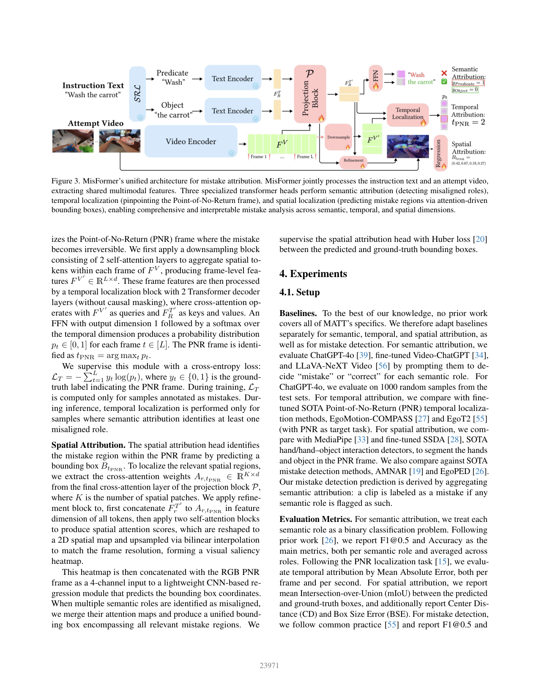

<!-- Page 7 -->

#### accuracy. 

Dataset. We benchmark attribution subtasks on Ego4DM and EPIC-KITCHENS-M. We split each dataset into training/validation/test sets in an 8:1:1 ratio. This yields 206K/25K/25K for Ego4D-M and 176K/22K/22K samples for EPIC-KITCHENS-M. We additionally use EgoPER [26], an existing mistake dataset, for mistake detection evaluation. 

|Method|MAE (frames)↓|MAE (seconds)↓|
|---|---|---|
|EgoMotion-COMPASS [27]|48.96|1.632|
|EgoT2 [55]|24.48|0.816|
|MisFormer (Ours)|19.14|0.638|


Table 3. Temporal attribution on Ego4D-M. MisFormer reduces mean absolute error (MAE) by at least 21.81% compared to the SOTA PNR localization methods, which corresponds to a 2.23% reduction relative to the attempt video duration. 

### 4.2. Results 

Mistake Semantic Attribution. For both datasets, on average (see the “Average” column in Tab. 2), fine-tuned opensource video-language models (LLaVA-Vid [56] and VidChat [34]) perform poorly, staying below 75% F1 on EPICKITCHENS-M and below 45% F1 on Ego4D-M. ChatGPT, a commercial closed-source model likely trained on larger corpora, reaches 77.23% and 50.95% F1 on EPIC-KITCHENSM and Ego4D-M, respectively. MisFormer attains 83.89% and 56.24% F1 on EPIC-KITCHENS-M and Ego4D-M, surpassing the best baseline by 6.66% and 5.30%, respectively. 

Role-wise, MisFormer improves Predicate by 10.60% and 5.02% F1 on EPIC-KITCHENS-M and Ego4D-M, respectively. For Object, the gains are 1.99% and 5.55% F1 on the two datasets. Across methods, Object consistently outperforms Predicate (verbs), highlighting the challenge of modeling fine-grained motions in egocentric videos, consistent with prior findings [32]. Accuracy mirrors the F1 score trends, as our datasets are approximately class-balanced. 

|Dataset|Method|Aver<br>|age<br>|Pred<br>|icate<br>|Obj<br>|ect<br>|
|---|---|---|---|---|---|---|---|
|||Acc. ↑|F1↑|Acc. ↑|F1↑|Acc. ↑|F1↑|
||LLaVA-Vid [56]|71.71|70.34|64.10|64.55|79.32|76.13|
|EK|Vid-Chat [34]|64.17|63.27|54.45|52.11|73.89|74.43|
||ChatGPT [39]<br>|77.66|77.23|66.23|65.11|89.09|89.35|
||MisFormer (Ours)<sup>†</sup>|84.91|84.78|76.35|75.31|93.47|94.25|
||MisFormer (Ours)|84.13|83.89|76.83|76.43|91.43|91.34|
||LLaVA-Vid [56]|42.83|40.12|48.10|47.95|37.56|32.29|
|Eo|Vid-Chat [34]|36.47|34.36|36.73|36.84|36.21|31.88|
|g|ChatGPT [39]<br>|52.45|50.95|53.42|50.20|51.48|51.70|
||MisFormer (Ours)<sup>†</sup>|59.37|55.41|55.44|53.03|63.33|57.79|
||MisFormer (Ours)|62.03|56.24|58.40|55.22|65.66|57.25|


Table 2. Semantic attribution results. MisFormer consistently outperforms the SOTA Video-Language model baselines across all datasets on all semantic roles. † denotes the model is evaluated on the subset of test set used by ChatGPT baseline for fair comparison. 

Mistake Temporal Attribution. Quantitative results on Ego4D-M are shown in Tab. 3. Compared to the best existing method, MisFormer reduces mean absolute error (MAE) by 21.81%—a decrease of 5.34 frames and 0.178 seconds. For reference, the average clip length is about 8 seconds (240 frames at 30 fps), so this corresponds to a 2.23% reduction relative to video duration. Whereas prior PNR localization methods rely solely on video signals, MisFormer additionally conditions on instruction text. Even when text-video alignment is imperfect, this supervision provides complementary cues that improve temporal localization. 


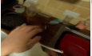


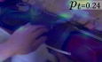


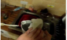


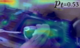


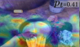


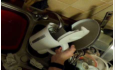


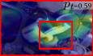


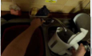


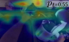


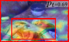


Figure 4. Qualitative results of MisFormer. Red text highlights mistaken semantic roles, the red frame marks the Point-of-No-Return (PNR), and the red bounding box localizes the mistake region in the PNR frame. The column in each sample visualizes the per-frame heatmap from the spatial attribution module for reference. 

Mistake Spatial Attribution. Hand-detection methods fail to address the spatial attribution task because they do not localize the manipulated object, which is important for precise mistake grounding and downstream recovery [29]. MisFormer substantially outperforms hand-detection baselines (MediaPipe-U) for spatial attribution on the PNR frame, improving mIoU by +9.33 and reducing Center Distance (CD) and Box Size Error (BSE) by 3.11 and 4.71, respectively. Compared to a SOTA hand-object interaction detector (SSDA), MisFormer is less accurate on localization (mIoU 59.21 vs. 68.54; CD 10.36 vs. 4.52; BSE 16.27 vs. 8.56). Nevertheless, MisFormer offers a unified framework which performs semantic and temporal attribution in conjunction with localization. MisFormer is also efficient. Spatial attribution module runs at 68.9 FPS versus 28.44 FPS (SSDA) on the same NVIDIA H100 GPU. 

Mistake Detection. Semantic attribution implies mistake detection, so we also compare MisFormer with state-of-the-art mistake detection methods on our MATT benchmarks (EPICKITCHENS-M, Ego4D-M) and on the existing popular Mistake Detection benchmark EgoPER [26]. In Tab. 5-(a), prior methods perform poorly on our benchmarks because they are designed for a small set of activities with no mistake supervision, casting detection as out-of-distribution (OOD) detection problem. When there are too many activities tode- 

23972

<!-- Page 8 -->

|Method|mIoU (%)↑|CD (%)↑|BSE (%)↑|
|---|---|---|---|
|MediaPipe-U [33]|49.88|13.47|20.98|
|SSDA [28]|64.54|7.21|12.34|
|MisFormer (Ours)|59.21|10.36|16.27|


Table 4. Spatial attribution results. We report mIoU, Center Distance (CD), and Box Size Error (BSE). MisFormer, our unified framework, performs better than the hand-detection baselines (by 18.70% mIoU) and comparable to hand-object interaction detector. Bold and underline indicate the best and second best results. 

tect mistakes on, a single OOD model struggles to separate actual mistakes from benign variability (i.e., correct samples in many activities). In contrast, MisFormer scales with data via supervised learning, consistent with findings on data-driven approaches in other domains [22, 50]. 

However, such models struggle when there is lack of training data and supervision signal. In Tab. 5-(b), training MisFormer from scratch on an augmented EgoPER training set using only semantic attribution supervision underperforms specialized detectors. Notably, such struggles can be alleviated by pretraining. Row MisFormer (Ours)<sup>†</sup> retrains MisFormer on EPIC-KITCHENS-M and then fine-tunes on EgoPER, yielding competitive results with SOTA detectors while preserving our unified attribution capabilities. These results suggest that MisFormer can handle mistake understanding ranging from coarse detection to fine-grained attribution when fueled by the large data prepared by MisEngine. 

|Method|EK||Eg|o|Method<br>F1@.5↑|Acc. ↑|
|---|---|---|---|---|---|---|
||F1@.5↑|Acc. ↑|F1@.5↑|Acc. ↑|AMNAR [19]<br>28.54|29.65|
|AMNAR [19]|16.34|17.45|12.57|14.24|EgoPED [26]<br>32.18<br> <br>|33.23<br>|
|EgoPED [26]|21.18|22.23|15.62|17.34|MisFormer (Ours)<br>26.78<br> <sup>†</sup><br>|27.89<br>|
|MisFormer (Ours)|78.05|80.90|57.55|59.89|MisFormer (Ours)<br>35.18|36.23|
||(a|)|||(b)||


Table 5. Mistake Detection results on: (a) EPIC-KITCHENS-M (EK) and Ego4D-M (Ego); (b) EgoPER dataset. When fueled by large data prepared by MisEngine, MisFormer can handle mistake understanding ranging from coarse detection to fine-grained attribution. † denotes the model is pretrained on EPIC-KITCHENS-M. 

Ablation Study. In Tab. 6, we ablate key design choices of MisFormer across the feature extractor (b), semantic attribution (c), temporal attribution (d), and spatial attribution (e) modules. In (b), we replace the backbone with another video-language pre-trained model, LaViLa [58], as the feature extractor. Performance drops across all tasks when using LaViLa. In contrast, InternVideo2 [54] (our default) is pre-trained with more modalities, broader objectives, and more data, highlighting the importance of high-capacity video-language pre-training for MATT. In (c), we remove the projection block P and feed the pre-trained text encoder features FR<sup>Tdirectlyintotheattributionheads.Without</sup> this projection step, raw text embeddings are insufficient to capture the nuanced divergence between the instruction 

and the attempt video, degrading performance. In (d), we remove supervision for temporal attribution. At inference, we run spatial attribution on all frames and select the frame with the highest average activation in the score map as the PNR prediction. This has little effect on semantic attribution and mistake detection, but clearly degrades temporal attribution quality, demonstrating the benefit of using temporal attribution as a training objective. In (e), we generate temporal heatmaps with GradCAM [44] and otherwise follow the same spatial decoding procedure. The inferior spatial results confirm the benefit of using a refined attention-based heatmap for retrieving the most relevant mistake regions. 

|No.|Method|Sema. F1@0.5↑|Temp. MAE (s)↑|Spat. mIoU (%)↑|Det. F1@0.5↑|
|---|---|---|---|---|---|
|(a)|MisFormer (Ours)|56.24|0.438|59.21|57.55|
|(b)|Ours-LaViLa [58]|49.16|0.561|51.37|46.05|
|(c)|Ours-w/oP|51.34|0.457|55.43|52.75|
|(d)|Ours-w/o Temp.|51.29|0.623|57.78|57.46|
|(e)|Ours-GradCAM [44]|55.52|0.482|55.03|57.51|


Table 6. Ablations on Ego4D-M for Semantic Attribution (Sema.), Temporal Attribution (Temp.), Spatial Attribution (Spat.), and Mistake Detection (Det.). Our default model is MisFormer (Ours). Results show the importance of the design choices in each module. 

## 5. Discussion 

Conclusion. We introduced Mistake Attribution (MATT), focusing on what, when, and where mistakes arise in egocentric videos. We created large-scale, attribution-rich datasets with MisEngine (Ego4D-M, EPIC-KITCHENS-M) by leveraging existing egocentric action corpora. Fueled by these datasets, we developed MisFormer, a unified model that attributes mistakes along the semantic, temporal, and spatial axes. Experiments show that existing methods—even when specialized for individual subtasks—struggle to address MATT, underscoring its challenge. MisFormer consistently outperforms strong video-language, temporal localization, hand-object interaction and mistake detection baselines on our and prior benchmarks, demonstrating the effectiveness of our datadriven solution for MATT. 

Limitations and Future Work. Real applications will involve longer, compositional instructions with richer role inventories. As our experiments indicate, different roles pose distinct challenges; study the challenges and solutions for MATT with longer instructions is an important next step. Second, MisFormer currently relies on features from existing video–language representation learning, which is pre-trained with video-language alignment objective. While our downstream adaptation blocks make these features effective for MATT, developing a task-driven representation that jointly embeds video and instruction specifically for mistake understanding could further improve attribution accuracy and efficiency, potentially serve as a foundation for mistake understanding in general. 

23973

<!-- Page 9 -->

## Acknowledgement 

This research was funded, in part, by the U.S. Government under ARPA-H contract 1AY2AX000062. The views and conclusions contained in this document are those of the authors and should not be interpreted as representing the official policies, either expressed or implied, of the U.S. Government. 

## References 

- [1] Filippos Bellos, Yayuan Li, Wuao Liu, and Jason Corso. Can large language models reason about goal-oriented tasks? In Proceedings of the First edition of the Workshop on the Scaling Behavior of Large Language Models (SCALE-LLM 2024). Association for Computational Linguistics, 2024. 2 

- [2] Filippos Bellos, Yayuan Li, Cary Shu, Ruey Day, Jeffrey Siskind, and Jason Corso. Towards effective human-in-theloop assistive ai agents. In Proceedings of the IEEE/CVF International Conference on Computer Vision (ICCV), pages 2513–2522, 2025. 1, 2 

- [3] Gedas Bertasius, Heng Wang, and Lorenzo Torresani. Is space-time attention all you need for video understanding? In ICML, 2021. 2 

- [4] Jing Bi, Filippos Bellos, Junjia Guo, Yayuan Li, Chao Huang, Yolo Y Tang, Luchuan Song, Susan Liang, Zhongfei Mark Zhang, Jason J Corso, et al. When to think and when to look: Uncertainty-guided lookback. In Proceedings of the IEEE/CVF Conference on Computer Vision and Pattern Recognition (CVPR), 2026. 2 

- [5] Dima Damen, Hazel Doughty, Giovanni Maria Farinella, Antonino Furnari, Jian Ma, Evangelos Kazakos, Davide Moltisanti, Jonathan Munro, Toby Perrett, Will Price, and Michael Wray. Rescaling egocentric vision: Collection, pipeline and challenges for epic-kitchens-100. International Journal of Computer Vision (IJCV), 130:33–55, 2022. 1, 2, 3, 4 

- [6] Jeevan S. Devagiri, Sidike Paheding, Quamar Niyaz, Xiaoli Yang, and Samantha Smith. Augmented reality and artificial intelligence in industry: Trends, tools, and future challenges. Expert Systems with Applications, 207:118002, 2022. 1 

- [7] Guodong Ding, Fadime Sener, Shugao Ma, and Angela Yao. Every mistake counts in assembly. arXiv preprint arXiv:2307.16453, 2023. 2, 3, 5 

- [8] Alexey Dosovitskiy, Lucas Beyer, Alexander Kolesnikov, Dirk Weissenborn, Xiaohua Zhai, Thomas Unterthiner, Mostafa Dehghani, Matthias Minderer, Georg Heigold, Sylvain Gelly, Jakob Uszkoreit, and Neil Houlsby. An image is worth 16x16 words: Transformers for image recognition at scale. In International Conference on Learning Representations (ICLR), 2021. 2 

- [9] Marion A. Eppler. Development of manipulatory skills and the deployment of attention. Infant Behavior and Development, 18(4):391–405, 1995. 1 

- [10] Charles J. Fillmore. The case for case. In Universals in Linguistic Theory, pages 1–88. Holt, Rinehart, and Winston, New York, NY, USA, 1968. 3 

- [11] Charles J. Fillmore. The case for case. In Universals in 

Linguistic Theory, pages 1–88. Holt, Rinehart, and Winston, 1968. 2 

- [12] Alessandro Flaborea, Guido Maria D’Amely di Melendugno, Leonardo Plini, Luca Scofano, Edoardo De Matteis, Antonino Furnari, Giovanni Maria Farinella, and Fabio Galasso. Prego: online mistake detection in procedural egocentric videos. In Proceedings of the IEEE/CVF Conference on Computer Vision and Pattern Recognition, pages 18483–18492, 2024. 1, 2 

- [13] Matt Gardner, Joel Grus, Mark Neumann, Oyvind Tafjord, Pradeep Dasigi, Nelson F. Liu, Matthew Peters, Michael Schmitz, and Luke Zettlemoyer. Allennlp: A deep semantic natural language processing platform. In NLP OSS Workshop at ACL, 2018. 3, 4, 5 

- [14] Carly R Garrow, Karl-Friedrich Kowalewski, Linhong Li, Martin Wagner, Mona W Schmidt, Sandy Engelhardt, Daniel A Hashimoto, Hannes G Kenngott, Sebastian Bodenstedt, Stefanie Speidel, et al. Machine learning for surgical phase recognition: a systematic review. Annals of surgery, 273(4):684–693, 2021. 1 

- [15] Kristen Grauman, Andrew Westbury, Eugene Byrne, Zachary Chavis, Antonino Furnari, Rohit Girdhar, Jackson Hamburger, Hao Jiang, Miao Liu, Xingyu Liu, et al. Ego4d: Around the world in 3,000 hours of egocentric video. In Proceedings of the IEEE/CVF Conference on Computer Vision and Pattern Recognition, pages 18995–19012, 2022. 1, 2, 3, 4, 6 

- [16] Albert Haque, Arnold Milstein, and Li Fei-Fei. Illuminating the dark spaces of healthcare with ambient intelligence. Nature, 585(7824):193–202, 2020. 1 

- [17] Mahmudul Hasan, Jonghyun Choi, Janet Neumann, Amit K. Roy-Chowdhury, and Larry S. Davis. Learning temporal regularity in video sequences. In Proceedings of the IEEE Conference on Computer Vision and Pattern Recognition (CVPR), pages 733–742, 2016. 2 

- [18] Luheng He, Kenton Lee, Mike Lewis, and Luke Zettlemoyer. Deep semantic role labeling: What works and what’s next. In Proceedings of the 55th Annual Meeting of the Association for Computational Linguistics (Volume 1: Long Papers), pages 473–483, Vancouver, Canada, 2017. Association for Computational Linguistics. 5 

- [19] Wei-Jin Huang, Yuan-Ming Li, Zhi-Wei Xia, Yu-Ming Tang, Kun-Yu Lin, Jian-Fang Hu, and Wei-Shi Zheng. Modeling multiple normal action representations for error detection in procedural tasks. In CVPR, 2025. 2, 6, 8 

- [20] Peter J. Huber. Robust estimation of a location parameter. Annals of Mathematical Statistics, 35(1):73–101, 1964. 6 

- [21] Youngkyoon Jang, Brian Sullivan, Casimir Ludwig, Iain Gilchrist, Dima Damen, and Walterio Mayol-Cuevas. Epictent: An egocentric video dataset for camping tent assembly. In Proceedings of the IEEE/CVF International Conference on Computer Vision Workshops, pages 0–0, 2019. 2, 3, 5 

- [22] Jared Kaplan, Sam McCandlish, Tom Henighan, Tom B. Brown, Benjamin Chess, Rewon Child, Scott Gray, Alec Radford, Jeffrey Wu, and Dario Amodei. Scaling laws for neural language models, 2020. 8 

- [23] Taein Kwon, Bugra Tekin, Jan Stuhmer, Federica Bogo, and¨ Marc Pollefeys. H2o: Two hands manipulating objects for 

23974

<!-- Page 10 -->

first person interaction recognition. In Proceedings of the IEEE/CVF International Conference on Computer Vision (ICCV), pages 10138–10148, 2021. 1 

- [24] John Lafferty, Andrew McCallum, and Fernando Pereira. Conditional random fields: Probabilistic models for segmenting and labeling sequence data. In Proceedings of the 18th International Conference on Machine Learning (ICML), pages 282–289. Morgan Kaufmann, 2001. 5 

- [25] Shih-Po Lee and Ehsan Elhamifar. Error recognition in procedural videos using generalized task graph. In Proceedings of the IEEE/CVF International Conference on Computer Vision, pages 10009–10021, 2025. 1, 3 

- [26] Shih-Po Lee, Zijia Lu, Zekun Zhang, Minh Hoai, and Ehsan Elhamifar. Error detection in egocentric procedural task videos. In Proceedings of the IEEE/CVF Conference on Computer Vision and Pattern Recognition, pages 18655–18666, 2024. 1, 2, 3, 5, 6, 7, 8 

- [27] Jiachen Lei, Shuang Ma, Zhongjie Ba, Sai Vemprala, Ashish Kapoor, and Kui Ren. Masked autoencoders for egocentric video understanding@ ego4d challenge 2022. arXiv preprint arXiv:2211.15286, 2022. 2, 6, 7 

- [28] Rosario Leonardi, Antonino Furnari, Francesco Ragusa, and Giovanni Maria Farinella. Are synthetic data useful for egocentric hand-object interaction detection? In European Conference on Computer Vision, 2024. 2, 6, 8 

- [29] Sergey Levine, Peter Pastor, Alex Krizhevsky, and Deirdre Quillen. Learning hand-eye coordination for robotic grasping with deep learning and large-scale data collection. The International Journal of Robotics Research, 37(4-5):421–436, 2018. 7 

- [30] Yayuan Li, Zhi Cao, and Jason J Corso. Handi: Hand-centric text-and-image conditioned video generation. arXiv preprint arXiv:2412.04189, 2024. 2 

- [31] Yayuan Li, Filippos Bellos, and Jason Corso. Towards consistent long-term pose generation. arXiv preprint arXiv:2507.18382, 2025. 2 

- [32] Kevin Qinghong Lin, Jinpeng Wang, Mattia Soldan, Michael Wray, Rui Yan, Eric Z. XU, Difei Gao, Rong-Cheng Tu, Wenzhe Zhao, Weijie Kong, Chengfei Cai, WANG HongFa, Dima Damen, Bernard Ghanem, Wei Liu, and Mike Zheng Shou. Egocentric video-language pretraining. In Advances in Neural Information Processing Systems, 2022. 7 

- [33] Camillo Lugaresi, Jiuqiang Tang, Hadon Nash, Chris McClanahan, Esha Uboweja, Michael Hays, Fan Zhang, ChuoLing Chang, Ming Yong, Juhyun Lee, Wan-Teh Chang, Wei Hua, Manfred Georg, and Matthias Grundmann. Mediapipe: A framework for perceiving and processing reality. In Third Workshop on Computer Vision for AR/VR at IEEE Computer Vision and Pattern Recognition (CVPR) 2019, 2019. 2, 6, 8 

- [34] Muhammad Maaz, Hanoona Rasheed, Salman Khan, and Fahad Khan. Video-ChatGPT: Towards detailed video understanding via large vision and language models. In Proceedings of the 62nd Annual Meeting of the Association for Computational Linguistics (Volume 1: Long Papers), 2024. 2, 6, 7 

- [35] Javier Mar´ın, Aritro Biswas, Ferda Ofli, Nicholas Hynes, Amaia Salvador, Yusuf Aytar, Ingmar Weber, and Antonio 

   - Torralba. Recipe1m+: A dataset for learning cross-modal embeddings for cooking recipes and food images. IEEE Trans. Pattern Anal. Mach. Intell., 43(1):187–203, 2021. 1 

- [36] Michele Mazzamuto, Antonino Furnari, Yoichi Sato, and Giovanni Maria Farinella. Gazing into missteps: Leveraging eye-gaze for unsupervised mistake detection in egoentric videos of skilled human activities. In Proceedings of the Computer Vision and Pattern Recognition Conference, pages 8310–8320, 2025. 1, 2 

- [37] Antoine Miech, Dimitri Zhukov, Jean-Baptiste Alayrac, Makarand Tapaswi, Ivan Laptev, and Josef Sivic. Howto100m: Learning a text-video embedding by watching hundred million narrated video clips. In Proceedings of the IEEE/CVF international conference on computer vision, pages 2630– 2640, 2019. 1 

- [38] Rashmiranjan Nayak, Umesh Chandra Pati, and Santos Kumar Das. A comprehensive review on deep learning-based methods for video anomaly detection. Image and Vision Computing, 2021. 2 

- [39] OpenAI. Gpt-4o technical report. OpenAI Blog, 2024. 2, 6, 7 

- [40] Ege Ozsoy, Arda Mamur, Felix Tristram, Chantal Pellegrini,<sup>¨</sup> Magdalena Wysocki, Benjamin Busam, and Nassir Navab. Egoexor: An ego-exo-centric operating room dataset for surgical activity understanding. arXiv preprint arXiv:2505.24287, 2025. 1 

- [41] Constantin Patsch, Yuankai Wu, Marsil Zakour, Driton Salihu, and Eckehard Steinbach. Mistsense: Versatile online detection of procedural and execution mistakes. In Proceedings of the IEEE/CVF International Conference on Computer Vision, pages 14528–14537, 2025. 1, 3 

- [42] Rohith Peddi, Shivvrat Arya, Bharath Challa, Likhitha Pallapothula, Akshay Vyas, Bhavya Gouripeddi, Qifan Zhang, Jikai Wang, Vasundhara Komaragiri, Eric Ragan, et al. Captaincook4d: A dataset for understanding errors in procedural activities. Advances in Neural Information Processing Systems, 37:135626–135679, 2024. 1, 2, 3, 5 

- [43] Adria Recasens, Aditya Khosla, Carl Vondrick, and Antonio Torralba. Where are they looking? In Advances in Neural Information Processing Systems, 2015. 4 

- [44] Ramprasaath R. Selvaraju, Michael Cogswell, Abhishek Das, Ramakrishna Vedantam, Devi Parikh, and Dhruv Batra. Gradcam: Visual explanations from deep networks via gradientbased localization. In 2017 IEEE International Conference on Computer Vision (ICCV), 2017. 8 

- [45] Fadime Sener, Dibyadip Chatterjee, Daniel Shelepov, Kun He, Dipika Singhania, Robert Wang, and Angela Yao. Assembly101: A large-scale multi-view video dataset for understanding procedural activities. In Proceedings of the IEEE/CVF Conference on Computer Vision and Pattern Recognition, pages 21096–21106, 2022. 1, 2, 3, 5 

- [46] Himanshu Gaurav Singh, Antonio Loquercio, Carmelo Sferrazza, Jane Wu, Haozhi Qi, Pieter Abbeel, and Jitendra Malik. Hand-object interaction pretraining from videos, 2024. 1 

- [47] Dean Slawson. The case for vr-immersive and ai-adaptive soft skills training. Training Industry Magazine, 2018. 1 

- [48] Bilge Soran, Ali Farhadi, and Linda Shapiro. Generating notifications for missing actions: Don’t forget to turn the lights 

23975

<!-- Page 11 -->

- off! In Proceedings of the IEEE International Conference on Computer Vision, pages 4669–4677, 2015. 1, 2 

- [49] Shane Storks, Itamar Bar-Yossef, Yayuan Li, Zheyuan Zhang, Jason J Corso, and Joyce Chai. Transparent and coherent procedural mistake detection. In Proceedings of the 2025 Conference on Empirical Methods in Natural Language Processing (EMNLP), pages 13979–14013, 2025. 2, 3 

Stoyanov. Deepphase: surgical phase recognition in cataracts videos. In Medical Image Computing and Computer Assisted Intervention–MICCAI 2018: 21st International Conference, Granada, Spain, September 16-20, 2018, Proceedings, Part IV 11, pages 265–272. Springer, 2018. 1 

- [50] Chen Sun, Abhinav Shrivastava, Saurabh Singh, and Abhinav Gupta. Revisiting unreasonable effectiveness of data in deep learning era. In Proceedings of the IEEE International Conference on Computer Vision (ICCV), 2017. 8 

- [51] Ashish Vaswani, Noam Shazeer, Niki Parmar, Jakob Uszkoreit, Llion Jones, Aidan N. Gomez, Lukasz Kaiser, and Illia Polosukhin. Attention is all you need. CoRR, abs/1706.03762, 2017. 5 

- [52] Miaowei Wang, Qingxuan Yan, Zhi Cao, Yayuan Li, Oisin Mac Aodha, Jason J. Corso, and Amir Vaxman. Bimotion: B-spline motion for text-guided dynamic 3d character generation. In Proceedings of the IEEE/CVF Conference on Computer Vision and Pattern Recognition (CVPR), 2026. 2 

- [53] Xin Wang, Taein Kwon, Mahdi Rad, Bowen Pan, Ishani Chakraborty, Sean Andrist, Dan Bohus, Ashley Feniello, Bugra Tekin, Felipe Vieira Frujeri, Neel Joshi, and Marc Pollefeys. Holoassist: an egocentric human interaction dataset for interactive ai assistants in the real world, 2023. 1, 2, 3, 5 

- [54] Yi Wang, Kunchang Li, Xinhao Li, Jiashuo Yu, Yinan He, Guo Chen, Baoqi Pei, Rongkun Zheng, Zun Wang, Yansong Shi, Tianxiang Jiang, Songze Li, Jilan Xu, Hongjie Zhang, Yifei Huang, Yu Qiao, Yali Wang, and Limin Wang. Internvideo2: Scaling foundation models for multimodal video understanding. In ECCV, 2024. 5, 8 

- [55] Zihui Xue, Yale Song, Kristen Grauman, and Lorenzo Torresani. Egocentric video task translation. In Proceedings of the IEEE/CVF Conference on Computer Vision and Pattern Recognition, pages 2310–2320, 2023. 2, 6, 7 

- [56] Yuanhan Zhang, Bo Li, haotian Liu, Yong jae Lee, Liangke Gui, Di Fu, Jiashi Feng, Ziwei Liu, and Chunyuan Li. Llavanext: A strong zero-shot video understanding model, 2024. 2, 6, 7 

- [57] Bin Zhao, Li Fei-Fei, and Eric P. Xing. Online detection of unusual events in videos via dynamic sparse coding. In CVPR, 2011. 2 

- [58] Yue Zhao, Ishan Misra, Philipp Kr¨ahenb¨uhl, and Rohit Girdhar. Learning video representations from large language models. In Proceedings of the IEEE/CVF Conference on Computer Vision and Pattern Recognition (CVPR), 2023. 8 

- [59] Joey Tianyi Zhou, Jiawei Du, Hongyuan Zhu, Xi Peng, Yong Liu, and Rick Siow Mong Goh. Anomalynet: An anomaly detection network for video surveillance. IEEE Transactions on Information Forensics and Security, 2019. 2 

- [60] Luowei Zhou, Chenliang Xu, and Jason J. Corso. Towards automatic learning of procedures from web instructional videos. In AAAI, 2018. 1 

- [61] Yuansheng Zhu, Wentao Bao, and Qi Yu. Towards open set video anomaly detection. In ECCV, 2022. 2 

- [62] Odysseas Zisimopoulos, Evangello Flouty, Imanol Luengo, Petros Giataganas, Jean Nehme, Andre Chow, and Danail 

23976
