# Li_SAVA-X_Ego-to-Exo_Imitation_Error_Detection_via_Scene-Adaptive_View_Alignment_and_CVPR_2026_paper

[Original PDF](../Li_SAVA-X_Ego-to-Exo_Imitation_Error_Detection_via_Scene-Adaptive_View_Alignment_and_CVPR_2026_paper.pdf)

Pages: 12

> Automatically converted from PDF. Check the original for exact equations, symbols, table alignment, and figure details.

<!-- Page 1 -->

This CVPR paper is the Open Access version, provided by the Computer Vision Foundation. Except for this watermark, it is identical to the accepted version; the final published version of the proceedings is available on IEEE Xplore. 

# **SAVA-X: Ego-to-Exo Imitation Error Detection via Scene-Adaptive View Alignment and Bidirectional Cross View Fusion** 

Xiang Li, Heqian Qiu* , Lanxiao Wang* , Benliu Qiu, Fanman Meng, Linfeng Xu, Hongliang Li* University of Electronic Sience and Technology of China 

Chengdu, China 

xianglee@std.uestc.edu.cn, _{_ hqqiu,lanxiaowang _}_ @uestc.edu.cn,qbenliu@gmail.com, _{_ fmmeng,lfxu,hlli _}_ @uestc.edu.cn 

## **Abstract** 

_Error detection is crucial in industrial training, healthcare, and assembly quality control. Most existing work assumes a single-view setting and cannot handle the practical case where a third-person (exo) demonstration is used to assess a first-person (ego) imitation. We formalize Ego→Exo Imitation Error Detection: given asynchronous, length-mismatched ego and exo videos, the model must localize procedural steps on the ego timeline and decide whether each is erroneous. This setting introduces cross-view domain shift, temporal misalignment, and heavy redundancy. Under a unified protocol, we adapt strong baselines from dense video captioning and temporal action detection and show that they struggle in this cross-view regime. We then propose_ **_SAVA-X_** _, an Align–Fuse–Detect framework with (i) view-conditioned adaptive sampling, (ii) scene-adaptive view embeddings, and (iii) bidirectional cross-attention fusion. On the EgoMe benchmark, SAVA-X consistently improves AUPRC and mean tIoU over all baselines, and ablations confirm the complementary benefits of its components. Code is available at https://github. com/jack1ee/SAVAX._ 

## **1. Introduction** 

Wearable cameras and human–robot systems have accelerated research on _egocentric_ (first-person) video understanding [8, 22, 39]. Egocentric videos capture finegrained hand–object interactions and operator intent, supporting applications such as procedural training, skill assessment, and execution monitoring. While recent progress spans egocentric action classification [9, 11, 17, 18, 33, 37, 38, 46, 49, 56, 61, 64] and temporal detection [12, 25, 43, 45, 47, 48, 53, 63], most existing approaches assume _egocentric-only_ inputs. 

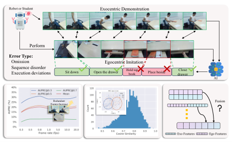

<!-- Start of picture text -->
Robot or Student Exocentric Demonstration Perform Error Type: Omission Egocentric Imitation   Sequence disorder  Execution deviations Sit down Open the drawer Hold top book Place beside drawerClose AI Frames IncreaseRedundant  Fusion Exo Features Ego Features <!-- End of picture text -->

Figure 1. **Top** : Schematic of the Ego→Exo imitation-error detection task. The system localizes steps on the ego timeline and judges each step by semantic adherence to the exocentric demonstration, rather than rigid speed/pose matching. **Bottom-left** : Baseline exhibits a counterintuitive performance drop as the number of input frames increases, partly because redundant frames in the videos introduce distraction. **Bottom** : There is a pronounced domain shift between Ego and Exo, the distribution of similarities between video-level features of demonstration–imitation pairs is overly dispersed. **Bottomright** : A key challenge is how to effectively fuse information from Ego and Exo videos to accomplish the task. 

In many real-world settings—industrial assembly following an instructor, a nurse imitating a medical protocol, or a robot learning from demonstration—the reference is a _third-person (exocentric)_ demonstration, and the goal is to determine whether a first-person execution faithfully imitates it. This cross-view formulation is rarely explored. Prior error-detection studies [9, 31] operate within a single view, leaving a fundamental question unanswered: _how can we detect procedural mistakes when demonstration and execution belong to different, unaligned viewpoints?_ 

We formalize this problem as **Ego** _→_ **Exo imitation error detection** . Given an exocentric demonstration _V__exo_ and an egocentric execution _V__ego_ recorded asynchronously and with potentially different durations, the system must (i) localize procedural steps on the ego 

*Corresponding authors. 

28062

<!-- Page 2 -->

timeline and (ii) classify each step as correct or erroneous relative to the demonstration. We build upon EgoMe [42], the only dataset providing paired but unaligned ego–exo videos with fine-grained procedural and error annotations. 

This cross-view setting poses three tightly coupled challenges. **Temporal misalignment.** Ego/exo videos differ in timing, pace, and execution style; duration mismatch is not itself an error, yet it disrupts na¨ıve feature alignment. **Heavy redundancy.** Long videos contain substantial non-informative content [4, 55], diluting attention mechanisms [52] and amplifying false positives. **Pronounced view-domain gap.** Egocentric views emphasize local hand–object interactions, whereas exocentric views capture global posture and scene layout. Their appearance and motion statistics differ significantly [30, 60], causing direct feature fusion to be unreliable. 

Addressing these intertwined issues requires more than simply concatenating ego/exo features or adapting single-view temporal detectors. To this end, we propose **SAVA-X** (Scene-Adaptive View Alignment with Bidirectional Cross View Fusion), a unified _Align–Fuse– Detect_ framework that (i) selectively retains informative segments to stabilize alignment under timing mismatch, (ii) conditions representations on learnable viewaware embeddings to reduce domain discrepancy, and (iii) performs complementary cross-view interaction to unify global demonstration cues with local egocentric evidence. Importantly, SAVA-X is designed so that each component targets one of the core challenges while jointly reinforcing the others. 

Under a unified evaluation protocol, we adapt strong baselines from dense video captioning and temporal action detection and show that they struggle in this crossview regime. On EgoMe[42], SAVA-X achieves consistent improvements in AUPRC and mean tIoU across multiple thresholds. Extensive ablations verify that each design element contributes meaningfully and that their combination yields robust cross-view error detection. 

**Contributions.** (1) We introduce and formalize the new task of **Ego** _→_ **Exo imitation error detection** , highlighting practical significance and core challenges. (2) We propose **SAVA-X** , an _Align–Fuse–Detect_ framework designed to jointly handle temporal misalignment, redundancy, and cross-view domain shift. (3) We establish a unified protocol, adapt strong baselines, and show that SAVA-X delivers consistent gains and complementary component effects on the EgoMe[42] benchmark. 

## **2. Related Work** 

**Video Understanding** . Modern video foundation models have evolved from 3D CNNs to large-scale Transformers pretrained with self-supervision. A common downstream paradigm is frozen backbone and lightweight task head. Recent methods design temporal structures or supervision strategies to learn general spatiotemporal representations [3, 7, 27, 54]. For egocentric pretraining, [6, 24, 40] extend multimodal and selfsupervised approaches to first-person scenarios. To handle redundancy in long videos, adaptive frame selection and sparse distillation improve efficiency under fixed token budgets [4, 51, 69]. We similarly employ learned sampling for redundancy and cross-view temporal alignment. With frozen backbones, prompt- or embeddingbased adaptation [15, 44] provides efficient specialization. For multi-view conditioning, [21, 26] integrate geometric priors into Transformers. Inspired by this, we introduce a scene-aware dictionary of view embeddings to encode ego/exo differences and enhance cross-scene generalization. 

**Temporal Action Localization** . TAL aims to detect action boundaries and assign class labels in untrimmed videos. Recent work has moved from proposal-based pipelines to single-stage Transformer or query-based formulations, achieving strong benchmark performance [25, 48, 63]. In egocentric settings with frequent view changes, training directly on egocentric data alleviates domain transfer issues [53], while unsupervised alignment using synchronized ego–exo pairs further bridges the gap [43]. For procedural online scenarios, error-free prototypes support error detection, progress-aware segmentation enhances streaming recognition, and memory-augmented designs improve efficiency [20, 45, 47]. 

**Dense Video Captioning** . DVC aims to localize multiple events and generate textual descriptions for untrimmed videos [41]. Since its introduction by [16], research has advanced from coarse activity captioning to fine-grained procedural domains such as cooking, supported by datasets like YouCook2, YouMakeup, and large narrated corpora [32, 34, 58, 65]. The dominant paradigm has shifted from two-stage proposal–caption pipelines [59, 66] to end-to-end formulations with set prediction and parallel decoding [57, 62, 67], reducing heuristic dependencies. For cross-view egocentric captioning, [35] establish an exo→ego transfer benchmark using view-invariant adversarial learning to address viewpoint mismatch. 

28063

<!-- Page 3 -->

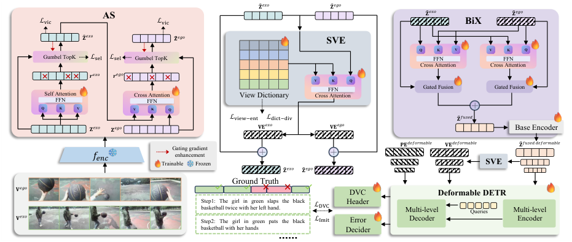

<!-- Start of picture text -->
෠𝐙 𝑒𝑥𝑜 ෠𝐙 𝑒𝑔𝑜 AS ෨𝐙 𝑒𝑥𝑜 ෨𝐙 𝑒𝑔𝑜 ℒ vic ℒ vic BiX ෠𝐙 𝑒𝑥𝑜 ෠𝐙 𝑒𝑔𝑜 SVE Q K V V K Q Gumbel TopK ℒ sel ℒ sel Gumbel TopK FFN FFN Cross Attention Cross Attention 𝒓 𝑒𝑥𝑜 𝒓 𝑒𝑔𝑜 V K Q FFN Gated Fusion Gated Fusion Self AttentionFFN Cross AttentionFFN View Dictionary Cross Attention Q K V V K Q ℒ view−ent ℒ dict−div ෠𝐙 𝑓𝑢𝑠𝑒𝑑 𝐙 𝑒𝑥𝑜 𝐙 𝑒𝑔𝑜 𝐕𝐄 𝑒𝑥𝑜 𝐕𝐄 𝑒𝑔𝑜 Base Encoder 𝐏𝐄 𝑑𝑒𝑓𝑜𝑟𝑚𝑎𝑏𝑙𝑒 𝐕𝐄 𝑑𝑒𝑓𝑜𝑟𝑚𝑎𝑏𝑙𝑒 ෠𝐙 𝑓𝑢𝑠𝑒𝑑 𝑑𝑒𝑓𝑜𝑟𝑚𝑎𝑏𝑙𝑒 Gating gradient 𝑓𝑒𝑛𝑐 TrainableenhancementFrozen SVE ෨𝐙 𝑒𝑥𝑜 ෨𝐙 𝑒𝑔𝑜 Ground Truth 𝐕 𝑒𝑔𝑜 DVC  Deformable DETR Step1: The girl in green slaps the black basketball twice with her left hand. ℒ DVC Header Multi-level Queries Multi-level 𝐕 𝑒𝑥𝑜 Step2: The girl in green pats the black  ℒ Imit Error Decoder Encoder basketball with her hands Decider <!-- End of picture text -->

Figure 2. Overview of SAVA-X. (1) A frozen video encoder extracts per-frame features from the exocentric demonstration and egocentric imitation streams. We apply gated adaptive sampling (Sec. 3.2)—hard Top-K with residual gating, using self-attention scoring for Exo and Exo-conditioned cross-attention scoring for Ego to select key segments. (2) We inject scene-aware dictionary view embeddings (Sec. 3.3) together with temporal positions (multi-level), regularized by attention-entropy and prototype-diversity terms, to mitigate cross-view domain shifts. (3) We perform bidirectional cross-attention fusion (Sec. 3.4) with learnable gating to align and aggregate complementary cues, yielding a fused sequence that a deformable Transformer encoder–decoder converts into first-person temporal spans and imitation-correctness predictions. Training uses Hungarian set prediction with _L_ DVC and _L_ Imit. 

## **3. Method** 

We propose a unified _SAVA-X_ framework (see Fig. 2) that tackles three core challenges in _ego–exo_ imitation error detection via complementary designs at the sampling, representation, and fusion levels. We first formalize the task in Sec. 3.1. In sections 3.2, 3.3 and 3.4, we respectively describe the three modules we propose. 

### **3.1. Problem Formulation** 

The Ego–Exo imitation-error detection task is defined as follows. Given a third-person demonstration video and a first-person imitation video that are recorded independently (with unaligned timelines and possibly different durations), the model aims to _localize_ procedural step segments on the first-person timeline and _decide_ whether each localized segment is a correct imitation. Let _V__exo_ = _{It__exo_ _}__T_ _t_ =1_x, Vego_=_{I_ _t__ego_ _}__T_ _t_ =1_y_de- note the exocentric and egocentric videos with lengths _Tx_ and _Ty_ , respectively. The task produces a set prediction _D_� = �( _t_ˆ_st_ _n__,_ˆ_ted_ _n__,_ˆ_yn_) � _Nn_ =1, where ˆ_t_ _n__st,_ˆ_ted_ _n__∈_[0_,_1] are the normalized start and end times on the first-person timeline and _y_ ˆ _n ∈{_ 0 _,_ 1 _}_ denotes the imitation correctness label. 

To leverage large pretrained video backbones while reducing training cost [1, 3, 7, 27, 54], we adopt a frozen pretrained encoder (shared or separate) to extract perframe or per-segment features. Denote the feature di- 

mension by _d_ and the frozen encoder by _f_ enc: 

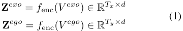

To suppress redundancy and increase the density of informative segments, we compute saliency scores on each stream and select Top- _K_ segments to get the resampled sequences **Z**ˆ_exo_ and **Z**ˆ_ego_ . Notably, the scorer for the demonstration (exo) uses only **Z**_exo_ to identify key demonstration frames, whereas the scorer for the imitation (ego) conditions on both **Z**_ego_ and the resampled demonstration features **Z**ˆ_exo_ to obtain cues for imitation correctness and to facilitate better temporal alignment. The resulting sparse sequence lengths _Kx_ and _Ky_ satisfy _Kx < Tx_ and _Ky < Ty_ . 

We then augment the sparse sequences with temporal position embeddings and view-condition embeddings to provide the model with relative timing and viewpoint information: 

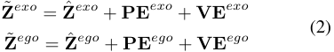

where **PE** denotes vectorial absolute temporal position embeddings and **VE** denotes scene-adaptive view embeddings generated from a shared dictionary. The enhanced sequences **Z**˜_exo_ and **Z**˜_ego_ are fused into an Ego–Exo representation **Z**˜_fused_ used to localize action segments on the first-person timeline and to predict imitation correctness. 

28064

> Original page for checking 3 unresolved font glyphs.

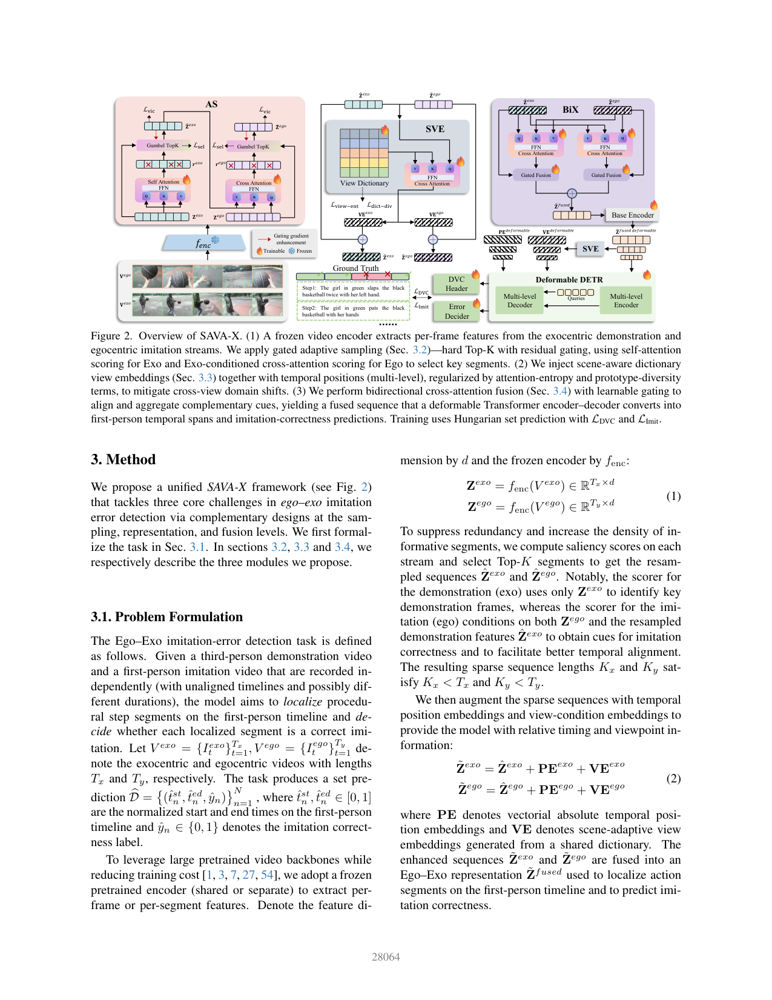

<!-- Page 4 -->

For efficient global modeling and cross-sequence interaction over long inputs, the fused representation is processed by a deformable transformer encoder–decoder[57, 68]. The decoder employs _N_ learnable queries to perform iterative refinement. Each decoder query yields one first-person candidate prediction. During training we use a set-matching loss to establish a one-to-one correspondence between predicted and ground-truth segments, and jointly optimize the DVC loss _LDV C_ [57] and the imitation-error classification loss _LImit_ , detailed in supplementary material. 

### **3.2. Adaptive Sampling** 

In cross-view imitation scenarios, both the _Exo_ and _Ego_ streams contain substantial redundancy that is irrelevant for discrimination. However, naively sparsifying them risks discarding details crucial for action localization and error judgment, and further ignores the temporal reference required for cross-view alignment. To address this, we propose _gated adaptive sampling_ : during training we generate **hard indices** via a Gumbel Top _K_ [13] straight-through estimator, while simultaneously applying a **residual gating** to the full-length features so as to provide the scorer with an _additional differentiable path_ , thereby strengthening gradient signals and stabilizing the learning of selection. This strategy preserves discrete selection to ensure downstream modules process only a small set of key moments, yet avoids the gradient sparsity problem of purely hard sampling. 

For **Z**_exo_ , scores are produced by self-attention followed by a FFN head. Then scores are performed by GumbelTopK _Gk_ to get hard indices **_l_** _x_ and soft indices **_s_** _x_ . 

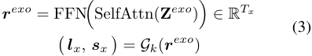

To further strengthen gradients, we perform residual gating [14] 

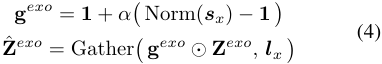

where _α ∈_ (0 _,_ 1] controls the gating strength, and “Norm” rescales soft indices to have mean _≈_ 1. **Crucially** , the _sequence_ fed to downstream modules comes from the _hard indices_ . This design makes the loss depend on the soft indices **_s_** _x_ explicitly, thus providing the scorer with stable gradients. 

Ego-side scoring should be sensitive to demonstrative key points. We therefore use the Exo summary **Z**ˆ_exo_ as keys/values and compute Ego cross-attention scores: 

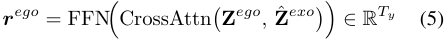

and then apply the same pipeline to produce **Z**ˆ_ego_ . 

To prevent selection collapse and representational redundancy, we add a _selection-entropy_ regularizer _L_ sel [36] to the selection distributions, encouraging coverage rather than concentrating probability mass on a few positions, and attach VICReg-style [2] _variance lower bound_ and _off-diagonal covariance_ penalties _L_ vic to the gated active tokens to suppress dimensional collinearity and collapse. _L_ sel and _L_ vic are detailed in supplementary material. In practice, this “hard selection + residual gating” combination improves focus on critical segments and stabilizes cross-view alignment and error detection downstream. 

### **3.3. Scene-aware Dictionary View Embeddings** 

Cross-view (Ego/Exo) videos exhibit systematic differences in appearance, composition, and motion statistics [30, 35, 43, 60]: ego-centric footage typically focuses on hand–object interactions and sees less of the global scene, whereas exo-centric footage provides full-body and scene structure. If one directly aligns and fuses frozen features, the model can mistake view-domain shifts for action differences, degrading localization and error detection. Injecting the view condition as learnable tokens [15, 44]—analogous to positional embeddings—is an effective remedy. However, fixed view embeddings may fail to adapt across diverse scenarios. To this end, we explicitly model the view condition and inject it into feature or attention computation in a sceneadaptive manner, thereby mitigating domain shifts and promoting cross-view alignment and evidence aggregation. 

We maintain a shared view–scene dictionary: 

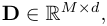

whose rows capture common view-related sub-factors (e.g., “close hand–object interaction” and “full-body motion structure”). For a stream _u ∈{_ ego _,_ exo _}_ with per-frame features **Z**ˆ_u_ _∈_ R_T ×d_ used as queries, we interact with the dictionary via multi-head attention under temperature _τ_ to obtain an adaptive view embedding: 

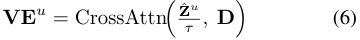

To influence the representation deeply without introducing substantial parameters, we inject at two sites: (i) Prefusion injection: inject the view condition once into each Ego/Exo stream before fusion and at the encoder input, so that within-domain alignment is performed first. (ii) Multi-layer injection in the encoder: at each temporal level of the base encoder’s output, perform another view-embedding injection to realize multi-level modulation. 

28065

<!-- Page 5 -->

To ensure the view embedding _meaningfully affects attention allocation_ without becoming overly peaky, we regularize toward the uniform distribution—equivalently, we maximize normalized entropy [36]: 

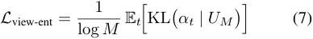

where _αt ∈_ R_M_ is the attention distribution of the _t_ th time position to the dictionary, and _UM_ is a uniform distribution in M dimensions. To broaden the dictionary’s coverage and suppress redundancy among prototypes, we first apply _ℓ_ 2 normalization to each row **d** _m_ of **D** to obtain **D**� . We then minimize the deviation from the identity to encourage approximate orthogonality: 

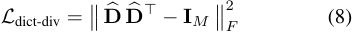

Compared with using only fixed token-type biases, the attention-based dictionary can adaptively emphasize the appropriate view subspace under different scenes. Combined with multi-layer injection, it consistently narrows the Ego/Exo domain gap and provides clearer, more transferable representations for subsequent bidirectional cross-fusion and temporal alignment. 

### **3.4. Bidirectional Cross-Attention Fusion** 

After obtaining the two sparse sequences augmented with temporal positions and view conditions, **Z**˜_exo_ _∈_ R_Kx×d_ and **Z**˜_ego_ _∈_ R_Ky×d_ , we seek robust semantic alignment and complementary evidence aggregation between unaligned, different-length Ego/Exo streams. One-way conditioning can introduce bias: using only Exo to guide Ego under-covers hand–object details in the first-person view, and the converse holds as well. Therefore, we adopt symmetric bidirectional cross-attention [19, 29, 50] so that the two streams retrieve from and constrain each other at the feature level, while residual mixing preserves native per-view representations—balancing “alignment capacity” with “viewspecific robustness”. 

We compute in parallel: 

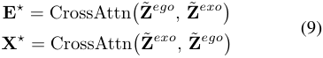

where **E**_⋆_ denotes globally structured/boundary evidence retrieved from the demonstration (Exo), and **X**_⋆_ denotes hand–object/detail/context evidence retrieved from the imitation (Ego). 

To prevent either side from overwhelming the other, we apply learnable, gated [14] residual mixing that retains only the necessary cross-view gains: 

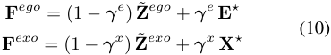

with **_γ_**_e_ = _σ_ � **We** [ **Z**˜_ego_ ; **E**_⋆_ ]� and **_γ_**_x_ = _σ_ � **Wx** [ **Z**˜_exo_ ; **X**_⋆_ ]�, where _σ_ is the sigmoid and [ _·_ ; _·_ ] denotes concatenation. This mixing encourages the model to rely more on cross-view evidence near action boundaries and key interactions, while preserving view-stable representations in background/redundant regions. 

We finally add the two gated features to fused features for subsequent decoding: 

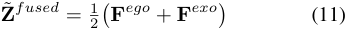

Compared with one-way fusion, bidirectional crossattention imposes complementary semantic constraints: Exo _→_ Ego strengthens first-person boundary cues and step ordering, while Ego _→_ Exo contributes object/hand details and local causality [23, 43, 60]. After gating, these are aggregated into **Z**˜_fused_ , which retains perview stability while gaining cross-view corroboration, thereby facilitating the subsequent query-style decoding to more easily localize erroneous segments and determine their types. 

## **4. Experiments** 

### **4.1. Experimental Settings** 

**Dataset.** To match our Ego→Exo imitation error detection setting, all training and evaluation are conducted on the EgoMe [42] dataset. To our knowledge, EgoMe is the only large-scale dataset that simultaneously offers asynchronously captured egocentric and exocentric views in imitation scenarios and provides annotations of erroneous imitation steps. It contains 7,902 pairs of asynchronous Exo–Ego videos (approximately 82.8 hours). In our experiments, we use only RGB videos together with fine-grained procedural step annotations and error labels. We follow the official train/validation/test split with 4,777/997/2,128 video pairs and report all main results and ablation studies on this partition. **Evaluation Metrics.** Ego _→_ Exo imitation error detection is essentially a temporal object detection task: the system must both localize segment boundaries and determine whether a segment constitutes an error. Because error segments are typically sparse and classimbalanced, and our primary concern is detecting errors, we adopt the area under the precision–recall curve ( **AUPRC** ) for the error class as the primary metric, which reduces threshold sensitivity and is more informative under imbalance. We report AUPRC for error segments evaluated at multiple temporal Intersection-overUnion (tIoU) thresholds, _{_ 0 _._ 3 _,_ 0 _._ 5 _,_ 0 _._ 7 _}_ , along with their mean. In addition, we report average **tIoU** [10] separately to isolate localization quality. 

28066

> Original page for checking 5 unresolved font glyphs.

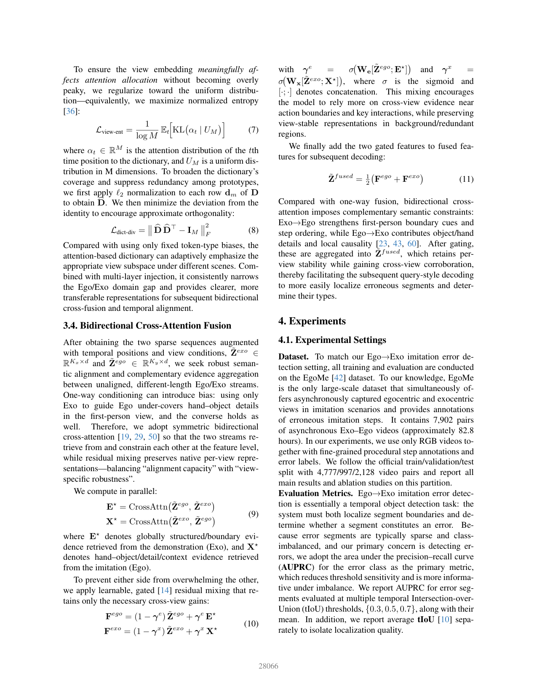

<!-- Page 6 -->

|**Method**||**AUPR** |**C on Val** |**idation** |||**AU** |**PRC on** |**Test** ||
|---|---|---|---|---|---|---|---|---|---|---|
||0.3|0.5|0.7|Mean|tIoU|0.3|0.5|0.7|Mean|tIoU|
|_Dense Video Caption_|_ing (DVC)_|_baselines_|||||||||
|PDVC [57]|28.21|20.48|7.95|18.88|58.58|25.74|18.08|4.79|16.20|57.98|
|Exo2EgoDVC [35]|31.33|20.27|7.49|19.69|59.06|26.26|16.30|5.42|15.99|58.15|
|_Temporal Action Loc_ |_alization (T_ |_AL) baseli_ |_nes_ ||||||||
|ActionFormer [63]|31.37|15.41|2.63|16.47|48.89|26.96|12.88|2.40|14.08|48.25|
|TriDet [48]|30.04|14.61|2.44|15.70|49.05|26.27|13.16|1.89|13.77|49.02|
|_Only Egocentric Inp_|_ut_||||||||||
|PDVC [57]|19.35|13.91|5.11|12.79|57.63|21.40|15.10|5.33|13.94|57.19|
|_Ours_ SAVA-X|**33.56**|**24.04**|**9.48**|**22.36**|**59.31**|**29.37**|**19.86**|**6.26**|**18.50**|**58.32**|

Table 1. Comparison on EgoMe validation and test split. Left: results on _validation set_ . Right: results on the _test set_ . We report AUPRC for the error class at multiple tIoU thresholds (0.3, 0.5, 0.7), their mean, and standalone temporal IoU (tIoU) for localization quality. 

### **4.2. Implementation Details** 

We use TSP [1] pretrained on ActivityNet [5] as a frozen feature extractor _f_ enc, to aggregate temporal context from video and obtain **Z**exo and **Z**ego , with a unified feature dimensionality of _d_ = 512. TSP is pretrained with temporal sensitivity for localization-oriented objectives (e.g., temporal action localization and captioning), making it a suitable, task-agnostic foundation for downstream localization/description. In **SAVA-X** , the hidden dimensionality of all three submodules—adaptive sampling, scene-adaptive view embeddings, and bidirectional cross-attention fusion—is set to 512. Selfattention and cross-attention each use a single layer, and the feed-forward networks (FFNs) employ a hidden size of 2048. Following bidirectional fusion, the deformable transformer encoder–decoder stack, the dense video captioning (DVC) head implementation, and the relative weighting of the constituent losses within _L_ DVC strictly follow the public PDVC configuration [57]. The imitation discrimination loss weight is set to _λ_ Imit = 0 _._ 5. Other regularization terms (e.g., selection entropy, decorrelation) are weighted within [0 _._ 01 _,_ 0 _._ 05]. We optimize with AdamW [28], using a batch size of 16 and a learning rate of 1 _._ 0 _×_ 10_−_4 . 

**Baselines.** To establish a robust and reproducible comparative baseline for Ego _→_ Exo imitation error detection, we select representative methods from two related lines of work and retrain them on EgoMe under a unified setup: from dense video captioning (DVC), **PDVC** [57] and **Exo2EgoDVC** [35]; and from temporal action localization (TAL), **ActionFormer** [63] and **TriDet** [48]. Given that EgoMe provides asynchronously captured yet coarsely time-aligned ego/exo videos, we adopt a uniform _simple fusion_ strategy across all baselines: we concatenate frozen Ego and Exo features along the chan- 

nel dimension and feed the resulting representation into each method. Then additional error detection head is inserted. Except for these changes, all other architectural components and hyperparameters strictly follow the original configurations of the respective methods. 

### **4.3. Results** 

**Quantitative Comparison on EgoMe.** Table 1 reports performance on the EgoMe validation and test sets for multiple baselines and our SAVA-X framework. SAVAX attains the best AUPRC and tIoU across all thresholds. On the validation set, SAVA-X achieves a Mean AUPRC of 22.36, an absolute **+2.67** (relative **+13.56%** ) improvement over the strongest baseline Exo2EgoDVC (19.69). Localization quality (tIoU) also shows a modest increase, underscoring the effectiveness and potential of our approach. The test set exhibits consistent trends. Fig. 3b visualizes the results of our models. Overall, SAVA-X delivers simultaneous gains under both stringent high-threshold regimes (hard detections) and coverage-oriented low-threshold regimes, indicating a strong capacity to capture fine-grained cues of erroneous actions. We also report PDVC under single-view input, which degrades performance markedly, indicating that third-person demonstrations are crucial for localizing procedural steps and reducing false positives, thereby validating the task design. 

**Ablation Study.** Table 2 presents a comprehensive ablation demonstrating the effectiveness of each component. (i) _Single module._ All three modules yield consistent gains: AS, SVE, and BiX improve by **+10.70%** / **+12.76%** / **+11.55%** over the unmodified backbone. These results confirm that redundancy removal with salient-segment amplification (AS), domaingap mitigation (SVE), and cross-view bi-directional 

28067

<!-- Page 7 -->

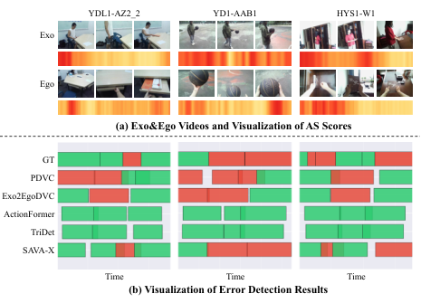

<!-- Start of picture text -->
YDL1-AZ2_2 YD1-AAB1 HYS1-W1 Exo Ego (a) Exo&Ego Videos and Visualization of AS Scores GT PDVC Exo2EgoDVC ActionFormer TriDet SAVA-X Time Time Time (b) Visualization of Error Detection Results <!-- End of picture text -->

Figure 3. Qualitative visualization examples of Ego to Exo imitation error localization. (a): Exocentric demonstration and egocentric imitation with corresponding frame saliency maps. The deeper the red, the more significant. (b): Ground truth (GT) and baseline vs. SAVA-X. Red represents error steps while green represents right steps. 

evidence fusion (BiX) each independently enhance error-step identification. (ii) _Pairwise combinations._ SVE+BiX achieves the highest performance, clearly surpassing other pairs, highlighting the impact of narrowing the domain gap and mutual cross-checking; AS+SVE is strongest at medium/high thresholds, suggesting that deredundancy and view adaptation sharpen boundary precision; AS+BiX brings a more moderate gain, indicating susceptibility to domain shift and noise prior to explicit view conditioning. (iii) _All three combined._ SAVA-X attains the best overall performance, demonstrating strong complementarity among the three modules. 

||**Modul** |**es** ||**AUP** |**RC** ||**tIoU**|
|---|---|---|---|---|---|---|---|
|**AS**|**SVE**|**BiX**|0.3|0.5|0.7|Mean||
||||28.21|20.48|7.95|18.88|58.58|
|✓|||30.90|22.60|9.21|20.90|58.88|
||✓||31.64|22.87|9.37|21.29|59.27|
|||✓|33.08|21.86|8.23|21.06|58.27|
|✓|✓||30.89|**24.26**|**10.32**|21.82|58.96|
|✓||✓|29.98|22.27|8.70|20.32|58.14|
||✓|✓|**35.09**|22.58|9.31|22.33|58.76|
|✓|✓|✓|33.56|24.04|9.48|**22.36**|**59.31**|

Table 2. Ablation on EgoMe validation split without a variant label column. AS: Adaptive Sampling; SVE: Scene-Adaptive View Embedding; BiX: Bidirectional Cross-Attention Fusion. 

### **4.4. Component Analysis** 

#### **4.4.1. AS Analysis** 

**Redundancy reduction and regularization ablations.** Table 3 reports error-detection results when we vary the input video (feature) frame rate with and without the adaptive sampling module. All variants exclude view embeddings and bidirectional cross-fusion, instead us- 

ing channel concatenation. The adaptive sampler consistently improves detection performance by removing redundant frames, improving temporal alignment, and enhancing sensitivity to temporal discrepancies. We also validate the effectiveness of the regularization terms ( _L_ sel and _L_ vic) in aiding learning. 

|**Variant**|**Inp**|**ut fram**|**e rate (**|**fps)**|**Av**|
|---|---|---|---|---|---|
||1|5|10|20|**g**|
|w/o AS|20.48|20.92|19.96|21.09|20.61|
|w AS|22.15|22.20|**23.74**|21.45|22.39|
|w AS,_L_vic,_L_sel|**23.51**|**22.60**|22.63|**22.65**|**22.85**|

Table 3. Results of the AS at different input frame rates and ablation of the regularization term. Metric is AUPRC@0.5. 

**Top-k analysis.** Fig. 4 examines the impact of different top-k retention ratios (keeping the top k% scoring frames). At lower frame rates, a larger top-k is preferable to avoid information loss; at higher frame rates, where redundancy and alignment mismatch are more pronounced, retaining a small subset of high-scoring frames suffices to improve performance. 

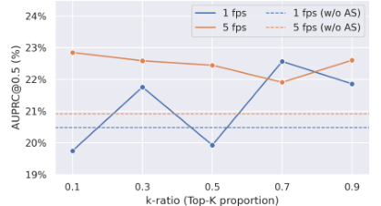

Figure 4. Performance under different AS k-ratio at 1 fps and 5 fps (dashed = w/o AS). 

**Frame-score visualization.** In Fig. 3a, we visualize dynamic scores for Ego and Exo videos across diverse scenarios. Ego-frame saliency is notably more concentrated, which aligns with the human learning pattern of first closely observing the demonstration and then imitating a few salient, well-memorized key moments. 

#### **4.4.2. SVE Analysis** 

**Comparison with fixed view embeddings** . We replace SVE with two learnable and test-time fixed tokens **VE**_exo_ and **VE**_ego_ . As the black dashed line in Fig. 5 shows, gains are limited, whereas SVE delivers consistent improvements, implying fixed tokens cannot model cross-scene/view discrepancies effectively. 

**Effect of scene-dictionary size** . Fig. 5 analyzes the influence of the dictionary size. We observe that moderately enlarging the dictionary better covers common view sub-factors, leading to more stable performance gains; when the dictionary is too small, limited expressiveness results in insufficient benefits. 

**Ablation on regularization and multi-level injection** . 

28068

<!-- Page 8 -->

We further ablate the roles of regularization and multilevel injection within the SVE module. Fig. 5 shows that, for each _M_ , adding regularizers such as selectionentropy/diversity mitigates over-sharpened attention and improves prototype coverage, while multi-level injection continuously modulates representations along the temporal hierarchy. In combination, these components enable SVE to consistently outperform fixed view embeddings across dictionary sizes and to deliver more uniform gains. 

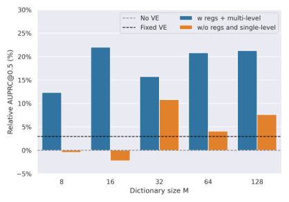

Figure 5. Relative gain vs. dictionary size for scene-aware view embeddings on the EgoMe validation split. Dashed lines indicate baselines, gray one without view embeddings, black one with fixed learnable view embeddings. 

**Domain-discrepancy analysis** . We compute videolevel global representations by uniformly pooling the Ego/Exo feature sequences over time before and after SVE injection. For each paired video, we then compute the cosine similarity between the two global representations and analyze its distribution (see Fig. 6). With SVE, the similarity distribution shifts rightward and becomes more concentrated: the mean increases and the long tail is compressed, indicating that the cross-view domain gap is effectively mitigated. 

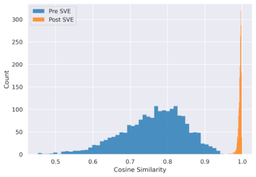

Figure 6. Visualization of domain-discrepancy changes after SVE injection. 

#### **4.4.3. BiX Analysis** 

**Comparison with alternative fusion schemes** . We also evaluate simpler fusion strategies—channel-wise con- 

catenation and temporal sequence concatenation—and, for the attention module, compare global attention against deformable attention. The aggregated results are reported in Table 4. 

**Ablation of bidirectional attention** . For the bidirectional cross-attention, we further decompose it into onedirectional variants and report their performance separately (Table 4). We observe that the Exo _→_ Ego variant performs on par with the bidirectional setting, whereas Ego _→_ Exo is clearly weaker. This aligns with the task objective: our primary goal is error detection on the egocentric stream, so providing boundary and ordering cues from demonstration (Exo) to imitation (Ego) is more critical; the reverse direction is complementary but not decisive. 

|**Fusion Variant**||**AUP** |**RC** ||**tIoU**|
|---|---|---|---|---|---|
||0.3|0.5|0.7|Mean||
|_Simple concatenati_|_on_|||||
|Concat (Channel)|28.21|20.48|7.95|18.88|58.58|
|Concat (Time)|28.91|21.05|7.85|19.27|58.15|
|_Attention Type_||||||
|BiX|**33.08**|21.86|8.23|**21.06**|58.27|
|BiX-Deformable|32.99|21.05|8.56|20.87|**58.92**|
|_Single-direction ab_ |_lations_|||||
|BiX (Exo_→_Ego)|31.94|**22.04**|8.20|20.73|58.71|
|BiX (Ego_→_Exo)|29.96|20.12|**8.37**|19.48|58.51|

Table 4. Fusion variants on EgoMe validation split. **Concat (Channel)** concatenates Ego/Exo along the feature channel; **Concat (Time)** concatenates along the temporal axis. **BiX** denotes bidirectional cross-attention fusion; **BiX-Deformable** replaces cross-attention with deformable attention. The last block ablates the bidirectional mechanism into single-direction flows. 

## **5. Conclusion** 

We presented SAVA-X for Ego→Exo imitation error detection, addressing redundancy, cross-view domain gaps, and temporal misalignment through adaptive sampling, scene-adaptive view embeddings, and bidirectional cross-attention. On the EgoMe benchmark, SAVA-X consistently outperforms strong dense video captioning and temporal action localization baselines, and ablation studies show that each component targets a distinct bottleneck while yielding complementary gains when combined. Additional analyses on dictionary size, regularization, and fusion variants clarify the design trade-offs and failure modes of the framework. We hope that our unified protocol, baselines, and architecture will serve as a useful reference point for future work on cross-view imitation analysis and error detection in procedural tasks. 

28069

<!-- Page 9 -->

## **Acknowledgements** 

This work was supported by the National Natural Science Foundation of China (No. U23A20286 and No. 62301121), Sichuan Science and Technology Program (No. 2026NSFSC1478) and Postdoctoral Fellowship Program (Grade B) of China Postdoctoral Science Foundation (No. 2025M783502 and No. GZB20240120). 

## **References** 

- [1] Humam Alwassel, Silvio Giancola, and Bernard Ghanem. Tsp: Temporally-sensitive pretraining of video encoders for localization tasks. In _Proceedings of the IEEE/CVF international conference on computer vision_ , pages 3173–3183, 2021. 3, 6 

- [2] Adrien Bardes, Jean Ponce, and Yann LeCun. VICReg: Variance-invariance-covariance regularization for self-supervised learning. In _International Conference on Learning Representations_ , 2022. 4 

- [3] Gedas Bertasius, Heng Wang, and Lorenzo Torresani. Is space-time attention all you need for video understanding? In _Proceedings of the 38th International Conference on Machine Learning_ , pages 813–824, 2021. 2, 3 

- [4] Shyamal Buch, Arsha Nagrani, Anurag Arnab, and Cordelia Schmid. Flexible Frame Selection for Efficient Video Reasoning. In _Proceedings of the IEEE/CVF Conference on Computer Vision and Pattern Recognition_ , pages 29071–29082, 2025. 2 

- [5] Fabian Caba Heilbron, Victor Escorcia, Bernard Ghanem, and Juan Carlos Niebles. Activitynet: A largescale video benchmark for human activity understanding. In _Proceedings of the ieee conference on computer vision and pattern recognition_ , pages 961–970, 2015. 6 

- [6] David Fan, Jue Wang, Shuai Liao, Zhikang Zhang, Vimal Bhat, and Xinyu Li. Text-Guided Video Masked Autoencoder. In _Computer Vision – ECCV 2024_ , pages 282–298. Springer, 2024. 2 

- [7] Haoqi Fan, Bo Xiong, Karttikeya Mangalam, Yanghao Li, Zhicheng Yan, Jitendra Malik, and Christoph Feichtenhofer. Multiscale vision transformers. In _Proceedings of the IEEE/CVF international conference on computer vision_ , pages 6824–6835, 2021. 2, 3 

- [8] Zicong Fan, Takehiko Ohkawa, Linlin Yang, Nie Lin, Zhishan Zhou, Shihao Zhou, Jiajun Liang, Zhong Gao, Xuanyang Zhang, Xue Zhang, et al. Benchmarks and challenges in pose estimation for egocentric hand interactions with objects. In _European Conference on Computer Vision_ , pages 428–448. Springer, 2024. 1 

- [9] Alessandro Flaborea, Guido Maria D’Amely di Melendugno, Leonardo Plini, Luca Scofano, Edoardo De Matteis, Antonino Furnari, Giovanni Maria Farinella, and Fabio Galasso. Prego: online mistake detection in procedural egocentric videos. In _Proceedings of the IEEE/CVF Conference on Computer Vision and Pattern Recognition_ , pages 18483–18492, 2024. 1 

- [10] Soichiro Fujita, Tsutomu Hirao, Hidetaka Kamigaito, Manabu Okumura, and Masaaki Nagata. Soda: Story oriented dense video captioning evaluation framework. In _European Conference on Computer Vision_ , pages 517– 531. Springer, 2020. 5 

- [11] Xinyu Gong, Sreyas Mohan, Naina Dhingra, JeanCharles Bazin, Yilei Li, Zhangyang Wang, and Rakesh Ranjan. Mmg-ego4d: Multimodal generalization in egocentric action recognition. In _Proceedings of the IEEE/CVF Conference on Computer Vision and Pattern Recognition_ , pages 6481–6491, 2023. 1 

- [12] Yifei Huang, Yusuke Sugano, and Yoichi Sato. Improving action segmentation via graph-based temporal reasoning. In _Proceedings of the IEEE/CVF conference on computer vision and pattern recognition_ , pages 14024– 14034, 2020. 1 

- [13] Eric Jang, Shixiang Gu, and Ben Poole. Categorical reparameterization with gumbel-softmax. In _International Conference on Learning Representations_ , 2017. 4 

- [14] Boseung Jeong, Jicheol Park, Sungyeon Kim, and Suha Kwak. Learning audio-guided video representation with gated attention for video-text retrieval. In _Proceedings of the IEEE/CVF Conference on Computer Vision and Pattern Recognition (CVPR)_ , pages 26202–26211, 2025. 4, 5 

- [15] Menglin Jia, Luming Tang, Bor-Chun Chen, Claire Cardie, Serge Belongie, Bharath Hariharan, and SerNam Lim. Visual prompt tuning. In _European conference on computer vision_ , pages 709–727. Springer, 2022. 2, 4 

- [16] Ranjay Krishna, Kenji Hata, Frederic Ren, Li Fei-Fei, and Juan Carlos Niebles. Dense-captioning events in videos. In _Proceedings of the IEEE international conference on computer vision_ , pages 706–715, 2017. 2 

- [17] Anna Kukleva, Fadime Sener, Edoardo Remelli, Bugra Tekin, Eric Sauser, Bernt Schiele, and Shugao Ma. X- mic: Cross-modal instance conditioning for egocentric action generalization. In _Proceedings of the IEEE/CVF Conference on Computer Vision and Pattern Recognition_ , pages 26364–26373, 2024. 1 

- [18] Sanjoy Kundu, Shanmukha Vellamchetti, and Sathyanarayanan N. Aakur. ProbRes: Probabilistic Jump Diffusion for Open-World Egocentric Activity Recognition. In _Proceedings of the IEEE/CVF International Conference on Computer Vision_ , 2025. 1 

- [19] Dongho Lee, Jongseo Lee, and Jinwoo Choi. Cast: crossattention in space and time for video action recognition. _Advances in Neural Information Processing Systems_ , 36: 79399–79425, 2023. 5 

- [20] Shih-Po Lee, Zijia Lu, Zekun Zhang, Minh Hoai, and Ehsan Elhamifar. Error detection in egocentric procedural task videos. In _Proceedings of the IEEE/CVF Conference on Computer Vision and Pattern Recognition_ , pages 18655–18666, 2024. 2 

- [21] Ruilong Li, Brent Yi, Junchen Liu, Hang Gao, Yi Ma, and Angjoo Kanazawa. Cameras as relative positional encoding. _arXiv preprint arXiv:2507.10496_ , 2025. 2 

- [22] Xiang Li, Heqian Qiu, Lanxiao Wang, Hanwen Zhang, Chenghao Qi, Linfeng Han, Huiyu Xiong, and 

28070

<!-- Page 10 -->

Hongliang Li. Challenges and trends in egocentric vision: A survey. _Machine Intelligence Research_ , 23(1): 1–33, 2026. 1 

- [23] Yanghao Li, Tushar Nagarajan, Bo Xiong, and Kristen Grauman. Ego-exo: Transferring visual representations from third-person to first-person videos. In _Proceedings of the IEEE/CVF Conference on Computer Vision and Pattern Recognition_ , pages 6943–6953, 2021. 5 

- [24] Kevin Qinghong Lin, Jinpeng Wang, Mattia Soldan, Michael Wray, Rui Yan, Eric Z Xu, Difei Gao, RongCheng Tu, Wenzhe Zhao, Weijie Kong, et al. Egocentric video-language pretraining. _Advances in Neural Information Processing Systems_ , 35:7575–7586, 2022. 2 

- [25] Shuming Liu, Chen-Lin Zhang, Chen Zhao, and Bernard Ghanem. End-to-end temporal action detection with 1b parameters across 1000 frames. In _Proceedings of the IEEE/CVF Conference on Computer Vision and Pattern Recognition_ , pages 18591–18601, 2024. 1, 2 

- [26] Yingfei Liu, Tiancai Wang, Xiangyu Zhang, and Jian Sun. Petr: Position embedding transformation for multiview 3d object detection. In _European conference on computer vision_ , pages 531–548. Springer, 2022. 2 

- [27] Ze Liu, Jia Ning, Yue Cao, Yixuan Wei, Zheng Zhang, Stephen Lin, and Han Hu. Video swin transformer. In _Proceedings of the IEEE/CVF conference on computer vision and pattern recognition_ , pages 3202–3211, 2022. 2, 3 

- [28] Ilya Loshchilov and Frank Hutter. Decoupled weight decay regularization. In _International Conference on Learning Representations_ , 2019. 6 

- [29] Jiasen Lu, Dhruv Batra, Devi Parikh, and Stefan Lee. Vilbert: Pretraining task-agnostic visiolinguistic representations for vision-and-language tasks. _Advances in neural information processing systems_ , 32, 2019. 5 

- [30] Mi Luo, Zihui Xue, Alex Dimakis, and Kristen Grauman. Viewpoint Rosetta Stone: Unlocking Unpaired Ego-Exo Videos for View-invariant Representation Learning. In _Proceedings of the Computer Vision and Pattern Recognition Conference_ , pages 15802–15812, 2025. 2, 4 

- [31] Michele Mazzamuto, Antonino Furnari, Yoichi Sato, and Giovanni Maria Farinella. Gazing into missteps: Leveraging eye-gaze for unsupervised mistake detection in egocentric videos of skilled human activities. In _Proceedings of the Computer Vision and Pattern Recognition Conference_ , pages 8310–8320, 2025. 1 

- [32] Antoine Miech, Dimitri Zhukov, Jean-Baptiste Alayrac, Makarand Tapaswi, Ivan Laptev, and Josef Sivic. Howto100m: Learning a text-video embedding by watching hundred million narrated video clips. In _Proceedings of the IEEE/CVF international conference on computer vision_ , pages 2630–2640, 2019. 2 

- [33] Kyle Min and Jason J Corso. Integrating human gaze into attention for egocentric activity recognition. In _Proceedings of the IEEE/CVF Winter Conference on Applications of Computer Vision_ , pages 1069–1078, 2021. 1 

- [34] Katsuyuki Nakamura, Hiroki Ohashi, and Mitsuhiro Okada. Sensor-augmented egocentric-video captioning with dynamic modal attention. In _Proceedings of the 29th_ 

_ACM International Conference on Multimedia_ , pages 4220–4229, 2021. 2 

- [35] Takehiko Ohkawa, Takuma Yagi, Taichi Nishimura, Ryosuke Furuta, Atsushi Hashimoto, Yoshitaka Ushiku, and Yoichi Sato. Exo2egodvc: Dense video captioning of egocentric procedural activities using web instructional videos. In _2025 IEEE/CVF Winter Conference on Applications of Computer Vision (WACV)_ , pages 8324–8335. IEEE, 2025. 2, 4, 6 

- [36] Gabriel Pereyra, George Tucker, Jan Chorowski, Lukasz Kaiser, and Geoffrey Hinton. Regularizing neural networks by penalizing confident output distributions. In _International Conference on Learning Representations_ , 2017. 4, 5 

- [37] Chiara Plizzari, Mirco Planamente, Gabriele Goletto, Marco Cannici, Emanuele Gusso, Matteo Matteucci, and Barbara Caputo. E2 (go) motion: Motion augmented event stream for egocentric action recognition. In _Proceedings of the IEEE/CVF conference on computer vision and pattern recognition_ , pages 19935–19947, 2022. 1 

- [38] Chiara Plizzari, Toby Perrett, Barbara Caputo, and Dima Damen. What can a cook in italy teach a mechanic in india? action recognition generalisation over scenarios and locations. In _Proceedings of the IEEE/CVF International Conference on Computer Vision_ , pages 13656– 13666, 2023. 1 

- [39] Chiara Plizzari, Gabriele Goletto, Antonino Furnari, Siddhant Bansal, Francesco Ragusa, Giovanni Maria Farinella, Dima Damen, and Tatiana Tommasi. An outlook into the future of egocentric vision. _International Journal of Computer Vision_ , pages 1–57, 2024. 1 

- [40] Shraman Pramanick, Yale Song, Sayan Nag, Kevin Qinghong Lin, Hardik Shah, Mike Zheng Shou, Rama Chellappa, and Pengchuan Zhang. Egovlpv2: Egocentric video-language pre-training with fusion in the backbone. In _Proceedings of the IEEE/CVF International Conference on Computer Vision_ , pages 5285–5297, 2023. 2 

- [41] Iqra Qasim, Alexander Horsch, and Dilip Prasad. Dense video captioning: A survey of techniques, datasets and evaluation protocols. _ACM Computing Surveys_ , 57(6): 1–36, 2025. 2 

- [42] Heqian Qiu, Zhaofeng Shi, Lanxiao Wang, Huiyu Xiong, Xiang Li, and Hongliang Li. Egome: Follow me via egocentric view in real world. _arXiv preprint arXiv:2501.19061_ , 2025. 2, 5 

- [43] Camillo Quattrocchi, Antonino Furnari, Daniele Di Mauro, Mario Valerio Giuffrida, and Giovanni Maria Farinella. Synchronization is all you need: Exocentricto-egocentric transfer for temporal action segmentation with unlabeled synchronized video pairs. In _European Conference on Computer Vision_ , pages 253–270. Springer, 2024. 1, 2, 4, 5 

- [44] Li Ren, Chen Chen, Liqiang Wang, and Kien Hua. Davpt: Semantic-guided visual prompt tuning for vision transformers. In _Proceedings of the Computer Vision and Pattern Recognition Conference_ , pages 4353–4363, 2025. 2, 4 

28071

<!-- Page 11 -->

- [45] Sakib Reza, Yuexi Zhang, Mohsen Moghaddam, and Octavia Camps. Hat: History-augmented anchor transformer for online temporal action localization. In _European Conference on Computer Vision_ , pages 205–222. Springer, 2024. 1, 2 

- [46] Tim J Schoonbeek, Tim Houben, Hans Onvlee, Fons Van der Sommen, et al. Industreal: A dataset for procedure step recognition handling execution errors in egocentric videos in an industrial-like setting. In _Proceedings of the IEEE/CVF Winter Conference on Applications of Computer Vision_ , pages 4365–4374, 2024. 1 

- [47] Yuhan Shen and Ehsan Elhamifar. Progress-aware online action segmentation for egocentric procedural task videos. In _Proceedings of the IEEE/CVF Conference on Computer Vision and Pattern Recognition_ , pages 18186– 18197, 2024. 1, 2 

- [48] Dingfeng Shi, Yujie Zhong, Qiong Cao, Lin Ma, Jia Li, and Dacheng Tao. Tridet: Temporal action detection with relative boundary modeling. In _Proceedings of the IEEE/CVF Conference on Computer Vision and Pattern Recognition_ , pages 18857–18866, 2023. 1, 2, 6 

- [49] Tsukasa Shiota, Motohiro Takagi, Kaori Kumagai, Hitoshi Seshimo, and Yushi Aono. Egocentric action recognition by capturing hand-object contact and object state. In _Proceedings of the IEEE/CVF Winter Conference on Applications of Computer Vision_ , pages 6541– 6551, 2024. 1 

- [50] Hao Tan and Mohit Bansal. Lxmert: Learning crossmodality encoder representations from transformers. In _Proceedings of the 2019 Conference on Empirical Methods in Natural Language Processing_ , 2019. 5 

- [51] Xi Tang, Jihao Qiu, Lingxi Xie, Yunjie Tian, Jianbin Jiao, and Qixiang Ye. Adaptive Keyframe Sampling for Long Video Understanding. In _Proceedings of the IEEE/CVF Conference on Computer Vision and Pattern Recognition_ , pages 29118–29128, 2025. 2 

- [52] Ashish Vaswani, Noam Shazeer, Niki Parmar, Jakob Uszkoreit, Llion Jones, Aidan N Gomez, Łukasz Kaiser, and Illia Polosukhin. Attention is all you need. _Advances in neural information processing systems_ , 30, 2017. 2 

- [53] Huiyu Wang, Mitesh Kumar Singh, and Lorenzo Torresani. Ego-only: Egocentric action detection without exocentric transferring. In _Proceedings of the IEEE/CVF International Conference on Computer Vision_ , pages 5250–5261, 2023. 1, 2 

- [54] Limin Wang, Bingkun Huang, Zhiyu Zhao, Zhan Tong, Yinan He, Yi Wang, Yali Wang, and Yu Qiao. Videomae v2: Scaling video masked autoencoders with dual masking. In _Proceedings of the IEEE/CVF conference on computer vision and pattern recognition_ , pages 14549– 14560, 2023. 2, 3 

- [55] Lan Wang, Yujia Chen, Du Tran, Vishnu Naresh Boddeti, and Wen-Sheng Chu. SEAL: Semantic Attention Learning for Long Video Representation. In _Proceedings of the Computer Vision and Pattern Recognition Conference_ , pages 26192–26201, 2025. 2 

- [56] Qitong Wang, Long Zhao, Liangzhe Yuan, Ting Liu, and Xi Peng. Learning from semantic alignment between unpaired multiviews for egocentric video recognition. In 

   - _Proceedings of the IEEE/CVF International Conference on Computer Vision_ , pages 3307–3317, 2023. 1 

- [57] Teng Wang, Ruimao Zhang, Zhichao Lu, Feng Zheng, Ran Cheng, and Ping Luo. End-to-End Dense Video Captioning with Parallel Decoding. In _2021 IEEE/CVF International Conference on Computer Vision (ICCV)_ , pages 6827–6837, Montreal, QC, Canada, 2021. IEEE. 2, 4, 6 

- [58] Weiying Wang, Yongcheng Wang, Shizhe Chen, and Qin Jin. Youmakeup: A large-scale domain-specific multimodal dataset for fine-grained semantic comprehension. In _Proceedings of the 2019 Conference on Empirical Methods in Natural Language Processing and the 9th International Joint Conference on Natural Language Processing (EMNLP-IJCNLP)_ , pages 5133–5143, 2019. 2 

- [59] Huijuan Xu, Boyang Li, Vasili Ramanishka, Leonid Sigal, and Kate Saenko. Joint event detection and description in continuous video streams. In _2019 IEEE winter conference on applications of computer vision (WACV)_ , pages 396–405. IEEE, 2019. 2 

- [60] Zihui Sherry Xue and Kristen Grauman. Learning finegrained view-invariant representations from unpaired ego-exo videos via temporal alignment. _Advances in Neural Information Processing Systems_ , 36:53688– 53710, 2023. 2, 4, 5 

- [61] Shen Yan, Xuehan Xiong, Anurag Arnab, Zhichao Lu, Mi Zhang, Chen Sun, and Cordelia Schmid. Multiview transformers for video recognition. In _Proceedings of the IEEE/CVF conference on computer vision and pattern recognition_ , pages 3333–3343, 2022. 1 

- [62] Antoine Yang, Arsha Nagrani, Paul Hongsuck Seo, Antoine Miech, Jordi Pont-Tuset, Ivan Laptev, Josef Sivic, and Cordelia Schmid. Vid2seq: Large-scale pretraining of a visual language model for dense video captioning. In _Proceedings of the IEEE/CVF conference on computer vision and pattern recognition_ , pages 10714– 10726, 2023. 2 

- [63] Chenlin Zhang, Jianxin Wu, and Yin Li. Actionformer: Localizing moments of actions with transformers. In _Proceedings of the European Conference on Computer Vision (ECCV)_ , pages 492–510. Springer, 2022. 1, 2, 6 

- [64] Mingfang Zhang, Yifei Huang, Ruicong Liu, and Yoichi Sato. Masked video and body-worn imu autoencoder for egocentric action recognition. In _European Conference on Computer Vision_ , pages 312–330. Springer, 2024. 1 

- [65] Luowei Zhou, Chenliang Xu, and Jason Corso. Towards automatic learning of procedures from web instructional videos. In _Proceedings of the AAAI conference on artificial intelligence_ , 2018. 2 

- [66] Luowei Zhou, Yingbo Zhou, Jason J Corso, Richard Socher, and Caiming Xiong. End-to-end dense video captioning with masked transformer. In _Proceedings of the IEEE conference on computer vision and pattern recognition_ , pages 8739–8748, 2018. 2 

- [67] Xingyi Zhou, Anurag Arnab, Shyamal Buch, Shen Yan, Austin Myers, Xuehan Xiong, Arsha Nagrani, and Cordelia Schmid. Streaming dense video captioning. In _Proceedings of the IEEE/CVF Conference on Computer_ 

28072

<!-- Page 12 -->

_Vision and Pattern Recognition_ , pages 18243–18252, 2024. 2 

- [68] Xizhou Zhu, Weijie Su, Lewei Lu, Bin Li, Xiaogang Wang, and Jifeng Dai. Deformable detr: Deformable transformers for end-to-end object detection. In _International Conference on Learning Representations_ , 2021. 4 

- [69] Bo Zou, Chao Yang, Yu Qiao, Chengbin Quan, and Youjian Zhao. Language-aware Visual Semantic Distillation for Video Question Answering. In _Proceedings of the IEEE/CVF Conference on Computer Vision and Pattern Recognition_ , pages 27113–27123, 2024. 2 

28073
