# Modeling Multiple Normal Action Representations for Error Detection in Procedural Tasks

[Original PDF](../Modeling%20Multiple%20Normal%20Action%20Representations%20for%20Error%20Detection%20in%20Procedural%20Tasks.pdf)

Pages: 18

> Automatically converted from PDF. Check the original for exact equations, symbols, table alignment, and figure details.

<!-- Page 1 -->

# **Modeling Multiple Normal Action Representations for Error Detection in Procedural Tasks** 

Wei-Jin Huang1_,∗_ Yuan-Ming Li1_,∗_ Zhi-Wei Xia1 Yu-Ming Tang1 Kun-Yu Lin1 Jian-Fang Hu1 Wei-Shi Zheng1_,_2_,_3_,_4_,†_ 

1School of Computer Science and Engineering, Sun Yat-sen University, China 

2Peng Cheng Laboratory, China 

3Key Laboratory of Machine Intelligence and Advanced Computing, Ministry of Education, China; 

4Guangdong Province Key Laboratory of Information Security Technology, China 

_{_ huangwj235, liym266 _}_ @mail2.sysu.edu.cn; wszheng@ieee.org 

## **Abstract** 

_Error detection in procedural activities is essential for consistent and correct outcomes in AR-assisted and robotic systems. Existing methods often focus on temporal ordering errors or rely on static prototypes to represent normal actions. However, these approaches typically overlook the common scenario where multiple, distinct actions are valid following a given sequence of executed actions. This leads to two issues: (1) the model cannot effectively detect errors using static prototypes when the inference environment or action execution distribution differs from training; and (2) the model may also use the wrong prototypes to detect errors if the ongoing action label is not the same as the predicted one. To address this problem, we propose an Adaptive Multiple Normal Action Representation (AMNAR) framework. AMNAR predicts all valid next actions and reconstructs their corresponding normal action representations, which are compared against the ongoing action to detect errors. Extensive experiments demonstrate that AMNAR achieves state-of-the-art performance, highlighting the effectiveness of AMNAR and the importance of modeling multiple valid next actions in error detection. The code is available at https://github.com/iSEELaboratory/AMNAR._ 

## **1. Introduction** 

Understanding procedural activities is an important field in video action understanding [19–23, 49, 50], as it reflects how an AI model recognizes actions [1, 37, 39, 41, 44, 45], separates steps [2, 6, 15, 17, 29, 43, 46], and plans movements [10, 12, 26, 35], similar to how humans conduct daily 

*: Equal contributions. _†_ : Corresponding author. 

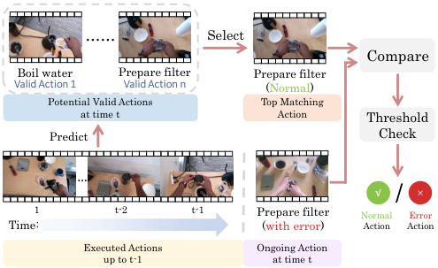

<!-- Start of picture text -->
…… Select Compare Boil water Prepare filter Prepare filter Valid Action 1 Valid Action n (Normal) Potential Valid Actions Top Matching at time t Action Threshold Predict Check … √ × / 1                           t-2                       t-1   Prepare filter Normal Error Time: (with error) Action Action Executed Actions  Ongoing Action up to t-1 at time t <!-- End of picture text -->

Figure 1. **Illustration of error detection using multiple valid next actions at time** _t_ **.** After “Grinding Coffee Bean” at time _t−_ 1, valid next actions include “Boil Water” and “Prepare Filter.” The best matching action is selected and compared with the ongoing action. If their distance exceeds the threshold, the action is marked as an error; otherwise, it is marked as normal. 

tasks (e.g., cooking, assembling toys, using tools, etc.). Since procedural tasks require consistent outcomes without errors, being able to detect natural mistakes is a crucial ability for next-generation AR assisted and robotic systems [5, 11, 36, 38, 47, 48]. 

Achieving reliable error detection requires a foundational understanding of what a normal action should be, allowing comparison to the ongoing action. So, for error detection using AI, a key challenge is constructing a “normal action representation” of the current action. Approximating a “normal action representation,” some current methods [4, 7, 33] model transition relationships from correctly executed action sequences, thereby predicting the correct current action label based on prior actions. However, while these approaches can detect label-level errors by comparing predicted and actual action labels, they often fail to capture the full representation of a normal action, leading them to

<!-- Page 2 -->

overlook cases where the correct action label is executed but deviates from the expected normal behavior. For instance, pouring water into a filter but spilling some outside shares the same label as the correct action, yet introduces an error (spillage) that current methods often miss. 

Recently, a contrastive learning method[16] tackles this limitation by leveraging prototype-based representations. This method learns a series of prototypes during training to represent the normal execution of each action class. During inference, it detects errors by comparing the current action’s representation to the closest prototype in the same class. While effective in some scenarios, these prototypes are static after the training stage and cannot adaptively change with action executions, which struggles to detect errors effectively when the action distribution varies from that of the training samples (e.g., diverse execution styles, tools with varied appearances, or distinct environments). 

To detect errors with varying action distributions, we argue that an effective error detection model should be capable of dynamically generating a normal action representation for the current action, conditioned on previously executed actions. Such adaptability allows the model to account for variations in action execution that static prototypes cannot handle. From this perspective, a straightforward implementation might attempt to predict a normal action representation of the current action from the past action sequence. However, this naive approach introduces a new challenge: after a sequence of executed actions, multiple valid next actions may logically follow, depending on user preferences or contextual factors, rather than adhering to a strictly defined sequence. For instance, in the process of making coffee, after grinding the coffee beans, the next step might involve boiling water, preparing the filter, or selecting a cup—each of which is a valid action depending on the task context, as illustrated in Fig. 1. This range of valid next actions following a given sequence of actions makes it challenging for a single normal action representation to encompass all possible correct action representations. 

To overcome these challenges, we propose a novel Adaptive Multiple Normal Action Representation (AMNAR) framework for error detection that predicts and models multiple valid next actions, dynamically creating multiple adaptable normal action representations that accurately capture the diversity of procedural task execution. Specifically, our approach first employs an action segmentation model to provide an initial executed action sequence, which serves as input for the Potential Action Prediction Block (PAPB). Subsequently, PAPB predicts all valid actions based on executed actions leveraging the task graph and dynamic programming. Next, our Representations Reconstruction Block (RRB) reconstructs multiple normal action representations for each valid action. As shown in Fig. 2, these modules enable AMNAR to represent all valid actions adap- 

tively in error detection. Finally, the Representation Matching Block (RMB) selects the most likely normal action representation of current execution step and assesses its conformity with the ongoing action. By comparing this conformity to a predefined threshold, we determine whether the current action has an error. 

We evaluate our error detection framework on three datasets: EgoPER [16], HoloAssist [38], and CaptainCook4D [28]. Our method improves Error Detection Accuracy (EDA) by **7.4%** and Area Under the Curve (AUC) by **6.5%** on EgoPER, **3.7%** and **1.3%** on HoloAssist, and **2.5%** and **5.3%** on CaptainCook4D, proving its robustness across tasks. Furthermore, ablation studies on our framework validate the contributions of each component, revealing several insights. 

The main contributions of our work are as follows: 

1. We introduce a novel approach that dynamically generates multiple normal action representations for the current action, conditioned on previously executed actions, addressing the challenge of adaptively representing all normal action representations of the current action. 

2. We develop a new framework utilizing task graphs and dynamic programming to predict multiple valid next actions. This enables precise and context-aware error detection by comparing the current action with adaptively generated multiple normal action representations. 

3. Comprehensive experiments on the EgoPER, HoloAssist and CaptainCook4D datasets validate the effectiveness of each component in our framework, achieving state-ofthe-art performance and demonstrating robustness and flexibility in handling diverse procedural task errors. 

## **2. Related Work** 

**Error Detection** [4, 7, 8, 11, 13, 14, 16, 18, 25, 27, 28, 32– 34, 38] is a task to detect when errors occur in procedural activities. Starting from EPIC-Tent[34], many researchers have begun to focus on the Error Detection task. Ding et al.[4] attempt to identify both order-related errors in toy assembly and part-relative placement errors by solving the Error Detection problem using the constructed Graphs method. Subsequently, several works [7, 33] focus on detecting order-related errors. Specifically, Flaborea et al.[7] focus on utilizing large language models to identify orderrelated errors, while Seminara et al.[33] propose using differentiable task graph matrices for the same purpose. Recently, EgoPED [16] expands this field by introducing errors beyond action order ( _e.g_ ., omission, addition or modification of steps) and proposes a new contrastive step prototype learning framework. Our work shares the same problem formulation with EgoPED [16]. Differently, we address the challenge of multiple valid next actions that can follow any given step in procedural tasks. Our approach adaptively models all normal action representations of these

<!-- Page 3 -->

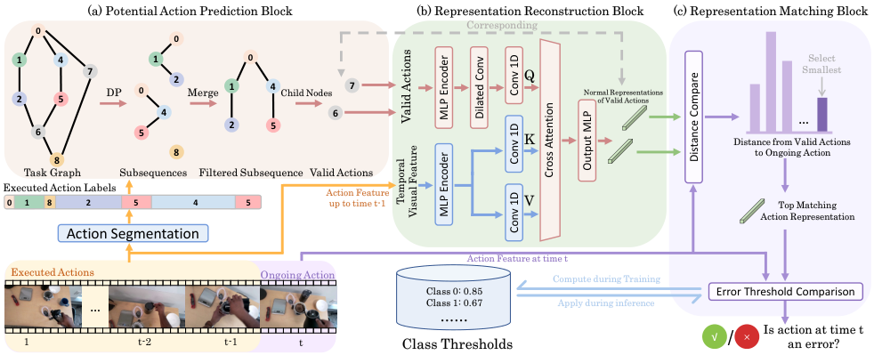

<!-- Start of picture text -->
(a) Potential Action Prediction Block (b) Representation Reconstruction Block (c) Representation Matching Block 0 Corresponding 0 1 4 1 0 Select 7 2 Q Smallest 2 5 DP 0 Merge 1 4 Child Nodes 7 Normal Representationsof Valid Actions 4 6 2 5 … 6 5 K Distance from Valid Actions 8 8 to Ongoing Action Task Graph Subsequences Filtered Subsequence Valid Actions Executed Action Labels Action Feature 0 1 8 2 5 4 5 up to time t-1 V Top Matching Action Representation Action Segmentation Action Feature at time t Executed Actions Ongoing Action Compute during Training Class 0: 0.85 Error Threshold Comparison … Class 1: 0.67 Apply during inference …… Is action at time t 1                                     t-2                         t-1   t Class Thresholds √ / × an error? Valid Actions MLP Encoder Dilated Conv Conv 1D Conv 1D Distance Compare Output MLP Cross Attention Temporal Visual Feature MLP Encoder Conv 1D <!-- End of picture text -->

Figure 2. **Overview of the Adaptive Multiple Normal Action Representation (AMNAR) framework.** The process begins with an Action Segmentation module identifying executed actions from video input. **(a) Potential Action Prediction Block** predicts valid next actions using a task graph from executed action labels. **(b) Representation Reconstruction Block** generates normal action representations for these valid actions, leveraging temporal visual features. **(c) Representations Matching Block** compares the ongoing action’s feature at time t with the generated representations to detect errors, indicated by a checkmark (✓) for normal actions or a cross (✗) for errors. valid actions, enabling robust error detection through adapAMNAR in Sec. 3.2, 3.2,, and introduce the detailed designs in tively generated normal action representations for each posSecs. 3.3 to 3.7. 3.3 to 3.7. to 3.7. 3.7.. sible action. 

AMNAR in Sec. 3.2, 3.2,, and introduce the detailed designs in Secs. 3.3 to 3.7. 3.3 to 3.7. to 3.7. 3.7.. 

### **3.1. Problem Formulation** 

**Video Anomaly Detection (VAD)** focuses on spotting unusual events ( _e.g_ ., accidents or suspicious behaviors) in surveillance footage. VAD identifies deviations from normal activities in videos, which could indicate dangerous or unexpected situations such as falls or unauthorized entries into restricted areas. One of the main branches in this field is the reconstruction-based VAD [9, 24, 30, 31, 42]. In this branch, the models are trained to reconstruct normal frames or accurate sequences, and detect the anomaly by measuring the reconstruction error between the reconstructed and original frames (or sequences). Unlike VAD, which primarily detects deviations based on low-level visual or statistical anomalies, our approach assesses whether ongoing actions align with the predicted normal action representations of all valid next actions. Additionally, while VAD typically reconstructs a single normal scene, our method addresses the challenge of error detection in complex procedural tasks by simultaneously modeling multiple normal action representations for multiple valid next actions. 

## **3. Method** 

To adaptively reconstruct all normal action representations of valid actions, which are compared with ongoing actual action to detect errors, we propose an Adaptive Multiple Normal Action Representation (AMNAR) framework that explicitly models diverse normal action representations of all valid next actions based on executed action sequence. 

We will first introduce problem formulation in Sec. 3.1. After that, we provide an overview of the proposed method 

Following previous work[16], we train our model with normal videos and their corresponding action labels for each procedural task execution step. Each video, denoted as _V_ = _{fi}__N_ _i_ =1,ispairedwithframe-wiseactionlabels _Y_ = _{yi}__N_ _i_ =1,where_N_indicatesthenumberofframes, and each _yi_ maps to one of _S_ predefined action classes or to a background class, expressed as _yi ∈{_ 1 _,_ 2 _, . . . , S, S_ + 1 _}_ . During inference, the objective is to detect error actions, denoted as _E_ = _{ej}__M_ _j_ =1, where_M_is the number of errors. 

### **3.2. Method Overview** 

Given that multiple valid next actions may follow a given executed action sequence, we need to create accurate representations for each possible valid action to detect small deviations in how actions are executed, even if the overall action type is correct. Combining all valid actions with video context, our method reconstructs all normal action representations for each possible current action. The top matching representation to the actual action is then selected and used to detect errors. To do this, we propose an Adaptive Multiple Normal Action Representation (AMNAR) framework, as illustrated in Fig. 2. 

AMNAR initially extracts visual features from videos using a visual feature extractor. The features are then fed into an Action Segmentation Model, which outputs labeled action segments with start and end frames. Subsequently, the **Potential Action Prediction Block** predicts all valid next actions based on the task graph and executed actions. The **Representation Reconstruction Block** then generates

<!-- Page 4 -->

representations for these predicted actions. Lastly, the **Representation Matching Block** assesses any deviations between these representations and the ongoing action features to identify possible errors in the ongoing action. 

### **3.3. Action Sequences and Features Execution** 

We represent procedural task actions using a pre-trained feature extractor (e.g., I3D [1]) to obtain initial visual features, which are processed by the Action Segmentation Model (ASM). The ASM identifies action segments _A_ = _{ak}__H_ _k_ =1=_{_(_yk, stk, edk_)_}H_ _k_ =1, where_H_is the total num- ber of actions, _yk_ is the label for the _k_ -th segment, and _stk_ and _edk_ denote the start and end frames. The ASM also generates a refined feature set _F_ = _{fi}__N_ _i_ =1, with each_fi_as a frame-level feature vector. 

The executed action sequence up to time _t_ , denoted _st_ = _{yk}__t_ _k__−_ =11, captures prior actions.To account for vary- ing segment lengths, we compute an action feature _ft_action by averaging frame-level features within each segment: 

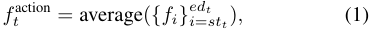

where the average is taken over frames from _stt_ to _edt_ . 

### **3.4. Potential Action Prediction Block** 

In procedural tasks, multiple valid actions may follow a given execution sequence. To address this, our Potential Action Prediction Block (PAPB) identifies all valid next steps using a predefined task graph _G_ that encodes task-specific action sequences. PAPB maps the current action sequence _st_ = _{y_ 1 _, y_ 2 _, . . . , yt−_ 1 _}_ , where each _yi_ represents an executed action label, onto _G_ to determine the set of logically valid next actions. 

To handle potential inaccuracies of action segmentation label, such as mislabeled or omitted actions, PAPB employs dynamic programming (DP) to compute _s__∗_ _t_, the filtered sub- sequence of _st_ that aligns with _G_ , as illustrated in part (a) of Fig. 2 and Fig. 5. For example, given an executed sequence _st_ = [0 _,_ 1 _,_ 8 _,_ 2 _,_ 5 _,_ 4 _,_ 5]. Using DP, PAPB identifies the longest common subsequences (lcs) that form nonbranching paths in _G_ . It maintains two arrays: dp[ _i_ ], tracking the length of the longest non-branching subsequence ending at index _i_ , and subseq[ _i_ ], storing the corresponding subsequence. Updates occur as follows: 

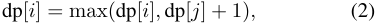

subseq[ _j_ ] _∪{yi},_ if dp[ _j_ ] + 1 _>_ dp[ _i_ ] _,_ subseq[ _i_ ] = �subseq[ _i_ ] _∪_ (subseq[ _j_ ] _∪{yi}_ ) _,_ if dp[ _j_ ] + 1 = dp[ _i_ ] _,_(3) 

where a non-branching subsequence is a continuous path in _G_ without splits (e.g., [0, 1, 2] in the task graph). 

Next, PAPB merges these subsequences into a unified subgraph, as shown in part (a) of Fig. 2 and Fig. 5. Since node 0 is shared between lcs1 and lcs2, they are merged 

<!-- Start of picture text -->
s� = [0  1  8 2  5 4  5] 0 PD 1 4 7 𝑙𝑐𝑠�= [0  1  2] 𝑙𝑐𝑠�= [0  4  5] 𝑙𝑐𝑠� = [8] 2 5 Merge 6 s�∗= [0  1  2  4  5] Child Nodes 8 Task Graph 𝐶�= [6  7] <!-- End of picture text -->

Figure 3. **Overview of the Potential Action Prediction Block.** Using Dynamic Programming (DP), this module identifies all longest common subsequences (lcs) from the executed action sequence _st_ via the task graph _G_ . These lcs are interconnected into a unified subgraph, forming the filtered sequence _st__∗_.Reachable child nodes from _G_ are then extracted as valid next actions _Ct_ . 

into _s__∗_ _t_=[0_,_1_,_2_,_4_,_5],capturingallrelevantexecutedac- tions. Finally, PAPB identifies the valid next actions _Ct_ by extracting the child nodes of _s__∗_ _t_in_G_: 

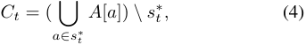

where� _a∈s__∗_ _t__A_[_a_] aggregates all successors of nodes in_s_ _t__∗_ from the adjacency list A of task graph G, and _\s__∗_ _t_excludes already executed actions. For instance, in Fig. 5, the child nodes of _s__∗_ _t_includenodes6and7,_Ct_=[6_,_7].Thispro- cess ensures _Ct_ robustly represents all potential valid next actions, enhancing error detection in complex procedural workflows. More details can be found in supplementary. 

### **3.5. Representation Reconstruction Block** 

We propose the Representation Reconstruction Block (RRB) to generate normal action representations for valid next actions, as shown in part (b) of Fig. 2. Starting with frame-wise features _F_ 1: _edt−_ 1 = _{fi}__ed_ _i_ =1_t−_1 up to time _t_ , we apply dilated convolution to capture long-range dependencies, yielding _F_ 1:conv _edt−_ 1. 

Then, we use local cross-attention to align the valid actions with the temporal context. Here, _Ct_ serves as the query, while _F_ 1:conv _edt−_ 1providesthekeysandvalues.This mechanism generates a contextual feature for each valid action _yt,i ∈ Ct_ . To enhance robustness, we adopt a clusterresidual prediction approach. Specifically, for each valid action _yt,i_ , we predict a residual _rt,i_ that refines the cluster center _ct,i_ of the corresponding action class. The normal action representation _ft,i_normal is then computed as: 

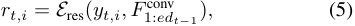

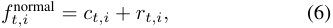

> Original page for checking 8 unresolved font glyphs.

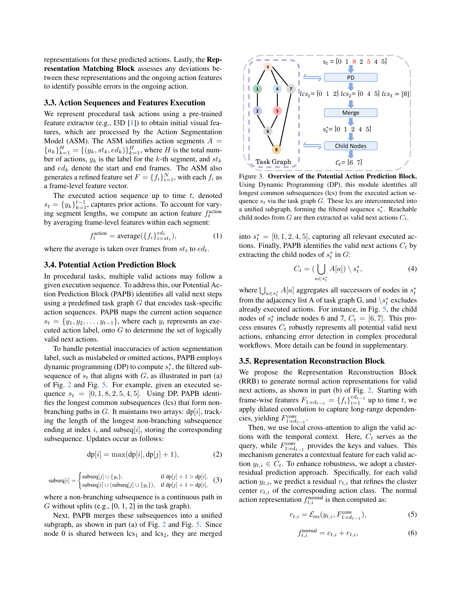

<!-- Page 5 -->

where _E_ res denotes the residual prediction operation via cross-attention, and _ct,i_ is the precomputed cluster center for action class _yt,i_ , derived from normal training sam= ples. The resulting set of representations, denoted _ft_normal _{ft,i_normal _}i__|C_ =1_t|_, encapsulates all valid next actions: _ft_normal = _E_ ( _Ct, F_ 1: _edt−_ 1) _,_ (7) 

where _E_ integrates all operations within this block. This approach leverages the cluster center as a stable baseline while adapting to context-specific variations through the residual. 

### **3.6. Normal Action Representation Alignment and Conformity Assessment** 

To assess action conformity and detect potential errors, we propose the Representation Matching Block (RMB), as illustrated in part (c) of Fig. 2. This component measures the deviation between normal action representations _ft_normal and ongoing action features _ft_action . Specifically, RMB evaluates the alignment between the ongoing action feature _ft_action and each potential normal action representation feature _ft,i_normal for valid next actions. We calculate the Euclidean distance _dt,i_ as follows: 

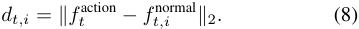

To identify the best alignment, we select the smallest of these distances ( _i.e_ ., _d_min _t_ = min _i dt,i_ ) as the top matching of ongoing action to any normal action representation. 

**Error Detection Criterion.** To determine if an ongoing 

action deviates from all potential normal action representations, we apply a threshold _θ_ ( _yt_ ) specific to each action class _yt_ , based on the distribution of alignment distances in normal samples. An action is flagged as an error if: 

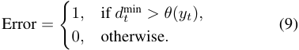

If _d_min _t_ exceeds _θ_ ( _yt_ ), this indicates that the ongoing action at time _t_ does not conform to any normal action representation, thereby identifying it as an error. If it remains within the threshold, the ongoing action is considered to conform to an expected, normal action. 

### **3.7. Training Strategy and Objective Function** 

In this section, we outline the model training process and our objective function. 

During training, segments predicted by the Action Segmentation Model may include inaccuracies, such as incomplete or incorrect boundaries. To filter these samples, we calculate an overlap ratio _R_ overlap between each predicted segment _S_ pred and its closest ground truth segment _S_ GT. The overlap ratio _R_ overlap is defined as: 

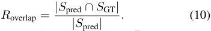

We filter the segment based on whether _R_ overlap meets a predefined threshold _τ_ : 

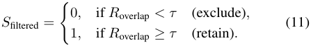

For retained segments, the assigned label may still need refinement. We assign each action segment a representative label _yt__∗_by selecting the most frequently occurring ground truth label within the frames of the segment. Let 

_Lt_ = _{yi_GT _| i ∈_ segment _},_ (12) where _yi_GT is the ground truth label for the _i_ -th frame within the segment. Then, we define _yt__∗_as: 

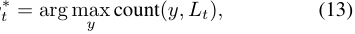

where arg max identifies the label _y_ that appears most frequently in _Lt_ . 

Since each training sample video corresponds to a single target action at time _t_ in _Ct_ , we omit the Potential Action Prediction Block (PAPB) and set the query size of the Representation Reconstruction Block (RRB) to one during training. Using features from Sec. 3.3, we obtain framewise features _F_ 1: _edt−_ 1 = _{fi}__ed_ _i_ =1_t−_1 up to time _t_ , as well as the action feature _ft_action . Based on _Ct_ and _F_ 1: _edt−_ 1, our method then predicts an normal action representation vector _ft_normal for the action at time _t_ : 

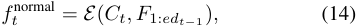

where _E_ represents the operations within the Representation Reconstruction Block (Sec. 3.3). 

Since _Ct_ contains only one action during training, _ft_normal includes only one expected representation, _ft,_normal 1 . Our optimization objective then minimizes the distance between this normal action representation and the actual action feature _ft_action , as shown below: 

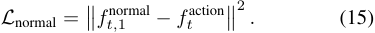

## **4. Experiments** 

In this section, we first introduce our experimental setup in Sec. 4.1, followed by the evaluation metrics used to assess the performance of our method in Sec. 4.2. Finally, we conduct ablation studies in Sec. 4.3 to demonstrate the effectiveness of our proposed AMNAR framework. 

### **4.1. Experimental Setup** 

**Datasets.** We conduct experiments on the EgoPER [16], HoloAssist [38] and CaptainCook4D[28] datasets. **The EgoPER dataset** is an egocentric video dataset with five cooking tasks ( _i.e_ ., Quesadilla, Qatmeal, Pinwheel, Coffee and Tea). It includes 386 videos (28 hours) with both normal and erroneous executions, together with frame-level action and error annotations. **The HoloAssist dataset** features 166 hours of video from 350 instructor-performer pairs completing real-world tasks (e.g., furniture assembly, device operation). **The CaptainCook4D dataset** is an egocentric dataset of cooking activities, comprising 384 recordings of 24 recipes. It captures both normal and error executions, with step annotations and seven error types.

<!-- Page 6 -->

Table 1. **Comparison with existing methods on the EgoPER dataset for each task and the average over all tasks.** 

|Mthd|Ques|adilla|Oat|meal|Pinw|heel|Cof|fee|T|ea|A|ll|
|---|---|---|---|---|---|---|---|---|---|---|---|---|
|eos|EDA|AUC|EDA|AUC|EDA|AUC|EDA|AUC|EDA|AUC|EDA|AUC|
|Random|19.9|50.0|11.8|50.0|15.7|50.0|8.20|50.0|17.0|50.0|14.5|50.0|
|HF2-VAD [24]|34.5|62.6|25.4|62.3|29.1|52.7|10.0|59.6|36.6|62.1|27.1|59.9|
|HF2-VAD + SSPCAB [30]|30.4|60.9|25.3|61.9|33.9|51.7|10.0|60.1|35.4|63.2|27.0|59.6|
|S3R [40]|52.6|51.8|47.8|61.6|50.5|52.4|16.3|51.0|47.8|57.9|43.0|54.9|
|EgoPED[16]|**62.7**|65.6|51.4|65.1|59.6|55.6|55.3|58.3|56.0|**66.0**|57.0|62.0|
|AMNAR (Ours)|61.4|**71.9**|**65.0**|**75.4**|**65.0**|**65.4**|**73.5**|**67.8**|**57.0**|61.9|**64.4**|**68.5**|

Table 2. **Comparison on HoloAssist dataset.** Lacking action segmentation annotations, we train with fine-grained noun and verb labels. “Noun” and “Verb” denote ASM training with only noun or verb annotations, respectively; “All” averages both results. 

|Mthd|No|un|Ve|rb|A|ll|
|---|---|---|---|---|---|---|
|eos|EDA|AUC|EDA|AUC|EDA|AUC|
|Random|48.3|52.4|49.8|48.7|49.0|50.6|
|EgoPED[16]|65.2|56.1|67.2|54.3|66.2|55.2|
|AMNAR (Ours)|**67.2**|**56.8**|**72.6**|**56.2**|**69.9**|**56.5**|

Table 3. **Comparison on the CaptainCook4D dataset.** 

|Methods|Precision|EDA|AUC|
|---|---|---|---|
|Random|49.9|49.7|51.2|
|EgoPED [16]|56.5|69.8|54.9|
|AMNAR (Ours)|**66.8**|**72.3**|**60.2**|

**Evaluation Metrics.** Following prior work [16], we evaluate models with **Error Detection Accuracy (EDA)** and **Area Under the Curve (AUC)** . **EDA** measures the accuracy in identifying both erroneous and normal segments, reflecting the model’s overall accuracy in error detection at the segment level. **AUC** evaluates the ability of the model to distinguish between errors and non-errors by comparing true and false positive rates across varying thresholds. 

**Implementation Details.** Following EgoPED[16], we adopt I3D [1] for video feature extraction and ActionFormer [46] for action segmentation, with the segmentation model pretrained before joint training with other components. For EgoPER, we use provided task graphs, while for HoloAssist and CaptainCook4D, we construct task graphs from training sequences. In the Representation Reconstruction Block (Sec. 3.5), actions in _Ct_ are represented by their class cluster centers. The error detection threshold _θ_ ( _yt_ ) (Sec. 3.6) is set at the 0.85 quantile of the distance distribution from normal training instances, with an overlap threshold _τ_ = 0 _._ 6. More details are in the supplementary. 

### **4.2. Comparisons with SoTA Methods** 

We compare our AMNAR with SoTA error detection approaches [16, 24, 30, 40] on the EgoPER[16], HoloAssist[38] and CaptainCook4D[28] datasets. 

As shown in Tab. 1, our results on the EgoPER dataset 

outperform all methods, with AMNAR achieving an average **7.4%** improvement in EDA and **6.5%** in AUC over EgoPED [16]. For the HoloAssist dataset (Tab. 2), AMNAR improves EDA by **3.7%** and AUC by **1.3%** . On the CaptainCook4D dataset (Tab. 3), AMNAR surpasses EgoPED with improvements of **10.3%** in Precision, **2.5%** in EDA, and **5.3%** in AUC, demonstrating robustness across diverse procedural tasks with complex action sequences. 

### **4.3. Ablation Studies** 

In this section, we conduct a series of **ablation studies** on the EgoPER dataset [16] to evaluate the contributions of each component in our AMNAR framework. 

**Potential Action Prediction Block (PAPB).** The PAPB identifies valid next actions in procedural tasks, enabling AMNAR to model multiple normal action representations post-sequence, as outlined in the method section. We evaluate its role by comparing “AMNAR” with “Random Selection”, a variant using random action selection instead of PAPB’s contextual prediction. As shown in Tab. 4, AMNAR with PAPB boosts EDA by 5.8% and AUC by 5.5% over the random variant, proving that task-informed prediction enhances error detection in complex workflows. 

**Representation Reconstruction Block (RRB).** The RRB generates context-aware normal action representations for PAPB-predicted actions, as described earlier. We test its impact by comparing “AMNAR” against “w/o PAPB & RRB”, which omits RRB and uses past action features with selfattention. Tab. 4 shows AMNAR with RRB improves EDA by 4.4% and AUC by 4.5% over this variant, confirming RRB’s role in enhancing error detection through tailored representations. 

**Action Representation Types.** AMNAR uses clustercentered action representations to model the diversity of valid next actions by dynamically capturing their average distribution within each action class. Compared to textbased embeddings (e.g., BERT [3]), our ablation study (Tab. 5 (a)) shows superior performance, likely due to better alignment with the model’s feature space, enhancing robustness to subtle execution errors. 

**Prediction Methods.** We compare direct prediction, which generates full features from context, with residual-based

<!-- Page 7 -->

Table 4. **Ablation studies on the Potential Action Prediction Block (PAPB) and the Representation Reconstruction Block (RRB).** “w/o PAPB & RRB” excludes both PAPB and RRB, using only previously executed action features with a local self-attention mechanism. “Random Selection” indicates a variant where candidate actions are randomly selected instead of using PAPB to predict valid next actions. 

|Variants|Comp|onents|Ques|adilla|Oat|meal|Pinw|heel|Co|ffee|T|ea|A|ll|
|---|---|---|---|---|---|---|---|---|---|---|---|---|---|---|
||PAPB|RRB|EDA|AUC|EDA|AUC|EDA|AUC|EDA|AUC|EDA|AUC|EDA|AUC|
|w/o PAPB & RRB|✗|✗|58.7|68.7|58.9|68.4|55.5|56.6|67.6|64.7|**59.5**|61.5|60.0|64.0|
|Random Selection|✗|✓|56.9|67.2|60.1|72.5|50.2|56.2|71.7|61.7|54.1|57.3|58.6|63.0|
|AMNAR|✓|✓|**61.4**|**71.9**|**65.0**|**75.4**|**65.0**|**65.4**|**73.5**|**67.8**|57.0|**61.9**|**64.4**|**68.5**|

|Table 5. **Ablation studi** training sample selection (a) Action Represen|**es acro** strategi tation Ty|**ss six coni** es, task g pes|**figurations**: action represent raph construction. The highli (b) Prediction Meth|ation ty ghted r ods|pes, predict ows indicat|ion methods, video feat e our default implement (c) Visual F|ures, di ation. eatures|stance metrics,|
|---|---|---|---|---|---|---|---|---|
|Variants|EDA|AUC|Variants|EDA|AUC|Variants|EDA|AUC|
|Text-Based|**65.6**|64.1|Direct Prediction|64.2|62.2|DINOv2 Feature|**71.0**|**69.2**|
|Cluster-Centered|64.4|**68.5**|Cluster Center Residual|**64.4**|**68.5**|I3D Feature|64.4|68.5|
|(d) Distance M|etrics||(e) Training Sample Selectio|n Strate|gies|(f) Task Graph C|onstructi|on|
|Variants|EDA|AUC|Variants|EDA|AUC|Variants|EDA|AUC|
|L1 Norm|62.4|63.9|Training on GT Segments|**69.3**|51.4|Training Set Graph|**66.6**|66.1|
|Cosine Similarity|63.2|62.9|Training on ASM Output|65.1|65.0|Predefined Graph|64.4|**68.5**|
|Euclidean|**64.4**|**68.5**|Hybrid Training|64.4|**68.5**||||

prediction, where the model predicts deviations from a cluster center for each intention-aligned action class. Per Tab. 5 (b), the residual method boosts EDA by 0.2% and AUC by 6.3%. It enhances the learning of action-context relationships and sensitivity to subtle deviations from normal action distributions. 

**Distance Metrics.** We compare _L_ 1-norm, cosine similarity, and Euclidean distance for feature alignment. As shown in Tab. 5 (d), Euclidean distance outperforms others, achieving an EDA of 64.4% and AUC of 68.5%, against cosine similarity (63.2% EDA, 62.9% AUC) and _L_ 1-norm (62.4% EDA, 63.9% AUC). Its sensitivity to magnitude and direction offers the best balance for error detection in complex procedural tasks. 

**Training Sample Selection Strategies.** Effective training samples are key to robust error detection. We assess three approaches: (1) GT Segments, using ground-truth data for high accuracy but less resilience to ASM noise; (2) ASM Output, leveraging unfiltered ASM predictions for deployment alignment, risking label errors; and (3) Hybrid Training (Sec. 3.7), filtering ASM segments by an overlap threshold ( _τ_ ) with GT, balancing accuracy and ASM consistency. Per Tab. 5 (e), Hybrid achieves the best AUC (68.5%) with a solid EDA (64.4%), optimizing robustness and precision. 

**Visual Features.** Our AMNAR utilizes clip-level features from I3D for fair comparisons with existing works[16]. Besides, Fig.S3 (2nd row, rightest) of Supplementary shows that AMNAR can detect fine-grained errors with I3D features. Moreover, using more robust feature representations further helps error detection. To highlight this, we replace 

the I3D with DINOv2, and the results are in Tab. 5 (c). **Task Graph Construction.** Following the previous works[4, 16, 33], AMNAR uses predefined task graphs. **Note that we can also construct task graphs from the training set.** Tab. 5 (f) shows that the impact of constructing the graph from the training set is mild. Also, experiments on HoloAssist (Tab. 2) and CaptainCook4D (Tab. 3) utilize task graphs constructed from the training set and gain significant performance improvement. 

### **4.4. Influence of Previous Errors** 

In procedural tasks, errors can accumulate over time. Since our method relies on temporal context from previous actions, a natural question could be raised: _How do errors in previous actions affect the future reconstruction of subsequent normal action representations?_ 

To address this, we conduct an ablation study to evaluate the robustness of AMNAR when prior errors are present in the action sequence. As shown in Tab. 6, we divide the test samples into two groups: the “w/o previous errors” group, which includes the first error in a sequence along with prior normal actions, and the “w previous errors” group, which covers actions following one or more prior errors. The results indicate that multiple prior errors cause a mild reduction in error detection performance. The “w/o previous errors” group achieves a higher EDA (70.8%) compared to the “w previous errors” group (64.3%), likely due to fewer distortions in the temporal context. However, the AUC remains comparable (67.3% vs. 68.0%), suggesting that AMNAR retains reasonable robustness even when prior errors are present. This demonstrates that, while prior errors intro-

<!-- Page 8 -->

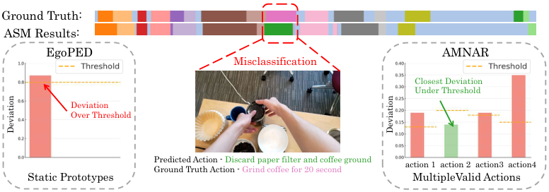

<!-- Start of picture text -->
Ground Truth: ASM Results: EgoPED AMNAR Misclassification Closest Deviation Under Threshold Deviation Over Threshold Predicted Action - Discard paper filter and coffee ground action 1  action 2  action3  action4 Ground Truth Action - Grind coffee for 20 second Static Prototypes MultipleValid Actions Deviation Deviation <!-- End of picture text -->

Figure 4. Error detection when the Action Segmentation Model (ASM) misclassifies an action. AMNAR correctly identifies the action as normal. In contrast, the EgoPED framework incorrectly detects a false positive. Table 6. **Influence of previous errors.** Previous errors cause only Table 8. **Analysis of Action Segmentation Module. Left** : a mild reduction in error detection performance. Our AMNAR outperforms EgoPED on action segmentation task. 

Table 8. **Analysis of Action Segmentation Module. Left** : Our AMNAR outperforms EgoPED on action segmentation task. **Right** : EgoPED under-performs our AMNAR even if used with action segmentation results of AMNAR (noted it by *). 

|Variants|EDA|AUC|
|---|---|---|
|w/o previous errors|**70.8**|67.3|
|w previous errors|64.3|**68.0**|

|Methods|IoU Edit|F1@0.5|Acc|Methods|Avg. EDA|Avg. AUC|
|---|---|---|---|---|---|---|
|EgoPED|44.6 61.3|47.5|68.5|EgoPED*|63.1|61.9|
|**AMNAR**|**56.3 69.4**|**57.3**|**75.3**|**AMNAR**|**64.4**|**68.5**|

Table 7. **EDA of non-deterministic actions in EgoPER dataset.** AMNAR consistently outperforms baselines, excelling in handling complex, non-deterministic action sequences. 

whereas AMNAR uses them as input for reconstruction. Notably, even when EgoPED leverages AMNAR’s segmentation results (denoted as EgoPED* in Tab. 8), it still underperforms in Error Detection (ED). This demonstrates that AMNAR’s superior ED performance stems from its innovative design, beyond mere improvements in AS. 

|Methods&Variants|Quesadilla|Oatmeal|Pinwheel|Coffee|Tea|All|
|---|---|---|---|---|---|---|
|EgoPED[16]|**74.0**|65.5|56.5|65.3|64.8|65.2|
|AMNAR (w/o PAPB & RRB)|60.2|61.4|61.3|72.5|63.4|63.8|
|AMNAR (Random)|57.9|63.8|61.7|71.5|57.6|62.5|
|AMNAR|73.8|**75.5**|**66.8**|**76.7**|**75.6**|**73.7**|

### **4.7. Visualization** 

duce some challenges, our adaptive representation strategy mitigates their impact effectively. 

### **4.5. Ability of Handling Multiple Valid Next Actions** 

We provide more discussions about our AMNAR on the ability of handling multiple valid next actions. On the one hand, on the task of “coffee”, which contains the most complex action branching patterns, our AMNAR achieves significant performance improvement of EDA by 18.2% and AUC by 9.5% according to Tab. 1. 

On the other hand, we conduct an evaluation on those non-deterministic actions, which are preceded by actions with multiple valid next options. Results in Tab. 7 demonstrate AMNAR achieves a top EDA of 73.7% overall and 76.7% for “coffee”, outperforming EgoPED and its variants, underscoring its strength in managing complex, non-deterministic sequences. Details of frequency analysis of multiple valid next actions and definition of nondeterministic actions are in Supplementary B.4 & B.5. 

### **4.6. Discussions on Action Segmentation Module** 

We further present the Action Segmentation (AS) results. Although AMNAR and EgoPED employ the same AS module for fair comparison, AMNAR consistently outperforms EgoPED, as shown in Tab. 8. This performance gap arises due to differences in feature utilization—EgoPED modifies features through clustering and contrastive learning, 

As shown in Fig. 7, a “coffee” task sample demonstrates resilience of AMNAR to ASM misclassification. The ground truth action, “Grind coffee for 20 seconds,” is erroneously labeled by ASM as “Discard paper filter and coffee grounds.” EgoPED, hindered by an incorrect prototype, misclassifies it as an error. In contrast, AMNAR employs multiple normal action representations, selecting the top matching one to accurately classify the action as normal. This underscores robustness of AMNAR in handling label ambiguity and varied action sequences. More visualization samples are in Section C of supplementary material. 

## **5. Conclusion** 

In this work, we uncover a critical limitation in existing error detection approaches: their inability to effectively handle scenarios of multiple valid next actions. To address this, we develop the Adaptive Multiple Normal Action Representation (AMNAR) framework, which dynamically predicts and reconstructs representations for all valid next actions. Through comprehensive experiments—including comparative analyses, ablation studies, and evaluations of non-deterministic actions across three datasets—we confirm the effectiveness of AMNAR. We believe this adaptive, multi-representation strategy could improve error detection and contribute to advancements in broader action understanding fields.

<!-- Page 9 -->

## **Acknowledgement** 

This work was supported partially by NSFC(92470202, U21A20471), National Key Research and Development Program of China (2023YFA1008503), Guangdong NSF Project (No. 2023B1515040025). The authors thank anonymous reviewers and ACs for their constructive suggestions. 

## **References** 

- [1] Joao Carreira and Andrew Zisserman. Quo vadis, action recognition? a new model and the kinetics dataset. In _proceedings of the IEEE Conference on Computer Vision and Pattern Recognition_ , pages 6299–6308, 2017. 1, 4, 6 

- [2] Yu Cheng, Quanfu Fan, Sharath Pankanti, and Alok Choudhary. Temporal sequence modeling for video event detection. In _Proceedings of the IEEE conference on computer vision and pattern recognition_ , pages 2227–2234, 2014. 1 

- [3] Jacob Devlin. Bert: Pre-training of deep bidirectional transformers for language understanding. _arXiv preprint arXiv:1810.04805_ , 2018. 6 

- [4] Guodong Ding, Fadime Sener, Shugao Ma, and Angela Yao. Every mistake counts in assembly. _arXiv preprint arXiv:2307.16453_ , 2023. 1, 2, 7 

- [5] Jiafei Duan, Wilbert Pumacay, Nishanth Kumar, Yi Ru Wang, Shulin Tian, Wentao Yuan, Ranjay Krishna, Dieter Fox, Ajay Mandlekar, and Yijie Guo. Aha: A visionlanguage-model for detecting and reasoning over failures in robotic manipulation. _arXiv preprint arXiv:2410.00371_ , 2024. 1 

- [6] Yazan Abu Farha and Jurgen Gall. Ms-tcn: Multi-stage temporal convolutional network for action segmentation. In _Proceedings of the IEEE/CVF conference on computer vision and pattern recognition_ , pages 3575–3584, 2019. 1 

- [7] Alessandro Flaborea, Guido Maria D’Amely di Melendugno, Leonardo Plini, Luca Scofano, Edoardo De Matteis, Antonino Furnari, Giovanni Maria Farinella, and Fabio Galasso. Prego: online mistake detection in procedural egocentric videos. In _Proceedings of the IEEE/CVF Conference on Computer Vision and Pattern Recognition_ , pages 18483– 18492, 2024. 1, 2 

- [8] Reza Ghoddoosian, Isht Dwivedi, Nakul Agarwal, and Behzad Dariush. Weakly-supervised action segmentation and unseen error detection in anomalous instructional videos. In _Proceedings of the IEEE/CVF International Conference on Computer Vision_ , pages 10128–10138, 2023. 2 

- [9] Dong Gong, Lingqiao Liu, Vuong Le, Budhaditya Saha, Moussa Reda Mansour, Svetha Venkatesh, and Anton van den Hengel. Memorizing normality to detect anomaly: Memory-augmented deep autoencoder for unsupervised anomaly detection. In _Proceedings of the IEEE/CVF international conference on computer vision_ , pages 1705–1714, 2019. 3 

- [10] Dayoung Gong, Joonseok Lee, Manjin Kim, Seong Jong Ha, and Minsu Cho. Future transformer for long-term action anticipation. In _Proceedings of the IEEE/CVF Conference on Computer Vision and Pattern Recognition_ , pages 3052– 3061, 2022. 1 

- [11] Kristen Grauman, Andrew Westbury, Lorenzo Torresani, Kris Kitani, Jitendra Malik, Triantafyllos Afouras, Kumar Ashutosh, Vijay Baiyya, Siddhant Bansal, Bikram Boote, et al. Ego-exo4d: Understanding skilled human activity from first-and third-person perspectives. In _Proceedings of the IEEE/CVF Conference on Computer Vision and Pattern Recognition_ , pages 19383–19400, 2024. 1, 2 

- [12] Hongji Guo, Nakul Agarwal, Shao-Yuan Lo, Kwonjoon Lee, and Qiang Ji. Uncertainty-aware action decoupling transformer for action anticipation. In _Proceedings of the IEEE/CVF Conference on Computer Vision and Pattern Recognition_ , pages 18644–18654, 2024. 1 

- [13] Yuto Haneji, Taichi Nishimura, Hirotaka Kameko, Keisuke Shirai, Tomoya Yoshida, Keiya Kajimura, Koki Yamamoto, Taiyu Cui, Tomohiro Nishimoto, and Shinsuke Mori. Egooops: A dataset for mistake action detection from egocentric videos with procedural texts. _arXiv preprint arXiv:2410.05343_ , 2024. 2 

- [14] Youngkyoon Jang, Brian Sullivan, Casimir Ludwig, Iain Gilchrist, Dima Damen, and Walterio Mayol-Cuevas. Epictent: An egocentric video dataset for camping tent assembly. In _Proceedings of the IEEE/CVF International Conference on Computer Vision Workshops_ , pages 0–0, 2019. 2 

- [15] Colin Lea, Michael D Flynn, Rene Vidal, Austin Reiter, and Gregory D Hager. Temporal convolutional networks for action segmentation and detection. In _proceedings of the IEEE Conference on Computer Vision and Pattern Recognition_ , pages 156–165, 2017. 1 

- [16] Shih-Po Lee, Zijia Lu, Zekun Zhang, Minh Hoai, and Ehsan Elhamifar. Error detection in egocentric procedural task videos. In _Proceedings of the IEEE/CVF Conference on Computer Vision and Pattern Recognition_ , pages 18655– 18666, 2024. 2, 3, 5, 6, 7, 8, 14, 16 

- [17] Shijie Li, Yazan Abu Farha, Yun Liu, Ming-Ming Cheng, and Juergen Gall. Ms-tcn++: Multi-stage temporal convolutional network for action segmentation. _IEEE transactions on pattern analysis and machine intelligence_ , 45(6):6647– 6658, 2020. 1 

- [18] Yuan-Ming Li, Wei-Jin Huang, An-Lan Wang, Ling-An Zeng, Jing-Ke Meng, and Wei-Shi Zheng. Egoexo-fitness: Towards egocentric and exocentric full-body action understanding. In _European Conference on Computer Vision_ , 2024. 2 

- [19] Yuan-Ming Li, An-Lan Wang, Kun-Yu Lin, Yu-Ming Tang, Ling-An Zeng, Jian-Fang Hu, and Wei-Shi Zheng. Techcoach: Towards technical keypoint-aware descriptive action coaching. _arXiv preprint arXiv:2411.17130_ , 2024. 1 

- [20] Yuan-Ming Li, Ling-An Zeng, Jing-Ke Meng, and WeiShi Zheng. Continual action assessment via task-consistent score-discriminative feature distribution modeling. _IEEE Transactions on Circuits and Systems for Video Technology_ , 2024. 

- [21] Kun-Yu Lin, Jia-Run Du, Yipeng Gao, Jiaming Zhou, and Wei-Shi Zheng. Diversifying spatial-temporal perception for video domain generalization. _Advances in Neural Information Processing Systems_ , 36:56012–56026, 2023. 

- [22] Kun-Yu Lin, Henghui Ding, Jiaming Zhou, Yu-Ming Tang, Yi-Xing Peng, Zhilin Zhao, Chen Change Loy, and Wei-

<!-- Page 10 -->

Shi Zheng. Rethinking clip-based video learners in crossdomain open-vocabulary action recognition. _arXiv preprint arXiv:2403.01560_ , 2024. 

- [23] Kun-Yu Lin, Jiaming Zhou, and Wei-Shi Zheng. Humancentric transformer for domain adaptive action recognition. _IEEE Transactions on Pattern Analysis and Machine Intelligence_ , 2024. 1 

- [24] Zhian Liu, Yongwei Nie, Chengjiang Long, Qing Zhang, and Guiqing Li. A hybrid video anomaly detection framework via memory-augmented flow reconstruction and flow-guided frame prediction. In _Proceedings of the IEEE/CVF international conference on computer vision_ , pages 13588–13597, 2021. 3, 6 

- [25] Michele Mazzamuto, Antonino Furnari, and Giovanni Maria Farinella. Eyes wide unshut: Unsupervised mistake detection in egocentric video by detecting unpredictable gaze. _arXiv preprint arXiv:2406.08379_ , 2024. 2 

- [26] Himangi Mittal, Nakul Agarwal, Shao-Yuan Lo, and Kwonjoon Lee. Can’t make an omelette without breaking some eggs: Plausible action anticipation using large videolanguage models. In _Proceedings of the IEEE/CVF Conference on Computer Vision and Pattern Recognition_ , pages 18580–18590, 2024. 1 

- [27] Rohith Peddi, Shivvrat Arya, Bharath Challa, Likhitha Pallapothula, Akshay Vyas, Qifan Zhang, Jikai Wang, Vasundhara Komaragiri, Nicholas Ruozzi, Eric Ragan, et al. Put on your detective hat: What’s wrong in this video? 2 

- [28] Rohith Peddi, Shivvrat Arya, Bharath Challa, Likhitha Pallapothula, Akshay Vyas, Jikai Wang, Qifan Zhang, Vasundhara Komaragiri, Eric Ragan, Nicholas Ruozzi, et al. Captaincook4d: A dataset for understanding errors in procedural activities. _arXiv preprint arXiv:2312.14556_ , 2023. 2, 5, 6, 14 

- [29] Alexander Richard and Juergen Gall. Temporal action detection using a statistical language model. In _Proceedings of the IEEE conference on computer vision and pattern recognition_ , pages 3131–3140, 2016. 1 

- [30] Nicolae-C˘at˘alin Ristea, Neelu Madan, Radu Tudor Ionescu, Kamal Nasrollahi, Fahad Shahbaz Khan, Thomas B Moeslund, and Mubarak Shah. Self-supervised predictive convolutional attentive block for anomaly detection. In _Proceedings of the IEEE/CVF conference on computer vision and pattern recognition_ , pages 13576–13586, 2022. 3, 6 

- [31] Nicolae-C Ristea, Florinel-Alin Croitoru, Radu Tudor Ionescu, Marius Popescu, Fahad Shahbaz Khan, Mubarak Shah, et al. Self-distilled masked auto-encoders are efficient video anomaly detectors. In _Proceedings of the IEEE/CVF Conference on Computer Vision and Pattern Recognition_ , pages 15984–15995, 2024. 3 

- [32] Tim J Schoonbeek, Tim Houben, Hans Onvlee, Fons Van der Sommen, et al. Industreal: A dataset for procedure step recognition handling execution errors in egocentric videos in an industrial-like setting. In _Proceedings of the IEEE/CVF Winter Conference on Applications of Computer Vision_ , pages 4365–4374, 2024. 2 

- [33] Luigi Seminara, Giovanni Maria Farinella, and Antonino Furnari. Differentiable task graph learning: Procedural ac- 

tivity representation and online mistake detection from egocentric videos. _arXiv preprint arXiv:2406.01486_ , 2024. 1, 2, 

7 

- [34] Fadime Sener, Dibyadip Chatterjee, Daniel Shelepov, Kun He, Dipika Singhania, Robert Wang, and Angela Yao. Assembly101: A large-scale multi-view video dataset for understanding procedural activities. In _Proceedings of the IEEE/CVF Conference on Computer Vision and Pattern Recognition_ , pages 21096–21106, 2022. 2 

- [35] An-Lan Wang, Kun-Yu Lin, Jia-Run Du, Jingke Meng, and Wei-Shi Zheng. Event-guided procedure planning from instructional videos with text supervision. In _Proceedings of the IEEE/CVF International Conference on Computer Vision_ , pages 13565–13575, 2023. 1 

- [36] An-Lan Wang, Nuo Chen, Kun-Yu Lin, Yuan-Ming Li, and Wei-Shi Zheng. Task-oriented 6-dof grasp pose detection in clutters. _arXiv preprint arXiv:2502.16976_ , 2025. 1 

- [37] Xiaolong Wang, Ross Girshick, Abhinav Gupta, and Kaiming He. Non-local neural networks. In _Proceedings of the IEEE conference on computer vision and pattern recognition_ , pages 7794–7803, 2018. 1 

- [38] Xin Wang, Taein Kwon, Mahdi Rad, Bowen Pan, Ishani Chakraborty, Sean Andrist, Dan Bohus, Ashley Feniello, Bugra Tekin, Felipe Vieira Frujeri, et al. Holoassist: an egocentric human interaction dataset for interactive ai assistants in the real world. In _Proceedings of the IEEE/CVF International Conference on Computer Vision_ , pages 20270–20281, 2023. 1, 2, 5, 6, 14 

- [39] Zejia Weng, Xitong Yang, Ang Li, Zuxuan Wu, and Yu-Gang Jiang. Open-vclip: Transforming clip to an open-vocabulary video model via interpolated weight optimization. In _International Conference on Machine Learning_ , pages 36978– 36989. PMLR, 2023. 1 

- [40] Jhih-Ciang Wu, He-Yen Hsieh, Ding-Jie Chen, Chiou-Shann Fuh, and Tyng-Luh Liu. Self-supervised sparse representation for video anomaly detection. In _European Conference on Computer Vision_ , pages 729–745. Springer, 2022. 6 

- [41] Angchi Xu, Ling-An Zeng, and Wei-Shi Zheng. Likert scoring with grade decoupling for long-term action assessment. In _Proceedings of the IEEE/CVF Conference on Computer Vision and Pattern Recognition_ , pages 3232–3241, 2022. 1 

- [42] Zhiwei Yang, Jing Liu, Zhaoyang Wu, Peng Wu, and Xiaotao Liu. Video event restoration based on keyframes for video anomaly detection. In _Proceedings of the IEEE/CVF Conference on Computer Vision and Pattern Recognition_ , pages 14592–14601, 2023. 3 

- [43] Fangqiu Yi, Hongyu Wen, and Tingting Jiang. Asformer: Transformer for action segmentation. _arXiv preprint arXiv:2110.08568_ , 2021. 1 

- [44] Ling-An Zeng and Wei-Shi Zheng. Multimodal action quality assessment. _IEEE Transactions on Image Processing_ , 2024. 1 

- [45] Ling-An Zeng, Fa-Ting Hong, Wei-Shi Zheng, Qi-Zhi Yu, Wei Zeng, Yao-Wei Wang, and Jian-Huang Lai. Hybrid dynamic-static context-aware attention network for action assessment in long videos. In _Proceedings of the 28th ACM international conference on multimedia_ , pages 2526–2534, 2020. 1

<!-- Page 11 -->

- [46] Chen-Lin Zhang, Jianxin Wu, and Yin Li. Actionformer: Localizing moments of actions with transformers. In _European Conference on Computer Vision_ , pages 492–510. Springer, 2022. 1, 6 

- [47] Dian Zheng, Xiao-Ming Wu, Shuzhou Yang, Jian Zhang, Jian-Fang Hu, and Wei-Shi Zheng. Selective hourglass mapping for universal image restoration based on diffusion model. In _CVPR_ , 2024. 1 

- [48] Dian Zheng, Xiao-Ming Wu, Zuhao Liu, Jingke Meng, and Wei-shi Zheng. Diffuvolume: Diffusion model for volume based stereo matching. _IJCV_ , 2025. 1 

- [49] Jiaming Zhou, Junwei Liang, Kun-Yu Lin, Jinrui Yang, and Wei-Shi Zheng. Actionhub: a large-scale action video description dataset for zero-shot action recognition. _arXiv preprint arXiv:2401.11654_ , 2024. 1 

- [50] Jiaming Zhou, Teli Ma, Kun-Yu Lin, Zifan Wang, Ronghe Qiu, and Junwei Liang. Mitigating the human-robot domain discrepancy in visual pre-training for robotic manipulation. _arXiv preprint arXiv:2406.14235_ , 2024. 1

<!-- Page 12 -->

## **Overview** 

In this supplementary material, we provide the following sections: 

- Appendix A: More details about our proposed Adaptive Multiple Normal Action Representation (AMNAR) framework. 

- Appendix B: More details about the experiment setups. 

- Appendix C: More visualizations for further demonstration on the effectiveness of the proposed AMNAR. 

## **A. More Details about AMNAR** 

### **A.1. Potential Action Prediction Block** 

The Potential Action Prediction Block (PAPB) is a key component designed to predict all potential next actions based on the task graph _G_ and the executed action sequence _s_ . The variable-definition reference table and pseudocode for PAPB are shown in Tab. 9 and Algorithm 1, respectively. 

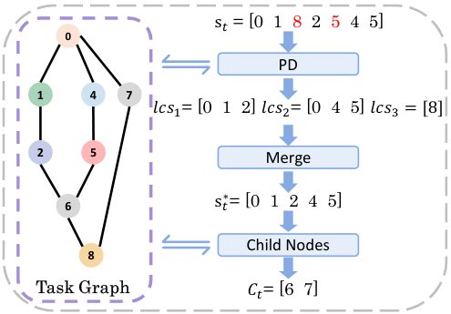

<!-- Start of picture text -->
s� = [0  1  8 2  5 4  5] 0 PD 1 4 7 𝑙𝑐𝑠�= [0  1  2] 𝑙𝑐𝑠�= [0  4  5] 𝑙𝑐𝑠� = [8] 2 5 Merge 6 s�∗= [0  1  2  4  5] Child Nodes 8 Task Graph 𝐶�= [6  7] <!-- End of picture text -->

Figure 5. The Potential Action Prediction Block (PAPB) derives the longest matching subsequence from the executed sequence using the task graph. This subsequence is then used to identify all reachable nodes, representing valid next actions. This figure is reproduced from the main text for reference. 

**Adjacency List Construction.** PAPB begins by converting the task graph _G_ into an adjacency list _A_ , where each node in the graph links to its direct successors. 

**Longest Subsequence Identification.** PAPB employs dynamic programming to find the longest subsequence _s__∗_ in _s_ that adheres to the relationships defined by _G_ . The algorithm maintains two tables: subseq[ _i_ ], which stores the longest non-branching subsequence ending at index _i_ , and dp[ _i_ ], which stores the subseq[ _i_ ]. A **non-branching subsequence** is defined as a sequence of nodes that form a continuous path in the task graph _G_ , where all nodes are connected sequentially without any splits or branches (e.g., [0, 1, 2] in Fig. 5). 

For each action _yi_ in _s_ , the algorithm iterates over all previous actions _yj_ (where _j < i_ ) and checks whether _yi_ and _yj_ are connected in the task graph _G_ . If this condition is met, dp[ _i_ ] and subseq[ _i_ ] are updated as follows: 

considered connected to _L_ , and its nodes are merged into _L_ . This merging process ensures that _L_ includes all nodes relevant to the executed actions, resulting in the complete merged sequence _s__∗_ , which accurately reflects all executed actions within the task graph. 

**Next Action Prioritization.** Based on _s__∗_ , PAPB computes the set of potential next actions _PA_ as: 

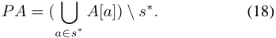

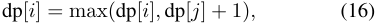

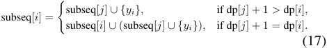

After processing _s_ , the algorithm identifies the maximum value in dp, locating the index _k_ with the longest nonbranching subsequence _L_ . 

**Merging Connected Nodes.** While the longest subsequence identified in dynamic programming represents a non-branching path (e.g., [0, 1, 2] in Fig. 5), it may not capture all executed actions in scenarios where multiple branches exist in the task graph. To address this, PAPB iteratively examines each subsequence. For each subsequence, if any of its nodes matches a node in _L_ , the subsequence is 

In this formula, _A_ [ _a_ ] represents the set of direct successors of node _a_ in the task graph _G_ , as derived from the adjacency list. By iterating over all nodes _a_ in the longest merged subsequence _s__∗_ , the union� _a∈s__∗A_[_a_]aggregatesthesucces- sors of all nodes in _s__∗_ . The subtraction _\s__∗_ ensures that only actions not already included in _s__∗_ are retained in _PA_ . This guarantees that _PA_ contains all valid next actions that can logically follow the executed actions, without duplication. 

PAPB efficiently combines dynamic programming and graph traversal to provide actionable insights from _s_ and _G_ . For detailed implementation, refer to Algorithm 1.

> Original page for checking 7 unresolved font glyphs.

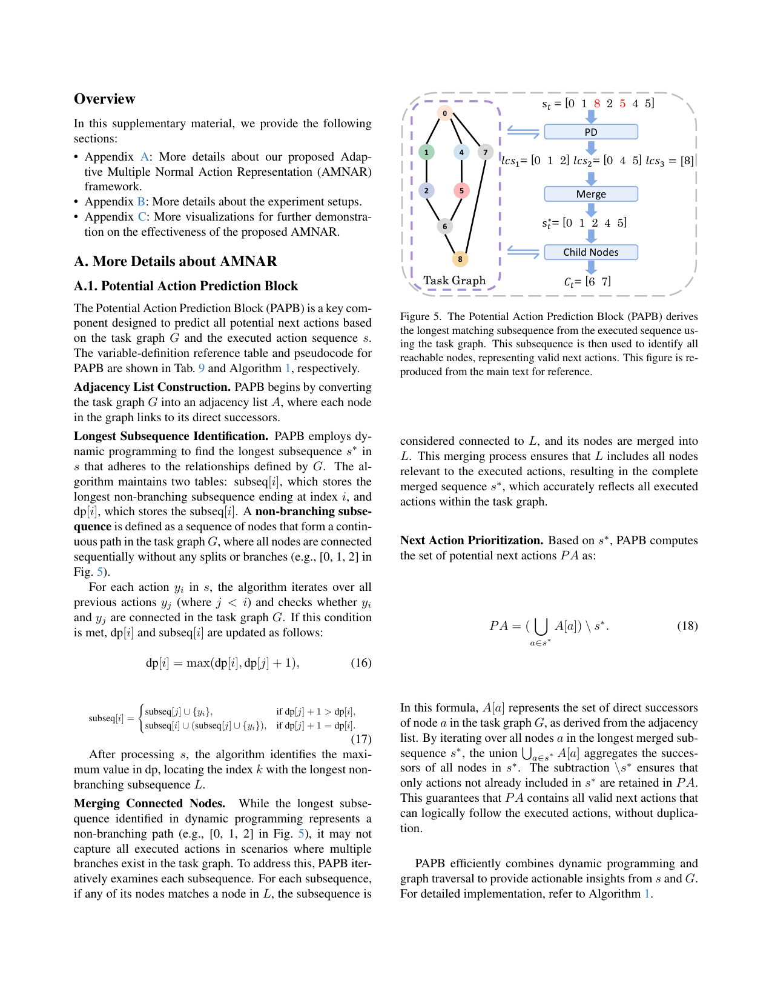

<!-- Page 13 -->

#### **Algorithm 1** Potential Action Prediction Block (PAPB) 

**Input:** Task graph _G_ , Executed action sequence _s_ **Output:** Prioritized list of next actions _PA_ **# Build Adjacency Lists:** Initialize _A_ [ _u_ ] = _∅_ for all _u ∈ G_ **for** each edge ( _u, v_ ) in _G_ **do** _A_ [ _u_ ] _← A_ [ _u_ ] _∪{v}_ **end for # DP Process:** Initialize dp[ _i_ ] _←_ 1 and subseq[ _i_ ] _←{yi}_ for all _i_ **for** _i ←_ 1 to _n_ **do for** _j ←_ 1 to _i −_ 1 **do if** _yi ∈ A_ [ _yj_ ] **or** _yj ∈ A_ [ _yi_ ] **then if** dp[ _j_ ] + 1 _>_ dp[ _i_ ] **then** dp[ _i_ ] _←_ dp[ _j_ ] + 1 subseq[ _i_ ] _←_ subseq[ _j_ ] _∪{yi}_ **else if** dp[ _j_ ] + 1 == dp[ _i_ ] **then** subseq[ _i_ ] _←_ subseq[ _i_ ] _∪_ subseq[ _j_ ] _∪{yi}_ **end if end if end for end for # Collect Max-Length Subsequences:** _k ←_ max(dp[1] _,_ dp[2] _, . . . ,_ dp[ _n_ ]) _L ←_� _{_ subseq[ _i_ ] _|_ dp[ _i_ ] = _k}_ **# Merge Connected Nodes in** _L_ **:** Initialize _s__∗_ _← L_ **for** each _node_ in _L_ **do for** each _neighbor ∈ A_ [ _node_ ] **do if** _neighbor ∈ L_ **then** _s__∗_ _← s__∗_ _∪{neighbor}_ **end if end for end for # Collect Potential Next Actions:** _PA ←_ (� _a∈s__∗A_[_a_])_\ s∗_ **Return** _PA_ 

Table 9. Variable Definitions of PAPB 

|**Variable**|**Definition**|
|---|---|
|_G_|Task graph|
|_s_|Executed action sequence|
|_s__∗_|The longest matching subsequence|
|_A_|Adjacency list of_G_|
|_A_[_a_]|The set of direct successors of node_a_|
|subseq[_i_]|Longest non-branching subsequence ending at index_i_|
|dp[_i_]|Length of subseq[_i_]|
|_k_|Index with the maximum dp[_k_]|
|_L_|Longest non-branching subsequence|
|PA|Final potential next actions|

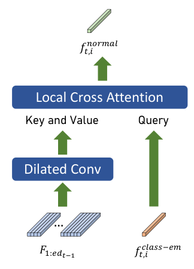

<!-- Start of picture text -->
𝑓�,������� Local Cross Attention Key and Value Query Dilated Conv … 𝐹�:����� 𝑓�,��������� <!-- End of picture text -->

Figure 6. Architecture of the Representation Reconstruction Block (RRB). The RRB reconstructs the _i_ -th normal action representation _ft,i_normal for time _t_ by combining the frame-wise refined features _F_ 1: _edt−_ 1 (key and value) and the action class embedding _ft,i_class-emb (query). 

### **A.2. Representation Reconstruction Block** 

The Representation Reconstruction Block (RRB) is designed to reconstruct multiple normal action representations at time _t_ using the frame-wise features of executed actions and the embedding of the _t_ -th action. The RRB consists of two key components: a dilated convolutional layer and a local cross-attention module, as illustrated in Fig. 6. 

To ensure temporal causality, all modules within the RRB are implemented in a causal manner. Specifically, when reconstructing the normal action representations at time _t_ , the frame-wise features corresponding to time _t_ and any future frames are not accessible, thereby adhering to the sequential nature of the task. 

**Dilated Convolutional Layer.** The dilated convolutional layer employs a kernel size of 3 and consists of 5 layers. The dilation rate of the first layer is set to 1, while the subsequent layers follow an exponential growth pattern. Specifically, the dilation rate _di_ for the _i_ -th layer is defined as: 

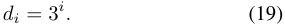

This design allows the receptive field to expand exponentially with depth. 

**Local Cross Attention.** The local cross attention module consists of a single attention layer with a local window length of 32 and 2 attention heads. Depthwise convolutions project the query, key, and value features, with causal padding ensuring only past and current time steps are accessible, preserving temporal causality.

> Original page for checking 26 unresolved font glyphs.

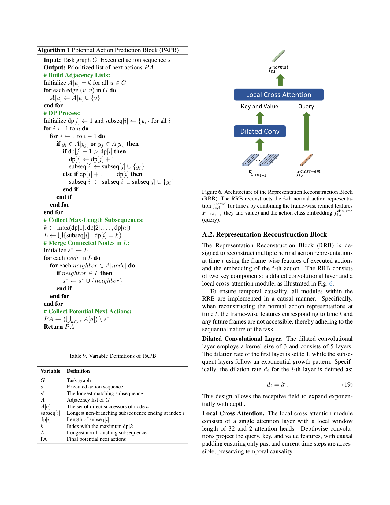

<!-- Page 14 -->

**Action Class Embedding.** As mentioned in Section 3.3 of the main text, _F_ 1: _edt−_ 1 represents the frame-wise refined visual features extracted from the Action Segmentation Model up to frame _edt−_ 1. The _f_class-emb ( _y_ ) represents the class embedding for action class _y_ , computed as the mean feature of all action samples belonging to this class. Formally, it is defined as: 

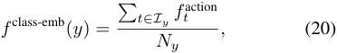

where _Iy_ is the set of indices for samples belonging to class _y_ , _Ny_ = _|Iy|_ is the total number of samples in this class, and _ft_action represents the feature of the _t_ -th action sample. This class embedding serves as a representative feature for action class _y_ . 

The _ft,i_class-emb represents the class embedding for the _i_ -th potential action class corresponding to the _t_ -th action. It is used as the query input in the Local Cross Attention module (see Fig. 6), where it interacts with the key and value features derived from the frame-wise refined features _F_ 1: _edt−_ 1 after processing through the dilated convolution layer. 

Table 10. Duration of Training and Validation Sets for HoloAssist Tasks (in minutes) 

|**Task Name**|**Train (min)**|**Val (min)**|
|---|---|---|
|atv|84.63|12.37|
|circuitbreaker|45.30|8.62|
|coffee|137.17|16.38|
|computer|226.43|38.95|
|dslr|289.22|38.15|
|gladom ~~a~~ssemble|320.95|50.60|
|gladom ~~d~~isassemble|211.03|29.02|
|gopro|561.58|78.18|
|knarrevik ~~a~~ssemble|843.08|114.08|
|knarrevik ~~d~~isassemble|465.00|71.63|
|marius ~~a~~ssemble|357.58|52.28|
|marius ~~d~~isassemble|208.38|36.83|
|navvis|122.65|21.25|
|nespresso|225.47|28.47|
|printer ~~b~~ig|162.15|26.87|
|printer ~~s~~mall|295.05|42.32|
|rashult ~~a~~ssemble|942.42|128.90|
|rashult ~~d~~isassemble|545.65|68.47|
|switch|469.07|70.82|

## **B. More Experimental Setups** 

In this section, we provide comprehensive details about the experimental setup to complement the descriptions in the main text. Specifically, we elaborate on the preprocessing and usage of the HoloAssist[38] datasets, frequency analysis of multiple valid next actions, as well as the experimental environment and hyperparameter settings. 

### **B.1. HoloAssist Dataset** 

Since the official release of the HoloAssist dataset lacks a designated test set, we train our AMNAR and EgoPED [16] frameworks on the training set, compute thresholds using the training set, and evaluate performance on the validation set. The tasks used for training and validation, along with their respective durations, are summarized in Table 10. To train the Action Segmentation Model (ASM), we utilize the fine-grained action annotations, specifically either verb or noun labels, as segment labels. 

The HoloAssist training set includes both normal and erroneous actions. To ensure accurate learning of normal action representations, we train AMNAR exclusively on normal actions, excluding erroneous ones during training. For HoloAssist experiments, due to the absence of an official test set, we follow a standard split by training on the provided training set (approximately 166 hours of video from 350 instructor-performer pairs) and evaluating on the validation set. Additionally, we exclude the “Belt” task from final evaluations, as it contains only one error-free sample, which could skew performance metrics. 

Moreover, some action classes appear only in the validation set and are absent from the training set. To maintain consistency during inference, we classify these unseen classes as background actions. For task graph construction, since HoloAssist lacks predefined task graphs, we generate them by analyzing all training sequences. 

We also introduce a random baseline for HoloAssist experiments. This baseline employs the same ASM trained with the aforementioned strategy and, during inference, randomly classifies each action segment as either normal or erroneous. 

### **B.2. CaptainCook4D Dataset** 

The CaptainCook4D dataset [28] is a large-scale egocentric 4D dataset designed for understanding errors in procedural cooking activities. It comprises 384 recordings (94.5 hours) of individuals performing 24 different recipes in real kitchen environments. The dataset includes videos of participants correctly following recipe instructions as well as instances where they deviate and introduce errors. It provides 5.3K step annotations and 10K fine-grained action annotations, with errors categorized into seven distinct types. Data modalities include RGB video, depth, 3D hand joint tracking, and IMU data, captured using a head-mounted GoPro and HoloLens2. 

For our experiments, since CaptainCook4D lacks predefined task graphs, we generate them by analyzing all training sequences, similar to the approach used for HoloAs-

<!-- Page 15 -->

|**Algorithm 2**Task Graph Generation|
|---|
|**Input:** Action sequences_S_|
|**Output:** Task graph_G_as a list of edges **# Compute Transition Weights:** |
|Initialize_T_[(_u, v_)]_←_0for all possible(_u, v_) **for**each_seq ∈S_ **do** |
|**for**_i ←_0to len(_seq_)_−_2**do** |
|**for**_j ←i_+ 1to len(_seq_)_−_1**do**|
|_T_[(seq[_i_]_,_seq[_j_])]_←T_[(seq[_i_]_,_seq[_j_])] + 1 **end for** **end for** **end for**|
|**# Sort Transitions by Weight:** |
|_P ←_sort(_T._items()_,_key=weight_,_descending) **# Build Maximum-Weight DAG:** |
|Initialize_G ←∅_|
|**for**(_u, v_)in_P_ **do**|
|**if**adding(_u, v_)to_G_keeps_G_acyclic**then** _G ←G ∪{_(_u, v_)_}_ **end if** **end for**|
|**Return**_G_|

sist. To focus on execution-related errors, we exclude the “Missing Step” and “Ordering” error types during evaluation, as these sequence-level anomalies are beyond the primary scope of AMNAR. 

### **B.3. Task Graph Generation for Procedural Task Modeling** 

To better model procedural tasks in both HoloAssist and CaptainCook4D, we derive task graphs from action sequences, as these datasets do not provide predefined graphs. Each task graph is represented as a Directed Acyclic Graph (DAG) that captures valid action transitions based on observed sequences. 

The graph construction consists of three steps: 1. **Extract Action Sequences** : Identify non-background action sequences from the recordings and insert a start state (e.g., background) at the beginning of each sequence. 2. **Compute Transition Weights** : Measure the co-occurrence frequency of each action pair across all sequences to form a weighted transition matrix. 3. **Build a Maximum-Weight DAG** : Use a greedy algorithm to select the highest-weight edges while disallowing cycles, preserving only acyclic paths. 

This procedure ensures that frequent, logically coherent transitions are included in the final task graph, providing a reliable structure for analyzing procedural tasks. For the complete pseudocode of this task graph generation process, please refer to Algorithm 2. 

This approach ensures the task graph reflects frequent, 

logical action transitions while maintaining an acyclic structure, suitable for procedural task analysis. 

### **B.4. Frequency Analysis of Multiple Valid Next Actions** 

In Section 4.4 of the main text, we compare average improvements across tasks, noting that the _coffee_ task has the highest occurrence of multiple valid next actions. This observation stems from a frequency analysis of multiple valid next actions using the following metrics: **nondeterministic action ratio** , **average number of valid next actions** and **average maximum transfer probability** . 

A **non-deterministic action** is defined as an action whose preceding action has more than one potential next action. As illustrated in Figure 5, consider action _a_ 1, which follows action _a_ 0. Since action _a_ 0 has multiple potential next actions (actions _a_ 1, _a_ 4, _a_ 7), action _a_ 1 is considered a non-deterministic action (as are _a_ 4 and _a_ 7). 

The **non-deterministic action ratio** refers to the proportion of non-deterministic actions among all actions within a task. A higher ratio indicates a greater prevalence of multiple valid next actions, contributing to task complexity. As shown in Table 11, the tasks _tea_ , _coffee_ , and _oatmeal_ have notably high non-deterministic action ratios of 75.00%, 70.59%, and 69.23%, respectively. 

The **average number of valid next actions** represents the mean count of potential valid next actions for each action in a task. For instance, if action _a_ 0 has potential next actions _a_ 1, _a_ 2, and _a_ 3, the number of valid next actions is 3. A higher average indicates that actions generally have more possible subsequent actions, increasing the task’s complexity. In terms of this metric, the _coffee_ task stands out with a value of 2.82, higher than those of other tasks. 

The **average maximum transfer probability** is the average of the highest probabilities with which actions transition to their next actions. For example, if action _a_ 0 transitions to _a_ 1, _a_ 2, and _a_ 3 with probabilities of 20.00%, 25.00%, and 55.00%, the maximum transfer probability for _a_ 0 is 55.00%. A lower average maximum transfer probability indicates greater uncertainty in transitioning to a specific next action, reflecting higher diversity in valid next steps. As shown in Table 11, the _coffee_ and _oatmeal_ tasks have lower average maximum transfer probabilities of 67.27% and 67.09%, respectively. 

The _coffee_ task stands out across all three metrics, indicating a high frequency of multiple valid next actions. This complexity makes it the most suitable task for demonstrating the effectiveness of our Adaptive Multiple Normal Action Representation (AMNAR) framework. Consistent with our frequency analysis, AMNAR achieves the most substantial improvement in error detection accuracy for the _coffee_ task, as evidenced in Table 1 of the main text. This correlation underscores the advantage of AMNAR in handling

<!-- Page 16 -->

tasks with diverse and multiple valid action sequences. 

Table 11. Metrics for Task Transition Matrices Across Five Tasks. Higher non-deterministic ratios ( _↑_ ) indicate greater complexity due to multiple valid next actions. Higher average numbers of valid next actions ( _↑_ ) suggest increased complexity of a task. Lower average maximum transfer probabilities ( _↓_ ) indicate greater uncertainty in action transitions. 

|**Metric**|**Tea**|**Coffee**|**Pinwheels**|**Oatmeal**|**Quesadilla**|
|---|---|---|---|---|---|
|Non-deterministic Ratio (%)_↑_|75.00|70.59|26.67|69.23|40.00|
|Avg. Valid Next Actions_↑_|1.75|2.82|1.13|1.85|1.20|
|Avg. Max Transfer Prob. (%)_↓_|74.02|67.27|88.15|67.09|75.00|

### **B.5. EDA of non-deterministic actions** 

In Sec. 4.4 of the main paper, we evaluate the Error Detection Accuracy (EDA) of non-deterministic actions. This experiment measures the average frame-wise accuracy of non-deterministic actions in error detection. 

### **B.6. Experimental Environment and Hyperparameters** 

All experiments are conducted on an Nvidia Tesla V100 GPU with 32GB of VRAM. The training process uses a batch size of 8 and runs for 200 epochs. The learning rate is initialized to 0.001 and adjusted dynamically using a cosine annealing schedule. 

## **C. Visualization Examples** 

Fig. 7 presents additional visualization examples of error detection using the AMNAR framework on the EgoPER dataset [16]. These examples highlight how AMNAR effectively identifies various types of errors in procedural tasks, demonstrating its robustness and adaptability in complex scenarios. 

As shown in Fig. 8, the AMNAR framework accurately detects errors even when they occur within actions sharing the same label, effectively distinguishing between normal and erroneous executions.

<!-- Page 17 -->

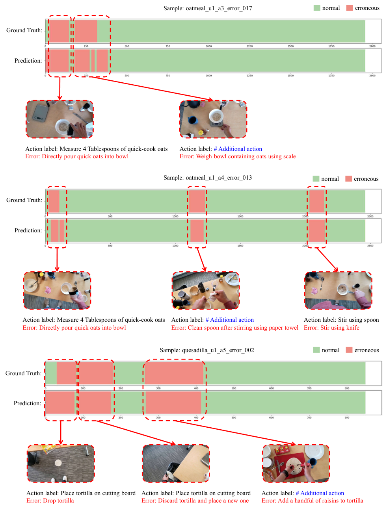

<!-- Start of picture text -->
Sample: oatmeal_u1_a3_error_017 normal erroneous Ground Truth: Prediction: Action label: Measure 4 Tablespoons of quick-cook oats Action label: # Additional action Error: Directly pour quick oats into bowl Error: Weigh bowl containing oats using scale Sample: oatmeal_u1_a4_error_013 normal erroneous Ground Truth: Prediction: Action label: Measure 4 Tablespoons of quick-cook oats Action label: # Additional action Action label: Stir using spoon Error: Directly pour quick oats into bowl Error: Clean spoon after stirring using paper towel Error: Stir using knife Sample: quesadilla_u1_a5_error_002 normal erroneous Ground Truth: Prediction: Action label: Place tortilla on cutting board Action label: Place tortilla on cutting board Action label: # Additional action Error: Drop tortilla Error: Discard tortilla and place a new one Error: Add a handful of raisins to tortilla <!-- End of picture text -->

Figure 7. Visualization examples from the EgoPER dataset using the AMNAR framework. In the **top sample** , two errors are detected: a misoperation—quick oats are poured directly into the bowl without measuring, and an additional action. The **middle sample** also contains three errors: a misoperation, an additional action, and using the wrong tool—stirring with a knife instead of a spoon. The **bottom sample** illustrates a sequence of errors: an accidental error—dropping the tortilla to the ground, followed by a corrective action—replacing the dropped tortilla with a new one, and finally an additional action—adding an incorrect ingredient.

<!-- Page 18 -->

Segments: … … sharing same action label Action label: Stir using spoon Action label: Stir using spoon Error Detection Result: √ Error Detection Result: × Using Knife instead of Spoon 

Figure 8. In this example, the AMNAR framework encounters two actions sharing the same label: one is a correctly executed action (normal), and the other is an erroneous action. Despite the shared label, AMNAR successfully detects the error in the second action (using a knife instead of a spoon) while correctly identifying the first action as normal, avoiding any false positives.
