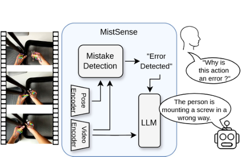
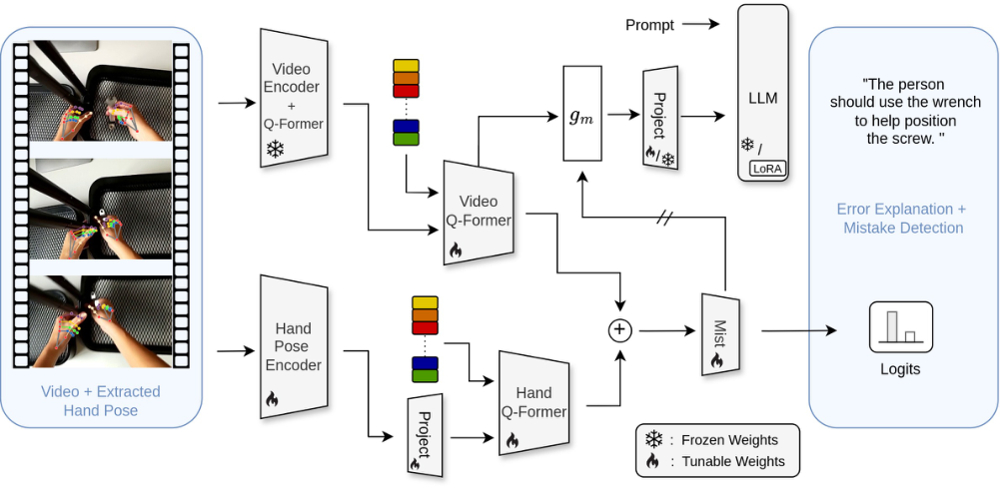
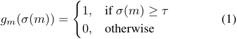
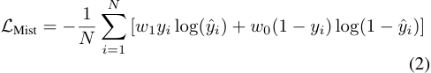
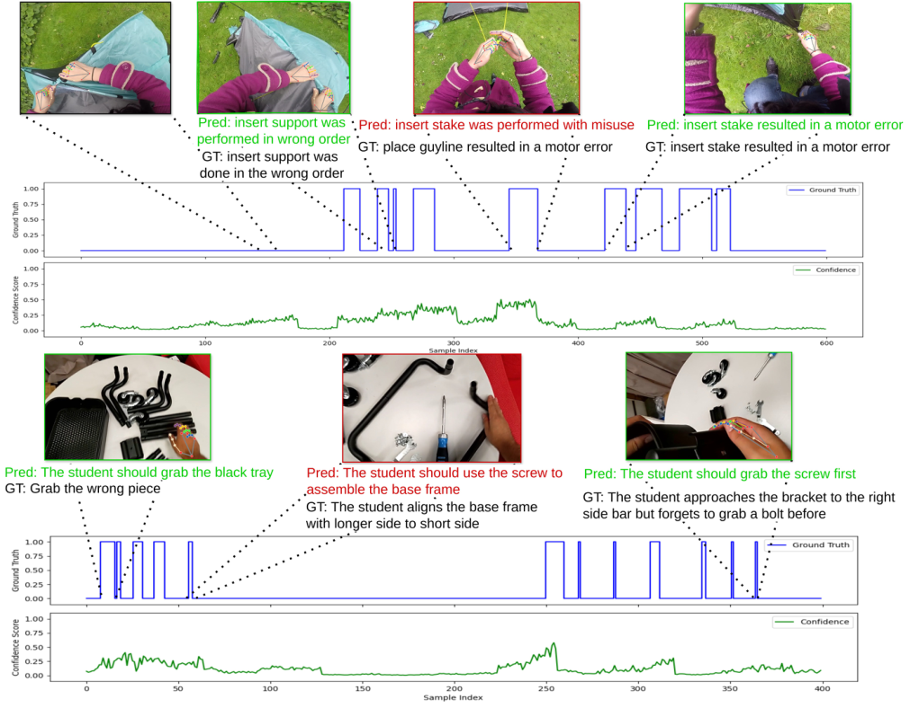

# Patsch_MistSense_Versatile_Online_Detection_of_Procedural_and_Execution_Mistakes_ICCV_2025_paper

[Original PDF](../Patsch_MistSense_Versatile_Online_Detection_of_Procedural_and_Execution_Mistakes_ICCV_2025_paper.pdf)

Pages: 10

> Automatically converted from PDF. Check the original for exact equations, symbols, table alignment, and figure details.

<!-- Page 1 -->

This ICCV paper is the Open Access version, provided by the Computer Vision Foundation. Except for this watermark, it is identical to the accepted version; the final published version of the proceedings is available on IEEE Xplore. 

# **MistSense: Versatile Online Detection of Procedural and Execution Mistakes** 

- Constantin Patsch1 , Yuankai Wu1 , Marsil Zakour1 , Driton Salihu1 , Eckehard Steinbach1 

- 1 Technical University of Munich, School of Computation, Information, and Technology, Department of Computer Engineering, Chair of Media Technology, Munich Institute of Robotics and Machine Intelligence (MIRMI) 

_{_ constantin.patsch,yuankai.wu,marsil.zakour,driton.salihu,eckehard.steinbach _}_ @tum.de 

## **Abstract** 

_Online mistake detection is crucial across various domains, ranging from industrial automation to educational applications, as mistakes can be corrected by the human operator after their detection due to the continuous inference on a video stream. While prior research mainly addresses procedural errors that often relate to temporal and ordering information, identifying a broader range of error types is essential for real-world implementation. In this work, we present MistSense, an approach for online mistake identification that includes versatility by considering both procedural errors, which involve incorrect action sequences, and execution errors, such as motor inaccuracies or improper equipment use. Our method integrates RGB and hand pose features to capture fine-grained contextual cues in order to detect a mistake. By jointly modeling spatial and sequential aspects of human actions, our framework enables robust and adaptive error detection in dynamic environments. Once a mistake has been detected, we leverage a large language model (LLM) which provides an error explanation that gives the user further insights into why an action has been identified as a mistake. The evaluation on common mistake detection benchmarks shows the effectiveness of our approach._ 

## **1. Introduction** 

Recent action detection and recognition approaches [26, 27, 34, 38] enable the accurate perception of human actions from video data while relying on spatiotemporal information to reason about human behavior. An intelligent assistant, however, should have the capability to further reason about the correctness of certain actions, to assist users in accurately performing actions or completing tasks. Such intelligent systems could be applied to daily tasks like cooking or home maintenance, as well as industrial settings such as assembly lines or mechanical repairs. 

In line with recent online mistake detection ap- 

Figure 1. MistSense framework for mistake detection and explanation: Compared to prior approaches that mainly focus on temporal and ordering relations in the form of procedural mistakes, our approach can consider procedural as well as execution mistakes, that capture how an action is performed, in an online fashion. We further integrate hand pose information during the mistake detection process. Upon detecting an error, an LLM is queried to provide an explanation for why the action is incorrect based on the extracted video features. 

proaches [9, 18, 30], to provide timely feedback, the system should be able to conduct inference in an online setting, enabling it to identify errors from a continuous video stream. This allows the user to respond promptly, preventing further consequences of the mistake. An egocentric perspective offers a valuable advantage by capturing task execution from the user’s point of view, circumventing the limitations of static viewpoints that may suffer from occlusions caused by the human body. Furthermore, recent advances in augmented reality enhance the relevance of egocentric systems [2, 5]. The unique egocentric perspective additionally makes it easier to recognize the human hand pose. While this hand-specific information has proven to be helpful for action recognition and detection tasks [11, 32, 37], it can be leveraged for determining the correctness of an executed action and thus used as another modality alongside images. 

14528

<!-- Page 2 -->

While recent methods predominantly focus on procedural errors [9, 18, 28, 30], such as improper sequencing or missed actions, the spectrum of possible errors is broader and application-dependent. Thus, the partial ordering of actions and the successful completion of key steps may only partially represent correct task execution. By additionally considering execution errors that range from motor errors to misusing a piece of equipment, one can get a more holistic interpretation of the successful task completion. Recent datasets further extend to varying error types and consider a mixture of procedural and execution errors [13, 29, 35], which enables a comprehensive evaluation comparable to real-world circumstances. In contrast to anomaly detection methods [22, 36, 39], procedural and execution errors relate to completing a task and its corresponding steps and indicate potential deviations from it in terms of the correctness of ordering or motor execution. As shown by [18] anomaly detection methods struggle to perform procedural and execution error detection in videos. 

Current mistake detection approaches mainly focus on only detecting a mistake [9, 28, 30]. However, to understand why an action is incorrect, additional context is required for the user in order to analyze the executed action. Further information such as the omission of a prerequisite for the current action or the way of executing the action can provide helpful guidance for correcting the behavior. Therefore, drawing inspiration from recent advancements in language and vision-language models [15, 20, 24, 33], we utilize an LLM to generate possible explanations for the detected mistakes. Thus, within our approach, we focus on capturing procedural errors that mainly relate to the relative ordering of actions and depend on temporal relations, as well as execution errors, which refer to how the human is performing certain actions that relate to spatial as well as temporal relations. As a result, our approach can better capture the correct execution of a task while being versatile concerning varying error types. As an additional modality to RGB, we also investigate the use of hand pose data during the mistake detection process. To the best of our knowledge, we are the first to provide a versatile error detection method that further provides textual explanations regarding the detected mistakes. Our contribution is three-fold: 

- We propose MistSense, a versatile online mistakedetection approach that can recognize procedural and execution errors. Thus, our model is capable of evaluating the correct execution of a task in a holistic way compared to only relying on considering temporal ordering. 

- Our method also offers explanations for why an action was erroneous, enabling proactive guidance. By providing users with insights into how an error occurred, our approach facilitates easier issue resolution. 

- We evaluate our approach on the Epic-tent-O [13] and Holo-Assist [35] datasets, which contain several error 

type variations, where our approach shows strong results and improves over existing methods. 

## **2. Related Work** 

### **2.1. Mistake Detection** 

Due to the strong semantic reasoning and zero-shot capabilities of Large Language Models (LLMs), recent work has also leveraged these models for online mistake detection. Flaborea _et al_ . [9] and Plini _et al_ . [28] leverage the in-context learning capabilities of LLMs to predict feasible next action while simultaneously detecting actions. Errors are then determined based on discrepancies between the detected and the anticipated action. However, since these approaches first use an action detection method and then pass the recognized events to the LLM, they cannot capture execution errors related to specific object manipulations or other spatial clues that indicate the correctness of the manipulation task. Seminara _et al_ . [30] introduced a differentiable approach for learning task graphs by directly optimizing edge weights via maximum likelihood to perform mistake detection. Lee _et al_ . [18] introduced a framework combining action segmentation with contrastive step prototype learning to detect procedural errors. By leveraging handobject interaction modeling via a Graph Convolutional Network and relying on feature-prototype similarities, offline mistake detection is performed. 

Other methods further investigate the use of additional modalities. Lehmann _et al_ . [19] identified assembly errors by comparing a test image with a correct assembly state, using synthetically generated image pairs to enable controlled change detection. This method is particularly focused on assembly applications as CAD models of objects are required. Wang _et al_ . [35] leveraged a TSFormer [4] while combining RGB and hand pose information. Mazzamuto _et al_ . [25] rely on eye gaze and RGB information while leveraging GLC modules [16], that relate global visual tokens to local embeddings for eye gaze estimation. They detect mistakes by recognizing differences between the predicted and the observed gaze trajectory. 

Compared to previous approaches, we focus on detecting not only procedural errors but also execution errors in order to better evaluate the correctness of an action. Additionally, we integrate hand pose information as an extra modality to consider the correctness of particular hand movements during the execution of an action. 

### **2.2. Language based Reasoning** 

The recent progress in Large Language models has enabled a more elaborate and advanced way of reasoning that has been further improved by training on large datasets [8, 15, 33]. Additional work further expanded the reasoning capabilities of LLMs to additional modalities and in particu- 

14529

<!-- Page 3 -->

lar vision-based language models (VLMs) [1, 21, 40]. Li _et al_ . [20] proposed BLIP-2, an efficient approach for aligning vision and language representations that can create captions based on the projected embeddings. With VideoLlama, Zhang _et al_ . [40] propose a method that further extends the Q-Former of BLIP-2 to a Video Q-Former that can comprehend temporal dependencies rather than just image-specific features. The resulting representations are projected to a frozen LLM to create captions. Maaz _et al_ . [24] introduced VideoChatGPT, which further considers the temporal relations between the extracted features while supporting multiturn chat interactions. Videollava [21] proposed a unified visual representation space where image and video embeddings are aligned before being passed to the LLM, further enhancing the multimodal reasoning capabilities for visual content. Previous approaches further utilized the reasoning capabilities of LLMs to anticipate future actions [9, 28, 41]. 

In our approach, we also leverage the Q-Former to efficiently encode vision features and an LLM to provide text descriptions. However, instead of generating image content or video descriptions or anticipating actions, the LLM provides explanations of recognized mistakes, offering insights into why an action is incorrect. 

### **2.3. Mistake Detection Datasets** 

Various datasets have been proposed to deal with the challenge of mistake detection. The ATA dataset [10] is focused on offline mistake detection for assembly tasks. The Epictent-O and Assembly101-O datasets [9] introduce online procedural mistake detection in an industrial and an outdoor environment. The former is based on the Epic-tent [13] dataset and adapted for an online use case under open-set conditions. It captures the outdoor assembly of a tent and introduces execution and procedural errors. The latter is based on Assembly101 [31], which captures toy assembly processes, emphasizing procedural mistakes and their corrections, where the actor reverses the error. 

In addition to procedural errors, the IndustReal [29] dataset captures execution errors, which indicate whether the action has been completed correctly. The HoloAssist dataset [35] is a large-scale dataset that also incorporates procedural and execution errors, along with error explanations, while the user wears a HoloLens headset during various object-centered manipulation tasks. Focusing not only on capturing the temporal and logical dependencies between actions in the form of procedural errors but also on investigating the correct execution of actions, we utilize the HoloAssist and Epic-tent-O datasets, as both contain varying error types. This allows us to assess how effectively our approach integrates spatio-temporal reasoning of action execution and the logical connections between consecutive actions. The egocentric perspective of both datasets further helps to capture hand poses accurately. 

## **3. Methodology** 

In this section, we give an overview of our approach and explain the individual components with respect to the mistake detection and error explanation tasks. Additionally, we explain the learning objectives and the overall training strategy that we use to obtain the results of Section 4. 

### **3.1. Mistake Detection** 

As depicted in Figure 2 for the online scenario, we expect a continuous video stream as an input, where we process the overall frames in segments up to the current timestep _t_ . The frames get passed through a combination of a visual encoder and a Q-Former, similar to the one proposed in Blip2 [20] in order to extract visual features. The video encoder in our case is a ViT [7]. We denote a segment of features as _v_ = [ _vt−ts , ..., vt_ ], with _v ∈_ R_ts×d_1 where _ts_ denotes the number of overall considered timesteps within the segment and _d_ 1 indicates the feature dimension. In combination with learnable queries _qrgb ∈_ R_tq×d_2 , the features _v_ are input to the Video Q-Former. The learnable queries are trainable token embeddings that guide the model to extract task-relevant information from features with crossattention. Compared to the Q-Former that extracts spatial information within a frame, the Video Q-Former considers the temporal relations between multiple framewise features but retains the overall structure of [20] similarly as shown in [40], meaning that it consists of a BERT encoder [6]. This results in the features _frgb ∈_ R_tq×d_2 . 

In addition to the RGB-based features, we further extract framewise hand pose representations _h ∈_ R_c×ts×v×m_ , where _c_ denotes the number of coordinate dimensions, _v_ defines the number of joints and _m_ represents the number of hands. These hand pose representations are forwarded to the hand pose encoder, which we adapt from [32]. It consists of Temporal Convolutional Networks (TCNs) [17] that model the separate joints as well as the wrist individually and subsequently combine them with self-attention into the feature representation _h_ 1 _∈_ R_ts×dh_ . We do not perform temporal pooling over the features or extract a classification token but directly use these spatiotemporal features for further processing. The features _h_ 1 are passed through a projection layer that adjusts the feature dimension to _h_ 2 _∈_ R_ts×d_2 . Similarly to the RGB processing, a framewise positional embedding is added to these features. The Hand Q-Former, which has the same structure as the Video Q-Former, subsequently processes _h_ 2 in combination with the learnable queries _qhand ∈_ R_tq×d_2 , which results in the features _fhand ∈_ R_tq×d_2 . 

The features _frgb_ and _fhand_ are then added together and passed to the mistake classification layer to obtain the final mistake logits _m ∈_ R_tq_ . The error explanation generation process is initiated once a mistake is identified based on those logits. 

14530

<!-- Page 4 -->

Figure 2. Overview: Based on a continuous RGB stream, a video encoder, and a Q-Former are used to extract framewise visual relations. Within our approach, hand pose information is used as an additional modality during the mistake detection process. Subsequently, a Video Q-Former is leveraged to extract temporal dependencies between the RGB features. The colored squares represent learnable queries, similar to the ones proposed by [20]. The extracted hand pose features are passed to the Hand Q-Former and added to the extracted RGB-based representations. The mistake classification layer then obtains the final predictions. The Video Q-Former features are forwarded through the gate _gm_ and projected to the LLM embeddings space to create the error explanations. The double slahes indicate no backpropagation. 

### **3.2. Error Explanation** 

The error explanation aims to provide further reasoning as to why an action is incorrect in the form of a text description. The explanation of our model relates to execution and procedural mistakes observed in the considered segment. In case multiple mistakes appear in the same segment, the corresponding captions are concatenated. To provide a textual explanation regarding recognized mistakes, the aforementioned Video Q-Former features _frgb_ that are obtained from the mistake detection part are routed through the gating mechanism _gm_ . During the error explanation task, we only consider the RGB-based features to be forwarded to the LLM. This is formulated as 

where _σ_ is the sigmoid function. Once the predicted logit reaches a threshold _τ_ , the features of the video Q-Former are further forwarded to the projection layer. The projection layer is a linear layer that maps the features to the dimension of the LLM embedding space. The resulting features, as well as a prompt, are forwarded to the LLM in order to create the final explanation. Thus, we ensure that our approach generates error explanations once an error is detected. 

### **3.3. Learning Objectives** 

MistSense is trained in several stages with respect to mistake detection and explanation generation learning objectives. For mistake detection, during the first stage, we apply a weighted binary cross-entropy loss on the predicted probabilities _y_ ˆ _i_ regarding a mistake, defined as 

where _yi_ denotes the binary ground truth label, _N_ specifies the number of samples, and _w_ 0 _, w_ 1 are the respective weights for a correct and wrong action. The weights are applied in order to mitigate the imbalance between correct and wrong actions, where a correct action is annotated as 0 and a mistake as 1. We finetune all components of the model, besides the LLM projection layer and the LLM, during the mistake detection training while keeping the video encoder and the corresponding Q-Former frozen. 

For the error explanation task, we use a regular crossentropy loss and annotated explanations as supervision. During this second stage of the training, we first freeze all model components and only fine-tune the projection layer. The resulting features from the Video Q-Former _frgb_ are processed in segments so that only one given video seg- 

14531

<!-- Page 5 -->

|||**Holo**|**Assist**||||
|---|---|---|---|---|---|---|
|**Methods**|**Modality**|**F1-Score**|**Cor** **Prec**|**rect** **Rec**|**Mist** **Prec**|**ake** **Rec**|
|TSformer [4]|RGB|35.1|82.6|51.8|**12.9**|26.9|
|TSformer [4][35]|RGB + H(GT)|36.2|85.5|43.1|9.7|11.5|
|GazeCompl[25]|RGB + E|51.0|95.0|**92.0**|6.0|9.0|
|MistSense|RGB|54.8|95.6|91.3|11.4|21.1|
|MistSense|RGB+H(P)|**55.7**|**95.9**|85.4|10.3|**31.6**|

Table 1. Performance comparison on Holo Assist [35]. TSformer [4] + H(GT)[35] denotes the TimeSformer model combined with ground truth hand pose as reported by [35]. E denotes the eye gaze information acquired by the HoloLense device. H(P) refers to the hand pose predicted by Mediapipe [23]. 

ment is considered during a training step. In the last stage, we finetune the LLM parameters efficiently with Low-Rank Adaption (LoRA) [12], which is a method that leverages low-rank matrices during the weight updates, while freezing the projection layer. In case of varying errors within the same segment, the ground truth explanations are concatenated during optimization. 

|**Holo Assis**|**t**||
|---|---|---|
|**Methods** **BLEU**|**ROUGEL**|**CIDEr**|
|GT Sampling 0.46|0.50|0.30|
|Videollama [40] 0.52|0.57|0.68|
|Video-ChatGPT [24] **0.55**|**0.58**|0.61|
|MistSense 0.53|**0.58**|**0.76**|

## **4. Experiments** 

In this section, we introduce our benchmarking datasets and provide the results of our approach against prior work on mistake detection. We further provide overall qualitative results as well as a quantitative evaluation of the mistake explanation generation capabilities of our approach. The bold scores in the table indicate the best and the underlined ones the second-best result. 

**Baselines:** In the case of the mistake detection task, as a baseline for Epic-tent-O, we use recent online mistake detection methods. For Holo Assist we use the official baselines of [35] as well as the approaches listed on the benchmarking server. To the best of our knowledge, no existing methods specifically focus on detecting and explaining mistakes; therefore, we compare our results on the error explanation task with recent Vision-Language Models (VLMs) with the same visual encoder and image input dimensions. These methods are fine-tuned by only considering segments with mistakes, as they only focus on the generative task but not on the detection task. 

### **4.1. Datasets and Metrics** 

To evaluate the versatility of our approach, we consider two datasets that capture varying scenarios as well as error types. The Epic-tent dataset [13] consists of 7 hours and captures the assembly of a camping tent in an outdoor environment performed by 29 participants with head-mounted cameras, whereas the Epic-tent-O dataset [9] is a subset 

Table 2. Performance comparison on the error explanation generation task for the Holo Assist [35] dataset. 

of this dataset, designed for open-set online mistake detection, that only captures certain procedural mistakes. The Holo Assist dataset [35] is an egocentric human interaction dataset capturing 169 hours of collaborative physical manipulation tasks from 350 unique performer-instructor combinations, where a task performer wearing a mixed-reality headset follows real-time verbal guidance from an instructor. As our approach relies on supervision in the form of labeled errors, we use the entire original Epic-tent dataset during training. 

For online mistake detection on both datasets, we report the precision and recall values of the correct and mistaken actions. For Epic-tent-O and Holo Assist, we report the F1Score, where in the latter case, results are obtained from the official benchmark server1 . For the mistake explanation generation task, we report the BLEU, which is based on the precision of n-grams with a brevity penalty, ROUGEL, which is computed concerning the longest common subsequence between prediction and ground truth explanation, and CIDEr scores, which captures similarities based on tfidf weighted n-grams. As the error explanations for the Holo Assist test set are not publicly available, we report the results on the validation set with annotated explanations. 

1Holo Assist Mistake Detection Challenge on Codabench 

14532

<!-- Page 6 -->

||||**Epic**|**-tent-O**|||||
|---|---|---|---|---|---|---|---|---|
|**Methods**|**Modality**|**F1-Score**|**F1**|**Correct** **Prec**|**Rec**|**F1**|**Mistake** **Prec**|**Rec**|
|Count-Based [3]|RGB|40.4|59.2|42.9|95.5|21.6|**80.0**|12.5|
|PREGO [9]|RGB|29.2|41.6|**97.9**|26.4|17.2|9.5|**93.3**|
|MSG2 [14]|RGB|45.2|67.5|52.4|95.1|22.9|73.3|13.6|
|DO[30]|RGB|46.5|69.3|54.4|95.2|23.7|73.3|14.1|
|MistSense|RGB|59.8|**89.7**|84.2|**96.2**|29.8|55.0|20.4|
|MistSense|RGB+H(P)|**63.3**|88.2|85.6|90.9|**38.3**|45.4|33.1|

Table 3. Performance comparison on Epic-tent-O [9]. H(P) refers to the hand pose predicted by Mediapipe [23]. We evaluate our approach concerning different modality combinations. 

||**Epic-tent**|||
|---|---|---|---|
|**Methods**|**BLEU**|**ROUGEL**|**CIDEr**|
|GT Sampling|0.50|0.54|1.58|
|Videollama [40]|0.53|0.57|1.78|
|Video-ChatGPT [24]|0.43|0.61|2.61|
|MistSense|**0.62**|**0.66**|**3.09**|

Table 4. Performance comparison on the error explanation generation task for Epic-tent [13]. 

### **4.2. Mistake Detection** 

For both datasets, we report the results of our approach only based on RGB data as well as the combination of RGB and predicted hand pose data. For the hand pose extraction, we use Mediapipe [23]. For evaluating the mistake detection performance on Epic-tent-O, we use consistent evaluation with [9], where mainly procedural errors are considered. While DO [30] and MSG2 [14] consider supervision in the form of key-steps in order to access the procedural correctness of activities, our approach is supervised directly based on the error annotations, which is why the training set of our method is extended by incorrect action sequences from the unmodified Epic-tent dataset. From Table 3 we can observe that our approach based only on the RGB features outperforms DO [30] by 13 _._ 3% in terms of the overall F1-Score and by 6 _._ 1% concerning the F1-Score when only considering the faulty actions. Additionally, integrating the Hand Q-Former and utilizing the hand pose modality further improves the performance by 3 _._ 5%. This further indicates that hand-specific information can help to identify a particular mistake within a sequence. The overall evaluation shows that our model is suitable for detecting mistakes in a procedural assembly scenario. 

For the Holo Assist dataset, in line with prior work, 

we report the results of our approach based on the official competition server, as the test set annotations are not publicly available. Based on the results displayed in Table 1 we can observe that our method significantly improves upon the RGB-only TSformer [4] results reported by [35]. MistSense further improves upon the GLC-based method of [25] abbreviated as GazeCompl by 3 _._ 8%, without using the additional eye gaze modality. When utilizing the hand pose information in addition to RGB data, the resulting F1Score is further increased to 55 _._ 7. Compared to Epic-tentO, the videos of Holo Assist frequently contain background classes without particular meaningful actions which makes the extraction of inter-action dependencies more challenging. Additionally, this dataset contains procedural and execution error types, which indicates that our method is also applicable to such challenging conditions and can identify varying mistake types. 

### **4.3. Error Explanation** 

In Table 4 we provide the error explanation generation results for the Epic-tent [13] dataset. We provide the explanations for the whole test set and evaluate our approach with respect to the aforementioned captioning metrics. As the original Epic-tent dataset does not contain text explanations, we generate them based on the underlying action and the error type, which results in explanations such as ’Place guyline was done in the wrong order’, where further qualitative examples are shown in Section 4.5. All other referenced approaches are also finetuned with the same explanations. For the GT Sampling method, we randomly sample an explanation from the ground truth test set. From the results, we can observe that our approach outperforms other methods that solely focus on caption generation without mistake detection components. Due to the inherent structure of the action and mistake type, the resulting explanations have a similar structure, which is also partially reflected by the higher BLEU and ROUGEL scores. In partic- 

14533

<!-- Page 7 -->

ular the high CIDEr, however, further indicates that the semantic similarity of the generated explanations is improved by our method compared to the other approaches. 

Additionally, we evaluate the error explanation capabilities of our approach on the Holo Assist [35] dataset. This dataset provides explanations such as ”The battery is upside down” or ”The person accidentally turned on the GoPro”, which give more detailed information to the user about why a particular action is a mistake. The variety and structure of the explanations are thus more diverse as compared to Epic-tent. Based on the results in Table 2 one can see that our approach performs on par or better than other baseline methods. The explanation quality regarding semantic similarity is particularly improved as indicated by the CIDEr score. 

### **4.4. Multimodal fusion strategies** 

In order to evaluate, how to integrate the hand pose information into the mistake detection process we conducted an ablation study on different feature combinations. Handonly denotes omitting RGB features and only passing the hand pose features through the Hand Q-Former for mistake detection. Late-Fusion describes the summation of the RGB-based Video Q-Former features and the features resulting from the hand pose encoder without the Hand Q-Former, thus considering a smaller temporal segment. Shared Q-Former is the setting, where the RGB and hand pose features are summed and passed through the same shared Video Q-Former. Sep Q-Former results in the configuration with a separate Video and Hand Q-Former. 

From the results in Table 5 we can observe that only considering the hand modality can achieve an F1-Score of 49 _._ 1% which is approximately 10% below the RGB only score. When considering the late fusion, without a separate Hand Q-Former, the results are on par with the RGB-only case. Considering separate Q-Formers for each modality over a shared Q-Former further increases the F1-Score of the combined RGB and hand pose detection performance by 2 _._ 5%. 

### **4.5. Qualitative Results** 

In Figure 3 we display cutouts of videos from the Epictent and the Holo Assist dataset. It displays the confidence scores regarding the detected mistake in green over the time axis and the corresponding binary ground truth in blue, where 1 indicates an error and 0 indicates a correct action. The color of the textual explanation denotes its semantical correctness, where red denotes semantically wrong and green denotes semantically right explanations. 

In the upper example from the Epic-tent dataset, we can observe that generally, our method yields confidence values that align with the ground truth. However, very short mistakes and brief temporal segments of correct actions be- 

|||**Epic-tent-O**||
|---|---|---|---|
|**Methods**|**F1-Score**|**Corr. F1**|**Mist. F1**|
|Hand-Only|49.1|88.0|10.1|
|Late-Fusion|57.8|83.1|32.6|
|Shared Q-Former|60.8|83.4|37.8|
|Sep Q-Former|**63.3**|**88.2**|**38.3**|

Table 5. Ablation on different fusion strategies for the RGB and hand pose features. Sep-Qformer denotes separate Q-Formers for each modality. Hand-Only denotes only using the Hand Q-Former without RGB information. 

tween errors cannot always be perfectly retrieved. We further compare our model’s mistake explanations with the ground truth, observing that while the overall structure of the explanations is preserved, misclassifications of error types and certain action components can occur. 

In the second row of the figure, an example of the Holo Assist dataset is displayed. The display of confidence values and ground truth remains the same, however, we can also observe in this sample that Holo Assist annotations generally have more mistakes, that are just 1.5 to 2 seconds long. This seems also particularly challenging for our model as such short mistake spikes in the ground truth sometimes do not correspond to higher confidence values. We can observe, however, that our model can detect execution mistakes such as the student grabbing the wrong piece or aligning the base frame incorrectly as shown in the Holo Assist example. 

### **4.6. Implementation Settings** 

For our MistSense architecture, a ViT-L is used as a video encoder, a Llama2-7B as the LLM, and the Video and Hand Q-Former are based on the same BLIP2 structure [20]. For our evaluation the approach is trained for 12 epochs on 2 RTX A6000 GPUs with an AdamW optimizer, a batch size of 16 for Epic-tent and a batch size of 32 for Holo Assist, and a cosine learning rate scheduler with an initial learning rate ( _lr_ ) of 3 _e__−_5 , a weight decay of 5 _e__−_3 and a linear warmup starting from a learning rate of 1 _e__−_6 . The features are extracted based on 2 fps for both datasets. For the Epictent-O dataset, we use _w_ 1 = 1 _, w_ 0 = 1, and for Holo Assist, we use _w_ 1 = 4 _, w_ 0 = 1. For the hand pose encoder, we adapt the hyperparameters of [32] and use a learning rate of 2 _._ 5 _e__−_2 without weight decay. For training the baselines, we retain the same hyperparameters as proposed in the original approaches. During inference, the model requires 20.5 GB of VRAM, while a single run on an RTXA6000 takes approximately 4 seconds when considering the mistake detection as well as the explanation generation. 

14534

<!-- Page 8 -->

Figure 3. Qualitative results on a video cutout of the Epic-tent dataset, where exemplary frames are sampled from the indicated segments. The confidence scores indicating the mistake detection probabilities ˆ _y_ and the ground truth indicating the mistake annotations are visualized over time. 

## **5. Conclusion** 

In this work, we propose MistSense, an approach capable of versatile online mistake detection that can further provide explanations regarding mistakes. This is enabled by projecting the extracted features used for mistake detection to the LLM embedding space upon recognizing an error. As our approach captures the spatial information of how an action is executed and the temporal dependencies between actions, it recognizes execution and procedural mistakes. In addition to utilizing RGB features, it further integrates hand pose features to improve mistake detection performance. The experimental results on the public benchmarks Epictent-O and Holo Assist show the overall strong performance of MistSense on the mistake detection and the explanation generation tasks. Our approach is leading the benchmark on the official evaluation server at the time of writing. 

**Limitations and future work** As the error variety and scale of Epic-tent is limited, additional datasets similar to the size of Holo Assist with mistake annotations would be helpful to cover a broader range of actions and frequent mistakes which would help to further improve the performance of our approach. In particular, variations regarding mistake explanation annotations and a focus on reliable and consistent mistake explanation annotations would further strengthen the performance with respect to the provided explanations. 

Future work could define approaches to deal with very short mistakes robustly, as these mistakes seem particularly challenging as discussed in Section 4.5. Additionally, one could investigate the use of additional modalities like eye gaze or depth to strengthen mistake detection. 

14535

<!-- Page 9 -->

## **6. Acknowledgement** 

We gratefully acknowledge the funding of the Lighthouse Initiative Geriatronics by StMWi Bayern (Project X, grant no. 5140951) and LongLeif GaPa GmbH (Project Y, grant no. 5140953). 

## **References** 

- [1] Jean-Baptiste Alayrac, Jeff Donahue, Pauline Luc, Antoine Miech, Iain Barr, Yana Hasson, Karel Lenc, Arthur Mensch, Katherine Millican, Malcolm Reynolds, et al. Flamingo: a visual language model for few-shot learning. _Advances in neural information processing systems_ , 35:23716–23736, 2022. 3 

- [2] Fabio Arena, Mario Collotta, Giovanni Pau, and Francesco Termine. An overview of augmented reality. _Computers_ , 11 (2):28, 2022. 1 

- [3] Kumar Ashutosh, Santhosh Kumar Ramakrishnan, Triantafyllos Afouras, and Kristen Grauman. Video-mined task graphs for keystep recognition in instructional videos. _Advances in Neural Information Processing Systems_ , 36, 2024. 6 

- [4] Gedas Bertasius, Heng Wang, and Lorenzo Torresani. Is space-time attention all you need for video understanding? In _ICML_ , page 4, 2021. 2, 5, 6 

- [5] Shaveta Dargan, Shally Bansal, Munish Kumar, Ajay Mittal, and Krishan Kumar. Augmented reality: A comprehensive review. _Archives of Computational Methods in Engineering_ , 30(2):1057–1080, 2023. 1 

- [6] Jacob Devlin, Ming-Wei Chang, Kenton Lee, and Kristina Toutanova. Bert: Pre-training of deep bidirectional transformers for language understanding. In _Proceedings of the 2019 Conference of the North American Chapter of the Association for Computational Linguistics: Human Language Technologies, Volume 1 (Long and Short Papers)_ , pages 4171–4186, 2019. 3 

- [7] Alexey Dosovitskiy, Lucas Beyer, Alexander Kolesnikov, Dirk Weissenborn, Xiaohua Zhai, Thomas Unterthiner, Mostafa Dehghani, Matthias Minderer, Georg Heigold, Sylvain Gelly, Jakob Uszkoreit, and Neil Houlsby. An image is worth 16x16 words: Transformers for image recognition at scale. In _International Conference on Learning Representations_ , 2021. 3 

- [8] Abhimanyu Dubey, Abhinav Jauhri, Abhinav Pandey, Abhishek Kadian, Ahmad Al-Dahle, Aiesha Letman, Akhil Mathur, Alan Schelten, Amy Yang, Angela Fan, et al. The llama 3 herd of models. _arXiv preprint arXiv:2407.21783_ , 2024. 2 

- [9] Alessandro Flaborea, Guido Maria D’Amely di Melendugno, Leonardo Plini, Luca Scofano, Edoardo De Matteis, Antonino Furnari, Giovanni Maria Farinella, and Fabio Galasso. Prego: online mistake detection in procedural egocentric videos. In _Proceedings of the IEEE/CVF Conference on Computer Vision and Pattern Recognition_ , pages 18483– 18492, 2024. 1, 2, 3, 5, 6 

- [10] Reza Ghoddoosian, Isht Dwivedi, Nakul Agarwal, and Behzad Dariush. Weakly-supervised action segmentation and 

unseen error detection in anomalous instructional videos. In _Proceedings of the IEEE/CVF International Conference on Computer Vision_ , pages 10128–10138, 2023. 3 

- [11] Al Amin Hosain, Panneer Selvam Santhalingam, Parth Pathak, Huzefa Rangwala, and Jana Kosecka. Hand pose guided 3d pooling for word-level sign language recognition. In _Proceedings of the IEEE/CVF winter conference on applications of computer vision_ , pages 3429–3439, 2021. 1 

- [12] Edward J Hu, Yelong Shen, Phillip Wallis, Zeyuan AllenZhu, Yuanzhi Li, Shean Wang, Lu Wang, Weizhu Chen, et al. Lora: Low-rank adaptation of large language models. _ICLR_ , 1(2):3, 2022. 5 

- [13] Youngkyoon Jang, Brian Sullivan, Casimir Ludwig, Iain Gilchrist, Dima Damen, and Walterio Mayol-Cuevas. Epictent: An egocentric video dataset for camping tent assembly. In _Proceedings of the IEEE/CVF International Conference on Computer Vision Workshops_ , pages 0–0, 2019. 2, 3, 5, 6 

- [14] Yunseok Jang, Sungryull Sohn, Lajanugen Logeswaran, Tiange Luo, Moontae Lee, and Honglak Lee. Multimodal subtask graph generation from instructional videos. _arXiv preprint arXiv:2302.08672_ , 2023. 6 

- [15] Albert Q. Jiang, Alexandre Sablayrolles, Arthur Mensch, Chris Bamford, Devendra Singh Chaplot, Diego de las Casas, Florian Bressand, Gianna Lengyel, Guillaume Lample, Lucile Saulnier, L´elio Renard Lavaud, Marie-Anne Lachaux, Pierre Stock, Teven Le Scao, Thibaut Lavril, Thomas Wang, Timoth´ee Lacroix, and William El Sayed. Mistral 7b, 2023. 2 

- [16] Bolin Lai, Miao Liu, Fiona Ryan, and James M Rehg. In the eye of transformer: Global-local correlation for egocentric gaze estimation. In _33rd British Machine Vision Conference Proceedings, BMVC 2022_ , 2022. 2 

- [17] Colin Lea, Michael D Flynn, Rene Vidal, Austin Reiter, and Gregory D Hager. Temporal convolutional networks for action segmentation and detection. In _proceedings of the IEEE Conference on Computer Vision and Pattern Recognition_ , pages 156–165, 2017. 3 

- [18] Shih-Po Lee, Zijia Lu, Zekun Zhang, Minh Hoai, and Ehsan Elhamifar. Error detection in egocentric procedural task videos. In _Proceedings of the IEEE/CVF Conference on Computer Vision and Pattern Recognition_ , pages 18655– 18666, 2024. 1, 2 

- [19] Dan Lehman, Tim J Schoonbeek, Shao-Hsuan Hung, Jacek Kustra, Peter HN de With, and Fons van der Sommen. Find the assembly mistakes: Error segmentation for industrial applications. _arXiv preprint arXiv:2408.12945_ , 2024. 2 

- [20] Junnan Li, Dongxu Li, Silvio Savarese, and Steven Hoi. Blip-2: Bootstrapping language-image pre-training with frozen image encoders and large language models. In _International conference on machine learning_ , pages 19730– 19742. PMLR, 2023. 2, 3, 4, 7 

- [21] Bin Lin, Yang Ye, Bin Zhu, Jiaxi Cui, Munan Ning, Peng Jin, and Li Yuan. Video-llava: Learning united visual representation by alignment before projection. In _Proceedings of the 2024 Conference on Empirical Methods in Natural Language Processing_ , pages 5971–5984, 2024. 3 

- [22] Zhikang Liu, Yiming Zhou, Yuansheng Xu, and Zilei Wang. Simplenet: A simple network for image anomaly detection 

14536

<!-- Page 10 -->

and localization. In _Proceedings of the IEEE/CVF Conference on Computer Vision and Pattern Recognition_ , pages 20402–20411, 2023. 2 

- [23] Camillo Lugaresi, Jiuqiang Tang, Hadon Nash, Chris McClanahan, Esha Uboweja, Michael Hays, Fan Zhang, ChuoLing Chang, Ming Guang Yong, Juhyun Lee, et al. Mediapipe: A framework for building perception pipelines. _arXiv preprint arXiv:1906.08172_ , 2019. 5, 6 

- [24] Muhammad Maaz, Hanoona Rasheed, Salman Khan, and Fahad Shahbaz Khan. Video-chatgpt: Towards detailed video understanding via large vision and language models. In _Proceedings of the 62nd Annual Meeting of the Association for Computational Linguistics (ACL 2024)_ , 2024. 2, 3, 5, 6 

- [25] Michele Mazzamuto, Antonino Furnari, and Giovanni Maria Farinella. Eyes wide unshut: Unsupervised mistake detection in egocentric procedural video by detecting unpredictable gaze. _arXiv preprint arXiv:2406.08379_ , 2024. 2, 5, 6 

- [26] Constantin Patsch and Eckehard Steinbach. Self-attention based action segmentation using intra-and inter-segment representations. In _ICASSP 2023-2023 IEEE International Conference on Acoustics, Speech and Signal Processing (ICASSP)_ , pages 1–5. IEEE, 2023. 1 

- [27] Thinh Phan, Khoa Vo, Duy Le, Gianfranco Doretto, Donald Adjeroh, and Ngan Le. Zeetad: Adapting pretrained visionlanguage model for zero-shot end-to-end temporal action detection. In _Proceedings of the IEEE/CVF winter conference on applications of computer vision_ , pages 7046–7055, 2024. 1 

- [28] Leonardo Plini, Luca Scofano, Edoardo De Matteis, Guido Maria D’Amely di Melendugno, Alessandro Flaborea, Andrea Sanchietti, Giovanni Maria Farinella, Fabio Galasso, and Antonino Furnari. Ti-prego: Chain of thought and incontext learning for online mistake detection in procedural egocentric videos. _arXiv preprint arXiv:2411.02570_ , 2024. 

   - 2, 3 

- [29] Tim J Schoonbeek, Tim Houben, Hans Onvlee, Fons Van der Sommen, et al. Industreal: A dataset for procedure step recognition handling execution errors in egocentric videos in an industrial-like setting. In _Proceedings of the IEEE/CVF Winter Conference on Applications of Computer Vision_ , pages 4365–4374, 2024. 2, 3 

- [30] Luigi Seminara, Giovanni Maria Farinella, and Antonino Furnari. Differentiable task graph learning: Procedural activity representation and online mistake detection from egocentric videos. In _The Thirty-eighth Annual Conference on Neural Information Processing Systems_ , 2024. 1, 2, 6 

   - [33] Hugo Touvron, Louis Martin, Kevin Stone, Peter Albert, Amjad Almahairi, Yasmine Babaei, Nikolay Bashlykov, Soumya Batra, Prajjwal Bhargava, Shruti Bhosale, et al. Llama 2: Open foundation and fine-tuned chat models. _arXiv preprint arXiv:2307.09288_ , 2023. 2 

   - [34] Xiang Wang, Shiwei Zhang, Zhiwu Qing, Yuanjie Shao, Zhengrong Zuo, Changxin Gao, and Nong Sang. Oadtr: Online action detection with transformers. In _Proceedings of the IEEE/CVF International Conference on Computer Vision_ , pages 7565–7575, 2021. 1 

   - [35] Xin Wang, Taein Kwon, Mahdi Rad, Bowen Pan, Ishani Chakraborty, Sean Andrist, Dan Bohus, Ashley Feniello, Bugra Tekin, Felipe Vieira Frujeri, Neel Joshi, and Marc Pollefeys. Holoassist: an egocentric human interaction dataset for interactive ai assistants in the real world. In _Proceedings of the IEEE/CVF International Conference on Computer Vision (ICCV)_ , pages 20270–20281, 2023. 2, 3, 5, 6, 7 

   - [36] Yue Wang, Jinlong Peng, Jiangning Zhang, Ran Yi, Yabiao Wang, and Chengjie Wang. Multimodal industrial anomaly detection via hybrid fusion. In _Proceedings of the IEEE/CVF Conference on Computer Vision and Pattern Recognition_ , pages 8032–8041, 2023. 2 

   - [37] Yilin Wen, Hao Pan, Lei Yang, Jia Pan, Taku Komura, and Wenping Wang. Hierarchical temporal transformer for 3d hand pose estimation and action recognition from egocentric rgb videos. In _Proceedings of the IEEE/CVF conference on computer vision and pattern recognition_ , pages 21243– 21253, 2023. 1 

   - [38] Le Yang, Junwei Han, and Dingwen Zhang. Colar: Effective and efficient online action detection by consulting exemplars. In _Proceedings of the IEEE/CVF conference on computer vision and pattern recognition_ , pages 3160–3169, 2022. 1 

   - [39] Zhiyuan You, Lei Cui, Yujun Shen, Kai Yang, Xin Lu, Yu Zheng, and Xinyi Le. A unified model for multi-class anomaly detection. _Advances in Neural Information Processing Systems_ , 35:4571–4584, 2022. 2 

   - [40] Hang Zhang, Xin Li, and Lidong Bing. Video-llama: An instruction-tuned audio-visual language model for video understanding. In _Proceedings of the 2023 Conference on Empirical Methods in Natural Language Processing: System Demonstrations_ , pages 543–553, 2023. 3, 5, 6 

   - [41] Qi Zhao, Shijie Wang, Ce Zhang, Changcheng Fu, Minh Quan Do, Nakul Agarwal, Kwonjoon Lee, and Chen Sun. Antgpt: Can large language models help long-term action anticipation from videos? _ICLR_ , 2024. 3 

- [31] Fadime Sener, Dibyadip Chatterjee, Daniel Shelepov, Kun He, Dipika Singhania, Robert Wang, and Angela Yao. Assembly101: A large-scale multi-view video dataset for understanding procedural activities. In _Proceedings of the IEEE/CVF Conference on Computer Vision and Pattern Recognition_ , pages 21096–21106, 2022. 3 

- [32] Md Salman Shamil, Dibyadip Chatterjee, Fadime Sener, Shugao Ma, and Angela Yao. On the utility of 3d hand poses for action recognition. In _European Conference on Computer Vision_ , pages 436–454. Springer, 2024. 1, 3, 7 

14537
