# Plan, Watch, Recover A Benchmark and Architectures for Proactive Procedural Assistance

[Original PDF](../Plan%2C%20Watch%2C%20Recover%20A%20Benchmark%20and%20Architectures%20for%20Proactive%20Procedural%20Assistance.pdf)

Pages: 53

> Automatically converted from PDF. Check the original for exact equations, symbols, table alignment, and figure details.

<!-- Page 1 -->

# **Plan, Watch, Recover: A Benchmark and Architectures for Proactive Procedural Assistance** 

**Kaustav Kundu**1_,_2_,∗_ , **Ritvik Shrivastava**1_,∗_ , **Maxim Arap**1 , **Nanshu Wang**1 , **Xianhui Zhu**1 , **Quintin Fettes**1_,_2 , **Gautam Tiwari**1 , **Parth Suresh**1 , **Théo Moutakanni**2 , **Alejandro Castillejo Munoz**2 , **Allen Bolourchi**2 , **Pascale Fung**2 , **Pinar Donmez**1 , **Babak Damavandi**1 , **Anuj Kumar**1 , **Seungwhan Moon**1_,†_ 

> 1Meta Reality Labs, 2Meta Superintelligence Labs 

> _∗_ Joint First Authors, _†_ Project Lead 

We envision a proactive multi-modal assistant system which gives users real-time step-by-step guidance on a procedural task, autonomously deciding _when_ to interrupt, and _how_ to coach. However, progress is limited by the absence of large-scale, cross-domain benchmarks that reflect realistic conditions — particularly the common case in which users deviate from the expected step sequence. We address this gap with four contributions: **(1)** we release **EgoProactive** , a large-scale wearable-egocentric dataset for proactive procedural assistance with explicit Out-of-Plan (OOP) annotations and recovery steps; **(2)** we augment five established benchmarks (Ego4D, EPIC-KITCHENS, EgoExo4D, HoloAssist, HowTo100M) into **Pro****2** **Bench** under a unified proactive-guidance schema; **(3)** we propose a **decoupled planner–interaction architecture** specialized for procedural state, visual cues, and recovery injection; **(4)** we introduce a post-training recipe that transfers across model families, validated by crossbackbone replication on Llama 4 and Qwen-3.6-VL. In extensive experiments, our trained Llama-4 system substantially improves objective intervention quality over strong proprietary baselines (Claude Opus 4.6, Gemini 3.1 Pro, GPT 5.2) and open-weight baselines (Qwen3 VL 235B) baselines across all six datasets. Oracle-plan experiments further show that, when plan quality is controlled, the trained duplex model produces high-quality guidance and large gains on Out-of-Plan recovery. 

**Date:** June 4, 2026 

**Correspondence:** Kaustav Kundu at kkundu@meta.com | Ritvik Shrivastava at ritvik@meta.com **Data & Code:** https://huggingface.co/datasets/facebook/wearable-ai 

## **1 Introduction** 

Procedural tasks ( _e.g._ servicing a bike, cooking a soufflé) are temporally ordered sequences whose errors in ordering, technique, or timing carry real consequences. A useful proactive AI assistant must (i) estimate procedural state from streaming egocentric video, (ii) decide _when_ to intervene, and (iii) generate _what_ to say, including recovery when the user goes off-plan — all without a user repeatedly asking, _e.g. “What is the next step?”_ , _“Did I do it correctly?”_ These capabilities are coupled: wrong state yields mistimed interventions; well-timed interventions are useless without recovery. 

Recent work addresses pieces in isolation: for instance, online state and mistake detection (Seminara et al., 2024; Flaborea et al., 2024), cognitively-grounded timing (Li et al., 2024; Zhang et al., 2024), and streaming video LLMs at interactive latencies (Qian et al., 2025; Wang et al., 2025) are crucial components for such a proactive system. The first end-to-end system for proactive assistance with streaming egocentric video is ProAssist (Zhang et al., 2025), with the central finding that dialogue quality is bottlenecked by procedural reasoning, not perception. 

Despite these advancements, three main barriers block deployment of proactive assistant systems to real-world scenarios. **(B1) No benchmark covers user deviations.** Existing egocentric corpora ( _e.g._ HoloAssist, ProAssist) assume canonical execution, while real users skip steps, reorder, substitute, make mistakes and recover ( _Outof-Plan_ , OOP); no public dataset pairs OOP with recovery guidance or carries per-decision-point intervention labels under wearable capture. **(B2) Real-time interaction and long-horizon planning have conflicting compute budgets** , which need to account for per-frame streaming decisions _vs._ deeper inference at infrequent decision 

1

<!-- Page 2 -->

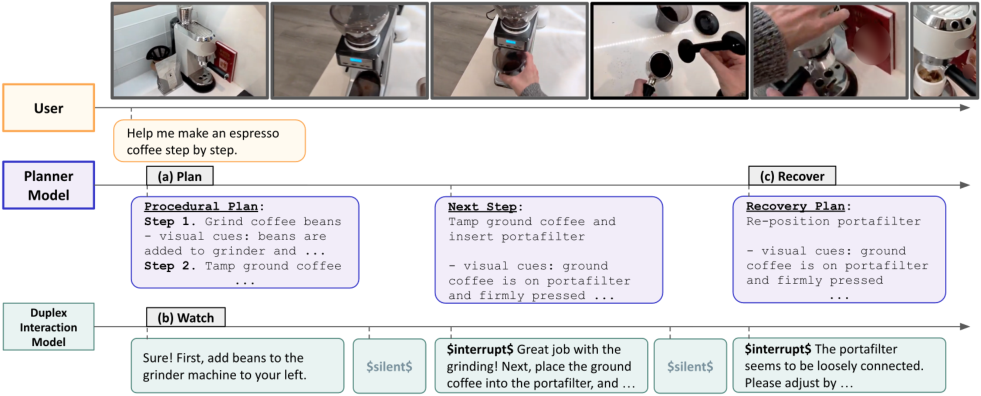

**Figure 1 Plan, Watch, Recover (PWR) in action on an Out-of-Plan deviation.** Upon a user’s query that requires proactive procedural assistance ( _e.g. “Help me make an espresso."_ ), (a) **Planner** generates an ideal sequence of procedure for the requested task, along with visual cues to look out for step completion. (b) **Duplex Interaction Model** continuously processes streaming video alongside the plan and chat history, and emits either _silent_ or _interrupt_ . (c) When out-of-plan actions are detected ( _e.g._ user mistakes, distractions), the planner model proposes a **recovery step** to remedy. See Appendix H.2 for additional examples. 

points; monolithic streaming models trade them against each other. **(B3) Post-training gains are model-specific:** existing recipes are tied to single architectures. 

**Our contributions.** Plan, Watch, Recover ( _PWR_ ) is a system, benchmark, and recipe addressing all three barriers (Figure 1: OOP recovery flow; Figure 3: system). 

1. **EgoProactive**1 **: a wearable-first procedural dataset with explicit OOP coverage.** Our newly collected dataset features 9,935 eval instances from 700 smart glasses egocentric videos covering 4 activity domains; 1,833 eval instances carry scripted Out-of-Plan mistakes or deviations, paired with recovery guidance. Our dataset is the first to feature wearable-form-factor captures jointly providing per-decision-point intervention labels and paired deviation–recovery sequences. 

2. **Pro****2** **Bench: unified re-annotation of five established benchmarks** (Ego4D, Ego-Exo4D, EPIC-KITCHENS, HoloAssist, HowTo100M) under a shared schema of golden procedural plans and per-decision-point intervention labels. Our benchmarks in total provide 42 _,_ 275 eval instances total (with EgoProactive), 249 _,_ 584 training instances across 14 activity domains. 

3. **Decoupled planner–interaction architecture** , our newly proposed sytem for handling procedural tasks. The _planner_ maintains structured procedural state (current/completed/remaining) and injects a recovery strategy into the interaction model’s context on OOP; the _duplex interaction model_ processes streaming video at 2 fps, emits per-frame interrupt/silent decisions, and supports proactive guidance + reactive QA in one loop. Decoupling preserves responsiveness, frees the planner for long-horizon reasoning, and concentrates OOP-recovery logic where it is directly supervised. 

4. **Cross-family post-training recipe.** We show model-agnostic improvement when fine-tuning with our proposed datasets. On Llama 4, the recipe lifts G-Mean F1 from the best zero-shot baseline (0 _._ 55) to 0 _._ 84 (PWROracle Planner), with OOP recovery surpassing every frontier proprietary system (GPT-5.2, Gemini 3.1 Pro, Claude Opus 4.6). Cross-backbone replication on Qwen3.6-VL-27B confirms model-family transfer. 

## **2 Method** 

We propose a two-model architecture that separates long-horizon planning from real-time interaction. A _planner_ produces and updates the procedural plan; a _duplex interaction model_ consumes streaming egocentric 

> 1EgoProactive dataset is available at https://huggingface.co/datasets/facebook/wearable-ai 

2

<!-- Page 3 -->

video and emits an intervention decision at each sampled timestep, with an utterance when interrupting. This departs from the monolithic formulation of (Zhang et al., 2025), which entangles both responsibilities within a single forward pass (Figure 1). 

Let _q_ denote the procedural query stated by a user at the start of a session and _V_ the model vocabulary. At time _t_ , let _v_ 1: _t_ denote the egocentric video stream sampled at 2 fps up to time _t_ and _H<t_ the dialogue history. In practice, the duplex consumes a plan-anchored selection of clips from _v_ 1: _t_ rather than the full prefix (§2.4). The full observation is _ot_ = � _v_ 1: _t, H<t, q_ �. At each timestep the system emits an _intervention decision dt ∈{_ Silent _,_ Interrupt _}_ and an utterance 

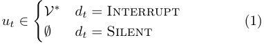

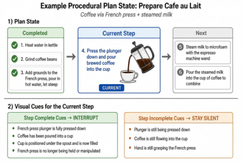

**Figure 2** A procedural-plan state (EgoExo4D) §2.3). 

We additionally let _Pt_ denote the _procedural plan_ at time _t_ , a structured representation of the steps required to complete the task (formally defined in §2.3). The plan is updated only at interrupt time steps; at all other time steps it is held fixed. 

### **2.1 Monolithic Baseline (Zhang et al., 2025)** 

The current state of the art for proactive egocentric assistance, Zhang et al. (2025), models the intervention decision and utterance jointly as a single distribution over the raw observation: _p_ Θ( _dt, ut | ot_ ). The model _p_ Θ must simultaneously infer _when_ to intervene, _what to say_ , and _the latest procedural state_ the user is in from _ot_ , with no explicit representation of the procedure being performed. This _monolithic_ entanglement has a concrete cost. When a step completes or the user deviates from the expected procedure, the model _p_ Θ must detect the event and generate an appropriate response within the same forward pass, with no structured account of what was _expected_ to happen versus what was _observed_ . Deviation detection thus reduces to inferring the procedural state _and_ noticing inconsistency in it, a strictly harder problem than detection against an explicit reference. 

### **2.2 Our Architecture: Decoupled Factorization** 

We propose a factorization that separates procedural planning from real-time intervention into two cooperating models (Figure 3): 

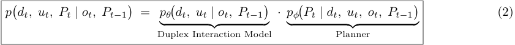

The planner conditions on _dt_ : at silent time steps, _pϕ_ collapses to a Dirac at the cached plan; only at interrupt time steps is the learned planner distribution invoked. Concretely, 

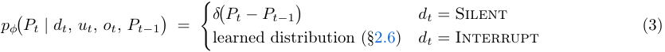

This makes the policy of _running the planner only on interrupts_ a property of the factorization, not a pipeline-level optimization imposed externally. 

_Duplex Interaction Model (pθ, user-facing)._ We use _duplex_ in the sense of concurrent input and output. The interaction model continuously consumes incoming video frames while emitting an intervention decision at each sampled timestep, without pausing perception to deliberate or to speak. This distinguishes it from turn-based conversational systems, where listening and speaking strictly alternate. 

3

> Original page for checking 2 unresolved font glyphs.

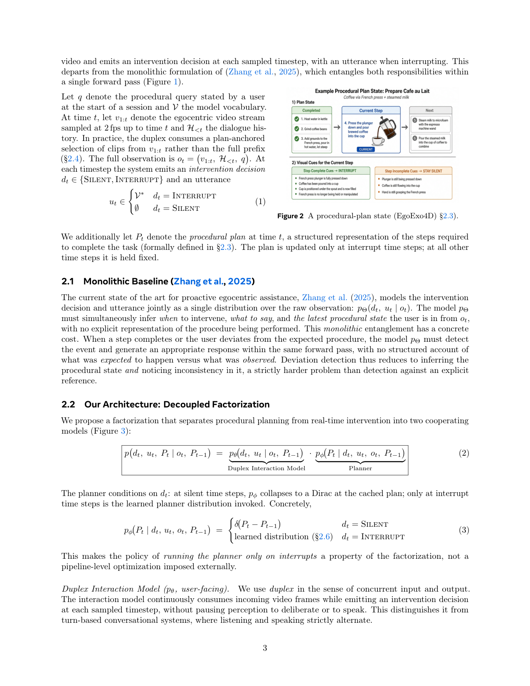

<!-- Page 4 -->

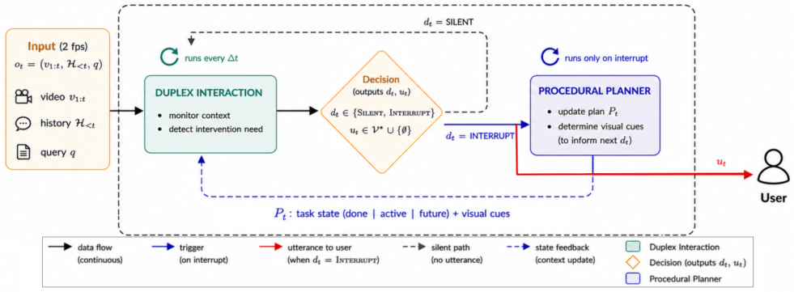

**Figure 3 PWR architecture.** At every observation _ot_ (2 fps), the duplex interaction model consumes the cached plan _Pt−_ 1 to emit a decision _dt_ and, when interrupting, an utterance _ut_ . The planner runs only on interrupt, producing a revised plan _Pt_ (completed/current/remaining steps with visual cues) that conditions the next duplex pass. 

Given ( _ot, Pt−_ 1), _pθ_ auto-regressively generates _dt_ followed by _ut_ when _dt_ = Interrupt. The visual cues embedded in _Pt−_ 1 explicitly inform the model what to look for in _v_ 1: _t_ , grounding the interrupt decision in procedural structure rather than generic activity detection. 

_Planner (pϕ, background)._ The _planner_ is a background model that never interacts with users directly. On interrupt time steps consumes the duplex’s full output ( _dt, ut_ ) together with _ot_ and the cached plan _Pt−_ 1, producing a revised plan _Pt_ with visual cues for the new current step (§2.3). Conditioning on _ut_ ensures any plan revision is consistent with what the user has just been told. In practice the planner consumes only the most recent clip of _v_ 1: _t_ as its visual context (§2.4). The planner is not invoked on silent time steps. **2.3 Procedural Plan** A **procedural plan** (Figure 2) is an ordered sequence of steps together with visual cues for the current step, describing what the system expects to observe in the video stream: _P_ = � _s_ 1 _, s_ 2 _, . . . , sN_ ; **c** �, where _si_ is the _i_ -th procedural step, **c** are visual cues for the current step in progress, and _N_ is the number of steps. The plan is **dynamic** : initialized from _q_ at session start and updated at each interrupt timestep as steps complete or the user deviates. We write _Pt_ for the plan state at time _t_ . 

Plan steps alone describe _what_ the user should be doing at each stage, but provide no direct signal about _what to look for in the video_ to determine whether that step is proceeding normally or warrants an interruption. The visual cues **c** for the current step address this gap. They give the interaction model an explicit, step-grounded description of two complementary signals: visual evidence that the step is still in progress (Silent) and evidence that the step has completed (Interrupt). The monolithic baseline must implicitly recover both from raw video alone. 

_Plan representation. Pt_ is represented as a structured text block injected into the duplex interaction model’s context. Each step _si_ carries a status tag, completed, current, or next, so the interaction model’s context remains focused on the current step without requiring it to reason about long-horizon plan structure. Visual cues **c** are attached to the current step. When an out-of-plan deviation is detected, the planner produces a revised _Pt_ with updated current and next steps and fresh visual cues, ensuring the interaction model’s next utterance is grounded in the corrected plan. 

### **2.4 Plan-Anchored Clip Selection** 

The duplex cannot consume _v_ 1: _t_ in its entirety at each step. Rather than a recency-only sliding window, which would discard long-range procedural context for sessions spanning minutes to hours, we anchor frame selection 

4

> Original page for checking 2 unresolved font glyphs.

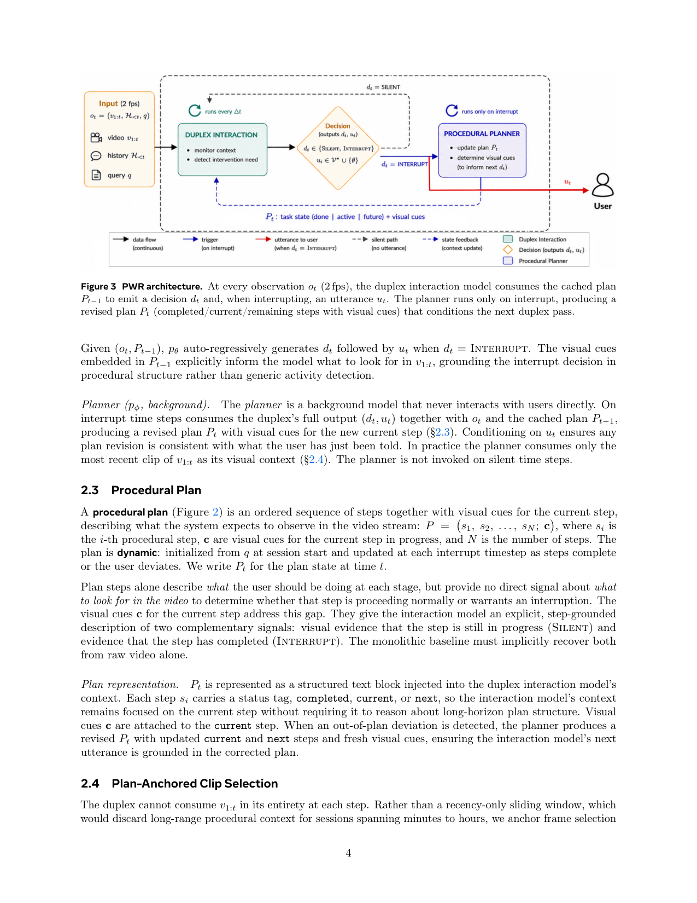

<!-- Page 5 -->

to the plan itself. At each step the duplex receives up to 15 non-contiguous 8 s clips drawn from _v_ 1: _t_ : one clip covering the most recent 8 s ending at _t_ , plus up to 14 additional clips anchored at prior plan-update timestamps (the 14 most recent, when more updates have occurred). Every session opens with the assistant’s initial response to _q_ , which is treated as a plan update at _t_ = 0; one plan-anchored clip is therefore always available, and the budget grows with session progress and saturates at 15. The plan thus performs double duty in the decoupled architecture. Alongside the visual cues established in §2.3, it also structures which slices of _v_ 1: _t_ the duplex perceives. The planner’s output shapes both _what_ the interaction model looks for and _where_ in the timeline it looks. 

_Planner input._ The planner consumes only the most recent 8 s clip of _v_ 1: _t_ at each invocation. The cached plan _Pt−_ 1 already encodes the session’s procedural history in structured form. So the planner needs only current visual evidence to decide whether to advance the step index or emit a recovery plan. This asymmetry is a direct consequence of the decoupled architecture: procedural memory lives in the plan rather than in raw video, freeing the planner from re-perceiving the past at each invocation. 

_Application to baselines._ For fair comparison across architectures, all monolithic baselines we evaluate (§4), including the formulation of Zhang et al. (2025), receive the same plan-anchored clip selection from _v_ 1: _t_ that our duplex consumes. Any performance difference therefore reflects the architectural factorization rather than differences in input handling. 

### **2.5 Inference** 

At each timestep _t_ , the duplex receives ( _ot, Pt−_ 1) and auto-regressively produces ( _dt, ut_ ). If _dt_ = Silent, by Eq. 3 the planner is not invoked and _Pt_ = _Pt−_ 1. If _dt_ = Interrupt, the planner is invoked on ( _ot, Pt−_ 1) to produce _Pt_ . 

**Low-cost explicit planning.** Since the planner predicts identity on silent time steps, expected per-timestep cost is _Cθ_ + _p_ (Interrupt) _· Cϕ_ , and since _p_ (Interrupt) _≪_ 1 for most procedural time steps, _Cϕ_ is naturally amortized across silent intervals. 

**Plan-conditioned detection.** The duplex interaction model conditions its interrupt decision on the full plan _Pt−_ 1, which provides two complementary grounding signals: the step-level structure keeps the model aware of where the user is in the overall task, while the visual cues **c** for the current step specify precisely what to look for in _v_ 1: _t_ . Together these ground the decision in step-specific procedural expectations rather than requiring the model to infer from raw video alone what constitutes a noteworthy event, reducing both false positives and false negatives. 

**Reactive turn handling.** The duplex interaction model handles user-initiated queries (reactive turns) at any time. When the user asks a question mid-task (e.g., _“How long should I tamp?”_ ), the model draws on the current plan context, video observations, and conversation history to respond. This dual proactive–reactive capability requires no additional machinery: the user experiences a single coherent conversational partner regardless of who initiated the exchange. 

**OOP handling without dedicated supervision.** Both sub-cases of Interrupt, _step completion_ and _out-of-plan (OOP) deviation_ , trigger the same machinery. What differs is the planner’s response: on step completion it advances the current step index and produces a plan for the next step with updated visual cues; on OOP deviation it produces a recovery plan. No separate OOP classifier is required; OOP handling emerges from the shared interrupt-and-plan-update interface, supervised by the recovery annotations in EgoProactive: the planner resolves the ambiguity by inspecting _ot_ against _Pt−_ 1 and emitting the appropriate updated plan. 

**Silent-failure backstop.** Because the planner runs only on interrupt, a duplex false-negative (silent prediction at an OOP onset) would block plan updates. We mitigate this with class-balanced sampling and a 2 _×_ interrupt loss weight during duplex training (§2.6), which keeps silent collapse low (Table 3 reports 99 _._ 6% OOP detection recall for PWR-Oracle Planner). 

5

<!-- Page 6 -->

### **2.6 Training Objective** 

Both models are trained via supervised fine-tuning (SFT) at the single time-step level. The combined objective _L_ = _Lθ_ + _Lϕ_ sums a duplex term and a planner term. 

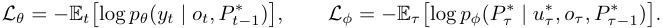

_Duplex Interaction Model (Lθ)._ At each timestep _t_ , the duplex emits _yt_ = ( _dt, ut_ ) with _yt_ = (Silent _, ∅_ ) on silent timesteps and _yt_ = (Interrupt _, u__∗_ _t_)oninterrupttimesteps,and_P ∗_ _t−_ 1isthegroundtruthplanfromthe most recent preceding interrupt. Silent timesteps contribute a single-token target while interrupt timesteps contribute the full utterance, both scored under the same autoregressive cross-entropy. 

_Planner (Lϕ)._ Let _τ_ denote an annotated interrupt timestep. The planner is trained across all interrupt timesteps, including the session-opening interrupt (the assistant’s initial response to _q_ ). Thus, _oτ_ = ( _q, ∅_ ) and _Pτ__∗_ _−_ 1=_∅_atthesession-openinginterrupt.Asingleobjectivecoversbothinitializationandallsubsequent plan updates. 

**Gradient decoupling.** The parameters _θ_ and _ϕ_ appear in disjoint terms of _L_ , so _∇θL_ = _∇θLθ_ and _∇ϕL_ = _∇ϕLϕ_ . The two models therefore optimize independent objectives with no cross-model gradient interference, and can be trained separately. 

**Teacher forcing on the plan.** Ground truth plans _P__∗_ are used during training wherever inference uses predicted plans _P_ˆ . This standard SFT assumption keeps the planner’s optimization decoupled, but introduces a train-test gap. The duplex never sees imperfect plans during training, while at inference it conditions on _P_ ˆ. We report both oracle-planner and predicted-planner variants to quantify the gap introduced by plan prediction errors. Closing it through robust training methods is left to future work. 

### **2.7 Training Data Sampling** 

_Interaction model training._ Procedural video is heavily dominated by silent frames, creating a severe class imbalance between Silent and Interrupt time steps (Zhang et al., 2025). To address this, we sample interrupt and silent decision points at a _∼_ 1:1 ratio during training. At each sampled timestep _t_ , the duplex receives a plan-anchored clip selection from _v_ 1: _t_ (§2.4), with anchors taken from ground-truth planupdate timestamps in the training annotations. The target sequence is (Silent _, ∅_ ) for silent time steps and (Interrupt _, u__∗_ _t_)forinterrupttimesteps,where_u∗_ _t_isthegroundtruthutterance.Theplan_P ∗_ _t−_ 1injectedas context is the ground truth plan from the most recent preceding annotated interrupt. The same clip-selection mechanism is used at training and inference. 

_Planner training._ The planner is trained only on annotated interrupt timesteps. Each training example is the tuple ( _u__∗_ _t__, ot, P_ _t__∗_ _−_ 1)withtarget_P_ _t__∗_,where_ot_usesonlythemostrecentclipasvisualcontext(§2.4).The session-opening interrupt uses _ot_ = ( _q, ∅_ ) and _Pt__∗_ _−_ 1=_∅_asboundaryconditions. 

## **3 Pro****2** **Bench: A Unified Proactive Procedural Benchmark** 

### **3.1 Motivation** 

A proactive procedural assistant must make timely and useful interventions while a user executes a multi-step procedure under realistic conditions, including the deviations and mistakes that occur during genuine task execution. This requires two coupled capabilities: deciding _when_ to intervene and _what_ to say. **Intervention decision** chooses _dt ∈{_ interrupt _,_ silent _}_ based on whether guidance would help at the current moment. **Guidance generation** produces a contextually appropriate utterance _ut_ when _dt_ = interrupt. Both rest on tracking where the user is in the procedure, but procedural understanding is instrumental here, exercised through timing and content rather than scored as a separate task. The two are tightly coupled. An assistant that times interventions well but generates generic guidance fails to actually assist, while one that generates good guidance at the wrong moments is worse than silent. 

6

<!-- Page 7 -->

|**Source**|**View**|**Original Annot.**|**# Domains**|**# Videos**|**# Train Clips**|**# Eval Clips**|**# OOP**|
|---|---|---|---|---|---|---|---|
|**EgoProactive (ours)** _†_|Glasses|Plan + OOP|4|700|N/A|9,935|3,433|
|HoloAssist (HA) _†_|AR|Dialogue|4|207|N/A|2,762|0|
|Ego4D|Head-cam|Narrations|14|24,474|214,511|18,651|0|
|EgoExo4D (EE4D)|Ego+Exo|Keysteps|8|462|13,726|616|0|
|EPIC-KITCHENS (EK)|Head-cam|Actions|1|468|8,954|5,293|0|
|HowTo100M (HowTo)|3rd-person|Transcripts|12|3,026|12,393|5,018|0|
|**Pro****2****Bench (ours)**|All 3 types|Plan + OOP|**14**|**29,337**|**249,584**|**42,275**|**3,433**|

**Table 1 Pro****2** **Bench composition.** EgoProactive (top) is our new wearable-first dataset. The remaining five sources are existing corpora re-annotated under our unified procedural-assistance schema. Row **Pro****2** **Bench** reports the re-annotated benchmark version. **View** and **Original Annot.** describe each source as originally collected. **View** : recording form factor. Glasses = consumer smart glasses, Head-cam = head-mounted research camera, Ego+Exo = paired ego + exo, 3rd-person = instructional video). The total row (‘All 3 types’) spans egocentric, ego+exo, and third-person viewpoints. **Original Annot.** : granularity of each source’s original annotations before re-annotation (Appendix I). The total row reflects our unified schema after re-annotation (‘Plan + OOP’: goal-decomposed procedural plans with per-decision-point intervention supervision, plus OOP deviation/recovery supervision contributed by EgoProactive). **# Videos** : source recordings used. **# Train** / **# Eval** : duplex clip counts at 2 fps over 8 s windows. **# OOP** : Evaluation samples with paired out-of-plan deviation and recovery guidance._†_ : Eval set only. 

No existing resource jointly evaluates both under realistic execution. ProAssist (Zhang et al., 2025) assumes canonical execution and provides no out-of-plan (OOP) coverage. HoloAssist (Wang et al., 2023) captures procedural deviations but lacks per-timestep intervention labels. CaptainCook4D (Peddi et al., 2023) covers a single domain without paired recovery guidance. Large egocentric activity datasets (Grauman et al., 2022, 2024; Damen et al., 2022) provide only atomic action narrations or instructional transcripts, not goal-decomposed procedural plans with the per-decision-point intervention supervision proactive assistance requires. The OOP gap is particularly consequential. In real-world execution, users routinely deviate from canonical procedures, and supporting these deviations is a baseline requirement for proactive assistance. case. Pro2 Bench provides the dedicated supervision needed to evaluate this. 

### **3.2 Benchmark Construction** 

Pro2 Bench unifies six sources under a single annotation schema: a newly collected **EgoProactive** dataset and five existing public corpora (Ego4D, Ego-Exo4D, EPIC-KITCHENS, HoloAssist, HowTo100M). EgoProactive is recorded on consumer smart glasses and uniquely provides recovery supervision for OOP deviations. The five existing corpora, whose original annotations range from atomic narrations to instructional transcripts, are re-annotated into the common schema through a two-stage pipeline described below. 

_EgoProactive collection._ EgoProactive is constructed from 700 video recordings covering procedural tasks across four activity domains (cooking, crafts, DIY, and tutorials). The dataset consists of 9 _,_ 935 evaluation instances (5 _,_ 352 interrupts, 4 _,_ 583 silents), of which 3 _,_ 433 (1 _,_ 883 interrupts, 1 _,_ 550 silents) include out-of-plan scenarios, mistakes and deviations, with paired recovery utterances (Table 1). 

Video recordings were produced by human participants based on scripts that included the description of an activity and an ordered sequence of steps to complete that activity. Participants wore Ray-Ban Meta smart glasses (1 _,_ 280 _×_ 720, 30 fps) and recorded 2–5 minute sessions in their own environments. For videos with OOP steps, the script included the error specification (omission, reordering, or substitution) and steps to fix the error. OOP clips followed a four-phase structure (correct lead-in _→_ scripted mistake _→_ scripted fix _→_ correct end state) within a single continuous recording, providing ground truth for both detection and recovery. Full collection protocol, domain breakdown, participant demographics, and ethics are in Appendix H (§H.1–§H.6). 

_EgoProactive Annotation._ Decision points, intervention labels, and golden recovery responses are annotated per the protocol in Appendix H.3, using a two-phase human review process (audit + correction) that verifies 

7

<!-- Page 8 -->

machine-proposed temporal boundaries and step descriptions before any instance is released. Procedures span 5–14 steps, averaging 9.3 (Table 30). EgoProactive carries the longest golden responses in Pro2 Bench (avg. 17 words), reflecting the additional context needed for recovery guidance versus simple step-progression utterances (Table 31). 

_Inherited-source pipeline._ For inherited sources, a two-stage construction pipeline (Appendix I, J) lifts original atomic narrations or instructional transcripts into goal-decomposed plans and materializes the perdecision-point supervision via synthetic data curation with a VLM model. Note that EgoProactive consumes its human-authored procedural scripts directly, bypassing the VLM step discovery. 

_Composition._ In total, Pro2 Bench (Table 1) comprises 42,275 evaluation instances and 249,584 duplex training instances spanning 14 activity domains and three viewpoint types. Every instance carries a goal _q_ , a golden procedural plan _{s_ 1 _, . . . , sN }_ , and decision-point labels (intervention type and golden utterance when an interrupt occurs) under the unified schema, regardless of the granularity of each source’s original annotations. All splits are video-level disjoint with zero train _↔_ eval overlap. 

### **3.3 Tasks and Metrics** 

##### **3.3.1 Intervention decision.** 

At each decision point the model emits _dt ∈{_ interrupt _,_ silent _}_ . Because procedural video is dominated by silent frames, raw accuracy is misleading. We report the geometric mean of per-class F1, G-Mean F1 = _√_ IF1 _·_ SF1, where IF1 and SF1 are the interrupt- and silent-class F1 scores. G-Mean F1 collapses to 0 whenever either class is never predicted, directly penalizing the degenerate all-interrupt and all-silent policies that a raw accuracy metric would reward. 

##### **3.3.2 Guidance generation.** 

When _dt_ = interrupt, the model produces an utterance _ut_ . An LLM judge (GPT-5.2) scores it against the golden utterance for _relevance_ , _specificity_ , _actionability_ , and _conciseness_ , each on a 1–5 scale (rubric in Appendix G). We report the per-dimension scores and their average over true-positive interrupts. 

Writing _r_ ¯( _u_ ˆ _t, u__⋆_ _t_)_∈_[1_,_5]forthemeanofthefourdimensions,werescaleittoacontentscore_g_(_u_ˆ_t, u⋆_ _t_)= ( _r_ ¯ _−_ 1) _/_ 4 _∈_ [0 _,_ 1]. We do not report _g_ as a standalone headline number. It is defined only over the interrupts a model actually fires, so it is conditioned on each model’s own decision behavior and is not comparable across models with different interrupt rates. Instead, _g_ enters the unified Proactive Quality Score below as the quality of correctly-timed interrupts; the per-dimension breakdown is reported in Appendix B. 

##### **3.3.3 Proactive Assistance Quality Score (PQS).** 

The intervention-decision and guidance metrics above isolate _when_ to speak and _what_ to say, while each is conditioned on the other. Specifically, content score _g_ ( _u_ ˆ _t, u__⋆_ _t_)forguidancegenerationisscoredonlywherethe model chooses to interrupt. To capture the canonical quality of the overall proactive assistant system, we summarize both metrics in a single score over all _N_ decision points. With golden and predicted decisions _d__⋆_ _t__,d_ˆ_t∈{_interrupt_,_silent_}_andcontentscore_g∈_[0_,_1],wedefinetheper-decisionscoreas 

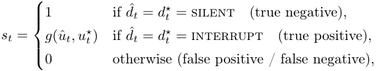

and PQS = _N_ <u>1</u> � _Nt_ =1_st_.PQScreditstheidealactionineitherclass.Correctsilenceandacorrectly-timed, high-quality interrupt both score 1. Spurious interrupts and missed interventions both score 0, so one number penalizes both failure modes. Because correct silence scores 1, an always-silent policy attains the silent base rate under PQS while collapsing to 0 under G-Mean F1. We therefore report the two together, with G-Mean F1 isolating timing calibration and PQS measuring end-to-end utility. 

8

> Original page for checking 1 unresolved font glyphs.

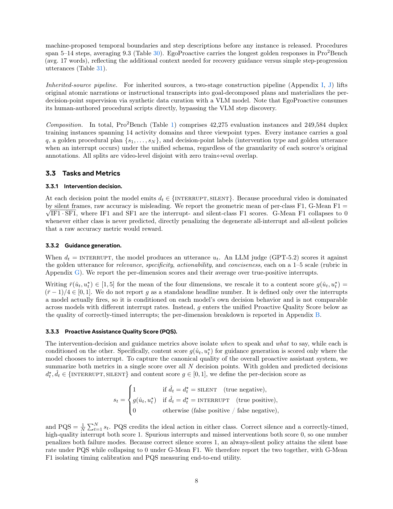

<!-- Page 9 -->

##### **3.3.4 Out-of-plan evaluation.** 

On EgoProactive’s 1,267 OOP instances we additionally report **OOP detection recall** and **recovery quality** . OOP detection recall is the fraction of scripted deviations the model flags with a timely interrupt. Recovery quality is the guidance judge score on recovery utterances, isolating the deviation-and-recovery behavior that distinguishes EgoProactive. 

Full metric definitions, the judge rubric, and the evaluation protocol are in Appendix G. 

## **4 Experiments & Results** 

_Setup._ We evaluate on the 40,008-instance Pro2 Bench (Table 1) and score each decision point on G-Mean F1 for the timing decision and PQS for the joint quality of when to speak and what to say (§3.3). We compare three frontier proprietary models (Gemini 3.1 Pro, Claude Opus 4.6, GPT-5.2) and three open-weight models (Qwen3-VL-235B, Qwen3.6-VL-27B, Llama 4-Maverick), all zero-shot, with GPT-5.2 also serving as the PQS judge and excluded as a candidate. Our PWR systems fine-tune two open-weight backbones, Llama 4 17B×128 MoE (Maverick) and Qwen3.6-VL-27B, on the four-dataset subset {EE4D, EK, HowTo, Ego4D}, leaving HoloAssist and EgoProactive held out to measure generalization. We also report PWR-Oracle, the trained duplex paired with a ground-truth plan, as a non-deployable upper bound. Model configurations, the three planning conditions, prompts, and training details are in Appendix G.1. 

_Training Recipe._ For the Llama-4 Maverick model, we initialize from a pre-trained checkpoint with a learning rate of 5e-6 (cosine schedule, weight decay 0.1) and a warm up of 100 steps. The maximum sequence length is 65,536, and an effective batch size of 4 (micro-batch 2 × gradient accumulation 2). For the Qwen3.6-27B model, the model is trained for 40,400 steps at a learning rate of 2e-5 (weight decay 0.1), an effective batch size of 128 (micro-batch 1 × gradient accumulation 2 across 64 ranks), and a maximum sequence length of 24,000, with video inputs sampled at 2 FPS up to 30 frames. For both families, training examples are drawn from a four-dataset mixture (EpicKitchens, Ego-Exo4D, HowTo100M, and Ego4D) using a square-root-proportional sampler that down-weights the dominant Ego4D corpus, and the loss is computed only on the final assistant turn so that supervision targets the model’s speak/stay-silent decision and its generated guidance rather than the conditioning context. 

Within each family, the monolithic and split duplex (PWR) variants share an identical recipe, base checkpoint, optimizer, schedule, batch size, sequence length, data mixture, sampling weights, and loss masking. It differs only in the training data. The monolithic variant is trained on transcripts in which the planner context is removed and replaced with a common system prompt, requiring a single model to jointly decide when to interrupt and what to say. On the other hand, the PWR variant is trained with the planner context retained, so that timing and content prediction can be conditioned on (and at inference time gated by) a separate planner. This parity isolates the architectural factor of interest. 

### **4.1 Main Findings** 

**No existing model performs the task well** . No baseline exceeds .51 average G-Mean F1 or .37 average PQS, and several collapse outright, with GPT-5.2 falling to near-zero (G-Mean _≤_ .08) on five of six datasets (Table 2). The failure is structural. Monolithic models are prone to over interrupts, with interrupt-F1 sitting well above silent-F1 for every baseline and GPT-5.2 almost never staying silent correctly (SF1 .03 in Table 5). Decoupling the timing and content decisions without training does not fix this. The zero-shot split re-balances the two classes but leaves G-Mean essentially flat for every model that had not already collapsed (Gemini .48 to .49, Llama 4 .45 to .46) and only partly rescues the collapsed ones (GPT .07 to .28), all far below trained PWR. The architecture redistributes errors rather than reducing them, which is why it has to be trained. 

**Dataset and architecture contributions are complementary.** Fine-tuning a monolithic model on Pro2 Bench alone lifts average G-Mean by .22 for Llama 4 and .14 for Qwen3.6, with the HowTo split climbing from .21 to .69 (Table 2). The decoupled architecture adds a second, separate gain, and it pays off only after training. The same monolithic-to-duplex split that is flat at zero-shot lifts Qwen3.6 from .45 to .83 G-Mean once both modules are fine-tuned (Table 5). The two factors are complementary. Monolithic fine-tuning (.45) and the 

9

<!-- Page 10 -->

||_O_|_urs_||_In_|_doma_|_in (ID)_||_Out of do_|_main (OD)_||
|---|---|---|---|---|---|---|---|---|---|---|
|**Model**|**FT**|**PWR**|**EE4D**|**EK**||**HowTo**|**Ego4D**|**HA**|**EP**|**Avg**|
|_Frontier proprietary mo_|_dels_ (m|onolithic,|zero-shot)||||||||
|Gemini 3.1 Pro|||.38 / .27|.50 /|.34|.48 / .35|.51 / .36|.53 / .41|.46 / .38|.48 / .35|
|Claude Opus 4.6|||.48 / .32|.52 /|.29|.46 / .27|.54 / .37|.49 / .26|.57 / .43|.51 / .32|
|GPT-5.2|||.34 / NA|.00 /|NA|.00 / NA|.08 / NA|.00 / NA|.00 / NA|.07 / NA|
|_Open-weight models_|||||||||||
|Qwen3-VL-235B|||.11 / .13|.46 /|.32|.49 / .33|.50 / .37|.46 / .35|.57 / .33|.43 / .30|
||||.36 / .28|.17 /|.45|.33 / .41|.51 / .43|.22 / .41|.28 / .24|.31 / .37|
|Qwen3.6-VL-27B|✓||.61 / .43|.47 /|.30|.41 / .27|.50 / .35|.49 / .31|.22 / **.46**|.45 / .35|
||✓|✓|**.89** / .52|**.90** /|.36|**.88** / .42|**.86** / .64|.79 / .45|**.68** / .44|**.83** / .47|
||||.50 / .36|.50 /|.36|.21 / .24|.51 / .35|.50 / .47|.49 / .34|.45 / .35|
|Llama 4-Maverick|✓||.72 / .41|.71 /|.51|.69 / .48|.70 / .48|.71 / .46|.49 / .40|.67 / .47|
||✓|✓|.73 / **.58**|.80 /|**.67**|.76 / **.73**|.85 / **.74**|**.87** / **.65**|.57 / .43|.76 / **.63**|

**Table 2 Main results: decision quality and assistance quality.** Each cell reports **G-Mean F1 / PQS** . **G-Mean F1** scores _when_ to speak (timing only). **PQS** (Proactive Quality Score, §3.3) is the unified _when + what_ score _∈_ [0 _,_ 1] Capability ticks: **FT** = fine-tuned duplex on Pro2 Bench; **PWR** = our split duplex+planner architecture (monolithic architecture, otherwise). +FT isolates dataset value, +PWR isolates architecture value. _Out of domain_ columns (HA, EgoProactive) are excluded from training and measure generalization. EP is the only set with out-of-plan deviations. **Bold** = best per column per metric, <u>underline</u> = second. <mark>Our contributions via data and architecture</mark> . 

zero-shot split (.49) each fall roughly .35 short of full PWR (.83), showing that neither the data nor the architecture alone suffices. The combined system reaches .83 (Qwen3.6) and .76 (Llama 4) average G-Mean, above every baseline, even though both open-weight backbones begin at or below frontier zero-shot. 

**Robustness across backbones, unseen domains and unscripted deviations.** _Across backbones._ Our best training recipe applied to each backbone lifts both Geometric F1 and PQS into the high .70s to low .80s G-Mean, above every baseline, so the result is not backbone-specific. The two peak on different axes, Qwen3.6 on timing (.83 G-Mean, .47 PQS) and Llama 4 on content (.76 G-Mean, .63 PQS), which shows that knowing when to speak and knowing what to say are separable skills and is why we report both metrics. 

_Across held-out domains._ On the held-out HoloAssist domain PWR reaches .87 (Llama 4) and .79 (Qwen3.6), with HoloAssist being Llama’s single strongest result, and on the harder held-out EgoProactive the margin narrows to .68 (Qwen3.6) and .57 (Llama 4). 

_Across unscripted deviations._ The hardest test is out-of-plan recovery, which can be measured only on EgoProactive. On its 3,433 deviations (Table 3), plan conditioning lowers detection on every baseline, with Claude collapsing from 72.1% to 28.4%, because a plan biases the model toward silence exactly when it should flag a problem. High no-plan recall is misleading, since GPT-5.2’s 99.2% comes from near-constant interrupting whose decision quality is essentially zero in Table 2. PWR avoids both traps. Llama 4 PWR detects 78.7% of deviations with its trained plan, far above any planned baseline, and the PWR-Oracle upper bound reaches 99.6% detection and 4.82 of 5 recovery quality, 27.5 points of detection above the best baseline, though the deployable system’s recovery still trails this oracle ceiling and locates the remaining bottleneck in the predicted plan. As the duplex never trained on out-of-plan data, this is generalization to genuinely novel deviations rather than memorization. 

### **4.2 Analysis** 

**The monolithic** _→_ **duplex split re-balances the timing classes, and only training turns that into accuracy.** At zero-shot the duplex split pushes interrupt-F1 down and silent-F1 up toward a balanced .50 on every backbone (Llama silent-F1 .40 to .53, Qwen3.6 .18 to .50), but it cannot raise both at once, so G-Mean either holds flat for already-balanced models (Llama .45 to .46, Gemini .48 to .49) or only partly rescues a collapsed over-interrupter (Qwen3.6 .31 to .49). Either way the split converges on the same .50 balance ceiling (Table 5). Training breaks that ceiling. With both modules fine-tuned the same split lifts interrupt-F1 and silent-F1 together (Qwen3.6 .51/.46 to .84/.83) and G-Mean clears the plateau at .83 and .76. The architecture 

10

<!-- Page 11 -->

||_O_|_urs_|**OOP**|**Detection (**|**%)**||**PQS**[0_,_1]||**R**|**ecovery (1–5**|**)**|
|---|---|---|---|---|---|---|---|---|---|---|---|
|**Model**|**FT**|**PWR**|**No pl.**|**Pred.**|**Orac.**|**No pl.**|**Pred.**|**Orac.**|**No pl.**|**Pred.**|**Orac.**|
|_Frontier proprietary models_||||||||||||
|Gemini 3.1 Pro|||69.2|46.3|33.0|.38|.41|.37|3.12|3.28|3.50|
|Claude Opus 4.6 |||72.1|28.4|30.3|.43|.35|.31|2.84|2.65|3.21|
|GPT-5.2_†_|||99.2|10.8|25.4|_†_|_†_|_†_|_†_|_†_|_†_|
|_Open-weight models_||||||||||||
|Qwen3-VL-235B|||69.3|36.4|19.8|.33|.39|.45|3.29|3.53|3.60|
||||90.1|57.5|—|.24|.32|—|2.69|2.53|—|
|Qwen3.6-VL-27B|✓ ✓|✓|5.8 —|— 64.9|— 54.5|.46 —|— .44|— **.48**|2.51 —|— 2.26|— 2.60|
||||50.4|38.6|32.5|.34|.44|.45|3.07|4.00|4.44|
|Llama 4-Maverick|✓||68.1|—|—|.40|—|—|1.72|—|—|
||✓|✓|—|**78.7**|**99.6**|—|.43|**.95**|—|2.72|**4.82**|

**Table 3 Out-of-plan detection and recovery** on EgoProactive ( _n_ =3 _,_ 433), with no planner input ( **No pl.** ), model-predicted plans ( **Pred.** ), and oracle plans ( **Orac.** ). **FT** = fine-tuned monolithic; **FT+PWR** = our split duplex+planner architecture. Planner is zero-shot for baselines and trained for PWR. **Detection** is interrupt recall on the deviations. **PQS** ( _∈_ [0 _,_ 1]) is the unified proactive quality score over all decision outcomes ( _g_ ( _u_ ˆ _t, u__⋆_ _t_)forTP,1forTN,0forFP/FN).**Recovery** is a 1–5 judge score on true-positive samples only. **Bold** = best, <u>underline</u> = second. <mark>Our contributions .</mark>_†_ GPT-5.2 excluded from PQS evaluation to prevent judge-candidate bias. —: Not applicable per the planner setup for each row. 

has no standalone value, and its contribution is unlocked by training, which is the mechanism behind the superadditive gain in Finding 2. 

**Predicted vs Upper bound oracle plan.** We train the duplex under teacher forcing, conditioning on ground-truth plans _P__∗_ where inference conditions on the planner’s predictions _P_ˆ (§2.6). The oracle variant restores _P__∗_ at test time, so the oracle-to-predicted difference measures exactly that gap. For the Llama 4 duplex the oracle plan lifts average G-Mean from .76 to .84, EgoProactive from .57 to .91, and out-of-plan detection from 78.7% with the predicted plan to 99.6% with recovery quality 4.82 of 5 (Tables 6, 3). Perception and the duplex are unchanged across the two variants, so none of this is a perception or detection limit. It is entirely the cost of conditioning on a predicted _P_ˆ instead of _P__∗_ , the train-test mismatch the SFT objective leaves open, since the duplex never sees imperfect plans during training. Closing it requires exposing the duplex to predicted rather than ground-truth plans, for example through RL on the planner’s own rollouts, which we leave to future work. Qwen3.6 is the lone exception, where the oracle plan lowers G-Mean (.83 to .71) rather than raising it. This is not a counterexample but an artifact of its _vt_ -restricted visual training, which leaves its duplex unable to exploit the richer oracle plan (Table 6). 

## **5 Qualitative Results** 

We show an example for for the following scenarios: _silent_ , _interrupt_ , _OOP distraction_ and _OOP mistake_ , in Figure 4. In the appendix, Figures 6 to 9 show single-decision examples for each behavior regime. Figures 5 and 10 trace a sequential multi-turn session against frontier baselines. 

_Per-turn behavior._ On _silent_ timesteps, where the user is mid-step and no intervention is warranted, PWR withholds while baselines frequently interrupt (Figure 6). At genuine _step boundaries_ it interrupts with the correct next instruction rather than mistiming or mis-specifying the cue (Figure 7). The out-of-procedure cases are the most discriminative: under an external distraction PWR recognizes the deviation and re-engages with the task (Figure 8), and when the user makes a procedural mistake it both detects the error and names the specific corrective action, where baselines either miss it or offer generic advice (Figure 9). 

_Multi-turn coherence._ Figures 5 and 10 show that PWR’s advantage is _consistency across an entire interaction_ , not a single well-timed decision. Against Gemini (Figure 10), PWR catches the out-of-procedure mistake at the turn it occurs and stays on-task across the surrounding turns, while Gemini misses the deviation or 

11

<!-- Page 12 -->

|||||_ID_||_OO_|_D_||**Mon**|**o**_→_**duplex (6**|**-set mean)**||
|---|---|---|---|---|---|---|---|---|---|---|---|---|
|**Model**|**Config**|**EE4D**|**EK**|**HowTo**|**Ego4D**|**HA**|**EP**|**Model**|**IF1**|**SF1**|**G-M**|∆**G-M**|
|_Frontier proprietar_|_y model_|_s_ (GP|T-5.2 e|xcluded|as judge|)||_Frontier proprietar_|_y_||||
|Gemini 3.1 Pro|ZS|2.09|2.35|2.41|2.44|2.63|3.14|Gemini 3.1 Pro|.57_→_.50 _↓_|.41_→_.50 _↑_|.48_→_.49|_↑_.01|
|Claude Opus 4.6|ZS|2.27|2.17|2.09|2.47|2.04|2.83|Claude Opus 4.6|.56_→_.48 _↓_|.47_→_.52 _↑_|.51_→_.50|_↓_.01|
|_Open-weight model_|_s_|||||||GPT-5.2|.66_→_.56 _↓_|.03_→_.24 _↑_|.07_→_.28|_↑_.21|
|Qwen3-VL-235B|ZS|1.52|2.29|2.32|2.48|2.38|3.28|_Open-weight zero s_|_hot_||||
|Qwen3.6-VL-27B|ZS FT PWR|2.11 2.72 3.06|2.79 2.18 2.44|2.62 2.08 2.67|2.70 2.39 3.55|2.65 2.25 2.81|2.68 2.21 2.83|Qwen3-VL-235B Qwen3.6-VL-27B Llama 4-Maverick|.56_→_.50 _↓_ .66_→_.49 _↓_ .57_→_.43 _↓_|.37_→_.50 _↑_ .18_→_.50 _↑_ .40_→_.53 _↑_|.43_→_.50 .31_→_.49 .45_→_.46|_↑_.07 _↑_.18 _↑_.01|
||ZS|2.43|2.43|1.97|2.41|2.89|3.14|_Open-weight FT_|||||
|Llama 4-Maverick|FT|2.65|3.02|2.93|2.93|2.82|2.32|Qwen3.6-VL-27B|.51_→_.84 _↑_|.46_→_.83 _↑_|.45_→_.83|_↑_.38|
||PWR|**3.33**|**3.67**|**3.93**|**3.94**|**3.58**|**3.73**|Llama 4-Maverick|.76_→_.77 _↑_|.60_→_.75 _↑_|.67_→_.76|_↑_.09|

**Table 4 Subjective guidance quality** (TP-only, 1-5 scale measuring _what_ the model says when it correctly decides to speak. **Best** ; <u>Second Best;</u> <mark>Ours .</mark> 

**Table 5 Monolithic** _→_ **Duplex architecture** averaged over six datasets on both ZS and FT models. 

|**System**|**Plan**|**EE4D**|**EK**|_In do_ |_main_ **HowTo**|**Ego4D**|_Out of _ **HA**|_domain_ **EP**|**Avg**|
|---|---|---|---|---|---|---|---|---|---|
|Llama 4-Maverick|trained oracle|.73 / .58 .69 / .64|.80 /  .91 /|.67  .93|.76 / .73 .82 / .90|.85 / .74 .78 / .95|.87 / .65 .90 / .93|.57 / .43 .91 / .95|.76 / .63 .84 / .87|

**Table 6 Oracle ceiling: PWR vs PWR-Oracle** , G-Mean F1 / PQS per dataset. PWR-Oracle pairs the trained duplex with the ground-truth plan, isolating how far a perfect planner could push the system. 

mis-corrects. Against GPT (Figure 5) two failure modes surface together: on silent turns GPT spuriously interrupts while PWR stays silent ( _discretion_ ), and on the turns where both decide to interrupt, PWR identifies the specific mistake whereas GPT gives generic or wrong-direction guidance ( _utterance quality_ ). 

12

<!-- Page 13 -->

**(A) Silent Monitoring** : Step in Progress **<mark>Task</mark>** <mark>: Disassemble a nightstand.</mark> _<u><mark>[Source:</mark></u>_ **<mark>HoloAssist</mark>** _<u><mark>]</mark></u>_ **<mark>Dialog history</mark>** <mark>:</mark> **<mark>1.</mark>** <mark>Sure! Let’s</mark> <u><mark>get</mark></u> <mark>started. First, Unscrew the hex socket heads of the f</mark> i <mark>rst leg.</mark> **<mark>2.</mark>** <mark>Unscrew the hex socket heads of the second leg.</mark> **<mark>Plan (prev</mark>** _<mark>→</mark>_ **<mark>curr) Cue ($ silent$) Golden Ours</mark>** <mark>✓</mark> <u><mark>gpt ✗</mark></u> _Unscrew the hex socket heads of_ Allen wrench actively turning a par- **[silent] [silent]** You’re on step 3 now: Finish unscrewing the _the third leg. →_ **Unscrew the hex** tially or fully seated screw, hand hex screw(s) on the fourth leg counterclockwise **socket heads of the fourth leg.** applying torque, leg still rigidly atuntil fully loose, then confirm the leg wiggles tached to frame. free. Next we’ll remove the top shelf screws. **(B) Step Completion** : Proactive Interrupt 

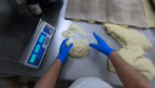

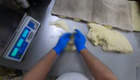

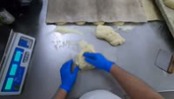

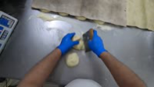

**Task** : Prepare dough for baking by transforming it into uniform, shaped pieces, and positioning them for further processing or baking. _[Source:_ **Ego4D** _<u>]</u>_ **Dialog history** : **1.** Sure! Let’s get started. First, Retrieve a large wooden rolling pin from a bread baking rack and position it on a metal table. **2.** Move a large bread board from the rack to the metal table and rotate it to a suitable position. **3.** Cut a large lump of dough into smaller <u>pieces</u> using a bench scraper. **4.** Knead and shape the dough <u>pieces</u> into cylindrical forms and <u>place</u> them on a long wooden <u>paddle.</u> **<mark>Plan (prev</mark>** _<mark>→</mark>_ **<mark>curr) Cue ($ interrupt$) Golden Ours</mark>** <mark>✓</mark> <u><mark>qwen ✗</mark></u> _Transfer the shaped dough pieces from the wooden_ Dough uniformly combined in bowl, Mix additional Add more dough **[silent]** _paddle to a rack for further preparation or proof-_ mixer stationary and off, hands withdough with flour to the flour mix- _ing. →_ **Mix additional dough with flour and water in a mixer.** drawn, ingredient containers empty or and water in a ture in the mixer. set aside. mixer. 

- **(C) OOP Distractions** : Detection and Re-engagement 

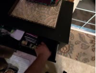

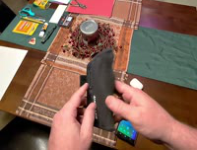

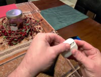

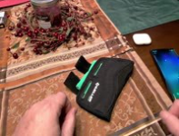

**<mark>Task</mark>** <mark>: How to apply a wrist support brace.</mark> _<u><mark>[Source:</mark></u>_ **<mark>EgoProactive</mark>** _<u><mark>]</mark></u>_ **Dialog history** : **1.** Sure! Let’s get started. First, Open the drawer and retrieve the wrist support brace. **2.** Sit at a stable surface such as a table or chair, <u>place</u> the brace on the table, and handle the <u>packaging</u> while <u>preparing.</u> **<mark>Plan (prev</mark>** _<mark>→</mark>_ **<mark>curr) Cue ($ interrupt$) Golden Ours</mark>** <mark>✓ claude ✗</mark> _Position the wrist support brace directly in front_ Wrist support placed flat with Return your attenReturn your atten- **[silent]** _of you on the table. (interruption) →_ **Return your** opening facing up, centered in tion to the task and tion to the task and **attention to the task and position the wrist support brace** workspace, hands released and hovposition the wrist position the wrist **directly in front of you on the table. (fix)** ering nearby, brief pause indicating support brace disupport brace diplacement complete. rectly in front of you rectly in front of you on the table. on the table. 

- **(D) OOP USER MISTAKES** : Error detection and Correction 

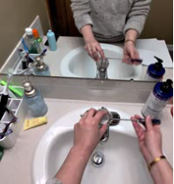

**<mark>Task</mark>** <mark>: Tightening loose faucet handle.</mark> _<u><mark>[Source:</mark></u>_ **<mark>EgoProactive</mark>** _<u><mark>]</mark></u>_ **<mark>Dialog history</mark>** <mark>: —</mark> **<mark>Plan (prev</mark>** _<mark>→</mark>_ **<mark>curr) Cue ($ interrupt$) Golden Ours</mark>** <mark>✓ claude ✓</mark> _Grab a screwdriver that matches_ Ill-fitting tool Notice the screwSet down the Good — I can see you’ve set the screwdriver down on _the faucet handle screw head and_ set aside, hand driver slipping, slipping screwthe counter and are now working the faucet handle _begin adjusting the knob. (Tool_ now gripping a place it down, driver and swap by hand. That’s fine for loosening the handle knob. _Selection Error) →_ **Noticethescrew-** properly sized and switch to a to one that fits Now, Step 2: Remove the faucet handle — carefully **driver slipping, place it down, and switch** replacement, properly fitting properly before pull or lift the handle off to expose the internal stem **to a properly fitting screwdriver before** posture shifting screwdriver becontinuing. and packing nut underneath. Set the handle aside on **continuing. (fix)** to align new tool fore continuing. the counter. Once exposed, we’ll tighten the packing with fastener. nut or stem to fix the looseness. 

**Figure 4 .** Qualitative examples across silent, interrupt and OOP steps. 

13

<!-- Page 14 -->

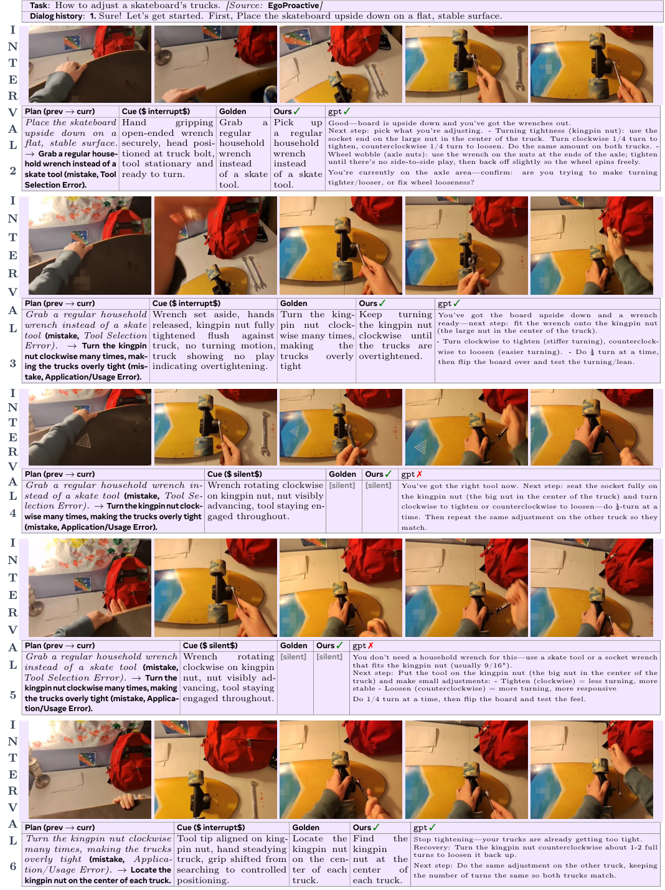

<!-- Start of picture text -->
Task : How to adjust a skateboard’s trucks. [Source: EgoProactive ] Dialog history : 1. Sure! Let’s get started. First, Place the skateboard upside down on a f l at, stable surface. I N T E R V Plan (prev  → curr) Cue ($ interrupt$) Golden Ours  ✓ gpt ✓ Place the skateboard Hand gripping Grab a Pick up Good—board is upside down and you’ve got the wrenches out. A upside down on a open-ended wrench regular a regular Next step: pick what you’re adjusting. - Turning tightness (kingpin nut): use the L flat, stable surface. securely, head posi- household household sockettighten,endcounterclockwiseon the large nut1/4inturnthe tocenterloosen.of theDo truck.the sameTurnamountclockwiseon both1/4trucks.turn to- → Grab a regular house- tioned at truck bolt, wrench wrench Wheel wobble (axle nuts): use the wrench on the nuts at the ends of the axle; tighten hold wrench instead of a tool stationary and instead instead until there’s no side-to-side play, then back off slightly so the wheel spins freely. 2 skate tool (mistake, Tool ready to turn. of a skate of a skate You’re currently on the axle area—confirm: are you trying to make turning Selection Error). tool. tool. tighter/looser, or fix wheel looseness? I N T E R V Plan (prev  → curr) Cue ($ interrupt$) Golden Ours  ✓ gpt ✓ A Grab a regular household Wrench set aside, hands Turn the king- Keep turning You’ve got the board upside down and a wrench L toolwrench (mistake, insteadToolofSelectiona skate released,tightenedkingpinflush nutagainstfully wisepin manynut times,clock- theclockwisekingpinuntilnut (theready—nextlarge nutstep:in thefitcenterthe wrenchof the truck).onto the kingpin nut Error). → Turn the kingpin truck, no turning motion, making the the trucks are - Turn clockwise to tighten (stiffer turning), counterclock- nut clockwise many times, mak- truck showing no play trucks overly overtightened. wise to loosen (easier turning). - Do ¼ turn at a time, 3 ing the trucks overly tight (mis- indicating overtightening. tight then flip the board over and test the turning/lean. take, Application/Usage Error). I N T E R V Plan (prev  → curr) Cue ($ silent$) Golden Ours  ✓ gpt ✗ A Grab a regular household wrench in- Wrench rotating clockwise [silent] [silent] You’ve got the right tool now. Next step: seat the socket fully on L stead of a skate tool (mistake, Tool Se- on kingpin nut, nut visibly the kingpin nut (the big nut in the center of the truck) and turn lection Error). → Turnthekingpinnutclock- advancing, tool staying en- clockwise to tighten or counterclockwise to loosen—do ¼-turn at a 4 wise many times, making the trucks overly tight gaged throughout. time. Then repeat the same adjustment on the other truck so they (mistake, Application/Usage Error). match. I N T E R V A Plan (prev  → curr) Cue ($ silent$) Golden Ours  ✓ gpt ✗ Grab a regular household wrench Wrench rotating [silent] [silent] You don’t need a household wrench for this—use a skate tool or a socket wrench L instead of a skate tool (mistake, clockwise on kingpin that fits the kingpin nut (usually 9/16"). Tool Selection Error). → Turn the nut, nut visibly ad- Nexttruck)step:and makePut thesmalltooladjustments:on the kingpin- Tightennut (the(clockwise)big nut =in lessthe turning,center ofmorethe kingpinnutclockwisemanytimes, making vancing, tool staying stable - Loosen (counterclockwise) = more turning, more responsive 5 the trucks overly tight (mistake, Applica- engaged throughout. Do 1/4 turn at a time, then flip the board and test the feel. tion/Usage Error). I N T E R V A Plan (prev  → curr) Cue ($ interrupt$) Golden Ours  ✓ gpt ✓ L Turn the kingpin nut clockwise Tool tip aligned on king- Locate the Find the Stop tightening—your trucks are already getting too tight. many times, making the trucks pin nut, hand steadying kingpin nut kingpin Recovery: Turn the kingpin nut counterclockwise about 1-2 full turns to loosen it back up. overly tight (mistake, Applica- truck, grip shifted from on the cen- nut at the 6 tion/Usage kingpin nut on the center of each truck. Error). → Locate the searchingpositioningto. controlled tertruck.of each centereach truck.of Nextthe numberstep: Doof theturnssamethe adjustmentsame so bothon trucksthe othermatch.truck, keeping <!-- End of picture text -->

**Figure 5 . Ours vs** gpt: discretion and utterance quality across a session. 

14

<!-- Page 15 -->

## **6 Related Work** 

_Egocentric procedural understanding._ Established corpora (Ego4D (Grauman et al., 2022), EPIC-KITCHENS (Damen et al., 2022), Ego-Exo4D (Grauman et al., 2024), HowTo100M (Miech et al., 2019)) supply scale and domain coverage but were designed for recognition, not assistance; error-focused corpora (Assembly101 (Sener et al., 2022), CaptainCook4D (Peddi et al., 2023), IndustReal (Schoonbeek et al., 2024)) annotate mistakes without paired recovery guidance. Closest to our setting, HoloAssist (Wang et al., 2023) provides 166 hrs of expert–novice HoloLens 2 interactions with real-time verbal guidance. On modeling, Seminara et al. (2024) learn DAG-structured task graphs for online mistake detection and Shen and Elhamifar (2024) address progress-aware streaming segmentation; Li et al. (2025) formalize five core areas across this space. None jointly provides wearable capture, per-decision-point intervention labels, and paired deviation–recovery sequences across multiple domains, nor re-annotates these corpora under a shared proactive-guidance schema. 

_From detection to recovery: the missing half._ Anticipation and error detection are necessary but insufficient: a proactive system must also know _how to fix_ what went wrong. Recent work covers anticipation via LLMs as mental simulators (Zhao et al., 2024) or action-to-language translation for long-term prediction on Ego4D LTA (Kim et al., 2024), detection via online egocentric mistake detection (Flaborea et al., 2024), unified procedural+execution detection (Patsch, 2025), and object-state effect reasoning (Guo et al., 2025). These reliably flag _that_ an error occurred but none generates the multi-step _recovery guidance_ needed to return users to correct procedures. 

_Streaming perception & proactive intervention._ A proactive assistant must run in real time and decide _when_ to intervene without disrupting flow. Streaming video LLMs have advanced quickly: Dispider (Qian et al., 2025) disentangles perception, decision and reaction into asynchronous modules (paralleling our decoupling), and StreamBridge (Wang et al., 2025) converts offline video LLMs to streaming without retraining. On timing, Li et al. (2024) trigger guidance when user beliefs diverge from a task graph, Zhang et al. (2024) use smartwatch sensing, and Chen et al. (2025) deploy a two-model in-ear pipeline (small for _when_ , large for _what_ ); DARPA PTG (DARPA, 2022) field-tested AR guidance with military medics. These demonstrate streaming perception and principled timing, yet typically assume canonical execution, single domains, or omit free-form recovery generation. 

Most closely related, Zhang et al. (2025) introduced the first end-to-end pipeline from streaming egocentric video to proactive dialogue (ProAssist): 30K synthetic dialogues over six benchmarks on VideoLLM-Online, with the finding that dialogue quality is bottlenecked by procedural reasoning rather than perception, directly motivating stronger plan-level representations. We differ in 4 ways. _(1) OOP coverage_ : ProAssist assumes canonical execution; _EgoProactive_ adds 5,065 wearable eval instances with 1,267 OOP duplex rows paired with recovery. _(2) Shared schema_ : where ProAssist treats existing benchmarks as raw video, _Pro__2_ _Bench_ re-annotates Ego4D, Ego-Exo4D, EPIC-KITCHENS, HoloAssist and HowTo100M under one schema of golden plans + per-decision intervention labels (40,008 total). _(3) Decoupling_ : ProAssist couples perception and planning monolithically; we factor real-time interaction from long-horizon planning, enabling structured procedural state and dynamic recovery injection. _(4) Cross-family_ : ProAssist trains one architecture (VideoLLM-Online); our recipe transfers across Llama 4 and Qwen-3-VL. These gaps map to our four contributions: _EgoProactive_ , _Pro__2_ _Bench_ (§3), our decoupled architecture (§2), and a cross-family post-training recipe. 

## **7 Conclusions** 

We presented Plan, Watch, Recover ( _PWR_ ): a wearable-egocentric dataset (EgoProactive), a unified reannotation of 5 established procedural benchmarks (Pro2 Bench), a decoupled planner–interaction architecture, and a post-training recipe that transfers across model families. Our key findings are: (i) frontier zero-shot VLMs collapse to a single class on at least one dataset and exhibit a _silent bias_ when given any plan; (ii) PWR-Oracle Planner (trained duplex with oracle plan) closes the perception–planning gap with _≥_ 0 _._ 18 G-Mean F1 over the best 0-shot baseline on every dataset; (iii) the full PWR system (FT planner + FT duplex) matches or exceeds the Oracle-Plan controlled setting. We release EgoProactive, the Pro2 Bench 

15

<!-- Page 16 -->

annotations, model weights, and training code, and identify cross-distribution OOP, latency profiling, and user studies as next steps. 

## **8 Limitations and Broader Impacts** 

_Limitations._ **(i) OOP generalization.** EgoProactive’s out-of-plan deviations are scripted by design, making detection potentially easier than for spontaneous errors. Because the test split shares script templates with training (though video-disjoint), our OOP results reflect within-distribution generalization only; crossdistribution OOP (unseen error types or domains) remains untested. **(ii) Train–test gap.** Teacher forcing uses ground-truth plans _P__∗_ during training whereas inference uses predicted _P_ˆ . When the planner errs, the duplex encounters plan phrasing it was not trained on, potentially degrading performance; the magnitude of this gap is bounded by planner quality (Table 2 compares Oracle vs. FT planner). 

_Broader Impacts._ Proactive procedural assistance can improve safety and accessibility by reducing errors in medical, manufacturing, and daily-life tasks. However, risks remain. **(i) Over-reliance.** Users may defer to incorrect suggestions in safety-critical domains; deployed systems should include confidence calibration and disclaimers. **(ii) Bias.** Intervention behavior may vary across populations (skill levels, environments, cultural practices); we do not measure demographic fairness. 

## **References** 

- Shizhe Chen et al. Action100M: A large-scale video dataset for procedural activity understanding. In _Proceedings of the IEEE/CVF Conference on Computer Vision and Pattern Recognition (CVPR)_ , 2026. 

- Yuxuan Chen et al. LlamaPIE: A real-time proactive in-ear assistant. In _Findings of the Association for Computational Linguistics: ACL 2025_ , 2025. 

- Dima Damen, Hazel Doughty, Giovanni Maria Farinella, Antonino Furnari, Evangelos Kazakos, Jian Ma, Davide Moltisanti, Jonathan Munro, Toby Perrett, Will Price, and Michael Wray. Rescaling egocentric vision: Collection, pipeline and challenges for EPIC-KITCHENS-100. _International Journal of Computer Vision (IJCV)_ , 130(1):33–55, 2022. 

- DARPA. Perceptually-enabled task guidance (PTG). 2022. URL https://www.darpa.mil/research/programs/ perceptually-enabled-task-guidance. 

- Alessandro Flaborea et al. PREGO: Online mistake detection in PRocedural EGOcentric videos. In _Proceedings of the IEEE/CVF Conference on Computer Vision and Pattern Recognition (CVPR)_ , 2024. URL https://arxiv.org/abs/ 2404.01933. 

- Kristen Grauman, Andrew Westbury, Eugene Byrne, et al. Ego4d: Around the world in 3,000 hours of egocentric video. In _Proceedings of the IEEE/CVF Conference on Computer Vision and Pattern Recognition (CVPR)_ , pages 18995–19012, 2022. 

- Kristen Grauman et al. Ego-exo4d: Understanding skilled human activity from first- and third-person perspectives. In _Proceedings of the IEEE/CVF Conference on Computer Vision and Pattern Recognition (CVPR)_ , 2024. URL https://arxiv.org/abs/2311.18259. 

- Wenliang Guo et al. Procedural mistake detection via action effect modeling. In _Proceedings of the IEEE/CVF International Conference on Computer Vision (ICCV)_ , 2025. URL https://arxiv.org/abs/2512.03474. 

- Sanghwan Kim et al. PALM: Predicting actions through language models. In _Proceedings of the European Conference on Computer Vision (ECCV)_ , 2024. URL https://arxiv.org/abs/2311.17944. 

- Chenyi Li et al. Satori: Towards proactive AR assistant with belief-desire-intention user modeling. In _Proceedings of the ACM Symposium on User Interface Software and Technology (UIST)_ , 2024. URL https://arxiv.org/abs/2410.16668. 

- Yifei Li et al. Building egocentric procedural AI assistant: Methods, benchmarks, and challenges. _arXiv preprint arXiv:2511.xxxxx_ , 2025. 

16

<!-- Page 17 -->

- Antoine Miech, Dimitri Zhukov, Jean-Baptiste Alayrac, Makarand Tapaswi, Ivan Laptev, and Josef Sivic. HowTo100M: Learning a text-video embedding by watching hundred million narrated video clips. _Proceedings of the IEEE/CVF International Conference on Computer Vision (ICCV)_ , 2019. 

- others Patsch. MistSense: Versatile online detection of procedural and execution mistakes. In _Proceedings of the IEEE/CVF International Conference on Computer Vision (ICCV)_ , 2025. 

- Rohith Peddi et al. CaptainCook4D: A dataset for understanding errors in procedural activities. In _Advances in Neural Information Processing Systems (NeurIPS), Datasets and Benchmarks Track_ , 2023. 

- Rui Qian, Shuangrui Ding, Xiaoyi Dong, Pan Zhang, Yuhang Zang, Yuhang Cao, Dahua Lin, and Jiaqi Wang. Dispider: Enabling video LLMs with active real-time interaction via disentangled perception, decision, and reaction. In _CVPR_ , 2025. 

- Tim Schoonbeek et al. IndustReal: A dataset for procedure step recognition handling execution errors and variations. In _Proceedings of the IEEE/CVF Winter Conference on Applications of Computer Vision (WACV)_ , 2024. URL https://arxiv.org/abs/2310.17323. 

- Luigi Seminara, Toby Perrett, Craig Sherstan, and Dima Damen. Differentiable task graph learning: Procedural activity representation and online mistake detection from egocentric videos. In _Advances in Neural Information Processing Systems (NeurIPS)_ , 2024. URL https://arxiv.org/abs/2406.01486. 

- Fadime Sener, Dibyadip Chatterjee, Daniel Sheber, et al. Assembly101: A large-scale multi-view video dataset for understanding procedural activities. In _Proceedings of the IEEE/CVF Conference on Computer Vision and Pattern Recognition (CVPR)_ , pages 21064–21074, 2022. 

- Yuhan Shen and Ehsan Elhamifar. ProTAS: Progress-aware online action segmentation for egocentric procedural task videos. In _Proceedings of the IEEE/CVF Conference on Computer Vision and Pattern Recognition (CVPR)_ , 2024. 

- Haibo Wang, Bo Feng, Zhengfeng Lai, Mingze Xu, Shiyu Li, Weifeng Ge, Afshin Dehghan, Meng Cao, and Ping Huang. StreamBridge: Turning your offline video large language model into a proactive streaming assistant. In _Advances in Neural Information Processing Systems (NeurIPS)_ , 2025. URL https://arxiv.org/abs/2505.05467. 

- Xin Wang et al. HoloAssist: An egocentric human interaction dataset for interactive AI assistants in the real world. In _Advances in Neural Information Processing Systems (NeurIPS), Datasets and Benchmarks Track_ , 2023. 

- Jason Wei, Xuezhi Wang, Dale Schuurmans, Maarten Bosma, Brian Ichter, Fei Xia, Ed Chi, Quoc Le, and Denny Zhou. Chain-of-thought prompting elicits reasoning in large language models. In _Advances in Neural Information Processing Systems (NeurIPS)_ , 2022. 

- Ruidong Zhang et al. PrISM-Observer: Intervention agent to help users perform everyday procedures sensed using a smartwatch. In _Proceedings of the ACM Symposium on User Interface Software and Technology (UIST)_ , 2024. URL https://arxiv.org/abs/2407.16785. 

- Yichi Zhang, Xin Luna Dong, Zhaojiang Lin, Andrea Madotto, Anuj Kumar, Babak Damavandi, Joyce Chai, and Seungwhan Moon. Proactive assistant dialogue generation from streaming egocentric videos. In _Proceedings of the Conference on Empirical Methods in Natural Language Processing (EMNLP)_ , 2025. URL https://arxiv.org/abs/ 2506.05904. 

- Qi Zhao et al. AntGPT: Can large language models help long-term action anticipation from videos? In _Proceedings of the European Conference on Computer Vision (ECCV)_ , 2024. 

- Lianmin Zheng, Wei-Lin Chiang, Ying Sheng, Siyuan Zhuang, Zhanghao Wu, Yonghao Zhuang, Zi Lin, Zhuohan Li, Dacheng Li, Eric Xing, Hao Zhang, Joseph E. Gonzalez, and Ion Stoica. Judging LLM-as-a-judge with MT-Bench and Chatbot Arena. In _Advances in Neural Information Processing Systems (NeurIPS)_ , 2023. 

## **A Results: Detailed Analysis** 

This section expands the compact main-paper Results (§4) with full setup detail, per-finding mechanistic analyses, OOP caveats, the four-pattern subjective breakdown, and the deeper-form observations. Tables (2, 4) and headline numbers remain in main; this appendix is for the full prose. 

17

<!-- Page 18 -->

### **A.1 Setup: Baselines, Conditions, Metrics — Full Detail** 

_Baselines._ We compare against five frontier VLMs _without fine-tuning_ : **Llama 4 Maverick** , **GPT-5.2** , **Gemini 3.1 Pro** , **Qwen3-VL-235B** , and **Claude Opus 4.6** . GPT-5.2 serves as the LLM-as-judge (§B) and is therefore excluded from subjective evaluation. Prior end-to-end procedural assistants are either not publicly available (ProAssist) or operate at substantially smaller scales; we benchmark against the strongest accessible reference class and evaluate prior design choices in our planning ablation (§A.3). 

_Planning conditions (full definitions)._ Each baseline runs under three planning conditions, distinguished by the source of the plan injected into the interaction model: _No Plan_ (video + goal only); _ZeroShot Planner_ (a same-family zero-shot call produces the plan); and _Oracle Planner_ (ground-truth plan with current/completed/remaining steps from annotations). To prevent prompt-engineering bias we run _three_ prompt variants per (model, condition) and report the best G-Mean F1 per cell (per-prompt scores and prompts in Appendix G); the same prompts are used across all six datasets to test cross-domain robustness. 

_Metrics rationale._ Class skew on Pro2 Bench is severe (interrupt fractions 45–75%) and trivial single-class predictors reach MF1 _>_ 0 _._ 30. We therefore report _G-Mean F1_ = _√_ IF1 _·_ SF1 as the primary objective metric: it is zero whenever either class collapses, directly penalizing the all-interrupt and all-silent failure modes we observe (Table 2). Cells report IF1/SF1/G-Mean for transparency. For guidance quality, GPT-5.2 scores each true-positive interrupt response on relevance, specificity, actionability, and conciseness (1–5 scale; full rubric in Appendix B); we report the four-dimension average. 

### **A.2 Main Results: F1–F3 in Detail** 

_(F1) Frontier VLMs plateau near random on the intervention task._ Across the 18 frontier (model, condition) cells the median G-Mean F1 is 0 _._ 49 and the per-dataset maximum reaches only 0 _._ 62 (Claude, EgoProactive, No Plan). Performance is heterogeneous: no single baseline wins on more than two of the six datasets, ruling out a one-trick benchmark. Failure modes also differ across baselines (collapse to silent, collapse to interrupt, or oscillation); we dissect these in F2–F3. 

_(F2) Class collapse is the dominant failure mode for VLMs._ Several baselines default to a single class on at least one dataset, yielding G-Mean = 0 despite non-zero MF1. The most extreme case is GPT-5.2 No Plan on HowTo100M (75% interrupt skew), where GPT predicts interrupt for 99 _._ 7% of decision points; MF1 reads 0 _._ 34 but the system is operationally useless — it interrupts at every frame, never letting the user proceed. G-Mean’s geometric mean surfaces this collapse; arithmetic averages mask it. Symmetric all-silent collapses appear in Llama 4 (HowTo100M, SF1=0 _._ 07) and across multiple Gemini cells when given a plan. 

_(F3) PWR closes the perception–planning gap._ PWR-Oracle Planner (trained duplex, oracle plan) attains G-Mean 0 _._ 69–0 _._ 91 across all six datasets, with a _≥_ 0 _._ 18 absolute gain over the best baseline on every dataset. This validates ProAssist’s claim that procedural reasoning, not perception, is the bottleneck (Zhang et al., 2025): a correct plan unlocks the duplex, and the upstream blocker is plan generation. PWR (FT planner + FT duplex; bottom Llama 4 row) closes the loop end-to-end and _matches or exceeds_ the Oracle-Plan controlled setting on EE4D (.73 vs .69) and Ego4D (.85 vs .78), while recovering 88–93% of it on EK and HowTo. The EE4D/Ego4D inversion is consistent with joint training adapting the duplex to the FT planner’s phrasing distribution; oracle-plan phrasing, drawn from human annotations, is mildly out-of-distribution for the duplex when it has been trained against a different planner generator. Per-dataset columns map to distinct activity-domain clusters (Appendix D); full per-domain breakdown in Appendix E. 

_(F3, cont.) Cross-backbone replication on Qwen3.6-VL-27B._ The same recipe applied to a smaller Qwen3 backbone shows the recovery direction even when absolute numbers reflect compute-constrained scale: ZS+Oracle exhibits severe class collapse (SF1 = 0 _._ 02–0 _._ 18 across datasets), while FT+Oracle lifts SF1 to 0 _._ 07–0 _._ 37, with ∆ G-Mean +0 _._ 05 to +0 _._ 20 on 5 of 6 datasets. This confirms the recipe is direction-correct cross-family; the joint Qwen3.6-VL-27B (PWR, FT/FT) row is targeted for the camera-ready (training in progress at submission). 

18

<!-- Page 19 -->

### **A.3 Planning Ablation: Mechanistic Account of Plan-Induced Silent Bias** 

We attribute the 53% ordering reversals (§A.3) to _plan-induced silent bias_ : in 80% of (model, dataset) pairs, conditioning on _any_ plan increases SF1 while decreasing IF1, shifting the decision boundary toward silent. Mechanistically, the plan text repeatedly references the same active step (“the user is currently . . . ”) across consecutive frames, providing a strong textual prior for “in-progress” over “step-just-completed” (Wei et al., 2022); the failure manifests as _inaction_ rather than overt error, which is harder to detect online. PWR-Oracle Planner addresses this via class-balanced sampling and a 2 _×_ interrupt loss weight (§2.6), exceeding the best Oracle baseline on every dataset by _≥_ 0 _._ 18 G-Mean F1. 

### **A.4 Subjective Response Quality: Three Patterns** 

_(i) Plan context helps most when the generator is strong._ Llama 4 gains +1 _._ 75 on EE4D from No Plan to ZeroShot Planner (2 _._ 86 _→_ 4 _._ 61) and +0 _._ 25 further to Oracle ( _→_ 4 _._ 86); Claude gains only 2 _._ 40 _→_ 3 _._ 62 on HowTo with the Oracle Plan, indicating that plan conditioning helps generation only when the backbone has the capacity to integrate it. 

_(ii) Subjective and objective rankings can disagree._ Gemini leads No-Plan subjective on HowTo and Ego4D but is mid-pack on G-Mean; Qwen tops objective on EK/HowTo (ZS Planner, 0 _._ 54) yet scores below Llama 4 on every subjective row. _When_ to speak and _what_ to say are decoupled skills, justifying our separate evaluation of both. 

_(iii) PWR-Oracle Planner produces best-in-class responses on five of six datasets._ (3 _._ 57–4 _._ 81), surpassed only on EE4D by Llama 4 with the Oracle Planner (4 _._ 86); EE4D is the smallest dataset (n=899) and the gap is within GPT-5.2’s 0 _._ 4-point per-dimension test-retest noise (Appendix B). GPT-5.2 is excluded as a judged model to mitigate stylistic self-preference (Zheng et al., 2023). 

### **A.5 Observations: Three Synthesized Takeaways (Detailed)** 

_(O1) Decision quality and content quality are decoupled._ Llama 4 with the Oracle Planner attains the highest subjective score on EE4D (4 _._ 86) but only 0 _._ 43 G-Mean F1 on the same dataset; Qwen with the ZeroShot Planner inverts the pattern. Treating proactive assistance as a single “response quality” problem, as is common in dialogue benchmarks, rewards fluent text at the wrong time. Pro2 Bench’s separation of timing and content surfaces this dissociation; we recommend evaluating both axes for any future system in this space. 

_(O2) Plans supply state but cost calibration._ Across 30 baseline cells, ZeroShot Planner conditioning improves G-Mean F1 over No Plan in 67% of pairs (20 _/_ 30), but it also shifts predictions toward silent in 80% of pairs (24 _/_ 30), independent of whether overall G-Mean improves. The improvement comes from the plan supplying procedural state — analogous to how chain-of-thought prompting externalizes reasoning (Wei et al., 2022) — while the silent shift comes from the plan over-representing the active step relative to step-completion cues in the visual stream. Off-the-shelf VLMs lack a mechanism to recalibrate the decision boundary; PWR’s class-balanced sampling and weighted interrupt loss provide one (§2.6). 

_(O3) Plan utilization, not plan accuracy, is the bottleneck._ The Oracle Planner under-performs the ZeroShot Planner in 63% of testable pairs (19 _/_ 30), even though Oracle plans are by construction correct. This rules out plan _accuracy_ as the limiting factor and points to plan _utilization_ : richer, more structured plan context amplifies the silent bias above. The deployment implication is non-obvious — simply improving an upstream planner is not sufficient and may even hurt, absent a downstream interaction model trained to exploit plan structure. PWR’s joint training addresses both halves and demonstrates that the Oracle-Plan controlled setting is partially recoverable end-to-end. 

19

<!-- Page 20 -->

## **B Subjective Score Details** 

Tables below report the full per-dimension subjective quality breakdown (relevance, specificity, actionability, conciseness) for all four judged models across all six datasets and all evaluated conditions. The main paper (Table 4) reports only the four-dimension average. 

##### **Table 7** Subjective: EE4D (Skilled). 

**Table 8** Subjective: EK (Cooking). 

|**Model**|**Cfg.**|**R**|**S**|**A**|**C**|**Avg**|
|---|---|---|---|---|---|---|
|Llama 4|ZS|2.41|2.59|3.39|3.05|2.86|
|Llama 4|MP|4.45|4.49|4.70|4.83|4.61|
|Llama 4|OP|4.83|4.85|4.90|4.85|4.86|
|Gemini|ZS|1.80|2.11|3.30|4.43|2.91|
|Gemini|MP|2.05|2.43|3.31|4.27|3.01|
|Gemini|OP|2.17|2.57|3.41|4.16|3.08|
|Qwen3-VL|ZS|1.91|2.30|3.56|3.85|2.90|
|Qwen3-VL|MP|2.06|2.38|3.60|4.00|3.01|
|Qwen3-VL|OP|2.85|2.98|3.82|4.44|3.52|
|Claude|ZS|2.62|2.41|3.47|2.26|2.69|
|Claude|MP|2.88|2.71|3.71|2.50|2.95|
|Claude|OP|3.65|3.55|3.92|2.69|3.45|
|**PWR-OP**||**2.89**|**3.04**|**3.80**|**4.53**|**3.57**|

|**Model**|**Cfg.**|**R**|**S**|**A**|**C**|**Avg**|
|---|---|---|---|---|---|---|
|Llama 4|ZS|2.46|2.27|3.37|3.76|2.96|
|Llama 4|MP|3.57|3.53|4.14|4.41|3.91|
|Llama 4|OP|4.87|4.84|4.89|4.75|4.84|
|Gemini|ZS|2.28|2.05|3.25|4.26|2.96|
|Gemini|MP|3.13|3.06|3.78|4.47|3.61|
|Gemini|OP|4.05|4.12|4.45|4.61|4.31|
|Qwen3-VL|ZS|2.36|2.24|3.49|3.80|2.97|
|Qwen3-VL|MP|2.65|2.74|3.73|4.09|3.30|
|Qwen3-VL|OP|4.71|4.68|4.81|4.67|4.72|
|Claude|ZS|2.08|1.74|3.10|2.16|2.27|
|Claude|MP|2.44|2.18|3.43|2.44|2.62|
|Claude|OP|3.58|3.44|3.82|2.70|3.38|
|**PWR-OP**||**4.61**|**4.59**|**4.78**|**4.93**|**4.73**|

##### **Table 9** Subjective: HowTo (Open-domain). 

**Table 10** Subjective: EgoProactive (Household). 

|**Model**|**Cfg.**|**R**|**S**|**A**|**C**|**Avg**|
|---|---|---|---|---|---|---|
|Llama 4|ZS|2.43|2.25|3.29|3.47|2.86|
|Llama 4|MP|3.34|3.21|3.81|3.77|3.53|
|Llama 4|OP|4.47|4.39|4.55|4.13|4.39|
|Gemini|ZS|2.47|2.22|3.34|3.72|2.94|
|Gemini|MP|3.75|3.56|4.02|4.55|3.97|
|Gemini|OP|4.52|4.52|4.67|4.82|4.63|
|Qwen3-VL|ZS|2.36|2.26|3.41|3.09|2.78|
|Qwen3-VL|MP|2.92|2.84|3.78|3.62|3.29|
|Qwen3-VL|OP|3.64|3.56|4.08|4.17|3.86|
|Claude|ZS|2.23|1.82|3.18|2.38|2.40|
|Claude|MP|2.58|2.28|3.53|2.43|2.71|
|Claude|OP|3.90|3.76|3.99|2.84|3.62|
|**PWR-OP**||**4.46**|**4.39**|**4.61**|**4.87**|**4.58**|

|**Model**|**Cfg.**|**R**|**S**|**A**|**C**|**Avg**|
|---|---|---|---|---|---|---|
|Llama 4|ZS|2.93|2.53|3.42|3.68|3.14|
|Llama 4|MP|3.52|3.47|4.05|4.34|3.84|
|Llama 4|OP|4.14|4.18|4.49|4.39|4.30|
|Gemini|ZS|2.86|2.37|3.20|4.14|3.14|
|Gemini|MP|2.82|2.76|3.44|4.21|3.31|
|Gemini|OP|2.78|3.03|3.73|4.23|3.45|
|Qwen3-VL|ZS|2.99|2.75|3.64|3.74|3.28|
|Qwen3-VL|MP|3.13|3.14|3.88|3.88|3.51|
|Qwen3-VL|OP|3.19|3.30|3.99|3.95|3.61|
|Claude|ZS|2.84|2.51|3.50|2.49|2.83|
|Claude|MP|2.44|2.18|3.28|2.54|2.61|
|Claude|OP|3.19|3.06|3.72|2.65|3.16|
|**PWR-OP**||**4.80**|**4.74**|**4.80**|**4.91**|**4.81**|

##### **Table 11** Subjective: HA (Assembly). 

##### **Table 12** Subjective: Ego4D (Everyday). 

|**Model**|**Cfg.**|**R**|**S**|**A**|**C**|**Avg**|
|---|---|---|---|---|---|---|
|Llama 4|ZS|2.29|2.27|3.26|3.73|2.89|
|Llama 4|MP|2.65|2.71|3.61|4.24|3.30|
|Llama 4|OP|3.75|3.81|4.18|4.47|4.05|
|Gemini|ZS|2.67|2.64|3.58|4.64|3.38|
|Gemini|MP|2.97|3.07|3.78|4.65|3.62|
|Gemini|OP|3.16|3.38|3.86|4.69|3.77|
|Qwen3-VL|ZS|2.63|2.68|3.64|4.15|3.27|
|Qwen3-VL|MP|2.51|2.68|3.62|4.04|3.21|
|Qwen3-VL|OP|3.34|3.51|4.08|4.41|3.83|
|Claude|ZS|1.94|1.70|3.03|2.17|2.21|
|Claude|MP|2.43|2.20|3.33|2.29|2.56|
|Claude|OP|3.35|3.12|3.60|2.62|3.17|
|**PWR-OP**||**4.58**|**4.62**|**4.76**|**4.96**|**4.73**|

|**Model**|**Cfg.**|**R**|**S**|**A**|**C**|**Avg**|
|---|---|---|---|---|---|---|
|Llama 4|ZS|2.30|2.09|3.06|3.49|2.74|
|Llama 4|MP|2.56|2.40|3.27|3.92|3.04|
|Llama 4|OP|3.85|3.81|4.18|4.23|4.02|
|Gemini|ZS|2.40|2.08|3.06|4.14|2.92|
|Gemini|MP|3.36|3.24|3.78|4.47|3.71|
|Gemini|OP|3.56|3.60|4.02|4.53|3.93|
|Qwen3-VL|ZS|2.35|2.19|3.29|3.77|2.90|
|Qwen3-VL|MP|2.29|2.28|3.33|3.72|2.91|
|Qwen3-VL|OP|2.92|2.94|3.66|4.00|3.38|
|Claude|ZS|2.13|1.72|3.05|2.09|2.25|
|Claude|MP|2.19|1.90|3.26|2.31|2.41|
|Claude|OP|2.89|2.66|3.38|2.45|2.85|
|**PWR-OP**||**4.71**|**4.67**|**4.79**|**4.93**|**4.78**|

20

<!-- Page 21 -->

##### **Table 13** Objective: EE4D (Skilled). 

|**Model**|**Cfg.**|**IF1**|**SF1**|**GM**|
|---|---|---|---|---|
|Llama 4|ZS|.54|.47|.50|
|Llama 4|MP|.44|.59|.50|
|Llama 4|OP|.43|.44|.43|
|GPT-5.2|ZS|.53|.43|.47|
|GPT-5.2|MP|.35|.44|.39|
|GPT-5.2|OP|.50|.62|.55|
|Gemini|ZS|.41|.03|.11|
|Gemini|MP|.46|.31|.37|
|Gemini|OP|.28|.63|.42|
|Qwen3-VL|ZS|.71|.16|.33|
|Qwen3-VL|MP|.12|.65|.27|
|Qwen3-VL|OP|.23|.63|.38|
|Claude|ZS|.40|.36|.37|
|Claude|MP|.36|.45|.40|
|Claude|OP|.36|.50|.42|
|**PWR-OP**||**.66**|**.72**|**.68**|

##### **Table 15** Objective: HowTo (Open-domain). 

|**Model**|**Cfg.**|**IF1**|**SF1**|**GM**|
|---|---|---|---|---|
|Llama 4|ZS|.66|.07|.21|
|Llama 4|MP|.38|.58|.46|
|Llama 4|OP|.65|.17|.33|
|GPT-5.2|ZS|.55|.38|.45|
|GPT-5.2|MP|.42|.53|.47|
|GPT-5.2|OP|.57|.40|.47|
|Gemini|ZS|.71|.34|.49|
|Gemini|MP|.50|.58|.53|
|Gemini|OP|.41|.54|.47|
|Qwen3-VL|ZS|.67|.00|.00|
|Qwen3-VL|MP|.67|.02|.11|
|Qwen3-VL|OP|.67|.01|.08|
|Claude|ZS|.75|.31|.48|
|Claude|MP|.45|.58|.51|
|Claude|OP|.58|.36|.45|
|**PWR-OP**||**.86**|**.78**|**.81**|

##### **Table 17** Objective: HA (Assembly). 

|**Model**|**Cfg.**|**IF1**|**SF1**|**GM**|
|---|---|---|---|---|
|Llama 4|ZS|.58|.43|.49|
|Llama 4|MP|.48|.56|.51|
|Llama 4|OP|.47|.55|.50|
|GPT-5.2|ZS|.63|.38|.48|
|GPT-5.2|MP|.53|.54|.53|
|GPT-5.2|OP|.47|.57|.51|
|Gemini|ZS|.59|.36|.46|
|Gemini|MP|.57|.43|.49|
|Gemini|OP|.52|.41|.46|
|Qwen3-VL|ZS|.68|.00|.00|
|Qwen3-VL|MP|.68|.06|.20|
|Qwen3-VL|OP|.69|.12|.28|
|Claude|ZS|.62|.46|.53|
|Claude|MP|.46|.48|.46|
|Claude|OP|.35|.51|.42|
|**PWR-OP**||**.91**|**.89**|**.89**|

##### **Table 14** Objective: EK (Cooking). 

|**Model**|**Cfg.**|**IF1**|**SF1**|**GM**|
|---|---|---|---|---|
|Llama 4|ZS|.55|.46|.50|
|Llama 4|MP|.45|.56|.50|
|Llama 4|OP|.55|.44|.49|
|GPT-5.2|ZS|.62|.43|.51|
|GPT-5.2|MP|.54|.53|.53|
|GPT-5.2|OP|.39|.53|.45|
|Gemini|ZS|.60|.36|.46|
|Gemini|MP|.58|.50|.53|
|Gemini|OP|.59|.45|.51|
|Qwen3-VL|ZS|.68|.00|.00|
|Qwen3-VL|MP|.67|.11|.27|
|Qwen3-VL|OP|.25|.62|.39|
|Claude|ZS|.60|.41|.49|
|Claude|MP|.55|.52|.53|
|Claude|OP|.37|.51|.43|
|**PWR-OP**||**.92**|**.90**|**.90**|

##### **Table 16** Objective: WP (Household). 

|**Model**|**Cfg.**|**IF1**|**SF1**|**GM**|
|---|---|---|---|---|
|Llama 4|ZS|.54|.40|.46|
|Llama 4|MP|.31|.58|.42|
|Llama 4|OP|.19|.61|.34|
|GPT-5.2|ZS|.66|.59|.62|
|GPT-5.2|MP|.45|.57|.50|
|GPT-5.2|OP|.53|.53|.53|
|Gemini|ZS|.62|.28|.41|
|Gemini|MP|.63|.41|.50|
|Gemini|OP|.58|.47|.52|
|Qwen3-VL|ZS|.93|.00|.00|
|Qwen3-VL|MP|.71|.12|.29|
|Qwen3-VL|OP|.70|.12|.28|
|Claude|ZS|.61|.46|.52|
|Claude|MP|.46|.56|.50|
|Claude|OP|.38|.57|.46|
|**PWR-OP**||**.92**|**.90**|**.90**|

##### **Table 18** Objective: Ego4D (Everyday). 

|**Model**|**Cfg.**|**IF1**|**SF1**|**GM**|
|---|---|---|---|---|
|Llama 4|ZS|.54|.48|.50|
|Llama 4|MP|.27|.61|.40|
|Llama 4|OP|.29|.60|.41|
|GPT-5.2|ZS|.52|.56|.53|
|GPT-5.2|MP|.47|.55|.50|
|GPT-5.2|OP|.43|.54|.48|
|Gemini|ZS|.51|.49|.49|
|Gemini|MP|.40|.59|.48|
|Gemini|OP|.32|.59|.43|
|Qwen3-VL|ZS|.68|.01|.08|
|Qwen3-VL|MP|.66|.16|.32|
|Qwen3-VL|OP|.66|.19|.35|
|Claude|ZS|.57|.46|.51|
|Claude|MP|.50|.53|.51|
|Claude|OP|.43|.56|.49|
|**PWR-OP**||**.82**|**.75**|**.78**|

21

<!-- Page 22 -->

## **C More qualitative results** 

Figures 6 to 9 show single-decision examples for each behavior regime, and Figures 5 and 10 trace full multi-turn sessions against frontier baselines. 

_Per-turn behavior._ On _silent_ timesteps, where the user is mid-step and no intervention is warranted, PWR withholds while baselines frequently interrupt (Figure 6). At genuine _step boundaries_ it interrupts with the correct next instruction rather than mistiming or mis-specifying the cue (Figure 7). The out-of-procedure cases are the most discriminative: under an external distraction PWR recognizes the deviation and re-engages with the task (Figure 8), and when the user makes a procedural mistake it both detects the error and names the specific corrective action, where baselines either miss it or offer generic advice (Figure 9). 

* 

22

<!-- Page 23 -->

<!-- Start of picture text -->
(A) Silent Monitoring : Step in Progress <!-- End of picture text -->

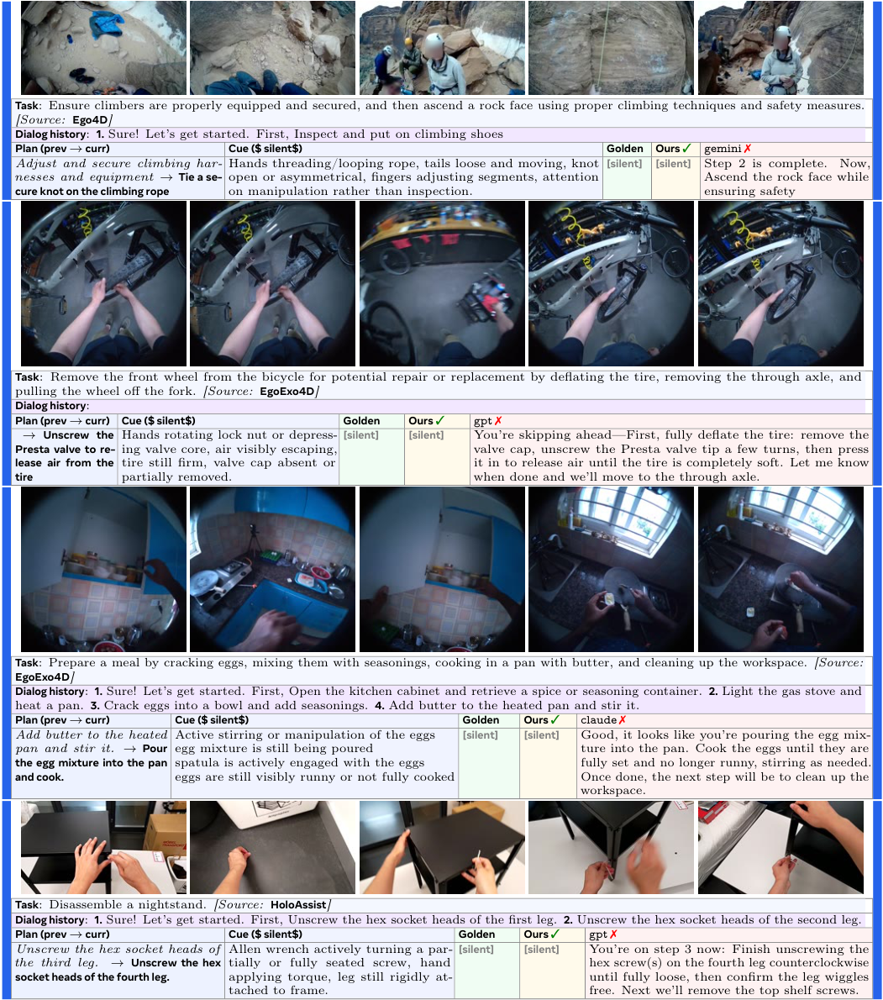

<!-- Start of picture text -->
Task : Ensure climbers are properly equipped and secured, and then ascend a rock face using proper climbing techniques and safety measures. [Source: Ego4D ] Dialog history : 1. Sure! Let’s get started. First, Inspect and put on climbing shoes Plan (prev  → curr) Cue ($ silent$) Golden Ours  ✓ gemini ✗ Adjust and secure climbing har- Hands threading/looping rope, tails loose and moving, knot [silent] [silent] Step 2 is complete. Now, nesses and equipment → Tie a se- open or asymmetrical, fingers adjusting segments, attention Ascend the rock face while cure knot on the climbing rope on manipulation rather than inspection. ensuring safety Task : Remove the front wheel from the bicycle for potential repair or replacement by deflating the tire, removing the through axle, and pulling the wheel off the fork. [Source: EgoExo4D ] Dialog history : Plan (prev  → curr) Cue ($ silent$) Golden Ours  ✓ gpt ✗ → Unscrew the Hands rotating lock nut or depress- [silent] [silent] You’re skipping ahead—First, fully deflate the tire: remove the Presta valve to re- ing valve core, air visibly escaping, valve cap, unscrew the Presta valve tip a few turns, then press lease air from the tire still firm, valve cap absent or it in to release air until the tire is completely soft. Let me know tire partially removed. when done and we’ll move to the through axle. Task : Prepare a meal by cracking eggs, mixing them with seasonings, cooking in a pan with butter, and cleaning up the workspace. [Source: EgoExo4D ] Dialog history : 1. Sure! Let’s get started. First, Open the kitchen cabinet and retrieve a spice or seasoning container. 2. Light the gas stove and heat a pan. 3. Crack eggs into a bowl and add seasonings. 4. Add butter to the heated pan and stir it. Plan (prev  → curr) Cue ($ silent$) Golden Ours  ✓ claude ✗ Add butter to the heated Active stirring or manipulation of the eggs [silent] [silent] Good, it looks like you’re pouring the egg mix- pan and stir it. → Pour egg mixture is still being poured ture into the pan. Cook the eggs until they are the egg mixture into the pan spatula is actively engaged with the eggs fully set and no longer runny, stirring as needed. and cook. eggs are still visibly runny or not fully cooked Once done, the next step will be to clean up the workspace. Task : Disassemble a nightstand. [Source: HoloAssist ] Dialog history : 1. Sure! Let’s get started. First, Unscrew the hex socket heads of the f i rst leg. 2. Unscrew the hex socket heads of the second leg. Plan (prev  → curr) Cue ($ silent$) Golden Ours  ✓ gpt ✗ Unscrew the hex socket heads of Allen wrench actively turning a par- [silent] [silent] You’re on step 3 now: Finish unscrewing the the third leg. → Unscrew the hex tially or fully seated screw, hand hex screw(s) on the fourth leg counterclockwise socket heads of the fourth leg. applying torque, leg still rigidly at- until fully loose, then confirm the leg wiggles tached to frame. free. Next we’ll remove the top shelf screws. <!-- End of picture text -->

**Figure 6 .** Qualitative examples: silent monitoring. 

23

<!-- Page 24 -->

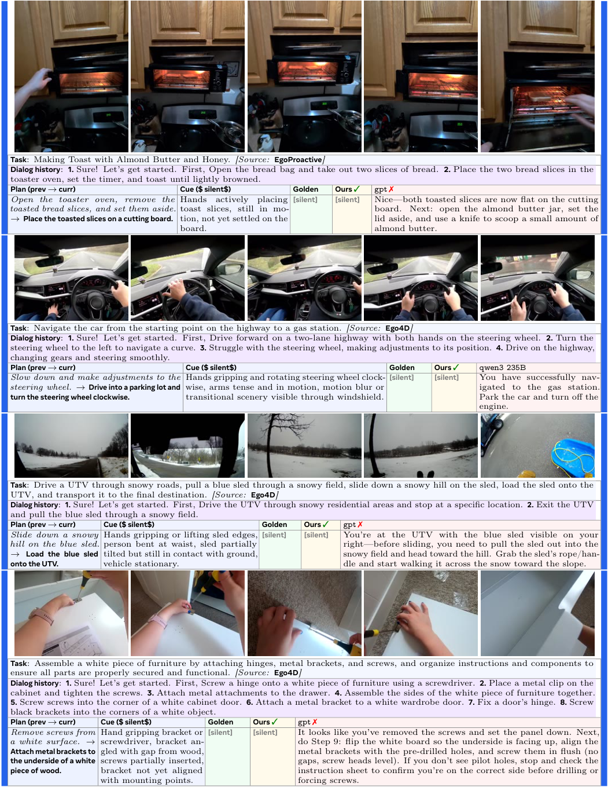

<!-- Start of picture text -->
Task : Making Toast with Almond Butter and Honey. [Source: EgoProactive ] Dialog history : 1. Sure! Let’s get started. First, Open the bread bag and take out two slices of bread. 2. Place the two bread slices in the toaster oven, set the timer, and toast until lightly browned. Plan (prev  → curr) Cue ($ silent$) Golden Ours  ✓ gpt ✗ Open the toaster oven, remove the Hands actively placing [silent] [silent] Nice—both toasted slices are now flat on the cutting toasted bread slices, and set them aside. toast slices, still in mo- board. Next: open the almond butter jar, set the → Place the toasted slices on a cutting board. tion, not yet settled on the lid aside, and use a knife to scoop a small amount of board. almond butter. Task : Navigate the car from the starting point on the highway to a gas station. [Source: Ego4D ] Dialog history : 1. Sure! Let’s get started. First, Drive forward on a two-lane highway with both hands on the steering wheel. 2. Turn the steering wheel to the left to navigate a curve. 3. Struggle with the steering wheel, making adjustments to its position. 4. Drive on the highway, changing gears and steering smoothly. Plan (prev  → curr) Cue ($ silent$) Golden Ours  ✓ qwen3 235B Slow down and make adjustments to the Hands gripping and rotating steering wheel clock- [silent] [silent] You have successfully nav- steering wheel. → Drive into a parking lot and wise, arms tense and in motion, motion blur or igated to the gas station. turn the steering wheel clockwise. transitional scenery visible through windshield. Park the car and turn off the engine. Task : Drive a UTV through snowy roads, pull a blue sled through a snowy field, slide down a snowy hill on the sled, load the sled onto the UTV, and transport it to the final destination. [Source: Ego4D ] Dialog history : 1. Sure! Let’s get started. First, Drive the UTV through snowy residential areas and stop at a specific location. 2. Exit the UTV and pull the blue sled through a snowy field. Plan (prev  → curr) Cue ($ silent$) Golden Ours  ✓ gpt ✗ Slide down a snowy Hands gripping or lifting sled edges, [silent] [silent] You’re at the UTV with the blue sled visible on your hill on the blue sled. person bent at waist, sled partially right—before sliding, you need to pull the sled out into the → Load the blue sled tilted but still in contact with ground, snowy field and head toward the hill. Grab the sled’s rope/han- onto the UTV. vehicle stationary. dle and start walking it across the snow toward the slope. Task : Assemble a white piece of furniture by attaching hinges, metal brackets, and screws, and organize instructions and components to ensure all parts are properly secured and functional. [Source: Ego4D ] Dialog history : 1. Sure! Let’s get started. First, Screw a hinge onto a white piece of furniture using a screwdriver. 2. Place a metal clip on the cabinet and tighten the screws. 3. Attach metal attachments to the drawer. 4. Assemble the sides of the white piece of furniture together. 5. Screw screws into the corner of a white cabinet door. 6. Attach a metal bracket to a white wardrobe door. 7. Fix a door’s hinge. 8. Screw black brackets into the corners of a white object. Plan (prev  → curr) Cue ($ silent$) Golden Ours  ✓ gpt ✗ Remove screws from Hand gripping bracket or [silent] [silent] It looks like you’ve removed the screws and set the panel down. Next, a white surface. → screwdriver, bracket an- do Step 9: flip the white board so the underside is facing up, align the Attach metal brackets to gled with gap from wood, metal brackets with the pre-drilled holes, and screw them in flush (no the underside of a white screws partially inserted, gaps, screw heads level). If you don’t see pilot holes, stop and check the piece of wood. bracket not yet aligned instruction sheet to confirm you’re on the correct side before drilling or with mounting points. forcing screws. <!-- End of picture text -->

**Figure 6 .** Silent monitoring (continued). 

24

<!-- Page 25 -->

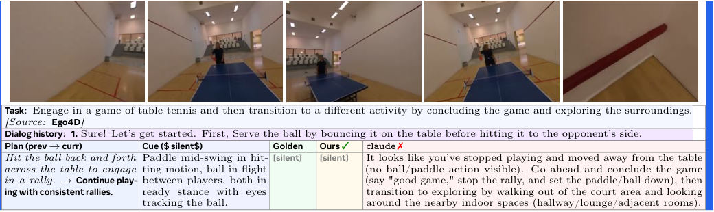

<!-- Start of picture text -->
Task : Engage in a game of table tennis and then transition to a different activity by concluding the game and exploring the surroundings. [Source: Ego4D ] Dialog history : 1. Sure! Let’s get started. First, Serve the ball by bouncing it on the table before hitting it to the opponent’s side. Plan (prev  → curr) Cue ($ silent$) Golden Ours  ✓ claude ✗ Hit the ball back and forth Paddle mid-swing in hit- [silent] [silent] It looks like you’ve stopped playing and moved away from the table across the table to engage ting motion, ball in flight (no ball/paddle action visible). Go ahead and conclude the game in a rally. → Continue play- between players, both in (say "good game," stop the rally, and set the paddle/ball down), then ing with consistent rallies. ready stance with eyes transition to exploring by walking out of the court area and looking tracking the ball. around the nearby indoor spaces (hallway/lounge/adjacent rooms). <!-- End of picture text -->

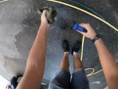

**<mark>Task</mark>** <mark>: Clean the car’s exterior, windows, and mirrors thoroughly, and maintain the surrounding area’s cleanliness.</mark> _<u><mark>[Source:</mark></u>_ **<mark>Ego4D</mark>** _<u><mark>]</mark></u>_ **Dialog history** : **1.** Sure! Let’s get started. First, Clean the car’s hood and headlights using a cloth held in one hand, moving it across the surface to remove dirt and grime. **2.** Clean the car’s sides and windows using a larger towel, scrubbing from left to right. **3.** Dry the car using a green cloth, starting from the rear left quarter window, moving to the tail light, and then the rear windshield. **4.** Rinse a towel using a power washer, holding the <u>green</u> towel in one hand and the blue <u>power</u> washer in the other. **<mark>Plan (prev</mark>** _<mark>→</mark>_ **<mark>curr) Cue ($ silent$) Golden Ours</mark>** <mark>✓</mark> <u><mark>gpt ✗</mark></u> _Clean the ground using_ Hands wipe towel across glass, con- **[silent] [silent]** You’re holding the towel but it’s not on the glass yet. Next, _the power washer and_ tinuous towel contact, motion blur wipe the windows and mirrors: start at the driver-side window, _towel. →_ **Clean the car’s** from rubbing or circular strokes, wathen rear side window, then rear window, and finish with both **windows and mirrors using** ter droplets or soap film still present, side mirrors. Use firm overlapping strokes (top-to-bottom, then **a towel.** <u>person</u> facing <u>glass</u> with focused <u>gaze</u> a <u>quick</u> left-to-right <u>pass)</u> until there are no droplets or streaks. 

**<mark>Task</mark>** <mark>: Safely navigate through various traf</mark> fi <mark>c and weather conditions on the highway while making</mark> <u><mark>progress</mark></u> <mark>on the</mark> <u><mark>journey.</mark></u> _<u><mark>[Source:</mark></u>_ **<mark>Ego4D</mark>** _<u><mark>]</mark></u>_ **Dialog history** : **1.** Sure! Let’s get started. First, Accelerate and change lanes to overtake slow-moving vehicles on the highway **2.** Navigate through traffic by changing lanes and adjusting speed to maintain safe distance **<mark>Plan (prev</mark>** _<mark>→</mark>_ **<mark>curr) Cue ($ silent$) Golden Ours</mark>** <mark>✓ claude ✗</mark> _Drive through construction ar-_ Rapid closure on lead vehicle, or **[silent] [silent]** Good progress. You’re currently driving under _eas and cityscapes while adjust-_ lead vehicle braking while ego snowy/wet conditions approaching the city skyline. _ing speed and lane position →_ vehicle not decelerating, or urMaintain a safe following distance from the vehicle ahead **Adjust speed and maintain safe dis-** gent steering corrections, or sigand reduce speed as needed for the road conditions. Next **tance while driving under snowy con-** nificant speed differential from step: Navigate through traffic under bridges and over- **ditions** surrounding traffic. <u>passes</u> while maintaining safe distance. 

**(B) Step Completion** : Proactive Interrupt 

**<mark>Task</mark>** <mark>: Achieve the desired hair color and style for the clients by applying dye and</mark> <u><mark>product.</mark></u> _<u><mark>[Source:</mark></u>_ **<mark>Ego4D</mark>** _<u><mark>]</mark></u>_ **<mark>Dialog history</mark>** <mark>: —</mark> **<mark>Plan (prev</mark>** _<mark>→</mark>_ **<mark>curr) Cue ($ interrupt$) Golden Ours</mark>** <mark>✓</mark> <u><mark>gpt ✗</mark></u> _Using the blue brush, dip into the dye container_ Brush set aside and not Keep working dye through Continue applying dye to the **[silent]** _and work the dye through the woman’s hair sec-_ in dye container, hands the woman’s hair using the woman’s hair with the blue _tion by section, using the free hand to pull and_ withdrawn, hair fully blue brush, re-dipping into brush, ensuring thorough cov- _adjust for even coverage. →_ **Keepworkingdyethrough** and evenly saturated, the container as needed erage by dipping the brush **the woman’s hair using the blue brush, re-dipping into the** stylist posture shifting and using the free hand to into the dye container multi- **container as needed and using the free hand to section the** to next task. section the hair for full covple times and sectioning the **hair for full coverage.** erage. hair with the other hand. 

**Figure 7 .** Qualitative examples: step-completion interrupts. 

25

<!-- Page 26 -->

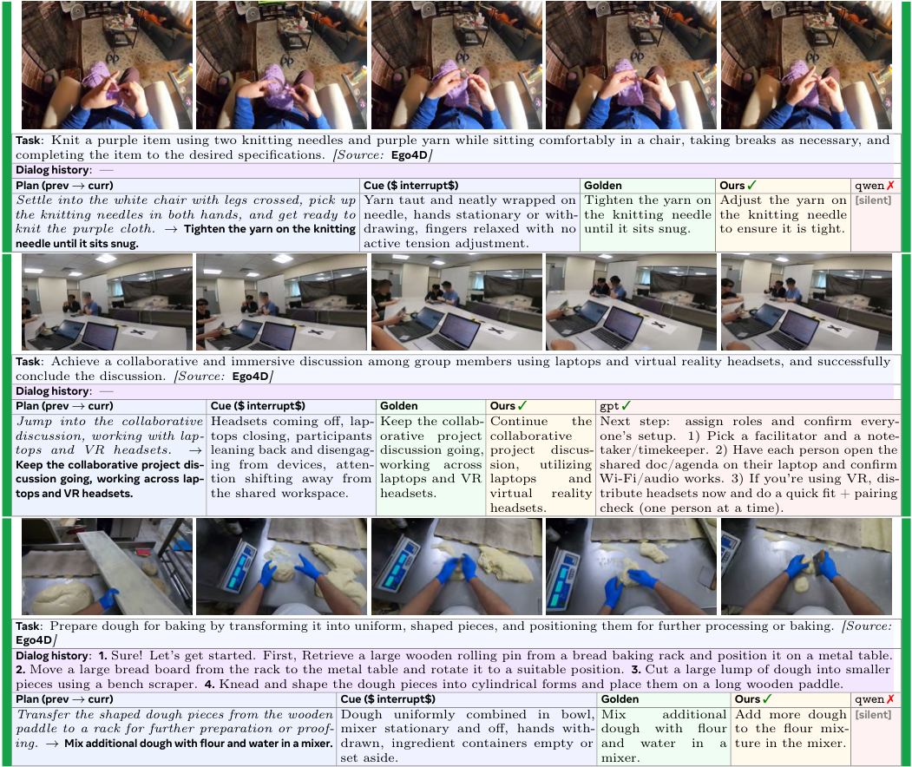

<!-- Start of picture text -->
Task : Knit a purple item using two knitting needles and purple yarn while sitting comfortably in a chair, taking breaks as necessary, and completing the item to the desired specifications. [Source: Ego4D ] Dialog history : — Plan (prev  → curr) Cue ($ interrupt$) Golden Ours  ✓ qwen ✗ Settle into the white chair with legs crossed, pick up Yarn taut and neatly wrapped on Tighten the yarn on Adjust the yarn on [silent] the knitting needles in both hands, and get ready to needle, hands stationary or with- the knitting needle the knitting needle knit the purple cloth. → Tighten the yarn on the knitting drawing, fingers relaxed with no until it sits snug. to ensure it is tight. needle until it sits snug. active tension adjustment. Task : Achieve a collaborative and immersive discussion among group members using laptops and virtual reality headsets, and successfully conclude the discussion. [Source: Ego4D ] Dialog history : — Plan (prev  → curr) Cue ($ interrupt$) Golden Ours  ✓ gpt ✓ Jump into the collaborative Headsets coming off, lap- Keep the collab- Continue the Next step: assign roles and confirm every- discussion, working with lap- tops closing, participants orative project collaborative one’s setup. 1) Pick a facilitator and a note- tops and VR headsets. → leaning back and disengag- discussion going, project discus- taker/timekeeper. 2) Have each person open the Keep the collaborative project dis- ing from devices, atten- working across sion, utilizing shared doc/agenda on their laptop and confirm cussion going, working across lap- tion shifting away from laptops and VR laptops and Wi-Fi/audio works. 3) If you’re using VR, dis- tops and VR headsets. the shared workspace. headsets. virtual reality tribute headsets now and do a quick fit + pairing headsets. check (one person at a time). Task : Prepare dough for baking by transforming it into uniform, shaped pieces, and positioning them for further processing or baking. [Source: Ego4D ] Dialog history : 1. Sure! Let’s get started. First, Retrieve a large wooden rolling pin from a bread baking rack and position it on a metal table. 2. Move a large bread board from the rack to the metal table and rotate it to a suitable position. 3. Cut a large lump of dough into smaller pieces using a bench scraper. 4. Knead and shape the dough pieces into cylindrical forms and place them on a long wooden paddle. Plan (prev  → curr) Cue ($ interrupt$) Golden Ours  ✓ qwen ✗ Transfer the shaped dough pieces from the wooden Dough uniformly combined in bowl, Mix additional Add more dough [silent] paddle to a rack for further preparation or proof- mixer stationary and off, hands with- dough with flour to the flour mix- ing. → Mix additional dough with flour and water in a mixer. drawn, ingredient containers empty or and water in a ture in the mixer. set aside. mixer. <!-- End of picture text -->

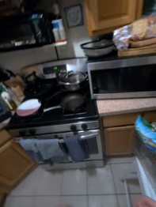

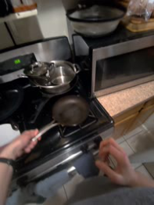

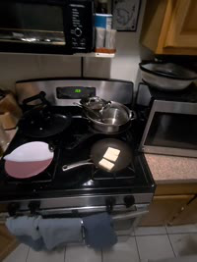

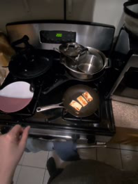

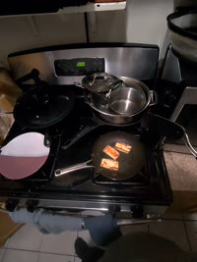

**<mark>Task</mark>** <mark>: Making</mark> <u><mark>pan-seared</mark></u> <mark>halloumi with honey drizzle.</mark> _<u><mark>[Source:</mark></u>_ **<mark>EgoProactive</mark>** _<u><mark>]</mark></u>_ **Dialog history** : **1.** Sure! Let’s get started. First, Prepare the halloumi: remove it from its packaging and slice the block into 1/2-inch thick pieces. **2.** Set up the cooking equipment: place a non-stick skillet on the stove, turn the burner to medium heat, and let the pan warm up. **3.** Eat a small snack (crackers) while the pan heats. (interruption, Body & Health) **4.** Add butter to the hot skillet, then place the halloumi slices in the <u>pan</u> without overlapping. **<mark>Plan (prev</mark>** _<mark>→</mark>_ **<mark>curr) Cue ($ interrupt$) Golden Ours</mark>** <mark>✓</mark> <u><mark>qwen3</mark></u> <mark>235B</mark> _Cook the halloumi: let it sizzle, flip_ Pan resting motionAdjust the stove Adjust the stove The halloumi is now golden brown and _the slices with a spatula, and continue_ less on burner with knob and pan poknob and pan pofully cooked. Turn off the stove, then _cooking each side for 2-3 minutes un-_ knob off and utensition as needed to sition as needed to transfer the slices to a serving plate _til golden brown. →_ **Adjustthestoveknob** sil set aside, hands finish cooking the finish cooking the and arrange them neatly. Next, driz- **and pan position as needed to finish cooking** withdrawn as food halloumi. halloumi. zle honey generously over the warm hal- **the halloumi. (fix)** browns evenly loumi. 

**Figure 7 .** Step-completion interrupts (continued). 

26

<!-- Page 27 -->

<!-- Start of picture text -->
(C) OOP Distractions : Detection and Re-engagement <!-- End of picture text -->

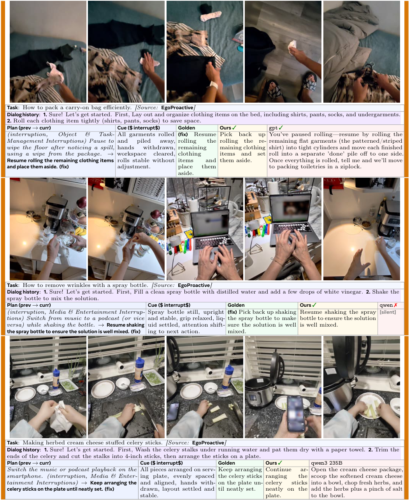

<!-- Start of picture text -->
Task : How to pack a carry-on bag ef fi ciently. [Source: EgoProactive ] Dialoghistory : 1. Sure! Let’s get started. First, Lay out and organize clothing items on the bed, including shirts, pants, socks, and undergarments. 2. Roll each clothing item tightly (shirts, pants, socks) to save space. Plan (prev  → curr) Cue ($ interrupt$) Golden Ours  ✓ gpt ✓ (interruption, Object & Task- All garments rolled (fix) Resume Pick back up You’ve paused rolling—resume by rolling the Management Interruptions) Pause to and piled away, rolling the rolling the re- remaining flat garments (the patterned/striped wipe the floor after noticing a spill, hands withdrawn, remaining maining clothing shirt) into tight cylinders and move each finished using a wipe from the package. → workspace cleared, clothing items and set roll into a separate ’done’ pile off to one side. Resume rolling the remaining clothing items rolls stable without items and them aside. Once everything is rolled, tell me and we’ll move and place them aside. (fix) adjustment. place them to packing toiletries in a ziplock. aside. Task : How to remove wrinkles with a spray bottle. [Source: EgoProactive ] Dialog history : 1. Sure! Let’s get started. First, Fill a clean spray bottle with distilled water and add a few drops of white vinegar. 2. Shake the spray bottle to mix the solution. Plan (prev  → curr) Cue ($ interrupt$) Golden Ours  ✓ qwen ✗ (interruption, Media & Entertainment Interrup- Spray bottle still, upright (fix)  Pick back up shaking Resume shaking the spray [silent] tions) Switch from music to a podcast (or vice and stable, grip relaxed, liq- the spray bottle to make bottle to ensure the solution versa) while shaking the bottle. → Resume shaking uid settled, attention shift- sure the solution is well is well mixed. the spray bottle to ensure the solution is well mixed. (fix) ing to next action. mixed. Task : Making herbed cream cheese stuf f ed celery sticks. [Source: EgoProactive ] Dialog history : 1. Sure! Let’s get started. First, Wash the celery stalks under running water and pat them dry with a paper towel. 2. Trim the ends of the celery and cut the stalks into 4-inch sticks, then arrange the sticks on a plate. Plan (prev  → curr) Cue ($ interrupt$) Golden Ours  ✓ qwen3 235B Switch the music or podcast playback on the All pieces arranged on serv- Keep arranging Continue ar- Open the cream cheese package, smartphone. (interruption, Media & Enter- ing plate, evenly spaced the celery sticks ranging the scoop the softened cream cheese tainment Interruptions) → Keep arranging the and aligned, hands with- on the plate un- celery sticks into a bowl, chop fresh herbs, and celery sticks on the plate until neatly set. (fix) drawn, layout settled and til neatly set. neatly on the add the herbs plus a pinch of salt stable. plate. to the bowl. <!-- End of picture text -->

**Figure 8 .** Qualitative examples: out-of-procedure distractions. 

27

<!-- Page 28 -->

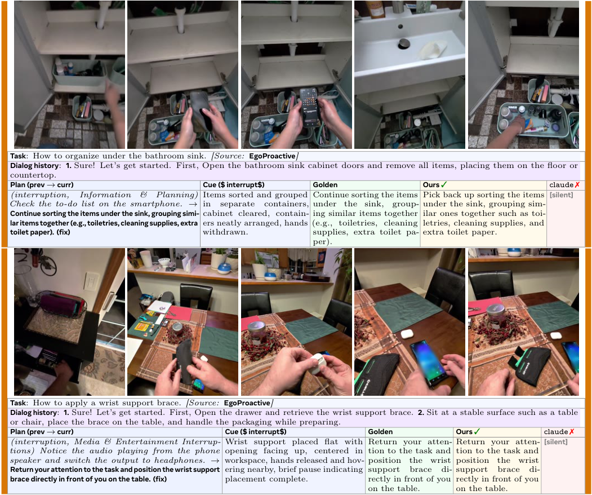

<!-- Start of picture text -->
Task : How to organize under the bathroom sink. [Source: EgoProactive ] Dialog history : 1. Sure! Let’s get started. First, Open the bathroom sink cabinet doors and remove all items, placing them on the floor or countertop. Plan (prev  → curr) Cue ($ interrupt$) Golden Ours  ✓ claude ✗ (interruption, Information & Planning) Items sorted and grouped Continue sorting the items Pick back up sorting the items [silent] Check the to-do list on the smartphone. → in separate containers, under the sink, group- under the sink, grouping sim- Continue sorting the items under the sink, grouping simi- cabinet cleared, contain- ing similar items together ilar ones together such as toi- lar items together (e.g., toiletries, cleaning supplies, extra ers neatly arranged, hands (e.g., toiletries, cleaning letries, cleaning supplies, and toilet paper). (fix) withdrawn. supplies, extra toilet pa- extra toilet paper. per). Task : How to apply a wrist support brace. [Source: EgoProactive ] Dialog history : 1. Sure! Let’s get started. First, Open the drawer and retrieve the wrist support brace. 2. Sit at a stable surface such as a table or chair, place the brace on the table, and handle the packaging while preparing. Plan (prev  → curr) Cue ($ interrupt$) Golden Ours  ✓ claude ✗ (interruption, Media & Entertainment Interrup- Wrist support placed flat with Return your atten- Return your atten- [silent] tions) Notice the audio playing from the phone opening facing up, centered in tion to the task and tion to the task and speaker and switch the output to headphones. → workspace, hands released and hov- position the wrist position the wrist Return your attention to the task and position the wrist support ering nearby, brief pause indicating support brace di- support brace di- brace directly in front of you on the table. (fix) placement complete. rectly in front of you rectly in front of you on the table. on the table. <!-- End of picture text -->

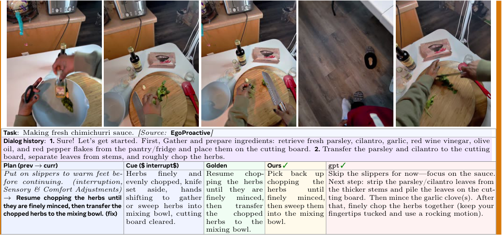

<!-- Start of picture text -->
Task : Making fresh chimichurri sauce. [Source: EgoProactive ] Dialog history : 1. Sure! Let’s get started. First, Gather and prepare ingredients: retrieve fresh parsley, cilantro, garlic, red wine vinegar, olive oil, and red pepper flakes from the pantry/fridge and place them on the cutting board. 2. Transfer the parsley and cilantro to the cutting board, separate leaves from stems, and roughly chop the herbs. Plan (prev  → curr) Cue ($ interrupt$) Golden Ours  ✓ gpt ✓ Put on slippers to warm feet be- Herbs finely and Resume chop- Pick back up Skip the slippers for now—focus on the sauce. fore continuing. (interruption, evenly chopped, knife ping the herbs chopping the Next step: strip the parsley/cilantro leaves from Sensory & Comfort Adjustments) set aside, hands until they are herbs until the thicker stems and pile the leaves on the cut- → Resume chopping the herbs until shifting to gather finely minced, finely minced, ting board. Then mince the garlic clove(s). After they are finely minced, then transfer the or sweep herbs into then transfer then sweep them that, finely chop the herbs together (keep your chopped herbs to the mixing bowl. (fix) mixing bowl, cutting the chopped into the mixing fingertips tucked and use a rocking motion). board cleared. herbs to the bowl. mixing bowl. <!-- End of picture text -->

**Figure 8 .** Out-of-procedure distractions (continued). 

28

<!-- Page 29 -->

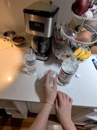

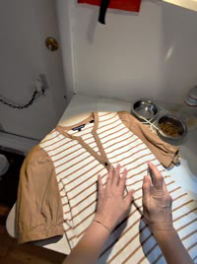

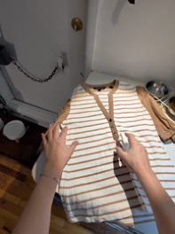

**<mark>Task</mark>** <mark>: How to remove wrinkles with a spray bottle.</mark> _<u><mark>[Source:</mark></u>_ **<mark>EgoProactive</mark>** _<u><mark>]</mark></u>_ **Dialog history** : **1.** Sure! Let’s get started. First, Fill a clean spray bottle with distilled water and add a few drops of white vinegar. **2.** Shake the spray bottle to mix the solution. **3.** (interruption, Media & Entertainment Interruptions) Switch from music to a podcast (or vice versa) while shaking the bottle. **4. (fix)** Resume shaking the spray bottle to ensure the solution is well mixed. **5.** Lay the wrinkled shirt flat on a clean, dry surface such as a table or ironing board. **6.** Lightly mist the wrinkled areas of the shirt with the spray, keeping the bottle about 6 inches away. **<mark>Plan (prev</mark>** _<mark>→</mark>_ **<mark>curr) Cue ($ interrupt$) Golden Ours</mark>** <mark>✓</mark> <u><mark>gemini ✗</mark></u> _(interruption, Body & Health) Pause to adjust_ Spray bottle idle, no mist, hands Return to the shirt and Go back to the shirt and **[silent]** _a bracelet (or watch/ring) that feels uncomfort-_ making final broad smoothing continue misting any rekeep misting any sections _able. →_ **Return to the shirt and continue misting any** passes across evenly damp fabric, maining wrinkled secstill wrinkled. **remaining wrinkled sections (fix).** hands relaxing near garment edges. tions. 

**(D) OOP USER MISTAKES** : Error detection and Correction 

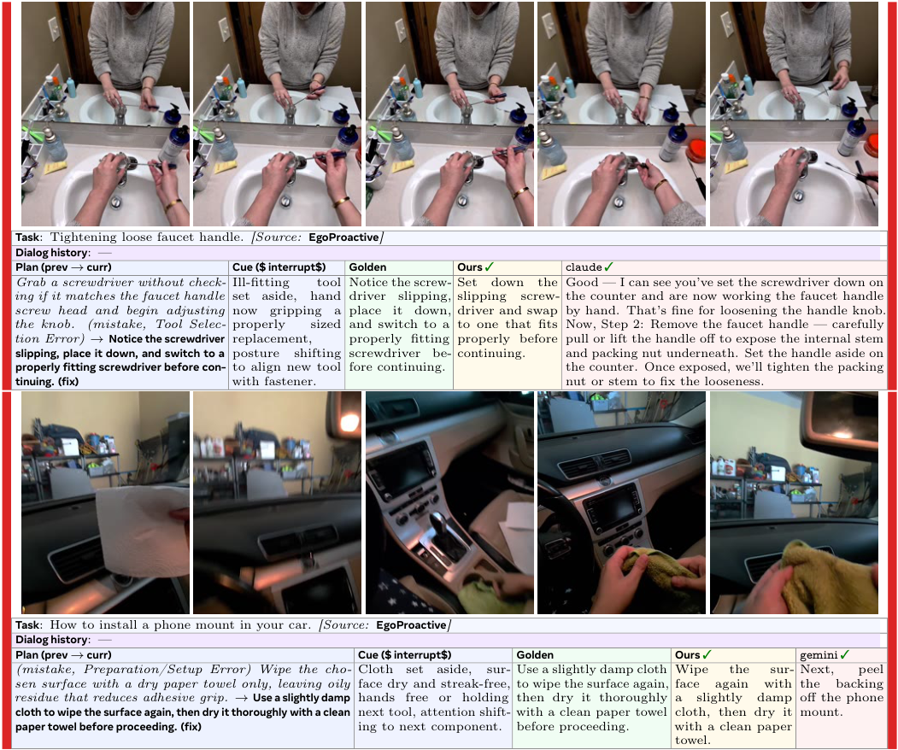

<!-- Start of picture text -->
Task : Tightening loose faucet handle. [Source: EgoProactive ] Dialog history : — Plan (prev  → curr) Cue ($ interrupt$) Golden Ours  ✓ claude ✓ Grab a screwdriver without check- Ill-fitting tool Notice the screw- Set down the Good — I can see you’ve set the screwdriver down on ing if it matches the faucet handle set aside, hand driver slipping, slipping screw- the counter and are now working the faucet handle screw head and begin adjusting now gripping a place it down, driver and swap by hand. That’s fine for loosening the handle knob. the knob. (mistake, Tool Selec- properly sized and switch to a to one that fits Now, Step 2: Remove the faucet handle — carefully tion Error) → Notice the screwdriver replacement, properly fitting properly before pull or lift the handle off to expose the internal stem slipping, place it down, and switch to a posture shifting screwdriver be- continuing. and packing nut underneath. Set the handle aside on properly fitting screwdriver before con- to align new tool fore continuing. the counter. Once exposed, we’ll tighten the packing tinuing. (fix) with fastener. nut or stem to fix the looseness. Task : How to install a phone mount in your car. [Source: EgoProactive ] Dialog history : — Plan (prev  → curr) Cue ($ interrupt$) Golden Ours  ✓ gemini ✓ (mistake, Preparation/Setup Error) Wipe the cho- Cloth set aside, sur- Use a slightly damp cloth Wipe the sur- Next, peel sen surface with a dry paper towel only, leaving oily face dry and streak-free, to wipe the surface again, face again with the backing residue that reduces adhesive grip. → Use a slightly damp hands free or holding then dry it thoroughly a slightly damp off the phone cloth to wipe the surface again, then dry it thoroughly with a clean next tool, attention shift- with a clean paper towel cloth, then dry it mount. paper towel before proceeding. (fix) ing to next component. before proceeding. with a clean paper towel. <!-- End of picture text -->

**Figure 9 .** Qualitative examples: out-of-procedure user mistakes. 

29

<!-- Page 30 -->

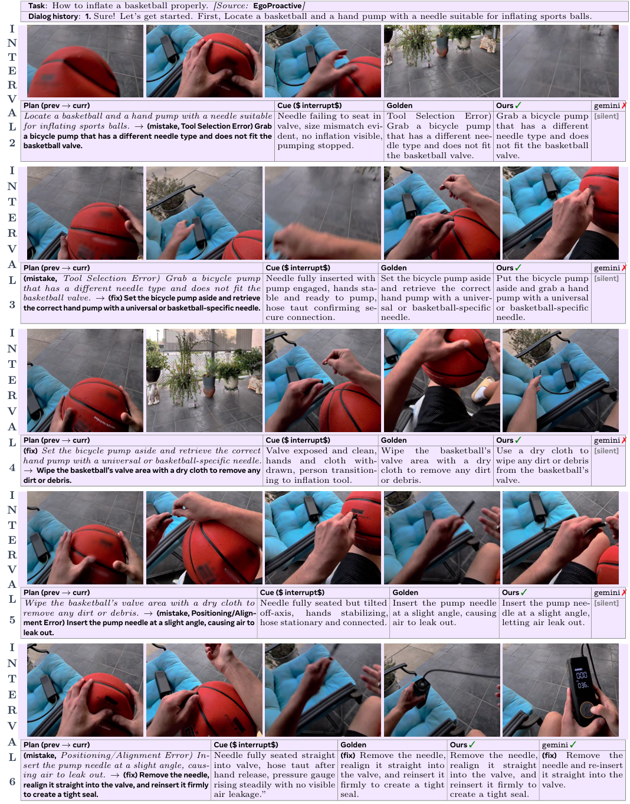

<!-- Start of picture text -->
Task : How to inf l ate a basketball properly. [Source: EgoProactive ] Dialog history : 1. Sure! Let’s get started. First, Locate a basketball and a hand pump with a needle suitable for inf l ating sports balls. I N T E R V Plan (prev  → curr) Cue ($ interrupt$) Golden Ours  ✓ gemini ✗ A Locate a basketball and a hand pump with a needle suitable Needle failing to seat in Tool Selection Error) Grab a bicycle pump [silent] L for inflating sports balls. → (mistake, Tool Selection Error) Grab valve, size mismatch evi- Grab a bicycle pump that has a different a bicycle pump that has a different needle type and does not fit the dent, no inflation visible, that has a different nee- needle type and does 2 basketball valve. pumping stopped. dle type and does not fit not fit the basketball the basketball valve. valve. I N T E R V A Plan (prev  → curr) Cue ($ interrupt$) Golden Ours  ✓ gemini ✗ L (mistake, Tool Selection Error) Grab a bicycle pump Needle fully inserted with Set the bicycle pump aside Put the bicycle pump [silent] that has a different needle type and does not fit the pump engaged, hands sta- and retrieve the correct aside and grab a hand basketball valve. → (fix) Set the bicycle pump aside and retrieve ble and ready to pump, hand pump with a univer- pump with a universal 3 the correct hand pump with a universal or basketball-specific needle. hose taut confirming se- sal or basketball-specific or basketball-specific cure connection. needle. needle. I N T E R V A L Plan (prev  → curr) Cue ($ interrupt$) Golden Ours  ✓ gemini ✗ (fix) Set the bicycle pump aside and retrieve the correct Valve exposed and clean, Wipe the basketball’s Use a dry cloth to [silent] hand pump with a universal or basketball-specific needle. hands and cloth with- valve area with a dry wipe any dirt or debris 4 → Wipe the basketball’s valve area with a dry cloth to remove any drawn, person transition- cloth to remove any dirt from the basketball’s dirt or debris. ing to inflation tool. or debris. valve. I N T E R V A Plan (prev  → curr) Cue ($ interrupt$) Golden Ours  ✓ gemini ✗ L Wipe the basketball’s valve area with a dry cloth to Needle fully seated but tilted Insert the pump needle Insert the pump nee- [silent] remove any dirt or debris. → (mistake, Positioning/Align- off-axis, hands stabilizing, at a slight angle, causing dle at a slight angle, 5 ment Error) Insert the pump needle at a slight angle, causing air to hose stationary and connected. air to leak out. letting air leak out. leak out. I N T E R V A Plan (prev  → curr) Cue ($ interrupt$) Golden Ours  ✓ gemini ✓ L (mistake, Positioning/Alignment Error) In- Needle fully seated straight (fix) Remove the needle, Remove the needle, (fix) Remove the sert the pump needle at a slight angle, caus- into valve, hose taut after realign it straight into realign it straight needle and re-insert ing air to leak out. → (fix) Remove the needle, hand release, pressure gauge the valve, and reinsert it into the valve, and it straight into the 6 realign it straight into the valve, and reinsert it firmly rising steadily with no visible firmly to create a tight reinsert it firmly to valve. to create a tight seal. air leakage.” seal. create a tight seal. <!-- End of picture text -->

**Figure 10 . Ours vs** gemini: out-of-procedure capture across a session. 

30

<!-- Page 31 -->

## **D Domain Taxonomy** 

Table 19 maps each source dataset to the 14 coarse activity domains used for reporting. Per-dataset results in the main paper (Tables 2, 4) implicitly provide domain-level analysis: EPIC-KITCHENS covers cooking exclusively, EgoExo4D spans 3 skilled activities, EgoProactive covers 4 domains, and HoloAssist focuses on assembly/repair. 

**Table 19** Domain taxonomy mapping. Each source’s native categories are grouped into 14 coarse domains. 

|**Domain**|**Primary s**|**ources**|
|---|---|---|
|Cooking & food prep|EPIC-K|ITCHENS, HowTo100M, EgoProactive|
|Cleaning & home care|Ego4D,|HowTo100M, EgoProactive|
|Crafts & DIY|Ego4D,|HowTo100M, EgoProactive|
|Grooming & personal care|Ego4D,|HowTo100M, EgoProactive|
|Light assembly & repair|HoloAss|ist, HowTo100M, EgoProactive|
|Tool use & workshop|Ego4D,|HowTo100M|
|Electronics & devices|Ego4D,|HowTo100M, HoloAssist|
|Sports & exercise|Ego4D,|EgoExo4D, HowTo100M|
|Music & instruments|Ego4D,|EgoExo4D, HowTo100M|
|Outdoors & gardening|Ego4D,|HowTo100M|
|Office & productivity|HowTo1|00M|
|Arts & media creation|HowTo1|00M|
|Automotive & mobility|HowTo1|00M|
|Games & hobbies|Ego4D,|HowTo100M|

**Table 20** EgoProactive eval distribution by domain. 

**Table 21** EgoExo4D eval distribution by domain. 

|**Domain**|**# Rows**|**%**|
|---|---|---|
|Chef|1,566|30.9|
|Tutorial|1,439|28.4|
|Handyman|1,214|24.0|
|Arts and Crafts|846|16.7|
|**Total**|**5,065**|**100**|

|**Domain**|**# Rows**|**%**|
|---|---|---|
|Cooking|418|46.5|
|Bike Repair|296|32.9|
|Health|185|20.6|
|**Total**|**899**|**100**|

**Table 22** Ego4D eval distribution by coarse domain (119 fine-grained activities grouped). 

**Table 23** HowTo100M eval distribution by WikiHow domain (1,321 eval video IDs). 

|**Domain**|**# Rows**|**%**|
|---|---|---|
|Other (misc. activities)|8,935|46.1|
|Home & Garden|4,081|21.0|
|Crafts & DIY|2,374|12.2|
|Cooking|2,170|11.2|
|Sports & Exercise|1,836|9.5|
|**Total**|**19,396**|**100**|

|**Domain**|**# IDs**|**%**|
|---|---|---|
|Food & Entertaining|109|8.3|
|Sports & Fitness|106|8.0|
|Hobbies & Crafts|106|8.0|
|Education & Comms.|104|7.9|
|Arts & Entertainment|104|7.9|
|Finance & Business|102|7.7|
|Personal Care|100|7.6|
|Pets & Animals|100|7.6|
|Health|100|7.6|
|Home & Garden|99|7.5|
|Other|99|7.5|
|Cars & Vehicles|96|7.3|
|Computers & Elec.|96|7.3|
|**Total**|**1,321**|**100**|

_Eval row distribution by domain._ 

_Per-source domain coverage._ 

- **EgoProactive** (4 domains): chef/cooking, tutorial, handyman/repair, arts and crafts. 

- **EgoExo4D** (3 eval domains): cooking, bike repair, health. The full dataset contains 8 activity types but only 3 have sufficient eval coverage. 

- **Ego4D** (5 coarse domains): 119 fine-grained activity labels grouped into cooking, crafts & DIY, home & garden, sports & exercise, and other. 

31

<!-- Page 32 -->

**Table 24** EPIC-KITCHENS and HoloAssist are single-domain datasets. 

|**Dataset**|**Domain**|**# Eval Rows**|
|---|---|---|
|EPIC-KITCHENS|Cooking|6,574|
|HoloAssist|Assembly/Repair|2,797|

- **HowTo100M** (13 domains): broadest coverage via WikiHow categories, near-uniformly distributed across all 13 domains. 

- **EPIC-KITCHENS** (1 domain): cooking, with high intra-domain variation (778 unique procedures). 

- **HoloAssist** (1 domain): assembly and repair across 113 guided task goals. 

## **E Domain-Wise Results** 

We report per-domain IF1/SF1/G-Mean under the ZS condition for all four non-GPT baselines, plus the PWR-OP upper bound (trained interaction model with oracle plan). For single-domain datasets (EPICKITCHENS, HoloAssist) and HowTo100M (where per-domain metrics are not separately computed due to near-uniform domain balance), we report aggregate dataset-level scores. 

**Table 25** EgoProactive: per-domain metrics (ZS + PWROP). 

**Table 26** EgoExo4D: per-domain metrics (ZS + PWROP). 

|**Domain**|**Model**|**IF1**|**SF1**|**GM**|**Domain**|**Model**|**IF1**|**SF1**|**GM**|
|---|---|---|---|---|---|---|---|---|---|
||Claude Opus 4.6  Gemini 3.1 Pro|.55 .55|.65 .51|.60 .53||Claude Opus 4.6  Gemini 3.1 Pro|.52 .34|.45 .32|.49 .33|
|Arts & Crafts|Llama 4|.52|.38|.45|Bike Repair|Llama 4|.57|.38|.47|
||Qwen3-VL-235B|.59|.30|.42||Qwen3-VL-235B|.42|.02|.09|
||PWR-OP|.92|.90|.91||PWR-OP|.66|.72|.69|
||Claude Opus 4.6|.63|.62|.63||Claude Opus 4.6|.53|.49|.51|
||Gemini 3.1 Pro|.60|.48|.54||Gemini 3.1 Pro|.45|.41|.43|
|Chef|Llama 4|.55|.37|.45|Cooking|Llama 4|.54|.54|.54|
||Qwen3-VL-235B|.62|.26|.40||Qwen3-VL-235B|.39|.04|.12|
||PWR-OP|.92|.90|.91||PWR-OP|.66|.72|.69|
||Claude Opus 4.6|.66|.61|.63||Claude Opus 4.6|.48|.41|.44|
||Gemini 3.1 Pro|.60|.50|.55||Gemini 3.1 Pro|.39|.33|.36|
|Handyman|Llama 4|.52|.43|.47|Health|Llama 4|.48|.45|.46|
||Qwen3-VL-235B|.63|.28|.42||Qwen3-VL-235B|.41|.01|.08|
||PWR-OP|.92|.90|.91||PWR-OP|.66|.72|.69|
||Claude Opus 4.6|.69|.55|.62||||||
||Gemini 3.1 Pro|.64|.35|.47||||||
|Tutorial|Llama 4|.56|.42|.49||||||
||Qwen3-VL-235B|.62|.28|.42||||||
||PWR-OP|.92|.90|.91||||||

## **F Per-Dataset Statistics** 

This section provides detailed distributional statistics for all six benchmark sources, complementing the summary in the main paper. 

_Provenance._ All statistics in Tables 29–33 are computed from the released artifact stats/stats.json, which is generated deterministically by the pipeline output processing scripts. EgoProactive-specific counts (Table 35) are computed from data/wp/videos.csv and data/wp/instances.jsonl. The exact computation scripts are included in the benchmark repository. 

32

<!-- Page 33 -->

**Table 27** Ego4D: per-domain metrics (ZS + PWR-OP). 

|**Domain**|**Model**|**IF1**|**SF1**|**GM**|
|---|---|---|---|---|
||Claude Opus 4.6|.50|.55|.52|
||Gemini 3.1 Pro|.56|.44|.50|
|Cooking|Llama 4|.53|.51|.52|
||Qwen3-VL-235B|.51|.47|.49|
||PWR-OP|.82|.75|.79|
||Claude Opus 4.6|.46|.59|.52|
||Gemini 3.1 Pro|.51|.51|.51|
|Crafts & DIY|Llama 4|.52|.49|.50|
||Qwen3-VL-235B|.48|.53|.51|
||PWR-OP|.82|.75|.79|
||Claude Opus 4.6|.55|.54|.54|
||Gemini 3.1 Pro|.57|.47|.52|
|Home & Garden|Llama 4|.56|.48|.52|
||Qwen3-VL-235B|.53|.47|.50|
||PWR-OP|.82|.75|.79|
||Claude Opus 4.6|.51|.57|.54|
||Gemini 3.1 Pro|.59|.46|.52|
|Other|Llama 4|.54|.49|.51|
||Qwen3-VL-235B|.51|.51|.51|
||PWR-OP|.82|.75|.79|
||Claude Opus 4.6|.52|.54|.53|
||Gemini 3.1 Pro|.58|.44|.51|
|Sports & Exer.|Llama 4|.55|.45|.50|
||Qwen3-VL-235B|.50|.51|.50|
||PWR-OP|.82|.75|.79|

**Table 28** EK, HA, HowTo aggregate metrics (ZS + PWROP). 

|**Dataset**|**Model**|**IF1**|**SF1**|**GM**|
|---|---|---|---|---|
||Claude Opus 4.6|.60|.41|.50|
||Gemini 3.1 Pro|.60|.36|.46|
|EPIC-KITCH.|Llama 4|.55|.46|.50|
||Qwen3-VL-235B|.68|.00|.00|
||PWR-OP|.92|.90|.91|
||Claude Opus 4.6|.62|.46|.53|
||Gemini 3.1 Pro|.59|.36|.46|
|HoloAssist|Llama 4|.58|.43|.50|
||Qwen3-VL-235B|.68|.00|.00|
||PWR-OP|.91|.89|.90|
||Claude Opus 4.6|.75|.31|.48|
||Gemini 3.1 Pro|.71|.34|.49|
|HowTo100M|Llama 4|.66|.07|.21|
||Qwen3-VL-235B|.67|.00|.00|
||PWR-OP|.86|.78|.82|

### **F.1 Evaluation Set Distributions** 

##### **F.1.1 Ego4D Count Reconciliation** 

Ego4D counts require careful reconciliation across three levels: (i) _candidate videos_ ( _∼_ – videos processed by the pipeline), (ii) _candidate rows_ ( _∼_ – evaluation instances generated before filtering), and (iii) _released rows_ (19,396 evaluation instances after domain-balanced downsampling and quality filtering). The mapping from videos to rows is many-to-one (each video yields multiple instances); the mapping from candidate rows to released rows involves both coherence filtering (Stage 7, rejecting _∼_ –% of videos) and domain-balanced downsampling to prevent Ego4D from dominating the evaluation set. The – training videos (Table 33) are drawn from the same candidate pool but are video-disjoint from the evaluation split. 

### **F.2 Step Count Distributions** 

Table 30 reports the step count distributions per dataset. Step count ranges and averages vary across datasets, with HoloAssist exhibiting the longest tail (reflecting complex assembly/repair tasks). 

_Qualitative differences._ While average step counts are similar, the distributions differ qualitatively. EPICKITCHENS and EgoExo4D cluster tightly around their means, reflecting the moderate complexity of cooking and skilled activities. HoloAssist exhibits a long tail, with assembly/repair tasks occasionally requiring many fine-grained steps. WearProactive compensates with richer per-step guidance (– words average response length). HowTo100M shows the broadest range across its – unique procedures, reflecting the diversity of WikiHow categories. 

### **F.3 Response Length Distributions** 

_Response verbosity spectrum._ HoloAssist produces concise responses (average 9.2 words, max 29), consistent with the terse, directive communication style of expert instructors in assembly/repair scenarios (e.g., “Flip the board over”). WearProactive produces the most verbose responses (average 17.0 words, max 45), reflecting the richer guidance needed for error-recovery scenarios where the assistant must both identify the mistake and describe the corrective action. The instructional video sources (HowTo100M, EPIC-KITCHENS, EgoExo4D) 

33

<!-- Page 34 -->

**Table 29** Detailed evaluation set statistics across all six benchmark sources. **Int%** / **Sil%** = interrupt/silent class balance. **Resp. words** = average golden response length (interrupt rows only). **Steps** = average procedural steps per plan. **Goals** = unique procedures. **OOP%** = fraction of rows with intentional out-of-plan deviations. 

|**Dataset**|**Eval**_n_|**Int%**|**Sil%**|**Avg resp. words**|**Avg steps**|**Unique goals**|**OOP%**|
|---|---|---|---|---|---|---|---|
|Ego4D|19,396|45/55|9|4.1|2,931|PS|0|
|EPIC-KITCHENS|6,574|51/49|12|4.2|778|ST|0|
|HowTo100M|5,277|75/25|13|3.7|5,384|NR|0|
|EgoProactive|5,065|55/45|17|3.5|460|1,267||
|HoloAssist|2,797|53/47|7|3.8|113|0||
|EgoExo4D|899|52/48|11|3.7|126|0||
|**Total**|**40,008**|52/48|11|3.9|—|1,267||

Ego4D statistics are computed on the domain-balanced downsample from _∼_ – candidate rows (see §F.1.1). Int%/Sil% are rounded independently and may not sum to exactly 100. Total Int%/Sil% is computed over all 40,008 instances (20,804 interrupt / 19,204 silent). 

**Table 30** Step count distributions per dataset. Range = (min, max) steps per procedure. 

|**Dataset**|**Range**|**Avg steps**|**Procedures**|
|---|---|---|---|
|EgoExo4D|3–15|7.6|605|
|EPIC-KITCHENS|3–19|8.1|298|
|HowTo100M|2–26|5.8|6,377|
|HoloAssist|1–34|7.1|1,466|
|Ego4D|2–20|5.7|24,028|
|WearProactive|5–14|9.3|135|

fall in the middle range (8.6–12.0 words), corresponding to narration-style step descriptions. Ego4D averages 7.8 words, reflecting the broad multi-domain nature of its activities. 

### **F.4 Domain Coverage** 

### **F.5 Training Set Statistics** 

The duplex training set comprises 314,290 rows; the planner training set contains 212,818 rows. The overall training class balance is approximately 52% interrupt / 48% silent, achieved through the per-video silent interval calibration procedure described below. 

_Silent interval calibration._ To achieve balanced training, we calibrate the number of silent (non-intervention) instances per video to approximately match the number of interrupt instances. For each video with _K_ interrupt points, we sample _K_ silent intervals from the remaining temporal regions, using stratified sampling to ensure silent intervals are distributed across the video duration rather than clustered at the beginning or end. Silent intervals are constrained to be at least 5 seconds from the nearest interrupt point to avoid ambiguous boundary cases. This procedure is deterministic given a fixed random seed and is applied identically across all source datasets. 

_Consistency note._ The EgoProactive duplex training split uses – videos (Table 33), which is a subset of the – accepted source videos (Table 35). The remaining – accepted videos are reserved for the evaluation split. This participant-disjoint and goal-disjoint split policy is described in §H.1.1. 

34

<!-- Page 35 -->

**Table 31** Golden response length distributions (interrupt rows only). Range = (min, max) words per response. 

|**Dataset**|**Range (words)**|**Avg words**|
|---|---|---|
|EgoExo4D|2–38|11.4|
|EPIC-KITCHENS|2–41|12.0|
|HowTo100M|1–42|8.6|
|WearProactive|3–45|17.0|
|HoloAssist|2–29|9.2|
|Ego4D|1–35|7.8|

**Table 32** Activity domain and viewpoint coverage per dataset. 

|**Dataset**|**Viewpoint**|**Domains**|
|---|---|---|
|Ego4D|Egocentric|Multi-domain (74 worldwide locations)|
|EPIC-KITCHENS|Egocentric|Cooking (single domain, high variation)|
|EgoExo4D|Ego + Exo|8 skilled activities: cooking, music, basketball, soccer, bouldering, dancing, bike repair, health|
|HowTo100M|Instructional|12 WikiHow categories|
|EgoProactive|Ego (glasses)|5 wearable domains: cooking, crafts, DIY/repair, tutorials, household|
|HoloAssist|Ego (AR)|4 assembly/repair types|

## **G Evaluation Protocol** 

This section specifies model configurations, prompting, frame sampling, and metric computation for all experiments. 

### **G.1 Model Configurations** 

We evaluate five frontier VLMs plus our trained PWR system. All models use greedy decoding (temperature = 0) for binary intervention decisions (interrupt/silent) and receive 8 uniformly sampled video frames per clip. No model weights are modified for baseline evaluation. 

### **G.2 3P Baseline Prompts** 

This subsection reproduces the verbatim prompts used in our 3P baseline evaluations. The same **Common Duplex System Prompt** is used across all five frontier baselines (Llama 4 Maverick, GPT-5.2, Gemini 3.1 Pro, Qwen3-VL-235B, Claude Opus 4.6) under all three planning conditions (No Plan, ZeroShot Planner, Oracle Planner) to control for prompt-engineering bias. The **MM Planner System Prompt** is the planner-side prompt used in the ZeroShot Planner condition. The **Subjective Judge Prompt** is used by GPT-5.2 to score guidance quality on true-positive interrupts. Optimized prompt variants (used in the B# / C# ablations) are produced by the **Self-Optimize Meta-Prompt** . 

35

<!-- Page 36 -->

**Table 33 Released Pro****2** **Bench training pool** . All values are exact counts from the released training splits. The rightmost column marks which sources were used for training the FT checkpoints (Tables 2–4) consumed; HA and WP were withheld at training time due to compute constraints, and their cells in those tables therefore measure zero-shot duplex transfer. The full 6-dataset checkpoint will be reported in the camera-ready. 

||**Dupl**|**ex**|**Plan**|**ner**||
|---|---|---|---|---|---|
|**Source**|**Train rows**|**Videos**|**Train rows**|**Eval rows**|**Used for FT**|
|Ego4D|241,662|19,396|135,880|20,000|✓|
|EPIC-KITCHENS|11,233|6,574|6,020|3,544|✓|
|HowTo100M|17,402|5,277|37,068|5,226|✓|
|EgoExo4D|19,858|899|10,556|481|✓|
|HoloAssist|19,795|2,797|20,792|2,926|–|
|EgoProactive|4,340|5,065|2,502|5,586|–|
|**Total**|**314,290**|**40,008**|**212,818**|**37,763**|4 / 6|

**Table 34** Model configurations. All baselines use temperature = 0 (greedy) for binary decisions, 8 input frames. 

|**Model**|**Notes**|
|---|---|
|Llama 4 Maverick|MoE; 17B active params|
|GPT-5.2|Subjective judge for Claude|
|Gemini 3.1 Pro|Budget-limited on some evals|
|Qwen3-VL-235B|Largest open VLM|
|Claude Opus 4.6|Subjective judge for others|
|PWR-OP (ours)|Trained interaction model + oracle plan|
|PWR (ours)|Full system (trained planner + interaction)|

#### _Common Duplex System Prompt (all 3P baselines, all conditions)._ 

You are a helpful, proactive AI assistant guiding a user through a step-by-step procedural task. You observe the user’s activity through egocentric video from their perspective. Your responsibilities: 

1. Track which step the user is currently performing. 

2. Detect when a step is completed and proactively announce the next step. 

3. Detect mistakes or deviations from the expected procedure: 

- Skipped steps 

- - Wrong step ordering 

- Technique errors 

- Substitutions or improvisations 

4. When a deviation is detected, suggest a recovery action. 

5. If no guidance is needed (user is progressing normally), stay silent. Output format: 

- If the user needs guidance (step completed, mistake detected, or question asked), respond with: $interrupt$ followed by 

- your guidance. 

- If no guidance is needed, respond with exactly: $silent$ 

Be concise. Focus on what the user should do next, not what they just did. 

36

<!-- Page 37 -->

_MM Planner System Prompt (ZeroShot Planner condition)._ 

You are a helpful planning agent for procedural tasks. 

You will be provided with a conversation between a user and an assistant along with visual context from video. Your job is to identify if the user wants to initiate a procedural task, is in the middle of one, or has completed one. Respond using the following token-delimited format: <|mode|> start_proactive | update_proactive | end_proactive <|goal|> {task description} <|steps_completed_so_far|> - {completed step 1} - {completed step 2} <|plan|> 1. (Current) {current step action} 2. {next step} 3. {next step} <|step_complete_cues|> {what visual indicators confirm the current step is DONE} <|step_incomplete_cues|> {what visual indicators show the current step is ONGOING or NOT YET DONE} Mode tokens: - start_proactive: User initiates a new procedural task - update_proactive: Update current plan as the task progresses - end_proactive: Task is complete or the user abandons it Guidelines: 

- The plan should list remaining steps starting with the current step marked as (Current) 

- steps_completed_so_far should summarize what has been accomplished 

- - step_complete_cues should describe visual indicators that confirm the current step is DONE 

- step_incomplete_cues should describe visual indicators that show the current step is ONGOING 

- Cues should be strictly visual and confirmable from video 

- The two types of cues should be mutually exclusive and distinguishable 

_Planner User-Prompt Template._ The planner is invoked per decision point with this template (the duplex’s user-prompt construction is symmetric, dropping the planner-state line in No Plan mode): 

<|attachment:{attachment_id}|> Here is your previous response: {previous_planner_output} Here is the summary of the recent visual context: {visual_summary} Here is the most recent conversation between the user and the assistant: User: {user_utterance} Assistant: {assistant_response} 

_JSON-DSL Planner Variant._ For the JSON-format planner used in the Procedural-DSL ablation, we use the same task-grounding logic with a structured JSON output schema in place of the token-delimited format. The system prompt instructs the planner to emit a single JSON object with keys vertical, task, eta, visual_cues.{interrupt,silent}, current, next_few, last_few, prefixed by intent tokens start_proactive{}, update_proactive{}, end_proactive{}, reactive{}. Both DSL variants are evaluated on the same eval splits; we report only the token-delimited variant in the main paper as it produced consistently lower duplex parsing failures across baselines. 

_Subjective Judge Prompt (GPT-5.2 as judge)._ GPT-5.2 receives this prompt with {golden}/{model}/{task_context} substituted per row; only true-positive interrupts (model emits $interrupt$ on an interrupt-labeled decision point) are scored: 

37

<!-- Page 38 -->

You are a STRICT evaluator of procedural AI assistant responses. Your job is to find flaws, not praise. 

The assistant guides a user through step-by-step tasks via egocentric video. When a step is complete, it should proactively interrupt with the next step. 

**Golden response** (ground truth — what the ideal response looks like): {golden} 

**Model response** (to evaluate — compare critically against golden): {model} 

**Task context**: {task_context} 

Rate STRICTLY on these dimensions (1-5). Use the FULL range — a 5 means perfect match to golden, a 3 means acceptable but flawed, a 1 means wrong or harmful: 

1. **Relevance** (1-5): Does the model identify the EXACT same next step as the golden? Partial credit (3) if it’s the right general area but wrong specific action. Score 1-2 if it suggests a completely different step. 

2. **Specificity** (1-5): Does the model mention the same specific objects, locations, and actions as the golden? Penalize generic advice ("continue working") that lacks the golden’s concrete details. Score 3 max if it omits key objects mentioned in the golden. 

3. **Actionability** (1-5): Could someone follow the model’s instruction without seeing the golden? Score 4-5 only if the instruction is as clear and complete as the golden. Score 2-3 if vague or requires interpretation. 

4. **Conciseness** (1-5): Is the response appropriately concise? Penalize if much longer or shorter than the golden. Score 

3 if verbose but correct, 2 if so verbose it’s confusing. 

IMPORTANT: Do NOT give 5/5 unless the response is nearly identical in quality to the golden. Most responses should score 2-4. Be critical. 

Respond with ONLY a JSON object: 

{"relevance": N, "specificity": N, "actionability": N, "conciseness": N, "reasoning": "one sentence explaining the main weakness"} 

_Self-Optimized Prompt._ For the self-optimized prompt ablations, each model is asked to rewrite the Common Duplex System Prompt for itself; the rewrite is then used as the system prompt for that model in the subsequent eval. This isolates whether per-model prompt tuning closes the baseline gap (it does not; see Appendix A.1). 

You are about to be evaluated as a proactive procedural AI assistant. Below is the system prompt you will receive during evaluation: 

—BEGIN SYSTEM PROMPT— 

{common_prompt} 

—END SYSTEM PROMPT— 

Rewrite this system prompt to be optimally effective for YOU specifically. Key requirements to preserve and strengthen: 

1. OUTPUT FORMAT: Response MUST start with exactly $interrupt$ or $silent$ — no reasoning, analysis, or preamble before the token. 

2. DECISION CRITERIA: Use the visual cues in the plan state to decide. If step_complete_cues match what you see → $interrupt$ with next step. If step_incomplete_cues match →$silent$. 

3. BALANCE: Avoid always-interrupt or always-silent bias. Both classes matter equally. 

4. CONCISENESS: After $interrupt$, give only the next action. After $silent$, nothing else. 

5. VIDEO GROUNDING: Base your decision on what you actually observe in the frames. 

Output ONLY the rewritten system prompt. Make it specific to your strengths. 

_Reproducibility note._ All baseline calls use temperature _T_ = 0 (greedy) with 8 uniformly sampled video frames per clip; the Oracle Planner condition substitutes the ground-truth plan into the planner-state slot of the duplex user prompt. Source: run_3p_baselines.py (Common Duplex System Prompt; user-prompt construction), run_condition_b.py (planner _→_ duplex chaining for ZeroShot Planner), schemas/prompts.py (MM_PLANNER_SYSTEM_PROMPT, PROCEDURAL_PLANNER_SYSTEM_PROMPT, user-prompt templates), subjective_judge.py (JUDGE_PROMPT, optimized-prompt loader). 

## **H EgoProactive Collection Details** 

This section provides comprehensive details on the EgoProactive dataset introduced in §3.2, including the collection protocol, annotation process, quality assurance rubric, and out-of-plan scenario design. EgoProactive is the only benchmark source that provides scripted errors with paired recovery guidance, making it the distinguishing contribution of this work relative to existing egocentric procedural datasets. 

38

<!-- Page 39 -->

### **H.1 Collection Protocol** 

_Device and form factor._ All EgoProactive videos are recorded on consumer smart glasses equipped with an egocentric camera, capturing the wearer’s first-person perspective at the target deployment form factor. The device runs a production-grade application (v236+) with extended recording enabled (up to 10 minutes per session). This ensures that the visual characteristics of the training and evaluation data—field of view, resolution, motion blur profile, and lighting variation—match the intended deployment scenario. 

_Participant recruitment._ An external vendor recruits participants across diverse geographic regions within the United States. A total of – unique participants contributed recordings, with a median of – videos per participant (range: –). Demographic metadata is recorded for each participant to enable analysis of potential dataset imbalances; aggregate demographics are reported in §H.1.2, though individual demographics are not released with the dataset. 

_Task assignment._ 

Each participant receives a structured _procedural script_ specifying: 

- A high-level **goal** (e.g., “Make a grilled cheese sandwich”), 

- An ordered sequence of **sub-goals** decomposing the procedure, 

- Fine-grained **action steps** within each sub-goal. 

Participants perform each task naturally in their own environment while wearing the device, following the scripted steps as closely as possible without narrating their actions unless it occurs naturally. Recordings are typically 2–5 minutes in duration, reflecting the natural time required for each procedure. 

_Permitted adaptations._ Participants may adapt _details_ of the items used (e.g., substituting roses for carnations if the script specifies flower arranging) but may _not_ change the overall goal of the scenario. This policy preserves procedural structure while accommodating the natural variation of real-world environments. 

_Recording guidelines._ 

- All steps must be shown from start to finish in a single continuous recording. 

- Written instructions (on paper, phone, or laptop) must not appear in the video frame. 

- The device must always show a user-centric (first-person) view; placement on tables or surfaces is prohibited. 

- Natural pace is required—neither artificially slow nor rushed. 

- The camera view must not be obstructed by hats, hair, or other accessories. 

- Objects of focus should remain close to the center of the frame in a well-lit workspace. 

_Safety-critical tasks._ Tasks involving inherent physical risk (e.g., handling hot oil, using sharp knives, operating power tools) are included in the dataset to ensure coverage of realistic procedural scenarios. For such tasks, participants are required to have prior experience with the activity, and scripts include explicit safety reminders (e.g., “Ensure the pan handle faces inward”). No injuries were reported during data collection. In the released dataset, safety-critical steps are tagged to enable downstream systems to implement safety-aware interrupt suppression (see §H.6). 

_Source pool._ The source pool spans – videos across three annotation batches: P1 (– videos), P2 (– videos), and P3 (– videos). Table 35 provides a full accounting from collection to released splits. 

##### **H.1.1 Dataset Accounting and Units** 

We distinguish three levels of granularity: (i) **source videos** (raw recordings, one per participant _×_ task session), (ii) **procedures/goals** (unique scripted tasks), and (iii) **evaluation instances** (temporal windows centered on candidate intervention points, used as rows for the duplex decision task). Table 35 reconciles all counts. 

39

<!-- Page 40 -->

**Table 35** EgoProactive accounting from collection to released splits. 

|**Quantity**|**Count**|
|---|---|
|Unique participants|–|
|Collected source videos (P1+P2+P3)|–|
|Rejected by QA rubric (§H.4)|–|
|Accepted source videos|–|
|Assigned to evaluation split Assigned to training split (duplex)|– –|
|Unique procedures/goals|460|
|Evaluation instances (rows)|5,065|
|of which OOP instances|1,267|
|of which interrupt instances|2,786|
|of which silent instances|2,279|
|Training rows (duplex split)|4,340|
|Training rows (planner split)|2,502|

_Instance definition._ An evaluation instance corresponds to a temporal window centered on a candidate intervention point: a step completion boundary, a mistake onset, an apparent confusion point, or a sampled non-intervention interval. Each accepted evaluation video yields 1– _K_ instances (median _K_ = _−−_ , mean _K_ = _−−_ ), depending on the number of procedural steps and whether the script includes an OOP deviation. The 5,065 evaluation instances are derived from – evaluation-split videos; a single video may contribute multiple instances of different types. 

_Split policy._ Training and evaluation splits are constructed with _participant-disjoint_ and _goal-disjoint_ constraints: no participant and no procedure/goal appears in both splits. Environment disjointness follows naturally from participant disjointness, since each participant records in their own home. This prevents identity, environment, or task memorization from inflating evaluation performance. Of the – participants, – contribute exclusively to the evaluation split and – to the training split. 

_OOP prevalence._ OOP deviations are scripted at the video level: –% of accepted evaluation videos (– of –) contain a single scripted deviation episode, yielding 1,267 of 5,065 (25.0%) OOP evaluation instances after instance sampling. The higher video-level rate reflects the fact that OOP videos generate both OOP-specific instances (deviation onset, recovery) and standard step-completion instances. 

_Activity domains._ EgoProactive covers five activity domains selected for their relevance to wearable assistance scenarios: 

1. **Cooking** — meal preparation, baking, beverage making; 

2. **Crafts** — paper folding, decorating, assembling art projects; 

3. **DIY/Repair** — household fixes, tool use, assembly; 

4. **Tutorials** — personal care (e.g., braiding hair), grooming; 

5. **General household** — cleaning, organizing, laundry. 

##### **H.1.2 Aggregate Demographics** 

While individual-level demographics are not released, we report aggregate distributions to enable bias analysis. Across all – participants: age ranges span – years (median –); self-reported gender is –% female, –% male, –% non-binary/other; geographic distribution covers – U.S. states (excluding IL and TX); and household environments include apartments (–%), houses (–%), and shared spaces (–%). Skin tone diversity (Fitzpatrick scale, self-reported) spans types I–VI with representation _≥_ –% in each of types II–V (type I: –%, type VI: –%). We encourage future work to analyze performance disparities across these dimensions. 

40

<!-- Page 41 -->

### **H.2 Out-of-Plan (OOP) Scenario Design** 

A designated subset of scripts (25.0% of evaluation instances, corresponding to 1,267 of 5,065 rows) contains _intentional deviations_ from the canonical procedure. These OOP scenarios are the distinguishing feature of EgoProactive relative to all other benchmark sources. 

_Deviation types._ 

Each OOP script specifies one of three deviation types: 

- **Step omission** : A required step is skipped entirely, and the participant proceeds to the next step. 

- **Incorrect ordering** : Steps are performed in a non-canonical sequence (e.g., adding cheese before heating the pan). 

- **Substitution / technique error** : The wrong tool, ingredient, or technique is used for a step. 

_Deviation onset definition._ For evaluation purposes, the _deviation onset_ timestamp is defined as the first frame at which the erroneous action becomes visually distinguishable from the correct action. For step omissions, this is the first frame of the step that should have been preceded by the omitted step. For ordering errors, it is the first frame of the out-of-order step. For substitution errors, it is the first frame showing the incorrect tool, ingredient, or technique. Annotators mark this timestamp during human review, with a tolerance window of _±_ 2 seconds for evaluation (sensitivity to this tolerance is analyzed in the supplementary material). 

_Clip structure._ Each OOP clip maintains a four-phase structure within a single continuous recording: 

Correct lead-in _→_ Mistake/Error _→_ Fix _→_ Correct end state. 

The participant performs the scripted error clearly, ensuring the camera focuses on the action defining the mistake, then applies the scripted fix within the same recording. This yields paired ground truth for both OOP _detection_ (identifying when the deviation occurs) and _recovery guidance_ (generating the appropriate corrective intervention). 

_Preparation requirements._ Participants are instructed to review the full script before recording, mentally rehearsing the flow to ensure realistic transitions between the correct, erroneous, and corrective phases. The goal is to produce clips where the error appears natural rather than staged, while remaining unambiguously identifiable in the video. 

_Naturalism validation._ To verify that scripted errors do not exhibit obvious acting artifacts, we conducted a human study: – annotators (not involved in data collection) viewed – OOP clips and – non-OOP clips in randomized order and judged whether each clip contained a “scripted” vs. “natural” error. Per-annotator accuracy was –%, –%, and –% (majority-vote accuracy: –%; chance = 50%), indicating that OOP clips are not trivially distinguishable from natural mistakes. We acknowledge that this study is modestly powered ( _n_ = _−−_ clips); a larger-scale validation would strengthen confidence. The most common tell was hesitation before the error onset; we subsequently added guidance to minimize pauses at transition points. 

_OOP onset annotation reliability._ To assess inter-annotator agreement on deviation onset timestamps, we conducted an overlap study on – OOP instances (a random subset of the – OOP evaluation instances). Two annotators independently marked the deviation onset. The median absolute difference between annotators was – s (mean – s), with –% of disagreements falling within the _±_ 2 s evaluation tolerance. This level of agreement supports the use of the _±_ 2 s tolerance window for evaluation. 

_Comparison to prior benchmarks._ Table 36 provides a structured comparison of OOP support across egocentric procedural benchmarks. 

### **H.3 Annotation Process** 

_Label provenance._ For each evaluation instance, we store five annotation fields with distinct provenance: 

41

<!-- Page 42 -->

**Table 36** Comparison of error/deviation support across egocentric procedural benchmarks. 

|**Feature**|**WP**|**HA**|**EK**|**Ego4D**|
|---|---|---|---|---|
|Scripted errors|✓|✗|✗|✗|
|In-clip fix|✓|Partial|✗|✗|
|Deviation onset|✓|✗|✗|✗|
|Paired error–fix GT|✓|✗|✗|✗|
|Error prevalence|–%|_∼_–%|Incidental|Incidental|

WP = EgoProactive, HA = HoloAssist, EK = EPIC-KITCHENS. “Partial” for HoloAssist: instructor-corrected errors occur but lack structured onset/fix annotations. 

1. **Temporal boundaries** : machine-proposed by the pipeline (§I), human-corrected during review. Median human correction magnitude: – s. 

2. **Step text** : machine-proposed by VLM captioning, human-edited for accuracy and task-specific terminology. Of VLM-generated captions, –% required substantive human edits (beyond minor phrasing changes); the remaining –% were accepted with at most minor rewording. 

3. **Deviation onset timestamp** : annotated for OOP instances only (not machine-proposed). 

4. **Interrupt/silent label** : rule-based from instance type (step completion _→_ interrupt; mistake onset _→_ interrupt; sampled non-event interval _→_ silent), verified by human annotator. 

5. **Golden response** : human-written for OOP instances; human-edited from VLM-generated template for standard step-completion instances. 

Fields (1)–(2) are _weak labels_ refined by human review; fields (3)–(5) constitute _ground truth_ with direct human authorship or verification. 

_VLM-based captioning._ Step-level annotations are initially generated using the automated procedural script generation pipeline described in §H.1 and detailed in Appendix I. A vision–language model processes sampled frames from each temporal segment to produce natural-language step descriptions, temporal boundaries, and visual completion/incompletion cues. 

_Cue definition._ A _completion cue_ is a short observable predicate (e.g., “pan is on heat”, “bread is buttered on both sides”) that can be verified visually within the segment to confirm that a step has been completed. An _incompletion cue_ indicates a missing prerequisite or unfinished action (e.g., “no cheese added yet”, “butter not spread evenly”). Cues are generated by the VLM captioning stage and deduplicated by lemmatized string match before counting. The VLM prompt requires at least 3 cues of each type per step; in practice the pipeline generates an average of – completion cues and – incompletion cues per step, achieving multi-cue coverage (i.e., _≥_ 2 cues of each type) across all annotated steps by construction of the prompt constraints. 

_Cue verifiability._ To validate that VLM-generated cues are empirically meaningful (not merely promptsatisfying), we conducted a human verification study on a random sample of – steps (– completion cues, – incompletion cues). Two annotators independently judged whether each cue was (a) visually verifiable in the corresponding video segment and (b) semantically correct. Results: –% of completion cues and –% of incompletion cues were judged both verifiable and correct by both annotators ( _κ_ = _−−_ ). The most common failure mode was cues referencing objects outside the camera’s field of view (–% of failures). 

_Human review._ We employ a two-phase human review protocol to verify and correct the machine-generated step annotations (fields 1–2 above) and to author ground-truth labels (fields 3–5). 

**Phase 1: Audit.** Annotators verify each synthetic step by viewing its video segment and answering three binary diagnostic questions: (1) _Description Accuracy_ : Does the step text match the visual content? (2) _Segment Specificity_ : Does the segment contain only the described action(s), with no extraneous activity? (3) _Step Completeness_ : Is the described action performed to completion within the segment boundaries? These questions decompose annotation correctness into orthogonal axes of textual fidelity, temporal precision 

42

<!-- Page 43 -->

(over-inclusion), and temporal alignment (under-inclusion). The interface auto-plays each segment and requires all three questions to be answered before advancing. For instance, in Figure 11, a step describing securing a cord to the work surface is marked “No” on _Step Completeness_ because the action visibly continues into the subsequent segment (Figure 11a); inspecting the next step confirms the boundary misalignment (Figure 11b). Such flagged videos are routed to Phase 2 for correction. Annotators may also reject videos containing insufficient visual quality for reliable review. 

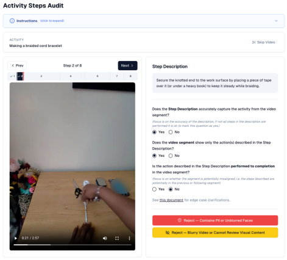

**(a)** Step 2 (“Secure the knotted end to the work surface. . . ”) receives “No” on _Step Completeness_ : the securing action is not finished within this segment - it continues into the next. 

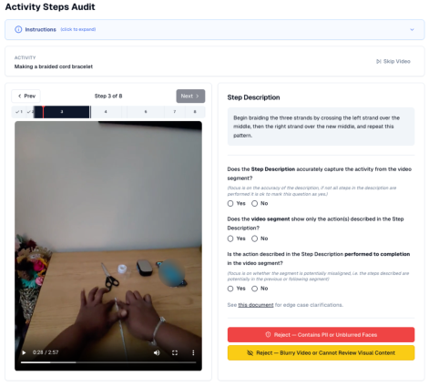

**(b)** Step 3 (“Begin braiding the three strands. . . ”) shows the tail end of the securing action at the start of its segment, confirming the boundary between Steps 2 and 3 is misplaced. 

**Figure 11 Phase 1: Audit interface.** The annotator reviews consecutive steps of a “Making a braided cord bracelet” video (8 steps). (a) Step 2 fails the _Step Completeness_ criterion because the described action spills into the following segment. (b) Advancing to Step 3 confirms the misalignment: the braiding segment begins with residual action from Step 2. This video is routed to Phase 2 for boundary correction. 

**Phase 2: Correction.** Videos with at least one “No” answer on any step are routed to a correction pass. Annotators adjust temporal boundaries (at 0 _._ 1 s resolution) and edit step descriptions until all three diagnostic questions can be truthfully answered “Yes” for every step. For example, when a segment includes partial action from an adjacent step (Figure 12), the annotator shifts the boundary, replays the corrected segment, and confirms all three questions pass (Figure 13). Boundary edits cascade automatically to adjacent steps—adjusting the end time of step _i_ updates the start time of step _i_ +1—enforcing a contiguous temporal partition. The interface validates coverage (no gaps or overlaps), suggests edge-to-edge boundary corrections when the original segmentation contains timing irregularities, and presents a holistic preview of all edits before submission (Figure 14). In rare cases where no valid decomposition is achievable (e.g., the predicted step count is fundamentally incorrect), annotators reject the video with an explicit “Steps Cannot Be Corrected” designation. 

43

<!-- Page 44 -->

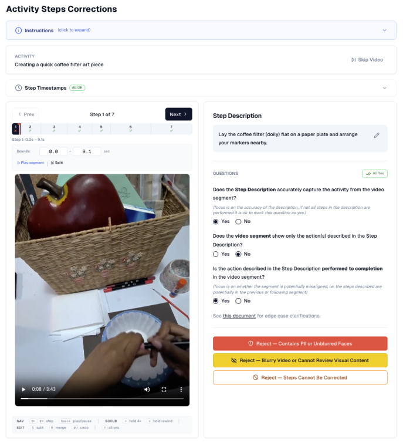

**Figure 12 Human correction workflow (Phase 2), step (a).** Step 1 is flagged on the _Segment Specificity_ question: the segment (0.0 s–9.1 s) includes partial action from Step 2 (marker pressing begins before the boundary). The timeline highlights the issue with a ✗ indicator. 

44

<!-- Page 45 -->

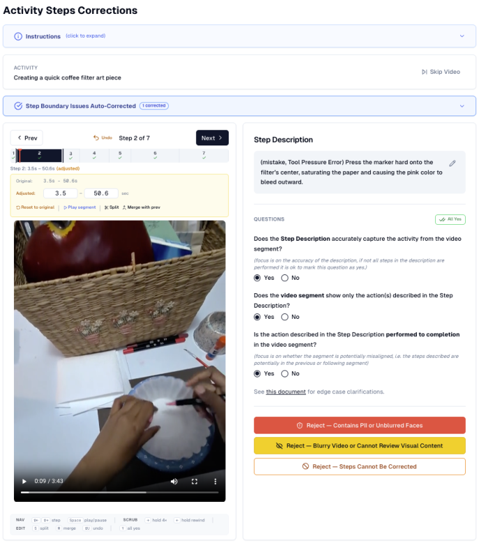

**Figure 13 Human correction workflow (Phase 2), step (b).** The annotator adjusts Step 2’s start boundary from 3.5 s to the corrected value (cascading the end of Step 1 accordingly), replays the segment, and marks all three diagnostic questions “Yes.” The interface confirms the correction with an “Adjusted” label. 

45

<!-- Page 46 -->

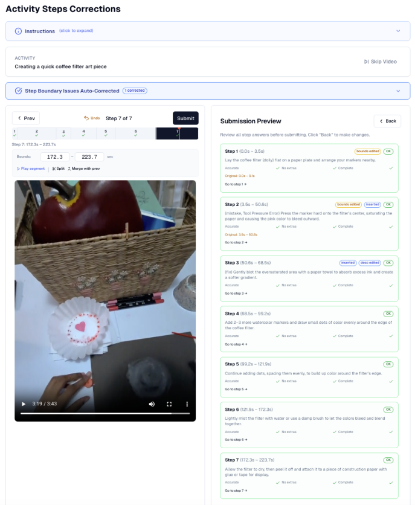

**Figure 14 Human correction workflow (Phase 2), step (c).** Before submission, the annotator reviews all steps in the preview panel. Each card shows corrected timestamps, description text, edit badges (“bounds edited,” “inserted,” “desc edited”), and verification status. All steps display “OK” with passing checks, enabling the Submit button. 

46

<!-- Page 47 -->

### **H.4 Quality Assurance Rubric** 

Each video undergoes a structured multi-criteria review before inclusion in the dataset. The rubric comprises the following checks: 

1. **Script visibility** : Written instructions must not appear in the recording at any point. 

2. **Occlusion/blur/shake thresholds** : The primary objects and actions must be clearly visible and in focus for the majority of the video. Camera obstruction by hats, hair, or accessories triggers rejection. 

3. **Goal completion** : The stated procedural goal must be achieved by the end of the recording. 

4. **Step coverage** : All scripted steps must be performed and visible in the recording. 

5. **Viewpoint compliance** : The recording must maintain a first-person egocentric perspective throughout; no third-person or stationary camera placements. 

6. **Duration** : Videos must be at least 1 minute in length, with expected duration of 2–5 minutes reflecting natural task completion time. 

7. **OOP criteria** (for OOP scripts only): 

   - The scripted error is clearly performed and visible. 

   - The fix follows the error within the same continuous recording. 

   - The clip maintains the four-phase structure (correct lead-in _→_ mistake _→_ fix _→_ correct end state). 

   - The deviation onset timestamp is unambiguously identifiable. 

Of the – source videos, – (–%) were rejected: – for PII/script visibility, – for incomplete goal/step coverage, – for viewpoint or occlusion violations, and – for OOP-specific failures. 

_Response quality evaluation._ Golden responses (the ground-truth guidance utterances associated with interrupt instances) are evaluated along four dimensions: 

- **Relevance** : Does the response address the current procedural state and observed user action? 

- **Specificity** : Does the response reference concrete objects, tools, or actions visible in the scene rather than providing generic advice? 

- **Actionability** : Can the user directly act on the guidance without requiring additional clarification? 

- **Conciseness** : Is the response appropriately brief for a real-time spoken interaction (target: 10–20 words)? 

Among the five datasets for which per-instance response statistics are available, EgoProactive produces the longest average golden responses (17 words vs. 7–13 for other sources), reflecting the richer guidance needed in error-recovery and multi-step procedural contexts. 

### **H.5 Data Handling** 

_Prohibited locations._ Recordings may not take place in hospitals, clinics, pharmacies, dental offices, spas, shelters, banks, legal establishments, funeral-related establishments, or changing rooms. 

_Bystander policy._ Participants take reasonable precautions to minimize incidental capture of bystanders. If a bystander explicitly requests deletion of their image, the recording is deleted. 

### **H.6 Ethical Considerations** 

We identify several ethical considerations relevant to proactive procedural AI: 

- **Over-reliance** : Users may develop excessive dependence on proactive guidance, reducing their ability to perform procedures independently. Deployment systems should include mechanisms for gradually reducing assistance as user competence increases. 

- **Distraction risk** : Poorly timed interruptions during safety-critical steps (e.g., handling hot oil, using power tools) could cause harm. The silent class exists precisely to model non-intervention; we encourage downstream systems to implement safety-aware interrupt suppression during high-risk actions. Safetycritical steps are tagged in the released dataset to facilitate this. 

- **Bias in intervention timing** : If training data under-represents certain demographic groups or household environments, the system may provide less accurate or less timely guidance for those groups. The demographic reporting in §H.1.2 enables analysis of such disparities. 

47

<!-- Page 48 -->

**Table 37** Reproducibility artifact manifest (released with benchmark). 

|**Artifact**|**Path**|**Used for**|
|---|---|---|
|Video manifest|data/*/videos.csv|Video IDs, durations, splits|
|Instance table|data/*/instances.jsonl|Eval rows, labels, responses|
|QA logs|data/wp/qa_rejections.csv|Rejected breakdown|
|Pipeline stats|stats/stats.json|Tables 29–33|
|Pipeline config|configs/pipeline.yaml|All hyperparameters|
|Prompts|prompts/*.txt|Exact LLM/VLM prompts|
|Split manifests|splits/*.json|Train/eval assignments|

- **Surveillance concerns** : Continuous egocentric recording raises surveillance concerns even in private spaces. Our prohibited-location and bystander policies mitigate but do not eliminate these concerns. 

## **I Step Alignment Pipeline Details** 

This section provides full implementation details for the seven-stage step alignment pipeline. This pipeline converts raw source videos into structured procedural annotations (goal, steps, temporal boundaries) and builds on the Action100M methodology (Chen et al., 2026). The step alignment output feeds into the enrichment pipeline (§J), which produces the final training and evaluation rows. 

_Provenance._ All pipeline outputs (transcripts, alignments, coherence scores) are generated by a deterministic pipeline versioned at commit. The exact scripts, configuration files, and output JSON artifacts will be released with the benchmark repository to enable full reproducibility. Table 37 provides a summary of released artifacts and their roles. 

_Computational cost._ End-to-end pipeline processing costs approximately – GPU-hours per video on average (measured on NVIDIA A100 80GB GPUs). The breakdown is: Stage 1 (feature extraction) – GPU-hours, Stage 2–3 (clustering/partitioning) _<_ – GPU-hours, Stage 4 (VLM captioning) – GPU-hours, Stages 5–7 (grouping, alignment, QA) – GPU-hours. Total compute for the full benchmark was approximately – GPUhours across _∼_ – videos processed (– training videos + evaluation videos across all six sources; the total exceeds the per-video estimate due to evaluation video processing, failed runs requiring reprocessing, and pipeline development iterations on earlier commits). 

### **I.1 Stage 1: Visual Feature Extraction (VJEPA2)** 

The first stage converts raw video frames into dense visual representations that capture temporal semantics. 

_Model._ We use VJEPA2 (Video Joint Embedding Predictive Architecture v2) with a ViT-Giant backbone at 384px resolution and a 64-frame temporal context window. VJEPA2 is trained via self-supervised prediction in latent space, making its representations particularly strong for capturing temporal visual dynamics—exactly the property needed for identifying activity boundaries. 

_Frame preprocessing._ Frames are subsampled (every 4th frame from the original video) to reduce redundancy while preserving temporal resolution sufficient for procedural step detection. Each frame is center-cropped and normalized using ImageNet statistics (mean = [0 _._ 485 _,_ 0 _._ 456 _,_ 0 _._ 406], std = [0 _._ 229 _,_ 0 _._ 224 _,_ 0 _._ 225]). 

_Sliding window inference._ The video is processed using overlapping 64-frame windows with a stride of 32 frames (50% overlap). Each window produces per-frame feature vectors via the VJEPA2 encoder ( _d_ =1408 for ViT-Giant). For frames appearing in multiple windows, representations are averaged across all contributing 

48

<!-- Page 49 -->

windows: 

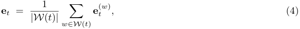

where _W_ ( _t_ ) denotes the set of windows covering frame _t_ . This produces smooth, stable embeddings. The output is a matrix **F** _∈_ R_T ×d_ of per-frame embedding vectors spanning the full video duration, where _T_ is the number of subsampled frames and _d_ = 1408. 

_Compute infrastructure._ Feature extraction runs on a multi-GPU cluster. Jobs are submitted via TorchX to 8-GPU nodes (NVIDIA H100 80GB). Each video is assigned to a GPU in round-robin fashion (gpu_id = idx % n_gpus), and the VJEPA2 model is loaded on all available GPUs for parallel inference. Frame extraction uses 24 concurrent ffmpeg workers. Processing throughput is approximately – videos/hour on a single 8-GPU node (average video duration: – minutes; inference is batched with batch size – per GPU). 

### **I.2 Stage 2: Hierarchical Temporal Clustering** 

Given the per-frame VJEPA2 embeddings **F** , we identify activity transitions via hierarchical agglomerative clustering with Ward linkage. 

_Tridiagonal connectivity constraint._ Standard agglomerative clustering permits merging any two clusters, but temporal segmentation requires that every cluster correspond to a _contiguous_ time span. We enforce this via a tridiagonal connectivity matrix: each frame can only merge with its immediate temporal neighbors. This structural constraint guarantees valid video segments at every level of the hierarchy. _Ward linkage._ We use Ward’s minimum variance criterion, which minimizes total within-cluster variance at each merge step. This produces segments of roughly equal visual coherence, appropriate for procedural videos where steps tend to have comparable complexity. We chose Ward linkage over alternatives (complete, average, single) based on pilot experiments on – videos from EgoProactive and HowTo100M: Ward linkage produced the highest downstream captioning accuracy (measured by human agreement with VLM-generated step descriptions), outperforming complete linkage by –% and average linkage by –%. Complete and average linkage tended to produce more uneven segment sizes, with some segments spanning multiple distinct actions and others covering sub-second fragments. 

_Dendrogram as core data structure._ The output is a full merge tree (dendrogram) where each internal node represents a contiguous time span and carries a merge distance—the visual dissimilarity overcome when its two children were merged. High merge distances indicate strong activity boundaries; low merge distances indicate visually similar adjacent segments. The dendrogram is preserved throughout the pipeline, not just used for a one-time cut, because the recursive captioning stage (Stage 4) needs access to segment subdivisions. 

### **I.3 Stage 3: Dendrogram Partitioning** 

We convert the dendrogram into a flat list of segments via binary search on the merge distance threshold. 

_Target segment count._ The target number of segments _N_ is derived from the expected number of procedural steps, typically obtained from video metadata (e.g., the number of steps in the associated script) or a heuristic based on video duration ( _N_ = _⌈_ duration_minutes _×_ 2 _._ 5 _⌉_ when no metadata is available). 

_Over-segmentation bias._ We deliberately bias toward producing _⌊_ 1 _._ 3 _× N ⌋_ segments rather than exactly _N_ . The rationale is that the downstream LLM grouping stage (Stage 5) can merge adjacent segments describing the same activity, but cannot split a segment containing multiple activities. Over-segmentation provides a safety margin against missing activity boundaries. 

_Dendrogram preservation._ Even after partitioning, the full dendrogram is retained. The recursive captioning stage may need to split a segment further by descending into the dendrogram’s children rather than re-running clustering. The dendrogram effectively serves as a precomputed segmentation at all granularities. 

49

<!-- Page 50 -->

### **I.4 Stage 4: VLM Visual Captioning** 

Each segment is independently captioned by Qwen3-VL-235B. 

_Frame sampling._ For each segment, up to 16 uniformly-spaced frames are sampled. This budget was chosen as a practical trade-off between captioning quality and computational cost: pilot experiments showed diminishing returns beyond 16 frames (captioning accuracy improved by _<_ –% when increasing from 16 to 32 frames, while doubling inference cost). We acknowledge that very long segments ( _>_ 2 minutes) may be undersampled with a fixed budget; adaptive frame budgets based on segment duration are a promising direction for future work (see §I.9). These frames are sent to the VLM along with a structured prompt designed for egocentric procedural video understanding (see §I.8). 

_Captioning prompt._ The prompt instructs the VLM to describe the activity being performed, focusing on hand actions and tools/objects involved. If no action is visible, the model outputs “No active task.” If multiple distinct actions are observed, each is listed on a separate line. The full prompt is provided in §I.8. 

_Recursive refinement._ After initial captioning, we check whether the VLM’s response indicates multiple distinct activities within a single segment (detected by the presence of multiple output lines, each describing a different action). If so, the segment is split using its dendrogram children—descending one level in the merge tree—and each resulting subsegment is re-captioned independently. This recursive process continues until each segment describes a single coherent activity, or until the leaf level of the dendrogram is reached. In practice, most segments stabilize after 0–1 splits. 

_Parallelization._ Captioning is the most computationally expensive stage. We parallelize across multiple API entitlements, processing segments concurrently with 16 threads and 4–8 videos processed in parallel to achieve reasonable throughput for large video collections. 

### **I.5 Stage 5: LLM Step Grouping** 

The per-segment VLM captions are observations of what is happening in each time window. Procedural steps often span multiple segments. The step grouping stage uses a text LLM (Llama 4 Maverick, text-only mode) to merge adjacent observations into coherent procedural steps. 

_Input context._ The LLM receives the full sequence of VLM observations with their timestamps, plus the reference steps from the video’s metadata (e.g., from the procedural script). This provides both visual evidence and expected procedural structure. 

_Grouping logic._ The LLM: 

- Merges adjacent observations describing the same underlying action; 

- Absorbs “No active task” or transitional gaps into neighboring steps; 

- Preserves OOP annotations (mistakes, interruptions, fixes) as separate segments—never merging them with adjacent normal steps; 

- Maps generic visual descriptions to task-specific terminology using the reference steps as vocabulary guidance; 

- Rewrites captions as clear, imperative instructions rather than observational descriptions. 

The target number of groups is approximately equal to the number of reference steps, with flexibility to deviate when video content warrants it. The full grouping prompt is provided in §I.8. 

### **I.6 Stage 6: Transcript Generation and Step Alignment** 

Grouped captions are formatted into structured JSONL transcripts. Each entry contains start and end timestamps, the caption text, and optional tags for mistake/fix segments (EgoProactive OOP subset). 

50

<!-- Page 51 -->

_Step alignment._ A text-only LLM call (Llama 4 Maverick) assigns each grouped segment to the best-matching reference step via semantic matching. The LLM considers both semantic similarity and temporal position (each segment’s position as a percentage of total video duration) to disambiguate when a caption could match multiple steps. Multiple consecutive segments may map to the same step, and not every reference step requires a matching segment. The output is a JSON array of step indices, one per segment. The full alignment prompt is provided in §I.8. 

_Alignment limitations._ Step alignment uses text similarity only, which means captioning errors propagate into alignment errors. Incorporating visual features (e.g., VJEPA2 embeddings) at the alignment stage could improve robustness; we leave this to future work. 

### **I.7 Stage 7: Quality Assurance and Filtering** 

Before using transcripts downstream, we apply several quality checks. 

_Coverage verification._ We verify that generated segments span the full video duration with no temporal gaps. Missing coverage indicates a bug in segmentation or partitioning. 

_Coherence scoring._ An LLM (Llama 4 Maverick, text-only mode) evaluates the complete caption sequence for each video, scoring it on three dimensions: 

- **Coverage** (1–10): What fraction of key hands-on phases are represented? Distinct phases only—10 captions repeating one phase count as coverage of 1 phase. 

- **Order** (1–10): Does the sequence make logical sense? Could a novice follow it step-by-step? 

- **Relevance** (1–10): Are captions specific and actionable enough to guide someone? Penalizes vague/generic captions and extreme redundancy (5+ near-identical captions). 

An overall score (1–10) is computed, calibrated against reference examples (see §I.8 for the full scoring prompt with calibration examples). Videos scoring below 5.0 are excluded from downstream use. This self-filtering mechanism ensures that downstream consumers only see transcripts meeting a minimum quality bar, even without human review. 

_Filtering statistics._ Low-coherence transcripts are flagged and excluded. The filtering rate varies by source dataset: HowTo100M achieves the highest average coherence score (–) due to structured narration, followed by EgoProactive (–), EgoExo4D (–), EPIC-KITCHENS (–), and Ego4D (–). Ego4D exhibits the highest rejection rate (–% of videos below threshold) due to visual ambiguity and non-procedural segments. 

### **I.8 Pipeline Prompts** 

We reproduce the full prompts used at each LLM/VLM-dependent stage of the pipeline. 

_VLM captioning prompt (Stage 4)._ Sent with up to 16 uniformly-sampled frames from each segment: 

These frames are from an egocentric (first-person) video of someone performing a hands-on task. Describe what you see, with an emphasis on any action the person is performing. If no action is visible, say "No active task". 

If there are multiple distinct actions (different tool, object, or motion), list each on a separate line. 

Output ONLY the activity description(s), one per line. 

_LLM step grouping prompt (Stage 5)._ System message: 

You are a video activity annotator. You group timestamped activities into coherent task steps and output ONLY a JSON array. 

User prompt: 

51

<!-- Page 52 -->

You are converting raw visual observations from a video into clear, actionable instructions for performing a task. 

Activity: {activity} Reference steps: {steps_text} Raw observations: {activities_text} 

Rules: 

- Use the activity name and reference steps to understand what the task is about. Map generic visual descriptions to the correct task-specific terms (e.g., if the reference says ‘velcro’ and the observation says ‘adhesive strip’, use ‘velcro’) 

- Write each caption as a clear instruction someone could follow to perform the task, not a description 

- of what was observed 

- Merge adjacent observations that describe the same continuous action 

- Target approximately {n_steps} groups; it is OK to have a few more or fewer if the video content 

- warrants it 

- Reference steps annotated with (mistake, ...), (interruption, ...), or (fix) MUST each appear as their own separate segment – never merge them with adjacent normal steps. Preserve the annotation (e.g. ‘(mistake, Tool Selection Error)’) in the caption. 

- Absorb "No active task" segments into the nearest active group 

- Output JSON: [{"caption": "...", "start_ts": 0.0, "end_ts": 18.0}, ...] 

_Step alignment prompt (Stage 6)._ Text-only LLM call (no images), one call per video: 

You are given a list of procedural steps and a chronological list of video segment captions. Your task is to assign each segment caption to the best-matching step. 

STEPS (numbered 1-{len(subgoals)}): 

{steps_text} 

SEGMENTS (chronological, {len(segments)} total, video duration {video_duration:.1f}s): {segments_text} 

##### INSTRUCTIONS: 

- For each segment, output the 1-based step number that best describes the observed action. 

- Use 0 if a segment has no matching step (e.g., ‘No active task’, transitions, or unrelated actions). 

- Consider SEMANTIC match: which subgoal best describes the action. 

- TEMPORAL POSITION: Each segment shows its position as a percentage of the total video. Use this 

- to help disambiguate when a caption could match multiple steps. 

- Multiple consecutive segments can map to the same step. 

- Not every step needs to have a matching segment. 

Output ONLY a JSON array of integers – one per segment, in order. The array must have exactly {len(segments)} elements. Example: [1, 1, 2, 2, 3, 0, 4, 4, 5] Do NOT include any other text, explanation, or reasoning. 

_Coherence scoring prompt (Stage 7)._ Text-only LLM call evaluating the complete caption sequence: 

You are evaluating whether a sequence of visual captions could serve as instructions for someone to perform the activity. Imagine giving these captions (in order) to a person who has never done this task but has all the materials ready. Could they follow along and complete the activity? 

ACTIVITY: {activity} REFERENCE PROCEDURAL STEPS (for context on what the task involves): {steps_text} 

OBSERVED CAPTIONS (chronological, {len(transcript_segments)} total): {captions_text} 

Evaluate the caption sequence on these dimensions: 

1. COVERAGE (1-10): What fraction of the key hands-on phases of the procedure are represented? 2. ORDER (1-10): Does the sequence make logical sense? 

3. RELEVANCE (1-10): Are the captions specific and actionable enough to guide someone? 

52

<!-- Page 53 -->

Then give an OVERALL score (1-10): 

9-10: A novice could complete the task by following these captions 7-8: Mostly followable, minor gaps a novice could figure out 5-6: Partially followable, but a novice would get stuck at some points 3-4: Hard to follow — major gaps, confusing order, or too vague 1-2: Useless as instructions Output ONLY a JSON object: {"score": ..., "coverage_score": ..., "order_score": ..., "relevance_score": ..., "reasoning": "...", "issues": [...]} 

The coherence scoring prompt additionally includes four calibration examples (scores 2, 4, 7, and 8) with reasoning to anchor the LLM’s scoring distribution. These examples span the quality spectrum from incoherent (single repeated action) to mostly-coherent (clear progression through distinct phases). 

### **I.9 Known Limitations** 

- **VLM hallucination** : When segment frames are visually ambiguous (occluded hands, poor lighting, cluttered workspaces), the VLM sometimes hallucinates objects or actions. The recursive refinement mechanism catches some cases, but systematic hallucination detection remains an open problem. In a manual audit of – segments, –% contained at least one hallucinated object or action. 

- **Fixed frame budget** : We sample up to 16 frames per segment regardless of duration. Very long segments ( _>_ 2 minutes) may be undersampled; adaptive budgets based on segment duration could improve quality. 

- **Single-video processing** : Cross-video consistency is not explicitly enforced. Similar activities may receive different descriptions across videos of the same task. 

- **Text-only alignment** : Step alignment uses text similarity only, propagating captioning errors into alignment errors. Incorporating visual features could improve robustness. 

- **Granularity sensitivity** : The target segment count _N_ is derived from expected step counts, which can be miscalibrated for videos deviating significantly from reference steps. 

## **J Enrichment Pipeline Details** 

The enrichment pipeline converts step alignment output (§I) into the training and evaluation rows used by the duplex interaction model and planner. It consists of four stages. 

_Base conversion._ A source-specific converter normalizes each dataset’s native annotations (narrations, step lists, dialogue transcripts) into a unified schema: goal text, ordered step descriptions, temporal boundaries, and dialog context. Each converter handles source-specific idiosyncrasies (e.g., HoloAssist dialogue turns, EPIC-KITCHENS narration segments, EgoProactive OOP scripts) while producing identical output format. 

_Duplex sampling._ Decision-point instances are generated at 0.5 s stride (2 fps). For each candidate decision point _t_ , the sampler constructs an 8 s video clip **v** _t−L_ : _t_ , assigns a binary label (interrupt at step boundaries and OOP onsets; silent otherwise, with a minimum temporal gap _δ_ =3 s from any interrupt point), and pairs it with the golden response when the label is interrupt. Silent points are sampled to approximately match interrupt frequency per video. A separate planner sampling pass produces step-level sequences with broader temporal context for training the planner module. 

_Visual cue generation._ For each procedural step, a VLM generates _step-completion cues_ (observable predicates confirming step completion, e.g., “pan is on heat”) and _step-incomplete cues_ (indicators of unfinished actions, e.g., “butter not spread”). These cues are attached to each row and used in the cue-matching prompt variant during evaluation. 

_Clip extraction and integrity._ Video clips are extracted at the specified temporal bounds, deduplicated across sources via URL/ID matching, and assigned to train/eval splits at the video level. For datasets with official splits, we adopt them directly. Zero train _↔_ eval overlap is confirmed via exhaustive UUID set intersection. All stochastic operations use archived seeds. 

53
