# Post-Training VLMs for Video Mistake Detection

[Original PDF](../Post-Training%20VLMs%20for%20Video%20Mistake%20Detection.pdf)

Pages: 27

> Automatically converted from PDF. Check the original for exact equations, symbols, table alignment, and figure details.

<!-- Page 1 -->

**1** 

_SPURIO ET AL.: POST-TRAINING VLMS FOR VIDEO MISTAKE DETECTION_ 

# **Post-Training VLMs for Video Mistake Detection** 

Federico Spurio*1,2 1 University of Bonn fspurio@iai.uni-bonn.de Bonn, Germany Olga Zatsarynna*1,2 2 Lamarr Institute for Machine Learning zatsarynna@iai.uni-bonn.de and Artificial Intelligence Lars Doorenbos*1,2 Bonn, Germany doorenbos@iai.uni-bonn.de 3 Toyota Motor Europe Emad Bahrami1 Belgium bahrami@iai.uni-bonn.de Gianpiero Francesca3 gianpiero.francesca@gmail.com Juergen Gall1,2 gall@iai.uni-bonn.de 

##### **Abstract** 

Human mistakes are inevitable when following instructions, yet they can lead to severe consequences. As such, there has been an increased interest in developing methods for detecting mistakes in videos, with current methods mostly focusing on closed-set protocols. While successful in controlled settings, the closed-set assumption limits their wider applicability, as any changes to the task require collecting new data and re-training models. Instead, we argue that mistake detection methods should learn the general concept of a mistake, rather than overfitting to step-specific details. To reflect this, we introduce the Mistake Detection Video Question Answering (MD-VQA) protocol and accompanying benchmark. MD-VQA tests whether methods can discern if a step was executed correctly with respect to its description, for both seen and unseen actions. To address this important challenge, we propose the first video-language-model post-training technique for mistake detection. Our method uses a tailored reward function to encourage the model to identify discrepancies between an instruction and the corresponding video. Extensive evaluations demonstrate that this approach outperforms zero-shot, supervised fine-tuning, and post-training baselines. Notably, our method generalizes especially well to unseen procedures, for instance, with an improvement of up to 11 _._ 6% over the bestperforming baseline on EP-VQA, paving the way toward general mistake detection. We release our code and benchmark at https://github.com/FedeSpu/mstk. 

## **1 Introduction** 

Human mistakes are as costly as they are common. Across a wide range of domains and activities, such as surgeries, driving, and assembly lines, these errors can lead to significant 

> © 2026. The copyright of this document resides with its authors. It may be distributed unchanged freely in print or electronic forms. *Equal Contribution

<!-- Page 2 -->

**2** 

_SPURIO ET AL.: POST-TRAINING VLMS FOR VIDEO MISTAKE DETECTION_ 

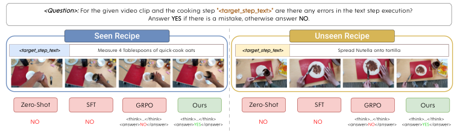

<!-- Start of picture text -->
<Question>:  For the given video clip and the cooking step  "<target_step_text>"  are there any errors in the text step execution? Answer  YES  if there is a mistake, otherwise answer  NO . Seen Recipe Unseen Recipe <target_step_text> Measure 4 Tablespoons of quick-cook oats <target_step_text> Spread Nutella onto tortilla Zero-Shot SFT GRPO Ours Zero-Shot SFT GRPO Ours NO NO <answer><think>...</think>NO</answer> <answer><think>...</think>YES</answer> NO NO <answer><think>...</think>NO</answer> <answer><think>...</think>YES</answer> <!-- End of picture text -->

Figure 1: **Mistake detection in seen and unseen domains.** Our benchmark evaluates models not only on recipes present in the training data (left), but also tests their ability to generalize the abstract concept of “mistake” to novel tasks (right). While standard training strategies (Zero-Shot, SFT, and GRPO) fail to detect these subtle errors or struggle to generalize, our proposed post-training approach successfully grounds its reasoning to accurately identify mistakes across both scenarios. Examples from EP-VQA. 

losses in efficiency, productivity, and resources ( _e.g_ ., [28]). Generally, mistakes do not stem from a lack of expertise or motivation on the part of the individuals involved, but rather are inherent to any processes involving humans. As a result, since the occurrence of mistakes is unavoidable, they should be addressed appropriately by designated systems that understand when errors occur. 

For this task, artificial intelligence has substantial potential, as also evidenced by the growing number of works addressing video mistake understanding. Given the highly multifaceted nature of this problem, existing approaches adopt diverse formulations. Prior works have explored mistake understanding from the perspectives of online error detection [8, 18, 21, 26], temporal action and error segmentation [11, 12, 13, 14], per-clip error classification [31], and zero-shot long-form mistake detection [22]. Many of these methods demonstrate strong performance on their respective protocols; however, one key aspect of mistake understanding has been largely underexplored - **effective mistake detection in unseen scenarios** . Instead, most of the previously developed models operate under a closed-set assumption, where the action classes for which mistakes must be detected are assumed to be shared between the training and inference stages. For example, [8] focuses on online detection of procedural errors, such as executing actions in the wrong order or skipping required steps. While these approaches do not assume that the training data contains errors, they assume that all actions are part of the training set. Therefore, such methods can not be applied to unseen scenarios with actions that are not part of the training data. This significantly limits the adaptability and scalability of such approaches. 

So far, only one work [22] has addressed open-set scenarios by leveraging VLMs in a zero-shot fashion. It introduced a Video Question Answering (VQA) style setup for mistake understanding in a zero-shot, long-form manner. However, such a formulation leads to an overly difficult problem setting, as shown by the low performance of zero-shot VLMs on the proposed task. The difficulty arises from combining two individually challenging tasks: zero-shot temporal grounding of short segments in very long videos (over 20 minutes) and zero-shot detection of fine-grained mistakes. Given the discouraging results in [22], we introduce a new protocol. While we also formulate mistake detection as a VQA task, we focus on detecting errors within video segments corresponding to a single instruction step, rather than using a full-video long-horizon approach. More specifically, given a procedural step and its corresponding video clip, the task is to determine whether the execution shown in the

<!-- Page 3 -->

**3** 

_SPURIO ET AL.: POST-TRAINING VLMS FOR VIDEO MISTAKE DETECTION_ 

clip matches the provided textual instruction, as illustrated in Fig. 1. To establish a benchmark for this new setting, we adapt and unify the CaptainCook4D [22] and EgoPER [14] datasets to our protocol. As a result, our benchmark includes a diverse and challenging set of questions spanning various complex instruction steps and mistake types. 

We show that, also on our benchmark, zero-shot VLM performance (as proposed in [22]) remains poor, since detecting mistakes in fine-grained instructional steps requires complex multi-step reasoning. Therefore, inspired by the success of post-training in tasks requiring high-level reasoning, we propose a reinforcement–learning–based post-training algorithm designed for mistake detection as our second contribution. Our method uses a novel reward function that samples alternative video clips for each instruction–video pair to better identify mismatches between textual and visual information. We compare our approach against a variety of baselines and demonstrate that our post-training method achieves state-of-the-art performance, especially on unseen scenarios. For instance, we improve the F1-score by 5 _._ 0 over the next-best baseline, an improvement of 11.6%. 

In short, our main contributions can be summarized as follows: 

- We propose a novel Mistake Detection VQA protocol, which we term MD-VQA, for both seen and unseen instructional steps. 

- We present the first VLM post-training technique for effectively addressing MD-VQA. 

## **2 Related Work** 

### **2.1 Mistake Understanding** 

Before mistake understanding emerged as a distinct research direction, several related lines of work were commonly addressed, such as video anomaly detection [9, 14, 17, 19, 24, 29, 30, 32] and unintentional action prediction [4, 5, 6, 34]. In recent years, research has increasingly focused on post-hoc detection and recognition of mistakes, for example, in assembly [3] and physical manipulation [31] tasks. Besides post-hoc detection, other lines of work address online mistake detection [8, 18, 21, 26], or focus on error detection and/or recognition based on temporal action segmentation (TAS) [11, 12, 13, 14]. Most recently, there has been an increase in the use of VLMs for mistake detection, motivated by their success in other video-related tasks. For instance, [22] introduced a zero-shot approach that evaluates the alignment between long-form video clips and textual recipe steps, whereas other methods use zero-shot [13] or fine-tuned VLMs [21] to recognize and explain mistakes. The above approaches demonstrate strong results under their respective formulations; however, these methods come with a crucial limitation: most existing approaches [11, 12, 13, 14, 21, 26, 31] are intrinsically closed-set and cannot predict errors in previously unseen action steps. Although relying on zero-shot VLM capabilities [22] can mitigate this issue, it is often insufficient for strong performance on unseen actions. In contrast, we introduce a new protocol explicitly focused on general mistake detection, where models need to identify mistakes in video segments for both seen and unseen instruction steps. 

### **2.2 Post-Training VLMs** 

Reinforcement Learning (RL) is now the primary approach for post-training Vision-Language Models (VLMs). In this context, methods such as proximal policy optimization [25] (PPO)

<!-- Page 4 -->

**4** 

_SPURIO ET AL.: POST-TRAINING VLMS FOR VIDEO MISTAKE DETECTION_ 

enable better alignment with human preferences while retaining the reasoning capabilities of the original model. However, these methods can be inefficient due to reliance on an additional critic model. In contrast, Group Relative Policy Optimization (GRPO) [27] offers a computationally efficient alternative by eliminating the critic network and computing advantages relative to group mean rewards. Recent work has successfully applied GRPO and other RL post-training methods to video understanding tasks, such as Video-R1 [7], DeepVideoR1 [20] or VideoAuto-R1 [16] to improve video reasoning. For instance, VideoChat-R1 [15] enhances spatio-temporal perception through reinforcement fine-tuning, ArrowRL [33] focuses on temporal reasoning capabilities, and EgoThinker [23] utilizes GRPO-based posttraining to improve egocentric video understanding. These approaches highlight GRPO’s effectiveness in multi-modal settings, where traditional methods are computationally prohibitive. Our method builds upon this line of work and introduces the first post-training method for mistake detection. 

## **3 MD-VQA: Video Question Answering for Mistake Detection** 

In this section, we present our mistake detection protocol. Unlike most prior formulations, which treat mistake understanding as a closed-set task where the actions or instructional steps are shared between the training and test set, we focus on detecting mistakes in unconstrained instructional steps, enabling more adaptable and generalizable models. In contrast to [22], which focuses on a long-form setup that conflates temporal grounding and mistake detection, leading to poor performance across methods, we focus on the detection of finegrained mistakes for a given instruction and short video clip. Therefore, we set up a new evaluation benchmark to systematically test the performance of various VLM approaches on the proposed MD-VQA task. We also move beyond evaluating only training-free methods, guided by the poor zero-shot results even in our problem setting. 

### **3.1 MD-VQA Task** 

To assess whether VLMs can capture nuances across different instructional steps, we formulate mistake detection as a video question-answering task. Formally, given a video _v_ showing either a correct or faulty execution of an instructional step _t_ , we construct a question _q_ that inquires whether the step _t_ was performed correctly or contains a mistake. We show an example of such a question in Fig. 2. In our work, we focus on binary questions, where the VLM must determine the presence of an error. The ground-truth answers for such questions are α = **yes** if there is a mismatch between the instruction and its execution, or α = **no** otherwise. In this way, each MD-VQA example can be represented as a tuple _m_ = _{v, q,_ α _}_ . We construct four paraphrased question variants for each _q_ that differ in wording. For training, methods can use all four variants to improve linguistic diversity and reduce prompt overfitting. During inference, a single formulation of _q_ is used. The exact question templates are provided in the supplementary material. 

It is important to note that we do not assume that the steps _ti_ come from a known prefixed set. Models are therefore required to recognize mistakes in both familiar and unseen instructional steps. Achieving strong performance in this setting thus demands that models learn a generalizable notion of what constitutes a mistake. This renders the task not only

<!-- Page 5 -->

_SPURIO ET AL.: POST-TRAINING VLMS FOR VIDEO MISTAKE DETECTION_ 

**5** 

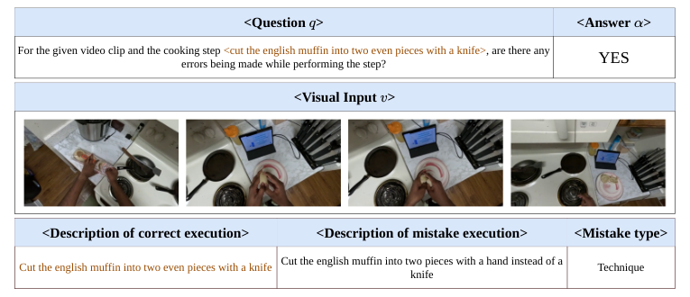

<!-- Start of picture text -->
<Question  > <Answer  > For the given video clip and the cooking step <cut the english muffin into two even pieces with a knife>, are there any YES errors being made while performing the step? <Visual Input  > <Description of correct execution> <Description of mistake execution> <Mistake type> Cut the english muffin into two even pieces with a knife Cut the english muffin into two pieces with a hand instead of a knife Technique <!-- End of picture text -->

Figure 2: **Example from CC-VQA Test Seen split.** Question _q_ asks whether the cooking step _“cut the english muffin into two even pieces with a knife”_ contains any mistakes in the video _v_ . The ground-truth answer _αi_ is “YES” as the muffin is shredded by hand rather than cut with a knife. 

broadly applicable but also substantially more challenging and motivates the need for new approaches capable of reasoning more effectively about visual-textual inconsistencies. 

### **3.2 Data** 

For our MD-VQA protocol, we obtain training and testing examples by repurposing two recently proposed mistake datasets - CaptainCook4D [22] and EgoPER [14]. CaptainCook4D contains 384 recordings (totaling 94.5 hours) that depict 24 high-level recipes, while EgoPER consists of 386 videos demonstrating the preparation of 5 recipes, totaling 28 hours of footage. Both datasets include temporal annotations for fine-grained action steps corresponding to individual sub-steps within the high-level recipes. Since our protocol focuses on localized fine-grained reasoning, we extract short video segments corresponding to individual action steps using the start and end timestamps provided in the dataset annotations. We next describe how we refactor each dataset for our task in question. 

**CaptainCook4D** [22] comprises 350 types of fine-grained instructional steps _t_ , described in natural language. Each action _t_ has a set of video clips _{vk}__K_ _k_ =_t_ 1, pre-extracted as described above, depicting either a correct or an incorrect execution with respect to the provided textual description. If the step is performed incorrectly, the annotations specify a high-level mistake category _e_ ; otherwise, the clip is labeled as correct. For our problem, we retain 5 high-level mistake classes from CaptainCook4D’s original 7 categories: _Preparation_ , _Technique_ , _Timing_ , _Measurement_ , and _Temperature_ . We exclude the _Ordering_ and _Missing_ error types, as these pertain to multiple segments rather than single clips. Since the annotations in CaptainCook4D are noisy, we manually corrected the descriptions to make sure the corresponding clips are mistakes with respect to the instructions, and that they are grammatically correct. We provide the full details in the supplementary material. The resulting version of CaptainCook4D processed in this way is referred to as **CC-VQA** . 

**EgoPER [14]** follows a different annotation format, where correct and erroneous steps are not considered as two variants of the same instructional step. Instead, they are treated as two separate fine-grained steps, _t_ and _t__′_ , without an established correct-mistake corre-

<!-- Page 6 -->

**6** _SPURIO ET AL.: POST-TRAINING VLMS FOR VIDEO MISTAKE DETECTION_ 

|**Dataset**|**Tra**|**in**|**Test S**|**een**|**Test**|**Unseen**|
|---|---|---|---|---|---|---|
||Normal|Error|Normal|Error|Normal|Error|
|EP-VQA|3571|270|602|54|532|60|
|CC-VQA|3186|1077|484|107|459|100|

Table 1: **Number of samples for the EP-VQA and CC-VQA datasets.** 

spondence. For consistent evaluation across both datasets, we extend the original EgoPER annotations. Specifically, while the normal steps _t_ are left unmodified, for each mistake step _t__′_ we select a corresponding normal step _t_ that specifies how _t__′_ would appear if no mistake were made. For example, for a mistake step _t__′_ ( _stir using knife_ ), we provide a corresponding normal step _t_ ( _stir using spoon_ ) and assign the mistake to a high-level mistake category _e_ ( _utensil error_ ). 

Overall, we define four new mistake categories: _Slip_ , _Technique_ , _Measurement_ , and _Utensil_ . _Slip_ mistakes arise from carelessness (e.g., _spilling water_ ). _Utensil_ mistakes occur when an incorrect tool is used (e.g., _stirring with a knife_ instead of a spoon). _Measurement_ mistakes involve incorrect quantity or timing. Finally, _Technique_ mistakes result from imprecise execution of an action (e.g., _folding a tortilla into a quarter-circle_ instead of a half-circle). As with CaptainCook4D, we annotate video clips _vk_ which show an incorrect execution of step _t_ with one of these mistake types depending on the description _t__′_ , while clips showing correct executions are labeled as correct. A complete mapping of mistake steps _t__′_ to normal instruction steps _t_ as well as the corresponding error types _e_ is provided in the supplementary material. The resulting version of Ego-PER processed in this way is referred to as **EP-VQA** . 

### **3.3 Evaluation** 

We divide the processed samples for both CC-VQA and EP-VQA into training and test sets. For both datasets, we define three subsets: train, test seen, and test unseen. The **unseen test set** ( _D_ unseen) contains video clips from high-level activities (recipes) that were not included in the training set. This ensures that the instructional steps in this split have not been observed during training, allowing us to assess the generalization capability of the tested models to previously unseen textual descriptions. The remaining portion of the dataset _D__′_ = _D \ D_ unseen is then further split into the **train set** ( _D_ train) and the **seen test set** ( _D_ test). The detailed statistics of the resulting splits are provided in Tab. 1. We use both test sets to evaluate the performance of VLMs for video mistake detection in the MD-VQA setup as described in Sec. 3.1. Methods are evaluated by their recall, precision, and F1-score, computed with mistakes as the positive class. 

## **4 Method** 

For a model to effectively address the above-defined MD-VQA task, it needs to be able to perform fine-grained reasoning over the textual description _t_ , the video _v_ , and their interplay. For instance, a video showing a person preheating an oven to 150_◦_ C should be considered incorrect for the instruction _Preheat the oven to_ 200_◦_ C, despite the close semantic similarity of those two instructions. To address this challenge, we draw inspiration from the success of reinforcement learning-based post-training across several tasks that require high-level reasoning. Building on these insights, we propose a novel post-training technique to enhance the

<!-- Page 7 -->

_SPURIO ET AL.: POST-TRAINING VLMS FOR VIDEO MISTAKE DETECTION_ 

**7** 

video mistake recognition capabilities of VLMs. Specifically, we introduce a reward function designed to more accurately capture mistakes in the execution of instructional steps. In the following sections, we provide a detailed overview of our proposed approach. 

### **4.1 Preliminaries** 

GRPO [27] is a reinforcement learning-based algorithm designed to enhance the reasoning capabilities of underlying models. Unlike earlier post-training algorithms [25], GRPO does not rely on a separately trained model to rank the policy network’s responses. Instead, it uses predefined rule-based rewards that are assigned to a group of candidate responses sampled from the policy model _πθ_ . 

More precisely, the GRPO objective is computed by first sampling a group of _G_ different responses _{oi}__G_ _i_ =1fromthepolicymodel_πθ_.Foreachresponse_oi_,arewardvalue_ri_is assigned using predefined reward functions. These rewards, which reflect the quality of the corresponding responses, are then used to compute per-response advantage values relative to the other candidates within the group. Formally: 

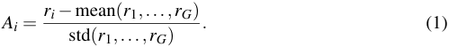

The policy model _πθ_ is then optimized using the following objective: 

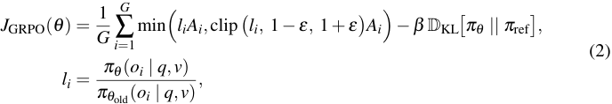

where _q_ is a question prompt concerning a video snippet _v_ and _πθ_ old is the model from the previous iteration. In this objective, the first term encourages the policy video-language model _πθ_ to generate responses with higher advantages, while the second Kullback-Leibler divergence term acts as a regularizer that prevents excessive deviations of the optimized policy model _πθ_ from the reference policy _π_ ref. The reference policy model _π_ ref is initialized from the instruction-tuned model and kept fixed during training. 

### **4.2 Reward Functions for MD-VQA** 

To address the task of mistake detection effectively, we utilize a combination of three reward functions for relative advantage estimation: _format_ and _accuracy_ rewards as in [10], as well as our novel _opposite_ reward function. 

**Format reward.** It measures whether a response adheres to a specific predefined output format. Formally, for a response _oi_ and a predefined format string, this reward is computed as: 

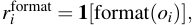

where **1** [ _·_ ] is the indicator function. In our work, we adopt the “thinking” format, in which reasoning traces are enclosed between the <think></think> tags, and the final answer is provided between the <answer></answer> tags. Enforcing this format encourages the model to perform intermediate reasoning steps, allowing it to process textual and visual tokens in greater detail before producing the final answer to a given question.

<!-- Page 8 -->

**8** 

_SPURIO ET AL.: POST-TRAINING VLMS FOR VIDEO MISTAKE DETECTION_ 

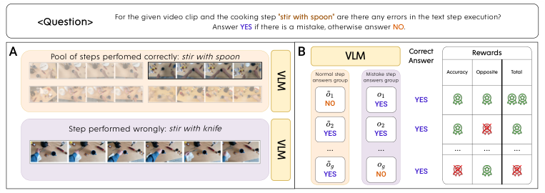

<!-- Start of picture text -->
<Question> For the given video clip and the cooking step Answer  YES  if there is a mistake, otherwise answer  "stir with spoon"  are there any errors in the text step execution?  NO . A Pool of steps perfomed correctly: stir with spoon B VLM AnswerCorrect Rewards Normal step Mistake step Accuracy Opposite Total answers group answers group NO YES YES Step performed wrongly: stir with knife YES YES YES ... ... ... ... ... YES NO YES VLM VLM <!-- End of picture text -->

Figure 3: **Overview of our method.** To improve the reasoning capabilities of VLMs for mistake detection, we post-train models with GRPO using a novel _opposite_ reward function, which encourages different responses for video clip pairs demonstrating correct and incorrect executions of the same step. A: We pair an incorrectly performed step (bottom) with an “opposite” correct execution from a reference pool (top). The VLM processes both videos independently. B: The model earns an accuracy reward for correct answers, and an opposite reward if its answers for the two clips differ from one another. The opposite reward is only given if the accuracy reward is achieved. Through this training, the model’s ability to detect mistakes as subtle discrepancies between instructional step descriptions and their execution is improved. 

**Accuracy reward.** It measures the correctness of the responses with respect to the provided ground-truth answers. Specifically, for a response _oi_ , we first extract the predicted answer _ai_ enclosed between the <answer></answer> tags. The accuracy reward with respect to the target answer α is then defined as: 

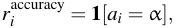

where equality holds if the texts _ai_ and α match exactly. This reward encourages the model to produce factually correct responses, which corresponds to correctly determining whether a given text–video pair contains a mismatch or is mistake-free. 

**Opposite reward.** In addition to the above functions, we propose a novel reward specifically designed to enhance the model’s ability to identify discrepancies between textual and visual information, as illustrated in Fig. 3. Depending on the segment _v_ , it may depict a correct or incorrect execution of the step _t_ . We then can also sample an “opposite” video segment _v_ ˜ which represents the _opposite_ scenario; that is, if _v_ shows a correct execution of step _t_ , _v_ ˜ is sampled to show a failed execution, and vice versa. Intuitively, a policy model sensitive to mismatches between textual and visual information should produce _dissimilar_ responses for the same question _q_ about step _t_ when given these two video variants. Formally, if _ai_ and _a_ ˜ _i_ are the extracted answers from responses _oi_ and _o_ ˜ _i_ for question _q_ based on video segments _v_ and _v_ ˜, respectively, the opposite reward is 

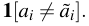

To prevent this reward from incentivizing factually incorrect responses, _e.g_ ., classifying a correct segment as incorrect and vice versa, we additionally constrain it using a multiplicative

<!-- Page 9 -->

**9** 

_SPURIO ET AL.: POST-TRAINING VLMS FOR VIDEO MISTAKE DETECTION_ 

accuracy gate. As such, the final opposite reward is: 

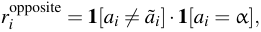

where α is the ground-truth answer to the question _q_ . This reward, together with the previous two functions, encourages the policy model to be sensitive to visual changes that correspond to violations of the textual descriptions. 

**Final reward.** As our final reward function, we utilize a combination of the above-described rewards: 

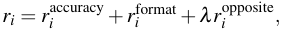

where _λ_ balances the influence of our proposed _opposite_ reward function on the final outcome. We evaluate the impact of _λ_ in our experiments. 

### **4.3 Training** 

For the _opposite reward_ computation, each mistake segment requires a corresponding normal example, and vice versa. Given a text–video pair ( _v,t_ ) containing a mistake, we randomly sample a normal video clip _v_ ˜ with the same step description _t_ . Similarly, for a normal video clip, we sample a corresponding mistake video segment that depicts the same instructional step. In the rare cases where no video with a wrong execution for text _t_ exists, we randomly select a mistake video clip _v_ ˜_′_ from any unrelated step _t__′_ . We emphasize that this sampling step is _not_ required during the evaluation phase. We directly apply GRPO with our reward functions to the VLMs and do not rely on an initial fine-tuning stage, similar to [16]. 

## **5 Experiments** 

We evaluated a diverse set of baselines on our benchmark to thoroughly compare our proposed approach with existing methods: 

- **Zero-Shot** (ZS): base VLM model without additional training as in [22]. 

- **Zero-Shot + Reasoning** (ZS + _R_ ): the base VLM model, where we extend the prompt with an explicit request for structured reasoning. The model is instructed to provide its reasoning within <think>...</think> tags and its final answer within <answer>...</answer>. 

- **Supervised Fine-Tuning** (SFT): the base VLM model fine-tuned with the standard CE loss using the training set of question–answer pairs described in Sec. 3.1. 

- **Supervised Fine-Tuning + Reasoning** (SFT + _R_ ): the SFT model fine-tuned as described above, but during inference queried with a reasoning prompt, as in the (ZS + R) baseline. 

- **Supervised Fine-Tuning with Explanation** (SFTe): the SFTe model is trained not only for mistake detection but also for error explanation, similar to [21]: in addition to predicting if there is a mistake or not, the model has to explain what the error is. For example, _YES, step ‘stir using spoon’ is performed incorrectly. The video shows step ‘stir using knife’._

<!-- Page 10 -->

**10** 

_SPURIO ET AL.: POST-TRAINING VLMS FOR VIDEO MISTAKE DETECTION_ 

||||**CC-**|**VQA**|||||**EP-**|**VQA**|||
|---|---|---|---|---|---|---|---|---|---|---|---|---|
|**Method**||**Seen**|||**Unseen**|||**Seen**|||**Unseen**||
||_Rec_|_Prec_|**_F1_**|_Rec_|_Prec_|**_F1_**|_Rec_|_Prec_|**_F1_**|_Rec_|_Prec_|**_F1_**|
|ZS|0.0|0.0|0.0|0.0|0.0|0.0|0.0|0.0|0.0|0.0|0.0|0.0|
|ZS +_R_|41.9|16.7|23.8|54.8|20.6|29.9|60.4|12.5|20.7|21.7|12.3|15.7|
|GPT-4o-mini +_R_|-|-|-|-|-|-|-|-|-|50.0|20.4|29.0|
|SFT|43.0|**21.5**|28.7|60.0|**24.2**|34.5|1.9|14.3|3.3|3.3|7.7|4.7|
|SFT +_R_|54.2|17.7|26.7|64.0|19.3|29.7|24.1|7.6|11.6|6.7|10.5|8.2|
|SFTe|49.5|19.6|28.2|55.0|20.6|30.0|3.7|40.0|6.8|0.0|0.0|0.0|
|GRPO|**66.4**|20.2|**30.9**|71.0|21.2|32.6|74.1|39.2|51.3|66.7|31.7|43.0|
|**Ours**|61.7|19.6|29.7|**80.0**|22.8|**35.5**|**79.6**|**40.6**|**53.8**|**70.0**|**36.5**|**48.0**|

Table 2: **Comparative evaluation on the CC-VQA and EP-VQA seen and unseen test splits.** Our proposed post-training method learns a generalizable mistake representation that performs well for both seen and unseen videos. 

- **GRPO** : the base VLM model post-trained using the original GRPO objective with accuracy and format rewards, without incorporating our proposed opposite reward. 

Additionally, we report experiments on the EP-VQA unseen split with the commercial GPT-4o-mini model [1] using the reasoning prompt. For the baselines evaluated with the reasoning prompt, as well as GRPO and our proposed method, we utilize the same prompt format, which we provide in the supplementary material. To ensure fairness, all evaluated methods share the identical base architecture. 

**Implementation details.** Our base VLM model is Qwen2.5-VL-7B [2], fine-tuned via our proposed post-training approach described in Sec. 4. We follow [7] for our frame sampling strategy and resolution, as well as for the GRPO objective computation, setting the response group size _G_ to 8 and the KL-divergence weight to 0.04. For the opposite reward function, we use a balancing weight of _λ_ = 0 _._ 2. Training is conducted with a batch size of 4 on 4 NVIDIA H100 GPUs. During training, we balance the number of mistakes and correct examples by resampling videos corresponding to mistake steps, since these are under-represented in the training sets of both EP-VQA and CC-VQA, with roughly 1:13 and 1:3 ratios of mistakes to normal examples, respectively. This resampling is applied for all trainable baselines. We found that without such resampling, the models become overly biased toward predicting the absence of mistakes due to the dataset imbalance, particularly for EP-VQA. Training dynamics and further details for all methods are provided in the supplementary material. 

### **5.1 Results** 

We provide the main results on the seen and unseen splits of CC-VQA and EP-VQA in Tab. 2. To ensure a fair comparison, we verified that the different models’ answers are incorrect due to wrong predictions rather than formatting issues. We find that the zero-shot model already reliably follows formatting instructions. For fine-tuned models, correct formatting is learned as part of the mistake detection task, and all outputs during inference conform to the required answer format. As a result, any differences in results indeed stem from differences in mistake detection performance.

<!-- Page 11 -->

**11** 

_SPURIO ET AL.: POST-TRAINING VLMS FOR VIDEO MISTAKE DETECTION_ 

|**Method**|_Techni_|_que(424)_|_Prepara_|_tion(339)_|_Temper_|_ature(48)_|_Measur_|_ement(276)_|_Timin_|_g (138)_|
|---|---|---|---|---|---|---|---|---|---|---|
||**S**(46)|**U**(28)|**S**(29)|**U**(26)|**S**(11)|**U**(6)|**S**(23)|**U**(32)|**S**(19)|**U**(20)|
|ZS|0.0|0.0|0.0|0.0|0.0|0.0|0.0|0.0|0.0|0.0|
|ZS +_R_|39.1|26.1|51.7|56.0|40.0|33.3|54.5|63.3|50.0|65.0|
|SFT|30.4|46.4|48.3|69.2|72.7|66.7|69.6|65.6|52.6|**75.0**|
|SFT +_R_|45.7|28.6|51.7|69.2|72.7|**100.0**|60.9|75.0|68.4|80.0|
|SFTe|34.8|50.0|55.2|61.5|63.6|0.0|**82.6**|75.0|57.9|30.0|
|GRPO|**56.5**|50.0|**75.9**|69.2|63.6|66.7|78.3|84.4|**78.9**|70.0|
|**Ours**|39.1|**71.4**|69.0|**76.9**|**90.9**|33.3|**82.6**|**96.9**|73.7|**75.0**|

Table 3: **Recall for the seen and unseen test splits of CC-VQA.** We show the number of samples for each mistake type in parentheses for seen (S) and unseen (U) splits. The number of training error samples is shown next to the name of the corresponding mistake category. Our method consistently scores among the best methods in mistake recall for both seen and unseen instructions. 

**On CC-VQA** , the zero-shot approach [22] fails to detect any discrepancies and predicts all video–text pairs as matching, _i.e_ ., as correct executions. Adding a reasoning prompt (ZS + R) substantially boosts performance. In contrast, SFT reaches strong performance for the seen and unseen splits without a reasoning prompt. Requesting an additional explanation (SFTe) as proposed in [21] does not improve over standard SFT either. When it comes to RL-based methods, GRPO performs better than SFT on the seen split but not on the unseen split. However, our method consistently outperforms SFT for both splits. In particular, the recall is much higher, _i.e_ ., more errors are correctly detected, whereas the number of false positives is only slightly increased, as indicated by the slightly lower precision. Compared to GRPO, our approach reaches slightly lower results on the seen split, but it achieves 2 _._ 9 points higher F1-score for the unseen split. This gain highlights the effectiveness of our _opposite_ reward design in learning a general notion of mistakes, which transfers better to unseen instructions. 

We additionally provide the per-error recall on the different mistake categories in Tab. 3. For the seen steps, our method achieves the highest recall for two of the categories, and second-best on the remaining three, showcasing its consistency. For the unseen steps, our method achieves the best results across all mistake types with the exception of the _temperature error_ , which has only very few samples, confirming its success in transferring its mistake representation to unseen steps. The largest recall gain is observed for _technique errors_ , where it is 21 _._ 4 points better than the second-best performing models GRPO and SFTe. 

**On EP-VQA** , the zero-shot methods exhibit similar trends. However, for the other methods, some clear differences emerge. The SFT models underperform on this benchmark and struggle to recognize errors, predicting mostly that there are no mistakes present in the clips. Since EP-VQA contains way fewer mistake instances than CC-VQA, we hypothesize that these models quickly overfit to the mistake examples, despite the mistake upsampling applied, and therefore fail to generalize to the test splits. Post-training methods, on the other hand, perform very well: GRPO achieves 51 _._ 3 and 43 _._ 0 F1-score on the seen and unseen splits, respectively, with our method in turn improving upon GRPO by 2 _._ 5 and 5 points. Again, the gap is larger on the unseen split, showing that our learned mistake representation generalizes better to new steps and recipes. We provide the per-error analysis on the EPVQA dataset, showing similar trends to the CV-VQA, in the supplementary material, where

<!-- Page 12 -->

**12** 

_SPURIO ET AL.: POST-TRAINING VLMS FOR VIDEO MISTAKE DETECTION_ 

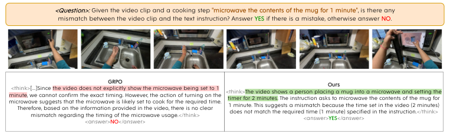

<!-- Start of picture text -->
<Question>:  Given the video clip and a cooking step  "microwave the contents of the mug for 1 minute" , is there any mismatch between the video clip and the text instruction? Answer  YES  if there is a mistake, otherwise answer  NO . microwave suggests that the microwave is likely set to cook for the required time. minute, <think>Therefore, based on the information provided in the video, there is no clear we cannot confirm the exact timing. However, the action of turning on the[...]Sincemismatch regarding the timing of the microwave usage. the video does not explicitly show the microwave being set to 1 <answer> GRPONO </answer> </think> <think> timer for 2 minutes. 1 minute. This suggests a mismatch because the time set in the video (2 minutes)does not match the required time (1 minute) specified in the instruction. The video shows a person placing a mug into a microwave and setting the  The instruction asks to microwave the contents of the mug for<answer> OursYES </answer> </think> <!-- End of picture text -->

Figure 4: **Qualitative example on the CC-VQA Unseen split.** We show a clip for the _spiced hot chocolate_ activity. The instruction specifies microwaving the milk for one minute, but the video shows the user setting the timer to two minutes. The standard GRPO baseline (left) misses this fine-grained visual cue and assumes the action is correct, whereas our method (right) grounds its reasoning in the visual evidence (detecting the press of the “2” button in the first frame) and correctly identifies the mistake. 

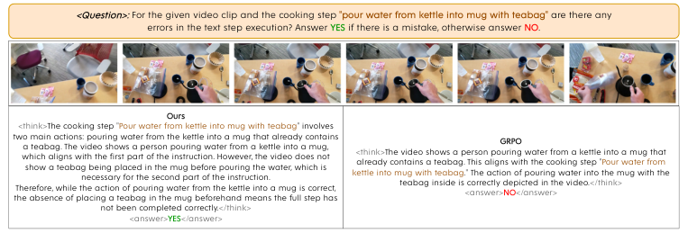

<!-- Start of picture text -->
<Question>:  For the given video clip and the cooking step  "pour water from kettle into mug with teabag"  are there any errors in the text step execution? Answer  YES  if there is a mistake, otherwise answer  NO . Ours <think>The cooking step "Pour water from kettle into mug with teabag" involves two main actions: pouring water from the kettle into a mug that already containsthe absence of placing a teabag in the mug beforehand means the full step hasTherefore, while the action of pouring water from the kettle into a mug is correct,which aligns with the first part of the instruction. However, the video does nota teabag. The video shows a person pouring water from a kettle into a mug,show a teabag being placed in the mug before pouring the water, which isnecessary for the second part of the instruction. kettle into mug with teabag<think>already contains a teabag. This aligns with the cooking step "The video shows a person pouring water from a kettle into a mug thatteabag inside is correctly depicted in the video.." The action of pouring water into the mug with the<answer> GRPONO </answer> </think>Pour water from not been completed correctly.</think> <answer> YES </answer> <!-- End of picture text -->

Figure 5: **Qualitative example on the EP-VQA Seen split.** The video shows the step _pour water from a kettle into a mug_ . The top mug contains a teabag, while the bottom one does not. The mistake arises from pouring water into the mug without the teabag. Our model (left) successfully identifies this subtle discrepancy, outperforming the standard GRPO (right). 

we also show results with an additional model. 

To place these results in a broader context and investigate how they compare to closedsource models, we tested the commercial GPT-4o-mini model on the unseen split of EP-VQA as well. We find that it outperforms the base Qwen2.5 model by 13 _._ 3 points in F1 score when using the same reasoning prompt. However, when we adapt the base model with our posttraining approach, the performance jumps to 48 _._ 0, which is by 19 _._ 0 points higher than the commercial model, showing the benefits of mistake-specific post-training. 

In general, we find that VLMs come with two main limitations for the MD-VQA task. First, there is a bias towards “no error". We believe that mistake-specific training strategies, such as our opposite reward, can help remedy this, as evidenced by the improved performance. Second, there is the issue of hallucinations. For example, in some cases the reasoning traces do not mention errors, yet the final answer is “mistake". While this is a limitation of LLM-based models as a whole, this could be mitigated with a consistency loss or reward. Overall, despite the consistent gains demonstrated by our approach over the baselines, the absolute performance on the proposed benchmark leaves plenty of room for improvement,

<!-- Page 13 -->

**13** 

_SPURIO ET AL.: POST-TRAINING VLMS FOR VIDEO MISTAKE DETECTION_ 

|_λ_|Seen (F1)|Unseen (F1)|
|---|---|---|
|0.0|51.3|43.0|
|0.1|53.0|45.7|
|0.2|**53.8**|**48.0**|
|0.3|44.9|43.3|

Table 4: **Effect of** _λ_ **.** We show the F1 for seen and unseen test splits on EP-VQA. 

|Method|Seen (F1) Unseen (F1)|
|---|---|
|w. acc.|**53.8** **48.0**|
|w/o acc.|50.3 43.6|

Table 5: **Ablating** _ri__opp_ **formulation.** We show the F1 for both test splits on EP-VQA. 

underscoring the inherent complexity of the task and highlighting that existing methods still require considerable improvement to address its challenges. 

### **5.2 Qualitative examples** 

Fig. 4 and Fig. 5 show two qualitative examples of our proposed approach. Fig. 4 depicts an example from the unseen CC-VQA test dataset with a fine-grained duration mismatch: the microwave timer is set to two minutes instead of the instructed one minute. By being trained to detect such precise visual discrepancies, our method successfully spots the "2" button being pressed, recognizes that the video does not match the step description, and accurately labels it as a mistake. In contrast, standard GRPO overlooks this subtle cue, incorrectly assuming the timing aligns with the text and failing to detect the mistake. In Fig. 5, the participant is instructed to pour water from the kettle into the mug containing the teabag (top-right mug), but instead pours it into the central mug without a teabag. Both GRPO and our method correctly detect that the first part of the step (“pour water from kettle”) is executed properly, but our approach additionally identifies that the second part (“into mug with teabag”) is violated. More qualitative examples can be found in the supplementary material. 

### **5.3 Ablations** 

**Effect of** _λ_ **.** We test the effect of varying _λ_ , the weight of our _opposite_ reward, in Tab. 4 for both seen and unseen test splits of the EP-VQA dataset. We find that a value of _λ_ = 0 _._ 2 yields the best performance on both splits. In general, using the opposite reward is always beneficial for generalizability to unseen actions. We fix _λ_ = 0 _._ 2 throughout our experiments. 

**Opposite reward formulation.** Our opposite reward formulation includes the accuracy gate ( **1** [ _ai_ = α]) that ensures it only provides a reward if the original question is correctly answered. We ablate this choice in Tab. 5, where we find that the accuracy gate improves performance by 3 _._ 5 F1 on the seen split and 4 _._ 4 F1 on the unseen split. Conceptually, if the predicted answer for the original question is wrong, enforcing this opposite reward will only confuse the model, which is why this term is beneficial.

<!-- Page 14 -->

**14** 

_SPURIO ET AL.: POST-TRAINING VLMS FOR VIDEO MISTAKE DETECTION_ 

**Post-training parameters.** We analyze the effect of the GRPO parameters _G_ (group size) and _β_ (KL-divergence weight) on the performance of our method. We show the results of these ablations in Tab. 6 and Tab. 7, respectively. We find that reducing the group size _G_ , which controls how many responses the model generates for advantage estimation, consistently degrades performance, with the F1 score on both splits dropping by more than 20 points for _G_ = 2. While increasing the group size beyond _G_ = 8 could potentially improve performance further, this comes at a higher computational cost, so we limit _G_ to 8 to reduce the overall computational burden of our method. 

For the KL-term weight _β_ , which prevents the policy model from deviating too far from the instruction-tuned model _πre f_ , we use a value of _β_ = 0 _._ 04. Reducing the value to _β_ = 0 _._ 02, which allows greater deviation from the reference policy, slightly worsens performance, whereas increasing the constraint on deviation with _β_ = 0 _._ 06 leads to a more substantial drop in performance. Therefore, we follow common protocol (e.g., [7]) and fix _β_ = 0 _._ 04. 

|_G_ |Seen (F1) |Unseen (F1) |_β_|Seen (F1)|Unseen (F1)|
|---|---|---|---|---|---|
|2|327|222||||
|4|. 374|. 392|0.02|51.2|42.0|
|6|. 421|. 416|0.04|**53.8**|**48.0**|
|8|. **53.8**|. **48.0**|0.06|45.0|41.4|

Table 6: **Effect of group size** _G_ **.** We show the F1 for seen and unseen test splits on EP-VQA. 

Table 7: **Effect of the KL-term weight.** We show the F1 for seen and unseen test splits on EP-VQA. 

**Limitations** The clip-level descriptions in CC-VQA and EP-VQA do not always capture the broader procedural context. Consequently, mistakes that depend on earlier or later steps may be ambiguous or impossible to identify from an isolated video–text pair. Incorporating longer temporal context would enable the evaluation of such dependencies. Moreover, although our unseen splits contain held-out activities, they originate from the same datasets and domains as the training data. Generalization to substantially different procedures, recording conditions, and mistake types remains to be established. 

## **6 Conclusion** 

In this work, we introduced the MD-VQA protocol and benchmark for stepwise mistake detection in videos. MD-VQA is specifically designed to assess the generalizability of methods to both seen and unseen steps, reflecting real-world scenarios. To address this task, we proposed the first VLM post-training method for video mistake detection. By designing a custom reward function, our method enables VLMs to successfully attend to subtle execution details that current models overlook. We demonstrated that our approach achieves state-ofthe-art performance against zero-shot, fine-tuning, and post-training baselines on MD-VQA, especially for steps never observed during training. These findings highlight the potential of our approach, and we hope our protocol will encourage future research in this important field.

<!-- Page 15 -->

**15** 

_SPURIO ET AL.: POST-TRAINING VLMS FOR VIDEO MISTAKE DETECTION_ 

## **Acknowledgments** 

The work has been supported by the ERC Consolidator Grant FORHUE (101044724) and the Federal Ministry of Research, Technology and Space (BMFTR) under grant no. 01IS22094A WEST-AI. For the computations involved in this research, we acknowledge EuroHPC Joint Undertaking for awarding us access to Leonardo at CINECA, Italy, through EuroHPC Regular Access Call - proposal No. EHPC-REG-2025R01-218. 

## **References** 

- [1] Josh Achiam, Steven Adler, Sandhini Agarwal, Lama Ahmad, Ilge Akkaya, Florencia Leoni Aleman, Diogo Almeida, Janko Altenschmidt, Sam Altman, Shyamal Anadkat, et al. Gpt-4 technical report. _arXiv preprint arXiv:2303.08774_ , 2023. 

- [2] Shuai Bai, Keqin Chen, Xuejing Liu, Jialin Wang, Wenbin Ge, Sibo Song, Kai Dang, Peng Wang, Shijie Wang, Jun Tang, et al. Qwen2.5-vl technical report. _arXiv preprint arXiv:2502.13923_ , 2025. 

- [3] Guodong Ding, Fadime Sener, Shugao Ma, and Angela Yao. Spatial and temporal beliefs for mistake detection in assembly tasks. _Computer Vision and Image Understanding (CVIU)_ , 2025. 

- [4] Enea Duka, Anna Kukleva, and Bernt Schiele. Leveraging self-supervised training for unintentional action recognition. In _European Conference on Computer Vision (ECCV) Workshop_ , 2022. 

- [5] Dave Epstein and Carl Vondrick. Learning goals from failure. In _IEEE Conference on Computer Vision and Pattern Recognition (CVPR)_ , 2021. 

- [6] Dave Epstein, Boyuan Chen, and Carl Vondrick. Oops! predicting unintentional action in video. In _IEEE Conference on Computer Vision and Pattern Recognition (CVPR)_ , 2020. 

- [7] Kaituo Feng, Kaixiong Gong, Bohao Li, Zonghao Guo, Yibing Wang, Tianshuo Peng, Junfei Wu, Xiaoying Zhang, Benyou Wang, and Xiangyu Yue. Video-r1: Reinforcing video reasoning in mllms. _NeurIPS 2025_ , 2025. 

- [8] Alessandro Flaborea, Guido Maria D’Amely di Melendugno, Leonardo Plini, Luca Scofano, Edoardo De Matteis, Antonino Furnari, Giovanni Maria Farinella, and Fabio Galasso. Prego: Online mistake detection in procedural egocentric videos. In _IEEE Conference on Computer Vision and Pattern Recognition (CVPR)_ , 2024. 

- [9] Dong Gong, Lingqiao Liu, Vuong Le, Budhaditya Saha, Moussa Reda Mansour, Svetha Venkatesh, and Anton van den Hengel. Memorizing normality to detect anomaly: Memory-augmented deep autoencoder for unsupervised anomaly detection. In _IEEE International Conference on Computer Vision (ICCV)_ , 2019. 

- [10] Daya Guo, Dejian Yang, Haowei Zhang, Junxiao Song, Ruoyu Zhang, Runxin Xu, Qihao Zhu, Shirong Ma, Peiyi Wang, Xiao Bi, et al. Deepseek-r1: Incentivizing reasoning capability in llms via reinforcement learning. _arXiv preprint arXiv:2501.12948_ , 2025.

<!-- Page 16 -->

**16** 

_SPURIO ET AL.: POST-TRAINING VLMS FOR VIDEO MISTAKE DETECTION_ 

- [11] Wenliang Guo, Yujiang Pu, and Yu Kong. Procedural mistake detection via action effect modeling. _International Conference on Learning Representations (ICLR)_ , 2026. 

- [12] Wei-Jin Huang, Yuan-Ming Li, Zhi-Wei Xia, Yu-Ming Tang, Kun-Yu Lin, Jian-Fang Hu, and Wei-Shi Zheng. Modeling multiple normal action representations for error detection in procedural tasks. In _Proceedings of the Computer Vision and Pattern Recognition Conference (CVPR)_ , 2025. 

- [13] Shih-Po Lee and Ehsan Elhamifar. Error recognition in procedural videos using generalized task graph. In _Proceedings of the IEEE/CVF International Conference on Computer Vision (ICCV)_ , October 2025. 

- [14] Shih-Po Lee, Zijia Lu, Zekun Zhang, Minh Hoai, and Ehsan Elhamifar. Error detection in egocentric procedural task videos. In _Proceedings of the IEEE/CVF Conference on Computer Vision and Pattern Recognition (CVPR)_ , 2024. 

- [15] Xinhao Li, Ziang Yan, Desen Meng, Lu Dong, Xiangyu Zeng, Yinan He, Yali Wang, Yu Qiao, Yi Wang, and Limin Wang. Videochat-r1: Enhancing spatio-temporal perception via reinforcement fine-tuning. _arXiv preprint arXiv:2504.06958_ , 2025. 

- [16] Shuming Liu, Mingchen Zhuge, Changsheng Zhao, Jun Chen, Lemeng Wu, Zechun Liu, Chenchen Zhu, Zhipeng Cai, Chong Zhou, Haozhe Liu, et al. Videoauto-r1: Video auto reasoning via thinking once, answering twice. _CVPR_ , 2026. 

- [17] Wen Liu, Weixin Luo, Dongze Lian, and Shenghua Gao. Future frame prediction for anomaly detection–a new baseline. In _IEEE Conference on Computer Vision and Pattern Recognition (CVPR)_ , 2018. 

- [18] Michele Mazzamuto, Antonino Furnari, and Giovanni Maria Farinella. Eyes wide unshut: Unsupervised mistake detection in egocentric procedural video by detecting unpredictable gaze. _IEEE Conference on Computer Vision and Pattern Recognition (CVPR)_ , 2025. 

- [19] Hyunjong Park, Jongyoun Noh, and Bumsub Ham. Learning memory-guided normality for anomaly detection. In _IEEE Conference on Computer Vision and Pattern Recognition (CVPR)_ , 2020. 

- [20] Jinyoung Park, Jeehye Na, Jinyoung Kim, and Hyunwoo J Kim. Deepvideo-r1: Video reinforcement fine-tuning via difficulty-aware regressive grpo. In _NeurIPS_ , 2025. 

- [21] Constantin Patsch, Yuankai Wu, Marsil Zakour, Driton Salihu, and Eckehard Steinbach. Mistsense: Versatile online detection of procedural and execution mistakes. In _2025 International Conference on Computer Vision (ICCV 2025)_ , 2025. 

- [22] Rohith Peddi, Shivvrat Arya, Bharath Challa, Likhitha Pallapothula, Akshay Vyas, Bhavya Gouripeddi, Qifan Zhang, Jikai Wang, Vasundhara Komaragiri, Eric Ragan, et al. Captaincook4d: A dataset for understanding errors in procedural activities. _Advances in Neural Information Processing Systems_ , 37, 2024. 

- [23] Baoqi Pei, Yifei Huang, Jilan Xu, Yuping He, Guo Chen, Fei Wu, Jiangmiao Pang, and Yu Qiao. Egothinker: Unveiling egocentric reasoning with spatio-temporal cot. In _NeurIPS_ , 2025.

<!-- Page 17 -->

**17** 

_SPURIO ET AL.: POST-TRAINING VLMS FOR VIDEO MISTAKE DETECTION_ 

- [24] M. Sabokrou, Mohsen Fayyaz, Mahmood Fathy, and Reinhard Klette. Deep-cascade: Cascading 3d deep neural networks for fast anomaly detection and localization in crowded scenes. _IEEE Transactions on Image Processing (TIP)_ , 2017. 

- [25] John Schulman, Filip Wolski, Prafulla Dhariwal, Alec Radford, and Oleg Klimov. Proximal policy optimization algorithms. _arXiv preprint arXiv:1707.06347_ , 2017. 

- [26] Luigi Seminara, Giovanni Maria Farinella, and Antonino Furnari. Differentiable task graph learning: Procedural activity representation and online mistake detection from egocentric videos. In _The Thirty-eighth Annual Conference on Neural Information Processing Systems (NeurIPS)_ , 2024. 

- [27] Zhihong Shao, Peiyi Wang, Qihao Zhu, Runxin Xu, Junxiao Song, Xiao Bi, Haowei Zhang, Mingchuan Zhang, YK Li, Yang Wu, et al. Deepseekmath: Pushing the limits of mathematical reasoning in open language models. _arXiv preprint arXiv:2402.03300_ , 2024. 

- [28] James W Suliburk, Quentin M Buck, Chris J Pirko, Nader N Massarweh, Neal R Barshes, Hardeep Singh, and Todd K Rosengart. Analysis of human performance deficiencies associated with surgical adverse events. _JAMA network open_ , 2(7), 2019. 

- [29] Waqas Sultani, C. Chen, and Mubarak Shah. Real-world anomaly detection in surveillance videos. In _IEEE Conference on Computer Vision and Pattern Recognition (CVPR)_ , 2018. 

- [30] Yu Tian, Guansong Pang, Yuanhong Chen, Rajvinder Singh, Johan W. Verjans, and Gustavo Carneiro. Weakly-supervised video anomaly detection with robust temporal feature magnitude learning. In _IEEE International Conference on Computer Vision (ICCV)_ , 2021. 

- [31] Xin Wang, Taein Kwon, Mahdi Rad, Bowen Pan, Ishani Chakraborty, Sean Andrist, Dan Bohus, Ashley Feniello, Bugra Tekin, Felipe Vieira Frujeri, Neel Joshi, and Marc Pollefeys. Holoassist: an egocentric human interaction dataset for interactive ai assistants in the real world. In _IEEE International Conference on Computer Vision (ICCV)_ , 2023. 

- [32] Peng Wu, Jing Liu, Yujiao Shi, Yujia Sun, Fang Shao, Zhaoyang Wu, and Zhiwei Yang. Not only look, but also listen: Learning multimodal violence detection under weak supervision. In _European Conference on Computer Vision (ECCV)_ , 2020. 

- [33] Zihui Xue, Mi Luo, and Kristen Grauman. Seeing the arrow of time in large multimodal models. _NeurIPS 2025_ , 2025. 

- [34] Olga Zatsarynna, Yazan Abu Farha, and Juergen Gall. Self-supervised learning for unintentional action prediction. In _DAGM German Conference on Pattern Recognition (GCPR)_ , 2022.

<!-- Page 18 -->

**18** 

_SPURIO ET AL.: POST-TRAINING VLMS FOR VIDEO MISTAKE DETECTION_ 

## **A Implementation details** 

To ensure a fair comparison with the baselines, we adopt the same training hyperparameters across all methods whenever possible. We train for 800 and 802 iterations on EP-VQA and CC-VQA, respectively. Training is conducted with a batch size of 4 on 4 NVIDIA H100 GPUs. For the frame resolution and sampling strategy, we follow [7]. Moreover, we perform upsampling of mistake instances during training, with upsampling factors of 13 and 3 for the EP-VQA and CC-VQA datasets, respectively. Without this balancing, the approaches become highly biased toward classifying video–text pairs as matching, with models trained on EP-VQA collapsing to always predict normal examples. 

**GRPO.** We use the same hyperparameters as in our proposed post-training approach, but do not apply the proposed opposite reward. Instead, the model is trained using only the accuracy and format rewards. All other hyperparameters are identical to those used in our method. We utilize the reasoning prompt during both training and evaluation. 

**SFT and SFTe.** Since SFT and SFTe are trained using the standard CE loss (with YES/NO answers and YES/NO + explanation), GRPO-specific parameters do not apply, while the remaining hyperparameters are kept fixed. During training, we use the base prompt for these methods, whereas testing is performed either with the base prompt (SFT and SFTe) or with the reasoning prompt (SFT + _R_ ). 

## **B Additional Results** 

**Post-training metrics on EP-VQA.** In Fig. 6, we demonstrate how the individual reward terms and the completion length of our proposed approach evolve during training. As can be seen, all reward components used in our method, namely the format, accuracy, and opposite rewards, consistently increase throughout the training process, indicating that the policy model learns to produce answers that satisfy the given reward criteria. 

The format reward reaches its highest value very early in training, showing the inherent ability of Qwen2.5-VL to follow the required output format. In contrast, the accuracy and opposite rewards improve gradually. We observe that the opposite reward remains lower than the accuracy reward for most training steps, showing that computing the opposite reward presents a more challenging task than the standard accuracy reward, providing an additional informative training signal during fine-tuning. For the total reward computation, the opposite reward is incorporated with a weighting factor of _λ_ = 0 _._ 2, as described in the main paper. 

We also show the change in completion length throughout training. While there are some fluctuations at the beginning, toward the end of the training stage the completion length converges to an average of 125 tokens, which approximately corresponds to 90 to 100 words. 

**Per-Error results on EP-VQA.** Similar to CC-VQA, we report per-error recall for the EP-VQA dataset in Tab. 8. The unseen split does not contain errors for the “Measurement” class, leading to empty entries in the corresponding column. Also here, our post-training method achieves the highest recall for nearly all cases. On the seen split, our method performs better than or on par with other baselines across all different mistake types. On the unseen split, our approach achieves a slightly lower recall than GRPO on the “Slip” error,

<!-- Page 19 -->

**19** 

_SPURIO ET AL.: POST-TRAINING VLMS FOR VIDEO MISTAKE DETECTION_ 

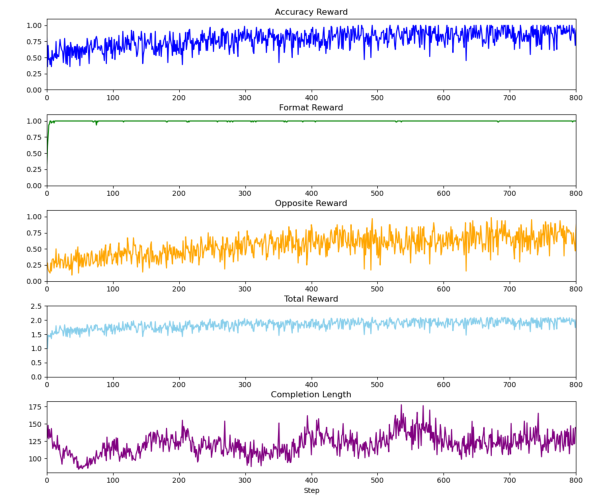

Figure 6: **Training metrics of our proposed post-training approach on EP-VQA.** 

but shows significantly higher recall for the “Utensil Error”, with an improvement of +12.5 percentage point. We observe, however, that all methods struggle with unseen “Technique” error instances. This highlights the difficulty of learning a general notion of mistakes that can be effectively generalized to steps unseen during training. 

|**Method**|_Techn_|_ique(55)_|_Sli_|_p (49)_|_Utens_|_il(141)_|_Measu_|_rement(25)_|
|---|---|---|---|---|---|---|---|---|
||**S**(8)|**U**(12)|**S**(7)|**U**(24)|**S**(34)|**U**(24)|**S**(5)|**U**(0)|
|ZS|0.0|0.0|0.0|0.0|0.0|0.0|0.0|-|
|ZS +_R_|**50.0**|0.0|14.3|4.2|69.7|50.0|**80.0**|-|
|SFT|0.0|0.0|0.0|0.0|2.9|8.3|0.0|-|
|SFT +_R_|12.5|0.0|14.3|0.0|23.5|16.7|60.0|-|
|SFTe|0.0|0.0|0.0|0.0|5.9|0.0|0.0|-|
|GRPO|37.5|0.0|**57.1**|**95.8**|88.2|70.8|60.0|-|
|**Ours**|**50.0**|0.0|**57.1**|91.7|**91.2**|**83.3**|**80.0**|-|

Table 8: **Per-Error Recall for EP-VQA seen and unseen test splits.** We show the number of samples for each mistake type in parentheses for seen (S) and unseen (U) splits. The number of training error samples is shown next to the name of the corresponding mistake category. Since the unseen split does not contain measurement mistakes, we report “–” for those entries. Our method consistently scores among the best methods in mistake recall for both seen and unseen instructions.

<!-- Page 20 -->

**20** 

_SPURIO ET AL.: POST-TRAINING VLMS FOR VIDEO MISTAKE DETECTION_ 

## **C Question and Prompt Templates** 

### **C.1 Question Templates** 

As discussed in the main paper, during training, we diversify the prompts to avoid overfitting to a specific wording or question format. In particular, during training, we employ the following question formulations. 

#### For **EP-VQA** : 

- For the given video and an instruction text ‘<TEXT>’, does the video show any mistakes being made while performing the step? The following mistake types are possible: Technique error, Slip error, Utensil error and Measurement error. 

- Given the video clip and a cooking step ‘<TEXT>’, are there any errors being made while performing the step? The following mistake types are possible: Technique error, Slip error, Utensil error and Measurement error. 

- Given the video clip and a cooking step ‘<TEXT>’, is there any mismatch between the video clip and the text instruction? The following mistake types are possible: Technique error, Slip error, Utensil error and Measurement error. 

- For the given video clip and the cooking step ‘<TEXT>’, are there any errors in the text step execution? The following mistake types are possible: Technique error, Slip error, Utensil error and Measurement error. 

#### For **CC-VQA** : 

- For the given video and an instruction text ‘<TEXT>’, does the video show any mistakes being made while performing the step? The following mistake types are possible: Technique error, Preparation error, Timing error, Temperature error and Measurement error. 

- Given the video clip and a cooking step ‘<TEXT>’, are there any errors being made while performing the step? The following mistake types are possible: Technique error, Preparation error, Timing error, Temperature error and Measurement error. 

- Given the video clip and a cooking step ‘<TEXT>’, is there any mismatch between the video clip and the text instruction? The following mistake types are possible:

<!-- Page 21 -->

**21** 

_SPURIO ET AL.: POST-TRAINING VLMS FOR VIDEO MISTAKE DETECTION_ 

Technique error, Preparation error, Timing error, Temperature error and Measurement error. 

- For the given video clip and the cooking step ‘<TEXT>’, are there any errors in the text step execution? The following mistake types are possible: Technique error, Preparation error, Timing error, Temperature error and Measurement error. 

During evaluation, we rely on a single fixed question formulation. 

#### For **EP-VQA** : 

- Given the video clip and a cooking step ‘<TEXT>’, is there any mismatch between the video clip and the text instruction? The following mistake types are possible: Technique error, Slip error, Utensil error and Measurement error. 

#### For **CC-VQA** : 

- Given the video clip and a cooking step ‘<TEXT>’, is there any mismatch between the video clip and the text instruction? The following mistake types are possible: Technique error, Preparation error, Timing error, Temperature error and Measurement error. 

In these prompts, ‘<TEXT>’ is replaced with the textual description of the correct execution of the step. 

### **C.2 Prompt Templates** 

For the task of MD-VQA, the questions, as described above, are concatenated together with one of the two types of prompts. The **base prompt** , which does not enforce explicit reasoning, is used for the Zero-Shot (ZS), Supervised Fine-Tuning (SFT) (without reasoning), and Supervised Fine-Tuning with explanation (SFTe) baselines. The **reasoning prompt** , on the other hand, encourages the model to perform step-by-step reasoning, as in [27], and is used for the ZS+R, SFT+R, GRPO baselines and our proposed method. 

#### **Base prompt** 

"Answer YES if there is a mistake, otherwise answer NO.\nProvide your final answer between <answer> </answer> tags." 

#### **Reasoning Prompt** 

"Answer YES if there is a mistake, otherwise answer NO.\nPlease think about this question as if you were a human pondering deeply.\nEngage in an internal dialogue using

<!-- Page 22 -->

**22** 

_SPURIO ET AL.: POST-TRAINING VLMS FOR VIDEO MISTAKE DETECTION_ 

expressions such as ‘let me think’, ‘wait’, ‘Hmm’, ‘oh, I see’, ‘let’s break it down’, etc, or other natural language thought expressions.\nIt’s encouraged to include self-reflection or verification in the reasoning process.\nProvide your detailed reasoning between the <think> </think> tags, and then give your final answer between the <answer> </answer> tags." 

## **D Data Cleaning and Processing** 

### **D.1 Mapping EP-VQA** 

In the original EgoPER dataset [14], steps performed with mistakes do not include the corresponding _counter-descriptions_ that specify how the same steps should be executed correctly. To address this limitation, we manually create additional annotations that describe the correct execution of each mistake step. The full mapping between mistake steps and their corresponding correct-execution descriptions is provided in Tab. 9. In addition to that, some normal steps have an ambiguous description. We clarify the annotations for those steps, as shown in Tab. 10. 

### **D.2 CaptainCook4D Data Cleaning** 

The annotations of CaptainCook4D contain a number of inconsistencies and artifacts. To make sure the baselines and our model use clean data, we perform a number of cleaning steps. First, the original annotations are in the format “< _verb_ >- < _verb_ >(...)", for example, “ _cut-cut english muffin_ ", and we remove this duplication. Second, we correct the grammar wherever needed. ( _e.g_ . _Cut or tear 1 slices_ to _Cut or tear 1 slice_ ). Third, we make sure that clips labeled as a mistake actually contain one. For instance, for the description _Cut the English muffin into two pieces with a knife_ , it would not be a mistake to cut the muffin into two uneven pieces, because it is not specified in the instruction nor inherently wrong. In this case, we then specify _Cut the English muffin into two even pieces with a knife_ . For every mistake clip and description, we additionally provide _why_ there is a mistake to train SFTe and as a possible avenue for future works. For example, _Pour 2 eggs into the ramekin cup_ becomes _Pour 2 eggs into the ramekin cup instead of 1 egg_ . 

## **E Additional Qualitative Results** 

We present additional qualitative examples from both the seen and unseen splits of CC-VQA and EP-VQA. Fig. 7 shows an example from the EP-VQA seen test split, Fig. 8 from the CC-VQA seen test split, and Fig. 9 from the CC-VQA unseen test split. Fig. 7 depicts a case in which the participant places a tortilla on the table rather than on the cutting board as instructed. Although the cutting board is visible in the scene and the initial part of the instruction is executed correctly, our method accurately detects that the final placement does not satisfy the step specification. 

Fig. 8 illustrates a task where the goal is to cook the mushrooms until they are soft and brown, for an approximate duration of 3–5 minutes. As the time is approximate, the visual texture of the food is more important. Our method captures the change in color and

<!-- Page 23 -->

**23** 

_SPURIO ET AL.: POST-TRAINING VLMS FOR VIDEO MISTAKE DETECTION_ 

|**Original description of step with mistake**|**Correct execution of the step**|
|---|---|
|_Pinw_|_heels_|
|Drop tortilla on floor Place tortilla on table Slice using knife Fold tortilla Use spoon to scoop nut butter Use spoon to spread butter onto tortilla Clean spoon Use spoon to scoop jelly Use spoon to spreadjellyon nut butter|Place tortilla on cutting board Place tortilla on cutting board Slice using floss Roll tortilla Use knife to scoop nut butter Use knife to spread butter onto tortilla Clean knife Use knife to scoop jelly Use knife to spreadjellyon nut butter|
|_Ques_|_adilla_|
|Drop tortilla Place tortilla on table Fold tortilla into quarter-circle Place tortilla wedges into bowl Riptortilla byhands|Place tortilla on cutting board Place tortilla on cutting board Fold tortilla in half Place tortilla wedges on plate Slice usingknife|
| _T_ | _ea_ |
|Directly pour water to kettle|Measure 12 ounces of cold water|
|Pour water into another mug Stir using knife Add sugar to mug Droptea bag|Pour water from kettle into mug with teabag Stir using spoon Add honey to mug Place tea bagin mug|
| _Oat_ | _meal_ |
|Directly pour quick oats into bowl Add bananas to another empty bowl Pour sugar instead of honey Add water to a different bowl |Measure 4 Tablespoons of quick-cook oats Put bananas on oats Drizzle honey in bowl Pour water to the bowl with oats |
|Stir usingknife|Stir usingspoon|
| _Co_ i| _ffee_ |
|Hold cup of coffee with filter cone in front of you Squeeze paper filter into cone without folding Measure incorrect weight of coffee beans Pour water without circular motion Measure incorrect amount of water|Hold cup of coffee in front of you Place paper filter in dripper and spread it into cone Weigh 25 grams of coffee beans Slowly pour the rest of water in circular motion Measure 12 ounces of cold water|
|Pour too much water to overflow mug Tear paper filter Spill out coffee grounds Spill out coffee beans|Slowly pour the rest of water in circular motion Fold paper filter in half to create semi-circle Transfer grounds to filter cone Put coffee beans in coffee grinder|
|Grind coffee beans without enough time|Grind coffee for 20 seconds|

Table 9: **New annotations for EP-VQA.** The left column shows the original descriptions of the steps executed with mistakes; the right column contains the new annotations representing the correct execution of the corresponding step. 

|Original|Updated|
|---|---|
||Pinwheels|
|Spread butter onto tortilla Spreadjellyon nut butter|Use knife to spread butter onto tortilla Use knife to spreadjellyon nut butter|
||Quesadilla|
|Fold tortilla|Fold tortilla in half|
||Tea|
|Pour water into mug|Pour water into mugwith teabag|
||Oatmeal|
|Put bananas|Put bananas on oats|
|Pour water to bowl|Pour water to bowl with oats|

Table 10: **Updated annotations for ambiguous step descriptions on EP-VQA.**

<!-- Page 24 -->

**24** 

_SPURIO ET AL.: POST-TRAINING VLMS FOR VIDEO MISTAKE DETECTION_ 

consistency, even though it does not have access to the full duration of the process, whereas GRPO focuses excessively on the time duration. 

The final CC-VQA example, shown in Fig. 9, depicts the task of stirring the contents of a mug “well”. Although the term “well” can be ambiguous, both our method and GRPO correctly reason that stirring multiple times is sufficient to achieve a well-mixed result. However, even when the stirring is repeated multiple times in the video, GRPO fails to recognize it and consequently misclassifies the action as incorrect. 

<Question>: For the given video clip and the cooking step "place tortilla on cutting board" are there any errors in the text step execution? Answer YES if there is a mistake, otherwise answer NO . Ours The cooking step "place tortilla on cutting board" seems straightforward.place tortilla on cutting board" seems straightforward." seems straightforward. The video shows hands placing a tortilla on a red cutting board, which aligns with GRPO the instruction. However, the video also shows a tortilla being placed directly on <think>The instruction "place tortilla on cutting board" seems to be correctly the table without a cutting board, which might be considered a deviation from followed in the video. The person is seen placing a tortilla on a red cutting board, the step. Since the question asks for a decision based on the text step execution, which aligns with the step of preparing the tortilla for further actions like we should focus on whether the action matches the exact wording of the step. spreading Nutella or adding other ingredients. There doesn't appear to be any The step mentions placing the tortilla on a cutting board, but the video shows it on error in the text step execution based on the visual information provided.</think> a table. This discrepancy suggests that the action does not fully match the step, <answer> NO </answer> 

Ours <think>The cooking step "place tortilla on cutting board" seems straightforward.place tortilla on cutting board" seems straightforward." seems straightforward. The video shows hands placing a tortilla on a red cutting board, which aligns with the instruction. However, the video also shows a tortilla being placed directly on the table without a cutting board, which might be considered a deviation from the step. Since the question asks for a decision based on the text step execution, we should focus on whether the action matches the exact wording of the step. The step mentions placing the tortilla on a cutting board, but the video shows it on a table. This discrepancy suggests that the action does not fully match the step, even though the intent (placing a tortilla) is correct.</think> <answer> YES </answer> 

Figure 7: **EP-VQA test seen** split for the Pinwheels activity. The step requires placing the tortilla on a cutting board, but the participant places it directly on the table, leading to a mistake. 

<Question>: For the given video clip and the cooking step "cook for 3-5 minutes, stirring often, until mushrooms start to soften and brown" are there any errors in the text step execution? Answer YES if there is a mistake, otherwise answer NO . Ours The cooking step suggests that the mushrooms should be cooked until they start toare softening and browning as described in the cooking step. The cooking time of3-5 minutes seems appropriate based on the visible changes in the mushrooms'instruction to stir often. The mushrooms appear to be browning, indicating theyperson is stirring the mushrooms with a wooden spoon, which aligns with thesoftening, which matches the description in the cooking step. Therefore, thesoften and brown. In the video, the mushrooms are visibly browning andThe video shows a person cooking mushrooms in a pan on a stove. Theappearance. 5 minutes or that they have started to soften and brown based solely on the videobrown. Therefore, we cannot confirm that the mushrooms have been cooked for 3-instruction of "stirring often." However, the video does not provide information onperson is stirring the mushrooms with a wooden spatula, which aligns with the<think>the duration of cooking or whether the mushrooms have started to soften andThe video shows a person cooking mushrooms in a pan on a stove. The<answer>content. GRPOYES </think></answer> 

<think>The video shows a person cooking mushrooms in a pan on a stove. Theappearance. person is stirring the mushrooms with a wooden spoon, which aligns with thesoftening, which matches the description in the cooking step. Therefore, thesoften and brown. In the video, the mushrooms are visibly browning andThe video shows a person cooking mushrooms in a pan on a stove. Theappearance. instruction to stir often. The mushrooms appear to be browning, indicating theyperson is stirring the mushrooms with a wooden spoon, which aligns with thesoftening, which matches the description in the cooking step. Therefore, thesoften and brown. In the video, the mushrooms are visibly browning andThe video shows a person cooking mushrooms in a pan on a stove. Theappearance. are softening and browning as described in the cooking step. The cooking time of3-5 minutes seems appropriate based on the visible changes in the mushrooms'instruction to stir often. The mushrooms appear to be browning, indicating theyperson is stirring the mushrooms with a wooden spoon, which aligns with thesoftening, which matches the description in the cooking step. Therefore, thesoften and brown. In the video, the mushrooms are visibly browning andThe video shows a person cooking mushrooms in a pan on a stove. Theappearance. 3-5 minutes seems appropriate based on the visible changes in the mushrooms'instruction to stir often. The mushrooms appear to be browning, indicating theyperson is stirring the mushrooms with a wooden spoon, which aligns with thesoftening, which matches the description in the cooking step. Therefore, thesoften and brown. In the video, the mushrooms are visibly browning andThe video shows a person cooking mushrooms in a pan on a stove. Theappearance. appearance. The cooking step suggests that the mushrooms should be cooked until they start toare softening and browning as described in the cooking step. The cooking time of3-5 minutes seems appropriate based on the visible changes in the mushrooms'instruction to stir often. The mushrooms appear to be browning, indicating theyperson is stirring the mushrooms with a wooden spoon, which aligns with thesoftening, which matches the description in the cooking step. Therefore, thesoften and brown. In the video, the mushrooms are visibly browning andThe video shows a person cooking mushrooms in a pan on a stove. Theappearance. soften and brown. In the video, the mushrooms are visibly browning andThe video shows a person cooking mushrooms in a pan on a stove. Theappearance. softening, which matches the description in the cooking step. Therefore, thesoften and brown. In the video, the mushrooms are visibly browning andThe video shows a person cooking mushrooms in a pan on a stove. Theappearance. cooking step appears to be correctly executed according to the video.</think> <answer> NO </answer> 

Figure 8: **CC-VQA test seen** split. The step requires the participant to cook the mushrooms for a duration of 3–5 minutes, with the goal of softening and browning them. Standard GRPO focuses too heavily on the exact cooking time rather than the actual objective, whereas our method captures the intended outcome. 

## **F Further ablations** 

### **F.1 Results with newer model** 

To show that our method also works with a newer model, we evaluate Qwen3-VL-8B-Instruct on EP-VQA in Table 11. The results show that Qwen3 is a stronger

<!-- Page 25 -->

**25** 

_SPURIO ET AL.: POST-TRAINING VLMS FOR VIDEO MISTAKE DETECTION_ 

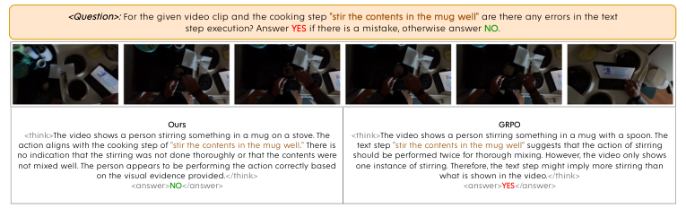

<!-- Start of picture text -->
<Question>:  For the given video clip and the cooking step  "stir the contents in the mug well"  are there any errors in the text step execution? Answer  YES  if there is a mistake, otherwise answer  NO . Ours GRPO <think>The video shows a person stirring something in a mug on a stove. The <think>The video shows a person stirring something in a mug with a spoon. The action aligns with the cooking step of "stir the contents in the mug well." There is text step "stir the contents in the mug well" suggests that the action of stirring no indication that the stirring was not done thoroughly or that the contents were should be performed twice for thorough mixing. However, the video only shows not mixed well. The person appears to be performing the action correctly based one instance of stirring. Therefore, the text step might imply more stirring than on the visual evidence provided.</think> what is shown in the video.</think> <answer> NO </answer> <answer> YES </answer> <!-- End of picture text -->

Figure 9: **CC-VQA test unseen** split. The video shows the participant stirring the contents of the mug multiple times, indicating a correct execution of the step “stir the contents in the mug well”. However, standard GRPO misclassifies the action as a mistake, failing to account for the multiple stirrings performed. 

||||**EP-**|**VQA**|||
|---|---|---|---|---|---|---|
|**Method**||**Seen**|||**Unseen**||
||_Rec_|_Prec_|**_F1_**|_Rec_|_Prec_|**_F1_**|
|ZS|11.1|17.6|13.6|16.7|45.5|24.4|
|ZS + R|68.5|21.8|33.0|48.3|36.7|41.7|
|GRPO|**81.5**|**25.6**|**38.9**|66.7|34.5|45.5|
|**Ours**|79.2|23.3|36.1|**71.7**|**41.3**|**52.4**|

Table 11: **Results with Qwen3 on EP-VQA.** Our method also works with a more recent model. 

zero-shot baseline than Qwen2.5, both with and without reasoning. However, the task remains challenging, and our method improves over the two Qwen3 baselines, suggesting that the proposed training strategy is still useful even when starting from a more recent backbone. Compared to standard GRPO, our method slightly underperforms on the seen split, but again achieves a large improvement on the unseen split. 

### **F.2 Comparison to non-VLM methods** 

As the mistakes and tasks in the test data are not the same as in the training data, we can not compare our approach to task-specific error detection models, as these can not handle the open-set scenario. The only other feasible class of models that can be evaluated zero-shot in this setting are contrastive CLIP-style models. We evaluate CLIP (ViT large patch14, 0.4B parameters) by comparing the text-video similarity of “a person correctly performing the cooking step: <description>" to that of “a person incorrectly performing the cooking step: <description>" and selecting the highest one. 

In Tab. 12, we compare CLIP on EP-VQA to our approach. Our method outperforms CLIP by a large margin, indicating that the reasoning capabilities of the VLM are crucial for the complex task of detecting subtle mistakes, thereby also justifying the use of large-scale models.

<!-- Page 26 -->

**26** 

_SPURIO ET AL.: POST-TRAINING VLMS FOR VIDEO MISTAKE DETECTION_ 

||||**EP-V**|**QA**|||
|---|---|---|---|---|---|---|
|**Method**||**Seen**|||**Unseen**||
||_Rec_|_Prec_|**_F1_**|_Rec_|_Prec_|**_F1_**|
|CLIP|46.3|11.6|18.6|8.3|9.8|9.0|
|**Ours**|**79.6**|**40.6**|**53.8**|**70.0**|**36.5**|**48.0**|

Table 12: **Comparison to CLIP model on EP-VQA.** Our method greatly outperforms CLIP, indicating that reasoning capabilities are necessary for strong performance. 

||||**EP-**|**VQA**|||
|---|---|---|---|---|---|---|
|**Method**||**Seen**||**U**|**nseen**||
||_Rec_|_Prec_|**_F1_**|_Rec_|_Prec_|**_F1_**|
|GRPO + Opp w/o CoT|100.0|8.3|15.3|100.0|10.1|18.4|
|GRPO + CoT w/o Opp|74.1|39.2|51.3|66.7|31.7|43.0|
|GRPO w/o CoT & Opp|77.8|29.8|43.1|68.3|36.0|47.1|
|**Ours**|79.6|40.6|53.8|70.0|36.5|48.0|

Table 13: **Additional experiments on EP-VQA.** 

### **F.3 Disentangling contributions** 

We perform an additional ablation study to isolate the benefits of chain-of-thought (CoT) and the opposite reward for GRPO post-training. As shown in Table 13, GRPO + Opposite Reward without CoT predicts a mistake for almost all samples, shown by the 100% recall for the error class with very low precision. As such, CoT plays an important role in preventing degenerate solutions when using the Opposite Reward. Furthermore, using CoT with GRPO but without the opposite reward underperforms our proposed method. This shows that the gains come from the mistake-specific supervision rather than the reinforcement learning itself. Finally, excluding both CoT and the opposite reward similarly underperforms. Overall, both CoT and Opposite Reward are essential to perform well on both seen and unseen instructions. 

### **F.4 Importance of textual context** 

We investigate whether conditioning mistake detection on the textual description of the correct step is necessary for our proposed protocol, or whether providing only visual information is sufficient for models to determine the correctness of a given video clip. To this end, we evaluate the (ZS + _R_ ) baseline without providing the textual description of the correct step and only ask whether the video contains a mistake. 

As shown in Tab. 14, the step descriptions are necessary for accurate mistake detection. In many cases, the mistake is defined as a deviation from the instruction, for example, using an incorrect amount of an ingredient, rather than an action that is inherently wrong in all situations. Therefore, without the reference point provided by the correct instructional step description, mistake detection is often ill-defined and cannot be addressed effectively.

<!-- Page 27 -->

**27** 

_SPURIO ET AL.: POST-TRAINING VLMS FOR VIDEO MISTAKE DETECTION_ 

|||**Seen**|||**Unseen**||
|---|---|---|---|---|---|---|
|**Method**|_Prec_|_Rec_|**_F1_**|_Prec_|_Rec_|**_F1_**|
|ZS +_R_w. instr|**12.5**|**60.4**|**20.7**|**12.3**|**21.7**|**15.7**|
|ZS +_R_w/o instr|5.3|7.7|6.3|9.3|6.8|7.8|

Table 14: **Ablating instruction-aware mistake detection.** We analyze the effect of removing textual step instructions on performance for seen and unseen test splits on EP-VQA using (ZS+ _R_ ) baseline. Detecting mistakes without context is ill-defined.
