# ProAct A Benchmark and Multimodal Framework for Structure-Aware Proactive Response

[Original PDF](../ProAct%20A%20Benchmark%20and%20Multimodal%20Framework%20for%20Structure-Aware%20Proactive%20Response.pdf)

Pages: 28

> Automatically converted from PDF. Check the original for exact equations, symbols, table alignment, and figure details.

<!-- Page 1 -->

# **ProAct:** 

# **A Benchmark and Multimodal Framework for Structure-Aware Proactive Response** 

**Xiaomeng Zhu**1 2 **Fengming Zhu**1 **Weijie Zhou**2 **Ye Tian**2 **Zhenlin Hu**3 **Yufei Huang**2 **Yuchun Guo**2 **Xinyu Wu**4 **Zhengyou Zhang**2 **Fangzhen Lin**1 **Xuantang Xiong**2 

## **Abstract** 

While passive agents merely follow instructions, proactive agents align with higher-level objectives, such as assistance and safety by continuously monitoring the environment to determine when and how to act. However, developing proactive agents is hindered by the lack of specialized resources. To address this, we introduce **ProAct-75** , a benchmark designed to train and evaluate proactive agents across diverse domains, including assistance, maintenance, and safety monitoring. Spanning 75 tasks, our dataset features 91,581 step-level annotations enriched with explicit task graphs. These graphs encode step dependencies and parallel execution possibilities, providing the structural grounding necessary for complex decision-making. Building on this benchmark, we propose **ProAct-Helper** , a reference baseline powered by a Multimodal Large Language Model (MLLM) that grounds decision-making in state detection, and leveraging task graphs to enable entropy-driven heuristic search for action selection, allowing agents to execute parallel threads independently rather than mirroring the human’s next step. Extensive experiments demonstrate that ProAct-Helper outperforms strong closed-source models, improving trigger detection mF1 by 6.21%, saving 0.25 more steps in online one-step decision, and increasing the rate of parallel actions by 15.58%. Code is available at https://github.com/ ZhuXMMM/ProAct.git 

1Department of Computer Science and Engineering, The Hong Kong University of Science and Technology (HKUST), Hong Kong SAR, China2 Tencent, Shenzhen, China3 Futian Laboratory, Shenzhen, China4 Shenzhen Institute of Advanced Technology (SIAT), Chinese Academy of Sciences, Shenzhen, China. Correspondence to: Fangzhen Lin <flin@cse.ust.hk>, Xuantang Xiong <sheltxiong@tencent.com>. 

_Proceedings of the 43__rd_ _International Conference on Machine Learning_ , Seoul, South Korea. PMLR 306, 2026. Copyright 2026 by the author(s). 

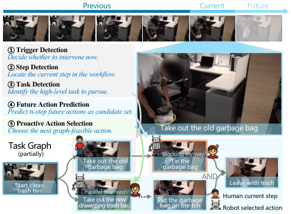

<!-- Start of picture text -->
Previous Current Future ① Trigger Detection Decide whether to intervene now. ② Step Detection Locate the current step in the workflow. ③ Task Detection Identify the high-level task to pursue. ④ Future Action Prediction Predict  0 -step future actions as candidate set. ⑤ Proactive Action Selection Choose the next graph-feasible action. Take out the old garbage bag Task Graph (partially) Blocking my way? Take out the old  Tie the garbage bag garbage bag AND Start clean  Leave with trash trash bin Take out the new Parallel teamwork! … Put the garbage  Human current step drawstring trash bag bag on the bin Robot selected action <!-- End of picture text -->

_Figure 1._ **Overview of proactive response tasks.** ProAct-75 supports five vision-based tasks with step-level annotations, hierarchical labels, and task graphs. Traditional intent-following approaches predict human-intended actions ( _e.g_ ., tie the bag) and execute them, inadvertently blocking workflows. Our benchmark enables evaluation of strategies where robots pursue independent parallel threads to reduce disruptions. 

## **1. Introduction** 

Unlike passive agents that respond to explicit instructions, proactive agents take initiative toward higher-level objectives by continuously observing the environment, and autonomously selecting actions (Wooldridge & Jennings, 1995; Li et al., 2023; van Den Broek & Moeslund, 2024). For instance, a robot may replace a trash bag before it overflows in a human-absent scenario, or proactively prepare a new bag while observing a human remove a full one in a collaborative scenario. However, most existing robotic systems still rely on passive instructions, imposing cognitive load and limiting the robot’s autonomous operation (Johannsmeier & Haddadin, 2016; Camilleri et al., 2022; Noormohammadi-Asl et al., 2025). In this work, we study proactive response for robot agents in settings of human-absent autonomy and human-robot collaboration, where agents must continuously monitor video observations to determine when to intervene and what action to take. 

Training such proactive agents requires a robust ability of 

1

<!-- Page 2 -->

**ProAct: A Benchmark and Multimodal Framework for Structure-Aware Proactive Response** 

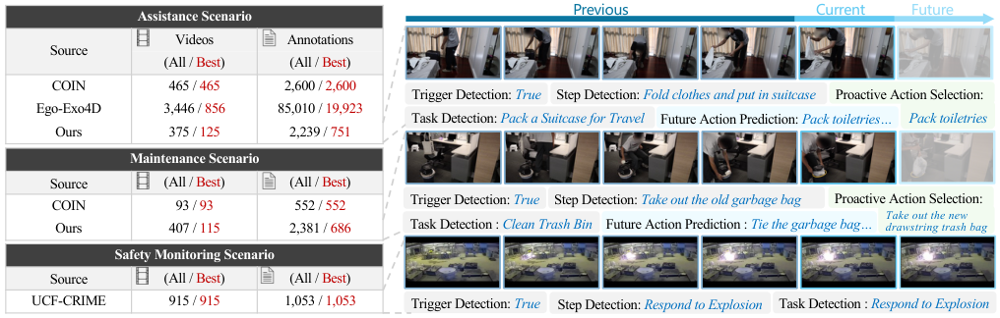

<!-- Start of picture text -->
Previous Current Future Assistance Scenario Videos Annotations Source (All / Best) (All / Best) COIN 465 / 465 2,600 / 2,600 Trigger Detection:  True Step Detection:  Fold clothes and put in suitcase Proactive Action Selection: Ego-Exo4D 3,446 / 856 85,010 / 19,923 Task Detection:  Pack a Suitcase for Travel Future Action Prediction:  Pack toiletries… Pack toiletries Ours 375 / 125 2,239 / 751 Maintenance Scenario Source (All / Best) (All / Best) COIN 93 / 93 552 / 552 Trigger Detection:  True Step Detection:  Take out the old garbage bag Proactive Action Selection: Take out the new Ours 407 / 115 2,381 / 686 Task Detection :  Clean Trash Bin Future Action Prediction :  Tie the garbage bag… drawstring trash bag Safety Monitoring Scenario Source (All / Best) (All / Best) UCF-CRIME 915 / 915 1,053 / 1,053 Trigger Detection:  True Step Detection:  Respond to Explosion Task Detection :  Respond to Explosion <!-- End of picture text -->

_Figure 2._ **Qualitative examples of ProAct-75 across three application scenarios.** We visualize the previous-current-future observation window and structured annotations for our proactive visual response tasks. Assistance and Maintenance examples are from self-collected exocentric videos. Safety examples are from UCF-Crime. Safety videos omit future action prediction and proactive action selection due to the absence of human-robot collaboration. 

perception across diverse scenarios (Triantafyllidis et al., 2023; Gao et al., 2023; Wu et al., 2024). More importantly, they need to have structured task representations that connect high-level objectives with executable steps (Kaelbling & Lozano-Pérez, 2011; Kou et al., 2024; Wang et al., 2025b). An example is hierarchical task graphs with precedence constraints and parallel threads (Gombolay et al., 2018; Suslova & Fazli, 2020; Zhao et al., 2026; Kou et al., 2026) that enable structure-aware execution to preserve task feasibility and shorten workflows that enable robots to execute tasks that humans would eventually perform but have no precedence dependencies (Pupa et al., 2022). For instance, in the trash-handling scenario shown in Figure 1, a robot agent lacking dependency knowledge might wait to tie the bag sequentially, whereas understanding parallel threads would allow it to prepare a new bag concurrently, accelerating completion. 

However, existing video understanding benchmarks present critical gaps for evaluating proactive response. While multisource datasets are essential for cross-scenario diversity, they often exhibit inconsistent temporal granularities and annotation schemes (Sultani et al., 2018; Das et al., 2019; Tang et al., 2019; Damen et al., 2022; Zhu et al., 2023; Kou et al., 2023; Li et al., 2024; Hartmann et al.). Some annotate mid-level states while others focus on atomic actions, preventing unified hierarchical task modeling. More critically, existing benchmarks rarely provide task graphs that encode temporal precedence and parallel execution possibilities, which are essential for effective planning. Without explicit dependency structures, agents must treat all steps conservatively as sequential, missing opportunities to execute independent tasks in parallel and thereby unnecessarily prolonging workflows (Xiang et al., 2023; Zhu et al., 2025). 

To address these gaps, we introduce ProAct-75, a benchmark for vision-based proactive response spanning **assis-** 

**tance, maintenance, and safety monitoring** . ProAct-75 comprises 75 tasks with 5,383 videos and 91,581 annotated segments. Videos are sourced from Ego-Exo4D (Grauman et al., 2024), COIN (Tang et al., 2019), and UCF-Crime (Das et al., 2019), complemented by 495 self-collected clips to improve coverage of underrepresented tasks. For evaluation, we adopt a consistent protocol to re-annotate all videos, ensuring atomic action-level temporal granularity. Critically, ProAct-75 provides explicit task graphs for each task, encoding AND/OR dependencies and parallelizable threads to support structure-aware action selection (enabling parallel support actions under constraints). This enables evaluation of five proactive response tasks: **trigger detection, step detection, task detection, future action prediction, and proactive action selection** (as shown in Figure 1), covering both intervention judgment and graph-feasible action selection beyond standard action recognition or anticipation. 

Furthermore, we propose ProAct-Helper as a reference baseline built upon MLLM. ProAct-Helper employs a MLLM with a Hierarchical Binding Module (HBM) to enhance cross-level semantic consistency for perception tasks (trigger, task, step detection, and future action prediction)1 . ProAct-Helper employs an entropy-driven heuristic to search for the next best proactive action on the given task graph, such that it may prioritize actions on parallel threads rather than strictly following the human’s next intended step, and meanwhile, does not violate any precedence constraints. In summary, our main contributions are: 

- A benchmark called ProAct-75 for vision-based proactive response that provides explicit task graphs and structure-aware annotations across assistance, mainte- 

> 1We use “step” to refer to observed human activity states and “action” to refer to robot execution primitives, though both represent atomic nodes in the task graph. 

2

<!-- Page 3 -->

**ProAct: A Benchmark and Multimodal Framework for Structure-Aware Proactive Response** 

nance, and safety monitoring scenarios. 

- An MLLM-based framework called ProAct-Helper that integrates HBM for multi-level state perception and entropy-driven heuristic search for proactive action selection under task-graph constraints. 

- Comprehensive experiments showing that ProAct-Helper outperforms strong MLLMs, improving trigger detection mF1 by 6.21%, achieving 0.25 saved steps, and increasing Parallel Action by 15.58%. 

**Conflict of Interest Disclosure.** Some authors are affiliated with Tencent, which provided research support and data-collection resources for this work. The use of self-collected data followed the applicable company datagovernance procedures. The authors independently conducted the benchmark design, annotation protocol, experiments, analysis, and conclusions. We are not aware of any other financial conflicts of interest. 

## **2. Related Work** 

### **2.1. Proactive Embodied Agents** 

Existing proactive robotic systems typically aim to infer human goals from observations (Huang & Mutlu, 2016; Nikolaidis et al., 2017; Losey et al., 2018; Patel & Chernova, 2023). Related research adopts the inverse reasoning paradigm of Theory of Mind (ToM), inferring human intentions from behavioral observations to generate assistive strategies. These approaches often assume the robot agent’s intentions align with human’s intentions, positioning the robot as assistive tools (Jara-Ettinger et al., 2016; van Den Broek & Moeslund, 2024). Existing methods mainly cover intention recognition, environment prediction, and shared autonomy (Schrempf et al., 2005; Baker et al., 2009; Dragan et al., 2013; Koppula & Saxena, 2015; Javdani et al., 2018; Ognibene et al., 2019; Rhinehart et al., 2019; Broad et al., 2019; Shi et al., 2021; Atan et al., 2024; Wang et al., 2025a; 2026). However, recent studies indicate that robot agent’s intentions need not align with human’s intentions (van Den Broek & Moeslund, 2024; Zhu et al., 2025), as human intentions may be suboptimal in unattended scenarios or when holding negative beliefs (Wang et al., 2025c). This suggests robot agent should make more independent decisions based on scene understanding and task structure. While recent works (Bi et al., 2024; Yang et al., 2025; 2026) focus on sensory-driven user assistance, our work studies proactive response in attended and unattended settings, using task-graph structure to guide action selection from visual state estimates. 

### **2.2. Video Benchmarks for Proactive Response** 

Existing proactive response research has primarily focused on text-based reasoning, such as ProRAC (Wu 

& Liu, 2025) for symbolic action reasoning and ProactiveBench (Wang et al., 2025d) for diagnostic evaluations. However, visual input is essential for proactive systems to perceive real-time environmental states and anticipate task requirements in physical scenarios. While largescale egocentric datasets such as Ego4D (Grauman et al., 2022), EPIC-Kitchens (Damen et al., 2022), and SomethingSomething (Goyal et al., 2017) have advanced activity understanding, proactive systems rely more on holistic scene context and structured task representations from exocentric views (Patel & Chernova, 2023). Complete task-step sequences are particularly critical for learning procedural dependencies (Gao et al., 2022; Zhou et al., 2023). Existing exocentric datasets include COIN (Tang et al., 2019), Ego-Exo4D (Grauman et al., 2024), CrossTask (Zhukov et al., 2019), Assembly101 (Sener et al., 2022), and Toyota SmartHome (Das et al., 2019). We select COIN and Ego-Exo4D for their complete task-step annotations and multi-view collaboration data, introduce UCF-Crime (Sultani et al., 2018) for anomalous scenarios in safety monitoring, and collect additional videos for underrepresented tasks. 

## **3. Problem Statement** 

Vision-based proactive response couples state perception with action selection under task-graph constraints. We formalize the problem in this section. 

### **3.1. Task Graph Formulation** 

Human activities follow structured procedures: some steps must precede others, while certain sub-processes can progress in parallel. To provide an explicit executable constraint model for proactive response, we represent each task as a Directed Acyclic Graph (DAG) (Sifat et al., 2023; Grauman et al., 2024) with AND/OR dependencies. We provide the formal definitions below. 

A _task T_ is a finite directed graph ( _V, E_ ), denoting a finite set of nodes and the set of edges, respectively: 

- A node _v ∈ V_ represents either an executable step ( _v ∈ Ve_ ) or a non-executable structural node ( _v ∈ Vn_ ). Nonexecutable nodes include start/terminate nodes and midlevel node pairs2 , with _Ve ∩ Vn_ = _∅_ . 

- A directed edge ( _u, v_ ) _∈ E_ denotes a dependency where _u_ must be executed before _v_ . 

- The set of predecessor node is defined as Pred( _v_ ) ≜ _{u ∈ V_ : ( _u, v_ ) _∈ E}_ , and the successor node set as Succ( _v_ ) ≜ _{w ∈ V_ : ( _v, w_ ) _∈ E}_ . 

> 2Mid-level nodes abstract over a category of behaviors or a sequence of actions, _e.g_ ., “prepare ingredients”. They come in pairs: a start node marks the beginning of a mid-level task and an end node marks its completion. 

3

<!-- Page 4 -->

**ProAct: A Benchmark and Multimodal Framework for Structure-Aware Proactive Response** 

A node _a_ is _reachable_ from node _b_ , denoted _a ∈_ Reach( _b_ ), iff either _a_ = _b_ (every node reaches itself), or there exists a directed path from _b_ to _a_ . Formally, this is captured by the recursive definition: 

_a ∈_ Reach( _b_ ) _⇐⇒ a_ = _b∨∃c ∈ V._ ( _c, a_ ) _∈ E∧c ∈_ Reach( _b_ ) _._ 

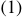

Note that for any mid-level start node _u_ with end node _u__′_ and successors _bi, bj ∈_ Succ( _u_ ), there exists no edge ( _vi, vj_ ) _∈ E_ or ( _vj, vi_ ) _∈ E_ where _vi ∈_ (Reach( _bi_ ) _∩_ Pred( _u__′_ )) _\_ Reach( _bj_ ) and _vj ∈_ (Reach( _bj_ ) _∩_ Pred( _u__′_ )) _\_ Reach( _bi_ ), ensuring branch independence until merge to _u__′_ . 

We associate each node with type via _ϕ_ : _V �→{_ AND _,_ OR _}_ , which specifies when the node can be executed: 

- For a node _v_ with _ϕ_ ( _v_ ) = AND, it can only be executed when every node in Pred( _v_ ) has been executed. We call it an AND node for simplicity. 

- Similarly, for a node _v_ with _ϕ_ ( _v_ ) = OR, it can only be _executed_ when at least one node in Pred( _v_ ) has been executed, and is termed an OR node similarly. 

- In particular, for the initial step _v_ 0 with Pred( _v_ 0) = _∅_ , it can be executed immediately. 

Let Prog _t ⊆ V_ denote the set of executed nodes up to timestep _t_ . Every executable step _v ∈ Ve_ consumes a timestep upon execution, while a structural node _v ∈ Vn_ is automatically satisfied once its preconditions are met. Task progression follows the constraints: 

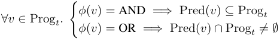

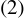

An executable step _a ∈ Ve_ is legal at timestep _t_ if _a ∈/_ Prog _t_ and its preconditions are satisfied under the AND/OR semantics above. We denote the set of such steps by _A_legal _t ⊆ Ve_ . A task is completed at timestep _t__∗_ if the current progression state reaches the terminal node _v_ term for the first time, _i.e_ ., _v_ term _∈_ Prog _t∗ ∧∀t__′_ _< t__∗_ _.v_ term _∈/_ Prog _t′_ . 

### **3.2. Proactive Response Formulation** 

Proactive response requires continuously monitoring human activities and intervening when assistance is needed. At each timestep _t_ , given a video frame and task = graph as the input **X** _t_ , the agent outputs **Y** _t_ ( _yt_trig _, yt_task _, yt_step _,_ ˆ _at_ +1: _t_ + _n, a__⋆_ _t_ +1): 

- **Trigger** : _yt_trig _∈{_ 0 _,_ 1 _}_ indicates if interaction is needed. 

- **Task** : _yt_task _∈T_ identifies the task category. 

- • **Step** : _yt_step _∈ V_ identifies the current step. 

- **Future actions** : _a_ ˆ _t_ +1: _t_ + _n ∈ V_ predicts future actions. 

- • **Proactive action:** _a__⋆_ _t_ +1_∈Ve∪{_WAIT_}_is the robot’s selected next action. 

These predictions form a hierarchical structure where trig- 

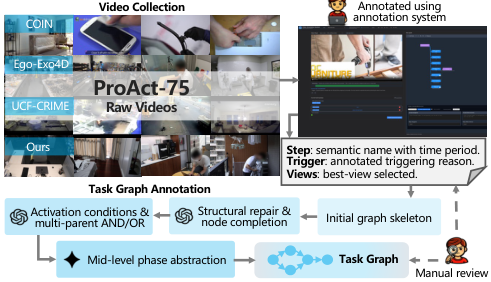

<!-- Start of picture text -->
Video Collection Annotated using COIN annotation system Ego-Exo4D ProAct-75 UCF-CRIME Raw Videos Ours Step : semantic name with time period. Trigger : annotated triggering reason. Views : best-view selected. Task Graph Annotation Activation conditions &  Structural repair & multi-parent AND/OR node completion Initial graph skeleton Mid-level phase abstraction Task Graph Manual review <!-- End of picture text -->

_Figure 3._ **ProAct-75 data collection and annotation pipeline.** We combine videos from public datasets and self-collected recordings, then annotate step spans/names, triggers, and best views. Each task is equipped with a task-graph annotation. 

ger gates subsequent predictions, and task/step detection localizes the current state for action planning. 

## **4. ProAct-75 Benchmark** 

ProAct-75 evaluates proactive response on trigger detection, task detection, step detection, future action prediction, and proactive action selection tasks. In the following sections we describe the data composition and annotation protocol. 

### **4.1. Data Composition and Annotations** 

ProAct-75 covers three interaction scenarios with distinct mechanisms of goal formation. **Assistance** evaluates anticipatory support in activities with human-initiated goals. **Maintenance** evaluates environment-triggered goal generation driven by observable states ( _e.g_ ., cluttered desks). **Safety monitoring** focuses on preventive interventions against risky behaviors. Assistance and Maintenance may overlap at the task level depending on whether intervention is triggered by human activity or environment monitoring. 

To cover these scenarios at scale while maintaining diverse environments, we construct ProAct-75 by aggregating exocentric videos from Ego-Exo4D, COIN, UCF-Crime, and self-collected sources. We adopt the Ego-Exo4D standard and re-annotate other sources to ensure consistent step-level granularity. For multi-view recordings in Ego-Exo4D, we follow the annotation of original view. For our self-collected multi-view videos, we select the best views so that key actions are visible and occlusions are minimized. The data scale and distribution are shown in Figure 2. More collection details are available in Section D. 

We adopt a unified annotation protocol where each step boundary corresponds to the semantic change in human actions. Each video is annotated with task- and step-level temporal spans (aligned timestamps and frame indices), and natural-language context cues (scenario and trigger descrip- 

4

> Original page for checking 1 unresolved font glyphs.

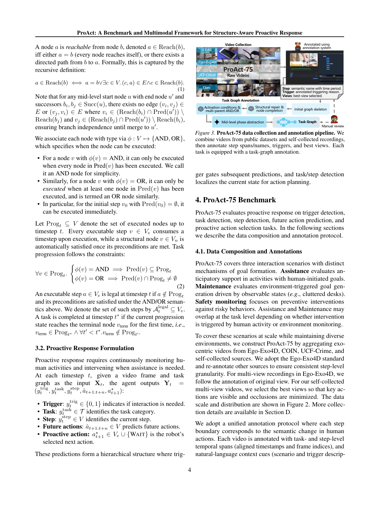

<!-- Page 5 -->

**ProAct: A Benchmark and Multimodal Framework for Structure-Aware Proactive Response** 

tions at task and step granularity). We provide human-rated task priority scores to support cost-sensitive evaluation. For COIN, UCF-Crime, and our selected data, three trained annotators produced 1,978 videos and 6,797 step segments over 1.5 months. Quality control involved two rounds (half a month) where three experts reviewed annotations to fix inconsistencies and refine boundaries. Disagreements were resolved through deliberation to ensure consistency across sources. In total, ProAct-75 comprises 5,383 videos containing 91,581 step segments, with the remainder contributed by Ego-Exo4D’s existing step annotations. 

### **4.2. Task Graph** 

Following the formulation in Section 3.1, we construct task graphs as DAGs with atomic steps as nodes and temporal dependencies as edges. We build each graph incrementally. Given the step inventory of a task, GPT-4o proposes one local dependency (with activation conditions) at a time, followed by automatic validation to enforce DAG validity (acyclicity, reachability, no dead ends/isolated nodes) and basic physical feasibility checks. Gemini-3-Pro further groups atomic steps into mid-level phases. Finally, all graphs are manually reviewed to correct any residual inconsistencies (as shown in Figure 3). More statistics on the task graphs can be found in Section E. 

## **5. ProAct-Helper Method** 

sion, HBM enhances cross-level semantic consistency by maximizing the agreement between parent and child level representations while strengthening class separability under parent-level conditioning. 

HBM extracts token hidden states for trigger/task/step fields (Figure 4). Let _hi_ be the _i_ -th output-token hidden state and _Iℓ_ the token span of level _ℓ ∈{_ trig _,_ task _,_ step _}_ . We obtain _Hℓ_ by mean pooling over _{hi}i∈Iℓ_ . We introduce two cross-level contrastive constraints to maximize mutual information between hierarchical levels while respecting category structure. For each paired instance _i_ in a mini-batch of size _B_ with parent-child pair ( _Hp_(_i_)_, H_ _c_(_i_)),wedefine the positive pair as ( _Hp_(_i_)_, H_ _c_(_i_)) and the negatives as mis- matched pairs formed with other instances in the mini-batch. The binding loss between parent level _p_ and child level _c_ is: 

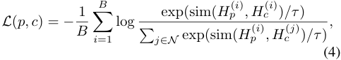

where _N_ = _{_ 1 _, . . . , B}_ indexes paired instances in the minibatch, sim( _·, ·_ ) is cosine similarity, and _τ_ is temperature. We use a symmetric variant by averaging _L_ ( _p, c_ ) and _L_ ( _c, p_ ). 

We combine two cross-level binding terms as: 

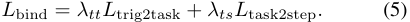

where _L_ trig2task and _L_ task2step are instantiated as _L_ (trig _,_ task) and _L_ (task _,_ step), respectively. 

### **5.1. ProAct-Helper Framework** 

ProAct-Helper is a proactive response framework built upon MLLM and integrated with task-graph planning. The model takes multimodal input **X** _t_ at time _t_ and produces structured predictions **Y** _t_ = ( _yt_trig _, yt_task _, yt_step _,_ ˆ _at_ : _t_ + _τ , a__⋆_ _t_ +1) as defined in Section 3.2. To handle the long-tailed trigger– task–step hierarchy, we propose HBM to enforce cross-level alignment and improve rare-class representations. 

Our training process employs instruction tuning with auxiliary constraints. We apply standard autoregressive crossentropy loss _L_ CE over supervised tokens, supplemented by a binary classification loss _L_ trig at the trigger token position to prevent signal dilution. The final objective is: 

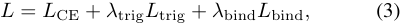

where _L_ bind is introduced by the Hierarchical Binding Module to strengthen cross-level consistency and mitigate training instability for long-tail classes. 

### **5.2. Hierarchical Binding Module** 

The supervision signals in ProAct-75 exhibit a trigger-taskstep hierarchy with severe long-tail distributions at the task and step levels. To address the representation insufficiency caused by relying solely on autoregressive supervi- 

### **5.3. Proactive Action Selection** 

In this work, we study proactive action selection using annotated task graphs to choose the next feasible step. The key challenge is exploiting parallelizable thread to enable concurrent progress, rather than strictly following a single sequential path. Inspired by the perspective of behavioral entropy (Goodrich et al., 2004; Guastello et al., 2012; Balch, 2000), we model the human/robot action distribution over parallel threads and use entropy to penalize mixed thread assignments, which indicate frequent thread switching and higher cognitive load. 

To capture parallelizable threads in collaborative tasks, we define threads based on the reachability structure of the task graph. For any mid-level start node _u_ with multiple successors Succ( _u_ ) = _{b_ 1 _, . . . , bm}_ that later merge at _u__′_ , we assign each successor (and its downstream nodes) to a thread via a mapping _π_ : _V �→_ N. Two successors _bi_ and _bj_ are considered in the same thread if their reachable node sets overlap, _i.e_ ., Reach( _bi_ ) _∩_ Reach( _bj_ ) _̸_ = _∅_ ; otherwise they belong to different threads. Nodes not covered by such regions are assigned to the primary thread _π_ ( _v_ ) = 0. 

Given the task graph, current progression state, and action set _A_ , we obtain the set of legal actions _A_legal _t_ . The thread 

5

> Original page for checking 1 unresolved font glyphs.

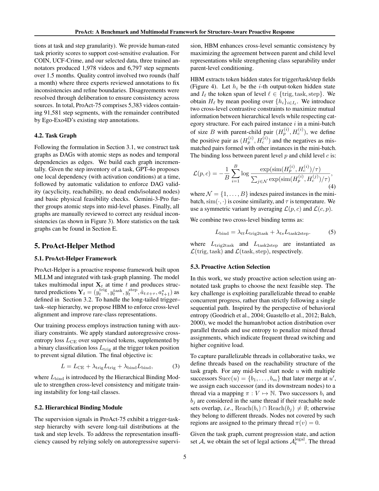

<!-- Page 6 -->

**ProAct: A Benchmark and Multimodal Framework for Structure-Aware Proactive Response** 

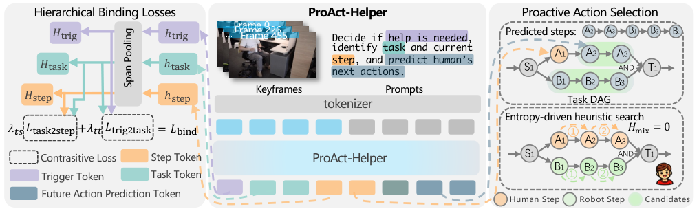

<!-- Start of picture text -->
Hierarchical Binding Losses ProAct-Helper Proactive Action Selection Frame 0 !!"#$ ℎ!"#$ … Frame 226Frame 455 Decide if help is needed,  Predicted steps:  A2 A3 B1 B2 B3 identify task and current A1 A2 A3 step, and predict human’s !!%&' ℎ!%&' next actions. S1 AND T1 B1 B2 B3 Keyframes Prompts !&!() ℎ&!() tokenizer Task DAG Entropy-driven heuristic search %+/ #!%&'*&!() +%++ #!"#$*!%&' = #,#-. ① ② !!"# = 0 A1 A2 A3 Contrasitive Loss Step Token ProAct-Helper S1 AND T1 B1 B2 B3 Trigger Token Task Token ① ② Future Action Prediction Token Human Step Robot Step Candidates Span Pooling <!-- End of picture text -->

_Figure 4._ **Overview of ProAct-Helper framework.** Given keyframes and prompts, the model predicts trigger, task, step, and human’s future actions, trained with hierarchical binding losses for cross-level consistency under long-tail data. It then selects the next robot action on the task DAG via an entropy-driven heuristic search to favor feasible, low thread-mixing progress. 

mapping _π_ ( _·_ ) groups these legal actions by thread, and the robot agent selects an action from the grouped set based on the objective below. For each action _a ∈A_legal _t_ , we estimate its induced thread mixing entropy _H_ mix. 

Let _Ht_ and _Rt_ denote the human and robot step histories up to time _t_ . To evaluate the thread mixing induced by a candidate action _a_ , we consider the counterfactual one-stepahead robot history _Rt ∪{a}_ and compute the per-thread step count for each agent _α ∈{_ hum _,_ rob _}_ as: 

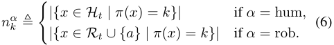

The mixing ratio for thread _k_ is then _pk_ = _n_hum _k /_ ( _n_hum _k_ + _n_rob _k_),quantifyingtheproportionofhumanparticipation. The binary entropy for each thread is: 

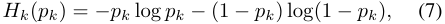

where _Hk_ ( _pk_ ) = 0 when _pk ∈{_ 0 _,_ 1 _}_ ( _i.e_ ., single-agent execution). The thread mixing entropy is a length-weighted sum across threads: 

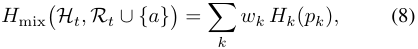

where _wk_ = ( _n_hum _k_ + _n_rob _k_)_/_� _j_(_n_ _j_hum + _n_rob _j_ ) weights threads by total executions, so mixing on more active threads contributes more than on rarely visited ones. 

We employ a one-step lookahead strategy to select the action that minimizes this entropy: 

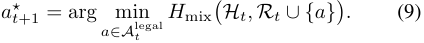

This strategy favors actions on threads different from the human’s current thread and discourages frequent switching by the robot, reducing coordination overhead while enabling parallel progress. 

## **6. Experiments** 

### **6.1. Experimental Setup** 

**Benchmark.** All experiments use ProAct-75, split by video into train/test at an approximate 3:1 ratio, yielding _N_ train = 4 _,_ 074 and _N_ test = 1 _,_ 309 videos. Unless stated otherwise, we train on the best-view subset ( _N_ train = 1 _,_ 905 and _N_ test = 516; see Section 4.1 and Figure 2) and evaluate on its test set, while other views are used for Out Of Distribution (OOD) evaluation (see Section B.5). 

**Implementation details.** We extract keyframes based on adjacent-frame appearance changes and use a 5-frame sliding window with stride 3 as the input **X** _t_ (see Section B.1). Input prompt templates and output formats are detailed in Section F. For action selection, since predicted actions may not fall within the legal action domain, we take the intersection _A_cand _t_ = _A_legal _t ∩A_pred _t_ to ensure feasibility. We slightly abuse the notation by treating _A_pred _t_ as a set and removing possible duplicates. 

We evaluate both open-source and closed-source MLLMs. ProAct-Helper is built upon Qwen2.5-VL-Instruct 3B/7B and fine-tuned with LoRA. All baselines are evaluated in two stages: Stage-1 decides trigger and task given the keyframe window and task list; if triggered, Stage-2 detects step and future actions given the identified task graph. We avoid in-context video demonstrations as keyframe streams already create long video-token contexts, and adding demo keyframes would substantially increase latency. 

ProAct-Helper is trained for 10 epochs with a batch size of 128 using the AdamW optimizer and a learning rate of 5 _×_ 10_−_5 . All training is conducted on NVIDIA H20 GPUs using bfloat16 precision. For LoRA fine-tuning, we set the rank to _r_ = 32 and the scaling factor to _α_ = 32. For inference, we apply different decoding strategies depending on the evaluation setup. When measuring generation time 

6

> Original page for checking 1 unresolved font glyphs.

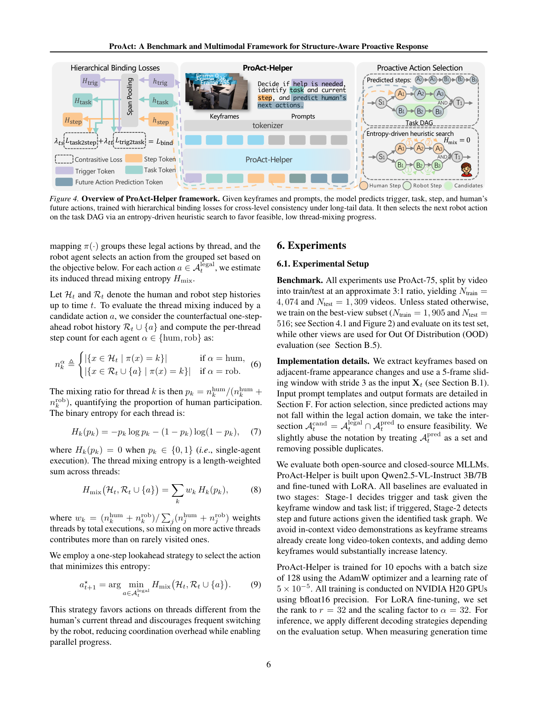

<!-- Page 7 -->

**ProAct: A Benchmark and Multimodal Framework for Structure-Aware Proactive Response** 

on our fine-tuned model, we use greedy decoding with a maximum of 256 tokens. For the evaluation of baseline models, we employ nucleus sampling with temperature _T_ = 0 _._ 7, top- _p_ = 0 _._ 8, and top- _k_ = 20. 

**Evaluation Metrics.** For _trigger, task, and step detection_ , we report **Acc/F1** as micro-averaged metrics and **mAcc/mF1** , which average over classes to reflect long-tail performance. For future action prediction, we compute the **ED** between predicted and ground-truth sequence. Furthermore, we report four metrics for _proactive action selection_ . **Saved Steps (SS)** measures how many human steps are saved by robot actions; **Entropy (E)** quantifies the humanrobot thread mixing entropy _H_ mix; **ER** measures thread entropy for robot threads; **Parallel Actions (PA)** measures the proportion of parallel actions where robot and previous human threads differ. E, ER, and PA are computed over effective actions only, _i.e_ ., excluding wait. 

### **6.2. Main Results** 

Table 1 presents results on ProAct-75. For all MLLMs baselines, evaluation follows a two-stage process. The first stage determines whether a trigger occurs and identifies the corresponding task based on the keyframe window and the task list. If triggered, the second stage uses the task graph of the identified task to detect current steps and predict future steps. For proactive action selection, which relies on textual predictions from the previous stage, we provide task graphs, AND/OR constraints, and thread definitions with parallel execution prioritization (as detailed in Section F). 

The results show that ProAct-Helper outperforms both opensource and closed-source baselines across most metrics, validating its effectiveness for proactive assistance. _For trigger/task/step detection, ProAct-Helper (7B) improves task F1 by 17.09% and step F1 by 11.72% over the best closed-source baseline Gemini-2.5-Pro._ Furthermore, our HBM module boosts task mF1 by 2.71% and step mF1 by 1.63% on average across both backbones compared to the plain variant. This improvement on mF1 averaged over all the classes indicates better handling of long-tail categories. 

For proactive action selection, ProAct-Helper significantly outperforms existing strong baseline models. _Compared to the best closed-source model Gemini-2.5-Pro, the 7B-based ProAct-Helper achieves SS of 0.361 and PA of 19.41%_ , demonstrating stronger task parallelization capability. The plain variant without HBM attains lower SS at 0.350 and PA at 18.72%, as improved step detection and action prediction accuracy from HBM enable more effective action selection. Additional qualitative, hyperparameter, OOD, trigger-error, representation, and inference time analyses are in Section B.1 and Section C. 

### **6.3. Ablation Study** 

To enable ablation studies within computational budgets, we sampled 1 _/_ 8 of the best-view split using stratified sampling, preserving task diversity and step-level distributions.3 We examine HBM by isolating the Trigger-Task alignment loss _L_ trig2task and Task-Step dependency loss _L_ task2step. Table 2 shows that introducing _L_ trig2task improves Task and Step mAcc by 2 _._ 82% and 2 _._ 56%, while _L_ task2step yields larger gains of 3 _._ 48% and 2 _._ 70%. The full model achieves best performance, and _L_ task2step is consistently more effective than _L_ trig2task, indicating that grounding tasks in execution steps yields stronger supervision. 

### **6.4. Analysis of Text-only Proactive Action Selection** 

To decouple proactive action selection from upstream action prediction errors, we simulate collaboration between human and robot agents from the video’s initial state. In the oracle setting, the robot uses the complete human trajectory as _A_pred _t_ . For LLM-based methods, we adopt the prompt settings from Section 6.2. To avoid rollout deadlocks caused by minor mismatches between human traces and strict graph preconditions, we use a one-step alignment safeguard that temporarily admits the observed next human step when it is not graph-enabled. This is applied uniformly across methods and only at the current timestep, while robot actions remain graph-filtered. The full simulation procedure, including the safeguard and tie-breaking rule, is provided in Section A. 

Table 3 shows that closed-source LLMs’ SS remain lower than ProAct-Helper, despite being provided with task graphs and AND/OR constraints. GPT-4o exhibits lower mixing entropy _E_ than ProAct-Helper yet higher robot thread entropy ER. This suggests closed-source LLMs output more waiting actions, leaving more effective actions to be completed by the human alone, thereby reducing E while failing to establish stable robot parallel execution threads as evidenced by elevated ER. In contrast, ProAct-Helper achieves the lowest ER of 0.654 and highest PA of 33.95%, demonstrating that entropy-driven heuristic search more effectively drives strategies for stable parallel execution. 

### **6.5. Analysis of Failure Case** 

Figure 5a reports hallucination rates, _i.e_ ., outputs that violate predefined constraints. We consider three types: Trigger (false interventions when the ground truth requires none), Step (predicting step labels outside the predefined step vocabulary), and Future (empty sequences or steps outside the step vocabulary). ProAct-Helper achieves low Trigger and near-zero Step hallucination, indicating strong vocab- 

> 3Stratified sampling ensures at least one video per task. Longtail distributions arise intrinsically from task structures 

7

<!-- Page 8 -->

**ProAct: A Benchmark and Multimodal Framework for Structure-Aware Proactive Response** 

_Table 1._ **Main results on ProAct-75.** We report mAcc/mF1 and Acc/F1 metrics for trigger/task/step detection and Edit Distance (ED) for future action prediction. Open-source baselines are evaluated without fine-tuning, while closed-source baselines use the same prompt template and decoding settings. Best results are in **bold** and second-best results are underlined. _↑ / ↓_ indicate higher/lower is better. 

|**Base Model**||**Trigge**|**r (%)**|||**Task**|**(%)**|||**Step**|**(%)**|**ED**_↓_|**SS**_↑_|**PA (%)**_↑_|
|---|---|---|---|---|---|---|---|---|---|---|---|---|---|---|
||**mAcc **|**mF1**|**Acc**|**F1**|**mAcc **|**mF1**|**Acc**|**F1**|**mAcc **|**mF1**|**Acc**|**F1**|||
||||||_Open-S_|_ource_|_MLLMs_||||||||
|Qwen3-VL-30B-A3B-Instruct|51.61|66.25|73.50|81.89|22.80|31.70|34.66|51.48|6.67|9.44|8.53|15.72 4.77|0.013|0.09|
|Qwen3-Omni-30B|46.86|63.35|65.07|71.30|18.96|26.87|17.55|29.87|3.72|5.42|4.48|8.58 4.64|0.078|6.09|
|Qwen2.5-VL-32B-Instruct|45.72|62.36|63.77|69.64|16.62|23.96|29.45|45.50|4.04|6.04|6.14|11.57 4.72|0.038|3.71|
|Qwen2.5-VL-3B-Instruct|42.33|54.94|69.55|80.59|12.53|18.92|23.18|37.64|1.46|2.42|3.06|5.95 4.74|0.034|4.23|
|||||_C_|_losed-_|_Source_|_MLLM_|_s_|||||||
|Qwen3-VL-Flash|54.73|70.35|72.06|77.48|17.36|24.84|17.91|30.37|3.70|5.51|2.94|5.72 4.76|0.046|2.46|
|Qwen3-VL-Plus|51.52|67.39|69.89|76.41|14.88|21.52|17.39|29.63|5.14|7.38|4.66|8.91 4.71|0.045|3.10|
|GPT-4o|30.59|46.70|47.11|51.38|16.67|24.90|20.27|33.71|4.02|6.05|8.70|16.0 4.64|0.026|0.77|
|Gemini-2.5-Flash|49.73|64.24|72.52|81.44|21.78|30.66|31.14|47.49|6.97|10.12|9.42|17.21 4.70|0.062|2.55|
|Gemini-2.5-Pro|42.89|55.94|69.31|80.21|22.95|32.39|35.23|52.11|**8.69 **|**12.31**|11.99|21.41 4.70|0.120|3.83|
|ProAct-Helper (plain)|61.50|75.40|79.24|85.12|24.02|31.85|48.21|65.05|6.46|9.27|17.54|29.85 3.99|0.333|17.15|
|ProAct-Helper|61.50|75.38|79.32|85.23|**28.33**|**36.72**|51.03|67.58|7.61|10.67|18.68|31.49 3.96|**0.366**|17.44|
|||_Pr_|_oAct-_|_Helper_|_(based_|_on Qw_|_en2.5-_|_VL-7B-I_|_nstruc_|_t)_|||||
|ProAct-Helper (plain)|62.36|76.09|79.85|85.57|25.49|34.24|48.94|65.71|6.39|9.70|18.23|30.83 3.99|0.350|18.72|
|ProAct-Helper|**62.90**|**76.56**|**80.08**|**85.65**|27.07|34.79|**52.91**|**69.20**|8.25|11.56|**19.85**|**33.13** **3.90**|0.361|**19.41**|

_Table 2._ **Ablation study results.** We report mAcc/mF1 and Acc/F1 for trigger/task/step detection and ED for future action prediction. 

|**Task** |**Trigger** ||**Tas**|**k (%)**|||**St**|**ep (%)**||**ED**_↓_|
|---|---|---|---|---|---|---|---|---|---|---|
|_→_**Step**|_→_**Task**|**mAcc**|**mF1**|**Acc**|**F1**|**mAcc**|**mF1**|**Acc**|**F1**||
|_×_|_×_|13.43(+0.00)|18.50(+0.00|) 33.22(+0.00)|49.87(+0.00)|2.64(+0.00)|3.99(+0.00)|9.26(+0.00)|16.94(+0.00)|4.23(+0.00)|
|_×_|✓|16.25(+2.82)|22.10(+3.60|) 35.72(+2.50)|52.64(+2.77)|5.20(+2.56)|7.14(+3.15)|13.38(+4.12)|23.60(+6.66)|3.97(-0.26)|
|✓|_×_|16.91(+3.48)|22.60(+4.10|) 39.08(+5.86)|56.19(+6.32)|5.34(+2.70)|7.28(+3.29)|13.70(+4.44)|24.10(+7.16)|4.01(-0.22)|
|✓|✓|17.12(+3.69)|23.10(+4.60|) 42.06(+8.84)|59.22(+9.35)|5.25(+2.61)|7.18(+3.19)|13.96(+4.70)|24.50(+7.56)|3.94(-0.29)|

_Table 3._ **Trajectory simulation results with human and robot agents under GT labels.** 

|**Method**|**SS**_↑_|**E**_↓_ **ER**_↓_|**PA (%)**_↑_|
|---|---|---|---|
|_Closed-Sou_|_rce Large_|_Language Models (LL_|_Ms)_|
|GPT-4o|5.872|**0.640** 0.736|33.60|
|Gemini-2.5-Flash|5.918|0.662 0.748|28.26|
|Gemini-2.5-Pro|6.023|0.671 0.723|29.52|
|DeepSeek-v3.2|5.868|0.664 0.742|31.58|
|Qwen3-Max|6.160|0.683 0.769|29.89|
|_ProA_|_ct Action_|_Selection Strategies_||
|Greedy|**9.868**|0.837 0.836|28.11|
|ProAct-Helper|**9.868**|0.662 **0.654**|**33.95**|

Figure 5b decomposes waiting into model-generated wait and forced wait ( _i.e_ ., caused by illegal actions). Gemini2.5-Flash exhibits the lowest forced wait ratio, indicating better constraint adherence, while GPT-4o shows the highest, revealing reasoning limitations. Our method achieves the highest parallel action ratio, substantially exceeding all closed-source models, demonstrating a preference for parallel thread execution and efficient collaboration. Moreover, most closed-source models achieve parallel action ratios below Greedy, reflecting insufficient preference for parallel thread execution with humans under common-sense-driven decision making, thereby hindering efficient collaboration. 

## **7. Conclusion** 

ulary alignment, but exhibits some Future hallucination, suggesting controllability issues in action sequence generation. Among closed-source models, GPT-4o shows the lowest overall hallucination, Gemini-2.5-Pro exhibits the highest Trigger hallucination, and Qwen3-VL variants show the highest Step and Future hallucination. 

This paper studies proactive response, where an agent recognizes state from video and selects feasible next actions under task-graph constraints. To support this problem, we introduce **ProAct-75** , aggregating multi-source videos into step-level annotations with explicit task graphs across _assistance, maintenance, and safety scenarios_ . On top of this 

8

<!-- Page 9 -->

**ProAct: A Benchmark and Multimodal Framework for Structure-Aware Proactive Response** 

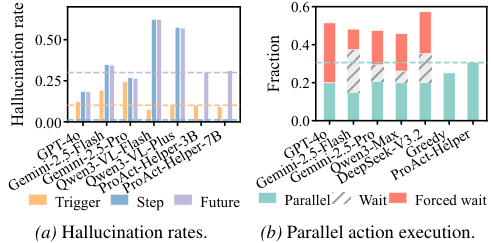

<!-- Start of picture text -->
0.6 0.50 0.4 0.25 0.2 0.00 0.0 Trigger Step Future Parallel Wait Forced wait (a)  Hallucination rates. (b)  Parallel action execution. Gemini-2.5-FlashGPT-4oGemini-2.5-ProQwen3-VL-FlashQwen3-VL-PlusProAct-Helper-3BProAct-Helper-7B Gemini-2.5-FlashGPT-4oGemini-2.5-ProQwen3-MaxDeepSeek-V3.2ProAct-HelperGreedy Fraction Hallucination rate <!-- End of picture text -->

_Figure 5._ **Failure case analysis.** (a) We compare hallucination rates across trigger, step, and future prediction actions for different MLLMs. (b) We analyze models’ parallel execution tendencies, waiting behaviors, and task graph constraint comprehension. For clarity, we omit non-parallel actions from the visualization. 

benchmark, we find existing MLLMs often struggle to follow task-graph structure and leverage parallel threads even when the graphs are given as input. We therefore propose a strong multimodal baseline, **ProAct-Helper** . Extensive experiments show clear gains over closed-source models in state recognition and collaboration efficiency. Although our planner is a lightweight graph-constrained heuristic, its thread-entropy objective and DAG feasibility signals suggest future directions for graph-feasible decoding, and ProAct-75’s trigger descriptions provide additional posttraining data for reasonable proactive responses. 

## **Acknowledgments** 

We thank Changwei Wang and Weiheng Chi for helpful discussions and valuable feedback that improved this work. 

## **Impact Statement** 

This paper presents work whose goal is to advance the field of Machine Learning. Our benchmark is primarily built on publicly available datasets. We will release the corresponding annotations and evaluation code, and provide instructions for obtaining the original videos through the official channels of each source dataset. This avoids redistributing restricted content and ensures compliance with the respective licenses. For our self-collected videos, the data were collected under an industrial data-collection protocol, and all participants provided written informed consent for research and model-training use. The data collection and planned public release follow the applicable consent terms, internal compliance review, and company data-governance procedures. To mitigate privacy risks, we blur potentially sensitive information such as computer screens and logos, and anonymize participants’ faces before release. A potential risk is unnecessary intervention caused by false-positive triggers, especially in safety-monitoring scenarios. ProAct75 is intended as a benchmark for perception and decision 

research rather than a ready-to-deploy autonomous safety system. High-stakes deployments should use calibrated trigger thresholds and human confirmation before consequential interventions. 

## **References** 

- Atan, U., Bharadwaj, V. R., and Jiang, C. Assistive control of robot arms via adaptive shared autonomy. In _2024 IEEE International Conference on Advanced Intelligent Mechatronics (AIM)_ , pp. 1096–1102. IEEE, 2024. 

- Baker, C. L., Saxe, R., and Tenenbaum, J. B. Action understanding as inverse planning. _Cognition_ , 113(3):329–349, 2009. 

- Balch, T. Hierarchic social entropy: An information theoretic measure of robot group diversity. _Autonomous robots_ , 8(3):209–238, 2000. 

- Bi, S., Wang, W., Pan, H., Feng, F., and He, X. Proactive recommendation with iterative preference guidance. In _Companion Proceedings of the ACM Web Conference 2024_ , pp. 871–874, 2024. 

- Broad, A., Murphey, T., and Argall, B. Highly parallelized data-driven mpc for minimal intervention shared control. In _Robotics: science and systems_ , 2019. 

- Camilleri, A., Dogramadzi, S., and Caleb-Solly, P. A study on the effects of cognitive overloading and distractions on human movement during robot-assisted dressing. _Frontiers in Robotics and AI_ , 9:815871, 2022. 

- Damen, D., Doughty, H., Farinella, G. M., Furnari, A., Kazakos, E., Ma, J., Moltisanti, D., Munro, J., Perrett, T., Price, W., et al. Rescaling egocentric vision: Collection, pipeline and challenges for epic-kitchens-100. _International Journal of Computer Vision_ , 130(1):33–55, 2022. 

- Das, S., Dai, R., Koperski, M., Minciullo, L., Garattoni, L., Bremond, F., and Francesca, G. Toyota smarthome: Realworld activities of daily living. In _Proceedings of the IEEE/CVF international conference on computer vision_ , pp. 833–842, 2019. 

- Dragan, A. D., Lee, K. C., and Srinivasa, S. S. Legibility and predictability of robot motion. In _2013 8th ACM/IEEE International Conference on Human-Robot Interaction (HRI)_ , pp. 301–308. IEEE, 2013. 

- Gao, J., Chen, M., and Xu, C. Fine-grained temporal contrastive learning for weakly-supervised temporal action localization. In _Proceedings of the IEEE/CVF conference on computer vision and pattern recognition_ , pp. 19999– 20009, 2022. 

9

<!-- Page 10 -->

**ProAct: A Benchmark and Multimodal Framework for Structure-Aware Proactive Response** 

- Gao, J., Chen, M., and Xu, C. Collecting cross-modal presence-absence evidence for weakly-supervised audiovisual event perception. In _Proceedings of the IEEE/CVF conference on computer vision and pattern recognition_ , pp. 18827–18836, 2023. 

- Gombolay, M. C., Wilcox, R. J., and Shah, J. A. Fast scheduling of robot teams performing tasks with temporospatial constraints. _IEEE Transactions on Robotics_ , 34(1):220–239, 2018. 

- Goodrich, M. A., Boer, E. R., Crandall, J. W., Ricks, R. W., and Quigley, M. L. Behavioral entropy in human-robot interaction. In _Proceedings of PERMIS_ , 2004. 

- Goyal, R., Ebrahimi Kahou, S., Michalski, V., Materzynska, J., Westphal, S., Kim, H., Haenel, V., Fruend, I., Yianilos, P., Mueller-Freitag, M., et al. The" something something" video database for learning and evaluating visual common sense. In _Proceedings of the IEEE international conference on computer vision_ , pp. 5842–5850, 2017. 

- Grauman, K., Westbury, A., Byrne, E., Chavis, Z., Furnari, A., Girdhar, R., Hamburger, J., Jiang, H., Liu, M., Liu, X., et al. Ego4d: Around the world in 3,000 hours of egocentric video. In _Proceedings of the IEEE/CVF conference on computer vision and pattern recognition_ , pp. 18995–19012, 2022. 

- Grauman, K., Westbury, A., Torresani, L., Kitani, K., Malik, J., Afouras, T., Ashutosh, K., Baiyya, V., Bansal, S., Boote, B., et al. Ego-exo4d: Understanding skilled human activity from first-and third-person perspectives. In _Proceedings of the IEEE/CVF Conference on Computer Vision and Pattern Recognition_ , pp. 19383–19400, 2024. 

- Guastello, S. J., Gorin, H., Huschen, S., Peters, N. E., Fabisch, M., and Poston, K. New paradigm for task switching strategies while performing multiple tasks: entropy and symbolic dynamics analysis of voluntary patterns. _Nonlinear dynamics, psychology, and life sciences_ , 16(4):471–497, 2012. 

- Hartmann, V. N., Heinle, T., Huang, Y., and Coros, S. A benchmark for multi-modal multi-robot multi-goal path planning. In _IROS 2025 Workshop-LeaPRiDE: Learning, Planning, and Reasoning in Dynamic Environments_ . 

- Huang, C.-M. and Mutlu, B. Anticipatory robot control for efficient human-robot collaboration. In _2016 11th ACM/IEEE international conference on human-robot interaction (HRI)_ , pp. 83–90. IEEE, 2016. 

- Jara-Ettinger, J., Gweon, H., Schulz, L. E., and Tenenbaum, J. B. The naïve utility calculus: Computational principles underlying commonsense psychology. _Trends in cognitive sciences_ , 20(8):589–604, 2016. 

- Javdani, S., Admoni, H., Pellegrinelli, S., Srinivasa, S. S., and Bagnell, J. A. Shared autonomy via hindsight optimization for teleoperation and teaming. _The International Journal of Robotics Research_ , 37(7):717–742, 2018. 

- Johannsmeier, L. and Haddadin, S. A hierarchical humanrobot interaction-planning framework for task allocation in collaborative industrial assembly processes. _IEEE Robotics and Automation Letters_ , 2(1):41–48, 2016. 

- Kaelbling, L. P. and Lozano-Pérez, T. Hierarchical task and motion planning in the now. In _2011 IEEE international conference on robotics and automation_ , pp. 1470–1477. IEEE, 2011. 

- Koppula, H. S. and Saxena, A. Anticipating human activities using object affordances for reactive robotic response. _IEEE transactions on pattern analysis and machine intelligence_ , 38(1):14–29, 2015. 

- Kou, Z., Wang, J., Jia, Y., Liu, B., and Geng, X. Instancedependent inaccurate label distribution learning. _IEEE Transactions on Neural Networks and Learning Systems_ , 36(1):1425–1437, 2023. 

- Kou, Z., Wang, J., Tang, J., Jia, Y., Shi, B., and Geng, X. Exploiting multi-label correlation in label distribution learning. In _Proceedings of the Thirty-Third International Joint Conference on Artificial Intelligence_ , pp. 4326–4334, 8 2024. 

- Kou, Z., Xie, Y., Wang, H., Chen, J., Wang, J., Xie, M.K., Chen, S., Jia, Y., Liu, T., and Geng, X. Rankmatch: A novel approach to semi-supervised label distribution learning leveraging rank correlation between labels. _Advances in Neural Information Processing Systems_ , 38: 158074–158095, 2026. 

- Li, K., Wang, Y., He, Y., Li, Y., Wang, Y., Liu, Y., Wang, Z., Xu, J., Chen, G., Luo, P., et al. Mvbench: A comprehensive multi-modal video understanding benchmark. In _Proceedings of the IEEE/CVF Conference on Computer Vision and Pattern Recognition_ , pp. 22195–22206, 2024. 

- Li, S., Zheng, P., Liu, S., Wang, Z., Wang, X. V., Zheng, L., and Wang, L. Proactive human–robot collaboration: Mutual-cognitive, predictable, and self-organising perspectives. _Robotics and Computer-Integrated Manufacturing_ , 81:102510, 2023. 

- Losey, D. P., McDonald, C. G., Battaglia, E., and O’Malley, M. K. A review of intent detection, arbitration, and communication aspects of shared control for physical human– robot interaction. _Applied Mechanics Reviews_ , 70(1): 010804, 2018. 

10

<!-- Page 11 -->

**ProAct: A Benchmark and Multimodal Framework for Structure-Aware Proactive Response** 

- Nikolaidis, S., Zhu, Y. X., Hsu, D., and Srinivasa, S. Humanrobot mutual adaptation in shared autonomy. In _Proceedings of the 2017 ACM/IEEE International Conference on Human-Robot Interaction_ , pp. 294–302, 2017. 

- Noormohammadi-Asl, A., Fan, K., Smith, S. L., and Dautenhahn, K. Human leading or following preferences: Effects on human perception of the robot and the human– robot collaboration. _Robotics and Autonomous Systems_ , 183:104821, 2025. 

- Ognibene, D., Mirante, L., and Marchegiani, L. Proactive intention recognition for joint human-robot search and rescue missions through monte-carlo planning in pomdp environments. In _International Conference on Social Robotics_ , pp. 332–343. Springer, 2019. 

- Patel, M. and Chernova, S. Proactive robot assistance via spatio-temporal object modeling. In _Conference on Robot Learning_ , pp. 881–891. PMLR, 2023. 

- Pupa, A., Van Dijk, W., Brekelmans, C., and Secchi, C. A resilient and effective task scheduling approach for industrial human-robot collaboration. _Sensors_ , 22(13): 4901, 2022. 

- Rhinehart, N., McAllister, R., Kitani, K., and Levine, S. Precog: Prediction conditioned on goals in visual multi-agent settings. In _Proceedings of the IEEE/CVF international conference on computer vision_ , pp. 2821–2830, 2019. 

- Schrempf, O. C., Hanebeck, U. D., Schmid, A. J., and Worn, H. A novel approach to proactive human-robot cooperation. In _ROMAN 2005. IEEE International Workshop on Robot and Human Interactive Communication, 2005._ , pp. 555–560. IEEE, 2005. 

- Sener, F., Chatterjee, D., Shelepov, D., He, K., Singhania, D., Wang, R., and Yao, A. Assembly101: A large-scale multi-view video dataset for understanding procedural activities. In _Proceedings of the IEEE/CVF Conference on Computer Vision and Pattern Recognition_ , pp. 21096– 21106, 2022. 

- Shi, Y., Chen, Z., Liu, H., Riedel, S., Gao, C., Feng, Q., Deng, J., and Zhang, J. Proactive action visual residual reinforcement learning for contact-rich tasks using a torque-controlled robot. In _2021 IEEE International Conference on Robotics and Automation (ICRA)_ , pp. 765–771. IEEE, 2021. 

- Sifat, A. H., Deng, X., Bharmal, B., Wang, S., Huang, S., Huang, J., Jung, C., Zeng, H., and Williams, R. A safetyperformance metric enabling computational awareness in autonomous robots. _IEEE Robotics and Automation Letters_ , 8(9):5727–5734, 2023. 

- Sultani, W., Chen, C., and Shah, M. Real-world anomaly detection in surveillance videos. In _Proceedings of the IEEE conference on computer vision and pattern recognition_ , pp. 6479–6488, 2018. 

- Suslova, E. and Fazli, P. Multi-robot task allocation with time window and ordering constraints. In _2020 IEEE/RSJ International Conference on Intelligent Robots and Systems (IROS)_ , pp. 6909–6916. IEEE, 2020. 

- Tang, Y., Ding, D., Rao, Y., Zheng, Y., Zhang, D., Zhao, L., Lu, J., and Zhou, J. Coin: A large-scale dataset for comprehensive instructional video analysis. In _Proceedings of the IEEE/CVF Conference on Computer Vision and Pattern Recognition_ , pp. 1207–1216, 2019. 

- Triantafyllidis, E., Acero, F., Liu, Z., and Li, Z. Hybrid hierarchical learning for solving complex sequential tasks using the robotic manipulation network roman. _Nature Machine Intelligence_ , 5(9):991–1005, 2023. 

- van Den Broek, M. K. and Moeslund, T. B. What is proactive human-robot interaction?-a review of a progressive field and its definitions. _ACM Transactions on HumanRobot Interaction_ , 13(4):1–30, 2024. 

- Wang, H., Su, A., , Ren, W., Lin, F., and Chen, W. Pixel reasoner: Incentivizing pixel-space reasoning with curiosity-driven reinforcement learning. _arXiv preprint arXiv:2505.15966_ , 2025a. 

- Wang, H., Xu, Q., Liu, C., Wu, J., Lin, F., and Chen, W. Emergent hierarchical reasoning in llms through reinforcement learning. _arXiv preprint arXiv:2509.03646_ , 2025b. 

- Wang, H., Qu, C., Huang, Z., Chu, W., Lin, F., and Chen, W. Vl-rethinker: Incentivizing self-reflection of visionlanguage models with reinforcement learning. _Advances in Neural Information Processing Systems_ , 38:30865– 30891, 2026. 

- Wang, Y., Chen, Y., Zhong, F., Ma, L., and Wang, Y. Simulating human-like daily activities with desire-driven autonomy. In _International Conference on Learning Representations_ , volume 2025, pp. 32924–32969, 2025c. 

- Wang, Y., Meng, X., Wang, Y., Zhang, H., and Zhao, D. Proactivevideoqa: A comprehensive benchmark evaluating proactive interactions in video large language models. _arXiv preprint arXiv:2507.09313_ , 2025d. 

- Wooldridge, M. and Jennings, N. R. Intelligent agents: Theory and practice. _The knowledge engineering review_ , 10(2):115–152, 1995. 

- Wu, H. and Liu, Y. Prorac: A neuro-symbolic method for reasoning about actions with llm-based progression. _arXiv preprint arXiv:2511.15069_ , 2025. 

11

<!-- Page 12 -->

**ProAct: A Benchmark and Multimodal Framework for Structure-Aware Proactive Response** 

- Wu, Z., Gao, J., and Xu, C. Open-vocabulary video scene graph generation via union-aware semantic alignment. In _Proceedings of the 32nd ACM International Conference on Multimedia_ , pp. 8566–8575, 2024. 

- Xiang, J., Tao, T., Gu, Y., Shu, T., Wang, Z., Yang, Z., and Hu, Z. Language models meet world models: Embodied experiences enhance language models. _Advances in neural information processing systems_ , 36:75392–75412, 2023. 

- Yang, B., Xu, L., Zeng, L., Guo, Y., Jiang, S., Lu, W., Liu, K., Xiang, H., Jiang, X., Xing, G., et al. Proagent: Harnessing on-demand sensory contexts for proactive llm agent systems. _arXiv preprint arXiv:2512.06721_ , 2025. 

- Yang, B., Xu, L., Zeng, L., Liu, K., Jiang, S., Lu, W., Chen, H., Jiang, X., Xing, G., and Yan, Z. Contextagent: Context-aware proactive llm agents with open-world sensory perceptions. _Advances in Neural Information Processing Systems_ , 38:167509–167543, 2026. 

- Zhao, Z., Zhao, Z., Xu, K., Fu, Y., Chai, J., Zhu, Y., and Zhao, D. Learning and planning multi-agent tasks via an moe-based world model. _Advances in Neural Information Processing Systems_ , 38:40857–40890, 2026. 

- Zhou, H., Martín-Martín, R., Kapadia, M., Savarese, S., and Niebles, J. C. Procedure-aware pretraining for instructional video understanding. In _Proceedings of the IEEE/CVF Conference on Computer Vision and Pattern Recognition_ , pp. 10727–10738, 2023. 

- Zhu, C., Xiao, F., Alvarado, A., Babaei, Y., Hu, J., El-Mohri, H., Culatana, S., Sumbaly, R., and Yan, Z. Egoobjects: A large-scale egocentric dataset for fine-grained object understanding. In _Proceedings of the IEEE/CVF international conference on computer vision_ , pp. 20110–20120, 2023. 

- Zhu, F., Pan, Y., Zhu, X., and Lin, F. A computable gametheoretic framework for multi-agent theory of mind. _arXiv preprint arXiv:2511.22536_ , 2025. 

- Zhukov, D., Alayrac, J.-B., Cinbis, R. G., Fouhey, D., Laptev, I., and Sivic, J. Cross-task weakly supervised learning from instructional videos. In _Proceedings of the IEEE/CVF Conference on Computer Vision and Pattern Recognition_ , pp. 3537–3545, 2019. 

12

<!-- Page 13 -->

**ProAct: A Benchmark and Multimodal Framework for Structure-Aware Proactive Response** 

## **A. Implementation Details of Proactive Action Selection** 

We detail the evaluation procedure for proactive action selection under task-graph constraints. While Section 6.4 summarizes the rollout safeguard used in the full-video simulation, this appendix provides the complete procedure, including candidate construction, the deadlock-prevention safeguard, tie-breaking, and the SS/PA metrics. At each timestep _t_ , the robot first constructs the legal action set _A_legal _t ⊆ Ve_ according to the annotated AND/OR preconditions, then filters it by the predicted action sequence _A_pred _t_ to obtain _A_cand _t_ (Algorithm 1). 

For the full-video _text-only_ proactive action selection simulation in Table 3, we apply a deadlock-prevention safeguard. Human execution may not strictly satisfy task-graph preconditions ( _e.g_ ., minor omissions or implicit prerequisites), while our simulator enforces strict graph feasibility, which can stall rollouts when some nodes never become enabled. To maintain simulation fidelity, we use a one-step runtime alignment that relaxes feasibility _only_ for the observed next human action. Let _gt_ +1 denote the ground-truth next human executable step at time _t_ . If _gt_ +1 _∈ Ve_ , _gt_ +1 _∈/_ Prog _t_ , and _gt_ +1 _∈A/_legal _t_ , we temporarily augment _A_�legal _t ←A_legal _t ∪{gt_ +1 _}_ before constructing _A_cand _t_ . This safeguard is applied uniformly across methods and only admits _gt_ +1 at the current timestep. Note that it is used only for Table 3, since Table 1 evaluates one-step decisions without full-rollout deadlocks. 

Moreover, when multiple candidates attain the same minimum entropy value, we select the action that appears earliest in _A_pred _t_ to ensure reproducibility. Concretely, Pos( _S, a_ ) returns the smallest index of _a_ in a sequence _S_ , and we apply a lexicographic arg min over ( _H_ mix _,_ Pos). 

**Algorithm 1** Thread-Entropy-Based Proactive Action Selection with Rollout Safeguard 

**Require:** Task graph _G_ = ( _V, E_ ), executable set _Ve_ , thread mapping _π_ ( _·_ ), progression state Prog _t_ , ground-truth next human step _gt_ +1, histories _Ht, Rt_ , predicted action sequence _A_pred _t_ 

_t_ 

**Ensure:** Robot next action _a__⋆_ _t_ +1 _AA_ �legal _t_legal _t ←A←{a_legal _t ∈ Ve | a ∈/_ Prog _t,_ Precond( _a_ ; Prog _t_ ) = true _}_ **if** _gtA_ +1�legal _t ∈ V←e_ **and** _A_�legal _t gt_ +1 _∪{∈/gt_ Prog+1 _} t_ **and** _gt_ +1 _∈A/_legal _t_ **then end if if** _A_�legal _t_ = ∅ **then return** WAIT **end if** _A_cand _t ←A_pred _t ∩ A_�legal _t_ **if** _A_cand _t_ = ∅ **then return** WAIT **end if for all** _a ∈A_cand _t_ **do** Compute _H_ mix( _Ht, Rt ∪{a}_ ) **end for return** _a__⋆_ _t_ +1_←_arg min _a∈A_cand _t_ <u>�</u> _H_ mix( _Ht, Rt ∪{a}_ ) _,_ Pos( _A_pred _t , a_ )� 

**Saved Step (SS).** We measure collaboration efficiency in two settings. In full-trajectory simulation, for each video _i_ we define _Si_ = _Bi − Hi_ , where _Bi_ is the number of steps in the annotated human trajectory and _Hi_ is the number of steps actually executed by the human in simulation. We report 

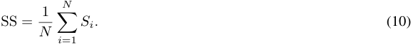

In the online one-step decision setting, each sample corresponds to a single decision point. We set _Sj_ = 1 if the robot executes an action that belongs to the ground-truth trajectory (excluding Terminate), and _Sj_ = 0 otherwise, and report SS = _N_ <u>1</u> _s_ � _Nj_ =1 _s__Sj_. 

**Parallel Action (PA).** We quantify the fraction of effective robot actions that advance a thread different from the human’s most recent thread. Let _N_R be the total number of effective robot actions across all videos (excluding WAIT). For each 

13

> Original page for checking 9 unresolved font glyphs.

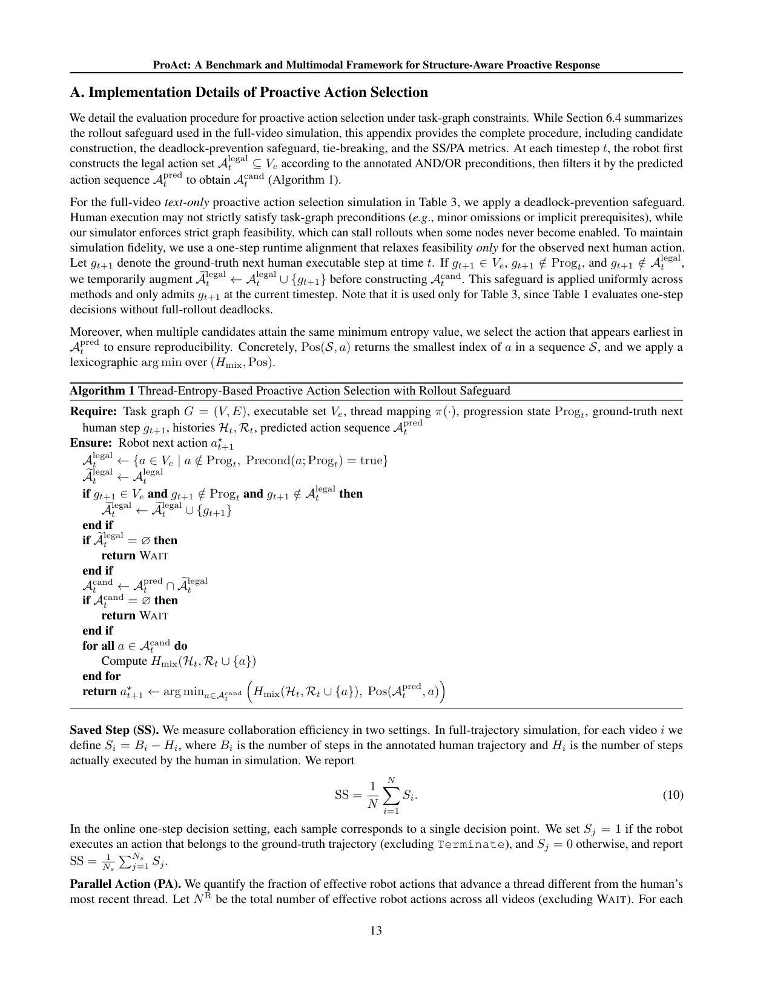

<!-- Page 14 -->

**ProAct: A Benchmark and Multimodal Framework for Structure-Aware Proactive Response** 

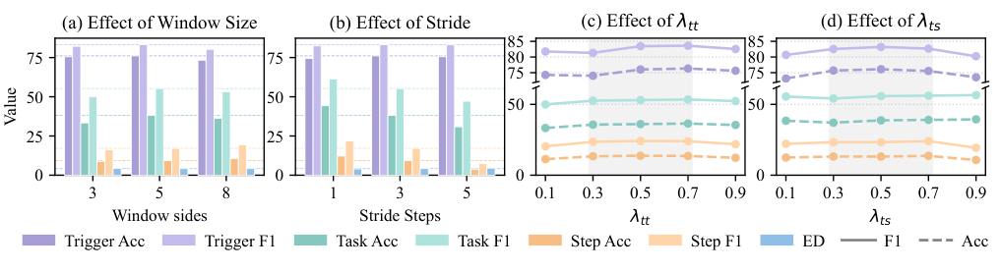

<!-- Start of picture text -->
(a) Effect of Window Size (b) Effect of Stride (c) Effect of  tt (d) Effect of  ts 85 85 75 75 80 80 75 75 50 50 50 50 25 25 0 0 0 0 3 5 8 1 3 5 0.1 0.3 0.5 0.7 0.9 0.1 0.3 0.5 0.7 0.9 Window sides Stride Steps tt ts Trigger Acc Trigger F1 Task Acc Task F1 Step Acc Step F1 ED F1 Acc Value <!-- End of picture text -->

_Figure 6._ **Hyperparameter analysis on the mini set.** We evaluate the effect of window size, stride, and the loss weights _λ_ tt and _λ_ ts. We report trigger/task/step accuracy and F1, as well as the future-action edit distance (ED; lower is better). Unless otherwise specified, we adopt window size 5, stride 3, and _λ_ tt = 0 _._ 3 _, λ_ ts = 0 _._ 5. 

_Table 4._ **Ablation of MLP projection heads for HBM.** Directly applying the binding loss to span-pooled hidden states yields lower validation loss and stronger overall performance. 

|Method|Trig. mF1|Task mF1|Step mF1|ED_↓_|Val Loss_↓_|
|---|---|---|---|---|---|
|w/o MLP (Ours)|**70.18**|**23.10**|7.18|**3.94**|**0.306**|
|w/ MLP (_d_= 128)|67.55|21.41|6.99|4.05|0.649|
|w/ MLP (_d_= 256)|68.60|21.18|**7.25**|4.03|0.694|

effective robot action _a_ , let _h_ prev be the most recent human action before the decision. If _π_ ( _a_ ) _̸_ = _π_ ( _h_ prev), we count it as a parallel-action event. Let _P_ be the total number of such events, and define PA = _P/N_R . 

## **B. Additional Quantitative Analyses** 

We provide additional quantitative analyses to better characterize the practical behavior of ProAct-Helper, including training-design ablations, trigger error modes, representation analyses, OOD generalization, and inference latency. 

### **B.1. Hyperparameter Analysis** 

We analyze the effects of temporal configuration and loss-weighting strategies in Figure 6. The results highlight a consistent trade-off between temporal coverage, noise accumulation, and cross-level regularization strength. 

A window size of 5 achieves the best balance across trigger, task, and step prediction by providing sufficient temporal context to capture task state transitions without introducing excessive irrelevant frames. Smaller windows lack coverage for state evolution, while larger windows dilute critical cues and incur higher computational cost. Similarly, a stride of 3 yields the strongest performance by effectively reducing redundancy while preserving key temporal signals. Smaller strides introduce short-term noise, whereas larger strides miss informative transitions. 

We further examine the task–trigger and task–step consistency losses. Moderate weighting consistently improves task and step recognition, indicating the benefit of cross-level regularization. However, overly large weights lead to performance degradation, suggesting that excessive emphasis on consistency suppresses fine-grained discriminative learning. Based on these observations, we adopt _λ_ tt = 0 _._ 3 and _λ_ ts = 0 _._ 5, which provide stable gains while maintaining balanced performance across all hierarchies. 

### **B.2. Projection Head Ablation** 

HBM applies the hierarchical binding loss directly to the span-pooled hidden states _Hℓ_ . We additionally evaluate whether introducing a separate projection head, a common design in contrastive representation learning, improves cross-level binding. Specifically, we train two variants with a two-layer MLP projection head, Linear( _H, d_ ) _→_ ReLU _→_ Linear( _d, d_ ), where _H_ = 2048 is the hidden size of Qwen2.5-VL and _d ∈{_ 128 _,_ 256 _}_ . We use the same 1 _/_ 8 stratified mini-split as in Section 6.3 and keep all other training settings unchanged. 

14

<!-- Page 15 -->

**ProAct: A Benchmark and Multimodal Framework for Structure-Aware Proactive Response** 

_Table 5._ **Under-triggering and over-triggering analysis on representative models.** FPR corresponds to over-triggering, while FNR corresponds to under-triggering. 

|Method|FPR_↓_|FNR_↓_|mF1_↑_|
|---|---|---|---|
|GPT-4o|39.2|59.2|46.7|
|Gemini-2.5-Pro|77.4|**9.2**|55.9|
|ProAct-Helper (7B)|**34.5**|13.2|**76.6**|

_Table 6._ **Cross-level representation consistency on the full test set.** HBM increases both CKA and cosine similarity between adjacent hierarchy levels. 

|Model|CKA(_t, T_)_↑_|CKA(_T, s_)_↑_|Cos(_t, T_)_↑_|Cos(_T, s_)_↑_|
|---|---|---|---|---|
|w/o HBM|0.628|0.821|0.197|0.406|
|w/ HBM|**0.994**|**0.991**|**0.987**|**0.978**|

As shown in Table 4, adding a projection head does not improve HBM. Both MLP variants yield lower trigger and task mF1, comparable or lower step mF1, worse future-action ED, and substantially higher validation loss. This suggests that, in our autoregressive generation setting, directly binding the span-pooled hidden states provides a cleaner optimization path for cross-level alignment, whereas an additional randomly initialized projection head makes the joint optimization harder. 

### **B.3. Under-triggering and Over-triggering Analysis** 

Trigger detection is evaluated frame-wise over keyframe windows. To better characterize its error modes, we report false positive rate (FPR) and false negative rate (FNR) for representative models, where FPR measures over-triggering and FNR measures under-triggering. As shown in Table 5, GPT-4o exhibits a high FNR, indicating that it frequently misses intervention-worthy states, while Gemini-2.5-Pro exhibits a high FPR, indicating a tendency to produce unnecessary interventions. In contrast, ProAct-Helper achieves a better balance between the two error modes and obtains the highest macro-F1 among the compared representative models. This result suggests that trigger detection requires contextual intervention judgment rather than merely recognizing the ongoing action. 

### **B.4. Representation Analysis of HBM** 

We further analyze the representation effect of HBM to understand how cross-level binding improves the trigger–task–step hierarchy. ProAct-75 contains a highly imbalanced hierarchy, with only two trigger classes but many task and step classes. Under such long-tailed supervision, autoregressive token prediction alone may not sufficiently organize representations across hierarchy levels. HBM is designed to address this issue by binding parent–child representations while preserving fine-grained discrimination. Here _t_ , _T_ , and _s_ denote trigger, task, and step representations, respectively. 

We first evaluate cross-level consistency using centered kernel alignment (CKA) and cosine similarity on the full test set. As shown in Table 6, HBM substantially increases both trigger–task and task–step consistency. Compared with the model without HBM, CKA increases from 0.628 to 0.994 for trigger–task and from 0.821 to 0.991 for task–step. Cosine similarity shows a similar trend, increasing from 0.197 to 0.987 for trigger–task and from 0.406 to 0.978 for task–step. These results indicate that HBM strengthens cross-level semantic alignment between adjacent hierarchy levels. 

High cross-level similarity alone does not necessarily imply correct parent–child alignment, since it could also arise from indiscriminate global similarity. To examine this, we randomly shuffle the parent–child pairing at test time and recompute cosine similarity between mismatched hierarchy levels. As shown in Table 7, without HBM, shuffling only changes trigger–task cosine similarity marginally, with a paired-shuffled gap of 0.009. With HBM, the paired-shuffled gap becomes much larger, reaching 0.768 for trigger–task and 0.780 for task–step. This suggests that the increased similarity induced by HBM is tied to the correct hierarchical correspondence rather than indiscriminate global similarity. 

We further examine whether the stronger cross-level structure is obtained through trivial representation collapse. We compute effective rank (eRank), which measures how broadly information is distributed across the hidden dimensions, and shared subspace overlap (SSO50), which measures the fraction of task-level variance explained by the top-50 principal components of trigger representations. As shown in Table 7, HBM increases SSO50 from 7.7% to 64.7%, indicating a much stronger shared cross-level subspace. Meanwhile, eRank also increases from 637 to 934, suggesting that the representation remains high-dimensional rather than collapsing into a narrow subspace. 

15

<!-- Page 16 -->

**ProAct: A Benchmark and Multimodal Framework for Structure-Aware Proactive Response** 

_Table 7._ **Pair-specific alignment and representation geometry under HBM.** Pair and Shuf denote paired and shuffled cosine similarities on the full test set. SSO50 measures the fraction of task-level variance explained by the top-50 principal components of trigger representations. 

|||_Paired and sl_|_huffled cosine_|_l  similarity_|||_Geo_|_metry_|
|---|---|---|---|---|---|---|---|---|
|Model|Pair_t,T_|Shuf_t,T_|∆|Pair_T,s_|Shuf_T,s_|∆|eRank_↑_|SSO50_↑_|
|w/o HBM|0.197|0.188|0.009|0.406|0.219|0.187|637|7.7%|
|w/ HBM|**0.987**|0.220|**0.768**|**0.978**|0.199|**0.780**|**934**|**64.7%**|

_Table 8._ **View-set OOD evaluation on Ego-Exo4D and Our selected videos.** Models are trained on the **Best View** training set and evaluated on **Best View** test set or **Other View** test set (all non-best views). We report macro-averaged (mAcc/mF1) and micro-averaged (Acc/F1) metrics for trigger/task/step classification and future action edit distance (ED; lower is better). 

|**Dataset**|**View Set**||**Trigge**|**r (%)**|||**Task**|**(%)**|||**Step**|**(%)**||**ED**_↓_|
|---|---|---|---|---|---|---|---|---|---|---|---|---|---|---|
|||**mAcc**|**mF1**|**Acc**|**F1**|**mAcc**|**mF1**|**Acc**|**F1**|**mAcc**|**mF1**|**Acc**|**F1**||
||||_Pr_|_oAct-He_|_lper (ba_|_sed on Q_|_wen2.5-V_|_L-3B-In_|_struct)_||||||
|Ego-Exo4D|Other View Best View|54.40 61.22|63.48 71.32|89.61 92.09|94.37 95.72|0.90 35.13|1.62 43.67|5.76 60.68|10.89 75.53|0.77 19.56|1.36 24.96|6.49 20.68|12.18 34.27|4.41 3.53|
|Ours|Other View Best View|62.85 85.51|76.17 92.11|81.45 93.23|87.38 95.09|17.83 81.78|23.43 89.21|35.02 83.26|51.87 90.86|10.02 62.40|13.92 69.76|23.86 73.57|38.53 84.77|2.96 0.78|
||||_Pr_|_oAct-He_|_lper (ba_|_sed on Q_|_wen2.5-V_|_L-7B-In_|_struct)_||||||
|Ego-Exo4D|Other View Best View|54.15 60.68|63.40 70.64|88.97 92.18|93.99 95.79|0.62 21.38|1.10 26.27|6.10 62.73|11.51 77.10|0.95 19.96|1.67 25.95|7.17 22.30|13.38 36.47|4.33 3.50|
|O|Other View|63.74|76.82|82.35|88.15|31.41|39.53|50.74|67.32|16.75|21.30|29.20|45.20|2.55|
|urs|Best View|83.77|91.05|92.44|94.58|84.44|91.12|84.48|91.59|63.64|71.04|70.65|82.80|0.82|

These results show that HBM strengthens correct parent–child alignment while avoiding trivial representation collapse. This supports the design motivation of applying explicit cross-level binding to the trigger–task–step hierarchy under long-tailed supervision. 

### **B.5. Cross-View Generalization** 

In this view-set OOD evaluation, we train all models on the Best View training set and evaluate them on both the Best View test set and the Other View test set, which contains all non-best views, to characterize generalization robustness under systematic viewpoint shifts. As shown in Table 8, despite the more challenging distribution shift in Other View due to variations in perspective, occlusion, and visibility that destabilize visual cues, ProAct-Helper maintains substantially more reliable task and step recognition as well as future action prediction. For task and step detection on Qwen2.5-VL-7B, our method’s Task F1 decreases from 91.59 on Best View to 67.32 on Other View, retaining approximately 73% of performance, whereas Ego-Exo4D drops from 77.10 to 11.51, retaining only 15%. For Step F1, our method declines from 82.80 to 45.20, preserving roughly 55%, while Ego-Exo4D falls from 36.47 to 13.38, retaining merely 37%. Similar trends appear with the 3B backbone: our Task F1 on Other View remains at 51.87, significantly outperforming Ego-Exo4D’s 10.89. 

From a long-tail perspective measured by macro-averaged metrics, our method achieves Task mF1 of 23.43 and 39.53 on the 3B and 7B backbones respectively on Other View, compared to 1.62 and 1.10 for Ego-Exo4D. Step mF1 similarly reaches 13.92 and 21.30 for our method against 1.36 and 1.67 for Ego-Exo4D, demonstrating superior robustness on tail categories under viewpoint shifts. Finally, for future action prediction, our method exhibits lower edit distance on Other View: 2.96 compared to 4.41 on 3B, and 2.55 compared to 4.33 on 7B, further validating more consistent procedural prediction under suboptimal viewing conditions. Overall, these results demonstrate that our approach not only achieves higher performance ceilings on Best View but also maintains superior cross-view stability and transferability in more realistic deployment scenarios with non-optimal viewpoints. 

16

<!-- Page 17 -->

**ProAct: A Benchmark and Multimodal Framework for Structure-Aware Proactive Response** 

_Table 9._ **Actor-split OOD evaluation on self-collected videos.** The OOD setting trains on Actors 1–4 and evaluates on the held-out Actor 5, while the full-data setting trains with videos from all five actors. 

|Setting|Trig. mAcc|Trig. mF1|Trig. Acc|Trig. F1|Task mAcc|Task F1|Step mAcc|Step F1|Future ED_↓_|
|---|---|---|---|---|---|---|---|---|---|
|Actor-split OOD|60.64|74.33|80.06|86.46|29.51|64.21|11.04|34.97|2.670|
|Full-data training|75.51|85.57|89.39|93.00|88.15|94.64|79.24|89.97|0.563|

_Table 10._ **Average wall clock latency per timestep.** Perception aggregates trigger, task, step, and future prediction, while Planning denotes online one-step action selection. 

|Base model Perception time (s)|Planning time (s)|
|---|---|
|_Open-source MLLMs_||
|Qwen3-VL-30B-A3B-Instruct 15.04|0.51|
|Qwen3-Omni-30B **1.20**|0.52|
|Qwen2.5-VL-32B-Instruct 46.04|0.29|
|Qwen2.5-VL-3B-Instruct 12.48|0.16|
|_ProAct-Helper (based on Qwen2.5-VL-7B-I_|_nstruct)_|
|ProAct-Helper 2.75|**0.08**|

### **B.6. Actor-Split OOD Generalization** 

We further evaluate out-of-distribution generalization across actors on our self-collected videos. Specifically, we train ProAct-Helper with the Qwen2.5-VL-3B backbone on videos from Actors 1–4 and evaluate it on the held-out Actor 5. As a reference, we also report a full-data setting trained with videos from all five actors under the same training protocol. This evaluation isolates actor-level distribution shift, where the task set and annotation protocol remain fixed but execution style, temporal rhythm, body motion, and interaction details vary across individuals. 

As shown in Table 9, the actor-split setting leads to a moderate drop in trigger detection, with Trigger F1 decreasing from 93.00 to 86.46. The degradation is more pronounced for fine-grained perception: Task F1 decreases from 94.64 to 64.21, and Step F1 decreases from 89.97 to 34.97. Future-action prediction is also affected, with ED increasing from 0.563 to 2.670. These results suggest that trigger-level intervention cues transfer more reliably across actors than fine-grained task and step states. Cross-actor generalization therefore remains a challenging setting in ProAct-75, especially for detailed procedural understanding and future-step prediction. 

### **B.7. Inference Latency Comparison** 

We report wall clock inference latency for the proactive pipeline, comparing ProAct-Helper-7B with representative opensource MLLMs. Following the evaluation protocol, Perception aggregates the first four perception subtasks, including trigger detection, task identification, step detection, and short-horizon future action prediction. Planning denotes online one step decision making for proactive action selection under task-graph constraints, where the policy outputs a single executable action at each timestep. 

Table 10 shows that ProAct-Helper-7B substantially reduces end-to-end latency compared to general-purpose open-source baselines, especially on the perception stack. The planning latency of ProAct-Helper-7B remains low, which is critical for interactive deployment where decisions must be produced continuously over keyframe windows. 

## **C. Qualitative Results** 

We present qualitative examples to illustrate typical success and failure patterns of the proposed proactive response pipeline. These cases complement the quantitative results by revealing how cross-stage consistency and task-graph constraints manifest in real videos. We additionally visualize the results of proactive action selection tasks, illustrating how graph-feasible robot actions are chosen from short-horizon candidates. 

17

<!-- Page 18 -->

**ProAct: A Benchmark and Multimodal Framework for Structure-Aware Proactive Response** 

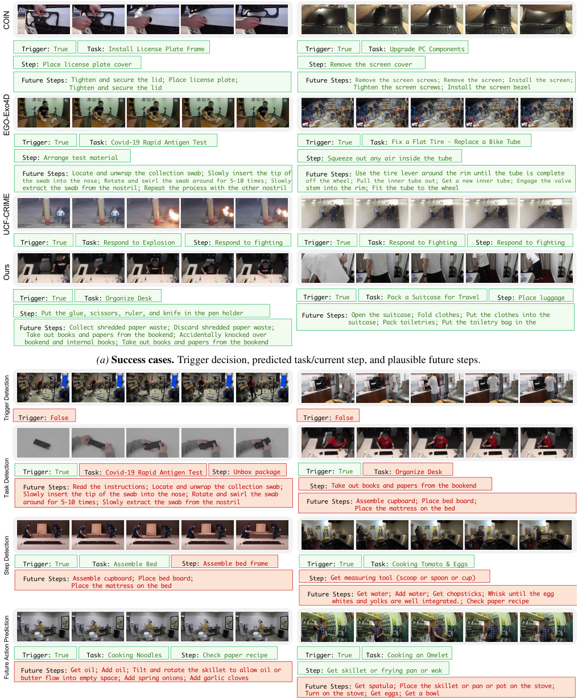

<!-- Start of picture text -->
Trigger: True Task: Install License Plate Frame Trigger: True Task: Upgrade PC Components Step: Place license plate cover Step: Remove the screen cover Future Steps: Tighten and secure the lid; Place license plate;  Future Steps: Remove the screen screws; Remove the screen; Install the screen; Tighten and secure the lid Tighten the screen screws; Install the screen bezel Trigger: True Task: Covid-19 Rapid Antigen Test Trigger: True Task:  Fix a Flat Tire - Replace a Bike Tube Step: Arrange test material Step: Squeeze out any air inside the tube Future Steps: Locate and unwrap the collection swab; Slowly insert the tip of  Future Steps: Use the tire lever around the rim until the tube is complete the swab into the nose; Rotate and swirl the swab around for 5-10 times; Slowly  off the wheel; Pull the inner tube out; Get a new inner tube; Engage the valve extract the swab from the nostril; Repeat the process with the other nostril stem into the rim; Fit the tube to the wheel Trigger: True Task: Respond to Explosion Step: Respond to fighting Trigger: True Task: Respond to Fighting Step: Respond to fighting Trigger: True Task: Organize Desk Trigger: True Task: Pack a Suitcase for Travel Step: Place luggage Step:  Put the glue, scissors, ruler, and knife in the pen holder Future Steps: Open the suitcase; Fold clothes; Put the clothes into the suitcase; Pack toiletries; Put the toiletry bag in the Future Steps: Collect shredded paper waste; Discard shredded paper waste; Take out books and papers from the bookend; Accidentally knocked over bookend and internal books; Take out books and papers from the bookend (a)  Success cases. Trigger decision, predicted task/current step, and plausible future steps. Trigger: False Trigger: False Trigger: True Task: Covid-19 Rapid Antigen Test Step: Unbox package Trigger: True Task: Organize Desk Future Steps: Read the instructions; Locate and unwrap the collection swab;  Step: Take out books and papers from the bookend Slowly insert the tip of the swab into the nose; Rotate and swirl the swab around for 5-10 times; Slowly extract the swab from the nostril Future Steps: Assemble cupboard; Place bed board; Place the mattress on the bed Trigger: True Task: Assemble Bed Step: Assemble bed frame Trigger: True Task: Cooking Tomato & Eggs Future Steps:  Assemble cupboard; Place bed board;  Step:  Get measuring tool (scoop or spoon or cup) Place the mattress on the bed Future Steps: Get water; Add water; Get chopsticks; Whisk until the egg whites and yolks are well integrated.; Check paper recipe Trigger: True Task: Cooking Noodles Step: Check paper recipe Trigger: True Task: Cooking an Omelet Future Steps: Get oil; Add oil; Tilt and rotate the skillet to allow oil or  Step: Get skillet or frying pan or wok butter flow into empty space; Add spring onions; Add garlic cloves Future Steps: Get spatula; Place the skillet or pan or pot on the stove; Turn on the stove; Get eggs; Get a bowl COIN EGO-Exo4D UCF-CRIME Ours Trigger Detection Task Detection Step Detection Future Action Prediction <!-- End of picture text -->

_(b)_ **Failure cases.** Task/step confusion, invalid or repetitive futures, and incomplete generations. 

_Figure 7._ **Qualitative results across sources.** We show representative success and failure patterns for proactive prediction and future-step generation. 

18

<!-- Page 19 -->

**ProAct: A Benchmark and Multimodal Framework for Structure-Aware Proactive Response** 

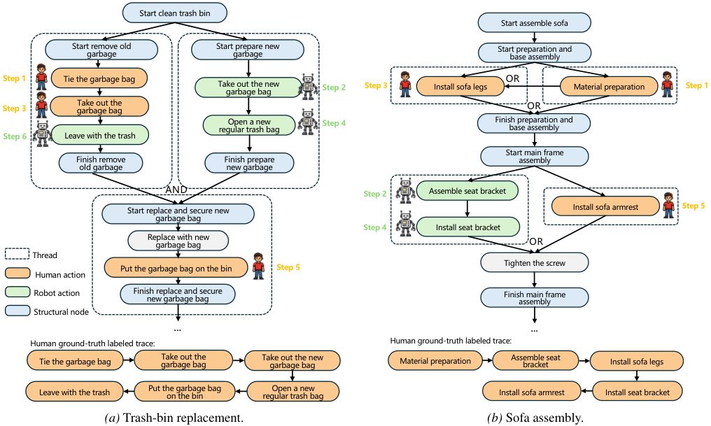

<!-- Start of picture text -->
Start clean trash bin Start assemble sofa Start remove old  Start prepare new  Start preparation and garbage garbage base assembly Step 1 Tie the garbage bag Take out the new garbage bag Step 2 Step 3 Install sofa legs OR Material preparation Step 1 Step 3 garbage bagTake out the  OR regular trash bagOpen a new  Step 4 Finish preparation and base assembly Step 6 Leave with the trash Start main frame Finish remove  Finish prepare  assembly old garbage new garbage AND Step 2 Assemble seat bracket Start replace and secure new  Install sofa armrest Step 5 garbage bag Step 4 Install seat bracket Replace with new garbage bag  OR Thread Put the garbage bag on the bin Step 5 Tighten the screw Human action Robot action Finish replace and secure new garbage bag Finish main frame assembly Structural node … … Human ground-truth labeled trace: Human ground-truth labeled trace: Tie the garbage bag garbage bagTake out the  Take out the new garbage bag Material preparation Assemble seat bracket Install sofa legs Leave with the trash Put the garbage bag on the bin regular trash bagOpen a new  Install sofa armrest Install seat bracket (a)  Trash-bin replacement. (b)  Sofa assembly. <!-- End of picture text -->

_Figure 8._ **Stage-5 visualization of proactive action selection under task-graph constraints.** We overlay the human ground-truth trace on the annotated task graph and visualize how the agent selects the next proactive action after short-horizon future-step generation. Candidate actions are first filtered by graph feasibility ( _e.g_ ., prerequisite satisfaction and AND/OR dependencies) and then ranked to choose an actionable, procedure-aligned robot step that best supports the ongoing workflow. Left: trash-bin replacement; right: sofa assembly. 

### **C.1. Success Cases** 

**State Detection and Prediction Tasks.** Figure 7a shows representative success cases of our proactive pipeline across multiple sources (COIN, Ego-Exo4D, UCF-Crime, and our collected data). Overall, the model demonstrates strong cross-stage consistency: it triggers interventions when warranted, identifies the correct task context and ongoing step, and generates plausible short-horizon future steps that remain coherent with the observed workflow. Notably, the predicted futures are typically actionable and procedurally aligned ( _e.g_ ., preparing tools before execution), suggesting that the model has learned transferable procedural priors beyond dataset-specific appearance cues. 

**Proactive Action Selection.** Beyond per-stage predictions, Figure 8 visualizes how the pipeline instantiates graphconstrained decision making at the final stage. Given the recognized task/step context and the short-horizon candidates, the agent filters out graph-infeasible actions ( _e.g_ ., violated prerequisites) and selects an actionable next robot step that is procedurally aligned with the ongoing workflow. As shown in the trash-bin replacement and sofa assembly examples, the selected actions tend to prioritize prerequisite- and preparation-type steps before execution, demonstrating effective use of task-graph constraints for low-risk and high-utility interventions. 

### **C.2. Failure Cases** 

Figure 7b summarizes typical failure modes. First, the model may _confuse semantically related tasks_ under limited visual evidence ( _e.g_ ., mapping emergency response contexts to an incorrect but plausible category), which then cascades to step-level mismatch. Second, we observe _procedural hallucination and redundancy_ in future-step generation, such as repeated steps or inserting irrelevant sub-procedures, indicating that language priors can dominate when the visual state is ambiguous. Third, some outputs become _graph-inconsistent or incomplete_ ( _e.g_ ., truncated step descriptions), which suggests remaining challenges in maintaining well-formed, graph-feasible plans under long-tail or OOD conditions. These cases motivate incorporating stricter graph-constrained decoding and validity-aware training objectives to further suppress 

19

<!-- Page 20 -->

**ProAct: A Benchmark and Multimodal Framework for Structure-Aware Proactive Response** 

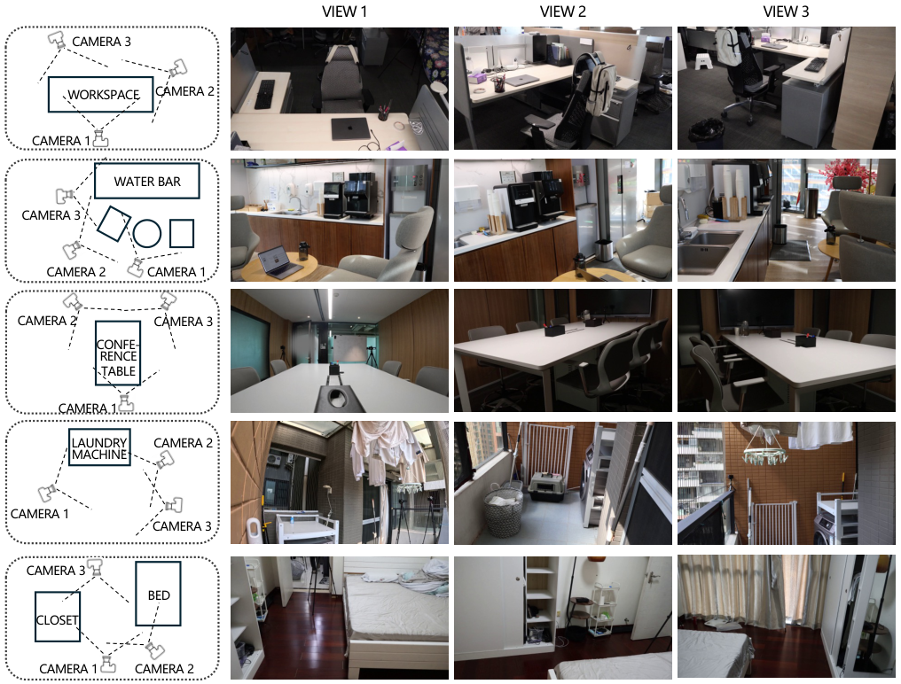

<!-- Start of picture text -->
VIEW 1 VIEW 2 VIEW 3 CAMERA 3 WORKSPACE CAMERA 2 CAMERA 1 WATER BAR CAMERA 3 CAMERA 2 CAMERA 1 CAMERA 2 CAMERA 3 CONFE- RENCE TABLE CAMERA 1 LAUNDRY CAMERA 2 MACHINE CAMERA 1 CAMERA 3 CAMERA 3 BED CLOSET CAMERA 1 CAMERA 2 <!-- End of picture text -->

_Figure 9._ **Multi-view scene setups and example frames.** The left column illustrates the camera layouts for each scene, while the right columns show representative synchronized frames from the three viewpoints (View 1–3). 

invalid or low-utility interventions. In addition, errors in upstream task/step recognition can lead to _mis-constrained action selection_ , where graph filtering over-prunes feasible actions or favors an incorrect thread, yielding conservative or suboptimal interventions. 

## **D. Dataset and Annotation Details** 

We provide additional details of the multi-view data collection setup and quality control. Each scene is captured by three synchronized cameras (Canon M50) at 4K/30fps to provide complementary viewpoints and reduce occlusion. For our self-collected multi-view videos, we additionally select a Best View based on manipulation visibility and minimal occlusion to form a standardized evaluation set. All videos are annotated under a unified step-level protocol, where boundaries correspond to semantic changes in human actions. Quality control is conducted in multiple rounds, and disagreements are resolved through expert discussion to ensure consistent step boundaries and labels across sources. 

20

<!-- Page 21 -->

**ProAct: A Benchmark and Multimodal Framework for Structure-Aware Proactive Response** 

## **E. Task-Graph Gallery** 

To facilitate reproducibility and error analysis, we include a gallery visualization of all annotated task graphs. In these visualizations, tasks are color-coded by scenario: Assistance <mark>,</mark> Maintenance <mark>,</mark> and Safety Monitoring <mark>,</mark> with overlapping regions indicating tasks that belong to both Assistance and Maintenance scenarios. Besides the sunburst renderings, we also report the distribution over mid-level nodes for each task graph, which characterizes how execution threads are induced by mid-level groups. We note that the optional priority scores are not used for training, since each task has fixed scores in our closed-set setting and can be directly retrieved via a lookup table when needed. 

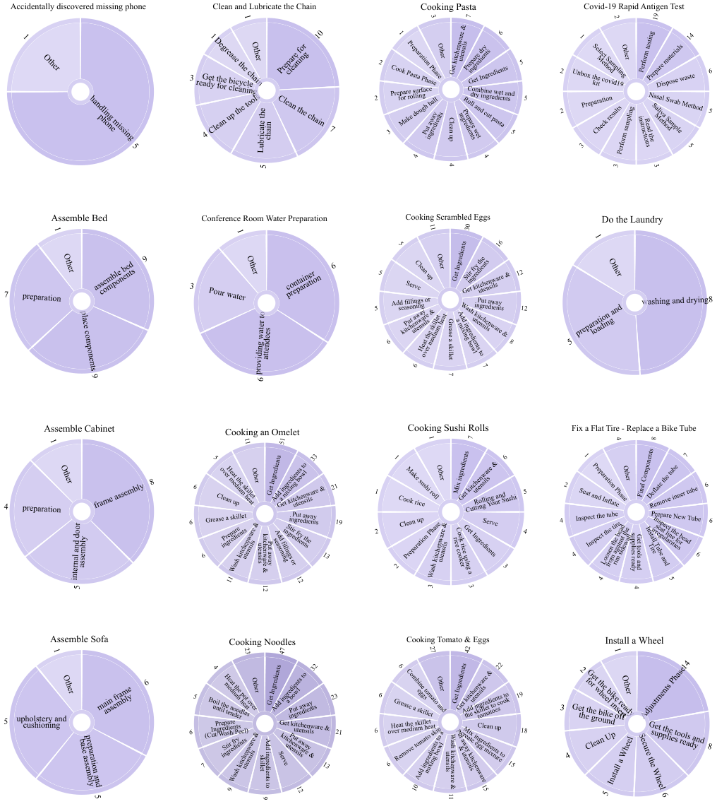

<!-- Start of picture text -->
Accidentally discovered missing phone Clean and Lubricate the Chain Cooking Pasta Covid-19 Rapid Antigen Test Assemble Bed Conference Room Water Preparation Cooking Scrambled Eggs Do the Laundry Assemble Cabinet Cooking an Omelet Cooking Sushi Rolls Fix a Flat Tire - Replace a Bike Tube Assemble Sofa Cooking Noodles Cooking Tomato & Eggs Install a Wheel 5 upholstery andcushioning washing and drying8 4 preparation 7 preparation 5 Add fillings orseasoning ingredientsPut away 12 6 Grease a skillet ingredientsPut away 19 6 (Cut/Wash/Peel)IngredientsPrepare Get kitchenware &utensils 21 6 over medium heatHeat the skillet Clean up 18 2 Prepare surfacefor rolling Combine wet anddry ingredients 5 4 Inspect the tube Prepare New Tube 6 3 Get the bicycle ready for cleaning 3 Get the bike off the ground 3 Pour water 2 6 Unbox the covid19kit Dispose waste 2 Preparation Nasal Swab Method 5 1 Cook rice Cutting Your SushiRolling and 5 Clean up Serve 2 4 Get the tools and supplies ready 8 2 5 Cook Pasta Phase Get Ingredients 5 12 Serve Get kitchenware &utensils 6 21 2 6 Clean up Get kitchenware &utensils Seat and Inflate Remove inner tube 5 23 6 19 Boil the noodlesuntil tender ingredientsPut away Grease a skillet Add ingredients tothe skillet to cooktomatoes 8 frame assembly Clean Up 4 6 containerpreparation Clean the chain 7 6 main frameassembly preparation andloading 5 9 assemble bedcomponents Put away kitchenware &utensils Wash kitchenware &utensils 6 8 ingredientsPrepare ingredientsStir fry the 6 13 Stir fry Put away ingredients kitchenware &utensils Remove tomato skin create egg mixtureMix ingredients to 7 13 6 15 Make dough ball Roll and cut pasta 3 5 Inspect the tire irregularitiesInspect the beadseat line for 4 6 4Clean up the tools 2for wheel insertGet the bike ready 1 Other phone handling missing 5 1 1 14 Method Select Sampling Prepare materials Degrease the chain Check results Saliva SampleMethod 3 5 1 6 utensils Make sushi roll Get kitchenware & Preparation Phase Get Ingredients 2 3 10 Prepare forcleaning 5 16 Clean up Stir fry theingredients 5 33 over medium heatHeat the skillet Add ingredients toa mixing bowl 4 32 6 22 a bowl eggs utensils medium heatHeat the pot over Add ingredients to Combine tomato and Get kitchenware & 1 6 Prepare dryingredients Preparation Phase 1 7 Preparation Phase Deflate the tube Adjustments Phase14 1 Other Put awayingredients ingredientsPrepare wet 4 4 Tire Loosen the beadfrom against therim sidewall Install Tube and 4 5 Heat the skilletover medium heat a mixing bowlAdd ingredients to 6 7 utensils seasoningAdd fillings or Wash kitchenware & 11 12 utensils Serve mixing bowl & utensils Wash kitchenware & Add ingredients to a Put away kitchenware 9 12 10 15 Install a Wheel 5 1 Other Secure the Wheel6 1 Other 1 Other 1 Other 2 19 Other Perform testing instructionsRead the Perform sampling 3 3 1 7 Other Mix ingredients utensils rice cooker Wash kitchenware & Cook rice using a 3 3 1 Other 1 Other 3 7 Other utensils Get kitchenware & 11 30 Other Get Ingredients 11 51 4 8 Other Other Get Ingredients Final Components 23 47 27 42 Other Other Get Ingredients Get Ingredients base assemblypreparation and 5 place components9 attendees providing water to 6 assembly internal and door 5 chain Lubricate the 5 Clean up 4 Grease a skillet 7 utensilskitchenware &Put away supplies readyGet tools and 12 4 skillet utensils Add ingredients to Wash kitchenware & 9 11 <!-- End of picture text -->

21

<!-- Page 22 -->

#### **ProAct: A Benchmark and Multimodal Framework for Structure-Aware Proactive Response** 

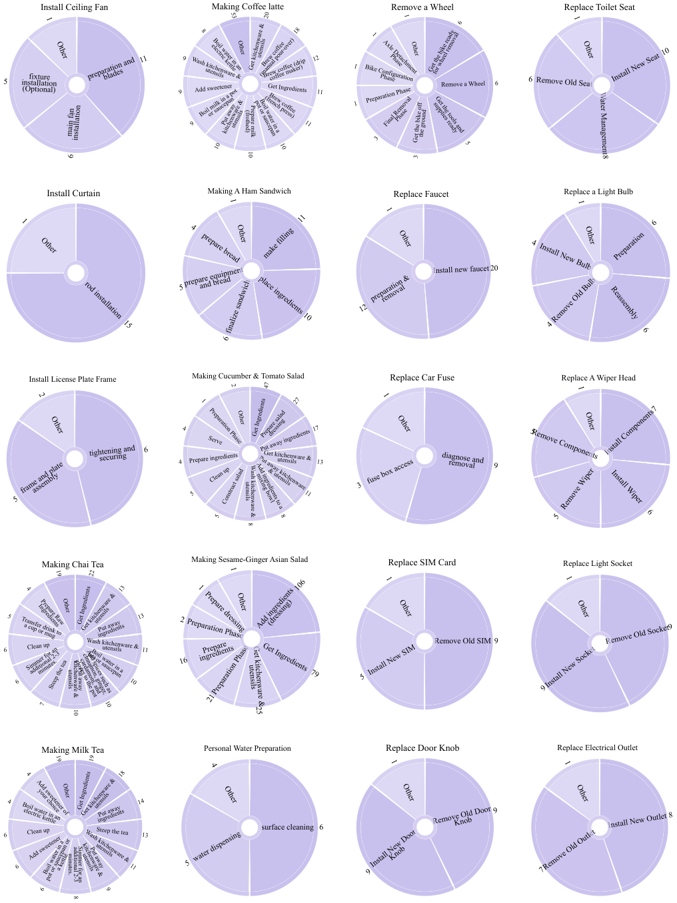

<!-- Start of picture text -->
Install Ceiling Fan Making Coffee latte Remove a Wheel Replace Toilet Seat Install Curtain Making A Ham Sandwich Replace Faucet Replace a Light Bulb Install License Plate Frame Making Cucumber & Tomato Salad Replace Car Fuse Replace A Wiper Head Making Chai Tea Making Sesame-Ginger Asian Salad Replace SIM Card Replace Light Socket Remove Old SIM 9 Making Milk Tea Personal Water Preparation Replace Door Knob Replace Electrical Outlet surface cleaning 6 Remove a Wheel 6 fixture 5 installation (Optional) Install new faucet 20 6 Remove Old Seat tightening andsecuring 6 4 Prepare ingredients Get kitchenware &utensils 13 6 Clean up Steep the tea 13 9 Add sweetener Get Ingredients 11 6 Clean up Wash kitchenware &utensils 11 diagnose and removal 9 Install New Outlet 8 Remove Old Socket9 Remove Old DoorKnob 9 5prepare equipmentand bread 1 Bike ConfigurationPhase 1 Preparation Phase 2 Preparation Phase Prepare 16 ingredients 11 preparation andblades 9 Wash kitchenware &utensils Brew coffee (dripcoffee maker) 12 4 Serve Put away ingredients 17 5 13 Transfer drink toa cup or mug ingredientsPut away 4 14 Boil water in anelectric kettle ingredientsPut away 5Remove Components 4 Install New Bulb fuse box access 3 Install New Seat10 Get Ingredients 79 Install New SIM 5 water dispensing 5 preparation &removal 12 Clean up & utensils Put away kitchenware 5 11 Add sweetener Wash kitchenware &utensils 6 11 Boil milk in a potor saucepan (french press)Brew coffee 9 11 frame and plateassembly 5 Simmer for anadditional 2-3minutes. pot or saucepanBoil water in a 6 10 7Remove Old Outlet 4 prepare bread 9Install New Socket Knob Install New Door 9 place ingredients10 Install Components7 6 Preparation 1 Other rod installation 15 1 Phase Axle Detachment 1 Prepare dressing Remove Old Bulb 4 11 make filling Install Wiper 6 Phase Final Removal 3 106 Add ingredients(dressing) 8 18 electric kettleBoil water in an Brew coffee (manual pour-over) 1 27 Preparation Phase Prepare saladdressing 4 13 IngredientsPrepare Raw Get kitchenware &utensils 4 18 Add sweetener ofyour choice Get kitchenware &utensils Reassembly 6 Remove Wiper 5 supplies readyGet the tools and 5 Preparation Phase 21 1 Other 1 Other 4 Other 6 Get the bike readyfor wheel removal 1 Other Put awayutensils kitchenware & pot or saucepanBoil water in a 10 10 Steep the tea cloves to the potcardamom, andcinnamon, ginger,Add spices such as 7 10 2 Other Construct salad mixing bowl Add ingredients to a 5 8 Boil water in apot or saucepan ora kettle utensilskitchenware &Put away 6 9 1 Other 1 Other 1 Other 1 Other 1 Other finalize sandwich 6 1 Other 1 Other 1 Other 1 Other 1 Other 53 20 Other utensils Get kitchenware & 2 47 Other Get Ingredients 19 22 Other Get Ingredients 19 19 Other Get Ingredients the ground Get the bike off 3 utensils Get kitchenware & 25 main faninstallation 6 Water Management8 (frothed) Prepare milk 10 utensils Wash kitchenware & 8 utensils Put away kitchenware & 10 minutes. additional 2-3Simmer for an 8 <!-- End of picture text -->

<!-- Start of picture text -->
22 <!-- End of picture text -->

<!-- Page 23 -->

#### **ProAct: A Benchmark and Multimodal Framework for Structure-Aware Proactive Response** 

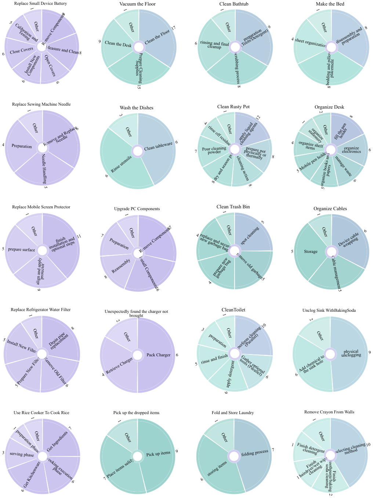

<!-- Start of picture text -->
Replace Small Device Battery Vacuum the Floor Clean Bathtub Make the Bed Replace Sewing Machine Needle Wash the Dishes Clean Rusty Pot Organize Desk Replace Mobile Screen Protector Upgrade PC Components Clean Trash Bin Organize Cables 5 Storage Replace Refrigerator Water Filter Unexpectedly found the charger not CleanToilet Unclog Sink WithBakingSoda brought Pack Charger 6 Use Rice Cooker To Cook Rice Pick up the dropped items Fold and Store Laundry Remove Crayon From Walls electronicsorganize 6 physical 9 unclogging 5 prepare surface 7 Pour cleaningpowder 4 Preparation 6 rinsing and final cleanup 3 serving phase Pick up items 9 9 Clean the Desk folding process 7 Measure and Clean8 4 organize shelfitems 6 Close Covers prepare pot physically orthermally 8 4 sheet organization Clean tableware 6 1 Finish detergentcleaning selecting cleaningmethod 10 5 rinse and finish 5 Install New Filter installation andfinish 11 optional steps 4 replace and secure new garbage bag 7 Preparation Clean the Floor 17 6 Needle Remove and Replace disassembly andpreparation 8 preparation (Tools/Detergent)9 Retrieve Charger 4 6 Device cablewrapping Add chemical tothe sink hole 6 5Mobile pen holder Finish cleaning 7Place items safely 1hairdryer/wet wipe storing items 6 3 preparation Gather optional tools (Parallel) 6 Reassembly 8 5 Calibration andTesting Rinse utensils 6 Remove Components17 8 Drain pipereplacement phase cooking execution 6 4 rinse off residue 10 perform cleaning(Parallel) 5 spot cleaning remove old garbage5 1 stationeryorganize 1 7 preparation phase Get Ingredients Prepare New Filter 5 Remove Old Filter 6 manage waste 6 prepare newgarbage bag 4 apply liquid cleaning agents12 Remove Components9 dry and season pot 8 8 fill the penholder 2 Other Get Kitchenware 6 2 Other Install Components16 1 Other Install NewComponents 6 1 Other 3 Other 1 Other Open Covers 6 1 Other cleaning action 8 1 Other 1 Other 1 Other 1 Other 1 Other 1 Other 1 Other 1 Other 1 Other 1 Other 1 2 Other Other 1 Other apply detergent 6 Cable management5 papers organize books and 5 scrubbing process8 protector align and apply 6 Needle Handling5 placement bedding and pillow 8 Supplies Prepare Cleaning 15 Finish soda cleaning toothpaste/baking 2 <!-- End of picture text -->

23

<!-- Page 24 -->

#### **ProAct: A Benchmark and Multimodal Framework for Structure-Aware Proactive Response** 

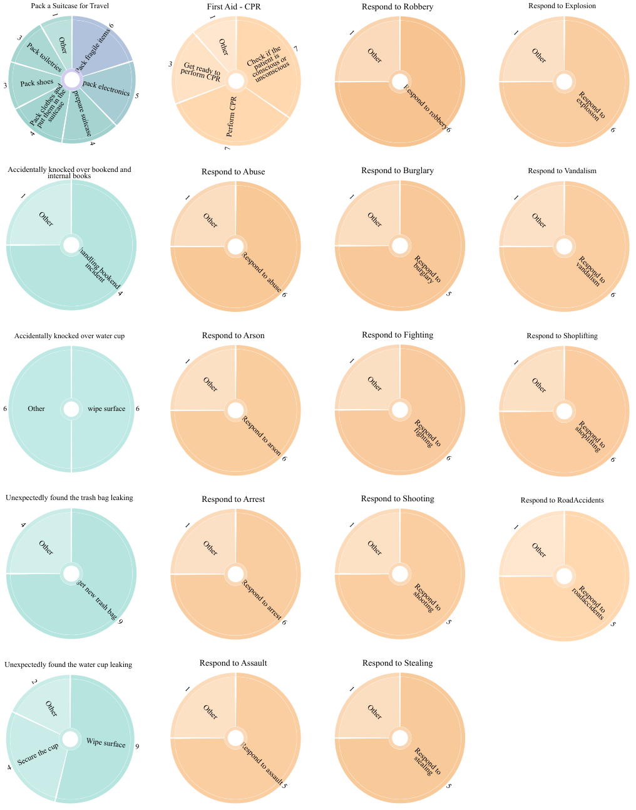

<!-- Start of picture text -->
Pack a Suitcase for Travel First Aid - CPR Respond to Robbery Respond to Explosion Accidentally knocked over bookend andinternal books Respond to Abuse Respond to Burglary Respond to Vandalism Accidentally knocked over water cup Respond to Arson Respond to Fighting Respond to Shoplifting 6 Other wipe surface 6 Unexpectedly found the trash bag leaking Respond to Arrest Respond to Shooting Respond to RoadAccidents Unexpectedly found the water cup leaking Respond to Assault Respond to Stealing 3 Pack shoes Wipe surface 9 3 Get ready to perform CPR pack electronics 5 Secure the cup 4 Check if the 7 conscious orpatient is unconscious 3 Pack toiletries 1 1 Other Other explosionRespond to Respond to robbery6 6 1 1 1 1 Other Other Other Other handling bookendincident burglaryRespond to vandalismRespond to 4 Respond to abuse6 5 6 1 1 1 Other Other Other fightingRespond to shopliftingRespond to Respond to arson6 6 6 4 1 1 1 Other Other Other Other shootingRespond to roadaccidentsRespond to get new trash bag9 Respond to arrest6 5 5 1 1 Other Other stealingRespond to Respond to assault 5 5 Pack fragile items6 Pack clothes andput them in thesuitcase 4 2 Other 1 Other prepare suitcase4 1 Other Perform CPR 7 <!-- End of picture text -->

24

<!-- Page 25 -->

**ProAct: A Benchmark and Multimodal Framework for Structure-Aware Proactive Response** 

_Figure 10._ **Task-graph collection (75 tasks).** We visualize the annotated task graphs for all tasks as sunburst-style DAG renderings. Each sector denotes a step, radial depth indicates hierarchical decomposition, and connectivity implicitly reflects prerequisite and branching constraints. 

## **F. Prompt Templates** 

In this section, we document the prompt templates used in our experiments. We include (i) the _proactive action selection_ prompt, which takes the task graph, progression state, human next-step horizon, and a candidate action set as input and requires a strict JSON action output, and (ii) the two-stage _state perception_ prompts for trigger/task and step/future prediction from video frames. We also provide representative example inputs and raw outputs from several LLMs to illustrate common failure modes ( _e.g_ ., malformed JSON, truncated generations, and constraint violations) under identical prompting. 

### **Proactive Action Selection Prompt (Template)** 

System: 

You are a robot action planner collaborating with a human on a procedural task. Choose exactly ONE next robot action from the provided candidate list. 

Hard constraints: 

- 1) You must output a JSON object with key "action". 

- 2) The value must be exactly one string from CANDIDATE_ACTIONS, or "Wait / None" if the list is empty. 

- 3) Prefer actions that are parallel to the human’s current thread (i.e., from a different execution thread in the task graph), when possible. Thread (thread): an independent branch in the task graph induced by the same mid-level start/end node pair; different threads have no shared nodes. 

User: TASK: {task_name} TASK_GRAPH (compact): {task_graph} COMPLETED_STEPS: {completed} HUMAN_IMMEDIATE_NEXT (do NOT do these): {human_immediate} HUMAN_FUTURE_HORIZON: {human_future} CANDIDATE_ACTIONS: {candidates} Return JSON only: {"action":"...","reason":"...","confidence":0-1} 

### **Planning Example Input (State ID: COIN\_-2CxSAVwFqE:1)** 

Task: Upgrade PC Components Candidate actions: [ "Remove the old hard drive", "Install the hard drive", "Install laptop back cover", "Terminate" ] 

Note: Logged "action" is the final executed robot action. 

25

<!-- Page 26 -->

**ProAct: A Benchmark and Multimodal Framework for Structure-Aware Proactive Response** 

If a proposed action’s preconditions are not met, it becomes "Wait / None" and the reason is appended with "| prereq_not_met". 

### **Planning Output (GPT-4o)** 

{ 

"action": "Wait / None", 

- "reason": "This action follows directly after ’Remove the old hard drive’, which is in the HUMAN_IMMEDIATE_NEXT, allowing continuous progress without interruption. | prereq_not_met", 

- "confidence": 0.9 

} 

(raw proposed action: "Install the hard drive") 

### **Planning Output (Gemini-2.5-Flash)** 

{ 

   - "action": "Wait / None", 

   - "reason": "The human is about to", 

   - "confidence": null 

- } 

### **Planning Output (Qwen3-Max)** 

{ 

   - "action": "Wait / None", 

   - "reason": "The human is currently focused on removing the old hard drive ( HUMAN_IMMEDIATE_NEXT), so I should avoid that step. Installing the new hard drive is a valid candidate action not in HUMAN_IMMEDIATE_NEXT, and it unlocks the next human steps while reducing thread switching. | prereq_not_met", 

   - "confidence": 0.95 

- } 

(raw proposed action: "Install the hard drive") 

### **Planning Output (DeepSeek-v3.2)** 

{ 

   - "action": "Wait / None", 

   - "reason": "All candidate actions are in HUMAN_IMMEDIATE_NEXT (Remove the old hard drive) or would violate constraint #3. According to hard constraint #5, I must choose ’Wait / None’ when every candidate action is in HUMAN_IMMEDIATE_NEXT or the list is effectively empty for the robot to act upon.", 

   - "confidence": 1.0 

- } 

26

<!-- Page 27 -->

**ProAct: A Benchmark and Multimodal Framework for Structure-Aware Proactive Response** 

### **Proactive response Stage-1 Prompt (Trigger + Task)** 

System: 

You are a precise vision-language model for video task detection. From the given frames (oldest->latest), decide CURRENT high-level task. Return strict JSON only: {"is_trigger": <true_or_false>, "task": "< one_of_list_or_others>"}. 

IMPORTANT: 

- If the person needs help with ANY task from the list, set is_trigger=true and output that task; otherwise set is_trigger=false. 

- Avoid false negatives: do NOT output {"is_trigger": false, "task": "others"} unless none matches. 

User: Frames: <frame_descs joined by comma> Candidate tasks: <comma-joined task list> If no task fits, use ’others’ and set is_trigger=false. 

### **Proactive response Stage-2 Prompt (Step + Future Steps + Scores)** 

System: 

You are a precise vision-language model for fine-grained procedural understanding. From the frames and the current task, decide CURRENT step and the NEXT 5 likely future steps. 

All steps MUST be chosen from the provided list. Scores must be integers 1..3 and priority = max(urgency, value). Return strict JSON only: 

- { 

"current_step": "<one_step_from_list_or_empty>", "future_steps": ["<step1>","<step2>","<step3>","<step4>","<step5>"], 

"scores": { "urgency": <int>, "value": <int>, "priority": <int> } 

- } 

### **Proactive response Example Input (EGO\_EXO4D\_...\_cam02)** 

Frame window: [ "[idx=0 t=0.00s]", "[idx=32 t=1.28s]", "[idx=51 t=2.04s]", "[idx=67 t=2.68s]" ] GT: task = "Covid-19 Rapid Antigen Test" step = "Read the instructions" is_trigger = true 

### **Proactive response Output (GPT-4o)** 

{ 

"pred_is_trigger": false, "pred_task": "others", "pred_step": "", 

27

<!-- Page 28 -->

<!-- Start of picture text -->
ProAct: A Benchmark and Multimodal Framework for Structure-Aware Proactive Response <!-- End of picture text -->

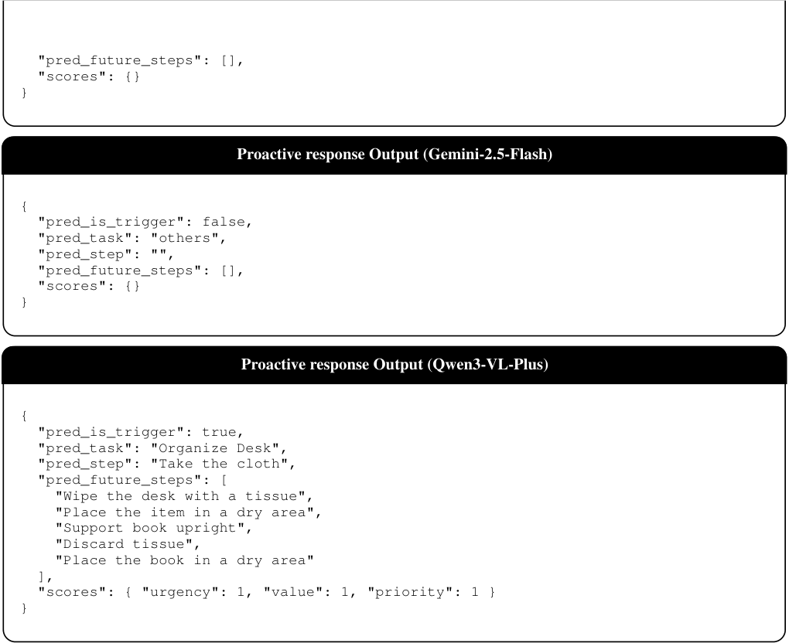

<!-- Start of picture text -->
"pred_future_steps": [], "scores": {} } Proactive response Output (Gemini-2.5-Flash) { "pred_is_trigger": false, "pred_task": "others", "pred_step": "", "pred_future_steps": [], "scores": {} } Proactive response Output (Qwen3-VL-Plus) { "pred_is_trigger": true, "pred_task": "Organize Desk", "pred_step": "Take the cloth", "pred_future_steps": [ "Wipe the desk with a tissue", "Place the item in a dry area", "Support book upright", "Discard tissue", "Place the book in a dry area" ], "scores": { "urgency": 1, "value": 1, "priority": 1 } } <!-- End of picture text -->

_Figure 11._ **Prompts and example outputs for ProAct-75.** Each card is rendered as a web-style panel (full-width title bar) and may span pages automatically. 

28
