# Probabilistic_Embeddings_with_Causal_Constraint_for_Error_Detection_in_Egocentric_Procedural_Videos

[Original PDF](../Probabilistic_Embeddings_with_Causal_Constraint_for_Error_Detection_in_Egocentric_Procedural_Videos.pdf)

Pages: 6

> Automatically converted from PDF. Check the original for exact equations, symbols, table alignment, and figure details.

<!-- Page 1 -->

# Probabilistic Embeddings with Causal Constraint for Error Detection in Egocentric Procedural Videos 

Tong Hou1 , Shenshen Li1 , Xun Jiang1 , Zheng Wang2,3 , Fumin Shen1 , Xing Xu1,2_∗_ 

> 1School of Computer Science and Engineering, University of Electronic Science and Technology of China, China 

> 2School of Computer Science and Technology, Tongji University 

> 3Institute of Electronic and Information Engineering of UESTC in Guangdong, China 

**_Abstract_ —Error detection in egocentric procedural task videos aims to identify deviations to support intelligent monitoring and task automation. Despite making significant progress, existing methods that leverage prototypes for egocentric error detection have two drawbacks: (1) The neglect of inherent data traits, i.e., large intra-class variance and minimal inter-class distinction. (2) The absence of causal consistency in temporal modeling. To address these challenges, we introduce a novel framework termed** **_Probabilistic Embeddings with Causal Constraint (PECC)_ for error detection in egocentric procedural videos. Specifically, we first integrated a causal dilated convolution module in temporal action segmentation model to capture temporal causal consistency. We then train Gaussian Mixture Models (GMMs) for each action class to get frame-level probabilistic embeddings. Finally, We evaluate test frames using log-likelihood values to detect erroneous actions. Extensive experiments conducted on EgoPER and HoloAssist demonstrate that our method achieves state-ofthe-art performance, significantly surpassing existing methods in error detection. Our code is available at https://github.com/ HouTong-s/PECC-for-Error-Detection-in-Egocentric-Videos.** 

**_Index Terms_ —Probabilistic Distribution Pepresentation, Gaussian Mixture Model, Egocentric, Error Detection** 

## I. INTRODUCTION 

Driven by the need for intelligent monitoring, accurately detecting operational mistakes in egocentric videos has become a focal challenge. Traditional methods, typically based on anomaly detection, focus on frame-level analysis by learning normal behavior patterns and identifying deviations as anomalies. While these methods have shown effectiveness in controlled environments, they encounter difficulties in modeling the complex temporal dynamics and diverse action patterns characteristic of egocentric video streams. As a result, learning an appropriate probabilistic distribution to represent normal behavior has become a critical problem. 

To address this problem, existing methods [7] employ a Temporal Action Segmentation (TAS) backbone for action segmentation, followed by a prototype learning module using K-means clustering. This approach allows the framework to learn multiple prototypes for each action class, serving as references for detecting deviations from normal task execution. As the first study to tackle this problem, it laid a foundational framework for detecting procedural errors in egocentric videos. 

Despite existing methods achieving remarkable improvements over traditional methods, they still face two major 

_∗_ Corresponding Author 

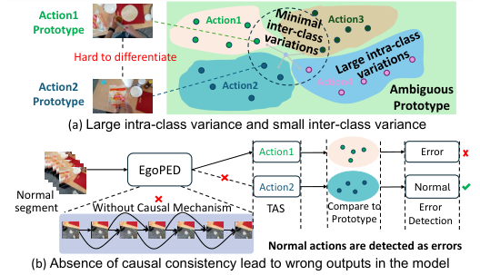

<!-- Start of picture text -->
Action1  Action1 Action3 Prototype Hard to differentiate Action2  Action2 Action4 Ambiguous Prototype Prototype (a) Large intra-class variance and small inter-class variance Action1 Error EgoPED Action2 Normal Normal  segment Without Causal Mechanism TAS Compare to  Error Prototype Detection Normal actions are detected as errors (b) Absence of causal consistency lead to wrong outputs in the model <!-- End of picture text -->

Fig. 1. Illustration of the limitations of EgoPED [7], highlighting key challenges: (a) significant intra-class variance coupled with minimal inter-class variance, making distinction difficult, and (b) a lack of causal consistency, underscoring critical areas for improvement and innovation. 

challenges: (1) They failed to consider inherent data characteristics, such as considerable intra-class variation and weak inter-class separation. (2) The temporal modeling process lacks causality consistency. As illustrated in Fig. 1(a), previous methods overlook critical data characteristics, resulting in prototypes with significant intra-class variance and limited inter-class distinction, making them prone to ambiguities. Moreover, the close positioning of prototypes from different classes in the embedding space further increases the likelihood of incorrect error detection due to overlapping feature representations. Secondly, as shown in Fig. 1(b), the TAS backbone employed in EgoPED [7] lacks temporal causal consistency, which is crucial for procedural tasks in egocentric procedural task videos, leading to potential misclassifications of action segments. This, in turn, propagates errors in the detection process associated with these segments, undermining the robustness of the overall error detection framework. 

To address these challenges, as illustrated in Fig. 2, we propose a novel framework termed **_P_** _robabilistic_ **_E_** _mbeddings with_ **_C_** _ausal_ **_C_** _onstraint (_ **_PECC_** _)_ for error detection in egocentric procedural task videos. This innovative approach strategically leverages causal mechanisms within the TAS model to improve the model’s sensitivity to causal consistency. Furthermore, Gaussian Mixture Models (GMMs) are employed to model the probabilistic distribution of each normal action. 

Specially, we first introduce a Causal Dilated Convolution (CDC) module into the TAS model to address the lack of 

Authorized licensed use limited to: Ningbo University. Downloaded on July 24,2026 at 14:44:57 UTC from IEEE Xplore.  Restrictions apply.

<!-- Page 2 -->

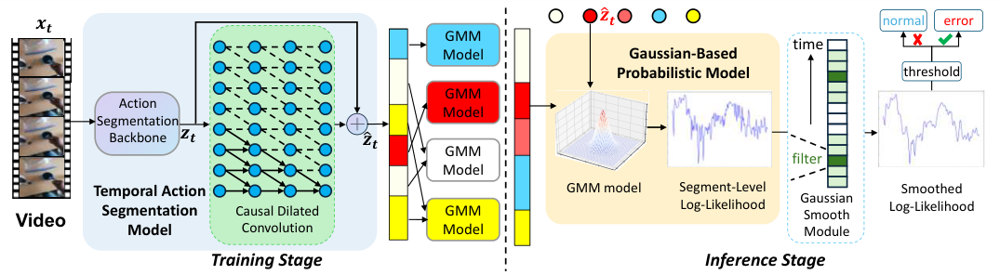

<!-- Start of picture text -->
𝒙𝒕 ො𝒛𝒕 normal error GMM time Model Gaussian-Based Probabilistic Model threshold GMM Action Model Segmentation Backbone 𝒛𝒕 ො𝒛𝒕 GMM filter Model Temporal Action GMM model Segment-Level Gaussian Smoothed Video Segmentation  Causal Dilated  GMM Log-Likelihood Smooth Log-Likelihood Model Convolution Model Module Training Stage Inference Stage <!-- End of picture text -->

Fig. 2. We integrate a Causal Dilated Convolution module into the Temporal Action Segmentation (TAS) model to effectively capture the temporal consistency inherent in procedural task videos. After training the TAS model, we further train a distinct Gaussian Mixture Model (GMM) for each action class to capture its respective probabilistic distribution. For inference, we utilize the trained GMM for each segment to generate Log-Likelihood embeddings corresponding to its action class. Then we smooth the Segment-Level Log-likelihood and compare it to Log-likelihood thresholds for error detection. 

causal consistency in egocentric procedural task videos. The CDC module effectively captures temporal causal consistency in videos, enhancing the model’s ability to utilize causality. Second, we introduce a Gaussian-Based Probabilistic Model, wherein a separate Gaussian Mixture Model (GMM) is independently learned for each action class to capture the unique underlying statistical characteristics of error-free actions. During inference, log-likelihood scores computed by the GMMs serve as Probabilistic Embeddings, identifying frames that deviate significantly from the learned distributions. Finally, we introduce a Gaussian Smoothing Module, which utilizes a one-dimensional Gaussian filter, to smooth the raw loglikelihood scores generated by the GMM. This smoothing step reduces noisy fluctuations, producing more consistent and coherent segment-level mistake assessments. The resulting refinement enhances the robustness of the framework, enabling it to handle complex action sequences with higher accuracy and reliability. Our proposed method achieves state-of-the-art results on the EgoPER and HoloAssist datasets. 

Overall, our contributions can be summarized as follows: 

- We integrate a causal dilated convolution module into the TAS model to model temporal dependencies and causal relations effectively, improving temporal consistency. 

- We propose a GMM-based framework for error recognition in egocentric video analysis, leveraging probabilistic log-likelihood evaluation to achieve enhanced robustness. 

- We introduce a smoothing technique using Gaussian filters on GMM log-likelihood scores, enabling coherent and accurate segment-level error detection. 

## II. RELATED WORK 

**Error Detection in Egocentric Procedural Task Videos.** Error detection in procedural tasks seeks to identify mistakes that occur during the execution of a specified sequence of steps. This task differs from conventional anomaly detection, which focuses on global deviations within the data, by instead emphasizing the correctness of individual steps within a task. Recent advancements in procedural error detection include various novel methods. For instance, Lee et al. [7] proposed 

EgoPED, a framework that uses Contrastive Step Prototype Learning (CSPL) for error detection in procedural tasks. They also introduced the EgoPER dataset, specifically designed for this task, which includes multimodal data from cooking tasks with both normal and erroneous steps. Similarly, Flaborea et al. [3] introduced the PREGO model, a pioneering online error detection model tailored for open-set scenarios. PREGO integrates online action recognition and large language models (LLMs) for symbolic reasoning to detect online errors. In contrast, our method focuses on offline error detection, which inherently differs from the online approach of PREGO. Furthermore, the Assembly101 [14] dataset, containing multiview videos and action annotations, offers valuable resources for error identification research in assembly tasks. 

**Probability Distribution Representation.** In computer vision and multimodal learning [6], [9], [10], probabilistic representations are extensively used to capture data uncertainty and variability. Unlike deterministic models, probability distribution representations provide a richer characterization of intrinsic data variation, which strengthens model robustness and generalization. For example, [8], [17] proposed the Probabilistic Cross-modal Embedding framework, which represents images and texts as probability distributions within a shared embedding space, effectively addressing the one-to-many correspondence problem between images and text. Ji et al. [5] introduced the MAP model, which employs a probabilistic distribution encoder to improve multimodal data handling and uncertainty management. In another advancement, Ahmine et al. [1] presented PNeRF, a probabilistic neural scene representation model capable of generating high-quality image renderings and accurate geometric reconstructions. Inspired by these works, we introduce probabilistic distribution representations into the task of error detection in egocentric procedural videos, modeling normal action distributions to enhance the differentiation between normal and erroneous behaviors. 

**Causal Mechanism.** Causal dilated convolution has been widely adopted for temporal sequence modeling, capturing long-range dependencies and maintaining causality. Ding et al. [2] proposed using causal convolution networks to cap- 

Authorized licensed use limited to: Ningbo University. Downloaded on July 24,2026 at 14:44:57 UTC from IEEE Xplore.  Restrictions apply.

<!-- Page 3 -->

ture temporal dependencies, highlighting the role of causal relationships in mechanical system degradation. Shen et al. [15] introduced the ProTAS framework for online action segmentation using causal dilated convolutions and causal masking. We leverage CDC module for offline, embedding causality as part of the model’s learning process, not for realtime prediction. Hamad et al. [4] employed dilated causal convolutions to preserve temporal order, leveraging causal mechanisms for more effective human activity recognition. Inspired by these advancements, we incorporate dilated causal convolutions into our framework to model long-range temporal dependencies while maintaining the causality essential for detecting procedural errors in egocentric videos. 

## _A. Preliminary_ 

We adopt the task setup from the EgoPED framework [7], which originally proposed the procedural error detection task in egocentric videos of sequential tasks. The objective of this task is twofold: first, to segment the test video into taskrelated steps and background, and second, to identify frames containing procedural errors. A distinctive aspect of this task is that training is conducted using only normal (error-free) videos, while testing involves both normal and erroneous videos. Formally, let the dataset consist of _N_ videos, each represented as a sequence of frames with pre-extracted features and corresponding step labels. For video _n_ , the frame-wise features are denoted as **X** _n_ = _{_ **x** _n,_ 1 _,_ **x** _n,_ 2 _, . . . }_ and their ground-truth step labels as **Y** _n_ = _{_ **y** _n,_ 1 _,_ **y** _n,_ 2 _, . . . }_ , where **x** _n,t ∈_ R_d_ is the _d_ -dimensional feature vector of the _t_ -th frame, and **y** _n,t_ is its action label. The TAS model is trained on normal videos using the action label sequence **Y** , enabling the subsequent error detection process. 

## _B. Causal Dilated Convolution_ 

First, we focus on temporal action segmentation (TAS), where the goal is to classify each frame of the video into its corresponding action class. TAS typically consists of two main components: an action segmentation backbone and a classifier head. The backbone takes pre-extracted features **X** _n_ = _{_ **x** _n,_ 1 _,_ **x** _n,_ 2 _, . . . }_ as input and learns refined, holistic frame-wise features **Z** _n_ = _{_ **z** _n,_ 1 _,_ **z** _n,_ 2 _, . . . }_ by capturing longrange temporal dependencies across frames, where **z** _n,t ∈_ R_d′_ is a _d__′_ -dimensional feature vector representing the refined features of frame _t_ in video _n_ . The classifier head then assigns a label to each frame based on its corresponding refined feature vector. For clarity, we omit the video index _n_ in the subsequent formulas, focusing on the frame-wise features **x** _t_ and their corresponding refined features **z** _t_ for a single video. 

We incorporate a Causal Dilated Convolution (CDC) module between the two main components of TAS. This CDC module is specifically designed to enhance the model’s capability to capture long-term dependencies and maintain temporal causal consistency. The CDC module refines the temporal features output by the backbone network. By sequentially processing frame features in temporal order, it enhances the 

temporal modeling capabilities while ensuring the crucial causal relationships between actions in procedural task videos. 

For a convolution kernel with size _k_ and dilation rate _d_ , the receptive field of a CDC module is given by ( _k −_ 1) _× d_ + 1, enabling the model to capture long-range causal relationships while maintaining computational efficiency. The operation performed by the CDC module can be formalized as: 

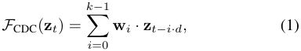

where _F_ CDC( **z** _t_ ) represents the output of the CDC module at time _t_ , **w** _i_ denotes the convolutional kernel weights, and **z** _t−i·d_ is the input feature at the dilated position. 

By exponentially increasing _d_ across layers (e.g., _d_ = 1 _,_ 2 _,_ 4 _, . . ._ ), the receptive field expands rapidly without a proportional increase in the number of parameters. 

Furthermore, the output from the CDC module is combined with the backbone’s output through a residual connection. The residual connection is defined as: 

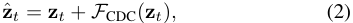

## _C. Gaussian-Based Probabilistic Model_ 

To model the probabilistic distribution within actions, we propose a Gaussian-Based Probabilistic Model. In this model, Gaussian Mixture Models (GMMs) are employed as fundamental components. The intermediate features _z_ ˆ _t_ from a trained TAS model are used to train a GMM for each action class. The GMM models the probability distributions of frame features, effectively capturing normal variations for each action. We utilize its output to obtain probabilistic embeddings for each frame. Furthermore, these embeddings can be employed for the purpose of error detection. 

The GMM is a probabilistic model that assumes each data point is generated from a mixture of Gaussian distributions, with _K_ representing the total number of Gaussian components in the mixture, each associated with a weight. The probability density function of the GMM, defined over a multidimensional vector **x** , is: 

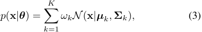

where **_θ_** = _{ωk,_ **_µ_** _k,_ **Σ** _k}__K_ _k_ =1representstheparametersofthe GMM: _ωk_ is the weight of the _k_ -th Gaussian component, **_µ_** _k_ is its mean vector, and **Σ** _k_ is its covariance matrix. **GMM Training via Expectation-Maximization (EM).** The EM algorithm optimizes the GMM parameters **_θ_** , by maximizing the total expected log-likelihood of the data. Let **Z** ˆ_i_ = _{_ **z** ˆ1_i,_ˆ**z** 2_i, . . .,_ˆ**z**_i_ _T__}_representallintermediateframe-wise features for a specific action _i ∈{_ 1 _,_ 2 _, . . . , S_ + 1 _}_ , where _T_ is the total number of frames for action i and _S_ denotes the total number of action classes, label _S_ +1 for the background class. The expected log-likelihood is expressed as: 

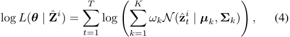

Authorized licensed use limited to: Ningbo University. Downloaded on July 24,2026 at 14:44:57 UTC from IEEE Xplore.  Restrictions apply.

<!-- Page 4 -->

The optimization alternates between the following two steps: 

- **E-Step** : Computes the responsibility _γt,k_ , which represents the posterior probability of the _k_ -th Gaussian component given **z** ˆ_i_ _t_: 

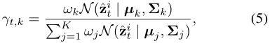

- **M-Step** : updates the parameters to maximize the expected log-likelihood: 

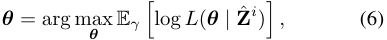

This yields the following updates: 

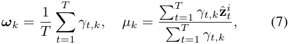

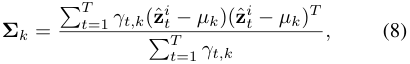

The algorithm iteratively alternates between these steps until the parameters converge. 

**Log-Likelihood for Error Detection.** At inference stage, through the TAS model, each test frame **x** _t_ can be classified into a specific action class, denoted by _j_ , where _j ∈ {_ 1 _,_ 2 _, . . . , S_ + 1 _}_ . Additionally, for each action class _j_ , a GMM is trained, denoted as **_θ_** _j_ = _{πk__j,_**_ω_**_j_ _k__,_**Σ**_j_ _k__}_ _k__K_ =1.Given the intermediate feature **z** ˆ _t_ of frame **x** _t_ belonging to class _j_ , the log-likelihood of **z** ˆ _t_ under the GMM **_θ_** _j_ is computed as: 

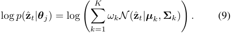

This log-likelihood value is used to assess the likelihood that the frame **x** _t_ , follows the distribution of the action class _j_ . By calculating this value for each frame, we can identify frames that deviate significantly from the expected distributions, thus enabling error detection. 

**Log-Likelihood Thresholds.** To classify frames as normal or erroneous, we define 41 log-likelihood thresholds for each action, denoted as the set **Γ** = _{γ_ 1 _, γ_ 2 _, . . . , γ_ 41 _}_ . These thresholds are evenly sampled between the minimum and median log-likelihood values from the training set. The choice of 41 aligns with the configuration of the EgoPED [7]. 

## _D. Gaussian Smooth Module_ 

We get log-likelihood values of every frame in inference stage for error detection. However, Frame-level log-likelihood values can fluctuate due to noise or transient inconsistencies, potentially leading to false positives or negatives. To mitigate this, we apply a Gaussian Smooth Module (GSM) using a onedimensional Gaussian filter to smooth the log-likelihood values across each action segment. This smoothing is crucial because it aggregates frame-level errors into more stable segmentlevel assessments, ensuring that errors are detected more consistently over time. Specifically, we perform the smoothing by applying the Gaussian kernel across the frames within a 

segment, which takes into account not only the current frame’s likelihood but also the surrounding frames. 

As illustrated on the right side of Fig. 2, the smoothed loglikelihood values are evaluated against a predefined threshold. Given a threshold _γ ∈_ **Γ** , a frame is classified as **normal** if its log-likelihood value is greater than or equal to _γ_ ; otherwise, it is classified as an **error** . 

Finally, segment-level decisions are made using a majority voting mechanism: 

- If the majority of frames in a segment are classified as normal, the segment is considered normal. 

- Otherwise, the segment is classified as erroneous. 

The detailed pseudocode of our framework is provided in the supplementary materials. 

IV. EXPERIMENT 

## _A. Experimental Setup_ 

**Datasets.** We evaluate our model on the EgoPER [7] and HoloAssist [16] datasets. The EgoPER dataset comprises five independent tasks, each of which is trained and tested separately. For each of these five tasks, we utilize RGB data and active object detection (AOD) information to train our model. The HoloAssist dataset is a large-scale egocentric human interaction dataset containing 2,221 egocentric videos, with annotations provided for error detection tasks. We only use RGB data for training in HoloAssist. Specially, we separately train and evaluate the model using verbs or nouns as action labels in HoloAssist. For EgoPER and HoloAssist, data is split into 80% normal videos for training, 10% for validation, and the remaining 10%, along with all error videos, for testing. **Evaluation Metrics.** We use multiple metrics to evaluate the performance of error detection and action segmentation. For error detection, we first calculate the Segment-level Error Detection Accuracy (EDA), defined as _De/GTe_ , where _De_ and _GTe_ represent the number of correctly predicted segments and the total number of segments in all test videos, respectively. Additionally, we employ micro AUC based on framelevel error predictions to assess frame-level error detection capability; hereafter, AUC refers exclusively to micro AUC. **Implementation Details.** We utilize the I3D model to extract RGB features. Additionally, for the EgoPER dataset, we employ Graph Convolutional Networks (GCNs), as in EgoPED, to extract active object detection (AOD) information. We use ActionFormer [19] and MSTCN++ [11] as backbone models for action segmentation, with CDC modules incorporated into each backbone. During training, we first train the TAS backbone. Subsequently, we train a Gaussian-Based Probabilistic Model by learning a separate GMM for each action class using intermediate features extracted from all videos in the training set. The log-likelihood of each frame in the training set is computed to establish appropriate thresholds for each action class. During inference, these thresholds are used by comparing them with the GMM predictions for each frame of the test set videos to detect errors. 

Authorized licensed use limited to: Ningbo University. Downloaded on July 24,2026 at 14:44:57 UTC from IEEE Xplore.  Restrictions apply.

<!-- Page 5 -->

TABLE I 

ERROR DETECTION RESULTS OF DIFFERENT METHODS ON THE EGOPER DATASET FOR EACH TASK AND THE AVERAGE OVER ALL TASKS. 

|**Meth**|**od** **Quesa** **EDA**|**dilla** **AUC**|**Oatm** **EDA**|**eal** **AUC**|**Pinwh** **EDA**|**eel** **Coffee** **Te** **AUC** **EDA** **AUC** **EDA**|**a** **AUC**|**Ave** **EDA**|**rage** **AUC**||
|---|---|---|---|---|---|---|---|---|---|---|
|Rand|om 19.9|50.0|11.8|50.0|15.7|50.0 8.20 50.0 17.0|50.0|14.5|50.0||
|HF2-VAD [12|] (ICCV’21) 34.5|62.6|25.4|62.3|29.1|52.7 10.0 59.6 36.6|62.1|27.1|59.9||
|SSPCAB [13]|(CVPR’22) 30.4|60.9|25.3|61.9|33.9|51.7 10.0 60.1 35.4|63.2|27.0|59.6||
|S3R [18] (E|CCV’22) 52.6|51.8|47.8|61.6|50.5|52.4 16.3 51.0 47.8|57.9|43.0|54.9||
|EgoPED [7]|(CVPR’24) 62.7|65.6|51.4|65.1|59.6|55.0 55.3 58.3 56.0|66.0|57.0|62.0||
|PECC (|Ours) **79.4**|**75.4**|**88.4**|**67.1**|**77.8**|**63.7** **83.1** **64.5** **77.1**|**66.6**|**81.2**|**67.5**||
||TABLE II ||||80|~~EDA (EoPER)~~|||||
|HE RESULTS O|F ERROR DETECTION ON|HOLOA|SSIST.|||~~g~~ AUC (EgoPER)|90||||
|**Method**|**Verb** **EDA** **AUC**|**EDA**|**Noun**  **AUC**||76 ce(%)||82 ce(%)||||
|Random|11.2 50.0|13.0|50.0||72 an||74 an|ED|A (Verb)||
|VAD [12] (IC|CV’21) 24.0 38.0|23.2|38.2||orm||orm| A| UC(Verb)||
|AB [13] (CV R [18] (ECCV|PR’22) 23.7 38.0 ’22) 51.2 48.6|22.9 51.6|39.1 49.5||68 Perf||66 Perf||||
|PED [7] (CVP PECC (Ours|R’24) 68.0 47.3 ) **93.1** **54.7**|71.0 **77.1**|50.8 **55.0**||64||58||||
|ATIONSTUDY  Method  GBP&GSM  CDC&GSM|TABLE III  OFMETHODCOMPONE GBP CDC GSM ✓ ✓|NTS ON  EDA 66.1 73.1|EGOPER AUC 63.5 64.0||60 Fig. 3 GMM|1 2 3 4 Number of Components . Error Detection metrics for diff  on EgoPER (left) and HoloAssist|50 erent n  (right),|1 Num umbers o  using v|2  ber of Com f compon erb as the|3 4 ponents ents in t  class lab|
|w/o CDC|✓ ✓|75.2|64.9|||EgoPER|15|Ho|loAssist (Nou|n)|
|w/o GSM|✓ ✓|74.1|65.9||60|w/o CDC ||13.7|w/o CDC ||
|CC (Ours)|✓ ✓ ✓|**81.2**|**67.5**|||w/ CDC EgoPED|||w/ CDC EgoPED||
|||||||48.4 47.4 49.5 48.1  47.5 ||||11.1|
|_l Comparsi_|_on Results_||||40 cs(%)|44.6|10 9|.0 9.3||7.5 7.7|
|**tection Re**|**sults.** Tables I and|II de|monstra|te that|etri||||||
|d achieves  and HoloAs|state-of-the-art perf sist datasets, consis|ormanc tently|e on b surpass|oth the ing all|20 M||5||||
|in EDA and|AUC scores. For|instanc|e, our|method|0||0||||
|uperiorave|rageEDAandAUC|onEg|oPED|signif-||IOU F1@0.5  (a)||IOU|(b)|F1@0.5|

TABLE II THE RESULTS OF ERROR DETECTION ON HOLOASSIST. 

|**Mthd**|**Ve**|**rb**|**No**|**un**|
|---|---|---|---|---|
|**eo**|**EDA**|**AUC**|**EDA**|**AUC**|
|Random |11.2|50.0|13.0|50.0|
|HF2-VAD [12] (ICCV’21)|24.0|38.0|23.2|38.2|
|SSPCAB [13] (CVPR’22)|23.7|38.0|22.9|39.1|
|S3R [18] (ECCV’22)|51.2|48.6|51.6|49.5|
|EgoPED [7] (CVPR’24)|68.0|47.3|71.0|50.8|
|PECC (Ours)|**93.1**|**54.7**|**77.1**|**55.0**|

TABLE III ABLATION STUDY OF METHOD COMPONENTS ON EGOPER 

Fig. 3. Error Detection metrics for different numbers of components in the GMM on EgoPER (left) and HoloAssist (right), using verb as the class label. 

|Method|GBP|CDC|GSM|EDA|AUC|
|---|---|---|---|---|---|
|w/o GBP&GSM||✓||66.1|63.5|
|w/o CDC&GSM|✓|||73.1|64.0|
|w/o CDC|✓||✓|75.2|64.9|
|w/o GSM|✓|✓||74.1|65.9|
|PECC (Ours)|✓|✓|✓|**81.2**|**67.5**|

## _B. Overall Comparsion Results_ 

**Error Detection Results.** Tables I and II demonstrate that our method achieves state-of-the-art performance on both the EgoPED and HoloAssist datasets, consistently surpassing all baselines in EDA and AUC scores. For instance, our method achieves superior average EDA and AUC on EgoPED, significantly outperforming EgoPED and other traditional methods. Similarly, it achieves the highest scores on HoloAssist when using verbs or nouns as action class labels, further highlighting its robustness and effectiveness. The superior performance of our method is attributable to the inclusion of the CDC module, which effectively captures the causal relationships in action sequences. Additionally, the probabilistic representation learned from the GMMs model enables the model to better learn the distributional characteristics of action classes. 

Fig. 4. Analysis of the CDC module on TAS metrics (IOU and F1@0.5) for EgoPER (left) and HoloAssist (right) using ActionFormer. 

results underline the complementary roles of GBP, CDC, and GSM in improving both EDA and AUC metrics. We also evaluated the impact of TAS backbone (ActionFormer [19] and MSTCN++ [11]) on framework performance. 

**Analysis on Number of Components in GMM.** As shown in Fig. 3, the performance of the action error detection method on both the EgoPER and HoloAssist datasets varies with the number of components in the GMM. In general, using fewer components leads to better results, while increasing the components causes a decline in metrics. This suggests that modeling the data distribution with fewer, more concentrated components helps capture the essential patterns more effectively, leading to improved error detection performance. 

## _C. Further Analysis_ 

**Ablation Studies.** Table III shows the ablation study results for the key components of our method on EgoPER dataset. Here, **GBP** refers to the Gaussian-Based Probabilistic Model for error detection, while omitting GBP implies a prototypebased approach. **CDC** denotes the Causal Dilated Convolution module in the TAS backbone, and **GSM** represents the Gaussian Smooth Module. From the table, we observe that the inclusion of each module contributes positively to the overall performance. Notably, removing the CDC or GSM modules results in a notable performance drop. Additionally, replacing GBP with a prototype-based approach leads to a further decline in performance, indicating that the GaussianBased Probabilistic Model is more effective. Overall, these 

**Analysis on CDC Module for TAS.** Here, we compare the TAS performance of ActionFormer [19] under three configurations: (1) the original ActionFormer without the CDC module, (2) ActionFormer enhanced with the CDC module, and (3) the EgoPED method. As shown in Fig. 4, the results demonstrate that ActionFormer with the CDC module consistently outperforms both ActionFormer (without CDC) and EgoPED, highlighting the effectiveness of the CDC module 

Authorized licensed use limited to: Ningbo University. Downloaded on July 24,2026 at 14:44:57 UTC from IEEE Xplore.  Restrictions apply.

<!-- Page 6 -->

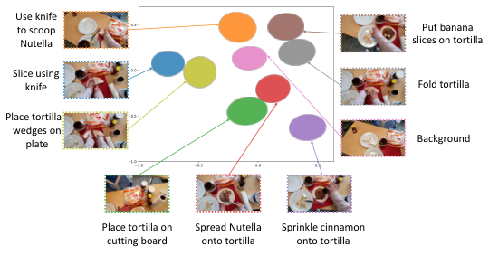

<!-- Start of picture text -->
Use knife to scoop  Put banana Nutella slices on tortilla Slice using knife Fold tortilla Place tortilla wedges on plate Background Place tortilla on  Spread Nutella  Sprinkle cinnamon cutting board onto tortilla onto tortilla <!-- End of picture text -->

Fig. 5. Visualization of the 2D projections of the GMM distributions learned for each action in the quesadilla task from the EgoPED dataset. 

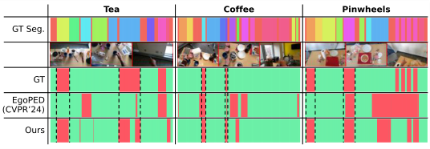

Fig. 6. Comparison of error detection on tea, coffee, and pinwheels tasks in EgoPER. The first row represents the ground truth (GT) action segmentation. The second row visualizes several frames from the sequences. 

in enhancing temporal action segmentation. While EgoPED generally outperforms the original ActionFormer, it occasionally underperforms even the original version, indicating the instability of CSPL compared to the CDC module. **Qualitative Analysis.** As shown in Fig. 5, the projection of the learned GMM distribution for each action in the 2D space demonstrates that each action corresponds to a distinct region. These well-separated regions facilitate effective error detection. The GMMs effectively capture the underlying data characteristics, addressing the issue of large intra-class variance and small inter-class variance observed in EgoPED prototypes. As illustrated in Fig. 6, our proposed method demonstrates superior error detection performance across the tea, coffee, and pinwheels tasks in the EgoPER dataset. Compared to EgoPED, our approach identifies erroneous segments with higher accuracy, significantly reducing false positives where normal frames are incorrectly detected as errors. 

## V. CONCLUSION 

In this paper, we proposed a probabilistic framework, Probabilistic Embeddings with Causal Constraint (PECC) for error detection. By leveraging a CDC module for temporal dependencies and learning GMMs for the probabilistic distributions of normal actions, our method consistently outperformed other methods on the EgoPER and HoloAssist datasets. These results highlight the framework’s effectiveness and potential for accurate and robust error detection. 

## ACKNOWLEDGMENT 

(No.62476201, 62222203 and 62306065) and the Guangdong Basic and Applied Basic Research Foundation (2023A1515140104). 

## REFERENCES 

- [1] Y. Ahmine, A. Dey, and A. I. Comport, “Pnerf: Probabilistic neural scene representations for uncertain 3d visual mapping,” _CoRR_ , vol. abs/2209.11677, 2022. 

- [2] W. Ding, J. Li, W. Mao, Z. Meng, and Z. Shen, “Rolling bearing remaining useful life prediction based on dilated causal convolutional densenet and an exponential model,” _Reliab. Eng. Syst. Saf._ , vol. 232, p. 109072, 2023. 

- [3] A. Flaborea, G. M. D. di Melendugno, L. Plini, L. Scofano, E. D. Matteis, A. Furnari, G. M. Farinella, and F. Galasso, “PREGO: online mistake detection in procedural egocentric videos,” in _CVPR_ , 2024, pp. 18 483–18 492. 

- [4] R. A. Hamad, M. Kimura, L. Yang, W. L. Woo, and B. Wei, “Dilated causal convolution with multi-head self attention for sensor human activity recognition,” _Neural Comput. Appl._ , vol. 33, no. 20, pp. 13 705– 13 722, 2021. 

- [5] Y. Ji, J. Wang, Y. Gong, L. Zhang, Y. Zhu, H. Wang, J. Zhang, T. Sakai, and Y. Yang, “MAP: multimodal uncertainty-aware vision-language pretraining model,” in _CVPR_ , 2023, pp. 23 262–23 271. 

- [6] X. Jiang, X. Xu, J. Zhang, F. Shen, Z. Cao, and H. T. Shen, “Semisupervised video paragraph grounding with contrastive encoder,” in _CVPR_ , 2022, pp. 2466–2475. 

- [7] S. Lee, Z. Lu, Z. Zhang, M. Hoai, and E. Elhamifar, “Error detection in egocentric procedural task videos,” in _CVPR_ , 2024, pp. 18 655–18 666. 

- [8] S. Li, X. Xu, C. He, F. Shen, Y. Yang, and H. T. Shen, “Crossmodal uncertainty modeling with diffusion-based refinement for textbased person retrieval,” _IEEE TCSVT_ , vol. 35, no. 3, pp. 2881–2893, 2025. 

- [9] S. Li, X. Xu, X. Jiang, F. Shen, X. Liu, and H. T. Shen, “Multigrained attention network with mutual exclusion for composed querybased image retrieval,” _IEEE TCSVT_ , vol. 34, no. 4, pp. 2959–2972, 2024. 

- [10] S. Li, X. Xu, Y. Yang, F. Shen, Y. Mo, Y. Li, and H. T. Shen, “DCEL: deep cross-modal evidential learning for text-based person retrieval,” in _ACM MM_ , 2023. 

- [11] S. Li, Y. A. Farha, Y. Liu, M. Cheng, and J. Gall, “MS-TCN++: multistage temporal convolutional network for action segmentation,” _IEEE Trans. Pattern Anal. Mach. Intell._ , vol. 45, no. 6, pp. 6647–6658, 2023. 

- [12] Z. Liu, Y. Nie, C. Long, and Q. Zhang, “A hybrid video anomaly detection framework via memory-augmented flow reconstruction and flow-guided frame prediction,” in _ICCV_ . IEEE, 2021, pp. 13 568– 13 577. 

- [13] N. Ristea, N. Madan, R. T. Ionescu, and K. Nasrollahi, “Self-supervised predictive convolutional attentive block for anomaly detection,” in _CVPR_ , 2022, pp. 13 566–13 576. 

- [14] F. Sener, D. Chatterjee, D. Shelepov, and K. He, “Assembly101: A largescale multi-view video dataset for understanding procedural activities,” in _CVPR_ , 2022, pp. 21 064–21 074. 

- [15] Y. Shen and E. Elhamifar, “Progress-aware online action segmentation for egocentric procedural task videos,” in _IEEE/CVF Conference on Computer Vision and Pattern Recognition_ . IEEE, 2024, pp. 18 186– 18 197. 

- [16] X. Wang, T. Kwon, M. Rad, B. Pan, I. Chakraborty, S. Andrist, D. Bohus, A. Feniello, B. Tekin, F. V. Frujeri, N. Joshi, and M. Pollefeys, “Holoassist: an egocentric human interaction dataset for interactive AI assistants in the real world,” in _ICCV_ , 2023, pp. 20 213–20 224. 

- [17] Z. Wang, Z. Gao, K. Guo, Y. Yang, X. Wang, and H. T. Shen, “Multilateral semantic relations modeling for image text retrieval,” in _CVPR_ , 2023, pp. 2830–2839. 

- [18] J. Wu, H. Hsieh, D. Chen, C. Fuh, and T. Liu, “Self-supervised sparse representation for video anomaly detection,” in _ECCV_ , ser. Lecture Notes in Computer Science, vol. 13673, 2022, pp. 729–745. 

- [19] C. Zhang, J. Wu, and Y. Li, “Actionformer: Localizing moments of actions with transformers,” in _ECCV_ , ser. Lecture Notes in Computer Science, S. Avidan, G. J. Brostow, M. Ciss´e, G. M. Farinella, and T. Hassner, Eds., vol. 13664, 2022, pp. 492–510. 

This work was supported in part by the National Natural Science Foundation of China under Grants, China 

Authorized licensed use limited to: Ningbo University. Downloaded on July 24,2026 at 14:44:57 UTC from IEEE Xplore.  Restrictions apply.
