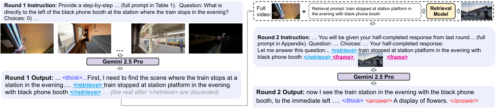
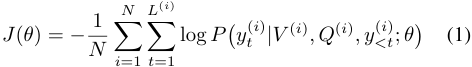
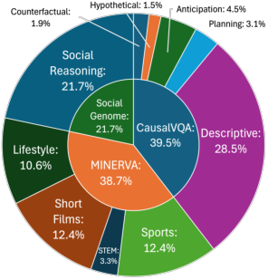
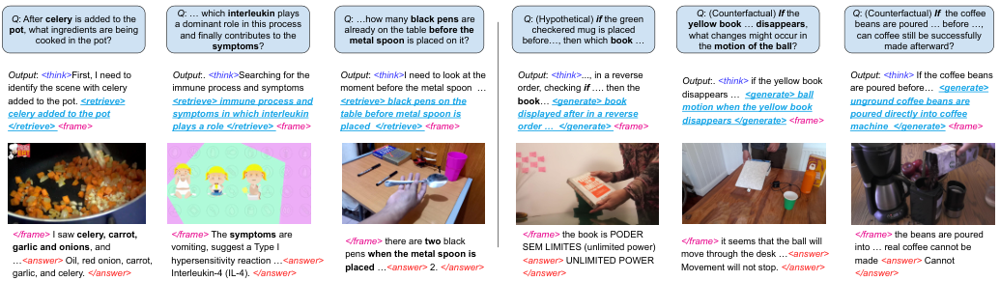

# Q._Act2See_Emergent_Active_Visual_Perception_for_Video_Reasoning_CVPR_2026_paper

[Original PDF](../Q._Act2See_Emergent_Active_Visual_Perception_for_Video_Reasoning_CVPR_2026_paper.pdf)

Pages: 10

> Automatically converted from PDF. Check the original for exact equations, symbols, table alignment, and figure details.

<!-- Page 1 -->

This CVPR paper is the Open Access version, provided by the Computer Vision Foundation. Except for this watermark, it is identical to the accepted version; the final published version of the proceedings is available on IEEE Xplore. 

# **ACT2SEE: Emergent Active Visual Perception for Video Reasoning** 

Martin Q. Ma1 Yuxiao Qu1 Aditya Agrawal1 Willis Guo1 Paul Pu Liang2 Ruslan Salakhutdinov1 Louis-Philippe Morency1 

1Carnegie Mellon University 

2MIT 

## **Abstract** 

_Vision-Language Models (VLMs) typically rely on static initial frames for video reasoning, restricting their ability to incorporate essential dynamic information as the reasoning process evolves. Existing methods that augment Chainof-Thought (CoT) with additional frame information often exhibit suboptimal CoT quality and lack the crucial ability to synthesize visual information for hypothetical or counterfactual scenarios. We introduce Act-to-See (_ ACT2SEE _), a novel framework that enables active visual perception by empowering VLMs to actively interleave video frames within text CoTs._ ACT2SEE _is developed via Supervised Fine-Tuning (SFT) on a high-quality dataset of reasoning traces generated by a frontier VLM. These traces integrate active calls to either retrieve existing frames or generate new ones, and are rigorously verified against human-annotated CoTs to ensure quality. This approach cultivates an emergent capability: at inference time, the model actively determines when to search for or synthesize the necessary visual evidence._ ACT2SEE _establishes new state-of-the-art results on challenging benchmarks, including VideoEspresso and ViTIB, and outperforms comparable or larger models on Video-MME, EgoNormia, and VCRBench, demonstrating an advancement in enabling VLMs with active visual perception for video reasoning. Code: https://github.com/martinmamql/act2see._ 

## **1. Introduction** 

Chain-of-Thought (CoT) prompting [30] has been integrated into Vision-Language Models (VLMs), and such a paradigm has been shown to enhance VLM reasoning capabilities on complex video tasks [1, 2, 5, 6, 18, 31]. The standard VLMs take a set of static initial video frames as input, or a video as input and sample at a fixed frame-per-second (fps). However, unlike image reasoning, video reasoning often involves nuanced visual details in spatiotemporal dynamics [12, 15, 24, 29, 32], which may be absent from the initial frames and require additional information. Static in- 

put frames can prevent the VLMs from actively collecting new evidence as reasoning evolves. 

Recent efforts have aimed to improve video reasoning with CoT by adding video frame information, such as predetermined keyframes, visual tool calls, localized temporal captioning, or key frame IDs to the CoTs [12, 13, 17, 32, 33]. However, there are two challenges the existing methods face. First, **_CoT quality_** can be suboptimal: frameinformation-augmented CoTs are often derived from VLMgenerated ground truth CoTs [9, 12, 15]. However, as shown in Zhang et al. [32], automated CoTs generated without human verification can sometimes be suboptimal and hinder the performance of the model. Second, it is crucial to **_generate hypothetical scenarios_** . Based on rich knowledge of the world, VLMs should have the ability to produce hypothetical scenarios, generate potential outcomes, and offer causally grounded responses [10, 21]. However, existing video reasoning methods cannot synthesize new visual frames inside CoTs [12, 13, 32]. Recent video reasoning benchmarks [10, 24–26] have started to focus on evaluation with real-world counterfactual or hypothetical questions where the requested scenarios are not present: for example, asking what will happen to an object if the temporal order in the original video had switched, and existing methods cannot “imagine” such scenarios visually during reasoning. These two challenges prevent video reasoning models from achieving better reasoning capabilities. 

We present **Act-to-See (ACT2SEE)** , a new framework that employs Supervised Fine-Tuning (SFT) to enable active visual perception that addresses the above challenges. By active visual perception [3, 12, 27, 32, 35], we mean actively deciding when and how to gather new visual information during video reasoning. To enable the capability of active visual evidence acquisition by searching existing videos or generating hypothetical scenarios, we prompt a frontier model (Gemini 2.5 Pro [6]) to output CoTs with specialized tool call syntax (i.e., retrieval or generation tokens and associated queries). The model actively inserts retrieval or generation tokens and corresponding queries whenever it determines the existing visual information is insufficient. Offline 

5455

<!-- Page 2 -->

<!-- Start of picture text -->
Round 1 Instruction directly to the left of the black phone booth at the station where the train stops in the evening?  : Provide a step-by-step … (full prompt in Table 1).  Question: What is  Full video: + Retrieval prompt:the evening with black phone boothtrain stopped at station platform in  Retrieval Model Choices: 0) … Round 2 Instruction : … You will be given your half-completed response from last round… (full prompt in Appendix). Question: … Choices: … Your half-completed response: … Let me answer this question...  <retrieve>  train stopped at station platform in the evening with black phone booth  </retrieve>  <frame> <frame> Gemini 2.5 Pro Round 1 Output:  ...  <think>... First, I need to find the scene where the train stops at a  Gemini 2.5 Pro station in the evening….  <retrieve>  t rain stopped at station platform in the evening with black phone booth </retrieve> … (the rest after </retrieve> are discarded) Round 2 Output:  now I see the train station in the evening with the black phone booth, to the immediate left ….  </think> <answer>  A display of flowers.  </answer> <!-- End of picture text -->

Figure 1. The two-round construction of the interleaved video-text CoT dataset. In the first round, Gemini 2.5 Pro is prompted to perform video reasoning, and simultaneously output a query to retrieve or generate any additional video frame when necessary. The retrieval or generation is done by offline models. In the second round, Gemini 2.5 Pro is asked to complete the reasoning based on the round 1 response (up to the point of the retrieval or generation query) and the new frame. The final reasoning CoT will be the concatenation of round 1 and round 2 outputs, which consists of the text reasoning interleaved with the retrieved or generated frame. 

retrieval or generation models are leveraged to gather the new frame. To ensure quality, we leverage video reasoning datasets with human-annotated ground-truth CoTs: MINERVA [24], CausalVQA [10], and Social Genome [23], and use the human annotated ground-truths as gold standard to filter out CoTs whose similarity scores with the corresponding ground-truths are low. We construct this highquality video reasoning SFT dataset with almost half (47%) of the traces containing retrieved or generated frames inside the CoTs. We use the resulting dataset to fine-tune a base model, Qwen3-VL-8B-Thinking [1]. 

ACT2SEE shows significant performance improvements on five video reasoning benchmarks: Video-MME [11], VideoEspresso [15], EgoNormia [26], VCR-Bench [25], and ViTIB [33], encompassing spatiotemporal reasoning, physical-social reasoning, complex perception, logical reasoning (including counterfactual), and video-text interleaving verification. It outperforms all standard VLMs of similar size such as InternVL2.5-8B [5], Video-LLaMA37B [31], Qwen3-VL-8B-Thinking [1], and Video-R1 [9]. ACT2SEE also outperforms most video-text interleaved CoT methods, such as Chain-of-Shot [17], FrameMind [12], and ReWatch-R1 [32]. More importantly, we observe the emergent capability of the model in retrieving or generating new visual frames inside the CoT at inference time (Figure 4), enabling VLMs to actively decide when to search or synthesize new visual information during reasoning. 

## **2. Method** 

Our goal is to enable a VLM with active visual perception capabilities of gathering new visual information inside the CoT. To achieve this goal, we design an SFT dataset with interleaved video frame and text in the CoT, by prompting a frontier model to include frame retrieval or generation calls during reasoning. In this section, we lay out the overview of the dataset construction algorithm as well as the supervisedfinetuning (SFT) training objective, and provide the details 

of the construction in Sect. 3. We include an overview of the data construction process in Figure 1. 

### **2.1. Creating interleaved CoTs for SFT** 

We develop a pipeline to automatically construct interleaved video-text CoTs using an off-the-shelf multimodel model together with our instruction template (Table 1). The goal of this pipeline is simply to generate explicit reasoning traces and visual operations from a strong VLM, not to distill or imitate any particular model. As shown in Table 1, the VLM is instructed to structure its reasoning within specialized tokens, where the <retrieve> _. . ._ </retrieve> 

or <generate> _. . ._ </generate> are the tool call tokens, and the _retrieval prompt_ or the _generation prompt_ inside is provided by the VLM simultaneously along with the tool call (e.g., <generate> _a bison baby chased by a wolf pack_ </generate>). 

Once the VLM generates the response in the first pass, if any tool call tokens are detected (<retrieve> or <generate>), the _retrieval prompt_ or _the generation prompt_ will be extracted, and a separate frame retrieval or generation tool will be called and the resulting retrieved or generated frame will be returned. Note that to increase generation quality, we first retrieve a frame based on the generation query, and then use the retrieved frame and the generation query for conditional image-to-image generation. 

To obtain complete, cohesive CoT with the newly gathered frame, everything from the VLM’s first response, up to the end of <retrieve> _retrieval prompt_ </retrieve> or <generate> _generation prompt_ </generate>, will be retained, and the new visual frames will be added to it. This process is shown in Algorithm 1 (following Zhang et al. [32] format), which applies to both gathering the SFT data and inference of the model. The retrieved frame is different from the initial frames as the retrieval model searches the video at a higher sampling rate. Importantly, the groundtruth CoTs are not used during generation; they are lever- 

5456

<!-- Page 3 -->

aged later for quality control, as explained in Sect. 3.3. This is due to ground-truth CoTs as input significantly lowering the chances of calling retrieval or generation tools, as shown in Sect. 4.5. Also, if no retrieval or generation query is detected, such text-only traces will also be considered, creating a blended set of interleaved video-text CoTs with text-only CoTs. 

This procedure produces a warm-up dataset with explicit, grounded multimodal reasoning steps. Importantly, any model capable of following the instruction template can be used in this pipeline. For implementation simplicity, we use Qwen-3-VL-8B-Thinking in our experiments, though the method is model-agnostic. 

### **2.2. Supervised Fine-Tuning with Interleaved CoT** 

Given the input video **_V_** represented as a sequence of sampled frames _V_ = _{v_ 1 _, v_ 2 _, ..., vT }_ , the input textual question of the video as a sequence of tokens _Q_ = _{q_ 1 _, q_ 2 _, ..., qK}_ , the input answer choices in free-form texts as a sequence of tokens _A_ = _{a_ 1 _, a_ 2 _, ..., aM }_ , the ground truth answer along with the CoT from the new dataset as a sequence of tokens _Y_ = _{y_ 1 _, y_ 2 _, ..., yL}_ , a separate base model we perform SFT on (which is a different model from Gemini 2.5 Pro where we collect CoTs): _πθ_ , and the video QA dataset _D_ : _D_ = _{_ ( _V_(_i_) _, Q_(_i_) _, A_(_i_) ) _}__N_ _i_ =1where each entry corresponds to a single triplet of one video and one question and the corresponding answers. The loss function of the SFT will be the following: 

We compute the token-level losses over the whole rollout, including sequences of retrieval or generation queries, only excluding retrieved or generated frames. 

**Algorithm 1** Algorithms for ACT2SEE for both data gener- <u>ation and inference.</u> 

|**Re**|**quire:** Input initial frames _V_, question _Q_, answer|
|---|---|
||choices _A_, full video **_V_**, VLM _f_, retrieval model _hr_, and generation model_hg_ |
|**En** |**sure:** Final full response_Y_ i|
|1:|Initialize final full response_Y ←∅_|
|2:|_▷_**Round 1: add a new frame if necessary**|
|3:|**while**True**do** |
|4:|Generate response token_yt ∼f_(_· | V, Q, A, s<t_)|
|5:|Append_yt_to full sequence_Y ←Y_ +_yt_    |
|6:|**if** _yt_ in [</retrieve>, </generate>,|
||</answer>,<eos>]**then**break|
|7:|**end if**|
|8:|**end while**|
|9:|**if** </retrieve>in_Y_ **then**|
|10:|Extract retrieval query_qr_ from_Y_|
|11:|Retrieve frame_v__′_ =_hr_(_qr,_**_V_**)|
|12:|Insert_v__′_ into full response_Y ←Y_ +_v__′_|
|13:|**else if**</generate>in_Y_ **then**|
|14:|Extract generation query_qg_ from_Y_|
|15:|Retrieve frame _v__′_ _r_ = _hr_(_qr,_**_V_** ) _▷_As conditional|
||image input for generation  |
|16:|Generate frame_v__′_ =_hg_(_qg, v__′_ _r_) |
|17:|Insert_v__′_ into full response_Y ←Y_ +_v__′_|
|18:|**end if**|
|19:|_▷_**Round 2: finish reasoning**|
|20:|**while**True**do**|
|21:|Generate response token_yt ∼f_(_· | V, Q, A, Y_)|
|22:|Append_yt_to full sequence_Y ←Y_ +_yt_|
|23:|**if**_yt_in [</answer>,<eos>]**then**break|
|24:|**end if**|
|25:|**end while**|

- 26: **return** final full response _Y_ 

### **3.1. Generating data with Interleaved CoT** 

**Inference.** After training the base model with SFT, to perform video reasoning at inference time, we also follow Algorithm 1: the trained model outputs a first-round response, where retrieval or generation by offline models will be executed if retrieval or generation queries are detected, and then the new frame will be added to the original response as a pretext for completion in the second round. If no retrieval or generation query is detected, the reasoning will be in text only. The final answer will be extracted and compared with the ground-truth target. 

## **3. Dataset Description** 

In this section, we provide details of how the data is generated, what datasets are used, what retrieval and generation models are called, and how the crucial data filtering calibrated by ground-truth human annotation is performed. 

To construct the Supervised-Finetuning (SFT) dataset with interleaved text-frame CoTs, where the frames can be retrieved or generated, we begin by selecting datasets that already contain CoTs. This is critical as our interleaved CoTs can then be quantitatively evaluated against existing ones. During early exploration, we experimented with several video-reasoning datasets [9, 15, 28] that relied on automatically generated CoTs. However, we found that these CoTs were often noisy, inconsistent with the underlying video content, or structurally misaligned with desired reasoning format. As a result, they were suboptimal as supervision for training and quality-control. 

We instead base our dataset on evaluation benchmarks that are carefully curated by human annotators and further filtered by quality control processes to create the SFT dataset. We select the following datasets: **MINERVA** [24] 

5457

<!-- Page 4 -->

Provide a step-by-step answer for the question below. You will be provided a set of initial video frames. Your task is to generate the reasoning traces, which include texts and images, to correctly answer the question. You must conduct reasoning inside <think> and </think>. When reasoning, if you need any visual knowledge, you can call a frame retrieval module by <retrieve> _retrieval prompt_ </retrieve>, or a frame generation module by <generate> _generation prompt_ </generate>, and either will return the video frame between <frame> and </frame>. The retrieval or generation prompt is the text description of the frame you want to retrieve/generate and you should provide it. ... (an example omitted here). Finally, give the answer in free-form text in the end, with <answer> and </answer> tags. 

Table 1. Template for ACT2SEE. The specific questions and videos are added to the end of the template. 

is designed for complex video reasoning, featuring 1 _,_ 515 hand-crafted multiple-choice questions across 223 longform videos (avg. 12 minutes) spanning diverse domains and skill sets. A distinguishing characteristic is the inclusion of detailed, human-annotated reasoning traces (avg. 92 words) for each question. These traces explicitly delineate the intermediate steps required for multi-step inference across various reasoning modalities. **CausalVQA** [10] is a physically grounded dataset utilizing egocentric footage from EgoExo4D [14] to probe causal reasoning capabilities in video models. It comprises 793 paired questions (1 _,_ 586 total items) across 779 video segments, categorized into types including counterfactual, hypothetical, and anticipation. The dataset employs this paired-question structure specifically to mitigate reliance on linguistic priors and enforce genuine causal inference. **Social Genome** [23] is a fine-grained, grounded social reasoning dataset, utilizing 272 videos (4.5 hours) of face-to-face interactions. The dataset contains 1 _,_ 486 human-annotated reasoning traces that require models to integrate visual, verbal, and vocal cues for accurate inference. Uniquely, this benchmark emphasizes the necessity of incorporating external contextual knowledge for comprehensive social understanding. 

### **3.2. Interleaved CoT generation** 

We use Gemini 2.5 Pro as the underlying VLM to construct the SFT dataset, chosen for its strong video understanding capabilities [6]. The reason we do not directly use the human annotation is that we want to create natural retrieval or generation calls inside the CoTs. We follow Algorithm 1 to get the new video-text interleaved CoTs. For retrieval, we use TFVTG [34], a frame retrieval method which relies on the pre-trained large vision model BLIP-2 [20] and analyzes multiple sub-events and their relationships from the query text. It returns multiple adjacent frames, and we select the middle frame as the retrieved output. The retrieved frame is different from the initial frames as TFVTG searches from the video at a higher sampling rate (3 fps as opposed to 1 fps for the initial input frames). For generation, we first use the same retrieval process to get a frame as the conditional 

for generation. Then, we use Stable Diffusion 3.5 Large [7] which takes in the text query and the frame tokens separately encoded by the corresponding VAE of Stable Diffusion 3.5 Large, to generate the frame. 

### **3.3. Data quality control and filtering** 

For all the generated CoTs, we perform the crucial data quality control and filtering caliberated by the ground-truth human-annotated CoTs. First, we filter out all CoTs that lead to wrong answers, and re-generate the CoTs from the corresponding input video-QA pairs until the correct answers are produced. To save computation, we cap the regeneration to two times. To make sure that the generated CoTs are high-quality, we measure the text embedding similarities of the generated interleaved CoTs with the groundtruth CoTs provided by MINERVA, CausalVQA and Social Genome. The ground-truth CoTs are not used when generating the interleaved CoTs, instead they are used to filter out CoT generations deviating significantly from them. This is because feeding ground-truth to Gemini can result in very low call rate of retrieval or generation tools (Sect. 4.5). To perform the filtering, we compare the generated CoTs with ground-truths and only retain them if the BGE M3Embedding [4] similarity is greater than 80%, following the practice from Han et al. [15] to compare textual CoT semantic similarity. Lastly, we perform a format check to ensure all the CoTs contain necessary thinking and answering tokens, and also perform a manual check of 100 to validate the CoT quality, retrieval and generation format following, and correct correspondence between the CoT and the answer. All 100 samples pass the manual checks. 

### **3.4. Dataset composition** 

Based on the steps above, we collect 3 _,_ 373 high-quality CoTs, 1 _,_ 608 of which contains retrieved or generated frames, taking up 47 _._ 67% of the dataset. Out of those, 1 _,_ 026 are retrievals and 582 are generations. As shown in Figure 2, the dataset contains a diverse set of videos tailored for complex reasoning across tasks, domains and skill sets. Specifically, it contains 1 _,_ 334 (39 _._ 5%) video QA 

5458

<!-- Page 5 -->

Figure 2. The SFT dataset composition, which uses video from MINERVA [24] (multi-step reasoning), CausalVQA [10] (physical reasoning), and Social Genome [23] (social reasoning). 

**Question** : What is directly to the left of the black phone booth at the station where the train stops in the evening? **Answer choices** : 0) A red mailbox … 

**Video** (in .mp4 format illustrated as frames here) **… Reasoning** : Let me answer this question. _<think>_ The video shows the traveling of a vlogger on a train in Japan. To answer the question, first, I need to find the scene where the train stops at a station in the evening. I will scan the video for a transition from day to night, followed by a stop. I see the train traveling as the sun sets, and then it gets dark. _<retrieve> train stopped at station platform in the evening with black phone booth </retrieve> <frame> <frame>_ now I see the train station in the evening with the black phone booth, to the immediate left of the phone booth, there are planters with yellow flowers and the entrance to the station building. So to left of the phone booth at the station where the train stops in the evening is flowers. _</think> <answer>_ A display of flowers. _</answer>_ 

Figure 3. An example of the SFT dataset, consisting of the video, questions and answers, and the frame-text interleaved reasoning. 

### **4.2. Baselines** 

pairs from CausalVQA, 1 _,_ 307 (38 _._ 7%) from MINERVA, and 732 (21 _._ 7%) from Social Genome. Breakdown of subcategories are in Figure 2. In Figure 3, we show a data instance with text CoT interleaved with a retrieved frame. 

## **4. Experiments** 

Below we show the benchmarks, baselines, training details of the experiments, and show results comparing ACT2SEE with different SOTA video reasoning models, including those sharing similar ideas of adding visual information in the CoT, and multiple ablation studies on how ddifferent SFT data constructions affect performances. 

We compare with different sets of baselines: generic VLMs, video reasoning VLMs with CoTs, and recent video-text interleaving methods. For generic VLMs, we select **Qwen2.5-VL-7B** [2], **InternVL2.5-8B** [5], **VideoLLaMA3-7B** [31], and our base model **Qwen-3-VL-8BThinking** [1]. We also compare with the strongest frontier closd-sourced models, **GPT-4o** [18] and **Gemini 2.5 Pro** [6]. For video VLMs that are have strong general reasoning capabilities, we include **Video-R1** [9] and **Chain-of-Shot** [17], and **FrameMind** [12]. For recent video reasoning VLMs with video-text interleaved CoTs, we include **ViTCoT** [33] (inference only), **Chain-of-Frames** [13] (with SFT), and **ReWatch-R1** [32] (with RL). 

### **4.3. Training details** 

### **4.1. Benchmarks** 

We evaluate our approach on five benchmarks designed to probe diverse aspects of video understanding. **VideoMME** [11] assesses general video analysis capabilities across 6 visual domains and 30 fine-grained categories, requiring robustness to highly variable video durations. **EgoNormia** [26] introduces the specialized challenge of interpreting physical-social norms and navigating normative decision-making within egocentric contexts, particularly when norms conflict. The next three benchmarks focus specifically on complex reasoning via CoTs. **VideoEspresso** [15] demands fine-grained semantic reasoning across 14 tasks, emphasizing spatial localization and temporal grounding. **VCR-Bench** [25] dissects the reasoning process itself, evaluating both perception and logical reasoning capabilities across seven task dimensions. Finally, **ViTIB** [33] directly assesses the effectiveness and generalizability of the proposed video-text interleaved CoT paradigm—the focus of this work—by requiring the integration of salient key-frames directly into the reasoning. 

We leverage Qwen3-VL-8B-Thinking [1] model for SFT. We fine-tune with LoRA [16] with 8 A100 GPUs, using a learning rate of 2 _._ 5 _×_ 10_−_6 , a batch size of 1, and a single epoch. This setting is also used for all the ablations regarding different SFT data sources. For retrieval and generation at inference time, we use the same TFVTG [34] and Stable Diffusion 3.5 Large [7] as the data generation process. 

### **4.4. Results** 

**Main results.** From Table 2, ACT2SEE show consistent performance improvements across different video reasoning domains and tasks over other video vision-language models with similar sizes. First of all, ACT2SEE outperforms its base model, Qwen-3-VL-8B-Thinking, overall all five benchmarks, showing that _SFT with interleaved videotext CoT data improves the model’s reasoning capabilities on diverse complex video tasks._ 

Second, compared to other similar-sized models (Qwen2.5-VL-7B, InternVL2.5-8B, and Video-LLaMA37B), ACT2SEE often show significant improvement, such 

5459

<!-- Page 6 -->

Table 2. Performance on video reasoning benchmarks. ACT2SEE consistently outperforms other open-sourced VLM baselines with similar model sizes, and sometimes even outperforms the largest closed-sourced models. The highest is highlighted, and the second highest is underlined for each dataset._†_ indicates results evaluated by us. Aligning with the original papers, for ViTIB, # suggests Gemini 2.0 Flash result, _∗_ suggests Qwen2.5-VL-7B-Instruct result, and for VideoEspresso, _△_ suggests InternVL2-8B results, respectively. The results are without subtitles for Video-MME, selecting both correct behavior and justification from the verified split for EgoNormia, and average accuracies for VideoEspresso, VCR-Bench, and ViTIB. All results are based on the latest Arxiv versions of the corresponding datasets. 

|**Model**|**Video-**|**MME**|**VideoE**|**spresso**|**EgoNo**|**rmia**|**VCR-B**|**ench**|**ViT**|**IB**|
|---|---|---|---|---|---|---|---|---|---|---|
||**Frame** |**Acc.** |**Frame** _Closed_ |**Acc.** _Source M_ |**Frame** _odels_ |**Acc.** |**Frame** |**Acc.** |**Frame**|**Acc.**|
|GPT-4o [18]|1fps|71.9|3fps|26.4|1fps|45.5|64|46.9|-|- |
|Gemini 2.5 Pro [6]|1fps|**84.3**|-|-|1fps|**64.7**|1fps|**61.3**|1fps|53_._9#|
||||_Open S_ |_ource Mo_ |_dels_||||||
|Qwen2.5-VL-7B [2]|1fps|65.1|1fps|35.5 |-|-|64|30.4|1fps|49.8*|
|InternVL2.5-8B [5]|64|64.2|1fps|28_._7_△_|1fps|13.0|1fps|33.0|1fps|56.8|
|Video-LLaMA3-7B [31]|1fps|66.2|-|- |-|- |1fps|32.5 |1fps|51.7 |
|Qwen3-VL-8B-Thinking [1]|1fps|71.8|1fps|41.5_†_|1fps|48.9_†_|1fps|38.2_†_|1fps|60.2_†_|
|**ACT2SEE**|1fps|74.2|1fps|**46.8**|1fps|51.3|1fps|47.1|1fps|**63.3**|

as VideoEspresso (ours: 46 _._ 8 vs. Qwen2.5-VL-7B: 35 _._ 5, EgoNormia (ours: 51 _._ 3 vs InternVL2.5-8B: 13 _._ 0), and CVR-Bench (ours: 47 _._ 1 vs InternVL2.5-8B: 33 _._ 0), showing that _SFT with interleaved video-text CoTs bring sizable performance gains_ . 

Lastly, ACT2SEE sometimes compares favorably to the largest closed-source models (GPT-4o and Gemini 2.5 Pro) on video reasoning, and even surpasses GPT-4o on VideoEspresso (ours: 46 _._ 8 vs. GPT-4o: 26 _._ 4) with much fewer frames (ours: 3 vs. GPT-4o: 1), demonstrating the great potential of _leveraging_ ACT2SEE _achieving or even surpassing performances of larger frontier closed-source models._ 

**Emergent capability of outputting frames in CoT at inference.** We provide a qualitative analysis of some output of ACT2SEE in Figure 4. We can see that ACT2SEE enables the model to _dynamically gather new visual information inside the CoT_ , either when the key visual frames are not available from the initial frames (factual visual information), or when the key visual information is counterfactual and needs generation (counterfactual). We see that sometimes the generation does not fully reflect the exact prompt (e.g., the last sub-figure in Figure 4, where the coffee beans are supposed to be poured into the coffee machine instead of the mug), and we expect ACT2SEE to continue to improve performance based on better generation tools. 

**Comparison with recent video reasoning CoT methods.** In Table 3, we compare ACT2SEE with other recent video reasoning baselines focusing on improving reasoning on complex video tasks, some of them also using frames or frame IDs inside CoTs (such as Chain-of-Shot, FrameMind and Chain-of-Frames). ACT2SEE outperforms other video 

reasoning baselines, except the concurrent work Chain-ofFrames, showing the effectiveness of our approach. 

Table 3. Accuracies on Video-MME compared with methods focusing on improving video reasoning, especially those interleaving text and video, such as FrameMind and Chain-of-Frames. ACT2SEE outperforms other video reasoning methods except concurrent work Chain-of-Frames, demonstrating the effectiveness of leveraging frames in CoT. 

|**Model**|**Base Model**|**Frame**|**Acc.**|
|---|---|---|---|
|Video-R1 [9]|Qwen2.5-VL-7B-Instruct|64|61.4|
|Chain-of-Shot [17]|LLaVA-Video|64|64.4|
|FrameMind [12]|Qwen2.5-VL-7B|32|60.9|
|Chain-of-Frames [13]|InternVL3-8B|1fps|**75.3**|
|Qwen3-VL-8B-Think [1]|Qwen3-VL-8B-Think|1fps|71.8|
|ACT2SEE|Qwen3-VL-8B-Think|1fps|74.2|

**SFT vs. inference only video-text interleaving.** We compare ACT2SEE with an inference-only video-text interleaving CoT method, ViTCoT [33], which prompts a model for initial reasoning, inserts a pre-selected keyframe, and uses the initial reasoning and keyframe as pretext for final reasoning. Different from ViTCoT, we have the SFT phase and dynamically retrieve or generate frames instead of using pre-selected key frames. From Table 4, we observe clear improvements of SFT over inference-only interleaving on ViTIB and Video-MME, demonstrating that _SFT focusing on dynamic active perception can increase the video reasoning capability more than inference-only interleaving_ . 

**SFT vs. RL-based video-text interleaving.** We also compare ACT2SEE with recent RL-based video-text interleaving methods, ReWatch-R1 [32] and FrameMind [12], 

5460

<!-- Page 7 -->

<!-- Start of picture text -->
pot Q : After , what ingredients are being cooked in the pot? celery  is added to the  a dominant role in this process  Q and finally contributes to the : … which  symptomsinterleukin ?  plays  Q already on the table  metal spoon : …how many  is placed on it? black pensbefore the   are  before…, then which  Q : (Hypothetical) checkered mug is placed  if  the green  book  … yellow book what changes might occur in  Q the : (Counterfactual)  motion of the ball  …  disappears If  the ? ,  Q beans are poured … before …, can coffee still be successfully : (Counterfactual) made afterward? If  the coffee Output :  <think> First, I need to  Output :.  <think> Searching for the  Output :  <think> I need to look at the  Output :  <think> ..., in a reverse  Output :  <think>  If the coffee beans Output :.  <think>  if the yellow book identify the scene with celery  immune process and symptoms  moment before the metal spoon  …   order, checking  if  …. then the  are poured before…   <generate> added to the pot.  <retrieve> <retrieve>  immune process and <retrieve>  black pens on the book …  <generate> b ook disappears …  <generate> ball unground coffee beans are celery added to the pot symptoms in which interleukin table before metal spoon is displayed after i n a reverse motion when the yellow book poured directly into coffee </retrieve>  <frame>  plays a role </retrieve>  <frame>  placed  </retrieve>  <frame>  order  …  </generate> <frame>  disappears </generate> <frame>  machine  </generate> <frame> </frame>  I saw  celery, carrot,  </frame>  The  symptoms  are  </frame>  there are  two  black  </frame>  the book is PODER  </frame>  it seems that the ball will  </frame>  the beans are poured garlic and onions , and  vomiting, suggest a Type I  SEM LIMITES (unlimited power)  into … real coffee cannot be … <answer>  Oil, red onion, carrot,  hypersensitivity reaction … <answer> pens  when the metal spoon is  <answer>  UNLIMITED POWER  move through the desk … <answer> made  <answer>  Cannot garlic, and celery.  </answer> Interleukin-4 (IL-4).  </answer> placed  … <answer>  2.  </answer> </answer> Movement will not stop.  </answer> </answer> <!-- End of picture text -->

Figure 4. Qualitative examples showing the emergent capability of ACT2SEE outputting retrieved (left half) or generated frames (right) inside the CoTs at inference time, dynamically adding requested visual information (factual original videos via retrieval or counterfactual synthesis via conditional image generation) to the reasoning process. 

Table 4. Performance comparison of inference-only ViTCoT and SFT-based ACT2SEE. _†_ indicates results evaluated by us. SFT shows consistent improvement over inference-only video-text interleaving CoT on video reasoning tasks. 

### **4.5. Ablation studies** 

Below we include ablations regarding CoT sources and tool uses, and more analyses can be found in Appendix. 

|**Model**|**Base Model**|**Frame**|**ViTIB**|**Video-MME**|
|---|---|---|---|---|
|ViTCoT [33]|InternVL2.5-8B|1fps|58.2 |66.8_†_ |
|ViTCoT [33]|Qwen3-VL-8B-Think|1fps|59.9_†_|70.2_†_|
|ACT2SEE|Qwen3-VL-8B-Think|1fps|**63.3**|**74.2**|

on VCR-Bench and Video-MME, respectively. From Table 5, we also see consistent improvement over RL-based method with the exact same frame sampling rate and base models. We suspect this is a data quality issue, as ReWatchR1 [32] pointed out lower-quality data can degrade performance of RL or CoT significantly. We conduct further ablation of data quality control in paragraph 4.5, which confirms that poorer quality CoT data (often generated instead of human-annotated) hurt performance significantly. 

Table 5. Performance comparison of SFT-based ACT2SEE and RL-based video-text interleaving CoT methods, Rewatch-R1 and FrameMind. For fair comparison, we also conducted SFT on Qwen2.5-VL-7B and evaluated on VCR-Bench and VideoMME. The result of ACT2SEE of Video-MME differ from Table 2 because of frame sampling change to match FrameMind. ACT2SEE shows consistent improvements over RL-based methods on complex video reasoning tasks. 

|**Model**|**Base Model**|**Frame**|**Acc.**|
|---|---|---|---|
||_VCR-Bench [25]_|||
|ReWatch-R1 [32]|Qwen2.5-VL-7B|1fps|39.6|
|ACT2SEE|Qwen2.5-VL-7B|1fps|42.2|
|ACT2SEE|Qwen3-VL-8B-Think|1fps|**47.1**|
||_Video-MME [11]_|||
|FrameMind [12]|Qwen2.5-VL-7B|32|60.9|
|ACT2SEE|Qwen2.5-VL-7B|32|65.8|
|ACT2SEE|Qwen3-VL-8B-Think|32|**72.4**|

**Prompting with or without ground-truth CoT.** We created two small SFT datasets, each of 1 _,_ 000 samples, to see if including ground-truth CoT when prompting Gemini to create the CoT for SFT can help or hurt performance. From Table 6, prompting with ground-truth will significantly lower the call rate of retrieval or generation tools, and we also observe the downstream performance degrade as a result. Following this experiment, we do not feed the ground-truth into the original prompt to increase the chance of Gemini calling the retrieval or generation tool calls, with the trade-off of the generated CoT text may not exactly follow the ground-truth. _This suggests that inclusion of visual information can make up for the slight deviation of generated CoT texts from ground-truth CoTs._ 

Table 6. Performance comparison of small 1 _,_ 000-sample SFT with including vs. not including ground-truth to prompt Gemini 2.5 Pro. The results suggest that including CoT significantly decreases the chance of Gemini 2.5 Pro calling retrieval or generation tools, and the lower frame inclusion rate leads to lower downstream performance. 

|**CoT generation**|**Ground Truth CoT**|%**CoT w/ frame**|**Video-MME**|
|---|---|---|---|
|Retrieval+Generation|Included|5_._26%|72.2|
|Retrieval+Generation|Not Included|45_._21%|**73.7**|

**Ablation of different CoT data sources.** We compared two sets of datasets with ground-truth CoTs as the SFT sources, where we created a 1 _,_ 000 sample SFT dataset based on CoTs 1) generated by VLMs (from VideoEspresso [15] and Video-R1 [9] training sets), or 2) CoTs annotated by humans (our approach; from MINERVA [24], CausalVQA [10], and Social Genome [23]). Note that we 

5461

<!-- Page 8 -->

still do not directly use the ground-truth CoT for prompting; instead, we compare the generated CoTs with groundtruths and retain them if the BGE M3-Embedding similarity is greater than 80%, similar to what we have done in Sect. 3.3. From Table 7, we see a significant performance difference between the VLM-generated data source and humanannotated data source, and notably the results after SFT from VLM-generated data sources can be even worse than the base model (row Qwen3-VL-8B-Think in Table 2. _This shows the importance of SFT source data CoT quality for improving model performance._ 

Table 7. Performance comparison of small 1 _,_ 000-sample SFT by prompting from datasets with VLM-generated or humanannotated ground-truth CoTs. Results are different from 2 because of only 1 _,_ 000 samples. FPS is 1. There is a performance jump from VLM-generated to human-annotated, suggesting that source data quality is important. 

|**CoT source**|**Data**|**Base Model**|**ViTIB**|**Video-MME**|
|---|---|---|---|---|
|VLM-generated|VideoEspresso Video-R1|Qwen3-VL-8B-Think|58.3|68.6|
||MINERVA||||
|Human-annotated|CausalVQA Social Genome|Qwen3-VL-8B-Think|**62.0**|**73.7**|

**Ablations of text-only, retrieval-only, generation-only, and retrieval and generation SFT data.** We created four small SFT datasets, each of 1 _,_ 000 samples, to see if interleaving with retrieved and generated frames indeed help. The four sets are: text-only CoT SFT, retrieval-only CoT SFT, generation-only CoT SFT, and text interleaved with retrieval or generation frames (our setting). We use Gemini 2.5 Pro to generate all four small datasets. We use the same SFT recipe for all cases. From Table 8, either retrieval or generation helps improve the performance on Video-MME over text-only CoT, but blending both as ACT2SEE performed the best, suggesting the benefit of using both visual retrieval and generation calls in creating the SFT dataset. 

Table 8. Performance comparison of small 1 _,_ 000-sample SFT with text-only CoT, retrieval-only CoT, generation-only CoT, and interleaved retrieval/generation frames CoT data (our setting). The results suggest that using retrieval and generation achieves better results than using either tool only. 

|**CoT generation**|**Base Model**|**Frame**|**Video-MME**|
|---|---|---|---|
|Text-only|Qwen3-VL-8B-Think|1fps|71.9|
|Retrieval-only|Qwen3-VL-8B-Think|1fps|72.8|
|Generation-only|Qwen3-VL-8B-Think|1fps|72.4|
|All (ours)|Qwen3-VL-8B-Think|1fps|**73.7**|

## **5. Related Work** 

**Video reasoning models.** As VLMs are increasingly applied to video understanding and reasoning [19, 22], recent work has been adapting CoT methods specifically for video 

understanding, either by adding explicit textual reasoning explanations or by identifying relevant visual features. Video-R1 [9] uses synthesized SFT and RL data to improve video reasoning. VideoCoT [29] introduced a benchmark and annotation tool to generate reasoning explanations. Video-of-Thought [8] introduces a complex pipeline that decomposes tasks into subproblems moving from pixellevel perception to high-level reasoning via spatial-temporal scene graphs. Video-RFT [28] proposes higher-quality SFT and RL datasets by using rich, structured literal representations and condition the generation on the actual video. Chain-of-Shot [17] introduces an adaptive shot selection method framed as test-time optimization. 

**Video frame information in CoTs and active visual perceptions.** To further improve video CoTs, recent work starts to leverage video frame information inside the CoT. ViTCoT [33] is an inference-only methods that first extracts keyframes from videos offline, then deploys a tworound inference, where the first round prompts the model to call retrieval, and the second round appends the previous response with the retrieved keyframe for final answer. Chain-of-Frames [13] designs CoTs for SFT which explicitly reference relevant frame ID numbers. FrameMind [12] employs RL to enable video models to dynamically zoom in frames or scan an interval of multiple frames in the CoT. ReWatch-R1 [32] uses SFT and RL, based on synthetic video-grounded Chain-of-Thought data by simulating a rewatching process and adding frame time stamps. Works such as FrameMind, ReWatch-R1 and others [27, 35] share the active perception perspective [3], where the models actively gather new visual information based during reasoning or prediction. Improving upon these, our work enables the emergent capability of active perception with both frame generation and retrieval for video reasoning tasks. 

## **6. Conclusion** 

We introduced Act to See (ACT2SEE), a novel framework that enhances Vision-Language Models (VLMs) by enabling active visual perception for complex video reasoning. By integrating specialized tool calls within the CoT process, and curating a high-quality SFT dataset filtered against human annotations, ACT2SEE allows models to dynamically retrieve existing frames or generate hypothetical scenarios in CoTs, overcoming the limitations of static inputs and suboptimal reasoning. Extensive evaluations across five diverse video reasoning benchmarks demonstrate the effectiveness of ACT2SEE, showing significant improvements over SOTA VLMs of comparablesized video CoT methods. We observe the emergent ability of the model to actively search for or synthesize visual information inside reasoning traces, marking an advancement toward complex and causally grounded video reasoning. 

5462

<!-- Page 9 -->

**Acknowledgement** The research is supported by National Institutes of Health awards R01MH125740, R01MH132225, R21MH130767, ONR N000142312368, ONR MURI N00014-25-12116, as well as the Amazon AI PhD Fellowship. 

## **References** 

- [1] Shuai Bai, Yuxuan Cai, Ruizhe Chen, Keqin Chen, Xionghui Chen, Zesen Cheng, Lianghao Deng, Wei Ding, Chang Gao, Chunjiang Ge, et al. Qwen3-vl technical report. _arXiv preprint arXiv:2511.21631_ , 2025. 1, 2, 5, 6 

- [2] Shuai Bai, Keqin Chen, Xuejing Liu, Jialin Wang, Wenbin Ge, Sibo Song, Kai Dang, Peng Wang, Shijie Wang, Jun Tang, et al. Qwen2. 5-vl technical report. _arXiv preprint arXiv:2502.13923_ , 2025. 1, 5, 6 

- [3] Ruzena Bajcsy. Active perception. _Proceedings of the IEEE_ , 76(8):966–1005, 1988. 1, 8 

- [4] Jianlyu Chen, Shitao Xiao, Peitian Zhang, Kun Luo, Defu Lian, and Zheng Liu. M3-embedding: Multilinguality, multi-functionality, multi-granularity text embeddings through self-knowledge distillation. In _Findings of the association for computational linguistics: ACL 2024_ , pages 2318–2335, 2024. 4 

- [5] Zhe Chen, Weiyun Wang, Yue Cao, Yangzhou Liu, Zhangwei Gao, Erfei Cui, Jinguo Zhu, Shenglong Ye, Hao Tian, Zhaoyang Liu, et al. Expanding performance boundaries of open-source multimodal models with model, data, and testtime scaling. _arXiv preprint arXiv:2412.05271_ , 2024. 1, 2, 5, 6 

- [6] Gheorghe Comanici, Eric Bieber, Mike Schaekermann, Ice Pasupat, Noveen Sachdeva, Inderjit Dhillon, Marcel Blistein, Ori Ram, Dan Zhang, Evan Rosen, et al. Gemini 2.5: Pushing the frontier with advanced reasoning, multimodality, long context, and next generation agentic capabilities. _arXiv preprint arXiv:2507.06261_ , 2025. 1, 4, 5, 6 

- [7] Patrick Esser, Sumith Kulal, Andreas Blattmann, Rahim Entezari, Jonas M¨uller, Harry Saini, Yam Levi, Dominik Lorenz, Axel Sauer, Frederic Boesel, et al. Scaling rectified flow transformers for high-resolution image synthesis. In _Forty-first international conference on machine learning_ . 4, 5 

- [8] Hao Fei, Shengqiong Wu, Wei Ji, Hanwang Zhang, Meishan Zhang, Mong-Li Lee, and Wynne Hsu. Video-of-thought: Step-by-step video reasoning from perception to cognition. _arXiv preprint arXiv:2501.03230_ , 2024. 8 

- [9] Kaituo Feng, Kaixiong Gong, Bohao Li, Zonghao Guo, Yibing Wang, Tianshuo Peng, Junfei Wu, Xiaoying Zhang, Benyou Wang, and Xiangyu Yue. Video-r1: Reinforcing video reasoning in mllms. _arXiv preprint arXiv:2503.21776_ , 2025. 1, 2, 3, 5, 6, 7, 8 

- [10] Aaron Foss, Chloe Evans, Sasha Mitts, Koustuv Sinha, Ammar Rizvi, and Justine T Kao. Causalvqa: A physically grounded causal reasoning benchmark for video models. _arXiv preprint arXiv:2506.09943_ , 2025. 1, 2, 4, 5, 7 

- [11] Chaoyou Fu, Yuhan Dai, Yongdong Luo, Lei Li, Shuhuai Ren, Renrui Zhang, Zihan Wang, Chenyu Zhou, Yunhang 

Shen, Mengdan Zhang, et al. Video-mme: The first-ever comprehensive evaluation benchmark of multi-modal llms in video analysis. In _Proceedings of the Computer Vision and Pattern Recognition Conference_ , pages 24108–24118, 2025. 2, 5, 7 

- [12] Haonan Ge, Yiwei Wang, Kai-Wei Chang, Hang Wu, and Yujun Cai. Famemind: Frame-interleaved video reasoning via reinforcement learning. _arXiv e-prints_ , pages arXiv– 2509, 2025. 1, 2, 5, 6, 7, 8 

- [13] Sara Ghazanfari, Francesco Croce, Nicolas Flammarion, Prashanth Krishnamurthy, Farshad Khorrami, and Siddharth Garg. Chain-of-frames: Advancing video understanding in multimodal llms via frame-aware reasoning. _arXiv preprint arXiv:2506.00318_ , 2025. 1, 5, 6, 8 

- [14] Kristen Grauman, Andrew Westbury, Lorenzo Torresani, Kris Kitani, Jitendra Malik, Triantafyllos Afouras, Kumar Ashutosh, Vijay Baiyya, Siddhant Bansal, Bikram Boote, et al. Ego-exo4d: Understanding skilled human activity from first-and third-person perspectives. In _Proceedings of the IEEE/CVF Conference on Computer Vision and Pattern Recognition_ , pages 19383–19400, 2024. 4 

- [15] Songhao Han, Wei Huang, Hairong Shi, Le Zhuo, Xiu Su, Shifeng Zhang, Xu Zhou, Xiaojuan Qi, Yue Liao, and Si Liu. Videoespresso: A large-scale chain-of-thought dataset for fine-grained video reasoning via core frame selection. In _Proceedings of the Computer Vision and Pattern Recognition Conference_ , pages 26181–26191, 2025. 1, 2, 3, 4, 5, 7 

- [16] Edward J Hu, Yelong Shen, Phillip Wallis, Zeyuan AllenZhu, Yuanzhi Li, Shean Wang, Lu Wang, and Weizhu Chen. Lora: Low-rank adaptation of large language models. arxiv 2021. _arXiv preprint arXiv:2106.09685_ , 10, 2021. 5 

- [17] Jian Hu, Zixu Cheng, Chenyang Si, Wei Li, and Shaogang Gong. Cos: Chain-of-shot prompting for long video understanding. _arXiv preprint arXiv:2502.06428_ , 2025. 1, 2, 5, 6, 8 

- [18] Aaron Hurst, Adam Lerer, Adam P Goucher, Adam Perelman, Aditya Ramesh, Aidan Clark, AJ Ostrow, Akila Welihinda, Alan Hayes, Alec Radford, et al. Gpt-4o system card. _arXiv preprint arXiv:2410.21276_ , 2024. 1, 5, 6 

- [19] Jimin Lee, Steven-Shine Chen, and Paul Pu Liang. Interactive sketchpad: A multimodal tutoring system for collaborative, visual problem-solving. In _Proceedings of the Extended Abstracts of the CHI Conference on Human Factors in Computing Systems_ , pages 1–14, 2025. 8 

- [20] Junnan Li, Dongxu Li, Silvio Savarese, and Steven Hoi. Blip-2: Bootstrapping language-image pre-training with frozen image encoders and large language models. In _International conference on machine learning_ , pages 19730– 19742. PMLR, 2023. 4 

- [21] Yian Li, Wentao Tian, Yang Jiao, Jingjing Chen, and YuGang Jiang. Eyes can deceive: Benchmarking counterfactual reasoning abilities of multi-modal large language models. _CoRR_ , 2024. 1 

- [22] Paul Pu Liang, Amir Zadeh, and Louis-Philippe Morency. Foundations & trends in multimodal machine learning: Principles, challenges, and open questions. _ACM Computing Surveys_ , 56(10):1–42, 2024. 8 

5463

<!-- Page 10 -->

- [23] Leena Mathur, Marian Qian, Paul Pu Liang, and LouisPhilippe Morency. Social genome: Grounded social reasoning abilities of multimodal models. _arXiv preprint arXiv:2502.15109_ , 2025. 2, 4, 5, 7 

eyes: Incentivizing” thinking with images” via reinforcement learning. _arXiv preprint arXiv:2505.14362_ , 2025. 1, 8 

- [24] Arsha Nagrani, Sachit Menon, Ahmet Iscen, Shyamal Buch, Ramin Mehran, Nilpa Jha, Anja Hauth, Yukun Zhu, Carl Vondrick, Mikhail Sirotenko, et al. Minerva: Evaluating complex video reasoning. _arXiv preprint arXiv:2505.00681_ , 2025. 1, 2, 3, 5, 7 

- [25] Yukun Qi, Yiming Zhao, Yu Zeng, Xikun Bao, Wenxuan Huang, Lin Chen, Zehui Chen, Jie Zhao, Zhongang Qi, and Feng Zhao. Vcr-bench: A comprehensive evaluation framework for video chain-of-thought reasoning. _arXiv preprint arXiv:2504.07956_ , 2025. 2, 5, 7 

- [26] MohammadHossein Rezaei, Yicheng Fu, Phil Cuvin, Caleb Ziems, Yanzhe Zhang, Hao Zhu, and Diyi Yang. Egonormia: Benchmarking physical social norm understanding. _arXiv preprint arXiv:2502.20490_ , 2025. 1, 2, 5 

- [27] Zhaochen Su, Linjie Li, Mingyang Song, Yunzhuo Hao, Zhengyuan Yang, Jun Zhang, Guanjie Chen, Jiawei Gu, Juntao Li, Xiaoye Qu, et al. Openthinkimg: Learning to think with images via visual tool reinforcement learning. _arXiv preprint arXiv:2505.08617_ , 2025. 1, 8 

- [28] Qi Wang, Yanrui Yu, Ye Yuan, Rui Mao, and Tianfei Zhou. Videorft: Incentivizing video reasoning capability in mllms via reinforced fine-tuning. _arXiv preprint arXiv:2505.12434_ , 2025. 3, 8 

- [29] Yan Wang, Yawen Zeng, Jingsheng Zheng, Xiaofen Xing, Jin Xu, and Xiangmin Xu. Videocot: A video chain-ofthought dataset with active annotation tool. _arXiv preprint arXiv:2407.05355_ , 2024. 1, 8 

- [30] Jason Wei, Xuezhi Wang, Dale Schuurmans, Maarten Bosma, Fei Xia, Ed Chi, Quoc V Le, Denny Zhou, et al. Chain-of-thought prompting elicits reasoning in large language models. _Advances in neural information processing systems_ , 35:24824–24837, 2022. 1 

- [31] Boqiang Zhang, Kehan Li, Zesen Cheng, Zhiqiang Hu, Yuqian Yuan, Guanzheng Chen, Sicong Leng, Yuming Jiang, Hang Zhang, Xin Li, et al. Videollama 3: Frontier multimodal foundation models for image and video understanding. _arXiv preprint arXiv:2501.13106_ , 2025. 1, 2, 5, 6 

- [32] Congzhi Zhang, Zhibin Wang, Yinchao Ma, Jiawei Peng, Yihan Wang, Qiang Zhou, Jun Song, and Bo Zheng. Rewatchr1: Boosting complex video reasoning in large visionlanguage models through agentic data synthesis. _arXiv preprint arXiv:2509.23652_ , 2025. 1, 2, 5, 6, 7, 8 

- [33] Yongheng Zhang, Xu Liu, Ruihan Tao, Qiguang Chen, Hao Fei, Wanxiang Che, and Libo Qin. Vitcot: Video-text interleaved chain-of-thought for boosting video understanding in large language models. _arXiv preprint arXiv:2507.09876_ , 2025. 1, 2, 5, 6, 7, 8 

- [34] Minghang Zheng, Xinhao Cai, Qingchao Chen, Yuxin Peng, and Yang Liu. Training-free video temporal grounding using large-scale pre-trained models. In _European Conference on Computer Vision_ , pages 20–37. Springer, 2024. 4, 5 

- [35] Ziwei Zheng, Michael Yang, Jack Hong, Chenxiao Zhao, Guohai Xu, Le Yang, Chao Shen, and Xing Yu. Deep- 

5464
