# RegulAR Graph-Grounded Error Recognition and Assistance for Procedural Tasks in Augmented Reality

[Original PDF](../RegulAR%20Graph-Grounded%20Error%20Recognition%20and%20Assistance%20for%20Procedural%20Tasks%20in%20Augmented%20Reality.pdf)

Pages: 16

> Automatically converted from PDF. Check the original for exact equations, symbols, table alignment, and figure details.

<!-- Page 1 -->

# **RegulAR: Graph-Grounded Error Recognition and Assistance for Procedural Tasks in Augmented Reality** 

Yi-Lin Ye Jindu Wang Hiu Tung Wong The Hong Kong University of Science The Hong Kong University of Science The Hong Kong University of Science and Technology and Technology and Technology Hong Kong SAR, China Hong Kong SAR, China Hong Kong SAR, China yyeaz@connect.ust.hk jwangki@connect.ust.hk htwongbe@connect.ust.hk Shuchang Xu Huamin Qu Wong Kam-Kwai∗ The Hong Kong University of Science The Hong Kong University of Science The Hong Kong University of Science and Technology and Technology and Technology Hong Kong SAR, China Hong Kong SAR, China Hong Kong SAR, China sxuby@connect.ust.hk huamin@ust.hk kkwongar@connect.ust.hk 

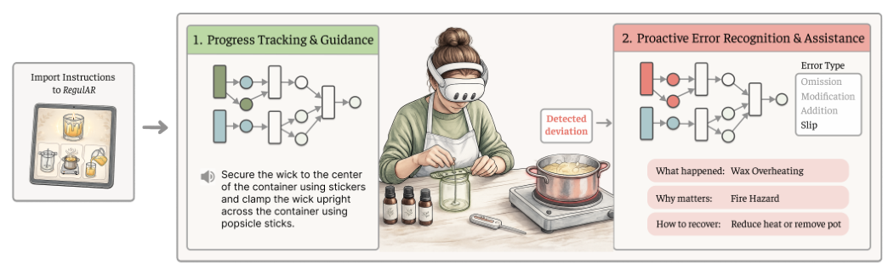

**Figure 1:** **_RegulAR_ is an AR assistant for proactive error-aware procedural guidance. A user imports a candle tutorial, from which** **_RegulAR_ generates a task dependency graph. As the user proceeds,** **_RegulAR_ tracks progress and provides context-aware guidance. While detecting errors,** **_RegulAR_ highlights the affected action and provides recovery assistance. (Credit: Gemini 3)** 

## **Abstract** 

Errors are inevitable in procedural tasks, yet most AR guidance systems focus on step-by-step instruction delivery rather than helping users recognize and recover from mistakes. We present _RegulAR_ , an AR task assistant for procedural error recognition and recovery. _RegulAR_ models task instructions as a hierarchical dependency graph and combines this structure with a Multimodal Large Language Model (MLLM) to interpret egocentric observations during execution. This enables _RegulAR_ to track progress, identify deviations by error type, estimate their impact on later steps, and deliver appropriately salient interventions through an in-situ head-up display that visualizes task state and recovery guidance. By making procedural structure explicit, _RegulAR_ supports not only next-step 

guidance, but also reasoning about what went wrong, why it matters, and how users can get back on track. In a within-subject study ( _𝑁_ = 12), participants reported better task-structure understanding and recovery support with _RegulAR_ than the MLLM-only baseline. 

## **CCS Concepts** 

- **Human-centered computing** → **Mixed / augmented reality** ; 

- **Interactive systems and tools** . 

## **Keywords** 

augmented reality, video-language model, error detection, humanAI interaction, proactive task assistance 

∗Corresponding author. 

### **ACM Reference Format:** 

This work is licensed under a Creative Commons Attribution 4.0 International License. _UIST ’26, Detroit, MI, USA_ 

© 2026 Copyright held by the owner/author(s). ACM ISBN 979-8-4007-2856-3/2026/11 https://doi.org/10.1145/3830398.3830593 

Yi-Lin Ye, Jindu Wang, Hiu Tung Wong, Shuchang Xu, Huamin Qu, and Wong Kam-Kwai. 2026. RegulAR: Graph-Grounded Error Recognition and Assistance for Procedural Tasks in Augmented Reality. In _The 39th Annual ACM Symposium on User Interface Software and Technology (UIST ’26), November 02–05, 2026, Detroit, MI, USA._ ACM, New York, NY, USA, 16 pages. https://doi.org/10.1145/3830398.3830593

<!-- Page 2 -->

UIST ’26, November 02–05, 2026, Detroit, MI, USA 

Ye et al. 

## **1 Introduction** 

Procedural tasks require interacting with physical objects in sequences governed by step dependencies, ordering constraints, and evolving object states [25], spanning settings from cooking [76] and mechanical assembly [44, 79] to laboratory procedures [80]. The challenge extends beyond remembering the next step: users must also judge whether the current task state is on track, whether prerequisites have been satisfied, whether actions have been completed correctly, and whether execution is safe to continue. This demand follows from two properties of procedural work. Human action is fallible [57, 58], so deviations are expected even in familiar tasks, yet users are physically and cognitively occupied with execution and have little capacity to notice them. Procedural tasks are also dependency-structured, so a local mistake can change which later actions remain valid [25, 41], turning a minor deviation into cascading consequences. Expecting users to diagnose deviations and plan recovery on their own places too much burden at the moment when assistance is most needed. 

Augmented Reality (AR) is well-suited for procedural assistance: it can present information in situ while work unfolds in the physical environment, reducing context switching and supporting handsbusy execution [24, 26, 65]. Prior AR systems have demonstrated this for instruction delivery and progress verification [31, 35, 44], and recent MLLM-powered assistants further enable real-time interpretation of visual observations and situated question answering [7, 27, 28, 72]. Yet these systems are designed around nominal execution and provide little support once users deviate [24]. Current assistants remain query-driven, and recent video-based error recognition work [38, 39], while improving deviation detection, does not provide proactive recovery support in a real-time AR setting. Users are still left to do the hardest part themselves: noticing that a deviation matters, understanding its consequences, and figuring out how to recover. 

To understand what support users actually need when execution deviates, we conducted a needs-finding study ( _𝑁_ = 6) with reactive MLLM-based assistants. Participants were not asking the assistant for the next step; they were asking whether their current state was still acceptable and what a deviation would affect. This revealed three challenges. First, many errors are relational. An action can look plausible in isolation, yet violate a hidden prerequisite or threaten later progress. Second, real-time egocentric interpretation is inherently ambiguous. Observations are partial and unfold over time, and MLLMs struggle to maintain logical and temporal dependencies in streaming settings [41]. Third, interventions must be timely without becoming overbearing. Weak intervention allows errors to cascade, while aggressive interruption reduces user control [29, 75]. These findings motivate our research question: _How can AR assistants proactively detect, diagnose, and support recovery from errors during real-time procedural task execution?_ 

To answer this, we present _RegulAR_ , an AR task assistant for procedural error detection and recovery. _RegulAR_ represents task instructions as a hierarchical dependency graph that captures subgoals, prerequisite relations, and valid execution paths, and combines this with MLLM-based egocentric interpretation to track progress, detect four categories of active errors, and estimate downstream impact in real time. Guided by an active-error framing 

inspired by Reason’s Swiss cheese model [57, 58] and four error categories from prior work [38], _RegulAR_ structures feedback around _what_ happened, _why_ it matters, and _how_ to recover, presented through an in-situ HUD that visualizes the task state, affected steps, and recovery cues directly in the user’s view. 

- Our contributions are threefold: 

- We position procedural error detection and recovery as a core design target for AR task assistance, and through a needs-finding study and an active-error framing, identify four error categories and derive design requirements for proactive, situated support. 

- We present _RegulAR_ , which combines a hierarchical task dependency graph, MLLM-based egocentric reasoning, and an in-situ HUD to detect deviations, estimate downstream impact, and deliver layered recovery guidance during real-world task execution. 

- Through a log-based technical evaluation and a within-subject user study ( _𝑁_ = 12), we provide preliminary evidence that _RegulAR_ supports procedural state tracking, error detection, taskstructure understanding, and perceived error support compared to a prompt-only MLLM baseline, while surfacing trade-offs between intervention timing and user autonomy. 

## **2 Related Work** 

This section reviews prior work on (1) AR-based task guidance for supporting procedural execution, and (2) computational approaches to detecting errors in procedural tasks. 

## **2.1 AR Task Guidance** 

AR task guidance has been widely studied to support hands-busy execution of procedural tasks. Existing work has explored different approaches to presenting procedural guidance within the physical environment, including authoring in-situ AR instructions [12] and overlaying step-by-step instructions directly onto physical scenes [44], reducing context switching compared to external manuals. These approaches have since been extended to a range of domains, including everyday activities such as cooking [40, 51] and industrial maintenance [70], where guidance is tightly coupled with physical interaction. To improve usability under spatial and attentional constraints, subsequent work explored different strategies for information presentation. These include simplifying textual instructions [68], anchoring information to physical objects or locations [10, 30, 64, 77], and adapting content placement to user viewpoint and occlusion [7, 43, 45, 79]. Multimodal delivery, such as coordinating visual overlays with audio guidance, has further been used to balance attention and reduce disruption during task execution [13, 14]. Collectively, these approaches improve how procedural instructions are presented to users. However, they largely assume a linear execution flow and provide limited support for reasoning about task progression beyond the current step. 

Recent systems incorporate Large Language Models (LLMs) and MLLMs to enable adaptive and mixed-initiative guidance. By leveraging egocentric perception, these systems can infer user intent, anticipate next actions, and provide context-aware feedback [6, 42]. They also support more flexible interaction paradigms, such as transforming instructional videos into interactive assistants [28] or delivering proactive feedback based on attention or working memory models [53, 54, 69]. However, such systems typically reason

<!-- Page 3 -->

UIST ’26, November 02–05, 2026, Detroit, MI, USA 

RegulAR: Graph-Grounded Error Recognition and Assistance for Procedural Tasks in Augmented Reality 

over immediate observations, without maintaining a persistent representation of task state. As a result, their assistance remains shortterm and observation-driven, making it difficult to track long-term progress, interpret errors, or reason about their impacts throughout the task. Our approach addresses these limitations by representing procedural tasks as dependency graphs that explicitly capture task structure and support continuous state tracking. Combined with MLLM-based perception, this design enables proactive error recognition and structured recovery, while helping users understand task progress and dependencies during execution. 

## **2.2 Procedural Error Recognition and Analysis** 

Detecting errors in procedural tasks is particularly challenging in egocentric settings, where continuous camera motion, partial observability, and viewpoint variability complicate reliable perception and reasoning [38]. Recent works have explored machine learning approaches for error detection and localization in egocentric videos [16, 61], but these methods require anomaly videos and labeled datasets for training [20, 52, 55, 62], limiting their transferability to everyday activities and their ability to distinguish diverse error types. To address this limitation, Lee et al. modeled procedural structure using task graphs inferred from anomaly-free videos [38, 39]. These approaches rely on aligning full video sequences with task graphs, making them better suited for offline analysis than for realtime interactive assistance. Recent studies have therefore explored zero-shot error recognition using MLLMs [19, 23, 74]. For example, Flaborea et al. compared anticipated actions predicted by MLLMs with observed actions to identify errors. Despite these advances, detected errors are rarely translated into actionable assistance. 

Effective procedural support requires reasoning not only about what went wrong, but also about how to preserve task integrity [37]. Structured representations such as task graphs and dataflow diagrams have been explored to model procedural dependencies and support planning [47, 61, 73]. However, these representations are primarily used for instruction organization [44, 71], visualization [7, 73], or offline reasoning [39], rather than to model task execution as a dynamic, stateful process during interaction. As a result, task correctness is often inferred implicitly from step completion, limiting current systems’ ability to reason about how deviations affect subsequent steps or to support structured recovery during execution. In this work, we present an AR-based guidance system that maintains an explicit task model for online error recognition, impact estimation, and dependency-aware recovery, enabling users to track progress and recover from errors during execution. 

## **3 Preliminary Needs-Finding Study** 

To understand the challenges users face when recovering from procedural breakdowns, we conducted a needs-finding study using reactive assistants. Our goal was to identify recurring user needs and design opportunities rather than to evaluate existing systems. 

## **3.1 Methods** 

**Participants.** We recruited six participants (P1-P6, 3 female, 3 male; _𝑀_ = 24 _._ 17, _𝑆𝐷_ = 1 _._ 17) from a local university. All participants reported sufficient English proficiency and moderate familiarity with AR ( _𝑀_ = 2 _._ 33, _𝑆𝐷_ = 0 _._ 52) on a 5-point Likert scale (Table 4). 

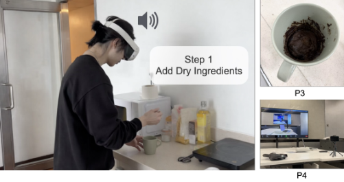

**Figure 2: Settings and representative results from the needsfinding study. Participants wore AR headsets with GPT-4V access to complete procedural tasks. Images were re-generated to remove personal information.** 

**Procedure.** After providing informed consent and receiving a study briefing, each participant completed one of two procedural tasks while wearing a Meta Quest 3 headset that displayed static AR instructions and provided optional voice access to GPT-4V in the headset camera feed (Figure 2). This setup approximated a common support paradigm in which users follow instructional content while consulting a reactive AI assistant when needed. P1-P3 performed a _Hybrid Meeting Setup_ task involving audio [48], display, and connectivity configuration, while P4-P6 performed a _Mug Cake_ task based on a professionally written recipe [17]. We selected these tasks for their dependency-sensitive, context-dependent procedures and natural error opportunities, and introduced representative failure points to elicit recovery reasoning. Each session concluded with a semi-structured interview on breakdowns, error-recognition strategies, recovery reasoning, and expectations for support. We analyzed first-person recordings, interaction logs, and interview transcripts using thematic analysis [5], focusing on how participants detected problems, reasoned about their consequences, and sought help during execution. 

## **3.2 Observations** 

We identified three recurring observations from the needs-finding study. 

**O1: Task execution requires explicit reasoning about both local validity and global progress.** Participants frequently paused not to recall the next step, but to assess whether their current state was correct and whether they could proceed, _“Is this right?” “Can I move on?”_ (P2, P4, P6). This need emerged at two levels. At the _local level_ , correctness depended on implicit relationships between tools, materials, and outcomes, making state validity difficult to verify. At the _global level_ , participants lacked awareness of overall task structure, feasible actions, and how current actions related to downstream progress. As a result, users repeatedly reconstructed task state during execution, leading to fragmented reasoning and delayed error recognition (P1, P2). 

**O2: Errors are diverse but lack explicit interpretation support.** Participants encountered heterogeneous errors, including omitted steps, incorrect actions, and intentional modifications. These

<!-- Page 4 -->

UIST ’26, November 02–05, 2026, Detroit, MI, USA 

Ye et al. 

errors differed in both cause and consequence, yet existing instructionbased support treated them uniformly. Without explicit differentiation, participants relied on ad hoc reasoning to determine whether a deviation required correction, could be tolerated, or would affect subsequent steps (P5). This made it difficult to assess downstream impact, often resulting in inconsistent recovery strategies and delayed responses to consequential errors. 

**O3: Users expect informative feedback, but are sensitive to disruption.** Participants valued support in identifying and resolving issues, but reported that verbose or intrusive feedback disrupted task flow. They preferred concise problem indications, with additional explanation available on demand. This reflects a tension between informativeness and interaction overhead in hands-busy, attention-constrained settings. Without careful control, feedback either interrupts ongoing activity or fails to provide sufficient assistance for effective recovery. 

## **3.3 Design Requirements** 

Based on these observations and prior literature, we summarize three design requirements that guided the design of _RegulAR_ . 

**DR1: Externalize task state to support validity and progress awareness.** Procedural support should provide an explicit and inspectable representation of task state rather than inferring it from step sequences. This includes externalizing the conditions for action execution and completion, as well as exposing task structure and progress so users can understand their current position, what actions are feasible, and how local decisions affect subsequent steps. By grounding assistance in a continuously updated state representation, the system can reduce cognitive overhead and enable more reliable reasoning about both correctness and progress. 

**DR2: Differentiate errors based on type and downstream impact to guide intervention.** Procedural support should explicitly characterize errors based on both their semantic type and their impact on downstream dependencies and task progression. By doing so, the system can prioritize consequential errors while avoiding unnecessary intervention for minor issues. This enables more targeted, context-aware support that aligns intervention strategies with the significance of errors. 

**DR3: Deliver concise, progressive assistance that adapts to error significance and user demand.** Procedural support should adopt a progressive assistance strategy that balances clarity with minimal disruption. Feedback should be concise by default, focusing on identifying the issue, while allowing users to access further explanation and recovery assistance on demand. In addition, assistance should adapt to the significance of errors, ensuring that critical issues receive sufficient attention while minor ones remain unobtrusive, thereby supporting effective intervention without overwhelming users. 

## **4 RegulAR** 

_RegulAR_ is an AR assistant that converts multimodal procedural instructions into a structured task model and uses that model to interpret egocentric observations during execution. The system operates in two stages. First, an LLM parses instructions into a hierarchical dependency graph and augments each action with perceptual cues, representative error examples, and risk metadata ( **DR1** ; Figure 3A). 

Second, a batch MLLM reasons over recent headset-captured frames and the current graph state at runtime to continuously monitor progress and automatically detect errors. These deviations are classified by error types and estimated on their downstream impact ( **DR2** ; Figure 3B). Layered guidance is delivered through an adaptive HUD and voice interaction that scales intervention saliency to error significance ( **DR3** ; Figure 3C). A lightweight live model supports low-latency spoken interaction throughout. This design allows _RegulAR_ to move beyond linear next-step prompting toward proactive error recognition and recovery support. 

## **4.1 Task Dependency Graph Construction** 

To externalize task structure and state ( **DR1** ), we represent each task as a hierarchical directed acyclic graph (DAG). Unlike linear instruction lists, the graph distinguishes valid reordering from unmet prerequisites by separating semantic subgoals, observable actions, and their dependencies. 

Following Truong et al. [67], we decompose a procedure into high-level _steps_ and atomic _actions_ , making it easier for users to follow **(DR3)** . A step denotes a semantic subgoal (e.g., _prepare the batter_ ), while an action corresponds to the smallest observable manipulation that can be monitored from egocentric video (e.g., _add 3 tablespoons of flour into the mug_ ). 

Unless the instructions specify an explicit intra-step dependency, actions within the same step are treated as order-independent. 

Inspired by G2Vid [18], which presents all topological sorts of task execution order in one graph to weakly supervise error localization in videos, we generate task graphs based on step dependencies via an LLM parser to represent task structures **(DR1)** . Formally, a task is represented as _𝐺_ = ( _𝑉, 𝐸_ ) with two node types: 

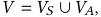

where _𝑉𝑆_ = { _𝑆_ 1 _, . . . ,𝑆𝑁 ,𝑆_ done} are step nodes and _𝑉𝐴_ = { _𝐴𝑖𝑗_ } are action nodes. Each step _𝑆𝑖_ contains an action set A _𝑖_ = { _𝐴𝑖_ 1 _, . . . ,𝐴𝑖𝑘_ }. 

We use membership edges _𝐸𝑀_ = {( _𝑆𝑖,𝐴𝑖𝑗_ ) | _𝐴𝑖𝑗_ ∈A _𝑖_ } and represent step-level prerequisites with a predecessor set Pred( _𝑆𝑖_ ) ⊆ _𝑉𝑆_ , where Pred( _𝑆𝑖_ ) contains the steps that must be completed before _𝑆𝑖_ becomes executable. The executable action set at time _𝑡_ is E _𝑡_ = { _𝐴𝑖𝑗_ ∈A _𝑖_ | Pred( _𝑆𝑖_ ) ⊆ _𝐶𝑡__𝑆,𝐴𝑖𝑗_∉_𝐶_ _𝑡__𝐴_}_,_ 

where _𝐶𝑡__𝑆_and_𝐶_ _𝑡__𝐴_denote completed steps and completed actions. We construct the edge set _𝐸_ = ( _𝑆𝑖,𝐴𝑖𝑗_ ) ∪( _𝐴𝑖𝑗,𝑆𝑘_ ), such that each _step_ node _𝑆𝑖_ connects to its action nodes _𝐴𝑖𝑗_ , and each action node connects to subsequent steps whose dependency conditions become satisfied after completing _𝑆𝑖_ (detailed prompt in Appendix C.1). This formulation captures dependency constraints while allowing flexible execution order within and across independent task branches. 

After the generation of graph structure, the LLM Parser generates perceptual criteria describing observable _in-progress_ and _completion_ conditions for each action node, inspired by Vid2Coach [28] to improve visual grounding. We additionally generate representative examples for each error type and estimate skip-risk levels [34, 39] to facilitate error recognition. 

## **4.2 Runtime Monitoring and Error Recognition** 

Since the task dependency graph is not linear, we need to keep track of actions and their statuses simultaneously to provide guidance at

<!-- Page 5 -->

UIST ’26, November 02–05, 2026, Detroit, MI, USA 

RegulAR: Graph-Grounded Error Recognition and Assistance for Procedural Tasks in Augmented Reality 

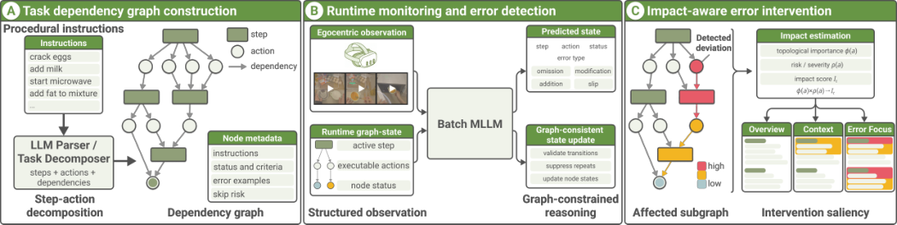

**Figure 3:** **_RegulAR_ system overview. (A) An LLM parser converts procedural instructions into a hierarchical dependency graph and augments each action with status, error examples, and skip-risk metadata. (B) During execution, a batch MLLM reasons over recent egocentric frames and the current runtime graph state to predict the current step, action, and status. Graph-consistent state updates maintain task progress, infer omission from unmet prerequisites, and identify execution errors such as modification, addition, and slip. (C) The affected subgraph and associated risk are combined into an impact score that determines intervention saliency and drives overview, context, and error-focused assistance.** 

users’ current progress. The problem is then formulated as follows: Given a sequence of frames from an egocentric video streaming, our goal is to infer the step sequence _𝑌_ˆ = ( _𝑦_ ˆ1 _, . . . , 𝑦_ ˆ _𝑇_ ) and the corresponding status sequence _𝑆_ˆ = ( _𝑠_ ˆ1 _, . . . ,_ ˆ _𝑠𝑇_ ), where _𝑦_ ˆ _𝑡_ denotes the predicted action label and ˆ _𝑠𝑡_ denotes the predicted status type at frame _𝑡_ . Each action is assigned one of the following states **(DR2)** : _not_started_ , _in_progress_ , _complete_ , or _error_ . To support structured error recognition, we adopt a taxonomy consisting of omission and execution errors [38]. An _omission_ occurs when a prerequisite action is skipped, and a later action is attempted before dependency conditions are satisfied. Execution errors occur when an intended action is performed incorrectly, and they further distinguish three execution-error types: _modification_ , where the action is performed in an alternative manner (e.g., _using a different tool or ingredient_ ); _addition_ , where an extra action not represented in the task graph is introduced; and _slip_ , where the intended action fails to achieve the expected outcome (e.g., _pouring liquid into the wrong container_ ). 

At runtime, _RegulAR_ maintains a set of executable actions E _𝑡_ derived from the task dependency graph. Initially, only leaf actions are executable. The dependent _action_ nodes must be completed before proceeding to the next step. The actions are unlocked at the step level, meaning an action _𝐴𝑖𝑗_ becomes executable when all prerequisite steps specified by the task graph of _𝑆𝑖_ are satisfied. Predicted observations are validated against the runtime state to prevent inconsistent transitions. For example, an action marked as _complete_ cannot revert to _in_progress_ unless an error occurs. 

_RegulAR_ adopts a batch MLLM for progress tracking and error recognition [8]. At runtime, _RegulAR_ performs monitoring in fixed decision cycles rather than frame-by-frame recognition. Every 5 s, the system samples a short frame window from the headset camera at 1 fps and combines it with a runtime snapshot of the task graph. This decision interval follows prior work using periodic sampling and multimodal reasoning for task progress tracking [28]. As no widely adopted sampling standard exists for this setting, we adopt a 5 s decision cycle as a practical trade-off between recognition accuracy, responsiveness, latency, and computational cost. The 

sampled frame window was intended to provide temporal context for continuous actions while maintaining interactive performance. At decision cycle _𝑡_ , the batch MLLM receives the recent frame window _𝑊𝑡_ together with the current graph state, including the active step, executable actions E _𝑡_ , and node statuses. It returns a structured observation 

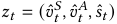

where _𝑣_ ˆ _𝑡__𝑆_∈_𝑉𝑆_denotesthepredictedstep,_𝑣_ˆ _𝑡__𝐴_ ∈ _𝑉𝐴_ denotes the predicted action, and _𝑠_ ˆ _𝑡_ denotes the execution status. Execution errors ( _modification_ , _addition_ , and _slip_ ) are obtained directly from the MLLM output. Omission errors are inferred from the graph state when the predicted action is not currently executable, i.e., _𝑣_ ˆ _𝑡__𝐴_∉ E _𝑡_ . Predicted observations are then validated against the runtime graph before being committed. Repeated identical predictions are suppressed, completed actions are not reopened unless a later error invalidates them, and only graph-consistent transitions update node state. This graph-consistent update reduces oscillations in the unstable state during streaming inference. 

## **4.3 Impact-Aware Error Intervention** 

Not all errors require the same level of intervention. _RegulAR_ therefore separates intervention into two decisions: _what_ to communicate and _how strongly_ to communicate it. Error type determines the content of guidance, while estimated downstream impact determines intervention saliency. This echoes prior work on adaptive AR guidance [13], which suggests tailoring feedback strength and content to balance informativeness and minimal disruption **(DR3)** . 

**_Topological Importance and Impact Estimation._** To estimate how strongly an error may affect the overall procedure, the system evaluates the structural importance of the affected actions and the error risk score provided by MLLM. For an action node _𝑎_ ∈ _𝑉𝐴_ , we define structural importance _𝜙_ ( _𝑎_ ) using downstream reachability and remaining task distance [32, 33, 56]: 

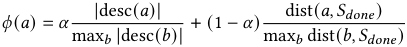

<!-- Page 6 -->

UIST ’26, November 02–05, 2026, Detroit, MI, USA 

Ye et al. 

where desc( _𝑎_ ) is the set of downstream actions reachable from _𝑎_ , dist( _𝑎,𝑆_ done) is the longest-path distance from _𝑎_ to task completion, and _𝛼_ = 0 _._ 5 balances breadth of downstream influence against remaining task distance. Intuitively, actions that occur earlier in the procedure or influence many downstream operations receive higher importance values. 

When an error is detected at time _𝑡_ , the system determines the set of affected actions _𝑈𝑡_ . For omission errors, let pred( _𝑣_ ˆ _𝑡__𝐴_) denote the set of prerequisite actions that must be completed before the predicted action _𝑣_ ˆ _𝑡__𝐴_becomes executable. For execution errors, the affected set includes the current erroneous action and any completed actions whose complete status may be affected by this error, provided by MLLM: 

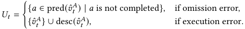

Each affected action _𝑎_ ∈ _𝑈𝑡_ is assigned a risk value _𝜌_ ( _𝑎_ ). For omission errors, _𝜌_ ( _𝑎_ ) comes from the skip-risk value specified in the task graph; for execution errors, it is estimated using the subtypespecific risk weight together with the severity score predicted by the batch MLLM. We compute a local impact term _𝑟_ ( _𝑎_ ) = _𝜙_ ( _𝑎_ ) _𝜌_ ( _𝑎_ ) and aggregate these risks as 

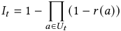

This bounded aggregation allows multiple small errors to accumulate while preventing the impact score from growing unbounded with the number of affected nodes. 

**_Interface Adaptation._** To support different stages of task execution, _RegulAR_ provides three graph views following the principle of overview first and context-dependent detail. The overview mode presents the full node-link graph to help users understand the task structure. The context mode provides a glanceable task-state overlay highlighting the current step, completed actions, and recommended next actions (Figure 4b). When errors occur, the interface switches to an error mode that highlights affected actions and recovery paths **(DR2)** , helping users quickly re-establish task context. The interface adapts visual saliency based on estimated impact. During normal execution, the overlay remains transparent to minimize distraction, while higher-impact situations trigger more visually salient presentations. Inspired by prior work that adjusts interface transparency based on risk levels [53], we map impact levels to three discrete transparency settings rather than continuous adaptation to avoid flicker and preserve readability during execution. 

**_Error-Aware Assistance._** Rather than applying uniform feedback, _RegulAR_ tailors assistance based on error type to support effective recovery **(DR2)** . Assistance messages are structured around three elements (what happened, why it matters, and how to recover) across four error types [38]. For _omission_ , the system highlights missing prerequisite actions and recommends returning to the earliest required step to restore task consistency. For _slip_ , the system identifies incorrect execution and suggests correcting the current step before proceeding. For _addition_ , the system evaluates whether the extra action affects task outcomes and intervenes only when the estimated impact is non-negligible. For _modification_ , the system assesses whether alternative procedures affect correctness and recommends reverting to the prescribed method when necessary. 

_RegulAR_ continuously maintains a recommended next action based on the current task graph and runtime state **(DR1)** . To preserve procedural continuity in partially ordered tasks, the system favors local continuity over globally re-ranking all executable actions. It first preserves the current _in-progress_ action when possible, then prioritizes recovery from execution errors, then selects the earliest unfinished action in the current executable step, and finally advances to the next executable step if the current one is complete. If no forward candidate is available, the system falls back to the earliest deferred prerequisite action. This policy maintains local procedural consistency while respecting dependency constraints in the task graph. When task states change, _RegulAR_ updates the recommended action and provides proactive guidance. Assistance messages are structured around three elements: _what happened_ , _why it matters_ , and _how to recover_ . Users may also issue queries at any time. A lightweight live model is adopted to answer them verbally using the runtime task graph together with the recent egocentric frame window as contextual grounding. 

## **4.4 Implementation** 

We implemented the real-time assistant as a Unity 2022.3.60f1 application running on Meta Quest 3, with a serverless backend hosted on Modal [49] for model serving, communication, and data routing. The LLM Parser in task dependency graph construction employs GPT-5. The system integrates with the Google Gemini Multimodal Live API [21], which supports low-latency bidirectional voice and video streaming over WebSocket. We used gemini-2.5-flash-nativeaudio-preview-12-2025 for real-time spoken interaction and gemini2.0-flash-lite for batch inference. Egocentric video and interaction data captured on the headset are streamed to the backend for realtime progress monitoring and feedback generation. 

## **5 User Evaluation** 

To evaluate the effectiveness of _RegulAR_ in supporting error recognition and procedural task assistance, we conducted a within-subject user study comparing our graph-grounded guidance with a baseline MLLM-based task guidance system without explicit dependency graph regulation. We examined whether _RegulAR_ would (1) improve users’ procedural understanding and system state tracking, (2) provide effective support for error recovery, and (3) maintain comparable or lower perceived task demand during execution. 

## **5.1 Method** 

**Participants.** We recruited 12 participants (P7-P18, 6 female, 6 male; age: _𝑀_ = 24 _._ 08, _𝑆𝐷_ = 2 _._ 27) from the university community through social media, reporting moderate familiarity with AR technology ( _𝑀_ = 2 _._ 25) on a 5-point Likert scale. 

**Baseline.** Each participant completed one task with _RegulAR_ and one with a baseline MLLM-based guidance system. Both conditions used the same procedural documents, MLLM, egocentric visual input, monitoring interval, and AR headset. The procedural documents were imported from the same instruction source (illustrated by the tablet in Figure 1). The primary difference was the use of an explicit task graph. _RegulAR_ maintained a task graph for reasoning, state tracking, and visualization, whereas the baseline relied solely on prompt-based reasoning over textual instructions without

<!-- Page 7 -->

UIST ’26, November 02–05, 2026, Detroit, MI, USA 

RegulAR: Graph-Grounded Error Recognition and Assistance for Procedural Tasks in Augmented Reality 

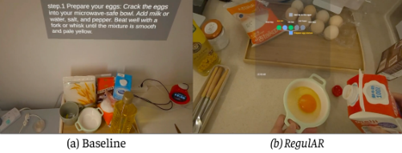

**Figure 4: Actual headset screenshots of (a) the baseline displaying current-step guidance and (b)** **_RegulAR_ ’s context mode visualizing task progress, completed actions, and recommended next actions.** 

an explicit task model. Consequently, the baseline displayed only current-step information and generated guidance directly from the instructions. Both conditions were implemented in AR to provide hands-free, real-time assistance during physical task execution. Figure 4 shows the actual interfaces used in the two conditions. 

**Procedure.** The study1 was conducted in a campus kitchen equipped with microwaves and induction cookers. After consent and a 5-minute tutorial for familiarization, each participant completed two tasks, Microwave Scrambled Eggs [66] and Scented Candle Making [9], one per condition, with task assignment and condition order counterbalanced. Both tasks involved multi-step execution, physical object manipulation, and structured step dependencies, while differing in structure (linear vs. partially dependent). Participants reported low prior familiarity ( _𝑀_ = 3 _._ 08 and _𝑀_ = 2 _._ 58, respectively) on a 7-point Likert Scale, increasing the likelihood of deviations. To approximate real-world uncertainty, we introduced imperfect material availability (e.g., missing items or misleading alternatives such as cocoa powder instead of pepper). Each task was designed to be completed within 15 minutes while still allowing for realistic breakdowns. We further conducted semi-structured interviews to probe participants’ experiences and perceptions of system support for error recognition and recovery. The total session duration for each participant was approximately one hour. 

**Measures and Analysis.** After each task, participants completed the six NASA-TLX subscales [22], adapted to 7-point Likert scales, along with 7-point ratings covering task understanding, progress awareness, error awareness, explanation quality, recovery support, confidence, and overall preference (Table 2 lists the questionnaire items). We analyzed the NASA-TLX subscales separately and did not apply the original pairwise weighting procedure. For the Likert-scale responses, we report descriptive statistics (mean and standard deviation). Given the ordinal and paired nature of the data, we used Wilcoxon signed-rank tests to assess differences between the two conditions. All statistically significant findings remained significant after Benjamini–Hochberg FDR correction [3]. The semistructured interview audio recordings were transcribed and analyzed using thematic analysis [5], focusing on task understanding, error interpretation, and responses to system interventions. In addition, headset recordings and system logs were reviewed to 

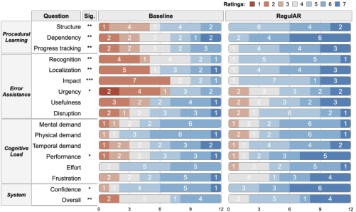

**Figure 5: Distribution of questionnaire results for baseline and** **_RegulAR_ (1 = negative, 7 = positive). Asterisks indicate statistical significance based on Wilcoxon signed-rank tests for paired samples: *** _𝑝 < ._ 05 **, **** _𝑝 < ._ 01 **, ***** _𝑝 < ._ 001 **.** 

identify task breakdowns, error-recognition accuracy, and recovery behaviors, providing complementary behavioral evidence to the subjective reports. Given the small sample size and multiple comparisons, we treat the quantitative findings as exploratory and interpret them together with qualitative and behavioral evidence. 

## **5.2 Findings** 

Overall, participants reported better understanding of task structure, greater progress awareness, and better support for error recovery when using _RegulAR_ , without a measurable increase in workload (Figure 5). These patterns were accompanied by higher confidence and an overall preference for _RegulAR_ . 

_5.2.1 Task Structure and Progress Awareness._ 

**Finding 1: Participants reported a better understanding of task structure when using the dependency graph.** Participants reported significantly better understanding of overall task structure ( _𝑀_ = 6 _._ 00, _𝑆𝐷_ = 1 _._ 56 vs. _𝑀_ = 4 _._ 25, _𝑆𝐷_ = 1 _._ 60; _𝑍_ = 2 _._ 67; _𝑝 < ._ 01) and step dependencies ( _𝑀_ = 6 _._ 17, _𝑆𝐷_ = 1 _._ 72 vs. _𝑀_ = 4 _._ 17, _𝑆𝐷_ = 1 _._ 27; _𝑍_ = 2 _._ 67; _𝑝 < ._ 01) when using _RegulAR_ . Interview data suggest that the graph provided participants with more than a display of steps—it offered a shared view of the task structure that helped them anticipate upcoming actions and understand how individual steps related to the overall goal. Participants described a consistent pattern: orienting themselves via the graph, focusing on the physical task while listening to voice guidance, and returning to the graph when the task state changed. As P15 commented, _“The graph serves naturally like navigation, and completing steps brings a sense of achievement, like playing a game.”_ In contrast, the baseline struggled to maintain an accurate representation of task state, leaving participants to rely on sequential text and memory alone, _“it didn’t know what I was doing”_ (P8, P12, P15, P17). 

**Finding 2: Explicit state tracking reduced disorientation and prevented structurally inconsistent guidance.** Participants rated progress tracking significantly higher with _RegulAR_ ( _𝑀_ = 6 _._ 17, _𝑆𝐷_ = 1 _._ 72 vs. _𝑀_ = 4 _._ 17, _𝑆𝐷_ = 1 _._ 27; _𝑍_ = 2 _._ 67; _𝑝 < ._ 01). By continuously encoding completed actions into the graph state, _RegulAR_ kept users synchronized with the system’s evolving understanding 

1The protocol was approved by the IRB at our institution

<!-- Page 8 -->

UIST ’26, November 02–05, 2026, Detroit, MI, USA 

Ye et al. 

of the task. Without this, the baseline frequently lost track of prior actions. P12 relied solely on text instructions due to limited trust in voice guidance, while P14 repeatedly received suggestions to add milk even though it had already been added, eventually overdiluting the egg mixture. These cases suggest that the absence of explicit state tracking may contribute to structurally misaligned guidance and compound errors over time. 

_5.2.2 Error Interpretation and Recovery._ 

**Finding 1: Participants reported better error recognition and localization with graph-grounded guidance.** Participants reported significantly higher ratings for error recognition ( _𝑀_ = 6 _._ 08, _𝑆𝐷_ = 1 _._ 38 vs. _𝑀_ = 4 _._ 00, _𝑆𝐷_ = 1 _._ 65; _𝑍_ = 2 _._ 63; _𝑝 < ._ 01) and localization ( _𝑀_ = 5 _._ 92, _𝑆𝐷_ = 1 _._ 91 vs. _𝑀_ = 4 _._ 08, _𝑆𝐷_ = 1 _._ 68; _𝑍_ = 2 _._ 59; _𝑝 < ._ 01) with _RegulAR_ , improvements also reflected in objective recognition performance (Section 6.2). Participants attributed these gains to the error mode, which highlighted the affected portion of the task graph when an error occurred, allowing participants to directly see which steps were involved and where recovery was needed to begin (P10). By contrast, the baseline indicated that something was wrong without anchoring the issue to a specific point in the task structure, leaving participants to reconstruct the problem context themselves. 

**Finding 2: Structured guidance helped users reason about downstream consequences and prioritize recovery.** Participants also reported better support for understanding downstream consequences ( _𝑀_ = 6 _._ 25, _𝑆𝐷_ = 1 _._ 53 vs. _𝑀_ = 3 _._ 92, _𝑆𝐷_ = 1 _._ 56; _𝑍_ = 2 _._ 93; _𝑝 < ._ 001) and assessing their urgency ( _𝑀_ = 5 _._ 83, _𝑆𝐷_ = 1 _._ 92 vs. _𝑀_ = 4 _._ 17, _𝑆𝐷_ = 1 _._ 40; _𝑍_ = 2 _._ 51; _𝑝 < ._ 05). By organizing feedback around what happened, why it mattered, and how to recover, _RegulAR_ gave participants a basis for reasoning about recovery rather than simply reacting to isolated instructions. As P8 summarized, _“Graphs provide glanceable, timely, and minimally intrusive assistance.”_ In contrast, the baseline focused on suggesting the next action without explaining the underlying error or its implications, leaving P16 uncertain and less confident when mistakes occurred. 

_5.2.3 Guidance Informativeness and Disruption._ 

**Finding 1:** **_RegulAR_ maintained comparable cognitive load while participants reported better task performance.** NASATLX scores showed no significant differences between conditions on mental demand ( _𝑀_ = 5 _._ 67, _𝑆𝐷_ = 1 _._ 21 vs. _𝑀_ = 5 _._ 33, _𝑆𝐷_ = 1 _._ 15; _𝑍_ = 0 _._ 85; _𝑝_ = 0 _._ 52), physical demand ( _𝑀_ = 5 _._ 83, _𝑆𝐷_ = 1 _._ 08 vs. _𝑀_ = 5 _._ 25, _𝑆𝐷_ = 1 _._ 29; _𝑍_ = 0 _._ 59; _𝑝_ = 0 _._ 77), temporal demand ( _𝑀_ = 5 _._ 83, _𝑆𝐷_ = 1 _._ 64 vs. _𝑀_ = 5 _._ 42, _𝑆𝐷_ = 1 _._ 16; _𝑍_ = 1 _._ 12; _𝑝_ = 0 _._ 31), and effort ( _𝑀_ = 5 _._ 25, _𝑆𝐷_ = 0 _._ 75 vs. _𝑀_ = 5 _._ 17, _𝑆𝐷_ = 1 _._ 19; _𝑍_ = 0 _._ 18; _𝑝_ = 0 _._ 98), indicating that the graph representation did not impose a measurable workload penalty. Nonetheless, participants rated their task performance significantly higher with _RegulAR_ ( _𝑀_ = 5 _._ 67, _𝑆𝐷_ = 1 _._ 50 vs. _𝑀_ = 4 _._ 67, _𝑆𝐷_ = 1 _._ 15; _𝑍_ = 2 _._ 37; _𝑝 < ._ 05). P11 noted an initial learning cost in understanding the graph structure, but expected this cost to diminish with familiarity and considered structured guidance more beneficial for complex tasks. 

**Finding 2: Impact-based filtering improved guidance quality, but a tension between proactivity and autonomy persisted.** Although perceived guidance usefulness ( _𝑀_ = 5 _._ 75, _𝑆𝐷_ = 1 _._ 88 vs. _𝑀_ = 5 _._ 08, _𝑆𝐷_ = 1 _._ 44; _𝑍_ = 1 _._ 42; _𝑝_ = 0 _._ 18) and disruption ( _𝑀_ = 5 _._ 92, _𝑆𝐷_ = 1 _._ 62 vs. _𝑀_ = 5 _._ 67, _𝑆𝐷_ = 1 _._ 37; _𝑍_ = 0 _._ 58; _𝑝_ = 0 _._ 58) 

did not differ significantly, qualitative accounts revealed meaningful differences in guidance quality. The baseline exhibited inconsistent behavior, sometimes missing consequential deviations and at other times issuing repeated notifications regardless of severity; P8 and P12 found rapid, successive suggestions distracting. _RegulAR_ ’s impact-based filtering reduced such noise, although six participants noted recognition latency, with some interventions arriving after the relevant moment had passed. Sources of frustration also differed across conditions: baseline frustration stemmed from unreliable guidance that undermined confidence (P12), while _RegulAR_ frustration was tied to latency disrupting task flow. Beyond these system-level issues, participants revealed divergent preferences: some preferred autonomy and on-demand assistance (P12), while others valued continuous, proactive guidance (P7, P8), highlighting the need for adaptive, user-controllable guidance strategies. 

_5.2.4 User Experience and Preference._ 

**Finding 1:** **_RegulAR_ reduced anxiety about making mistakes and increased execution confidence.** Participants reported significantly higher confidence when using _RegulAR_ ( _𝑀_ = 5 _._ 33, _𝑆𝐷_ = 1 _._ 07 vs. _𝑀_ = 4 _._ 25, _𝑆𝐷_ = 1 _._ 42; _𝑍_ = 2 _._ 34; _𝑝 < ._ 05), describing feeling _“more assured”_ and _“less worried about making mistakes”_ (P12, P13), particularly in unfamiliar tasks where the perceived cost of errors was higher. This increased confidence was closely tied to _RegulAR_ ’s ability to maintain a clear representation of task state; knowing where they were and what had been completed reduced the uncertainty that typically accompanies error-prone execution. 

**Finding 2: Participants generally preferred** **_RegulAR_ and anticipated greater benefits in more complex tasks.** Participants expressed a significantly stronger overall preference for _RegulAR_ ( _𝑀_ = 5 _._ 42, _𝑆𝐷_ = 1 _._ 44 vs. _𝑀_ = 4 _._ 25, _𝑆𝐷_ = 1 _._ 22; _𝑍_ = 2 _._ 53; _𝑝 < ._ 01), with 10 of 12 indicating they would choose _RegulAR_ for future procedural tasks. Preference was especially pronounced for complex scenarios where structured, error-aware support would be most beneficial. P17 noted that _RegulAR_ compared favorably to video or mobile-based instructions that require manual scrolling, which is impractical when hands are occupied, underscoring the value of in-situ, state-aware guidance during hands-on execution. 

## **6 Technical Evaluation** 

To evaluate the robustness of our proposed system, we analyzed three key requirements for an egocentric procedural AI assistant from [41]: procedural learning, error recognition, and the quality of error assistance. We first evaluate procedural learning through the quality of the generated task graphs, followed by runtime evaluations of procedural learning, error recognition, and error assistance. 

## **6.1 Graph Generation** 

**Method.** We tested the graph generation pipeline on 10 procedural documents spanning recipes, drink preparation, craft/science procedures, and meeting setup (Table 3). We first automatically checked structural validity, including unique node IDs, acyclicity, and valid dependencies. We then manually audited semantic quality across four levels: hallucinated content, step-segmentation errors, action-node errors, and dependency-edge errors. We also evaluated whether the generated criteria were visually grounded and matched the corresponding action.

<!-- Page 9 -->

UIST ’26, November 02–05, 2026, Detroit, MI, USA 

RegulAR: Graph-Grounded Error Recognition and Assistance for Procedural Tasks in Augmented Reality 

||_R_|_egulAR_|||Ba|seline|||
|---|---|---|---|---|---|---|---|---|
|Category|Acc./Recal|l F1|FP|GT|Acc./Recal|l F1|FP|GT|
|Action|**0.90**|–|–|535|0.69|–|–|525|
|In-progress|**0.90**|**0.93**|15|327|0.86|0.88|33|327|
|Complete|**0.90**|**0.86**|18|93|0.46|0.61|2|50|
|Omission|**0.76**|**0.76**|5|21|0.67|0.32|45|18|
|Slip|**0.71**|**0.77**|1|7|0.50|0.50|4|8|
|Modification|**0.80**|**0.81**|10|59|0.67|0.62|15|30|
|Addition|0.91|**0.77**|10|22|**1.00**|0.65|17|16|

**Table 1: Action accuracy (Acc.), recall, F1 score, false-positive (FP) counts, and ground-truth instances (GT) for procedural state tracking and error recognition. The Acc./Rec. column reports accuracy for Action and recall for all other categories. FP reports false-positive detections (hallucinations). Boldface indicates better performance.** 

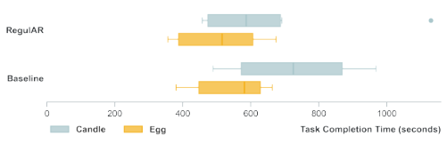

**Figure 6: Task completion time across Baseline and RegulAR conditions for the candle task and the egg task. The circle on the right indicates an outlier.** 

**Results.** All 10 generated graphs were structurally valid DAGs, covering 118 steps and 176 actions. In the manual audit, hallucination was low ( _𝑀_ = 0 _._ 7%, _𝑆𝐷_ = 1 _._ 5%), while step segmentation, action-node, and dependency-edge errors remained limited ( _𝑀_ = 2 _._ 1%, _𝑆𝐷_ = 3 _._ 7%; _𝑀_ = 5 _._ 2%, _𝑆𝐷_ = 3 _._ 8%; and _𝑀_ = 3 _._ 3%, _𝑆𝐷_ = 4 _._ 5%, respectively). Completion criteria were correctly captured in most cases ( _𝑀_ = 92 _._ 2%, _𝑆𝐷_ = 3 _._ 9%). Most remaining issues came from compact representations of repeated, optional, or concurrent actions. 

## **6.2 Procedural Learning & Error Recognition** 

**Method.** We collected and evaluated logs from 12 user study sessions (24 task executions) involving action recognition, step tracking, and error recognition across multiple procedural tasks. We report accuracy for action recognition and recall, F1 score, and falsepositive (FP) counts for procedural states and error types. Recall measures the proportion of correctly recognized ground-truth instances, FP reports false-positive detections (hallucinations), and F1 summarizes the balance between missed detections and hallucinations. To avoid evaluation bias for durative actions (e.g., _“microwave the egg mixture on high for 20 seconds”_ ) that span across multiple time intervals and thus receive multiple predictions, we limited the evaluation to at most two consecutive frames. Repeated observations were merged during evaluation, resulting in fewer effective ground-truth instances. The sum of status and error types may not equal the number of actions, because status and error correctness 

was not evaluated when the corresponding action was recognized incorrectly. 

**Results.** We evaluated 535 and 525 ground-truth observations for _RegulAR_ and the baseline, respectively (Table 1). Although _RegulAR_ resulted in slightly shorter completion times (Figure 6), more observations were sampled because baseline interactions often remained in the same state for longer periods. The single outlier was associated with network delay. Among error types, modifications were the most common, while slips were the least. 

Overall, graph-constrained reasoning improved both procedural learning and error recognition compared to textual prompting alone. In terms of recall, the improvement mainly comes from better contextual grounding: the dependency graph constrains predictions to contextually valid actions and expected transitions, reducing regressions to previously completed steps and improving completion recognition. From the F1 perspective, the largest gain appears in omission recognition. The baseline lacks task-dependency reasoning and often misclassifies harmless reordering or intermediate actions as omissions (e.g., asking the user to melt the wax first, even if securing the wick is executable), leading to a lower F1 score. This behavior is also reflected in the FP counts: without explicit task dependencies, the baseline frequently hallucinates omission errors, whereas _RegulAR_ substantially reduces these false positives through graph-grounded reasoning. In contrast, _RegulAR_ distinguishes unmet prerequisites from valid alternative orderings, resulting in more balanced precision and recall. Execution-level errors showed moderate improvements. Both systems occasionally misclassified normal actions as additions, especially when the action was not explicitly represented in the graph (e.g., operating the cooktop being treated as an extra step). However, _RegulAR_ maintained a more balanced overall detection performance, reflected in higher F1 scores and consistently lower FP counts across most error categories. 

## **6.3 Error Assistance** 

Figure 7 presents representative examples of error assistance from the baseline and _RegulAR_ across different error types collected during the user study. These examples illustrate how _RegulAR_ follows task dependencies rather than predefined step order and adapts guidance based on the impact level of the detected error. Baseline guidance tended to repeat instruction snippets and provided brief feedback focusing only on what had occurred or what to do next. _RegulAR_ provided more structured assistance that explained the error, why it needed to be addressed, and how to recover, with varying length and urgency of tone based on impact level (e.g., stopping the user before the explanation). In a case where the user used a spoon instead of a fork to stir the egg mixture, the baseline did not provide feedback. _RegulAR_ instead applied a low-impact intervention, suggesting that using a fork or whisk would improve aeration. This demonstrates _RegulAR_ ’s ability to provide optional, low-urgency assistance for minor errors. For slip errors requiring recovery, _RegulAR_ further identified the appropriate rollback step. When a user added cocoa powder, _RegulAR_ explained the error, described its impact on the mixture, and instructed the user to restart from the egg-cracking step. In contrast, the baseline only indicated that an error had occurred without suggesting how to recover.

<!-- Page 10 -->

UIST ’26, November 02–05, 2026, Detroit, MI, USA 

Ye et al. 

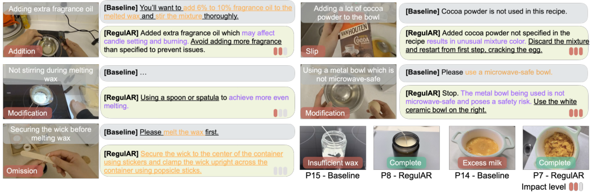

**Figure 7: Qualitative examples and final outcomes of** **_RegulAR_ and Baseline during the user study. Baseline tended to repeat the instruction (orange) and briefly outlined the next step (underline), while** **_RegulAR_ explained the reasons and risks (purple).** 

## **7 Discussion** 

Drawing on the needs-finding study and evaluation results, we derive five takeaways for proactive, error-aware AR task assistants. 

## **7.1 Design Implications** 

**AR guidance should be designed around recoverability rather than next-step compliance alone.** A central implication of our findings is that the critical moments in procedural work are not only when users need the next instruction, but also when they need to know whether the current state is still valid and how to proceed after a deviation. In the needs-finding study, participants repeatedly asked questions such as " _Is this right?_ " and " _Can I move on?_ ", indicating that procedural support is as much about validating state and maintaining recoverability as it is about delivering the next step. This suggests a broader design target for AR guidance: in addition to helping users stay on an ideal path, help them remain able to reach a valid end state after breakdowns. Similar to navigation systems that redirect users after wrong turns [1, 63], procedural AR assistants should be designed to support recovery before and after errors occur, not only to prevent them. 

**Procedural errors are relational and must be interpreted in context.** Our results show that procedural errors are difficult to understand from local action recognition alone. Their meaning depends on unmet prerequisites, valid state transitions, and how the deviation affects later progress. This interpretation is supported by the technical evaluation, which shows that _RegulAR_ achieved its greatest improvements in completion and omission decisions when explicit task dependencies matter more than the appearance of actions. The user study complements this pattern: participants using _RegulAR_ reported better understanding of where errors occurred, what they affected, and how urgent they were. These findings suggest that error support should not treat all deviations as equivalent. Instead, it should distinguish among different error types and communicate them in terms of consequence and recoverability, helping users understand a deviation before prescribing a fix. 

**A visible task model can serve as a shared state contract between the user and the assistant.** The dependency graph 

supported two related functions in _RegulAR_ . Computationally, it constrained model predictions to procedurally plausible states and transitions. In the interface, it externalized the same state representation so users could inspect completed actions, feasible next actions, affected dependencies, and recovery paths. Participants reported better understanding of task structure, step relations, and progress, and described using the graph to orient themselves before acting and to re-establish context after state changes. The lack of a measurable workload penalty further suggests that externalizing structure need not impose additional perceived burden when information is presented selectively. More broadly, a shared representation can make an AI assistant’s state estimate inspectable rather than hidden. Users can see what the system believes has happened and why it recommends a particular response. In this role, the graph becomes a state contract through which the user and assistant coordinate their understanding of the task. 

**Error assistance reduces users’ diagnostic burden, yet it can also encourage reliance on the assistant.** Both the needs-finding study and the user study suggest that proactive error assistance is valuable because users are physically and cognitively occupied during execution. In such settings, detecting deviations, judging their significance, and formulating recovery queries for a reactive assistant becomes a second task alongside the procedure. _RegulAR_ reduced this burden by surfacing likely deviations and their consequences without waiting for user queries. We also observed that participants sometimes deferred their own decision-making to the assistant, especially in unfamiliar or uncertain situations. This reliance is not inherently negative; in many cases, it reflects the usefulness of timely support. However, it raises an important design concern: overly directive assistants may unintentionally reduce users’ engagement with their own reasoning about the task. Future systems should therefore support error-aware guidance that assists without replacing user judgment, particularly in situations where multiple valid responses remain possible. 

**Proactive assistance should be consequence-aware, layered, and user-tunable.** Our findings also reveal that the benefits of proactivity come with a cost. Participants appreciated timely

<!-- Page 11 -->

UIST ’26, November 02–05, 2026, Detroit, MI, USA 

RegulAR: Graph-Grounded Error Recognition and Assistance for Procedural Tasks in Augmented Reality 

reminders and warnings, especially when errors threatened later steps, but they did not want all deviations to trigger the same level of intervention. In both studies, users preferred concise notifications that first signaled that something mattered, then explained why, and finally offered recovery actions when needed. The user study further showed a tension between proactive assistance and autonomy: some participants valued continuous support, while others preferred more control and lighter-touch intervention. These findings suggest that future AR assistants should adapt not only to error type, but also to estimated downstream consequence, user expertise, and preferred level of control. Consequence-aware saliency, layered explanation, and mixed-initiative interaction are therefore central requirements for making proactive guidance effective without becoming overbearing. Beyond adapting intervention saliency, future systems should also personalize the recovery strategy itself. Appropriate recovery may depend on available materials, time constraints, safety considerations, task goals, and user preferences. Rather than recommending a single generic repair, context-aware systems could generate and rank multiple valid recovery paths, allowing users to select among alternatives that prioritize factors such as quality, efficiency, appearance, or safety. 

## **7.2 Limitations and Future Work** 

**Evaluation remains limited in scope.** While our evaluations provide quantitative evidence of improved procedural state tracking and qualitative evidence of better recovery support, the current evaluation remains limited in scope. The small sample size makes effect estimates and generalizability uncertain, and multiple comparisons may increase the risk of false positives, although significant questionnaire results remained after FDR correction. In particular, the study provides stronger evidence for perceived recovery support than for behavioral recovery itself. Future work should therefore include larger-scale evaluations with more diverse participant populations and directly measure recovery outcomes, such as recovery time, unresolved deviations, cascaded follow-on errors, and the asymmetric costs of false positives and false negatives. 

**Latency, sampling, and hallucination.** _RegulAR_ performs monitoring in periodic decision cycles every five seconds. While this design aims to balance responsiveness, recognition stability, and computational cost, it may miss short-duration actions and delay the recognition of rapidly changing task states. In addition, the system inherits limitations from API-based multimodal models: network latency, occasionally delayed feedback, and recognition errors or hallucinations sometimes result in incorrect assistance. The system also relies primarily on egocentric visual observations, leaving hidden task states (e.g., temperature) only indirectly observable. Future work could reduce these limitations through local inference [36], adaptive or event-triggered monitoring strategies, more reliable perception models [4], and complementary sensing modalities such as IoT-connected devices or olfactory sensing [2, 78]. 

**Visual and cognitive load of graph-based guidance.** Although the task graph improved progress awareness and taskstructure understanding, continuously presenting graph-based guidance in AR may compete with the physical task for limited visual attention. _RegulAR_ mitigates this issue through impact-dependent transparency and user-controlled repositioning and resizing of the 

graph. Nine participants found the graph easy to understand, but two still found it distracting; one suggested registering the graph directly with relevant objects or locations in the physical environment. Future work should investigate adaptive visualization techniques that selectively reveal relevant subgraphs, reduce visual clutter, and balance global task awareness with the immediate demands of physical execution. 

**Task scalability and long-term use remain open questions.** Our study focused on short, single-user procedural tasks in a controlled setting. Real-world procedures may involve longer time horizons, hidden dependencies, or collaboration, which could change both the types of errors encountered and the forms of assistance required. In addition, the observed autonomy trade-off suggests that intervention saliency and guidance granularity should likely adapt to users’ expertise, task familiarity, and preferences for control. We also do not yet know how prolonged use of proactive recovery support would affect learning, trust calibration, or dependence on assistance over time. Future work should therefore examine whether the benefits observed here extend to longer, higher-stakes, and collaborative procedural settings, and how personalized intervention policies can better balance support and autonomy. Scaling _RegulAR_ to substantially more complex procedures may introduce challenges for both system reasoning and interface presentation. Large workflows may contain hundreds of actions, deeply nested dependencies, concurrent branches, and alternative recovery paths. Existing graph-based planning and reasoning techniques could support hierarchical decomposition, subgraph retrieval, branch pruning, and incremental state updates, while visualization techniques such as semantic zooming, graph aggregation, and context-dependent disclosure could avoid presenting the full dependency structure at once. Future work should investigate how these mechanisms support large-scale and branching workflows without increasing inference latency or overwhelming users. 

## **8 Conclusion** 

We introduced _RegulAR_ , an AR task assistant for procedural error detection and recovery. By grounding MLLM-based egocentric reasoning in a hierarchical dependency graph, _RegulAR_ tracks task progress, recognizes errors, estimates downstream impact, and provides layered in-situ guidance that helps users understand what went wrong, why it matters, and how to proceed. Our technical evaluation and user study show that this structured approach improves objective state tracking and error recognition, while helping users build a stronger understanding of task structure, maintain progress awareness, and receive better perceived support for responding to errors. These findings suggest that the future of AR task assistance lies not only in delivering instructions but in making procedural work more recoverable when execution deviates from the plan. 

## **Acknowledgments** 

The authors would like to thank all participants for their support during the studies. We are also grateful to the reviewers for their constructive feedback. Special thanks to Zhipeng Li for his insightful discussions. This work is partially supported by the Hong Kong Research Grants Council (grant# 16214623 and T22-607/24N).

<!-- Page 12 -->

UIST ’26, November 02–05, 2026, Detroit, MI, USA 

Ye et al. 

## **References** 

- [1] David Amores, Egemen Tanin, and Maria Vasardani. 2021. A proactive route planning approach to navigation errors. _International Journal of Geographical Information Science_ 35, 6 (2021), 1094–1130. doi:10.1080/13658816.2020.1820508 

- [2] Luigi Atzori, Antonio Iera, and Giacomo Morabito. 2010. The Internet of Things: A survey. _Computer Networks_ 54, 15 (2010), 2787–2805. doi:10.1016/j.comnet. 2010.05.010 

- [3] Yoav Benjamini and Yosef Hochberg. 1995. Controlling the False Discovery Rate: A Practical and Powerful Approach to Multiple Testing. _Journal of the Royal Statistical Society. Series B (Methodological)_ 57, 1 (1995), 289–300. http: //www.jstor.org/stable/2346101 

- [4] Ali Furkan Biten, Lluís Gómez, and Dimosthenis Karatzas. 2022. Let there be a clock on the beach: Reducing Object Hallucination in Image Captioning. In _2022 IEEE/CVF Winter Conference on Applications of Computer Vision (WACV)_ . 2473–2482. doi:10.1109/WACV51458.2022.00253 

- [5] Virginia Braun and Victoria Clarke. 2006. Using thematic analysis in psychology. _Qualitative research in psychology_ 3, 2 (2006), 77–101. 

- [6] Runze Cai, Nuwan Janaka, Hyeongcheol Kim, Yang Chen, Shengdong Zhao, Yun Huang, and David Hsu. 2025. AiGet: Transforming Everyday Moments into Hidden Knowledge Discovery with AI Assistance on Smart Glasses. In _Proceedings of the 2025 CHI Conference on Human Factors in Computing Systems (CHI ’25)_ . Association for Computing Machinery, New York, NY, USA, Article 631, 26 pages. doi:10.1145/3706598.3713953 

- [7] Sonia Castelo, Joao Rulff, Erin McGowan, Bea Steers, Guande Wu, Shaoyu Chen, Iran Roman, Roque Lopez, Ethan Brewer, Chen Zhao, Jing Qian, Kyunghyun Cho, He He, Qi Sun, Huy Vo, Juan Bello, Michael Krone, and Claudio Silva. 2024. ARGUS: Visualization of AI-Assisted Task Guidance in AR. _IEEE Transactions on Visualization and Computer Graphics_ 30, 1 (2024), 1313–1323. doi:10.1109/TVCG. 2023.3327396 

- [8] Ruei-Che Chang, Yuxuan Liu, and Anhong Guo. 2024. WorldScribe: Towards Context-Aware Live Visual Descriptions. In _Proceedings of the 37th Annual ACM Symposium on User Interface Software and Technology_ (Pittsburgh, PA, USA) _(UIST ’24)_ . Association for Computing Machinery, New York, NY, USA, Article 140, 18 pages. doi:10.1145/3654777.3676375 

- [9] Emma Chapman. 2024. How to Make Candles. A Beautiful Mess. https: //abeautifulmess.com/how-to-make-candles-beginners-guide/ Accessed: March 9, 2026. 

- [10] Chen Chen, Cuong Nguyen, Jane Hoffswell, Jennifer Healey, Trung Bui, and Nadir Weibel. 2023. PaperToPlace: Transforming Instruction Documents into Spatialized and Context-Aware Mixed Reality Experiences. In _Proceedings of the 36th Annual ACM Symposium on User Interface Software and Technology_ (San Francisco, CA, USA) _(UIST ’23)_ . Association for Computing Machinery, New York, NY, USA, Article 118, 21 pages. doi:10.1145/3586183.3606832 

- [11] Tiffy Chen. 2024. Fizzy Fruity 3-Layer Yakult Soda. Tiffy Cooks. https://tiffycooks. com/fizzy-fruity-3-layer-yakult-soda/ Accessed: February 20, 2026. 

- [12] Subramanian Chidambaram, Hank Huang, Fengming He, Xun Qian, Ana M Villanueva, Thomas S Redick, Wolfgang Stuerzlinger, and Karthik Ramani. 2021. ProcessAR: An augmented reality-based tool to create in-situ procedural 2D/3D AR Instructions. In _Proceedings of the 2021 ACM Designing Interactive Systems Conference_ (Virtual Event, USA) _(DIS ’21)_ . Association for Computing Machinery, New York, NY, USA, 234–249. doi:10.1145/3461778.3462126 

- [13] Hyunsung Cho, Drew Edgar, David Lindlbauer, and Joseph O’Hagan. 2025. Evaluating Dynamic Delivery of Audio+Visual Message Notifications in XR. In _2025 IEEE Conference Virtual Reality and 3D User Interfaces (VR)_ . 277–287. doi:10.1109/VR59515.2025.00052 

- [14] Hyunsung Cho, Jacqui Fashimpaur, Naveen Sendhilnathan, Jonathan Browder, David Lindlbauer, Tanya R. Jonker, and Kashyap Todi. 2025. Persistent Assistant: Seamless Everyday AI Interactions via Intent Grounding and Multimodal Feedback. In _Proceedings of the 2025 CHI Conference on Human Factors in Computing Systems (CHI ’25)_ . Association for Computing Machinery, New York, NY, USA, Article 59, 19 pages. doi:10.1145/3706598.3714317 

- [15] David M. Ewalt. 2019. How to Make Elephant Toothpaste. https://www. scientificamerican.com/article/make-elephant-toothpaste/ Accessed: February 20, 2026. 

- [16] Hanqiu Deng, Zhaoxiang Zhang, Shihao Zou, and Xingyu Li. 2023. Bidirectional Frame Interpolation for Unsupervised Video Anomaly Detection. In _2023 IEEE/CVF Winter Conference on Applications of Computer Vision (WACV)_ . 2633–2642. doi:10.1109/WACV56688.2023.00266 

- [17] Ree Drummond. [n. d.]. Chocolate Cake in a Mug. Food Network. https://www.foodnetwork.com/recipes/ree-drummond/chocolate-cakein-a-mug-3158576 Accessed: February 6, 2026. 

- [18] Nikita Dvornik, Isma Hadji, Hai Pham, Dhaivat Bhatt, Brais Martinez, Afsaneh Fazly, and Allan D. Jepson. 2022. Flow Graph to Video Grounding for Weakly-Supervised Multi-step Localization. In _Computer Vision – ECCV 2022: 17th European Conference, Tel Aviv, Israel, October 23–27, 2022, Proceedings, Part XXXV_ (Tel Aviv, Israel). Springer-Verlag, Berlin, Heidelberg, 319–335. doi:10.1007/978-3-031-19833-5_19 

- [19] Alessandro Flaborea, Guido Maria D’Amely Di Melendugno, Leonardo Plini, Luca Scofano, Edoardo De Matteis, Antonino Furnari, Giovanni Maria Farinella, and Fabio Galasso. 2024. PREGO: Online Mistake Detection in PRocedural EGOcentric Videos. In _2024 IEEE/CVF Conference on Computer Vision and Pattern Recognition (CVPR)_ . 18483–18492. doi:10.1109/CVPR52733.2024.01749 

- [20] Reza Ghoddoosian, Isht Dwivedi, Nakul Agarwal, and Behzad Dariush. 2023. Weakly-Supervised Action Segmentation and Unseen Error Detection in Anomalous Instructional Videos. In _2023 IEEE/CVF International Conference on Computer Vision (ICCV)_ . 10094–10104. doi:10.1109/ICCV51070.2023.00929 

- [21] Google Cloud Vertex AI. [n. d.]. Multimodal Live API. https://cloud.google.com/ vertex-ai/generative-ai/docs/multimodal-live-api 

- [22] Sandra G. Hart and Lowell E. Staveland. 1988. Development of NASA-TLX (Task Load Index): Results of Empirical and Theoretical Research. In _Human Mental Workload_ , Peter A. Hancock and Najmedin Meshkati (Eds.). Advances in Psychology, Vol. 52. North-Holland, 139–183. doi:10.1016/S0166-4115(08)62386-9 

- [23] Rishi Hazra, Brian Chen, Akshara Rai, Nitin Kamra, and Ruta Desai. 2023. EgoTV: Egocentric Task Verification from Natural Language Task Descriptions. In _Proceedings of the IEEE/CVF International Conference on Computer Vision (ICCV)_ . 15417–15429. 

- [24] Steven Henderson and Steven Feiner. 2011. Exploring the Benefits of Augmented Reality Documentation for Maintenance and Repair. _IEEE Transactions on Visualization and Computer Graphics_ 17, 10 (2011), 1355–1368. doi:10.1109/TVCG.2010. 245 

- [25] Steven J. Henderson. 2011. _Augmented reality interfaces for procedural tasks_ . Ph. D. Dissertation. USA. Advisor(s) Feiner, Steven K. AAI3453220. 

- [26] Gaoping Huang, Xun Qian, Tianyi Wang, Fagun Patel, Maitreya Sreeram, Yuanzhi Cao, Karthik Ramani, and Alexander J. Quinn. 2021. AdapTutAR: An Adaptive Tutoring System for Machine Tasks in Augmented Reality. In _Proceedings of the 2021 CHI Conference on Human Factors in Computing Systems_ (Yokohama, Japan) _(CHI ’21)_ . Association for Computing Machinery, New York, NY, USA, Article 417, 15 pages. doi:10.1145/3411764.3445283 

- [27] Yifei Huang, Jilan Xu, Baoqi Pei, Lijin Yang, Mingfang Zhang, Yuping He, Guo Chen, Xinyuan Chen, Yaohui Wang, Zheng Nie, Jinyao Liu, Dechen Lin, Fang Fang, Kunpeng Li, Chang Yuan, Yu Qiao, Yali Wang, and Limin Wang. 2025. Vinci: A Real-time Smart Assistant Based on Egocentric Vision-language Model for Portable Devices. _Proc. ACM Interact. Mob. Wearable Ubiquitous Technol._ 9, 3, Article 88 (Sept. 2025), 33 pages. doi:10.1145/3749513 

- [28] Mina Huh, Zihui Xue, Ujjaini Das, Kumar Ashutosh, Kristen Grauman, and Amy Pavel. 2025. Vid2Coach: Transforming How-To Videos into Task Assistants. In _Proceedings of the 38th Annual ACM Symposium on User Interface Software and Technology (UIST ’25)_ . Association for Computing Machinery, New York, NY, USA, Article 46, 24 pages. doi:10.1145/3746059.3747612 

- [29] Shamsi T. Iqbal and Brian P. Bailey. 2008. Effects of intelligent notification management on users and their tasks. In _Proceedings of the SIGCHI Conference on Human Factors in Computing Systems_ (Florence, Italy) _(CHI ’08)_ . Association for Computing Machinery, New York, NY, USA, 93–102. doi:10.1145/1357054.1357070 

- [30] Wong Kam-Kwai, Yi-Lin Ye, Wai Tong, Haobo Li, Kentaro Takahira, Aastha Bhatta, Sunil Poudyal, Charles Wang Wai Ng, Huamin Qu, and Leni Yang. 2026. LandSAR: Visceralizing Landslide Data for Enhanced Situational Awareness in Immersive Analytics. In _2026 IEEE 19th Pacific Visualization Conference (PacificVis)_ . 215–226. doi:10.1109/PacificVis68791.2026.00030 

- [31] Panayu Keelawat and Ryo Suzuki. 2024. Transforming Procedural Instructions into In-Situ Augmented Reality Guides with InstructAR. In _Adjunct Proceedings of the 37th Annual ACM Symposium on User Interface Software and Technology_ (Pittsburgh, PA, USA) _(UIST Adjunct ’24)_ . Association for Computing Machinery, New York, NY, USA, Article 70, 3 pages. doi:10.1145/3672539.3686321 

- [32] James E. Kelley. 1961. Critical-Path Planning and Scheduling: Mathematical Basis. _Operations Research_ 9, 3 (1961), 296–320. http://www.jstor.org/stable/167563 

- [33] James E. Kelley and Morgan R. Walker. 1959. Critical-path planning and scheduling. In _Papers Presented at the December 1-3, 1959, Eastern Joint IRE-AIEEACM Computer Conference_ (Boston, Massachusetts) _(IRE-AIEE-ACM ’59 (Eastern))_ . Association for Computing Machinery, New York, NY, USA, 160–173. doi:10.1145/1460299.1460318 

- [34] Jaehyun Kim, Seongwook Yoon, Taehyeon Choi, and Sanghoon Sull. 2023. Unsupervised Video Anomaly Detection Based on Similarity with Predefined Text Descriptions. _Sensors_ 23, 14 (2023). doi:10.3390/s23146256 

- [35] Junhan Kong, Dena Sabha, Jeffrey P Bigham, Amy Pavel, and Anhong Guo. 2021. TutorialLens: Authoring Interactive Augmented Reality Tutorials Through Narration and Demonstration. In _Proceedings of the 2021 ACM Symposium on Spatial User Interaction_ (Virtual Event, USA) _(SUI ’21)_ . Association for Computing Machinery, New York, NY, USA, Article 16, 11 pages. doi:10.1145/3485279.3485289 

- [36] Rohit Chandrakant Kulkarni. 2026. Ultra-Low Latency AI Systems: Leveraging Edge AI and Semiconductor Acceleration for Local Language Model Inference. _International Journal of Emerging Trends in Computer Science and Information Technology_ 7, 1 (March 2026), 272–284. doi:10.63282/3050-9246.IJETCSIT-V7I1P140 

- [37] Chi-Hsi Kung, Frangil Ramirez, Juhyung Ha, Yi-Ting Chen, David Crandall, and Yi-Hsuan Tsai. 2025. What Changed and What Could Have Changed? StateChange Counterfactuals for Procedure-Aware Video Representation Learning.

<!-- Page 13 -->

UIST ’26, November 02–05, 2026, Detroit, MI, USA 

RegulAR: Graph-Grounded Error Recognition and Assistance for Procedural Tasks in Augmented Reality 

- arXiv:2503.21055 [cs.CV] https://arxiv.org/abs/2503.21055 

- [38] Shih–Po Lee, Zijia Lu, Zekun Zhang, Minh Hoai, and Ehsan Elhamifar. 2024. Error Detection in Egocentric Procedural Task Videos. In _2024 IEEE/CVF Conference on Computer Vision and Pattern Recognition (CVPR)_ . 18655–18666. doi:10.1109/ CVPR52733.2024.01765 

- [39] Shih-Po Lee and Ehsan Elhamifar. 2025. Error Recognition in Procedural Videos using Generalized Task Graph. In _Proceedings of the IEEE/CVF International Conference on Computer Vision (ICCV)_ . 10009–10021. 

- [40] Franklin Mingzhe Li, Kaitlyn Ng, Bin Zhu, and Patrick Carrington. 2025. OSCAR: Object Status and Contextual Awareness for Recipes to Support Non-Visual Cooking. In _Proceedings of the Extended Abstracts of the CHI Conference on Human Factors in Computing Systems (CHI EA ’25)_ . Association for Computing Machinery, New York, NY, USA, Article 418, 6 pages. doi:10.1145/3706599.3720172 

- [41] Junlong Li, Huaiyuan Xu, Sijie Cheng, Kejun Wu, Kim-Hui Yap, Lap-Pui Chau, and Yi Wang. 2026. Building Egocentric Procedural AI Assistant: Methods, Benchmarks, and Challenges. arXiv:2511.13261 [cs.CV] https://arxiv.org/abs/ 2511.13261 

- [42] Jiahao Nick Li, Yan Xu, Tovi Grossman, Stephanie Santosa, and Michelle Li. 2024. OmniActions: Predicting Digital Actions in Response to Real-World Multimodal Sensory Inputs with LLMs. In _Proceedings of the 2024 CHI Conference on Human Factors in Computing Systems_ (Honolulu, HI, USA) _(CHI ’24)_ . Association for Computing Machinery, New York, NY, USA, Article 8, 22 pages. doi:10.1145/ 3613904.3642068 

- [43] Zhipeng Li, Christoph Gebhardt, Yves Inglin, Nicolas Steck, Paul Streli, and Christian Holz. 2024. SituationAdapt: Contextual UI Optimization in Mixed Reality with Situation Awareness via LLM Reasoning _(UIST ’24)_ . Association for Computing Machinery, New York, NY, USA, Article 43, 13 pages. doi:10.1145/ 3654777.3676470 

- [44] Ziyi Liu, Zhengzhe Zhu, Enze Jiang, Feichi Huang, Ana M Villanueva, Xun Qian, Tianyi Wang, and Karthik Ramani. 2023. InstruMentAR: Auto-Generation of Augmented Reality Tutorials for Operating Digital Instruments Through Recording Embodied Demonstration. In _Proceedings of the 2023 CHI Conference on Human Factors in Computing Systems_ (Hamburg, Germany) _(CHI ’23)_ . Association for Computing Machinery, New York, NY, USA, Article 32, 17 pages. doi:10.1145/ 3544548.3581442 

- [45] Tao Lu, Qian Zhu, Tiffany Ma, Wong Kam-Kwai, Anlan Xie, Alex Endert, and Yalong Yang. 2025. Ego vs. Exo and Active vs. Passive: Investigating the Individual and Combined Effects of Viewpoint and Navigation on Spatial Immersion and Understanding in Immersive Storytelling. In _Proceedings of the 2025 CHI Conference on Human Factors in Computing Systems (CHI ’25)_ . Association for Computing Machinery, New York, NY, USA, Article 976, 19 pages. doi:10.1145/3706598.3713849 

- [46] Nagi Maehashi. 2018. Italian Meatballs (Extra Soft and Juicy!). https://www. recipetineats.com/classic-italian-meatballs-extra-soft-and-juicy/ Accessed: February 20, 2026. 

- [47] Weichao Mao, Ruta Desai, Michael Louis Iuzzolino, and Nitin Kamra. 2023. Action Dynamics Task Graphs for Learning Plannable Representations of Procedural Tasks. arXiv:2302.05330 [cs.CV] https://arxiv.org/abs/2302.05330 

- [48] Markus Presents. 2022. How to set up the perfect hybrid meeting, step by step. YouTube video. https://www.youtube.com/watch?v=xDuoCFsStUw Accessed: February 6, 2026. 

- [49] Modal Labs. 2026. Modal. https://modal.com 

- [50] National Coffee Association. [n. d.]. Pour-over Coffee. AboutCoffee.org. https: //www.aboutcoffee.org/brewing/pour-over-coffee/ Accessed: February 20, 2026. 

- [51] Zheng Ning, Leyang Li, Daniel Killough, JooYoung Seo, Patrick Carrington, Yapeng Tian, Yuhang Zhao, Franklin Mingzhe Li, and Toby Jia-Jun Li. 2025. AROMA: Mixed-Initiative AI Assistance for Non-Visual Cooking by Grounding Multimodal Information Between Reality and Videos. In _Proceedings of the 38th Annual ACM Symposium on User Interface Software and Technology (UIST ’25)_ . Association for Computing Machinery, New York, NY, USA, Article 144, 15 pages. doi:10.1145/3746059.3747650 

- [52] Rohith Peddi, Shivvrat Arya, Bharath Challa, Likhitha Pallapothula, Akshay Vyas, Bhavya Gouripeddi, Qifan Zhang, Jikai Wang, Vasundhara Komaragiri, Eric Ragan, Nicholas Ruozzi, Yu Xiang, and Vibhav Gogate. 2024. CaptainCook4D: A Dataset for Understanding Errors in Procedural Activities. In _Advances in Neural Information Processing Systems_ , A. Globerson, L. Mackey, D. Belgrave, A. Fan, U. Paquet, J. Tomczak, and C. Zhang (Eds.), Vol. 37. Curran Associates, Inc., 135626–135679. doi:10.52202/079017-4307 

- [53] Yunqiang Pei, Renming Huang, Mingfeng Zha, Guoqing Wang, Peng Wang, Qiao Kang, Yang Yang, and Heng Tao Shen. 2025. AttentionAR: AR Adaptation and Warning for Real-World Safety via Attention Modeling and MLLM Reasoning. In _Proceedings of the 38th Annual ACM Symposium on User Interface Software and Technology (UIST ’25)_ . Association for Computing Machinery, New York, NY, USA, Article 118, 19 pages. doi:10.1145/3746059.3747674 

- [54] Kevin Pu, Ting Zhang, Naveen Sendhilnathan, Sebastian Freitag, Raj Sodhi, and Tanya R. Jonker. 2025. ProMemAssist: Exploring Timely Proactive Assistance Through Working Memory Modeling in Multi-Modal Wearable Devices. In _Proceedings of the 38th Annual ACM Symposium on User Interface Software and Technology (UIST ’25)_ . Association for Computing Machinery, New York, NY, 

   - USA, Article 56, 19 pages. doi:10.1145/3746059.3747770 

- [55] Yicheng Qian, Weixin Luo, Dongze Lian, Xu Tang, Peilin Zhao, and Shenghua Gao. 2022. SVIP: Sequence VerIfication for Procedures in Videos. In _Proceedings of the IEEE/CVF Conference on Computer Vision and Pattern Recognition_ . 19890–19902. 

- [56] Jiaqing Qiao, Sirui Chen, Tianwen Chen, and Lei Feng. 2025. Optimizing Federated Scheduling for Real-Time DAG Tasks via Node-Level Parallelization. _Computers_ 14, 10 (2025). doi:10.3390/computers14100449 

- [57] J. Reason. 1990. The Contribution of Latent Human Failures to the Breakdown of Complex Systems. _Philosophical Transactions of the Royal Society of London. Series B, Biological Sciences_ 327, 1241 (1990), 475–484. http://www.jstor.org/stable/55319 

- [58] James Reason. 2000. Human error: models and management. _BMJ_ 320, 7237 (2000), 768–770. doi:10.1136/bmj.320.7237.768 

- [59] Sabra. 2020. The Best Keto Pancakes. https://www.thismomsmenu.com/ketopancakes/ Accessed: February 20, 2026. 

- [60] Sabra. 2023. Microwave Mac and Cheese in a Mug. https://www.thismomsmenu. com/microwave-mac-and-cheese-in-a-mug/ Accessed: February 20, 2026. 

- [61] Luigi Seminara, Giovanni Maria Farinella, and Antonino Furnari. 2024. Differentiable task graph learning: procedural activity representation and online mistake detection from egocentric videos. In _Proceedings of the 38th International Conference on Neural Information Processing Systems_ (Vancouver, BC, Canada) _(NIPS ’24)_ . Curran Associates Inc., Red Hook, NY, USA, Article 1895, 35 pages. 

- [62] F. Sener, D. Chatterjee, D. Shelepov, K. He, D. Singhania, R. Wang, and A. Yao. 2022. Assembly101: A Large-Scale Multi-View Video Dataset for Understanding Procedural Activities. _CVPR 2022_ (2022). 

- [63] Shreepriya Shreepriya, Danilo Gallo, Sruthi Viswanathan, and Jutta Willamowski. 2019. Situationally Induced Impairment in Navigation Support for Runners. _CoRR_ abs/1904.06131 (2019). arXiv:1904.06131 http://arxiv.org/abs/1904.06131 

- [64] Kentaro Takahira, Wong Kam-Kwai, Leni Yang, Xian Xu, Takanori Fujiwara, and Huamin Qu. 2025. TangibleNet: Synchronous Network Data Storytelling through Tangible Interactions in Augmented Reality. In _Proceedings of the 2025 CHI Conference on Human Factors in Computing Systems (CHI ’25)_ . Association for Computing Machinery, New York, NY, USA, Article 233, 18 pages. doi:10. 1145/3706598.3714265 

- [65] Arthur Tang, Charles Owen, Frank Biocca, and Weimin Mou. 2003. Comparative effectiveness of augmented reality in object assembly. In _Proceedings of the SIGCHI Conference on Human Factors in Computing Systems_ (Ft. Lauderdale, Florida, USA) _(CHI ’03)_ . Association for Computing Machinery, New York, NY, USA, 73–80. doi:10.1145/642611.642626 

- [66] Sneha Tete. 2025. How to Make Perfect Scrambled Eggs in the Microwave. PathCulture. https://www.pathculture.com/food-recipes/microwave-scrambledeggs-recipe/ Accessed: February 20, 2026. 

- [67] Anh Truong, Peggy Chi, David Salesin, Irfan Essa, and Maneesh Agrawala. 2021. Automatic Generation of Two-Level Hierarchical Tutorials from Instructional Makeup Videos. In _Proceedings of the 2021 CHI Conference on Human Factors in Computing Systems_ (Yokohama, Japan) _(CHI ’21)_ . Association for Computing Machinery, New York, NY, USA, Article 108, 16 pages. doi:10.1145/3411764. 3445721 

- [68] Guande Wu, Jing Qian, Sonia Castelo Quispe, Shaoyu Chen, João Rulff, and Claudio Silva. 2024. ARTiST: Automated Text Simplification for Task Guidance in Augmented Reality. In _Proceedings of the 2024 CHI Conference on Human Factors in Computing Systems_ (Honolulu, HI, USA) _(CHI ’24)_ . Association for Computing Machinery, New York, NY, USA, Article 939, 24 pages. doi:10.1145/3613904. 3642772 

- [69] Shuchang Xu, Chang Chen, Zichen Liu, Xiaofu Jin, Lin-Ping Yuan, Yukang Yan, and Huamin Qu. 2024. Memory Reviver: Supporting Photo-Collection Reminiscence for People with Visual Impairment via a Proactive Chatbot. In _Proceedings of the 37th Annual ACM Symposium on User Interface Software and Technology_ (Pittsburgh, PA, USA) _(UIST ’24)_ . Association for Computing Machinery, New York, NY, USA, Article 88, 17 pages. doi:10.1145/3654777.3676336 

- [70] Zhengjie Xue, Jun Yang, Ruchen Chen, Qiang He, Qixiu Li, and Xuesong Mei. 2024. AR-Assisted Guidance for Assembly and Maintenance of Avionics Equipment. _Applied Sciences (Switzerland)_ 14, 3 (Feb. 2024). doi:10.3390/app14031137 

- [71] Antoine Yang, Arsha Nagrani, Paul Hongsuck Seo, Antoine Miech, Jordi PontTuset, Ivan Laptev, Josef Sivic, and Cordelia Schmid. 2023. Vid2Seq: Large-Scale Pretraining of a Visual Language Model for Dense Video Captioning. In _CVPR_ . 

- [72] Jingkang Yang, Shuai Liu, Hongming Guo, Yuhao Dong, Xiamengwei Zhang, Sicheng Zhang, Pengyun Wang, Zitang Zhou, Binzhu Xie, Ziyue Wang, Bei Ouyang, Zhengyu Lin, Marco Cominelli, Zhongang Cai, Bo Li, Yuanhan Zhang, Peiyuan Zhang, Fangzhou Hong, Joerg Widmer, Francesco Gringoli, Lei Yang, and Ziwei Liu. 2025. EgoLife: Towards Egocentric Life Assistant. In _Proceedings of the IEEE/CVF Conference on Computer Vision and Pattern Recognition (CVPR)_ . 28885–28900. 

- [73] Sotaro Yokoi and Jun Rekimoto. 2025. MermaidLLM: Dataflow Diagrams for Explainable Skill Formalization and Real-time Support with Multimodal LLMs. In _Adjunct Proceedings of the 38th Annual ACM Symposium on User Interface Software and Technology (UIST Adjunct ’25)_ . Association for Computing Machinery, New York, NY, USA, Article 103, 3 pages. doi:10.1145/3746058.3758449

<!-- Page 14 -->

UIST ’26, November 02–05, 2026, Detroit, MI, USA 

Ye et al. 

- [74] Luca Zanella, Willi Menapace, Massimiliano Mancini, Yiming Wang, and Elisa Ricci. 2024. Harnessing Large Language Models for Training-free Video Anomaly Detection. In _Proceedings of the IEEE/CVF Conference on Computer Vision and Pattern Recognition_ . 18527–18536. 

- [75] Nima Zargham, Leon Reicherts, Michael Bonfert, Sarah Theres Voelkel, Johannes Schoening, Rainer Malaka, and Yvonne Rogers. 2022. Understanding Circumstances for Desirable Proactive Behaviour of Voice Assistants: The Proactivity Dilemma. In _Proceedings of the 4th Conference on Conversational User Interfaces_ (Glasgow, United Kingdom) _(CUI ’22)_ . Association for Computing Machinery, New York, NY, USA, Article 3, 14 pages. doi:10.1145/3543829.3543834 

- [76] Ke-yu Zhai, Yi-ming Cao, Wen-jun Hou, and Xue-ming Li. 2020. Interactive Mixed Reality Cooking Assistant for Unskilled Operating Scenario. In _Virtual, Augmented and Mixed Reality. Industrial and Everyday Life Applications_ , Jessie Y. C. Chen and Gino Fragomeni (Eds.). Springer International Publishing, Cham, 178–195. 

- [77] Wei Zhang, Xing Liu, Biying Xu, Xinzhuo Deng, Wong Kam-Kwai, Wenjie Ning, and Wei Chen. 2026. ARtiVision: Bridging Expert Knowledge and Visitor Experience through Gaze-Guided Artifact Interpretation in AR. _Frontiers of Computer Science_ (2026). doi:10.1007/s11704-026-60114-x 

- [78] Weiqi Zhang, Wenying Tang, Zixi Wan, and Zhiyong Fan. 2026. Advanced electronic noses for future robotic olfaction. _npj Robotics_ 4, 1 (2026), 11. doi:10. 1038/s44182-025-00071-y 

- [79] Ada Yi Zhao, Aditya Gunturu, Ellen Yi-Luen Do, and Ryo Suzuki. 2025. Guided Reality: Generating Visually-Enriched AR Task Guidance with LLMs and Vision Models. In _Proceedings of the 38th Annual ACM Symposium on User Interface Software and Technology (UIST ’25)_ . Association for Computing Machinery, New York, NY, USA, Article 146, 15 pages. doi:10.1145/3746059.3747784 

- [80] Zelin Zhou, Farshad Oveissi, and Timothy Langrish. 2024. Applications of augmented reality (AR) in chemical engineering education: Virtual laboratory work demonstration to digital twin development. _Computers & Chemical Engineering_ 188 (2024), 108784. doi:10.1016/j.compchemeng.2024.108784 

## **A Study Materials** 

**Table 3: Procedural instruction sources used in the preliminary needs-finding study (T1–T2), system testing (T3–T8), and user study (T9–T10).** 

|ID|Task|Source|
|---|---|---|
|T1|Hybrid Meeting Setup|[48]|
|T2|Mug Cake|[17]|
|T3|Brew Coffee|[50]|
|T4|Watermelon Drink|[11]|
|T5|Elephant Toothpaste|[15]|
|T6|Mac and Cheese|[60]|
|T7|Keto Pancakes|[59]|
|T8|Italian Meatballs|[46]|
|T9|Microwave Scrambled Eggs|[66]|
|T10|Candles|[9]|

## **B Participants** 

**Table 4: Participants in the preliminary needs-finding study. AR familiarity was rated on a 5-point scale.** 

|PID|Gender|Age|AR Familiarity|
|---|---|---|---|
|P1|Male|24|2|
|P2|Female|23|3|
|P3|Male|25|3|
|P4|Female|26|2|
|P5|Female|23|2|
|P6|Male|24|2|

**Table 2: Questions used in the user evaluation.** 

|Section|Aspects|Question|
|---|---|---|
|Procedural Learning|Structure|The task structure and procedure were easy to understand when using the sys- tem.|
||Dependency|The system helped me understand how different steps of the task are related.|
||Progress Tracking|The system keeps track of my progress well during the task.|
|Error Assistance|Recognition|The system accurately recognized the errors I made.|
||Localization|The system helped me understand where the error occurred in the task.|
||Impact|The system helped me understand how the error affects other steps.|
||Urgency|The system helped me understand the urgency or importance of different er- rors.|
||Usefulness|The system provided useful guidance for error recovery.|
||Disruption|The guidance did not disrupt the com- pletion of the task.|
|System|Confidence Confidence Overall|I successfully completed this task I would feel more confident performing this task again after using this system. Overall|

**Table 5: Participants in the user evaluation. AR familiarity was rated on a 5-point scale; task familiarity was rated on a 7-point scale.** 

||||F |amiliarit |y |
|---|---|---|---|---|---|
|PID|Gender|Age|AR|T9|T10|
|P7|Male|23|4|1|1|
|P8|Female|23|4|5|2|
|P9|Female|23|1|1|1|
|P10|Female|22|2|2|2|
|P11|Female|26|2|2|1|
|P12|Male|27|3|3|1|
|P13|Female|23|2|1|1|
|P14|Female|23|2|6|7|
|P15|Male|21|1|6|2|
|P16|Male|27|2|2|2|
|P17|Male|23|2|4|5|
|P18|Male|28|2|4|6|

## **C Prompts** 

## **C.1 Task Graph Generation Prompt** 

This is a procedural instruction. 

Output a JSON object representing a hierarchical task graph that segments instructions into high-level Steps. The goal is to create a clean hierarchical graph structure.

<!-- Page 15 -->

UIST ’26, November 02–05, 2026, Detroit, MI, USA 

RegulAR: Graph-Grounded Error Recognition and Assistance for Procedural Tasks in Augmented Reality 

Graph Structure Rules: 

1. The graph is a directed acyclic graph (DAG). 

2. The graph has two node types: 

- Step nodes (high-level grouping units) 

- Action nodes (atomic executable units) 

3. Each Step contains one or more Actions. Only Step "DONE" has no action 

4. Steps may execute in parallel if no explicit dependency exists between them. Step ordering must be represented using dependencies. 

5. Do NOT assume linear step order unless the text explicitly requires it. 

6. Actions within the same Step must be independent and executable in parallel. 

7. Do NOT split actions into separate Steps unless an explicit sequential cue requires it. 

For each Step, include: 

- step_id (unique) 

- step_name (high-level summary of the grouped actions) 

- step_description (ALL text related to this step that is not an atomic instruction, including tips, warnings, explanations, context) 

{ "step_id": "S3", 

"step_name": "DONE", "step_description": "DONE", 

"dependencies": ["S2"], 

"actions": null } ], 

"content": "The estimated cook time for this piece is 5 mins. The calories are 172kcal.", 

"summary": "Chocolate Mug Cake" 

} 

## **C.2 Task Criteria Generation Prompt** 

This is information about a procedural task: "{dependency_graph}". Output a JSON object with the following fields: 

- dependencies (a list of prerequisite step_ids, or null if no prerequisite exists) 

- actions (list of action objects) 

For each action, include: 

- instruction (single executable sentence) 

For each Action, include: 

- action_id (unique across the entire task) 

- instruction 

- skip_risk ("none" | "medium" | "high") 

- skip_impact (textual explanation) 

- status ("not_started") 

(single atomic sentence containing exactly ONE executable verb) 

- original_text 

- (the exact sentence or phrase from the source text this action was derived from) 

- in_progress_criteria: visual indicators that the action is ongoing; 

- completion_criteria: visual signs that the action is finished; 

- execution_error_criteria: possible visual errors. 

#### Atomic Action Rules 

- Each instruction must describe exactly ONE atomic executable action in a single sentence. 

- Split instructions with multiple actions (e.g., "Add sugar and whisk" -> two separate actions). 

- Split iterative actions over different materials (e.g., "Add salt, sugar, and vanilla extract" -> three actions). 

- Do NOT hallucinate. Only use the provided information 

- Only include actions that are explicit, executable instructions directly related to performing the task. 

- Do NOT generate actions from descriptive, contextual, or explanatory text. (e.g., "Add milk and serve" -> "serve" should not become an action) 

- Keep every piece of relevant text in one of: 

   - action.original_text 

   - step_description 

   - content 

- modification: corresponds to performing a step in a different way than the one specified by the recipe, e.g., using a different tool, such as stirring using a knife instead of a spoon, or using different ingredients, such as using sugar to sweeten the tea instead of honey. This does not necessarily change the outcome of the step 

- addition: corresponds to having unnecessary extra steps that are not in the task graph, e.g., adding raisins to the tortilla when making pinwheels 

- slip: corresponds to executing a step in a way that leads to not achieving the 

- goal of the step, e.g., adding water to a different bowl from the one containing oats, or dropping a tortilla on the floor. 

#### Skip Rules: 

   - skip_risk: 

      - "none": skipping does not affect task progression and completion. 

      - "medium": skipping reduces quality but does not block progression. 

      - "high": skipping prevents subsequent steps from functioning. 

- Also include: 

- tools: all tools used in this action 

- materials: all materials/ingredients used in this action. If available, include precise amounts of the materials used. 

Example Output: { "steps": [ { "step_id": "S1", "step_name": "Prepare dry ingredients", "step_description": "Combine the flour, salt, and baking powder.", "dependencies": null, 

"actions": [ { "action_id": "A1", "instruction": "Add 1 cup of flour into the bowl.", "original_text": "Add 1 cup of flour into the bowl.", "tools":["bowl"], "materials": ["1 cup of flour"] }, { "action_id": "A2", 

"instruction": "Add 1 teaspoon of salt into the bowl.", "original_text": "Add salt.", 

"tools": ["bowl"], 

- "materials": ["1 teaspoon of salt"] 

} ] }, { "step_id": "S2", "step_name": "Mix ingredients", "step_description": "Stir everything together.", "dependencies": ["S1"], "actions": [ { "action_id": "A3", 

- "instruction": "Mix the ingredients with a spatula.", "original_text": "Stir everything together.", "tools": ["spatula"], "materials": ["ingredients"] 

- } 

- ] 

}, 

Example Outputs: 

- { 

"steps": [ { 

"step_id": "S1", 

"step_name": "Prepare dry ingredients", 

"step_description": "Combine the flour, salt, and baking powder.", 

"dependencies": null, 

"actions": [ 

{ 

- "action_id": "A1", 

"instruction": "Add 1 cup of flour into the bowl.", 

"original_text": "Add 1 cup of flour into the bowl.", 

- "tools": ["mixing bowl", "measuring cup"], 

"materials": ["1 cup flour"], 

"skip_risk": "high", 

"skip_impact": "Without flour, the mixture cannot form, and later steps cannot proceed.", 

"status": "not_started", 

- "in_progress_criteria": "Flour is visibly pouring into the bowl.", "completion_criteria": "Measured flour is inside the bowl, and the cup is empty.", 

"execution_error_criteria": { 

"modification": "Using a different ingredient instead of flour.", "addition": "Adding extra dry ingredients not specified.", "slip": "Pouring flour outside the bowl." 

- } 

- }, 

- { "action_id": "A2", 

"instruction": "Add 1 teaspoon of salt into the bowl.", 

- "original_text": "Add salt.", 

"tools": ["mixing bowl", "measuring spoon"], 

- "materials": ["1 teaspoon salt"], 

"skip_risk": "medium", "skip_impact": "Skipping salt reduces flavor quality but does not block progression.", 

"status": "not_started", "in_progress_criteria": "Salt is being measured or poured into the bowl.", 

"completion_criteria": "Measured salt is visibly inside the bowl.", 

- "execution_error_criteria": { 

- "modification": "Using sugar instead of salt.", "addition": "Adding extra seasoning is not required.",

<!-- Page 16 -->

UIST ’26, November 02–05, 2026, Detroit, MI, USA 

Ye et al. 

"slip": "Adding excessive salt due to mis-measurement." 

} 

} 

] 

}, 

{ 

"step_id": "S2", 

"step_name": "Mix ingredients", 

"step_description": "Stir everything together.", 

"dependencies": ["S1"], 

"actions": [ 

{ 

"action_id": "A3", 

- "instruction": "Mix the ingredients until the mixture looks uniform.", 

- "original_text": "Stir everything together.", 

- "tools": ["spatula", "mixing bowl"], 

- "materials": ["combined ingredients"], 

"skip_risk": "high", 

"skip_impact": "If not mixed, ingredients remain uneven, and the batter is incomplete.", 

"status": "not_started", 

"in_progress_criteria": "The spatula is moving, and the mixture texture is changing.", 

"completion_criteria": "No visible dry powder remains, and texture is consistent.", 

"execution_error_criteria": { 

- "modification": "Using a different tool such as a fork.", 

- "addition": "Adding new ingredients during mixing.", 

- "slip": "Stopping too early and leaving visible lumps." 

} 

} 

] 

}, 

{ "step_id": "S3", "step_name": "Optional decoration", 

} 

"step_description": "Add powdered sugar on top.", 

"dependencies": ["S2"], 

"actions": [ 

{ 

"action_id": "A4", 

"instruction": "Sprinkle powdered sugar on top.", 

"original_text": "Dust with powdered sugar.", 

"tools": ["sifter"], 

"materials": ["powdered sugar"], 

"skip_risk": "none", 

"skip_impact": "Skipping this action does not affect task completion; it only changes appearance.", 

"status": "not_started", 

"in_progress_criteria": "Powdered sugar is falling onto the surface.", 

"completion_criteria": "A thin visible layer covers the top.", 

- "execution_error_criteria": { 

"modification": "Using a different topping.", 

- "addition": "Adding extra toppings not specified.", 

"slip": "Dumping too much sugar in one spot." 

} 

} 

] 

}, 

{ 

- "step_id": "S4", 

- "step_name": "DONE", 

- "step_description": "Task completed.", 

- "dependencies": ["S3"], 

"actions": null 

} 

], 

"content": "The estimated cook time for this piece is 5 mins. The calories are 172kcal.", "summary": "Chocolate Mug Cake"
