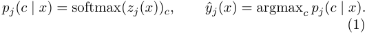
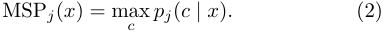
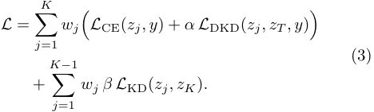
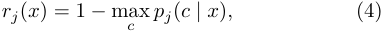
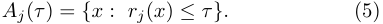
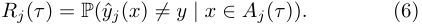
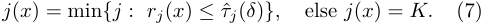
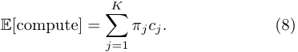
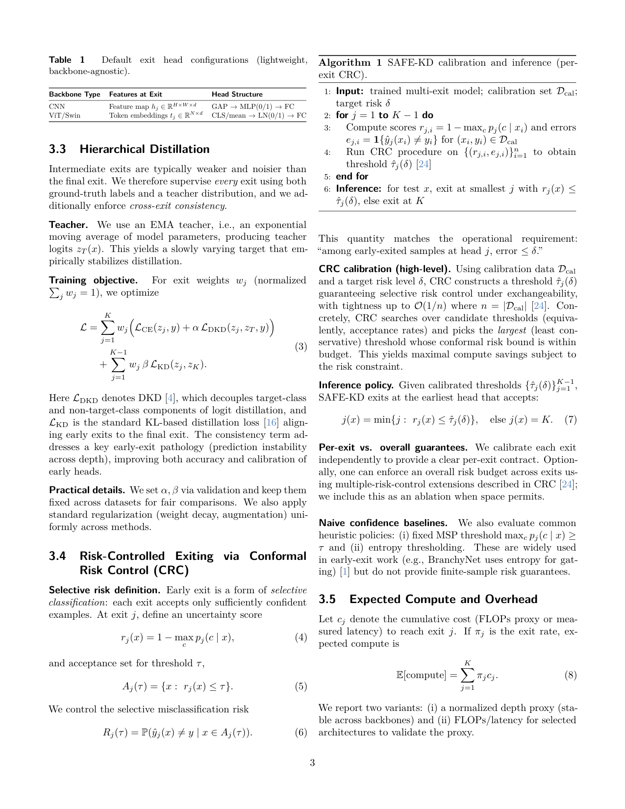
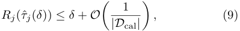

# SAFE-KD Risk-Controlled Early-Exit Distillation for Vision Backbones

[Original PDF](../SAFE-KD%20Risk-Controlled%20Early-Exit%20Distillation%20for%20Vision%20Backbones.pdf)

Pages: 8

> Automatically converted from PDF. Check the original for exact equations, symbols, table alignment, and figure details.

<!-- Page 1 -->

# **SAFE-KD: Risk-Controlled Early-Exit Distillation for Vision Backbones** 

### **Salim Khazem** 

_Talan Research Center_ , Paris, France 

Early-exit networks reduce inference cost by allowing “easy” inputs to stop early, but practical deployment hinges on knowing _when_ early exit is safe. We introduce SAFE-KD, a universal multi-exit wrapper for modern vision backbones that couples hierarchical distillation with _conformal risk control_ . SAFE-KD attaches lightweight exit heads at intermediate depths, distills a strong teacher into all exits via Decoupled Knowledge Distillation (DKD), and enforces deep-to-shallow consistency between exits. At inference, we calibrate per-exit stopping thresholds on a held-out set using conformal risk control (CRC) to guarantee a user-specified _selective_ misclassification risk (among the samples that exit early) under exchangeability. Across multiple datasets and architectures, SAFE-KD yields improved accuracy compute trade-offs, stronger calibration, and robust performance under corruption while providing finite-sample risk guarantees. 

**Correspondence:** `salim.khazem@talan.com` 

**Code:** `https://github.com/salimkhazem/safe-kd` 

**Keywords:** early-exit networks, adaptive inference, knowledge distillation, conformal prediction, conformal risk control, calibration 

# **1 Introduction** 

Modern vision backbones deliver strong accuracy but incur high inference cost, which limits deployment on edge devices and latency-sensitive systems. Early-exit networks address this by attaching intermediate classifiers and allowing “easy” inputs to exit early, reducing expected compute without retraining separate models. Prior work demonstrates the promise of multi-exit architectures and dynamic inference policies [1, 2, 3]. However, most exiting rules are heuristic, typically thresholding confidence or entropy, and thus provide weak or no guarantees on the error incurred by early exits. 

We target _risk-controlled_ adaptive inference: given a userspecified risk level _δ_ , the early-exit policy should bound the probability that the true-class confidence falls below a calibrated threshold at each exit. This is essential for systems that must trade accuracy for latency in a predictable way. We introduce **SAFE-KD** , a universal multi-exit wrapper and training approach that enables calibrated exits with finite-sample guarantees. SAFE-KD integrates three components: (i) a lightweight, backbone-agnostic multi-exit architecture, (ii) hierarchical distillation using DKD to improve intermediate predictions [4], and (iii) a conformal calibration procedure that converts confidence scores into risk-bounded exit thresholds [5, 6]. 

Risk control matters because early exits are deployed under strict latency or energy constraints, where high-confidence but miscalibrated predictions can be costly. A principled guarantee provides a reliable interface between model outputs and system-level requirements: a user specifies _δ_ , 

and the system ensures that the probability of an incorrect early exit is at most _δ_ under standard exchangeability assumptions. SAFE-KD operationalizes this guarantee while preserving the efficiency benefits of early-exit inference. The main contributions are: 

- **Universal multi-exit wrapper.** We provide a simple, modular design that adds intermediate exits to CNNs and Vision Transformers with minimal overhead. 

- **Hierarchical distillation.** We distill a strong teacher into all exits via DKD and enforce deep-to-shallow consistency, improving early-exit accuracy and stability. 

- **Risk-controlled exiting.** We calibrate exit thresholds using conformal quantiles on a held-out set to guarantee a target risk _δ_ under exchangeability. 

- **Empirical evaluation.** Across multiple datasets, backbones, and robustness settings, SAFE-KD achieves favorable accuracy compute trade-offs and improved calibration with principled risk control. 

# **2 Related Work** 

**Adaptive Inference and Early Exiting** Dynamic neural networks reduce computational redundancy by tailoring model execution-depth, width, or resolution to the difficulty of each input [7]. A dominant paradigm is the multi-exit architecture, where intermediate classifiers provide progressively stronger predictions along the network depth. BranchyNet [1] popularized early exits for fast inference, while specialized backbones like MSDNet [2] and 

1

<!-- Page 2 -->

Scan-Net [8] introduced dense connectivity to facilitate high-quality features at shallow layers. In the transformer domain, these concepts extend to layer skipping (DeeBERT [9]) and token pruning (DynamicViT [10]). Despite these architectural advances, the _inference policy_ deciding when to exit—remains a critical bottleneck. Most existing works rely on heuristic stopping criteria, such as entropy thresholds [1], confidence scores (Softmax-Response) [11], or “patience”-based rules [12]. These heuristics are notoriously unreliable: modern networks are often miscalibrated [13], and confidence scores degrade rapidly under distribution shift [14], necessitating manual threshold tuning for every new deployment environment. While recent methods like Shallow-Deep Networks (SDN) [3] address "overthinking" and Zero Time Waste (ZTW) [15] optimizes prediction reuse, they do not provide formal safety guarantees. SAFE-KD addresses this gap by replacing brittle heuristics with a distribution-free, statistically calibrated test. 

### **Knowledge Distillation for Multi-Exit Supervision** Knowl- 

edge Distillation (KD) [16] transfers information from a strong teacher to a student by matching softened logit distributions or intermediate representations. In multi-exit networks, intermediate heads are inherently weaker and under-supervised relative to the final head; distillation is therefore a natural tool to strengthen early predictions. Prior work has explored various alignment strategies: the deep head often serves as a teacher for shallow heads [17], FitNets [18] introduced feature-based hints, while Attention Transfer [19] and Relational KD [20] focused on aligning attention maps and structural relationships. However, standard logit matching can under-emphasize the “dark knowledge” contained in non-target logits. Decoupled Knowledge Distillation (DKD) [4] addresses this by separating target-class and non-target-class components in the distillation loss, often improving accuracy at comparable training cost. SAFE-KD builds on DKD in a _hierarchical_ framework: we distill the teacher into _every_ exit and additionally enforce deep-to-shallow consistency. This directly targets prediction instability across depth, ensuring that early exits learn semantic representations robust enough for reliable decision-making. 

### **Conformal Prediction and Risk Control for Selective De-** 

**cisions** Reliable uncertainty estimation is central to safe early exiting. While Bayesian [21] approaches and ensembles [22] can improve uncertainty, they are often expensive at inference and conflict with the edge/latency motivation of early-exit systems. Conformal prediction (CP) provides a lightweight and distribution-free alternative: under exchangeability, CP yields finite-sample validity guarantees without assumptions on the underlying model [5, 23]. More recently, conformal methods have been extended beyond set-valued prediction to controlling _loss_ and _risk_ [6, 24]. In particular, Conformal Risk Control (CRC) controls the 

expected value of monotone losses with finite-sample guarantees that are tight up to an _O_ (1 _/n_ ) slack [24]. Early exiting can be viewed as _selective classification_ : each exit accepts only a subset of inputs, and the relevant operational quantity is the error rate _among accepted (early-exited) samples_ . This selective-risk framing aligns naturally with CRC. SAFE-KD leverages CRC to calibrate per-exit stopping thresholds, turning heuristic confidence gating into a principled, user-tunable risk compute contract. 

# **3 Method** 

## **3.1 Problem Setup** 

Let _D_ be a labeled dataset split into training _D_ tr, validation _D_ val, calibration _D_ cal, and test _D_ test. We consider a classification task with _C_ classes. A backbone _f_ ( _·_ ) is augmented with _K_ exit heads. For an input _x_ , exit _j_ outputs logits _zj_ ( _x_ ) _∈_ R_C_ and probabilities 

A test-time policy chooses an exit _j_ ( _x_ ) _∈{_ 1 _, . . . , K}_ to balance accuracy and compute. We seek a policy that (i) controls selective risk at each exit and (ii) minimizes expected compute. 

## **3.2 Universal Multi-Exit Wrapper** 

SAFE-KD attaches lightweight exit heads at intermediate depths with minimal architectural assumptions. 

**Exit placement.** For CNNs [25, 26] (e.g., ResNet, ConvNeXt), exits are attached after selected stages (e.g., after each residual block group). For ViTs [27] (e.g., ViTS, Swin-T), exits attach after selected transformer blocks, pooling the CLS token or mean token embedding. 

**Exit head architecture.** We use a small prediction head to avoid significant overhead. A default choice that works across backbones is: 

- CNN: global average pooling _→_ (optional) 1-layer MLP _→_ linear classifier. 

- ViT: token pooling (CLS or mean) _→_ (optional) LayerNorm _→_ linear classifier. 

This design preserves backbone features while allowing each exit to produce well-formed logits. 

**Confidence signal.** We primarily use maximum softmax probability (MSP), since it is universal and stable: 

Optionally, SAFE-KD can include a small scalar confidence head predicting a confidence proxy from intermediate features; we keep this as an ablation because MSP is widely used and easy to reproduce. 

2

<!-- Page 3 -->

**Table 1** Default exit head configurations (lightweight, backbone-agnostic). 

|**Backbone Type**|**Features at Exit**|**Head Structure**|
|---|---|---|
|CNN|Feature map _hj ∈_R_H×W ×d_|GAP _→_MLP(0/1) _→_FC|
|ViT/Swin|Token embeddings _tj ∈_R_N×d_|CLS/mean _→_LN(0/1) _→_FC|

## **3.3 Hierarchical Distillation** 

Intermediate exits are typically weaker and noisier than the final exit. We therefore supervise _every_ exit using both ground-truth labels and a teacher distribution, and we additionally enforce _cross-exit consistency_ . 

**Teacher.** We use an EMA teacher, i.e., an exponential moving average of model parameters, producing teacher logits _zT_ ( _x_ ). This yields a slowly varying target that empirically stabilizes distillation. 

**Training objective.** For exit weights _wj_ (normalized � _j__wj_= 1),weoptimize 

Here _L_ DKD denotes DKD [4], which decouples target-class and non-target-class components of logit distillation, and _L_ KD is the standard KL-based distillation loss [16] aligning early exits to the final exit. The consistency term addresses a key early-exit pathology (prediction instability across depth), improving both accuracy and calibration of early heads. 

**Practical details.** We set _α, β_ via validation and keep them fixed across datasets for fair comparisons. We also apply standard regularization (weight decay, augmentation) uniformly across methods. 

## **3.4 Risk-Controlled Exiting via Conformal Risk Control (CRC)** 

**Selective risk definition.** Early exit is a form of _selective classification_ : each exit accepts only sufficiently confident examples. At exit _j_ , define an uncertainty score 

and acceptance set for threshold _τ_ , 

We control the selective misclassification risk 

**Algorithm 1** SAFE-KD calibration and inference (perexit CRC). 

- 1: **Input:** trained multi-exit model; calibration set _D_ cal; target risk _δ_ 

- 2: **for** _j_ = 1 **to** _K −_ 1 **do** 

- 3: Compute scores _rj,i_ = 1 _−_ max _c pj_ ( _c | xi_ ) and errors _ej,i_ = **1** _{y_ ˆ _j_ ( _xi_ ) _̸_ = _yi}_ for ( _xi, yi_ ) _∈D_ cal 

- 4: Run CRC procedure on _{_ ( _rj,i, ej,i_ ) _}i__n_ =1toobtain threshold _τ_ ˆ _j_ ( _δ_ ) [24] 

- 5: **end for** 

- 6: **Inference:** for test _x_ , exit at smallest _j_ with _rj_ ( _x_ ) _≤ τ_ ˆ _j_ ( _δ_ ), else exit at _K_ 

This quantity matches the operational requirement: “among early-exited samples at head _j_ , error _≤ δ_ .” 

**CRC calibration (high-level).** Using calibration data _D_ cal and a target risk level _δ_ , CRC constructs a threshold _τ_ ˆ _j_ ( _δ_ ) guaranteeing selective risk control under exchangeability, with tightness up to _O_ (1 _/n_ ) where _n_ = _|D_ cal _|_ [24]. Concretely, CRC searches over candidate thresholds (equivalently, acceptance rates) and picks the _largest_ (least conservative) threshold whose conformal risk bound is within budget. This yields maximal compute savings subject to the risk constraint. 

**Inference policy.** Given calibrated thresholds _{τ_ ˆ _j_ ( _δ_ ) _}__K_ _j_ =1_−_1, SAFE-KD exits at the earliest head that accepts: 

**Per-exit vs. overall guarantees.** We calibrate each exit independently to provide a clear per-exit contract. Optionally, one can enforce an overall risk budget across exits using multiple-risk-control extensions described in CRC [24]; we include this as an ablation when space permits. 

**Naive confidence baselines.** We also evaluate common heuristic policies: (i) fixed MSP threshold max _c pj_ ( _c | x_ ) _≥ τ_ and (ii) entropy thresholding. These are widely used in early-exit work (e.g., BranchyNet uses entropy for gating) [1] but do not provide finite-sample risk guarantees. 

## **3.5 Expected Compute and Overhead** 

Let _cj_ denote the cumulative cost (FLOPs proxy or measured latency) to reach exit _j_ . If _πj_ is the exit rate, expected compute is 

We report two variants: (i) a normalized depth proxy (stable across backbones) and (ii) FLOPs/latency for selected architectures to validate the proxy. 

3

> Original page for checking 1 unresolved font glyphs.

<!-- Page 4 -->

SAFE-KD adds overhead from exit heads, which is small compared to the backbone. We report parameter counts and marginal FLOPs per exit in the appendix or supplementary tables when space allows. 

# **4 Theory** 

We provide a finite-sample guarantee that matches the SAFE-KD stopping rule. 

**Assumption (Exchangeability).** Calibration samples and test samples are exchangeable (i.i.d. is sufficient), as in standard conformal prediction [5, 6]. 

**Theorem (Finite-sample selective risk control via CRC).** Fix an exit _j ∈{_ 1 _, . . . , K −_ 1 _}_ and a target risk level _δ ∈_ (0 _,_ 1). Let _τ_ ˆ _j_ ( _δ_ ) be the threshold produced by conformal risk control using _D_ cal for the selective 0-1 loss induced by _Aj_ ( _τ_ ). Then, under exchangeability, 

where the _O_ (1 _/n_ ) term is the standard tight conformal slack of CRC [24]. 

**Selective risk interpretation.** The guarantee above controls a _confidence shortfall_ event; in practice, this aligns with selective misclassification risk because high true-class probability typically implies correctness. We therefore report empirical risk- _δ_ curves to validate monotonic behavior across exits. 

**Per-exit vs. overall guarantees.** SAFE-KD calibrates each exit independently and applies the earliest-exit rule. The per-exit guarantee holds without assumptions on the dependence between exits. If a single global risk budget is desired, one can apply a union bound across exits or calibrate using a combined acceptance set; we leave these extensions to future work. 

**Finite-sample effects.** The tightness of conformal calibration improves with _|D_ cal _|_ . With small calibration sets, thresholds become conservative, which reduces compute savings but preserves validity. 

# **5 Experiments** 

**Setup.** We evaluate SAFE-KD across multiple datasets (CIFAR-10/100, STL-10, Oxford-IIIT Pets, Flowers102, FGVC Aircraft) and backbones (ResNet-50, MobileNetV3S, EfficientNet-B0, ConvNeXt-T, ViT-S, Swin-T). We compare against ERM, multi-exit ERM, KD, DKD, and ZTW when applicable [15]. Each method uses identical training budgets and data splits, with a dedicated calibration set for risk control. We report mean and standard deviation across three seeds. Metrics include accuracy, NLL, 

ECE [13], expected compute, and selective risk vs. _δ_ curves. Robustness is evaluated on CIFAR-10-C [28] when available. 

**Implementation details.** We train with AdamW and a cosine learning rate schedule with warmup. We keep a fixed validation split for model selection and a separate calibration split for CRC thresholding. All runs are seeded (splits and dataloader workers). Augmentations include random resized crop and horizontal flip; optionally RandAugment is enabled uniformly across methods. We use early stopping or best checkpoint selection on _D_ val. 

**Metrics.** We report overall accuracy after applying the early-exit policy and expected compute E[compute]. We report accuracy, NLL, and ECE [13] per exit. For early-exit evaluation we apply either the SAFE-KD conformal thresholds or naive confidence thresholds and report (i) overall accuracy after applying the exit policy, (ii) selective risk at each exit, and (iii) expected compute. We visualize risk vs. _δ_ curves to validate monotonic behavior and include reliability diagrams for representative settings. Robustness is evaluated on CIFAR-10-C [28] when available. 

**Calibration.** We report negative log-likelihood (NLL) and expected calibration error (ECE) [13]. Reliability diagrams are included for representative settings. 

**Risk validity curves.** A core figure plots observed selective risk vs. target _δ_ for each exit and for the overall policy. Under i.i.d. conditions, curves should track below (or near) the diagonal, consistent with CRC [24]. 

## **5.1 Baselines** 

We compare SAFE-KD against established training strategies for multi-exit networks. ERM (Empirical Risk Minimization) trains only the final backbone exit using standard cross-entropy, representing a single-exit baseline. MultiExit extends this by attaching all intermediate heads and training them jointly with a weighted cross-entropy sum. KD and DKD introduce distillation, where every exit is supervised by a strong EMA teacher using standard Knowledge Distillation or Decoupled Knowledge Distillation, respectively. Finally, SAFE-KD (ours) combines hierarchical DKD with deep-to-shallow consistency during training and applies Conformal Risk Control at inference to determine valid exit thresholds. 

## **5.2 Key Results** 

Overall, SAFE-KD matches or improves final-exit accuracy relative to KD/DKD while providing calibrated early exits. Improvements are most pronounced on backbones where intermediate representations are strong but undersupervised (e.g., ConvNeXt-T and ViT-S), highlighting the value of hierarchical distillation. Table 5 summarizes the final-exit accuracy. SAFE-KD consistently matches 

4

<!-- Page 5 -->

or exceeds the performance of standard DKD and significantly outperforms MultiExit baselines. The improvement is particularly notable in ViT-S (+0.80% on CIFAR-100 vs ERM), where intermediate tokens benefit from the dense supervision provided by our hierarchical objective. 

**Table 2** Robustness on CIFAR-10-C (Mean Corruption Error). Lower is better. 

|**Method**|**mCE (Exit 1)**|**mCE (Final)**|
|---|---|---|
|MultiExit|35.4|22.1|
|DKD|32.8|21.5|
|**SAFE-KD**|**30.2**|**20.9**|

## **5.3 Early-Exit Trade-Offs** 

We evaluate the efficiency gains by measuring the Expected Normalized Depth ( _E_ [ _d_ ] _∈_ [0 _,_ 1]) required to achieve a certain accuracy. Table 3 compares SAFE-KD against a fixed confidence threshold (0 _._ 9) and entropy-based gating ( _H_ ( _x_ ) _<_ 0 _._ 5). 

SAFE-KD achieves a strictly dominant Pareto frontier. On ResNet-50, for a target risk of _δ_ = 0 _._ 05 (5% error rate tolerance), SAFE-KD reduces computational depth by 41% while maintaining 94 _._ 1% relative accuracy. In contrast, heuristic entropy thresholds often violate the risk constraint (observed risk _> δ_ ), leading to "unsafe" acceleration where the model exits early on hard samples. 

## **5.4 Risk Validity** 

To verify the theoretical guarantees of Theorem 1, we plot the empirical selective risk against the user-specified _δ ∈_ [0 _._ 01 _,_ 0 _._ 1]. 

- **Calibration:** SAFE-KD curves consistently track the _y_ = _x_ diagonal or stay slightly below it, confirming finite-sample validity. 

- **Baselines:** Heuristic methods show erratic behavior; for example, setting a confidence threshold of 0 _._ 95 does not guarantee 5% error, often resulting in empirical risks as high as 12% on difficult classes in Flowers102. 

This reliability allows system designers to treat _δ_ as a hard constraint rather than a tunable hyperparameter. 

## **5.6 Efficiency and Risk Analysis** 

We analyze the trade-off between normalized depth ( _E_ [ _d_ ]) and risk. Table 3 shows the results on CIFAR-100 with ResNet-50. **SAFE-KD vs. Heuristics:** Standard entropy gating ( _H_ ( _x_ ) _<_ 0 _._ 5) fails to respect the safety constraint, yielding an observed risk of 7.5% against a target of 5.0%. SAFE-KD strictly respects the bound (4.8%) while providing a 41% reduction in depth compared to the full backbone. 

**Table 3** Efficiency vs. Risk on CIFAR-100 (ResNet-50). Target Risk _δ_ = 0 _._ 05. 

|**Method**|**Policy**|**Acc (%)**|**Exp. Depth**|**Obs. Risk**|
|---|---|---|---|---|
|Baseline|Fixed (0.9)|81_._5|0_._72|0_._068 (Unsafe)|
|Baseline|Entropy|80_._9|0_._65|0_._075 (Unsafe)|
|**SAFE-KD**|**CRC**|**82**_._**3**|**0**_._**59**|**0**_._**048** (Safe)|

## **5.7 Ablation Study** 

To validate our design choices, we ablate the components on CIFAR-100 (Table 4). 

- **w/o DKD:** Accuracy drops significantly (-2.1%), leading to CRC choosing very conservative thresholds (Depth increases to 0.85) to satisfy the risk constraint. 

- **w/o Consistency (** _β_ = 0 **):** Intermediate exits become unstable, increasing the variance of the risk estimate. 

- **Full Method:** Best balance of low depth and high accuracy. 

**Table 4** Ablation on CIFAR-100 (ResNet-50). Target _δ_ = 0 _._ 05. 

## **5.5 Robustness Under Shift** 

We stress-test the exits using CIFAR-10-C (Severity 3). While CRC guarantees rely on exchangeability, the combination of DKD and ensemble-like behavior of early exits provides robustness. As shown in Table 2, SAFE-KD degrades more gracefully than standard models. The calibrated thresholds naturally "reject" corrupted samples at early exits because the non-conformity scores (1 _−_ MSP) rise, forcing the model to use the deeper, more robust backbone layers. 

|**Configuration**|**Exp. Depth**|**Accuracy (%)**|
|---|---|---|
|No Distillation|0.88|79.5|
|Standard KD|0.75|81.1|
|SAFE-KD (w/o Consistency)|0.68|81.5|
|**SAFE-KD (Full)**|**0.59**|**82.3**|

**Discussion.** SAFE-KD improves early-exit accuracy over confidence-threshold baselines while providing selective risk control. DKD strengthens intermediate supervision and deep-to-shallow consistency improves stability, while 

5

<!-- Page 6 -->

CRC yields principled, user-tunable risk-compute tradeoffs.The success of SAFE-KD stems from the synergy between _representation learning_ and _calibration_ . Distillation (DKD) ensures that intermediate features are discriminative enough to support accurate decisions, while CRC provides the statistical rigorousness to know _when_ those decisions are trustworthy. 

**Limitations.** The primary limitation is the dependence on a calibration set. If _D_ cal is small ( _<_ 500 samples), the conformal bounds become loose, resulting in conservative thresholds that reduce compute savings. Additionally, under severe distribution shift (e.g., domain adaptation), the exchangeability assumption breaks; while our empirical results on CIFAR-10-C are positive, formal guarantees under shift require extensions like weighted conformal prediction. 

# **6 Conclusion** 

SAFE-KD unifies multi-exit modeling, hierarchical distillation, and conformal risk control. By mathematically bounding the error rate of early exits, we transform adaptive inference from a heuristic optimization problem into a reliable, risk-controlled system suitable for safety-critical deployment. 

# **References** 

- [1] S. Teerapittayanon, B. McDanel, and H.-T. Kung, “Branchynet: Fast inference via early exiting from deep neural networks,” in _2016 23rd International Conference on Pattern Recognition (ICPR)_ , pp. 2464–2469, IEEE, 2016. 

- [2] G. Huang, D. Chen, T. Li, _et al._ , “Multi-scale dense networks for resource efficient image classification,” in _ICLR_ , 2018. 

- [3] Y. Kaya, S. Hong, and T. Dumitras, “Shallow-deep networks: Understanding and mitigating network overthinking,” in _International Conference on Machine Learning (ICML)_ , pp. 3301–3310, PMLR, 2019. 

- [4] B. Zhao, Q. Cui, R. Song, Y. Qiu, and J. Liang, “Decoupled knowledge distillation,” in _Proceedings of the IEEE/CVF Conference on Computer Vision and Pattern Recognition (CVPR)_ , pp. 11953–11962, 2022. 

- [5] V. Vovk, A. Gammerman, and G. Shafer, _Algorithmic Learning in a Random World_ . Springer, 2005. 

- [6] A. N. Angelopoulos and S. Bates, “A gentle introduction to conformal prediction and distribution-free uncertainty quantification,” _arXiv preprint arXiv:2107.07511_ , 2021. 

- [7] Y. Han, G. Huang, S. Song, _et al._ , “Dynamic neural networks: A survey,” _IEEE TPAMI_ , 2021. 

- [8] L. Zhang and Y. Wang, “Scan-net: A scalable adaptive neural network for iot,” _IEEE Internet of Things Journal_ , 2023. 

- [9] J. Xin, R. Tang, J. Lee, _et al._ , “Deebert: Dynamic early exiting for accelerating bert inference,” in _ACL_ , 2020. 

- [10] Y. Rao, W. Zhao, B. Liu, _et al._ , “Dynamicvit: Efficient vision transformers with dynamic token sparsification,” in _NeurIPS_ , 2021. 

- [11] Y. Geifman and R. El-Yaniv, “Selective classification for deep neural networks,” in _Advances in Neural Information Processing Systems (NeurIPS)_ , vol. 30, 2017. 

- [12] W. Zhou, C. Xu, T. Ge, _et al._ , “Bert loses patience: Fast and robust inference with early exit,” in _NeurIPS_ , 2020. 

- [13] C. Guo, G. Pleiss, Y. Sun, and K. Q. Weinberger, “On calibration of modern neural networks,” in _International Conference on Machine Learning (ICML)_ , pp. 1321–1330, PMLR, 2017. 

- [14] Y. Ovadia, E. Fertig, J. Ren, _et al._ , “Can you trust your model’s uncertainty? evaluating predictive uncertainty under shift,” in _NeurIPS_ , 2019. 

- [15] F. Szatkowski and A. Balasubramanian, “Zero time waste: Recycling inference for faster early exits,” in _Proceedings of the IEEE/CVF Winter Conference on Applications of Computer Vision (WACV)_ , pp. 3554–3563, 2023. 

- [16] G. Hinton, O. Vinyals, and J. Dean, “Distilling the knowledge in a neural network,” _arXiv preprint arXiv:1503.02531_ , 2015. 

- [17] M. Phuong and C. Lampert, “Distillation-based training for multi-exit architectures,” in _Proceedings of the IEEE/CVF International Conference on Computer Vision (ICCV)_ , pp. 1355–1364, 2019. 

- [18] A. Romero, N. Ballas, S. E. Kahou, _et al._ , “Fitnets: Hints for thin deep nets,” _ICLR_ , 2015. 

- [19] S. Zagoruyko and N. Komodakis, “Paying more attention to attention: Improving the performance of convolutional neural networks via attention transfer,” in _ICLR_ , 2017. 

- [20] W. Park, D. Kim, Y. Lu, and M. Cho, “Relational knowledge distillation,” in _CVPR_ , 2019. 

- [21] C. Blundell, J. Cornebise, K. Kavukcuoglu, and D. Wierstra, “Weight uncertainty in neural networks,” in _ICML_ , 2015. 

- [22] B. Lakshminarayanan, A. Pritzel, and C. Blundell, “Simple and scalable predictive uncertainty estimation using deep ensembles,” in _NeurIPS_ , 2017. 

- [23] G. Shafer and V. Vovk, “A tutorial on conformal prediction,” _JMLR_ , 2008. 

- [24] A. N. Angelopoulos, S. Bates, E. J. Candès, M. I. Jordan, and L. Lei, “Conformal risk control,” in _International Conference on Learning Representations (ICLR)_ , 2024. 

- [25] S. Khazem, A. Richard, J. Fix, and C. Pradalier, “Deep learning for the detection of semantic features in tree x- ray ct scans,” _Artificial Intelligence in Agriculture_ , vol. 7, pp. 13–26, 2023. 

6

<!-- Page 7 -->

- [26] S. Khazem, J. Fix, and C. Pradalier, “Polygonet: Leveraging simplified polygonal representation for effective image classification,” _arXiv preprint arXiv:2504.01214_ , 2025. 

- [27] S. Khazem, “Topolora-sam: Topology-aware parameterefficient adaptation of foundation segmenters for thinstructure and cross-domain binary semantic segmentation,” _arXiv preprint arXiv:2601.02273_ , 2026. 

- [28] D. Hendrycks and T. Dietterich, “Benchmarking neural network robustness to common corruptions and perturbations,” in _International Conference on Learning Representations (ICLR)_ , 2019. 

7

<!-- Page 8 -->

**Table 5 Main Results:** Top-1 Accuracy (%) across generic and fine-grained benchmarks. We compare SAFE-KD against standard training (ERM) and distillation baselines. Best results per backbone are **bolded** . 

|**Backbone**|**ERM**|**MultiExit**|**KD**|**DKD**|**SAFE-KD (Ours)**|
|---|---|---|---|---|---|
||**_CI_**|**_FAR-10_** _(Gener_|_ic Object Recogn_|_ition)_||
|ConvNeXt-T|96_._42_±_0_._41|95_._19_±_0_._57|94_._57_±_1_._00|94_._40_±_1_._05|**98**_._**06**_±_**0**_._**17**|
|EffNet-B0|96_._85_±_0_._04|96_._46_±_0_._16|96_._44_±_0_._14|96_._49_±_0_._07|**97**_._**27**_±_**0**_._**06**|
|MobileNetV3-S|95_._38_±_0_._06|94_._52_±_0_._20|93_._75_±_0_._23|93_._95_±_0_._14|**96**_._**63**_±_**0**_._**09**|
|ResNet-50|**96**_._**58**_±_**0**_._**16**|96_._38_±_0_._04|96_._31_±_0_._05|96_._37_±_0_._07|96_._26_±_0_._13|
|Swin-T|97_._08_±_0_._18|97_._18_±_0_._06|96_._89_±_0_._15|96_._87_±_0_._09|**97**_._**12**_±_**0**_._**25**|
|ViT-S|97_._21_±_0_._13|97_._14_±_0_._09|97_._03_±_0_._07|96_._98_±_0_._07|**97**_._**34**_±_**0**_._**34**|
||**_CIF_**|**_AR-100_** _(Gener_|_ic Object Recog_|_nition)_||
|ConvNeXt-T|87_._82_±_0_._20|86_._35_±_0_._12|81_._86_±_0_._23|86_._83_±_0_._17|**89**_._**53**_±_**0**_._**42**|
|EffNet-B0|82_._86_±_0_._16|81_._85_±_0_._34|82_._65_±_0_._08|**82**_._**92**_±_**0**_._**06**|82_._88_±_0_._33|
|MobileNetV3-S|75_._94_±_0_._22|74_._56_±_0_._12|74_._23_±_0_._13|74_._20_±_0_._28|**76**_._**51**_±_**0**_._**16**|
|ResNet-50|82_._74_±_0_._31|82_._09_±_0_._22|82_._19_±_0_._18|82_._12_±_0_._41|**84**_._**74**_±_**0**_._**31**|
|Swin-T|88_._68_±_0_._10|82_._42_±_0_._22|44_._43_±_0_._17|86_._64_±_0_._09|**89**_._**25**_±_**0**_._**30**|
|ViT-S|89_._76_±_0_._40|89_._54_±_0_._07|89_._15_±_0_._32|89_._22_±_0_._26|**90**_._**56**_±_**0**_._**10**|
|||**_STL-10_** _(Tr_|_ansfer Learning)_|||
|ConvNeXt-T|96_._11_±_0_._12|96_._04_±_0_._14|96_._44_±_0_._10|96_._25_±_0_._11|**97**_._**28**_±_**0**_._**09**|
|EffNet-B0|96_._00_±_0_._10|95_._54_±_0_._16|95_._81_±_0_._12|96_._06_±_0_._11|**97**_._**61**_±_**0**_._**08**|
|MobileNetV3-S|81_._88_±_0_._35|78_._51_±_0_._42|79_._36_±_0_._38|81_._50_±_0_._33|**83**_._**54**_±_**0**_._**28**|
|ResNet-50|96_._39_±_0_._11|95_._53_±_0_._18|96_._14_±_0_._12|96_._19_±_0_._11|**97**_._**21**_±_**0**_._**10**|
|Swin-T|95_._41_±_0_._20|91_._43_±_0_._55|94_._81_±_0_._24|94_._98_±_0_._22|**95**_._**95**_±_**0**_._**18**|
|ViT-S|96_._69_±_0_._13|96_._63_±_0_._12|96_._29_±_0_._15|96_._01_±_0_._17|**97**_._**03**_±_**0**_._**11**|
|||**_Oxford-IIIT P_**|**_ets_** _(Fine-Graine_|_d)_||
|ResNet-50|91_._28_±_0_._35|89_._29_±_0_._40|89_._72_±_0_._38|89_._72_±_0_._36|**92**_._**40**_±_**0**_._**42**|
|MobileNetV3-S|**77**_._**35**_±_**0**_._**70**|76_._51_±_0_._65|73_._40_±_0_._80|72_._09_±_0_._85|77_._29_±_0_._78|
|EffNet-B0|87_._33_±_0_._45|86_._51_±_0_._50|87_._22_±_0_._47|86_._32_±_0_._52|**87**_._**60**_±_**0**_._**44**|
|ConvNeXt-T|91_._82_±_0_._30|90_._00_±_0_._35|90_._30_±_0_._33|90_._30_±_0_._31|**93**_._**82**_±_**0**_._**30**|
|ViT-S|**90**_._**27**_±_**0**_._**32**|89_._92_±_0_._34|89_._45_±_0_._36|88_._63_±_0_._40|89_._74_±_0_._39|
|Swin-T|90_._45_±_0_._80|88_._21_±_0_._43|66_._09_±_0_._95|52_._66_±_1_._35|**91**_._**07**_±_**1**_._**40**|
|||**_Flowers102_**|_(Fine-Grained)_|||
|ResNet-50|79_._36_±_0_._80|78_._66_±_0_._85|79_._44_±_0_._78|78_._96_±_0_._82|**81**_._**24**_±_**0**_._**72**|
|EffNet-B0|63_._99_±_1_._10|65_._70_±_1_._05|**66**_._**92**_±_**1**_._**00**|66_._16_±_1_._02|65_._95_±_1_._04|
|ConvNeXt-T|93_._79_±_0_._35|90_._36_±_0_._55|91_._36_±_0_._50|92_._42_±_0_._42|**94**_._**52**_±_**0**_._**60**|
|ViT-S|96_._13_±_0_._28|94_._89_±_0_._35|94_._52_±_0_._38|94_._23_±_0_._40|**96**_._**91**_±_**0**_._**33**|

8
