# Shen_Progress-Aware_Online_Action_Segmentation_for_Egocentric_Procedural_Task_Videos_CVPR_2024_paper

[Original PDF](../Shen_Progress-Aware_Online_Action_Segmentation_for_Egocentric_Procedural_Task_Videos_CVPR_2024_paper.pdf)

Pages: 12

> Automatically converted from PDF. Check the original for exact equations, symbols, table alignment, and figure details.

<!-- Page 1 -->

This CVPR paper is the Open Access version, provided by the Computer Vision Foundation. Except for this watermark, it is identical to the accepted version; the final published version of the proceedings is available on IEEE Xplore. 

# **Progress-Aware Online Action Segmentation for Egocentric Procedural Task Videos** 

## Yuhan Shen Northeastern University 

shen.yuh@northeastern.edu 

## Ehsan Elhamifar Northeastern University 

e.elhamifar@northeastern.edu 

## **Abstract** 

_We address the problem of online (streaming) action segmentation for egocentric procedural task videos. While previous studies have mostly focused on offline action segmentation, where entire videos are available for both training and inference, the transition to online action segmentation is crucial for practical applications like AR/VR task assistants. Notably, applying an offline-trained model directly to online inference results in a significant performance drop due to the inconsistency between training and inference. We propose an online action segmentation framework by first modifying existing architectures to make them causal. Second, we develop a novel action progress prediction module to dynamically estimate the progress of ongoing actions and using them to refine the predictions of causal action segmentation. Third, we propose to learn task graphs from training videos and leverage them to obtain smooth and procedureconsistent segmentations. With the combination of progress and task graph with casual action segmentation, our framework effectively addresses prediction uncertainty and oversegmentation in online action segmentation and achieves significant improvement on three egocentric datasets._1 

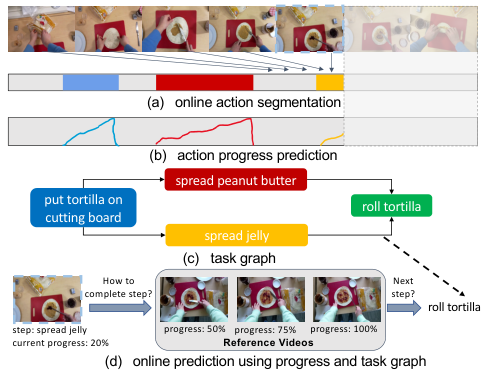

<!-- Start of picture text -->
(a) online action segmentation (b) action progress prediction spread peanut butter put tortilla on  roll tortilla cutting board spread jelly (c) task graph How to  Next complete step?  step? roll tortilla step: spread jelly progress: 50% progress: 75% progress: 100% current progress: 20% Reference Videos (d) online prediction using progress and task graph <!-- End of picture text -->

Figure 1. (a) Online action segmentation: use past and current frames to make predictions. (b) Action progress prediction: estimate the progress of each ongoing action in real time. (c) Task graph captures all feasible transcripts to perform a procedural task. We learn the task graph from training videos. (d) We use the predicted action progress and the learned task graph to improve online action predictions. Our framework allows us to demonstrate how to complete the current step based on the estimated progress and anticipate or guide the user to the next possible step(s). 

## **1. Introduction** 

The future of computer vision holds exciting possibilities for seamlessly integrating augmented and virtual reality (AR/VR) into our daily lives. Imagine wearing AR glasses while you assemble or repair a complex machine, perform a medical procedure on a patient or cook a gourmet meal. Your **virtual task assistant** would recognize your actions in real-time, anticipate your next steps and guide you through the entire procedure. In this context, advanced computer vision technologies, including **online and real-time user action understanding** , become increasingly important. 

> 1Code is available at https://github.com/Yuhan-Shen/ ProTAS. 

While there have been extensive studies on video action segmentation, whose goal is to divide long videos (including procedural ones) into multiple segments of actions, the literature in this area has predominantly focused on _offline_ action segmentation, where _entire_ videos are given and used during both training and inference [2, 7, 22, 41, 45, 51, 52, 56, 64, 69–71, 73, 83–85, 87]. Such methods leverage past and future frames to predict the action of a given frame. However, achieving the vision of AR/VR task assistants requires a shift from traditional offline action segmentation to the dynamic realm of _online (streaming)_ action segmentation, where actions must be recognized _as frames arrive_ . 

Notice that one can train an action segmentation model in an offline fashion and apply it online to all frames up to the current time or using a sliding window [28]. However, this approach suffers from major issues: i) it incurs a very 

18186

<!-- Page 2 -->

large computational cost, since we need to run the entire model every time new frames arrive; ii) the discrepancy between the offline training and online inference leads to low performance (as we show in our experiments), iii) the model often exhibits oversegmentation and abrupt transitions between actions, partly due to the lack of future frames. A few recent works have tried to address weakly-supervised online action segmentation [27, 28], but their performance is limited due to using weak supervision and their setting is different from what we study in this paper, which is _fullysupervised online_ action segmentation. 

**Paper Contributions.** We address the problem of online action segmentation, specially in the domain of egocentric procedural task videos captured through wearable AR/VR devices, see Figure 1. These videos offer a first-person view of human interaction with the environment as people handle objects and perform tasks. To address the challenges in online action segmentation, we propose a **PR** ogressaware **O** nline **T** emporal **A** ction **S** egmentation (ProTAS) framework by introducing a novel component called Action Progress Prediction (APP). As shown in Figure 1(b), APP estimates the progress of each action as it proceeds, providing a dynamic and accurate assessment of the current state of ongoing actions. By equipping the model with the ability to estimate the progress of actions in real-time, it can make more informed and contextually relevant predictions during online action segmentation. This not only mitigates the problem of oversegmentation, but also ensures smoother transitions between actions, empowering the model to segment actions more accurately. 

Moreover, we recognize that the inherent structure of procedural tasks can provide valuable cues for action segmentation. Therefore, we take a holistic approach by learning the task graph from training videos and incorporating it during both training and testing. Task graphs encode the temporal relationships and dependencies between actions (steps) within a task, offering a rich source of contextual information that enhances the precision and efficiency of online action segmentation by considering the completion status of the predecessors and successors of an action node in the graph. With the combination of the action progress prediction module and the task graph-based predictions, our model is able to segment streaming videos in an online fashion, achieving remarkable improvements on three egocentric procedural video datasets. 

To address the lack of a sufficiently large egocentric procedural dataset from the cooking domain, we gathered 207 videos from 5 recipes, for a total of 16.6 hours of footage. We manually built the task graphs, captured videos corresponding to different variations of each task according to the task graph and carefully annotated the videos with framewise step labels. We plan to publicly release our dataset. 

## **2. Related Works** 

**Action Segmentation.** Depending on the level of supervision, action segmentation can be classified into three main categories: unsupervised [3, 19, 20, 25, 42, 43, 65, 68, 76, 81, 90], weakly-supervised [11, 15, 24, 48– 50, 53, 57, 57, 58, 61–63, 67, 73], and fully-supervised [2, 7, 22, 35, 36, 41, 45, 51, 52, 54, 59, 64, 69–71, 73, 84, 85, 87] approaches. Recent work in [46] has also studied joint temporal action segmentation and error detection. Our work primarily aligns with the fully-supervised methods. However, it is worth noting that previous studies have predominantly focused on offline action segmentation, where both past and future frames are utilized to make predictions at the current frame. This approach, while effective, faces limitations when applied to streaming videos, where access to future frames for prediction is impossible. Consequently, there exists a critical need to develop a robust online action segmentation model for real-world applications and scenarios where access to future frames is constrained. While a recent work OODL [27] has attempted to bridge the discrepancy between online and offline action segmentation, it only uses transcripts as weak supervision, which limits the performance. In contrast, our work is focused on online action segmentation using full supervision, aiming at developing reliable models for AR task assistants. 

**Online Video Understanding.** While online action segmentation remains an understudied area, the online setting has been explored in other video understanding tasks. Online action recognition [8, 34, 44, 75] aims to recognize the action class of a video clip given a small fraction of frames. Online action detection [14, 21, 26, 79, 80, 82, 88] classifies per-frame action classes under the streaming video setting, where a video contains only one or very few actions. Online action localization [38, 39, 72] focuses on instance-level detection of actions in streaming videos. However, compared with these tasks, online action segmentation presents a notably greater challenge as segmenting actions requires a holistic long-range understanding of the videos. The temporal dependencies between actions are critical for accurate segmentation, and in the online setting, they become particularly challenging, due to the lack of future frames. Action anticipation [29, 30, 86] aims to predict the next step given the current video frames. While we both operate without access to future frames, our work produces precise framewise predictions of ongoing actions while action anticipation only predicts the class of the incoming action. 

**Action Progress Prediction.** Our work draws inspiration from previous efforts on phase progression [16, 18, 31, 32, 55], which aim to estimate the progress of ongoing actions. Those works mainly concentrate on short video clips of individual actions, often ignoring relationships across multiple actions in the same video. In our work, we introduce 

18187

<!-- Page 3 -->

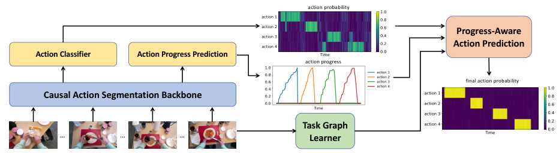

<!-- Start of picture text -->
action probability Progress-Aware Action Prediction Action Classifier Action Progress Prediction action progress final action probability Causal Action Segmentation Backbone Task Graph … … … Learner <!-- End of picture text -->

Figure 2. Illustration of our proposed progress-aware online temporal action segmentation (ProTAS) framework. 

a progress monitoring module to keep track of various actions in the same video, and combine this information with procedural graphs to enhance online action segmentation. 

**Task Graph.** Recent research on procedural videos has witnessed a growing interest in the integration of task graphs or knowledge graphs to leverage procedural knowledge to enhance performance [4, 17, 89]. This approach involves leveraging structured representations, often in the form of graphs, to encode information about the relationships and dependencies between different elements within a video. Task graphs are even more important in the online settings as the future information is unavailable. While Graph2Vid [17] has explored the use of flow graphs as a form of weak supervision for action segmentation, it is designed for offline action segmentation, as it requires dynamic programming between the entire video and the flow graph. In our paper, we propose to use the estimated progress to pinpoint the current state on the task graphs for online action segmentation, which has not been explored in the literature. [4] initially predicts keysteps in frames with high confidence and subsequently determines the maximum probability path for frames with low confidence using the task graph. However, it requires foreknowledge of the action labels of future frames, making it unsuitable for the online setting. 

## **3. Problem Setting** 

We study the problem of _fully-supervised online action segmentation_ . Assume we have a set of _K_ actions and a test input video clip that consists of features of frames up to the current time _t_ , denoted by _Xt_ = ( **_x_** 1 _,_ **_x_** 2 _, . . . ,_ **_x_** _t_ ). Here, _t ∈{_ 1 _, . . . , T }_ , where _T_ is the length of the entire test video and **_x_** _t ∈_ R_D_ denotes the pre-extracted feature of frame _t_ . The goal of an online action segmentation model, _g_ online( _·_ ), is to predict the _K_ -dimensional vector **_y_** _t ∈_ [0 _,_ 1]_K_ of the likelihood of actions at the current frame _t_ , i.e., 

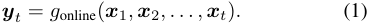

For training, we have multiple full videos and their groundtruth action segmentation labels. 

In contrast, offline action segmentation, _g_ offline( _·_ ), predicts the action of the frame _t_ by using the entire video, 

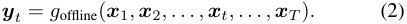

Prior works on offline action segmentation have mainly employed Temporal Convolutional Network (TCN) [22, 45, 47, 52] or Transformers [7, 51, 85], which are non-causal, i.e., use also information from future frames to predict the current action. As we show in our experiments, models trained with future information (i.e., trained offline) have a significant performance degradation when tested online. 

## **4. Proposed Online Temporal Action Segmentation Framework** 

**Overview.** We propose an online action segmentation framework with a focus on egocentric procedural videos, see Fig. 2. Our framework has the following components. 

— First, we use a causal action segmentation (CAS) module by modifying existing architectures, where we use causal (dilated) convolutions for TCN-based models and causal masking for Transformer-based models, see Fig. 3. Therefore, prediction for each frame will be based on only the past and current information during training. This makes the training and testing similar and improves the online segmentation accuracy, as we show in the experiments. 

— A main challenge in online action segmentation is oversegmentation (fluctuating action predictions), especially at the beginning, where not many frames are available. On the other hand, in egocentric videos, the scene contains cues about progress of an action. For example, the appearance of relevant objects may smoothly change as we progress, e.g., as we spread peanut butter on bread or fold paper filter, see Fig. 4. Therefore, we develop an action progress prediction (APP) module that estimates the progress made within an action and use it with the output of the CAS module to obtain more accurate and smoother action predictions. The progress can also be used as feedback in the AR/VR to notify the user of their progress and the amount of work remained in a step, see Fig. 1(d). 

18188

<!-- Page 4 -->

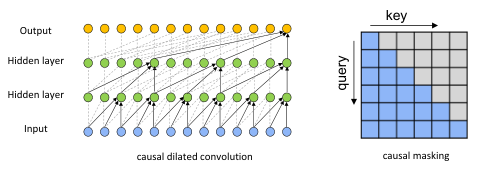

<!-- Start of picture text -->
key Output Hidden layer Hidden layer Input causal dilated convolution causal masking query <!-- End of picture text -->

Figure 3. Left: In causal dilated convolution, the filter operates on past and present data without access to future data. Right: In causal masking, the attention mechanism only attends to previous elements in a sequence. 

— Task graph encodes important information about plausible sequences of actions, see Fig. 1(c). In particular, the successors of an action cannot start unless the action is completed (full progress), while to start an action all its predecessors must be completed. Obtaining and leveraging such relationships allow us to find plausible and smooth predictions. Therefore, we propose a method to estimate the task graph from training videos (without using external knowledge sources as in [4, 89]) and to leverage it with action progress during both training and inference. Next, we describe each component in more details. 

### **4.1. Causal Action Segmentation (CAS)** 

To ensure consistency between the inference and training setting and subsequently improve the action segmentation performance, we first modify existing architectures to be causal, i.e., depend only on current and past frames, see Fig. 3. For TCN-based methods, we replace dilated convolutions with causal dilated convolutions [77]. Causal dilated convolutions are designed to only incorporate past and current frame information. For Transformer-based methods, we use causal masking [78], where the model can only attend to past frames within the self-attention mechanism, preventing it from accessing future information. 

Similar to prior works on offline action segmentation [22, 83, 85], we use the frame-wise cross-entropy loss and smoothing loss for training, 

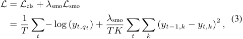

where _qt_ is the ground-truth label of the _t_ -th frame, _yt,qt_ is the predicted probability of the ground-truth label _qt_ at frame _t_ and _λ_ smo is the weight for the smoothing loss. 

### **4.2. Action Progress Prediction (APP)** 

In the online setting, the small number of frames especially at the beginning leads to fluctuating and unreliable predictions. The progress of an action, on the other hand, can inform the action prediction. For example, if the user has made about 30% progress in an action at the previous time instants, they will continue performing the same action at 

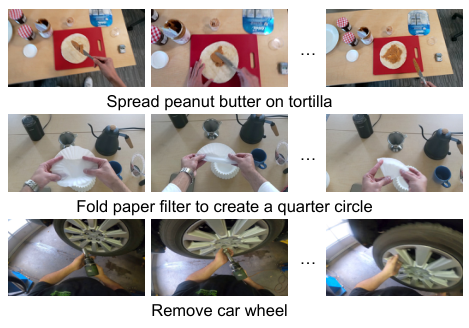

<!-- Start of picture text -->
… Spread peanut butter on tortilla … Fold paper filter to create a quarter circle … Remove car wheel <!-- End of picture text -->

Figure 4. The scene contains progress cues. For example, the appearance of step-relevant objects may smoothly change as we progress in the step. 

the current time with high probability. On the other hand, if an action has been completed (about 100% progress), a new action is likely to occur at the current time. 

We propose an action progress prediction (APP) module to estimate the progress of each action as it unfolds. APP is a regression branch and works in parallel to the causal action segmentation branch. Specifically, we use a Gated Recurrent Unit (GRU) layer [12] to estimate the progress given its dynamically evolving characteristics. We predict the progress of each action separately. We concatenate the raw action probabilities from CAS and the progress estimations from APP, and feed them through a progress-driven prediction module, which consists of a Multi-Layer Perceptron (MLP), to output the final action segmentation probabilities, see Fig. 2. These final probabilities are indeed a refinement of the raw action probabilities conditioned on action progress estimation. Thus, our model is able to mitigate oversegmentation and abrupt transitions between actions, as we show in the experiments. 

To learn the progress from training videos, given a segment [ _ts, te_ ] belonging to action _k_ , we define the target action progress at frame _t_ as the fraction of the action duration that has already passed, i.e., 

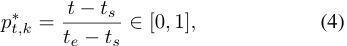

where the target progress value at the starting frame is _p__∗_ _ts,k_=0andattheendingframe(completionmoment) is _p__∗_ _te,k_=1.Thistargetlinearprogressissimilartoex- isting literature in phase progression and action completion [6, 16, 18, 31–33, 55]. We use Mean Squared Error (MSE) loss to supervise the progress learning, i.e., 

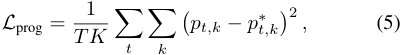

where _pt,k_ is the prediction from the APP module. 

18189

<!-- Page 5 -->

### **4.3. Leveraging Task Graph** 

Task graph captures partial orderings of actions and provides all feasible ways to execute a task, see Fig. 1(c). More specifically, an action node can only start when all its predecessors are completed. Thus, the task graph encodes i) prerequisites that must precede the execution of a specific action (e.g., we must take out the tortilla from its bag and put it on board before applying jam on it), ii) irreversible constraints that some actions cannot be performed after the completion of a particular action (e.g., we cannot apply peanut butter again after we have rolled the tortilla). We propose to learn (see next subsection) and leverage the task graph for plausible and smooth online action segmentation during both training and inference. 

Let _A__p_ ( _k_ ) and _A__s_ ( _k_ ) denote, respectively, the set of predecessors and successors of the action node _k_ in the task graph. We use the Breadth-First Search (BFS) algorithm [1, 17] to traverse the parent-child relationships of each action node _k_ to obtain its predecessors and successors. We design a loss that enforces predicting an action _k_ at time _t_ must incur a penalty when i) its predecessors have not been completed, ii) some of its successors are (being) completed. Thus, we first need to have an estimate of the completion state of an action. We use progress predictions to compute the completion state of action _k_ at time _t_ as 

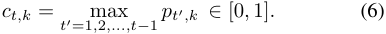

Thus, when _ct,k_ is close to 1, the action _k_ was close to completion in the previous frames. 

For each action _k_ at time _t_ , we define two scores. One score indicates how far the _predecessors_ of _k_ are from completion at time _t_ , 

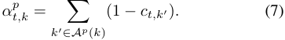

The score will be zero when all predecessors of _k_ are completed before frame _t_ , otherwise it will be positive. The second score indicates whether any _successor_ of _k_ has been in progress before time _t_ , 

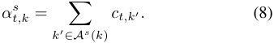

This score will be zero when no successor of _k_ has started before time _t_ , otherwise it will be positive. 

To have predictions that satisfy the predecessors and successors requirements, we introduce a task-graph loss, 

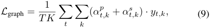

which enforces that when at time _t_ action _k_ is predicted ( _yt,k_ = 1), then the predecessors of _k_ must have been completed (i.e., _αt,k__p_isclosetozero)andthesuccessorsof_k_ cannot be in progress (i.e., _αt,k__s_is close to zero). 

### **4.4. Learning Task Graphs** 

Manually-built task graphs are not always available. We study two methods to obtain the task graph from training videos. Thus, unlike recent works [4, 89] that use the large-scale external knowledge base WikiHow to build the task graph, our method obtains it merely from the training videos, hence, can handle any procedural tasks. 

Let **_M_**_p_ _∈{_ 0 _,_ 1 _}__K×K_ denote a predecessor indicator matrix, whose ( _i, j_ )-th entry is 1 when node _i_ is a predecessor of _j_ . We similarly define a successor indicator matrix, **_M_**_s_ . We can rewrite (7) and (8) in matrix form as 

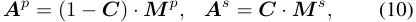

where **_C_** = [ _ct,k_ ] is the completion state matrix and **_A_**_p_ = [ _αt,k__p_] and**_A_**_s_= [_α_ _t,k__s_], all being_T× K_matrices. 

**Transcript-based Task Graph.** We generate a soft version of the predecessor/successor indicator matrices by computing the frequency of action _i_ occurring before/after action _j_ across the transcripts of training videos. This approach is particularly useful when dealing with large datasets and allows for automated extraction of task dependencies based on observed action sequences. We differ from prior works in text knowlegde-based task graph [4, 89] in that we generate task-specific graphs for action segmentation. 

**Learnable Task Graph.** We can also set the predecessor/successor indicator matrix as learnable parameters and automatically update them during training. This approach allows the task graph to adapt and evolve based on the data it processes. We initialize the indicator matrix with the transcript-based task graph, and set a regularization term, i.e., MSE loss, to the initialized matrix and the learnt matrix to avoid trivial solution where all nodes are disconnected. Thus, the learnable graph can be considered as a refinement of the transcript-based graph. 

### **4.5. Learning and Inference** 

**Learning.** Our final objective function for training is a combination of classification loss, smoothing loss, progress prediction loss, and task-graph loss, 

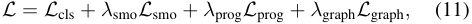

where _λ_ smo, _λ_ prog, _λ_ graph are the weights for the corresponding loss terms. We use Stochastic Gradient Descent (SGD) optimization algorithm to update the parameters in both the action classification and progress regression branches. 

**Inference.** For testing, we input the frames up to time _t_ into our progress-aware causal action segmentation model to get the action logits _ot,k_ of each action class _k_ . Instead of directly applying the Softmax function on action logits to get the probabilities, we leverage the task graph for inference 

18190

<!-- Page 6 -->

|Method|Inference|||GTEA||||E|goProc|eL||||EgoPE|R||
|---|---|---|---|---|---|---|---|---|---|---|---|---|---|---|---|---|
|||Acc|Edit|F1@_{_|0.1,0.2|5,0.5_}_|Acc|Edit|F1@_{_|0.1,0.2|5,0.5_}_|Acc|Edit|F1@_{_|0.1,0.2|5,0.5_}_|
|Base|Offline|76.3|79.0|85.8|83.4|69.8|69.2|56.9|58.9|55.8|45.9|83.0|85.9|88.9|87.4|77.3|
|Base|Online|47.0|58.8|64.6|56.3|38.7|18.3|19.9|20.6|15.9|8.8|20.2|31.0|33.3|24.5|11.9|
|CAS|Online|74.0|64.4|71.8|69.4|56.0|64.5|42.5|45.2|41.6|33.0|71.8|48.9|56.2|52.2|39.4|
|CAS+OODL [27]|Online|74.0|64.7|70.3|66.9|54.1|66.4|44.0|44.7|41.5|30.5|71.2|49.3|55.6|52.3|40.0|
|CAS+APP|Online|**76.0**|67.0|75.1|71.1|57.9|66.3|47.1|49.3|44.9|35.2|**72.7**|55.0|62.0|58.3|43.4|
|CAS+APP+TG|Online|74.3|**69.2**|**77.1**|**74.1**|**59.7**|**67.8**|**48.8**|**51.5**|**46.0**|**35.7**|70.2|**60.7**|**65.4**|**61.2**|**46.3**|

Table 1. Performance on three datasets, using MSTCN as the base model. 

by subtracting the penalty scores in (7) and (8) from the original logits before feeding them into the Softmax layer: 

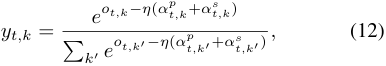

where the hyperparameter _η_ controls the weight of the task graph at testing. Thus, we use the procedural knowledge to encourage (discourage) online predictions that follow (disobey) the task graph (with high scores for _αt,k__p_and_α_ _t,k__s_). 

## **5. Experiments** 

### **5.1. Experimental Setup** 

**Datasets.** We use two established egocentric procedural video datasets: GTEA [23] and EgoProceL [5], as well as the recent EgoPER dataset [46], which focuses on action segmentation and error detection in procedural cooking tasks. EgoPER [46] consists of 213 normal and 173 erroneous egocentric videos, and our study exclusively involves the normal videos. These videos feature different users performing five cooking-related procedural tasks: ‘making coffee’, ‘making pinwheel’, ‘making tea’, ‘making oatmeal’, and ‘making quesadilla’. The videos were captured while the users were equipped with Hololens 2. Each task is associated with a pre-defined task graph that comprehensively encodes all feasible ways to perform the task, and the users were instructed to collect videos according to these variations (see supplementary materials for the task graphs). We also conduct experiments on Assembly101 [66] in the supplementary materials. We observed a lower performance gain on it as the egocentric videos are gray-scale and the steps of assembling small toy parts occur at a very small portion of the view, making it hard to capture progress. 

For GTEA, we report the average performance on four splits. EgoProceL consists of egocentric videos from five subsets of different dataset sources, so we train a model on each subset, and report the average performance across all subsets. For EgoPER, we train a model on each task, and report the average performance across all tasks. 

**Action Segmentation Model.** We use MSTCN [22] and ASFormer [85] as our action segmentation backbone. As mentioned in Sec. 4.1, we use causal dilated convolution in MSTCN and causal masking in ASFormer. We use these 

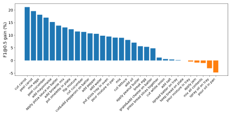

<!-- Start of picture text -->
20 15 10 5 0 -5 cut carrotpeel carrotapply pizza sauce on batterpeel cucumbermix eggsadd mayonnaiseadd brownie mixput omelette in platecut&add pepperoni on batterflip mixturecut cucumberadd pepperput pizza tray in ovenadd waterpour mixture in pancut lettucemixapply peanut buttergrate&add cheese on batteradd oilpress bread slices togetherbreak eggcut white onionspread batter on traykeep bread on plateadd saltpour mixture in traymix all contentsapply jamspray oil on traypour oil in pan F1@0.5 gain (%) <!-- End of picture text -->

Figure 5. Action-wise improvement gain from APP on EgoProceL. 

two popular action segmentation models as our backbone and evaluate the performance gain by our proposed action progress prediction (APP) module and task graph (TG). We did not use MSTCN++ [52] because its dual dilated layer is not beneficial in the context of online action segmentation where future information is not available, although it improves the offline performance over MSTCN. Please see the supplementary for more details. 

**Implementation Details.** We extract 2048-dim features on a window of 32 history frames using I3D [10] pretrained on Kinetics [10]. Following prior works [22, 83, 85], we evaluate the performance using standard metrics in action segmentation: edit similarity, F1 score with thresholds 0.1, 0.25, and 0.5 (F1@10,25,50), and frame-wise accuracy (Acc). We follow the default setups in MSTCN [22] and ASFormer [85] using their released source codes. For MSTCN, we use four stages and each stage contains ten dilated convolution layers. For the methods with the APP module, we add the progress regression branch at the end of each stage. For ASFormer, we use one encoder and three decoders, and each encoder/decoder contains nine blocks. For the methods with APP, we add the progress regression branch at the end of each encoder and decoder. In all experiments, we train the model using Adam optimizer with a learning rate 0.0005. We train the MSTCN models for 50 epochs and the ASFormer models for 120 epochs. 

### **5.2. Experiment Results** 

**Online Action Segmentation.** Table 1 and Table 2 show the results of using MSTCN and ASFormer, respectively, as the base models. We begin by using the base model for training and testing an offline action segmentation model, 

18191

<!-- Page 7 -->

|Method|Inference|||GTEA||||Eg|oProce|L|||E|goPER|||
|---|---|---|---|---|---|---|---|---|---|---|---|---|---|---|---|---|
|||Acc|Edit|F1@_{_|0.1,0.2|5,0.5_}_|Acc|Edit|F1@_{_|0.1,0.2|5,0.5_}_|Acc|Edit|F1@_{_|0.1,0.2|5,0.5_}_|
|Base|Offline|83.4|84.6|89.7|88.8|78.9|69.5|59.8|63.0|59.7|48.8|81.8|88.8|90.4|89.2|79.9|
|Base|Online|36.2|48.2|52.5|44.4|28.3|13.2|17.6|13.3|9.8|5.4|19.8|24.3|25.7|16.2|8.8|
|CAS|Online|77.2|73.3|79.6|77.1|65.0|64.8|48.1|49.8|45.0|35.4|70.3|60.6|66.1|62.3|44.7|
|CAS+APP|Online|**77.3**|74.0|79.9|77.3|65.4|66.7|50.7|51.0|47.1|36.1|70.6|61.2|67.9|63.6|46.9|
|CAS+APP+TG|Online|77.0|**74.1**|**80.2**|**77.5**|**66.1**|**68.5**|**52.1**|**51.6**|**48.9**|**36.8**|**71.7**|**62.4**|**68.8**|**65.9**|**48.6**|

Table 2. Performance on three datasets, using ASFormer as the base model. 

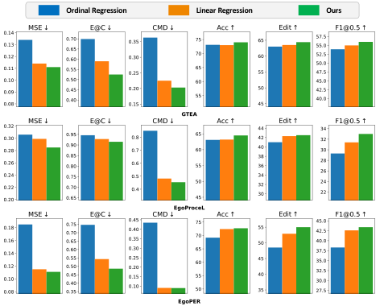

<!-- Start of picture text -->
Ordinal Regression Linear Regression Ours <!-- End of picture text -->

Figure 6. Comparison of different model designs for action progress prediction (APP) on GTEA (top), EgoProceL (middle) and EgoPER (bottom). 

which sets the _upper bound_ for online models. Then we employ the offline-trained base model for online inference. More specifically, every time a new frame arrives, we input all history frames into the model to make predictions at the current frame. The results reveal a huge gap between online and offline inference, e.g., Acc drops from 69.5% to 13.2% on EgoProceL and from 81.8% to 19.8% on EgoPER for the ASFormer base and similarly for MSTCN base. This underscores the significance of and the need for a well designed online action segmentation model. 

To bridge this gap, we first use our Causal Action Segmentation (CAS) models. These models keep consistency during both training and inference, ensuring that no future frames are utilized. The results demonstrate a remarkable improvement compared to performing online inference using an offline-trained base model. For example, the F1@0.5 improves from 8.8% to 33.0% on EgoProceL and from 11.9% to 39.4% on EgoPER for the MSTCN base (similarly for ASFormer base). Next, we investigate the impact of our Action Progress Prediction (APP) and leveraging our transcript-based Task Graph (TG) for online action segmentation. APP consistently improves the performance in all metrics on three datasets, e.g., improves the F1@0.5 by about 4% on both EgoProceL and EgoPER in Table 1. Although on GTEA, the frame-wise accuracy slightly decreases when incorporating the task graph, we noted im- 

provement in edit similarity and F1 scores. These metrics are based on the predicted segments and penalize oversegmentation, which suggest that leveraging our estimated task graph reduces oversegmentation, resulting in smoother and procedure-consistent online predictions. Overall, using our framework brings the online segmentation performance much closer to the offline segmentation. 

Ghoddoosian et al. [27] introduced an Online-Offline Discrepancy Loss (OODL) for weakly-supervised online action segmentation. OODL runs online and offline inference separately and uses the offline results to supervise the online model. Inspired by it, we simultaneously train two models, one causal and one non-causal model, and minimize the difference between their predictions to reduce the online-offline discrepancy. However, as the results show, adding OODL does not help the performance in fullysupervised online action segmentation, as the ground-truth framewise label is already used during training. In fact, adding an offline segmentation model as the teacher model does not perform better than directly using the ground-truth. 

**Action-wise performance.** We evaluate the action-wise performance to investigate how APP is helpful for online segmentation in Figure 5. Interestingly, we notice that estimating progress is more helpful to the actions related to huge apperance change through the course of the action, _e.g_ ., “cut carrot”, “peel cucumber”, _etc_ . On the contrary, the appearance change of actions like “pour oil in the pan” may not be very visible in the videos, and actions like “mix all the contents” do not have a good definition for progress, so APP is not effective in those cases. 

**Performance of Action Progress Prediction Module.** We evaluate the effects of different designs for our APP model. We compare our proposed design with two variants: 1) ordinal regression [9, 37, 60]; 2) linear regression without the GRU layer. To evaluate the progress estimation, we use three metrics: 1) MSE between the predicted progress and ground-truth progress for each action segment; 2) E@C (error at completion), the absolute error between the predicted progress and and ground-truth progress at the completion moment; 3) CMD (completion moment difference), the difference between the normalized time of completion moments in predictions and ground-truth, and the completion moment is defined as when the progress reaches its peak. The results are shown in Figure 6. We notice that Ordinal 

18192

<!-- Page 8 -->

|Dataset|Method|Acc|Edit|F1@|_{_0.1,0.2|5,0.5_}_|
|---|---|---|---|---|---|---|
||transcript|74.3|69.2|77.1|74.1|59.7|
|GTEA|learnable|**74.5**|**69.3**|**77.2**|**74.3**|**60.2**|
||transcript|67.8|48.8|**51.5**|**46.0**|**35.7**|
|EgoProceL|learnable|**68.0**|**48.9**|51.4|45.5|34.8|
||transcript|70.2|60.7|65.4|61.2|46.3|
|EgoPER|manual|70.4|61.0|65.8|61.3|46.5|
||learnable|**70.6**|**61.4**|**67.1**|**62.3**|**47.1**|

Table 3. Performance of different choices of building the task graph. 

Regression is not performing well for modeling progress, leading to high errors in progress estimation and degrading the action segmentation performance. Compared with Linear Regression without the GRU layer, our choice performs better in both progress prediction and online action segmentation due to smoother predictions. 

**Ablation Studies on the Task Graph.** In Table 3, we compare different ways of obtaining the task graph. On GTEA and EgoProceL, we compare transcript-based task graph with learnable task graph, discussed in Sec. 4.4. Since we have manually built task graphs on EgoPER, we additionally evaluate the performance of using manually designed task graphs. Overall, the learnable task graph performs better. On EgoPER, the manually designed task graph performs slightly better than the transcript-based task graph. The slight gap indicates that our transcript-based task graph can already well capture the dependency in procedural activities, and serve as a good proxy when the manual task graph is not available. Besides, the learnable task graph, initialized from the transcript-based or manual graph, is able to further improve the performance on GTEA and EgoPER, showing that the model is able to learn a probabilistic graph more specific to the videos through training. We notice that the learnable task graph does not yield improvements on EgoProceL. This could be attributed to the substantial variation in procedures within this dataset. The model might face challenges in learning a suitable probabilistic graph given the extensive diversity observed in the training videos. **Offline Action Segmentation.** While we introduced the APP and TG for online action segmentation, we also investigated their impacts in the context of offline action segmentation in Table 4. While APP and TG can enhance the segmentation results in some cases, the improvement is less significant compared with their impacts in online scenarios. This is because the offline model is able to consider the future frames to correct the prediction errors without the need of modeling the action progress or using task graph. See the supplementary materials for results on other datasets. 

**Qualitative Results.** Figure 7 visualizes the predictions by various models on two videos from EgoPER. The first one from the task “making oatmeal” uses MSTCN as the backbone while the second one from the task “making tea” uses ASFormer. Notice that directly applying the offline trained model to the online inference setting causes a huge performance drop due to the discrepancy between training and in- 

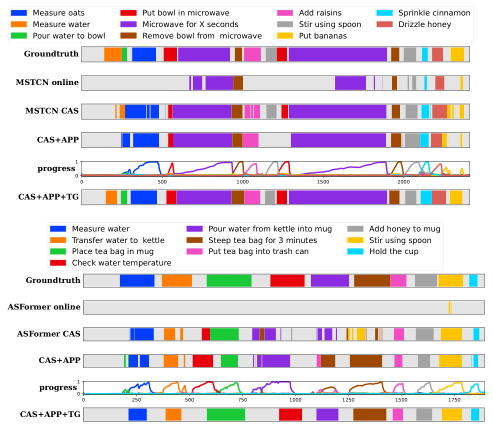

<!-- Start of picture text -->
Measure oats Put bowl in microwave Add raisins Sprinkle cinnamon Measure water Microwave for X seconds Stir using spoon Drizzle honey Pour water to bowl Remove bowl from  microwave Put bananas Groundtruth MSTCN online MSTCN CAS CAS+APP 1 progress0 0 500 1000 1500 2000 CAS+APP+TG Measure water Pour water from kettle into mug Add honey to mug Transfer water to  kettle Steep tea bag for 3 minutes Stir using spoon Place tea bag in mug Put tea bag into trash can Hold the cup Check water temperature Groundtruth ASFormer online ASFormer CAS CAS+APP progress10 0 250 500 750 1000 1250 1500 1750 CAS+APP+TG <!-- End of picture text -->

Figure 7. Visualization on the online predictions and progress estimation. 

|Method|Acc|Edit|F1@_{_|0.1,0.25|,0.5_}_|
|---|---|---|---|---|---|
|MSTCN|69.2|56.9|58.9|55.8|45.9|
|MSTCN+APP|70.3|56.6|60.6|56.9|**46.8**|
|MSTCN+APP+TG|**71.1**|**60.4**|**63.3**|**59.3**|46.1|

Table 4. Offline action segmentation performance on EgoProceL. 

ference. Using the proposed CAS model significantly mitigates this issue, yet, we still see oversegmentation in predictions. By adding the APP module, the model learns to estimate the action progress and reduces oversegmentation. However, CAS+APP may still make erroneous predictions that are inconsistent with the task graph. In the first example, CAS+APP fails to correctly detect the step “measure water” and “pour water to bowl” before “put bowl in microwave”. In the second example, CAS+APP predicts “put tea bag into trash can” before “steep tea bag for 3 minutes”. By incorporating the task graph, the model leverages highlevel knowledge and correctly recognizes these steps. 

## **6. Conclusions** 

We proposed a progress-aware online action segmentation framework. We bridge the gap between offline training and online inference via causal action segmentation model, and improve online segmentation by estimating the progress of online actions via APP module. Further, we leverage the high-level procedural knowledge by learning task graphs from training videos themselves. Our framework reduces prediction uncertainty and oversegmentation, and achieves notable improvements on three egocentric video datasets. 

## **Acknowledgements** 

This work was sponsored by DARPA PTG (HR00112220001), NSF (IIS-2115110), ARO (W911NF2110276). Content does not necessarily reflect the position/policy of the Government. 

18193

<!-- Page 9 -->

## **References** 

- [1] Breadth-first Search. https://en.wikipedia.org/ wiki/Breadth-first_search. 

- [2] Hyemin Ahn and Dongheui Lee. Refining action segmentation with hierarchical video representations. In _Proceedings of the IEEE/CVF International Conference on Computer Vision (ICCV)_ , pages 16302–16310, 2021. 

- [3] J. B. Alayrac, P. Bojanowski, N. Agrawal, J. Sivic, I. Laptev, and S. Lacoste-Julien. Unsupervised learning from narrated instruction videos. _IEEE Conference on Computer Vision and Pattern Recognition_ , 2016. 

- [4] Kumar Ashutosh, Santhosh Kumar Ramakrishnan, Triantafyllos Afouras, and Kristen Grauman. Video-mined task graphs for keystep recognition in instructional videos. _Neural Information Processing Systems_ , 2023. 

- [5] Siddhant Bansal, Chetan Arora, and C.V. Jawahar. My view is the best view: Procedure learning from egocentric videos. In _European Conference on Computer Vision (ECCV)_ , 2022. 

- [6] Federico Becattini, Tiberio Uricchio, Lorenzo Seidenari, Lamberto Ballan, and Alberto Del Bimbo. Am i done? predicting action progress in videos. _ACM Transactions on Multimedia Computing, Communications, and Applications (TOMM)_ , 16(4):1–24, 2020. 

- [7] Nadine Behrmann, S. Alireza Golestaneh, Zico Kolter, Juergen Gall, and Mehdi Noroozi. Unified fully and timestamp supervised temporal action segmentation via sequence to sequence translation. In _ECCV_ , 2022. 

- [8] Victoria Bloom, Dimitrios Makris, and Vasileios Argyriou. Clustered spatio-temporal manifolds for online action recognition. In _2014 22nd International Conference on Pattern Recognition_ , pages 3963–3968. IEEE, 2014. 

- [9] Wenzhi Cao, Vahid Mirjalili, and Sebastian Raschka. Rank consistent ordinal regression for neural networks with application to age estimation. _Pattern Recognition Letters_ , 140: 325–331, 2020. 

- [10] J. Carreira and A. Zisserman. Quo vadis, action recognition? a new model and the kinetics dataset. In _IEEE Conference on Computer Vision and Pattern Recognition_ , 2017. 

- [11] Chien-Yi Chang, De-An Huang, Yanan Sui, Li Fei-Fei, and Juan Carlos Niebles. D3tw: Discriminative differentiable dynamic time warping for weakly supervised action alignment and segmentation. _IEEE Conference on Computer Vision and Pattern Recognition_ , 2019. 

- [12] Junyoung Chung, Caglar Gulcehre, KyungHyun Cho, and Yoshua Bengio. Empirical evaluation of gated recurrent neural networks on sequence modeling. _arXiv preprint arXiv:1412.3555_ , 2014. 

- [13] Dima Damen, Hazel Doughty, Giovanni Maria Farinella, Sanja Fidler, Antonino Furnari, Evangelos Kazakos, Davide Moltisanti, Jonathan Munro, Toby Perrett, Will Price, and Michael Wray. The epic-kitchens dataset: Collection, challenges and baselines. _IEEE Transactions on Pattern Analysis and Machine Intelligence_ , 2020. 

- [14] Roeland De Geest, Efstratios Gavves, Amir Ghodrati, Zhenyang Li, Cees Snoek, and Tinne Tuytelaars. Online action detection. In _Computer Vision–ECCV 2016: 14th European Conference, Amsterdam, The Netherlands, October 11-_ 

_14, 2016, Proceedings, Part V 14_ , pages 269–284. Springer, 2016. 

- [15] Li Ding and Chenliang Xu. Weakly-supervised action segmentation with iterative soft boundary assignment. _IEEE Conference on Computer Vision and Pattern Recognition_ , 2018. 

- [16] G. Donahue and E. Elhamifar. Learning to predict task progress by self-supervised video alignment. _IEEE Conference on Computer Vision and Pattern Recognition_ , 2024. 

- [17] Nikita Dvornik, Isma Hadji, Hai Pham, Dhaivat Bhatt, Brais Martinez, Afsaneh Fazly, and Allan D Jepson. Flow graph to video grounding for weakly-supervised multi-step localization. In _European Conference on Computer Vision_ , pages 319–335. Springer, 2022. 

- [18] D. Dwibedi, Y. Aytar, J. Tompson, P. Sermanet, and A. Zisserman. Temporal cycle-consistency learning. _IEEE Conference on Computer Vision and Pattern Recognition_ , 2019. 

- [19] E. Elhamifar and D. Huynh. Self-supervised multi-task procedure learning from instructional videos. _European Conference on Computer Vision_ , 2020. 

- [20] E. Elhamifar and Z. Naing. Unsupervised procedure learning via joint dynamic summarization. _International Conference on Computer Vision_ , 2019. 

- [21] Hyunjun Eun, Jinyoung Moon, Jongyoul Park, Chanho Jung, and Changick Kim. Learning to discriminate information for online action detection. In _Proceedings of the IEEE/CVF Conference on Computer Vision and Pattern Recognition_ , pages 809–818, 2020. 

- [22] Yazan Abu Farha and Jurgen Gall. Ms-tcn: Multi-stage temporal convolutional network for action segmentation. In _Proceedings of the IEEE/CVF conference on computer vision and pattern recognition_ , pages 3575–3584, 2019. 

- [23] Alireza Fathi, Xiaofeng Ren, and James M Rehg. Learning to recognize objects in egocentric activities. _In IEEE Conference on Computer Vision and Pattern Recognition (CVPR)_ , 2011. 

- [24] Mohsen Fayyaz and Jurgen Gall. Sct: Set constrained temporal transformer for set supervised action segmentation. _IEEE Conference on Computer Vision and Pattern Recognition_ , 2020. 

- [25] Daniel Fried, Jean-Baptiste Alayrac, Phil Blunsom, Chris Dyer, Stephen Clark, and Aida Nematzadeh. Learning to segment actions from observation and narration. _Annual Meeting of the Association for Computational Linguistics_ , 2020. 

- [26] M. Gao, Y. Zhou, R. Xu, R. Socher, and C. Xiong. Woad: Weakly supervised online action detection in untrimmed videos. _IEEE/CVF Conference on Computer Vision and Pattern Recognition_ , 2021. 

- [27] Reza Ghoddoosian, Isht Dwivedi, Nakul Agarwal, Chiho Choi, and Behzad Dariush. Weakly-supervised online action segmentation in multi-view instructional videos. In _Proceedings of the IEEE/CVF Conference on Computer Vision and Pattern Recognition_ , pages 13780–13790, 2022. 

- [28] Reza Ghoddoosian, Isht Dwivedi, Nakul Agarwal, and Behzad Dariush. Weakly-supervised action segmentation and unseen error detection in anomalous instructional videos. In 

18194

<!-- Page 10 -->

_Proceedings of the IEEE/CVF International Conference on Computer Vision_ , pages 10128–10138, 2023. 

- [29] Rohit Girdhar and Kristen Grauman. Anticipative video transformer. In _Proceedings of the IEEE/CVF International Conference on Computer Vision (ICCV)_ , pages 13505– 13515, 2021. 

- [30] Dayoung Gong, Joonseok Lee, Manjin Kim, Seong Jong Ha, and Minsu Cho. Future transformer for long-term action anticipation. In _Proceedings of the IEEE/CVF Conference on Computer Vision and Pattern Recognition_ , pages 3052– 3061, 2022. 

- [31] Isma Hadji, Konstantinos G. Derpanis, and Allan D. Jepson. Representation learning via global temporal alignment and cycle-consistency. _IEEE Conference on Computer Vision and Pattern Recognition_ , 2021. 

- [32] Sanjay Haresh, Sateesh Kumar, Huseyin Coskun, Shahram N. Syed, Andrey Konin, M. Zeeshan Zia, and Quoc-Huy Tran. Learning by aligning videos in time. _IEEE Conference on Computer Vision and Pattern Recognition_ , 2021. 

- [33] Farnoosh Heidarivincheh, Majid Mirmehdi, and Dima Damen. Action completion: A temporal model for moment detection. _arXiv preprint arXiv:1805.06749_ , 2018. 

- [34] Minh Hoai and Fernando De la Torre. Max-margin early event detectors. _International Journal of Computer Vision_ , 107:191–202, 2014. 

- [35] Yifei Huang, Yusuke Sugano, and Yoichi Sato. Improving action segmentation via graph-based temporal reasoning. In _2020 IEEE/CVF Conference on Computer Vision and Pattern Recognition (CVPR)_ , 2020. 

- [36] Yuchi Ishikawa, Seito Kasai, Yoshimitsu Aoki, and Hirokatsu Kataoka. Alleviating over-segmentation errors by detecting action boundaries. In _Proceedings of the IEEE/CVF Winter Conference on Applications of Computer Vision (WACV)_ , pages 2322–2331, 2021. 

- [37] Yunseok Jang, Sungryull Sohn, Lajanugen Logeswaran, Tiange Luo, Moontae Lee, and Honglak Lee. Multimodal subtask graph generation from instructional videos. In _ICLR 2023 Workshop on Multimodal Representation Learning: Perks and Pitfalls_ , 2023. 

- [38] Hyolim Kang, Kyungmin Kim, Yumin Ko, and Seon Joo Kim. Cag-qil: Context-aware actionness grouping via q imitation learning for online temporal action localization. In _Proceedings of the IEEE/CVF International Conference on Computer Vision_ , pages 13729–13738, 2021. 

- [39] Young Hwi Kim, Hyolim Kang, and Seon Joo Kim. A sliding window scheme for online temporal action localization. In _European Conference on Computer Vision_ , pages 653–669. Springer, 2022. 

- [40] Hilde Kuehne, Ali Arslan, and Thomas Serre. The language of actions: Recovering the syntax and semantics of goaldirected human activities. _IEEE Conference on Computer Vision and Pattern Recognition_ , 2014. 

- [41] H. Kuehne, J. Gall, and T. Serre. An end-to-end generative framework for video segmentation and recognition. _IEEE Winter Conference on Applications of Computer Vision_ , 2016. 

- [42] Anna Kukleva, Hilde Kuehne, Fadime Sener, and Jurgen Gall. Unsupervised learning of action classes with continuous temporal embedding. _IEEE Conference on Computer Vision and Pattern Recognition_ , 2019. 

- [43] Sateesh Kumar, Sanjay Haresh, Awais Ahmed, Andrey Konin, M. Zeeshan Zia, and Quoc-Huy Tran. Unsupervised action segmentation by joint representation learning and online clustering. In _Proceedings of the IEEE/CVF Conference on Computer Vision and Pattern Recognition (CVPR)_ , pages 20174–20185, 2022. 

- [44] Igor Kviatkovsky, Ehud Rivlin, and Ilan Shimshoni. Online action recognition using covariance of shape and motion. _Computer Vision and Image Understanding_ , 129:15– 26, 2014. 

- [45] C. Lea, M. D. Flynn, R. Vidal, A. Reiter, and G. D. Hager. Temporal convolutional networks for action segmentation and detection. _IEEE Conference on Computer Vision and Pattern Recognition_ , 2017. 

- [46] S. Lee, Z. Lu, Z. Zhang, M. Hoai, and E. Elhamifar. Error detection in egocentric procedural task videos. _IEEE Conference on Computer Vision and Pattern Recognition_ , 2024. 

- [47] Peng Lei and Sinisa Todorovic. Temporal deformable residual networks for action segmentation in videos. In _2018 IEEE/CVF Conference on Computer Vision and Pattern Recognition_ , 2018. 

- [48] Jun Li and Sinisa Todorovic. Set-constrained viterbi for setsupervised action segmentation. _IEEE Conference on Computer Vision and Pattern Recognition_ , 2020. 

- [49] J. Li and S. Todorovic. Anchor-constrained viterbi for setsupervised action segmentation. _IEEE/CVF Conference on Computer Vision and Pattern Recognition_ , 2021. 

- [50] J. Li, P. Lei, and S. Todorovic. Weakly supervised energybased learning for action segmentation. _International Conference on Computer Vision_ , 2019. 

- [51] M. Li, L. Chen, Y. Duarr, Z. Hu, J. Feng, J. Zhou, and J. Lu. Bridge-prompt: Towards ordinal action understanding in instructional videos. In _2022 IEEE/CVF Conference on Computer Vision and Pattern Recognition (CVPR)_ , 2022. 

- [52] Shi-Jie Li, Yazan AbuFarha, Yun Liu, Ming-Ming Cheng, and Juergen Gall. Ms-tcn++: Multi-stage temporal convolutional network for action segmentation. _IEEE Transactions on Pattern Analysis and Machine Intelligence_ , pages 1–1, 2020. 

- [53] Zhe Li, Yazan Abu Farha, and Jurgen Gall. Temporal action segmentation from timestamp supervision. _IEEE/CVF Conference on Computer Vision and Pattern Recognition_ , 2021. 

- [54] Daochang Liu, Qiyue Li, AnhDung Dinh, Tingting Jiang, Mubarak Shah, and Chang Xu. Diffusion action segmentation. _arXiv preprint arXiv:2303.17959_ , 2023. 

- [55] Weizhe Liu, Bugra Tekin, Huseyin Coskun, Vibhav Vineet, Pascal Fua, and Marc Pollefeys. Learning to align sequential actions in the wild. In _Proceedings of the IEEE/CVF Conference on Computer Vision and Pattern Recognition_ , pages 2181–2191, 2022. 

- [56] Yang Liu, Jiayu Huo, Jingjing Peng, Rachel Sparks, Prokar Dasgupta, Alejandro Granados, and Sebastien Ourselin. Skit: a fast key information video transformer for online surgical phase recognition. In _Proceedings of the IEEE/CVF_ 

18195

<!-- Page 11 -->

_International Conference on Computer Vision_ , pages 21074– 21084, 2023. 

- [57] Z. Lu and E. Elhamifar. Weakly-supervised action segmentation and alignment via transcript-aware union-of-subspaces learning. _International Conference on Computer Vision_ , 2021. 

- [58] Z. Lu and E. Elhamifar. Set-supervised action learning in procedural task videos via pairwise order consistency. _IEEE Conference on Computer Vision and Pattern Recognition_ , 2022. 

- [59] Z. Lu and E. Elhamifar. Fact: Frame-action cross-attention temporal modeling for efficient fully-supervised action segmentation. _IEEE Conference on Computer Vision and Pattern Recognition_ , 2024. 

- [60] Zhenxing Niu, Mo Zhou, Le Wang, Xinbo Gao, and Gang Hua. Ordinal regression with multiple output cnn for age estimation. In _Proceedings of the IEEE conference on computer vision and pattern recognition_ , pages 4920–4928, 2016. 

- [61] Rahul Rahaman, Dipika Singhania, Alexandre Thiery, and Angela Yao. A generalized and robust framework for timestamp supervision in temporal action segmentation. In _Computer Vision–ECCV 2022: 17th European Conference_ , 2022. 

- [62] A. Richard, H. Kuehne, and J. Gall. Action sets: Weakly supervised action segmentation without ordering constraints. _IEEE Conference on Computer Vision and Pattern Recognition_ , 2018. 

- [63] A. Richard, H. Kuehne, A. Iqbal, and J. Gall. Neuralnetwork-viterbi: A framework for weakly supervised video learning. _IEEE Conference on Computer Vision and Pattern Recognition_ , 2018. 

- [64] M. Rohrbach, S. Amin, M. Andriluka, and B. Schiele. A database for fine grained activity detection of cooking activities. _IEEE Conference on Computer Vision and Pattern Recognition_ , 2012. 

- [65] Saquib Sarfraz, Naila Murray, Vivek Sharma, Ali Diba, Luc Van Gool, and Rainer Stiefelhagen. Temporally-weighted hierarchical clustering for unsupervised action segmentation. _IEEE/CVF Conference on Computer Vision and Pattern Recognition_ , 2021. 

- [66] Fadime Sener, Dibyadip Chatterjee, Daniel Shelepov, Kun He, Dipika Singhania, Robert Wang, and Angela Yao. Assembly101: A large-scale multi-view video dataset for understanding procedural activities. In _Proceedings of the IEEE/CVF Conference on Computer Vision and Pattern Recognition_ , pages 21096–21106, 2022. 

- [67] Y. Shen and E. Elhamifar. Semi-weakly-supervised learning of complex actions from instructional task videos. _IEEE Conference on Computer Vision and Pattern Recognition_ , 2022. 

- [68] Y. Shen, L. Wang, and E. Elhamifar. Learning to segment actions from visual and language instructions via differentiable weak sequence alignment. _IEEE Conference on Computer Vision and Pattern Recognition_ , 2021. 

- [69] G. A. Sigurdsson, S. Divvala, A. Farhadi, and A. Gupta. Asynchronous temporal fields for action recognition. _IEEE Conference on Computer Vision and Pattern Recognition_ , 2017. 

- [70] B. Singh, T. K. Marks, M. Jones, O. Tuzel, and M. Shao. A multi-stream bi-directional recurrent neural network for finegrained action detection. _IEEE Conference on Computer Vision and Pattern Recognition_ , 2016. 

- [71] Dipika Singhania, Rahul Rahaman, and Angela Yao. Coarse to fine multi-resolution temporal convolutional network. _CoRR_ , abs/2105.10859, 2021. 

- [72] Khurram Soomro, Haroon Idrees, and Mubarak Shah. Predicting the where and what of actors and actions through online action localization. In _Proceedings of the IEEE conference on computer vision and pattern recognition_ , pages 2648–2657, 2016. 

- [73] Yaser Souri, Mohsen Fayyaz, Luca Minciullo, Gianpiero Francesca, and Juergen Gall. Fast Weakly Supervised Action Segmentation Using Mutual Consistency. _PAMI_ , 2021. 

- [74] Sebastian Stein and Stephen J. McKenna. Combining embedded accelerometers with computer vision for recognizing food preparation activities. In _Proceedings of the 2013 ACM International Joint Conference on Pervasive and Ubiquitous Computing_ , 2013. 

- [75] Alejandro Su´arez-Hern´andez, Javier Segovia-Aguas, Carme Torras, and Guillem Aleny`a. Online action recognition. _AAAI_ , 2021. 

- [76] Quoc-Huy Tran, Ahmed Mehmood, Muhammad Ahmed, Muhammad Naufil, Anas Zafar, Andrey Konin, and Zeeshan Zia. Permutation-aware activity segmentation via unsupervised frame-to-segment alignment. In _Proceedings of the IEEE/CVF Winter Conference on Applications of Computer Vision_ , pages 6426–6436, 2024. 

- [77] A. van-den Oord, S. Dieleman, H. Zen, K. Simonyan, O. Vinyals, A. Graves, N. Kalchbrenner, A. Senior, and K. Kavukcuoglu. Wavenet: A generative model for raw audio. _Arxiv_ , 2016. 

- [78] A. Vaswani, N. Shazeer, N. Parmar, J. Uszkoreit, L. Jones, A. N. Gomez, L. Kaiser, and I. Polosukhin. Attention is all you need. _Neural Information Processing Systems_ , 2017. 

- [79] Jiahao Wang, Guo Chen, Yifei Huang, Limin Wang, and Tong Lu. Memory-and-anticipation transformer for online action understanding. In _Proceedings of the IEEE/CVF International Conference on Computer Vision_ , pages 13824– 13835. 

- [80] Xiang Wang, Shiwei Zhang, Zhiwu Qing, Yuanjie Shao, Zhengrong Zuo, Changxin Gao, and Nong Sang. Oadtr: Online action detection with transformers. In _Proceedings of the IEEE/CVF International Conference on Computer Vision_ , pages 7565–7575, 2021. 

- [81] Zhe Wang, Hao Chen, Xinyu Li, Chunhui Liu, Yuanjun Xiong, Joseph Tighe, and Charless Fowlkes. Sscap: Self-supervised co-occurrence action parsing for unsupervised temporal action segmentation. In _Proceedings of the IEEE/CVF Winter Conference on Applications of Computer Vision_ , pages 1819–1828, 2022. 

- [82] Mingze Xu, Mingfei Gao, Yi-Ting Chen, Larry S Davis, and David J Crandall. Temporal recurrent networks for online action detection. In _Proceedings of the IEEE/CVF international conference on computer vision_ , pages 5532–5541, 2019. 

18196

<!-- Page 12 -->

- [83] Ziwei Xu, Yogesh S Rawat, Yongkang Wong, Mohan Kankanhalli, and Mubarak Shah. Don’t pour cereal into coffee: Differentiable temporal logic for temporal action segmentation. In _Advances in Neural Information Processing Systems_ , 2022. 

- [84] S. Yeung, O. Russakovsky, N. Jin, M. Andriluka, G. Mori, and L. Fei-Fei. Every moment counts: Dense detailed labeling of actions in complex videos. _International Journal of Computer Vision_ , 2018. 

- [85] Fangqiu Yi, Hongyu Wen, and Tingting Jiang. Asformer: Transformer for action segmentation. In _The British Machine Vision Conference (BMVC)_ , 2021. 

- [86] Olga Zatsarynna and Juergen Gall. Action anticipation with goal consistency. In _2023 IEEE International Conference on Image Processing (ICIP)_ , pages 1630–1634. IEEE, 2023. 

- [87] Junbin Zhang, Pei-Hsuan Tsai, and Meng-Hsun Tsai. Semantic2graph: Graph-based multi-modal feature fusion for action segmentation in videos, 2022. 

- [88] Yue Zhao and Philipp Kr¨ahenb¨uhl. Real-time online video detection with temporal smoothing transformers. In _European Conference on Computer Vision_ , pages 485–502. Springer, 2022. 

- [89] Honglu Zhou, Roberto Mart´ın-Mart´ın, Mubbasir Kapadia, Silvio Savarese, and Juan Carlos Niebles. Procedure-aware pretraining for instructional video understanding. In _Proceedings of the IEEE/CVF Conference on Computer Vision and Pattern Recognition_ , pages 10727–10738, 2023. 

- [90] D. Zhukov, J. B. Alayrac, R. G. Cinbis, D. Fouhey, I. Laptev, and J. Sivic. Cross-task weakly supervised learning from instructional videos. _IEEE Conference on Computer Vision and Pattern Recognition_ , 2019. 

18197
