# Task parse tree Learning task policy from videos with task-irrelevant components

[Original PDF](../Task%20parse%20tree%20Learning%20task%20policy%20from%20videos%20with%20task-irrelevant%20components.pdf)

Pages: 10

> Automatically converted from PDF. Check the original for exact equations, symbols, table alignment, and figure details.

<!-- Page 1 -->

Robotics and Autonomous Systems 170 (2023) 104552 

Contents lists available at ScienceDirect 

# Robotics and Autonomous Systems 

journal homepage: www.elsevier.com/locate/robot 

## Task parse tree: Learning task policy from videos with task-irrelevant components 

Weihao Wang, Mingyu You∗ , Hongjun Zhou, Bin He 

_College of Electronic and Information Engineering, Tongji University, Shanghai, 201800, China Frontiers Science Center for Intelligent Autonomous Systems, Tongji University, Shanghai, 201800, China National Key Laboratory of Autonomous Intelligent Unmanned Systems, Shanghai, 201800, China_ 

### A R T I C L E I N F O 

### A B S T R A C T 

_Keywords:_ Learning from video demonstration Task planning Video understanding 

A good task policy should explicitly interpret the preconditions of actions and the composition structure of task. We aim to automatically learn such a task policy from videos which remains challenging at present. This issue can be further aggravated when task-irrelevant components are involved in videos, such as unoperated objects and small actions. Task-irrelevant objects may introduce disruptive visual relations, and task-irrelevant actions would lead to misleading and even failed task planning. Solving both issues simultaneously is beyond the scope of existing methods. To this end, we propose Task Parse Tree (TPT) as a novel task policy representation, distinguishing task-relevant actions with definite preconditions and clear execution order. The automatic generation of TPT relies on two core designs, where spatio-temporal graph (STG) seizes the vital changes in visual relations of objects and their attributes both spatially and temporally, and conjugate action graph (CAG) models the execution logic of actions in a graph. We collect a dataset of a real-world task, Make Tea, and experiment results on the dataset show that TPT realizes both accurate and interpretable task planning in two different scenarios. 

#### **1. Introduction** 

The emergent online videos are becoming convenient and handy resources for robot learning, involving various scenarios like cooking [1] and assembly [2,3]. Several works have been devoted to learning lowlevel motion trajectories [4] and manipulation skills [5] from video demonstrations. Besides imitating how to perform the actions, it is essential to learn the task policy which can be defined as a composition of task-relevant actions with certain preconditions and execution order. As shown in Fig. 1, task policy learning focuses on two core issues: action precondition and task composition parsing. Action precondition parsing aims to figure out _WHAT_ conditions should be satisfied when an action is performed, while task composition parsing aims to determine _WHICH_ actions are necessary parts of the task ( _i_ . _e_ ., task-relevant) and _WHAT_ the execution order of these actions is. Explicit action precondition and task composition both help robots make precise and interpretable action planning, especially when they need to interact with humans [2]. 

Despite their advantages, it is rather challenging for robots to learn the task policy directly from video demonstrations. First, preconditions of actions are usually unspecified and overwhelmed in visual scenes. For example in Fig. 1, _cup is on table_ and _cup is empty_ are preconditions of _pour water_ , which are implicitly implied by the visual scene. 

Moreover, irrelevant objects and their attributes that are unrelated to the action execution may bring large amounts of disruptive conditions. Previous works of Planning Domain Definition Language (PDDL) [6], decision trees [7] or behavior trees [8] alleviated this issue by designating the preconditions and effects for each action by human experts. This work has to be repeated for new tasks in new scenes, which is a labor-intensive job to be avoided. 

Second, not all actions performed in the videos are task-relevant, and the execution order of these actions remains unrevealed. This issue can be exacerbated when it comes to videos that are downloaded from the world-wide web, where task-irrelevant actions may frequently occur and last for a long duration. For example in Fig. 1, _move kettle_ , _take milkbox_ and _move bowl_ are all task-irrelevant actions and may disturb the true execution order if these actions are accepted by the task policy indiscriminately. So far, most existing works have focused on task policy learning from manual-designed videos [9,10], where all actions performed are elaborately designed and thus task-relevant. Additionally, the execution order of actions is easier to determine since no distracting actions exist. 

As illustrated in Fig. 1, task-irrelevant components are the major obstacles to task policy learning. However, only a few existing works 

> ∗ Corresponding author at: College of Electronic and Information Engineering, Tongji University, Shanghai, 201800, China. _E-mail addresses:_ wwhtju@tongji.edu.cn (W. Wang), myyou@tongji.edu.cn (M. You). 

> https://doi.org/10.1016/j.robot.2023.104552 

> Received 20 January 2023; Received in revised form 10 August 2023; Accepted 1 October 2023 Available online 5 October 2023 0921-8890/© 2023 Elsevier B.V. All rights reserved.

<!-- Page 2 -->

_W. Wang et al._ 

_Robotics and Autonomous Systems 170 (2023) 104552_ 

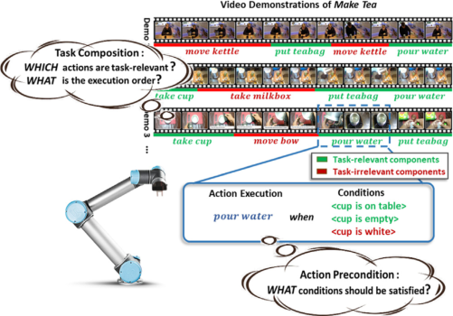

**Fig. 1.** Take policy learning from video demonstrations aims to learn explicit action precondition and task composition for a task, _e_ . _g_ ., making a cup of tea. The taskirrelevant components in the videos denote the main challenges, _w.r.t._ irrelevant actions and non-preconditions that are marked in red. (For interpretation of the references to color in this figure legend, the reader is referred to the web version of this article.) 

are capable of dealing with task-irrelevant objects and actions simultaneously. To this end, we propose a novel representation of task policy called Task Parse Tree (TPT), and a framework for generating TPT from videos with task-irrelevant components automatically. The framework is established based on two core designs of spatio-temporal graph and conjugate action graph. We design a spatio-temporal graph to capture both spatial and temporal changes of objects and their attributes in visual scenes, _i_ . _e_ ., the preconditions of actions, which are further determined by the action precondition parser. Then we design a conjugate action graph to reveal the execution order of actions by learning the transitions of action nodes with the task composition parser. Actions with weak transitions in the graph will be discarded as task-irrelevant actions. 

In summary, our main contributions are: 

- We propose a novel task policy representation named task parse tree (TPT), to make precise and interpretable action planning for real-world tasks, and a framework to generate TPT from videos with task-irrelevant objects and actions. 

- We design spatio-temporal graph to represent potential preconditions of actions, and conjugate action graph to model the transitions of actions. Two parsers are designed to determine taskrelevant preconditions and actions accordingly. 

- We collect a dataset of a real-world task — Make Tea for evaluation. We conduct experiments both quantitatively and qualitatively to demonstrate the effectiveness of the proposed method, especially in the scenario of interactive planning with humans. 

#### **2. Related work** 

**Task policy learning.** Planning for high-level actions is the ultimate goal of task policy learning. Several works have explored this issue and proposed task policy is represented in different forms. Planning Domain Definition Language (PDDL) [6] and its variants [11,12] can be viewed as a declarative task policy or planner. PDDL heavily relies on the preconditions and effects of actions which are usually designed by human experts and not directly available in videos. Behavior tree is another task policy representation that was first invented as a tool for AI non-player characters in computer games [13]. As a modular and transparent policy, behavior tree modularizes the conditions judgment and action execution with control flow nodes and execution nodes. Recently it has been adapted for robotics [14]. French et al. [8] proposes to learn a behavior tree from video demonstrations. 

Although similar in a tree-like task representation, the state space and action space are assumed to be task-relevant and made by hand in experiments. Learning task policy from videos still remains challenging, and these works simplify the issue with help of external information or assumptions to different degrees. 

Several recent works have attempted to learn task policy from videos directly. Zhang et al. [1] recognizes the action sequences of the task from videos and then reproduces the task in simulation, which is imitation learning rather than policy learning. Ehsani et al. [15] plans for a sequence of actions based on the given pair of images with a sequence-to-sequence model. Similarly, Shao et al. [16] learns action planning according to scene image and manipulation concepts. Paxton et al. [9] uses a generative model to generate a sequence of future images that simulates the results of high-level actions. PlaTe [17] proposes a transformer-based framework to learn the representation of decision-making process from human demonstrations. In these works, a deep model is learned as the task policy for action sequence prediction or planning without an explicit task composition. Since action and state transitions are both represented by a deep representation in a high-dimensional feature space, it is also difficult to interpret the preconditions of the actions. Liu et al. [7] learns And–Or Graph (AOG) from language instruction and visual demonstrations. AOG is a decision-tree-like task policy designed for the task of folding clothes. The states are discretized by clustering on images and viewed as preconditions of the action instruction, which are simple and customized for a specific task. Takata et al. [18] proposes to generate a similar tree-like graph structure from a recipe with incomplete instructions. However, the construction of policy requires very specialized demonstrations ( _e_ . _g_ ., recipes) and additional images as a supplement. We aim to learn a task policy with explicit action preconditions and task composition from non-professional videos that may contain distracting objects and actions. 

**Video visual understanding.** Video visual understanding is a prevalent topic in computer vision that involves several downstream tasks, such as video theme classification [19,20], action recognition [21,22], video question and answering (VQA) [23,24], etc. Action is an essential subject studied in task policy learning, and several works have been devoted to exploring a fine representation of action. Ji et al. [25] proposes the classical 3D convolutional neural networks for action recognition. Donahue et al. [26] better utilizes the temporal information by introducing LSTM concatenated with a CNN and [27] merges spatial and temporal information by a two-stream model. Since the representation learned by these end-to-end deep models are all image-based, it is hard for them to explicitly interpret the subtle changes of objects in the visual scene, which is somehow essential for action precondition parsing. Yang et al. [28] focuses on recognizing the grasping type and objects in the video using convolutional neural networks (CNNs). Jelodar et al. [29] proposes to recognize more general functional actions (functional units) by integrating objects and motions inferred by deep neural networks and FOON knowledge representation. These works aim to better recognize the actions in the video for imitation, rather than learning a policy for a specific task. 

Graph structure is proposed as a representation of dynamic visual scenes in videos. Several works have adopted it as a representation of activities or actions. Koppula et al. [30] is an early work that tries to model human activities as a Markov random field and introduces the concept of spatio-temporal context. Similarly, Jain et al. [31] proposes Structural-RNN which adopts spatio-temporal graph as a representation of the activities. Recent work of [32] proposes Action Genome which decompose actions into spatio-temporal scene graph. Since spatio-temporal graphs are designed as a representation for general actions in these works, a full and general context is modeled by the graph. In this work, we aim to represent the actions in task policy learning with specific ( _i_ . _e_ ., task-relevant) visual context and more detailed elements ( _e_ . _g_ ., attributes of objects), which has not been explored yet. 

2

<!-- Page 3 -->

_W. Wang et al._ 

_Robotics and Autonomous Systems 170 (2023) 104552_ 

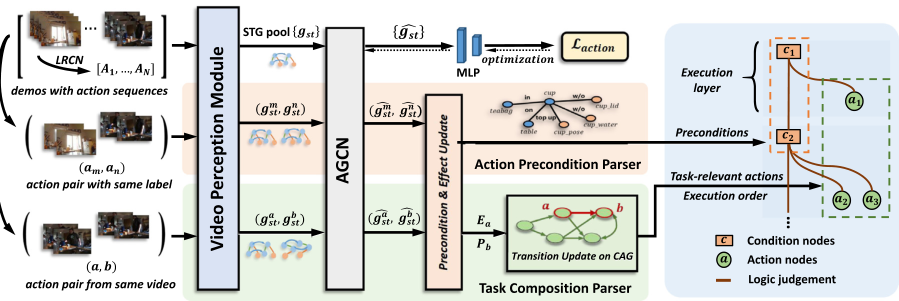

**Fig. 2.** The framework of learning task parse tree (TPT) from videos with task-irrelevant components. Two parsers are proposed based on the core designs of spatio-temporal graph (STG) and conjugate action graph (CAG), representing the actions and the dependence between actions respectively. Different action pairs are sampled respectively for parsing the action precondition and task composition. 

#### **3. Approach** 

Learning from demonstration aims at learning both low-level kinesthetic skills [4,33] and high-level task policy [9] from demonstrations. This work focuses on a sub-field of the latter topic that aims to learn task policy from video demonstrations with task-irrelevant components. We first give a formal definition of the problem. Let A be the highlevel action space and O be the observation space. Given a set of demonstrations _𝐷__𝜏_ ={ _𝐷𝑖_ } _𝑁𝑖_ =1oftask_𝜏_,weaimtolearnataskpolicy _𝜋__𝜏_ = _𝜙_ ( _𝑎_ ∣ _𝑜_ ) that plans for action _𝑎_ ∈ A conditioned on the observed image _𝑜_ ∈ O. Here, each demonstration _𝐷_ ={ _𝑜𝑖_ } _𝑇𝑖_ =1containsaseries of sequential image observations with length of _𝑇_ . 

The proposed framework consists of four parts, namely video perception, feature refinement, action precondition parsing and task composition parsing. Fig. 3 provides an overview of the proposed framework. First, video demonstrations are segmented into action sequences. Visual scenes are decomposed into objects, attributes of objects and relations. Based on these perceived visual elements, we construct spatiotemporal graph (STG) as the representation of dynamic scenes where action preconditions are implicitly contained. Then an attention graph convolutional network (AGCN) is designed to refine the features of the spatio-temporal graphs. In the action precondition parser, action pairs with the same label are sampled to discover the commonly shared relations which may denote the true preconditions or effects. In the task composition parser, a conjugate action graph (CAG) is initialized with the universal set of actions as nodes and action transitions as edges. Then action pairs from the same video are sampled to make transition update and reveal the correct execution logic of actions. Finally, we transform the conjugate action graph into Task Parse Tree (TPT) by pruning task-irrelevant actions and adding preconditions for task-relevant actions. 

#### _3.1. Spatio-temporal graph_ 

**STG construction.** Action leads to dynamic changes in visual scenes. In this work, we design a novel spatio-temporal graph as the representation of such dynamic information. Particularly, a spatiotemporal graph _𝑔𝑠𝑡_ is composed of two sub-graphs, namely initial scene graph _𝑔𝑖_ and end scene graph _𝑔𝑒_ , which are connected by temporal edges _𝜀𝑡_ . An initial or end scene graph contains two kinds of nodes, namely object node _𝑣𝑜𝑏𝑗_ and attribute node _𝑣𝑎𝑡𝑡_ . Two object nodes are connected via an edge _𝑒𝑠_ if a spatial relation exists between the objects. Meanwhile, object nodes have a connection _𝑒𝑖_ with their attributes, indicating that an object _has_ or _possesses_ some kinds of attributes. In this work, we consider two kinds of attributes, invariant properties ( _e_ . _g_ ., color, texture) and changeable states ( _e_ . _g_ ., pose, containing water 

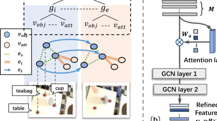

**Fig. 3.** (a) An example of STG for _put teabag_ . The topology and composition structure are visualized in detail. (b) Structure of AGCN. AGCN contains two GCN layers with a fully connected attention layer at the top. 

or not) of containers. During implementation, each node and edge is represented by a feature vector, which is derived from the video perception models, including object detection, relation, and attribute recognition. We refer the reader to Section 4.2 for more implementation details. 

Fig. 3(a) illustrates a practical construction of a spatio-temporal graph constructed for action _put teabag_ . As shown, the spatio-temporal graph holds a heterogeneous structure and hierarchical topology in nature. Such a spatio-temporal graph can be viewed as a complete description of the dynamic changes in the scene, both spatially and temporally. Specifically, action preconditions or effects can be expressed by relation tuples _𝑟_ = ⟨ _𝑣_ 1 _, 𝑒, 𝑣_ 2⟩ in the graph, where _𝑣_ 1 and _𝑣_ 2 denote the nodes, and _𝑒_ denotes the relational edge between the nodes. However, only a few of the relation tuples are the true preconditions or effects. Most of the relation tuples are irrelevant conditions and may interfere with correct action planning. For example, _put teabag_ requires _cup on table_ and _teabag on table_ as preconditions, and results in _teabag in cup_ . Therefore, the follow-up focus is on distinguishing the preconditions of actions and revealing the task composition. 

**STG refinement.** In the initialized STG, nodes lack spatial information from neighbors and temporal information of dynamic changes. STG refinement module is designed to update the node features. The module consists of an attention graph convolutional network (AGCN) and a multi-layer perceptron (MLP). As shown in Fig. 3(b), AGCN _𝜙𝑎𝑔𝑐𝑛_ contains an attention layer and two GCN layers. AGCN takes the STG feature as input and aggregates the information of nodes from 

3

<!-- Page 4 -->

_W. Wang et al._ 

_Robotics and Autonomous Systems 170 (2023) 104552_ 

neighbors both spatially and temporally. An attention weight _𝑊𝑎_ is first learned by the attention layer and multiplied to the node features _𝑉_ ∈ _𝑔𝑠𝑡_ . The nodes with a small weight tend to hold little relevance to the action execution and have minimal influence on the next step of feature update in GCN layers. Following [34], the feature update of a GCN layer is formulated as: 

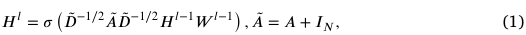

where _𝐴_ and _̃ 𝐷_ are the adjacency matrix and degree matrix of _𝑔𝑠𝑡_ , _𝐼𝑁_ is identity matrix, _𝑊_ is the learnable weights of GCN layer and _𝜎_ is the activation function of ReLU. _𝐻__𝑙_ and _𝐻__𝑙_−1 are the output and input node features of layer _𝑙_ . In particular, _𝐻_0 = _𝑉_ ⋅ _𝑊𝑎_ denotes the initial node features weighted by the attention layer. The output of AGCN or refined STG can be formulated as _̂ 𝑔𝑠𝑡_ , which remains a spatio-temporal structure as the initial STG _𝑔𝑠𝑡_ , and only features of nodes are updated with a dimension reduction to 16. _̂ 𝑔𝑖_ denote the refined initial scene graph and _̂ 𝑔𝑒_ denote the refined end scene graph. 

Since different actions correspond to different STGs, we take action recognition as an auxiliary task for the training of AGCN to obtain distinctive features for different actions. The MLP _𝜙𝑚𝑙𝑝_ which is composed of two fully connected layers serves as the classifier, which takes node features _𝑉_ ∈ _̂ 𝑔𝑠𝑡_ as input and predicts action label. The loss function is formulated as: 

#### **Algorithm 1** Learning Algorithm of Task Parse Tree. 

|**Input:** Batches of demonstrations {_𝐷𝑖_ }_𝑁_ _𝑖_=1, threshold of precondition score|
|---|
|_𝜃𝑝_.|
|**Initialize:** AGCN with MLP _𝜙_= {_𝜙𝑎𝑔𝑐𝑛, 𝜙𝑚𝑙𝑝_ }, CAG _𝑔𝑐𝑎_, action preconditions|
|_𝑃_= ∅and effects _𝐸_= ∅.|
|**for** _𝑖_= 1 **to** _𝑁_**do**|
|_𝑠𝑡_= _VisualPerception_ (_𝐷𝑖_) // STG Construction|
|**for** _𝑔𝑠𝑡_**in** _𝑠𝑡_**do**|
|_𝜙_←_𝜙_−∇_𝜙__𝑎𝑐𝑡𝑖𝑜𝑛_ (_𝑔𝑠𝑡_ ) // Optimization **end for**|
|_𝑠𝑡_=_𝜙_(_𝑠𝑡_ ) // Feature Refinement {(_𝑔𝑚, 𝑔𝑛_)}←_SampleSameLabel_ (_𝑠𝑡_)|
|{(_𝑔𝑎, 𝑔𝑏_)}←_SampleSameVideo_ (_𝑠𝑡_)|
|**for** (_𝑔𝑚, 𝑔𝑛_) **in** {(_𝑔𝑚, 𝑔𝑛_)} **do**|
|_𝑃, 𝐸_←_Similarity_ (_𝑔𝑚, 𝑔𝑛, 𝜃𝑝_) // Precondition Update **end for**|
|**for** (_𝑔𝑎, 𝑔𝑏_) **in** {(_𝑔𝑎, 𝑔𝑏_)} **do** _𝑔𝑐𝑎_←_Similarity_ (_𝑔𝑎, 𝑔𝑏_) // Transition Update **end for** **end for**|
|**Return:** _𝑃, 𝑔𝑐𝑎_|

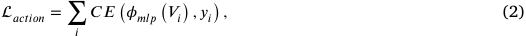

where _𝑦𝑖_ is the true action label and _𝐶𝐸_ is the cross-entropy loss. _𝜙𝑎𝑔𝑐𝑛_ and _𝜙𝑚𝑙𝑝_ are jointly optimized. _3.2. Action precondition parser_ 

The action precondition parser aims to distinguish the true preconditions of actions that are potentially contained by all relation tuples in STG. Based on the refined STG, preconditions can be distinguished by constructing action pairs with the same label, which works in an unsupervised manner. 

**Precondition update.** Preconditions describe the certain state before an action is performed, which is expressed by a subset of the visual relations of objects in the initial scene graph. As illustrated in Fig. 3, a pair of actions ( _𝑎𝑚, 𝑎𝑛_ ) with the same label is sampled from different demonstrations _𝐷𝑚_ and _𝐷𝑛_ . Then associated STGs are constructed and refined by AGCN. ( _̂𝑔𝑖__𝑚,̂ 𝑔_ _𝑖__𝑛_)denotestherefinedinitialscenegraphpair. We initialize each precondition with a score of 0.5. For a pair of objects ( _𝑣_ 1, _𝑣_ 2) appears in both _̂ 𝑔𝑖__𝑚_and_̂𝑔_ _𝑖__𝑛_,wedeterminethesimilarityofthe associated relation tuples by: 

_𝑠𝑐𝑜𝑟𝑒_  𝑝𝑟𝑒𝑐𝑜𝑛𝑑_ = _𝑐𝑜𝑠_  𝑠𝑖𝑚_ ( _𝑟𝑚, 𝑟𝑛_ ) _,_ (3) 

where _𝑟𝑚_ and _𝑟𝑛_ are relation tuples ⟨ _𝑣_ 1 _, 𝑒, 𝑣_ 2⟩ in _̂ 𝑔𝑖__𝑚_and_̂𝑔_ _𝑖__𝑛_respectively. _𝑟𝑚_ and _𝑟𝑛_ share the same objects pair of ( _𝑣_ 1, _𝑣_ 2). Notably, we concatenate the features in relation tuples for similarity computation. Then we update the score of _𝑟𝑚_ and _𝑟𝑛_ by computing an average with the computed similarity score. Particularly, the scores of those relations that do not appear as common preconditions will also be updated by computing an average with 0, to suppress occasional conditions ( _e_ . _g_ ., conditions that appear only in two demonstrations out of the entire dataset). Finally, the relation tuple with a score higher than the threshold is recorded as a true precondition of the action. 

**Effect update.** Effects represent the results of action execution and are included by visual relations of objects in the end scene graph. In fact, effects of an action may serve as preconditions for other actions. Therefore, both preconditions and effects will be leveraged to explore the transitions of action in the task composition parser, and effect update is designed accordingly. With the sampled action pairs with the same label, a _score_effect_ can be computed in a similar way as (3) and the only difference is that the relation tuples _𝑟𝑚_ and _𝑟𝑛_ derive from the end scene graphs _̂ 𝑔𝑒__𝑚_and_̂𝑔_ _𝑒__𝑛_. 

#### _3.3. Task composition parser_ 

The task composition parser aims to reveal task-relevant actions and their execution logic. Our key insight is that _Action B_ depends on _Action A_ if and only if the effects of _Action A_ are included in the preconditions of _Action B_ . Based on this principle, a conjugate action graph is organized to model such dependence by the transition of actions. 

**Conjugate action graph.** Generally, task composition can be represented by a task graph where nodes are states and edges are transitions between states. However, learning with such a graph is infeasible as the state space tends to be infinite [35]. To this end, we design conjugate action graph (CAG) as _𝑔𝑐𝑎_ = { _𝑉, 𝐸_ }, where _𝑉_ denotes the universal set of actions in the demonstration and _𝐸_ denotes the edge between actions. We initialize CAG with a fully connected graph and an average weight is assigned to each edge, which is further updated by transition update. 

**Transition update.** With the initialized CAG, action pairs from the same video are sampled to update the transitions of edges in the graph. As shown in Fig. 2, let ( _𝑎, 𝑏_ ) denote the action pair sampled from the same demonstration, _𝐸𝑎_ and _𝑃𝑏_ denote the effects of _𝑎_ and preconditions of _𝑏_ respectively. Then a transition score can be computed by: 

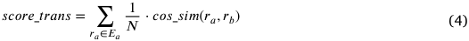

where _𝑟𝑎_ ∈ _𝐸𝑎_ , _𝑟𝑏_ ∈ _𝑃𝑏_ are relation tuples, _𝑟𝑎_ and _𝑟𝑏_ share the same _𝑣_ 1 _, 𝑣_ 2. _𝑁_ is the number of _𝑟𝑎_ . The score is computed between _𝑟𝑎_ and _𝑟𝑏_ which share the same _𝑣_ 1 _, 𝑣_ 2. The score indicates the degree that _𝑏_ depends on _𝑎_ or _i_ . _e_ ., the transition probability from _𝑎_ to _𝑏_ . And the corresponding edge from _𝑎_ to _𝑏_ in CAG will be updated according to the score on average. A threshold is set to prune the low-probability transition edges and the task-irrelevant actions thus can be removed. 

#### _3.4. Learning of TPT_ 

Algorithm 1 describes a training epoch that jointly contains optimization of STG refinement and precondition and transition update. During implementation, we apply an asynchronous training strategy for optimization and update as described in Section 4.2. The algorithm returns both action preconditions and a conjugate action graph. 

4

<!-- Page 5 -->

_W. Wang et al._ 

_Robotics and Autonomous Systems 170 (2023) 104552_ 

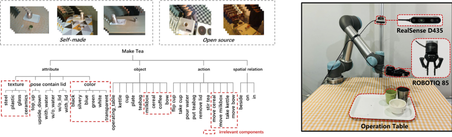

**Fig. 4.** (a) Detailed information of the dataset. (b) Illustration of the workspace, containing a Realsense D435 to obtain visual images and a UR5 robot arm equipped with a ROBOTIQ-85 gripper to perform the actions. 

|**Algorithm 2** Planning Algorithm of Task Parse Tree.|
|---|
|**Input:**Action of human expert_𝑎𝑒_(optional), Task Parse Tree_𝜙_= {(_𝑎, 𝑃𝑎_)_𝑙_}_𝐿_ _𝑙_=1 with a maximum execution depth of _𝐿_. **Initialize:** Execution layer _𝑙_= 1. **if** _𝑎𝑒_**is not NULL then**|
|_𝑙_= _LocateAction_ (_𝑎𝑒_) // Locate Current Execution Layer **end if**|
|**for** _𝑖_=_𝑙_**to** _𝐿_**do** _𝑜_←_FetchNewFrame_ ()|
|_𝑅_= _VisualPerception_ (_𝑜_) // Get Relation Tuples|
|_𝐴_= {_𝑎_∣_𝑃𝑎_∈_𝑅_} // Select Precondition-satisfied Actions _𝐴_=_𝐴_−{_𝑎𝑒_}|
|**for** _𝑎_**in** _𝐴_**do**|
|_Execute_ (_𝑎_) // Execute Actions **end for**|
|**end for**|

Note that we set a threshold of _𝜃𝑡_ to prune those weakly connected edges with small weights, _i_ . _e_ ., to remove action nodes that tend to be task-irrelevant. Finally, we transform the pruned CAG into the task parse tree by searching the action nodes hierarchically with minimum in-degree and designating the preconditions for each action. 

#### _3.5. Planning with TPT_ 

Algorithm 2 shows the procedures of planning with TPT. At test time, TPT can perform task planning either independently or interactively. When planning independently, only an initial scene is provided. While planning interactively, one step of the task is first performed by a human cooperator and the robot is required to continue to complete the task based on the observed visual scene and human action. As shown in Alg. 2, if an action of human expert is observed, action location will be first performed to determine the current execution layer. Then planning will be performed by precondition judgment and action execution iteratively until the end of TPT. 

#### **4. Experiments** 

#### _4.1. Dataset_ 

For evaluation, we collect a dataset of a real-world task — Make Tea. The dataset contains 90 instructional videos in total, 30% of which are downloaded from the world wide web and the rest are self-made. We collect open-source videos from two sources: videos of making tea 

from YouTube and videos of making tea from an open-source dataset — Breakfast [36,37]. We follow a selection principle that the actions presented in the videos are contained by the predefined action set. The self-made videos are recorded with an RGB camera in an unconstrained view and unstructured environment. Detailed information about the dataset is summarized in Fig. 4(a). As shown, the dataset considers 9 objects, 10 actions, 5 attributes and 3 spatial relations. We annotate the bounding boxes and possible attributes of objects for the keyframes ( _i_ . _e_ ., the frame before and after an action is performed) in each video. The spatial relations of objects are annotated additionally. It is worth noting that irrelevant actions ( _e_ . _g_ ., _move bowl_ , _move milkbox_ ) and objects ( _e_ . _g_ ., coffee, milkbox, bowl) may frequently and casually occur in the videos, which would increase the difficulty of task policy learning. Videos in the dataset have an average duration of 46s. We provide more 

#### _4.2. Implementation details_ 

**Video perception.** We adopt off-the-shelf techniques to produce action labels for each video demonstration and detect the objects with attributes and relations in the scene. In detail, we first determine the keyframes in the videos as the temporal boundaries of actions and transform the videos into segments. Then we use an action recognition model LRCN [26] which is finetuned with 10 demonstrations to efficiently produce action labels for the segments, and a post-process is applied to generate action sequences for each demonstration. 

As mentioned in Section 3.1, we use feature vectors as nodes and edges in the graph for feature refinement and similarity computation. Specifically, we adopt the YOLOv5s [38] model which is finetuned on our dataset to obtain object features. Then we train a ResNet-18 [39] for each kind of attribute on our dataset to obtain attribute features. Following [40], the spatial relations are further detected based on the features of objects and their spatial information. Since the relations considered in our task are relatively simple, DR-Net in [40] is not employed and the features of relations are obtained from the fully connected layers before DR-Net. Except for edges of spatial relations, we also design edges between the object and its attributes, which indicate a constant relation of possession. Therefore, we assign such edges with the embedding of word _have_ which is queried from Word2Vec. 

**Learning details.** The framework is implemented with PyTorch and PyTorch Geometric. The model is trained for 500 epochs on GeForce GTX TITAN X. Particularly, precondition and transition updates are performed every 10 epochs and total 50 epochs. The batch size of video demonstrations _𝑁_ is set to 16, and the number of sampled action pairs is set to 32. Empirically, the threshold of precondition score _𝜃𝑝_ is set to 0.7 and the threshold of transition weight _𝜃𝑡_ is set to 0.2. 

**Planning details.** The learned task policy is evaluated in a realistic scenario. We use a camera fixed with the first-person perspective to get image observations. Actions are performed by a 6-DoF 

5

<!-- Page 6 -->

_W. Wang et al._ 

_Robotics and Autonomous Systems 170 (2023) 104552_ 

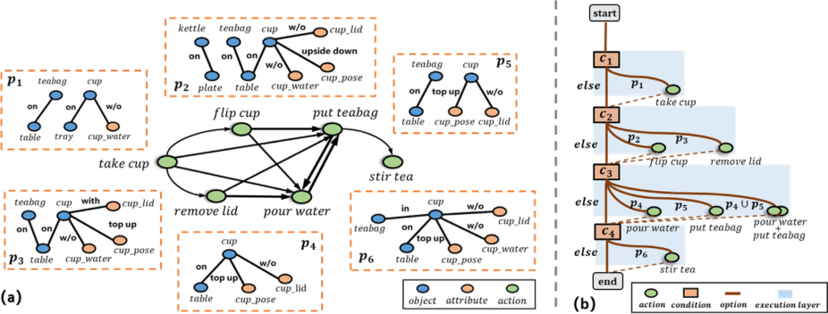

**Fig. 5.** (a) The learned CAG with green action nodes and the preconditions of task-relevant actions in the graph. The preconditions are converted from condition triplets to scene graph to facilitate visualization. (b) The generated TPT for the task of Make Tea. The TPT is made up of four execution layers and each layer is composed of a condition node, several action nodes and logical condition judgment. 

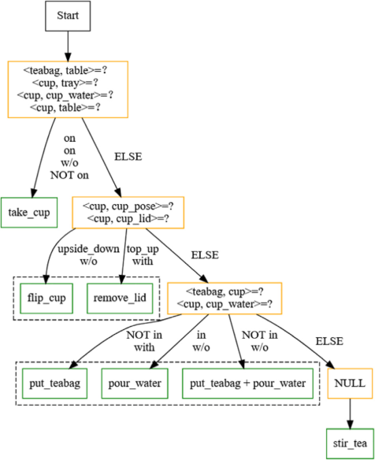

**Fig. 6.** The practical structure of TPT* for the task of Make Tea, visualized by Graphviz. It remains a same layout with TPT, but holds more precise condition judgment than TPT. 

UR5 robot arm equipped with a ROBOTIQ-85 gripper as illustrated in Fig. 4(b). Since we focus on high-level action planning, the practical actions are generated by providing pre-computed target coordinates and computing a feasible motion plan. Two different planning scenarios are designed for evaluation, namely planning independently and interactively. Each scenario is evaluated for 15 runs with different initialization respectively. 

#### _4.3. Main results_ 

**Learning results of preconditions and CAG.** Fig. 5(a) shows the learning results of the CAG and the preconditions of the actions in 

the CAG. First, all the nodes remain task-relevant actions and those irrelevant ones are filtered out. Then almost all the preconditions of the actions are accurately distinguished. The non-preconditions brought by irrelevant objects ( _e_ . _g_ ., coffee and milk) or attributes ( _e_ . _g_ ., color and texture) are successfully excluded from the preconditions. Note that _cup w/o water_ is neglected since whether the cup contains water (w.r.t. the attribute _cup_water)_ cannot be observed in some videos and thus introduces uncertainties in the parsing of preconditions. In addition, the threshold _𝜃𝑝_ and _𝜃𝑡_ can effect the final results of preconditions and CAG, we conduct ablation study on these hyper-parameters in Section 4.4. 

**Learning results of TPT.** Fig. 5(b) demonstrates the final generated TPT. As shown, the TPT is made up of several execution layers. Each layer consists of a condition node and several action nodes. The condition node contains precondition judgment of actions in the same layer like ⟨ _𝑣_ 1 _, 𝑣_ 2⟩ =?. If precondition _𝑝𝑎_ of action _𝑎_ is satisfied, then _𝑎_ will be executed and then switch to the next execution layer until the end, referring to the dotted lines connecting the action node and condition node in Fig. 5(b). 

A hierarchical execution logic of actions can be further explored. As shown, _take cup_ is the primary action that belongs to the first execution phase. It indicates that _take cup_ serves as the prerequisite action of the others. _Flip cup_ and _remove lid_ belong to the same layer and have the same status in the task policy and thus their preconditions should be checked simultaneously. Although _put teabag_ and _pour water_ are also located in the same layer, they hold a special mutual connection with each other indicated by the double-sided arrow connection in the CAG. This indicates that they are exchangeable actions or _i_ . _e_ ., when their preconditions are both satisfied, the execution order of the actions is unspecified. 

Furthermore, an evolution is made on the original TPT, namely TPT*. The evolved version is upgraded from two aspects. First, we add effect as a beneficial complement to the preconditions in form of inverse logical expression. For example, _cup with water_ is the parsed effect of _pour water_ , and ¬ _cup with water_ (= _cup w/o water_ ) is taken as a precondition of _pour water_ , which can make up for the preconditions that may be omitted by the precondition parser. Second, we remove the redundant preconditions in condition nodes that have been achieved by prerequisite actions in previous layers as subgoals. For example, _cup on table_ is both a precondition of _remove lid_ and effect or subgoal of _take cup_ , where _take cup_ is a prerequisite action of _remove lid_ . Since failed execution is not considered in this work, _cup on table_ is already satisfied after the execution of _take cup_ , so it is unnecessary to check again in the layer of _remove lid_ . 

Fig. 6 shows the practical TPT* for the task of Make Tea. In comparison with the original TPT, the layout remains the same but 

6

<!-- Page 7 -->

_W. Wang et al._ 

_Robotics and Autonomous Systems 170 (2023) 104552_ 

**Table 1** 

Comparison with relevant methods on task policy learning from videos. 

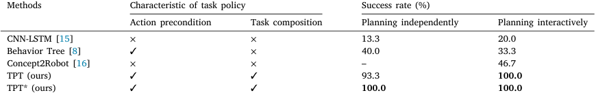

<!-- Start of picture text -->
Methods Characteristic of task policy Success rate (%) Action precondition Task composition Planning independently Planning interactively CNN-LSTM [15] × × 13.3 20.0 Behavior Tree [8] ✓ × 40.0 33.3 Concept2Robot [16] × × – 46.7 TPT (ours) ✓ ✓ 93.3 100.0 TPT* (ours) ✓ ✓ 100.0 100.0 <!-- End of picture text -->

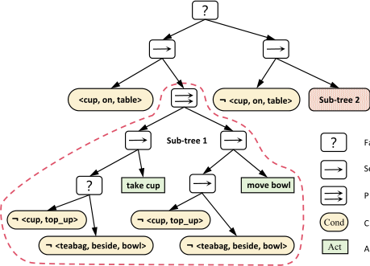

**Fig. 7.** Visualization of the generated BT with a sub-tree unfolded in detail. 

precondition judgment is more precise. Notably, _stir tea_ denotes an action that has no preconditions to be checked and no effects, and this indicates that _stir tea_ is a task-relevant but dispensable action which can be either performed or neglected during planning, since it leads to no impact on the completion of the task. 

**Planning results.** We compare TPT with three baseline methods as follows: 

_CNN-LSTM_ [15] makes action planning according to image sequences with a sequence-to-sequence model. We implement the model to take as input two observed images and output the next action. When planning independently, both images are the same initial scene. When planning interactively, an action has been performed and the images are the scenes before and after the action execution, respectively. We use the ResNet-18 [39] to extract visual features from the images and a 1-layer LSTM with a hidden size of 512 to predict action scores. The model is trained for 200 epochs with a batch size of 32 and learning rate of 0.001. 

_Behavior Tree_ [8] constructs a behavior tree from videos with preconditions designated. Following [8], we first generate a decision tree (DT) using the Classification and Regression Tree algorithm (CART) with Sklearn. Then we transform the DT into a behavior tree (BT) following their proposed principles. 

_Concept2Robot_ [16] is an instruction-oriented low-level trajectory planning method. Since it involves an action instruction that fits the scenario of planing interactively, we modify the structure to predict high-level actions in our task. The modified model takes as input an scene image _𝑠𝑡_ and description of a performed action _𝑎𝑡_ −1. We adopt the ResNet-18 [39] to extract visual features from the image and BERT to extract text features from the action label. Then the two features are concatenated as the input of a predictor with 2 full-connected layers to predict the next action. The model is trained for 100 epochs with a batch size of 32 and learning rate of 0.001. 

The results demonstrate the superiority of our method in two aspects. First, TPT realizes precise and robust planning. As reported in 

Table 1, TPT outperforms the others in both scenarios with a higher success rate. It can also be observed that TPT has a more robust performance when interacting with humans. With human action located in TPT, robot tends to better understand the exact execution phase of the task. CNN-LSTM shows poor performance since it is an image-based planning approach and heavily depends on the visual scenes. Therefore, it does not generalize well when irrelevant objects irregularly occur in the scene. Concept2Robot performs better than CNN-LSTM and Behavior Tree since it merges human action as manipulation concept with visual scenes in the task policy. 

Second, TPT is an explicit task representation that realizes interpretable and transparent planning. Each step of action planning has definite basis based on the parsed preconditions of actions, making the decision process transparent and easy to understand by users. As shown in Table 1, only TPT considers the two issues. Such advantages are unavailable for implicit task representations, _e_ . _g_ ., CNN-LSTM. Behavior Tree is also an explicit representation. However, it contains no mechanism to deal with irrelevant task components. Fig. 7 visualizes the generated behavior tree. Since the structure is quite large, we visualize a sub-tree instead. The visualized sub-tree describes the decision procedure of actions _take cup_ and _move bowl_ . As shown, the preconditions of _take cup_ are inaccurate with invalid precondition checking of _teabag beside bowl_ and _cup is upside down_ . Moreover, _move bowl_ is mistaken as an relevant action by the policy. 

Fig. 9 visualizes several episodes of planning results. Fig. 9(a) shows the planning results of TPT, compared with the baseline methods. CNNLSTM tends to predict repeated actions, _e_ . _g_ ., _take cup_ , which may be caused by a lack of elaborate design on perceiving subtle changes in the scene. Behavior Tree constructs a similar tree-like structure but it relies on human-assigned preconditions and is unable to distinguish task-irrelevant actions or conditions. As shown, Behavior Tree fails to predict _flip cup_ before _put teabag_ due to the noisy preconditions learned from the demonstrations. A failed case of TPT is presented when planning independently in Fig. 9(b). In the initial scene, the cup is full of water and _put teabag_ should be performed next. The failure of TPT is caused by the omitted precondition of _pour water_ . By considering effects, TPT* can provide a more robust plan. Moreover, when a previous action of _pour water_ is indicated, TPT and TPT* both succeed as shown in Fig. 9(c), demonstrating the robustness of the task policy. 

At present, we assume that actions are successfully executed by the robot. However, we may encounter failure at a certain condition node and it would lead to failure in task planning. In fact, if an action is correctly executed, its effects are desired to be available in the visual scene. Inspired by this, we may further integrate effect checking into TPT, to prevent potential failures of action execution ( _e_ . _g_ ., by repeating the action when detecting failure). 

#### _4.4. Ablation study_ 

In this section, we conduct ablation study on the parsed action preconditions and the action graph, respectively. We also explain the choices of the threshold of precondition score _𝜃𝑝_ and the threshold of transition weight _𝜃𝑡_ , which are essential weights that can affect the final results. 

Fig. 8 shows the top-8 preconditions parsed for each action, sorted by the scores of conditions. As shown, the true preconditions obtain a 

7

<!-- Page 8 -->

_W. Wang et al._ 

_Robotics and Autonomous Systems 170 (2023) 104552_ 

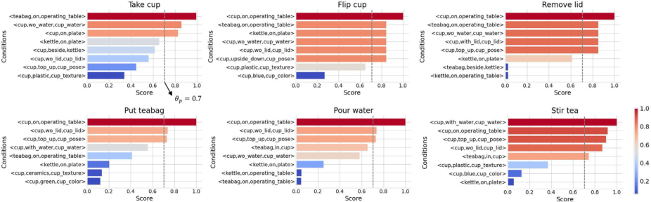

**Fig. 8.** Top-8 preconditions parsed for the relevant actions. A higher score (with warm color) indicates a higher relevance. Choice of _𝜃𝑝_ = 0 _._ 7 is represented by the dotted line. (For interpretation of the references to color in this figure legend, the reader is referred to the web version of this article.) 

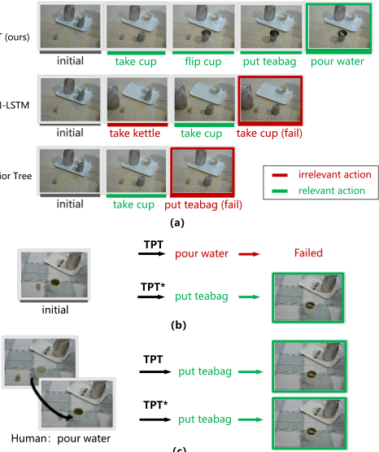

**Fig. 9.** Visualization of planning results. (a) A successful case planned by TPT, compared with baseline methods. (b) A failed case in the scenario of planning independently. (c) The failed case is corrected in the scenario of planning interactively. Green arrows denote the correct-planned actions. 

higher score than the irrelevant ones, and the threshold should be set to retain the relevant ones and remove the irrelevant ones. Balancing the parsing results of all the actions, we set the threshold to 0.7 which is marked by the dotted line in the figure. 

Similarly, the threshold of transition weight _𝜃𝑡_ is used to determine the task-relevant actions. Fig. 10 shows the pruned action graphs with different _𝜃𝑡_ s. A higher threshold indicates a stricter requirement for task relevance. When _𝜃𝑡_ = 0 _._ 1, irrelevant actions of _take kettle_ and _move milkbox_ tend to appear in the graph. When _𝜃𝑡_ = 0 _._ 3, important transitions are pruned undesirably, _e_ . _g_ ., the transitions from _flip cup_ and 

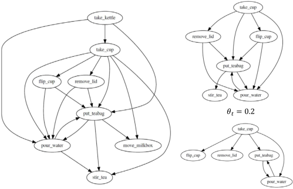

**Fig. 10.** The generated action graphs with different _𝜃𝑡_ . 

_remove lid_ to _pour water_ and _put teabag_ . As shown, a threshold of 0.2 is a suitable choice. 

#### **5. Conclusion** 

In this work, we propose task parse tree (TPT) as a novel representation of task policy and an associated learning framework, which is capable of parsing the task-relevant actions and their preconditions automatically from videos with task-irrelevant components. We demonstrate that TPT is competent to complete task planning with high accuracy and great interpretability, especially when interacting with humans. Since visual conditions may be wrongly recognized, further work will consider perception uncertainty and reduce the dependence on visual perception. 

#### **Declaration of competing interest** 

The authors declare that they have no known competing financial interests or personal relationships that could have appeared to influence the work reported in this paper. 

#### **Data availability** 

Data will be made available on request 

8

<!-- Page 9 -->

_W. Wang et al._ 

_Robotics and Autonomous Systems 170 (2023) 104552_ 

#### **Acknowledgment** 

This work was supported in part by the National Natural Science Foundation of China under Grant 62073244, Shanghai Innovation Action Plan under Grant 20511100500 and Innovation Program of Shanghai Municipal Education Commission 202101070007E00098. 

#### **Appendix A. Supplementary data** 

Supplementary material related to this article can be found online at https://doi.org/10.1016/j.robot.2023.104552. 

#### **References** 

- [1] H. Zhang, S. Nikolaidis, Robot learning and execution of collaborative manipulation plans from YouTube videos, 2019, CoRR abs/1911.10686. arXiv: 1911.10686, URL http://arxiv.org/abs/1911.10686. 

- [2] Y. Cheng, L. Sun, M. Tomizuka, Human-aware robot task planning based on a hierarchical task model, IEEE Robot. Autom. Lett. 6 (2) (2021) 1136–1143. 

- [3] B. Hayes, B. Scassellati, Autonomously constructing hierarchical task networks for planning and human-robot collaboration, in: 2016 IEEE International Conference on Robotics and Automation, ICRA, 2016, pp. 5469–5476, http://dx.doi. org/10.1109/ICRA.2016.7487760. 

- [4] B. Akgun, M. Cakmak, J.W. Yoo, A.L. Thomaz, Trajectories and keyframes for kinesthetic teaching: A human-robot interaction perspective, in: Proceedings of the Seventh Annual ACM/IEEE International Conference on Human-Robot Interaction, 2012, pp. 391–398. 

- [5] B. Wu, F. Xu, Z. He, A. Gupta, P.K. Allen, SQUIRL: Robust and efficient learning from video demonstration of long-horizon robotic manipulation tasks, in: 2020 IEEE/RSJ International Conference on Intelligent Robots and Systems, IROS, IEEE, 2020, pp. 9720–9727. 

- [6] C. Aeronautiques, A. Howe, C. Knoblock, I.D. McDermott, A. Ram, M. Veloso, D. Weld, D.W. SRI, A. Barrett, D. Christianson, et al., PDDL| The Planning Domain Definition Language, Technical Report, Technical Report, 1998. 

- [7] C. Liu, S. Yang, S. Saba-Sadiya, N. Shukla, Y. He, S.-C. Zhu, J. Chai, Jointly learning grounded task structures from language instruction and visual demonstration, in: Proceedings of the 2016 Conference on Empirical Methods in Natural Language Processing, 2016, pp. 1482–1492. 

- [8] K. French, S. Wu, T. Pan, Z. Zhou, O.C. Jenkins, Learning behavior trees from demonstration, in: 2019 International Conference on Robotics and Automation, ICRA, IEEE, 2019, pp. 7791–7797. 

- [9] C. Paxton, Y. Barnoy, K. Katyal, R. Arora, G.D. Hager, Visual robot task planning, in: 2019 International Conference on Robotics and Automation, ICRA, 2019, pp. 8832–8838, http://dx.doi.org/10.1109/ICRA.2019.8793736. 

- [10] D. Driess, J.-S. Ha, M. Toussaint, Deep visual reasoning: Learning to predict action sequences for task and motion planning from an initial scene image, in: Robotics: Science and System XVI, RSS Foundation, Corvalis, OR, 2020, http://dx.doi.org/10.15607/RSS.2020.XVI.003. 

- [11] H.L. Younes, M.L. Littman, PPDDL1. 0: An extension to PDDL for expressing planning domains with probabilistic effects, Techn. Rep. CMU-CS-04-162 2 (2004) 99. 

- [12] M. Fox, D. Long, PDDL2. 1: An extension to PDDL for expressing temporal planning domains, J. Artif. Intell. Res. 20 (2003) 61–124. 

- [13] R.G. Dromey, From requirements to design: Formalizing the key steps, in: First International Conference OnSoftware Engineering and Formal Methods, 2003. Proceedings, IEEE, 2003, pp. 2–11. 

- [14] A. Marzinotto, M. Colledanchise, C. Smith, P. Ögren, Towards a unified behavior trees framework for robot control, in: 2014 IEEE International Conference on Robotics and Automation, ICRA, IEEE, 2014, pp. 5420–5427. 

- [15] K. Ehsani, H. Bagherinezhad, J. Redmon, R. Mottaghi, A. Farhadi, Who let the dogs out? Modeling dog behavior from visual data, in: 2018 IEEE/CVF Conference on Computer Vision and Pattern Recognition, 2018, pp. 4051–4060. 

- [16] L. Shao, T. Migimatsu, Q. Zhang, K. Yang, J. Bohg, Concept2robot: Learning manipulation concepts from instructions and human demonstrations, in: Proceedings of Robotics: Science and Systems, RSS, 2020. 

- [17] J. Sun, D.A. Huang, B. Lu, Y.H. Liu, B. Zhou, A. Garg, PlaTe: Visually-grounded planning with transformers in procedural tasks, IEEE Robot. Autom. Lett. 7 (2) (2022) 4924–4930. 

- [18] K. Takata, T. Kiyokawa, I.G. Ramirez-Alpizar, N. Yamanobe, W. Wan, K. Harada, Efficient task/motion planning for a dual-arm robot from language instructions and cooking images, in: 2022 IEEE/RSJ International Conference on Intelligent Robots and Systems, IROS, IEEE, 2022, pp. 12058–12065. 

- [19] S. Abu-El-Haija, N. Kothari, J. Lee, P. Natsev, G. Toderici, B. Varadarajan, S. Vijayanarasimhan, Youtube-8m: A large-scale video classification benchmark, 2016, arXiv preprint arXiv:1609.08675. 

- [20] D. Gupta, K. Attal, D. Demner-Fushman, A dataset for medical instructional video classification and question answering, 2022, arXiv preprint arXiv:2201.12888. 

- [21] S. Sudhakaran, S. Escalera, O. Lanz, Gate-shift networks for video action recognition, in: Proceedings of the IEEE/CVF Conference on Computer Vision and Pattern Recognition, 2020, pp. 1102–1111. 

- [22] H. Duan, Y. Zhao, K. Chen, D. Lin, B. Dai, Revisiting skeleton-based action recognition, in: Proceedings of the IEEE/CVF Conference on Computer Vision and Pattern Recognition, 2022, pp. 2969–2978. 

- [23] J. Lei, L. Yu, M. Bansal, T.L. Berg, TVQA: Localized, compositional video question answering, in: EMNLP, 2018. 

- [24] Y. Li, X. Wang, J. Xiao, W. Ji, T.S. Chua, Invariant grounding for video question answering, in: Proceedings of the IEEE/CVF Conference on Computer Vision and Pattern Recognition, 2022, pp. 2928–2937. 

- [25] S. Ji, W. Xu, M. Yang, K. Yu, 3D convolutional neural networks for human action recognition, IEEE Trans. Pattern Anal. Mach. Intell. 35 (1) (2012) 221–231. 

- [26] J. Donahue, L. Anne Hendricks, S. Guadarrama, M. Rohrbach, S. Venugopalan, K. Saenko, T. Darrell, Long-term recurrent convolutional networks for visual recognition and description, in: Proceedings of the IEEE Conference on Computer Vision and Pattern Recognition, 2015, pp. 2625–2634. 

- [27] K. Simonyan, A. Zisserman, Very deep convolutional networks for large-scale image recognition, 2014, arXiv preprint arXiv:1409.1556. 

- [28] Y. Yang, Y. Li, C. Fermuller, Y. Aloimonos, Robot learning manipulation action plans by ‘‘watching’’ unconstrained videos from the world wide web, in: Proceedings of the AAAI Conference on Artificial Intelligence, vol. 29, (no. 1) 2015. 

- [29] A.B. Jelodar, D. Paulius, Y. Sun, Long activity video understanding using functional object-oriented network, IEEE Trans. Multimed. 21 (7) (2018) 1813–1824. 

- [30] H.S. Koppula, R. Gupta, A. Saxena, Learning human activities and object affordances from rgb-d videos, Int. J. Robot. Res. 32 (8) (2013) 951–970. 

- [31] A. Jain, A.R. Zamir, S. Savarese, A. Saxena, Structural-RNN: Deep learning on spatio-temporal graphs, in: 2016 IEEE Conference on Computer Vision and Pattern Recognition, CVPR, 2016, pp. 5308–5317, http://dx.doi.org/10.1109/ CVPR.2016.573. 

- [32] J. Ji, R. Krishna, L. Fei-Fei, J.C. Niebles, Action genome: Actions as compositions of spatio-temporal scene graphs, in: Proceedings of the IEEE/CVF Conference on Computer Vision and Pattern Recognition, 2020, pp. 10236–10247. 

- [33] C. Finn, T. Yu, T. Zhang, P. Abbeel, S. Levine, One-shot visual imitation learning via meta-learning, in: S. Levine, V. Vanhoucke, K. Goldberg (Eds.), Proceedings of the 1st Annual Conference on Robot Learning, in: Proceedings of Machine Learning Research, vol. 78, PMLR, 2017, pp. 357–368, URL https://proceedings. mlr.press/v78/finn17a.html. 

- [34] H. Zhang, G. Lu, M. Zhan, B. Zhang, Semi-supervised classification of graph convolutional networks with Laplacian rank constraints, Neural Process. Lett. (2021) 1–12. 

- [35] D.A. Huang, S. Nair, D. Xu, Y. Zhu, A. Garg, L. Fei-Fei, S. Savarese, J.C. Niebles, Neural task graphs: Generalizing to unseen tasks from a single video demonstration, in: Proceedings of the IEEE/CVF Conference on Computer Vision and Pattern Recognition, 2019, pp. 8565–8574. 

- [36] H. Kuehne, A. Arslan, T. Serre, The language of actions: Recovering the syntax and semantics of goal-directed human activities, in: Proceedings of the IEEE Conference on Computer Vision and Pattern Recognition, 2014, pp. 780–787. 

- [37] H. Kuehne, J. Gall, T. Serre, An end-to-end generative framework for video segmentation and recognition, in: 2016 IEEE Winter Conference on Applications of Computer Vision, WACV, IEEE, 2016, pp. 1–8. 

- [38] G. Jocher, L. Changyu, A. Hogan, L. Yu, changyu98, P. Rai, T. Sullivan, Ultralytics/yolov5: Initial release, 2020, http://dx.doi.org/10.5281/zenodo. 3908560. 

- [39] K. He, X. Zhang, S. Ren, J. Sun, Deep residual learning for image recognition, 2015, arXiv preprint arXiv:1512.03385. 

- [40] B. Dai, Y. Zhang, D. Lin, Detecting visual relationships with deep relational networks, in: Proceedings of the IEEE Conference on Computer Vision and Pattern Recognition, 2017, pp. 3076–3086. 

**Weihao Wang** received the B.S. degree from Tongji University, China in 2019. He is currently working toward the Ph.D. degree with the College of Electronics and Information Engineering, Tongji University. His research interests include multimedia understanding, task planning and 3D automatic assembly. 

**Mingyu You** (Member, IEEE): received the B.S. and Ph.D. degrees from the College of Computer Science and Technology, Zhejiang University, Hangzhou, China, in 2002 and 2007, respectively, both in computer science and engineering. She is currently an Associate Professor with the College of Electronics and Information Engineering, Tongji University, Shanghai, China. Her research interests include multimedia understanding, pattern recognition, and robot imitation learning. 

9

<!-- Page 10 -->

_W. Wang et al._ 

_Robotics and Autonomous Systems 170 (2023) 104552_ 

**Hongjun Zhou** (Member, IEEE): received the B.S. degree in mechanical engineering from the Dalian University of Technology, Dalian, China, in 1994, and the M.S. and Ph.D. degrees from the Department of Industrial and Systems Engineering, Chuo University, Tokyo, Japan, in 2001and 2004, respectively, both in intelligent robot. He is currently an Associate Professor with the College of Electronics and Information Engineering, Tongji University, Shanghai, China. His research interests include robot SLAM, human– robot interaction, pattern recognition, and robot imitation learning. 

**Bin He** (Member, IEEE) received the B.S. degree in engineering machinery from Jilin University, Changchun, China, in 1996, and the Ph.D. degree in mechanical and electronic control engineering from Zhejiang University, Hangzhou, China, in 2001. He is currently a Professor with the College of Electronics and Information Engineering, Tongji University, Shanghai, China. His current research interests include intelligent robot control, biomimetic microrobots, and wireless networks. 

10
