# Task_Graph_Maximum_Likelihood_Estimation_for_Procedural_Activity_Understanding_in_Egocentric_Videos

[Original PDF](../Task_Graph_Maximum_Likelihood_Estimation_for_Procedural_Activity_Understanding_in_Egocentric_Videos.pdf)

Pages: 17

> Automatically converted from PDF. Check the original for exact equations, symbols, table alignment, and figure details.

<!-- Page 1 -->

10518 

IEEE TRANSACTIONS ON PATTERN ANALYSIS AND MACHINE INTELLIGENCE, VOL. 48, NO. 9, SEPTEMBER 2026 

# Task Graph Maximum Likelihood Estimation for Procedural Activity Understanding in Egocentric Videos 

Luigi Seminara _, Graduate Student Member, IEEE_ , Giovanni Maria Farinella , and Antonino Furnari _, Senior Member, IEEE_ 

**_Abstract_ —Humans engage daily in procedural activities - goaloriented sequences of key-steps following certain ordering constraints. Task graphs mined from videos or textual descriptions have recently gained popularity as a human-readable, holistic representationofproceduralactivitiesencodingapartialorderingover keysteps, and have shown promise in supporting downstream video understanding tasks. This paper introduces an approach based on gradient-based maximum likelihood optimization of edge weights, which can be used to directly estimate an adjacency matrix and can also be naturally plugged into more complex neural network architectures. We validate the proposed approach on CaptainCook4D, EgoPER, and EgoProceL, which we manually annotate with task graphs as an additional contribution. The three datasets together constitute a new benchmark for task graph learning, where our approach obtains improvements of +14.5%, +10.2% and +13.6% in** **_F_ 1 score over previous approaches. Thanks to the differentiability of the proposed framework, we also introduce a feature-based approach for predicting task graphs from key-step textual or video embeddings, which exhibits emerging video understanding abilities. Task graphs learned with our approach obtain top performance in the Ego-Exo4D procedure understanding benchmark, including 5 different downstream tasks, with gains of up to +4.61%, +0.10%, +5.02%, +8.62%, and +15.16% in finding Previous Keysteps, Optional Keysteps, Procedural Mistakes, Missing Keysteps, and Future Keysteps, respectively. We finally show significant enhancements to the task of online mistake detection in proceduralegocentricvideos,achievinggainsof+19.8%and+6.4% in the Assembly101-O and EPIC-Tent-O datasets, respectively, compared to the state of the art.** 

**_Index Terms_ —Task graphs, procedural sequences, online mistake detection, video understanding.** 

Received 24 February 2025; revised 20 December 2025; accepted 21 April 2026. Date of publication 4 May 2026; date of current version 6 August 2026. This work was supported in part by the PNRR PhD scholarship “Digital Innovation: Models, Systems and Applications” under Grant DM 118/2023, in part by the Project Future Artificial Intelligence Research (FAIR) – PNRR MUR Cod. under Grant PE0000013 - CUP: E63C22001940006, and in part by the Research Program PIAno di inCEntivi per la Ricerca di Ateneo 2020/2022 — Linea di Intervento 3 “Starting Grant” EVIPORES Project - University of Catania. Recommended for acceptance by W. Hu. _(Corresponding author: Antonino Furnari.)_ 

The authors are with the Department of Mathematics, Computer Science, University of Catania, 95125 Catania, Italy (e-mail: luigi.seminara@phd.unict.it; giovanni.farinella@unict.it; antonino.furnari@unict.it). 

The code for replicating the experiments is available at https://github.com/ fpv-iplab/Differentiable-Task-Graph-Learning. 

This article has supplementary downloadable material available at https://doi.org/10.1109/TPAMI.2026.3689721, provided by the authors. Digital Object Identifier 10.1109/TPAMI.2026.3689721 

I. INTRODUCTION 

ROCEDURAL activities are essential for helping humans **P** achieve goals, organize tasks, improve efficiency, and maintain consistency in results. However, mastering and executing procedural activities effectively often demands significant time and effort. This highlights the value of developing artificial intelligence systems capable of assisting humans in performing procedural tasks accurately [1], [2]. Developing such capabilities requires constructing a versatile representation of a procedure that captures the partial ordering of key-steps dictated by the specific goal. For instance, a virtual assistant should recognize that breaking eggs must precede mixing them or that releasing a bike’s brakes is essential before removing the bike’s wheel. Crucially, to ensure scalability, representation of procedural activities should be derived automatically from observations (e.g., repeated video instances of humans following a procedure) rather than manually encoded by an expert. 

**P** 

Toward this direction, recent works have shown that _task graphs_ mined from video or text can serve as a holistic representation of procedures supporting different downstream tasks, including key-step recognition and prediction [3], [4], [5], [6]. While different formulations of task graphs have been considered in past works [3], [4], [5], we define a task graph as a Directed Acyclic Graph (DAG) [7], where the nodes denote keysteps, and the directed edges define a partial ordering, capturing the dependencies between these steps. For instance, the graph in Fig. 1(a) prescribes that “Add Water” depends on (and hence should be performed after) “Get a Bowl”, that “Add Water”, “Add Milk” and “Crack Egg” can be performed in any order, provided that “Get a Bowl” has been performed, and that “Mix” can be performed only after “Crack Egg”, “Add Water”, and “Add Milk”. Graphs provide an explicit representation which is readily interpretable by humans and easy to incorporate in downstream tasks such as detecting mistakes or validating the execution of a procedure. Despite the potential of task graphs in procedural video understanding, current methods rely on meticulouslycraftedgraphminingproceduresratherthansetting graph generation in a learning framework, limiting the inclusion of task graph learning in end-to-end systems. 

This work introduces a new method for learning task graphs from demonstrations, where procedures are executed by real users and recorded as sequences of key-steps in videos. Given a 

© 2026 The Authors. This work is licensed under a Creative Commons Attribution 4.0 License. For more information, see https://creativecommons.org/licenses/by/4.0/

<!-- Page 2 -->

10519 

SEMINARA et al.: TASK GRAPH MAXIMUM LIKELIHOOD ESTIMATION FOR PROCEDURAL ACTIVITY UNDERSTANDING IN EGOCENTRIC VIDEOS 

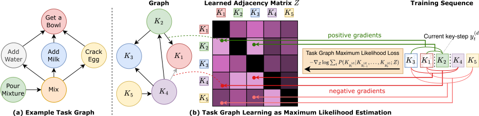

Fig. 1. (a) An example task graph encoding dependencies in a “mix eggs” procedure. (b) We learn a task graph which encodes a partial ordering between actions (left), represented as an adjacency matrix _Z_ (center), from input action sequences (right). The proposed Task Graph Maximum Likelihood (TGML) loss directly supervises the entries of the adjacency matrix _Z_ generating gradients to maximize the probability of edges from past nodes ( _K_ 3 _, K_ 1) to the current node ( _K_ 2), while minimizing the probability of edges from past nodes to future nodes ( _K_ 4 _, K_ 5) in a contrastive manner. 

task graph represented as an adjacency matrix, along with a set of key-step sequences, the proposed approach estimates the likelihood of observing the sequences under the constraints defined by the graph. We hence formulate task graph learning under the well-understood framework of Maximum Likelihood (ML) estimation [7] and propose a novel differentiable Task Graph Maximum Likelihood (TGML) loss function which can be used to directly optimize the adjacency matrix through gradient descent. The resulting loss function scans each training sequence key-step by key-step, producing positive gradients to reinforce the weights of edges between the currently observed key-step and key-steps previously observed in the same sequence, while reducing the weights directly connecting future key-steps to past key-steps, bypassing the current key-step (see Fig. 1(b)). Based on the proposed framework, we introduce two approaches to task graphlearning.Thefirstone,called“DirectOptimization(DO)”, directly optimizes the weights of the adjacency matrix, which serve as the sole parameters of the model. The second approach, referred to as “Task Graph Transformer (TGT)”, is a featurebased model that utilizes a transformer encoder and a relation head to predict the adjacency matrix from text or video key-step embeddings. This method obtains competitive performance and exhibits emerging video understanding capabilities, showcasing the potential of the proposed loss to guide the optimization of end-to-end architectures. 

We evaluate the abilities of the proposed models to generate accurate task graphs on the CaptainCook4D [8] and EgoPER [9] datasets, which contain egocentric procedural videos paired with ground truth task graphs. Both datasets have been collected in a scripted scenario in which users were asked to follow action sequences sampled from ground truth graphs. While this approach allows obtaining video sequences aligned to ground truth task graphs, it may introduce a bias as the observed sequences are guaranteed to be a faithful representation of the graph, which is not always the case in complex, real-world videos. To mitigate this issue, we extend the EgoProceL dataset [10] with manuallylabeled task graph annotations, which are sourced independently from the videos, by relying on annotations. These three datasets together provide a diverse benchmark for task graph generation, on which our best approach achieves improvements of +14.5%, +10.2%, and +13.6%, respectively, over previous methods. 

We further assess the usefulness of the proposed representation in 6 downstream tasks across three datasets by proposing methodologies based on task graphs. On the Ego-Exo4D [5] procedure understanding benchmark, our method obtains gains of up to +4.61%, +0.10%, +5.02%, +8.62%, and +15.16% in the 5 downstream tasks of finding Previous Keysteps, Optional Keysteps, Procedural Mistakes, Missing Keysteps, and Future Keysteps, respectively. On the online mistake detection benchmark recently introduced in [11], we obtain significant gains of +19.8% in Assembly101 [12] and +6.4% in EPIC-Tent [13] respectively. 

In sum, the contributions of this work are as follows: 1) we present a novel framework for learning _task graphs_ from action sequences,utilizingmaximumlikelihoodestimationtoprovidea differentiable loss function that can be integrated into end-to-end models and optimized using gradient descent; 2) we propose two approaches to task graph learning: one based on direct optimization of the adjacency matrix and another one which processes key-step text or video embeddings. These approaches lead to significant improvements over previous methods in task graph generation, and demonstrate emerging video understanding capabilities; 3) To support evaluations and research on task graph generation, we contribute a new dataset based on EgoProceL and equipped with manually labeled task graphs. Differently from previous benchmarks, our task graph annotations are sourced independently from the collected video sequences, relying on annotators; 4) we assess the usefulness of the learned representations on the 5 downstream procedural video understanding tasks included in the Ego-Exo4D procedure understanding benchmark and on the challenging online mistake detection task on the Assembly101-O and EPIC-Tent-O datasets. These experiments showcase the usefulness of task graphs in diverse downstream tasks, and, in particular, the effectiveness of the proposedgraph-basedrepresentations;5)wepubliclyreleasethe code, EgoProceL annotations and all useful assets to replicate the experiments at https://github.com/fpv-iplab/DifferentiableTask-Graph-Learning. 

This work builds upon our previous conference paper [7] by extending the validation of the proposed approach to more datasets, tackling more downstream tasks, and providing task graph annotations for EgoProceL.

<!-- Page 3 -->

10520 

IEEE TRANSACTIONS ON PATTERN ANALYSIS AND MACHINE INTELLIGENCE, VOL. 48, NO. 9, SEPTEMBER 2026 

## II. RELATED WORK 

Our research is related to previous works on procedural video understanding in general and task-graph learning in particular. 

## _A. Procedural Video Understanding Tasks_ 

Previous investigations considered different procedural video understanding tasks. A line of work tackled the task of inferring key-steps from procedural videos relying on subtitles [14], fitting individual classifiers for key-steps [15], exploiting selfsupervised deep neural networks [16], modeling intra-video and inter-video frame similarities in an unsupervised way [10], aligning embeddings of identical key-steps [17], exploiting transformer-based architecture [18]. Other methods focused on grounding key-steps in procedural videos using attention-based methods [19] or aligning visual and textual features in narrated videos [20]. Also, task verification has been explored through learning contextualized step representations [21], as well as through the development of benchmarks and synthetic datasets [22]. Among the other procedural video understanding tasks, mistake detection has gained increasing attention in recent years. Some methods have approached this task in fully supervised settings, where mistakes are explicitly labeled within videos and detection is performed offline [8], [12], [23]. Others have investigated weak supervision, where mistakes are annotated only at the video level rather than at finer spatial and temporal scales [24]. A different approach [25] leverages knowledge graphs built from fine-grained spatial and temporal annotations to improve mistake detection. To advance the field of mistake detection, [11] introduced PREGO, an online mistake detection benchmark incorporating videos from the Assembly101 [12] and EPIC-Tent [13] datasets. The same work proposed a novel method for detecting mistakes in procedural egocentric videos based on large language models. Notably, these prior works have relied on diverse representations, mostly implicit (e.g., activations of neural network), and hence non-interpretable and not straightforward to generalize across different tasks. 

Recently, task graphs, mined from video or external knowledge such as WikiHow articles, have been investigated as a powerful representation of procedures and proved advantageous for learning representations useful for downstream tasks such as key-steprecognitionandforecasting [4], [5], [6],temporalaction segmentation [26], and procedure planning [27]. Differently frompreviousworks [21], [28],weaimtodevelopanexplicitand human readable representation of the procedure which can be directly exploited to enable downstream tasks [4], rather than an implicit representation obtained with pre-training objective [6], [21]. As a departure from previous paradigms which carefully designed task graph construction procedures [4], [6], [29], [30], we frame task generation in a general framework, enabling models to learn task graphs directly from input sequences, and propose a differentiable loss function based on maximum likelihood estimation. 

## _B. Task Graph Learning_ 

Graph-based representations have been historically used to represent constraints in complex tasks and design optimal 

sub-tasks scheduling [31], making them a natural candidate to encode procedural knowledge. Previous works investigated approaches to construct task graphs from natural language descriptions of procedures (e.g., recipes) using rule-based graph parsing [3], [32], defining probabilistic models [33], fine-tuning language models [34], or proposing learning-based approaches [3] involving parsers and taggers trained on text corpora [35], [36]. While these approaches do not require any action sequence as input, they depend on the availability of text corpora including procedural knowledge, such as recipes, which often fail to encapsulate the variety of ways in which the procedure may be executed [4]. Other works proposed hand-crafted approaches to infer task graphs from sequences of actions depicting task executions [29], [30]. Recent work designed methodologies to mine task graphs from videos and textual descriptions of keysteps [4] or cross-referencing visual and textual representations from corpora of procedural text and videos [6]. 

Differently from previous efforts, we rely on action sequences, grounded in video, rather than natural language descriptions of procedures [3], [34] and frame task graph construction as a learning problem, providing a differentiable objective rather than resorting to hand-designed algorithms and task extraction procedures [4], [6], [29], [30]. 

## III. TECHNICAL APPROACH 

In this section, we present the proposed Task Graph Maximum Likelihood (TGML) framework (Section III-A), the models to learn task graphs based on this framework (Section III-B), the pre-processing of the input sequences to train the models (Section III-C), the masking strategy applied during the training of the models (Section III-D), and the post-processing procedures required to obtain the final graphs from the predicted adjacency matrices (Section III-E). More details are reported in the section _Implementation Details_ of the supplementary materials. 

## _A. Task Graph Maximum Likelihood Learning Framework_ 

We will first discuss preliminaries and notation (Section III-A1), then describe how to model the likelihood of a sequence in the simple case of an unweighted graph (Section III-A2) and in the more general case of a weighted graph (Section III-A3). We finally derive the proposed loss function in Section III-A4. 

_1) Preliminaries and Notation:_ Let 

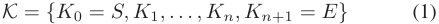

be the set of key-steps involved in the procedure, where _n_ is the number of key-steps, and symbols _S_ and _E_ are placeholder “start” and “end” key-steps denoting the _start_ and _end_ of the procedure. We define the task graph as a weighted directed acyclic graph, i.e., a tuple _G_ = ( _K, A, ω_ ), where _K_ is the set of nodes (the key-steps), _A_ = _K × K_ is the set of possible directed edges indicating ordering constraints between pairs of key-steps, and _ω_ : _A →_ [0 _,_ 1] is a function assigning a score to each of the edges in _A_ . An edge ( _Ki, Kj_ ) _∈A_ (also denoted as _Ki → Kj_ ) indicates that _Kj_ is a _pre-condition_ of _Ki_ , with score _ω_ ( _Ki, Kj_ ). For example, “Mix” _→_ “Crack Egg”

<!-- Page 4 -->

10521 

SEMINARA et al.: TASK GRAPH MAXIMUM LIKELIHOOD ESTIMATION FOR PROCEDURAL ACTIVITY UNDERSTANDING IN EGOCENTRIC VIDEOS 

denotes that “Crack Egg” must be performed before “Mix” (see Fig. 1(a) for an example). We assume normalized weights for outgoing edges, i.e.,� _j__w_(_Ki, Kj_) = 1_, ∀i_.Werepresentthe graph _G_ as the adjacency matrix _Z ∈_ [0 _,_ 1](_n_+2)_×_(_n_+2) , where _Z_ ( _i,j_ ) = _ω_ ( _Ki, Kj_ ). For ease of notation, we will denote the graph _G_ = ( _K, A, ω_ ) simply with its adjacency matrix _Z_ in the rest of the paper. We assume that a set of _D_ sequences _Y_ = _{y_(_d_) _}__D_ _d_ =1showing possible orderings of the key-steps in _K_ is available, where the generic sequence _y_(_d_) _∈Y_ is defined as a set of indexes to key-steps _K_ , i.e., 

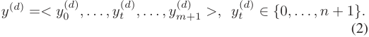

We further assume that each sequence starts with key-step _S_ and ends with key-step _E_ , i.e., _y_ 0(_d_) = 0 and _ym_(_d_ +1)=_n_+ 11 and note that different sequences _y_(_i_) and _y_(_j_) have in general different lengths. Since we are interested in modeling key-step orderings, we assume that sequences do not contain repetitions (see Section III-C for details). We frame task graph learning as determining an adjacency matrix _Z_ˆ such that sequences in _Y_ are topological sorts of _Z_ˆ with high probability. A principled way to approach this problem is to provide an estimate of the likelihood _P_ ( _Y|Z_ ) and choose the maximum likelihood estimate 

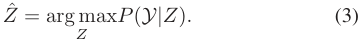

_2) Modeling Sequence Likelihood for an Unweighted Graph:_ Let us consider the special case of an unweighted graph, i.e., _Z_ ¯ _∈{_ 0 _,_ 1 _}_(_n_+2)_×_(_n_+2) . We wish to estimate _P_ ( _y_(_d_) _|_ ¯ _Z_ ), the likelihood of the generic sequence _y_(_d_) _∈Y_ given graph _Z_¯ . Formally, let _Yt_ be the random variable related to the event “key-step _Kyt_ ( _d_ ) appears at position _t_ in sequence _y_(_d_) ”. We can factorize the conditional probability _P_ ( _y_(_d_) _|Z_¯ ) as: 

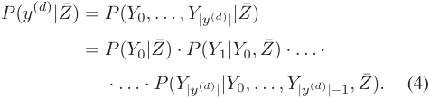

We assume that the probability of observing a given keystep _Kyt_ ( _d_ ) at position _t_ in _y_(_d_) depends on the previously observed key-steps ( _Ky_ 0( _d_ )_, . . . , Ky_ _t_( _−__d_) 1),butnotontheiror- dering, i.e., the probability of observing a given key-step depends on whether its pre-conditions are satisfied, regardless of the order in which they have been satisfied. Under this assumption, we write _P_ ( _Yt|Y_ 0 _, . . . , Yt−_ 1 _, Z_¯ ) simply as _P_ ( _Kyt_ ( _d_ )_|Ky_ 0(_d_)_, . . . , Ky_ _t_( _−__d_) 1_,Z_¯).Withoutlossofgenerality, in the following, we denote the current key-step as _Ki_ = _Kyt_ ( _d_ ),theindexesofkey-steps_observed_attime_t_as_J_( _t__d_) = _{y_ 0(_d_)_, . . . , y_ _t_( _−__d_) 1_}_,andthecorrespondingsetofobservedkey- steps as _KJ_ ( _t d_ ) = _{Kx|x ∈Jt_(_d_) _}_ . Similarly, we define _J_¯ _t_(_d_) = _{_ 0 _, . . . , n_ + 1 _} \ Jt_(_d_) and _KJ_ ¯ _t_(_d_) as the sets of indexes and corresponding key-steps _unobserved_ at position _t_ , i.e., those 

which do not appear before _yt_(_d_) in the sequence. Given the factorization above, we are hence interested in estimating the general term: 

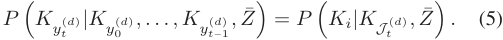

We can estimate the probability of observing key-step _Ki_ given the set of observed key-steps _KJ_ ( _t d_ ) and the constraints imposed by _Z_¯ ,followingLaplace’sclassicdefinitionofprobability [37] as “the ratio of the number of favorable cases to the number of possible cases”. Specifically, if we were to randomly sample a keystep from _K_ following the constraints of _Z_¯ , and having observed key-steps _KJ_ ( _t d_ ) , sampling _Ki_ would be a favorable case if all pre-conditions of _Ki_ were satisfied, i.e., if� _j∈J_¯ _t_(_d_) _Z_ ¯( _i,j_ ) = 0 (there are no pre-conditions in unobserved key-steps _KJ_ ¯ _t_(_d_) ). Similarly, sampling a key-steps _Kh_ is a “possible case” if � _j∈J_¯ _t_(_d_) _Z_ ¯( _h,j_ ) = 0. We can hence define the probability of observing key-step _Ki_ after observing all key-steps _KJ_ ( _t d_ ) in a sequence as follows: 

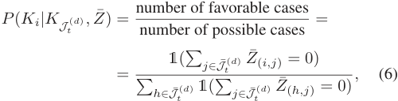

where 1( _·_ ) denotes the indicator function, and in the denominator we are counting the number of key-steps that have not appeared yet and hence are considered as “possible cases” under the given graph _Z_¯ . The likelihood _P_ ( _y_(_d_) _|Z_¯ ) can be obtained by plugging (6) into (4). 

_3) Modeling Sequence Likelihood for a Weighted Graph:_ To enable gradient-based learning, we consider the general case of a continuous adjacency matrix _Z ∈_ [0 _,_ 1](_n_+2)_×_(_n_+2) . We generalize the concept of “possible cases” discussed in the previous section with the concept of “feasibility of sampling , a given key-step _Ki_ , having observed a set of key-steps _KJ_ ( _t d_ ) given graph _Z_ ”, which we define as the sum of all weights of edges between observed key-steps _KJ_ ( _t d_ ) and _Ki_ : 

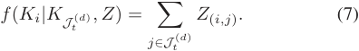

Intuitively, if key-step _Ki_ has many satisfied pre-conditions, we are more likely to sample it as the next key-step. We hence define _P_ ( _Ki|KJ_ ( _t d_ ) _, Z_ ) as “the ratio of the feasibility of sampling _Ki_ to the sum of the feasibilities of sampling any unobserved keystep”: 

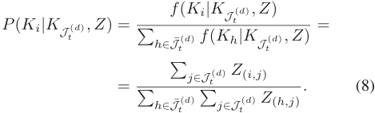

Fig. 2 illustrates the computation of the likelihood in (8). Plugging (8) into (4), we can estimate the likelihood of a sequence 

> 1In practice, we prepend/append _S_ and _E_ to each sequence.

> Original page for checking 3 unresolved font glyphs.

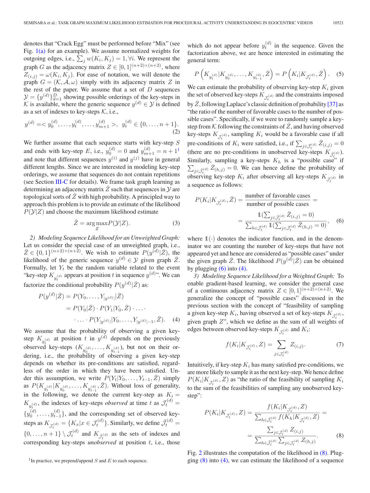

<!-- Page 5 -->

10522 

IEEE TRANSACTIONS ON PATTERN ANALYSIS AND MACHINE INTELLIGENCE, VOL. 48, NO. 9, SEPTEMBER 2026 

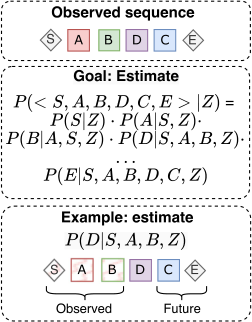

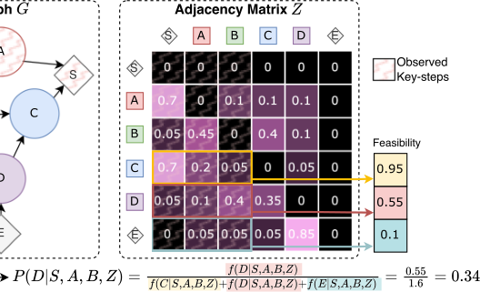

Fig. 2. Given a sequence _< S, A, B, D, C, E >_ , and a graph _G_ with adjacency matrix _Z_ , our goal is to estimate the likelihood _P_ ( _< S, A, B, D, C, E > |Z_ ), which can be done by factorizing the expression into simpler terms. The figure shows an example of computation of probability _P_ ( _D|S, A, B, Z_ ) as the ratio of the “feasibility of sampling key-step D, having observed key-steps S, A, and B” to the sum of all feasibility scores for unobserved symbols. Feasibility values are computed by summing weights of edges _D → X_ for all observed key-steps _X_ . 

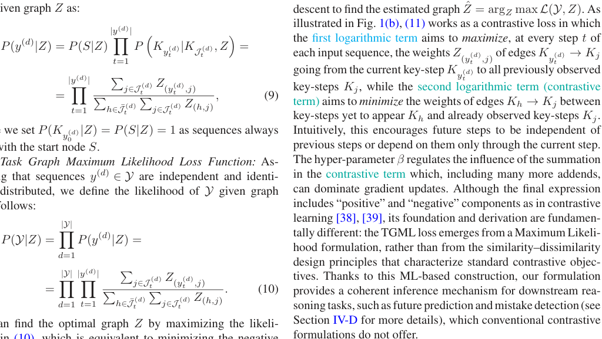

_y_(_d_) given graph _Z_ as: 

where we set _P_ ( _Ky_ 0( _d_ )_|Z_) =_P_(_S|Z_) = 1 as sequences always start with the start node _S_ . 

_4) Task Graph Maximum Likelihood Loss Function:_ Assuming that sequences _y_(_d_) _∈Y_ are independent and identically distributed, we define the likelihood of _Y_ given graph _Z_ as follows: 

We can find the optimal graph _Z_ by maximizing the likelihood in (10), which is equivalent to minimizing the negative log-likelihood _−_ log _P_ ( _Y, Z_ ), leading to the following loss: 

## _B. Models_ 

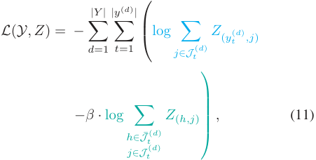

We propose two models based on the TGML loss function: a “Direct Optimization” model, which performs gradient descent directly in graph solution space of the adjacency matrices (Section III-B1), and an architecture based on transformers which can predict graphs from video or text embeddings describing key-steps (Section III-B2). 

_1) Direct Optimization (DO):_ The first model aims to directly optimize the parameters of the adjacency matrix by performing gradient descent on the TGML loss (11). We define the parameters of this model as an edge scoring matrix _A ∈_ R(_n_+2)_×_(_n_+2) , where _n_ is the number of key-steps, plus the placeholder start ( _K_ 0 = _S_ ) and end ( _Kn_ +1 = _E_ ) nodes, and _A_ ( _i,j_ ) isascoreassignedtoedge _Ki → Kj_ .Topreventthemodel 

where _β_ is a hyper-parameter. We refer to (11) as the _Task Graph Maximum Likelihood (TGML)_ loss function. Since (11) is differentiable with respect to all _Z_ ( _i,j_ ) values, we can learn the adjacency matrix _Z_ by minimizing the loss with gradient

<!-- Page 6 -->

10523 

SEMINARA et al.: TASK GRAPH MAXIMUM LIKELIHOOD ESTIMATION FOR PROCEDURAL ACTIVITY UNDERSTANDING IN EGOCENTRIC VIDEOS 

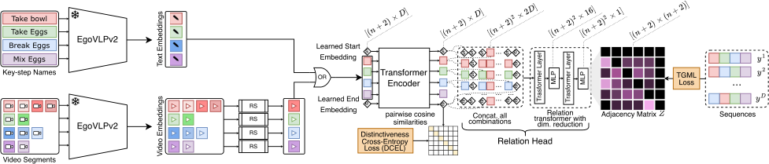

Fig. 3. Our Task Graph Transformer (TGT) takes as input either _D_ -dimensional text embeddings extracted from key-step names or video embeddings extracted from key-step segments. In both cases, we extract features with a pre-trained EgoVLPv2 model. For video embeddings, multiple embeddings can refer to the same action, so we randomly select one for each key-step (RS blocks). Learnable start (S) and end (E) embeddings are also included. Key-step embeddings are processed using a transformer encoder and regularized with a distinctiveness cross-entropy loss (DCEL) to prevent representation collapse. The output embeddings are processed by our relation head, which concatenates vectors across all ( _n_ + 2)2 possible node pairs, producing ( _n_ + 2) _×_ ( _n_ + 2) _×_ 2 _D_ relation vectors. These vectors are then processed by a relation transformer, which progressively maps them to an ( _n_ + 2) _×_ ( _n_ + 2) adjacency matrix. The model is supervised with input sequences using our proposed Task Graph Maximum Likelihood (TGML) loss. 

from learning edge weights eluding the assumptions of directed acyclic graphs, we mask black cells in Fig. 2 with _−∞_ (see Section III-D for details). To obtain the final adjacency matrix _Z_ in the [0,1] range, which represents the predicted task graph, we softmax-normalize the rows of the scoring matrix _A_ , i.e., _Z_ = _softmax_ ( _A_ ). Note that elements masked with _−∞_ will be automatically mapped to 0 by the softmax function similarly to [40].Wetrainthismodelbyperformingbatchgradientdescent directly on the score matrix _A_ with the proposed TGML loss. We train a separate model per procedure, as each procedure is associated to a different task graph. 

_2) Task Graph Transformer (TGT):_ Thanks to the differentiable nature of the proposed loss function, we can use it to guide learning of more complex, differentiable architectures. To this aim, we also introduce a transformer-based model which can generate graphs starting from video or text embeddings describing key-steps. Fig. 3 illustrates the proposed model, which is termed Task Graph Transformer (TGT). The proposed model can take as input either _D_ -dimensional embeddings of textual descriptions of key-steps or _D_ -dimensional video embeddings of key-step segments extracted from video. In the first case, the model takes as input the same set of embeddings at each forward pass, while in the second case, at each forward pass, we randomly sample a video embedding per key-step from the training videos (hence each key-step embedding can be sampled from a different video). We also include two _D_ - dimensional learnable embeddings for the _S_ and _E_ nodes. All key-step embeddings are processed by a transformer encoder, which outputs _D_ -dimensional vectors enriched with information from other embeddings. To prevent representation collapse, we apply a distinctiveness cross-entropy loss (DCEL) encouraging distinctiveness between pairs of different nodes. Let _X_ be the matrix of embeddings produced by the transformer model. We L2-normalize features, then compute pairwise cosine similarities _Y_ = _X · X__T_ _·_ exp( _T_ ) as in [39]. We hence enforce the values outside the diagonal of _Y_ to be smaller than the values in the diagonal by encouraging each row of the matrix _Y_ to be close to a one-hot vector with a cross-entropy loss. This leads to key-step self-similarities being larger than similarities across key-steps, preventing representation collapse. Regularized embeddings are finally passed through a relation transformer head 

which considers all possible pairs of embeddings and concatenates them in a ( _n_ + 2) _×_ ( _n_ + 2) _×_ 2 _D_ matrix _R_ of relation vectors. For instance, _R_ [ _i, j_ ] is the concatenation of vectors _X_ [ _i_ ] and _X_ [ _j_ ]. Relation vectors are passed to a transformer layer which aims to mine relationships among relation vectors, followed by a multilayer perceptron to reduce dimensionality to 16 units and another pair of transformer layer and multilayer perceptron to map relation vectors to scalar values, which are reshaped to size ( _n_ + 2) _×_ ( _n_ + 2) to form the scoring matrix _A_ . We hence softmax-normalize the rows of the scoring matrix _A_ , i.e., _Z_ = _softmax_ ( _A_ ), to obtain the final adjacency matrix representing the predicted task graph. 

## _C. Input Sequence Pre-Processing_ 

Our framework assumes that each key-step sequence represents a topological sort of the underlying task graph, and therefore contains no repetitions. However, real-world demonstrations often include repeated actions. To map such sequences into valid topological sequences, we adopt two pre-processing strategies that remove or consolidate repetitions while preserving the procedural constraints encoded in the data:2 (1) we retain only the first occurrence of each key-step and discard subsequent repetitions, yielding a single non-repetitive sequence (e.g., _BACAD → BACD_ ); (2) when key-steps may occur in parallel or admit multiple valid orders, we generate all consistent non-repetitive sequences (e.g., _BACAD → {BACD, BCAD}_ ). 

## _D. Masking Strategy for Directed Acyclic Graphs_ 

To ensure that the model complies with the structural constraints of directed acyclic graphs (DAGs), we implement a masking strategy that assigns _−∞_ to specific elements of the adjacency matrix. The masked elements include: (1) the main diagonal, since no node can have an edge to itself; (2) the row corresponding to the START node, as it has no pre-conditions by definition; and (3) the column corresponding to the END node, as it cannot serve as a pre-condition by definition. This masking 

> 2See section _Input Sequence Pre-Processing_ of the supplementary material for more details.

<!-- Page 7 -->

10524 

IEEE TRANSACTIONS ON PATTERN ANALYSIS AND MACHINE INTELLIGENCE, VOL. 48, NO. 9, SEPTEMBER 2026 

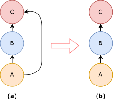

Fig. 4. An example of transitive dependency between nodes. In (a) node A depends on B and C, but B depends on C, in this case, we can remove the edge between A and C for transitivity and we obtain the graph in (b). 

strategy effectively prevents the model from learning some edge weights that violate the acyclic properties of the graph. The black cells in Fig. 2 visually represent the masked regions. 

## _E. Post-Processing of the Output Graph_ 

As many applications require an unweighted graph, we binarize the adjacency matrix with the threshold _n_<u>1</u>,where_n_is the number of key-steps of the considered procedure. After this thresholding phase, it is possible to encounter situations like the one illustrated in Fig. 4, where node _A_ depends on nodes _B_ and _C_ , and node _B_ depends on node _C_ . Due to the transitivity of the pre-conditions, we can remove the edge connecting node _A_ to node _C_ , as node _B_ must precede node _A_ . Sometimes, it may occur that a node does not serve as a pre-condition for any other node; in such cases, the END node should be directly connected to this node. Conversely, if a node has no pre-conditions, an edge is added from the current node to the START node. At the end of the training process, obtaining a graph containing cycles is also possible. In such cases, all cycles within the graph are considered, and the edge with the lowest score within each cycle is removed. This process ensures that the graph remains a Directed Acyclic Graph (DAG). These steps yield the final binary, unweighted task graph _G_ˆ = ( _K_ˆ _, A_ˆ ). 

## IV. EXPERIMENTS AND RESULTS 

In this section, we first introduce our human-annotated task graphs for EgoProceL (see Section IV-A). Next, we evaluate our models’ ability to generate task graphs (Section IV-B) and explore how our TGT model exhibits emerging video understanding abilities (Section IV-C). We further assess the usefulness of the learned representation on the 5 downstream tasks of the Ego-Exo4D procedure understanding benchmark (Section IV-D) and the online mistake detection task (Section IV-E). Finally, Section IV-F reports ablation studies. 

## _A. Human-Annotated Task Graphs for EgoProceL_ 

To support our evaluations, we present newly curated humanannotated task graphs for EgoProceL [10] to advance research and evaluation in task graph generation. In contrast to previous publicly available task graph annotations, such as CaptainCook4D [8] and EgoPER [9], our annotations are independently derived without direct reference to the video sequences to reduce 

Fig. 5. Example of a questionnaire item. Annotators can select multiple options. If annotators determine that a key-step has no pre-conditions, they were instructed to select “None of the above”. 

bias in human-driven labeling. The EgoProceL dataset includes videos and key-step annotations for a diverse set of tasks derived from CMU-MMAC [41], EGTEA Gaze+ [42], EPIC-Tent [13], MECCANO [43], as well as PC assembly, and PC disassembly sequences. For our study, we focus specifically on tasks from CMU-MMAC, EGTEA Gaze+, and EPIC-Tent. To generate the annotations, we engaged 10 annotators to complete a structured questionnaire (Fig. 5). The questionnaire was designed to enable annotators to identify the pre-condition relationships for each key-step without exposing them to video content, ensuring unbiased responses. Annotators were instructed to ensure consistency in their answers. For instance, if step _A_ is marked as a pre-condition for step _B_ , step _B_ cannot simultaneously be a pre-condition for step _A_ . To enforce consistency, we developed an automated system that analyzed the responses for contradictions. If inconsistencies were detected, the system generated a report highlighting the discrepancies and provided a link to the annotators for them to revise their answers. After all participants submitted their responses, the pre-conditions were finalized based on majority voting, retaining only those relationships with a frequency exceeding a threshold of 0.5. Also, the resulting graphs were manually reviewed to ensure the absence of cycles, guaranteeing that the extracted dependencies formed a valid directed acyclic graph (DAG). 

We conducted an inter-annotator agreement analysis to assess the reliability and stability of the annotated task graphs in relation to the number of annotators. Specifically, for each scenario, we applied a bootstrap procedure in which subsets of _N_ annotators ( _N_ = 3 _, . . . ,_ 9) were repeatedly sampled to generate consensus graphs. Each subset-derived graph was then compared with the full 10-annotator consensus using the Jaccard similarity over edge sets, defined as: 

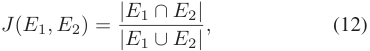

where _E_ 1 denotes the set of pre-condition edges in the consensus graph obtained from the considered subset of annotators, and _E_ 2 denotes the set of pre-condition edges in the full 10-annotator consensus graph. This analysis provides a quantitative estimate of how sensitive the final graph is to the number of annotators

<!-- Page 8 -->

10525 

SEMINARA et al.: TASK GRAPH MAXIMUM LIKELIHOOD ESTIMATION FOR PROCEDURAL ACTIVITY UNDERSTANDING IN EGOCENTRIC VIDEOS 

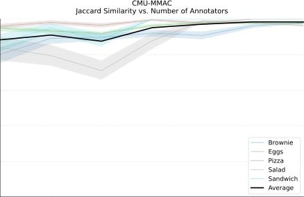

Fig. 6. Bootstrap inter-annotator agreement for the CMU-MMAC scenarios. Each colored curve corresponds to a specific task, while the black line denotes the average consensus across all CMU-MMAC tasks. 

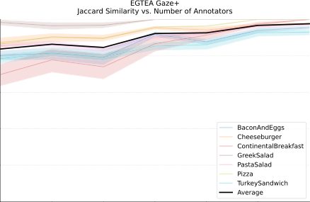

Fig. 7. Bootstrap inter-annotator agreement for the EGTEA Gaze+ scenarios. Each colored curve corresponds to a specific task, while the black line denotes the average consensus across all EGTEA Gaze+ tasks. 

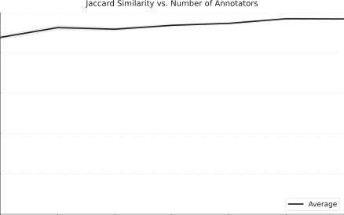

Fig. 8. Bootstrap inter-annotator agreement for the EPIC-Tent scenario. 

involved. Across all datasets (see Figs. 6, 7, and 8), the results exhibit a consistent trend: even with only three annotators, the average Jaccard similarity exceeds 80%, indicating systemic consensus. Agreement improves steadily with larger subsets, and by _N_ = 6 annotators, the average similarity surpasses 90% for all groups. While different tasks may require different numbers of annotators, for _N_ = 8 and _N_ = 9, the consensus always approaches saturation, with similarities above 90% _−_ 95% for 

all sub-tasks. These findings suggest that the final 10-annotator consensus graphs are highly stable and robust, and that reliable task graphs can already be obtained with substantially fewer annotators. The resulting task graph annotations are publicly available and can be accessed at https://github.com/fpv-iplab/ Differentiable-Task-Graph-Learning. The dataset includes 13 procedures (i.e., 13 task graphs), encompassing a total of 275 videos and 16.3 hours of video segments. These annotations are provided to facilitate further research and benchmarking in task graph generation.3 

## _B. Task Graph Generation_ 

_1) Datasets:_ We evaluate the ability of our approach to learn task graph representations on three datasets of procedural videos: EgoProceL [10] equipped with the newly introduced graph annotations, CaptainCook4D [8], and EgoPER [9]. The CaptainCook4D [8] dataset consists of egocentric videos of 24 cooking procedures performed by 8 participants, with each procedure accompanied by a task graph that describes the constraints of the key-steps. Similarly, the EgoPER [9] dataset contains egocentric procedural videos of 5 different cooking tasks, accompanied by corresponding task graphs. 

_2) Problem Setup:_ We tackle task graph generation as a weakly supervised learning problem in which models have to generate valid graphs by only observing labeled action sequences (weak supervision) rather than relying on task graph annotations (strong supervision), which are not available at training time. All models are trained on sequences of actions that are free from ordering errors or missing steps to provide a likely representation of procedures. We apply the first approach described in Section III-C to handle repetitions. We then use the two proposed methods in Section III-B to learn different task graph models, one per procedure, and report average performance across procedures. We trained TGT models using text embeddings derived from key-step names, extracted with EgoVLPv2 [45] pre-trained on Ego-Exo4D [5]. We refer to these models as TGT-text. 

_3) Evaluation Measures:_ Task graph generation is evaluated by comparing the binary, unweighted generated graph _G_ˆ = ( _K_ˆ _, A_ˆ ) with the corresponding ground truth graph _G_ = ( _K, A_ ). Since task graphs aim to encode ordering constraints between pairs of nodes, we evaluate task graph generation as the problem of identifying valid pre-conditions (hence valid graph edges) among all possible ones. We therefore adopt the classic detection evaluation measures precision, recall, and _F_ 1 score. In this context, we define True Positives (TP) as all edges included in both the predicted and ground truth graph (13), False Positives (FP) as all edges included in the predicted graph, but not in the ground truth graph (14), and False Negatives (FN) as all edges included in the ground truth graph, but not in the predicted one (15). Note that true negatives are not required to compute precision, recall and _F_ 1 score. 

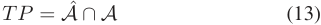

> 3See section _Qualitative Examples_ of the supplementary material for more details.

<!-- Page 9 -->

10526 

IEEE TRANSACTIONS ON PATTERN ANALYSIS AND MACHINE INTELLIGENCE, VOL. 48, NO. 9, SEPTEMBER 2026 

TABLE I 

TASK GRAPH GENERATION RESULTS ON CAPTAINCOOK4D. BEST RESULTS ARE IN **BOLD** , SECOND BEST RESULTS ARE <u>UNDERLINED, BEST RESULTS AMONG</u> COMPETITORS ARE ~~HIGHLIGHTED .~~ CONFIDENCE INTERVAL BOUNDS COMPUTED AT 90% CONF. FOR 5 RUNS. 

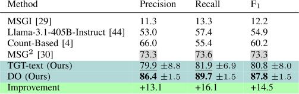

TABLE III 

TASK GRAPH GENERATION RESULTS ON EGOPROCEL. BEST RESULTS ARE IN **BOLD** , SECOND BEST RESULTS ARE <u>UNDERLINED, BEST RESULTS AMONG</u> COMPETITORS ARE ~~HIGHLIGHTED .~~ CONFIDENCE INTERVAL BOUNDS COMPUTED AT 90% CONF. FOR 5 RUNS. 

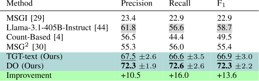

TABLE II 

TASK GRAPH GENERATION RESULTS ON EGOPER. BEST RESULTS ARE IN **BOLD** , SECOND BEST RESULTS ARE <u>UNDERLINED, BEST RESULTS AMONG</u> COMPETITORS ARE ~~HIGHLIGHTED .~~ CONFIDENCE INTERVAL BOUNDS COMPUTED AT 90% CONF. FOR 5 RUNS. 

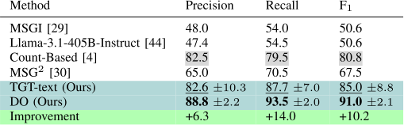

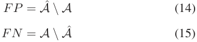

_4) Compared Approaches:_ We compare our methods with respect to previous approaches for task graph generation, and in particularwithMSGI [29] andMSG2 [30],whichareapproaches based on Inductive Logic Programming (ILP). We also consider the recent approach proposed in [4], which generates a graph by counting co-occurrences of matched video segments. Since we assume labeled actions to be available at training time, we do not perform video matching and use ground truth segment matching provided by the annotations. This approach is referred to as “Count-Based”. Given the popularity of large language models as reasoning modules, we also consider a baseline which uses Llama-3.1-405B-Instruct [44] to generate a task graph from key-step descriptions, without any access to key-step sequences.4 

_5) Graph Generation Results:_ Results in Tables I, II, and III demonstrate that our proposed framework achieves state-of-theart results in all considered datasets, outperforming competitive heuristics based methods. The tables highlight the limitations of traditional methods, such as MSGI [29], which struggle to generate task graphs directly from action sequences, achieving poor performance across datasets: 12.2 _F_ 1 on CaptainCook4D, 50.6 _F_ 1 on EgoPER and 22.9 _F_ 1 on EgoProceL. Among more advanced heuristic methods, MSG2 [30] achieves the best _F_ 1 on CaptainCook4D (73.3), while the Count-Based [4] approach 

> 4See section _Llama-3.1-405B-Instruct Prompts_ of the supplementary material for more details. 

delivers the best results on EgoPER (80.8), and LLaMA3.1-405B-Instruct [44] outperforms competitors on EgoProceL (58.7). Despite these dataset-specific strengths, these methods fail to generalize effectively across all datasets. MSG2 , which performs well on CaptainCook4D, achieves lower _F_ 1 on EgoPER and EgoProceL. Similarly, while excelling on EgoPER, the Count-Based approach performs poorly on CaptainCook4D and EgoProceL. Llama-3.1-405B-Instruct achieves the best _F_ 1 on EgoProceL but drops on CaptainCook4D and EgoPER. In contrast, our Direct Optimization (DO) approach achieves the best performance across all three datasets, with substantial improvements in _F_ 1: +14 _._ 5% on CaptainCook4D, +10 _._ 2% on EgoPER, and +13 _._ 6% on EgoProceL compared to the strongest competitors in each case. These results highlight the effectiveness of the proposed framework in learning task graph representations from key-step sequences, especially considering the simplicity of the DO method, which performs gradient descent directly on the adjacency matrix. Across all three datasets, our approach achieves slightly higher recall than precision, indicating its ability to retrieve most ground truth edges while occasionally introducing some hallucinated pre-conditions. This is likely due to the fact that video sequences in datasets typically favor the most common ways of completing a procedure. Tight confidence intervals for DO highlight the stability of the proposed loss. Second best results are consistently obtained by our feature-based TGT approach, showing the generality of our learning framework and the potential of integrating it into complex neural architectures. The lower performance of TGT, as compared to DO, may be attributed to its feature-based approach, which seeks to generate a more generalized task graph structure. In contrast, DO learns a more specific, data-driven representation. This difference in approach is particularly evident in the experiments on Ego-Exo4D (see Section IV-D), where TGT’s ability to generate a more generalized task graph proves advantageous, outperforming DO. The choice between DO and TGT depends on the operational setting. In scenarios involving a fixed and well-defined set of procedures that are consistently executed and well represented in the training data (e.g., standardized assembly processes or canonical workflows), the specificity of DO is particularly advantageous, as it learns a highly accurate task graph tailored to the target procedure. In contrast, TGT is better suited to heterogeneous environments where the system must handle multiple procedures or variations

<!-- Page 10 -->

10527 

SEMINARA et al.: TASK GRAPH MAXIMUM LIKELIHOOD ESTIMATION FOR PROCEDURAL ACTIVITY UNDERSTANDING IN EGOCENTRIC VIDEOS 

thereof, and where some procedures may be under-represented in the available demonstrations. By learning shared representations of key-steps, TGT enables a single model to adapt across different procedures and to be effectively fine-tuned, offering greater flexibility and scalability in settings with procedural diversity. 

## _C. Video Understanding Abilities of the TGT Model_ 

We investigate the ability of the TGT model to generalize beyond task graph generation by tackling two key video understanding tasks: pairwise ordering and future prediction [46]. The first task, pairwise ordering, involves determining the correct temporal sequence of two short snippets extracted from an egocentric video of an activity. The goal is to infer which snippet occurs first and which follows, requiring a precise understanding of temporal dependencies between the video segments. The second task, future prediction, assesses the model’s capability to anticipate the next step in an everyday activity. In this scenario, the model is provided with a longer video depicting part of an activity and two shorter video snippets. The task is to predict which of the two snippets logically and temporally follows the givenvideo,demonstratingthemodel’sabilitytoprojectforward in time and infer procedural progression. 

_1) Problem Setup:_ We set up the pairwise ordering and future predictionvideounderstandingtasksfollowing [46] andevaluate the abilities of our TGT model, trained on visual features of CaptainCook4D [8] (TGT-video), to generalize to the two fundamental video understanding tasks despite not being explicitly trained for them. For pairwise ordering, models take as input two randomly shuffled video clips and are tasked with recognizing the correct ordering between key-steps. For future prediction, models take as input an anchor video clip and two randomly shuffled video clips and are tasked to select which of the two clips is the correct future of the anchor clip.5 We evaluate models using accuracy. 

_2) Dataset:_ We employed the subset of the CaptainCook4D dataset designated for task graph generation6 which has been divided into training and testing sets. This division was carefully managed to ensure that 50% of the scenarios were equally represented in both the training and testing sets. 

_3) Model:_ We trained our TGT model using video embeddings extracted with a pre-trained EgoVLPv2 [45] on EgoExo4D [5]. During the training process, if multiple video embeddings are associated with the same key-step across the training sequences, one embedding per key-step is randomly selected. The model is trained for task graph generation on the training videos and tested for pairwise ordering and future prediction on the test set. 

_4) Results:_ Table IV reports the performance of TGT trained on videos on two fundamental video understanding tasks [46] of pairwise clip ordering and future prediction. Despite TGT not being explicitly trained for pairwise ordering and future predictions, it exhibits emerging video understanding abilities, 

> 5See section _Details on Pairwise ordering and future prediction_ of the supplementary material for more details. 

> 6See section _Data Split_ of the supplementary material for more details. 

TABLE IV 

WE COMPARE THE ABILITIES OF OUR TGT MODEL TRAINED ON VISUAL FEATURES OF CAPTAINCOOK4D TO GENERALIZE TO TWO FUNDAMENTAL VIDEO UNDERSTANDING TASKS, I.E., PAIRWISE ORDERING AND FUTURE PREDICTION. DESPITE NOT BEING EXPLICITLY TRAINED FOR THESE TASKS, OUR MODEL EXHIBITS VIDEO UNDERSTANDING ABILITIES, SURPASSING THE BASELINE 

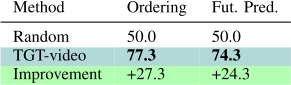

surpassing the random baseline. Although we do not aim to directly compete with state-of-the-art methods in this domain, results are promising and suggest that TGT can effectively capture temporal and procedural cues within video data. These findings are coherent with the “Future Keysteps” results on Ego-Exo4D (see Section IV-D for more details), where both DO and TGT achieve strong performance, demonstrating that the learned task graphs can effectively support next-step prediction in realistic scenarios. Moreover, prior work [47] has shown that graph-based representations can substantially improve action anticipation when combined with visual models, which aligns with our expectation that the task graphs produced by our method may similarly enhance anticipation systems, although a comprehensive evaluation of this integration is left to future work. 

## _D. Performance on the Downstream Tasks of the Ego-Exo4D Procedure Understanding Benchmark_ 

In the following, we present experiments to show the usefulness of the learned representations in the downstream tasks of the Ego-Exo4D Procedure Understanding Benchmark [5]. 

_1) Problem Setup:_ The recently introduced Ego-Exo4D procedure understanding benchmark [5] encompasses 5 diverse downstream tasks associated with procedural video comprehension. Given a video segment _si_ and its preceding segment history _S_ : _i−_ 1 = _{s_ 1 _, . . . , si−_ 1 _}_ , models are tasked to: (1) identify _previous keysteps_ , which refer to key-steps that should be executed before _si_ ; (2) determine whether _si_ is _optional_ , indicating that it can be skipped without undermining the proper execution of the procedure; (3) detect if _si_ constitutes a _procedural mistake_ , defined as a key-step performed inappropriately due to unmet pre-conditions; (4) predict _missing keysteps_ , which are steps that should have occurred before _si_ ; and (5) determine _next keysteps_ , representing key-steps whose dependencies are satisfied and are therefore ready for execution. The benchmark is weakly supervised and is presented in two variants based on the level of supervision: (1) _instance-level_ , where video segments and their corresponding key-step labels are provided during both training and inference, akin to an action recognition framework; and (2) _procedure-level_ , where training and inference rely on unlabeled video segments and a taxonomy of procedure-specific key-step names. 

_2) Compared Approaches:_ We evaluate our approach against the baselines defined in [5], which include a graph-based and

<!-- Page 11 -->

10528 

IEEE TRANSACTIONS ON PATTERN ANALYSIS AND MACHINE INTELLIGENCE, VOL. 48, NO. 9, SEPTEMBER 2026 

an end-to-end approach. The graph-based baseline relies on a transition graph to perform procedural reasoning, while the end-to-end baseline predicts outcomes directly from video data without utilizing an explicit graph structure. It is important to note that the graph-based baseline is equivalent to the CountBased method [4]. We also compare our approach against all the baselines considered for task graph generation (see Section IV-B4), excluding the MSGI method due to its convergence issues when applied to find large graphs. We apply the first approach described in Section III-C to handle repetitions. Also, we conduct experiments using both instance-level and procedure-level supervision. In the case of instance-level supervision, we generate task graphs using the ground truth labels from the training set. On the other hand, for procedure-level supervision, these annotations cannot be used, thus we adopt two different approaches, as done by the authors of Ego-Exo4D [5]: _keystep assignment_ and _keystep prediction_ . _Keystep assignment_ involves generating pseudo-labels for video segments based on a pre-trained video-language model. In contrast, _keystep prediction_ uses a model specifically trained for key-step recognition to obtain pseudo-labels. The pseudo-labels obtained from both strategies are used by all the compared approaches to generate task graphs. At test time, the generated task graphs are used to perform procedure understanding and address the key-step level questions of the Ego-Exo4D benchmark. 

_3) DO and TGT:_ For the task graph generated using either DO or TGT methods, during testing we consider the adjacency matrix _Z_ˆ obtained before the post-processing stage (see Section III-E) to support procedure understanding. Specifically, given the current key-step _Ki_ , we perform the following steps: 1) a key-step _Kprev_ is predicted as previous key-step with a confidence score equal to: 

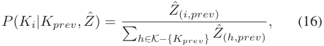

where _Z_ˆ ( _i,prev_ ) is the edge weight from _Ki_ to _Kprev_ in the estimated task graph represented by _Z_ˆ , and the denominator considers all possible key-steps, excluding _Kprev_ ( _K −{Kprev}_ ), that could have _Kprev_ as a potential pre-condition (i.e., as a valid previous key-step). 

2) The key-step _Ki_ is classified as optional based on an optionality score _O_ ( _Ki_ ), which combines _global_ and _local_ optionality scores. The _global optionality_ score _Og_ ( _Ki_ ) is derived from training data by analyzing how frequently _Ki_ appears as optional across sequences _y_(_d_) _∈Y_ . For each sequence _y_(_d_) containing _Ki_ , the optionality score for _Ki_ is computed as: 

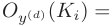

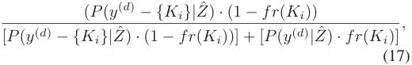

where _fr_ ( _Ki_ ) represents the frequency of _Ki_ in the training set, _P_ ( _y_(_d_) _|Z_ˆ ) is the probability of completing sequence _y_(_d_) with _Ki_ , and _P_ ( _y_(_d_) _−{Ki}|Z_ˆ ) is the probability of completing the sequence without _Ki_ . If _Oy_ ( _d_ ) ( _Ki_ ) is greater than 0.5, _Ki_ 

is considered optional for _y_(_d_) , and a counter _counto_ ( _Ki_ ) is incremented. Otherwise, a “mandatory” counter _countm_ ( _Ki_ ) is incremented. The global optionality score is obtained as: 

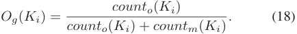

The _local optionality_ score assesses the optionality of _Ki_ within a specific sequence _y_(_d_) , and in particular in the sub-sequence _y_ :( _t__d_) = _< y_ 0(_d_) = _S, y_ 1(_d_)_, . . . , y_ _t_( _−__d_) 1_, y_ _t_(_d_) = _Ki >_ . The score calculates the probability that the procedure can be directly completed skipping the current key-step _Ki_ . This is done by removing _Ki_ from the sub-sequence _y_ :( _t__d_) and replacing it with the end key-step _E_ , resulting in the modified sub-sequence _y_ ˆ:( _t__d_) = _< y_ 0(_d_) = _S, y_ 1(_d_)_, . . . , y_ _t_( _−__d_) 1_, y_ _t_(_d_) = _E >_ . The local score is then computed as: 

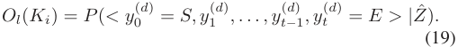

A higher probability indicates that _Ki_ is likely optional. Finally, the overall optionality score for _Ki_ is a weighted combination of the global and local optionality scores: 

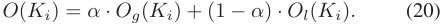

Here, _α_ is a weighting parameter that balances the influence of global and local optionality scores, we set it to 0.7. 

3) The key-step _Ki_ is identified as a procedural mistake if its required pre-condition key-steps _Kprev_ are missing from the observed set of key-step ( _KJ_ ( _t d_ ) ). The score for this prediction is given by� _Kprev_1(_Kprev∈/K_ _Jt_(_d_) ) _· P_ ( _Ki|Kprev, Z_ˆ ), where 1( _·_ ) is the indicator function. 

4)Thekey-step _Km_ ispredictedasapossiblemissingkey-step for _Ki_ with probability 1( _Km ∈/ KJ_ ( _t d_ ) ) _· P_ ( _Ki|Km, Z_ˆ ). 5) For predicting the future key-steps, the observed history, including the current key-step _Ki_ , is utilized ( _KH_ = _KJ_ ( _t d_ ) _∪ {Ki}_ ). The probability of a future key-step _Kf_ is calculated as: 

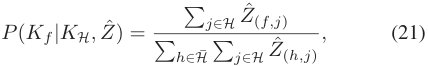

where _H_ denotes the set of indexes corresponding to the observed key-steps including the current one ( _Ki_ ), and _H_¯ represents the set of indexes for the remaining unseen key-steps. 

_4) MSG_2 _:_ For task graphs generated using MSG2 method [30], only binary adjacency matrices are available. This limitation prevents the use of approaches designed for task graphs generated by the DO and TGT methods, which rely on weighted adjacency matrices to support procedure understanding. Let _G_ ˆ = ( ˆ _K, A_ ˆ) be the binary, unweighted generated task graph. Given a current key-step _Ki_ we perform the following step: 

1) the set of previous key-steps _Pk_ ( _Ki_ ; _G_ˆ ) consists of all key-steps _Kprev_ connected to _Ki_ via outgoing edges: _Pk_ ( _Ki_ ; _G_ˆ ) = _{Kprev ∈ Pred_ ( _Ki_ ; _G_ˆ ) _}_ , where _Pred_ ( _Ki_ ; _G_ˆ ) = _{Kj|_ ( _Ki, Kj_ ) _∈ E_ˆ _}_ . For each node _Kj_ , the

> Original page for checking 1 unresolved font glyphs.

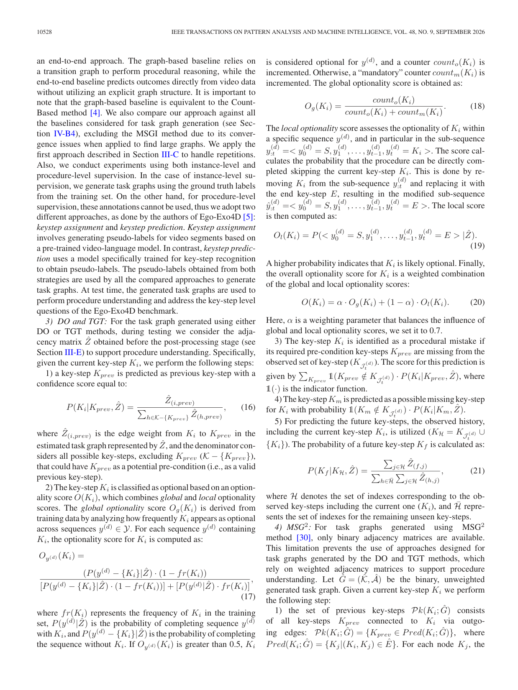

<!-- Page 12 -->

10529 

SEMINARA et al.: TASK GRAPH MAXIMUM LIKELIHOOD ESTIMATION FOR PROCEDURAL ACTIVITY UNDERSTANDING IN EGOCENTRIC VIDEOS 

TABLE V 

EGO-EXO4D PROCEDURE UNDERSTANDING BENCHMARK RESULTS. BEST RESULTS ARE IN **BOLD** , SECOND BEST RESULTS ARE <u>UNDERLINED.</u> BEST RESULTS OF THE BASELINES ARE ~~HIGHLIGHTED .~~ 

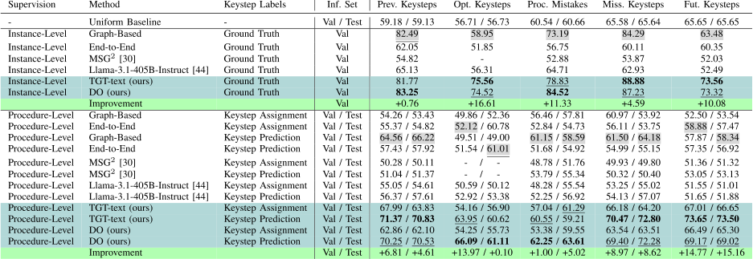

pre-condition score is computed as follows: 

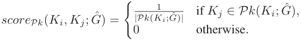

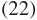

2) With MSG2 , it is not possible to evaluate whether a key-step _Ki_ is optional. The binary nature of the adjacency matrix does not provide the detailed probabilistic information required for such assessments. 

3) To determine whether _Ki_ is a procedural mistake, its previous key-steps _Pk_ ( _Ki_ ; _G_ˆ ) are examined. If any of these pre-conditions are missing from the observed set of key-step ( _KJ_ ( _t d_ ) ), a procedural mistake is predicted. The score for predicting a procedural mistake is computed by� _Kprev∈Pk_ ( _Ki_ ; _G_ˆ )1(_Kprev∈/K_ _Jt_(_d_) ) _· scoreP k_ ( _Ki, Kprev_ ; _G_ˆ ), where _scoreP k_ represents the previous key-step scores (22), and 1( _·_ ) is the indicator function. 

4) Missing steps ( _Mk_ ( _Ki_ ; _G_ˆ ) = _{Kj ∈ Pred_ ( _Ki_ ; _G_ˆ ) : _Kj ∈/ KJ_ ( _t d_ ) _}_ ) are identified as those steps that are previous key-steps of the current step ( _Ki_ ), but do not appear in the observed set of key-step indexes ( _KJ_ ( _t d_ ) ). For a missing key-step _Km_ , the score is computed as: 

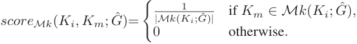

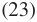

5) To predict future key-steps for _Ki_ , the future score for a key-step _Kf_ is calculated as follows: 

_scoreFk_ ( _Ki, Kf_ ; _G_ˆ ) = 

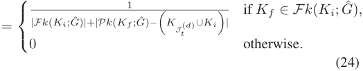

Here, _Fk_ ( _Ki_ ; _G_ˆ ) is the set of successor for the current key-step _Ki_ taken from the task graph _G_ˆ , _Pk_ ( _Ki_ ; _G_ˆ ) is the set of the 

_∪_ pre-conditions for _Ki_ taken from the task graph _G_ˆ , and ( _KJ_ ( _t d_ ) _Ki_ ) is the set of observed key-steps including the current keystep _Ki_ . The score incorporates both the number of future steps and unmet pre-conditions to balance the prediction scores. The scores are then normalized. 

_5) Llama-3.1-405B-Instruct:_ For task graph generated using Llama-3.1-405B-Instruct [44], only binary adjacency matrices are available, thus we used the same approaches outlined in previous section for MSG2 to perform procedure understanding. The key distinction is that we queried the model regarding optional key-steps and used its responses to determine when a key-step should be classified as optional.7 

_6) Results:_ Table V reports the results of the compared methods on the Ego-Exo4D [5] procedure understanding benchmark. For instance-level supervision, results are limited to the validation set due to the absence of ground-truth annotations in the test set, a limitation intentionally introduced by the authors as part of the challenge design. Our methods achieve significant improvements with performance gains of up to +0.76%, +16.61%, +11.33%, +4.59%, and +10.08% for identifying Previous Keysteps, Optional Keysteps, Procedural Mistakes, Missing Keysteps, and Future Keysteps, respectively in the validation set. Comparing DO and TGT under instance-level supervision, DO achieves superior performance in identifying Previous Keysteps (82.23 vs. 81.77), and Procedural Mistakes (84.52 vs. 78.83). Conversely, TGT excels in detecting Optional Keysteps (75.56 vs. 74.52), Missing Keysteps (88.88 vs. 87.23) and Future Keysteps (73.56 vs. 73.32). These contrasting results can be attributed to the models’ differing strengths: TGT’s ability to generate more generalizable graphs enhances its effectiveness in predicting optional, missing, and future actions, while DO has an advantage in tasks requiring more Procedure-specific representations. Our methods exhibit notable performance gains even under procedure-level supervision, achieving improvements of up to +4.61%, +0.10%, +5.02%, +8.62%, and +15.16% in identifying Previous Keysteps, Optional Keysteps, Procedural 

> 7See section _Llama-3.1-405B-Instruct Prompts_ of the supplementary material for more details.

> Original page for checking 1 unresolved font glyphs.

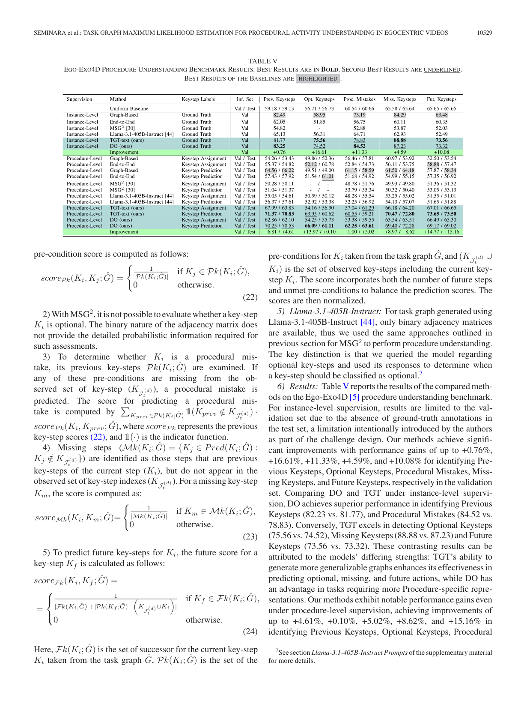

<!-- Page 13 -->

10530 

IEEE TRANSACTIONS ON PATTERN ANALYSIS AND MACHINE INTELLIGENCE, VOL. 48, NO. 9, SEPTEMBER 2026 

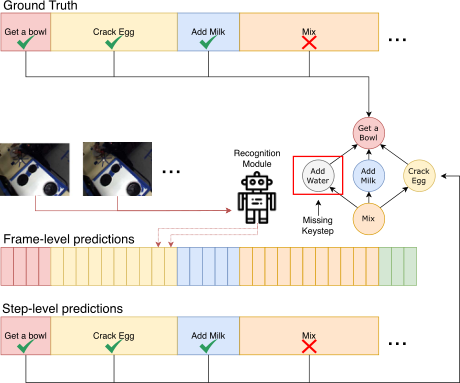

Fig. 9. Framework used for online mistake detection. The upper section presents how our framework works when ground truth action sequences are used as input. The lower section shows how our framework works when predicted actions from an online recognition module are used as input. In the example, “Mix” is recognized as a mistake because the precondition “Add Water” is not satisfied. 

Mistakes, Missing Keysteps, and Future Keysteps, respectively. These results are achieved by leveraging Keystep Prediction as pseudo-labels, which has proven to be the most effective approach for generating accurate annotations. In this context, the performance patterns of DO and TGT remain consistent with those observed under instance-level supervision. Specifically, DO outperforms in detecting Procedural Mistakes (63.61 vs. 59.21), while TGT achieves higher scores in identifying Missing Keysteps (72.80 vs. 72.28) and Future Keysteps (73.50 vs. 69.02). This trend mirrors the instance-level results but reveals marginal differences in the detection of Optional Keysteps (61.11 for DO vs. 60.62 for TGT) and Previous Keysteps (70.86 for TGT vs. 70.53 for DO), likely due to noise introduced during the recognition phase. 

## _E. Online Mistake Detection_ 

We now show how the proposed representation can tackle the downstream task of online mistake detection. We apply the second approach described in Section III-C to handle repetitions to generate task graphs.8 

_1) Problem Setup:_ We follow the PREGO benchmark [11] based on the Assembly101-O and EPIC-Tent-O datasets. In this benchmark, models are tasked to perform online action detection from procedural egocentric videos. To evaluate the usefulness of task graphs on this downstream task, we design a system which flags the current action as a mistake if its pre-conditions in the predicted graph do not appear in previously observed actions (see Fig. 9). Given a video segment _si_ and its preceding key-step history _S_ : _i−_ 1 = _{s_ 1 _, . . . , si−_ 1 _}_ , our framework determines whether the current segment _si_ constitutes a mistake. We conduct experiments in two configurations: (1) using ground truth action sequences as input, and (2) leveraging an action 

recognition module to predict the actions, which are then fed into our framework. For both experimental setups the binary task graph obtained after post-processing _G_ˆ = ( _K_ˆ _, A_ˆ ) is used to infer whether _si_ is a mistake as illustrated in Fig. 9. Specifically, given the ground truth or predicted key-step _Ki_ associated to current segment _si_ , the task graph is employed to verify whether all the pre-conditions of the current key-step _Pk_ ( _Ki_ ; _G_ˆ ) = _{Kx ∈ Pred_ ( _Ki_ ; _G_ˆ ) _}_ have been satisfied in the past, meaning that they mustexistinthesetofpreviouslyexecutedkey-steps _KJ_ ( _t d_ ) .This validation process is formalized as follows: 

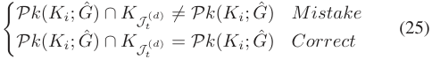

_2) Compared Methods:_ We compare our approach against the PREGO model introduced in [11], which identifies mistakes by comparing the currently observed action with a future action predicted by a forecasting module. It is important to highlight that PREGO relies on an implicit representation of the procedure (via the forecasting module), while our approach utilizes an explicit task graph representation, learned using the proposed framework. We also compare our approach with respect to baselines based on all graph generation approaches (see Section IV-B4) to evaluate the impact of accurately predicted graphs on downstream performance. For all evaluated methods, we present results based on both ground-truth action segments and action sequences predicted by a MiniRoad [48] instance, a state-of-the-art online action detection module trained on each target dataset. 

_3) Results:_ The results presented in Table VI underscore the effectiveness of the learned task graphs for the downstream application of online mistake detection. The proposed methods demonstrate substantial improvements over prior methods, achieving increases of +19 _._ 8 and +6 _._ 4 in average _F_ 1 score on the Assembly101-O and EPIC-Tent-O datasets, respectively, when predictions are made using ground-truth action sequences. While TGT ranks as the second-best performer on Assembly101-O, it outperforms other methods on EPIC-Tent-O, achieving an average _F_ 1 score of 64.1 compared to 58.3. This performance discrepancy can be attributed to the nature of the action annotations in the two datasets. Indeed, key-step names in EPIC-Tent (e.g., “Place Vent Cover”, “Open Stake Bag”, or “Spread Tent”) are more descriptive and distinctive than those in Assembly101 (e.g., “attach cabin”, “attach interior”, or “screw chassis”). This highlights the versatility of the proposed learning framework, which can operate effectively in abstract, symbolic environments with the DO approach, while also leveraging semantics with TGT when advantageous. Notably, the third-best performing methods are graph-based approaches, with MSG2 achieving an average _F_ 1 score of 56.1 on Assembly101-O, while the simpler Count-Based approach obtaining an average _F_ 1 score of 57.7 on EPIC-Tent-O. In comparison, the PREGO model, which relies on implicit representations, yields significantly lower average _F_ 1 scores of 39.4 and 32.1 on Assembly101-O and EPIC-Tent-O, respectively. These results highlight the advantages of explicit graph-based representations for mistake detection over implicit approaches like PREGO. Breaking down performance into correct and mistake _F_ 1 scores 

> 8See section _Details on Online Mistake Detection_ of the supplementary material for more details.

<!-- Page 14 -->

10531 

SEMINARA et al.: TASK GRAPH MAXIMUM LIKELIHOOD ESTIMATION FOR PROCEDURAL ACTIVITY UNDERSTANDING IN EGOCENTRIC VIDEOS 

TABLE VI 

ONLINE MISTAKE DETECTION RESULTS. RESULTS OBTAINED WITH GROUND TRUTH ACTION SEQUENCES ARE DENOTED WITH_∗_ , WHILE RESULTS OBTAINED ON PREDICTED ACTION SEQUENCES ARE DENOTED WITH+ . 

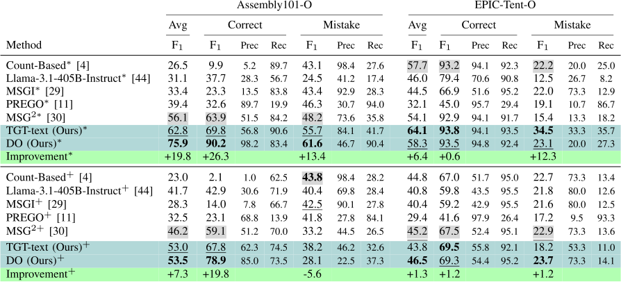

reveals some degree of unbalance of our approaches and the main competitors (MSG2 and Count-Based) towards identifying correct actions rather than mistakes. This suggests that graphbased representations may detect spurious pre-conditions, likely due to the limited number of demonstrations in the videos. Conversely, the implicit PREGO model exhibits a tendency to skew toward detecting mistakes. Further examination of precision and recall values provides insight into the sources of performance discrepancies. For instance, the Count-Based method shows a significant imbalance in Assembly101-O, achieving a high recall of 89.7, but an extremely low precision of 5.2 for predicting correct segments. In contrast, the proposed approach obtains balanced precision and recall values in detecting correct segments in Assembly101-O (98.2/83.4) and EPIC-Tent-O (94.1/93.5), and detecting mistakes in EPIC-Tent-O (33.3/35.7), while the prediction of mistakes on Assembly101-O is more skewed (46.7/90.4). Results based on action sequences predicted from videos (bottom part of Table VI) underscore the difficulty of handling noisy action sequences (see ablation study in Section IV-F3). While the explicit task graph representation may not accurately reflect the predicted noisy action sequences, our methods still achieve notable gains over prior approaches, with improvements of +7 _._ 3 and +1 _._ 3 in average _F_ 1 scores for Assembly101-O and EPIC-Tent-O, respectively. Interestingly, the best-performing competitors remain graph-based methods, such as _MSG_2 and the Count-Based approach, which demonstrate considerable advantages over the implicit representation used by the PREGO model. Indeed, the DO method achieves an average _F_ 1 score of 53.5 and 46.5in Assembly101-O and EPIC-tent-O, respectively, significantly outperforming PREGO’s scores of 32.5 and 29.4. Also, in this case, we observe that graph-based methods tend to be skewed towards detectingcorrect actionsequences. Inthis context, while the TGT model achieves competitive overall performance, its _F_ 1 score for mistake detection is limited to 38.2, trailing the Count-Based approach by 5.6 points on Assembly101-O. In 

contrast, the count-based method only achieves a _F_ 1 score of 2.1 when predicting correct segments. 

_4) Qualitative Results:_ Fig. 10 shows qualitative examples of success and failure cases in online mistake detection on EPIC-Tent-O. In the successful example (left), the model correctly identifies a mistake: the current key-step “Pickup/Open Stakebag” is flagged because the required precondition “Pickup/Place Ventcover” is not present among the past key-steps. This illustrates how the learned activity graph enforces procedural dependencies and supports reliable mistake detection. 

The failure example (right) highlights an important limitation. The model erroneously predicts a mistake for the key-step “Pickup/Open Supportbag” due to an incorrect pre-condition inferredbetweenthisactionand“SpreadTent.”Thisdependency appears to arise from their frequent co-occurrence in the training data, leading the model to incorrectly treat the relationship as causal. Such cases reveal that, while the learned graphs effectively capture many procedural structures, they can still be influenced by statistical biases inherent in the data. 

These examples underscore both the strengths and the current limitations of our approach: the framework can successfully identify missing pre-conditions when they are correctly encoded in the learned graph, but remains sensitive to spurious correlations. Addressing this challenge represents an important direction for future work. 

## _F. Ablation Studies_ 

In this section, we first analyze the impact of different _β_ values (see (11)) on the performance of the Direct Optimization (DO) method (Section IV-F1). We then evaluate the effectiveness of the Distinctiveness Cross-Entropy Loss (DCEL) in improving task graph generation with TGT trained using text embeddings, highlighting its dataset-dependent impact (Section IV-F2). Finally, we investigate the role of action recognition accuracy in

<!-- Page 15 -->

10532 

IEEE TRANSACTIONS ON PATTERN ANALYSIS AND MACHINE INTELLIGENCE, VOL. 48, NO. 9, SEPTEMBER 2026 

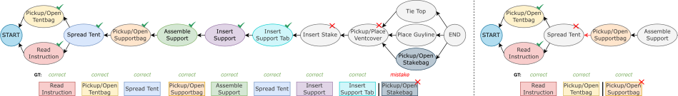

Fig. 10. A success (left) and failure (right) case on EPIC-Tent-O. Past key-steps’ colors match nodes’ colors. On the left, the current key-step “Pickup/Open Stakebag” is correctly evaluated as a mistake because the step “Pickup/Place Ventcover” is a precondition of the current key-step, but it is not included among the previous key-steps. On the right, “Pickup/Open Supportbag” is incorrectly evaluated as mistake because the step “Spread Tent” is precondition of the current key-step, but it is not included among the previous key-steps. This is due to the fact that our method wrongly predicted “Spread Tent” as a pre-condition of “Pickup/Open Supportbag”, probably due to the two actions often occurring in this order. 

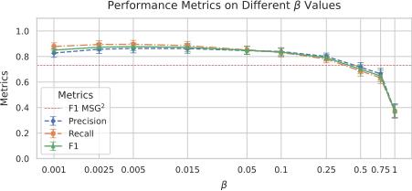

Fig. 11. Performance metrics on different _β_ values using Direct Optimization (DO) on CaptainCook4D. The dashed line represents the best-performing method among the competitors on this dataset. 

TABLE VII 

(FIRST ROW) EFFECTIVENESS OF THE DISTINCTIVENESS CROSS-ENTROPY LOSS (DCEL). (SECOND ROW) AVERAGE ACCURACY SCORES OF THE SIMILARITY MATRICES GENERATED FROM THE TEXTUAL EMBEDDINGS ACROSS DIFFERENT SCENARIOS IN THE CONSIDERED DATASETS. 

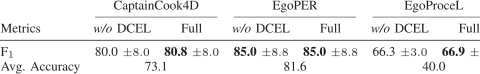

online mistake detection by simulating controlled noise scenarios (Section IV-F3). 

_1) Performance Metrics on Different β Values:_ Fig. 11 presents performance metrics across various _β_ values for the Direct Optimization (DO) method on the CaptainCook4D [8] dataset. The plot includes a comparison with the best performing competitor (the red dotted line), highlighting the range of _β_ values where DO outperforms the leading alternative. The experiments on EgoPER [9] and EgoProceL [10] are reported in the supplementary material and reveal similar behaviour. Based on these results, setting the _β_ value to 0.005 emerges as a consistently effective choice for experiments utilizing the Direct Optimization (DO) approach, even if results remain stable for a range of choices of _β_ values. 

_2) Effectiveness of the Distinctiveness Cross-Entropy Loss (DCEL) in TGT:_ In the first row of the Table VII, we evaluate the impact of the DCEL on the TGT model’s performance across the CaptainCook4D [8], EgoPER [9], and EgoProceL [10] datasets. Comparisons are made between TGT with and without the DCEL component. For CaptainCook4D (columns 1-2 of the Table VII),incorporatingDCELyieldssmallimprovementswith 

gains of +0 _._ 8 in F1 score. Similarly, in EgoProceL (columns 5-6 of the Table VII), the inclusion of DCEL leads to modest but measurable increases in F1 score (+0 _._ 6). In contrast, in EgoPER (columns 3-4 of the Table VII), no performance difference is observed considering or not DCEL, suggesting that its contribution is dataset-dependent. To investigate this, we report in the second row of the Table VII the average accuracy scores of the similarity matrices generated from the textual embeddings across different scenarios in the considered datasets. The high similarity average accuracy in EgoPER (81.6) indicates that the dataset inherently supports an effective distinction between actions, reducing the need for DCEL to improve performance. In contrast, lower similarity average accuracy in CaptainCook4D (73.1) and EgoProceL (40.0) underscores the added value of DCEL in these datasets, where the task graph requires more explicit learning of distinctive features. These findings suggest that the effectiveness of DCEL is closely tied to the inherent distinctiveness of action representations within each dataset. While DCEL proves crucial in datasets with less distinctive action embeddings, it has limited impact in scenarios where the underlying action representations are already well-separated. 

_3) Role of Action Recognition Accuracy in Online Mistake Detection and Importance of Dense Action Keysteps:_ Table VI shows that our model works even in the presence of imperfect predictions. To investigate the effect of noise, we conducted an analysis based on the controlled perturbation of ground truth action sequences, with the aim of simulating noise in the action detection process. At inference, we perturbed each key-step with a probability _p_ (the “perturbation rate”), with three kinds of perturbations: insert (inserting a new key-step with a random action class), delete (deleting a key-step), or replace (randomly changing the class of a key-step). For each prediction, we perform a replace with probability _p_ on the current key-step, then for each previous key-step we perform either a replace, delete or insert with probability _p_ . The results presented in Fig. 12 show how our system is significantly impacted by the quality of the action recognition module, thus failing to detect an actioncanresultinincorrectlysignalingamissingpre-condition, while false positives in action detection may prevent the system from identifying actual mistakes. Advancements in online action recognition technology will be critical to improving the robustness and reliability of the proposed method as well as procedure understanding in general.

<!-- Page 16 -->

10533 

SEMINARA et al.: TASK GRAPH MAXIMUM LIKELIHOOD ESTIMATION FOR PROCEDURAL ACTIVITY UNDERSTANDING IN EGOCENTRIC VIDEOS 

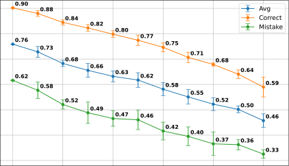

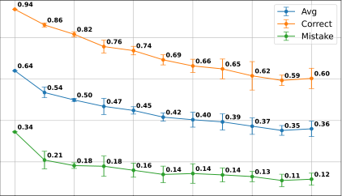

Fig. 12. To further investigate the effect of noise, we conducted an analysis based on the controlled perturbation of ground truth action sequences, with the aim to simulate noise in the action detection process. At inference, we perturbed each key-step with a probability _p_ (the “perturbation rate”), with three kinds of perturbations: insert (inserting a new key-step with a random action class), delete (deleting a key-step), or replace (randomly changing the class of a key-step). The plots show the trend of the F1 score (Average, Correct, and Mistake) as the perturbation rate increases in the case of Assembly101-O (left) and EPIC-Tent-O (right). Results suggest that the proposed approach can still bring benefits even in the presence of imperfect action detections, with the average F1 score dropping down 10 _−_ 15 points with a moderate noise level of 20%. 

Beyond the impact of noise in online action recognition, these experiments also provide insight into how our method behaves when some key-steps are missing from the action sequence. As shown in Fig. 12, the “delete” perturbation directly simulates missing annotations, since key-steps are removed from the sequence before computing the TGML. Despite this challenging setting, our model preserves a meaningful structure of the underlying task graph even at moderate perturbation rates, indicating that TGML retains a degree of robustness to incomplete sequences. However, the usage of sparsely annotated datasets remains a limitation. A promising direction for future work is to integrate a preliminary step that infers intermediate key-steps from video features, following, for example, the Keystep Assignment strategy adopted in Ego-Exo4D [5]. Such extensions could enable more reliable graph learning in scenarios where only partial procedural information is available. 

## V. CONCLUSION 

We addressed the challenge of learning task graph representations of procedures from video demonstrations. By framing task graph learning as a maximum likelihood estimation problem, we introduced a new differentiable loss function that enables direct optimization of the adjacency matrix via gradient descent and can be integrated into complex neural network architectures. Experiments conducted on six datasets demonstrate that the proposed approach not only learns accurate task graphs, but also enhances video understanding capabilities and improves performance on the downstream task of online mistake detection, surpassing state-of-the-art methods. Furthermore, task graphs generated using our approach achieve top performance in the Ego-Exo4D procedure understanding benchmark. The implementation of our methods is publicly available at https: //github.com/fpv-iplab/Differentiable-Task-Graph-Learning. 

## REFERENCES 

- [1] T. Kanade and M. Hebert, “First-person vision,” _Proc. IEEE_ , vol. 100, no. 8, pp. 2442–2453, Aug. 2012. 

- [2] C. Plizzari et al., “An outlook into the future of egocentric vision,” _Int. J. Comput. Vis._ , vol. 132, pp. 4880–4936, 2023. 

- [3] N. Dvornik et al., “Graph2Vid: Flow graph to video grounding for weaklysupervised multi-step localization,” in _Proc. Eur. Conf. Comput. Vis._ , 2022, pp. 319–335. 

- [4] K. Ashutosh, S. K. Ramakrishnan, T. Afouras, and K. Grauman, “Videomined task graphs for keystep recognition in instructional videos,” in _Proc. Adv. Neural Inf. Process. Syst._ , 2024, pp. 67833–67846. 

- [5] K. Grauman et al., “Ego-Exo4D: Understanding skilled human activity from first-and third-person perspectives,” in _Proc. IEEE/CVF Conf. Comput. Vis. Pattern Recognit._ , 2024, pp. 19383–19400. 

- [6] H. Zhou, R. Martı´n-Martı´n, M. Kapadia, S. Savarese, and J. C. Niebles, “Procedure-aware pretraining for instructional video understanding,” in _Proc. IEEE/CVF Conf. Comput. Vis. Pattern Recognit._ , 2023, pp. 10727–10738. 

- [7] L. Seminara, G. M. Farinella, and A. Furnari, “Differentiable task graph learning: Procedural activity representation and online mistake detection from egocentric videos,” in _Proc. 38th Annu. Conf. Neural Inf. Process. Syst._ , 2024, pp. 59373–59407. [Online]. Available: https://openreview.net/ forum?id=2HvgvB4aWq 

- [8] R. Peddi et al., “CaptainCook4D: A dataset for understanding errors in procedural activities,” in _Proc. 38ht Conf. Neural Inf. Process. Syst. Datasets Benchmarks Track_ , 2024, pp. 135626–135679. [Online]. Available: https://openreview.net/forum?id=YFUp7zMrM9 

- [9] S.-P. Lee, Z. Lu, Z. Zhang, M. Hoai, and E. Elhamifar, “Error detection in egocentric procedural task videos,” in _Proc. IEEE/CVF Conf. Comput. Vis. Pattern Recognit._ , 2024, pp. 18655–18666. 

- [10] S. Bansal, C. Arora, and C. Jawahar, “My view is the best view: Procedure learning from egocentric videos,” in _Proc. Eur. Conf. Comput. Vis._ , 2022, pp. 657–675. 

- [11] A. Flaborea et al., “PREGO: Online mistake detection in procedural egocentric videos,” in _Proc. IEEE/CVF Conf. Comput. Vis. Pattern Recognit._ , 2024, pp. 18483–18492. 

- [12] F. Sener et al., “Assembly101: A large-scale multi-view video dataset for understanding procedural activities,” in _Proc. IEEE/CVF Conf. Comput. Vis. Pattern Recognit._ , 2022, pp. 21096–21106. 

- [13] Y. Jang, B. Sullivan, C. Ludwig, I. Gilchrist, D. Damen, and W. MayolCuevas, “EPIC-Tent: An egocentric video dataset for camping tent assembly,” in _Proc. IEEE/CVF Int. Conf. Comput. Vis. Workshops_ , 2019, pp. 4461–4469. 

- [14] L. Zhou, C. Xu, and J. Corso, “Towards automatic learning of procedures from web instructional videos,” in _Proc. AAAI Conf. Artif. Intell._ , 2018, pp. 7590–7598. 

- [15] D. Zhukov, J.-B. Alayrac, R. G. Cinbis, D. Fouhey, I. Laptev, and J. Sivic, “Cross-task weakly supervised learning from instructional videos,” in _Proc. IEEE/CVF Conf. Comput. Vis. Pattern Recognit._ , 2019, pp. 3537–3545. 

- [16] E. Elhamifar and D. Huynh, “Self-supervised multi-task procedure learning from instructional videos,” in _Proc. 16th Eur. Conf. Comput. Vis._ , Glasgow, U.K., 2020, pp. 557–573.

<!-- Page 17 -->

10534 

IEEE TRANSACTIONS ON PATTERN ANALYSIS AND MACHINE INTELLIGENCE, VOL. 48, NO. 9, SEPTEMBER 2026 

- [17] S. Bansal, C. Arora, and C. Jawahar, “United we stand, divided we fall: Unitygraph for unsupervised procedure learning from videos,” in _Proc. IEEE/CVF Winter Conf. Appl. Comput. Vis._ , 2024, pp. 6495–6505. 

- [18] N. Dvornik, I. Hadji, R. Zhang, K. G. Derpanis, R. P. Wildes, and A. D. Jepson, “StepFormer: Self-supervised step discovery and localization in instructional videos,” in _Proc. IEEE/CVF Conf. Comput. Vis. Pattern Recognit._ , 2023, pp. 18952–18961. 

- [19] Z. Lu and E. Elhamifar, “Set-supervised action learning in procedural task videos via pairwise order consistency,” in _Proc. IEEE/CVF Conf. Comput. Vis. Pattern Recognit._ , 2022, pp. 19903–19913. 

- [20] A. Miech, J.-B. Alayrac, L. Smaira, I. Laptev, J. Sivic, and A. Zisserman, “End-to-end learning of visual representations from uncurated instructional videos,” in _Proc. IEEE/CVF Conf. Comput. Vis. Pattern Recognit._ , 2020, pp. 9879–9889. 

- [21] M.Narasimhan,L.Yu,S.Bell,N.Zhang,andT.Darrell,“Learningandverificationoftaskstructureininstructionalvideos,”2023, _arXiv:2303.13519_ . 

- [22] R. Hazra, B. Chen, A. Rai, N. Kamra, and R. Desai, “EgoTV: Egocentric task verification from natural language task descriptions,” in _Proc. IEEE/CVF Int. Conf. Comput. Vis._ , 2023, pp. 15417–15429. 

- [23] X. Wang et al., “HoloAssist: An egocentric human interaction dataset for interactive AI assistants in the real world,” in _Proc. IEEE/CVF Int. Conf. Comput. Vis._ , 2023, pp. 20270–20281. 

- [24] R. Ghoddoosian, I. Dwivedi, N. Agarwal, and B. Dariush, “Weaklysupervised action segmentation and unseen error detection in anomalous instructional videos,” in _Proc. IEEE/CVF Int. Conf. Comput. Vis._ , 2023, pp. 10128–10138. 

- [25] G. Ding, F. Sener, S. Ma, and A. Yao, “Spatial and temporal beliefs for mistake detection in assembly tasks,” _Comput. Vis. Image Understanding_ , vol. 254, 2025, Art. no. 104338, doi: 10.1016/j.cviu.2025.104338. 

- [26] K. R. Y. Nagasinghe, H. Zhou, M. Gunawardhana, M. R. Min, D. Harari, and M. H. Khan, “Why not use your textbook? Knowledge-enhanced procedure planning of instructional videos,” in _Proc. IEEE/CVF Conf. Comput. Vis. Pattern Recognit._ , 2024, pp. 18816–18826. 

- [27] Y. Shen and E. Elhamifar, “Progress-aware online action segmentation for egocentric procedural task videos,” in _Proc. IEEE/CVF Conf. Comput. Vis. Pattern Recognit._ , 2024, pp. 18186–18197. 

- [28] Y. Zhong, L. Yu, Y. Bai, S. Li, X. Yan, and Y. Li, “Learning procedureaware video representation from instructional videos and their narrations,” in _Proc. IEEE/CVF Conf. Comput. Vis. Pattern Recognit._ , 2023, pp. 14825–14835. 

- [29] S. Sohn, H. Woo, J. Choi, and H. Lee, “Meta reinforcement learning with autonomous inference of subtask dependencies,” in _Proc. Int. Conf. Learn. Representations_ , 2020. [Online]. Available: https://openreview.net/ forum?id=HkgsWxrtPB 

- [30] Y. Jang, S. Sohn, L. Logeswaran, T. Luo, M. Lee, and H. Lee, “Multimodal subtask graph generation from instructional videos,” in _Proc. ICLR Workshop Multimodal Representation Learn.: Perks Pitfalls_ , 2023. [Online]. Available: https://openreview.net/forum?id=zJhWyDcmgNs 

- [31] S. S. Skiena, _The Algorithm Design Manual_ , vol. 2. Berlin, Germany: Springer, 1998. 

- [32] P. Schumacher, M. Minor, K. Walter, and R. Bergmann, “Extraction of procedural knowledge from the web: A comparison of two workflow extraction approaches,” in _Proc. 21st Int. Conf. World Wide Web_ , 2012, pp. 739–747. 

- [33] C. Kiddon, G. T. Ponnuraj, L. Zettlemoyer, and Y. Choi, “Mise en place: Unsupervised interpretation of instructional recipes,” in _Proc. Conf. Empirical Methods Natural Lang. Process._ , 2015, pp. 982–992. 

- [34] K. Sakaguchi, C. Bhagavatula, R. Le Bras, N. Tandon, P. Clark, and Y. Choi, “proScript: Partially ordered scripts generation,” in _Proc. Findings Assoc. Comput. Linguist._ , 2021, pp. 2138–2149. [Online]. Available: https: //aclanthology.org/2021.findings-emnlp.184 

- [35] L. Donatelli, T. Schmidt, D. Biswas, A. Köhn, F. Zhai, and A. Koller, “Aligning actions across recipe graphs,” in _Proc. Conf. Empirical Methods Natural Lang. Process._ , 2021, pp. 6930–6942. 

- [36] Y.Yamakata,S.Mori,andJ.A.Carroll,“Englishrecipeflowgraphcorpus,” in _Proc. 12th Lang. Resour. Eval. Conf._ , 2020, pp. 5187–5194. 

- [37] P. S. Marquis de Laplace, _Théorie Analytique Des Probabilités_ , vol. 7. Edmond, OK, USA: Courcier, 1820. 

- [38] A. V. D. Oord, Y. Li, and O. Vinyals, “Representation learning with contrastive predictive coding,” CoRR abs/1807.03748, 2018. 

- [39] A. Radford et al., “Learning transferable visual models from natural languagesupervision,”in _Proc.Int.Conf.Mach.Learn._ ,2021,pp.8748–8763. 

- [40] A. Vaswani et al., “Attention is all you need,” in _Proc. Adv. Neural Inf. Process. Syst._ , 2017, pp. 6000–6010. 

- [41] F. De la Torre et al., “Guide to the carnegie mellon university multimodal activity (CMU-MMAC) database,” 2009. [Online]. Available: https: //publications.ri.cmu.edu/storage/publications/pub_files/pub4/de_la_ torre_frade_fernando_2008_1/de_la_torre_frade_fernando_2008_1.pdf 

- [42] Y. Li, M. Liu, and J. M. Rehg, “In the eye of beholder: Joint learning of gaze and actions in first person video,” in _Proc. Eur. Conf. Comput. Vis._ , 2018, pp. 619–635. 

- [43] F. Ragusa, A. Furnari, S. Livatino, and G. M. Farinella, “The MECCANO dataset: Understanding human-object interactions from egocentric videos in an industrial-like domain,” in _Proc. IEEE/CVF Winter Conf. Appl. Comput. Vis._ , 2021, pp. 1569–1578. 

- [44] A. Dubey et al., “The LLAMA 3 herd of models,” 2024, _arXiv:2407.21783_ . 

- [45] S. Pramanick et al., “EgoVLPv2: Egocentric video-language pre-training with fusion in the backbone,” in _Proc. IEEE/CVF Int. Conf. Comput. Vis._ , 2023, pp. 5285–5297. 

- [46] Y. Zhou and T. L. Berg, “Temporal perception and prediction in ego-centric video,” in _Proc. IEEE Int. Conf. Comput. Vis._ , 2015, pp. 4498–4506. 

- [47] E. Dessalene, M. Maynord, C. Devaraj, C. Fermuller, and Y. Aloimonos, “Egocentric object manipulation graphs,” 2020, _arXiv:2006.03201_ . 

- [48] J. An, H. Kang, S. H. Han, M.-H. Yang, and S. J. Kim, “MiniROAD: Minimal RNN framework for online action detection,” in _Proc. IEEE/CVF Int. Conf. Comput. Vis._ , 2023, pp. 10341–10350. 

**Luigi Seminara** (Graduate Student Member, IEEE) received the master’s degree in computer science, in 2023 from the University of Catania where he is currently working toward the PhD degree. His research focuses on computer vision and machine learning. 

**Giovanni Maria Farinella** is currently a full professor with the University of Catania, Italy. His research interests include the fields of computer vision and machine learning with focus on egocentric vision. He is part of the EPIC-KITCHENS and EGO4D team. He is an associate editor for international journals, such as _IEEE Transactions on Pattern Analysis and Machine Intelligence_ , _Pattern Recognition_ , and _International Journal of Computer Vision_ . He has served as area chair for CVPR, ICCV, and ECCV. He has been Program Chair of ECCV 2022. He founded and currently directs the International Computer Vision Summer School. He was awarded the PAMI Mark Everingham Prize, in 2017 and the Intel’s 2022 Outstanding Researcher Award. 

**Antonino Furnari** (Senior Member, IEEE) received the PhD degree in mathematics and computer science from the University of Catania, Italy, in 2017. He is currently an associate professor with the University of Catania.HeispartoftheEPIC-KITCHENS,EGO4D, and Ego-Exo4D teams. His research interests include how intelligent systems can perceive, understand, and anticipate human actions and interactions directly from an embodied, egocentric viewpoint, and to enable assistive technologies on wearable devices that provide direct support to users. He is an associate editor for _IEEE Transactions on Pattern Analysis and Machine Intelligence_ and _Pattern Recognition_ . He was the area chair of CVPR, ICCV, ECCV, NeurIPS, and ICML. 

Open Access funding provided by ‘Università degli Studi di Catania’ within the CRUI CARE Agreement
