# TechCoach Towards Technical-Point-Aware Descriptive Action Coaching

[Original PDF](../TechCoach%20Towards%20Technical-Point-Aware%20Descriptive%20Action%20Coaching.pdf)

Pages: 9

> Automatically converted from PDF. Check the original for exact equations, symbols, table alignment, and figure details.

<!-- Page 1 -->

The Fortieth AAAI Conference on Artificial Intelligence (AAAI-26) 

# **TechCoach: Towards Technical-Point-Aware Descriptive Action Coaching** 

## **Yuan-Ming Li**1,3* **, An-Lan Wang**1,3,* **, Ling-An Zeng**1,3 **, Kun-Yu Lin**1,3 **, Yu-Ming Tang**1,3 **, Wei-Shi Zheng**1,2,3† 

1Sun Yat-sen University, China 

2Peng Cheng Laboratory, China 

3Key Laboratory of Machine Intelligence and Advanced Computing, Ministry of Education, China 

_{_ liym266, wanganlan _}_ @mail2.sysu.edu.cn; wszheng@ieee.org 

#### **Abstract** 

To guide a learner in mastering action skills, it is crucial for a coach to 1) reason through the learner’s action execution and technical points (TechPoints), and 2) provide detailed, comprehensible feedback on what is done well and what can be improved. However, existing score-based action assessment methods are still far from reaching this practical scenario. To bridge this gap, we investigate a new task termed Descriptive Action Coaching (DescCoach) which requires the model to provide detailed commentary on what is done well and what can be improved beyond a simple quality score for action execution. To this end, we first build a new dataset named EE4D-DescCoach. Through an automatic annotation pipeline, our dataset goes beyond the existing action assessment datasets by providing detailed TechPointlevel commentary. Furthermore, we propose TechCoach, a new framework that explicitly incorporates TechPoint-level reasoning into the DescCoach process. The central to our method lies in the Context-aware TechPoint Reasoner, which enables TechCoach to learn TechPoint-related quality representation by querying visual context under the supervision of TechPoint-level coaching commentary. By leveraging the visual context and the TechPoint-related quality representation, a unified TechPoint-aware Action Assessor is then employed to provide the overall coaching commentary together with the quality score. Combining all of these, we establish a new benchmark for DescCoach and evaluate the effectiveness of our method through extensive experiments. 

## **1 Introduction** 

Understanding how well an action is performed, also known as Action Quality Assessment (AQA), has recently attached growing attention due to its potential applications (Yin et al. 2025; Zhou et al. 2024a). One of the most promising potentials of AQA is to build an AI action coach, guiding an action learner toward gradually mastering the skill. While impressive progress has been achieved, current AQA methods are still far from real coaching and action-guiding scenarios, especially in their functionality and reasoning process: **_- Functionality_** . In practical action-guiding scenarios, a coach provides detailed and understandable feedback on 

> *These authors contributed equally. 

> †Corresponding author. 

Copyright © 2026, Association for the Advancement of Artificial Intelligence (www.aaai.org). All rights reserved. 

_what is done well_ and _what can be improved_ so that the learner can be fully aware of the execution details and master the skills (see the upper part of Fig.1). However, most existing works pose AQA as a score-regression (Parmar et al. 2017) or pair-ranking (Doughty et al. 2019) problem, limiting the applicability of the models to more practical fields. **_- Reasoning process_** . To provide precise feedback, a coach will keep the technical points (TechPoints) in mind ( _e.g._ , _The player should extend the arms fully in Reverse Layup_ ) and determine the TechPoint-level action quality from action execution (see the lower part of Fig.1). However, few existing works have incorporated such a TechPoint-level reasoning process into AQA. While recent works (Wang et al. 2024a; Li et al. 2024b) propose to address this issue by recognizing the existence of TechPoint-level mistakes, such a paradigm still limits deeper exploration of the connections between the action execution and the TechPoint-level action quality ( _i.e._ , detailed strength/weakness on a TechPoint). 

To bridge the gap between the field of AQA and realworld action coaching scenarios, we investigate a new task, _Descriptive Action Coaching (DescCoach)_ , which requires the model to **provide detailed commentary on** **_what is done well_ and** **_what can be improved_ , beyond merely assigning a quality score to an action execution** . This task is challenging because to provide such a detailed commentary, the model should not only understand fine-grained action execution ( _e.g._ , _the player looks down when performing Reverse Layup_ ), but also establish explicit connections between the execution with the action quality ( _e.g._ , _it is a weakness to look down at the ball as it will miss the target_ ). 

To facilitate the studies on DescCoach, we construct EE4D-DescCoach, a new dataset that not only contains various action videos and quality scores but also features hierarchical detailed coaching commentary on both TechPoint and instance levels. Specifically, we first source action videos from the recently proposed EgoExo4D (Grauman et al. 2024) dataset. Subsequently, we design an automatic annotation pipeline to progressively obtain the general TechPoints and hierarchical coaching commentary. To our knowledge, no existing AQA dataset provides detailed TechPoint-level coaching commentary. Compared to existing datasets with score-based or binary TechPoint-level annotations (Li et al. 2024b, Matsuyama et al. 2023), we believe the TechPoint-level commentary provides more clear 

6699

<!-- Page 2 -->

|**_Action Demonstr_**|**_Coaching Commentary_** **_ation_**||
|---|---|---|
|**…** **…**|**…** **…** **_What is done well:_**The athlete sho andball placement during the layu **_What can be improved:_** However **up**, as frequent glances at the ball requires refinement …|wcases**excellent use of the backboard**,**arm extension**, p, showing strong control and angle creation. , **there's a need for improvement in keeping the head** can hinder visibility of the basket. Additionally, dribbling|
|Technical Points TechPoint-level action quality **_TechPoint-leve_**|**_Head_** **_and Eyes_**: **Keep the head up and** **_Arms_** **_and Elbows_**: **Extend the** The athlete**performs beautifully** **with the right arm extension** The athlete **needs to keep the eyes up** **more consistently**to see the basket **…** **_l Reasoning_**|**_Human-object Interaction_**: Be aware of the position The athlete has nice ball placement, **utilizing the** **backboard effectively** |
| (i.e., TechPoints)|**eyes focused on the backboard and rim** to accurately judge the distance and angle **arms fully**as they bring the ball under the basket,…|of the defenders … and**aiming to bank the ball off** **the backboard**for a successful reverse layup.|

Figure 1: **An illustration of real-world action coaching. Upper** : Given an action demonstration, a human coach provides commentary on _what is done well_ and _what can be improved_ . **Lower** : Delivering precise feedback requires reasoning at the level of TechPoints, i.e., keep the technical points ( _e.g._ , _The player should_ **_extend the arms fully ..._** ) in mind and determine the technical-point-level action quality ( _e.g._ , _The athlete_ **_performs beautifully with the right arm extension_** ) of the action. Such a reasoning process motivates us to propose our TechCoach to address Descriptive Action Coaching. 

and detailed clues for reasoning about action quality and providing instance-level coaching commentary. 

The construction of the EE4D-DescCoach dataset allows us to build **Tech** Point-Aware Descriptive Action **Coach** (TechCoach), a new DescCoach framework which explicitly incorporates TechPoint-level reasoning into the action coaching process under the supervision of TechPoint-level coaching commentary, and delivers feedback by incorporating the reasoning results and visual context. 

To this end, TechCoach includes a Context-aware TechPoint Reasoner, which queries the visual context with general TechPoints to obtain TechPoint-related quality representations. To ensure these representations carry the action quality information, a TechPoint-level alignment loss is proposed to align the representations with the TechPointlevel coaching commentary. After that, a Unified TechPointaware Action Assessor (TA2) is employed to regress the action quality score and generate overall coaching commentary. Throughout this process, a progressive action coaching attention mask guides TA2 to integrate information starting with the visual context level, followed by the TechPoint level, and ultimately the decision level ( _i.e._ , score-prediction and commentary-generation). 

Combining EE4D-DescCoach and TechCoach, we establish a new benchmark to expand the field of AQA. Extensive experiments demonstrate that: (1) Our TechCoach achieves state-of-the-art performance among the compared methods, including task-specific models and general MLLMs; (2) The Context-aware TechPoint Reasoner is a core design to enhance action quality perceiving ability and cannot be simply replaced by naive alternative solutions ( _e.g._ , replacing the TechPoint-level alignment by classifying whether the execution shows strength or weakness on each TechPoint). 

The contributions of this work can be summarized as: (1) We introduce EE4D-DescCoach, a new dataset specifically designed for Descriptive Action Coaching. The hierarchical coaching commentary, particularly at the TechPoint level, 

establishes EE4D-DescCoach as a unique resource among existing AQA datasets. (2) We develop TechCoach, a new method that effectively integrates TechPoint-level reasoning into the action coaching process through supervision from TechPoint-level coaching commentary. (3) We construct a new benchmark on DescCoach. Experiments not only validate the effectiveness of the proposed approach, but also lay the foundation for future research in this field. **Code & Data** : https://github.com/iSEE-Laboratory/TechCoach. 

## **2 Related Works** 

**Action Quality Assessment** (Xu et al. 2022; Tang et al. 2020; Yu et al. 2021; Pan et al. 2019; Xu et al. 2024; Yun et al. 2024; Zhou et al. 2024b; Xu et al. 2022; Bai et al. 2022; Xu et al. 2025; Parmar et al. 2021; zeng et al. 2024; xia et al. 2023; Xu el al. 2025; Li et al. 2024c) aims to evaluate the effectiveness of an action. Most existing works pose it as a score regression task. Despite significant progress, score regression falls short of addressing real-world coaching scenarios. MTL-AQA(Parmar et al. 2019) and NAE(Zhang et al. 2024) propose to generate commentary alongside scores, but the commentary mainly focus on _action_ and _score_ rather than skill coaching. NS-AQA(Okamoto et al. 2024) integrates multiple models with judging rules to provide formatted feedback, yet relies on complex, task-specific manual designs. Differently, we focuse on generating free-from commentary on strengths and areas for improvement, aligning closely with practical coaching needs. We construct a new dataset with hierarchical (especially the TechPoint-level) detailed coaching commentary. Furthermore, we propose a general framework that collaborates TechPoint-level reasoning into the coaching process. Unlike prior approaches relying on binary or score-based supervision to detect mistakes or apply score rubrics (Matsuyama et al. 2023; Majeedi et al. 2024; Parmar et al.2022; Li et al. 2024b; Wang et al. 2024a), TechCoach is the first to learn action quality representation under 

6700

<!-- Page 3 -->

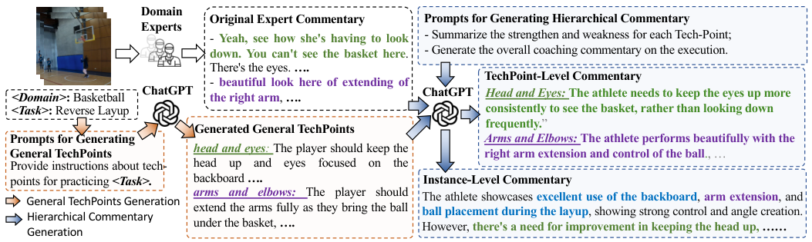

<!-- Start of picture text -->
Domain Original Expert Commentary Prompts for Generating Hierarchical Commentary Experts - Yeah, see how she's having to look - Summarize the strengthen and weakness for each Tech-Point; down. You can't see the basket here . - Generate the overall coaching commentary on the execution. There's the eyes.  …. TechPoint-Level Commentary - beautiful look here of extending of <Domain> :  Basketball ChatGPT the right arm ,  …. ChatGPT Head and Eyes:  The athlete needs to keep the eyes up more <Task> :  Reverse Layup consistently to see the basket, rather than looking down Generated General TechPoints frequently. ” Prompts for Generating  Arms and Elbows:  The athlete performs beautifully with the General TechPoints head and eyes :  The player should keep the right arm extension and control of the ball ., … Provide instructions about tech- head up and eyes focused on the points for practicing  <Task>. backboard  …. Instance-Level Commentary General TechPoints Generation arms and elbows: The player should The athlete showcases  excellent use of the backboard ,  arm extension , and Hierarchical Commentary  extend the arms fully as they bring the ball ball placement during the layup , showing strong control and angle creation. Generation under the basket,  …. However,  there's a need for improvement in keeping the head up, …… <!-- End of picture text -->

Figure 2: **An overview of the LLM-driven automatic annotation pipeline for the EE4D-DescCoach dataset.** We first prompt the LLM to generate general TechPoints for the given action task. Subsequently, we ask the LLM to summarize the TechPoint-level and instance-level commentary according to the general TechPoints and the original expert commentary. 

TechPoint-level commentary supervision. Unlike StreamVLM(Panchal et al. 2024) focusing on real-time fitness responses, we explores how TechPoints and TechPoint-level commentary can enhance reasoning. The EE4D-DescCoach dataset enables this exploration, and the ablations confirm the significance of our technical design. 

**Video Captioning** is a long-standing task that requires a model to generate a language caption with video frames as input. Early studies focus on designing stronger architectures (Lin et al. 2022; Wang et al. 2021; Aafaq et al. 2019; Shi et al. 2020; Yamazaki et al. 2023) or utilizing videolanguage pretraining (Sun et al. 2019; Luo et al. 2020; Yang et al. 2023; Alayrac et al. 2022; Seo et al. 2022) to model relationships between video and language. Recently, Multimodal Large Language Models (Lin et al. 2023; Wang et al. 2024b; Li et al. 2024a; Maaz et al. 2023; Li et al. 2023; Chen et al. 2024b) show strong generalization ability across various video-language tasks such as video content description and video question answering. However, rare exploration has been conducted on whether these models could provide coaching commentary about _what is done well_ and _what can be improved_ . In this work, we provide a new testbed for today’s video-language models and reveal that they still struggle to address such a practical scenario. Besides, we propose a new TechPoint-guided coaching framework and evaluate its effectiveness through extensive experiments. 

## **3 EE4D-DescCoach Dataset** 

### **3.1 Data Source** 

We first source data from the recently proposed EgoExo4D (Grauman et al. 2024) dataset. In addition to ego-exo action videos, EgoExo4D contains execution rating (1 to 10) and time-aligned free-form spoken commentary (e.g. “ _Yeah, see how she’s having to look down. You can’t see the basket here._ ”) by domain experts. Such characteristics make it a great starting point for studying action coaching. 

In our work, we focus on physical actions and select takes from EgoExo4D including the scenarios of _basketball_ , _soccer_ , and _bouldering_ . We then segment each take into single 

instances with a 8-second window and filter those instances without meaningful commentary. By doing so, we obtain 4843 unique video instances, spanning about 10.8 hours. 

### **3.2 Annotation Pipeline** 

By diving deeper into the expert commentary in EgoExo4D, it can be observed that: 1) The original expert commentary is highly colloquial and noisy, awaiting summarization before being used to build a coaching model. 2) The expert commentary is highly associated with the general TechPoints, making it possible to mine the relationships between the general TechPoints and final coaching commentary. 

Based on the observations, we propose an automatic annotation pipeline to obtain general TechPoints, and hierarchical coaching commentary on both TechPoint level and instance level, which is shown in Fig.2. 

**- General TechPoints Collection.** In the general coachinglearning scenario, a coach will provide several TechPoints in advance so that the skill learner can learn to follow. Considering that completing a skilled physical action always requires cooperation across multiple body parts and objects, we define a TechPoint as a language instruction on one of the seven dimensions, including six body parts ( _e.g._ , _head & eyes_ , _arms & hands_ ) and the _human-objects interaction_ . 

To obtain TechPoints for each skilled action task, we treat the LLM (GPT-4o) as a general coach. As shown in the lower left part of Fig.2, by providing the task name ( _e.g._ , _Basketball Drills - Reverse Layup_ ) and detailed instructions to the LLM, we are able to obtain the general TechPoints on the previously mentioned seven dimensions ( _e.g._ , For the dimension of “ _head & eyes_ ”, we have the TechPoint: “ _The player should keep the head up and eyes focused on the backboard and rim to accurately judge the distance and angle for the reverse layup._ ”). 

**- Hierarchical Coaching Commentary Collection.** Subsequently, we further ask the LLM to mine the relationships between the TechPoints and origin expert commentary and provide summarized hierarchical ( _i.e._ , TechPoint level and instance level) coaching commentary about **_what is done_** 

6701

<!-- Page 4 -->

|**Datasets**|**Unique** **Instances**|**Unique** **Hours**|**TechP** Exists|**oint Level Jud** Type|**gment** Num|**In** Score|**stance Level J**  Commentary|**udgment**  Coach-Score|
|---|---|---|---|---|---|---|---|---|
|**_Datasets w/o Language Annotations_**|||||||||
|FineDiving (Xu et al. 2022)|3000|3.5h|_×_|-|-|✓|_×_|-|
|Skate-IRIS (Matsuyama et al. 2023)|150|7.3h|✓|Score|1050|✓|_×_|-|
|CPR-Coach(Wanget al. 2024a)|1416|7.7h|✓|Binary|18.4k|_×_|_×_|-|
|**_Datasets w/ Language Annotations_**|||||||||
|MTL-AQA (Parmar and Morris 2019)|1412|1.7h|_×_|-|-|✓|✓|1.94|
|MTL-NAE (Zhang et al. 2024)|1412|1.7h|_×_|-|-|✓|✓|2.94|
|EgoExo-Fitness (Li et al. 2024b)|913|4.6h|✓|Binary|7.8k|✓|✓|2.37|
|EgoExo4D(Sports) (Grauman et al. 2024)|1219|16.4h|_×_|-|-|✓|✓|3.44|
|**EE4D-DescCoach(Ours)**|**4843**|**10.8h**|✓|**Commentary **|**25.1k**|✓|✓|**4.33**|

Table 1: **Comparison to related Action Assessment datasets** . Our EE4D-DescCoach dataset is the first dataset that contains hierarchical (especially TechCoach-level) detailed coaching commentary. Coach-Score: A metric that evaluates whether the provided commentary is suited for real-world coaching scenarios. 

**_well_** and **_what can be improved_** in the action execution. 

As shown in the right part of Fig.2, in this phase, LLM is asked to finish two tasks: (1) Review the general TechPoints and the original expert commentary, and then summarize the _strength_ and _weakness_ in the execution corresponding to each TechPoint. (2) Review the original expert commentary and the generated strengths and weaknesses, and then provide the overall commentary on the execution. 

To sum up, for each instance, we construct rich language annotations including the General TechPoints, TechPointlevel Commentary, and Instance-level Commentary. Moreover, for each instance we also obtain an average rating by averaging all the ratings provided by different experts. **- Quality Assurance.** After obtaining the annotations, we apply manual checking on our dataset to ensure the annotation quality. Please refer to Appendix for more details. 

**- Discussions.** In some cases, an execution could reveal both the strength and weakness aspects on one TechPoint, and some may just reveal one of them. Such a characteristic is inherited from EgoExo4D (Grauman et al. 2024). 

### **3.3 Comparison with existing datasets** 

We compare our dataset with related AQA-related datasets. As shown in Tab.1, the detailed TechPoint-level commentary allows us to distinguish our EE4D-DescCoach dataset from the other related datasets. Furthermore, we prompt GPT-4o to rate the guiding ability of instance-level commentary from 0 to 5 as the Coach-Score. As shown in the last column in Tab.1, commentary in MTL-AQA and MTL-NAE is not suit for coaching scenario as the original text mainly focuses on the action and score rather than action guiding and skill improvement. Please refer to the Appendix for more details like the prompts, the pre-defined body parts, data examples, etc. 

## **4 TechCoach** 

### **4.1 Problem Formulation** 

Given an action video _v_ , our goal is to train a model that takes the video as input and predicts an overall action quality score together with a paragraph of detailed commentary about _what is done well_ and _what can be improved_ . 

### **4.2 Overview** 

An overview of the proposed **Tech** nical-Point-aware Descriptive Action **Coach** (TechCoach) is shown in Fig.3. The key idea of TechCoach is to mimic the reasoning process of human coaches by incorporating TechPoint-level reasoning into the action coaching pipeline. Our framework consists of three parts. Firstly, given an input video _v_ , a **Visual Encoding Module** will extract the visual context embedding. After that, a **Context-aware TechPoint Reasoner** is adopted to take the visual context embedding and general technical points as input to perceive the action quality on each TechPoints and provide the TechPoint quality embeddings. Finally, a **Unified TechPoint-aware Action Assessor** is utilized to collaborate the visual context and TechPoint-aware quality embeddings, then predict the final quality score and generate coaching commentary. 

### **4.3 Visual Encoding** 

Given a video _v_ , we first divide the video into nonoverlapping video clips and extract clip-level features with a pretrained backbone. After that, inspired by TimeSformer (Bertasius et al. 2021), we utilize a Transformer-based Spatial-Temporal Context Enhancer to enhance the spatialtemporal context across the clip-level features. This process produces the visual context embeddings _fv ∈ R__T ×H×W ×D_ can be obtained, where _T_ , _H_ , _W_ , _D_ indicate the temporal, height, width, and channel size, respectively. 

### **4.4 Context-aware TechPoint Reasoner** 

To generate comprehensive coaching commentary for an action execution, an intuitive approach is to directly input the video (and the TechPoint) features into the text generator. However, without explicit modeling, such an approach is unable to effectively perceive the relationship between visual context and the TechPoints. To address this, TechCoach adopts a Context-aware TechPoint Reasoner to learn TechPoint-related quality embeddings by querying the video context embeddings under the supervision of the coaching commentary for each TechPoint. An overview of Contextaware TechPoint Reasoner is shown in Fig.4. **- TechPoint Queries Construction** . Without loss of generality, given the N general TechPoints corresponding to 

6702

<!-- Page 5 -->

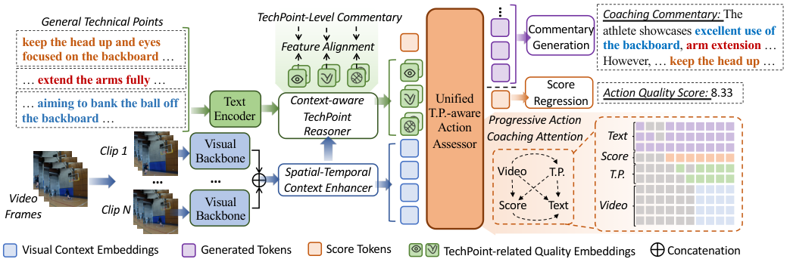

<!-- Start of picture text -->
General Technical Points TechPoint-Level Commentary Coaching Commentary:  The Commentary athlete showcases  excellent use of keep the head up and eyes  Feature Alignment Generation the backboard ,  arm extension  … focused on the backboard  … However, …  keep the head up  … …  extend the arms fully  … Score …  aiming to bank the ball off  Text Context-aware Unified Regression Action Quality Score:  8.33 the backboard  … Encoder TechPoint T.P.-aware Progressive Action Reasoner Action Coaching Attention Text Visual Assessor Clip 1 Backbone Score … … Context EnhancerSpatial-Temporal  Video T.P. T.P. FramesVideo Clip N BackboneVisual Score Text Video Visual Context Embeddings Generated Tokens Score Tokens TechPoint-related Quality Embeddings Concatenation … <!-- End of picture text -->

Figure 3: **An overview of TechCoach.** TechCoach <mark>p</mark> rocesses an action video by first extracting visual context embeddings via a pre-trained backbone and a Spati <mark>al-Temporal Contex</mark> t Enhancer. Next, a Context-aware TechPoint Reasoner queries this context to learn quality embeddings for key technical points (TechPoints), supervised by coaching commentary. Finally, a unified TechPoint-aware Action Assessor uses these inputs to jointly generate an overall commentary and a quality score. 

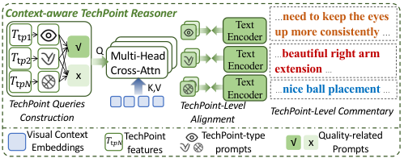

<!-- Start of picture text -->
Context-aware TechPoint Reasoner … need to keep the eyes Text 𝑇!"# Encoder up more consistently  … 𝑇𝑇!"$!"% √x Q Multi-HeadCross-AttnK,V EncoderEncoderTextText … extension … beautiful right arm nice ball placement  … … TechPoint Queries  TechPoint-Level Construction Alignment TechPoint-Level Commentary Visual Context TechPoint  TechPoint-type  Quality-related 𝑇"#$ √ x Embeddings features prompts Prompts <!-- End of picture text -->

Figure 4: **An overview of the Context-aware TechPoint Reasoner.** Best viewed in color. 

the input video, we first extract the TechPoint features _ftp ∈ R__N×D_ with a pre-trained text encoder and a linear mapper. After that, we augment _ftp_ by introducing two types of learnable prompts. Specifically, we use a group of TechPoint-type prompts _ftt ∈ R__N×D_ to identify which dimension ( _e.g._ , head & eyes, human-object interaction) each TechPoint feature belongs to. Besides, we adopt two quality-related prompts _fq ∈ R_2_×D_ to indicate the aspects of _strength_ and _weakness_ . Based on the definitions of the learnable prompts, the augmented TechPoint features _ftp__∗∈RN×_2_×D_are computed as: 

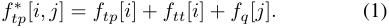

Such an augmentation allows us to inject the TechPoint and quality information into the TechPoint queries. **- TechPoint-driven Quality Reasoning.** Our goal here is to decouple the visual context features corresponding to the TechPoints and quality aspects. To this end, we regard the augmented TechPoint features _ftp__∗_as the_queries_and visual context features _fv_ as the _keys_ and _values_ , then utilize layers of multi-head cross attention module (Vaswani et al. 2017) to obtain the TechPoint-related quality embeddings _ftq ∈ R__N×_2_×D_ . _ftq_ [ _i, j_ ] indicates the action quality on TechPoint _i_ and aspect _j_ (1 for the _strength_ and 2 for the _weakness_ ). 

To ensure _ftq_ carries the quality information related to the action execution on the TechPoints, our idea is to align the TechPoint-related quality embeddings _ftq_ with the features of the corresponding TechPoint-level coaching commentary. To this end, a TechPoint-level alignment loss is adopted, which can be written as: 

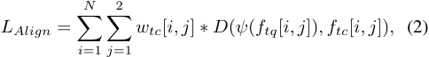

where _ftc_ indicates the features of TechPoint-level commentary extracted by the text encoder; _ψ_ is a linear mapper that projects the _ftq_ back to the dimension of the text features; _wtc_ [ _i, j_ ] is a binary scalar to filter those cases where commentary on some aspects is not provided (see Discussions in Sec.3.2) ; _D_ ( _·, ·_ ) indicates a distance measurement between two features and we use the L2 Distance by default. 

### **4.5 Unified TechPoint-aware Action Assessor** 

After obtaining the visual context embeddings and the TechPoint-related quality embeddings, we employ a Transformer-based Unified TechPoint-aware Action Assessor (TA2) to jointly predict the action quality score and generate the overall coaching commentary. 

Specifically, the input sequence to the TA2 module is constructed by concatenating the following components: (1) The generated text tokens _T_ 1: _i−_ 1; (2) a learnable scoreprediction token _fs_ ; (3) the flattened _ftq_ as TechPoint tokens; (4) the flattened _fv_ as video tokens. For generating commentary, we follow (Lin et al. 2022; Zhang et al. 2024) by employing a Mask-Token Modeling supervision ( _LMT M_ ) during training and using the Next-Token Prediction during inference. For score regression, the scoreprediction token from the output layer is passed to a MLP regressor, optimized using a MSE loss ( _LMSE_ ). 

Moreover, to guide the TA2 module in progressively integrating information in a sequence from lower to higher level 

6703

<!-- Page 6 -->

||**Score**|**eression**|**Methods**|**# Params**||**Co**|**mment**|**ary Ge**|**neration**||
|---|---|---|---|---|---|---|---|---|---|---|
|**Methods**| |**g** ||**(Txt.Gen.)**|B_↑_|C_↑_|M_↑_|Bert_↑_|GPT-M_↑_|GPT-Q_↑_|
|_Models infer with si_|_ρ ↑_ _ngle inst_|RL2_↓_ _ance_|_General Multi-modal_ |_Large Langu_ |_age Mo_ |_dels_ |||||
| ItVid2MLP| 6975| 470|VideoLLaVA-7B|7B|23.78|1.88|10.10|55.21|16.02|14.20|
|nerneo-  USDL|. 7081|. 451|VideoChat2-7B|7B|23.18|2.98|11.59|61.37|14.09|22.28|
||.|.|InternVideo2-_S3_-8B|7B|2760|292|1338|6455|3168|2456|
|SwinBERT|7137|459|||.|.|.|.|.|.|
|PGMI|. 7093|. 438|InternVL2-8B|7B|17.88|0.25|17.75|61.75|41.16|29.81|
||.|.|ItVL276B|70B|1081|001|1633|5512|4377|3260|
|TechCoach(Ours)|**7246**|**435**|nern-||.|.|.|.|.|.|
||**.**|**.**|_Tkifi Mdl_||||||||
|_Models infer with ex_ CR_/ 10 E_|_tra exem_ 7317|_plars_ 435|_as-specic oes_ SwinBERT|136M|36.11|11.70|16.01|66.03|46.56|34.57|
|oe_w  xem._ TPT_/ 10 E_|. 7377|. 429|PGMI|136M|36.78|14.00|16.24|66.42|49.02|37.04|
|_w  xem._|.|.|TechCoach(Ours)|136M|**37.06 **|**14.62 **|**16.39 **|**66.89**|**50.44**|**38.15**|

Table 2: **Comparison with existing models** . TechCoach achieves strong performance on both score regression and commentary generation tasks. “ _w/ 10 Exem._ ”: models that infer with 10 extra exemplars. “Txt.Gen.”: Text Generator. 

( _i.e._ , starting with visual context level, then TechPoint level, and finally the decision level), a progressive action coaching attention mask is adopted on the TA2, which is shown in the lower right part of Fig.3. Specifically, each TechPoint token independently attends to itself and the video tokens. Besides, the score-prediction token attends to itself and all the TechPoint tokens and video tokens. For commentary generation, TA2 integrates all information by attending to the generated text tokens, the score-prediction token, all the TechPoint tokens, and the video tokens. 

To sum up, we train the TechCoach with the following overall loss function ( _λ_ 1 and _λ_ 2 are hyper-parameters): 

||**Variants**|**Sc** _ρ ↑_|**ore** RL2_↓_|**Co** B_↑_|**mmen** C_↑_|**tary** Bert_↑_|
|---|---|---|---|---|---|---|
||_LMSE LMT M LAlign_||||||
|1|✓|70.8|4.5|-|-|-|
|2|✓|-|-|36.7|13.7|66.8|
|3|✓ ✓|70.2|4.8|36.4|14.3|65.7|
|4|✓ ✓ ✓|**72.5**|**4.4**|**37.1 **|**14.6**|**66.9**|
|5|w/o TP-Align|70.2|4.8|36.4|14.3|65.7|
|6|TP-CLS|72.3|4.5|36.8|13.7|64.7|
|7|TP-Align|**72.5**|**4.4**|**37.1 **|**14.6**|**66.9**|

Table 3: **Upper:** Ablations on the losses. **Lower:** comparisons with the alternative for TechPoint-level alignment. 

_L_ = _LMT M_ + _λ_ 1 _LMSE_ + _λ_ 2 _LAlign._ (3) 

## **5 Experiments** 

### **5.1 Dataset and Experiment Settings** 

**- Dataset** . Following the official split of EgoExo4D, we separate EE4D-DescCoach into training and evaluation set with 3769 and 1074 instances, respectively. 

**- Evaluation Metrics** . For score prediction, we use the _Spearman’s rank correlation coefficient_ ( _ρ_ ) and _RelativeL2 Distance_ (RL2) as the metrics. For natural language generation, we adopt _BLEU_ (B)(Papineni et al. 2002), _METEOR_ (M)(Banerjee et al. 2005), CIDEr(C) (Vedantam et al. 2015) and _BERT_ scores (Zhang et al. 2019). Moreover, for better comparison with open-source MLLMs, we design two more LLM-based Metrics: (1) a _Mention Score_ (GPT-M) to evaluate whether the generated commentary mentions the same technical details as in the ground truth; (2) a _Quality Score_ (GPT-Q) to evaluate whether the generated commentary shares the same praises or improvement opinions as in the ground truth on those both-mentioned technical details. **- Implementation Details** . We sample frames and segment each video into 32 8-frame clips. Subsequently, we use pretrained InternVideo2 (Wang et al. 2024b) and average pooling to obtain clip-level feature maps with a size of 16 _×_ 8 _×_ 8. We use both the ego- and exo-centric videos as input, and concatenate the multi-view features and feed them into a linear projector before going through the Spatial-Temporal Context Enhancer. The same strategy is adopted on the compared methods. We use similar multi-modal Transformer encoder as in (Lin et al. 2022; Zhang et al. 2024) to integrate inputs and generate text. 

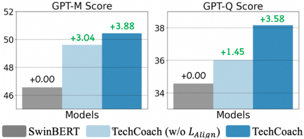

<!-- Start of picture text -->
+3.58 +3.88 +3.04 +1.45 +0.00 +0.00 <!-- End of picture text -->

Figure 5: **A further study of the impact of TechPoint-level alignment loss** show that _LAlign_ significantly enhances action quality perception ability (evaluated by GPT-Q Score). 

### **5.2 Main Results** 

As shown in Tab.2, we compare TechCoach with two branches of baselines: (1) _Task-Specific Models_ : We select task-specific baselines including USDL (Tang et al. 2020), CoRe (Yu et al. 2021), TPT(Bai et al. 2022), SwinBERT(Lin et al. 2022) and PGMI (Zhang et al. 2024). (2) _General MLLMs_ : We compare popular open-source MLLMs including VideoLLaVA (Lin et al. 2023), VideoChat2 (Li et al. 2024a), InternVideo2- _S3_ (Wang et al. 2024b), and InternVL2 (Chen et al. 2024a) under zero-shot evaluation settings. See Appendix for more details about the baselines. **- Score Regression:** Compared with Direct Regressionbased ( _i.e._ , InternVideo2-MLP and USDL) and Multi-Task Learning-based ( _i.e._ , SwinBERT, PGMI) AQA methods, 

6704

<!-- Page 7 -->

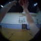

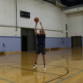

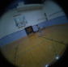

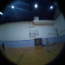

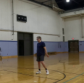

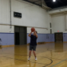

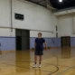

**Ours:** The athlete demonstrates excellent footwork, knee bend, and good elevation, and effective shooting form. **the extension of the shooting arm and wrist action were also commendable.** However, improvements can be made by **ensuring the guide hand is properly positioned** , and ensuring the guide hand does not interfere with the shot. additionally, the athlete should focus on **maintaining a more balanced landing to enhance stability and overall balance during the shot** . 

**Ground-Truth:** The athlete demonstrates **strong arm extension and proper wrist snap in their shooting technique** , which is beneficial for accurate shots. However, there are areas for improvement, such as **ensuring the guide hand remains open and unobstructive** , distributing weight evenly, avoiding left foot dependency, and **landing on the balls of the feet to maintain balance** . Additionally, jumping forward instead of back can prevent power loss. Addressing these elements can enhance overall shooting consistency and effectiveness. 

Figure 6: **Visualizations on the generated coaching commentary.** TechCoach generates precise and detailed commentary on **_what is done well_** and **_what can be improved_** from the given action videos. Correctly matched parts are highlighted in colors. 

TechCoach achieves the best performance on score regression. Note that CoRe and TPT adopt a Contrastive Regression framework that utilizes 10 extra exemplars during inference, thereby enhancing their score regression capability. **- Commentary Generation:** (1) **For task-specific models** : TechCoach achieves SoTA performance on all metrics by explicitly incorporating TechPoint-level reasoning into coaching process. In Sec.5.3, we dive deeper to the main component of our TechCoach ( _i.e._ Context-aware TechPoint Reasoner) by conducting extensive ablation studies. (2) **For general MLLMs** : Though shown great visual context understanding and reasoning abilities, the evaluated MLLMs still fall short on the realistic coaching scenarios (underperform the task-specific models). The best among them are the InternVL2 family models, who achieve the highest performance on LLM-based metrics. While scaling up InternVL2 (8B _→_ 76B) brings performance improvement on the LLM-based metrics, there still exists clear performance gap between general MLLMs and task-specific models. **- More Comparison Results** . In Appendix, we provide deeper explorations and analysis on various aspects, _e.g._ , (i) _User study_ , (ii) _More analysis on MLLM’s performance_ . 

### **5.3 Ablation Studies** 

**- Is TechPoint-level alignment necessary?** As shown in the upper part of Tab.3, we gradually ablate the training losses from our full model. Comparison among Rows 1-3 show that the model achieves unstable performance when simply combining the _LMSE_ and _LMT M_ . However, the TechPointlevel alignment loss ( _LAlign_ ) bring stable performance improvement on all metrics (Row 4). Results in Fig.5 further illustrate how _LAlign_ impacts the performance. Starting from SwinBERT, after adding all our designs except _LAlign_ , model performs much better on mentioning the technical details (3.04 improvement on GPT-M Score) due to the TechPoints inputs, but does not obtain similar improvement on perceiving action quality (only 1.45 improvement on GPTQ Score). After further adding _LAlign_ , much stronger improvement is observed on GPT-Q Score. All these results indicate the TechPoint-level alignment is necessary and will bring stronger action quality perception ability. 

**- Does TechPoint-level alignment equal to binary classification?** The main target of the TechPoint-level alignment (TP-Align) is to ensure the TechPoint-related Quality Embeddings carry the quality-related information. To this end, 

a simple solution is to perform binary classifications over the TechPoint-related Quality Embeddings, _i.e._ , classifing whether the execution shows strengths or weaknesses on each TechPoint (TP-CLS). In the lower part of Tab.3, comparisons between Rows 5 and 6 show that TP-CLS strengthens the quality perception of the model, resulting in performance improvement on score regression metrics. However, without explicit alignment with the TechPoint-level commentary, TP-CLS falls short in understanding deeper relationships between the action execution and TechPoints, resulting in a clear performance gap between our TechPointlevel alignment, especially on commentary generation. 

**- More ablation studies** like (i) _Impacts of the TechPoint Query Augmentation._ (ii) _Impacts of various types of TechPoint-level alignment loss_ ; (iii) _Influence of the training videos from different views_ are provided in Appendix. 

### **5.4 Qualitative Results** 

Visualization results in Fig.6 show that TechCoach is able to understand various technical TechPoints of different actions and provide detailed commentary on **_what is done well_** ( _e.g._ , “the extension of the shooting arm and wrist action were also commendable”) and **_what can be improved_** ( _e.g._ , “improvements are needed in core engagement to prevent being pulled from the wall”) from the given action videos. More qualitative results are shown in the Appendix. 

## **6 Conclusion** 

We investigate Descriptive Action Coaching, a novel task that aims to provide coaching feedback on _what is done well_ and _what can be improved_ from an action execution. To support this task, we develop an automated pipeline for constructing the EE4D-DescCoach dataset which features clean and detailed coaching commentary on both TechPoint and instance levels. The TechPoint-level commentary provides new supervision for incorporating TechPoint-level reasoning into the action coaching process, encouraging us to build TechCoach, a new framework empowered by a Contextaware TechPoint Reasoner. Besides demonstrating strong performance of the proposed TechCoach, extensive experiments also highlights the effectiveness and the necessity of the proposed Context-aware TechPoint Reasoner. We expect the proposed new task, dataset, and method provide a new perspective for advancing current AQA to a more explainable and practical scenario. 

6705

<!-- Page 8 -->

## **Acknowledgments** 

This work was supported partially by NSFC(92470202, U21A20471), Guangdong NSF Project (No. 2023B1515040025), Guangdong Key Research and Development Program(No.2024B0101040004). 

## **References** 

Aafaq, N.; Akhtar, N.; Liu, W.; Gilani, S. Z.; and Mian, A. 2019. Spatio-temporal dynamics and semantic attribute enriched visual encoding for video captioning. In _Proceedings of the IEEE/CVF conference on computer vision and pattern recognition_ , 12487–12496. 

Alayrac, J.-B.; Donahue, J.; Luc, P.; Miech, A.; Barr, I.; Hasson, Y.; Lenc, K.; Mensch, A.; Millican, K.; Reynolds, M.; et al. 2022. Flamingo: a visual language model for few-shot learning. _Advances in neural information processing systems_ , 35: 23716–23736. 

Bai, Y.; Zhou, D.; Zhang, S.; Wang, J.; Ding, E.; Guan, Y.; Long, Y.; and Wang, J. 2022. Action quality assessment with temporal parsing transformer. In _European conference on computer vision_ , 422–438. Springer. 

Banerjee, S.; and Lavie, A. 2005. METEOR: An automatic metric for MT evaluation with improved correlation with human judgments. In _Proceedings of the acl workshop on intrinsic and extrinsic evaluation measures for machine translation and/or summarization_ , 65–72. 

Bertasius, G.; Wang, H.; and Torresani, L. 2021. Is spacetime attention all you need for video understanding? In _ICML_ , volume 2, 4. 

Chen, Z.; Wang, W.; Tian, H.; Ye, S.; Gao, Z.; Cui, E.; Tong, W.; Hu, K.; Luo, J.; Ma, Z.; et al. 2024a. How Far Are We to GPT-4V? Closing the Gap to Commercial Multimodal Models with Open-Source Suites. _arXiv preprint arXiv:2404.16821_ . 

Chen, Z.; Wu, J.; Wang, W.; Su, W.; Chen, G.; Xing, S.; Zhong, M.; Zhang, Q.; Zhu, X.; Lu, L.; et al. 2024b. Internvl: Scaling up vision foundation models and aligning for generic visual-linguistic tasks. In _Proceedings of the IEEE/CVF Conference on Computer Vision and Pattern Recognition_ , 24185–24198. 

Doughty, H.; Mayol-Cuevas, W.; and Damen, D. 2019. The pros and cons: Rank-aware temporal attention for skill determination in long videos. In _Proceedings of the IEEE/CVF conference on computer vision and pattern recognition_ , 7862–7871. 

Grauman, K.; Westbury, A.; Torresani, L.; Kitani, K.; Malik, J.; Afouras, T.; Ashutosh, K.; Baiyya, V.; Bansal, S.; Boote, B.; et al. 2024. Ego-exo4d: Understanding skilled human activity from first-and third-person perspectives. In _Proceedings of the IEEE/CVF Conference on Computer Vision and Pattern Recognition_ , 19383–19400. 

Li, K.; He, Y.; Wang, Y.; Li, Y.; Wang, W.; Luo, P.; Wang, Y.; Wang, L.; and Qiao, Y. 2023. Videochat: Chat-centric video understanding. _arXiv preprint arXiv:2305.06355_ . 

Li, K.; Wang, Y.; He, Y.; Li, Y.; Wang, Y.; Liu, Y.; Wang, Z.; Xu, J.; Chen, G.; Luo, P.; et al. 2024a. Mvbench: A comprehensive multi-modal video understanding benchmark. In 

_Proceedings of the IEEE/CVF Conference on Computer Vision and Pattern Recognition_ , 22195–22206. 

Li, Y.-M.; Huang, W.-J.; Wang, A.-L.; Zeng, L.-A.; Meng, J.-K.; and Zheng, W.-S. 2024b. EgoExo-Fitness: Towards Egocentric and Exocentric Full-Body Action Understanding. _European Conference on Computer Vision_ . 

Li, Y.-M.; Zeng, L.-A.; Meng, J.-K.; and Zheng, W.-S. 2024c. Continual Action Assessment via Task-Consistent Score-Discriminative Feature Distribution Modeling. _IEEE Transactions on Circuits and Systems for Video Technology_ . Lin, B.; Ye, Y.; Zhu, B.; Cui, J.; Ning, M.; Jin, P.; and Yuan, L. 2023. Video-llava: Learning united visual representation by alignment before projection. _arXiv preprint arXiv:2311.10122_ . 

Lin, K.; Li, L.; Lin, C.-C.; Ahmed, F.; Gan, Z.; Liu, Z.; Lu, Y.; and Wang, L. 2022. Swinbert: End-to-end transformers with sparse attention for video captioning. In _Proceedings of the IEEE/CVF Conference on Computer Vision and Pattern Recognition_ , 17949–17958. 

Luo, H.; Ji, L.; Shi, B.; Huang, H.; Duan, N.; Li, T.; Li, J.; Bharti, T.; and Zhou, M. 2020. Univl: A unified video and language pre-training model for multimodal understanding and generation. _arXiv preprint arXiv:2002.06353_ . 

Maaz, M.; Rasheed, H.; Khan, S.; and Khan, F. S. 2023. Video-chatgpt: Towards detailed video understanding via large vision and language models. _arXiv preprint arXiv:2306.05424_ . 

Majeedi, A.; Gajjala, V. R.; GNVV, S. S. S. N.; and Li, Y. 2024. RICAˆ 2: Rubric-Informed, Calibrated Assessment of Actions. _arXiv preprint arXiv:2408.02138_ . 

Matsuyama, H.; Kawaguchi, N.; and Lim, B. Y. 2023. IRIS: Interpretable Rubric-Informed Segmentation for Action Quality Assessment. In _Proceedings of the 28th International Conference on Intelligent User Interfaces_ , 368–378. Okamoto, L.; and Parmar, P. 2024. Hierarchical NeuroSymbolic Approach for Comprehensive and Explainable Action Quality Assessment. In _Proceedings of the IEEE/CVF Conference on Computer Vision and Pattern Recognition_ , 3204– 3213. 

Pan, J.-H.; Gao, J.; and Zheng, W.-S. 2019. Action assessment by joint relation graphs. In _Proceedings of the IEEE/CVF international conference on computer vision_ , 6331–6340. 

Panchal, S.; Bhattacharyya, A.; Berger, G.; Mercier, A.; B¨ohm, C.; Dietrichkeit, F.; Pourreza, R.; Li, X.; Madan, P.; Lee, M.; et al. 2024. What to say and when to say it: Live fitness coaching as a testbed for situated interaction. _Advances in Neural Information Processing Systems_ , 37: 75853–75882. 

Papineni, K.; Roukos, S.; Ward, T.; and Zhu, W.-J. 2002. Bleu: a method for automatic evaluation of machine translation. In _Proceedings of the 40th annual meeting of the Association for Computational Linguistics_ , 311–318. 

Parmar, P.; Gharat, A.; and Rhodin, H. 2022. Domain knowledge-informed self-supervised representations for workout form assessment. In _European Conference on Computer Vision_ , 105–123. Springer. 

6706

<!-- Page 9 -->

Parmar, P.; and Morris, B. T. 2019. What and how well you performed? a multitask learning approach to action quality assessment. In _Proceedings of the IEEE/CVF Conference on Computer Vision and Pattern Recognition_ , 304–313. 

Parmar, P.; Reddy, J.; and Morris, B. 2021. Piano skills assessment. In _2021 IEEE 23rd international workshop on multimedia signal processing (MMSP)_ , 1–5. IEEE. 

Parmar, P.; and Tran Morris, B. 2017. Learning to score olympic events. In _Proceedings of the IEEE conference on computer vision and pattern recognition workshops_ , 20–28. Seo, P. H.; Nagrani, A.; Arnab, A.; and Schmid, C. 2022. End-to-end generative pretraining for multimodal video captioning. In _Proceedings of the IEEE/CVF Conference on Computer Vision and Pattern Recognition_ , 17959–17968. Shi, B.; Ji, L.; Niu, Z.; Duan, N.; Zhou, M.; and Chen, X. 2020. Learning semantic concepts and temporal alignment for narrated video procedural captioning. In _Proceedings of the 28th ACM international conference on multimedia_ , 4355–4363. 

Sun, C.; Myers, A.; Vondrick, C.; Murphy, K.; and Schmid, C. 2019. Videobert: A joint model for video and language representation learning. In _Proceedings of the IEEE/CVF international conference on computer vision_ , 7464–7473. Tang, Y.; Ni, Z.; Zhou, J.; Zhang, D.; Lu, J.; Wu, Y.; and Zhou, J. 2020. Uncertainty-aware score distribution learning for action quality assessment. In _Proceedings of the IEEE/CVF conference on computer vision and pattern recognition_ , 9839–9848. 

Vaswani, A.; Shazeer, N.; Parmar, N.; Uszkoreit, J.; Jones, L.; Gomez, A. N.; Kaiser, Ł.; and Polosukhin, I. 2017. Attention is all you need. _Advances in neural information processing systems_ , 30. 

Vedantam, R.; Lawrence Zitnick, C.; and Parikh, D. 2015. Cider: Consensus-based image description evaluation. In _Proceedings of the IEEE conference on computer vision and pattern recognition_ , 4566–4575. 

Wang, S.; Wang, S.; Yang, D.; Li, M.; Kuang, H.; Zhao, X.; Su, L.; Zhai, P.; and Zhang, L. 2024a. CPR-Coach: Recognizing composite error actions based on single-class training. In _Proceedings of the IEEE/CVF Conference on Computer Vision and Pattern Recognition_ , 18782–18792. 

Wang, T.; Zhang, R.; Lu, Z.; Zheng, F.; Cheng, R.; and Luo, P. 2021. End-to-end dense video captioning with parallel decoding. In _Proceedings of the IEEE/CVF international conference on computer vision_ , 6847–6857. 

Wang, Y.; Li, K.; Li, X.; Yu, J.; He, Y.; Chen, G.; Pei, B.; Zheng, R.; Xu, J.; Wang, Z.; et al. 2024b. Internvideo2: Scaling video foundation models for multimodal video understanding. _arXiv preprint arXiv:2403.15377_ . 

Xia, J.; Zhuge, M.; Geng, T.; Fan, S.; Wei, Y.; He, Z.; and Zheng, F. 2023. Skating-mixer: Long-term sport audiovisual modeling with mlps. In _Proceedings of the AAAI Conference on Artificial Intelligence_ , volume 37, 2901–2909. 

Xu, A.; Zeng, L.-A.; and Zheng, W.-S. 2022. Likert scoring with grade decoupling for long-term action assessment. In _Proceedings of the IEEE/CVF Conference on Computer Vision and Pattern Recognition_ , 3232–3241. 

Xu, H.; Ke, X.; Li, Y.; Xu, R.; Wu, H.; Lin, X.; and Guo, W. 2025. Vision-Language Action Knowledge Learning for Semantic-Aware Action Quality Assessment. In _European Conference on Computer Vision_ , 423–440. Springer. 

Xu, J.; Rao, Y.; Yu, X.; Chen, G.; Zhou, J.; and Lu, J. 2022. Finediving: A fine-grained dataset for procedure-aware action quality assessment. In _Proceedings of the IEEE/CVF Conference on Computer Vision and Pattern Recognition_ , 2949–2958. 

Xu, J.; Yin, S.; Zhao, G.; Wang, Z.; and Peng, Y. 2024. FineParser: A Fine-grained Spatio-temporal Action Parser for Human-centric Action Quality Assessment. In _Proceedings of the IEEE/CVF Conference on Computer Vision and Pattern Recognition_ , 14628–14637. 

Yamazaki, K.; Vo, K.; Truong, Q. S.; Raj, B.; and Le, N. 2023. Vltint: Visual-linguistic transformer-in-transformer for coherent video paragraph captioning. In _Proceedings of the AAAI Conference on Artificial intelligence_ , volume 37, 3081–3090. 

Yang, A.; Nagrani, A.; Seo, P. H.; Miech, A.; Pont-Tuset, J.; Laptev, I.; Sivic, J.; and Schmid, C. 2023. Vid2seq: Largescale pretraining of a visual language model for dense video captioning. In _Proceedings of the IEEE/CVF Conference on Computer Vision and Pattern Recognition_ , 10714–10726. Yin, H.; Parmar, P.; Xu, D.; Zhang, Y.; Zheng, T.; and Fu, W. 2025. A Decade of Action Quality Assessment: Largest Systematic Survey of Trends, Challenges, and Future Directions. _arXiv preprint arXiv:2502.02817_ . 

Yu, X.; Rao, Y.; Zhao, W.; Lu, J.; and Zhou, J. 2021. Groupaware contrastive regression for action quality assessment. In _Proceedings of the IEEE/CVF international conference on computer vision_ , 7919–7928. 

Yun, W.; Qi, M.; Peng, F.; and Ma, H. 2024. Semisupervised teacher-reference-student architecture for action quality assessment. In _European Conference on Computer Vision_ , 161–178. Springer. 

Zeng, L.-A.; and Zheng, W.-S. 2024. Multimodal Action Quality Assessment. _IEEE Transactions on Image Processing_ . 

Zhang, S.; Bai, S.; Chen, G.; Chen, L.; Lu, J.; Wang, J.; and Tang, Y. 2024. Narrative Action Evaluation with Prompt-Guided Multimodal Interaction. In _Proceedings of the IEEE/CVF Conference on Computer Vision and Pattern Recognition_ , 18430–18439. 

Zhang, T.; Kishore, V.; Wu, F.; Weinberger, K. Q.; and Artzi, Y. 2019. Bertscore: Evaluating text generation with bert. _arXiv preprint arXiv:1904.09675_ . Zhou, K.; Cai, R.; Wang, L.; Shum, H. P.; and Liang, X. 2024a. A comprehensive survey of action quality assessment: Method and benchmark. _arXiv preprint arXiv:2412.11149_ . 

Zhou, K.; Wang, L.; Zhang, X.; Shum, H. P.; Li, F. W.; Li, J.; and Liang, X. 2024b. Magr: Manifold-aligned graph regularization for continual action quality assessment. In _European Conference on Computer Vision_ , 375–392. Springer. 

6707
