# Transparent and Coherent Procedural Mistake Detection

[Original PDF](../Transparent%20and%20Coherent%20Procedural%20Mistake%20Detection.pdf)

Pages: 35

> Automatically converted from PDF. Check the original for exact equations, symbols, table alignment, and figure details.

<!-- Page 1 -->

# **Transparent and Coherent Procedural Mistake Detection** 

**Shane Storks** 

**Itamar Bar-Yossef Yayuan Li Zheyuan Zhang Jason J. Corso Joyce Chai** 

University of Michigan, Ann Arbor, Michigan, USA {sstorks, itamarby, yayuanli, zheyuan, jjcorso, chaijy}@umich.edu 

## **Abstract** 

Procedural mistake detection (PMD) is a challenging problem of classifying whether a human user (observed through egocentric video) has successfully executed a task (specified by a procedural text). Despite significant recent efforts, machine performance in the wild remains nonviable, and the reasoning processes underlying this performance are opaque. As such, we extend PMD to require generating visual self-dialog rationales to inform decisions. Given the impressive, mature image understanding capabilities observed in recent visionand-language models (VLMs), we curate a suitable benchmark dataset for PMD based on individual frames. As our reformulation enables unprecedented transparency, we leverage a natural language inference (NLI) model to formulate two automated metrics for the coherence of generated rationales. We establish baselines for this reframed task, showing that VLMs struggle off-the-shelf, but with some trade-offs, their accuracy, coherence, and efficiency can be improved by incorporating these metrics into common inference and finetuning methods. Lastly, our multi-faceted metrics visualize common outcomes, highlighting areas for further improvement. 

## **1 Introduction** 

The problem of interactive task guidance has recently attracted attention in AI research (Bao et al., 2023; Wang et al., 2023a; Peddi et al., 2024; Bohus et al., 2024), stemming from significant efforts to build and learn from large-scale procedural video datasets (Zhou et al., 2018; Damen et al., 2018; Miech et al., 2019; Grauman et al., 2022). A successful task guidance agent can observe a human user through video and guide them to complete a task through language interaction. A key component of such an agent is **procedural mistake detection (PMD)** : the ability to detect when 

the user’s actions deviate from a procedural text, e.g., a recipe or instruction manual. To achieve this, a system must apply physical and procedural commonsense knowledge to anticipate success conditions for the text, then extract relevant state information from the visual scene to verify them. 

Prior work in PMD has explored a mix of specialized (primarily vision-based) classifiers (Sener et al., 2022; Wang et al., 2023a; Peddi et al., 2024) as well as foundational language models (LMs) and vision-and-language models (VLMs) (Du et al., 2023; Bao et al., 2023; Peddi et al., 2024; Flaborea et al., 2024), but this problem has proven difficult, and current approaches fail to achieve accuracy above chance in zero-shot PMD in the wild. Qualitatively, Bao et al. (2023) found that while the web-scale multimodal pre-training of foundational VLMs enables coverage of a wide variety of procedures, they often produce noisy, vague, or otherwise insufficient information from visual scenes to facilitate PMD. This capability to extract and reason over key task-relevant visual information is crucial to PMD, but prior work has largely overlooked it, instead targeting binary or categorical classification tasks in their system design and quantitative evaluations. Consequently, the reasons for VLMs’ decisions are opaque, hindering practical use1 and continued improvement. 

To promote the development of PMD systems with transparent and justified decisions, we propose a reformulated problem of **coherent PMD** : given a procedural text and egocentric video frame, VLMs must not only classify whether a mistake has occurred, but also support this decision with a _rationale_ consisting of evidence from the visual scene. As shown in Figure 1, this rationale takes the form of an iterative _self-dialog_ of generated questions and yes-no answers which 

> 1Since VLMs are unreliable mistake detectors, transparency is crucial for the user to understand the system’s reasoning process and act on or disregard it accordingly. 

13968 

_Proceedings of the 2025 Conference on Empirical Methods in Natural Language Processing_ , pages 13968–14002 November 4-9, 2025 ©2025 Association for Computational Linguistics

<!-- Page 2 -->

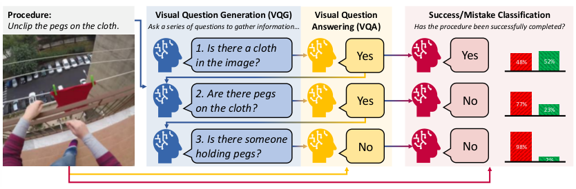

<!-- Start of picture text -->
Procedure:  Visual Question Generation (VQG) Visual Question  Success/Mistake Classification Unclip the pegs on the cloth. Ask a series of questions to gather information… Answering (VQA) Has the procedure been successfully completed? 1. Is there a cloth in the image? Yes Yes 48% 52% 2. Are there pegs on the cloth? Yes No 77% 23% 3. Is there someone No No 98% holding pegs? 2% <!-- End of picture text -->

Figure 1: To reason through the complex task of procedural mistake detection (PMD), vision-and-language models (VLMs) are conditioned to gather visual evidence through an iterative self-dialog to rationalize their final decision. 

directly condition classification.2 Since recent VLMs struggle to extract detailed, temporally coherent information from videos, but have exhibited more mature image understanding capabilities, we curate an approachable large-scale dataset for PMD based on individual video frames annotated in Ego4D (Grauman et al., 2022). We define two metrics for the coherence of generated rationales based on a natural language inference (NLI) model. To lay a foundation for research in coherent PMD, we establish baselines by exploring three natural interventions to VLMs: (1) we use our metrics to re-rank candidate questions generated by VLMs, (2) we harness VLMs’ incontext learning capability to generate additional candidate questions based on human-written examples, and (3) we use our metrics to fine-tune VLMs to generate more coherent questions. Our results show that while VLMs struggle off-theshelf, these interventions can improve VLMs’ accuracy, coherence, and rationale generation efficiency, albeit creating tradeoffs between these aspects. We lastly show how our multi-faceted metrics visualize common outcomes in coherent PMD (e.g., unjustified decisions, object hallucination, and more), enabling fine-grained evaluation and identification of areas for future improvement. 

## **2 Problem Formulation and Dataset** 

In this section, we define the extended problem of coherent PMD in an approachable manner for VLMs, describe how to apply VLMs to the problem, then lastly introduce a benchmark dataset we curated for evaluating coherent PMD. 

> 2This choice of rationale resembles visual question answering (VQA; Antol et al., 2015) and visual dialog (Das et al., 2017), long-studied multimodal tasks that VLMs excel at (Dai et al., 2023a; Liu et al., 2023; Dubey et al., 2024). 

### **2.1 Defining Coherent PMD** 

The inputs for PMD are a short **procedural text** _T_ and a single **video frame** _F_ , which may or may not visualize the successful completion of the procedure described in _T_ . Given these inputs, a system should return a binary **success decision** _y_ for whether the procedure has been successfully completed ( _y_ = 0 indicates success, and _y_ = 1 indicates the detection of a mistake). In coherent PMD, it must additionally generate a **rationale** _R_ = ( _Q, A_ ), where _Q_ = _{Q_ 1 _, Q_ 2 _, . . . , Qn}_ and _A_ = _{A_ 1 _, A_ 2 _, . . . , An}_ are respectively sequences of _n_ yes-no questions and their predicted answers, which provide evidence for the decision. 

### **2.2 Applying VLMs to Coherent PMD** 

As shown in Figure 1, we elicit a rationale from VLMs through a self-generated visual dialog (Das et al., 2017) consisting of **visual question generation** (VQG) based on the procedural text and dialog history, and **visual question answering** (VQA) based on the video frame. The evidence compiled in this rationale then conditions a **success classification** for whether the procedure has been completed in the given video frame. This structure goes beyond past approaches for PMD using VLMs; while Du et al. (2023) only elicited success classification, Bao et al. (2023) used procedure-agnostic prompts to caption images before classification, nonetheless disregarding this information in quantitative evaluations. 

**VQG.** We prompt the VLM to generate a series of questions given the procedural text (and previous questions and answers in later iterations, enabling deductive reasoning). To encourage logical, diverse questions, we apply greedy beam search to generate 4 candidates, from which we select the most likely candidate not generated previously. 

13969

<!-- Page 3 -->

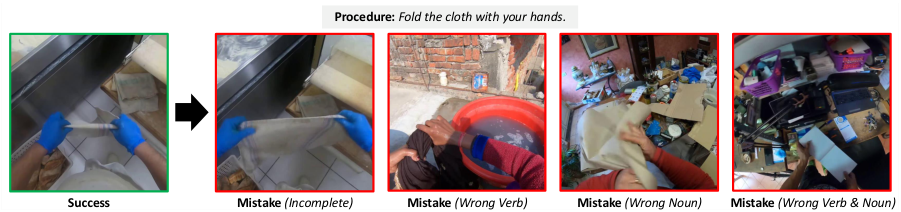

<!-- Start of picture text -->
Procedure:  Fold the cloth with your hands. Success Mistake  (Incomplete) Mistake  (Wrong Verb) Mistake  (Wrong Noun) Mistake  (Wrong Verb & Noun) <!-- End of picture text -->

Figure 2: Selected examples from Ego4D (Grauman et al., 2022) for Procedural Mistake Detection (Ego4D-PMD). For each matching pair of a video frame and procedural text, we generate a success example and various mistake examples by sampling alternate video frames: _incomplete_ execution, execution with the _wrong verb_ (e.g., wringing a cloth instead of folding), execution with the _wrong noun_ (e.g., folding paper instead of a cloth), and execution with both the _wrong verb and noun_ (e.g., opening a notepad instead of folding a cloth). Images cropped for space. 

**VQA.** After a question is generated, it is answered by the VLM given only the question and video frame. If the probability of the chosen answer (i.e., “Yes” or “No”) exceeds an answer sureness threshold of 60%, we append it to the dialog history, otherwise we append “Unsure.”3 

After each iteration of **Success classification.** VQG and VQA, we prompt the VLM to judge whether the procedure has been successfully executed based on the video frame and entire dialog history. The VLM’s decision is made using a mistake confidence threshold _τ_ (tuned on the validation data for each approach) on its mistake likelihood. The prompt and answer for this step are excluded from the dialog history in future iterations. 

**Stopping criteria.** To prevent over-generating evidence, which could introduce noise and degrade PMD accuracy, we implement an early stopping mechanism to determine whether to stop generating questions based on the success likelihood after each iteration. The self-dialog stops early (i.e., before a maximum number of questions _n__∗_ are generated) if the success likelihood _stabilizes_ (i.e., changes by less than _δ_ for two consecutive iterations) or becomes _highly confident_ (i.e., subceeds _ϵ_ or exceeds 1 _− ϵ_ ). _n__∗_ is fixed at 10, while _δ_ and _ϵ_ are tuned based on the validation data for each presented approach. 

### **2.3 Constructing a Dataset for PMD** 

We follow Du et al. (2023) in recasting Ego4D (Grauman et al., 2022), a large-scale egocentric video dataset for everyday activities with dense annotations for various aspects of the videos, into 

> 3Unsure answers are excluded from example-level informativeness (defined in Section 3), and excluded from previous questions and answers in metric calculations. 

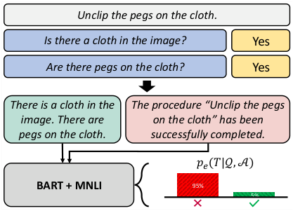

<!-- Start of picture text -->
Unclip the pegs on the cloth. Is there a cloth in the image? Yes Are there pegs on the cloth? Yes There is a cloth in the  The procedure “Unclip the pegs image. There are  on the cloth” has been pegs on the cloth. successfully completed. 𝑝𝑒(𝑇|𝒬, 𝒜) BART + MNLI 95% 5% <!-- End of picture text -->

Figure 3: Using BART (Lewis et al., 2020) fine-tuned on MNLI (Williams et al., 2017) to judge success. 

an offline mistake detection format, but expand the diversity of mistake types studied there. Ego4D’s hand and object interactions data subset includes videos of physical actions being performed with various objects. Each video is annotated with narrations describing fine-grained procedures being performed, each with timestamps for when it begins and ends, and category labels for the verb and noun characterizing the procedure. This makes an ideal testbed for evaluating VLMs’ understanding of real-world actions in video frames, but the data is not formulated for PMD. We thus apply several preprocessing steps to the data to create a new Ego4D for Procedural Mistake Detection (Ego4DPMD) benchmark that includes successful cases and a breadth of mistake types for each annotated procedure, visualized in Figure 2. 

Specifically, we form a successful case from each video clip in Ego4D by pairing its annotated postcondition frame with its annotated natural language narration of the procedure converted into imperative form. For each successful example, we generate several types of mistake examples paired with the source video’s procedural text. To simulate the procedure being incomplete, we follow 

13970

<!-- Page 4 -->

Du et al. (2023) and sample another frame at the procedure’s precondition time. To simulate an incorrect action being applied and/or the action being applied to an incorrect object or ingredient, we sample alternative video clips with mismatched verbs and nouns in their narration texts. Additional details about these preprocessing steps and summary statistics for the Ego4D-PMD dataset are presented in Appendix A. As listed there, to conserve compute, we randomly sample a subset of 10,000, 500, and 2,000 examples respectively from the training, validation, and testing partitions (evenly split between success and mistake cases) for the forthcoming experiments. 

## **3 Evaluating Coherence in PMD** 

Next, we describe our application of a fine-tuned NLI model to calculate two evaluation metrics for coherent PMD: **relevance** of questions and **informativeness** of answers to those questions. 

### **3.1 Using NLI Models to Judge Success** 

As shown in Figure 3, LMs fine-tuned for NLI can estimate the sufficiency of visual questions and answers in rationalizing whether a procedure was successfully completed. This requires an NLI model _fe_ (which returns a probability that an input premise string entails a hypothesis string), a premise transformation _tp_ (which converts a question _Q_ and answer _A_ into a declarative statement to add to the premise), and a hypothesis prompt template _th_ (which creates a hypothesis about the success of the procedure in _T_ ). We then calculate the NLI model’s probability for the success of procedure _T_ based on the rationale _R_ = ( _Q, A_ ): 

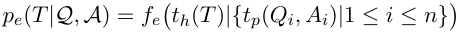

We implement _fe_ with BART (Lewis et al., 2020) fine-tuned on the large-scale MultiNLI dataset (Williams et al., 2017),4 applying softmax over its logits for entailment and contradiction to get an entailment probability. We follow Srinivasan et al. (2024) and prompt a foundational LM to implement _tp_ .5 For the procedural text _T_ , we choose a success prompt template _th_ “The procedure _⟨P ⟩_ has been successfully executed.”6 

4See https://huggingface.co/facebook/bart-large-mnli. 

> 5To conserve GPU memory, we later use the evaluated VLM’s LM backbone for rephrasing. Details in Appendix B. 

> 6A template was used as we found complex procedural texts were unlikely to be rephrased accurately, degrading correlation with human judgments (see Appendix C.1). 

### **3.2 Relevance** 

A coherent decision in PMD should be supported by relevant questions about the state of the environment.7 We measure the **relevance** of a question _Q__′_ to the success of a procedure _T_ , given previous questions _Q_ and their answers _A_ , as follows: 

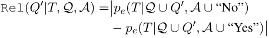

This definition quantifies how much impact the answer to the proposed question _Q__′_ can have on the success probability (as estimated by the NLI model). If the success probability is similar for “Yes” and “No” answers, this suggests that _Q__′_ would not reveal pertinent information (i.e., beyond that in _Q_ and _A_ ) about whether the procedure in _T_ was successfully executed by the user, and thus the relevance would be low. If the success probabilities vary widely depending on the answer, this suggests that _Q__′_ can reveal important new information to help make the decision. 

**Example-level relevance.** To reward systems that propose consistently relevant questions in our evaluations, we summarize the relevance of a sequence of questions generated for a particular example by taking the mean question relevance with respect to previous questions and answers: 

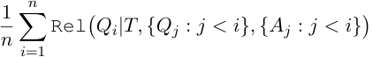

### **3.3 Informativeness** 

Since a relevant question does not guarantee an informative answer,8 and VLM errors in answering questions could unintentionally introduce conflicting information, it is necessary to evaluate the sufficiency of VLMs’ answers in justifying a PMD decision. To achieve this, we measure the **informativeness** of a predicted answer _A__′_ for a question _Q__′_ to the success of a procedure _T_ (given previous questions and answers _Q_ and _A_ ) as follows: Inf( _A__′_ _|Q__′_ _, T, Q, A_ ) = 1 _− H_ � _pe_ ( _T |Q ∪ Q__′_ _, A ∪ A__′_ )� 

_H_ is the binary Shannon entropy of the success probability _pe_ , calculated by _H_ ( _p_ ) = _−p_ log2 _p −_ 

> 7For example, given a procedure “In a bowl, add the cut cherry tomatoes” (Peddi et al., 2024), the question “Are there tomatoes in the bowl?” is relevant to the success of the procedure, while the question “Is the bowl blue?” is not. 

> 8For example, in the procedure “In a bowl, add the cut cherry tomatoes,” “Are there tomatoes in the bowl?” is a relevant question, but a “Yes” answer is insufficient to confirm 100% completion (more _tomatoes_ could be outside the bowl). 

13971

> Original page for checking 2 unresolved font glyphs.

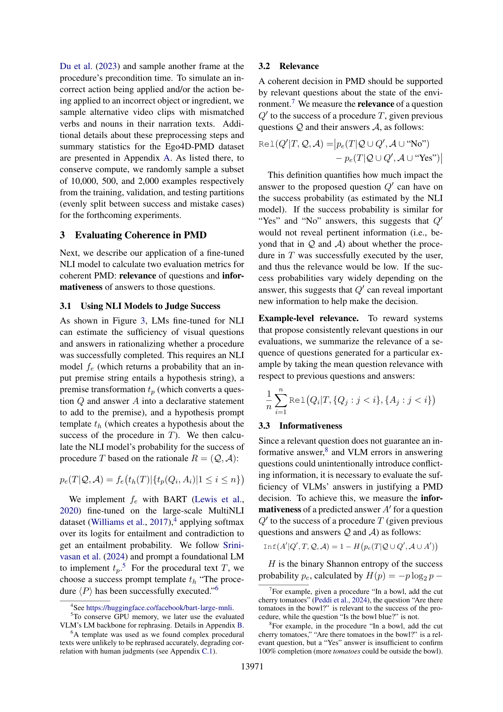

<!-- Page 5 -->

(1 _− p_ ) log2(1 _− p_ ) _, p ∈_ [0 _,_ 1]. This definition for informativeness quantifies how much information an answer to a question provides in determining the success of the procedure. As such, if the success probability given this answer _A__′_ to _Q__′_ is confident (i.e., very low or high), this indicates that _A__′_ (along with _Q_ and _A_ ) are sufficient to make a decision, and thus informativeness is high. Conversely, a success probability close to 50% suggests the evidence gathered thus far is insufficient, yielding low informativeness. Informativeness is expressed as a number of bits between 0 and 1. 

**Reference-adjusted informativeness.** We also wish to account for cases where the evidence gathered in questions and answers indicates the wrong PMD decision. To do so, we define the NLI model’s PMD belief _ye_ ( _T |Q, A_ ) as 1 (mistake) if _pe_ ( _T |Q, A_ ) _<_ 0 _._ 5, else 0 (success). Given the ground truth PMD label _y__∗_ , we then define the **reference-adjusted informativeness** to be negative if the NLI model judges the evidence gathered as indicating the wrong success decision: 

Inf_∗_ ( _A__′_ _|Q__′_ _, T, Q, A, y__∗_ ) = 

Inf� _A__′_ _|Q__′_ _, T, Q, A_ � _, ye_ ( _T |Q ∪ Q__′_ _, A ∪ A__′_ ) = _y__∗_ � _−_ Inf� _A__′_ _|Q__′_ _, T, Q, A_ � _,_ else 

**Example-level informativeness.** To summarize the sufficiency of information gathered throughout the self-dialog (which may have some uninformative answers), we take the maximum (referenceadjusted) informativeness across the self-dialog: 

max 1 _≤i≤n_Inf_∗_(_Ai|Qi, T, {Qj_:_j< i}, {Aj_:_j< i}, y∗_) 

## **4 Rationale Coherence Interventions** 

To validate these metrics and examine the relationship between rationale coherence, PMD accuracy, and rationale generation efficiency, we next introduce two inference-time interventions to encourage VLMs to select more coherent questions from generated candidates, as well as a preference optimization approach to encourage generating more coherent candidates based on coherence metrics. 

### **4.1 Coherent Question Selection** 

While a typical beam search would use a sequence _likelihood-based_ approach to rank candidate questions, an alternative is to re-rank candidates using the reference-free coherence metrics introduced in Section 3. This could encourage selecting questions that are likely to bring in new, 

salient, and helpful information. Furthermore, as adaptive information-seeking is a core component of humans’ reasoning capabilities (Coenen et al., 2019), we will supplement candidate questions with candidates generated through in-context learning from human-written examples (which we assume are reasonably coherent and effective). 

Next, we introduce these two approaches we use to augment the candidate question pool for more coherent candidates: _coherence-based reranking_ and _candidate generation through incontext learning_ . We then compare their performance on Ego4D-PMD with that of vanilla VLMs. 

### **4.1.1 Coherence-Based Question Selection** 

We implement a coherence-based candidate question re-ranking approach as follows. Given a set of question candidates _Q_ˆ for procedural text _T_ along with previous confidence-filtered questions _Q_ and answers _A_ , we can select the best question _Q__∗_ by maximizing the product of relevance and potential informativeness across all _Q ∈ Q_ˆ : 

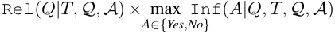

This ranking prioritizes well-rounded questions that can yield impactful information for success classification which leads to the most confidence. _Q__∗_ is then concatenated to the dialog history and answered by the VLM as described earlier. 

### **4.1.2 In-Context Learning Augmentation** 

Applying in-context learning in coherent PMD is not straightforward, as it would require reasoning over multiple images and dialogs of varying length. Instead, we use in-context learning to improve the text-based VQG step by providing examples of human-written questions. We achieve this by annotating 20 procedures from the Ego4D training data with 3 reasonable questions one could ask about a given procedure to judge its success.9 We prompt the VLM with these example procedures and questions, the current procedure at hand, and the previous 2 questions proposed by the VLM (as available) to incorporate information the VLM already collected. We then generate 4 additional candidate questions using the same constraints described earlier. To minimize the impact of ordering, in-context examples are randomly shuffled in every prompt.10 

> 9All questions and more details in Appendix E.1. 

> 10Examples are equivalently shuffled in compared results. 

13972

> Original page for checking 5 unresolved font glyphs.

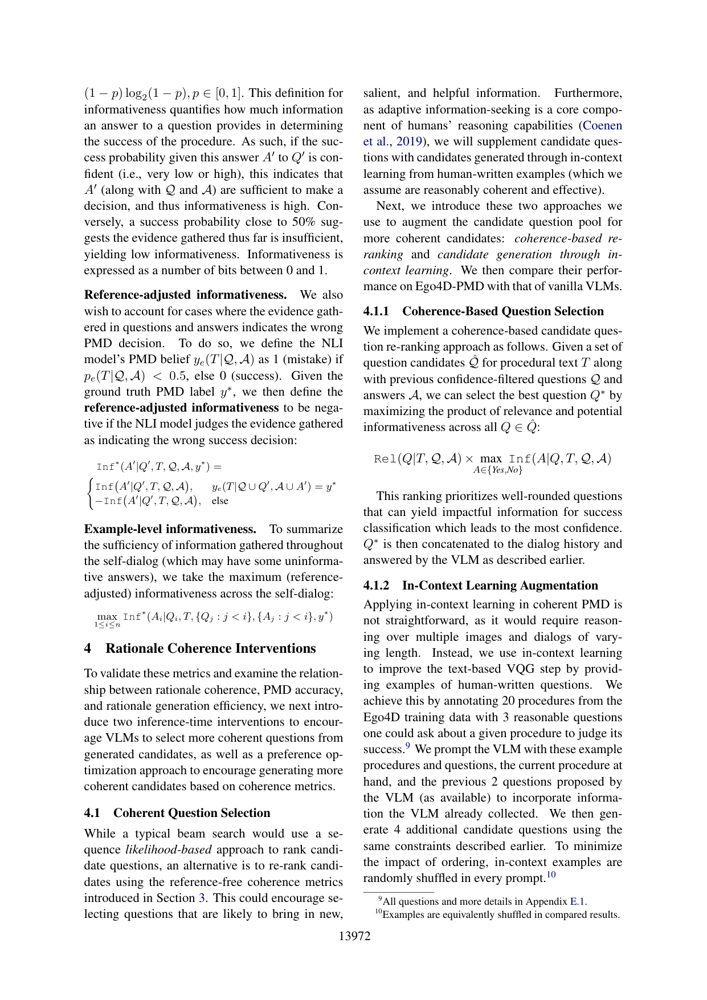

<!-- Page 6 -->

### **4.2 Coherent Question Generation** 

While the above approaches may boost the coherence of PMD rationales, they have limitations. First, since they are training-free, they do not improve the internal coherence of VLMs, rather they only filter and augment their outputs. Further, these interventions take significantly more time and compute due to the need to evaluate the coherence of candidate questions (which requires prompting an NLI model) and generate questions twice (once based on the self-dialog history and once with in-context learning). In practical applications like task guidance, it may be advantageous to use specialized VLMs to improve reliability and speed.11 As such, we also explore whether VLMs can be fine-tuned to generate more coherent questions using our automated coherence metrics. 

Specifically, we apply direct preference optimization (DPO; Rafailov et al., 2023) with quantized low-rank adaptation (QLoRA; Hu et al., 2022; Dettmers et al., 2024) to fine-tune a VQG adapter for LLaVA. We generate training data by first running inference over the Ego4D-PMD training data with coherence-based candidate question re-ranking and additional candidates generated through in-context learning.12 We then finetune VLMs on pairs of chosen and rejected candidate questions for each self-dialog turn based on their coherence ranking score.13 The top ranked question is always chosen, while a rejected question is sampled from the bottom half of candidates. At inference time, the trained adapter is applied during VQG, and disabled for other steps. 

## **5 Experimental Results** 

In this section, we evaluate VLMs on coherent PMD off-the-shelf and under the previously introduced interventions. Metrics include mistake detection accuracy, mean example relevance and reference-adjusted informativeness of rationales (defined in Section 3). We add two metrics for self-dialog efficiency: the average **number of iterations** that occurred before stopping (i.e., the length of the dialog), and the average **information gain** in the success likelihood across all iterations in bits (i.e., how much information the VLM got from it). We lastly show that our proposed metrics 

visualize common behaviors of VLMs, enabling a panoptic understanding of their performance. 

**Evaluated models.** We specifically evaluate InstructBLIP (Dai et al., 2023a), LLaVA 1.5-7B (Liu et al., 2023), and Llama 3.2-Vision-11B (Dubey et al., 2024), small open-source VLMs feasible for online use (important for real-world applications like task guidance). They apply different architectures and training strategies to integrate vision into their LMs. LLaVA and InstructBLIP were not trained on Ego4D, while Llama 3’s training data was not disclosed. For a reference point with stateof-the-art proprietary VLMs, we additionally include results with off-the-shelf GPT-4o (OpenAI et al., 2024a). Additional details and prompt templates can be found in Appendix D and E.5.14 

**Human accuracy.** To create a reference point for VLMs’ PMD accuracy and a proxy for data quality and objectiveness, we recruited human annotators for PMD classification. 100 random testing examples were labeled by 3 annotators each, yielding a majority-vote human accuracy of 72.0%. This suggests that PMD itself is fairly subjective and difficult for humans, further necessitating coherent rationalization. More details about this annotation are provided in Appendix C.2. 

### **5.1 Coherent Question Selection Results** 

Experimental results for coherent question selection interventions are presented in Table 1.15 We find that _coherence-based re-ranking and incontext learning_16 _both sharply improve the relevance and informativeness_ in all models, reaching a respective 75.5% and 0.464 bits in LLaVA. This suggests that _questions that VLMs find most likely are not naturally the most coherent_ . Interestingly, accuracy also jumps sharply for InstructBLIP and LLaVA to a maximum of 67.8%, demonstrating that _coherent rationales are valuable to accurate PMD_ , although accuracy still lags slightly behind humans (72.0%). Information gain under these interventions is consistently higher, reaching a maximum of 0.663 bits in LLaVA. This suggests that _VLMs can make more confident conclusions given more coherent rationales_ .17 Mean- 

> 14In Appendix E.6, we include an additional evaluation of VLMs without generating rationales (as done in prior work). 

> 15Hyperparameters and validation results in Appendix E.7. 

> 11To explore this further, we provide a runtime analysis of various configurations of VLM self-dialog in Appendix E.3. 12Ablation without in-context learning in Appendix E.2. 13More details and validation results in Appendix E.4. 

> 16We visualize the distribution of question sources (i.e., incontext learning vs. full self-dialog history) in Appendix E.8. 

> 17We contextualize these results with a naïve semantic diversity-based ranking baseline in Appendix E.9. 

13973

<!-- Page 7 -->

|||**I**|**nstruc**|**tBLIP**|||
|---|---|---|---|---|---|---|
|**Rank **|**ICL **|**Acc.** _↑_|**Rel.** _↑_|**Inf.** _↑_|**# Iter.**|_↓_**I. Gain**_↑_|
|L |✗ |63.5 |17.5 |.224 |**2.84** |.263 |
|L|✓|65.2|13.9|.340|4.71|.358|
|C|✗|64.6|25.5|.281|3.46|.293|
|C|✓|**66.6**|**35.2**|**.359**|3.47|**.359**|
||||**LLa**|**VA**|||
|**Rank **|**ICL **|**Acc.** _↑_|**Rel.** _↑_|**Inf.** _↑_|**# Iter.**|_↓_**I. Gain**_↑_|
|L|✗|60.7|40.3|.259|3.25|.435|
|L|✓|61.8|36.5|.272|3.34|.429|
|C|✗|61.4|66.5|.321|**3.06**|.540|
|C|✓|**67.8**|**75.5**|**.464**|3.46|**.663**|
||||**Llam** |**a 3** |||
|**Rank **|**ICL **|**Acc.** _↑_|**Rel.** _↑_|**Inf.** _↑_|**# Iter.**|_↓_**I. Gain**_↑_|
|L|✗|61.0|16.5|.275|4.70|.223|
|L|✓|59.1|15.9|.317|6.51|.256|
|C|✗|60.2|25.2|.341|6.35|.264|
|C|✓|**61.7**|**52.5**|**.436**|**3.59**|**.379**|
||||**GPT**|**-4o**|||
|**Rank **|**ICL **|**Acc.** _↑_|**Rel.** _↑_|**Inf.** _↑_|**# Iter.**|_↓_**I. Gain**_↑_|
|L|✗|55.4|54.0|.220|1.84|.793|

Table 1: Ego4D-PMD test set results for GPT-4o (OpenAI et al., 2024a) and likelihood-based (L) and coherence-based (C) candidate question ranking approaches, with optional supplementary candidates generated through in-context learning (ICL). 

|||**L**|**LaVA**|**+ DPO**|||
|---|---|---|---|---|---|---|
|**Rank **|**ICL **|**Acc.** _↑_|**Rel.** _↑_|**Inf.** _↑_|**# Iter.** _↓_|**I. Gain**_↑_|
|L|✗|62.2|75.7|.318|2.33|.617|
|L|✓|63.7|58.5|.330|2.67|.548|
|C|✗|62.3|92.2|**.340**|2.06|.719|
|C|✓|**64.2**|**95.0**|.304|**1.81**|**.742**|

Table 2: Ego4D-PMD test set results for LLaVA with coherence-based fine-tuning through DPO. 

while, our best configurations outperform GPT4o in accuracy, relevance, and informativeness at less than 10% of its size (Abacha et al., 2025). While GPT-4o takes fewer iterations and exhibits higher information gain (thus making faster and more confident decisions), its rigidity as a closed proprietary VLM prevents further improvements. 

### **5.2 Coherent Question Generation Results** 

When fine-tuned for coherent question generation, Table 2 shows that relevance drastically increases from a previous maximum of 75.5% to 95.0%. Remarkably, this demonstrates that _VLMs can learn to ask more coherent questions for PMD_ , a task based on properties of the physical world. 

However, we find that accuracy and informativeness drop slightly from the best results in Ta- 

ble 1 to a respective maximum of 64.2% and 0.340 bits. This suggests that _asking more relevant questions is not enough to improve performance globally_ . While more coherent rationales previously improved accuracy, this instead demonstrates a nontrivial relationship between coherence metrics and task accuracy. We suspect that asking highly relevant questions (which strongly indicate success if answered one way, otherwise a mistake) introduces a trade-off with question difficulty. For elaborate procedures, highly relevant questions may cover multiple aspects or states of a scene. As such, answering these more complex questions may be difficult for VLMs. For example, while the VLM-generated question “Is the soil placed around the seedling with the trowel in the person’s hand?” covers the success conditions of the procedure “Put some soil around the tomato seedling with the gardening trowel in your hand,” answering it requires understanding spatial relations between several objects (i.e., _soil_ , _seedling_ , _trowel_ , and _hand_ ). Future work may explore methods to encourage generating simpler questions.18 

Meanwhile, we find that fine-tuning reduces the average number of iterations taken to come to a conclusion by about 1.25, reaching a minimum of 1.81 (matching that of GPT-4o). This is especially important for online PMD, which requires a fast reaction. Further, the average information gain reaches a new peak of 0.742, nearly matching that of GPT-4o. This suggests that _coherencebased fine-tuning can empower VLMs to make more confident decisions faster_ . We lastly observe that coherence-based ranking and in-context learning have a smaller impact on performance metrics in fine-tuned LLaVA than in the base model (Table 1). This suggests that _fine-tuning VLMs using our coherence metrics reduces the need for inference-time interventions for coherence_ . 

### **5.3 Visualizing PMD Performance** 

An advantage of our automated coherence metrics is the ability to audit VLMs’ reasoning behaviors. In Figure 4, we visualize the distribution of decision error, example-level relevance, and example-level informativeness of four representative approaches. Specifically, we compare vanilla LLaVA (i.e., with likelihood-based question ranking) to variants successively equipped with coherence-based question ranking, in-context 

> 18As an initial inquiry here, we experiment with applying an exponential length penalty to VQG in Appendix E.10. 

13974

<!-- Page 8 -->

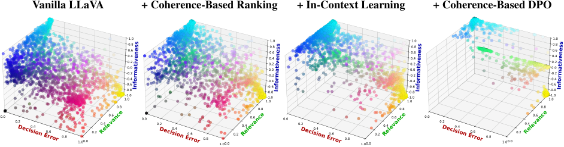

<!-- Start of picture text -->
Vanilla LLaVA + Coherence-Based Ranking + In-Context Learning + Coherence-Based DPO 1.0 1.0 1.0 1.0 1.0-1.0-0.8-0.6-0.4-0.20.00.20.40.60.8 1.0-1.0-0.8-0.6-0.4-0.20.00.20.40.60.8 1.0-1.0-0.8-0.6-0.4-0.20.00.20.40.60.8 1.0-1.0-0.8-0.6-0.4-0.20.00.20.40.60.8 0.8 0.8 0.8 0.8 0.0 0.2 0.4 0.6 0.8 1.00.0 0.2 0.4 0.6 0.0 0.2 0.4 0.6 0.8 1.00.0 0.2 0.4 0.6 0.0 0.2 0.4 0.6 0.8 1.00.0 0.2 0.4 0.6 0.0 0.2 0.4 0.6 0.8 1.00.0 0.2 0.4 0.6 Decision Error Decision Error Decision Error Decision Error Relevance Relevance Relevance Relevance Informativeness Informativeness Informativeness Informativeness <!-- End of picture text -->

Figure 4: Visualization of decision error, relevance, and reference-adjusted informativeness for configurations of LLaVA on Ego4D-PMD testing examples. Each data point’s color indicates its position along each axis. 

learning, and coherence-based DPO fine-tuning. For each example, decision error is calculated by how far the VLM’s success likelihood is from being 100% confident in the correct success label. 

Point colors indicate combinations of decision error, relevance, and informativeness, highlighting common local outcomes. Several examples are shown in Figure 5. While cyan points indicate correct decisions with coherent rationales, red points indicate incorrect decisions with incoherent rationales, e.g., asking irrelevant questions about whether a person was wearing _protective gear_ in determining whether a _screw_ had been tightened. Black and indigo points indicate correct decisions with incoherent rationales, while white points indicate incorrect decisions with coherent rationales, suggesting inconsistencies in rationales or failures to interpret them (e.g., correctly identifying a _bottle of mustard_ on the _countertop_ , but then mistakenly detecting it on the _floor_ ). Interestingly, green and yellow points with low informativeness typically indicate failures in VQA, e.g., unsure answers, missing the appearance of a _trowel_ , and hallucinating the appearance of a _bottle_ . These examples elucidate the nontrivial relationship between rationale coherence and PMD accuracy observed in earlier results; a variety of errors in both generating and interpreting rationales can cause downstream errors in PMD. We provide an extended discussion of these cases in Appendix E.11. 

In comparing the plots globally, we see a virtual elimination of red, black, and indigo points with irrelevant and uninformative rationales. We also see a significant reduction in the range of informativeness under coherence-based fine-tuning. This suggests that when questions are answered correctly under this approach, it is highly informative to the success decision, and vice versa. This is in line with our earlier observation that coherencebased fine-tuning may encourage the generation of 

overly relevant and thus complex questions, which can make or break the rationale. There are also a large number of points with zero informativeness, i.e., unsure answers to these complex questions. 

## **6 Related Work** 

Beyond the prior work in PMD discussed in Section 1, we next discuss other related research. 

### **6.1 Multi-Step Reasoning in LMs & VLMs** 

LMs have exhibited impressive reasoning capabilities from prompting methods (Wei et al., 2022; Kojima et al., 2022), later strengthened with multiple paths (Wang et al., 2023b; Snell et al., 2024), tree-search (Yao et al., 2023; Hao et al., 2023; Putta et al., 2024; Tian et al., 2024; Chen et al., 2024a; Zhang et al., 2024; Qi et al., 2024), and fine-tuning on reasoning chains from stronger LMs (Wang et al., 2024; Gou et al., 2024; Muennighoff et al., 2025) and/or self-generated during reinforcement learning (OpenAI et al., 2024b; DeepSeek-AI et al., 2025). Related to PMD, some work has investigated LMs’ reasoning about dependencies between physical procedures (Bellos et al., 2024; Lal et al., 2024). Meanwhile, other work has applied iterative self-questioning approaches to deepen inquiry in other domains, e.g., medicine and fact verification (Cattan et al., 2024; Li et al., 2025; Vladika et al., 2025). 

In light of challenges in visual reasoning in VLMs (Dai et al., 2023b; Li et al., 2023b; Guan et al., 2024), some work has proposed trainingfree strategies and training paradigms to reduce visual hallucination (Wan et al., 2024; Leng et al., 2024; An et al., 2024; Ganz et al., 2024), and utilized LMs and other tools to generate intermediate questions and coordinate visual reasoning step by step (You et al., 2023; Srinivasan et al., 2024; Chen et al., 2024b; Zhou et al., 2024; Zong et al., 2024; Cheng et al., 2024; Zhu et al., 2024; Sun et al., 

13975

<!-- Page 9 -->

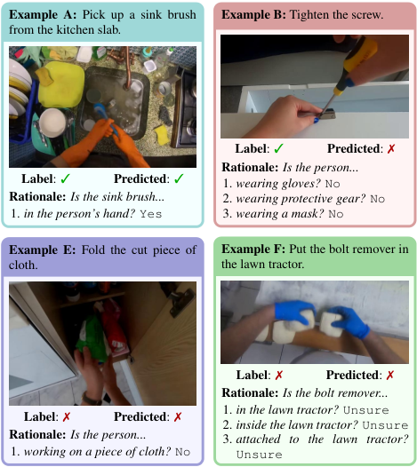

<!-- Start of picture text -->
Example A: Pick up a sink brush Example B:  Tighten the screw. from the kitchen slab. Label : ✓ Predicted : ✗ Rationale: Is the person... Label : ✓ Predicted : ✓ 1.  wearing gloves? No Rationale: Is the sink brush... 2.  wearing protective gear? No 1.  in the person’s hand? Yes 3.  wearing a mask? No Example E: Fold the cut piece of Example F:  Put the bolt remover in cloth. the lawn tractor. Label : ✗ Predicted : ✗ Rationale: Is the bolt remover... 1.  in the lawn tractor? Unsure Label : ✗ Predicted : ✗ 2.  inside the lawn tractor?  Unsure Rationale: Is the person... 3.  attached to the lawn tractor? 1.  working on a piece of cloth? No Unsure <!-- End of picture text -->

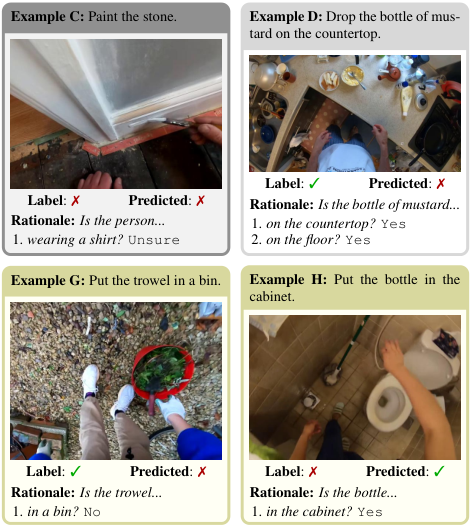

<!-- Start of picture text -->
Example C:  Paint the stone. Example D:  Drop the bottle of mus- tard on the countertop. Label : ✓ Predicted : ✗ Label : ✗ Predicted : ✗ Rationale:  Is the bottle of mustard... Rationale: Is the person... 1.  on the countertop? Yes 1.  wearing a shirt? Unsure 2.  on the floor? Yes Example G:  Put the trowel in a bin. Example H: Put the bottle in the cabinet. Label : ✓ Predicted : ✗ Label : ✗ Predicted : ✓ Rationale: Is the trowel... Rationale: Is the bottle... 1.  in a bin? No 1.  in the cabinet? Yes <!-- End of picture text -->

Figure 5: Sample coherent PMD outputs from LLaVA with coherence-based ranking, representing the range of behaviors observed (as visualized in Figure 4). Images cropped for visibility and space. 

2024; Jing and Rahman, 2025; Cheng et al., 2025). The latter follows prior work in visual dialog (Das et al., 2017; Kottur et al., 2019), which has been used to study and improve machine performance in various problem areas (Chattopadhyay et al., 2017; de Vries et al., 2017; Uehara et al., 2022; Wang et al., 2022). Other works have assessed (V)LMs’ reasoning about procedures based on visual information (Yang et al., 2018; Hendricks and Nematzadeh, 2021; Jin et al., 2022; Yuksekgonul et al., 2023; Nguyen et al., 2024, 2025). In this work, we evaluated self-generated visual dialogs from VLMs in a novel problem of coherent PMD. 

### **6.2 Leveraging NLI in Other NLP Tasks** 

NLI requires judging whether a premise text entails a hypothesis text, a reasoning challenge long studied in NLP (Dagan et al., 2005). Many human-annotated NLI resources have been created, thus significant progress has occurred in NLI (Storks et al., 2019). Consequently, prior work has used NLI models to improve the competence, confidence, and coherence of LMs in other tasks, e.g., dialog systems (Dziri et al., 2019; Welleck et al., 2019), summarization (Roit et al., 2023), VQA (Srinivasan et al., 2024), and image captioning (Cascante-Bonilla et al., 2024). We similarly adopt two NLI-based metrics to strengthen VLMs in a new problem of coherent PMD. 

## **7 Conclusion** 

In this work, we evaluated foundational VLMs on a challenging problem of coherent PMD, where visual questions and answers must be generated to drive success decisions. To evaluate these rationales, we leveraged an NLI model to define two coherence metrics, using them to encourage coherent question selection and generation through common interventions. Our results showed that VLMs do not generate coherent rationales off-theshelf, but these interventions improve their coherence, with the former also improving accuracy, and the latter improving the efficiency of generating and extracting information from rationales, albeit creating tradeoffs between these aspects. Further, patterns in accuracy and coherence metrics revealed detailed performance insights, e.g., visual processing errors like object hallucination. Ultimately, when choosing an approach for coherent PMD, accuracy, coherence, and efficiency must be weighed for the setting. For example, while online applications may require shorter dialog (even at a cost of accuracy), high-risk applications may prioritize accuracy and confidence. This work lays a foundation for future research in the application of VLMs to PMD and task guidance, and investigation of how these system goals interact. Our code and data are available at https://github.com/ sled-group/Transparent-Coherent-PMD. 

13976

<!-- Page 10 -->

## **Limitations** 

**Latency of self-dialog.** One limitation of our coherent PMD problem formulation is the requirement of generating several pieces of information autoregressively, which would take several seconds in practical settings (as shown in Appendix E.3). This is not ideal for a problem like interactive task guidance, where responsiveness and the ability to intervene quickly to correct mistakes are important. However, rather than being applied frame by frame (which would likely not be feasible), we expect this process to be applied once at the end of procedure execution to verify the state of the environment, e.g., when the user asks a task guidance system to inform them of the next step of a recipe. Based on the results of our study, one could explore streamlined and specialized approaches to apply VLMs to a stream of video frames in a live online setting. For example, in preliminary experiments, we tried to generate questions once with a VLM, then answer them over a series of video frames, but we found this approach limited by the inability to adapt questions to previously gathered information, and the challenge of aggregating noisy VLM responses across time. We leave further investigation of such approaches for future work. 

**Inherent limitations of single video frames.** Next, single video frames are limited in representing actions, which involve movement and state change. Our decision to focus on individual frames stemmed from preliminary experiments we performed with existing open-source VLMs for video understanding (Lin et al., 2024; Li et al., 2023a), which are still in early stages. There, we found that they often confused information from frames in different segments of the video, preventing them from judging the final states of objects and reconciling this information with success of procedures, thus resulting in poor performance. As such, our choice to focus on single images simplified the problem for current VLMs, enabling our experiments to begin building a meaningful understanding of their capabilities in PMD. To minimize the dependence on multiple frames in detecting mistakes, we applied several careful preprocessing steps to Ego4D-PMD (as discussed thoroughly in Section 2.3 and Appendix A). It is also worth noting that by not incorporating modalities beyond text and images, e.g., audio, the VLMs we studied are inherently limited in their 

capturing of physical information (Yu et al., 2022; Zong et al., 2024). 

As the ability to reason over sequences of frames and other modalities evolves in state-ofthe-art VLMs, future work can revisit this formulation and explore new approaches for them to reason over dynamic scenes. Specifically, we imagine that this task will look somewhat similar as VLMs mature. Given a VLM that can reliably extract information from multiple frames and from audio (e.g., about fine-grained motion, temperatures, and more) and express it in text, coherence metrics like those we explored in this work can still apply. In order to track this information reliably, a neurosymbolic architecture may be required, e.g., a dynamic scene graph continuously updated across frames based on observations from a VLM and/or other neural vision models. Of course, there will always be some information that a VLM cannot extract from the environment even through vision and audio. For example, confirming amounts or weights of ingredients in a cooking setting may be theoretically possible by reading measurement tools as the human uses them, but this would be a highly difficult challenge. In such cases, a useful capability for a PMD system would be to ask the human user some questions (e.g., “Are you sure that was 3 tablespoons? That looked like a teaspoon.”), then incorporate the user’s answers into PMD and rationalization. Such a capability becomes a rich research problem of its own, as it would be important for the system not to ask too many questions (Bao et al., 2023), requiring it to be able to identify and prioritize the cases where this is necessary, and to ask questions concisely and in a timely manner. 

**Lack of ground truth rationales.** Lastly, it is worth noting that the dataset collected does not include ground truth rationales for mistake detection labels. Instead, we opted to propose automated coherence metrics for generated questions and answers based on a fine-tuned NLI model, which itself is prone to error and thus limits the objectivity of our evaluations. We chose this path for two important reasons. First, there may be multiple valid ways to detect a mistake through asking and answering visual questions, each of which could consist of different questions and/or different numbers of questions.19 In our opinion, ex- 

> 19For example, in trying to determine the success of the procedure “In a bowl, add the cut cherry tomatoes” from 

13977

<!-- Page 11 -->

isting metrics for text generation (which largely measure syntactic or semantic similarity of text) are not as well suited for this extremely challenging evaluation as fine-tuned NLI models (which are optimized to judge the logical consistency between texts). Second, in a real-world setting like PMD for task guidance, we believe that automated metrics are better suited for continually understanding and improving a deployed system than an offline benchmark of ground truth rationales. Despite this limitation, we believe that the value of these metrics is demonstrated by the accuracy and efficiency improvements brought by incorporating them into coherent PMD. 

## **Acknowledgments** 

This work was supported in part by the DARPA PTG program HR00112220003, NSF IIS-1949634, ARPA-H PARADIGM program 1AY2AX000062, the Microsoft Accelerate Foundation Models Research (AFMR) grant program, and computational resources and services provided by Advanced Research Computing at the University of Michigan, Ann Arbor. We would like to thank our anonymous reviewers, as well as Megan Su, Ruixuan Deng, Fengyuan Hu, Andy Chung, Lu Wang, Richard L. Lewis, and the entire MSRP team, for their helpful discussions, feedback, and insights. ChatGPT20 was used for minor writing suggestions and tedious coding tasks (e.g., improving generated graphs). This research was funded, in part, by the U.S. Government. The views and conclusions contained in this document are those of the authors and should not be interpreted as representing the official policies, either expressed or implied, of the U.S. Government. 

## **References** 

- Asma Ben Abacha, Wen wai Yim, Yujuan Fu, Zhaoyi Sun, Meliha Yetisgen, Fei Xia, and Thomas Lin. 2025. Medec: A benchmark for medical error detection and correction in clinical notes. _Preprint_ , arXiv:2412.19260. 

- Wenbin An, Feng Tian, Sicong Leng, Jiahao Nie, Haonan Lin, QianYing Wang, Guang Dai, Ping Chen, and Shijian Lu. 2024. AGLA: Mitigating object hallucinations in large vision-language models with 

Peddi et al. (2024), we could reasonably ask one question “Are all the cherry tomatoes in the bowl?” or two questions “Are there cherry tomatoes in the bowl?” and “Are there any cherry tomatoes outside of the bowl?” 20https://chatgpt.com/ 

assembly of global and local attention. _arXiv: 2406.12718_ . 

- Stanislaw Antol, Aishwarya Agrawal, Jiasen Lu, Margaret Mitchell, Dhruv Batra, C. Lawrence Zitnick, and Devi Parikh. 2015. Vqa: Visual question answering. In _Proceedings of the IEEE International Conference on Computer Vision (ICCV)_ . 

- Yuwei Bao, Keunwoo Yu, Yichi Zhang, Shane Storks, Itamar Bar-Yossef, Alex de la Iglesia, Megan Su, Xiao Zheng, and Joyce Chai. 2023. Can foundation models watch, talk and guide you step by step to make a cake? In _Findings of the Association for Computational Linguistics: EMNLP 2023_ , pages 12325–12341, Singapore. Association for Computational Linguistics. 

- Filippos Bellos, Yayuan Li, Wuao Liu, and Jason Corso. 2024. Can large language models reason about goal-oriented tasks? In _Proceedings of the First edition of the Workshop on the Scaling Behavior of Large Language Models (SCALE-LLM 2024)_ , pages 24–34, St. Julian’s, Malta. Association for Computational Linguistics. 

- Dan Bohus, Sean Andrist, Nick Saw, Ann Paradiso, Ishani Chakraborty, and Mahdi Rad. 2024. Sigma: An open-source interactive system for mixed-reality task assistance research - extended abstract. In _2024 IEEE Conference on Virtual Reality and 3D User Interfaces Abstracts and Workshops (VRW)_ . IEEE. 

- Paola Cascante-Bonilla, Yu Hou, Yang Trista Cao, Hal Daumé III, and Rachel Rudinger. 2024. Natural language inference improves compositionality in vision-language models. _Preprint_ , arXiv:2410.22315. 

- Arie Cattan, Paul Roit, Shiyue Zhang, David Wan, Roee Aharoni, Idan Szpektor, Mohit Bansal, and Ido Dagan. 2024. Localizing factual inconsistencies in attributable text generation. _Preprint_ , arXiv:2410.07473. 

- Prithvijit Chattopadhyay, Deshraj Yadav, Viraj Prabhu, Arjun Chandrasekaran, Abhishek Das, Stefan Lee, Dhruv Batra, and Devi Parikh. 2017. Evaluating visual conversational agents via cooperative humanai games. In _Proceedings of the Fifth AAAI Conference on Human Computation and Crowdsourcing (HCOMP)_ . 

- Guoxin Chen, Minpeng Liao, Chengxi Li, and Kai Fan. 2024a. AlphaMath almost zero: Process supervision without process. In _The Thirty-eighth Annual Conference on Neural Information Processing Systems_ . 

- Yangyi Chen, Karan Sikka, Michael Cogswell, Heng Ji, and Ajay Divakaran. 2024b. Measuring and improving chain-of-thought reasoning in visionlanguage models. In _Proceedings of the 2024 Annual Conference of the North American Chapter of the Association for Computational Linguistics_ , Mexico City, Mexico. Association for Computational Linguistics. 

13978

<!-- Page 12 -->

- Chuanqi Cheng, Jian Guan, Wei Wu, and Rui Yan. 2024. From the least to the most: Building a plugand-play visual reasoner via data synthesis. In _Proceedings of the 2024 Conference on Empirical Methods in Natural Language Processing_ , pages 4941– 4957, Miami, Florida, USA. Association for Computational Linguistics. 

- Yu Cheng, Arushi Goel, and Hakan Bilen. 2025. Visually interpretable subtask reasoning for visual question answering. In _Proceedings of the Computer Vision and Pattern Recognition Conference_ , pages 2760–2780. 

- Anna Coenen, Jonathan D Nelson, and Todd M Gureckis. 2019. Asking the right questions about the psychology of human inquiry: Nine open challenges. _Psychonomic Bulletin & Review_ , 26(5):1548–1587. 

- Jacob Cohen. 1960. A coefficient of agreement for nominal scales. _Educational and Psychological Measurement_ , 20(1):37–46. 

- Ido Dagan, Oren Glickman, and Bernardo Magnini. 2005. The PASCAL Recognising Textual Entailment Challenge. In Joaquin Quiñonero-Candela, Ido Dagan, Bernardo Magnini, and Florence d’Alché-Buc, editors, _Machine Learning Challenges. Evaluating Predictive Uncertainty, Visual Object Classification, and Recognising Tectual Entailment_ , volume 3944, pages 177–190. Springer Berlin Heidelberg, Berlin, Heidelberg. 

- Wenliang Dai, Junnan Li, DONGXU LI, Anthony Tiong, Junqi Zhao, Weisheng Wang, Boyang Li, Pascale N Fung, and Steven Hoi. 2023a. InstructBLIP: Towards general-purpose vision-language models with instruction tuning. In _Advances in Neural Information Processing Systems_ , volume 36, pages 49250–49267. Curran Associates, Inc. 

- Wenliang Dai, Zihan Liu, Ziwei Ji, Dan Su, and Pascale Fung. 2023b. Plausible may not be faithful: Probing object hallucination in vision-language pre-training. In _Proceedings of the 17th Conference of the European Chapter of the Association for Computational Linguistics_ , pages 2136–2148, Dubrovnik, Croatia. Association for Computational Linguistics. 

- Dima Damen, Hazel Doughty, Giovanni Maria Farinella, Sanja Fidler, Antonino Furnari, Evangelos Kazakos, Davide Moltisanti, Jonathan Munro, Toby Perrett, Will Price, and Michael Wray. 2018. Scaling egocentric vision: The epic-kitchens dataset. In _European Conference on Computer Vision (ECCV)_ . 

- Abhishek Das, Satwik Kottur, Khushi Gupta, Avi Singh, Deshraj Yadav, Jose M. F. Moura, Devi Parikh, and Dhruv Batra. 2017. Visual dialog. In _Proceedings of the IEEE Conference on Computer Vision and Pattern Recognition (CVPR)_ . 

- Harm de Vries, Florian Strub, Sarath Chandar, Olivier Pietquin, Hugo Larochelle, and Aaron C. Courville. 2017. Guesswhat?! visual object discovery through 

multi-modal dialogue. In _Conference on Computer Vision and Pattern Recognition (CVPR)_ . 

- DeepSeek-AI, Daya Guo, Dejian Yang, Haowei Zhang, Junxiao Song, Ruoyu Zhang, Runxin Xu, Qihao Zhu, Shirong Ma, Peiyi Wang, Xiao Bi, Xiaokang Zhang, Xingkai Yu, Yu Wu, Z. F. Wu, Zhibin Gou, Zhihong Shao, Zhuoshu Li, Ziyi Gao, Aixin Liu, Bing Xue, Bingxuan Wang, Bochao Wu, Bei Feng, Chengda Lu, Chenggang Zhao, Chengqi Deng, Chenyu Zhang, Chong Ruan, Damai Dai, Deli Chen, Dongjie Ji, Erhang Li, Fangyun Lin, Fucong Dai, Fuli Luo, Guangbo Hao, Guanting Chen, Guowei Li, H. Zhang, Han Bao, Hanwei Xu, Haocheng Wang, Honghui Ding, Huajian Xin, Huazuo Gao, Hui Qu, Hui Li, Jianzhong Guo, Jiashi Li, Jiawei Wang, Jingchang Chen, Jingyang Yuan, Junjie Qiu, Junlong Li, J. L. Cai, Jiaqi Ni, Jian Liang, Jin Chen, Kai Dong, Kai Hu, Kaige Gao, Kang Guan, Kexin Huang, Kuai Yu, Lean Wang, Lecong Zhang, Liang Zhao, Litong Wang, Liyue Zhang, Lei Xu, Leyi Xia, Mingchuan Zhang, Minghua Zhang, Minghui Tang, Meng Li, Miaojun Wang, Mingming Li, Ning Tian, Panpan Huang, Peng Zhang, Qiancheng Wang, Qinyu Chen, Qiushi Du, Ruiqi Ge, Ruisong Zhang, Ruizhe Pan, Runji Wang, R. J. Chen, R. L. Jin, Ruyi Chen, Shanghao Lu, Shangyan Zhou, Shanhuang Chen, Shengfeng Ye, Shiyu Wang, Shuiping Yu, Shunfeng Zhou, Shuting Pan, S. S. Li, Shuang Zhou, Shaoqing Wu, Shengfeng Ye, Tao Yun, Tian Pei, Tianyu Sun, T. Wang, Wangding Zeng, Wanjia Zhao, Wen Liu, Wenfeng Liang, Wenjun Gao, Wenqin Yu, Wentao Zhang, W. L. Xiao, Wei An, Xiaodong Liu, Xiaohan Wang, Xiaokang Chen, Xiaotao Nie, Xin Cheng, Xin Liu, Xin Xie, Xingchao Liu, Xinyu Yang, Xinyuan Li, Xuecheng Su, Xuheng Lin, X. Q. Li, Xiangyue Jin, Xiaojin Shen, Xiaosha Chen, Xiaowen Sun, Xiaoxiang Wang, Xinnan Song, Xinyi Zhou, Xianzu Wang, Xinxia Shan, Y. K. Li, Y. Q. Wang, Y. X. Wei, Yang Zhang, Yanhong Xu, Yao Li, Yao Zhao, Yaofeng Sun, Yaohui Wang, Yi Yu, Yichao Zhang, Yifan Shi, Yiliang Xiong, Ying He, Yishi Piao, Yisong Wang, Yixuan Tan, Yiyang Ma, Yiyuan Liu, Yongqiang Guo, Yuan Ou, Yuduan Wang, Yue Gong, Yuheng Zou, Yujia He, Yunfan Xiong, Yuxiang Luo, Yuxiang You, Yuxuan Liu, Yuyang Zhou, Y. X. Zhu, Yanhong Xu, Yanping Huang, Yaohui Li, Yi Zheng, Yuchen Zhu, Yunxian Ma, Ying Tang, Yukun Zha, Yuting Yan, Z. Z. Ren, Zehui Ren, Zhangli Sha, Zhe Fu, Zhean Xu, Zhenda Xie, Zhengyan Zhang, Zhewen Hao, Zhicheng Ma, Zhigang Yan, Zhiyu Wu, Zihui Gu, Zijia Zhu, Zijun Liu, Zilin Li, Ziwei Xie, Ziyang Song, Zizheng Pan, Zhen Huang, Zhipeng Xu, Zhongyu Zhang, and Zhen Zhang. 2025. DeepSeek-R1: Incentivizing reasoning capability in llms via reinforcement learning. _Preprint_ , arXiv:2501.12948. 

- Tim Dettmers, Artidoro Pagnoni, Ari Holtzman, and Luke Zettlemoyer. 2024. Qlora: Efficient finetuning of quantized llms. _Advances in Neural Information Processing Systems_ , 36. 

- Yuqing Du, Ksenia Konyushkova, Misha Denil, Akhil Raju, Jessica Landon, Felix Hill, Nando de Freitas, 

13979

<!-- Page 13 -->

and Serkan Cabi. 2023. Vision-language models as success detectors. In _Proceedings of The 2nd Conference on Lifelong Learning Agents_ , volume 232 of _Proceedings of Machine Learning Research_ , pages 120–136. PMLR. 

Abhimanyu Dubey, Abhinav Jauhri, Abhinav Pandey, Abhishek Kadian, Ahmad Al-Dahle, Aiesha Letman, Akhil Mathur, Alan Schelten, Amy Yang, Angela Fan, Anirudh Goyal, Anthony Hartshorn, Aobo Yang, Archi Mitra, Archie Sravankumar, Artem Korenev, Arthur Hinsvark, Arun Rao, Aston Zhang, Aurelien Rodriguez, Austen Gregerson, Ava Spataru, Baptiste Roziere, Bethany Biron, Binh Tang, Bobbie Chern, Charlotte Caucheteux, Chaya Nayak, Chloe Bi, Chris Marra, Chris McConnell, Christian Keller, Christophe Touret, Chunyang Wu, Corinne Wong, Cristian Canton Ferrer, Cyrus Nikolaidis, Damien Allonsius, Daniel Song, Danielle Pintz, Danny Livshits, David Esiobu, Dhruv Choudhary, Dhruv Mahajan, Diego Garcia-Olano, Diego Perino, Dieuwke Hupkes, Egor Lakomkin, Ehab AlBadawy, Elina Lobanova, Emily Dinan, Eric Michael Smith, Filip Radenovic, Frank Zhang, Gabriel Synnaeve, Gabrielle Lee, Georgia Lewis Anderson, Graeme Nail, Gregoire Mialon, Guan Pang, Guillem Cucurell, Hailey Nguyen, Hannah Korevaar, Hu Xu, Hugo Touvron, Iliyan Zarov, Imanol Arrieta Ibarra, Isabel Kloumann, Ishan Misra, Ivan Evtimov, Jade Copet, Jaewon Lee, Jan Geffert, Jana Vranes, Jason Park, Jay Mahadeokar, Jeet Shah, Jelmer van der Linde, Jennifer Billock, Jenny Hong, Jenya Lee, Jeremy Fu, Jianfeng Chi, Jianyu Huang, Jiawen Liu, Jie Wang, Jiecao Yu, Joanna Bitton, Joe Spisak, Jongsoo Park, Joseph Rocca, Joshua Johnstun, Joshua Saxe, Junteng Jia, Kalyan Vasuden Alwala, Kartikeya Upasani, Kate Plawiak, Ke Li, Kenneth Heafield, Kevin Stone, Khalid El-Arini, Krithika Iyer, Kshitiz Malik, Kuenley Chiu, Kunal Bhalla, Lauren Rantala-Yeary, Laurens van der Maaten, Lawrence Chen, Liang Tan, Liz Jenkins, Louis Martin, Lovish Madaan, Lubo Malo, Lukas Blecher, Lukas Landzaat, Luke de Oliveira, Madeline Muzzi, Mahesh Pasupuleti, Mannat Singh, Manohar Paluri, Marcin Kardas, Mathew Oldham, Mathieu Rita, Maya Pavlova, Melanie Kambadur, Mike Lewis, Min Si, Mitesh Kumar Singh, Mona Hassan, Naman Goyal, Narjes Torabi, Nikolay Bashlykov, Nikolay Bogoychev, Niladri Chatterji, Olivier Duchenne, Onur Çelebi, Patrick Alrassy, Pengchuan Zhang, Pengwei Li, Petar Vasic, Peter Weng, Prajjwal Bhargava, Pratik Dubal, Praveen Krishnan, Punit Singh Koura, Puxin Xu, Qing He, Qingxiao Dong, Ragavan Srinivasan, Raj Ganapathy, Ramon Calderer, Ricardo Silveira Cabral, Robert Stojnic, Roberta Raileanu, Rohit Girdhar, Rohit Patel, Romain Sauvestre, Ronnie Polidoro, Roshan Sumbaly, Ross Taylor, Ruan Silva, Rui Hou, Rui Wang, Saghar Hosseini, Sahana Chennabasappa, Sanjay Singh, Sean Bell, Seohyun Sonia Kim, Sergey Edunov, Shaoliang Nie, Sharan Narang, Sharath Raparthy, Sheng Shen, Shengye Wan, Shruti Bhosale, Shun Zhang, Simon 

Vandenhende, Soumya Batra, Spencer Whitman, Sten Sootla, Stephane Collot, Suchin Gururangan, Sydney Borodinsky, Tamar Herman, Tara Fowler, Tarek Sheasha, Thomas Georgiou, Thomas Scialom, Tobias Speckbacher, Todor Mihaylov, Tong Xiao, Ujjwal Karn, Vedanuj Goswami, Vibhor Gupta, Vignesh Ramanathan, Viktor Kerkez, Vincent Gonguet, Virginie Do, Vish Vogeti, Vladan Petrovic, Weiwei Chu, Wenhan Xiong, Wenyin Fu, Whitney Meers, Xavier Martinet, Xiaodong Wang, Xiaoqing Ellen Tan, Xinfeng Xie, Xuchao Jia, Xuewei Wang, Yaelle Goldschlag, Yashesh Gaur, Yasmine Babaei, Yi Wen, Yiwen Song, Yuchen Zhang, Yue Li, Yuning Mao, Zacharie Delpierre Coudert, Zheng Yan, Zhengxing Chen, Zoe Papakipos, Aaditya Singh, Aaron Grattafiori, Abha Jain, Adam Kelsey, Adam Shajnfeld, Adithya Gangidi, Adolfo Victoria, Ahuva Goldstand, Ajay Menon, Ajay Sharma, Alex Boesenberg, Alex Vaughan, Alexei Baevski, Allie Feinstein, Amanda Kallet, Amit Sangani, Anam Yunus, Andrei Lupu, Andres Alvarado, Andrew Caples, Andrew Gu, Andrew Ho, Andrew Poulton, Andrew Ryan, Ankit Ramchandani, Annie Franco, Aparajita Saraf, Arkabandhu Chowdhury, Ashley Gabriel, Ashwin Bharambe, Assaf Eisenman, Azadeh Yazdan, Beau James, Ben Maurer, Benjamin Leonhardi, Bernie Huang, Beth Loyd, Beto De Paola, Bhargavi Paranjape, Bing Liu, Bo Wu, Boyu Ni, Braden Hancock, Bram Wasti, Brandon Spence, Brani Stojkovic, Brian Gamido, Britt Montalvo, Carl Parker, Carly Burton, Catalina Mejia, Changhan Wang, Changkyu Kim, Chao Zhou, Chester Hu, ChingHsiang Chu, Chris Cai, Chris Tindal, Christoph Feichtenhofer, Damon Civin, Dana Beaty, Daniel Kreymer, Daniel Li, Danny Wyatt, David Adkins, David Xu, Davide Testuggine, Delia David, Devi Parikh, Diana Liskovich, Didem Foss, Dingkang Wang, Duc Le, Dustin Holland, Edward Dowling, Eissa Jamil, Elaine Montgomery, Eleonora Presani, Emily Hahn, Emily Wood, Erik Brinkman, Esteban Arcaute, Evan Dunbar, Evan Smothers, Fei Sun, Felix Kreuk, Feng Tian, Firat Ozgenel, Francesco Caggioni, Francisco Guzmán, Frank Kanayet, Frank Seide, Gabriela Medina Florez, Gabriella Schwarz, Gada Badeer, Georgia Swee, Gil Halpern, Govind Thattai, Grant Herman, Grigory Sizov, Guangyi, Zhang, Guna Lakshminarayanan, Hamid Shojanazeri, Han Zou, Hannah Wang, Hanwen Zha, Haroun Habeeb, Harrison Rudolph, Helen Suk, Henry Aspegren, Hunter Goldman, Ibrahim Damlaj, Igor Molybog, Igor Tufanov, Irina-Elena Veliche, Itai Gat, Jake Weissman, James Geboski, James Kohli, Japhet Asher, Jean-Baptiste Gaya, Jeff Marcus, Jeff Tang, Jennifer Chan, Jenny Zhen, Jeremy Reizenstein, Jeremy Teboul, Jessica Zhong, Jian Jin, Jingyi Yang, Joe Cummings, Jon Carvill, Jon Shepard, Jonathan McPhie, Jonathan Torres, Josh Ginsburg, Junjie Wang, Kai Wu, Kam Hou U, Karan Saxena, Karthik Prasad, Kartikay Khandelwal, Katayoun Zand, Kathy Matosich, Kaushik Veeraraghavan, Kelly Michelena, Keqian Li, Kun Huang, Kunal Chawla, Kushal Lakhotia, Kyle Huang, Lailin Chen, Lakshya Garg, Lavender A, Leandro Silva, Lee Bell, Lei Zhang, Liangpeng Guo, Licheng Yu, Liron 

13980

<!-- Page 14 -->

Moshkovich, Luca Wehrstedt, Madian Khabsa, Manav Avalani, Manish Bhatt, Maria Tsimpoukelli, Martynas Mankus, Matan Hasson, Matthew Lennie, Matthias Reso, Maxim Groshev, Maxim Naumov, Maya Lathi, Meghan Keneally, Michael L. Seltzer, Michal Valko, Michelle Restrepo, Mihir Patel, Mik Vyatskov, Mikayel Samvelyan, Mike Clark, Mike Macey, Mike Wang, Miquel Jubert Hermoso, Mo Metanat, Mohammad Rastegari, Munish Bansal, Nandhini Santhanam, Natascha Parks, Natasha White, Navyata Bawa, Nayan Singhal, Nick Egebo, Nicolas Usunier, Nikolay Pavlovich Laptev, Ning Dong, Ning Zhang, Norman Cheng, Oleg Chernoguz, Olivia Hart, Omkar Salpekar, Ozlem Kalinli, Parkin Kent, Parth Parekh, Paul Saab, Pavan Balaji, Pedro Rittner, Philip Bontrager, Pierre Roux, Piotr Dollar, Polina Zvyagina, Prashant Ratanchandani, Pritish Yuvraj, Qian Liang, Rachad Alao, Rachel Rodriguez, Rafi Ayub, Raghotham Murthy, Raghu Nayani, Rahul Mitra, Raymond Li, Rebekkah Hogan, Robin Battey, Rocky Wang, Rohan Maheswari, Russ Howes, Ruty Rinott, Sai Jayesh Bondu, Samyak Datta, Sara Chugh, Sara Hunt, Sargun Dhillon, Sasha Sidorov, Satadru Pan, Saurabh Verma, Seiji Yamamoto, Sharadh Ramaswamy, Shaun Lindsay, Shaun Lindsay, Sheng Feng, Shenghao Lin, Shengxin Cindy Zha, Shiva Shankar, Shuqiang Zhang, Shuqiang Zhang, Sinong Wang, Sneha Agarwal, Soji Sajuyigbe, Soumith Chintala, Stephanie Max, Stephen Chen, Steve Kehoe, Steve Satterfield, Sudarshan Govindaprasad, Sumit Gupta, Sungmin Cho, Sunny Virk, Suraj Subramanian, Sy Choudhury, Sydney Goldman, Tal Remez, Tamar Glaser, Tamara Best, Thilo Kohler, Thomas Robinson, Tianhe Li, Tianjun Zhang, Tim Matthews, Timothy Chou, Tzook Shaked, Varun Vontimitta, Victoria Ajayi, Victoria Montanez, Vijai Mohan, Vinay Satish Kumar, Vishal Mangla, Vítor Albiero, Vlad Ionescu, Vlad Poenaru, Vlad Tiberiu Mihailescu, Vladimir Ivanov, Wei Li, Wenchen Wang, Wenwen Jiang, Wes Bouaziz, Will Constable, Xiaocheng Tang, Xiaofang Wang, Xiaojian Wu, Xiaolan Wang, Xide Xia, Xilun Wu, Xinbo Gao, Yanjun Chen, Ye Hu, Ye Jia, Ye Qi, Yenda Li, Yilin Zhang, Ying Zhang, Yossi Adi, Youngjin Nam, Yu, Wang, Yuchen Hao, Yundi Qian, Yuzi He, Zach Rait, Zachary DeVito, Zef Rosnbrick, Zhaoduo Wen, Zhenyu Yang, and Zhiwei Zhao. 2024. The Llama 3 herd of models. _Preprint_ , arXiv:2407.21783. 

- Nouha Dziri, Ehsan Kamalloo, Kory Mathewson, and Osmar Zaiane. 2019. Evaluating coherence in dialogue systems using entailment. In _Proceedings of the 2019 Conference of the North American Chapter of the Association for Computational Linguistics: Human Language Technologies, Volume 1 (Long and Short Papers)_ , pages 3806–3812, Minneapolis, MN, USA. Association for Computational Linguistics. 

- Alessandro Flaborea, Guido Maria D’Amely di Melendugno, Leonardo Plini, Luca Scofano, Edoardo De Matteis, Antonino Furnari, Giovanni Maria Farinella, and Fabio Galasso. 2024. Prego: Online 

mistake detection in procedural egocentric videos. In _Proceedings of the IEEE/CVF Conference on Computer Vision and Pattern Recognition (CVPR)_ , pages 18483–18492. 

- Roy Ganz, Yair Kittenplon, Aviad Aberdam, Elad Ben Avraham, Oren Nuriel, Shai Mazor, and Ron Litman. 2024. Question aware vision transformer for multimodal reasoning. In _Proceedings of the IEEE/CVF Conference on Computer Vision and Pattern Recognition_ , pages 13861–13871. 

- Zhibin Gou, Zhihong Shao, Yeyun Gong, Yelong Shen, Yujiu Yang, Minlie Huang, Nan Duan, and Weizhu Chen. 2024. ToRA: A tool-integrated reasoning agent for mathematical problem solving. In _The Twelfth International Conference on Learning Representations_ . 

- Kristen Grauman, Andrew Westbury, Eugene Byrne, Zachary Chavis, Antonino Furnari, Rohit Girdhar, Jackson Hamburger, Hao Jiang, Miao Liu, Xingyu Liu, Miguel Martin, Tushar Nagarajan, Ilija Radosavovic, Santhosh Kumar Ramakrishnan, Fiona Ryan, Jayant Sharma, Michael Wray, Mengmeng Xu, Eric Zhongcong Xu, Chen Zhao, Siddhant Bansal, Dhruv Batra, Vincent Cartillier, Sean Crane, Tien Do, Morrie Doulaty, Akshay Erapalli, Christoph Feichtenhofer, Adriano Fragomeni, Qichen Fu, Christian Fuegen, Abrham Gebreselasie, Cristina Gonzalez, James Hillis, Xuhua Huang, Yifei Huang, Wenqi Jia, Weslie Khoo, Jachym Kolar, Satwik Kottur, Anurag Kumar, Federico Landini, Chao Li, Yanghao Li, Zhenqiang Li, Karttikeya Mangalam, Raghava Modhugu, Jonathan Munro, Tullie Murrell, Takumi Nishiyasu, Will Price, Paola Ruiz Puentes, Merey Ramazanova, Leda Sari, Kiran Somasundaram, Audrey Southerland, Yusuke Sugano, Ruijie Tao, Minh Vo, Yuchen Wang, Xindi Wu, Takuma Yagi, Yunyi Zhu, Pablo Arbelaez, David Crandall, Dima Damen, Giovanni Maria Farinella, Bernard Ghanem, Vamsi Krishna Ithapu, C. V. Jawahar, Hanbyul Joo, Kris Kitani, Haizhou Li, Richard Newcombe, Aude Oliva, Hyun Soo Park, James M. Rehg, Yoichi Sato, Jianbo Shi, Mike Zheng Shou, Antonio Torralba, Lorenzo Torresani, Mingfei Yan, and Jitendra Malik. 2022. Ego4D: Around the World in 3,000 Hours of Egocentric Video. In _IEEE/CVF Computer Vision and Pattern Recognition (CVPR)_ . 

- Tianrui Guan, Fuxiao Liu, Xiyang Wu, Ruiqi Xian, Zongxia Li, Xiaoyu Liu, Xijun Wang, Lichang Chen, Furong Huang, Yaser Yacoob, Dinesh Manocha, and Tianyi Zhou. 2024. HallusionBench: An advanced diagnostic suite for entangled language hallucination and visual illusion in large visionlanguage models. In _IEEE/CVF Conference on Computer Vision and Pattern Recognition (CVPR)_ . 

- Shibo Hao, Yi Gu, Haodi Ma, Joshua Hong, Zhen Wang, Daisy Wang, and Zhiting Hu. 2023. Reasoning with language model is planning with world model. In _Proceedings of the 2023 Conference on_ 

13981

<!-- Page 15 -->

_Empirical Methods in Natural Language Processing_ , pages 8154–8173, Singapore. Association for Computational Linguistics. 

- Lisa Anne Hendricks and Aida Nematzadeh. 2021. Probing image-language transformers for verb understanding. In _Findings of the Association for Computational Linguistics: ACL-IJCNLP 2021_ , pages 3635–3644, Online. Association for Computational Linguistics. 

- Edward J Hu, Yelong Shen, Phillip Wallis, Zeyuan Allen-Zhu, Yuanzhi Li, Shean Wang, Lu Wang, and Weizhu Chen. 2022. LoRA: Low-rank adaptation of large language models. In _International Conference on Learning Representations_ . 

- Woojeong Jin, Dong-Ho Lee, Chenguang Zhu, Jay Pujara, and Xiang Ren. 2022. Leveraging visual knowledge in language tasks: An empirical study on intermediate pre-training for cross-modal knowledge transfer. In _Proceedings of the 60th Annual Meeting of the Association for Computational Linguistics (Volume 1: Long Papers)_ , pages 2750– 2762, Dublin, Ireland. Association for Computational Linguistics. 

- Liu Jing and Amirul Rahman. 2025. Elevating visual question answering through implicitly learned reasoning pathways in LVLMs. _Preprint_ , arXiv:2503.14674. 

- Takeshi Kojima, Shixiang Shane Gu, Machel Reid, Yutaka Matsuo, and Yusuke Iwasawa. 2022. Large language models are zero-shot reasoners. In _Advances in Neural Information Processing Systems_ . 

- Satwik Kottur, José M. F. Moura, Devi Parikh, Dhruv Batra, and Marcus Rohrbach. 2019. CLEVR-dialog: A diagnostic dataset for multi-round reasoning in visual dialog. In _Proceedings of the 2019 Conference of the North American Chapter of the Association for Computational Linguistics: Human Language Technologies, Volume 1 (Long and Short Papers)_ , pages 582–595, Minneapolis, Minnesota. Association for Computational Linguistics. 

- Yash Kumar Lal, Vanya Cohen, Nathanael Chambers, Niranjan Balasubramanian, and Ray Mooney. 2024. CaT-bench: Benchmarking language model understanding of causal and temporal dependencies in plans. In _Proceedings of the 2024 Conference on Empirical Methods in Natural Language Processing_ , pages 19336–19354, Miami, Florida, USA. Association for Computational Linguistics. 

- Sicong Leng, Hang Zhang, Guanzheng Chen, Xin Li, Shijian Lu, Chunyan Miao, and Lidong Bing. 2024. Mitigating object hallucinations in large vision-language models through visual contrastive decoding. In _Proceedings of the IEEE/CVF Conference on Computer Vision and Pattern Recognition (CVPR)_ , pages 13872–13882. 

- Mike Lewis, Yinhan Liu, Naman Goyal, Marjan Ghazvininejad, Abdelrahman Mohamed, Omer 

Levy, Veselin Stoyanov, and Luke Zettlemoyer. 2020. BART: Denoising sequence-to-sequence pretraining for natural language generation, translation, and comprehension. In _Proceedings of the 58th Annual Meeting of the Association for Computational Linguistics_ , pages 7871–7880, Online. Association for Computational Linguistics. 

- Bo Li, Yuanhan Zhang, Liangyu Chen, Jinghao Wang, Jingkang Yang, and Ziwei Liu. 2023a. Otter: A multi-modal model with in-context instruction tuning. _arXiv preprint arXiv: 2305.03726_ . 

- Shuyue Stella Li, Jimin Mun, Faeze Brahman, Pedram Hosseini, Bryceton G. Thomas, Jessica M. Sin, Bing Ren, Jonathan S. Ilgen, Yulia Tsvetkov, and Maarten Sap. 2025. ALFA: Aligning LLMs to ask good questions a case study in clinical reasoning. In _Second Conference on Language Modeling_ . 

- Yifan Li, Yifan Du, Kun Zhou, Jinpeng Wang, Xin Zhao, and Ji-Rong Wen. 2023b. Evaluating object hallucination in large vision-language models. In _Proceedings of the 2023 Conference on Empirical Methods in Natural Language Processing_ , pages 292–305, Singapore. Association for Computational Linguistics. 

- Bin Lin, Yang Ye, Bin Zhu, Jiaxi Cui, Munan Ning, Peng Jin, and Li Yuan. 2024. Video-LLaVA: Learning united visual representation by alignment before projection. In _Proceedings of the 2024 Conference on Empirical Methods in Natural Language Processing_ , pages 5971–5984, Miami, Florida, USA. Association for Computational Linguistics. 

- Haotian Liu, Chunyuan Li, Qingyang Wu, and Yong Jae Lee. 2023. Visual instruction tuning. In _NeurIPS_ . 

- Antoine Miech, Dimitri Zhukov, Jean-Baptiste Alayrac, Makarand Tapaswi, Ivan Laptev, and Josef Sivic. 2019. HowTo100M: Learning a Text-Video Embedding by Watching Hundred Million Narrated Video Clips. In _ICCV_ . 

- Niklas Muennighoff, Zitong Yang, Weijia Shi, Xiang Lisa Li, Li Fei-Fei, Hannaneh Hajishirzi, Luke Zettlemoyer, Percy Liang, Emmanuel Candès, and Tatsunori Hashimoto. 2025. s1: Simple test-time scaling. _Preprint_ , arXiv:2501.19393. 

- Nguyen Nguyen, Jing Bi, Ali Vosoughi, Yapeng Tian, Pooyan Fazli, and Chenliang Xu. 2024. Oscar: Object state captioning and state change representation. In _Findings of the Association for Computational Linguistics: NAACL 2024_ , Mexico City, Mexico. Association for Computational Linguistics. 

- Thanh-Son Nguyen, Hong Yang, Tzeh Yuan Neoh, Hao Zhang, Ee Yeo Keat, and Basura Fernando. 2025. Neuro symbolic knowledge reasoning for procedural video question answering. _ArXiv_ , abs/2503.14957. 

- OpenAI, Aaron Hurst, Adam Lerer, Adam P. Goucher, Adam Perelman, Aditya Ramesh, Aidan Clark, 

13982

<!-- Page 16 -->

AJ Ostrow, Akila Welihinda, Alan Hayes, Alec Radford, Aleksander M ˛adry, Alex Baker-Whitcomb, Alex Beutel, Alex Borzunov, Alex Carney, Alex Chow, Alex Kirillov, Alex Nichol, Alex Paino, Alex Renzin, Alex Tachard Passos, Alexander Kirillov, Alexi Christakis, Alexis Conneau, Ali Kamali, Allan Jabri, Allison Moyer, Allison Tam, Amadou Crookes, Amin Tootoochian, Amin Tootoonchian, Ananya Kumar, Andrea Vallone, Andrej Karpathy, Andrew Braunstein, Andrew Cann, Andrew Codispoti, Andrew Galu, Andrew Kondrich, Andrew Tulloch, Andrey Mishchenko, Angela Baek, Angela Jiang, Antoine Pelisse, Antonia Woodford, Anuj Gosalia, Arka Dhar, Ashley Pantuliano, Avi Nayak, Avital Oliver, Barret Zoph, Behrooz Ghorbani, Ben Leimberger, Ben Rossen, Ben Sokolowsky, Ben Wang, Benjamin Zweig, Beth Hoover, Blake Samic, Bob McGrew, Bobby Spero, Bogo Giertler, Bowen Cheng, Brad Lightcap, Brandon Walkin, Brendan Quinn, Brian Guarraci, Brian Hsu, Bright Kellogg, Brydon Eastman, Camillo Lugaresi, Carroll Wainwright, Cary Bassin, Cary Hudson, Casey Chu, Chad Nelson, Chak Li, Chan Jun Shern, Channing Conger, Charlotte Barette, Chelsea Voss, Chen Ding, Cheng Lu, Chong Zhang, Chris Beaumont, Chris Hallacy, Chris Koch, Christian Gibson, Christina Kim, Christine Choi, Christine McLeavey, Christopher Hesse, Claudia Fischer, Clemens Winter, Coley Czarnecki, Colin Jarvis, Colin Wei, Constantin Koumouzelis, Dane Sherburn, Daniel Kappler, Daniel Levin, Daniel Levy, David Carr, David Farhi, David Mely, David Robinson, David Sasaki, Denny Jin, Dev Valladares, Dimitris Tsipras, Doug Li, Duc Phong Nguyen, Duncan Findlay, Edede Oiwoh, Edmund Wong, Ehsan Asdar, Elizabeth Proehl, Elizabeth Yang, Eric Antonow, Eric Kramer, Eric Peterson, Eric Sigler, Eric Wallace, Eugene Brevdo, Evan Mays, Farzad Khorasani, Felipe Petroski Such, Filippo Raso, Francis Zhang, Fred von Lohmann, Freddie Sulit, Gabriel Goh, Gene Oden, Geoff Salmon, Giulio Starace, Greg Brockman, Hadi Salman, Haiming Bao, Haitang Hu, Hannah Wong, Haoyu Wang, Heather Schmidt, Heather Whitney, Heewoo Jun, Hendrik Kirchner, Henrique Ponde de Oliveira Pinto, Hongyu Ren, Huiwen Chang, Hyung Won Chung, Ian Kivlichan, Ian O’Connell, Ian O’Connell, Ian Osband, Ian Silber, Ian Sohl, Ibrahim Okuyucu, Ikai Lan, Ilya Kostrikov, Ilya Sutskever, Ingmar Kanitscheider, Ishaan Gulrajani, Jacob Coxon, Jacob Menick, Jakub Pachocki, James Aung, James Betker, James Crooks, James Lennon, Jamie Kiros, Jan Leike, Jane Park, Jason Kwon, Jason Phang, Jason Teplitz, Jason Wei, Jason Wolfe, Jay Chen, Jeff Harris, Jenia Varavva, Jessica Gan Lee, Jessica Shieh, Ji Lin, Jiahui Yu, Jiayi Weng, Jie Tang, Jieqi Yu, Joanne Jang, Joaquin Quinonero Candela, Joe Beutler, Joe Landers, Joel Parish, Johannes Heidecke, John Schulman, Jonathan Lachman, Jonathan McKay, Jonathan Uesato, Jonathan Ward, Jong Wook Kim, Joost Huizinga, Jordan Sitkin, Jos Kraaijeveld, Josh Gross, Josh Kaplan, Josh Snyder, Joshua Achiam, Joy Jiao, Joyce Lee, Juntang Zhuang, Justyn Harriman, Kai Fricke, Kai Hayashi, Karan Singhal, 

Katy Shi, Kavin Karthik, Kayla Wood, Kendra Rimbach, Kenny Hsu, Kenny Nguyen, Keren GuLemberg, Kevin Button, Kevin Liu, Kiel Howe, Krithika Muthukumar, Kyle Luther, Lama Ahmad, Larry Kai, Lauren Itow, Lauren Workman, Leher Pathak, Leo Chen, Li Jing, Lia Guy, Liam Fedus, Liang Zhou, Lien Mamitsuka, Lilian Weng, Lindsay McCallum, Lindsey Held, Long Ouyang, Louis Feuvrier, Lu Zhang, Lukas Kondraciuk, Lukasz Kaiser, Luke Hewitt, Luke Metz, Lyric Doshi, Mada Aflak, Maddie Simens, Madelaine Boyd, Madeleine Thompson, Marat Dukhan, Mark Chen, Mark Gray, Mark Hudnall, Marvin Zhang, Marwan Aljubeh, Mateusz Litwin, Matthew Zeng, Max Johnson, Maya Shetty, Mayank Gupta, Meghan Shah, Mehmet Yatbaz, Meng Jia Yang, Mengchao Zhong, Mia Glaese, Mianna Chen, Michael Janner, Michael Lampe, Michael Petrov, Michael Wu, Michele Wang, Michelle Fradin, Michelle Pokrass, Miguel Castro, Miguel Oom Temudo de Castro, Mikhail Pavlov, Miles Brundage, Miles Wang, Minal Khan, Mira Murati, Mo Bavarian, Molly Lin, Murat Yesildal, Nacho Soto, Natalia Gimelshein, Natalie Cone, Natalie Staudacher, Natalie Summers, Natan LaFontaine, Neil Chowdhury, Nick Ryder, Nick Stathas, Nick Turley, Nik Tezak, Niko Felix, Nithanth Kudige, Nitish Keskar, Noah Deutsch, Noel Bundick, Nora Puckett, Ofir Nachum, Ola Okelola, Oleg Boiko, Oleg Murk, Oliver Jaffe, Olivia Watkins, Olivier Godement, Owen CampbellMoore, Patrick Chao, Paul McMillan, Pavel Belov, Peng Su, Peter Bak, Peter Bakkum, Peter Deng, Peter Dolan, Peter Hoeschele, Peter Welinder, Phil Tillet, Philip Pronin, Philippe Tillet, Prafulla Dhariwal, Qiming Yuan, Rachel Dias, Rachel Lim, Rahul Arora, Rajan Troll, Randall Lin, Rapha Gontijo Lopes, Raul Puri, Reah Miyara, Reimar Leike, Renaud Gaubert, Reza Zamani, Ricky Wang, Rob Donnelly, Rob Honsby, Rocky Smith, Rohan Sahai, Rohit Ramchandani, Romain Huet, Rory Carmichael, Rowan Zellers, Roy Chen, Ruby Chen, Ruslan Nigmatullin, Ryan Cheu, Saachi Jain, Sam Altman, Sam Schoenholz, Sam Toizer, Samuel Miserendino, Sandhini Agarwal, Sara Culver, Scott Ethersmith, Scott Gray, Sean Grove, Sean Metzger, Shamez Hermani, Shantanu Jain, Shengjia Zhao, Sherwin Wu, Shino Jomoto, Shirong Wu, Shuaiqi, Xia, Sonia Phene, Spencer Papay, Srinivas Narayanan, Steve Coffey, Steve Lee, Stewart Hall, Suchir Balaji, Tal Broda, Tal Stramer, Tao Xu, Tarun Gogineni, Taya Christianson, Ted Sanders, Tejal Patwardhan, Thomas Cunninghman, Thomas Degry, Thomas Dimson, Thomas Raoux, Thomas Shadwell, Tianhao Zheng, Todd Underwood, Todor Markov, Toki Sherbakov, Tom Rubin, Tom Stasi, Tomer Kaftan, Tristan Heywood, Troy Peterson, Tyce Walters, Tyna Eloundou, Valerie Qi, Veit Moeller, Vinnie Monaco, Vishal Kuo, Vlad Fomenko, Wayne Chang, Weiyi Zheng, Wenda Zhou, Wesam Manassra, Will Sheu, Wojciech Zaremba, Yash Patil, Yilei Qian, Yongjik Kim, Youlong Cheng, Yu Zhang, Yuchen He, Yuchen Zhang, Yujia Jin, Yunxing Dai, and Yury Malkov. 2024a. GPT-4o system card. _Preprint_ , arXiv:2410.21276. 

13983

<!-- Page 17 -->

OpenAI, Aaron Jaech, Adam Kalai, Adam Lerer, Adam Richardson, Ahmed El-Kishky, Aiden Low, Alec Helyar, Aleksander Madry, Alex Beutel, Alex Carney, Alex Iftimie, Alex Karpenko, Alex Tachard Passos, Alexander Neitz, Alexander Prokofiev, Alexander Wei, Allison Tam, Ally Bennett, Ananya Kumar, Andre Saraiva, Andrea Vallone, Andrew Duberstein, Andrew Kondrich, Andrey Mishchenko, Andy Applebaum, Angela Jiang, Ashvin Nair, Barret Zoph, Behrooz Ghorbani, Ben Rossen, Benjamin Sokolowsky, Boaz Barak, Bob McGrew, Borys Minaiev, Botao Hao, Bowen Baker, Brandon Houghton, Brandon McKinzie, Brydon Eastman, Camillo Lugaresi, Cary Bassin, Cary Hudson, Chak Ming Li, Charles de Bourcy, Chelsea Voss, Chen Shen, Chong Zhang, Chris Koch, Chris Orsinger, Christopher Hesse, Claudia Fischer, Clive Chan, Dan Roberts, Daniel Kappler, Daniel Levy, Daniel Selsam, David Dohan, David Farhi, David Mely, David Robinson, Dimitris Tsipras, Doug Li, Dragos Oprica, Eben Freeman, Eddie Zhang, Edmund Wong, Elizabeth Proehl, Enoch Cheung, Eric Mitchell, Eric Wallace, Erik Ritter, Evan Mays, Fan Wang, Felipe Petroski Such, Filippo Raso, Florencia Leoni, Foivos Tsimpourlas, Francis Song, Fred von Lohmann, Freddie Sulit, Geoff Salmon, Giambattista Parascandolo, Gildas Chabot, Grace Zhao, Greg Brockman, Guillaume Leclerc, Hadi Salman, Haiming Bao, Hao Sheng, Hart Andrin, Hessam Bagherinezhad, Hongyu Ren, Hunter Lightman, Hyung Won Chung, Ian Kivlichan, Ian O’Connell, Ian Osband, Ignasi Clavera Gilaberte, Ilge Akkaya, Ilya Kostrikov, Ilya Sutskever, Irina Kofman, Jakub Pachocki, James Lennon, Jason Wei, Jean Harb, Jerry Twore, Jiacheng Feng, Jiahui Yu, Jiayi Weng, Jie Tang, Jieqi Yu, Joaquin Quiñonero Candela, Joe Palermo, Joel Parish, Johannes Heidecke, John Hallman, John Rizzo, Jonathan Gordon, Jonathan Uesato, Jonathan Ward, Joost Huizinga, Julie Wang, Kai Chen, Kai Xiao, Karan Singhal, Karina Nguyen, Karl Cobbe, Katy Shi, Kayla Wood, Kendra Rimbach, Keren Gu-Lemberg, Kevin Liu, Kevin Lu, Kevin Stone, Kevin Yu, Lama Ahmad, Lauren Yang, Leo Liu, Leon Maksin, Leyton Ho, Liam Fedus, Lilian Weng, Linden Li, Lindsay McCallum, Lindsey Held, Lorenz Kuhn, Lukas Kondraciuk, Lukasz Kaiser, Luke Metz, Madelaine Boyd, Maja Trebacz, Manas Joglekar, Mark Chen, Marko Tintor, Mason Meyer, Matt Jones, Matt Kaufer, Max Schwarzer, Meghan Shah, Mehmet Yatbaz, Melody Y. Guan, Mengyuan Xu, Mengyuan Yan, Mia Glaese, Mianna Chen, Michael Lampe, Michael Malek, Michele Wang, Michelle Fradin, Mike McClay, Mikhail Pavlov, Miles Wang, Mingxuan Wang, Mira Murati, Mo Bavarian, Mostafa Rohaninejad, Nat McAleese, Neil Chowdhury, Neil Chowdhury, Nick Ryder, Nikolas Tezak, Noam Brown, Ofir Nachum, Oleg Boiko, Oleg Murk, Olivia Watkins, Patrick Chao, Paul Ashbourne, Pavel Izmailov, Peter Zhokhov, Rachel Dias, Rahul Arora, Randall Lin, Rapha Gontijo Lopes, Raz Gaon, Reah Miyara, Reimar Leike, Renny Hwang, Rhythm Garg, Robin Brown, Roshan James, Rui Shu, Ryan Cheu, Ryan Greene, Saachi Jain, Sam Altman, Sam Toizer, Sam Toyer, Samuel 

Miserendino, Sandhini Agarwal, Santiago Hernandez, Sasha Baker, Scott McKinney, Scottie Yan, Shengjia Zhao, Shengli Hu, Shibani Santurkar, Shraman Ray Chaudhuri, Shuyuan Zhang, Siyuan Fu, Spencer Papay, Steph Lin, Suchir Balaji, Suvansh Sanjeev, Szymon Sidor, Tal Broda, Aidan Clark, Tao Wang, Taylor Gordon, Ted Sanders, Tejal Patwardhan, Thibault Sottiaux, Thomas Degry, Thomas Dimson, Tianhao Zheng, Timur Garipov, Tom Stasi, Trapit Bansal, Trevor Creech, Troy Peterson, Tyna Eloundou, Valerie Qi, Vineet Kosaraju, Vinnie Monaco, Vitchyr Pong, Vlad Fomenko, Weiyi Zheng, Wenda Zhou, Wes McCabe, Wojciech Zaremba, Yann Dubois, Yinghai Lu, Yining Chen, Young Cha, Yu Bai, Yuchen He, Yuchen Zhang, Yunyun Wang, Zheng Shao, and Zhuohan Li. 2024b. OpenAI o1 system card. _Preprint_ , arXiv:2412.16720. 

- Rohith Peddi, Shivvrat Arya, Bharath Challa, Likhitha Pallapothula, Akshay Vyas, Bhavya Gouripeddi, Qifan Zhang, Jikai Wang, Vasundhara Komaragiri, Eric Ragan, Nicholas Ruozzi, Yu Xiang, and Vibhav Gogate. 2024. CaptainCook4D: A dataset for understanding errors in procedural activities. In _The Thirty-eight Conference on Neural Information Processing Systems Datasets and Benchmarks Track_ . 

- Pranav Putta, Edmund Mills, Naman Garg, Sumeet Motwani, Chelsea Finn, Divyansh Garg, and Rafael Rafailov. 2024. Agent Q: Advanced reasoning and learning for autonomous AI agents. _arXiv preprint arXiv:2408.07199_ . 

- Zhenting Qi, Mingyuan Ma, Jiahang Xu, Li Lyna Zhang, Fan Yang, and Mao Yang. 2024. Mutual reasoning makes smaller LLMs stronger problemsolvers. _arXiv preprint arXiv:2408.06195_ . 

- Rafael Rafailov, Archit Sharma, Eric Mitchell, Christopher D Manning, Stefano Ermon, and Chelsea Finn. 2023. Direct preference optimization: Your language model is secretly a reward model. In _Thirtyseventh Conference on Neural Information Processing Systems_ . 

- Nils Reimers and Iryna Gurevych. 2020. Making monolingual sentence embeddings multilingual using knowledge distillation. In _Proceedings of the 2020 Conference on Empirical Methods in Natural Language Processing_ . Association for Computational Linguistics. 

- Paul Roit, Johan Ferret, Lior Shani, Roee Aharoni, Geoffrey Cideron, Robert Dadashi, Matthieu Geist, Sertan Girgin, Leonard Hussenot, Orgad Keller, Nikola Momchev, Sabela Ramos Garea, Piotr Stanczyk, Nino Vieillard, Olivier Bachem, Gal Elidan, Avinatan Hassidim, Olivier Pietquin, and Idan Szpektor. 2023. Factually consistent summarization via reinforcement learning with textual entailment feedback. In _Proceedings of the 61st Annual Meeting of the Association for Computational Linguistics (Volume 1: Long Papers)_ , pages 6252– 6272, Toronto, Canada. Association for Computational Linguistics. 

13984

<!-- Page 18 -->

- F. Sener, D. Chatterjee, D. Shelepov, K. He, D. Singhania, R. Wang, and A. Yao. 2022. Assembly101: A large-scale multi-view video dataset for understanding procedural activities. _CVPR 2022_ . 

- Charlie Snell, Jaehoon Lee, Kelvin Xu, and Aviral Kumar. 2024. Scaling LLM test-time compute optimally can be more effective than scaling model parameters. _arXiv preprint arXiv:2408.03314_ . 

- Charles Spearman. 1904. The proof and measurement of association between two things. _American Journal of Psychology_ , 15:72–101. 

- Tejas Srinivasan, Jack Hessel, Tanmay Gupta, Bill Yuchen Lin, Yejin Choi, Jesse Thomason, and Khyathi Chandu. 2024. Selective “selective prediction”: Reducing unnecessary abstention in visionlanguage reasoning. In _Findings of the Association for Computational Linguistics: ACL 2024_ , pages 12935–12948, Bangkok, Thailand. Association for Computational Linguistics. 

- Shane Storks, Qiaozi Gao, and Joyce Y Chai. 2019. Recent advances in natural language inference: A survey of benchmarks, resources, and approaches. _arXiv preprint arXiv:1904.01172_ . 

- Guohao Sun, Can Qin, Jiamian Wang, Zeyuan Chen, Ran Xu, and Zhiqiang Tao. 2024. Sq-llava: Selfquestioning for large vision-language assistant. In _Computer Vision – ECCV 2024: 18th European Conference, Milan, Italy, September 29–October 4, 2024, Proceedings, Part IX_ , page 156–172, Berlin, Heidelberg. Springer-Verlag. 

- Ye Tian, Baolin Peng, Linfeng Song, Lifeng Jin, Dian Yu, Lei Han, Haitao Mi, and Dong Yu. 2024. Toward self-improvement of LLMs via imagination, searching, and criticizing. In _The Thirty-eighth Annual Conference on Neural Information Processing Systems_ . 

- Kohei Uehara, Nan Duan, and Tatsuya Harada. 2022. Learning to ask informative sub-questions for visual question answering. In _2022 IEEE/CVF Conference on Computer Vision and Pattern Recognition Workshops (CVPRW)_ , pages 4680–4689. 

- Juraj Vladika, Ivana Hacajová, and Florian Matthes. 2025. Step-by-step fact verification system for medical claims with explainable reasoning. In _Proceedings of the 2025 Conference of the North American Chapter of the Association for Computational Linguistics: Human Language Technologies (Volume 2: Short Papers)_ . 

- David Wan, Jaemin Cho, Elias Stengel-Eskin, and Mohit Bansal. 2024. Contrastive region guidance: Improving grounding in vision-language models without training. In _Proceedings of the 2024 European Conference on Computer Vision_ . 

- Ke Wang, Houxing Ren, Aojun Zhou, Zimu Lu, Sichun Luo, Weikang Shi, Renrui Zhang, Linqi Song, 

Mingjie Zhan, and Hongsheng Li. 2024. MathCoder: Seamless code integration in LLMs for enhanced mathematical reasoning. In _The Twelfth International Conference on Learning Representations_ . 

- Ruonan Wang, Yuxi Qian, Fangxiang Feng, Xiaojie Wang, and Huixing Jiang. 2022. Co-VQA : Answering by interactive sub question sequence. In _Findings of the Association for Computational Linguistics: ACL 2022_ , pages 2396–2408, Dublin, Ireland. Association for Computational Linguistics. 

- Xin Wang, Taein Kwon, Mahdi Rad, Bowen Pan, Ishani Chakraborty, Sean Andrist, Dan Bohus, Ashley Feniello, Bugra Tekin, Felipe Vieira Frujeri, Neel Joshi, and Marc Pollefeys. 2023a. HoloAssist: an egocentric human interaction dataset for interactive ai assistants in the real world. In _Proceedings of the IEEE/CVF International Conference on Computer Vision (ICCV)_ , pages 20270–20281. 

- Xuezhi Wang, Jason Wei, Dale Schuurmans, Quoc V Le, Ed H. Chi, Sharan Narang, Aakanksha Chowdhery, and Denny Zhou. 2023b. Self-consistency improves chain of thought reasoning in language models. In _The Eleventh International Conference on Learning Representations_ . 

- Jason Wei, Xuezhi Wang, Dale Schuurmans, Maarten Bosma, Brian Ichter, Fei Xia, Ed Chi, Quoc Le, and Denny Zhou. 2022. Chain of thought prompting elicits reasoning in large language models. In _Advances in Neural Information Processing Systems 35_ . 

- Sean Welleck, Jason Weston, Arthur Szlam, and Kyunghyun Cho. 2019. Dialogue natural language inference. In _Proceedings of the 57th Annual Meeting of the Association for Computational Linguistics (ACL 2019)_ , Florence, Italy. Association for Computational Linguistics. 

- Adina Williams, Nikita Nangia, and Samuel R. Bowman. 2017. A Broad-Coverage Challenge Corpus for Sentence Understanding through Inference. In _Proceedings of the 2018 Conference of the North American Chapter of the Association for Computational Linguistics: Human Language Technologies (NAACL HLT 2018)_ , New Orleans, LA, USA. Association for Computational Linguistics. 

- Shaohua Yang, Qiaozi Gao, Sari Sadiya, and Joyce Chai. 2018. Commonsense justification for action explanation. In _Proceedings of the 2018 Conference on Empirical Methods in Natural Language Processing_ , pages 2627–2637, Brussels, Belgium. Association for Computational Linguistics. 

- Shunyu Yao, Dian Yu, Jeffrey Zhao, Izhak Shafran, Thomas L. Griffiths, Yuan Cao, and Karthik R Narasimhan. 2023. Tree of Thoughts: Deliberate problem solving with large language models. In _Thirty-seventh Conference on Neural Information Processing Systems_ . 

13985

<!-- Page 19 -->

- Haoxuan You, Rui Sun, Zhecan Wang, Long Chen, Gengyu Wang, Hammad Ayyubi, Kai-Wei Chang, and Shih-Fu Chang. 2023. IdealGPT: Iteratively decomposing vision and language reasoning via large language models. In _Findings of the Association for Computational Linguistics: EMNLP 2023_ , pages 11289–11303, Singapore. Association for Computational Linguistics. 

- Samuel Yu, Peter Wu, Paul Pu Liang, Ruslan Salakhutdinov, and Louis-Philippe Morency. 2022. PACS: A dataset for physical audiovisual commonsense reasoning. In _European Conference on Computer Vision_ , pages 292–309. Springer. 

- Mert Yuksekgonul, Federico Bianchi, Pratyusha Kalluri, Dan Jurafsky, and James Zou. 2023. When and why vision-language models behave like bagsof-words, and what to do about it? In _Proceedings of the 11th International Conference on Learning Representations_ . 

- Di Zhang, Xiaoshui Huang, Dongzhan Zhou, Yuqiang Li, and Wanli Ouyang. 2024. Accessing GPT-4 level mathematical olympiad solutions via Monte Carlo tree self-refine with Llama-3 8b. _arXiv preprint arXiv:2406.07394_ . 

- Kaiwen Zhou, Kwonjoon Lee, Teruhisa Misu, and Xin Wang. 2024. ViCor: Bridging visual understanding and commonsense reasoning with large language models. In _Findings of the Association for Computational Linguistics: ACL 2024_ , pages 10783– 10795, Bangkok, Thailand. Association for Computational Linguistics. 

- Luowei Zhou, Chenliang Xu, and Jason Corso. 2018. Towards automatic learning of procedures from web instructional videos. _Proceedings of the AAAI Conference on Artificial Intelligence_ , 32(1). 

- Deyao Zhu, Jun Chen, Kilichbek Haydarov, Xiaoqian Shen, Wenxuan Zhang, and Mohamed Elhoseiny. 2024. ChatGPT asks, BLIP-2 answers: Automatic questioning towards enriched visual descriptions. _Transactions on Machine Learning Research_ . 

- Daoming Zong, Chaoyue Ding, and Kaitao Chen. 2024. Toward explainable physical audiovisual commonsense reasoning. In _Proceedings of the 32nd ACM International Conference on Multimedia_ , MM ’24, page 7288–7297, New York, NY, USA. Association for Computing Machinery. 

## **A Ego4D-PMD Data Curation Details** 

Various benchmark datasets have been created for PMD from egocentric video, each of which includes video and procedural text along with various other modalities, as well as detailed information about mistakes (Du et al., 2023; Bao et al., 2023; Wang et al., 2023a; Peddi et al., 2024). While these datasets are useful resources for research in task guidance, they are video-based and 

cover limited domains. Further, most of them include dialog interaction between a user and instructor agent which often causes mistakes to be corrected before or while they happen. They include mistakes around temperature, timing, small measurements, and other physical properties of the environment that are difficult for open-source VLMs, which are mostly optimized for representing single images, to perceive. While some of these issues could be overcome through a two-way dialog between the agent and a user, this makes it harder to isolate mistakes occurring in the videos and dive deep into the reasoning behind detecting them. 

To alleviate these challenges and focus our inquiry, we follow Du et al. (2023) in recasting Ego4D, a procedural video dataset with a breadth of annotated and narrated everyday actions, into a single frame mistake detection format. The collection of the Ego4D (Grauman et al., 2022) for Procedural Mistake Detection (Ego4D-PMD) data consisted of several preprocessing steps, outlined below. 

**Generating success examples.** As discussed above, Ego4D’s hand object interaction data is annotated in units of egocentric video clips of individual actions being performed by humans. We can form an example of a successful execution of the procedure by pairing each video clip with its annotated natural language narration of the procedure. Since most VLMs are not optimized to reason over multiple frames and videos, and those that are are still in very early stages, we sample exactly one frame from each video clip. Specifically, as each clip is carefully annotated with a postcondition time for the action, i.e., the time that the action has been completed, we simply sample the video frame at this annotated time and pair it with the text narration. 

**Generating mistake examples for incomplete procedures.** One natural type of mistake a user could make is not finishing a procedure. In addition to postcondition times, each video clip is annotated with a precondition time. Following a similar approach to Du et al. (2023), we can generate a mistake example by sampling a frame at the precondition time and pairing it with the video clip’s narration text. We expect that by doing this, the sampled frame will show the procedure at an incomplete state, and contain most of the same objects as the success example for the same clip. 

13986

<!-- Page 20 -->

This poses a difficult challenge of identifying the key physical properties of the scene that would indicate completion. 

**Generating mistake examples for mismatched verbs and nouns.** Mistakes also happen when a user applies the wrong type of action to an object, causing an unexpected state, as well as when a user uses the wrong object or ingredient in a procedure. Following this intuition, we generate additional easier mistake examples from each clip by matching each clip with other clips that have a mismatched verb, noun, or both. While each clip is annotated with verb and noun categories, these categories are coarse-grained, making it impossible to guarantee that two clips with the same verb or noun label actually involve the same verb or noun, thus preventing sampling clips that share the same verb or noun. Instead, we apply the AllenNLP21 semantic role labeler to each narration text to identify the key participants in each procedure. For each clip, we then attempt to sample the postcondition frames from three mismatched clips: one with a mismatched verb (but matching nouns), one with a mismatched noun (but matching verb), and one with a mismatched verb and noun. To avoid incorrect mismatches, we omitted some verbs from this matching that are often prerequisite for other object interactions and thus likely to occur even in sampled videos thought to have mismatched verbs, such as movement verbs like “take” and “put.” We also verified that the verb-noun pair from the source video did not happen earlier in the retrieved video, ensuring that the correct physical states cannot be observed in the retrieved video from earlier actions. We then pair sampled frames with the source clip’s narration text, creating mistake examples with varying levels of overlap with the source clip. While it is not always possible to find every such alternative clip for each clip in Ego4D, we can usually find at least one of them. 

**Transforming narrations into instructions.** The narration texts annotated in Ego4D are declarative statements about the actions being performed in each clip. This is not an accurate depiction of typical interactive task guidance and PMD settings, which usually revolve around instructional texts like recipes or guidebooks. As such, we convert each narration, e.g., “Someone washes the let- 

> 21https://allenai.org/allennlp 

tuce,” into imperative form, e.g., “Wash the lettuce,” using spaCy.22 Further, some narrations describe procedures that are not suited for comparing physical state changes in text and images, such as social interactions, interactions with animals, interactions with electronic devices, and movements that are impossible to precisely characterize from the narration text (e.g., in “Move plate”). We use the verb and noun category annotations on each clip to filter out such cases. 

**Ensuring data quality.** We perform several additional steps to ensure high-quality mistake detection task instances. First, we remove clips where the precondition and postcondition frames are overly similar (i.e., at least 0.95 cosine similarity). We remove clips that are too dark (i.e., where the mean of all normalized RGB values is less than 0.2). When sampling frames from source clips, we sample several candidates within a small range around the precondition or postcondition timestamp, then select the least blurry candidate by the variance of the images’ Laplacian. Some videos in Ego4D show the same action being performed repeatedly (e.g., “Roll a ball of dough”), which can make it difficult to determine whether the state of the environment shown in a clip is the result of the current procedure or a prior one (given only a single frame). While future work applying video-optimized VLMs for coherent PMD in longhorizon tasks will need to address this challenge, this adds an unnecessary complexity to an already challenging task for current VLMs. As such, we remove any clips such that the same procedure in the clip has already been performed previously in the video. Lastly, we remove a small number of videos in Ego4D that we notice to be corrupted or significantly distorted. 

Various statistics of the resulting full Ego4DPMD dataset (and sub-samples used in the paper) are presented in Tables 3 and 4. 

## **B Rephrasing Questions and Answers for Coherence Evaluation** 

As discussed in Section 3.1, we use a fine-tuned NLI model to judge the success of procedures given questions and answers. In order to convert questions and answers into declarative statements to pass into the NLI model, we follow Srinivasan et al. (2024) in prompting a VLM with the following 10 in-context demonstrations of rephrasing 

> 22https://spacy.io/ 

13987

<!-- Page 21 -->

|**Type**|**Train**|(Sample)|**Val.**|(Sample)|**Test**|(Sample)|**Total**|
|---|---|---|---|---|---|---|---|
|Success|42.0k|5.00k|13.1k|250|18.1k|1.00k|73.1k|
|Mistake|99.4k|5.00k|25.4k|250|34,182|1.00k|159k|
|_(Incomplete)_|15.1k|755|4.91k|51|6.55k|194|26.5k|
|_(Wrong V)_|11.8k|604|2.69k|31|3.75k|108|18.2k|
|_(Wrong N)_|36.4k|1.85k|8.91k|87|11.8k|344|57.2k|
|_(Wrong V&N)_|36.1k|1.79k|8.91k|81|12,047|354|57.1k|

Table 3: Distribution of example types in each partition of our curated Ego4D (Grauman et al., 2022) for Procedural Mistake Detection (Ego4D-PMD) dataset. 

8. **_Question:_** _Has the light switch been turned on?_ 

**_Answer:_** _No_ **_Statement:_** _The light switch has not been turned on._ 

9. **_Question:_** _Does the table have any cups on it?_ 

**_Answer:_** _Yes_ 

**_Statement:_** _The table has cups on it._ 

|**Type**|**Train**|(Sample)|**Val.**|(Sample)|**Test**|(Sample)|**All**|
|---|---|---|---|---|---|---|---|
|Verbs|83|80|77|55|78|71|83|
|Nouns|440|372|365|151|390|257|487|
|V-N Pairs|3,976|2,050|2,185|326|2,658|833|5,363|

Table 4: Distribution of unique verb, noun, and verbnoun pair categories in each partition of our curated Ego4D-PMD dataset. Verb and noun categories are annotated for each narration in the Ego4D dataset. 

before prompting it to rephrase a question and answer for the task at hand: 

1. **_Question:_** _Is there a bowl on the table?_ **_Answer:_** _Yes_ **_Statement:_** _There is a bowl on the table._ 

2. **_Question:_** _Are the eggs cracked?_ **_Answer:_** _No_ **_Statement:_** _The eggs are not cracked._ 

3. **_Question:_** _Does the cardboard box look open?_ **_Answer:_** _Yes_ **_Statement:_** _The cardboard box looks open._ 

4. **_Question:_** _Are there any leaves outside of the basket?_ **_Answer:_** _No_ 

**_Statement:_** _There are not any leaves outside of the basket._ 

5. **_Question:_** _Is the orange peeled?_ **_Answer:_** _Yes_ **_Statement:_** _The orange is peeled._ 

6. **_Question:_** _Is the mug empty?_ **_Answer:_** _No_ 

**_Statement:_** _The mug is not empty._ 

7. **_Question:_** _Are there hedge trimmers in the image?_ **_Answer:_** _Yes_ **_Statement:_** _There are hedge trimmers in the image._ 

10. **_Question:_** _Is the cabinet closed?_ **_Answer:_** _No_ 

**_Statement:_** _The cabinet is not closed._ 

## **C Human Annotation Details** 

In this appendix, we collect human judgments for the relevance and informativeness metrics defined in Section 3, as well as PMD decisions. 

### **C.1 Validating Coherence Metrics** 

To achieve this, we randomly sampled the outputs for 50 iterations of LLaVA’s self-dialog from two combinations of approaches: 

- Likelihood-based question ranking 

- Coherence-based question ranking augmented with question candidates from in-context learning 

These outputs were from intermediate experiments, and thus the prompt used to initiate the selfdialog is slightly different than the one used for the experiments in the paper. However, as this is just a source of questions to compare human and machine judgments, this discrepancy does not impact the conclusions in the paper. 

### **C.1.1 Annotation Instructions** 

For both relevance and informativeness annotation, we provided the following background for the task: 

_Imagine you just had eye surgery, and are currently unable to see. You’re performing a task you’re familiar with, but need help to determine whether you successfully completed it. You video call a friend (who is unfamiliar with the task) and show them what you’re working on. You then ask them some yes/no questions to figure out whether you successfully completed the task._ 

13988

<!-- Page 22 -->

**Relevance annotation instructions and example.** Annotators are provided the following instructions for annotating relevance: 

_For each annotation task, you will be given the following information:_ 

- _A_ **_sentence_** _describing the procedure you’re trying to perform._ 

- _An optional list of_ **_previous questions_** _you already asked, and their_ **_answers_** _._ 

- _A_ **_potential next question_** _you could ask your friend._ 

_You must rate how_ **_relevant_** _the potential next question is. By relevant, we mean:_ **_given the previous questions and answers, how helpful could an answer to this question be in determining whether you successfully completed the task?_** 

_You can also choose to mark "Instructions Unclear", which means that the sentence itself is not clear, so you’re not sure how to determine whether the procedure is successful. This should only be used in rare cases._ 

### **_Some tips:_** 

- _Only judge the relevance of the potential next question, not the previous questions (which may or may not be relevant)._ 

- _A question may seem relevant to the task at hand, but you should consider it irrelevant if it can’t provide essential information to judge whether the task was completed successfully._ 

- _If a seemingly relevant question is redundant with previous questions, you may consider it less relevant._ 

- _Assume that the answer to the question won’t contradict the information you have from previous questions and answers. If previous questions and answers already contradict each other, consider whether this question could sway you one way or another._ 

- _The instructional text and questions may refer to "someone" or "a_ 

_person"; always assume this is referring to yourself (the person performing the task)._ 

- _The questions may refer to a "photo" or "image"; always assume this is referring to the video feed your friend would see through the video call._ 

One sample is listed below: 

**_Sentence:_** _Drop the bowls on the table with your hand_ 

### **_Previous questions and answers:_** 

1. _Are the bowls on the table? (Answer: Yes)_ 

2. _Is the person holding the bowls in their hand? (Answer: No)_ 

**_Potential next question:_** _Is the person about to drop the bowls on the table?_ 

### **_Your rating:_** 

- _1 (very irrelevant)_ 

- _2 (slightly irrelevant)_ 

- _3 (neutral; may or may not be relevant)_ 

- _4 (slightly relevant)_ 

- _5 (very relevant)_ 

- _Instructions Unclear_ 

**Informativeness annotation instructions and example.** Annotators are provided the following instructions for annotating informativeness: 

_For each annotation task, you will be given the following information:_ 

- _A_ **_sentence_** _describing the procedure you’re trying to perform._ 

- _A list of_ **_questions_** _you asked your friend, and their_ **_answers_** _._ 

_You must rate how_ **_informative_** _the questions and answers are. By informative, we mean:_ **_based on all the information you have, how sure are you about whether you succeeded?_** 

_You can also choose to mark "Instructions Unclear", which means that the sentence itself is not clear, so you’re not sure how to determine whether the procedure is successful. This should only be used in rare cases._ 

### **_Some tips:_** 

13989

<!-- Page 23 -->

- _Your task is to rate how sure you are, NOT whether you believe the procedure is successfully completed or not._ 

- _Consider all questions and answers as a whole; if you have contradictory information, this may reduce your sureness._ 

- _The instructional text and questions may refer to "someone" or a "person"; always assume this is referring to yourself (the person performing the task)._ 

- _The questions may refer to a "photo" or "image"; always assume this is referring to the video feed your friend would see through the video call._ 

One sample is listed below: 

**_Sentence:_** _Clean the bowl_ 

**_Previous questions and answers:_** _None_ 

**_Last question:_** _Is there a bowl in the image?_ **_Last answer:_** _Yes_ 

### **_Your rating:_** 

- _1 (very uninformative/unsure)_ 

- _2 (slightly uninformative/unsure)_ 

- _3 (neutral; may or may not be relevant)_ 

- _4 (slightly informative)_ 

- _5 (very informative)_ 

- _Instructions Unclear_ 

### **C.1.2 Annotation Results** 

For each metric, we recruited 5 annotators (all English speakers with conferred or in-progress undergraduate degrees) to rate the relevance and informativeness of 10 machine-generated questions and answers. As this was an initial pilot study that was not scaled up further, annotators were authors of the work (not the first author) and/or peers of the authors, and not compensated. When comparing with our automated relevance and informativeness metrics, we use LLaVA for rephrasing. 

### **Comparison of automated and human rele-** 

**vance judgments.** We presented each annotator with 10 randomly selected VLM-generated questions _Q__′_ , along with previous questions and answers _Q_ and _A_ . Annotators were instructed to 

rate the relevance (i.e., given the previous questions and answers, how helpful could an answer to this question be in determining whether the task was successfully completed) on a scale from 1- 5 (least to most relevant). Between the resulting 50 annotations and corresponding automated metrics, we found a moderate Spearman correlation (Spearman, 1904) of _ρ_ = 0 _._ 55 ( _p_ = 0 _._ 000037). This suggests that this automated measure of relevance is indeed positively correlated with human judgments of relevance. 

**Comparison of automated and human informativeness judgments.** We presented each annotator with 10 randomly selected VLM-generated questions _Q__′_ and answers _A__′_ , along with previous questions and answers _Q_ and _A_ . Annotators were instructed to rate the relevance (i.e., based on all the information we have, how sure is the annotator about whether the procedure was successfully completed) on a scale from 1-5 (least to most informative). Between the resulting 50 annotations and corresponding automated metrics, we found a weaker Spearman correlation (Spearman, 1904) of _ρ_ = 0 _._ 33 ( _p_ = 0 _._ 020). Interestingly, if we multiply the automated informativeness metrics by the relevance for _Q__′_ , _Q_ , and _A_ , we find a stronger Spearman correlation of _ρ_ = 0 _._ 50 ( _p_ = 0 _._ 00022). This suggests that while informativeness does have a relationship with human judgments, when multiplying it by relevance this relationship is stronger and more significant. This might be because the concepts of relevance and informativeness are themselves related. Intuitively, in most cases, a relevant question should be informative, and an irrelevant question should be uninformative. Meanwhile, fine-tuned NLI models could theoretically score an answer to an irrelevant question as informative, and vice versa. When proposing a coherence-based question reranking strategy in Section 4.1.1, we incorporated the inductive bias reflected in these human judgments by multiplying informativeness by relevance. Later, in Section 5.3, we visualized the full distribution of relevance and informativeness on our evaluation data to better understand this issue. 

### **C.2 Human PMD Accuracy** 

To create a reference point for PMD accuracy measurements of VLMs and a proxy for the Ego4D-PMD data quality and objectiveness, we 

13990

<!-- Page 24 -->

performed a small human annotation study for the task of PMD. Specifically, we randomly selected 100 examples from the testing data, and asked 3 annotators to judge whether each example’s frame showed a successful execution of the actions described by its procedural text. We recruited a total of 12 annotators, each of which labeled 25 examples. All annotators were proficient English speakers with conferred or in-progress undergraduate degrees, and again were uncompensated authors of the work (not the first author) and/or peers of the authors. Annotators were given the following instructions: 

**You will be shown 25 pairs of task instructions and egocentric (POV) photos from people’s perspective. Based on each photo, you will be asked whether the person has successfully completed the given task.** You might see a range of situations, including the person following the instructions perfectly, making a minor mistake, or doing something completely different. 

### **Some guidelines:** 

- Based on the task instructions, you should look for one or more objects that you expect to be involved in the task. Based on what they look like and where they’re located, you should judge whether the task has been successfully completed. 

   - For example, if the task is to "slice an apple," and you only see whole unsliced apples in the photo, it should be labeled a failure ("No - They did something wrong"). 

   - Or if you do see a sliced apple, it should be labeled a success ("Yes - Task completed successfully"). 

- It’s possible the photo doesn’t provide enough information to decide if the task is complete. If you don’t see any objects required for the task, only see part of an object, or the photo is blurry/low quality, it may or may not still be a success. Make your best guess based on what you do see in the image. 

- You will also have a chance to indicate your confidence. 

For each example, annotators were shown the example’s video frame and procedural text, then asked: 

### **Did the person successfully complete the task?** 

- No - They did something wrong 

- Yes - Task completed successfully 

They were also asked to indicate their confidence on a scale from 1 to 5: 

### **How confident are you in your answer?** 

- 1 - Not confident at all 

- 2 - Slightly confident 

- 3 - Moderately confident 

- 4 - Very confident 

- 5 - Extremely confident 

Pairs of questions for examples were presented in a random order for each annotator. To calculate human accuracy, we explored two approaches: (1) calculating the accuracy over the 3 annotators for each example then averaging over all examples, and (2) taking the majority judgement from the 3 annotators then calculating the accuracy based on those. The mean human accuracy was 71.3%, and the majority human accuracy was 72.0%, compared to the best model result of 67.8% in the coherent PMD setting.23 This shows that VLMs still lag slightly behind humans in accurately detecting mistakes, and if human performance is to be considered an upper bound, coherently rationalizing decisions will remain a crucial step in this problem. Meanwhile, the mean human confidence rating was 3.52 out of 5, suggesting humans were usually moderately to very confident in their decisions. Lastly, the mean Cohen’s _κ_ (Cohen, 1960) for inter-annotator agreement was 0.572, suggesting moderate agreement on decisions. 

> 23GPT-4o achieves 69.2% accuracy in the rationale-free evaluation presented in Appendix E.6, which is closer to human performance. However, it is important to note that this evaluation excludes the step of forming a rationale, which we assume humans do implicitly in making their decisions. 

13991

<!-- Page 25 -->

## **D VLM Self-Dialog Details** 

In this appendix, we include prompt templates and other supplementary details for the self-dialog we conditioned VLMs to generate, including visual question generation, visual question answering, and stopping criteria. To conserve GPU memory, VLM weights are 4-bit quantized at inference time, and are obtained from https://huggingface. co/Salesforce/instructblip-vicuna-7b, https: //huggingface.co/liuhaotian/llava-v1.5-7b, and https://huggingface.co/meta-llama/Llama-3. 2-11B-Vision. 

### **D.1 Visual Question Generation** 

When prompting vision-and-language models (VLMs) to generate questions, we use the following prompt template: 

_This is a photo of someone working on the procedure “⟨procedural text⟩”. I will ask a series of different yes/no questions to gather information about the state of the scene, then use it to determine whether the person has successfully completed the procedure. The goal is to extract as much relevant information as possible from the scene, so I will not repeat questions. I will try to ask short and simple questions about physical states and locations that are possible to observe from the photo._ 

### _Q:_ 

Question generation is not conditioned on video frames, as we found significant performance degradation when VLMs were conditioned on the video frame while generating questions, often leading to completely nonsensical questions, e.g., “Is is is is is is?” To ensure the VLM generates yes-no questions, we constrain generation during decoding to enforce that each generated text begins with a word that can signal a yes-no question,24 does not include the word _or_ , and ends with a question mark. To avoid vague and high-level questions about the status of the procedure rather than low-level physical states, we prevent VLMs from repeating some words present in their input prompts: “successful,” “successfully,” “completed,” and “procedure.” To encourage logical 

> 24Specifically, questions must begin with _is_ , _does_ , or _has_ , along with all plural and past tense forms of these verbs. 

questions while ensuring variety, we apply greedy beam search decoding with _k_ = 8 beams, returning the top 4 candidate questions to be ranked through LM likelihood or coherence metrics.25 Out of the candidates, we remove any that are exactly the same as previously generated questions, then select the most likely candidate based on the model’s log-likelihoods. 

### **D.2 Visual Question Answering** 

Once a question is generated, we prompt the VLM with it and the video frame along with “A:” to elicit an answer. To produce the answer, we apply softmax over the output logits from the forward pass of the VLM for the _Yes_ and _No_ tokens. It is important to note that we exclude the dialog history from the context during VQA, as we again observed significant performance degradation when VLMs answered visual questions in the context of a longer dialog. This was especially prominent when several similar questions were generated and answered in a dialog, which often caused the VLM to creep from being initially unsure about the answer to being confidently wrong. 

### **D.3 Success Classification** 

Questions and answers are generated iteratively until the stopping criteria described in Section 2.2 are met. To prompt the VLM to judge the success of a procedure after a question is answered, we use the following prompt: 

_Q: Based on the image and above information, has the procedure “⟨procedural text⟩” been successfully completed? A:_ 

Here, the logits of the _Yes_ and _No_ tokens are similarly used to produce a probability distribution over a success or mistake decision. The decision is determined by a mistake confidence threshold _τ_ , which is selected to maximize overall accuracy from a comprehensive set of 99 candidates _τ ∈ {_ 0 _._ 01 _,_ 0 _._ 02 _, . . . ,_ 0 _._ 98 _,_ 0 _._ 99 _,_ 1 _._ 0 _}_ . 

### **D.4 Stopping Criteria Details** 

The stopping criteria hyperparameter _n__∗_ is fixed at a value of 10. We chose to fix _n__∗_ because tuning 

25Due to generation constraints, it is often the case that the VLM does not successfully generate all 8 candidates. In rare cases, these constraints prevent VLMs from generating any candidate questions; when this happens, we repeat the generation without any constraints (even though this may result in outputs that are not yes-no questions). 

13992

<!-- Page 26 -->

_n__∗_ prevents objective comparison of the number of iterations taken by each approach, and _δ_ and _ϵ_ can still control the number of iterations of VLMs’ self-dialog. The hyperparameters _δ_ and _ϵ_ are selected from a grid search on the validation data over combinations of _δ ∈{_ 0 _._ 05 _,_ 0 _._ 1 _,_ 0 _._ 2 _,_ 0 _._ 4 _}_ and _ϵ ∈{_ 0 _._ 025 _,_ 0 _._ 05 _,_ 0 _._ 1 _,_ 0 _._ 2 _}_ . We maximize overall accuracy, relevance of questions, and potential informativeness of their answers. Specifically, we use a cascading summary metric which is the product of example-level informativeness (reference-adjusted) and example-level relevance if the VLM makes a correct mistake detection classification and this product is positive, else it is zero. Accuracy depends on the mistake confidence threshold _τ_ , which is selected as described in the previous subsection. Selected stopping criteria hyperparameter values for the results in Table 1 are listed later in Appendix E.7, while values for the results in Table 2 are listed in Appendix E.4. 

## **E Supplementary Experimental Details and Results** 

In this appendix, we provide assorted details (e.g., prompt templates and hyperparameters) and supplementary results that were omitted from the main body of the paper. 

### **E.1 Example Questions for In-Context Learning** 

As discussed in Section 4.1.2, we condition VLMs with sets of human-written questions for 20 procedures from the Ego4D for Procedural Mistake Detection (Ego4D-PMD) dataset. These humanwritten questions individually achieve 53.2% relevance and 82.1% maximum informativeness (i.e., for a _yes_ or _no_ answer) on average, with rephrasing done by LLaVA. The annotated procedures (underlined) and questions (italicized) are listed below: 

         - (a) _Can you see a baking tray?_ 

         - (b) _Is the baking tray on the table?_ 

         - (c) _Is the baking tray picked up by someone?_ 

      4. Turn on a torch light 

         - (a) _Is there a torch light in the photo?_ 

         - (b) _Is the torch light powered on?_ 

         - (c) _Is the torch light lit up?_ 

      5. Fold the right edge of the wrapper 

         - (a) _Is there a wrapper in the image?_ 

         - (b) _Is the wrapper completely flat?_ 

         - (c) _Is the right edge of the wrapper folded?_ 

      6. Pour the water into the blue container (a) _Do you see a blue container anywhere?_ 

         - (b) _Is there water in the blue container?_ 

         - (c) _Is the blue container empty?_ 

      7. Paint the <u>patio</u> with the <u>paint</u> brush 

         - (a) _Is this a photo of a patio?_ 

         - (b) _Is the patio painted?_ 

         - (c) _Is someone holding a paint brush?_ 

      8. Spread the black <u>peas</u> on the salad with the spoon in <u>your</u> hand 

         - (a) _Is there a salad?_ 

         - (b) _Are there black peas on the salad?_ 

         - (c) _Is there a spoon in someone’s hand?_ 

      9. Scoop <u>paint</u> from the <u>pallet</u> on the table with the <u>paint</u> brush 

         - (a) _Do you see a paint brush and a paint palette?_ 

         - (b) _Is there paint on the paint brush?_ 

         - (c) _Is the paint brush in someone’s hand?_ 

      10. Wash the car with a sponge in <u>your</u> hand 

         - (a) _Do you see a car?_ 

         - (b) _Is the car clean?_ 

         - (c) _Is the sponge being held?_ 

      11. Pick the scrubber from the sink 

         - (a) _Do you see a scrubber somewhere?_ 

         - (b) _Is the scrubber in the sink?_ 

         - (c) _Is the scrubber in someone’s hand?_ 

1. Soak the sponge in a soapy water with <u>your</u> hands 

   - (a) _Is there a sponge?_ 

   - (b) _Is the sponge in water?_ 

   - (c) _Is the water soapy?_ 

2. Open the bottle 

   - (a) _Is there a bottle in the image?_ 

   - (b) _Is the bottle open?_ 

   - (c) _Does the bottle have a lid on it?_ 

3. Take the baking tray away from the table 

12. Peel the onion 

   - (a) _Is there an onion in the image?_ 

   - (b) _Is the onion’s skin removed?_ 

   - (c) _Is the onion peeled?_ 

13. Put the dirt in the dust bin 

   - (a) _Is there a dust bin?_ 

   - (b) _Is there dirt in the dust bin?_ 

   - (c) _Is there any dirt outside of the dust bin?_ 

14. Cut dough into two 

   - (a) _Do you see any dough?_ 

13993

<!-- Page 27 -->

- (b) _Is the dough in two pieces?_ 

   - (c) _Is the dough whole?_ 

15. Break the walnut with the nutcracker in <u>your</u> hand 

   - (a) _Do you see a walnut?_ 

### **LLaVA + DPO (without ICL)** 

|**Rank **|**ICL **|**Acc.** _↑_|**Rel.** _↑_|**Inf.** _↑_|**# Iter.** _↓_|**I. Gain**_↑_|
|---|---|---|---|---|---|---|
|L|✗|61.0|84.3|.312|2.16|.746|
|L|✓|**64.8**|64.9|.326|2.76|.622|
|C|✗|61.2|**94.6**|.316|**1.78**|.772|
|C|✓|61.8|93.0|**.342**|2.37|**.790**|

   - (b) _Is the walnut cracked?_ 

   - (c) _Is there a nut cracker in someone’s hand?_ 

16. Turn off the tap 

   - (a) _Is there a tap in the photo?_ 

   - (b) _Is the water running?_ 

Table 5: Ego4D-PMD test set results for DPO-trained VLMs without applying in-context learning in generating training data. Inference applies likelihood (L) or coherence (C) candidate question ranking approaches, with optional supplementary candidates generated through in-context learning (ICL). 

   - (c) _Is the faucet switched off?_ 

17. Heat the edge of the bag with the lighter 

   - (a) _Do you see a bag and a lighter?_ 

   - (b) _Is there a flame coming from the lighter?_ 

   - (c) _Is the lighter near the bag?_ 

18. Close the fridge 

   - (a) _Is there a fridge?_ 

   - (b) _Is the fridge open?_ 

   - (c) _Can you see inside the fridge?_ 

19. Chop <u>green</u> beans with a knife on the chop- <u>ping</u> board 

   - (a) _Do you see green beans on a cutting board?_ 

   - (b) _Are the green beans sliced?_ 

   - (c) _Is someone using a knife?_ 

20. Drop the brush in <u>your</u> hand on the oven 

plications, their responsiveness becomes crucial. While detailed inquiries and methods for more efficient PMD are out of scope for this work, we analyze the runtime of various configurations of LLaVA in Table 6 as information for future work in this area. As expected, coherence-based ranking and in-context learning significantly increase the runtime of models up to about 1 minute per example (not suitable for practical application). Meanwhile, applying the coherence-trained VQG adapter does not have much runtime overhead compared to off-the-shelf LLaVA; both take approximately 3.3 seconds per iteration, and the adapter slightly reduces the total runtime due to taking fewer iterations (more appropriate for practical application). 

- (a) _Is there a brush in the scene?_ 

- (b) _Is there an oven?_ 

- (c) _Is the brush on the oven?_ 

### **E.2 DPO Training Data Composition Ablation** 

In fine-tuning VLMs to generate questions, we included questions generated through the in-context learning approach introduced in Section 4.1.2 to build upon our previous best result (i.e., augmenting VLMs with coherence-based ranking and incontext learning). In Table 5, we include an additional result for DPO where generated training data does not include candidate questions generated with in-context learning. As shown, compared to the results in Table 2, the best values of each metric are largely comparable with or without in-context learning, suggesting that in-context learning did not contribute significantly to the performance. 

### **E.3 VLM Self-Dialog Runtime Analysis** 

As discussed in Section 7, as task guidance and PMD will ultimately operate in real-world ap- 

### **E.4 Question Generation Fine-Tuning and Inference Details** 

When generating the training data from a specific self-dialog iteration, data is omitted if only one candidate question was generated, or if the chosen question has an unsure answer from the VLM (based on the sureness threshold of 60%). To maximize training data quality, the inference hyperparameters for training data generation are selected based on the training data using the procedure described in Appendix E.7. The VQG adapter is trained for 10 epochs with a batch size maximized for our available GPU memory (4). The learning rate _η_ and DPO _β_ hyperparameters are selected from a grid search over combinations of _η ∈{_ 1e-6 _,_ 2.5e-6 _,_ 5e-6 _,_ 7.5e-6 _,_ 1e-5 _}_ and _β ∈ {_ 0 _._ 05 _,_ 0 _._ 1 _,_ 0 _._ 5 _}_ , minimizing the minimum validation set DPO loss (as defined by Rafailov et al., 2023) achieved across all epochs. In each run, the learning rate is warmed up to its assigned value for the first 5% of training steps, then linearly decreased to zero through the remaining steps. Se- 

13994

<!-- Page 28 -->

|**Rank**|**ICL **|**DPO M**|**ean # Iterations **|**Std. # Iterations **|**Mean Runtime **|**Std. Runtime **|**Mean Runtime/Iteration**|
|---|---|---|---|---|---|---|---|
|Likelihood|✗|✗|3.31|1.56|11.1|5.79|3.30|
|Coherence|✗|✗|3.03|1.71|30.5|20.8|9.48|
|Coherence|✓|✗|3.50|2.66|61.3|53.6|16.3|
|Coherence|✓|✓|1.81|1.61|28.2|28.5|14.9|
|Likelihood|✗|✓|2.26|1.37|7.74|4.92|3.38|

Table 6: Runtime analysis for various configurations of LLaVA without and with coherence-based ranking, incontext learning, and a DPO-trained adapter for coherent question generation. Runtimes are measured in seconds per example or iteration. Models are evaluated on the entire validation set of Ego4D-PMD). To better represent a real-time application, models are evaluated one example at a time rather than in batch, which causes small discrepancies with the number of iterations reported in other validation results. 

|**LLaVA + DPO**|||**LLa**|**VA +**|**DP**|**O**|||
|---|---|---|---|---|---|---|---|---|
|_n__∗_ _δ_ _ϵ_|**Rank**|**ICL**|_η_|_β_|_n__∗_|_δ_|_ϵ_|_τ_|
|10 0.05 0.05|L|✗ |||10|0.2|0.05|0.78|
|**LLaVA + DPO(without ICL)**|L C|✓ ✗|1e-5|0.5|10 10|0.2 0.2|0.05 0.05|0.75 0.58|
|_n__∗_ _δ_ _ϵ_|C|✓|||10|0.1|0.1|0.76|
|10 0.05 0.05||**LLa**|**VA + D**|**PO( **|**with**|**out I**|**CL)**||
|**LLaVA + DPO (with length penalty)**|**Rank**|**ICL**|_η_|_β_|_n__∗_|_δ_|_ϵ_|_τ_|
|_n__∗_ _δ_ _ϵ_|L L|✗ ✓|||10 10|0.1 0.1|0.05 0.05|0.59 0.85|
|10 0.05 0.05|C|✗|7.5e-6|0.5|10|0.4|0.05|0.66|
||C|✓|||10|0.05|0.05|0.64|
|7: Selected training data generation hyperparam- or the results presented in Tables2,5, and18.|**L**|**LaVA**|**+ DPO**|**(wit**|**h len**|**gthp**|**enalty**|**)**|
||**Rank**|**ICL**|_η_|_β_|_n__∗_|_δ_|_ϵ_|_τ_|
|hyperparameters for training data genera-|L|✗|||10|0.4|0.05|0.35|
|re listed in Table7, while selected hyperpa- ers for training and inference are listed in Ta-|L C C|✓ ✗ ✓|7.5e-6|0.1|10 10 10|0.05 0.4 0.4|0.05 0.05 0.05|0.63 0.86 0.84|

Table 7: Selected training data generation hyperparameters for the results presented in Tables 2, 5, and 18. 

lected hyperparameters for training data generation are listed in Table 7, while selected hyperparameters for training and inference are listed in Table 8. Training is distributed across 4 A40 GPUs, and takes up to about 12 hours. The full validation set results for the results in Tables 2, 5, and 18 with corresponding selected hyperparameters are listed in Table 9. Note that testing results for DPO without in-context learning in training data generation are introduced earlier in Appendix E.2, while those for DPO with length penalty in training data generation are introduced later in Appendix E.10. 

Table 8: Selected training and inference hyperparameters for the results presented in Tables 2, 5, and 18. 

To enable the GPT-4o evaluation, we make a few small changes to the VLM self-dialog implementation used in the main experiments. Since GPT can not be forced to generate yes-no questions with specific generation constraints, as done in our open-source implementation, we slightly modify the VQG prompt to encourage appropriate question generation. We add the following to the end of our original VQG prompt, with **bold** indicating the new text: 

### **E.5 GPT-4o Evaluation** 

To better contextualize our results with stateof-the-art proprietary large LMs, we additionally evaluated GPT-4o (OpenAI et al., 2024a)26 on our Ego4D-PMD dataset for coherent PMD. While proprietary models like GPT-4o offer limited customization, making many of the experiments we presented for open-source VLMs, evaluating vanilla GPT-4o serves as a reference point. It is worth noting that even accessed through APIs, GPT-4o returns responses too slowly to be viable for online, frame-by-frame use. 

### _This is...from the photo._ **_Generate an appropriate yes/no question._** 

### _Q:_ 

To produce a probability distribution over the _Yes_ and _No_ tokens, used in both the VQA and success classification parts of the VLM self-dialog, we use the log probabilities provided by the API as logits are not directly available. We then normalize the probabilities to get the final distribution. 

26Specifically, we use the August 6, 2024 version of GPT4o available in Azure AI Foundry. 

13995

<!-- Page 29 -->

|||**L** |**LaVA** |**+ DPO** | ||
|---|---|---|---|---|---|---|
|**Rank **|**ICL **|**Acc.** _↑_|**Rel.** _↑_|**Inf.** _↑_|**# Iter.** _↓_|**I. Gain**_↑_|
|L|✗ |63.0 |76.7 |.328 |2.27|.617 |
|L |✓|64.0 |65.5 |**.347** |2.48 |.579 |
|C|✗|63.0|91.2|.342|2.11|.703|
|C|✓|**65.2**|**94.8**|.318|**1.85**|**.727**|
||**L** |**LaVA +** |**DPO** |**(witho** |**ut ICL)** ||
|**Rank **|**ICL **|**Acc.** _↑_|**Rel.** _↑_|**Inf.** _↑_|**# Iter.** _↓_|**I. Gain**_↑_|
|L|✗|62.0|85.0|.293|2.04|.757|
|L|✓|62.6|71.9|.291|2.40|.689|
|C|✗|62.6|**93.6**|.338|**1.85**|.756|
|C|✓|**63.0**|92.0|**.357**|2.54|**.783**|
|**L** |**LaV** |**A + DP** |**O (wi** |**th len** |**gthpena** |**lty)** |
|**Rank **|**ICL **|**Acc.** _↑_|**Rel.** _↑_|**Inf.** _↑_|**# Iter.** _↓_|**I. Gain**_↑_|
|L|✗|62.0|93.1|.293|1.97|.739|
|L|✓|**65.4**|66.1|**.412**|3.61|.648|
|C|✗|61.6|97.1|.281|1.86|.756|
|C|✓|61.8|**97.2**|.290|**1.85**|**.758**|

Table 9: Ego4D-PMD validation set results for DPOtrained VLMs both with and without applying incontext learning in generating training data, as well as with a length penalty applied in generating training data. Inference applies likelihood (L) or coherence (C) candidate question ranking approaches, with optional supplementary candidates generated through in-context learning (ICL). 

Since the API only provides the log probabilities of the 20 most likely tokens at every token position, if one of _Yes_ and _No_ tokens do not appear, we consider its probability to be 0. If both do not appear, we consider their probabilities to be 0.5 each. We also note that we only consider the log probabilities of the token in the first position, as we expect a yes-no answer from GPT. To further encourage this, we make a small addition to the VQA prompt, concatenating “(yes/no)” to the end of the question. 

We also ran into a couple issues with the Azure OpenAI API. Some specific examples in our dataset triggered Azure’s content filter, even when setting the filter’s threshold to high. In the cases where the issue persisted, we were forced to skip over the example during evaluation. Also, a small portion of API responses returned no completion content during VQG or question rephrasing for NLI (i.e. the _content_ attribute of the response had a value of _None_ ). To deal with this, we implemented a retry procedure, where if no content is given by GPT, we prompt it again with the same prompt. If this second chance also provides no content, we either ignore the example during evaluation in the case of VQG, or simply concate- 

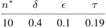

<!-- Start of picture text -->
n ∗ δ ϵ τ 10 0.4 0.1 0.19 <!-- End of picture text -->

Table 10: Selected inference hyperparameters for GPT4o. 

|**Acc.** _↑_|**Rel.** _↑_**Inf.** _↑_|**# Iter.** _↓_**I. Gain**_↑_|
|---|---|---|
|58.7|54.3 .175|1.83 .730|

Table 11: Ego4D-PMD validation set results for GPT4o. 

nate the question and answer for question rephrasing. On the validation data, 28 out of 500 examples were omitted, and 103 question candidates could not be rephrased by GPT-4o. 

The inference hyperparameters _n__∗_ , _δ_ , _ϵ_ , and _τ_ are selected as in our open-source model results, and listed in Table 10. The results on the validation data are listed in Table 11, while the results on the testing data are listed in the main body of the paper in Table 1. Comparing GPT-4o to the base VLMs we evaluated, it is generally inferior in PMD accuracy and informativeness, but asks more relevant questions, runs for fewer iterations, and has higher information gain. Our best model configurations, though, outperform GPT-4o under all evaluation metrics except information gain.27 This suggests that GPT-4o is a reasonable starting point for coherent PMD, but like other offthe-shelf VLMs we evaluated, it may require additional interventions (e.g., coherence-based ranking) to be viable for this task. 

### **E.6 Rationale-Free Evaluation** 

For a reference point to incomparable prior works that have applied VLMs to PMD with a focus on classification accuracy (Du et al., 2023; Bao et al., 2023), we additionally evaluate all studied VLMs from this work on a non-coherent PMD task. Specifically, we prompt each VLM with the following text: 

_This is a photo of someone working on the procedure “⟨procedural text⟩”. Q: Based on the image, has the procedure “⟨procedural text⟩” been successfully completed? A:_ 

> 27LLaVA with coherence-based fine-tuning, coherencebased re-ranking, and in-context learning achieves .742 bits of information gain, while GPT-4o achieves up to .793 bits. This shows that GPT-4o generally exhibits higher confidence despite having much lower PMD accuracy than our approaches, which is not necessarily an advantage. 

13996

<!-- Page 30 -->

|**InstructBLIP**|**LLaVA**|**Llama**|**3** **GPT-4o**|
|---|---|---|---|
|0.34|0.77|0.54|0.98|

Table 12: Selected values of mistake confidence threshold _τ_ for rationale-free PMD with various VLMs. _n__∗_ , _δ_ , and _ϵ_ are no longer used in rationale-free PMD, but _τ_ is still tuned as in previous experiments. 

This prompt is as comparable as possible to the one used for coherent PMD, but does not elicit a series of questions and answers from the VLM. We perform this evaluation on InstructBLIP, LLaVA, Llama 3, and GPT-4o. Table 12 lists the inference hyperparameters for this approach, while Table 13 lists the results for the validation and testing data. It is crucial to note that _these results are not directly comparable to the coherent PMD results presented in the main body of the paper_ , as VLMs are not required to justify their decisions, removing the explainability enabled by coherent PMD (crucial for end users to interpret often incorrect VLM decisions and act on them accordingly). As prior work has already explored this setting more extensively, we do not intend to provide a rigorous study here, rather a reference point to compare how requiring the generation of rationales impacts PMD accuracy. 

Interestingly, however, the rationale-free approach achieves generally better accuracy than the coherent PMD results in Tables 1 and 15 with likelihood-based ranking and no in-context learning. However, upon introducing coherencebased ranking and in-context learning, InstructBLIP and LLaVA achieve better accuracy than in the rationale-free approach. Further, the information gain in the rationale-free setting is consistently lower than those achieved in coherent PMD. This demonstrates that while the added transparency of incorporating rationales into PMD does cost the VLM some accuracy, improving the coherence of these rationales (e.g., through the approaches presented in this work) can recover this accuracy and more while enabling more confident decisions from VLMs. Rationale-free GPT-4o achieves the highest observed accuracy of 69.2%. Nonetheless, this accuracy is still low enough for errors to be common, thus necessitating the generation of a rationale for the user. 

||**I** |**nstr** |**uctBL** |**I** |**P** ||
|---|---|---|---|---|---|---|
|**Partition**|**Acc.** _↑_|**Rel.**|_↑_**Inf.**|_↑_|**# Iter.**|_↓_**I. Gain**_↑_|
|Validation|62.6|–|–||0.00|.113|
|Testing|62.2|–|–||0.00|.117|
|||**L** |**LaVA** ||||
|**Partition**|**Acc.** _↑_|**Rel.**|_↑_**Inf.**|_↑_|**# Iter.**|_↓_**I. Gain**_↑_|
|Validation|64.4|–|–||0.00|.236|
|Testing|66.1|–|–||0.00|.233|
|||**Ll** |**ama 3** | |||
|**Partition**|**Acc.** _↑_|**Rel.**|_↑_**Inf.**|_↑_|**# Iter.**|_↓_**I. Gain**_↑_|
|Validation|65.8|–|–||0.00|.187|
|Testing|64.6|–|–||0.00|.176|
|||**G**|**PT-4o**||||
|**Partition**|**Acc.** _↑_|**Rel.**|_↑_**Inf.**|_↑_|**# Iter.**|_↓_**I. Gain**_↑_|
|Validation|66.8|–|–||0.00|.718|
|Testing|69.2|–|–||0.00|.736|

Table 13: Ego4D-PMD validation and testing set results for rationale-free PMD with various VLMs. As self-dialog rationales are no longer generated, relevance and informativeness cannot be calculated. Further, zero iterations are performed, and information gain is calculated using the average entropy of the success probability without any rationale. 

### **E.7 Question Selection Inference Hyperparameters and Validation Results** 

In Table 14, we list the inference hyperparameters for the question selection results presented in Table 1: maximum number of iterations _n__∗_ , early stopping _δ_ and _ϵ_ , and mistake confidence threshold _τ_ . In Figure 6, we use detection error tradeoff (DET) curves to visualize the range of accuracy achieved with all candidate mistake confidence thresholds _τ_ for the approaches compared in Table 1. The full validation set results with selected hyperparameters are listed in Table 15. 

### **E.8 Analysis of Question Sources in In-Context Learning** 

To shed more light on where selected candidate questions come from in each approach, we visualize the distribution of question sources on the validation data in Figure 7. As expected, candidates generated with in-context learning are relatively rarely selected under likelihood-based ranking, amounting to about 25.7% of VQG iterations for InstructBLIP, 9.0% of VQG iterations for LLaVA, and 5.2% of VQG iterations for Llama 3. On the other hand, they are selected more fre- 

13997

<!-- Page 31 -->

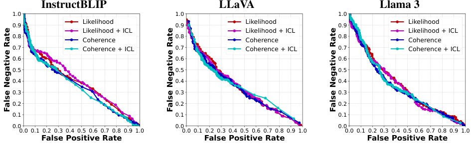

<!-- Start of picture text -->
InstructBLIP LLaVA Llama 3 1.0 1.0 1.0 Likelihood Likelihood Likelihood 0.9 0.9 0.9 Likelihood + ICL Likelihood + ICL Likelihood + ICL 0.8 Coherence 0.8 Coherence 0.8 Coherence 0.7 Coherence + ICL 0.7 Coherence + ICL 0.7 Coherence + ICL 0.6 0.6 0.6 0.5 0.5 0.5 0.4 0.4 0.4 0.3 0.3 0.3 0.2 0.2 0.2 0.1 0.1 0.1 0.0 0.0 0.0 0.0 0.1 0.2 0.3 0.4 0.5 0.6 0.7 0.8 0.9 1.0 0.0 0.1 0.2 0.3 0.4 0.5 0.6 0.7 0.8 0.9 1.0 0.0 0.1 0.2 0.3 0.4 0.5 0.6 0.7 0.8 0.9 1.0 False Positive Rate False Positive Rate False Positive Rate False Negative Rate False Negative Rate False Negative Rate <!-- End of picture text -->

Figure 6: Mistake detection error tradeoff (DET) curves for VLMs applied to the Ego4D-PMD validation set with likelihood- and coherence-based candidate question selection approaches, with optional supplementary candidates generated through in-context learning (ICL). 

||**In**|**struc**|**tBLI**|**P**||
|---|---|---|---|---|---|
|**Rank**|**ICL**|_n__∗_|_δ_|_ϵ_|_τ_|
|L|✗|10|0.1|0.2|0.41|
|L|✓|10|0.05|0.1|0.49|
|C|✗|10|0.05|0.2|0.35|
|C|✓|10|0.05|0.2|0.33|
|||**LLa**|**VA**|||
|**Rank**|**ICL**|_n__∗_|_δ_|_ϵ_|_τ_|
|L|✗|10|0.1|0.05|0.64|
|L|✓|10|0.1|0.05|0.72|
|C|✗|10|0.1|0.05|0.76|
|C|✓|10|0.05|0.05|0.74|
|||**Lla**|**ma 3**|||
|**Rank**|**ICL**|_n__∗_|_δ_|_ϵ_|_τ_|
|L|✗|10|0.1|0.05|0.40|
|L|✓|10|0.05|0.025|0.23|
|C|✗|10|0.05|0.05|0.38|
|C|✓|10|0.2|0.05|0.30|

Table 14: Selected inference hyperparameters for the results presented in Table 1. 

|||**I** |**nstruc** |**tBLIP** |||
|---|---|---|---|---|---|---|
|**Rank **|**ICL **|**Acc.** _↑_|**Rel.** _↑_|**Inf.** _↑_|**# Iter.** _↓_|**I. Gain**_↑_|
|L|✗|62.0|18.3|.237|**2.79**|.265|
|L|✓|61.8|14.0|.325|4.62|.358|
|C|✗|63.8|26.0|.285|3.52|.298|
|C|✓|**64.2**|**36.2**|**.336**|3.30|**.363**|
||||**LLa**|**VA**|||
|**Rank **|**ICL **|**Acc.** _↑_|**Rel.** _↑_|**Inf.** _↑_|**# Iter.** _↓_|**I. Gain**_↑_|
|L|✗|62.0|42.7|.287|3.15|.437|
|L|✓|62.2|41.7|.289|3.17|.439|
|C|✗|63.6|68.5|.319|**3.05**|.532|
|C|✓|**64.4**|**76.5**|**.418**|3.45|**.659**|
||||**Llam** |**a 3** |||
|**Rank **|**ICL **|**Acc.** _↑_|**Rel.** _↑_|**Inf.** _↑_|**# Iter.** _↓_|**I. Gain**_↑_|
|L|✗|60.8|16.8|.287|4.62|.219|
|L|✓|61.2|16.2|.335|6.38|.245|
|C|✗|64.2|25.0|.347|6.37|.236|
|C|✓|**64.8**|**52.3**|**.469**|**3.57**|**.396**|

Table 15: Ego4D-PMD validation set results for likelihood-based (L) and coherence-based (C) candidate question ranking approaches, with optional supplementary candidates generated through in-context learning (ICL). 

quently in the coherence-based ranking, amounting to about 35.6% of VQG iterations for InstructBLIP, 30.6% of VQG iterations for LLaVA, and 36.5% of VQG iterations for Llama 3. Interestingly, in-context learning candidates are more dominant in earlier iterations, while candidates generated based on the dialog context are relatively more common in later iterations. This may suggest that after selecting a few questions from in-context learning in earlier iterations, the VLM is able to utilize them to generate better questions from the dialog context in later iterations. Alternatively, this could suggest that candidates from 

13998

<!-- Page 32 -->

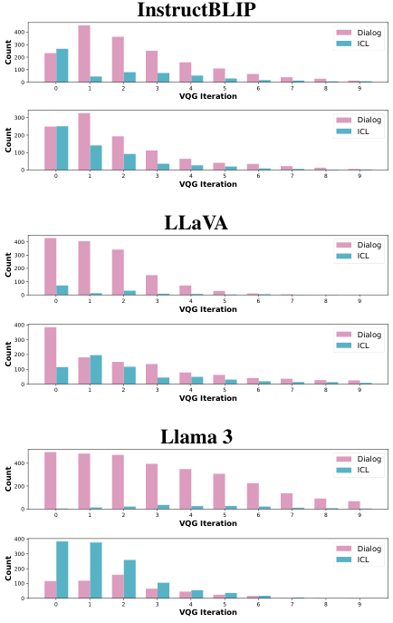

<!-- Start of picture text -->
InstructBLIP 400 Dialog 300 ICL 200 100 0 0 1 2 3 4 5 6 7 8 9 VQG Iteration 300 Dialog 200 ICL 100 0 0 1 2 3 4 5 6 7 8 9 VQG Iteration LLaVA 400 Dialog 300 ICL 200 100 0 0 1 2 3 4 5 6 7 8 9 VQG Iteration 400 300 DialogICL 200 100 0 0 1 2 3 4 5 6 7 8 9 VQG Iteration Llama 3 400 Dialog ICL 200 0 0 1 2 3 4 5 6 7 8 9 VQG Iteration 400 300 DialogICL 200 100 0 0 1 2 3 4 5 6 7 8 9 VQG Iteration Count Count Count Count Count Count <!-- End of picture text -->

Figure 7: Histograms of VLMs’ selected question sources, either self-dialog context or in-context learning (ICL) examples, by visual question generation (VQG) iteration for likelihood-based question selection (top) and coherence-based question selection (bottom). 

in-context learning have limited variety, and thus are less likely to be selected in later turns to avoid redundant questions or information. 

### **E.9 Diversity-Based Ranking Baseline** 

One possible explanation for the effectiveness of coherence-based question ranking in Section 4.1 is that it enables the selection of more semantically diverse questions, thus collecting broader information about the image. To explore this question, we implement a supplemental diversitybased ranking approach which uses a sentence transformer (Reimers and Gurevych, 2020)28 to embed all previous and candidate questions at each iteration, then selects the candidate question with the largest average cosine distance from previous questions. 

As shown in Table 17, we observe that diversitybased ranking combined with in-context learning 

> 28See https://huggingface.co/sentence-transformers/ all-MiniLM-L6-v2. 

||**Inst** |**ructB** |**LIP**||
|---|---|---|---|---|
|**ICL**|_n__∗_|_δ_|_ϵ_|_τ_|
|✗|10|0.1|0.2|0.25|
|✓|10|0.1|0.1|0.23|
|||**LLaV**|**A**||
|**ICL**|_n__∗_|_δ_|_ϵ_|_τ_|
|✗|10|0.05|0.05|0.58|
|✓|10|0.05|0.05|0.69|
||**L**|**lama**|**3**||
|**ICL**|_n__∗_|_δ_|_ϵ_|_τ_|
|✗|10|0.05|0.05|0.41|
|✓|10|0.1|0.025|0.40|

Table 16: Selected inference hyperparameters for diversity-based ranking with various VLMs, with optional supplementary candidates generated through incontext learning (ICL). 

can also improve the accuracy of VLMs (to a level slightly below that of coherence-based ranking). Accuracy reaches respective maxima of 64.7% and 67.1% for InstructBLIP and LLaVA (compared to 66.6% and 67.8% under coherence-based ranking). This may suggest that some accuracy improvements in coherence-based ranking could be attributed simply to the ability to select more diverse questions than a likelihood-based approach. Additioanlly, this reaffirms our observation that VLMs are poorly suited for this task off-the-shelf. 

However, we also see that in most cases, Diversity-based ranking substantially degrades relevance, informativeness, number of iterations, and information gain compared to those in Table 1. This suggests that the highly exploratory nature of diversity-based ranking causes rationales to be less coherent, and conclusions are made slower and less confidently with this approach. Meanwhile, coherence-based ranking enables us to find good questions to ask faster, leading to more confident conclusions with more relevant and informative supporting evidence (while also achieving a higher accuracy). 

### **E.10 DPO with Length Penalty Experiment** 

In the results discussed in Section 5.2, we observed that while VLMs learned to generate much more relevant questions, the informativeness of answers and thus the PMD accuracy degraded. We hypothesized that this resulted from the generation of highly complex questions, e.g., “Is the soil placed around the seedling with the trowel in the person’s hand?” As such, a potentially fruitful 

13999

<!-- Page 33 -->

|||**Ins** |**truct** |**BLIP** |||
|---|---|---|---|---|---|---|
|**Partition **|**ICL **|**Acc.** _↑_|**Rel.** _↑_|**Inf.** _↑_|**# Iter.**|_↓_**I. Gain**_↑_|
|Validation |✗ |61.4 |**17.8** |.244 |**2.89** |.268 |
|Validation|✓|**64.0**|14.4|**.337**|3.82|**.350**|
|Testing|✗|64.2|**17.5**|.237|**2.88**|.268|
|Testing|✓|**64.7**|15.1|**.337**|3.72|**.344**|
||||**LLaV**|**A**|||
|**Partition **|**ICL **|**Acc.** _↑_|**Rel.** _↑_|**Inf.** _↑_|**# Iter.**|_↓_**I. Gain**_↑_|
|Validation|✗|64.2|37.0|.298|4.12|.444|
|Validation|✓|**65.2**|**43.2**|**.385**|**3.99**|**.539**|
|Testing|✗|62.9|35.2|.310|4.35|.455|
|Testing|✓|**67.1**|**39.8**|**.405**|**4.32**|**.513**|
||| |**Llama** |**3** |||
|**Partition **|**ICL **|**Acc.** _↑_|**Rel.** _↑_|**Inf.** _↑_|**# Iter.**|_↓_**I. Gain**_↑_|
|Validation|✗|62.6|15.7|.313|6.19|.262|
|Validation|✓|**66.8**|**24.2**|**.412**|**5.14**|**.358**|
|Testing|✗|**60.9**|15.1|.322|6.48|.246|
|Testing|✓|59.6|**22.6**|**.393**|**5.23**|**.332**|

Table 17: Ego4D-PMD validation and testing set results for diversity-based ranking with various VLMs, with optional supplementary candidates generated through in-context learning (ICL). 

avenue for future research is to explore decoding approaches and learning objectives that prioritize more approachable questions for VLMs. 

While the primary purpose of this work was to recast the problem of PMD into a more transparent formulation and lay a foundation for research toward coherent question generation and answering in PMD, we performed an initial experiment to guide future work along this line. Specifically, we imposed an exponential _length penalty l_ = _−_ 1 _._ 0 to text generation during training data generation and inference for evaluation.29 During beam search, a length penalty modifies the total log-likelihood _pQ_ of a partial candidate question _Q_ as follows: 

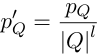

Here, _|Q|_ is the length of the question _Q_ , i.e., number of generated tokens thus far. For earlier experiments, the value of _l_ could be thought of as 1, which effectively applies no exponential penalty to _|Q|_ when calculating likelihood-based sequence scores (the default behavior). 

In Table 18, we list the results of applying this 

> 29Like the results presented in Table 2, candidates generated through in-context learning are also included in training data. 

**LLaVA + DPO (with length penalty)** 

|**Rank **|**ICL **|**Acc.** _↑_|**Rel.** _↑_|**Inf.** _↑_|**# Iter.** _↓_|**I. Gain**_↑_|
|---|---|---|---|---|---|---|
|L|✗|61.7|93.5|.293|1.93|.741|
|L|✓|**67.0**|56.4|**.459**|4.05|.628|
|C|✗|63.1|97.5|.313|**1.82**|**.771**|
|C|✓|62.9|**97.7**|.319|1.83|.769|

Table 18: Ego4D-PMD test set results for DPO-trained VLMs with an additional length penalty _l_ = _−_ 1 applied during training data generation and inference. Inference applies likelihood (L) or coherence (C) candidate question ranking approaches, with optional supplementary candidates generated through in-context learning (ICL). 

length penalty. As shown, compared to the results in Table 2, similar trends of hold despite applying the length penalty: we observe improved relevance, number of iterations, and information gain, but degraded accuracy and informativeness. An interesting exception is when using likelihoodbased ranking and in-context learning during inference, we recover a comparable accuracy and informativeness to those observed in LLaVA before applying DPO, but this comes at a cost of a a lower relevance, higher number of iterations, and lower information gain than other inference configurations. This provides further evidence that there exists a trade-off between generating relevant questions and achieving high informativeness and accuracy, and future work should aim to find a balance between these priorities. 

### **E.11 Using Coherence Metrics to Diagnose Common VLM Behaviors** 

To deepen the insights from the graphs in Figure 4, in Figure 5, we provided several example outputs from LLaVA with coherence-based ranking, which displays a range of behaviors. Below, we further explain these behaviors and examples. 

**Correct and coherent points.** Cyan points have low error with high informativeness and relevance, indicating correct decisions with coherent rationales. These are the best case examples from the model. Figure 5, Example A is one such case, where LLaVA correctly determines that the procedure “Pick up a sink brush from the kitchen slab” has been successfully completed, rationalizing it coherently and succinctly with a single question and answer about the location of the _sink brush_ . 

**Incorrect and incoherent points.** Conversely, red to magenta points have high error, low infor- 

14000

<!-- Page 34 -->

mativeness, and low relevance, indicating incorrect decisions with incoherent rationales. These are the worst case examples from the model. Figure 5, Example B is one such case, where LLaVA incorrectly decides that the procedure “Tighten the screw” was not successfully completed due to the person in the image not wearing various protective gear, an incoherent rationale for the decision. 

**Correct but incoherent points.** Indigo to black points have low error, but low relevance and informativeness, indicating correct decisions without sufficient rationale. Figure 5, Example C, is an instance of this, where LLaVA correctly decides that the person in the image has not successfully completed the procedure “Paint the stone” (rather they are painting a wood molding). However, LLaVA’s decision is only supported by a question about whether the person is wearing a shirt, which it does not answer confidently, making for a completely insufficient rationale. 

**Coherent but incorrect points.** White points have high error, relevance, and informativeness, indicating coherent rationales that do not lead to a correct decision. In other words, the information collected by the VLM should have been sufficient to make a correct decision (according to our automated coherence metrics), but this did not occur. Figure 5, Example D shows one such case, where LLaVA incorrectly decides that the procedure “Drop the bottle of mustard on the countertop” was unsuccessful. While it correctly identified that _the bottle_ is on _the countertop_ , which suggests the success of the procedure, it later mistakenly identified _the bottle_ to be on the floor, creating a contradiction in the rationale and causing it to make the wrong decision. The ability of this analysis to easily identify issues like this may be useful for future work in PMD and task guidance, as it enables the detection and thus the correction of bugs in the system’s reasoning. 

**Irrelevant but informative points.** Blue points have low relevance but relatively high informativeness, indicating irrelevant questions that still yield informative answers. As shown in Figure 5, Example E, this does not necessarily indicate a failure of LLaVA, rather a terse rationale. In this example, LLaVA correctly determines that the procedure “Fold the cut piece of cloth” has not been completed successfully. It reasonably rationalizes this decision by asking about the presence of a 

_piece of cloth_ and responding with _No_ . The question of whether the person is working with a _piece of cloth_ is deemed somewhat irrelevant by our metrics because if the answer were instead _Yes_ , this would not provide sufficient information to conclude that the procedure was successful. However, since the answer was _No_ , we do have sufficient information to conclude that the procedure is unsuccessful, despite the question being relatively indirect. Blue points may thus point to sufficient rationales which lack some detail or specificity, which are not necessarily problematic to system performance. 

**Relevant but uninformative points.** Green and yellow points have high relevance but low informativeness, indicating a failure to extract useful information in VQA. Green points have close to zero informativeness, indicating unsure responses in VQA. In Figure 5, Example F, LLaVA rationalizes its decision about the procedure “Put the bolt remover in the lawn tractor” by asking whether _the bolt remover_ is in _the lawn tractor_ in various ways. However, these objects are not present in the image and thus LLaVA’s answer is not confident, causing it to respond _Unsure_ to most questions, leading to low informativeness. Despite its failure to answer questions, LLaVA still arrives at the correct conclusion that the procedure has not been successfully completed. 

Meanwhile, yellow points have highly negative informativeness, indicating counterproductive responses in VQA that oppose the correct decision. As shown in Figure 5, Examples G and H, these cases typically occur when the VLM does not recognize an object in the image, or it recognizes an object that is not in the image. In Example G, LLaVA incorrectly decides that the procedure “Put the trowel in a bin” is unsuccessful because it does not recognize that _the trowel_ is indeed in _a bin_ , perhaps because it is relatively small in the image and does not contrast from the background. In Example H, LLaVA incorrectly decides that the procedure “Put the bottle in the cabinet” is successful because it hallucinates that a _bottle_ is in _the cabinet_ , despite neither object appearing in the image. The ability of this analysis to easily identify failures of visual perception in VLMs again may be useful for future work in this area. 

The colors of these points can be used to characterize common behaviors of VLMs. Additional insights toward the fine-grained strengths and weak- 

14001

<!-- Page 35 -->

nesses of various approaches may be gained from analyzing these results by mistake type, or verb and noun categories. 

14002
