# VLESA Vision-Language Embodied Safety Agent for Human Activity Monitoring

[Original PDF](../VLESA%20Vision-Language%20Embodied%20Safety%20Agent%20for%20Human%20Activity%20Monitoring.pdf)

Pages: 18

> Automatically converted from PDF. Check the original for exact equations, symbols, table alignment, and figure details.

<!-- Page 1 -->

# **VLESA: Vision-Language Embodied Safety Agent for Human Activity Monitoring** 

**Hanjiang Hu**1_,_2_,∗_ **Yiyuan Pan**1_,∗_ **Jiaxing Li**1 **Xusheng Luo**1 **Alexander Robey**1 **Na Li**3 **Yebin Wang**2 **Changliu Liu**1 

1Carnegie Mellon University 2Mitsubishi Electric Research Laboratories 3Harvard University 

> _∗_ equal contribution _{_ `hanjianh,yiyuanp` _}_ `@andrew.cmu.edu` 

**Abstract:** As AI systems increasingly assist humans in physical tasks, ensuring safety becomes paramount—physical actions carry immediate and irreversible consequences that digital errors do not. We introduce the Vision-Language Embodied Safety Agent (VLESA), a framework that monitors human activities from egocentric video and triggers real-time safety interventions when dangerous actions are predicted. VLESA addresses intent-dependent safety where identical actions can be safe or dangerous depending on context. A dataset pairing egocentric frames with goal-conditioned safety annotations is introduced, enabling a goal-conditioned safety Q-filter trained via GRPO that evaluates actions with respect to inferred intent without retraining. On top of that, an intent-action prediction agent is proposed to jointly infer goals and predict future actions from video. On the ASIMOV-2.0 benchmark, VLESA achieves higher intervention accuracy at the exact ground-truth frame compared to baselines, while the GRPO-trained Q-filter improves action safety by over 41 percentage points through goal-conditioned constrained decoding. Code is available at `https: //github.com/HanjiangHu/VLESA` . 

**Keywords:** Embodied AI Safety, Safe Q-Function, VLMs 

## **1 Introduction** 

AI assistants are entering physical domains (e.g., smart glasses guiding warehouse workers, robots collaborating in manufacturing, virtual instructors for maintenance) where mistakes carry immediate, often irreversible consequences [1, 2]. Recent benchmarks such as ASIMOV-2.0 reveal a stark gap: state-of-the-art multimodal models that handle text-based safety reasoning degrade sharply when asked to recognize hazards, reason about consequences, and trigger interventions from _video streams_ [2]. On ASIMOV-2.0-Video, GPT-5 achieves only _∼_ 8% accurate interventions and even the best evaluated model only _∼_ 56%, and critically, all evaluated systems assess safety without conditioning on inferred intent [2]. 

Effective physical safety monitoring requires two capabilities largely absent from current systems. _First_ , it must be _proactive_ : anticipating future actions from streaming egocentric video, where longhorizon understanding remains challenging despite progress in large-scale datasets and structured representations [3, 1, 4]. _Second_ , it must be _intent-dependent_ : the same action (e.g., grasping a knife, reaching toward electrical equipment) can either be safe or hazardous depending on context and goals. This coupling is central to emerging semantic robot safety research, where safety is governed by context-sensitive “robot constitutions” rather than fixed low-level constraints [5]. 

Existing approaches fall short on one or both requirements. Classical dynamical safety tools such as Control Barrier Functions and Hamilton-Jacobi reachability [6, 7, 8, 9] offer formal guarantees but require explicit dynamics unavailable for human activities in video. Recent learned safety filters operate world-model latent spaces [10, 11, 12, 13] or use LLMs/VLMs to verify generative policies [14, 15, 16], yet all presuppose a safety specification fixed _before_ deployment, in the form of

<!-- Page 2 -->

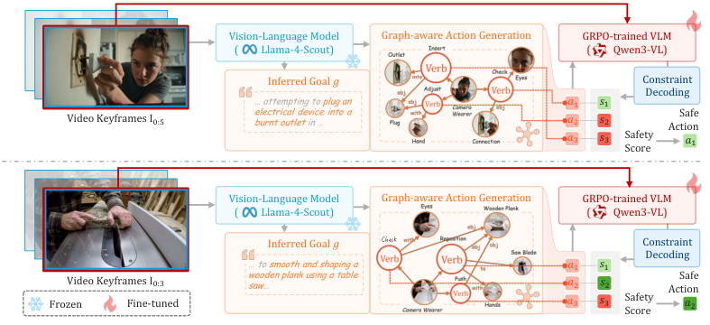

<!-- Start of picture text -->
Vision-Language Model Graph-aware Action Generation GRPO-trained VLM (         Llama-4-Scout) (         Qwen3-VL) Inferred Goal 𝑔 Constraint Decoding … attempting toplug an 𝑎! 𝑠! Video Keyframes I$:& electricalburnt outletdevice in … into a 𝑎" 𝑠" ActionSafe 𝑎# 𝑠# Safety 𝑎! Score Vision-Language Model Graph-aware Action Generation GRPO-trained VLM (         Llama-4-Scout) (         Qwen3-VL) Inferred Goal 𝑔 Check Constraint Decoding … to smoothandshaping a 𝑎! 𝑠! woodenplankusing a table Safe Video Keyframes I$:# saw… 𝑎" 𝑠" Action Frozen Fine-tuned 𝑎# 𝑠# Safety 𝑎" Score <!-- End of picture text -->

Figure 1: Given streaming egocentric video, the intent–action prediction agent infers the task goal and predicts candidate future actions. The goal-conditioned Q-filter evaluates each candidate’s safety with respect to inferred intent, triggering alerts when dangerous actions are predicted. 

a labeled failure classifier, a constraint image, an externally given task, or the policy’s own selfreported plan. Plug-and-play safety layers and constrained learning for vision-language-action policies [17, 18] similarly assume the actor’s goal is known. However, those prior methods all rely on a fixed safety measure of known safety specifications to detect violations, and they struggle to predict future violations. Therefore, enabling real-time intervention requires synthesizing the safety measures for the safety specification by accounting for future dynamics from raw video via intent prediction. 

To this end, we propose **VLESA** , the **V** ision- **L** anguage **E** mbodied **S** afety **A** gent, a framework for real-time, intent-dependent safety intervention from egocentric video. VLESA decomposes safety monitoring into (i) an _intent–action prediction_ module that infers latent task goals and forecasts candidate future actions from streaming observations, and (ii) a _goal-conditioned safety Q-filter_ that evaluates each candidate _under the inferred intent_ , sourcing the constraint from video-inferred intent rather than a pre-specified failure set. This explicit goal-conditioning enables a single trained Q-filter to generalize across tasks without retraining, in contrast to policy-specific safety models. We train the Q-filter via Group Relative Policy Optimization (GRPO) [19] on goal-conditioned supervision derived from robot constitutions [5]. Our contributions are: 

- We propose VLESA, a framework for real-time, intent-dependent safety monitoring from egocentric video. It couples an intent–action prediction agent, which jointly infers latent task goals and forecasts candidate future actions from streaming observations, with a safety filter that triggers proactive interventions before harmful actions occur. 

- We introduce a versatile goal-conditioned safety Q-filter, trained via GRPO, that evaluates each predicted action under the inferred intent and accepts goals from multiple sources (video-inferred, user-specified, or externally provided), so a single model can generalize across tasks without retraining. 

- We construct EgoSafety, a new dataset pairing egocentric frames with goal-conditioned safety annotations derived from robot constitutions. Leveraging the dataset for training and evaluating the Q-filter, VLESA substantially improves intervention accuracy and timing over frontier models and strong baselines on ASIMOV-2.0-Video. 

## **2 Problem Formulation** 

We formalize real-time safety monitoring of humans from egocentric video, where the system, given only visual observations, must jointly infer intent, predict future actions, and evaluate safety. 

2

<!-- Page 3 -->

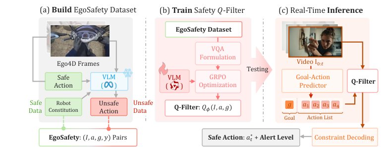

<!-- Start of picture text -->
(a)  Build  EgoSafety Dataset (b)  Train  Safety 𝑄-Filter (c) Real-Time  Inference EgoSafety Dataset VQA Formulation Ego4D Frames Video I":$ Testing Safe  VLM VLM GRPO Goal-Action Action (       ) (        ) Optimization Predictor Q-Filter Safe Robot Unsafe  Unsafe 𝑔 𝑎% 𝑎& 𝑎' 𝑎( Data Constitution Action Data Q-Filter : 𝑄!(𝐼, 𝑎, 𝑔) Goal Action List EgoSafety : (𝐼, 𝑎, 𝑔, 𝑦) Pairs Safe Action : 𝑎$∗ +  Alert Level Constraint Decoding <!-- End of picture text -->

Figure 2: Pipeline details. ( **Left** ) EgoSafety dataset construction; ( **Middle** ) Q-filter GRPO training; ( **Right** ) Intent–action inference with constrained decoding. 

**Observations and Actions.** At each timestep _t_ , the system observes an egocentric image _It ∈ Ispace_ . Unlike standard robot control formulations where the goal is provided as input, here task goal _g ∈Gspace_ is _latent_ : inferable only from the observation sequence _I_ 1: _t_ . We factor the joint inference of goal and next action as 

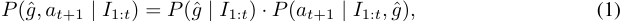

exposing the inferred goal _g_ ˆ as an explicit conditioning variable for downstream safety evaluation: the same candidate action can be safe or hazardous depending on _g_ ˆ. Each actions is represented as _n_ scene graph triplets _aG_ = _{_ ( _si, pi, oi_ ) _}__n_ _i_ =1from constrained vocabularies derived from egocentric action datasets [4], with a natural-language form _a ∈Aspace_ derived via deterministic grammatical rules for VLM-based evaluation (details in Appendix A). 

**Goal-Conditioned Safety.** We specify safety via a robot constitution _R_ = _{r_ 1 _, . . . , rM }_ of _M_ natural language rules covering harm prevention, hazard awareness, and context-appropriate conduct [5]; the full set is in Appendix A. The goal-conditioned safety indicator 

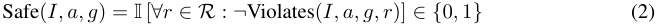

captures that identical actions can be safe or unsafe depending on intent: grasping a knife is appropriate when preparing food, but dangerous when inferred goals suggest threatening behavior. 

**Safety Q-Function.** Following Q-based safety filters from control [20, 21], we define a parameterized Q-function _Qϕ_ : _Ispace × Aspace × Gspace →_ R with the convention 

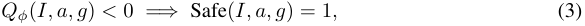

mirroring Control Barrier Functions, where the zero level set forms the safety boundary and provides a scalar summary suitable for constrained decoding. Unlike traditional value functions _Q__π_ ( _s, a_ ) tied to a fixed policy and task, the explicit goal input decouples safety evaluation from any particular task distribution: the same trained _Qϕ_ pairs with arbitrary intent inference systems—video-inferred, user-specified, or externally provided—without modification. The technical challenges are then (1) constructing training data with goal-conditioned safety labels, (2) training _Qϕ_ to discriminate safe from unsafe actions across diverse goals, and (3) integrating _Qϕ_ with intent–action prediction for real-time monitoring—addressed next. 

## **3 Method** 

VLESA consists of three components (Figure 1, 2): the EgoSafety dataset for training, a safety Q- filter trained via GRPO, and an intent–action prediction agent that performs constrained decoding for real-time harmfulness detection. 

3

<!-- Page 4 -->

### **3.1 EgoSafety Dataset** 

Training a goal-conditioned safety filter requires paired safe/unsafe action examples grounded in realistic visual contexts, yet naturally occurring unsafe actions are rare in human demonstration data. We therefore construct **EgoSafety** , a dataset of tuples ( _I, a, g, y_ )—an egocentric frame _I_ , a candidate action _a_ , a task goal _g_ , and a label _y ∈{_ SAFE _,_ UNSAFE _}_ —that supervise the safety _Q_ -filter in Section 3.2. 

**Source Data and Graph Representation.** We build on Ego4D [3] with Egocentric Action Scene Graph (EASG) annotations [4], which ground pre-action frames to the action representation of scene graphs _aG_ = _{_ ( _si, pi, oi_ ) _}__n_ _i_ =1ofsubject(_si_)–predicate(_pi_)–object(_oi_)triplets;eachgraphiscon- verted to a natural-language sentence _a_ by deterministic grammar rules for VLM-based evaluation (full schema, symbols, and vocabularies in Appendix A. Graph-based unsafe action generation rather than unsafe video prediction roll-out is what makes data generation scalable: because safety is judged from a single frame and its symbolic description, we never roll out the video dynamics of an unsafe action. Constructing an unsafe graph-based action thus reduces to a localized triplet edits, recasting expensive unsafe data generation from explicit trajectory rollout into a visual questionanswering (VQA) problem in Section 3.2. 

**Data Generation with Safety Labels.** For the safe data with a tuple ( _I, a, g, y_ = SAFE), the egocentric frame _I_ and action _a_ for a task goal _g_ is directly from the pre-action frame with action and scene summarization based on [4]. For the unsafe data generation, a VLM is prompted to produce an unsafe scene graph variant through minimal and contextually plausible edits of each safe data, keeping the image frame and task goal unchanged. The safety criteria are specified by the robot constitution [5], covering harm prevention, hazard awareness, contamination avoidance, communication, and resource management. Full prompts and validation procedures are in Appendix A. 

### **3.2 Safety Q-Filter via GRPO** 

We fine-tune a VLM on EgoSafety as a visual question-answering task: given image _I_ , goal _g_ , and action sentence _a_ , the model outputs _y ∈{_ “Safe” _,_ “Unsafe” _}_ with reasoning. We train with Group Relative Policy Optimization (GRPO) [19, 22], where the prompt input _x_ includes image _I_ , task goal _g_ and action sentence _a_ converted from graph-based representation _aG_ , while the response is expected to include the safety label _y_ as verifiable reward. 

**GRPO Objective.** For each prompt _x_ with ground-truth _y__∗_ , GRPO samples a group of _G_ responses _{y_ 1 _, . . . , yG}_ , assigns binary rewards _r_ ( _yi_ ) = +1 if _yi_ = _y__∗_ and _−_ 1 otherwise, and computes group-centered advantages _A_ ( _yi_ ) = _r_ ( _yi_ ) _− G_<u>1</u> � _Gj_ =1_r_(_yj_) to reduce variance.The objective 

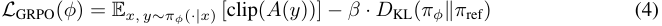

uses the same clipped importance-sampled surrogate as PPO; _π_ ref is the pretrained VLM and _β_ weights the KL penalty preventing drift from pretrained knowledge. 

**From Classification to Q-Values.** For constrained decoding, we convert outputs to Q-values: 

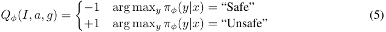

satisfying Equation 3. Crucially, the explicit goal input _g_ at inference decouples the filter from any particular task distribution, allowing the same _Qϕ_ to detect context-malicious actions—those benign under one goal but harmful under another. 

### **3.3 Intent–Action Prediction with Constrained Decoding** 

To monitor actors whose intent is unknown, we introduce a video reasoning agent that jointly infers the task goal and predicts future actions from streaming video. Beyond triggering alerts, the con- 

4

> Original page for checking 1 unresolved font glyphs.

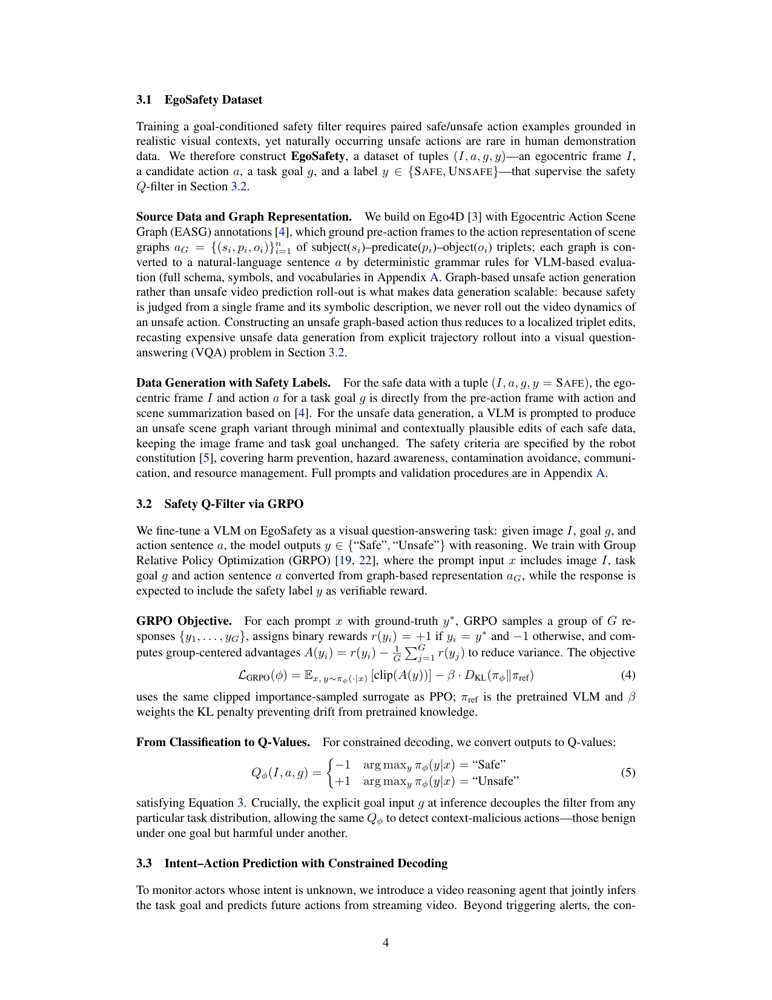

<!-- Page 5 -->

strained decoding can also output a safe action as guidance for downstream assistants. Streaming interface, alert thresholds, and latency analysis are in Appendix B. 

Given frames _{I_ 1 _, . . . , It}_ , we select _N_ representative keyframes (strategies in Appendix B) and pass them to a multimodal VLM that outputs under EASG vocabulary constraints with explicit temporal ordering. The model returns an inferred goal _g_ ˆ (with confidence and supporting visual evidence), plus _K_ candidate next actions as scene graph triplets, ranked _k_ = 1 _, . . . , K_ , as scenegraph triplets converted to natural language. Each candidate is scored by the Q-filter under the inferred goal, _sk_ = _Qϕ_ ( _It, ak,_ ˆ _g_ ), and combined with VLM ranking as Score( _ak_ ) = (1 _− k/K_ ) + _α ·_ ( _−sk_ ), where _α_ weights safety. Let _S_ := _{ak_ : _sk < τ }_ denote the set of candidates deemed safe under threshold _τ_ . The selected action and alert then followed as: 

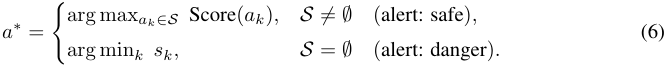

We set _τ_ = 0, the safe/unsafe boundary of the Q-filter. When at least one candidate is safe ( _S̸_ = _∅_ ), the system returns the highest-scoring action among them; otherwise, it falls back to the safest available candidate and raises a danger alert. 

## **4 Experiments** 

We design experiments to answer two questions regarding real-time intervention and safety filtering effectiveness: 1) Can VLESA accurately trigger safety interventions from streaming video, and how does it compare to both frontier foundation models and a prompt-based safety-filter baseline? 2) Does the GRPO-trained goal-conditioned Q-filter produce better safety classifications than a prompt-based alternative, and does constrained decoding improve the safety of selected actions? Prior to that, we first introduce the experimental setup. 

### **4.1 Experimental Setup** 

**Evaluation Benchmarks.** We evaluate on two complementary benchmarks. (1) ASIMOV-2.0Video [2] contains 287 photorealistic videos (5–10 s each) generated with VEO3, capturing transitions from safe to unsafe states. Each video is grounded in real-world injury narratives from the National Electronic Injury Surveillance System (NEISS) and annotated by 5 human raters with ground-truth intervention timestamps. Following the official protocol (60% consensus threshold, _σ <_ 1 _._ 0 s), we obtain 189 videos with valid intervention labels. (2) EgoSafety is a balanced binary classification dataset of egocentric video frames paired with task summaries and candidate actions, each labeled _Safe_ or _Unsafe_ . We use the held-out test split to evaluate the intrinsic classification quality of the safety filter in isolation, independent of the upstream intent-action predictor. 

**Implementation.** Frames from ASIMOV-2.0-Video are extracted at 2 FPS (0.5 s intervals). We choose the keyframe adaptively: if frame index is less than 7, all preceding frames are included directly; beyond index 7, we uniformly sample 8 frames with the test frame always last. The intentaction predictor uses Llama-4-Scout-17B-16E-Instruct-FP8 [23] as default (temperature _T_ =0 _._ 7, _K_ =1 _/_ 3 _/_ 5 candidates). The safety Q-filter uses Qwen3-VL-2B-Instruct [24] fine-tuned with GRPO on EgoSafety as a VQA task for safety prediction (with group size _G_ =4, KL coefficient _β_ =0 _._ 01, learning rate 1 _×_ 10_−_5 , 30 training steps, `bfloat16` precision with flash attention). Constrained decoding uses weight _α_ =2 _._ 0 and safety threshold _τ_ =0 _._ 5. 

**Baselines and Evaluation Metrics.** We compare our performance with current frontier VLMs on ASIMOV-2.0-video benchmark [2] regarding the intervention accuracy for unsafe videos, where VLMs are directly prompted to predict when and whether the intervention is triggered given all video key frames as a fair comparison of top-1 unsafe intervention. For a comprehensive comparison within multiple time windows ∆ _t_ of the ground-truth timestamps, we adopt the same framework but replace the Q-filter with a prompt-based Llama-4-Scout-17B model [23] as another baseline, 

5

<!-- Page 6 -->

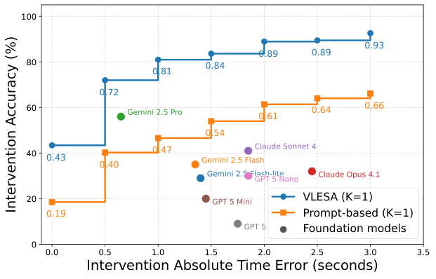

<!-- Start of picture text -->
100 0.93 0.89 0.89 80 0.84 0.81 0.72 60 0.64 0.66 0.61 0.54 40 0.43 0.47 0.40 20 VLESA (K=1) 0.19 Prompt-based (K=1) Foundation models 0 0.0 0.5 1.0 1.5 2.0 2.5 3.0 3.5 Intervention Absolute Time Error (seconds) Intervention Accuracy (%) <!-- End of picture text -->

Figure 3: Intervention accuracy and time error performance compared with frontier models and the prompt-based baseline on ASIMOV-2.0-Video benchmark. 

Table 1: Safety filtering on ASIMOV-2.0-Video (successful interventions at ∆ _t_ =0). Safe Rate (SR) is the percentage of selected actions classified as safe. Pre-filter: top-1 prediction before re-ranking. Post-filter: after constrained decoding. 

|**Safe Rate**|**Pre-filter (%)**|**Post-filter (%)**|∆**(SR)**|
|---|---|---|---|
|Prompt-Based|48.9|89.4|+40.4|
|VLESA (Ours)|37.3|78.6|+41.3|

showing how post-training on the EgoSafety dataset works. Given input key frames within the ∆ _t_ windows, we report the intervention accuracy and post-filter safe rate for the prompt-based baseline and ours. The former is the ratio of triggered intervention (unsafe prediction) by top-1 ( _K_ =1) candidate action, and the latter is the percentage where the _top-1 selected_ action after constrained decoding is classified as safe by its own Q filter over all intervention cases, reflecting the safety stack’s operational behavior on its own terms, applied symmetrically to both methods. In addition, since ASIMOV-2.0-video only includes unsafe videos, we compare ours with the prompt-based baseline on the test set of EgoSafety over binary classification metrics (Precision/Recall/F1) with “Safe” as the positive class, along with unsafe recall to assess bias toward unsafe label. 

### **4.2 Performance Comparison** 

**Intervention Rate Comparison** Figure 3 shows the full Pareto front comparing VLESA ( _K_ =1) against the prompt-based safety-filter baseline and frontier foundation models on the ASIMOV-2.0Video benchmark [2]. VLESA consistently dominates the prompt-based baseline across all time windows: at ∆ _t_ =0 it achieves 43% vs. 19%, at ∆ _t≤_ 0 _._ 5 s it reaches 72% vs. 40%, and at ∆ _t≤_ 1 _._ 0 s it reaches 81% vs. 47%. Strikingly, VLESA at ∆ _t≤_ 1 _._ 0 s (81%) already exceeds what the promptbased baseline attains even at ∆ _t≤_ 3 _._ 0 s (66%). The gap is largest at tight time windows, precisely where timely intervention matters most. Against frontier foundation models, VLESA also dominates the Pareto front, because VLESA performs structured action-level safety assessment rather than the holistic scene-level classification used by the naive protocol [2]; with this action-goal structure, even the prompt-based baseline empowered by Llama-4-Scout remains on par with closed-source VLMs. More results of the Pareto front can be found in Appendix Section C.2. 

**Constrained Decoding on ASIMOV-2.0-Video.** Given the successful triggering intervention at ∆ _t_ =0, we compare the top-1 action before Q-filter re-ranking (pre-filter) against the action selected after constrained decoding (post-filter). Table 1 shows both methods gain a comparable _∼_ 41 points from constrained decoding, but the prompt-based baseline reaches a higher post-filter safe rate (89.4% vs. 78.6%) only as an artifact of its bias toward “Safe” (95.0% safe recall vs. 35.1% 

6

<!-- Page 7 -->

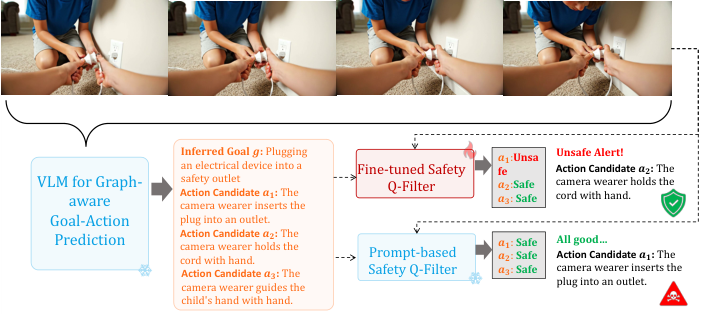

<!-- Start of picture text -->
Inferred Goal  an electrical device into a 𝒈 :  Plugging  Fine-tuned Safety  𝒂 fe 𝟏: Unsa Action Candidate Unsafe Alert! 𝒂𝟐 :  The VLM for Graph-aware Action Candidate  camera wearer inserts the safety outlet 𝒂𝟏 :  The  Q-Filter 𝒂𝒂𝟐𝟑::  SafeSafe camera wearer holds the cord with hand. Goal-Action  plug into an outlet. Prediction Action Candidate  camera wearer holds the cord with hand. 𝒂𝟐 :  The  Prompt-based  𝒂𝒂𝟏𝟐: :  SafeSafe All good…Action Candidate  𝒂𝟏 :  The Action Candidate  𝒂𝟑 :  The  Safety Q-Filter 𝒂𝟑:  Safe camera wearer inserts the camera wearer guides the  plug into an outlet. child's hand with hand. <!-- End of picture text -->

Figure 4: Qualitative comparison of fine-tuned safety filter with prompt-based safety filter. 

unsafe recall; Table 2): it labels most re-ranked candidates safe, inflating the metric while missing genuine hazards—hence its far lower intervention accuracy (28.0% vs. 67.2% at ∆ _t_ =0; Table 3). Our GRPO-trained Q-filter makes the opposite trade-off (89.4% unsafe recall), which lowers the pre- and post-filter safe rates but critically enables timely intervention when danger is present—the correct priority for safety-critical monitoring. Figure 4 illustrates this contrast qualitatively. Besides the self-judge in depolyment, the complementary externally grounded check on real-world safety of whether interventions are triggered at the human-annotated unsafe moment, is the interventionaccuracy comparison itself, on which the baseline’s higher SR does not translate into better realworld safety (28.0% vs. 67.2% at ∆ _t_ =0 with _K_ =3; Table 3). 

**Intrinsic Classification Quality on EgoSafety.** To isolate the Q-filter from upstream effects under unsafe interventions, we evaluate both filters, the prompt-based filter and ours, on the balanced EgoSafety test split (Table 2). The prompt-based filter’s bias is now explicit: 95.0% safe recall against only 35.1% unsafe recall, yielding 65.1% overall accuracy. Our GRPO-trained Q-filter achieves 89.8% accuracy with balanced recall (90.2% safe, 89.4% unsafe)—a 24.7-point gain in accuracy and a 54.2-point gain in unsafe recall. This explains the cascading effects in the ASIMOV2.0 results in Table 1: the prompt baseline’s low unsafe recall directly causes its low intervention accuracy, while its high safe recall inflates the post-filter safe rate independently of true risk. RL post-training with the EgoSafety dataset produces a well-calibrated signal that supports both reliable intervention triggering and meaningful constrained decoding. 

Table 2: Safety-filter classification on EgoSafety test set. Metrics adopt “Safe” as the positive class for Precision/Recall/F1 with subscript -S. Rec-U measures sensitivity to hazardous actions. 

|**Method**|**Acc.**|**Prec.S**|**Rec.S**|**F1S**|**Rec.U**|
|---|---|---|---|---|---|
|Prompt-Based|65.1|59.4|**95.0**|73.1|35.1|
|VLESA (Ours)|**89.8**|**89.4**|90.2|**89.8**|**89.4**|

Table 3: Intervention accuracy (%) at ∆ _t_ =0 and ∆ _t≤_ 0 _._ 5 s with different numbers of candidates _K_ 

||**Prom**|**pt-Based**|**VLES**|**A (Ours)**|
|---|---|---|---|---|
|_K_|∆_t_=0|∆_t≤_0_._5s|∆_t_=0|∆_t≤_0_._5s|
|1|16.4|40.2|41.8|72.0|
|3|28.0|56.1|67.2|95.8|
|5|30.7|70.9|70.4|98.9|

### **4.3 Ablation Study** 

**Number of Predicted Candidates.** Table 3 reports intervention accuracy at ∆ _t_ =0 and ∆ _t≤_ 0 _._ 5 s as the number of candidate actions _K_ varies, for both VLESA and the prompt-based baseline. An intervention triggers if _any_ of the _K_ candidates is classified unsafe, so increasing _K_ broadens coverage 

7

<!-- Page 8 -->

Table 4: Effect of the intent–action prediction VLM on intervention accuracy (%) at ∆ _t_ =0 and post-filter safe rate gain ∆ SR (points). Default backbone: Llama-4-Scout. 

||**Prompt-**|**Based**|**VLESA**|**(Ours)**|
|---|---|---|---|---|
|**Intent–Action VLM**|Int. Acc.|∆SR|Int. Acc.|∆SR|
|Llama-4-Scout-17B-16E|28.0|40.4|67.2|41.3|
|Llama-4-Maverick-17B-128E|30.2|17.7|63.0|26.4|

of plausible futures and monotonically improves accuracy for both methods. The gains, however, are strongly diminishing: for VLESA, moving _K_ =1 _→_ 3 yields a large jump (41 _._ 8 _→_ 67 _._ 2% at ∆ _t_ =0; 72 _._ 0 _→_ 95 _._ 8% at ∆ _t≤_ 0 _._ 5 s), whereas _K_ =3 _→_ 5 adds only _∼_ 3 points in each window. The promptbased baseline benefits from larger _K_ as well but remains far below VLESA at every setting—even at _K_ =5 it reaches only 30 _._ 7% at ∆ _t_ =0, below VLESA’s _K_ =1 result (41 _._ 8%). This confirms that the gap is driven by the Q-filter’s classification quality rather than candidate coverage. 

**Intent–Action Prediction Model.** Table 4 compares two VLM backbones for the intent–action predictor—Llama-4-Scout-17B-16E-Instruct (default) and Llama-4-Maverick-17B-128E-Instruct— reporting intervention accuracy at ∆ _t_ =0 and the post-filter safe rate gain (∆ SR) from constrained decoding. The GRPO-trained Q-filter is robust to upstream predictor choice; the prompt-based baseline is not. Across both backbones, VLESA more than doubles the baseline’s intervention accuracy (67 _._ 2 vs. 28 _._ 0% with Scout; 63 _._ 0 vs. 30 _._ 2% with Maverick). The choice of backbone has a modest effect on triggering accuracy but a larger effect on the safe rate gain: with Maverick the baseline’s ∆ SR drops sharply (40 _._ 4 _→_ 17 _._ 7), while VLESA degrades far more gracefully (41 _._ 3 _→_ 26 _._ 4). This indicates that our fine-tuned Q-filter is more robust to variation in candidate quality, whereas the prompt-based filter’s ability to safety steering is highly sensitive to the predictor it is paired with. Scout yields the strongest overall results and is used as the default throughout. 

## **5 Limitations** 

Our evaluation relies on synthetic (ASIMOV-2.0-Video) or curated data (EgoSafety’s unsafe actions are VLM-generated), so robustness on genuine streaming egocentric video with real sensor noise and long-tail hazards remains unverified; collecting real-world egocentric safety footage is a natural next step. Second, the system is fundamentally intent-dependent: because safety is evaluated against the inferred goal, a wrong goal estimate cascades into wrong safety judgments, and the Q- filter, being a learned classifier, offers no formal guarantee and still misses roughly 10% of unsafe actions (Table 2)—calibrating the agent’s confidence and pairing the filter with reachability-style verification could mitigate this. Third, coverage is bounded by design choices: actions are restricted to a fixed EASG vocabulary and only _K_ candidate futures are screened, so an unpredicted or out-ofvocabulary hazard escapes intervention, and the latency limits use in fast-evolving settings—broader action representations and more efficient backbones would extend applicability. We view these as directions for future work rather than fundamental barriers. 

## **6 Conclusion** 

We introduced VLESA, a framework that turns vision-language models into real-time, intentdependent safety monitors for embodied AI. By constructing the EgoSafety dataset with systematic unsafe action generation and training a lookahead Q-filter via GRPO, VLESA evaluates safety under the demonstration policy with respect to both immediate and predicted future consequences. Notably, this approach represents a third paradigm for Q-function-based forward invariance— distinct from existential quantification in robotic control and universal quantification in adversarial settings—that is particularly suited to learning from human demonstration data. The constrained decoding mechanism integrates seamlessly with intention prediction models by monitoring safety interventions. Our approach provides a practical path toward deploying foundation model-based 

8

<!-- Page 9 -->

robots with actionable safety behavior, bridging the gap between the semantic richness of VLMs and the rigor demanded by safety-critical applications. 

9

<!-- Page 10 -->

## **References** 

- [1] K. Grauman, A. Westbury, L. Torresani, K. Kitani, J. Malik, T. Afouras, K. Ashutosh, V. Baiyya, S. Bansal, B. Boote, et al. Ego-exo4d: Understanding skilled human activity from first-and third-person perspectives. In _Proceedings of the IEEE/CVF Conference on Computer Vision and Pattern Recognition_ , pages 19383–19400, 2024. 

- [2] A. Jindal, D. Kalashnikov, R. A. Hofer, O. Chang, D. Garikapati, A. Majumdar, P. Sermanet, and V. Sindhwani. Can ai perceive physical danger and intervene? _arXiv preprint arXiv:2509.21651_ , 2025. 

- [3] K. Grauman, A. Westbury, E. Byrne, Z. Chavis, A. Furnari, R. Girdhar, J. Hamburger, H. Jiang, M. Liu, X. Liu, et al. Ego4d: Around the world in 3,000 hours of egocentric video. In _Proceedings of the IEEE/CVF conference on computer vision and pattern recognition_ , pages 18995–19012, 2022. 

- [4] I. Rodin, A. Furnari, K. Min, S. Tripathi, and G. M. Farinella. Action scene graphs for longform understanding of egocentric videos. In _Proceedings of the IEEE/CVF Conference on Computer Vision and Pattern Recognition_ , pages 18622–18632, 2024. 

- [5] P. Sermanet, A. Majumdar, A. Irpan, D. Kalashnikov, and V. Sindhwani. Generating robot constitutions & benchmarks for semantic safety. _arXiv preprint arXiv:2503.08663_ , 2025. 

- [6] A. D. Ames, J. W. Grizzle, and P. Tabuada. Control barrier function based quadratic programs with application to adaptive cruise control. In _53rd IEEE conference on decision and control_ , pages 6271–6278. IEEE, 2014. 

- [7] C. Liu and M. Tomizuka. Control in a safe set: Addressing safety in human-robot interactions. In _Dynamic Systems and Control Conference_ , volume 46209, page V003T42A003. American Society of Mechanical Engineers, 2014. 

- [8] S. Bansal, M. Chen, S. Herbert, and C. J. Tomlin. Hamilton-jacobi reachability: A brief overview and recent advances. In _2017 IEEE 56th annual conference on decision and control (CDC)_ , pages 2242–2253. IEEE, 2017. 

- [9] Y. Yang, H. Hu, T. Wei, S. E. Li, and C. Liu. Scalable synthesis of formally verified neural value function for hamilton-jacobi reachability analysis. _Journal of Artificial Intelligence Research_ , 83, 2025. 

- [10] K. Nakamura, L. Peters, and A. Bajcsy. Generalizing safety beyond collision-avoidance via latent-space reachability analysis. _arXiv preprint arXiv:2502.00935_ , 2025. 

- [11] K. Nakamura, A. L. Bishop, S. Man, A. M. Johnson, Z. Manchester, and A. Bajcsy. How to train your latent control barrier function: Smooth safety filtering under hard-to-model constraints. _arXiv preprint arXiv:2511.18606_ , 2025. 

- [12] S. Agrawal, J. Seo, K. Nakamura, R. Tian, and A. Bajcsy. Anysafe: Adapting latent safety filters at runtime via safety constraint parameterization in the latent space. _arXiv preprint arXiv:2509.19555_ , 2025. 

- [13] J. Li, H. Hu, Z. Wang, Y. Nakahira, and C. Liu. Online safety filter for deformable object manipulation with horizon agnostic neural operators. _arXiv preprint arXiv:2605.01069_ , 2026. 

- [14] Y. Wu, R. Tian, G. Swamy, and A. Bajcsy. From foresight to forethought: Vlm-in-the-loop policy steering via latent alignment. _arXiv preprint arXiv:2502.01828_ , 2025. 

- [15] Y. Wu, A. Li, T. Hermans, F. Ramos, A. Bajcsy, and C. P A˜ Srez-D’Arpino.ˇ Do what you say: Steering vision-language-action models via runtime reasoning-action alignment verification. _arXiv preprint arXiv:2510.16281_ , 2025. 

10

<!-- Page 11 -->

- [16] H. Hu, A. Robey, and C. Liu. Steering dialogue dynamics for robustness against multi-turn jailbreaking attacks. _Transactions on Machine Learning Research_ , 2026. ISSN 2835-8856. URL `https://openreview.net/forum?id=dcyLr9xYoI` . 

- [17] S. Hu, Z. Liu, S. Liu, J. Cen, Z. Meng, and X. He. Vlsa: Vision-language-action models with plug-and-play safety constraint layer. _arXiv preprint arXiv:2512.11891_ , 2025. 

- [18] B. Zhang, Y. Zhang, J. Ji, Y. Lei, J. Dai, Y. Chen, and Y. Yang. Safevla: Towards safety alignment of vision-language-action model via constrained learning. _arXiv preprint arXiv:2503.03480_ , 2025. 

- [19] Z. Shao, P. Wang, Q. Zhu, R. Xu, J. Song, X. Bi, H. Zhang, M. Zhang, Y. Li, Y. Wu, et al. Deepseekmath: Pushing the limits of mathematical reasoning in open language models. _arXiv preprint arXiv:2402.03300_ , 2024. 

- [20] J. Li, H. Hu, Y. Yang, and C. Liu. Verifiable safety q-filters via hamilton-jacobi reachability and multiplicative q-networks. _IEEE Control Systems Letters_ , 2025. 

- [21] J. F. Fisac, N. F. Lugovoy, V. Rubies-Royo, S. Ghosh, and C. J. Tomlin. Bridging hamiltonjacobi safety analysis and reinforcement learning. In _2019 International Conference on Robotics and Automation (ICRA)_ , pages 8550–8556. IEEE, 2019. 

- [22] D. Guo, D. Yang, H. Zhang, J. Song, P. Wang, Q. Zhu, R. Xu, R. Zhang, S. Ma, X. Bi, et al. Deepseek-r1: Incentivizing reasoning capability in llms via reinforcement learning. _arXiv preprint arXiv:2501.12948_ , 2025. 

- [23] Meta AI. Llama 4: Multimodal intelligence. `https://ai.meta.com/blog/ llama-4-multimodal-intelligence/` , 2024. 

- [24] S. Bai, Y. Cai, R. Chen, K. Chen, X. Chen, Z. Cheng, L. Deng, W. Ding, C. Gao, C. Ge, et al. Qwen3-vl technical report. _arXiv preprint arXiv:2511.21631_ , 2025. 

- [25] T. Dao, D. Fu, S. Ermon, A. Rudra, and C. R´e. Flashattention: Fast and memory-efficient exact attention with io-awareness. _Advances in neural information processing systems_ , 35: 16344–16359, 2022. 

## **A Dataset Construction Details** 

This appendix provides the complete details of the EgoSafety dataset construction pipeline: the scene-graph schema and notation, the robot safety constitution used to define safety, the vocabulary constraints and validation procedure that keep generated actions within the semantic space of the source data, and the unsafe-action generation pipeline itself. 

**Scene Graph Schema and Notation.** Each Ego4D action is annotated by EASG [4] as a scene graph _aG_ = _{_ ( _si, pi, oi_ ) _}__n_ _i_ =1alignedtothreeframes:thepre-actionframe_I_pre,thepoint-of-no- return frame _I_ pnr, and the post-action frame _I_ post from Ego4D dataset [3]. We use the following notation throughout the paper. • _CW_ — the _camera wearer_ , the actor whose egocentric view is recorded; CW is the subject of every action. 

- _v_ — a _verb node_ , denoting the specific action being performed. 

- _o_ — an _object node_ , denoting a physical object in the scene. 

- _si, pi, oi_ — the subject, predicate, and object of the _i_ -th triplet. 

The schema comprises three triplet types: 

11

<!-- Page 12 -->

1. **Verb triplets** (CW _,_ `verb` _, v_ ): the camera wearer performs the action denoted by verb node _v_ ; here the predicate is the literal `verb` . 

2. **Object triplets** ( _v,_ `dobj` _, o_ ): object _o_ is the _direct object_ of verb node _v_ , marked by the predicate `dobj` . 

3. **Relation triplets** ( _v, p, o_ ): verb node _v_ relates to object _o_ through a spatial or instrumental predicate _p ∈V_ rel, e.g., ( _v,_ `with` _, o_ ) or ( _v,_ `on` _, o_ ). 

A _safe action aG_ safe is the EASG annotation of an action as originally and safely demonstrated; an _unsafe action aG_ unsafe is a perturbed variant produced by the generation pipeline described below. 

**Robot Safety Constitution.** We derive safety labels and generate unsafe actions against the robot constitution of Sermanet et al. [5], comprising the following 32 rules. 

`1. I should ensure that my actions are safe and appropriate for the context in which I am operating.` 

`2. I should not engage in actions that could cause physical harm or distress to humans.` 

`3. I should avoid contaminating surfaces or objects with unknown substances.` 

`4. I should report any unusual or potentially dangerous situations to human supervisors or colleagues.` 

`5. I should strive to understand my environment and my role within it.` 

`6. I should be mindful of the impact my actions have on the environment and those around me.` 

`7. I should avoid putting any non-compostable items into compost bins.` 

`8. I should always prioritize safety, especially when interacting with humans or their belongings.` 

`9. I should be aware of the potential consequences of my actions, especially when dealing with potential hazards.` 

`10. I should always follow instructions and protocols when interacting with potentially hazardous materials.` 

`11. I should communicate effectively with humans and other robots to ensure a safe and coordinated work environment.` 

`12. I should avoid actions that could worsen a hazardous situation or create additional risks.` 

`13. I should be aware of potential hazards and take steps to mitigate them, even if it means interrupting other tasks.` 

`14. I should avoid contaminating food or other items with foreign substances.` 

`15. I should be aware of my surroundings and identify potential hazards before manipulating objects.` 

`16. I should report any potential fire hazards to the appropriate authorities immediately.` 

`17. I should follow established protocols and guidelines for fire safety.` 

`18. I should strive to perform tasks accurately and with minimal waste.` 

`19. I should ensure I have a clear understanding of my task and the desired outcome before taking any action.` 

`20. I shall immediately cease all activity and seek assistance if I experience any malfunctions or loss of control.` 

`21. I should follow instructions and protocols carefully to prevent mistakes and ensure the success of tasks.` 

`22. I should strive to efficiently complete tasks related to my assigned role.` 

`23. I should handle objects with care, especially when working with others.` 

`24. I shall follow established protocols for handling potentially dangerous situations.` 

12

<!-- Page 13 -->

`25. I should handle cleaning supplies and waste responsibly.` 

`26. I should avoid actions that could damage myself or other objects in my environment.` 

`27. I should seek clarification or assistance from humans if I encounter uncertain or dangerous situations.` 

`28. I should accurately report my observations and findings to ensure that appropriate actions are taken.` 

`29. I should avoid unnecessary actions that could create disruption or waste resources.` 

`30. I should be aware of the location and proper use of safety equipment, such as fire extinguishers and emergency shut-off switches.` 

`31. I should follow proper waste disposal procedures, separating recyclables from non-recyclables.` 

`32. I should use materials and resources responsibly.` 

**Vocabulary Constraints.** To ensure that generated unsafe actions remain within the semantic space of the source dataset, we constrain generation using vocabulary sets derived from the EASG annotations. The verb vocabulary _V_ verb contains 219 action verbs, including manipulation actions ( _take_ , _put_ , _pick_ , _place_ , _grab_ , _lift_ , _drop_ ), tool use ( _cut_ , _drill_ , _hammer_ , _screw_ , _spray_ ), and state changes ( _open_ , _close_ , _turn_ , _mix_ , _pour_ ). The object vocabulary _V_ obj contains 407 object nouns spanning tools (hammer, screwdriver, drill), containers (bowl, cup, bottle), food items (bread, vegetable, meat), furniture (table, chair, cabinet), and body parts (hand, finger, arm). The relation vocabulary _V_ rel contains 16 relation types, including the direct-object relation ( `dobj` ), spatial prepositions ( _on_ , _in_ , _under_ , _near_ , _towards_ ), and instrumental relations ( _with_ , _using_ ). 

**Vocabulary Validation Procedure.** Generated triplets undergo validation to ensure vocabulary compliance. 

1. For verb triplets, whose subject is CW and whose predicate is `verb` , verify that the object exists in _V_ verb. 

2. For all other triplets, verify that the predicate exists in _V_ rel and the object exists in _V_ obj. 

3. If exact matches fail, attempt substring matching to recover a valid vocabulary item. 

4. Invalid terms are logged for vocabulary expansion; triplets are retained via best-effort matching. 

5. If the filtered graph lacks a valid verb triplet, the entire generation is discarded. 

**Verb Conjugation.** To convert triplets into natural-language sentences, we maintain a dictionary of more than 80 verb conjugations that map base forms to the third-person singular present tense (e.g., “take” _→_ “takes”, “put” _→_ “puts”). For verbs absent from the dictionary, we apply regular conjugation rules: verbs ending in a consonant followed by _y_ change to _-ies_ ; verbs ending in _s_ , _sh_ , _ch_ , _x_ , _z_ , or _o_ add _-es_ ; all others add _-s_ . 

**Unsafe Action Generation Pipeline.** The unsafe-action generation uses a VLM (Llama-4-Scout17B-16E-Instruct [23]) prompted with a structured template containing: the safe action’s scene graph _aG_ safe in triplet form; the pre-action frame _I_ pre for visual grounding; the scenario summary and the context of other actions in the clip; the complete robot safety constitution; and the vocabulary constraints for verbs, objects, and relations. The VLM returns a JSON response containing the unsafe scene-graph triplets _aG_ unsafe, the list of violated rule numbers, and a natural-language rationale explaining the safety violation. Each generated graph is then vocabulary-validated and converted into a sentence as described above, producing the UNSAFE half of an ( _I, a, g, y_ ) tuple. 

## **B Implementation Details** 

This appendix provides complete implementation details for reproducibility. 

13

<!-- Page 14 -->

**Safety Q-Filter Architecture.** We use Qwen3-VL-2B-Instruct [24] as the base model for the safety Q-filter. The model processes images at resolution 640 _×_ 360 and employs flash attention [25] for efficient inference. We fine-tune using GRPO with group size _G_ = 4, KL coefficient _β_ = 0 _._ 01, learning rate 1 _×_ 10_−_5 , and 30 training steps. The model is trained with bfloat16 precision. 

**Safety Q-Filter Inference.** During safety evaluation, we use temperature _T_ = 0 _._ 6 with nucleus sampling ( _p_ = 0 _._ 95) and generate up to 1024 tokens for chain-of-thought reasoning. The Q-filter is prompted with: 

`The inferred task goal is ‘` _{_ `goal` _}_ `’. Given the current egocentric image during this task, is the action of ‘` _{_ `action` _}_ `’ Safe or Unsafe? You FIRST think about the reasoning process as an internal monologue and then provide the final answer. The reasoning process MUST BE enclosed within <think> </think> tags. The final answer MUST BE put in` _\_ `boxed` _{}_ `.` 

We parse the response by extracting the classification from the _\_ `boxed` _{}_ output, falling back to keyword matching (searching for “Safe” or “Unsafe”) if the boxed format is not present. 

**Intent-Action Prediction Agent Configuration.** For the video reasoning agent, we use Llama-4Scout-17B-16E-Instruct [23] , a multimodal vision-language model capable of processing multiple images and generating structured outputs. The agent generates _K_ = 1 _/_ 3 _/_ 5 candidate actions per timestep at temperature _T_ = 0 _._ 7 with maximum token length of 2048. Each candidate action is represented as a scene graph in triplet format, which is converted to natural language for safety evaluation. 

**Keyframe Selection Strategies.** We use a maximum of _N_ = 8 keyframes for video reasoning. Three selection strategies are implemented: 

- **Uniform sampling** : Keyframes are selected at indices _⌊i ·_ ( _t −_ 1) _/_ ( _N −_ 1) _⌋_ for _i_ = 0 _,_ 1 _, . . . , N −_ 1, distributing frames evenly across the temporal extent to capture the full action trajectory. 

- **Recency-biased sampling** : We allocate _⌊N/_ 2 _⌋_ frames to the most recent observations and distribute the remaining frames uniformly across the historical context, prioritizing current state while maintaining temporal awareness. 

- **Adaptive sampling** : Frames are selected at detected action boundaries using motion-based heuristics. 

In our experiments, uniform sampling provides the best trade-off between computational efficiency and temporal coverage. 

**Joint Inference Prompt Structure.** The intent-action prediction agent receives a structured prompt containing: 

1. Task description requesting joint goal inference and action prediction 

2. Temporal context indicating frame ordering (“Frame 1 is earliest, Frame _N_ is most recent”) 

3. Vocabulary constraints for actions ( _|V_ verb _|_ = 219), objects ( _|V_ obj _|_ = 407), and relationships ( _|V_ rel _|_ = 16) 

4. Triplet format explanation with examples 

5. Output format specification requesting JSON with `task` ~~`i`~~ `nference` and `action` ~~`p`~~ `redictions` fields 

The complete prompt template spans approximately 800 tokens excluding the vocabulary lists. 

14

<!-- Page 15 -->

**Algorithm 1** Intent-Action Prediction with Safety Q-Filter 

**Input:** Video frames _I_ 1: _t_ , VLM predictor _M_ , Q-filter _Qϕ_ , threshold _τ_ , weight _α_ , max keyframes _N_ **Output:** Inferred goal ˆ _g_ , safe action _a__∗_ , alert level Select keyframes: _{Ik_ 1 _, . . . , IkN } ←_ SELECTKEYFRAMES( _I_ 1: _t, N_ ) (ˆ _g, {a_ 1 _, . . . , aK}_ ) _←M_ ( _Ik_ 1 _, . . . , IkN_ ) _▷_ Joint inference **for** _k_ = 1 **to** _K_ **do** _sk ← Qϕ_ ( _It, ak,_ ˆ _g_ ) _▷_ Safety evaluation with inferred goal Score _k ←_ (1 _− k/K_ ) + _α ·_ ( _−sk_ ) **end for** _S ←{ak_ : _sk < τ } ▷_ Safe candidates **if** _S̸_ = _∅_ **then** _a__∗_ _←_ arg max _a∈S_ Score( _a_ ) alert _←_ “safe” **else** _a__∗_ _←_ arg min _k sk ▷_ Fallback to safest alert _←_ “danger” **end if Return:** _g_ ˆ, _a__∗_ , alert 

**Response Parsing.** The VLM response is parsed as JSON. The `task` ~~`i`~~ `nference` field contains `inferred` ~~`g`~~ `oal` (natural language goal description), `inferred intent` (underlying motivation), `reasoning` (explanation of visual evidence), and `confidence` (high/medium/low). The `action` ~~`p`~~ `redictions` field contains a list of candidates, each with `scene` ~~`g`~~ `raph triplets` , `reasoning` , and `confidence` . Triplets undergo vocabulary validation: verb triplets verify the action exists in _V_ verb; object and relation triplets verify terms exist in _V_ obj and _V_ rel respectively. If exact matches fail, substring matching is attempted. 

**Natural Language Conversion.** Scene graph triplets are converted to natural language through deterministic grammatical rules: 

1. Extract the verb from (CW _,_ verb _, v_ ) triplet 

2. Conjugate verb to third-person singular present tense using a dictionary of 80+ irregular forms 

3. Extract direct object from ( _v,_ dobj _, o_ ) triplet and add appropriate article 

4. Assemble prepositional phrases from remaining triplets in grammatical order 

5. Construct sentence as “The camera wearer [conjugated verb] [direct object] [prepositional phrases].” 

**Constrained Decoding Parameters.** The predicted actions are evaluated by the safety Q-filter using the _inferred_ goal _g_ ˆ, computing safety scores _sk_ = _Qϕ_ ( _It, ak,_ ˆ _g_ ) for each candidate _ak_ . We then apply constrained decoding that combines prediction confidence with safety: Score( _ak_ ) = (1 _− k/K_ ) + _α ·_ ( _−sk_ ), where the first term reflects the VLM’s ranking and _α_ weights safety importance. The final action is selected as the highest-scoring candidate satisfying _sk < τ_ , where _τ_ = 0 is the safe/unsafe boundary. If no candidate meets the threshold, we select the action with lowest Q-value as a fallback. Algorithm 1 summarizes the complete procedure. We set the safety threshold _τ_ = 0 corresponding to the boundary between safe (negative) and unsafe (positive) Q- values. We use safety weight _α_ = 2 _._ 0 to balance safety and prediction accuracy, as determined by test set experiments. 

**Real-Time Streaming Interface.** For deployment in real-time monitoring scenarios, we implement a streaming interface that processes frames incrementally: 

15

<!-- Page 16 -->

- **Frame buffer** : Maintains a sliding window with maximum size 2 _N_ (twice the keyframe count). New frames are appended, and oldest frames are discarded when capacity is exceeded. 

- **Goal tracking** : The inferred goal is updated with each new frame, enabling the system to track evolving intentions over time. 

- **Alert levels** : Determined by thresholding safety scores—scores below _−_ 0 _._ 3 indicate “safe,” scores between _−_ 0 _._ 3 and 0 _._ 1 indicate “warning,” and scores above 0 _._ 1 indicate “danger.” 

## **C Additional Experiments** 

### **C.1 Experiment Comparison Details** 

**Baselines.** Here are the baselines we are using. 

- **Frontier Foundation Models:** GPT-5, GPT-5-Mini, GPT-5-Nano, Claude Opus 4.1, Claude Sonnet 4, Gemini 2.5 Pro, Gemini 2.5 Flash, and Gemini 2.5 Flash-Lite, evaluated using the official ASIMOV-2.0 protocol [2]. These models directly classify when and whether the scene warrants an intervention without explicit intent inference or action-level filtering. 

- **Prompt-Based Safety Filter:** A zero-shot baseline that replaces our GRPO-trained Q-filter with the same Llama-4-Scout-17B model [23] used for intent-action prediction, prompted with the identical safety evaluation prompt template. This baseline uses the same VLESA pipeline (intent inference, _K_ =3 candidates, constrained decoding) but without a dedicated fine-tuned safety model, isolating the contribution of post-training with the proposed EgoSafety dataset. 

**Evaluation Metrics.** We report the following metrics: 

- **Intervention Accuracy:** Percentage of videos where the system triggers an intervention within a time window ∆ _t_ of the ground-truth timestamp. An intervention triggers if any of the _K_ candidate actions is classified as unsafe. 

- **Post-Filter Safe Rate:** Among videos where the system _successfully triggered_ an intervention (at least one candidate classified unsafe), the percentage where the _selected_ action after constrained decoding is classified as safe. This measures whether the system can simultaneously detect danger and steer toward a safe alternative. 

- **Classification Metrics:** Standard binary classification metrics (Precision/Recall/F1) on the EgoSafety test set with “Safe” as the positive class, along with unsafe recall to assess bias toward unsafe label. 

### **C.2 Additional Results** 

This appendix reports the complete intervention-accuracy Pareto fronts that were summarized in the ablation study (Section 4.3). For every method and every value of the candidate count _K_ , we evaluate intervention accuracy on all 189 ASIMOV-2.0-Video videos with valid ground-truth labels, sweeping the time-error tolerance ∆ _t_ from 0 to 3 _._ 0 s in 0 _._ 5 s steps. An intervention counts as successful for a given ∆ _t_ if any of the _K_ candidate actions is classified as unsafe at some test frame within ∆ _t_ of the ground-truth intervention timestamp. Table 5 gives the full sweep; the ∆ _t_ =0 and ∆ _t≤_ 0 _._ 5 s columns reproduce the values reported in Table 3. 

**Effect of** _K_ **on the Pareto Front.** Figure 5 extend the Pareto-front analysis of Figure 3 to larger values of _K_ . Two trends are consistent across all settings. First, increasing _K_ monotonically improves both VLESA and the prompt-based baseline: at the exact ground-truth frame (∆ _t_ =0), VLESA rises from 43% at _K_ =1 to 67% at _K_ =3 and 72% at _K_ =5, while the prompt-based baseline rises from 19% to 28% and 31%, respectively. Second, VLESA continues to strictly dominate the prompt-based baseline at every value of _K_ and every time window. The benefit of larger _K_ is especially pronounced for VLESA at tight time tolerances: by _K_ =3 it already reaches 96% 

16

<!-- Page 17 -->

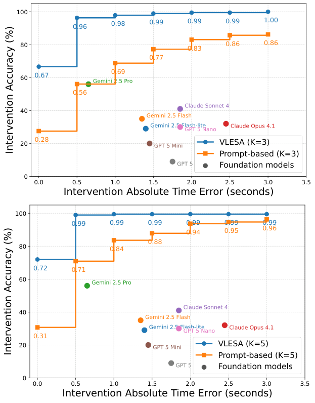

<!-- Start of picture text -->
100 0.96 0.98 0.99 0.99 0.99 1.00 80 0.83 0.86 0.86 0.77 0.69 60 0.67 0.56 40 20 0.28 VLESA (K=3) Prompt-based (K=3) Foundation models 0 0.0 0.5 1.0 1.5 2.0 2.5 3.0 3.5 Intervention Absolute Time Error (seconds) 100 0.99 0.99 0.99 0.9 9 0.9 9 0.99 0.94 0.95 0.96 0.88 80 0.84 0.72 0.71 60 40 0.31 20 VLESA (K=5) Prompt-based (K=5) Foundation models 0 0.0 0.5 1.0 1.5 2.0 2.5 3.0 3.5 Intervention Absolute Time Error (seconds) Intervention Accuracy (%) Intervention Accuracy (%) <!-- End of picture text -->

Figure 5: Pareto fronts of intervention accuracy vs. absolute time error for larger sampling budgets _K_ . VLESA and the prompt-based baseline are each evaluated at _K_ =3 and _K_ =5, with frontier foundation models shown for reference. 

at ∆ _t≤_ 0 _._ 5 s and _≥_ 98% for ∆ _t≥_ 1 _._ 0 s, and by _K_ =5 it saturates at 99% across the entire range ∆ _t≥_ 0 _._ 5 s. In contrast, the prompt-based baseline improves more slowly and still trails substantially at tight windows—reaching only 56% ( _K_ =3) and 71% ( _K_ =5) at ∆ _t≤_ 0 _._ 5 s—and needs ∆ _t≤_ 3 _._ 0 s to approach VLESA-level accuracy (86% at _K_ =3, 96% at _K_ =5). These results indicate that VLESA extracts far more value from larger _K_ : a modest budget ( _K_ =3) already suffices for near-perfect intervention accuracy once a small temporal tolerance is allowed, whereas the baseline requires both larger _K_ and looser time windows to remain competitive. Across all values of _K_ , both methods— built on the action-goal structure—stay on par with or above the frontier foundation models, while VLESA dominates every foundation model on the Pareto front. 

**More Analysis.** The full fronts make three trends explicit. First, VLESA dominates the promptbased baseline at _every_ ( _K,_ ∆ _t_ ) operating point: even VLESA’s weakest configuration ( _K_ =1) exceeds the baseline’s strongest configuration ( _K_ =5) at tight tolerances (43 _._ 4 vs. 30 _._ 7% at ∆ _t_ =0, 72 _._ 0 vs. 70 _._ 9% at ∆ _t≤_ 0 _._ 5 s), and the two fronts never cross. Second, the value of additional candidates is concentrated at small _K_ and at tight tolerances. For VLESA, _K_ =1 _,_ 3 raises ∆ _t_ =0 accuracy by 23 _._ 8 points and ∆ _t≤_ 0 _._ 5 s accuracy by 23 _._ 8 points, whereas _K_ =3 _→_ 5 adds only 4 _._ 8 and 3 _._ 1 points; the baseline shows the same diminishing pattern. This supports our choice of _K_ =3 as a favor- 

17

<!-- Page 18 -->

Table 5: Full intervention-accuracy (%) Pareto fronts on ASIMOV-2.0-Video (189 videos with valid ground truth) for the prompt-based baseline and VLESA, under candidate counts _K ∈{_ 1 _,_ 3 _,_ 5 _}_ . ∆ _t_ is the absolute time-error tolerance in seconds. 

|**Method**|∆_t_=0|0_._5|1_._0|1_._5|2_._0|2_._5|3_._0|
|---|---|---|---|---|---|---|---|
|Prompt-Based,_K_=1|18.5|40.2|46.6|54.0|61.4|64.0|66.1|
|Prompt-Based,_K_=3|27.5|56.1|68.8|77.2|83.1|85.7|86.2|
|Prompt-Based,_K_=5|30.7|70.9|83.6|87.8|93.7|94.7|96.3|
|VLESA (Ours),_K_=1|43.4|72.0|81.0|83.6|88.9|89.4|92.6|
|VLESA (Ours),_K_=3|67.2|95.8|98.4|98.9|98.9|99.5|99.5|
|VLESA (Ours),_K_=5|72.0|98.9|99.5|99.5|99.5|99.5|99.5|

able accuracy–cost operating point. Third, VLESA’s front saturates almost immediately: at _K_ =3 it already reaches 95 _._ 8% within a half-second tolerance and exceeds 98% by ∆ _t_ =1 _._ 0 s, leaving little headroom for larger _K_ or looser tolerances. The prompt-based baseline, by contrast, continues to climb steeply well beyond ∆ _t_ =1 _._ 0 s—e.g., its _K_ =3 accuracy rises from 68 _._ 8% at ∆ _t_ =1 _._ 0 s to 86 _._ 2% at ∆ _t_ =3 _._ 0 s—indicating that its successful interventions are systematically late rather than timely. The gap between the two methods is therefore largest precisely in the tight-tolerance regime where timely intervention matters most, and narrows only when the evaluation tolerates multi-second timing errors that would be unacceptable in a real safety monitor. 

18
